# AMR Analysis Report for LB01_BPW_QG_A1_S3

# Organism Classifications:

## Aeromonas salmonicida
**Strain Statistics:**
- Total genome length: 1110.5 kbp
- Total scaffolds: 1958
- Scaffolds with AMR genes: 263
- Total genes annotated: 2202
- Total AMR genes: 346
- Unique AMR genes: 154
- Distinct AMR mechanisms: 10
- Distinct AMR families: 58
- Distinct drug classes: 35

**Circos Plot:**

### AAC(6')-Iap
- **Mechanism**: antibiotic inactivation
- **Drug Classes**: aminoglycoside antibiotic
- **AMR Family**: AAC(6')
- **Locations**:
  - gnl|SPADES|AKHJOCOO_417_8 : position 7887-8324

### AcrF
- **Mechanism**: antibiotic efflux
- **Drug Classes**: fluoroquinolone antibiotic; cephalosporin; cephamycin; penam
- **AMR Family**: resistance-nodulation-cell division (RND) antibiotic efflux pump
- **Locations**:
  - gnl|SPADES|AKHJOCOO_53204_1 : position 2-250

### AxyY
- **Mechanism**: antibiotic efflux
- **Drug Classes**: macrolide antibiotic; fluoroquinolone antibiotic; aminoglycoside antibiotic; cephalosporin
- **AMR Family**: resistance-nodulation-cell division (RND) antibiotic efflux pump
- **Locations**:
  - gnl|SPADES|AKHJOCOO_29979_1 : position 2-355

### Bifidobacterium bifidum ileS conferring resistance to mupirocin
- **Mechanism**: antibiotic target alteration
- **Drug Classes**: mupirocin-like antibiotic
- **AMR Family**: antibiotic-resistant isoleucyl-tRNA synthetase (ileS)
- **Locations**:
  - gnl|SPADES|AKHJOCOO_3937_3 : position 1246-1941

### Brucella suis mprF
- **Mechanism**: antibiotic target alteration
- **Drug Classes**: peptide antibiotic
- **AMR Family**: defensin resistant mprF
- **Locations**:
  - gnl|SPADES|AKHJOCOO_955_1 : position 1-1140

### CRP (found in 2 locations)
- **Mechanism**: antibiotic efflux
- **Drug Classes**: macrolide antibiotic; fluoroquinolone antibiotic; penam
- **AMR Family**: resistance-nodulation-cell division (RND) antibiotic efflux pump
- **Locations**:
  - gnl|SPADES|AKHJOCOO_1813_5 : position 3670-4425
  - gnl|SPADES|AKHJOCOO_2070_1 : position 218-856

### Chlamydia trachomatis intrinsic murA conferring resistance to fosfomycin (found in 2 locations)
- **Mechanism**: antibiotic target alteration
- **Drug Classes**: phosphonic acid antibiotic
- **AMR Family**: antibiotic-resistant murA transferase
- **Locations**:
  - gnl|SPADES|AKHJOCOO_2910_6 : position 2394-2606
  - gnl|SPADES|AKHJOCOO_2912_6 : position 2393-2605

### Clostridioides difficile gyrA conferring resistance to fluoroquinolones
- **Mechanism**: antibiotic target alteration
- **Drug Classes**: fluoroquinolone antibiotic
- **AMR Family**: fluoroquinolone resistant gyrA
- **Locations**:
  - gnl|SPADES|AKHJOCOO_2400_1 : position 3-2126

### Clostridioides difficile gyrB conferring resistance to fluoroquinolones
- **Mechanism**: antibiotic target alteration
- **Drug Classes**: fluoroquinolone antibiotic
- **AMR Family**: fluoroquinolone resistant gyrB
- **Locations**:
  - gnl|SPADES|AKHJOCOO_710_11 : position 10008-11603

### Corynebacterium striatum tetA (found in 2 locations)
- **Mechanism**: antibiotic efflux
- **Drug Classes**: penam; tetracycline antibiotic
- **AMR Family**: major facilitator superfamily (MFS) antibiotic efflux pump
- **Locations**:
  - gnl|SPADES|AKHJOCOO_39252_1 : position 2-286
  - gnl|SPADES|AKHJOCOO_74640_1 : position 2-205

### EdeQ
- **Mechanism**: antibiotic inactivation
- **Drug Classes**: peptide antibiotic; polyamine antibiotic
- **AMR Family**: Edeine acetyltransferase
- **Locations**:
  - gnl|SPADES|AKHJOCOO_4599_2 : position 660-1151

### Enterococcus faecalis cls with mutation conferring resistance to daptomycin (found in 2 locations)
- **Mechanism**: antibiotic target alteration
- **Drug Classes**: peptide antibiotic
- **AMR Family**: daptomycin resistant cls
- **Locations**:
  - gnl|SPADES|AKHJOCOO_2147_2 : position 548-1801
  - gnl|SPADES|AKHJOCOO_287_2 : position 441-1694

### Escherichia coli AcrAB-TolC with AcrR mutation conferring resistance to ciprofloxacin, tetracycline, and ceftazidime
- **Mechanism**: antibiotic target alteration; antibiotic efflux
- **Drug Classes**: fluoroquinolone antibiotic; cephalosporin; glycylcycline; penam; tetracycline antibiotic; rifamycin antibiotic; phenicol antibiotic; disinfecting agents and antiseptics
- **AMR Family**: resistance-nodulation-cell division (RND) antibiotic efflux pump
- **Locations**:
  - gnl|SPADES|AKHJOCOO_1592_3 : position 1424-2110

### Escherichia coli EF-Tu mutants conferring resistance to Enacyloxin IIa
- **Mechanism**: antibiotic target alteration
- **Drug Classes**: elfamycin antibiotic
- **AMR Family**: elfamycin resistant EF-Tu
- **Locations**:
  - gnl|SPADES|AKHJOCOO_756_3 : position 2217-4913

### Escherichia coli EF-Tu mutants conferring resistance to Pulvomycin (found in 2 locations)
- **Mechanism**: antibiotic target alteration
- **Drug Classes**: elfamycin antibiotic
- **AMR Family**: elfamycin resistant EF-Tu
- **Locations**:
  - gnl|SPADES|AKHJOCOO_2433_2 : position 418-2334
  - gnl|SPADES|AKHJOCOO_408_15 : position 15137-16321

### Escherichia coli UhpT with mutation conferring resistance to fosfomycin
- **Mechanism**: antibiotic target alteration
- **Drug Classes**: phosphonic acid antibiotic
- **AMR Family**: antibiotic-resistant UhpT
- **Locations**:
  - gnl|SPADES|AKHJOCOO_1847_2 : position 592-1998

### Escherichia coli acrA
- **Mechanism**: antibiotic efflux
- **Drug Classes**: fluoroquinolone antibiotic; cephalosporin; glycylcycline; penam; tetracycline antibiotic; rifamycin antibiotic; phenicol antibiotic; disinfecting agents and antiseptics
- **AMR Family**: resistance-nodulation-cell division (RND) antibiotic efflux pump
- **Locations**:
  - gnl|SPADES|AKHJOCOO_1592_4 : position 2209-3390

### EstT
- **Mechanism**: antibiotic inactivation
- **Drug Classes**: macrolide antibiotic
- **AMR Family**: macrolide esterase
- **Locations**:
  - gnl|SPADES|AKHJOCOO_486_17 : position 15858-16448

### FosB
- **Mechanism**: antibiotic inactivation
- **Drug Classes**: phosphonic acid antibiotic
- **AMR Family**: fosfomycin thiol transferase
- **Locations**:
  - gnl|SPADES|AKHJOCOO_952_3 : position 3510-3878

### FosM2 (found in 2 locations)
- **Mechanism**: antibiotic inactivation
- **Drug Classes**: phosphonic acid antibiotic
- **AMR Family**: fosfomycin thiol transferase
- **Locations**:
  - gnl|SPADES|AKHJOCOO_1993_3 : position 1234-1647
  - gnl|SPADES|AKHJOCOO_802_6 : position 4052-4465

### GMB-1 (found in 2 locations)
- **Mechanism**: antibiotic inactivation
- **Drug Classes**: carbapenem
- **AMR Family**: GMB beta-lactamase
- **Locations**:
  - gnl|SPADES|AKHJOCOO_2686_3 : position 2049-2828
  - gnl|SPADES|AKHJOCOO_31253_1 : position 2-343

### Helicobacter pylori pbp1 mutants conferring resistance to amoxicillin
- **Mechanism**: antibiotic target alteration
- **Drug Classes**: cephalosporin; cephamycin; penam
- **AMR Family**: Penicillin-binding protein mutations conferring resistance to beta-lactam antibiotics
- **Locations**:
  - gnl|SPADES|AKHJOCOO_651_5 : position 3826-6180

### Helicobacter pylori rpoB mutation conferring resistance to rifampicin
- **Mechanism**: antibiotic target alteration; antibiotic target replacement
- **Drug Classes**: fluoroquinolone antibiotic; rifamycin antibiotic
- **AMR Family**: rifamycin-resistant beta-subunit of RNA polymerase (rpoB)
- **Locations**:
  - gnl|SPADES|AKHJOCOO_408_7 : position 2928-7232

### Klebsiella pneumoniae KpnH
- **Mechanism**: antibiotic efflux
- **Drug Classes**: macrolide antibiotic; fluoroquinolone antibiotic; aminoglycoside antibiotic; carbapenem; cephalosporin; penam; peptide antibiotic; penem
- **AMR Family**: major facilitator superfamily (MFS) antibiotic efflux pump
- **Locations**:
  - gnl|SPADES|AKHJOCOO_287_13 : position 10263-11816

### Klebsiella pneumoniae OmpK37 (found in 3 locations)
- **Mechanism**: reduced permeability to antibiotic
- **Drug Classes**: monobactam; carbapenem; cephalosporin; cephamycin; penam; penem
- **AMR Family**: General Bacterial Porin with reduced permeability to beta-lactams
- **Locations**:
  - gnl|SPADES|AKHJOCOO_1196_1 : position 3-716
  - gnl|SPADES|AKHJOCOO_7935_1 : position 15-1034
  - gnl|SPADES|AKHJOCOO_8033_1 : position 15-1022

### LpeB
- **Mechanism**: antibiotic efflux
- **Drug Classes**: macrolide antibiotic
- **AMR Family**: resistance-nodulation-cell division (RND) antibiotic efflux pump
- **Locations**:
  - gnl|SPADES|AKHJOCOO_1285_6 : position 4174-4698

### LpsA
- **Mechanism**: reduced permeability to antibiotic
- **Drug Classes**: peptide antibiotic
- **AMR Family**: Intrinsic peptide antibiotic resistant Lps
- **Locations**:
  - gnl|SPADES|AKHJOCOO_2599_3 : position 2050-2733

### MCR-7.1
- **Mechanism**: antibiotic target alteration
- **Drug Classes**: peptide antibiotic
- **AMR Family**: MCR phosphoethanolamine transferase
- **Locations**:
  - gnl|SPADES|AKHJOCOO_2162_1 : position 63-1730

### MexB
- **Mechanism**: antibiotic efflux
- **Drug Classes**: macrolide antibiotic; fluoroquinolone antibiotic; monobactam; carbapenem; cephalosporin; cephamycin; penam; tetracycline antibiotic; peptide antibiotic; aminocoumarin antibiotic; diaminopyrimidine antibiotic; sulfonamide antibiotic; phenicol antibiotic; penem
- **AMR Family**: resistance-nodulation-cell division (RND) antibiotic efflux pump
- **Locations**:
  - gnl|SPADES|AKHJOCOO_2995_4 : position 2227-2535

### MexH (found in 2 locations)
- **Mechanism**: antibiotic efflux
- **Drug Classes**: fluoroquinolone antibiotic; tetracycline antibiotic; disinfecting agents and antiseptics
- **AMR Family**: resistance-nodulation-cell division (RND) antibiotic efflux pump
- **Locations**:
  - gnl|SPADES|AKHJOCOO_1930_1 : position 3-1070
  - gnl|SPADES|AKHJOCOO_1931_1 : position 3-1070

### MexI
- **Mechanism**: antibiotic efflux
- **Drug Classes**: fluoroquinolone antibiotic; tetracycline antibiotic; disinfecting agents and antiseptics
- **AMR Family**: resistance-nodulation-cell division (RND) antibiotic efflux pump
- **Locations**:
  - gnl|SPADES|AKHJOCOO_9447_1 : position 2-892

### MexS (found in 4 locations)
- **Mechanism**: antibiotic efflux
- **Drug Classes**: fluoroquinolone antibiotic; diaminopyrimidine antibiotic; phenicol antibiotic
- **AMR Family**: resistance-nodulation-cell division (RND) antibiotic efflux pump
- **Locations**:
  - gnl|SPADES|AKHJOCOO_1773_2 : position 724-1728
  - gnl|SPADES|AKHJOCOO_3199_3 : position 1614-2366
  - gnl|SPADES|AKHJOCOO_495_11 : position 13923-15050
  - gnl|SPADES|AKHJOCOO_8347_2 : position 357-989

### MexT (found in 2 locations)
- **Mechanism**: antibiotic efflux
- **Drug Classes**: fluoroquinolone antibiotic; diaminopyrimidine antibiotic; phenicol antibiotic
- **AMR Family**: resistance-nodulation-cell division (RND) antibiotic efflux pump
- **Locations**:
  - gnl|SPADES|AKHJOCOO_1530_2 : position 2556-3476
  - gnl|SPADES|AKHJOCOO_4081_2 : position 547-1458

### MexW
- **Mechanism**: antibiotic efflux
- **Drug Classes**: macrolide antibiotic; fluoroquinolone antibiotic; tetracycline antibiotic; phenicol antibiotic; disinfecting agents and antiseptics
- **AMR Family**: resistance-nodulation-cell division (RND) antibiotic efflux pump
- **Locations**:
  - gnl|SPADES|AKHJOCOO_67894_1 : position 2-220

### Morganella morganii gyrB conferring resistance to fluoroquinolones
- **Mechanism**: antibiotic target alteration
- **Drug Classes**: fluoroquinolone antibiotic
- **AMR Family**: fluoroquinolone resistant gyrB
- **Locations**:
  - gnl|SPADES|AKHJOCOO_36212_1 : position 2-304

### MuxA
- **Mechanism**: antibiotic efflux
- **Drug Classes**: macrolide antibiotic; monobactam; tetracycline antibiotic; aminocoumarin antibiotic
- **AMR Family**: resistance-nodulation-cell division (RND) antibiotic efflux pump
- **Locations**:
  - gnl|SPADES|AKHJOCOO_1285_2 : position 842-1891

### Mycobacterium tuberculosis katG mutations conferring resistance to isoniazid
- **Mechanism**: antibiotic target alteration
- **Drug Classes**: isoniazid-like antibiotic
- **AMR Family**: isoniazid resistant katG
- **Locations**:
  - gnl|SPADES|AKHJOCOO_1096_8 : position 5210-7345

### Mycobacterium tuberculosis ndh with mutation conferring resistance to isoniazid
- **Mechanism**: antibiotic target alteration
- **Drug Classes**: isoniazid-like antibiotic
- **AMR Family**: antibiotic resistant ndh
- **Locations**:
  - gnl|SPADES|AKHJOCOO_4244_1 : position 3-1166

### Mycobacterium tuberculosis pncA mutations conferring resistance to pyrazinamide
- **Mechanism**: antibiotic target alteration
- **Drug Classes**: pyrazine antibiotic
- **AMR Family**: Pyrazinamide resistant pncA
- **Locations**:
  - gnl|SPADES|AKHJOCOO_1000_2 : position 527-1162

### Mycobacterium tuberculosis rpoB mutations conferring resistance to rifampicin
- **Mechanism**: antibiotic target alteration; antibiotic target replacement
- **Drug Classes**: rifamycin antibiotic
- **AMR Family**: rifamycin-resistant beta-subunit of RNA polymerase (rpoB)
- **Locations**:
  - gnl|SPADES|AKHJOCOO_408_8 : position 7324-11352

### NmcR (found in 7 locations)
- **Mechanism**: antibiotic inactivation
- **Drug Classes**: carbapenem; cephalosporin; cephamycin; penam
- **AMR Family**: NmcA beta-lactamase
- **Locations**:
  - gnl|SPADES|AKHJOCOO_287_22 : position 21310-22152
  - gnl|SPADES|AKHJOCOO_3576_1 : position 3-824
  - gnl|SPADES|AKHJOCOO_4393_1 : position 3-782
  - gnl|SPADES|AKHJOCOO_5302_2 : position 287-1195
  - gnl|SPADES|AKHJOCOO_5901_1 : position 209-1129
  - gnl|SPADES|AKHJOCOO_738_3 : position 2403-3278
  - gnl|SPADES|AKHJOCOO_978_1 : position 212-1132

### Nocardia farcinica rox (found in 2 locations)
- **Mechanism**: antibiotic inactivation
- **Drug Classes**: rifamycin antibiotic
- **AMR Family**: rifampin monooxygenase
- **Locations**:
  - gnl|SPADES|AKHJOCOO_4875_3 : position 745-1590
  - gnl|SPADES|AKHJOCOO_6042_2 : position 723-1301

### OmpA (found in 11 locations)
- **Mechanism**: reduced permeability to antibiotic
- **Drug Classes**: peptide antibiotic
- **AMR Family**: General Bacterial Porin with reduced permeability to peptide antibiotics
- **Locations**:
  - gnl|SPADES|AKHJOCOO_1659_2 : position 973-1629
  - gnl|SPADES|AKHJOCOO_1731_4 : position 2513-3001
  - gnl|SPADES|AKHJOCOO_1744_1 : position 2-559
  - gnl|SPADES|AKHJOCOO_1744_2 : position 773-1831
  - gnl|SPADES|AKHJOCOO_1993_2 : position 285-1160
  - gnl|SPADES|AKHJOCOO_26944_1 : position 23-385
  - gnl|SPADES|AKHJOCOO_26950_1 : position 3-365
  - gnl|SPADES|AKHJOCOO_3004_3 : position 911-1567
  - gnl|SPADES|AKHJOCOO_4504_1 : position 243-1301
  - gnl|SPADES|AKHJOCOO_53674_1 : position 2-247
  - gnl|SPADES|AKHJOCOO_802_7 : position 4539-5414

### OprM (found in 2 locations)
- **Mechanism**: antibiotic efflux
- **Drug Classes**: macrolide antibiotic; fluoroquinolone antibiotic; monobactam; aminoglycoside antibiotic; carbapenem; cephalosporin; cephamycin; penam; tetracycline antibiotic; peptide antibiotic; aminocoumarin antibiotic; diaminopyrimidine antibiotic; sulfonamide antibiotic; phenicol antibiotic; penem; disinfecting agents and antiseptics
- **AMR Family**: resistance-nodulation-cell division (RND) antibiotic efflux pump
- **Locations**:
  - gnl|SPADES|AKHJOCOO_18217_1 : position 2-310
  - gnl|SPADES|AKHJOCOO_2906_2 : position 1459-2610

### PAM-1
- **Mechanism**: antibiotic inactivation
- **Drug Classes**: carbapenem; cephalosporin
- **AMR Family**: PAM beta-lactamase
- **Locations**:
  - gnl|SPADES|AKHJOCOO_3035_2 : position 214-858

### ParR
- **Mechanism**: antibiotic efflux; reduced permeability to antibiotic
- **Drug Classes**: macrolide antibiotic; fluoroquinolone antibiotic; monobactam; aminoglycoside antibiotic; carbapenem; cephalosporin; cephamycin; penam; tetracycline antibiotic; phenicol antibiotic; penem; disinfecting agents and antiseptics
- **AMR Family**: resistance-nodulation-cell division (RND) antibiotic efflux pump; Outer Membrane Porin (Opr)
- **Locations**:
  - gnl|SPADES|AKHJOCOO_2164_4 : position 3150-3632

### ParS (found in 3 locations)
- **Mechanism**: antibiotic efflux; reduced permeability to antibiotic
- **Drug Classes**: macrolide antibiotic; fluoroquinolone antibiotic; monobactam; aminoglycoside antibiotic; carbapenem; cephalosporin; cephamycin; penam; tetracycline antibiotic; phenicol antibiotic; penem; disinfecting agents and antiseptics
- **AMR Family**: resistance-nodulation-cell division (RND) antibiotic efflux pump; Outer Membrane Porin (Opr)
- **Locations**:
  - gnl|SPADES|AKHJOCOO_22437_1 : position 1-414
  - gnl|SPADES|AKHJOCOO_2303_6 : position 2764-3360
  - gnl|SPADES|AKHJOCOO_9163_1 : position 205-915

### PmpM
- **Mechanism**: antibiotic efflux
- **Drug Classes**: fluoroquinolone antibiotic; aminoglycoside antibiotic; disinfecting agents and antiseptics
- **AMR Family**: multidrug and toxic compound extrusion (MATE) transporter
- **Locations**:
  - gnl|SPADES|AKHJOCOO_2097_4 : position 2338-3717

### PmrF
- **Mechanism**: antibiotic target alteration
- **Drug Classes**: peptide antibiotic
- **AMR Family**: pmr phosphoethanolamine transferase
- **Locations**:
  - gnl|SPADES|AKHJOCOO_356_16 : position 18570-19604

### Pseudomonas aeruginosa CpxR
- **Mechanism**: antibiotic efflux
- **Drug Classes**: macrolide antibiotic; fluoroquinolone antibiotic; monobactam; aminoglycoside antibiotic; carbapenem; cephalosporin; cephamycin; penam; tetracycline antibiotic; peptide antibiotic; aminocoumarin antibiotic; diaminopyrimidine antibiotic; sulfonamide antibiotic; phenicol antibiotic; penem
- **AMR Family**: resistance-nodulation-cell division (RND) antibiotic efflux pump
- **Locations**:
  - gnl|SPADES|AKHJOCOO_791_8 : position 5925-6620

### Pseudomonas aeruginosa ampR with mutation conferring resistance to aztreonam
- **Mechanism**: antibiotic target alteration; antibiotic inactivation
- **Drug Classes**: monobactam; carbapenem; cephalosporin
- **AMR Family**: PDC beta-lactamase; ampR transcriptional regulator with mutation conferring resistance to monobactam antibiotics
- **Locations**:
  - gnl|SPADES|AKHJOCOO_1864_4 : position 2792-3739

### QepA4 (found in 2 locations)
- **Mechanism**: antibiotic efflux
- **Drug Classes**: fluoroquinolone antibiotic
- **AMR Family**: major facilitator superfamily (MFS) antibiotic efflux pump
- **Locations**:
  - gnl|SPADES|AKHJOCOO_1530_3 : position 3667-5061
  - gnl|SPADES|AKHJOCOO_2432_2 : position 826-2034

### RanA (found in 9 locations)
- **Mechanism**: antibiotic efflux
- **Drug Classes**: aminoglycoside antibiotic
- **AMR Family**: ATP-binding cassette (ABC) antibiotic efflux pump
- **Locations**:
  - gnl|SPADES|AKHJOCOO_1701_4 : position 3162-4823
  - gnl|SPADES|AKHJOCOO_1864_3 : position 1539-2606
  - gnl|SPADES|AKHJOCOO_2282_2 : position 1725-3386
  - gnl|SPADES|AKHJOCOO_2879_3 : position 1907-2635
  - gnl|SPADES|AKHJOCOO_3083_2 : position 549-1547
  - gnl|SPADES|AKHJOCOO_368_12 : position 11946-13028
  - gnl|SPADES|AKHJOCOO_7352_1 : position 2-736
  - gnl|SPADES|AKHJOCOO_853_11 : position 7570-8568
  - gnl|SPADES|AKHJOCOO_9851_1 : position 2-670

### RanB (found in 2 locations)
- **Mechanism**: antibiotic efflux
- **Drug Classes**: aminoglycoside antibiotic
- **AMR Family**: ATP-binding cassette (ABC) antibiotic efflux pump
- **Locations**:
  - gnl|SPADES|AKHJOCOO_2910_1 : position 3-710
  - gnl|SPADES|AKHJOCOO_2912_1 : position 3-710

### RlmA(II)
- **Mechanism**: antibiotic target alteration
- **Drug Classes**: macrolide antibiotic; lincosamide antibiotic
- **AMR Family**: non-erm 23S ribosomal RNA methyltransferase (G748)
- **Locations**:
  - gnl|SPADES|AKHJOCOO_11191_1 : position 13-771

### Staphylococcus aureus fusA with mutation conferring resistance to fusidic acid
- **Mechanism**: antibiotic target alteration
- **Drug Classes**: fusidane antibiotic
- **AMR Family**: antibiotic resistant fusA
- **Locations**:
  - gnl|SPADES|AKHJOCOO_408_16 : position 16376-18481

### Staphylococcus aureus murA with mutation conferring resistance to fosfomycin
- **Mechanism**: antibiotic target alteration
- **Drug Classes**: phosphonic acid antibiotic
- **AMR Family**: antibiotic-resistant murA transferase
- **Locations**:
  - gnl|SPADES|AKHJOCOO_2268_1 : position 3-1097

### Streptomyces venezuelae rox
- **Mechanism**: antibiotic inactivation
- **Drug Classes**: rifamycin antibiotic
- **AMR Family**: rifampin monooxygenase
- **Locations**:
  - gnl|SPADES|AKHJOCOO_34366_1 : position 1-318

### TRU-1 (found in 2 locations)
- **Mechanism**: antibiotic inactivation
- **Drug Classes**: cephalosporin; penam
- **AMR Family**: TRU beta-lactamase
- **Locations**:
  - gnl|SPADES|AKHJOCOO_1699_2: position 761-1909
  - gnl|SPADES|AKHJOCOO_845_9: position 6945-8093

### TaeA
- **Mechanism**: antibiotic efflux
- **Drug Classes**: pleuromutilin antibiotic
- **AMR Family**: ATP-binding cassette (ABC) antibiotic efflux pump
- **Locations**:
  - gnl|SPADES|AKHJOCOO_4760_3 : position 551-1633

### TolC (found in 2 locations)
- **Mechanism**: antibiotic efflux
- **Drug Classes**: macrolide antibiotic; fluoroquinolone antibiotic; aminoglycoside antibiotic; carbapenem; cephalosporin; glycylcycline; cephamycin; penam; tetracycline antibiotic; peptide antibiotic; aminocoumarin antibiotic; rifamycin antibiotic; phenicol antibiotic; penem; disinfecting agents and antiseptics
- **AMR Family**: ATP-binding cassette (ABC) antibiotic efflux pump; major facilitator superfamily (MFS) antibiotic efflux pump; resistance-nodulation-cell division (RND) antibiotic efflux pump
- **Locations**:
  - gnl|SPADES|AKHJOCOO_2369_1 : position 3-1106
  - gnl|SPADES|AKHJOCOO_35286_1 : position 3-275

### TriB (found in 2 locations)
- **Mechanism**: antibiotic efflux
- **Drug Classes**: disinfecting agents and antiseptics
- **AMR Family**: resistance-nodulation-cell division (RND) antibiotic efflux pump
- **Locations**:
  - gnl|SPADES|AKHJOCOO_1349_2 : position 411-1457
  - gnl|SPADES|AKHJOCOO_7186_1 : position 3-758

### TxR (found in 16 locations)
- **Mechanism**: antibiotic efflux
- **Drug Classes**: tetracycline antibiotic
- **AMR Family**: ATP-binding cassette (ABC) antibiotic efflux pump
- **Locations**:
  - gnl|SPADES|AKHJOCOO_10304_1 : position 3-641
  - gnl|SPADES|AKHJOCOO_1205_1 : position 3-866
  - gnl|SPADES|AKHJOCOO_1258_1 : position 3-1358
  - gnl|SPADES|AKHJOCOO_1731_1 : position 2-496
  - gnl|SPADES|AKHJOCOO_19570_1 : position 3-494
  - gnl|SPADES|AKHJOCOO_2167_2 : position 1220-2638
  - gnl|SPADES|AKHJOCOO_2195_2 : position 900-2318
  - gnl|SPADES|AKHJOCOO_2218_4 : position 1865-3208
  - gnl|SPADES|AKHJOCOO_30578_1 : position 2-349
  - gnl|SPADES|AKHJOCOO_30580_1 : position 2-349
  - gnl|SPADES|AKHJOCOO_4176_1 : position 227-1843
  - gnl|SPADES|AKHJOCOO_52264_1 : position 2-250
  - gnl|SPADES|AKHJOCOO_539_11 : position 7894-9174
  - gnl|SPADES|AKHJOCOO_5708_1 : position 1-711
  - gnl|SPADES|AKHJOCOO_60838_1 : position 3-233
  - gnl|SPADES|AKHJOCOO_853_5 : position 2632-3663

### YojI (found in 3 locations)
- **Mechanism**: antibiotic efflux
- **Drug Classes**: peptide antibiotic
- **AMR Family**: ATP-binding cassette (ABC) antibiotic efflux pump
- **Locations**:
  - gnl|SPADES|AKHJOCOO_1936_4 : position 1496-2137
  - gnl|SPADES|AKHJOCOO_2879_2 : position 214-1860
  - gnl|SPADES|AKHJOCOO_2980_2 : position 401-1042

### acrB (found in 2 locations)
- **Mechanism**: antibiotic efflux
- **Drug Classes**: fluoroquinolone antibiotic; cephalosporin; glycylcycline; penam; tetracycline antibiotic; rifamycin antibiotic; phenicol antibiotic; disinfecting agents and antiseptics
- **AMR Family**: resistance-nodulation-cell division (RND) antibiotic efflux pump
- **Locations**:
  - gnl|SPADES|AKHJOCOO_1592_5 : position 3408-5144
  - gnl|SPADES|AKHJOCOO_2906_1 : position 3-1466

### adeB (found in 2 locations)
- **Mechanism**: antibiotic efflux
- **Drug Classes**: glycylcycline; tetracycline antibiotic
- **AMR Family**: resistance-nodulation-cell division (RND) antibiotic efflux pump
- **Locations**:
  - gnl|SPADES|AKHJOCOO_1930_2 : position 1144-4179
  - gnl|SPADES|AKHJOCOO_1931_2 : position 1144-4179

### adeL (found in 19 locations)
- **Mechanism**: antibiotic efflux
- **Drug Classes**: fluoroquinolone antibiotic; tetracycline antibiotic
- **AMR Family**: resistance-nodulation-cell division (RND) antibiotic efflux pump
- **Locations**:
  - gnl|SPADES|AKHJOCOO_1713_4 : position 2737-3642
  - gnl|SPADES|AKHJOCOO_19683_1 : position 1-492
  - gnl|SPADES|AKHJOCOO_2042_4 : position 2262-3167
  - gnl|SPADES|AKHJOCOO_2153_4 : position 3015-3647
  - gnl|SPADES|AKHJOCOO_2432_1 : position 1-732
  - gnl|SPADES|AKHJOCOO_2686_2 : position 1021-1920
  - gnl|SPADES|AKHJOCOO_287_11 : position 8212-9114
  - gnl|SPADES|AKHJOCOO_30184_1 : position 1-354
  - gnl|SPADES|AKHJOCOO_3199_2 : position 641-1513
  - gnl|SPADES|AKHJOCOO_3605_3 : position 1373-2116
  - gnl|SPADES|AKHJOCOO_4210_2 : position 639-1541
  - gnl|SPADES|AKHJOCOO_493_3 : position 3036-3932
  - gnl|SPADES|AKHJOCOO_493_7 : position 7665-8564
  - gnl|SPADES|AKHJOCOO_495_12 : position 15171-16076
  - gnl|SPADES|AKHJOCOO_52768_1 : position 2-166
  - gnl|SPADES|AKHJOCOO_5930_2 : position 168-1076
  - gnl|SPADES|AKHJOCOO_5934_2 : position 168-1076
  - gnl|SPADES|AKHJOCOO_698_2 : position 502-1398
  - gnl|SPADES|AKHJOCOO_868_2 : position 855-1727

### adeR
- **Mechanism**: antibiotic efflux
- **Drug Classes**: glycylcycline; tetracycline antibiotic
- **AMR Family**: resistance-nodulation-cell division (RND) antibiotic efflux pump
- **Locations**:
  - gnl|SPADES|AKHJOCOO_7063_2 : position 945-1142

### almE (found in 5 locations)
- **Mechanism**: antibiotic target alteration
- **Drug Classes**: peptide antibiotic
- **AMR Family**: polymyxin resistance operon; alm glycyltransferase
- **Locations**:
  - gnl|SPADES|AKHJOCOO_14333_1 : position 2-631
  - gnl|SPADES|AKHJOCOO_14644_1 : position 3-620
  - gnl|SPADES|AKHJOCOO_23551_1 : position 2-427
  - gnl|SPADES|AKHJOCOO_4913_1 : position 3-1580
  - gnl|SPADES|AKHJOCOO_5228_1 : position 3-1334

### arlR (found in 2 locations)
- **Mechanism**: antibiotic efflux
- **Drug Classes**: fluoroquinolone antibiotic; disinfecting agents and antiseptics
- **AMR Family**: major facilitator superfamily (MFS) antibiotic efflux pump
- **Locations**:
  - gnl|SPADES|AKHJOCOO_5503_2 : position 900-1424
  - gnl|SPADES|AKHJOCOO_983_3 : position 1996-2685

### arnA
- **Mechanism**: antibiotic target alteration
- **Drug Classes**: peptide antibiotic
- **AMR Family**: pmr phosphoethanolamine transferase
- **Locations**:
  - gnl|SPADES|AKHJOCOO_2218_2 : position 191-838

### baeS
- **Mechanism**: antibiotic efflux
- **Drug Classes**: aminoglycoside antibiotic; aminocoumarin antibiotic
- **AMR Family**: resistance-nodulation-cell division (RND) antibiotic efflux pump
- **Locations**:
  - gnl|SPADES|AKHJOCOO_1009_1 : position 45-1934

### basS
- **Mechanism**: antibiotic target alteration; antibiotic efflux
- **Drug Classes**: peptide antibiotic
- **AMR Family**: pmr phosphoethanolamine transferase
- **Locations**:
  - gnl|SPADES|AKHJOCOO_539_3 : position 2444-3793

### bcr-1 (found in 5 locations)
- **Mechanism**: antibiotic efflux
- **Drug Classes**: bicyclomycin-like antibiotic
- **AMR Family**: major facilitator superfamily (MFS) antibiotic efflux pump
- **Locations**:
  - gnl|SPADES|AKHJOCOO_1122_1 : position 3-815
  - gnl|SPADES|AKHJOCOO_1191_2 : position 756-1955
  - gnl|SPADES|AKHJOCOO_1406_3 : position 1913-3115
  - gnl|SPADES|AKHJOCOO_1699_3 : position 2223-3401
  - gnl|SPADES|AKHJOCOO_845_8 : position 5471-6643

### bcrC
- **Mechanism**: antibiotic target alteration
- **Drug Classes**: peptide antibiotic
- **AMR Family**: undecaprenyl pyrophosphate related proteins
- **Locations**:
  - gnl|SPADES|AKHJOCOO_2100_4 : position 2743-3519

### cdeA
- **Mechanism**: antibiotic efflux
- **Drug Classes**: fluoroquinolone antibiotic; disinfecting agents and antiseptics
- **AMR Family**: multidrug and toxic compound extrusion (MATE) transporter
- **Locations**:
  - gnl|SPADES|AKHJOCOO_493_12 : position 11411-12745

### clbB
- **Mechanism**: antibiotic target alteration
- **Drug Classes**: lincosamide antibiotic; streptogramin antibiotic; streptogramin A antibiotic; oxazolidinone antibiotic; phenicol antibiotic; pleuromutilin antibiotic
- **AMR Family**: Cfr 23S ribosomal RNA methyltransferase
- **Locations**:
  - gnl|SPADES|AKHJOCOO_423_5 : position 3825-4928

### cmlv (found in 2 locations)
- **Mechanism**: antibiotic inactivation
- **Drug Classes**: phenicol antibiotic
- **AMR Family**: chloramphenicol phosphotransferase
- **Locations**:
  - gnl|SPADES|AKHJOCOO_7582_2 : position 596-1075
  - gnl|SPADES|AKHJOCOO_8072_2 : position 540-1019

### cprR (found in 2 locations)
- **Mechanism**: antibiotic target alteration; antibiotic efflux
- **Drug Classes**: peptide antibiotic
- **AMR Family**: pmr phosphoethanolamine transferase
- **Locations**:
  - gnl|SPADES|AKHJOCOO_3119_2 : position 342-1010
  - gnl|SPADES|AKHJOCOO_554_11 : position 10137-10805

### cprS (found in 2 locations)
- **Mechanism**: antibiotic target alteration; antibiotic efflux
- **Drug Classes**: peptide antibiotic
- **AMR Family**: pmr phosphoethanolamine transferase
- **Locations**:
  - gnl|SPADES|AKHJOCOO_5142_2 : position 802-1509
  - gnl|SPADES|AKHJOCOO_554_12 : position 10802-12160

### cpxA (found in 7 locations)
- **Mechanism**: antibiotic efflux
- **Drug Classes**: aminoglycoside antibiotic; aminocoumarin antibiotic
- **AMR Family**: resistance-nodulation-cell division (RND) antibiotic efflux pump
- **Locations**:
  - gnl|SPADES|AKHJOCOO_1349_6 : position 5648-6142
  - gnl|SPADES|AKHJOCOO_1659_7 : position 4237-4947
  - gnl|SPADES|AKHJOCOO_29518_1 : position 114-359
  - gnl|SPADES|AKHJOCOO_3611_2 : position 847-2112
  - gnl|SPADES|AKHJOCOO_43396_1 : position 3-272
  - gnl|SPADES|AKHJOCOO_4358_1 : position 2-496
  - gnl|SPADES|AKHJOCOO_791_9 : position 6617-7972

### efrA
- **Mechanism**: antibiotic efflux
- **Drug Classes**: macrolide antibiotic; fluoroquinolone antibiotic; rifamycin antibiotic
- **AMR Family**: ATP-binding cassette (ABC) antibiotic efflux pump
- **Locations**:
  - gnl|SPADES|AKHJOCOO_1940_4 : position 3422-4165

### efrB
- **Mechanism**: antibiotic efflux
- **Drug Classes**: macrolide antibiotic; fluoroquinolone antibiotic; rifamycin antibiotic
- **AMR Family**: ATP-binding cassette (ABC) antibiotic efflux pump
- **Locations**:
  - gnl|SPADES|AKHJOCOO_1729_3 : position 2781-4745

### evgA (found in 10 locations)
- **Mechanism**: antibiotic efflux
- **Drug Classes**: macrolide antibiotic; fluoroquinolone antibiotic; penam; tetracycline antibiotic
- **AMR Family**: major facilitator superfamily (MFS) antibiotic efflux pump; resistance-nodulation-cell division (RND) antibiotic efflux pump
- **Locations**:
  - gnl|SPADES|AKHJOCOO_10277_1 : position 617-829
  - gnl|SPADES|AKHJOCOO_1580_3 : position 868-1458
  - gnl|SPADES|AKHJOCOO_21277_1 : position 3-464
  - gnl|SPADES|AKHJOCOO_2728_2 : position 2357-2785
  - gnl|SPADES|AKHJOCOO_2774_1 : position 3-269
  - gnl|SPADES|AKHJOCOO_2859_1 : position 3-431
  - gnl|SPADES|AKHJOCOO_356_11 : position 13195-13839
  - gnl|SPADES|AKHJOCOO_385_2 : position 4007-4630
  - gnl|SPADES|AKHJOCOO_385_4 : position 5222-5845
  - gnl|SPADES|AKHJOCOO_832_6 : position 4721-5311

### evgS (found in 12 locations)
- **Mechanism**: antibiotic efflux
- **Drug Classes**: macrolide antibiotic; fluoroquinolone antibiotic; penam; tetracycline antibiotic
- **AMR Family**: major facilitator superfamily (MFS) antibiotic efflux pump; resistance-nodulation-cell division (RND) antibiotic efflux pump
- **Locations**:
  - gnl|SPADES|AKHJOCOO_1051_7 : position 6366-7889
  - gnl|SPADES|AKHJOCOO_1852_3 : position 3288-4388
  - gnl|SPADES|AKHJOCOO_3344_1 : position 3-2273
  - gnl|SPADES|AKHJOCOO_3589_1 : position 3-1526
  - gnl|SPADES|AKHJOCOO_385_1 : position 383-3997
  - gnl|SPADES|AKHJOCOO_385_5 : position 5842-9432
  - gnl|SPADES|AKHJOCOO_5290_1 : position 3-941
  - gnl|SPADES|AKHJOCOO_5829_1 : position 24-1352
  - gnl|SPADES|AKHJOCOO_60876_1 : position 3-233
  - gnl|SPADES|AKHJOCOO_66853_1 : position 2-220
  - gnl|SPADES|AKHJOCOO_66857_1 : position 2-220
  - gnl|SPADES|AKHJOCOO_832_8 : position 6723-8819

### facT (found in 2 locations)
- **Mechanism**: antibiotic efflux
- **Drug Classes**: elfamycin antibiotic
- **AMR Family**: major facilitator superfamily (MFS) antibiotic efflux pump
- **Locations**:
  - gnl|SPADES|AKHJOCOO_2406_2 : position 1282-2670
  - gnl|SPADES|AKHJOCOO_3916_1 : position 33-1421

### farA
- **Mechanism**: antibiotic efflux
- **Drug Classes**: antibacterial free fatty acids
- **AMR Family**: major facilitator superfamily (MFS) antibiotic efflux pump
- **Locations**:
  - gnl|SPADES|AKHJOCOO_287_12 : position 9211-10263

### fexA
- **Mechanism**: antibiotic efflux
- **Drug Classes**: phenicol antibiotic
- **AMR Family**: major facilitator superfamily (MFS) antibiotic efflux pump
- **Locations**:
  - gnl|SPADES|AKHJOCOO_1889_1 : position 3-722

### gadW
- **Mechanism**: antibiotic efflux
- **Drug Classes**: macrolide antibiotic; fluoroquinolone antibiotic; penam
- **AMR Family**: resistance-nodulation-cell division (RND) antibiotic efflux pump
- **Locations**:
  - gnl|SPADES|AKHJOCOO_923_5 : position 7257-8060

### gadX
- **Mechanism**: antibiotic efflux
- **Drug Classes**: macrolide antibiotic; fluoroquinolone antibiotic; penam
- **AMR Family**: resistance-nodulation-cell division (RND) antibiotic efflux pump
- **Locations**:
  - gnl|SPADES|AKHJOCOO_2498_2 : position 1374-2249

### golS (found in 2 locations)
- **Mechanism**: antibiotic efflux
- **Drug Classes**: monobactam; carbapenem; cephalosporin; cephamycin; penam; phenicol antibiotic; penem
- **AMR Family**: resistance-nodulation-cell division (RND) antibiotic efflux pump
- **Locations**:
  - gnl|SPADES|AKHJOCOO_2333_1 : position 324-701
  - gnl|SPADES|AKHJOCOO_417_13 : position 14245-14658

### hmrM (found in 2 locations)
- **Mechanism**: antibiotic efflux
- **Drug Classes**: fluoroquinolone antibiotic; disinfecting agents and antiseptics
- **AMR Family**: multidrug and toxic compound extrusion (MATE) transporter
- **Locations**:
  - gnl|SPADES|AKHJOCOO_1437_7 : position 4149-5528
  - gnl|SPADES|AKHJOCOO_1926_2 : position 1586-2938

### hp1181
- **Mechanism**: antibiotic efflux
- **Drug Classes**: fluoroquinolone antibiotic; tetracycline antibiotic; nitroimidazole antibiotic
- **AMR Family**: major facilitator superfamily (MFS) antibiotic efflux pump
- **Locations**:
  - gnl|SPADES|AKHJOCOO_1756_5 : position 2505-3866

### kdpD
- **Mechanism**: antibiotic efflux
- **Drug Classes**: aminoglycoside antibiotic
- **AMR Family**: kdpDE
- **Locations**:
  - gnl|SPADES|AKHJOCOO_6275_2 : position 659-1261

### kdpE
- **Mechanism**: antibiotic efflux
- **Drug Classes**: aminoglycoside antibiotic
- **AMR Family**: kdpDE
- **Locations**:
  - gnl|SPADES|AKHJOCOO_864_9 : position 9016-9561

### leuO (found in 5 locations)
- **Mechanism**: antibiotic efflux
- **Drug Classes**: nucleoside antibiotic; disinfecting agents and antiseptics
- **AMR Family**: major facilitator superfamily (MFS) antibiotic efflux pump
- **Locations**:
  - gnl|SPADES|AKHJOCOO_1699_4 : position 3410-4372
  - gnl|SPADES|AKHJOCOO_287_6 : position 4238-5206
  - gnl|SPADES|AKHJOCOO_3975_2 : position 368-1279
  - gnl|SPADES|AKHJOCOO_845_3 : position 1380-2396
  - gnl|SPADES|AKHJOCOO_845_7 : position 4490-5452

### lmrC (found in 4 locations)
- **Mechanism**: antibiotic target protection
- **Drug Classes**: lincosamide antibiotic
- **AMR Family**: Miscellaneous ABC-F subfamily ATP-binding cassette ribosomal protection proteins
- **Locations**:
  - gnl|SPADES|AKHJOCOO_1258_4 : position 2625-3320
  - gnl|SPADES|AKHJOCOO_26509_1 : position 2-391
  - gnl|SPADES|AKHJOCOO_356_2 : position 602-2335
  - gnl|SPADES|AKHJOCOO_624_5 : position 4004-4768

### lmrP
- **Mechanism**: antibiotic efflux
- **Drug Classes**: macrolide antibiotic; lincosamide antibiotic; streptogramin antibiotic; streptogramin A antibiotic; tetracycline antibiotic
- **AMR Family**: major facilitator superfamily (MFS) antibiotic efflux pump
- **Locations**:
  - gnl|SPADES|AKHJOCOO_756_8 : position 9220-10440

### lsaC
- **Mechanism**: antibiotic target protection
- **Drug Classes**: lincosamide antibiotic; streptogramin antibiotic; pleuromutilin antibiotic
- **AMR Family**: lsa-type ABC-F protein
- **Locations**:
  - gnl|SPADES|AKHJOCOO_351_3 : position 1843-2493

### macB (found in 13 locations)
- **Mechanism**: antibiotic efflux
- **Drug Classes**: macrolide antibiotic
- **AMR Family**: ATP-binding cassette (ABC) antibiotic efflux pump
- **Locations**:
  - gnl|SPADES|AKHJOCOO_1127_1 : position 329-1162
  - gnl|SPADES|AKHJOCOO_1378_4 : position 3548-4210
  - gnl|SPADES|AKHJOCOO_1409_3 : position 1745-2434
  - gnl|SPADES|AKHJOCOO_1489_4 : position 4724-5422
  - gnl|SPADES|AKHJOCOO_1645_3 : position 2177-3757
  - gnl|SPADES|AKHJOCOO_1936_5 : position 2137-2925
  - gnl|SPADES|AKHJOCOO_2622_4 : position 1973-2716
  - gnl|SPADES|AKHJOCOO_2869_1 : position 3-962
  - gnl|SPADES|AKHJOCOO_3072_2 : position 381-1121
  - gnl|SPADES|AKHJOCOO_3082_2 : position 111-2060
  - gnl|SPADES|AKHJOCOO_3418_1 : position 2-304
  - gnl|SPADES|AKHJOCOO_710_5 : position 3863-4597
  - gnl|SPADES|AKHJOCOO_908_5 : position 6290-6988

### mdsB
- **Mechanism**: antibiotic efflux
- **Drug Classes**: monobactam; carbapenem; cephalosporin; cephamycin; penam; phenicol antibiotic; penem
- **AMR Family**: resistance-nodulation-cell division (RND) antibiotic efflux pump
- **Locations**:
  - gnl|SPADES|AKHJOCOO_1349_1 : position 3-395

### mdtC
- **Mechanism**: antibiotic efflux
- **Drug Classes**: aminocoumarin antibiotic
- **AMR Family**: resistance-nodulation-cell division (RND) antibiotic efflux pump
- **Locations**:
  - gnl|SPADES|AKHJOCOO_11455_1 : position 3-398

### mdtN (found in 2 locations)
- **Mechanism**: antibiotic efflux
- **Drug Classes**: nucleoside antibiotic; disinfecting agents and antiseptics
- **AMR Family**: major facilitator superfamily (MFS) antibiotic efflux pump
- **Locations**:
  - gnl|SPADES|AKHJOCOO_13132_1 : position 3-677
  - gnl|SPADES|AKHJOCOO_990_3 : position 3416-4453

### mecC
- **Mechanism**: antibiotic target replacement
- **Drug Classes**: penam
- **AMR Family**: methicillin resistant PBP2
- **Locations**:
  - gnl|SPADES|AKHJOCOO_895_7 : position 5361-7277

### mecD
- **Mechanism**: antibiotic target replacement
- **Drug Classes**: penam
- **AMR Family**: methicillin resistant PBP2
- **Locations**:
  - gnl|SPADES|AKHJOCOO_573_4 : position 2146-3900

### mexP
- **Mechanism**: antibiotic efflux
- **Drug Classes**: macrolide antibiotic; carbapenem; tetracycline antibiotic; diaminopyrimidine antibiotic; phenicol antibiotic; disinfecting agents and antiseptics
- **AMR Family**: resistance-nodulation-cell division (RND) antibiotic efflux pump
- **Locations**:
  - gnl|SPADES|AKHJOCOO_2093_1 : position 3-695

### mexQ
- **Mechanism**: antibiotic efflux
- **Drug Classes**: macrolide antibiotic; carbapenem; tetracycline antibiotic; diaminopyrimidine antibiotic; phenicol antibiotic; disinfecting agents and antiseptics
- **AMR Family**: resistance-nodulation-cell division (RND) antibiotic efflux pump
- **Locations**:
  - gnl|SPADES|AKHJOCOO_2093_2 : position 688-3774

### mgrA (found in 2 locations)
- **Mechanism**: antibiotic efflux
- **Drug Classes**: fluoroquinolone antibiotic; cephalosporin; penam; tetracycline antibiotic; peptide antibiotic; disinfecting agents and antiseptics
- **AMR Family**: ATP-binding cassette (ABC) antibiotic efflux pump; major facilitator superfamily (MFS) antibiotic efflux pump
- **Locations**:
  - gnl|SPADES|AKHJOCOO_1251_5 : position 3500-3979
  - gnl|SPADES|AKHJOCOO_6105_2 : position 385-855

### msbA (found in 6 locations)
- **Mechanism**: antibiotic efflux
- **Drug Classes**: nitroimidazole antibiotic
- **AMR Family**: ATP-binding cassette (ABC) antibiotic efflux pump
- **Locations**:
  - gnl|SPADES|AKHJOCOO_1449_7 : position 4862-5704
  - gnl|SPADES|AKHJOCOO_1683_4 : position 1404-3149
  - gnl|SPADES|AKHJOCOO_1927_3 : position 2947-3990
  - gnl|SPADES|AKHJOCOO_2774_5 : position 2585-2725
  - gnl|SPADES|AKHJOCOO_4475_1 : position 3-1682
  - gnl|SPADES|AKHJOCOO_608_1 : position 80-2908

### mtrA (found in 2 locations)
- **Mechanism**: antibiotic efflux
- **Drug Classes**: macrolide antibiotic; penam
- **AMR Family**: resistance-nodulation-cell division (RND) antibiotic efflux pump
- **Locations**:
  - gnl|SPADES|AKHJOCOO_1173_4 : position 2391-3323
  - gnl|SPADES|AKHJOCOO_9609_1 : position 130-879

### mtrC
- **Mechanism**: antibiotic efflux
- **Drug Classes**: macrolide antibiotic; penam
- **AMR Family**: resistance-nodulation-cell division (RND) antibiotic efflux pump
- **Locations**:
  - gnl|SPADES|AKHJOCOO_3723_1 : position 3-386

### nalC
- **Mechanism**: antibiotic efflux
- **Drug Classes**: macrolide antibiotic; fluoroquinolone antibiotic; monobactam; carbapenem; cephalosporin; cephamycin; penam; tetracycline antibiotic; peptide antibiotic; aminocoumarin antibiotic; diaminopyrimidine antibiotic; sulfonamide antibiotic; phenicol antibiotic; penem
- **AMR Family**: resistance-nodulation-cell division (RND) antibiotic efflux pump
- **Locations**:
  - gnl|SPADES|AKHJOCOO_3715_1 : position 3-551

### novA (found in 3 locations)
- **Mechanism**: antibiotic efflux
- **Drug Classes**: aminocoumarin antibiotic
- **AMR Family**: ATP-binding cassette (ABC) antibiotic efflux pump
- **Locations**:
  - gnl|SPADES|AKHJOCOO_1683_5 : position 3142-4872
  - gnl|SPADES|AKHJOCOO_5237_2 : position 234-1334
  - gnl|SPADES|AKHJOCOO_864_8 : position 6724-8901

### oleB (found in 2 locations)
- **Mechanism**: antibiotic target protection
- **Drug Classes**: macrolide antibiotic
- **AMR Family**: Miscellaneous ABC-F subfamily ATP-binding cassette ribosomal protection proteins
- **Locations**:
  - gnl|SPADES|AKHJOCOO_26681_1 : position 2-388
  - gnl|SPADES|AKHJOCOO_26682_1 : position 2-388

### oleC (found in 2 locations)
- **Mechanism**: antibiotic efflux
- **Drug Classes**: macrolide antibiotic
- **AMR Family**: ATP-binding cassette (ABC) antibiotic efflux pump
- **Locations**:
  - gnl|SPADES|AKHJOCOO_3790_1 : position 2-124
  - gnl|SPADES|AKHJOCOO_3859_1 : position 3-518

### optrA
- **Mechanism**: antibiotic target protection
- **Drug Classes**: oxazolidinone antibiotic; phenicol antibiotic
- **AMR Family**: Miscellaneous ABC-F subfamily ATP-binding cassette ribosomal protection proteins
- **Locations**:
  - gnl|SPADES|AKHJOCOO_1465_6 : position 3673-4986

### pmrA
- **Mechanism**: antibiotic efflux
- **Drug Classes**: fluoroquinolone antibiotic
- **AMR Family**: major facilitator superfamily (MFS) antibiotic efflux pump
- **Locations**:
  - gnl|SPADES|AKHJOCOO_978_4 : position 4186-5358

### poxtA
- **Mechanism**: antibiotic target protection
- **Drug Classes**: tetracycline antibiotic; oxazolidinone antibiotic; phenicol antibiotic
- **AMR Family**: Miscellaneous ABC-F subfamily ATP-binding cassette ribosomal protection proteins
- **Locations**:
  - gnl|SPADES|AKHJOCOO_417_1 : position 2-367

### ramA
- **Mechanism**: antibiotic efflux; reduced permeability to antibiotic
- **Drug Classes**: fluoroquinolone antibiotic; monobactam; carbapenem; cephalosporin; glycylcycline; cephamycin; penam; tetracycline antibiotic; rifamycin antibiotic; phenicol antibiotic; penem; disinfecting agents and antiseptics
- **AMR Family**: resistance-nodulation-cell division (RND) antibiotic efflux pump; General Bacterial Porin with reduced permeability to beta-lactams
- **Locations**:
  - gnl|SPADES|AKHJOCOO_1713_2 : position 706-1617

### rosB (found in 12 locations)
- **Mechanism**: antibiotic efflux
- **Drug Classes**: peptide antibiotic
- **AMR Family**: major facilitator superfamily (MFS) antibiotic efflux pump
- **Locations**:
  - gnl|SPADES|AKHJOCOO_1147_6 : position 4646-4975
  - gnl|SPADES|AKHJOCOO_1318_4 : position 2663-4282
  - gnl|SPADES|AKHJOCOO_2760_4 : position 1935-2744
  - gnl|SPADES|AKHJOCOO_287_24 : position 22881-24737
  - gnl|SPADES|AKHJOCOO_356_7 : position 7902-9854
  - gnl|SPADES|AKHJOCOO_44149_1 : position 3-269
  - gnl|SPADES|AKHJOCOO_4654_2 : position 968-1666
  - gnl|SPADES|AKHJOCOO_46622_1 : position 3-263
  - gnl|SPADES|AKHJOCOO_4859_1 : position 138-1595
  - gnl|SPADES|AKHJOCOO_52770_1 : position 3-251
  - gnl|SPADES|AKHJOCOO_5277_1 : position 2-811
  - gnl|SPADES|AKHJOCOO_65323_1 : position 2-223

### rphB
- **Mechanism**: antibiotic inactivation
- **Drug Classes**: rifamycin antibiotic
- **AMR Family**: rifampin phosphotransferase
- **Locations**:
  - gnl|SPADES|AKHJOCOO_21960_1 : position 3-452

### sdiA (found in 2 locations)
- **Mechanism**: antibiotic efflux
- **Drug Classes**: fluoroquinolone antibiotic; cephalosporin; glycylcycline; penam; tetracycline antibiotic; rifamycin antibiotic; phenicol antibiotic; disinfecting agents and antiseptics
- **AMR Family**: resistance-nodulation-cell division (RND) antibiotic efflux pump
- **Locations**:
  - gnl|SPADES|AKHJOCOO_1488_2 : position 982-1758
  - gnl|SPADES|AKHJOCOO_2096_2 : position 1343-2113

### smeR (found in 2 locations)
- **Mechanism**: antibiotic efflux
- **Drug Classes**: aminoglycoside antibiotic; cephalosporin; cephamycin; penam
- **AMR Family**: resistance-nodulation-cell division (RND) antibiotic efflux pump
- **Locations**:
  - gnl|SPADES|AKHJOCOO_14563_1 : position 3-623
  - gnl|SPADES|AKHJOCOO_1488_5 : position 4599-5303

### smeS (found in 3 locations)
- **Mechanism**: antibiotic efflux
- **Drug Classes**: aminoglycoside antibiotic; cephalosporin; cephamycin; penam
- **AMR Family**: resistance-nodulation-cell division (RND) antibiotic efflux pump
- **Locations**:
  - gnl|SPADES|AKHJOCOO_11623_1 : position 145-747
  - gnl|SPADES|AKHJOCOO_539_13 : position 9695-11095
  - gnl|SPADES|AKHJOCOO_983_4 : position 2694-3989

### srmB
- **Mechanism**: antibiotic target protection
- **Drug Classes**: macrolide antibiotic
- **AMR Family**: Miscellaneous ABC-F subfamily ATP-binding cassette ribosomal protection proteins
- **Locations**:
  - gnl|SPADES|AKHJOCOO_29984_1 : position 2-355

### sta (found in 2 locations)
- **Mechanism**: antibiotic inactivation
- **Drug Classes**: nucleoside antibiotic
- **AMR Family**: streptothricin acetyltransferase (SAT)
- **Locations**:
  - gnl|SPADES|AKHJOCOO_21904_1 : position 3-452
  - gnl|SPADES|AKHJOCOO_4680_1 : position 234-677

### tet(35)
- **Mechanism**: antibiotic efflux
- **Drug Classes**: tetracycline antibiotic
- **AMR Family**: ATP-binding cassette (ABC) antibiotic efflux pump
- **Locations**:
  - gnl|SPADES|AKHJOCOO_3012_3 : position 976-2349

### tet(41) (found in 2 locations)
- **Mechanism**: antibiotic efflux
- **Drug Classes**: tetracycline antibiotic
- **AMR Family**: major facilitator superfamily (MFS) antibiotic efflux pump
- **Locations**:
  - gnl|SPADES|AKHJOCOO_2126_3 : position 1501-2739
  - gnl|SPADES|AKHJOCOO_2704_3 : position 1501-2739

### tet(44)
- **Mechanism**: antibiotic target protection
- **Drug Classes**: tetracycline antibiotic
- **AMR Family**: tetracycline-resistant ribosomal protection protein
- **Locations**:
  - gnl|SPADES|AKHJOCOO_5099_1 : position 3-1433

### tet(W/32/O)
- **Mechanism**: antibiotic target protection
- **Drug Classes**: tetracycline antibiotic
- **AMR Family**: tetracycline-resistant ribosomal protection protein
- **Locations**:
  - gnl|SPADES|AKHJOCOO_28978_1 : position 2-364

### tet(X4)
- **Mechanism**: antibiotic inactivation
- **Drug Classes**: glycylcycline; tetracycline antibiotic
- **AMR Family**: tetracycline inactivation enzyme
- **Locations**:
  - gnl|SPADES|AKHJOCOO_1122_5 : position 3940-5589

### tet(Z)
- **Mechanism**: antibiotic efflux
- **Drug Classes**: tetracycline antibiotic
- **AMR Family**: major facilitator superfamily (MFS) antibiotic efflux pump
- **Locations**:
  - gnl|SPADES|AKHJOCOO_4690_2 : position 383-1654

### tetA(58) (found in 6 locations)
- **Mechanism**: antibiotic efflux
- **Drug Classes**: tetracycline antibiotic
- **AMR Family**: major facilitator superfamily (MFS) antibiotic efflux pump
- **Locations**:
  - gnl|SPADES|AKHJOCOO_1141_8 : position 6116-6841
  - gnl|SPADES|AKHJOCOO_1191_3 : position 2246-3679
  - gnl|SPADES|AKHJOCOO_2503_2 : position 270-1151
  - gnl|SPADES|AKHJOCOO_3827_1 : position 3-1136
  - gnl|SPADES|AKHJOCOO_944_6 : position 5543-7072
  - gnl|SPADES|AKHJOCOO_970_5 : position 4568-5722

### tetA(60) (found in 2 locations)
- **Mechanism**: antibiotic efflux
- **Drug Classes**: tetracycline antibiotic
- **AMR Family**: ATP-binding cassette (ABC) antibiotic efflux pump
- **Locations**:
  - gnl|SPADES|AKHJOCOO_1051_6 : position 4488-6320
  - gnl|SPADES|AKHJOCOO_3589_2 : position 1572-2126

### tetB(46) (found in 4 locations)
- **Mechanism**: antibiotic efflux
- **Drug Classes**: tetracycline antibiotic
- **AMR Family**: ATP-binding cassette (ABC) antibiotic efflux pump
- **Locations**:
  - gnl|SPADES|AKHJOCOO_12958_1 : position 3-683
  - gnl|SPADES|AKHJOCOO_3083_3 : position 1582-2367
  - gnl|SPADES|AKHJOCOO_853_12 : position 8624-9409
  - gnl|SPADES|AKHJOCOO_864_5 : position 3984-5585

### tetB(60)
- **Mechanism**: antibiotic efflux
- **Drug Classes**: tetracycline antibiotic
- **AMR Family**: ATP-binding cassette (ABC) antibiotic efflux pump
- **Locations**:
  - gnl|SPADES|AKHJOCOO_1051_5 : position 2660-4411

### vanH gene in vanB cluster
- **Mechanism**: antibiotic target alteration
- **Drug Classes**: glycopeptide antibiotic
- **AMR Family**: vanH; glycopeptide resistance gene cluster
- **Locations**:
  - gnl|SPADES|AKHJOCOO_1251_3 : position 1733-2677

### vanH gene in vanO cluster
- **Mechanism**: antibiotic target alteration
- **Drug Classes**: glycopeptide antibiotic
- **AMR Family**: vanH; glycopeptide resistance gene cluster
- **Locations**:
  - gnl|SPADES|AKHJOCOO_3162_4 : position 1700-2389

### vanR gene in vanA cluster
- **Mechanism**: antibiotic target alteration
- **Drug Classes**: glycopeptide antibiotic
- **AMR Family**: glycopeptide resistance gene cluster; vanR
- **Locations**:
  - gnl|SPADES|AKHJOCOO_2863_3 : position 1261-1980

### vanR gene in vanC cluster
- **Mechanism**: antibiotic target alteration
- **Drug Classes**: glycopeptide antibiotic
- **AMR Family**: glycopeptide resistance gene cluster; vanR
- **Locations**:
  - gnl|SPADES|AKHJOCOO_3059_2 : position 1243-1974

### vanR gene in vanE cluster
- **Mechanism**: antibiotic target alteration
- **Drug Classes**: glycopeptide antibiotic
- **AMR Family**: glycopeptide resistance gene cluster; vanR
- **Locations**:
  - gnl|SPADES|AKHJOCOO_4992_3 : position 971-1555

### vanR gene in vanF cluster (found in 3 locations)
- **Mechanism**: antibiotic target alteration
- **Drug Classes**: glycopeptide antibiotic
- **AMR Family**: glycopeptide resistance gene cluster; vanR
- **Locations**:
  - gnl|SPADES|AKHJOCOO_1187_3 : position 1549-2679
  - gnl|SPADES|AKHJOCOO_1522_2 : position 1336-2397
  - gnl|SPADES|AKHJOCOO_6217_1 : position 70-1269

### vanR gene in vanM cluster (found in 2 locations)
- **Mechanism**: antibiotic target alteration
- **Drug Classes**: glycopeptide antibiotic
- **AMR Family**: glycopeptide resistance gene cluster; vanR
- **Locations**:
  - gnl|SPADES|AKHJOCOO_1852_2 : position 2096-3307
  - gnl|SPADES|AKHJOCOO_908_7 : position 7836-8780

### vanR gene in vanO cluster
- **Mechanism**: antibiotic target alteration
- **Drug Classes**: glycopeptide antibiotic
- **AMR Family**: glycopeptide resistance gene cluster; vanR
- **Locations**:
  - gnl|SPADES|AKHJOCOO_539_4 : position 3831-4487

### vanR gene in vanP cluster
- **Mechanism**: antibiotic target alteration
- **Drug Classes**: glycopeptide antibiotic
- **AMR Family**: glycopeptide resistance gene cluster; vanR
- **Locations**:
  - gnl|SPADES|AKHJOCOO_3634_1 : position 3-293

### vanS gene in vanA cluster (found in 3 locations)
- **Mechanism**: antibiotic target alteration
- **Drug Classes**: glycopeptide antibiotic
- **AMR Family**: vanS; glycopeptide resistance gene cluster
- **Locations**:
  - gnl|SPADES|AKHJOCOO_2167_3 : position 2648-3625
  - gnl|SPADES|AKHJOCOO_2195_1 : position 3-890
  - gnl|SPADES|AKHJOCOO_5503_1 : position 3-890

### vanS gene in vanN cluster (found in 2 locations)
- **Mechanism**: antibiotic target alteration
- **Drug Classes**: glycopeptide antibiotic
- **AMR Family**: vanS; glycopeptide resistance gene cluster
- **Locations**:
  - gnl|SPADES|AKHJOCOO_18991_1 : position 30-509
  - gnl|SPADES|AKHJOCOO_2218_5 : position 3205-3531

### vanT gene in vanC cluster (found in 2 locations)
- **Mechanism**: antibiotic target alteration
- **Drug Classes**: glycopeptide antibiotic
- **AMR Family**: glycopeptide resistance gene cluster; vanT
- **Locations**:
  - gnl|SPADES|AKHJOCOO_10329_1 : position 2-493
  - gnl|SPADES|AKHJOCOO_7179_1 : position 2-643

### vanT gene in vanG cluster (found in 2 locations)
- **Mechanism**: antibiotic target alteration
- **Drug Classes**: glycopeptide antibiotic
- **AMR Family**: glycopeptide resistance gene cluster; vanT
- **Locations**:
  - gnl|SPADES|AKHJOCOO_1955_3 : position 2475-3584
  - gnl|SPADES|AKHJOCOO_902_3 : position 2953-4026

### vanT gene in vanN cluster
- **Mechanism**: antibiotic target alteration
- **Drug Classes**: glycopeptide antibiotic
- **AMR Family**: glycopeptide resistance gene cluster; vanT
- **Locations**:
  - gnl|SPADES|AKHJOCOO_1122_6 : position 5716-6468

### vanXY gene in vanL cluster
- **Mechanism**: antibiotic target alteration
- **Drug Classes**: glycopeptide antibiotic
- **AMR Family**: glycopeptide resistance gene cluster; vanXY
- **Locations**:
  - gnl|SPADES|AKHJOCOO_1652_5 : position 4336-4962

### vatC
- **Mechanism**: antibiotic inactivation
- **Drug Classes**: streptogramin antibiotic; streptogramin A antibiotic
- **AMR Family**: streptogramin vat acetyltransferase
- **Locations**:
  - gnl|SPADES|AKHJOCOO_351_13 : position 16369-16992

### vatF (found in 3 locations)
- **Mechanism**: antibiotic inactivation
- **Drug Classes**: streptogramin antibiotic; streptogramin A antibiotic
- **AMR Family**: streptogramin vat acetyltransferase
- **Locations**:
  - gnl|SPADES|AKHJOCOO_2796_2 : position 498-1133
  - gnl|SPADES|AKHJOCOO_30699_1 : position 3-161
  - gnl|SPADES|AKHJOCOO_770_5 : position 3859-4449

### vgaD
- **Mechanism**: antibiotic target protection
- **Drug Classes**: streptogramin antibiotic; streptogramin A antibiotic; pleuromutilin antibiotic
- **AMR Family**: vga-type ABC-F protein
- **Locations**:
  - gnl|SPADES|AKHJOCOO_6113_1 : position 1-690

## Aeromonas salmonicida subsp. masoucida
**Strain Statistics:**
- Total genome length: 995.3 kbp
- Total scaffolds: 233
- Scaffolds with AMR genes: 89
- Total genes annotated: 2016
- Total AMR genes: 140
- Unique AMR genes: 84
- Distinct AMR mechanisms: 10
- Distinct AMR families: 37
- Distinct drug classes: 33

**Circos Plot:**

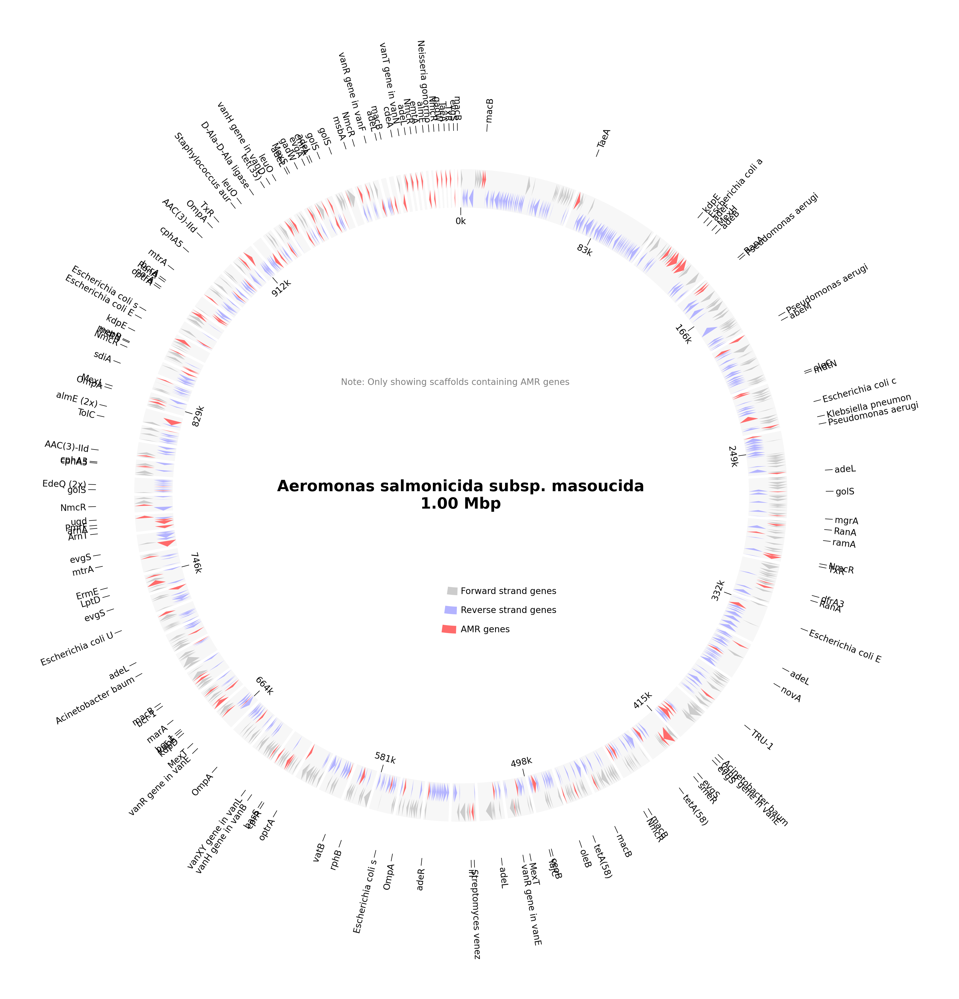

### AAC(3)-IId (found in 2 locations)
- **Mechanism**: antibiotic inactivation
- **Drug Classes**: aminoglycoside antibiotic
- **AMR Family**: AAC(3)
- **Locations**:
  - gnl|SPADES|AKHJOCOO_1003_3 : position 636-1400
  - gnl|SPADES|AKHJOCOO_1352_7 : position 4746-5510

### Acinetobacter baumannii AbaF (found in 2 locations)
- **Mechanism**: antibiotic efflux
- **Drug Classes**: phosphonic acid antibiotic
- **AMR Family**: major facilitator superfamily (MFS) antibiotic efflux pump
- **Locations**:
  - gnl|SPADES|AKHJOCOO_398_11 : position 11060-12376
  - gnl|SPADES|AKHJOCOO_780_9 : position 10037-10504

### ArnT
- **Mechanism**: antibiotic target alteration
- **Drug Classes**: peptide antibiotic
- **AMR Family**: pmr phosphoethanolamine transferase
- **Locations**:
  - gnl|SPADES|AKHJOCOO_894_2: position 337-1980

### D-Ala-D-Ala ligase
- **Mechanism**: antibiotic target alteration
- **Drug Classes**: glycopeptide antibiotic
- **AMR Family**: Van ligase
- **Locations**:
  - gnl|SPADES|AKHJOCOO_1552_3 : position 1110-2099

### EdeQ (found in 2 locations)
- **Mechanism**: antibiotic inactivation
- **Drug Classes**: peptide antibiotic; polyamine antibiotic
- **AMR Family**: Edeine acetyltransferase
- **Locations**:
  - gnl|SPADES|AKHJOCOO_973_7 : position 3912-4124
  - gnl|SPADES|AKHJOCOO_973_8 : position 4076-4351

### ErmE
- **Mechanism**: antibiotic target alteration
- **Drug Classes**: macrolide antibiotic; lincosamide antibiotic; streptogramin antibiotic; streptogramin A antibiotic; streptogramin B antibiotic
- **AMR Family**: Erm 23S ribosomal RNA methyltransferase
- **Locations**:
  - gnl|SPADES|AKHJOCOO_833_7 : position 7954-8781

### Escherichia coli EF-Tu mutants conferring resistance to Pulvomycin (found in 2 locations)
- **Mechanism**: antibiotic target alteration
- **Drug Classes**: elfamycin antibiotic
- **AMR Family**: elfamycin resistant EF-Tu
- **Locations**:
  - gnl|SPADES|AKHJOCOO_1199_6 : position 4255-6144
  - gnl|SPADES|AKHJOCOO_362_4 : position 3692-5608

### Escherichia coli UhpT with mutation conferring resistance to fosfomycin
- **Mechanism**: antibiotic target alteration
- **Drug Classes**: phosphonic acid antibiotic
- **AMR Family**: antibiotic-resistant UhpT
- **Locations**:
  - gnl|SPADES|AKHJOCOO_794_14 : position 9033-10376

### Escherichia coli acrA
- **Mechanism**: antibiotic efflux
- **Drug Classes**: fluoroquinolone antibiotic; cephalosporin; glycylcycline; penam; tetracycline antibiotic; rifamycin antibiotic; phenicol antibiotic; disinfecting agents and antiseptics
- **AMR Family**: resistance-nodulation-cell division (RND) antibiotic efflux pump
- **Locations**:
  - gnl|SPADES|AKHJOCOO_210_14 : position 14851-16050

### Escherichia coli cyaA with mutation conferring resistance to fosfomycin
- **Mechanism**: antibiotic target alteration
- **Drug Classes**: phosphonic acid antibiotic
- **AMR Family**: antibiotic-resistant cya adenylate cyclase
- **Locations**:
  - gnl|SPADES|AKHJOCOO_301_16 : position 14874-17405

### Escherichia coli soxS with mutation conferring antibiotic resistance (found in 2 locations)
- **Mechanism**: antibiotic target alteration; antibiotic efflux; reduced permeability to antibiotic
- **Drug Classes**: fluoroquinolone antibiotic; monobactam; carbapenem; cephalosporin; glycylcycline; cephamycin; penam; tetracycline antibiotic; rifamycin antibiotic; phenicol antibiotic; penem; disinfecting agents and antiseptics
- **AMR Family**: ATP-binding cassette (ABC) antibiotic efflux pump; major facilitator superfamily (MFS) antibiotic efflux pump; resistance-nodulation-cell division (RND) antibiotic efflux pump; General Bacterial Porin with reduced permeability to beta-lactams
- **Locations**:
  - gnl|SPADES|AKHJOCOO_1221_3 : position 684-1469
  - gnl|SPADES|AKHJOCOO_595_5 : position 4048-4875

### Klebsiella pneumoniae OmpK37
- **Mechanism**: reduced permeability to antibiotic
- **Drug Classes**: monobactam; carbapenem; cephalosporin; cephamycin; penam; penem
- **AMR Family**: General Bacterial Porin with reduced permeability to beta-lactams
- **Locations**:
  - gnl|SPADES|AKHJOCOO_301_23 : position 23336-24397

### LptD
- **Mechanism**: antibiotic efflux
- **Drug Classes**: carbapenem; peptide antibiotic; aminocoumarin antibiotic; rifamycin antibiotic
- **AMR Family**: ATP-binding cassette (ABC) antibiotic efflux pump
- **Locations**:
  - gnl|SPADES|AKHJOCOO_833_4 : position 3208-5640

### MexH
- **Mechanism**: antibiotic efflux
- **Drug Classes**: fluoroquinolone antibiotic; tetracycline antibiotic; disinfecting agents and antiseptics
- **AMR Family**: resistance-nodulation-cell division (RND) antibiotic efflux pump
- **Locations**:
  - gnl|SPADES|AKHJOCOO_210_17 : position 20178-21698

### MexL
- **Mechanism**: antibiotic efflux
- **Drug Classes**: macrolide antibiotic; tetracycline antibiotic; disinfecting agents and antiseptics
- **AMR Family**: resistance-nodulation-cell division (RND) antibiotic efflux pump
- **Locations**:
  - gnl|SPADES|AKHJOCOO_1061_5 : position 4341-4895

### MexS
- **Mechanism**: antibiotic efflux
- **Drug Classes**: fluoroquinolone antibiotic; diaminopyrimidine antibiotic; phenicol antibiotic
- **AMR Family**: resistance-nodulation-cell division (RND) antibiotic efflux pump
- **Locations**:
  - gnl|SPADES|AKHJOCOO_1674_3 : position 1847-2974

### MexT (found in 2 locations)
- **Mechanism**: antibiotic efflux
- **Drug Classes**: fluoroquinolone antibiotic; diaminopyrimidine antibiotic; phenicol antibiotic
- **AMR Family**: resistance-nodulation-cell division (RND) antibiotic efflux pump
- **Locations**:
  - gnl|SPADES|AKHJOCOO_567_8 : position 5851-6792
  - gnl|SPADES|AKHJOCOO_682_7 : position 7422-8363

### Neisseria gonorrhoeae pilQ gene conferring resistance to beta-lactam
- **Mechanism**: antibiotic target alteration
- **Drug Classes**: cephalosporin; cephamycin; penam
- **AMR Family**: Penicillin-binding protein mutations conferring resistance to beta-lactam antibiotics
- **Locations**:
  - gnl|SPADES|AKHJOCOO_7269_2 : position 286-1113

### NmcR (found in 7 locations)
- **Mechanism**: antibiotic inactivation
- **Drug Classes**: carbapenem; cephalosporin; cephamycin; penam
- **AMR Family**: NmcA beta-lactamase
- **Locations**:
  - gnl|SPADES|AKHJOCOO_1152_8 : position 6152-7126
  - gnl|SPADES|AKHJOCOO_2239_2 : position 540-1382
  - gnl|SPADES|AKHJOCOO_344_20 : position 19349-20260
  - gnl|SPADES|AKHJOCOO_453_19 : position 16664-17542
  - gnl|SPADES|AKHJOCOO_5329_2 : position 275-1183
  - gnl|SPADES|AKHJOCOO_7779_1 : position 1-921
  - gnl|SPADES|AKHJOCOO_897_3 : position 3481-4371

### OmpA (found in 4 locations)
- **Mechanism**: reduced permeability to antibiotic
- **Drug Classes**: peptide antibiotic
- **AMR Family**: General Bacterial Porin with reduced permeability to peptide antibiotics
- **Locations**:
  - gnl|SPADES|AKHJOCOO_1061_3 : position 2616-3755
  - gnl|SPADES|AKHJOCOO_1394_5 : position 3967-4986
  - gnl|SPADES|AKHJOCOO_584_11 : position 11057-12115
  - gnl|SPADES|AKHJOCOO_658_6 : position 4814-5845

### PmrF
- **Mechanism**: antibiotic target alteration
- **Drug Classes**: peptide antibiotic
- **AMR Family**: pmr phosphoethanolamine transferase
- **Locations**:
  - gnl|SPADES|AKHJOCOO_894_5 : position 4929-5906

### Pseudomonas aeruginosa CpxR
- **Mechanism**: antibiotic efflux
- **Drug Classes**: macrolide antibiotic; fluoroquinolone antibiotic; monobactam; aminoglycoside antibiotic; carbapenem; cephalosporin; cephamycin; penam; tetracycline antibiotic; peptide antibiotic; aminocoumarin antibiotic; diaminopyrimidine antibiotic; sulfonamide antibiotic; phenicol antibiotic; penem
- **AMR Family**: resistance-nodulation-cell division (RND) antibiotic efflux pump
- **Locations**:
  - gnl|SPADES|AKHJOCOO_276_1 : position 3-125

### Pseudomonas aeruginosa ampR with mutation conferring resistance to aztreonam (found in 2 locations)
- **Mechanism**: antibiotic target alteration; antibiotic inactivation
- **Drug Classes**: monobactam; carbapenem; cephalosporin
- **AMR Family**: PDC beta-lactamase; ampR transcriptional regulator with mutation conferring resistance to monobactam antibiotics
- **Locations**:
  - gnl|SPADES|AKHJOCOO_213_4 : position 2859-3806
  - gnl|SPADES|AKHJOCOO_323_1 : position 3-884

### RanA (found in 5 locations)
- **Mechanism**: antibiotic efflux
- **Drug Classes**: aminoglycoside antibiotic
- **AMR Family**: ATP-binding cassette (ABC) antibiotic efflux pump
- **Locations**:
  - gnl|SPADES|AKHJOCOO_1227_2 : position 692-1684
  - gnl|SPADES|AKHJOCOO_213_3 : position 1606-2673
  - gnl|SPADES|AKHJOCOO_344_4 : position 2155-3162
  - gnl|SPADES|AKHJOCOO_346_19 : position 13607-14803
  - gnl|SPADES|AKHJOCOO_91_12 : position 13394-14395

### Staphylococcus aureus mupB conferring resistance to mupirocin
- **Mechanism**: antibiotic target alteration
- **Drug Classes**: mupirocin-like antibiotic
- **AMR Family**: antibiotic-resistant isoleucyl-tRNA synthetase (ileS)
- **Locations**:
  - gnl|SPADES|AKHJOCOO_1495_4 : position 3506-5479

### Streptomyces venezuelae rox
- **Mechanism**: antibiotic inactivation
- **Drug Classes**: rifamycin antibiotic
- **AMR Family**: rifampin monooxygenase
- **Locations**:
  - gnl|SPADES|AKHJOCOO_580_3 : position 1547-2770

### TRU-1
- **Mechanism**: antibiotic inactivation
- **Drug Classes**: cephalosporin; penam
- **AMR Family**: TRU beta-lactamase
- **Locations**:
  - gnl|SPADES|AKHJOCOO_371_14: position 13872-15020

### TaeA (found in 2 locations)
- **Mechanism**: antibiotic efflux
- **Drug Classes**: pleuromutilin antibiotic
- **AMR Family**: ATP-binding cassette (ABC) antibiotic efflux pump
- **Locations**:
  - gnl|SPADES|AKHJOCOO_10049_1 : position 3-848
  - gnl|SPADES|AKHJOCOO_150_3 : position 784-2694

### TolC
- **Mechanism**: antibiotic efflux
- **Drug Classes**: macrolide antibiotic; fluoroquinolone antibiotic; aminoglycoside antibiotic; carbapenem; cephalosporin; glycylcycline; cephamycin; penam; tetracycline antibiotic; peptide antibiotic; aminocoumarin antibiotic; rifamycin antibiotic; phenicol antibiotic; penem; disinfecting agents and antiseptics
- **AMR Family**: ATP-binding cassette (ABC) antibiotic efflux pump; major facilitator superfamily (MFS) antibiotic efflux pump; resistance-nodulation-cell division (RND) antibiotic efflux pump
- **Locations**:
  - gnl|SPADES|AKHJOCOO_1025_9 : position 7735-8007

### TxR (found in 3 locations)
- **Mechanism**: antibiotic efflux
- **Drug Classes**: tetracycline antibiotic
- **AMR Family**: ATP-binding cassette (ABC) antibiotic efflux pump
- **Locations**:
  - gnl|SPADES|AKHJOCOO_10461_1 : position 3-818
  - gnl|SPADES|AKHJOCOO_1431_2 : position 246-2147
  - gnl|SPADES|AKHJOCOO_344_21 : position 20315-22225

### YajC
- **Mechanism**: antibiotic efflux
- **Drug Classes**: fluoroquinolone antibiotic; cephalosporin; glycylcycline; penam; tetracycline antibiotic; oxazolidinone antibiotic; glycopeptide antibiotic; rifamycin antibiotic; phenicol antibiotic; disinfecting agents and antiseptics
- **AMR Family**: resistance-nodulation-cell division (RND) antibiotic efflux pump
- **Locations**:
  - gnl|SPADES|AKHJOCOO_525_15 : position 13542-13877

### abeM
- **Mechanism**: antibiotic efflux
- **Drug Classes**: fluoroquinolone antibiotic; disinfecting agents and antiseptics
- **AMR Family**: multidrug and toxic compound extrusion (MATE) transporter
- **Locations**:
  - gnl|SPADES|AKHJOCOO_276_4 : position 2005-3390

### adeB
- **Mechanism**: antibiotic efflux
- **Drug Classes**: glycylcycline; tetracycline antibiotic
- **AMR Family**: resistance-nodulation-cell division (RND) antibiotic efflux pump
- **Locations**:
  - gnl|SPADES|AKHJOCOO_210_18 : position 21772-24900

### adeF
- **Mechanism**: antibiotic efflux
- **Drug Classes**: fluoroquinolone antibiotic; tetracycline antibiotic
- **AMR Family**: resistance-nodulation-cell division (RND) antibiotic efflux pump
- **Locations**:
  - gnl|SPADES|AKHJOCOO_210_15: position 16060-19188

### adeL (found in 8 locations)
- **Mechanism**: antibiotic efflux
- **Drug Classes**: fluoroquinolone antibiotic; tetracycline antibiotic
- **AMR Family**: resistance-nodulation-cell division (RND) antibiotic efflux pump
- **Locations**:
  - gnl|SPADES|AKHJOCOO_1674_2 : position 821-1726
  - gnl|SPADES|AKHJOCOO_1841_2 : position 1438-2346
  - gnl|SPADES|AKHJOCOO_2664_3 : position 2255-2851
  - gnl|SPADES|AKHJOCOO_323_25 : position 23054-23875
  - gnl|SPADES|AKHJOCOO_363_5 : position 2900-3802
  - gnl|SPADES|AKHJOCOO_5313_2 : position 502-1449
  - gnl|SPADES|AKHJOCOO_575_5 : position 4036-4950
  - gnl|SPADES|AKHJOCOO_788_5 : position 3860-4735

### adeR
- **Mechanism**: antibiotic efflux
- **Drug Classes**: glycylcycline; tetracycline antibiotic
- **AMR Family**: resistance-nodulation-cell division (RND) antibiotic efflux pump
- **Locations**:
  - gnl|SPADES|AKHJOCOO_583_13 : position 11989-12900

### almE (found in 3 locations)
- **Mechanism**: antibiotic target alteration
- **Drug Classes**: peptide antibiotic
- **AMR Family**: polymyxin resistance operon; alm glycyltransferase
- **Locations**:
  - gnl|SPADES|AKHJOCOO_1047_3 : position 2110-5199
  - gnl|SPADES|AKHJOCOO_1047_5 : position 6143-7813
  - gnl|SPADES|AKHJOCOO_5820_2 : position 158-1354

### arnA
- **Mechanism**: antibiotic target alteration
- **Drug Classes**: peptide antibiotic
- **AMR Family**: pmr phosphoethanolamine transferase
- **Locations**:
  - gnl|SPADES|AKHJOCOO_894_4 : position 2941-4932

### basS
- **Mechanism**: antibiotic target alteration; antibiotic efflux
- **Drug Classes**: peptide antibiotic
- **AMR Family**: pmr phosphoethanolamine transferase
- **Locations**:
  - gnl|SPADES|AKHJOCOO_633_8 : position 5697-7142

### bcr-1 (found in 2 locations)
- **Mechanism**: antibiotic efflux
- **Drug Classes**: bicyclomycin-like antibiotic
- **AMR Family**: major facilitator superfamily (MFS) antibiotic efflux pump
- **Locations**:
  - gnl|SPADES|AKHJOCOO_687_4 : position 2906-4033
  - gnl|SPADES|AKHJOCOO_704_4 : position 3833-5023

### bcrA
- **Mechanism**: antibiotic efflux
- **Drug Classes**: peptide antibiotic
- **AMR Family**: ATP-binding cassette (ABC) antibiotic efflux pump
- **Locations**:
  - gnl|SPADES|AKHJOCOO_1227_3 : position 1696-2715

### cdeA
- **Mechanism**: antibiotic efflux
- **Drug Classes**: fluoroquinolone antibiotic; disinfecting agents and antiseptics
- **AMR Family**: multidrug and toxic compound extrusion (MATE) transporter
- **Locations**:
  - gnl|SPADES|AKHJOCOO_3101_3 : position 1020-2435

### ceoB
- **Mechanism**: antibiotic efflux
- **Drug Classes**: fluoroquinolone antibiotic; aminoglycoside antibiotic
- **AMR Family**: resistance-nodulation-cell division (RND) antibiotic efflux pump
- **Locations**:
  - gnl|SPADES|AKHJOCOO_525_14 : position 11670-13523

### cmrA
- **Mechanism**: antibiotic efflux
- **Drug Classes**: phenicol antibiotic
- **AMR Family**: major facilitator superfamily (MFS) antibiotic efflux pump
- **Locations**:
  - gnl|SPADES|AKHJOCOO_1841_1 : position 106-1335

### cphA3
- **Mechanism**: antibiotic inactivation
- **Drug Classes**: carbapenem
- **AMR Family**: CphA beta-lactamase
- **Locations**:
  - gnl|SPADES|AKHJOCOO_974_5 : position 4851-5459

### cphA5 (found in 2 locations)
- **Mechanism**: antibiotic inactivation
- **Drug Classes**: carbapenem
- **AMR Family**: CphA beta-lactamase
- **Locations**:
  - gnl|SPADES|AKHJOCOO_1255_4: position 3134-3895
  - gnl|SPADES|AKHJOCOO_974_4 : position 4431-4640

### cprR
- **Mechanism**: antibiotic target alteration; antibiotic efflux
- **Drug Classes**: peptide antibiotic
- **AMR Family**: pmr phosphoethanolamine transferase
- **Locations**:
  - gnl|SPADES|AKHJOCOO_633_7 : position 4931-5620

### cpxA
- **Mechanism**: antibiotic efflux
- **Drug Classes**: aminoglycoside antibiotic; aminocoumarin antibiotic
- **AMR Family**: resistance-nodulation-cell division (RND) antibiotic efflux pump
- **Locations**:
  - gnl|SPADES|AKHJOCOO_276_2 : position 122-1477

### dfrA3
- **Mechanism**: antibiotic target replacement
- **Drug Classes**: diaminopyrimidine antibiotic
- **AMR Family**: trimethoprim resistant dihydrofolate reductase dfr
- **Locations**:
  - gnl|SPADES|AKHJOCOO_346_17 : position 11382-11876

### emtA
- **Mechanism**: antibiotic target alteration
- **Drug Classes**: macrolide antibiotic; lincosamide antibiotic; orthosomycin antibiotic
- **AMR Family**: non-erm 23S ribosomal RNA methyltransferase (G748)
- **Locations**:
  - gnl|SPADES|AKHJOCOO_5328_1 : position 1-858

### evgA
- **Mechanism**: antibiotic efflux
- **Drug Classes**: macrolide antibiotic; fluoroquinolone antibiotic; penam; tetracycline antibiotic
- **AMR Family**: major facilitator superfamily (MFS) antibiotic efflux pump; resistance-nodulation-cell division (RND) antibiotic efflux pump
- **Locations**:
  - gnl|SPADES|AKHJOCOO_1728_4 : position 4041-4685

### evgS (found in 5 locations)
- **Mechanism**: antibiotic efflux
- **Drug Classes**: macrolide antibiotic; fluoroquinolone antibiotic; penam; tetracycline antibiotic
- **AMR Family**: major facilitator superfamily (MFS) antibiotic efflux pump; resistance-nodulation-cell division (RND) antibiotic efflux pump
- **Locations**:
  - gnl|SPADES|AKHJOCOO_24446_1 : position 2-415
  - gnl|SPADES|AKHJOCOO_398_14 : position 14368-17034
  - gnl|SPADES|AKHJOCOO_438_3 : position 2070-6050
  - gnl|SPADES|AKHJOCOO_824_10 : position 8287-10074
  - gnl|SPADES|AKHJOCOO_839_2 : position 454-3879

### gadW (found in 2 locations)
- **Mechanism**: antibiotic efflux
- **Drug Classes**: macrolide antibiotic; fluoroquinolone antibiotic; penam
- **AMR Family**: resistance-nodulation-cell division (RND) antibiotic efflux pump
- **Locations**:
  - gnl|SPADES|AKHJOCOO_1728_1 : position 3-638
  - gnl|SPADES|AKHJOCOO_8685_1 : position 3-638

### golS (found in 4 locations)
- **Mechanism**: antibiotic efflux
- **Drug Classes**: monobactam; carbapenem; cephalosporin; cephamycin; penam; phenicol antibiotic; penem
- **AMR Family**: resistance-nodulation-cell division (RND) antibiotic efflux pump
- **Locations**:
  - gnl|SPADES|AKHJOCOO_1850_1 : position 3-287
  - gnl|SPADES|AKHJOCOO_1865_2 : position 215-625
  - gnl|SPADES|AKHJOCOO_331_8 : position 8311-8727
  - gnl|SPADES|AKHJOCOO_973_3 : position 1278-1655

### iri
- **Mechanism**: antibiotic inactivation
- **Drug Classes**: rifamycin antibiotic
- **AMR Family**: rifampin monooxygenase
- **Locations**:
  - gnl|SPADES|AKHJOCOO_580_4 : position 3503-3937

### kdpD
- **Mechanism**: antibiotic efflux
- **Drug Classes**: aminoglycoside antibiotic
- **AMR Family**: kdpDE
- **Locations**:
  - gnl|SPADES|AKHJOCOO_687_1 : position 3-2039

### kdpE (found in 3 locations)
- **Mechanism**: antibiotic efflux
- **Drug Classes**: aminoglycoside antibiotic
- **AMR Family**: kdpDE
- **Locations**:
  - gnl|SPADES|AKHJOCOO_1171_8 : position 6505-7071
  - gnl|SPADES|AKHJOCOO_210_11 : position 10794-12440
  - gnl|SPADES|AKHJOCOO_687_2 : position 2126-2809

### leuO (found in 2 locations)
- **Mechanism**: antibiotic efflux
- **Drug Classes**: nucleoside antibiotic; disinfecting agents and antiseptics
- **AMR Family**: major facilitator superfamily (MFS) antibiotic efflux pump
- **Locations**:
  - gnl|SPADES|AKHJOCOO_1499_2 : position 671-1645
  - gnl|SPADES|AKHJOCOO_1635_2 : position 731-1705

### macB (found in 6 locations)
- **Mechanism**: antibiotic efflux
- **Drug Classes**: macrolide antibiotic
- **AMR Family**: ATP-binding cassette (ABC) antibiotic efflux pump
- **Locations**:
  - gnl|SPADES|AKHJOCOO_2876_1 : position 3-956
  - gnl|SPADES|AKHJOCOO_453_17 : position 13834-15225
  - gnl|SPADES|AKHJOCOO_503_15 : position 13660-14481
  - gnl|SPADES|AKHJOCOO_63849_1 : position 3-227
  - gnl|SPADES|AKHJOCOO_704_6 : position 5799-6479
  - gnl|SPADES|AKHJOCOO_91_11 : position 12339-13397

### marA
- **Mechanism**: antibiotic efflux; reduced permeability to antibiotic
- **Drug Classes**: fluoroquinolone antibiotic; monobactam; carbapenem; cephalosporin; glycylcycline; cephamycin; penam; tetracycline antibiotic; rifamycin antibiotic; phenicol antibiotic; penem; disinfecting agents and antiseptics
- **AMR Family**: resistance-nodulation-cell division (RND) antibiotic efflux pump; General Bacterial Porin with reduced permeability to beta-lactams
- **Locations**:
  - gnl|SPADES|AKHJOCOO_687_11 : position 8849-9808

### mdtN (found in 2 locations)
- **Mechanism**: antibiotic efflux
- **Drug Classes**: nucleoside antibiotic; disinfecting agents and antiseptics
- **AMR Family**: major facilitator superfamily (MFS) antibiotic efflux pump
- **Locations**:
  - gnl|SPADES|AKHJOCOO_1171_1 : position 3-635
  - gnl|SPADES|AKHJOCOO_301_2 : position 973-1938

### mepR
- **Mechanism**: antibiotic efflux
- **Drug Classes**: glycylcycline; tetracycline antibiotic
- **AMR Family**: multidrug and toxic compound extrusion (MATE) transporter
- **Locations**:
  - gnl|SPADES|AKHJOCOO_1171_2 : position 637-1110

### mgrA
- **Mechanism**: antibiotic efflux
- **Drug Classes**: fluoroquinolone antibiotic; cephalosporin; penam; tetracycline antibiotic; peptide antibiotic; disinfecting agents and antiseptics
- **AMR Family**: ATP-binding cassette (ABC) antibiotic efflux pump; major facilitator superfamily (MFS) antibiotic efflux pump
- **Locations**:
  - gnl|SPADES|AKHJOCOO_331_24 : position 21941-22411

### msbA
- **Mechanism**: antibiotic efflux
- **Drug Classes**: nitroimidazole antibiotic
- **AMR Family**: ATP-binding cassette (ABC) antibiotic efflux pump
- **Locations**:
  - gnl|SPADES|AKHJOCOO_2035_2 : position 1431-2732

### mtrA (found in 2 locations)
- **Mechanism**: antibiotic efflux
- **Drug Classes**: macrolide antibiotic; penam
- **AMR Family**: resistance-nodulation-cell division (RND) antibiotic efflux pump
- **Locations**:
  - gnl|SPADES|AKHJOCOO_1241_1 : position 3-788
  - gnl|SPADES|AKHJOCOO_838_8 : position 7380-8204

### norA
- **Mechanism**: antibiotic efflux
- **Drug Classes**: fluoroquinolone antibiotic; disinfecting agents and antiseptics
- **AMR Family**: major facilitator superfamily (MFS) antibiotic efflux pump
- **Locations**:
  - gnl|SPADES|AKHJOCOO_1223_5 : position 6367-6816

### novA
- **Mechanism**: antibiotic efflux
- **Drug Classes**: aminocoumarin antibiotic
- **AMR Family**: ATP-binding cassette (ABC) antibiotic efflux pump
- **Locations**:
  - gnl|SPADES|AKHJOCOO_363_14 : position 11569-12669

### oleB
- **Mechanism**: antibiotic target protection
- **Drug Classes**: macrolide antibiotic
- **AMR Family**: Miscellaneous ABC-F subfamily ATP-binding cassette ribosomal protection proteins
- **Locations**:
  - gnl|SPADES|AKHJOCOO_523_19 : position 15021-15635

### oleC
- **Mechanism**: antibiotic efflux
- **Drug Classes**: macrolide antibiotic
- **AMR Family**: ATP-binding cassette (ABC) antibiotic efflux pump
- **Locations**:
  - gnl|SPADES|AKHJOCOO_301_1 : position 51-980

### optrA (found in 2 locations)
- **Mechanism**: antibiotic target protection
- **Drug Classes**: oxazolidinone antibiotic; phenicol antibiotic
- **AMR Family**: Miscellaneous ABC-F subfamily ATP-binding cassette ribosomal protection proteins
- **Locations**:
  - gnl|SPADES|AKHJOCOO_1223_4 : position 4797-6356
  - gnl|SPADES|AKHJOCOO_621_10 : position 11918-13219

### ramA
- **Mechanism**: antibiotic efflux; reduced permeability to antibiotic
- **Drug Classes**: fluoroquinolone antibiotic; monobactam; carbapenem; cephalosporin; glycylcycline; cephamycin; penam; tetracycline antibiotic; rifamycin antibiotic; phenicol antibiotic; penem; disinfecting agents and antiseptics
- **AMR Family**: resistance-nodulation-cell division (RND) antibiotic efflux pump; General Bacterial Porin with reduced permeability to beta-lactams
- **Locations**:
  - gnl|SPADES|AKHJOCOO_344_9 : position 7716-8573

### rphB
- **Mechanism**: antibiotic inactivation
- **Drug Classes**: rifamycin antibiotic
- **AMR Family**: rifampin phosphotransferase
- **Locations**:
  - gnl|SPADES|AKHJOCOO_616_6 : position 6229-7956

### sdiA
- **Mechanism**: antibiotic efflux
- **Drug Classes**: fluoroquinolone antibiotic; cephalosporin; glycylcycline; penam; tetracycline antibiotic; rifamycin antibiotic; phenicol antibiotic; disinfecting agents and antiseptics
- **AMR Family**: resistance-nodulation-cell division (RND) antibiotic efflux pump
- **Locations**:
  - gnl|SPADES|AKHJOCOO_1085_8 : position 6899-7540

### smeR
- **Mechanism**: antibiotic efflux
- **Drug Classes**: aminoglycoside antibiotic; cephalosporin; cephamycin; penam
- **AMR Family**: resistance-nodulation-cell division (RND) antibiotic efflux pump
- **Locations**:
  - gnl|SPADES|AKHJOCOO_438_4 : position 6052-7299

### tet(35)
- **Mechanism**: antibiotic efflux
- **Drug Classes**: tetracycline antibiotic
- **AMR Family**: ATP-binding cassette (ABC) antibiotic efflux pump
- **Locations**:
  - gnl|SPADES|AKHJOCOO_1618_2 : position 578-1912

### tetA(58) (found in 2 locations)
- **Mechanism**: antibiotic efflux
- **Drug Classes**: tetracycline antibiotic
- **AMR Family**: major facilitator superfamily (MFS) antibiotic efflux pump
- **Locations**:
  - gnl|SPADES|AKHJOCOO_438_13 : position 14974-16539
  - gnl|SPADES|AKHJOCOO_523_9 : position 7795-8583

### ugd
- **Mechanism**: antibiotic target alteration
- **Drug Classes**: peptide antibiotic
- **AMR Family**: pmr phosphoethanolamine transferase
- **Locations**:
  - gnl|SPADES|AKHJOCOO_894_7 : position 7330-8676

### vanH gene in vanB cluster
- **Mechanism**: antibiotic target alteration
- **Drug Classes**: glycopeptide antibiotic
- **AMR Family**: vanH; glycopeptide resistance gene cluster
- **Locations**:
  - gnl|SPADES|AKHJOCOO_633_14 : position 12098-13006

### vanH gene in vanD cluster
- **Mechanism**: antibiotic target alteration
- **Drug Classes**: glycopeptide antibiotic
- **AMR Family**: vanH; glycopeptide resistance gene cluster
- **Locations**:
  - gnl|SPADES|AKHJOCOO_1618_5 : position 3812-5044

### vanR gene in vanE cluster (found in 3 locations)
- **Mechanism**: antibiotic target alteration
- **Drug Classes**: glycopeptide antibiotic
- **AMR Family**: glycopeptide resistance gene cluster; vanR
- **Locations**:
  - gnl|SPADES|AKHJOCOO_398_13 : position 13236-14357
  - gnl|SPADES|AKHJOCOO_567_11 : position 9620-9988
  - gnl|SPADES|AKHJOCOO_682_4 : position 4232-4600

### vanR gene in vanF cluster
- **Mechanism**: antibiotic target alteration
- **Drug Classes**: glycopeptide antibiotic
- **AMR Family**: glycopeptide resistance gene cluster; vanR
- **Locations**:
  - gnl|SPADES|AKHJOCOO_2506_2 : position 1336-2397

### vanT gene in vanN cluster
- **Mechanism**: antibiotic target alteration
- **Drug Classes**: glycopeptide antibiotic
- **AMR Family**: glycopeptide resistance gene cluster; vanT
- **Locations**:
  - gnl|SPADES|AKHJOCOO_4100_2 : position 722-1759

### vanXY gene in vanL cluster
- **Mechanism**: antibiotic target alteration
- **Drug Classes**: glycopeptide antibiotic
- **AMR Family**: glycopeptide resistance gene cluster; vanXY
- **Locations**:
  - gnl|SPADES|AKHJOCOO_637_3 : position 1404-2099

### vatB
- **Mechanism**: antibiotic inactivation
- **Drug Classes**: streptogramin antibiotic; streptogramin A antibiotic
- **AMR Family**: streptogramin vat acetyltransferase
- **Locations**:
  - gnl|SPADES|AKHJOCOO_617_2 : position 363-986

## Aeromonas salmonicida subsp. pectinolytica 34mel
**Strain Statistics:**
- Total genome length: 1073.2 kbp
- Total scaffolds: 387
- Scaffolds with AMR genes: 112
- Total genes annotated: 2185
- Total AMR genes: 184
- Unique AMR genes: 105
- Distinct AMR mechanisms: 10
- Distinct AMR families: 42
- Distinct drug classes: 30

**Circos Plot:**

### AAC(6')-I-48
- **Mechanism**: antibiotic inactivation
- **Drug Classes**: aminoglycoside antibiotic
- **AMR Family**: AAC(6')
- **Locations**:
  - gnl|SPADES|AKHJOCOO_3410_3 : position 1747-2232

### AAC(6')-If
- **Mechanism**: antibiotic inactivation
- **Drug Classes**: aminoglycoside antibiotic
- **AMR Family**: AAC(6')
- **Locations**:
  - gnl|SPADES|AKHJOCOO_785_5 : position 2864-3199

### AAC(6')-Il
- **Mechanism**: antibiotic inactivation
- **Drug Classes**: aminoglycoside antibiotic
- **AMR Family**: AAC(6')
- **Locations**:
  - gnl|SPADES|AKHJOCOO_4245_3 : position 1120-1578

### AAC(6')-Isa
- **Mechanism**: antibiotic inactivation
- **Drug Classes**: aminoglycoside antibiotic
- **AMR Family**: AAC(6')
- **Locations**:
  - gnl|SPADES|AKHJOCOO_474_8 : position 9224-9778

### Agrobacterium fabrum chloramphenicol acetyltransferase (found in 5 locations)
- **Mechanism**: antibiotic inactivation
- **Drug Classes**: phenicol antibiotic
- **AMR Family**: chloramphenicol acetyltransferase (CAT)
- **Locations**:
  - gnl|SPADES|AKHJOCOO_1324_1 : position 2-541
  - gnl|SPADES|AKHJOCOO_1439_2 : position 630-1193
  - gnl|SPADES|AKHJOCOO_283_10 : position 9376-9954
  - gnl|SPADES|AKHJOCOO_4186_2 : position 1346-1837
  - gnl|SPADES|AKHJOCOO_434_6 : position 3351-4013

### Enterococcus faecalis cls with mutation conferring resistance to daptomycin
- **Mechanism**: antibiotic target alteration
- **Drug Classes**: peptide antibiotic
- **AMR Family**: daptomycin resistant cls
- **Locations**:
  - gnl|SPADES|AKHJOCOO_812_10 : position 8074-9555

### Enterococcus faecium liaR mutant conferring daptomycin resistance
- **Mechanism**: antibiotic target alteration; antibiotic efflux
- **Drug Classes**: peptide antibiotic
- **AMR Family**: daptomycin resistant liaR
- **Locations**:
  - gnl|SPADES|AKHJOCOO_315_13 : position 12127-13242

### Escherichia coli AcrAB-TolC with AcrR mutation conferring resistance to ciprofloxacin, tetracycline, and ceftazidime
- **Mechanism**: antibiotic target alteration; antibiotic efflux
- **Drug Classes**: fluoroquinolone antibiotic; cephalosporin; glycylcycline; penam; tetracycline antibiotic; rifamycin antibiotic; phenicol antibiotic; disinfecting agents and antiseptics
- **AMR Family**: resistance-nodulation-cell division (RND) antibiotic efflux pump
- **Locations**:
  - gnl|SPADES|AKHJOCOO_410_6 : position 5329-5931

### Escherichia coli acrA
- **Mechanism**: antibiotic efflux
- **Drug Classes**: fluoroquinolone antibiotic; cephalosporin; glycylcycline; penam; tetracycline antibiotic; rifamycin antibiotic; phenicol antibiotic; disinfecting agents and antiseptics
- **AMR Family**: resistance-nodulation-cell division (RND) antibiotic efflux pump
- **Locations**:
  - gnl|SPADES|AKHJOCOO_1796_3 : position 486-1685

### Escherichia coli soxS with mutation conferring antibiotic resistance
- **Mechanism**: antibiotic target alteration; antibiotic efflux; reduced permeability to antibiotic
- **Drug Classes**: fluoroquinolone antibiotic; monobactam; carbapenem; cephalosporin; glycylcycline; cephamycin; penam; tetracycline antibiotic; rifamycin antibiotic; phenicol antibiotic; penem; disinfecting agents and antiseptics
- **AMR Family**: ATP-binding cassette (ABC) antibiotic efflux pump; major facilitator superfamily (MFS) antibiotic efflux pump; resistance-nodulation-cell division (RND) antibiotic efflux pump; General Bacterial Porin with reduced permeability to beta-lactams
- **Locations**:
  - gnl|SPADES|AKHJOCOO_292_1 : position 2-550

### H-NS (found in 3 locations)
- **Mechanism**: antibiotic efflux
- **Drug Classes**: macrolide antibiotic; fluoroquinolone antibiotic; cephalosporin; cephamycin; penam; tetracycline antibiotic
- **AMR Family**: major facilitator superfamily (MFS) antibiotic efflux pump; resistance-nodulation-cell division (RND) antibiotic efflux pump
- **Locations**:
  - gnl|SPADES|AKHJOCOO_1966_2 : position 709-1119
  - gnl|SPADES|AKHJOCOO_2132_1 : position 3-413
  - gnl|SPADES|AKHJOCOO_358_19 : position 21205-21609

### Helicobacter pylori pbp1 mutants conferring resistance to amoxicillin (found in 2 locations)
- **Mechanism**: antibiotic target alteration
- **Drug Classes**: cephalosporin; cephamycin; penam
- **AMR Family**: Penicillin-binding protein mutations conferring resistance to beta-lactam antibiotics
- **Locations**:
  - gnl|SPADES|AKHJOCOO_1571_7 : position 4448-5203
  - gnl|SPADES|AKHJOCOO_445_3 : position 3373-5688

### Klebsiella pneumoniae KpnE (found in 2 locations)
- **Mechanism**: antibiotic efflux
- **Drug Classes**: macrolide antibiotic; aminoglycoside antibiotic; cephalosporin; tetracycline antibiotic; peptide antibiotic; rifamycin antibiotic; disinfecting agents and antiseptics
- **AMR Family**: small multidrug resistance (SMR) antibiotic efflux pump
- **Locations**:
  - gnl|SPADES|AKHJOCOO_1571_4 : position 3199-3603
  - gnl|SPADES|AKHJOCOO_445_6 : position 6526-6939

### Klebsiella pneumoniae KpnF (found in 2 locations)
- **Mechanism**: antibiotic efflux
- **Drug Classes**: macrolide antibiotic; aminoglycoside antibiotic; cephalosporin; tetracycline antibiotic; peptide antibiotic; rifamycin antibiotic; disinfecting agents and antiseptics
- **AMR Family**: small multidrug resistance (SMR) antibiotic efflux pump
- **Locations**:
  - gnl|SPADES|AKHJOCOO_1571_5 : position 3600-3920
  - gnl|SPADES|AKHJOCOO_445_5 : position 6218-6538

### Klebsiella pneumoniae OmpK37
- **Mechanism**: reduced permeability to antibiotic
- **Drug Classes**: monobactam; carbapenem; cephalosporin; cephamycin; penam; penem
- **AMR Family**: General Bacterial Porin with reduced permeability to beta-lactams
- **Locations**:
  - gnl|SPADES|AKHJOCOO_474_4 : position 3602-4687

### MCR-10.2
- **Mechanism**: antibiotic target alteration
- **Drug Classes**: peptide antibiotic
- **AMR Family**: MCR phosphoethanolamine transferase
- **Locations**:
  - gnl|SPADES|AKHJOCOO_939_1 : position 3-1742

### MdtK
- **Mechanism**: antibiotic efflux
- **Drug Classes**: fluoroquinolone antibiotic
- **AMR Family**: multidrug and toxic compound extrusion (MATE) transporter
- **Locations**:
  - gnl|SPADES|AKHJOCOO_410_16 : position 12345-13691

### MexL
- **Mechanism**: antibiotic efflux
- **Drug Classes**: macrolide antibiotic; tetracycline antibiotic; disinfecting agents and antiseptics
- **AMR Family**: resistance-nodulation-cell division (RND) antibiotic efflux pump
- **Locations**:
  - gnl|SPADES|AKHJOCOO_491_4 : position 2046-2600

### MexS (found in 2 locations)
- **Mechanism**: antibiotic efflux
- **Drug Classes**: fluoroquinolone antibiotic; diaminopyrimidine antibiotic; phenicol antibiotic
- **AMR Family**: resistance-nodulation-cell division (RND) antibiotic efflux pump
- **Locations**:
  - gnl|SPADES|AKHJOCOO_2482_5 : position 1830-2834
  - gnl|SPADES|AKHJOCOO_727_6 : position 7374-8360

### MexT (found in 2 locations)
- **Mechanism**: antibiotic efflux
- **Drug Classes**: fluoroquinolone antibiotic; diaminopyrimidine antibiotic; phenicol antibiotic
- **AMR Family**: resistance-nodulation-cell division (RND) antibiotic efflux pump
- **Locations**:
  - gnl|SPADES|AKHJOCOO_412_17 : position 17056-18009
  - gnl|SPADES|AKHJOCOO_994_8 : position 6294-7175

### MexV
- **Mechanism**: antibiotic efflux
- **Drug Classes**: macrolide antibiotic; fluoroquinolone antibiotic; tetracycline antibiotic; phenicol antibiotic; disinfecting agents and antiseptics
- **AMR Family**: resistance-nodulation-cell division (RND) antibiotic efflux pump
- **Locations**:
  - gnl|SPADES|AKHJOCOO_416_12 : position 10844-11950

### MexW
- **Mechanism**: antibiotic efflux
- **Drug Classes**: macrolide antibiotic; fluoroquinolone antibiotic; tetracycline antibiotic; phenicol antibiotic; disinfecting agents and antiseptics
- **AMR Family**: resistance-nodulation-cell division (RND) antibiotic efflux pump
- **Locations**:
  - gnl|SPADES|AKHJOCOO_416_13 : position 11966-15046

### MexZ (found in 2 locations)
- **Mechanism**: antibiotic efflux
- **Drug Classes**: macrolide antibiotic; fluoroquinolone antibiotic; aminoglycoside antibiotic; carbapenem; cephalosporin; cephamycin; penam; tetracycline antibiotic; phenicol antibiotic; disinfecting agents and antiseptics
- **AMR Family**: resistance-nodulation-cell division (RND) antibiotic efflux pump
- **Locations**:
  - gnl|SPADES|AKHJOCOO_1287_3 : position 4431-5084
  - gnl|SPADES|AKHJOCOO_269_11 : position 10408-11001

### Morganella morganii gyrB conferring resistance to fluoroquinolones
- **Mechanism**: antibiotic target alteration
- **Drug Classes**: fluoroquinolone antibiotic
- **AMR Family**: fluoroquinolone resistant gyrB
- **Locations**:
  - gnl|SPADES|AKHJOCOO_2117_5 : position 2118-3725

### MuxB
- **Mechanism**: antibiotic efflux
- **Drug Classes**: macrolide antibiotic; monobactam; tetracycline antibiotic; aminocoumarin antibiotic
- **AMR Family**: resistance-nodulation-cell division (RND) antibiotic efflux pump
- **Locations**:
  - gnl|SPADES|AKHJOCOO_1287_1 : position 1-1884

### Neisseria gonorrhoeae pilQ gene conferring resistance to beta-lactam (found in 2 locations)
- **Mechanism**: antibiotic target alteration
- **Drug Classes**: cephalosporin; cephamycin; penam
- **AMR Family**: Penicillin-binding protein mutations conferring resistance to beta-lactam antibiotics
- **Locations**:
  - gnl|SPADES|AKHJOCOO_1786_5 : position 3869-4573
  - gnl|SPADES|AKHJOCOO_2160_3 : position 2932-3636

### NmcR (found in 5 locations)
- **Mechanism**: antibiotic inactivation
- **Drug Classes**: carbapenem; cephalosporin; cephamycin; penam
- **AMR Family**: NmcA beta-lactamase
- **Locations**:
  - gnl|SPADES|AKHJOCOO_1824_5 : position 2180-3142
  - gnl|SPADES|AKHJOCOO_2558_5 : position 2007-2909
  - gnl|SPADES|AKHJOCOO_3382_2 : position 671-1582
  - gnl|SPADES|AKHJOCOO_412_10 : position 7103-7972
  - gnl|SPADES|AKHJOCOO_4352_2 : position 643-1554

### Nocardia farcinica rox
- **Mechanism**: antibiotic inactivation
- **Drug Classes**: rifamycin antibiotic
- **AMR Family**: rifampin monooxygenase
- **Locations**:
  - gnl|SPADES|AKHJOCOO_4183_1 : position 3-581

### OXA-917
- **Mechanism**: antibiotic inactivation
- **Drug Classes**: carbapenem; penam
- **AMR Family**: OXA beta-lactamase; OXA-427-like beta-lactamase
- **Locations**:
  - gnl|SPADES|AKHJOCOO_395_2 : position 1405-2199

### OmpA (found in 3 locations)
- **Mechanism**: reduced permeability to antibiotic
- **Drug Classes**: peptide antibiotic
- **AMR Family**: General Bacterial Porin with reduced permeability to peptide antibiotics
- **Locations**:
  - gnl|SPADES|AKHJOCOO_315_15 : position 13985-14902
  - gnl|SPADES|AKHJOCOO_475_2 : position 1211-1735
  - gnl|SPADES|AKHJOCOO_491_2 : position 360-1466

### OpmH
- **Mechanism**: antibiotic efflux
- **Drug Classes**: disinfecting agents and antiseptics
- **AMR Family**: resistance-nodulation-cell division (RND) antibiotic efflux pump
- **Locations**:
  - gnl|SPADES|AKHJOCOO_339_17 : position 20351-21016

### OprM
- **Mechanism**: antibiotic efflux
- **Drug Classes**: macrolide antibiotic; fluoroquinolone antibiotic; monobactam; aminoglycoside antibiotic; carbapenem; cephalosporin; cephamycin; penam; tetracycline antibiotic; peptide antibiotic; aminocoumarin antibiotic; diaminopyrimidine antibiotic; sulfonamide antibiotic; phenicol antibiotic; penem; disinfecting agents and antiseptics
- **AMR Family**: resistance-nodulation-cell division (RND) antibiotic efflux pump
- **Locations**:
  - gnl|SPADES|AKHJOCOO_455_1 : position 2-310

### ParR
- **Mechanism**: antibiotic efflux; reduced permeability to antibiotic
- **Drug Classes**: macrolide antibiotic; fluoroquinolone antibiotic; monobactam; aminoglycoside antibiotic; carbapenem; cephalosporin; cephamycin; penam; tetracycline antibiotic; phenicol antibiotic; penem; disinfecting agents and antiseptics
- **AMR Family**: resistance-nodulation-cell division (RND) antibiotic efflux pump; Outer Membrane Porin (Opr)
- **Locations**:
  - gnl|SPADES|AKHJOCOO_407_3 : position 2116-2835

### ParS (found in 2 locations)
- **Mechanism**: antibiotic efflux; reduced permeability to antibiotic
- **Drug Classes**: macrolide antibiotic; fluoroquinolone antibiotic; monobactam; aminoglycoside antibiotic; carbapenem; cephalosporin; cephamycin; penam; tetracycline antibiotic; phenicol antibiotic; penem; disinfecting agents and antiseptics
- **AMR Family**: resistance-nodulation-cell division (RND) antibiotic efflux pump; Outer Membrane Porin (Opr)
- **Locations**:
  - gnl|SPADES|AKHJOCOO_491_11 : position 9735-11060
  - gnl|SPADES|AKHJOCOO_800_8 : position 9459-10346

### Pseudomonas aeruginosa CpxR
- **Mechanism**: antibiotic efflux
- **Drug Classes**: macrolide antibiotic; fluoroquinolone antibiotic; monobactam; aminoglycoside antibiotic; carbapenem; cephalosporin; cephamycin; penam; tetracycline antibiotic; peptide antibiotic; aminocoumarin antibiotic; diaminopyrimidine antibiotic; sulfonamide antibiotic; phenicol antibiotic; penem
- **AMR Family**: resistance-nodulation-cell division (RND) antibiotic efflux pump
- **Locations**:
  - gnl|SPADES|AKHJOCOO_1081_2 : position 840-1562

### Pseudomonas aeruginosa ampR with mutation conferring resistance to aztreonam
- **Mechanism**: antibiotic target alteration; antibiotic inactivation
- **Drug Classes**: monobactam; carbapenem; cephalosporin
- **AMR Family**: PDC beta-lactamase; ampR transcriptional regulator with mutation conferring resistance to monobactam antibiotics
- **Locations**:
  - gnl|SPADES|AKHJOCOO_6661_1 : position 290-1198

### Pseudomonas aeruginosa catB6
- **Mechanism**: antibiotic inactivation
- **Drug Classes**: phenicol antibiotic
- **AMR Family**: chloramphenicol acetyltransferase (CAT)
- **Locations**:
  - gnl|SPADES|AKHJOCOO_416_7 : position 6113-6778

### Pseudomonas aeruginosa soxR
- **Mechanism**: antibiotic target alteration; antibiotic efflux
- **Drug Classes**: fluoroquinolone antibiotic; cephalosporin; glycylcycline; penam; tetracycline antibiotic; rifamycin antibiotic; phenicol antibiotic; disinfecting agents and antiseptics
- **AMR Family**: ATP-binding cassette (ABC) antibiotic efflux pump; major facilitator superfamily (MFS) antibiotic efflux pump; resistance-nodulation-cell division (RND) antibiotic efflux pump
- **Locations**:
  - gnl|SPADES|AKHJOCOO_339_8 : position 6910-7389

### QepA1
- **Mechanism**: antibiotic efflux
- **Drug Classes**: fluoroquinolone antibiotic
- **AMR Family**: major facilitator superfamily (MFS) antibiotic efflux pump
- **Locations**:
  - gnl|SPADES|AKHJOCOO_532_2 : position 1017-2237

### QepA2
- **Mechanism**: antibiotic efflux
- **Drug Classes**: fluoroquinolone antibiotic
- **AMR Family**: major facilitator superfamily (MFS) antibiotic efflux pump
- **Locations**:
  - gnl|SPADES|AKHJOCOO_650_2 : position 1499-2896

### QepA4
- **Mechanism**: antibiotic efflux
- **Drug Classes**: fluoroquinolone antibiotic
- **AMR Family**: major facilitator superfamily (MFS) antibiotic efflux pump
- **Locations**:
  - gnl|SPADES|AKHJOCOO_272_2 : position 819-2261

### QnrAS (found in 2 locations)
- **Mechanism**: antibiotic target protection
- **Drug Classes**: fluoroquinolone antibiotic
- **AMR Family**: quinolone resistance protein (qnr)
- **Locations**:
  - gnl|SPADES|AKHJOCOO_3519_2 : position 1308-1958
  - gnl|SPADES|AKHJOCOO_6894_2 : position 264-914

### RanA (found in 5 locations)
- **Mechanism**: antibiotic efflux
- **Drug Classes**: aminoglycoside antibiotic
- **AMR Family**: ATP-binding cassette (ABC) antibiotic efflux pump
- **Locations**:
  - gnl|SPADES|AKHJOCOO_1143_6 : position 4781-5815
  - gnl|SPADES|AKHJOCOO_2992_3 : position 1613-2413
  - gnl|SPADES|AKHJOCOO_3750_2 : position 248-1282
  - gnl|SPADES|AKHJOCOO_631_9 : position 6788-7783
  - gnl|SPADES|AKHJOCOO_939_7 : position 7263-8399

### Rv1877
- **Mechanism**: antibiotic efflux
- **Drug Classes**: fluoroquinolone antibiotic
- **AMR Family**: major facilitator superfamily (MFS) antibiotic efflux pump
- **Locations**:
  - gnl|SPADES|AKHJOCOO_854_1 : position 2-976

### Staphylococcus aureus fusA with mutation conferring resistance to fusidic acid
- **Mechanism**: antibiotic target alteration
- **Drug Classes**: fusidane antibiotic
- **AMR Family**: antibiotic resistant fusA
- **Locations**:
  - gnl|SPADES|AKHJOCOO_712_1 : position 91-1677

### Staphylococcus aureus fusE with mutation conferring resistance to fusidic acid
- **Mechanism**: antibiotic target alteration
- **Drug Classes**: fusidane antibiotic
- **AMR Family**: antibiotic resistant fusE
- **Locations**:
  - gnl|SPADES|AKHJOCOO_407_21 : position 12709-13242

### Staphylococcus aureus mupA conferring resistance to mupirocin
- **Mechanism**: antibiotic target alteration
- **Drug Classes**: mupirocin-like antibiotic
- **AMR Family**: antibiotic-resistant isoleucyl-tRNA synthetase (ileS)
- **Locations**:
  - gnl|SPADES|AKHJOCOO_1856_1 : position 1-2658

### Staphylococcus aureus mupB conferring resistance to mupirocin
- **Mechanism**: antibiotic target alteration
- **Drug Classes**: mupirocin-like antibiotic
- **AMR Family**: antibiotic-resistant isoleucyl-tRNA synthetase (ileS)
- **Locations**:
  - gnl|SPADES|AKHJOCOO_292_29 : position 25665-26597

### TaeA
- **Mechanism**: antibiotic efflux
- **Drug Classes**: pleuromutilin antibiotic
- **AMR Family**: ATP-binding cassette (ABC) antibiotic efflux pump
- **Locations**:
  - gnl|SPADES|AKHJOCOO_906_1 : position 2-289

### TxR (found in 2 locations)
- **Mechanism**: antibiotic efflux
- **Drug Classes**: tetracycline antibiotic
- **AMR Family**: ATP-binding cassette (ABC) antibiotic efflux pump
- **Locations**:
  - gnl|SPADES|AKHJOCOO_737_10 : position 9441-10970
  - gnl|SPADES|AKHJOCOO_800_7 : position 7934-9352

### YojI
- **Mechanism**: antibiotic efflux
- **Drug Classes**: peptide antibiotic
- **AMR Family**: ATP-binding cassette (ABC) antibiotic efflux pump
- **Locations**:
  - gnl|SPADES|AKHJOCOO_2086_3 : position 1200-1841

### adeF
- **Mechanism**: antibiotic efflux
- **Drug Classes**: fluoroquinolone antibiotic; tetracycline antibiotic
- **AMR Family**: resistance-nodulation-cell division (RND) antibiotic efflux pump
- **Locations**:
  - gnl|SPADES|AKHJOCOO_1796_4: position 1695-4544

### adeK
- **Mechanism**: antibiotic efflux
- **Drug Classes**: macrolide antibiotic; fluoroquinolone antibiotic; lincosamide antibiotic; carbapenem; cephalosporin; tetracycline antibiotic; rifamycin antibiotic; diaminopyrimidine antibiotic; phenicol antibiotic; penem
- **AMR Family**: resistance-nodulation-cell division (RND) antibiotic efflux pump
- **Locations**:
  - gnl|SPADES|AKHJOCOO_1106_3 : position 2251-3618

### adeL (found in 12 locations)
- **Mechanism**: antibiotic efflux
- **Drug Classes**: fluoroquinolone antibiotic; tetracycline antibiotic
- **AMR Family**: resistance-nodulation-cell division (RND) antibiotic efflux pump
- **Locations**:
  - gnl|SPADES|AKHJOCOO_1260_6 : position 5776-6570
  - gnl|SPADES|AKHJOCOO_1497_4 : position 2113-3009
  - gnl|SPADES|AKHJOCOO_216_5 : position 1972-2853
  - gnl|SPADES|AKHJOCOO_273_6 : position 4704-5603
  - gnl|SPADES|AKHJOCOO_3382_3 : position 1654-2250
  - gnl|SPADES|AKHJOCOO_4352_1 : position 2-571
  - gnl|SPADES|AKHJOCOO_4529_1 : position 2-382
  - gnl|SPADES|AKHJOCOO_532_1 : position 48-923
  - gnl|SPADES|AKHJOCOO_532_8 : position 7501-8439
  - gnl|SPADES|AKHJOCOO_576_3 : position 1923-2858
  - gnl|SPADES|AKHJOCOO_615_4 : position 3765-4673
  - gnl|SPADES|AKHJOCOO_962_5 : position 8194-8574

### adeR
- **Mechanism**: antibiotic efflux
- **Drug Classes**: glycylcycline; tetracycline antibiotic
- **AMR Family**: resistance-nodulation-cell division (RND) antibiotic efflux pump
- **Locations**:
  - gnl|SPADES|AKHJOCOO_929_3 : position 2408-3421

### almE (found in 5 locations)
- **Mechanism**: antibiotic target alteration
- **Drug Classes**: peptide antibiotic
- **AMR Family**: polymyxin resistance operon; alm glycyltransferase
- **Locations**:
  - gnl|SPADES|AKHJOCOO_1502_1 : position 2-2731
  - gnl|SPADES|AKHJOCOO_1502_3 : position 3678-5348
  - gnl|SPADES|AKHJOCOO_1504_2 : position 86-1756
  - gnl|SPADES|AKHJOCOO_1504_4 : position 2700-5429
  - gnl|SPADES|AKHJOCOO_618_6 : position 4087-5799

### arnA (found in 2 locations)
- **Mechanism**: antibiotic target alteration
- **Drug Classes**: peptide antibiotic
- **AMR Family**: pmr phosphoethanolamine transferase
- **Locations**:
  - gnl|SPADES|AKHJOCOO_1211_1 : position 3-563
  - gnl|SPADES|AKHJOCOO_951_5 : position 4989-5933

### bacA (found in 3 locations)
- **Mechanism**: antibiotic target alteration
- **Drug Classes**: peptide antibiotic
- **AMR Family**: undecaprenyl pyrophosphate related proteins
- **Locations**:
  - gnl|SPADES|AKHJOCOO_1235_2 : position 1233-2030
  - gnl|SPADES|AKHJOCOO_1583_4 : position 3610-4425
  - gnl|SPADES|AKHJOCOO_272_10 : position 9291-10106

### basS
- **Mechanism**: antibiotic target alteration; antibiotic efflux
- **Drug Classes**: peptide antibiotic
- **AMR Family**: pmr phosphoethanolamine transferase
- **Locations**:
  - gnl|SPADES|AKHJOCOO_395_1 : position 3-1328

### bcr-1
- **Mechanism**: antibiotic efflux
- **Drug Classes**: bicyclomycin-like antibiotic
- **AMR Family**: major facilitator superfamily (MFS) antibiotic efflux pump
- **Locations**:
  - gnl|SPADES|AKHJOCOO_474_13 : position 12355-13518

### bcrA (found in 4 locations)
- **Mechanism**: antibiotic efflux
- **Drug Classes**: peptide antibiotic
- **AMR Family**: ATP-binding cassette (ABC) antibiotic efflux pump
- **Locations**:
  - gnl|SPADES|AKHJOCOO_1236_1 : position 3-596
  - gnl|SPADES|AKHJOCOO_272_21 : position 21717-23261
  - gnl|SPADES|AKHJOCOO_30573_1 : position 3-350
  - gnl|SPADES|AKHJOCOO_315_21 : position 17698-18333

### bcrC
- **Mechanism**: antibiotic target alteration
- **Drug Classes**: peptide antibiotic
- **AMR Family**: undecaprenyl pyrophosphate related proteins
- **Locations**:
  - gnl|SPADES|AKHJOCOO_1990_3 : position 2986-3708

### catB9
- **Mechanism**: antibiotic inactivation
- **Drug Classes**: phenicol antibiotic
- **AMR Family**: chloramphenicol acetyltransferase (CAT)
- **Locations**:
  - gnl|SPADES|AKHJOCOO_395_4 : position 3729-5090

### cdeA
- **Mechanism**: antibiotic efflux
- **Drug Classes**: fluoroquinolone antibiotic; disinfecting agents and antiseptics
- **AMR Family**: multidrug and toxic compound extrusion (MATE) transporter
- **Locations**:
  - gnl|SPADES|AKHJOCOO_2029_2 : position 516-1967

### cmx
- **Mechanism**: antibiotic efflux
- **Drug Classes**: phenicol antibiotic
- **AMR Family**: major facilitator superfamily (MFS) antibiotic efflux pump
- **Locations**:
  - gnl|SPADES|AKHJOCOO_1619_1 : position 1-747

### cphA2
- **Mechanism**: antibiotic inactivation
- **Drug Classes**: carbapenem
- **AMR Family**: CphA beta-lactamase
- **Locations**:
  - gnl|SPADES|AKHJOCOO_412_13: position 11018-11782

### cpxA
- **Mechanism**: antibiotic efflux
- **Drug Classes**: aminoglycoside antibiotic; aminocoumarin antibiotic
- **AMR Family**: resistance-nodulation-cell division (RND) antibiotic efflux pump
- **Locations**:
  - gnl|SPADES|AKHJOCOO_407_4 : position 2832-4142

### efpA
- **Mechanism**: antibiotic efflux
- **Drug Classes**: rifamycin antibiotic; isoniazid-like antibiotic
- **AMR Family**: major facilitator superfamily (MFS) antibiotic efflux pump
- **Locations**:
  - gnl|SPADES|AKHJOCOO_1323_4 : position 1657-2928

### evgA (found in 3 locations)
- **Mechanism**: antibiotic efflux
- **Drug Classes**: macrolide antibiotic; fluoroquinolone antibiotic; penam; tetracycline antibiotic
- **AMR Family**: major facilitator superfamily (MFS) antibiotic efflux pump; resistance-nodulation-cell division (RND) antibiotic efflux pump
- **Locations**:
  - gnl|SPADES|AKHJOCOO_35914_1 : position 94-306
  - gnl|SPADES|AKHJOCOO_507_10 : position 9848-10480
  - gnl|SPADES|AKHJOCOO_835_3 : position 2776-3513

### evgS (found in 12 locations)
- **Mechanism**: antibiotic efflux
- **Drug Classes**: macrolide antibiotic; fluoroquinolone antibiotic; penam; tetracycline antibiotic
- **AMR Family**: major facilitator superfamily (MFS) antibiotic efflux pump; resistance-nodulation-cell division (RND) antibiotic efflux pump
- **Locations**:
  - gnl|SPADES|AKHJOCOO_1554_1 : position 3-3068
  - gnl|SPADES|AKHJOCOO_1884_2 : position 479-3895
  - gnl|SPADES|AKHJOCOO_216_32 : position 26983-29517
  - gnl|SPADES|AKHJOCOO_273_1 : position 3-1418
  - gnl|SPADES|AKHJOCOO_315_10 : position 8772-9155
  - gnl|SPADES|AKHJOCOO_358_11 : position 10745-11932
  - gnl|SPADES|AKHJOCOO_507_11 : position 10732-11874
  - gnl|SPADES|AKHJOCOO_507_12 : position 11867-14299
  - gnl|SPADES|AKHJOCOO_514_11 : position 8418-12698
  - gnl|SPADES|AKHJOCOO_514_14 : position 14803-15750
  - gnl|SPADES|AKHJOCOO_5271_1 : position 3-1478
  - gnl|SPADES|AKHJOCOO_532_9 : position 8494-9525

### gadX
- **Mechanism**: antibiotic efflux
- **Drug Classes**: macrolide antibiotic; fluoroquinolone antibiotic; penam
- **AMR Family**: resistance-nodulation-cell division (RND) antibiotic efflux pump
- **Locations**:
  - gnl|SPADES|AKHJOCOO_498_9 : position 10697-11710

### golS
- **Mechanism**: antibiotic efflux
- **Drug Classes**: monobactam; carbapenem; cephalosporin; cephamycin; penam; phenicol antibiotic; penem
- **AMR Family**: resistance-nodulation-cell division (RND) antibiotic efflux pump
- **Locations**:
  - gnl|SPADES|AKHJOCOO_2210_2 : position 249-638

### hp1181
- **Mechanism**: antibiotic efflux
- **Drug Classes**: fluoroquinolone antibiotic; tetracycline antibiotic; nitroimidazole antibiotic
- **AMR Family**: major facilitator superfamily (MFS) antibiotic efflux pump
- **Locations**:
  - gnl|SPADES|AKHJOCOO_1737_2 : position 941-2302

### kdpE (found in 2 locations)
- **Mechanism**: antibiotic efflux
- **Drug Classes**: aminoglycoside antibiotic
- **AMR Family**: kdpDE
- **Locations**:
  - gnl|SPADES|AKHJOCOO_1630_2 : position 510-1481
  - gnl|SPADES|AKHJOCOO_358_10 : position 9633-10709

### leuO (found in 2 locations)
- **Mechanism**: antibiotic efflux
- **Drug Classes**: nucleoside antibiotic; disinfecting agents and antiseptics
- **AMR Family**: major facilitator superfamily (MFS) antibiotic efflux pump
- **Locations**:
  - gnl|SPADES|AKHJOCOO_269_13 : position 13532-14431
  - gnl|SPADES|AKHJOCOO_272_1 : position 2-622

### macA
- **Mechanism**: antibiotic efflux
- **Drug Classes**: macrolide antibiotic
- **AMR Family**: ATP-binding cassette (ABC) antibiotic efflux pump
- **Locations**:
  - gnl|SPADES|AKHJOCOO_1106_5 : position 5558-6721

### macB (found in 7 locations)
- **Mechanism**: antibiotic efflux
- **Drug Classes**: macrolide antibiotic
- **AMR Family**: ATP-binding cassette (ABC) antibiotic efflux pump
- **Locations**:
  - gnl|SPADES|AKHJOCOO_1106_4 : position 3621-5561
  - gnl|SPADES|AKHJOCOO_1654_2 : position 911-1657
  - gnl|SPADES|AKHJOCOO_2086_5 : position 1965-2753
  - gnl|SPADES|AKHJOCOO_514_3 : position 1673-2785
  - gnl|SPADES|AKHJOCOO_526_12 : position 11002-11772
  - gnl|SPADES|AKHJOCOO_631_7 : position 5691-6677
  - gnl|SPADES|AKHJOCOO_748_8 : position 4772-5440

### mdtH
- **Mechanism**: antibiotic efflux
- **Drug Classes**: fluoroquinolone antibiotic
- **AMR Family**: major facilitator superfamily (MFS) antibiotic efflux pump
- **Locations**:
  - gnl|SPADES|AKHJOCOO_474_5 : position 4749-5942

### mgrA
- **Mechanism**: antibiotic efflux
- **Drug Classes**: fluoroquinolone antibiotic; cephalosporin; penam; tetracycline antibiotic; peptide antibiotic; disinfecting agents and antiseptics
- **AMR Family**: ATP-binding cassette (ABC) antibiotic efflux pump; major facilitator superfamily (MFS) antibiotic efflux pump
- **Locations**:
  - gnl|SPADES|AKHJOCOO_2482_3 : position 819-1244

### mreA
- **Mechanism**: antibiotic efflux
- **Drug Classes**: macrolide antibiotic
- **AMR Family**: major facilitator superfamily (MFS) antibiotic efflux pump
- **Locations**:
  - gnl|SPADES|AKHJOCOO_1856_2 : position 2658-3632

### msbA (found in 2 locations)
- **Mechanism**: antibiotic efflux
- **Drug Classes**: nitroimidazole antibiotic
- **AMR Family**: ATP-binding cassette (ABC) antibiotic efflux pump
- **Locations**:
  - gnl|SPADES|AKHJOCOO_1023_7 : position 7076-7894
  - gnl|SPADES|AKHJOCOO_339_14 : position 15945-18089

### mtrA (found in 4 locations)
- **Mechanism**: antibiotic efflux
- **Drug Classes**: macrolide antibiotic; penam
- **AMR Family**: resistance-nodulation-cell division (RND) antibiotic efflux pump
- **Locations**:
  - gnl|SPADES|AKHJOCOO_1311_2 : position 2109-3125
  - gnl|SPADES|AKHJOCOO_1446_2 : position 974-1792
  - gnl|SPADES|AKHJOCOO_410_19 : position 14867-15763
  - gnl|SPADES|AKHJOCOO_429_7 : position 6095-6928

### nalD
- **Mechanism**: antibiotic efflux
- **Drug Classes**: macrolide antibiotic; fluoroquinolone antibiotic; monobactam; carbapenem; cephalosporin; cephamycin; penam; tetracycline antibiotic; peptide antibiotic; aminocoumarin antibiotic; diaminopyrimidine antibiotic; sulfonamide antibiotic; phenicol antibiotic; penem
- **AMR Family**: resistance-nodulation-cell division (RND) antibiotic efflux pump
- **Locations**:
  - gnl|SPADES|AKHJOCOO_578_8 : position 7532-8176

### novA (found in 2 locations)
- **Mechanism**: antibiotic efflux
- **Drug Classes**: aminocoumarin antibiotic
- **AMR Family**: ATP-binding cassette (ABC) antibiotic efflux pump
- **Locations**:
  - gnl|SPADES|AKHJOCOO_1851_5 : position 3272-4081
  - gnl|SPADES|AKHJOCOO_785_4 : position 2032-2841

### oleC
- **Mechanism**: antibiotic efflux
- **Drug Classes**: macrolide antibiotic
- **AMR Family**: ATP-binding cassette (ABC) antibiotic efflux pump
- **Locations**:
  - gnl|SPADES|AKHJOCOO_1688_1 : position 3-518

### optrA
- **Mechanism**: antibiotic target protection
- **Drug Classes**: oxazolidinone antibiotic; phenicol antibiotic
- **AMR Family**: Miscellaneous ABC-F subfamily ATP-binding cassette ribosomal protection proteins
- **Locations**:
  - gnl|SPADES|AKHJOCOO_893_13 : position 8534-9238

### rphB
- **Mechanism**: antibiotic inactivation
- **Drug Classes**: rifamycin antibiotic
- **AMR Family**: rifampin phosphotransferase
- **Locations**:
  - gnl|SPADES|AKHJOCOO_498_8 : position 8936-10378

### rsmA
- **Mechanism**: antibiotic efflux
- **Drug Classes**: fluoroquinolone antibiotic; diaminopyrimidine antibiotic; phenicol antibiotic
- **AMR Family**: resistance-nodulation-cell division (RND) antibiotic efflux pump
- **Locations**:
  - gnl|SPADES|AKHJOCOO_1634_4 : position 4466-4654

### sdiA
- **Mechanism**: antibiotic efflux
- **Drug Classes**: fluoroquinolone antibiotic; cephalosporin; glycylcycline; penam; tetracycline antibiotic; rifamycin antibiotic; phenicol antibiotic; disinfecting agents and antiseptics
- **AMR Family**: resistance-nodulation-cell division (RND) antibiotic efflux pump
- **Locations**:
  - gnl|SPADES|AKHJOCOO_269_15 : position 15383-16165

### smeS
- **Mechanism**: antibiotic efflux
- **Drug Classes**: aminoglycoside antibiotic; cephalosporin; cephamycin; penam
- **AMR Family**: resistance-nodulation-cell division (RND) antibiotic efflux pump
- **Locations**:
  - gnl|SPADES|AKHJOCOO_387_4 : position 7140-10640

### sul4
- **Mechanism**: antibiotic target replacement
- **Drug Classes**: sulfonamide antibiotic
- **AMR Family**: sulfonamide resistant sul
- **Locations**:
  - gnl|SPADES|AKHJOCOO_1027_6 : position 4311-5174

### tet(35) (found in 2 locations)
- **Mechanism**: antibiotic efflux
- **Drug Classes**: tetracycline antibiotic
- **AMR Family**: ATP-binding cassette (ABC) antibiotic efflux pump
- **Locations**:
  - gnl|SPADES|AKHJOCOO_358_18 : position 19046-20626
  - gnl|SPADES|AKHJOCOO_785_12 : position 8471-9805

### tet(O/W)
- **Mechanism**: antibiotic target protection
- **Drug Classes**: tetracycline antibiotic
- **AMR Family**: tetracycline-resistant ribosomal protection protein
- **Locations**:
  - gnl|SPADES|AKHJOCOO_216_14 : position 9375-11168

### tetA(58) (found in 4 locations)
- **Mechanism**: antibiotic efflux
- **Drug Classes**: tetracycline antibiotic
- **AMR Family**: major facilitator superfamily (MFS) antibiotic efflux pump
- **Locations**:
  - gnl|SPADES|AKHJOCOO_1323_5 : position 2957-3727
  - gnl|SPADES|AKHJOCOO_1943_5 : position 3711-4163
  - gnl|SPADES|AKHJOCOO_429_5 : position 4729-5505
  - gnl|SPADES|AKHJOCOO_429_6 : position 5669-6076

### tsnR (found in 2 locations)
- **Mechanism**: antibiotic target alteration
- **Drug Classes**: peptide antibiotic
- **AMR Family**: non-erm 23S ribosomal RNA methyltransferase (A1067)
- **Locations**:
  - gnl|SPADES|AKHJOCOO_1461_1 : position 2-541
  - gnl|SPADES|AKHJOCOO_3903_4 : position 1417-1956

### ugd
- **Mechanism**: antibiotic target alteration
- **Drug Classes**: peptide antibiotic
- **AMR Family**: pmr phosphoethanolamine transferase
- **Locations**:
  - gnl|SPADES|AKHJOCOO_283_17 : position 16362-17528

### vanH gene in vanA cluster
- **Mechanism**: antibiotic target alteration
- **Drug Classes**: glycopeptide antibiotic
- **AMR Family**: vanH; glycopeptide resistance gene cluster
- **Locations**:
  - gnl|SPADES|AKHJOCOO_1324_2 : position 691-1665

### vanH gene in vanB cluster
- **Mechanism**: antibiotic target alteration
- **Drug Classes**: glycopeptide antibiotic
- **AMR Family**: vanH; glycopeptide resistance gene cluster
- **Locations**:
  - gnl|SPADES|AKHJOCOO_785_8 : position 5110-6342

### vanH gene in vanP cluster
- **Mechanism**: antibiotic target alteration
- **Drug Classes**: glycopeptide antibiotic
- **AMR Family**: vanH; glycopeptide resistance gene cluster
- **Locations**:
  - gnl|SPADES|AKHJOCOO_1990_2 : position 1491-2615

### vanR gene in vanF cluster
- **Mechanism**: antibiotic target alteration
- **Drug Classes**: glycopeptide antibiotic
- **AMR Family**: glycopeptide resistance gene cluster; vanR
- **Locations**:
  - gnl|SPADES|AKHJOCOO_358_4 : position 3682-4050

### vanR gene in vanM cluster (found in 2 locations)
- **Mechanism**: antibiotic target alteration
- **Drug Classes**: glycopeptide antibiotic
- **AMR Family**: glycopeptide resistance gene cluster; vanR
- **Locations**:
  - gnl|SPADES|AKHJOCOO_2262_3 : position 792-1736
  - gnl|SPADES|AKHJOCOO_650_1 : position 453-1424

### vanS gene in vanC cluster
- **Mechanism**: antibiotic target alteration
- **Drug Classes**: glycopeptide antibiotic
- **AMR Family**: vanS; glycopeptide resistance gene cluster
- **Locations**:
  - gnl|SPADES|AKHJOCOO_1630_4 : position 2019-3362

### vanS gene in vanN cluster
- **Mechanism**: antibiotic target alteration
- **Drug Classes**: glycopeptide antibiotic
- **AMR Family**: vanS; glycopeptide resistance gene cluster
- **Locations**:
  - gnl|SPADES|AKHJOCOO_416_14 : position 15139-17136

### vanT gene in vanG cluster
- **Mechanism**: antibiotic target alteration
- **Drug Classes**: glycopeptide antibiotic
- **AMR Family**: glycopeptide resistance gene cluster; vanT
- **Locations**:
  - gnl|SPADES|AKHJOCOO_358_13 : position 14131-15285

### vatF
- **Mechanism**: antibiotic inactivation
- **Drug Classes**: streptogramin antibiotic; streptogramin A antibiotic
- **AMR Family**: streptogramin vat acetyltransferase
- **Locations**:
  - gnl|SPADES|AKHJOCOO_1169_6 : position 5018-5653

## Aeromonas salmonicida subsp. salmonicida
**Strain Statistics:**
- Total genome length: 64.5 kbp
- Total scaffolds: 11
- Scaffolds with AMR genes: 4
- Total genes annotated: 122
- Total AMR genes: 8
- Unique AMR genes: 7
- Distinct AMR mechanisms: 3
- Distinct AMR families: 4
- Distinct drug classes: 9

**Circos Plot:**

### H-NS
- **Mechanism**: antibiotic efflux
- **Drug Classes**: macrolide antibiotic; fluoroquinolone antibiotic; cephalosporin; cephamycin; penam; tetracycline antibiotic
- **AMR Family**: major facilitator superfamily (MFS) antibiotic efflux pump; resistance-nodulation-cell division (RND) antibiotic efflux pump
- **Locations**:
  - gnl|SPADES|AKHJOCOO_328_23 : position 19199-19609

### RanA
- **Mechanism**: antibiotic efflux
- **Drug Classes**: aminoglycoside antibiotic
- **AMR Family**: ATP-binding cassette (ABC) antibiotic efflux pump
- **Locations**:
  - gnl|SPADES|AKHJOCOO_377_6 : position 3577-4359

### Streptomyces rimosus otr(A)
- **Mechanism**: antibiotic target protection
- **Drug Classes**: tetracycline antibiotic
- **AMR Family**: tetracycline-resistant ribosomal protection protein
- **Locations**:
  - gnl|SPADES|AKHJOCOO_1230_4 : position 2646-4457

### almE
- **Mechanism**: antibiotic target alteration
- **Drug Classes**: peptide antibiotic
- **AMR Family**: polymyxin resistance operon; alm glycyltransferase
- **Locations**:
  - gnl|SPADES|AKHJOCOO_377_14 : position 14061-18035

### evgA
- **Mechanism**: antibiotic efflux
- **Drug Classes**: macrolide antibiotic; fluoroquinolone antibiotic; penam; tetracycline antibiotic
- **AMR Family**: major facilitator superfamily (MFS) antibiotic efflux pump; resistance-nodulation-cell division (RND) antibiotic efflux pump
- **Locations**:
  - gnl|SPADES|AKHJOCOO_611_4 : position 5384-6007

### evgS
- **Mechanism**: antibiotic efflux
- **Drug Classes**: macrolide antibiotic; fluoroquinolone antibiotic; penam; tetracycline antibiotic
- **AMR Family**: major facilitator superfamily (MFS) antibiotic efflux pump; resistance-nodulation-cell division (RND) antibiotic efflux pump
- **Locations**:
  - gnl|SPADES|AKHJOCOO_611_3 : position 1800-5372

### novA (found in 2 locations)
- **Mechanism**: antibiotic efflux
- **Drug Classes**: aminocoumarin antibiotic
- **AMR Family**: ATP-binding cassette (ABC) antibiotic efflux pump
- **Locations**:
  - gnl|SPADES|AKHJOCOO_377_10 : position 8007-9830
  - gnl|SPADES|AKHJOCOO_377_9 : position 6244-8013

## Aeromonas salmonicida subsp. salmonicida A449
**Strain Statistics:**
- Total genome length: 11.2 kbp
- Total scaffolds: 1
- Scaffolds with AMR genes: 1
- Total genes annotated: 28
- Total AMR genes: 1
- Unique AMR genes: 1
- Distinct AMR mechanisms: 1
- Distinct AMR families: 1
- Distinct drug classes: 3

**Circos Plot:**

### MexS
- **Mechanism**: antibiotic efflux
- **Drug Classes**: fluoroquinolone antibiotic; diaminopyrimidine antibiotic; phenicol antibiotic
- **AMR Family**: resistance-nodulation-cell division (RND) antibiotic efflux pump
- **Locations**:
  - gnl|SPADES|AKHJOCOO_730_12 : position 8303-9319

## Buttiauxella agrestis
**Strain Statistics:**
- Total genome length: 51.7 kbp
- Total scaffolds: 1308
- Scaffolds with AMR genes: 88
- Total genes annotated: 74
- Total AMR genes: 91
- Unique AMR genes: 64
- Distinct AMR mechanisms: 7
- Distinct AMR families: 26
- Distinct drug classes: 29

**Circos Plot:**

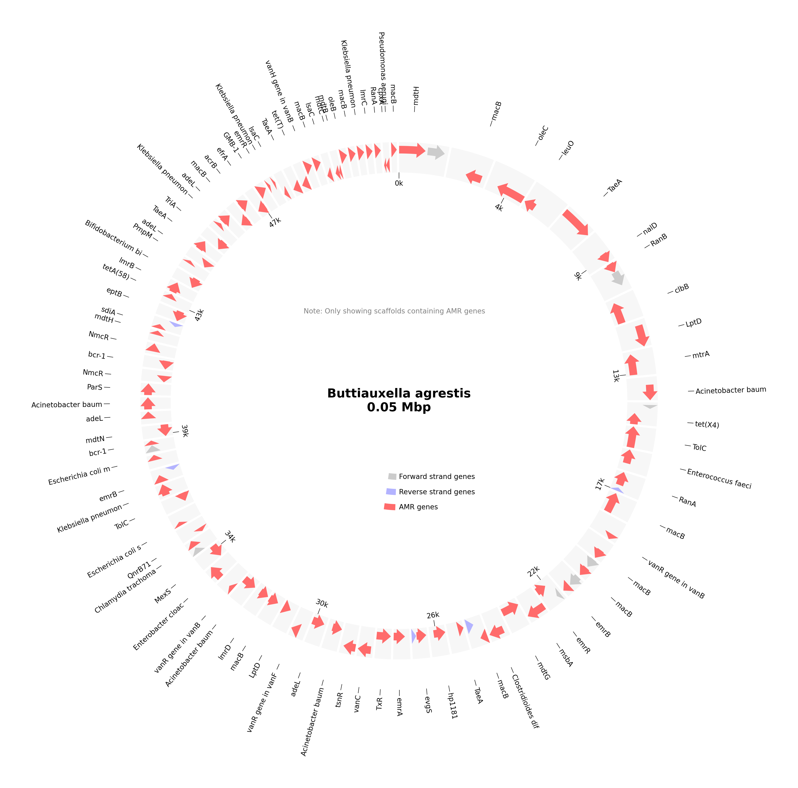

### Acinetobacter baumannii AbaF (found in 2 locations)
- **Mechanism**: antibiotic efflux
- **Drug Classes**: phosphonic acid antibiotic
- **AMR Family**: major facilitator superfamily (MFS) antibiotic efflux pump
- **Locations**:
  - gnl|SPADES|AKHJOCOO_16313_1 : position 1-387
  - gnl|SPADES|AKHJOCOO_9728_1 : position 293-874

### Acinetobacter baumannii AbaQ (found in 2 locations)
- **Mechanism**: antibiotic efflux
- **Drug Classes**: fluoroquinolone antibiotic
- **AMR Family**: major facilitator superfamily (MFS) antibiotic efflux pump
- **Locations**:
  - gnl|SPADES|AKHJOCOO_17436_1 : position 2-544
  - gnl|SPADES|AKHJOCOO_22144_1 : position 1-450

### Bifidobacterium bifidum ileS conferring resistance to mupirocin
- **Mechanism**: antibiotic target alteration
- **Drug Classes**: mupirocin-like antibiotic
- **AMR Family**: antibiotic-resistant isoleucyl-tRNA synthetase (ileS)
- **Locations**:
  - gnl|SPADES|AKHJOCOO_26339_1 : position 1-393

### Chlamydia trachomatis intrinsic murA conferring resistance to fosfomycin
- **Mechanism**: antibiotic target alteration
- **Drug Classes**: phosphonic acid antibiotic
- **AMR Family**: antibiotic-resistant murA transferase
- **Locations**:
  - gnl|SPADES|AKHJOCOO_18176_2 : position 285-527

### Clostridioides difficile gyrB conferring resistance to fluoroquinolones
- **Mechanism**: antibiotic target alteration
- **Drug Classes**: fluoroquinolone antibiotic
- **AMR Family**: fluoroquinolone resistant gyrB
- **Locations**:
  - gnl|SPADES|AKHJOCOO_12410_2 : position 153-707

### Enterobacter cloacae acrA
- **Mechanism**: antibiotic efflux
- **Drug Classes**: fluoroquinolone antibiotic; cephalosporin; glycylcycline; penam; tetracycline antibiotic; rifamycin antibiotic; phenicol antibiotic; disinfecting agents and antiseptics
- **AMR Family**: resistance-nodulation-cell division (RND) antibiotic efflux pump
- **Locations**:
  - gnl|SPADES|AKHJOCOO_17895_1 : position 2-532

### Enterococcus faecium liaR mutant conferring daptomycin resistance
- **Mechanism**: antibiotic target alteration; antibiotic efflux
- **Drug Classes**: peptide antibiotic
- **AMR Family**: daptomycin resistant liaR
- **Locations**:
  - gnl|SPADES|AKHJOCOO_10068_1 : position 2-565

### Escherichia coli mdfA
- **Mechanism**: antibiotic efflux
- **Drug Classes**: tetracycline antibiotic; phenicol antibiotic; disinfecting agents and antiseptics
- **AMR Family**: major facilitator superfamily (MFS) antibiotic efflux pump
- **Locations**:
  - gnl|SPADES|AKHJOCOO_20425_2 : position 277-480

### Escherichia coli soxS with mutation conferring antibiotic resistance
- **Mechanism**: antibiotic target alteration; antibiotic efflux; reduced permeability to antibiotic
- **Drug Classes**: fluoroquinolone antibiotic; monobactam; carbapenem; cephalosporin; glycylcycline; cephamycin; penam; tetracycline antibiotic; rifamycin antibiotic; phenicol antibiotic; penem; disinfecting agents and antiseptics
- **AMR Family**: ATP-binding cassette (ABC) antibiotic efflux pump; major facilitator superfamily (MFS) antibiotic efflux pump; resistance-nodulation-cell division (RND) antibiotic efflux pump; General Bacterial Porin with reduced permeability to beta-lactams
- **Locations**:
  - gnl|SPADES|AKHJOCOO_18647_1 : position 3-152

### GMB-1
- **Mechanism**: antibiotic inactivation
- **Drug Classes**: carbapenem
- **AMR Family**: GMB beta-lactamase
- **Locations**:
  - gnl|SPADES|AKHJOCOO_33434_1 : position 1-327

### Klebsiella pneumoniae KpnE
- **Mechanism**: antibiotic efflux
- **Drug Classes**: macrolide antibiotic; aminoglycoside antibiotic; cephalosporin; tetracycline antibiotic; peptide antibiotic; rifamycin antibiotic; disinfecting agents and antiseptics
- **AMR Family**: small multidrug resistance (SMR) antibiotic efflux pump
- **Locations**:
  - gnl|SPADES|AKHJOCOO_29814_1 : position 220-357

### Klebsiella pneumoniae KpnG
- **Mechanism**: antibiotic efflux
- **Drug Classes**: macrolide antibiotic; fluoroquinolone antibiotic; aminoglycoside antibiotic; carbapenem; cephalosporin; penam; peptide antibiotic; penem
- **AMR Family**: major facilitator superfamily (MFS) antibiotic efflux pump
- **Locations**:
  - gnl|SPADES|AKHJOCOO_34174_2 : position 235-321

### Klebsiella pneumoniae KpnH
- **Mechanism**: antibiotic efflux
- **Drug Classes**: macrolide antibiotic; fluoroquinolone antibiotic; aminoglycoside antibiotic; carbapenem; cephalosporin; penam; peptide antibiotic; penem
- **AMR Family**: major facilitator superfamily (MFS) antibiotic efflux pump
- **Locations**:
  - gnl|SPADES|AKHJOCOO_56064_1 : position 2-244

### Klebsiella pneumoniae acrR with mutation conferring multidrug antibiotic resistance
- **Mechanism**: antibiotic target alteration; antibiotic efflux
- **Drug Classes**: fluoroquinolone antibiotic; cephalosporin; glycylcycline; penam; tetracycline antibiotic; rifamycin antibiotic; phenicol antibiotic; disinfecting agents and antiseptics
- **AMR Family**: resistance-nodulation-cell division (RND) antibiotic efflux pump
- **Locations**:
  - gnl|SPADES|AKHJOCOO_19290_1 : position 76-501

### LptD (found in 2 locations)
- **Mechanism**: antibiotic efflux
- **Drug Classes**: carbapenem; peptide antibiotic; aminocoumarin antibiotic; rifamycin antibiotic
- **AMR Family**: ATP-binding cassette (ABC) antibiotic efflux pump
- **Locations**:
  - gnl|SPADES|AKHJOCOO_16840_2 : position 231-557
  - gnl|SPADES|AKHJOCOO_8137_1 : position 197-1009

### MexS
- **Mechanism**: antibiotic efflux
- **Drug Classes**: fluoroquinolone antibiotic; diaminopyrimidine antibiotic; phenicol antibiotic
- **AMR Family**: resistance-nodulation-cell division (RND) antibiotic efflux pump
- **Locations**:
  - gnl|SPADES|AKHJOCOO_17967_1 : position 1-501

### NmcR (found in 2 locations)
- **Mechanism**: antibiotic inactivation
- **Drug Classes**: carbapenem; cephalosporin; cephamycin; penam
- **AMR Family**: NmcA beta-lactamase
- **Locations**:
  - gnl|SPADES|AKHJOCOO_23505_1 : position 3-257
  - gnl|SPADES|AKHJOCOO_25036_1 : position 104-409

### ParS
- **Mechanism**: antibiotic efflux; reduced permeability to antibiotic
- **Drug Classes**: macrolide antibiotic; fluoroquinolone antibiotic; monobactam; aminoglycoside antibiotic; carbapenem; cephalosporin; cephamycin; penam; tetracycline antibiotic; phenicol antibiotic; penem; disinfecting agents and antiseptics
- **AMR Family**: resistance-nodulation-cell division (RND) antibiotic efflux pump; Outer Membrane Porin (Opr)
- **Locations**:
  - gnl|SPADES|AKHJOCOO_22847_1 : position 3-437

### PmpM
- **Mechanism**: antibiotic efflux
- **Drug Classes**: fluoroquinolone antibiotic; aminoglycoside antibiotic; disinfecting agents and antiseptics
- **AMR Family**: multidrug and toxic compound extrusion (MATE) transporter
- **Locations**:
  - gnl|SPADES|AKHJOCOO_26468_1 : position 274-393

### Pseudomonas aeruginosa CpxR
- **Mechanism**: antibiotic efflux
- **Drug Classes**: macrolide antibiotic; fluoroquinolone antibiotic; monobactam; aminoglycoside antibiotic; carbapenem; cephalosporin; cephamycin; penam; tetracycline antibiotic; peptide antibiotic; aminocoumarin antibiotic; diaminopyrimidine antibiotic; sulfonamide antibiotic; phenicol antibiotic; penem
- **AMR Family**: resistance-nodulation-cell division (RND) antibiotic efflux pump
- **Locations**:
  - gnl|SPADES|AKHJOCOO_67025_2 : position 82-222

### QnrB71
- **Mechanism**: antibiotic target protection
- **Drug Classes**: fluoroquinolone antibiotic
- **AMR Family**: quinolone resistance protein (qnr)
- **Locations**:
  - gnl|SPADES|AKHJOCOO_18206_1 : position 1-165

### RanA (found in 2 locations)
- **Mechanism**: antibiotic efflux
- **Drug Classes**: aminoglycoside antibiotic
- **AMR Family**: ATP-binding cassette (ABC) antibiotic efflux pump
- **Locations**:
  - gnl|SPADES|AKHJOCOO_10587_1 : position 2-544
  - gnl|SPADES|AKHJOCOO_63464_1 : position 1-228

### RanB
- **Mechanism**: antibiotic efflux
- **Drug Classes**: aminoglycoside antibiotic
- **AMR Family**: ATP-binding cassette (ABC) antibiotic efflux pump
- **Locations**:
  - gnl|SPADES|AKHJOCOO_6871_1 : position 2-364

### TaeA (found in 4 locations)
- **Mechanism**: antibiotic efflux
- **Drug Classes**: pleuromutilin antibiotic
- **AMR Family**: ATP-binding cassette (ABC) antibiotic efflux pump
- **Locations**:
  - gnl|SPADES|AKHJOCOO_13598_1 : position 2-232
  - gnl|SPADES|AKHJOCOO_28392_1 : position 3-371
  - gnl|SPADES|AKHJOCOO_36839_1 : position 2-301
  - gnl|SPADES|AKHJOCOO_6409_1 : position 2-1237

### TolC (found in 2 locations)
- **Mechanism**: antibiotic efflux
- **Drug Classes**: macrolide antibiotic; fluoroquinolone antibiotic; aminoglycoside antibiotic; carbapenem; cephalosporin; glycylcycline; cephamycin; penam; tetracycline antibiotic; peptide antibiotic; aminocoumarin antibiotic; rifamycin antibiotic; phenicol antibiotic; penem; disinfecting agents and antiseptics
- **AMR Family**: ATP-binding cassette (ABC) antibiotic efflux pump; major facilitator superfamily (MFS) antibiotic efflux pump; resistance-nodulation-cell division (RND) antibiotic efflux pump
- **Locations**:
  - gnl|SPADES|AKHJOCOO_10044_1 : position 3-848
  - gnl|SPADES|AKHJOCOO_19135_1 : position 169-507

### TriA
- **Mechanism**: antibiotic efflux
- **Drug Classes**: disinfecting agents and antiseptics
- **AMR Family**: resistance-nodulation-cell division (RND) antibiotic efflux pump
- **Locations**:
  - gnl|SPADES|AKHJOCOO_28962_1 : position 1-366

### TxR
- **Mechanism**: antibiotic efflux
- **Drug Classes**: tetracycline antibiotic
- **AMR Family**: ATP-binding cassette (ABC) antibiotic efflux pump
- **Locations**:
  - gnl|SPADES|AKHJOCOO_15467_1 : position 25-594

### acrB
- **Mechanism**: antibiotic efflux
- **Drug Classes**: fluoroquinolone antibiotic; cephalosporin; glycylcycline; penam; tetracycline antibiotic; rifamycin antibiotic; phenicol antibiotic; disinfecting agents and antiseptics
- **AMR Family**: resistance-nodulation-cell division (RND) antibiotic efflux pump
- **Locations**:
  - gnl|SPADES|AKHJOCOO_30875_1 : position 1-348

### adeL (found in 4 locations)
- **Mechanism**: antibiotic efflux
- **Drug Classes**: fluoroquinolone antibiotic; tetracycline antibiotic
- **AMR Family**: resistance-nodulation-cell division (RND) antibiotic efflux pump
- **Locations**:
  - gnl|SPADES|AKHJOCOO_16342_1 : position 81-569
  - gnl|SPADES|AKHJOCOO_21766_2 : position 193-456
  - gnl|SPADES|AKHJOCOO_28304_1 : position 1-267
  - gnl|SPADES|AKHJOCOO_29838_1 : position 2-358

### bcr-1 (found in 2 locations)
- **Mechanism**: antibiotic efflux
- **Drug Classes**: bicyclomycin-like antibiotic
- **AMR Family**: major facilitator superfamily (MFS) antibiotic efflux pump
- **Locations**:
  - gnl|SPADES|AKHJOCOO_21265_2 : position 301-465
  - gnl|SPADES|AKHJOCOO_23895_1 : position 2-343

### clbB
- **Mechanism**: antibiotic target alteration
- **Drug Classes**: lincosamide antibiotic; streptogramin antibiotic; streptogramin A antibiotic; oxazolidinone antibiotic; phenicol antibiotic; pleuromutilin antibiotic
- **AMR Family**: Cfr 23S ribosomal RNA methyltransferase
- **Locations**:
  - gnl|SPADES|AKHJOCOO_8115_1 : position 156-1013

### cpxA
- **Mechanism**: antibiotic efflux
- **Drug Classes**: aminoglycoside antibiotic; aminocoumarin antibiotic
- **AMR Family**: resistance-nodulation-cell division (RND) antibiotic efflux pump
- **Locations**:
  - gnl|SPADES|AKHJOCOO_67025_1 : position 2-85

### efrA
- **Mechanism**: antibiotic efflux
- **Drug Classes**: macrolide antibiotic; fluoroquinolone antibiotic; rifamycin antibiotic
- **AMR Family**: ATP-binding cassette (ABC) antibiotic efflux pump
- **Locations**:
  - gnl|SPADES|AKHJOCOO_31333_1 : position 1-345

### emrA
- **Mechanism**: antibiotic efflux
- **Drug Classes**: fluoroquinolone antibiotic
- **AMR Family**: major facilitator superfamily (MFS) antibiotic efflux pump
- **Locations**:
  - gnl|SPADES|AKHJOCOO_14379_1 : position 181-630

### emrB (found in 2 locations)
- **Mechanism**: antibiotic efflux
- **Drug Classes**: fluoroquinolone antibiotic
- **AMR Family**: major facilitator superfamily (MFS) antibiotic efflux pump
- **Locations**:
  - gnl|SPADES|AKHJOCOO_11343_2 : position 478-765
  - gnl|SPADES|AKHJOCOO_19456_1 : position 1-279

### emrR (found in 2 locations)
- **Mechanism**: antibiotic efflux
- **Drug Classes**: fluoroquinolone antibiotic
- **AMR Family**: major facilitator superfamily (MFS) antibiotic efflux pump
- **Locations**:
  - gnl|SPADES|AKHJOCOO_11427_2 : position 342-758
  - gnl|SPADES|AKHJOCOO_34174_1 : position 2-100

### eptB
- **Mechanism**: antibiotic target alteration
- **Drug Classes**: peptide antibiotic
- **AMR Family**: pmr phosphoethanolamine transferase
- **Locations**:
  - gnl|SPADES|AKHJOCOO_25351_1 : position 2-406

### evgS
- **Mechanism**: antibiotic efflux
- **Drug Classes**: macrolide antibiotic; fluoroquinolone antibiotic; penam; tetracycline antibiotic
- **AMR Family**: major facilitator superfamily (MFS) antibiotic efflux pump; resistance-nodulation-cell division (RND) antibiotic efflux pump
- **Locations**:
  - gnl|SPADES|AKHJOCOO_14309_2 : position 47-436

### hp1181
- **Mechanism**: antibiotic efflux
- **Drug Classes**: fluoroquinolone antibiotic; tetracycline antibiotic; nitroimidazole antibiotic
- **AMR Family**: major facilitator superfamily (MFS) antibiotic efflux pump
- **Locations**:
  - gnl|SPADES|AKHJOCOO_14163_1 : position 2-472

### leuO
- **Mechanism**: antibiotic efflux
- **Drug Classes**: nucleoside antibiotic; disinfecting agents and antiseptics
- **AMR Family**: major facilitator superfamily (MFS) antibiotic efflux pump
- **Locations**:
  - gnl|SPADES|AKHJOCOO_5613_1 : position 2-469

### lmrB
- **Mechanism**: antibiotic efflux
- **Drug Classes**: lincosamide antibiotic; nucleoside antibiotic
- **AMR Family**: ATP-binding cassette (ABC) antibiotic efflux pump
- **Locations**:
  - gnl|SPADES|AKHJOCOO_25937_1 : position 1-399

### lmrC
- **Mechanism**: antibiotic target protection
- **Drug Classes**: lincosamide antibiotic
- **AMR Family**: Miscellaneous ABC-F subfamily ATP-binding cassette ribosomal protection proteins
- **Locations**:
  - gnl|SPADES|AKHJOCOO_60331_1 : position 3-233

### lmrD
- **Mechanism**: antibiotic efflux
- **Drug Classes**: lincosamide antibiotic
- **AMR Family**: ATP-binding cassette (ABC) antibiotic efflux pump
- **Locations**:
  - gnl|SPADES|AKHJOCOO_17167_1 : position 1-366

### lsaC (found in 2 locations)
- **Mechanism**: antibiotic target protection
- **Drug Classes**: lincosamide antibiotic; streptogramin antibiotic; pleuromutilin antibiotic
- **AMR Family**: lsa-type ABC-F protein
- **Locations**:
  - gnl|SPADES|AKHJOCOO_34791_1 : position 3-161
  - gnl|SPADES|AKHJOCOO_50076_1 : position 1-192

### macB (found in 10 locations)
- **Mechanism**: antibiotic efflux
- **Drug Classes**: macrolide antibiotic
- **AMR Family**: ATP-binding cassette (ABC) antibiotic efflux pump
- **Locations**:
  - gnl|SPADES|AKHJOCOO_10585_1 : position 2-811
  - gnl|SPADES|AKHJOCOO_11005_2 : position 429-785
  - gnl|SPADES|AKHJOCOO_11246_2 : position 410-769
  - gnl|SPADES|AKHJOCOO_12823_1 : position 3-275
  - gnl|SPADES|AKHJOCOO_17037_2 : position 168-554
  - gnl|SPADES|AKHJOCOO_30591_1 : position 1-351
  - gnl|SPADES|AKHJOCOO_46852_1 : position 1-264
  - gnl|SPADES|AKHJOCOO_4873_2 : position 759-1409
  - gnl|SPADES|AKHJOCOO_56015_1 : position 2-244
  - gnl|SPADES|AKHJOCOO_73032_1 : position 3-209

### mdtB
- **Mechanism**: antibiotic efflux
- **Drug Classes**: aminocoumarin antibiotic
- **AMR Family**: resistance-nodulation-cell division (RND) antibiotic efflux pump
- **Locations**:
  - gnl|SPADES|AKHJOCOO_50644_2 : position 151-255

### mdtC
- **Mechanism**: antibiotic efflux
- **Drug Classes**: aminocoumarin antibiotic
- **AMR Family**: resistance-nodulation-cell division (RND) antibiotic efflux pump
- **Locations**:
  - gnl|SPADES|AKHJOCOO_50644_1 : position 2-154

### mdtG
- **Mechanism**: antibiotic efflux
- **Drug Classes**: phosphonic acid antibiotic
- **AMR Family**: major facilitator superfamily (MFS) antibiotic efflux pump
- **Locations**:
  - gnl|SPADES|AKHJOCOO_12214_1 : position 1-717

### mdtH (found in 2 locations)
- **Mechanism**: antibiotic efflux
- **Drug Classes**: fluoroquinolone antibiotic
- **AMR Family**: major facilitator superfamily (MFS) antibiotic efflux pump
- **Locations**:
  - gnl|SPADES|AKHJOCOO_25047_1 : position 243-410
  - gnl|SPADES|AKHJOCOO_4182_1 : position 2-994

### mdtN
- **Mechanism**: antibiotic efflux
- **Drug Classes**: nucleoside antibiotic; disinfecting agents and antiseptics
- **AMR Family**: major facilitator superfamily (MFS) antibiotic efflux pump
- **Locations**:
  - gnl|SPADES|AKHJOCOO_21306_1 : position 1-465

### msbA
- **Mechanism**: antibiotic efflux
- **Drug Classes**: nitroimidazole antibiotic
- **AMR Family**: ATP-binding cassette (ABC) antibiotic efflux pump
- **Locations**:
  - gnl|SPADES|AKHJOCOO_12187_1 : position 2-718

### mtrA
- **Mechanism**: antibiotic efflux
- **Drug Classes**: macrolide antibiotic; penam
- **AMR Family**: resistance-nodulation-cell division (RND) antibiotic efflux pump
- **Locations**:
  - gnl|SPADES|AKHJOCOO_8406_1 : position 107-934

### nalD
- **Mechanism**: antibiotic efflux
- **Drug Classes**: macrolide antibiotic; fluoroquinolone antibiotic; monobactam; carbapenem; cephalosporin; cephamycin; penam; tetracycline antibiotic; peptide antibiotic; aminocoumarin antibiotic; diaminopyrimidine antibiotic; sulfonamide antibiotic; phenicol antibiotic; penem
- **AMR Family**: resistance-nodulation-cell division (RND) antibiotic efflux pump
- **Locations**:
  - gnl|SPADES|AKHJOCOO_6823_2 : position 814-1173

### oleB
- **Mechanism**: antibiotic target protection
- **Drug Classes**: macrolide antibiotic
- **AMR Family**: Miscellaneous ABC-F subfamily ATP-binding cassette ribosomal protection proteins
- **Locations**:
  - gnl|SPADES|AKHJOCOO_50708_1 : position 2-256

### oleC
- **Mechanism**: antibiotic efflux
- **Drug Classes**: macrolide antibiotic
- **AMR Family**: ATP-binding cassette (ABC) antibiotic efflux pump
- **Locations**:
  - gnl|SPADES|AKHJOCOO_4922_2 : position 431-1579

### sdiA
- **Mechanism**: antibiotic efflux
- **Drug Classes**: fluoroquinolone antibiotic; cephalosporin; glycylcycline; penam; tetracycline antibiotic; rifamycin antibiotic; phenicol antibiotic; disinfecting agents and antiseptics
- **AMR Family**: resistance-nodulation-cell division (RND) antibiotic efflux pump
- **Locations**:
  - gnl|SPADES|AKHJOCOO_25085_1 : position 2-172

### tet(T)
- **Mechanism**: antibiotic target protection
- **Drug Classes**: tetracycline antibiotic
- **AMR Family**: tetracycline-resistant ribosomal protection protein
- **Locations**:
  - gnl|SPADES|AKHJOCOO_37922_1 : position 2-295

### tet(X4)
- **Mechanism**: antibiotic inactivation
- **Drug Classes**: glycylcycline; tetracycline antibiotic
- **AMR Family**: tetracycline inactivation enzyme
- **Locations**:
  - gnl|SPADES|AKHJOCOO_9766_1 : position 427-870

### tetA(58)
- **Mechanism**: antibiotic efflux
- **Drug Classes**: tetracycline antibiotic
- **AMR Family**: major facilitator superfamily (MFS) antibiotic efflux pump
- **Locations**:
  - gnl|SPADES|AKHJOCOO_25758_2 : position 216-401

### tsnR
- **Mechanism**: antibiotic target alteration
- **Drug Classes**: peptide antibiotic
- **AMR Family**: non-erm 23S ribosomal RNA methyltransferase (A1067)
- **Locations**:
  - gnl|SPADES|AKHJOCOO_16310_1 : position 2-460

### vanC
- **Mechanism**: antibiotic target alteration
- **Drug Classes**: glycopeptide antibiotic
- **AMR Family**: glycopeptide resistance gene cluster; Van ligase
- **Locations**:
  - gnl|SPADES|AKHJOCOO_16200_1 : position 79-573

### vanH gene in vanB cluster
- **Mechanism**: antibiotic target alteration
- **Drug Classes**: glycopeptide antibiotic
- **AMR Family**: vanH; glycopeptide resistance gene cluster
- **Locations**:
  - gnl|SPADES|AKHJOCOO_44221_1 : position 1-270

### vanR gene in vanB cluster (found in 2 locations)
- **Mechanism**: antibiotic target alteration
- **Drug Classes**: glycopeptide antibiotic
- **AMR Family**: glycopeptide resistance gene cluster; vanR
- **Locations**:
  - gnl|SPADES|AKHJOCOO_10786_2 : position 580-798
  - gnl|SPADES|AKHJOCOO_17461_1 : position 2-178

### vanR gene in vanF cluster
- **Mechanism**: antibiotic target alteration
- **Drug Classes**: glycopeptide antibiotic
- **AMR Family**: glycopeptide resistance gene cluster; vanR
- **Locations**:
  - gnl|SPADES|AKHJOCOO_16690_2 : position 254-562

## Carnobacterium divergens
**Strain Statistics:**
- Total genome length: 1819.1 kbp
- Total scaffolds: 457
- Scaffolds with AMR genes: 129
- Total genes annotated: 3431
- Total AMR genes: 262
- Unique AMR genes: 140
- Distinct AMR mechanisms: 10
- Distinct AMR families: 60
- Distinct drug classes: 33

**Circos Plot:**

### AAC(6')-34
- **Mechanism**: antibiotic inactivation
- **Drug Classes**: aminoglycoside antibiotic
- **AMR Family**: AAC(6')
- **Locations**:
  - gnl|SPADES|AKHJOCOO_384_18 : position 18057-18584

### AAC(6')-Ii
- **Mechanism**: antibiotic inactivation
- **Drug Classes**: aminoglycoside antibiotic
- **AMR Family**: AAC(6')
- **Locations**:
  - gnl|SPADES|AKHJOCOO_119_44 : position 39617-40075

### ACC-3
- **Mechanism**: antibiotic inactivation
- **Drug Classes**: monobactam; cephalosporin; penam
- **AMR Family**: ACC beta-lactamase
- **Locations**:
  - gnl|SPADES|AKHJOCOO_119_49 : position 43642-44820

### ANT(6)-Ia
- **Mechanism**: antibiotic inactivation
- **Drug Classes**: aminoglycoside antibiotic
- **AMR Family**: ANT(6)
- **Locations**:
  - gnl|SPADES|AKHJOCOO_2247_1 : position 2-304

### Acinetobacter baumannii AbaF
- **Mechanism**: antibiotic efflux
- **Drug Classes**: phosphonic acid antibiotic
- **AMR Family**: major facilitator superfamily (MFS) antibiotic efflux pump
- **Locations**:
  - gnl|SPADES|AKHJOCOO_522_19 : position 12086-13321

### Acinetobacter baumannii AbaQ
- **Mechanism**: antibiotic efflux
- **Drug Classes**: fluoroquinolone antibiotic
- **AMR Family**: major facilitator superfamily (MFS) antibiotic efflux pump
- **Locations**:
  - gnl|SPADES|AKHJOCOO_285_6 : position 5475-6728

### AcrE
- **Mechanism**: antibiotic efflux
- **Drug Classes**: fluoroquinolone antibiotic; cephalosporin; cephamycin; penam
- **AMR Family**: resistance-nodulation-cell division (RND) antibiotic efflux pump
- **Locations**:
  - gnl|SPADES|AKHJOCOO_256_19 : position 21702-22871

### AcrS (found in 2 locations)
- **Mechanism**: antibiotic efflux
- **Drug Classes**: fluoroquinolone antibiotic; cephalosporin; glycylcycline; cephamycin; penam; tetracycline antibiotic; rifamycin antibiotic; phenicol antibiotic; disinfecting agents and antiseptics
- **AMR Family**: resistance-nodulation-cell division (RND) antibiotic efflux pump
- **Locations**:
  - gnl|SPADES|AKHJOCOO_107_9 : position 6578-7159
  - gnl|SPADES|AKHJOCOO_393_11 : position 12788-13405

### Agrobacterium fabrum chloramphenicol acetyltransferase
- **Mechanism**: antibiotic inactivation
- **Drug Classes**: phenicol antibiotic
- **AMR Family**: chloramphenicol acetyltransferase (CAT)
- **Locations**:
  - gnl|SPADES|AKHJOCOO_846_5 : position 1923-2498

### BcI
- **Mechanism**: antibiotic inactivation
- **Drug Classes**: cephalosporin; penem
- **AMR Family**: class A Bacillus cereus Bc beta-lactamase
- **Locations**:
  - gnl|SPADES|AKHJOCOO_880_10 : position 7057-7962

### CPS-1
- **Mechanism**: antibiotic inactivation
- **Drug Classes**: carbapenem
- **AMR Family**: CPS beta-lactamase
- **Locations**:
  - gnl|SPADES|AKHJOCOO_1133_3 : position 673-1293

### Clostridioides difficile gyrA conferring resistance to fluoroquinolones (found in 2 locations)
- **Mechanism**: antibiotic target alteration
- **Drug Classes**: fluoroquinolone antibiotic
- **AMR Family**: fluoroquinolone resistant gyrA
- **Locations**:
  - gnl|SPADES|AKHJOCOO_562_4 : position 4082-6550
  - gnl|SPADES|AKHJOCOO_597_10 : position 10803-13289

### Clostridioides difficile gyrB conferring resistance to fluoroquinolones (found in 2 locations)
- **Mechanism**: antibiotic target alteration
- **Drug Classes**: fluoroquinolone antibiotic
- **AMR Family**: fluoroquinolone resistant gyrB
- **Locations**:
  - gnl|SPADES|AKHJOCOO_1330_5 : position 4557-6227
  - gnl|SPADES|AKHJOCOO_562_5 : position 6540-8567

### DfrA36 (found in 2 locations)
- **Mechanism**: antibiotic target replacement
- **Drug Classes**: diaminopyrimidine antibiotic
- **AMR Family**: trimethoprim resistant dihydrofolate reductase dfr
- **Locations**:
  - gnl|SPADES|AKHJOCOO_369_2 : position 561-947
  - gnl|SPADES|AKHJOCOO_527_10 : position 7614-8138

### Enterococcus faecalis cls with mutation conferring resistance to daptomycin (found in 2 locations)
- **Mechanism**: antibiotic target alteration
- **Drug Classes**: peptide antibiotic
- **AMR Family**: daptomycin resistant cls
- **Locations**:
  - gnl|SPADES|AKHJOCOO_477_1 : position 1-1044
  - gnl|SPADES|AKHJOCOO_628_4 : position 1949-3397

### Erm(K)
- **Mechanism**: antibiotic target alteration
- **Drug Classes**: macrolide antibiotic; lincosamide antibiotic; streptogramin antibiotic
- **AMR Family**: Erm 23S ribosomal RNA methyltransferase
- **Locations**:
  - gnl|SPADES|AKHJOCOO_405_12 : position 9278-10048

### Escherichia coli AcrAB-TolC with AcrR mutation conferring resistance to ciprofloxacin, tetracycline, and ceftazidime (found in 2 locations)
- **Mechanism**: antibiotic target alteration; antibiotic efflux
- **Drug Classes**: fluoroquinolone antibiotic; cephalosporin; glycylcycline; penam; tetracycline antibiotic; rifamycin antibiotic; phenicol antibiotic; disinfecting agents and antiseptics
- **AMR Family**: resistance-nodulation-cell division (RND) antibiotic efflux pump
- **Locations**:
  - gnl|SPADES|AKHJOCOO_154_33 : position 32072-32698
  - gnl|SPADES|AKHJOCOO_1639_6 : position 2761-3369

### Escherichia coli AcrAB-TolC with MarR mutations conferring resistance to ciprofloxacin and tetracycline
- **Mechanism**: antibiotic target alteration; antibiotic efflux
- **Drug Classes**: fluoroquinolone antibiotic; cephalosporin; glycylcycline; penam; tetracycline antibiotic; rifamycin antibiotic; phenicol antibiotic; disinfecting agents and antiseptics
- **AMR Family**: resistance-nodulation-cell division (RND) antibiotic efflux pump
- **Locations**:
  - gnl|SPADES|AKHJOCOO_472_11 : position 10126-10587

### Escherichia coli EF-Tu mutants conferring resistance to kirromycin (found in 2 locations)
- **Mechanism**: antibiotic target alteration
- **Drug Classes**: elfamycin antibiotic
- **AMR Family**: elfamycin resistant EF-Tu
- **Locations**:
  - gnl|SPADES|AKHJOCOO_1291_4 : position 3541-4728
  - gnl|SPADES|AKHJOCOO_1885_1 : position 3-266

### Escherichia coli fabI mutations conferring resistance to isoniazid and triclosan
- **Mechanism**: antibiotic target alteration
- **Drug Classes**: disinfecting agents and antiseptics; isoniazid-like antibiotic
- **AMR Family**: antibiotic resistant fabI
- **Locations**:
  - gnl|SPADES|AKHJOCOO_466_6 : position 11265-12023

### EstT (found in 2 locations)
- **Mechanism**: antibiotic inactivation
- **Drug Classes**: macrolide antibiotic
- **AMR Family**: macrolide esterase
- **Locations**:
  - gnl|SPADES|AKHJOCOO_536_13 : position 13529-14341
  - gnl|SPADES|AKHJOCOO_722_11 : position 10105-10821

### FosC2
- **Mechanism**: antibiotic inactivation
- **Drug Classes**: phosphonic acid antibiotic
- **AMR Family**: fosC phosphotransferase family
- **Locations**:
  - gnl|SPADES|AKHJOCOO_1291_5 : position 4774-5154

### HelR
- **Mechanism**: antibiotic target protection
- **Drug Classes**: rifamycin antibiotic
- **AMR Family**: helicase-like RNA polymerase protection protein
- **Locations**:
  - gnl|SPADES|AKHJOCOO_227_14 : position 11625-13919

### Helicobacter pylori pbp1 mutants conferring resistance to amoxicillin (found in 2 locations)
- **Mechanism**: antibiotic target alteration
- **Drug Classes**: cephalosporin; cephamycin; penam
- **AMR Family**: Penicillin-binding protein mutations conferring resistance to beta-lactam antibiotics
- **Locations**:
  - gnl|SPADES|AKHJOCOO_2299_1 : position 3-1778
  - gnl|SPADES|AKHJOCOO_496_11 : position 9658-11784

### Helicobacter pylori rdxA mutation conferring resistance to metronidazole
- **Mechanism**: antibiotic target alteration
- **Drug Classes**: nitroimidazole antibiotic
- **AMR Family**: Antibiotic resistant Helicobacter pylori nitroreductase
- **Locations**:
  - gnl|SPADES|AKHJOCOO_1133_7 : position 3498-4136

### Helicobacter pylori rpoB mutation conferring resistance to rifampicin
- **Mechanism**: antibiotic target alteration; antibiotic target replacement
- **Drug Classes**: fluoroquinolone antibiotic; rifamycin antibiotic
- **AMR Family**: rifamycin-resistant beta-subunit of RNA polymerase (rpoB)
- **Locations**:
  - gnl|SPADES|AKHJOCOO_542_4 : position 2751-6380

### IreK (found in 3 locations)
- **Mechanism**: reduced permeability to antibiotic
- **Drug Classes**: cephalosporin
- **AMR Family**: Serine/threonine kinases
- **Locations**:
  - gnl|SPADES|AKHJOCOO_2851_3 : position 1575-2591
  - gnl|SPADES|AKHJOCOO_734_3 : position 1084-1632
  - gnl|SPADES|AKHJOCOO_855_10 : position 8709-9620

### Klebsiella pneumoniae KpnH
- **Mechanism**: antibiotic efflux
- **Drug Classes**: macrolide antibiotic; fluoroquinolone antibiotic; aminoglycoside antibiotic; carbapenem; cephalosporin; penam; peptide antibiotic; penem
- **AMR Family**: major facilitator superfamily (MFS) antibiotic efflux pump
- **Locations**:
  - gnl|SPADES|AKHJOCOO_342_17 : position 14641-15489

### Listeria monocytogenes mprF
- **Mechanism**: antibiotic target alteration
- **Drug Classes**: peptide antibiotic
- **AMR Family**: defensin resistant mprF
- **Locations**:
  - gnl|SPADES|AKHJOCOO_680_4 : position 2027-4576

### LlmA 23S ribosomal RNA methyltransferase
- **Mechanism**: antibiotic target alteration
- **Drug Classes**: lincosamide antibiotic
- **AMR Family**: Llm 23S ribosomal RNA methyltransferase
- **Locations**:
  - gnl|SPADES|AKHJOCOO_456_7 : position 7947-9125

### MexS (found in 2 locations)
- **Mechanism**: antibiotic efflux
- **Drug Classes**: fluoroquinolone antibiotic; diaminopyrimidine antibiotic; phenicol antibiotic
- **AMR Family**: resistance-nodulation-cell division (RND) antibiotic efflux pump
- **Locations**:
  - gnl|SPADES|AKHJOCOO_477_5 : position 2401-3351
  - gnl|SPADES|AKHJOCOO_522_14 : position 8337-9320

### Mycolicibacterium smegmatis ndh with mutation conferring resistance to isoniazid (found in 2 locations)
- **Mechanism**: antibiotic target alteration
- **Drug Classes**: isoniazid-like antibiotic
- **AMR Family**: antibiotic resistant ndh
- **Locations**:
  - gnl|SPADES|AKHJOCOO_268_4 : position 2566-3771
  - gnl|SPADES|AKHJOCOO_552_8 : position 5735-7606

### Neisseria gonorrhoeae mtrR with mutation conferring resistance
- **Mechanism**: antibiotic efflux
- **Drug Classes**: macrolide antibiotic
- **AMR Family**: resistance-nodulation-cell division (RND) antibiotic efflux pump
- **Locations**:
  - gnl|SPADES|AKHJOCOO_722_3 : position 3628-4221

### NmcR (found in 2 locations)
- **Mechanism**: antibiotic inactivation
- **Drug Classes**: carbapenem; cephalosporin; cephamycin; penam
- **AMR Family**: NmcA beta-lactamase
- **Locations**:
  - gnl|SPADES|AKHJOCOO_29319_1 : position 84-362
  - gnl|SPADES|AKHJOCOO_562_1 : position 2-532

### PAM-2
- **Mechanism**: antibiotic inactivation
- **Drug Classes**: carbapenem; cephalosporin
- **AMR Family**: PAM beta-lactamase
- **Locations**:
  - gnl|SPADES|AKHJOCOO_2459_2 : position 1275-1988

### PmrF (found in 4 locations)
- **Mechanism**: antibiotic target alteration
- **Drug Classes**: peptide antibiotic
- **AMR Family**: pmr phosphoethanolamine transferase
- **Locations**:
  - gnl|SPADES|AKHJOCOO_190_30 : position 28459-29643
  - gnl|SPADES|AKHJOCOO_194_29 : position 32947-34197
  - gnl|SPADES|AKHJOCOO_393_16 : position 16820-17482
  - gnl|SPADES|AKHJOCOO_393_17 : position 17549-17773

### Pseudomonas mutant PhoP conferring resistance to colistin
- **Mechanism**: antibiotic target alteration; antibiotic efflux; resistance by absence
- **Drug Classes**: macrolide antibiotic; peptide antibiotic
- **AMR Family**: ATP-binding cassette (ABC) antibiotic efflux pump; pmr phosphoethanolamine transferase; transmembrane protein conferring colistin resistance
- **Locations**:
  - gnl|SPADES|AKHJOCOO_107_54 : position 50165-50884

### QnrS15
- **Mechanism**: antibiotic target protection
- **Drug Classes**: fluoroquinolone antibiotic
- **AMR Family**: quinolone resistance protein (qnr)
- **Locations**:
  - gnl|SPADES|AKHJOCOO_154_46 : position 42581-43204

### QnrVC4
- **Mechanism**: antibiotic target protection
- **Drug Classes**: fluoroquinolone antibiotic
- **AMR Family**: quinolone resistance protein (qnr)
- **Locations**:
  - gnl|SPADES|AKHJOCOO_967_6 : position 5893-6528

### RanA (found in 7 locations)
- **Mechanism**: antibiotic efflux
- **Drug Classes**: aminoglycoside antibiotic
- **AMR Family**: ATP-binding cassette (ABC) antibiotic efflux pump
- **Locations**:
  - gnl|SPADES|AKHJOCOO_119_19 : position 14158-15195
  - gnl|SPADES|AKHJOCOO_1367_1 : position 2-766
  - gnl|SPADES|AKHJOCOO_360_23 : position 17296-18270
  - gnl|SPADES|AKHJOCOO_384_2 : position 442-1536
  - gnl|SPADES|AKHJOCOO_396_9 : position 7568-8377
  - gnl|SPADES|AKHJOCOO_536_4 : position 3589-4707
  - gnl|SPADES|AKHJOCOO_599_6 : position 4161-4934

### RlmA(II)
- **Mechanism**: antibiotic target alteration
- **Drug Classes**: macrolide antibiotic; lincosamide antibiotic
- **AMR Family**: non-erm 23S ribosomal RNA methyltransferase (G748)
- **Locations**:
  - gnl|SPADES|AKHJOCOO_227_20 : position 18679-19536

### Rv1877
- **Mechanism**: antibiotic efflux
- **Drug Classes**: fluoroquinolone antibiotic
- **AMR Family**: major facilitator superfamily (MFS) antibiotic efflux pump
- **Locations**:
  - gnl|SPADES|AKHJOCOO_505_4 : position 2833-4311

### SAT-2
- **Mechanism**: antibiotic inactivation
- **Drug Classes**: nucleoside antibiotic
- **AMR Family**: streptothricin acetyltransferase (SAT)
- **Locations**:
  - gnl|SPADES|AKHJOCOO_568_6 : position 4148-4993

### SatA
- **Mechanism**: antibiotic inactivation
- **Drug Classes**: nucleoside antibiotic
- **AMR Family**: streptothricin acetyltransferase (SAT)
- **Locations**:
  - gnl|SPADES|AKHJOCOO_527_15 : position 11937-12371

### Staphylococcus aureus fusA with mutation conferring resistance to fusidic acid
- **Mechanism**: antibiotic target alteration
- **Drug Classes**: fusidane antibiotic
- **AMR Family**: antibiotic resistant fusA
- **Locations**:
  - gnl|SPADES|AKHJOCOO_247_2 : position 426-2003

### Staphylococcus aureus mupA conferring resistance to mupirocin (found in 2 locations)
- **Mechanism**: antibiotic target alteration
- **Drug Classes**: mupirocin-like antibiotic
- **AMR Family**: antibiotic-resistant isoleucyl-tRNA synthetase (ileS)
- **Locations**:
  - gnl|SPADES|AKHJOCOO_405_9 : position 5727-7751
  - gnl|SPADES|AKHJOCOO_779_6 : position 3329-6109

### Staphylococcus aureus mupB conferring resistance to mupirocin (found in 2 locations)
- **Mechanism**: antibiotic target alteration
- **Drug Classes**: mupirocin-like antibiotic
- **AMR Family**: antibiotic-resistant isoleucyl-tRNA synthetase (ileS)
- **Locations**:
  - gnl|SPADES|AKHJOCOO_564_7 : position 6828-9242
  - gnl|SPADES|AKHJOCOO_604_13 : position 10068-12713

### Staphylococcus aureus murA with mutation conferring resistance to fosfomycin (found in 2 locations)
- **Mechanism**: antibiotic target alteration
- **Drug Classes**: phosphonic acid antibiotic
- **AMR Family**: antibiotic-resistant murA transferase
- **Locations**:
  - gnl|SPADES|AKHJOCOO_769_11 : position 7923-9236
  - gnl|SPADES|AKHJOCOO_831_2 : position 1092-2357

### Staphylococcus aureus rpoB mutants conferring resistance to rifampicin
- **Mechanism**: antibiotic target alteration; antibiotic target replacement
- **Drug Classes**: rifamycin antibiotic
- **AMR Family**: rifamycin-resistant beta-subunit of RNA polymerase (rpoB)
- **Locations**:
  - gnl|SPADES|AKHJOCOO_542_5 : position 6498-10073

### Streptococcus pneumoniae PBP2b conferring resistance to amoxicillin
- **Mechanism**: antibiotic target alteration
- **Drug Classes**: cephalosporin; cephamycin; penam
- **AMR Family**: Penicillin-binding protein mutations conferring resistance to beta-lactam antibiotics
- **Locations**:
  - gnl|SPADES|AKHJOCOO_1206_6 : position 3910-6030

### Streptococcus pneumoniae PBP2x conferring resistance to amoxicillin
- **Mechanism**: antibiotic target alteration
- **Drug Classes**: cephalosporin; cephamycin; penam
- **AMR Family**: Penicillin-binding protein mutations conferring resistance to beta-lactam antibiotics
- **Locations**:
  - gnl|SPADES|AKHJOCOO_347_18 : position 11677-13842

### Streptomyces rimosus otr(A)
- **Mechanism**: antibiotic target protection
- **Drug Classes**: tetracycline antibiotic
- **AMR Family**: tetracycline-resistant ribosomal protection protein
- **Locations**:
  - gnl|SPADES|AKHJOCOO_1948_1 : position 3-1400

### TaeA (found in 3 locations)
- **Mechanism**: antibiotic efflux
- **Drug Classes**: pleuromutilin antibiotic
- **AMR Family**: ATP-binding cassette (ABC) antibiotic efflux pump
- **Locations**:
  - gnl|SPADES|AKHJOCOO_1181_4 : position 2671-4311
  - gnl|SPADES|AKHJOCOO_1511_1 : position 3-1145
  - gnl|SPADES|AKHJOCOO_587_3 : position 2172-4058

### TxR (found in 3 locations)
- **Mechanism**: antibiotic efflux
- **Drug Classes**: tetracycline antibiotic
- **AMR Family**: ATP-binding cassette (ABC) antibiotic efflux pump
- **Locations**:
  - gnl|SPADES|AKHJOCOO_1116_2 : position 1566-4268
  - gnl|SPADES|AKHJOCOO_171_12 : position 11944-14805
  - gnl|SPADES|AKHJOCOO_597_1 : position 143-2806

### VatI
- **Mechanism**: antibiotic inactivation
- **Drug Classes**: streptogramin antibiotic; streptogramin A antibiotic
- **AMR Family**: streptogramin vat acetyltransferase
- **Locations**:
  - gnl|SPADES|AKHJOCOO_373_19 : position 16946-17647

### YajC
- **Mechanism**: antibiotic efflux
- **Drug Classes**: fluoroquinolone antibiotic; cephalosporin; glycylcycline; penam; tetracycline antibiotic; oxazolidinone antibiotic; glycopeptide antibiotic; rifamycin antibiotic; phenicol antibiotic; disinfecting agents and antiseptics
- **AMR Family**: resistance-nodulation-cell division (RND) antibiotic efflux pump
- **Locations**:
  - gnl|SPADES|AKHJOCOO_680_3 : position 1577-1942

### aac(6')-Ib-cr11
- **Mechanism**: antibiotic inactivation
- **Drug Classes**: fluoroquinolone antibiotic; aminoglycoside antibiotic
- **AMR Family**: AAC(6'); AAC(6')-Ib-cr
- **Locations**:
  - gnl|SPADES|AKHJOCOO_107_8 : position 5987-6559

### aad(6)
- **Mechanism**: antibiotic inactivation
- **Drug Classes**: aminoglycoside antibiotic
- **AMR Family**: ANT(6)
- **Locations**:
  - gnl|SPADES|AKHJOCOO_270_21 : position 28147-28707

### adeR
- **Mechanism**: antibiotic efflux
- **Drug Classes**: glycylcycline; tetracycline antibiotic
- **AMR Family**: resistance-nodulation-cell division (RND) antibiotic efflux pump
- **Locations**:
  - gnl|SPADES|AKHJOCOO_551_3 : position 3531-4226

### almE (found in 2 locations)
- **Mechanism**: antibiotic target alteration
- **Drug Classes**: peptide antibiotic
- **AMR Family**: polymyxin resistance operon; alm glycyltransferase
- **Locations**:
  - gnl|SPADES|AKHJOCOO_373_3 : position 1845-3371
  - gnl|SPADES|AKHJOCOO_405_6 : position 2504-3943

### arlR (found in 5 locations)
- **Mechanism**: antibiotic efflux
- **Drug Classes**: fluoroquinolone antibiotic; disinfecting agents and antiseptics
- **AMR Family**: major facilitator superfamily (MFS) antibiotic efflux pump
- **Locations**:
  - gnl|SPADES|AKHJOCOO_1120_6 : position 5116-5799
  - gnl|SPADES|AKHJOCOO_256_12 : position 14010-14696
  - gnl|SPADES|AKHJOCOO_396_2 : position 375-1091
  - gnl|SPADES|AKHJOCOO_506_6 : position 5187-6638
  - gnl|SPADES|AKHJOCOO_653_4 : position 4584-5246

### arlS (found in 5 locations)
- **Mechanism**: antibiotic efflux
- **Drug Classes**: fluoroquinolone antibiotic; disinfecting agents and antiseptics
- **AMR Family**: major facilitator superfamily (MFS) antibiotic efflux pump
- **Locations**:
  - gnl|SPADES|AKHJOCOO_1120_7 : position 5796-7082
  - gnl|SPADES|AKHJOCOO_256_11 : position 12490-14013
  - gnl|SPADES|AKHJOCOO_396_3 : position 1088-2863
  - gnl|SPADES|AKHJOCOO_653_5 : position 5259-6308
  - gnl|SPADES|AKHJOCOO_821_3 : position 1031-2866

### arnA (found in 2 locations)
- **Mechanism**: antibiotic target alteration
- **Drug Classes**: peptide antibiotic
- **AMR Family**: pmr phosphoethanolamine transferase
- **Locations**:
  - gnl|SPADES|AKHJOCOO_422_5 : position 5383-5964
  - gnl|SPADES|AKHJOCOO_855_7 : position 5606-6556

### bacA
- **Mechanism**: antibiotic target alteration
- **Drug Classes**: peptide antibiotic
- **AMR Family**: undecaprenyl pyrophosphate related proteins
- **Locations**:
  - gnl|SPADES|AKHJOCOO_119_36 : position 29971-30789

### baeS (found in 2 locations)
- **Mechanism**: antibiotic efflux
- **Drug Classes**: aminoglycoside antibiotic; aminocoumarin antibiotic
- **AMR Family**: resistance-nodulation-cell division (RND) antibiotic efflux pump
- **Locations**:
  - gnl|SPADES|AKHJOCOO_472_8 : position 7175-8551
  - gnl|SPADES|AKHJOCOO_769_6 : position 3805-5220

### bcr-1
- **Mechanism**: antibiotic efflux
- **Drug Classes**: bicyclomycin-like antibiotic
- **AMR Family**: major facilitator superfamily (MFS) antibiotic efflux pump
- **Locations**:
  - gnl|SPADES|AKHJOCOO_1101_6 : position 4919-5821

### bcrA (found in 8 locations)
- **Mechanism**: antibiotic efflux
- **Drug Classes**: peptide antibiotic
- **AMR Family**: ATP-binding cassette (ABC) antibiotic efflux pump
- **Locations**:
  - gnl|SPADES|AKHJOCOO_107_48 : position 44622-45542
  - gnl|SPADES|AKHJOCOO_119_51 : position 45350-46249
  - gnl|SPADES|AKHJOCOO_1261_6 : position 5133-6020
  - gnl|SPADES|AKHJOCOO_239_26 : position 21905-22597
  - gnl|SPADES|AKHJOCOO_247_23 : position 20814-21755
  - gnl|SPADES|AKHJOCOO_285_11 : position 10981-12462
  - gnl|SPADES|AKHJOCOO_496_2 : position 132-866
  - gnl|SPADES|AKHJOCOO_930_7 : position 8441-8866

### bcrC
- **Mechanism**: antibiotic target alteration
- **Drug Classes**: peptide antibiotic
- **AMR Family**: undecaprenyl pyrophosphate related proteins
- **Locations**:
  - gnl|SPADES|AKHJOCOO_505_10 : position 9675-10346

### bmr
- **Mechanism**: antibiotic efflux
- **Drug Classes**: fluoroquinolone antibiotic; nucleoside antibiotic; phenicol antibiotic; disinfecting agents and antiseptics
- **AMR Family**: major facilitator superfamily (MFS) antibiotic efflux pump
- **Locations**:
  - gnl|SPADES|AKHJOCOO_102_44 : position 47531-48754

### carA
- **Mechanism**: antibiotic target protection
- **Drug Classes**: macrolide antibiotic
- **AMR Family**: Miscellaneous ABC-F subfamily ATP-binding cassette ribosomal protection proteins
- **Locations**:
  - gnl|SPADES|AKHJOCOO_405_19 : position 14195-14902

### catB11
- **Mechanism**: antibiotic inactivation
- **Drug Classes**: phenicol antibiotic
- **AMR Family**: chloramphenicol acetyltransferase (CAT)
- **Locations**:
  - gnl|SPADES|AKHJOCOO_1270_2 : position 863-1525

### cfrA
- **Mechanism**: antibiotic target alteration
- **Drug Classes**: lincosamide antibiotic; streptogramin antibiotic; streptogramin A antibiotic; oxazolidinone antibiotic; phenicol antibiotic; pleuromutilin antibiotic
- **AMR Family**: Cfr 23S ribosomal RNA methyltransferase
- **Locations**:
  - gnl|SPADES|AKHJOCOO_1596_2 : position 1898-2956

### cprR
- **Mechanism**: antibiotic target alteration; antibiotic efflux
- **Drug Classes**: peptide antibiotic
- **AMR Family**: pmr phosphoethanolamine transferase
- **Locations**:
  - gnl|SPADES|AKHJOCOO_400_11 : position 10862-11395

### dfrE
- **Mechanism**: antibiotic target replacement
- **Drug Classes**: diaminopyrimidine antibiotic
- **AMR Family**: trimethoprim resistant dihydrofolate reductase dfr
- **Locations**:
  - gnl|SPADES|AKHJOCOO_587_5 : position 5063-5551

### efrA (found in 5 locations)
- **Mechanism**: antibiotic efflux
- **Drug Classes**: macrolide antibiotic; fluoroquinolone antibiotic; rifamycin antibiotic
- **AMR Family**: ATP-binding cassette (ABC) antibiotic efflux pump
- **Locations**:
  - gnl|SPADES|AKHJOCOO_107_17 : position 13877-15682
  - gnl|SPADES|AKHJOCOO_154_32 : position 30267-31988
  - gnl|SPADES|AKHJOCOO_2040_2 : position 1443-3245
  - gnl|SPADES|AKHJOCOO_653_9 : position 11266-12681
  - gnl|SPADES|AKHJOCOO_71473_1 : position 2-211

### efrB
- **Mechanism**: antibiotic efflux
- **Drug Classes**: macrolide antibiotic; fluoroquinolone antibiotic; rifamycin antibiotic
- **AMR Family**: ATP-binding cassette (ABC) antibiotic efflux pump
- **Locations**:
  - gnl|SPADES|AKHJOCOO_2040_1 : position 1-1446

### evgA
- **Mechanism**: antibiotic efflux
- **Drug Classes**: macrolide antibiotic; fluoroquinolone antibiotic; penam; tetracycline antibiotic
- **AMR Family**: major facilitator superfamily (MFS) antibiotic efflux pump; resistance-nodulation-cell division (RND) antibiotic efflux pump
- **Locations**:
  - gnl|SPADES|AKHJOCOO_553_7 : position 5098-5730

### golS (found in 2 locations)
- **Mechanism**: antibiotic efflux
- **Drug Classes**: monobactam; carbapenem; cephalosporin; cephamycin; penam; phenicol antibiotic; penem
- **AMR Family**: resistance-nodulation-cell division (RND) antibiotic efflux pump
- **Locations**:
  - gnl|SPADES|AKHJOCOO_466_4 : position 4331-5137
  - gnl|SPADES|AKHJOCOO_609_1 : position 186-569

### hmrM
- **Mechanism**: antibiotic efflux
- **Drug Classes**: fluoroquinolone antibiotic; disinfecting agents and antiseptics
- **AMR Family**: multidrug and toxic compound extrusion (MATE) transporter
- **Locations**:
  - gnl|SPADES|AKHJOCOO_171_33 : position 37289-38638

### kdpD (found in 2 locations)
- **Mechanism**: antibiotic efflux
- **Drug Classes**: aminoglycoside antibiotic
- **AMR Family**: kdpDE
- **Locations**:
  - gnl|SPADES|AKHJOCOO_107_55 : position 50881-52530
  - gnl|SPADES|AKHJOCOO_862_2 : position 354-3083

### kdpE (found in 2 locations)
- **Mechanism**: antibiotic efflux
- **Drug Classes**: aminoglycoside antibiotic
- **AMR Family**: kdpDE
- **Locations**:
  - gnl|SPADES|AKHJOCOO_2048_1 : position 2-391
  - gnl|SPADES|AKHJOCOO_862_1 : position 1-357

### leuO
- **Mechanism**: antibiotic efflux
- **Drug Classes**: nucleoside antibiotic; disinfecting agents and antiseptics
- **AMR Family**: major facilitator superfamily (MFS) antibiotic efflux pump
- **Locations**:
  - gnl|SPADES|AKHJOCOO_527_14 : position 11102-11917

### lmrB (found in 3 locations)
- **Mechanism**: antibiotic efflux
- **Drug Classes**: lincosamide antibiotic; nucleoside antibiotic
- **AMR Family**: ATP-binding cassette (ABC) antibiotic efflux pump
- **Locations**:
  - gnl|SPADES|AKHJOCOO_400_5 : position 4814-6268
  - gnl|SPADES|AKHJOCOO_655_10 : position 6081-6872
  - gnl|SPADES|AKHJOCOO_655_11 : position 6826-7479

### lmrD (found in 2 locations)
- **Mechanism**: antibiotic efflux
- **Drug Classes**: lincosamide antibiotic
- **AMR Family**: ATP-binding cassette (ABC) antibiotic efflux pump
- **Locations**:
  - gnl|SPADES|AKHJOCOO_1202_1 : position 3-143
  - gnl|SPADES|AKHJOCOO_609_11 : position 6219-8390

### macA
- **Mechanism**: antibiotic efflux
- **Drug Classes**: macrolide antibiotic
- **AMR Family**: ATP-binding cassette (ABC) antibiotic efflux pump
- **Locations**:
  - gnl|SPADES|AKHJOCOO_366_2 : position 491-1351

### macB (found in 29 locations)
- **Mechanism**: antibiotic efflux
- **Drug Classes**: macrolide antibiotic
- **AMR Family**: ATP-binding cassette (ABC) antibiotic efflux pump
- **Locations**:
  - gnl|SPADES|AKHJOCOO_1005_6 : position 3035-3760
  - gnl|SPADES|AKHJOCOO_102_47 : position 49984-50721
  - gnl|SPADES|AKHJOCOO_107_11 : position 8827-9555
  - gnl|SPADES|AKHJOCOO_1139_4 : position 4550-5251
  - gnl|SPADES|AKHJOCOO_119_14 : position 9604-11538
  - gnl|SPADES|AKHJOCOO_154_22 : position 21126-22355
  - gnl|SPADES|AKHJOCOO_154_23 : position 22348-23037
  - gnl|SPADES|AKHJOCOO_1639_8 : position 4579-5004
  - gnl|SPADES|AKHJOCOO_247_24 : position 21748-22875
  - gnl|SPADES|AKHJOCOO_256_17 : position 19742-20980
  - gnl|SPADES|AKHJOCOO_256_18 : position 20977-21687
  - gnl|SPADES|AKHJOCOO_3568_2 : position 518-1327
  - gnl|SPADES|AKHJOCOO_360_19 : position 14275-15003
  - gnl|SPADES|AKHJOCOO_366_3 : position 1367-2059
  - gnl|SPADES|AKHJOCOO_366_4 : position 2075-3301
  - gnl|SPADES|AKHJOCOO_384_6 : position 5532-7241
  - gnl|SPADES|AKHJOCOO_396_16 : position 13328-16171
  - gnl|SPADES|AKHJOCOO_472_6 : position 5300-5974
  - gnl|SPADES|AKHJOCOO_505_8 : position 7610-8266
  - gnl|SPADES|AKHJOCOO_568_12 : position 8795-9868
  - gnl|SPADES|AKHJOCOO_604_1 : position 3-548
  - gnl|SPADES|AKHJOCOO_628_5 : position 3589-4779
  - gnl|SPADES|AKHJOCOO_653_3 : position 3588-4355
  - gnl|SPADES|AKHJOCOO_65517_1 : position 1-225
  - gnl|SPADES|AKHJOCOO_676_2 : position 900-1703
  - gnl|SPADES|AKHJOCOO_708_4 : position 3160-3846
  - gnl|SPADES|AKHJOCOO_728_13 : position 11006-11254
  - gnl|SPADES|AKHJOCOO_834_6 : position 5870-6628
  - gnl|SPADES|AKHJOCOO_958_9 : position 7050-7745

### marA (found in 2 locations)
- **Mechanism**: antibiotic efflux; reduced permeability to antibiotic
- **Drug Classes**: fluoroquinolone antibiotic; monobactam; carbapenem; cephalosporin; glycylcycline; cephamycin; penam; tetracycline antibiotic; rifamycin antibiotic; phenicol antibiotic; penem; disinfecting agents and antiseptics
- **AMR Family**: resistance-nodulation-cell division (RND) antibiotic efflux pump; General Bacterial Porin with reduced permeability to beta-lactams
- **Locations**:
  - gnl|SPADES|AKHJOCOO_235_3 : position 1875-2711
  - gnl|SPADES|AKHJOCOO_430_7 : position 8892-10733

### mdeA
- **Mechanism**: antibiotic efflux
- **Drug Classes**: fluoroquinolone antibiotic; aminoglycoside antibiotic; penam; tetracycline antibiotic; disinfecting agents and antiseptics
- **AMR Family**: major facilitator superfamily (MFS) antibiotic efflux pump
- **Locations**:
  - gnl|SPADES|AKHJOCOO_233_9 : position 8758-10188

### mdtG
- **Mechanism**: antibiotic efflux
- **Drug Classes**: phosphonic acid antibiotic
- **AMR Family**: major facilitator superfamily (MFS) antibiotic efflux pump
- **Locations**:
  - gnl|SPADES|AKHJOCOO_456_6 : position 6606-7853

### mecA
- **Mechanism**: antibiotic target replacement
- **Drug Classes**: penam
- **AMR Family**: methicillin resistant PBP2
- **Locations**:
  - gnl|SPADES|AKHJOCOO_703_9 : position 5903-7936

### mecI
- **Mechanism**: antibiotic target replacement
- **Drug Classes**: penam
- **AMR Family**: methicillin resistant PBP2
- **Locations**:
  - gnl|SPADES|AKHJOCOO_1005_3 : position 621-1136

### mepR (found in 2 locations)
- **Mechanism**: antibiotic efflux
- **Drug Classes**: glycylcycline; tetracycline antibiotic
- **AMR Family**: multidrug and toxic compound extrusion (MATE) transporter
- **Locations**:
  - gnl|SPADES|AKHJOCOO_477_6 : position 3323-3724
  - gnl|SPADES|AKHJOCOO_655_12 : position 7466-7978

### mgrA
- **Mechanism**: antibiotic efflux
- **Drug Classes**: fluoroquinolone antibiotic; cephalosporin; penam; tetracycline antibiotic; peptide antibiotic; disinfecting agents and antiseptics
- **AMR Family**: ATP-binding cassette (ABC) antibiotic efflux pump; major facilitator superfamily (MFS) antibiotic efflux pump
- **Locations**:
  - gnl|SPADES|AKHJOCOO_154_17 : position 16365-17015

### mreA (found in 2 locations)
- **Mechanism**: antibiotic efflux
- **Drug Classes**: macrolide antibiotic
- **AMR Family**: major facilitator superfamily (MFS) antibiotic efflux pump
- **Locations**:
  - gnl|SPADES|AKHJOCOO_1136_2 : position 372-1316
  - gnl|SPADES|AKHJOCOO_72349_1 : position 3-212

### msbA (found in 3 locations)
- **Mechanism**: antibiotic efflux
- **Drug Classes**: nitroimidazole antibiotic
- **AMR Family**: ATP-binding cassette (ABC) antibiotic efflux pump
- **Locations**:
  - gnl|SPADES|AKHJOCOO_1416_1 : position 1-1509
  - gnl|SPADES|AKHJOCOO_154_16 : position 14599-16368
  - gnl|SPADES|AKHJOCOO_847_2 : position 404-1165

### mtrA
- **Mechanism**: antibiotic efflux
- **Drug Classes**: macrolide antibiotic; penam
- **AMR Family**: resistance-nodulation-cell division (RND) antibiotic efflux pump
- **Locations**:
  - gnl|SPADES|AKHJOCOO_1373_5 : position 4384-5145

### nalD
- **Mechanism**: antibiotic efflux
- **Drug Classes**: macrolide antibiotic; fluoroquinolone antibiotic; monobactam; carbapenem; cephalosporin; cephamycin; penam; tetracycline antibiotic; peptide antibiotic; aminocoumarin antibiotic; diaminopyrimidine antibiotic; sulfonamide antibiotic; phenicol antibiotic; penem
- **AMR Family**: resistance-nodulation-cell division (RND) antibiotic efflux pump
- **Locations**:
  - gnl|SPADES|AKHJOCOO_261_3 : position 2412-3068

### norB
- **Mechanism**: antibiotic efflux
- **Drug Classes**: fluoroquinolone antibiotic
- **AMR Family**: major facilitator superfamily (MFS) antibiotic efflux pump
- **Locations**:
  - gnl|SPADES|AKHJOCOO_430_4 : position 5688-7079

### novA (found in 3 locations)
- **Mechanism**: antibiotic efflux
- **Drug Classes**: aminocoumarin antibiotic
- **AMR Family**: ATP-binding cassette (ABC) antibiotic efflux pump
- **Locations**:
  - gnl|SPADES|AKHJOCOO_119_6 : position 4852-5625
  - gnl|SPADES|AKHJOCOO_268_8 : position 6726-8474
  - gnl|SPADES|AKHJOCOO_268_9 : position 8491-10230

### oleC (found in 2 locations)
- **Mechanism**: antibiotic efflux
- **Drug Classes**: macrolide antibiotic
- **AMR Family**: ATP-binding cassette (ABC) antibiotic efflux pump
- **Locations**:
  - gnl|SPADES|AKHJOCOO_43186_1 : position 3-272
  - gnl|SPADES|AKHJOCOO_599_5 : position 3455-4159

### optrA (found in 3 locations)
- **Mechanism**: antibiotic target protection
- **Drug Classes**: oxazolidinone antibiotic; phenicol antibiotic
- **AMR Family**: Miscellaneous ABC-F subfamily ATP-binding cassette ribosomal protection proteins
- **Locations**:
  - gnl|SPADES|AKHJOCOO_1136_4 : position 2802-4400
  - gnl|SPADES|AKHJOCOO_305_10 : position 9518-11518
  - gnl|SPADES|AKHJOCOO_360_17 : position 12092-13768

### otr(B)
- **Mechanism**: antibiotic efflux
- **Drug Classes**: tetracycline antibiotic
- **AMR Family**: major facilitator superfamily (MFS) antibiotic efflux pump
- **Locations**:
  - gnl|SPADES|AKHJOCOO_342_16 : position 14045-14611

### patA (found in 2 locations)
- **Mechanism**: antibiotic efflux
- **Drug Classes**: fluoroquinolone antibiotic
- **AMR Family**: ATP-binding cassette (ABC) antibiotic efflux pump
- **Locations**:
  - gnl|SPADES|AKHJOCOO_1209_5 : position 3139-3978
  - gnl|SPADES|AKHJOCOO_373_21 : position 19076-20740

### patB (found in 7 locations)
- **Mechanism**: antibiotic efflux
- **Drug Classes**: fluoroquinolone antibiotic
- **AMR Family**: ATP-binding cassette (ABC) antibiotic efflux pump
- **Locations**:
  - gnl|SPADES|AKHJOCOO_107_18 : position 15675-17087
  - gnl|SPADES|AKHJOCOO_107_19 : position 17139-17426
  - gnl|SPADES|AKHJOCOO_154_31 : position 28372-30267
  - gnl|SPADES|AKHJOCOO_235_7 : position 6334-8094
  - gnl|SPADES|AKHJOCOO_396_10 : position 8390-9154
  - gnl|SPADES|AKHJOCOO_456_1 : position 24-1784
  - gnl|SPADES|AKHJOCOO_653_8 : position 9498-11276

### rosB
- **Mechanism**: antibiotic efflux
- **Drug Classes**: peptide antibiotic
- **AMR Family**: major facilitator superfamily (MFS) antibiotic efflux pump
- **Locations**:
  - gnl|SPADES|AKHJOCOO_655_15 : position 10957-12120

### rphB
- **Mechanism**: antibiotic inactivation
- **Drug Classes**: rifamycin antibiotic
- **AMR Family**: rifampin phosphotransferase
- **Locations**:
  - gnl|SPADES|AKHJOCOO_1433_1 : position 2-853

### sta (found in 3 locations)
- **Mechanism**: antibiotic inactivation
- **Drug Classes**: nucleoside antibiotic
- **AMR Family**: streptothricin acetyltransferase (SAT)
- **Locations**:
  - gnl|SPADES|AKHJOCOO_1209_1 : position 129-608
  - gnl|SPADES|AKHJOCOO_522_18 : position 11530-11955
  - gnl|SPADES|AKHJOCOO_728_12 : position 10479-10949

### tet(32)
- **Mechanism**: antibiotic target protection
- **Drug Classes**: tetracycline antibiotic
- **AMR Family**: tetracycline-resistant ribosomal protection protein
- **Locations**:
  - gnl|SPADES|AKHJOCOO_2027_3 : position 2731-3927

### tet(63)
- **Mechanism**: antibiotic efflux
- **Drug Classes**: tetracycline antibiotic
- **AMR Family**: major facilitator superfamily (MFS) antibiotic efflux pump
- **Locations**:
  - gnl|SPADES|AKHJOCOO_39226_1 : position 1-288

### tet(T)
- **Mechanism**: antibiotic target protection
- **Drug Classes**: tetracycline antibiotic
- **AMR Family**: tetracycline-resistant ribosomal protection protein
- **Locations**:
  - gnl|SPADES|AKHJOCOO_558_4 : position 4463-6307

### tetA(46)
- **Mechanism**: antibiotic efflux
- **Drug Classes**: tetracycline antibiotic
- **AMR Family**: ATP-binding cassette (ABC) antibiotic efflux pump
- **Locations**:
  - gnl|SPADES|AKHJOCOO_13403_1 : position 3-668

### tetA(58) (found in 8 locations)
- **Mechanism**: antibiotic efflux
- **Drug Classes**: tetracycline antibiotic
- **AMR Family**: major facilitator superfamily (MFS) antibiotic efflux pump
- **Locations**:
  - gnl|SPADES|AKHJOCOO_1209_4 : position 2288-3163
  - gnl|SPADES|AKHJOCOO_256_3 : position 2050-3639
  - gnl|SPADES|AKHJOCOO_373_7 : position 6221-7126
  - gnl|SPADES|AKHJOCOO_551_5 : position 5432-6370
  - gnl|SPADES|AKHJOCOO_680_9 : position 9662-10423
  - gnl|SPADES|AKHJOCOO_728_3 : position 1759-2517
  - gnl|SPADES|AKHJOCOO_728_8 : position 6837-8345
  - gnl|SPADES|AKHJOCOO_787_9 : position 6398-7165

### tetA(60) (found in 2 locations)
- **Mechanism**: antibiotic efflux
- **Drug Classes**: tetracycline antibiotic
- **AMR Family**: ATP-binding cassette (ABC) antibiotic efflux pump
- **Locations**:
  - gnl|SPADES|AKHJOCOO_1282_7 : position 6343-6480
  - gnl|SPADES|AKHJOCOO_639_1 : position 2-997

### tetB(60) (found in 2 locations)
- **Mechanism**: antibiotic efflux
- **Drug Classes**: tetracycline antibiotic
- **AMR Family**: ATP-binding cassette (ABC) antibiotic efflux pump
- **Locations**:
  - gnl|SPADES|AKHJOCOO_1282_6 : position 4565-6343
  - gnl|SPADES|AKHJOCOO_235_8 : position 8081-9862

### tetR
- **Mechanism**: antibiotic target alteration; antibiotic efflux
- **Drug Classes**: tetracycline antibiotic
- **AMR Family**: major facilitator superfamily (MFS) antibiotic efflux pump
- **Locations**:
  - gnl|SPADES|AKHJOCOO_1671_7 : position 4644-4919

### tsnR (found in 2 locations)
- **Mechanism**: antibiotic target alteration
- **Drug Classes**: peptide antibiotic
- **AMR Family**: non-erm 23S ribosomal RNA methyltransferase (A1067)
- **Locations**:
  - gnl|SPADES|AKHJOCOO_342_5 : position 2721-3476
  - gnl|SPADES|AKHJOCOO_552_14 : position 11223-12092

### vanD
- **Mechanism**: antibiotic target alteration
- **Drug Classes**: glycopeptide antibiotic
- **AMR Family**: glycopeptide resistance gene cluster; Van ligase
- **Locations**:
  - gnl|SPADES|AKHJOCOO_1911_6 : position 2823-4193

### vanH gene in vanA cluster
- **Mechanism**: antibiotic target alteration
- **Drug Classes**: glycopeptide antibiotic
- **AMR Family**: vanH; glycopeptide resistance gene cluster
- **Locations**:
  - gnl|SPADES|AKHJOCOO_107_35 : position 31806-32756

### vanH gene in vanD cluster (found in 2 locations)
- **Mechanism**: antibiotic target alteration
- **Drug Classes**: glycopeptide antibiotic
- **AMR Family**: vanH; glycopeptide resistance gene cluster
- **Locations**:
  - gnl|SPADES|AKHJOCOO_107_53 : position 49111-50127
  - gnl|SPADES|AKHJOCOO_171_10 : position 9415-10599

### vanH gene in vanO cluster
- **Mechanism**: antibiotic target alteration
- **Drug Classes**: glycopeptide antibiotic
- **AMR Family**: vanH; glycopeptide resistance gene cluster
- **Locations**:
  - gnl|SPADES|AKHJOCOO_107_6 : position 4233-5222

### vanL
- **Mechanism**: antibiotic target alteration
- **Drug Classes**: glycopeptide antibiotic
- **AMR Family**: glycopeptide resistance gene cluster; Van ligase
- **Locations**:
  - gnl|SPADES|AKHJOCOO_1970_1 : position 154-1245

### vanN
- **Mechanism**: antibiotic target alteration
- **Drug Classes**: glycopeptide antibiotic
- **AMR Family**: glycopeptide resistance gene cluster; Van ligase
- **Locations**:
  - gnl|SPADES|AKHJOCOO_1291_1 : position 3-1037

### vanR gene in vanB cluster
- **Mechanism**: antibiotic target alteration
- **Drug Classes**: glycopeptide antibiotic
- **AMR Family**: glycopeptide resistance gene cluster; vanR
- **Locations**:
  - gnl|SPADES|AKHJOCOO_154_25 : position 24398-25111

### vanR gene in vanE cluster
- **Mechanism**: antibiotic target alteration
- **Drug Classes**: glycopeptide antibiotic
- **AMR Family**: glycopeptide resistance gene cluster; vanR
- **Locations**:
  - gnl|SPADES|AKHJOCOO_620_12 : position 9163-9894

### vanR gene in vanF cluster (found in 2 locations)
- **Mechanism**: antibiotic target alteration
- **Drug Classes**: glycopeptide antibiotic
- **AMR Family**: glycopeptide resistance gene cluster; vanR
- **Locations**:
  - gnl|SPADES|AKHJOCOO_472_9 : position 8548-9219
  - gnl|SPADES|AKHJOCOO_509_11 : position 9134-9823

### vanR gene in vanI cluster (found in 2 locations)
- **Mechanism**: antibiotic target alteration
- **Drug Classes**: glycopeptide antibiotic
- **AMR Family**: glycopeptide resistance gene cluster; vanR
- **Locations**:
  - gnl|SPADES|AKHJOCOO_194_8 : position 4955-5599
  - gnl|SPADES|AKHJOCOO_821_2 : position 317-1024

### vanR gene in vanM cluster (found in 3 locations)
- **Mechanism**: antibiotic target alteration
- **Drug Classes**: glycopeptide antibiotic
- **AMR Family**: glycopeptide resistance gene cluster; vanR
- **Locations**:
  - gnl|SPADES|AKHJOCOO_1560_2 : position 1747-2454
  - gnl|SPADES|AKHJOCOO_662_16 : position 11887-12537
  - gnl|SPADES|AKHJOCOO_769_7 : position 5223-5942

### vanS gene in vanB cluster
- **Mechanism**: antibiotic target alteration
- **Drug Classes**: glycopeptide antibiotic
- **AMR Family**: vanS; glycopeptide resistance gene cluster
- **Locations**:
  - gnl|SPADES|AKHJOCOO_154_20 : position 19626-20426

### vanS gene in vanF cluster
- **Mechanism**: antibiotic target alteration
- **Drug Classes**: glycopeptide antibiotic
- **AMR Family**: vanS; glycopeptide resistance gene cluster
- **Locations**:
  - gnl|SPADES|AKHJOCOO_509_12 : position 9873-11009

### vanS gene in vanM cluster
- **Mechanism**: antibiotic target alteration
- **Drug Classes**: glycopeptide antibiotic
- **AMR Family**: vanS; glycopeptide resistance gene cluster
- **Locations**:
  - gnl|SPADES|AKHJOCOO_1560_1 : position 3-1739

### vanS gene in vanN cluster
- **Mechanism**: antibiotic target alteration
- **Drug Classes**: glycopeptide antibiotic
- **AMR Family**: vanS; glycopeptide resistance gene cluster
- **Locations**:
  - gnl|SPADES|AKHJOCOO_194_9 : position 5622-6998

### vanT gene in vanG cluster
- **Mechanism**: antibiotic target alteration
- **Drug Classes**: glycopeptide antibiotic
- **AMR Family**: glycopeptide resistance gene cluster; vanT
- **Locations**:
  - gnl|SPADES|AKHJOCOO_1450_6: position 3216-4316

### vanY gene in vanG cluster
- **Mechanism**: antibiotic target alteration
- **Drug Classes**: glycopeptide antibiotic
- **AMR Family**: vanY; glycopeptide resistance gene cluster
- **Locations**:
  - gnl|SPADES|AKHJOCOO_703_13: position 9867-10622

### vanZ gene in vanA cluster
- **Mechanism**: antibiotic target alteration
- **Drug Classes**: glycopeptide antibiotic
- **AMR Family**: vanZ; glycopeptide resistance gene cluster
- **Locations**:
  - gnl|SPADES|AKHJOCOO_456_5 : position 5935-6573

### vatB
- **Mechanism**: antibiotic inactivation
- **Drug Classes**: streptogramin antibiotic; streptogramin A antibiotic
- **AMR Family**: streptogramin vat acetyltransferase
- **Locations**:
  - gnl|SPADES|AKHJOCOO_20452_1 : position 146-478

### vga(E) Staphylococcus cohnii
- **Mechanism**: antibiotic target protection
- **Drug Classes**: lincosamide antibiotic; streptogramin antibiotic; streptogramin A antibiotic; pleuromutilin antibiotic
- **AMR Family**: vga-type ABC-F protein
- **Locations**:
  - gnl|SPADES|AKHJOCOO_1596_1 : position 1-1590

### vgaD
- **Mechanism**: antibiotic target protection
- **Drug Classes**: streptogramin antibiotic; streptogramin A antibiotic; pleuromutilin antibiotic
- **AMR Family**: vga-type ABC-F protein
- **Locations**:
  - gnl|SPADES|AKHJOCOO_1660_1 : position 2-304

### vmlR
- **Mechanism**: antibiotic target protection
- **Drug Classes**: lincosamide antibiotic; streptogramin antibiotic; streptogramin A antibiotic; streptogramin B antibiotic; nucleoside antibiotic; pleuromutilin antibiotic
- **AMR Family**: Miscellaneous ABC-F subfamily ATP-binding cassette ribosomal protection proteins
- **Locations**:
  - gnl|SPADES|AKHJOCOO_119_10 : position 8056-8439

### ykkC (found in 3 locations)
- **Mechanism**: antibiotic efflux
- **Drug Classes**: aminoglycoside antibiotic; tetracycline antibiotic; phenicol antibiotic
- **AMR Family**: small multidrug resistance (SMR) antibiotic efflux pump
- **Locations**:
  - gnl|SPADES|AKHJOCOO_1133_6 : position 3076-3402
  - gnl|SPADES|AKHJOCOO_1970_2 : position 1399-1716
  - gnl|SPADES|AKHJOCOO_1970_3 : position 1713-2042

### ykkD
- **Mechanism**: antibiotic efflux
- **Drug Classes**: aminoglycoside antibiotic; tetracycline antibiotic; phenicol antibiotic
- **AMR Family**: small multidrug resistance (SMR) antibiotic efflux pump
- **Locations**:
  - gnl|SPADES|AKHJOCOO_1133_5 : position 2751-3062

## Carnobacterium maltaromaticum
**Strain Statistics:**
- Total genome length: 1445.4 kbp
- Total scaffolds: 694
- Scaffolds with AMR genes: 82
- Total genes annotated: 2693
- Total AMR genes: 182
- Unique AMR genes: 108
- Distinct AMR mechanisms: 9
- Distinct AMR families: 54
- Distinct drug classes: 34

**Circos Plot:**

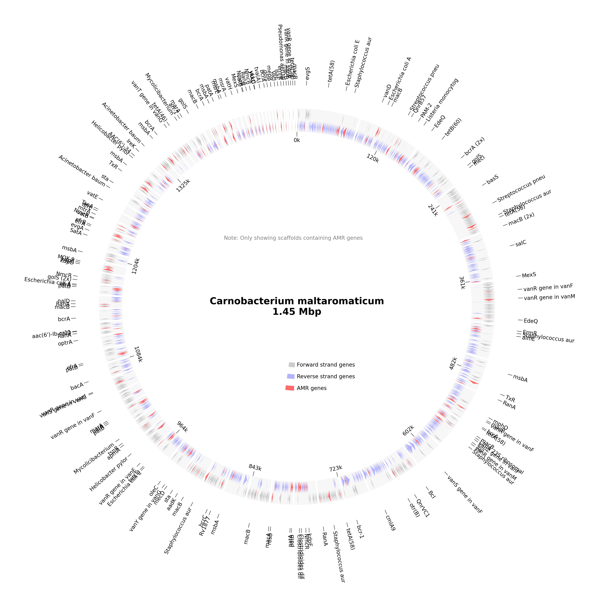

### AAC(6')-34
- **Mechanism**: antibiotic inactivation
- **Drug Classes**: aminoglycoside antibiotic
- **AMR Family**: AAC(6')
- **Locations**:
  - gnl|SPADES|AKHJOCOO_992_6 : position 5008-5541

### Acinetobacter baumannii AbaQ (found in 2 locations)
- **Mechanism**: antibiotic efflux
- **Drug Classes**: fluoroquinolone antibiotic
- **AMR Family**: major facilitator superfamily (MFS) antibiotic efflux pump
- **Locations**:
  - gnl|SPADES|AKHJOCOO_1071_1 : position 193-1449
  - gnl|SPADES|AKHJOCOO_815_5 : position 5081-6373

### BcI
- **Mechanism**: antibiotic inactivation
- **Drug Classes**: cephalosporin; penem
- **AMR Family**: class A Bacillus cereus Bc beta-lactamase
- **Locations**:
  - gnl|SPADES|AKHJOCOO_218_4 : position 6264-7163

### Clostridioides difficile gyrA conferring resistance to fluoroquinolones
- **Mechanism**: antibiotic target alteration
- **Drug Classes**: fluoroquinolone antibiotic
- **AMR Family**: fluoroquinolone resistant gyrA
- **Locations**:
  - gnl|SPADES|AKHJOCOO_251_20 : position 20889-23360

### Clostridioides difficile gyrB conferring resistance to fluoroquinolones
- **Mechanism**: antibiotic target alteration
- **Drug Classes**: fluoroquinolone antibiotic
- **AMR Family**: fluoroquinolone resistant gyrB
- **Locations**:
  - gnl|SPADES|AKHJOCOO_251_21 : position 23350-25365

### EdeQ (found in 2 locations)
- **Mechanism**: antibiotic inactivation
- **Drug Classes**: peptide antibiotic; polyamine antibiotic
- **AMR Family**: Edeine acetyltransferase
- **Locations**:
  - gnl|SPADES|AKHJOCOO_125_47 : position 48111-48563
  - gnl|SPADES|AKHJOCOO_80_1 : position 203-655

### ErmR
- **Mechanism**: antibiotic target alteration
- **Drug Classes**: macrolide antibiotic; lincosamide antibiotic; streptogramin antibiotic; streptogramin A antibiotic; streptogramin B antibiotic
- **AMR Family**: Erm 23S ribosomal RNA methyltransferase
- **Locations**:
  - gnl|SPADES|AKHJOCOO_160_6 : position 4636-5529

### Escherichia coli AcrAB-TolC with AcrR mutation conferring resistance to ciprofloxacin, tetracycline, and ceftazidime
- **Mechanism**: antibiotic target alteration; antibiotic efflux
- **Drug Classes**: fluoroquinolone antibiotic; cephalosporin; glycylcycline; penam; tetracycline antibiotic; rifamycin antibiotic; phenicol antibiotic; disinfecting agents and antiseptics
- **AMR Family**: resistance-nodulation-cell division (RND) antibiotic efflux pump
- **Locations**:
  - gnl|SPADES|AKHJOCOO_641_9 : position 9931-10575

### Escherichia coli AcrAB-TolC with MarR mutations conferring resistance to ciprofloxacin and tetracycline
- **Mechanism**: antibiotic target alteration; antibiotic efflux
- **Drug Classes**: fluoroquinolone antibiotic; cephalosporin; glycylcycline; penam; tetracycline antibiotic; rifamycin antibiotic; phenicol antibiotic; disinfecting agents and antiseptics
- **AMR Family**: resistance-nodulation-cell division (RND) antibiotic efflux pump
- **Locations**:
  - gnl|SPADES|AKHJOCOO_62_27 : position 23863-24327

### Escherichia coli EF-Tu mutants conferring resistance to kirromycin (found in 2 locations)
- **Mechanism**: antibiotic target alteration
- **Drug Classes**: elfamycin antibiotic
- **AMR Family**: elfamycin resistant EF-Tu
- **Locations**:
  - gnl|SPADES|AKHJOCOO_354_18 : position 14285-15472
  - gnl|SPADES|AKHJOCOO_57_73 : position 57435-58622

### Helicobacter pylori frxA mutation conferring resistance to metronidazole
- **Mechanism**: antibiotic target alteration
- **Drug Classes**: nitroimidazole antibiotic
- **AMR Family**: Antibiotic resistant Helicobacter pylori nitroreductase
- **Locations**:
  - gnl|SPADES|AKHJOCOO_992_2 : position 1686-2357

### Helicobacter pylori pbp1 mutants conferring resistance to amoxicillin
- **Mechanism**: antibiotic target alteration
- **Drug Classes**: cephalosporin; cephamycin; penam
- **AMR Family**: Penicillin-binding protein mutations conferring resistance to beta-lactam antibiotics
- **Locations**:
  - gnl|SPADES|AKHJOCOO_394_11 : position 11175-13811

### IreK
- **Mechanism**: reduced permeability to antibiotic
- **Drug Classes**: cephalosporin
- **AMR Family**: Serine/threonine kinases
- **Locations**:
  - gnl|SPADES|AKHJOCOO_1060_1 : position 727-3018

### Listeria monocytogenes mprF
- **Mechanism**: antibiotic target alteration
- **Drug Classes**: peptide antibiotic
- **AMR Family**: defensin resistant mprF
- **Locations**:
  - gnl|SPADES|AKHJOCOO_62_69 : position 71395-73968

### LlmA 23S ribosomal RNA methyltransferase
- **Mechanism**: antibiotic target alteration
- **Drug Classes**: lincosamide antibiotic
- **AMR Family**: Llm 23S ribosomal RNA methyltransferase
- **Locations**:
  - gnl|SPADES|AKHJOCOO_185_6 : position 5095-6261

### MOX-9
- **Mechanism**: antibiotic inactivation
- **Drug Classes**: cephalosporin; cephamycin; penam
- **AMR Family**: MOX beta-lactamase
- **Locations**:
  - gnl|SPADES|AKHJOCOO_677_7 : position 7438-8676

### MexS (found in 2 locations)
- **Mechanism**: antibiotic efflux
- **Drug Classes**: fluoroquinolone antibiotic; diaminopyrimidine antibiotic; phenicol antibiotic
- **AMR Family**: resistance-nodulation-cell division (RND) antibiotic efflux pump
- **Locations**:
  - gnl|SPADES|AKHJOCOO_1910_6 : position 3172-4137
  - gnl|SPADES|AKHJOCOO_94_56 : position 62438-63550

### Mycolicibacterium smegmatis ndh with mutation conferring resistance to isoniazid (found in 2 locations)
- **Mechanism**: antibiotic target alteration
- **Drug Classes**: isoniazid-like antibiotic
- **AMR Family**: antibiotic resistant ndh
- **Locations**:
  - gnl|SPADES|AKHJOCOO_1290_3 : position 1674-2879
  - gnl|SPADES|AKHJOCOO_403_15 : position 11586-13448

### NmcR (found in 5 locations)
- **Mechanism**: antibiotic inactivation
- **Drug Classes**: carbapenem; cephalosporin; cephamycin; penam
- **AMR Family**: NmcA beta-lactamase
- **Locations**:
  - gnl|SPADES|AKHJOCOO_1972_5 : position 3176-4042
  - gnl|SPADES|AKHJOCOO_251_17 : position 16322-17269
  - gnl|SPADES|AKHJOCOO_2670_1 : position 1-447
  - gnl|SPADES|AKHJOCOO_668_6 : position 4015-4899
  - gnl|SPADES|AKHJOCOO_776_6 : position 3643-4509

### PAM-2
- **Mechanism**: antibiotic inactivation
- **Drug Classes**: carbapenem; cephalosporin
- **AMR Family**: PAM beta-lactamase
- **Locations**:
  - gnl|SPADES|AKHJOCOO_62_64 : position 64456-65136

### Pseudomonas aeruginosa catB6
- **Mechanism**: antibiotic inactivation
- **Drug Classes**: phenicol antibiotic
- **AMR Family**: chloramphenicol acetyltransferase (CAT)
- **Locations**:
  - gnl|SPADES|AKHJOCOO_11812_1 : position 1-609

### QnrB57
- **Mechanism**: antibiotic target protection
- **Drug Classes**: fluoroquinolone antibiotic
- **AMR Family**: quinolone resistance protein (qnr)
- **Locations**:
  - gnl|SPADES|AKHJOCOO_62_55 : position 54888-55523

### QnrVC1
- **Mechanism**: antibiotic target protection
- **Drug Classes**: fluoroquinolone antibiotic
- **AMR Family**: quinolone resistance protein (qnr)
- **Locations**:
  - gnl|SPADES|AKHJOCOO_218_20 : position 22811-23434

### RanA (found in 8 locations)
- **Mechanism**: antibiotic efflux
- **Drug Classes**: aminoglycoside antibiotic
- **AMR Family**: ATP-binding cassette (ABC) antibiotic efflux pump
- **Locations**:
  - gnl|SPADES|AKHJOCOO_173_37 : position 40667-41782
  - gnl|SPADES|AKHJOCOO_2345_2 : position 972-1625
  - gnl|SPADES|AKHJOCOO_236_30 : position 30307-30984
  - gnl|SPADES|AKHJOCOO_534_5 : position 4376-5107
  - gnl|SPADES|AKHJOCOO_550_6 : position 4004-4990
  - gnl|SPADES|AKHJOCOO_80_55 : position 59408-60133
  - gnl|SPADES|AKHJOCOO_94_24 : position 28117-28851
  - gnl|SPADES|AKHJOCOO_94_38 : position 42773-43867

### Rv1877
- **Mechanism**: antibiotic efflux
- **Drug Classes**: fluoroquinolone antibiotic
- **AMR Family**: major facilitator superfamily (MFS) antibiotic efflux pump
- **Locations**:
  - gnl|SPADES|AKHJOCOO_277_3 : position 2961-4445

### SatA
- **Mechanism**: antibiotic inactivation
- **Drug Classes**: nucleoside antibiotic
- **AMR Family**: streptothricin acetyltransferase (SAT)
- **Locations**:
  - gnl|SPADES|AKHJOCOO_692_11 : position 10330-10782

### Staphylococcus aureus fusA with mutation conferring resistance to fusidic acid
- **Mechanism**: antibiotic target alteration
- **Drug Classes**: fusidane antibiotic
- **AMR Family**: antibiotic resistant fusA
- **Locations**:
  - gnl|SPADES|AKHJOCOO_57_74 : position 58768-60852

### Staphylococcus aureus mupA conferring resistance to mupirocin (found in 2 locations)
- **Mechanism**: antibiotic target alteration
- **Drug Classes**: mupirocin-like antibiotic
- **AMR Family**: antibiotic-resistant isoleucyl-tRNA synthetase (ileS)
- **Locations**:
  - gnl|SPADES|AKHJOCOO_160_9 : position 6952-8967
  - gnl|SPADES|AKHJOCOO_82_54 : position 55665-58448

### Staphylococcus aureus mupB conferring resistance to mupirocin (found in 2 locations)
- **Mechanism**: antibiotic target alteration
- **Drug Classes**: mupirocin-like antibiotic
- **AMR Family**: antibiotic-resistant isoleucyl-tRNA synthetase (ileS)
- **Locations**:
  - gnl|SPADES|AKHJOCOO_236_17 : position 16653-19322
  - gnl|SPADES|AKHJOCOO_277_21 : position 25680-28094

### Staphylococcus aureus murA with mutation conferring resistance to fosfomycin
- **Mechanism**: antibiotic target alteration
- **Drug Classes**: phosphonic acid antibiotic
- **AMR Family**: antibiotic-resistant murA transferase
- **Locations**:
  - gnl|SPADES|AKHJOCOO_185_18 : position 18230-19537

### Staphylococcus aureus rpoB mutants conferring resistance to rifampicin
- **Mechanism**: antibiotic target alteration; antibiotic target replacement
- **Drug Classes**: rifamycin antibiotic
- **AMR Family**: rifamycin-resistant beta-subunit of RNA polymerase (rpoB)
- **Locations**:
  - gnl|SPADES|AKHJOCOO_57_79 : position 66854-70426

### Streptococcus pneumoniae PBP2b conferring resistance to amoxicillin
- **Mechanism**: antibiotic target alteration
- **Drug Classes**: cephalosporin; cephamycin; penam
- **AMR Family**: Penicillin-binding protein mutations conferring resistance to beta-lactam antibiotics
- **Locations**:
  - gnl|SPADES|AKHJOCOO_62_53 : position 49831-51885

### Streptococcus pneumoniae PBP2x conferring resistance to amoxicillin
- **Mechanism**: antibiotic target alteration
- **Drug Classes**: cephalosporin; cephamycin; penam
- **AMR Family**: Penicillin-binding protein mutations conferring resistance to beta-lactam antibiotics
- **Locations**:
  - gnl|SPADES|AKHJOCOO_82_41 : position 40797-42986

### TaeA
- **Mechanism**: antibiotic efflux
- **Drug Classes**: pleuromutilin antibiotic
- **AMR Family**: ATP-binding cassette (ABC) antibiotic efflux pump
- **Locations**:
  - gnl|SPADES|AKHJOCOO_786_3 : position 1620-3521

### TxR (found in 2 locations)
- **Mechanism**: antibiotic efflux
- **Drug Classes**: tetracycline antibiotic
- **AMR Family**: ATP-binding cassette (ABC) antibiotic efflux pump
- **Locations**:
  - gnl|SPADES|AKHJOCOO_173_31 : position 32773-35436
  - gnl|SPADES|AKHJOCOO_872_5 : position 3858-6668

### VatI
- **Mechanism**: antibiotic inactivation
- **Drug Classes**: streptogramin antibiotic; streptogramin A antibiotic
- **AMR Family**: streptogramin vat acetyltransferase
- **Locations**:
  - gnl|SPADES|AKHJOCOO_4821_2 : position 759-1460

### YajC
- **Mechanism**: antibiotic efflux
- **Drug Classes**: fluoroquinolone antibiotic; cephalosporin; glycylcycline; penam; tetracycline antibiotic; oxazolidinone antibiotic; glycopeptide antibiotic; rifamycin antibiotic; phenicol antibiotic; disinfecting agents and antiseptics
- **AMR Family**: resistance-nodulation-cell division (RND) antibiotic efflux pump
- **Locations**:
  - gnl|SPADES|AKHJOCOO_62_70 : position 74148-74525

### YojI
- **Mechanism**: antibiotic efflux
- **Drug Classes**: peptide antibiotic
- **AMR Family**: ATP-binding cassette (ABC) antibiotic efflux pump
- **Locations**:
  - gnl|SPADES|AKHJOCOO_185_11 : position 11850-12398

### aac(6')-Ib-cr11
- **Mechanism**: antibiotic inactivation
- **Drug Classes**: fluoroquinolone antibiotic; aminoglycoside antibiotic
- **AMR Family**: AAC(6'); AAC(6')-Ib-cr
- **Locations**:
  - gnl|SPADES|AKHJOCOO_534_8 : position 7424-7987

### aadK
- **Mechanism**: antibiotic inactivation
- **Drug Classes**: aminoglycoside antibiotic
- **AMR Family**: ANT(6)
- **Locations**:
  - gnl|SPADES|AKHJOCOO_317_20 : position 16798-17649

### almE
- **Mechanism**: antibiotic target alteration
- **Drug Classes**: peptide antibiotic
- **AMR Family**: polymyxin resistance operon; alm glycyltransferase
- **Locations**:
  - gnl|SPADES|AKHJOCOO_160_11 : position 10618-12060

### apmA
- **Mechanism**: antibiotic inactivation
- **Drug Classes**: aminoglycoside antibiotic
- **AMR Family**: AAC(2')
- **Locations**:
  - gnl|SPADES|AKHJOCOO_403_4 : position 3565-4074

### arlR
- **Mechanism**: antibiotic efflux
- **Drug Classes**: fluoroquinolone antibiotic; disinfecting agents and antiseptics
- **AMR Family**: major facilitator superfamily (MFS) antibiotic efflux pump
- **Locations**:
  - gnl|SPADES|AKHJOCOO_62_29 : position 25335-26006

### arlS
- **Mechanism**: antibiotic efflux
- **Drug Classes**: fluoroquinolone antibiotic; disinfecting agents and antiseptics
- **AMR Family**: major facilitator superfamily (MFS) antibiotic efflux pump
- **Locations**:
  - gnl|SPADES|AKHJOCOO_175_26 : position 26734-27786

### arr-1
- **Mechanism**: antibiotic inactivation
- **Drug Classes**: rifamycin antibiotic
- **AMR Family**: rifampin ADP-ribosyltransferase (Arr)
- **Locations**:
  - gnl|SPADES|AKHJOCOO_1290_7 : position 5965-6378

### bacA
- **Mechanism**: antibiotic target alteration
- **Drug Classes**: peptide antibiotic
- **AMR Family**: undecaprenyl pyrophosphate related proteins
- **Locations**:
  - gnl|SPADES|AKHJOCOO_440_4 : position 3726-4544

### baeS (found in 2 locations)
- **Mechanism**: antibiotic efflux
- **Drug Classes**: aminoglycoside antibiotic; aminocoumarin antibiotic
- **AMR Family**: resistance-nodulation-cell division (RND) antibiotic efflux pump
- **Locations**:
  - gnl|SPADES|AKHJOCOO_185_12 : position 12513-13964
  - gnl|SPADES|AKHJOCOO_62_30 : position 26003-27391

### basS
- **Mechanism**: antibiotic target alteration; antibiotic efflux
- **Drug Classes**: peptide antibiotic
- **AMR Family**: pmr phosphoethanolamine transferase
- **Locations**:
  - gnl|SPADES|AKHJOCOO_82_16 : position 17461-18525

### bcr-1
- **Mechanism**: antibiotic efflux
- **Drug Classes**: bicyclomycin-like antibiotic
- **AMR Family**: major facilitator superfamily (MFS) antibiotic efflux pump
- **Locations**:
  - gnl|SPADES|AKHJOCOO_232_21 : position 24717-25964

### bcrA (found in 7 locations)
- **Mechanism**: antibiotic efflux
- **Drug Classes**: peptide antibiotic
- **AMR Family**: ATP-binding cassette (ABC) antibiotic efflux pump
- **Locations**:
  - gnl|SPADES|AKHJOCOO_1137_3 : position 745-1491
  - gnl|SPADES|AKHJOCOO_1399_5 : position 4685-5314
  - gnl|SPADES|AKHJOCOO_175_34 : position 33846-34622
  - gnl|SPADES|AKHJOCOO_3349_2 : position 1560-2270
  - gnl|SPADES|AKHJOCOO_540_5 : position 4720-5646
  - gnl|SPADES|AKHJOCOO_80_42 : position 47038-47943
  - gnl|SPADES|AKHJOCOO_80_52 : position 56514-57401

### bcrC
- **Mechanism**: antibiotic target alteration
- **Drug Classes**: peptide antibiotic
- **AMR Family**: undecaprenyl pyrophosphate related proteins
- **Locations**:
  - gnl|SPADES|AKHJOCOO_277_7 : position 7692-8360

### cmlA9
- **Mechanism**: antibiotic efflux
- **Drug Classes**: phenicol antibiotic
- **AMR Family**: major facilitator superfamily (MFS) antibiotic efflux pump
- **Locations**:
  - gnl|SPADES|AKHJOCOO_225_25 : position 25122-26324

### dfrE
- **Mechanism**: antibiotic target replacement
- **Drug Classes**: diaminopyrimidine antibiotic
- **AMR Family**: trimethoprim resistant dihydrofolate reductase dfr
- **Locations**:
  - gnl|SPADES|AKHJOCOO_786_1 : position 143-631

### efrA (found in 3 locations)
- **Mechanism**: antibiotic efflux
- **Drug Classes**: macrolide antibiotic; fluoroquinolone antibiotic; rifamycin antibiotic
- **AMR Family**: ATP-binding cassette (ABC) antibiotic efflux pump
- **Locations**:
  - gnl|SPADES|AKHJOCOO_481_6 : position 5196-6941
  - gnl|SPADES|AKHJOCOO_641_8 : position 8160-9881
  - gnl|SPADES|AKHJOCOO_707_8 : position 6817-8571

### efrB
- **Mechanism**: antibiotic efflux
- **Drug Classes**: macrolide antibiotic; fluoroquinolone antibiotic; rifamycin antibiotic
- **AMR Family**: ATP-binding cassette (ABC) antibiotic efflux pump
- **Locations**:
  - gnl|SPADES|AKHJOCOO_707_9 : position 8568-10346

### emrR
- **Mechanism**: antibiotic efflux
- **Drug Classes**: fluoroquinolone antibiotic
- **AMR Family**: major facilitator superfamily (MFS) antibiotic efflux pump
- **Locations**:
  - gnl|SPADES|AKHJOCOO_5207_2 : position 720-1151

### evgA
- **Mechanism**: antibiotic efflux
- **Drug Classes**: macrolide antibiotic; fluoroquinolone antibiotic; penam; tetracycline antibiotic
- **AMR Family**: major facilitator superfamily (MFS) antibiotic efflux pump; resistance-nodulation-cell division (RND) antibiotic efflux pump
- **Locations**:
  - gnl|SPADES|AKHJOCOO_707_3 : position 2173-2805

### evgS
- **Mechanism**: antibiotic efflux
- **Drug Classes**: macrolide antibiotic; fluoroquinolone antibiotic; penam; tetracycline antibiotic
- **AMR Family**: major facilitator superfamily (MFS) antibiotic efflux pump; resistance-nodulation-cell division (RND) antibiotic efflux pump
- **Locations**:
  - gnl|SPADES|AKHJOCOO_57_11 : position 10822-11523

### golS (found in 5 locations)
- **Mechanism**: antibiotic efflux
- **Drug Classes**: monobactam; carbapenem; cephalosporin; cephamycin; penam; phenicol antibiotic; penem
- **AMR Family**: resistance-nodulation-cell division (RND) antibiotic efflux pump
- **Locations**:
  - gnl|SPADES|AKHJOCOO_1360_2 : position 724-1482
  - gnl|SPADES|AKHJOCOO_3675_2 : position 838-1266
  - gnl|SPADES|AKHJOCOO_668_1 : position 140-532
  - gnl|SPADES|AKHJOCOO_668_4 : position 2496-2864
  - gnl|SPADES|AKHJOCOO_80_54 : position 58768-59118

### kdpD
- **Mechanism**: antibiotic efflux
- **Drug Classes**: aminoglycoside antibiotic
- **AMR Family**: kdpDE
- **Locations**:
  - gnl|SPADES|AKHJOCOO_677_4 : position 3160-5853

### kdpE (found in 2 locations)
- **Mechanism**: antibiotic efflux
- **Drug Classes**: aminoglycoside antibiotic
- **AMR Family**: kdpDE
- **Locations**:
  - gnl|SPADES|AKHJOCOO_251_14 : position 12724-13458
  - gnl|SPADES|AKHJOCOO_677_5 : position 5903-6589

### lsaE
- **Mechanism**: antibiotic target protection
- **Drug Classes**: lincosamide antibiotic; streptogramin antibiotic; pleuromutilin antibiotic
- **AMR Family**: lsa-type ABC-F protein
- **Locations**:
  - gnl|SPADES|AKHJOCOO_4993_2 : position 270-1556

### macA
- **Mechanism**: antibiotic efflux
- **Drug Classes**: macrolide antibiotic
- **AMR Family**: ATP-binding cassette (ABC) antibiotic efflux pump
- **Locations**:
  - gnl|SPADES|AKHJOCOO_257_27 : position 27123-27983

### macB (found in 14 locations)
- **Mechanism**: antibiotic efflux
- **Drug Classes**: macrolide antibiotic
- **AMR Family**: ATP-binding cassette (ABC) antibiotic efflux pump
- **Locations**:
  - gnl|SPADES|AKHJOCOO_1379_5 : position 5150-5851
  - gnl|SPADES|AKHJOCOO_175_24 : position 23544-25910
  - gnl|SPADES|AKHJOCOO_185_4 : position 2745-3404
  - gnl|SPADES|AKHJOCOO_257_28 : position 27999-28691
  - gnl|SPADES|AKHJOCOO_257_29 : position 28707-29933
  - gnl|SPADES|AKHJOCOO_263_17 : position 18166-18924
  - gnl|SPADES|AKHJOCOO_26683_2 : position 221-388
  - gnl|SPADES|AKHJOCOO_317_10 : position 8701-9519
  - gnl|SPADES|AKHJOCOO_550_2 : position 688-1416
  - gnl|SPADES|AKHJOCOO_61611_1 : position 2-232
  - gnl|SPADES|AKHJOCOO_62_32 : position 28550-29224
  - gnl|SPADES|AKHJOCOO_82_18 : position 19566-20333
  - gnl|SPADES|AKHJOCOO_94_3 : position 876-2516
  - gnl|SPADES|AKHJOCOO_94_44 : position 49442-51151

### marA (found in 2 locations)
- **Mechanism**: antibiotic efflux; reduced permeability to antibiotic
- **Drug Classes**: fluoroquinolone antibiotic; monobactam; carbapenem; cephalosporin; glycylcycline; cephamycin; penam; tetracycline antibiotic; rifamycin antibiotic; phenicol antibiotic; penem; disinfecting agents and antiseptics
- **AMR Family**: resistance-nodulation-cell division (RND) antibiotic efflux pump; General Bacterial Porin with reduced permeability to beta-lactams
- **Locations**:
  - gnl|SPADES|AKHJOCOO_1359_1 : position 180-1064
  - gnl|SPADES|AKHJOCOO_404_14 : position 15705-16541

### mdtG
- **Mechanism**: antibiotic efflux
- **Drug Classes**: phosphonic acid antibiotic
- **AMR Family**: major facilitator superfamily (MFS) antibiotic efflux pump
- **Locations**:
  - gnl|SPADES|AKHJOCOO_185_7 : position 6309-7517

### mecD
- **Mechanism**: antibiotic target replacement
- **Drug Classes**: penam
- **AMR Family**: methicillin resistant PBP2
- **Locations**:
  - gnl|SPADES|AKHJOCOO_340_6 : position 4641-6671

### mecI
- **Mechanism**: antibiotic target replacement
- **Drug Classes**: penam
- **AMR Family**: methicillin resistant PBP2
- **Locations**:
  - gnl|SPADES|AKHJOCOO_80_58 : position 62080-62535

### mepR
- **Mechanism**: antibiotic efflux
- **Drug Classes**: glycylcycline; tetracycline antibiotic
- **AMR Family**: multidrug and toxic compound extrusion (MATE) transporter
- **Locations**:
  - gnl|SPADES|AKHJOCOO_4134_2 : position 595-1044

### mphO
- **Mechanism**: antibiotic inactivation
- **Drug Classes**: macrolide antibiotic
- **AMR Family**: macrolide phosphotransferase (MPH)
- **Locations**:
  - gnl|SPADES|AKHJOCOO_175_19 : position 20332-21171

### msbA (found in 8 locations)
- **Mechanism**: antibiotic efflux
- **Drug Classes**: nitroimidazole antibiotic
- **AMR Family**: ATP-binding cassette (ABC) antibiotic efflux pump
- **Locations**:
  - gnl|SPADES|AKHJOCOO_1115_5 : position 2916-5066
  - gnl|SPADES|AKHJOCOO_1442_4 : position 2073-4349
  - gnl|SPADES|AKHJOCOO_173_9 : position 8572-9354
  - gnl|SPADES|AKHJOCOO_1761_2 : position 2744-4483
  - gnl|SPADES|AKHJOCOO_267_20 : position 23521-25236
  - gnl|SPADES|AKHJOCOO_57_38 : position 37449-38288
  - gnl|SPADES|AKHJOCOO_686_5 : position 4081-4866
  - gnl|SPADES|AKHJOCOO_888_3 : position 1521-3671

### msrA
- **Mechanism**: antibiotic target protection
- **Drug Classes**: macrolide antibiotic; streptogramin antibiotic; streptogramin B antibiotic
- **AMR Family**: msr-type ABC-F protein
- **Locations**:
  - gnl|SPADES|AKHJOCOO_1766_4 : position 2462-3037

### msrE
- **Mechanism**: antibiotic target protection
- **Drug Classes**: macrolide antibiotic; streptogramin antibiotic
- **AMR Family**: msr-type ABC-F protein
- **Locations**:
  - gnl|SPADES|AKHJOCOO_1761_1 : position 75-2315

### mtrA
- **Mechanism**: antibiotic efflux
- **Drug Classes**: macrolide antibiotic; penam
- **AMR Family**: resistance-nodulation-cell division (RND) antibiotic efflux pump
- **Locations**:
  - gnl|SPADES|AKHJOCOO_776_9 : position 8236-9090

### nalD (found in 2 locations)
- **Mechanism**: antibiotic efflux
- **Drug Classes**: macrolide antibiotic; fluoroquinolone antibiotic; monobactam; carbapenem; cephalosporin; cephamycin; penam; tetracycline antibiotic; peptide antibiotic; aminocoumarin antibiotic; diaminopyrimidine antibiotic; sulfonamide antibiotic; phenicol antibiotic; penem
- **AMR Family**: resistance-nodulation-cell division (RND) antibiotic efflux pump
- **Locations**:
  - gnl|SPADES|AKHJOCOO_534_7 : position 6825-7403
  - gnl|SPADES|AKHJOCOO_550_9 : position 7523-8173

### oleC
- **Mechanism**: antibiotic efflux
- **Drug Classes**: macrolide antibiotic
- **AMR Family**: ATP-binding cassette (ABC) antibiotic efflux pump
- **Locations**:
  - gnl|SPADES|AKHJOCOO_340_16 : position 14745-15449

### optrA
- **Mechanism**: antibiotic target protection
- **Drug Classes**: oxazolidinone antibiotic; phenicol antibiotic
- **AMR Family**: Miscellaneous ABC-F subfamily ATP-binding cassette ribosomal protection proteins
- **Locations**:
  - gnl|SPADES|AKHJOCOO_508_17 : position 13886-15760

### otr(B)
- **Mechanism**: antibiotic efflux
- **Drug Classes**: tetracycline antibiotic
- **AMR Family**: major facilitator superfamily (MFS) antibiotic efflux pump
- **Locations**:
  - gnl|SPADES|AKHJOCOO_218_26 : position 31454-32734

### patA (found in 3 locations)
- **Mechanism**: antibiotic efflux
- **Drug Classes**: fluoroquinolone antibiotic
- **AMR Family**: ATP-binding cassette (ABC) antibiotic efflux pump
- **Locations**:
  - gnl|SPADES|AKHJOCOO_1754_1 : position 67-1548
  - gnl|SPADES|AKHJOCOO_257_2 : position 1789-3510
  - gnl|SPADES|AKHJOCOO_404_13 : position 13553-15307

### patB (found in 4 locations)
- **Mechanism**: antibiotic efflux
- **Drug Classes**: fluoroquinolone antibiotic
- **AMR Family**: ATP-binding cassette (ABC) antibiotic efflux pump
- **Locations**:
  - gnl|SPADES|AKHJOCOO_257_1 : position 17-1789
  - gnl|SPADES|AKHJOCOO_404_12 : position 11779-13560
  - gnl|SPADES|AKHJOCOO_481_5 : position 3443-5194
  - gnl|SPADES|AKHJOCOO_641_7 : position 6260-8158

### rosB
- **Mechanism**: antibiotic efflux
- **Drug Classes**: peptide antibiotic
- **AMR Family**: major facilitator superfamily (MFS) antibiotic efflux pump
- **Locations**:
  - gnl|SPADES|AKHJOCOO_257_25 : position 24828-25988

### salC
- **Mechanism**: antibiotic target protection
- **Drug Classes**: lincosamide antibiotic; streptogramin antibiotic; streptogramin A antibiotic; pleuromutilin antibiotic
- **AMR Family**: sal-type ABC-F protein
- **Locations**:
  - gnl|SPADES|AKHJOCOO_94_22 : position 26212-26919

### sta (found in 2 locations)
- **Mechanism**: antibiotic inactivation
- **Drug Classes**: nucleoside antibiotic
- **AMR Family**: streptothricin acetyltransferase (SAT)
- **Locations**:
  - gnl|SPADES|AKHJOCOO_317_28 : position 23889-24404
  - gnl|SPADES|AKHJOCOO_840_1 : position 3-872

### tet(T)
- **Mechanism**: antibiotic target protection
- **Drug Classes**: tetracycline antibiotic
- **AMR Family**: tetracycline-resistant ribosomal protection protein
- **Locations**:
  - gnl|SPADES|AKHJOCOO_354_19 : position 15534-17618

### tetA(46)
- **Mechanism**: antibiotic efflux
- **Drug Classes**: tetracycline antibiotic
- **AMR Family**: ATP-binding cassette (ABC) antibiotic efflux pump
- **Locations**:
  - gnl|SPADES|AKHJOCOO_1269_1 : position 1-798

### tetA(58) (found in 7 locations)
- **Mechanism**: antibiotic efflux
- **Drug Classes**: tetracycline antibiotic
- **AMR Family**: major facilitator superfamily (MFS) antibiotic efflux pump
- **Locations**:
  - gnl|SPADES|AKHJOCOO_125_49 : position 49427-50344
  - gnl|SPADES|AKHJOCOO_175_36 : position 35286-36248
  - gnl|SPADES|AKHJOCOO_236_3 : position 2316-3074
  - gnl|SPADES|AKHJOCOO_340_17 : position 15453-16226
  - gnl|SPADES|AKHJOCOO_47159_1 : position 3-263
  - gnl|SPADES|AKHJOCOO_57_37 : position 36592-37473
  - gnl|SPADES|AKHJOCOO_82_57 : position 59703-60620

### tetA(60)
- **Mechanism**: antibiotic efflux
- **Drug Classes**: tetracycline antibiotic
- **AMR Family**: ATP-binding cassette (ABC) antibiotic efflux pump
- **Locations**:
  - gnl|SPADES|AKHJOCOO_80_11 : position 16953-18704

### tetB(58)
- **Mechanism**: antibiotic efflux
- **Drug Classes**: tetracycline antibiotic
- **AMR Family**: major facilitator superfamily (MFS) antibiotic efflux pump
- **Locations**:
  - gnl|SPADES|AKHJOCOO_125_48 : position 48664-49434

### tetB(60)
- **Mechanism**: antibiotic efflux
- **Drug Classes**: tetracycline antibiotic
- **AMR Family**: ATP-binding cassette (ABC) antibiotic efflux pump
- **Locations**:
  - gnl|SPADES|AKHJOCOO_80_10 : position 15163-16953

### tsnR
- **Mechanism**: antibiotic target alteration
- **Drug Classes**: peptide antibiotic
- **AMR Family**: non-erm 23S ribosomal RNA methyltransferase (A1067)
- **Locations**:
  - gnl|SPADES|AKHJOCOO_403_7 : position 6048-6923

### tva(A)
- **Mechanism**: antibiotic target protection
- **Drug Classes**: pleuromutilin antibiotic
- **AMR Family**: Miscellaneous ABC-F subfamily ATP-binding cassette ribosomal protection proteins
- **Locations**:
  - gnl|SPADES|AKHJOCOO_2967_2 : position 986-1714

### vanD
- **Mechanism**: antibiotic target alteration
- **Drug Classes**: glycopeptide antibiotic
- **AMR Family**: glycopeptide resistance gene cluster; Van ligase
- **Locations**:
  - gnl|SPADES|AKHJOCOO_62_18 : position 16167-17531

### vanR gene in vanB cluster
- **Mechanism**: antibiotic target alteration
- **Drug Classes**: glycopeptide antibiotic
- **AMR Family**: glycopeptide resistance gene cluster; vanR
- **Locations**:
  - gnl|SPADES|AKHJOCOO_38597_1 : position 113-292

### vanR gene in vanE cluster
- **Mechanism**: antibiotic target alteration
- **Drug Classes**: glycopeptide antibiotic
- **AMR Family**: glycopeptide resistance gene cluster; vanR
- **Locations**:
  - gnl|SPADES|AKHJOCOO_354_25 : position 21399-22088

### vanR gene in vanF cluster (found in 4 locations)
- **Mechanism**: antibiotic target alteration
- **Drug Classes**: glycopeptide antibiotic
- **AMR Family**: glycopeptide resistance gene cluster; vanR
- **Locations**:
  - gnl|SPADES|AKHJOCOO_125_8 : position 12275-12970
  - gnl|SPADES|AKHJOCOO_175_25 : position 26063-26737
  - gnl|SPADES|AKHJOCOO_37657_1 : position 93-296
  - gnl|SPADES|AKHJOCOO_414_7 : position 7758-9188

### vanR gene in vanI cluster (found in 2 locations)
- **Mechanism**: antibiotic target alteration
- **Drug Classes**: glycopeptide antibiotic
- **AMR Family**: glycopeptide resistance gene cluster; vanR
- **Locations**:
  - gnl|SPADES|AKHJOCOO_439_12 : position 10657-11352
  - gnl|SPADES|AKHJOCOO_82_17 : position 18653-19327

### vanR gene in vanM cluster (found in 3 locations)
- **Mechanism**: antibiotic target alteration
- **Drug Classes**: glycopeptide antibiotic
- **AMR Family**: glycopeptide resistance gene cluster; vanR
- **Locations**:
  - gnl|SPADES|AKHJOCOO_125_20 : position 22426-23148
  - gnl|SPADES|AKHJOCOO_185_13 : position 13967-14686
  - gnl|SPADES|AKHJOCOO_207_16 : position 18154-18843

### vanS gene in vanF cluster
- **Mechanism**: antibiotic target alteration
- **Drug Classes**: glycopeptide antibiotic
- **AMR Family**: vanS; glycopeptide resistance gene cluster
- **Locations**:
  - gnl|SPADES|AKHJOCOO_207_15 : position 16967-18100

### vanS gene in vanG cluster
- **Mechanism**: antibiotic target alteration
- **Drug Classes**: glycopeptide antibiotic
- **AMR Family**: vanS; glycopeptide resistance gene cluster
- **Locations**:
  - gnl|SPADES|AKHJOCOO_439_11 : position 9160-10650

### vanS gene in vanM cluster
- **Mechanism**: antibiotic target alteration
- **Drug Classes**: glycopeptide antibiotic
- **AMR Family**: vanS; glycopeptide resistance gene cluster
- **Locations**:
  - gnl|SPADES|AKHJOCOO_125_21 : position 23155-24957

### vanT gene in vanG cluster
- **Mechanism**: antibiotic target alteration
- **Drug Classes**: glycopeptide antibiotic
- **AMR Family**: glycopeptide resistance gene cluster; vanT
- **Locations**:
  - gnl|SPADES|AKHJOCOO_1210_5 : position 4895-6049

### vanY gene in vanG cluster
- **Mechanism**: antibiotic target alteration
- **Drug Classes**: glycopeptide antibiotic
- **AMR Family**: vanY; glycopeptide resistance gene cluster
- **Locations**:
  - gnl|SPADES|AKHJOCOO_340_9: position 8558-9331

### vanZ gene in vanF cluster
- **Mechanism**: antibiotic target alteration
- **Drug Classes**: glycopeptide antibiotic
- **AMR Family**: vanZ; glycopeptide resistance gene cluster
- **Locations**:
  - gnl|SPADES|AKHJOCOO_185_8 : position 7620-8270

### vatB (found in 2 locations)
- **Mechanism**: antibiotic inactivation
- **Drug Classes**: streptogramin antibiotic; streptogramin A antibiotic
- **AMR Family**: streptogramin vat acetyltransferase
- **Locations**:
  - gnl|SPADES|AKHJOCOO_1972_4 : position 2480-3049
  - gnl|SPADES|AKHJOCOO_776_5 : position 2940-3518

### vatE
- **Mechanism**: antibiotic inactivation
- **Drug Classes**: streptogramin antibiotic; streptogramin A antibiotic
- **AMR Family**: streptogramin vat acetyltransferase
- **Locations**:
  - gnl|SPADES|AKHJOCOO_793_2 : position 1502-2113

### vatH
- **Mechanism**: antibiotic inactivation
- **Drug Classes**: streptogramin antibiotic; streptogramin A antibiotic
- **AMR Family**: streptogramin vat acetyltransferase
- **Locations**:
  - gnl|SPADES|AKHJOCOO_1886_4 : position 2826-3443

### ykkC
- **Mechanism**: antibiotic efflux
- **Drug Classes**: aminoglycoside antibiotic; tetracycline antibiotic; phenicol antibiotic
- **AMR Family**: small multidrug resistance (SMR) antibiotic efflux pump
- **Locations**:
  - gnl|SPADES|AKHJOCOO_2682_2 : position 353-676

### ykkD
- **Mechanism**: antibiotic efflux
- **Drug Classes**: aminoglycoside antibiotic; tetracycline antibiotic; phenicol antibiotic
- **AMR Family**: small multidrug resistance (SMR) antibiotic efflux pump
- **Locations**:
  - gnl|SPADES|AKHJOCOO_2682_1 : position 19-336

## Carnobacterium maltaromaticum LMA28
**Strain Statistics:**
- Total genome length: 1445.9 kbp
- Total scaffolds: 250
- Scaffolds with AMR genes: 45
- Total genes annotated: 2601
- Total AMR genes: 146
- Unique AMR genes: 98
- Distinct AMR mechanisms: 8
- Distinct AMR families: 44
- Distinct drug classes: 30

**Circos Plot:**

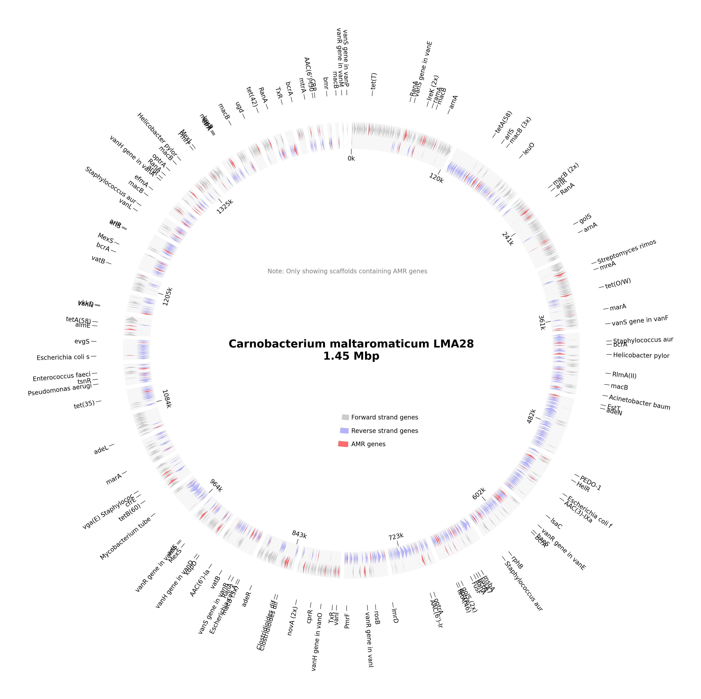

### AAC(3)-IXa
- **Mechanism**: antibiotic inactivation
- **Drug Classes**: aminoglycoside antibiotic
- **AMR Family**: AAC(3)
- **Locations**:
  - gnl|SPADES|AKHJOCOO_109_28 : position 32063-32875

### AAC(6')-I30
- **Mechanism**: antibiotic inactivation
- **Drug Classes**: aminoglycoside antibiotic
- **AMR Family**: AAC(6')
- **Locations**:
  - gnl|SPADES|AKHJOCOO_1168_1 : position 3-284

### AAC(6')-Ia
- **Mechanism**: antibiotic inactivation
- **Drug Classes**: aminoglycoside antibiotic
- **AMR Family**: AAC(6')
- **Locations**:
  - gnl|SPADES|AKHJOCOO_177_35 : position 33743-34279

### AAC(6')-Ir
- **Mechanism**: antibiotic inactivation
- **Drug Classes**: aminoglycoside antibiotic
- **AMR Family**: AAC(6')
- **Locations**:
  - gnl|SPADES|AKHJOCOO_131_15 : position 17298-17903

### Acinetobacter baumannii AmvA
- **Mechanism**: antibiotic efflux
- **Drug Classes**: macrolide antibiotic; disinfecting agents and antiseptics
- **AMR Family**: major facilitator superfamily (MFS) antibiotic efflux pump
- **Locations**:
  - gnl|SPADES|AKHJOCOO_73_57 : position 66094-67524

### CRP
- **Mechanism**: antibiotic efflux
- **Drug Classes**: macrolide antibiotic; fluoroquinolone antibiotic; penam
- **AMR Family**: resistance-nodulation-cell division (RND) antibiotic efflux pump
- **Locations**:
  - gnl|SPADES|AKHJOCOO_1168_4 : position 1955-2617

### Clostridioides difficile gyrA conferring resistance to fluoroquinolones
- **Mechanism**: antibiotic target alteration
- **Drug Classes**: fluoroquinolone antibiotic
- **AMR Family**: fluoroquinolone resistant gyrA
- **Locations**:
  - gnl|SPADES|AKHJOCOO_159_11 : position 9857-12406

### Clostridioides difficile gyrB conferring resistance to fluoroquinolones
- **Mechanism**: antibiotic target alteration
- **Drug Classes**: fluoroquinolone antibiotic
- **AMR Family**: fluoroquinolone resistant gyrB
- **Locations**:
  - gnl|SPADES|AKHJOCOO_159_10 : position 7770-9707

### Enterococcus faecalis cls with mutation conferring resistance to daptomycin
- **Mechanism**: antibiotic target alteration
- **Drug Classes**: peptide antibiotic
- **AMR Family**: daptomycin resistant cls
- **Locations**:
  - gnl|SPADES|AKHJOCOO_35_73 : position 86593-88041

### Enterococcus faecium cls conferring resistance to daptomycin
- **Mechanism**: antibiotic target alteration
- **Drug Classes**: peptide antibiotic
- **AMR Family**: daptomycin resistant cls
- **Locations**:
  - gnl|SPADES|AKHJOCOO_310_19 : position 16586-18106

### Escherichia coli AcrAB-TolC with AcrR mutation conferring resistance to ciprofloxacin, tetracycline, and ceftazidime
- **Mechanism**: antibiotic target alteration; antibiotic efflux
- **Drug Classes**: fluoroquinolone antibiotic; cephalosporin; glycylcycline; penam; tetracycline antibiotic; rifamycin antibiotic; phenicol antibiotic; disinfecting agents and antiseptics
- **AMR Family**: resistance-nodulation-cell division (RND) antibiotic efflux pump
- **Locations**:
  - gnl|SPADES|AKHJOCOO_177_4 : position 2450-3046

### Escherichia coli EF-Tu mutants conferring resistance to Pulvomycin
- **Mechanism**: antibiotic target alteration
- **Drug Classes**: elfamycin antibiotic
- **AMR Family**: elfamycin resistant EF-Tu
- **Locations**:
  - gnl|SPADES|AKHJOCOO_58_54 : position 58793-59515

### Escherichia coli EF-Tu mutants conferring resistance to kirromycin
- **Mechanism**: antibiotic target alteration
- **Drug Classes**: elfamycin antibiotic
- **AMR Family**: elfamycin resistant EF-Tu
- **Locations**:
  - gnl|SPADES|AKHJOCOO_58_55 : position 59574-59978

### Escherichia coli fabI mutations conferring resistance to isoniazid and triclosan
- **Mechanism**: antibiotic target alteration
- **Drug Classes**: disinfecting agents and antiseptics; isoniazid-like antibiotic
- **AMR Family**: antibiotic resistant fabI
- **Locations**:
  - gnl|SPADES|AKHJOCOO_109_21 : position 26545-27303

### Escherichia coli soxS with mutation conferring antibiotic resistance
- **Mechanism**: antibiotic target alteration; antibiotic efflux; reduced permeability to antibiotic
- **Drug Classes**: fluoroquinolone antibiotic; monobactam; carbapenem; cephalosporin; glycylcycline; cephamycin; penam; tetracycline antibiotic; rifamycin antibiotic; phenicol antibiotic; penem; disinfecting agents and antiseptics
- **AMR Family**: ATP-binding cassette (ABC) antibiotic efflux pump; major facilitator superfamily (MFS) antibiotic efflux pump; resistance-nodulation-cell division (RND) antibiotic efflux pump; General Bacterial Porin with reduced permeability to beta-lactams
- **Locations**:
  - gnl|SPADES|AKHJOCOO_318_4 : position 4997-5524

### EstT
- **Mechanism**: antibiotic inactivation
- **Drug Classes**: macrolide antibiotic
- **AMR Family**: macrolide esterase
- **Locations**:
  - gnl|SPADES|AKHJOCOO_78_1 : position 114-947

### FosA7
- **Mechanism**: antibiotic inactivation
- **Drug Classes**: phosphonic acid antibiotic
- **AMR Family**: fosfomycin thiol transferase
- **Locations**:
  - gnl|SPADES|AKHJOCOO_126_20 : position 21661-22041

### FosC2
- **Mechanism**: antibiotic inactivation
- **Drug Classes**: phosphonic acid antibiotic
- **AMR Family**: fosC phosphotransferase family
- **Locations**:
  - gnl|SPADES|AKHJOCOO_58_56 : position 60033-60413

### FusF
- **Mechanism**: antibiotic target protection
- **Drug Classes**: fusidane antibiotic
- **AMR Family**: Target protecting FusB-type protein conferring resistance to Fusidic acid
- **Locations**:
  - gnl|SPADES|AKHJOCOO_126_30 : position 30596-31243

### HelR
- **Mechanism**: antibiotic target protection
- **Drug Classes**: rifamycin antibiotic
- **AMR Family**: helicase-like RNA polymerase protection protein
- **Locations**:
  - gnl|SPADES|AKHJOCOO_109_9 : position 9055-11346

### Helicobacter pylori pbp1 mutants conferring resistance to amoxicillin
- **Mechanism**: antibiotic target alteration
- **Drug Classes**: cephalosporin; cephamycin; penam
- **AMR Family**: Penicillin-binding protein mutations conferring resistance to beta-lactam antibiotics
- **Locations**:
  - gnl|SPADES|AKHJOCOO_73_23 : position 23437-25563

### Helicobacter pylori rdxA mutation conferring resistance to metronidazole
- **Mechanism**: antibiotic target alteration
- **Drug Classes**: nitroimidazole antibiotic
- **AMR Family**: Antibiotic resistant Helicobacter pylori nitroreductase
- **Locations**:
  - gnl|SPADES|AKHJOCOO_487_9 : position 7629-8258

### IreK (found in 2 locations)
- **Mechanism**: reduced permeability to antibiotic
- **Drug Classes**: cephalosporin
- **AMR Family**: Serine/threonine kinases
- **Locations**:
  - gnl|SPADES|AKHJOCOO_35_65 : position 78387-79583
  - gnl|SPADES|AKHJOCOO_35_91 : position 104496-106520

### MexL
- **Mechanism**: antibiotic efflux
- **Drug Classes**: macrolide antibiotic; tetracycline antibiotic; disinfecting agents and antiseptics
- **AMR Family**: resistance-nodulation-cell division (RND) antibiotic efflux pump
- **Locations**:
  - gnl|SPADES|AKHJOCOO_524_6 : position 6003-6620

### MexS (found in 3 locations)
- **Mechanism**: antibiotic efflux
- **Drug Classes**: fluoroquinolone antibiotic; diaminopyrimidine antibiotic; phenicol antibiotic
- **AMR Family**: resistance-nodulation-cell division (RND) antibiotic efflux pump
- **Locations**:
  - gnl|SPADES|AKHJOCOO_202_24 : position 23210-24154
  - gnl|SPADES|AKHJOCOO_382_15 : position 16511-17449
  - gnl|SPADES|AKHJOCOO_78_2 : position 967-2055

### Mycobacterium tuberculosis pncA mutations conferring resistance to pyrazinamide
- **Mechanism**: antibiotic target alteration
- **Drug Classes**: pyrazine antibiotic
- **AMR Family**: Pyrazinamide resistant pncA
- **Locations**:
  - gnl|SPADES|AKHJOCOO_242_26 : position 24930-25475

### PEDO-1
- **Mechanism**: antibiotic inactivation
- **Drug Classes**: carbapenem
- **AMR Family**: subclass B3 PEDO beta-lactamase
- **Locations**:
  - gnl|SPADES|AKHJOCOO_109_3 : position 3188-3889

### PmrF (found in 2 locations)
- **Mechanism**: antibiotic target alteration
- **Drug Classes**: peptide antibiotic
- **AMR Family**: pmr phosphoethanolamine transferase
- **Locations**:
  - gnl|SPADES|AKHJOCOO_136_36 : position 47288-48538
  - gnl|SPADES|AKHJOCOO_524_4 : position 2975-3922

### Pseudomonas aeruginosa soxR
- **Mechanism**: antibiotic target alteration; antibiotic efflux
- **Drug Classes**: fluoroquinolone antibiotic; cephalosporin; glycylcycline; penam; tetracycline antibiotic; rifamycin antibiotic; phenicol antibiotic; disinfecting agents and antiseptics
- **AMR Family**: ATP-binding cassette (ABC) antibiotic efflux pump; major facilitator superfamily (MFS) antibiotic efflux pump; resistance-nodulation-cell division (RND) antibiotic efflux pump
- **Locations**:
  - gnl|SPADES|AKHJOCOO_310_6 : position 5719-6156

### RanA (found in 7 locations)
- **Mechanism**: antibiotic efflux
- **Drug Classes**: aminoglycoside antibiotic
- **AMR Family**: ATP-binding cassette (ABC) antibiotic efflux pump
- **Locations**:
  - gnl|SPADES|AKHJOCOO_117_13 : position 14503-15612
  - gnl|SPADES|AKHJOCOO_126_26 : position 26392-27423
  - gnl|SPADES|AKHJOCOO_177_8 : position 7392-8432
  - gnl|SPADES|AKHJOCOO_35_49 : position 60297-61490
  - gnl|SPADES|AKHJOCOO_460_6 : position 7147-8262
  - gnl|SPADES|AKHJOCOO_58_21 : position 23117-23923
  - gnl|SPADES|AKHJOCOO_816_5 : position 4152-5669

### RlmA(II)
- **Mechanism**: antibiotic target alteration
- **Drug Classes**: macrolide antibiotic; lincosamide antibiotic
- **AMR Family**: non-erm 23S ribosomal RNA methyltransferase (G748)
- **Locations**:
  - gnl|SPADES|AKHJOCOO_73_38 : position 43374-44231

### Staphylococcus aureus LmrS
- **Mechanism**: antibiotic efflux
- **Drug Classes**: macrolide antibiotic; aminoglycoside antibiotic; oxazolidinone antibiotic; diaminopyrimidine antibiotic; phenicol antibiotic
- **AMR Family**: major facilitator superfamily (MFS) antibiotic efflux pump
- **Locations**:
  - gnl|SPADES|AKHJOCOO_73_11 : position 10003-11427

### Staphylococcus aureus fusA with mutation conferring resistance to fusidic acid
- **Mechanism**: antibiotic target alteration
- **Drug Classes**: fusidane antibiotic
- **AMR Family**: antibiotic resistant fusA
- **Locations**:
  - gnl|SPADES|AKHJOCOO_117_47 : position 52510-54087

### Staphylococcus aureus murA with mutation conferring resistance to fosfomycin
- **Mechanism**: antibiotic target alteration
- **Drug Classes**: phosphonic acid antibiotic
- **AMR Family**: antibiotic-resistant murA transferase
- **Locations**:
  - gnl|SPADES|AKHJOCOO_425_16 : position 12831-14099

### Streptomyces rimosus otr(A)
- **Mechanism**: antibiotic target protection
- **Drug Classes**: tetracycline antibiotic
- **AMR Family**: tetracycline-resistant ribosomal protection protein
- **Locations**:
  - gnl|SPADES|AKHJOCOO_64_10 : position 12890-15397

### TxR (found in 2 locations)
- **Mechanism**: antibiotic efflux
- **Drug Classes**: tetracycline antibiotic
- **AMR Family**: ATP-binding cassette (ABC) antibiotic efflux pump
- **Locations**:
  - gnl|SPADES|AKHJOCOO_142_7 : position 5593-6954
  - gnl|SPADES|AKHJOCOO_920_9 : position 4573-7269

### adeL
- **Mechanism**: antibiotic efflux
- **Drug Classes**: fluoroquinolone antibiotic; tetracycline antibiotic
- **AMR Family**: resistance-nodulation-cell division (RND) antibiotic efflux pump
- **Locations**:
  - gnl|SPADES|AKHJOCOO_290_3 : position 2274-3161

### adeN
- **Mechanism**: antibiotic efflux
- **Drug Classes**: macrolide antibiotic; fluoroquinolone antibiotic; lincosamide antibiotic; carbapenem; cephalosporin; tetracycline antibiotic; rifamycin antibiotic; diaminopyrimidine antibiotic; phenicol antibiotic; penem
- **AMR Family**: resistance-nodulation-cell division (RND) antibiotic efflux pump
- **Locations**:
  - gnl|SPADES|AKHJOCOO_78_5 : position 3878-4453

### adeR (found in 2 locations)
- **Mechanism**: antibiotic efflux
- **Drug Classes**: glycylcycline; tetracycline antibiotic
- **AMR Family**: resistance-nodulation-cell division (RND) antibiotic efflux pump
- **Locations**:
  - gnl|SPADES|AKHJOCOO_159_30 : position 37100-37798
  - gnl|SPADES|AKHJOCOO_202_6 : position 5112-5840

### almE
- **Mechanism**: antibiotic target alteration
- **Drug Classes**: peptide antibiotic
- **AMR Family**: polymyxin resistance operon; alm glycyltransferase
- **Locations**:
  - gnl|SPADES|AKHJOCOO_338_6 : position 6716-8239

### arlR (found in 4 locations)
- **Mechanism**: antibiotic efflux
- **Drug Classes**: fluoroquinolone antibiotic; disinfecting agents and antiseptics
- **AMR Family**: major facilitator superfamily (MFS) antibiotic efflux pump
- **Locations**:
  - gnl|SPADES|AKHJOCOO_402_8 : position 9138-9821
  - gnl|SPADES|AKHJOCOO_460_3 : position 2991-3791
  - gnl|SPADES|AKHJOCOO_53_33 : position 39384-40070
  - gnl|SPADES|AKHJOCOO_58_14 : position 15670-16389

### arlS (found in 3 locations)
- **Mechanism**: antibiotic efflux
- **Drug Classes**: fluoroquinolone antibiotic; disinfecting agents and antiseptics
- **AMR Family**: major facilitator superfamily (MFS) antibiotic efflux pump
- **Locations**:
  - gnl|SPADES|AKHJOCOO_202_29 : position 28539-30368
  - gnl|SPADES|AKHJOCOO_402_7 : position 7846-9141
  - gnl|SPADES|AKHJOCOO_53_32 : position 37873-39387

### arnA (found in 2 locations)
- **Mechanism**: antibiotic target alteration
- **Drug Classes**: peptide antibiotic
- **AMR Family**: pmr phosphoethanolamine transferase
- **Locations**:
  - gnl|SPADES|AKHJOCOO_35_88 : position 101382-102335
  - gnl|SPADES|AKHJOCOO_58_63 : position 67052-67633

### baeR
- **Mechanism**: antibiotic efflux
- **Drug Classes**: aminoglycoside antibiotic; aminocoumarin antibiotic
- **AMR Family**: resistance-nodulation-cell division (RND) antibiotic efflux pump
- **Locations**:
  - gnl|SPADES|AKHJOCOO_117_10 : position 12355-13038

### baeS (found in 3 locations)
- **Mechanism**: antibiotic efflux
- **Drug Classes**: aminoglycoside antibiotic; aminocoumarin antibiotic
- **AMR Family**: resistance-nodulation-cell division (RND) antibiotic efflux pump
- **Locations**:
  - gnl|SPADES|AKHJOCOO_117_9 : position 10961-12358
  - gnl|SPADES|AKHJOCOO_136_23 : position 27005-28366
  - gnl|SPADES|AKHJOCOO_58_15 : position 16386-18155

### bcrA (found in 6 locations)
- **Mechanism**: antibiotic efflux
- **Drug Classes**: peptide antibiotic
- **AMR Family**: ATP-binding cassette (ABC) antibiotic efflux pump
- **Locations**:
  - gnl|SPADES|AKHJOCOO_1075_3 : position 2410-3135
  - gnl|SPADES|AKHJOCOO_117_12 : position 13572-14513
  - gnl|SPADES|AKHJOCOO_126_23 : position 23718-24704
  - gnl|SPADES|AKHJOCOO_382_7 : position 7399-8982
  - gnl|SPADES|AKHJOCOO_64_75 : position 79213-80145
  - gnl|SPADES|AKHJOCOO_73_14 : position 13804-14553

### bmr
- **Mechanism**: antibiotic efflux
- **Drug Classes**: fluoroquinolone antibiotic; nucleoside antibiotic; phenicol antibiotic; disinfecting agents and antiseptics
- **AMR Family**: major facilitator superfamily (MFS) antibiotic efflux pump
- **Locations**:
  - gnl|SPADES|AKHJOCOO_1670_3 : position 2430-3653

### cfrE
- **Mechanism**: antibiotic target alteration
- **Drug Classes**: lincosamide antibiotic; streptogramin antibiotic; oxazolidinone antibiotic; phenicol antibiotic; pleuromutilin antibiotic
- **AMR Family**: Cfr 23S ribosomal RNA methyltransferase
- **Locations**:
  - gnl|SPADES|AKHJOCOO_246_10 : position 13286-14353

### cprR
- **Mechanism**: antibiotic target alteration; antibiotic efflux
- **Drug Classes**: peptide antibiotic
- **AMR Family**: pmr phosphoethanolamine transferase
- **Locations**:
  - gnl|SPADES|AKHJOCOO_142_26 : position 28134-28853

### efmA
- **Mechanism**: antibiotic efflux
- **Drug Classes**: macrolide antibiotic; fluoroquinolone antibiotic
- **AMR Family**: major facilitator superfamily (MFS) antibiotic efflux pump
- **Locations**:
  - gnl|SPADES|AKHJOCOO_446_12 : position 9892-11160

### efrA
- **Mechanism**: antibiotic efflux
- **Drug Classes**: macrolide antibiotic; fluoroquinolone antibiotic; rifamycin antibiotic
- **AMR Family**: ATP-binding cassette (ABC) antibiotic efflux pump
- **Locations**:
  - gnl|SPADES|AKHJOCOO_556_9 : position 8540-9646

### evgS
- **Mechanism**: antibiotic efflux
- **Drug Classes**: macrolide antibiotic; fluoroquinolone antibiotic; penam; tetracycline antibiotic
- **AMR Family**: major facilitator superfamily (MFS) antibiotic efflux pump; resistance-nodulation-cell division (RND) antibiotic efflux pump
- **Locations**:
  - gnl|SPADES|AKHJOCOO_318_21 : position 20153-20725

### golS (found in 3 locations)
- **Mechanism**: antibiotic efflux
- **Drug Classes**: monobactam; carbapenem; cephalosporin; cephamycin; penam; phenicol antibiotic; penem
- **AMR Family**: resistance-nodulation-cell division (RND) antibiotic efflux pump
- **Locations**:
  - gnl|SPADES|AKHJOCOO_126_43 : position 41160-41972
  - gnl|SPADES|AKHJOCOO_126_53 : position 52854-53234
  - gnl|SPADES|AKHJOCOO_58_52 : position 57113-57943

### kdpD
- **Mechanism**: antibiotic efflux
- **Drug Classes**: aminoglycoside antibiotic
- **AMR Family**: kdpDE
- **Locations**:
  - gnl|SPADES|AKHJOCOO_202_5 : position 3469-5115

### leuO
- **Mechanism**: antibiotic efflux
- **Drug Classes**: nucleoside antibiotic; disinfecting agents and antiseptics
- **AMR Family**: major facilitator superfamily (MFS) antibiotic efflux pump
- **Locations**:
  - gnl|SPADES|AKHJOCOO_53_59 : position 62104-62931

### lmrB
- **Mechanism**: antibiotic efflux
- **Drug Classes**: lincosamide antibiotic; nucleoside antibiotic
- **AMR Family**: ATP-binding cassette (ABC) antibiotic efflux pump
- **Locations**:
  - gnl|SPADES|AKHJOCOO_556_11 : position 10306-11706

### lmrD
- **Mechanism**: antibiotic efflux
- **Drug Classes**: lincosamide antibiotic
- **AMR Family**: ATP-binding cassette (ABC) antibiotic efflux pump
- **Locations**:
  - gnl|SPADES|AKHJOCOO_136_1 : position 145-927

### lsaC
- **Mechanism**: antibiotic target protection
- **Drug Classes**: lincosamide antibiotic; streptogramin antibiotic; pleuromutilin antibiotic
- **AMR Family**: lsa-type ABC-F protein
- **Locations**:
  - gnl|SPADES|AKHJOCOO_109_50 : position 54680-55363

### macA
- **Mechanism**: antibiotic efflux
- **Drug Classes**: macrolide antibiotic
- **AMR Family**: ATP-binding cassette (ABC) antibiotic efflux pump
- **Locations**:
  - gnl|SPADES|AKHJOCOO_53_40 : position 46613-47809

### macB (found in 14 locations)
- **Mechanism**: antibiotic efflux
- **Drug Classes**: macrolide antibiotic
- **AMR Family**: ATP-binding cassette (ABC) antibiotic efflux pump
- **Locations**:
  - gnl|SPADES|AKHJOCOO_177_13 : position 12690-13952
  - gnl|SPADES|AKHJOCOO_177_14 : position 13936-14634
  - gnl|SPADES|AKHJOCOO_177_2 : position 561-1229
  - gnl|SPADES|AKHJOCOO_2000_2 : position 2578-3393
  - gnl|SPADES|AKHJOCOO_35_74 : position 88310-89506
  - gnl|SPADES|AKHJOCOO_446_3 : position 1902-3383
  - gnl|SPADES|AKHJOCOO_487_2 : position 1420-2217
  - gnl|SPADES|AKHJOCOO_53_38 : position 44648-45892
  - gnl|SPADES|AKHJOCOO_53_39 : position 45889-46596
  - gnl|SPADES|AKHJOCOO_53_72 : position 74481-75284
  - gnl|SPADES|AKHJOCOO_58_10 : position 11386-12072
  - gnl|SPADES|AKHJOCOO_58_26 : position 27258-30107
  - gnl|SPADES|AKHJOCOO_724_10 : position 10212-11288
  - gnl|SPADES|AKHJOCOO_73_47 : position 55028-55771

### marA (found in 2 locations)
- **Mechanism**: antibiotic efflux; reduced permeability to antibiotic
- **Drug Classes**: fluoroquinolone antibiotic; monobactam; carbapenem; cephalosporin; glycylcycline; cephamycin; penam; tetracycline antibiotic; rifamycin antibiotic; phenicol antibiotic; penem; disinfecting agents and antiseptics
- **AMR Family**: resistance-nodulation-cell division (RND) antibiotic efflux pump; General Bacterial Porin with reduced permeability to beta-lactams
- **Locations**:
  - gnl|SPADES|AKHJOCOO_252_7 : position 6116-6889
  - gnl|SPADES|AKHJOCOO_64_61 : position 62351-62737

### mepR
- **Mechanism**: antibiotic efflux
- **Drug Classes**: glycylcycline; tetracycline antibiotic
- **AMR Family**: multidrug and toxic compound extrusion (MATE) transporter
- **Locations**:
  - gnl|SPADES|AKHJOCOO_556_10 : position 9810-10325

### mreA
- **Mechanism**: antibiotic efflux
- **Drug Classes**: macrolide antibiotic
- **AMR Family**: major facilitator superfamily (MFS) antibiotic efflux pump
- **Locations**:
  - gnl|SPADES|AKHJOCOO_64_17 : position 20157-21101

### msbA
- **Mechanism**: antibiotic efflux
- **Drug Classes**: nitroimidazole antibiotic
- **AMR Family**: ATP-binding cassette (ABC) antibiotic efflux pump
- **Locations**:
  - gnl|SPADES|AKHJOCOO_126_15 : position 17697-18470

### mtrA
- **Mechanism**: antibiotic efflux
- **Drug Classes**: macrolide antibiotic; penam
- **AMR Family**: resistance-nodulation-cell division (RND) antibiotic efflux pump
- **Locations**:
  - gnl|SPADES|AKHJOCOO_1091_7 : position 3473-4300

### novA (found in 2 locations)
- **Mechanism**: antibiotic efflux
- **Drug Classes**: aminocoumarin antibiotic
- **AMR Family**: ATP-binding cassette (ABC) antibiotic efflux pump
- **Locations**:
  - gnl|SPADES|AKHJOCOO_142_39 : position 42761-44503
  - gnl|SPADES|AKHJOCOO_142_40 : position 44496-46298

### optrA (found in 3 locations)
- **Mechanism**: antibiotic target protection
- **Drug Classes**: oxazolidinone antibiotic; phenicol antibiotic
- **AMR Family**: Miscellaneous ABC-F subfamily ATP-binding cassette ribosomal protection proteins
- **Locations**:
  - gnl|SPADES|AKHJOCOO_126_46 : position 44147-45685
  - gnl|SPADES|AKHJOCOO_131_11 : position 12703-14667
  - gnl|SPADES|AKHJOCOO_460_11 : position 13516-15144

### patB
- **Mechanism**: antibiotic efflux
- **Drug Classes**: fluoroquinolone antibiotic
- **AMR Family**: ATP-binding cassette (ABC) antibiotic efflux pump
- **Locations**:
  - gnl|SPADES|AKHJOCOO_58_22 : position 23935-24699

### qacH
- **Mechanism**: antibiotic efflux
- **Drug Classes**: disinfecting agents and antiseptics
- **AMR Family**: small multidrug resistance (SMR) antibiotic efflux pump
- **Locations**:
  - gnl|SPADES|AKHJOCOO_370_3 : position 1620-1946

### ramA
- **Mechanism**: antibiotic efflux; reduced permeability to antibiotic
- **Drug Classes**: fluoroquinolone antibiotic; monobactam; carbapenem; cephalosporin; glycylcycline; cephamycin; penam; tetracycline antibiotic; rifamycin antibiotic; phenicol antibiotic; penem; disinfecting agents and antiseptics
- **AMR Family**: resistance-nodulation-cell division (RND) antibiotic efflux pump; General Bacterial Porin with reduced permeability to beta-lactams
- **Locations**:
  - gnl|SPADES|AKHJOCOO_35_70 : position 83982-84902

### rosB
- **Mechanism**: antibiotic efflux
- **Drug Classes**: peptide antibiotic
- **AMR Family**: major facilitator superfamily (MFS) antibiotic efflux pump
- **Locations**:
  - gnl|SPADES|AKHJOCOO_136_15 : position 17756-18904

### rphB
- **Mechanism**: antibiotic inactivation
- **Drug Classes**: rifamycin antibiotic
- **AMR Family**: rifampin phosphotransferase
- **Locations**:
  - gnl|SPADES|AKHJOCOO_117_40 : position 44113-45834

### tet(35)
- **Mechanism**: antibiotic efflux
- **Drug Classes**: tetracycline antibiotic
- **AMR Family**: ATP-binding cassette (ABC) antibiotic efflux pump
- **Locations**:
  - gnl|SPADES|AKHJOCOO_309_20 : position 17294-18691

### tet(42)
- **Mechanism**: antibiotic efflux
- **Drug Classes**: tetracycline antibiotic
- **AMR Family**: major facilitator superfamily (MFS) antibiotic efflux pump
- **Locations**:
  - gnl|SPADES|AKHJOCOO_754_12 : position 9374-10609

### tet(O/W)
- **Mechanism**: antibiotic target protection
- **Drug Classes**: tetracycline antibiotic
- **AMR Family**: tetracycline-resistant ribosomal protection protein
- **Locations**:
  - gnl|SPADES|AKHJOCOO_64_35 : position 39044-40879

### tet(T)
- **Mechanism**: antibiotic target protection
- **Drug Classes**: tetracycline antibiotic
- **AMR Family**: tetracycline-resistant ribosomal protection protein
- **Locations**:
  - gnl|SPADES|AKHJOCOO_35_14 : position 20435-22276

### tetA(46)
- **Mechanism**: antibiotic efflux
- **Drug Classes**: tetracycline antibiotic
- **AMR Family**: ATP-binding cassette (ABC) antibiotic efflux pump
- **Locations**:
  - gnl|SPADES|AKHJOCOO_126_48 : position 46145-47836

### tetA(58) (found in 2 locations)
- **Mechanism**: antibiotic efflux
- **Drug Classes**: tetracycline antibiotic
- **AMR Family**: major facilitator superfamily (MFS) antibiotic efflux pump
- **Locations**:
  - gnl|SPADES|AKHJOCOO_338_10 : position 11229-12161
  - gnl|SPADES|AKHJOCOO_53_23 : position 26942-28510

### tetB(60)
- **Mechanism**: antibiotic efflux
- **Drug Classes**: tetracycline antibiotic
- **AMR Family**: ATP-binding cassette (ABC) antibiotic efflux pump
- **Locations**:
  - gnl|SPADES|AKHJOCOO_246_4 : position 4992-7082

### tsnR
- **Mechanism**: antibiotic target alteration
- **Drug Classes**: peptide antibiotic
- **AMR Family**: non-erm 23S ribosomal RNA methyltransferase (A1067)
- **Locations**:
  - gnl|SPADES|AKHJOCOO_310_14 : position 10549-11313

### ugd
- **Mechanism**: antibiotic target alteration
- **Drug Classes**: peptide antibiotic
- **AMR Family**: pmr phosphoethanolamine transferase
- **Locations**:
  - gnl|SPADES|AKHJOCOO_732_11 : position 9822-11114

### vanH gene in vanA cluster
- **Mechanism**: antibiotic target alteration
- **Drug Classes**: glycopeptide antibiotic
- **AMR Family**: vanH; glycopeptide resistance gene cluster
- **Locations**:
  - gnl|SPADES|AKHJOCOO_460_1 : position 111-1073

### vanH gene in vanD cluster
- **Mechanism**: antibiotic target alteration
- **Drug Classes**: glycopeptide antibiotic
- **AMR Family**: vanH; glycopeptide resistance gene cluster
- **Locations**:
  - gnl|SPADES|AKHJOCOO_202_8 : position 6316-7329

### vanH gene in vanO cluster
- **Mechanism**: antibiotic target alteration
- **Drug Classes**: glycopeptide antibiotic
- **AMR Family**: vanH; glycopeptide resistance gene cluster
- **Locations**:
  - gnl|SPADES|AKHJOCOO_142_17 : position 17476-18669

### vanI
- **Mechanism**: antibiotic target alteration
- **Drug Classes**: glycopeptide antibiotic
- **AMR Family**: glycopeptide resistance gene cluster; Van ligase
- **Locations**:
  - gnl|SPADES|AKHJOCOO_142_4 : position 1422-2549

### vanL
- **Mechanism**: antibiotic target alteration
- **Drug Classes**: glycopeptide antibiotic
- **AMR Family**: glycopeptide resistance gene cluster; Van ligase
- **Locations**:
  - gnl|SPADES|AKHJOCOO_425_9 : position 6165-7256

### vanN
- **Mechanism**: antibiotic target alteration
- **Drug Classes**: glycopeptide antibiotic
- **AMR Family**: glycopeptide resistance gene cluster; Van ligase
- **Locations**:
  - gnl|SPADES|AKHJOCOO_370_1 : position 88-1167

### vanR gene in vanB cluster
- **Mechanism**: antibiotic target alteration
- **Drug Classes**: glycopeptide antibiotic
- **AMR Family**: glycopeptide resistance gene cluster; vanR
- **Locations**:
  - gnl|SPADES|AKHJOCOO_177_12 : position 11940-12611

### vanR gene in vanE cluster
- **Mechanism**: antibiotic target alteration
- **Drug Classes**: glycopeptide antibiotic
- **AMR Family**: glycopeptide resistance gene cluster; vanR
- **Locations**:
  - gnl|SPADES|AKHJOCOO_117_3 : position 3383-4870

### vanR gene in vanI cluster (found in 2 locations)
- **Mechanism**: antibiotic target alteration
- **Drug Classes**: glycopeptide antibiotic
- **AMR Family**: glycopeptide resistance gene cluster; vanR
- **Locations**:
  - gnl|SPADES|AKHJOCOO_136_22 : position 26335-26982
  - gnl|SPADES|AKHJOCOO_35_52 : position 63537-64232

### vanR gene in vanM cluster (found in 2 locations)
- **Mechanism**: antibiotic target alteration
- **Drug Classes**: glycopeptide antibiotic
- **AMR Family**: glycopeptide resistance gene cluster; vanR
- **Locations**:
  - gnl|SPADES|AKHJOCOO_11887_1 : position 1-345
  - gnl|SPADES|AKHJOCOO_202_28 : position 27825-28532

### vanS gene in vanB cluster
- **Mechanism**: antibiotic target alteration
- **Drug Classes**: glycopeptide antibiotic
- **AMR Family**: vanS; glycopeptide resistance gene cluster
- **Locations**:
  - gnl|SPADES|AKHJOCOO_177_11 : position 10498-11943

### vanS gene in vanE cluster
- **Mechanism**: antibiotic target alteration
- **Drug Classes**: glycopeptide antibiotic
- **AMR Family**: vanS; glycopeptide resistance gene cluster
- **Locations**:
  - gnl|SPADES|AKHJOCOO_35_53 : position 64258-66423

### vanS gene in vanF cluster
- **Mechanism**: antibiotic target alteration
- **Drug Classes**: glycopeptide antibiotic
- **AMR Family**: vanS; glycopeptide resistance gene cluster
- **Locations**:
  - gnl|SPADES|AKHJOCOO_64_73 : position 77426-78334

### vanS gene in vanP cluster
- **Mechanism**: antibiotic target alteration
- **Drug Classes**: glycopeptide antibiotic
- **AMR Family**: vanS; glycopeptide resistance gene cluster
- **Locations**:
  - gnl|SPADES|AKHJOCOO_52277_1 : position 3-251

### vatB (found in 2 locations)
- **Mechanism**: antibiotic inactivation
- **Drug Classes**: streptogramin antibiotic; streptogramin A antibiotic
- **AMR Family**: streptogramin vat acetyltransferase
- **Locations**:
  - gnl|SPADES|AKHJOCOO_177_21 : position 21429-21989
  - gnl|SPADES|AKHJOCOO_380_17 : position 19839-20390

### vga(E) Staphylococcus cohnii
- **Mechanism**: antibiotic target protection
- **Drug Classes**: lincosamide antibiotic; streptogramin antibiotic; streptogramin A antibiotic; pleuromutilin antibiotic
- **AMR Family**: vga-type ABC-F protein
- **Locations**:
  - gnl|SPADES|AKHJOCOO_246_13 : position 17476-19047

### ykkD
- **Mechanism**: antibiotic efflux
- **Drug Classes**: aminoglycoside antibiotic; tetracycline antibiotic; phenicol antibiotic
- **AMR Family**: small multidrug resistance (SMR) antibiotic efflux pump
- **Locations**:
  - gnl|SPADES|AKHJOCOO_370_2 : position 1303-1620

## Citrobacter
**Strain Statistics:**
- Total genome length: 3.8 kbp
- Total scaffolds: 63
- Scaffolds with AMR genes: 8
- Total genes annotated: 2
- Total AMR genes: 8
- Unique AMR genes: 7
- Distinct AMR mechanisms: 2
- Distinct AMR families: 4
- Distinct drug classes: 4

**Circos Plot:**

### RanA (found in 2 locations)
- **Mechanism**: antibiotic efflux
- **Drug Classes**: aminoglycoside antibiotic
- **AMR Family**: ATP-binding cassette (ABC) antibiotic efflux pump
- **Locations**:
  - gnl|SPADES|AKHJOCOO_18559_1 : position 1-516
  - gnl|SPADES|AKHJOCOO_26159_1 : position 1-378

### TxR
- **Mechanism**: antibiotic efflux
- **Drug Classes**: tetracycline antibiotic
- **AMR Family**: ATP-binding cassette (ABC) antibiotic efflux pump
- **Locations**:
  - gnl|SPADES|AKHJOCOO_14135_1 : position 1-639

### bcr-1
- **Mechanism**: antibiotic efflux
- **Drug Classes**: bicyclomycin-like antibiotic
- **AMR Family**: major facilitator superfamily (MFS) antibiotic efflux pump
- **Locations**:
  - gnl|SPADES|AKHJOCOO_39880_1 : position 3-284

### carA
- **Mechanism**: antibiotic target protection
- **Drug Classes**: macrolide antibiotic
- **AMR Family**: Miscellaneous ABC-F subfamily ATP-binding cassette ribosomal protection proteins
- **Locations**:
  - gnl|SPADES|AKHJOCOO_61708_1 : position 1-231

### kdpD
- **Mechanism**: antibiotic efflux
- **Drug Classes**: aminoglycoside antibiotic
- **AMR Family**: kdpDE
- **Locations**:
  - gnl|SPADES|AKHJOCOO_10047_1 : position 1-849

### tetA(58)
- **Mechanism**: antibiotic efflux
- **Drug Classes**: tetracycline antibiotic
- **AMR Family**: major facilitator superfamily (MFS) antibiotic efflux pump
- **Locations**:
  - gnl|SPADES|AKHJOCOO_14396_1 : position 1-630

### tetA(60)
- **Mechanism**: antibiotic efflux
- **Drug Classes**: tetracycline antibiotic
- **AMR Family**: ATP-binding cassette (ABC) antibiotic efflux pump
- **Locations**:
  - gnl|SPADES|AKHJOCOO_38487_1 : position 3-290

## Citrobacter amalonaticus
**Strain Statistics:**
- Total genome length: 0.4 kbp
- Total scaffolds: 3
- Scaffolds with AMR genes: 1
- Total genes annotated: 0
- Total AMR genes: 1
- Unique AMR genes: 1
- Distinct AMR mechanisms: 1
- Distinct AMR families: 1
- Distinct drug classes: 4

**Circos Plot:**

### LptD
- **Mechanism**: antibiotic efflux
- **Drug Classes**: carbapenem; peptide antibiotic; aminocoumarin antibiotic; rifamycin antibiotic
- **AMR Family**: ATP-binding cassette (ABC) antibiotic efflux pump
- **Locations**:
  - gnl|SPADES|AKHJOCOO_30402_1 : position 2-352

## Citrobacter braakii
**Strain Statistics:**
- Total genome length: 22.0 kbp
- Total scaffolds: 11
- Scaffolds with AMR genes: 2
- Total genes annotated: 48
- Total AMR genes: 3
- Unique AMR genes: 2
- Distinct AMR mechanisms: 1
- Distinct AMR families: 2
- Distinct drug classes: 10

**Circos Plot:**

### H-NS (found in 2 locations)
- **Mechanism**: antibiotic efflux
- **Drug Classes**: macrolide antibiotic; fluoroquinolone antibiotic; cephalosporin; cephamycin; penam; tetracycline antibiotic
- **AMR Family**: major facilitator superfamily (MFS) antibiotic efflux pump; resistance-nodulation-cell division (RND) antibiotic efflux pump
- **Locations**:
  - gnl|SPADES|AKHJOCOO_357_5 : position 2418-2660
  - gnl|SPADES|AKHJOCOO_357_9 : position 4123-4527

### acrB
- **Mechanism**: antibiotic efflux
- **Drug Classes**: fluoroquinolone antibiotic; cephalosporin; glycylcycline; penam; tetracycline antibiotic; rifamycin antibiotic; phenicol antibiotic; disinfecting agents and antiseptics
- **AMR Family**: resistance-nodulation-cell division (RND) antibiotic efflux pump
- **Locations**:
  - gnl|SPADES|AKHJOCOO_60228_1 : position 2-235

## Citrobacter freundii
**Strain Statistics:**
- Total genome length: 2.0 kbp
- Total scaffolds: 73
- Scaffolds with AMR genes: 1
- Total genes annotated: 8
- Total AMR genes: 1
- Unique AMR genes: 1
- Distinct AMR mechanisms: 1
- Distinct AMR families: 1
- Distinct drug classes: 1

**Circos Plot:**

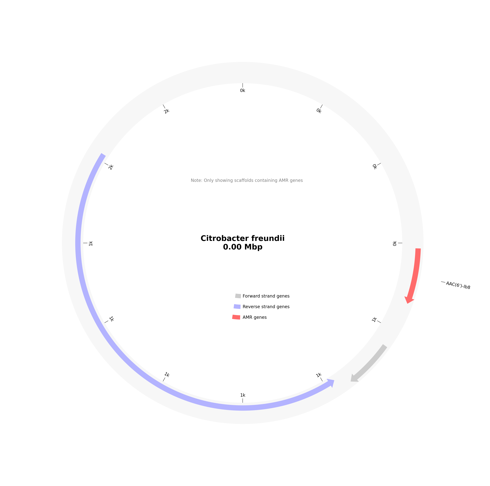

### AAC(6')-Ib8
- **Mechanism**: antibiotic inactivation
- **Drug Classes**: aminoglycoside antibiotic
- **AMR Family**: AAC(6')
- **Locations**:
  - gnl|SPADES|AKHJOCOO_3874_1 : position 502-603

## Citrobacter freundii complex
**Strain Statistics:**
- Total genome length: 1.8 kbp
- Total scaffolds: 16
- Scaffolds with AMR genes: 2
- Total genes annotated: 2
- Total AMR genes: 2
- Unique AMR genes: 2
- Distinct AMR mechanisms: 2
- Distinct AMR families: 2
- Distinct drug classes: 7

**Circos Plot:**

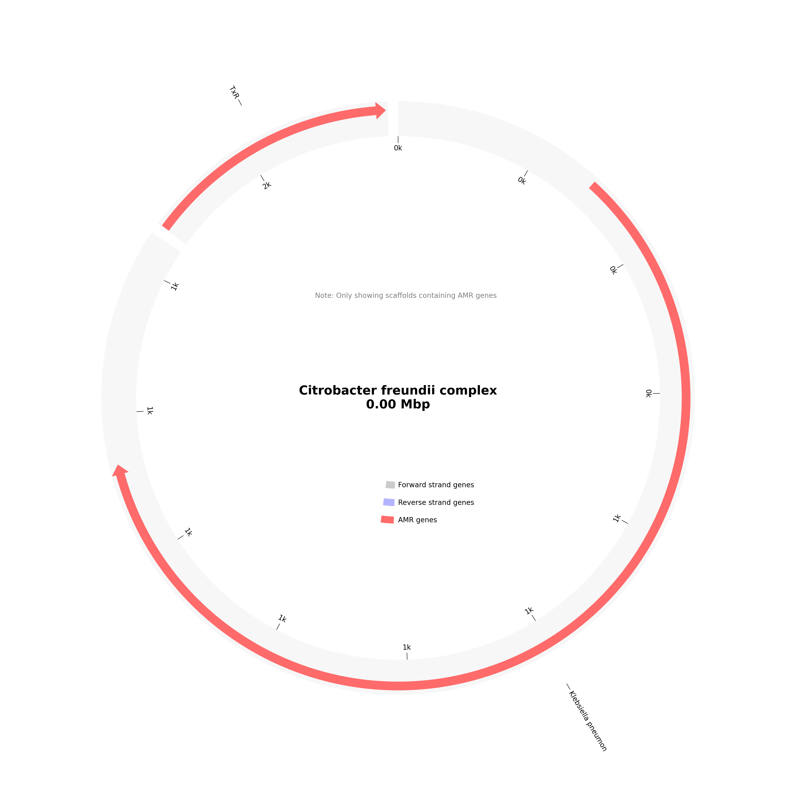

### Klebsiella pneumoniae OmpK37
- **Mechanism**: reduced permeability to antibiotic
- **Drug Classes**: monobactam; carbapenem; cephalosporin; cephamycin; penam; penem
- **AMR Family**: General Bacterial Porin with reduced permeability to beta-lactams
- **Locations**:
  - gnl|SPADES|AKHJOCOO_5118_1 : position 211-1281

### TxR
- **Mechanism**: antibiotic efflux
- **Drug Classes**: tetracycline antibiotic
- **AMR Family**: ATP-binding cassette (ABC) antibiotic efflux pump
- **Locations**:
  - gnl|SPADES|AKHJOCOO_49065_1 : position 1-258

## Citrobacter freundii complex sp. CFNIH9
**Strain Statistics:**
- Total genome length: 37.3 kbp
- Total scaffolds: 1
- Scaffolds with AMR genes: 1
- Total genes annotated: 68
- Total AMR genes: 2
- Unique AMR genes: 1
- Distinct AMR mechanisms: 1
- Distinct AMR families: 1
- Distinct drug classes: 6

**Circos Plot:**

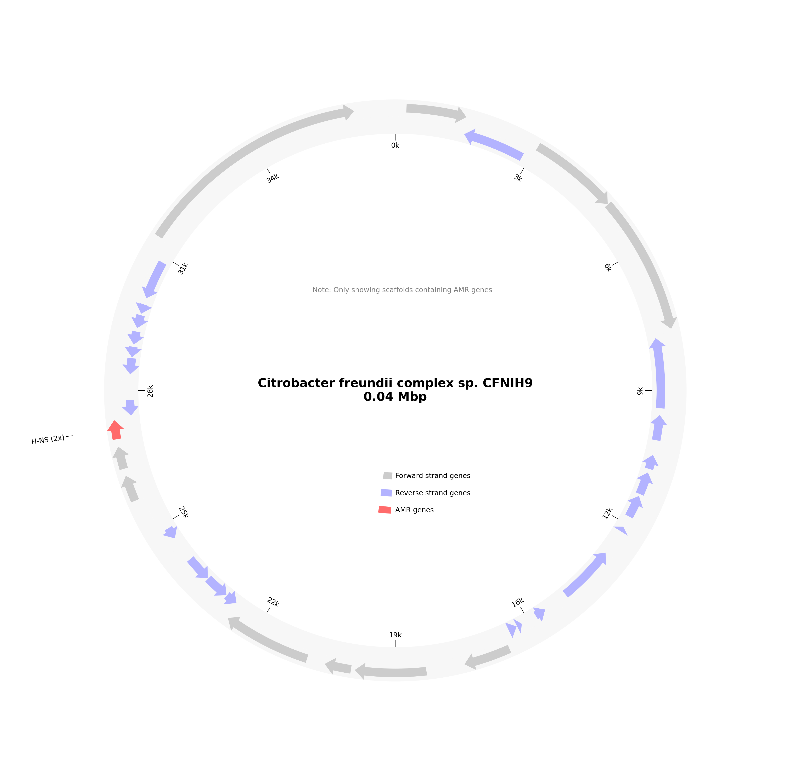

### H-NS (found in 2 locations)
- **Mechanism**: antibiotic efflux
- **Drug Classes**: macrolide antibiotic; fluoroquinolone antibiotic; cephalosporin; cephamycin; penam; tetracycline antibiotic
- **AMR Family**: major facilitator superfamily (MFS) antibiotic efflux pump; resistance-nodulation-cell division (RND) antibiotic efflux pump
- **Locations**:
  - gnl|SPADES|AKHJOCOO_203_25 : position 26911-27315
  - gnl|SPADES|AKHJOCOO_203_27 : position 27994-28236

## Citrobacter portucalensis
**Strain Statistics:**
- Total genome length: 10.7 kbp
- Total scaffolds: 19
- Scaffolds with AMR genes: 1
- Total genes annotated: 26
- Total AMR genes: 2
- Unique AMR genes: 2
- Distinct AMR mechanisms: 1
- Distinct AMR families: 2
- Distinct drug classes: 6

**Circos Plot:**

### H-NS
- **Mechanism**: antibiotic efflux
- **Drug Classes**: macrolide antibiotic; fluoroquinolone antibiotic; cephalosporin; cephamycin; penam; tetracycline antibiotic
- **AMR Family**: major facilitator superfamily (MFS) antibiotic efflux pump; resistance-nodulation-cell division (RND) antibiotic efflux pump
- **Locations**:
  - gnl|SPADES|AKHJOCOO_773_2 : position 1908-2300

### tetA(60)
- **Mechanism**: antibiotic efflux
- **Drug Classes**: tetracycline antibiotic
- **AMR Family**: ATP-binding cassette (ABC) antibiotic efflux pump
- **Locations**:
  - gnl|SPADES|AKHJOCOO_773_8 : position 5937-6986

## Citrobacter sp. 21OH12SH02A-Citro
**Strain Statistics:**
- Total genome length: 3.6 kbp
- Total scaffolds: 1
- Scaffolds with AMR genes: 1
- Total genes annotated: 4
- Total AMR genes: 1
- Unique AMR genes: 1
- Distinct AMR mechanisms: 1
- Distinct AMR families: 1
- Distinct drug classes: 4

**Circos Plot:**

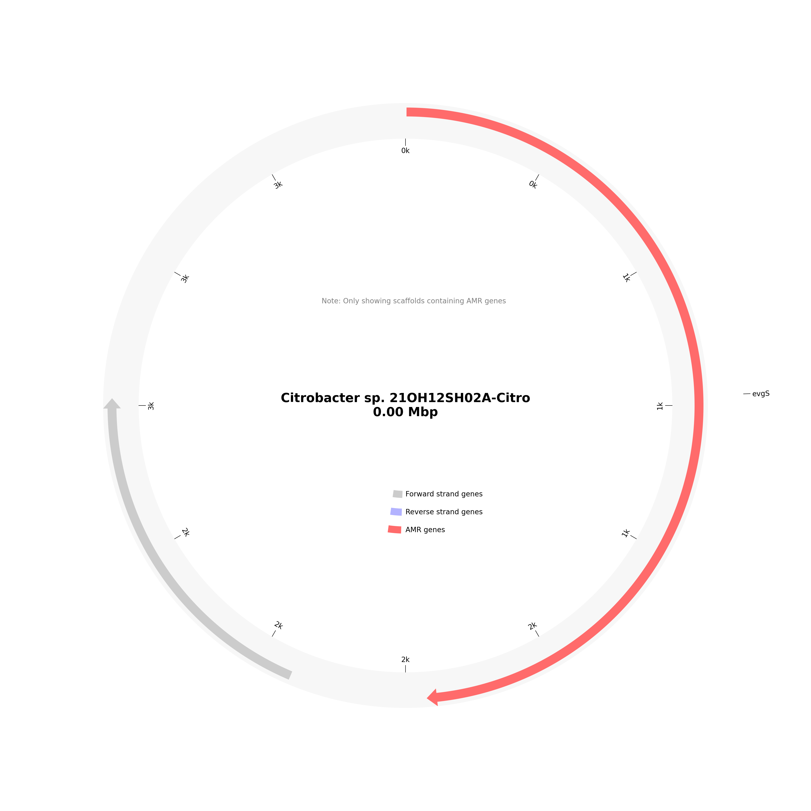

### evgS
- **Mechanism**: antibiotic efflux
- **Drug Classes**: macrolide antibiotic; fluoroquinolone antibiotic; penam; tetracycline antibiotic
- **AMR Family**: major facilitator superfamily (MFS) antibiotic efflux pump; resistance-nodulation-cell division (RND) antibiotic efflux pump
- **Locations**:
  - gnl|SPADES|AKHJOCOO_2177_1 : position 2-1765

## Citrobacter sp. RHB25-C09
**Strain Statistics:**
- Total genome length: 0.8 kbp
- Total scaffolds: 5
- Scaffolds with AMR genes: 1
- Total genes annotated: 2
- Total AMR genes: 1
- Unique AMR genes: 1
- Distinct AMR mechanisms: 1
- Distinct AMR families: 1
- Distinct drug classes: 1

**Circos Plot:**

### cmlv
- **Mechanism**: antibiotic inactivation
- **Drug Classes**: phenicol antibiotic
- **AMR Family**: chloramphenicol phosphotransferase
- **Locations**:
  - gnl|SPADES|AKHJOCOO_10098_2 : position 603-845

## Citrobacter sp. RHBSTW-00424
**Strain Statistics:**
- Total genome length: 1.6 kbp
- Total scaffolds: 1
- Scaffolds with AMR genes: 1
- Total genes annotated: 4
- Total AMR genes: 1
- Unique AMR genes: 1
- Distinct AMR mechanisms: 1
- Distinct AMR families: 1
- Distinct drug classes: 1

**Circos Plot:**

### AAC(3)-Ib/AAC(6')-Ib3 bifunctional protein
- **Mechanism**: antibiotic inactivation
- **Drug Classes**: aminoglycoside antibiotic
- **AMR Family**: aminoglycoside bifunctional resistance protein
- **Locations**:
  - gnl|SPADES|AKHJOCOO_4862_2 : position 1120-1563

## Citrobacter youngae
**Strain Statistics:**
- Total genome length: 0.4 kbp
- Total scaffolds: 4
- Scaffolds with AMR genes: 1
- Total genes annotated: 2
- Total AMR genes: 1
- Unique AMR genes: 1
- Distinct AMR mechanisms: 1
- Distinct AMR families: 1
- Distinct drug classes: 1

**Circos Plot:**

### msbA
- **Mechanism**: antibiotic efflux
- **Drug Classes**: nitroimidazole antibiotic
- **AMR Family**: ATP-binding cassette (ABC) antibiotic efflux pump
- **Locations**:
  - gnl|SPADES|AKHJOCOO_22759_2 : position 99-440

## Enterobacter hormaechei
**Strain Statistics:**
- Total genome length: 0.2 kbp
- Total scaffolds: 20
- Scaffolds with AMR genes: 1
- Total genes annotated: 0
- Total AMR genes: 1
- Unique AMR genes: 1
- Distinct AMR mechanisms: 1
- Distinct AMR families: 1
- Distinct drug classes: 3

**Circos Plot:**

### lsaC
- **Mechanism**: antibiotic target protection
- **Drug Classes**: lincosamide antibiotic; streptogramin antibiotic; pleuromutilin antibiotic
- **AMR Family**: lsa-type ABC-F protein
- **Locations**:
  - gnl|SPADES|AKHJOCOO_74919_1 : position 25-207

## Enterobacter hormaechei subsp. steigerwaltii
**Strain Statistics:**
- Total genome length: 122.9 kbp
- Total scaffolds: 2
- Scaffolds with AMR genes: 1
- Total genes annotated: 272
- Total AMR genes: 8
- Unique AMR genes: 8
- Distinct AMR mechanisms: 3
- Distinct AMR families: 5
- Distinct drug classes: 13

**Circos Plot:**

### Escherichia coli AcrAB-TolC with AcrR mutation conferring resistance to ciprofloxacin, tetracycline, and ceftazidime
- **Mechanism**: antibiotic target alteration; antibiotic efflux
- **Drug Classes**: fluoroquinolone antibiotic; cephalosporin; glycylcycline; penam; tetracycline antibiotic; rifamycin antibiotic; phenicol antibiotic; disinfecting agents and antiseptics
- **AMR Family**: resistance-nodulation-cell division (RND) antibiotic efflux pump
- **Locations**:
  - gnl|SPADES|AKHJOCOO_33_121 : position 111126-111782

### MexK
- **Mechanism**: antibiotic efflux
- **Drug Classes**: macrolide antibiotic; tetracycline antibiotic; disinfecting agents and antiseptics
- **AMR Family**: resistance-nodulation-cell division (RND) antibiotic efflux pump
- **Locations**:
  - gnl|SPADES|AKHJOCOO_33_122 : position 111779-113881

### NmcR
- **Mechanism**: antibiotic inactivation
- **Drug Classes**: carbapenem; cephalosporin; cephamycin; penam
- **AMR Family**: NmcA beta-lactamase
- **Locations**:
  - gnl|SPADES|AKHJOCOO_33_119 : position 108623-109528

### RanA
- **Mechanism**: antibiotic efflux
- **Drug Classes**: aminoglycoside antibiotic
- **AMR Family**: ATP-binding cassette (ABC) antibiotic efflux pump
- **Locations**:
  - gnl|SPADES|AKHJOCOO_33_126 : position 116096-116917

### RanB
- **Mechanism**: antibiotic efflux
- **Drug Classes**: aminoglycoside antibiotic
- **AMR Family**: ATP-binding cassette (ABC) antibiotic efflux pump
- **Locations**:
  - gnl|SPADES|AKHJOCOO_33_125 : position 114942-116099

### leuO
- **Mechanism**: antibiotic efflux
- **Drug Classes**: nucleoside antibiotic; disinfecting agents and antiseptics
- **AMR Family**: major facilitator superfamily (MFS) antibiotic efflux pump
- **Locations**:
  - gnl|SPADES|AKHJOCOO_33_115 : position 105724-106629

### opcM
- **Mechanism**: antibiotic efflux
- **Drug Classes**: fluoroquinolone antibiotic; aminoglycoside antibiotic
- **AMR Family**: resistance-nodulation-cell division (RND) antibiotic efflux pump
- **Locations**:
  - gnl|SPADES|AKHJOCOO_33_120 : position 109622-111025

### ykkC
- **Mechanism**: antibiotic efflux
- **Drug Classes**: aminoglycoside antibiotic; tetracycline antibiotic; phenicol antibiotic
- **AMR Family**: small multidrug resistance (SMR) antibiotic efflux pump
- **Locations**:
  - gnl|SPADES|AKHJOCOO_33_118 : position 107951-108268

## Escherichia coli
**Strain Statistics:**
- Total genome length: 473.6 kbp
- Total scaffolds: 2537
- Scaffolds with AMR genes: 262
- Total genes annotated: 896
- Total AMR genes: 297
- Unique AMR genes: 152
- Distinct AMR mechanisms: 10
- Distinct AMR families: 51
- Distinct drug classes: 33

**Circos Plot:**

### ALG11-1
- **Mechanism**: antibiotic inactivation
- **Drug Classes**: carbapenem
- **AMR Family**: ALG11 beta-lactamase
- **Locations**:
  - gnl|SPADES|AKHJOCOO_2749_2 : position 401-1840

### Acinetobacter baumannii AbaF (found in 5 locations)
- **Mechanism**: antibiotic efflux
- **Drug Classes**: phosphonic acid antibiotic
- **AMR Family**: major facilitator superfamily (MFS) antibiotic efflux pump
- **Locations**:
  - gnl|SPADES|AKHJOCOO_28552_1 : position 1-291
  - gnl|SPADES|AKHJOCOO_3259_1 : position 91-1413
  - gnl|SPADES|AKHJOCOO_3312_2 : position 1227-2294
  - gnl|SPADES|AKHJOCOO_4551_3 : position 526-1698
  - gnl|SPADES|AKHJOCOO_5288_2 : position 774-1475

### Acinetobacter baumannii AbaQ (found in 3 locations)
- **Mechanism**: antibiotic efflux
- **Drug Classes**: fluoroquinolone antibiotic
- **AMR Family**: major facilitator superfamily (MFS) antibiotic efflux pump
- **Locations**:
  - gnl|SPADES|AKHJOCOO_1470_7 : position 3504-4835
  - gnl|SPADES|AKHJOCOO_2039_2 : position 960-2312
  - gnl|SPADES|AKHJOCOO_3765_2 : position 920-2026

### Acinetobacter baumannii AmvA
- **Mechanism**: antibiotic efflux
- **Drug Classes**: macrolide antibiotic; disinfecting agents and antiseptics
- **AMR Family**: major facilitator superfamily (MFS) antibiotic efflux pump
- **Locations**:
  - gnl|SPADES|AKHJOCOO_7763_1 : position 2-1033

### AcrE (found in 2 locations)
- **Mechanism**: antibiotic efflux
- **Drug Classes**: fluoroquinolone antibiotic; cephalosporin; cephamycin; penam
- **AMR Family**: resistance-nodulation-cell division (RND) antibiotic efflux pump
- **Locations**:
  - gnl|SPADES|AKHJOCOO_1384_5 : position 5158-5964
  - gnl|SPADES|AKHJOCOO_17068_1 : position 1-324

### AcrF
- **Mechanism**: antibiotic efflux
- **Drug Classes**: fluoroquinolone antibiotic; cephalosporin; cephamycin; penam
- **AMR Family**: resistance-nodulation-cell division (RND) antibiotic efflux pump
- **Locations**:
  - gnl|SPADES|AKHJOCOO_1384_4: position 2042-5146

### ArnT (found in 2 locations)
- **Mechanism**: antibiotic target alteration
- **Drug Classes**: peptide antibiotic
- **AMR Family**: pmr phosphoethanolamine transferase
- **Locations**:
  - gnl|SPADES|AKHJOCOO_5833_1: position 2-1354
  - gnl|SPADES|AKHJOCOO_8304_3 : position 768-992

### Bifidobacterium adolescentis rpoB mutants conferring resistance to rifampicin
- **Mechanism**: antibiotic target alteration; antibiotic target replacement
- **Drug Classes**: rifamycin antibiotic
- **AMR Family**: rifamycin-resistant beta-subunit of RNA polymerase (rpoB)
- **Locations**:
  - gnl|SPADES|AKHJOCOO_6963_1 : position 2-1153

### Brucella suis mprF
- **Mechanism**: antibiotic target alteration
- **Drug Classes**: peptide antibiotic
- **AMR Family**: defensin resistant mprF
- **Locations**:
  - gnl|SPADES|AKHJOCOO_5987_2 : position 97-1053

### CRP (found in 3 locations)
- **Mechanism**: antibiotic efflux
- **Drug Classes**: macrolide antibiotic; fluoroquinolone antibiotic; penam
- **AMR Family**: resistance-nodulation-cell division (RND) antibiotic efflux pump
- **Locations**:
  - gnl|SPADES|AKHJOCOO_17789_1 : position 2-493
  - gnl|SPADES|AKHJOCOO_5894_1 : position 26-778
  - gnl|SPADES|AKHJOCOO_7357_1 : position 3-251

### Clostridioides difficile gyrB conferring resistance to fluoroquinolones (found in 2 locations)
- **Mechanism**: antibiotic target alteration
- **Drug Classes**: fluoroquinolone antibiotic
- **AMR Family**: fluoroquinolone resistant gyrB
- **Locations**:
  - gnl|SPADES|AKHJOCOO_3574_1 : position 3-473
  - gnl|SPADES|AKHJOCOO_4256_2 : position 558-1817

### EC-14
- **Mechanism**: antibiotic inactivation
- **Drug Classes**: cephalosporin
- **AMR Family**: EC beta-lactamase
- **Locations**:
  - gnl|SPADES|AKHJOCOO_4147_2: position 437-1570

### Escherichia coli AcrAB-TolC with AcrR mutation conferring resistance to ciprofloxacin, tetracycline, and ceftazidime
- **Mechanism**: antibiotic target alteration; antibiotic efflux
- **Drug Classes**: fluoroquinolone antibiotic; cephalosporin; glycylcycline; penam; tetracycline antibiotic; rifamycin antibiotic; phenicol antibiotic; disinfecting agents and antiseptics
- **AMR Family**: resistance-nodulation-cell division (RND) antibiotic efflux pump
- **Locations**:
  - gnl|SPADES|AKHJOCOO_11041_2 : position 700-783

### Escherichia coli EF-Tu mutants conferring resistance to Pulvomycin
- **Mechanism**: antibiotic target alteration
- **Drug Classes**: elfamycin antibiotic
- **AMR Family**: elfamycin resistant EF-Tu
- **Locations**:
  - gnl|SPADES|AKHJOCOO_946_2 : position 794-2638

### Escherichia coli mdfA
- **Mechanism**: antibiotic efflux
- **Drug Classes**: tetracycline antibiotic; phenicol antibiotic; disinfecting agents and antiseptics
- **AMR Family**: major facilitator superfamily (MFS) antibiotic efflux pump
- **Locations**:
  - gnl|SPADES|AKHJOCOO_4794_3 : position 1019-1618

### Escherichia coli soxR with mutation conferring antibiotic resistance
- **Mechanism**: antibiotic target alteration; antibiotic efflux
- **Drug Classes**: fluoroquinolone antibiotic; cephalosporin; glycylcycline; penam; tetracycline antibiotic; rifamycin antibiotic; phenicol antibiotic; disinfecting agents and antiseptics
- **AMR Family**: ATP-binding cassette (ABC) antibiotic efflux pump; major facilitator superfamily (MFS) antibiotic efflux pump; resistance-nodulation-cell division (RND) antibiotic efflux pump
- **Locations**:
  - gnl|SPADES|AKHJOCOO_1018_2: position 696-1160

### Escherichia coli soxS with mutation conferring antibiotic resistance (found in 3 locations)
- **Mechanism**: antibiotic target alteration; antibiotic efflux; reduced permeability to antibiotic
- **Drug Classes**: fluoroquinolone antibiotic; monobactam; carbapenem; cephalosporin; glycylcycline; cephamycin; penam; tetracycline antibiotic; rifamycin antibiotic; phenicol antibiotic; penem; disinfecting agents and antiseptics
- **AMR Family**: ATP-binding cassette (ABC) antibiotic efflux pump; major facilitator superfamily (MFS) antibiotic efflux pump; resistance-nodulation-cell division (RND) antibiotic efflux pump; General Bacterial Porin with reduced permeability to beta-lactams
- **Locations**:
  - gnl|SPADES|AKHJOCOO_1018_3: position 1246-1569
  - gnl|SPADES|AKHJOCOO_15494_1 : position 3-254
  - gnl|SPADES|AKHJOCOO_2480_5 : position 2186-3037

### Haemophilus influenzae PBP3 conferring resistance to beta-lactam antibiotics
- **Mechanism**: antibiotic target alteration
- **Drug Classes**: cephalosporin; cephamycin; penam
- **AMR Family**: Penicillin-binding protein mutations conferring resistance to beta-lactam antibiotics
- **Locations**:
  - gnl|SPADES|AKHJOCOO_4220_1 : position 2-1054

### Helicobacter pylori pbp1 mutants conferring resistance to amoxicillin (found in 3 locations)
- **Mechanism**: antibiotic target alteration
- **Drug Classes**: cephalosporin; cephamycin; penam
- **AMR Family**: Penicillin-binding protein mutations conferring resistance to beta-lactam antibiotics
- **Locations**:
  - gnl|SPADES|AKHJOCOO_11309_1 : position 250-765
  - gnl|SPADES|AKHJOCOO_2472_1 : position 1-1671
  - gnl|SPADES|AKHJOCOO_3760_2 : position 360-2030

### Helicobacter pylori pbp2 mutants conferring resistance to amoxicillin
- **Mechanism**: antibiotic target alteration
- **Drug Classes**: cephalosporin; cephamycin; penam
- **AMR Family**: Penicillin-binding protein mutations conferring resistance to beta-lactam antibiotics
- **Locations**:
  - gnl|SPADES|AKHJOCOO_6676_2 : position 745-1197

### Klebsiella pneumoniae KpnE
- **Mechanism**: antibiotic efflux
- **Drug Classes**: macrolide antibiotic; aminoglycoside antibiotic; cephalosporin; tetracycline antibiotic; peptide antibiotic; rifamycin antibiotic; disinfecting agents and antiseptics
- **AMR Family**: small multidrug resistance (SMR) antibiotic efflux pump
- **Locations**:
  - gnl|SPADES|AKHJOCOO_7260_3: position 605-970

### Klebsiella pneumoniae KpnF
- **Mechanism**: antibiotic efflux
- **Drug Classes**: macrolide antibiotic; aminoglycoside antibiotic; cephalosporin; tetracycline antibiotic; peptide antibiotic; rifamycin antibiotic; disinfecting agents and antiseptics
- **AMR Family**: small multidrug resistance (SMR) antibiotic efflux pump
- **Locations**:
  - gnl|SPADES|AKHJOCOO_7260_2: position 289-618

### Klebsiella pneumoniae OmpK37 (found in 4 locations)
- **Mechanism**: reduced permeability to antibiotic
- **Drug Classes**: monobactam; carbapenem; cephalosporin; cephamycin; penam; penem
- **AMR Family**: General Bacterial Porin with reduced permeability to beta-lactams
- **Locations**:
  - gnl|SPADES|AKHJOCOO_38440_1 : position 3-290
  - gnl|SPADES|AKHJOCOO_45546_1 : position 3-266
  - gnl|SPADES|AKHJOCOO_63551_1 : position 1-228
  - gnl|SPADES|AKHJOCOO_6735_2 : position 318-1187

### LlmA 23S ribosomal RNA methyltransferase
- **Mechanism**: antibiotic target alteration
- **Drug Classes**: lincosamide antibiotic
- **AMR Family**: Llm 23S ribosomal RNA methyltransferase
- **Locations**:
  - gnl|SPADES|AKHJOCOO_4558_2 : position 450-1625

### LptD
- **Mechanism**: antibiotic efflux
- **Drug Classes**: carbapenem; peptide antibiotic; aminocoumarin antibiotic; rifamycin antibiotic
- **AMR Family**: ATP-binding cassette (ABC) antibiotic efflux pump
- **Locations**:
  - gnl|SPADES|AKHJOCOO_2063_3 : position 1551-3848

### MCR-3.22
- **Mechanism**: antibiotic target alteration
- **Drug Classes**: peptide antibiotic
- **AMR Family**: MCR phosphoethanolamine transferase
- **Locations**:
  - gnl|SPADES|AKHJOCOO_1167_6 : position 2262-3755

### MdtK (found in 2 locations)
- **Mechanism**: antibiotic efflux
- **Drug Classes**: fluoroquinolone antibiotic
- **AMR Family**: multidrug and toxic compound extrusion (MATE) transporter
- **Locations**:
  - gnl|SPADES|AKHJOCOO_5983_1 : position 3-695
  - gnl|SPADES|AKHJOCOO_5983_2 : position 701-1306

### MdtQ
- **Mechanism**: reduced permeability to antibiotic
- **Drug Classes**: monobactam; carbapenem; cephalosporin; cephamycin; penam; penem
- **AMR Family**: Outer Membrane Porin (Opr)
- **Locations**:
  - gnl|SPADES|AKHJOCOO_6395_1 : position 664-1242

### MexR
- **Mechanism**: antibiotic target alteration; antibiotic efflux
- **Drug Classes**: macrolide antibiotic; fluoroquinolone antibiotic; monobactam; carbapenem; cephalosporin; cephamycin; penam; tetracycline antibiotic; peptide antibiotic; aminocoumarin antibiotic; diaminopyrimidine antibiotic; sulfonamide antibiotic; phenicol antibiotic; penem
- **AMR Family**: resistance-nodulation-cell division (RND) antibiotic efflux pump
- **Locations**:
  - gnl|SPADES|AKHJOCOO_9735_1 : position 67-474

### MexS
- **Mechanism**: antibiotic efflux
- **Drug Classes**: fluoroquinolone antibiotic; diaminopyrimidine antibiotic; phenicol antibiotic
- **AMR Family**: resistance-nodulation-cell division (RND) antibiotic efflux pump
- **Locations**:
  - gnl|SPADES|AKHJOCOO_2305_2 : position 477-1460

### MexT
- **Mechanism**: antibiotic efflux
- **Drug Classes**: fluoroquinolone antibiotic; diaminopyrimidine antibiotic; phenicol antibiotic
- **AMR Family**: resistance-nodulation-cell division (RND) antibiotic efflux pump
- **Locations**:
  - gnl|SPADES|AKHJOCOO_6672_1 : position 397-1197

### MexV
- **Mechanism**: antibiotic efflux
- **Drug Classes**: macrolide antibiotic; fluoroquinolone antibiotic; tetracycline antibiotic; phenicol antibiotic; disinfecting agents and antiseptics
- **AMR Family**: resistance-nodulation-cell division (RND) antibiotic efflux pump
- **Locations**:
  - gnl|SPADES|AKHJOCOO_2878_3 : position 1369-2538

### MuxC
- **Mechanism**: antibiotic efflux
- **Drug Classes**: macrolide antibiotic; monobactam; tetracycline antibiotic; aminocoumarin antibiotic
- **AMR Family**: resistance-nodulation-cell division (RND) antibiotic efflux pump
- **Locations**:
  - gnl|SPADES|AKHJOCOO_7249_1 : position 1-1065

### Mycobacterium tuberculosis inhA mutations conferring resistance to isoniazid
- **Mechanism**: antibiotic target alteration
- **Drug Classes**: isoniazid-like antibiotic
- **AMR Family**: isoniazid resistant inhA
- **Locations**:
  - gnl|SPADES|AKHJOCOO_4967_1 : position 1-738

### Mycobacterium tuberculosis intrinsic murA conferring resistance to fosfomycin
- **Mechanism**: antibiotic target alteration
- **Drug Classes**: phosphonic acid antibiotic
- **AMR Family**: antibiotic-resistant murA transferase
- **Locations**:
  - gnl|SPADES|AKHJOCOO_4623_4 : position 1217-1672

### Mycobacterium tuberculosis kasA mutant conferring resistance to isoniazid
- **Mechanism**: antibiotic target alteration
- **Drug Classes**: isoniazid-like antibiotic
- **AMR Family**: antibiotic resistant kasA
- **Locations**:
  - gnl|SPADES|AKHJOCOO_7392_1 : position 2-1099

### Mycobacterium tuberculosis katG mutations conferring resistance to isoniazid
- **Mechanism**: antibiotic target alteration
- **Drug Classes**: isoniazid-like antibiotic
- **AMR Family**: isoniazid resistant katG
- **Locations**:
  - gnl|SPADES|AKHJOCOO_1226_3 : position 3138-5318

### NmcR (found in 6 locations)
- **Mechanism**: antibiotic inactivation
- **Drug Classes**: carbapenem; cephalosporin; cephamycin; penam
- **AMR Family**: NmcA beta-lactamase
- **Locations**:
  - gnl|SPADES|AKHJOCOO_13177_1 : position 3-311
  - gnl|SPADES|AKHJOCOO_1543_1 : position 1-636
  - gnl|SPADES|AKHJOCOO_2625_3 : position 2380-2919
  - gnl|SPADES|AKHJOCOO_3236_1 : position 711-1550
  - gnl|SPADES|AKHJOCOO_3926_2 : position 779-1690
  - gnl|SPADES|AKHJOCOO_5309_4 : position 1084-1470

### OmpA (found in 2 locations)
- **Mechanism**: reduced permeability to antibiotic
- **Drug Classes**: peptide antibiotic
- **AMR Family**: General Bacterial Porin with reduced permeability to peptide antibiotics
- **Locations**:
  - gnl|SPADES|AKHJOCOO_1584_3 : position 1469-2128
  - gnl|SPADES|AKHJOCOO_6533_1 : position 1-657

### OprA
- **Mechanism**: antibiotic efflux
- **Drug Classes**: macrolide antibiotic; fluoroquinolone antibiotic; aminoglycoside antibiotic; carbapenem; tetracycline antibiotic
- **AMR Family**: resistance-nodulation-cell division (RND) antibiotic efflux pump
- **Locations**:
  - gnl|SPADES|AKHJOCOO_2878_1 : position 2-997

### OprJ
- **Mechanism**: antibiotic efflux
- **Drug Classes**: macrolide antibiotic; fluoroquinolone antibiotic; aminoglycoside antibiotic; cephalosporin; penam; tetracycline antibiotic; aminocoumarin antibiotic; diaminopyrimidine antibiotic; phenicol antibiotic
- **AMR Family**: resistance-nodulation-cell division (RND) antibiotic efflux pump
- **Locations**:
  - gnl|SPADES|AKHJOCOO_5287_1 : position 3-515

### PEDO-1
- **Mechanism**: antibiotic inactivation
- **Drug Classes**: carbapenem
- **AMR Family**: subclass B3 PEDO beta-lactamase
- **Locations**:
  - gnl|SPADES|AKHJOCOO_7000_1 : position 1-639

### ParR (found in 3 locations)
- **Mechanism**: antibiotic efflux; reduced permeability to antibiotic
- **Drug Classes**: macrolide antibiotic; fluoroquinolone antibiotic; monobactam; aminoglycoside antibiotic; carbapenem; cephalosporin; cephamycin; penam; tetracycline antibiotic; phenicol antibiotic; penem; disinfecting agents and antiseptics
- **AMR Family**: resistance-nodulation-cell division (RND) antibiotic efflux pump; Outer Membrane Porin (Opr)
- **Locations**:
  - gnl|SPADES|AKHJOCOO_31622_1 : position 3-140
  - gnl|SPADES|AKHJOCOO_6801_2 : position 607-1176
  - gnl|SPADES|AKHJOCOO_8079_3 : position 665-1018

### ParS (found in 3 locations)
- **Mechanism**: antibiotic efflux; reduced permeability to antibiotic
- **Drug Classes**: macrolide antibiotic; fluoroquinolone antibiotic; monobactam; aminoglycoside antibiotic; carbapenem; cephalosporin; cephamycin; penam; tetracycline antibiotic; phenicol antibiotic; penem; disinfecting agents and antiseptics
- **AMR Family**: resistance-nodulation-cell division (RND) antibiotic efflux pump; Outer Membrane Porin (Opr)
- **Locations**:
  - gnl|SPADES|AKHJOCOO_17656_1 : position 3-539
  - gnl|SPADES|AKHJOCOO_19656_1 : position 2-493
  - gnl|SPADES|AKHJOCOO_6382_1 : position 1-582

### PmrF (found in 2 locations)
- **Mechanism**: antibiotic target alteration
- **Drug Classes**: peptide antibiotic
- **AMR Family**: pmr phosphoethanolamine transferase
- **Locations**:
  - gnl|SPADES|AKHJOCOO_8096_2 : position 195-1016
  - gnl|SPADES|AKHJOCOO_9190_2 : position 816-914

### Pseudomonas aeruginosa CpxR (found in 2 locations)
- **Mechanism**: antibiotic efflux
- **Drug Classes**: macrolide antibiotic; fluoroquinolone antibiotic; monobactam; aminoglycoside antibiotic; carbapenem; cephalosporin; cephamycin; penam; tetracycline antibiotic; peptide antibiotic; aminocoumarin antibiotic; diaminopyrimidine antibiotic; sulfonamide antibiotic; phenicol antibiotic; penem
- **AMR Family**: resistance-nodulation-cell division (RND) antibiotic efflux pump
- **Locations**:
  - gnl|SPADES|AKHJOCOO_1557_6 : position 4446-5144
  - gnl|SPADES|AKHJOCOO_5060_2 : position 250-930

### QnrD2
- **Mechanism**: antibiotic target protection
- **Drug Classes**: fluoroquinolone antibiotic
- **AMR Family**: quinolone resistance protein (qnr)
- **Locations**:
  - gnl|SPADES|AKHJOCOO_3530_1 : position 79-1659

### QnrVC3
- **Mechanism**: antibiotic target protection
- **Drug Classes**: fluoroquinolone antibiotic
- **AMR Family**: quinolone resistance protein (qnr)
- **Locations**:
  - gnl|SPADES|AKHJOCOO_2513_3 : position 1783-3078

### RanA (found in 8 locations)
- **Mechanism**: antibiotic efflux
- **Drug Classes**: aminoglycoside antibiotic
- **AMR Family**: ATP-binding cassette (ABC) antibiotic efflux pump
- **Locations**:
  - gnl|SPADES|AKHJOCOO_21022_1 : position 1-468
  - gnl|SPADES|AKHJOCOO_22761_1 : position 3-440
  - gnl|SPADES|AKHJOCOO_2409_3 : position 1796-2866
  - gnl|SPADES|AKHJOCOO_24429_1 : position 3-416
  - gnl|SPADES|AKHJOCOO_2543_3 : position 2140-3033
  - gnl|SPADES|AKHJOCOO_2763_4 : position 2280-2738
  - gnl|SPADES|AKHJOCOO_3400_2 : position 470-2059
  - gnl|SPADES|AKHJOCOO_4677_2 : position 629-1396

### RanB
- **Mechanism**: antibiotic efflux
- **Drug Classes**: aminoglycoside antibiotic
- **AMR Family**: ATP-binding cassette (ABC) antibiotic efflux pump
- **Locations**:
  - gnl|SPADES|AKHJOCOO_7638_3 : position 749-1069

### Rv1877
- **Mechanism**: antibiotic efflux
- **Drug Classes**: fluoroquinolone antibiotic
- **AMR Family**: major facilitator superfamily (MFS) antibiotic efflux pump
- **Locations**:
  - gnl|SPADES|AKHJOCOO_2729_1 : position 5-1399

### SatA
- **Mechanism**: antibiotic inactivation
- **Drug Classes**: nucleoside antibiotic
- **AMR Family**: streptothricin acetyltransferase (SAT)
- **Locations**:
  - gnl|SPADES|AKHJOCOO_7112_2 : position 240-674

### TaeA
- **Mechanism**: antibiotic efflux
- **Drug Classes**: pleuromutilin antibiotic
- **AMR Family**: ATP-binding cassette (ABC) antibiotic efflux pump
- **Locations**:
  - gnl|SPADES|AKHJOCOO_5160_1 : position 3-1157

### TolC (found in 2 locations)
- **Mechanism**: antibiotic efflux
- **Drug Classes**: macrolide antibiotic; fluoroquinolone antibiotic; aminoglycoside antibiotic; carbapenem; cephalosporin; glycylcycline; cephamycin; penam; tetracycline antibiotic; peptide antibiotic; aminocoumarin antibiotic; rifamycin antibiotic; phenicol antibiotic; penem; disinfecting agents and antiseptics
- **AMR Family**: ATP-binding cassette (ABC) antibiotic efflux pump; major facilitator superfamily (MFS) antibiotic efflux pump; resistance-nodulation-cell division (RND) antibiotic efflux pump
- **Locations**:
  - gnl|SPADES|AKHJOCOO_1805_4: position 2046-3534
  - gnl|SPADES|AKHJOCOO_4896_2 : position 852-1586

### TxR (found in 10 locations)
- **Mechanism**: antibiotic efflux
- **Drug Classes**: tetracycline antibiotic
- **AMR Family**: ATP-binding cassette (ABC) antibiotic efflux pump
- **Locations**:
  - gnl|SPADES|AKHJOCOO_10024_1 : position 2-487
  - gnl|SPADES|AKHJOCOO_12517_1 : position 3-704
  - gnl|SPADES|AKHJOCOO_1960_3 : position 1957-3291
  - gnl|SPADES|AKHJOCOO_20830_1 : position 1-471
  - gnl|SPADES|AKHJOCOO_26377_1 : position 1-393
  - gnl|SPADES|AKHJOCOO_2749_3 : position 2027-2755
  - gnl|SPADES|AKHJOCOO_4379_1 : position 2-1558
  - gnl|SPADES|AKHJOCOO_6368_1 : position 1-669
  - gnl|SPADES|AKHJOCOO_6624_2 : position 117-1205
  - gnl|SPADES|AKHJOCOO_6742_2 : position 399-1187

### YajC
- **Mechanism**: antibiotic efflux
- **Drug Classes**: fluoroquinolone antibiotic; cephalosporin; glycylcycline; penam; tetracycline antibiotic; oxazolidinone antibiotic; glycopeptide antibiotic; rifamycin antibiotic; phenicol antibiotic; disinfecting agents and antiseptics
- **AMR Family**: resistance-nodulation-cell division (RND) antibiotic efflux pump
- **Locations**:
  - gnl|SPADES|AKHJOCOO_4901_2 : position 1209-1541

### acrB
- **Mechanism**: antibiotic efflux
- **Drug Classes**: fluoroquinolone antibiotic; cephalosporin; glycylcycline; penam; tetracycline antibiotic; rifamycin antibiotic; phenicol antibiotic; disinfecting agents and antiseptics
- **AMR Family**: resistance-nodulation-cell division (RND) antibiotic efflux pump
- **Locations**:
  - gnl|SPADES|AKHJOCOO_2661_1 : position 1-927

### acrD (found in 2 locations)
- **Mechanism**: antibiotic efflux
- **Drug Classes**: aminoglycoside antibiotic
- **AMR Family**: resistance-nodulation-cell division (RND) antibiotic efflux pump
- **Locations**:
  - gnl|SPADES|AKHJOCOO_2004_1 : position 342-1832
  - gnl|SPADES|AKHJOCOO_2004_2 : position 1846-3465

### adeL (found in 13 locations)
- **Mechanism**: antibiotic efflux
- **Drug Classes**: fluoroquinolone antibiotic; tetracycline antibiotic
- **AMR Family**: resistance-nodulation-cell division (RND) antibiotic efflux pump
- **Locations**:
  - gnl|SPADES|AKHJOCOO_13075_1 : position 246-680
  - gnl|SPADES|AKHJOCOO_1555_4 : position 2171-3100
  - gnl|SPADES|AKHJOCOO_15710_1 : position 1-588
  - gnl|SPADES|AKHJOCOO_1651_3 : position 2042-3016
  - gnl|SPADES|AKHJOCOO_17392_1 : position 1-546
  - gnl|SPADES|AKHJOCOO_18924_2 : position 292-510
  - gnl|SPADES|AKHJOCOO_2577_1 : position 226-1143
  - gnl|SPADES|AKHJOCOO_4170_1 : position 2-340
  - gnl|SPADES|AKHJOCOO_47140_1 : position 2-262
  - gnl|SPADES|AKHJOCOO_4872_2 : position 641-1591
  - gnl|SPADES|AKHJOCOO_5104_2 : position 589-1479
  - gnl|SPADES|AKHJOCOO_6755_1 : position 3-749
  - gnl|SPADES|AKHJOCOO_7722_2 : position 415-1059

### adeN
- **Mechanism**: antibiotic efflux
- **Drug Classes**: macrolide antibiotic; fluoroquinolone antibiotic; lincosamide antibiotic; carbapenem; cephalosporin; tetracycline antibiotic; rifamycin antibiotic; diaminopyrimidine antibiotic; phenicol antibiotic; penem
- **AMR Family**: resistance-nodulation-cell division (RND) antibiotic efflux pump
- **Locations**:
  - gnl|SPADES|AKHJOCOO_3904_2 : position 427-1020

### almE
- **Mechanism**: antibiotic target alteration
- **Drug Classes**: peptide antibiotic
- **AMR Family**: polymyxin resistance operon; alm glycyltransferase
- **Locations**:
  - gnl|SPADES|AKHJOCOO_4721_1 : position 3-1592

### arlR (found in 3 locations)
- **Mechanism**: antibiotic efflux
- **Drug Classes**: fluoroquinolone antibiotic; disinfecting agents and antiseptics
- **AMR Family**: major facilitator superfamily (MFS) antibiotic efflux pump
- **Locations**:
  - gnl|SPADES|AKHJOCOO_4338_2 : position 1034-1702
  - gnl|SPADES|AKHJOCOO_4418_1 : position 244-852
  - gnl|SPADES|AKHJOCOO_4456_1 : position 2-352

### arlS
- **Mechanism**: antibiotic efflux
- **Drug Classes**: fluoroquinolone antibiotic; disinfecting agents and antiseptics
- **AMR Family**: major facilitator superfamily (MFS) antibiotic efflux pump
- **Locations**:
  - gnl|SPADES|AKHJOCOO_5060_3 : position 899-1534

### arnA (found in 3 locations)
- **Mechanism**: antibiotic target alteration
- **Drug Classes**: peptide antibiotic
- **AMR Family**: pmr phosphoethanolamine transferase
- **Locations**:
  - gnl|SPADES|AKHJOCOO_1564_1 : position 2-664
  - gnl|SPADES|AKHJOCOO_6777_1 : position 1-1182
  - gnl|SPADES|AKHJOCOO_8096_1 : position 1-195

### bacA
- **Mechanism**: antibiotic target alteration
- **Drug Classes**: peptide antibiotic
- **AMR Family**: undecaprenyl pyrophosphate related proteins
- **Locations**:
  - gnl|SPADES|AKHJOCOO_13112_1 : position 1-549

### baeR (found in 2 locations)
- **Mechanism**: antibiotic efflux
- **Drug Classes**: aminoglycoside antibiotic; aminocoumarin antibiotic
- **AMR Family**: resistance-nodulation-cell division (RND) antibiotic efflux pump
- **Locations**:
  - gnl|SPADES|AKHJOCOO_14823_2 : position 131-616
  - gnl|SPADES|AKHJOCOO_18385_1 : position 194-520

### basS (found in 3 locations)
- **Mechanism**: antibiotic target alteration; antibiotic efflux
- **Drug Classes**: peptide antibiotic
- **AMR Family**: pmr phosphoethanolamine transferase
- **Locations**:
  - gnl|SPADES|AKHJOCOO_1549_1 : position 3-743
  - gnl|SPADES|AKHJOCOO_4418_2 : position 842-1750
  - gnl|SPADES|AKHJOCOO_5323_1 : position 2-964

### bcr-1 (found in 3 locations)
- **Mechanism**: antibiotic efflux
- **Drug Classes**: bicyclomycin-like antibiotic
- **AMR Family**: major facilitator superfamily (MFS) antibiotic efflux pump
- **Locations**:
  - gnl|SPADES|AKHJOCOO_1854_1 : position 2-511
  - gnl|SPADES|AKHJOCOO_2794_1 : position 2-886
  - gnl|SPADES|AKHJOCOO_3780_2 : position 1002-2021

### bcrA (found in 5 locations)
- **Mechanism**: antibiotic efflux
- **Drug Classes**: peptide antibiotic
- **AMR Family**: ATP-binding cassette (ABC) antibiotic efflux pump
- **Locations**:
  - gnl|SPADES|AKHJOCOO_3856_1 : position 2-1369
  - gnl|SPADES|AKHJOCOO_3960_2 : position 477-1928
  - gnl|SPADES|AKHJOCOO_4288_2 : position 859-1806
  - gnl|SPADES|AKHJOCOO_5779_2 : position 787-1365
  - gnl|SPADES|AKHJOCOO_5850_2 : position 68-823

### bmr
- **Mechanism**: antibiotic efflux
- **Drug Classes**: fluoroquinolone antibiotic; nucleoside antibiotic; phenicol antibiotic; disinfecting agents and antiseptics
- **AMR Family**: major facilitator superfamily (MFS) antibiotic efflux pump
- **Locations**:
  - gnl|SPADES|AKHJOCOO_17011_1 : position 2-298

### clbB
- **Mechanism**: antibiotic target alteration
- **Drug Classes**: lincosamide antibiotic; streptogramin antibiotic; streptogramin A antibiotic; oxazolidinone antibiotic; phenicol antibiotic; pleuromutilin antibiotic
- **AMR Family**: Cfr 23S ribosomal RNA methyltransferase
- **Locations**:
  - gnl|SPADES|AKHJOCOO_2263_1 : position 3-881

### cmlv
- **Mechanism**: antibiotic inactivation
- **Drug Classes**: phenicol antibiotic
- **AMR Family**: chloramphenicol phosphotransferase
- **Locations**:
  - gnl|SPADES|AKHJOCOO_8080_1 : position 3-938

### cmx
- **Mechanism**: antibiotic efflux
- **Drug Classes**: phenicol antibiotic
- **AMR Family**: major facilitator superfamily (MFS) antibiotic efflux pump
- **Locations**:
  - gnl|SPADES|AKHJOCOO_6539_1 : position 1-861

### cprR
- **Mechanism**: antibiotic target alteration; antibiotic efflux
- **Drug Classes**: peptide antibiotic
- **AMR Family**: pmr phosphoethanolamine transferase
- **Locations**:
  - gnl|SPADES|AKHJOCOO_5553_2 : position 330-989

### cpxA
- **Mechanism**: antibiotic efflux
- **Drug Classes**: aminoglycoside antibiotic; aminocoumarin antibiotic
- **AMR Family**: resistance-nodulation-cell division (RND) antibiotic efflux pump
- **Locations**:
  - gnl|SPADES|AKHJOCOO_1557_5 : position 3076-4449

### dfrA3
- **Mechanism**: antibiotic target replacement
- **Drug Classes**: diaminopyrimidine antibiotic
- **AMR Family**: trimethoprim resistant dihydrofolate reductase dfr
- **Locations**:
  - gnl|SPADES|AKHJOCOO_3339_2 : position 983-1597

### efpA
- **Mechanism**: antibiotic efflux
- **Drug Classes**: rifamycin antibiotic; isoniazid-like antibiotic
- **AMR Family**: major facilitator superfamily (MFS) antibiotic efflux pump
- **Locations**:
  - gnl|SPADES|AKHJOCOO_4958_2 : position 583-1566

### emrA
- **Mechanism**: antibiotic efflux
- **Drug Classes**: fluoroquinolone antibiotic
- **AMR Family**: major facilitator superfamily (MFS) antibiotic efflux pump
- **Locations**:
  - gnl|SPADES|AKHJOCOO_5335_1 : position 2-1021

### emrB (found in 3 locations)
- **Mechanism**: antibiotic efflux
- **Drug Classes**: fluoroquinolone antibiotic
- **AMR Family**: major facilitator superfamily (MFS) antibiotic efflux pump
- **Locations**:
  - gnl|SPADES|AKHJOCOO_12721_1 : position 25-696
  - gnl|SPADES|AKHJOCOO_1519_6 : position 4442-5383
  - gnl|SPADES|AKHJOCOO_20204_1 : position 2-484

### emrR (found in 2 locations)
- **Mechanism**: antibiotic efflux
- **Drug Classes**: fluoroquinolone antibiotic
- **AMR Family**: major facilitator superfamily (MFS) antibiotic efflux pump
- **Locations**:
  - gnl|SPADES|AKHJOCOO_4481_1 : position 1-150
  - gnl|SPADES|AKHJOCOO_5335_2 : position 1148-1465

### emrY (found in 2 locations)
- **Mechanism**: antibiotic efflux
- **Drug Classes**: tetracycline antibiotic
- **AMR Family**: major facilitator superfamily (MFS) antibiotic efflux pump
- **Locations**:
  - gnl|SPADES|AKHJOCOO_10102_2 : position 359-844
  - gnl|SPADES|AKHJOCOO_5725_2 : position 884-1378

### eptA (found in 2 locations)
- **Mechanism**: antibiotic target alteration
- **Drug Classes**: peptide antibiotic
- **AMR Family**: pmr phosphoethanolamine transferase
- **Locations**:
  - gnl|SPADES|AKHJOCOO_12335_1 : position 2-616
  - gnl|SPADES|AKHJOCOO_4338_1 : position 3-1037

### eptB
- **Mechanism**: antibiotic target alteration
- **Drug Classes**: peptide antibiotic
- **AMR Family**: pmr phosphoethanolamine transferase
- **Locations**:
  - gnl|SPADES|AKHJOCOO_1769_1 : position 1-525

### evgA (found in 2 locations)
- **Mechanism**: antibiotic efflux
- **Drug Classes**: macrolide antibiotic; fluoroquinolone antibiotic; penam; tetracycline antibiotic
- **AMR Family**: major facilitator superfamily (MFS) antibiotic efflux pump; resistance-nodulation-cell division (RND) antibiotic efflux pump
- **Locations**:
  - gnl|SPADES|AKHJOCOO_3421_2 : position 1588-2205
  - gnl|SPADES|AKHJOCOO_4535_3 : position 704-1339

### evgS (found in 9 locations)
- **Mechanism**: antibiotic efflux
- **Drug Classes**: macrolide antibiotic; fluoroquinolone antibiotic; penam; tetracycline antibiotic
- **AMR Family**: major facilitator superfamily (MFS) antibiotic efflux pump; resistance-nodulation-cell division (RND) antibiotic efflux pump
- **Locations**:
  - gnl|SPADES|AKHJOCOO_10440_1 : position 170-820
  - gnl|SPADES|AKHJOCOO_15679_1 : position 1-588
  - gnl|SPADES|AKHJOCOO_19648_1 : position 1-495
  - gnl|SPADES|AKHJOCOO_2416_1 : position 3-1001
  - gnl|SPADES|AKHJOCOO_2511_3 : position 798-2954
  - gnl|SPADES|AKHJOCOO_3046_2 : position 553-2484
  - gnl|SPADES|AKHJOCOO_4331_2 : position 172-1548
  - gnl|SPADES|AKHJOCOO_43894_1 : position 1-270
  - gnl|SPADES|AKHJOCOO_9776_1 : position 3-335

### farA
- **Mechanism**: antibiotic efflux
- **Drug Classes**: antibacterial free fatty acids
- **AMR Family**: major facilitator superfamily (MFS) antibiotic efflux pump
- **Locations**:
  - gnl|SPADES|AKHJOCOO_7494_1 : position 232-1086

### fexB (found in 2 locations)
- **Mechanism**: antibiotic efflux
- **Drug Classes**: phenicol antibiotic
- **AMR Family**: major facilitator superfamily (MFS) antibiotic efflux pump
- **Locations**:
  - gnl|SPADES|AKHJOCOO_1774_4 : position 1954-3204
  - gnl|SPADES|AKHJOCOO_1792_4 : position 1456-2946

### gadW (found in 2 locations)
- **Mechanism**: antibiotic efflux
- **Drug Classes**: macrolide antibiotic; fluoroquinolone antibiotic; penam
- **AMR Family**: resistance-nodulation-cell division (RND) antibiotic efflux pump
- **Locations**:
  - gnl|SPADES|AKHJOCOO_4947_2 : position 1155-1571
  - gnl|SPADES|AKHJOCOO_64113_1 : position 1-228

### gadX (found in 4 locations)
- **Mechanism**: antibiotic efflux
- **Drug Classes**: macrolide antibiotic; fluoroquinolone antibiotic; penam
- **AMR Family**: resistance-nodulation-cell division (RND) antibiotic efflux pump
- **Locations**:
  - gnl|SPADES|AKHJOCOO_15840_1 : position 2-583
  - gnl|SPADES|AKHJOCOO_21873_1 : position 218-454
  - gnl|SPADES|AKHJOCOO_2380_2 : position 460-1221
  - gnl|SPADES|AKHJOCOO_3689_1 : position 3-578

### golS (found in 2 locations)
- **Mechanism**: antibiotic efflux
- **Drug Classes**: monobactam; carbapenem; cephalosporin; cephamycin; penam; phenicol antibiotic; penem
- **AMR Family**: resistance-nodulation-cell division (RND) antibiotic efflux pump
- **Locations**:
  - gnl|SPADES|AKHJOCOO_1564_6 : position 4227-4652
  - gnl|SPADES|AKHJOCOO_23225_1 : position 219-434

### kdpD (found in 2 locations)
- **Mechanism**: antibiotic efflux
- **Drug Classes**: aminoglycoside antibiotic
- **AMR Family**: kdpDE
- **Locations**:
  - gnl|SPADES|AKHJOCOO_4846_1 : position 1-609
  - gnl|SPADES|AKHJOCOO_5591_1 : position 1-1407

### kdpE
- **Mechanism**: antibiotic efflux
- **Drug Classes**: aminoglycoside antibiotic
- **AMR Family**: kdpDE
- **Locations**:
  - gnl|SPADES|AKHJOCOO_6382_2: position 579-1244

### leuO (found in 7 locations)
- **Mechanism**: antibiotic efflux
- **Drug Classes**: nucleoside antibiotic; disinfecting agents and antiseptics
- **AMR Family**: major facilitator superfamily (MFS) antibiotic efflux pump
- **Locations**:
  - gnl|SPADES|AKHJOCOO_18120_1 : position 2-397
  - gnl|SPADES|AKHJOCOO_2759_1 : position 1-198
  - gnl|SPADES|AKHJOCOO_3705_2 : position 215-1117
  - gnl|SPADES|AKHJOCOO_3748_2 : position 653-1588
  - gnl|SPADES|AKHJOCOO_4315_2 : position 307-1266
  - gnl|SPADES|AKHJOCOO_45792_1 : position 3-266
  - gnl|SPADES|AKHJOCOO_8926_1 : position 1-576

### lmrB
- **Mechanism**: antibiotic efflux
- **Drug Classes**: lincosamide antibiotic; nucleoside antibiotic
- **AMR Family**: ATP-binding cassette (ABC) antibiotic efflux pump
- **Locations**:
  - gnl|SPADES|AKHJOCOO_3535_1 : position 2-1006

### lmrD
- **Mechanism**: antibiotic efflux
- **Drug Classes**: lincosamide antibiotic
- **AMR Family**: ATP-binding cassette (ABC) antibiotic efflux pump
- **Locations**:
  - gnl|SPADES|AKHJOCOO_1942_1 : position 1-384

### lsaD
- **Mechanism**: antibiotic target protection
- **Drug Classes**: lincosamide antibiotic; streptogramin antibiotic; streptogramin A antibiotic; pleuromutilin antibiotic
- **AMR Family**: lsa-type ABC-F protein
- **Locations**:
  - gnl|SPADES|AKHJOCOO_5160_2 : position 1099-1323

### macA
- **Mechanism**: antibiotic efflux
- **Drug Classes**: macrolide antibiotic
- **AMR Family**: ATP-binding cassette (ABC) antibiotic efflux pump
- **Locations**:
  - gnl|SPADES|AKHJOCOO_17846_1 : position 268-534

### macB (found in 11 locations)
- **Mechanism**: antibiotic efflux
- **Drug Classes**: macrolide antibiotic
- **AMR Family**: ATP-binding cassette (ABC) antibiotic efflux pump
- **Locations**:
  - gnl|SPADES|AKHJOCOO_1018_7 : position 4759-7581
  - gnl|SPADES|AKHJOCOO_1519_1 : position 1-540
  - gnl|SPADES|AKHJOCOO_15511_1 : position 142-594
  - gnl|SPADES|AKHJOCOO_2328_2 : position 242-1225
  - gnl|SPADES|AKHJOCOO_3173_2 : position 646-1314
  - gnl|SPADES|AKHJOCOO_3703_2 : position 470-1585
  - gnl|SPADES|AKHJOCOO_3970_2 : position 156-1697
  - gnl|SPADES|AKHJOCOO_4954_1 : position 3-1568
  - gnl|SPADES|AKHJOCOO_5223_1 : position 2-619
  - gnl|SPADES|AKHJOCOO_5713_2 : position 171-857
  - gnl|SPADES|AKHJOCOO_5843_1 : position 117-875

### mdtC
- **Mechanism**: antibiotic efflux
- **Drug Classes**: aminocoumarin antibiotic
- **AMR Family**: resistance-nodulation-cell division (RND) antibiotic efflux pump
- **Locations**:
  - gnl|SPADES|AKHJOCOO_7121_1 : position 1-1134

### mdtE
- **Mechanism**: antibiotic efflux
- **Drug Classes**: macrolide antibiotic; fluoroquinolone antibiotic; penam
- **AMR Family**: resistance-nodulation-cell division (RND) antibiotic efflux pump
- **Locations**:
  - gnl|SPADES|AKHJOCOO_2982_3: position 890-2047

### mdtF (found in 2 locations)
- **Mechanism**: antibiotic efflux
- **Drug Classes**: macrolide antibiotic; fluoroquinolone antibiotic; penam
- **AMR Family**: resistance-nodulation-cell division (RND) antibiotic efflux pump
- **Locations**:
  - gnl|SPADES|AKHJOCOO_2982_4 : position 2072-2542
  - gnl|SPADES|AKHJOCOO_3812_1 : position 2-2002

### mdtG
- **Mechanism**: antibiotic efflux
- **Drug Classes**: phosphonic acid antibiotic
- **AMR Family**: major facilitator superfamily (MFS) antibiotic efflux pump
- **Locations**:
  - gnl|SPADES|AKHJOCOO_16741_1 : position 1-561

### mdtH
- **Mechanism**: antibiotic efflux
- **Drug Classes**: fluoroquinolone antibiotic
- **AMR Family**: major facilitator superfamily (MFS) antibiotic efflux pump
- **Locations**:
  - gnl|SPADES|AKHJOCOO_21017_1 : position 2-148

### mdtM (found in 2 locations)
- **Mechanism**: antibiotic efflux
- **Drug Classes**: fluoroquinolone antibiotic; lincosamide antibiotic; nucleoside antibiotic; phenicol antibiotic; disinfecting agents and antiseptics
- **AMR Family**: major facilitator superfamily (MFS) antibiotic efflux pump
- **Locations**:
  - gnl|SPADES|AKHJOCOO_6374_1 : position 1-171
  - gnl|SPADES|AKHJOCOO_8234_1 : position 3-1001

### mdtN (found in 4 locations)
- **Mechanism**: antibiotic efflux
- **Drug Classes**: nucleoside antibiotic; disinfecting agents and antiseptics
- **AMR Family**: major facilitator superfamily (MFS) antibiotic efflux pump
- **Locations**:
  - gnl|SPADES|AKHJOCOO_12724_1 : position 2-694
  - gnl|SPADES|AKHJOCOO_1651_4 : position 3013-4149
  - gnl|SPADES|AKHJOCOO_2741_1 : position 3-629
  - gnl|SPADES|AKHJOCOO_2939_2 : position 1392-2528

### mdtO
- **Mechanism**: antibiotic efflux
- **Drug Classes**: nucleoside antibiotic; disinfecting agents and antiseptics
- **AMR Family**: major facilitator superfamily (MFS) antibiotic efflux pump
- **Locations**:
  - gnl|SPADES|AKHJOCOO_2741_2: position 629-2680

### mdtP (found in 2 locations)
- **Mechanism**: antibiotic efflux
- **Drug Classes**: nucleoside antibiotic; disinfecting agents and antiseptics
- **AMR Family**: major facilitator superfamily (MFS) antibiotic efflux pump
- **Locations**:
  - gnl|SPADES|AKHJOCOO_2741_3 : position 2677-2763
  - gnl|SPADES|AKHJOCOO_3333_1 : position 2-1123

### mepA
- **Mechanism**: antibiotic efflux
- **Drug Classes**: glycylcycline; tetracycline antibiotic
- **AMR Family**: multidrug and toxic compound extrusion (MATE) transporter
- **Locations**:
  - gnl|SPADES|AKHJOCOO_20547_1 : position 2-478

### mreA
- **Mechanism**: antibiotic efflux
- **Drug Classes**: macrolide antibiotic
- **AMR Family**: major facilitator superfamily (MFS) antibiotic efflux pump
- **Locations**:
  - gnl|SPADES|AKHJOCOO_4400_2 : position 146-1087

### msbA (found in 8 locations)
- **Mechanism**: antibiotic efflux
- **Drug Classes**: nitroimidazole antibiotic
- **AMR Family**: ATP-binding cassette (ABC) antibiotic efflux pump
- **Locations**:
  - gnl|SPADES|AKHJOCOO_10386_1 : position 3-500
  - gnl|SPADES|AKHJOCOO_15463_1 : position 2-595
  - gnl|SPADES|AKHJOCOO_2763_3 : position 1519-2283
  - gnl|SPADES|AKHJOCOO_5218_1 : position 2-391
  - gnl|SPADES|AKHJOCOO_5218_2 : position 367-951
  - gnl|SPADES|AKHJOCOO_5336_2 : position 342-794
  - gnl|SPADES|AKHJOCOO_5994_2 : position 447-1124
  - gnl|SPADES|AKHJOCOO_6291_2 : position 490-1260

### msrA
- **Mechanism**: antibiotic target protection
- **Drug Classes**: macrolide antibiotic; streptogramin antibiotic; streptogramin B antibiotic
- **AMR Family**: msr-type ABC-F protein
- **Locations**:
  - gnl|SPADES|AKHJOCOO_6129_3 : position 1053-1286

### mtrA
- **Mechanism**: antibiotic efflux
- **Drug Classes**: macrolide antibiotic; penam
- **AMR Family**: resistance-nodulation-cell division (RND) antibiotic efflux pump
- **Locations**:
  - gnl|SPADES|AKHJOCOO_3403_1 : position 2-283

### myrA
- **Mechanism**: antibiotic target alteration
- **Drug Classes**: macrolide antibiotic; lincosamide antibiotic
- **AMR Family**: non-erm 23S ribosomal RNA methyltransferase (G748)
- **Locations**:
  - gnl|SPADES|AKHJOCOO_32224_1 : position 2-337

### nalC
- **Mechanism**: antibiotic efflux
- **Drug Classes**: macrolide antibiotic; fluoroquinolone antibiotic; monobactam; carbapenem; cephalosporin; cephamycin; penam; tetracycline antibiotic; peptide antibiotic; aminocoumarin antibiotic; diaminopyrimidine antibiotic; sulfonamide antibiotic; phenicol antibiotic; penem
- **AMR Family**: resistance-nodulation-cell division (RND) antibiotic efflux pump
- **Locations**:
  - gnl|SPADES|AKHJOCOO_18238_1 : position 220-525

### norB (found in 2 locations)
- **Mechanism**: antibiotic efflux
- **Drug Classes**: fluoroquinolone antibiotic
- **AMR Family**: major facilitator superfamily (MFS) antibiotic efflux pump
- **Locations**:
  - gnl|SPADES|AKHJOCOO_5220_2 : position 969-1493
  - gnl|SPADES|AKHJOCOO_7991_1 : position 148-1029

### oleC
- **Mechanism**: antibiotic efflux
- **Drug Classes**: macrolide antibiotic
- **AMR Family**: ATP-binding cassette (ABC) antibiotic efflux pump
- **Locations**:
  - gnl|SPADES|AKHJOCOO_6696_1 : position 3-746

### oqxA
- **Mechanism**: antibiotic efflux
- **Drug Classes**: fluoroquinolone antibiotic; glycylcycline; tetracycline antibiotic; diaminopyrimidine antibiotic; nitrofuran antibiotic
- **AMR Family**: resistance-nodulation-cell division (RND) antibiotic efflux pump
- **Locations**:
  - gnl|SPADES|AKHJOCOO_1555_2 : position 845-1777

### otr(B)
- **Mechanism**: antibiotic efflux
- **Drug Classes**: tetracycline antibiotic
- **AMR Family**: major facilitator superfamily (MFS) antibiotic efflux pump
- **Locations**:
  - gnl|SPADES|AKHJOCOO_2391_3 : position 1113-2522

### rosA
- **Mechanism**: antibiotic efflux
- **Drug Classes**: peptide antibiotic
- **AMR Family**: major facilitator superfamily (MFS) antibiotic efflux pump
- **Locations**:
  - gnl|SPADES|AKHJOCOO_18555_1 : position 2-517

### rosB (found in 3 locations)
- **Mechanism**: antibiotic efflux
- **Drug Classes**: peptide antibiotic
- **AMR Family**: major facilitator superfamily (MFS) antibiotic efflux pump
- **Locations**:
  - gnl|SPADES|AKHJOCOO_20141_1 : position 1-486
  - gnl|SPADES|AKHJOCOO_4845_1 : position 2-1600
  - gnl|SPADES|AKHJOCOO_6391_1 : position 2-1177

### sdiA
- **Mechanism**: antibiotic efflux
- **Drug Classes**: fluoroquinolone antibiotic; cephalosporin; glycylcycline; penam; tetracycline antibiotic; rifamycin antibiotic; phenicol antibiotic; disinfecting agents and antiseptics
- **AMR Family**: resistance-nodulation-cell division (RND) antibiotic efflux pump
- **Locations**:
  - gnl|SPADES|AKHJOCOO_65869_1 : position 3-224

### smeE
- **Mechanism**: antibiotic efflux
- **Drug Classes**: macrolide antibiotic; fluoroquinolone antibiotic; tetracycline antibiotic; phenicol antibiotic
- **AMR Family**: resistance-nodulation-cell division (RND) antibiotic efflux pump
- **Locations**:
  - gnl|SPADES|AKHJOCOO_9279_1 : position 3-905

### smeR (found in 2 locations)
- **Mechanism**: antibiotic efflux
- **Drug Classes**: aminoglycoside antibiotic; cephalosporin; cephamycin; penam
- **AMR Family**: resistance-nodulation-cell division (RND) antibiotic efflux pump
- **Locations**:
  - gnl|SPADES|AKHJOCOO_4030_2 : position 596-1285
  - gnl|SPADES|AKHJOCOO_5819_1 : position 3-206

### smeS (found in 3 locations)
- **Mechanism**: antibiotic efflux
- **Drug Classes**: aminoglycoside antibiotic; cephalosporin; cephamycin; penam
- **AMR Family**: resistance-nodulation-cell division (RND) antibiotic efflux pump
- **Locations**:
  - gnl|SPADES|AKHJOCOO_15347_1 : position 73-600
  - gnl|SPADES|AKHJOCOO_4456_2 : position 410-1705
  - gnl|SPADES|AKHJOCOO_4551_1 : position 2-349

### sta
- **Mechanism**: antibiotic inactivation
- **Drug Classes**: nucleoside antibiotic
- **AMR Family**: streptothricin acetyltransferase (SAT)
- **Locations**:
  - gnl|SPADES|AKHJOCOO_13612_1 : position 1-522

### sul4
- **Mechanism**: antibiotic target replacement
- **Drug Classes**: sulfonamide antibiotic
- **AMR Family**: sulfonamide resistant sul
- **Locations**:
  - gnl|SPADES|AKHJOCOO_2483_2 : position 848-1696

### tet(51)
- **Mechanism**: antibiotic inactivation
- **Drug Classes**: tetracycline antibiotic
- **AMR Family**: tetracycline inactivation enzyme
- **Locations**:
  - gnl|SPADES|AKHJOCOO_2795_1 : position 3-956

### tet(X1)
- **Mechanism**: antibiotic inactivation
- **Drug Classes**: tetracycline antibiotic
- **AMR Family**: tetracycline inactivation enzyme
- **Locations**:
  - gnl|SPADES|AKHJOCOO_2575_2 : position 623-1717

### tet(X6)
- **Mechanism**: antibiotic inactivation
- **Drug Classes**: tetracycline antibiotic
- **AMR Family**: tetracycline inactivation enzyme
- **Locations**:
  - gnl|SPADES|AKHJOCOO_14919_1 : position 2-613

### tetA(46) (found in 2 locations)
- **Mechanism**: antibiotic efflux
- **Drug Classes**: tetracycline antibiotic
- **AMR Family**: ATP-binding cassette (ABC) antibiotic efflux pump
- **Locations**:
  - gnl|SPADES|AKHJOCOO_17749_2 : position 269-535
  - gnl|SPADES|AKHJOCOO_3997_1 : position 1-408

### tetA(58) (found in 8 locations)
- **Mechanism**: antibiotic efflux
- **Drug Classes**: tetracycline antibiotic
- **AMR Family**: major facilitator superfamily (MFS) antibiotic efflux pump
- **Locations**:
  - gnl|SPADES|AKHJOCOO_2298_2 : position 1473-2186
  - gnl|SPADES|AKHJOCOO_2298_3 : position 2188-2955
  - gnl|SPADES|AKHJOCOO_24925_1 : position 2-346
  - gnl|SPADES|AKHJOCOO_3569_1 : position 3-1082
  - gnl|SPADES|AKHJOCOO_4061_1 : position 2-616
  - gnl|SPADES|AKHJOCOO_6030_3 : position 563-1306
  - gnl|SPADES|AKHJOCOO_6652_2 : position 194-919
  - gnl|SPADES|AKHJOCOO_8912_1 : position 259-570

### tetA(60) (found in 2 locations)
- **Mechanism**: antibiotic efflux
- **Drug Classes**: tetracycline antibiotic
- **AMR Family**: ATP-binding cassette (ABC) antibiotic efflux pump
- **Locations**:
  - gnl|SPADES|AKHJOCOO_3103_2 : position 894-2348
  - gnl|SPADES|AKHJOCOO_8901_1 : position 3-443

### tetB(46) (found in 3 locations)
- **Mechanism**: antibiotic efflux
- **Drug Classes**: tetracycline antibiotic
- **AMR Family**: ATP-binding cassette (ABC) antibiotic efflux pump
- **Locations**:
  - gnl|SPADES|AKHJOCOO_19594_1 : position 2-496
  - gnl|SPADES|AKHJOCOO_8912_2 : position 681-938
  - gnl|SPADES|AKHJOCOO_8952_1 : position 1-630

### tetB(60) (found in 2 locations)
- **Mechanism**: antibiotic efflux
- **Drug Classes**: tetracycline antibiotic
- **AMR Family**: ATP-binding cassette (ABC) antibiotic efflux pump
- **Locations**:
  - gnl|SPADES|AKHJOCOO_3103_1 : position 2-694
  - gnl|SPADES|AKHJOCOO_3579_3 : position 1037-2134

### tetB(P)
- **Mechanism**: antibiotic target protection
- **Drug Classes**: tetracycline antibiotic
- **AMR Family**: tetracycline-resistant ribosomal protection protein
- **Locations**:
  - gnl|SPADES|AKHJOCOO_6195_1 : position 1-1212

### tlrC
- **Mechanism**: antibiotic target protection
- **Drug Classes**: macrolide antibiotic; lincosamide antibiotic
- **AMR Family**: Miscellaneous ABC-F subfamily ATP-binding cassette ribosomal protection proteins
- **Locations**:
  - gnl|SPADES|AKHJOCOO_7715_2 : position 657-1061

### tsnR
- **Mechanism**: antibiotic target alteration
- **Drug Classes**: peptide antibiotic
- **AMR Family**: non-erm 23S ribosomal RNA methyltransferase (A1067)
- **Locations**:
  - gnl|SPADES|AKHJOCOO_3104_3 : position 627-1358

### tva(A)
- **Mechanism**: antibiotic target protection
- **Drug Classes**: pleuromutilin antibiotic
- **AMR Family**: Miscellaneous ABC-F subfamily ATP-binding cassette ribosomal protection proteins
- **Locations**:
  - gnl|SPADES|AKHJOCOO_2328_1 : position 3-245

### vanG
- **Mechanism**: antibiotic target alteration
- **Drug Classes**: glycopeptide antibiotic
- **AMR Family**: glycopeptide resistance gene cluster; Van ligase
- **Locations**:
  - gnl|SPADES|AKHJOCOO_2688_2: position 263-1357

### vanH gene in vanB cluster (found in 2 locations)
- **Mechanism**: antibiotic target alteration
- **Drug Classes**: glycopeptide antibiotic
- **AMR Family**: vanH; glycopeptide resistance gene cluster
- **Locations**:
  - gnl|SPADES|AKHJOCOO_7696_1 : position 90-1064
  - gnl|SPADES|AKHJOCOO_9701_1 : position 3-791

### vanH gene in vanO cluster
- **Mechanism**: antibiotic target alteration
- **Drug Classes**: glycopeptide antibiotic
- **AMR Family**: vanH; glycopeptide resistance gene cluster
- **Locations**:
  - gnl|SPADES|AKHJOCOO_1584_2 : position 391-1365

### vanH gene in vanP cluster
- **Mechanism**: antibiotic target alteration
- **Drug Classes**: glycopeptide antibiotic
- **AMR Family**: vanH; glycopeptide resistance gene cluster
- **Locations**:
  - gnl|SPADES|AKHJOCOO_8134_1 : position 3-434

### vanR gene in vanE cluster (found in 2 locations)
- **Mechanism**: antibiotic target alteration
- **Drug Classes**: glycopeptide antibiotic
- **AMR Family**: glycopeptide resistance gene cluster; vanR
- **Locations**:
  - gnl|SPADES|AKHJOCOO_1549_4 : position 2175-2891
  - gnl|SPADES|AKHJOCOO_4331_1 : position 2-175

### vanR gene in vanG cluster
- **Mechanism**: antibiotic target alteration
- **Drug Classes**: glycopeptide antibiotic
- **AMR Family**: glycopeptide resistance gene cluster; vanR
- **Locations**:
  - gnl|SPADES|AKHJOCOO_3522_2 : position 532-2070

### vanR gene in vanP cluster
- **Mechanism**: antibiotic target alteration
- **Drug Classes**: glycopeptide antibiotic
- **AMR Family**: glycopeptide resistance gene cluster; vanR
- **Locations**:
  - gnl|SPADES|AKHJOCOO_9050_2 : position 489-926

### vanT gene in vanG cluster
- **Mechanism**: antibiotic target alteration
- **Drug Classes**: glycopeptide antibiotic
- **AMR Family**: glycopeptide resistance gene cluster; vanT
- **Locations**:
  - gnl|SPADES|AKHJOCOO_5412_1 : position 1-918

### vanX gene in vanM cluster
- **Mechanism**: antibiotic target alteration
- **Drug Classes**: glycopeptide antibiotic
- **AMR Family**: vanX; glycopeptide resistance gene cluster
- **Locations**:
  - gnl|SPADES|AKHJOCOO_8410_2 : position 269-850

### vatB (found in 2 locations)
- **Mechanism**: antibiotic inactivation
- **Drug Classes**: streptogramin antibiotic; streptogramin A antibiotic
- **AMR Family**: streptogramin vat acetyltransferase
- **Locations**:
  - gnl|SPADES|AKHJOCOO_2661_4 : position 2263-2814
  - gnl|SPADES|AKHJOCOO_2902_2 : position 1089-1910

### vatF
- **Mechanism**: antibiotic inactivation
- **Drug Classes**: streptogramin antibiotic; streptogramin A antibiotic
- **AMR Family**: streptogramin vat acetyltransferase
- **Locations**:
  - gnl|SPADES|AKHJOCOO_3187_1 : position 137-685

### vgaC
- **Mechanism**: antibiotic target protection
- **Drug Classes**: lincosamide antibiotic; streptogramin antibiotic; streptogramin A antibiotic; pleuromutilin antibiotic
- **AMR Family**: vga-type ABC-F protein
- **Locations**:
  - gnl|SPADES|AKHJOCOO_3019_3 : position 2334-2507

### vgaD
- **Mechanism**: antibiotic target protection
- **Drug Classes**: streptogramin antibiotic; streptogramin A antibiotic; pleuromutilin antibiotic
- **AMR Family**: vga-type ABC-F protein
- **Locations**:
  - gnl|SPADES|AKHJOCOO_7774_1 : position 1-300

### ykkC
- **Mechanism**: antibiotic efflux
- **Drug Classes**: aminoglycoside antibiotic; tetracycline antibiotic; phenicol antibiotic
- **AMR Family**: small multidrug resistance (SMR) antibiotic efflux pump
- **Locations**:
  - gnl|SPADES|AKHJOCOO_4012_3 : position 1236-1553

## Ewingella americana
**Strain Statistics:**
- Total genome length: 322.3 kbp
- Total scaffolds: 4479
- Scaffolds with AMR genes: 454
- Total genes annotated: 578
- Total AMR genes: 476
- Unique AMR genes: 201
- Distinct AMR mechanisms: 10
- Distinct AMR families: 60
- Distinct drug classes: 35

**Circos Plot:**

### Acinetobacter baumannii AbaF (found in 7 locations)
- **Mechanism**: antibiotic efflux
- **Drug Classes**: phosphonic acid antibiotic
- **AMR Family**: major facilitator superfamily (MFS) antibiotic efflux pump
- **Locations**:
  - gnl|SPADES|AKHJOCOO_18620_2 : position 253-516
  - gnl|SPADES|AKHJOCOO_19431_1 : position 2-499
  - gnl|SPADES|AKHJOCOO_19777_2 : position 261-491
  - gnl|SPADES|AKHJOCOO_32917_1 : position 1-330
  - gnl|SPADES|AKHJOCOO_63552_1 : position 25-228
  - gnl|SPADES|AKHJOCOO_6933_1 : position 3-755
  - gnl|SPADES|AKHJOCOO_72521_1 : position 1-210

### Acinetobacter baumannii AbaQ (found in 9 locations)
- **Mechanism**: antibiotic efflux
- **Drug Classes**: fluoroquinolone antibiotic
- **AMR Family**: major facilitator superfamily (MFS) antibiotic efflux pump
- **Locations**:
  - gnl|SPADES|AKHJOCOO_11318_1 : position 2-496
  - gnl|SPADES|AKHJOCOO_12429_2 : position 337-708
  - gnl|SPADES|AKHJOCOO_13165_1 : position 3-677
  - gnl|SPADES|AKHJOCOO_16719_2 : position 337-561
  - gnl|SPADES|AKHJOCOO_3432_3 : position 1933-2220
  - gnl|SPADES|AKHJOCOO_57478_1 : position 2-241
  - gnl|SPADES|AKHJOCOO_6844_2 : position 635-1171
  - gnl|SPADES|AKHJOCOO_73952_1 : position 2-208
  - gnl|SPADES|AKHJOCOO_75134_1 : position 2-205

### ArnT (found in 3 locations)
- **Mechanism**: antibiotic target alteration
- **Drug Classes**: peptide antibiotic
- **AMR Family**: pmr phosphoethanolamine transferase
- **Locations**:
  - gnl|SPADES|AKHJOCOO_31136_1 : position 2-346
  - gnl|SPADES|AKHJOCOO_35025_1 : position 1-315
  - gnl|SPADES|AKHJOCOO_36472_1 : position 1-303

### Bifidobacterium adolescentis rpoB mutants conferring resistance to rifampicin
- **Mechanism**: antibiotic target alteration; antibiotic target replacement
- **Drug Classes**: rifamycin antibiotic
- **AMR Family**: rifamycin-resistant beta-subunit of RNA polymerase (rpoB)
- **Locations**:
  - gnl|SPADES|AKHJOCOO_24627_1 : position 2-415

### Bifidobacterium bifidum ileS conferring resistance to mupirocin (found in 2 locations)
- **Mechanism**: antibiotic target alteration
- **Drug Classes**: mupirocin-like antibiotic
- **AMR Family**: antibiotic-resistant isoleucyl-tRNA synthetase (ileS)
- **Locations**:
  - gnl|SPADES|AKHJOCOO_14033_1 : position 1-279
  - gnl|SPADES|AKHJOCOO_26610_1 : position 3-389

### CAR-1
- **Mechanism**: antibiotic inactivation
- **Drug Classes**: carbapenem
- **AMR Family**: CAR beta-lactamase
- **Locations**:
  - gnl|SPADES|AKHJOCOO_9788_1 : position 60-785

### CRP (found in 2 locations)
- **Mechanism**: antibiotic efflux
- **Drug Classes**: macrolide antibiotic; fluoroquinolone antibiotic; penam
- **AMR Family**: resistance-nodulation-cell division (RND) antibiotic efflux pump
- **Locations**:
  - gnl|SPADES|AKHJOCOO_17131_1 : position 1-441
  - gnl|SPADES|AKHJOCOO_9298_2: position 97-729

### CfiA11
- **Mechanism**: antibiotic inactivation
- **Drug Classes**: carbapenem
- **AMR Family**: CfiA beta-lactamase
- **Locations**:
  - gnl|SPADES|AKHJOCOO_5969_2 : position 190-1041

### Clostridioides difficile gyrB conferring resistance to fluoroquinolones
- **Mechanism**: antibiotic target alteration
- **Drug Classes**: fluoroquinolone antibiotic
- **AMR Family**: fluoroquinolone resistant gyrB
- **Locations**:
  - gnl|SPADES|AKHJOCOO_8620_1 : position 2-961

### Corynebacterium striatum tetA
- **Mechanism**: antibiotic efflux
- **Drug Classes**: penam; tetracycline antibiotic
- **AMR Family**: major facilitator superfamily (MFS) antibiotic efflux pump
- **Locations**:
  - gnl|SPADES|AKHJOCOO_70791_1 : position 2-214

### Enterobacter cloacae acrA
- **Mechanism**: antibiotic efflux
- **Drug Classes**: fluoroquinolone antibiotic; cephalosporin; glycylcycline; penam; tetracycline antibiotic; rifamycin antibiotic; phenicol antibiotic; disinfecting agents and antiseptics
- **AMR Family**: resistance-nodulation-cell division (RND) antibiotic efflux pump
- **Locations**:
  - gnl|SPADES|AKHJOCOO_53423_1 : position 1-234

### Escherichia coli AcrAB-TolC with AcrR mutation conferring resistance to ciprofloxacin, tetracycline, and ceftazidime
- **Mechanism**: antibiotic target alteration; antibiotic efflux
- **Drug Classes**: fluoroquinolone antibiotic; cephalosporin; glycylcycline; penam; tetracycline antibiotic; rifamycin antibiotic; phenicol antibiotic; disinfecting agents and antiseptics
- **AMR Family**: resistance-nodulation-cell division (RND) antibiotic efflux pump
- **Locations**:
  - gnl|SPADES|AKHJOCOO_64116_1 : position 2-226

### Escherichia coli cyaA with mutation conferring resistance to fosfomycin
- **Mechanism**: antibiotic target alteration
- **Drug Classes**: phosphonic acid antibiotic
- **AMR Family**: antibiotic-resistant cya adenylate cyclase
- **Locations**:
  - gnl|SPADES|AKHJOCOO_11512_1 : position 1-753

### Escherichia coli mdfA (found in 3 locations)
- **Mechanism**: antibiotic efflux
- **Drug Classes**: tetracycline antibiotic; phenicol antibiotic; disinfecting agents and antiseptics
- **AMR Family**: major facilitator superfamily (MFS) antibiotic efflux pump
- **Locations**:
  - gnl|SPADES|AKHJOCOO_12524_1 : position 289-702
  - gnl|SPADES|AKHJOCOO_28325_1 : position 1-339
  - gnl|SPADES|AKHJOCOO_8863_2 : position 152-940

### Escherichia coli soxS with mutation conferring antibiotic resistance
- **Mechanism**: antibiotic target alteration; antibiotic efflux; reduced permeability to antibiotic
- **Drug Classes**: fluoroquinolone antibiotic; monobactam; carbapenem; cephalosporin; glycylcycline; cephamycin; penam; tetracycline antibiotic; rifamycin antibiotic; phenicol antibiotic; penem; disinfecting agents and antiseptics
- **AMR Family**: ATP-binding cassette (ABC) antibiotic efflux pump; major facilitator superfamily (MFS) antibiotic efflux pump; resistance-nodulation-cell division (RND) antibiotic efflux pump; General Bacterial Porin with reduced permeability to beta-lactams
- **Locations**:
  - gnl|SPADES|AKHJOCOO_6192_2 : position 821-1276

### EstT
- **Mechanism**: antibiotic inactivation
- **Drug Classes**: macrolide antibiotic
- **AMR Family**: macrolide esterase
- **Locations**:
  - gnl|SPADES|AKHJOCOO_53463_1 : position 3-248

### FosA3
- **Mechanism**: antibiotic inactivation
- **Drug Classes**: phosphonic acid antibiotic
- **AMR Family**: fosfomycin thiol transferase
- **Locations**:
  - gnl|SPADES|AKHJOCOO_15206_2 : position 218-604

### H-NS
- **Mechanism**: antibiotic efflux
- **Drug Classes**: macrolide antibiotic; fluoroquinolone antibiotic; cephalosporin; cephamycin; penam; tetracycline antibiotic
- **AMR Family**: major facilitator superfamily (MFS) antibiotic efflux pump; resistance-nodulation-cell division (RND) antibiotic efflux pump
- **Locations**:
  - gnl|SPADES|AKHJOCOO_20958_1 : position 120-470

### Haemophilus influenzae PBP3 conferring resistance to beta-lactam antibiotics
- **Mechanism**: antibiotic target alteration
- **Drug Classes**: cephalosporin; cephamycin; penam
- **AMR Family**: Penicillin-binding protein mutations conferring resistance to beta-lactam antibiotics
- **Locations**:
  - gnl|SPADES|AKHJOCOO_18429_1 : position 1-519

### Helicobacter pylori pbp2 mutants conferring resistance to amoxicillin
- **Mechanism**: antibiotic target alteration
- **Drug Classes**: cephalosporin; cephamycin; penam
- **AMR Family**: Penicillin-binding protein mutations conferring resistance to beta-lactam antibiotics
- **Locations**:
  - gnl|SPADES|AKHJOCOO_9061_2 : position 145-924

### Klebsiella aerogenes Omp36
- **Mechanism**: reduced permeability to antibiotic
- **Drug Classes**: monobactam; carbapenem; cephalosporin; cephamycin; penam; penem
- **AMR Family**: General Bacterial Porin with reduced permeability to beta-lactams
- **Locations**:
  - gnl|SPADES|AKHJOCOO_7274_2 : position 330-1115

### Klebsiella pneumoniae KpnG
- **Mechanism**: antibiotic efflux
- **Drug Classes**: macrolide antibiotic; fluoroquinolone antibiotic; aminoglycoside antibiotic; carbapenem; cephalosporin; penam; peptide antibiotic; penem
- **AMR Family**: major facilitator superfamily (MFS) antibiotic efflux pump
- **Locations**:
  - gnl|SPADES|AKHJOCOO_42021_1 : position 2-277

### Klebsiella pneumoniae KpnH (found in 2 locations)
- **Mechanism**: antibiotic efflux
- **Drug Classes**: macrolide antibiotic; fluoroquinolone antibiotic; aminoglycoside antibiotic; carbapenem; cephalosporin; penam; peptide antibiotic; penem
- **AMR Family**: major facilitator superfamily (MFS) antibiotic efflux pump
- **Locations**:
  - gnl|SPADES|AKHJOCOO_13270_1 : position 3-674
  - gnl|SPADES|AKHJOCOO_5737_2 : position 314-1375

### Klebsiella pneumoniae OmpK37 (found in 5 locations)
- **Mechanism**: reduced permeability to antibiotic
- **Drug Classes**: monobactam; carbapenem; cephalosporin; cephamycin; penam; penem
- **AMR Family**: General Bacterial Porin with reduced permeability to beta-lactams
- **Locations**:
  - gnl|SPADES|AKHJOCOO_15913_1 : position 2-277
  - gnl|SPADES|AKHJOCOO_16350_1 : position 3-452
  - gnl|SPADES|AKHJOCOO_2797_2 : position 756-1916
  - gnl|SPADES|AKHJOCOO_30724_1 : position 2-349
  - gnl|SPADES|AKHJOCOO_48509_1 : position 1-261

### Klebsiella pneumoniae acrA
- **Mechanism**: antibiotic efflux
- **Drug Classes**: fluoroquinolone antibiotic; cephalosporin; glycylcycline; penam; tetracycline antibiotic; rifamycin antibiotic; phenicol antibiotic; disinfecting agents and antiseptics
- **AMR Family**: resistance-nodulation-cell division (RND) antibiotic efflux pump
- **Locations**:
  - gnl|SPADES|AKHJOCOO_16538_1 : position 3-371

### LlmA 23S ribosomal RNA methyltransferase
- **Mechanism**: antibiotic target alteration
- **Drug Classes**: lincosamide antibiotic
- **AMR Family**: Llm 23S ribosomal RNA methyltransferase
- **Locations**:
  - gnl|SPADES|AKHJOCOO_12128_1 : position 2-721

### LpsB
- **Mechanism**: reduced permeability to antibiotic
- **Drug Classes**: peptide antibiotic
- **AMR Family**: Intrinsic peptide antibiotic resistant Lps
- **Locations**:
  - gnl|SPADES|AKHJOCOO_9259_1 : position 1-450

### LptD (found in 3 locations)
- **Mechanism**: antibiotic efflux
- **Drug Classes**: carbapenem; peptide antibiotic; aminocoumarin antibiotic; rifamycin antibiotic
- **AMR Family**: ATP-binding cassette (ABC) antibiotic efflux pump
- **Locations**:
  - gnl|SPADES|AKHJOCOO_5486_1 : position 2-1429
  - gnl|SPADES|AKHJOCOO_7537_2 : position 595-1080
  - gnl|SPADES|AKHJOCOO_8345_1 : position 1-201

### MCR-3.19
- **Mechanism**: antibiotic target alteration
- **Drug Classes**: peptide antibiotic
- **AMR Family**: MCR phosphoethanolamine transferase
- **Locations**:
  - gnl|SPADES|AKHJOCOO_18253_1 : position 1-525

### MCR-9.1
- **Mechanism**: antibiotic target alteration
- **Drug Classes**: peptide antibiotic
- **AMR Family**: MCR phosphoethanolamine transferase
- **Locations**:
  - gnl|SPADES|AKHJOCOO_19054_2 : position 121-507

### MdtK (found in 3 locations)
- **Mechanism**: antibiotic efflux
- **Drug Classes**: fluoroquinolone antibiotic
- **AMR Family**: multidrug and toxic compound extrusion (MATE) transporter
- **Locations**:
  - gnl|SPADES|AKHJOCOO_4279_2 : position 514-1188
  - gnl|SPADES|AKHJOCOO_4279_3 : position 1200-1475
  - gnl|SPADES|AKHJOCOO_4279_4 : position 1529-1810

### MexS
- **Mechanism**: antibiotic efflux
- **Drug Classes**: fluoroquinolone antibiotic; diaminopyrimidine antibiotic; phenicol antibiotic
- **AMR Family**: resistance-nodulation-cell division (RND) antibiotic efflux pump
- **Locations**:
  - gnl|SPADES|AKHJOCOO_2933_3 : position 1486-2472

### MexW
- **Mechanism**: antibiotic efflux
- **Drug Classes**: macrolide antibiotic; fluoroquinolone antibiotic; tetracycline antibiotic; phenicol antibiotic; disinfecting agents and antiseptics
- **AMR Family**: resistance-nodulation-cell division (RND) antibiotic efflux pump
- **Locations**:
  - gnl|SPADES|AKHJOCOO_8375_1 : position 3-986

### MexZ
- **Mechanism**: antibiotic efflux
- **Drug Classes**: macrolide antibiotic; fluoroquinolone antibiotic; aminoglycoside antibiotic; carbapenem; cephalosporin; cephamycin; penam; tetracycline antibiotic; phenicol antibiotic; disinfecting agents and antiseptics
- **AMR Family**: resistance-nodulation-cell division (RND) antibiotic efflux pump
- **Locations**:
  - gnl|SPADES|AKHJOCOO_9683_2 : position 320-877

### MuxA
- **Mechanism**: antibiotic efflux
- **Drug Classes**: macrolide antibiotic; monobactam; tetracycline antibiotic; aminocoumarin antibiotic
- **AMR Family**: resistance-nodulation-cell division (RND) antibiotic efflux pump
- **Locations**:
  - gnl|SPADES|AKHJOCOO_32865_1 : position 3-332

### MuxB (found in 3 locations)
- **Mechanism**: antibiotic efflux
- **Drug Classes**: macrolide antibiotic; monobactam; tetracycline antibiotic; aminocoumarin antibiotic
- **AMR Family**: resistance-nodulation-cell division (RND) antibiotic efflux pump
- **Locations**:
  - gnl|SPADES|AKHJOCOO_10749_1 : position 3-191
  - gnl|SPADES|AKHJOCOO_10993_1 : position 2-388
  - gnl|SPADES|AKHJOCOO_7516_1 : position 3-1085

### MuxC (found in 3 locations)
- **Mechanism**: antibiotic efflux
- **Drug Classes**: macrolide antibiotic; monobactam; tetracycline antibiotic; aminocoumarin antibiotic
- **AMR Family**: resistance-nodulation-cell division (RND) antibiotic efflux pump
- **Locations**:
  - gnl|SPADES|AKHJOCOO_25959_1 : position 1-399
  - gnl|SPADES|AKHJOCOO_67469_1 : position 3-221
  - gnl|SPADES|AKHJOCOO_7273_1 : position 3-563

### Mycobacterium leprae gyrA conferring resistance to fluoroquinolones
- **Mechanism**: antibiotic target alteration
- **Drug Classes**: fluoroquinolone antibiotic
- **AMR Family**: fluoroquinolone resistant gyrA
- **Locations**:
  - gnl|SPADES|AKHJOCOO_57572_1 : position 2-241

### Mycobacterium tuberculosis gidB mutation conferring resistance to streptomycin
- **Mechanism**: antibiotic target alteration
- **Drug Classes**: aminoglycoside antibiotic
- **AMR Family**: antibiotic resistant gidB
- **Locations**:
  - gnl|SPADES|AKHJOCOO_5972_2 : position 295-915

### Mycobacterium tuberculosis intrinsic murA conferring resistance to fosfomycin
- **Mechanism**: antibiotic target alteration
- **Drug Classes**: phosphonic acid antibiotic
- **AMR Family**: antibiotic-resistant murA transferase
- **Locations**:
  - gnl|SPADES|AKHJOCOO_44058_1 : position 2-271

### Mycobacterium tuberculosis kasA mutant conferring resistance to isoniazid
- **Mechanism**: antibiotic target alteration
- **Drug Classes**: isoniazid-like antibiotic
- **AMR Family**: antibiotic resistant kasA
- **Locations**:
  - gnl|SPADES|AKHJOCOO_12035_1 : position 3-500

### Mycobacterium tuberculosis katG mutations conferring resistance to isoniazid
- **Mechanism**: antibiotic target alteration
- **Drug Classes**: isoniazid-like antibiotic
- **AMR Family**: isoniazid resistant katG
- **Locations**:
  - gnl|SPADES|AKHJOCOO_32012_1 : position 2-337

### Mycobacterium tuberculosis thyA with mutation conferring resistance to para-aminosalicylic acid
- **Mechanism**: antibiotic target alteration
- **Drug Classes**: salicylic acid antibiotic
- **AMR Family**: aminosalicylate resistant thymidylate synthase
- **Locations**:
  - gnl|SPADES|AKHJOCOO_8511_2 : position 99-893

### Neisseria gonorrhoeae PBP2 conferring resistance to beta-lactam antibiotics
- **Mechanism**: antibiotic target alteration
- **Drug Classes**: cephalosporin; cephamycin; penam
- **AMR Family**: Penicillin-binding protein mutations conferring resistance to beta-lactam antibiotics
- **Locations**:
  - gnl|SPADES|AKHJOCOO_31269_1 : position 1-345

### NmcR (found in 14 locations)
- **Mechanism**: antibiotic inactivation
- **Drug Classes**: carbapenem; cephalosporin; cephamycin; penam
- **AMR Family**: NmcA beta-lactamase
- **Locations**:
  - gnl|SPADES|AKHJOCOO_10196_1 : position 1-201
  - gnl|SPADES|AKHJOCOO_12254_2 : position 358-714
  - gnl|SPADES|AKHJOCOO_13547_1 : position 1-390
  - gnl|SPADES|AKHJOCOO_15193_2 : position 195-605
  - gnl|SPADES|AKHJOCOO_16067_2 : position 398-577
  - gnl|SPADES|AKHJOCOO_38299_1 : position 2-292
  - gnl|SPADES|AKHJOCOO_3922_2 : position 890-1744
  - gnl|SPADES|AKHJOCOO_40249_1 : position 1-282
  - gnl|SPADES|AKHJOCOO_42127_1 : position 2-277
  - gnl|SPADES|AKHJOCOO_6403_2 : position 407-1240
  - gnl|SPADES|AKHJOCOO_74782_1 : position 1-174
  - gnl|SPADES|AKHJOCOO_75141_1 : position 3-206
  - gnl|SPADES|AKHJOCOO_7815_1 : position 100-1020
  - gnl|SPADES|AKHJOCOO_8802_1 : position 67-948

### Nocardia farcinica rox
- **Mechanism**: antibiotic inactivation
- **Drug Classes**: rifamycin antibiotic
- **AMR Family**: rifampin monooxygenase
- **Locations**:
  - gnl|SPADES|AKHJOCOO_18514_1 : position 76-519

### OmpA
- **Mechanism**: reduced permeability to antibiotic
- **Drug Classes**: peptide antibiotic
- **AMR Family**: General Bacterial Porin with reduced permeability to peptide antibiotics
- **Locations**:
  - gnl|SPADES|AKHJOCOO_33612_1 : position 181-327

### OpmB (found in 2 locations)
- **Mechanism**: antibiotic efflux
- **Drug Classes**: macrolide antibiotic; monobactam; tetracycline antibiotic; aminocoumarin antibiotic
- **AMR Family**: resistance-nodulation-cell division (RND) antibiotic efflux pump
- **Locations**:
  - gnl|SPADES|AKHJOCOO_5424_2 : position 622-1443
  - gnl|SPADES|AKHJOCOO_7273_2 : position 556-1113

### OprA
- **Mechanism**: antibiotic efflux
- **Drug Classes**: macrolide antibiotic; fluoroquinolone antibiotic; aminoglycoside antibiotic; carbapenem; tetracycline antibiotic
- **AMR Family**: resistance-nodulation-cell division (RND) antibiotic efflux pump
- **Locations**:
  - gnl|SPADES|AKHJOCOO_40052_1 : position 1-282

### OprN
- **Mechanism**: antibiotic efflux
- **Drug Classes**: fluoroquinolone antibiotic; diaminopyrimidine antibiotic; phenicol antibiotic
- **AMR Family**: resistance-nodulation-cell division (RND) antibiotic efflux pump
- **Locations**:
  - gnl|SPADES|AKHJOCOO_5745_3 : position 640-1371

### PAC-1
- **Mechanism**: antibiotic inactivation
- **Drug Classes**: cephalosporin
- **AMR Family**: PAC beta-lactamase
- **Locations**:
  - gnl|SPADES|AKHJOCOO_12036_1 : position 1-726

### ParR (found in 2 locations)
- **Mechanism**: antibiotic efflux; reduced permeability to antibiotic
- **Drug Classes**: macrolide antibiotic; fluoroquinolone antibiotic; monobactam; aminoglycoside antibiotic; carbapenem; cephalosporin; cephamycin; penam; tetracycline antibiotic; phenicol antibiotic; penem; disinfecting agents and antiseptics
- **AMR Family**: resistance-nodulation-cell division (RND) antibiotic efflux pump; Outer Membrane Porin (Opr)
- **Locations**:
  - gnl|SPADES|AKHJOCOO_12778_1 : position 1-345
  - gnl|SPADES|AKHJOCOO_13479_1 : position 1-339

### ParS (found in 4 locations)
- **Mechanism**: antibiotic efflux; reduced permeability to antibiotic
- **Drug Classes**: macrolide antibiotic; fluoroquinolone antibiotic; monobactam; aminoglycoside antibiotic; carbapenem; cephalosporin; cephamycin; penam; tetracycline antibiotic; phenicol antibiotic; penem; disinfecting agents and antiseptics
- **AMR Family**: resistance-nodulation-cell division (RND) antibiotic efflux pump; Outer Membrane Porin (Opr)
- **Locations**:
  - gnl|SPADES|AKHJOCOO_12660_2 : position 387-698
  - gnl|SPADES|AKHJOCOO_22117_1 : position 2-418
  - gnl|SPADES|AKHJOCOO_6175_2 : position 70-1278
  - gnl|SPADES|AKHJOCOO_7436_2 : position 121-1095

### PmpM
- **Mechanism**: antibiotic efflux
- **Drug Classes**: fluoroquinolone antibiotic; aminoglycoside antibiotic; disinfecting agents and antiseptics
- **AMR Family**: multidrug and toxic compound extrusion (MATE) transporter
- **Locations**:
  - gnl|SPADES|AKHJOCOO_33046_1 : position 2-331

### PmrF (found in 2 locations)
- **Mechanism**: antibiotic target alteration
- **Drug Classes**: peptide antibiotic
- **AMR Family**: pmr phosphoethanolamine transferase
- **Locations**:
  - gnl|SPADES|AKHJOCOO_11771_1 : position 3-680
  - gnl|SPADES|AKHJOCOO_26469_2 : position 98-391

### Pseudomonas aeruginosa CpxR (found in 3 locations)
- **Mechanism**: antibiotic efflux
- **Drug Classes**: macrolide antibiotic; fluoroquinolone antibiotic; monobactam; aminoglycoside antibiotic; carbapenem; cephalosporin; cephamycin; penam; tetracycline antibiotic; peptide antibiotic; aminocoumarin antibiotic; diaminopyrimidine antibiotic; sulfonamide antibiotic; phenicol antibiotic; penem
- **AMR Family**: resistance-nodulation-cell division (RND) antibiotic efflux pump
- **Locations**:
  - gnl|SPADES|AKHJOCOO_11218_1 : position 2-682
  - gnl|SPADES|AKHJOCOO_12657_2 : position 281-697
  - gnl|SPADES|AKHJOCOO_64967_1 : position 3-224

### QepA2
- **Mechanism**: antibiotic efflux
- **Drug Classes**: fluoroquinolone antibiotic
- **AMR Family**: major facilitator superfamily (MFS) antibiotic efflux pump
- **Locations**:
  - gnl|SPADES|AKHJOCOO_28113_1 : position 1-375

### QepA4
- **Mechanism**: antibiotic efflux
- **Drug Classes**: fluoroquinolone antibiotic
- **AMR Family**: major facilitator superfamily (MFS) antibiotic efflux pump
- **Locations**:
  - gnl|SPADES|AKHJOCOO_17770_1 : position 2-535

### QnrB65
- **Mechanism**: antibiotic target protection
- **Drug Classes**: fluoroquinolone antibiotic
- **AMR Family**: quinolone resistance protein (qnr)
- **Locations**:
  - gnl|SPADES|AKHJOCOO_3957_2 : position 366-1022

### RanA (found in 16 locations)
- **Mechanism**: antibiotic efflux
- **Drug Classes**: aminoglycoside antibiotic
- **AMR Family**: ATP-binding cassette (ABC) antibiotic efflux pump
- **Locations**:
  - gnl|SPADES|AKHJOCOO_12007_2 : position 279-728
  - gnl|SPADES|AKHJOCOO_14437_1 : position 68-628
  - gnl|SPADES|AKHJOCOO_15517_1 : position 1-594
  - gnl|SPADES|AKHJOCOO_17180_1 : position 3-551
  - gnl|SPADES|AKHJOCOO_18298_1 : position 2-262
  - gnl|SPADES|AKHJOCOO_18523_1 : position 3-518
  - gnl|SPADES|AKHJOCOO_21711_1 : position 1-456
  - gnl|SPADES|AKHJOCOO_22444_1 : position 80-445
  - gnl|SPADES|AKHJOCOO_29601_1 : position 2-343
  - gnl|SPADES|AKHJOCOO_3211_2 : position 555-1547
  - gnl|SPADES|AKHJOCOO_36602_1 : position 3-302
  - gnl|SPADES|AKHJOCOO_4120_2 : position 304-1107
  - gnl|SPADES|AKHJOCOO_51032_1 : position 3-254
  - gnl|SPADES|AKHJOCOO_5629_2 : position 578-1396
  - gnl|SPADES|AKHJOCOO_57850_1 : position 2-241
  - gnl|SPADES|AKHJOCOO_9973_1 : position 2-805

### Rhodococcus fascians cmr
- **Mechanism**: antibiotic efflux
- **Drug Classes**: phenicol antibiotic
- **AMR Family**: major facilitator superfamily (MFS) antibiotic efflux pump
- **Locations**:
  - gnl|SPADES|AKHJOCOO_9772_1 : position 516-869

### Rv1877
- **Mechanism**: antibiotic efflux
- **Drug Classes**: fluoroquinolone antibiotic
- **AMR Family**: major facilitator superfamily (MFS) antibiotic efflux pump
- **Locations**:
  - gnl|SPADES|AKHJOCOO_11982_1 : position 2-598

### SST-1
- **Mechanism**: antibiotic inactivation
- **Drug Classes**: cephalosporin
- **AMR Family**: SST beta-lactamase
- **Locations**:
  - gnl|SPADES|AKHJOCOO_70891_1 : position 1-213

### SatA
- **Mechanism**: antibiotic inactivation
- **Drug Classes**: nucleoside antibiotic
- **AMR Family**: streptothricin acetyltransferase (SAT)
- **Locations**:
  - gnl|SPADES|AKHJOCOO_26273_1 : position 2-394

### Staphylococcus aureus LmrS
- **Mechanism**: antibiotic efflux
- **Drug Classes**: macrolide antibiotic; aminoglycoside antibiotic; oxazolidinone antibiotic; diaminopyrimidine antibiotic; phenicol antibiotic
- **AMR Family**: major facilitator superfamily (MFS) antibiotic efflux pump
- **Locations**:
  - gnl|SPADES|AKHJOCOO_7324_1 : position 1-732

### Staphylococcus aureus fusA with mutation conferring resistance to fusidic acid
- **Mechanism**: antibiotic target alteration
- **Drug Classes**: fusidane antibiotic
- **AMR Family**: antibiotic resistant fusA
- **Locations**:
  - gnl|SPADES|AKHJOCOO_8020_1 : position 44-1024

### Staphylococcus aureus mupA conferring resistance to mupirocin
- **Mechanism**: antibiotic target alteration
- **Drug Classes**: mupirocin-like antibiotic
- **AMR Family**: antibiotic-resistant isoleucyl-tRNA synthetase (ileS)
- **Locations**:
  - gnl|SPADES|AKHJOCOO_38130_1 : position 2-292

### Staphylococcus aureus murA with mutation conferring resistance to fosfomycin
- **Mechanism**: antibiotic target alteration
- **Drug Classes**: phosphonic acid antibiotic
- **AMR Family**: antibiotic-resistant murA transferase
- **Locations**:
  - gnl|SPADES|AKHJOCOO_5898_1 : position 1-876

### Staphylococcus aureus norA
- **Mechanism**: antibiotic efflux
- **Drug Classes**: fluoroquinolone antibiotic
- **AMR Family**: major facilitator superfamily (MFS) antibiotic efflux pump
- **Locations**:
  - gnl|SPADES|AKHJOCOO_24946_1 : position 2-409

### Staphylococcus aureus pgsA mutations conferring resistance to daptomycin
- **Mechanism**: antibiotic target alteration
- **Drug Classes**: peptide antibiotic
- **AMR Family**: daptomycin resistant pgsA
- **Locations**:
  - gnl|SPADES|AKHJOCOO_15572_2 : position 134-592

### Streptomyces lividans cmlR
- **Mechanism**: antibiotic efflux
- **Drug Classes**: phenicol antibiotic
- **AMR Family**: major facilitator superfamily (MFS) antibiotic efflux pump
- **Locations**:
  - gnl|SPADES|AKHJOCOO_15756_1 : position 2-586

### Streptomyces venezuelae rox (found in 2 locations)
- **Mechanism**: antibiotic inactivation
- **Drug Classes**: rifamycin antibiotic
- **AMR Family**: rifampin monooxygenase
- **Locations**:
  - gnl|SPADES|AKHJOCOO_34007_1 : position 1-321
  - gnl|SPADES|AKHJOCOO_5680_2 : position 510-1208

### TaeA (found in 4 locations)
- **Mechanism**: antibiotic efflux
- **Drug Classes**: pleuromutilin antibiotic
- **AMR Family**: ATP-binding cassette (ABC) antibiotic efflux pump
- **Locations**:
  - gnl|SPADES|AKHJOCOO_13257_1 : position 2-340
  - gnl|SPADES|AKHJOCOO_13499_1 : position 1-663
  - gnl|SPADES|AKHJOCOO_6995_1 : position 2-253
  - gnl|SPADES|AKHJOCOO_6995_2 : position 267-779

### TolC (found in 2 locations)
- **Mechanism**: antibiotic efflux
- **Drug Classes**: macrolide antibiotic; fluoroquinolone antibiotic; aminoglycoside antibiotic; carbapenem; cephalosporin; glycylcycline; cephamycin; penam; tetracycline antibiotic; peptide antibiotic; aminocoumarin antibiotic; rifamycin antibiotic; phenicol antibiotic; penem; disinfecting agents and antiseptics
- **AMR Family**: ATP-binding cassette (ABC) antibiotic efflux pump; major facilitator superfamily (MFS) antibiotic efflux pump; resistance-nodulation-cell division (RND) antibiotic efflux pump
- **Locations**:
  - gnl|SPADES|AKHJOCOO_14270_2 : position 291-635
  - gnl|SPADES|AKHJOCOO_14297_1 : position 3-635

### TxR (found in 5 locations)
- **Mechanism**: antibiotic efflux
- **Drug Classes**: tetracycline antibiotic
- **AMR Family**: ATP-binding cassette (ABC) antibiotic efflux pump
- **Locations**:
  - gnl|SPADES|AKHJOCOO_12990_1 : position 1-684
  - gnl|SPADES|AKHJOCOO_19874_1 : position 3-491
  - gnl|SPADES|AKHJOCOO_26497_1 : position 2-391
  - gnl|SPADES|AKHJOCOO_43410_1 : position 3-272
  - gnl|SPADES|AKHJOCOO_55665_1 : position 1-243

### YojI (found in 5 locations)
- **Mechanism**: antibiotic efflux
- **Drug Classes**: peptide antibiotic
- **AMR Family**: ATP-binding cassette (ABC) antibiotic efflux pump
- **Locations**:
  - gnl|SPADES|AKHJOCOO_10301_2 : position 588-830
  - gnl|SPADES|AKHJOCOO_12270_1 : position 3-713
  - gnl|SPADES|AKHJOCOO_16230_1 : position 1-573
  - gnl|SPADES|AKHJOCOO_25321_1 : position 3-404
  - gnl|SPADES|AKHJOCOO_42841_1 : position 2-274

### acrB (found in 7 locations)
- **Mechanism**: antibiotic efflux
- **Drug Classes**: fluoroquinolone antibiotic; cephalosporin; glycylcycline; penam; tetracycline antibiotic; rifamycin antibiotic; phenicol antibiotic; disinfecting agents and antiseptics
- **AMR Family**: resistance-nodulation-cell division (RND) antibiotic efflux pump
- **Locations**:
  - gnl|SPADES|AKHJOCOO_16538_2 : position 388-564
  - gnl|SPADES|AKHJOCOO_19360_1 : position 3-500
  - gnl|SPADES|AKHJOCOO_20903_1 : position 2-472
  - gnl|SPADES|AKHJOCOO_23878_1 : position 2-424
  - gnl|SPADES|AKHJOCOO_33066_1 : position 2-331
  - gnl|SPADES|AKHJOCOO_45653_1 : position 1-267
  - gnl|SPADES|AKHJOCOO_8160_2 : position 391-1008

### acrD (found in 4 locations)
- **Mechanism**: antibiotic efflux
- **Drug Classes**: aminoglycoside antibiotic
- **AMR Family**: resistance-nodulation-cell division (RND) antibiotic efflux pump
- **Locations**:
  - gnl|SPADES|AKHJOCOO_12456_1 : position 1-705
  - gnl|SPADES|AKHJOCOO_21132_1 : position 2-466
  - gnl|SPADES|AKHJOCOO_31711_1 : position 3-341
  - gnl|SPADES|AKHJOCOO_9466_1 : position 292-891

### adeH
- **Mechanism**: antibiotic efflux
- **Drug Classes**: fluoroquinolone antibiotic; tetracycline antibiotic
- **AMR Family**: resistance-nodulation-cell division (RND) antibiotic efflux pump
- **Locations**:
  - gnl|SPADES|AKHJOCOO_21759_1 : position 2-457

### adeL (found in 25 locations)
- **Mechanism**: antibiotic efflux
- **Drug Classes**: fluoroquinolone antibiotic; tetracycline antibiotic
- **AMR Family**: resistance-nodulation-cell division (RND) antibiotic efflux pump
- **Locations**:
  - gnl|SPADES|AKHJOCOO_11534_1 : position 3-392
  - gnl|SPADES|AKHJOCOO_13424_1 : position 87-665
  - gnl|SPADES|AKHJOCOO_13850_1 : position 3-503
  - gnl|SPADES|AKHJOCOO_15403_1 : position 3-596
  - gnl|SPADES|AKHJOCOO_15936_1 : position 1-582
  - gnl|SPADES|AKHJOCOO_16902_1 : position 2-556
  - gnl|SPADES|AKHJOCOO_17171_1 : position 187-549
  - gnl|SPADES|AKHJOCOO_17825_1 : position 1-291
  - gnl|SPADES|AKHJOCOO_17833_1 : position 96-533
  - gnl|SPADES|AKHJOCOO_24133_1 : position 1-420
  - gnl|SPADES|AKHJOCOO_25504_1 : position 1-360
  - gnl|SPADES|AKHJOCOO_35887_1 : position 1-285
  - gnl|SPADES|AKHJOCOO_38104_1 : position 3-233
  - gnl|SPADES|AKHJOCOO_3873_2 : position 623-1555
  - gnl|SPADES|AKHJOCOO_4189_2 : position 786-1712
  - gnl|SPADES|AKHJOCOO_4653_1 : position 2-790
  - gnl|SPADES|AKHJOCOO_5349_2 : position 483-1379
  - gnl|SPADES|AKHJOCOO_60972_1 : position 3-233
  - gnl|SPADES|AKHJOCOO_6787_2 : position 341-1180
  - gnl|SPADES|AKHJOCOO_70343_1 : position 3-215
  - gnl|SPADES|AKHJOCOO_7265_1 : position 182-1093
  - gnl|SPADES|AKHJOCOO_8121_1 : position 2-262
  - gnl|SPADES|AKHJOCOO_8381_1 : position 2-160
  - gnl|SPADES|AKHJOCOO_8698_1 : position 2-652
  - gnl|SPADES|AKHJOCOO_8879_2 : position 233-940

### adeR
- **Mechanism**: antibiotic efflux
- **Drug Classes**: glycylcycline; tetracycline antibiotic
- **AMR Family**: resistance-nodulation-cell division (RND) antibiotic efflux pump
- **Locations**:
  - gnl|SPADES|AKHJOCOO_70106_1 : position 1-120

### amrB
- **Mechanism**: antibiotic efflux
- **Drug Classes**: macrolide antibiotic; aminoglycoside antibiotic
- **AMR Family**: resistance-nodulation-cell division (RND) antibiotic efflux pump
- **Locations**:
  - gnl|SPADES|AKHJOCOO_13273_2 : position 251-673

### arlR (found in 2 locations)
- **Mechanism**: antibiotic efflux
- **Drug Classes**: fluoroquinolone antibiotic; disinfecting agents and antiseptics
- **AMR Family**: major facilitator superfamily (MFS) antibiotic efflux pump
- **Locations**:
  - gnl|SPADES|AKHJOCOO_15759_1 : position 12-404
  - gnl|SPADES|AKHJOCOO_37368_1 : position 114-299

### arlS
- **Mechanism**: antibiotic efflux
- **Drug Classes**: fluoroquinolone antibiotic; disinfecting agents and antiseptics
- **AMR Family**: major facilitator superfamily (MFS) antibiotic efflux pump
- **Locations**:
  - gnl|SPADES|AKHJOCOO_8122_1 : position 2-964

### arnA (found in 3 locations)
- **Mechanism**: antibiotic target alteration
- **Drug Classes**: peptide antibiotic
- **AMR Family**: pmr phosphoethanolamine transferase
- **Locations**:
  - gnl|SPADES|AKHJOCOO_26469_1 : position 3-98
  - gnl|SPADES|AKHJOCOO_28815_1 : position 3-368
  - gnl|SPADES|AKHJOCOO_70378_1 : position 1-216

### baeR (found in 3 locations)
- **Mechanism**: antibiotic efflux
- **Drug Classes**: aminoglycoside antibiotic; aminocoumarin antibiotic
- **AMR Family**: resistance-nodulation-cell division (RND) antibiotic efflux pump
- **Locations**:
  - gnl|SPADES|AKHJOCOO_20874_1 : position 3-266
  - gnl|SPADES|AKHJOCOO_31141_1 : position 3-125
  - gnl|SPADES|AKHJOCOO_7754_2 : position 532-1056

### baeS (found in 4 locations)
- **Mechanism**: antibiotic efflux
- **Drug Classes**: aminoglycoside antibiotic; aminocoumarin antibiotic
- **AMR Family**: resistance-nodulation-cell division (RND) antibiotic efflux pump
- **Locations**:
  - gnl|SPADES|AKHJOCOO_11407_2 : position 687-761
  - gnl|SPADES|AKHJOCOO_22996_1 : position 1-435
  - gnl|SPADES|AKHJOCOO_31141_2 : position 126-347
  - gnl|SPADES|AKHJOCOO_8960_1 : position 3-854

### basS (found in 3 locations)
- **Mechanism**: antibiotic target alteration; antibiotic efflux
- **Drug Classes**: peptide antibiotic
- **AMR Family**: pmr phosphoethanolamine transferase
- **Locations**:
  - gnl|SPADES|AKHJOCOO_12136_1 : position 1-405
  - gnl|SPADES|AKHJOCOO_12136_2 : position 383-721
  - gnl|SPADES|AKHJOCOO_25265_1 : position 1-405

### bcr-1 (found in 5 locations)
- **Mechanism**: antibiotic efflux
- **Drug Classes**: bicyclomycin-like antibiotic
- **AMR Family**: major facilitator superfamily (MFS) antibiotic efflux pump
- **Locations**:
  - gnl|SPADES|AKHJOCOO_13167_1 : position 135-677
  - gnl|SPADES|AKHJOCOO_15649_1 : position 1-591
  - gnl|SPADES|AKHJOCOO_43210_1 : position 1-273
  - gnl|SPADES|AKHJOCOO_4895_1 : position 1-1140
  - gnl|SPADES|AKHJOCOO_7318_1 : position 2-406

### bcrA (found in 8 locations)
- **Mechanism**: antibiotic efflux
- **Drug Classes**: peptide antibiotic
- **AMR Family**: ATP-binding cassette (ABC) antibiotic efflux pump
- **Locations**:
  - gnl|SPADES|AKHJOCOO_10266_1 : position 2-832
  - gnl|SPADES|AKHJOCOO_11202_1 : position 3-587
  - gnl|SPADES|AKHJOCOO_12484_1 : position 1-705
  - gnl|SPADES|AKHJOCOO_13189_1 : position 3-674
  - gnl|SPADES|AKHJOCOO_18343_1 : position 3-521
  - gnl|SPADES|AKHJOCOO_42161_1 : position 3-275
  - gnl|SPADES|AKHJOCOO_43936_1 : position 33-272
  - gnl|SPADES|AKHJOCOO_9484_1 : position 23-700

### carA
- **Mechanism**: antibiotic target protection
- **Drug Classes**: macrolide antibiotic
- **AMR Family**: Miscellaneous ABC-F subfamily ATP-binding cassette ribosomal protection proteins
- **Locations**:
  - gnl|SPADES|AKHJOCOO_20017_1 : position 2-334

### ceoA
- **Mechanism**: antibiotic efflux
- **Drug Classes**: fluoroquinolone antibiotic; aminoglycoside antibiotic
- **AMR Family**: resistance-nodulation-cell division (RND) antibiotic efflux pump
- **Locations**:
  - gnl|SPADES|AKHJOCOO_36057_1 : position 2-307

### cfrA
- **Mechanism**: antibiotic target alteration
- **Drug Classes**: lincosamide antibiotic; streptogramin antibiotic; streptogramin A antibiotic; oxazolidinone antibiotic; phenicol antibiotic; pleuromutilin antibiotic
- **AMR Family**: Cfr 23S ribosomal RNA methyltransferase
- **Locations**:
  - gnl|SPADES|AKHJOCOO_74580_1 : position 3-206

### chrB
- **Mechanism**: antibiotic target alteration
- **Drug Classes**: macrolide antibiotic; lincosamide antibiotic
- **AMR Family**: non-erm 23S ribosomal RNA methyltransferase (G748)
- **Locations**:
  - gnl|SPADES|AKHJOCOO_11020_1 : position 3-566

### clbB
- **Mechanism**: antibiotic target alteration
- **Drug Classes**: lincosamide antibiotic; streptogramin antibiotic; streptogramin A antibiotic; oxazolidinone antibiotic; phenicol antibiotic; pleuromutilin antibiotic
- **AMR Family**: Cfr 23S ribosomal RNA methyltransferase
- **Locations**:
  - gnl|SPADES|AKHJOCOO_15278_1 : position 1-600

### cmeC
- **Mechanism**: antibiotic efflux
- **Drug Classes**: macrolide antibiotic; fluoroquinolone antibiotic; cephalosporin; fusidane antibiotic
- **AMR Family**: resistance-nodulation-cell division (RND) antibiotic efflux pump
- **Locations**:
  - gnl|SPADES|AKHJOCOO_32703_1 : position 3-332

### cmeR
- **Mechanism**: antibiotic efflux
- **Drug Classes**: macrolide antibiotic; fluoroquinolone antibiotic; cephalosporin; fusidane antibiotic
- **AMR Family**: resistance-nodulation-cell division (RND) antibiotic efflux pump
- **Locations**:
  - gnl|SPADES|AKHJOCOO_11140_2 : position 123-776

### cmlA9
- **Mechanism**: antibiotic efflux
- **Drug Classes**: phenicol antibiotic
- **AMR Family**: major facilitator superfamily (MFS) antibiotic efflux pump
- **Locations**:
  - gnl|SPADES|AKHJOCOO_9045_1 : position 3-926

### cmlv (found in 3 locations)
- **Mechanism**: antibiotic inactivation
- **Drug Classes**: phenicol antibiotic
- **AMR Family**: chloramphenicol phosphotransferase
- **Locations**:
  - gnl|SPADES|AKHJOCOO_10236_1 : position 1-804
  - gnl|SPADES|AKHJOCOO_28606_1 : position 45-368
  - gnl|SPADES|AKHJOCOO_29035_1 : position 3-365

### cmrA
- **Mechanism**: antibiotic efflux
- **Drug Classes**: phenicol antibiotic
- **AMR Family**: major facilitator superfamily (MFS) antibiotic efflux pump
- **Locations**:
  - gnl|SPADES|AKHJOCOO_10254_1 : position 3-833

### cprR (found in 2 locations)
- **Mechanism**: antibiotic target alteration; antibiotic efflux
- **Drug Classes**: peptide antibiotic
- **AMR Family**: pmr phosphoethanolamine transferase
- **Locations**:
  - gnl|SPADES|AKHJOCOO_13970_2 : position 306-644
  - gnl|SPADES|AKHJOCOO_25233_1 : position 2-406

### cpxA (found in 5 locations)
- **Mechanism**: antibiotic efflux
- **Drug Classes**: aminoglycoside antibiotic; aminocoumarin antibiotic
- **AMR Family**: resistance-nodulation-cell division (RND) antibiotic efflux pump
- **Locations**:
  - gnl|SPADES|AKHJOCOO_12755_1 : position 3-377
  - gnl|SPADES|AKHJOCOO_19045_1 : position 1-507
  - gnl|SPADES|AKHJOCOO_26390_1 : position 2-394
  - gnl|SPADES|AKHJOCOO_29000_1 : position 1-276
  - gnl|SPADES|AKHJOCOO_4923_3 : position 1102-1578

### dfrA3 (found in 2 locations)
- **Mechanism**: antibiotic target replacement
- **Drug Classes**: diaminopyrimidine antibiotic
- **AMR Family**: trimethoprim resistant dihydrofolate reductase dfr
- **Locations**:
  - gnl|SPADES|AKHJOCOO_51427_1 : position 2-199
  - gnl|SPADES|AKHJOCOO_61883_1 : position 1-231

### efpA
- **Mechanism**: antibiotic efflux
- **Drug Classes**: rifamycin antibiotic; isoniazid-like antibiotic
- **AMR Family**: major facilitator superfamily (MFS) antibiotic efflux pump
- **Locations**:
  - gnl|SPADES|AKHJOCOO_65408_1 : position 1-225

### efrA (found in 3 locations)
- **Mechanism**: antibiotic efflux
- **Drug Classes**: macrolide antibiotic; fluoroquinolone antibiotic; rifamycin antibiotic
- **AMR Family**: ATP-binding cassette (ABC) antibiotic efflux pump
- **Locations**:
  - gnl|SPADES|AKHJOCOO_19298_1 : position 2-304
  - gnl|SPADES|AKHJOCOO_53223_1 : position 2-250
  - gnl|SPADES|AKHJOCOO_63390_1 : position 3-227

### efrB
- **Mechanism**: antibiotic efflux
- **Drug Classes**: macrolide antibiotic; fluoroquinolone antibiotic; rifamycin antibiotic
- **AMR Family**: ATP-binding cassette (ABC) antibiotic efflux pump
- **Locations**:
  - gnl|SPADES|AKHJOCOO_10777_1 : position 1-801

### emeA
- **Mechanism**: antibiotic efflux
- **Drug Classes**: disinfecting agents and antiseptics
- **AMR Family**: multidrug and toxic compound extrusion (MATE) transporter
- **Locations**:
  - gnl|SPADES|AKHJOCOO_6752_1 : position 2-424

### emrA
- **Mechanism**: antibiotic efflux
- **Drug Classes**: fluoroquinolone antibiotic
- **AMR Family**: major facilitator superfamily (MFS) antibiotic efflux pump
- **Locations**:
  - gnl|SPADES|AKHJOCOO_5737_1 : position 3-317

### emrB (found in 3 locations)
- **Mechanism**: antibiotic efflux
- **Drug Classes**: fluoroquinolone antibiotic
- **AMR Family**: major facilitator superfamily (MFS) antibiotic efflux pump
- **Locations**:
  - gnl|SPADES|AKHJOCOO_17222_1 : position 44-550
  - gnl|SPADES|AKHJOCOO_5349_1 : position 1-357
  - gnl|SPADES|AKHJOCOO_8581_1 : position 1-963

### emrR (found in 2 locations)
- **Mechanism**: antibiotic efflux
- **Drug Classes**: fluoroquinolone antibiotic
- **AMR Family**: major facilitator superfamily (MFS) antibiotic efflux pump
- **Locations**:
  - gnl|SPADES|AKHJOCOO_13820_2 : position 433-651
  - gnl|SPADES|AKHJOCOO_24335_1 : position 2-295

### emrY
- **Mechanism**: antibiotic efflux
- **Drug Classes**: tetracycline antibiotic
- **AMR Family**: major facilitator superfamily (MFS) antibiotic efflux pump
- **Locations**:
  - gnl|SPADES|AKHJOCOO_13522_1 : position 2-661

### eptB (found in 4 locations)
- **Mechanism**: antibiotic target alteration
- **Drug Classes**: peptide antibiotic
- **AMR Family**: pmr phosphoethanolamine transferase
- **Locations**:
  - gnl|SPADES|AKHJOCOO_10623_1 : position 1-246
  - gnl|SPADES|AKHJOCOO_4866_2 : position 648-1403
  - gnl|SPADES|AKHJOCOO_4866_3 : position 1400-1594
  - gnl|SPADES|AKHJOCOO_7235_1 : position 3-1118

### evgA (found in 4 locations)
- **Mechanism**: antibiotic efflux
- **Drug Classes**: macrolide antibiotic; fluoroquinolone antibiotic; penam; tetracycline antibiotic
- **AMR Family**: major facilitator superfamily (MFS) antibiotic efflux pump; resistance-nodulation-cell division (RND) antibiotic efflux pump
- **Locations**:
  - gnl|SPADES|AKHJOCOO_11866_1 : position 2-265
  - gnl|SPADES|AKHJOCOO_15563_1 : position 2-592
  - gnl|SPADES|AKHJOCOO_5910_2 : position 465-1073
  - gnl|SPADES|AKHJOCOO_7921_2 : position 486-1037

### evgS (found in 9 locations)
- **Mechanism**: antibiotic efflux
- **Drug Classes**: macrolide antibiotic; fluoroquinolone antibiotic; penam; tetracycline antibiotic
- **AMR Family**: major facilitator superfamily (MFS) antibiotic efflux pump; resistance-nodulation-cell division (RND) antibiotic efflux pump
- **Locations**:
  - gnl|SPADES|AKHJOCOO_16720_1 : position 3-560
  - gnl|SPADES|AKHJOCOO_17574_1 : position 2-541
  - gnl|SPADES|AKHJOCOO_25322_1 : position 2-406
  - gnl|SPADES|AKHJOCOO_30287_1 : position 2-352
  - gnl|SPADES|AKHJOCOO_32028_1 : position 3-338
  - gnl|SPADES|AKHJOCOO_35843_1 : position 3-308
  - gnl|SPADES|AKHJOCOO_60361_1 : position 3-233
  - gnl|SPADES|AKHJOCOO_7501_1 : position 3-839
  - gnl|SPADES|AKHJOCOO_7921_1 : position 3-464

### farA (found in 4 locations)
- **Mechanism**: antibiotic efflux
- **Drug Classes**: antibacterial free fatty acids
- **AMR Family**: major facilitator superfamily (MFS) antibiotic efflux pump
- **Locations**:
  - gnl|SPADES|AKHJOCOO_11402_1 : position 3-440
  - gnl|SPADES|AKHJOCOO_19982_1 : position 1-489
  - gnl|SPADES|AKHJOCOO_5398_2 : position 156-1250
  - gnl|SPADES|AKHJOCOO_7250_1 : position 3-800

### farB
- **Mechanism**: antibiotic efflux
- **Drug Classes**: antibacterial free fatty acids
- **AMR Family**: major facilitator superfamily (MFS) antibiotic efflux pump
- **Locations**:
  - gnl|SPADES|AKHJOCOO_14745_1 : position 2-619

### fexB
- **Mechanism**: antibiotic efflux
- **Drug Classes**: phenicol antibiotic
- **AMR Family**: major facilitator superfamily (MFS) antibiotic efflux pump
- **Locations**:
  - gnl|SPADES|AKHJOCOO_49202_1 : position 1-258

### floR
- **Mechanism**: antibiotic efflux
- **Drug Classes**: phenicol antibiotic
- **AMR Family**: major facilitator superfamily (MFS) antibiotic efflux pump
- **Locations**:
  - gnl|SPADES|AKHJOCOO_37240_1 : position 2-298

### gadW (found in 2 locations)
- **Mechanism**: antibiotic efflux
- **Drug Classes**: macrolide antibiotic; fluoroquinolone antibiotic; penam
- **AMR Family**: resistance-nodulation-cell division (RND) antibiotic efflux pump
- **Locations**:
  - gnl|SPADES|AKHJOCOO_10842_3 : position 502-795
  - gnl|SPADES|AKHJOCOO_45040_1 : position 19-267

### gadX (found in 2 locations)
- **Mechanism**: antibiotic efflux
- **Drug Classes**: macrolide antibiotic; fluoroquinolone antibiotic; penam
- **AMR Family**: resistance-nodulation-cell division (RND) antibiotic efflux pump
- **Locations**:
  - gnl|SPADES|AKHJOCOO_10842_1 : position 2-145
  - gnl|SPADES|AKHJOCOO_6715_2 : position 756-1190

### golS
- **Mechanism**: antibiotic efflux
- **Drug Classes**: monobactam; carbapenem; cephalosporin; cephamycin; penam; phenicol antibiotic; penem
- **AMR Family**: resistance-nodulation-cell division (RND) antibiotic efflux pump
- **Locations**:
  - gnl|SPADES|AKHJOCOO_27594_1 : position 1-177

### hmrM
- **Mechanism**: antibiotic efflux
- **Drug Classes**: fluoroquinolone antibiotic; disinfecting agents and antiseptics
- **AMR Family**: multidrug and toxic compound extrusion (MATE) transporter
- **Locations**:
  - gnl|SPADES|AKHJOCOO_19202_1 : position 2-487

### hp1181
- **Mechanism**: antibiotic efflux
- **Drug Classes**: fluoroquinolone antibiotic; tetracycline antibiotic; nitroimidazole antibiotic
- **AMR Family**: major facilitator superfamily (MFS) antibiotic efflux pump
- **Locations**:
  - gnl|SPADES|AKHJOCOO_6789_1 : position 186-1181

### kdpD (found in 2 locations)
- **Mechanism**: antibiotic efflux
- **Drug Classes**: aminoglycoside antibiotic
- **AMR Family**: kdpDE
- **Locations**:
  - gnl|SPADES|AKHJOCOO_18025_1 : position 3-422
  - gnl|SPADES|AKHJOCOO_9409_1 : position 1-897

### kdpE (found in 3 locations)
- **Mechanism**: antibiotic efflux
- **Drug Classes**: aminoglycoside antibiotic
- **AMR Family**: kdpDE
- **Locations**:
  - gnl|SPADES|AKHJOCOO_21248_1 : position 3-272
  - gnl|SPADES|AKHJOCOO_38336_1 : position 2-292
  - gnl|SPADES|AKHJOCOO_8058_2 : position 820-1020

### leuO (found in 4 locations)
- **Mechanism**: antibiotic efflux
- **Drug Classes**: nucleoside antibiotic; disinfecting agents and antiseptics
- **AMR Family**: major facilitator superfamily (MFS) antibiotic efflux pump
- **Locations**:
  - gnl|SPADES|AKHJOCOO_18715_1 : position 60-515
  - gnl|SPADES|AKHJOCOO_26115_1 : position 2-397
  - gnl|SPADES|AKHJOCOO_28282_1 : position 1-372
  - gnl|SPADES|AKHJOCOO_2831_2 : position 207-1094

### lmrC (found in 3 locations)
- **Mechanism**: antibiotic target protection
- **Drug Classes**: lincosamide antibiotic
- **AMR Family**: Miscellaneous ABC-F subfamily ATP-binding cassette ribosomal protection proteins
- **Locations**:
  - gnl|SPADES|AKHJOCOO_5174_3 : position 1153-1503
  - gnl|SPADES|AKHJOCOO_6950_1 : position 3-1010
  - gnl|SPADES|AKHJOCOO_7503_1 : position 2-499

### lmrD
- **Mechanism**: antibiotic efflux
- **Drug Classes**: lincosamide antibiotic
- **AMR Family**: ATP-binding cassette (ABC) antibiotic efflux pump
- **Locations**:
  - gnl|SPADES|AKHJOCOO_36764_2 : position 70-303

### lsaA
- **Mechanism**: antibiotic target protection
- **Drug Classes**: lincosamide antibiotic; streptogramin antibiotic; streptogramin A antibiotic; streptogramin B antibiotic; pleuromutilin antibiotic
- **AMR Family**: lsa-type ABC-F protein
- **Locations**:
  - gnl|SPADES|AKHJOCOO_11613_1 : position 1-249

### lsaC (found in 2 locations)
- **Mechanism**: antibiotic target protection
- **Drug Classes**: lincosamide antibiotic; streptogramin antibiotic; pleuromutilin antibiotic
- **AMR Family**: lsa-type ABC-F protein
- **Locations**:
  - gnl|SPADES|AKHJOCOO_28419_2 : position 255-371
  - gnl|SPADES|AKHJOCOO_72132_1 : position 73-210

### macA
- **Mechanism**: antibiotic efflux
- **Drug Classes**: macrolide antibiotic
- **AMR Family**: ATP-binding cassette (ABC) antibiotic efflux pump
- **Locations**:
  - gnl|SPADES|AKHJOCOO_14231_1 : position 3-434

### macB (found in 21 locations)
- **Mechanism**: antibiotic efflux
- **Drug Classes**: macrolide antibiotic
- **AMR Family**: ATP-binding cassette (ABC) antibiotic efflux pump
- **Locations**:
  - gnl|SPADES|AKHJOCOO_11368_1 : position 3-449
  - gnl|SPADES|AKHJOCOO_12463_2 : position 107-706
  - gnl|SPADES|AKHJOCOO_13226_2 : position 282-674
  - gnl|SPADES|AKHJOCOO_14680_1 : position 2-619
  - gnl|SPADES|AKHJOCOO_17603_2 : position 207-539
  - gnl|SPADES|AKHJOCOO_20505_1 : position 3-479
  - gnl|SPADES|AKHJOCOO_22992_1 : position 1-435
  - gnl|SPADES|AKHJOCOO_27701_1 : position 3-290
  - gnl|SPADES|AKHJOCOO_28192_1 : position 1-372
  - gnl|SPADES|AKHJOCOO_3525_2 : position 200-967
  - gnl|SPADES|AKHJOCOO_36005_1 : position 3-143
  - gnl|SPADES|AKHJOCOO_37295_1 : position 1-297
  - gnl|SPADES|AKHJOCOO_4141_2 : position 135-1754
  - gnl|SPADES|AKHJOCOO_4165_2 : position 452-1213
  - gnl|SPADES|AKHJOCOO_5415_1 : position 2-424
  - gnl|SPADES|AKHJOCOO_5432_1 : position 1-444
  - gnl|SPADES|AKHJOCOO_6387_1 : position 2-823
  - gnl|SPADES|AKHJOCOO_6762_2 : position 777-1184
  - gnl|SPADES|AKHJOCOO_7276_1 : position 16-741
  - gnl|SPADES|AKHJOCOO_7622_1 : position 2-592
  - gnl|SPADES|AKHJOCOO_8056_1 : position 3-632

### marA (found in 3 locations)
- **Mechanism**: antibiotic efflux; reduced permeability to antibiotic
- **Drug Classes**: fluoroquinolone antibiotic; monobactam; carbapenem; cephalosporin; glycylcycline; cephamycin; penam; tetracycline antibiotic; rifamycin antibiotic; phenicol antibiotic; penem; disinfecting agents and antiseptics
- **AMR Family**: resistance-nodulation-cell division (RND) antibiotic efflux pump; General Bacterial Porin with reduced permeability to beta-lactams
- **Locations**:
  - gnl|SPADES|AKHJOCOO_18037_1 : position 2-280
  - gnl|SPADES|AKHJOCOO_28305_1 : position 1-345
  - gnl|SPADES|AKHJOCOO_73170_1 : position 2-208

### mdtA (found in 2 locations)
- **Mechanism**: antibiotic efflux
- **Drug Classes**: aminocoumarin antibiotic
- **AMR Family**: resistance-nodulation-cell division (RND) antibiotic efflux pump
- **Locations**:
  - gnl|SPADES|AKHJOCOO_10192_1 : position 81-836
  - gnl|SPADES|AKHJOCOO_10749_2 : position 188-802

### mdtB (found in 5 locations)
- **Mechanism**: antibiotic efflux
- **Drug Classes**: aminocoumarin antibiotic
- **AMR Family**: resistance-nodulation-cell division (RND) antibiotic efflux pump
- **Locations**:
  - gnl|SPADES|AKHJOCOO_19577_1 : position 3-494
  - gnl|SPADES|AKHJOCOO_23087_1 : position 3-371
  - gnl|SPADES|AKHJOCOO_31919_1 : position 1-339
  - gnl|SPADES|AKHJOCOO_57640_1 : position 3-239
  - gnl|SPADES|AKHJOCOO_8454_1 : position 2-976

### mdtC (found in 7 locations)
- **Mechanism**: antibiotic efflux
- **Drug Classes**: aminocoumarin antibiotic
- **AMR Family**: resistance-nodulation-cell division (RND) antibiotic efflux pump
- **Locations**:
  - gnl|SPADES|AKHJOCOO_10993_2 : position 389-787
  - gnl|SPADES|AKHJOCOO_16131_1 : position 329-577
  - gnl|SPADES|AKHJOCOO_17399_1 : position 1-546
  - gnl|SPADES|AKHJOCOO_33373_1 : position 1-327
  - gnl|SPADES|AKHJOCOO_50162_1 : position 2-256
  - gnl|SPADES|AKHJOCOO_50336_1 : position 1-255
  - gnl|SPADES|AKHJOCOO_51265_1 : position 1-255

### mdtG (found in 3 locations)
- **Mechanism**: antibiotic efflux
- **Drug Classes**: phosphonic acid antibiotic
- **AMR Family**: major facilitator superfamily (MFS) antibiotic efflux pump
- **Locations**:
  - gnl|SPADES|AKHJOCOO_25173_1 : position 1-408
  - gnl|SPADES|AKHJOCOO_37179_1 : position 1-300
  - gnl|SPADES|AKHJOCOO_38849_1 : position 1-288

### mdtH
- **Mechanism**: antibiotic efflux
- **Drug Classes**: fluoroquinolone antibiotic
- **AMR Family**: major facilitator superfamily (MFS) antibiotic efflux pump
- **Locations**:
  - gnl|SPADES|AKHJOCOO_43599_1 : position 16-273

### mdtN (found in 4 locations)
- **Mechanism**: antibiotic efflux
- **Drug Classes**: nucleoside antibiotic; disinfecting agents and antiseptics
- **AMR Family**: major facilitator superfamily (MFS) antibiotic efflux pump
- **Locations**:
  - gnl|SPADES|AKHJOCOO_16625_2 : position 290-562
  - gnl|SPADES|AKHJOCOO_17981_1 : position 1-531
  - gnl|SPADES|AKHJOCOO_20740_1 : position 1-474
  - gnl|SPADES|AKHJOCOO_37478_1 : position 2-298

### mdtP (found in 2 locations)
- **Mechanism**: antibiotic efflux
- **Drug Classes**: nucleoside antibiotic; disinfecting agents and antiseptics
- **AMR Family**: major facilitator superfamily (MFS) antibiotic efflux pump
- **Locations**:
  - gnl|SPADES|AKHJOCOO_17374_1 : position 1-546
  - gnl|SPADES|AKHJOCOO_28342_1 : position 2-370

### mecD
- **Mechanism**: antibiotic target replacement
- **Drug Classes**: penam
- **AMR Family**: methicillin resistant PBP2
- **Locations**:
  - gnl|SPADES|AKHJOCOO_24696_1 : position 2-412

### mgrA (found in 2 locations)
- **Mechanism**: antibiotic efflux
- **Drug Classes**: fluoroquinolone antibiotic; cephalosporin; penam; tetracycline antibiotic; peptide antibiotic; disinfecting agents and antiseptics
- **AMR Family**: ATP-binding cassette (ABC) antibiotic efflux pump; major facilitator superfamily (MFS) antibiotic efflux pump
- **Locations**:
  - gnl|SPADES|AKHJOCOO_16482_1 : position 2-349
  - gnl|SPADES|AKHJOCOO_9334_1 : position 3-374

### mreA
- **Mechanism**: antibiotic efflux
- **Drug Classes**: macrolide antibiotic
- **AMR Family**: major facilitator superfamily (MFS) antibiotic efflux pump
- **Locations**:
  - gnl|SPADES|AKHJOCOO_15504_1 : position 89-595

### msbA (found in 9 locations)
- **Mechanism**: antibiotic efflux
- **Drug Classes**: nitroimidazole antibiotic
- **AMR Family**: ATP-binding cassette (ABC) antibiotic efflux pump
- **Locations**:
  - gnl|SPADES|AKHJOCOO_14030_1 : position 2-643
  - gnl|SPADES|AKHJOCOO_16927_1 : position 2-457
  - gnl|SPADES|AKHJOCOO_23942_1 : position 2-253
  - gnl|SPADES|AKHJOCOO_25853_1 : position 2-400
  - gnl|SPADES|AKHJOCOO_27672_1 : position 224-379
  - gnl|SPADES|AKHJOCOO_33696_1 : position 1-300
  - gnl|SPADES|AKHJOCOO_49059_1 : position 3-260
  - gnl|SPADES|AKHJOCOO_6564_1 : position 1-387
  - gnl|SPADES|AKHJOCOO_7327_1 : position 1-972

### mtrA (found in 3 locations)
- **Mechanism**: antibiotic efflux
- **Drug Classes**: macrolide antibiotic; penam
- **AMR Family**: resistance-nodulation-cell division (RND) antibiotic efflux pump
- **Locations**:
  - gnl|SPADES|AKHJOCOO_3620_2 : position 223-1050
  - gnl|SPADES|AKHJOCOO_5686_2 : position 391-1302
  - gnl|SPADES|AKHJOCOO_9460_1 : position 110-892

### nalC
- **Mechanism**: antibiotic efflux
- **Drug Classes**: macrolide antibiotic; fluoroquinolone antibiotic; monobactam; carbapenem; cephalosporin; cephamycin; penam; tetracycline antibiotic; peptide antibiotic; aminocoumarin antibiotic; diaminopyrimidine antibiotic; sulfonamide antibiotic; phenicol antibiotic; penem
- **AMR Family**: resistance-nodulation-cell division (RND) antibiotic efflux pump
- **Locations**:
  - gnl|SPADES|AKHJOCOO_11868_1 : position 56-715

### norC
- **Mechanism**: antibiotic efflux
- **Drug Classes**: fluoroquinolone antibiotic; disinfecting agents and antiseptics
- **AMR Family**: major facilitator superfamily (MFS) antibiotic efflux pump
- **Locations**:
  - gnl|SPADES|AKHJOCOO_20722_1 : position 2-475

### novA (found in 5 locations)
- **Mechanism**: antibiotic efflux
- **Drug Classes**: aminocoumarin antibiotic
- **AMR Family**: ATP-binding cassette (ABC) antibiotic efflux pump
- **Locations**:
  - gnl|SPADES|AKHJOCOO_12908_1 : position 2-688
  - gnl|SPADES|AKHJOCOO_14987_1 : position 3-611
  - gnl|SPADES|AKHJOCOO_17134_1 : position 1-552
  - gnl|SPADES|AKHJOCOO_18701_1 : position 3-515
  - gnl|SPADES|AKHJOCOO_44679_1 : position 2-220

### oleB (found in 2 locations)
- **Mechanism**: antibiotic target protection
- **Drug Classes**: macrolide antibiotic
- **AMR Family**: Miscellaneous ABC-F subfamily ATP-binding cassette ribosomal protection proteins
- **Locations**:
  - gnl|SPADES|AKHJOCOO_18510_1 : position 2-517
  - gnl|SPADES|AKHJOCOO_20376_1 : position 3-479

### oleC (found in 4 locations)
- **Mechanism**: antibiotic efflux
- **Drug Classes**: macrolide antibiotic
- **AMR Family**: ATP-binding cassette (ABC) antibiotic efflux pump
- **Locations**:
  - gnl|SPADES|AKHJOCOO_11090_2 : position 129-779
  - gnl|SPADES|AKHJOCOO_11487_1 : position 2-184
  - gnl|SPADES|AKHJOCOO_21179_1 : position 2-184
  - gnl|SPADES|AKHJOCOO_5364_2 : position 937-1461

### opmE
- **Mechanism**: antibiotic efflux
- **Drug Classes**: macrolide antibiotic; carbapenem; tetracycline antibiotic; diaminopyrimidine antibiotic; phenicol antibiotic; disinfecting agents and antiseptics
- **AMR Family**: resistance-nodulation-cell division (RND) antibiotic efflux pump
- **Locations**:
  - gnl|SPADES|AKHJOCOO_23975_2 : position 149-424

### optrA (found in 3 locations)
- **Mechanism**: antibiotic target protection
- **Drug Classes**: oxazolidinone antibiotic; phenicol antibiotic
- **AMR Family**: Miscellaneous ABC-F subfamily ATP-binding cassette ribosomal protection proteins
- **Locations**:
  - gnl|SPADES|AKHJOCOO_3158_2 : position 917-2392
  - gnl|SPADES|AKHJOCOO_32480_1 : position 3-335
  - gnl|SPADES|AKHJOCOO_47619_1 : position 2-262

### oqxA (found in 3 locations)
- **Mechanism**: antibiotic efflux
- **Drug Classes**: fluoroquinolone antibiotic; glycylcycline; tetracycline antibiotic; diaminopyrimidine antibiotic; nitrofuran antibiotic
- **AMR Family**: resistance-nodulation-cell division (RND) antibiotic efflux pump
- **Locations**:
  - gnl|SPADES|AKHJOCOO_27288_1 : position 3-383
  - gnl|SPADES|AKHJOCOO_28919_1 : position 3-296
  - gnl|SPADES|AKHJOCOO_8597_1 : position 79-963

### oqxB (found in 6 locations)
- **Mechanism**: antibiotic efflux
- **Drug Classes**: fluoroquinolone antibiotic; glycylcycline; tetracycline antibiotic; diaminopyrimidine antibiotic; nitrofuran antibiotic
- **AMR Family**: resistance-nodulation-cell division (RND) antibiotic efflux pump
- **Locations**:
  - gnl|SPADES|AKHJOCOO_11152_1 : position 2-775
  - gnl|SPADES|AKHJOCOO_14779_1 : position 3-617
  - gnl|SPADES|AKHJOCOO_23516_1 : position 3-428
  - gnl|SPADES|AKHJOCOO_39201_1 : position 1-288
  - gnl|SPADES|AKHJOCOO_59052_1 : position 2-238
  - gnl|SPADES|AKHJOCOO_7816_2 : position 925-1047

### otr(B) (found in 2 locations)
- **Mechanism**: antibiotic efflux
- **Drug Classes**: tetracycline antibiotic
- **AMR Family**: major facilitator superfamily (MFS) antibiotic efflux pump
- **Locations**:
  - gnl|SPADES|AKHJOCOO_10505_2 : position 147-815
  - gnl|SPADES|AKHJOCOO_9425_1 : position 3-503

### otr(C)
- **Mechanism**: antibiotic efflux
- **Drug Classes**: tetracycline antibiotic
- **AMR Family**: ATP-binding cassette (ABC) antibiotic efflux pump
- **Locations**:
  - gnl|SPADES|AKHJOCOO_73627_1 : position 1-207

### patA (found in 3 locations)
- **Mechanism**: antibiotic efflux
- **Drug Classes**: fluoroquinolone antibiotic
- **AMR Family**: ATP-binding cassette (ABC) antibiotic efflux pump
- **Locations**:
  - gnl|SPADES|AKHJOCOO_16683_1 : position 2-562
  - gnl|SPADES|AKHJOCOO_19830_1 : position 1-492
  - gnl|SPADES|AKHJOCOO_29260_2 : position 160-363

### patB (found in 3 locations)
- **Mechanism**: antibiotic efflux
- **Drug Classes**: fluoroquinolone antibiotic
- **AMR Family**: ATP-binding cassette (ABC) antibiotic efflux pump
- **Locations**:
  - gnl|SPADES|AKHJOCOO_10963_2 : position 622-789
  - gnl|SPADES|AKHJOCOO_3295_1 : position 3-1166
  - gnl|SPADES|AKHJOCOO_8707_2 : position 157-858

### poxtA
- **Mechanism**: antibiotic target protection
- **Drug Classes**: tetracycline antibiotic; oxazolidinone antibiotic; phenicol antibiotic
- **AMR Family**: Miscellaneous ABC-F subfamily ATP-binding cassette ribosomal protection proteins
- **Locations**:
  - gnl|SPADES|AKHJOCOO_48103_1 : position 2-262

### qacA
- **Mechanism**: antibiotic efflux
- **Drug Classes**: fluoroquinolone antibiotic
- **AMR Family**: major facilitator superfamily (MFS) antibiotic efflux pump
- **Locations**:
  - gnl|SPADES|AKHJOCOO_4163_1 : position 2-505

### qacH
- **Mechanism**: antibiotic efflux
- **Drug Classes**: disinfecting agents and antiseptics
- **AMR Family**: small multidrug resistance (SMR) antibiotic efflux pump
- **Locations**:
  - gnl|SPADES|AKHJOCOO_8734_2 : position 179-496

### ramA (found in 4 locations)
- **Mechanism**: antibiotic efflux; reduced permeability to antibiotic
- **Drug Classes**: fluoroquinolone antibiotic; monobactam; carbapenem; cephalosporin; glycylcycline; cephamycin; penam; tetracycline antibiotic; rifamycin antibiotic; phenicol antibiotic; penem; disinfecting agents and antiseptics
- **AMR Family**: resistance-nodulation-cell division (RND) antibiotic efflux pump; General Bacterial Porin with reduced permeability to beta-lactams
- **Locations**:
  - gnl|SPADES|AKHJOCOO_6787_1 : position 2-337
  - gnl|SPADES|AKHJOCOO_8196_1 : position 169-1002
  - gnl|SPADES|AKHJOCOO_8386_2 : position 634-984
  - gnl|SPADES|AKHJOCOO_9877_1 : position 240-683

### rosA (found in 2 locations)
- **Mechanism**: antibiotic efflux
- **Drug Classes**: peptide antibiotic
- **AMR Family**: major facilitator superfamily (MFS) antibiotic efflux pump
- **Locations**:
  - gnl|SPADES|AKHJOCOO_30549_1 : position 2-352
  - gnl|SPADES|AKHJOCOO_8076_1 : position 1-648

### rosB (found in 5 locations)
- **Mechanism**: antibiotic efflux
- **Drug Classes**: peptide antibiotic
- **AMR Family**: major facilitator superfamily (MFS) antibiotic efflux pump
- **Locations**:
  - gnl|SPADES|AKHJOCOO_10016_2 : position 221-850
  - gnl|SPADES|AKHJOCOO_14539_1 : position 2-625
  - gnl|SPADES|AKHJOCOO_7299_1 : position 3-1109
  - gnl|SPADES|AKHJOCOO_7977_2 : position 308-1030
  - gnl|SPADES|AKHJOCOO_8076_2 : position 879-1019

### salC (found in 3 locations)
- **Mechanism**: antibiotic target protection
- **Drug Classes**: lincosamide antibiotic; streptogramin antibiotic; streptogramin A antibiotic; pleuromutilin antibiotic
- **AMR Family**: sal-type ABC-F protein
- **Locations**:
  - gnl|SPADES|AKHJOCOO_13326_1 : position 1-351
  - gnl|SPADES|AKHJOCOO_23174_1 : position 1-435
  - gnl|SPADES|AKHJOCOO_33943_1 : position 41-322

### sdiA (found in 2 locations)
- **Mechanism**: antibiotic efflux
- **Drug Classes**: fluoroquinolone antibiotic; cephalosporin; glycylcycline; penam; tetracycline antibiotic; rifamycin antibiotic; phenicol antibiotic; disinfecting agents and antiseptics
- **AMR Family**: resistance-nodulation-cell division (RND) antibiotic efflux pump
- **Locations**:
  - gnl|SPADES|AKHJOCOO_6274_1 : position 174-749
  - gnl|SPADES|AKHJOCOO_8039_1 : position 132-848

### sdrM
- **Mechanism**: antibiotic efflux
- **Drug Classes**: fluoroquinolone antibiotic; disinfecting agents and antiseptics
- **AMR Family**: major facilitator superfamily (MFS) antibiotic efflux pump
- **Locations**:
  - gnl|SPADES|AKHJOCOO_19177_1 : position 2-505

### smeF
- **Mechanism**: antibiotic efflux
- **Drug Classes**: macrolide antibiotic; fluoroquinolone antibiotic; tetracycline antibiotic; phenicol antibiotic
- **AMR Family**: resistance-nodulation-cell division (RND) antibiotic efflux pump
- **Locations**:
  - gnl|SPADES|AKHJOCOO_5745_2 : position 120-683

### smeR
- **Mechanism**: antibiotic efflux
- **Drug Classes**: aminoglycoside antibiotic; cephalosporin; cephamycin; penam
- **AMR Family**: resistance-nodulation-cell division (RND) antibiotic efflux pump
- **Locations**:
  - gnl|SPADES|AKHJOCOO_9576_1 : position 2-667

### smeS
- **Mechanism**: antibiotic efflux
- **Drug Classes**: aminoglycoside antibiotic; cephalosporin; cephamycin; penam
- **AMR Family**: resistance-nodulation-cell division (RND) antibiotic efflux pump
- **Locations**:
  - gnl|SPADES|AKHJOCOO_14776_1 : position 167-616

### srmB
- **Mechanism**: antibiotic target protection
- **Drug Classes**: macrolide antibiotic
- **AMR Family**: Miscellaneous ABC-F subfamily ATP-binding cassette ribosomal protection proteins
- **Locations**:
  - gnl|SPADES|AKHJOCOO_14323_1 : position 3-308

### tet(30)
- **Mechanism**: antibiotic efflux
- **Drug Classes**: tetracycline antibiotic
- **AMR Family**: major facilitator superfamily (MFS) antibiotic efflux pump
- **Locations**:
  - gnl|SPADES|AKHJOCOO_5195_2 : position 422-1498

### tet(43)
- **Mechanism**: antibiotic efflux
- **Drug Classes**: tetracycline antibiotic
- **AMR Family**: major facilitator superfamily (MFS) antibiotic efflux pump
- **Locations**:
  - gnl|SPADES|AKHJOCOO_7612_1 : position 31-1074

### tet(45)
- **Mechanism**: antibiotic efflux
- **Drug Classes**: tetracycline antibiotic
- **AMR Family**: major facilitator superfamily (MFS) antibiotic efflux pump
- **Locations**:
  - gnl|SPADES|AKHJOCOO_21527_1 : position 119-460

### tet(W)
- **Mechanism**: antibiotic target protection
- **Drug Classes**: tetracycline antibiotic
- **AMR Family**: tetracycline-resistant ribosomal protection protein
- **Locations**:
  - gnl|SPADES|AKHJOCOO_19028_1 : position 3-509

### tet(X1)
- **Mechanism**: antibiotic inactivation
- **Drug Classes**: tetracycline antibiotic
- **AMR Family**: tetracycline inactivation enzyme
- **Locations**:
  - gnl|SPADES|AKHJOCOO_5680_1 : position 2-487

### tet(X6)
- **Mechanism**: antibiotic inactivation
- **Drug Classes**: tetracycline antibiotic
- **AMR Family**: tetracycline inactivation enzyme
- **Locations**:
  - gnl|SPADES|AKHJOCOO_7631_1 : position 2-1072

### tet(Z)
- **Mechanism**: antibiotic efflux
- **Drug Classes**: tetracycline antibiotic
- **AMR Family**: major facilitator superfamily (MFS) antibiotic efflux pump
- **Locations**:
  - gnl|SPADES|AKHJOCOO_19600_1 : position 3-494

### tetA(58) (found in 10 locations)
- **Mechanism**: antibiotic efflux
- **Drug Classes**: tetracycline antibiotic
- **AMR Family**: major facilitator superfamily (MFS) antibiotic efflux pump
- **Locations**:
  - gnl|SPADES|AKHJOCOO_10564_1 : position 11-736
  - gnl|SPADES|AKHJOCOO_13326_2 : position 365-670
  - gnl|SPADES|AKHJOCOO_22067_1 : position 204-452
  - gnl|SPADES|AKHJOCOO_2629_3 : position 1137-1871
  - gnl|SPADES|AKHJOCOO_29436_1 : position 1-360
  - gnl|SPADES|AKHJOCOO_30612_1 : position 2-277
  - gnl|SPADES|AKHJOCOO_31378_1 : position 46-342
  - gnl|SPADES|AKHJOCOO_5095_1 : position 1-270
  - gnl|SPADES|AKHJOCOO_8444_2 : position 501-977
  - gnl|SPADES|AKHJOCOO_9094_1 : position 3-368

### tetA(60) (found in 3 locations)
- **Mechanism**: antibiotic efflux
- **Drug Classes**: tetracycline antibiotic
- **AMR Family**: ATP-binding cassette (ABC) antibiotic efflux pump
- **Locations**:
  - gnl|SPADES|AKHJOCOO_19708_1 : position 91-492
  - gnl|SPADES|AKHJOCOO_38523_1 : position 1-291
  - gnl|SPADES|AKHJOCOO_5988_1 : position 3-509

### tetB(46)
- **Mechanism**: antibiotic efflux
- **Drug Classes**: tetracycline antibiotic
- **AMR Family**: ATP-binding cassette (ABC) antibiotic efflux pump
- **Locations**:
  - gnl|SPADES|AKHJOCOO_22671_1 : position 3-440

### tlrC (found in 3 locations)
- **Mechanism**: antibiotic target protection
- **Drug Classes**: macrolide antibiotic; lincosamide antibiotic
- **AMR Family**: Miscellaneous ABC-F subfamily ATP-binding cassette ribosomal protection proteins
- **Locations**:
  - gnl|SPADES|AKHJOCOO_26503_1 : position 3-254
  - gnl|SPADES|AKHJOCOO_31051_1 : position 3-197
  - gnl|SPADES|AKHJOCOO_41388_1 : position 72-278

### tsnR
- **Mechanism**: antibiotic target alteration
- **Drug Classes**: peptide antibiotic
- **AMR Family**: non-erm 23S ribosomal RNA methyltransferase (A1067)
- **Locations**:
  - gnl|SPADES|AKHJOCOO_10239_1 : position 3-833

### vanF
- **Mechanism**: antibiotic target alteration
- **Drug Classes**: glycopeptide antibiotic
- **AMR Family**: glycopeptide resistance gene cluster; Van ligase
- **Locations**:
  - gnl|SPADES|AKHJOCOO_39032_1 : position 3-287

### vanG
- **Mechanism**: antibiotic target alteration
- **Drug Classes**: glycopeptide antibiotic
- **AMR Family**: glycopeptide resistance gene cluster; Van ligase
- **Locations**:
  - gnl|SPADES|AKHJOCOO_8510_1 : position 2-556

### vanH gene in vanA cluster
- **Mechanism**: antibiotic target alteration
- **Drug Classes**: glycopeptide antibiotic
- **AMR Family**: vanH; glycopeptide resistance gene cluster
- **Locations**:
  - gnl|SPADES|AKHJOCOO_7467_1 : position 1-678

### vanH gene in vanB cluster (found in 2 locations)
- **Mechanism**: antibiotic target alteration
- **Drug Classes**: glycopeptide antibiotic
- **AMR Family**: vanH; glycopeptide resistance gene cluster
- **Locations**:
  - gnl|SPADES|AKHJOCOO_14128_1 : position 1-639
  - gnl|SPADES|AKHJOCOO_14573_1 : position 2-625

### vanH gene in vanO cluster (found in 2 locations)
- **Mechanism**: antibiotic target alteration
- **Drug Classes**: glycopeptide antibiotic
- **AMR Family**: vanH; glycopeptide resistance gene cluster
- **Locations**:
  - gnl|SPADES|AKHJOCOO_10907_1 : position 328-792
  - gnl|SPADES|AKHJOCOO_6844_1 : position 1-546

### vanH gene in vanP cluster
- **Mechanism**: antibiotic target alteration
- **Drug Classes**: glycopeptide antibiotic
- **AMR Family**: vanH; glycopeptide resistance gene cluster
- **Locations**:
  - gnl|SPADES|AKHJOCOO_6483_2 : position 426-1226

### vanO
- **Mechanism**: antibiotic target alteration
- **Drug Classes**: glycopeptide antibiotic
- **AMR Family**: glycopeptide resistance gene cluster; Van ligase
- **Locations**:
  - gnl|SPADES|AKHJOCOO_10928_1 : position 1-570

### vanR gene in vanE cluster
- **Mechanism**: antibiotic target alteration
- **Drug Classes**: glycopeptide antibiotic
- **AMR Family**: glycopeptide resistance gene cluster; vanR
- **Locations**:
  - gnl|SPADES|AKHJOCOO_23798_1 : position 3-230

### vanR gene in vanF cluster
- **Mechanism**: antibiotic target alteration
- **Drug Classes**: glycopeptide antibiotic
- **AMR Family**: glycopeptide resistance gene cluster; vanR
- **Locations**:
  - gnl|SPADES|AKHJOCOO_14040_1 : position 3-644

### vanR gene in vanM cluster
- **Mechanism**: antibiotic target alteration
- **Drug Classes**: glycopeptide antibiotic
- **AMR Family**: glycopeptide resistance gene cluster; vanR
- **Locations**:
  - gnl|SPADES|AKHJOCOO_16607_2 : position 322-564

### vanS gene in vanG cluster
- **Mechanism**: antibiotic target alteration
- **Drug Classes**: glycopeptide antibiotic
- **AMR Family**: vanS; glycopeptide resistance gene cluster
- **Locations**:
  - gnl|SPADES|AKHJOCOO_4866_1 : position 3-407

### vanT gene in vanC cluster
- **Mechanism**: antibiotic target alteration
- **Drug Classes**: glycopeptide antibiotic
- **AMR Family**: glycopeptide resistance gene cluster; vanT
- **Locations**:
  - gnl|SPADES|AKHJOCOO_34773_1 : position 1-144

### vanT gene in vanG cluster
- **Mechanism**: antibiotic target alteration
- **Drug Classes**: glycopeptide antibiotic
- **AMR Family**: glycopeptide resistance gene cluster; vanT
- **Locations**:
  - gnl|SPADES|AKHJOCOO_36523_1 : position 2-295

### vanY gene in vanB cluster
- **Mechanism**: antibiotic target alteration
- **Drug Classes**: glycopeptide antibiotic
- **AMR Family**: vanY; glycopeptide resistance gene cluster
- **Locations**:
  - gnl|SPADES|AKHJOCOO_4138_2: position 293-826

### vatA
- **Mechanism**: antibiotic inactivation
- **Drug Classes**: streptogramin antibiotic; streptogramin A antibiotic
- **AMR Family**: streptogramin vat acetyltransferase
- **Locations**:
  - gnl|SPADES|AKHJOCOO_22704_1 : position 3-440

### vgaD
- **Mechanism**: antibiotic target protection
- **Drug Classes**: streptogramin antibiotic; streptogramin A antibiotic; pleuromutilin antibiotic
- **AMR Family**: vga-type ABC-F protein
- **Locations**:
  - gnl|SPADES|AKHJOCOO_4362_3 : position 1606-1773

### vgaE
- **Mechanism**: antibiotic target protection
- **Drug Classes**: lincosamide antibiotic; streptogramin antibiotic; streptogramin A antibiotic; pleuromutilin antibiotic
- **AMR Family**: vga-type ABC-F protein
- **Locations**:
  - gnl|SPADES|AKHJOCOO_26651_1 : position 175-390

### vmlR
- **Mechanism**: antibiotic target protection
- **Drug Classes**: lincosamide antibiotic; streptogramin antibiotic; streptogramin A antibiotic; streptogramin B antibiotic; nucleoside antibiotic; pleuromutilin antibiotic
- **AMR Family**: Miscellaneous ABC-F subfamily ATP-binding cassette ribosomal protection proteins
- **Locations**:
  - gnl|SPADES|AKHJOCOO_15038_1 : position 1-219

## Hafnia alvei
**Strain Statistics:**
- Total genome length: 41.2 kbp
- Total scaffolds: 1478
- Scaffolds with AMR genes: 100
- Total genes annotated: 48
- Total AMR genes: 103
- Unique AMR genes: 67
- Distinct AMR mechanisms: 8
- Distinct AMR families: 28
- Distinct drug classes: 27

**Circos Plot:**

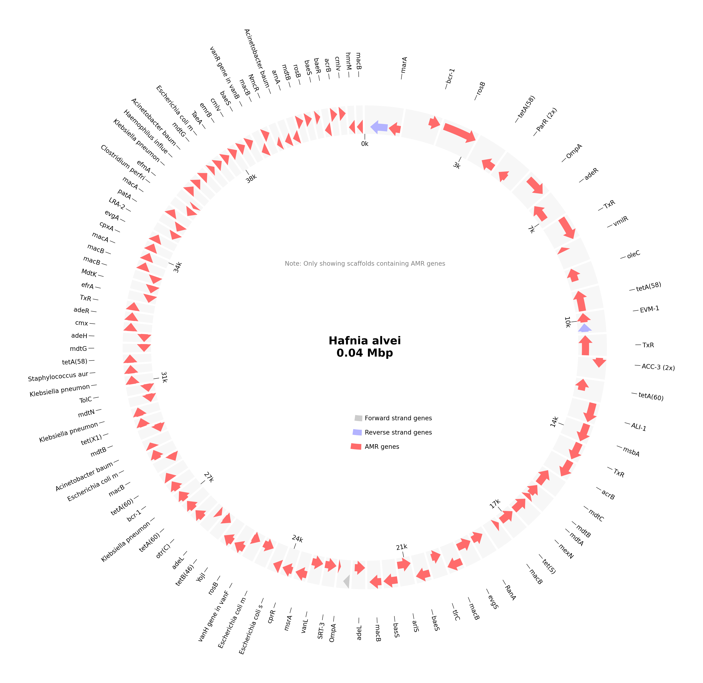

### ACC-3 (found in 2 locations)
- **Mechanism**: antibiotic inactivation
- **Drug Classes**: monobactam; cephalosporin; penam
- **AMR Family**: ACC beta-lactamase
- **Locations**:
  - gnl|SPADES|AKHJOCOO_13077_1 : position 3-323
  - gnl|SPADES|AKHJOCOO_13077_2 : position 308-679

### ALI-1
- **Mechanism**: antibiotic inactivation
- **Drug Classes**: carbapenem
- **AMR Family**: ALI beta-lactamase
- **Locations**:
  - gnl|SPADES|AKHJOCOO_13946_1 : position 3-647

### Acinetobacter baumannii AbaQ (found in 3 locations)
- **Mechanism**: antibiotic efflux
- **Drug Classes**: fluoroquinolone antibiotic
- **AMR Family**: major facilitator superfamily (MFS) antibiotic efflux pump
- **Locations**:
  - gnl|SPADES|AKHJOCOO_34547_1 : position 3-197
  - gnl|SPADES|AKHJOCOO_57154_1 : position 3-242
  - gnl|SPADES|AKHJOCOO_64522_1 : position 2-226

### Clostridium perfringes cplR
- **Mechanism**: antibiotic target protection
- **Drug Classes**: lincosamide antibiotic; streptogramin antibiotic; streptogramin A antibiotic; pleuromutilin antibiotic
- **AMR Family**: Miscellaneous ABC-F subfamily ATP-binding cassette ribosomal protection proteins
- **Locations**:
  - gnl|SPADES|AKHJOCOO_50717_1 : position 2-256

### EVM-1
- **Mechanism**: antibiotic inactivation
- **Drug Classes**: carbapenem
- **AMR Family**: EVM beta-lactamase
- **Locations**:
  - gnl|SPADES|AKHJOCOO_12596_1 : position 2-322

### Escherichia coli mdfA (found in 3 locations)
- **Mechanism**: antibiotic efflux
- **Drug Classes**: tetracycline antibiotic; phenicol antibiotic; disinfecting agents and antiseptics
- **AMR Family**: major facilitator superfamily (MFS) antibiotic efflux pump
- **Locations**:
  - gnl|SPADES|AKHJOCOO_28011_1 : position 2-376
  - gnl|SPADES|AKHJOCOO_33822_1 : position 3-323
  - gnl|SPADES|AKHJOCOO_59337_1 : position 2-238

### Escherichia coli soxS with mutation conferring antibiotic resistance
- **Mechanism**: antibiotic target alteration; antibiotic efflux; reduced permeability to antibiotic
- **Drug Classes**: fluoroquinolone antibiotic; monobactam; carbapenem; cephalosporin; glycylcycline; cephamycin; penam; tetracycline antibiotic; rifamycin antibiotic; phenicol antibiotic; penem; disinfecting agents and antiseptics
- **AMR Family**: ATP-binding cassette (ABC) antibiotic efflux pump; major facilitator superfamily (MFS) antibiotic efflux pump; resistance-nodulation-cell division (RND) antibiotic efflux pump; General Bacterial Porin with reduced permeability to beta-lactams
- **Locations**:
  - gnl|SPADES|AKHJOCOO_28041_1 : position 3-260

### Haemophilus influenzae PBP3 conferring resistance to beta-lactam antibiotics
- **Mechanism**: antibiotic target alteration
- **Drug Classes**: cephalosporin; cephamycin; penam
- **AMR Family**: Penicillin-binding protein mutations conferring resistance to beta-lactam antibiotics
- **Locations**:
  - gnl|SPADES|AKHJOCOO_54736_1 : position 3-245

### Klebsiella pneumoniae KpnG
- **Mechanism**: antibiotic efflux
- **Drug Classes**: macrolide antibiotic; fluoroquinolone antibiotic; aminoglycoside antibiotic; carbapenem; cephalosporin; penam; peptide antibiotic; penem
- **AMR Family**: major facilitator superfamily (MFS) antibiotic efflux pump
- **Locations**:
  - gnl|SPADES|AKHJOCOO_41069_1 : position 3-278

### Klebsiella pneumoniae OmpK37 (found in 3 locations)
- **Mechanism**: reduced permeability to antibiotic
- **Drug Classes**: monobactam; carbapenem; cephalosporin; cephamycin; penam; penem
- **AMR Family**: General Bacterial Porin with reduced permeability to beta-lactams
- **Locations**:
  - gnl|SPADES|AKHJOCOO_31845_1 : position 1-339
  - gnl|SPADES|AKHJOCOO_38999_1 : position 2-289
  - gnl|SPADES|AKHJOCOO_53760_1 : position 1-249

### LRA-2
- **Mechanism**: antibiotic inactivation
- **Drug Classes**: cephalosporin; penam
- **AMR Family**: subclass B3 LRA beta-lactamase
- **Locations**:
  - gnl|SPADES|AKHJOCOO_49609_1 : position 3-257

### MdtK
- **Mechanism**: antibiotic efflux
- **Drug Classes**: fluoroquinolone antibiotic
- **AMR Family**: multidrug and toxic compound extrusion (MATE) transporter
- **Locations**:
  - gnl|SPADES|AKHJOCOO_44547_1 : position 1-270

### NmcR
- **Mechanism**: antibiotic inactivation
- **Drug Classes**: carbapenem; cephalosporin; cephamycin; penam
- **AMR Family**: NmcA beta-lactamase
- **Locations**:
  - gnl|SPADES|AKHJOCOO_64797_1 : position 1-159

### OmpA (found in 2 locations)
- **Mechanism**: reduced permeability to antibiotic
- **Drug Classes**: peptide antibiotic
- **AMR Family**: General Bacterial Porin with reduced permeability to peptide antibiotics
- **Locations**:
  - gnl|SPADES|AKHJOCOO_10273_1 : position 110-769
  - gnl|SPADES|AKHJOCOO_24389_2 : position 332-418

### ParR (found in 2 locations)
- **Mechanism**: antibiotic efflux; reduced permeability to antibiotic
- **Drug Classes**: macrolide antibiotic; fluoroquinolone antibiotic; monobactam; aminoglycoside antibiotic; carbapenem; cephalosporin; cephamycin; penam; tetracycline antibiotic; phenicol antibiotic; penem; disinfecting agents and antiseptics
- **AMR Family**: resistance-nodulation-cell division (RND) antibiotic efflux pump; Outer Membrane Porin (Opr)
- **Locations**:
  - gnl|SPADES|AKHJOCOO_9301_2 : position 167-490
  - gnl|SPADES|AKHJOCOO_9301_3 : position 477-905

### RanA
- **Mechanism**: antibiotic efflux
- **Drug Classes**: aminoglycoside antibiotic
- **AMR Family**: ATP-binding cassette (ABC) antibiotic efflux pump
- **Locations**:
  - gnl|SPADES|AKHJOCOO_18859_2 : position 104-511

### SRT-3
- **Mechanism**: antibiotic inactivation
- **Drug Classes**: cephalosporin
- **AMR Family**: SRT beta-lactamase
- **Locations**:
  - gnl|SPADES|AKHJOCOO_25942_1 : position 3-398

### Staphylococcus aureus mupA conferring resistance to mupirocin
- **Mechanism**: antibiotic target alteration
- **Drug Classes**: mupirocin-like antibiotic
- **AMR Family**: antibiotic-resistant isoleucyl-tRNA synthetase (ileS)
- **Locations**:
  - gnl|SPADES|AKHJOCOO_40961_1 : position 3-278

### TaeA
- **Mechanism**: antibiotic efflux
- **Drug Classes**: pleuromutilin antibiotic
- **AMR Family**: ATP-binding cassette (ABC) antibiotic efflux pump
- **Locations**:
  - gnl|SPADES|AKHJOCOO_59527_1 : position 2-235

### TolC
- **Mechanism**: antibiotic efflux
- **Drug Classes**: macrolide antibiotic; fluoroquinolone antibiotic; aminoglycoside antibiotic; carbapenem; cephalosporin; glycylcycline; cephamycin; penam; tetracycline antibiotic; peptide antibiotic; aminocoumarin antibiotic; rifamycin antibiotic; phenicol antibiotic; penem; disinfecting agents and antiseptics
- **AMR Family**: ATP-binding cassette (ABC) antibiotic efflux pump; major facilitator superfamily (MFS) antibiotic efflux pump; resistance-nodulation-cell division (RND) antibiotic efflux pump
- **Locations**:
  - gnl|SPADES|AKHJOCOO_40091_1 : position 1-282

### TxR (found in 4 locations)
- **Mechanism**: antibiotic efflux
- **Drug Classes**: tetracycline antibiotic
- **AMR Family**: ATP-binding cassette (ABC) antibiotic efflux pump
- **Locations**:
  - gnl|SPADES|AKHJOCOO_11153_1 : position 3-776
  - gnl|SPADES|AKHJOCOO_12824_1 : position 3-692
  - gnl|SPADES|AKHJOCOO_15946_1 : position 1-582
  - gnl|SPADES|AKHJOCOO_44337_1 : position 1-270

### YojI
- **Mechanism**: antibiotic efflux
- **Drug Classes**: peptide antibiotic
- **AMR Family**: ATP-binding cassette (ABC) antibiotic efflux pump
- **Locations**:
  - gnl|SPADES|AKHJOCOO_31085_1 : position 1-345

### acrB (found in 2 locations)
- **Mechanism**: antibiotic efflux
- **Drug Classes**: fluoroquinolone antibiotic; cephalosporin; glycylcycline; penam; tetracycline antibiotic; rifamycin antibiotic; phenicol antibiotic; disinfecting agents and antiseptics
- **AMR Family**: resistance-nodulation-cell division (RND) antibiotic efflux pump
- **Locations**:
  - gnl|SPADES|AKHJOCOO_16069_1 : position 3-578
  - gnl|SPADES|AKHJOCOO_72993_1 : position 1-210

### adeH
- **Mechanism**: antibiotic efflux
- **Drug Classes**: fluoroquinolone antibiotic; tetracycline antibiotic
- **AMR Family**: resistance-nodulation-cell division (RND) antibiotic efflux pump
- **Locations**:
  - gnl|SPADES|AKHJOCOO_42418_1 : position 1-276

### adeL (found in 2 locations)
- **Mechanism**: antibiotic efflux
- **Drug Classes**: fluoroquinolone antibiotic; tetracycline antibiotic
- **AMR Family**: resistance-nodulation-cell division (RND) antibiotic efflux pump
- **Locations**:
  - gnl|SPADES|AKHJOCOO_22863_1 : position 2-361
  - gnl|SPADES|AKHJOCOO_31321_1 : position 2-175

### adeR (found in 2 locations)
- **Mechanism**: antibiotic efflux
- **Drug Classes**: glycylcycline; tetracycline antibiotic
- **AMR Family**: resistance-nodulation-cell division (RND) antibiotic efflux pump
- **Locations**:
  - gnl|SPADES|AKHJOCOO_10859_1 : position 3-587
  - gnl|SPADES|AKHJOCOO_43189_1 : position 2-274

### arlS
- **Mechanism**: antibiotic efflux
- **Drug Classes**: fluoroquinolone antibiotic; disinfecting agents and antiseptics
- **AMR Family**: major facilitator superfamily (MFS) antibiotic efflux pump
- **Locations**:
  - gnl|SPADES|AKHJOCOO_21206_1 : position 1-465

### arnA
- **Mechanism**: antibiotic target alteration
- **Drug Classes**: peptide antibiotic
- **AMR Family**: pmr phosphoethanolamine transferase
- **Locations**:
  - gnl|SPADES|AKHJOCOO_66070_1 : position 1-222

### baeR
- **Mechanism**: antibiotic efflux
- **Drug Classes**: aminoglycoside antibiotic; aminocoumarin antibiotic
- **AMR Family**: resistance-nodulation-cell division (RND) antibiotic efflux pump
- **Locations**:
  - gnl|SPADES|AKHJOCOO_72204_1 : position 1-210

### baeS (found in 3 locations)
- **Mechanism**: antibiotic efflux
- **Drug Classes**: aminoglycoside antibiotic; aminocoumarin antibiotic
- **AMR Family**: resistance-nodulation-cell division (RND) antibiotic efflux pump
- **Locations**:
  - gnl|SPADES|AKHJOCOO_21073_1 : position 2-460
  - gnl|SPADES|AKHJOCOO_61383_1 : position 3-233
  - gnl|SPADES|AKHJOCOO_71514_1 : position 51-212

### basS
- **Mechanism**: antibiotic target alteration; antibiotic efflux
- **Drug Classes**: peptide antibiotic
- **AMR Family**: pmr phosphoethanolamine transferase
- **Locations**:
  - gnl|SPADES|AKHJOCOO_21747_1 : position 1-456

### bcr-1 (found in 2 locations)
- **Mechanism**: antibiotic efflux
- **Drug Classes**: bicyclomycin-like antibiotic
- **AMR Family**: major facilitator superfamily (MFS) antibiotic efflux pump
- **Locations**:
  - gnl|SPADES|AKHJOCOO_33147_1 : position 3-329
  - gnl|SPADES|AKHJOCOO_6738_2 : position 815-1189

### cmlv (found in 2 locations)
- **Mechanism**: antibiotic inactivation
- **Drug Classes**: phenicol antibiotic
- **AMR Family**: chloramphenicol phosphotransferase
- **Locations**:
  - gnl|SPADES|AKHJOCOO_59561_1 : position 3-236
  - gnl|SPADES|AKHJOCOO_73201_1 : position 1-210

### cmx
- **Mechanism**: antibiotic efflux
- **Drug Classes**: phenicol antibiotic
- **AMR Family**: major facilitator superfamily (MFS) antibiotic efflux pump
- **Locations**:
  - gnl|SPADES|AKHJOCOO_43243_1 : position 3-272

### cprR
- **Mechanism**: antibiotic target alteration; antibiotic efflux
- **Drug Classes**: peptide antibiotic
- **AMR Family**: pmr phosphoethanolamine transferase
- **Locations**:
  - gnl|SPADES|AKHJOCOO_27663_1 : position 44-379

### cpxA
- **Mechanism**: antibiotic efflux
- **Drug Classes**: aminoglycoside antibiotic; aminocoumarin antibiotic
- **AMR Family**: resistance-nodulation-cell division (RND) antibiotic efflux pump
- **Locations**:
  - gnl|SPADES|AKHJOCOO_46688_1 : position 2-265

### efmA
- **Mechanism**: antibiotic efflux
- **Drug Classes**: macrolide antibiotic; fluoroquinolone antibiotic
- **AMR Family**: major facilitator superfamily (MFS) antibiotic efflux pump
- **Locations**:
  - gnl|SPADES|AKHJOCOO_51436_1 : position 3-116

### efrA
- **Mechanism**: antibiotic efflux
- **Drug Classes**: macrolide antibiotic; fluoroquinolone antibiotic; rifamycin antibiotic
- **AMR Family**: ATP-binding cassette (ABC) antibiotic efflux pump
- **Locations**:
  - gnl|SPADES|AKHJOCOO_44308_1 : position 3-269

### emrB
- **Mechanism**: antibiotic efflux
- **Drug Classes**: fluoroquinolone antibiotic
- **AMR Family**: major facilitator superfamily (MFS) antibiotic efflux pump
- **Locations**:
  - gnl|SPADES|AKHJOCOO_59487_1 : position 3-236

### evgA
- **Mechanism**: antibiotic efflux
- **Drug Classes**: macrolide antibiotic; fluoroquinolone antibiotic; penam; tetracycline antibiotic
- **AMR Family**: major facilitator superfamily (MFS) antibiotic efflux pump; resistance-nodulation-cell division (RND) antibiotic efflux pump
- **Locations**:
  - gnl|SPADES|AKHJOCOO_48017_1 : position 1-261

### evgS
- **Mechanism**: antibiotic efflux
- **Drug Classes**: macrolide antibiotic; fluoroquinolone antibiotic; penam; tetracycline antibiotic
- **AMR Family**: major facilitator superfamily (MFS) antibiotic efflux pump; resistance-nodulation-cell division (RND) antibiotic efflux pump
- **Locations**:
  - gnl|SPADES|AKHJOCOO_19173_1 : position 2-505

### hmrM
- **Mechanism**: antibiotic efflux
- **Drug Classes**: fluoroquinolone antibiotic; disinfecting agents and antiseptics
- **AMR Family**: multidrug and toxic compound extrusion (MATE) transporter
- **Locations**:
  - gnl|SPADES|AKHJOCOO_73653_1 : position 3-209

### macA (found in 2 locations)
- **Mechanism**: antibiotic efflux
- **Drug Classes**: macrolide antibiotic
- **AMR Family**: ATP-binding cassette (ABC) antibiotic efflux pump
- **Locations**:
  - gnl|SPADES|AKHJOCOO_46442_1 : position 1-264
  - gnl|SPADES|AKHJOCOO_50521_1 : position 14-256

### macB (found in 8 locations)
- **Mechanism**: antibiotic efflux
- **Drug Classes**: macrolide antibiotic
- **AMR Family**: ATP-binding cassette (ABC) antibiotic efflux pump
- **Locations**:
  - gnl|SPADES|AKHJOCOO_18639_1 : position 2-172
  - gnl|SPADES|AKHJOCOO_19758_1 : position 2-493
  - gnl|SPADES|AKHJOCOO_21887_1 : position 2-388
  - gnl|SPADES|AKHJOCOO_33391_1 : position 48-326
  - gnl|SPADES|AKHJOCOO_45451_1 : position 1-267
  - gnl|SPADES|AKHJOCOO_45921_1 : position 2-265
  - gnl|SPADES|AKHJOCOO_64107_1 : position 2-226
  - gnl|SPADES|AKHJOCOO_74297_1 : position 2-208

### marA
- **Mechanism**: antibiotic efflux; reduced permeability to antibiotic
- **Drug Classes**: fluoroquinolone antibiotic; monobactam; carbapenem; cephalosporin; glycylcycline; cephamycin; penam; tetracycline antibiotic; rifamycin antibiotic; phenicol antibiotic; penem; disinfecting agents and antiseptics
- **AMR Family**: resistance-nodulation-cell division (RND) antibiotic efflux pump; General Bacterial Porin with reduced permeability to beta-lactams
- **Locations**:
  - gnl|SPADES|AKHJOCOO_6449_3 : position 823-1233

### mdtA
- **Mechanism**: antibiotic efflux
- **Drug Classes**: aminocoumarin antibiotic
- **AMR Family**: resistance-nodulation-cell division (RND) antibiotic efflux pump
- **Locations**:
  - gnl|SPADES|AKHJOCOO_16881_2 : position 381-557

### mdtB (found in 3 locations)
- **Mechanism**: antibiotic efflux
- **Drug Classes**: aminocoumarin antibiotic
- **AMR Family**: resistance-nodulation-cell division (RND) antibiotic efflux pump
- **Locations**:
  - gnl|SPADES|AKHJOCOO_16881_1 : position 1-381
  - gnl|SPADES|AKHJOCOO_36967_1 : position 3-299
  - gnl|SPADES|AKHJOCOO_68885_1 : position 3-218

### mdtC
- **Mechanism**: antibiotic efflux
- **Drug Classes**: aminocoumarin antibiotic
- **AMR Family**: resistance-nodulation-cell division (RND) antibiotic efflux pump
- **Locations**:
  - gnl|SPADES|AKHJOCOO_16419_1 : position 1-567

### mdtG (found in 2 locations)
- **Mechanism**: antibiotic efflux
- **Drug Classes**: phosphonic acid antibiotic
- **AMR Family**: major facilitator superfamily (MFS) antibiotic efflux pump
- **Locations**:
  - gnl|SPADES|AKHJOCOO_42181_1 : position 3-275
  - gnl|SPADES|AKHJOCOO_57628_2 : position 61-240

### mdtN
- **Mechanism**: antibiotic efflux
- **Drug Classes**: nucleoside antibiotic; disinfecting agents and antiseptics
- **AMR Family**: major facilitator superfamily (MFS) antibiotic efflux pump
- **Locations**:
  - gnl|SPADES|AKHJOCOO_39075_1 : position 1-288

### mexN
- **Mechanism**: antibiotic efflux
- **Drug Classes**: phenicol antibiotic
- **AMR Family**: resistance-nodulation-cell division (RND) antibiotic efflux pump
- **Locations**:
  - gnl|SPADES|AKHJOCOO_17116_1 : position 1-552

### msbA
- **Mechanism**: antibiotic efflux
- **Drug Classes**: nitroimidazole antibiotic
- **AMR Family**: ATP-binding cassette (ABC) antibiotic efflux pump
- **Locations**:
  - gnl|SPADES|AKHJOCOO_15378_1 : position 3-599

### msrA
- **Mechanism**: antibiotic target protection
- **Drug Classes**: macrolide antibiotic; streptogramin antibiotic; streptogramin B antibiotic
- **AMR Family**: msr-type ABC-F protein
- **Locations**:
  - gnl|SPADES|AKHJOCOO_27616_1 : position 3-380

### oleC
- **Mechanism**: antibiotic efflux
- **Drug Classes**: macrolide antibiotic
- **AMR Family**: ATP-binding cassette (ABC) antibiotic efflux pump
- **Locations**:
  - gnl|SPADES|AKHJOCOO_11893_1 : position 1-453

### otr(C)
- **Mechanism**: antibiotic efflux
- **Drug Classes**: tetracycline antibiotic
- **AMR Family**: ATP-binding cassette (ABC) antibiotic efflux pump
- **Locations**:
  - gnl|SPADES|AKHJOCOO_31541_1 : position 2-343

### patA
- **Mechanism**: antibiotic efflux
- **Drug Classes**: fluoroquinolone antibiotic
- **AMR Family**: ATP-binding cassette (ABC) antibiotic efflux pump
- **Locations**:
  - gnl|SPADES|AKHJOCOO_50029_1 : position 1-258

### rosB (found in 3 locations)
- **Mechanism**: antibiotic efflux
- **Drug Classes**: peptide antibiotic
- **AMR Family**: major facilitator superfamily (MFS) antibiotic efflux pump
- **Locations**:
  - gnl|SPADES|AKHJOCOO_29230_1 : position 2-364
  - gnl|SPADES|AKHJOCOO_6781_1 : position 68-1183
  - gnl|SPADES|AKHJOCOO_69384_1 : position 3-218

### tet(S)
- **Mechanism**: antibiotic target protection
- **Drug Classes**: tetracycline antibiotic
- **AMR Family**: tetracycline-resistant ribosomal protection protein
- **Locations**:
  - gnl|SPADES|AKHJOCOO_17313_1 : position 1-516

### tet(X1)
- **Mechanism**: antibiotic inactivation
- **Drug Classes**: tetracycline antibiotic
- **AMR Family**: tetracycline inactivation enzyme
- **Locations**:
  - gnl|SPADES|AKHJOCOO_38542_1 : position 3-290

### tetA(58) (found in 3 locations)
- **Mechanism**: antibiotic efflux
- **Drug Classes**: tetracycline antibiotic
- **AMR Family**: major facilitator superfamily (MFS) antibiotic efflux pump
- **Locations**:
  - gnl|SPADES|AKHJOCOO_12219_1 : position 1-717
  - gnl|SPADES|AKHJOCOO_42122_1 : position 3-275
  - gnl|SPADES|AKHJOCOO_9107_2 : position 442-921

### tetA(60) (found in 3 locations)
- **Mechanism**: antibiotic efflux
- **Drug Classes**: tetracycline antibiotic
- **AMR Family**: ATP-binding cassette (ABC) antibiotic efflux pump
- **Locations**:
  - gnl|SPADES|AKHJOCOO_13414_1 : position 3-404
  - gnl|SPADES|AKHJOCOO_31664_1 : position 3-341
  - gnl|SPADES|AKHJOCOO_33376_1 : position 2-262

### tetB(46)
- **Mechanism**: antibiotic efflux
- **Drug Classes**: tetracycline antibiotic
- **AMR Family**: ATP-binding cassette (ABC) antibiotic efflux pump
- **Locations**:
  - gnl|SPADES|AKHJOCOO_31209_1 : position 1-285

### tlrC
- **Mechanism**: antibiotic target protection
- **Drug Classes**: macrolide antibiotic; lincosamide antibiotic
- **AMR Family**: Miscellaneous ABC-F subfamily ATP-binding cassette ribosomal protection proteins
- **Locations**:
  - gnl|SPADES|AKHJOCOO_20787_1 : position 1-336

### vanH gene in vanF cluster
- **Mechanism**: antibiotic target alteration
- **Drug Classes**: glycopeptide antibiotic
- **AMR Family**: vanH; glycopeptide resistance gene cluster
- **Locations**:
  - gnl|SPADES|AKHJOCOO_28668_1 : position 80-367

### vanL
- **Mechanism**: antibiotic target alteration
- **Drug Classes**: glycopeptide antibiotic
- **AMR Family**: glycopeptide resistance gene cluster; Van ligase
- **Locations**:
  - gnl|SPADES|AKHJOCOO_26631_1 : position 2-391

### vanR gene in vanB cluster
- **Mechanism**: antibiotic target alteration
- **Drug Classes**: glycopeptide antibiotic
- **AMR Family**: glycopeptide resistance gene cluster; vanR
- **Locations**:
  - gnl|SPADES|AKHJOCOO_62367_1 : position 7-231

### vmlR
- **Mechanism**: antibiotic target protection
- **Drug Classes**: lincosamide antibiotic; streptogramin antibiotic; streptogramin A antibiotic; streptogramin B antibiotic; nucleoside antibiotic; pleuromutilin antibiotic
- **AMR Family**: Miscellaneous ABC-F subfamily ATP-binding cassette ribosomal protection proteins
- **Locations**:
  - gnl|SPADES|AKHJOCOO_11773_1 : position 2-163

## Hafnia alvei FB1
**Strain Statistics:**
- Total genome length: 7.7 kbp
- Total scaffolds: 166
- Scaffolds with AMR genes: 14
- Total genes annotated: 6
- Total AMR genes: 14
- Unique AMR genes: 13
- Distinct AMR mechanisms: 4
- Distinct AMR families: 8
- Distinct drug classes: 14

**Circos Plot:**

### MexV
- **Mechanism**: antibiotic efflux
- **Drug Classes**: macrolide antibiotic; fluoroquinolone antibiotic; tetracycline antibiotic; phenicol antibiotic; disinfecting agents and antiseptics
- **AMR Family**: resistance-nodulation-cell division (RND) antibiotic efflux pump
- **Locations**:
  - gnl|SPADES|AKHJOCOO_12579_1 : position 1-702

### NmcR
- **Mechanism**: antibiotic inactivation
- **Drug Classes**: carbapenem; cephalosporin; cephamycin; penam
- **AMR Family**: NmcA beta-lactamase
- **Locations**:
  - gnl|SPADES|AKHJOCOO_7027_1 : position 2-292

### QepA2
- **Mechanism**: antibiotic efflux
- **Drug Classes**: fluoroquinolone antibiotic
- **AMR Family**: major facilitator superfamily (MFS) antibiotic efflux pump
- **Locations**:
  - gnl|SPADES|AKHJOCOO_16819_2 : position 214-558

### RanA
- **Mechanism**: antibiotic efflux
- **Drug Classes**: aminoglycoside antibiotic
- **AMR Family**: ATP-binding cassette (ABC) antibiotic efflux pump
- **Locations**:
  - gnl|SPADES|AKHJOCOO_11478_1 : position 2-754

### acrB
- **Mechanism**: antibiotic efflux
- **Drug Classes**: fluoroquinolone antibiotic; cephalosporin; glycylcycline; penam; tetracycline antibiotic; rifamycin antibiotic; phenicol antibiotic; disinfecting agents and antiseptics
- **AMR Family**: resistance-nodulation-cell division (RND) antibiotic efflux pump
- **Locations**:
  - gnl|SPADES|AKHJOCOO_24949_1 : position 1-411

### amrB
- **Mechanism**: antibiotic efflux
- **Drug Classes**: macrolide antibiotic; aminoglycoside antibiotic
- **AMR Family**: resistance-nodulation-cell division (RND) antibiotic efflux pump
- **Locations**:
  - gnl|SPADES|AKHJOCOO_11951_1 : position 3-731

### baeS
- **Mechanism**: antibiotic efflux
- **Drug Classes**: aminoglycoside antibiotic; aminocoumarin antibiotic
- **AMR Family**: resistance-nodulation-cell division (RND) antibiotic efflux pump
- **Locations**:
  - gnl|SPADES|AKHJOCOO_21423_1 : position 2-463

### macB (found in 2 locations)
- **Mechanism**: antibiotic efflux
- **Drug Classes**: macrolide antibiotic
- **AMR Family**: ATP-binding cassette (ABC) antibiotic efflux pump
- **Locations**:
  - gnl|SPADES|AKHJOCOO_29156_1 : position 2-364
  - gnl|SPADES|AKHJOCOO_32795_1 : position 2-304

### mecD
- **Mechanism**: antibiotic target replacement
- **Drug Classes**: penam
- **AMR Family**: methicillin resistant PBP2
- **Locations**:
  - gnl|SPADES|AKHJOCOO_32965_1 : position 1-330

### tet(50)
- **Mechanism**: antibiotic inactivation
- **Drug Classes**: tetracycline antibiotic
- **AMR Family**: tetracycline inactivation enzyme
- **Locations**:
  - gnl|SPADES|AKHJOCOO_10226_1 : position 109-834

### tetA(58)
- **Mechanism**: antibiotic efflux
- **Drug Classes**: tetracycline antibiotic
- **AMR Family**: major facilitator superfamily (MFS) antibiotic efflux pump
- **Locations**:
  - gnl|SPADES|AKHJOCOO_29106_1 : position 1-231

### vanH gene in vanB cluster
- **Mechanism**: antibiotic target alteration
- **Drug Classes**: glycopeptide antibiotic
- **AMR Family**: vanH; glycopeptide resistance gene cluster
- **Locations**:
  - gnl|SPADES|AKHJOCOO_26483_1 : position 3-392

### vanS gene in vanG cluster
- **Mechanism**: antibiotic target alteration
- **Drug Classes**: glycopeptide antibiotic
- **AMR Family**: vanS; glycopeptide resistance gene cluster
- **Locations**:
  - gnl|SPADES|AKHJOCOO_42852_1 : position 3-275

## Hafnia paralvei
**Strain Statistics:**
- Total genome length: 4584.2 kbp
- Total scaffolds: 113
- Scaffolds with AMR genes: 45
- Total genes annotated: 8354
- Total AMR genes: 429
- Unique AMR genes: 211
- Distinct AMR mechanisms: 11
- Distinct AMR families: 73
- Distinct drug classes: 37

**Circos Plot:**

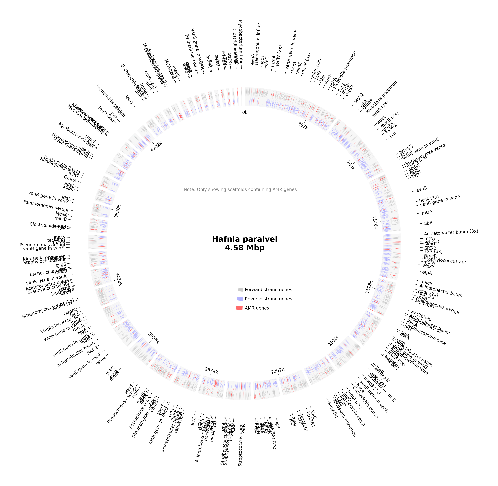

### AAC(6')-32
- **Mechanism**: antibiotic inactivation
- **Drug Classes**: aminoglycoside antibiotic
- **AMR Family**: AAC(6')
- **Locations**:
  - gnl|SPADES|AKHJOCOO_12_150 : position 161101-161703

### AAC(6')-Iu
- **Mechanism**: antibiotic inactivation
- **Drug Classes**: aminoglycoside antibiotic
- **AMR Family**: AAC(6')
- **Locations**:
  - gnl|SPADES|AKHJOCOO_9_106 : position 112080-112538

### ACC-1a
- **Mechanism**: antibiotic inactivation
- **Drug Classes**: monobactam; cephalosporin; cephamycin; penam; oxacephem
- **AMR Family**: ACC beta-lactamase
- **Locations**:
  - gnl|SPADES|AKHJOCOO_23_101: position 127638-128810

### ALI-2
- **Mechanism**: antibiotic inactivation
- **Drug Classes**: carbapenem
- **AMR Family**: ALI beta-lactamase
- **Locations**:
  - gnl|SPADES|AKHJOCOO_11_53 : position 53532-54410

### APH(6)-Ic
- **Mechanism**: antibiotic inactivation
- **Drug Classes**: aminoglycoside antibiotic
- **AMR Family**: APH(6)
- **Locations**:
  - gnl|SPADES|AKHJOCOO_12_29 : position 27546-28349

### Acinetobacter baumannii AbaF (found in 6 locations)
- **Mechanism**: antibiotic efflux
- **Drug Classes**: phosphonic acid antibiotic
- **AMR Family**: major facilitator superfamily (MFS) antibiotic efflux pump
- **Locations**:
  - gnl|SPADES|AKHJOCOO_11_61 : position 61885-63426
  - gnl|SPADES|AKHJOCOO_1_335 : position 329810-331312
  - gnl|SPADES|AKHJOCOO_21_50 : position 61890-63215
  - gnl|SPADES|AKHJOCOO_30_103 : position 119517-120746
  - gnl|SPADES|AKHJOCOO_49_55 : position 62960-64294
  - gnl|SPADES|AKHJOCOO_6_216 : position 249017-250318

### Acinetobacter baumannii AbaQ (found in 7 locations)
- **Mechanism**: antibiotic efflux
- **Drug Classes**: fluoroquinolone antibiotic
- **AMR Family**: major facilitator superfamily (MFS) antibiotic efflux pump
- **Locations**:
  - gnl|SPADES|AKHJOCOO_1_479 : position 483769-485097
  - gnl|SPADES|AKHJOCOO_22_47 : position 44459-45835
  - gnl|SPADES|AKHJOCOO_65_12 : position 12555-13850
  - gnl|SPADES|AKHJOCOO_6_169 : position 185950-187296
  - gnl|SPADES|AKHJOCOO_6_8 : position 7613-8950
  - gnl|SPADES|AKHJOCOO_6_90 : position 102217-103440
  - gnl|SPADES|AKHJOCOO_9_126 : position 131281-132573

### AcrE
- **Mechanism**: antibiotic efflux
- **Drug Classes**: fluoroquinolone antibiotic; cephalosporin; cephamycin; penam
- **AMR Family**: resistance-nodulation-cell division (RND) antibiotic efflux pump
- **Locations**:
  - gnl|SPADES|AKHJOCOO_3_45 : position 47595-48758

### AcrF
- **Mechanism**: antibiotic efflux
- **Drug Classes**: fluoroquinolone antibiotic; cephalosporin; cephamycin; penam
- **AMR Family**: resistance-nodulation-cell division (RND) antibiotic efflux pump
- **Locations**:
  - gnl|SPADES|AKHJOCOO_3_44 : position 44434-47556

### Agrobacterium fabrum chloramphenicol acetyltransferase
- **Mechanism**: antibiotic inactivation
- **Drug Classes**: phenicol antibiotic
- **AMR Family**: chloramphenicol acetyltransferase (CAT)
- **Locations**:
  - gnl|SPADES|AKHJOCOO_118_13 : position 14709-15263

### ArnT
- **Mechanism**: antibiotic target alteration
- **Drug Classes**: peptide antibiotic
- **AMR Family**: pmr phosphoethanolamine transferase
- **Locations**:
  - gnl|SPADES|AKHJOCOO_1_398: position 392560-394209

### Bifidobacterium bifidum ileS conferring resistance to mupirocin
- **Mechanism**: antibiotic target alteration
- **Drug Classes**: mupirocin-like antibiotic
- **AMR Family**: antibiotic-resistant isoleucyl-tRNA synthetase (ileS)
- **Locations**:
  - gnl|SPADES|AKHJOCOO_3_15 : position 15558-18140

### CRP (found in 2 locations)
- **Mechanism**: antibiotic efflux
- **Drug Classes**: macrolide antibiotic; fluoroquinolone antibiotic; penam
- **AMR Family**: resistance-nodulation-cell division (RND) antibiotic efflux pump
- **Locations**:
  - gnl|SPADES|AKHJOCOO_19_75: position 87405-88037
  - gnl|SPADES|AKHJOCOO_1_501 : position 508982-509779

### Clostridioides difficile gyrA conferring resistance to fluoroquinolones
- **Mechanism**: antibiotic target alteration
- **Drug Classes**: fluoroquinolone antibiotic
- **AMR Family**: fluoroquinolone resistant gyrA
- **Locations**:
  - gnl|SPADES|AKHJOCOO_1165_2 : position 1172-3820

### Clostridioides difficile gyrB conferring resistance to fluoroquinolones (found in 2 locations)
- **Mechanism**: antibiotic target alteration
- **Drug Classes**: fluoroquinolone antibiotic
- **AMR Family**: fluoroquinolone resistant gyrB
- **Locations**:
  - gnl|SPADES|AKHJOCOO_67_13 : position 13661-15556
  - gnl|SPADES|AKHJOCOO_9_134 : position 138172-140586

### D-Ala-D-Ala ligase (found in 2 locations)
- **Mechanism**: antibiotic target alteration
- **Drug Classes**: glycopeptide antibiotic
- **AMR Family**: Van ligase
- **Locations**:
  - gnl|SPADES|AKHJOCOO_103_22 : position 27029-27949
  - gnl|SPADES|AKHJOCOO_104_28 : position 33065-33985

### EVM-1
- **Mechanism**: antibiotic inactivation
- **Drug Classes**: carbapenem
- **AMR Family**: EVM beta-lactamase
- **Locations**:
  - gnl|SPADES|AKHJOCOO_2_174 : position 211667-212488

### Enterobacter cloacae acrA
- **Mechanism**: antibiotic efflux
- **Drug Classes**: fluoroquinolone antibiotic; cephalosporin; glycylcycline; penam; tetracycline antibiotic; rifamycin antibiotic; phenicol antibiotic; disinfecting agents and antiseptics
- **AMR Family**: resistance-nodulation-cell division (RND) antibiotic efflux pump
- **Locations**:
  - gnl|SPADES|AKHJOCOO_14_107 : position 100519-101709

### Enterococcus faecium cls conferring resistance to daptomycin
- **Mechanism**: antibiotic target alteration
- **Drug Classes**: peptide antibiotic
- **AMR Family**: daptomycin resistant cls
- **Locations**:
  - gnl|SPADES|AKHJOCOO_1_355 : position 347389-348849

### ErmX
- **Mechanism**: antibiotic target alteration
- **Drug Classes**: macrolide antibiotic; lincosamide antibiotic; streptogramin antibiotic; streptogramin A antibiotic; streptogramin B antibiotic
- **AMR Family**: Erm 23S ribosomal RNA methyltransferase
- **Locations**:
  - gnl|SPADES|AKHJOCOO_49_13 : position 15202-16014

### Escherichia coli AcrAB-TolC with AcrR mutation conferring resistance to ciprofloxacin, tetracycline, and ceftazidime
- **Mechanism**: antibiotic target alteration; antibiotic efflux
- **Drug Classes**: fluoroquinolone antibiotic; cephalosporin; glycylcycline; penam; tetracycline antibiotic; rifamycin antibiotic; phenicol antibiotic; disinfecting agents and antiseptics
- **AMR Family**: resistance-nodulation-cell division (RND) antibiotic efflux pump
- **Locations**:
  - gnl|SPADES|AKHJOCOO_14_108 : position 101849-102553

### Escherichia coli AcrAB-TolC with MarR mutations conferring resistance to ciprofloxacin and tetracycline (found in 2 locations)
- **Mechanism**: antibiotic target alteration; antibiotic efflux
- **Drug Classes**: fluoroquinolone antibiotic; cephalosporin; glycylcycline; penam; tetracycline antibiotic; rifamycin antibiotic; phenicol antibiotic; disinfecting agents and antiseptics
- **AMR Family**: resistance-nodulation-cell division (RND) antibiotic efflux pump
- **Locations**:
  - gnl|SPADES|AKHJOCOO_13_32 : position 34017-34448
  - gnl|SPADES|AKHJOCOO_1_492 : position 499347-499838

### Escherichia coli EF-Tu mutants conferring resistance to Enacyloxin IIa
- **Mechanism**: antibiotic target alteration
- **Drug Classes**: elfamycin antibiotic
- **AMR Family**: elfamycin resistant EF-Tu
- **Locations**:
  - gnl|SPADES|AKHJOCOO_12_64 : position 64855-67557

### Escherichia coli EF-Tu mutants conferring resistance to Pulvomycin (found in 2 locations)
- **Mechanism**: antibiotic target alteration
- **Drug Classes**: elfamycin antibiotic
- **AMR Family**: elfamycin resistant EF-Tu
- **Locations**:
  - gnl|SPADES|AKHJOCOO_19_100 : position 109519-110703
  - gnl|SPADES|AKHJOCOO_220_24 : position 26867-28051

### Escherichia coli PtsI with mutation conferring resistance to fosfomycin
- **Mechanism**: antibiotic target alteration
- **Drug Classes**: phosphonic acid antibiotic
- **AMR Family**: antibiotic-resistant ptsI phosphotransferase
- **Locations**:
  - gnl|SPADES|AKHJOCOO_176_13 : position 14736-16463

### Escherichia coli acrA
- **Mechanism**: antibiotic efflux
- **Drug Classes**: fluoroquinolone antibiotic; cephalosporin; glycylcycline; penam; tetracycline antibiotic; rifamycin antibiotic; phenicol antibiotic; disinfecting agents and antiseptics
- **AMR Family**: resistance-nodulation-cell division (RND) antibiotic efflux pump
- **Locations**:
  - gnl|SPADES|AKHJOCOO_155_7 : position 9200-10387

### Escherichia coli mdfA (found in 2 locations)
- **Mechanism**: antibiotic efflux
- **Drug Classes**: tetracycline antibiotic; phenicol antibiotic; disinfecting agents and antiseptics
- **AMR Family**: major facilitator superfamily (MFS) antibiotic efflux pump
- **Locations**:
  - gnl|SPADES|AKHJOCOO_12_148 : position 157817-159037
  - gnl|SPADES|AKHJOCOO_23_10 : position 13117-14349

### Escherichia coli soxS with mutation conferring antibiotic resistance (found in 4 locations)
- **Mechanism**: antibiotic target alteration; antibiotic efflux; reduced permeability to antibiotic
- **Drug Classes**: fluoroquinolone antibiotic; monobactam; carbapenem; cephalosporin; glycylcycline; cephamycin; penam; tetracycline antibiotic; rifamycin antibiotic; phenicol antibiotic; penem; disinfecting agents and antiseptics
- **AMR Family**: ATP-binding cassette (ABC) antibiotic efflux pump; major facilitator superfamily (MFS) antibiotic efflux pump; resistance-nodulation-cell division (RND) antibiotic efflux pump; General Bacterial Porin with reduced permeability to beta-lactams
- **Locations**:
  - gnl|SPADES|AKHJOCOO_1_330 : position 326056-326427
  - gnl|SPADES|AKHJOCOO_23_35 : position 47216-48079
  - gnl|SPADES|AKHJOCOO_3_37 : position 37126-37947
  - gnl|SPADES|AKHJOCOO_59_9 : position 7333-8211

### Escherichia coli uhpA with mutation conferring resistance to fosfomycin
- **Mechanism**: antibiotic target alteration
- **Drug Classes**: phosphonic acid antibiotic
- **AMR Family**: antibiotic-resistant UhpT
- **Locations**:
  - gnl|SPADES|AKHJOCOO_322_15 : position 13069-13785

### FosC2
- **Mechanism**: antibiotic inactivation
- **Drug Classes**: phosphonic acid antibiotic
- **AMR Family**: fosC phosphotransferase family
- **Locations**:
  - gnl|SPADES|AKHJOCOO_2_314 : position 347617-348081

### H-NS
- **Mechanism**: antibiotic efflux
- **Drug Classes**: macrolide antibiotic; fluoroquinolone antibiotic; cephalosporin; cephamycin; penam; tetracycline antibiotic
- **AMR Family**: major facilitator superfamily (MFS) antibiotic efflux pump; resistance-nodulation-cell division (RND) antibiotic efflux pump
- **Locations**:
  - gnl|SPADES|AKHJOCOO_11_110 : position 112720-113127

### Haemophilus influenzae PBP3 conferring resistance to beta-lactam antibiotics (found in 3 locations)
- **Mechanism**: antibiotic target alteration
- **Drug Classes**: cephalosporin; cephamycin; penam
- **AMR Family**: Penicillin-binding protein mutations conferring resistance to beta-lactam antibiotics
- **Locations**:
  - gnl|SPADES|AKHJOCOO_103_14 : position 16125-17888
  - gnl|SPADES|AKHJOCOO_104_36 : position 43126-44889
  - gnl|SPADES|AKHJOCOO_1_59 : position 51666-53438

### Helicobacter pylori pbp1 mutants conferring resistance to amoxicillin (found in 2 locations)
- **Mechanism**: antibiotic target alteration
- **Drug Classes**: cephalosporin; cephamycin; penam
- **AMR Family**: Penicillin-binding protein mutations conferring resistance to beta-lactam antibiotics
- **Locations**:
  - gnl|SPADES|AKHJOCOO_123_25 : position 34057-36636
  - gnl|SPADES|AKHJOCOO_3_273 : position 292009-294282

### Helicobacter pylori pbp2 mutants conferring resistance to amoxicillin
- **Mechanism**: antibiotic target alteration
- **Drug Classes**: cephalosporin; cephamycin; penam
- **AMR Family**: Penicillin-binding protein mutations conferring resistance to beta-lactam antibiotics
- **Locations**:
  - gnl|SPADES|AKHJOCOO_3_21 : position 21629-23524

### Helicobacter pylori rpoB mutation conferring resistance to rifampicin
- **Mechanism**: antibiotic target alteration; antibiotic target replacement
- **Drug Classes**: fluoroquinolone antibiotic; rifamycin antibiotic
- **AMR Family**: rifamycin-resistant beta-subunit of RNA polymerase (rpoB)
- **Locations**:
  - gnl|SPADES|AKHJOCOO_220_16 : position 14357-18577

### Klebsiella aerogenes Omp36
- **Mechanism**: reduced permeability to antibiotic
- **Drug Classes**: monobactam; carbapenem; cephalosporin; cephamycin; penam; penem
- **AMR Family**: General Bacterial Porin with reduced permeability to beta-lactams
- **Locations**:
  - gnl|SPADES|AKHJOCOO_1_383 : position 375557-376705

### Klebsiella pneumoniae KpnE
- **Mechanism**: antibiotic efflux
- **Drug Classes**: macrolide antibiotic; aminoglycoside antibiotic; cephalosporin; tetracycline antibiotic; peptide antibiotic; rifamycin antibiotic; disinfecting agents and antiseptics
- **AMR Family**: small multidrug resistance (SMR) antibiotic efflux pump
- **Locations**:
  - gnl|SPADES|AKHJOCOO_1_239 : position 234491-234922

### Klebsiella pneumoniae KpnF
- **Mechanism**: antibiotic efflux
- **Drug Classes**: macrolide antibiotic; aminoglycoside antibiotic; cephalosporin; tetracycline antibiotic; peptide antibiotic; rifamycin antibiotic; disinfecting agents and antiseptics
- **AMR Family**: small multidrug resistance (SMR) antibiotic efflux pump
- **Locations**:
  - gnl|SPADES|AKHJOCOO_1_240: position 234909-235238

### Klebsiella pneumoniae KpnG
- **Mechanism**: antibiotic efflux
- **Drug Classes**: macrolide antibiotic; fluoroquinolone antibiotic; aminoglycoside antibiotic; carbapenem; cephalosporin; penam; peptide antibiotic; penem
- **AMR Family**: major facilitator superfamily (MFS) antibiotic efflux pump
- **Locations**:
  - gnl|SPADES|AKHJOCOO_3_237 : position 246846-248021

### Klebsiella pneumoniae KpnH (found in 2 locations)
- **Mechanism**: antibiotic efflux
- **Drug Classes**: macrolide antibiotic; fluoroquinolone antibiotic; aminoglycoside antibiotic; carbapenem; cephalosporin; penam; peptide antibiotic; penem
- **AMR Family**: major facilitator superfamily (MFS) antibiotic efflux pump
- **Locations**:
  - gnl|SPADES|AKHJOCOO_3_238: position 248039-249574
  - gnl|SPADES|AKHJOCOO_9_181 : position 190672-192111

### Klebsiella pneumoniae OmpK37 (found in 6 locations)
- **Mechanism**: reduced permeability to antibiotic
- **Drug Classes**: monobactam; carbapenem; cephalosporin; cephamycin; penam; penem
- **AMR Family**: General Bacterial Porin with reduced permeability to beta-lactams
- **Locations**:
  - gnl|SPADES|AKHJOCOO_11_84 : position 84308-85411
  - gnl|SPADES|AKHJOCOO_123_24 : position 32736-33875
  - gnl|SPADES|AKHJOCOO_13_81 : position 82464-83576
  - gnl|SPADES|AKHJOCOO_1_436 : position 432897-434039
  - gnl|SPADES|AKHJOCOO_2_70 : position 86373-87488
  - gnl|SPADES|AKHJOCOO_59_66 : position 68572-69672

### Klebsiella pneumoniae acrR with mutation conferring multidrug antibiotic resistance
- **Mechanism**: antibiotic target alteration; antibiotic efflux
- **Drug Classes**: fluoroquinolone antibiotic; cephalosporin; glycylcycline; penam; tetracycline antibiotic; rifamycin antibiotic; phenicol antibiotic; disinfecting agents and antiseptics
- **AMR Family**: resistance-nodulation-cell division (RND) antibiotic efflux pump
- **Locations**:
  - gnl|SPADES|AKHJOCOO_3_46 : position 49351-49965

### LRA-19
- **Mechanism**: antibiotic inactivation
- **Drug Classes**: cephalosporin; penam
- **AMR Family**: subclass B3 LRA beta-lactamase
- **Locations**:
  - gnl|SPADES|AKHJOCOO_2_72 : position 89049-89696

### LlmA 23S ribosomal RNA methyltransferase
- **Mechanism**: antibiotic target alteration
- **Drug Classes**: lincosamide antibiotic
- **AMR Family**: Llm 23S ribosomal RNA methyltransferase
- **Locations**:
  - gnl|SPADES|AKHJOCOO_2_41 : position 50259-51452

### LptD
- **Mechanism**: antibiotic efflux
- **Drug Classes**: carbapenem; peptide antibiotic; aminocoumarin antibiotic; rifamycin antibiotic
- **AMR Family**: ATP-binding cassette (ABC) antibiotic efflux pump
- **Locations**:
  - gnl|SPADES|AKHJOCOO_49_10 : position 10403-12805

### MCR-10.4
- **Mechanism**: antibiotic target alteration
- **Drug Classes**: peptide antibiotic
- **AMR Family**: MCR phosphoethanolamine transferase
- **Locations**:
  - gnl|SPADES|AKHJOCOO_281_24 : position 21013-22647

### MCR-3.4
- **Mechanism**: antibiotic target alteration
- **Drug Classes**: peptide antibiotic
- **AMR Family**: MCR phosphoethanolamine transferase
- **Locations**:
  - gnl|SPADES|AKHJOCOO_1_58 : position 49694-51301

### MCR-3.41
- **Mechanism**: antibiotic target alteration
- **Drug Classes**: peptide antibiotic
- **AMR Family**: MCR phosphoethanolamine transferase
- **Locations**:
  - gnl|SPADES|AKHJOCOO_9_52 : position 57364-58986

### MCR-5.1
- **Mechanism**: antibiotic target alteration
- **Drug Classes**: peptide antibiotic
- **AMR Family**: MCR phosphoethanolamine transferase
- **Locations**:
  - gnl|SPADES|AKHJOCOO_9_16 : position 19752-21479

### MdtK
- **Mechanism**: antibiotic efflux
- **Drug Classes**: fluoroquinolone antibiotic
- **AMR Family**: multidrug and toxic compound extrusion (MATE) transporter
- **Locations**:
  - gnl|SPADES|AKHJOCOO_3_53 : position 56136-57593

### MdtQ
- **Mechanism**: reduced permeability to antibiotic
- **Drug Classes**: monobactam; carbapenem; cephalosporin; cephamycin; penam; penem
- **AMR Family**: Outer Membrane Porin (Opr)
- **Locations**:
  - gnl|SPADES|AKHJOCOO_2_14 : position 12521-14026

### MexG
- **Mechanism**: antibiotic efflux
- **Drug Classes**: fluoroquinolone antibiotic; tetracycline antibiotic; disinfecting agents and antiseptics
- **AMR Family**: resistance-nodulation-cell division (RND) antibiotic efflux pump
- **Locations**:
  - gnl|SPADES|AKHJOCOO_1_340 : position 333982-334398

### MexS (found in 6 locations)
- **Mechanism**: antibiotic efflux
- **Drug Classes**: fluoroquinolone antibiotic; diaminopyrimidine antibiotic; phenicol antibiotic
- **AMR Family**: resistance-nodulation-cell division (RND) antibiotic efflux pump
- **Locations**:
  - gnl|SPADES|AKHJOCOO_21_35 : position 40430-41449
  - gnl|SPADES|AKHJOCOO_22_124 : position 123358-124389
  - gnl|SPADES|AKHJOCOO_24_1 : position 161-1147
  - gnl|SPADES|AKHJOCOO_2_310 : position 343065-344189
  - gnl|SPADES|AKHJOCOO_59_17 : position 15657-16658
  - gnl|SPADES|AKHJOCOO_6_130 : position 154249-155226

### MexT
- **Mechanism**: antibiotic efflux
- **Drug Classes**: fluoroquinolone antibiotic; diaminopyrimidine antibiotic; phenicol antibiotic
- **AMR Family**: resistance-nodulation-cell division (RND) antibiotic efflux pump
- **Locations**:
  - gnl|SPADES|AKHJOCOO_6_50 : position 53700-54593

### MexV
- **Mechanism**: antibiotic efflux
- **Drug Classes**: macrolide antibiotic; fluoroquinolone antibiotic; tetracycline antibiotic; phenicol antibiotic; disinfecting agents and antiseptics
- **AMR Family**: resistance-nodulation-cell division (RND) antibiotic efflux pump
- **Locations**:
  - gnl|SPADES|AKHJOCOO_467_4 : position 2695-4212

### MexZ
- **Mechanism**: antibiotic efflux
- **Drug Classes**: macrolide antibiotic; fluoroquinolone antibiotic; aminoglycoside antibiotic; carbapenem; cephalosporin; cephamycin; penam; tetracycline antibiotic; phenicol antibiotic; disinfecting agents and antiseptics
- **AMR Family**: resistance-nodulation-cell division (RND) antibiotic efflux pump
- **Locations**:
  - gnl|SPADES|AKHJOCOO_67_61 : position 73002-73607

### Mycobacterium tuberculosis gidB mutation conferring resistance to streptomycin
- **Mechanism**: antibiotic target alteration
- **Drug Classes**: aminoglycoside antibiotic
- **AMR Family**: antibiotic resistant gidB
- **Locations**:
  - gnl|SPADES|AKHJOCOO_9_167 : position 174311-174931

### Mycobacterium tuberculosis ndh with mutation conferring resistance to isoniazid
- **Mechanism**: antibiotic target alteration
- **Drug Classes**: isoniazid-like antibiotic
- **AMR Family**: antibiotic resistant ndh
- **Locations**:
  - gnl|SPADES|AKHJOCOO_1_265 : position 259319-260623

### Mycobacterium tuberculosis pncA mutations conferring resistance to pyrazinamide
- **Mechanism**: antibiotic target alteration
- **Drug Classes**: pyrazine antibiotic
- **AMR Family**: Pyrazinamide resistant pncA
- **Locations**:
  - gnl|SPADES|AKHJOCOO_11_93 : position 95303-95938

### Mycobacterium tuberculosis rpoB mutations conferring resistance to rifampicin (found in 2 locations)
- **Mechanism**: antibiotic target alteration; antibiotic target replacement
- **Drug Classes**: rifamycin antibiotic
- **AMR Family**: rifamycin-resistant beta-subunit of RNA polymerase (rpoB)
- **Locations**:
  - gnl|SPADES|AKHJOCOO_1272_7 : position 3835-6519
  - gnl|SPADES|AKHJOCOO_220_17 : position 18720-22748

### Mycobacterium tuberculosis rpsA mutations conferring resistance to pyrazinamide
- **Mechanism**: antibiotic target alteration
- **Drug Classes**: pyrazine antibiotic
- **AMR Family**: pyrazinamide resistant rpsA
- **Locations**:
  - gnl|SPADES|AKHJOCOO_2_97 : position 120271-121950

### Mycobacterium tuberculosis thyA with mutation conferring resistance to para-aminosalicylic acid
- **Mechanism**: antibiotic target alteration
- **Drug Classes**: salicylic acid antibiotic
- **AMR Family**: aminosalicylate resistant thymidylate synthase
- **Locations**:
  - gnl|SPADES|AKHJOCOO_123_11 : position 17357-18151

### NmcR (found in 8 locations)
- **Mechanism**: antibiotic inactivation
- **Drug Classes**: carbapenem; cephalosporin; cephamycin; penam
- **AMR Family**: NmcA beta-lactamase
- **Locations**:
  - gnl|SPADES|AKHJOCOO_118_27 : position 31234-32193
  - gnl|SPADES|AKHJOCOO_13_115 : position 115712-116686
  - gnl|SPADES|AKHJOCOO_1_464 : position 470833-471738
  - gnl|SPADES|AKHJOCOO_30_106 : position 123119-123946
  - gnl|SPADES|AKHJOCOO_40_57 : position 73847-74743
  - gnl|SPADES|AKHJOCOO_47_65 : position 71281-72174
  - gnl|SPADES|AKHJOCOO_47_77 : position 86308-87180
  - gnl|SPADES|AKHJOCOO_6_94 : position 107307-108236

### OmpA (found in 4 locations)
- **Mechanism**: reduced permeability to antibiotic
- **Drug Classes**: peptide antibiotic
- **AMR Family**: General Bacterial Porin with reduced permeability to peptide antibiotics
- **Locations**:
  - gnl|SPADES|AKHJOCOO_1_334 : position 328746-329237
  - gnl|SPADES|AKHJOCOO_2_51 : position 60511-61569
  - gnl|SPADES|AKHJOCOO_90_56 : position 63989-64504
  - gnl|SPADES|AKHJOCOO_9_110 : position 114929-115588

### OprM
- **Mechanism**: antibiotic efflux
- **Drug Classes**: macrolide antibiotic; fluoroquinolone antibiotic; monobactam; aminoglycoside antibiotic; carbapenem; cephalosporin; cephamycin; penam; tetracycline antibiotic; peptide antibiotic; aminocoumarin antibiotic; diaminopyrimidine antibiotic; sulfonamide antibiotic; phenicol antibiotic; penem; disinfecting agents and antiseptics
- **AMR Family**: resistance-nodulation-cell division (RND) antibiotic efflux pump
- **Locations**:
  - gnl|SPADES|AKHJOCOO_18_103 : position 117820-119181

### ParR (found in 2 locations)
- **Mechanism**: antibiotic efflux; reduced permeability to antibiotic
- **Drug Classes**: macrolide antibiotic; fluoroquinolone antibiotic; monobactam; aminoglycoside antibiotic; carbapenem; cephalosporin; cephamycin; penam; tetracycline antibiotic; phenicol antibiotic; penem; disinfecting agents and antiseptics
- **AMR Family**: resistance-nodulation-cell division (RND) antibiotic efflux pump; Outer Membrane Porin (Opr)
- **Locations**:
  - gnl|SPADES|AKHJOCOO_19_36 : position 42399-43118
  - gnl|SPADES|AKHJOCOO_1_456 : position 460438-461151

### ParS (found in 2 locations)
- **Mechanism**: antibiotic efflux; reduced permeability to antibiotic
- **Drug Classes**: macrolide antibiotic; fluoroquinolone antibiotic; monobactam; aminoglycoside antibiotic; carbapenem; cephalosporin; cephamycin; penam; tetracycline antibiotic; phenicol antibiotic; penem; disinfecting agents and antiseptics
- **AMR Family**: resistance-nodulation-cell division (RND) antibiotic efflux pump; Outer Membrane Porin (Opr)
- **Locations**:
  - gnl|SPADES|AKHJOCOO_1_455 : position 459103-460431
  - gnl|SPADES|AKHJOCOO_67_53 : position 66319-67980

### Planobispora rosea EF-Tu mutants conferring resistance to inhibitor GE2270A
- **Mechanism**: antibiotic target alteration
- **Drug Classes**: elfamycin antibiotic
- **AMR Family**: elfamycin resistant EF-Tu
- **Locations**:
  - gnl|SPADES|AKHJOCOO_6_110 : position 128031-129899

### PmrF
- **Mechanism**: antibiotic target alteration
- **Drug Classes**: peptide antibiotic
- **AMR Family**: pmr phosphoethanolamine transferase
- **Locations**:
  - gnl|SPADES|AKHJOCOO_1_395 : position 388648-389664

### Pseudomonas aeruginosa CpxR
- **Mechanism**: antibiotic efflux
- **Drug Classes**: macrolide antibiotic; fluoroquinolone antibiotic; monobactam; aminoglycoside antibiotic; carbapenem; cephalosporin; cephamycin; penam; tetracycline antibiotic; peptide antibiotic; aminocoumarin antibiotic; diaminopyrimidine antibiotic; sulfonamide antibiotic; phenicol antibiotic; penem
- **AMR Family**: resistance-nodulation-cell division (RND) antibiotic efflux pump
- **Locations**:
  - gnl|SPADES|AKHJOCOO_9_41 : position 47077-47775

### Pseudomonas aeruginosa ampR with mutation conferring resistance to aztreonam (found in 3 locations)
- **Mechanism**: antibiotic target alteration; antibiotic inactivation
- **Drug Classes**: monobactam; carbapenem; cephalosporin
- **AMR Family**: PDC beta-lactamase; ampR transcriptional regulator with mutation conferring resistance to monobactam antibiotics
- **Locations**:
  - gnl|SPADES|AKHJOCOO_23_100 : position 126557-127423
  - gnl|SPADES|AKHJOCOO_65_24 : position 25860-26807
  - gnl|SPADES|AKHJOCOO_86_6 : position 4734-5651

### QepA2
- **Mechanism**: antibiotic efflux
- **Drug Classes**: fluoroquinolone antibiotic
- **AMR Family**: major facilitator superfamily (MFS) antibiotic efflux pump
- **Locations**:
  - gnl|SPADES|AKHJOCOO_47_35 : position 34177-35583

### QepA4
- **Mechanism**: antibiotic efflux
- **Drug Classes**: fluoroquinolone antibiotic
- **AMR Family**: major facilitator superfamily (MFS) antibiotic efflux pump
- **Locations**:
  - gnl|SPADES|AKHJOCOO_1_463 : position 469380-470663

### RanA (found in 13 locations)
- **Mechanism**: antibiotic efflux
- **Drug Classes**: aminoglycoside antibiotic
- **AMR Family**: ATP-binding cassette (ABC) antibiotic efflux pump
- **Locations**:
  - gnl|SPADES|AKHJOCOO_11_117 : position 123167-124153
  - gnl|SPADES|AKHJOCOO_11_118 : position 124150-125154
  - gnl|SPADES|AKHJOCOO_11_130 : position 135440-136579
  - gnl|SPADES|AKHJOCOO_13_49 : position 49871-50497
  - gnl|SPADES|AKHJOCOO_176_31 : position 33575-34510
  - gnl|SPADES|AKHJOCOO_18_84 : position 96873-98486
  - gnl|SPADES|AKHJOCOO_23_65 : position 81203-82210
  - gnl|SPADES|AKHJOCOO_2_153 : position 187546-188679
  - gnl|SPADES|AKHJOCOO_316_10 : position 9882-10907
  - gnl|SPADES|AKHJOCOO_40_93 : position 103910-104719
  - gnl|SPADES|AKHJOCOO_59_54 : position 58812-59642
  - gnl|SPADES|AKHJOCOO_65_49 : position 50401-51477
  - gnl|SPADES|AKHJOCOO_9_152 : position 158985-159761

### RanB
- **Mechanism**: antibiotic efflux
- **Drug Classes**: aminoglycoside antibiotic
- **AMR Family**: ATP-binding cassette (ABC) antibiotic efflux pump
- **Locations**:
  - gnl|SPADES|AKHJOCOO_59_53 : position 58025-58807

### RlmA(II)
- **Mechanism**: antibiotic target alteration
- **Drug Classes**: macrolide antibiotic; lincosamide antibiotic
- **AMR Family**: non-erm 23S ribosomal RNA methyltransferase (G748)
- **Locations**:
  - gnl|SPADES|AKHJOCOO_13_111 : position 112157-112969

### SAT-2
- **Mechanism**: antibiotic inactivation
- **Drug Classes**: nucleoside antibiotic
- **AMR Family**: streptothricin acetyltransferase (SAT)
- **Locations**:
  - gnl|SPADES|AKHJOCOO_30_81 : position 93620-94348

### SRT-2
- **Mechanism**: antibiotic inactivation
- **Drug Classes**: cephalosporin
- **AMR Family**: SRT beta-lactamase
- **Locations**:
  - gnl|SPADES|AKHJOCOO_6_68 : position 72636-73775

### SatA
- **Mechanism**: antibiotic inactivation
- **Drug Classes**: nucleoside antibiotic
- **AMR Family**: streptothricin acetyltransferase (SAT)
- **Locations**:
  - gnl|SPADES|AKHJOCOO_1_324 : position 320916-321359

### Staphylococcus aureus GlpT with mutation conferring resistance to fosfomycin
- **Mechanism**: antibiotic target alteration
- **Drug Classes**: phosphonic acid antibiotic
- **AMR Family**: antibiotic-resistant GlpT
- **Locations**:
  - gnl|SPADES|AKHJOCOO_6_105 : position 122459-123814

### Staphylococcus aureus fusA with mutation conferring resistance to fusidic acid (found in 2 locations)
- **Mechanism**: antibiotic target alteration
- **Drug Classes**: fusidane antibiotic
- **AMR Family**: antibiotic resistant fusA
- **Locations**:
  - gnl|SPADES|AKHJOCOO_19_99 : position 107334-109448
  - gnl|SPADES|AKHJOCOO_47_4 : position 2548-4137

### Staphylococcus aureus fusE with mutation conferring resistance to fusidic acid
- **Mechanism**: antibiotic target alteration
- **Drug Classes**: fusidane antibiotic
- **AMR Family**: antibiotic resistant fusE
- **Locations**:
  - gnl|SPADES|AKHJOCOO_19_120 : position 119874-120407

### Staphylococcus aureus mupA conferring resistance to mupirocin
- **Mechanism**: antibiotic target alteration
- **Drug Classes**: mupirocin-like antibiotic
- **AMR Family**: antibiotic-resistant isoleucyl-tRNA synthetase (ileS)
- **Locations**:
  - gnl|SPADES|AKHJOCOO_49_44 : position 47641-50490

### Staphylococcus aureus mupB conferring resistance to mupirocin
- **Mechanism**: antibiotic target alteration
- **Drug Classes**: mupirocin-like antibiotic
- **AMR Family**: antibiotic-resistant isoleucyl-tRNA synthetase (ileS)
- **Locations**:
  - gnl|SPADES|AKHJOCOO_6_73 : position 78814-81669

### Staphylococcus aureus murA with mutation conferring resistance to fosfomycin
- **Mechanism**: antibiotic target alteration
- **Drug Classes**: phosphonic acid antibiotic
- **AMR Family**: antibiotic-resistant murA transferase
- **Locations**:
  - gnl|SPADES|AKHJOCOO_59_48 : position 54629-55888

### Staphylococcus aureus pgsA mutations conferring resistance to daptomycin
- **Mechanism**: antibiotic target alteration
- **Drug Classes**: peptide antibiotic
- **AMR Family**: daptomycin resistant pgsA
- **Locations**:
  - gnl|SPADES|AKHJOCOO_1_45 : position 36187-36735

### Staphylococcus aureus walK with mutation conferring resistance to daptomycin
- **Mechanism**: antibiotic target alteration
- **Drug Classes**: peptide antibiotic
- **AMR Family**: daptomycin resistant walK
- **Locations**:
  - gnl|SPADES|AKHJOCOO_6_79 : position 87254-89128

### Streptococcus pneumoniae PBP2x conferring resistance to amoxicillin
- **Mechanism**: antibiotic target alteration
- **Drug Classes**: cephalosporin; cephamycin; penam
- **AMR Family**: Penicillin-binding protein mutations conferring resistance to beta-lactam antibiotics
- **Locations**:
  - gnl|SPADES|AKHJOCOO_19_44 : position 51900-54470

### Streptomyces rimosus otr(A)
- **Mechanism**: antibiotic target protection
- **Drug Classes**: tetracycline antibiotic
- **AMR Family**: tetracycline-resistant ribosomal protection protein
- **Locations**:
  - gnl|SPADES|AKHJOCOO_23_16 : position 19505-21328

### Streptomyces venezuelae rox (found in 3 locations)
- **Mechanism**: antibiotic inactivation
- **Drug Classes**: rifamycin antibiotic
- **AMR Family**: rifampin monooxygenase
- **Locations**:
  - gnl|SPADES|AKHJOCOO_3_1 : position 537-1712
  - gnl|SPADES|AKHJOCOO_47_72 : position 78587-79765
  - gnl|SPADES|AKHJOCOO_47_73 : position 79852-81057

### TaeA (found in 2 locations)
- **Mechanism**: antibiotic efflux
- **Drug Classes**: pleuromutilin antibiotic
- **AMR Family**: ATP-binding cassette (ABC) antibiotic efflux pump
- **Locations**:
  - gnl|SPADES|AKHJOCOO_2_60 : position 70011-71918
  - gnl|SPADES|AKHJOCOO_59_15 : position 12897-14564

### TolC
- **Mechanism**: antibiotic efflux
- **Drug Classes**: macrolide antibiotic; fluoroquinolone antibiotic; aminoglycoside antibiotic; carbapenem; cephalosporin; glycylcycline; cephamycin; penam; tetracycline antibiotic; peptide antibiotic; aminocoumarin antibiotic; rifamycin antibiotic; phenicol antibiotic; penem; disinfecting agents and antiseptics
- **AMR Family**: ATP-binding cassette (ABC) antibiotic efflux pump; major facilitator superfamily (MFS) antibiotic efflux pump; resistance-nodulation-cell division (RND) antibiotic efflux pump
- **Locations**:
  - gnl|SPADES|AKHJOCOO_67_8 : position 9247-10728

### TxR (found in 13 locations)
- **Mechanism**: antibiotic efflux
- **Drug Classes**: tetracycline antibiotic
- **AMR Family**: ATP-binding cassette (ABC) antibiotic efflux pump
- **Locations**:
  - gnl|SPADES|AKHJOCOO_11_142 : position 150218-151219
  - gnl|SPADES|AKHJOCOO_11_153 : position 160619-162205
  - gnl|SPADES|AKHJOCOO_124_35 : position 38581-40842
  - gnl|SPADES|AKHJOCOO_23_19 : position 24487-25908
  - gnl|SPADES|AKHJOCOO_2_204 : position 242076-244910
  - gnl|SPADES|AKHJOCOO_379_3 : position 3433-4773
  - gnl|SPADES|AKHJOCOO_3_63 : position 67743-69275
  - gnl|SPADES|AKHJOCOO_40_29 : position 44835-46286
  - gnl|SPADES|AKHJOCOO_543_9 : position 9234-10811
  - gnl|SPADES|AKHJOCOO_67_7 : position 7131-9086
  - gnl|SPADES|AKHJOCOO_6_198 : position 225138-226916
  - gnl|SPADES|AKHJOCOO_6_78 : position 85863-87257
  - gnl|SPADES|AKHJOCOO_6_85 : position 95771-97216

### YajC
- **Mechanism**: antibiotic efflux
- **Drug Classes**: fluoroquinolone antibiotic; cephalosporin; glycylcycline; penam; tetracycline antibiotic; oxazolidinone antibiotic; glycopeptide antibiotic; rifamycin antibiotic; phenicol antibiotic; disinfecting agents and antiseptics
- **AMR Family**: resistance-nodulation-cell division (RND) antibiotic efflux pump
- **Locations**:
  - gnl|SPADES|AKHJOCOO_14_46 : position 33284-33616

### YojI
- **Mechanism**: antibiotic efflux
- **Drug Classes**: peptide antibiotic
- **AMR Family**: ATP-binding cassette (ABC) antibiotic efflux pump
- **Locations**:
  - gnl|SPADES|AKHJOCOO_1_372 : position 365145-365738

### aadT
- **Mechanism**: antibiotic efflux
- **Drug Classes**: macrolide antibiotic; tetracycline antibiotic; disinfecting agents and antiseptics
- **AMR Family**: major facilitator superfamily (MFS) antibiotic efflux pump
- **Locations**:
  - gnl|SPADES|AKHJOCOO_1_85 : position 76868-78337

### abeS
- **Mechanism**: antibiotic efflux
- **Drug Classes**: macrolide antibiotic; aminocoumarin antibiotic
- **AMR Family**: small multidrug resistance (SMR) antibiotic efflux pump
- **Locations**:
  - gnl|SPADES|AKHJOCOO_1_327 : position 324406-324750

### acrB
- **Mechanism**: antibiotic efflux
- **Drug Classes**: fluoroquinolone antibiotic; cephalosporin; glycylcycline; penam; tetracycline antibiotic; rifamycin antibiotic; phenicol antibiotic; disinfecting agents and antiseptics
- **AMR Family**: resistance-nodulation-cell division (RND) antibiotic efflux pump
- **Locations**:
  - gnl|SPADES|AKHJOCOO_14_106 : position 97321-100473

### acrD
- **Mechanism**: antibiotic efflux
- **Drug Classes**: aminoglycoside antibiotic
- **AMR Family**: resistance-nodulation-cell division (RND) antibiotic efflux pump
- **Locations**:
  - gnl|SPADES|AKHJOCOO_21_95 : position 118298-121444

### adeF
- **Mechanism**: antibiotic efflux
- **Drug Classes**: fluoroquinolone antibiotic; tetracycline antibiotic
- **AMR Family**: resistance-nodulation-cell division (RND) antibiotic efflux pump
- **Locations**:
  - gnl|SPADES|AKHJOCOO_155_6: position 6023-9133

### adeG
- **Mechanism**: antibiotic efflux
- **Drug Classes**: fluoroquinolone antibiotic; tetracycline antibiotic
- **AMR Family**: resistance-nodulation-cell division (RND) antibiotic efflux pump
- **Locations**:
  - gnl|SPADES|AKHJOCOO_13_34 : position 34867-35727

### adeL (found in 22 locations)
- **Mechanism**: antibiotic efflux
- **Drug Classes**: fluoroquinolone antibiotic; tetracycline antibiotic
- **AMR Family**: resistance-nodulation-cell division (RND) antibiotic efflux pump
- **Locations**:
  - gnl|SPADES|AKHJOCOO_11_54 : position 54539-55435
  - gnl|SPADES|AKHJOCOO_13_37 : position 38077-38979
  - gnl|SPADES|AKHJOCOO_18_66 : position 74014-74877
  - gnl|SPADES|AKHJOCOO_1_322 : position 319656-320561
  - gnl|SPADES|AKHJOCOO_1_430 : position 427596-428504
  - gnl|SPADES|AKHJOCOO_206_8 : position 7569-8462
  - gnl|SPADES|AKHJOCOO_22_117 : position 117890-118783
  - gnl|SPADES|AKHJOCOO_22_76 : position 77527-78423
  - gnl|SPADES|AKHJOCOO_23_87 : position 111317-112210
  - gnl|SPADES|AKHJOCOO_2_122 : position 154202-155101
  - gnl|SPADES|AKHJOCOO_316_7 : position 5918-6832
  - gnl|SPADES|AKHJOCOO_3_196 : position 208777-209658
  - gnl|SPADES|AKHJOCOO_3_49 : position 51235-52128
  - gnl|SPADES|AKHJOCOO_40_7 : position 8174-9079
  - gnl|SPADES|AKHJOCOO_59_16 : position 14632-15534
  - gnl|SPADES|AKHJOCOO_6_119 : position 138989-139909
  - gnl|SPADES|AKHJOCOO_6_181 : position 199127-200041
  - gnl|SPADES|AKHJOCOO_6_52 : position 55568-56494
  - gnl|SPADES|AKHJOCOO_86_54 : position 56718-57617
  - gnl|SPADES|AKHJOCOO_90_31 : position 36563-37498
  - gnl|SPADES|AKHJOCOO_9_7 : position 7114-8040
  - gnl|SPADES|AKHJOCOO_9_94 : position 97105-98037

### adeN
- **Mechanism**: antibiotic efflux
- **Drug Classes**: macrolide antibiotic; fluoroquinolone antibiotic; lincosamide antibiotic; carbapenem; cephalosporin; tetracycline antibiotic; rifamycin antibiotic; diaminopyrimidine antibiotic; phenicol antibiotic; penem
- **AMR Family**: resistance-nodulation-cell division (RND) antibiotic efflux pump
- **Locations**:
  - gnl|SPADES|AKHJOCOO_18_105 : position 133380-134117

### adeR
- **Mechanism**: antibiotic efflux
- **Drug Classes**: glycylcycline; tetracycline antibiotic
- **AMR Family**: resistance-nodulation-cell division (RND) antibiotic efflux pump
- **Locations**:
  - gnl|SPADES|AKHJOCOO_11_107 : position 109010-110026

### almE (found in 3 locations)
- **Mechanism**: antibiotic target alteration
- **Drug Classes**: peptide antibiotic
- **AMR Family**: polymyxin resistance operon; alm glycyltransferase
- **Locations**:
  - gnl|SPADES|AKHJOCOO_103_6 : position 7274-9076
  - gnl|SPADES|AKHJOCOO_104_44 : position 51938-53740
  - gnl|SPADES|AKHJOCOO_1_250 : position 245010-246692

### arlR (found in 2 locations)
- **Mechanism**: antibiotic efflux
- **Drug Classes**: fluoroquinolone antibiotic; disinfecting agents and antiseptics
- **AMR Family**: major facilitator superfamily (MFS) antibiotic efflux pump
- **Locations**:
  - gnl|SPADES|AKHJOCOO_176_2 : position 1482-2198
  - gnl|SPADES|AKHJOCOO_22_107 : position 109876-110556

### arnA (found in 2 locations)
- **Mechanism**: antibiotic target alteration
- **Drug Classes**: peptide antibiotic
- **AMR Family**: pmr phosphoethanolamine transferase
- **Locations**:
  - gnl|SPADES|AKHJOCOO_19_139 : position 132473-133420
  - gnl|SPADES|AKHJOCOO_1_396 : position 389664-391646

### bacA
- **Mechanism**: antibiotic target alteration
- **Drug Classes**: peptide antibiotic
- **AMR Family**: undecaprenyl pyrophosphate related proteins
- **Locations**:
  - gnl|SPADES|AKHJOCOO_12_132 : position 140282-141100

### baeR (found in 4 locations)
- **Mechanism**: antibiotic efflux
- **Drug Classes**: aminoglycoside antibiotic; aminocoumarin antibiotic
- **AMR Family**: resistance-nodulation-cell division (RND) antibiotic efflux pump
- **Locations**:
  - gnl|SPADES|AKHJOCOO_21_40 : position 46668-47393
  - gnl|SPADES|AKHJOCOO_21_62 : position 78011-78700
  - gnl|SPADES|AKHJOCOO_316_21 : position 20806-21507
  - gnl|SPADES|AKHJOCOO_67_14 : position 15722-16432

### baeS
- **Mechanism**: antibiotic efflux
- **Drug Classes**: aminoglycoside antibiotic; aminocoumarin antibiotic
- **AMR Family**: resistance-nodulation-cell division (RND) antibiotic efflux pump
- **Locations**:
  - gnl|SPADES|AKHJOCOO_21_41 : position 47399-48781

### basS (found in 3 locations)
- **Mechanism**: antibiotic target alteration; antibiotic efflux
- **Drug Classes**: peptide antibiotic
- **AMR Family**: pmr phosphoethanolamine transferase
- **Locations**:
  - gnl|SPADES|AKHJOCOO_12_113 : position 114375-115733
  - gnl|SPADES|AKHJOCOO_12_52 : position 52291-53364
  - gnl|SPADES|AKHJOCOO_316_20 : position 19373-20809

### bcr-1 (found in 6 locations)
- **Mechanism**: antibiotic efflux
- **Drug Classes**: bicyclomycin-like antibiotic
- **AMR Family**: major facilitator superfamily (MFS) antibiotic efflux pump
- **Locations**:
  - gnl|SPADES|AKHJOCOO_11_79 : position 80867-82066
  - gnl|SPADES|AKHJOCOO_124_21 : position 24182-25363
  - gnl|SPADES|AKHJOCOO_13_51 : position 51548-52774
  - gnl|SPADES|AKHJOCOO_18_86 : position 99878-101086
  - gnl|SPADES|AKHJOCOO_21_34 : position 39050-40333
  - gnl|SPADES|AKHJOCOO_22_105 : position 107206-108408

### bcrA (found in 8 locations)
- **Mechanism**: antibiotic efflux
- **Drug Classes**: peptide antibiotic
- **AMR Family**: ATP-binding cassette (ABC) antibiotic efflux pump
- **Locations**:
  - gnl|SPADES|AKHJOCOO_1_229 : position 221419-222210
  - gnl|SPADES|AKHJOCOO_206_22 : position 25471-26529
  - gnl|SPADES|AKHJOCOO_206_27 : position 29498-30964
  - gnl|SPADES|AKHJOCOO_21_71 : position 90201-91013
  - gnl|SPADES|AKHJOCOO_2_303 : position 334407-335984
  - gnl|SPADES|AKHJOCOO_3_177 : position 183728-185245
  - gnl|SPADES|AKHJOCOO_3_212 : position 225310-226128
  - gnl|SPADES|AKHJOCOO_40_34 : position 52111-52731

### catB9
- **Mechanism**: antibiotic inactivation
- **Drug Classes**: phenicol antibiotic
- **AMR Family**: chloramphenicol acetyltransferase (CAT)
- **Locations**:
  - gnl|SPADES|AKHJOCOO_1_490 : position 496873-497505

### cdeA
- **Mechanism**: antibiotic efflux
- **Drug Classes**: fluoroquinolone antibiotic; disinfecting agents and antiseptics
- **AMR Family**: multidrug and toxic compound extrusion (MATE) transporter
- **Locations**:
  - gnl|SPADES|AKHJOCOO_118_8 : position 10712-12061

### clbB
- **Mechanism**: antibiotic target alteration
- **Drug Classes**: lincosamide antibiotic; streptogramin antibiotic; streptogramin A antibiotic; oxazolidinone antibiotic; phenicol antibiotic; pleuromutilin antibiotic
- **AMR Family**: Cfr 23S ribosomal RNA methyltransferase
- **Locations**:
  - gnl|SPADES|AKHJOCOO_3_271 : position 289732-290991

### cmlB
- **Mechanism**: antibiotic efflux
- **Drug Classes**: phenicol antibiotic
- **AMR Family**: major facilitator superfamily (MFS) antibiotic efflux pump
- **Locations**:
  - gnl|SPADES|AKHJOCOO_9_29 : position 35515-36699

### cmlv (found in 3 locations)
- **Mechanism**: antibiotic inactivation
- **Drug Classes**: phenicol antibiotic
- **AMR Family**: chloramphenicol phosphotransferase
- **Locations**:
  - gnl|SPADES|AKHJOCOO_11_47 : position 47597-48832
  - gnl|SPADES|AKHJOCOO_1_497 : position 504096-505283
  - gnl|SPADES|AKHJOCOO_23_86 : position 109993-111162

### cmx (found in 2 locations)
- **Mechanism**: antibiotic efflux
- **Drug Classes**: phenicol antibiotic
- **AMR Family**: major facilitator superfamily (MFS) antibiotic efflux pump
- **Locations**:
  - gnl|SPADES|AKHJOCOO_13_70 : position 73254-74450
  - gnl|SPADES|AKHJOCOO_22_74 : position 74811-75995

### cprR
- **Mechanism**: antibiotic target alteration; antibiotic efflux
- **Drug Classes**: peptide antibiotic
- **AMR Family**: pmr phosphoethanolamine transferase
- **Locations**:
  - gnl|SPADES|AKHJOCOO_12_53 : position 53361-54023

### cpxA (found in 4 locations)
- **Mechanism**: antibiotic efflux
- **Drug Classes**: aminoglycoside antibiotic; aminocoumarin antibiotic
- **AMR Family**: resistance-nodulation-cell division (RND) antibiotic efflux pump
- **Locations**:
  - gnl|SPADES|AKHJOCOO_19_37 : position 43115-44503
  - gnl|SPADES|AKHJOCOO_1_278 : position 277925-279397
  - gnl|SPADES|AKHJOCOO_23_18 : position 23364-24440
  - gnl|SPADES|AKHJOCOO_9_42 : position 47772-49142

### dfrA3
- **Mechanism**: antibiotic target replacement
- **Drug Classes**: diaminopyrimidine antibiotic
- **AMR Family**: trimethoprim resistant dihydrofolate reductase dfr
- **Locations**:
  - gnl|SPADES|AKHJOCOO_49_28 : position 29208-29690

### efpA (found in 2 locations)
- **Mechanism**: antibiotic efflux
- **Drug Classes**: rifamycin antibiotic; isoniazid-like antibiotic
- **AMR Family**: major facilitator superfamily (MFS) antibiotic efflux pump
- **Locations**:
  - gnl|SPADES|AKHJOCOO_49_52 : position 59300-60793
  - gnl|SPADES|AKHJOCOO_6_168 : position 184516-185916

### efrA
- **Mechanism**: antibiotic efflux
- **Drug Classes**: macrolide antibiotic; fluoroquinolone antibiotic; rifamycin antibiotic
- **AMR Family**: ATP-binding cassette (ABC) antibiotic efflux pump
- **Locations**:
  - gnl|SPADES|AKHJOCOO_6_45 : position 48321-49070

### emrK
- **Mechanism**: antibiotic efflux
- **Drug Classes**: tetracycline antibiotic
- **AMR Family**: major facilitator superfamily (MFS) antibiotic efflux pump
- **Locations**:
  - gnl|SPADES|AKHJOCOO_1_173 : position 157393-158544

### emrR
- **Mechanism**: antibiotic efflux
- **Drug Classes**: fluoroquinolone antibiotic
- **AMR Family**: major facilitator superfamily (MFS) antibiotic efflux pump
- **Locations**:
  - gnl|SPADES|AKHJOCOO_3_235 : position 244811-245329

### emrY (found in 2 locations)
- **Mechanism**: antibiotic efflux
- **Drug Classes**: tetracycline antibiotic
- **AMR Family**: major facilitator superfamily (MFS) antibiotic efflux pump
- **Locations**:
  - gnl|SPADES|AKHJOCOO_1_174 : position 158553-160091
  - gnl|SPADES|AKHJOCOO_21_42 : position 48778-50202

### eptB
- **Mechanism**: antibiotic target alteration
- **Drug Classes**: peptide antibiotic
- **AMR Family**: pmr phosphoethanolamine transferase
- **Locations**:
  - gnl|SPADES|AKHJOCOO_23_57 : position 71830-73497

### evgA (found in 3 locations)
- **Mechanism**: antibiotic efflux
- **Drug Classes**: macrolide antibiotic; fluoroquinolone antibiotic; penam; tetracycline antibiotic
- **AMR Family**: major facilitator superfamily (MFS) antibiotic efflux pump; resistance-nodulation-cell division (RND) antibiotic efflux pump
- **Locations**:
  - gnl|SPADES|AKHJOCOO_1_43 : position 33648-34304
  - gnl|SPADES|AKHJOCOO_21_101 : position 127698-128330
  - gnl|SPADES|AKHJOCOO_21_20 : position 20491-21153

### evgS (found in 5 locations)
- **Mechanism**: antibiotic efflux
- **Drug Classes**: macrolide antibiotic; fluoroquinolone antibiotic; penam; tetracycline antibiotic
- **AMR Family**: major facilitator superfamily (MFS) antibiotic efflux pump; resistance-nodulation-cell division (RND) antibiotic efflux pump
- **Locations**:
  - gnl|SPADES|AKHJOCOO_1165_3 : position 4025-6814
  - gnl|SPADES|AKHJOCOO_18_110 : position 139234-141939
  - gnl|SPADES|AKHJOCOO_1_75 : position 69688-70077
  - gnl|SPADES|AKHJOCOO_3_122 : position 132558-135299
  - gnl|SPADES|AKHJOCOO_59_31 : position 31537-33879

### facT
- **Mechanism**: antibiotic efflux
- **Drug Classes**: elfamycin antibiotic
- **AMR Family**: major facilitator superfamily (MFS) antibiotic efflux pump
- **Locations**:
  - gnl|SPADES|AKHJOCOO_47_15 : position 15234-16529

### farA
- **Mechanism**: antibiotic efflux
- **Drug Classes**: antibacterial free fatty acids
- **AMR Family**: major facilitator superfamily (MFS) antibiotic efflux pump
- **Locations**:
  - gnl|SPADES|AKHJOCOO_18_106 : position 134110-135108

### gadW (found in 3 locations)
- **Mechanism**: antibiotic efflux
- **Drug Classes**: macrolide antibiotic; fluoroquinolone antibiotic; penam
- **AMR Family**: resistance-nodulation-cell division (RND) antibiotic efflux pump
- **Locations**:
  - gnl|SPADES|AKHJOCOO_1_162 : position 147374-148276
  - gnl|SPADES|AKHJOCOO_1_171 : position 156422-157171
  - gnl|SPADES|AKHJOCOO_3_29 : position 29792-30769

### gadX (found in 8 locations)
- **Mechanism**: antibiotic efflux
- **Drug Classes**: macrolide antibiotic; fluoroquinolone antibiotic; penam
- **AMR Family**: resistance-nodulation-cell division (RND) antibiotic efflux pump
- **Locations**:
  - gnl|SPADES|AKHJOCOO_155_8 : position 10678-11439
  - gnl|SPADES|AKHJOCOO_18_97 : position 110487-111242
  - gnl|SPADES|AKHJOCOO_1_52 : position 42348-43094
  - gnl|SPADES|AKHJOCOO_21_53 : position 64754-65635
  - gnl|SPADES|AKHJOCOO_21_72 : position 91118-91915
  - gnl|SPADES|AKHJOCOO_21_73 : position 92430-93266
  - gnl|SPADES|AKHJOCOO_23_51 : position 66468-67016
  - gnl|SPADES|AKHJOCOO_2_181 : position 218750-219631

### golS (found in 2 locations)
- **Mechanism**: antibiotic efflux
- **Drug Classes**: monobactam; carbapenem; cephalosporin; cephamycin; penam; phenicol antibiotic; penem
- **AMR Family**: resistance-nodulation-cell division (RND) antibiotic efflux pump
- **Locations**:
  - gnl|SPADES|AKHJOCOO_14_137 : position 135768-136172
  - gnl|SPADES|AKHJOCOO_19_133 : position 126923-127384

### hmrM
- **Mechanism**: antibiotic efflux
- **Drug Classes**: fluoroquinolone antibiotic; disinfecting agents and antiseptics
- **AMR Family**: multidrug and toxic compound extrusion (MATE) transporter
- **Locations**:
  - gnl|SPADES|AKHJOCOO_392_1 : position 271-1641

### hp1181
- **Mechanism**: antibiotic efflux
- **Drug Classes**: fluoroquinolone antibiotic; tetracycline antibiotic; nitroimidazole antibiotic
- **AMR Family**: major facilitator superfamily (MFS) antibiotic efflux pump
- **Locations**:
  - gnl|SPADES|AKHJOCOO_14_66 : position 53437-54804

### kdpD
- **Mechanism**: antibiotic efflux
- **Drug Classes**: aminoglycoside antibiotic
- **AMR Family**: kdpDE
- **Locations**:
  - gnl|SPADES|AKHJOCOO_90_20 : position 22946-25636

### kdpE (found in 3 locations)
- **Mechanism**: antibiotic efflux
- **Drug Classes**: aminoglycoside antibiotic
- **AMR Family**: kdpDE
- **Locations**:
  - gnl|SPADES|AKHJOCOO_1_279 : position 279397-280068
  - gnl|SPADES|AKHJOCOO_67_54 : position 67949-68647
  - gnl|SPADES|AKHJOCOO_90_19 : position 22246-22935

### leuO (found in 12 locations)
- **Mechanism**: antibiotic efflux
- **Drug Classes**: nucleoside antibiotic; disinfecting agents and antiseptics
- **AMR Family**: major facilitator superfamily (MFS) antibiotic efflux pump
- **Locations**:
  - gnl|SPADES|AKHJOCOO_103_5 : position 5958-6911
  - gnl|SPADES|AKHJOCOO_104_45 : position 54103-55056
  - gnl|SPADES|AKHJOCOO_124_20 : position 23254-24213
  - gnl|SPADES|AKHJOCOO_124_33 : position 36138-37058
  - gnl|SPADES|AKHJOCOO_13_23 : position 25984-26874
  - gnl|SPADES|AKHJOCOO_166_10 : position 9733-10638
  - gnl|SPADES|AKHJOCOO_1_326 : position 323163-324095
  - gnl|SPADES|AKHJOCOO_21_29 : position 32895-33851
  - gnl|SPADES|AKHJOCOO_23_89 : position 113710-114621
  - gnl|SPADES|AKHJOCOO_2_55 : position 64761-65702
  - gnl|SPADES|AKHJOCOO_49_19 : position 19778-20683
  - gnl|SPADES|AKHJOCOO_49_27 : position 28213-29136

### lfrA
- **Mechanism**: antibiotic efflux
- **Drug Classes**: fluoroquinolone antibiotic
- **AMR Family**: major facilitator superfamily (MFS) antibiotic efflux pump
- **Locations**:
  - gnl|SPADES|AKHJOCOO_392_6 : position 5390-6766

### lmrC
- **Mechanism**: antibiotic target protection
- **Drug Classes**: lincosamide antibiotic
- **AMR Family**: Miscellaneous ABC-F subfamily ATP-binding cassette ribosomal protection proteins
- **Locations**:
  - gnl|SPADES|AKHJOCOO_281_26 : position 23710-24363

### lmrD
- **Mechanism**: antibiotic efflux
- **Drug Classes**: lincosamide antibiotic
- **AMR Family**: ATP-binding cassette (ABC) antibiotic efflux pump
- **Locations**:
  - gnl|SPADES|AKHJOCOO_11_85 : position 85471-87246

### lsaD
- **Mechanism**: antibiotic target protection
- **Drug Classes**: lincosamide antibiotic; streptogramin antibiotic; streptogramin A antibiotic; pleuromutilin antibiotic
- **AMR Family**: lsa-type ABC-F protein
- **Locations**:
  - gnl|SPADES|AKHJOCOO_1_347 : position 338375-339139

### macB (found in 19 locations)
- **Mechanism**: antibiotic efflux
- **Drug Classes**: macrolide antibiotic
- **AMR Family**: ATP-binding cassette (ABC) antibiotic efflux pump
- **Locations**:
  - gnl|SPADES|AKHJOCOO_11_138 : position 145221-146216
  - gnl|SPADES|AKHJOCOO_12_89 : position 90633-91322
  - gnl|SPADES|AKHJOCOO_12_98 : position 97792-98595
  - gnl|SPADES|AKHJOCOO_176_17 : position 18916-20010
  - gnl|SPADES|AKHJOCOO_18_76 : position 85754-86476
  - gnl|SPADES|AKHJOCOO_1_271 : position 270672-271391
  - gnl|SPADES|AKHJOCOO_1_373 : position 365738-366544
  - gnl|SPADES|AKHJOCOO_1_393 : position 386454-387224
  - gnl|SPADES|AKHJOCOO_23_64 : position 80226-81206
  - gnl|SPADES|AKHJOCOO_297_1 : position 438-1220
  - gnl|SPADES|AKHJOCOO_2_142 : position 179067-179795
  - gnl|SPADES|AKHJOCOO_2_222 : position 264437-265636
  - gnl|SPADES|AKHJOCOO_3_11 : position 11784-12509
  - gnl|SPADES|AKHJOCOO_3_89 : position 95164-95850
  - gnl|SPADES|AKHJOCOO_3_96 : position 103584-104306
  - gnl|SPADES|AKHJOCOO_59_2 : position 853-1884
  - gnl|SPADES|AKHJOCOO_65_34 : position 34430-35098
  - gnl|SPADES|AKHJOCOO_67_39 : position 50801-51910
  - gnl|SPADES|AKHJOCOO_6_201 : position 228542-231478

### marA (found in 2 locations)
- **Mechanism**: antibiotic efflux; reduced permeability to antibiotic
- **Drug Classes**: fluoroquinolone antibiotic; monobactam; carbapenem; cephalosporin; glycylcycline; cephamycin; penam; tetracycline antibiotic; rifamycin antibiotic; phenicol antibiotic; penem; disinfecting agents and antiseptics
- **AMR Family**: resistance-nodulation-cell division (RND) antibiotic efflux pump; General Bacterial Porin with reduced permeability to beta-lactams
- **Locations**:
  - gnl|SPADES|AKHJOCOO_24_76 : position 88529-89389
  - gnl|SPADES|AKHJOCOO_65_58 : position 59266-60108

### mdtA
- **Mechanism**: antibiotic efflux
- **Drug Classes**: aminocoumarin antibiotic
- **AMR Family**: resistance-nodulation-cell division (RND) antibiotic efflux pump
- **Locations**:
  - gnl|SPADES|AKHJOCOO_21_45 : position 56544-57833

### mdtB
- **Mechanism**: antibiotic efflux
- **Drug Classes**: aminocoumarin antibiotic
- **AMR Family**: resistance-nodulation-cell division (RND) antibiotic efflux pump
- **Locations**:
  - gnl|SPADES|AKHJOCOO_21_44 : position 53395-56544

### mdtC (found in 2 locations)
- **Mechanism**: antibiotic efflux
- **Drug Classes**: aminocoumarin antibiotic
- **AMR Family**: resistance-nodulation-cell division (RND) antibiotic efflux pump
- **Locations**:
  - gnl|SPADES|AKHJOCOO_21_43 : position 50300-53398
  - gnl|SPADES|AKHJOCOO_467_5 : position 4209-7349

### mdtG
- **Mechanism**: antibiotic efflux
- **Drug Classes**: phosphonic acid antibiotic
- **AMR Family**: major facilitator superfamily (MFS) antibiotic efflux pump
- **Locations**:
  - gnl|SPADES|AKHJOCOO_1_55 : position 46745-47929

### mdtH (found in 2 locations)
- **Mechanism**: antibiotic efflux
- **Drug Classes**: fluoroquinolone antibiotic
- **AMR Family**: major facilitator superfamily (MFS) antibiotic efflux pump
- **Locations**:
  - gnl|SPADES|AKHJOCOO_1_207 : position 197927-199132
  - gnl|SPADES|AKHJOCOO_2_163 : position 196765-198009

### mdtN (found in 2 locations)
- **Mechanism**: antibiotic efflux
- **Drug Classes**: nucleoside antibiotic; disinfecting agents and antiseptics
- **AMR Family**: major facilitator superfamily (MFS) antibiotic efflux pump
- **Locations**:
  - gnl|SPADES|AKHJOCOO_22_61 : position 61866-62852
  - gnl|SPADES|AKHJOCOO_6_117 : position 137429-138364

### mdtO
- **Mechanism**: antibiotic efflux
- **Drug Classes**: nucleoside antibiotic; disinfecting agents and antiseptics
- **AMR Family**: major facilitator superfamily (MFS) antibiotic efflux pump
- **Locations**:
  - gnl|SPADES|AKHJOCOO_22_60 : position 59904-61856

### mdtP (found in 2 locations)
- **Mechanism**: antibiotic efflux
- **Drug Classes**: nucleoside antibiotic; disinfecting agents and antiseptics
- **AMR Family**: major facilitator superfamily (MFS) antibiotic efflux pump
- **Locations**:
  - gnl|SPADES|AKHJOCOO_22_59 : position 58462-59907
  - gnl|SPADES|AKHJOCOO_3_236 : position 245364-246821

### mecC
- **Mechanism**: antibiotic target replacement
- **Drug Classes**: penam
- **AMR Family**: methicillin resistant PBP2
- **Locations**:
  - gnl|SPADES|AKHJOCOO_1_378 : position 370868-372781

### mef(B)
- **Mechanism**: antibiotic efflux
- **Drug Classes**: macrolide antibiotic
- **AMR Family**: major facilitator superfamily (MFS) antibiotic efflux pump
- **Locations**:
  - gnl|SPADES|AKHJOCOO_2_175 : position 212894-214090

### mgrA
- **Mechanism**: antibiotic efflux
- **Drug Classes**: fluoroquinolone antibiotic; cephalosporin; penam; tetracycline antibiotic; peptide antibiotic; disinfecting agents and antiseptics
- **AMR Family**: ATP-binding cassette (ABC) antibiotic efflux pump; major facilitator superfamily (MFS) antibiotic efflux pump
- **Locations**:
  - gnl|SPADES|AKHJOCOO_22_38 : position 36218-36658

### mphJ
- **Mechanism**: antibiotic inactivation
- **Drug Classes**: macrolide antibiotic
- **AMR Family**: macrolide phosphotransferase (MPH)
- **Locations**:
  - gnl|SPADES|AKHJOCOO_11_122 : position 126792-127670

### mreA
- **Mechanism**: antibiotic efflux
- **Drug Classes**: macrolide antibiotic
- **AMR Family**: major facilitator superfamily (MFS) antibiotic efflux pump
- **Locations**:
  - gnl|SPADES|AKHJOCOO_49_45 : position 50583-51521

### msbA (found in 4 locations)
- **Mechanism**: antibiotic efflux
- **Drug Classes**: nitroimidazole antibiotic
- **AMR Family**: ATP-binding cassette (ABC) antibiotic efflux pump
- **Locations**:
  - gnl|SPADES|AKHJOCOO_2_123 : position 155412-157103
  - gnl|SPADES|AKHJOCOO_2_124 : position 157106-158827
  - gnl|SPADES|AKHJOCOO_2_94 : position 115594-117342
  - gnl|SPADES|AKHJOCOO_543_4 : position 2504-3199

### mtrA (found in 3 locations)
- **Mechanism**: antibiotic efflux
- **Drug Classes**: macrolide antibiotic; penam
- **AMR Family**: resistance-nodulation-cell division (RND) antibiotic efflux pump
- **Locations**:
  - gnl|SPADES|AKHJOCOO_23_8 : position 10555-11736
  - gnl|SPADES|AKHJOCOO_3_230 : position 240819-241640
  - gnl|SPADES|AKHJOCOO_6_27 : position 29557-30468

### nalD (found in 2 locations)
- **Mechanism**: antibiotic efflux
- **Drug Classes**: macrolide antibiotic; fluoroquinolone antibiotic; monobactam; carbapenem; cephalosporin; cephamycin; penam; tetracycline antibiotic; peptide antibiotic; aminocoumarin antibiotic; diaminopyrimidine antibiotic; sulfonamide antibiotic; phenicol antibiotic; penem
- **AMR Family**: resistance-nodulation-cell division (RND) antibiotic efflux pump
- **Locations**:
  - gnl|SPADES|AKHJOCOO_1_86 : position 78458-79015
  - gnl|SPADES|AKHJOCOO_1_88 : position 80720-81355

### novA
- **Mechanism**: antibiotic efflux
- **Drug Classes**: aminocoumarin antibiotic
- **AMR Family**: ATP-binding cassette (ABC) antibiotic efflux pump
- **Locations**:
  - gnl|SPADES|AKHJOCOO_18_102 : position 115645-117789

### oleC (found in 4 locations)
- **Mechanism**: antibiotic efflux
- **Drug Classes**: macrolide antibiotic
- **AMR Family**: ATP-binding cassette (ABC) antibiotic efflux pump
- **Locations**:
  - gnl|SPADES|AKHJOCOO_1_103 : position 96609-97346
  - gnl|SPADES|AKHJOCOO_316_22 : position 21753-22700
  - gnl|SPADES|AKHJOCOO_65_45 : position 46287-46988
  - gnl|SPADES|AKHJOCOO_9_176 : position 185284-186789

### optrA (found in 2 locations)
- **Mechanism**: antibiotic target protection
- **Drug Classes**: oxazolidinone antibiotic; phenicol antibiotic
- **AMR Family**: Miscellaneous ABC-F subfamily ATP-binding cassette ribosomal protection proteins
- **Locations**:
  - gnl|SPADES|AKHJOCOO_19_86 : position 97396-99324
  - gnl|SPADES|AKHJOCOO_40_12 : position 13748-15316

### otr(B) (found in 2 locations)
- **Mechanism**: antibiotic efflux
- **Drug Classes**: tetracycline antibiotic
- **AMR Family**: major facilitator superfamily (MFS) antibiotic efflux pump
- **Locations**:
  - gnl|SPADES|AKHJOCOO_1_469 : position 477159-478649
  - gnl|SPADES|AKHJOCOO_714_2 : position 1096-2526

### patA (found in 2 locations)
- **Mechanism**: antibiotic efflux
- **Drug Classes**: fluoroquinolone antibiotic
- **AMR Family**: ATP-binding cassette (ABC) antibiotic efflux pump
- **Locations**:
  - gnl|SPADES|AKHJOCOO_11_15 : position 17295-17957
  - gnl|SPADES|AKHJOCOO_1_405 : position 399850-400671

### pp-flo
- **Mechanism**: antibiotic efflux
- **Drug Classes**: phenicol antibiotic
- **AMR Family**: major facilitator superfamily (MFS) antibiotic efflux pump
- **Locations**:
  - gnl|SPADES|AKHJOCOO_23_7 : position 8966-10441

### qacG
- **Mechanism**: antibiotic efflux
- **Drug Classes**: disinfecting agents and antiseptics
- **AMR Family**: small multidrug resistance (SMR) antibiotic efflux pump
- **Locations**:
  - gnl|SPADES|AKHJOCOO_1_167: position 153626-153994

### ramA (found in 10 locations)
- **Mechanism**: antibiotic efflux; reduced permeability to antibiotic
- **Drug Classes**: fluoroquinolone antibiotic; monobactam; carbapenem; cephalosporin; glycylcycline; cephamycin; penam; tetracycline antibiotic; rifamycin antibiotic; phenicol antibiotic; penem; disinfecting agents and antiseptics
- **AMR Family**: resistance-nodulation-cell division (RND) antibiotic efflux pump; General Bacterial Porin with reduced permeability to beta-lactams
- **Locations**:
  - gnl|SPADES|AKHJOCOO_13_131 : position 138907-139296
  - gnl|SPADES|AKHJOCOO_13_4 : position 3832-4773
  - gnl|SPADES|AKHJOCOO_1_137 : position 126962-127375
  - gnl|SPADES|AKHJOCOO_21_74 : position 93365-94180
  - gnl|SPADES|AKHJOCOO_22_120 : position 120154-120501
  - gnl|SPADES|AKHJOCOO_22_23 : position 23919-25352
  - gnl|SPADES|AKHJOCOO_30_32 : position 34326-35180
  - gnl|SPADES|AKHJOCOO_3_36 : position 36131-36991
  - gnl|SPADES|AKHJOCOO_3_54 : position 57952-58305
  - gnl|SPADES|AKHJOCOO_40_14 : position 16117-16470

### rosA
- **Mechanism**: antibiotic efflux
- **Drug Classes**: peptide antibiotic
- **AMR Family**: major facilitator superfamily (MFS) antibiotic efflux pump
- **Locations**:
  - gnl|SPADES|AKHJOCOO_14_129 : position 126406-127629

### rosB (found in 3 locations)
- **Mechanism**: antibiotic efflux
- **Drug Classes**: peptide antibiotic
- **AMR Family**: major facilitator superfamily (MFS) antibiotic efflux pump
- **Locations**:
  - gnl|SPADES|AKHJOCOO_14_128 : position 124207-125904
  - gnl|SPADES|AKHJOCOO_19_88 : position 100027-101841
  - gnl|SPADES|AKHJOCOO_49_32 : position 31877-33763

### rphA
- **Mechanism**: antibiotic inactivation
- **Drug Classes**: rifamycin antibiotic
- **AMR Family**: rifampin phosphotransferase
- **Locations**:
  - gnl|SPADES|AKHJOCOO_1_418 : position 413301-415676

### rphB
- **Mechanism**: antibiotic inactivation
- **Drug Classes**: rifamycin antibiotic
- **AMR Family**: rifampin phosphotransferase
- **Locations**:
  - gnl|SPADES|AKHJOCOO_24_80 : position 94076-95551

### rsmA
- **Mechanism**: antibiotic efflux
- **Drug Classes**: fluoroquinolone antibiotic; diaminopyrimidine antibiotic; phenicol antibiotic
- **AMR Family**: resistance-nodulation-cell division (RND) antibiotic efflux pump
- **Locations**:
  - gnl|SPADES|AKHJOCOO_155_1: position 512-697

### sdiA (found in 2 locations)
- **Mechanism**: antibiotic efflux
- **Drug Classes**: fluoroquinolone antibiotic; cephalosporin; glycylcycline; penam; tetracycline antibiotic; rifamycin antibiotic; phenicol antibiotic; disinfecting agents and antiseptics
- **AMR Family**: resistance-nodulation-cell division (RND) antibiotic efflux pump
- **Locations**:
  - gnl|SPADES|AKHJOCOO_11_6 : position 8670-9317
  - gnl|SPADES|AKHJOCOO_2_36 : position 46511-47251

### smeS (found in 2 locations)
- **Mechanism**: antibiotic efflux
- **Drug Classes**: aminoglycoside antibiotic; cephalosporin; cephamycin; penam
- **AMR Family**: resistance-nodulation-cell division (RND) antibiotic efflux pump
- **Locations**:
  - gnl|SPADES|AKHJOCOO_21_63 : position 78810-80159
  - gnl|SPADES|AKHJOCOO_67_15 : position 16413-17891

### sta
- **Mechanism**: antibiotic inactivation
- **Drug Classes**: nucleoside antibiotic
- **AMR Family**: streptothricin acetyltransferase (SAT)
- **Locations**:
  - gnl|SPADES|AKHJOCOO_6_80 : position 89290-90114

### sul4
- **Mechanism**: antibiotic target replacement
- **Drug Classes**: sulfonamide antibiotic
- **AMR Family**: sulfonamide resistant sul
- **Locations**:
  - gnl|SPADES|AKHJOCOO_12_59 : position 59571-60404

### tet(35)
- **Mechanism**: antibiotic efflux
- **Drug Classes**: tetracycline antibiotic
- **AMR Family**: ATP-binding cassette (ABC) antibiotic efflux pump
- **Locations**:
  - gnl|SPADES|AKHJOCOO_1_242 : position 236473-237927

### tet(42) (found in 2 locations)
- **Mechanism**: antibiotic efflux
- **Drug Classes**: tetracycline antibiotic
- **AMR Family**: major facilitator superfamily (MFS) antibiotic efflux pump
- **Locations**:
  - gnl|SPADES|AKHJOCOO_2_296 : position 326699-327916
  - gnl|SPADES|AKHJOCOO_543_8 : position 8047-9228

### tet(43)
- **Mechanism**: antibiotic efflux
- **Drug Classes**: tetracycline antibiotic
- **AMR Family**: major facilitator superfamily (MFS) antibiotic efflux pump
- **Locations**:
  - gnl|SPADES|AKHJOCOO_6_39 : position 42812-44128

### tet(S)
- **Mechanism**: antibiotic target protection
- **Drug Classes**: tetracycline antibiotic
- **AMR Family**: tetracycline-resistant ribosomal protection protein
- **Locations**:
  - gnl|SPADES|AKHJOCOO_123_16 : position 21081-22520

### tetA(58) (found in 6 locations)
- **Mechanism**: antibiotic efflux
- **Drug Classes**: tetracycline antibiotic
- **AMR Family**: major facilitator superfamily (MFS) antibiotic efflux pump
- **Locations**:
  - gnl|SPADES|AKHJOCOO_12_90 : position 91332-92138
  - gnl|SPADES|AKHJOCOO_18_107 : position 135120-136856
  - gnl|SPADES|AKHJOCOO_18_62 : position 68999-69787
  - gnl|SPADES|AKHJOCOO_19_83 : position 94844-95626
  - gnl|SPADES|AKHJOCOO_59_60 : position 63912-64637
  - gnl|SPADES|AKHJOCOO_65_44 : position 45465-46235

### tetA(60) (found in 2 locations)
- **Mechanism**: antibiotic efflux
- **Drug Classes**: tetracycline antibiotic
- **AMR Family**: ATP-binding cassette (ABC) antibiotic efflux pump
- **Locations**:
  - gnl|SPADES|AKHJOCOO_123_22 : position 28983-29780
  - gnl|SPADES|AKHJOCOO_14_95 : position 86988-88760

### tetB(46) (found in 2 locations)
- **Mechanism**: antibiotic efflux
- **Drug Classes**: tetracycline antibiotic
- **AMR Family**: ATP-binding cassette (ABC) antibiotic efflux pump
- **Locations**:
  - gnl|SPADES|AKHJOCOO_13_6 : position 5968-7488
  - gnl|SPADES|AKHJOCOO_281_27 : position 24357-25169

### tetB(60) (found in 2 locations)
- **Mechanism**: antibiotic efflux
- **Drug Classes**: tetracycline antibiotic
- **AMR Family**: ATP-binding cassette (ABC) antibiotic efflux pump
- **Locations**:
  - gnl|SPADES|AKHJOCOO_11_137 : position 144412-145224
  - gnl|SPADES|AKHJOCOO_14_96 : position 88753-90531

### tetB(P)
- **Mechanism**: antibiotic target protection
- **Drug Classes**: tetracycline antibiotic
- **AMR Family**: tetracycline-resistant ribosomal protection protein
- **Locations**:
  - gnl|SPADES|AKHJOCOO_3_129 : position 140308-142101

### tsnR (found in 2 locations)
- **Mechanism**: antibiotic target alteration
- **Drug Classes**: peptide antibiotic
- **AMR Family**: non-erm 23S ribosomal RNA methyltransferase (A1067)
- **Locations**:
  - gnl|SPADES|AKHJOCOO_12_15 : position 17941-18666
  - gnl|SPADES|AKHJOCOO_49_72 : position 85654-86769

### ugd
- **Mechanism**: antibiotic target alteration
- **Drug Classes**: peptide antibiotic
- **AMR Family**: pmr phosphoethanolamine transferase
- **Locations**:
  - gnl|SPADES|AKHJOCOO_18_40 : position 42758-43924

### vanE
- **Mechanism**: antibiotic target alteration
- **Drug Classes**: glycopeptide antibiotic
- **AMR Family**: glycopeptide resistance gene cluster; Van ligase
- **Locations**:
  - gnl|SPADES|AKHJOCOO_6_135 : position 158288-159637

### vanH gene in vanB cluster
- **Mechanism**: antibiotic target alteration
- **Drug Classes**: glycopeptide antibiotic
- **AMR Family**: vanH; glycopeptide resistance gene cluster
- **Locations**:
  - gnl|SPADES|AKHJOCOO_47_67 : position 73474-74712

### vanH gene in vanD cluster
- **Mechanism**: antibiotic target alteration
- **Drug Classes**: glycopeptide antibiotic
- **AMR Family**: vanH; glycopeptide resistance gene cluster
- **Locations**:
  - gnl|SPADES|AKHJOCOO_1_444 : position 443637-444629

### vanH gene in vanF cluster
- **Mechanism**: antibiotic target alteration
- **Drug Classes**: glycopeptide antibiotic
- **AMR Family**: vanH; glycopeptide resistance gene cluster
- **Locations**:
  - gnl|SPADES|AKHJOCOO_65_11 : position 11577-12554

### vanH gene in vanO cluster (found in 2 locations)
- **Mechanism**: antibiotic target alteration
- **Drug Classes**: glycopeptide antibiotic
- **AMR Family**: vanH; glycopeptide resistance gene cluster
- **Locations**:
  - gnl|SPADES|AKHJOCOO_23_20 : position 26387-27367
  - gnl|SPADES|AKHJOCOO_40_78 : position 90419-91546

### vanH gene in vanP cluster
- **Mechanism**: antibiotic target alteration
- **Drug Classes**: glycopeptide antibiotic
- **AMR Family**: vanH; glycopeptide resistance gene cluster
- **Locations**:
  - gnl|SPADES|AKHJOCOO_1_203 : position 194405-195346

### vanR gene in vanA cluster (found in 2 locations)
- **Mechanism**: antibiotic target alteration
- **Drug Classes**: glycopeptide antibiotic
- **AMR Family**: glycopeptide resistance gene cluster; vanR
- **Locations**:
  - gnl|SPADES|AKHJOCOO_3_189 : position 203134-204006
  - gnl|SPADES|AKHJOCOO_49_71 : position 84797-85513

### vanR gene in vanB cluster
- **Mechanism**: antibiotic target alteration
- **Drug Classes**: glycopeptide antibiotic
- **AMR Family**: glycopeptide resistance gene cluster; vanR
- **Locations**:
  - gnl|SPADES|AKHJOCOO_12_114 : position 115730-116392

### vanR gene in vanC cluster
- **Mechanism**: antibiotic target alteration
- **Drug Classes**: glycopeptide antibiotic
- **AMR Family**: glycopeptide resistance gene cluster; vanR
- **Locations**:
  - gnl|SPADES|AKHJOCOO_2_322 : position 356454-357188

### vanR gene in vanD cluster
- **Mechanism**: antibiotic target alteration
- **Drug Classes**: glycopeptide antibiotic
- **AMR Family**: glycopeptide resistance gene cluster; vanR
- **Locations**:
  - gnl|SPADES|AKHJOCOO_22_94 : position 99882-100778

### vanR gene in vanF cluster (found in 2 locations)
- **Mechanism**: antibiotic target alteration
- **Drug Classes**: glycopeptide antibiotic
- **AMR Family**: glycopeptide resistance gene cluster; vanR
- **Locations**:
  - gnl|SPADES|AKHJOCOO_1_74 : position 68601-69653
  - gnl|SPADES|AKHJOCOO_30_52 : position 60147-60863

### vanR gene in vanG cluster (found in 2 locations)
- **Mechanism**: antibiotic target alteration
- **Drug Classes**: glycopeptide antibiotic
- **AMR Family**: glycopeptide resistance gene cluster; vanR
- **Locations**:
  - gnl|SPADES|AKHJOCOO_40_19 : position 22927-23670
  - gnl|SPADES|AKHJOCOO_86_39 : position 41973-43583

### vanR gene in vanM cluster
- **Mechanism**: antibiotic target alteration
- **Drug Classes**: glycopeptide antibiotic
- **AMR Family**: glycopeptide resistance gene cluster; vanR
- **Locations**:
  - gnl|SPADES|AKHJOCOO_23_38 : position 50234-51202

### vanS gene in vanA cluster
- **Mechanism**: antibiotic target alteration
- **Drug Classes**: glycopeptide antibiotic
- **AMR Family**: vanS; glycopeptide resistance gene cluster
- **Locations**:
  - gnl|SPADES|AKHJOCOO_379_1 : position 1158-2594

### vanS gene in vanG cluster
- **Mechanism**: antibiotic target alteration
- **Drug Classes**: glycopeptide antibiotic
- **AMR Family**: vanS; glycopeptide resistance gene cluster
- **Locations**:
  - gnl|SPADES|AKHJOCOO_22_108 : position 110572-112029

### vanS gene in vanP cluster
- **Mechanism**: antibiotic target alteration
- **Drug Classes**: glycopeptide antibiotic
- **AMR Family**: vanS; glycopeptide resistance gene cluster
- **Locations**:
  - gnl|SPADES|AKHJOCOO_30_51 : position 58677-60146

### vanT gene in vanC cluster
- **Mechanism**: antibiotic target alteration
- **Drug Classes**: glycopeptide antibiotic
- **AMR Family**: glycopeptide resistance gene cluster; vanT
- **Locations**:
  - gnl|SPADES|AKHJOCOO_24_3 : position 2737-3816

### vanT gene in vanG cluster
- **Mechanism**: antibiotic target alteration
- **Drug Classes**: glycopeptide antibiotic
- **AMR Family**: glycopeptide resistance gene cluster; vanT
- **Locations**:
  - gnl|SPADES|AKHJOCOO_11_78 : position 79722-80792

### vatB
- **Mechanism**: antibiotic inactivation
- **Drug Classes**: streptogramin antibiotic; streptogramin A antibiotic
- **AMR Family**: streptogramin vat acetyltransferase
- **Locations**:
  - gnl|SPADES|AKHJOCOO_2_330 : position 364206-364772

### vatF
- **Mechanism**: antibiotic inactivation
- **Drug Classes**: streptogramin antibiotic; streptogramin A antibiotic
- **AMR Family**: streptogramin vat acetyltransferase
- **Locations**:
  - gnl|SPADES|AKHJOCOO_13_61 : position 65377-65658

### ykkC
- **Mechanism**: antibiotic efflux
- **Drug Classes**: aminoglycoside antibiotic; tetracycline antibiotic; phenicol antibiotic
- **AMR Family**: small multidrug resistance (SMR) antibiotic efflux pump
- **Locations**:
  - gnl|SPADES|AKHJOCOO_24_106 : position 117628-117945

## Latilactobacillus sakei
**Strain Statistics:**
- Total genome length: 276.3 kbp
- Total scaffolds: 2400
- Scaffolds with AMR genes: 223
- Total genes annotated: 420
- Total AMR genes: 242
- Unique AMR genes: 129
- Distinct AMR mechanisms: 9
- Distinct AMR families: 55
- Distinct drug classes: 34

**Circos Plot:**

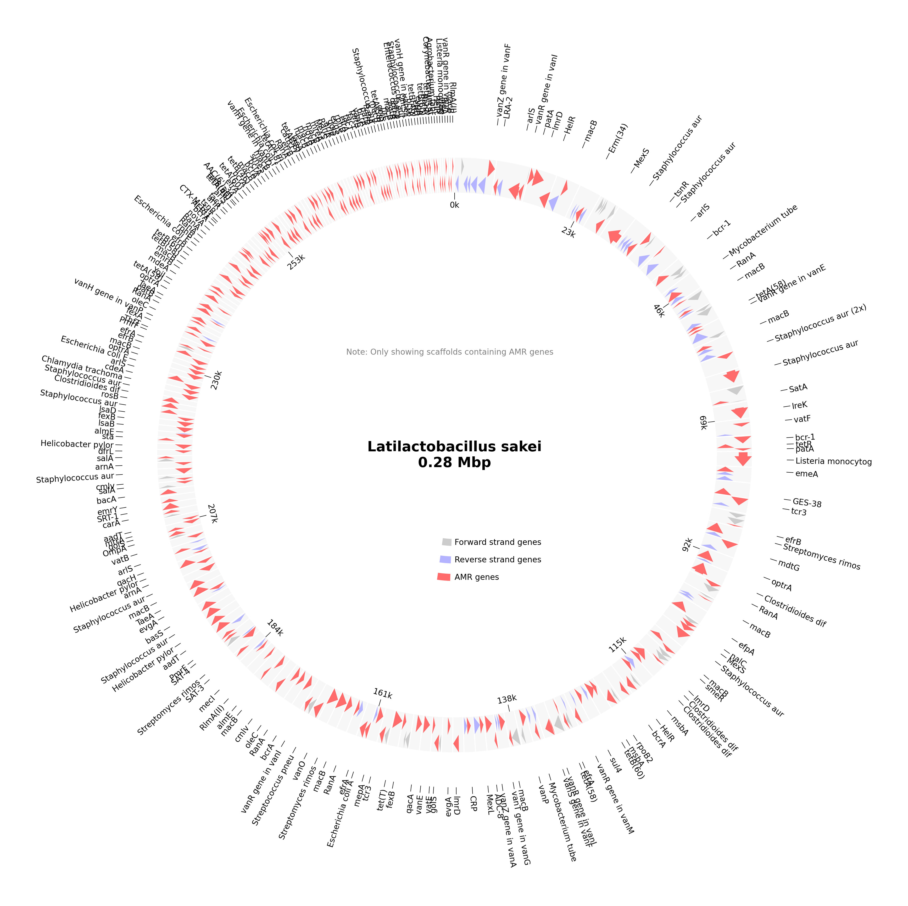

### AAC(6')-34
- **Mechanism**: antibiotic inactivation
- **Drug Classes**: aminoglycoside antibiotic
- **AMR Family**: AAC(6')
- **Locations**:
  - gnl|SPADES|AKHJOCOO_16143_1 : position 1-459

### ADC-8
- **Mechanism**: antibiotic inactivation
- **Drug Classes**: cephalosporin
- **AMR Family**: ADC beta-lactamase without carbapenemase activity
- **Locations**:
  - gnl|SPADES|AKHJOCOO_4305_2 : position 467-1618

### AER-1
- **Mechanism**: antibiotic inactivation
- **Drug Classes**: penam
- **AMR Family**: AER beta-lactamase
- **Locations**:
  - gnl|SPADES|AKHJOCOO_15061_1 : position 2-265

### Agrobacterium fabrum chloramphenicol acetyltransferase
- **Mechanism**: antibiotic inactivation
- **Drug Classes**: phenicol antibiotic
- **AMR Family**: chloramphenicol acetyltransferase (CAT)
- **Locations**:
  - gnl|SPADES|AKHJOCOO_64862_1 : position 2-226

### CRP
- **Mechanism**: antibiotic efflux
- **Drug Classes**: macrolide antibiotic; fluoroquinolone antibiotic; penam
- **AMR Family**: resistance-nodulation-cell division (RND) antibiotic efflux pump
- **Locations**:
  - gnl|SPADES|AKHJOCOO_4367_2 : position 459-1127

### CTX-M-141
- **Mechanism**: antibiotic inactivation
- **Drug Classes**: cephalosporin
- **AMR Family**: CTX-M beta-lactamase
- **Locations**:
  - gnl|SPADES|AKHJOCOO_15061_2 : position 262-609

### Chlamydia trachomatis intrinsic murA conferring resistance to fosfomycin
- **Mechanism**: antibiotic target alteration
- **Drug Classes**: phosphonic acid antibiotic
- **AMR Family**: antibiotic-resistant murA transferase
- **Locations**:
  - gnl|SPADES|AKHJOCOO_10762_1 : position 34-801

### Clostridioides difficile gyrA conferring resistance to fluoroquinolones (found in 2 locations)
- **Mechanism**: antibiotic target alteration
- **Drug Classes**: fluoroquinolone antibiotic
- **AMR Family**: fluoroquinolone resistant gyrA
- **Locations**:
  - gnl|SPADES|AKHJOCOO_10675_1 : position 3-806
  - gnl|SPADES|AKHJOCOO_3562_1 : position 2-1315

### Clostridioides difficile gyrB conferring resistance to fluoroquinolones (found in 2 locations)
- **Mechanism**: antibiotic target alteration
- **Drug Classes**: fluoroquinolone antibiotic
- **AMR Family**: fluoroquinolone resistant gyrB
- **Locations**:
  - gnl|SPADES|AKHJOCOO_3184_2 : position 138-2129
  - gnl|SPADES|AKHJOCOO_3562_2 : position 1363-2142

### Corynebacterium striatum tetA
- **Mechanism**: antibiotic efflux
- **Drug Classes**: penam; tetracycline antibiotic
- **AMR Family**: major facilitator superfamily (MFS) antibiotic efflux pump
- **Locations**:
  - gnl|SPADES|AKHJOCOO_59277_1 : position 2-238

### Enterococcus faecalis cls with mutation conferring resistance to daptomycin
- **Mechanism**: antibiotic target alteration
- **Drug Classes**: peptide antibiotic
- **AMR Family**: daptomycin resistant cls
- **Locations**:
  - gnl|SPADES|AKHJOCOO_40121_1 : position 1-282

### Erm(34)
- **Mechanism**: antibiotic target alteration
- **Drug Classes**: macrolide antibiotic; lincosamide antibiotic; streptogramin antibiotic; streptogramin A antibiotic; streptogramin B antibiotic
- **AMR Family**: Erm 23S ribosomal RNA methyltransferase
- **Locations**:
  - gnl|SPADES|AKHJOCOO_2113_4 : position 1393-2286

### Escherichia coli AcrAB-TolC with AcrR mutation conferring resistance to ciprofloxacin, tetracycline, and ceftazidime
- **Mechanism**: antibiotic target alteration; antibiotic efflux
- **Drug Classes**: fluoroquinolone antibiotic; cephalosporin; glycylcycline; penam; tetracycline antibiotic; rifamycin antibiotic; phenicol antibiotic; disinfecting agents and antiseptics
- **AMR Family**: resistance-nodulation-cell division (RND) antibiotic efflux pump
- **Locations**:
  - gnl|SPADES|AKHJOCOO_4768_1 : position 2-634

### Escherichia coli EF-Tu mutants conferring resistance to Pulvomycin
- **Mechanism**: antibiotic target alteration
- **Drug Classes**: elfamycin antibiotic
- **AMR Family**: elfamycin resistant EF-Tu
- **Locations**:
  - gnl|SPADES|AKHJOCOO_10979_1 : position 3-788

### Escherichia coli EF-Tu mutants conferring resistance to kirromycin
- **Mechanism**: antibiotic target alteration
- **Drug Classes**: elfamycin antibiotic
- **AMR Family**: elfamycin resistant EF-Tu
- **Locations**:
  - gnl|SPADES|AKHJOCOO_13748_2 : position 298-654

### Escherichia coli fabI mutations conferring resistance to isoniazid and triclosan
- **Mechanism**: antibiotic target alteration
- **Drug Classes**: disinfecting agents and antiseptics; isoniazid-like antibiotic
- **AMR Family**: antibiotic resistant fabI
- **Locations**:
  - gnl|SPADES|AKHJOCOO_20373_1 : position 2-298

### Escherichia coli murA with mutation conferring resistance to fosfomycin
- **Mechanism**: antibiotic target alteration
- **Drug Classes**: phosphonic acid antibiotic
- **AMR Family**: antibiotic-resistant murA transferase
- **Locations**:
  - gnl|SPADES|AKHJOCOO_20478_1 : position 1-459

### GES-38
- **Mechanism**: antibiotic inactivation
- **Drug Classes**: carbapenem; cephalosporin; penam
- **AMR Family**: GES beta-lactamase
- **Locations**:
  - gnl|SPADES|AKHJOCOO_3078_2 : position 1295-2455

### HelR (found in 4 locations)
- **Mechanism**: antibiotic target protection
- **Drug Classes**: rifamycin antibiotic
- **AMR Family**: helicase-like RNA polymerase protection protein
- **Locations**:
  - gnl|SPADES|AKHJOCOO_1868_3 : position 2797-4362
  - gnl|SPADES|AKHJOCOO_3749_4 : position 1139-2038
  - gnl|SPADES|AKHJOCOO_66425_1 : position 1-222
  - gnl|SPADES|AKHJOCOO_67046_1 : position 1-222

### Helicobacter pylori pbp1 mutants conferring resistance to amoxicillin (found in 3 locations)
- **Mechanism**: antibiotic target alteration
- **Drug Classes**: cephalosporin; cephamycin; penam
- **AMR Family**: Penicillin-binding protein mutations conferring resistance to beta-lactam antibiotics
- **Locations**:
  - gnl|SPADES|AKHJOCOO_6130_1 : position 1-1029
  - gnl|SPADES|AKHJOCOO_7206_1 : position 2-1018
  - gnl|SPADES|AKHJOCOO_9694_1 : position 78-875

### IreK
- **Mechanism**: reduced permeability to antibiotic
- **Drug Classes**: cephalosporin
- **AMR Family**: Serine/threonine kinases
- **Locations**:
  - gnl|SPADES|AKHJOCOO_2804_2 : position 835-2703

### LRA-2
- **Mechanism**: antibiotic inactivation
- **Drug Classes**: cephalosporin; penam
- **AMR Family**: subclass B3 LRA beta-lactamase
- **Locations**:
  - gnl|SPADES|AKHJOCOO_1435_1 : position 1-633

### Listeria monocytogenes mprF (found in 2 locations)
- **Mechanism**: antibiotic target alteration
- **Drug Classes**: peptide antibiotic
- **AMR Family**: defensin resistant mprF
- **Locations**:
  - gnl|SPADES|AKHJOCOO_2983_1 : position 100-2541
  - gnl|SPADES|AKHJOCOO_68173_1 : position 1-219

### MexL
- **Mechanism**: antibiotic efflux
- **Drug Classes**: macrolide antibiotic; tetracycline antibiotic; disinfecting agents and antiseptics
- **AMR Family**: resistance-nodulation-cell division (RND) antibiotic efflux pump
- **Locations**:
  - gnl|SPADES|AKHJOCOO_4340_1 : position 67-702

### MexS (found in 3 locations)
- **Mechanism**: antibiotic efflux
- **Drug Classes**: fluoroquinolone antibiotic; diaminopyrimidine antibiotic; phenicol antibiotic
- **AMR Family**: resistance-nodulation-cell division (RND) antibiotic efflux pump
- **Locations**:
  - gnl|SPADES|AKHJOCOO_2244_5 : position 1758-2693
  - gnl|SPADES|AKHJOCOO_24768_1 : position 3-413
  - gnl|SPADES|AKHJOCOO_3341_3 : position 1334-2275

### Mycobacterium tuberculosis kasA mutant conferring resistance to isoniazid
- **Mechanism**: antibiotic target alteration
- **Drug Classes**: isoniazid-like antibiotic
- **AMR Family**: antibiotic resistant kasA
- **Locations**:
  - gnl|SPADES|AKHJOCOO_2649_3 : position 686-1918

### Mycobacterium tuberculosis pncA mutations conferring resistance to pyrazinamide
- **Mechanism**: antibiotic target alteration
- **Drug Classes**: pyrazine antibiotic
- **AMR Family**: Pyrazinamide resistant pncA
- **Locations**:
  - gnl|SPADES|AKHJOCOO_4255_2 : position 616-1155

### OmpA
- **Mechanism**: reduced permeability to antibiotic
- **Drug Classes**: peptide antibiotic
- **AMR Family**: General Bacterial Porin with reduced permeability to peptide antibiotics
- **Locations**:
  - gnl|SPADES|AKHJOCOO_7377_2 : position 479-1102

### PmrF (found in 2 locations)
- **Mechanism**: antibiotic target alteration
- **Drug Classes**: peptide antibiotic
- **AMR Family**: pmr phosphoethanolamine transferase
- **Locations**:
  - gnl|SPADES|AKHJOCOO_11877_2 : position 442-735
  - gnl|SPADES|AKHJOCOO_6006_1 : position 2-550

### QnrS4
- **Mechanism**: antibiotic target protection
- **Drug Classes**: fluoroquinolone antibiotic
- **AMR Family**: quinolone resistance protein (qnr)
- **Locations**:
  - gnl|SPADES|AKHJOCOO_40851_1 : position 1-279

### RanA (found in 11 locations)
- **Mechanism**: antibiotic efflux
- **Drug Classes**: aminoglycoside antibiotic
- **AMR Family**: ATP-binding cassette (ABC) antibiotic efflux pump
- **Locations**:
  - gnl|SPADES|AKHJOCOO_12526_2 : position 382-702
  - gnl|SPADES|AKHJOCOO_14467_1 : position 1-627
  - gnl|SPADES|AKHJOCOO_14491_1 : position 1-528
  - gnl|SPADES|AKHJOCOO_21008_1 : position 1-468
  - gnl|SPADES|AKHJOCOO_24990_1 : position 2-409
  - gnl|SPADES|AKHJOCOO_2665_1 : position 1-276
  - gnl|SPADES|AKHJOCOO_3263_1 : position 3-752
  - gnl|SPADES|AKHJOCOO_33159_1 : position 3-329
  - gnl|SPADES|AKHJOCOO_4797_2 : position 1029-1619
  - gnl|SPADES|AKHJOCOO_5197_2 : position 509-1249
  - gnl|SPADES|AKHJOCOO_57291_1 : position 3-242

### RlmA(II) (found in 2 locations)
- **Mechanism**: antibiotic target alteration
- **Drug Classes**: macrolide antibiotic; lincosamide antibiotic
- **AMR Family**: non-erm 23S ribosomal RNA methyltransferase (G748)
- **Locations**:
  - gnl|SPADES|AKHJOCOO_5457_1 : position 3-425
  - gnl|SPADES|AKHJOCOO_74761_1 : position 1-207

### SAT-3
- **Mechanism**: antibiotic inactivation
- **Drug Classes**: nucleoside antibiotic
- **AMR Family**: streptothricin acetyltransferase (SAT)
- **Locations**:
  - gnl|SPADES|AKHJOCOO_5605_2 : position 812-1357

### SAT-4
- **Mechanism**: antibiotic inactivation
- **Drug Classes**: nucleoside antibiotic
- **AMR Family**: streptothricin acetyltransferase (SAT)
- **Locations**:
  - gnl|SPADES|AKHJOCOO_5883_2 : position 924-1340

### SRT-1
- **Mechanism**: antibiotic inactivation
- **Drug Classes**: cephalosporin
- **AMR Family**: SRT beta-lactamase
- **Locations**:
  - gnl|SPADES|AKHJOCOO_7673_1 : position 73-1065

### SatA
- **Mechanism**: antibiotic inactivation
- **Drug Classes**: nucleoside antibiotic
- **AMR Family**: streptothricin acetyltransferase (SAT)
- **Locations**:
  - gnl|SPADES|AKHJOCOO_2784_3 : position 1958-2419

### Staphylococcus aureus LmrS
- **Mechanism**: antibiotic efflux
- **Drug Classes**: macrolide antibiotic; aminoglycoside antibiotic; oxazolidinone antibiotic; diaminopyrimidine antibiotic; phenicol antibiotic
- **AMR Family**: major facilitator superfamily (MFS) antibiotic efflux pump
- **Locations**:
  - gnl|SPADES|AKHJOCOO_3434_1 : position 3-1490

### Staphylococcus aureus fusA with mutation conferring resistance to fusidic acid (found in 2 locations)
- **Mechanism**: antibiotic target alteration
- **Drug Classes**: fusidane antibiotic
- **AMR Family**: antibiotic resistant fusA
- **Locations**:
  - gnl|SPADES|AKHJOCOO_10337_1 : position 2-637
  - gnl|SPADES|AKHJOCOO_2736_1 : position 95-2182

### Staphylococcus aureus mupA conferring resistance to mupirocin (found in 7 locations)
- **Mechanism**: antibiotic target alteration
- **Drug Classes**: mupirocin-like antibiotic
- **AMR Family**: antibiotic-resistant isoleucyl-tRNA synthetase (ileS)
- **Locations**:
  - gnl|SPADES|AKHJOCOO_10746_1 : position 2-802
  - gnl|SPADES|AKHJOCOO_2723_1 : position 1-807
  - gnl|SPADES|AKHJOCOO_2723_2 : position 749-2188
  - gnl|SPADES|AKHJOCOO_33489_1 : position 2-223
  - gnl|SPADES|AKHJOCOO_40562_1 : position 3-281
  - gnl|SPADES|AKHJOCOO_7047_1 : position 212-1144
  - gnl|SPADES|AKHJOCOO_8342_1 : position 3-989

### Staphylococcus aureus mupB conferring resistance to mupirocin
- **Mechanism**: antibiotic target alteration
- **Drug Classes**: mupirocin-like antibiotic
- **AMR Family**: antibiotic-resistant isoleucyl-tRNA synthetase (ileS)
- **Locations**:
  - gnl|SPADES|AKHJOCOO_6201_1 : position 1-1272

### Staphylococcus aureus murA with mutation conferring resistance to fosfomycin
- **Mechanism**: antibiotic target alteration
- **Drug Classes**: phosphonic acid antibiotic
- **AMR Family**: antibiotic-resistant murA transferase
- **Locations**:
  - gnl|SPADES|AKHJOCOO_2468_1 : position 2-862

### Staphylococcus aureus rpoB mutants conferring resistance to rifampicin
- **Mechanism**: antibiotic target alteration; antibiotic target replacement
- **Drug Classes**: rifamycin antibiotic
- **AMR Family**: rifamycin-resistant beta-subunit of RNA polymerase (rpoB)
- **Locations**:
  - gnl|SPADES|AKHJOCOO_2382_2 : position 744-3227

### Streptococcus pneumoniae PBP2x conferring resistance to amoxicillin
- **Mechanism**: antibiotic target alteration
- **Drug Classes**: cephalosporin; cephamycin; penam
- **AMR Family**: Penicillin-binding protein mutations conferring resistance to beta-lactam antibiotics
- **Locations**:
  - gnl|SPADES|AKHJOCOO_5073_2 : position 359-1531

### Streptomyces rimosus otr(A) (found in 3 locations)
- **Mechanism**: antibiotic target protection
- **Drug Classes**: tetracycline antibiotic
- **AMR Family**: tetracycline-resistant ribosomal protection protein
- **Locations**:
  - gnl|SPADES|AKHJOCOO_3134_1 : position 1-1647
  - gnl|SPADES|AKHJOCOO_4951_1 : position 3-1568
  - gnl|SPADES|AKHJOCOO_5844_1 : position 1-1008

### TaeA (found in 4 locations)
- **Mechanism**: antibiotic efflux
- **Drug Classes**: pleuromutilin antibiotic
- **AMR Family**: ATP-binding cassette (ABC) antibiotic efflux pump
- **Locations**:
  - gnl|SPADES|AKHJOCOO_12608_1 : position 3-200
  - gnl|SPADES|AKHJOCOO_22748_1 : position 3-260
  - gnl|SPADES|AKHJOCOO_6736_1 : position 1-1188
  - gnl|SPADES|AKHJOCOO_70328_1 : position 1-216

### ThfT
- **Mechanism**: resistance by host-dependent nutrient acquisition
- **Drug Classes**: sulfonamide antibiotic
- **AMR Family**: ECF transporter S component
- **Locations**:
  - gnl|SPADES|AKHJOCOO_11940_1 : position 1-261

### YojI
- **Mechanism**: antibiotic efflux
- **Drug Classes**: peptide antibiotic
- **AMR Family**: ATP-binding cassette (ABC) antibiotic efflux pump
- **Locations**:
  - gnl|SPADES|AKHJOCOO_12673_1 : position 3-284

### aadT (found in 2 locations)
- **Mechanism**: antibiotic efflux
- **Drug Classes**: macrolide antibiotic; tetracycline antibiotic; disinfecting agents and antiseptics
- **AMR Family**: major facilitator superfamily (MFS) antibiotic efflux pump
- **Locations**:
  - gnl|SPADES|AKHJOCOO_6094_1 : position 3-1163
  - gnl|SPADES|AKHJOCOO_7522_1 : position 1-420

### almE (found in 2 locations)
- **Mechanism**: antibiotic target alteration
- **Drug Classes**: peptide antibiotic
- **AMR Family**: polymyxin resistance operon; alm glycyltransferase
- **Locations**:
  - gnl|SPADES|AKHJOCOO_5417_1 : position 3-449
  - gnl|SPADES|AKHJOCOO_9806_1 : position 1-663

### arlR (found in 2 locations)
- **Mechanism**: antibiotic efflux
- **Drug Classes**: fluoroquinolone antibiotic; disinfecting agents and antiseptics
- **AMR Family**: major facilitator superfamily (MFS) antibiotic efflux pump
- **Locations**:
  - gnl|SPADES|AKHJOCOO_15419_2 : position 434-598
  - gnl|SPADES|AKHJOCOO_25191_1 : position 2-406

### arlS (found in 5 locations)
- **Mechanism**: antibiotic efflux
- **Drug Classes**: fluoroquinolone antibiotic; disinfecting agents and antiseptics
- **AMR Family**: major facilitator superfamily (MFS) antibiotic efflux pump
- **Locations**:
  - gnl|SPADES|AKHJOCOO_10956_1 : position 3-788
  - gnl|SPADES|AKHJOCOO_1435_4 : position 2815-4713
  - gnl|SPADES|AKHJOCOO_15894_1 : position 2-583
  - gnl|SPADES|AKHJOCOO_2530_1 : position 3-275
  - gnl|SPADES|AKHJOCOO_7277_1 : position 2-508

### arnA (found in 2 locations)
- **Mechanism**: antibiotic target alteration
- **Drug Classes**: peptide antibiotic
- **AMR Family**: pmr phosphoethanolamine transferase
- **Locations**:
  - gnl|SPADES|AKHJOCOO_7056_2 : position 527-1141
  - gnl|SPADES|AKHJOCOO_8809_2 : position 410-946

### bacA
- **Mechanism**: antibiotic target alteration
- **Drug Classes**: peptide antibiotic
- **AMR Family**: undecaprenyl pyrophosphate related proteins
- **Locations**:
  - gnl|SPADES|AKHJOCOO_8126_2 : position 201-1013

### basS
- **Mechanism**: antibiotic target alteration; antibiotic efflux
- **Drug Classes**: peptide antibiotic
- **AMR Family**: pmr phosphoethanolamine transferase
- **Locations**:
  - gnl|SPADES|AKHJOCOO_6402_1 : position 29-1096

### bcr-1 (found in 2 locations)
- **Mechanism**: antibiotic efflux
- **Drug Classes**: bicyclomycin-like antibiotic
- **AMR Family**: major facilitator superfamily (MFS) antibiotic efflux pump
- **Locations**:
  - gnl|SPADES|AKHJOCOO_2619_1 : position 1-1107
  - gnl|SPADES|AKHJOCOO_2966_1 : position 95-1270

### bcrA (found in 8 locations)
- **Mechanism**: antibiotic efflux
- **Drug Classes**: peptide antibiotic
- **AMR Family**: ATP-binding cassette (ABC) antibiotic efflux pump
- **Locations**:
  - gnl|SPADES|AKHJOCOO_14661_1 : position 169-621
  - gnl|SPADES|AKHJOCOO_17567_1 : position 3-539
  - gnl|SPADES|AKHJOCOO_19400_1 : position 1-498
  - gnl|SPADES|AKHJOCOO_19631_1 : position 3-494
  - gnl|SPADES|AKHJOCOO_32667_1 : position 3-332
  - gnl|SPADES|AKHJOCOO_3818_2 : position 489-1169
  - gnl|SPADES|AKHJOCOO_47915_1 : position 2-193
  - gnl|SPADES|AKHJOCOO_5147_2 : position 535-1410

### carA
- **Mechanism**: antibiotic target protection
- **Drug Classes**: macrolide antibiotic
- **AMR Family**: Miscellaneous ABC-F subfamily ATP-binding cassette ribosomal protection proteins
- **Locations**:
  - gnl|SPADES|AKHJOCOO_7606_2 : position 606-1073

### catB11
- **Mechanism**: antibiotic inactivation
- **Drug Classes**: phenicol antibiotic
- **AMR Family**: chloramphenicol acetyltransferase (CAT)
- **Locations**:
  - gnl|SPADES|AKHJOCOO_21696_1 : position 261-458

### cdeA
- **Mechanism**: antibiotic efflux
- **Drug Classes**: fluoroquinolone antibiotic; disinfecting agents and antiseptics
- **AMR Family**: multidrug and toxic compound extrusion (MATE) transporter
- **Locations**:
  - gnl|SPADES|AKHJOCOO_10927_1 : position 2-790

### cmlv (found in 2 locations)
- **Mechanism**: antibiotic inactivation
- **Drug Classes**: phenicol antibiotic
- **AMR Family**: chloramphenicol phosphotransferase
- **Locations**:
  - gnl|SPADES|AKHJOCOO_5373_1 : position 2-781
  - gnl|SPADES|AKHJOCOO_8252_1 : position 1-387

### dfrL
- **Mechanism**: antibiotic target replacement
- **Drug Classes**: aminoglycoside antibiotic; tetracycline antibiotic; diaminopyrimidine antibiotic
- **AMR Family**: trimethoprim resistant dihydrofolate reductase dfr
- **Locations**:
  - gnl|SPADES|AKHJOCOO_9396_2 : position 382-882

### efpA
- **Mechanism**: antibiotic efflux
- **Drug Classes**: rifamycin antibiotic; isoniazid-like antibiotic
- **AMR Family**: major facilitator superfamily (MFS) antibiotic efflux pump
- **Locations**:
  - gnl|SPADES|AKHJOCOO_3338_3 : position 709-2067

### efrA (found in 5 locations)
- **Mechanism**: antibiotic efflux
- **Drug Classes**: macrolide antibiotic; fluoroquinolone antibiotic; rifamycin antibiotic
- **AMR Family**: ATP-binding cassette (ABC) antibiotic efflux pump
- **Locations**:
  - gnl|SPADES|AKHJOCOO_11723_1 : position 3-623
  - gnl|SPADES|AKHJOCOO_16571_1 : position 2-565
  - gnl|SPADES|AKHJOCOO_27558_1 : position 1-381
  - gnl|SPADES|AKHJOCOO_4076_4 : position 1445-1882
  - gnl|SPADES|AKHJOCOO_4768_2 : position 658-1629

### efrB (found in 5 locations)
- **Mechanism**: antibiotic efflux
- **Drug Classes**: macrolide antibiotic; fluoroquinolone antibiotic; rifamycin antibiotic
- **AMR Family**: ATP-binding cassette (ABC) antibiotic efflux pump
- **Locations**:
  - gnl|SPADES|AKHJOCOO_11483_1 : position 34-756
  - gnl|SPADES|AKHJOCOO_13523_1 : position 1-663
  - gnl|SPADES|AKHJOCOO_21434_1 : position 1-462
  - gnl|SPADES|AKHJOCOO_3125_3 : position 2218-2415
  - gnl|SPADES|AKHJOCOO_53663_1 : position 2-250

### emeA
- **Mechanism**: antibiotic efflux
- **Drug Classes**: disinfecting agents and antiseptics
- **AMR Family**: multidrug and toxic compound extrusion (MATE) transporter
- **Locations**:
  - gnl|SPADES|AKHJOCOO_3020_1 : position 1-906

### emrB
- **Mechanism**: antibiotic efflux
- **Drug Classes**: fluoroquinolone antibiotic
- **AMR Family**: major facilitator superfamily (MFS) antibiotic efflux pump
- **Locations**:
  - gnl|SPADES|AKHJOCOO_12950_2 : position 350-685

### emrY
- **Mechanism**: antibiotic efflux
- **Drug Classes**: tetracycline antibiotic
- **AMR Family**: major facilitator superfamily (MFS) antibiotic efflux pump
- **Locations**:
  - gnl|SPADES|AKHJOCOO_7728_1 : position 1-579

### evgA (found in 3 locations)
- **Mechanism**: antibiotic efflux
- **Drug Classes**: macrolide antibiotic; fluoroquinolone antibiotic; penam; tetracycline antibiotic
- **AMR Family**: major facilitator superfamily (MFS) antibiotic efflux pump; resistance-nodulation-cell division (RND) antibiotic efflux pump
- **Locations**:
  - gnl|SPADES|AKHJOCOO_4448_2 : position 326-838
  - gnl|SPADES|AKHJOCOO_54228_1 : position 2-247
  - gnl|SPADES|AKHJOCOO_6708_3 : position 580-1191

### evgS
- **Mechanism**: antibiotic efflux
- **Drug Classes**: macrolide antibiotic; fluoroquinolone antibiotic; penam; tetracycline antibiotic
- **AMR Family**: major facilitator superfamily (MFS) antibiotic efflux pump; resistance-nodulation-cell division (RND) antibiotic efflux pump
- **Locations**:
  - gnl|SPADES|AKHJOCOO_26161_1 : position 2-394

### facT (found in 3 locations)
- **Mechanism**: antibiotic efflux
- **Drug Classes**: elfamycin antibiotic
- **AMR Family**: major facilitator superfamily (MFS) antibiotic efflux pump
- **Locations**:
  - gnl|SPADES|AKHJOCOO_15740_1 : position 1-393
  - gnl|SPADES|AKHJOCOO_28125_1 : position 2-373
  - gnl|SPADES|AKHJOCOO_29391_1 : position 3-362

### fexA
- **Mechanism**: antibiotic efflux
- **Drug Classes**: phenicol antibiotic
- **AMR Family**: major facilitator superfamily (MFS) antibiotic efflux pump
- **Locations**:
  - gnl|SPADES|AKHJOCOO_12010_1 : position 2-727

### fexB (found in 2 locations)
- **Mechanism**: antibiotic efflux
- **Drug Classes**: phenicol antibiotic
- **AMR Family**: major facilitator superfamily (MFS) antibiotic efflux pump
- **Locations**:
  - gnl|SPADES|AKHJOCOO_4700_3 : position 1082-1654
  - gnl|SPADES|AKHJOCOO_9947_1 : position 1-855

### golS (found in 4 locations)
- **Mechanism**: antibiotic efflux
- **Drug Classes**: monobactam; carbapenem; cephalosporin; cephamycin; penam; phenicol antibiotic; penem
- **AMR Family**: resistance-nodulation-cell division (RND) antibiotic efflux pump
- **Locations**:
  - gnl|SPADES|AKHJOCOO_25376_1 : position 10-405
  - gnl|SPADES|AKHJOCOO_37200_1 : position 3-140
  - gnl|SPADES|AKHJOCOO_4579_2 : position 447-1211
  - gnl|SPADES|AKHJOCOO_7416_1 : position 3-455

### lmrD (found in 3 locations)
- **Mechanism**: antibiotic efflux
- **Drug Classes**: lincosamide antibiotic
- **AMR Family**: ATP-binding cassette (ABC) antibiotic efflux pump
- **Locations**:
  - gnl|SPADES|AKHJOCOO_1868_2 : position 827-2620
  - gnl|SPADES|AKHJOCOO_3553_4 : position 1829-2149
  - gnl|SPADES|AKHJOCOO_4423_2 : position 784-1749

### lsaB
- **Mechanism**: antibiotic target protection
- **Drug Classes**: lincosamide antibiotic; streptogramin antibiotic; pleuromutilin antibiotic
- **AMR Family**: lsa-type ABC-F protein
- **Locations**:
  - gnl|SPADES|AKHJOCOO_9879_1 : position 3-860

### lsaD
- **Mechanism**: antibiotic target protection
- **Drug Classes**: lincosamide antibiotic; streptogramin antibiotic; streptogramin A antibiotic; pleuromutilin antibiotic
- **AMR Family**: lsa-type ABC-F protein
- **Locations**:
  - gnl|SPADES|AKHJOCOO_10223_1 : position 3-581

### macB (found in 19 locations)
- **Mechanism**: antibiotic efflux
- **Drug Classes**: macrolide antibiotic
- **AMR Family**: ATP-binding cassette (ABC) antibiotic efflux pump
- **Locations**:
  - gnl|SPADES|AKHJOCOO_11409_1 : position 1-594
  - gnl|SPADES|AKHJOCOO_13012_1 : position 163-681
  - gnl|SPADES|AKHJOCOO_18321_1 : position 9-521
  - gnl|SPADES|AKHJOCOO_1977_2 : position 1737-2495
  - gnl|SPADES|AKHJOCOO_19813_1 : position 2-490
  - gnl|SPADES|AKHJOCOO_22785_1 : position 2-439
  - gnl|SPADES|AKHJOCOO_23139_1 : position 2-433
  - gnl|SPADES|AKHJOCOO_23969_1 : position 3-314
  - gnl|SPADES|AKHJOCOO_2665_4 : position 1947-2390
  - gnl|SPADES|AKHJOCOO_2697_2 : position 204-845
  - gnl|SPADES|AKHJOCOO_3290_2 : position 591-770
  - gnl|SPADES|AKHJOCOO_3468_2 : position 650-1426
  - gnl|SPADES|AKHJOCOO_36232_1 : position 1-306
  - gnl|SPADES|AKHJOCOO_38255_1 : position 3-293
  - gnl|SPADES|AKHJOCOO_4271_2 : position 1351-1812
  - gnl|SPADES|AKHJOCOO_4841_2 : position 664-1602
  - gnl|SPADES|AKHJOCOO_5410_2 : position 445-1179
  - gnl|SPADES|AKHJOCOO_6965_1 : position 1-1155
  - gnl|SPADES|AKHJOCOO_74086_1 : position 3-209

### mdeA
- **Mechanism**: antibiotic efflux
- **Drug Classes**: fluoroquinolone antibiotic; aminoglycoside antibiotic; penam; tetracycline antibiotic; disinfecting agents and antiseptics
- **AMR Family**: major facilitator superfamily (MFS) antibiotic efflux pump
- **Locations**:
  - gnl|SPADES|AKHJOCOO_12901_1 : position 2-688

### mdtG
- **Mechanism**: antibiotic efflux
- **Drug Classes**: phosphonic acid antibiotic
- **AMR Family**: major facilitator superfamily (MFS) antibiotic efflux pump
- **Locations**:
  - gnl|SPADES|AKHJOCOO_3149_1 : position 52-1305

### mecI
- **Mechanism**: antibiotic target replacement
- **Drug Classes**: penam
- **AMR Family**: methicillin resistant PBP2
- **Locations**:
  - gnl|SPADES|AKHJOCOO_5548_2 : position 293-733

### mepA
- **Mechanism**: antibiotic efflux
- **Drug Classes**: glycylcycline; tetracycline antibiotic
- **AMR Family**: multidrug and toxic compound extrusion (MATE) transporter
- **Locations**:
  - gnl|SPADES|AKHJOCOO_4759_1 : position 1-996

### mreA
- **Mechanism**: antibiotic efflux
- **Drug Classes**: macrolide antibiotic
- **AMR Family**: major facilitator superfamily (MFS) antibiotic efflux pump
- **Locations**:
  - gnl|SPADES|AKHJOCOO_24000_1 : position 3-422

### msbA (found in 2 locations)
- **Mechanism**: antibiotic efflux
- **Drug Classes**: nitroimidazole antibiotic
- **AMR Family**: ATP-binding cassette (ABC) antibiotic efflux pump
- **Locations**:
  - gnl|SPADES|AKHJOCOO_3646_3 : position 1381-2091
  - gnl|SPADES|AKHJOCOO_3889_1 : position 222-812

### mtrA
- **Mechanism**: antibiotic efflux
- **Drug Classes**: macrolide antibiotic; penam
- **AMR Family**: resistance-nodulation-cell division (RND) antibiotic efflux pump
- **Locations**:
  - gnl|SPADES|AKHJOCOO_7416_2 : position 480-1097

### nalC
- **Mechanism**: antibiotic efflux
- **Drug Classes**: macrolide antibiotic; fluoroquinolone antibiotic; monobactam; carbapenem; cephalosporin; cephamycin; penam; tetracycline antibiotic; peptide antibiotic; aminocoumarin antibiotic; diaminopyrimidine antibiotic; sulfonamide antibiotic; phenicol antibiotic; penem
- **AMR Family**: resistance-nodulation-cell division (RND) antibiotic efflux pump
- **Locations**:
  - gnl|SPADES|AKHJOCOO_3341_2 : position 646-1332

### novA (found in 2 locations)
- **Mechanism**: antibiotic efflux
- **Drug Classes**: aminocoumarin antibiotic
- **AMR Family**: ATP-binding cassette (ABC) antibiotic efflux pump
- **Locations**:
  - gnl|SPADES|AKHJOCOO_14570_1 : position 2-625
  - gnl|SPADES|AKHJOCOO_23874_1 : position 3-425

### oleC (found in 2 locations)
- **Mechanism**: antibiotic efflux
- **Drug Classes**: macrolide antibiotic
- **AMR Family**: ATP-binding cassette (ABC) antibiotic efflux pump
- **Locations**:
  - gnl|SPADES|AKHJOCOO_12432_1 : position 2-568
  - gnl|SPADES|AKHJOCOO_5198_1 : position 1-798

### optrA (found in 4 locations)
- **Mechanism**: antibiotic target protection
- **Drug Classes**: oxazolidinone antibiotic; phenicol antibiotic
- **AMR Family**: Miscellaneous ABC-F subfamily ATP-binding cassette ribosomal protection proteins
- **Locations**:
  - gnl|SPADES|AKHJOCOO_11285_1 : position 3-767
  - gnl|SPADES|AKHJOCOO_12620_1 : position 2-700
  - gnl|SPADES|AKHJOCOO_3171_1 : position 241-1848
  - gnl|SPADES|AKHJOCOO_39274_1 : position 1-288

### patA (found in 3 locations)
- **Mechanism**: antibiotic efflux
- **Drug Classes**: fluoroquinolone antibiotic
- **AMR Family**: ATP-binding cassette (ABC) antibiotic efflux pump
- **Locations**:
  - gnl|SPADES|AKHJOCOO_1868_1 : position 2-823
  - gnl|SPADES|AKHJOCOO_2966_3 : position 2137-2553
  - gnl|SPADES|AKHJOCOO_38971_1 : position 2-289

### patB (found in 3 locations)
- **Mechanism**: antibiotic efflux
- **Drug Classes**: fluoroquinolone antibiotic
- **AMR Family**: ATP-binding cassette (ABC) antibiotic efflux pump
- **Locations**:
  - gnl|SPADES|AKHJOCOO_12548_1 : position 39-701
  - gnl|SPADES|AKHJOCOO_29316_2 : position 163-363
  - gnl|SPADES|AKHJOCOO_32772_1 : position 1-333

### qacA
- **Mechanism**: antibiotic efflux
- **Drug Classes**: fluoroquinolone antibiotic
- **AMR Family**: major facilitator superfamily (MFS) antibiotic efflux pump
- **Locations**:
  - gnl|SPADES|AKHJOCOO_4640_1 : position 2-949

### qacH
- **Mechanism**: antibiotic efflux
- **Drug Classes**: disinfecting agents and antiseptics
- **AMR Family**: small multidrug resistance (SMR) antibiotic efflux pump
- **Locations**:
  - gnl|SPADES|AKHJOCOO_7242_1 : position 39-347

### rosB
- **Mechanism**: antibiotic efflux
- **Drug Classes**: peptide antibiotic
- **AMR Family**: major facilitator superfamily (MFS) antibiotic efflux pump
- **Locations**:
  - gnl|SPADES|AKHJOCOO_10501_1 : position 1-816

### rphB (found in 2 locations)
- **Mechanism**: antibiotic inactivation
- **Drug Classes**: rifamycin antibiotic
- **AMR Family**: rifampin phosphotransferase
- **Locations**:
  - gnl|SPADES|AKHJOCOO_13858_1 : position 3-650
  - gnl|SPADES|AKHJOCOO_26423_1 : position 1-393

### rpoB2
- **Mechanism**: antibiotic target alteration; antibiotic target replacement
- **Drug Classes**: rifamycin antibiotic
- **AMR Family**: rifamycin-resistant beta-subunit of RNA polymerase (rpoB)
- **Locations**:
  - gnl|SPADES|AKHJOCOO_3842_3 : position 841-1986

### salA (found in 2 locations)
- **Mechanism**: antibiotic target protection
- **Drug Classes**: lincosamide antibiotic; streptogramin antibiotic; streptogramin A antibiotic; pleuromutilin antibiotic
- **AMR Family**: sal-type ABC-F protein
- **Locations**:
  - gnl|SPADES|AKHJOCOO_8132_2 : position 534-1010
  - gnl|SPADES|AKHJOCOO_8857_2 : position 575-943

### smeR
- **Mechanism**: antibiotic efflux
- **Drug Classes**: aminoglycoside antibiotic; cephalosporin; cephamycin; penam
- **AMR Family**: resistance-nodulation-cell division (RND) antibiotic efflux pump
- **Locations**:
  - gnl|SPADES|AKHJOCOO_3468_3 : position 1566-2195

### smeS
- **Mechanism**: antibiotic efflux
- **Drug Classes**: aminoglycoside antibiotic; cephalosporin; cephamycin; penam
- **AMR Family**: resistance-nodulation-cell division (RND) antibiotic efflux pump
- **Locations**:
  - gnl|SPADES|AKHJOCOO_19653_1 : position 2-493

### sta
- **Mechanism**: antibiotic inactivation
- **Drug Classes**: nucleoside antibiotic
- **AMR Family**: streptothricin acetyltransferase (SAT)
- **Locations**:
  - gnl|SPADES|AKHJOCOO_9700_2 : position 438-875

### sul4
- **Mechanism**: antibiotic target replacement
- **Drug Classes**: sulfonamide antibiotic
- **AMR Family**: sulfonamide resistant sul
- **Locations**:
  - gnl|SPADES|AKHJOCOO_4014_3 : position 1217-1909

### tcr3 (found in 2 locations)
- **Mechanism**: antibiotic efflux
- **Drug Classes**: tetracycline antibiotic
- **AMR Family**: major facilitator superfamily (MFS) antibiotic efflux pump
- **Locations**:
  - gnl|SPADES|AKHJOCOO_3094_1 : position 2-1339
  - gnl|SPADES|AKHJOCOO_4730_2 : position 863-1645

### tet(T)
- **Mechanism**: antibiotic target protection
- **Drug Classes**: tetracycline antibiotic
- **AMR Family**: tetracycline-resistant ribosomal protection protein
- **Locations**:
  - gnl|SPADES|AKHJOCOO_4714_1 : position 3-1541

### tetA(46)
- **Mechanism**: antibiotic efflux
- **Drug Classes**: tetracycline antibiotic
- **AMR Family**: ATP-binding cassette (ABC) antibiotic efflux pump
- **Locations**:
  - gnl|SPADES|AKHJOCOO_15969_1 : position 3-338

### tetA(58) (found in 7 locations)
- **Mechanism**: antibiotic efflux
- **Drug Classes**: tetracycline antibiotic
- **AMR Family**: major facilitator superfamily (MFS) antibiotic efflux pump
- **Locations**:
  - gnl|SPADES|AKHJOCOO_12643_1 : position 3-698
  - gnl|SPADES|AKHJOCOO_20423_1 : position 1-480
  - gnl|SPADES|AKHJOCOO_22560_1 : position 1-444
  - gnl|SPADES|AKHJOCOO_2679_4 : position 2328-2837
  - gnl|SPADES|AKHJOCOO_37087_1 : position 2-280
  - gnl|SPADES|AKHJOCOO_4089_1 : position 3-230
  - gnl|SPADES|AKHJOCOO_58441_1 : position 2-238

### tetA(60)
- **Mechanism**: antibiotic efflux
- **Drug Classes**: tetracycline antibiotic
- **AMR Family**: ATP-binding cassette (ABC) antibiotic efflux pump
- **Locations**:
  - gnl|SPADES|AKHJOCOO_17421_1 : position 2-544

### tetB(46) (found in 2 locations)
- **Mechanism**: antibiotic efflux
- **Drug Classes**: tetracycline antibiotic
- **AMR Family**: ATP-binding cassette (ABC) antibiotic efflux pump
- **Locations**:
  - gnl|SPADES|AKHJOCOO_18219_1 : position 3-524
  - gnl|SPADES|AKHJOCOO_49320_1 : position 2-259

### tetB(58)
- **Mechanism**: antibiotic efflux
- **Drug Classes**: tetracycline antibiotic
- **AMR Family**: major facilitator superfamily (MFS) antibiotic efflux pump
- **Locations**:
  - gnl|SPADES|AKHJOCOO_13009_2 : position 182-682

### tetB(60) (found in 4 locations)
- **Mechanism**: antibiotic efflux
- **Drug Classes**: tetracycline antibiotic
- **AMR Family**: ATP-binding cassette (ABC) antibiotic efflux pump
- **Locations**:
  - gnl|SPADES|AKHJOCOO_13224_1 : position 2-673
  - gnl|SPADES|AKHJOCOO_15969_2 : position 302-580
  - gnl|SPADES|AKHJOCOO_3889_2 : position 751-1872
  - gnl|SPADES|AKHJOCOO_55317_1 : position 3-245

### tetR
- **Mechanism**: antibiotic target alteration; antibiotic efflux
- **Drug Classes**: tetracycline antibiotic
- **AMR Family**: major facilitator superfamily (MFS) antibiotic efflux pump
- **Locations**:
  - gnl|SPADES|AKHJOCOO_2966_2 : position 1323-1994

### tlrC
- **Mechanism**: antibiotic target protection
- **Drug Classes**: macrolide antibiotic; lincosamide antibiotic
- **AMR Family**: Miscellaneous ABC-F subfamily ATP-binding cassette ribosomal protection proteins
- **Locations**:
  - gnl|SPADES|AKHJOCOO_37118_1 : position 2-298

### tsnR (found in 2 locations)
- **Mechanism**: antibiotic target alteration
- **Drug Classes**: peptide antibiotic
- **AMR Family**: non-erm 23S ribosomal RNA methyltransferase (A1067)
- **Locations**:
  - gnl|SPADES|AKHJOCOO_15097_1 : position 46-606
  - gnl|SPADES|AKHJOCOO_2418_6 : position 2056-2943

### vanC
- **Mechanism**: antibiotic target alteration
- **Drug Classes**: glycopeptide antibiotic
- **AMR Family**: glycopeptide resistance gene cluster; Van ligase
- **Locations**:
  - gnl|SPADES|AKHJOCOO_31111_1 : position 2-346

### vanE
- **Mechanism**: antibiotic target alteration
- **Drug Classes**: glycopeptide antibiotic
- **AMR Family**: glycopeptide resistance gene cluster; Van ligase
- **Locations**:
  - gnl|SPADES|AKHJOCOO_4610_2 : position 372-1484

### vanH gene in vanD cluster
- **Mechanism**: antibiotic target alteration
- **Drug Classes**: glycopeptide antibiotic
- **AMR Family**: vanH; glycopeptide resistance gene cluster
- **Locations**:
  - gnl|SPADES|AKHJOCOO_19855_1 : position 3-413

### vanH gene in vanM cluster
- **Mechanism**: antibiotic target alteration
- **Drug Classes**: glycopeptide antibiotic
- **AMR Family**: vanH; glycopeptide resistance gene cluster
- **Locations**:
  - gnl|SPADES|AKHJOCOO_47663_1 : position 1-261

### vanH gene in vanP cluster
- **Mechanism**: antibiotic target alteration
- **Drug Classes**: glycopeptide antibiotic
- **AMR Family**: vanH; glycopeptide resistance gene cluster
- **Locations**:
  - gnl|SPADES|AKHJOCOO_12295_1 : position 1-309

### vanO
- **Mechanism**: antibiotic target alteration
- **Drug Classes**: glycopeptide antibiotic
- **AMR Family**: glycopeptide resistance gene cluster; Van ligase
- **Locations**:
  - gnl|SPADES|AKHJOCOO_5011_1 : position 2-1552

### vanP
- **Mechanism**: antibiotic target alteration
- **Drug Classes**: glycopeptide antibiotic
- **AMR Family**: glycopeptide resistance gene cluster; Van ligase
- **Locations**:
  - gnl|SPADES|AKHJOCOO_4263_1 : position 2-949

### vanR gene in vanE cluster
- **Mechanism**: antibiotic target alteration
- **Drug Classes**: glycopeptide antibiotic
- **AMR Family**: glycopeptide resistance gene cluster; vanR
- **Locations**:
  - gnl|SPADES|AKHJOCOO_2689_1 : position 2-346

### vanR gene in vanF cluster
- **Mechanism**: antibiotic target alteration
- **Drug Classes**: glycopeptide antibiotic
- **AMR Family**: glycopeptide resistance gene cluster; vanR
- **Locations**:
  - gnl|SPADES|AKHJOCOO_71963_1 : position 1-213

### vanR gene in vanI cluster (found in 3 locations)
- **Mechanism**: antibiotic target alteration
- **Drug Classes**: glycopeptide antibiotic
- **AMR Family**: glycopeptide resistance gene cluster; vanR
- **Locations**:
  - gnl|SPADES|AKHJOCOO_1435_5 : position 4723-5436
  - gnl|SPADES|AKHJOCOO_4156_1 : position 1-135
  - gnl|SPADES|AKHJOCOO_5134_2 : position 842-1510

### vanR gene in vanM cluster
- **Mechanism**: antibiotic target alteration
- **Drug Classes**: glycopeptide antibiotic
- **AMR Family**: glycopeptide resistance gene cluster; vanR
- **Locations**:
  - gnl|SPADES|AKHJOCOO_4066_3 : position 1192-1887

### vanS gene in vanF cluster
- **Mechanism**: antibiotic target alteration
- **Drug Classes**: glycopeptide antibiotic
- **AMR Family**: vanS; glycopeptide resistance gene cluster
- **Locations**:
  - gnl|SPADES|AKHJOCOO_4156_2 : position 135-1322

### vanT gene in vanG cluster
- **Mechanism**: antibiotic target alteration
- **Drug Classes**: glycopeptide antibiotic
- **AMR Family**: glycopeptide resistance gene cluster; vanT
- **Locations**:
  - gnl|SPADES|AKHJOCOO_4295_1 : position 1-984

### vanZ gene in vanA cluster
- **Mechanism**: antibiotic target alteration
- **Drug Classes**: glycopeptide antibiotic
- **AMR Family**: vanZ; glycopeptide resistance gene cluster
- **Locations**:
  - gnl|SPADES|AKHJOCOO_4305_1 : position 3-422

### vanZ gene in vanF cluster
- **Mechanism**: antibiotic target alteration
- **Drug Classes**: glycopeptide antibiotic
- **AMR Family**: vanZ; glycopeptide resistance gene cluster
- **Locations**:
  - gnl|SPADES|AKHJOCOO_1177_9 : position 5915-7051

### vatB
- **Mechanism**: antibiotic inactivation
- **Drug Classes**: streptogramin antibiotic; streptogramin A antibiotic
- **AMR Family**: streptogramin vat acetyltransferase
- **Locations**:
  - gnl|SPADES|AKHJOCOO_7291_2 : position 324-899

### vatE
- **Mechanism**: antibiotic inactivation
- **Drug Classes**: streptogramin antibiotic; streptogramin A antibiotic
- **AMR Family**: streptogramin vat acetyltransferase
- **Locations**:
  - gnl|SPADES|AKHJOCOO_4579_3 : position 1244-1690

### vatF
- **Mechanism**: antibiotic inactivation
- **Drug Classes**: streptogramin antibiotic; streptogramin A antibiotic
- **AMR Family**: streptogramin vat acetyltransferase
- **Locations**:
  - gnl|SPADES|AKHJOCOO_2807_2 : position 612-1229

## Latilactobacillus sakei subsp. sakei
**Strain Statistics:**
- Total genome length: 1.1 kbp
- Total scaffolds: 40
- Scaffolds with AMR genes: 1
- Total genes annotated: 2
- Total AMR genes: 1
- Unique AMR genes: 1
- Distinct AMR mechanisms: 1
- Distinct AMR families: 1
- Distinct drug classes: 1

**Circos Plot:**

### mreA
- **Mechanism**: antibiotic efflux
- **Drug Classes**: macrolide antibiotic
- **AMR Family**: major facilitator superfamily (MFS) antibiotic efflux pump
- **Locations**:
  - gnl|SPADES|AKHJOCOO_7307_1 : position 2-262

## Latilactobacillus sakei subsp. sakei 23K
**Strain Statistics:**
- Total genome length: 0.3 kbp
- Total scaffolds: 17
- Scaffolds with AMR genes: 1
- Total genes annotated: 0
- Total AMR genes: 1
- Unique AMR genes: 1
- Distinct AMR mechanisms: 1
- Distinct AMR families: 1
- Distinct drug classes: 4

**Circos Plot:**

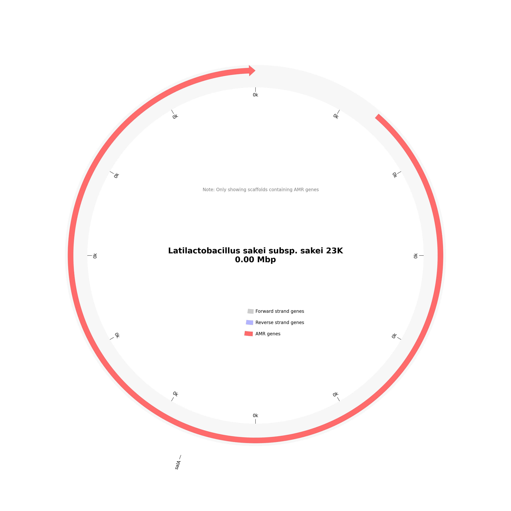

### salA
- **Mechanism**: antibiotic target protection
- **Drug Classes**: lincosamide antibiotic; streptogramin antibiotic; streptogramin A antibiotic; pleuromutilin antibiotic
- **AMR Family**: sal-type ABC-F protein
- **Locations**:
  - gnl|SPADES|AKHJOCOO_39005_1 : position 33-290

## Lelliottia sp. WB101
**Strain Statistics:**
- Total genome length: 0.2 kbp
- Total scaffolds: 2
- Scaffolds with AMR genes: 1
- Total genes annotated: 0
- Total AMR genes: 1
- Unique AMR genes: 1
- Distinct AMR mechanisms: 1
- Distinct AMR families: 1
- Distinct drug classes: 4

**Circos Plot:**

### evgS
- **Mechanism**: antibiotic efflux
- **Drug Classes**: macrolide antibiotic; fluoroquinolone antibiotic; penam; tetracycline antibiotic
- **AMR Family**: major facilitator superfamily (MFS) antibiotic efflux pump; resistance-nodulation-cell division (RND) antibiotic efflux pump
- **Locations**:
  - gnl|SPADES|AKHJOCOO_59109_1 : position 1-237

## Serratia fonticola
**Strain Statistics:**
- Total genome length: 4874.3 kbp
- Total scaffolds: 342
- Scaffolds with AMR genes: 158
- Total genes annotated: 9010
- Total AMR genes: 567
- Unique AMR genes: 234
- Distinct AMR mechanisms: 11
- Distinct AMR families: 80
- Distinct drug classes: 37

**Circos Plot:**

### AAC(3)-Ic
- **Mechanism**: antibiotic inactivation
- **Drug Classes**: aminoglycoside antibiotic
- **AMR Family**: AAC(3)
- **Locations**:
  - gnl|SPADES|AKHJOCOO_388_4 : position 2636-3061

### AAC(6')-34
- **Mechanism**: antibiotic inactivation
- **Drug Classes**: aminoglycoside antibiotic
- **AMR Family**: AAC(6')
- **Locations**:
  - gnl|SPADES|AKHJOCOO_54_14 : position 17255-17752

### AAC(6')-Ia
- **Mechanism**: antibiotic inactivation
- **Drug Classes**: aminoglycoside antibiotic
- **AMR Family**: AAC(6')
- **Locations**:
  - gnl|SPADES|AKHJOCOO_44_82 : position 88799-89317

### AIM-1
- **Mechanism**: antibiotic inactivation
- **Drug Classes**: cephalosporin; cephamycin; penam
- **AMR Family**: AIM beta-lactamase
- **Locations**:
  - gnl|SPADES|AKHJOCOO_825_5 : position 5800-6792

### APH(6)-Ic
- **Mechanism**: antibiotic inactivation
- **Drug Classes**: aminoglycoside antibiotic
- **AMR Family**: APH(6)
- **Locations**:
  - gnl|SPADES|AKHJOCOO_8_168 : position 191268-192125

### Acinetobacter baumannii AbaF (found in 9 locations)
- **Mechanism**: antibiotic efflux
- **Drug Classes**: phosphonic acid antibiotic
- **AMR Family**: major facilitator superfamily (MFS) antibiotic efflux pump
- **Locations**:
  - gnl|SPADES|AKHJOCOO_1243_4 : position 3330-4562
  - gnl|SPADES|AKHJOCOO_137_34 : position 34284-35567
  - gnl|SPADES|AKHJOCOO_152_15 : position 12448-13950
  - gnl|SPADES|AKHJOCOO_214_6 : position 4257-5582
  - gnl|SPADES|AKHJOCOO_512_16 : position 14023-15369
  - gnl|SPADES|AKHJOCOO_54_68 : position 80877-82199
  - gnl|SPADES|AKHJOCOO_66_14 : position 14017-15300
  - gnl|SPADES|AKHJOCOO_70_22 : position 31103-32500
  - gnl|SPADES|AKHJOCOO_900_3 : position 1841-3133

### Acinetobacter baumannii AbaQ (found in 12 locations)
- **Mechanism**: antibiotic efflux
- **Drug Classes**: fluoroquinolone antibiotic
- **AMR Family**: major facilitator superfamily (MFS) antibiotic efflux pump
- **Locations**:
  - gnl|SPADES|AKHJOCOO_113_10 : position 10519-11796
  - gnl|SPADES|AKHJOCOO_113_12 : position 13048-14394
  - gnl|SPADES|AKHJOCOO_113_3 : position 1649-2875
  - gnl|SPADES|AKHJOCOO_121_40 : position 43853-45151
  - gnl|SPADES|AKHJOCOO_128_11 : position 12431-13777
  - gnl|SPADES|AKHJOCOO_128_7 : position 7521-8816
  - gnl|SPADES|AKHJOCOO_282_1 : position 232-1563
  - gnl|SPADES|AKHJOCOO_325_10 : position 9839-11197
  - gnl|SPADES|AKHJOCOO_46_45 : position 46389-47681
  - gnl|SPADES|AKHJOCOO_510_6 : position 4536-5804
  - gnl|SPADES|AKHJOCOO_799_8 : position 5401-6771
  - gnl|SPADES|AKHJOCOO_93_21 : position 24856-26211

### Acinetobacter baumannii AmvA (found in 2 locations)
- **Mechanism**: antibiotic efflux
- **Drug Classes**: macrolide antibiotic; disinfecting agents and antiseptics
- **AMR Family**: major facilitator superfamily (MFS) antibiotic efflux pump
- **Locations**:
  - gnl|SPADES|AKHJOCOO_411_9 : position 9228-10526
  - gnl|SPADES|AKHJOCOO_84_21 : position 23689-25185

### Agrobacterium fabrum chloramphenicol acetyltransferase
- **Mechanism**: antibiotic inactivation
- **Drug Classes**: phenicol antibiotic
- **AMR Family**: chloramphenicol acetyltransferase (CAT)
- **Locations**:
  - gnl|SPADES|AKHJOCOO_189_20 : position 25148-25777

### ArnT
- **Mechanism**: antibiotic target alteration
- **Drug Classes**: peptide antibiotic
- **AMR Family**: pmr phosphoethanolamine transferase
- **Locations**:
  - gnl|SPADES|AKHJOCOO_182_3: position 1798-3462

### BahA
- **Mechanism**: antibiotic inactivation
- **Drug Classes**: peptide antibiotic
- **AMR Family**: Bah amidohydrolase
- **Locations**:
  - gnl|SPADES|AKHJOCOO_8_138 : position 155921-156934

### Bifidobacterium adolescentis rpoB mutants conferring resistance to rifampicin (found in 2 locations)
- **Mechanism**: antibiotic target alteration; antibiotic target replacement
- **Drug Classes**: rifamycin antibiotic
- **AMR Family**: rifamycin-resistant beta-subunit of RNA polymerase (rpoB)
- **Locations**:
  - gnl|SPADES|AKHJOCOO_16455_1 : position 2-565
  - gnl|SPADES|AKHJOCOO_16546_1 : position 2-565

### Bifidobacterium bifidum ileS conferring resistance to mupirocin
- **Mechanism**: antibiotic target alteration
- **Drug Classes**: mupirocin-like antibiotic
- **AMR Family**: antibiotic-resistant isoleucyl-tRNA synthetase (ileS)
- **Locations**:
  - gnl|SPADES|AKHJOCOO_2301_4 : position 2935-3366

### CAR-1
- **Mechanism**: antibiotic inactivation
- **Drug Classes**: carbapenem
- **AMR Family**: CAR beta-lactamase
- **Locations**:
  - gnl|SPADES|AKHJOCOO_69_34 : position 32553-33359

### CMY-95
- **Mechanism**: antibiotic inactivation
- **Drug Classes**: cephamycin
- **AMR Family**: CMY beta-lactamase
- **Locations**:
  - gnl|SPADES|AKHJOCOO_799_10 : position 7762-8904

### CRP (found in 3 locations)
- **Mechanism**: antibiotic efflux
- **Drug Classes**: macrolide antibiotic; fluoroquinolone antibiotic; penam
- **AMR Family**: resistance-nodulation-cell division (RND) antibiotic efflux pump
- **Locations**:
  - gnl|SPADES|AKHJOCOO_255_28: position 29371-30003
  - gnl|SPADES|AKHJOCOO_43_94 : position 93724-94425
  - gnl|SPADES|AKHJOCOO_87_2 : position 1159-1923

### Clostridioides difficile gyrA conferring resistance to fluoroquinolones
- **Mechanism**: antibiotic target alteration
- **Drug Classes**: fluoroquinolone antibiotic
- **AMR Family**: fluoroquinolone resistant gyrA
- **Locations**:
  - gnl|SPADES|AKHJOCOO_2584_2 : position 1329-2975

### Clostridioides difficile gyrB conferring resistance to fluoroquinolones (found in 2 locations)
- **Mechanism**: antibiotic target alteration
- **Drug Classes**: fluoroquinolone antibiotic
- **AMR Family**: fluoroquinolone resistant gyrB
- **Locations**:
  - gnl|SPADES|AKHJOCOO_1198_5 : position 2292-4112
  - gnl|SPADES|AKHJOCOO_867_1 : position 3-2420

### Clostridium sporogenes cplR
- **Mechanism**: antibiotic target protection
- **Drug Classes**: lincosamide antibiotic; pleuromutilin antibiotic
- **AMR Family**: Miscellaneous ABC-F subfamily ATP-binding cassette ribosomal protection proteins
- **Locations**:
  - gnl|SPADES|AKHJOCOO_26_63 : position 71805-72848

### DHT2-1
- **Mechanism**: antibiotic inactivation
- **Drug Classes**: carbapenem
- **AMR Family**: DHT2 beta-lactamase
- **Locations**:
  - gnl|SPADES|AKHJOCOO_8_6 : position 3670-4530

### Enterobacter cloacae acrA
- **Mechanism**: antibiotic efflux
- **Drug Classes**: fluoroquinolone antibiotic; cephalosporin; glycylcycline; penam; tetracycline antibiotic; rifamycin antibiotic; phenicol antibiotic; disinfecting agents and antiseptics
- **AMR Family**: resistance-nodulation-cell division (RND) antibiotic efflux pump
- **Locations**:
  - gnl|SPADES|AKHJOCOO_27_6 : position 5554-6672

### Enterococcus faecalis cls with mutation conferring resistance to daptomycin
- **Mechanism**: antibiotic target alteration
- **Drug Classes**: peptide antibiotic
- **AMR Family**: daptomycin resistant cls
- **Locations**:
  - gnl|SPADES|AKHJOCOO_84_19 : position 21035-22495

### Erm(37)
- **Mechanism**: antibiotic target alteration
- **Drug Classes**: macrolide antibiotic; lincosamide antibiotic; streptogramin antibiotic; streptogramin A antibiotic; streptogramin B antibiotic
- **AMR Family**: Erm 23S ribosomal RNA methyltransferase
- **Locations**:
  - gnl|SPADES|AKHJOCOO_334_17 : position 19109-19891

### ErmC
- **Mechanism**: antibiotic target alteration
- **Drug Classes**: macrolide antibiotic; lincosamide antibiotic; streptogramin antibiotic; streptogramin A antibiotic; streptogramin B antibiotic
- **AMR Family**: Erm 23S ribosomal RNA methyltransferase
- **Locations**:
  - gnl|SPADES|AKHJOCOO_570_4 : position 4730-5548

### Escherichia coli AcrAB-TolC with AcrR mutation conferring resistance to ciprofloxacin, tetracycline, and ceftazidime (found in 2 locations)
- **Mechanism**: antibiotic target alteration; antibiotic efflux
- **Drug Classes**: fluoroquinolone antibiotic; cephalosporin; glycylcycline; penam; tetracycline antibiotic; rifamycin antibiotic; phenicol antibiotic; disinfecting agents and antiseptics
- **AMR Family**: resistance-nodulation-cell division (RND) antibiotic efflux pump
- **Locations**:
  - gnl|SPADES|AKHJOCOO_113_50 : position 56516-57163
  - gnl|SPADES|AKHJOCOO_193_28 : position 29326-29943

### Escherichia coli AcrAB-TolC with MarR mutations conferring resistance to ciprofloxacin and tetracycline
- **Mechanism**: antibiotic target alteration; antibiotic efflux
- **Drug Classes**: fluoroquinolone antibiotic; cephalosporin; glycylcycline; penam; tetracycline antibiotic; rifamycin antibiotic; phenicol antibiotic; disinfecting agents and antiseptics
- **AMR Family**: resistance-nodulation-cell division (RND) antibiotic efflux pump
- **Locations**:
  - gnl|SPADES|AKHJOCOO_8_182 : position 201565-201999

### Escherichia coli EF-Tu mutants conferring resistance to Pulvomycin
- **Mechanism**: antibiotic target alteration
- **Drug Classes**: elfamycin antibiotic
- **AMR Family**: elfamycin resistant EF-Tu
- **Locations**:
  - gnl|SPADES|AKHJOCOO_26_5 : position 3361-5202

### Escherichia coli GlpT with mutation conferring resistance to fosfomycin
- **Mechanism**: antibiotic target alteration
- **Drug Classes**: phosphonic acid antibiotic
- **AMR Family**: antibiotic-resistant GlpT
- **Locations**:
  - gnl|SPADES|AKHJOCOO_46_22 : position 22001-23353

### Escherichia coli acrA
- **Mechanism**: antibiotic efflux
- **Drug Classes**: fluoroquinolone antibiotic; cephalosporin; glycylcycline; penam; tetracycline antibiotic; rifamycin antibiotic; phenicol antibiotic; disinfecting agents and antiseptics
- **AMR Family**: resistance-nodulation-cell division (RND) antibiotic efflux pump
- **Locations**:
  - gnl|SPADES|AKHJOCOO_243_28 : position 29939-31108

### Escherichia coli fabI mutations conferring resistance to isoniazid and triclosan (found in 2 locations)
- **Mechanism**: antibiotic target alteration
- **Drug Classes**: disinfecting agents and antiseptics; isoniazid-like antibiotic
- **AMR Family**: antibiotic resistant fabI
- **Locations**:
  - gnl|SPADES|AKHJOCOO_144_18 : position 19951-20706
  - gnl|SPADES|AKHJOCOO_77_5 : position 2969-3751

### Escherichia coli mdfA
- **Mechanism**: antibiotic efflux
- **Drug Classes**: tetracycline antibiotic; phenicol antibiotic; disinfecting agents and antiseptics
- **AMR Family**: major facilitator superfamily (MFS) antibiotic efflux pump
- **Locations**:
  - gnl|SPADES|AKHJOCOO_26_7 : position 7006-8361

### Escherichia coli soxS with mutation conferring antibiotic resistance (found in 10 locations)
- **Mechanism**: antibiotic target alteration; antibiotic efflux; reduced permeability to antibiotic
- **Drug Classes**: fluoroquinolone antibiotic; monobactam; carbapenem; cephalosporin; glycylcycline; cephamycin; penam; tetracycline antibiotic; rifamycin antibiotic; phenicol antibiotic; penem; disinfecting agents and antiseptics
- **AMR Family**: ATP-binding cassette (ABC) antibiotic efflux pump; major facilitator superfamily (MFS) antibiotic efflux pump; resistance-nodulation-cell division (RND) antibiotic efflux pump; General Bacterial Porin with reduced permeability to beta-lactams
- **Locations**:
  - gnl|SPADES|AKHJOCOO_100_10 : position 9492-10319
  - gnl|SPADES|AKHJOCOO_152_30 : position 27702-28502
  - gnl|SPADES|AKHJOCOO_211_1 : position 3-863
  - gnl|SPADES|AKHJOCOO_26_16 : position 18076-19254
  - gnl|SPADES|AKHJOCOO_44_36 : position 38871-39755
  - gnl|SPADES|AKHJOCOO_46_66 : position 69119-70006
  - gnl|SPADES|AKHJOCOO_671_8 : position 10077-10967
  - gnl|SPADES|AKHJOCOO_85_45 : position 47084-47527
  - gnl|SPADES|AKHJOCOO_8_149 : position 168812-169729
  - gnl|SPADES|AKHJOCOO_8_27 : position 32537-33511

### EstT
- **Mechanism**: antibiotic inactivation
- **Drug Classes**: macrolide antibiotic
- **AMR Family**: macrolide esterase
- **Locations**:
  - gnl|SPADES|AKHJOCOO_43_74 : position 76577-77446

### FONA-6
- **Mechanism**: antibiotic inactivation
- **Drug Classes**: penam
- **AMR Family**: FONA beta-lactamase
- **Locations**:
  - gnl|SPADES|AKHJOCOO_8_22: position 25629-26516

### FosA8
- **Mechanism**: antibiotic inactivation
- **Drug Classes**: phosphonic acid antibiotic
- **AMR Family**: fosfomycin thiol transferase
- **Locations**:
  - gnl|SPADES|AKHJOCOO_69_6: position 4582-4989

### FosB3
- **Mechanism**: antibiotic inactivation
- **Drug Classes**: phosphonic acid antibiotic
- **AMR Family**: fosfomycin thiol transferase
- **Locations**:
  - gnl|SPADES|AKHJOCOO_8_129 : position 146324-146695

### FosM2
- **Mechanism**: antibiotic inactivation
- **Drug Classes**: phosphonic acid antibiotic
- **AMR Family**: fosfomycin thiol transferase
- **Locations**:
  - gnl|SPADES|AKHJOCOO_8_194 : position 213430-213837

### GMB-1
- **Mechanism**: antibiotic inactivation
- **Drug Classes**: carbapenem
- **AMR Family**: GMB beta-lactamase
- **Locations**:
  - gnl|SPADES|AKHJOCOO_222_23 : position 21874-22758

### GOB-5
- **Mechanism**: antibiotic inactivation
- **Drug Classes**: carbapenem; cephalosporin; penam
- **AMR Family**: GOB beta-lactamase
- **Locations**:
  - gnl|SPADES|AKHJOCOO_792_4 : position 7332-7979

### H-NS
- **Mechanism**: antibiotic efflux
- **Drug Classes**: macrolide antibiotic; fluoroquinolone antibiotic; cephalosporin; cephamycin; penam; tetracycline antibiotic
- **AMR Family**: major facilitator superfamily (MFS) antibiotic efflux pump; resistance-nodulation-cell division (RND) antibiotic efflux pump
- **Locations**:
  - gnl|SPADES|AKHJOCOO_84_7 : position 6689-7096

### Haemophilus influenzae PBP3 conferring resistance to beta-lactam antibiotics (found in 2 locations)
- **Mechanism**: antibiotic target alteration
- **Drug Classes**: cephalosporin; cephamycin; penam
- **AMR Family**: Penicillin-binding protein mutations conferring resistance to beta-lactam antibiotics
- **Locations**:
  - gnl|SPADES|AKHJOCOO_2848_1 : position 2-1252
  - gnl|SPADES|AKHJOCOO_87_43 : position 44052-45770

### Helicobacter pylori frxA mutation conferring resistance to metronidazole
- **Mechanism**: antibiotic target alteration
- **Drug Classes**: nitroimidazole antibiotic
- **AMR Family**: Antibiotic resistant Helicobacter pylori nitroreductase
- **Locations**:
  - gnl|SPADES|AKHJOCOO_8_12 : position 12218-12823

### Helicobacter pylori pbp1 mutants conferring resistance to amoxicillin (found in 2 locations)
- **Mechanism**: antibiotic target alteration
- **Drug Classes**: cephalosporin; cephamycin; penam
- **AMR Family**: Penicillin-binding protein mutations conferring resistance to beta-lactam antibiotics
- **Locations**:
  - gnl|SPADES|AKHJOCOO_144_38 : position 42840-45341
  - gnl|SPADES|AKHJOCOO_436_1 : position 83-2446

### Helicobacter pylori pbp2 mutants conferring resistance to amoxicillin
- **Mechanism**: antibiotic target alteration
- **Drug Classes**: cephalosporin; cephamycin; penam
- **AMR Family**: Penicillin-binding protein mutations conferring resistance to beta-lactam antibiotics
- **Locations**:
  - gnl|SPADES|AKHJOCOO_3413_1 : position 3-1220

### Klebsiella aerogenes Omp36
- **Mechanism**: reduced permeability to antibiotic
- **Drug Classes**: monobactam; carbapenem; cephalosporin; cephamycin; penam; penem
- **AMR Family**: General Bacterial Porin with reduced permeability to beta-lactams
- **Locations**:
  - gnl|SPADES|AKHJOCOO_8_110 : position 127731-128858

### Klebsiella pneumoniae KpnE
- **Mechanism**: antibiotic efflux
- **Drug Classes**: macrolide antibiotic; aminoglycoside antibiotic; cephalosporin; tetracycline antibiotic; peptide antibiotic; rifamycin antibiotic; disinfecting agents and antiseptics
- **AMR Family**: small multidrug resistance (SMR) antibiotic efflux pump
- **Locations**:
  - gnl|SPADES|AKHJOCOO_89_50 : position 50446-50814

### Klebsiella pneumoniae KpnF
- **Mechanism**: antibiotic efflux
- **Drug Classes**: macrolide antibiotic; aminoglycoside antibiotic; cephalosporin; tetracycline antibiotic; peptide antibiotic; rifamycin antibiotic; disinfecting agents and antiseptics
- **AMR Family**: small multidrug resistance (SMR) antibiotic efflux pump
- **Locations**:
  - gnl|SPADES|AKHJOCOO_89_51: position 50801-51130

### Klebsiella pneumoniae KpnH (found in 2 locations)
- **Mechanism**: antibiotic efflux
- **Drug Classes**: macrolide antibiotic; fluoroquinolone antibiotic; aminoglycoside antibiotic; carbapenem; cephalosporin; penam; peptide antibiotic; penem
- **AMR Family**: major facilitator superfamily (MFS) antibiotic efflux pump
- **Locations**:
  - gnl|SPADES|AKHJOCOO_1053_7: position 6450-7865
  - gnl|SPADES|AKHJOCOO_413_3 : position 2366-3892

### Klebsiella pneumoniae OmpK37 (found in 6 locations)
- **Mechanism**: reduced permeability to antibiotic
- **Drug Classes**: monobactam; carbapenem; cephalosporin; cephamycin; penam; penem
- **AMR Family**: General Bacterial Porin with reduced permeability to beta-lactams
- **Locations**:
  - gnl|SPADES|AKHJOCOO_27_95 : position 95765-96859
  - gnl|SPADES|AKHJOCOO_406_3 : position 4517-5632
  - gnl|SPADES|AKHJOCOO_43_90 : position 90419-91465
  - gnl|SPADES|AKHJOCOO_66_53 : position 55579-56670
  - gnl|SPADES|AKHJOCOO_69_18 : position 13709-14791
  - gnl|SPADES|AKHJOCOO_792_6 : position 9478-10392

### LlmA 23S ribosomal RNA methyltransferase
- **Mechanism**: antibiotic target alteration
- **Drug Classes**: lincosamide antibiotic
- **AMR Family**: Llm 23S ribosomal RNA methyltransferase
- **Locations**:
  - gnl|SPADES|AKHJOCOO_196_27 : position 28071-29261

### LptD
- **Mechanism**: antibiotic efflux
- **Drug Classes**: carbapenem; peptide antibiotic; aminocoumarin antibiotic; rifamycin antibiotic
- **AMR Family**: ATP-binding cassette (ABC) antibiotic efflux pump
- **Locations**:
  - gnl|SPADES|AKHJOCOO_570_1 : position 2-2389

### MOX-3
- **Mechanism**: antibiotic inactivation
- **Drug Classes**: cephalosporin; cephamycin; penam
- **AMR Family**: MOX beta-lactamase
- **Locations**:
  - gnl|SPADES|AKHJOCOO_8_136 : position 153675-154814

### MSI-1
- **Mechanism**: antibiotic inactivation
- **Drug Classes**: carbapenem
- **AMR Family**: MSI beta-lactamase
- **Locations**:
  - gnl|SPADES|AKHJOCOO_623_3 : position 1247-2002

### MdtK
- **Mechanism**: antibiotic efflux
- **Drug Classes**: fluoroquinolone antibiotic
- **AMR Family**: multidrug and toxic compound extrusion (MATE) transporter
- **Locations**:
  - gnl|SPADES|AKHJOCOO_191_16 : position 16973-18430

### MexF
- **Mechanism**: antibiotic efflux
- **Drug Classes**: fluoroquinolone antibiotic; diaminopyrimidine antibiotic; phenicol antibiotic
- **AMR Family**: resistance-nodulation-cell division (RND) antibiotic efflux pump
- **Locations**:
  - gnl|SPADES|AKHJOCOO_27_8 : position 8232-9785

### MexJ
- **Mechanism**: antibiotic efflux
- **Drug Classes**: macrolide antibiotic; tetracycline antibiotic; disinfecting agents and antiseptics
- **AMR Family**: resistance-nodulation-cell division (RND) antibiotic efflux pump
- **Locations**:
  - gnl|SPADES|AKHJOCOO_367_9 : position 8195-9280

### MexK
- **Mechanism**: antibiotic efflux
- **Drug Classes**: macrolide antibiotic; tetracycline antibiotic; disinfecting agents and antiseptics
- **AMR Family**: resistance-nodulation-cell division (RND) antibiotic efflux pump
- **Locations**:
  - gnl|SPADES|AKHJOCOO_367_8 : position 5115-8195

### MexL
- **Mechanism**: antibiotic efflux
- **Drug Classes**: macrolide antibiotic; tetracycline antibiotic; disinfecting agents and antiseptics
- **AMR Family**: resistance-nodulation-cell division (RND) antibiotic efflux pump
- **Locations**:
  - gnl|SPADES|AKHJOCOO_8_101 : position 118882-119478

### MexS (found in 8 locations)
- **Mechanism**: antibiotic efflux
- **Drug Classes**: fluoroquinolone antibiotic; diaminopyrimidine antibiotic; phenicol antibiotic
- **AMR Family**: resistance-nodulation-cell division (RND) antibiotic efflux pump
- **Locations**:
  - gnl|SPADES|AKHJOCOO_100_14 : position 12906-13937
  - gnl|SPADES|AKHJOCOO_122_3 : position 1577-2584
  - gnl|SPADES|AKHJOCOO_134_11 : position 11530-12597
  - gnl|SPADES|AKHJOCOO_27_63 : position 64223-65248
  - gnl|SPADES|AKHJOCOO_313_21 : position 22649-23773
  - gnl|SPADES|AKHJOCOO_54_47 : position 54724-55773
  - gnl|SPADES|AKHJOCOO_70_21 : position 29985-30998
  - gnl|SPADES|AKHJOCOO_777_4 : position 3760-4749

### MexT
- **Mechanism**: antibiotic efflux
- **Drug Classes**: fluoroquinolone antibiotic; diaminopyrimidine antibiotic; phenicol antibiotic
- **AMR Family**: resistance-nodulation-cell division (RND) antibiotic efflux pump
- **Locations**:
  - gnl|SPADES|AKHJOCOO_137_25 : position 26650-27543

### MexV
- **Mechanism**: antibiotic efflux
- **Drug Classes**: macrolide antibiotic; fluoroquinolone antibiotic; tetracycline antibiotic; phenicol antibiotic; disinfecting agents and antiseptics
- **AMR Family**: resistance-nodulation-cell division (RND) antibiotic efflux pump
- **Locations**:
  - gnl|SPADES|AKHJOCOO_189_7 : position 7916-9358

### MexW
- **Mechanism**: antibiotic efflux
- **Drug Classes**: macrolide antibiotic; fluoroquinolone antibiotic; tetracycline antibiotic; phenicol antibiotic; disinfecting agents and antiseptics
- **AMR Family**: resistance-nodulation-cell division (RND) antibiotic efflux pump
- **Locations**:
  - gnl|SPADES|AKHJOCOO_189_8 : position 9355-12498

### Mycobacterium tuberculosis gidB mutation conferring resistance to streptomycin
- **Mechanism**: antibiotic target alteration
- **Drug Classes**: aminoglycoside antibiotic
- **AMR Family**: antibiotic resistant gidB
- **Locations**:
  - gnl|SPADES|AKHJOCOO_2717_1 : position 544-1164

### Mycobacterium tuberculosis inhA mutations conferring resistance to isoniazid (found in 2 locations)
- **Mechanism**: antibiotic target alteration
- **Drug Classes**: isoniazid-like antibiotic
- **AMR Family**: isoniazid resistant inhA
- **Locations**:
  - gnl|SPADES|AKHJOCOO_303_1 : position 665-1423
  - gnl|SPADES|AKHJOCOO_8_19 : position 22210-22956

### Mycobacterium tuberculosis kasA mutant conferring resistance to isoniazid (found in 4 locations)
- **Mechanism**: antibiotic target alteration
- **Drug Classes**: isoniazid-like antibiotic
- **AMR Family**: antibiotic resistant kasA
- **Locations**:
  - gnl|SPADES|AKHJOCOO_349_22 : position 21328-22545
  - gnl|SPADES|AKHJOCOO_66_29 : position 27233-28402
  - gnl|SPADES|AKHJOCOO_685_6 : position 4749-6023
  - gnl|SPADES|AKHJOCOO_87_50 : position 51158-53716

### Mycobacterium tuberculosis ndh with mutation conferring resistance to isoniazid
- **Mechanism**: antibiotic target alteration
- **Drug Classes**: isoniazid-like antibiotic
- **AMR Family**: antibiotic resistant ndh
- **Locations**:
  - gnl|SPADES|AKHJOCOO_349_5 : position 7004-8332

### Mycobacterium tuberculosis pncA mutations conferring resistance to pyrazinamide
- **Mechanism**: antibiotic target alteration
- **Drug Classes**: pyrazine antibiotic
- **AMR Family**: Pyrazinamide resistant pncA
- **Locations**:
  - gnl|SPADES|AKHJOCOO_565_5 : position 2629-3261

### Mycobacterium tuberculosis thyA with mutation conferring resistance to para-aminosalicylic acid
- **Mechanism**: antibiotic target alteration
- **Drug Classes**: salicylic acid antibiotic
- **AMR Family**: aminosalicylate resistant thymidylate synthase
- **Locations**:
  - gnl|SPADES|AKHJOCOO_359_11 : position 17221-18015

### Mycolicibacterium smegmatis ndh with mutation conferring resistance to isoniazid
- **Mechanism**: antibiotic target alteration
- **Drug Classes**: isoniazid-like antibiotic
- **AMR Family**: antibiotic resistant ndh
- **Locations**:
  - gnl|SPADES|AKHJOCOO_733_5 : position 3417-4616

### Neisseria gonorrhoeae PBP2 conferring resistance to beta-lactam antibiotics
- **Mechanism**: antibiotic target alteration
- **Drug Classes**: cephalosporin; cephamycin; penam
- **AMR Family**: Penicillin-binding protein mutations conferring resistance to beta-lactam antibiotics
- **Locations**:
  - gnl|SPADES|AKHJOCOO_2308_3 : position 2825-3349

### Neisseria gonorrhoeae pilQ gene conferring resistance to beta-lactam
- **Mechanism**: antibiotic target alteration
- **Drug Classes**: cephalosporin; cephamycin; penam
- **AMR Family**: Penicillin-binding protein mutations conferring resistance to beta-lactam antibiotics
- **Locations**:
  - gnl|SPADES|AKHJOCOO_156_43 : position 44775-46022

### NmcR (found in 12 locations)
- **Mechanism**: antibiotic inactivation
- **Drug Classes**: carbapenem; cephalosporin; cephamycin; penam
- **AMR Family**: NmcA beta-lactamase
- **Locations**:
  - gnl|SPADES|AKHJOCOO_100_6 : position 4209-5078
  - gnl|SPADES|AKHJOCOO_111_1 : position 711-1649
  - gnl|SPADES|AKHJOCOO_1248_5 : position 4821-5648
  - gnl|SPADES|AKHJOCOO_1525_1 : position 219-1100
  - gnl|SPADES|AKHJOCOO_193_18 : position 18372-19298
  - gnl|SPADES|AKHJOCOO_27_38 : position 38840-39766
  - gnl|SPADES|AKHJOCOO_313_20 : position 21707-22609
  - gnl|SPADES|AKHJOCOO_436_12 : position 16954-17871
  - gnl|SPADES|AKHJOCOO_43_67 : position 70204-71085
  - gnl|SPADES|AKHJOCOO_733_9 : position 7014-7907
  - gnl|SPADES|AKHJOCOO_84_46 : position 49225-50199
  - gnl|SPADES|AKHJOCOO_85_53 : position 53599-54486

### OmpA (found in 5 locations)
- **Mechanism**: reduced permeability to antibiotic
- **Drug Classes**: peptide antibiotic
- **AMR Family**: General Bacterial Porin with reduced permeability to peptide antibiotics
- **Locations**:
  - gnl|SPADES|AKHJOCOO_1869_1 : position 2-439
  - gnl|SPADES|AKHJOCOO_211_9 : position 10252-10749
  - gnl|SPADES|AKHJOCOO_510_13 : position 14016-14675
  - gnl|SPADES|AKHJOCOO_685_1 : position 3-1046
  - gnl|SPADES|AKHJOCOO_87_44 : position 45777-46895

### OpmB
- **Mechanism**: antibiotic efflux
- **Drug Classes**: macrolide antibiotic; monobactam; tetracycline antibiotic; aminocoumarin antibiotic
- **AMR Family**: resistance-nodulation-cell division (RND) antibiotic efflux pump
- **Locations**:
  - gnl|SPADES|AKHJOCOO_418_9 : position 8603-10009

### OprJ
- **Mechanism**: antibiotic efflux
- **Drug Classes**: macrolide antibiotic; fluoroquinolone antibiotic; aminoglycoside antibiotic; cephalosporin; penam; tetracycline antibiotic; aminocoumarin antibiotic; diaminopyrimidine antibiotic; phenicol antibiotic
- **AMR Family**: resistance-nodulation-cell division (RND) antibiotic efflux pump
- **Locations**:
  - gnl|SPADES|AKHJOCOO_98_50 : position 55903-57384

### ParR (found in 3 locations)
- **Mechanism**: antibiotic efflux; reduced permeability to antibiotic
- **Drug Classes**: macrolide antibiotic; fluoroquinolone antibiotic; monobactam; aminoglycoside antibiotic; carbapenem; cephalosporin; cephamycin; penam; tetracycline antibiotic; phenicol antibiotic; penem; disinfecting agents and antiseptics
- **AMR Family**: resistance-nodulation-cell division (RND) antibiotic efflux pump; Outer Membrane Porin (Opr)
- **Locations**:
  - gnl|SPADES|AKHJOCOO_121_29 : position 31848-32576
  - gnl|SPADES|AKHJOCOO_156_30 : position 30460-31179
  - gnl|SPADES|AKHJOCOO_70_43 : position 52968-53675

### ParS (found in 2 locations)
- **Mechanism**: antibiotic efflux; reduced permeability to antibiotic
- **Drug Classes**: macrolide antibiotic; fluoroquinolone antibiotic; monobactam; aminoglycoside antibiotic; carbapenem; cephalosporin; cephamycin; penam; tetracycline antibiotic; phenicol antibiotic; penem; disinfecting agents and antiseptics
- **AMR Family**: resistance-nodulation-cell division (RND) antibiotic efflux pump; Outer Membrane Porin (Opr)
- **Locations**:
  - gnl|SPADES|AKHJOCOO_121_28 : position 30547-31851
  - gnl|SPADES|AKHJOCOO_76_13 : position 13497-15089

### PmrF (found in 3 locations)
- **Mechanism**: antibiotic target alteration
- **Drug Classes**: peptide antibiotic
- **AMR Family**: pmr phosphoethanolamine transferase
- **Locations**:
  - gnl|SPADES|AKHJOCOO_1254_2 : position 1119-2099
  - gnl|SPADES|AKHJOCOO_361_10 : position 10296-11285
  - gnl|SPADES|AKHJOCOO_451_7 : position 4894-5805

### Pseudomonas aeruginosa CpxR (found in 5 locations)
- **Mechanism**: antibiotic efflux
- **Drug Classes**: macrolide antibiotic; fluoroquinolone antibiotic; monobactam; aminoglycoside antibiotic; carbapenem; cephalosporin; cephamycin; penam; tetracycline antibiotic; peptide antibiotic; aminocoumarin antibiotic; diaminopyrimidine antibiotic; sulfonamide antibiotic; phenicol antibiotic; penem
- **AMR Family**: resistance-nodulation-cell division (RND) antibiotic efflux pump
- **Locations**:
  - gnl|SPADES|AKHJOCOO_110_16 : position 14230-14928
  - gnl|SPADES|AKHJOCOO_128_38 : position 42023-42652
  - gnl|SPADES|AKHJOCOO_189_24 : position 28939-29613
  - gnl|SPADES|AKHJOCOO_388_14 : position 11138-11818
  - gnl|SPADES|AKHJOCOO_76_12 : position 12793-13479

### Pseudomonas aeruginosa ampR with mutation conferring resistance to aztreonam (found in 3 locations)
- **Mechanism**: antibiotic target alteration; antibiotic inactivation
- **Drug Classes**: monobactam; carbapenem; cephalosporin
- **AMR Family**: PDC beta-lactamase; ampR transcriptional regulator with mutation conferring resistance to monobactam antibiotics
- **Locations**:
  - gnl|SPADES|AKHJOCOO_162_42 : position 37757-38647
  - gnl|SPADES|AKHJOCOO_8_21 : position 24621-25496
  - gnl|SPADES|AKHJOCOO_98_33 : position 36388-37329

### QepA2
- **Mechanism**: antibiotic efflux
- **Drug Classes**: fluoroquinolone antibiotic
- **AMR Family**: major facilitator superfamily (MFS) antibiotic efflux pump
- **Locations**:
  - gnl|SPADES|AKHJOCOO_671_7 : position 8628-10022

### QepA4
- **Mechanism**: antibiotic efflux
- **Drug Classes**: fluoroquinolone antibiotic
- **AMR Family**: major facilitator superfamily (MFS) antibiotic efflux pump
- **Locations**:
  - gnl|SPADES|AKHJOCOO_8_127 : position 143864-145150

### QnrAS
- **Mechanism**: antibiotic target protection
- **Drug Classes**: fluoroquinolone antibiotic
- **AMR Family**: quinolone resistance protein (qnr)
- **Locations**:
  - gnl|SPADES|AKHJOCOO_223_28 : position 33108-33590

### QnrB26
- **Mechanism**: antibiotic target protection
- **Drug Classes**: fluoroquinolone antibiotic
- **AMR Family**: quinolone resistance protein (qnr)
- **Locations**:
  - gnl|SPADES|AKHJOCOO_191_9 : position 11116-11769

### RanA (found in 21 locations)
- **Mechanism**: antibiotic efflux
- **Drug Classes**: aminoglycoside antibiotic
- **AMR Family**: ATP-binding cassette (ABC) antibiotic efflux pump
- **Locations**:
  - gnl|SPADES|AKHJOCOO_111_18 : position 20462-21589
  - gnl|SPADES|AKHJOCOO_111_44 : position 50375-51148
  - gnl|SPADES|AKHJOCOO_128_43 : position 49060-50118
  - gnl|SPADES|AKHJOCOO_133_19 : position 17676-18809
  - gnl|SPADES|AKHJOCOO_137_19 : position 20138-20950
  - gnl|SPADES|AKHJOCOO_144_3 : position 1828-2898
  - gnl|SPADES|AKHJOCOO_200_14 : position 20701-21690
  - gnl|SPADES|AKHJOCOO_228_18 : position 14255-15022
  - gnl|SPADES|AKHJOCOO_31_43 : position 47302-48363
  - gnl|SPADES|AKHJOCOO_444_2 : position 1127-2722
  - gnl|SPADES|AKHJOCOO_46_59 : position 61327-62400
  - gnl|SPADES|AKHJOCOO_533_11 : position 7447-8262
  - gnl|SPADES|AKHJOCOO_63_79 : position 73178-74284
  - gnl|SPADES|AKHJOCOO_66_54 : position 57445-58230
  - gnl|SPADES|AKHJOCOO_84_16 : position 18607-19599
  - gnl|SPADES|AKHJOCOO_84_17 : position 19596-20594
  - gnl|SPADES|AKHJOCOO_856_2 : position 1090-2205
  - gnl|SPADES|AKHJOCOO_85_59 : position 60741-62618
  - gnl|SPADES|AKHJOCOO_87_14 : position 14971-16107
  - gnl|SPADES|AKHJOCOO_926_8 : position 7828-8883
  - gnl|SPADES|AKHJOCOO_98_30 : position 34035-34832

### RanB (found in 2 locations)
- **Mechanism**: antibiotic efflux
- **Drug Classes**: aminoglycoside antibiotic
- **AMR Family**: ATP-binding cassette (ABC) antibiotic efflux pump
- **Locations**:
  - gnl|SPADES|AKHJOCOO_533_12 : position 8267-9049
  - gnl|SPADES|AKHJOCOO_98_29 : position 32893-34038

### Rhodococcus fascians cmr
- **Mechanism**: antibiotic efflux
- **Drug Classes**: phenicol antibiotic
- **AMR Family**: major facilitator superfamily (MFS) antibiotic efflux pump
- **Locations**:
  - gnl|SPADES|AKHJOCOO_8_144 : position 163503-164687

### RlmA(II)
- **Mechanism**: antibiotic target alteration
- **Drug Classes**: macrolide antibiotic; lincosamide antibiotic
- **AMR Family**: non-erm 23S ribosomal RNA methyltransferase (G748)
- **Locations**:
  - gnl|SPADES|AKHJOCOO_31_134 : position 121977-122816

### SAT-3
- **Mechanism**: antibiotic inactivation
- **Drug Classes**: nucleoside antibiotic
- **AMR Family**: streptothricin acetyltransferase (SAT)
- **Locations**:
  - gnl|SPADES|AKHJOCOO_27_25 : position 25296-25838

### SRT-2
- **Mechanism**: antibiotic inactivation
- **Drug Classes**: cephalosporin
- **AMR Family**: SRT beta-lactamase
- **Locations**:
  - gnl|SPADES|AKHJOCOO_279_22 : position 20661-22196

### SatA (found in 2 locations)
- **Mechanism**: antibiotic inactivation
- **Drug Classes**: nucleoside antibiotic
- **AMR Family**: streptothricin acetyltransferase (SAT)
- **Locations**:
  - gnl|SPADES|AKHJOCOO_27_56 : position 57103-57546
  - gnl|SPADES|AKHJOCOO_334_4 : position 3071-3517

### Staphylococcus aureus FosB
- **Mechanism**: antibiotic inactivation
- **Drug Classes**: phosphonic acid antibiotic
- **AMR Family**: fosfomycin thiol transferase
- **Locations**:
  - gnl|SPADES|AKHJOCOO_406_4 : position 5788-6204

### Staphylococcus aureus GlpT with mutation conferring resistance to fosfomycin
- **Mechanism**: antibiotic target alteration
- **Drug Classes**: phosphonic acid antibiotic
- **AMR Family**: antibiotic-resistant GlpT
- **Locations**:
  - gnl|SPADES|AKHJOCOO_388_19 : position 18071-19453

### Staphylococcus aureus UhpT with mutation conferring resistance to fosfomycin
- **Mechanism**: antibiotic target alteration
- **Drug Classes**: phosphonic acid antibiotic
- **AMR Family**: antibiotic-resistant UhpT
- **Locations**:
  - gnl|SPADES|AKHJOCOO_406_8 : position 9016-10323

### Staphylococcus aureus fusA with mutation conferring resistance to fusidic acid (found in 2 locations)
- **Mechanism**: antibiotic target alteration
- **Drug Classes**: fusidane antibiotic
- **AMR Family**: antibiotic resistant fusA
- **Locations**:
  - gnl|SPADES|AKHJOCOO_211_26 : position 29576-31165
  - gnl|SPADES|AKHJOCOO_8_89 : position 105301-107406

### Staphylococcus aureus mupA conferring resistance to mupirocin (found in 2 locations)
- **Mechanism**: antibiotic target alteration
- **Drug Classes**: mupirocin-like antibiotic
- **AMR Family**: antibiotic-resistant isoleucyl-tRNA synthetase (ileS)
- **Locations**:
  - gnl|SPADES|AKHJOCOO_1045_3 : position 1307-4123
  - gnl|SPADES|AKHJOCOO_645_1 : position 3-959

### Staphylococcus aureus mupB conferring resistance to mupirocin
- **Mechanism**: antibiotic target alteration
- **Drug Classes**: mupirocin-like antibiotic
- **AMR Family**: antibiotic-resistant isoleucyl-tRNA synthetase (ileS)
- **Locations**:
  - gnl|SPADES|AKHJOCOO_3823_1 : position 1-1848

### Staphylococcus aureus murA with mutation conferring resistance to fosfomycin
- **Mechanism**: antibiotic target alteration
- **Drug Classes**: phosphonic acid antibiotic
- **AMR Family**: antibiotic-resistant murA transferase
- **Locations**:
  - gnl|SPADES|AKHJOCOO_533_17 : position 11012-12271

### Streptococcus pneumoniae PBP2x conferring resistance to amoxicillin
- **Mechanism**: antibiotic target alteration
- **Drug Classes**: cephalosporin; cephamycin; penam
- **AMR Family**: Penicillin-binding protein mutations conferring resistance to beta-lactam antibiotics
- **Locations**:
  - gnl|SPADES|AKHJOCOO_156_38 : position 39865-42423

### Streptomyces rimosus otr(A)
- **Mechanism**: antibiotic target protection
- **Drug Classes**: tetracycline antibiotic
- **AMR Family**: tetracycline-resistant ribosomal protection protein
- **Locations**:
  - gnl|SPADES|AKHJOCOO_8617_1 : position 1-960

### Streptomyces venezuelae rox (found in 4 locations)
- **Mechanism**: antibiotic inactivation
- **Drug Classes**: rifamycin antibiotic
- **AMR Family**: rifampin monooxygenase
- **Locations**:
  - gnl|SPADES|AKHJOCOO_1586_2 : position 555-1757
  - gnl|SPADES|AKHJOCOO_1586_3 : position 1987-3165
  - gnl|SPADES|AKHJOCOO_1632_5 : position 3707-4888
  - gnl|SPADES|AKHJOCOO_66_58 : position 61850-63583

### TaeA (found in 3 locations)
- **Mechanism**: antibiotic efflux
- **Drug Classes**: pleuromutilin antibiotic
- **AMR Family**: ATP-binding cassette (ABC) antibiotic efflux pump
- **Locations**:
  - gnl|SPADES|AKHJOCOO_211_10 : position 10892-12559
  - gnl|SPADES|AKHJOCOO_685_10 : position 10111-12015
  - gnl|SPADES|AKHJOCOO_76_56 : position 55065-55826

### TolC (found in 2 locations)
- **Mechanism**: antibiotic efflux
- **Drug Classes**: macrolide antibiotic; fluoroquinolone antibiotic; aminoglycoside antibiotic; carbapenem; cephalosporin; glycylcycline; cephamycin; penam; tetracycline antibiotic; peptide antibiotic; aminocoumarin antibiotic; rifamycin antibiotic; phenicol antibiotic; penem; disinfecting agents and antiseptics
- **AMR Family**: ATP-binding cassette (ABC) antibiotic efflux pump; major facilitator superfamily (MFS) antibiotic efflux pump; resistance-nodulation-cell division (RND) antibiotic efflux pump
- **Locations**:
  - gnl|SPADES|AKHJOCOO_20_103 : position 110251-111648
  - gnl|SPADES|AKHJOCOO_823_1 : position 3-1451

### TriA
- **Mechanism**: antibiotic efflux
- **Drug Classes**: disinfecting agents and antiseptics
- **AMR Family**: resistance-nodulation-cell division (RND) antibiotic efflux pump
- **Locations**:
  - gnl|SPADES|AKHJOCOO_61_66 : position 77295-78266

### TxR (found in 10 locations)
- **Mechanism**: antibiotic efflux
- **Drug Classes**: tetracycline antibiotic
- **AMR Family**: ATP-binding cassette (ABC) antibiotic efflux pump
- **Locations**:
  - gnl|SPADES|AKHJOCOO_137_26 : position 27540-28547
  - gnl|SPADES|AKHJOCOO_137_36 : position 36412-37983
  - gnl|SPADES|AKHJOCOO_1494_5 : position 4086-5495
  - gnl|SPADES|AKHJOCOO_20_95 : position 98412-99755
  - gnl|SPADES|AKHJOCOO_388_16 : position 13140-14384
  - gnl|SPADES|AKHJOCOO_38_3 : position 1088-3154
  - gnl|SPADES|AKHJOCOO_38_37 : position 45032-46885
  - gnl|SPADES|AKHJOCOO_77_25 : position 26883-28460
  - gnl|SPADES|AKHJOCOO_823_2 : position 1613-3562
  - gnl|SPADES|AKHJOCOO_89_43 : position 42530-45340

### YajC
- **Mechanism**: antibiotic efflux
- **Drug Classes**: fluoroquinolone antibiotic; cephalosporin; glycylcycline; penam; tetracycline antibiotic; oxazolidinone antibiotic; glycopeptide antibiotic; rifamycin antibiotic; phenicol antibiotic; disinfecting agents and antiseptics
- **AMR Family**: resistance-nodulation-cell division (RND) antibiotic efflux pump
- **Locations**:
  - gnl|SPADES|AKHJOCOO_254_4 : position 3269-3601

### YojI
- **Mechanism**: antibiotic efflux
- **Drug Classes**: peptide antibiotic
- **AMR Family**: ATP-binding cassette (ABC) antibiotic efflux pump
- **Locations**:
  - gnl|SPADES|AKHJOCOO_222_11 : position 10578-12230

### Yrc-1
- **Mechanism**: antibiotic inactivation
- **Drug Classes**: cephalosporin; cephamycin; penam
- **AMR Family**: YRC Beta-lactamase
- **Locations**:
  - gnl|SPADES|AKHJOCOO_8_55 : position 65437-66585

### acrD
- **Mechanism**: antibiotic efflux
- **Drug Classes**: aminoglycoside antibiotic
- **AMR Family**: resistance-nodulation-cell division (RND) antibiotic efflux pump
- **Locations**:
  - gnl|SPADES|AKHJOCOO_70070_1 : position 2-214

### adeF (found in 2 locations)
- **Mechanism**: antibiotic efflux
- **Drug Classes**: fluoroquinolone antibiotic; tetracycline antibiotic
- **AMR Family**: resistance-nodulation-cell division (RND) antibiotic efflux pump
- **Locations**:
  - gnl|SPADES|AKHJOCOO_180_28: position 30882-34007
  - gnl|SPADES|AKHJOCOO_243_27: position 26775-29921

### adeL (found in 36 locations)
- **Mechanism**: antibiotic efflux
- **Drug Classes**: fluoroquinolone antibiotic; tetracycline antibiotic
- **AMR Family**: resistance-nodulation-cell division (RND) antibiotic efflux pump
- **Locations**:
  - gnl|SPADES|AKHJOCOO_111_31 : position 35596-36513
  - gnl|SPADES|AKHJOCOO_113_21 : position 24312-25235
  - gnl|SPADES|AKHJOCOO_1198_4 : position 1301-2197
  - gnl|SPADES|AKHJOCOO_122_28 : position 24780-25685
  - gnl|SPADES|AKHJOCOO_128_14 : position 15592-16548
  - gnl|SPADES|AKHJOCOO_144_30 : position 34228-35148
  - gnl|SPADES|AKHJOCOO_162_18 : position 14146-15033
  - gnl|SPADES|AKHJOCOO_211_11 : position 12610-13518
  - gnl|SPADES|AKHJOCOO_211_31 : position 34727-35629
  - gnl|SPADES|AKHJOCOO_222_24 : position 22868-23776
  - gnl|SPADES|AKHJOCOO_228_36 : position 31300-32208
  - gnl|SPADES|AKHJOCOO_243_19 : position 21122-22048
  - gnl|SPADES|AKHJOCOO_286_7 : position 7025-7942
  - gnl|SPADES|AKHJOCOO_43_54 : position 57235-58164
  - gnl|SPADES|AKHJOCOO_44_27 : position 28875-29768
  - gnl|SPADES|AKHJOCOO_44_70 : position 78479-79387
  - gnl|SPADES|AKHJOCOO_469_3 : position 2054-2977
  - gnl|SPADES|AKHJOCOO_46_20 : position 19686-20693
  - gnl|SPADES|AKHJOCOO_61_13 : position 17960-18847
  - gnl|SPADES|AKHJOCOO_61_5 : position 3809-4738
  - gnl|SPADES|AKHJOCOO_623_7 : position 5790-6680
  - gnl|SPADES|AKHJOCOO_66_57 : position 60814-61722
  - gnl|SPADES|AKHJOCOO_723_7 : position 4627-5571
  - gnl|SPADES|AKHJOCOO_76_27 : position 27172-27990
  - gnl|SPADES|AKHJOCOO_85_16 : position 15363-16238
  - gnl|SPADES|AKHJOCOO_8_126 : position 142847-143749
  - gnl|SPADES|AKHJOCOO_8_131 : position 147468-148355
  - gnl|SPADES|AKHJOCOO_8_137 : position 154915-155832
  - gnl|SPADES|AKHJOCOO_8_143 : position 162676-163488
  - gnl|SPADES|AKHJOCOO_8_189 : position 207633-208562
  - gnl|SPADES|AKHJOCOO_8_59 : position 70042-70950
  - gnl|SPADES|AKHJOCOO_8_93 : position 109825-110709
  - gnl|SPADES|AKHJOCOO_8_95 : position 111959-112969
  - gnl|SPADES|AKHJOCOO_93_37 : position 40433-41344
  - gnl|SPADES|AKHJOCOO_98_12 : position 13616-14503
  - gnl|SPADES|AKHJOCOO_98_43 : position 46621-47559

### almE (found in 5 locations)
- **Mechanism**: antibiotic target alteration
- **Drug Classes**: peptide antibiotic
- **AMR Family**: polymyxin resistance operon; alm glycyltransferase
- **Locations**:
  - gnl|SPADES|AKHJOCOO_139_35 : position 37500-41855
  - gnl|SPADES|AKHJOCOO_303_12 : position 12845-16834
  - gnl|SPADES|AKHJOCOO_303_3 : position 2281-3909
  - gnl|SPADES|AKHJOCOO_89_56 : position 55243-56964
  - gnl|SPADES|AKHJOCOO_93_22 : position 26350-27891

### apmA
- **Mechanism**: antibiotic inactivation
- **Drug Classes**: aminoglycoside antibiotic
- **AMR Family**: AAC(2')
- **Locations**:
  - gnl|SPADES|AKHJOCOO_110_65 : position 54247-55068

### arlR
- **Mechanism**: antibiotic efflux
- **Drug Classes**: fluoroquinolone antibiotic; disinfecting agents and antiseptics
- **AMR Family**: major facilitator superfamily (MFS) antibiotic efflux pump
- **Locations**:
  - gnl|SPADES|AKHJOCOO_605_1 : position 2-157

### arnA (found in 5 locations)
- **Mechanism**: antibiotic target alteration
- **Drug Classes**: peptide antibiotic
- **AMR Family**: pmr phosphoethanolamine transferase
- **Locations**:
  - gnl|SPADES|AKHJOCOO_1254_1 : position 1-1122
  - gnl|SPADES|AKHJOCOO_182_1 : position 3-893
  - gnl|SPADES|AKHJOCOO_214_26 : position 23782-24420
  - gnl|SPADES|AKHJOCOO_805_6 : position 4336-5280
  - gnl|SPADES|AKHJOCOO_84_6 : position 5519-6529

### bacA
- **Mechanism**: antibiotic target alteration
- **Drug Classes**: peptide antibiotic
- **AMR Family**: undecaprenyl pyrophosphate related proteins
- **Locations**:
  - gnl|SPADES|AKHJOCOO_234_26 : position 25677-26504

### baeR (found in 2 locations)
- **Mechanism**: antibiotic efflux
- **Drug Classes**: aminoglycoside antibiotic; aminocoumarin antibiotic
- **AMR Family**: resistance-nodulation-cell division (RND) antibiotic efflux pump
- **Locations**:
  - gnl|SPADES|AKHJOCOO_70_14 : position 23297-24013
  - gnl|SPADES|AKHJOCOO_77_58 : position 63788-64582

### baeS (found in 4 locations)
- **Mechanism**: antibiotic efflux
- **Drug Classes**: aminoglycoside antibiotic; aminocoumarin antibiotic
- **AMR Family**: resistance-nodulation-cell division (RND) antibiotic efflux pump
- **Locations**:
  - gnl|SPADES|AKHJOCOO_388_17 : position 14378-16381
  - gnl|SPADES|AKHJOCOO_451_15 : position 16605-17771
  - gnl|SPADES|AKHJOCOO_683_10 : position 8660-10078
  - gnl|SPADES|AKHJOCOO_70_13 : position 21914-23284

### basS (found in 3 locations)
- **Mechanism**: antibiotic target alteration; antibiotic efflux
- **Drug Classes**: peptide antibiotic
- **AMR Family**: pmr phosphoethanolamine transferase
- **Locations**:
  - gnl|SPADES|AKHJOCOO_1266_4 : position 3087-4151
  - gnl|SPADES|AKHJOCOO_189_25 : position 29600-31012
  - gnl|SPADES|AKHJOCOO_684_10 : position 7711-9096

### bcr-1 (found in 8 locations)
- **Mechanism**: antibiotic efflux
- **Drug Classes**: bicyclomycin-like antibiotic
- **AMR Family**: major facilitator superfamily (MFS) antibiotic efflux pump
- **Locations**:
  - gnl|SPADES|AKHJOCOO_110_6 : position 4890-6074
  - gnl|SPADES|AKHJOCOO_121_13 : position 14926-16062
  - gnl|SPADES|AKHJOCOO_20_13 : position 14816-16153
  - gnl|SPADES|AKHJOCOO_282_17 : position 16627-17829
  - gnl|SPADES|AKHJOCOO_436_5 : position 9747-10937
  - gnl|SPADES|AKHJOCOO_44_41 : position 44523-45758
  - gnl|SPADES|AKHJOCOO_66_1 : position 77-1273
  - gnl|SPADES|AKHJOCOO_723_8 : position 5697-6902

### bcrA (found in 8 locations)
- **Mechanism**: antibiotic efflux
- **Drug Classes**: peptide antibiotic
- **AMR Family**: ATP-binding cassette (ABC) antibiotic efflux pump
- **Locations**:
  - gnl|SPADES|AKHJOCOO_162_13 : position 10384-11016
  - gnl|SPADES|AKHJOCOO_313_14 : position 14000-15508
  - gnl|SPADES|AKHJOCOO_38_6 : position 5653-7158
  - gnl|SPADES|AKHJOCOO_399_2 : position 518-1621
  - gnl|SPADES|AKHJOCOO_619_9 : position 8226-9719
  - gnl|SPADES|AKHJOCOO_752_6 : position 4776-6344
  - gnl|SPADES|AKHJOCOO_84_56 : position 60167-61666
  - gnl|SPADES|AKHJOCOO_89_29 : position 27257-28015

### blt
- **Mechanism**: antibiotic efflux
- **Drug Classes**: fluoroquinolone antibiotic; disinfecting agents and antiseptics
- **AMR Family**: major facilitator superfamily (MFS) antibiotic efflux pump
- **Locations**:
  - gnl|SPADES|AKHJOCOO_313_7 : position 6426-7649

### clbB
- **Mechanism**: antibiotic target alteration
- **Drug Classes**: lincosamide antibiotic; streptogramin antibiotic; streptogramin A antibiotic; oxazolidinone antibiotic; phenicol antibiotic; pleuromutilin antibiotic
- **AMR Family**: Cfr 23S ribosomal RNA methyltransferase
- **Locations**:
  - gnl|SPADES|AKHJOCOO_223_2 : position 848-2035

### cmeC (found in 2 locations)
- **Mechanism**: antibiotic efflux
- **Drug Classes**: macrolide antibiotic; fluoroquinolone antibiotic; cephalosporin; fusidane antibiotic
- **AMR Family**: resistance-nodulation-cell division (RND) antibiotic efflux pump
- **Locations**:
  - gnl|SPADES|AKHJOCOO_184_20 : position 19252-20646
  - gnl|SPADES|AKHJOCOO_367_16 : position 17533-18924

### cmlA9
- **Mechanism**: antibiotic efflux
- **Drug Classes**: phenicol antibiotic
- **AMR Family**: major facilitator superfamily (MFS) antibiotic efflux pump
- **Locations**:
  - gnl|SPADES|AKHJOCOO_640_6 : position 4526-5719

### cmlv (found in 3 locations)
- **Mechanism**: antibiotic inactivation
- **Drug Classes**: phenicol antibiotic
- **AMR Family**: chloramphenicol phosphotransferase
- **Locations**:
  - gnl|SPADES|AKHJOCOO_282_20 : position 20009-21196
  - gnl|SPADES|AKHJOCOO_623_6 : position 4509-5684
  - gnl|SPADES|AKHJOCOO_8_60 : position 71070-72263

### cmx (found in 3 locations)
- **Mechanism**: antibiotic efflux
- **Drug Classes**: phenicol antibiotic
- **AMR Family**: major facilitator superfamily (MFS) antibiotic efflux pump
- **Locations**:
  - gnl|SPADES|AKHJOCOO_111_30 : position 34284-35492
  - gnl|SPADES|AKHJOCOO_54_22 : position 28468-29904
  - gnl|SPADES|AKHJOCOO_926_5 : position 3772-4971

### cprR (found in 2 locations)
- **Mechanism**: antibiotic target alteration; antibiotic efflux
- **Drug Classes**: peptide antibiotic
- **AMR Family**: pmr phosphoethanolamine transferase
- **Locations**:
  - gnl|SPADES|AKHJOCOO_1266_3 : position 2428-3090
  - gnl|SPADES|AKHJOCOO_684_9 : position 7052-7714

### cpxA (found in 7 locations)
- **Mechanism**: antibiotic efflux
- **Drug Classes**: aminoglycoside antibiotic; aminocoumarin antibiotic
- **AMR Family**: resistance-nodulation-cell division (RND) antibiotic efflux pump
- **Locations**:
  - gnl|SPADES|AKHJOCOO_110_17 : position 14925-16295
  - gnl|SPADES|AKHJOCOO_156_31 : position 31176-32546
  - gnl|SPADES|AKHJOCOO_254_8 : position 7100-8857
  - gnl|SPADES|AKHJOCOO_27_14 : position 14829-16148
  - gnl|SPADES|AKHJOCOO_388_15 : position 11824-13143
  - gnl|SPADES|AKHJOCOO_63_24 : position 29264-30721
  - gnl|SPADES|AKHJOCOO_70_44 : position 53761-55134

### dfrA3
- **Mechanism**: antibiotic target replacement
- **Drug Classes**: diaminopyrimidine antibiotic
- **AMR Family**: trimethoprim resistant dihydrofolate reductase dfr
- **Locations**:
  - gnl|SPADES|AKHJOCOO_570_7 : position 6839-7321

### emeA
- **Mechanism**: antibiotic efflux
- **Drug Classes**: disinfecting agents and antiseptics
- **AMR Family**: multidrug and toxic compound extrusion (MATE) transporter
- **Locations**:
  - gnl|SPADES|AKHJOCOO_27_61 : position 61599-62957

### emrA (found in 2 locations)
- **Mechanism**: antibiotic efflux
- **Drug Classes**: fluoroquinolone antibiotic
- **AMR Family**: major facilitator superfamily (MFS) antibiotic efflux pump
- **Locations**:
  - gnl|SPADES|AKHJOCOO_413_2 : position 1203-2369
  - gnl|SPADES|AKHJOCOO_926_2 : position 190-1362

### emrB (found in 2 locations)
- **Mechanism**: antibiotic efflux
- **Drug Classes**: fluoroquinolone antibiotic
- **AMR Family**: major facilitator superfamily (MFS) antibiotic efflux pump
- **Locations**:
  - gnl|SPADES|AKHJOCOO_144_14 : position 15544-16806
  - gnl|SPADES|AKHJOCOO_926_1 : position 2-172

### emrK (found in 2 locations)
- **Mechanism**: antibiotic efflux
- **Drug Classes**: tetracycline antibiotic
- **AMR Family**: major facilitator superfamily (MFS) antibiotic efflux pump
- **Locations**:
  - gnl|SPADES|AKHJOCOO_44_48 : position 52148-53317
  - gnl|SPADES|AKHJOCOO_93_39 : position 41882-42817

### emrR
- **Mechanism**: antibiotic efflux
- **Drug Classes**: fluoroquinolone antibiotic
- **AMR Family**: major facilitator superfamily (MFS) antibiotic efflux pump
- **Locations**:
  - gnl|SPADES|AKHJOCOO_926_4 : position 2858-3379

### emrY (found in 3 locations)
- **Mechanism**: antibiotic efflux
- **Drug Classes**: tetracycline antibiotic
- **AMR Family**: major facilitator superfamily (MFS) antibiotic efflux pump
- **Locations**:
  - gnl|SPADES|AKHJOCOO_44_47 : position 50612-52144
  - gnl|SPADES|AKHJOCOO_610_2 : position 884-2302
  - gnl|SPADES|AKHJOCOO_70_12 : position 20472-21917

### eptA
- **Mechanism**: antibiotic target alteration
- **Drug Classes**: peptide antibiotic
- **AMR Family**: pmr phosphoethanolamine transferase
- **Locations**:
  - gnl|SPADES|AKHJOCOO_8_191 : position 209454-211088

### eptB
- **Mechanism**: antibiotic target alteration
- **Drug Classes**: peptide antibiotic
- **AMR Family**: pmr phosphoethanolamine transferase
- **Locations**:
  - gnl|SPADES|AKHJOCOO_2316_3 : position 1484-3178

### evgA (found in 10 locations)
- **Mechanism**: antibiotic efflux
- **Drug Classes**: macrolide antibiotic; fluoroquinolone antibiotic; penam; tetracycline antibiotic
- **AMR Family**: major facilitator superfamily (MFS) antibiotic efflux pump; resistance-nodulation-cell division (RND) antibiotic efflux pump
- **Locations**:
  - gnl|SPADES|AKHJOCOO_180_26 : position 29664-30290
  - gnl|SPADES|AKHJOCOO_254_7 : position 6505-7125
  - gnl|SPADES|AKHJOCOO_255_21 : position 21799-22524
  - gnl|SPADES|AKHJOCOO_27_15 : position 16148-16771
  - gnl|SPADES|AKHJOCOO_348_10 : position 10817-11449
  - gnl|SPADES|AKHJOCOO_406_16 : position 18034-18678
  - gnl|SPADES|AKHJOCOO_44_49 : position 53809-54441
  - gnl|SPADES|AKHJOCOO_61_50 : position 59214-59843
  - gnl|SPADES|AKHJOCOO_61_57 : position 67692-68345
  - gnl|SPADES|AKHJOCOO_69_44 : position 47672-48322

### evgS (found in 11 locations)
- **Mechanism**: antibiotic efflux
- **Drug Classes**: macrolide antibiotic; fluoroquinolone antibiotic; penam; tetracycline antibiotic
- **AMR Family**: major facilitator superfamily (MFS) antibiotic efflux pump; resistance-nodulation-cell division (RND) antibiotic efflux pump
- **Locations**:
  - gnl|SPADES|AKHJOCOO_100_27 : position 28107-28496
  - gnl|SPADES|AKHJOCOO_1498_2 : position 1830-4634
  - gnl|SPADES|AKHJOCOO_20_94 : position 96653-98425
  - gnl|SPADES|AKHJOCOO_31_7 : position 5263-7605
  - gnl|SPADES|AKHJOCOO_325_14 : position 14349-17081
  - gnl|SPADES|AKHJOCOO_348_9 : position 7306-10827
  - gnl|SPADES|AKHJOCOO_406_1 : position 2-2506
  - gnl|SPADES|AKHJOCOO_44_50 : position 54446-58042
  - gnl|SPADES|AKHJOCOO_54_59 : position 68362-70149
  - gnl|SPADES|AKHJOCOO_61_58 : position 68377-71403
  - gnl|SPADES|AKHJOCOO_877_3 : position 1801-4140

### facT (found in 2 locations)
- **Mechanism**: antibiotic efflux
- **Drug Classes**: elfamycin antibiotic
- **AMR Family**: major facilitator superfamily (MFS) antibiotic efflux pump
- **Locations**:
  - gnl|SPADES|AKHJOCOO_27_102 : position 105474-106892
  - gnl|SPADES|AKHJOCOO_8_30 : position 37737-39158

### farA
- **Mechanism**: antibiotic efflux
- **Drug Classes**: antibacterial free fatty acids
- **AMR Family**: major facilitator superfamily (MFS) antibiotic efflux pump
- **Locations**:
  - gnl|SPADES|AKHJOCOO_8_184 : position 202419-203282

### fexA
- **Mechanism**: antibiotic efflux
- **Drug Classes**: phenicol antibiotic
- **AMR Family**: major facilitator superfamily (MFS) antibiotic efflux pump
- **Locations**:
  - gnl|SPADES|AKHJOCOO_193_16 : position 15786-17030

### gadW
- **Mechanism**: antibiotic efflux
- **Drug Classes**: macrolide antibiotic; fluoroquinolone antibiotic; penam
- **AMR Family**: resistance-nodulation-cell division (RND) antibiotic efflux pump
- **Locations**:
  - gnl|SPADES|AKHJOCOO_100_65 : position 58040-58909

### gadX
- **Mechanism**: antibiotic efflux
- **Drug Classes**: macrolide antibiotic; fluoroquinolone antibiotic; penam
- **AMR Family**: resistance-nodulation-cell division (RND) antibiotic efflux pump
- **Locations**:
  - gnl|SPADES|AKHJOCOO_44_84 : position 90070-90789

### golS (found in 3 locations)
- **Mechanism**: antibiotic efflux
- **Drug Classes**: monobactam; carbapenem; cephalosporin; cephamycin; penam; phenicol antibiotic; penem
- **AMR Family**: resistance-nodulation-cell division (RND) antibiotic efflux pump
- **Locations**:
  - gnl|SPADES|AKHJOCOO_113_27 : position 28086-28487
  - gnl|SPADES|AKHJOCOO_27_22 : position 22295-23320
  - gnl|SPADES|AKHJOCOO_805_1 : position 199-633

### hmrM
- **Mechanism**: antibiotic efflux
- **Drug Classes**: fluoroquinolone antibiotic; disinfecting agents and antiseptics
- **AMR Family**: multidrug and toxic compound extrusion (MATE) transporter
- **Locations**:
  - gnl|SPADES|AKHJOCOO_723_12 : position 9693-11069

### hp1181
- **Mechanism**: antibiotic efflux
- **Drug Classes**: fluoroquinolone antibiotic; tetracycline antibiotic; nitroimidazole antibiotic
- **AMR Family**: major facilitator superfamily (MFS) antibiotic efflux pump
- **Locations**:
  - gnl|SPADES|AKHJOCOO_254_27 : position 28058-29422

### kdpD
- **Mechanism**: antibiotic efflux
- **Drug Classes**: aminoglycoside antibiotic
- **AMR Family**: kdpDE
- **Locations**:
  - gnl|SPADES|AKHJOCOO_284_20 : position 19637-22330

### kdpE (found in 3 locations)
- **Mechanism**: antibiotic efflux
- **Drug Classes**: aminoglycoside antibiotic
- **AMR Family**: kdpDE
- **Locations**:
  - gnl|SPADES|AKHJOCOO_128_33 : position 36283-36969
  - gnl|SPADES|AKHJOCOO_284_21 : position 22349-23038
  - gnl|SPADES|AKHJOCOO_63_23 : position 28587-29258

### leuO (found in 6 locations)
- **Mechanism**: antibiotic efflux
- **Drug Classes**: nucleoside antibiotic; disinfecting agents and antiseptics
- **AMR Family**: major facilitator superfamily (MFS) antibiotic efflux pump
- **Locations**:
  - gnl|SPADES|AKHJOCOO_122_51 : position 48099-49022
  - gnl|SPADES|AKHJOCOO_137_2 : position 696-1625
  - gnl|SPADES|AKHJOCOO_219_7 : position 8021-8968
  - gnl|SPADES|AKHJOCOO_222_25 : position 23773-24696
  - gnl|SPADES|AKHJOCOO_397_10 : position 8880-9800
  - gnl|SPADES|AKHJOCOO_593_6 : position 5098-6006

### lfrA
- **Mechanism**: antibiotic efflux
- **Drug Classes**: fluoroquinolone antibiotic
- **AMR Family**: major facilitator superfamily (MFS) antibiotic efflux pump
- **Locations**:
  - gnl|SPADES|AKHJOCOO_593_10 : position 8983-10374

### lmrB
- **Mechanism**: antibiotic efflux
- **Drug Classes**: lincosamide antibiotic; nucleoside antibiotic
- **AMR Family**: ATP-binding cassette (ABC) antibiotic efflux pump
- **Locations**:
  - gnl|SPADES|AKHJOCOO_76_26 : position 25662-27041

### lmrC (found in 2 locations)
- **Mechanism**: antibiotic target protection
- **Drug Classes**: lincosamide antibiotic
- **AMR Family**: Miscellaneous ABC-F subfamily ATP-binding cassette ribosomal protection proteins
- **Locations**:
  - gnl|SPADES|AKHJOCOO_191_2 : position 366-1985
  - gnl|SPADES|AKHJOCOO_27_43 : position 45985-46764

### lmrD
- **Mechanism**: antibiotic efflux
- **Drug Classes**: lincosamide antibiotic
- **AMR Family**: ATP-binding cassette (ABC) antibiotic efflux pump
- **Locations**:
  - gnl|SPADES|AKHJOCOO_199_17 : position 11607-12284

### macA (found in 4 locations)
- **Mechanism**: antibiotic efflux
- **Drug Classes**: macrolide antibiotic
- **AMR Family**: ATP-binding cassette (ABC) antibiotic efflux pump
- **Locations**:
  - gnl|SPADES|AKHJOCOO_1048_4 : position 4076-5191
  - gnl|SPADES|AKHJOCOO_184_22 : position 22591-23751
  - gnl|SPADES|AKHJOCOO_367_14 : position 14413-15588
  - gnl|SPADES|AKHJOCOO_418_11 : position 11954-13117

### macB (found in 34 locations)
- **Mechanism**: antibiotic efflux
- **Drug Classes**: macrolide antibiotic
- **AMR Family**: ATP-binding cassette (ABC) antibiotic efflux pump
- **Locations**:
  - gnl|SPADES|AKHJOCOO_1048_5 : position 5191-7137
  - gnl|SPADES|AKHJOCOO_122_42 : position 37003-37782
  - gnl|SPADES|AKHJOCOO_128_3 : position 2235-3878
  - gnl|SPADES|AKHJOCOO_133_10 : position 10397-11146
  - gnl|SPADES|AKHJOCOO_137_20 : position 20952-21944
  - gnl|SPADES|AKHJOCOO_1633_2 : position 874-1905
  - gnl|SPADES|AKHJOCOO_184_21 : position 20643-22598
  - gnl|SPADES|AKHJOCOO_196_18 : position 19126-19920
  - gnl|SPADES|AKHJOCOO_200_15 : position 21687-22667
  - gnl|SPADES|AKHJOCOO_20_28 : position 31591-32313
  - gnl|SPADES|AKHJOCOO_219_18 : position 22267-22971
  - gnl|SPADES|AKHJOCOO_2301_1 : position 2-724
  - gnl|SPADES|AKHJOCOO_243_23 : position 23478-24335
  - gnl|SPADES|AKHJOCOO_26_14 : position 15321-16862
  - gnl|SPADES|AKHJOCOO_27_116 : position 126355-127098
  - gnl|SPADES|AKHJOCOO_27_65 : position 66923-67756
  - gnl|SPADES|AKHJOCOO_27_83 : position 84374-85309
  - gnl|SPADES|AKHJOCOO_31_33 : position 36256-37740
  - gnl|SPADES|AKHJOCOO_367_15 : position 15581-17536
  - gnl|SPADES|AKHJOCOO_388_12 : position 8891-9979
  - gnl|SPADES|AKHJOCOO_418_10 : position 10006-11961
  - gnl|SPADES|AKHJOCOO_42318_1 : position 1-276
  - gnl|SPADES|AKHJOCOO_46_39 : position 40256-40927
  - gnl|SPADES|AKHJOCOO_511_15 : position 15184-15855
  - gnl|SPADES|AKHJOCOO_610_7 : position 6180-7685
  - gnl|SPADES|AKHJOCOO_61_25 : position 28807-29511
  - gnl|SPADES|AKHJOCOO_63_86 : position 80324-81067
  - gnl|SPADES|AKHJOCOO_645_10 : position 9946-10782
  - gnl|SPADES|AKHJOCOO_645_11 : position 10769-11485
  - gnl|SPADES|AKHJOCOO_66_52 : position 54753-55544
  - gnl|SPADES|AKHJOCOO_69_61 : position 69400-70152
  - gnl|SPADES|AKHJOCOO_807_2 : position 2659-3432
  - gnl|SPADES|AKHJOCOO_87_53 : position 56011-56724
  - gnl|SPADES|AKHJOCOO_98_16 : position 19474-21114

### marA
- **Mechanism**: antibiotic efflux; reduced permeability to antibiotic
- **Drug Classes**: fluoroquinolone antibiotic; monobactam; carbapenem; cephalosporin; glycylcycline; cephamycin; penam; tetracycline antibiotic; rifamycin antibiotic; phenicol antibiotic; penem; disinfecting agents and antiseptics
- **AMR Family**: resistance-nodulation-cell division (RND) antibiotic efflux pump; General Bacterial Porin with reduced permeability to beta-lactams
- **Locations**:
  - gnl|SPADES|AKHJOCOO_8_160 : position 182917-183810

### mdtA
- **Mechanism**: antibiotic efflux
- **Drug Classes**: aminocoumarin antibiotic
- **AMR Family**: resistance-nodulation-cell division (RND) antibiotic efflux pump
- **Locations**:
  - gnl|SPADES|AKHJOCOO_70_9 : position 13176-14246

### mdtB
- **Mechanism**: antibiotic efflux
- **Drug Classes**: aminocoumarin antibiotic
- **AMR Family**: resistance-nodulation-cell division (RND) antibiotic efflux pump
- **Locations**:
  - gnl|SPADES|AKHJOCOO_70_10 : position 14246-17365

### mdtC
- **Mechanism**: antibiotic efflux
- **Drug Classes**: aminocoumarin antibiotic
- **AMR Family**: resistance-nodulation-cell division (RND) antibiotic efflux pump
- **Locations**:
  - gnl|SPADES|AKHJOCOO_70_11 : position 17362-20442

### mdtG
- **Mechanism**: antibiotic efflux
- **Drug Classes**: phosphonic acid antibiotic
- **AMR Family**: major facilitator superfamily (MFS) antibiotic efflux pump
- **Locations**:
  - gnl|SPADES|AKHJOCOO_152_33 : position 31113-32348

### mdtH (found in 2 locations)
- **Mechanism**: antibiotic efflux
- **Drug Classes**: fluoroquinolone antibiotic
- **AMR Family**: major facilitator superfamily (MFS) antibiotic efflux pump
- **Locations**:
  - gnl|SPADES|AKHJOCOO_76_55 : position 53820-55049
  - gnl|SPADES|AKHJOCOO_89_7 : position 5911-7116

### mdtN (found in 2 locations)
- **Mechanism**: antibiotic efflux
- **Drug Classes**: nucleoside antibiotic; disinfecting agents and antiseptics
- **AMR Family**: major facilitator superfamily (MFS) antibiotic efflux pump
- **Locations**:
  - gnl|SPADES|AKHJOCOO_336_23 : position 20992-21978
  - gnl|SPADES|AKHJOCOO_98_48 : position 52996-54045

### mdtO
- **Mechanism**: antibiotic efflux
- **Drug Classes**: nucleoside antibiotic; disinfecting agents and antiseptics
- **AMR Family**: major facilitator superfamily (MFS) antibiotic efflux pump
- **Locations**:
  - gnl|SPADES|AKHJOCOO_98_49 : position 54035-55906

### mdtP
- **Mechanism**: antibiotic efflux
- **Drug Classes**: nucleoside antibiotic; disinfecting agents and antiseptics
- **AMR Family**: major facilitator superfamily (MFS) antibiotic efflux pump
- **Locations**:
  - gnl|SPADES|AKHJOCOO_926_3 : position 1384-2835

### mecC
- **Mechanism**: antibiotic target replacement
- **Drug Classes**: penam
- **AMR Family**: methicillin resistant PBP2
- **Locations**:
  - gnl|SPADES|AKHJOCOO_87_36 : position 37989-39914

### mecD
- **Mechanism**: antibiotic target replacement
- **Drug Classes**: penam
- **AMR Family**: methicillin resistant PBP2
- **Locations**:
  - gnl|SPADES|AKHJOCOO_1385_7 : position 5224-5952

### mepA
- **Mechanism**: antibiotic efflux
- **Drug Classes**: glycylcycline; tetracycline antibiotic
- **AMR Family**: multidrug and toxic compound extrusion (MATE) transporter
- **Locations**:
  - gnl|SPADES|AKHJOCOO_449_3 : position 2809-4173

### mgrA
- **Mechanism**: antibiotic efflux
- **Drug Classes**: fluoroquinolone antibiotic; cephalosporin; penam; tetracycline antibiotic; peptide antibiotic; disinfecting agents and antiseptics
- **AMR Family**: ATP-binding cassette (ABC) antibiotic efflux pump; major facilitator superfamily (MFS) antibiotic efflux pump
- **Locations**:
  - gnl|SPADES|AKHJOCOO_77_2 : position 761-1204

### mreA
- **Mechanism**: antibiotic efflux
- **Drug Classes**: macrolide antibiotic
- **AMR Family**: major facilitator superfamily (MFS) antibiotic efflux pump
- **Locations**:
  - gnl|SPADES|AKHJOCOO_1045_2 : position 338-1276

### msbA (found in 8 locations)
- **Mechanism**: antibiotic efflux
- **Drug Classes**: nitroimidazole antibiotic
- **AMR Family**: ATP-binding cassette (ABC) antibiotic efflux pump
- **Locations**:
  - gnl|SPADES|AKHJOCOO_1107_3 : position 2848-4593
  - gnl|SPADES|AKHJOCOO_128_36 : position 39046-40527
  - gnl|SPADES|AKHJOCOO_184_23 : position 23751-25886
  - gnl|SPADES|AKHJOCOO_214_30 : position 26702-27514
  - gnl|SPADES|AKHJOCOO_303_9 : position 9792-10592
  - gnl|SPADES|AKHJOCOO_312_2 : position 845-2581
  - gnl|SPADES|AKHJOCOO_312_3 : position 2584-4350
  - gnl|SPADES|AKHJOCOO_367_13 : position 12266-14413

### mtrA (found in 5 locations)
- **Mechanism**: antibiotic efflux
- **Drug Classes**: macrolide antibiotic; penam
- **AMR Family**: resistance-nodulation-cell division (RND) antibiotic efflux pump
- **Locations**:
  - gnl|SPADES|AKHJOCOO_27_49 : position 50025-50840
  - gnl|SPADES|AKHJOCOO_27_91 : position 92747-93592
  - gnl|SPADES|AKHJOCOO_87_30 : position 33046-33819
  - gnl|SPADES|AKHJOCOO_87_33 : position 36014-36883
  - gnl|SPADES|AKHJOCOO_8_96 : position 113035-113859

### nalC (found in 2 locations)
- **Mechanism**: antibiotic efflux
- **Drug Classes**: macrolide antibiotic; fluoroquinolone antibiotic; monobactam; carbapenem; cephalosporin; cephamycin; penam; tetracycline antibiotic; peptide antibiotic; aminocoumarin antibiotic; diaminopyrimidine antibiotic; sulfonamide antibiotic; phenicol antibiotic; penem
- **AMR Family**: resistance-nodulation-cell division (RND) antibiotic efflux pump
- **Locations**:
  - gnl|SPADES|AKHJOCOO_27_55 : position 56409-57056
  - gnl|SPADES|AKHJOCOO_43_56 : position 59295-59933

### nalD
- **Mechanism**: antibiotic efflux
- **Drug Classes**: macrolide antibiotic; fluoroquinolone antibiotic; monobactam; carbapenem; cephalosporin; cephamycin; penam; tetracycline antibiotic; peptide antibiotic; aminocoumarin antibiotic; diaminopyrimidine antibiotic; sulfonamide antibiotic; phenicol antibiotic; penem
- **AMR Family**: resistance-nodulation-cell division (RND) antibiotic efflux pump
- **Locations**:
  - gnl|SPADES|AKHJOCOO_84_22 : position 25307-25864

### novA (found in 4 locations)
- **Mechanism**: antibiotic efflux
- **Drug Classes**: aminocoumarin antibiotic
- **AMR Family**: ATP-binding cassette (ABC) antibiotic efflux pump
- **Locations**:
  - gnl|SPADES|AKHJOCOO_144_24 : position 24725-26887
  - gnl|SPADES|AKHJOCOO_182_32 : position 34720-35466
  - gnl|SPADES|AKHJOCOO_20_102 : position 108086-110224
  - gnl|SPADES|AKHJOCOO_89_41 : position 40062-41084

### oleC (found in 4 locations)
- **Mechanism**: antibiotic efflux
- **Drug Classes**: macrolide antibiotic
- **AMR Family**: ATP-binding cassette (ABC) antibiotic efflux pump
- **Locations**:
  - gnl|SPADES|AKHJOCOO_134_41 : position 43954-45282
  - gnl|SPADES|AKHJOCOO_336_9 : position 7660-8370
  - gnl|SPADES|AKHJOCOO_449_13 : position 14432-15322
  - gnl|SPADES|AKHJOCOO_58457_1 : position 2-238

### optrA (found in 2 locations)
- **Mechanism**: antibiotic target protection
- **Drug Classes**: oxazolidinone antibiotic; phenicol antibiotic
- **AMR Family**: Miscellaneous ABC-F subfamily ATP-binding cassette ribosomal protection proteins
- **Locations**:
  - gnl|SPADES|AKHJOCOO_228_12 : position 7235-9154
  - gnl|SPADES|AKHJOCOO_85_54 : position 54663-56255

### oqxB
- **Mechanism**: antibiotic efflux
- **Drug Classes**: fluoroquinolone antibiotic; glycylcycline; tetracycline antibiotic; diaminopyrimidine antibiotic; nitrofuran antibiotic
- **AMR Family**: resistance-nodulation-cell division (RND) antibiotic efflux pump
- **Locations**:
  - gnl|SPADES|AKHJOCOO_27_7 : position 6683-8191

### otr(B) (found in 2 locations)
- **Mechanism**: antibiotic efflux
- **Drug Classes**: tetracycline antibiotic
- **AMR Family**: major facilitator superfamily (MFS) antibiotic efflux pump
- **Locations**:
  - gnl|SPADES|AKHJOCOO_204_14 : position 15619-16953
  - gnl|SPADES|AKHJOCOO_8_120 : position 135565-137145

### patA (found in 2 locations)
- **Mechanism**: antibiotic efflux
- **Drug Classes**: fluoroquinolone antibiotic
- **AMR Family**: ATP-binding cassette (ABC) antibiotic efflux pump
- **Locations**:
  - gnl|SPADES|AKHJOCOO_199_18 : position 12278-12955
  - gnl|SPADES|AKHJOCOO_54_25 : position 31601-32278

### patB
- **Mechanism**: antibiotic efflux
- **Drug Classes**: fluoroquinolone antibiotic
- **AMR Family**: ATP-binding cassette (ABC) antibiotic efflux pump
- **Locations**:
  - gnl|SPADES|AKHJOCOO_418_12 : position 13114-15252

### pmrA
- **Mechanism**: antibiotic efflux
- **Drug Classes**: fluoroquinolone antibiotic
- **AMR Family**: major facilitator superfamily (MFS) antibiotic efflux pump
- **Locations**:
  - gnl|SPADES|AKHJOCOO_98_3 : position 1512-2723

### qacG
- **Mechanism**: antibiotic efflux
- **Drug Classes**: disinfecting agents and antiseptics
- **AMR Family**: small multidrug resistance (SMR) antibiotic efflux pump
- **Locations**:
  - gnl|SPADES|AKHJOCOO_121_3: position 4247-4579

### qacJ
- **Mechanism**: antibiotic efflux
- **Drug Classes**: disinfecting agents and antiseptics
- **AMR Family**: small multidrug resistance (SMR) antibiotic efflux pump
- **Locations**:
  - gnl|SPADES|AKHJOCOO_431_16: position 13808-14137

### qacL (found in 2 locations)
- **Mechanism**: antibiotic efflux
- **Drug Classes**: disinfecting agents and antiseptics
- **AMR Family**: small multidrug resistance (SMR) antibiotic efflux pump
- **Locations**:
  - gnl|SPADES|AKHJOCOO_413_14 : position 15395-15712
  - gnl|SPADES|AKHJOCOO_431_15 : position 13437-13796

### ramA (found in 6 locations)
- **Mechanism**: antibiotic efflux; reduced permeability to antibiotic
- **Drug Classes**: fluoroquinolone antibiotic; monobactam; carbapenem; cephalosporin; glycylcycline; cephamycin; penam; tetracycline antibiotic; rifamycin antibiotic; phenicol antibiotic; penem; disinfecting agents and antiseptics
- **AMR Family**: resistance-nodulation-cell division (RND) antibiotic efflux pump; General Bacterial Porin with reduced permeability to beta-lactams
- **Locations**:
  - gnl|SPADES|AKHJOCOO_110_21 : position 19515-20354
  - gnl|SPADES|AKHJOCOO_122_44 : position 38824-39804
  - gnl|SPADES|AKHJOCOO_44_57 : position 66148-67062
  - gnl|SPADES|AKHJOCOO_69_14 : position 11096-11413
  - gnl|SPADES|AKHJOCOO_70_5 : position 8083-9561
  - gnl|SPADES|AKHJOCOO_77_17 : position 19201-20079

### rosA
- **Mechanism**: antibiotic efflux
- **Drug Classes**: peptide antibiotic
- **AMR Family**: major facilitator superfamily (MFS) antibiotic efflux pump
- **Locations**:
  - gnl|SPADES|AKHJOCOO_113_32 : position 34848-36122

### rosB (found in 3 locations)
- **Mechanism**: antibiotic efflux
- **Drug Classes**: peptide antibiotic
- **AMR Family**: major facilitator superfamily (MFS) antibiotic efflux pump
- **Locations**:
  - gnl|SPADES|AKHJOCOO_113_33 : position 36348-38039
  - gnl|SPADES|AKHJOCOO_228_10 : position 4738-6546
  - gnl|SPADES|AKHJOCOO_570_11 : position 9499-11352

### rphA
- **Mechanism**: antibiotic inactivation
- **Drug Classes**: rifamycin antibiotic
- **AMR Family**: rifampin phosphotransferase
- **Locations**:
  - gnl|SPADES|AKHJOCOO_122_47 : position 41763-44267

### rphB (found in 2 locations)
- **Mechanism**: antibiotic inactivation
- **Drug Classes**: rifamycin antibiotic
- **AMR Family**: rifampin phosphotransferase
- **Locations**:
  - gnl|SPADES|AKHJOCOO_182_22 : position 20747-23125
  - gnl|SPADES|AKHJOCOO_6446_1 : position 2-1234

### sdiA (found in 3 locations)
- **Mechanism**: antibiotic efflux
- **Drug Classes**: fluoroquinolone antibiotic; cephalosporin; glycylcycline; penam; tetracycline antibiotic; rifamycin antibiotic; phenicol antibiotic; disinfecting agents and antiseptics
- **AMR Family**: resistance-nodulation-cell division (RND) antibiotic efflux pump
- **Locations**:
  - gnl|SPADES|AKHJOCOO_334_7 : position 7081-7824
  - gnl|SPADES|AKHJOCOO_77_43 : position 48410-49147
  - gnl|SPADES|AKHJOCOO_77_48 : position 54097-54813

### sdrM
- **Mechanism**: antibiotic efflux
- **Drug Classes**: fluoroquinolone antibiotic; disinfecting agents and antiseptics
- **AMR Family**: major facilitator superfamily (MFS) antibiotic efflux pump
- **Locations**:
  - gnl|SPADES|AKHJOCOO_193_21 : position 20828-22195

### smeR (found in 2 locations)
- **Mechanism**: antibiotic efflux
- **Drug Classes**: aminoglycoside antibiotic; cephalosporin; cephamycin; penam
- **AMR Family**: resistance-nodulation-cell division (RND) antibiotic efflux pump
- **Locations**:
  - gnl|SPADES|AKHJOCOO_683_9 : position 7968-8663
  - gnl|SPADES|AKHJOCOO_84_4 : position 2773-3786

### smeS
- **Mechanism**: antibiotic efflux
- **Drug Classes**: aminoglycoside antibiotic; cephalosporin; cephamycin; penam
- **AMR Family**: resistance-nodulation-cell division (RND) antibiotic efflux pump
- **Locations**:
  - gnl|SPADES|AKHJOCOO_605_2 : position 182-1498

### sta (found in 2 locations)
- **Mechanism**: antibiotic inactivation
- **Drug Classes**: nucleoside antibiotic
- **AMR Family**: streptothricin acetyltransferase (SAT)
- **Locations**:
  - gnl|SPADES|AKHJOCOO_645_2 : position 1117-1635
  - gnl|SPADES|AKHJOCOO_76_36 : position 33116-33595

### sul4
- **Mechanism**: antibiotic target replacement
- **Drug Classes**: sulfonamide antibiotic
- **AMR Family**: sulfonamide resistant sul
- **Locations**:
  - gnl|SPADES|AKHJOCOO_2491_3 : position 1716-2549

### tcr3
- **Mechanism**: antibiotic efflux
- **Drug Classes**: tetracycline antibiotic
- **AMR Family**: major facilitator superfamily (MFS) antibiotic efflux pump
- **Locations**:
  - gnl|SPADES|AKHJOCOO_27_89 : position 89866-91311

### tet(35) (found in 2 locations)
- **Mechanism**: antibiotic efflux
- **Drug Classes**: tetracycline antibiotic
- **AMR Family**: ATP-binding cassette (ABC) antibiotic efflux pump
- **Locations**:
  - gnl|SPADES|AKHJOCOO_27_29 : position 28388-29836
  - gnl|SPADES|AKHJOCOO_8_26 : position 30908-32425

### tet(43)
- **Mechanism**: antibiotic efflux
- **Drug Classes**: tetracycline antibiotic
- **AMR Family**: major facilitator superfamily (MFS) antibiotic efflux pump
- **Locations**:
  - gnl|SPADES|AKHJOCOO_8_113 : position 130343-131785

### tet(65)
- **Mechanism**: antibiotic efflux
- **Drug Classes**: tetracycline antibiotic
- **AMR Family**: major facilitator superfamily (MFS) antibiotic efflux pump
- **Locations**:
  - gnl|SPADES|AKHJOCOO_87_38 : position 41006-42253

### tet(M)
- **Mechanism**: antibiotic target protection
- **Drug Classes**: tetracycline antibiotic
- **AMR Family**: tetracycline-resistant ribosomal protection protein
- **Locations**:
  - gnl|SPADES|AKHJOCOO_20_25 : position 28183-29613

### tet(O/W)
- **Mechanism**: antibiotic target protection
- **Drug Classes**: tetracycline antibiotic
- **AMR Family**: tetracycline-resistant ribosomal protection protein
- **Locations**:
  - gnl|SPADES|AKHJOCOO_596_15 : position 12051-13595

### tet(V)
- **Mechanism**: antibiotic efflux
- **Drug Classes**: tetracycline antibiotic
- **AMR Family**: major facilitator superfamily (MFS) antibiotic efflux pump
- **Locations**:
  - gnl|SPADES|AKHJOCOO_303_6 : position 6267-7535

### tetA(58) (found in 16 locations)
- **Mechanism**: antibiotic efflux
- **Drug Classes**: tetracycline antibiotic
- **AMR Family**: major facilitator superfamily (MFS) antibiotic efflux pump
- **Locations**:
  - gnl|SPADES|AKHJOCOO_121_47 : position 51087-52628
  - gnl|SPADES|AKHJOCOO_1248_2 : position 1294-2808
  - gnl|SPADES|AKHJOCOO_1254_4 : position 3638-4393
  - gnl|SPADES|AKHJOCOO_134_9 : position 8793-10283
  - gnl|SPADES|AKHJOCOO_182_10 : position 8666-9451
  - gnl|SPADES|AKHJOCOO_282_21 : position 21370-22086
  - gnl|SPADES|AKHJOCOO_282_22 : position 22083-22958
  - gnl|SPADES|AKHJOCOO_336_22 : position 19246-20982
  - gnl|SPADES|AKHJOCOO_399_7 : position 4436-5905
  - gnl|SPADES|AKHJOCOO_469_6 : position 6257-7285
  - gnl|SPADES|AKHJOCOO_46_53 : position 55259-56026
  - gnl|SPADES|AKHJOCOO_46_54 : position 56031-56732
  - gnl|SPADES|AKHJOCOO_533_5 : position 2699-3424
  - gnl|SPADES|AKHJOCOO_61_24 : position 28005-28793
  - gnl|SPADES|AKHJOCOO_684_3 : position 1474-2397
  - gnl|SPADES|AKHJOCOO_8_151 : position 171060-172583

### tetA(60) (found in 3 locations)
- **Mechanism**: antibiotic efflux
- **Drug Classes**: tetracycline antibiotic
- **AMR Family**: ATP-binding cassette (ABC) antibiotic efflux pump
- **Locations**:
  - gnl|SPADES|AKHJOCOO_144_36 : position 39537-40334
  - gnl|SPADES|AKHJOCOO_222_21 : position 19246-21012
  - gnl|SPADES|AKHJOCOO_243_11 : position 11333-13108

### tetB(60)
- **Mechanism**: antibiotic efflux
- **Drug Classes**: tetracycline antibiotic
- **AMR Family**: ATP-binding cassette (ABC) antibiotic efflux pump
- **Locations**:
  - gnl|SPADES|AKHJOCOO_243_12 : position 13101-14879

### tetR
- **Mechanism**: antibiotic target alteration; antibiotic efflux
- **Drug Classes**: tetracycline antibiotic
- **AMR Family**: major facilitator superfamily (MFS) antibiotic efflux pump
- **Locations**:
  - gnl|SPADES|AKHJOCOO_336_24 : position 22006-22704

### tsnR (found in 3 locations)
- **Mechanism**: antibiotic target alteration
- **Drug Classes**: peptide antibiotic
- **AMR Family**: non-erm 23S ribosomal RNA methyltransferase (A1067)
- **Locations**:
  - gnl|SPADES|AKHJOCOO_1053_4 : position 4331-5422
  - gnl|SPADES|AKHJOCOO_560_7 : position 6715-7446
  - gnl|SPADES|AKHJOCOO_672_2 : position 1190-1855

### ugd
- **Mechanism**: antibiotic target alteration
- **Drug Classes**: peptide antibiotic
- **AMR Family**: pmr phosphoethanolamine transferase
- **Locations**:
  - gnl|SPADES|AKHJOCOO_84_5 : position 4166-5509

### vanC
- **Mechanism**: antibiotic target alteration
- **Drug Classes**: glycopeptide antibiotic
- **AMR Family**: glycopeptide resistance gene cluster; Van ligase
- **Locations**:
  - gnl|SPADES|AKHJOCOO_1679_4 : position 3112-4032

### vanE
- **Mechanism**: antibiotic target alteration
- **Drug Classes**: glycopeptide antibiotic
- **AMR Family**: glycopeptide resistance gene cluster; Van ligase
- **Locations**:
  - gnl|SPADES|AKHJOCOO_93_1 : position 278-1627

### vanG (found in 2 locations)
- **Mechanism**: antibiotic target alteration
- **Drug Classes**: glycopeptide antibiotic
- **AMR Family**: glycopeptide resistance gene cluster; Van ligase
- **Locations**:
  - gnl|SPADES|AKHJOCOO_27_35: position 35571-36677
  - gnl|SPADES|AKHJOCOO_31_119 : position 106801-107979

### vanH gene in vanB cluster
- **Mechanism**: antibiotic target alteration
- **Drug Classes**: glycopeptide antibiotic
- **AMR Family**: vanH; glycopeptide resistance gene cluster
- **Locations**:
  - gnl|SPADES|AKHJOCOO_733_11 : position 9200-10438

### vanH gene in vanD cluster
- **Mechanism**: antibiotic target alteration
- **Drug Classes**: glycopeptide antibiotic
- **AMR Family**: vanH; glycopeptide resistance gene cluster
- **Locations**:
  - gnl|SPADES|AKHJOCOO_121_6 : position 5619-6611

### vanH gene in vanF cluster
- **Mechanism**: antibiotic target alteration
- **Drug Classes**: glycopeptide antibiotic
- **AMR Family**: vanH; glycopeptide resistance gene cluster
- **Locations**:
  - gnl|SPADES|AKHJOCOO_510_5 : position 3480-4454

### vanH gene in vanM cluster
- **Mechanism**: antibiotic target alteration
- **Drug Classes**: glycopeptide antibiotic
- **AMR Family**: vanH; glycopeptide resistance gene cluster
- **Locations**:
  - gnl|SPADES|AKHJOCOO_27_2 : position 978-1937

### vanH gene in vanO cluster
- **Mechanism**: antibiotic target alteration
- **Drug Classes**: glycopeptide antibiotic
- **AMR Family**: vanH; glycopeptide resistance gene cluster
- **Locations**:
  - gnl|SPADES|AKHJOCOO_189_29 : position 33992-35113

### vanH gene in vanP cluster
- **Mechanism**: antibiotic target alteration
- **Drug Classes**: glycopeptide antibiotic
- **AMR Family**: vanH; glycopeptide resistance gene cluster
- **Locations**:
  - gnl|SPADES|AKHJOCOO_89_1 : position 275-1216

### vanR gene in vanA cluster (found in 3 locations)
- **Mechanism**: antibiotic target alteration
- **Drug Classes**: glycopeptide antibiotic
- **AMR Family**: glycopeptide resistance gene cluster; vanR
- **Locations**:
  - gnl|SPADES|AKHJOCOO_214_20 : position 18006-18770
  - gnl|SPADES|AKHJOCOO_241_5 : position 4244-4891
  - gnl|SPADES|AKHJOCOO_2515_2 : position 981-1583

### vanR gene in vanC cluster (found in 2 locations)
- **Mechanism**: antibiotic target alteration
- **Drug Classes**: glycopeptide antibiotic
- **AMR Family**: glycopeptide resistance gene cluster; vanR
- **Locations**:
  - gnl|SPADES|AKHJOCOO_162_35 : position 31132-31866
  - gnl|SPADES|AKHJOCOO_54_60 : position 70139-70990

### vanR gene in vanF cluster (found in 4 locations)
- **Mechanism**: antibiotic target alteration
- **Drug Classes**: glycopeptide antibiotic
- **AMR Family**: glycopeptide resistance gene cluster; vanR
- **Locations**:
  - gnl|SPADES|AKHJOCOO_100_26 : position 27008-28057
  - gnl|SPADES|AKHJOCOO_31_10 : position 8480-9751
  - gnl|SPADES|AKHJOCOO_77_44 : position 49425-50108
  - gnl|SPADES|AKHJOCOO_85_34 : position 37029-37742

### vanR gene in vanL cluster (found in 2 locations)
- **Mechanism**: antibiotic target alteration
- **Drug Classes**: glycopeptide antibiotic
- **AMR Family**: glycopeptide resistance gene cluster; vanR
- **Locations**:
  - gnl|SPADES|AKHJOCOO_20_47 : position 52796-53578
  - gnl|SPADES|AKHJOCOO_659_7 : position 7349-8899

### vanR gene in vanN cluster
- **Mechanism**: antibiotic target alteration
- **Drug Classes**: glycopeptide antibiotic
- **AMR Family**: glycopeptide resistance gene cluster; vanR
- **Locations**:
  - gnl|SPADES|AKHJOCOO_85_24 : position 23634-24464

### vanS gene in vanA cluster
- **Mechanism**: antibiotic target alteration
- **Drug Classes**: glycopeptide antibiotic
- **AMR Family**: vanS; glycopeptide resistance gene cluster
- **Locations**:
  - gnl|SPADES|AKHJOCOO_77_45 : position 50254-51771

### vanS gene in vanM cluster
- **Mechanism**: antibiotic target alteration
- **Drug Classes**: glycopeptide antibiotic
- **AMR Family**: vanS; glycopeptide resistance gene cluster
- **Locations**:
  - gnl|SPADES|AKHJOCOO_85_33 : position 35559-37025

### vanT gene in vanC cluster
- **Mechanism**: antibiotic target alteration
- **Drug Classes**: glycopeptide antibiotic
- **AMR Family**: glycopeptide resistance gene cluster; vanT
- **Locations**:
  - gnl|SPADES|AKHJOCOO_777_2 : position 1083-2162

### vanT gene in vanG cluster (found in 2 locations)
- **Mechanism**: antibiotic target alteration
- **Drug Classes**: glycopeptide antibiotic
- **AMR Family**: glycopeptide resistance gene cluster; vanT
- **Locations**:
  - gnl|SPADES|AKHJOCOO_44_54 : position 62881-64110
  - gnl|SPADES|AKHJOCOO_640_7 : position 5722-6798

### vanU gene in vanG cluster
- **Mechanism**: antibiotic target alteration
- **Drug Classes**: glycopeptide antibiotic
- **AMR Family**: glycopeptide resistance gene cluster; vanU
- **Locations**:
  - gnl|SPADES|AKHJOCOO_8_85 : position 99338-99568

### vanW gene in vanG cluster
- **Mechanism**: antibiotic target alteration
- **Drug Classes**: glycopeptide antibiotic
- **AMR Family**: vanW; glycopeptide resistance gene cluster
- **Locations**:
  - gnl|SPADES|AKHJOCOO_31_45: position 49239-50054

### vatB (found in 3 locations)
- **Mechanism**: antibiotic inactivation
- **Drug Classes**: streptogramin antibiotic; streptogramin A antibiotic
- **AMR Family**: streptogramin vat acetyltransferase
- **Locations**:
  - gnl|SPADES|AKHJOCOO_134_24 : position 29089-29634
  - gnl|SPADES|AKHJOCOO_63_6 : position 4643-5254
  - gnl|SPADES|AKHJOCOO_777_7 : position 6588-7160

### vatD
- **Mechanism**: antibiotic inactivation
- **Drug Classes**: streptogramin antibiotic; streptogramin A antibiotic
- **AMR Family**: streptogramin vat acetyltransferase
- **Locations**:
  - gnl|SPADES|AKHJOCOO_282_11 : position 11865-12458

### vatE
- **Mechanism**: antibiotic inactivation
- **Drug Classes**: streptogramin antibiotic; streptogramin A antibiotic
- **AMR Family**: streptogramin vat acetyltransferase
- **Locations**:
  - gnl|SPADES|AKHJOCOO_27_26 : position 25839-26306

### vmlR
- **Mechanism**: antibiotic target protection
- **Drug Classes**: lincosamide antibiotic; streptogramin antibiotic; streptogramin A antibiotic; streptogramin B antibiotic; nucleoside antibiotic; pleuromutilin antibiotic
- **AMR Family**: Miscellaneous ABC-F subfamily ATP-binding cassette ribosomal protection proteins
- **Locations**:
  - gnl|SPADES|AKHJOCOO_8_86 : position 99951-101678

## Serratia liquefaciens
**Strain Statistics:**
- Total genome length: 92.0 kbp
- Total scaffolds: 330
- Scaffolds with AMR genes: 27
- Total genes annotated: 176
- Total AMR genes: 34
- Unique AMR genes: 24
- Distinct AMR mechanisms: 5
- Distinct AMR families: 10
- Distinct drug classes: 20

**Circos Plot:**

### Acinetobacter baumannii AbaF (found in 2 locations)
- **Mechanism**: antibiotic efflux
- **Drug Classes**: phosphonic acid antibiotic
- **AMR Family**: major facilitator superfamily (MFS) antibiotic efflux pump
- **Locations**:
  - gnl|SPADES|AKHJOCOO_3962_2 : position 378-1688
  - gnl|SPADES|AKHJOCOO_6090_1 : position 117-1295

### Acinetobacter baumannii AbaQ (found in 2 locations)
- **Mechanism**: antibiotic efflux
- **Drug Classes**: fluoroquinolone antibiotic
- **AMR Family**: major facilitator superfamily (MFS) antibiotic efflux pump
- **Locations**:
  - gnl|SPADES|AKHJOCOO_1264_5 : position 4592-5161
  - gnl|SPADES|AKHJOCOO_1264_6 : position 5234-6526

### Bifidobacterium adolescentis rpoB mutants conferring resistance to rifampicin
- **Mechanism**: antibiotic target alteration; antibiotic target replacement
- **Drug Classes**: rifamycin antibiotic
- **AMR Family**: rifamycin-resistant beta-subunit of RNA polymerase (rpoB)
- **Locations**:
  - gnl|SPADES|AKHJOCOO_5370_2 : position 249-1457

### LlmA 23S ribosomal RNA methyltransferase
- **Mechanism**: antibiotic target alteration
- **Drug Classes**: lincosamide antibiotic
- **AMR Family**: Llm 23S ribosomal RNA methyltransferase
- **Locations**:
  - gnl|SPADES|AKHJOCOO_986_1 : position 2-1174

### MexS (found in 3 locations)
- **Mechanism**: antibiotic efflux
- **Drug Classes**: fluoroquinolone antibiotic; diaminopyrimidine antibiotic; phenicol antibiotic
- **AMR Family**: resistance-nodulation-cell division (RND) antibiotic efflux pump
- **Locations**:
  - gnl|SPADES|AKHJOCOO_15219_1 : position 3-602
  - gnl|SPADES|AKHJOCOO_25373_1 : position 3-404
  - gnl|SPADES|AKHJOCOO_6463_2 : position 931-1230

### OmpA
- **Mechanism**: reduced permeability to antibiotic
- **Drug Classes**: peptide antibiotic
- **AMR Family**: General Bacterial Porin with reduced permeability to peptide antibiotics
- **Locations**:
  - gnl|SPADES|AKHJOCOO_844_1 : position 2-466

### PmrF
- **Mechanism**: antibiotic target alteration
- **Drug Classes**: peptide antibiotic
- **AMR Family**: pmr phosphoethanolamine transferase
- **Locations**:
  - gnl|SPADES|AKHJOCOO_29032_1 : position 2-364

### QepA4
- **Mechanism**: antibiotic efflux
- **Drug Classes**: fluoroquinolone antibiotic
- **AMR Family**: major facilitator superfamily (MFS) antibiotic efflux pump
- **Locations**:
  - gnl|SPADES|AKHJOCOO_1793_4 : position 1778-3310

### Rhodococcus fascians cmr
- **Mechanism**: antibiotic efflux
- **Drug Classes**: phenicol antibiotic
- **AMR Family**: major facilitator superfamily (MFS) antibiotic efflux pump
- **Locations**:
  - gnl|SPADES|AKHJOCOO_2259_3 : position 2213-3403

### SRT-2
- **Mechanism**: antibiotic inactivation
- **Drug Classes**: cephalosporin
- **AMR Family**: SRT beta-lactamase
- **Locations**:
  - gnl|SPADES|AKHJOCOO_2259_2 : position 1044-2213

### TolC
- **Mechanism**: antibiotic efflux
- **Drug Classes**: macrolide antibiotic; fluoroquinolone antibiotic; aminoglycoside antibiotic; carbapenem; cephalosporin; glycylcycline; cephamycin; penam; tetracycline antibiotic; peptide antibiotic; aminocoumarin antibiotic; rifamycin antibiotic; phenicol antibiotic; penem; disinfecting agents and antiseptics
- **AMR Family**: ATP-binding cassette (ABC) antibiotic efflux pump; major facilitator superfamily (MFS) antibiotic efflux pump; resistance-nodulation-cell division (RND) antibiotic efflux pump
- **Locations**:
  - gnl|SPADES|AKHJOCOO_31247_1 : position 2-343

### adeL (found in 6 locations)
- **Mechanism**: antibiotic efflux
- **Drug Classes**: fluoroquinolone antibiotic; tetracycline antibiotic
- **AMR Family**: resistance-nodulation-cell division (RND) antibiotic efflux pump
- **Locations**:
  - gnl|SPADES|AKHJOCOO_1496_6 : position 4308-5195
  - gnl|SPADES|AKHJOCOO_1793_5 : position 3486-4373
  - gnl|SPADES|AKHJOCOO_1836_1 : position 229-1122
  - gnl|SPADES|AKHJOCOO_2259_1 : position 33-920
  - gnl|SPADES|AKHJOCOO_53559_1 : position 1-249
  - gnl|SPADES|AKHJOCOO_6463_1 : position 1-903

### almE
- **Mechanism**: antibiotic target alteration
- **Drug Classes**: peptide antibiotic
- **AMR Family**: polymyxin resistance operon; alm glycyltransferase
- **Locations**:
  - gnl|SPADES|AKHJOCOO_2500_1 : position 88-3096

### arnA
- **Mechanism**: antibiotic target alteration
- **Drug Classes**: peptide antibiotic
- **AMR Family**: pmr phosphoethanolamine transferase
- **Locations**:
  - gnl|SPADES|AKHJOCOO_767_7 : position 4730-5674

### bcrA
- **Mechanism**: antibiotic efflux
- **Drug Classes**: peptide antibiotic
- **AMR Family**: ATP-binding cassette (ABC) antibiotic efflux pump
- **Locations**:
  - gnl|SPADES|AKHJOCOO_947_4 : position 2465-3997

### eptA
- **Mechanism**: antibiotic target alteration
- **Drug Classes**: peptide antibiotic
- **AMR Family**: pmr phosphoethanolamine transferase
- **Locations**:
  - gnl|SPADES|AKHJOCOO_3963_1 : position 183-1721

### golS
- **Mechanism**: antibiotic efflux
- **Drug Classes**: monobactam; carbapenem; cephalosporin; cephamycin; penam; phenicol antibiotic; penem
- **AMR Family**: resistance-nodulation-cell division (RND) antibiotic efflux pump
- **Locations**:
  - gnl|SPADES|AKHJOCOO_767_2 : position 571-1002

### macB
- **Mechanism**: antibiotic efflux
- **Drug Classes**: macrolide antibiotic
- **AMR Family**: ATP-binding cassette (ABC) antibiotic efflux pump
- **Locations**:
  - gnl|SPADES|AKHJOCOO_4238_2 : position 238-1095

### mdtG (found in 2 locations)
- **Mechanism**: antibiotic efflux
- **Drug Classes**: phosphonic acid antibiotic
- **AMR Family**: major facilitator superfamily (MFS) antibiotic efflux pump
- **Locations**:
  - gnl|SPADES|AKHJOCOO_21275_1 : position 2-463
  - gnl|SPADES|AKHJOCOO_21276_1 : position 2-463

### mdtN
- **Mechanism**: antibiotic efflux
- **Drug Classes**: nucleoside antibiotic; disinfecting agents and antiseptics
- **AMR Family**: major facilitator superfamily (MFS) antibiotic efflux pump
- **Locations**:
  - gnl|SPADES|AKHJOCOO_6757_1 : position 2-1084

### novA
- **Mechanism**: antibiotic efflux
- **Drug Classes**: aminocoumarin antibiotic
- **AMR Family**: ATP-binding cassette (ABC) antibiotic efflux pump
- **Locations**:
  - gnl|SPADES|AKHJOCOO_1058_6 : position 4543-5289

### sdiA
- **Mechanism**: antibiotic efflux
- **Drug Classes**: fluoroquinolone antibiotic; cephalosporin; glycylcycline; penam; tetracycline antibiotic; rifamycin antibiotic; phenicol antibiotic; disinfecting agents and antiseptics
- **AMR Family**: resistance-nodulation-cell division (RND) antibiotic efflux pump
- **Locations**:
  - gnl|SPADES|AKHJOCOO_4168_3 : position 1052-1846

### tet(35)
- **Mechanism**: antibiotic efflux
- **Drug Classes**: tetracycline antibiotic
- **AMR Family**: ATP-binding cassette (ABC) antibiotic efflux pump
- **Locations**:
  - gnl|SPADES|AKHJOCOO_2236_2 : position 73-1524

### tet(J)
- **Mechanism**: antibiotic efflux
- **Drug Classes**: tetracycline antibiotic
- **AMR Family**: major facilitator superfamily (MFS) antibiotic efflux pump
- **Locations**:
  - gnl|SPADES|AKHJOCOO_1793_2 : position 337-1554

## Serratia liquefaciens ATCC 27592
**Strain Statistics:**
- Total genome length: 5063.0 kbp
- Total scaffolds: 167
- Scaffolds with AMR genes: 91
- Total genes annotated: 9492
- Total AMR genes: 631
- Unique AMR genes: 243
- Distinct AMR mechanisms: 10
- Distinct AMR families: 87
- Distinct drug classes: 38

**Circos Plot:**

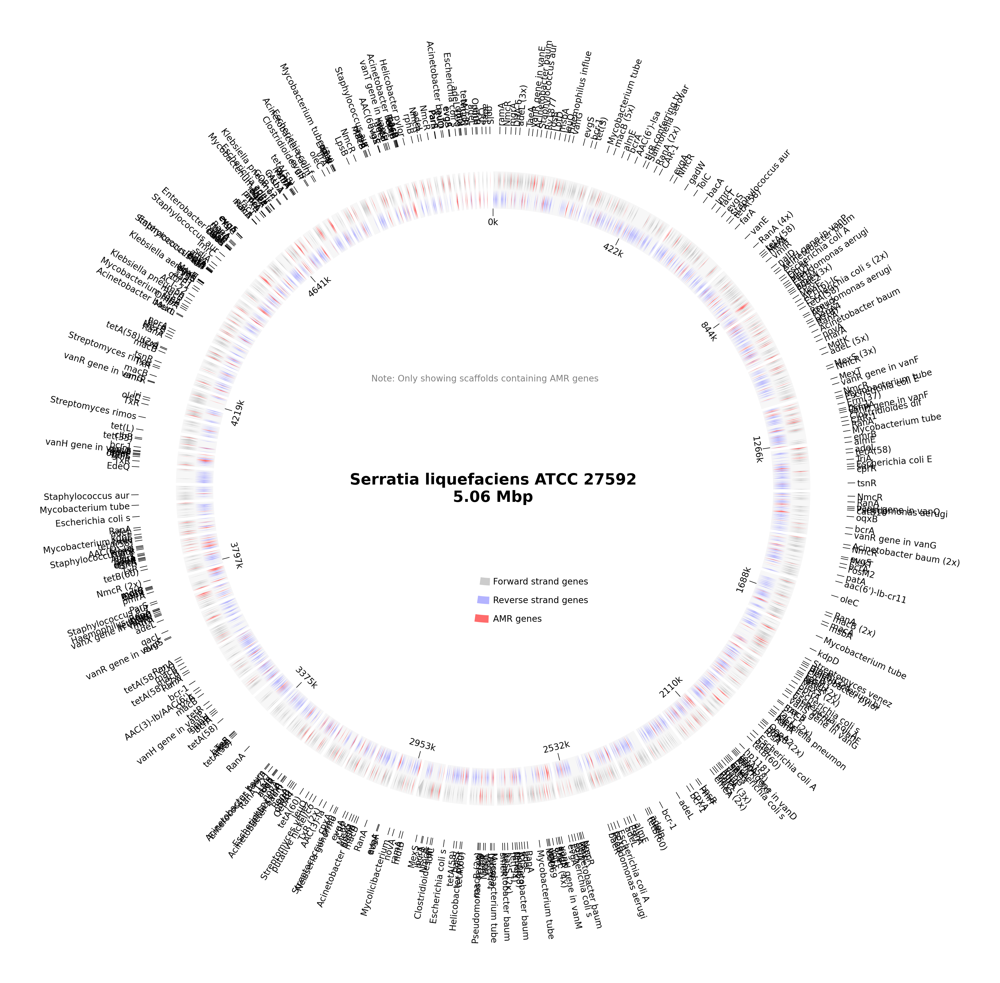

### AAC(3)-Ia
- **Mechanism**: antibiotic inactivation
- **Drug Classes**: aminoglycoside antibiotic
- **AMR Family**: AAC(3)
- **Locations**:
  - gnl|SPADES|AKHJOCOO_95_55 : position 62748-63296

### AAC(3)-Ib/AAC(6')-Ib3 bifunctional protein
- **Mechanism**: antibiotic inactivation
- **Drug Classes**: aminoglycoside antibiotic
- **AMR Family**: aminoglycoside bifunctional resistance protein
- **Locations**:
  - gnl|SPADES|AKHJOCOO_135_40 : position 44629-45081

### AAC(6')-Iai
- **Mechanism**: antibiotic inactivation
- **Drug Classes**: aminoglycoside antibiotic
- **AMR Family**: AAC(6')
- **Locations**:
  - gnl|SPADES|AKHJOCOO_158_47 : position 44326-44778

### AAC(6')-Iak
- **Mechanism**: antibiotic inactivation
- **Drug Classes**: aminoglycoside antibiotic
- **AMR Family**: AAC(6')
- **Locations**:
  - gnl|SPADES|AKHJOCOO_419_20 : position 17674-18120

### AAC(6')-Isa
- **Mechanism**: antibiotic inactivation
- **Drug Classes**: aminoglycoside antibiotic
- **AMR Family**: AAC(6')
- **Locations**:
  - gnl|SPADES|AKHJOCOO_5_87 : position 88023-88607

### ACT-22
- **Mechanism**: antibiotic inactivation
- **Drug Classes**: carbapenem; cephalosporin; cephamycin; penam
- **AMR Family**: ACT beta-lactamase
- **Locations**:
  - gnl|SPADES|AKHJOCOO_240_4 : position 3255-4796

### AIM-1
- **Mechanism**: antibiotic inactivation
- **Drug Classes**: cephalosporin; cephamycin; penam
- **AMR Family**: AIM beta-lactamase
- **Locations**:
  - gnl|SPADES|AKHJOCOO_158_21 : position 24264-25208

### APH(6)-Ic
- **Mechanism**: antibiotic inactivation
- **Drug Classes**: aminoglycoside antibiotic
- **AMR Family**: APH(6)
- **Locations**:
  - gnl|SPADES|AKHJOCOO_17_40 : position 35852-36706

### AQU-2
- **Mechanism**: antibiotic inactivation
- **Drug Classes**: cephalosporin
- **AMR Family**: AQU beta-lactamase
- **Locations**:
  - gnl|SPADES|AKHJOCOO_17_85 : position 80805-81953

### Acinetobacter baumannii AbaF (found in 8 locations)
- **Mechanism**: antibiotic efflux
- **Drug Classes**: phosphonic acid antibiotic
- **AMR Family**: major facilitator superfamily (MFS) antibiotic efflux pump
- **Locations**:
  - gnl|SPADES|AKHJOCOO_226_27 : position 25726-27036
  - gnl|SPADES|AKHJOCOO_34_17 : position 19102-20424
  - gnl|SPADES|AKHJOCOO_34_3 : position 2155-3387
  - gnl|SPADES|AKHJOCOO_4_111 : position 113397-114704
  - gnl|SPADES|AKHJOCOO_541_11 : position 8630-10132
  - gnl|SPADES|AKHJOCOO_60_55 : position 62189-63514
  - gnl|SPADES|AKHJOCOO_841_7 : position 6684-8024
  - gnl|SPADES|AKHJOCOO_88_35 : position 49575-50957

### Acinetobacter baumannii AbaQ (found in 11 locations)
- **Mechanism**: antibiotic efflux
- **Drug Classes**: fluoroquinolone antibiotic
- **AMR Family**: major facilitator superfamily (MFS) antibiotic efflux pump
- **Locations**:
  - gnl|SPADES|AKHJOCOO_105_36 : position 42345-43652
  - gnl|SPADES|AKHJOCOO_15_90 : position 97299-98606
  - gnl|SPADES|AKHJOCOO_17_121 : position 124457-125764
  - gnl|SPADES|AKHJOCOO_28_50 : position 57031-58299
  - gnl|SPADES|AKHJOCOO_333_8 : position 7231-8493
  - gnl|SPADES|AKHJOCOO_4_130 : position 135980-137380
  - gnl|SPADES|AKHJOCOO_4_53 : position 52924-54294
  - gnl|SPADES|AKHJOCOO_52_76 : position 63365-64678
  - gnl|SPADES|AKHJOCOO_55_11 : position 8719-10032
  - gnl|SPADES|AKHJOCOO_55_73 : position 84206-85543
  - gnl|SPADES|AKHJOCOO_60_21 : position 23938-25233

### Acinetobacter baumannii AmvA
- **Mechanism**: antibiotic efflux
- **Drug Classes**: macrolide antibiotic; disinfecting agents and antiseptics
- **AMR Family**: major facilitator superfamily (MFS) antibiotic efflux pump
- **Locations**:
  - gnl|SPADES|AKHJOCOO_112_26 : position 31378-32850

### ArnT
- **Mechanism**: antibiotic target alteration
- **Drug Classes**: peptide antibiotic
- **AMR Family**: pmr phosphoethanolamine transferase
- **Locations**:
  - gnl|SPADES|AKHJOCOO_304_17: position 14388-16052

### Bifidobacterium bifidum ileS conferring resistance to mupirocin
- **Mechanism**: antibiotic target alteration
- **Drug Classes**: mupirocin-like antibiotic
- **AMR Family**: antibiotic-resistant isoleucyl-tRNA synthetase (ileS)
- **Locations**:
  - gnl|SPADES|AKHJOCOO_37_59 : position 69084-71666

### CAR-1 (found in 2 locations)
- **Mechanism**: antibiotic inactivation
- **Drug Classes**: carbapenem
- **AMR Family**: CAR beta-lactamase
- **Locations**:
  - gnl|SPADES|AKHJOCOO_28_71 : position 81828-82628
  - gnl|SPADES|AKHJOCOO_5_163 : position 158643-159449

### CAU-1
- **Mechanism**: antibiotic inactivation
- **Drug Classes**: carbapenem; penam
- **AMR Family**: CAU beta-lactamase
- **Locations**:
  - gnl|SPADES|AKHJOCOO_298_20 : position 23096-25219

### CRP (found in 2 locations)
- **Mechanism**: antibiotic efflux
- **Drug Classes**: macrolide antibiotic; fluoroquinolone antibiotic; penam
- **AMR Family**: resistance-nodulation-cell division (RND) antibiotic efflux pump
- **Locations**:
  - gnl|SPADES|AKHJOCOO_2178_3 : position 2569-3333
  - gnl|SPADES|AKHJOCOO_95_1: position 27-659

### Clostridioides difficile gyrA conferring resistance to fluoroquinolones
- **Mechanism**: antibiotic target alteration
- **Drug Classes**: fluoroquinolone antibiotic
- **AMR Family**: fluoroquinolone resistant gyrA
- **Locations**:
  - gnl|SPADES|AKHJOCOO_327_18 : position 17273-19924

### Clostridioides difficile gyrB conferring resistance to fluoroquinolones (found in 2 locations)
- **Mechanism**: antibiotic target alteration
- **Drug Classes**: fluoroquinolone antibiotic
- **AMR Family**: fluoroquinolone resistant gyrB
- **Locations**:
  - gnl|SPADES|AKHJOCOO_28_62 : position 70970-73384
  - gnl|SPADES|AKHJOCOO_74_6 : position 3613-5508

### CrcB
- **Mechanism**: antibiotic efflux
- **Drug Classes**: aminoglycoside antibiotic
- **AMR Family**: multidrug and toxic compound extrusion (MATE) transporter
- **Locations**:
  - gnl|SPADES|AKHJOCOO_37_74 : position 84519-84902

### DHA-6
- **Mechanism**: antibiotic inactivation
- **Drug Classes**: cephalosporin; cephamycin
- **AMR Family**: DHA beta-lactamase
- **Locations**:
  - gnl|SPADES|AKHJOCOO_4_57 : position 57686-58828

### EdeQ
- **Mechanism**: antibiotic inactivation
- **Drug Classes**: peptide antibiotic; polyamine antibiotic
- **AMR Family**: Edeine acetyltransferase
- **Locations**:
  - gnl|SPADES|AKHJOCOO_172_52 : position 39379-39813

### Enterobacter cloacae acrA (found in 2 locations)
- **Mechanism**: antibiotic efflux
- **Drug Classes**: fluoroquinolone antibiotic; cephalosporin; glycylcycline; penam; tetracycline antibiotic; rifamycin antibiotic; phenicol antibiotic; disinfecting agents and antiseptics
- **AMR Family**: resistance-nodulation-cell division (RND) antibiotic efflux pump
- **Locations**:
  - gnl|SPADES|AKHJOCOO_265_4 : position 3746-4948
  - gnl|SPADES|AKHJOCOO_41_45 : position 48547-49734

### Enterococcus faecalis cls with mutation conferring resistance to daptomycin
- **Mechanism**: antibiotic target alteration
- **Drug Classes**: peptide antibiotic
- **AMR Family**: daptomycin resistant cls
- **Locations**:
  - gnl|SPADES|AKHJOCOO_112_24 : position 28751-30211

### Enterococcus faecium liaS mutant conferring daptomycin resistance
- **Mechanism**: antibiotic target alteration; antibiotic efflux
- **Drug Classes**: peptide antibiotic
- **AMR Family**: daptomycin resistant liaS
- **Locations**:
  - gnl|SPADES|AKHJOCOO_253_4 : position 2606-4141

### Erm(34)
- **Mechanism**: antibiotic target alteration
- **Drug Classes**: macrolide antibiotic; lincosamide antibiotic; streptogramin antibiotic; streptogramin A antibiotic; streptogramin B antibiotic
- **AMR Family**: Erm 23S ribosomal RNA methyltransferase
- **Locations**:
  - gnl|SPADES|AKHJOCOO_4_249 : position 276290-276916

### Erm(37)
- **Mechanism**: antibiotic target alteration
- **Drug Classes**: macrolide antibiotic; lincosamide antibiotic; streptogramin antibiotic; streptogramin A antibiotic; streptogramin B antibiotic
- **AMR Family**: Erm 23S ribosomal RNA methyltransferase
- **Locations**:
  - gnl|SPADES|AKHJOCOO_28_31 : position 35291-36070

### Escherichia coli AcrAB-TolC with AcrR mutation conferring resistance to ciprofloxacin, tetracycline, and ceftazidime (found in 5 locations)
- **Mechanism**: antibiotic target alteration; antibiotic efflux
- **Drug Classes**: fluoroquinolone antibiotic; cephalosporin; glycylcycline; penam; tetracycline antibiotic; rifamycin antibiotic; phenicol antibiotic; disinfecting agents and antiseptics
- **AMR Family**: resistance-nodulation-cell division (RND) antibiotic efflux pump
- **Locations**:
  - gnl|SPADES|AKHJOCOO_15_102 : position 113632-114336
  - gnl|SPADES|AKHJOCOO_17_83 : position 79011-79613
  - gnl|SPADES|AKHJOCOO_39_25 : position 25710-26291
  - gnl|SPADES|AKHJOCOO_41_44 : position 47715-48404
  - gnl|SPADES|AKHJOCOO_51_51 : position 54461-55048

### Escherichia coli AcrAB-TolC with MarR mutations conferring resistance to ciprofloxacin and tetracycline (found in 3 locations)
- **Mechanism**: antibiotic target alteration; antibiotic efflux
- **Drug Classes**: fluoroquinolone antibiotic; cephalosporin; glycylcycline; penam; tetracycline antibiotic; rifamycin antibiotic; phenicol antibiotic; disinfecting agents and antiseptics
- **AMR Family**: resistance-nodulation-cell division (RND) antibiotic efflux pump
- **Locations**:
  - gnl|SPADES|AKHJOCOO_105_42 : position 48587-49060
  - gnl|SPADES|AKHJOCOO_17_127 : position 130699-131172
  - gnl|SPADES|AKHJOCOO_17_26 : position 25399-25833

### Escherichia coli EF-Tu mutants conferring resistance to Enacyloxin IIa
- **Mechanism**: antibiotic target alteration
- **Drug Classes**: elfamycin antibiotic
- **AMR Family**: elfamycin resistant EF-Tu
- **Locations**:
  - gnl|SPADES|AKHJOCOO_29_54 : position 58041-60728

### Escherichia coli EF-Tu mutants conferring resistance to Pulvomycin
- **Mechanism**: antibiotic target alteration
- **Drug Classes**: elfamycin antibiotic
- **AMR Family**: elfamycin resistant EF-Tu
- **Locations**:
  - gnl|SPADES|AKHJOCOO_28_18 : position 20301-22148

### Escherichia coli fabI mutations conferring resistance to isoniazid and triclosan (found in 2 locations)
- **Mechanism**: antibiotic target alteration
- **Drug Classes**: disinfecting agents and antiseptics; isoniazid-like antibiotic
- **AMR Family**: antibiotic resistant fabI
- **Locations**:
  - gnl|SPADES|AKHJOCOO_296_15 : position 14367-15113
  - gnl|SPADES|AKHJOCOO_333_12 : position 11656-12411

### Escherichia coli mdfA
- **Mechanism**: antibiotic efflux
- **Drug Classes**: tetracycline antibiotic; phenicol antibiotic; disinfecting agents and antiseptics
- **AMR Family**: major facilitator superfamily (MFS) antibiotic efflux pump
- **Locations**:
  - gnl|SPADES|AKHJOCOO_28_16 : position 18577-19824

### Escherichia coli soxS with mutation conferring antibiotic resistance (found in 9 locations)
- **Mechanism**: antibiotic target alteration; antibiotic efflux; reduced permeability to antibiotic
- **Drug Classes**: fluoroquinolone antibiotic; monobactam; carbapenem; cephalosporin; glycylcycline; cephamycin; penam; tetracycline antibiotic; rifamycin antibiotic; phenicol antibiotic; penem; disinfecting agents and antiseptics
- **AMR Family**: ATP-binding cassette (ABC) antibiotic efflux pump; major facilitator superfamily (MFS) antibiotic efflux pump; resistance-nodulation-cell division (RND) antibiotic efflux pump; General Bacterial Porin with reduced permeability to beta-lactams
- **Locations**:
  - gnl|SPADES|AKHJOCOO_1186_7 : position 5308-5730
  - gnl|SPADES|AKHJOCOO_165_13 : position 13314-14087
  - gnl|SPADES|AKHJOCOO_17_50 : position 47080-47973
  - gnl|SPADES|AKHJOCOO_17_63 : position 59806-60723
  - gnl|SPADES|AKHJOCOO_39_14 : position 13038-13496
  - gnl|SPADES|AKHJOCOO_42_29 : position 29014-29961
  - gnl|SPADES|AKHJOCOO_4_100 : position 100014-100883
  - gnl|SPADES|AKHJOCOO_52_89 : position 78509-79354
  - gnl|SPADES|AKHJOCOO_72_41 : position 49469-50335

### EstT (found in 3 locations)
- **Mechanism**: antibiotic inactivation
- **Drug Classes**: macrolide antibiotic
- **AMR Family**: macrolide esterase
- **Locations**:
  - gnl|SPADES|AKHJOCOO_15_126 : position 143001-143831
  - gnl|SPADES|AKHJOCOO_51_20 : position 26740-27582
  - gnl|SPADES|AKHJOCOO_52_66 : position 54932-55735

### FosA8
- **Mechanism**: antibiotic inactivation
- **Drug Classes**: phosphonic acid antibiotic
- **AMR Family**: fosfomycin thiol transferase
- **Locations**:
  - gnl|SPADES|AKHJOCOO_5_119: position 118523-118930

### FosC2
- **Mechanism**: antibiotic inactivation
- **Drug Classes**: phosphonic acid antibiotic
- **AMR Family**: fosC phosphotransferase family
- **Locations**:
  - gnl|SPADES|AKHJOCOO_17_13 : position 11379-11786

### FosM1
- **Mechanism**: antibiotic inactivation
- **Drug Classes**: phosphonic acid antibiotic
- **AMR Family**: fosfomycin thiol transferase
- **Locations**:
  - gnl|SPADES|AKHJOCOO_37_85 : position 93595-94104

### FosM2
- **Mechanism**: antibiotic inactivation
- **Drug Classes**: phosphonic acid antibiotic
- **AMR Family**: fosfomycin thiol transferase
- **Locations**:
  - gnl|SPADES|AKHJOCOO_34_49 : position 62406-62816

### GOB-12
- **Mechanism**: antibiotic inactivation
- **Drug Classes**: carbapenem; cephalosporin; penam
- **AMR Family**: GOB beta-lactamase
- **Locations**:
  - gnl|SPADES|AKHJOCOO_298_3 : position 2442-3089

### H-NS
- **Mechanism**: antibiotic efflux
- **Drug Classes**: macrolide antibiotic; fluoroquinolone antibiotic; cephalosporin; cephamycin; penam; tetracycline antibiotic
- **AMR Family**: major facilitator superfamily (MFS) antibiotic efflux pump; resistance-nodulation-cell division (RND) antibiotic efflux pump
- **Locations**:
  - gnl|SPADES|AKHJOCOO_112_7 : position 7403-7810

### Haemophilus influenzae PBP3 conferring resistance to beta-lactam antibiotics (found in 2 locations)
- **Mechanism**: antibiotic target alteration
- **Drug Classes**: cephalosporin; cephamycin; penam
- **AMR Family**: Penicillin-binding protein mutations conferring resistance to beta-lactam antibiotics
- **Locations**:
  - gnl|SPADES|AKHJOCOO_148_37 : position 39607-41325
  - gnl|SPADES|AKHJOCOO_4_179 : position 196783-198546

### Helicobacter pylori pbp1 mutants conferring resistance to amoxicillin (found in 2 locations)
- **Mechanism**: antibiotic target alteration
- **Drug Classes**: cephalosporin; cephamycin; penam
- **AMR Family**: Penicillin-binding protein mutations conferring resistance to beta-lactam antibiotics
- **Locations**:
  - gnl|SPADES|AKHJOCOO_557_4 : position 6808-9156
  - gnl|SPADES|AKHJOCOO_72_6 : position 6330-8831

### Helicobacter pylori pbp2 mutants conferring resistance to amoxicillin
- **Mechanism**: antibiotic target alteration
- **Drug Classes**: cephalosporin; cephamycin; penam
- **AMR Family**: Penicillin-binding protein mutations conferring resistance to beta-lactam antibiotics
- **Locations**:
  - gnl|SPADES|AKHJOCOO_37_65 : position 74944-76839

### Klebsiella aerogenes Omp36
- **Mechanism**: reduced permeability to antibiotic
- **Drug Classes**: monobactam; carbapenem; cephalosporin; cephamycin; penam; penem
- **AMR Family**: General Bacterial Porin with reduced permeability to beta-lactams
- **Locations**:
  - gnl|SPADES|AKHJOCOO_248_4 : position 5025-6155

### Klebsiella pneumoniae KpnE
- **Mechanism**: antibiotic efflux
- **Drug Classes**: macrolide antibiotic; aminoglycoside antibiotic; cephalosporin; tetracycline antibiotic; peptide antibiotic; rifamycin antibiotic; disinfecting agents and antiseptics
- **AMR Family**: small multidrug resistance (SMR) antibiotic efflux pump
- **Locations**:
  - gnl|SPADES|AKHJOCOO_5_57 : position 56558-56926

### Klebsiella pneumoniae KpnF
- **Mechanism**: antibiotic efflux
- **Drug Classes**: macrolide antibiotic; aminoglycoside antibiotic; cephalosporin; tetracycline antibiotic; peptide antibiotic; rifamycin antibiotic; disinfecting agents and antiseptics
- **AMR Family**: small multidrug resistance (SMR) antibiotic efflux pump
- **Locations**:
  - gnl|SPADES|AKHJOCOO_5_56: position 56242-56571

### Klebsiella pneumoniae KpnH
- **Mechanism**: antibiotic efflux
- **Drug Classes**: macrolide antibiotic; fluoroquinolone antibiotic; aminoglycoside antibiotic; carbapenem; cephalosporin; penam; peptide antibiotic; penem
- **AMR Family**: major facilitator superfamily (MFS) antibiotic efflux pump
- **Locations**:
  - gnl|SPADES|AKHJOCOO_158_6: position 6989-8524

### Klebsiella pneumoniae OmpK37 (found in 4 locations)
- **Mechanism**: reduced permeability to antibiotic
- **Drug Classes**: monobactam; carbapenem; cephalosporin; cephamycin; penam; penem
- **AMR Family**: General Bacterial Porin with reduced permeability to beta-lactams
- **Locations**:
  - gnl|SPADES|AKHJOCOO_237_27 : position 31653-31895
  - gnl|SPADES|AKHJOCOO_298_1 : position 3-935
  - gnl|SPADES|AKHJOCOO_39_91 : position 91824-92921
  - gnl|SPADES|AKHJOCOO_5_133 : position 125223-126305

### LRA-8
- **Mechanism**: antibiotic inactivation
- **Drug Classes**: cephalosporin; penam
- **AMR Family**: subclass B3 LRA beta-lactamase
- **Locations**:
  - gnl|SPADES|AKHJOCOO_352_3 : position 1262-2017

### LpsB (found in 2 locations)
- **Mechanism**: reduced permeability to antibiotic
- **Drug Classes**: peptide antibiotic
- **AMR Family**: Intrinsic peptide antibiotic resistant Lps
- **Locations**:
  - gnl|SPADES|AKHJOCOO_364_14 : position 16270-17478
  - gnl|SPADES|AKHJOCOO_45_23 : position 22250-23347

### LptD
- **Mechanism**: antibiotic efflux
- **Drug Classes**: carbapenem; peptide antibiotic; aminocoumarin antibiotic; rifamycin antibiotic
- **AMR Family**: ATP-binding cassette (ABC) antibiotic efflux pump
- **Locations**:
  - gnl|SPADES|AKHJOCOO_4_151 : position 159196-161559

### MdtK
- **Mechanism**: antibiotic efflux
- **Drug Classes**: fluoroquinolone antibiotic
- **AMR Family**: multidrug and toxic compound extrusion (MATE) transporter
- **Locations**:
  - gnl|SPADES|AKHJOCOO_25_22 : position 22689-24152

### MexA
- **Mechanism**: antibiotic efflux
- **Drug Classes**: macrolide antibiotic; fluoroquinolone antibiotic; monobactam; carbapenem; cephalosporin; cephamycin; penam; tetracycline antibiotic; peptide antibiotic; aminocoumarin antibiotic; diaminopyrimidine antibiotic; sulfonamide antibiotic; phenicol antibiotic; penem
- **AMR Family**: resistance-nodulation-cell division (RND) antibiotic efflux pump
- **Locations**:
  - gnl|SPADES|AKHJOCOO_15_104 : position 116046-117188

### MexE
- **Mechanism**: antibiotic efflux
- **Drug Classes**: fluoroquinolone antibiotic; diaminopyrimidine antibiotic; phenicol antibiotic
- **AMR Family**: resistance-nodulation-cell division (RND) antibiotic efflux pump
- **Locations**:
  - gnl|SPADES|AKHJOCOO_17_25 : position 24121-24978

### MexG
- **Mechanism**: antibiotic efflux
- **Drug Classes**: fluoroquinolone antibiotic; tetracycline antibiotic; disinfecting agents and antiseptics
- **AMR Family**: resistance-nodulation-cell division (RND) antibiotic efflux pump
- **Locations**:
  - gnl|SPADES|AKHJOCOO_158_43 : position 41798-42211

### MexL (found in 3 locations)
- **Mechanism**: antibiotic efflux
- **Drug Classes**: macrolide antibiotic; tetracycline antibiotic; disinfecting agents and antiseptics
- **AMR Family**: resistance-nodulation-cell division (RND) antibiotic efflux pump
- **Locations**:
  - gnl|SPADES|AKHJOCOO_15_39 : position 37863-38447
  - gnl|SPADES|AKHJOCOO_226_24 : position 23714-24370
  - gnl|SPADES|AKHJOCOO_52_70 : position 58328-58966

### MexS (found in 11 locations)
- **Mechanism**: antibiotic efflux
- **Drug Classes**: fluoroquinolone antibiotic; diaminopyrimidine antibiotic; phenicol antibiotic
- **AMR Family**: resistance-nodulation-cell division (RND) antibiotic efflux pump
- **Locations**:
  - gnl|SPADES|AKHJOCOO_208_11 : position 11319-12446
  - gnl|SPADES|AKHJOCOO_25_108 : position 106433-107467
  - gnl|SPADES|AKHJOCOO_25_126 : position 126071-127006
  - gnl|SPADES|AKHJOCOO_25_70 : position 69502-70509
  - gnl|SPADES|AKHJOCOO_37_104 : position 111870-112805
  - gnl|SPADES|AKHJOCOO_37_105 : position 112898-113887
  - gnl|SPADES|AKHJOCOO_42_89 : position 82192-83172
  - gnl|SPADES|AKHJOCOO_42_99 : position 92569-93594
  - gnl|SPADES|AKHJOCOO_74_38 : position 41706-42734
  - gnl|SPADES|AKHJOCOO_88_50 : position 63576-64565
  - gnl|SPADES|AKHJOCOO_97_42 : position 45275-46261

### MexT (found in 4 locations)
- **Mechanism**: antibiotic efflux
- **Drug Classes**: fluoroquinolone antibiotic; diaminopyrimidine antibiotic; phenicol antibiotic
- **AMR Family**: resistance-nodulation-cell division (RND) antibiotic efflux pump
- **Locations**:
  - gnl|SPADES|AKHJOCOO_15_116 : position 131203-132099
  - gnl|SPADES|AKHJOCOO_248_8 : position 7884-8786
  - gnl|SPADES|AKHJOCOO_25_106 : position 104713-105642
  - gnl|SPADES|AKHJOCOO_34_31 : position 39785-40735

### MexV
- **Mechanism**: antibiotic efflux
- **Drug Classes**: macrolide antibiotic; fluoroquinolone antibiotic; tetracycline antibiotic; phenicol antibiotic; disinfecting agents and antiseptics
- **AMR Family**: resistance-nodulation-cell division (RND) antibiotic efflux pump
- **Locations**:
  - gnl|SPADES|AKHJOCOO_32_58 : position 62567-64018

### MexZ
- **Mechanism**: antibiotic efflux
- **Drug Classes**: macrolide antibiotic; fluoroquinolone antibiotic; aminoglycoside antibiotic; carbapenem; cephalosporin; cephamycin; penam; tetracycline antibiotic; phenicol antibiotic; disinfecting agents and antiseptics
- **AMR Family**: resistance-nodulation-cell division (RND) antibiotic efflux pump
- **Locations**:
  - gnl|SPADES|AKHJOCOO_39_67 : position 66402-67034

### Mycobacterium tuberculosis gidB mutation conferring resistance to streptomycin
- **Mechanism**: antibiotic target alteration
- **Drug Classes**: aminoglycoside antibiotic
- **AMR Family**: antibiotic resistant gidB
- **Locations**:
  - gnl|SPADES|AKHJOCOO_28_97 : position 107928-108548

### Mycobacterium tuberculosis inhA mutations conferring resistance to isoniazid
- **Mechanism**: antibiotic target alteration
- **Drug Classes**: isoniazid-like antibiotic
- **AMR Family**: isoniazid resistant inhA
- **Locations**:
  - gnl|SPADES|AKHJOCOO_71_1 : position 326-1084

### Mycobacterium tuberculosis kasA mutant conferring resistance to isoniazid (found in 4 locations)
- **Mechanism**: antibiotic target alteration
- **Drug Classes**: isoniazid-like antibiotic
- **AMR Family**: antibiotic resistant kasA
- **Locations**:
  - gnl|SPADES|AKHJOCOO_165_45 : position 42539-43771
  - gnl|SPADES|AKHJOCOO_237_8 : position 6552-7832
  - gnl|SPADES|AKHJOCOO_352_12 : position 10160-11329
  - gnl|SPADES|AKHJOCOO_352_9 : position 7736-8965

### Mycobacterium tuberculosis katG mutations conferring resistance to isoniazid
- **Mechanism**: antibiotic target alteration
- **Drug Classes**: isoniazid-like antibiotic
- **AMR Family**: isoniazid resistant katG
- **Locations**:
  - gnl|SPADES|AKHJOCOO_161_12 : position 13362-15560

### Mycobacterium tuberculosis ndh with mutation conferring resistance to isoniazid
- **Mechanism**: antibiotic target alteration
- **Drug Classes**: isoniazid-like antibiotic
- **AMR Family**: antibiotic resistant ndh
- **Locations**:
  - gnl|SPADES|AKHJOCOO_296_6 : position 7105-8409

### Mycobacterium tuberculosis pncA mutations conferring resistance to pyrazinamide (found in 3 locations)
- **Mechanism**: antibiotic target alteration
- **Drug Classes**: pyrazine antibiotic
- **AMR Family**: Pyrazinamide resistant pncA
- **Locations**:
  - gnl|SPADES|AKHJOCOO_25_2 : position 1225-1911
  - gnl|SPADES|AKHJOCOO_28_13 : position 15893-16444
  - gnl|SPADES|AKHJOCOO_5_11 : position 10767-11399

### Mycobacterium tuberculosis rpsA mutations conferring resistance to pyrazinamide
- **Mechanism**: antibiotic target alteration
- **Drug Classes**: pyrazine antibiotic
- **AMR Family**: pyrazinamide resistant rpsA
- **Locations**:
  - gnl|SPADES|AKHJOCOO_36_107 : position 120020-121693

### Mycobacterium tuberculosis thyA with mutation conferring resistance to para-aminosalicylic acid
- **Mechanism**: antibiotic target alteration
- **Drug Classes**: salicylic acid antibiotic
- **AMR Family**: aminosalicylate resistant thymidylate synthase
- **Locations**:
  - gnl|SPADES|AKHJOCOO_55_62 : position 66059-66853

### Mycolicibacterium smegmatis ndh with mutation conferring resistance to isoniazid
- **Mechanism**: antibiotic target alteration
- **Drug Classes**: isoniazid-like antibiotic
- **AMR Family**: antibiotic resistant ndh
- **Locations**:
  - gnl|SPADES|AKHJOCOO_75_30 : position 36056-37264

### Neisseria gonorrhoeae pilQ gene conferring resistance to beta-lactam
- **Mechanism**: antibiotic target alteration
- **Drug Classes**: cephalosporin; cephamycin; penam
- **AMR Family**: Penicillin-binding protein mutations conferring resistance to beta-lactam antibiotics
- **Locations**:
  - gnl|SPADES|AKHJOCOO_95_28 : position 28914-30155

### NmcR (found in 29 locations)
- **Mechanism**: antibiotic inactivation
- **Drug Classes**: carbapenem; cephalosporin; cephamycin; penam
- **AMR Family**: NmcA beta-lactamase
- **Locations**:
  - gnl|SPADES|AKHJOCOO_105_11 : position 12637-13527
  - gnl|SPADES|AKHJOCOO_1364_2 : position 252-1079
  - gnl|SPADES|AKHJOCOO_153_27 : position 29523-30377
  - gnl|SPADES|AKHJOCOO_153_7 : position 7484-8458
  - gnl|SPADES|AKHJOCOO_158_13 : position 14412-15290
  - gnl|SPADES|AKHJOCOO_15_36 : position 34584-35492
  - gnl|SPADES|AKHJOCOO_15_99 : position 110240-111103
  - gnl|SPADES|AKHJOCOO_17_96 : position 94749-95639
  - gnl|SPADES|AKHJOCOO_208_12 : position 12475-13392
  - gnl|SPADES|AKHJOCOO_25_79 : position 76939-77811
  - gnl|SPADES|AKHJOCOO_28_5 : position 4958-5812
  - gnl|SPADES|AKHJOCOO_32_7 : position 7961-8902
  - gnl|SPADES|AKHJOCOO_34_10 : position 10948-11847
  - gnl|SPADES|AKHJOCOO_37_94 : position 103457-104446
  - gnl|SPADES|AKHJOCOO_389_9 : position 6590-7486
  - gnl|SPADES|AKHJOCOO_39_3 : position 2319-3221
  - gnl|SPADES|AKHJOCOO_39_52 : position 53383-54270
  - gnl|SPADES|AKHJOCOO_42_16 : position 16158-17096
  - gnl|SPADES|AKHJOCOO_42_21 : position 21602-22504
  - gnl|SPADES|AKHJOCOO_42_58 : position 55036-55965
  - gnl|SPADES|AKHJOCOO_4_30 : position 31953-32882
  - gnl|SPADES|AKHJOCOO_51_21 : position 27691-28563
  - gnl|SPADES|AKHJOCOO_52_60 : position 49925-50848
  - gnl|SPADES|AKHJOCOO_5_197 : position 201713-202666
  - gnl|SPADES|AKHJOCOO_60_31 : position 35030-35923
  - gnl|SPADES|AKHJOCOO_643_2 : position 765-1646
  - gnl|SPADES|AKHJOCOO_719_7 : position 5591-6508
  - gnl|SPADES|AKHJOCOO_71_24 : position 27384-28304
  - gnl|SPADES|AKHJOCOO_74_13 : position 12810-13643

### OmpA (found in 3 locations)
- **Mechanism**: reduced permeability to antibiotic
- **Drug Classes**: peptide antibiotic
- **AMR Family**: General Bacterial Porin with reduced permeability to peptide antibiotics
- **Locations**:
  - gnl|SPADES|AKHJOCOO_237_3 : position 1710-2786
  - gnl|SPADES|AKHJOCOO_28_46 : position 53193-53852
  - gnl|SPADES|AKHJOCOO_4_93 : position 93255-93752

### OpmH
- **Mechanism**: antibiotic efflux
- **Drug Classes**: disinfecting agents and antiseptics
- **AMR Family**: resistance-nodulation-cell division (RND) antibiotic efflux pump
- **Locations**:
  - gnl|SPADES|AKHJOCOO_1542_1 : position 3-1343

### OprM
- **Mechanism**: antibiotic efflux
- **Drug Classes**: macrolide antibiotic; fluoroquinolone antibiotic; monobactam; aminoglycoside antibiotic; carbapenem; cephalosporin; cephamycin; penam; tetracycline antibiotic; peptide antibiotic; aminocoumarin antibiotic; diaminopyrimidine antibiotic; sulfonamide antibiotic; phenicol antibiotic; penem; disinfecting agents and antiseptics
- **AMR Family**: resistance-nodulation-cell division (RND) antibiotic efflux pump
- **Locations**:
  - gnl|SPADES|AKHJOCOO_15_106 : position 120345-121799

### ParR (found in 2 locations)
- **Mechanism**: antibiotic efflux; reduced permeability to antibiotic
- **Drug Classes**: macrolide antibiotic; fluoroquinolone antibiotic; monobactam; aminoglycoside antibiotic; carbapenem; cephalosporin; cephamycin; penam; tetracycline antibiotic; phenicol antibiotic; penem; disinfecting agents and antiseptics
- **AMR Family**: resistance-nodulation-cell division (RND) antibiotic efflux pump; Outer Membrane Porin (Opr)
- **Locations**:
  - gnl|SPADES|AKHJOCOO_774_5 : position 4494-5255
  - gnl|SPADES|AKHJOCOO_95_42 : position 44449-45168

### ParS (found in 3 locations)
- **Mechanism**: antibiotic efflux; reduced permeability to antibiotic
- **Drug Classes**: macrolide antibiotic; fluoroquinolone antibiotic; monobactam; aminoglycoside antibiotic; carbapenem; cephalosporin; cephamycin; penam; tetracycline antibiotic; phenicol antibiotic; penem; disinfecting agents and antiseptics
- **AMR Family**: resistance-nodulation-cell division (RND) antibiotic efflux pump; Outer Membrane Porin (Opr)
- **Locations**:
  - gnl|SPADES|AKHJOCOO_151_6 : position 5416-7197
  - gnl|SPADES|AKHJOCOO_158_19 : position 20849-22447
  - gnl|SPADES|AKHJOCOO_774_6 : position 5252-6556

### PmrF (found in 2 locations)
- **Mechanism**: antibiotic target alteration
- **Drug Classes**: peptide antibiotic
- **AMR Family**: pmr phosphoethanolamine transferase
- **Locations**:
  - gnl|SPADES|AKHJOCOO_304_14 : position 10527-11507
  - gnl|SPADES|AKHJOCOO_45_28 : position 27825-28808

### Pseudomonas aeruginosa CpxR (found in 5 locations)
- **Mechanism**: antibiotic efflux
- **Drug Classes**: macrolide antibiotic; fluoroquinolone antibiotic; monobactam; aminoglycoside antibiotic; carbapenem; cephalosporin; cephamycin; penam; tetracycline antibiotic; peptide antibiotic; aminocoumarin antibiotic; diaminopyrimidine antibiotic; sulfonamide antibiotic; phenicol antibiotic; penem
- **AMR Family**: resistance-nodulation-cell division (RND) antibiotic efflux pump
- **Locations**:
  - gnl|SPADES|AKHJOCOO_158_18 : position 20151-20840
  - gnl|SPADES|AKHJOCOO_32_38 : position 39690-40364
  - gnl|SPADES|AKHJOCOO_45_48 : position 47643-48341
  - gnl|SPADES|AKHJOCOO_51_68 : position 71993-72733
  - gnl|SPADES|AKHJOCOO_71_35 : position 39446-40126

### Pseudomonas aeruginosa ampR with mutation conferring resistance to aztreonam (found in 3 locations)
- **Mechanism**: antibiotic target alteration; antibiotic inactivation
- **Drug Classes**: monobactam; carbapenem; cephalosporin
- **AMR Family**: PDC beta-lactamase; ampR transcriptional regulator with mutation conferring resistance to monobactam antibiotics
- **Locations**:
  - gnl|SPADES|AKHJOCOO_15_120 : position 137309-138250
  - gnl|SPADES|AKHJOCOO_17_80 : position 75518-76393
  - gnl|SPADES|AKHJOCOO_32_89 : position 92925-93854

### QepA2
- **Mechanism**: antibiotic efflux
- **Drug Classes**: fluoroquinolone antibiotic
- **AMR Family**: major facilitator superfamily (MFS) antibiotic efflux pump
- **Locations**:
  - gnl|SPADES|AKHJOCOO_41_11 : position 8255-9661

### QepA4 (found in 2 locations)
- **Mechanism**: antibiotic efflux
- **Drug Classes**: fluoroquinolone antibiotic
- **AMR Family**: major facilitator superfamily (MFS) antibiotic efflux pump
- **Locations**:
  - gnl|SPADES|AKHJOCOO_105_10 : position 11242-12537
  - gnl|SPADES|AKHJOCOO_17_95 : position 93354-94649

### RanA (found in 27 locations)
- **Mechanism**: antibiotic efflux
- **Drug Classes**: aminoglycoside antibiotic
- **AMR Family**: ATP-binding cassette (ABC) antibiotic efflux pump
- **Locations**:
  - gnl|SPADES|AKHJOCOO_105_25 : position 27238-28317
  - gnl|SPADES|AKHJOCOO_10_100 : position 111496-112311
  - gnl|SPADES|AKHJOCOO_112_15 : position 19125-20141
  - gnl|SPADES|AKHJOCOO_112_16 : position 20138-21139
  - gnl|SPADES|AKHJOCOO_115_34 : position 33289-34032
  - gnl|SPADES|AKHJOCOO_138_31 : position 31682-32758
  - gnl|SPADES|AKHJOCOO_145_17 : position 17936-19012
  - gnl|SPADES|AKHJOCOO_148_40 : position 42503-43264
  - gnl|SPADES|AKHJOCOO_158_17 : position 18542-19744
  - gnl|SPADES|AKHJOCOO_15_10 : position 7880-8992
  - gnl|SPADES|AKHJOCOO_15_32 : position 30866-31579
  - gnl|SPADES|AKHJOCOO_15_47 : position 47474-48511
  - gnl|SPADES|AKHJOCOO_15_67 : position 69386-70501
  - gnl|SPADES|AKHJOCOO_161_33 : position 37655-39331
  - gnl|SPADES|AKHJOCOO_17_110 : position 109350-110429
  - gnl|SPADES|AKHJOCOO_208_5 : position 4047-5924
  - gnl|SPADES|AKHJOCOO_265_19 : position 23132-24193
  - gnl|SPADES|AKHJOCOO_280_17 : position 25011-26000
  - gnl|SPADES|AKHJOCOO_28_82 : position 92480-93256
  - gnl|SPADES|AKHJOCOO_32_21 : position 22831-23604
  - gnl|SPADES|AKHJOCOO_36_51 : position 53883-55016
  - gnl|SPADES|AKHJOCOO_39_103 : position 102651-103586
  - gnl|SPADES|AKHJOCOO_50_40 : position 35969-37561
  - gnl|SPADES|AKHJOCOO_5_147 : position 142951-143919
  - gnl|SPADES|AKHJOCOO_5_192 : position 196706-197542
  - gnl|SPADES|AKHJOCOO_60_3 : position 3262-4332
  - gnl|SPADES|AKHJOCOO_88_16 : position 20417-21409

### RanB
- **Mechanism**: antibiotic efflux
- **Drug Classes**: aminoglycoside antibiotic
- **AMR Family**: ATP-binding cassette (ABC) antibiotic efflux pump
- **Locations**:
  - gnl|SPADES|AKHJOCOO_10_99 : position 110709-111491

### Rhodococcus fascians cmr
- **Mechanism**: antibiotic efflux
- **Drug Classes**: phenicol antibiotic
- **AMR Family**: major facilitator superfamily (MFS) antibiotic efflux pump
- **Locations**:
  - gnl|SPADES|AKHJOCOO_34_72 : position 86167-87594

### Rv1877 (found in 2 locations)
- **Mechanism**: antibiotic efflux
- **Drug Classes**: fluoroquinolone antibiotic
- **AMR Family**: major facilitator superfamily (MFS) antibiotic efflux pump
- **Locations**:
  - gnl|SPADES|AKHJOCOO_15_103 : position 114380-115894
  - gnl|SPADES|AKHJOCOO_4_132 : position 138047-138844

### SAT-2
- **Mechanism**: antibiotic inactivation
- **Drug Classes**: nucleoside antibiotic
- **AMR Family**: streptothricin acetyltransferase (SAT)
- **Locations**:
  - gnl|SPADES|AKHJOCOO_39_66 : position 65757-66386

### SAT-3
- **Mechanism**: antibiotic inactivation
- **Drug Classes**: nucleoside antibiotic
- **AMR Family**: streptothricin acetyltransferase (SAT)
- **Locations**:
  - gnl|SPADES|AKHJOCOO_42_45 : position 43421-43963

### SPR-1
- **Mechanism**: antibiotic inactivation
- **Drug Classes**: carbapenem
- **AMR Family**: SPR beta-lactamase
- **Locations**:
  - gnl|SPADES|AKHJOCOO_248_9 : position 8866-9762

### SRT-3
- **Mechanism**: antibiotic inactivation
- **Drug Classes**: cephalosporin
- **AMR Family**: SRT beta-lactamase
- **Locations**:
  - gnl|SPADES|AKHJOCOO_17_81 : position 76598-77734

### Salmonella serovars soxS with mutation conferring antibiotic resistance
- **Mechanism**: antibiotic target alteration; antibiotic efflux; reduced permeability to antibiotic
- **Drug Classes**: fluoroquinolone antibiotic; monobactam; carbapenem; cephalosporin; glycylcycline; cephamycin; penam; tetracycline antibiotic; rifamycin antibiotic; phenicol antibiotic; penem; disinfecting agents and antiseptics
- **AMR Family**: ATP-binding cassette (ABC) antibiotic efflux pump; major facilitator superfamily (MFS) antibiotic efflux pump; resistance-nodulation-cell division (RND) antibiotic efflux pump; General Bacterial Porin with reduced permeability to beta-lactams
- **Locations**:
  - gnl|SPADES|AKHJOCOO_5_125 : position 121060-121446

### SatA
- **Mechanism**: antibiotic inactivation
- **Drug Classes**: nucleoside antibiotic
- **AMR Family**: streptothricin acetyltransferase (SAT)
- **Locations**:
  - gnl|SPADES|AKHJOCOO_28_45 : position 52530-52925

### Staphylococcus aureus FosB
- **Mechanism**: antibiotic inactivation
- **Drug Classes**: phosphonic acid antibiotic
- **AMR Family**: fosfomycin thiol transferase
- **Locations**:
  - gnl|SPADES|AKHJOCOO_248_5 : position 6309-6725

### Staphylococcus aureus GlpT with mutation conferring resistance to fosfomycin
- **Mechanism**: antibiotic target alteration
- **Drug Classes**: phosphonic acid antibiotic
- **AMR Family**: antibiotic-resistant GlpT
- **Locations**:
  - gnl|SPADES|AKHJOCOO_167_19 : position 17675-19030

### Staphylococcus aureus LmrS
- **Mechanism**: antibiotic efflux
- **Drug Classes**: macrolide antibiotic; aminoglycoside antibiotic; oxazolidinone antibiotic; diaminopyrimidine antibiotic; phenicol antibiotic
- **AMR Family**: major facilitator superfamily (MFS) antibiotic efflux pump
- **Locations**:
  - gnl|SPADES|AKHJOCOO_158_35 : position 34990-36372

### Staphylococcus aureus fusA with mutation conferring resistance to fusidic acid (found in 3 locations)
- **Mechanism**: antibiotic target alteration
- **Drug Classes**: fusidane antibiotic
- **AMR Family**: antibiotic resistant fusA
- **Locations**:
  - gnl|SPADES|AKHJOCOO_15_46 : position 45096-47201
  - gnl|SPADES|AKHJOCOO_391_24 : position 18493-19995
  - gnl|SPADES|AKHJOCOO_4_73 : position 73032-74621

### Staphylococcus aureus mupA conferring resistance to mupirocin
- **Mechanism**: antibiotic target alteration
- **Drug Classes**: mupirocin-like antibiotic
- **AMR Family**: antibiotic-resistant isoleucyl-tRNA synthetase (ileS)
- **Locations**:
  - gnl|SPADES|AKHJOCOO_4_119 : position 123143-125959

### Staphylococcus aureus mupB conferring resistance to mupirocin
- **Mechanism**: antibiotic target alteration
- **Drug Classes**: mupirocin-like antibiotic
- **AMR Family**: antibiotic-resistant isoleucyl-tRNA synthetase (ileS)
- **Locations**:
  - gnl|SPADES|AKHJOCOO_260_16 : position 16810-19686

### Staphylococcus aureus murA with mutation conferring resistance to fosfomycin
- **Mechanism**: antibiotic target alteration
- **Drug Classes**: phosphonic acid antibiotic
- **AMR Family**: antibiotic-resistant murA transferase
- **Locations**:
  - gnl|SPADES|AKHJOCOO_10_94 : position 107497-108756

### Staphylococcus aureus norA (found in 2 locations)
- **Mechanism**: antibiotic efflux
- **Drug Classes**: fluoroquinolone antibiotic
- **AMR Family**: major facilitator superfamily (MFS) antibiotic efflux pump
- **Locations**:
  - gnl|SPADES|AKHJOCOO_151_1 : position 401-1747
  - gnl|SPADES|AKHJOCOO_253_3 : position 1174-2505

### Staphylococcus aureus pgsA mutations conferring resistance to daptomycin
- **Mechanism**: antibiotic target alteration
- **Drug Classes**: peptide antibiotic
- **AMR Family**: daptomycin resistant pgsA
- **Locations**:
  - gnl|SPADES|AKHJOCOO_52_102 : position 89393-89941

### Streptococcus pneumoniae PBP2x conferring resistance to amoxicillin
- **Mechanism**: antibiotic target alteration
- **Drug Classes**: cephalosporin; cephamycin; penam
- **AMR Family**: Penicillin-binding protein mutations conferring resistance to beta-lactam antibiotics
- **Locations**:
  - gnl|SPADES|AKHJOCOO_95_32 : position 32517-35075

### Streptomyces rimosus otr(A) (found in 2 locations)
- **Mechanism**: antibiotic target protection
- **Drug Classes**: tetracycline antibiotic
- **AMR Family**: tetracycline-resistant ribosomal protection protein
- **Locations**:
  - gnl|SPADES|AKHJOCOO_186_29 : position 20454-22253
  - gnl|SPADES|AKHJOCOO_195_15 : position 16436-18259

### Streptomyces venezuelae rox (found in 3 locations)
- **Mechanism**: antibiotic inactivation
- **Drug Classes**: rifamycin antibiotic
- **AMR Family**: rifampin monooxygenase
- **Locations**:
  - gnl|SPADES|AKHJOCOO_37_45 : position 55018-56151
  - gnl|SPADES|AKHJOCOO_60_39 : position 43127-44329
  - gnl|SPADES|AKHJOCOO_97_31 : position 31691-33403

### TaeA (found in 2 locations)
- **Mechanism**: antibiotic efflux
- **Drug Classes**: pleuromutilin antibiotic
- **AMR Family**: ATP-binding cassette (ABC) antibiotic efflux pump
- **Locations**:
  - gnl|SPADES|AKHJOCOO_237_13 : position 11914-13818
  - gnl|SPADES|AKHJOCOO_4_92 : position 91447-93114

### TolC (found in 2 locations)
- **Mechanism**: antibiotic efflux
- **Drug Classes**: macrolide antibiotic; fluoroquinolone antibiotic; aminoglycoside antibiotic; carbapenem; cephalosporin; glycylcycline; cephamycin; penam; tetracycline antibiotic; peptide antibiotic; aminocoumarin antibiotic; rifamycin antibiotic; phenicol antibiotic; penem; disinfecting agents and antiseptics
- **AMR Family**: ATP-binding cassette (ABC) antibiotic efflux pump; major facilitator superfamily (MFS) antibiotic efflux pump; resistance-nodulation-cell division (RND) antibiotic efflux pump
- **Locations**:
  - gnl|SPADES|AKHJOCOO_10_1 : position 3-797
  - gnl|SPADES|AKHJOCOO_74_1 : position 3-782

### TriA
- **Mechanism**: antibiotic efflux
- **Drug Classes**: disinfecting agents and antiseptics
- **AMR Family**: resistance-nodulation-cell division (RND) antibiotic efflux pump
- **Locations**:
  - gnl|SPADES|AKHJOCOO_29_44 : position 46795-47766

### TxR (found in 9 locations)
- **Mechanism**: antibiotic efflux
- **Drug Classes**: tetracycline antibiotic
- **AMR Family**: ATP-binding cassette (ABC) antibiotic efflux pump
- **Locations**:
  - gnl|SPADES|AKHJOCOO_10_3 : position 2241-4187
  - gnl|SPADES|AKHJOCOO_120_18 : position 21415-22752
  - gnl|SPADES|AKHJOCOO_153_40 : position 45280-46287
  - gnl|SPADES|AKHJOCOO_174_6 : position 3799-5370
  - gnl|SPADES|AKHJOCOO_188_6 : position 6758-8644
  - gnl|SPADES|AKHJOCOO_195_12 : position 11876-13288
  - gnl|SPADES|AKHJOCOO_291_15 : position 14626-16584
  - gnl|SPADES|AKHJOCOO_97_4 : position 2461-4527
  - gnl|SPADES|AKHJOCOO_97_48 : position 54538-56328

### VIM-69
- **Mechanism**: antibiotic inactivation
- **Drug Classes**: carbapenem; cephalosporin; cephamycin; penam; penem
- **AMR Family**: VIM beta-lactamase
- **Locations**:
  - gnl|SPADES|AKHJOCOO_55_42 : position 42834-43718

### YajC
- **Mechanism**: antibiotic efflux
- **Drug Classes**: fluoroquinolone antibiotic; cephalosporin; glycylcycline; penam; tetracycline antibiotic; oxazolidinone antibiotic; glycopeptide antibiotic; rifamycin antibiotic; phenicol antibiotic; disinfecting agents and antiseptics
- **AMR Family**: resistance-nodulation-cell division (RND) antibiotic efflux pump
- **Locations**:
  - gnl|SPADES|AKHJOCOO_278_6 : position 6651-6983

### YojI
- **Mechanism**: antibiotic efflux
- **Drug Classes**: peptide antibiotic
- **AMR Family**: ATP-binding cassette (ABC) antibiotic efflux pump
- **Locations**:
  - gnl|SPADES|AKHJOCOO_55_30 : position 30730-32382

### aac(6')-Ib-cr11
- **Mechanism**: antibiotic inactivation
- **Drug Classes**: fluoroquinolone antibiotic; aminoglycoside antibiotic
- **AMR Family**: AAC(6'); AAC(6')-Ib-cr
- **Locations**:
  - gnl|SPADES|AKHJOCOO_34_82 : position 100671-101189

### aadT
- **Mechanism**: antibiotic efflux
- **Drug Classes**: macrolide antibiotic; tetracycline antibiotic; disinfecting agents and antiseptics
- **AMR Family**: major facilitator superfamily (MFS) antibiotic efflux pump
- **Locations**:
  - gnl|SPADES|AKHJOCOO_240_29 : position 26828-28039

### abeM
- **Mechanism**: antibiotic efflux
- **Drug Classes**: fluoroquinolone antibiotic; disinfecting agents and antiseptics
- **AMR Family**: multidrug and toxic compound extrusion (MATE) transporter
- **Locations**:
  - gnl|SPADES|AKHJOCOO_88_41 : position 56636-58000

### acrB
- **Mechanism**: antibiotic efflux
- **Drug Classes**: fluoroquinolone antibiotic; cephalosporin; glycylcycline; penam; tetracycline antibiotic; rifamycin antibiotic; phenicol antibiotic; disinfecting agents and antiseptics
- **AMR Family**: resistance-nodulation-cell division (RND) antibiotic efflux pump
- **Locations**:
  - gnl|SPADES|AKHJOCOO_15_105 : position 117191-120343

### adeF (found in 5 locations)
- **Mechanism**: antibiotic efflux
- **Drug Classes**: fluoroquinolone antibiotic; tetracycline antibiotic
- **AMR Family**: resistance-nodulation-cell division (RND) antibiotic efflux pump
- **Locations**:
  - gnl|SPADES|AKHJOCOO_174_23: position 20614-23799
  - gnl|SPADES|AKHJOCOO_265_5: position 4941-8114
  - gnl|SPADES|AKHJOCOO_296_3: position 2059-5202
  - gnl|SPADES|AKHJOCOO_41_46: position 49752-52898
  - gnl|SPADES|AKHJOCOO_75_57: position 63703-66816

### adeH
- **Mechanism**: antibiotic efflux
- **Drug Classes**: fluoroquinolone antibiotic; tetracycline antibiotic
- **AMR Family**: resistance-nodulation-cell division (RND) antibiotic efflux pump
- **Locations**:
  - gnl|SPADES|AKHJOCOO_541_12 : position 10540-11904

### adeL (found in 49 locations)
- **Mechanism**: antibiotic efflux
- **Drug Classes**: fluoroquinolone antibiotic; tetracycline antibiotic
- **AMR Family**: resistance-nodulation-cell division (RND) antibiotic efflux pump
- **Locations**:
  - gnl|SPADES|AKHJOCOO_10_133 : position 139516-140427
  - gnl|SPADES|AKHJOCOO_120_15 : position 18000-18923
  - gnl|SPADES|AKHJOCOO_1229_1 : position 107-991
  - gnl|SPADES|AKHJOCOO_1229_6 : position 5757-6674
  - gnl|SPADES|AKHJOCOO_1402_7 : position 4976-5878
  - gnl|SPADES|AKHJOCOO_148_8 : position 10071-10991
  - gnl|SPADES|AKHJOCOO_158_22 : position 25214-26107
  - gnl|SPADES|AKHJOCOO_158_36 : position 36431-37375
  - gnl|SPADES|AKHJOCOO_161_27 : position 32102-33037
  - gnl|SPADES|AKHJOCOO_17_19 : position 17214-18143
  - gnl|SPADES|AKHJOCOO_17_6 : position 5758-6666
  - gnl|SPADES|AKHJOCOO_17_84 : position 79774-80703
  - gnl|SPADES|AKHJOCOO_2389_2 : position 990-1925
  - gnl|SPADES|AKHJOCOO_253_14 : position 14718-15581
  - gnl|SPADES|AKHJOCOO_25_127 : position 127110-127997
  - gnl|SPADES|AKHJOCOO_25_35 : position 36833-37732
  - gnl|SPADES|AKHJOCOO_25_62 : position 64020-64922
  - gnl|SPADES|AKHJOCOO_25_67 : position 66177-67109
  - gnl|SPADES|AKHJOCOO_25_88 : position 88113-89030
  - gnl|SPADES|AKHJOCOO_291_20 : position 21102-22001
  - gnl|SPADES|AKHJOCOO_296_17 : position 15844-16755
  - gnl|SPADES|AKHJOCOO_29_15 : position 19990-20898
  - gnl|SPADES|AKHJOCOO_352_7 : position 5857-6744
  - gnl|SPADES|AKHJOCOO_37_103 : position 110886-111785
  - gnl|SPADES|AKHJOCOO_37_90 : position 97819-98712
  - gnl|SPADES|AKHJOCOO_39_84 : position 84649-85563
  - gnl|SPADES|AKHJOCOO_41_55 : position 57733-58665
  - gnl|SPADES|AKHJOCOO_42_68 : position 64249-65142
  - gnl|SPADES|AKHJOCOO_42_88 : position 81181-82071
  - gnl|SPADES|AKHJOCOO_42_95 : position 87801-88736
  - gnl|SPADES|AKHJOCOO_447_6 : position 5414-6331
  - gnl|SPADES|AKHJOCOO_45_85 : position 88544-89461
  - gnl|SPADES|AKHJOCOO_4_123 : position 128182-129105
  - gnl|SPADES|AKHJOCOO_4_68 : position 68580-69524
  - gnl|SPADES|AKHJOCOO_4_91 : position 90505-91416
  - gnl|SPADES|AKHJOCOO_50_63 : position 64666-65538
  - gnl|SPADES|AKHJOCOO_51_30 : position 35506-36414
  - gnl|SPADES|AKHJOCOO_55_21 : position 21159-22055
  - gnl|SPADES|AKHJOCOO_55_26 : position 25579-26523
  - gnl|SPADES|AKHJOCOO_55_29 : position 29656-30576
  - gnl|SPADES|AKHJOCOO_55_43 : position 43827-44735
  - gnl|SPADES|AKHJOCOO_60_9 : position 11176-12147
  - gnl|SPADES|AKHJOCOO_643_10 : position 7916-8848
  - gnl|SPADES|AKHJOCOO_71_19 : position 22848-23933
  - gnl|SPADES|AKHJOCOO_74_39 : position 42843-43763
  - gnl|SPADES|AKHJOCOO_74_7 : position 5589-6485
  - gnl|SPADES|AKHJOCOO_97_33 : position 33599-34525
  - gnl|SPADES|AKHJOCOO_97_39 : position 42041-42928
  - gnl|SPADES|AKHJOCOO_97_43 : position 46393-47280

### adeN
- **Mechanism**: antibiotic efflux
- **Drug Classes**: macrolide antibiotic; fluoroquinolone antibiotic; lincosamide antibiotic; carbapenem; cephalosporin; tetracycline antibiotic; rifamycin antibiotic; diaminopyrimidine antibiotic; phenicol antibiotic; penem
- **AMR Family**: resistance-nodulation-cell division (RND) antibiotic efflux pump
- **Locations**:
  - gnl|SPADES|AKHJOCOO_248_6 : position 6719-7297

### adeR
- **Mechanism**: antibiotic efflux
- **Drug Classes**: glycylcycline; tetracycline antibiotic
- **AMR Family**: resistance-nodulation-cell division (RND) antibiotic efflux pump
- **Locations**:
  - gnl|SPADES|AKHJOCOO_112_3 : position 2662-3675

### almE (found in 6 locations)
- **Mechanism**: antibiotic target alteration
- **Drug Classes**: peptide antibiotic
- **AMR Family**: polymyxin resistance operon; alm glycyltransferase
- **Locations**:
  - gnl|SPADES|AKHJOCOO_29_3 : position 1259-4240
  - gnl|SPADES|AKHJOCOO_4_171 : position 188217-189908
  - gnl|SPADES|AKHJOCOO_51_8 : position 7506-10601
  - gnl|SPADES|AKHJOCOO_5_51 : position 50438-52126
  - gnl|SPADES|AKHJOCOO_71_10 : position 10308-14252
  - gnl|SPADES|AKHJOCOO_71_3 : position 1942-3570

### arlR (found in 2 locations)
- **Mechanism**: antibiotic efflux
- **Drug Classes**: fluoroquinolone antibiotic; disinfecting agents and antiseptics
- **AMR Family**: major facilitator superfamily (MFS) antibiotic efflux pump
- **Locations**:
  - gnl|SPADES|AKHJOCOO_265_3 : position 2750-3457
  - gnl|SPADES|AKHJOCOO_39_41 : position 43796-44467

### arnA (found in 2 locations)
- **Mechanism**: antibiotic target alteration
- **Drug Classes**: peptide antibiotic
- **AMR Family**: pmr phosphoethanolamine transferase
- **Locations**:
  - gnl|SPADES|AKHJOCOO_304_15 : position 11504-13489
  - gnl|SPADES|AKHJOCOO_75_17 : position 26154-26792

### bacA
- **Mechanism**: antibiotic target alteration
- **Drug Classes**: peptide antibiotic
- **AMR Family**: undecaprenyl pyrophosphate related proteins
- **Locations**:
  - gnl|SPADES|AKHJOCOO_10_28 : position 30452-31276

### baeR (found in 2 locations)
- **Mechanism**: antibiotic efflux
- **Drug Classes**: aminoglycoside antibiotic; aminocoumarin antibiotic
- **AMR Family**: resistance-nodulation-cell division (RND) antibiotic efflux pump
- **Locations**:
  - gnl|SPADES|AKHJOCOO_151_40 : position 39599-40315
  - gnl|SPADES|AKHJOCOO_51_73 : position 79922-80611

### baeS (found in 4 locations)
- **Mechanism**: antibiotic efflux
- **Drug Classes**: aminoglycoside antibiotic; aminocoumarin antibiotic
- **AMR Family**: resistance-nodulation-cell division (RND) antibiotic efflux pump
- **Locations**:
  - gnl|SPADES|AKHJOCOO_120_20 : position 23624-25060
  - gnl|SPADES|AKHJOCOO_151_41 : position 40315-41697
  - gnl|SPADES|AKHJOCOO_265_2 : position 1296-2750
  - gnl|SPADES|AKHJOCOO_51_74 : position 80636-81952

### basS (found in 5 locations)
- **Mechanism**: antibiotic target alteration; antibiotic efflux
- **Drug Classes**: peptide antibiotic
- **AMR Family**: pmr phosphoethanolamine transferase
- **Locations**:
  - gnl|SPADES|AKHJOCOO_29_66 : position 72117-73181
  - gnl|SPADES|AKHJOCOO_32_37 : position 38285-39703
  - gnl|SPADES|AKHJOCOO_60_46 : position 54541-55947
  - gnl|SPADES|AKHJOCOO_60_63 : position 68411-69829
  - gnl|SPADES|AKHJOCOO_72_14 : position 16647-18005

### bcr-1 (found in 9 locations)
- **Mechanism**: antibiotic efflux
- **Drug Classes**: bicyclomycin-like antibiotic
- **AMR Family**: major facilitator superfamily (MFS) antibiotic efflux pump
- **Locations**:
  - gnl|SPADES|AKHJOCOO_138_5 : position 4154-5350
  - gnl|SPADES|AKHJOCOO_174_35 : position 40060-41208
  - gnl|SPADES|AKHJOCOO_17_5 : position 4423-5634
  - gnl|SPADES|AKHJOCOO_28_42 : position 48383-49723
  - gnl|SPADES|AKHJOCOO_37_77 : position 85803-86993
  - gnl|SPADES|AKHJOCOO_45_58 : position 56417-57601
  - gnl|SPADES|AKHJOCOO_4_229 : position 256284-257630
  - gnl|SPADES|AKHJOCOO_50_38 : position 33803-35011
  - gnl|SPADES|AKHJOCOO_74_21 : position 24622-26043

### bcrA (found in 9 locations)
- **Mechanism**: antibiotic efflux
- **Drug Classes**: peptide antibiotic
- **AMR Family**: ATP-binding cassette (ABC) antibiotic efflux pump
- **Locations**:
  - gnl|SPADES|AKHJOCOO_129_28 : position 25719-27203
  - gnl|SPADES|AKHJOCOO_148_33 : position 34940-35887
  - gnl|SPADES|AKHJOCOO_188_15 : position 20239-20937
  - gnl|SPADES|AKHJOCOO_205_20 : position 17601-18668
  - gnl|SPADES|AKHJOCOO_208_18 : position 19402-20910
  - gnl|SPADES|AKHJOCOO_32_86 : position 89920-90552
  - gnl|SPADES|AKHJOCOO_34_41 : position 52185-53684
  - gnl|SPADES|AKHJOCOO_5_66 : position 67250-68008
  - gnl|SPADES|AKHJOCOO_74_23 : position 27337-28875

### catB10 (found in 2 locations)
- **Mechanism**: antibiotic inactivation
- **Drug Classes**: phenicol antibiotic
- **AMR Family**: chloramphenicol acetyltransferase (CAT)
- **Locations**:
  - gnl|SPADES|AKHJOCOO_29_30 : position 32862-33464
  - gnl|SPADES|AKHJOCOO_32_43 : position 44199-44828

### clbB
- **Mechanism**: antibiotic target alteration
- **Drug Classes**: lincosamide antibiotic; streptogramin antibiotic; streptogramin A antibiotic; oxazolidinone antibiotic; phenicol antibiotic; pleuromutilin antibiotic
- **AMR Family**: Cfr 23S ribosomal RNA methyltransferase
- **Locations**:
  - gnl|SPADES|AKHJOCOO_183_17 : position 15005-16201

### cmlv (found in 7 locations)
- **Mechanism**: antibiotic inactivation
- **Drug Classes**: phenicol antibiotic
- **AMR Family**: chloramphenicol phosphotransferase
- **Locations**:
  - gnl|SPADES|AKHJOCOO_1229_3 : position 2458-3651
  - gnl|SPADES|AKHJOCOO_161_10 : position 10429-11619
  - gnl|SPADES|AKHJOCOO_17_82 : position 77780-78934
  - gnl|SPADES|AKHJOCOO_352_6 : position 4575-5750
  - gnl|SPADES|AKHJOCOO_42_69 : position 65319-66503
  - gnl|SPADES|AKHJOCOO_52_79 : position 66201-67373
  - gnl|SPADES|AKHJOCOO_55_44 : position 45053-46207

### cmx (found in 2 locations)
- **Mechanism**: antibiotic efflux
- **Drug Classes**: phenicol antibiotic
- **AMR Family**: major facilitator superfamily (MFS) antibiotic efflux pump
- **Locations**:
  - gnl|SPADES|AKHJOCOO_1229_5 : position 4457-5653
  - gnl|SPADES|AKHJOCOO_158_12 : position 13111-14310

### cprR (found in 3 locations)
- **Mechanism**: antibiotic target alteration; antibiotic efflux
- **Drug Classes**: peptide antibiotic
- **AMR Family**: pmr phosphoethanolamine transferase
- **Locations**:
  - gnl|SPADES|AKHJOCOO_29_65 : position 71458-72120
  - gnl|SPADES|AKHJOCOO_60_47 : position 55944-56612
  - gnl|SPADES|AKHJOCOO_72_15 : position 18002-18664

### cpxA (found in 7 locations)
- **Mechanism**: antibiotic efflux
- **Drug Classes**: aminoglycoside antibiotic; aminocoumarin antibiotic
- **AMR Family**: resistance-nodulation-cell division (RND) antibiotic efflux pump
- **Locations**:
  - gnl|SPADES|AKHJOCOO_135_34 : position 36397-37863
  - gnl|SPADES|AKHJOCOO_195_13 : position 13297-14346
  - gnl|SPADES|AKHJOCOO_42_34 : position 33242-34567
  - gnl|SPADES|AKHJOCOO_45_47 : position 46273-47646
  - gnl|SPADES|AKHJOCOO_51_61 : position 62999-65611
  - gnl|SPADES|AKHJOCOO_71_34 : position 38124-39446
  - gnl|SPADES|AKHJOCOO_95_41 : position 43082-44452

### dfrA3
- **Mechanism**: antibiotic target replacement
- **Drug Classes**: diaminopyrimidine antibiotic
- **AMR Family**: trimethoprim resistant dihydrofolate reductase dfr
- **Locations**:
  - gnl|SPADES|AKHJOCOO_4_144 : position 152192-152674

### efrB
- **Mechanism**: antibiotic efflux
- **Drug Classes**: macrolide antibiotic; fluoroquinolone antibiotic; rifamycin antibiotic
- **AMR Family**: ATP-binding cassette (ABC) antibiotic efflux pump
- **Locations**:
  - gnl|SPADES|AKHJOCOO_1542_2 : position 2730-4496

### emeA
- **Mechanism**: antibiotic efflux
- **Drug Classes**: disinfecting agents and antiseptics
- **AMR Family**: multidrug and toxic compound extrusion (MATE) transporter
- **Locations**:
  - gnl|SPADES|AKHJOCOO_42_97 : position 89945-91303

### emrA (found in 2 locations)
- **Mechanism**: antibiotic efflux
- **Drug Classes**: fluoroquinolone antibiotic
- **AMR Family**: major facilitator superfamily (MFS) antibiotic efflux pump
- **Locations**:
  - gnl|SPADES|AKHJOCOO_158_7 : position 8542-9714
  - gnl|SPADES|AKHJOCOO_42_8 : position 8465-9493

### emrB
- **Mechanism**: antibiotic efflux
- **Drug Classes**: fluoroquinolone antibiotic
- **AMR Family**: major facilitator superfamily (MFS) antibiotic efflux pump
- **Locations**:
  - gnl|SPADES|AKHJOCOO_28_111 : position 124343-125758

### emrR (found in 2 locations)
- **Mechanism**: antibiotic efflux
- **Drug Classes**: fluoroquinolone antibiotic
- **AMR Family**: major facilitator superfamily (MFS) antibiotic efflux pump
- **Locations**:
  - gnl|SPADES|AKHJOCOO_158_9 : position 11216-11737
  - gnl|SPADES|AKHJOCOO_192_16 : position 19270-19818

### emrY (found in 2 locations)
- **Mechanism**: antibiotic efflux
- **Drug Classes**: tetracycline antibiotic
- **AMR Family**: major facilitator superfamily (MFS) antibiotic efflux pump
- **Locations**:
  - gnl|SPADES|AKHJOCOO_151_42 : position 41697-43127
  - gnl|SPADES|AKHJOCOO_42_9 : position 9496-11100

### eptA
- **Mechanism**: antibiotic target alteration
- **Drug Classes**: peptide antibiotic
- **AMR Family**: pmr phosphoethanolamine transferase
- **Locations**:
  - gnl|SPADES|AKHJOCOO_17_17 : position 14642-16279

### eptB (found in 2 locations)
- **Mechanism**: antibiotic target alteration
- **Drug Classes**: peptide antibiotic
- **AMR Family**: pmr phosphoethanolamine transferase
- **Locations**:
  - gnl|SPADES|AKHJOCOO_253_6 : position 5098-6792
  - gnl|SPADES|AKHJOCOO_541_9 : position 6515-8167

### erm(45)
- **Mechanism**: antibiotic target alteration
- **Drug Classes**: macrolide antibiotic; lincosamide antibiotic; streptogramin antibiotic; streptogramin B antibiotic
- **AMR Family**: Erm 23S ribosomal RNA methyltransferase
- **Locations**:
  - gnl|SPADES|AKHJOCOO_4_148 : position 156042-156860

### evgA (found in 10 locations)
- **Mechanism**: antibiotic efflux
- **Drug Classes**: macrolide antibiotic; fluoroquinolone antibiotic; penam; tetracycline antibiotic
- **AMR Family**: major facilitator superfamily (MFS) antibiotic efflux pump; resistance-nodulation-cell division (RND) antibiotic efflux pump
- **Locations**:
  - gnl|SPADES|AKHJOCOO_1010_5 : position 6281-6886
  - gnl|SPADES|AKHJOCOO_151_7 : position 7194-7826
  - gnl|SPADES|AKHJOCOO_253_5 : position 4141-4731
  - gnl|SPADES|AKHJOCOO_278_9 : position 9905-10504
  - gnl|SPADES|AKHJOCOO_42_35 : position 34567-35187
  - gnl|SPADES|AKHJOCOO_52_100 : position 86853-87509
  - gnl|SPADES|AKHJOCOO_55_14 : position 16330-16956
  - gnl|SPADES|AKHJOCOO_5_186 : position 190251-190877
  - gnl|SPADES|AKHJOCOO_75_59 : position 67402-68034
  - gnl|SPADES|AKHJOCOO_95_8 : position 7436-8161

### evgS (found in 11 locations)
- **Mechanism**: antibiotic efflux
- **Drug Classes**: macrolide antibiotic; fluoroquinolone antibiotic; penam; tetracycline antibiotic
- **AMR Family**: major facilitator superfamily (MFS) antibiotic efflux pump; resistance-nodulation-cell division (RND) antibiotic efflux pump
- **Locations**:
  - gnl|SPADES|AKHJOCOO_1010_4 : position 3069-6284
  - gnl|SPADES|AKHJOCOO_10_81 : position 89667-92006
  - gnl|SPADES|AKHJOCOO_146_17 : position 18911-21652
  - gnl|SPADES|AKHJOCOO_248_1 : position 3-2666
  - gnl|SPADES|AKHJOCOO_25_121 : position 120982-121371
  - gnl|SPADES|AKHJOCOO_278_10 : position 10482-12236
  - gnl|SPADES|AKHJOCOO_327_19 : position 20158-22959
  - gnl|SPADES|AKHJOCOO_34_26 : position 34491-36275
  - gnl|SPADES|AKHJOCOO_419_18 : position 15916-17208
  - gnl|SPADES|AKHJOCOO_4_215 : position 235624-238356
  - gnl|SPADES|AKHJOCOO_55_13 : position 11261-15640

### facT (found in 4 locations)
- **Mechanism**: antibiotic efflux
- **Drug Classes**: elfamycin antibiotic
- **AMR Family**: major facilitator superfamily (MFS) antibiotic efflux pump
- **Locations**:
  - gnl|SPADES|AKHJOCOO_10_60 : position 72027-73325
  - gnl|SPADES|AKHJOCOO_291_2 : position 1056-2492
  - gnl|SPADES|AKHJOCOO_39_81 : position 81582-83006
  - gnl|SPADES|AKHJOCOO_39_85 : position 85677-87029

### farA
- **Mechanism**: antibiotic efflux
- **Drug Classes**: antibacterial free fatty acids
- **AMR Family**: major facilitator superfamily (MFS) antibiotic efflux pump
- **Locations**:
  - gnl|SPADES|AKHJOCOO_10_131 : position 137930-138865

### farB (found in 2 locations)
- **Mechanism**: antibiotic efflux
- **Drug Classes**: antibacterial free fatty acids
- **AMR Family**: major facilitator superfamily (MFS) antibiotic efflux pump
- **Locations**:
  - gnl|SPADES|AKHJOCOO_105_21 : position 21614-23056
  - gnl|SPADES|AKHJOCOO_17_106 : position 103726-105168

### floR
- **Mechanism**: antibiotic efflux
- **Drug Classes**: phenicol antibiotic
- **AMR Family**: major facilitator superfamily (MFS) antibiotic efflux pump
- **Locations**:
  - gnl|SPADES|AKHJOCOO_5_35 : position 34254-35447

### gadW
- **Mechanism**: antibiotic efflux
- **Drug Classes**: macrolide antibiotic; fluoroquinolone antibiotic; penam
- **AMR Family**: resistance-nodulation-cell division (RND) antibiotic efflux pump
- **Locations**:
  - gnl|SPADES|AKHJOCOO_5_224 : position 234950-235816

### golS (found in 5 locations)
- **Mechanism**: antibiotic efflux
- **Drug Classes**: monobactam; carbapenem; cephalosporin; cephamycin; penam; phenicol antibiotic; penem
- **AMR Family**: resistance-nodulation-cell division (RND) antibiotic efflux pump
- **Locations**:
  - gnl|SPADES|AKHJOCOO_14704_1 : position 161-565
  - gnl|SPADES|AKHJOCOO_15_123 : position 141252-141650
  - gnl|SPADES|AKHJOCOO_174_19 : position 15642-16142
  - gnl|SPADES|AKHJOCOO_41_20 : position 18560-18961
  - gnl|SPADES|AKHJOCOO_42_40 : position 37978-39003

### hmrM
- **Mechanism**: antibiotic efflux
- **Drug Classes**: fluoroquinolone antibiotic; disinfecting agents and antiseptics
- **AMR Family**: multidrug and toxic compound extrusion (MATE) transporter
- **Locations**:
  - gnl|SPADES|AKHJOCOO_17_1 : position 270-1646

### hp1181
- **Mechanism**: antibiotic efflux
- **Drug Classes**: fluoroquinolone antibiotic; tetracycline antibiotic; nitroimidazole antibiotic
- **AMR Family**: major facilitator superfamily (MFS) antibiotic efflux pump
- **Locations**:
  - gnl|SPADES|AKHJOCOO_41_89 : position 96658-98022

### iri
- **Mechanism**: antibiotic inactivation
- **Drug Classes**: rifamycin antibiotic
- **AMR Family**: rifampin monooxygenase
- **Locations**:
  - gnl|SPADES|AKHJOCOO_188_22 : position 25167-26381

### kdpD
- **Mechanism**: antibiotic efflux
- **Drug Classes**: aminoglycoside antibiotic
- **AMR Family**: kdpDE
- **Locations**:
  - gnl|SPADES|AKHJOCOO_37_24 : position 26649-29342

### kdpE (found in 3 locations)
- **Mechanism**: antibiotic efflux
- **Drug Classes**: aminoglycoside antibiotic
- **AMR Family**: kdpDE
- **Locations**:
  - gnl|SPADES|AKHJOCOO_135_35 : position 37860-38531
  - gnl|SPADES|AKHJOCOO_161_15 : position 20456-21142
  - gnl|SPADES|AKHJOCOO_37_25 : position 29361-30050

### leuO (found in 4 locations)
- **Mechanism**: antibiotic efflux
- **Drug Classes**: nucleoside antibiotic; disinfecting agents and antiseptics
- **AMR Family**: major facilitator superfamily (MFS) antibiotic efflux pump
- **Locations**:
  - gnl|SPADES|AKHJOCOO_4_170 : position 186697-187644
  - gnl|SPADES|AKHJOCOO_55_45 : position 46197-47120
  - gnl|SPADES|AKHJOCOO_841_3 : position 2856-3752
  - gnl|SPADES|AKHJOCOO_97_40 : position 43254-44174

### lfrA
- **Mechanism**: antibiotic efflux
- **Drug Classes**: fluoroquinolone antibiotic
- **AMR Family**: major facilitator superfamily (MFS) antibiotic efflux pump
- **Locations**:
  - gnl|SPADES|AKHJOCOO_337_22 : position 21529-22989

### lmrC (found in 3 locations)
- **Mechanism**: antibiotic target protection
- **Drug Classes**: lincosamide antibiotic
- **AMR Family**: Miscellaneous ABC-F subfamily ATP-binding cassette ribosomal protection proteins
- **Locations**:
  - gnl|SPADES|AKHJOCOO_10_48 : position 57490-59109
  - gnl|SPADES|AKHJOCOO_260_4 : position 3472-4260
  - gnl|SPADES|AKHJOCOO_42_62 : position 60594-61373

### macA (found in 3 locations)
- **Mechanism**: antibiotic efflux
- **Drug Classes**: macrolide antibiotic
- **AMR Family**: ATP-binding cassette (ABC) antibiotic efflux pump
- **Locations**:
  - gnl|SPADES|AKHJOCOO_36_75 : position 79574-80653
  - gnl|SPADES|AKHJOCOO_541_14 : position 13845-15029
  - gnl|SPADES|AKHJOCOO_71_36 : position 40301-41494

### macB (found in 33 locations)
- **Mechanism**: antibiotic efflux
- **Drug Classes**: macrolide antibiotic
- **AMR Family**: ATP-binding cassette (ABC) antibiotic efflux pump
- **Locations**:
  - gnl|SPADES|AKHJOCOO_135_24 : position 24796-25500
  - gnl|SPADES|AKHJOCOO_138_46 : position 48927-49598
  - gnl|SPADES|AKHJOCOO_145_2 : position 1096-1767
  - gnl|SPADES|AKHJOCOO_153_33 : position 37718-38710
  - gnl|SPADES|AKHJOCOO_192_35 : position 36712-37743
  - gnl|SPADES|AKHJOCOO_205_10 : position 8700-9410
  - gnl|SPADES|AKHJOCOO_237_22 : position 22690-23466
  - gnl|SPADES|AKHJOCOO_280_18 : position 25997-26977
  - gnl|SPADES|AKHJOCOO_28_106 : position 118962-120467
  - gnl|SPADES|AKHJOCOO_28_8 : position 8506-10047
  - gnl|SPADES|AKHJOCOO_36_60 : position 61912-62640
  - gnl|SPADES|AKHJOCOO_36_76 : position 80653-82599
  - gnl|SPADES|AKHJOCOO_37_55 : position 65467-66192
  - gnl|SPADES|AKHJOCOO_37_84 : position 92737-93564
  - gnl|SPADES|AKHJOCOO_391_8 : position 5831-6598
  - gnl|SPADES|AKHJOCOO_39_63 : position 61650-62372
  - gnl|SPADES|AKHJOCOO_41_13 : position 12498-13184
  - gnl|SPADES|AKHJOCOO_41_51 : position 55345-56067
  - gnl|SPADES|AKHJOCOO_42_100 : position 93715-94548
  - gnl|SPADES|AKHJOCOO_42_86 : position 79430-80455
  - gnl|SPADES|AKHJOCOO_447_9 : position 8085-10916
  - gnl|SPADES|AKHJOCOO_4_241 : position 270042-270764
  - gnl|SPADES|AKHJOCOO_50_67 : position 69802-70590
  - gnl|SPADES|AKHJOCOO_51_62 : position 65753-67273
  - gnl|SPADES|AKHJOCOO_541_13 : position 11908-13848
  - gnl|SPADES|AKHJOCOO_5_143 : position 138500-139636
  - gnl|SPADES|AKHJOCOO_5_148 : position 143909-144895
  - gnl|SPADES|AKHJOCOO_5_191 : position 196038-196709
  - gnl|SPADES|AKHJOCOO_5_214 : position 225954-226706
  - gnl|SPADES|AKHJOCOO_5_30 : position 28670-29479
  - gnl|SPADES|AKHJOCOO_71_37 : position 41494-43449
  - gnl|SPADES|AKHJOCOO_71_39 : position 44419-45507
  - gnl|SPADES|AKHJOCOO_88_30 : position 44057-45166

### marA (found in 4 locations)
- **Mechanism**: antibiotic efflux; reduced permeability to antibiotic
- **Drug Classes**: fluoroquinolone antibiotic; monobactam; carbapenem; cephalosporin; glycylcycline; cephamycin; penam; tetracycline antibiotic; rifamycin antibiotic; phenicol antibiotic; penem; disinfecting agents and antiseptics
- **AMR Family**: resistance-nodulation-cell division (RND) antibiotic efflux pump; General Bacterial Porin with reduced permeability to beta-lactams
- **Locations**:
  - gnl|SPADES|AKHJOCOO_158_38 : position 38511-39518
  - gnl|SPADES|AKHJOCOO_25_1 : position 100-1062
  - gnl|SPADES|AKHJOCOO_265_16 : position 20182-21156
  - gnl|SPADES|AKHJOCOO_296_1 : position 196-552

### mdsC
- **Mechanism**: antibiotic efflux
- **Drug Classes**: monobactam; carbapenem; cephalosporin; cephamycin; penam; phenicol antibiotic; penem
- **AMR Family**: resistance-nodulation-cell division (RND) antibiotic efflux pump
- **Locations**:
  - gnl|SPADES|AKHJOCOO_265_6 : position 8111-9514

### mdtA
- **Mechanism**: antibiotic efflux
- **Drug Classes**: aminocoumarin antibiotic
- **AMR Family**: resistance-nodulation-cell division (RND) antibiotic efflux pump
- **Locations**:
  - gnl|SPADES|AKHJOCOO_75_2 : position 2015-3262

### mdtB (found in 2 locations)
- **Mechanism**: antibiotic efflux
- **Drug Classes**: aminocoumarin antibiotic
- **AMR Family**: resistance-nodulation-cell division (RND) antibiotic efflux pump
- **Locations**:
  - gnl|SPADES|AKHJOCOO_151_44 : position 46215-47372
  - gnl|SPADES|AKHJOCOO_75_1 : position 3-2015

### mdtC
- **Mechanism**: antibiotic efflux
- **Drug Classes**: aminocoumarin antibiotic
- **AMR Family**: resistance-nodulation-cell division (RND) antibiotic efflux pump
- **Locations**:
  - gnl|SPADES|AKHJOCOO_151_43 : position 43138-46218

### mdtG
- **Mechanism**: antibiotic efflux
- **Drug Classes**: phosphonic acid antibiotic
- **AMR Family**: major facilitator superfamily (MFS) antibiotic efflux pump
- **Locations**:
  - gnl|SPADES|AKHJOCOO_148_25 : position 26395-27591

### mdtH
- **Mechanism**: antibiotic efflux
- **Drug Classes**: fluoroquinolone antibiotic
- **AMR Family**: major facilitator superfamily (MFS) antibiotic efflux pump
- **Locations**:
  - gnl|SPADES|AKHJOCOO_5_88 : position 88953-90158

### mdtN
- **Mechanism**: antibiotic efflux
- **Drug Classes**: nucleoside antibiotic; disinfecting agents and antiseptics
- **AMR Family**: major facilitator superfamily (MFS) antibiotic efflux pump
- **Locations**:
  - gnl|SPADES|AKHJOCOO_42_5 : position 5013-5999

### mdtP
- **Mechanism**: antibiotic efflux
- **Drug Classes**: nucleoside antibiotic; disinfecting agents and antiseptics
- **AMR Family**: major facilitator superfamily (MFS) antibiotic efflux pump
- **Locations**:
  - gnl|SPADES|AKHJOCOO_158_8 : position 9740-11191

### mecC
- **Mechanism**: antibiotic target replacement
- **Drug Classes**: penam
- **AMR Family**: methicillin resistant PBP2
- **Locations**:
  - gnl|SPADES|AKHJOCOO_148_36 : position 37579-39504

### mexP
- **Mechanism**: antibiotic efflux
- **Drug Classes**: macrolide antibiotic; carbapenem; tetracycline antibiotic; diaminopyrimidine antibiotic; phenicol antibiotic; disinfecting agents and antiseptics
- **AMR Family**: resistance-nodulation-cell division (RND) antibiotic efflux pump
- **Locations**:
  - gnl|SPADES|AKHJOCOO_174_24 : position 23799-24953

### mgrA (found in 2 locations)
- **Mechanism**: antibiotic efflux
- **Drug Classes**: fluoroquinolone antibiotic; cephalosporin; penam; tetracycline antibiotic; peptide antibiotic; disinfecting agents and antiseptics
- **AMR Family**: ATP-binding cassette (ABC) antibiotic efflux pump; major facilitator superfamily (MFS) antibiotic efflux pump
- **Locations**:
  - gnl|SPADES|AKHJOCOO_253_8 : position 7599-8063
  - gnl|SPADES|AKHJOCOO_4_45 : position 46033-46485

### mphH
- **Mechanism**: antibiotic inactivation
- **Drug Classes**: macrolide antibiotic
- **AMR Family**: macrolide phosphotransferase (MPH)
- **Locations**:
  - gnl|SPADES|AKHJOCOO_129_40 : position 36400-37311

### mreA
- **Mechanism**: antibiotic efflux
- **Drug Classes**: macrolide antibiotic
- **AMR Family**: major facilitator superfamily (MFS) antibiotic efflux pump
- **Locations**:
  - gnl|SPADES|AKHJOCOO_4_118 : position 122048-122986

### msbA (found in 6 locations)
- **Mechanism**: antibiotic efflux
- **Drug Classes**: nitroimidazole antibiotic
- **AMR Family**: ATP-binding cassette (ABC) antibiotic efflux pump
- **Locations**:
  - gnl|SPADES|AKHJOCOO_298_19 : position 21312-23060
  - gnl|SPADES|AKHJOCOO_304_12 : position 8230-8985
  - gnl|SPADES|AKHJOCOO_36_82 : position 87171-88907
  - gnl|SPADES|AKHJOCOO_4_159 : position 172336-173097
  - gnl|SPADES|AKHJOCOO_55_24 : position 23232-24998
  - gnl|SPADES|AKHJOCOO_5_31 : position 29484-30275

### mtrA (found in 6 locations)
- **Mechanism**: antibiotic efflux
- **Drug Classes**: macrolide antibiotic; penam
- **AMR Family**: resistance-nodulation-cell division (RND) antibiotic efflux pump
- **Locations**:
  - gnl|SPADES|AKHJOCOO_148_21 : position 23772-24641
  - gnl|SPADES|AKHJOCOO_15_44 : position 43167-43994
  - gnl|SPADES|AKHJOCOO_25_23 : position 24156-25013
  - gnl|SPADES|AKHJOCOO_28_6 : position 5847-7025
  - gnl|SPADES|AKHJOCOO_42_73 : position 69460-70272
  - gnl|SPADES|AKHJOCOO_51_14 : position 20427-21341

### nalC
- **Mechanism**: antibiotic efflux
- **Drug Classes**: macrolide antibiotic; fluoroquinolone antibiotic; monobactam; carbapenem; cephalosporin; cephamycin; penam; tetracycline antibiotic; peptide antibiotic; aminocoumarin antibiotic; diaminopyrimidine antibiotic; sulfonamide antibiotic; phenicol antibiotic; penem
- **AMR Family**: resistance-nodulation-cell division (RND) antibiotic efflux pump
- **Locations**:
  - gnl|SPADES|AKHJOCOO_42_83 : position 77234-77878

### nalD
- **Mechanism**: antibiotic efflux
- **Drug Classes**: macrolide antibiotic; fluoroquinolone antibiotic; monobactam; carbapenem; cephalosporin; cephamycin; penam; tetracycline antibiotic; peptide antibiotic; aminocoumarin antibiotic; diaminopyrimidine antibiotic; sulfonamide antibiotic; phenicol antibiotic; penem
- **AMR Family**: resistance-nodulation-cell division (RND) antibiotic efflux pump
- **Locations**:
  - gnl|SPADES|AKHJOCOO_15_74 : position 78943-79584

### norA
- **Mechanism**: antibiotic efflux
- **Drug Classes**: fluoroquinolone antibiotic; disinfecting agents and antiseptics
- **AMR Family**: major facilitator superfamily (MFS) antibiotic efflux pump
- **Locations**:
  - gnl|SPADES|AKHJOCOO_208_25 : position 27081-28304

### novA (found in 6 locations)
- **Mechanism**: antibiotic efflux
- **Drug Classes**: aminocoumarin antibiotic
- **AMR Family**: ATP-binding cassette (ABC) antibiotic efflux pump
- **Locations**:
  - gnl|SPADES|AKHJOCOO_105_48 : position 56869-59004
  - gnl|SPADES|AKHJOCOO_10_32 : position 35102-36898
  - gnl|SPADES|AKHJOCOO_10_33 : position 36892-38634
  - gnl|SPADES|AKHJOCOO_17_133 : position 138981-141116
  - gnl|SPADES|AKHJOCOO_55_39 : position 39421-41157
  - gnl|SPADES|AKHJOCOO_75_15 : position 24574-25386

### oleC (found in 4 locations)
- **Mechanism**: antibiotic efflux
- **Drug Classes**: macrolide antibiotic
- **AMR Family**: ATP-binding cassette (ABC) antibiotic efflux pump
- **Locations**:
  - gnl|SPADES|AKHJOCOO_188_14 : position 19423-20229
  - gnl|SPADES|AKHJOCOO_265_13 : position 17333-18088
  - gnl|SPADES|AKHJOCOO_337_8 : position 7990-8880
  - gnl|SPADES|AKHJOCOO_36_8 : position 8190-9506

### oleD
- **Mechanism**: antibiotic inactivation
- **Drug Classes**: macrolide antibiotic
- **AMR Family**: ole glycosyltransferase
- **Locations**:
  - gnl|SPADES|AKHJOCOO_4_126 : position 131223-132497

### opmE
- **Mechanism**: antibiotic efflux
- **Drug Classes**: macrolide antibiotic; carbapenem; tetracycline antibiotic; diaminopyrimidine antibiotic; phenicol antibiotic; disinfecting agents and antiseptics
- **AMR Family**: resistance-nodulation-cell division (RND) antibiotic efflux pump
- **Locations**:
  - gnl|SPADES|AKHJOCOO_174_22 : position 19121-20617

### optrA (found in 2 locations)
- **Mechanism**: antibiotic target protection
- **Drug Classes**: oxazolidinone antibiotic; phenicol antibiotic
- **AMR Family**: Miscellaneous ABC-F subfamily ATP-binding cassette ribosomal protection proteins
- **Locations**:
  - gnl|SPADES|AKHJOCOO_391_11 : position 8308-10221
  - gnl|SPADES|AKHJOCOO_39_1 : position 68-1660

### oqxA
- **Mechanism**: antibiotic efflux
- **Drug Classes**: fluoroquinolone antibiotic; glycylcycline; tetracycline antibiotic; diaminopyrimidine antibiotic; nitrofuran antibiotic
- **AMR Family**: resistance-nodulation-cell division (RND) antibiotic efflux pump
- **Locations**:
  - gnl|SPADES|AKHJOCOO_296_2 : position 849-2036

### oqxB
- **Mechanism**: antibiotic efflux
- **Drug Classes**: fluoroquinolone antibiotic; glycylcycline; tetracycline antibiotic; diaminopyrimidine antibiotic; nitrofuran antibiotic
- **AMR Family**: resistance-nodulation-cell division (RND) antibiotic efflux pump
- **Locations**:
  - gnl|SPADES|AKHJOCOO_32_57 : position 59451-62570

### otr(B) (found in 2 locations)
- **Mechanism**: antibiotic efflux
- **Drug Classes**: tetracycline antibiotic
- **AMR Family**: major facilitator superfamily (MFS) antibiotic efflux pump
- **Locations**:
  - gnl|SPADES|AKHJOCOO_105_15 : position 17280-18767
  - gnl|SPADES|AKHJOCOO_17_100 : position 99392-100879

### patA
- **Mechanism**: antibiotic efflux
- **Drug Classes**: fluoroquinolone antibiotic
- **AMR Family**: ATP-binding cassette (ABC) antibiotic efflux pump
- **Locations**:
  - gnl|SPADES|AKHJOCOO_34_69 : position 83778-84455

### pmrA (found in 2 locations)
- **Mechanism**: antibiotic efflux
- **Drug Classes**: fluoroquinolone antibiotic
- **AMR Family**: major facilitator superfamily (MFS) antibiotic efflux pump
- **Locations**:
  - gnl|SPADES|AKHJOCOO_151_32 : position 31228-32517
  - gnl|SPADES|AKHJOCOO_291_19 : position 19740-20966

### putative nickel/cobalt transporter
- **Mechanism**: antibiotic efflux
- **Drug Classes**: fluoroquinolone antibiotic; aminoglycoside antibiotic; isoniazid-like antibiotic
- **AMR Family**: metal transporters with antibiotic efflux
- **Locations**:
  - gnl|SPADES|AKHJOCOO_97_22 : position 21761-22792

### qacA
- **Mechanism**: antibiotic efflux
- **Drug Classes**: fluoroquinolone antibiotic
- **AMR Family**: major facilitator superfamily (MFS) antibiotic efflux pump
- **Locations**:
  - gnl|SPADES|AKHJOCOO_37_92 : position 100398-101762

### qacG
- **Mechanism**: antibiotic efflux
- **Drug Classes**: disinfecting agents and antiseptics
- **AMR Family**: small multidrug resistance (SMR) antibiotic efflux pump
- **Locations**:
  - gnl|SPADES|AKHJOCOO_174_26: position 28965-29285

### qacL
- **Mechanism**: antibiotic efflux
- **Drug Classes**: disinfecting agents and antiseptics
- **AMR Family**: small multidrug resistance (SMR) antibiotic efflux pump
- **Locations**:
  - gnl|SPADES|AKHJOCOO_146_31 : position 37067-37384

### qnrE1
- **Mechanism**: antibiotic target protection
- **Drug Classes**: fluoroquinolone antibiotic
- **AMR Family**: quinolone resistance protein (qnr)
- **Locations**:
  - gnl|SPADES|AKHJOCOO_240_21 : position 20252-20896

### ramA (found in 2 locations)
- **Mechanism**: antibiotic efflux; reduced permeability to antibiotic
- **Drug Classes**: fluoroquinolone antibiotic; monobactam; carbapenem; cephalosporin; glycylcycline; cephamycin; penam; tetracycline antibiotic; rifamycin antibiotic; phenicol antibiotic; penem; disinfecting agents and antiseptics
- **AMR Family**: resistance-nodulation-cell division (RND) antibiotic efflux pump; General Bacterial Porin with reduced permeability to beta-lactams
- **Locations**:
  - gnl|SPADES|AKHJOCOO_4_17 : position 17039-17917
  - gnl|SPADES|AKHJOCOO_75_6 : position 6624-8120

### rosA
- **Mechanism**: antibiotic efflux
- **Drug Classes**: peptide antibiotic
- **AMR Family**: major facilitator superfamily (MFS) antibiotic efflux pump
- **Locations**:
  - gnl|SPADES|AKHJOCOO_41_26 : position 26227-27522

### rosB (found in 3 locations)
- **Mechanism**: antibiotic efflux
- **Drug Classes**: peptide antibiotic
- **AMR Family**: major facilitator superfamily (MFS) antibiotic efflux pump
- **Locations**:
  - gnl|SPADES|AKHJOCOO_391_13 : position 10909-12717
  - gnl|SPADES|AKHJOCOO_41_27 : position 27770-29461
  - gnl|SPADES|AKHJOCOO_4_140 : position 148147-150000

### rphB (found in 2 locations)
- **Mechanism**: antibiotic inactivation
- **Drug Classes**: rifamycin antibiotic
- **AMR Family**: rifampin phosphotransferase
- **Locations**:
  - gnl|SPADES|AKHJOCOO_591_6 : position 5591-7969
  - gnl|SPADES|AKHJOCOO_71_32 : position 35577-37304

### salD
- **Mechanism**: antibiotic target protection
- **Drug Classes**: lincosamide antibiotic; streptogramin antibiotic; streptogramin A antibiotic; pleuromutilin antibiotic
- **AMR Family**: sal-type ABC-F protein
- **Locations**:
  - gnl|SPADES|AKHJOCOO_29_27 : position 30456-31160

### sdiA (found in 2 locations)
- **Mechanism**: antibiotic efflux
- **Drug Classes**: fluoroquinolone antibiotic; cephalosporin; glycylcycline; penam; tetracycline antibiotic; rifamycin antibiotic; phenicol antibiotic; disinfecting agents and antiseptics
- **AMR Family**: resistance-nodulation-cell division (RND) antibiotic efflux pump
- **Locations**:
  - gnl|SPADES|AKHJOCOO_253_24 : position 24582-25319
  - gnl|SPADES|AKHJOCOO_52_83 : position 71693-72409

### sdrM
- **Mechanism**: antibiotic efflux
- **Drug Classes**: fluoroquinolone antibiotic; disinfecting agents and antiseptics
- **AMR Family**: major facilitator superfamily (MFS) antibiotic efflux pump
- **Locations**:
  - gnl|SPADES|AKHJOCOO_39_96 : position 96150-97646

### smeR (found in 2 locations)
- **Mechanism**: antibiotic efflux
- **Drug Classes**: aminoglycoside antibiotic; cephalosporin; cephamycin; penam
- **AMR Family**: resistance-nodulation-cell division (RND) antibiotic efflux pump
- **Locations**:
  - gnl|SPADES|AKHJOCOO_129_32 : position 31336-32049
  - gnl|SPADES|AKHJOCOO_60_62 : position 67719-68414

### sul4
- **Mechanism**: antibiotic target replacement
- **Drug Classes**: sulfonamide antibiotic
- **AMR Family**: sulfonamide resistant sul
- **Locations**:
  - gnl|SPADES|AKHJOCOO_29_59 : position 65187-66020

### tcr3
- **Mechanism**: antibiotic efflux
- **Drug Classes**: tetracycline antibiotic
- **AMR Family**: major facilitator superfamily (MFS) antibiotic efflux pump
- **Locations**:
  - gnl|SPADES|AKHJOCOO_60_15 : position 17810-19159

### tet(31)
- **Mechanism**: antibiotic efflux
- **Drug Classes**: tetracycline antibiotic
- **AMR Family**: major facilitator superfamily (MFS) antibiotic efflux pump
- **Locations**:
  - gnl|SPADES|AKHJOCOO_25_25 : position 26638-27894

### tet(35)
- **Mechanism**: antibiotic efflux
- **Drug Classes**: tetracycline antibiotic
- **AMR Family**: ATP-binding cassette (ABC) antibiotic efflux pump
- **Locations**:
  - gnl|SPADES|AKHJOCOO_183_14 : position 11372-12811

### tet(50)
- **Mechanism**: antibiotic inactivation
- **Drug Classes**: tetracycline antibiotic
- **AMR Family**: tetracycline inactivation enzyme
- **Locations**:
  - gnl|SPADES|AKHJOCOO_151_2 : position 1788-2924

### tet(52) (found in 4 locations)
- **Mechanism**: antibiotic inactivation
- **Drug Classes**: tetracycline antibiotic
- **AMR Family**: tetracycline inactivation enzyme
- **Locations**:
  - gnl|SPADES|AKHJOCOO_105_40 : position 45981-47132
  - gnl|SPADES|AKHJOCOO_105_49 : position 59037-60194
  - gnl|SPADES|AKHJOCOO_17_125 : position 128093-129244
  - gnl|SPADES|AKHJOCOO_17_134 : position 141149-142306

### tet(54)
- **Mechanism**: antibiotic inactivation
- **Drug Classes**: tetracycline antibiotic
- **AMR Family**: tetracycline inactivation enzyme
- **Locations**:
  - gnl|SPADES|AKHJOCOO_60_38 : position 41862-43040

### tet(L)
- **Mechanism**: antibiotic efflux
- **Drug Classes**: tetracycline antibiotic
- **AMR Family**: major facilitator superfamily (MFS) antibiotic efflux pump
- **Locations**:
  - gnl|SPADES|AKHJOCOO_183_31 : position 35992-37299

### tet(S)
- **Mechanism**: antibiotic target protection
- **Drug Classes**: tetracycline antibiotic
- **AMR Family**: tetracycline-resistant ribosomal protection protein
- **Locations**:
  - gnl|SPADES|AKHJOCOO_4_238 : position 267528-268955

### tet(V)
- **Mechanism**: antibiotic efflux
- **Drug Classes**: tetracycline antibiotic
- **AMR Family**: major facilitator superfamily (MFS) antibiotic efflux pump
- **Locations**:
  - gnl|SPADES|AKHJOCOO_71_6 : position 5932-7200

### tetA(58) (found in 20 locations)
- **Mechanism**: antibiotic efflux
- **Drug Classes**: tetracycline antibiotic
- **AMR Family**: major facilitator superfamily (MFS) antibiotic efflux pump
- **Locations**:
  - gnl|SPADES|AKHJOCOO_10_106 : position 116380-117105
  - gnl|SPADES|AKHJOCOO_120_12 : position 13934-14962
  - gnl|SPADES|AKHJOCOO_129_5 : position 2901-4394
  - gnl|SPADES|AKHJOCOO_1364_5 : position 3092-4606
  - gnl|SPADES|AKHJOCOO_138_36 : position 37593-38294
  - gnl|SPADES|AKHJOCOO_138_37 : position 38298-39065
  - gnl|SPADES|AKHJOCOO_145_11 : position 11629-12396
  - gnl|SPADES|AKHJOCOO_145_12 : position 12400-13101
  - gnl|SPADES|AKHJOCOO_148_32 : position 33946-34950
  - gnl|SPADES|AKHJOCOO_15_33 : position 31572-32342
  - gnl|SPADES|AKHJOCOO_161_4 : position 4459-5334
  - gnl|SPADES|AKHJOCOO_17_61 : position 57165-58700
  - gnl|SPADES|AKHJOCOO_205_24 : position 20611-21396
  - gnl|SPADES|AKHJOCOO_205_30 : position 27432-28904
  - gnl|SPADES|AKHJOCOO_29_26 : position 29651-30439
  - gnl|SPADES|AKHJOCOO_304_25 : position 21530-22315
  - gnl|SPADES|AKHJOCOO_42_4 : position 3272-5002
  - gnl|SPADES|AKHJOCOO_60_27 : position 30156-31709
  - gnl|SPADES|AKHJOCOO_71_9 : position 9430-10230
  - gnl|SPADES|AKHJOCOO_72_21 : position 23400-24323

### tetA(60) (found in 4 locations)
- **Mechanism**: antibiotic efflux
- **Drug Classes**: tetracycline antibiotic
- **AMR Family**: ATP-binding cassette (ABC) antibiotic efflux pump
- **Locations**:
  - gnl|SPADES|AKHJOCOO_161_5 : position 5331-6047
  - gnl|SPADES|AKHJOCOO_41_67 : position 70665-72440
  - gnl|SPADES|AKHJOCOO_72_3 : position 3034-3831
  - gnl|SPADES|AKHJOCOO_97_52 : position 59802-61553

### tetB(60) (found in 4 locations)
- **Mechanism**: antibiotic efflux
- **Drug Classes**: tetracycline antibiotic
- **AMR Family**: ATP-binding cassette (ABC) antibiotic efflux pump
- **Locations**:
  - gnl|SPADES|AKHJOCOO_153_32 : position 36904-37716
  - gnl|SPADES|AKHJOCOO_36_83 : position 88910-90778
  - gnl|SPADES|AKHJOCOO_41_66 : position 68894-70672
  - gnl|SPADES|AKHJOCOO_50_71 : position 74879-76390

### tetR (found in 2 locations)
- **Mechanism**: antibiotic target alteration; antibiotic efflux
- **Drug Classes**: tetracycline antibiotic
- **AMR Family**: major facilitator superfamily (MFS) antibiotic efflux pump
- **Locations**:
  - gnl|SPADES|AKHJOCOO_135_1 : position 1-483
  - gnl|SPADES|AKHJOCOO_42_6 : position 6018-6707

### tlrB conferring tylosin resistance
- **Mechanism**: antibiotic target alteration
- **Drug Classes**: macrolide antibiotic; lincosamide antibiotic
- **AMR Family**: non-erm 23S ribosomal RNA methyltransferase (G748)
- **Locations**:
  - gnl|SPADES|AKHJOCOO_5_111 : position 111662-112483

### tsnR (found in 3 locations)
- **Mechanism**: antibiotic target alteration
- **Drug Classes**: peptide antibiotic
- **AMR Family**: non-erm 23S ribosomal RNA methyltransferase (A1067)
- **Locations**:
  - gnl|SPADES|AKHJOCOO_158_5 : position 5816-6916
  - gnl|SPADES|AKHJOCOO_195_24 : position 28180-28842
  - gnl|SPADES|AKHJOCOO_29_104 : position 107797-108528

### ugd
- **Mechanism**: antibiotic target alteration
- **Drug Classes**: peptide antibiotic
- **AMR Family**: pmr phosphoethanolamine transferase
- **Locations**:
  - gnl|SPADES|AKHJOCOO_112_5 : position 4834-6177

### vanE
- **Mechanism**: antibiotic target alteration
- **Drug Classes**: glycopeptide antibiotic
- **AMR Family**: glycopeptide resistance gene cluster; Van ligase
- **Locations**:
  - gnl|SPADES|AKHJOCOO_10_157 : position 173711-175060

### vanG (found in 2 locations)
- **Mechanism**: antibiotic target alteration
- **Drug Classes**: glycopeptide antibiotic
- **AMR Family**: glycopeptide resistance gene cluster; Van ligase
- **Locations**:
  - gnl|SPADES|AKHJOCOO_42_55: position 51654-52757
  - gnl|SPADES|AKHJOCOO_4_187 : position 207595-208515

### vanH gene in vanA cluster
- **Mechanism**: antibiotic target alteration
- **Drug Classes**: glycopeptide antibiotic
- **AMR Family**: vanH; glycopeptide resistance gene cluster
- **Locations**:
  - gnl|SPADES|AKHJOCOO_15_91 : position 98698-99648

### vanH gene in vanB cluster
- **Mechanism**: antibiotic target alteration
- **Drug Classes**: glycopeptide antibiotic
- **AMR Family**: vanH; glycopeptide resistance gene cluster
- **Locations**:
  - gnl|SPADES|AKHJOCOO_60_33 : position 37107-38345

### vanH gene in vanD cluster (found in 2 locations)
- **Mechanism**: antibiotic target alteration
- **Drug Classes**: glycopeptide antibiotic
- **AMR Family**: vanH; glycopeptide resistance gene cluster
- **Locations**:
  - gnl|SPADES|AKHJOCOO_174_29 : position 30509-31501
  - gnl|SPADES|AKHJOCOO_42_12 : position 12528-13487

### vanH gene in vanF cluster
- **Mechanism**: antibiotic target alteration
- **Drug Classes**: glycopeptide antibiotic
- **AMR Family**: vanH; glycopeptide resistance gene cluster
- **Locations**:
  - gnl|SPADES|AKHJOCOO_28_51 : position 58466-59443

### vanH gene in vanM cluster
- **Mechanism**: antibiotic target alteration
- **Drug Classes**: glycopeptide antibiotic
- **AMR Family**: vanH; glycopeptide resistance gene cluster
- **Locations**:
  - gnl|SPADES|AKHJOCOO_55_10 : position 7771-8709

### vanH gene in vanO cluster
- **Mechanism**: antibiotic target alteration
- **Drug Classes**: glycopeptide antibiotic
- **AMR Family**: vanH; glycopeptide resistance gene cluster
- **Locations**:
  - gnl|SPADES|AKHJOCOO_32_34 : position 35196-36317

### vanH gene in vanP cluster (found in 2 locations)
- **Mechanism**: antibiotic target alteration
- **Drug Classes**: glycopeptide antibiotic
- **AMR Family**: vanH; glycopeptide resistance gene cluster
- **Locations**:
  - gnl|SPADES|AKHJOCOO_129_56 : position 49282-50223
  - gnl|SPADES|AKHJOCOO_15_84 : position 90572-91552

### vanR gene in vanE cluster
- **Mechanism**: antibiotic target alteration
- **Drug Classes**: glycopeptide antibiotic
- **AMR Family**: glycopeptide resistance gene cluster; vanR
- **Locations**:
  - gnl|SPADES|AKHJOCOO_4_102 : position 101750-102466

### vanR gene in vanF cluster (found in 2 locations)
- **Mechanism**: antibiotic target alteration
- **Drug Classes**: glycopeptide antibiotic
- **AMR Family**: glycopeptide resistance gene cluster; vanR
- **Locations**:
  - gnl|SPADES|AKHJOCOO_25_120 : position 119644-120693
  - gnl|SPADES|AKHJOCOO_39_31 : position 31273-31986

### vanR gene in vanG cluster (found in 2 locations)
- **Mechanism**: antibiotic target alteration
- **Drug Classes**: glycopeptide antibiotic
- **AMR Family**: glycopeptide resistance gene cluster; vanR
- **Locations**:
  - gnl|SPADES|AKHJOCOO_192_19 : position 20801-22357
  - gnl|SPADES|AKHJOCOO_32_103 : position 105902-106636

### vanR gene in vanP cluster
- **Mechanism**: antibiotic target alteration
- **Drug Classes**: glycopeptide antibiotic
- **AMR Family**: glycopeptide resistance gene cluster; vanR
- **Locations**:
  - gnl|SPADES|AKHJOCOO_146_15 : position 17105-17800

### vanS gene in vanF cluster
- **Mechanism**: antibiotic target alteration
- **Drug Classes**: glycopeptide antibiotic
- **AMR Family**: vanS; glycopeptide resistance gene cluster
- **Locations**:
  - gnl|SPADES|AKHJOCOO_39_32 : position 31990-33456

### vanS gene in vanG cluster
- **Mechanism**: antibiotic target alteration
- **Drug Classes**: glycopeptide antibiotic
- **AMR Family**: vanS; glycopeptide resistance gene cluster
- **Locations**:
  - gnl|SPADES|AKHJOCOO_39_40 : position 42375-43799

### vanT gene in vanC cluster (found in 2 locations)
- **Mechanism**: antibiotic target alteration
- **Drug Classes**: glycopeptide antibiotic
- **AMR Family**: glycopeptide resistance gene cluster; vanT
- **Locations**:
  - gnl|SPADES|AKHJOCOO_28_15 : position 17365-18309
  - gnl|SPADES|AKHJOCOO_447_17 : position 16622-17701

### vanT gene in vanG cluster
- **Mechanism**: antibiotic target alteration
- **Drug Classes**: glycopeptide antibiotic
- **AMR Family**: glycopeptide resistance gene cluster; vanT
- **Locations**:
  - gnl|SPADES|AKHJOCOO_5_36 : position 35451-36524

### vanX gene in vanM cluster
- **Mechanism**: antibiotic target alteration
- **Drug Classes**: glycopeptide antibiotic
- **AMR Family**: vanX; glycopeptide resistance gene cluster
- **Locations**:
  - gnl|SPADES|AKHJOCOO_148_28 : position 29839-30402

### vatC
- **Mechanism**: antibiotic inactivation
- **Drug Classes**: streptogramin antibiotic; streptogramin A antibiotic
- **AMR Family**: streptogramin vat acetyltransferase
- **Locations**:
  - gnl|SPADES|AKHJOCOO_42_46 : position 43960-44430

### vatH
- **Mechanism**: antibiotic inactivation
- **Drug Classes**: streptogramin antibiotic; streptogramin A antibiotic
- **AMR Family**: streptogramin vat acetyltransferase
- **Locations**:
  - gnl|SPADES|AKHJOCOO_447_11 : position 12228-12785

### vmlR
- **Mechanism**: antibiotic target protection
- **Drug Classes**: lincosamide antibiotic; streptogramin antibiotic; streptogramin A antibiotic; streptogramin B antibiotic; nucleoside antibiotic; pleuromutilin antibiotic
- **AMR Family**: Miscellaneous ABC-F subfamily ATP-binding cassette ribosomal protection proteins
- **Locations**:
  - gnl|SPADES|AKHJOCOO_15_56 : position 57183-58910

## Yersinia alsatica
**Strain Statistics:**
- Total genome length: 92.9 kbp
- Total scaffolds: 3406
- Scaffolds with AMR genes: 243
- Total genes annotated: 68
- Total AMR genes: 244
- Unique AMR genes: 132
- Distinct AMR mechanisms: 9
- Distinct AMR families: 41
- Distinct drug classes: 30

**Circos Plot:**

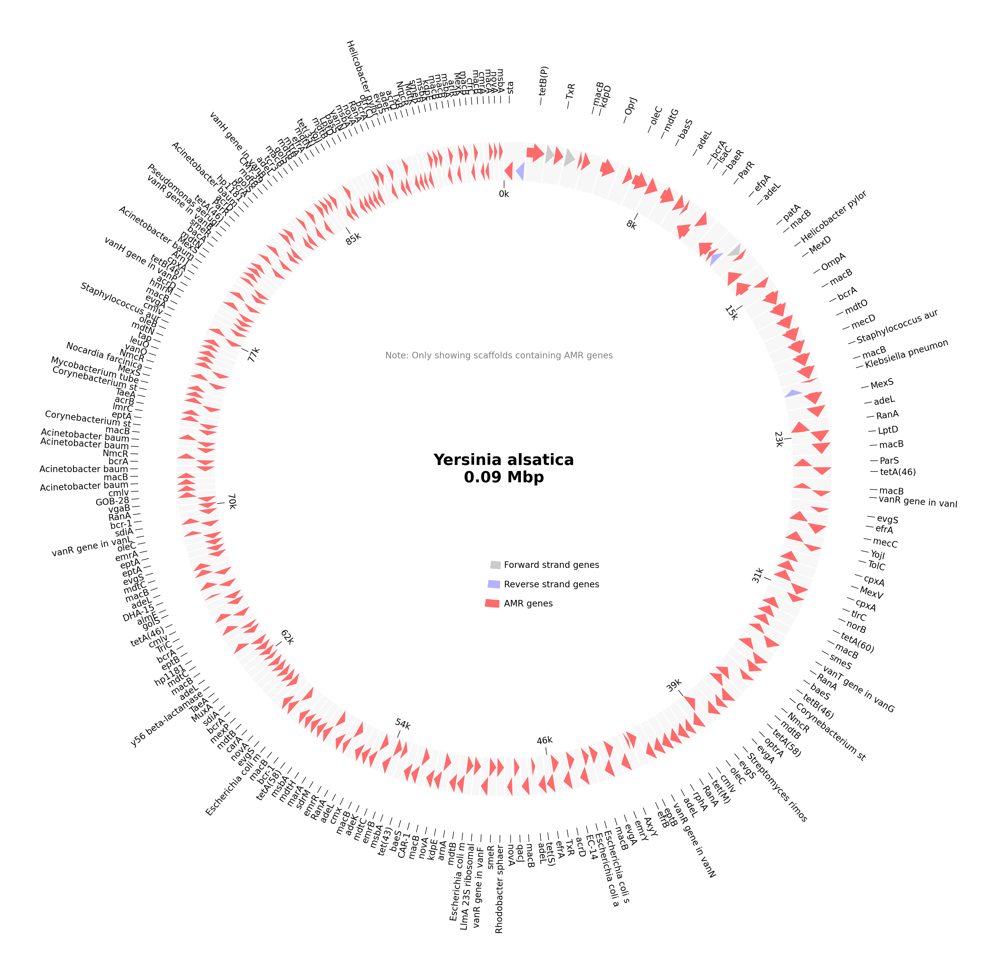

### Acinetobacter baumannii AbaF (found in 4 locations)
- **Mechanism**: antibiotic efflux
- **Drug Classes**: phosphonic acid antibiotic
- **AMR Family**: major facilitator superfamily (MFS) antibiotic efflux pump
- **Locations**:
  - gnl|SPADES|AKHJOCOO_39381_1 : position 2-286
  - gnl|SPADES|AKHJOCOO_40380_1 : position 2-283
  - gnl|SPADES|AKHJOCOO_41122_1 : position 2-280
  - gnl|SPADES|AKHJOCOO_56136_1 : position 3-242

### Acinetobacter baumannii AbaQ (found in 2 locations)
- **Mechanism**: antibiotic efflux
- **Drug Classes**: fluoroquinolone antibiotic
- **AMR Family**: major facilitator superfamily (MFS) antibiotic efflux pump
- **Locations**:
  - gnl|SPADES|AKHJOCOO_38958_1 : position 1-288
  - gnl|SPADES|AKHJOCOO_51031_1 : position 1-255

### ArnT
- **Mechanism**: antibiotic target alteration
- **Drug Classes**: peptide antibiotic
- **AMR Family**: pmr phosphoethanolamine transferase
- **Locations**:
  - gnl|SPADES|AKHJOCOO_50699_1 : position 2-256

### AxyY
- **Mechanism**: antibiotic efflux
- **Drug Classes**: macrolide antibiotic; fluoroquinolone antibiotic; aminoglycoside antibiotic; cephalosporin
- **AMR Family**: resistance-nodulation-cell division (RND) antibiotic efflux pump
- **Locations**:
  - gnl|SPADES|AKHJOCOO_24325_1 : position 2-418

### CAR-1
- **Mechanism**: antibiotic inactivation
- **Drug Classes**: carbapenem
- **AMR Family**: CAR beta-lactamase
- **Locations**:
  - gnl|SPADES|AKHJOCOO_29791_1 : position 1-357

### CMY-39
- **Mechanism**: antibiotic inactivation
- **Drug Classes**: cephamycin
- **AMR Family**: CMY beta-lactamase
- **Locations**:
  - gnl|SPADES|AKHJOCOO_57910_1 : position 2-241

### Corynebacterium striatum tetA (found in 3 locations)
- **Mechanism**: antibiotic efflux
- **Drug Classes**: penam; tetracycline antibiotic
- **AMR Family**: major facilitator superfamily (MFS) antibiotic efflux pump
- **Locations**:
  - gnl|SPADES|AKHJOCOO_20814_1 : position 2-472
  - gnl|SPADES|AKHJOCOO_41348_1 : position 3-278
  - gnl|SPADES|AKHJOCOO_43238_1 : position 3-272

### DHA-15
- **Mechanism**: antibiotic inactivation
- **Drug Classes**: cephalosporin; cephamycin
- **AMR Family**: DHA beta-lactamase
- **Locations**:
  - gnl|SPADES|AKHJOCOO_36333_1 : position 2-304

### EC-14
- **Mechanism**: antibiotic inactivation
- **Drug Classes**: cephalosporin
- **AMR Family**: EC beta-lactamase
- **Locations**:
  - gnl|SPADES|AKHJOCOO_25954_1 : position 2-397

### Escherichia coli acrA
- **Mechanism**: antibiotic efflux
- **Drug Classes**: fluoroquinolone antibiotic; cephalosporin; glycylcycline; penam; tetracycline antibiotic; rifamycin antibiotic; phenicol antibiotic; disinfecting agents and antiseptics
- **AMR Family**: resistance-nodulation-cell division (RND) antibiotic efflux pump
- **Locations**:
  - gnl|SPADES|AKHJOCOO_25965_1 : position 1-399

### Escherichia coli mdfA (found in 2 locations)
- **Mechanism**: antibiotic efflux
- **Drug Classes**: tetracycline antibiotic; phenicol antibiotic; disinfecting agents and antiseptics
- **AMR Family**: major facilitator superfamily (MFS) antibiotic efflux pump
- **Locations**:
  - gnl|SPADES|AKHJOCOO_28703_1 : position 3-368
  - gnl|SPADES|AKHJOCOO_33218_1 : position 3-329

### Escherichia coli soxS with mutation conferring antibiotic resistance
- **Mechanism**: antibiotic target alteration; antibiotic efflux; reduced permeability to antibiotic
- **Drug Classes**: fluoroquinolone antibiotic; monobactam; carbapenem; cephalosporin; glycylcycline; cephamycin; penam; tetracycline antibiotic; rifamycin antibiotic; phenicol antibiotic; penem; disinfecting agents and antiseptics
- **AMR Family**: ATP-binding cassette (ABC) antibiotic efflux pump; major facilitator superfamily (MFS) antibiotic efflux pump; resistance-nodulation-cell division (RND) antibiotic efflux pump; General Bacterial Porin with reduced permeability to beta-lactams
- **Locations**:
  - gnl|SPADES|AKHJOCOO_25740_1 : position 77-400

### GOB-28
- **Mechanism**: antibiotic inactivation
- **Drug Classes**: carbapenem; cephalosporin; penam
- **AMR Family**: GOB beta-lactamase
- **Locations**:
  - gnl|SPADES|AKHJOCOO_38512_1 : position 3-290

### Helicobacter pylori pbp1 mutants conferring resistance to amoxicillin (found in 2 locations)
- **Mechanism**: antibiotic target alteration
- **Drug Classes**: cephalosporin; cephamycin; penam
- **AMR Family**: Penicillin-binding protein mutations conferring resistance to beta-lactam antibiotics
- **Locations**:
  - gnl|SPADES|AKHJOCOO_12288_1 : position 3-713
  - gnl|SPADES|AKHJOCOO_67380_1 : position 3-221

### Klebsiella pneumoniae KpnF
- **Mechanism**: antibiotic efflux
- **Drug Classes**: macrolide antibiotic; aminoglycoside antibiotic; cephalosporin; tetracycline antibiotic; peptide antibiotic; rifamycin antibiotic; disinfecting agents and antiseptics
- **AMR Family**: small multidrug resistance (SMR) antibiotic efflux pump
- **Locations**:
  - gnl|SPADES|AKHJOCOO_13798_1 : position 3-125

### LlmA 23S ribosomal RNA methyltransferase
- **Mechanism**: antibiotic target alteration
- **Drug Classes**: lincosamide antibiotic
- **AMR Family**: Llm 23S ribosomal RNA methyltransferase
- **Locations**:
  - gnl|SPADES|AKHJOCOO_28253_1 : position 2-373

### LptD (found in 2 locations)
- **Mechanism**: antibiotic efflux
- **Drug Classes**: carbapenem; peptide antibiotic; aminocoumarin antibiotic; rifamycin antibiotic
- **AMR Family**: ATP-binding cassette (ABC) antibiotic efflux pump
- **Locations**:
  - gnl|SPADES|AKHJOCOO_15402_1 : position 2-598
  - gnl|SPADES|AKHJOCOO_64714_1 : position 3-227

### MdtK
- **Mechanism**: antibiotic efflux
- **Drug Classes**: fluoroquinolone antibiotic
- **AMR Family**: multidrug and toxic compound extrusion (MATE) transporter
- **Locations**:
  - gnl|SPADES|AKHJOCOO_69807_1 : position 2-217

### MexD
- **Mechanism**: antibiotic efflux
- **Drug Classes**: macrolide antibiotic; fluoroquinolone antibiotic; aminoglycoside antibiotic; cephalosporin; penam; tetracycline antibiotic; aminocoumarin antibiotic; diaminopyrimidine antibiotic; phenicol antibiotic
- **AMR Family**: resistance-nodulation-cell division (RND) antibiotic efflux pump
- **Locations**:
  - gnl|SPADES|AKHJOCOO_12341_1 : position 2-370

### MexK
- **Mechanism**: antibiotic efflux
- **Drug Classes**: macrolide antibiotic; tetracycline antibiotic; disinfecting agents and antiseptics
- **AMR Family**: resistance-nodulation-cell division (RND) antibiotic efflux pump
- **Locations**:
  - gnl|SPADES|AKHJOCOO_72539_1 : position 1-210

### MexS (found in 3 locations)
- **Mechanism**: antibiotic efflux
- **Drug Classes**: fluoroquinolone antibiotic; diaminopyrimidine antibiotic; phenicol antibiotic
- **AMR Family**: resistance-nodulation-cell division (RND) antibiotic efflux pump
- **Locations**:
  - gnl|SPADES|AKHJOCOO_13929_1 : position 3-647
  - gnl|SPADES|AKHJOCOO_44274_1 : position 2-271
  - gnl|SPADES|AKHJOCOO_51984_1 : position 3-251

### MexV
- **Mechanism**: antibiotic efflux
- **Drug Classes**: macrolide antibiotic; fluoroquinolone antibiotic; tetracycline antibiotic; phenicol antibiotic; disinfecting agents and antiseptics
- **AMR Family**: resistance-nodulation-cell division (RND) antibiotic efflux pump
- **Locations**:
  - gnl|SPADES|AKHJOCOO_18980_1 : position 3-509

### MuxA
- **Mechanism**: antibiotic efflux
- **Drug Classes**: macrolide antibiotic; monobactam; tetracycline antibiotic; aminocoumarin antibiotic
- **AMR Family**: resistance-nodulation-cell division (RND) antibiotic efflux pump
- **Locations**:
  - gnl|SPADES|AKHJOCOO_34195_2 : position 120-320

### Mycobacterium tuberculosis gidB mutation conferring resistance to streptomycin
- **Mechanism**: antibiotic target alteration
- **Drug Classes**: aminoglycoside antibiotic
- **AMR Family**: antibiotic resistant gidB
- **Locations**:
  - gnl|SPADES|AKHJOCOO_43465_1 : position 1-273

### NmcR (found in 4 locations)
- **Mechanism**: antibiotic inactivation
- **Drug Classes**: carbapenem; cephalosporin; cephamycin; penam
- **AMR Family**: NmcA beta-lactamase
- **Locations**:
  - gnl|SPADES|AKHJOCOO_20963_1 : position 133-471
  - gnl|SPADES|AKHJOCOO_40366_1 : position 2-283
  - gnl|SPADES|AKHJOCOO_44763_1 : position 3-269
  - gnl|SPADES|AKHJOCOO_69557_1 : position 2-169

### Nocardia farcinica rox
- **Mechanism**: antibiotic inactivation
- **Drug Classes**: rifamycin antibiotic
- **AMR Family**: rifampin monooxygenase
- **Locations**:
  - gnl|SPADES|AKHJOCOO_44472_1 : position 1-270

### OmpA
- **Mechanism**: reduced permeability to antibiotic
- **Drug Classes**: peptide antibiotic
- **AMR Family**: General Bacterial Porin with reduced permeability to peptide antibiotics
- **Locations**:
  - gnl|SPADES|AKHJOCOO_12571_1 : position 2-703

### OprJ
- **Mechanism**: antibiotic efflux
- **Drug Classes**: macrolide antibiotic; fluoroquinolone antibiotic; aminoglycoside antibiotic; cephalosporin; penam; tetracycline antibiotic; aminocoumarin antibiotic; diaminopyrimidine antibiotic; phenicol antibiotic
- **AMR Family**: resistance-nodulation-cell division (RND) antibiotic efflux pump
- **Locations**:
  - gnl|SPADES|AKHJOCOO_9361_1 : position 1-786

### ParR (found in 2 locations)
- **Mechanism**: antibiotic efflux; reduced permeability to antibiotic
- **Drug Classes**: macrolide antibiotic; fluoroquinolone antibiotic; monobactam; aminoglycoside antibiotic; carbapenem; cephalosporin; cephamycin; penam; tetracycline antibiotic; phenicol antibiotic; penem; disinfecting agents and antiseptics
- **AMR Family**: resistance-nodulation-cell division (RND) antibiotic efflux pump; Outer Membrane Porin (Opr)
- **Locations**:
  - gnl|SPADES|AKHJOCOO_11844_1 : position 3-479
  - gnl|SPADES|AKHJOCOO_55022_1 : position 3-245

### ParS
- **Mechanism**: antibiotic efflux; reduced permeability to antibiotic
- **Drug Classes**: macrolide antibiotic; fluoroquinolone antibiotic; monobactam; aminoglycoside antibiotic; carbapenem; cephalosporin; cephamycin; penam; tetracycline antibiotic; phenicol antibiotic; penem; disinfecting agents and antiseptics
- **AMR Family**: resistance-nodulation-cell division (RND) antibiotic efflux pump; Outer Membrane Porin (Opr)
- **Locations**:
  - gnl|SPADES|AKHJOCOO_15741_2 : position 141-587

### Pseudomonas aeruginosa CpxR
- **Mechanism**: antibiotic efflux
- **Drug Classes**: macrolide antibiotic; fluoroquinolone antibiotic; monobactam; aminoglycoside antibiotic; carbapenem; cephalosporin; cephamycin; penam; tetracycline antibiotic; peptide antibiotic; aminocoumarin antibiotic; diaminopyrimidine antibiotic; sulfonamide antibiotic; phenicol antibiotic; penem
- **AMR Family**: resistance-nodulation-cell division (RND) antibiotic efflux pump
- **Locations**:
  - gnl|SPADES|AKHJOCOO_53876_1 : position 3-248

### RanA (found in 6 locations)
- **Mechanism**: antibiotic efflux
- **Drug Classes**: aminoglycoside antibiotic
- **AMR Family**: ATP-binding cassette (ABC) antibiotic efflux pump
- **Locations**:
  - gnl|SPADES|AKHJOCOO_14586_1 : position 3-623
  - gnl|SPADES|AKHJOCOO_20609_1 : position 3-476
  - gnl|SPADES|AKHJOCOO_22815_1 : position 1-435
  - gnl|SPADES|AKHJOCOO_31843_1 : position 3-341
  - gnl|SPADES|AKHJOCOO_38073_1 : position 2-292
  - gnl|SPADES|AKHJOCOO_66294_1 : position 3-224

### Rhodobacter sphaeroides ampC beta-lactamase
- **Mechanism**: antibiotic inactivation
- **Drug Classes**: cephalosporin; penam
- **AMR Family**: ampC-type beta-lactamase
- **Locations**:
  - gnl|SPADES|AKHJOCOO_27557_1 : position 3-380

### Staphylococcus aureus mupA conferring resistance to mupirocin
- **Mechanism**: antibiotic target alteration
- **Drug Classes**: mupirocin-like antibiotic
- **AMR Family**: antibiotic-resistant isoleucyl-tRNA synthetase (ileS)
- **Locations**:
  - gnl|SPADES|AKHJOCOO_13543_1 : position 3-662

### Staphylococcus aureus norA
- **Mechanism**: antibiotic efflux
- **Drug Classes**: fluoroquinolone antibiotic
- **AMR Family**: major facilitator superfamily (MFS) antibiotic efflux pump
- **Locations**:
  - gnl|SPADES|AKHJOCOO_45747_1 : position 3-266

### Streptomyces rimosus otr(A)
- **Mechanism**: antibiotic target protection
- **Drug Classes**: tetracycline antibiotic
- **AMR Family**: tetracycline-resistant ribosomal protection protein
- **Locations**:
  - gnl|SPADES|AKHJOCOO_21922_1 : position 2-454

### TaeA (found in 2 locations)
- **Mechanism**: antibiotic efflux
- **Drug Classes**: pleuromutilin antibiotic
- **AMR Family**: ATP-binding cassette (ABC) antibiotic efflux pump
- **Locations**:
  - gnl|SPADES|AKHJOCOO_34129_1 : position 3-320
  - gnl|SPADES|AKHJOCOO_43086_1 : position 1-273

### TolC
- **Mechanism**: antibiotic efflux
- **Drug Classes**: macrolide antibiotic; fluoroquinolone antibiotic; aminoglycoside antibiotic; carbapenem; cephalosporin; glycylcycline; cephamycin; penam; tetracycline antibiotic; peptide antibiotic; aminocoumarin antibiotic; rifamycin antibiotic; phenicol antibiotic; penem; disinfecting agents and antiseptics
- **AMR Family**: ATP-binding cassette (ABC) antibiotic efflux pump; major facilitator superfamily (MFS) antibiotic efflux pump; resistance-nodulation-cell division (RND) antibiotic efflux pump
- **Locations**:
  - gnl|SPADES|AKHJOCOO_18636_1 : position 3-326

### TriC
- **Mechanism**: antibiotic efflux
- **Drug Classes**: disinfecting agents and antiseptics
- **AMR Family**: resistance-nodulation-cell division (RND) antibiotic efflux pump
- **Locations**:
  - gnl|SPADES|AKHJOCOO_35166_1 : position 3-314

### TxR (found in 3 locations)
- **Mechanism**: antibiotic efflux
- **Drug Classes**: tetracycline antibiotic
- **AMR Family**: ATP-binding cassette (ABC) antibiotic efflux pump
- **Locations**:
  - gnl|SPADES|AKHJOCOO_26192_1 : position 2-394
  - gnl|SPADES|AKHJOCOO_69623_1 : position 2-217
  - gnl|SPADES|AKHJOCOO_8585_2 : position 493-963

### YojI (found in 2 locations)
- **Mechanism**: antibiotic efflux
- **Drug Classes**: peptide antibiotic
- **AMR Family**: ATP-binding cassette (ABC) antibiotic efflux pump
- **Locations**:
  - gnl|SPADES|AKHJOCOO_18363_1 : position 1-522
  - gnl|SPADES|AKHJOCOO_62960_1 : position 3-230

### acrB
- **Mechanism**: antibiotic efflux
- **Drug Classes**: fluoroquinolone antibiotic; cephalosporin; glycylcycline; penam; tetracycline antibiotic; rifamycin antibiotic; phenicol antibiotic; disinfecting agents and antiseptics
- **AMR Family**: resistance-nodulation-cell division (RND) antibiotic efflux pump
- **Locations**:
  - gnl|SPADES|AKHJOCOO_43071_1 : position 3-272

### acrD (found in 4 locations)
- **Mechanism**: antibiotic efflux
- **Drug Classes**: aminoglycoside antibiotic
- **AMR Family**: resistance-nodulation-cell division (RND) antibiotic efflux pump
- **Locations**:
  - gnl|SPADES|AKHJOCOO_25967_1 : position 1-399
  - gnl|SPADES|AKHJOCOO_49182_1 : position 1-258
  - gnl|SPADES|AKHJOCOO_55855_1 : position 2-244
  - gnl|SPADES|AKHJOCOO_69643_1 : position 2-217

### adeF
- **Mechanism**: antibiotic efflux
- **Drug Classes**: fluoroquinolone antibiotic; tetracycline antibiotic
- **AMR Family**: resistance-nodulation-cell division (RND) antibiotic efflux pump
- **Locations**:
  - gnl|SPADES|AKHJOCOO_68045_1 : position 1-219

### adeK
- **Mechanism**: antibiotic efflux
- **Drug Classes**: macrolide antibiotic; fluoroquinolone antibiotic; lincosamide antibiotic; carbapenem; cephalosporin; tetracycline antibiotic; rifamycin antibiotic; diaminopyrimidine antibiotic; phenicol antibiotic; penem
- **AMR Family**: resistance-nodulation-cell division (RND) antibiotic efflux pump
- **Locations**:
  - gnl|SPADES|AKHJOCOO_31049_1 : position 2-346

### adeL (found in 9 locations)
- **Mechanism**: antibiotic efflux
- **Drug Classes**: fluoroquinolone antibiotic; tetracycline antibiotic
- **AMR Family**: resistance-nodulation-cell division (RND) antibiotic efflux pump
- **Locations**:
  - gnl|SPADES|AKHJOCOO_11183_1 : position 2-736
  - gnl|SPADES|AKHJOCOO_11911_1 : position 1-234
  - gnl|SPADES|AKHJOCOO_14250_1 : position 66-635
  - gnl|SPADES|AKHJOCOO_23034_1 : position 2-436
  - gnl|SPADES|AKHJOCOO_26617_1 : position 2-199
  - gnl|SPADES|AKHJOCOO_31511_1 : position 3-341
  - gnl|SPADES|AKHJOCOO_34553_1 : position 3-317
  - gnl|SPADES|AKHJOCOO_36529_1 : position 1-303
  - gnl|SPADES|AKHJOCOO_57973_1 : position 3-239

### almE
- **Mechanism**: antibiotic target alteration
- **Drug Classes**: peptide antibiotic
- **AMR Family**: polymyxin resistance operon; alm glycyltransferase
- **Locations**:
  - gnl|SPADES|AKHJOCOO_35559_1 : position 2-310

### arlR
- **Mechanism**: antibiotic efflux
- **Drug Classes**: fluoroquinolone antibiotic; disinfecting agents and antiseptics
- **AMR Family**: major facilitator superfamily (MFS) antibiotic efflux pump
- **Locations**:
  - gnl|SPADES|AKHJOCOO_71506_1 : position 2-211

### arnA
- **Mechanism**: antibiotic target alteration
- **Drug Classes**: peptide antibiotic
- **AMR Family**: pmr phosphoethanolamine transferase
- **Locations**:
  - gnl|SPADES|AKHJOCOO_29251_1 : position 2-364

### bacA
- **Mechanism**: antibiotic target alteration
- **Drug Classes**: peptide antibiotic
- **AMR Family**: undecaprenyl pyrophosphate related proteins
- **Locations**:
  - gnl|SPADES|AKHJOCOO_52891_1 : position 1-249

### baeR
- **Mechanism**: antibiotic efflux
- **Drug Classes**: aminoglycoside antibiotic; aminocoumarin antibiotic
- **AMR Family**: resistance-nodulation-cell division (RND) antibiotic efflux pump
- **Locations**:
  - gnl|SPADES|AKHJOCOO_11796_1 : position 7-726

### baeS (found in 2 locations)
- **Mechanism**: antibiotic efflux
- **Drug Classes**: aminoglycoside antibiotic; aminocoumarin antibiotic
- **AMR Family**: resistance-nodulation-cell division (RND) antibiotic efflux pump
- **Locations**:
  - gnl|SPADES|AKHJOCOO_20676_1 : position 2-475
  - gnl|SPADES|AKHJOCOO_30072_1 : position 2-355

### basS (found in 2 locations)
- **Mechanism**: antibiotic target alteration; antibiotic efflux
- **Drug Classes**: peptide antibiotic
- **AMR Family**: pmr phosphoethanolamine transferase
- **Locations**:
  - gnl|SPADES|AKHJOCOO_10897_1 : position 3-554
  - gnl|SPADES|AKHJOCOO_65498_1 : position 3-224

### bcr-1 (found in 2 locations)
- **Mechanism**: antibiotic efflux
- **Drug Classes**: bicyclomycin-like antibiotic
- **AMR Family**: major facilitator superfamily (MFS) antibiotic efflux pump
- **Locations**:
  - gnl|SPADES|AKHJOCOO_32793_1 : position 3-332
  - gnl|SPADES|AKHJOCOO_38083_1 : position 3-293

### bcrA (found in 7 locations)
- **Mechanism**: antibiotic efflux
- **Drug Classes**: peptide antibiotic
- **AMR Family**: ATP-binding cassette (ABC) antibiotic efflux pump
- **Locations**:
  - gnl|SPADES|AKHJOCOO_11714_1 : position 90-542
  - gnl|SPADES|AKHJOCOO_13116_1 : position 51-677
  - gnl|SPADES|AKHJOCOO_34101_1 : position 2-322
  - gnl|SPADES|AKHJOCOO_35083_1 : position 3-314
  - gnl|SPADES|AKHJOCOO_39568_1 : position 3-287
  - gnl|SPADES|AKHJOCOO_57137_1 : position 1-240
  - gnl|SPADES|AKHJOCOO_67170_1 : position 1-222

### carA
- **Mechanism**: antibiotic target protection
- **Drug Classes**: macrolide antibiotic
- **AMR Family**: Miscellaneous ABC-F subfamily ATP-binding cassette ribosomal protection proteins
- **Locations**:
  - gnl|SPADES|AKHJOCOO_33685_1 : position 3-326

### cfrC
- **Mechanism**: antibiotic target alteration
- **Drug Classes**: lincosamide antibiotic; streptogramin antibiotic; oxazolidinone antibiotic; phenicol antibiotic
- **AMR Family**: Cfr 23S ribosomal RNA methyltransferase
- **Locations**:
  - gnl|SPADES|AKHJOCOO_73085_1 : position 1-210

### cmlv (found in 4 locations)
- **Mechanism**: antibiotic inactivation
- **Drug Classes**: phenicol antibiotic
- **AMR Family**: chloramphenicol phosphotransferase
- **Locations**:
  - gnl|SPADES|AKHJOCOO_22533_1 : position 94-444
  - gnl|SPADES|AKHJOCOO_35230_1 : position 1-312
  - gnl|SPADES|AKHJOCOO_38913_1 : position 2-289
  - gnl|SPADES|AKHJOCOO_47383_1 : position 1-264

### cmrA
- **Mechanism**: antibiotic efflux
- **Drug Classes**: phenicol antibiotic
- **AMR Family**: major facilitator superfamily (MFS) antibiotic efflux pump
- **Locations**:
  - gnl|SPADES|AKHJOCOO_73712_1 : position 3-209

### cmx
- **Mechanism**: antibiotic efflux
- **Drug Classes**: phenicol antibiotic
- **AMR Family**: major facilitator superfamily (MFS) antibiotic efflux pump
- **Locations**:
  - gnl|SPADES|AKHJOCOO_31440_1 : position 2-343

### cpxA (found in 3 locations)
- **Mechanism**: antibiotic efflux
- **Drug Classes**: aminoglycoside antibiotic; aminocoumarin antibiotic
- **AMR Family**: resistance-nodulation-cell division (RND) antibiotic efflux pump
- **Locations**:
  - gnl|SPADES|AKHJOCOO_18905_1 : position 2-511
  - gnl|SPADES|AKHJOCOO_19166_1 : position 2-505
  - gnl|SPADES|AKHJOCOO_50586_1 : position 1-255

### efpA
- **Mechanism**: antibiotic efflux
- **Drug Classes**: rifamycin antibiotic; isoniazid-like antibiotic
- **AMR Family**: major facilitator superfamily (MFS) antibiotic efflux pump
- **Locations**:
  - gnl|SPADES|AKHJOCOO_11888_1 : position 2-736

### efrA (found in 3 locations)
- **Mechanism**: antibiotic efflux
- **Drug Classes**: macrolide antibiotic; fluoroquinolone antibiotic; rifamycin antibiotic
- **AMR Family**: ATP-binding cassette (ABC) antibiotic efflux pump
- **Locations**:
  - gnl|SPADES|AKHJOCOO_17821_1 : position 3-536
  - gnl|SPADES|AKHJOCOO_26310_1 : position 1-393
  - gnl|SPADES|AKHJOCOO_61201_1 : position 3-233

### efrB
- **Mechanism**: antibiotic efflux
- **Drug Classes**: macrolide antibiotic; fluoroquinolone antibiotic; rifamycin antibiotic
- **AMR Family**: ATP-binding cassette (ABC) antibiotic efflux pump
- **Locations**:
  - gnl|SPADES|AKHJOCOO_23713_1 : position 1-141

### emrA
- **Mechanism**: antibiotic efflux
- **Drug Classes**: fluoroquinolone antibiotic
- **AMR Family**: major facilitator superfamily (MFS) antibiotic efflux pump
- **Locations**:
  - gnl|SPADES|AKHJOCOO_37803_1 : position 3-296

### emrB
- **Mechanism**: antibiotic efflux
- **Drug Classes**: fluoroquinolone antibiotic
- **AMR Family**: major facilitator superfamily (MFS) antibiotic efflux pump
- **Locations**:
  - gnl|SPADES|AKHJOCOO_30284_1 : position 2-352

### emrR
- **Mechanism**: antibiotic efflux
- **Drug Classes**: fluoroquinolone antibiotic
- **AMR Family**: major facilitator superfamily (MFS) antibiotic efflux pump
- **Locations**:
  - gnl|SPADES|AKHJOCOO_31797_1 : position 2-271

### emrY
- **Mechanism**: antibiotic efflux
- **Drug Classes**: tetracycline antibiotic
- **AMR Family**: major facilitator superfamily (MFS) antibiotic efflux pump
- **Locations**:
  - gnl|SPADES|AKHJOCOO_24961_1 : position 1-411

### eptA (found in 3 locations)
- **Mechanism**: antibiotic target alteration
- **Drug Classes**: peptide antibiotic
- **AMR Family**: pmr phosphoethanolamine transferase
- **Locations**:
  - gnl|SPADES|AKHJOCOO_37310_1 : position 1-297
  - gnl|SPADES|AKHJOCOO_37341_1 : position 2-298
  - gnl|SPADES|AKHJOCOO_41322_1 : position 2-277

### eptB (found in 2 locations)
- **Mechanism**: antibiotic target alteration
- **Drug Classes**: peptide antibiotic
- **AMR Family**: pmr phosphoethanolamine transferase
- **Locations**:
  - gnl|SPADES|AKHJOCOO_23511_1 : position 3-428
  - gnl|SPADES|AKHJOCOO_34897_1 : position 3-314

### evgA (found in 3 locations)
- **Mechanism**: antibiotic efflux
- **Drug Classes**: macrolide antibiotic; fluoroquinolone antibiotic; penam; tetracycline antibiotic
- **AMR Family**: major facilitator superfamily (MFS) antibiotic efflux pump; resistance-nodulation-cell division (RND) antibiotic efflux pump
- **Locations**:
  - gnl|SPADES|AKHJOCOO_21727_1 : position 3-368
  - gnl|SPADES|AKHJOCOO_25012_1 : position 2-409
  - gnl|SPADES|AKHJOCOO_47855_1 : position 1-261

### evgS (found in 5 locations)
- **Mechanism**: antibiotic efflux
- **Drug Classes**: macrolide antibiotic; fluoroquinolone antibiotic; penam; tetracycline antibiotic
- **AMR Family**: major facilitator superfamily (MFS) antibiotic efflux pump; resistance-nodulation-cell division (RND) antibiotic efflux pump
- **Locations**:
  - gnl|SPADES|AKHJOCOO_17080_1 : position 287-553
  - gnl|SPADES|AKHJOCOO_22329_1 : position 3-446
  - gnl|SPADES|AKHJOCOO_33259_1 : position 2-328
  - gnl|SPADES|AKHJOCOO_37212_1 : position 2-298
  - gnl|SPADES|AKHJOCOO_68098_1 : position 3-218

### golS (found in 3 locations)
- **Mechanism**: antibiotic efflux
- **Drug Classes**: monobactam; carbapenem; cephalosporin; cephamycin; penam; phenicol antibiotic; penem
- **AMR Family**: resistance-nodulation-cell division (RND) antibiotic efflux pump
- **Locations**:
  - gnl|SPADES|AKHJOCOO_35507_2 : position 198-311
  - gnl|SPADES|AKHJOCOO_56938_1 : position 3-242
  - gnl|SPADES|AKHJOCOO_60481_1 : position 1-234

### hmrM
- **Mechanism**: antibiotic efflux
- **Drug Classes**: fluoroquinolone antibiotic; disinfecting agents and antiseptics
- **AMR Family**: multidrug and toxic compound extrusion (MATE) transporter
- **Locations**:
  - gnl|SPADES|AKHJOCOO_48572_1 : position 59-259

### hp1181 (found in 2 locations)
- **Mechanism**: antibiotic efflux
- **Drug Classes**: fluoroquinolone antibiotic; tetracycline antibiotic; nitroimidazole antibiotic
- **AMR Family**: major facilitator superfamily (MFS) antibiotic efflux pump
- **Locations**:
  - gnl|SPADES|AKHJOCOO_34932_1 : position 3-224
  - gnl|SPADES|AKHJOCOO_56541_1 : position 1-243

### kdpD
- **Mechanism**: antibiotic efflux
- **Drug Classes**: aminoglycoside antibiotic
- **AMR Family**: kdpDE
- **Locations**:
  - gnl|SPADES|AKHJOCOO_8805_1 : position 3-401

### kdpE (found in 2 locations)
- **Mechanism**: antibiotic efflux
- **Drug Classes**: aminoglycoside antibiotic
- **AMR Family**: kdpDE
- **Locations**:
  - gnl|SPADES|AKHJOCOO_29244_1 : position 3-362
  - gnl|SPADES|AKHJOCOO_70137_1 : position 1-189

### leuO
- **Mechanism**: antibiotic efflux
- **Drug Classes**: nucleoside antibiotic; disinfecting agents and antiseptics
- **AMR Family**: major facilitator superfamily (MFS) antibiotic efflux pump
- **Locations**:
  - gnl|SPADES|AKHJOCOO_44740_1 : position 2-268

### lmrC
- **Mechanism**: antibiotic target protection
- **Drug Classes**: lincosamide antibiotic
- **AMR Family**: Miscellaneous ABC-F subfamily ATP-binding cassette ribosomal protection proteins
- **Locations**:
  - gnl|SPADES|AKHJOCOO_42863_1 : position 3-275

### lsaC
- **Mechanism**: antibiotic target protection
- **Drug Classes**: lincosamide antibiotic; streptogramin antibiotic; pleuromutilin antibiotic
- **AMR Family**: lsa-type ABC-F protein
- **Locations**:
  - gnl|SPADES|AKHJOCOO_11714_2 : position 568-744

### macA
- **Mechanism**: antibiotic efflux
- **Drug Classes**: macrolide antibiotic
- **AMR Family**: ATP-binding cassette (ABC) antibiotic efflux pump
- **Locations**:
  - gnl|SPADES|AKHJOCOO_74032_1 : position 1-207

### macB (found in 22 locations)
- **Mechanism**: antibiotic efflux
- **Drug Classes**: macrolide antibiotic
- **AMR Family**: ATP-binding cassette (ABC) antibiotic efflux pump
- **Locations**:
  - gnl|SPADES|AKHJOCOO_12096_1 : position 1-615
  - gnl|SPADES|AKHJOCOO_12956_1 : position 1-684
  - gnl|SPADES|AKHJOCOO_13538_1 : position 2-658
  - gnl|SPADES|AKHJOCOO_15675_1 : position 2-589
  - gnl|SPADES|AKHJOCOO_16395_2 : position 262-567
  - gnl|SPADES|AKHJOCOO_20070_1 : position 1-486
  - gnl|SPADES|AKHJOCOO_25631_1 : position 3-401
  - gnl|SPADES|AKHJOCOO_26703_1 : position 1-390
  - gnl|SPADES|AKHJOCOO_29717_1 : position 2-358
  - gnl|SPADES|AKHJOCOO_31237_1 : position 1-312
  - gnl|SPADES|AKHJOCOO_33023_1 : position 3-329
  - gnl|SPADES|AKHJOCOO_34522_1 : position 10-318
  - gnl|SPADES|AKHJOCOO_36854_1 : position 2-301
  - gnl|SPADES|AKHJOCOO_39288_1 : position 2-286
  - gnl|SPADES|AKHJOCOO_40968_1 : position 3-278
  - gnl|SPADES|AKHJOCOO_48431_1 : position 1-237
  - gnl|SPADES|AKHJOCOO_59057_1 : position 1-237
  - gnl|SPADES|AKHJOCOO_70525_1 : position 3-215
  - gnl|SPADES|AKHJOCOO_70648_1 : position 2-214
  - gnl|SPADES|AKHJOCOO_73465_1 : position 2-208
  - gnl|SPADES|AKHJOCOO_73684_1 : position 3-209
  - gnl|SPADES|AKHJOCOO_8712_3 : position 792-956

### marA
- **Mechanism**: antibiotic efflux; reduced permeability to antibiotic
- **Drug Classes**: fluoroquinolone antibiotic; monobactam; carbapenem; cephalosporin; glycylcycline; cephamycin; penam; tetracycline antibiotic; rifamycin antibiotic; phenicol antibiotic; penem; disinfecting agents and antiseptics
- **AMR Family**: resistance-nodulation-cell division (RND) antibiotic efflux pump; General Bacterial Porin with reduced permeability to beta-lactams
- **Locations**:
  - gnl|SPADES|AKHJOCOO_32194_1 : position 3-338

### mdtB (found in 6 locations)
- **Mechanism**: antibiotic efflux
- **Drug Classes**: aminocoumarin antibiotic
- **AMR Family**: resistance-nodulation-cell division (RND) antibiotic efflux pump
- **Locations**:
  - gnl|SPADES|AKHJOCOO_21023_1 : position 1-468
  - gnl|SPADES|AKHJOCOO_28698_1 : position 3-368
  - gnl|SPADES|AKHJOCOO_33829_1 : position 2-325
  - gnl|SPADES|AKHJOCOO_57370_1 : position 1-240
  - gnl|SPADES|AKHJOCOO_61000_1 : position 3-233
  - gnl|SPADES|AKHJOCOO_63655_1 : position 2-229

### mdtC (found in 3 locations)
- **Mechanism**: antibiotic efflux
- **Drug Classes**: aminocoumarin antibiotic
- **AMR Family**: resistance-nodulation-cell division (RND) antibiotic efflux pump
- **Locations**:
  - gnl|SPADES|AKHJOCOO_31006_1 : position 1-348
  - gnl|SPADES|AKHJOCOO_34828_1 : position 1-315
  - gnl|SPADES|AKHJOCOO_37074_1 : position 1-300

### mdtG
- **Mechanism**: antibiotic efflux
- **Drug Classes**: phosphonic acid antibiotic
- **AMR Family**: major facilitator superfamily (MFS) antibiotic efflux pump
- **Locations**:
  - gnl|SPADES|AKHJOCOO_10325_1 : position 3-827

### mdtH
- **Mechanism**: antibiotic efflux
- **Drug Classes**: fluoroquinolone antibiotic
- **AMR Family**: major facilitator superfamily (MFS) antibiotic efflux pump
- **Locations**:
  - gnl|SPADES|AKHJOCOO_32493_1 : position 2-334

### mdtN (found in 3 locations)
- **Mechanism**: antibiotic efflux
- **Drug Classes**: nucleoside antibiotic; disinfecting agents and antiseptics
- **AMR Family**: major facilitator superfamily (MFS) antibiotic efflux pump
- **Locations**:
  - gnl|SPADES|AKHJOCOO_45067_1 : position 1-267
  - gnl|SPADES|AKHJOCOO_52374_1 : position 2-187
  - gnl|SPADES|AKHJOCOO_61985_1 : position 3-230

### mdtO
- **Mechanism**: antibiotic efflux
- **Drug Classes**: nucleoside antibiotic; disinfecting agents and antiseptics
- **AMR Family**: major facilitator superfamily (MFS) antibiotic efflux pump
- **Locations**:
  - gnl|SPADES|AKHJOCOO_13442_1 : position 2-667

### mecC
- **Mechanism**: antibiotic target replacement
- **Drug Classes**: penam
- **AMR Family**: methicillin resistant PBP2
- **Locations**:
  - gnl|SPADES|AKHJOCOO_18347_1 : position 2-523

### mecD
- **Mechanism**: antibiotic target replacement
- **Drug Classes**: penam
- **AMR Family**: methicillin resistant PBP2
- **Locations**:
  - gnl|SPADES|AKHJOCOO_13467_1 : position 2-664

### mexP
- **Mechanism**: antibiotic efflux
- **Drug Classes**: macrolide antibiotic; carbapenem; tetracycline antibiotic; diaminopyrimidine antibiotic; phenicol antibiotic; disinfecting agents and antiseptics
- **AMR Family**: resistance-nodulation-cell division (RND) antibiotic efflux pump
- **Locations**:
  - gnl|SPADES|AKHJOCOO_33817_1 : position 3-323

### msbA (found in 6 locations)
- **Mechanism**: antibiotic efflux
- **Drug Classes**: nitroimidazole antibiotic
- **AMR Family**: ATP-binding cassette (ABC) antibiotic efflux pump
- **Locations**:
  - gnl|SPADES|AKHJOCOO_30163_2 : position 81-356
  - gnl|SPADES|AKHJOCOO_32465_1 : position 2-334
  - gnl|SPADES|AKHJOCOO_65713_1 : position 2-223
  - gnl|SPADES|AKHJOCOO_70071_1 : position 3-215
  - gnl|SPADES|AKHJOCOO_71090_1 : position 3-212
  - gnl|SPADES|AKHJOCOO_75046_1 : position 1-207

### mtrA
- **Mechanism**: antibiotic efflux
- **Drug Classes**: macrolide antibiotic; penam
- **AMR Family**: resistance-nodulation-cell division (RND) antibiotic efflux pump
- **Locations**:
  - gnl|SPADES|AKHJOCOO_60979_1 : position 2-190

### norB
- **Mechanism**: antibiotic efflux
- **Drug Classes**: fluoroquinolone antibiotic
- **AMR Family**: major facilitator superfamily (MFS) antibiotic efflux pump
- **Locations**:
  - gnl|SPADES|AKHJOCOO_19918_1 : position 2-388

### novA (found in 5 locations)
- **Mechanism**: antibiotic efflux
- **Drug Classes**: aminocoumarin antibiotic
- **AMR Family**: ATP-binding cassette (ABC) antibiotic efflux pump
- **Locations**:
  - gnl|SPADES|AKHJOCOO_27378_1 : position 1-282
  - gnl|SPADES|AKHJOCOO_29735_1 : position 2-358
  - gnl|SPADES|AKHJOCOO_33416_1 : position 2-325
  - gnl|SPADES|AKHJOCOO_65603_1 : position 1-225
  - gnl|SPADES|AKHJOCOO_74162_1 : position 1-174

### oleB
- **Mechanism**: antibiotic target protection
- **Drug Classes**: macrolide antibiotic
- **AMR Family**: Miscellaneous ABC-F subfamily ATP-binding cassette ribosomal protection proteins
- **Locations**:
  - gnl|SPADES|AKHJOCOO_45673_1 : position 34-267

### oleC (found in 3 locations)
- **Mechanism**: antibiotic efflux
- **Drug Classes**: macrolide antibiotic
- **AMR Family**: ATP-binding cassette (ABC) antibiotic efflux pump
- **Locations**:
  - gnl|SPADES|AKHJOCOO_10121_2 : position 446-844
  - gnl|SPADES|AKHJOCOO_22395_1 : position 3-446
  - gnl|SPADES|AKHJOCOO_38012_2 : position 82-294

### optrA
- **Mechanism**: antibiotic target protection
- **Drug Classes**: oxazolidinone antibiotic; phenicol antibiotic
- **AMR Family**: Miscellaneous ABC-F subfamily ATP-binding cassette ribosomal protection proteins
- **Locations**:
  - gnl|SPADES|AKHJOCOO_21533_1 : position 1-459

### otr(C)
- **Mechanism**: antibiotic efflux
- **Drug Classes**: tetracycline antibiotic
- **AMR Family**: ATP-binding cassette (ABC) antibiotic efflux pump
- **Locations**:
  - gnl|SPADES|AKHJOCOO_67231_1 : position 3-221

### patA
- **Mechanism**: antibiotic efflux
- **Drug Classes**: fluoroquinolone antibiotic
- **AMR Family**: ATP-binding cassette (ABC) antibiotic efflux pump
- **Locations**:
  - gnl|SPADES|AKHJOCOO_12030_2 : position 496-726

### qacJ
- **Mechanism**: antibiotic efflux
- **Drug Classes**: disinfecting agents and antiseptics
- **AMR Family**: small multidrug resistance (SMR) antibiotic efflux pump
- **Locations**:
  - gnl|SPADES|AKHJOCOO_27037_1: position 1-306

### rphA
- **Mechanism**: antibiotic inactivation
- **Drug Classes**: rifamycin antibiotic
- **AMR Family**: rifampin phosphotransferase
- **Locations**:
  - gnl|SPADES|AKHJOCOO_22758_1 : position 2-439

### sdiA (found in 2 locations)
- **Mechanism**: antibiotic efflux
- **Drug Classes**: fluoroquinolone antibiotic; cephalosporin; glycylcycline; penam; tetracycline antibiotic; rifamycin antibiotic; phenicol antibiotic; disinfecting agents and antiseptics
- **AMR Family**: resistance-nodulation-cell division (RND) antibiotic efflux pump
- **Locations**:
  - gnl|SPADES|AKHJOCOO_34065_1 : position 1-321
  - gnl|SPADES|AKHJOCOO_38071_1 : position 3-284

### sdrM
- **Mechanism**: antibiotic efflux
- **Drug Classes**: fluoroquinolone antibiotic; disinfecting agents and antiseptics
- **AMR Family**: major facilitator superfamily (MFS) antibiotic efflux pump
- **Locations**:
  - gnl|SPADES|AKHJOCOO_31967_1 : position 2-340

### smeR (found in 3 locations)
- **Mechanism**: antibiotic efflux
- **Drug Classes**: aminoglycoside antibiotic; cephalosporin; cephamycin; penam
- **AMR Family**: resistance-nodulation-cell division (RND) antibiotic efflux pump
- **Locations**:
  - gnl|SPADES|AKHJOCOO_27789_1 : position 1-378
  - gnl|SPADES|AKHJOCOO_53028_1 : position 3-251
  - gnl|SPADES|AKHJOCOO_69558_1 : position 1-216

### smeS
- **Mechanism**: antibiotic efflux
- **Drug Classes**: aminoglycoside antibiotic; cephalosporin; cephamycin; penam
- **AMR Family**: resistance-nodulation-cell division (RND) antibiotic efflux pump
- **Locations**:
  - gnl|SPADES|AKHJOCOO_20574_1 : position 3-476

### sta
- **Mechanism**: antibiotic inactivation
- **Drug Classes**: nucleoside antibiotic
- **AMR Family**: streptothricin acetyltransferase (SAT)
- **Locations**:
  - gnl|SPADES|AKHJOCOO_6949_1 : position 3-479

### tap
- **Mechanism**: antibiotic efflux
- **Drug Classes**: tetracycline antibiotic
- **AMR Family**: major facilitator superfamily (MFS) antibiotic efflux pump
- **Locations**:
  - gnl|SPADES|AKHJOCOO_44978_1 : position 3-269

### tcr3
- **Mechanism**: antibiotic efflux
- **Drug Classes**: tetracycline antibiotic
- **AMR Family**: major facilitator superfamily (MFS) antibiotic efflux pump
- **Locations**:
  - gnl|SPADES|AKHJOCOO_58545_1 : position 3-239

### tet(35)
- **Mechanism**: antibiotic efflux
- **Drug Classes**: tetracycline antibiotic
- **AMR Family**: ATP-binding cassette (ABC) antibiotic efflux pump
- **Locations**:
  - gnl|SPADES|AKHJOCOO_62684_1 : position 1-231

### tet(43)
- **Mechanism**: antibiotic efflux
- **Drug Classes**: tetracycline antibiotic
- **AMR Family**: major facilitator superfamily (MFS) antibiotic efflux pump
- **Locations**:
  - gnl|SPADES|AKHJOCOO_30026_1 : position 11-355

### tet(M)
- **Mechanism**: antibiotic target protection
- **Drug Classes**: tetracycline antibiotic
- **AMR Family**: tetracycline-resistant ribosomal protection protein
- **Locations**:
  - gnl|SPADES|AKHJOCOO_22607_1 : position 1-441

### tet(S)
- **Mechanism**: antibiotic target protection
- **Drug Classes**: tetracycline antibiotic
- **AMR Family**: tetracycline-resistant ribosomal protection protein
- **Locations**:
  - gnl|SPADES|AKHJOCOO_26418_1 : position 3-392

### tetA(46) (found in 3 locations)
- **Mechanism**: antibiotic efflux
- **Drug Classes**: tetracycline antibiotic
- **AMR Family**: ATP-binding cassette (ABC) antibiotic efflux pump
- **Locations**:
  - gnl|SPADES|AKHJOCOO_16205_1 : position 3-428
  - gnl|SPADES|AKHJOCOO_35358_1 : position 3-311
  - gnl|SPADES|AKHJOCOO_53864_1 : position 1-213

### tetA(58) (found in 2 locations)
- **Mechanism**: antibiotic efflux
- **Drug Classes**: tetracycline antibiotic
- **AMR Family**: major facilitator superfamily (MFS) antibiotic efflux pump
- **Locations**:
  - gnl|SPADES|AKHJOCOO_21382_1 : position 3-461
  - gnl|SPADES|AKHJOCOO_32586_1 : position 2-334

### tetA(60)
- **Mechanism**: antibiotic efflux
- **Drug Classes**: tetracycline antibiotic
- **AMR Family**: ATP-binding cassette (ABC) antibiotic efflux pump
- **Locations**:
  - gnl|SPADES|AKHJOCOO_19927_1 : position 1-489

### tetB(46) (found in 2 locations)
- **Mechanism**: antibiotic efflux
- **Drug Classes**: tetracycline antibiotic
- **AMR Family**: ATP-binding cassette (ABC) antibiotic efflux pump
- **Locations**:
  - gnl|SPADES|AKHJOCOO_20658_2 : position 34-474
  - gnl|SPADES|AKHJOCOO_49939_1 : position 2-256

### tetB(P)
- **Mechanism**: antibiotic target protection
- **Drug Classes**: tetracycline antibiotic
- **AMR Family**: tetracycline-resistant ribosomal protection protein
- **Locations**:
  - gnl|SPADES|AKHJOCOO_8524_1 : position 1-969

### tlrC
- **Mechanism**: antibiotic target protection
- **Drug Classes**: macrolide antibiotic; lincosamide antibiotic
- **AMR Family**: Miscellaneous ABC-F subfamily ATP-binding cassette ribosomal protection proteins
- **Locations**:
  - gnl|SPADES|AKHJOCOO_19495_1 : position 3-497

### vanH gene in vanB cluster
- **Mechanism**: antibiotic target alteration
- **Drug Classes**: glycopeptide antibiotic
- **AMR Family**: vanH; glycopeptide resistance gene cluster
- **Locations**:
  - gnl|SPADES|AKHJOCOO_57652_1 : position 2-199

### vanH gene in vanP cluster
- **Mechanism**: antibiotic target alteration
- **Drug Classes**: glycopeptide antibiotic
- **AMR Family**: vanH; glycopeptide resistance gene cluster
- **Locations**:
  - gnl|SPADES|AKHJOCOO_49919_1 : position 2-256

### vanN
- **Mechanism**: antibiotic target alteration
- **Drug Classes**: glycopeptide antibiotic
- **AMR Family**: glycopeptide resistance gene cluster; Van ligase
- **Locations**:
  - gnl|SPADES|AKHJOCOO_65359_1 : position 2-223

### vanO
- **Mechanism**: antibiotic target alteration
- **Drug Classes**: glycopeptide antibiotic
- **AMR Family**: glycopeptide resistance gene cluster; Van ligase
- **Locations**:
  - gnl|SPADES|AKHJOCOO_44546_1 : position 2-268

### vanR gene in vanB cluster
- **Mechanism**: antibiotic target alteration
- **Drug Classes**: glycopeptide antibiotic
- **AMR Family**: glycopeptide resistance gene cluster; vanR
- **Locations**:
  - gnl|SPADES|AKHJOCOO_53785_1 : position 3-248

### vanR gene in vanF cluster
- **Mechanism**: antibiotic target alteration
- **Drug Classes**: glycopeptide antibiotic
- **AMR Family**: glycopeptide resistance gene cluster; vanR
- **Locations**:
  - gnl|SPADES|AKHJOCOO_28079_1 : position 2-373

### vanR gene in vanI cluster
- **Mechanism**: antibiotic target alteration
- **Drug Classes**: glycopeptide antibiotic
- **AMR Family**: glycopeptide resistance gene cluster; vanR
- **Locations**:
  - gnl|SPADES|AKHJOCOO_16429_1 : position 3-320

### vanR gene in vanL cluster
- **Mechanism**: antibiotic target alteration
- **Drug Classes**: glycopeptide antibiotic
- **AMR Family**: glycopeptide resistance gene cluster; vanR
- **Locations**:
  - gnl|SPADES|AKHJOCOO_37951_1 : position 2-295

### vanR gene in vanN cluster
- **Mechanism**: antibiotic target alteration
- **Drug Classes**: glycopeptide antibiotic
- **AMR Family**: glycopeptide resistance gene cluster; vanR
- **Locations**:
  - gnl|SPADES|AKHJOCOO_23112_1 : position 29-436

### vanT gene in vanG cluster
- **Mechanism**: antibiotic target alteration
- **Drug Classes**: glycopeptide antibiotic
- **AMR Family**: glycopeptide resistance gene cluster; vanT
- **Locations**:
  - gnl|SPADES|AKHJOCOO_20540_1 : position 108-476

### vgaB
- **Mechanism**: antibiotic target protection
- **Drug Classes**: streptogramin antibiotic; streptogramin A antibiotic; pleuromutilin antibiotic
- **AMR Family**: vga-type ABC-F protein
- **Locations**:
  - gnl|SPADES|AKHJOCOO_38458_1 : position 3-290

### y56 beta-lactamase
- **Mechanism**: antibiotic inactivation
- **Drug Classes**: cephalosporin; penam; penem
- **AMR Family**: BlaA beta-lactamase
- **Locations**:
  - gnl|SPADES|AKHJOCOO_34344_1 : position 1-321

## Yersinia enterocolitica
**Strain Statistics:**
- Total genome length: 1698.4 kbp
- Total scaffolds: 1946
- Scaffolds with AMR genes: 351
- Total genes annotated: 3027
- Total AMR genes: 471
- Unique AMR genes: 206
- Distinct AMR mechanisms: 11
- Distinct AMR families: 72
- Distinct drug classes: 35

**Circos Plot:**

### ALI-1
- **Mechanism**: antibiotic inactivation
- **Drug Classes**: carbapenem
- **AMR Family**: ALI beta-lactamase
- **Locations**:
  - gnl|SPADES|AKHJOCOO_1764_3 : position 2497-4647

### Acinetobacter baumannii AbaF (found in 4 locations)
- **Mechanism**: antibiotic efflux
- **Drug Classes**: phosphonic acid antibiotic
- **AMR Family**: major facilitator superfamily (MFS) antibiotic efflux pump
- **Locations**:
  - gnl|SPADES|AKHJOCOO_1070_1 : position 220-1722
  - gnl|SPADES|AKHJOCOO_1098_2 : position 1020-2228
  - gnl|SPADES|AKHJOCOO_1212_6 : position 5331-6698
  - gnl|SPADES|AKHJOCOO_884_5 : position 2315-3841

### Acinetobacter baumannii AbaQ (found in 5 locations)
- **Mechanism**: antibiotic efflux
- **Drug Classes**: fluoroquinolone antibiotic
- **AMR Family**: major facilitator superfamily (MFS) antibiotic efflux pump
- **Locations**:
  - gnl|SPADES|AKHJOCOO_10363_2 : position 169-825
  - gnl|SPADES|AKHJOCOO_19965_1 : position 2-262
  - gnl|SPADES|AKHJOCOO_2230_2 : position 1642-3000
  - gnl|SPADES|AKHJOCOO_898_3 : position 2548-3864
  - gnl|SPADES|AKHJOCOO_9812_2 : position 175-864

### Acinetobacter baumannii AmvA
- **Mechanism**: antibiotic efflux
- **Drug Classes**: macrolide antibiotic; disinfecting agents and antiseptics
- **AMR Family**: major facilitator superfamily (MFS) antibiotic efflux pump
- **Locations**:
  - gnl|SPADES|AKHJOCOO_1490_2 : position 948-2441

### AcrE
- **Mechanism**: antibiotic efflux
- **Drug Classes**: fluoroquinolone antibiotic; cephalosporin; cephamycin; penam
- **AMR Family**: resistance-nodulation-cell division (RND) antibiotic efflux pump
- **Locations**:
  - gnl|SPADES|AKHJOCOO_11262_1 : position 3-767

### ArnT (found in 2 locations)
- **Mechanism**: antibiotic target alteration
- **Drug Classes**: peptide antibiotic
- **AMR Family**: pmr phosphoethanolamine transferase
- **Locations**:
  - gnl|SPADES|AKHJOCOO_1252_6: position 5574-6623
  - gnl|SPADES|AKHJOCOO_13408_1 : position 3-620

### Bifidobacterium bifidum ileS conferring resistance to mupirocin
- **Mechanism**: antibiotic target alteration
- **Drug Classes**: mupirocin-like antibiotic
- **AMR Family**: antibiotic-resistant isoleucyl-tRNA synthetase (ileS)
- **Locations**:
  - gnl|SPADES|AKHJOCOO_46069_1 : position 1-219

### CMY-169
- **Mechanism**: antibiotic inactivation
- **Drug Classes**: cephamycin
- **AMR Family**: CMY beta-lactamase
- **Locations**:
  - gnl|SPADES|AKHJOCOO_3345_1 : position 2-997

### CMY-79
- **Mechanism**: antibiotic inactivation
- **Drug Classes**: cephamycin
- **AMR Family**: CMY beta-lactamase
- **Locations**:
  - gnl|SPADES|AKHJOCOO_1976_1 : position 42-1208

### CRP (found in 2 locations)
- **Mechanism**: antibiotic efflux
- **Drug Classes**: macrolide antibiotic; fluoroquinolone antibiotic; penam
- **AMR Family**: resistance-nodulation-cell division (RND) antibiotic efflux pump
- **Locations**:
  - gnl|SPADES|AKHJOCOO_1440_2 : position 1324-2082
  - gnl|SPADES|AKHJOCOO_652_14: position 12011-12643

### Clostridioides difficile gyrA conferring resistance to fluoroquinolones
- **Mechanism**: antibiotic target alteration
- **Drug Classes**: fluoroquinolone antibiotic
- **AMR Family**: fluoroquinolone resistant gyrA
- **Locations**:
  - gnl|SPADES|AKHJOCOO_1046_8 : position 6865-7914

### Clostridioides difficile gyrB conferring resistance to fluoroquinolones (found in 2 locations)
- **Mechanism**: antibiotic target alteration
- **Drug Classes**: fluoroquinolone antibiotic
- **AMR Family**: fluoroquinolone resistant gyrB
- **Locations**:
  - gnl|SPADES|AKHJOCOO_869_7 : position 6157-8571
  - gnl|SPADES|AKHJOCOO_899_5 : position 2518-4413

### CrcB (found in 2 locations)
- **Mechanism**: antibiotic efflux
- **Drug Classes**: aminoglycoside antibiotic
- **AMR Family**: multidrug and toxic compound extrusion (MATE) transporter
- **Locations**:
  - gnl|SPADES|AKHJOCOO_1102_8 : position 4932-5315
  - gnl|SPADES|AKHJOCOO_12738_1 : position 119-523

### D-Ala-D-Ala ligase
- **Mechanism**: antibiotic target alteration
- **Drug Classes**: glycopeptide antibiotic
- **AMR Family**: Van ligase
- **Locations**:
  - gnl|SPADES|AKHJOCOO_1981_2 : position 865-1785

### Enterococcus faecalis cls with mutation conferring resistance to daptomycin
- **Mechanism**: antibiotic target alteration
- **Drug Classes**: peptide antibiotic
- **AMR Family**: daptomycin resistant cls
- **Locations**:
  - gnl|SPADES|AKHJOCOO_1413_6 : position 3811-5271

### Erm(34)
- **Mechanism**: antibiotic target alteration
- **Drug Classes**: macrolide antibiotic; lincosamide antibiotic; streptogramin antibiotic; streptogramin A antibiotic; streptogramin B antibiotic
- **AMR Family**: Erm 23S ribosomal RNA methyltransferase
- **Locations**:
  - gnl|SPADES|AKHJOCOO_546_2 : position 998-1624

### Escherichia coli AcrAB-TolC with AcrR mutation conferring resistance to ciprofloxacin, tetracycline, and ceftazidime (found in 2 locations)
- **Mechanism**: antibiotic target alteration; antibiotic efflux
- **Drug Classes**: fluoroquinolone antibiotic; cephalosporin; glycylcycline; penam; tetracycline antibiotic; rifamycin antibiotic; phenicol antibiotic; disinfecting agents and antiseptics
- **AMR Family**: resistance-nodulation-cell division (RND) antibiotic efflux pump
- **Locations**:
  - gnl|SPADES|AKHJOCOO_1222_3 : position 1974-2630
  - gnl|SPADES|AKHJOCOO_2449_3 : position 1329-1913

### Escherichia coli AcrAB-TolC with MarR mutations conferring resistance to ciprofloxacin and tetracycline
- **Mechanism**: antibiotic target alteration; antibiotic efflux
- **Drug Classes**: fluoroquinolone antibiotic; cephalosporin; glycylcycline; penam; tetracycline antibiotic; rifamycin antibiotic; phenicol antibiotic; disinfecting agents and antiseptics
- **AMR Family**: resistance-nodulation-cell division (RND) antibiotic efflux pump
- **Locations**:
  - gnl|SPADES|AKHJOCOO_636_8 : position 6363-6794

### Escherichia coli EF-Tu mutants conferring resistance to Pulvomycin (found in 2 locations)
- **Mechanism**: antibiotic target alteration
- **Drug Classes**: elfamycin antibiotic
- **AMR Family**: elfamycin resistant EF-Tu
- **Locations**:
  - gnl|SPADES|AKHJOCOO_21330_1 : position 2-463
  - gnl|SPADES|AKHJOCOO_3924_1 : position 2-355

### Escherichia coli EF-Tu mutants conferring resistance to kirromycin
- **Mechanism**: antibiotic target alteration
- **Drug Classes**: elfamycin antibiotic
- **AMR Family**: elfamycin resistant EF-Tu
- **Locations**:
  - gnl|SPADES|AKHJOCOO_1828_1 : position 1-1308

### Escherichia coli acrA
- **Mechanism**: antibiotic efflux
- **Drug Classes**: fluoroquinolone antibiotic; cephalosporin; glycylcycline; penam; tetracycline antibiotic; rifamycin antibiotic; phenicol antibiotic; disinfecting agents and antiseptics
- **AMR Family**: resistance-nodulation-cell division (RND) antibiotic efflux pump
- **Locations**:
  - gnl|SPADES|AKHJOCOO_1222_4 : position 2775-3962

### Escherichia coli mdfA
- **Mechanism**: antibiotic efflux
- **Drug Classes**: tetracycline antibiotic; phenicol antibiotic; disinfecting agents and antiseptics
- **AMR Family**: major facilitator superfamily (MFS) antibiotic efflux pump
- **Locations**:
  - gnl|SPADES|AKHJOCOO_4237_1 : position 188-1417

### Escherichia coli soxS with mutation conferring antibiotic resistance (found in 4 locations)
- **Mechanism**: antibiotic target alteration; antibiotic efflux; reduced permeability to antibiotic
- **Drug Classes**: fluoroquinolone antibiotic; monobactam; carbapenem; cephalosporin; glycylcycline; cephamycin; penam; tetracycline antibiotic; rifamycin antibiotic; phenicol antibiotic; penem; disinfecting agents and antiseptics
- **AMR Family**: ATP-binding cassette (ABC) antibiotic efflux pump; major facilitator superfamily (MFS) antibiotic efflux pump; resistance-nodulation-cell division (RND) antibiotic efflux pump; General Bacterial Porin with reduced permeability to beta-lactams
- **Locations**:
  - gnl|SPADES|AKHJOCOO_1675_8 : position 3940-4647
  - gnl|SPADES|AKHJOCOO_25153_1 : position 3-407
  - gnl|SPADES|AKHJOCOO_2903_2 : position 1361-2293
  - gnl|SPADES|AKHJOCOO_3351_2 : position 899-1906

### Escherichia coli uhpA with mutation conferring resistance to fosfomycin
- **Mechanism**: antibiotic target alteration
- **Drug Classes**: phosphonic acid antibiotic
- **AMR Family**: antibiotic-resistant UhpT
- **Locations**:
  - gnl|SPADES|AKHJOCOO_1424_4 : position 2658-3242

### EstT
- **Mechanism**: antibiotic inactivation
- **Drug Classes**: macrolide antibiotic
- **AMR Family**: macrolide esterase
- **Locations**:
  - gnl|SPADES|AKHJOCOO_5460_1 : position 385-1179

### FosM2
- **Mechanism**: antibiotic inactivation
- **Drug Classes**: phosphonic acid antibiotic
- **AMR Family**: fosfomycin thiol transferase
- **Locations**:
  - gnl|SPADES|AKHJOCOO_2453_4 : position 2519-2926

### H-NS
- **Mechanism**: antibiotic efflux
- **Drug Classes**: macrolide antibiotic; fluoroquinolone antibiotic; cephalosporin; cephamycin; penam; tetracycline antibiotic
- **AMR Family**: major facilitator superfamily (MFS) antibiotic efflux pump; resistance-nodulation-cell division (RND) antibiotic efflux pump
- **Locations**:
  - gnl|SPADES|AKHJOCOO_1909_2 : position 1815-2225

### Haemophilus influenzae PBP3 conferring resistance to beta-lactam antibiotics
- **Mechanism**: antibiotic target alteration
- **Drug Classes**: cephalosporin; cephamycin; penam
- **AMR Family**: Penicillin-binding protein mutations conferring resistance to beta-lactam antibiotics
- **Locations**:
  - gnl|SPADES|AKHJOCOO_1161_4 : position 1473-3236

### Helicobacter pylori pbp1 mutants conferring resistance to amoxicillin (found in 2 locations)
- **Mechanism**: antibiotic target alteration
- **Drug Classes**: cephalosporin; cephamycin; penam
- **AMR Family**: Penicillin-binding protein mutations conferring resistance to beta-lactam antibiotics
- **Locations**:
  - gnl|SPADES|AKHJOCOO_1233_5 : position 4057-6543
  - gnl|SPADES|AKHJOCOO_743_2 : position 2620-4956

### Helicobacter pylori pbp2 mutants conferring resistance to amoxicillin
- **Mechanism**: antibiotic target alteration
- **Drug Classes**: cephalosporin; cephamycin; penam
- **AMR Family**: Penicillin-binding protein mutations conferring resistance to beta-lactam antibiotics
- **Locations**:
  - gnl|SPADES|AKHJOCOO_1012_4 : position 3056-3754

### Helicobacter pylori pbp3 conferring resistance to amoxicillin
- **Mechanism**: antibiotic target alteration
- **Drug Classes**: cephalosporin; cephamycin; penam
- **AMR Family**: Penicillin-binding protein mutations conferring resistance to beta-lactam antibiotics
- **Locations**:
  - gnl|SPADES|AKHJOCOO_2485_1 : position 2-1129

### Klebsiella pneumoniae KpnE
- **Mechanism**: antibiotic efflux
- **Drug Classes**: macrolide antibiotic; aminoglycoside antibiotic; cephalosporin; tetracycline antibiotic; peptide antibiotic; rifamycin antibiotic; disinfecting agents and antiseptics
- **AMR Family**: small multidrug resistance (SMR) antibiotic efflux pump
- **Locations**:
  - gnl|SPADES|AKHJOCOO_9456_2 : position 424-801

### Klebsiella pneumoniae KpnF
- **Mechanism**: antibiotic efflux
- **Drug Classes**: macrolide antibiotic; aminoglycoside antibiotic; cephalosporin; tetracycline antibiotic; peptide antibiotic; rifamycin antibiotic; disinfecting agents and antiseptics
- **AMR Family**: small multidrug resistance (SMR) antibiotic efflux pump
- **Locations**:
  - gnl|SPADES|AKHJOCOO_9456_1: position 108-437

### Klebsiella pneumoniae KpnG (found in 2 locations)
- **Mechanism**: antibiotic efflux
- **Drug Classes**: macrolide antibiotic; fluoroquinolone antibiotic; aminoglycoside antibiotic; carbapenem; cephalosporin; penam; peptide antibiotic; penem
- **AMR Family**: major facilitator superfamily (MFS) antibiotic efflux pump
- **Locations**:
  - gnl|SPADES|AKHJOCOO_10462_2 : position 530-817
  - gnl|SPADES|AKHJOCOO_1996_4 : position 2850-4010

### Klebsiella pneumoniae KpnH (found in 2 locations)
- **Mechanism**: antibiotic efflux
- **Drug Classes**: macrolide antibiotic; fluoroquinolone antibiotic; aminoglycoside antibiotic; carbapenem; cephalosporin; penam; peptide antibiotic; penem
- **AMR Family**: major facilitator superfamily (MFS) antibiotic efflux pump
- **Locations**:
  - gnl|SPADES|AKHJOCOO_10462_1 : position 2-490
  - gnl|SPADES|AKHJOCOO_1899_5 : position 3162-4262

### Klebsiella pneumoniae OmpK37 (found in 8 locations)
- **Mechanism**: reduced permeability to antibiotic
- **Drug Classes**: monobactam; carbapenem; cephalosporin; cephamycin; penam; penem
- **AMR Family**: General Bacterial Porin with reduced permeability to beta-lactams
- **Locations**:
  - gnl|SPADES|AKHJOCOO_13988_1 : position 1-645
  - gnl|SPADES|AKHJOCOO_2170_4 : position 3298-3624
  - gnl|SPADES|AKHJOCOO_3345_2 : position 1512-2273
  - gnl|SPADES|AKHJOCOO_3374_2 : position 1983-2255
  - gnl|SPADES|AKHJOCOO_36280_1 : position 3-305
  - gnl|SPADES|AKHJOCOO_5428_2 : position 533-1444
  - gnl|SPADES|AKHJOCOO_589_8 : position 9036-10217
  - gnl|SPADES|AKHJOCOO_6184_1 : position 3-524

### LRA-19
- **Mechanism**: antibiotic inactivation
- **Drug Classes**: cephalosporin; penam
- **AMR Family**: subclass B3 LRA beta-lactamase
- **Locations**:
  - gnl|SPADES|AKHJOCOO_1132_2 : position 671-1318

### LlmA 23S ribosomal RNA methyltransferase
- **Mechanism**: antibiotic target alteration
- **Drug Classes**: lincosamide antibiotic
- **AMR Family**: Llm 23S ribosomal RNA methyltransferase
- **Locations**:
  - gnl|SPADES|AKHJOCOO_4647_3 : position 903-1667

### LptD
- **Mechanism**: antibiotic efflux
- **Drug Classes**: carbapenem; peptide antibiotic; aminocoumarin antibiotic; rifamycin antibiotic
- **AMR Family**: ATP-binding cassette (ABC) antibiotic efflux pump
- **Locations**:
  - gnl|SPADES|AKHJOCOO_424_11 : position 15274-17670

### MSI-1
- **Mechanism**: antibiotic inactivation
- **Drug Classes**: carbapenem
- **AMR Family**: MSI beta-lactamase
- **Locations**:
  - gnl|SPADES|AKHJOCOO_2385_1 : position 206-961

### MdtK
- **Mechanism**: antibiotic efflux
- **Drug Classes**: fluoroquinolone antibiotic
- **AMR Family**: multidrug and toxic compound extrusion (MATE) transporter
- **Locations**:
  - gnl|SPADES|AKHJOCOO_1084_6 : position 3840-5237

### MdtQ
- **Mechanism**: reduced permeability to antibiotic
- **Drug Classes**: monobactam; carbapenem; cephalosporin; cephamycin; penam; penem
- **AMR Family**: Outer Membrane Porin (Opr)
- **Locations**:
  - gnl|SPADES|AKHJOCOO_1880_5 : position 3535-4323

### MexF
- **Mechanism**: antibiotic efflux
- **Drug Classes**: fluoroquinolone antibiotic; diaminopyrimidine antibiotic; phenicol antibiotic
- **AMR Family**: resistance-nodulation-cell division (RND) antibiotic efflux pump
- **Locations**:
  - gnl|SPADES|AKHJOCOO_4675_1 : position 82-1662

### MexH
- **Mechanism**: antibiotic efflux
- **Drug Classes**: fluoroquinolone antibiotic; tetracycline antibiotic; disinfecting agents and antiseptics
- **AMR Family**: resistance-nodulation-cell division (RND) antibiotic efflux pump
- **Locations**:
  - gnl|SPADES|AKHJOCOO_630_6 : position 6388-7917

### MexJ
- **Mechanism**: antibiotic efflux
- **Drug Classes**: macrolide antibiotic; tetracycline antibiotic; disinfecting agents and antiseptics
- **AMR Family**: resistance-nodulation-cell division (RND) antibiotic efflux pump
- **Locations**:
  - gnl|SPADES|AKHJOCOO_1952_2 : position 98-1180

### MexS (found in 5 locations)
- **Mechanism**: antibiotic efflux
- **Drug Classes**: fluoroquinolone antibiotic; diaminopyrimidine antibiotic; phenicol antibiotic
- **AMR Family**: resistance-nodulation-cell division (RND) antibiotic efflux pump
- **Locations**:
  - gnl|SPADES|AKHJOCOO_1370_2 : position 3144-4154
  - gnl|SPADES|AKHJOCOO_1388_2 : position 1152-2186
  - gnl|SPADES|AKHJOCOO_2424_2 : position 1027-2037
  - gnl|SPADES|AKHJOCOO_2439_1 : position 2-949
  - gnl|SPADES|AKHJOCOO_887_8 : position 8679-9344

### MuxB
- **Mechanism**: antibiotic efflux
- **Drug Classes**: macrolide antibiotic; monobactam; tetracycline antibiotic; aminocoumarin antibiotic
- **AMR Family**: resistance-nodulation-cell division (RND) antibiotic efflux pump
- **Locations**:
  - gnl|SPADES|AKHJOCOO_630_7 : position 7914-11045

### Mycobacterium tuberculosis gidB mutation conferring resistance to streptomycin
- **Mechanism**: antibiotic target alteration
- **Drug Classes**: aminoglycoside antibiotic
- **AMR Family**: antibiotic resistant gidB
- **Locations**:
  - gnl|SPADES|AKHJOCOO_1118_1 : position 570-1190

### Mycobacterium tuberculosis kasA mutant conferring resistance to isoniazid (found in 2 locations)
- **Mechanism**: antibiotic target alteration
- **Drug Classes**: isoniazid-like antibiotic
- **AMR Family**: antibiotic resistant kasA
- **Locations**:
  - gnl|SPADES|AKHJOCOO_1090_7 : position 4628-5902
  - gnl|SPADES|AKHJOCOO_1457_4 : position 1340-2515

### Mycobacterium tuberculosis ndh with mutation conferring resistance to isoniazid
- **Mechanism**: antibiotic target alteration
- **Drug Classes**: isoniazid-like antibiotic
- **AMR Family**: antibiotic resistant ndh
- **Locations**:
  - gnl|SPADES|AKHJOCOO_1517_1 : position 212-1516

### Mycobacterium tuberculosis pncA mutations conferring resistance to pyrazinamide
- **Mechanism**: antibiotic target alteration
- **Drug Classes**: pyrazine antibiotic
- **AMR Family**: Pyrazinamide resistant pncA
- **Locations**:
  - gnl|SPADES|AKHJOCOO_4335_1 : position 1-501

### Mycobacterium tuberculosis thyA with mutation conferring resistance to para-aminosalicylic acid
- **Mechanism**: antibiotic target alteration
- **Drug Classes**: salicylic acid antibiotic
- **AMR Family**: aminosalicylate resistant thymidylate synthase
- **Locations**:
  - gnl|SPADES|AKHJOCOO_1515_3 : position 3044-3838

### Neisseria gonorrhoeae pilQ gene conferring resistance to beta-lactam
- **Mechanism**: antibiotic target alteration
- **Drug Classes**: cephalosporin; cephamycin; penam
- **AMR Family**: Penicillin-binding protein mutations conferring resistance to beta-lactam antibiotics
- **Locations**:
  - gnl|SPADES|AKHJOCOO_1900_2 : position 1504-3450

### NmcR (found in 13 locations)
- **Mechanism**: antibiotic inactivation
- **Drug Classes**: carbapenem; cephalosporin; cephamycin; penam
- **AMR Family**: NmcA beta-lactamase
- **Locations**:
  - gnl|SPADES|AKHJOCOO_1056_4 : position 2555-3442
  - gnl|SPADES|AKHJOCOO_1376_3 : position 1817-2728
  - gnl|SPADES|AKHJOCOO_15722_1 : position 3-278
  - gnl|SPADES|AKHJOCOO_1846_4 : position 2775-3668
  - gnl|SPADES|AKHJOCOO_1976_2 : position 1343-2227
  - gnl|SPADES|AKHJOCOO_2207_2 : position 1278-2210
  - gnl|SPADES|AKHJOCOO_3114_1 : position 2-892
  - gnl|SPADES|AKHJOCOO_343_14 : position 17816-18736
  - gnl|SPADES|AKHJOCOO_3498_2 : position 631-1524
  - gnl|SPADES|AKHJOCOO_3662_2 : position 453-1334
  - gnl|SPADES|AKHJOCOO_3851_1 : position 35-1009
  - gnl|SPADES|AKHJOCOO_706_7 : position 4949-5866
  - gnl|SPADES|AKHJOCOO_919_4 : position 2049-2903

### OXA-152
- **Mechanism**: antibiotic inactivation
- **Drug Classes**: carbapenem; penam
- **AMR Family**: OXA beta-lactamase; OXA-62-like beta-lactamase
- **Locations**:
  - gnl|SPADES|AKHJOCOO_1569_6 : position 4442-5146

### OmpA (found in 5 locations)
- **Mechanism**: reduced permeability to antibiotic
- **Drug Classes**: peptide antibiotic
- **AMR Family**: General Bacterial Porin with reduced permeability to peptide antibiotics
- **Locations**:
  - gnl|SPADES|AKHJOCOO_1320_1 : position 3-218
  - gnl|SPADES|AKHJOCOO_1986_2 : position 386-856
  - gnl|SPADES|AKHJOCOO_3412_2 : position 787-1860
  - gnl|SPADES|AKHJOCOO_5748_1 : position 3-776
  - gnl|SPADES|AKHJOCOO_729_1 : position 382-1041

### OprJ
- **Mechanism**: antibiotic efflux
- **Drug Classes**: macrolide antibiotic; fluoroquinolone antibiotic; aminoglycoside antibiotic; cephalosporin; penam; tetracycline antibiotic; aminocoumarin antibiotic; diaminopyrimidine antibiotic; phenicol antibiotic
- **AMR Family**: resistance-nodulation-cell division (RND) antibiotic efflux pump
- **Locations**:
  - gnl|SPADES|AKHJOCOO_757_4 : position 3064-4584

### OprM (found in 2 locations)
- **Mechanism**: antibiotic efflux
- **Drug Classes**: macrolide antibiotic; fluoroquinolone antibiotic; monobactam; aminoglycoside antibiotic; carbapenem; cephalosporin; cephamycin; penam; tetracycline antibiotic; peptide antibiotic; aminocoumarin antibiotic; diaminopyrimidine antibiotic; sulfonamide antibiotic; phenicol antibiotic; penem; disinfecting agents and antiseptics
- **AMR Family**: resistance-nodulation-cell division (RND) antibiotic efflux pump
- **Locations**:
  - gnl|SPADES|AKHJOCOO_14435_1 : position 4-627
  - gnl|SPADES|AKHJOCOO_2326_2 : position 1686-3092

### OprZ
- **Mechanism**: antibiotic efflux
- **Drug Classes**: macrolide antibiotic; fluoroquinolone antibiotic; aminoglycoside antibiotic; cephalosporin
- **AMR Family**: resistance-nodulation-cell division (RND) antibiotic efflux pump
- **Locations**:
  - gnl|SPADES|AKHJOCOO_7035_2 : position 832-1146

### PDC-382
- **Mechanism**: antibiotic inactivation
- **Drug Classes**: monobactam; carbapenem; cephalosporin
- **AMR Family**: PDC beta-lactamase
- **Locations**:
  - gnl|SPADES|AKHJOCOO_2560_4 : position 2634-3005

### ParR (found in 4 locations)
- **Mechanism**: antibiotic efflux; reduced permeability to antibiotic
- **Drug Classes**: macrolide antibiotic; fluoroquinolone antibiotic; monobactam; aminoglycoside antibiotic; carbapenem; cephalosporin; cephamycin; penam; tetracycline antibiotic; phenicol antibiotic; penem; disinfecting agents and antiseptics
- **AMR Family**: resistance-nodulation-cell division (RND) antibiotic efflux pump; Outer Membrane Porin (Opr)
- **Locations**:
  - gnl|SPADES|AKHJOCOO_1481_3 : position 3061-3780
  - gnl|SPADES|AKHJOCOO_2212_3 : position 3267-3551
  - gnl|SPADES|AKHJOCOO_26323_1 : position 2-394
  - gnl|SPADES|AKHJOCOO_2782_1 : position 399-1124

### ParS (found in 2 locations)
- **Mechanism**: antibiotic efflux; reduced permeability to antibiotic
- **Drug Classes**: macrolide antibiotic; fluoroquinolone antibiotic; monobactam; aminoglycoside antibiotic; carbapenem; cephalosporin; cephamycin; penam; tetracycline antibiotic; phenicol antibiotic; penem; disinfecting agents and antiseptics
- **AMR Family**: resistance-nodulation-cell division (RND) antibiotic efflux pump; Outer Membrane Porin (Opr)
- **Locations**:
  - gnl|SPADES|AKHJOCOO_2212_2 : position 1957-3270
  - gnl|SPADES|AKHJOCOO_2782_2 : position 1140-2495

### Planobispora rosea EF-Tu mutants conferring resistance to inhibitor GE2270A (found in 2 locations)
- **Mechanism**: antibiotic target alteration
- **Drug Classes**: elfamycin antibiotic
- **AMR Family**: elfamycin resistant EF-Tu
- **Locations**:
  - gnl|SPADES|AKHJOCOO_3003_1 : position 1-1368
  - gnl|SPADES|AKHJOCOO_546_13 : position 8977-10476

### PmrF (found in 3 locations)
- **Mechanism**: antibiotic target alteration
- **Drug Classes**: peptide antibiotic
- **AMR Family**: pmr phosphoethanolamine transferase
- **Locations**:
  - gnl|SPADES|AKHJOCOO_1252_3 : position 1677-2660
  - gnl|SPADES|AKHJOCOO_1974_2 : position 504-1877
  - gnl|SPADES|AKHJOCOO_652_2 : position 1597-2586

### Pseudomonas aeruginosa CpxR (found in 2 locations)
- **Mechanism**: antibiotic efflux
- **Drug Classes**: macrolide antibiotic; fluoroquinolone antibiotic; monobactam; aminoglycoside antibiotic; carbapenem; cephalosporin; cephamycin; penam; tetracycline antibiotic; peptide antibiotic; aminocoumarin antibiotic; diaminopyrimidine antibiotic; sulfonamide antibiotic; phenicol antibiotic; penem
- **AMR Family**: resistance-nodulation-cell division (RND) antibiotic efflux pump
- **Locations**:
  - gnl|SPADES|AKHJOCOO_5188_2 : position 546-1229
  - gnl|SPADES|AKHJOCOO_626_3 : position 2142-2840

### Pseudomonas aeruginosa ampR with mutation conferring resistance to aztreonam
- **Mechanism**: antibiotic target alteration; antibiotic inactivation
- **Drug Classes**: monobactam; carbapenem; cephalosporin
- **AMR Family**: PDC beta-lactamase; ampR transcriptional regulator with mutation conferring resistance to monobactam antibiotics
- **Locations**:
  - gnl|SPADES|AKHJOCOO_1150_7 : position 5614-6555

### QepA4 (found in 3 locations)
- **Mechanism**: antibiotic efflux
- **Drug Classes**: fluoroquinolone antibiotic
- **AMR Family**: major facilitator superfamily (MFS) antibiotic efflux pump
- **Locations**:
  - gnl|SPADES|AKHJOCOO_1354_3 : position 1507-3147
  - gnl|SPADES|AKHJOCOO_1376_4 : position 2905-4197
  - gnl|SPADES|AKHJOCOO_2451_2 : position 347-1771

### RanA (found in 20 locations)
- **Mechanism**: antibiotic efflux
- **Drug Classes**: aminoglycoside antibiotic
- **AMR Family**: ATP-binding cassette (ABC) antibiotic efflux pump
- **Locations**:
  - gnl|SPADES|AKHJOCOO_1014_4 : position 2712-3734
  - gnl|SPADES|AKHJOCOO_1088_2 : position 1265-2398
  - gnl|SPADES|AKHJOCOO_1150_1 : position 1-267
  - gnl|SPADES|AKHJOCOO_1309_3 : position 1706-2482
  - gnl|SPADES|AKHJOCOO_1331_2 : position 67-1068
  - gnl|SPADES|AKHJOCOO_1403_3 : position 1669-2547
  - gnl|SPADES|AKHJOCOO_1436_5 : position 4097-5689
  - gnl|SPADES|AKHJOCOO_2041_3 : position 2131-3234
  - gnl|SPADES|AKHJOCOO_2211_2 : position 1371-2189
  - gnl|SPADES|AKHJOCOO_2393_1 : position 28-1119
  - gnl|SPADES|AKHJOCOO_2897_3 : position 1685-2491
  - gnl|SPADES|AKHJOCOO_3077_4 : position 1697-2380
  - gnl|SPADES|AKHJOCOO_3578_2 : position 1123-2133
  - gnl|SPADES|AKHJOCOO_492_6 : position 5059-6573
  - gnl|SPADES|AKHJOCOO_5074_1 : position 267-1082
  - gnl|SPADES|AKHJOCOO_764_3 : position 1156-1959
  - gnl|SPADES|AKHJOCOO_813_5 : position 4905-5954
  - gnl|SPADES|AKHJOCOO_909_1 : position 1-432
  - gnl|SPADES|AKHJOCOO_9345_1 : position 1-891
  - gnl|SPADES|AKHJOCOO_943_3 : position 2496-3611

### RanB (found in 2 locations)
- **Mechanism**: antibiotic efflux
- **Drug Classes**: aminoglycoside antibiotic
- **AMR Family**: ATP-binding cassette (ABC) antibiotic efflux pump
- **Locations**:
  - gnl|SPADES|AKHJOCOO_36138_1 : position 3-305
  - gnl|SPADES|AKHJOCOO_764_2 : position 363-1145

### Rhodococcus fascians cmr
- **Mechanism**: antibiotic efflux
- **Drug Classes**: phenicol antibiotic
- **AMR Family**: major facilitator superfamily (MFS) antibiotic efflux pump
- **Locations**:
  - gnl|SPADES|AKHJOCOO_2958_3 : position 2101-2562

### Rv1877 (found in 2 locations)
- **Mechanism**: antibiotic efflux
- **Drug Classes**: fluoroquinolone antibiotic
- **AMR Family**: major facilitator superfamily (MFS) antibiotic efflux pump
- **Locations**:
  - gnl|SPADES|AKHJOCOO_1996_2 : position 869-2257
  - gnl|SPADES|AKHJOCOO_729_3 : position 1943-3391

### Salmonella serovars soxS with mutation conferring antibiotic resistance
- **Mechanism**: antibiotic target alteration; antibiotic efflux; reduced permeability to antibiotic
- **Drug Classes**: fluoroquinolone antibiotic; monobactam; carbapenem; cephalosporin; glycylcycline; cephamycin; penam; tetracycline antibiotic; rifamycin antibiotic; phenicol antibiotic; penem; disinfecting agents and antiseptics
- **AMR Family**: ATP-binding cassette (ABC) antibiotic efflux pump; major facilitator superfamily (MFS) antibiotic efflux pump; resistance-nodulation-cell division (RND) antibiotic efflux pump; General Bacterial Porin with reduced permeability to beta-lactams
- **Locations**:
  - gnl|SPADES|AKHJOCOO_4049_4 : position 1555-1893

### SatA
- **Mechanism**: antibiotic inactivation
- **Drug Classes**: nucleoside antibiotic
- **AMR Family**: streptothricin acetyltransferase (SAT)
- **Locations**:
  - gnl|SPADES|AKHJOCOO_3015_2 : position 684-1142

### Staphylococcus aureus GlpT with mutation conferring resistance to fosfomycin (found in 2 locations)
- **Mechanism**: antibiotic target alteration
- **Drug Classes**: phosphonic acid antibiotic
- **AMR Family**: antibiotic-resistant GlpT
- **Locations**:
  - gnl|SPADES|AKHJOCOO_1238_1 : position 3-1076
  - gnl|SPADES|AKHJOCOO_4986_1 : position 60-1391

### Staphylococcus aureus fusA with mutation conferring resistance to fusidic acid (found in 2 locations)
- **Mechanism**: antibiotic target alteration
- **Drug Classes**: fusidane antibiotic
- **AMR Family**: antibiotic resistant fusA
- **Locations**:
  - gnl|SPADES|AKHJOCOO_1069_3 : position 952-3060
  - gnl|SPADES|AKHJOCOO_549_6 : position 4495-6084

### Staphylococcus aureus mupA conferring resistance to mupirocin (found in 3 locations)
- **Mechanism**: antibiotic target alteration
- **Drug Classes**: mupirocin-like antibiotic
- **AMR Family**: antibiotic-resistant isoleucyl-tRNA synthetase (ileS)
- **Locations**:
  - gnl|SPADES|AKHJOCOO_1298_5 : position 3610-6420
  - gnl|SPADES|AKHJOCOO_3105_2 : position 208-2433
  - gnl|SPADES|AKHJOCOO_3702_1 : position 2-982

### Staphylococcus aureus mupB conferring resistance to mupirocin
- **Mechanism**: antibiotic target alteration
- **Drug Classes**: mupirocin-like antibiotic
- **AMR Family**: antibiotic-resistant isoleucyl-tRNA synthetase (ileS)
- **Locations**:
  - gnl|SPADES|AKHJOCOO_2080_4 : position 1925-3805

### Staphylococcus aureus murA with mutation conferring resistance to fosfomycin
- **Mechanism**: antibiotic target alteration
- **Drug Classes**: phosphonic acid antibiotic
- **AMR Family**: antibiotic-resistant murA transferase
- **Locations**:
  - gnl|SPADES|AKHJOCOO_1383_3 : position 2940-4208

### Streptococcus pneumoniae PBP2x conferring resistance to amoxicillin
- **Mechanism**: antibiotic target alteration
- **Drug Classes**: cephalosporin; cephamycin; penam
- **AMR Family**: Penicillin-binding protein mutations conferring resistance to beta-lactam antibiotics
- **Locations**:
  - gnl|SPADES|AKHJOCOO_696_6 : position 3206-5761

### Streptomyces lividans cmlR
- **Mechanism**: antibiotic efflux
- **Drug Classes**: phenicol antibiotic
- **AMR Family**: major facilitator superfamily (MFS) antibiotic efflux pump
- **Locations**:
  - gnl|SPADES|AKHJOCOO_343_8 : position 10654-11868

### Streptomyces rimosus otr(A)
- **Mechanism**: antibiotic target protection
- **Drug Classes**: tetracycline antibiotic
- **AMR Family**: tetracycline-resistant ribosomal protection protein
- **Locations**:
  - gnl|SPADES|AKHJOCOO_892_3 : position 3239-4990

### Streptomyces venezuelae rox
- **Mechanism**: antibiotic inactivation
- **Drug Classes**: rifamycin antibiotic
- **AMR Family**: rifampin monooxygenase
- **Locations**:
  - gnl|SPADES|AKHJOCOO_1556_1 : position 590-1771

### TaeA (found in 6 locations)
- **Mechanism**: antibiotic efflux
- **Drug Classes**: pleuromutilin antibiotic
- **AMR Family**: ATP-binding cassette (ABC) antibiotic efflux pump
- **Locations**:
  - gnl|SPADES|AKHJOCOO_1090_1 : position 2-502
  - gnl|SPADES|AKHJOCOO_1320_2 : position 508-2178
  - gnl|SPADES|AKHJOCOO_2104_1 : position 2-799
  - gnl|SPADES|AKHJOCOO_2285_1 : position 1-1473
  - gnl|SPADES|AKHJOCOO_2350_6 : position 2695-3279
  - gnl|SPADES|AKHJOCOO_798_9 : position 6794-7459

### TolC (found in 2 locations)
- **Mechanism**: antibiotic efflux
- **Drug Classes**: macrolide antibiotic; fluoroquinolone antibiotic; aminoglycoside antibiotic; carbapenem; cephalosporin; glycylcycline; cephamycin; penam; tetracycline antibiotic; peptide antibiotic; aminocoumarin antibiotic; rifamycin antibiotic; phenicol antibiotic; penem; disinfecting agents and antiseptics
- **AMR Family**: ATP-binding cassette (ABC) antibiotic efflux pump; major facilitator superfamily (MFS) antibiotic efflux pump; resistance-nodulation-cell division (RND) antibiotic efflux pump
- **Locations**:
  - gnl|SPADES|AKHJOCOO_1895_2 : position 677-2158
  - gnl|SPADES|AKHJOCOO_701_1 : position 1-1167

### TriC
- **Mechanism**: antibiotic efflux
- **Drug Classes**: disinfecting agents and antiseptics
- **AMR Family**: resistance-nodulation-cell division (RND) antibiotic efflux pump
- **Locations**:
  - gnl|SPADES|AKHJOCOO_656_1 : position 3-3002

### TxR (found in 9 locations)
- **Mechanism**: antibiotic efflux
- **Drug Classes**: tetracycline antibiotic
- **AMR Family**: ATP-binding cassette (ABC) antibiotic efflux pump
- **Locations**:
  - gnl|SPADES|AKHJOCOO_11157_1 : position 61-774
  - gnl|SPADES|AKHJOCOO_1342_6 : position 4495-6036
  - gnl|SPADES|AKHJOCOO_1458_3 : position 1455-2792
  - gnl|SPADES|AKHJOCOO_17871_1 : position 58-534
  - gnl|SPADES|AKHJOCOO_3376_3 : position 1396-2253
  - gnl|SPADES|AKHJOCOO_63370_1 : position 3-227
  - gnl|SPADES|AKHJOCOO_693_5 : position 2904-4823
  - gnl|SPADES|AKHJOCOO_7475_1 : position 1-1089
  - gnl|SPADES|AKHJOCOO_870_6 : position 5048-6631

### YajC
- **Mechanism**: antibiotic efflux
- **Drug Classes**: fluoroquinolone antibiotic; cephalosporin; glycylcycline; penam; tetracycline antibiotic; oxazolidinone antibiotic; glycopeptide antibiotic; rifamycin antibiotic; phenicol antibiotic; disinfecting agents and antiseptics
- **AMR Family**: resistance-nodulation-cell division (RND) antibiotic efflux pump
- **Locations**:
  - gnl|SPADES|AKHJOCOO_2422_4 : position 2712-3044

### acrB (found in 3 locations)
- **Mechanism**: antibiotic efflux
- **Drug Classes**: fluoroquinolone antibiotic; cephalosporin; glycylcycline; penam; tetracycline antibiotic; rifamycin antibiotic; phenicol antibiotic; disinfecting agents and antiseptics
- **AMR Family**: resistance-nodulation-cell division (RND) antibiotic efflux pump
- **Locations**:
  - gnl|SPADES|AKHJOCOO_1222_5 : position 3979-6819
  - gnl|SPADES|AKHJOCOO_1281_9 : position 6120-6482
  - gnl|SPADES|AKHJOCOO_2326_1 : position 2-1684

### adeF
- **Mechanism**: antibiotic efflux
- **Drug Classes**: fluoroquinolone antibiotic; tetracycline antibiotic
- **AMR Family**: resistance-nodulation-cell division (RND) antibiotic efflux pump
- **Locations**:
  - gnl|SPADES|AKHJOCOO_875_1: position 116-3247

### adeK
- **Mechanism**: antibiotic efflux
- **Drug Classes**: macrolide antibiotic; fluoroquinolone antibiotic; lincosamide antibiotic; carbapenem; cephalosporin; tetracycline antibiotic; rifamycin antibiotic; diaminopyrimidine antibiotic; phenicol antibiotic; penem
- **AMR Family**: resistance-nodulation-cell division (RND) antibiotic efflux pump
- **Locations**:
  - gnl|SPADES|AKHJOCOO_6369_1 : position 2-1012

### adeL (found in 21 locations)
- **Mechanism**: antibiotic efflux
- **Drug Classes**: fluoroquinolone antibiotic; tetracycline antibiotic
- **AMR Family**: resistance-nodulation-cell division (RND) antibiotic efflux pump
- **Locations**:
  - gnl|SPADES|AKHJOCOO_1015_5 : position 4346-5242
  - gnl|SPADES|AKHJOCOO_1224_5 : position 3556-4488
  - gnl|SPADES|AKHJOCOO_1320_3 : position 2254-3165
  - gnl|SPADES|AKHJOCOO_1403_8 : position 4652-5560
  - gnl|SPADES|AKHJOCOO_1440_8 : position 4988-5743
  - gnl|SPADES|AKHJOCOO_1666_4 : position 3138-4070
  - gnl|SPADES|AKHJOCOO_1668_4 : position 4465-4932
  - gnl|SPADES|AKHJOCOO_17163_1 : position 3-518
  - gnl|SPADES|AKHJOCOO_1902_1 : position 2-841
  - gnl|SPADES|AKHJOCOO_2018_2 : position 933-1835
  - gnl|SPADES|AKHJOCOO_2188_1 : position 44-937
  - gnl|SPADES|AKHJOCOO_2424_3 : position 2213-3109
  - gnl|SPADES|AKHJOCOO_343_9 : position 11964-12923
  - gnl|SPADES|AKHJOCOO_3892_1 : position 3-392
  - gnl|SPADES|AKHJOCOO_4871_1 : position 2-910
  - gnl|SPADES|AKHJOCOO_549_1 : position 185-1135
  - gnl|SPADES|AKHJOCOO_5535_1 : position 3-287
  - gnl|SPADES|AKHJOCOO_761_7 : position 5217-6113
  - gnl|SPADES|AKHJOCOO_899_6 : position 4417-5340
  - gnl|SPADES|AKHJOCOO_985_5 : position 5122-5994
  - gnl|SPADES|AKHJOCOO_988_1 : position 3-173

### almE (found in 2 locations)
- **Mechanism**: antibiotic target alteration
- **Drug Classes**: peptide antibiotic
- **AMR Family**: polymyxin resistance operon; alm glycyltransferase
- **Locations**:
  - gnl|SPADES|AKHJOCOO_1052_1 : position 163-2319
  - gnl|SPADES|AKHJOCOO_1257_2 : position 628-2322

### arlR (found in 2 locations)
- **Mechanism**: antibiotic efflux
- **Drug Classes**: fluoroquinolone antibiotic; disinfecting agents and antiseptics
- **AMR Family**: major facilitator superfamily (MFS) antibiotic efflux pump
- **Locations**:
  - gnl|SPADES|AKHJOCOO_1626_2 : position 1099-1815
  - gnl|SPADES|AKHJOCOO_949_3 : position 3953-4672

### arlS
- **Mechanism**: antibiotic efflux
- **Drug Classes**: fluoroquinolone antibiotic; disinfecting agents and antiseptics
- **AMR Family**: major facilitator superfamily (MFS) antibiotic efflux pump
- **Locations**:
  - gnl|SPADES|AKHJOCOO_2516_2 : position 605-1804

### arnA (found in 2 locations)
- **Mechanism**: antibiotic target alteration
- **Drug Classes**: peptide antibiotic
- **AMR Family**: pmr phosphoethanolamine transferase
- **Locations**:
  - gnl|SPADES|AKHJOCOO_1252_4 : position 2657-4675
  - gnl|SPADES|AKHJOCOO_797_8 : position 5066-6013

### bacA (found in 2 locations)
- **Mechanism**: antibiotic target alteration
- **Drug Classes**: peptide antibiotic
- **AMR Family**: undecaprenyl pyrophosphate related proteins
- **Locations**:
  - gnl|SPADES|AKHJOCOO_22951_1 : position 2-436
  - gnl|SPADES|AKHJOCOO_4201_1 : position 2-331

### baeR (found in 3 locations)
- **Mechanism**: antibiotic efflux
- **Drug Classes**: aminoglycoside antibiotic; aminocoumarin antibiotic
- **AMR Family**: resistance-nodulation-cell division (RND) antibiotic efflux pump
- **Locations**:
  - gnl|SPADES|AKHJOCOO_1153_4 : position 2930-3652
  - gnl|SPADES|AKHJOCOO_1800_4 : position 3368-4057
  - gnl|SPADES|AKHJOCOO_3521_2 : position 857-1492

### baeS (found in 3 locations)
- **Mechanism**: antibiotic efflux
- **Drug Classes**: aminoglycoside antibiotic; aminocoumarin antibiotic
- **AMR Family**: resistance-nodulation-cell division (RND) antibiotic efflux pump
- **Locations**:
  - gnl|SPADES|AKHJOCOO_1153_3 : position 1548-2924
  - gnl|SPADES|AKHJOCOO_13759_1 : position 3-653
  - gnl|SPADES|AKHJOCOO_1458_5 : position 3856-5292

### basS (found in 4 locations)
- **Mechanism**: antibiotic target alteration; antibiotic efflux
- **Drug Classes**: peptide antibiotic
- **AMR Family**: pmr phosphoethanolamine transferase
- **Locations**:
  - gnl|SPADES|AKHJOCOO_1520_4 : position 2909-3973
  - gnl|SPADES|AKHJOCOO_17125_1 : position 62-550
  - gnl|SPADES|AKHJOCOO_949_4 : position 4665-6341
  - gnl|SPADES|AKHJOCOO_982_3 : position 1285-2634

### bcr-1 (found in 3 locations)
- **Mechanism**: antibiotic efflux
- **Drug Classes**: bicyclomycin-like antibiotic
- **AMR Family**: major facilitator superfamily (MFS) antibiotic efflux pump
- **Locations**:
  - gnl|SPADES|AKHJOCOO_1436_3 : position 1736-2959
  - gnl|SPADES|AKHJOCOO_1668_1 : position 2-313
  - gnl|SPADES|AKHJOCOO_4087_1 : position 90-1268

### bcrA (found in 8 locations)
- **Mechanism**: antibiotic efflux
- **Drug Classes**: peptide antibiotic
- **AMR Family**: ATP-binding cassette (ABC) antibiotic efflux pump
- **Locations**:
  - gnl|SPADES|AKHJOCOO_1068_5 : position 6930-7733
  - gnl|SPADES|AKHJOCOO_1232_2 : position 994-1620
  - gnl|SPADES|AKHJOCOO_2012_4 : position 1060-1875
  - gnl|SPADES|AKHJOCOO_2578_1 : position 3-923
  - gnl|SPADES|AKHJOCOO_2641_1 : position 2-616
  - gnl|SPADES|AKHJOCOO_6067_1 : position 2-1297
  - gnl|SPADES|AKHJOCOO_887_1 : position 19-1539
  - gnl|SPADES|AKHJOCOO_984_5 : position 4508-5206

### catB11
- **Mechanism**: antibiotic inactivation
- **Drug Classes**: phenicol antibiotic
- **AMR Family**: chloramphenicol acetyltransferase (CAT)
- **Locations**:
  - gnl|SPADES|AKHJOCOO_1881_7 : position 2465-3109

### chrB
- **Mechanism**: antibiotic target alteration
- **Drug Classes**: macrolide antibiotic; lincosamide antibiotic
- **AMR Family**: non-erm 23S ribosomal RNA methyltransferase (G748)
- **Locations**:
  - gnl|SPADES|AKHJOCOO_2485_2 : position 1247-2107

### clbB
- **Mechanism**: antibiotic target alteration
- **Drug Classes**: lincosamide antibiotic; streptogramin antibiotic; streptogramin A antibiotic; oxazolidinone antibiotic; phenicol antibiotic; pleuromutilin antibiotic
- **AMR Family**: Cfr 23S ribosomal RNA methyltransferase
- **Locations**:
  - gnl|SPADES|AKHJOCOO_743_5 : position 8454-9650

### cmeA
- **Mechanism**: antibiotic efflux
- **Drug Classes**: macrolide antibiotic; fluoroquinolone antibiotic; cephalosporin; fusidane antibiotic
- **AMR Family**: resistance-nodulation-cell division (RND) antibiotic efflux pump
- **Locations**:
  - gnl|SPADES|AKHJOCOO_12233_1 : position 93-716

### cmeC
- **Mechanism**: antibiotic efflux
- **Drug Classes**: macrolide antibiotic; fluoroquinolone antibiotic; cephalosporin; fusidane antibiotic
- **AMR Family**: resistance-nodulation-cell division (RND) antibiotic efflux pump
- **Locations**:
  - gnl|SPADES|AKHJOCOO_1355_3 : position 1150-2637

### cmlA8
- **Mechanism**: antibiotic efflux
- **Drug Classes**: phenicol antibiotic
- **AMR Family**: major facilitator superfamily (MFS) antibiotic efflux pump
- **Locations**:
  - gnl|SPADES|AKHJOCOO_1329_5 : position 5342-6235

### cmlB
- **Mechanism**: antibiotic efflux
- **Drug Classes**: phenicol antibiotic
- **AMR Family**: major facilitator superfamily (MFS) antibiotic efflux pump
- **Locations**:
  - gnl|SPADES|AKHJOCOO_3095_2 : position 446-1777

### cmlB1
- **Mechanism**: antibiotic efflux
- **Drug Classes**: phenicol antibiotic
- **AMR Family**: major facilitator superfamily (MFS) antibiotic efflux pump
- **Locations**:
  - gnl|SPADES|AKHJOCOO_626_13 : position 11557-12741

### cmlv (found in 3 locations)
- **Mechanism**: antibiotic inactivation
- **Drug Classes**: phenicol antibiotic
- **AMR Family**: chloramphenicol phosphotransferase
- **Locations**:
  - gnl|SPADES|AKHJOCOO_1738_4 : position 3095-4261
  - gnl|SPADES|AKHJOCOO_2018_1 : position 2-814
  - gnl|SPADES|AKHJOCOO_761_8 : position 6576-7736

### cmrA
- **Mechanism**: antibiotic efflux
- **Drug Classes**: phenicol antibiotic
- **AMR Family**: major facilitator superfamily (MFS) antibiotic efflux pump
- **Locations**:
  - gnl|SPADES|AKHJOCOO_6126_1 : position 3-839

### cmx
- **Mechanism**: antibiotic efflux
- **Drug Classes**: phenicol antibiotic
- **AMR Family**: major facilitator superfamily (MFS) antibiotic efflux pump
- **Locations**:
  - gnl|SPADES|AKHJOCOO_1880_1 : position 288-1490

### cprR
- **Mechanism**: antibiotic target alteration; antibiotic efflux
- **Drug Classes**: peptide antibiotic
- **AMR Family**: pmr phosphoethanolamine transferase
- **Locations**:
  - gnl|SPADES|AKHJOCOO_1520_3 : position 2253-2912

### cpxA (found in 5 locations)
- **Mechanism**: antibiotic efflux
- **Drug Classes**: aminoglycoside antibiotic; aminocoumarin antibiotic
- **AMR Family**: resistance-nodulation-cell division (RND) antibiotic efflux pump
- **Locations**:
  - gnl|SPADES|AKHJOCOO_1481_2 : position 1712-3064
  - gnl|SPADES|AKHJOCOO_4783_3 : position 773-1624
  - gnl|SPADES|AKHJOCOO_626_2 : position 769-2145
  - gnl|SPADES|AKHJOCOO_747_4 : position 3041-4447
  - gnl|SPADES|AKHJOCOO_892_1 : position 1-1038

### dfrA3
- **Mechanism**: antibiotic target replacement
- **Drug Classes**: diaminopyrimidine antibiotic
- **AMR Family**: trimethoprim resistant dihydrofolate reductase dfr
- **Locations**:
  - gnl|SPADES|AKHJOCOO_1103_5 : position 4280-4762

### efrA (found in 2 locations)
- **Mechanism**: antibiotic efflux
- **Drug Classes**: macrolide antibiotic; fluoroquinolone antibiotic; rifamycin antibiotic
- **AMR Family**: ATP-binding cassette (ABC) antibiotic efflux pump
- **Locations**:
  - gnl|SPADES|AKHJOCOO_11740_2 : position 483-743
  - gnl|SPADES|AKHJOCOO_2170_2 : position 706-1449

### emrA
- **Mechanism**: antibiotic efflux
- **Drug Classes**: fluoroquinolone antibiotic
- **AMR Family**: major facilitator superfamily (MFS) antibiotic efflux pump
- **Locations**:
  - gnl|SPADES|AKHJOCOO_14918_1 : position 3-611

### emrB
- **Mechanism**: antibiotic efflux
- **Drug Classes**: fluoroquinolone antibiotic
- **AMR Family**: major facilitator superfamily (MFS) antibiotic efflux pump
- **Locations**:
  - gnl|SPADES|AKHJOCOO_1109_6 : position 5065-6489

### emrR
- **Mechanism**: antibiotic efflux
- **Drug Classes**: fluoroquinolone antibiotic
- **AMR Family**: major facilitator superfamily (MFS) antibiotic efflux pump
- **Locations**:
  - gnl|SPADES|AKHJOCOO_1880_4 : position 2975-3487

### emrY (found in 2 locations)
- **Mechanism**: antibiotic efflux
- **Drug Classes**: tetracycline antibiotic
- **AMR Family**: major facilitator superfamily (MFS) antibiotic efflux pump
- **Locations**:
  - gnl|SPADES|AKHJOCOO_1153_2 : position 122-1531
  - gnl|SPADES|AKHJOCOO_1790_2 : position 724-2154

### eptA (found in 2 locations)
- **Mechanism**: antibiotic target alteration
- **Drug Classes**: peptide antibiotic
- **AMR Family**: pmr phosphoethanolamine transferase
- **Locations**:
  - gnl|SPADES|AKHJOCOO_2453_1 : position 2-433
  - gnl|SPADES|AKHJOCOO_636_14 : position 11681-12985

### eptB (found in 2 locations)
- **Mechanism**: antibiotic target alteration
- **Drug Classes**: peptide antibiotic
- **AMR Family**: pmr phosphoethanolamine transferase
- **Locations**:
  - gnl|SPADES|AKHJOCOO_1787_5 : position 4441-4572
  - gnl|SPADES|AKHJOCOO_2111_3 : position 2125-3735

### erm(45)
- **Mechanism**: antibiotic target alteration
- **Drug Classes**: macrolide antibiotic; lincosamide antibiotic; streptogramin antibiotic; streptogramin B antibiotic
- **AMR Family**: Erm 23S ribosomal RNA methyltransferase
- **Locations**:
  - gnl|SPADES|AKHJOCOO_1103_8 : position 6126-6944

### evgA (found in 8 locations)
- **Mechanism**: antibiotic efflux
- **Drug Classes**: macrolide antibiotic; fluoroquinolone antibiotic; penam; tetracycline antibiotic
- **AMR Family**: major facilitator superfamily (MFS) antibiotic efflux pump; resistance-nodulation-cell division (RND) antibiotic efflux pump
- **Locations**:
  - gnl|SPADES|AKHJOCOO_14034_1 : position 1-504
  - gnl|SPADES|AKHJOCOO_1678_3 : position 1166-1810
  - gnl|SPADES|AKHJOCOO_2111_2 : position 1423-2013
  - gnl|SPADES|AKHJOCOO_2793_3 : position 1718-2350
  - gnl|SPADES|AKHJOCOO_3938_2 : position 990-1619
  - gnl|SPADES|AKHJOCOO_716_2 : position 1173-1805
  - gnl|SPADES|AKHJOCOO_875_3 : position 3813-4265
  - gnl|SPADES|AKHJOCOO_982_4 : position 2609-3217

### evgS (found in 9 locations)
- **Mechanism**: antibiotic efflux
- **Drug Classes**: macrolide antibiotic; fluoroquinolone antibiotic; penam; tetracycline antibiotic
- **AMR Family**: major facilitator superfamily (MFS) antibiotic efflux pump; resistance-nodulation-cell division (RND) antibiotic efflux pump
- **Locations**:
  - gnl|SPADES|AKHJOCOO_1215_3 : position 3983-6676
  - gnl|SPADES|AKHJOCOO_1424_3 : position 1823-2680
  - gnl|SPADES|AKHJOCOO_1663_2 : position 858-3194
  - gnl|SPADES|AKHJOCOO_1829_2 : position 1731-4463
  - gnl|SPADES|AKHJOCOO_2793_1 : position 2-1345
  - gnl|SPADES|AKHJOCOO_3256_2 : position 452-841
  - gnl|SPADES|AKHJOCOO_695_6 : position 6012-8843
  - gnl|SPADES|AKHJOCOO_716_3 : position 1810-4623
  - gnl|SPADES|AKHJOCOO_969_6 : position 6690-8531

### facT
- **Mechanism**: antibiotic efflux
- **Drug Classes**: elfamycin antibiotic
- **AMR Family**: major facilitator superfamily (MFS) antibiotic efflux pump
- **Locations**:
  - gnl|SPADES|AKHJOCOO_740_4 : position 4514-5818

### fexA
- **Mechanism**: antibiotic efflux
- **Drug Classes**: phenicol antibiotic
- **AMR Family**: major facilitator superfamily (MFS) antibiotic efflux pump
- **Locations**:
  - gnl|SPADES|AKHJOCOO_3351_1 : position 2-811

### gadW (found in 3 locations)
- **Mechanism**: antibiotic efflux
- **Drug Classes**: macrolide antibiotic; fluoroquinolone antibiotic; penam
- **AMR Family**: resistance-nodulation-cell division (RND) antibiotic efflux pump
- **Locations**:
  - gnl|SPADES|AKHJOCOO_1178_2 : position 3400-4269
  - gnl|SPADES|AKHJOCOO_1935_3 : position 2060-2962
  - gnl|SPADES|AKHJOCOO_3121_1 : position 1-744

### golS (found in 2 locations)
- **Mechanism**: antibiotic efflux
- **Drug Classes**: monobactam; carbapenem; cephalosporin; cephamycin; penam; phenicol antibiotic; penem
- **AMR Family**: resistance-nodulation-cell division (RND) antibiotic efflux pump
- **Locations**:
  - gnl|SPADES|AKHJOCOO_1958_1 : position 86-505
  - gnl|SPADES|AKHJOCOO_797_13 : position 9721-10146

### hmrM
- **Mechanism**: antibiotic efflux
- **Drug Classes**: fluoroquinolone antibiotic; disinfecting agents and antiseptics
- **AMR Family**: multidrug and toxic compound extrusion (MATE) transporter
- **Locations**:
  - gnl|SPADES|AKHJOCOO_2124_3 : position 1887-3299

### hp1181
- **Mechanism**: antibiotic efflux
- **Drug Classes**: fluoroquinolone antibiotic; tetracycline antibiotic; nitroimidazole antibiotic
- **AMR Family**: major facilitator superfamily (MFS) antibiotic efflux pump
- **Locations**:
  - gnl|SPADES|AKHJOCOO_4195_2 : position 359-1723

### kdpD
- **Mechanism**: antibiotic efflux
- **Drug Classes**: aminoglycoside antibiotic
- **AMR Family**: kdpDE
- **Locations**:
  - gnl|SPADES|AKHJOCOO_1277_2 : position 612-3311

### kdpE (found in 4 locations)
- **Mechanism**: antibiotic efflux
- **Drug Classes**: aminoglycoside antibiotic
- **AMR Family**: kdpDE
- **Locations**:
  - gnl|SPADES|AKHJOCOO_1277_1 : position 1-615
  - gnl|SPADES|AKHJOCOO_2516_1 : position 26-583
  - gnl|SPADES|AKHJOCOO_4620_1 : position 1-123
  - gnl|SPADES|AKHJOCOO_747_5 : position 4501-5172

### leuO (found in 5 locations)
- **Mechanism**: antibiotic efflux
- **Drug Classes**: nucleoside antibiotic; disinfecting agents and antiseptics
- **AMR Family**: major facilitator superfamily (MFS) antibiotic efflux pump
- **Locations**:
  - gnl|SPADES|AKHJOCOO_1217_3 : position 2923-3879
  - gnl|SPADES|AKHJOCOO_1678_2 : position 257-1159
  - gnl|SPADES|AKHJOCOO_17956_1 : position 1-531
  - gnl|SPADES|AKHJOCOO_2451_1 : position 3-218
  - gnl|SPADES|AKHJOCOO_761_9 : position 7733-8686

### lfrA
- **Mechanism**: antibiotic efflux
- **Drug Classes**: fluoroquinolone antibiotic
- **AMR Family**: major facilitator superfamily (MFS) antibiotic efflux pump
- **Locations**:
  - gnl|SPADES|AKHJOCOO_1563_4 : position 3468-4790

### lin
- **Mechanism**: antibiotic inactivation
- **Drug Classes**: lincosamide antibiotic
- **AMR Family**: lincosamide nucleotidyltransferase (LNU)
- **Locations**:
  - gnl|SPADES|AKHJOCOO_3623_2 : position 889-1887

### lsaC (found in 2 locations)
- **Mechanism**: antibiotic target protection
- **Drug Classes**: lincosamide antibiotic; streptogramin antibiotic; pleuromutilin antibiotic
- **AMR Family**: lsa-type ABC-F protein
- **Locations**:
  - gnl|SPADES|AKHJOCOO_41360_1 : position 2-277
  - gnl|SPADES|AKHJOCOO_760_1 : position 2-244

### macA (found in 4 locations)
- **Mechanism**: antibiotic efflux
- **Drug Classes**: macrolide antibiotic
- **AMR Family**: ATP-binding cassette (ABC) antibiotic efflux pump
- **Locations**:
  - gnl|SPADES|AKHJOCOO_1575_1 : position 2-265
  - gnl|SPADES|AKHJOCOO_2484_2 : position 1138-2313
  - gnl|SPADES|AKHJOCOO_742_8 : position 9569-10597
  - gnl|SPADES|AKHJOCOO_9855_1 : position 1-861

### macB (found in 38 locations)
- **Mechanism**: antibiotic efflux
- **Drug Classes**: macrolide antibiotic
- **AMR Family**: ATP-binding cassette (ABC) antibiotic efflux pump
- **Locations**:
  - gnl|SPADES|AKHJOCOO_1006_4 : position 2468-3190
  - gnl|SPADES|AKHJOCOO_1014_5 : position 3731-4711
  - gnl|SPADES|AKHJOCOO_1109_1 : position 2-1150
  - gnl|SPADES|AKHJOCOO_12769_1 : position 2-529
  - gnl|SPADES|AKHJOCOO_1304_6 : position 5353-6114
  - gnl|SPADES|AKHJOCOO_1355_4 : position 2630-3844
  - gnl|SPADES|AKHJOCOO_1355_5 : position 3837-4538
  - gnl|SPADES|AKHJOCOO_1452_6 : position 5016-5687
  - gnl|SPADES|AKHJOCOO_1484_4 : position 2095-3111
  - gnl|SPADES|AKHJOCOO_1540_2 : position 1358-2062
  - gnl|SPADES|AKHJOCOO_1575_2 : position 269-2251
  - gnl|SPADES|AKHJOCOO_1575_4 : position 3373-4464
  - gnl|SPADES|AKHJOCOO_1682_3 : position 2103-3395
  - gnl|SPADES|AKHJOCOO_1682_5 : position 4546-4875
  - gnl|SPADES|AKHJOCOO_1705_2 : position 276-953
  - gnl|SPADES|AKHJOCOO_1772_1 : position 3-605
  - gnl|SPADES|AKHJOCOO_1775_3 : position 3812-4471
  - gnl|SPADES|AKHJOCOO_2474_4 : position 2554-3126
  - gnl|SPADES|AKHJOCOO_2484_1 : position 3-1148
  - gnl|SPADES|AKHJOCOO_3133_3 : position 935-2410
  - gnl|SPADES|AKHJOCOO_3190_3 : position 1828-2373
  - gnl|SPADES|AKHJOCOO_3490_1 : position 1-1365
  - gnl|SPADES|AKHJOCOO_3591_3 : position 1651-2124
  - gnl|SPADES|AKHJOCOO_4039_2 : position 974-1897
  - gnl|SPADES|AKHJOCOO_424_3 : position 1954-2658
  - gnl|SPADES|AKHJOCOO_480_3 : position 1446-2201
  - gnl|SPADES|AKHJOCOO_546_10 : position 7062-7796
  - gnl|SPADES|AKHJOCOO_555_2 : position 1283-2065
  - gnl|SPADES|AKHJOCOO_6234_1 : position 1-342
  - gnl|SPADES|AKHJOCOO_652_6 : position 5416-6183
  - gnl|SPADES|AKHJOCOO_7035_1 : position 1-804
  - gnl|SPADES|AKHJOCOO_7133_2 : position 563-1132
  - gnl|SPADES|AKHJOCOO_742_9 : position 10597-11076
  - gnl|SPADES|AKHJOCOO_7742_2 : position 632-1057
  - gnl|SPADES|AKHJOCOO_881_7 : position 5441-6277
  - gnl|SPADES|AKHJOCOO_921_11 : position 8682-8921
  - gnl|SPADES|AKHJOCOO_965_1 : position 3-365
  - gnl|SPADES|AKHJOCOO_989_9 : position 7523-8371

### marA (found in 3 locations)
- **Mechanism**: antibiotic efflux; reduced permeability to antibiotic
- **Drug Classes**: fluoroquinolone antibiotic; monobactam; carbapenem; cephalosporin; glycylcycline; cephamycin; penam; tetracycline antibiotic; rifamycin antibiotic; phenicol antibiotic; penem; disinfecting agents and antiseptics
- **AMR Family**: resistance-nodulation-cell division (RND) antibiotic efflux pump; General Bacterial Porin with reduced permeability to beta-lactams
- **Locations**:
  - gnl|SPADES|AKHJOCOO_1008_4 : position 3368-4255
  - gnl|SPADES|AKHJOCOO_2011_2 : position 616-1491
  - gnl|SPADES|AKHJOCOO_7712_2 : position 511-1059

### mdtA (found in 2 locations)
- **Mechanism**: antibiotic efflux
- **Drug Classes**: aminocoumarin antibiotic
- **AMR Family**: resistance-nodulation-cell division (RND) antibiotic efflux pump
- **Locations**:
  - gnl|SPADES|AKHJOCOO_1033_1 : position 479-1813
  - gnl|SPADES|AKHJOCOO_1775_2 : position 2548-3810

### mdtB
- **Mechanism**: antibiotic efflux
- **Drug Classes**: aminocoumarin antibiotic
- **AMR Family**: resistance-nodulation-cell division (RND) antibiotic efflux pump
- **Locations**:
  - gnl|SPADES|AKHJOCOO_1033_2 : position 1813-4956

### mdtC (found in 2 locations)
- **Mechanism**: antibiotic efflux
- **Drug Classes**: aminocoumarin antibiotic
- **AMR Family**: resistance-nodulation-cell division (RND) antibiotic efflux pump
- **Locations**:
  - gnl|SPADES|AKHJOCOO_1033_3 : position 4953-6305
  - gnl|SPADES|AKHJOCOO_1033_4 : position 6247-7965

### mdtF
- **Mechanism**: antibiotic efflux
- **Drug Classes**: macrolide antibiotic; fluoroquinolone antibiotic; penam
- **AMR Family**: resistance-nodulation-cell division (RND) antibiotic efflux pump
- **Locations**:
  - gnl|SPADES|AKHJOCOO_5269_1 : position 3-1337

### mdtG (found in 2 locations)
- **Mechanism**: antibiotic efflux
- **Drug Classes**: phosphonic acid antibiotic
- **AMR Family**: major facilitator superfamily (MFS) antibiotic efflux pump
- **Locations**:
  - gnl|SPADES|AKHJOCOO_1424_7 : position 5320-5808
  - gnl|SPADES|AKHJOCOO_1945_5 : position 3367-4161

### mdtH (found in 2 locations)
- **Mechanism**: antibiotic efflux
- **Drug Classes**: fluoroquinolone antibiotic
- **AMR Family**: major facilitator superfamily (MFS) antibiotic efflux pump
- **Locations**:
  - gnl|SPADES|AKHJOCOO_4038_1 : position 3-677
  - gnl|SPADES|AKHJOCOO_4296_2 : position 131-1336

### mdtN (found in 5 locations)
- **Mechanism**: antibiotic efflux
- **Drug Classes**: nucleoside antibiotic; disinfecting agents and antiseptics
- **AMR Family**: major facilitator superfamily (MFS) antibiotic efflux pump
- **Locations**:
  - gnl|SPADES|AKHJOCOO_1382_1 : position 2-796
  - gnl|SPADES|AKHJOCOO_2170_3 : position 1462-2631
  - gnl|SPADES|AKHJOCOO_636_10 : position 7305-8075
  - gnl|SPADES|AKHJOCOO_757_2 : position 119-1174
  - gnl|SPADES|AKHJOCOO_874_4 : position 4264-5250

### mdtO (found in 2 locations)
- **Mechanism**: antibiotic efflux
- **Drug Classes**: nucleoside antibiotic; disinfecting agents and antiseptics
- **AMR Family**: major facilitator superfamily (MFS) antibiotic efflux pump
- **Locations**:
  - gnl|SPADES|AKHJOCOO_1185_3 : position 1779-3914
  - gnl|SPADES|AKHJOCOO_757_3 : position 1158-3062

### mecC
- **Mechanism**: antibiotic target replacement
- **Drug Classes**: penam
- **AMR Family**: methicillin resistant PBP2
- **Locations**:
  - gnl|SPADES|AKHJOCOO_1012_5 : position 3952-4935

### mreA
- **Mechanism**: antibiotic efflux
- **Drug Classes**: macrolide antibiotic
- **AMR Family**: major facilitator superfamily (MFS) antibiotic efflux pump
- **Locations**:
  - gnl|SPADES|AKHJOCOO_9510_1 : position 1-852

### msbA (found in 8 locations)
- **Mechanism**: antibiotic efflux
- **Drug Classes**: nitroimidazole antibiotic
- **AMR Family**: ATP-binding cassette (ABC) antibiotic efflux pump
- **Locations**:
  - gnl|SPADES|AKHJOCOO_1020_5 : position 3464-5230
  - gnl|SPADES|AKHJOCOO_1020_6 : position 5233-6498
  - gnl|SPADES|AKHJOCOO_1692_2 : position 938-1750
  - gnl|SPADES|AKHJOCOO_1764_2 : position 737-2461
  - gnl|SPADES|AKHJOCOO_2214_1 : position 2-1552
  - gnl|SPADES|AKHJOCOO_4453_1 : position 1-240
  - gnl|SPADES|AKHJOCOO_760_7 : position 8801-10762
  - gnl|SPADES|AKHJOCOO_980_5 : position 4459-5217

### mtrA (found in 2 locations)
- **Mechanism**: antibiotic efflux
- **Drug Classes**: macrolide antibiotic; penam
- **AMR Family**: resistance-nodulation-cell division (RND) antibiotic efflux pump
- **Locations**:
  - gnl|SPADES|AKHJOCOO_2458_2 : position 619-1626
  - gnl|SPADES|AKHJOCOO_7941_1 : position 2-823

### nalC
- **Mechanism**: antibiotic efflux
- **Drug Classes**: macrolide antibiotic; fluoroquinolone antibiotic; monobactam; carbapenem; cephalosporin; cephamycin; penam; tetracycline antibiotic; peptide antibiotic; aminocoumarin antibiotic; diaminopyrimidine antibiotic; sulfonamide antibiotic; phenicol antibiotic; penem
- **AMR Family**: resistance-nodulation-cell division (RND) antibiotic efflux pump
- **Locations**:
  - gnl|SPADES|AKHJOCOO_874_5 : position 5299-6009

### novA (found in 2 locations)
- **Mechanism**: antibiotic efflux
- **Drug Classes**: aminocoumarin antibiotic
- **AMR Family**: ATP-binding cassette (ABC) antibiotic efflux pump
- **Locations**:
  - gnl|SPADES|AKHJOCOO_2395_1 : position 4-1722
  - gnl|SPADES|AKHJOCOO_760_5 : position 5275-7407

### oleC (found in 3 locations)
- **Mechanism**: antibiotic efflux
- **Drug Classes**: macrolide antibiotic
- **AMR Family**: ATP-binding cassette (ABC) antibiotic efflux pump
- **Locations**:
  - gnl|SPADES|AKHJOCOO_1097_7 : position 6211-6930
  - gnl|SPADES|AKHJOCOO_1097_8 : position 6927-7514
  - gnl|SPADES|AKHJOCOO_1166_4 : position 2796-3686

### optrA
- **Mechanism**: antibiotic target protection
- **Drug Classes**: oxazolidinone antibiotic; phenicol antibiotic
- **AMR Family**: Miscellaneous ABC-F subfamily ATP-binding cassette ribosomal protection proteins
- **Locations**:
  - gnl|SPADES|AKHJOCOO_652_1 : position 2-1555

### putative nickel/cobalt transporter
- **Mechanism**: antibiotic efflux
- **Drug Classes**: fluoroquinolone antibiotic; aminoglycoside antibiotic; isoniazid-like antibiotic
- **AMR Family**: metal transporters with antibiotic efflux
- **Locations**:
  - gnl|SPADES|AKHJOCOO_1979_2 : position 768-1826

### qacJ
- **Mechanism**: antibiotic efflux
- **Drug Classes**: disinfecting agents and antiseptics
- **AMR Family**: small multidrug resistance (SMR) antibiotic efflux pump
- **Locations**:
  - gnl|SPADES|AKHJOCOO_2691_1: position 1-339

### rosA
- **Mechanism**: antibiotic efflux
- **Drug Classes**: peptide antibiotic
- **AMR Family**: major facilitator superfamily (MFS) antibiotic efflux pump
- **Locations**:
  - gnl|SPADES|AKHJOCOO_1527_3 : position 3298-4530

### rosB (found in 2 locations)
- **Mechanism**: antibiotic efflux
- **Drug Classes**: peptide antibiotic
- **AMR Family**: major facilitator superfamily (MFS) antibiotic efflux pump
- **Locations**:
  - gnl|SPADES|AKHJOCOO_1195_3 : position 604-2412
  - gnl|SPADES|AKHJOCOO_1527_2 : position 1370-3061

### rphA
- **Mechanism**: antibiotic inactivation
- **Drug Classes**: rifamycin antibiotic
- **AMR Family**: rifampin phosphotransferase
- **Locations**:
  - gnl|SPADES|AKHJOCOO_2471_1 : position 3-1949

### rphB
- **Mechanism**: antibiotic inactivation
- **Drug Classes**: rifamycin antibiotic
- **AMR Family**: rifampin phosphotransferase
- **Locations**:
  - gnl|SPADES|AKHJOCOO_3673_4 : position 1247-2077

### rpoB2 (found in 2 locations)
- **Mechanism**: antibiotic target alteration; antibiotic target replacement
- **Drug Classes**: rifamycin antibiotic
- **AMR Family**: rifamycin-resistant beta-subunit of RNA polymerase (rpoB)
- **Locations**:
  - gnl|SPADES|AKHJOCOO_13347_1 : position 1-669
  - gnl|SPADES|AKHJOCOO_19311_1 : position 2-502

### rsmA
- **Mechanism**: antibiotic efflux
- **Drug Classes**: fluoroquinolone antibiotic; diaminopyrimidine antibiotic; phenicol antibiotic
- **AMR Family**: resistance-nodulation-cell division (RND) antibiotic efflux pump
- **Locations**:
  - gnl|SPADES|AKHJOCOO_2243_1: position 125-310

### salE
- **Mechanism**: antibiotic target protection
- **Drug Classes**: lincosamide antibiotic; streptogramin antibiotic; streptogramin A antibiotic; pleuromutilin antibiotic
- **AMR Family**: sal-type ABC-F protein
- **Locations**:
  - gnl|SPADES|AKHJOCOO_2292_2 : position 325-1818

### sdiA (found in 2 locations)
- **Mechanism**: antibiotic efflux
- **Drug Classes**: fluoroquinolone antibiotic; cephalosporin; glycylcycline; penam; tetracycline antibiotic; rifamycin antibiotic; phenicol antibiotic; disinfecting agents and antiseptics
- **AMR Family**: resistance-nodulation-cell division (RND) antibiotic efflux pump
- **Locations**:
  - gnl|SPADES|AKHJOCOO_1011_8 : position 5680-6408
  - gnl|SPADES|AKHJOCOO_3246_2 : position 1484-2086

### smeR (found in 2 locations)
- **Mechanism**: antibiotic efflux
- **Drug Classes**: aminoglycoside antibiotic; cephalosporin; cephamycin; penam
- **AMR Family**: resistance-nodulation-cell division (RND) antibiotic efflux pump
- **Locations**:
  - gnl|SPADES|AKHJOCOO_3416_4 : position 1673-2227
  - gnl|SPADES|AKHJOCOO_3551_2 : position 778-1476

### smeS
- **Mechanism**: antibiotic efflux
- **Drug Classes**: aminoglycoside antibiotic; cephalosporin; cephamycin; penam
- **AMR Family**: resistance-nodulation-cell division (RND) antibiotic efflux pump
- **Locations**:
  - gnl|SPADES|AKHJOCOO_2288_4 : position 2680-3384

### srmB
- **Mechanism**: antibiotic target protection
- **Drug Classes**: macrolide antibiotic
- **AMR Family**: Miscellaneous ABC-F subfamily ATP-binding cassette ribosomal protection proteins
- **Locations**:
  - gnl|SPADES|AKHJOCOO_11615_1 : position 3-416

### sta
- **Mechanism**: antibiotic inactivation
- **Drug Classes**: nucleoside antibiotic
- **AMR Family**: streptothricin acetyltransferase (SAT)
- **Locations**:
  - gnl|SPADES|AKHJOCOO_3702_2 : position 1117-1620

### sul4
- **Mechanism**: antibiotic target replacement
- **Drug Classes**: sulfonamide antibiotic
- **AMR Family**: sulfonamide resistant sul
- **Locations**:
  - gnl|SPADES|AKHJOCOO_2441_3 : position 2044-2877

### tet(39)
- **Mechanism**: antibiotic efflux
- **Drug Classes**: tetracycline antibiotic
- **AMR Family**: major facilitator superfamily (MFS) antibiotic efflux pump
- **Locations**:
  - gnl|SPADES|AKHJOCOO_1056_1 : position 2-748

### tet(50)
- **Mechanism**: antibiotic inactivation
- **Drug Classes**: tetracycline antibiotic
- **AMR Family**: tetracycline inactivation enzyme
- **Locations**:
  - gnl|SPADES|AKHJOCOO_2122_1 : position 3-953

### tet(T)
- **Mechanism**: antibiotic target protection
- **Drug Classes**: tetracycline antibiotic
- **AMR Family**: tetracycline-resistant ribosomal protection protein
- **Locations**:
  - gnl|SPADES|AKHJOCOO_3924_2 : position 594-1946

### tet(V)
- **Mechanism**: antibiotic efflux
- **Drug Classes**: tetracycline antibiotic
- **AMR Family**: major facilitator superfamily (MFS) antibiotic efflux pump
- **Locations**:
  - gnl|SPADES|AKHJOCOO_11744_1 : position 2-436

### tet(X4)
- **Mechanism**: antibiotic inactivation
- **Drug Classes**: glycylcycline; tetracycline antibiotic
- **AMR Family**: tetracycline inactivation enzyme
- **Locations**:
  - gnl|SPADES|AKHJOCOO_741_9 : position 9558-10772

### tetA(46) (found in 2 locations)
- **Mechanism**: antibiotic efflux
- **Drug Classes**: tetracycline antibiotic
- **AMR Family**: ATP-binding cassette (ABC) antibiotic efflux pump
- **Locations**:
  - gnl|SPADES|AKHJOCOO_1020_7 : position 6520-6957
  - gnl|SPADES|AKHJOCOO_1343_2 : position 1014-2537

### tetA(58) (found in 15 locations)
- **Mechanism**: antibiotic efflux
- **Drug Classes**: tetracycline antibiotic
- **AMR Family**: major facilitator superfamily (MFS) antibiotic efflux pump
- **Locations**:
  - gnl|SPADES|AKHJOCOO_1158_1 : position 1-645
  - gnl|SPADES|AKHJOCOO_1403_4 : position 2534-3250
  - gnl|SPADES|AKHJOCOO_1965_1 : position 3-1052
  - gnl|SPADES|AKHJOCOO_2046_1 : position 3-797
  - gnl|SPADES|AKHJOCOO_20907_1 : position 66-470
  - gnl|SPADES|AKHJOCOO_2404_4 : position 2646-3200
  - gnl|SPADES|AKHJOCOO_2486_3 : position 1610-3100
  - gnl|SPADES|AKHJOCOO_5074_2 : position 1082-1528
  - gnl|SPADES|AKHJOCOO_638_5 : position 4475-5239
  - gnl|SPADES|AKHJOCOO_764_9 : position 5937-6662
  - gnl|SPADES|AKHJOCOO_874_3 : position 2499-4250
  - gnl|SPADES|AKHJOCOO_965_8 : position 6977-7744
  - gnl|SPADES|AKHJOCOO_965_9 : position 7789-8502
  - gnl|SPADES|AKHJOCOO_984_6 : position 5334-6170
  - gnl|SPADES|AKHJOCOO_989_2 : position 668-1456

### tetA(60) (found in 4 locations)
- **Mechanism**: antibiotic efflux
- **Drug Classes**: tetracycline antibiotic
- **AMR Family**: ATP-binding cassette (ABC) antibiotic efflux pump
- **Locations**:
  - gnl|SPADES|AKHJOCOO_11302_1 : position 1-501
  - gnl|SPADES|AKHJOCOO_1328_3 : position 1626-3431
  - gnl|SPADES|AKHJOCOO_2770_3 : position 1965-2729
  - gnl|SPADES|AKHJOCOO_798_8 : position 5995-6801

### tetB(46)
- **Mechanism**: antibiotic efflux
- **Drug Classes**: tetracycline antibiotic
- **AMR Family**: ATP-binding cassette (ABC) antibiotic efflux pump
- **Locations**:
  - gnl|SPADES|AKHJOCOO_2484_3 : position 2313-3113

### tetB(60)
- **Mechanism**: antibiotic efflux
- **Drug Classes**: tetracycline antibiotic
- **AMR Family**: ATP-binding cassette (ABC) antibiotic efflux pump
- **Locations**:
  - gnl|SPADES|AKHJOCOO_5084_1 : position 23-1525

### tlrC (found in 2 locations)
- **Mechanism**: antibiotic target protection
- **Drug Classes**: macrolide antibiotic; lincosamide antibiotic
- **AMR Family**: Miscellaneous ABC-F subfamily ATP-binding cassette ribosomal protection proteins
- **Locations**:
  - gnl|SPADES|AKHJOCOO_13825_1 : position 3-356
  - gnl|SPADES|AKHJOCOO_2517_1 : position 2-745

### tsnR (found in 2 locations)
- **Mechanism**: antibiotic target alteration
- **Drug Classes**: peptide antibiotic
- **AMR Family**: non-erm 23S ribosomal RNA methyltransferase (A1067)
- **Locations**:
  - gnl|SPADES|AKHJOCOO_1899_4 : position 1863-2954
  - gnl|SPADES|AKHJOCOO_7655_1 : position 59-799

### ugd
- **Mechanism**: antibiotic target alteration
- **Drug Classes**: peptide antibiotic
- **AMR Family**: pmr phosphoethanolamine transferase
- **Locations**:
  - gnl|SPADES|AKHJOCOO_1909_3 : position 2609-3958

### vanF
- **Mechanism**: antibiotic target alteration
- **Drug Classes**: glycopeptide antibiotic
- **AMR Family**: glycopeptide resistance gene cluster; Van ligase
- **Locations**:
  - gnl|SPADES|AKHJOCOO_2692_4 : position 2675-2824

### vanG
- **Mechanism**: antibiotic target alteration
- **Drug Classes**: glycopeptide antibiotic
- **AMR Family**: glycopeptide resistance gene cluster; Van ligase
- **Locations**:
  - gnl|SPADES|AKHJOCOO_1182_6 : position 3777-4958

### vanH gene in vanB cluster (found in 3 locations)
- **Mechanism**: antibiotic target alteration
- **Drug Classes**: glycopeptide antibiotic
- **AMR Family**: vanH; glycopeptide resistance gene cluster
- **Locations**:
  - gnl|SPADES|AKHJOCOO_12299_1 : position 3-713
  - gnl|SPADES|AKHJOCOO_3192_2 : position 585-1826
  - gnl|SPADES|AKHJOCOO_7356_1 : position 1-960

### vanH gene in vanD cluster
- **Mechanism**: antibiotic target alteration
- **Drug Classes**: glycopeptide antibiotic
- **AMR Family**: vanH; glycopeptide resistance gene cluster
- **Locations**:
  - gnl|SPADES|AKHJOCOO_898_2 : position 1414-2379

### vanH gene in vanF cluster
- **Mechanism**: antibiotic target alteration
- **Drug Classes**: glycopeptide antibiotic
- **AMR Family**: vanH; glycopeptide resistance gene cluster
- **Locations**:
  - gnl|SPADES|AKHJOCOO_729_4 : position 3547-4527

### vanH gene in vanO cluster
- **Mechanism**: antibiotic target alteration
- **Drug Classes**: glycopeptide antibiotic
- **AMR Family**: vanH; glycopeptide resistance gene cluster
- **Locations**:
  - gnl|SPADES|AKHJOCOO_2691_4 : position 1964-2824

### vanH gene in vanP cluster (found in 2 locations)
- **Mechanism**: antibiotic target alteration
- **Drug Classes**: glycopeptide antibiotic
- **AMR Family**: vanH; glycopeptide resistance gene cluster
- **Locations**:
  - gnl|SPADES|AKHJOCOO_2185_4 : position 2185-3126
  - gnl|SPADES|AKHJOCOO_3115_1 : position 2-760

### vanL
- **Mechanism**: antibiotic target alteration
- **Drug Classes**: glycopeptide antibiotic
- **AMR Family**: glycopeptide resistance gene cluster; Van ligase
- **Locations**:
  - gnl|SPADES|AKHJOCOO_883_1 : position 2-751

### vanP
- **Mechanism**: antibiotic target alteration
- **Drug Classes**: glycopeptide antibiotic
- **AMR Family**: glycopeptide resistance gene cluster; Van ligase
- **Locations**:
  - gnl|SPADES|AKHJOCOO_30137_1 : position 2-355

### vanR gene in vanE cluster
- **Mechanism**: antibiotic target alteration
- **Drug Classes**: glycopeptide antibiotic
- **AMR Family**: glycopeptide resistance gene cluster; vanR
- **Locations**:
  - gnl|SPADES|AKHJOCOO_1203_6 : position 5558-6274

### vanR gene in vanF cluster
- **Mechanism**: antibiotic target alteration
- **Drug Classes**: glycopeptide antibiotic
- **AMR Family**: glycopeptide resistance gene cluster; vanR
- **Locations**:
  - gnl|SPADES|AKHJOCOO_2449_2 : position 170-1249

### vanR gene in vanM cluster
- **Mechanism**: antibiotic target alteration
- **Drug Classes**: glycopeptide antibiotic
- **AMR Family**: glycopeptide resistance gene cluster; vanR
- **Locations**:
  - gnl|SPADES|AKHJOCOO_761_2 : position 661-1371

### vanR gene in vanO cluster
- **Mechanism**: antibiotic target alteration
- **Drug Classes**: glycopeptide antibiotic
- **AMR Family**: glycopeptide resistance gene cluster; vanR
- **Locations**:
  - gnl|SPADES|AKHJOCOO_2594_5 : position 2580-2960

### vanS gene in vanP cluster
- **Mechanism**: antibiotic target alteration
- **Drug Classes**: glycopeptide antibiotic
- **AMR Family**: vanS; glycopeptide resistance gene cluster
- **Locations**:
  - gnl|SPADES|AKHJOCOO_50631_1 : position 62-256

### vanT gene in vanC cluster
- **Mechanism**: antibiotic target alteration
- **Drug Classes**: glycopeptide antibiotic
- **AMR Family**: glycopeptide resistance gene cluster; vanT
- **Locations**:
  - gnl|SPADES|AKHJOCOO_9854_1 : position 3-650

### vanT gene in vanG cluster (found in 2 locations)
- **Mechanism**: antibiotic target alteration
- **Drug Classes**: glycopeptide antibiotic
- **AMR Family**: glycopeptide resistance gene cluster; vanT
- **Locations**:
  - gnl|SPADES|AKHJOCOO_1329_4 : position 4258-5334
  - gnl|SPADES|AKHJOCOO_4728_1 : position 1-426

### vatF
- **Mechanism**: antibiotic inactivation
- **Drug Classes**: streptogramin antibiotic; streptogramin A antibiotic
- **AMR Family**: streptogramin vat acetyltransferase
- **Locations**:
  - gnl|SPADES|AKHJOCOO_1686_3: position 2949-3614

### vgaB
- **Mechanism**: antibiotic target protection
- **Drug Classes**: streptogramin antibiotic; streptogramin A antibiotic; pleuromutilin antibiotic
- **AMR Family**: vga-type ABC-F protein
- **Locations**:
  - gnl|SPADES|AKHJOCOO_9528_1 : position 1-255

### vgaE
- **Mechanism**: antibiotic target protection
- **Drug Classes**: lincosamide antibiotic; streptogramin antibiotic; streptogramin A antibiotic; pleuromutilin antibiotic
- **AMR Family**: vga-type ABC-F protein
- **Locations**:
  - gnl|SPADES|AKHJOCOO_2338_4 : position 2753-3298

### vmlR
- **Mechanism**: antibiotic target protection
- **Drug Classes**: lincosamide antibiotic; streptogramin antibiotic; streptogramin A antibiotic; streptogramin B antibiotic; nucleoside antibiotic; pleuromutilin antibiotic
- **AMR Family**: Miscellaneous ABC-F subfamily ATP-binding cassette ribosomal protection proteins
- **Locations**:
  - gnl|SPADES|AKHJOCOO_3623_1 : position 120-803

### y56 beta-lactamase
- **Mechanism**: antibiotic inactivation
- **Drug Classes**: cephalosporin; penam; penem
- **AMR Family**: BlaA beta-lactamase
- **Locations**:
  - gnl|SPADES|AKHJOCOO_1376_6: position 4986-5870

### ykkD
- **Mechanism**: antibiotic efflux
- **Drug Classes**: aminoglycoside antibiotic; tetracycline antibiotic; phenicol antibiotic
- **AMR Family**: small multidrug resistance (SMR) antibiotic efflux pump
- **Locations**:
  - gnl|SPADES|AKHJOCOO_3286_5 : position 1790-2101

## Yersinia enterocolitica (type O:5) str. YE53/03
**Strain Statistics:**
- Total genome length: 103.6 kbp
- Total scaffolds: 63
- Scaffolds with AMR genes: 14
- Total genes annotated: 190
- Total AMR genes: 21
- Unique AMR genes: 17
- Distinct AMR mechanisms: 4
- Distinct AMR families: 9
- Distinct drug classes: 21

**Circos Plot:**

_str._YE53_03.png)

### Acinetobacter baumannii AbaQ
- **Mechanism**: antibiotic efflux
- **Drug Classes**: fluoroquinolone antibiotic
- **AMR Family**: major facilitator superfamily (MFS) antibiotic efflux pump
- **Locations**:
  - gnl|SPADES|AKHJOCOO_3474_2 : position 1630-2193

### Escherichia coli acrA
- **Mechanism**: antibiotic efflux
- **Drug Classes**: fluoroquinolone antibiotic; cephalosporin; glycylcycline; penam; tetracycline antibiotic; rifamycin antibiotic; phenicol antibiotic; disinfecting agents and antiseptics
- **AMR Family**: resistance-nodulation-cell division (RND) antibiotic efflux pump
- **Locations**:
  - gnl|SPADES|AKHJOCOO_490_2 : position 1567-2769

### Klebsiella pneumoniae OmpK37
- **Mechanism**: reduced permeability to antibiotic
- **Drug Classes**: monobactam; carbapenem; cephalosporin; cephamycin; penam; penem
- **AMR Family**: General Bacterial Porin with reduced permeability to beta-lactams
- **Locations**:
  - gnl|SPADES|AKHJOCOO_925_1 : position 2-385

### LpsB
- **Mechanism**: reduced permeability to antibiotic
- **Drug Classes**: peptide antibiotic
- **AMR Family**: Intrinsic peptide antibiotic resistant Lps
- **Locations**:
  - gnl|SPADES|AKHJOCOO_1606_1 : position 3-914

### RanA
- **Mechanism**: antibiotic efflux
- **Drug Classes**: aminoglycoside antibiotic
- **AMR Family**: ATP-binding cassette (ABC) antibiotic efflux pump
- **Locations**:
  - gnl|SPADES|AKHJOCOO_471_4 : position 1873-2988

### adeL
- **Mechanism**: antibiotic efflux
- **Drug Classes**: fluoroquinolone antibiotic; tetracycline antibiotic
- **AMR Family**: resistance-nodulation-cell division (RND) antibiotic efflux pump
- **Locations**:
  - gnl|SPADES|AKHJOCOO_925_5 : position 3247-4161

### arlR
- **Mechanism**: antibiotic efflux
- **Drug Classes**: fluoroquinolone antibiotic; disinfecting agents and antiseptics
- **AMR Family**: major facilitator superfamily (MFS) antibiotic efflux pump
- **Locations**:
  - gnl|SPADES|AKHJOCOO_1253_3 : position 1750-2439

### bcrA (found in 3 locations)
- **Mechanism**: antibiotic efflux
- **Drug Classes**: peptide antibiotic
- **AMR Family**: ATP-binding cassette (ABC) antibiotic efflux pump
- **Locations**:
  - gnl|SPADES|AKHJOCOO_3758_2 : position 862-2031
  - gnl|SPADES|AKHJOCOO_720_11 : position 9855-10652
  - gnl|SPADES|AKHJOCOO_720_3 : position 1418-2482

### evgA
- **Mechanism**: antibiotic efflux
- **Drug Classes**: macrolide antibiotic; fluoroquinolone antibiotic; penam; tetracycline antibiotic
- **AMR Family**: major facilitator superfamily (MFS) antibiotic efflux pump; resistance-nodulation-cell division (RND) antibiotic efflux pump
- **Locations**:
  - gnl|SPADES|AKHJOCOO_1144_2 : position 1802-2458

### macB
- **Mechanism**: antibiotic efflux
- **Drug Classes**: macrolide antibiotic
- **AMR Family**: ATP-binding cassette (ABC) antibiotic efflux pump
- **Locations**:
  - gnl|SPADES|AKHJOCOO_471_12 : position 9969-10703

### msr(I)
- **Mechanism**: antibiotic target protection
- **Drug Classes**: macrolide antibiotic; streptogramin antibiotic; phosphonic acid antibiotic
- **AMR Family**: msr-type ABC-F protein
- **Locations**:
  - gnl|SPADES|AKHJOCOO_1669_1 : position 1-1038

### novA
- **Mechanism**: antibiotic efflux
- **Drug Classes**: aminocoumarin antibiotic
- **AMR Family**: ATP-binding cassette (ABC) antibiotic efflux pump
- **Locations**:
  - gnl|SPADES|AKHJOCOO_1093_3 : position 2107-2853

### oqxB
- **Mechanism**: antibiotic efflux
- **Drug Classes**: fluoroquinolone antibiotic; glycylcycline; tetracycline antibiotic; diaminopyrimidine antibiotic; nitrofuran antibiotic
- **AMR Family**: resistance-nodulation-cell division (RND) antibiotic efflux pump
- **Locations**:
  - gnl|SPADES|AKHJOCOO_490_1 : position 1-1554

### tet(W)
- **Mechanism**: antibiotic target protection
- **Drug Classes**: tetracycline antibiotic
- **AMR Family**: tetracycline-resistant ribosomal protection protein
- **Locations**:
  - gnl|SPADES|AKHJOCOO_3222_2 : position 805-2349

### tetA(58) (found in 2 locations)
- **Mechanism**: antibiotic efflux
- **Drug Classes**: tetracycline antibiotic
- **AMR Family**: major facilitator superfamily (MFS) antibiotic efflux pump
- **Locations**:
  - gnl|SPADES|AKHJOCOO_471_13 : position 10717-11523
  - gnl|SPADES|AKHJOCOO_925_9 : position 6997-7941

### tetA(60) (found in 2 locations)
- **Mechanism**: antibiotic efflux
- **Drug Classes**: tetracycline antibiotic
- **AMR Family**: ATP-binding cassette (ABC) antibiotic efflux pump
- **Locations**:
  - gnl|SPADES|AKHJOCOO_736_12 : position 10045-11151
  - gnl|SPADES|AKHJOCOO_9653_1 : position 1-783

### vanS gene in vanG cluster
- **Mechanism**: antibiotic target alteration
- **Drug Classes**: glycopeptide antibiotic
- **AMR Family**: vanS; glycopeptide resistance gene cluster
- **Locations**:
  - gnl|SPADES|AKHJOCOO_1253_2 : position 220-1734

## Yersinia enterocolitica subsp. palearctica 105.5R(r)
**Strain Statistics:**
- Total genome length: 5.0 kbp
- Total scaffolds: 1
- Scaffolds with AMR genes: 1
- Total genes annotated: 10
- Total AMR genes: 1
- Unique AMR genes: 1
- Distinct AMR mechanisms: 1
- Distinct AMR families: 1
- Distinct drug classes: 8

**Circos Plot:**

.png)

### sdiA
- **Mechanism**: antibiotic efflux
- **Drug Classes**: fluoroquinolone antibiotic; cephalosporin; glycylcycline; penam; tetracycline antibiotic; rifamycin antibiotic; phenicol antibiotic; disinfecting agents and antiseptics
- **AMR Family**: resistance-nodulation-cell division (RND) antibiotic efflux pump
- **Locations**:
  - gnl|SPADES|AKHJOCOO_1649_2 : position 1113-1847

