# AMR Analysis Report for LB01_BPW_QG_A2_S4

# Organism Classifications:

## Aeromonas salmonicida
**Strain Statistics:**
- Total genome length: 1109.2 kbp
- Total scaffolds: 2112
- Scaffolds with AMR genes: 279
- Total genes annotated: 2266
- Total AMR genes: 342
- Unique AMR genes: 155
- Distinct AMR mechanisms: 11
- Distinct AMR families: 57
- Distinct drug classes: 34

**Circos Plot:**

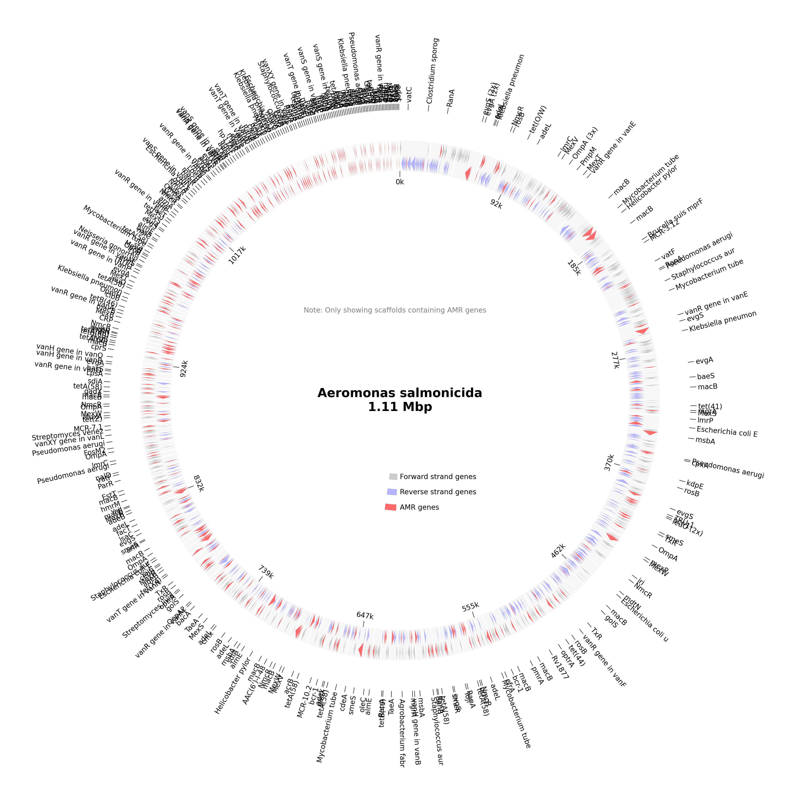

### AAC(6')-I-48
- **Mechanism**: antibiotic inactivation
- **Drug Classes**: aminoglycoside antibiotic
- **AMR Family**: AAC(6')
- **Locations**:
  - gnl|SPADES|FPFIAAFN_1323_4 : position 2814-3320

### Agrobacterium fabrum chloramphenicol acetyltransferase
- **Mechanism**: antibiotic inactivation
- **Drug Classes**: phenicol antibiotic
- **AMR Family**: chloramphenicol acetyltransferase (CAT)
- **Locations**:
  - gnl|SPADES|FPFIAAFN_1111_5 : position 3422-4084

### AxyY
- **Mechanism**: antibiotic efflux
- **Drug Classes**: macrolide antibiotic; fluoroquinolone antibiotic; aminoglycoside antibiotic; cephalosporin
- **AMR Family**: resistance-nodulation-cell division (RND) antibiotic efflux pump
- **Locations**:
  - gnl|SPADES|FPFIAAFN_28960_1 : position 2-355

### Brucella suis mprF
- **Mechanism**: antibiotic target alteration
- **Drug Classes**: peptide antibiotic
- **AMR Family**: defensin resistant mprF
- **Locations**:
  - gnl|SPADES|FPFIAAFN_485_3 : position 2325-4874

### CRP
- **Mechanism**: antibiotic efflux
- **Drug Classes**: macrolide antibiotic; fluoroquinolone antibiotic; penam
- **AMR Family**: resistance-nodulation-cell division (RND) antibiotic efflux pump
- **Locations**:
  - gnl|SPADES|FPFIAAFN_2789_5 : position 1760-2398

### Clostridium sporogenes cplR
- **Mechanism**: antibiotic target protection
- **Drug Classes**: lincosamide antibiotic; pleuromutilin antibiotic
- **AMR Family**: Miscellaneous ABC-F subfamily ATP-binding cassette ribosomal protection proteins
- **Locations**:
  - gnl|SPADES|FPFIAAFN_276_15 : position 19981-20631

### Escherichia coli EF-Tu mutants conferring resistance to Enacyloxin IIa (found in 2 locations)
- **Mechanism**: antibiotic target alteration
- **Drug Classes**: elfamycin antibiotic
- **AMR Family**: elfamycin resistant EF-Tu
- **Locations**:
  - gnl|SPADES|FPFIAAFN_630_7 : position 6285-8981
  - gnl|SPADES|FPFIAAFN_7761_1 : position 3-602

### Escherichia coli EF-Tu mutants conferring resistance to Pulvomycin
- **Mechanism**: antibiotic target alteration
- **Drug Classes**: elfamycin antibiotic
- **AMR Family**: elfamycin resistant EF-Tu
- **Locations**:
  - gnl|SPADES|FPFIAAFN_1763_1 : position 3-1187

### Escherichia coli soxS with mutation conferring antibiotic resistance
- **Mechanism**: antibiotic target alteration; antibiotic efflux; reduced permeability to antibiotic
- **Drug Classes**: fluoroquinolone antibiotic; monobactam; carbapenem; cephalosporin; glycylcycline; cephamycin; penam; tetracycline antibiotic; rifamycin antibiotic; phenicol antibiotic; penem; disinfecting agents and antiseptics
- **AMR Family**: ATP-binding cassette (ABC) antibiotic efflux pump; major facilitator superfamily (MFS) antibiotic efflux pump; resistance-nodulation-cell division (RND) antibiotic efflux pump; General Bacterial Porin with reduced permeability to beta-lactams
- **Locations**:
  - gnl|SPADES|FPFIAAFN_4495_2 : position 244-1002

### Escherichia coli uhpA with mutation conferring resistance to fosfomycin
- **Mechanism**: antibiotic target alteration
- **Drug Classes**: phosphonic acid antibiotic
- **AMR Family**: antibiotic-resistant UhpT
- **Locations**:
  - gnl|SPADES|FPFIAAFN_828_6 : position 6838-7542

### EstT
- **Mechanism**: antibiotic inactivation
- **Drug Classes**: macrolide antibiotic
- **AMR Family**: macrolide esterase
- **Locations**:
  - gnl|SPADES|FPFIAAFN_1980_1 : position 1-591

### FosM2
- **Mechanism**: antibiotic inactivation
- **Drug Classes**: phosphonic acid antibiotic
- **AMR Family**: fosfomycin thiol transferase
- **Locations**:
  - gnl|SPADES|FPFIAAFN_2104_3 : position 1201-1569

### GMB-1
- **Mechanism**: antibiotic inactivation
- **Drug Classes**: carbapenem
- **AMR Family**: GMB beta-lactamase
- **Locations**:
  - gnl|SPADES|FPFIAAFN_30241_1 : position 3-344

### Helicobacter pylori pbp2 mutants conferring resistance to amoxicillin
- **Mechanism**: antibiotic target alteration
- **Drug Classes**: cephalosporin; cephamycin; penam
- **AMR Family**: Penicillin-binding protein mutations conferring resistance to beta-lactam antibiotics
- **Locations**:
  - gnl|SPADES|FPFIAAFN_1368_2 : position 1408-3159

### Helicobacter pylori rpoB mutation conferring resistance to rifampicin
- **Mechanism**: antibiotic target alteration; antibiotic target replacement
- **Drug Classes**: fluoroquinolone antibiotic; rifamycin antibiotic
- **AMR Family**: rifamycin-resistant beta-subunit of RNA polymerase (rpoB)
- **Locations**:
  - gnl|SPADES|FPFIAAFN_473_7 : position 7336-11640

### Klebsiella pneumoniae KpnH
- **Mechanism**: antibiotic efflux
- **Drug Classes**: macrolide antibiotic; fluoroquinolone antibiotic; aminoglycoside antibiotic; carbapenem; cephalosporin; penam; peptide antibiotic; penem
- **AMR Family**: major facilitator superfamily (MFS) antibiotic efflux pump
- **Locations**:
  - gnl|SPADES|FPFIAAFN_355_3 : position 1651-3168

### Klebsiella pneumoniae OmpK37 (found in 4 locations)
- **Mechanism**: reduced permeability to antibiotic
- **Drug Classes**: monobactam; carbapenem; cephalosporin; cephamycin; penam; penem
- **AMR Family**: General Bacterial Porin with reduced permeability to beta-lactams
- **Locations**:
  - gnl|SPADES|FPFIAAFN_3027_1 : position 194-1255
  - gnl|SPADES|FPFIAAFN_538_2 : position 1358-2413
  - gnl|SPADES|FPFIAAFN_7616_1 : position 3-1022
  - gnl|SPADES|FPFIAAFN_7727_1 : position 3-1010

### Klebsiella pneumoniae acrA
- **Mechanism**: antibiotic efflux
- **Drug Classes**: fluoroquinolone antibiotic; cephalosporin; glycylcycline; penam; tetracycline antibiotic; rifamycin antibiotic; phenicol antibiotic; disinfecting agents and antiseptics
- **AMR Family**: resistance-nodulation-cell division (RND) antibiotic efflux pump
- **Locations**:
  - gnl|SPADES|FPFIAAFN_21938_1 : position 35-439

### LpeB
- **Mechanism**: antibiotic efflux
- **Drug Classes**: macrolide antibiotic
- **AMR Family**: resistance-nodulation-cell division (RND) antibiotic efflux pump
- **Locations**:
  - gnl|SPADES|FPFIAAFN_4701_2 : position 360-1595

### LpsA
- **Mechanism**: reduced permeability to antibiotic
- **Drug Classes**: peptide antibiotic
- **AMR Family**: Intrinsic peptide antibiotic resistant Lps
- **Locations**:
  - gnl|SPADES|FPFIAAFN_2462_3 : position 2050-2733

### MCR-10.2
- **Mechanism**: antibiotic target alteration
- **Drug Classes**: peptide antibiotic
- **AMR Family**: MCR phosphoethanolamine transferase
- **Locations**:
  - gnl|SPADES|FPFIAAFN_1260_1 : position 3-1250

### MCR-3.12
- **Mechanism**: antibiotic target alteration
- **Drug Classes**: peptide antibiotic
- **AMR Family**: MCR phosphoethanolamine transferase
- **Locations**:
  - gnl|SPADES|FPFIAAFN_485_4 : position 5322-6947

### MCR-7.1
- **Mechanism**: antibiotic target alteration
- **Drug Classes**: peptide antibiotic
- **AMR Family**: MCR phosphoethanolamine transferase
- **Locations**:
  - gnl|SPADES|FPFIAAFN_2148_2 : position 189-1847

### MexB (found in 2 locations)
- **Mechanism**: antibiotic efflux
- **Drug Classes**: macrolide antibiotic; fluoroquinolone antibiotic; monobactam; carbapenem; cephalosporin; cephamycin; penam; tetracycline antibiotic; peptide antibiotic; aminocoumarin antibiotic; diaminopyrimidine antibiotic; sulfonamide antibiotic; phenicol antibiotic; penem
- **AMR Family**: resistance-nodulation-cell division (RND) antibiotic efflux pump
- **Locations**:
  - gnl|SPADES|FPFIAAFN_2876_4 : position 2227-2535
  - gnl|SPADES|FPFIAAFN_3358_2 : position 1145-2182

### MexH (found in 2 locations)
- **Mechanism**: antibiotic efflux
- **Drug Classes**: fluoroquinolone antibiotic; tetracycline antibiotic; disinfecting agents and antiseptics
- **AMR Family**: resistance-nodulation-cell division (RND) antibiotic efflux pump
- **Locations**:
  - gnl|SPADES|FPFIAAFN_1744_2 : position 3111-4181
  - gnl|SPADES|FPFIAAFN_1902_2 : position 2764-3834

### MexS (found in 3 locations)
- **Mechanism**: antibiotic efflux
- **Drug Classes**: fluoroquinolone antibiotic; diaminopyrimidine antibiotic; phenicol antibiotic
- **AMR Family**: resistance-nodulation-cell division (RND) antibiotic efflux pump
- **Locations**:
  - gnl|SPADES|FPFIAAFN_1489_2 : position 1125-2141
  - gnl|SPADES|FPFIAAFN_3707_2 : position 357-1361
  - gnl|SPADES|FPFIAAFN_596_13 : position 8528-9532

### MexT (found in 3 locations)
- **Mechanism**: antibiotic efflux
- **Drug Classes**: fluoroquinolone antibiotic; diaminopyrimidine antibiotic; phenicol antibiotic
- **AMR Family**: resistance-nodulation-cell division (RND) antibiotic efflux pump
- **Locations**:
  - gnl|SPADES|FPFIAAFN_3178_1 : position 232-1173
  - gnl|SPADES|FPFIAAFN_4027_1 : position 1-354
  - gnl|SPADES|FPFIAAFN_452_3 : position 2312-3253

### MexV (found in 2 locations)
- **Mechanism**: antibiotic efflux
- **Drug Classes**: macrolide antibiotic; fluoroquinolone antibiotic; tetracycline antibiotic; phenicol antibiotic; disinfecting agents and antiseptics
- **AMR Family**: resistance-nodulation-cell division (RND) antibiotic efflux pump
- **Locations**:
  - gnl|SPADES|FPFIAAFN_1289_2 : position 1315-2421
  - gnl|SPADES|FPFIAAFN_428_1 : position 2-736

### MexW (found in 4 locations)
- **Mechanism**: antibiotic efflux
- **Drug Classes**: macrolide antibiotic; fluoroquinolone antibiotic; tetracycline antibiotic; phenicol antibiotic; disinfecting agents and antiseptics
- **AMR Family**: resistance-nodulation-cell division (RND) antibiotic efflux pump
- **Locations**:
  - gnl|SPADES|FPFIAAFN_1289_3 : position 2437-5517
  - gnl|SPADES|FPFIAAFN_2161_5 : position 1959-2672
  - gnl|SPADES|FPFIAAFN_740_9 : position 4422-7586
  - gnl|SPADES|FPFIAAFN_7704_1 : position 3-1025

### MuxA
- **Mechanism**: antibiotic efflux
- **Drug Classes**: macrolide antibiotic; monobactam; tetracycline antibiotic; aminocoumarin antibiotic
- **AMR Family**: resistance-nodulation-cell division (RND) antibiotic efflux pump
- **Locations**:
  - gnl|SPADES|FPFIAAFN_2161_1 : position 1-369

### MuxB
- **Mechanism**: antibiotic efflux
- **Drug Classes**: macrolide antibiotic; monobactam; tetracycline antibiotic; aminocoumarin antibiotic
- **AMR Family**: resistance-nodulation-cell division (RND) antibiotic efflux pump
- **Locations**:
  - gnl|SPADES|FPFIAAFN_50737_1 : position 2-229

### Mycobacterium tuberculosis katG mutations conferring resistance to isoniazid
- **Mechanism**: antibiotic target alteration
- **Drug Classes**: isoniazid-like antibiotic
- **AMR Family**: isoniazid resistant katG
- **Locations**:
  - gnl|SPADES|FPFIAAFN_971_1 : position 179-2314

### Mycobacterium tuberculosis ndh with mutation conferring resistance to isoniazid (found in 2 locations)
- **Mechanism**: antibiotic target alteration
- **Drug Classes**: isoniazid-like antibiotic
- **AMR Family**: antibiotic resistant ndh
- **Locations**:
  - gnl|SPADES|FPFIAAFN_3426_3 : position 1228-2145
  - gnl|SPADES|FPFIAAFN_501_1 : position 3-920

### Mycobacterium tuberculosis pncA mutations conferring resistance to pyrazinamide
- **Mechanism**: antibiotic target alteration
- **Drug Classes**: pyrazine antibiotic
- **AMR Family**: Pyrazinamide resistant pncA
- **Locations**:
  - gnl|SPADES|FPFIAAFN_1209_3 : position 1740-2375

### Mycobacterium tuberculosis rpoB mutations conferring resistance to rifampicin
- **Mechanism**: antibiotic target alteration; antibiotic target replacement
- **Drug Classes**: rifamycin antibiotic
- **AMR Family**: rifamycin-resistant beta-subunit of RNA polymerase (rpoB)
- **Locations**:
  - gnl|SPADES|FPFIAAFN_473_6 : position 3216-7244

### Neisseria gonorrhoeae pilQ gene conferring resistance to beta-lactam
- **Mechanism**: antibiotic target alteration
- **Drug Classes**: cephalosporin; cephamycin; penam
- **AMR Family**: Penicillin-binding protein mutations conferring resistance to beta-lactam antibiotics
- **Locations**:
  - gnl|SPADES|FPFIAAFN_3307_2 : position 1568-2209

### NmcR (found in 8 locations)
- **Mechanism**: antibiotic inactivation
- **Drug Classes**: carbapenem; cephalosporin; cephamycin; penam
- **AMR Family**: NmcA beta-lactamase
- **Locations**:
  - gnl|SPADES|FPFIAAFN_1001_1 : position 89-997
  - gnl|SPADES|FPFIAAFN_1319_5 : position 4534-5412
  - gnl|SPADES|FPFIAAFN_2174_1 : position 2-745
  - gnl|SPADES|FPFIAAFN_2786_1 : position 209-1129
  - gnl|SPADES|FPFIAAFN_355_12 : position 12662-13504
  - gnl|SPADES|FPFIAAFN_4010_3 : position 1462-1854
  - gnl|SPADES|FPFIAAFN_4266_1 : position 3-782
  - gnl|SPADES|FPFIAAFN_815_3 : position 2556-3431

### OmpA (found in 9 locations)
- **Mechanism**: reduced permeability to antibiotic
- **Drug Classes**: peptide antibiotic
- **AMR Family**: General Bacterial Porin with reduced permeability to peptide antibiotics
- **Locations**:
  - gnl|SPADES|FPFIAAFN_1787_2 : position 973-1629
  - gnl|SPADES|FPFIAAFN_2092_3 : position 2564-3088
  - gnl|SPADES|FPFIAAFN_2165_3 : position 2573-3097
  - gnl|SPADES|FPFIAAFN_4170_2 : position 961-1617
  - gnl|SPADES|FPFIAAFN_428_7 : position 6473-7492
  - gnl|SPADES|FPFIAAFN_428_8 : position 7923-8930
  - gnl|SPADES|FPFIAAFN_428_9 : position 9140-10198
  - gnl|SPADES|FPFIAAFN_719_6 : position 4072-5130
  - gnl|SPADES|FPFIAAFN_8714_1 : position 53-541

### OpmH
- **Mechanism**: antibiotic efflux
- **Drug Classes**: disinfecting agents and antiseptics
- **AMR Family**: resistance-nodulation-cell division (RND) antibiotic efflux pump
- **Locations**:
  - gnl|SPADES|FPFIAAFN_2998_2 : position 183-1508

### OprM
- **Mechanism**: antibiotic efflux
- **Drug Classes**: macrolide antibiotic; fluoroquinolone antibiotic; monobactam; aminoglycoside antibiotic; carbapenem; cephalosporin; cephamycin; penam; tetracycline antibiotic; peptide antibiotic; aminocoumarin antibiotic; diaminopyrimidine antibiotic; sulfonamide antibiotic; phenicol antibiotic; penem; disinfecting agents and antiseptics
- **AMR Family**: resistance-nodulation-cell division (RND) antibiotic efflux pump
- **Locations**:
  - gnl|SPADES|FPFIAAFN_3358_1 : position 1-1152

### PAM-1
- **Mechanism**: antibiotic inactivation
- **Drug Classes**: carbapenem; cephalosporin
- **AMR Family**: PAM beta-lactamase
- **Locations**:
  - gnl|SPADES|FPFIAAFN_7594_2 : position 214-858

### ParR
- **Mechanism**: antibiotic efflux; reduced permeability to antibiotic
- **Drug Classes**: macrolide antibiotic; fluoroquinolone antibiotic; monobactam; aminoglycoside antibiotic; carbapenem; cephalosporin; cephamycin; penam; tetracycline antibiotic; phenicol antibiotic; penem; disinfecting agents and antiseptics
- **AMR Family**: resistance-nodulation-cell division (RND) antibiotic efflux pump; Outer Membrane Porin (Opr)
- **Locations**:
  - gnl|SPADES|FPFIAAFN_2002_4 : position 3150-3632

### ParS (found in 3 locations)
- **Mechanism**: antibiotic efflux; reduced permeability to antibiotic
- **Drug Classes**: macrolide antibiotic; fluoroquinolone antibiotic; monobactam; aminoglycoside antibiotic; carbapenem; cephalosporin; cephamycin; penam; tetracycline antibiotic; phenicol antibiotic; penem; disinfecting agents and antiseptics
- **AMR Family**: resistance-nodulation-cell division (RND) antibiotic efflux pump; Outer Membrane Porin (Opr)
- **Locations**:
  - gnl|SPADES|FPFIAAFN_11522_1 : position 2-589
  - gnl|SPADES|FPFIAAFN_12552_1 : position 2-589
  - gnl|SPADES|FPFIAAFN_21687_1 : position 32-445

### PmpM
- **Mechanism**: antibiotic efflux
- **Drug Classes**: fluoroquinolone antibiotic; aminoglycoside antibiotic; disinfecting agents and antiseptics
- **AMR Family**: multidrug and toxic compound extrusion (MATE) transporter
- **Locations**:
  - gnl|SPADES|FPFIAAFN_428_13 : position 13179-14558

### Pseudomonas aeruginosa CpxR (found in 2 locations)
- **Mechanism**: antibiotic efflux
- **Drug Classes**: macrolide antibiotic; fluoroquinolone antibiotic; monobactam; aminoglycoside antibiotic; carbapenem; cephalosporin; cephamycin; penam; tetracycline antibiotic; peptide antibiotic; aminocoumarin antibiotic; diaminopyrimidine antibiotic; sulfonamide antibiotic; phenicol antibiotic; penem
- **AMR Family**: resistance-nodulation-cell division (RND) antibiotic efflux pump
- **Locations**:
  - gnl|SPADES|FPFIAAFN_26710_1 : position 3-377
  - gnl|SPADES|FPFIAAFN_644_7 : position 6448-7143

### Pseudomonas aeruginosa ampR with mutation conferring resistance to aztreonam (found in 2 locations)
- **Mechanism**: antibiotic target alteration; antibiotic inactivation
- **Drug Classes**: monobactam; carbapenem; cephalosporin
- **AMR Family**: PDC beta-lactamase; ampR transcriptional regulator with mutation conferring resistance to monobactam antibiotics
- **Locations**:
  - gnl|SPADES|FPFIAAFN_2060_2 : position 2251-3171
  - gnl|SPADES|FPFIAAFN_490_15 : position 13428-14141

### Pseudomonas aeruginosa soxR
- **Mechanism**: antibiotic target alteration; antibiotic efflux
- **Drug Classes**: fluoroquinolone antibiotic; cephalosporin; glycylcycline; penam; tetracycline antibiotic; rifamycin antibiotic; phenicol antibiotic; disinfecting agents and antiseptics
- **AMR Family**: ATP-binding cassette (ABC) antibiotic efflux pump; major facilitator superfamily (MFS) antibiotic efflux pump; resistance-nodulation-cell division (RND) antibiotic efflux pump
- **Locations**:
  - gnl|SPADES|FPFIAAFN_2117_4 : position 1662-2141

### QepA2
- **Mechanism**: antibiotic efflux
- **Drug Classes**: fluoroquinolone antibiotic
- **AMR Family**: major facilitator superfamily (MFS) antibiotic efflux pump
- **Locations**:
  - gnl|SPADES|FPFIAAFN_1581_2 : position 1499-2896

### RanA (found in 9 locations)
- **Mechanism**: antibiotic efflux
- **Drug Classes**: aminoglycoside antibiotic
- **AMR Family**: ATP-binding cassette (ABC) antibiotic efflux pump
- **Locations**:
  - gnl|SPADES|FPFIAAFN_1016_3 : position 2577-3341
  - gnl|SPADES|FPFIAAFN_1033_1 : position 225-1025
  - gnl|SPADES|FPFIAAFN_1146_4 : position 3260-4258
  - gnl|SPADES|FPFIAAFN_321_7 : position 8030-9112
  - gnl|SPADES|FPFIAAFN_34784_1 : position 2-307
  - gnl|SPADES|FPFIAAFN_490_14 : position 12175-13242
  - gnl|SPADES|FPFIAAFN_64687_1 : position 2-220
  - gnl|SPADES|FPFIAAFN_7091_1 : position 2-736
  - gnl|SPADES|FPFIAAFN_9765_1 : position 1-648

### RanB
- **Mechanism**: antibiotic efflux
- **Drug Classes**: aminoglycoside antibiotic
- **AMR Family**: ATP-binding cassette (ABC) antibiotic efflux pump
- **Locations**:
  - gnl|SPADES|FPFIAAFN_1033_2 : position 1025-1804

### RlmA(II)
- **Mechanism**: antibiotic target alteration
- **Drug Classes**: macrolide antibiotic; lincosamide antibiotic
- **AMR Family**: non-erm 23S ribosomal RNA methyltransferase (G748)
- **Locations**:
  - gnl|SPADES|FPFIAAFN_10801_1 : position 13-771

### Rv1877
- **Mechanism**: antibiotic efflux
- **Drug Classes**: fluoroquinolone antibiotic
- **AMR Family**: major facilitator superfamily (MFS) antibiotic efflux pump
- **Locations**:
  - gnl|SPADES|FPFIAAFN_900_7 : position 5053-6417

### Staphylococcus aureus fusA with mutation conferring resistance to fusidic acid
- **Mechanism**: antibiotic target alteration
- **Drug Classes**: fusidane antibiotic
- **AMR Family**: antibiotic resistant fusA
- **Locations**:
  - gnl|SPADES|FPFIAAFN_1763_2 : position 1242-3347

### Staphylococcus aureus fusE with mutation conferring resistance to fusidic acid
- **Mechanism**: antibiotic target alteration
- **Drug Classes**: fusidane antibiotic
- **AMR Family**: antibiotic resistant fusE
- **Locations**:
  - gnl|SPADES|FPFIAAFN_497_17 : position 7319-7852

### Staphylococcus aureus mupA conferring resistance to mupirocin
- **Mechanism**: antibiotic target alteration
- **Drug Classes**: mupirocin-like antibiotic
- **AMR Family**: antibiotic-resistant isoleucyl-tRNA synthetase (ileS)
- **Locations**:
  - gnl|SPADES|FPFIAAFN_9214_1 : position 2-880

### Staphylococcus aureus murA with mutation conferring resistance to fosfomycin
- **Mechanism**: antibiotic target alteration
- **Drug Classes**: phosphonic acid antibiotic
- **AMR Family**: antibiotic-resistant murA transferase
- **Locations**:
  - gnl|SPADES|FPFIAAFN_1033_7 : position 3487-4743

### Streptomyces lividans cmlR
- **Mechanism**: antibiotic efflux
- **Drug Classes**: phenicol antibiotic
- **AMR Family**: major facilitator superfamily (MFS) antibiotic efflux pump
- **Locations**:
  - gnl|SPADES|FPFIAAFN_1683_3 : position 3618-4355

### Streptomyces venezuelae rox
- **Mechanism**: antibiotic inactivation
- **Drug Classes**: rifamycin antibiotic
- **AMR Family**: rifampin monooxygenase
- **Locations**:
  - gnl|SPADES|FPFIAAFN_2145_3 : position 1547-2770

### TRU-1 (found in 2 locations)
- **Mechanism**: antibiotic inactivation
- **Drug Classes**: cephalosporin; penam
- **AMR Family**: TRU beta-lactamase
- **Locations**:
  - gnl|SPADES|FPFIAAFN_3231_1: position 348-1496
  - gnl|SPADES|FPFIAAFN_671_3: position 1626-2858

### TaeA (found in 5 locations)
- **Mechanism**: antibiotic efflux
- **Drug Classes**: pleuromutilin antibiotic
- **AMR Family**: ATP-binding cassette (ABC) antibiotic efflux pump
- **Locations**:
  - gnl|SPADES|FPFIAAFN_1124_5 : position 3089-4999
  - gnl|SPADES|FPFIAAFN_1519_1 : position 18-1685
  - gnl|SPADES|FPFIAAFN_21752_2 : position 156-443
  - gnl|SPADES|FPFIAAFN_33361_1 : position 1-318
  - gnl|SPADES|FPFIAAFN_48283_1 : position 2-256

### TolC
- **Mechanism**: antibiotic efflux
- **Drug Classes**: macrolide antibiotic; fluoroquinolone antibiotic; aminoglycoside antibiotic; carbapenem; cephalosporin; glycylcycline; cephamycin; penam; tetracycline antibiotic; peptide antibiotic; aminocoumarin antibiotic; rifamycin antibiotic; phenicol antibiotic; penem; disinfecting agents and antiseptics
- **AMR Family**: ATP-binding cassette (ABC) antibiotic efflux pump; major facilitator superfamily (MFS) antibiotic efflux pump; resistance-nodulation-cell division (RND) antibiotic efflux pump
- **Locations**:
  - gnl|SPADES|FPFIAAFN_34238_1 : position 3-275

### TriB
- **Mechanism**: antibiotic efflux
- **Drug Classes**: disinfecting agents and antiseptics
- **AMR Family**: resistance-nodulation-cell division (RND) antibiotic efflux pump
- **Locations**:
  - gnl|SPADES|FPFIAAFN_7122_1 : position 3-758

### TxR (found in 12 locations)
- **Mechanism**: antibiotic efflux
- **Drug Classes**: tetracycline antibiotic
- **AMR Family**: ATP-binding cassette (ABC) antibiotic efflux pump
- **Locations**:
  - gnl|SPADES|FPFIAAFN_1732_1 : position 3-1157
  - gnl|SPADES|FPFIAAFN_18868_1 : position 3-494
  - gnl|SPADES|FPFIAAFN_21812_1 : position 2-442
  - gnl|SPADES|FPFIAAFN_32119_1 : position 2-328
  - gnl|SPADES|FPFIAAFN_3315_2 : position 1262-2209
  - gnl|SPADES|FPFIAAFN_34241_1 : position 3-311
  - gnl|SPADES|FPFIAAFN_5179_1 : position 3-1226
  - gnl|SPADES|FPFIAAFN_5543_2 : position 176-1369
  - gnl|SPADES|FPFIAAFN_5852_2 : position 379-1302
  - gnl|SPADES|FPFIAAFN_58828_1 : position 3-233
  - gnl|SPADES|FPFIAAFN_692_10 : position 6166-7446
  - gnl|SPADES|FPFIAAFN_858_10 : position 7572-8435

### YajC
- **Mechanism**: antibiotic efflux
- **Drug Classes**: fluoroquinolone antibiotic; cephalosporin; glycylcycline; penam; tetracycline antibiotic; oxazolidinone antibiotic; glycopeptide antibiotic; rifamycin antibiotic; phenicol antibiotic; disinfecting agents and antiseptics
- **AMR Family**: resistance-nodulation-cell division (RND) antibiotic efflux pump
- **Locations**:
  - gnl|SPADES|FPFIAAFN_1755_2 : position 1908-2243

### YojI (found in 3 locations)
- **Mechanism**: antibiotic efflux
- **Drug Classes**: peptide antibiotic
- **AMR Family**: ATP-binding cassette (ABC) antibiotic efflux pump
- **Locations**:
  - gnl|SPADES|FPFIAAFN_1016_4 : position 3388-5034
  - gnl|SPADES|FPFIAAFN_11557_2 : position 501-728
  - gnl|SPADES|FPFIAAFN_1918_3 : position 1652-2293

### acrB
- **Mechanism**: antibiotic efflux
- **Drug Classes**: fluoroquinolone antibiotic; cephalosporin; glycylcycline; penam; tetracycline antibiotic; rifamycin antibiotic; phenicol antibiotic; disinfecting agents and antiseptics
- **AMR Family**: resistance-nodulation-cell division (RND) antibiotic efflux pump
- **Locations**:
  - gnl|SPADES|FPFIAAFN_1267_1 : position 3-2165

### acrD
- **Mechanism**: antibiotic efflux
- **Drug Classes**: aminoglycoside antibiotic
- **AMR Family**: resistance-nodulation-cell division (RND) antibiotic efflux pump
- **Locations**:
  - gnl|SPADES|FPFIAAFN_30971_1 : position 2-337

### adeB (found in 2 locations)
- **Mechanism**: antibiotic efflux
- **Drug Classes**: glycylcycline; tetracycline antibiotic
- **AMR Family**: resistance-nodulation-cell division (RND) antibiotic efflux pump
- **Locations**:
  - gnl|SPADES|FPFIAAFN_1744_1 : position 2-3037
  - gnl|SPADES|FPFIAAFN_1902_1 : position 3-2690

### adeL (found in 16 locations)
- **Mechanism**: antibiotic efflux
- **Drug Classes**: fluoroquinolone antibiotic; tetracycline antibiotic
- **AMR Family**: resistance-nodulation-cell division (RND) antibiotic efflux pump
- **Locations**:
  - gnl|SPADES|FPFIAAFN_1229_5 : position 4566-5471
  - gnl|SPADES|FPFIAAFN_13165_1 : position 3-659
  - gnl|SPADES|FPFIAAFN_1411_4 : position 2113-3009
  - gnl|SPADES|FPFIAAFN_1488_1 : position 64-978
  - gnl|SPADES|FPFIAAFN_1876_1 : position 2-874
  - gnl|SPADES|FPFIAAFN_24353_1 : position 1-405
  - gnl|SPADES|FPFIAAFN_24356_1 : position 3-407
  - gnl|SPADES|FPFIAAFN_355_1 : position 2-466
  - gnl|SPADES|FPFIAAFN_390_17 : position 14601-15482
  - gnl|SPADES|FPFIAAFN_3918_2 : position 377-1276
  - gnl|SPADES|FPFIAAFN_4197_1 : position 3-629
  - gnl|SPADES|FPFIAAFN_4948_1 : position 2-874
  - gnl|SPADES|FPFIAAFN_5739_2 : position 168-1076
  - gnl|SPADES|FPFIAAFN_5746_1 : position 253-1161
  - gnl|SPADES|FPFIAAFN_67849_1 : position 2-214
  - gnl|SPADES|FPFIAAFN_983_3 : position 1113-2021

### adeR
- **Mechanism**: antibiotic efflux
- **Drug Classes**: glycylcycline; tetracycline antibiotic
- **AMR Family**: resistance-nodulation-cell division (RND) antibiotic efflux pump
- **Locations**:
  - gnl|SPADES|FPFIAAFN_9858_1 : position 1-447

### almE (found in 5 locations)
- **Mechanism**: antibiotic target alteration
- **Drug Classes**: peptide antibiotic
- **AMR Family**: polymyxin resistance operon; alm glycyltransferase
- **Locations**:
  - gnl|SPADES|FPFIAAFN_10229_2 : position 173-808
  - gnl|SPADES|FPFIAAFN_1180_6 : position 5004-6185
  - gnl|SPADES|FPFIAAFN_1390_3 : position 1612-4701
  - gnl|SPADES|FPFIAAFN_3644_1 : position 3-638
  - gnl|SPADES|FPFIAAFN_41200_1 : position 2-274

### arlR (found in 2 locations)
- **Mechanism**: antibiotic efflux
- **Drug Classes**: fluoroquinolone antibiotic; disinfecting agents and antiseptics
- **AMR Family**: major facilitator superfamily (MFS) antibiotic efflux pump
- **Locations**:
  - gnl|SPADES|FPFIAAFN_1831_3 : position 2184-2516
  - gnl|SPADES|FPFIAAFN_5291_1 : position 2-526

### arnA
- **Mechanism**: antibiotic target alteration
- **Drug Classes**: peptide antibiotic
- **AMR Family**: pmr phosphoethanolamine transferase
- **Locations**:
  - gnl|SPADES|FPFIAAFN_3955_2 : position 324-1268

### bacA
- **Mechanism**: antibiotic target alteration
- **Drug Classes**: peptide antibiotic
- **AMR Family**: undecaprenyl pyrophosphate related proteins
- **Locations**:
  - gnl|SPADES|FPFIAAFN_1524_4 : position 2758-3555

### baeR
- **Mechanism**: antibiotic efflux
- **Drug Classes**: aminoglycoside antibiotic; aminocoumarin antibiotic
- **AMR Family**: resistance-nodulation-cell division (RND) antibiotic efflux pump
- **Locations**:
  - gnl|SPADES|FPFIAAFN_4598_1 : position 1-621

### baeS
- **Mechanism**: antibiotic efflux
- **Drug Classes**: aminoglycoside antibiotic; aminocoumarin antibiotic
- **AMR Family**: resistance-nodulation-cell division (RND) antibiotic efflux pump
- **Locations**:
  - gnl|SPADES|FPFIAAFN_588_10 : position 8135-10024

### basS (found in 2 locations)
- **Mechanism**: antibiotic target alteration; antibiotic efflux
- **Drug Classes**: peptide antibiotic
- **AMR Family**: pmr phosphoethanolamine transferase
- **Locations**:
  - gnl|SPADES|FPFIAAFN_2523_4 : position 1377-2726
  - gnl|SPADES|FPFIAAFN_3607_1 : position 2-376

### bcr-1 (found in 4 locations)
- **Mechanism**: antibiotic efflux
- **Drug Classes**: bicyclomycin-like antibiotic
- **AMR Family**: major facilitator superfamily (MFS) antibiotic efflux pump
- **Locations**:
  - gnl|SPADES|FPFIAAFN_1001_2 : position 1052-2251
  - gnl|SPADES|FPFIAAFN_1243_3 : position 1922-3124
  - gnl|SPADES|FPFIAAFN_671_4 : position 3160-4332
  - gnl|SPADES|FPFIAAFN_970_3 : position 1501-2739

### bcrA (found in 3 locations)
- **Mechanism**: antibiotic efflux
- **Drug Classes**: peptide antibiotic
- **AMR Family**: ATP-binding cassette (ABC) antibiotic efflux pump
- **Locations**:
  - gnl|SPADES|FPFIAAFN_29560_1 : position 3-350
  - gnl|SPADES|FPFIAAFN_51596_1 : position 1-249
  - gnl|SPADES|FPFIAAFN_7333_1 : position 3-632

### cdeA
- **Mechanism**: antibiotic efflux
- **Drug Classes**: fluoroquinolone antibiotic; disinfecting agents and antiseptics
- **AMR Family**: multidrug and toxic compound extrusion (MATE) transporter
- **Locations**:
  - gnl|SPADES|FPFIAAFN_1199_3 : position 1574-2779

### ceoB
- **Mechanism**: antibiotic efflux
- **Drug Classes**: fluoroquinolone antibiotic; aminoglycoside antibiotic
- **AMR Family**: resistance-nodulation-cell division (RND) antibiotic efflux pump
- **Locations**:
  - gnl|SPADES|FPFIAAFN_1755_1 : position 36-1889

### clbB
- **Mechanism**: antibiotic target alteration
- **Drug Classes**: lincosamide antibiotic; streptogramin antibiotic; streptogramin A antibiotic; oxazolidinone antibiotic; phenicol antibiotic; pleuromutilin antibiotic
- **AMR Family**: Cfr 23S ribosomal RNA methyltransferase
- **Locations**:
  - gnl|SPADES|FPFIAAFN_2986_3 : position 1204-2307

### cmlv (found in 2 locations)
- **Mechanism**: antibiotic inactivation
- **Drug Classes**: phenicol antibiotic
- **AMR Family**: chloramphenicol phosphotransferase
- **Locations**:
  - gnl|SPADES|FPFIAAFN_19213_1 : position 2-487
  - gnl|SPADES|FPFIAAFN_7286_1 : position 2-481

### cmx
- **Mechanism**: antibiotic efflux
- **Drug Classes**: phenicol antibiotic
- **AMR Family**: major facilitator superfamily (MFS) antibiotic efflux pump
- **Locations**:
  - gnl|SPADES|FPFIAAFN_1435_5 : position 4310-5056

### cprS
- **Mechanism**: antibiotic target alteration; antibiotic efflux
- **Drug Classes**: peptide antibiotic
- **AMR Family**: pmr phosphoethanolamine transferase
- **Locations**:
  - gnl|SPADES|FPFIAAFN_2654_3 : position 2011-2721

### cpxA (found in 6 locations)
- **Mechanism**: antibiotic efflux
- **Drug Classes**: aminoglycoside antibiotic; aminocoumarin antibiotic
- **AMR Family**: resistance-nodulation-cell division (RND) antibiotic efflux pump
- **Locations**:
  - gnl|SPADES|FPFIAAFN_17657_1 : position 3-521
  - gnl|SPADES|FPFIAAFN_21290_1 : position 38-451
  - gnl|SPADES|FPFIAAFN_28533_1 : position 114-359
  - gnl|SPADES|FPFIAAFN_58826_1 : position 3-233
  - gnl|SPADES|FPFIAAFN_644_8 : position 7140-8495
  - gnl|SPADES|FPFIAAFN_8986_1 : position 2-898

### efrA
- **Mechanism**: antibiotic efflux
- **Drug Classes**: macrolide antibiotic; fluoroquinolone antibiotic; rifamycin antibiotic
- **AMR Family**: ATP-binding cassette (ABC) antibiotic efflux pump
- **Locations**:
  - gnl|SPADES|FPFIAAFN_970_7 : position 6785-7528

### evgA (found in 7 locations)
- **Mechanism**: antibiotic efflux
- **Drug Classes**: macrolide antibiotic; fluoroquinolone antibiotic; penam; tetracycline antibiotic
- **AMR Family**: major facilitator superfamily (MFS) antibiotic efflux pump; resistance-nodulation-cell division (RND) antibiotic efflux pump
- **Locations**:
  - gnl|SPADES|FPFIAAFN_20498_1 : position 3-464
  - gnl|SPADES|FPFIAAFN_2531_3 : position 2225-2860
  - gnl|SPADES|FPFIAAFN_3198_3 : position 868-1458
  - gnl|SPADES|FPFIAAFN_333_13 : position 14281-14904
  - gnl|SPADES|FPFIAAFN_333_15 : position 15496-16119
  - gnl|SPADES|FPFIAAFN_581_14 : position 10867-11505
  - gnl|SPADES|FPFIAAFN_9917_1 : position 617-829

### evgS (found in 17 locations)
- **Mechanism**: antibiotic efflux
- **Drug Classes**: macrolide antibiotic; fluoroquinolone antibiotic; penam; tetracycline antibiotic
- **AMR Family**: major facilitator superfamily (MFS) antibiotic efflux pump; resistance-nodulation-cell division (RND) antibiotic efflux pump
- **Locations**:
  - gnl|SPADES|FPFIAAFN_1020_6 : position 4209-4916
  - gnl|SPADES|FPFIAAFN_15672_1 : position 32-571
  - gnl|SPADES|FPFIAAFN_1833_4 : position 2983-3957
  - gnl|SPADES|FPFIAAFN_19837_1 : position 2-475
  - gnl|SPADES|FPFIAAFN_23575_1 : position 2-415
  - gnl|SPADES|FPFIAAFN_2743_2 : position 1065-2642
  - gnl|SPADES|FPFIAAFN_3297_1 : position 1-1101
  - gnl|SPADES|FPFIAAFN_333_12 : position 10694-14284
  - gnl|SPADES|FPFIAAFN_333_16 : position 16129-19743
  - gnl|SPADES|FPFIAAFN_3663_3 : position 1845-2018
  - gnl|SPADES|FPFIAAFN_4928_1 : position 172-1518
  - gnl|SPADES|FPFIAAFN_505_7 : position 7212-11183
  - gnl|SPADES|FPFIAAFN_5066_1 : position 1-1476
  - gnl|SPADES|FPFIAAFN_6356_1 : position 3-791
  - gnl|SPADES|FPFIAAFN_64681_1 : position 3-221
  - gnl|SPADES|FPFIAAFN_64684_1 : position 3-221
  - gnl|SPADES|FPFIAAFN_666_9 : position 7609-9705

### facT (found in 2 locations)
- **Mechanism**: antibiotic efflux
- **Drug Classes**: elfamycin antibiotic
- **AMR Family**: major facilitator superfamily (MFS) antibiotic efflux pump
- **Locations**:
  - gnl|SPADES|FPFIAAFN_1865_2 : position 530-1918
  - gnl|SPADES|FPFIAAFN_3799_1 : position 33-1421

### farA
- **Mechanism**: antibiotic efflux
- **Drug Classes**: antibacterial free fatty acids
- **AMR Family**: major facilitator superfamily (MFS) antibiotic efflux pump
- **Locations**:
  - gnl|SPADES|FPFIAAFN_355_2 : position 563-1615

### gadX (found in 2 locations)
- **Mechanism**: antibiotic efflux
- **Drug Classes**: macrolide antibiotic; fluoroquinolone antibiotic; penam
- **AMR Family**: resistance-nodulation-cell division (RND) antibiotic efflux pump
- **Locations**:
  - gnl|SPADES|FPFIAAFN_1229_4 : position 3572-4483
  - gnl|SPADES|FPFIAAFN_2336_2 : position 849-1724

### golS (found in 3 locations)
- **Mechanism**: antibiotic efflux
- **Drug Classes**: monobactam; carbapenem; cephalosporin; cephamycin; penam; phenicol antibiotic; penem
- **AMR Family**: resistance-nodulation-cell division (RND) antibiotic efflux pump
- **Locations**:
  - gnl|SPADES|FPFIAAFN_1681_3 : position 3742-4152
  - gnl|SPADES|FPFIAAFN_6545_2 : position 788-1180
  - gnl|SPADES|FPFIAAFN_839_3 : position 3992-4405

### hmrM
- **Mechanism**: antibiotic efflux
- **Drug Classes**: fluoroquinolone antibiotic; disinfecting agents and antiseptics
- **AMR Family**: multidrug and toxic compound extrusion (MATE) transporter
- **Locations**:
  - gnl|SPADES|FPFIAAFN_1927_3 : position 1194-2546

### hp1181
- **Mechanism**: antibiotic efflux
- **Drug Classes**: fluoroquinolone antibiotic; tetracycline antibiotic; nitroimidazole antibiotic
- **AMR Family**: major facilitator superfamily (MFS) antibiotic efflux pump
- **Locations**:
  - gnl|SPADES|FPFIAAFN_5789_3 : position 501-1316

### iri
- **Mechanism**: antibiotic inactivation
- **Drug Classes**: rifamycin antibiotic
- **AMR Family**: rifampin monooxygenase
- **Locations**:
  - gnl|SPADES|FPFIAAFN_742_7 : position 9260-9700

### kdpE
- **Mechanism**: antibiotic efflux
- **Drug Classes**: aminoglycoside antibiotic
- **AMR Family**: kdpDE
- **Locations**:
  - gnl|SPADES|FPFIAAFN_647_11 : position 10343-10891

### leuO (found in 4 locations)
- **Mechanism**: antibiotic efflux
- **Drug Classes**: nucleoside antibiotic; disinfecting agents and antiseptics
- **AMR Family**: major facilitator superfamily (MFS) antibiotic efflux pump
- **Locations**:
  - gnl|SPADES|FPFIAAFN_3093_2 : position 197-1159
  - gnl|SPADES|FPFIAAFN_671_5 : position 4351-5313
  - gnl|SPADES|FPFIAAFN_671_9 : position 7407-8423
  - gnl|SPADES|FPFIAAFN_8954_1 : position 2-901

### lmrC (found in 2 locations)
- **Mechanism**: antibiotic target protection
- **Drug Classes**: lincosamide antibiotic
- **AMR Family**: Miscellaneous ABC-F subfamily ATP-binding cassette ribosomal protection proteins
- **Locations**:
  - gnl|SPADES|FPFIAAFN_2077_2 : position 350-1045
  - gnl|SPADES|FPFIAAFN_425_19 : position 13583-14347

### lmrP
- **Mechanism**: antibiotic efflux
- **Drug Classes**: macrolide antibiotic; lincosamide antibiotic; streptogramin antibiotic; streptogramin A antibiotic; tetracycline antibiotic
- **AMR Family**: major facilitator superfamily (MFS) antibiotic efflux pump
- **Locations**:
  - gnl|SPADES|FPFIAAFN_630_2 : position 759-1979

### lsaC
- **Mechanism**: antibiotic target protection
- **Drug Classes**: lincosamide antibiotic; streptogramin antibiotic; pleuromutilin antibiotic
- **AMR Family**: lsa-type ABC-F protein
- **Locations**:
  - gnl|SPADES|FPFIAAFN_1861_3 : position 1401-2051

### macA
- **Mechanism**: antibiotic efflux
- **Drug Classes**: macrolide antibiotic
- **AMR Family**: ATP-binding cassette (ABC) antibiotic efflux pump
- **Locations**:
  - gnl|SPADES|FPFIAAFN_2219_4 : position 2346-3239

### macB (found in 17 locations)
- **Mechanism**: antibiotic efflux
- **Drug Classes**: macrolide antibiotic
- **AMR Family**: ATP-binding cassette (ABC) antibiotic efflux pump
- **Locations**:
  - gnl|SPADES|FPFIAAFN_10984_1 : position 1-516
  - gnl|SPADES|FPFIAAFN_1319_3 : position 1704-3095
  - gnl|SPADES|FPFIAAFN_1334_2 : position 859-1620
  - gnl|SPADES|FPFIAAFN_1806_1 : position 329-1162
  - gnl|SPADES|FPFIAAFN_1918_2 : position 749-1537
  - gnl|SPADES|FPFIAAFN_1930_3 : position 1682-2422
  - gnl|SPADES|FPFIAAFN_2219_3 : position 394-2343
  - gnl|SPADES|FPFIAAFN_2741_2 : position 1684-2643
  - gnl|SPADES|FPFIAAFN_2899_3 : position 1596-2357
  - gnl|SPADES|FPFIAAFN_45293_1 : position 1-264
  - gnl|SPADES|FPFIAAFN_455_9 : position 11163-11852
  - gnl|SPADES|FPFIAAFN_4613_1 : position 2-286
  - gnl|SPADES|FPFIAAFN_482_6 : position 3970-4620
  - gnl|SPADES|FPFIAAFN_591_3 : position 2676-4400
  - gnl|SPADES|FPFIAAFN_836_10 : position 8056-8697
  - gnl|SPADES|FPFIAAFN_911_5 : position 6292-6990
  - gnl|SPADES|FPFIAAFN_952_4 : position 5157-5819

### mdtN (found in 2 locations)
- **Mechanism**: antibiotic efflux
- **Drug Classes**: nucleoside antibiotic; disinfecting agents and antiseptics
- **AMR Family**: major facilitator superfamily (MFS) antibiotic efflux pump
- **Locations**:
  - gnl|SPADES|FPFIAAFN_2783_1 : position 3-890
  - gnl|SPADES|FPFIAAFN_828_3 : position 3607-4644

### mecC
- **Mechanism**: antibiotic target replacement
- **Drug Classes**: penam
- **AMR Family**: methicillin resistant PBP2
- **Locations**:
  - gnl|SPADES|FPFIAAFN_8172_1 : position 78-974

### mepR
- **Mechanism**: antibiotic efflux
- **Drug Classes**: glycylcycline; tetracycline antibiotic
- **AMR Family**: multidrug and toxic compound extrusion (MATE) transporter
- **Locations**:
  - gnl|SPADES|FPFIAAFN_2783_2 : position 892-1365

### mexP
- **Mechanism**: antibiotic efflux
- **Drug Classes**: macrolide antibiotic; carbapenem; tetracycline antibiotic; diaminopyrimidine antibiotic; phenicol antibiotic; disinfecting agents and antiseptics
- **AMR Family**: resistance-nodulation-cell division (RND) antibiotic efflux pump
- **Locations**:
  - gnl|SPADES|FPFIAAFN_740_8 : position 3773-4429

### mgrA (found in 3 locations)
- **Mechanism**: antibiotic efflux
- **Drug Classes**: fluoroquinolone antibiotic; cephalosporin; penam; tetracycline antibiotic; peptide antibiotic; disinfecting agents and antiseptics
- **AMR Family**: ATP-binding cassette (ABC) antibiotic efflux pump; major facilitator superfamily (MFS) antibiotic efflux pump
- **Locations**:
  - gnl|SPADES|FPFIAAFN_1105_5 : position 3500-3979
  - gnl|SPADES|FPFIAAFN_5921_2 : position 385-855
  - gnl|SPADES|FPFIAAFN_596_11 : position 7430-7855

### msbA (found in 4 locations)
- **Mechanism**: antibiotic efflux
- **Drug Classes**: nitroimidazole antibiotic
- **AMR Family**: ATP-binding cassette (ABC) antibiotic efflux pump
- **Locations**:
  - gnl|SPADES|FPFIAAFN_1087_4 : position 4928-6736
  - gnl|SPADES|FPFIAAFN_1403_5 : position 2691-3992
  - gnl|SPADES|FPFIAAFN_4816_1 : position 1-234
  - gnl|SPADES|FPFIAAFN_633_2 : position 1380-4940

### mtrA (found in 2 locations)
- **Mechanism**: antibiotic efflux
- **Drug Classes**: macrolide antibiotic; penam
- **AMR Family**: resistance-nodulation-cell division (RND) antibiotic efflux pump
- **Locations**:
  - gnl|SPADES|FPFIAAFN_15269_1 : position 1-270
  - gnl|SPADES|FPFIAAFN_9213_1 : position 131-880

### nalC
- **Mechanism**: antibiotic efflux
- **Drug Classes**: macrolide antibiotic; fluoroquinolone antibiotic; monobactam; carbapenem; cephalosporin; cephamycin; penam; tetracycline antibiotic; peptide antibiotic; aminocoumarin antibiotic; diaminopyrimidine antibiotic; sulfonamide antibiotic; phenicol antibiotic; penem
- **AMR Family**: resistance-nodulation-cell division (RND) antibiotic efflux pump
- **Locations**:
  - gnl|SPADES|FPFIAAFN_3598_3 : position 1502-2050

### nalD
- **Mechanism**: antibiotic efflux
- **Drug Classes**: macrolide antibiotic; fluoroquinolone antibiotic; monobactam; carbapenem; cephalosporin; cephamycin; penam; tetracycline antibiotic; peptide antibiotic; aminocoumarin antibiotic; diaminopyrimidine antibiotic; sulfonamide antibiotic; phenicol antibiotic; penem
- **AMR Family**: resistance-nodulation-cell division (RND) antibiotic efflux pump
- **Locations**:
  - gnl|SPADES|FPFIAAFN_2012_2 : position 341-985

### novA
- **Mechanism**: antibiotic efflux
- **Drug Classes**: aminocoumarin antibiotic
- **AMR Family**: ATP-binding cassette (ABC) antibiotic efflux pump
- **Locations**:
  - gnl|SPADES|FPFIAAFN_21751_2 : position 156-443

### oleB (found in 2 locations)
- **Mechanism**: antibiotic target protection
- **Drug Classes**: macrolide antibiotic
- **AMR Family**: Miscellaneous ABC-F subfamily ATP-binding cassette ribosomal protection proteins
- **Locations**:
  - gnl|SPADES|FPFIAAFN_25722_1 : position 3-389
  - gnl|SPADES|FPFIAAFN_25723_1 : position 3-389

### oleC
- **Mechanism**: antibiotic efflux
- **Drug Classes**: macrolide antibiotic
- **AMR Family**: ATP-binding cassette (ABC) antibiotic efflux pump
- **Locations**:
  - gnl|SPADES|FPFIAAFN_1188_4 : position 2064-3071

### optrA (found in 3 locations)
- **Mechanism**: antibiotic target protection
- **Drug Classes**: oxazolidinone antibiotic; phenicol antibiotic
- **AMR Family**: Miscellaneous ABC-F subfamily ATP-binding cassette ribosomal protection proteins
- **Locations**:
  - gnl|SPADES|FPFIAAFN_1683_2 : position 2048-3607
  - gnl|SPADES|FPFIAAFN_4289_1 : position 1-1575
  - gnl|SPADES|FPFIAAFN_895_8 : position 6262-7431

### pmrA
- **Mechanism**: antibiotic efflux
- **Drug Classes**: fluoroquinolone antibiotic
- **AMR Family**: major facilitator superfamily (MFS) antibiotic efflux pump
- **Locations**:
  - gnl|SPADES|FPFIAAFN_935_4 : position 3465-4637

### ramA (found in 2 locations)
- **Mechanism**: antibiotic efflux; reduced permeability to antibiotic
- **Drug Classes**: fluoroquinolone antibiotic; monobactam; carbapenem; cephalosporin; glycylcycline; cephamycin; penam; tetracycline antibiotic; rifamycin antibiotic; phenicol antibiotic; penem; disinfecting agents and antiseptics
- **AMR Family**: resistance-nodulation-cell division (RND) antibiotic efflux pump; General Bacterial Porin with reduced permeability to beta-lactams
- **Locations**:
  - gnl|SPADES|FPFIAAFN_17027_1 : position 3-536
  - gnl|SPADES|FPFIAAFN_30481_1 : position 3-341

### rosB (found in 8 locations)
- **Mechanism**: antibiotic efflux
- **Drug Classes**: peptide antibiotic
- **AMR Family**: major facilitator superfamily (MFS) antibiotic efflux pump
- **Locations**:
  - gnl|SPADES|FPFIAAFN_1427_3 : position 1833-3065
  - gnl|SPADES|FPFIAAFN_15085_2 : position 188-589
  - gnl|SPADES|FPFIAAFN_1700_3 : position 1657-3318
  - gnl|SPADES|FPFIAAFN_355_14 : position 14233-16089
  - gnl|SPADES|FPFIAAFN_42978_1 : position 3-269
  - gnl|SPADES|FPFIAAFN_4702_1 : position 138-1595
  - gnl|SPADES|FPFIAAFN_656_4 : position 3561-5207
  - gnl|SPADES|FPFIAAFN_869_4 : position 3300-5117

### sdiA (found in 2 locations)
- **Mechanism**: antibiotic efflux
- **Drug Classes**: fluoroquinolone antibiotic; cephalosporin; glycylcycline; penam; tetracycline antibiotic; rifamycin antibiotic; phenicol antibiotic; disinfecting agents and antiseptics
- **AMR Family**: resistance-nodulation-cell division (RND) antibiotic efflux pump
- **Locations**:
  - gnl|SPADES|FPFIAAFN_1403_2 : position 604-1245
  - gnl|SPADES|FPFIAAFN_2459_1 : position 215-991

### smeR
- **Mechanism**: antibiotic efflux
- **Drug Classes**: aminoglycoside antibiotic; cephalosporin; cephamycin; penam
- **AMR Family**: resistance-nodulation-cell division (RND) antibiotic efflux pump
- **Locations**:
  - gnl|SPADES|FPFIAAFN_1020_7 : position 4918-6165

### smeS (found in 3 locations)
- **Mechanism**: antibiotic efflux
- **Drug Classes**: aminoglycoside antibiotic; cephalosporin; cephamycin; penam
- **AMR Family**: resistance-nodulation-cell division (RND) antibiotic efflux pump
- **Locations**:
  - gnl|SPADES|FPFIAAFN_1197_3 : position 1058-4558
  - gnl|SPADES|FPFIAAFN_1831_4 : position 2525-3820
  - gnl|SPADES|FPFIAAFN_692_8 : position 4245-5645

### sta
- **Mechanism**: antibiotic inactivation
- **Drug Classes**: nucleoside antibiotic
- **AMR Family**: streptothricin acetyltransferase (SAT)
- **Locations**:
  - gnl|SPADES|FPFIAAFN_3410_2 : position 728-1171

### sul4 (found in 2 locations)
- **Mechanism**: antibiotic target replacement
- **Drug Classes**: sulfonamide antibiotic
- **AMR Family**: sulfonamide resistant sul
- **Locations**:
  - gnl|SPADES|FPFIAAFN_3681_1 : position 3-758
  - gnl|SPADES|FPFIAAFN_5456_2 : position 224-1087

### tet(35) (found in 2 locations)
- **Mechanism**: antibiotic efflux
- **Drug Classes**: tetracycline antibiotic
- **AMR Family**: ATP-binding cassette (ABC) antibiotic efflux pump
- **Locations**:
  - gnl|SPADES|FPFIAAFN_30856_1 : position 3-338
  - gnl|SPADES|FPFIAAFN_3756_3 : position 952-1968

### tet(41)
- **Mechanism**: antibiotic efflux
- **Drug Classes**: tetracycline antibiotic
- **AMR Family**: major facilitator superfamily (MFS) antibiotic efflux pump
- **Locations**:
  - gnl|SPADES|FPFIAAFN_596_5 : position 3642-4880

### tet(44) (found in 2 locations)
- **Mechanism**: antibiotic target protection
- **Drug Classes**: tetracycline antibiotic
- **AMR Family**: tetracycline-resistant ribosomal protection protein
- **Locations**:
  - gnl|SPADES|FPFIAAFN_18279_1 : position 3-506
  - gnl|SPADES|FPFIAAFN_895_1 : position 2-928

### tet(O/W)
- **Mechanism**: antibiotic target protection
- **Drug Classes**: tetracycline antibiotic
- **AMR Family**: tetracycline-resistant ribosomal protection protein
- **Locations**:
  - gnl|SPADES|FPFIAAFN_390_8 : position 6286-8079

### tet(X4)
- **Mechanism**: antibiotic inactivation
- **Drug Classes**: glycylcycline; tetracycline antibiotic
- **AMR Family**: tetracycline inactivation enzyme
- **Locations**:
  - gnl|SPADES|FPFIAAFN_1740_3 : position 2119-3768

### tet(Z)
- **Mechanism**: antibiotic efflux
- **Drug Classes**: tetracycline antibiotic
- **AMR Family**: major facilitator superfamily (MFS) antibiotic efflux pump
- **Locations**:
  - gnl|SPADES|FPFIAAFN_2152_4 : position 2081-3352

### tetA(46) (found in 2 locations)
- **Mechanism**: antibiotic efflux
- **Drug Classes**: tetracycline antibiotic
- **AMR Family**: ATP-binding cassette (ABC) antibiotic efflux pump
- **Locations**:
  - gnl|SPADES|FPFIAAFN_10672_1 : position 1-780
  - gnl|SPADES|FPFIAAFN_2755_2 : position 1768-2634

### tetA(58) (found in 8 locations)
- **Mechanism**: antibiotic efflux
- **Drug Classes**: tetracycline antibiotic
- **AMR Family**: major facilitator superfamily (MFS) antibiotic efflux pump
- **Locations**:
  - gnl|SPADES|FPFIAAFN_1001_3 : position 2542-3975
  - gnl|SPADES|FPFIAAFN_1023_7 : position 5153-6307
  - gnl|SPADES|FPFIAAFN_1229_2 : position 858-2357
  - gnl|SPADES|FPFIAAFN_1264_4 : position 2689-4254
  - gnl|SPADES|FPFIAAFN_19784_1 : position 3-476
  - gnl|SPADES|FPFIAAFN_2341_2 : position 270-1151
  - gnl|SPADES|FPFIAAFN_3038_3 : position 1588-2364
  - gnl|SPADES|FPFIAAFN_3514_1 : position 2-1240

### tetA(60)
- **Mechanism**: antibiotic efflux
- **Drug Classes**: tetracycline antibiotic
- **AMR Family**: ATP-binding cassette (ABC) antibiotic efflux pump
- **Locations**:
  - gnl|SPADES|FPFIAAFN_2743_1 : position 3-1019

### tetB(46) (found in 2 locations)
- **Mechanism**: antibiotic efflux
- **Drug Classes**: tetracycline antibiotic
- **AMR Family**: ATP-binding cassette (ABC) antibiotic efflux pump
- **Locations**:
  - gnl|SPADES|FPFIAAFN_1146_3 : position 2440-3225
  - gnl|SPADES|FPFIAAFN_2939_1 : position 82-852

### tetB(60)
- **Mechanism**: antibiotic efflux
- **Drug Classes**: tetracycline antibiotic
- **AMR Family**: ATP-binding cassette (ABC) antibiotic efflux pump
- **Locations**:
  - gnl|SPADES|FPFIAAFN_2755_1 : position 3-1691

### tetB(P)
- **Mechanism**: antibiotic target protection
- **Drug Classes**: tetracycline antibiotic
- **AMR Family**: tetracycline-resistant ribosomal protection protein
- **Locations**:
  - gnl|SPADES|FPFIAAFN_10483_1 : position 21-794

### vanH gene in vanB cluster (found in 2 locations)
- **Mechanism**: antibiotic target alteration
- **Drug Classes**: glycopeptide antibiotic
- **AMR Family**: vanH; glycopeptide resistance gene cluster
- **Locations**:
  - gnl|SPADES|FPFIAAFN_1105_3 : position 1733-2677
  - gnl|SPADES|FPFIAAFN_2576_1 : position 3-911

### vanH gene in vanO cluster
- **Mechanism**: antibiotic target alteration
- **Drug Classes**: glycopeptide antibiotic
- **AMR Family**: vanH; glycopeptide resistance gene cluster
- **Locations**:
  - gnl|SPADES|FPFIAAFN_2615_1 : position 2-910

### vanR gene in vanA cluster
- **Mechanism**: antibiotic target alteration
- **Drug Classes**: glycopeptide antibiotic
- **AMR Family**: glycopeptide resistance gene cluster; vanR
- **Locations**:
  - gnl|SPADES|FPFIAAFN_2935_3 : position 511-1230

### vanR gene in vanC cluster (found in 2 locations)
- **Mechanism**: antibiotic target alteration
- **Drug Classes**: glycopeptide antibiotic
- **AMR Family**: glycopeptide resistance gene cluster; vanR
- **Locations**:
  - gnl|SPADES|FPFIAAFN_38532_1 : position 52-285
  - gnl|SPADES|FPFIAAFN_5290_1 : position 2-526

### vanR gene in vanE cluster (found in 3 locations)
- **Mechanism**: antibiotic target alteration
- **Drug Classes**: glycopeptide antibiotic
- **AMR Family**: glycopeptide resistance gene cluster; vanR
- **Locations**:
  - gnl|SPADES|FPFIAAFN_452_6 : position 6081-6449
  - gnl|SPADES|FPFIAAFN_4799_3 : position 971-1555
  - gnl|SPADES|FPFIAAFN_505_5 : position 3954-5063

### vanR gene in vanF cluster (found in 3 locations)
- **Mechanism**: antibiotic target alteration
- **Drug Classes**: glycopeptide antibiotic
- **AMR Family**: glycopeptide resistance gene cluster; vanR
- **Locations**:
  - gnl|SPADES|FPFIAAFN_3219_2 : position 1336-2265
  - gnl|SPADES|FPFIAAFN_3878_2 : position 711-1910
  - gnl|SPADES|FPFIAAFN_867_6 : position 5681-6811

### vanR gene in vanM cluster (found in 2 locations)
- **Mechanism**: antibiotic target alteration
- **Drug Classes**: glycopeptide antibiotic
- **AMR Family**: glycopeptide resistance gene cluster; vanR
- **Locations**:
  - gnl|SPADES|FPFIAAFN_1581_1 : position 453-1424
  - gnl|SPADES|FPFIAAFN_3297_2 : position 1082-2221

### vanR gene in vanO cluster
- **Mechanism**: antibiotic target alteration
- **Drug Classes**: glycopeptide antibiotic
- **AMR Family**: glycopeptide resistance gene cluster; vanR
- **Locations**:
  - gnl|SPADES|FPFIAAFN_2523_3 : position 683-1339

### vanS gene in vanA cluster (found in 2 locations)
- **Mechanism**: antibiotic target alteration
- **Drug Classes**: glycopeptide antibiotic
- **AMR Family**: vanS; glycopeptide resistance gene cluster
- **Locations**:
  - gnl|SPADES|FPFIAAFN_5290_2 : position 536-1423
  - gnl|SPADES|FPFIAAFN_5291_2 : position 536-1423

### vanS gene in vanM cluster
- **Mechanism**: antibiotic target alteration
- **Drug Classes**: glycopeptide antibiotic
- **AMR Family**: vanS; glycopeptide resistance gene cluster
- **Locations**:
  - gnl|SPADES|FPFIAAFN_13262_1 : position 3-656

### vanS gene in vanN cluster (found in 2 locations)
- **Mechanism**: antibiotic target alteration
- **Drug Classes**: glycopeptide antibiotic
- **AMR Family**: vanS; glycopeptide resistance gene cluster
- **Locations**:
  - gnl|SPADES|FPFIAAFN_18243_1 : position 1-480
  - gnl|SPADES|FPFIAAFN_4582_1 : position 1-423

### vanT gene in vanC cluster
- **Mechanism**: antibiotic target alteration
- **Drug Classes**: glycopeptide antibiotic
- **AMR Family**: glycopeptide resistance gene cluster; vanT
- **Locations**:
  - gnl|SPADES|FPFIAAFN_6750_1 : position 2-643

### vanT gene in vanE cluster
- **Mechanism**: antibiotic target alteration
- **Drug Classes**: glycopeptide antibiotic
- **AMR Family**: glycopeptide resistance gene cluster; vanT
- **Locations**:
  - gnl|SPADES|FPFIAAFN_10873_1 : position 1-636

### vanT gene in vanN cluster (found in 2 locations)
- **Mechanism**: antibiotic target alteration
- **Drug Classes**: glycopeptide antibiotic
- **AMR Family**: glycopeptide resistance gene cluster; vanT
- **Locations**:
  - gnl|SPADES|FPFIAAFN_1740_2 : position 1240-1992
  - gnl|SPADES|FPFIAAFN_7000_1 : position 3-1004

### vanXY gene in vanL cluster (found in 2 locations)
- **Mechanism**: antibiotic target alteration
- **Drug Classes**: glycopeptide antibiotic
- **AMR Family**: glycopeptide resistance gene cluster; vanXY
- **Locations**:
  - gnl|SPADES|FPFIAAFN_2118_4 : position 2238-2933
  - gnl|SPADES|FPFIAAFN_9740_1 : position 1-342

### vatC
- **Mechanism**: antibiotic inactivation
- **Drug Classes**: streptogramin antibiotic; streptogramin A antibiotic
- **AMR Family**: streptogramin vat acetyltransferase
- **Locations**:
  - gnl|SPADES|FPFIAAFN_276_5 : position 5483-6106

### vatF (found in 5 locations)
- **Mechanism**: antibiotic inactivation
- **Drug Classes**: streptogramin antibiotic; streptogramin A antibiotic
- **AMR Family**: streptogramin vat acetyltransferase
- **Locations**:
  - gnl|SPADES|FPFIAAFN_2004_5 : position 3197-3631
  - gnl|SPADES|FPFIAAFN_29672_1 : position 3-161
  - gnl|SPADES|FPFIAAFN_490_8 : position 6229-6819
  - gnl|SPADES|FPFIAAFN_7525_1 : position 3-254
  - gnl|SPADES|FPFIAAFN_9236_2 : position 498-878

### vgaD
- **Mechanism**: antibiotic target protection
- **Drug Classes**: streptogramin antibiotic; streptogramin A antibiotic; pleuromutilin antibiotic
- **AMR Family**: vga-type ABC-F protein
- **Locations**:
  - gnl|SPADES|FPFIAAFN_6777_2 : position 457-1146

### vgaE
- **Mechanism**: antibiotic target protection
- **Drug Classes**: lincosamide antibiotic; streptogramin antibiotic; streptogramin A antibiotic; pleuromutilin antibiotic
- **AMR Family**: vga-type ABC-F protein
- **Locations**:
  - gnl|SPADES|FPFIAAFN_13668_1 : position 3-638

## Aeromonas salmonicida subsp. masoucida
**Strain Statistics:**
- Total genome length: 688.5 kbp
- Total scaffolds: 241
- Scaffolds with AMR genes: 72
- Total genes annotated: 1309
- Total AMR genes: 123
- Unique AMR genes: 75
- Distinct AMR mechanisms: 8
- Distinct AMR families: 36
- Distinct drug classes: 29

**Circos Plot:**

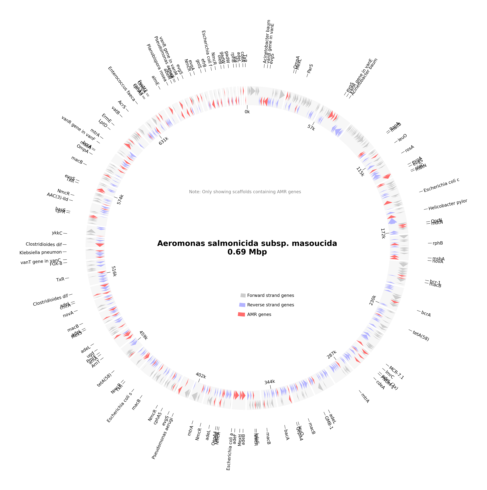

### AAC(3)-IId
- **Mechanism**: antibiotic inactivation
- **Drug Classes**: aminoglycoside antibiotic
- **AMR Family**: AAC(3)
- **Locations**:
  - gnl|SPADES|FPFIAAFN_968_7 : position 4746-5510

### Acinetobacter baumannii AbaF (found in 2 locations)
- **Mechanism**: antibiotic efflux
- **Drug Classes**: phosphonic acid antibiotic
- **AMR Family**: major facilitator superfamily (MFS) antibiotic efflux pump
- **Locations**:
  - gnl|SPADES|FPFIAAFN_233_10 : position 10697-12013
  - gnl|SPADES|FPFIAAFN_277_14 : position 13089-14405

### AcrS
- **Mechanism**: antibiotic efflux
- **Drug Classes**: fluoroquinolone antibiotic; cephalosporin; glycylcycline; cephamycin; penam; tetracycline antibiotic; rifamycin antibiotic; phenicol antibiotic; disinfecting agents and antiseptics
- **AMR Family**: resistance-nodulation-cell division (RND) antibiotic efflux pump
- **Locations**:
  - gnl|SPADES|FPFIAAFN_1185_5 : position 3568-4236

### ArnT
- **Mechanism**: antibiotic target alteration
- **Drug Classes**: peptide antibiotic
- **AMR Family**: pmr phosphoethanolamine transferase
- **Locations**:
  - gnl|SPADES|FPFIAAFN_754_3: position 678-2321

### Clostridioides difficile gyrA conferring resistance to fluoroquinolones
- **Mechanism**: antibiotic target alteration
- **Drug Classes**: fluoroquinolone antibiotic
- **AMR Family**: fluoroquinolone resistant gyrA
- **Locations**:
  - gnl|SPADES|FPFIAAFN_917_2 : position 399-3203

### Clostridioides difficile gyrB conferring resistance to fluoroquinolones
- **Mechanism**: antibiotic target alteration
- **Drug Classes**: fluoroquinolone antibiotic
- **AMR Family**: fluoroquinolone resistant gyrB
- **Locations**:
  - gnl|SPADES|FPFIAAFN_785_6 : position 6493-8388

### Enterococcus faecalis cls with mutation conferring resistance to daptomycin
- **Mechanism**: antibiotic target alteration
- **Drug Classes**: peptide antibiotic
- **AMR Family**: daptomycin resistant cls
- **Locations**:
  - gnl|SPADES|FPFIAAFN_1381_5 : position 3915-5264

### ErmE
- **Mechanism**: antibiotic target alteration
- **Drug Classes**: macrolide antibiotic; lincosamide antibiotic; streptogramin antibiotic; streptogramin A antibiotic; streptogramin B antibiotic
- **AMR Family**: Erm 23S ribosomal RNA methyltransferase
- **Locations**:
  - gnl|SPADES|FPFIAAFN_1082_5 : position 5502-6329

### Escherichia coli acrA
- **Mechanism**: antibiotic efflux
- **Drug Classes**: fluoroquinolone antibiotic; cephalosporin; glycylcycline; penam; tetracycline antibiotic; rifamycin antibiotic; phenicol antibiotic; disinfecting agents and antiseptics
- **AMR Family**: resistance-nodulation-cell division (RND) antibiotic efflux pump
- **Locations**:
  - gnl|SPADES|FPFIAAFN_693_5 : position 8501-9700

### Escherichia coli cyaA with mutation conferring resistance to fosfomycin
- **Mechanism**: antibiotic target alteration
- **Drug Classes**: phosphonic acid antibiotic
- **AMR Family**: antibiotic-resistant cya adenylate cyclase
- **Locations**:
  - gnl|SPADES|FPFIAAFN_307_16 : position 15029-17560

### Escherichia coli fabI mutations conferring resistance to isoniazid and triclosan
- **Mechanism**: antibiotic target alteration
- **Drug Classes**: disinfecting agents and antiseptics; isoniazid-like antibiotic
- **AMR Family**: antibiotic resistant fabI
- **Locations**:
  - gnl|SPADES|FPFIAAFN_3279_3 : position 1241-2017

### Escherichia coli soxS with mutation conferring antibiotic resistance
- **Mechanism**: antibiotic target alteration; antibiotic efflux; reduced permeability to antibiotic
- **Drug Classes**: fluoroquinolone antibiotic; monobactam; carbapenem; cephalosporin; glycylcycline; cephamycin; penam; tetracycline antibiotic; rifamycin antibiotic; phenicol antibiotic; penem; disinfecting agents and antiseptics
- **AMR Family**: ATP-binding cassette (ABC) antibiotic efflux pump; major facilitator superfamily (MFS) antibiotic efflux pump; resistance-nodulation-cell division (RND) antibiotic efflux pump; General Bacterial Porin with reduced permeability to beta-lactams
- **Locations**:
  - gnl|SPADES|FPFIAAFN_750_5 : position 3519-4346

### FOX-8
- **Mechanism**: antibiotic inactivation
- **Drug Classes**: cephalosporin; cephamycin
- **AMR Family**: FOX beta-lactamase
- **Locations**:
  - gnl|SPADES|FPFIAAFN_849_10 : position 8390-8563

### FosM2
- **Mechanism**: antibiotic inactivation
- **Drug Classes**: phosphonic acid antibiotic
- **AMR Family**: fosfomycin thiol transferase
- **Locations**:
  - gnl|SPADES|FPFIAAFN_1418_3 : position 1234-1647

### GMB-1
- **Mechanism**: antibiotic inactivation
- **Drug Classes**: carbapenem
- **AMR Family**: GMB beta-lactamase
- **Locations**:
  - gnl|SPADES|FPFIAAFN_422_16 : position 15993-16415

### Helicobacter pylori pbp1 mutants conferring resistance to amoxicillin
- **Mechanism**: antibiotic target alteration
- **Drug Classes**: cephalosporin; cephamycin; penam
- **AMR Family**: Penicillin-binding protein mutations conferring resistance to beta-lactam antibiotics
- **Locations**:
  - gnl|SPADES|FPFIAAFN_331_5 : position 4074-6428

### Klebsiella pneumoniae OmpK37
- **Mechanism**: reduced permeability to antibiotic
- **Drug Classes**: monobactam; carbapenem; cephalosporin; cephamycin; penam; penem
- **AMR Family**: General Bacterial Porin with reduced permeability to beta-lactams
- **Locations**:
  - gnl|SPADES|FPFIAAFN_889_6 : position 5643-6707

### LptD
- **Mechanism**: antibiotic efflux
- **Drug Classes**: carbapenem; peptide antibiotic; aminocoumarin antibiotic; rifamycin antibiotic
- **AMR Family**: ATP-binding cassette (ABC) antibiotic efflux pump
- **Locations**:
  - gnl|SPADES|FPFIAAFN_1082_2 : position 756-3188

### MCR-7.1
- **Mechanism**: antibiotic target alteration
- **Drug Classes**: peptide antibiotic
- **AMR Family**: MCR phosphoethanolamine transferase
- **Locations**:
  - gnl|SPADES|FPFIAAFN_404_15 : position 15363-16808

### MexH
- **Mechanism**: antibiotic efflux
- **Drug Classes**: fluoroquinolone antibiotic; tetracycline antibiotic; disinfecting agents and antiseptics
- **AMR Family**: resistance-nodulation-cell division (RND) antibiotic efflux pump
- **Locations**:
  - gnl|SPADES|FPFIAAFN_693_2 : position 2853-4373

### MexL
- **Mechanism**: antibiotic efflux
- **Drug Classes**: macrolide antibiotic; tetracycline antibiotic; disinfecting agents and antiseptics
- **AMR Family**: resistance-nodulation-cell division (RND) antibiotic efflux pump
- **Locations**:
  - gnl|SPADES|FPFIAAFN_248_4 : position 2108-2662

### MexS
- **Mechanism**: antibiotic efflux
- **Drug Classes**: fluoroquinolone antibiotic; diaminopyrimidine antibiotic; phenicol antibiotic
- **AMR Family**: resistance-nodulation-cell division (RND) antibiotic efflux pump
- **Locations**:
  - gnl|SPADES|FPFIAAFN_771_3 : position 1939-3066

### NmcR (found in 8 locations)
- **Mechanism**: antibiotic inactivation
- **Drug Classes**: carbapenem; cephalosporin; cephamycin; penam
- **AMR Family**: NmcA beta-lactamase
- **Locations**:
  - gnl|SPADES|FPFIAAFN_2509_3 : position 1693-2601
  - gnl|SPADES|FPFIAAFN_3624_3 : position 671-1513
  - gnl|SPADES|FPFIAAFN_649_5 : position 4861-5769
  - gnl|SPADES|FPFIAAFN_699_8 : position 5805-6779
  - gnl|SPADES|FPFIAAFN_718_7 : position 7069-7989
  - gnl|SPADES|FPFIAAFN_732_6 : position 5867-6736
  - gnl|SPADES|FPFIAAFN_751_2 : position 2125-3036
  - gnl|SPADES|FPFIAAFN_973_1 : position 2-496

### OmpA (found in 3 locations)
- **Mechanism**: reduced permeability to antibiotic
- **Drug Classes**: peptide antibiotic
- **AMR Family**: General Bacterial Porin with reduced permeability to peptide antibiotics
- **Locations**:
  - gnl|SPADES|FPFIAAFN_1042_6 : position 4814-5845
  - gnl|SPADES|FPFIAAFN_1418_2 : position 285-1160
  - gnl|SPADES|FPFIAAFN_248_2 : position 383-1522

### OprN
- **Mechanism**: antibiotic efflux
- **Drug Classes**: fluoroquinolone antibiotic; diaminopyrimidine antibiotic; phenicol antibiotic
- **AMR Family**: resistance-nodulation-cell division (RND) antibiotic efflux pump
- **Locations**:
  - gnl|SPADES|FPFIAAFN_331_8 : position 12944-14470

### PNGM-1
- **Mechanism**: antibiotic inactivation
- **Drug Classes**: carbapenem; cephalosporin; penam
- **AMR Family**: PNGM beta-lactamase
- **Locations**:
  - gnl|SPADES|FPFIAAFN_409_7 : position 5957-6994

### ParS
- **Mechanism**: antibiotic efflux; reduced permeability to antibiotic
- **Drug Classes**: macrolide antibiotic; fluoroquinolone antibiotic; monobactam; aminoglycoside antibiotic; carbapenem; cephalosporin; cephamycin; penam; tetracycline antibiotic; phenicol antibiotic; penem; disinfecting agents and antiseptics
- **AMR Family**: resistance-nodulation-cell division (RND) antibiotic efflux pump; Outer Membrane Porin (Opr)
- **Locations**:
  - gnl|SPADES|FPFIAAFN_248_12 : position 9987-10691

### Planobispora rosea EF-Tu mutants conferring resistance to inhibitor GE2270A
- **Mechanism**: antibiotic target alteration
- **Drug Classes**: elfamycin antibiotic
- **AMR Family**: elfamycin resistant EF-Tu
- **Locations**:
  - gnl|SPADES|FPFIAAFN_1596_4 : position 3201-4568

### PmrF
- **Mechanism**: antibiotic target alteration
- **Drug Classes**: peptide antibiotic
- **AMR Family**: pmr phosphoethanolamine transferase
- **Locations**:
  - gnl|SPADES|FPFIAAFN_754_6 : position 5270-6247

### Pseudomonas aeruginosa CpxR (found in 2 locations)
- **Mechanism**: antibiotic efflux
- **Drug Classes**: macrolide antibiotic; fluoroquinolone antibiotic; monobactam; aminoglycoside antibiotic; carbapenem; cephalosporin; cephamycin; penam; tetracycline antibiotic; peptide antibiotic; aminocoumarin antibiotic; diaminopyrimidine antibiotic; sulfonamide antibiotic; phenicol antibiotic; penem
- **AMR Family**: resistance-nodulation-cell division (RND) antibiotic efflux pump
- **Locations**:
  - gnl|SPADES|FPFIAAFN_1906_5 : position 3707-3829
  - gnl|SPADES|FPFIAAFN_731_5 : position 4916-5554

### QepA4 (found in 2 locations)
- **Mechanism**: antibiotic efflux
- **Drug Classes**: fluoroquinolone antibiotic
- **AMR Family**: major facilitator superfamily (MFS) antibiotic efflux pump
- **Locations**:
  - gnl|SPADES|FPFIAAFN_613_2 : position 813-2207
  - gnl|SPADES|FPFIAAFN_699_10 : position 7822-9030

### RanA
- **Mechanism**: antibiotic efflux
- **Drug Classes**: aminoglycoside antibiotic
- **AMR Family**: ATP-binding cassette (ABC) antibiotic efflux pump
- **Locations**:
  - gnl|SPADES|FPFIAAFN_279_30 : position 21353-22354

### TxR (found in 4 locations)
- **Mechanism**: antibiotic efflux
- **Drug Classes**: tetracycline antibiotic
- **AMR Family**: ATP-binding cassette (ABC) antibiotic efflux pump
- **Locations**:
  - gnl|SPADES|FPFIAAFN_1007_1 : position 3-926
  - gnl|SPADES|FPFIAAFN_22126_1 : position 2-436
  - gnl|SPADES|FPFIAAFN_751_1 : position 160-2070
  - gnl|SPADES|FPFIAAFN_799_8 : position 7507-9129

### abeM
- **Mechanism**: antibiotic efflux
- **Drug Classes**: fluoroquinolone antibiotic; disinfecting agents and antiseptics
- **AMR Family**: multidrug and toxic compound extrusion (MATE) transporter
- **Locations**:
  - gnl|SPADES|FPFIAAFN_1906_2 : position 442-1827

### adeB
- **Mechanism**: antibiotic efflux
- **Drug Classes**: glycylcycline; tetracycline antibiotic
- **AMR Family**: resistance-nodulation-cell division (RND) antibiotic efflux pump
- **Locations**:
  - gnl|SPADES|FPFIAAFN_693_1 : position 2-2779

### adeF
- **Mechanism**: antibiotic efflux
- **Drug Classes**: fluoroquinolone antibiotic; tetracycline antibiotic
- **AMR Family**: resistance-nodulation-cell division (RND) antibiotic efflux pump
- **Locations**:
  - gnl|SPADES|FPFIAAFN_693_4: position 5363-8491

### adeL (found in 9 locations)
- **Mechanism**: antibiotic efflux
- **Drug Classes**: fluoroquinolone antibiotic; tetracycline antibiotic
- **AMR Family**: resistance-nodulation-cell division (RND) antibiotic efflux pump
- **Locations**:
  - gnl|SPADES|FPFIAAFN_409_6 : position 4908-5576
  - gnl|SPADES|FPFIAAFN_409_9 : position 8849-9757
  - gnl|SPADES|FPFIAAFN_422_12 : position 12356-13252
  - gnl|SPADES|FPFIAAFN_699_9 : position 6853-7728
  - gnl|SPADES|FPFIAAFN_718_2 : position 1151-2056
  - gnl|SPADES|FPFIAAFN_760_3 : position 1802-2704
  - gnl|SPADES|FPFIAAFN_7685_1 : position 3-209
  - gnl|SPADES|FPFIAAFN_771_4 : position 3187-4092
  - gnl|SPADES|FPFIAAFN_785_3 : position 1861-2769

### almE
- **Mechanism**: antibiotic target alteration
- **Drug Classes**: peptide antibiotic
- **AMR Family**: polymyxin resistance operon; alm glycyltransferase
- **Locations**:
  - gnl|SPADES|FPFIAAFN_1463_4 : position 3220-4821

### arnA
- **Mechanism**: antibiotic target alteration
- **Drug Classes**: peptide antibiotic
- **AMR Family**: pmr phosphoethanolamine transferase
- **Locations**:
  - gnl|SPADES|FPFIAAFN_754_5 : position 3282-5273

### bacA
- **Mechanism**: antibiotic target alteration
- **Drug Classes**: peptide antibiotic
- **AMR Family**: undecaprenyl pyrophosphate related proteins
- **Locations**:
  - gnl|SPADES|FPFIAAFN_613_10 : position 9290-10105

### basS
- **Mechanism**: antibiotic target alteration; antibiotic efflux
- **Drug Classes**: peptide antibiotic
- **AMR Family**: pmr phosphoethanolamine transferase
- **Locations**:
  - gnl|SPADES|FPFIAAFN_944_8 : position 5823-7268

### bcr-1
- **Mechanism**: antibiotic efflux
- **Drug Classes**: bicyclomycin-like antibiotic
- **AMR Family**: major facilitator superfamily (MFS) antibiotic efflux pump
- **Locations**:
  - gnl|SPADES|FPFIAAFN_352_9 : position 10646-11836

### bcrA (found in 2 locations)
- **Mechanism**: antibiotic efflux
- **Drug Classes**: peptide antibiotic
- **AMR Family**: ATP-binding cassette (ABC) antibiotic efflux pump
- **Locations**:
  - gnl|SPADES|FPFIAAFN_1055_2 : position 416-1435
  - gnl|SPADES|FPFIAAFN_359_11 : position 11648-13192

### cdeA (found in 2 locations)
- **Mechanism**: antibiotic efflux
- **Drug Classes**: fluoroquinolone antibiotic; disinfecting agents and antiseptics
- **AMR Family**: multidrug and toxic compound extrusion (MATE) transporter
- **Locations**:
  - gnl|SPADES|FPFIAAFN_10671_1 : position 1-780
  - gnl|SPADES|FPFIAAFN_409_10 : position 9864-11285

### cmrA
- **Mechanism**: antibiotic efflux
- **Drug Classes**: phenicol antibiotic
- **AMR Family**: major facilitator superfamily (MFS) antibiotic efflux pump
- **Locations**:
  - gnl|SPADES|FPFIAAFN_785_2 : position 529-1758

### cphA3
- **Mechanism**: antibiotic inactivation
- **Drug Classes**: carbapenem
- **AMR Family**: CphA beta-lactamase
- **Locations**:
  - gnl|SPADES|FPFIAAFN_1404_5 : position 4209-4817

### cphA5 (found in 2 locations)
- **Mechanism**: antibiotic inactivation
- **Drug Classes**: carbapenem
- **AMR Family**: CphA beta-lactamase
- **Locations**:
  - gnl|SPADES|FPFIAAFN_1404_4 : position 3789-3998
  - gnl|SPADES|FPFIAAFN_732_3: position 2073-2834

### cprR
- **Mechanism**: antibiotic target alteration; antibiotic efflux
- **Drug Classes**: peptide antibiotic
- **AMR Family**: pmr phosphoethanolamine transferase
- **Locations**:
  - gnl|SPADES|FPFIAAFN_944_7 : position 5057-5746

### cpxA
- **Mechanism**: antibiotic efflux
- **Drug Classes**: aminoglycoside antibiotic; aminocoumarin antibiotic
- **AMR Family**: resistance-nodulation-cell division (RND) antibiotic efflux pump
- **Locations**:
  - gnl|SPADES|FPFIAAFN_1906_4 : position 2355-3710

### efrB
- **Mechanism**: antibiotic efflux
- **Drug Classes**: macrolide antibiotic; fluoroquinolone antibiotic; rifamycin antibiotic
- **AMR Family**: ATP-binding cassette (ABC) antibiotic efflux pump
- **Locations**:
  - gnl|SPADES|FPFIAAFN_3121_1 : position 2-1966

### evgA (found in 2 locations)
- **Mechanism**: antibiotic efflux
- **Drug Classes**: macrolide antibiotic; fluoroquinolone antibiotic; penam; tetracycline antibiotic
- **AMR Family**: major facilitator superfamily (MFS) antibiotic efflux pump; resistance-nodulation-cell division (RND) antibiotic efflux pump
- **Locations**:
  - gnl|SPADES|FPFIAAFN_2530_2 : position 400-1044
  - gnl|SPADES|FPFIAAFN_281_21 : position 21572-22195

### evgS (found in 6 locations)
- **Mechanism**: antibiotic efflux
- **Drug Classes**: macrolide antibiotic; fluoroquinolone antibiotic; penam; tetracycline antibiotic
- **AMR Family**: major facilitator superfamily (MFS) antibiotic efflux pump; resistance-nodulation-cell division (RND) antibiotic efflux pump
- **Locations**:
  - gnl|SPADES|FPFIAAFN_1007_2 : position 958-3039
  - gnl|SPADES|FPFIAAFN_233_13 : position 14082-16748
  - gnl|SPADES|FPFIAAFN_2506_1 : position 3-950
  - gnl|SPADES|FPFIAAFN_277_11 : position 8431-11097
  - gnl|SPADES|FPFIAAFN_281_22 : position 22201-24714
  - gnl|SPADES|FPFIAAFN_731_6 : position 7396-9273

### gadW (found in 2 locations)
- **Mechanism**: antibiotic efflux
- **Drug Classes**: macrolide antibiotic; fluoroquinolone antibiotic; penam
- **AMR Family**: resistance-nodulation-cell division (RND) antibiotic efflux pump
- **Locations**:
  - gnl|SPADES|FPFIAAFN_3805_1 : position 320-1123
  - gnl|SPADES|FPFIAAFN_3817_1 : position 319-1122

### golS
- **Mechanism**: antibiotic efflux
- **Drug Classes**: monobactam; carbapenem; cephalosporin; cephamycin; penam; phenicol antibiotic; penem
- **AMR Family**: resistance-nodulation-cell division (RND) antibiotic efflux pump
- **Locations**:
  - gnl|SPADES|FPFIAAFN_2936_3 : position 1278-1655

### kdpE
- **Mechanism**: antibiotic efflux
- **Drug Classes**: aminoglycoside antibiotic
- **AMR Family**: kdpDE
- **Locations**:
  - gnl|SPADES|FPFIAAFN_649_4 : position 4062-4754

### leuO (found in 2 locations)
- **Mechanism**: antibiotic efflux
- **Drug Classes**: nucleoside antibiotic; disinfecting agents and antiseptics
- **AMR Family**: major facilitator superfamily (MFS) antibiotic efflux pump
- **Locations**:
  - gnl|SPADES|FPFIAAFN_281_7 : position 4341-5315
  - gnl|SPADES|FPFIAAFN_613_1 : position 2-622

### lmrC
- **Mechanism**: antibiotic target protection
- **Drug Classes**: lincosamide antibiotic
- **AMR Family**: Miscellaneous ABC-F subfamily ATP-binding cassette ribosomal protection proteins
- **Locations**:
  - gnl|SPADES|FPFIAAFN_409_3 : position 1130-2863

### macB (found in 7 locations)
- **Mechanism**: antibiotic efflux
- **Drug Classes**: macrolide antibiotic
- **AMR Family**: ATP-binding cassette (ABC) antibiotic efflux pump
- **Locations**:
  - gnl|SPADES|FPFIAAFN_1009_6 : position 4959-6071
  - gnl|SPADES|FPFIAAFN_279_31 : position 22351-23409
  - gnl|SPADES|FPFIAAFN_352_11 : position 12612-13292
  - gnl|SPADES|FPFIAAFN_436_10 : position 9761-10459
  - gnl|SPADES|FPFIAAFN_643_11 : position 8918-9688
  - gnl|SPADES|FPFIAAFN_743_8 : position 7322-8143
  - gnl|SPADES|FPFIAAFN_771_7 : position 6484-8064

### mdtN (found in 2 locations)
- **Mechanism**: antibiotic efflux
- **Drug Classes**: nucleoside antibiotic; disinfecting agents and antiseptics
- **AMR Family**: major facilitator superfamily (MFS) antibiotic efflux pump
- **Locations**:
  - gnl|SPADES|FPFIAAFN_307_2 : position 973-1938
  - gnl|SPADES|FPFIAAFN_331_9 : position 14463-15557

### msbA (found in 2 locations)
- **Mechanism**: antibiotic efflux
- **Drug Classes**: nitroimidazole antibiotic
- **AMR Family**: ATP-binding cassette (ABC) antibiotic efflux pump
- **Locations**:
  - gnl|SPADES|FPFIAAFN_1055_1 : position 3-404
  - gnl|SPADES|FPFIAAFN_344_16 : position 15873-17618

### mtrA (found in 3 locations)
- **Mechanism**: antibiotic efflux
- **Drug Classes**: macrolide antibiotic; penam
- **AMR Family**: resistance-nodulation-cell division (RND) antibiotic efflux pump
- **Locations**:
  - gnl|SPADES|FPFIAAFN_1079_2 : position 1579-2556
  - gnl|SPADES|FPFIAAFN_420_6 : position 5353-6375
  - gnl|SPADES|FPFIAAFN_728_4 : position 1671-2495

### novA (found in 2 locations)
- **Mechanism**: antibiotic efflux
- **Drug Classes**: aminocoumarin antibiotic
- **AMR Family**: ATP-binding cassette (ABC) antibiotic efflux pump
- **Locations**:
  - gnl|SPADES|FPFIAAFN_344_17 : position 17611-19380
  - gnl|SPADES|FPFIAAFN_783_6 : position 5723-6823

### oleB
- **Mechanism**: antibiotic target protection
- **Drug Classes**: macrolide antibiotic
- **AMR Family**: Miscellaneous ABC-F subfamily ATP-binding cassette ribosomal protection proteins
- **Locations**:
  - gnl|SPADES|FPFIAAFN_3676_2 : position 1684-2004

### oleC
- **Mechanism**: antibiotic efflux
- **Drug Classes**: macrolide antibiotic
- **AMR Family**: ATP-binding cassette (ABC) antibiotic efflux pump
- **Locations**:
  - gnl|SPADES|FPFIAAFN_307_1 : position 51-980

### rosA
- **Mechanism**: antibiotic efflux
- **Drug Classes**: peptide antibiotic
- **AMR Family**: major facilitator superfamily (MFS) antibiotic efflux pump
- **Locations**:
  - gnl|SPADES|FPFIAAFN_281_14 : position 12613-13833

### rphB (found in 2 locations)
- **Mechanism**: antibiotic inactivation
- **Drug Classes**: rifamycin antibiotic
- **AMR Family**: rifampin phosphotransferase
- **Locations**:
  - gnl|SPADES|FPFIAAFN_344_6 : position 5991-7718
  - gnl|SPADES|FPFIAAFN_4304_2 : position 560-1732

### sta
- **Mechanism**: antibiotic inactivation
- **Drug Classes**: nucleoside antibiotic
- **AMR Family**: streptothricin acetyltransferase (SAT)
- **Locations**:
  - gnl|SPADES|FPFIAAFN_7415_1 : position 3-443

### tetA(58) (found in 2 locations)
- **Mechanism**: antibiotic efflux
- **Drug Classes**: tetracycline antibiotic
- **AMR Family**: major facilitator superfamily (MFS) antibiotic efflux pump
- **Locations**:
  - gnl|SPADES|FPFIAAFN_388_9 : position 6476-7264
  - gnl|SPADES|FPFIAAFN_752_2 : position 431-1156

### ugd
- **Mechanism**: antibiotic target alteration
- **Drug Classes**: peptide antibiotic
- **AMR Family**: pmr phosphoethanolamine transferase
- **Locations**:
  - gnl|SPADES|FPFIAAFN_754_8 : position 7671-9017

### vanR gene in vanE cluster (found in 2 locations)
- **Mechanism**: antibiotic target alteration
- **Drug Classes**: glycopeptide antibiotic
- **AMR Family**: glycopeptide resistance gene cluster; vanR
- **Locations**:
  - gnl|SPADES|FPFIAAFN_233_12 : position 12941-14071
  - gnl|SPADES|FPFIAAFN_277_12 : position 11108-12229

### vanR gene in vanF cluster
- **Mechanism**: antibiotic target alteration
- **Drug Classes**: glycopeptide antibiotic
- **AMR Family**: glycopeptide resistance gene cluster; vanR
- **Locations**:
  - gnl|SPADES|FPFIAAFN_1055_6 : position 5527-6939

### vanR gene in vanM cluster
- **Mechanism**: antibiotic target alteration
- **Drug Classes**: glycopeptide antibiotic
- **AMR Family**: glycopeptide resistance gene cluster; vanR
- **Locations**:
  - gnl|SPADES|FPFIAAFN_2464_3 : position 792-1736

### vanT gene in vanC cluster
- **Mechanism**: antibiotic target alteration
- **Drug Classes**: glycopeptide antibiotic
- **AMR Family**: glycopeptide resistance gene cluster; vanT
- **Locations**:
  - gnl|SPADES|FPFIAAFN_889_2 : position 421-1458

### vatB
- **Mechanism**: antibiotic inactivation
- **Drug Classes**: streptogramin antibiotic; streptogramin A antibiotic
- **AMR Family**: streptogramin vat acetyltransferase
- **Locations**:
  - gnl|SPADES|FPFIAAFN_1129_5 : position 5504-6127

### ykkC
- **Mechanism**: antibiotic efflux
- **Drug Classes**: aminoglycoside antibiotic; tetracycline antibiotic; phenicol antibiotic
- **AMR Family**: small multidrug resistance (SMR) antibiotic efflux pump
- **Locations**:
  - gnl|SPADES|FPFIAAFN_932_1 : position 127-441

## Aeromonas salmonicida subsp. pectinolytica 34mel
**Strain Statistics:**
- Total genome length: 896.4 kbp
- Total scaffolds: 410
- Scaffolds with AMR genes: 112
- Total genes annotated: 1786
- Total AMR genes: 169
- Unique AMR genes: 93
- Distinct AMR mechanisms: 10
- Distinct AMR families: 40
- Distinct drug classes: 27

**Circos Plot:**

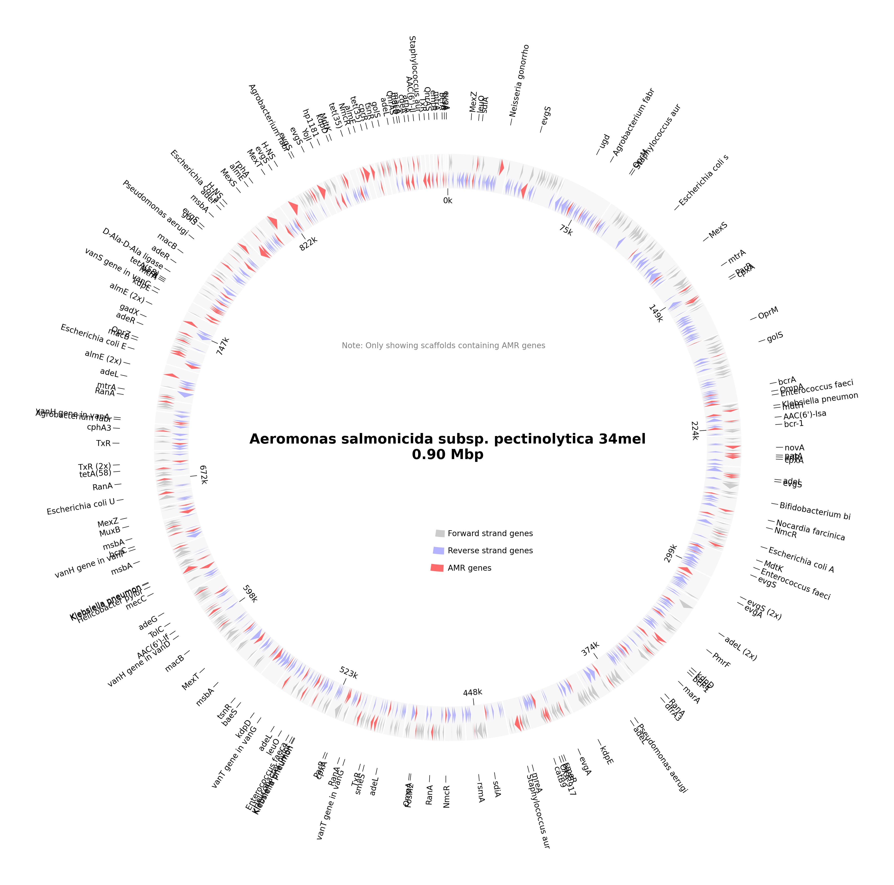

### AAC(6')-If
- **Mechanism**: antibiotic inactivation
- **Drug Classes**: aminoglycoside antibiotic
- **AMR Family**: AAC(6')
- **Locations**:
  - gnl|SPADES|FPFIAAFN_834_7 : position 5253-5588

### AAC(6')-Il
- **Mechanism**: antibiotic inactivation
- **Drug Classes**: aminoglycoside antibiotic
- **AMR Family**: AAC(6')
- **Locations**:
  - gnl|SPADES|FPFIAAFN_4106_1 : position 243-701

### AAC(6')-Isa
- **Mechanism**: antibiotic inactivation
- **Drug Classes**: aminoglycoside antibiotic
- **AMR Family**: AAC(6')
- **Locations**:
  - gnl|SPADES|FPFIAAFN_417_8 : position 8983-9537

### Agrobacterium fabrum chloramphenicol acetyltransferase (found in 3 locations)
- **Mechanism**: antibiotic inactivation
- **Drug Classes**: phenicol antibiotic
- **AMR Family**: chloramphenicol acetyltransferase (CAT)
- **Locations**:
  - gnl|SPADES|FPFIAAFN_1184_1 : position 2-541
  - gnl|SPADES|FPFIAAFN_2018_3 : position 3115-3606
  - gnl|SPADES|FPFIAAFN_253_16 : position 15982-16560

### Bifidobacterium bifidum ileS conferring resistance to mupirocin
- **Mechanism**: antibiotic target alteration
- **Drug Classes**: mupirocin-like antibiotic
- **AMR Family**: antibiotic-resistant isoleucyl-tRNA synthetase (ileS)
- **Locations**:
  - gnl|SPADES|FPFIAAFN_476_1 : position 1-696

### D-Ala-D-Ala ligase
- **Mechanism**: antibiotic target alteration
- **Drug Classes**: glycopeptide antibiotic
- **AMR Family**: Van ligase
- **Locations**:
  - gnl|SPADES|FPFIAAFN_1499_3 : position 864-1853

### Enterococcus faecalis cls with mutation conferring resistance to daptomycin
- **Mechanism**: antibiotic target alteration
- **Drug Classes**: peptide antibiotic
- **AMR Family**: daptomycin resistant cls
- **Locations**:
  - gnl|SPADES|FPFIAAFN_765_1 : position 393-1646

### Enterococcus faecium liaR mutant conferring daptomycin resistance (found in 2 locations)
- **Mechanism**: antibiotic target alteration; antibiotic efflux
- **Drug Classes**: peptide antibiotic
- **AMR Family**: daptomycin resistant liaR
- **Locations**:
  - gnl|SPADES|FPFIAAFN_385_21 : position 16579-17694
  - gnl|SPADES|FPFIAAFN_494_2 : position 763-1878

### Escherichia coli AcrAB-TolC with AcrR mutation conferring resistance to ciprofloxacin, tetracycline, and ceftazidime
- **Mechanism**: antibiotic target alteration; antibiotic efflux
- **Drug Classes**: fluoroquinolone antibiotic; cephalosporin; glycylcycline; penam; tetracycline antibiotic; rifamycin antibiotic; phenicol antibiotic; disinfecting agents and antiseptics
- **AMR Family**: resistance-nodulation-cell division (RND) antibiotic efflux pump
- **Locations**:
  - gnl|SPADES|FPFIAAFN_481_6 : position 5660-6262

### Escherichia coli EF-Tu mutants conferring resistance to Pulvomycin
- **Mechanism**: antibiotic target alteration
- **Drug Classes**: elfamycin antibiotic
- **AMR Family**: elfamycin resistant EF-Tu
- **Locations**:
  - gnl|SPADES|FPFIAAFN_1347_2 : position 1174-3063

### Escherichia coli UhpT with mutation conferring resistance to fosfomycin
- **Mechanism**: antibiotic target alteration
- **Drug Classes**: phosphonic acid antibiotic
- **AMR Family**: antibiotic-resistant UhpT
- **Locations**:
  - gnl|SPADES|FPFIAAFN_1064_6 : position 5536-6879

### Escherichia coli acrA
- **Mechanism**: antibiotic efflux
- **Drug Classes**: fluoroquinolone antibiotic; cephalosporin; glycylcycline; penam; tetracycline antibiotic; rifamycin antibiotic; phenicol antibiotic; disinfecting agents and antiseptics
- **AMR Family**: resistance-nodulation-cell division (RND) antibiotic efflux pump
- **Locations**:
  - gnl|SPADES|FPFIAAFN_1606_2 : position 2861-4060

### Escherichia coli soxS with mutation conferring antibiotic resistance
- **Mechanism**: antibiotic target alteration; antibiotic efflux; reduced permeability to antibiotic
- **Drug Classes**: fluoroquinolone antibiotic; monobactam; carbapenem; cephalosporin; glycylcycline; cephamycin; penam; tetracycline antibiotic; rifamycin antibiotic; phenicol antibiotic; penem; disinfecting agents and antiseptics
- **AMR Family**: ATP-binding cassette (ABC) antibiotic efflux pump; major facilitator superfamily (MFS) antibiotic efflux pump; resistance-nodulation-cell division (RND) antibiotic efflux pump; General Bacterial Porin with reduced permeability to beta-lactams
- **Locations**:
  - gnl|SPADES|FPFIAAFN_259_29 : position 25839-26387

### FosM2
- **Mechanism**: antibiotic inactivation
- **Drug Classes**: phosphonic acid antibiotic
- **AMR Family**: fosfomycin thiol transferase
- **Locations**:
  - gnl|SPADES|FPFIAAFN_686_6 : position 4052-4465

### H-NS (found in 2 locations)
- **Mechanism**: antibiotic efflux
- **Drug Classes**: macrolide antibiotic; fluoroquinolone antibiotic; cephalosporin; cephamycin; penam; tetracycline antibiotic
- **AMR Family**: major facilitator superfamily (MFS) antibiotic efflux pump; resistance-nodulation-cell division (RND) antibiotic efflux pump
- **Locations**:
  - gnl|SPADES|FPFIAAFN_1624_1 : position 3-413
  - gnl|SPADES|FPFIAAFN_1835_2 : position 141-551

### Helicobacter pylori pbp1 mutants conferring resistance to amoxicillin (found in 2 locations)
- **Mechanism**: antibiotic target alteration
- **Drug Classes**: cephalosporin; cephamycin; penam
- **AMR Family**: Penicillin-binding protein mutations conferring resistance to beta-lactam antibiotics
- **Locations**:
  - gnl|SPADES|FPFIAAFN_745_11 : position 9161-9682
  - gnl|SPADES|FPFIAAFN_953_2 : position 858-3173

### Klebsiella pneumoniae KpnE (found in 2 locations)
- **Mechanism**: antibiotic efflux
- **Drug Classes**: macrolide antibiotic; aminoglycoside antibiotic; cephalosporin; tetracycline antibiotic; peptide antibiotic; rifamycin antibiotic; disinfecting agents and antiseptics
- **AMR Family**: small multidrug resistance (SMR) antibiotic efflux pump
- **Locations**:
  - gnl|SPADES|FPFIAAFN_745_8 : position 7912-8316
  - gnl|SPADES|FPFIAAFN_953_5 : position 4011-4424

### Klebsiella pneumoniae KpnF (found in 2 locations)
- **Mechanism**: antibiotic efflux
- **Drug Classes**: macrolide antibiotic; aminoglycoside antibiotic; cephalosporin; tetracycline antibiotic; peptide antibiotic; rifamycin antibiotic; disinfecting agents and antiseptics
- **AMR Family**: small multidrug resistance (SMR) antibiotic efflux pump
- **Locations**:
  - gnl|SPADES|FPFIAAFN_745_9 : position 8313-8633
  - gnl|SPADES|FPFIAAFN_953_4 : position 3703-4023

### Klebsiella pneumoniae OmpK37
- **Mechanism**: reduced permeability to antibiotic
- **Drug Classes**: monobactam; carbapenem; cephalosporin; cephamycin; penam; penem
- **AMR Family**: General Bacterial Porin with reduced permeability to beta-lactams
- **Locations**:
  - gnl|SPADES|FPFIAAFN_417_4 : position 3210-4295

### MdtK (found in 2 locations)
- **Mechanism**: antibiotic efflux
- **Drug Classes**: fluoroquinolone antibiotic
- **AMR Family**: multidrug and toxic compound extrusion (MATE) transporter
- **Locations**:
  - gnl|SPADES|FPFIAAFN_2307_1 : position 3-1229
  - gnl|SPADES|FPFIAAFN_481_15 : position 11807-13153

### MexS (found in 2 locations)
- **Mechanism**: antibiotic efflux
- **Drug Classes**: fluoroquinolone antibiotic; diaminopyrimidine antibiotic; phenicol antibiotic
- **AMR Family**: resistance-nodulation-cell division (RND) antibiotic efflux pump
- **Locations**:
  - gnl|SPADES|FPFIAAFN_1629_5 : position 2856-3860
  - gnl|SPADES|FPFIAAFN_301_15 : position 18300-19286

### MexT (found in 2 locations)
- **Mechanism**: antibiotic efflux
- **Drug Classes**: fluoroquinolone antibiotic; diaminopyrimidine antibiotic; phenicol antibiotic
- **AMR Family**: resistance-nodulation-cell division (RND) antibiotic efflux pump
- **Locations**:
  - gnl|SPADES|FPFIAAFN_1769_4 : position 2113-3024
  - gnl|SPADES|FPFIAAFN_810_3 : position 1862-2743

### MexZ (found in 2 locations)
- **Mechanism**: antibiotic efflux
- **Drug Classes**: macrolide antibiotic; fluoroquinolone antibiotic; aminoglycoside antibiotic; carbapenem; cephalosporin; cephamycin; penam; tetracycline antibiotic; phenicol antibiotic; disinfecting agents and antiseptics
- **AMR Family**: resistance-nodulation-cell division (RND) antibiotic efflux pump
- **Locations**:
  - gnl|SPADES|FPFIAAFN_1060_4 : position 4586-5239
  - gnl|SPADES|FPFIAAFN_222_12 : position 10574-11167

### MuxB
- **Mechanism**: antibiotic efflux
- **Drug Classes**: macrolide antibiotic; monobactam; tetracycline antibiotic; aminocoumarin antibiotic
- **AMR Family**: resistance-nodulation-cell division (RND) antibiotic efflux pump
- **Locations**:
  - gnl|SPADES|FPFIAAFN_1060_1 : position 1-1884

### Neisseria gonorrhoeae pilQ gene conferring resistance to beta-lactam
- **Mechanism**: antibiotic target alteration
- **Drug Classes**: cephalosporin; cephamycin; penam
- **AMR Family**: Penicillin-binding protein mutations conferring resistance to beta-lactam antibiotics
- **Locations**:
  - gnl|SPADES|FPFIAAFN_222_30 : position 28253-30289

### NmcR (found in 3 locations)
- **Mechanism**: antibiotic inactivation
- **Drug Classes**: carbapenem; cephalosporin; cephamycin; penam
- **AMR Family**: NmcA beta-lactamase
- **Locations**:
  - gnl|SPADES|FPFIAAFN_2419_5 : position 2007-2909
  - gnl|SPADES|FPFIAAFN_476_12 : position 11385-12347
  - gnl|SPADES|FPFIAAFN_662_10 : position 9705-10595

### Nocardia farcinica rox
- **Mechanism**: antibiotic inactivation
- **Drug Classes**: rifamycin antibiotic
- **AMR Family**: rifampin monooxygenase
- **Locations**:
  - gnl|SPADES|FPFIAAFN_476_8 : position 7765-8928

### OXA-917
- **Mechanism**: antibiotic inactivation
- **Drug Classes**: carbapenem; penam
- **AMR Family**: OXA beta-lactamase; OXA-427-like beta-lactamase
- **Locations**:
  - gnl|SPADES|FPFIAAFN_637_3 : position 2082-2876

### OmpA (found in 2 locations)
- **Mechanism**: reduced permeability to antibiotic
- **Drug Classes**: peptide antibiotic
- **AMR Family**: General Bacterial Porin with reduced permeability to peptide antibiotics
- **Locations**:
  - gnl|SPADES|FPFIAAFN_385_19 : position 14919-15836
  - gnl|SPADES|FPFIAAFN_686_7 : position 4539-5414

### OprM (found in 2 locations)
- **Mechanism**: antibiotic efflux
- **Drug Classes**: macrolide antibiotic; fluoroquinolone antibiotic; monobactam; aminoglycoside antibiotic; carbapenem; cephalosporin; cephamycin; penam; tetracycline antibiotic; peptide antibiotic; aminocoumarin antibiotic; diaminopyrimidine antibiotic; sulfonamide antibiotic; phenicol antibiotic; penem; disinfecting agents and antiseptics
- **AMR Family**: resistance-nodulation-cell division (RND) antibiotic efflux pump
- **Locations**:
  - gnl|SPADES|FPFIAAFN_253_25 : position 26491-26799
  - gnl|SPADES|FPFIAAFN_368_16 : position 17735-18043

### OprZ
- **Mechanism**: antibiotic efflux
- **Drug Classes**: macrolide antibiotic; fluoroquinolone antibiotic; aminoglycoside antibiotic; cephalosporin
- **AMR Family**: resistance-nodulation-cell division (RND) antibiotic efflux pump
- **Locations**:
  - gnl|SPADES|FPFIAAFN_1354_2 : position 1140-2507

### ParR (found in 2 locations)
- **Mechanism**: antibiotic efflux; reduced permeability to antibiotic
- **Drug Classes**: macrolide antibiotic; fluoroquinolone antibiotic; monobactam; aminoglycoside antibiotic; carbapenem; cephalosporin; cephamycin; penam; tetracycline antibiotic; phenicol antibiotic; penem; disinfecting agents and antiseptics
- **AMR Family**: resistance-nodulation-cell division (RND) antibiotic efflux pump; Outer Membrane Porin (Opr)
- **Locations**:
  - gnl|SPADES|FPFIAAFN_335_14 : position 16015-16737
  - gnl|SPADES|FPFIAAFN_741_3 : position 2456-3175

### PmrF
- **Mechanism**: antibiotic target alteration
- **Drug Classes**: peptide antibiotic
- **AMR Family**: pmr phosphoethanolamine transferase
- **Locations**:
  - gnl|SPADES|FPFIAAFN_566_4 : position 2406-3440

### Pseudomonas aeruginosa CpxR
- **Mechanism**: antibiotic efflux
- **Drug Classes**: macrolide antibiotic; fluoroquinolone antibiotic; monobactam; aminoglycoside antibiotic; carbapenem; cephalosporin; cephamycin; penam; tetracycline antibiotic; peptide antibiotic; aminocoumarin antibiotic; diaminopyrimidine antibiotic; sulfonamide antibiotic; phenicol antibiotic; penem
- **AMR Family**: resistance-nodulation-cell division (RND) antibiotic efflux pump
- **Locations**:
  - gnl|SPADES|FPFIAAFN_609_8 : position 9953-10675

### Pseudomonas aeruginosa ampR with mutation conferring resistance to aztreonam
- **Mechanism**: antibiotic target alteration; antibiotic inactivation
- **Drug Classes**: monobactam; carbapenem; cephalosporin
- **AMR Family**: PDC beta-lactamase; ampR transcriptional regulator with mutation conferring resistance to monobactam antibiotics
- **Locations**:
  - gnl|SPADES|FPFIAAFN_1518_5 : position 3517-4515

### QnrAS (found in 2 locations)
- **Mechanism**: antibiotic target protection
- **Drug Classes**: fluoroquinolone antibiotic
- **AMR Family**: quinolone resistance protein (qnr)
- **Locations**:
  - gnl|SPADES|FPFIAAFN_3261_3 : position 1384-2034
  - gnl|SPADES|FPFIAAFN_4842_2 : position 264-914

### RanA (found in 5 locations)
- **Mechanism**: antibiotic efflux
- **Drug Classes**: aminoglycoside antibiotic
- **AMR Family**: ATP-binding cassette (ABC) antibiotic efflux pump
- **Locations**:
  - gnl|SPADES|FPFIAAFN_1091_7 : position 5540-6574
  - gnl|SPADES|FPFIAAFN_1232_6 : position 4781-5815
  - gnl|SPADES|FPFIAAFN_570_5 : position 4783-5979
  - gnl|SPADES|FPFIAAFN_682_7 : position 5844-6980
  - gnl|SPADES|FPFIAAFN_734_10 : position 5607-6602

### Staphylococcus aureus mupA conferring resistance to mupirocin
- **Mechanism**: antibiotic target alteration
- **Drug Classes**: mupirocin-like antibiotic
- **AMR Family**: antibiotic-resistant isoleucyl-tRNA synthetase (ileS)
- **Locations**:
  - gnl|SPADES|FPFIAAFN_638_6 : position 4885-7473

### Staphylococcus aureus mupB conferring resistance to mupirocin (found in 2 locations)
- **Mechanism**: antibiotic target alteration
- **Drug Classes**: mupirocin-like antibiotic
- **AMR Family**: antibiotic-resistant isoleucyl-tRNA synthetase (ileS)
- **Locations**:
  - gnl|SPADES|FPFIAAFN_259_1 : position 3-569
  - gnl|SPADES|FPFIAAFN_4208_1 : position 3-1781

### TolC
- **Mechanism**: antibiotic efflux
- **Drug Classes**: macrolide antibiotic; fluoroquinolone antibiotic; aminoglycoside antibiotic; carbapenem; cephalosporin; glycylcycline; cephamycin; penam; tetracycline antibiotic; peptide antibiotic; aminocoumarin antibiotic; rifamycin antibiotic; phenicol antibiotic; penem; disinfecting agents and antiseptics
- **AMR Family**: ATP-binding cassette (ABC) antibiotic efflux pump; major facilitator superfamily (MFS) antibiotic efflux pump; resistance-nodulation-cell division (RND) antibiotic efflux pump
- **Locations**:
  - gnl|SPADES|FPFIAAFN_847_1 : position 3-1106

### TxR (found in 5 locations)
- **Mechanism**: antibiotic efflux
- **Drug Classes**: tetracycline antibiotic
- **AMR Family**: ATP-binding cassette (ABC) antibiotic efflux pump
- **Locations**:
  - gnl|SPADES|FPFIAAFN_1112_1 : position 1-1140
  - gnl|SPADES|FPFIAAFN_1112_3 : position 2433-3851
  - gnl|SPADES|FPFIAAFN_1115_4 : position 2911-3945
  - gnl|SPADES|FPFIAAFN_4214_1 : position 2-1612
  - gnl|SPADES|FPFIAAFN_710_10 : position 5999-7279

### YojI
- **Mechanism**: antibiotic efflux
- **Drug Classes**: peptide antibiotic
- **AMR Family**: ATP-binding cassette (ABC) antibiotic efflux pump
- **Locations**:
  - gnl|SPADES|FPFIAAFN_2248_5 : position 2102-2743

### adeF
- **Mechanism**: antibiotic efflux
- **Drug Classes**: fluoroquinolone antibiotic; tetracycline antibiotic
- **AMR Family**: resistance-nodulation-cell division (RND) antibiotic efflux pump
- **Locations**:
  - gnl|SPADES|FPFIAAFN_1606_1: position 2-2851

### adeG
- **Mechanism**: antibiotic efflux
- **Drug Classes**: fluoroquinolone antibiotic; tetracycline antibiotic
- **AMR Family**: resistance-nodulation-cell division (RND) antibiotic efflux pump
- **Locations**:
  - gnl|SPADES|FPFIAAFN_847_9 : position 5605-6471

### adeL (found in 8 locations)
- **Mechanism**: antibiotic efflux
- **Drug Classes**: fluoroquinolone antibiotic; tetracycline antibiotic
- **AMR Family**: resistance-nodulation-cell division (RND) antibiotic efflux pump
- **Locations**:
  - gnl|SPADES|FPFIAAFN_1306_2 : position 707-1642
  - gnl|SPADES|FPFIAAFN_3083_3 : position 1327-2250
  - gnl|SPADES|FPFIAAFN_468_4 : position 3880-4818
  - gnl|SPADES|FPFIAAFN_528_11 : position 11361-12260
  - gnl|SPADES|FPFIAAFN_528_7 : position 6732-7628
  - gnl|SPADES|FPFIAAFN_625_1 : position 125-1048
  - gnl|SPADES|FPFIAAFN_707_15 : position 8769-9716
  - gnl|SPADES|FPFIAAFN_765_10 : position 8425-9327

### adeR (found in 2 locations)
- **Mechanism**: antibiotic efflux
- **Drug Classes**: glycylcycline; tetracycline antibiotic
- **AMR Family**: resistance-nodulation-cell division (RND) antibiotic efflux pump
- **Locations**:
  - gnl|SPADES|FPFIAAFN_1356_3 : position 1912-2823
  - gnl|SPADES|FPFIAAFN_1506_1 : position 422-1435

### almE (found in 6 locations)
- **Mechanism**: antibiotic target alteration
- **Drug Classes**: peptide antibiotic
- **AMR Family**: polymyxin resistance operon; alm glycyltransferase
- **Locations**:
  - gnl|SPADES|FPFIAAFN_1336_2 : position 86-1756
  - gnl|SPADES|FPFIAAFN_1336_4 : position 2700-5429
  - gnl|SPADES|FPFIAAFN_1369_2 : position 86-1756
  - gnl|SPADES|FPFIAAFN_1369_4 : position 2703-5300
  - gnl|SPADES|FPFIAAFN_1666_3 : position 1264-4407
  - gnl|SPADES|FPFIAAFN_2632_1 : position 3-2747

### arlR
- **Mechanism**: antibiotic efflux
- **Drug Classes**: fluoroquinolone antibiotic; disinfecting agents and antiseptics
- **AMR Family**: major facilitator superfamily (MFS) antibiotic efflux pump
- **Locations**:
  - gnl|SPADES|FPFIAAFN_427_11 : position 10238-10927

### arnA
- **Mechanism**: antibiotic target alteration
- **Drug Classes**: peptide antibiotic
- **AMR Family**: pmr phosphoethanolamine transferase
- **Locations**:
  - gnl|SPADES|FPFIAAFN_4015_2 : position 191-865

### baeS
- **Mechanism**: antibiotic efflux
- **Drug Classes**: aminoglycoside antibiotic; aminocoumarin antibiotic
- **AMR Family**: resistance-nodulation-cell division (RND) antibiotic efflux pump
- **Locations**:
  - gnl|SPADES|FPFIAAFN_795_6 : position 7164-9158

### basS
- **Mechanism**: antibiotic target alteration; antibiotic efflux
- **Drug Classes**: peptide antibiotic
- **AMR Family**: pmr phosphoethanolamine transferase
- **Locations**:
  - gnl|SPADES|FPFIAAFN_637_2 : position 584-2026

### bcr-1 (found in 2 locations)
- **Mechanism**: antibiotic efflux
- **Drug Classes**: bicyclomycin-like antibiotic
- **AMR Family**: major facilitator superfamily (MFS) antibiotic efflux pump
- **Locations**:
  - gnl|SPADES|FPFIAAFN_417_13 : position 12114-13277
  - gnl|SPADES|FPFIAAFN_569_3 : position 3153-4280

### bcrA (found in 4 locations)
- **Mechanism**: antibiotic efflux
- **Drug Classes**: peptide antibiotic
- **AMR Family**: ATP-binding cassette (ABC) antibiotic efflux pump
- **Locations**:
  - gnl|SPADES|FPFIAAFN_1473_4 : position 1766-2467
  - gnl|SPADES|FPFIAAFN_29562_1 : position 2-349
  - gnl|SPADES|FPFIAAFN_385_14 : position 11489-12124
  - gnl|SPADES|FPFIAAFN_7334_2 : position 439-1068

### bcrC
- **Mechanism**: antibiotic target alteration
- **Drug Classes**: peptide antibiotic
- **AMR Family**: undecaprenyl pyrophosphate related proteins
- **Locations**:
  - gnl|SPADES|FPFIAAFN_1047_5 : position 5843-6565

### catB9
- **Mechanism**: antibiotic inactivation
- **Drug Classes**: phenicol antibiotic
- **AMR Family**: chloramphenicol acetyltransferase (CAT)
- **Locations**:
  - gnl|SPADES|FPFIAAFN_637_5 : position 4406-5767

### cdeA
- **Mechanism**: antibiotic efflux
- **Drug Classes**: fluoroquinolone antibiotic; disinfecting agents and antiseptics
- **AMR Family**: multidrug and toxic compound extrusion (MATE) transporter
- **Locations**:
  - gnl|SPADES|FPFIAAFN_3738_2 : position 516-1976

### cphA3
- **Mechanism**: antibiotic inactivation
- **Drug Classes**: carbapenem
- **AMR Family**: CphA beta-lactamase
- **Locations**:
  - gnl|SPADES|FPFIAAFN_1134_3: position 2816-3577

### cprR
- **Mechanism**: antibiotic target alteration; antibiotic efflux
- **Drug Classes**: peptide antibiotic
- **AMR Family**: pmr phosphoethanolamine transferase
- **Locations**:
  - gnl|SPADES|FPFIAAFN_2988_2 : position 342-1010

### cpxA (found in 3 locations)
- **Mechanism**: antibiotic efflux
- **Drug Classes**: aminoglycoside antibiotic; aminocoumarin antibiotic
- **AMR Family**: resistance-nodulation-cell division (RND) antibiotic efflux pump
- **Locations**:
  - gnl|SPADES|FPFIAAFN_335_15 : position 16748-18133
  - gnl|SPADES|FPFIAAFN_427_12 : position 10927-12312
  - gnl|SPADES|FPFIAAFN_741_2 : position 1149-2459

### dfrA3
- **Mechanism**: antibiotic target replacement
- **Drug Classes**: diaminopyrimidine antibiotic
- **AMR Family**: trimethoprim resistant dihydrofolate reductase dfr
- **Locations**:
  - gnl|SPADES|FPFIAAFN_570_7 : position 7710-8204

### emtA
- **Mechanism**: antibiotic target alteration
- **Drug Classes**: macrolide antibiotic; lincosamide antibiotic; orthosomycin antibiotic
- **AMR Family**: non-erm 23S ribosomal RNA methyltransferase (G748)
- **Locations**:
  - gnl|SPADES|FPFIAAFN_5108_2 : position 611-1468

### evgA (found in 3 locations)
- **Mechanism**: antibiotic efflux
- **Drug Classes**: macrolide antibiotic; fluoroquinolone antibiotic; penam; tetracycline antibiotic
- **AMR Family**: major facilitator superfamily (MFS) antibiotic efflux pump; resistance-nodulation-cell division (RND) antibiotic efflux pump
- **Locations**:
  - gnl|SPADES|FPFIAAFN_34371_1 : position 98-310
  - gnl|SPADES|FPFIAAFN_515_4 : position 4322-4954
  - gnl|SPADES|FPFIAAFN_634_4 : position 4320-5057

### evgS (found in 9 locations)
- **Mechanism**: antibiotic efflux
- **Drug Classes**: macrolide antibiotic; fluoroquinolone antibiotic; penam; tetracycline antibiotic
- **AMR Family**: major facilitator superfamily (MFS) antibiotic efflux pump; resistance-nodulation-cell division (RND) antibiotic efflux pump
- **Locations**:
  - gnl|SPADES|FPFIAAFN_1547_1 : position 3-1418
  - gnl|SPADES|FPFIAAFN_1803_1 : position 128-3544
  - gnl|SPADES|FPFIAAFN_2091_1 : position 1-906
  - gnl|SPADES|FPFIAAFN_2198_1 : position 210-3275
  - gnl|SPADES|FPFIAAFN_231_12 : position 9692-12403
  - gnl|SPADES|FPFIAAFN_468_5 : position 4873-5904
  - gnl|SPADES|FPFIAAFN_494_5 : position 4850-5233
  - gnl|SPADES|FPFIAAFN_515_2 : position 503-2935
  - gnl|SPADES|FPFIAAFN_515_3 : position 2928-4070

### gadX
- **Mechanism**: antibiotic efflux
- **Drug Classes**: macrolide antibiotic; fluoroquinolone antibiotic; penam
- **AMR Family**: resistance-nodulation-cell division (RND) antibiotic efflux pump
- **Locations**:
  - gnl|SPADES|FPFIAAFN_1365_1 : position 1-828

### golS (found in 3 locations)
- **Mechanism**: antibiotic efflux
- **Drug Classes**: monobactam; carbapenem; cephalosporin; cephamycin; penam; phenicol antibiotic; penem
- **AMR Family**: resistance-nodulation-cell division (RND) antibiotic efflux pump
- **Locations**:
  - gnl|SPADES|FPFIAAFN_1543_5 : position 4450-4734
  - gnl|SPADES|FPFIAAFN_3044_2 : position 249-638
  - gnl|SPADES|FPFIAAFN_370_9 : position 10018-10434

### hp1181
- **Mechanism**: antibiotic efflux
- **Drug Classes**: fluoroquinolone antibiotic; tetracycline antibiotic; nitroimidazole antibiotic
- **AMR Family**: major facilitator superfamily (MFS) antibiotic efflux pump
- **Locations**:
  - gnl|SPADES|FPFIAAFN_2292_2 : position 1405-2766

### kdpD (found in 3 locations)
- **Mechanism**: antibiotic efflux
- **Drug Classes**: aminoglycoside antibiotic
- **AMR Family**: kdpDE
- **Locations**:
  - gnl|SPADES|FPFIAAFN_2301_3 : position 2531-3133
  - gnl|SPADES|FPFIAAFN_569_1 : position 3-2039
  - gnl|SPADES|FPFIAAFN_795_1 : position 3-605

### kdpE (found in 3 locations)
- **Mechanism**: antibiotic efflux
- **Drug Classes**: aminoglycoside antibiotic
- **AMR Family**: kdpDE
- **Locations**:
  - gnl|SPADES|FPFIAAFN_1459_2 : position 465-1436
  - gnl|SPADES|FPFIAAFN_569_2 : position 2126-2809
  - gnl|SPADES|FPFIAAFN_626_6 : position 5870-6535

### leuO (found in 2 locations)
- **Mechanism**: antibiotic efflux
- **Drug Classes**: nucleoside antibiotic; disinfecting agents and antiseptics
- **AMR Family**: major facilitator superfamily (MFS) antibiotic efflux pump
- **Locations**:
  - gnl|SPADES|FPFIAAFN_222_15 : position 13853-14752
  - gnl|SPADES|FPFIAAFN_765_5 : position 4451-5419

### macA
- **Mechanism**: antibiotic efflux
- **Drug Classes**: macrolide antibiotic
- **AMR Family**: ATP-binding cassette (ABC) antibiotic efflux pump
- **Locations**:
  - gnl|SPADES|FPFIAAFN_3488_2 : position 856-2019

### macB (found in 4 locations)
- **Mechanism**: antibiotic efflux
- **Drug Classes**: macrolide antibiotic
- **AMR Family**: ATP-binding cassette (ABC) antibiotic efflux pump
- **Locations**:
  - gnl|SPADES|FPFIAAFN_1354_1 : position 1-1137
  - gnl|SPADES|FPFIAAFN_1517_2 : position 754-1500
  - gnl|SPADES|FPFIAAFN_3488_1 : position 2-859
  - gnl|SPADES|FPFIAAFN_830_5 : position 3213-3881

### marA
- **Mechanism**: antibiotic efflux; reduced permeability to antibiotic
- **Drug Classes**: fluoroquinolone antibiotic; monobactam; carbapenem; cephalosporin; glycylcycline; cephamycin; penam; tetracycline antibiotic; rifamycin antibiotic; phenicol antibiotic; penem; disinfecting agents and antiseptics
- **AMR Family**: resistance-nodulation-cell division (RND) antibiotic efflux pump; General Bacterial Porin with reduced permeability to beta-lactams
- **Locations**:
  - gnl|SPADES|FPFIAAFN_569_9 : position 9194-10153

### mdtH
- **Mechanism**: antibiotic efflux
- **Drug Classes**: fluoroquinolone antibiotic
- **AMR Family**: major facilitator superfamily (MFS) antibiotic efflux pump
- **Locations**:
  - gnl|SPADES|FPFIAAFN_417_5 : position 4357-5550

### mecC
- **Mechanism**: antibiotic target replacement
- **Drug Classes**: penam
- **AMR Family**: methicillin resistant PBP2
- **Locations**:
  - gnl|SPADES|FPFIAAFN_890_9 : position 6354-8120

### mreA
- **Mechanism**: antibiotic efflux
- **Drug Classes**: macrolide antibiotic
- **AMR Family**: major facilitator superfamily (MFS) antibiotic efflux pump
- **Locations**:
  - gnl|SPADES|FPFIAAFN_638_5 : position 3483-4457

### msbA (found in 4 locations)
- **Mechanism**: antibiotic efflux
- **Drug Classes**: nitroimidazole antibiotic
- **AMR Family**: ATP-binding cassette (ABC) antibiotic efflux pump
- **Locations**:
  - gnl|SPADES|FPFIAAFN_1025_6 : position 6149-6967
  - gnl|SPADES|FPFIAAFN_1051_3 : position 2164-2982
  - gnl|SPADES|FPFIAAFN_1577_2 : position 878-2647
  - gnl|SPADES|FPFIAAFN_808_4 : position 1979-3748

### mtrA (found in 4 locations)
- **Mechanism**: antibiotic efflux
- **Drug Classes**: macrolide antibiotic; penam
- **AMR Family**: resistance-nodulation-cell division (RND) antibiotic efflux pump
- **Locations**:
  - gnl|SPADES|FPFIAAFN_1280_2 : position 974-1792
  - gnl|SPADES|FPFIAAFN_1473_3 : position 914-1762
  - gnl|SPADES|FPFIAAFN_335_7 : position 9499-10431
  - gnl|SPADES|FPFIAAFN_5487_1 : position 2-469

### novA
- **Mechanism**: antibiotic efflux
- **Drug Classes**: aminocoumarin antibiotic
- **AMR Family**: ATP-binding cassette (ABC) antibiotic efflux pump
- **Locations**:
  - gnl|SPADES|FPFIAAFN_427_6 : position 5267-6961

### patA
- **Mechanism**: antibiotic efflux
- **Drug Classes**: fluoroquinolone antibiotic
- **AMR Family**: ATP-binding cassette (ABC) antibiotic efflux pump
- **Locations**:
  - gnl|SPADES|FPFIAAFN_427_10 : position 9254-10123

### rphA
- **Mechanism**: antibiotic inactivation
- **Drug Classes**: rifamycin antibiotic
- **AMR Family**: rifampin phosphotransferase
- **Locations**:
  - gnl|SPADES|FPFIAAFN_1688_1 : position 3-1247

### rsmA
- **Mechanism**: antibiotic efflux
- **Drug Classes**: fluoroquinolone antibiotic; diaminopyrimidine antibiotic; phenicol antibiotic
- **AMR Family**: resistance-nodulation-cell division (RND) antibiotic efflux pump
- **Locations**:
  - gnl|SPADES|FPFIAAFN_660_5 : position 6099-6287

### sdiA (found in 2 locations)
- **Mechanism**: antibiotic efflux
- **Drug Classes**: fluoroquinolone antibiotic; cephalosporin; glycylcycline; penam; tetracycline antibiotic; rifamycin antibiotic; phenicol antibiotic; disinfecting agents and antiseptics
- **AMR Family**: resistance-nodulation-cell division (RND) antibiotic efflux pump
- **Locations**:
  - gnl|SPADES|FPFIAAFN_222_17 : position 15704-16486
  - gnl|SPADES|FPFIAAFN_651_8 : position 9842-10612

### smeR
- **Mechanism**: antibiotic efflux
- **Drug Classes**: aminoglycoside antibiotic; cephalosporin; cephamycin; penam
- **AMR Family**: resistance-nodulation-cell division (RND) antibiotic efflux pump
- **Locations**:
  - gnl|SPADES|FPFIAAFN_637_1 : position 1-525

### smeS
- **Mechanism**: antibiotic efflux
- **Drug Classes**: aminoglycoside antibiotic; cephalosporin; cephamycin; penam
- **AMR Family**: resistance-nodulation-cell division (RND) antibiotic efflux pump
- **Locations**:
  - gnl|SPADES|FPFIAAFN_710_8 : position 4078-5478

### tet(35) (found in 2 locations)
- **Mechanism**: antibiotic efflux
- **Drug Classes**: tetracycline antibiotic
- **AMR Family**: ATP-binding cassette (ABC) antibiotic efflux pump
- **Locations**:
  - gnl|SPADES|FPFIAAFN_2326_3 : position 1797-3101
  - gnl|SPADES|FPFIAAFN_2748_1 : position 629-2209

### tetA(58) (found in 2 locations)
- **Mechanism**: antibiotic efflux
- **Drug Classes**: tetracycline antibiotic
- **AMR Family**: major facilitator superfamily (MFS) antibiotic efflux pump
- **Locations**:
  - gnl|SPADES|FPFIAAFN_1107_6 : position 4208-5125
  - gnl|SPADES|FPFIAAFN_1473_5 : position 2478-3251

### tsnR (found in 2 locations)
- **Mechanism**: antibiotic target alteration
- **Drug Classes**: peptide antibiotic
- **AMR Family**: non-erm 23S ribosomal RNA methyltransferase (A1067)
- **Locations**:
  - gnl|SPADES|FPFIAAFN_3021_2 : position 258-1007
  - gnl|SPADES|FPFIAAFN_804_4 : position 1420-2169

### ugd
- **Mechanism**: antibiotic target alteration
- **Drug Classes**: peptide antibiotic
- **AMR Family**: pmr phosphoethanolamine transferase
- **Locations**:
  - gnl|SPADES|FPFIAAFN_253_9 : position 8408-9574

### vanH gene in vanA cluster
- **Mechanism**: antibiotic target alteration
- **Drug Classes**: glycopeptide antibiotic
- **AMR Family**: vanH; glycopeptide resistance gene cluster
- **Locations**:
  - gnl|SPADES|FPFIAAFN_1184_2 : position 691-1665

### vanH gene in vanD cluster
- **Mechanism**: antibiotic target alteration
- **Drug Classes**: glycopeptide antibiotic
- **AMR Family**: vanH; glycopeptide resistance gene cluster
- **Locations**:
  - gnl|SPADES|FPFIAAFN_834_4 : position 2108-3340

### vanH gene in vanP cluster
- **Mechanism**: antibiotic target alteration
- **Drug Classes**: glycopeptide antibiotic
- **AMR Family**: vanH; glycopeptide resistance gene cluster
- **Locations**:
  - gnl|SPADES|FPFIAAFN_1047_4 : position 4339-5472

### vanS gene in vanC cluster
- **Mechanism**: antibiotic target alteration
- **Drug Classes**: glycopeptide antibiotic
- **AMR Family**: vanS; glycopeptide resistance gene cluster
- **Locations**:
  - gnl|SPADES|FPFIAAFN_1459_4 : position 1974-3317

### vanT gene in vanG cluster (found in 2 locations)
- **Mechanism**: antibiotic target alteration
- **Drug Classes**: glycopeptide antibiotic
- **AMR Family**: glycopeptide resistance gene cluster; vanT
- **Locations**:
  - gnl|SPADES|FPFIAAFN_734_5 : position 2918-4144
  - gnl|SPADES|FPFIAAFN_774_5 : position 5721-6830

## Aeromonas salmonicida subsp. salmonicida
**Strain Statistics:**
- Total genome length: 80.4 kbp
- Total scaffolds: 17
- Scaffolds with AMR genes: 7
- Total genes annotated: 148
- Total AMR genes: 13
- Unique AMR genes: 10
- Distinct AMR mechanisms: 3
- Distinct AMR families: 6
- Distinct drug classes: 9

**Circos Plot:**

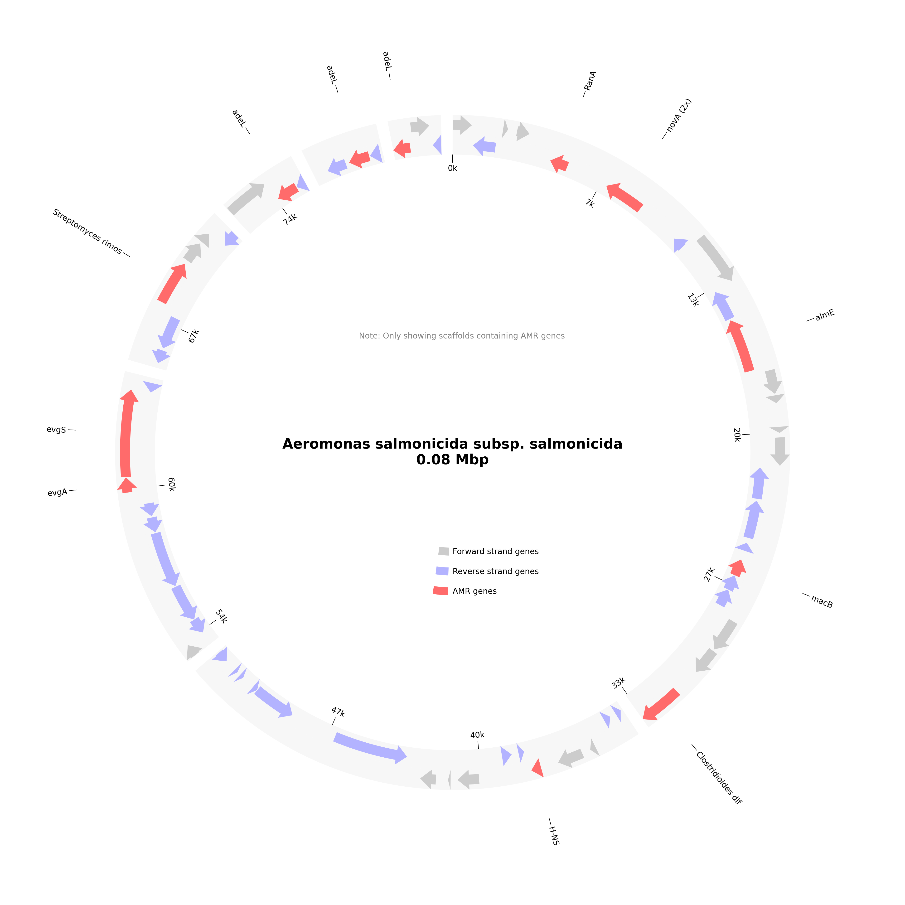

### Clostridioides difficile gyrB conferring resistance to fluoroquinolones
- **Mechanism**: antibiotic target alteration
- **Drug Classes**: fluoroquinolone antibiotic
- **AMR Family**: fluoroquinolone resistant gyrB
- **Locations**:
  - gnl|SPADES|FPFIAAFN_203_30 : position 31782-33575

### H-NS
- **Mechanism**: antibiotic efflux
- **Drug Classes**: macrolide antibiotic; fluoroquinolone antibiotic; cephalosporin; cephamycin; penam; tetracycline antibiotic
- **AMR Family**: major facilitator superfamily (MFS) antibiotic efflux pump; resistance-nodulation-cell division (RND) antibiotic efflux pump
- **Locations**:
  - gnl|SPADES|FPFIAAFN_345_7 : position 4133-4543

### RanA
- **Mechanism**: antibiotic efflux
- **Drug Classes**: aminoglycoside antibiotic
- **AMR Family**: ATP-binding cassette (ABC) antibiotic efflux pump
- **Locations**:
  - gnl|SPADES|FPFIAAFN_203_7 : position 4296-5078

### Streptomyces rimosus otr(A)
- **Mechanism**: antibiotic target protection
- **Drug Classes**: tetracycline antibiotic
- **AMR Family**: tetracycline-resistant ribosomal protection protein
- **Locations**:
  - gnl|SPADES|FPFIAAFN_1076_4 : position 2646-4457

### adeL (found in 3 locations)
- **Mechanism**: antibiotic efflux
- **Drug Classes**: fluoroquinolone antibiotic; tetracycline antibiotic
- **AMR Family**: resistance-nodulation-cell division (RND) antibiotic efflux pump
- **Locations**:
  - gnl|SPADES|FPFIAAFN_2177_3 : position 1932-2864
  - gnl|SPADES|FPFIAAFN_2304_3 : position 1615-2523
  - gnl|SPADES|FPFIAAFN_3489_1 : position 2-745

### almE
- **Mechanism**: antibiotic target alteration
- **Drug Classes**: peptide antibiotic
- **AMR Family**: polymyxin resistance operon; alm glycyltransferase
- **Locations**:
  - gnl|SPADES|FPFIAAFN_203_15 : position 15002-17356

### evgA
- **Mechanism**: antibiotic efflux
- **Drug Classes**: macrolide antibiotic; fluoroquinolone antibiotic; penam; tetracycline antibiotic
- **AMR Family**: major facilitator superfamily (MFS) antibiotic efflux pump; resistance-nodulation-cell division (RND) antibiotic efflux pump
- **Locations**:
  - gnl|SPADES|FPFIAAFN_579_7 : position 7266-7889

### evgS
- **Mechanism**: antibiotic efflux
- **Drug Classes**: macrolide antibiotic; fluoroquinolone antibiotic; penam; tetracycline antibiotic
- **AMR Family**: major facilitator superfamily (MFS) antibiotic efflux pump; resistance-nodulation-cell division (RND) antibiotic efflux pump
- **Locations**:
  - gnl|SPADES|FPFIAAFN_579_8 : position 7901-11473

### macB
- **Mechanism**: antibiotic efflux
- **Drug Classes**: macrolide antibiotic
- **AMR Family**: ATP-binding cassette (ABC) antibiotic efflux pump
- **Locations**:
  - gnl|SPADES|FPFIAAFN_203_24 : position 25637-26371

### novA (found in 2 locations)
- **Mechanism**: antibiotic efflux
- **Drug Classes**: aminocoumarin antibiotic
- **AMR Family**: ATP-binding cassette (ABC) antibiotic efflux pump
- **Locations**:
  - gnl|SPADES|FPFIAAFN_203_10 : position 6963-8732
  - gnl|SPADES|FPFIAAFN_203_11 : position 8726-10549

## Buttiauxella agrestis
**Strain Statistics:**
- Total genome length: 46.8 kbp
- Total scaffolds: 1152
- Scaffolds with AMR genes: 97
- Total genes annotated: 52
- Total AMR genes: 104
- Unique AMR genes: 63
- Distinct AMR mechanisms: 9
- Distinct AMR families: 27
- Distinct drug classes: 31

**Circos Plot:**

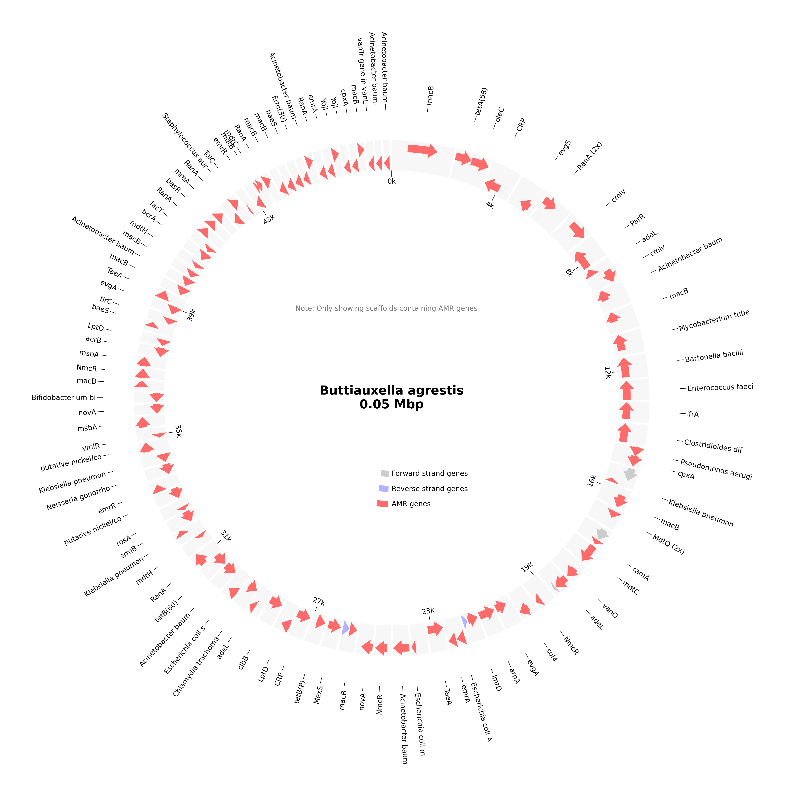

### Acinetobacter baumannii AbaF (found in 4 locations)
- **Mechanism**: antibiotic efflux
- **Drug Classes**: phosphonic acid antibiotic
- **AMR Family**: major facilitator superfamily (MFS) antibiotic efflux pump
- **Locations**:
  - gnl|SPADES|FPFIAAFN_10498_1 : position 3-398
  - gnl|SPADES|FPFIAAFN_16047_1 : position 2-562
  - gnl|SPADES|FPFIAAFN_22558_1 : position 1-432
  - gnl|SPADES|FPFIAAFN_35922_1 : position 2-301

### Acinetobacter baumannii AbaQ (found in 3 locations)
- **Mechanism**: antibiotic efflux
- **Drug Classes**: fluoroquinolone antibiotic
- **AMR Family**: major facilitator superfamily (MFS) antibiotic efflux pump
- **Locations**:
  - gnl|SPADES|FPFIAAFN_57597_1 : position 3-236
  - gnl|SPADES|FPFIAAFN_71363_1 : position 1-207
  - gnl|SPADES|FPFIAAFN_72531_1 : position 2-205

### Bartonella bacilliformis gyrB conferring resistance to aminocoumarin
- **Mechanism**: antibiotic target alteration
- **Drug Classes**: aminocoumarin antibiotic
- **AMR Family**: aminocoumarin resistant gyrB
- **Locations**:
  - gnl|SPADES|FPFIAAFN_10674_1 : position 2-733

### Bifidobacterium bifidum ileS conferring resistance to mupirocin
- **Mechanism**: antibiotic target alteration
- **Drug Classes**: mupirocin-like antibiotic
- **AMR Family**: antibiotic-resistant isoleucyl-tRNA synthetase (ileS)
- **Locations**:
  - gnl|SPADES|FPFIAAFN_30562_1 : position 1-342

### CRP (found in 2 locations)
- **Mechanism**: antibiotic efflux
- **Drug Classes**: macrolide antibiotic; fluoroquinolone antibiotic; penam
- **AMR Family**: resistance-nodulation-cell division (RND) antibiotic efflux pump
- **Locations**:
  - gnl|SPADES|FPFIAAFN_18985_1 : position 3-494
  - gnl|SPADES|FPFIAAFN_7780_1 : position 2-592

### Chlamydia trachomatis intrinsic murA conferring resistance to fosfomycin
- **Mechanism**: antibiotic target alteration
- **Drug Classes**: phosphonic acid antibiotic
- **AMR Family**: antibiotic-resistant murA transferase
- **Locations**:
  - gnl|SPADES|FPFIAAFN_21772_1 : position 2-340

### Clostridioides difficile gyrB conferring resistance to fluoroquinolones
- **Mechanism**: antibiotic target alteration
- **Drug Classes**: fluoroquinolone antibiotic
- **AMR Family**: fluoroquinolone resistant gyrB
- **Locations**:
  - gnl|SPADES|FPFIAAFN_12317_1 : position 1-693

### Enterococcus faecium cls conferring resistance to daptomycin
- **Mechanism**: antibiotic target alteration
- **Drug Classes**: peptide antibiotic
- **AMR Family**: daptomycin resistant cls
- **Locations**:
  - gnl|SPADES|FPFIAAFN_12031_1 : position 1-705

### Erm(30)
- **Mechanism**: antibiotic target alteration
- **Drug Classes**: macrolide antibiotic; lincosamide antibiotic; streptogramin antibiotic
- **AMR Family**: Erm 23S ribosomal RNA methyltransferase
- **Locations**:
  - gnl|SPADES|FPFIAAFN_56307_1 : position 3-209

### Escherichia coli AcrAB-TolC with MarR mutations conferring resistance to ciprofloxacin and tetracycline
- **Mechanism**: antibiotic target alteration; antibiotic efflux
- **Drug Classes**: fluoroquinolone antibiotic; cephalosporin; glycylcycline; penam; tetracycline antibiotic; rifamycin antibiotic; phenicol antibiotic; disinfecting agents and antiseptics
- **AMR Family**: resistance-nodulation-cell division (RND) antibiotic efflux pump
- **Locations**:
  - gnl|SPADES|FPFIAAFN_15481_1 : position 2-295

### Escherichia coli mdfA
- **Mechanism**: antibiotic efflux
- **Drug Classes**: tetracycline antibiotic; phenicol antibiotic; disinfecting agents and antiseptics
- **AMR Family**: major facilitator superfamily (MFS) antibiotic efflux pump
- **Locations**:
  - gnl|SPADES|FPFIAAFN_15889_2 : position 420-566

### Escherichia coli soxS with mutation conferring antibiotic resistance
- **Mechanism**: antibiotic target alteration; antibiotic efflux; reduced permeability to antibiotic
- **Drug Classes**: fluoroquinolone antibiotic; monobactam; carbapenem; cephalosporin; glycylcycline; cephamycin; penam; tetracycline antibiotic; rifamycin antibiotic; phenicol antibiotic; penem; disinfecting agents and antiseptics
- **AMR Family**: ATP-binding cassette (ABC) antibiotic efflux pump; major facilitator superfamily (MFS) antibiotic efflux pump; resistance-nodulation-cell division (RND) antibiotic efflux pump; General Bacterial Porin with reduced permeability to beta-lactams
- **Locations**:
  - gnl|SPADES|FPFIAAFN_22355_1 : position 2-316

### Klebsiella pneumoniae KpnH (found in 2 locations)
- **Mechanism**: antibiotic efflux
- **Drug Classes**: macrolide antibiotic; fluoroquinolone antibiotic; aminoglycoside antibiotic; carbapenem; cephalosporin; penam; peptide antibiotic; penem
- **AMR Family**: major facilitator superfamily (MFS) antibiotic efflux pump
- **Locations**:
  - gnl|SPADES|FPFIAAFN_12602_2 : position 531-680
  - gnl|SPADES|FPFIAAFN_26134_1 : position 3-311

### Klebsiella pneumoniae acrA
- **Mechanism**: antibiotic efflux
- **Drug Classes**: fluoroquinolone antibiotic; cephalosporin; glycylcycline; penam; tetracycline antibiotic; rifamycin antibiotic; phenicol antibiotic; disinfecting agents and antiseptics
- **AMR Family**: resistance-nodulation-cell division (RND) antibiotic efflux pump
- **Locations**:
  - gnl|SPADES|FPFIAAFN_23712_1 : position 234-413

### LptD (found in 2 locations)
- **Mechanism**: antibiotic efflux
- **Drug Classes**: carbapenem; peptide antibiotic; aminocoumarin antibiotic; rifamycin antibiotic
- **AMR Family**: ATP-binding cassette (ABC) antibiotic efflux pump
- **Locations**:
  - gnl|SPADES|FPFIAAFN_19269_1 : position 1-318
  - gnl|SPADES|FPFIAAFN_31884_1 : position 2-229

### MdtQ (found in 2 locations)
- **Mechanism**: reduced permeability to antibiotic
- **Drug Classes**: monobactam; carbapenem; cephalosporin; cephamycin; penam; penem
- **AMR Family**: Outer Membrane Porin (Opr)
- **Locations**:
  - gnl|SPADES|FPFIAAFN_12864_1 : position 87-329
  - gnl|SPADES|FPFIAAFN_12864_2 : position 326-670

### MexS
- **Mechanism**: antibiotic efflux
- **Drug Classes**: fluoroquinolone antibiotic; diaminopyrimidine antibiotic; phenicol antibiotic
- **AMR Family**: resistance-nodulation-cell division (RND) antibiotic efflux pump
- **Locations**:
  - gnl|SPADES|FPFIAAFN_18309_1 : position 2-463

### Mycobacterium tuberculosis katG mutations conferring resistance to isoniazid
- **Mechanism**: antibiotic target alteration
- **Drug Classes**: isoniazid-like antibiotic
- **AMR Family**: isoniazid resistant katG
- **Locations**:
  - gnl|SPADES|FPFIAAFN_10652_1 : position 3-593

### Neisseria gonorrhoeae PBP2 conferring resistance to beta-lactam antibiotics
- **Mechanism**: antibiotic target alteration
- **Drug Classes**: cephalosporin; cephamycin; penam
- **AMR Family**: Penicillin-binding protein mutations conferring resistance to beta-lactam antibiotics
- **Locations**:
  - gnl|SPADES|FPFIAAFN_25825_1 : position 3-389

### NmcR (found in 3 locations)
- **Mechanism**: antibiotic inactivation
- **Drug Classes**: carbapenem; cephalosporin; cephamycin; penam
- **AMR Family**: NmcA beta-lactamase
- **Locations**:
  - gnl|SPADES|FPFIAAFN_14427_2 : position 420-611
  - gnl|SPADES|FPFIAAFN_16462_1 : position 132-536
  - gnl|SPADES|FPFIAAFN_31057_1 : position 3-338

### ParR
- **Mechanism**: antibiotic efflux; reduced permeability to antibiotic
- **Drug Classes**: macrolide antibiotic; fluoroquinolone antibiotic; monobactam; aminoglycoside antibiotic; carbapenem; cephalosporin; cephamycin; penam; tetracycline antibiotic; phenicol antibiotic; penem; disinfecting agents and antiseptics
- **AMR Family**: resistance-nodulation-cell division (RND) antibiotic efflux pump; Outer Membrane Porin (Opr)
- **Locations**:
  - gnl|SPADES|FPFIAAFN_9841_2 : position 108-836

### Pseudomonas aeruginosa CpxR
- **Mechanism**: antibiotic efflux
- **Drug Classes**: macrolide antibiotic; fluoroquinolone antibiotic; monobactam; aminoglycoside antibiotic; carbapenem; cephalosporin; cephamycin; penam; tetracycline antibiotic; peptide antibiotic; aminocoumarin antibiotic; diaminopyrimidine antibiotic; sulfonamide antibiotic; phenicol antibiotic; penem
- **AMR Family**: resistance-nodulation-cell division (RND) antibiotic efflux pump
- **Locations**:
  - gnl|SPADES|FPFIAAFN_12563_1 : position 3-320

### RanA (found in 7 locations)
- **Mechanism**: antibiotic efflux
- **Drug Classes**: aminoglycoside antibiotic
- **AMR Family**: ATP-binding cassette (ABC) antibiotic efflux pump
- **Locations**:
  - gnl|SPADES|FPFIAAFN_22901_1 : position 1-426
  - gnl|SPADES|FPFIAAFN_38881_1 : position 2-283
  - gnl|SPADES|FPFIAAFN_40696_1 : position 2-277
  - gnl|SPADES|FPFIAAFN_48785_1 : position 2-256
  - gnl|SPADES|FPFIAAFN_58068_1 : position 1-234
  - gnl|SPADES|FPFIAAFN_8274_1 : position 3-500
  - gnl|SPADES|FPFIAAFN_8274_2 : position 497-964

### Staphylococcus aureus mupA conferring resistance to mupirocin
- **Mechanism**: antibiotic target alteration
- **Drug Classes**: mupirocin-like antibiotic
- **AMR Family**: antibiotic-resistant isoleucyl-tRNA synthetase (ileS)
- **Locations**:
  - gnl|SPADES|FPFIAAFN_41909_1 : position 2-274

### TaeA (found in 2 locations)
- **Mechanism**: antibiotic efflux
- **Drug Classes**: pleuromutilin antibiotic
- **AMR Family**: ATP-binding cassette (ABC) antibiotic efflux pump
- **Locations**:
  - gnl|SPADES|FPFIAAFN_15659_1 : position 2-574
  - gnl|SPADES|FPFIAAFN_34588_1 : position 3-311

### TolC
- **Mechanism**: antibiotic efflux
- **Drug Classes**: macrolide antibiotic; fluoroquinolone antibiotic; aminoglycoside antibiotic; carbapenem; cephalosporin; glycylcycline; cephamycin; penam; tetracycline antibiotic; peptide antibiotic; aminocoumarin antibiotic; rifamycin antibiotic; phenicol antibiotic; penem; disinfecting agents and antiseptics
- **AMR Family**: ATP-binding cassette (ABC) antibiotic efflux pump; major facilitator superfamily (MFS) antibiotic efflux pump; resistance-nodulation-cell division (RND) antibiotic efflux pump
- **Locations**:
  - gnl|SPADES|FPFIAAFN_46603_1 : position 1-72

### YojI (found in 2 locations)
- **Mechanism**: antibiotic efflux
- **Drug Classes**: peptide antibiotic
- **AMR Family**: ATP-binding cassette (ABC) antibiotic efflux pump
- **Locations**:
  - gnl|SPADES|FPFIAAFN_60739_1 : position 3-230
  - gnl|SPADES|FPFIAAFN_63851_1 : position 3-224

### acrB
- **Mechanism**: antibiotic efflux
- **Drug Classes**: fluoroquinolone antibiotic; cephalosporin; glycylcycline; penam; tetracycline antibiotic; rifamycin antibiotic; phenicol antibiotic; disinfecting agents and antiseptics
- **AMR Family**: resistance-nodulation-cell division (RND) antibiotic efflux pump
- **Locations**:
  - gnl|SPADES|FPFIAAFN_31180_1 : position 2-337

### adeL (found in 3 locations)
- **Mechanism**: antibiotic efflux
- **Drug Classes**: fluoroquinolone antibiotic; tetracycline antibiotic
- **AMR Family**: resistance-nodulation-cell division (RND) antibiotic efflux pump
- **Locations**:
  - gnl|SPADES|FPFIAAFN_10039_1 : position 1-264
  - gnl|SPADES|FPFIAAFN_13636_1 : position 2-472
  - gnl|SPADES|FPFIAAFN_21675_2 : position 250-444

### arnA
- **Mechanism**: antibiotic target alteration
- **Drug Classes**: peptide antibiotic
- **AMR Family**: pmr phosphoethanolamine transferase
- **Locations**:
  - gnl|SPADES|FPFIAAFN_15221_1 : position 2-586

### baeS (found in 2 locations)
- **Mechanism**: antibiotic efflux
- **Drug Classes**: aminoglycoside antibiotic; aminocoumarin antibiotic
- **AMR Family**: resistance-nodulation-cell division (RND) antibiotic efflux pump
- **Locations**:
  - gnl|SPADES|FPFIAAFN_32286_2 : position 147-329
  - gnl|SPADES|FPFIAAFN_54350_1 : position 1-243

### basR
- **Mechanism**: antibiotic target alteration; antibiotic efflux
- **Drug Classes**: peptide antibiotic
- **AMR Family**: pmr phosphoethanolamine transferase
- **Locations**:
  - gnl|SPADES|FPFIAAFN_39872_1 : position 3-278

### bcrA
- **Mechanism**: antibiotic efflux
- **Drug Classes**: peptide antibiotic
- **AMR Family**: ATP-binding cassette (ABC) antibiotic efflux pump
- **Locations**:
  - gnl|SPADES|FPFIAAFN_36705_1 : position 3-296

### clbB
- **Mechanism**: antibiotic target alteration
- **Drug Classes**: lincosamide antibiotic; streptogramin antibiotic; streptogramin A antibiotic; oxazolidinone antibiotic; phenicol antibiotic; pleuromutilin antibiotic
- **AMR Family**: Cfr 23S ribosomal RNA methyltransferase
- **Locations**:
  - gnl|SPADES|FPFIAAFN_19755_1 : position 1-477

### cmlv (found in 2 locations)
- **Mechanism**: antibiotic inactivation
- **Drug Classes**: phenicol antibiotic
- **AMR Family**: chloramphenicol phosphotransferase
- **Locations**:
  - gnl|SPADES|FPFIAAFN_10039_2 : position 369-821
  - gnl|SPADES|FPFIAAFN_9304_1 : position 228-875

### cpxA (found in 2 locations)
- **Mechanism**: antibiotic efflux
- **Drug Classes**: aminoglycoside antibiotic; aminocoumarin antibiotic
- **AMR Family**: resistance-nodulation-cell division (RND) antibiotic efflux pump
- **Locations**:
  - gnl|SPADES|FPFIAAFN_12563_2 : position 317-682
  - gnl|SPADES|FPFIAAFN_65051_1 : position 3-221

### emrA (found in 2 locations)
- **Mechanism**: antibiotic efflux
- **Drug Classes**: fluoroquinolone antibiotic
- **AMR Family**: major facilitator superfamily (MFS) antibiotic efflux pump
- **Locations**:
  - gnl|SPADES|FPFIAAFN_15481_2 : position 316-579
  - gnl|SPADES|FPFIAAFN_59500_1 : position 1-231

### emrR (found in 2 locations)
- **Mechanism**: antibiotic efflux
- **Drug Classes**: fluoroquinolone antibiotic
- **AMR Family**: major facilitator superfamily (MFS) antibiotic efflux pump
- **Locations**:
  - gnl|SPADES|FPFIAAFN_25472_1 : position 2-262
  - gnl|SPADES|FPFIAAFN_48530_1 : position 3-257

### evgA (found in 2 locations)
- **Mechanism**: antibiotic efflux
- **Drug Classes**: macrolide antibiotic; fluoroquinolone antibiotic; penam; tetracycline antibiotic
- **AMR Family**: major facilitator superfamily (MFS) antibiotic efflux pump; resistance-nodulation-cell division (RND) antibiotic efflux pump
- **Locations**:
  - gnl|SPADES|FPFIAAFN_15149_2 : position 182-589
  - gnl|SPADES|FPFIAAFN_34494_1 : position 1-312

### evgS
- **Mechanism**: antibiotic efflux
- **Drug Classes**: macrolide antibiotic; fluoroquinolone antibiotic; penam; tetracycline antibiotic
- **AMR Family**: major facilitator superfamily (MFS) antibiotic efflux pump; resistance-nodulation-cell division (RND) antibiotic efflux pump
- **Locations**:
  - gnl|SPADES|FPFIAAFN_8232_2 : position 395-784

### facT
- **Mechanism**: antibiotic efflux
- **Drug Classes**: elfamycin antibiotic
- **AMR Family**: major facilitator superfamily (MFS) antibiotic efflux pump
- **Locations**:
  - gnl|SPADES|FPFIAAFN_36866_1 : position 2-187

### lfrA
- **Mechanism**: antibiotic efflux
- **Drug Classes**: fluoroquinolone antibiotic
- **AMR Family**: major facilitator superfamily (MFS) antibiotic efflux pump
- **Locations**:
  - gnl|SPADES|FPFIAAFN_12090_1 : position 3-617

### lmrD
- **Mechanism**: antibiotic efflux
- **Drug Classes**: lincosamide antibiotic
- **AMR Family**: ATP-binding cassette (ABC) antibiotic efflux pump
- **Locations**:
  - gnl|SPADES|FPFIAAFN_15294_1 : position 2-373

### macB (found in 10 locations)
- **Mechanism**: antibiotic efflux
- **Drug Classes**: macrolide antibiotic
- **AMR Family**: ATP-binding cassette (ABC) antibiotic efflux pump
- **Locations**:
  - gnl|SPADES|FPFIAAFN_10614_1 : position 2-376
  - gnl|SPADES|FPFIAAFN_12744_2 : position 234-677
  - gnl|SPADES|FPFIAAFN_17223_1 : position 3-272
  - gnl|SPADES|FPFIAAFN_30958_2 : position 109-339
  - gnl|SPADES|FPFIAAFN_3418_2 : position 552-1583
  - gnl|SPADES|FPFIAAFN_35192_1 : position 2-307
  - gnl|SPADES|FPFIAAFN_35971_1 : position 1-225
  - gnl|SPADES|FPFIAAFN_53563_1 : position 1-246
  - gnl|SPADES|FPFIAAFN_54171_1 : position 2-244
  - gnl|SPADES|FPFIAAFN_65358_1 : position 2-220

### mdtB
- **Mechanism**: antibiotic efflux
- **Drug Classes**: aminocoumarin antibiotic
- **AMR Family**: resistance-nodulation-cell division (RND) antibiotic efflux pump
- **Locations**:
  - gnl|SPADES|FPFIAAFN_48776_1 : position 1-102

### mdtC (found in 2 locations)
- **Mechanism**: antibiotic efflux
- **Drug Classes**: aminocoumarin antibiotic
- **AMR Family**: resistance-nodulation-cell division (RND) antibiotic efflux pump
- **Locations**:
  - gnl|SPADES|FPFIAAFN_13408_1 : position 1-651
  - gnl|SPADES|FPFIAAFN_48776_2 : position 99-257

### mdtH (found in 2 locations)
- **Mechanism**: antibiotic efflux
- **Drug Classes**: fluoroquinolone antibiotic
- **AMR Family**: major facilitator superfamily (MFS) antibiotic efflux pump
- **Locations**:
  - gnl|SPADES|FPFIAAFN_23742_2 : position 270-413
  - gnl|SPADES|FPFIAAFN_36130_1 : position 2-175

### mreA
- **Mechanism**: antibiotic efflux
- **Drug Classes**: macrolide antibiotic
- **AMR Family**: major facilitator superfamily (MFS) antibiotic efflux pump
- **Locations**:
  - gnl|SPADES|FPFIAAFN_39956_1 : position 2-280

### msbA (found in 2 locations)
- **Mechanism**: antibiotic efflux
- **Drug Classes**: nitroimidazole antibiotic
- **AMR Family**: ATP-binding cassette (ABC) antibiotic efflux pump
- **Locations**:
  - gnl|SPADES|FPFIAAFN_27863_1 : position 1-366
  - gnl|SPADES|FPFIAAFN_31214_1 : position 3-338

### novA (found in 2 locations)
- **Mechanism**: antibiotic efflux
- **Drug Classes**: aminocoumarin antibiotic
- **AMR Family**: ATP-binding cassette (ABC) antibiotic efflux pump
- **Locations**:
  - gnl|SPADES|FPFIAAFN_17168_1 : position 1-390
  - gnl|SPADES|FPFIAAFN_30049_1 : position 1-345

### oleC
- **Mechanism**: antibiotic efflux
- **Drug Classes**: macrolide antibiotic
- **AMR Family**: ATP-binding cassette (ABC) antibiotic efflux pump
- **Locations**:
  - gnl|SPADES|FPFIAAFN_6445_2 : position 567-1196

### putative nickel/cobalt transporter (found in 2 locations)
- **Mechanism**: antibiotic efflux
- **Drug Classes**: fluoroquinolone antibiotic; aminoglycoside antibiotic; isoniazid-like antibiotic
- **AMR Family**: metal transporters with antibiotic efflux
- **Locations**:
  - gnl|SPADES|FPFIAAFN_24712_1 : position 1-402
  - gnl|SPADES|FPFIAAFN_26891_1 : position 43-378

### ramA
- **Mechanism**: antibiotic efflux; reduced permeability to antibiotic
- **Drug Classes**: fluoroquinolone antibiotic; monobactam; carbapenem; cephalosporin; glycylcycline; cephamycin; penam; tetracycline antibiotic; rifamycin antibiotic; phenicol antibiotic; penem; disinfecting agents and antiseptics
- **AMR Family**: resistance-nodulation-cell division (RND) antibiotic efflux pump; General Bacterial Porin with reduced permeability to beta-lactams
- **Locations**:
  - gnl|SPADES|FPFIAAFN_13145_2 : position 485-661

### rosA
- **Mechanism**: antibiotic efflux
- **Drug Classes**: peptide antibiotic
- **AMR Family**: major facilitator superfamily (MFS) antibiotic efflux pump
- **Locations**:
  - gnl|SPADES|FPFIAAFN_24646_1 : position 1-144

### srmB
- **Mechanism**: antibiotic target protection
- **Drug Classes**: macrolide antibiotic
- **AMR Family**: Miscellaneous ABC-F subfamily ATP-binding cassette ribosomal protection proteins
- **Locations**:
  - gnl|SPADES|FPFIAAFN_24464_1 : position 1-405

### sul4
- **Mechanism**: antibiotic target replacement
- **Drug Classes**: sulfonamide antibiotic
- **AMR Family**: sulfonamide resistant sul
- **Locations**:
  - gnl|SPADES|FPFIAAFN_14849_2 : position 245-598

### tetA(58)
- **Mechanism**: antibiotic efflux
- **Drug Classes**: tetracycline antibiotic
- **AMR Family**: major facilitator superfamily (MFS) antibiotic efflux pump
- **Locations**:
  - gnl|SPADES|FPFIAAFN_6445_1 : position 2-565

### tetB(60)
- **Mechanism**: antibiotic efflux
- **Drug Classes**: tetracycline antibiotic
- **AMR Family**: ATP-binding cassette (ABC) antibiotic efflux pump
- **Locations**:
  - gnl|SPADES|FPFIAAFN_22761_1 : position 1-429

### tetB(P)
- **Mechanism**: antibiotic target protection
- **Drug Classes**: tetracycline antibiotic
- **AMR Family**: tetracycline-resistant ribosomal protection protein
- **Locations**:
  - gnl|SPADES|FPFIAAFN_18296_1 : position 3-323

### tlrC
- **Mechanism**: antibiotic target protection
- **Drug Classes**: macrolide antibiotic; lincosamide antibiotic
- **AMR Family**: Miscellaneous ABC-F subfamily ATP-binding cassette ribosomal protection proteins
- **Locations**:
  - gnl|SPADES|FPFIAAFN_34271_1 : position 2-223

### vanO
- **Mechanism**: antibiotic target alteration
- **Drug Classes**: glycopeptide antibiotic
- **AMR Family**: glycopeptide resistance gene cluster; Van ligase
- **Locations**:
  - gnl|SPADES|FPFIAAFN_13442_3 : position 287-649

### vanTr gene in vanL cluster
- **Mechanism**: antibiotic target alteration
- **Drug Classes**: glycopeptide antibiotic
- **AMR Family**: glycopeptide resistance gene cluster; vanT
- **Locations**:
  - gnl|SPADES|FPFIAAFN_66549_1 : position 3-218

### vmlR
- **Mechanism**: antibiotic target protection
- **Drug Classes**: lincosamide antibiotic; streptogramin antibiotic; streptogramin A antibiotic; streptogramin B antibiotic; nucleoside antibiotic; pleuromutilin antibiotic
- **AMR Family**: Miscellaneous ABC-F subfamily ATP-binding cassette ribosomal protection proteins
- **Locations**:
  - gnl|SPADES|FPFIAAFN_27846_1 : position 2-160

## Carnobacterium divergens
**Strain Statistics:**
- Total genome length: 1322.8 kbp
- Total scaffolds: 709
- Scaffolds with AMR genes: 181
- Total genes annotated: 2521
- Total AMR genes: 273
- Unique AMR genes: 143
- Distinct AMR mechanisms: 10
- Distinct AMR families: 62
- Distinct drug classes: 32

**Circos Plot:**

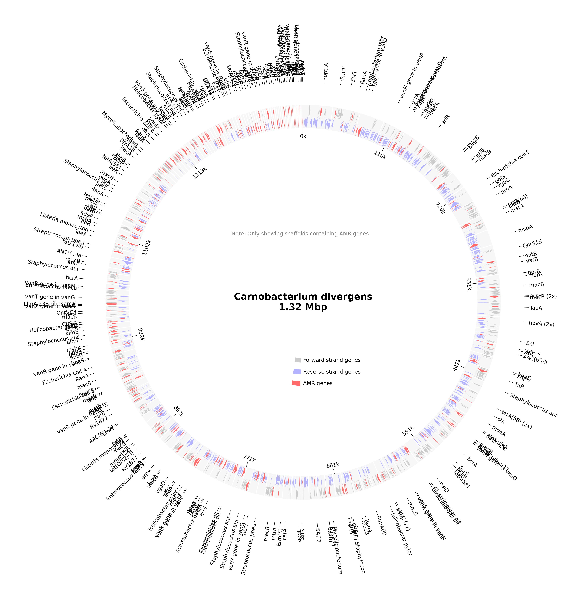

### AAC(6')-34
- **Mechanism**: antibiotic inactivation
- **Drug Classes**: aminoglycoside antibiotic
- **AMR Family**: AAC(6')
- **Locations**:
  - gnl|SPADES|FPFIAAFN_985_1 : position 73-600

### AAC(6')-Ii
- **Mechanism**: antibiotic inactivation
- **Drug Classes**: aminoglycoside antibiotic
- **AMR Family**: AAC(6')
- **Locations**:
  - gnl|SPADES|FPFIAAFN_457_8 : position 5753-6211

### ACC-3
- **Mechanism**: antibiotic inactivation
- **Drug Classes**: monobactam; cephalosporin; penam
- **AMR Family**: ACC beta-lactamase
- **Locations**:
  - gnl|SPADES|FPFIAAFN_457_3 : position 1008-2186

### ANT(6)-Ia
- **Mechanism**: antibiotic inactivation
- **Drug Classes**: aminoglycoside antibiotic
- **AMR Family**: ANT(6)
- **Locations**:
  - gnl|SPADES|FPFIAAFN_1363_1 : position 2-799

### Acinetobacter baumannii AbaF
- **Mechanism**: antibiotic efflux
- **Drug Classes**: phosphonic acid antibiotic
- **AMR Family**: major facilitator superfamily (MFS) antibiotic efflux pump
- **Locations**:
  - gnl|SPADES|FPFIAAFN_831_4 : position 2410-3645

### AcrE
- **Mechanism**: antibiotic efflux
- **Drug Classes**: fluoroquinolone antibiotic; cephalosporin; cephamycin; penam
- **AMR Family**: resistance-nodulation-cell division (RND) antibiotic efflux pump
- **Locations**:
  - gnl|SPADES|FPFIAAFN_431_11 : position 8149-9318

### AcrS (found in 2 locations)
- **Mechanism**: antibiotic efflux
- **Drug Classes**: fluoroquinolone antibiotic; cephalosporin; glycylcycline; cephamycin; penam; tetracycline antibiotic; rifamycin antibiotic; phenicol antibiotic; disinfecting agents and antiseptics
- **AMR Family**: resistance-nodulation-cell division (RND) antibiotic efflux pump
- **Locations**:
  - gnl|SPADES|FPFIAAFN_551_5 : position 3862-4443
  - gnl|SPADES|FPFIAAFN_559_4 : position 6042-6659

### Agrobacterium fabrum chloramphenicol acetyltransferase
- **Mechanism**: antibiotic inactivation
- **Drug Classes**: phenicol antibiotic
- **AMR Family**: chloramphenicol acetyltransferase (CAT)
- **Locations**:
  - gnl|SPADES|FPFIAAFN_221_32 : position 31666-32226

### BcI
- **Mechanism**: antibiotic inactivation
- **Drug Classes**: cephalosporin; penem
- **AMR Family**: class A Bacillus cereus Bc beta-lactamase
- **Locations**:
  - gnl|SPADES|FPFIAAFN_449_9 : position 7442-8347

### CAR-1
- **Mechanism**: antibiotic inactivation
- **Drug Classes**: carbapenem
- **AMR Family**: CAR beta-lactamase
- **Locations**:
  - gnl|SPADES|FPFIAAFN_48484_1 : position 2-256

### CPS-1
- **Mechanism**: antibiotic inactivation
- **Drug Classes**: carbapenem
- **AMR Family**: CPS beta-lactamase
- **Locations**:
  - gnl|SPADES|FPFIAAFN_1141_7 : position 3732-4352

### Clostridioides difficile gyrA conferring resistance to fluoroquinolones (found in 2 locations)
- **Mechanism**: antibiotic target alteration
- **Drug Classes**: fluoroquinolone antibiotic
- **AMR Family**: fluoroquinolone resistant gyrA
- **Locations**:
  - gnl|SPADES|FPFIAAFN_602_1 : position 2-1615
  - gnl|SPADES|FPFIAAFN_816_1 : position 495-2963

### Clostridioides difficile gyrB conferring resistance to fluoroquinolones (found in 2 locations)
- **Mechanism**: antibiotic target alteration
- **Drug Classes**: fluoroquinolone antibiotic
- **AMR Family**: fluoroquinolone resistant gyrB
- **Locations**:
  - gnl|SPADES|FPFIAAFN_602_2 : position 1680-3596
  - gnl|SPADES|FPFIAAFN_816_2 : position 2953-4980

### DfrA36 (found in 2 locations)
- **Mechanism**: antibiotic target replacement
- **Drug Classes**: diaminopyrimidine antibiotic
- **AMR Family**: trimethoprim resistant dihydrofolate reductase dfr
- **Locations**:
  - gnl|SPADES|FPFIAAFN_1766_4 : position 3348-3734
  - gnl|SPADES|FPFIAAFN_2488_4 : position 2280-2804

### Enterococcus faecalis cls with mutation conferring resistance to daptomycin (found in 2 locations)
- **Mechanism**: antibiotic target alteration
- **Drug Classes**: peptide antibiotic
- **AMR Family**: daptomycin resistant cls
- **Locations**:
  - gnl|SPADES|FPFIAAFN_1285_6 : position 4992-5693
  - gnl|SPADES|FPFIAAFN_908_4 : position 1255-2772

### Erm(K)
- **Mechanism**: antibiotic target alteration
- **Drug Classes**: macrolide antibiotic; lincosamide antibiotic; streptogramin antibiotic
- **AMR Family**: Erm 23S ribosomal RNA methyltransferase
- **Locations**:
  - gnl|SPADES|FPFIAAFN_733_12 : position 8692-9582

### Escherichia coli AcrAB-TolC with AcrR mutation conferring resistance to ciprofloxacin, tetracycline, and ceftazidime (found in 2 locations)
- **Mechanism**: antibiotic target alteration; antibiotic efflux
- **Drug Classes**: fluoroquinolone antibiotic; cephalosporin; glycylcycline; penam; tetracycline antibiotic; rifamycin antibiotic; phenicol antibiotic; disinfecting agents and antiseptics
- **AMR Family**: resistance-nodulation-cell division (RND) antibiotic efflux pump
- **Locations**:
  - gnl|SPADES|FPFIAAFN_1888_6 : position 2758-3366
  - gnl|SPADES|FPFIAAFN_2337_3 : position 2024-2650

### Escherichia coli AcrAB-TolC with MarR mutations conferring resistance to ciprofloxacin and tetracycline
- **Mechanism**: antibiotic target alteration; antibiotic efflux
- **Drug Classes**: fluoroquinolone antibiotic; cephalosporin; glycylcycline; penam; tetracycline antibiotic; rifamycin antibiotic; phenicol antibiotic; disinfecting agents and antiseptics
- **AMR Family**: resistance-nodulation-cell division (RND) antibiotic efflux pump
- **Locations**:
  - gnl|SPADES|FPFIAAFN_1044_1 : position 176-637

### Escherichia coli EF-Tu mutants conferring resistance to kirromycin (found in 2 locations)
- **Mechanism**: antibiotic target alteration
- **Drug Classes**: elfamycin antibiotic
- **AMR Family**: elfamycin resistant EF-Tu
- **Locations**:
  - gnl|SPADES|FPFIAAFN_1005_2 : position 900-2087
  - gnl|SPADES|FPFIAAFN_2668_4 : position 2338-2706

### Escherichia coli fabI mutations conferring resistance to isoniazid and triclosan
- **Mechanism**: antibiotic target alteration
- **Drug Classes**: disinfecting agents and antiseptics; isoniazid-like antibiotic
- **AMR Family**: antibiotic resistant fabI
- **Locations**:
  - gnl|SPADES|FPFIAAFN_347_8 : position 6668-7426

### EstT (found in 2 locations)
- **Mechanism**: antibiotic inactivation
- **Drug Classes**: macrolide antibiotic
- **AMR Family**: macrolide esterase
- **Locations**:
  - gnl|SPADES|FPFIAAFN_221_16 : position 14733-15545
  - gnl|SPADES|FPFIAAFN_2601_3 : position 1535-2251

### FosC2
- **Mechanism**: antibiotic inactivation
- **Drug Classes**: phosphonic acid antibiotic
- **AMR Family**: fosC phosphotransferase family
- **Locations**:
  - gnl|SPADES|FPFIAAFN_1005_3 : position 2133-2513

### HelR
- **Mechanism**: antibiotic target protection
- **Drug Classes**: rifamycin antibiotic
- **AMR Family**: helicase-like RNA polymerase protection protein
- **Locations**:
  - gnl|SPADES|FPFIAAFN_1633_1 : position 2-1540

### Helicobacter pylori pbp1 mutants conferring resistance to amoxicillin (found in 2 locations)
- **Mechanism**: antibiotic target alteration
- **Drug Classes**: cephalosporin; cephamycin; penam
- **AMR Family**: Penicillin-binding protein mutations conferring resistance to beta-lactam antibiotics
- **Locations**:
  - gnl|SPADES|FPFIAAFN_1973_4 : position 1434-3683
  - gnl|SPADES|FPFIAAFN_639_2 : position 850-2976

### Helicobacter pylori rdxA mutation conferring resistance to metronidazole
- **Mechanism**: antibiotic target alteration
- **Drug Classes**: nitroimidazole antibiotic
- **AMR Family**: Antibiotic resistant Helicobacter pylori nitroreductase
- **Locations**:
  - gnl|SPADES|FPFIAAFN_1141_3 : position 889-1527

### Helicobacter pylori rpoB mutation conferring resistance to rifampicin
- **Mechanism**: antibiotic target alteration; antibiotic target replacement
- **Drug Classes**: fluoroquinolone antibiotic; rifamycin antibiotic
- **AMR Family**: rifamycin-resistant beta-subunit of RNA polymerase (rpoB)
- **Locations**:
  - gnl|SPADES|FPFIAAFN_857_2 : position 1928-5557

### IreK (found in 3 locations)
- **Mechanism**: reduced permeability to antibiotic
- **Drug Classes**: cephalosporin
- **AMR Family**: Serine/threonine kinases
- **Locations**:
  - gnl|SPADES|FPFIAAFN_1611_5 : position 2792-3340
  - gnl|SPADES|FPFIAAFN_2132_2 : position 498-1631
  - gnl|SPADES|FPFIAAFN_2132_3 : position 1570-2508

### LRA-9
- **Mechanism**: antibiotic inactivation
- **Drug Classes**: cephalosporin; penam
- **AMR Family**: subclass B3 LRA beta-lactamase
- **Locations**:
  - gnl|SPADES|FPFIAAFN_41076_1 : position 3-275

### Listeria monocytogenes mprF (found in 2 locations)
- **Mechanism**: antibiotic target alteration
- **Drug Classes**: peptide antibiotic
- **AMR Family**: defensin resistant mprF
- **Locations**:
  - gnl|SPADES|FPFIAAFN_1451_3 : position 2984-5011
  - gnl|SPADES|FPFIAAFN_957_1 : position 1-351

### LlmA 23S ribosomal RNA methyltransferase
- **Mechanism**: antibiotic target alteration
- **Drug Classes**: lincosamide antibiotic
- **AMR Family**: Llm 23S ribosomal RNA methyltransferase
- **Locations**:
  - gnl|SPADES|FPFIAAFN_1221_3 : position 1997-3175

### MexS (found in 2 locations)
- **Mechanism**: antibiotic efflux
- **Drug Classes**: fluoroquinolone antibiotic; diaminopyrimidine antibiotic; phenicol antibiotic
- **AMR Family**: resistance-nodulation-cell division (RND) antibiotic efflux pump
- **Locations**:
  - gnl|SPADES|FPFIAAFN_831_9 : position 6411-7394
  - gnl|SPADES|FPFIAAFN_908_8 : position 4129-5079

### Mycolicibacterium smegmatis ndh with mutation conferring resistance to isoniazid (found in 2 locations)
- **Mechanism**: antibiotic target alteration
- **Drug Classes**: isoniazid-like antibiotic
- **AMR Family**: antibiotic resistant ndh
- **Locations**:
  - gnl|SPADES|FPFIAAFN_1788_2 : position 592-1797
  - gnl|SPADES|FPFIAAFN_713_8 : position 5768-7639

### Neisseria gonorrhoeae mtrR with mutation conferring resistance
- **Mechanism**: antibiotic efflux
- **Drug Classes**: macrolide antibiotic
- **AMR Family**: resistance-nodulation-cell division (RND) antibiotic efflux pump
- **Locations**:
  - gnl|SPADES|FPFIAAFN_10929_1 : position 59-652

### NmcR
- **Mechanism**: antibiotic inactivation
- **Drug Classes**: carbapenem; cephalosporin; cephamycin; penam
- **AMR Family**: NmcA beta-lactamase
- **Locations**:
  - gnl|SPADES|FPFIAAFN_2053_1 : position 1-402

### PAM-2
- **Mechanism**: antibiotic inactivation
- **Drug Classes**: carbapenem; cephalosporin
- **AMR Family**: PAM beta-lactamase
- **Locations**:
  - gnl|SPADES|FPFIAAFN_3834_2 : position 807-1487

### PmrF (found in 3 locations)
- **Mechanism**: antibiotic target alteration
- **Drug Classes**: peptide antibiotic
- **AMR Family**: pmr phosphoethanolamine transferase
- **Locations**:
  - gnl|SPADES|FPFIAAFN_1894_1 : position 81-1331
  - gnl|SPADES|FPFIAAFN_221_4 : position 3353-4537
  - gnl|SPADES|FPFIAAFN_559_9 : position 10074-11024

### Pseudomonas mutant PhoP conferring resistance to colistin
- **Mechanism**: antibiotic target alteration; antibiotic efflux; resistance by absence
- **Drug Classes**: macrolide antibiotic; peptide antibiotic
- **AMR Family**: ATP-binding cassette (ABC) antibiotic efflux pump; pmr phosphoethanolamine transferase; transmembrane protein conferring colistin resistance
- **Locations**:
  - gnl|SPADES|FPFIAAFN_258_26 : position 23196-23912

### QnrS15
- **Mechanism**: antibiotic target protection
- **Drug Classes**: fluoroquinolone antibiotic
- **AMR Family**: quinolone resistance protein (qnr)
- **Locations**:
  - gnl|SPADES|FPFIAAFN_389_13 : position 9236-9859

### QnrVC4
- **Mechanism**: antibiotic target protection
- **Drug Classes**: fluoroquinolone antibiotic
- **AMR Family**: quinolone resistance protein (qnr)
- **Locations**:
  - gnl|SPADES|FPFIAAFN_1173_2 : position 703-1338

### RanA (found in 8 locations)
- **Mechanism**: antibiotic efflux
- **Drug Classes**: aminoglycoside antibiotic
- **AMR Family**: ATP-binding cassette (ABC) antibiotic efflux pump
- **Locations**:
  - gnl|SPADES|FPFIAAFN_1018_2 : position 1231-2424
  - gnl|SPADES|FPFIAAFN_1513_4 : position 2982-3956
  - gnl|SPADES|FPFIAAFN_16024_1 : position 1-564
  - gnl|SPADES|FPFIAAFN_1862_2 : position 677-1771
  - gnl|SPADES|FPFIAAFN_221_25 : position 24382-25485
  - gnl|SPADES|FPFIAAFN_665_7 : position 5907-6944
  - gnl|SPADES|FPFIAAFN_841_2 : position 725-1498
  - gnl|SPADES|FPFIAAFN_995_1 : position 18-827

### RlmA(II)
- **Mechanism**: antibiotic target alteration
- **Drug Classes**: macrolide antibiotic; lincosamide antibiotic
- **AMR Family**: non-erm 23S ribosomal RNA methyltransferase (G748)
- **Locations**:
  - gnl|SPADES|FPFIAAFN_652_7 : position 5166-6023

### Rv1877 (found in 3 locations)
- **Mechanism**: antibiotic efflux
- **Drug Classes**: fluoroquinolone antibiotic
- **AMR Family**: major facilitator superfamily (MFS) antibiotic efflux pump
- **Locations**:
  - gnl|SPADES|FPFIAAFN_716_1 : position 3-656
  - gnl|SPADES|FPFIAAFN_929_4 : position 2574-3173
  - gnl|SPADES|FPFIAAFN_986_4 : position 2517-3995

### SAT-2
- **Mechanism**: antibiotic inactivation
- **Drug Classes**: nucleoside antibiotic
- **AMR Family**: streptothricin acetyltransferase (SAT)
- **Locations**:
  - gnl|SPADES|FPFIAAFN_720_4 : position 1978-2823

### SatA
- **Mechanism**: antibiotic inactivation
- **Drug Classes**: nucleoside antibiotic
- **AMR Family**: streptothricin acetyltransferase (SAT)
- **Locations**:
  - gnl|SPADES|FPFIAAFN_2240_3 : position 1023-1457

### Staphylococcus aureus fusA with mutation conferring resistance to fusidic acid
- **Mechanism**: antibiotic target alteration
- **Drug Classes**: fusidane antibiotic
- **AMR Family**: antibiotic resistant fusA
- **Locations**:
  - gnl|SPADES|FPFIAAFN_1533_3 : position 1532-3109

### Staphylococcus aureus mupA conferring resistance to mupirocin (found in 2 locations)
- **Mechanism**: antibiotic target alteration
- **Drug Classes**: mupirocin-like antibiotic
- **AMR Family**: antibiotic-resistant isoleucyl-tRNA synthetase (ileS)
- **Locations**:
  - gnl|SPADES|FPFIAAFN_1109_5 : position 3462-5486
  - gnl|SPADES|FPFIAAFN_1302_8 : position 5266-5610

### Staphylococcus aureus mupB conferring resistance to mupirocin (found in 4 locations)
- **Mechanism**: antibiotic target alteration
- **Drug Classes**: mupirocin-like antibiotic
- **AMR Family**: antibiotic-resistant isoleucyl-tRNA synthetase (ileS)
- **Locations**:
  - gnl|SPADES|FPFIAAFN_2210_1 : position 1-2172
  - gnl|SPADES|FPFIAAFN_30808_1 : position 2-340
  - gnl|SPADES|FPFIAAFN_780_3 : position 1257-3902
  - gnl|SPADES|FPFIAAFN_782_1 : position 24-2438

### Staphylococcus aureus murA with mutation conferring resistance to fosfomycin (found in 2 locations)
- **Mechanism**: antibiotic target alteration
- **Drug Classes**: phosphonic acid antibiotic
- **AMR Family**: antibiotic-resistant murA transferase
- **Locations**:
  - gnl|SPADES|FPFIAAFN_2124_2 : position 562-1827
  - gnl|SPADES|FPFIAAFN_3843_2 : position 386-1699

### Staphylococcus aureus rpoB mutants conferring resistance to rifampicin
- **Mechanism**: antibiotic target alteration; antibiotic target replacement
- **Drug Classes**: rifamycin antibiotic
- **AMR Family**: rifamycin-resistant beta-subunit of RNA polymerase (rpoB)
- **Locations**:
  - gnl|SPADES|FPFIAAFN_479_1 : position 1-1794

### Streptococcus pneumoniae PBP2b conferring resistance to amoxicillin
- **Mechanism**: antibiotic target alteration
- **Drug Classes**: cephalosporin; cephamycin; penam
- **AMR Family**: Penicillin-binding protein mutations conferring resistance to beta-lactam antibiotics
- **Locations**:
  - gnl|SPADES|FPFIAAFN_1445_2 : position 821-2941

### Streptococcus pneumoniae PBP2x conferring resistance to amoxicillin
- **Mechanism**: antibiotic target alteration
- **Drug Classes**: cephalosporin; cephamycin; penam
- **AMR Family**: Penicillin-binding protein mutations conferring resistance to beta-lactam antibiotics
- **Locations**:
  - gnl|SPADES|FPFIAAFN_769_4 : position 3187-5352

### TaeA (found in 4 locations)
- **Mechanism**: antibiotic efflux
- **Drug Classes**: pleuromutilin antibiotic
- **AMR Family**: ATP-binding cassette (ABC) antibiotic efflux pump
- **Locations**:
  - gnl|SPADES|FPFIAAFN_1447_6 : position 4501-5025
  - gnl|SPADES|FPFIAAFN_1810_4 : position 3068-4006
  - gnl|SPADES|FPFIAAFN_442_4 : position 3326-4966
  - gnl|SPADES|FPFIAAFN_870_1 : position 3-920

### TxR (found in 3 locations)
- **Mechanism**: antibiotic efflux
- **Drug Classes**: tetracycline antibiotic
- **AMR Family**: ATP-binding cassette (ABC) antibiotic efflux pump
- **Locations**:
  - gnl|SPADES|FPFIAAFN_2339_2 : position 301-3003
  - gnl|SPADES|FPFIAAFN_236_4 : position 3526-6387
  - gnl|SPADES|FPFIAAFN_467_3 : position 2777-5440

### VatI
- **Mechanism**: antibiotic inactivation
- **Drug Classes**: streptogramin antibiotic; streptogramin A antibiotic
- **AMR Family**: streptogramin vat acetyltransferase
- **Locations**:
  - gnl|SPADES|FPFIAAFN_1493_4 : position 4299-4874

### YajC
- **Mechanism**: antibiotic efflux
- **Drug Classes**: fluoroquinolone antibiotic; cephalosporin; glycylcycline; penam; tetracycline antibiotic; oxazolidinone antibiotic; glycopeptide antibiotic; rifamycin antibiotic; phenicol antibiotic; disinfecting agents and antiseptics
- **AMR Family**: resistance-nodulation-cell division (RND) antibiotic efflux pump
- **Locations**:
  - gnl|SPADES|FPFIAAFN_957_2 : position 436-801

### YojI
- **Mechanism**: antibiotic efflux
- **Drug Classes**: peptide antibiotic
- **AMR Family**: ATP-binding cassette (ABC) antibiotic efflux pump
- **Locations**:
  - gnl|SPADES|FPFIAAFN_457_1 : position 2-478

### aac(6')-Ib-cr11
- **Mechanism**: antibiotic inactivation
- **Drug Classes**: fluoroquinolone antibiotic; aminoglycoside antibiotic
- **AMR Family**: AAC(6'); AAC(6')-Ib-cr
- **Locations**:
  - gnl|SPADES|FPFIAAFN_551_6 : position 4462-5034

### adeL
- **Mechanism**: antibiotic efflux
- **Drug Classes**: fluoroquinolone antibiotic; tetracycline antibiotic
- **AMR Family**: resistance-nodulation-cell division (RND) antibiotic efflux pump
- **Locations**:
  - gnl|SPADES|FPFIAAFN_730_1 : position 2-538

### adeR
- **Mechanism**: antibiotic efflux
- **Drug Classes**: glycylcycline; tetracycline antibiotic
- **AMR Family**: resistance-nodulation-cell division (RND) antibiotic efflux pump
- **Locations**:
  - gnl|SPADES|FPFIAAFN_1484_1 : position 388-1110

### almE (found in 2 locations)
- **Mechanism**: antibiotic target alteration
- **Drug Classes**: peptide antibiotic
- **AMR Family**: polymyxin resistance operon; alm glycyltransferase
- **Locations**:
  - gnl|SPADES|FPFIAAFN_1109_2 : position 239-1678
  - gnl|SPADES|FPFIAAFN_1114_3 : position 1577-3103

### arlR (found in 5 locations)
- **Mechanism**: antibiotic efflux
- **Drug Classes**: fluoroquinolone antibiotic; disinfecting agents and antiseptics
- **AMR Family**: major facilitator superfamily (MFS) antibiotic efflux pump
- **Locations**:
  - gnl|SPADES|FPFIAAFN_278_2 : position 996-2447
  - gnl|SPADES|FPFIAAFN_328_3 : position 2460-3176
  - gnl|SPADES|FPFIAAFN_3983_1 : position 3-371
  - gnl|SPADES|FPFIAAFN_680_1 : position 299-985
  - gnl|SPADES|FPFIAAFN_997_4 : position 2918-3592

### arlS (found in 5 locations)
- **Mechanism**: antibiotic efflux
- **Drug Classes**: fluoroquinolone antibiotic; disinfecting agents and antiseptics
- **AMR Family**: major facilitator superfamily (MFS) antibiotic efflux pump
- **Locations**:
  - gnl|SPADES|FPFIAAFN_328_2 : position 688-2463
  - gnl|SPADES|FPFIAAFN_3983_2 : position 368-1654
  - gnl|SPADES|FPFIAAFN_680_2 : position 982-2505
  - gnl|SPADES|FPFIAAFN_821_8 : position 6903-8738
  - gnl|SPADES|FPFIAAFN_997_3 : position 1856-2905

### arnA (found in 2 locations)
- **Mechanism**: antibiotic target alteration
- **Drug Classes**: peptide antibiotic
- **AMR Family**: pmr phosphoethanolamine transferase
- **Locations**:
  - gnl|SPADES|FPFIAAFN_356_7 : position 6273-6854
  - gnl|SPADES|FPFIAAFN_881_2 : position 1305-2255

### bacA
- **Mechanism**: antibiotic target alteration
- **Drug Classes**: peptide antibiotic
- **AMR Family**: undecaprenyl pyrophosphate related proteins
- **Locations**:
  - gnl|SPADES|FPFIAAFN_1636_5 : position 3674-4486

### baeS
- **Mechanism**: antibiotic efflux
- **Drug Classes**: aminoglycoside antibiotic; aminocoumarin antibiotic
- **AMR Family**: resistance-nodulation-cell division (RND) antibiotic efflux pump
- **Locations**:
  - gnl|SPADES|FPFIAAFN_1057_5 : position 2016-3431

### bcrA (found in 8 locations)
- **Mechanism**: antibiotic efflux
- **Drug Classes**: peptide antibiotic
- **AMR Family**: ATP-binding cassette (ABC) antibiotic efflux pump
- **Locations**:
  - gnl|SPADES|FPFIAAFN_1114_7 : position 5953-6582
  - gnl|SPADES|FPFIAAFN_1292_3 : position 1779-2666
  - gnl|SPADES|FPFIAAFN_258_20 : position 17650-18570
  - gnl|SPADES|FPFIAAFN_2983_3 : position 1689-2456
  - gnl|SPADES|FPFIAAFN_3271_2 : position 794-1528
  - gnl|SPADES|FPFIAAFN_4718_1 : position 3-734
  - gnl|SPADES|FPFIAAFN_552_8 : position 7859-8551
  - gnl|SPADES|FPFIAAFN_878_3 : position 1981-2922

### bcrC
- **Mechanism**: antibiotic target alteration
- **Drug Classes**: peptide antibiotic
- **AMR Family**: undecaprenyl pyrophosphate related proteins
- **Locations**:
  - gnl|SPADES|FPFIAAFN_1632_4 : position 1861-2532

### bmr
- **Mechanism**: antibiotic efflux
- **Drug Classes**: fluoroquinolone antibiotic; nucleoside antibiotic; phenicol antibiotic; disinfecting agents and antiseptics
- **AMR Family**: major facilitator superfamily (MFS) antibiotic efflux pump
- **Locations**:
  - gnl|SPADES|FPFIAAFN_312_14 : position 12714-13937

### carA
- **Mechanism**: antibiotic target protection
- **Drug Classes**: macrolide antibiotic
- **AMR Family**: Miscellaneous ABC-F subfamily ATP-binding cassette ribosomal protection proteins
- **Locations**:
  - gnl|SPADES|FPFIAAFN_733_5 : position 3838-4545

### catB11
- **Mechanism**: antibiotic inactivation
- **Drug Classes**: phenicol antibiotic
- **AMR Family**: chloramphenicol acetyltransferase (CAT)
- **Locations**:
  - gnl|SPADES|FPFIAAFN_2561_1 : position 52-714

### cfrA
- **Mechanism**: antibiotic target alteration
- **Drug Classes**: lincosamide antibiotic; streptogramin antibiotic; streptogramin A antibiotic; oxazolidinone antibiotic; phenicol antibiotic; pleuromutilin antibiotic
- **AMR Family**: Cfr 23S ribosomal RNA methyltransferase
- **Locations**:
  - gnl|SPADES|FPFIAAFN_679_6 : position 7734-8792

### cprR (found in 2 locations)
- **Mechanism**: antibiotic target alteration; antibiotic efflux
- **Drug Classes**: peptide antibiotic
- **AMR Family**: pmr phosphoethanolamine transferase
- **Locations**:
  - gnl|SPADES|FPFIAAFN_4128_1 : position 3-341
  - gnl|SPADES|FPFIAAFN_6627_3 : position 557-1090

### dfrE
- **Mechanism**: antibiotic target replacement
- **Drug Classes**: diaminopyrimidine antibiotic
- **AMR Family**: trimethoprim resistant dihydrofolate reductase dfr
- **Locations**:
  - gnl|SPADES|FPFIAAFN_870_3 : position 1925-2413

### efrA (found in 6 locations)
- **Mechanism**: antibiotic efflux
- **Drug Classes**: macrolide antibiotic; fluoroquinolone antibiotic; rifamycin antibiotic
- **AMR Family**: ATP-binding cassette (ABC) antibiotic efflux pump
- **Locations**:
  - gnl|SPADES|FPFIAAFN_1873_4 : position 1727-3529
  - gnl|SPADES|FPFIAAFN_2337_2 : position 219-1940
  - gnl|SPADES|FPFIAAFN_4763_1 : position 77-814
  - gnl|SPADES|FPFIAAFN_520_5 : position 2843-4345
  - gnl|SPADES|FPFIAAFN_520_6 : position 4408-4647
  - gnl|SPADES|FPFIAAFN_5799_2 : position 386-1315

### efrB (found in 2 locations)
- **Mechanism**: antibiotic efflux
- **Drug Classes**: macrolide antibiotic; fluoroquinolone antibiotic; rifamycin antibiotic
- **AMR Family**: ATP-binding cassette (ABC) antibiotic efflux pump
- **Locations**:
  - gnl|SPADES|FPFIAAFN_2879_1 : position 2-1120
  - gnl|SPADES|FPFIAAFN_7221_1 : position 3-1085

### emrY
- **Mechanism**: antibiotic efflux
- **Drug Classes**: tetracycline antibiotic
- **AMR Family**: major facilitator superfamily (MFS) antibiotic efflux pump
- **Locations**:
  - gnl|SPADES|FPFIAAFN_962_9 : position 7387-7575

### evgA
- **Mechanism**: antibiotic efflux
- **Drug Classes**: macrolide antibiotic; fluoroquinolone antibiotic; penam; tetracycline antibiotic
- **AMR Family**: major facilitator superfamily (MFS) antibiotic efflux pump; resistance-nodulation-cell division (RND) antibiotic efflux pump
- **Locations**:
  - gnl|SPADES|FPFIAAFN_1539_2 : position 122-754

### floR
- **Mechanism**: antibiotic efflux
- **Drug Classes**: phenicol antibiotic
- **AMR Family**: major facilitator superfamily (MFS) antibiotic efflux pump
- **Locations**:
  - gnl|SPADES|FPFIAAFN_1455_6 : position 3890-5005

### golS (found in 2 locations)
- **Mechanism**: antibiotic efflux
- **Drug Classes**: monobactam; carbapenem; cephalosporin; cephamycin; penam; phenicol antibiotic; penem
- **AMR Family**: resistance-nodulation-cell division (RND) antibiotic efflux pump
- **Locations**:
  - gnl|SPADES|FPFIAAFN_17451_1 : position 2-349
  - gnl|SPADES|FPFIAAFN_347_10 : position 13526-14332

### hmrM
- **Mechanism**: antibiotic efflux
- **Drug Classes**: fluoroquinolone antibiotic; disinfecting agents and antiseptics
- **AMR Family**: multidrug and toxic compound extrusion (MATE) transporter
- **Locations**:
  - gnl|SPADES|FPFIAAFN_5351_2 : position 288-1412

### kdpD (found in 2 locations)
- **Mechanism**: antibiotic efflux
- **Drug Classes**: aminoglycoside antibiotic
- **AMR Family**: kdpDE
- **Locations**:
  - gnl|SPADES|FPFIAAFN_258_27 : position 23909-25558
  - gnl|SPADES|FPFIAAFN_465_12 : position 9907-12636

### kdpE
- **Mechanism**: antibiotic efflux
- **Drug Classes**: aminoglycoside antibiotic
- **AMR Family**: kdpDE
- **Locations**:
  - gnl|SPADES|FPFIAAFN_465_11 : position 9224-9910

### leuO
- **Mechanism**: antibiotic efflux
- **Drug Classes**: nucleoside antibiotic; disinfecting agents and antiseptics
- **AMR Family**: major facilitator superfamily (MFS) antibiotic efflux pump
- **Locations**:
  - gnl|SPADES|FPFIAAFN_2240_2 : position 188-1003

### lmrB (found in 2 locations)
- **Mechanism**: antibiotic efflux
- **Drug Classes**: lincosamide antibiotic; nucleoside antibiotic
- **AMR Family**: ATP-binding cassette (ABC) antibiotic efflux pump
- **Locations**:
  - gnl|SPADES|FPFIAAFN_1310_6 : position 4120-5436
  - gnl|SPADES|FPFIAAFN_265_8 : position 4591-5988

### lmrP
- **Mechanism**: antibiotic efflux
- **Drug Classes**: macrolide antibiotic; lincosamide antibiotic; streptogramin antibiotic; streptogramin A antibiotic; tetracycline antibiotic
- **AMR Family**: major facilitator superfamily (MFS) antibiotic efflux pump
- **Locations**:
  - gnl|SPADES|FPFIAAFN_26035_1 : position 1-387

### macA
- **Mechanism**: antibiotic efflux
- **Drug Classes**: macrolide antibiotic
- **AMR Family**: ATP-binding cassette (ABC) antibiotic efflux pump
- **Locations**:
  - gnl|SPADES|FPFIAAFN_265_14 : position 11668-12528

### macB (found in 29 locations)
- **Mechanism**: antibiotic efflux
- **Drug Classes**: macrolide antibiotic
- **AMR Family**: ATP-binding cassette (ABC) antibiotic efflux pump
- **Locations**:
  - gnl|SPADES|FPFIAAFN_1010_2 : position 1635-2708
  - gnl|SPADES|FPFIAAFN_1095_1 : position 3-890
  - gnl|SPADES|FPFIAAFN_1161_4 : position 3247-3972
  - gnl|SPADES|FPFIAAFN_1318_1 : position 2-1543
  - gnl|SPADES|FPFIAAFN_1494_6 : position 3509-4267
  - gnl|SPADES|FPFIAAFN_1569_1 : position 2-490
  - gnl|SPADES|FPFIAAFN_1632_6 : position 3941-4489
  - gnl|SPADES|FPFIAAFN_2007_1 : position 1-357
  - gnl|SPADES|FPFIAAFN_2007_2 : position 350-1579
  - gnl|SPADES|FPFIAAFN_2067_2 : position 568-1377
  - gnl|SPADES|FPFIAAFN_265_15 : position 12544-13236
  - gnl|SPADES|FPFIAAFN_265_16 : position 13252-14478
  - gnl|SPADES|FPFIAAFN_2734_1 : position 117-791
  - gnl|SPADES|FPFIAAFN_312_11 : position 10747-11484
  - gnl|SPADES|FPFIAAFN_3182_3 : position 1125-1853
  - gnl|SPADES|FPFIAAFN_328_7 : position 6703-7389
  - gnl|SPADES|FPFIAAFN_424_14 : position 14327-15022
  - gnl|SPADES|FPFIAAFN_431_12 : position 9333-10043
  - gnl|SPADES|FPFIAAFN_431_13 : position 10040-11278
  - gnl|SPADES|FPFIAAFN_5126_1 : position 2-1222
  - gnl|SPADES|FPFIAAFN_5410_1 : position 2-670
  - gnl|SPADES|FPFIAAFN_551_2 : position 1468-2196
  - gnl|SPADES|FPFIAAFN_621_6 : position 5822-6625
  - gnl|SPADES|FPFIAAFN_665_12 : position 9564-10577
  - gnl|SPADES|FPFIAAFN_744_2 : position 621-1811
  - gnl|SPADES|FPFIAAFN_878_2 : position 861-1988
  - gnl|SPADES|FPFIAAFN_948_4 : position 4296-4997
  - gnl|SPADES|FPFIAAFN_991_9 : position 7111-7365
  - gnl|SPADES|FPFIAAFN_997_5 : position 3809-4576

### marA (found in 2 locations)
- **Mechanism**: antibiotic efflux; reduced permeability to antibiotic
- **Drug Classes**: fluoroquinolone antibiotic; monobactam; carbapenem; cephalosporin; glycylcycline; cephamycin; penam; tetracycline antibiotic; rifamycin antibiotic; phenicol antibiotic; penem; disinfecting agents and antiseptics
- **AMR Family**: resistance-nodulation-cell division (RND) antibiotic efflux pump; General Bacterial Porin with reduced permeability to beta-lactams
- **Locations**:
  - gnl|SPADES|FPFIAAFN_376_8 : position 8231-8836
  - gnl|SPADES|FPFIAAFN_424_5 : position 4003-5844

### mdeA
- **Mechanism**: antibiotic efflux
- **Drug Classes**: fluoroquinolone antibiotic; aminoglycoside antibiotic; penam; tetracycline antibiotic; disinfecting agents and antiseptics
- **AMR Family**: major facilitator superfamily (MFS) antibiotic efflux pump
- **Locations**:
  - gnl|SPADES|FPFIAAFN_508_9 : position 8190-9614

### mdtG (found in 2 locations)
- **Mechanism**: antibiotic efflux
- **Drug Classes**: phosphonic acid antibiotic
- **AMR Family**: major facilitator superfamily (MFS) antibiotic efflux pump
- **Locations**:
  - gnl|SPADES|FPFIAAFN_1221_2 : position 656-1903
  - gnl|SPADES|FPFIAAFN_70375_1 : position 2-211

### mecA
- **Mechanism**: antibiotic target replacement
- **Drug Classes**: penam
- **AMR Family**: methicillin resistant PBP2
- **Locations**:
  - gnl|SPADES|FPFIAAFN_773_3 : position 1469-3502

### mecI
- **Mechanism**: antibiotic target replacement
- **Drug Classes**: penam
- **AMR Family**: methicillin resistant PBP2
- **Locations**:
  - gnl|SPADES|FPFIAAFN_1161_7 : position 5871-6308

### mepR (found in 2 locations)
- **Mechanism**: antibiotic efflux
- **Drug Classes**: glycylcycline; tetracycline antibiotic
- **AMR Family**: multidrug and toxic compound extrusion (MATE) transporter
- **Locations**:
  - gnl|SPADES|FPFIAAFN_265_9 : position 5975-6487
  - gnl|SPADES|FPFIAAFN_908_9 : position 5051-5452

### mgrA
- **Mechanism**: antibiotic efflux
- **Drug Classes**: fluoroquinolone antibiotic; cephalosporin; penam; tetracycline antibiotic; peptide antibiotic; disinfecting agents and antiseptics
- **AMR Family**: ATP-binding cassette (ABC) antibiotic efflux pump; major facilitator superfamily (MFS) antibiotic efflux pump
- **Locations**:
  - gnl|SPADES|FPFIAAFN_2767_1 : position 1-558

### mreA (found in 2 locations)
- **Mechanism**: antibiotic efflux
- **Drug Classes**: macrolide antibiotic
- **AMR Family**: major facilitator superfamily (MFS) antibiotic efflux pump
- **Locations**:
  - gnl|SPADES|FPFIAAFN_939_6 : position 4998-5645
  - gnl|SPADES|FPFIAAFN_939_7 : position 5680-5946

### msbA (found in 4 locations)
- **Mechanism**: antibiotic efflux
- **Drug Classes**: nitroimidazole antibiotic
- **AMR Family**: ATP-binding cassette (ABC) antibiotic efflux pump
- **Locations**:
  - gnl|SPADES|FPFIAAFN_1094_1 : position 2-1567
  - gnl|SPADES|FPFIAAFN_1470_2 : position 451-2583
  - gnl|SPADES|FPFIAAFN_1786_4 : position 2797-3558
  - gnl|SPADES|FPFIAAFN_379_14 : position 10017-13595

### mtrA
- **Mechanism**: antibiotic efflux
- **Drug Classes**: macrolide antibiotic; penam
- **AMR Family**: resistance-nodulation-cell division (RND) antibiotic efflux pump
- **Locations**:
  - gnl|SPADES|FPFIAAFN_736_6 : position 4191-4952

### nalD
- **Mechanism**: antibiotic efflux
- **Drug Classes**: macrolide antibiotic; fluoroquinolone antibiotic; monobactam; carbapenem; cephalosporin; cephamycin; penam; tetracycline antibiotic; peptide antibiotic; aminocoumarin antibiotic; diaminopyrimidine antibiotic; sulfonamide antibiotic; phenicol antibiotic; penem
- **AMR Family**: resistance-nodulation-cell division (RND) antibiotic efflux pump
- **Locations**:
  - gnl|SPADES|FPFIAAFN_572_8 : position 5657-6313

### norB
- **Mechanism**: antibiotic efflux
- **Drug Classes**: fluoroquinolone antibiotic
- **AMR Family**: major facilitator superfamily (MFS) antibiotic efflux pump
- **Locations**:
  - gnl|SPADES|FPFIAAFN_424_2 : position 799-2190

### novA (found in 4 locations)
- **Mechanism**: antibiotic efflux
- **Drug Classes**: aminocoumarin antibiotic
- **AMR Family**: ATP-binding cassette (ABC) antibiotic efflux pump
- **Locations**:
  - gnl|SPADES|FPFIAAFN_1095_9 : position 4833-5606
  - gnl|SPADES|FPFIAAFN_448_3 : position 2167-3939
  - gnl|SPADES|FPFIAAFN_448_4 : position 3932-5674
  - gnl|SPADES|FPFIAAFN_53232_1 : position 1-246

### oleC
- **Mechanism**: antibiotic efflux
- **Drug Classes**: macrolide antibiotic
- **AMR Family**: ATP-binding cassette (ABC) antibiotic efflux pump
- **Locations**:
  - gnl|SPADES|FPFIAAFN_841_1 : position 19-723

### optrA (found in 4 locations)
- **Mechanism**: antibiotic target protection
- **Drug Classes**: oxazolidinone antibiotic; phenicol antibiotic
- **AMR Family**: Miscellaneous ABC-F subfamily ATP-binding cassette ribosomal protection proteins
- **Locations**:
  - gnl|SPADES|FPFIAAFN_190_20 : position 21078-23078
  - gnl|SPADES|FPFIAAFN_2264_5 : position 2717-3184
  - gnl|SPADES|FPFIAAFN_3672_1 : position 92-1945
  - gnl|SPADES|FPFIAAFN_9678_1 : position 1-846

### otr(B)
- **Mechanism**: antibiotic efflux
- **Drug Classes**: tetracycline antibiotic
- **AMR Family**: major facilitator superfamily (MFS) antibiotic efflux pump
- **Locations**:
  - gnl|SPADES|FPFIAAFN_716_2 : position 686-1252

### patA
- **Mechanism**: antibiotic efflux
- **Drug Classes**: fluoroquinolone antibiotic
- **AMR Family**: ATP-binding cassette (ABC) antibiotic efflux pump
- **Locations**:
  - gnl|SPADES|FPFIAAFN_1493_2 : position 1143-2870

### patB (found in 9 locations)
- **Mechanism**: antibiotic efflux
- **Drug Classes**: fluoroquinolone antibiotic
- **AMR Family**: ATP-binding cassette (ABC) antibiotic efflux pump
- **Locations**:
  - gnl|SPADES|FPFIAAFN_1493_1 : position 2-1150
  - gnl|SPADES|FPFIAAFN_1520_4 : position 4176-4796
  - gnl|SPADES|FPFIAAFN_27039_1 : position 1-363
  - gnl|SPADES|FPFIAAFN_376_3 : position 2705-4465
  - gnl|SPADES|FPFIAAFN_407_2 : position 440-2578
  - gnl|SPADES|FPFIAAFN_520_7 : position 4640-5422
  - gnl|SPADES|FPFIAAFN_520_8 : position 5494-6381
  - gnl|SPADES|FPFIAAFN_991_1 : position 3-1658
  - gnl|SPADES|FPFIAAFN_995_2 : position 840-1604

### rosB
- **Mechanism**: antibiotic efflux
- **Drug Classes**: peptide antibiotic
- **AMR Family**: major facilitator superfamily (MFS) antibiotic efflux pump
- **Locations**:
  - gnl|SPADES|FPFIAAFN_265_12 : position 9466-10629

### rphB
- **Mechanism**: antibiotic inactivation
- **Drug Classes**: rifamycin antibiotic
- **AMR Family**: rifampin phosphotransferase
- **Locations**:
  - gnl|SPADES|FPFIAAFN_2363_1 : position 15-1736

### rpoB2
- **Mechanism**: antibiotic target alteration; antibiotic target replacement
- **Drug Classes**: rifamycin antibiotic
- **AMR Family**: rifamycin-resistant beta-subunit of RNA polymerase (rpoB)
- **Locations**:
  - gnl|SPADES|FPFIAAFN_857_1 : position 2-1810

### srmB
- **Mechanism**: antibiotic target protection
- **Drug Classes**: macrolide antibiotic
- **AMR Family**: Miscellaneous ABC-F subfamily ATP-binding cassette ribosomal protection proteins
- **Locations**:
  - gnl|SPADES|FPFIAAFN_4161_1 : position 1-156

### sta (found in 3 locations)
- **Mechanism**: antibiotic inactivation
- **Drug Classes**: nucleoside antibiotic
- **AMR Family**: streptothricin acetyltransferase (SAT)
- **Locations**:
  - gnl|SPADES|FPFIAAFN_2266_1 : position 129-608
  - gnl|SPADES|FPFIAAFN_503_17 : position 13298-13768
  - gnl|SPADES|FPFIAAFN_831_5 : position 3776-4201

### tet(32)
- **Mechanism**: antibiotic target protection
- **Drug Classes**: tetracycline antibiotic
- **AMR Family**: tetracycline-resistant ribosomal protection protein
- **Locations**:
  - gnl|SPADES|FPFIAAFN_1511_1 : position 98-1933

### tet(O/32/O)
- **Mechanism**: antibiotic target protection
- **Drug Classes**: tetracycline antibiotic
- **AMR Family**: tetracycline-resistant ribosomal protection protein
- **Locations**:
  - gnl|SPADES|FPFIAAFN_939_1 : position 1-1881

### tet(T)
- **Mechanism**: antibiotic target protection
- **Drug Classes**: tetracycline antibiotic
- **AMR Family**: tetracycline-resistant ribosomal protection protein
- **Locations**:
  - gnl|SPADES|FPFIAAFN_4202_1 : position 3-1781

### tetA(58) (found in 6 locations)
- **Mechanism**: antibiotic efflux
- **Drug Classes**: tetracycline antibiotic
- **AMR Family**: major facilitator superfamily (MFS) antibiotic efflux pump
- **Locations**:
  - gnl|SPADES|FPFIAAFN_1372_4 : position 3572-4510
  - gnl|SPADES|FPFIAAFN_1617_5 : position 2398-2913
  - gnl|SPADES|FPFIAAFN_3122_1 : position 3-1319
  - gnl|SPADES|FPFIAAFN_503_13 : position 9656-11164
  - gnl|SPADES|FPFIAAFN_503_8 : position 4578-5336
  - gnl|SPADES|FPFIAAFN_571_2 : position 210-977

### tetA(60)
- **Mechanism**: antibiotic efflux
- **Drug Classes**: tetracycline antibiotic
- **AMR Family**: ATP-binding cassette (ABC) antibiotic efflux pump
- **Locations**:
  - gnl|SPADES|FPFIAAFN_2263_2 : position 293-2044

### tetB(46) (found in 2 locations)
- **Mechanism**: antibiotic efflux
- **Drug Classes**: tetracycline antibiotic
- **AMR Family**: ATP-binding cassette (ABC) antibiotic efflux pump
- **Locations**:
  - gnl|SPADES|FPFIAAFN_2266_4 : position 2288-3181
  - gnl|SPADES|FPFIAAFN_6758_2 : position 509-1150

### tetB(60) (found in 2 locations)
- **Mechanism**: antibiotic efflux
- **Drug Classes**: tetracycline antibiotic
- **AMR Family**: ATP-binding cassette (ABC) antibiotic efflux pump
- **Locations**:
  - gnl|SPADES|FPFIAAFN_2263_3 : position 2044-3186
  - gnl|SPADES|FPFIAAFN_376_2 : position 937-2718

### tetR
- **Mechanism**: antibiotic target alteration; antibiotic efflux
- **Drug Classes**: tetracycline antibiotic
- **AMR Family**: major facilitator superfamily (MFS) antibiotic efflux pump
- **Locations**:
  - gnl|SPADES|FPFIAAFN_957_4 : position 2080-2649

### tsnR
- **Mechanism**: antibiotic target alteration
- **Drug Classes**: peptide antibiotic
- **AMR Family**: non-erm 23S ribosomal RNA methyltransferase (A1067)
- **Locations**:
  - gnl|SPADES|FPFIAAFN_724_7 : position 7363-8118

### vanD
- **Mechanism**: antibiotic target alteration
- **Drug Classes**: glycopeptide antibiotic
- **AMR Family**: glycopeptide resistance gene cluster; Van ligase
- **Locations**:
  - gnl|SPADES|FPFIAAFN_1970_1 : position 1-1266

### vanH gene in vanA cluster
- **Mechanism**: antibiotic target alteration
- **Drug Classes**: glycopeptide antibiotic
- **AMR Family**: vanH; glycopeptide resistance gene cluster
- **Locations**:
  - gnl|SPADES|FPFIAAFN_258_7 : position 4809-5759

### vanH gene in vanD cluster (found in 2 locations)
- **Mechanism**: antibiotic target alteration
- **Drug Classes**: glycopeptide antibiotic
- **AMR Family**: vanH; glycopeptide resistance gene cluster
- **Locations**:
  - gnl|SPADES|FPFIAAFN_236_2 : position 997-2181
  - gnl|SPADES|FPFIAAFN_258_25 : position 22139-23155

### vanH gene in vanO cluster
- **Mechanism**: antibiotic target alteration
- **Drug Classes**: glycopeptide antibiotic
- **AMR Family**: vanH; glycopeptide resistance gene cluster
- **Locations**:
  - gnl|SPADES|FPFIAAFN_551_8 : position 5799-6788

### vanL
- **Mechanism**: antibiotic target alteration
- **Drug Classes**: glycopeptide antibiotic
- **AMR Family**: glycopeptide resistance gene cluster; Van ligase
- **Locations**:
  - gnl|SPADES|FPFIAAFN_632_12 : position 6907-7998

### vanR gene in vanB cluster
- **Mechanism**: antibiotic target alteration
- **Drug Classes**: glycopeptide antibiotic
- **AMR Family**: glycopeptide resistance gene cluster; vanR
- **Locations**:
  - gnl|SPADES|FPFIAAFN_991_7 : position 4919-5632

### vanR gene in vanE cluster
- **Mechanism**: antibiotic target alteration
- **Drug Classes**: glycopeptide antibiotic
- **AMR Family**: glycopeptide resistance gene cluster; vanR
- **Locations**:
  - gnl|SPADES|FPFIAAFN_27951_1 : position 2-367

### vanR gene in vanF cluster (found in 2 locations)
- **Mechanism**: antibiotic target alteration
- **Drug Classes**: glycopeptide antibiotic
- **AMR Family**: glycopeptide resistance gene cluster; vanR
- **Locations**:
  - gnl|SPADES|FPFIAAFN_4024_2 : position 582-1259
  - gnl|SPADES|FPFIAAFN_844_6 : position 5560-6249

### vanR gene in vanI cluster (found in 2 locations)
- **Mechanism**: antibiotic target alteration
- **Drug Classes**: glycopeptide antibiotic
- **AMR Family**: glycopeptide resistance gene cluster; vanR
- **Locations**:
  - gnl|SPADES|FPFIAAFN_615_8 : position 7356-8000
  - gnl|SPADES|FPFIAAFN_7603_2 : position 787-1035

### vanR gene in vanM cluster (found in 4 locations)
- **Mechanism**: antibiotic target alteration
- **Drug Classes**: glycopeptide antibiotic
- **AMR Family**: glycopeptide resistance gene cluster; vanR
- **Locations**:
  - gnl|SPADES|FPFIAAFN_1057_4 : position 1294-2013
  - gnl|SPADES|FPFIAAFN_12092_1 : position 3-374
  - gnl|SPADES|FPFIAAFN_1290_1 : position 253-945
  - gnl|SPADES|FPFIAAFN_8784_1 : position 3-602

### vanS gene in vanB cluster
- **Mechanism**: antibiotic target alteration
- **Drug Classes**: glycopeptide antibiotic
- **AMR Family**: vanS; glycopeptide resistance gene cluster
- **Locations**:
  - gnl|SPADES|FPFIAAFN_2007_4 : position 2279-3019

### vanS gene in vanF cluster (found in 2 locations)
- **Mechanism**: antibiotic target alteration
- **Drug Classes**: glycopeptide antibiotic
- **AMR Family**: vanS; glycopeptide resistance gene cluster
- **Locations**:
  - gnl|SPADES|FPFIAAFN_844_5 : position 4374-5480
  - gnl|SPADES|FPFIAAFN_9308_1 : position 2-853

### vanS gene in vanG cluster
- **Mechanism**: antibiotic target alteration
- **Drug Classes**: glycopeptide antibiotic
- **AMR Family**: vanS; glycopeptide resistance gene cluster
- **Locations**:
  - gnl|SPADES|FPFIAAFN_2734_3 : position 1992-2645

### vanS gene in vanN cluster
- **Mechanism**: antibiotic target alteration
- **Drug Classes**: glycopeptide antibiotic
- **AMR Family**: vanS; glycopeptide resistance gene cluster
- **Locations**:
  - gnl|SPADES|FPFIAAFN_615_7 : position 5957-7246

### vanT gene in vanG cluster
- **Mechanism**: antibiotic target alteration
- **Drug Classes**: glycopeptide antibiotic
- **AMR Family**: glycopeptide resistance gene cluster; vanT
- **Locations**:
  - gnl|SPADES|FPFIAAFN_1268_3: position 1477-2577

### vanY gene in vanG cluster
- **Mechanism**: antibiotic target alteration
- **Drug Classes**: glycopeptide antibiotic
- **AMR Family**: vanY; glycopeptide resistance gene cluster
- **Locations**:
  - gnl|SPADES|FPFIAAFN_773_7: position 5461-6216

### vanZ gene in vanA cluster
- **Mechanism**: antibiotic target alteration
- **Drug Classes**: glycopeptide antibiotic
- **AMR Family**: vanZ; glycopeptide resistance gene cluster
- **Locations**:
  - gnl|SPADES|FPFIAAFN_1221_1 : position 3-623

### vatB
- **Mechanism**: antibiotic inactivation
- **Drug Classes**: streptogramin antibiotic; streptogramin A antibiotic
- **AMR Family**: streptogramin vat acetyltransferase
- **Locations**:
  - gnl|SPADES|FPFIAAFN_407_11 : position 7040-7438

### vga(E) Staphylococcus cohnii
- **Mechanism**: antibiotic target protection
- **Drug Classes**: lincosamide antibiotic; streptogramin antibiotic; streptogramin A antibiotic; pleuromutilin antibiotic
- **AMR Family**: vga-type ABC-F protein
- **Locations**:
  - gnl|SPADES|FPFIAAFN_679_7 : position 9145-10374

### vgaC
- **Mechanism**: antibiotic target protection
- **Drug Classes**: lincosamide antibiotic; streptogramin antibiotic; streptogramin A antibiotic; pleuromutilin antibiotic
- **AMR Family**: vga-type ABC-F protein
- **Locations**:
  - gnl|SPADES|FPFIAAFN_347_14 : position 18781-19101

### vgaD
- **Mechanism**: antibiotic target protection
- **Drug Classes**: streptogramin antibiotic; streptogramin A antibiotic; pleuromutilin antibiotic
- **AMR Family**: vga-type ABC-F protein
- **Locations**:
  - gnl|SPADES|FPFIAAFN_872_1 : position 1-978

### vmlR (found in 2 locations)
- **Mechanism**: antibiotic target protection
- **Drug Classes**: lincosamide antibiotic; streptogramin antibiotic; streptogramin A antibiotic; streptogramin B antibiotic; nucleoside antibiotic; pleuromutilin antibiotic
- **AMR Family**: Miscellaneous ABC-F subfamily ATP-binding cassette ribosomal protection proteins
- **Locations**:
  - gnl|SPADES|FPFIAAFN_1095_5 : position 2006-2401
  - gnl|SPADES|FPFIAAFN_939_9 : position 7432-7716

### ykkC (found in 3 locations)
- **Mechanism**: antibiotic efflux
- **Drug Classes**: aminoglycoside antibiotic; tetracycline antibiotic; phenicol antibiotic
- **AMR Family**: small multidrug resistance (SMR) antibiotic efflux pump
- **Locations**:
  - gnl|SPADES|FPFIAAFN_1141_4 : position 1623-1949
  - gnl|SPADES|FPFIAAFN_632_10 : position 6110-6439
  - gnl|SPADES|FPFIAAFN_632_11 : position 6436-6753

### ykkD
- **Mechanism**: antibiotic efflux
- **Drug Classes**: aminoglycoside antibiotic; tetracycline antibiotic; phenicol antibiotic
- **AMR Family**: small multidrug resistance (SMR) antibiotic efflux pump
- **Locations**:
  - gnl|SPADES|FPFIAAFN_1141_5 : position 1963-2274

## Carnobacterium maltaromaticum
**Strain Statistics:**
- Total genome length: 1465.1 kbp
- Total scaffolds: 701
- Scaffolds with AMR genes: 82
- Total genes annotated: 2711
- Total AMR genes: 194
- Unique AMR genes: 114
- Distinct AMR mechanisms: 10
- Distinct AMR families: 53
- Distinct drug classes: 35

**Circos Plot:**

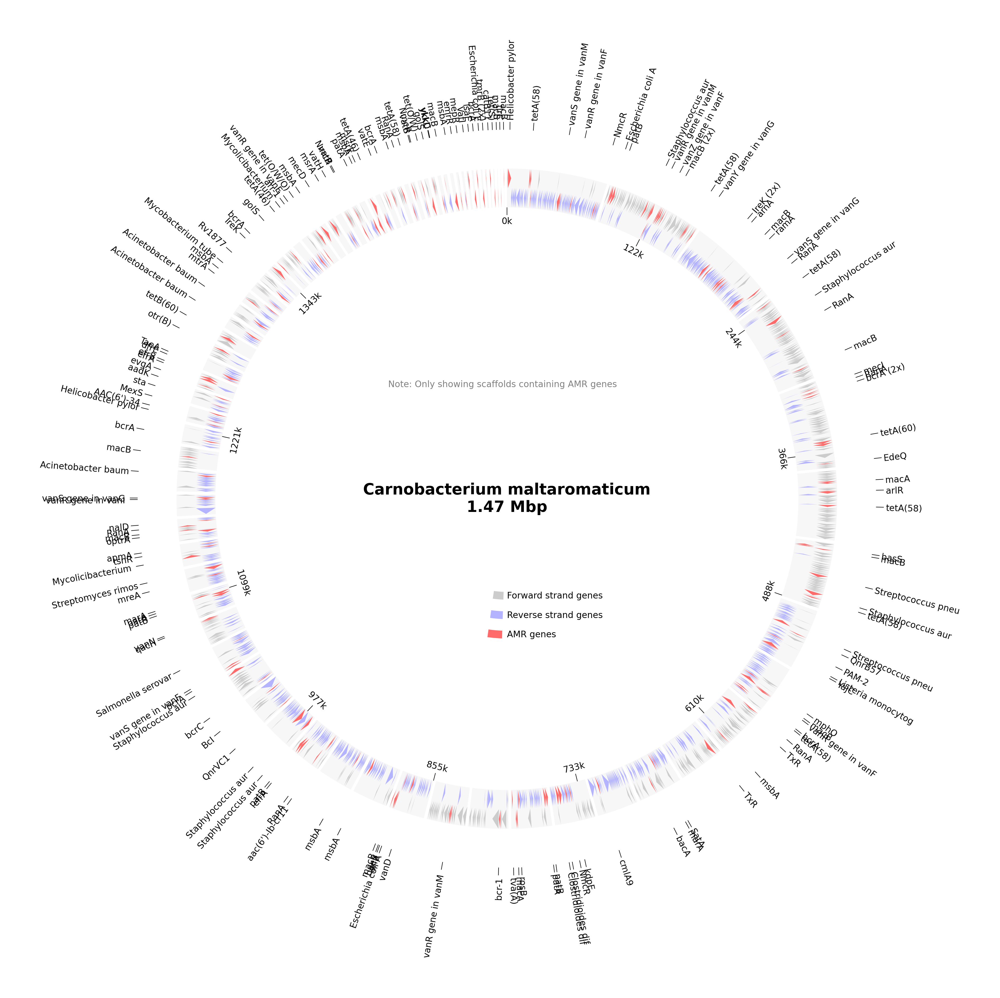

### AAC(6')-34
- **Mechanism**: antibiotic inactivation
- **Drug Classes**: aminoglycoside antibiotic
- **AMR Family**: AAC(6')
- **Locations**:
  - gnl|SPADES|FPFIAAFN_558_6 : position 5008-5541

### Acinetobacter baumannii AbaQ (found in 2 locations)
- **Mechanism**: antibiotic efflux
- **Drug Classes**: fluoroquinolone antibiotic
- **AMR Family**: major facilitator superfamily (MFS) antibiotic efflux pump
- **Locations**:
  - gnl|SPADES|FPFIAAFN_394_11 : position 13123-14379
  - gnl|SPADES|FPFIAAFN_701_5 : position 5081-6373

### Acinetobacter baumannii AmvA
- **Mechanism**: antibiotic efflux
- **Drug Classes**: macrolide antibiotic; disinfecting agents and antiseptics
- **AMR Family**: major facilitator superfamily (MFS) antibiotic efflux pump
- **Locations**:
  - gnl|SPADES|FPFIAAFN_714_6 : position 4533-5963

### BcI
- **Mechanism**: antibiotic inactivation
- **Drug Classes**: cephalosporin; penem
- **AMR Family**: class A Bacillus cereus Bc beta-lactamase
- **Locations**:
  - gnl|SPADES|FPFIAAFN_288_17 : position 16621-17520

### Clostridioides difficile gyrA conferring resistance to fluoroquinolones
- **Mechanism**: antibiotic target alteration
- **Drug Classes**: fluoroquinolone antibiotic
- **AMR Family**: fluoroquinolone resistant gyrA
- **Locations**:
  - gnl|SPADES|FPFIAAFN_211_21 : position 23348-25819

### Clostridioides difficile gyrB conferring resistance to fluoroquinolones
- **Mechanism**: antibiotic target alteration
- **Drug Classes**: fluoroquinolone antibiotic
- **AMR Family**: fluoroquinolone resistant gyrB
- **Locations**:
  - gnl|SPADES|FPFIAAFN_211_22 : position 25809-27824

### EdeQ (found in 2 locations)
- **Mechanism**: antibiotic inactivation
- **Drug Classes**: peptide antibiotic; polyamine antibiotic
- **AMR Family**: Edeine acetyltransferase
- **Locations**:
  - gnl|SPADES|FPFIAAFN_62_19 : position 20189-20641
  - gnl|SPADES|FPFIAAFN_73_65 : position 67217-67669

### Enterococcus faecalis cls with mutation conferring resistance to daptomycin
- **Mechanism**: antibiotic target alteration
- **Drug Classes**: peptide antibiotic
- **AMR Family**: daptomycin resistant cls
- **Locations**:
  - gnl|SPADES|FPFIAAFN_68_42 : position 40306-41754

### Escherichia coli AcrAB-TolC with AcrR mutation conferring resistance to ciprofloxacin, tetracycline, and ceftazidime
- **Mechanism**: antibiotic target alteration; antibiotic efflux
- **Drug Classes**: fluoroquinolone antibiotic; cephalosporin; glycylcycline; penam; tetracycline antibiotic; rifamycin antibiotic; phenicol antibiotic; disinfecting agents and antiseptics
- **AMR Family**: resistance-nodulation-cell division (RND) antibiotic efflux pump
- **Locations**:
  - gnl|SPADES|FPFIAAFN_63_3 : position 2315-2959

### Escherichia coli AcrAB-TolC with MarR mutations conferring resistance to ciprofloxacin and tetracycline
- **Mechanism**: antibiotic target alteration; antibiotic efflux
- **Drug Classes**: fluoroquinolone antibiotic; cephalosporin; glycylcycline; penam; tetracycline antibiotic; rifamycin antibiotic; phenicol antibiotic; disinfecting agents and antiseptics
- **AMR Family**: resistance-nodulation-cell division (RND) antibiotic efflux pump
- **Locations**:
  - gnl|SPADES|FPFIAAFN_235_27 : position 23809-24273

### Escherichia coli EF-Tu mutants conferring resistance to kirromycin
- **Mechanism**: antibiotic target alteration
- **Drug Classes**: elfamycin antibiotic
- **AMR Family**: elfamycin resistant EF-Tu
- **Locations**:
  - gnl|SPADES|FPFIAAFN_6248_1 : position 74-1228

### Helicobacter pylori frxA mutation conferring resistance to metronidazole
- **Mechanism**: antibiotic target alteration
- **Drug Classes**: nitroimidazole antibiotic
- **AMR Family**: Antibiotic resistant Helicobacter pylori nitroreductase
- **Locations**:
  - gnl|SPADES|FPFIAAFN_558_2 : position 1686-2357

### Helicobacter pylori pbp1 mutants conferring resistance to amoxicillin
- **Mechanism**: antibiotic target alteration
- **Drug Classes**: cephalosporin; cephamycin; penam
- **AMR Family**: Penicillin-binding protein mutations conferring resistance to beta-lactam antibiotics
- **Locations**:
  - gnl|SPADES|FPFIAAFN_62_3 : position 876-3512

### IreK (found in 3 locations)
- **Mechanism**: reduced permeability to antibiotic
- **Drug Classes**: cephalosporin
- **AMR Family**: Serine/threonine kinases
- **Locations**:
  - gnl|SPADES|FPFIAAFN_68_24 : position 21827-23851
  - gnl|SPADES|FPFIAAFN_68_50 : position 48764-49960
  - gnl|SPADES|FPFIAAFN_976_5 : position 4410-6701

### Listeria monocytogenes mprF
- **Mechanism**: antibiotic target alteration
- **Drug Classes**: peptide antibiotic
- **AMR Family**: defensin resistant mprF
- **Locations**:
  - gnl|SPADES|FPFIAAFN_128_37 : position 39416-41989

### LlmA 23S ribosomal RNA methyltransferase
- **Mechanism**: antibiotic target alteration
- **Drug Classes**: lincosamide antibiotic
- **AMR Family**: Llm 23S ribosomal RNA methyltransferase
- **Locations**:
  - gnl|SPADES|FPFIAAFN_63_44 : position 46492-47658

### MexS
- **Mechanism**: antibiotic efflux
- **Drug Classes**: fluoroquinolone antibiotic; diaminopyrimidine antibiotic; phenicol antibiotic
- **AMR Family**: resistance-nodulation-cell division (RND) antibiotic efflux pump
- **Locations**:
  - gnl|SPADES|FPFIAAFN_558_14 : position 11453-12433

### Mycobacterium tuberculosis pncA mutations conferring resistance to pyrazinamide
- **Mechanism**: antibiotic target alteration
- **Drug Classes**: pyrazine antibiotic
- **AMR Family**: Pyrazinamide resistant pncA
- **Locations**:
  - gnl|SPADES|FPFIAAFN_861_3 : position 2161-2706

### Mycolicibacterium smegmatis ndh with mutation conferring resistance to isoniazid (found in 2 locations)
- **Mechanism**: antibiotic target alteration
- **Drug Classes**: isoniazid-like antibiotic
- **AMR Family**: antibiotic resistant ndh
- **Locations**:
  - gnl|SPADES|FPFIAAFN_1133_3 : position 1715-2920
  - gnl|SPADES|FPFIAAFN_369_7 : position 6059-7921

### NmcR (found in 4 locations)
- **Mechanism**: antibiotic inactivation
- **Drug Classes**: carbapenem; cephalosporin; cephamycin; penam
- **AMR Family**: NmcA beta-lactamase
- **Locations**:
  - gnl|SPADES|FPFIAAFN_1486_1 : position 38-904
  - gnl|SPADES|FPFIAAFN_211_18 : position 18781-19728
  - gnl|SPADES|FPFIAAFN_2246_5 : position 2683-3210
  - gnl|SPADES|FPFIAAFN_62_76 : position 76238-77122

### PAM-2
- **Mechanism**: antibiotic inactivation
- **Drug Classes**: carbapenem; cephalosporin
- **AMR Family**: PAM beta-lactamase
- **Locations**:
  - gnl|SPADES|FPFIAAFN_128_32 : position 32599-33279

### QnrB57
- **Mechanism**: antibiotic target protection
- **Drug Classes**: fluoroquinolone antibiotic
- **AMR Family**: quinolone resistance protein (qnr)
- **Locations**:
  - gnl|SPADES|FPFIAAFN_128_23 : position 23031-23666

### QnrVC1
- **Mechanism**: antibiotic target protection
- **Drug Classes**: fluoroquinolone antibiotic
- **AMR Family**: quinolone resistance protein (qnr)
- **Locations**:
  - gnl|SPADES|FPFIAAFN_288_1 : position 350-973

### RanA (found in 7 locations)
- **Mechanism**: antibiotic efflux
- **Drug Classes**: aminoglycoside antibiotic
- **AMR Family**: ATP-binding cassette (ABC) antibiotic efflux pump
- **Locations**:
  - gnl|SPADES|FPFIAAFN_156_1 : position 196-1311
  - gnl|SPADES|FPFIAAFN_2193_2 : position 972-1625
  - gnl|SPADES|FPFIAAFN_260_7 : position 5888-6619
  - gnl|SPADES|FPFIAAFN_375_14 : position 11439-12425
  - gnl|SPADES|FPFIAAFN_68_66 : position 66857-68050
  - gnl|SPADES|FPFIAAFN_72_30 : position 30282-30959
  - gnl|SPADES|FPFIAAFN_73_11 : position 7740-8465

### Rv1877
- **Mechanism**: antibiotic efflux
- **Drug Classes**: fluoroquinolone antibiotic
- **AMR Family**: major facilitator superfamily (MFS) antibiotic efflux pump
- **Locations**:
  - gnl|SPADES|FPFIAAFN_965_2 : position 739-2223

### Salmonella serovars soxS with mutation conferring antibiotic resistance
- **Mechanism**: antibiotic target alteration; antibiotic efflux; reduced permeability to antibiotic
- **Drug Classes**: fluoroquinolone antibiotic; monobactam; carbapenem; cephalosporin; glycylcycline; cephamycin; penam; tetracycline antibiotic; rifamycin antibiotic; phenicol antibiotic; penem; disinfecting agents and antiseptics
- **AMR Family**: ATP-binding cassette (ABC) antibiotic efflux pump; major facilitator superfamily (MFS) antibiotic efflux pump; resistance-nodulation-cell division (RND) antibiotic efflux pump; General Bacterial Porin with reduced permeability to beta-lactams
- **Locations**:
  - gnl|SPADES|FPFIAAFN_309_15 : position 17442-17828

### SatA
- **Mechanism**: antibiotic inactivation
- **Drug Classes**: nucleoside antibiotic
- **AMR Family**: streptothricin acetyltransferase (SAT)
- **Locations**:
  - gnl|SPADES|FPFIAAFN_183_11 : position 10330-10782

### Staphylococcus aureus fusA with mutation conferring resistance to fusidic acid
- **Mechanism**: antibiotic target alteration
- **Drug Classes**: fusidane antibiotic
- **AMR Family**: antibiotic resistant fusA
- **Locations**:
  - gnl|SPADES|FPFIAAFN_269_2 : position 234-2318

### Staphylococcus aureus mupA conferring resistance to mupirocin
- **Mechanism**: antibiotic target alteration
- **Drug Classes**: mupirocin-like antibiotic
- **AMR Family**: antibiotic-resistant isoleucyl-tRNA synthetase (ileS)
- **Locations**:
  - gnl|SPADES|FPFIAAFN_113_42 : position 41626-44409

### Staphylococcus aureus mupB conferring resistance to mupirocin (found in 2 locations)
- **Mechanism**: antibiotic target alteration
- **Drug Classes**: mupirocin-like antibiotic
- **AMR Family**: antibiotic-resistant isoleucyl-tRNA synthetase (ileS)
- **Locations**:
  - gnl|SPADES|FPFIAAFN_298_17 : position 20552-22966
  - gnl|SPADES|FPFIAAFN_72_17 : position 16628-19297

### Staphylococcus aureus murA with mutation conferring resistance to fosfomycin
- **Mechanism**: antibiotic target alteration
- **Drug Classes**: phosphonic acid antibiotic
- **AMR Family**: antibiotic-resistant murA transferase
- **Locations**:
  - gnl|SPADES|FPFIAAFN_63_32 : position 33216-34523

### Staphylococcus aureus rpoB mutants conferring resistance to rifampicin
- **Mechanism**: antibiotic target alteration; antibiotic target replacement
- **Drug Classes**: rifamycin antibiotic
- **AMR Family**: rifamycin-resistant beta-subunit of RNA polymerase (rpoB)
- **Locations**:
  - gnl|SPADES|FPFIAAFN_269_7 : position 8320-11892

### Streptococcus pneumoniae PBP2b conferring resistance to amoxicillin
- **Mechanism**: antibiotic target alteration
- **Drug Classes**: cephalosporin; cephamycin; penam
- **AMR Family**: Penicillin-binding protein mutations conferring resistance to beta-lactam antibiotics
- **Locations**:
  - gnl|SPADES|FPFIAAFN_128_21 : position 17974-20028

### Streptococcus pneumoniae PBP2x conferring resistance to amoxicillin
- **Mechanism**: antibiotic target alteration
- **Drug Classes**: cephalosporin; cephamycin; penam
- **AMR Family**: Penicillin-binding protein mutations conferring resistance to beta-lactam antibiotics
- **Locations**:
  - gnl|SPADES|FPFIAAFN_113_29 : position 26758-28947

### Streptomyces rimosus otr(A)
- **Mechanism**: antibiotic target protection
- **Drug Classes**: tetracycline antibiotic
- **AMR Family**: tetracycline-resistant ribosomal protection protein
- **Locations**:
  - gnl|SPADES|FPFIAAFN_358_17 : position 13603-16110

### TaeA
- **Mechanism**: antibiotic efflux
- **Drug Classes**: pleuromutilin antibiotic
- **AMR Family**: ATP-binding cassette (ABC) antibiotic efflux pump
- **Locations**:
  - gnl|SPADES|FPFIAAFN_673_3 : position 1620-3521

### TxR (found in 2 locations)
- **Mechanism**: antibiotic efflux
- **Drug Classes**: tetracycline antibiotic
- **AMR Family**: ATP-binding cassette (ABC) antibiotic efflux pump
- **Locations**:
  - gnl|SPADES|FPFIAAFN_156_7 : position 6542-9205
  - gnl|SPADES|FPFIAAFN_177_5 : position 4046-6856

### VatI
- **Mechanism**: antibiotic inactivation
- **Drug Classes**: streptogramin antibiotic; streptogramin A antibiotic
- **AMR Family**: streptogramin vat acetyltransferase
- **Locations**:
  - gnl|SPADES|FPFIAAFN_4461_2 : position 831-1532

### YajC
- **Mechanism**: antibiotic efflux
- **Drug Classes**: fluoroquinolone antibiotic; cephalosporin; glycylcycline; penam; tetracycline antibiotic; oxazolidinone antibiotic; glycopeptide antibiotic; rifamycin antibiotic; phenicol antibiotic; disinfecting agents and antiseptics
- **AMR Family**: resistance-nodulation-cell division (RND) antibiotic efflux pump
- **Locations**:
  - gnl|SPADES|FPFIAAFN_128_38 : position 42169-42546

### YojI
- **Mechanism**: antibiotic efflux
- **Drug Classes**: peptide antibiotic
- **AMR Family**: ATP-binding cassette (ABC) antibiotic efflux pump
- **Locations**:
  - gnl|SPADES|FPFIAAFN_63_39 : position 40355-40903

### aac(6')-Ib-cr11
- **Mechanism**: antibiotic inactivation
- **Drug Classes**: fluoroquinolone antibiotic; aminoglycoside antibiotic
- **AMR Family**: AAC(6'); AAC(6')-Ib-cr
- **Locations**:
  - gnl|SPADES|FPFIAAFN_260_4 : position 3008-3571

### aadK
- **Mechanism**: antibiotic inactivation
- **Drug Classes**: aminoglycoside antibiotic
- **AMR Family**: ANT(6)
- **Locations**:
  - gnl|SPADES|FPFIAAFN_583_13 : position 11178-12029

### apmA
- **Mechanism**: antibiotic inactivation
- **Drug Classes**: aminoglycoside antibiotic
- **AMR Family**: AAC(2')
- **Locations**:
  - gnl|SPADES|FPFIAAFN_369_18 : position 15433-15942

### arlR (found in 2 locations)
- **Mechanism**: antibiotic efflux
- **Drug Classes**: fluoroquinolone antibiotic; disinfecting agents and antiseptics
- **AMR Family**: major facilitator superfamily (MFS) antibiotic efflux pump
- **Locations**:
  - gnl|SPADES|FPFIAAFN_103_18 : position 16278-16964
  - gnl|SPADES|FPFIAAFN_235_29 : position 25281-25952

### arlS (found in 2 locations)
- **Mechanism**: antibiotic efflux
- **Drug Classes**: fluoroquinolone antibiotic; disinfecting agents and antiseptics
- **AMR Family**: major facilitator superfamily (MFS) antibiotic efflux pump
- **Locations**:
  - gnl|SPADES|FPFIAAFN_103_19 : position 16961-18475
  - gnl|SPADES|FPFIAAFN_151_26 : position 26593-27645

### arnA
- **Mechanism**: antibiotic target alteration
- **Drug Classes**: peptide antibiotic
- **AMR Family**: pmr phosphoethanolamine transferase
- **Locations**:
  - gnl|SPADES|FPFIAAFN_68_27 : position 26012-26965

### arr-1
- **Mechanism**: antibiotic inactivation
- **Drug Classes**: rifamycin antibiotic
- **AMR Family**: rifampin ADP-ribosyltransferase (Arr)
- **Locations**:
  - gnl|SPADES|FPFIAAFN_1133_7 : position 6006-6419

### bacA
- **Mechanism**: antibiotic target alteration
- **Drug Classes**: peptide antibiotic
- **AMR Family**: undecaprenyl pyrophosphate related proteins
- **Locations**:
  - gnl|SPADES|FPFIAAFN_183_19 : position 21487-22305

### baeS (found in 2 locations)
- **Mechanism**: antibiotic efflux
- **Drug Classes**: aminoglycoside antibiotic; aminocoumarin antibiotic
- **AMR Family**: resistance-nodulation-cell division (RND) antibiotic efflux pump
- **Locations**:
  - gnl|SPADES|FPFIAAFN_235_30 : position 25949-27337
  - gnl|SPADES|FPFIAAFN_63_38 : position 38789-40240

### basS
- **Mechanism**: antibiotic target alteration; antibiotic efflux
- **Drug Classes**: peptide antibiotic
- **AMR Family**: pmr phosphoethanolamine transferase
- **Locations**:
  - gnl|SPADES|FPFIAAFN_113_4 : position 3422-4486

### bcr-1
- **Mechanism**: antibiotic efflux
- **Drug Classes**: bicyclomycin-like antibiotic
- **AMR Family**: major facilitator superfamily (MFS) antibiotic efflux pump
- **Locations**:
  - gnl|SPADES|FPFIAAFN_220_6 : position 6531-7778

### bcrA (found in 8 locations)
- **Mechanism**: antibiotic efflux
- **Drug Classes**: peptide antibiotic
- **AMR Family**: ATP-binding cassette (ABC) antibiotic efflux pump
- **Locations**:
  - gnl|SPADES|FPFIAAFN_1103_1 : position 92-838
  - gnl|SPADES|FPFIAAFN_151_34 : position 33705-34481
  - gnl|SPADES|FPFIAAFN_1979_1 : position 137-826
  - gnl|SPADES|FPFIAAFN_309_1 : position 34-966
  - gnl|SPADES|FPFIAAFN_443_5 : position 4879-5805
  - gnl|SPADES|FPFIAAFN_5883_1 : position 105-710
  - gnl|SPADES|FPFIAAFN_73_14 : position 10472-11359
  - gnl|SPADES|FPFIAAFN_73_24 : position 19930-20835

### bcrC
- **Mechanism**: antibiotic target alteration
- **Drug Classes**: peptide antibiotic
- **AMR Family**: undecaprenyl pyrophosphate related proteins
- **Locations**:
  - gnl|SPADES|FPFIAAFN_298_3 : position 2564-3232

### catB11
- **Mechanism**: antibiotic inactivation
- **Drug Classes**: phenicol antibiotic
- **AMR Family**: chloramphenicol acetyltransferase (CAT)
- **Locations**:
  - gnl|SPADES|FPFIAAFN_10843_1 : position 131-769

### cmlA9
- **Mechanism**: antibiotic efflux
- **Drug Classes**: phenicol antibiotic
- **AMR Family**: major facilitator superfamily (MFS) antibiotic efflux pump
- **Locations**:
  - gnl|SPADES|FPFIAAFN_205_25 : position 25122-26324

### dfrE
- **Mechanism**: antibiotic target replacement
- **Drug Classes**: diaminopyrimidine antibiotic
- **AMR Family**: trimethoprim resistant dihydrofolate reductase dfr
- **Locations**:
  - gnl|SPADES|FPFIAAFN_673_1 : position 143-631

### efrA (found in 3 locations)
- **Mechanism**: antibiotic efflux
- **Drug Classes**: macrolide antibiotic; fluoroquinolone antibiotic; rifamycin antibiotic
- **AMR Family**: ATP-binding cassette (ABC) antibiotic efflux pump
- **Locations**:
  - gnl|SPADES|FPFIAAFN_260_21 : position 20620-22323
  - gnl|SPADES|FPFIAAFN_604_8 : position 6855-8609
  - gnl|SPADES|FPFIAAFN_63_4 : position 3009-4730

### efrB
- **Mechanism**: antibiotic efflux
- **Drug Classes**: macrolide antibiotic; fluoroquinolone antibiotic; rifamycin antibiotic
- **AMR Family**: ATP-binding cassette (ABC) antibiotic efflux pump
- **Locations**:
  - gnl|SPADES|FPFIAAFN_604_9 : position 8606-10384

### emrR
- **Mechanism**: antibiotic efflux
- **Drug Classes**: fluoroquinolone antibiotic
- **AMR Family**: major facilitator superfamily (MFS) antibiotic efflux pump
- **Locations**:
  - gnl|SPADES|FPFIAAFN_3552_2 : position 883-1314

### evgA
- **Mechanism**: antibiotic efflux
- **Drug Classes**: macrolide antibiotic; fluoroquinolone antibiotic; penam; tetracycline antibiotic
- **AMR Family**: major facilitator superfamily (MFS) antibiotic efflux pump; resistance-nodulation-cell division (RND) antibiotic efflux pump
- **Locations**:
  - gnl|SPADES|FPFIAAFN_604_3 : position 2056-2688

### golS (found in 5 locations)
- **Mechanism**: antibiotic efflux
- **Drug Classes**: monobactam; carbapenem; cephalosporin; cephamycin; penam; phenicol antibiotic; penem
- **AMR Family**: resistance-nodulation-cell division (RND) antibiotic efflux pump
- **Locations**:
  - gnl|SPADES|FPFIAAFN_1121_5 : position 4690-5448
  - gnl|SPADES|FPFIAAFN_2395_3 : position 835-1263
  - gnl|SPADES|FPFIAAFN_62_78 : position 78273-78641
  - gnl|SPADES|FPFIAAFN_62_81 : position 80605-80997
  - gnl|SPADES|FPFIAAFN_73_12 : position 8755-9105

### kdpE
- **Mechanism**: antibiotic efflux
- **Drug Classes**: aminoglycoside antibiotic
- **AMR Family**: kdpDE
- **Locations**:
  - gnl|SPADES|FPFIAAFN_211_15 : position 15183-15917

### lsaE
- **Mechanism**: antibiotic target protection
- **Drug Classes**: lincosamide antibiotic; streptogramin antibiotic; pleuromutilin antibiotic
- **AMR Family**: lsa-type ABC-F protein
- **Locations**:
  - gnl|SPADES|FPFIAAFN_4800_2 : position 270-1556

### macA (found in 2 locations)
- **Mechanism**: antibiotic efflux
- **Drug Classes**: macrolide antibiotic
- **AMR Family**: ATP-binding cassette (ABC) antibiotic efflux pump
- **Locations**:
  - gnl|SPADES|FPFIAAFN_103_11 : position 8492-9688
  - gnl|SPADES|FPFIAAFN_214_27 : position 27455-28315

### macB (found in 16 locations)
- **Mechanism**: antibiotic efflux
- **Drug Classes**: macrolide antibiotic
- **AMR Family**: ATP-binding cassette (ABC) antibiotic efflux pump
- **Locations**:
  - gnl|SPADES|FPFIAAFN_103_12 : position 9705-10412
  - gnl|SPADES|FPFIAAFN_103_13 : position 10409-11653
  - gnl|SPADES|FPFIAAFN_113_6 : position 5527-6294
  - gnl|SPADES|FPFIAAFN_151_24 : position 23403-25769
  - gnl|SPADES|FPFIAAFN_214_28 : position 28331-29023
  - gnl|SPADES|FPFIAAFN_214_29 : position 29039-30265
  - gnl|SPADES|FPFIAAFN_235_32 : position 28496-29053
  - gnl|SPADES|FPFIAAFN_26149_2 : position 216-383
  - gnl|SPADES|FPFIAAFN_2670_1 : position 3-170
  - gnl|SPADES|FPFIAAFN_375_10 : position 8123-8851
  - gnl|SPADES|FPFIAAFN_405_10 : position 8701-9519
  - gnl|SPADES|FPFIAAFN_59089_1 : position 57-233
  - gnl|SPADES|FPFIAAFN_63_46 : position 49349-50008
  - gnl|SPADES|FPFIAAFN_63_55 : position 57811-58512
  - gnl|SPADES|FPFIAAFN_68_41 : position 38841-40037
  - gnl|SPADES|FPFIAAFN_72_64 : position 62037-62795

### marA (found in 2 locations)
- **Mechanism**: antibiotic efflux; reduced permeability to antibiotic
- **Drug Classes**: fluoroquinolone antibiotic; monobactam; carbapenem; cephalosporin; glycylcycline; cephamycin; penam; tetracycline antibiotic; rifamycin antibiotic; phenicol antibiotic; penem; disinfecting agents and antiseptics
- **AMR Family**: resistance-nodulation-cell division (RND) antibiotic efflux pump; General Bacterial Porin with reduced permeability to beta-lactams
- **Locations**:
  - gnl|SPADES|FPFIAAFN_183_13 : position 12056-12934
  - gnl|SPADES|FPFIAAFN_336_14 : position 15584-16420

### mdtG
- **Mechanism**: antibiotic efflux
- **Drug Classes**: phosphonic acid antibiotic
- **AMR Family**: major facilitator superfamily (MFS) antibiotic efflux pump
- **Locations**:
  - gnl|SPADES|FPFIAAFN_63_43 : position 45236-46444

### mecD
- **Mechanism**: antibiotic target replacement
- **Drug Classes**: penam
- **AMR Family**: methicillin resistant PBP2
- **Locations**:
  - gnl|SPADES|FPFIAAFN_1341_3 : position 1560-3590

### mecI
- **Mechanism**: antibiotic target replacement
- **Drug Classes**: penam
- **AMR Family**: methicillin resistant PBP2
- **Locations**:
  - gnl|SPADES|FPFIAAFN_73_8 : position 5338-5793

### mepR
- **Mechanism**: antibiotic efflux
- **Drug Classes**: glycylcycline; tetracycline antibiotic
- **AMR Family**: multidrug and toxic compound extrusion (MATE) transporter
- **Locations**:
  - gnl|SPADES|FPFIAAFN_3997_2 : position 600-1049

### mphO
- **Mechanism**: antibiotic inactivation
- **Drug Classes**: macrolide antibiotic
- **AMR Family**: macrolide phosphotransferase (MPH)
- **Locations**:
  - gnl|SPADES|FPFIAAFN_151_19 : position 20191-21030

### mreA
- **Mechanism**: antibiotic efflux
- **Drug Classes**: macrolide antibiotic
- **AMR Family**: major facilitator superfamily (MFS) antibiotic efflux pump
- **Locations**:
  - gnl|SPADES|FPFIAAFN_358_10 : position 7899-8843

### msbA (found in 8 locations)
- **Mechanism**: antibiotic efflux
- **Drug Classes**: nitroimidazole antibiotic
- **AMR Family**: ATP-binding cassette (ABC) antibiotic efflux pump
- **Locations**:
  - gnl|SPADES|FPFIAAFN_1297_3 : position 1393-3669
  - gnl|SPADES|FPFIAAFN_156_30 : position 32624-33406
  - gnl|SPADES|FPFIAAFN_1618_1 : position 94-1833
  - gnl|SPADES|FPFIAAFN_2056_3 : position 2699-3538
  - gnl|SPADES|FPFIAAFN_237_20 : position 23561-25276
  - gnl|SPADES|FPFIAAFN_240_7 : position 7154-7939
  - gnl|SPADES|FPFIAAFN_2745_2 : position 485-2641
  - gnl|SPADES|FPFIAAFN_757_10 : position 8770-9525

### msrA
- **Mechanism**: antibiotic target protection
- **Drug Classes**: macrolide antibiotic; streptogramin antibiotic; streptogramin B antibiotic
- **AMR Family**: msr-type ABC-F protein
- **Locations**:
  - gnl|SPADES|FPFIAAFN_1444_4 : position 2462-3037

### msrE
- **Mechanism**: antibiotic target protection
- **Drug Classes**: macrolide antibiotic; streptogramin antibiotic
- **AMR Family**: msr-type ABC-F protein
- **Locations**:
  - gnl|SPADES|FPFIAAFN_1618_2 : position 2262-4502

### mtrA
- **Mechanism**: antibiotic efflux
- **Drug Classes**: macrolide antibiotic; penam
- **AMR Family**: resistance-nodulation-cell division (RND) antibiotic efflux pump
- **Locations**:
  - gnl|SPADES|FPFIAAFN_757_5 : position 4089-4943

### nalD (found in 2 locations)
- **Mechanism**: antibiotic efflux
- **Drug Classes**: macrolide antibiotic; fluoroquinolone antibiotic; monobactam; carbapenem; cephalosporin; cephamycin; penam; tetracycline antibiotic; peptide antibiotic; aminocoumarin antibiotic; diaminopyrimidine antibiotic; sulfonamide antibiotic; phenicol antibiotic; penem
- **AMR Family**: resistance-nodulation-cell division (RND) antibiotic efflux pump
- **Locations**:
  - gnl|SPADES|FPFIAAFN_260_5 : position 3592-4170
  - gnl|SPADES|FPFIAAFN_375_17 : position 14958-15608

### oleC
- **Mechanism**: antibiotic efflux
- **Drug Classes**: macrolide antibiotic
- **AMR Family**: ATP-binding cassette (ABC) antibiotic efflux pump
- **Locations**:
  - gnl|SPADES|FPFIAAFN_63_67 : position 71143-71847

### optrA
- **Mechanism**: antibiotic target protection
- **Drug Classes**: oxazolidinone antibiotic; phenicol antibiotic
- **AMR Family**: Miscellaneous ABC-F subfamily ATP-binding cassette ribosomal protection proteins
- **Locations**:
  - gnl|SPADES|FPFIAAFN_375_8 : position 5424-7298

### otr(B)
- **Mechanism**: antibiotic efflux
- **Drug Classes**: tetracycline antibiotic
- **AMR Family**: major facilitator superfamily (MFS) antibiotic efflux pump
- **Locations**:
  - gnl|SPADES|FPFIAAFN_681_6 : position 7566-8846

### patA (found in 3 locations)
- **Mechanism**: antibiotic efflux
- **Drug Classes**: fluoroquinolone antibiotic
- **AMR Family**: ATP-binding cassette (ABC) antibiotic efflux pump
- **Locations**:
  - gnl|SPADES|FPFIAAFN_1556_4 : position 3130-4611
  - gnl|SPADES|FPFIAAFN_214_2 : position 2110-3831
  - gnl|SPADES|FPFIAAFN_336_13 : position 13432-15186

### patB (found in 4 locations)
- **Mechanism**: antibiotic efflux
- **Drug Classes**: fluoroquinolone antibiotic
- **AMR Family**: ATP-binding cassette (ABC) antibiotic efflux pump
- **Locations**:
  - gnl|SPADES|FPFIAAFN_214_1 : position 338-2110
  - gnl|SPADES|FPFIAAFN_260_22 : position 22325-24076
  - gnl|SPADES|FPFIAAFN_336_12 : position 11658-13439
  - gnl|SPADES|FPFIAAFN_63_5 : position 4732-6630

### qacH
- **Mechanism**: antibiotic efflux
- **Drug Classes**: disinfecting agents and antiseptics
- **AMR Family**: small multidrug resistance (SMR) antibiotic efflux pump
- **Locations**:
  - gnl|SPADES|FPFIAAFN_324_24 : position 18918-19244

### ramA
- **Mechanism**: antibiotic efflux; reduced permeability to antibiotic
- **Drug Classes**: fluoroquinolone antibiotic; monobactam; carbapenem; cephalosporin; glycylcycline; cephamycin; penam; tetracycline antibiotic; rifamycin antibiotic; phenicol antibiotic; penem; disinfecting agents and antiseptics
- **AMR Family**: resistance-nodulation-cell division (RND) antibiotic efflux pump; General Bacterial Porin with reduced permeability to beta-lactams
- **Locations**:
  - gnl|SPADES|FPFIAAFN_68_45 : position 43445-44362

### rosB
- **Mechanism**: antibiotic efflux
- **Drug Classes**: peptide antibiotic
- **AMR Family**: major facilitator superfamily (MFS) antibiotic efflux pump
- **Locations**:
  - gnl|SPADES|FPFIAAFN_214_25 : position 25160-26320

### sta
- **Mechanism**: antibiotic inactivation
- **Drug Classes**: nucleoside antibiotic
- **AMR Family**: streptothricin acetyltransferase (SAT)
- **Locations**:
  - gnl|SPADES|FPFIAAFN_583_5 : position 4423-4938

### tet(O/W)
- **Mechanism**: antibiotic target protection
- **Drug Classes**: tetracycline antibiotic
- **AMR Family**: tetracycline-resistant ribosomal protection protein
- **Locations**:
  - gnl|SPADES|FPFIAAFN_2270_2 : position 1243-3078

### tet(O/W/O)
- **Mechanism**: antibiotic target protection
- **Drug Classes**: tetracycline antibiotic
- **AMR Family**: tetracycline-resistant ribosomal protection protein
- **Locations**:
  - gnl|SPADES|FPFIAAFN_1182_7 : position 4630-6177

### tet(S)
- **Mechanism**: antibiotic target protection
- **Drug Classes**: tetracycline antibiotic
- **AMR Family**: tetracycline-resistant ribosomal protection protein
- **Locations**:
  - gnl|SPADES|FPFIAAFN_11361_2 : position 150-740

### tetA(46) (found in 2 locations)
- **Mechanism**: antibiotic efflux
- **Drug Classes**: tetracycline antibiotic
- **AMR Family**: ATP-binding cassette (ABC) antibiotic efflux pump
- **Locations**:
  - gnl|SPADES|FPFIAAFN_1127_6 : position 5730-6497
  - gnl|SPADES|FPFIAAFN_1746_1 : position 1-1260

### tetA(58) (found in 7 locations)
- **Mechanism**: antibiotic efflux
- **Drug Classes**: tetracycline antibiotic
- **AMR Family**: major facilitator superfamily (MFS) antibiotic efflux pump
- **Locations**:
  - gnl|SPADES|FPFIAAFN_103_28 : position 27838-29406
  - gnl|SPADES|FPFIAAFN_113_45 : position 45819-46736
  - gnl|SPADES|FPFIAAFN_151_36 : position 35145-36107
  - gnl|SPADES|FPFIAAFN_2235_1 : position 3-902
  - gnl|SPADES|FPFIAAFN_62_17 : position 18408-19325
  - gnl|SPADES|FPFIAAFN_63_66 : position 70366-71139
  - gnl|SPADES|FPFIAAFN_72_3 : position 2291-3049

### tetA(60)
- **Mechanism**: antibiotic efflux
- **Drug Classes**: tetracycline antibiotic
- **AMR Family**: ATP-binding cassette (ABC) antibiotic efflux pump
- **Locations**:
  - gnl|SPADES|FPFIAAFN_73_55 : position 49168-50919

### tetB(58)
- **Mechanism**: antibiotic efflux
- **Drug Classes**: tetracycline antibiotic
- **AMR Family**: major facilitator superfamily (MFS) antibiotic efflux pump
- **Locations**:
  - gnl|SPADES|FPFIAAFN_62_18 : position 19318-20088

### tetB(60) (found in 2 locations)
- **Mechanism**: antibiotic efflux
- **Drug Classes**: tetracycline antibiotic
- **AMR Family**: ATP-binding cassette (ABC) antibiotic efflux pump
- **Locations**:
  - gnl|SPADES|FPFIAAFN_687_4 : position 4992-7082
  - gnl|SPADES|FPFIAAFN_73_56 : position 50919-52709

### tlrC
- **Mechanism**: antibiotic target protection
- **Drug Classes**: macrolide antibiotic; lincosamide antibiotic
- **AMR Family**: Miscellaneous ABC-F subfamily ATP-binding cassette ribosomal protection proteins
- **Locations**:
  - gnl|SPADES|FPFIAAFN_42437_1 : position 3-209

### tmrB (found in 2 locations)
- **Mechanism**: reduced permeability to antibiotic
- **Drug Classes**: nucleoside antibiotic
- **AMR Family**: tunicamycin resistance protein
- **Locations**:
  - gnl|SPADES|FPFIAAFN_6711_1 : position 145-318
  - gnl|SPADES|FPFIAAFN_6711_2 : position 315-656

### tsnR
- **Mechanism**: antibiotic target alteration
- **Drug Classes**: peptide antibiotic
- **AMR Family**: non-erm 23S ribosomal RNA methyltransferase (A1067)
- **Locations**:
  - gnl|SPADES|FPFIAAFN_369_15 : position 12584-13459

### tva(A)
- **Mechanism**: antibiotic target protection
- **Drug Classes**: pleuromutilin antibiotic
- **AMR Family**: Miscellaneous ABC-F subfamily ATP-binding cassette ribosomal protection proteins
- **Locations**:
  - gnl|SPADES|FPFIAAFN_214_31 : position 31199-31867

### vanD
- **Mechanism**: antibiotic target alteration
- **Drug Classes**: glycopeptide antibiotic
- **AMR Family**: glycopeptide resistance gene cluster; Van ligase
- **Locations**:
  - gnl|SPADES|FPFIAAFN_235_18 : position 16113-17477

### vanN
- **Mechanism**: antibiotic target alteration
- **Drug Classes**: glycopeptide antibiotic
- **AMR Family**: glycopeptide resistance gene cluster; Van ligase
- **Locations**:
  - gnl|SPADES|FPFIAAFN_324_26 : position 19697-20776

### vanR gene in vanE cluster
- **Mechanism**: antibiotic target alteration
- **Drug Classes**: glycopeptide antibiotic
- **AMR Family**: glycopeptide resistance gene cluster; vanR
- **Locations**:
  - gnl|SPADES|FPFIAAFN_1182_1 : position 160-849

### vanR gene in vanF cluster (found in 2 locations)
- **Mechanism**: antibiotic target alteration
- **Drug Classes**: glycopeptide antibiotic
- **AMR Family**: glycopeptide resistance gene cluster; vanR
- **Locations**:
  - gnl|SPADES|FPFIAAFN_151_25 : position 25922-26596
  - gnl|SPADES|FPFIAAFN_62_58 : position 55773-56468

### vanR gene in vanI cluster (found in 3 locations)
- **Mechanism**: antibiotic target alteration
- **Drug Classes**: glycopeptide antibiotic
- **AMR Family**: glycopeptide resistance gene cluster; vanR
- **Locations**:
  - gnl|SPADES|FPFIAAFN_113_5 : position 4614-5288
  - gnl|SPADES|FPFIAAFN_387_8 : position 13101-13796
  - gnl|SPADES|FPFIAAFN_68_63 : position 64115-64810

### vanR gene in vanM cluster (found in 3 locations)
- **Mechanism**: antibiotic target alteration
- **Drug Classes**: glycopeptide antibiotic
- **AMR Family**: glycopeptide resistance gene cluster; vanR
- **Locations**:
  - gnl|SPADES|FPFIAAFN_223_6 : position 12119-12808
  - gnl|SPADES|FPFIAAFN_62_46 : position 45595-46317
  - gnl|SPADES|FPFIAAFN_63_37 : position 38067-38786

### vanS gene in vanF cluster (found in 2 locations)
- **Mechanism**: antibiotic target alteration
- **Drug Classes**: glycopeptide antibiotic
- **AMR Family**: vanS; glycopeptide resistance gene cluster
- **Locations**:
  - gnl|SPADES|FPFIAAFN_223_7 : position 12862-13995
  - gnl|SPADES|FPFIAAFN_309_3 : position 1845-2753

### vanS gene in vanG cluster (found in 2 locations)
- **Mechanism**: antibiotic target alteration
- **Drug Classes**: glycopeptide antibiotic
- **AMR Family**: vanS; glycopeptide resistance gene cluster
- **Locations**:
  - gnl|SPADES|FPFIAAFN_387_9 : position 13803-15293
  - gnl|SPADES|FPFIAAFN_68_62 : position 61924-64125

### vanS gene in vanM cluster
- **Mechanism**: antibiotic target alteration
- **Drug Classes**: glycopeptide antibiotic
- **AMR Family**: vanS; glycopeptide resistance gene cluster
- **Locations**:
  - gnl|SPADES|FPFIAAFN_62_45 : position 43786-45588

### vanY gene in vanG cluster
- **Mechanism**: antibiotic target alteration
- **Drug Classes**: glycopeptide antibiotic
- **AMR Family**: vanY; glycopeptide resistance gene cluster
- **Locations**:
  - gnl|SPADES|FPFIAAFN_63_74: position 77261-78034

### vanZ gene in vanF cluster
- **Mechanism**: antibiotic target alteration
- **Drug Classes**: glycopeptide antibiotic
- **AMR Family**: vanZ; glycopeptide resistance gene cluster
- **Locations**:
  - gnl|SPADES|FPFIAAFN_63_42 : position 44483-45133

### vatB (found in 2 locations)
- **Mechanism**: antibiotic inactivation
- **Drug Classes**: streptogramin antibiotic; streptogramin A antibiotic
- **AMR Family**: streptogramin vat acetyltransferase
- **Locations**:
  - gnl|SPADES|FPFIAAFN_1486_2 : position 1031-1600
  - gnl|SPADES|FPFIAAFN_2246_4 : position 1961-2431

### vatE
- **Mechanism**: antibiotic inactivation
- **Drug Classes**: streptogramin antibiotic; streptogramin A antibiotic
- **AMR Family**: streptogramin vat acetyltransferase
- **Locations**:
  - gnl|SPADES|FPFIAAFN_1758_3 : position 2005-2616

### vatH
- **Mechanism**: antibiotic inactivation
- **Drug Classes**: streptogramin antibiotic; streptogramin A antibiotic
- **AMR Family**: streptogramin vat acetyltransferase
- **Locations**:
  - gnl|SPADES|FPFIAAFN_1482_3 : position 872-1489

### ykkC
- **Mechanism**: antibiotic efflux
- **Drug Classes**: aminoglycoside antibiotic; tetracycline antibiotic; phenicol antibiotic
- **AMR Family**: small multidrug resistance (SMR) antibiotic efflux pump
- **Locations**:
  - gnl|SPADES|FPFIAAFN_2579_2 : position 353-676

### ykkD (found in 2 locations)
- **Mechanism**: antibiotic efflux
- **Drug Classes**: aminoglycoside antibiotic; tetracycline antibiotic; phenicol antibiotic
- **AMR Family**: small multidrug resistance (SMR) antibiotic efflux pump
- **Locations**:
  - gnl|SPADES|FPFIAAFN_2579_1 : position 19-336
  - gnl|SPADES|FPFIAAFN_324_25 : position 19244-19561

## Carnobacterium maltaromaticum LMA28
**Strain Statistics:**
- Total genome length: 1340.9 kbp
- Total scaffolds: 241
- Scaffolds with AMR genes: 44
- Total genes annotated: 2381
- Total AMR genes: 137
- Unique AMR genes: 92
- Distinct AMR mechanisms: 7
- Distinct AMR families: 49
- Distinct drug classes: 31

**Circos Plot:**

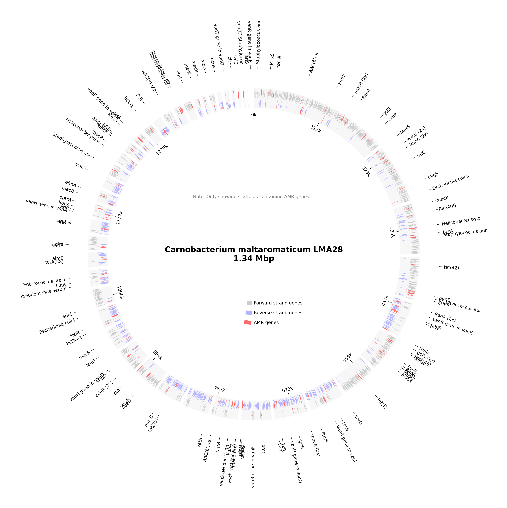

### AAC(3)-IXa
- **Mechanism**: antibiotic inactivation
- **Drug Classes**: aminoglycoside antibiotic
- **AMR Family**: AAC(3)
- **Locations**:
  - gnl|SPADES|FPFIAAFN_529_10 : position 8790-9602

### AAC(3)-Ic
- **Mechanism**: antibiotic inactivation
- **Drug Classes**: aminoglycoside antibiotic
- **AMR Family**: AAC(3)
- **Locations**:
  - gnl|SPADES|FPFIAAFN_432_10 : position 6220-6657

### AAC(6')-Ia
- **Mechanism**: antibiotic inactivation
- **Drug Classes**: aminoglycoside antibiotic
- **AMR Family**: AAC(6')
- **Locations**:
  - gnl|SPADES|FPFIAAFN_152_35 : position 33743-34279

### AAC(6')-Ir
- **Mechanism**: antibiotic inactivation
- **Drug Classes**: aminoglycoside antibiotic
- **AMR Family**: AAC(6')
- **Locations**:
  - gnl|SPADES|FPFIAAFN_11_70 : position 72947-73552

### BCL-1
- **Mechanism**: antibiotic inactivation
- **Drug Classes**: penam
- **AMR Family**: BCL Beta-lactamase
- **Locations**:
  - gnl|SPADES|FPFIAAFN_500_8 : position 8887-10263

### CRP
- **Mechanism**: antibiotic efflux
- **Drug Classes**: macrolide antibiotic; fluoroquinolone antibiotic; penam
- **AMR Family**: resistance-nodulation-cell division (RND) antibiotic efflux pump
- **Locations**:
  - gnl|SPADES|FPFIAAFN_432_13 : position 8328-8990

### Clostridioides difficile gyrA conferring resistance to fluoroquinolones
- **Mechanism**: antibiotic target alteration
- **Drug Classes**: fluoroquinolone antibiotic
- **AMR Family**: fluoroquinolone resistant gyrA
- **Locations**:
  - gnl|SPADES|FPFIAAFN_545_11 : position 9857-12406

### Clostridioides difficile gyrB conferring resistance to fluoroquinolones
- **Mechanism**: antibiotic target alteration
- **Drug Classes**: fluoroquinolone antibiotic
- **AMR Family**: fluoroquinolone resistant gyrB
- **Locations**:
  - gnl|SPADES|FPFIAAFN_545_10 : position 7770-9707

### Enterococcus faecium cls conferring resistance to daptomycin
- **Mechanism**: antibiotic target alteration
- **Drug Classes**: peptide antibiotic
- **AMR Family**: daptomycin resistant cls
- **Locations**:
  - gnl|SPADES|FPFIAAFN_283_17 : position 15382-16902

### ErmR
- **Mechanism**: antibiotic target alteration
- **Drug Classes**: macrolide antibiotic; lincosamide antibiotic; streptogramin antibiotic; streptogramin A antibiotic; streptogramin B antibiotic
- **AMR Family**: Erm 23S ribosomal RNA methyltransferase
- **Locations**:
  - gnl|SPADES|FPFIAAFN_83_61 : position 57859-58752

### Escherichia coli AcrAB-TolC with AcrR mutation conferring resistance to ciprofloxacin, tetracycline, and ceftazidime
- **Mechanism**: antibiotic target alteration; antibiotic efflux
- **Drug Classes**: fluoroquinolone antibiotic; cephalosporin; glycylcycline; penam; tetracycline antibiotic; rifamycin antibiotic; phenicol antibiotic; disinfecting agents and antiseptics
- **AMR Family**: resistance-nodulation-cell division (RND) antibiotic efflux pump
- **Locations**:
  - gnl|SPADES|FPFIAAFN_152_4 : position 2450-3046

### Escherichia coli EF-Tu mutants conferring resistance to kirromycin
- **Mechanism**: antibiotic target alteration
- **Drug Classes**: elfamycin antibiotic
- **AMR Family**: elfamycin resistant EF-Tu
- **Locations**:
  - gnl|SPADES|FPFIAAFN_11_163 : position 183136-184323

### Escherichia coli fabI mutations conferring resistance to isoniazid and triclosan
- **Mechanism**: antibiotic target alteration
- **Drug Classes**: disinfecting agents and antiseptics; isoniazid-like antibiotic
- **AMR Family**: antibiotic resistant fabI
- **Locations**:
  - gnl|SPADES|FPFIAAFN_244_21 : position 26546-27304

### Escherichia coli soxS with mutation conferring antibiotic resistance
- **Mechanism**: antibiotic target alteration; antibiotic efflux; reduced permeability to antibiotic
- **Drug Classes**: fluoroquinolone antibiotic; monobactam; carbapenem; cephalosporin; glycylcycline; cephamycin; penam; tetracycline antibiotic; rifamycin antibiotic; phenicol antibiotic; penem; disinfecting agents and antiseptics
- **AMR Family**: ATP-binding cassette (ABC) antibiotic efflux pump; major facilitator superfamily (MFS) antibiotic efflux pump; resistance-nodulation-cell division (RND) antibiotic efflux pump; General Bacterial Porin with reduced permeability to beta-lactams
- **Locations**:
  - gnl|SPADES|FPFIAAFN_55_79 : position 84000-84527

### EstT
- **Mechanism**: antibiotic inactivation
- **Drug Classes**: macrolide antibiotic
- **AMR Family**: macrolide esterase
- **Locations**:
  - gnl|SPADES|FPFIAAFN_175_16 : position 20065-20898

### FosA7
- **Mechanism**: antibiotic inactivation
- **Drug Classes**: phosphonic acid antibiotic
- **AMR Family**: fosfomycin thiol transferase
- **Locations**:
  - gnl|SPADES|FPFIAAFN_110_35 : position 31514-31894

### FosC2
- **Mechanism**: antibiotic inactivation
- **Drug Classes**: phosphonic acid antibiotic
- **AMR Family**: fosC phosphotransferase family
- **Locations**:
  - gnl|SPADES|FPFIAAFN_11_164 : position 184378-184758

### FusF
- **Mechanism**: antibiotic target protection
- **Drug Classes**: fusidane antibiotic
- **AMR Family**: Target protecting FusB-type protein conferring resistance to Fusidic acid
- **Locations**:
  - gnl|SPADES|FPFIAAFN_110_25 : position 22312-22959

### HelR
- **Mechanism**: antibiotic target protection
- **Drug Classes**: rifamycin antibiotic
- **AMR Family**: helicase-like RNA polymerase protection protein
- **Locations**:
  - gnl|SPADES|FPFIAAFN_244_9 : position 9055-11346

### Helicobacter pylori pbp1 mutants conferring resistance to amoxicillin
- **Mechanism**: antibiotic target alteration
- **Drug Classes**: cephalosporin; cephamycin; penam
- **AMR Family**: Penicillin-binding protein mutations conferring resistance to beta-lactam antibiotics
- **Locations**:
  - gnl|SPADES|FPFIAAFN_67_30 : position 36054-38180

### Helicobacter pylori rdxA mutation conferring resistance to metronidazole
- **Mechanism**: antibiotic target alteration
- **Drug Classes**: nitroimidazole antibiotic
- **AMR Family**: Antibiotic resistant Helicobacter pylori nitroreductase
- **Locations**:
  - gnl|SPADES|FPFIAAFN_412_8 : position 8410-9039

### MOX-9
- **Mechanism**: antibiotic inactivation
- **Drug Classes**: cephalosporin; cephamycin; penam
- **AMR Family**: MOX beta-lactamase
- **Locations**:
  - gnl|SPADES|FPFIAAFN_137_33 : position 39985-41241

### MexL
- **Mechanism**: antibiotic efflux
- **Drug Classes**: macrolide antibiotic; tetracycline antibiotic; disinfecting agents and antiseptics
- **AMR Family**: resistance-nodulation-cell division (RND) antibiotic efflux pump
- **Locations**:
  - gnl|SPADES|FPFIAAFN_11_104 : position 114786-115403

### MexS (found in 4 locations)
- **Mechanism**: antibiotic efflux
- **Drug Classes**: fluoroquinolone antibiotic; diaminopyrimidine antibiotic; phenicol antibiotic
- **AMR Family**: resistance-nodulation-cell division (RND) antibiotic efflux pump
- **Locations**:
  - gnl|SPADES|FPFIAAFN_11_24 : position 21331-22269
  - gnl|SPADES|FPFIAAFN_175_15 : position 18957-20045
  - gnl|SPADES|FPFIAAFN_435_4 : position 1655-2599
  - gnl|SPADES|FPFIAAFN_55_2 : position 1282-2394

### NmcR
- **Mechanism**: antibiotic inactivation
- **Drug Classes**: carbapenem; cephalosporin; cephamycin; penam
- **AMR Family**: NmcA beta-lactamase
- **Locations**:
  - gnl|SPADES|FPFIAAFN_432_7 : position 3134-4027

### PEDO-1
- **Mechanism**: antibiotic inactivation
- **Drug Classes**: carbapenem
- **AMR Family**: subclass B3 PEDO beta-lactamase
- **Locations**:
  - gnl|SPADES|FPFIAAFN_244_3 : position 3188-3889

### PEDO-2
- **Mechanism**: antibiotic inactivation
- **Drug Classes**: carbapenem
- **AMR Family**: subclass B3 PEDO beta-lactamase
- **Locations**:
  - gnl|SPADES|FPFIAAFN_11_38 : position 36797-37414

### PmrF (found in 2 locations)
- **Mechanism**: antibiotic target alteration
- **Drug Classes**: peptide antibiotic
- **AMR Family**: pmr phosphoethanolamine transferase
- **Locations**:
  - gnl|SPADES|FPFIAAFN_11_102 : position 111758-112705
  - gnl|SPADES|FPFIAAFN_120_37 : position 47250-48500

### Pseudomonas aeruginosa soxR
- **Mechanism**: antibiotic target alteration; antibiotic efflux
- **Drug Classes**: fluoroquinolone antibiotic; cephalosporin; glycylcycline; penam; tetracycline antibiotic; rifamycin antibiotic; phenicol antibiotic; disinfecting agents and antiseptics
- **AMR Family**: ATP-binding cassette (ABC) antibiotic efflux pump; major facilitator superfamily (MFS) antibiotic efflux pump; resistance-nodulation-cell division (RND) antibiotic efflux pump
- **Locations**:
  - gnl|SPADES|FPFIAAFN_283_4 : position 4515-4952

### RanA (found in 8 locations)
- **Mechanism**: antibiotic efflux
- **Drug Classes**: aminoglycoside antibiotic
- **AMR Family**: ATP-binding cassette (ABC) antibiotic efflux pump
- **Locations**:
  - gnl|SPADES|FPFIAAFN_109_21 : position 22283-23392
  - gnl|SPADES|FPFIAAFN_109_5 : position 4176-5693
  - gnl|SPADES|FPFIAAFN_110_29 : position 26132-27163
  - gnl|SPADES|FPFIAAFN_11_130 : position 147460-148266
  - gnl|SPADES|FPFIAAFN_152_8 : position 7392-8432
  - gnl|SPADES|FPFIAAFN_351_6 : position 7146-8261
  - gnl|SPADES|FPFIAAFN_55_21 : position 20965-22059
  - gnl|SPADES|FPFIAAFN_55_35 : position 35979-36713

### RlmA(II)
- **Mechanism**: antibiotic target alteration
- **Drug Classes**: macrolide antibiotic; lincosamide antibiotic
- **AMR Family**: non-erm 23S ribosomal RNA methyltransferase (G748)
- **Locations**:
  - gnl|SPADES|FPFIAAFN_67_15 : position 17386-18243

### Staphylococcus aureus LmrS
- **Mechanism**: antibiotic efflux
- **Drug Classes**: macrolide antibiotic; aminoglycoside antibiotic; oxazolidinone antibiotic; diaminopyrimidine antibiotic; phenicol antibiotic
- **AMR Family**: major facilitator superfamily (MFS) antibiotic efflux pump
- **Locations**:
  - gnl|SPADES|FPFIAAFN_67_42 : position 50190-51614

### Staphylococcus aureus fusA with mutation conferring resistance to fusidic acid
- **Mechanism**: antibiotic target alteration
- **Drug Classes**: fusidane antibiotic
- **AMR Family**: antibiotic resistant fusA
- **Locations**:
  - gnl|SPADES|FPFIAAFN_401_9 : position 8649-10226

### Staphylococcus aureus mupA conferring resistance to mupirocin
- **Mechanism**: antibiotic target alteration
- **Drug Classes**: mupirocin-like antibiotic
- **AMR Family**: antibiotic-resistant isoleucyl-tRNA synthetase (ileS)
- **Locations**:
  - gnl|SPADES|FPFIAAFN_83_58 : position 54421-56436

### Staphylococcus aureus murA with mutation conferring resistance to fosfomycin
- **Mechanism**: antibiotic target alteration
- **Drug Classes**: phosphonic acid antibiotic
- **AMR Family**: antibiotic-resistant murA transferase
- **Locations**:
  - gnl|SPADES|FPFIAAFN_11_5 : position 4442-5710

### TxR (found in 2 locations)
- **Mechanism**: antibiotic efflux
- **Drug Classes**: tetracycline antibiotic
- **AMR Family**: ATP-binding cassette (ABC) antibiotic efflux pump
- **Locations**:
  - gnl|SPADES|FPFIAAFN_123_40 : position 43504-44865
  - gnl|SPADES|FPFIAAFN_516_9 : position 4573-7269

### adeL
- **Mechanism**: antibiotic efflux
- **Drug Classes**: fluoroquinolone antibiotic; tetracycline antibiotic
- **AMR Family**: resistance-nodulation-cell division (RND) antibiotic efflux pump
- **Locations**:
  - gnl|SPADES|FPFIAAFN_252_3 : position 2296-3183

### adeN
- **Mechanism**: antibiotic efflux
- **Drug Classes**: macrolide antibiotic; fluoroquinolone antibiotic; lincosamide antibiotic; carbapenem; cephalosporin; tetracycline antibiotic; rifamycin antibiotic; diaminopyrimidine antibiotic; phenicol antibiotic; penem
- **AMR Family**: resistance-nodulation-cell division (RND) antibiotic efflux pump
- **Locations**:
  - gnl|SPADES|FPFIAAFN_175_12 : position 16559-17134

### adeR (found in 2 locations)
- **Mechanism**: antibiotic efflux
- **Drug Classes**: glycylcycline; tetracycline antibiotic
- **AMR Family**: resistance-nodulation-cell division (RND) antibiotic efflux pump
- **Locations**:
  - gnl|SPADES|FPFIAAFN_207_18 : position 20985-21713
  - gnl|SPADES|FPFIAAFN_207_5 : position 7694-8392

### almE (found in 2 locations)
- **Mechanism**: antibiotic target alteration
- **Drug Classes**: peptide antibiotic
- **AMR Family**: polymyxin resistance operon; alm glycyltransferase
- **Locations**:
  - gnl|SPADES|FPFIAAFN_305_11 : position 13966-15489
  - gnl|SPADES|FPFIAAFN_83_56 : position 51328-52770

### arlR (found in 3 locations)
- **Mechanism**: antibiotic efflux
- **Drug Classes**: fluoroquinolone antibiotic; disinfecting agents and antiseptics
- **AMR Family**: major facilitator superfamily (MFS) antibiotic efflux pump
- **Locations**:
  - gnl|SPADES|FPFIAAFN_11_123 : position 140012-140731
  - gnl|SPADES|FPFIAAFN_338_8 : position 9138-9821
  - gnl|SPADES|FPFIAAFN_351_3 : position 2990-3790

### arlS (found in 3 locations)
- **Mechanism**: antibiotic efflux
- **Drug Classes**: fluoroquinolone antibiotic; disinfecting agents and antiseptics
- **AMR Family**: major facilitator superfamily (MFS) antibiotic efflux pump
- **Locations**:
  - gnl|SPADES|FPFIAAFN_27282_2 : position 180-374
  - gnl|SPADES|FPFIAAFN_338_7 : position 7846-9141
  - gnl|SPADES|FPFIAAFN_435_9 : position 6984-8813

### arnA
- **Mechanism**: antibiotic target alteration
- **Drug Classes**: peptide antibiotic
- **AMR Family**: pmr phosphoethanolamine transferase
- **Locations**:
  - gnl|SPADES|FPFIAAFN_11_171 : position 191397-191978

### baeR
- **Mechanism**: antibiotic efflux
- **Drug Classes**: aminoglycoside antibiotic; aminocoumarin antibiotic
- **AMR Family**: resistance-nodulation-cell division (RND) antibiotic efflux pump
- **Locations**:
  - gnl|SPADES|FPFIAAFN_109_18 : position 20135-20818

### baeS (found in 3 locations)
- **Mechanism**: antibiotic efflux
- **Drug Classes**: aminoglycoside antibiotic; aminocoumarin antibiotic
- **AMR Family**: resistance-nodulation-cell division (RND) antibiotic efflux pump
- **Locations**:
  - gnl|SPADES|FPFIAAFN_109_17 : position 18741-20138
  - gnl|SPADES|FPFIAAFN_11_124 : position 140728-142497
  - gnl|SPADES|FPFIAAFN_120_23 : position 27057-28418

### bcrA (found in 5 locations)
- **Mechanism**: antibiotic efflux
- **Drug Classes**: peptide antibiotic
- **AMR Family**: ATP-binding cassette (ABC) antibiotic efflux pump
- **Locations**:
  - gnl|SPADES|FPFIAAFN_1092_6 : position 3463-4188
  - gnl|SPADES|FPFIAAFN_109_20 : position 21352-22293
  - gnl|SPADES|FPFIAAFN_110_32 : position 28851-29837
  - gnl|SPADES|FPFIAAFN_11_32 : position 29643-31226
  - gnl|SPADES|FPFIAAFN_67_39 : position 47064-47813

### bmr
- **Mechanism**: antibiotic efflux
- **Drug Classes**: fluoroquinolone antibiotic; nucleoside antibiotic; phenicol antibiotic; disinfecting agents and antiseptics
- **AMR Family**: major facilitator superfamily (MFS) antibiotic efflux pump
- **Locations**:
  - gnl|SPADES|FPFIAAFN_137_15 : position 14095-15318

### cfrE
- **Mechanism**: antibiotic target alteration
- **Drug Classes**: lincosamide antibiotic; streptogramin antibiotic; oxazolidinone antibiotic; phenicol antibiotic; pleuromutilin antibiotic
- **AMR Family**: Cfr 23S ribosomal RNA methyltransferase
- **Locations**:
  - gnl|SPADES|FPFIAAFN_1392_2 : position 2938-4005

### cprR
- **Mechanism**: antibiotic target alteration; antibiotic efflux
- **Drug Classes**: peptide antibiotic
- **AMR Family**: pmr phosphoethanolamine transferase
- **Locations**:
  - gnl|SPADES|FPFIAAFN_123_21 : position 21604-22323

### efmA
- **Mechanism**: antibiotic efflux
- **Drug Classes**: macrolide antibiotic; fluoroquinolone antibiotic
- **AMR Family**: major facilitator superfamily (MFS) antibiotic efflux pump
- **Locations**:
  - gnl|SPADES|FPFIAAFN_381_12 : position 9862-11130

### efrA
- **Mechanism**: antibiotic efflux
- **Drug Classes**: macrolide antibiotic; fluoroquinolone antibiotic; rifamycin antibiotic
- **AMR Family**: ATP-binding cassette (ABC) antibiotic efflux pump
- **Locations**:
  - gnl|SPADES|FPFIAAFN_325_7 : position 5200-6306

### evgS
- **Mechanism**: antibiotic efflux
- **Drug Classes**: macrolide antibiotic; fluoroquinolone antibiotic; penam; tetracycline antibiotic
- **AMR Family**: major facilitator superfamily (MFS) antibiotic efflux pump; resistance-nodulation-cell division (RND) antibiotic efflux pump
- **Locations**:
  - gnl|SPADES|FPFIAAFN_55_62 : position 68343-68915

### golS (found in 3 locations)
- **Mechanism**: antibiotic efflux
- **Drug Classes**: monobactam; carbapenem; cephalosporin; cephamycin; penam; phenicol antibiotic; penem
- **AMR Family**: resistance-nodulation-cell division (RND) antibiotic efflux pump
- **Locations**:
  - gnl|SPADES|FPFIAAFN_110_12 : position 11705-12517
  - gnl|SPADES|FPFIAAFN_110_2 : position 443-823
  - gnl|SPADES|FPFIAAFN_11_161 : position 181456-182286

### kdpD (found in 2 locations)
- **Mechanism**: antibiotic efflux
- **Drug Classes**: aminoglycoside antibiotic
- **AMR Family**: kdpDE
- **Locations**:
  - gnl|SPADES|FPFIAAFN_137_36 : position 42808-45501
  - gnl|SPADES|FPFIAAFN_207_17 : position 19342-20988

### kdpE
- **Mechanism**: antibiotic efflux
- **Drug Classes**: aminoglycoside antibiotic
- **AMR Family**: kdpDE
- **Locations**:
  - gnl|SPADES|FPFIAAFN_137_35 : position 42072-42776

### leuO
- **Mechanism**: antibiotic efflux
- **Drug Classes**: nucleoside antibiotic; disinfecting agents and antiseptics
- **AMR Family**: major facilitator superfamily (MFS) antibiotic efflux pump
- **Locations**:
  - gnl|SPADES|FPFIAAFN_216_10 : position 5806-6633

### lmrB
- **Mechanism**: antibiotic efflux
- **Drug Classes**: lincosamide antibiotic; nucleoside antibiotic
- **AMR Family**: ATP-binding cassette (ABC) antibiotic efflux pump
- **Locations**:
  - gnl|SPADES|FPFIAAFN_325_5 : position 3140-4540

### lmrD
- **Mechanism**: antibiotic efflux
- **Drug Classes**: lincosamide antibiotic
- **AMR Family**: ATP-binding cassette (ABC) antibiotic efflux pump
- **Locations**:
  - gnl|SPADES|FPFIAAFN_120_1 : position 145-927

### lsaC
- **Mechanism**: antibiotic target protection
- **Drug Classes**: lincosamide antibiotic; streptogramin antibiotic; pleuromutilin antibiotic
- **AMR Family**: lsa-type ABC-F protein
- **Locations**:
  - gnl|SPADES|FPFIAAFN_396_13 : position 12807-13490

### macB (found in 13 locations)
- **Mechanism**: antibiotic efflux
- **Drug Classes**: macrolide antibiotic
- **AMR Family**: ATP-binding cassette (ABC) antibiotic efflux pump
- **Locations**:
  - gnl|SPADES|FPFIAAFN_11_119 : position 135728-136414
  - gnl|SPADES|FPFIAAFN_11_135 : position 151601-154450
  - gnl|SPADES|FPFIAAFN_152_13 : position 12690-13952
  - gnl|SPADES|FPFIAAFN_152_14 : position 13936-14634
  - gnl|SPADES|FPFIAAFN_152_2 : position 561-1229
  - gnl|SPADES|FPFIAAFN_166_27 : position 25430-26506
  - gnl|SPADES|FPFIAAFN_216_23 : position 18008-18811
  - gnl|SPADES|FPFIAAFN_381_3 : position 1872-3353
  - gnl|SPADES|FPFIAAFN_412_15 : position 14451-15248
  - gnl|SPADES|FPFIAAFN_55_15 : position 13681-15390
  - gnl|SPADES|FPFIAAFN_55_56 : position 62322-63962
  - gnl|SPADES|FPFIAAFN_67_6 : position 5846-6589
  - gnl|SPADES|FPFIAAFN_961_4 : position 4226-4999

### marA
- **Mechanism**: antibiotic efflux; reduced permeability to antibiotic
- **Drug Classes**: fluoroquinolone antibiotic; monobactam; carbapenem; cephalosporin; glycylcycline; cephamycin; penam; tetracycline antibiotic; rifamycin antibiotic; phenicol antibiotic; penem; disinfecting agents and antiseptics
- **AMR Family**: resistance-nodulation-cell division (RND) antibiotic efflux pump; General Bacterial Porin with reduced permeability to beta-lactams
- **Locations**:
  - gnl|SPADES|FPFIAAFN_906_8 : position 6776-7549

### mepR
- **Mechanism**: antibiotic efflux
- **Drug Classes**: glycylcycline; tetracycline antibiotic
- **AMR Family**: multidrug and toxic compound extrusion (MATE) transporter
- **Locations**:
  - gnl|SPADES|FPFIAAFN_325_6 : position 4521-5036

### msbA
- **Mechanism**: antibiotic efflux
- **Drug Classes**: nitroimidazole antibiotic
- **AMR Family**: ATP-binding cassette (ABC) antibiotic efflux pump
- **Locations**:
  - gnl|SPADES|FPFIAAFN_110_40 : position 35085-35858

### mtrA
- **Mechanism**: antibiotic efflux
- **Drug Classes**: macrolide antibiotic; penam
- **AMR Family**: resistance-nodulation-cell division (RND) antibiotic efflux pump
- **Locations**:
  - gnl|SPADES|FPFIAAFN_999_4 : position 3259-4086

### novA (found in 2 locations)
- **Mechanism**: antibiotic efflux
- **Drug Classes**: aminocoumarin antibiotic
- **AMR Family**: ATP-binding cassette (ABC) antibiotic efflux pump
- **Locations**:
  - gnl|SPADES|FPFIAAFN_123_7 : position 4158-5960
  - gnl|SPADES|FPFIAAFN_123_8 : position 5953-7695

### optrA (found in 3 locations)
- **Mechanism**: antibiotic target protection
- **Drug Classes**: oxazolidinone antibiotic; phenicol antibiotic
- **AMR Family**: Miscellaneous ABC-F subfamily ATP-binding cassette ribosomal protection proteins
- **Locations**:
  - gnl|SPADES|FPFIAAFN_110_9 : position 7992-9530
  - gnl|SPADES|FPFIAAFN_11_74 : position 76183-78147
  - gnl|SPADES|FPFIAAFN_351_11 : position 13515-15143

### patB
- **Mechanism**: antibiotic efflux
- **Drug Classes**: fluoroquinolone antibiotic
- **AMR Family**: ATP-binding cassette (ABC) antibiotic efflux pump
- **Locations**:
  - gnl|SPADES|FPFIAAFN_11_131 : position 148278-149042

### rosB
- **Mechanism**: antibiotic efflux
- **Drug Classes**: peptide antibiotic
- **AMR Family**: major facilitator superfamily (MFS) antibiotic efflux pump
- **Locations**:
  - gnl|SPADES|FPFIAAFN_120_15 : position 17807-18955

### rphB
- **Mechanism**: antibiotic inactivation
- **Drug Classes**: rifamycin antibiotic
- **AMR Family**: rifampin phosphotransferase
- **Locations**:
  - gnl|SPADES|FPFIAAFN_109_49 : position 51888-53609

### salC (found in 2 locations)
- **Mechanism**: antibiotic target protection
- **Drug Classes**: lincosamide antibiotic; streptogramin antibiotic; streptogramin A antibiotic; pleuromutilin antibiotic
- **AMR Family**: sal-type ABC-F protein
- **Locations**:
  - gnl|SPADES|FPFIAAFN_2310_1 : position 74-1777
  - gnl|SPADES|FPFIAAFN_55_37 : position 37911-38618

### sta
- **Mechanism**: antibiotic inactivation
- **Drug Classes**: nucleoside antibiotic
- **AMR Family**: streptothricin acetyltransferase (SAT)
- **Locations**:
  - gnl|SPADES|FPFIAAFN_175_32 : position 36307-37209

### tet(35)
- **Mechanism**: antibiotic efflux
- **Drug Classes**: tetracycline antibiotic
- **AMR Family**: ATP-binding cassette (ABC) antibiotic efflux pump
- **Locations**:
  - gnl|SPADES|FPFIAAFN_166_21 : position 17317-18714

### tet(42)
- **Mechanism**: antibiotic efflux
- **Drug Classes**: tetracycline antibiotic
- **AMR Family**: major facilitator superfamily (MFS) antibiotic efflux pump
- **Locations**:
  - gnl|SPADES|FPFIAAFN_83_17 : position 11643-12878

### tet(T)
- **Mechanism**: antibiotic target protection
- **Drug Classes**: tetracycline antibiotic
- **AMR Family**: tetracycline-resistant ribosomal protection protein
- **Locations**:
  - gnl|SPADES|FPFIAAFN_118_14 : position 20244-22085

### tetA(46)
- **Mechanism**: antibiotic efflux
- **Drug Classes**: tetracycline antibiotic
- **AMR Family**: ATP-binding cassette (ABC) antibiotic efflux pump
- **Locations**:
  - gnl|SPADES|FPFIAAFN_110_7 : position 5841-7532

### tetA(58)
- **Mechanism**: antibiotic efflux
- **Drug Classes**: tetracycline antibiotic
- **AMR Family**: major facilitator superfamily (MFS) antibiotic efflux pump
- **Locations**:
  - gnl|SPADES|FPFIAAFN_305_7 : position 10044-10976

### tsnR
- **Mechanism**: antibiotic target alteration
- **Drug Classes**: peptide antibiotic
- **AMR Family**: non-erm 23S ribosomal RNA methyltransferase (A1067)
- **Locations**:
  - gnl|SPADES|FPFIAAFN_283_12 : position 9345-10109

### ugd
- **Mechanism**: antibiotic target alteration
- **Drug Classes**: peptide antibiotic
- **AMR Family**: pmr phosphoethanolamine transferase
- **Locations**:
  - gnl|SPADES|FPFIAAFN_628_11 : position 9822-11114

### vanH gene in vanA cluster
- **Mechanism**: antibiotic target alteration
- **Drug Classes**: glycopeptide antibiotic
- **AMR Family**: vanH; glycopeptide resistance gene cluster
- **Locations**:
  - gnl|SPADES|FPFIAAFN_351_1 : position 111-1073

### vanH gene in vanD cluster
- **Mechanism**: antibiotic target alteration
- **Drug Classes**: glycopeptide antibiotic
- **AMR Family**: vanH; glycopeptide resistance gene cluster
- **Locations**:
  - gnl|SPADES|FPFIAAFN_207_20 : position 22189-23202

### vanH gene in vanO cluster
- **Mechanism**: antibiotic target alteration
- **Drug Classes**: glycopeptide antibiotic
- **AMR Family**: vanH; glycopeptide resistance gene cluster
- **Locations**:
  - gnl|SPADES|FPFIAAFN_123_30 : position 31788-32981

### vanI
- **Mechanism**: antibiotic target alteration
- **Drug Classes**: glycopeptide antibiotic
- **AMR Family**: glycopeptide resistance gene cluster; Van ligase
- **Locations**:
  - gnl|SPADES|FPFIAAFN_123_43 : position 47909-49036

### vanL
- **Mechanism**: antibiotic target alteration
- **Drug Classes**: glycopeptide antibiotic
- **AMR Family**: glycopeptide resistance gene cluster; Van ligase
- **Locations**:
  - gnl|SPADES|FPFIAAFN_11_12 : position 11130-12221

### vanR gene in vanB cluster
- **Mechanism**: antibiotic target alteration
- **Drug Classes**: glycopeptide antibiotic
- **AMR Family**: glycopeptide resistance gene cluster; vanR
- **Locations**:
  - gnl|SPADES|FPFIAAFN_152_12 : position 11940-12611

### vanR gene in vanE cluster (found in 2 locations)
- **Mechanism**: antibiotic target alteration
- **Drug Classes**: glycopeptide antibiotic
- **AMR Family**: glycopeptide resistance gene cluster; vanR
- **Locations**:
  - gnl|SPADES|FPFIAAFN_109_11 : position 11163-12650
  - gnl|SPADES|FPFIAAFN_29144_1 : position 2-316

### vanR gene in vanF cluster
- **Mechanism**: antibiotic target alteration
- **Drug Classes**: glycopeptide antibiotic
- **AMR Family**: glycopeptide resistance gene cluster; vanR
- **Locations**:
  - gnl|SPADES|FPFIAAFN_137_24 : position 27255-28685

### vanR gene in vanI cluster
- **Mechanism**: antibiotic target alteration
- **Drug Classes**: glycopeptide antibiotic
- **AMR Family**: glycopeptide resistance gene cluster; vanR
- **Locations**:
  - gnl|SPADES|FPFIAAFN_120_22 : position 26387-27025

### vanR gene in vanM cluster
- **Mechanism**: antibiotic target alteration
- **Drug Classes**: glycopeptide antibiotic
- **AMR Family**: glycopeptide resistance gene cluster; vanR
- **Locations**:
  - gnl|SPADES|FPFIAAFN_435_8 : position 6270-6977

### vanS gene in vanB cluster
- **Mechanism**: antibiotic target alteration
- **Drug Classes**: glycopeptide antibiotic
- **AMR Family**: vanS; glycopeptide resistance gene cluster
- **Locations**:
  - gnl|SPADES|FPFIAAFN_152_11 : position 10498-11943

### vanT gene in vanG cluster
- **Mechanism**: antibiotic target alteration
- **Drug Classes**: glycopeptide antibiotic
- **AMR Family**: glycopeptide resistance gene cluster; vanT
- **Locations**:
  - gnl|SPADES|FPFIAAFN_1096_6 : position 3737-4891

### vatB (found in 2 locations)
- **Mechanism**: antibiotic inactivation
- **Drug Classes**: streptogramin antibiotic; streptogramin A antibiotic
- **AMR Family**: streptogramin vat acetyltransferase
- **Locations**:
  - gnl|SPADES|FPFIAAFN_152_21 : position 21429-21989
  - gnl|SPADES|FPFIAAFN_160_1 : position 172-723

### vga(E) Staphylococcus cohnii
- **Mechanism**: antibiotic target protection
- **Drug Classes**: lincosamide antibiotic; streptogramin antibiotic; streptogramin A antibiotic; pleuromutilin antibiotic
- **AMR Family**: vga-type ABC-F protein
- **Locations**:
  - gnl|SPADES|FPFIAAFN_2358_1 : position 293-1864

## Citrobacter
**Strain Statistics:**
- Total genome length: 2.1 kbp
- Total scaffolds: 62
- Scaffolds with AMR genes: 6
- Total genes annotated: 2
- Total AMR genes: 6
- Unique AMR genes: 6
- Distinct AMR mechanisms: 3
- Distinct AMR families: 5
- Distinct drug classes: 10

**Circos Plot:**

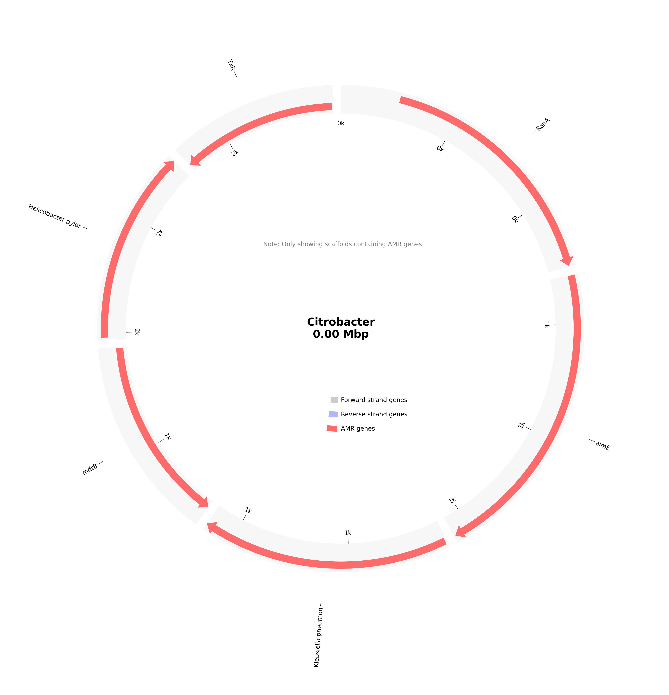

### Helicobacter pylori pbp1 mutants conferring resistance to amoxicillin
- **Mechanism**: antibiotic target alteration
- **Drug Classes**: cephalosporin; cephamycin; penam
- **AMR Family**: Penicillin-binding protein mutations conferring resistance to beta-lactam antibiotics
- **Locations**:
  - gnl|SPADES|FPFIAAFN_37834_1 : position 3-290

### Klebsiella pneumoniae OmpK37
- **Mechanism**: reduced permeability to antibiotic
- **Drug Classes**: monobactam; carbapenem; cephalosporin; cephamycin; penam; penem
- **AMR Family**: General Bacterial Porin with reduced permeability to beta-lactams
- **Locations**:
  - gnl|SPADES|FPFIAAFN_27574_1 : position 3-371

### RanA
- **Mechanism**: antibiotic efflux
- **Drug Classes**: aminoglycoside antibiotic
- **AMR Family**: ATP-binding cassette (ABC) antibiotic efflux pump
- **Locations**:
  - gnl|SPADES|FPFIAAFN_21109_2 : position 88-453

### TxR
- **Mechanism**: antibiotic efflux
- **Drug Classes**: tetracycline antibiotic
- **AMR Family**: ATP-binding cassette (ABC) antibiotic efflux pump
- **Locations**:
  - gnl|SPADES|FPFIAAFN_52671_1 : position 1-246

### almE
- **Mechanism**: antibiotic target alteration
- **Drug Classes**: peptide antibiotic
- **AMR Family**: polymyxin resistance operon; alm glycyltransferase
- **Locations**:
  - gnl|SPADES|FPFIAAFN_21245_1 : position 1-450

### mdtB
- **Mechanism**: antibiotic efflux
- **Drug Classes**: aminocoumarin antibiotic
- **AMR Family**: resistance-nodulation-cell division (RND) antibiotic efflux pump
- **Locations**:
  - gnl|SPADES|FPFIAAFN_36802_1 : position 1-294

## Citrobacter arsenatis
**Strain Statistics:**
- Total genome length: 0.3 kbp
- Total scaffolds: 14
- Scaffolds with AMR genes: 1
- Total genes annotated: 0
- Total AMR genes: 1
- Unique AMR genes: 1
- Distinct AMR mechanisms: 1
- Distinct AMR families: 1
- Distinct drug classes: 6

**Circos Plot:**

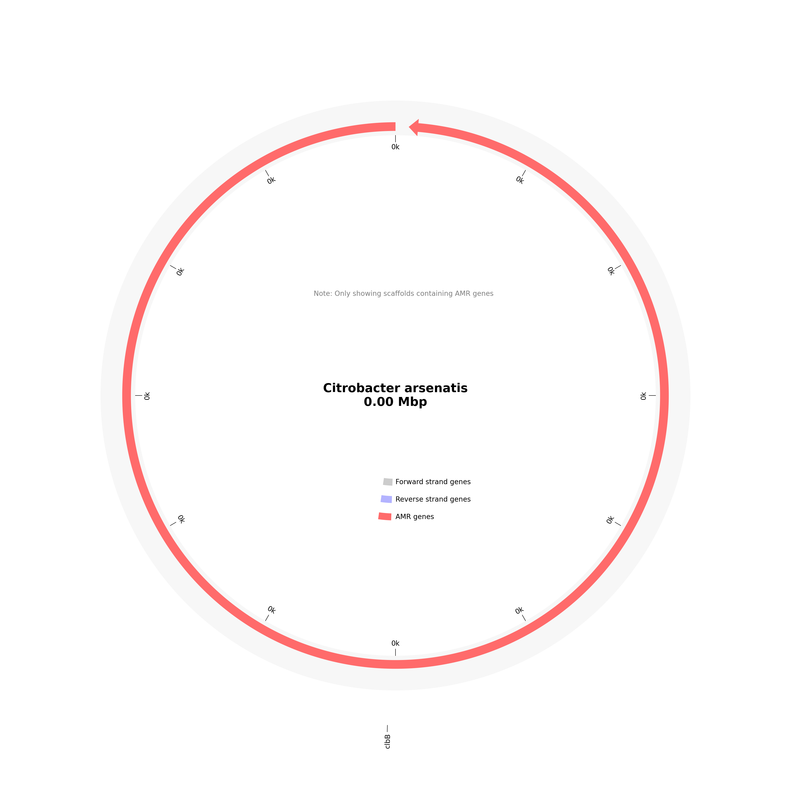

### clbB
- **Mechanism**: antibiotic target alteration
- **Drug Classes**: lincosamide antibiotic; streptogramin antibiotic; streptogramin A antibiotic; oxazolidinone antibiotic; phenicol antibiotic; pleuromutilin antibiotic
- **AMR Family**: Cfr 23S ribosomal RNA methyltransferase
- **Locations**:
  - gnl|SPADES|FPFIAAFN_49220_1 : position 2-256

## Citrobacter braakii
**Strain Statistics:**
- Total genome length: 21.8 kbp
- Total scaffolds: 14
- Scaffolds with AMR genes: 1
- Total genes annotated: 48
- Total AMR genes: 2
- Unique AMR genes: 1
- Distinct AMR mechanisms: 1
- Distinct AMR families: 1
- Distinct drug classes: 6

**Circos Plot:**

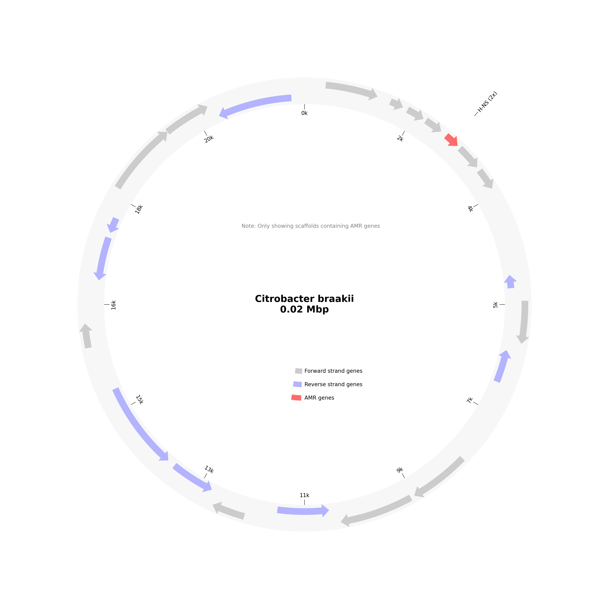

### H-NS (found in 2 locations)
- **Mechanism**: antibiotic efflux
- **Drug Classes**: macrolide antibiotic; fluoroquinolone antibiotic; cephalosporin; cephamycin; penam; tetracycline antibiotic
- **AMR Family**: major facilitator superfamily (MFS) antibiotic efflux pump; resistance-nodulation-cell division (RND) antibiotic efflux pump
- **Locations**:
  - gnl|SPADES|FPFIAAFN_310_5 : position 2418-2660
  - gnl|SPADES|FPFIAAFN_310_9 : position 4123-4527

## Citrobacter freundii complex
**Strain Statistics:**
- Total genome length: 1.5 kbp
- Total scaffolds: 10
- Scaffolds with AMR genes: 1
- Total genes annotated: 0
- Total AMR genes: 1
- Unique AMR genes: 1
- Distinct AMR mechanisms: 1
- Distinct AMR families: 1
- Distinct drug classes: 4

**Circos Plot:**

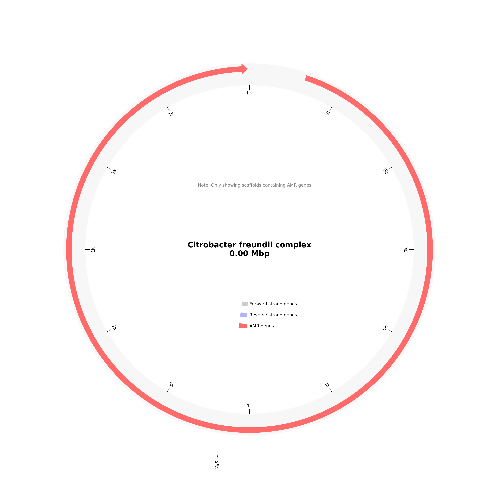

### evgS
- **Mechanism**: antibiotic efflux
- **Drug Classes**: macrolide antibiotic; fluoroquinolone antibiotic; penam; tetracycline antibiotic
- **AMR Family**: major facilitator superfamily (MFS) antibiotic efflux pump; resistance-nodulation-cell division (RND) antibiotic efflux pump
- **Locations**:
  - gnl|SPADES|FPFIAAFN_5088_1 : position 74-1471

## Citrobacter freundii complex sp. CFNIH9
**Strain Statistics:**
- Total genome length: 36.9 kbp
- Total scaffolds: 1
- Scaffolds with AMR genes: 1
- Total genes annotated: 68
- Total AMR genes: 2
- Unique AMR genes: 1
- Distinct AMR mechanisms: 1
- Distinct AMR families: 1
- Distinct drug classes: 6

**Circos Plot:**

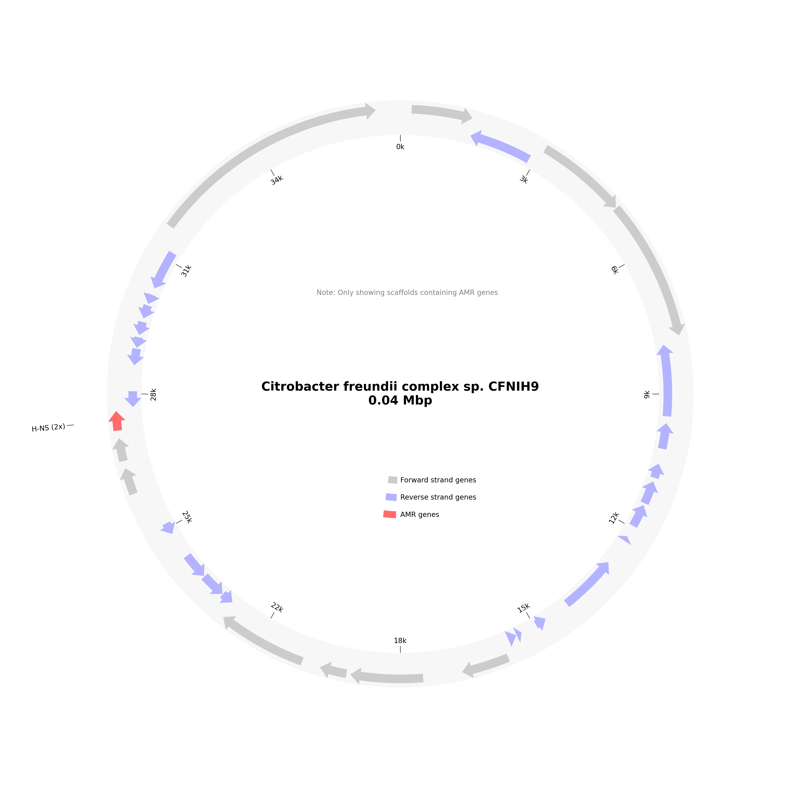

### H-NS (found in 2 locations)
- **Mechanism**: antibiotic efflux
- **Drug Classes**: macrolide antibiotic; fluoroquinolone antibiotic; cephalosporin; cephamycin; penam; tetracycline antibiotic
- **AMR Family**: major facilitator superfamily (MFS) antibiotic efflux pump; resistance-nodulation-cell division (RND) antibiotic efflux pump
- **Locations**:
  - gnl|SPADES|FPFIAAFN_179_25 : position 26911-27315
  - gnl|SPADES|FPFIAAFN_179_27 : position 27994-28236

## Citrobacter koseri
**Strain Statistics:**
- Total genome length: 0.3 kbp
- Total scaffolds: 6
- Scaffolds with AMR genes: 1
- Total genes annotated: 0
- Total AMR genes: 1
- Unique AMR genes: 1
- Distinct AMR mechanisms: 1
- Distinct AMR families: 1
- Distinct drug classes: 1

**Circos Plot:**

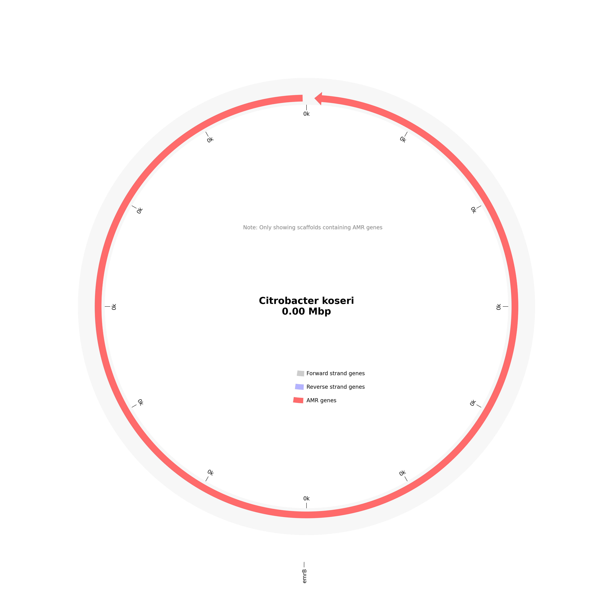

### emrB
- **Mechanism**: antibiotic efflux
- **Drug Classes**: fluoroquinolone antibiotic
- **AMR Family**: major facilitator superfamily (MFS) antibiotic efflux pump
- **Locations**:
  - gnl|SPADES|FPFIAAFN_31523_1 : position 2-334

## Citrobacter portucalensis
**Strain Statistics:**
- Total genome length: 10.1 kbp
- Total scaffolds: 11
- Scaffolds with AMR genes: 1
- Total genes annotated: 26
- Total AMR genes: 1
- Unique AMR genes: 1
- Distinct AMR mechanisms: 1
- Distinct AMR families: 1
- Distinct drug classes: 1

**Circos Plot:**

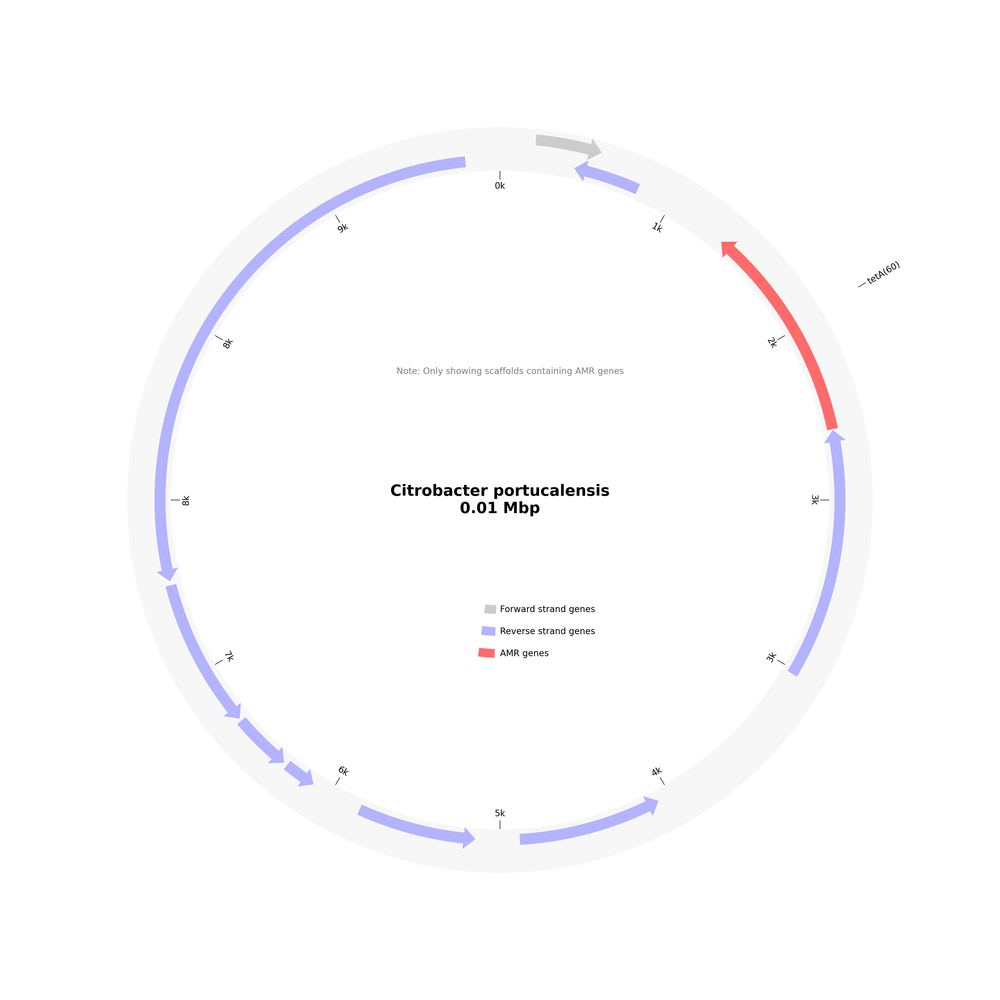

### tetA(60)
- **Mechanism**: antibiotic efflux
- **Drug Classes**: tetracycline antibiotic
- **AMR Family**: ATP-binding cassette (ABC) antibiotic efflux pump
- **Locations**:
  - gnl|SPADES|FPFIAAFN_706_4 : position 1139-2188

## Citrobacter rodentium
**Strain Statistics:**
- Total genome length: 0.4 kbp
- Total scaffolds: 8
- Scaffolds with AMR genes: 1
- Total genes annotated: 0
- Total AMR genes: 1
- Unique AMR genes: 1
- Distinct AMR mechanisms: 1
- Distinct AMR families: 1
- Distinct drug classes: 1

**Circos Plot:**

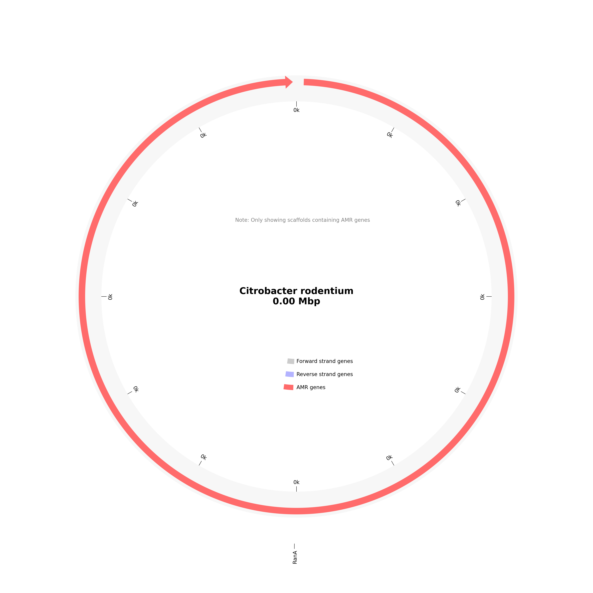

### RanA
- **Mechanism**: antibiotic efflux
- **Drug Classes**: aminoglycoside antibiotic
- **AMR Family**: ATP-binding cassette (ABC) antibiotic efflux pump
- **Locations**:
  - gnl|SPADES|FPFIAAFN_27612_1 : position 2-370

## Citrobacter sp. 21OH12SH02A-Citro
**Strain Statistics:**
- Total genome length: 1.8 kbp
- Total scaffolds: 2
- Scaffolds with AMR genes: 1
- Total genes annotated: 2
- Total AMR genes: 1
- Unique AMR genes: 1
- Distinct AMR mechanisms: 1
- Distinct AMR families: 1
- Distinct drug classes: 2

**Circos Plot:**

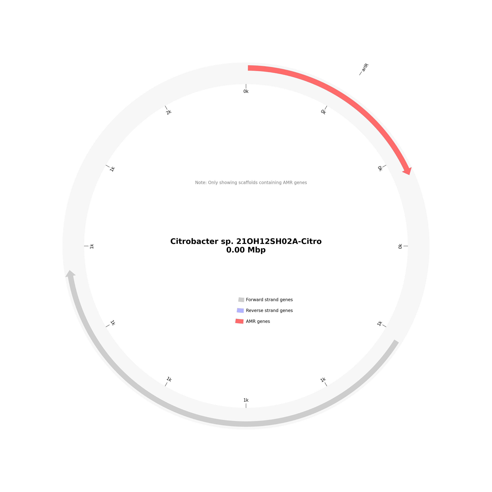

### arlR
- **Mechanism**: antibiotic efflux
- **Drug Classes**: fluoroquinolone antibiotic; disinfecting agents and antiseptics
- **AMR Family**: major facilitator superfamily (MFS) antibiotic efflux pump
- **Locations**:
  - gnl|SPADES|FPFIAAFN_4260_1 : position 3-326

## Citrobacter sp. RHBSTW-00424
**Strain Statistics:**
- Total genome length: 1.1 kbp
- Total scaffolds: 1
- Scaffolds with AMR genes: 1
- Total genes annotated: 4
- Total AMR genes: 1
- Unique AMR genes: 1
- Distinct AMR mechanisms: 1
- Distinct AMR families: 1
- Distinct drug classes: 1

**Circos Plot:**

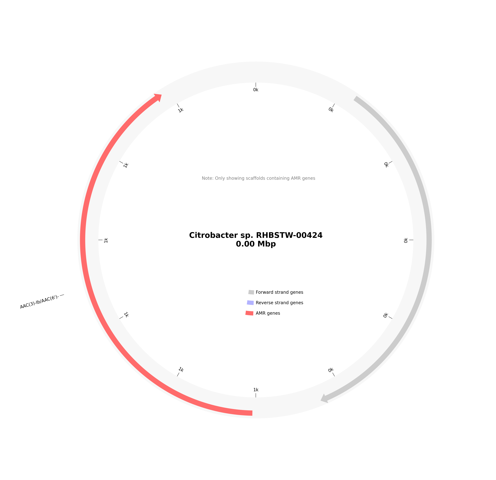

### AAC(3)-Ib/AAC(6')-Ib3 bifunctional protein
- **Mechanism**: antibiotic inactivation
- **Drug Classes**: aminoglycoside antibiotic
- **AMR Family**: aminoglycoside bifunctional resistance protein
- **Locations**:
  - gnl|SPADES|FPFIAAFN_7167_2 : position 550-993

## Enterobacter hormaechei
**Strain Statistics:**
- Total genome length: 0.2 kbp
- Total scaffolds: 13
- Scaffolds with AMR genes: 1
- Total genes annotated: 0
- Total AMR genes: 1
- Unique AMR genes: 1
- Distinct AMR mechanisms: 1
- Distinct AMR families: 1
- Distinct drug classes: 3

**Circos Plot:**

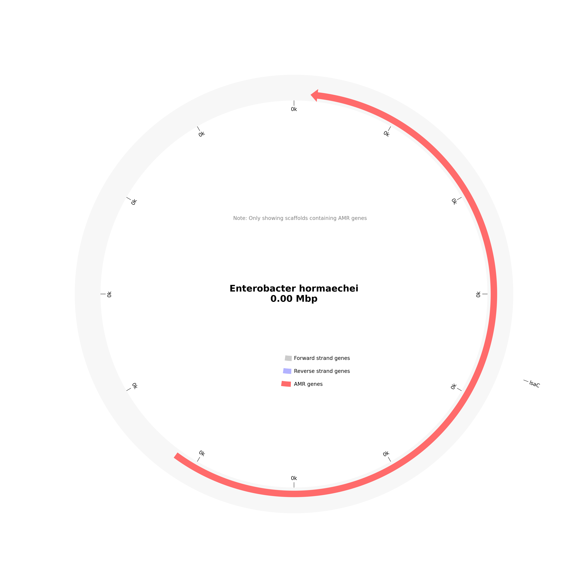

### lsaC
- **Mechanism**: antibiotic target protection
- **Drug Classes**: lincosamide antibiotic; streptogramin antibiotic; pleuromutilin antibiotic
- **AMR Family**: lsa-type ABC-F protein
- **Locations**:
  - gnl|SPADES|FPFIAAFN_62080_1 : position 3-137

## Escherichia coli
**Strain Statistics:**
- Total genome length: 319.8 kbp
- Total scaffolds: 2572
- Scaffolds with AMR genes: 257
- Total genes annotated: 580
- Total AMR genes: 291
- Unique AMR genes: 150
- Distinct AMR mechanisms: 9
- Distinct AMR families: 53
- Distinct drug classes: 34

**Circos Plot:**

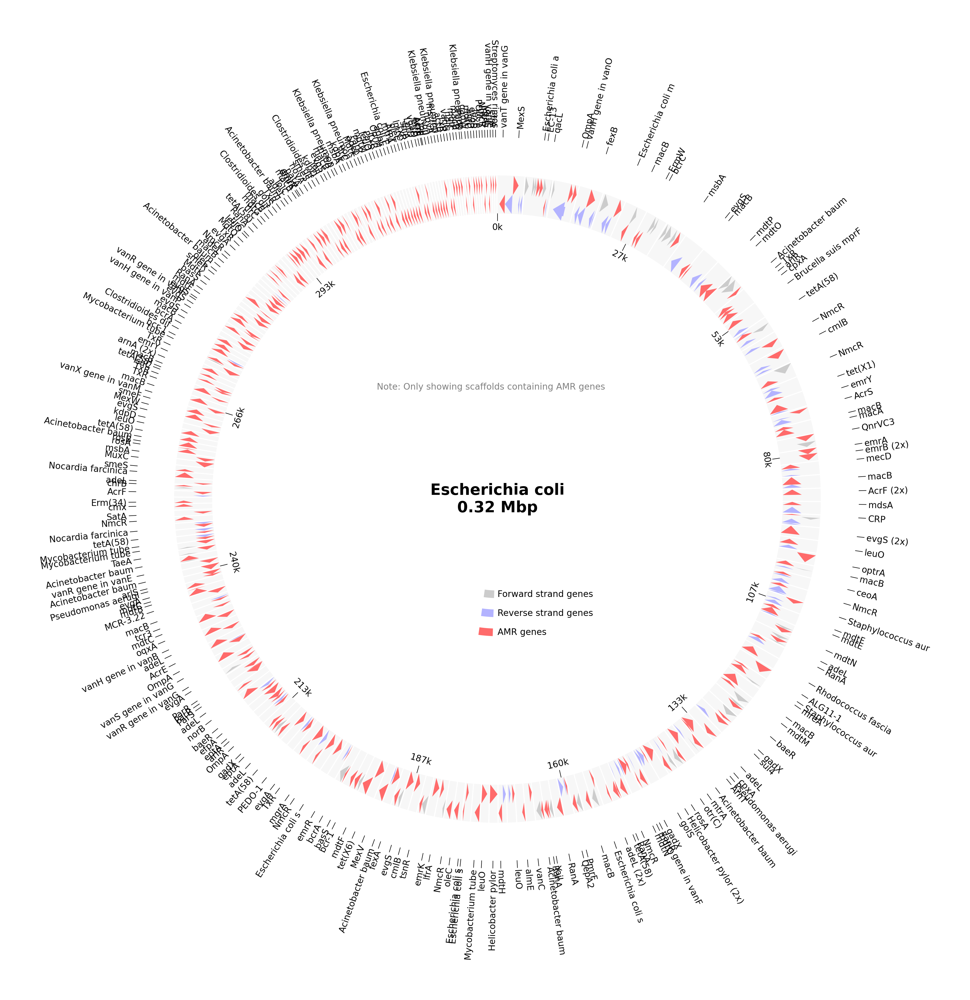

### ALG11-1
- **Mechanism**: antibiotic inactivation
- **Drug Classes**: carbapenem
- **AMR Family**: ALG11 beta-lactamase
- **Locations**:
  - gnl|SPADES|FPFIAAFN_3726_2 : position 254-1693

### Acinetobacter baumannii AbaF (found in 3 locations)
- **Mechanism**: antibiotic efflux
- **Drug Classes**: phosphonic acid antibiotic
- **AMR Family**: major facilitator superfamily (MFS) antibiotic efflux pump
- **Locations**:
  - gnl|SPADES|FPFIAAFN_4135_1 : position 1-1209
  - gnl|SPADES|FPFIAAFN_5244_1 : position 2-1069
  - gnl|SPADES|FPFIAAFN_7520_1 : position 77-1045

### Acinetobacter baumannii AbaQ (found in 5 locations)
- **Mechanism**: antibiotic efflux
- **Drug Classes**: fluoroquinolone antibiotic
- **AMR Family**: major facilitator superfamily (MFS) antibiotic efflux pump
- **Locations**:
  - gnl|SPADES|FPFIAAFN_12307_1 : position 2-694
  - gnl|SPADES|FPFIAAFN_2303_4 : position 2571-3131
  - gnl|SPADES|FPFIAAFN_4747_1 : position 3-413
  - gnl|SPADES|FPFIAAFN_7567_2 : position 213-1040
  - gnl|SPADES|FPFIAAFN_8910_1 : position 3-905

### Acinetobacter baumannii AmvA
- **Mechanism**: antibiotic efflux
- **Drug Classes**: macrolide antibiotic; disinfecting agents and antiseptics
- **AMR Family**: major facilitator superfamily (MFS) antibiotic efflux pump
- **Locations**:
  - gnl|SPADES|FPFIAAFN_15505_2 : position 206-577

### AcrE (found in 2 locations)
- **Mechanism**: antibiotic efflux
- **Drug Classes**: fluoroquinolone antibiotic; cephalosporin; cephamycin; penam
- **AMR Family**: resistance-nodulation-cell division (RND) antibiotic efflux pump
- **Locations**:
  - gnl|SPADES|FPFIAAFN_32498_2 : position 100-327
  - gnl|SPADES|FPFIAAFN_6855_1 : position 144-1133

### AcrF (found in 4 locations)
- **Mechanism**: antibiotic efflux
- **Drug Classes**: fluoroquinolone antibiotic; cephalosporin; cephamycin; penam
- **AMR Family**: resistance-nodulation-cell division (RND) antibiotic efflux pump
- **Locations**:
  - gnl|SPADES|FPFIAAFN_3226_1 : position 3-1067
  - gnl|SPADES|FPFIAAFN_3226_2 : position 1068-2258
  - gnl|SPADES|FPFIAAFN_32498_1 : position 2-88
  - gnl|SPADES|FPFIAAFN_8044_3 : position 484-990

### AcrS
- **Mechanism**: antibiotic efflux
- **Drug Classes**: fluoroquinolone antibiotic; cephalosporin; glycylcycline; cephamycin; penam; tetracycline antibiotic; rifamycin antibiotic; phenicol antibiotic; disinfecting agents and antiseptics
- **AMR Family**: resistance-nodulation-cell division (RND) antibiotic efflux pump
- **Locations**:
  - gnl|SPADES|FPFIAAFN_3017_1: position 238-900

### ArnT (found in 2 locations)
- **Mechanism**: antibiotic target alteration
- **Drug Classes**: peptide antibiotic
- **AMR Family**: pmr phosphoethanolamine transferase
- **Locations**:
  - gnl|SPADES|FPFIAAFN_27566_1 : position 1-369
  - gnl|SPADES|FPFIAAFN_3949_1 : position 3-761

### Brucella suis mprF
- **Mechanism**: antibiotic target alteration
- **Drug Classes**: peptide antibiotic
- **AMR Family**: defensin resistant mprF
- **Locations**:
  - gnl|SPADES|FPFIAAFN_2408_1 : position 176-1132

### CRP
- **Mechanism**: antibiotic efflux
- **Drug Classes**: macrolide antibiotic; fluoroquinolone antibiotic; penam
- **AMR Family**: resistance-nodulation-cell division (RND) antibiotic efflux pump
- **Locations**:
  - gnl|SPADES|FPFIAAFN_3389_1 : position 1-189

### Clostridioides difficile cplR
- **Mechanism**: antibiotic target protection
- **Drug Classes**: lincosamide antibiotic; streptogramin antibiotic; streptogramin A antibiotic; nucleoside antibiotic
- **AMR Family**: Miscellaneous ABC-F subfamily ATP-binding cassette ribosomal protection proteins
- **Locations**:
  - gnl|SPADES|FPFIAAFN_17511_1 : position 3-524

### Clostridioides difficile gyrB conferring resistance to fluoroquinolones (found in 2 locations)
- **Mechanism**: antibiotic target alteration
- **Drug Classes**: fluoroquinolone antibiotic
- **AMR Family**: fluoroquinolone resistant gyrB
- **Locations**:
  - gnl|SPADES|FPFIAAFN_10709_1 : position 3-719
  - gnl|SPADES|FPFIAAFN_14489_1 : position 3-608

### EC-13
- **Mechanism**: antibiotic inactivation
- **Drug Classes**: cephalosporin
- **AMR Family**: EC beta-lactamase
- **Locations**:
  - gnl|SPADES|FPFIAAFN_1467_6 : position 2837-3403

### Erm(34)
- **Mechanism**: antibiotic target alteration
- **Drug Classes**: macrolide antibiotic; lincosamide antibiotic; streptogramin antibiotic; streptogramin A antibiotic; streptogramin B antibiotic
- **AMR Family**: Erm 23S ribosomal RNA methyltransferase
- **Locations**:
  - gnl|SPADES|FPFIAAFN_7979_1 : position 2-448

### ErmW
- **Mechanism**: antibiotic target alteration
- **Drug Classes**: macrolide antibiotic; lincosamide antibiotic; streptogramin antibiotic
- **AMR Family**: Erm 23S ribosomal RNA methyltransferase
- **Locations**:
  - gnl|SPADES|FPFIAAFN_1790_1 : position 2-448

### Escherichia coli EF-Tu mutants conferring resistance to Pulvomycin
- **Mechanism**: antibiotic target alteration
- **Drug Classes**: elfamycin antibiotic
- **AMR Family**: elfamycin resistant EF-Tu
- **Locations**:
  - gnl|SPADES|FPFIAAFN_25575_1 : position 1-390

### Escherichia coli ampC beta-lactamase
- **Mechanism**: antibiotic inactivation
- **Drug Classes**: cephalosporin; penam
- **AMR Family**: ampC-type beta-lactamase
- **Locations**:
  - gnl|SPADES|FPFIAAFN_1467_5 : position 2263-2829

### Escherichia coli mdfA
- **Mechanism**: antibiotic efflux
- **Drug Classes**: tetracycline antibiotic; phenicol antibiotic; disinfecting agents and antiseptics
- **AMR Family**: major facilitator superfamily (MFS) antibiotic efflux pump
- **Locations**:
  - gnl|SPADES|FPFIAAFN_1738_5 : position 3270-4196

### Escherichia coli soxR with mutation conferring antibiotic resistance
- **Mechanism**: antibiotic target alteration; antibiotic efflux
- **Drug Classes**: fluoroquinolone antibiotic; cephalosporin; glycylcycline; penam; tetracycline antibiotic; rifamycin antibiotic; phenicol antibiotic; disinfecting agents and antiseptics
- **AMR Family**: ATP-binding cassette (ABC) antibiotic efflux pump; major facilitator superfamily (MFS) antibiotic efflux pump; resistance-nodulation-cell division (RND) antibiotic efflux pump
- **Locations**:
  - gnl|SPADES|FPFIAAFN_5069_2: position 716-1180

### Escherichia coli soxS with mutation conferring antibiotic resistance (found in 3 locations)
- **Mechanism**: antibiotic target alteration; antibiotic efflux; reduced permeability to antibiotic
- **Drug Classes**: fluoroquinolone antibiotic; monobactam; carbapenem; cephalosporin; glycylcycline; cephamycin; penam; tetracycline antibiotic; rifamycin antibiotic; phenicol antibiotic; penem; disinfecting agents and antiseptics
- **AMR Family**: ATP-binding cassette (ABC) antibiotic efflux pump; major facilitator superfamily (MFS) antibiotic efflux pump; resistance-nodulation-cell division (RND) antibiotic efflux pump; General Bacterial Porin with reduced permeability to beta-lactams
- **Locations**:
  - gnl|SPADES|FPFIAAFN_4570_1 : position 3-377
  - gnl|SPADES|FPFIAAFN_5069_3 : position 1266-1478
  - gnl|SPADES|FPFIAAFN_5559_2 : position 240-1109

### Helicobacter pylori pbp1 mutants conferring resistance to amoxicillin (found in 3 locations)
- **Mechanism**: antibiotic target alteration
- **Drug Classes**: cephalosporin; cephamycin; penam
- **AMR Family**: Penicillin-binding protein mutations conferring resistance to beta-lactam antibiotics
- **Locations**:
  - gnl|SPADES|FPFIAAFN_4307_1 : position 3-1364
  - gnl|SPADES|FPFIAAFN_4307_2 : position 1361-1744
  - gnl|SPADES|FPFIAAFN_5002_1 : position 3-1499

### Klebsiella pneumoniae KpnE
- **Mechanism**: antibiotic efflux
- **Drug Classes**: macrolide antibiotic; aminoglycoside antibiotic; cephalosporin; tetracycline antibiotic; peptide antibiotic; rifamycin antibiotic; disinfecting agents and antiseptics
- **AMR Family**: small multidrug resistance (SMR) antibiotic efflux pump
- **Locations**:
  - gnl|SPADES|FPFIAAFN_22010_1: position 2-340

### Klebsiella pneumoniae OmpK37 (found in 4 locations)
- **Mechanism**: reduced permeability to antibiotic
- **Drug Classes**: monobactam; carbapenem; cephalosporin; cephamycin; penam; penem
- **AMR Family**: General Bacterial Porin with reduced permeability to beta-lactams
- **Locations**:
  - gnl|SPADES|FPFIAAFN_19150_1 : position 3-140
  - gnl|SPADES|FPFIAAFN_32868_1 : position 1-324
  - gnl|SPADES|FPFIAAFN_34078_1 : position 1-315
  - gnl|SPADES|FPFIAAFN_41415_1 : position 2-82

### LptD
- **Mechanism**: antibiotic efflux
- **Drug Classes**: carbapenem; peptide antibiotic; aminocoumarin antibiotic; rifamycin antibiotic
- **AMR Family**: ATP-binding cassette (ABC) antibiotic efflux pump
- **Locations**:
  - gnl|SPADES|FPFIAAFN_29308_1 : position 1-354

### MCR-3.22
- **Mechanism**: antibiotic target alteration
- **Drug Classes**: peptide antibiotic
- **AMR Family**: MCR phosphoethanolamine transferase
- **Locations**:
  - gnl|SPADES|FPFIAAFN_7271_2 : position 282-1079

### MdtK (found in 2 locations)
- **Mechanism**: antibiotic efflux
- **Drug Classes**: fluoroquinolone antibiotic
- **AMR Family**: multidrug and toxic compound extrusion (MATE) transporter
- **Locations**:
  - gnl|SPADES|FPFIAAFN_11887_1 : position 2-712
  - gnl|SPADES|FPFIAAFN_22087_1 : position 66-437

### MdtQ
- **Mechanism**: reduced permeability to antibiotic
- **Drug Classes**: monobactam; carbapenem; cephalosporin; cephamycin; penam; penem
- **AMR Family**: Outer Membrane Porin (Opr)
- **Locations**:
  - gnl|SPADES|FPFIAAFN_13039_2 : position 435-665

### MexS
- **Mechanism**: antibiotic efflux
- **Drug Classes**: fluoroquinolone antibiotic; diaminopyrimidine antibiotic; phenicol antibiotic
- **AMR Family**: resistance-nodulation-cell division (RND) antibiotic efflux pump
- **Locations**:
  - gnl|SPADES|FPFIAAFN_1453_4 : position 3013-3996

### MexV
- **Mechanism**: antibiotic efflux
- **Drug Classes**: macrolide antibiotic; fluoroquinolone antibiotic; tetracycline antibiotic; phenicol antibiotic; disinfecting agents and antiseptics
- **AMR Family**: resistance-nodulation-cell division (RND) antibiotic efflux pump
- **Locations**:
  - gnl|SPADES|FPFIAAFN_5266_1 : position 19-1242

### MexW
- **Mechanism**: antibiotic efflux
- **Drug Classes**: macrolide antibiotic; fluoroquinolone antibiotic; tetracycline antibiotic; phenicol antibiotic; disinfecting agents and antiseptics
- **AMR Family**: resistance-nodulation-cell division (RND) antibiotic efflux pump
- **Locations**:
  - gnl|SPADES|FPFIAAFN_9504_1 : position 3-860

### MuxC
- **Mechanism**: antibiotic efflux
- **Drug Classes**: macrolide antibiotic; monobactam; tetracycline antibiotic; aminocoumarin antibiotic
- **AMR Family**: resistance-nodulation-cell division (RND) antibiotic efflux pump
- **Locations**:
  - gnl|SPADES|FPFIAAFN_8404_1 : position 1-954

### Mycobacterium tuberculosis inhA mutations conferring resistance to isoniazid
- **Mechanism**: antibiotic target alteration
- **Drug Classes**: isoniazid-like antibiotic
- **AMR Family**: isoniazid resistant inhA
- **Locations**:
  - gnl|SPADES|FPFIAAFN_7563_2 : position 388-1041

### Mycobacterium tuberculosis intrinsic murA conferring resistance to fosfomycin
- **Mechanism**: antibiotic target alteration
- **Drug Classes**: phosphonic acid antibiotic
- **AMR Family**: antibiotic-resistant murA transferase
- **Locations**:
  - gnl|SPADES|FPFIAAFN_10363_2 : position 293-802

### Mycobacterium tuberculosis kasA mutant conferring resistance to isoniazid
- **Mechanism**: antibiotic target alteration
- **Drug Classes**: isoniazid-like antibiotic
- **AMR Family**: antibiotic resistant kasA
- **Locations**:
  - gnl|SPADES|FPFIAAFN_5063_1 : position 1-915

### Mycobacterium tuberculosis pncA mutations conferring resistance to pyrazinamide
- **Mechanism**: antibiotic target alteration
- **Drug Classes**: pyrazine antibiotic
- **AMR Family**: Pyrazinamide resistant pncA
- **Locations**:
  - gnl|SPADES|FPFIAAFN_7652_1 : position 2-442

### NmcR (found in 9 locations)
- **Mechanism**: antibiotic inactivation
- **Drug Classes**: carbapenem; cephalosporin; cephamycin; penam
- **AMR Family**: NmcA beta-lactamase
- **Locations**:
  - gnl|SPADES|FPFIAAFN_12581_1 : position 2-178
  - gnl|SPADES|FPFIAAFN_2450_3 : position 1238-2164
  - gnl|SPADES|FPFIAAFN_2678_2 : position 1445-2338
  - gnl|SPADES|FPFIAAFN_3527_1 : position 1-561
  - gnl|SPADES|FPFIAAFN_4480_3 : position 602-1441
  - gnl|SPADES|FPFIAAFN_5127_2 : position 350-1243
  - gnl|SPADES|FPFIAAFN_56107_1 : position 3-239
  - gnl|SPADES|FPFIAAFN_5646_2 : position 437-1333
  - gnl|SPADES|FPFIAAFN_7899_2 : position 412-1005

### Nocardia farcinica rox (found in 2 locations)
- **Mechanism**: antibiotic inactivation
- **Drug Classes**: rifamycin antibiotic
- **AMR Family**: rifampin monooxygenase
- **Locations**:
  - gnl|SPADES|FPFIAAFN_7745_1 : position 3-611
  - gnl|SPADES|FPFIAAFN_8161_1 : position 3-974

### OmpA (found in 3 locations)
- **Mechanism**: reduced permeability to antibiotic
- **Drug Classes**: peptide antibiotic
- **AMR Family**: General Bacterial Porin with reduced permeability to peptide antibiotics
- **Locations**:
  - gnl|SPADES|FPFIAAFN_1542_4 : position 3322-3981
  - gnl|SPADES|FPFIAAFN_6385_2 : position 266-748
  - gnl|SPADES|FPFIAAFN_6809_1 : position 102-935

### OprM
- **Mechanism**: antibiotic efflux
- **Drug Classes**: macrolide antibiotic; fluoroquinolone antibiotic; monobactam; aminoglycoside antibiotic; carbapenem; cephalosporin; cephamycin; penam; tetracycline antibiotic; peptide antibiotic; aminocoumarin antibiotic; diaminopyrimidine antibiotic; sulfonamide antibiotic; phenicol antibiotic; penem; disinfecting agents and antiseptics
- **AMR Family**: resistance-nodulation-cell division (RND) antibiotic efflux pump
- **Locations**:
  - gnl|SPADES|FPFIAAFN_23701_1 : position 1-414

### PEDO-1
- **Mechanism**: antibiotic inactivation
- **Drug Classes**: carbapenem
- **AMR Family**: subclass B3 PEDO beta-lactamase
- **Locations**:
  - gnl|SPADES|FPFIAAFN_5868_1 : position 117-764

### POM-1
- **Mechanism**: antibiotic inactivation
- **Drug Classes**: carbapenem
- **AMR Family**: POM beta-lactamase
- **Locations**:
  - gnl|SPADES|FPFIAAFN_54039_1 : position 3-245

### ParR (found in 4 locations)
- **Mechanism**: antibiotic efflux; reduced permeability to antibiotic
- **Drug Classes**: macrolide antibiotic; fluoroquinolone antibiotic; monobactam; aminoglycoside antibiotic; carbapenem; cephalosporin; cephamycin; penam; tetracycline antibiotic; phenicol antibiotic; penem; disinfecting agents and antiseptics
- **AMR Family**: resistance-nodulation-cell division (RND) antibiotic efflux pump; Outer Membrane Porin (Opr)
- **Locations**:
  - gnl|SPADES|FPFIAAFN_22605_1 : position 2-265
  - gnl|SPADES|FPFIAAFN_40822_2 : position 96-278
  - gnl|SPADES|FPFIAAFN_6610_2 : position 1047-1169
  - gnl|SPADES|FPFIAAFN_6630_1 : position 2-655

### ParS (found in 2 locations)
- **Mechanism**: antibiotic efflux; reduced permeability to antibiotic
- **Drug Classes**: macrolide antibiotic; fluoroquinolone antibiotic; monobactam; aminoglycoside antibiotic; carbapenem; cephalosporin; cephamycin; penam; tetracycline antibiotic; phenicol antibiotic; penem; disinfecting agents and antiseptics
- **AMR Family**: resistance-nodulation-cell division (RND) antibiotic efflux pump; Outer Membrane Porin (Opr)
- **Locations**:
  - gnl|SPADES|FPFIAAFN_22965_1 : position 2-424
  - gnl|SPADES|FPFIAAFN_6610_1 : position 1-1050

### PmrF
- **Mechanism**: antibiotic target alteration
- **Drug Classes**: peptide antibiotic
- **AMR Family**: pmr phosphoethanolamine transferase
- **Locations**:
  - gnl|SPADES|FPFIAAFN_4602_2 : position 923-1636

### Pseudomonas aeruginosa CpxR (found in 2 locations)
- **Mechanism**: antibiotic efflux
- **Drug Classes**: macrolide antibiotic; fluoroquinolone antibiotic; monobactam; aminoglycoside antibiotic; carbapenem; cephalosporin; cephamycin; penam; tetracycline antibiotic; peptide antibiotic; aminocoumarin antibiotic; diaminopyrimidine antibiotic; sulfonamide antibiotic; phenicol antibiotic; penem
- **AMR Family**: resistance-nodulation-cell division (RND) antibiotic efflux pump
- **Locations**:
  - gnl|SPADES|FPFIAAFN_3937_2 : position 1614-1886
  - gnl|SPADES|FPFIAAFN_7476_1 : position 1-357

### QepA2
- **Mechanism**: antibiotic efflux
- **Drug Classes**: fluoroquinolone antibiotic
- **AMR Family**: major facilitator superfamily (MFS) antibiotic efflux pump
- **Locations**:
  - gnl|SPADES|FPFIAAFN_4607_1 : position 2-304

### QnrVC3
- **Mechanism**: antibiotic target protection
- **Drug Classes**: fluoroquinolone antibiotic
- **AMR Family**: quinolone resistance protein (qnr)
- **Locations**:
  - gnl|SPADES|FPFIAAFN_3092_1 : position 3-1049

### RanA (found in 6 locations)
- **Mechanism**: antibiotic efflux
- **Drug Classes**: aminoglycoside antibiotic
- **AMR Family**: ATP-binding cassette (ABC) antibiotic efflux pump
- **Locations**:
  - gnl|SPADES|FPFIAAFN_11637_1 : position 1-471
  - gnl|SPADES|FPFIAAFN_13387_1 : position 1-633
  - gnl|SPADES|FPFIAAFN_3622_1 : position 3-479
  - gnl|SPADES|FPFIAAFN_4513_1 : position 1-288
  - gnl|SPADES|FPFIAAFN_4694_1 : position 56-982
  - gnl|SPADES|FPFIAAFN_4695_3 : position 959-1597

### Rhodococcus fascians cmr
- **Mechanism**: antibiotic efflux
- **Drug Classes**: phenicol antibiotic
- **AMR Family**: major facilitator superfamily (MFS) antibiotic efflux pump
- **Locations**:
  - gnl|SPADES|FPFIAAFN_3680_2 : position 343-1575

### SatA
- **Mechanism**: antibiotic inactivation
- **Drug Classes**: nucleoside antibiotic
- **AMR Family**: streptothricin acetyltransferase (SAT)
- **Locations**:
  - gnl|SPADES|FPFIAAFN_7953_2 : position 240-674

### Staphylococcus aureus mupA conferring resistance to mupirocin
- **Mechanism**: antibiotic target alteration
- **Drug Classes**: mupirocin-like antibiotic
- **AMR Family**: antibiotic-resistant isoleucyl-tRNA synthetase (ileS)
- **Locations**:
  - gnl|SPADES|FPFIAAFN_3759_1 : position 1-339

### Staphylococcus aureus murA with mutation conferring resistance to fosfomycin
- **Mechanism**: antibiotic target alteration
- **Drug Classes**: phosphonic acid antibiotic
- **AMR Family**: antibiotic-resistant murA transferase
- **Locations**:
  - gnl|SPADES|FPFIAAFN_3540_1 : position 3-761

### Streptomyces rimosus otr(A)
- **Mechanism**: antibiotic target protection
- **Drug Classes**: tetracycline antibiotic
- **AMR Family**: tetracycline-resistant ribosomal protection protein
- **Locations**:
  - gnl|SPADES|FPFIAAFN_67300_1 : position 3-215

### TaeA
- **Mechanism**: antibiotic efflux
- **Drug Classes**: pleuromutilin antibiotic
- **AMR Family**: ATP-binding cassette (ABC) antibiotic efflux pump
- **Locations**:
  - gnl|SPADES|FPFIAAFN_7556_2 : position 349-1041

### TolC
- **Mechanism**: antibiotic efflux
- **Drug Classes**: macrolide antibiotic; fluoroquinolone antibiotic; aminoglycoside antibiotic; carbapenem; cephalosporin; glycylcycline; cephamycin; penam; tetracycline antibiotic; peptide antibiotic; aminocoumarin antibiotic; rifamycin antibiotic; phenicol antibiotic; penem; disinfecting agents and antiseptics
- **AMR Family**: ATP-binding cassette (ABC) antibiotic efflux pump; major facilitator superfamily (MFS) antibiotic efflux pump; resistance-nodulation-cell division (RND) antibiotic efflux pump
- **Locations**:
  - gnl|SPADES|FPFIAAFN_15689_1 : position 1-408

### TxR (found in 10 locations)
- **Mechanism**: antibiotic efflux
- **Drug Classes**: tetracycline antibiotic
- **AMR Family**: ATP-binding cassette (ABC) antibiotic efflux pump
- **Locations**:
  - gnl|SPADES|FPFIAAFN_10058_1 : position 2-820
  - gnl|SPADES|FPFIAAFN_10316_1 : position 2-805
  - gnl|SPADES|FPFIAAFN_13022_2 : position 433-666
  - gnl|SPADES|FPFIAAFN_14830_1 : position 3-599
  - gnl|SPADES|FPFIAAFN_23164_1 : position 1-423
  - gnl|SPADES|FPFIAAFN_2394_2 : position 212-1033
  - gnl|SPADES|FPFIAAFN_28920_1 : position 1-357
  - gnl|SPADES|FPFIAAFN_36607_1 : position 1-297
  - gnl|SPADES|FPFIAAFN_5784_2 : position 172-1317
  - gnl|SPADES|FPFIAAFN_9810_2 : position 472-837

### YojI (found in 3 locations)
- **Mechanism**: antibiotic efflux
- **Drug Classes**: peptide antibiotic
- **AMR Family**: ATP-binding cassette (ABC) antibiotic efflux pump
- **Locations**:
  - gnl|SPADES|FPFIAAFN_18244_2 : position 339-509
  - gnl|SPADES|FPFIAAFN_32645_1 : position 3-326
  - gnl|SPADES|FPFIAAFN_4695_2 : position 669-962

### acrB (found in 2 locations)
- **Mechanism**: antibiotic efflux
- **Drug Classes**: fluoroquinolone antibiotic; cephalosporin; glycylcycline; penam; tetracycline antibiotic; rifamycin antibiotic; phenicol antibiotic; disinfecting agents and antiseptics
- **AMR Family**: resistance-nodulation-cell division (RND) antibiotic efflux pump
- **Locations**:
  - gnl|SPADES|FPFIAAFN_34536_1 : position 1-309
  - gnl|SPADES|FPFIAAFN_47180_1 : position 1-261

### adeL (found in 12 locations)
- **Mechanism**: antibiotic efflux
- **Drug Classes**: fluoroquinolone antibiotic; tetracycline antibiotic
- **AMR Family**: resistance-nodulation-cell division (RND) antibiotic efflux pump
- **Locations**:
  - gnl|SPADES|FPFIAAFN_12458_1 : position 2-688
  - gnl|SPADES|FPFIAAFN_15527_1 : position 1-465
  - gnl|SPADES|FPFIAAFN_22251_1 : position 2-436
  - gnl|SPADES|FPFIAAFN_23896_1 : position 1-411
  - gnl|SPADES|FPFIAAFN_3613_3 : position 1070-1759
  - gnl|SPADES|FPFIAAFN_3930_2 : position 1050-1892
  - gnl|SPADES|FPFIAAFN_4524_1 : position 1-315
  - gnl|SPADES|FPFIAAFN_4524_2 : position 371-646
  - gnl|SPADES|FPFIAAFN_6038_2 : position 672-1265
  - gnl|SPADES|FPFIAAFN_6598_2 : position 469-852
  - gnl|SPADES|FPFIAAFN_6908_2 : position 472-1125
  - gnl|SPADES|FPFIAAFN_8128_1 : position 2-304

### almE
- **Mechanism**: antibiotic target alteration
- **Drug Classes**: peptide antibiotic
- **AMR Family**: polymyxin resistance operon; alm glycyltransferase
- **Locations**:
  - gnl|SPADES|FPFIAAFN_4899_1 : position 2-490

### arlR (found in 2 locations)
- **Mechanism**: antibiotic efflux
- **Drug Classes**: fluoroquinolone antibiotic; disinfecting agents and antiseptics
- **AMR Family**: major facilitator superfamily (MFS) antibiotic efflux pump
- **Locations**:
  - gnl|SPADES|FPFIAAFN_2394_3 : position 1036-1617
  - gnl|SPADES|FPFIAAFN_6430_1 : position 3-374

### arlS
- **Mechanism**: antibiotic efflux
- **Drug Classes**: fluoroquinolone antibiotic; disinfecting agents and antiseptics
- **AMR Family**: major facilitator superfamily (MFS) antibiotic efflux pump
- **Locations**:
  - gnl|SPADES|FPFIAAFN_7476_2 : position 326-1051

### arnA (found in 2 locations)
- **Mechanism**: antibiotic target alteration
- **Drug Classes**: peptide antibiotic
- **AMR Family**: pmr phosphoethanolamine transferase
- **Locations**:
  - gnl|SPADES|FPFIAAFN_10170_1 : position 1-393
  - gnl|SPADES|FPFIAAFN_10170_2 : position 390-812

### baeR (found in 2 locations)
- **Mechanism**: antibiotic efflux
- **Drug Classes**: aminoglycoside antibiotic; aminocoumarin antibiotic
- **AMR Family**: resistance-nodulation-cell division (RND) antibiotic efflux pump
- **Locations**:
  - gnl|SPADES|FPFIAAFN_3830_2 : position 533-1264
  - gnl|SPADES|FPFIAAFN_6504_1 : position 2-436

### basS (found in 2 locations)
- **Mechanism**: antibiotic target alteration; antibiotic efflux
- **Drug Classes**: peptide antibiotic
- **AMR Family**: pmr phosphoethanolamine transferase
- **Locations**:
  - gnl|SPADES|FPFIAAFN_11750_1 : position 2-718
  - gnl|SPADES|FPFIAAFN_5435_1 : position 1-642

### bcr-1 (found in 2 locations)
- **Mechanism**: antibiotic efflux
- **Drug Classes**: bicyclomycin-like antibiotic
- **AMR Family**: major facilitator superfamily (MFS) antibiotic efflux pump
- **Locations**:
  - gnl|SPADES|FPFIAAFN_10597_1 : position 2-436
  - gnl|SPADES|FPFIAAFN_5402_2 : position 636-1400

### bcrA (found in 2 locations)
- **Mechanism**: antibiotic efflux
- **Drug Classes**: peptide antibiotic
- **AMR Family**: ATP-binding cassette (ABC) antibiotic efflux pump
- **Locations**:
  - gnl|SPADES|FPFIAAFN_11020_1 : position 1-714
  - gnl|SPADES|FPFIAAFN_5507_1 : position 3-305

### bcrC
- **Mechanism**: antibiotic target alteration
- **Drug Classes**: peptide antibiotic
- **AMR Family**: undecaprenyl pyrophosphate related proteins
- **Locations**:
  - gnl|SPADES|FPFIAAFN_1790_2 : position 542-1108

### ceoA
- **Mechanism**: antibiotic efflux
- **Drug Classes**: fluoroquinolone antibiotic; aminoglycoside antibiotic
- **AMR Family**: resistance-nodulation-cell division (RND) antibiotic efflux pump
- **Locations**:
  - gnl|SPADES|FPFIAAFN_3525_1 : position 1-465

### chrB
- **Mechanism**: antibiotic target alteration
- **Drug Classes**: macrolide antibiotic; lincosamide antibiotic
- **AMR Family**: non-erm 23S ribosomal RNA methyltransferase (G748)
- **Locations**:
  - gnl|SPADES|FPFIAAFN_8061_2 : position 728-988

### cmlB (found in 2 locations)
- **Mechanism**: antibiotic efflux
- **Drug Classes**: phenicol antibiotic
- **AMR Family**: major facilitator superfamily (MFS) antibiotic efflux pump
- **Locations**:
  - gnl|SPADES|FPFIAAFN_2463_2 : position 324-1475
  - gnl|SPADES|FPFIAAFN_5198_2 : position 654-1448

### cmx
- **Mechanism**: antibiotic efflux
- **Drug Classes**: phenicol antibiotic
- **AMR Family**: major facilitator superfamily (MFS) antibiotic efflux pump
- **Locations**:
  - gnl|SPADES|FPFIAAFN_7975_2 : position 495-998

### cpxA (found in 2 locations)
- **Mechanism**: antibiotic efflux
- **Drug Classes**: aminoglycoside antibiotic; aminocoumarin antibiotic
- **AMR Family**: resistance-nodulation-cell division (RND) antibiotic efflux pump
- **Locations**:
  - gnl|SPADES|FPFIAAFN_2394_4 : position 1629-2678
  - gnl|SPADES|FPFIAAFN_3937_1 : position 244-1617

### efpA
- **Mechanism**: antibiotic efflux
- **Drug Classes**: rifamycin antibiotic; isoniazid-like antibiotic
- **AMR Family**: major facilitator superfamily (MFS) antibiotic efflux pump
- **Locations**:
  - gnl|SPADES|FPFIAAFN_6458_1 : position 1-1044

### efrA
- **Mechanism**: antibiotic efflux
- **Drug Classes**: macrolide antibiotic; fluoroquinolone antibiotic; rifamycin antibiotic
- **AMR Family**: ATP-binding cassette (ABC) antibiotic efflux pump
- **Locations**:
  - gnl|SPADES|FPFIAAFN_61715_1 : position 1-228

### efrB
- **Mechanism**: antibiotic efflux
- **Drug Classes**: macrolide antibiotic; fluoroquinolone antibiotic; rifamycin antibiotic
- **AMR Family**: ATP-binding cassette (ABC) antibiotic efflux pump
- **Locations**:
  - gnl|SPADES|FPFIAAFN_31307_1 : position 3-335

### emrA
- **Mechanism**: antibiotic efflux
- **Drug Classes**: fluoroquinolone antibiotic
- **AMR Family**: major facilitator superfamily (MFS) antibiotic efflux pump
- **Locations**:
  - gnl|SPADES|FPFIAAFN_3101_1 : position 2-970

### emrB (found in 2 locations)
- **Mechanism**: antibiotic efflux
- **Drug Classes**: fluoroquinolone antibiotic
- **AMR Family**: major facilitator superfamily (MFS) antibiotic efflux pump
- **Locations**:
  - gnl|SPADES|FPFIAAFN_3101_2 : position 987-2126
  - gnl|SPADES|FPFIAAFN_3101_3 : position 2102-2353

### emrK (found in 2 locations)
- **Mechanism**: antibiotic efflux
- **Drug Classes**: tetracycline antibiotic
- **AMR Family**: major facilitator superfamily (MFS) antibiotic efflux pump
- **Locations**:
  - gnl|SPADES|FPFIAAFN_16880_1 : position 2-112
  - gnl|SPADES|FPFIAAFN_5143_1 : position 2-1045

### emrR
- **Mechanism**: antibiotic efflux
- **Drug Classes**: fluoroquinolone antibiotic
- **AMR Family**: major facilitator superfamily (MFS) antibiotic efflux pump
- **Locations**:
  - gnl|SPADES|FPFIAAFN_5525_1 : position 2-139

### emrY (found in 3 locations)
- **Mechanism**: antibiotic efflux
- **Drug Classes**: tetracycline antibiotic
- **AMR Family**: major facilitator superfamily (MFS) antibiotic efflux pump
- **Locations**:
  - gnl|SPADES|FPFIAAFN_10270_1 : position 1-648
  - gnl|SPADES|FPFIAAFN_16880_2 : position 112-540
  - gnl|SPADES|FPFIAAFN_2801_2 : position 815-2242

### eptA (found in 2 locations)
- **Mechanism**: antibiotic target alteration
- **Drug Classes**: peptide antibiotic
- **AMR Family**: pmr phosphoethanolamine transferase
- **Locations**:
  - gnl|SPADES|FPFIAAFN_6189_2 : position 693-1241
  - gnl|SPADES|FPFIAAFN_6430_2 : position 371-1198

### evgA (found in 4 locations)
- **Mechanism**: antibiotic efflux
- **Drug Classes**: macrolide antibiotic; fluoroquinolone antibiotic; penam; tetracycline antibiotic
- **AMR Family**: major facilitator superfamily (MFS) antibiotic efflux pump; resistance-nodulation-cell division (RND) antibiotic efflux pump
- **Locations**:
  - gnl|SPADES|FPFIAAFN_12965_2 : position 291-668
  - gnl|SPADES|FPFIAAFN_5815_1 : position 3-488
  - gnl|SPADES|FPFIAAFN_6690_2 : position 579-1025
  - gnl|SPADES|FPFIAAFN_7336_1 : position 123-770

### evgS (found in 10 locations)
- **Mechanism**: antibiotic efflux
- **Drug Classes**: macrolide antibiotic; fluoroquinolone antibiotic; penam; tetracycline antibiotic
- **AMR Family**: major facilitator superfamily (MFS) antibiotic efflux pump; resistance-nodulation-cell division (RND) antibiotic efflux pump
- **Locations**:
  - gnl|SPADES|FPFIAAFN_11033_1 : position 2-760
  - gnl|SPADES|FPFIAAFN_11473_1 : position 1-567
  - gnl|SPADES|FPFIAAFN_11532_2 : position 188-730
  - gnl|SPADES|FPFIAAFN_1866_4 : position 3116-3889
  - gnl|SPADES|FPFIAAFN_18746_1 : position 63-497
  - gnl|SPADES|FPFIAAFN_3401_1 : position 1-1626
  - gnl|SPADES|FPFIAAFN_3401_2 : position 1628-2158
  - gnl|SPADES|FPFIAAFN_47027_1 : position 3-260
  - gnl|SPADES|FPFIAAFN_5213_2 : position 360-1445
  - gnl|SPADES|FPFIAAFN_9486_2 : position 366-755

### fexA
- **Mechanism**: antibiotic efflux
- **Drug Classes**: phenicol antibiotic
- **AMR Family**: major facilitator superfamily (MFS) antibiotic efflux pump
- **Locations**:
  - gnl|SPADES|FPFIAAFN_5233_2 : position 787-1440

### fexB (found in 2 locations)
- **Mechanism**: antibiotic efflux
- **Drug Classes**: phenicol antibiotic
- **AMR Family**: major facilitator superfamily (MFS) antibiotic efflux pump
- **Locations**:
  - gnl|SPADES|FPFIAAFN_1686_4 : position 2182-3432
  - gnl|SPADES|FPFIAAFN_52203_1 : position 1-249

### gadW
- **Mechanism**: antibiotic efflux
- **Drug Classes**: macrolide antibiotic; fluoroquinolone antibiotic; penam
- **AMR Family**: resistance-nodulation-cell division (RND) antibiotic efflux pump
- **Locations**:
  - gnl|SPADES|FPFIAAFN_45968_1 : position 3-263

### gadX (found in 3 locations)
- **Mechanism**: antibiotic efflux
- **Drug Classes**: macrolide antibiotic; fluoroquinolone antibiotic; penam
- **AMR Family**: resistance-nodulation-cell division (RND) antibiotic efflux pump
- **Locations**:
  - gnl|SPADES|FPFIAAFN_3911_2 : position 1494-1898
  - gnl|SPADES|FPFIAAFN_4376_2 : position 321-1082
  - gnl|SPADES|FPFIAAFN_6260_1 : position 2-496

### golS (found in 2 locations)
- **Mechanism**: antibiotic efflux
- **Drug Classes**: monobactam; carbapenem; cephalosporin; cephamycin; penam; phenicol antibiotic; penem
- **AMR Family**: resistance-nodulation-cell division (RND) antibiotic efflux pump
- **Locations**:
  - gnl|SPADES|FPFIAAFN_14619_2 : position 103-528
  - gnl|SPADES|FPFIAAFN_4362_1 : position 2-199

### kdpD (found in 2 locations)
- **Mechanism**: antibiotic efflux
- **Drug Classes**: aminoglycoside antibiotic
- **AMR Family**: kdpDE
- **Locations**:
  - gnl|SPADES|FPFIAAFN_17889_1 : position 2-517
  - gnl|SPADES|FPFIAAFN_9352_1 : position 1-744

### kdpE
- **Mechanism**: antibiotic efflux
- **Drug Classes**: aminoglycoside antibiotic
- **AMR Family**: kdpDE
- **Locations**:
  - gnl|SPADES|FPFIAAFN_20948_1 : position 3-344

### leuO (found in 6 locations)
- **Mechanism**: antibiotic efflux
- **Drug Classes**: nucleoside antibiotic; disinfecting agents and antiseptics
- **AMR Family**: major facilitator superfamily (MFS) antibiotic efflux pump
- **Locations**:
  - gnl|SPADES|FPFIAAFN_13273_1 : position 580-654
  - gnl|SPADES|FPFIAAFN_22982_1 : position 128-424
  - gnl|SPADES|FPFIAAFN_3405_2 : position 276-1229
  - gnl|SPADES|FPFIAAFN_4914_1 : position 1-462
  - gnl|SPADES|FPFIAAFN_5046_2 : position 374-1426
  - gnl|SPADES|FPFIAAFN_9256_1 : position 137-877

### lfrA
- **Mechanism**: antibiotic efflux
- **Drug Classes**: fluoroquinolone antibiotic
- **AMR Family**: major facilitator superfamily (MFS) antibiotic efflux pump
- **Locations**:
  - gnl|SPADES|FPFIAAFN_5133_2 : position 738-1286

### lmrC
- **Mechanism**: antibiotic target protection
- **Drug Classes**: lincosamide antibiotic
- **AMR Family**: Miscellaneous ABC-F subfamily ATP-binding cassette ribosomal protection proteins
- **Locations**:
  - gnl|SPADES|FPFIAAFN_28328_1 : position 3-362

### lsaC
- **Mechanism**: antibiotic target protection
- **Drug Classes**: lincosamide antibiotic; streptogramin antibiotic; pleuromutilin antibiotic
- **AMR Family**: lsa-type ABC-F protein
- **Locations**:
  - gnl|SPADES|FPFIAAFN_10068_1 : position 1-351

### macA
- **Mechanism**: antibiotic efflux
- **Drug Classes**: macrolide antibiotic
- **AMR Family**: ATP-binding cassette (ABC) antibiotic efflux pump
- **Locations**:
  - gnl|SPADES|FPFIAAFN_3082_2 : position 587-1690

### macB (found in 16 locations)
- **Mechanism**: antibiotic efflux
- **Drug Classes**: macrolide antibiotic
- **AMR Family**: ATP-binding cassette (ABC) antibiotic efflux pump
- **Locations**:
  - gnl|SPADES|FPFIAAFN_10089_1 : position 1-366
  - gnl|SPADES|FPFIAAFN_11023_1 : position 92-760
  - gnl|SPADES|FPFIAAFN_12393_1 : position 9-689
  - gnl|SPADES|FPFIAAFN_14169_1 : position 2-619
  - gnl|SPADES|FPFIAAFN_16577_1 : position 3-548
  - gnl|SPADES|FPFIAAFN_1783_2 : position 1536-2222
  - gnl|SPADES|FPFIAAFN_18974_1 : position 1-492
  - gnl|SPADES|FPFIAAFN_2168_1 : position 1-243
  - gnl|SPADES|FPFIAAFN_3082_1 : position 3-590
  - gnl|SPADES|FPFIAAFN_3196_1 : position 2-1495
  - gnl|SPADES|FPFIAAFN_3516_1 : position 1-768
  - gnl|SPADES|FPFIAAFN_3785_2 : position 344-1885
  - gnl|SPADES|FPFIAAFN_39568_1 : position 1-282
  - gnl|SPADES|FPFIAAFN_4594_2 : position 218-886
  - gnl|SPADES|FPFIAAFN_7243_1 : position 3-365
  - gnl|SPADES|FPFIAAFN_9683_1 : position 45-845

### mdsA
- **Mechanism**: antibiotic efflux
- **Drug Classes**: monobactam; carbapenem; cephalosporin; cephamycin; penam; phenicol antibiotic; penem
- **AMR Family**: resistance-nodulation-cell division (RND) antibiotic efflux pump
- **Locations**:
  - gnl|SPADES|FPFIAAFN_3278_1 : position 3-635

### mdtB
- **Mechanism**: antibiotic efflux
- **Drug Classes**: aminocoumarin antibiotic
- **AMR Family**: resistance-nodulation-cell division (RND) antibiotic efflux pump
- **Locations**:
  - gnl|SPADES|FPFIAAFN_7330_1 : position 1-987

### mdtC (found in 3 locations)
- **Mechanism**: antibiotic efflux
- **Drug Classes**: aminocoumarin antibiotic
- **AMR Family**: resistance-nodulation-cell division (RND) antibiotic efflux pump
- **Locations**:
  - gnl|SPADES|FPFIAAFN_46608_1 : position 2-262
  - gnl|SPADES|FPFIAAFN_7033_1 : position 2-1111
  - gnl|SPADES|FPFIAAFN_7330_2 : position 988-1071

### mdtE
- **Mechanism**: antibiotic efflux
- **Drug Classes**: macrolide antibiotic; fluoroquinolone antibiotic; penam
- **AMR Family**: resistance-nodulation-cell division (RND) antibiotic efflux pump
- **Locations**:
  - gnl|SPADES|FPFIAAFN_3578_2: position 582-1739

### mdtF (found in 4 locations)
- **Mechanism**: antibiotic efflux
- **Drug Classes**: macrolide antibiotic; fluoroquinolone antibiotic; penam
- **AMR Family**: resistance-nodulation-cell division (RND) antibiotic efflux pump
- **Locations**:
  - gnl|SPADES|FPFIAAFN_11620_1 : position 1-726
  - gnl|SPADES|FPFIAAFN_3578_1 : position 3-557
  - gnl|SPADES|FPFIAAFN_38978_1 : position 3-284
  - gnl|SPADES|FPFIAAFN_5374_1 : position 3-1376

### mdtG
- **Mechanism**: antibiotic efflux
- **Drug Classes**: phosphonic acid antibiotic
- **AMR Family**: major facilitator superfamily (MFS) antibiotic efflux pump
- **Locations**:
  - gnl|SPADES|FPFIAAFN_14049_1 : position 83-625

### mdtH
- **Mechanism**: antibiotic efflux
- **Drug Classes**: fluoroquinolone antibiotic
- **AMR Family**: major facilitator superfamily (MFS) antibiotic efflux pump
- **Locations**:
  - gnl|SPADES|FPFIAAFN_4978_2 : position 858-1505

### mdtM (found in 2 locations)
- **Mechanism**: antibiotic efflux
- **Drug Classes**: fluoroquinolone antibiotic; lincosamide antibiotic; nucleoside antibiotic; phenicol antibiotic; disinfecting agents and antiseptics
- **AMR Family**: major facilitator superfamily (MFS) antibiotic efflux pump
- **Locations**:
  - gnl|SPADES|FPFIAAFN_22682_1 : position 2-430
  - gnl|SPADES|FPFIAAFN_3806_1 : position 3-494

### mdtN (found in 2 locations)
- **Mechanism**: antibiotic efflux
- **Drug Classes**: nucleoside antibiotic; disinfecting agents and antiseptics
- **AMR Family**: major facilitator superfamily (MFS) antibiotic efflux pump
- **Locations**:
  - gnl|SPADES|FPFIAAFN_3588_3 : position 1262-2056
  - gnl|SPADES|FPFIAAFN_4475_2: position 337-1368

### mdtO (found in 2 locations)
- **Mechanism**: antibiotic efflux
- **Drug Classes**: nucleoside antibiotic; disinfecting agents and antiseptics
- **AMR Family**: major facilitator superfamily (MFS) antibiotic efflux pump
- **Locations**:
  - gnl|SPADES|FPFIAAFN_2183_3 : position 2101-3294
  - gnl|SPADES|FPFIAAFN_4475_1 : position 2-337

### mdtP
- **Mechanism**: antibiotic efflux
- **Drug Classes**: nucleoside antibiotic; disinfecting agents and antiseptics
- **AMR Family**: major facilitator superfamily (MFS) antibiotic efflux pump
- **Locations**:
  - gnl|SPADES|FPFIAAFN_2183_2: position 638-2104

### mecD
- **Mechanism**: antibiotic target replacement
- **Drug Classes**: penam
- **AMR Family**: methicillin resistant PBP2
- **Locations**:
  - gnl|SPADES|FPFIAAFN_3140_1 : position 3-776

### mgrA
- **Mechanism**: antibiotic efflux
- **Drug Classes**: fluoroquinolone antibiotic; cephalosporin; penam; tetracycline antibiotic; peptide antibiotic; disinfecting agents and antiseptics
- **AMR Family**: ATP-binding cassette (ABC) antibiotic efflux pump; major facilitator superfamily (MFS) antibiotic efflux pump
- **Locations**:
  - gnl|SPADES|FPFIAAFN_5728_1 : position 159-566

### mreA
- **Mechanism**: antibiotic efflux
- **Drug Classes**: macrolide antibiotic
- **AMR Family**: major facilitator superfamily (MFS) antibiotic efflux pump
- **Locations**:
  - gnl|SPADES|FPFIAAFN_3759_2 : position 382-1323

### msbA (found in 4 locations)
- **Mechanism**: antibiotic efflux
- **Drug Classes**: nitroimidazole antibiotic
- **AMR Family**: ATP-binding cassette (ABC) antibiotic efflux pump
- **Locations**:
  - gnl|SPADES|FPFIAAFN_1843_5 : position 2883-3656
  - gnl|SPADES|FPFIAAFN_19021_1 : position 2-493
  - gnl|SPADES|FPFIAAFN_19580_2 : position 67-480
  - gnl|SPADES|FPFIAAFN_8432_1 : position 2-622

### msr(G)
- **Mechanism**: antibiotic target protection
- **Drug Classes**: macrolide antibiotic; streptogramin antibiotic
- **AMR Family**: msr-type ABC-F protein
- **Locations**:
  - gnl|SPADES|FPFIAAFN_33671_1 : position 2-316

### mtrA (found in 2 locations)
- **Mechanism**: antibiotic efflux
- **Drug Classes**: macrolide antibiotic; penam
- **AMR Family**: resistance-nodulation-cell division (RND) antibiotic efflux pump
- **Locations**:
  - gnl|SPADES|FPFIAAFN_25668_1 : position 96-389
  - gnl|SPADES|FPFIAAFN_4134_1 : position 2-574

### mtrD
- **Mechanism**: antibiotic efflux
- **Drug Classes**: macrolide antibiotic; penam
- **AMR Family**: resistance-nodulation-cell division (RND) antibiotic efflux pump
- **Locations**:
  - gnl|SPADES|FPFIAAFN_57584_1 : position 2-235

### nalC
- **Mechanism**: antibiotic efflux
- **Drug Classes**: macrolide antibiotic; fluoroquinolone antibiotic; monobactam; carbapenem; cephalosporin; cephamycin; penam; tetracycline antibiotic; peptide antibiotic; aminocoumarin antibiotic; diaminopyrimidine antibiotic; sulfonamide antibiotic; phenicol antibiotic; penem
- **AMR Family**: resistance-nodulation-cell division (RND) antibiotic efflux pump
- **Locations**:
  - gnl|SPADES|FPFIAAFN_37959_1 : position 2-289

### norB
- **Mechanism**: antibiotic efflux
- **Drug Classes**: fluoroquinolone antibiotic
- **AMR Family**: major facilitator superfamily (MFS) antibiotic efflux pump
- **Locations**:
  - gnl|SPADES|FPFIAAFN_6599_1 : position 1-1059

### novA (found in 2 locations)
- **Mechanism**: antibiotic efflux
- **Drug Classes**: aminocoumarin antibiotic
- **AMR Family**: ATP-binding cassette (ABC) antibiotic efflux pump
- **Locations**:
  - gnl|SPADES|FPFIAAFN_16944_1 : position 3-539
  - gnl|SPADES|FPFIAAFN_33133_1 : position 2-322

### oleC (found in 3 locations)
- **Mechanism**: antibiotic efflux
- **Drug Classes**: macrolide antibiotic
- **AMR Family**: ATP-binding cassette (ABC) antibiotic efflux pump
- **Locations**:
  - gnl|SPADES|FPFIAAFN_12030_1 : position 2-706
  - gnl|SPADES|FPFIAAFN_28058_1 : position 3-365
  - gnl|SPADES|FPFIAAFN_5119_2 : position 652-1464

### optrA
- **Mechanism**: antibiotic target protection
- **Drug Classes**: oxazolidinone antibiotic; phenicol antibiotic
- **AMR Family**: Miscellaneous ABC-F subfamily ATP-binding cassette ribosomal protection proteins
- **Locations**:
  - gnl|SPADES|FPFIAAFN_3430_1 : position 302-1894

### oqxA
- **Mechanism**: antibiotic efflux
- **Drug Classes**: fluoroquinolone antibiotic; glycylcycline; tetracycline antibiotic; diaminopyrimidine antibiotic; nitrofuran antibiotic
- **AMR Family**: resistance-nodulation-cell division (RND) antibiotic efflux pump
- **Locations**:
  - gnl|SPADES|FPFIAAFN_6996_2 : position 273-1115

### otr(C)
- **Mechanism**: antibiotic efflux
- **Drug Classes**: tetracycline antibiotic
- **AMR Family**: ATP-binding cassette (ABC) antibiotic efflux pump
- **Locations**:
  - gnl|SPADES|FPFIAAFN_4134_3 : position 1538-1807

### patA
- **Mechanism**: antibiotic efflux
- **Drug Classes**: fluoroquinolone antibiotic
- **AMR Family**: ATP-binding cassette (ABC) antibiotic efflux pump
- **Locations**:
  - gnl|SPADES|FPFIAAFN_16902_1 : position 1-294

### qacL
- **Mechanism**: antibiotic efflux
- **Drug Classes**: disinfecting agents and antiseptics
- **AMR Family**: small multidrug resistance (SMR) antibiotic efflux pump
- **Locations**:
  - gnl|SPADES|FPFIAAFN_1467_8 : position 4063-4335

### rosA (found in 2 locations)
- **Mechanism**: antibiotic efflux
- **Drug Classes**: peptide antibiotic
- **AMR Family**: major facilitator superfamily (MFS) antibiotic efflux pump
- **Locations**:
  - gnl|SPADES|FPFIAAFN_4209_3 : position 1068-1781
  - gnl|SPADES|FPFIAAFN_8808_1 : position 3-692

### rosB
- **Mechanism**: antibiotic efflux
- **Drug Classes**: peptide antibiotic
- **AMR Family**: major facilitator superfamily (MFS) antibiotic efflux pump
- **Locations**:
  - gnl|SPADES|FPFIAAFN_8808_2 : position 794-916

### sdiA
- **Mechanism**: antibiotic efflux
- **Drug Classes**: fluoroquinolone antibiotic; cephalosporin; glycylcycline; penam; tetracycline antibiotic; rifamycin antibiotic; phenicol antibiotic; disinfecting agents and antiseptics
- **AMR Family**: resistance-nodulation-cell division (RND) antibiotic efflux pump
- **Locations**:
  - gnl|SPADES|FPFIAAFN_29186_1 : position 3-353

### smeF
- **Mechanism**: antibiotic efflux
- **Drug Classes**: macrolide antibiotic; fluoroquinolone antibiotic; tetracycline antibiotic; phenicol antibiotic
- **AMR Family**: resistance-nodulation-cell division (RND) antibiotic efflux pump
- **Locations**:
  - gnl|SPADES|FPFIAAFN_9573_1 : position 3-788

### smeR
- **Mechanism**: antibiotic efflux
- **Drug Classes**: aminoglycoside antibiotic; cephalosporin; cephamycin; penam
- **AMR Family**: resistance-nodulation-cell division (RND) antibiotic efflux pump
- **Locations**:
  - gnl|SPADES|FPFIAAFN_11905_2 : position 515-712

### smeS (found in 2 locations)
- **Mechanism**: antibiotic efflux
- **Drug Classes**: aminoglycoside antibiotic; cephalosporin; cephamycin; penam
- **AMR Family**: resistance-nodulation-cell division (RND) antibiotic efflux pump
- **Locations**:
  - gnl|SPADES|FPFIAAFN_17423_1 : position 97-528
  - gnl|SPADES|FPFIAAFN_8337_1 : position 2-421

### sul4
- **Mechanism**: antibiotic target replacement
- **Drug Classes**: sulfonamide antibiotic
- **AMR Family**: sulfonamide resistant sul
- **Locations**:
  - gnl|SPADES|FPFIAAFN_3928_1 : position 128-976

### tcr3
- **Mechanism**: antibiotic efflux
- **Drug Classes**: tetracycline antibiotic
- **AMR Family**: major facilitator superfamily (MFS) antibiotic efflux pump
- **Locations**:
  - gnl|SPADES|FPFIAAFN_7161_1 : position 2-421

### tet(X1)
- **Mechanism**: antibiotic inactivation
- **Drug Classes**: tetracycline antibiotic
- **AMR Family**: tetracycline inactivation enzyme
- **Locations**:
  - gnl|SPADES|FPFIAAFN_2788_3 : position 2119-2616

### tet(X6)
- **Mechanism**: antibiotic inactivation
- **Drug Classes**: tetracycline antibiotic
- **AMR Family**: tetracycline inactivation enzyme
- **Locations**:
  - gnl|SPADES|FPFIAAFN_5318_2 : position 88-1326

### tetA(58) (found in 7 locations)
- **Mechanism**: antibiotic efflux
- **Drug Classes**: tetracycline antibiotic
- **AMR Family**: major facilitator superfamily (MFS) antibiotic efflux pump
- **Locations**:
  - gnl|SPADES|FPFIAAFN_10068_2 : position 348-821
  - gnl|SPADES|FPFIAAFN_13759_1 : position 62-634
  - gnl|SPADES|FPFIAAFN_2447_3 : position 313-1005
  - gnl|SPADES|FPFIAAFN_4513_2 : position 290-1003
  - gnl|SPADES|FPFIAAFN_5922_2 : position 467-1291
  - gnl|SPADES|FPFIAAFN_7713_1 : position 3-338
  - gnl|SPADES|FPFIAAFN_8958_1 : position 1-756

### tlrC (found in 3 locations)
- **Mechanism**: antibiotic target protection
- **Drug Classes**: macrolide antibiotic; lincosamide antibiotic
- **AMR Family**: Miscellaneous ABC-F subfamily ATP-binding cassette ribosomal protection proteins
- **Locations**:
  - gnl|SPADES|FPFIAAFN_13361_1 : position 1-345
  - gnl|SPADES|FPFIAAFN_13892_2 : position 420-629
  - gnl|SPADES|FPFIAAFN_21717_1 : position 1-444

### tsnR
- **Mechanism**: antibiotic target alteration
- **Drug Classes**: peptide antibiotic
- **AMR Family**: non-erm 23S ribosomal RNA methyltransferase (A1067)
- **Locations**:
  - gnl|SPADES|FPFIAAFN_5142_2 : position 995-1459

### vanC
- **Mechanism**: antibiotic target alteration
- **Drug Classes**: glycopeptide antibiotic
- **AMR Family**: glycopeptide resistance gene cluster; Van ligase
- **Locations**:
  - gnl|SPADES|FPFIAAFN_4870_1 : position 2-505

### vanG
- **Mechanism**: antibiotic target alteration
- **Drug Classes**: glycopeptide antibiotic
- **AMR Family**: glycopeptide resistance gene cluster; Van ligase
- **Locations**:
  - gnl|SPADES|FPFIAAFN_36832_1 : position 2-277

### vanH gene in vanB cluster
- **Mechanism**: antibiotic target alteration
- **Drug Classes**: glycopeptide antibiotic
- **AMR Family**: vanH; glycopeptide resistance gene cluster
- **Locations**:
  - gnl|SPADES|FPFIAAFN_6939_1 : position 1-933

### vanH gene in vanO cluster
- **Mechanism**: antibiotic target alteration
- **Drug Classes**: glycopeptide antibiotic
- **AMR Family**: vanH; glycopeptide resistance gene cluster
- **Locations**:
  - gnl|SPADES|FPFIAAFN_1542_5 : position 4085-4738

### vanH gene in vanP cluster (found in 2 locations)
- **Mechanism**: antibiotic target alteration
- **Drug Classes**: glycopeptide antibiotic
- **AMR Family**: vanH; glycopeptide resistance gene cluster
- **Locations**:
  - gnl|SPADES|FPFIAAFN_11114_1 : position 179-754
  - gnl|SPADES|FPFIAAFN_60958_1 : position 3-230

### vanR gene in vanE cluster
- **Mechanism**: antibiotic target alteration
- **Drug Classes**: glycopeptide antibiotic
- **AMR Family**: glycopeptide resistance gene cluster; vanR
- **Locations**:
  - gnl|SPADES|FPFIAAFN_7538_2 : position 158-874

### vanR gene in vanF cluster (found in 2 locations)
- **Mechanism**: antibiotic target alteration
- **Drug Classes**: glycopeptide antibiotic
- **AMR Family**: glycopeptide resistance gene cluster; vanR
- **Locations**:
  - gnl|SPADES|FPFIAAFN_11532_1 : position 3-191
  - gnl|SPADES|FPFIAAFN_4376_3 : position 1447-1716

### vanR gene in vanG cluster
- **Mechanism**: antibiotic target alteration
- **Drug Classes**: glycopeptide antibiotic
- **AMR Family**: glycopeptide resistance gene cluster; vanR
- **Locations**:
  - gnl|SPADES|FPFIAAFN_6764_1 : position 2-523

### vanS gene in vanG cluster
- **Mechanism**: antibiotic target alteration
- **Drug Classes**: glycopeptide antibiotic
- **AMR Family**: vanS; glycopeptide resistance gene cluster
- **Locations**:
  - gnl|SPADES|FPFIAAFN_6770_1 : position 2-1096

### vanT gene in vanG cluster
- **Mechanism**: antibiotic target alteration
- **Drug Classes**: glycopeptide antibiotic
- **AMR Family**: glycopeptide resistance gene cluster; vanT
- **Locations**:
  - gnl|SPADES|FPFIAAFN_1453_2 : position 383-1462

### vanX gene in vanM cluster
- **Mechanism**: antibiotic target alteration
- **Drug Classes**: glycopeptide antibiotic
- **AMR Family**: vanX; glycopeptide resistance gene cluster
- **Locations**:
  - gnl|SPADES|FPFIAAFN_9586_1 : position 67-648

### vgaD
- **Mechanism**: antibiotic target protection
- **Drug Classes**: streptogramin antibiotic; streptogramin A antibiotic; pleuromutilin antibiotic
- **AMR Family**: vga-type ABC-F protein
- **Locations**:
  - gnl|SPADES|FPFIAAFN_30965_2 : position 163-339

### vgaE
- **Mechanism**: antibiotic target protection
- **Drug Classes**: lincosamide antibiotic; streptogramin antibiotic; streptogramin A antibiotic; pleuromutilin antibiotic
- **AMR Family**: vga-type ABC-F protein
- **Locations**:
  - gnl|SPADES|FPFIAAFN_60459_1 : position 1-231

## Escherichia coli O157:H7 str. EDL933
**Strain Statistics:**
- Total genome length: 3.7 kbp
- Total scaffolds: 4
- Scaffolds with AMR genes: 1
- Total genes annotated: 4
- Total AMR genes: 1
- Unique AMR genes: 1
- Distinct AMR mechanisms: 1
- Distinct AMR families: 1
- Distinct drug classes: 4

**Circos Plot:**

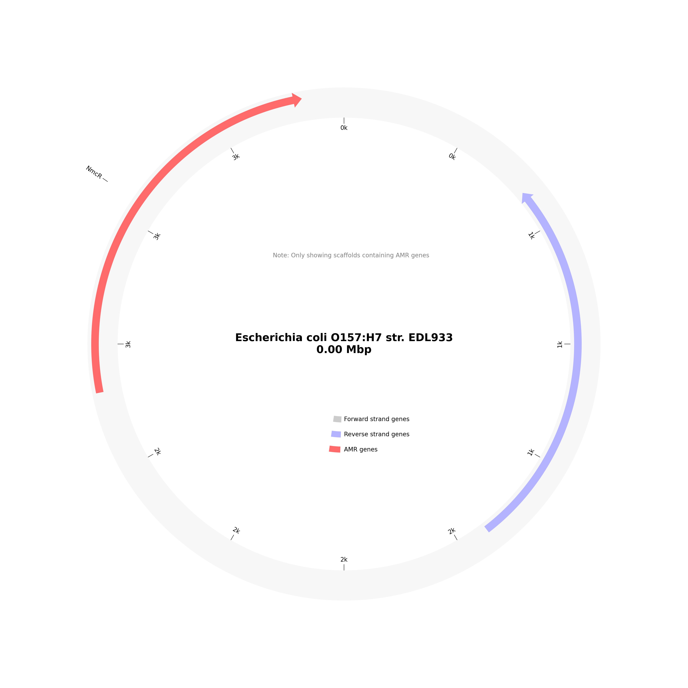

### NmcR
- **Mechanism**: antibiotic inactivation
- **Drug Classes**: carbapenem; cephalosporin; cephamycin; penam
- **AMR Family**: NmcA beta-lactamase
- **Locations**:
  - gnl|SPADES|FPFIAAFN_1972_4 : position 2652-3590

## Ewingella americana
**Strain Statistics:**
- Total genome length: 264.1 kbp
- Total scaffolds: 4272
- Scaffolds with AMR genes: 439
- Total genes annotated: 430
- Total AMR genes: 458
- Unique AMR genes: 183
- Distinct AMR mechanisms: 10
- Distinct AMR families: 52
- Distinct drug classes: 35

**Circos Plot:**

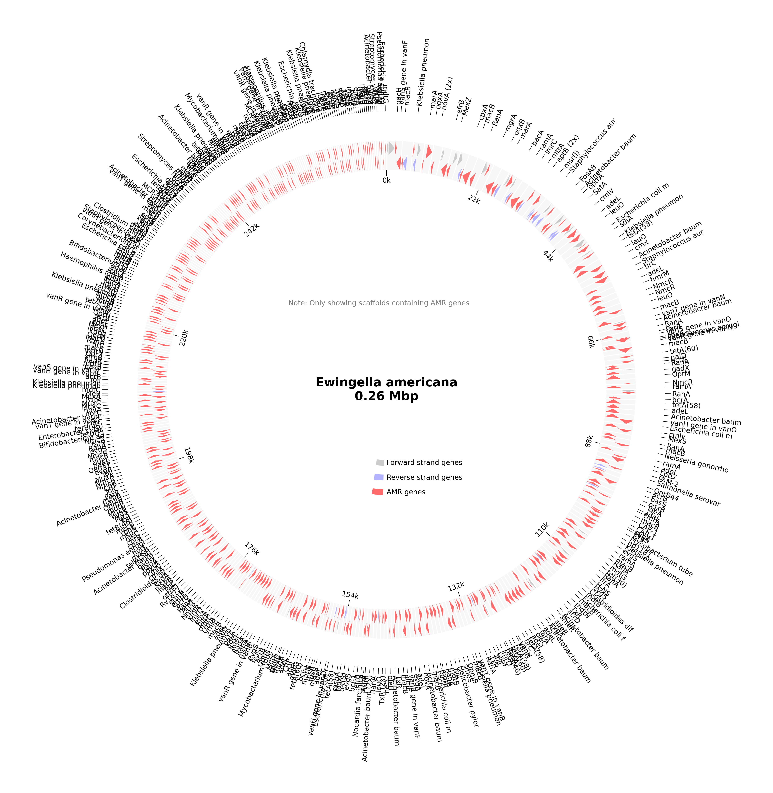

### Acinetobacter baumannii AbaF (found in 7 locations)
- **Mechanism**: antibiotic efflux
- **Drug Classes**: phosphonic acid antibiotic
- **AMR Family**: major facilitator superfamily (MFS) antibiotic efflux pump
- **Locations**:
  - gnl|SPADES|FPFIAAFN_11057_1 : position 256-756
  - gnl|SPADES|FPFIAAFN_11306_1 : position 1-462
  - gnl|SPADES|FPFIAAFN_19386_1 : position 2-484
  - gnl|SPADES|FPFIAAFN_21766_1 : position 3-443
  - gnl|SPADES|FPFIAAFN_5555_2 : position 668-1369
  - gnl|SPADES|FPFIAAFN_66842_1 : position 3-218
  - gnl|SPADES|FPFIAAFN_8393_1 : position 3-953

### Acinetobacter baumannii AbaQ (found in 9 locations)
- **Mechanism**: antibiotic efflux
- **Drug Classes**: fluoroquinolone antibiotic
- **AMR Family**: major facilitator superfamily (MFS) antibiotic efflux pump
- **Locations**:
  - gnl|SPADES|FPFIAAFN_12599_1 : position 3-680
  - gnl|SPADES|FPFIAAFN_13350_1 : position 1-384
  - gnl|SPADES|FPFIAAFN_14075_1 : position 2-361
  - gnl|SPADES|FPFIAAFN_14075_2 : position 306-623
  - gnl|SPADES|FPFIAAFN_18298_2 : position 326-508
  - gnl|SPADES|FPFIAAFN_32958_1 : position 2-322
  - gnl|SPADES|FPFIAAFN_36558_1 : position 3-296
  - gnl|SPADES|FPFIAAFN_6375_1 : position 110-1036
  - gnl|SPADES|FPFIAAFN_7424_1 : position 1-603

### ArnT (found in 2 locations)
- **Mechanism**: antibiotic target alteration
- **Drug Classes**: peptide antibiotic
- **AMR Family**: pmr phosphoethanolamine transferase
- **Locations**:
  - gnl|SPADES|FPFIAAFN_17033_2 : position 213-536
  - gnl|SPADES|FPFIAAFN_38727_1 : position 1-285

### Bifidobacterium adolescentis rpoB mutants conferring resistance to rifampicin
- **Mechanism**: antibiotic target alteration; antibiotic target replacement
- **Drug Classes**: rifamycin antibiotic
- **AMR Family**: rifamycin-resistant beta-subunit of RNA polymerase (rpoB)
- **Locations**:
  - gnl|SPADES|FPFIAAFN_20924_1 : position 2-457

### Bifidobacterium bifidum ileS conferring resistance to mupirocin
- **Mechanism**: antibiotic target alteration
- **Drug Classes**: mupirocin-like antibiotic
- **AMR Family**: antibiotic-resistant isoleucyl-tRNA synthetase (ileS)
- **Locations**:
  - gnl|SPADES|FPFIAAFN_27287_1 : position 1-372

### CAR-1 (found in 2 locations)
- **Mechanism**: antibiotic inactivation
- **Drug Classes**: carbapenem
- **AMR Family**: CAR beta-lactamase
- **Locations**:
  - gnl|SPADES|FPFIAAFN_9659_2 : position 347-847
  - gnl|SPADES|FPFIAAFN_9738_1 : position 252-842

### CRP (found in 2 locations)
- **Mechanism**: antibiotic efflux
- **Drug Classes**: macrolide antibiotic; fluoroquinolone antibiotic; penam
- **AMR Family**: resistance-nodulation-cell division (RND) antibiotic efflux pump
- **Locations**:
  - gnl|SPADES|FPFIAAFN_15209_1 : position 2-586
  - gnl|SPADES|FPFIAAFN_19972_1 : position 1-474

### Chlamydia trachomatis intrinsic murA conferring resistance to fosfomycin
- **Mechanism**: antibiotic target alteration
- **Drug Classes**: phosphonic acid antibiotic
- **AMR Family**: antibiotic-resistant murA transferase
- **Locations**:
  - gnl|SPADES|FPFIAAFN_54439_1 : position 3-242

### Clostridioides difficile gyrB conferring resistance to fluoroquinolones (found in 2 locations)
- **Mechanism**: antibiotic target alteration
- **Drug Classes**: fluoroquinolone antibiotic
- **AMR Family**: fluoroquinolone resistant gyrB
- **Locations**:
  - gnl|SPADES|FPFIAAFN_10722_1 : position 83-778
  - gnl|SPADES|FPFIAAFN_17830_1 : position 1-516

### Clostridium perfringes cplR
- **Mechanism**: antibiotic target protection
- **Drug Classes**: lincosamide antibiotic; streptogramin antibiotic; streptogramin A antibiotic; pleuromutilin antibiotic
- **AMR Family**: Miscellaneous ABC-F subfamily ATP-binding cassette ribosomal protection proteins
- **Locations**:
  - gnl|SPADES|FPFIAAFN_29488_1 : position 2-352

### Corynebacterium striatum tetA
- **Mechanism**: antibiotic efflux
- **Drug Classes**: penam; tetracycline antibiotic
- **AMR Family**: major facilitator superfamily (MFS) antibiotic efflux pump
- **Locations**:
  - gnl|SPADES|FPFIAAFN_28438_1 : position 1-360

### Enterobacter cloacae acrA
- **Mechanism**: antibiotic efflux
- **Drug Classes**: fluoroquinolone antibiotic; cephalosporin; glycylcycline; penam; tetracycline antibiotic; rifamycin antibiotic; phenicol antibiotic; disinfecting agents and antiseptics
- **AMR Family**: resistance-nodulation-cell division (RND) antibiotic efflux pump
- **Locations**:
  - gnl|SPADES|FPFIAAFN_21207_1 : position 3-452

### Escherichia coli fabI mutations conferring resistance to isoniazid and triclosan (found in 2 locations)
- **Mechanism**: antibiotic target alteration
- **Drug Classes**: disinfecting agents and antiseptics; isoniazid-like antibiotic
- **AMR Family**: antibiotic resistant fabI
- **Locations**:
  - gnl|SPADES|FPFIAAFN_10799_1 : position 24-773
  - gnl|SPADES|FPFIAAFN_14915_2 : position 345-596

### Escherichia coli mdfA (found in 4 locations)
- **Mechanism**: antibiotic efflux
- **Drug Classes**: tetracycline antibiotic; phenicol antibiotic; disinfecting agents and antiseptics
- **AMR Family**: major facilitator superfamily (MFS) antibiotic efflux pump
- **Locations**:
  - gnl|SPADES|FPFIAAFN_12526_2 : position 164-685
  - gnl|SPADES|FPFIAAFN_6004_2 : position 1146-1274
  - gnl|SPADES|FPFIAAFN_71672_1 : position 2-208
  - gnl|SPADES|FPFIAAFN_8551_1 : position 3-938

### Escherichia coli parE conferring resistance to fluoroquinolones
- **Mechanism**: antibiotic target alteration
- **Drug Classes**: fluoroquinolone antibiotic
- **AMR Family**: fluoroquinolone resistant parE
- **Locations**:
  - gnl|SPADES|FPFIAAFN_28281_1 : position 1-363

### Escherichia coli soxS with mutation conferring antibiotic resistance (found in 2 locations)
- **Mechanism**: antibiotic target alteration; antibiotic efflux; reduced permeability to antibiotic
- **Drug Classes**: fluoroquinolone antibiotic; monobactam; carbapenem; cephalosporin; glycylcycline; cephamycin; penam; tetracycline antibiotic; rifamycin antibiotic; phenicol antibiotic; penem; disinfecting agents and antiseptics
- **AMR Family**: ATP-binding cassette (ABC) antibiotic efflux pump; major facilitator superfamily (MFS) antibiotic efflux pump; resistance-nodulation-cell division (RND) antibiotic efflux pump; General Bacterial Porin with reduced permeability to beta-lactams
- **Locations**:
  - gnl|SPADES|FPFIAAFN_34305_1 : position 3-311
  - gnl|SPADES|FPFIAAFN_50742_1 : position 2-199

### EstT
- **Mechanism**: antibiotic inactivation
- **Drug Classes**: macrolide antibiotic
- **AMR Family**: macrolide esterase
- **Locations**:
  - gnl|SPADES|FPFIAAFN_48611_1 : position 1-258

### FosA8
- **Mechanism**: antibiotic inactivation
- **Drug Classes**: phosphonic acid antibiotic
- **AMR Family**: fosfomycin thiol transferase
- **Locations**:
  - gnl|SPADES|FPFIAAFN_5516_3: position 1025-1378

### H-NS
- **Mechanism**: antibiotic efflux
- **Drug Classes**: macrolide antibiotic; fluoroquinolone antibiotic; cephalosporin; cephamycin; penam; tetracycline antibiotic
- **AMR Family**: major facilitator superfamily (MFS) antibiotic efflux pump; resistance-nodulation-cell division (RND) antibiotic efflux pump
- **Locations**:
  - gnl|SPADES|FPFIAAFN_10580_2 : position 570-788

### Haemophilus influenzae PBP3 conferring resistance to beta-lactam antibiotics (found in 2 locations)
- **Mechanism**: antibiotic target alteration
- **Drug Classes**: cephalosporin; cephamycin; penam
- **AMR Family**: Penicillin-binding protein mutations conferring resistance to beta-lactam antibiotics
- **Locations**:
  - gnl|SPADES|FPFIAAFN_26825_1 : position 3-377
  - gnl|SPADES|FPFIAAFN_48287_1 : position 3-257

### Helicobacter pylori pbp1 mutants conferring resistance to amoxicillin
- **Mechanism**: antibiotic target alteration
- **Drug Classes**: cephalosporin; cephamycin; penam
- **AMR Family**: Penicillin-binding protein mutations conferring resistance to beta-lactam antibiotics
- **Locations**:
  - gnl|SPADES|FPFIAAFN_12426_1 : position 2-688

### IDC-1
- **Mechanism**: antibiotic inactivation
- **Drug Classes**: carbapenem; cephalosporin
- **AMR Family**: IDC beta-lactamase
- **Locations**:
  - gnl|SPADES|FPFIAAFN_55553_1 : position 59-241

### Klebsiella pneumoniae KpnH
- **Mechanism**: antibiotic efflux
- **Drug Classes**: macrolide antibiotic; fluoroquinolone antibiotic; aminoglycoside antibiotic; carbapenem; cephalosporin; penam; peptide antibiotic; penem
- **AMR Family**: major facilitator superfamily (MFS) antibiotic efflux pump
- **Locations**:
  - gnl|SPADES|FPFIAAFN_22783_1 : position 155-427

### Klebsiella pneumoniae OmpK37 (found in 11 locations)
- **Mechanism**: reduced permeability to antibiotic
- **Drug Classes**: monobactam; carbapenem; cephalosporin; cephamycin; penam; penem
- **AMR Family**: General Bacterial Porin with reduced permeability to beta-lactams
- **Locations**:
  - gnl|SPADES|FPFIAAFN_12376_1 : position 158-691
  - gnl|SPADES|FPFIAAFN_16366_1 : position 1-552
  - gnl|SPADES|FPFIAAFN_26402_1 : position 3-383
  - gnl|SPADES|FPFIAAFN_3170_1 : position 2-295
  - gnl|SPADES|FPFIAAFN_36934_1 : position 2-295
  - gnl|SPADES|FPFIAAFN_47894_1 : position 3-257
  - gnl|SPADES|FPFIAAFN_49266_1 : position 3-110
  - gnl|SPADES|FPFIAAFN_49528_1 : position 3-173
  - gnl|SPADES|FPFIAAFN_51907_1 : position 2-142
  - gnl|SPADES|FPFIAAFN_53093_1 : position 3-245
  - gnl|SPADES|FPFIAAFN_6202_2 : position 873-1238

### Klebsiella pneumoniae acrR with mutation conferring multidrug antibiotic resistance
- **Mechanism**: antibiotic target alteration; antibiotic efflux
- **Drug Classes**: fluoroquinolone antibiotic; cephalosporin; glycylcycline; penam; tetracycline antibiotic; rifamycin antibiotic; phenicol antibiotic; disinfecting agents and antiseptics
- **AMR Family**: resistance-nodulation-cell division (RND) antibiotic efflux pump
- **Locations**:
  - gnl|SPADES|FPFIAAFN_9880_1 : position 2-730

### Klebsiella pneumoniae ramR mutants
- **Mechanism**: antibiotic target alteration; antibiotic efflux
- **Drug Classes**: fluoroquinolone antibiotic; cephalosporin; glycylcycline; penam; tetracycline antibiotic; rifamycin antibiotic; phenicol antibiotic; disinfecting agents and antiseptics
- **AMR Family**: resistance-nodulation-cell division (RND) antibiotic efflux pump
- **Locations**:
  - gnl|SPADES|FPFIAAFN_22839_1 : position 1-426

### LptD (found in 2 locations)
- **Mechanism**: antibiotic efflux
- **Drug Classes**: carbapenem; peptide antibiotic; aminocoumarin antibiotic; rifamycin antibiotic
- **AMR Family**: ATP-binding cassette (ABC) antibiotic efflux pump
- **Locations**:
  - gnl|SPADES|FPFIAAFN_50660_1 : position 2-253
  - gnl|SPADES|FPFIAAFN_8969_1 : position 1-900

### MCR-10.5 (found in 2 locations)
- **Mechanism**: antibiotic target alteration
- **Drug Classes**: peptide antibiotic
- **AMR Family**: MCR phosphoethanolamine transferase
- **Locations**:
  - gnl|SPADES|FPFIAAFN_33139_1 : position 1-321
  - gnl|SPADES|FPFIAAFN_46053_1 : position 3-263

### MdtK (found in 2 locations)
- **Mechanism**: antibiotic efflux
- **Drug Classes**: fluoroquinolone antibiotic
- **AMR Family**: multidrug and toxic compound extrusion (MATE) transporter
- **Locations**:
  - gnl|SPADES|FPFIAAFN_15350_1 : position 2-583
  - gnl|SPADES|FPFIAAFN_61850_1 : position 1-228

### MexH
- **Mechanism**: antibiotic efflux
- **Drug Classes**: fluoroquinolone antibiotic; tetracycline antibiotic; disinfecting agents and antiseptics
- **AMR Family**: resistance-nodulation-cell division (RND) antibiotic efflux pump
- **Locations**:
  - gnl|SPADES|FPFIAAFN_25018_1 : position 1-399

### MexS
- **Mechanism**: antibiotic efflux
- **Drug Classes**: fluoroquinolone antibiotic; diaminopyrimidine antibiotic; phenicol antibiotic
- **AMR Family**: resistance-nodulation-cell division (RND) antibiotic efflux pump
- **Locations**:
  - gnl|SPADES|FPFIAAFN_8605_1 : position 1-630

### MexZ
- **Mechanism**: antibiotic efflux
- **Drug Classes**: macrolide antibiotic; fluoroquinolone antibiotic; aminoglycoside antibiotic; carbapenem; cephalosporin; cephamycin; penam; tetracycline antibiotic; phenicol antibiotic; disinfecting agents and antiseptics
- **AMR Family**: resistance-nodulation-cell division (RND) antibiotic efflux pump
- **Locations**:
  - gnl|SPADES|FPFIAAFN_4052_1 : position 1-606

### MuxA (found in 2 locations)
- **Mechanism**: antibiotic efflux
- **Drug Classes**: macrolide antibiotic; monobactam; tetracycline antibiotic; aminocoumarin antibiotic
- **AMR Family**: resistance-nodulation-cell division (RND) antibiotic efflux pump
- **Locations**:
  - gnl|SPADES|FPFIAAFN_20168_1 : position 3-470
  - gnl|SPADES|FPFIAAFN_22421_1 : position 2-433

### MuxB (found in 3 locations)
- **Mechanism**: antibiotic efflux
- **Drug Classes**: macrolide antibiotic; monobactam; tetracycline antibiotic; aminocoumarin antibiotic
- **AMR Family**: resistance-nodulation-cell division (RND) antibiotic efflux pump
- **Locations**:
  - gnl|SPADES|FPFIAAFN_15299_1 : position 1-159
  - gnl|SPADES|FPFIAAFN_19267_1 : position 2-487
  - gnl|SPADES|FPFIAAFN_36703_1 : position 2-295

### MuxC (found in 5 locations)
- **Mechanism**: antibiotic efflux
- **Drug Classes**: macrolide antibiotic; monobactam; tetracycline antibiotic; aminocoumarin antibiotic
- **AMR Family**: resistance-nodulation-cell division (RND) antibiotic efflux pump
- **Locations**:
  - gnl|SPADES|FPFIAAFN_14632_1 : position 3-605
  - gnl|SPADES|FPFIAAFN_21950_1 : position 3-440
  - gnl|SPADES|FPFIAAFN_22091_1 : position 2-439
  - gnl|SPADES|FPFIAAFN_24831_1 : position 1-402
  - gnl|SPADES|FPFIAAFN_58398_1 : position 1-234

### Mycobacterium tuberculosis intrinsic murA conferring resistance to fosfomycin
- **Mechanism**: antibiotic target alteration
- **Drug Classes**: phosphonic acid antibiotic
- **AMR Family**: antibiotic-resistant murA transferase
- **Locations**:
  - gnl|SPADES|FPFIAAFN_38452_1 : position 2-286

### Mycobacterium tuberculosis kasA mutant conferring resistance to isoniazid
- **Mechanism**: antibiotic target alteration
- **Drug Classes**: isoniazid-like antibiotic
- **AMR Family**: antibiotic resistant kasA
- **Locations**:
  - gnl|SPADES|FPFIAAFN_15358_2 : position 290-583

### Mycobacterium tuberculosis thyA with mutation conferring resistance to para-aminosalicylic acid
- **Mechanism**: antibiotic target alteration
- **Drug Classes**: salicylic acid antibiotic
- **AMR Family**: aminosalicylate resistant thymidylate synthase
- **Locations**:
  - gnl|SPADES|FPFIAAFN_9771_2 : position 225-839

### Neisseria gonorrhoeae PBP2 conferring resistance to beta-lactam antibiotics
- **Mechanism**: antibiotic target alteration
- **Drug Classes**: cephalosporin; cephamycin; penam
- **AMR Family**: Penicillin-binding protein mutations conferring resistance to beta-lactam antibiotics
- **Locations**:
  - gnl|SPADES|FPFIAAFN_8727_1 : position 1-537

### NmcR (found in 12 locations)
- **Mechanism**: antibiotic inactivation
- **Drug Classes**: carbapenem; cephalosporin; cephamycin; penam
- **AMR Family**: NmcA beta-lactamase
- **Locations**:
  - gnl|SPADES|FPFIAAFN_17070_2 : position 72-536
  - gnl|SPADES|FPFIAAFN_20011_1 : position 84-473
  - gnl|SPADES|FPFIAAFN_20023_1 : position 1-474
  - gnl|SPADES|FPFIAAFN_20623_1 : position 1-240
  - gnl|SPADES|FPFIAAFN_20902_1 : position 159-458
  - gnl|SPADES|FPFIAAFN_26371_1 : position 3-383
  - gnl|SPADES|FPFIAAFN_36858_1 : position 2-295
  - gnl|SPADES|FPFIAAFN_37455_1 : position 3-290
  - gnl|SPADES|FPFIAAFN_46302_1 : position 43-261
  - gnl|SPADES|FPFIAAFN_6920_1 : position 4-930
  - gnl|SPADES|FPFIAAFN_6980_1 : position 3-692
  - gnl|SPADES|FPFIAAFN_8070_2 : position 766-987

### Nocardia farcinica rox
- **Mechanism**: antibiotic inactivation
- **Drug Classes**: rifamycin antibiotic
- **AMR Family**: rifampin monooxygenase
- **Locations**:
  - gnl|SPADES|FPFIAAFN_14313_1 : position 2-496

### OpmB (found in 2 locations)
- **Mechanism**: antibiotic efflux
- **Drug Classes**: macrolide antibiotic; monobactam; tetracycline antibiotic; aminocoumarin antibiotic
- **AMR Family**: resistance-nodulation-cell division (RND) antibiotic efflux pump
- **Locations**:
  - gnl|SPADES|FPFIAAFN_12411_1 : position 3-689
  - gnl|SPADES|FPFIAAFN_19358_1 : position 2-487

### OprM (found in 3 locations)
- **Mechanism**: antibiotic efflux
- **Drug Classes**: macrolide antibiotic; fluoroquinolone antibiotic; monobactam; aminoglycoside antibiotic; carbapenem; cephalosporin; cephamycin; penam; tetracycline antibiotic; peptide antibiotic; aminocoumarin antibiotic; diaminopyrimidine antibiotic; sulfonamide antibiotic; phenicol antibiotic; penem; disinfecting agents and antiseptics
- **AMR Family**: resistance-nodulation-cell division (RND) antibiotic efflux pump
- **Locations**:
  - gnl|SPADES|FPFIAAFN_15392_1 : position 31-582
  - gnl|SPADES|FPFIAAFN_24760_1 : position 1-180
  - gnl|SPADES|FPFIAAFN_8025_1 : position 1-993

### OprN
- **Mechanism**: antibiotic efflux
- **Drug Classes**: fluoroquinolone antibiotic; diaminopyrimidine antibiotic; phenicol antibiotic
- **AMR Family**: resistance-nodulation-cell division (RND) antibiotic efflux pump
- **Locations**:
  - gnl|SPADES|FPFIAAFN_25430_1 : position 2-394

### OprZ
- **Mechanism**: antibiotic efflux
- **Drug Classes**: macrolide antibiotic; fluoroquinolone antibiotic; aminoglycoside antibiotic; cephalosporin
- **AMR Family**: resistance-nodulation-cell division (RND) antibiotic efflux pump
- **Locations**:
  - gnl|SPADES|FPFIAAFN_24238_1 : position 3-407

### PAM-2
- **Mechanism**: antibiotic inactivation
- **Drug Classes**: carbapenem; cephalosporin
- **AMR Family**: PAM beta-lactamase
- **Locations**:
  - gnl|SPADES|FPFIAAFN_9034_2 : position 106-897

### ParR (found in 3 locations)
- **Mechanism**: antibiotic efflux; reduced permeability to antibiotic
- **Drug Classes**: macrolide antibiotic; fluoroquinolone antibiotic; monobactam; aminoglycoside antibiotic; carbapenem; cephalosporin; cephamycin; penam; tetracycline antibiotic; phenicol antibiotic; penem; disinfecting agents and antiseptics
- **AMR Family**: resistance-nodulation-cell division (RND) antibiotic efflux pump; Outer Membrane Porin (Opr)
- **Locations**:
  - gnl|SPADES|FPFIAAFN_19867_1 : position 3-197
  - gnl|SPADES|FPFIAAFN_22431_1 : position 3-434
  - gnl|SPADES|FPFIAAFN_7742_1 : position 3-167

### ParS (found in 2 locations)
- **Mechanism**: antibiotic efflux; reduced permeability to antibiotic
- **Drug Classes**: macrolide antibiotic; fluoroquinolone antibiotic; monobactam; aminoglycoside antibiotic; carbapenem; cephalosporin; cephamycin; penam; tetracycline antibiotic; phenicol antibiotic; penem; disinfecting agents and antiseptics
- **AMR Family**: resistance-nodulation-cell division (RND) antibiotic efflux pump; Outer Membrane Porin (Opr)
- **Locations**:
  - gnl|SPADES|FPFIAAFN_19099_1 : position 1-429
  - gnl|SPADES|FPFIAAFN_36737_1 : position 1-294

### PmrF (found in 2 locations)
- **Mechanism**: antibiotic target alteration
- **Drug Classes**: peptide antibiotic
- **AMR Family**: pmr phosphoethanolamine transferase
- **Locations**:
  - gnl|SPADES|FPFIAAFN_14294_1 : position 1-459
  - gnl|SPADES|FPFIAAFN_38222_1 : position 3-287

### Pseudomonas aeruginosa CpxR (found in 3 locations)
- **Mechanism**: antibiotic efflux
- **Drug Classes**: macrolide antibiotic; fluoroquinolone antibiotic; monobactam; aminoglycoside antibiotic; carbapenem; cephalosporin; cephamycin; penam; tetracycline antibiotic; peptide antibiotic; aminocoumarin antibiotic; diaminopyrimidine antibiotic; sulfonamide antibiotic; phenicol antibiotic; penem
- **AMR Family**: resistance-nodulation-cell division (RND) antibiotic efflux pump
- **Locations**:
  - gnl|SPADES|FPFIAAFN_18481_1 : position 2-502
  - gnl|SPADES|FPFIAAFN_72050_1 : position 1-207
  - gnl|SPADES|FPFIAAFN_7835_2 : position 261-554

### QepA1
- **Mechanism**: antibiotic efflux
- **Drug Classes**: fluoroquinolone antibiotic
- **AMR Family**: major facilitator superfamily (MFS) antibiotic efflux pump
- **Locations**:
  - gnl|SPADES|FPFIAAFN_20426_1 : position 57-467

### QnrB44
- **Mechanism**: antibiotic target protection
- **Drug Classes**: fluoroquinolone antibiotic
- **AMR Family**: quinolone resistance protein (qnr)
- **Locations**:
  - gnl|SPADES|FPFIAAFN_9379_3 : position 599-868

### RanA (found in 22 locations)
- **Mechanism**: antibiotic efflux
- **Drug Classes**: aminoglycoside antibiotic
- **AMR Family**: ATP-binding cassette (ABC) antibiotic efflux pump
- **Locations**:
  - gnl|SPADES|FPFIAAFN_10244_1 : position 3-575
  - gnl|SPADES|FPFIAAFN_10417_1 : position 3-599
  - gnl|SPADES|FPFIAAFN_11880_1 : position 3-410
  - gnl|SPADES|FPFIAAFN_12258_1 : position 3-332
  - gnl|SPADES|FPFIAAFN_12476_1 : position 2-685
  - gnl|SPADES|FPFIAAFN_14048_1 : position 2-625
  - gnl|SPADES|FPFIAAFN_15251_1 : position 2-586
  - gnl|SPADES|FPFIAAFN_16061_2 : position 94-561
  - gnl|SPADES|FPFIAAFN_16222_1 : position 3-557
  - gnl|SPADES|FPFIAAFN_17100_1 : position 1-534
  - gnl|SPADES|FPFIAAFN_18265_1 : position 1-507
  - gnl|SPADES|FPFIAAFN_20700_1 : position 2-418
  - gnl|SPADES|FPFIAAFN_24110_1 : position 3-338
  - gnl|SPADES|FPFIAAFN_24684_1 : position 50-403
  - gnl|SPADES|FPFIAAFN_26295_1 : position 3-383
  - gnl|SPADES|FPFIAAFN_26783_1 : position 2-379
  - gnl|SPADES|FPFIAAFN_26976_1 : position 2-376
  - gnl|SPADES|FPFIAAFN_4190_1 : position 3-788
  - gnl|SPADES|FPFIAAFN_7610_1 : position 3-557
  - gnl|SPADES|FPFIAAFN_7932_2 : position 325-1002
  - gnl|SPADES|FPFIAAFN_8188_2 : position 553-972
  - gnl|SPADES|FPFIAAFN_8621_2 : position 353-931

### Rv1877
- **Mechanism**: antibiotic efflux
- **Drug Classes**: fluoroquinolone antibiotic
- **AMR Family**: major facilitator superfamily (MFS) antibiotic efflux pump
- **Locations**:
  - gnl|SPADES|FPFIAAFN_17345_1 : position 2-529

### SRT-1 (found in 2 locations)
- **Mechanism**: antibiotic inactivation
- **Drug Classes**: cephalosporin
- **AMR Family**: SRT beta-lactamase
- **Locations**:
  - gnl|SPADES|FPFIAAFN_33885_1 : position 2-316
  - gnl|SPADES|FPFIAAFN_53967_1 : position 3-245

### Salmonella serovars soxS with mutation conferring antibiotic resistance
- **Mechanism**: antibiotic target alteration; antibiotic efflux; reduced permeability to antibiotic
- **Drug Classes**: fluoroquinolone antibiotic; monobactam; carbapenem; cephalosporin; glycylcycline; cephamycin; penam; tetracycline antibiotic; rifamycin antibiotic; phenicol antibiotic; penem; disinfecting agents and antiseptics
- **AMR Family**: ATP-binding cassette (ABC) antibiotic efflux pump; major facilitator superfamily (MFS) antibiotic efflux pump; resistance-nodulation-cell division (RND) antibiotic efflux pump; General Bacterial Porin with reduced permeability to beta-lactams
- **Locations**:
  - gnl|SPADES|FPFIAAFN_9131_1 : position 105-491

### SatA
- **Mechanism**: antibiotic inactivation
- **Drug Classes**: nucleoside antibiotic
- **AMR Family**: streptothricin acetyltransferase (SAT)
- **Locations**:
  - gnl|SPADES|FPFIAAFN_5712_1 : position 1-234

### Staphylococcus aureus mupA conferring resistance to mupirocin
- **Mechanism**: antibiotic target alteration
- **Drug Classes**: mupirocin-like antibiotic
- **AMR Family**: antibiotic-resistant isoleucyl-tRNA synthetase (ileS)
- **Locations**:
  - gnl|SPADES|FPFIAAFN_6374_1 : position 1-1035

### Staphylococcus aureus mupB conferring resistance to mupirocin
- **Mechanism**: antibiotic target alteration
- **Drug Classes**: mupirocin-like antibiotic
- **AMR Family**: antibiotic-resistant isoleucyl-tRNA synthetase (ileS)
- **Locations**:
  - gnl|SPADES|FPFIAAFN_28889_1 : position 1-357

### Staphylococcus aureus pgsA mutations conferring resistance to daptomycin
- **Mechanism**: antibiotic target alteration
- **Drug Classes**: peptide antibiotic
- **AMR Family**: daptomycin resistant pgsA
- **Locations**:
  - gnl|SPADES|FPFIAAFN_5500_1 : position 3-431

### Streptomyces rimosus otr(A)
- **Mechanism**: antibiotic target protection
- **Drug Classes**: tetracycline antibiotic
- **AMR Family**: tetracycline-resistant ribosomal protection protein
- **Locations**:
  - gnl|SPADES|FPFIAAFN_35344_1 : position 1-303

### Streptomyces venezuelae rox
- **Mechanism**: antibiotic inactivation
- **Drug Classes**: rifamycin antibiotic
- **AMR Family**: rifampin monooxygenase
- **Locations**:
  - gnl|SPADES|FPFIAAFN_68544_1 : position 2-214

### TaeA (found in 3 locations)
- **Mechanism**: antibiotic efflux
- **Drug Classes**: pleuromutilin antibiotic
- **AMR Family**: ATP-binding cassette (ABC) antibiotic efflux pump
- **Locations**:
  - gnl|SPADES|FPFIAAFN_38352_1 : position 2-259
  - gnl|SPADES|FPFIAAFN_55349_1 : position 3-242
  - gnl|SPADES|FPFIAAFN_9536_1 : position 3-446

### TolC (found in 3 locations)
- **Mechanism**: antibiotic efflux
- **Drug Classes**: macrolide antibiotic; fluoroquinolone antibiotic; aminoglycoside antibiotic; carbapenem; cephalosporin; glycylcycline; cephamycin; penam; tetracycline antibiotic; peptide antibiotic; aminocoumarin antibiotic; rifamycin antibiotic; phenicol antibiotic; penem; disinfecting agents and antiseptics
- **AMR Family**: ATP-binding cassette (ABC) antibiotic efflux pump; major facilitator superfamily (MFS) antibiotic efflux pump; resistance-nodulation-cell division (RND) antibiotic efflux pump
- **Locations**:
  - gnl|SPADES|FPFIAAFN_17455_1 : position 3-527
  - gnl|SPADES|FPFIAAFN_19847_1 : position 2-475
  - gnl|SPADES|FPFIAAFN_30059_1 : position 283-345

### TxR (found in 5 locations)
- **Mechanism**: antibiotic efflux
- **Drug Classes**: tetracycline antibiotic
- **AMR Family**: ATP-binding cassette (ABC) antibiotic efflux pump
- **Locations**:
  - gnl|SPADES|FPFIAAFN_10907_1 : position 126-767
  - gnl|SPADES|FPFIAAFN_12196_1 : position 1-381
  - gnl|SPADES|FPFIAAFN_13216_1 : position 39-659
  - gnl|SPADES|FPFIAAFN_13895_1 : position 2-316
  - gnl|SPADES|FPFIAAFN_13895_2 : position 326-631

### YajC
- **Mechanism**: antibiotic efflux
- **Drug Classes**: fluoroquinolone antibiotic; cephalosporin; glycylcycline; penam; tetracycline antibiotic; oxazolidinone antibiotic; glycopeptide antibiotic; rifamycin antibiotic; phenicol antibiotic; disinfecting agents and antiseptics
- **AMR Family**: resistance-nodulation-cell division (RND) antibiotic efflux pump
- **Locations**:
  - gnl|SPADES|FPFIAAFN_35806_1 : position 2-202

### YojI (found in 7 locations)
- **Mechanism**: antibiotic efflux
- **Drug Classes**: peptide antibiotic
- **AMR Family**: ATP-binding cassette (ABC) antibiotic efflux pump
- **Locations**:
  - gnl|SPADES|FPFIAAFN_12197_1 : position 2-331
  - gnl|SPADES|FPFIAAFN_12433_1 : position 3-569
  - gnl|SPADES|FPFIAAFN_19076_1 : position 3-380
  - gnl|SPADES|FPFIAAFN_20260_1 : position 1-468
  - gnl|SPADES|FPFIAAFN_23142_2 : position 200-421
  - gnl|SPADES|FPFIAAFN_31726_1 : position 3-332
  - gnl|SPADES|FPFIAAFN_64034_1 : position 1-222

### acrB (found in 4 locations)
- **Mechanism**: antibiotic efflux
- **Drug Classes**: fluoroquinolone antibiotic; cephalosporin; glycylcycline; penam; tetracycline antibiotic; rifamycin antibiotic; phenicol antibiotic; disinfecting agents and antiseptics
- **AMR Family**: resistance-nodulation-cell division (RND) antibiotic efflux pump
- **Locations**:
  - gnl|SPADES|FPFIAAFN_15434_1 : position 1-579
  - gnl|SPADES|FPFIAAFN_23471_1 : position 1-417
  - gnl|SPADES|FPFIAAFN_25426_1 : position 2-394
  - gnl|SPADES|FPFIAAFN_9476_1 : position 1-861

### acrD (found in 4 locations)
- **Mechanism**: antibiotic efflux
- **Drug Classes**: aminoglycoside antibiotic
- **AMR Family**: resistance-nodulation-cell division (RND) antibiotic efflux pump
- **Locations**:
  - gnl|SPADES|FPFIAAFN_10973_1 : position 1-756
  - gnl|SPADES|FPFIAAFN_17155_1 : position 290-535
  - gnl|SPADES|FPFIAAFN_27527_1 : position 2-370
  - gnl|SPADES|FPFIAAFN_66367_1 : position 3-218

### adeL (found in 21 locations)
- **Mechanism**: antibiotic efflux
- **Drug Classes**: fluoroquinolone antibiotic; tetracycline antibiotic
- **AMR Family**: resistance-nodulation-cell division (RND) antibiotic efflux pump
- **Locations**:
  - gnl|SPADES|FPFIAAFN_11357_1 : position 120-740
  - gnl|SPADES|FPFIAAFN_11437_1 : position 40-735
  - gnl|SPADES|FPFIAAFN_12748_2 : position 359-676
  - gnl|SPADES|FPFIAAFN_14961_2 : position 212-592
  - gnl|SPADES|FPFIAAFN_15169_1 : position 2-586
  - gnl|SPADES|FPFIAAFN_15254_1 : position 2-586
  - gnl|SPADES|FPFIAAFN_16218_1 : position 1-492
  - gnl|SPADES|FPFIAAFN_16234_1 : position 2-556
  - gnl|SPADES|FPFIAAFN_16381_1 : position 1-225
  - gnl|SPADES|FPFIAAFN_20536_1 : position 1-465
  - gnl|SPADES|FPFIAAFN_25293_1 : position 1-396
  - gnl|SPADES|FPFIAAFN_25380_1 : position 58-393
  - gnl|SPADES|FPFIAAFN_26773_1 : position 2-379
  - gnl|SPADES|FPFIAAFN_27016_1 : position 2-277
  - gnl|SPADES|FPFIAAFN_33645_1 : position 1-318
  - gnl|SPADES|FPFIAAFN_36115_1 : position 3-299
  - gnl|SPADES|FPFIAAFN_5940_2 : position 322-1239
  - gnl|SPADES|FPFIAAFN_6888_1 : position 2-799
  - gnl|SPADES|FPFIAAFN_8313_1 : position 45-938
  - gnl|SPADES|FPFIAAFN_8906_2 : position 550-906
  - gnl|SPADES|FPFIAAFN_9630_1 : position 2-412

### adeR
- **Mechanism**: antibiotic efflux
- **Drug Classes**: glycylcycline; tetracycline antibiotic
- **AMR Family**: resistance-nodulation-cell division (RND) antibiotic efflux pump
- **Locations**:
  - gnl|SPADES|FPFIAAFN_11119_2 : position 628-753

### adeS
- **Mechanism**: antibiotic efflux
- **Drug Classes**: glycylcycline; tetracycline antibiotic
- **AMR Family**: resistance-nodulation-cell division (RND) antibiotic efflux pump
- **Locations**:
  - gnl|SPADES|FPFIAAFN_48406_1 : position 1-258

### almE
- **Mechanism**: antibiotic target alteration
- **Drug Classes**: peptide antibiotic
- **AMR Family**: polymyxin resistance operon; alm glycyltransferase
- **Locations**:
  - gnl|SPADES|FPFIAAFN_13186_1 : position 2-658

### arlS (found in 2 locations)
- **Mechanism**: antibiotic efflux
- **Drug Classes**: fluoroquinolone antibiotic; disinfecting agents and antiseptics
- **AMR Family**: major facilitator superfamily (MFS) antibiotic efflux pump
- **Locations**:
  - gnl|SPADES|FPFIAAFN_54418_1 : position 39-242
  - gnl|SPADES|FPFIAAFN_60101_1 : position 2-232

### arnA (found in 3 locations)
- **Mechanism**: antibiotic target alteration
- **Drug Classes**: peptide antibiotic
- **AMR Family**: pmr phosphoethanolamine transferase
- **Locations**:
  - gnl|SPADES|FPFIAAFN_14294_2 : position 459-617
  - gnl|SPADES|FPFIAAFN_38542_2 : position 147-284
  - gnl|SPADES|FPFIAAFN_49141_1 : position 2-256

### bacA
- **Mechanism**: antibiotic target alteration
- **Drug Classes**: peptide antibiotic
- **AMR Family**: undecaprenyl pyrophosphate related proteins
- **Locations**:
  - gnl|SPADES|FPFIAAFN_4707_3 : position 773-1594

### baeR
- **Mechanism**: antibiotic efflux
- **Drug Classes**: aminoglycoside antibiotic; aminocoumarin antibiotic
- **AMR Family**: resistance-nodulation-cell division (RND) antibiotic efflux pump
- **Locations**:
  - gnl|SPADES|FPFIAAFN_45091_1 : position 2-265

### baeS
- **Mechanism**: antibiotic efflux
- **Drug Classes**: aminoglycoside antibiotic; aminocoumarin antibiotic
- **AMR Family**: resistance-nodulation-cell division (RND) antibiotic efflux pump
- **Locations**:
  - gnl|SPADES|FPFIAAFN_20451_1 : position 3-464

### basS (found in 2 locations)
- **Mechanism**: antibiotic target alteration; antibiotic efflux
- **Drug Classes**: peptide antibiotic
- **AMR Family**: pmr phosphoethanolamine transferase
- **Locations**:
  - gnl|SPADES|FPFIAAFN_27403_1 : position 1-219
  - gnl|SPADES|FPFIAAFN_9490_1 : position 36-860

### bcr-1 (found in 3 locations)
- **Mechanism**: antibiotic efflux
- **Drug Classes**: bicyclomycin-like antibiotic
- **AMR Family**: major facilitator superfamily (MFS) antibiotic efflux pump
- **Locations**:
  - gnl|SPADES|FPFIAAFN_14433_1 : position 1-144
  - gnl|SPADES|FPFIAAFN_15056_1 : position 3-590
  - gnl|SPADES|FPFIAAFN_15506_1 : position 2-577

### bcrA (found in 6 locations)
- **Mechanism**: antibiotic efflux
- **Drug Classes**: peptide antibiotic
- **AMR Family**: ATP-binding cassette (ABC) antibiotic efflux pump
- **Locations**:
  - gnl|SPADES|FPFIAAFN_16866_1 : position 3-539
  - gnl|SPADES|FPFIAAFN_30478_1 : position 2-256
  - gnl|SPADES|FPFIAAFN_35327_1 : position 1-306
  - gnl|SPADES|FPFIAAFN_69530_1 : position 2-211
  - gnl|SPADES|FPFIAAFN_7932_1 : position 2-328
  - gnl|SPADES|FPFIAAFN_8226_2 : position 484-969

### clbB
- **Mechanism**: antibiotic target alteration
- **Drug Classes**: lincosamide antibiotic; streptogramin antibiotic; streptogramin A antibiotic; oxazolidinone antibiotic; phenicol antibiotic; pleuromutilin antibiotic
- **AMR Family**: Cfr 23S ribosomal RNA methyltransferase
- **Locations**:
  - gnl|SPADES|FPFIAAFN_36769_1 : position 3-296

### cmlv (found in 4 locations)
- **Mechanism**: antibiotic inactivation
- **Drug Classes**: phenicol antibiotic
- **AMR Family**: chloramphenicol phosphotransferase
- **Locations**:
  - gnl|SPADES|FPFIAAFN_18128_1 : position 3-512
  - gnl|SPADES|FPFIAAFN_25607_1 : position 129-392
  - gnl|SPADES|FPFIAAFN_5863_1 : position 32-799
  - gnl|SPADES|FPFIAAFN_8580_2 : position 224-934

### cmrA (found in 2 locations)
- **Mechanism**: antibiotic efflux
- **Drug Classes**: phenicol antibiotic
- **AMR Family**: major facilitator superfamily (MFS) antibiotic efflux pump
- **Locations**:
  - gnl|SPADES|FPFIAAFN_17980_1 : position 1-513
  - gnl|SPADES|FPFIAAFN_9630_2 : position 514-852

### cmx (found in 2 locations)
- **Mechanism**: antibiotic efflux
- **Drug Classes**: phenicol antibiotic
- **AMR Family**: major facilitator superfamily (MFS) antibiotic efflux pump
- **Locations**:
  - gnl|SPADES|FPFIAAFN_36895_1 : position 3-293
  - gnl|SPADES|FPFIAAFN_6362_1 : position 2-772

### cprR
- **Mechanism**: antibiotic target alteration; antibiotic efflux
- **Drug Classes**: peptide antibiotic
- **AMR Family**: pmr phosphoethanolamine transferase
- **Locations**:
  - gnl|SPADES|FPFIAAFN_18617_1 : position 1-369

### cpxA (found in 4 locations)
- **Mechanism**: antibiotic efflux
- **Drug Classes**: aminoglycoside antibiotic; aminocoumarin antibiotic
- **AMR Family**: resistance-nodulation-cell division (RND) antibiotic efflux pump
- **Locations**:
  - gnl|SPADES|FPFIAAFN_18534_1 : position 2-502
  - gnl|SPADES|FPFIAAFN_4064_3 : position 1433-1837
  - gnl|SPADES|FPFIAAFN_42295_1 : position 2-241
  - gnl|SPADES|FPFIAAFN_7835_1 : position 1-264

### efpA
- **Mechanism**: antibiotic efflux
- **Drug Classes**: rifamycin antibiotic; isoniazid-like antibiotic
- **AMR Family**: major facilitator superfamily (MFS) antibiotic efflux pump
- **Locations**:
  - gnl|SPADES|FPFIAAFN_16946_1 : position 2-343

### efrA
- **Mechanism**: antibiotic efflux
- **Drug Classes**: macrolide antibiotic; fluoroquinolone antibiotic; rifamycin antibiotic
- **AMR Family**: ATP-binding cassette (ABC) antibiotic efflux pump
- **Locations**:
  - gnl|SPADES|FPFIAAFN_36020_1 : position 1-300

### efrB (found in 2 locations)
- **Mechanism**: antibiotic efflux
- **Drug Classes**: macrolide antibiotic; fluoroquinolone antibiotic; rifamycin antibiotic
- **AMR Family**: ATP-binding cassette (ABC) antibiotic efflux pump
- **Locations**:
  - gnl|SPADES|FPFIAAFN_14341_1 : position 1-327
  - gnl|SPADES|FPFIAAFN_3992_2 : position 689-1864

### emrA (found in 2 locations)
- **Mechanism**: antibiotic efflux
- **Drug Classes**: fluoroquinolone antibiotic
- **AMR Family**: major facilitator superfamily (MFS) antibiotic efflux pump
- **Locations**:
  - gnl|SPADES|FPFIAAFN_45221_1 : position 2-265
  - gnl|SPADES|FPFIAAFN_64236_1 : position 3-221

### emrB (found in 4 locations)
- **Mechanism**: antibiotic efflux
- **Drug Classes**: fluoroquinolone antibiotic
- **AMR Family**: major facilitator superfamily (MFS) antibiotic efflux pump
- **Locations**:
  - gnl|SPADES|FPFIAAFN_17156_1 : position 1-534
  - gnl|SPADES|FPFIAAFN_17236_1 : position 3-533
  - gnl|SPADES|FPFIAAFN_28263_2 : position 100-363
  - gnl|SPADES|FPFIAAFN_39053_1 : position 3-284

### emrK
- **Mechanism**: antibiotic efflux
- **Drug Classes**: tetracycline antibiotic
- **AMR Family**: major facilitator superfamily (MFS) antibiotic efflux pump
- **Locations**:
  - gnl|SPADES|FPFIAAFN_57581_1 : position 1-237

### emrR (found in 2 locations)
- **Mechanism**: antibiotic efflux
- **Drug Classes**: fluoroquinolone antibiotic
- **AMR Family**: major facilitator superfamily (MFS) antibiotic efflux pump
- **Locations**:
  - gnl|SPADES|FPFIAAFN_12535_2 : position 557-685
  - gnl|SPADES|FPFIAAFN_46888_2 : position 59-262

### emrY
- **Mechanism**: antibiotic efflux
- **Drug Classes**: tetracycline antibiotic
- **AMR Family**: major facilitator superfamily (MFS) antibiotic efflux pump
- **Locations**:
  - gnl|SPADES|FPFIAAFN_50091_1 : position 3-215

### eptB (found in 4 locations)
- **Mechanism**: antibiotic target alteration
- **Drug Classes**: peptide antibiotic
- **AMR Family**: pmr phosphoethanolamine transferase
- **Locations**:
  - gnl|SPADES|FPFIAAFN_30504_1 : position 3-194
  - gnl|SPADES|FPFIAAFN_35540_1 : position 1-129
  - gnl|SPADES|FPFIAAFN_5376_1 : position 3-419
  - gnl|SPADES|FPFIAAFN_5376_2 : position 440-1270

### evgA (found in 7 locations)
- **Mechanism**: antibiotic efflux
- **Drug Classes**: macrolide antibiotic; fluoroquinolone antibiotic; penam; tetracycline antibiotic
- **AMR Family**: major facilitator superfamily (MFS) antibiotic efflux pump; resistance-nodulation-cell division (RND) antibiotic efflux pump
- **Locations**:
  - gnl|SPADES|FPFIAAFN_11184_2 : position 416-748
  - gnl|SPADES|FPFIAAFN_12845_1 : position 89-673
  - gnl|SPADES|FPFIAAFN_17744_2 : position 82-519
  - gnl|SPADES|FPFIAAFN_20350_1 : position 1-468
  - gnl|SPADES|FPFIAAFN_32368_1 : position 80-328
  - gnl|SPADES|FPFIAAFN_35861_1 : position 3-302
  - gnl|SPADES|FPFIAAFN_9777_1 : position 3-341

### evgS (found in 11 locations)
- **Mechanism**: antibiotic efflux
- **Drug Classes**: macrolide antibiotic; fluoroquinolone antibiotic; penam; tetracycline antibiotic
- **AMR Family**: major facilitator superfamily (MFS) antibiotic efflux pump; resistance-nodulation-cell division (RND) antibiotic efflux pump
- **Locations**:
  - gnl|SPADES|FPFIAAFN_10675_1 : position 3-779
  - gnl|SPADES|FPFIAAFN_14477_1 : position 3-608
  - gnl|SPADES|FPFIAAFN_15591_1 : position 55-444
  - gnl|SPADES|FPFIAAFN_19145_1 : position 2-490
  - gnl|SPADES|FPFIAAFN_20724_2 : position 131-460
  - gnl|SPADES|FPFIAAFN_30068_1 : position 1-345
  - gnl|SPADES|FPFIAAFN_34692_1 : position 2-310
  - gnl|SPADES|FPFIAAFN_56192_1 : position 3-239
  - gnl|SPADES|FPFIAAFN_58233_1 : position 3-236
  - gnl|SPADES|FPFIAAFN_9777_2 : position 334-840
  - gnl|SPADES|FPFIAAFN_9893_1 : position 3-695

### facT (found in 2 locations)
- **Mechanism**: antibiotic efflux
- **Drug Classes**: elfamycin antibiotic
- **AMR Family**: major facilitator superfamily (MFS) antibiotic efflux pump
- **Locations**:
  - gnl|SPADES|FPFIAAFN_26919_1 : position 2-355
  - gnl|SPADES|FPFIAAFN_34039_1 : position 3-314

### farA (found in 2 locations)
- **Mechanism**: antibiotic efflux
- **Drug Classes**: antibacterial free fatty acids
- **AMR Family**: major facilitator superfamily (MFS) antibiotic efflux pump
- **Locations**:
  - gnl|SPADES|FPFIAAFN_11370_1 : position 3-740
  - gnl|SPADES|FPFIAAFN_45366_1 : position 1-264

### farB
- **Mechanism**: antibiotic efflux
- **Drug Classes**: antibacterial free fatty acids
- **AMR Family**: major facilitator superfamily (MFS) antibiotic efflux pump
- **Locations**:
  - gnl|SPADES|FPFIAAFN_20810_1 : position 2-355

### gadW
- **Mechanism**: antibiotic efflux
- **Drug Classes**: macrolide antibiotic; fluoroquinolone antibiotic; penam
- **AMR Family**: resistance-nodulation-cell division (RND) antibiotic efflux pump
- **Locations**:
  - gnl|SPADES|FPFIAAFN_18299_2 : position 191-508

### gadX
- **Mechanism**: antibiotic efflux
- **Drug Classes**: macrolide antibiotic; fluoroquinolone antibiotic; penam
- **AMR Family**: resistance-nodulation-cell division (RND) antibiotic efflux pump
- **Locations**:
  - gnl|SPADES|FPFIAAFN_7934_2 : position 351-1001

### golS
- **Mechanism**: antibiotic efflux
- **Drug Classes**: monobactam; carbapenem; cephalosporin; cephamycin; penam; phenicol antibiotic; penem
- **AMR Family**: resistance-nodulation-cell division (RND) antibiotic efflux pump
- **Locations**:
  - gnl|SPADES|FPFIAAFN_39209_1 : position 46-282

### hmrM (found in 2 locations)
- **Mechanism**: antibiotic efflux
- **Drug Classes**: fluoroquinolone antibiotic; disinfecting agents and antiseptics
- **AMR Family**: multidrug and toxic compound extrusion (MATE) transporter
- **Locations**:
  - gnl|SPADES|FPFIAAFN_15082_1 : position 5-589
  - gnl|SPADES|FPFIAAFN_6902_1 : position 1-582

### hp1181
- **Mechanism**: antibiotic efflux
- **Drug Classes**: fluoroquinolone antibiotic; tetracycline antibiotic; nitroimidazole antibiotic
- **AMR Family**: major facilitator superfamily (MFS) antibiotic efflux pump
- **Locations**:
  - gnl|SPADES|FPFIAAFN_9873_2 : position 326-832

### kdpD
- **Mechanism**: antibiotic efflux
- **Drug Classes**: aminoglycoside antibiotic
- **AMR Family**: kdpDE
- **Locations**:
  - gnl|SPADES|FPFIAAFN_28454_1 : position 3-362

### kdpE (found in 2 locations)
- **Mechanism**: antibiotic efflux
- **Drug Classes**: aminoglycoside antibiotic
- **AMR Family**: kdpDE
- **Locations**:
  - gnl|SPADES|FPFIAAFN_24798_1 : position 3-401
  - gnl|SPADES|FPFIAAFN_30417_1 : position 2-289

### leuO (found in 5 locations)
- **Mechanism**: antibiotic efflux
- **Drug Classes**: nucleoside antibiotic; disinfecting agents and antiseptics
- **AMR Family**: major facilitator superfamily (MFS) antibiotic efflux pump
- **Locations**:
  - gnl|SPADES|FPFIAAFN_14019_1 : position 2-229
  - gnl|SPADES|FPFIAAFN_51187_1 : position 1-171
  - gnl|SPADES|FPFIAAFN_5949_2 : position 183-1061
  - gnl|SPADES|FPFIAAFN_6353_2 : position 158-1060
  - gnl|SPADES|FPFIAAFN_7092_1 : position 1-558

### lfrA
- **Mechanism**: antibiotic efflux
- **Drug Classes**: fluoroquinolone antibiotic
- **AMR Family**: major facilitator superfamily (MFS) antibiotic efflux pump
- **Locations**:
  - gnl|SPADES|FPFIAAFN_10565_1 : position 1-789

### lmrC (found in 2 locations)
- **Mechanism**: antibiotic target protection
- **Drug Classes**: lincosamide antibiotic
- **AMR Family**: Miscellaneous ABC-F subfamily ATP-binding cassette ribosomal protection proteins
- **Locations**:
  - gnl|SPADES|FPFIAAFN_21595_2 : position 277-447
  - gnl|SPADES|FPFIAAFN_4987_1 : position 1-1473

### lmrD (found in 3 locations)
- **Mechanism**: antibiotic efflux
- **Drug Classes**: lincosamide antibiotic
- **AMR Family**: ATP-binding cassette (ABC) antibiotic efflux pump
- **Locations**:
  - gnl|SPADES|FPFIAAFN_11920_2 : position 355-711
  - gnl|SPADES|FPFIAAFN_17011_2 : position 152-538
  - gnl|SPADES|FPFIAAFN_26594_1 : position 1-174

### lsaC
- **Mechanism**: antibiotic target protection
- **Drug Classes**: lincosamide antibiotic; streptogramin antibiotic; pleuromutilin antibiotic
- **AMR Family**: lsa-type ABC-F protein
- **Locations**:
  - gnl|SPADES|FPFIAAFN_44214_1 : position 3-266

### macB (found in 28 locations)
- **Mechanism**: antibiotic efflux
- **Drug Classes**: macrolide antibiotic
- **AMR Family**: ATP-binding cassette (ABC) antibiotic efflux pump
- **Locations**:
  - gnl|SPADES|FPFIAAFN_10187_2 : position 306-812
  - gnl|SPADES|FPFIAAFN_10866_1 : position 2-454
  - gnl|SPADES|FPFIAAFN_12418_1 : position 2-205
  - gnl|SPADES|FPFIAAFN_12576_1 : position 2-589
  - gnl|SPADES|FPFIAAFN_13172_1 : position 3-395
  - gnl|SPADES|FPFIAAFN_15015_2 : position 252-590
  - gnl|SPADES|FPFIAAFN_16438_1 : position 2-550
  - gnl|SPADES|FPFIAAFN_17621_2 : position 182-523
  - gnl|SPADES|FPFIAAFN_18454_1 : position 1-504
  - gnl|SPADES|FPFIAAFN_20596_1 : position 1-462
  - gnl|SPADES|FPFIAAFN_23567_1 : position 2-418
  - gnl|SPADES|FPFIAAFN_24632_1 : position 1-402
  - gnl|SPADES|FPFIAAFN_24686_1 : position 3-401
  - gnl|SPADES|FPFIAAFN_26544_1 : position 3-380
  - gnl|SPADES|FPFIAAFN_3125_1 : position 3-308
  - gnl|SPADES|FPFIAAFN_31638_1 : position 46-333
  - gnl|SPADES|FPFIAAFN_36408_1 : position 2-298
  - gnl|SPADES|FPFIAAFN_4074_1 : position 2-1543
  - gnl|SPADES|FPFIAAFN_41579_1 : position 1-246
  - gnl|SPADES|FPFIAAFN_50472_1 : position 2-253
  - gnl|SPADES|FPFIAAFN_51798_1 : position 2-250
  - gnl|SPADES|FPFIAAFN_52253_1 : position 3-248
  - gnl|SPADES|FPFIAAFN_55678_1 : position 1-240
  - gnl|SPADES|FPFIAAFN_61311_1 : position 1-228
  - gnl|SPADES|FPFIAAFN_62741_1 : position 2-226
  - gnl|SPADES|FPFIAAFN_7162_2 : position 189-1094
  - gnl|SPADES|FPFIAAFN_8663_1 : position 3-536
  - gnl|SPADES|FPFIAAFN_9625_2 : position 468-851

### marA (found in 2 locations)
- **Mechanism**: antibiotic efflux; reduced permeability to antibiotic
- **Drug Classes**: fluoroquinolone antibiotic; monobactam; carbapenem; cephalosporin; glycylcycline; cephamycin; penam; tetracycline antibiotic; rifamycin antibiotic; phenicol antibiotic; penem; disinfecting agents and antiseptics
- **AMR Family**: resistance-nodulation-cell division (RND) antibiotic efflux pump; General Bacterial Porin with reduced permeability to beta-lactams
- **Locations**:
  - gnl|SPADES|FPFIAAFN_3977_1 : position 1-273
  - gnl|SPADES|FPFIAAFN_4441_1 : position 3-806

### mdtA
- **Mechanism**: antibiotic efflux
- **Drug Classes**: aminocoumarin antibiotic
- **AMR Family**: resistance-nodulation-cell division (RND) antibiotic efflux pump
- **Locations**:
  - gnl|SPADES|FPFIAAFN_29535_1 : position 3-350

### mdtB (found in 8 locations)
- **Mechanism**: antibiotic efflux
- **Drug Classes**: aminocoumarin antibiotic
- **AMR Family**: resistance-nodulation-cell division (RND) antibiotic efflux pump
- **Locations**:
  - gnl|SPADES|FPFIAAFN_10775_1 : position 2-775
  - gnl|SPADES|FPFIAAFN_12438_2 : position 105-494
  - gnl|SPADES|FPFIAAFN_19342_1 : position 2-487
  - gnl|SPADES|FPFIAAFN_23813_1 : position 2-412
  - gnl|SPADES|FPFIAAFN_27843_2 : position 94-366
  - gnl|SPADES|FPFIAAFN_35593_1 : position 1-303
  - gnl|SPADES|FPFIAAFN_36869_1 : position 3-293
  - gnl|SPADES|FPFIAAFN_65812_1 : position 2-220

### mdtC (found in 7 locations)
- **Mechanism**: antibiotic efflux
- **Drug Classes**: aminocoumarin antibiotic
- **AMR Family**: resistance-nodulation-cell division (RND) antibiotic efflux pump
- **Locations**:
  - gnl|SPADES|FPFIAAFN_15299_2 : position 160-585
  - gnl|SPADES|FPFIAAFN_16813_1 : position 3-542
  - gnl|SPADES|FPFIAAFN_22507_1 : position 2-433
  - gnl|SPADES|FPFIAAFN_27843_1 : position 2-97
  - gnl|SPADES|FPFIAAFN_28186_1 : position 2-364
  - gnl|SPADES|FPFIAAFN_50506_1 : position 1-252
  - gnl|SPADES|FPFIAAFN_59885_1 : position 2-232

### mdtG (found in 3 locations)
- **Mechanism**: antibiotic efflux
- **Drug Classes**: phosphonic acid antibiotic
- **AMR Family**: major facilitator superfamily (MFS) antibiotic efflux pump
- **Locations**:
  - gnl|SPADES|FPFIAAFN_10299_1 : position 2-805
  - gnl|SPADES|FPFIAAFN_15151_1 : position 99-587
  - gnl|SPADES|FPFIAAFN_71833_1 : position 91-207

### mdtN (found in 3 locations)
- **Mechanism**: antibiotic efflux
- **Drug Classes**: nucleoside antibiotic; disinfecting agents and antiseptics
- **AMR Family**: major facilitator superfamily (MFS) antibiotic efflux pump
- **Locations**:
  - gnl|SPADES|FPFIAAFN_10886_1 : position 3-710
  - gnl|SPADES|FPFIAAFN_24554_1 : position 2-340
  - gnl|SPADES|FPFIAAFN_36523_1 : position 1-297

### mdtP
- **Mechanism**: antibiotic efflux
- **Drug Classes**: nucleoside antibiotic; disinfecting agents and antiseptics
- **AMR Family**: major facilitator superfamily (MFS) antibiotic efflux pump
- **Locations**:
  - gnl|SPADES|FPFIAAFN_12535_1 : position 1-534

### mecB (found in 2 locations)
- **Mechanism**: antibiotic target replacement
- **Drug Classes**: penam
- **AMR Family**: methicillin resistant PBP2
- **Locations**:
  - gnl|SPADES|FPFIAAFN_18992_1 : position 1-492
  - gnl|SPADES|FPFIAAFN_7832_1 : position 3-1013

### mecC
- **Mechanism**: antibiotic target replacement
- **Drug Classes**: penam
- **AMR Family**: methicillin resistant PBP2
- **Locations**:
  - gnl|SPADES|FPFIAAFN_13523_1 : position 8-646

### mexP
- **Mechanism**: antibiotic efflux
- **Drug Classes**: macrolide antibiotic; carbapenem; tetracycline antibiotic; diaminopyrimidine antibiotic; phenicol antibiotic; disinfecting agents and antiseptics
- **AMR Family**: resistance-nodulation-cell division (RND) antibiotic efflux pump
- **Locations**:
  - gnl|SPADES|FPFIAAFN_35319_1 : position 2-304

### mgrA
- **Mechanism**: antibiotic efflux
- **Drug Classes**: fluoroquinolone antibiotic; cephalosporin; penam; tetracycline antibiotic; peptide antibiotic; disinfecting agents and antiseptics
- **AMR Family**: ATP-binding cassette (ABC) antibiotic efflux pump; major facilitator superfamily (MFS) antibiotic efflux pump
- **Locations**:
  - gnl|SPADES|FPFIAAFN_4277_2 : position 921-1325

### msbA (found in 7 locations)
- **Mechanism**: antibiotic efflux
- **Drug Classes**: nitroimidazole antibiotic
- **AMR Family**: ATP-binding cassette (ABC) antibiotic efflux pump
- **Locations**:
  - gnl|SPADES|FPFIAAFN_14645_1 : position 3-200
  - gnl|SPADES|FPFIAAFN_15993_2 : position 172-564
  - gnl|SPADES|FPFIAAFN_17672_1 : position 3-521
  - gnl|SPADES|FPFIAAFN_18668_1 : position 1-498
  - gnl|SPADES|FPFIAAFN_19761_1 : position 82-477
  - gnl|SPADES|FPFIAAFN_26265_1 : position 1-384
  - gnl|SPADES|FPFIAAFN_29855_1 : position 2-277

### msr(I) (found in 2 locations)
- **Mechanism**: antibiotic target protection
- **Drug Classes**: macrolide antibiotic; streptogramin antibiotic; phosphonic acid antibiotic
- **AMR Family**: msr-type ABC-F protein
- **Locations**:
  - gnl|SPADES|FPFIAAFN_5390_1 : position 2-676
  - gnl|SPADES|FPFIAAFN_66609_1 : position 1-219

### mtrA
- **Mechanism**: antibiotic efflux
- **Drug Classes**: macrolide antibiotic; penam
- **AMR Family**: resistance-nodulation-cell division (RND) antibiotic efflux pump
- **Locations**:
  - gnl|SPADES|FPFIAAFN_5238_1 : position 84-920

### mtrD
- **Mechanism**: antibiotic efflux
- **Drug Classes**: macrolide antibiotic; penam
- **AMR Family**: resistance-nodulation-cell division (RND) antibiotic efflux pump
- **Locations**:
  - gnl|SPADES|FPFIAAFN_66577_1 : position 1-219

### nalD (found in 2 locations)
- **Mechanism**: antibiotic efflux
- **Drug Classes**: macrolide antibiotic; fluoroquinolone antibiotic; monobactam; carbapenem; cephalosporin; cephamycin; penam; tetracycline antibiotic; peptide antibiotic; aminocoumarin antibiotic; diaminopyrimidine antibiotic; sulfonamide antibiotic; phenicol antibiotic; penem
- **AMR Family**: resistance-nodulation-cell division (RND) antibiotic efflux pump
- **Locations**:
  - gnl|SPADES|FPFIAAFN_16357_1 : position 2-553
  - gnl|SPADES|FPFIAAFN_7888_2 : position 530-1006

### norC (found in 2 locations)
- **Mechanism**: antibiotic efflux
- **Drug Classes**: fluoroquinolone antibiotic; disinfecting agents and antiseptics
- **AMR Family**: major facilitator superfamily (MFS) antibiotic efflux pump
- **Locations**:
  - gnl|SPADES|FPFIAAFN_18497_1 : position 1-504
  - gnl|SPADES|FPFIAAFN_21800_1 : position 3-443

### novA (found in 4 locations)
- **Mechanism**: antibiotic efflux
- **Drug Classes**: aminocoumarin antibiotic
- **AMR Family**: ATP-binding cassette (ABC) antibiotic efflux pump
- **Locations**:
  - gnl|SPADES|FPFIAAFN_12733_1 : position 1-609
  - gnl|SPADES|FPFIAAFN_21894_1 : position 2-442
  - gnl|SPADES|FPFIAAFN_3986_2 : position 200-658
  - gnl|SPADES|FPFIAAFN_3986_3 : position 658-1866

### oleB (found in 2 locations)
- **Mechanism**: antibiotic target protection
- **Drug Classes**: macrolide antibiotic
- **AMR Family**: Miscellaneous ABC-F subfamily ATP-binding cassette ribosomal protection proteins
- **Locations**:
  - gnl|SPADES|FPFIAAFN_13427_2 : position 191-388
  - gnl|SPADES|FPFIAAFN_22434_1 : position 2-202

### oleC (found in 3 locations)
- **Mechanism**: antibiotic efflux
- **Drug Classes**: macrolide antibiotic
- **AMR Family**: ATP-binding cassette (ABC) antibiotic efflux pump
- **Locations**:
  - gnl|SPADES|FPFIAAFN_11372_1 : position 3-740
  - gnl|SPADES|FPFIAAFN_18677_1 : position 2-499
  - gnl|SPADES|FPFIAAFN_68512_1 : position 2-214

### opmE
- **Mechanism**: antibiotic efflux
- **Drug Classes**: macrolide antibiotic; carbapenem; tetracycline antibiotic; diaminopyrimidine antibiotic; phenicol antibiotic; disinfecting agents and antiseptics
- **AMR Family**: resistance-nodulation-cell division (RND) antibiotic efflux pump
- **Locations**:
  - gnl|SPADES|FPFIAAFN_35146_1 : position 1-264

### optrA
- **Mechanism**: antibiotic target protection
- **Drug Classes**: oxazolidinone antibiotic; phenicol antibiotic
- **AMR Family**: Miscellaneous ABC-F subfamily ATP-binding cassette ribosomal protection proteins
- **Locations**:
  - gnl|SPADES|FPFIAAFN_5551_1 : position 2-394

### oqxA (found in 2 locations)
- **Mechanism**: antibiotic efflux
- **Drug Classes**: fluoroquinolone antibiotic; glycylcycline; tetracycline antibiotic; diaminopyrimidine antibiotic; nitrofuran antibiotic
- **AMR Family**: resistance-nodulation-cell division (RND) antibiotic efflux pump
- **Locations**:
  - gnl|SPADES|FPFIAAFN_3977_2 : position 656-1861
  - gnl|SPADES|FPFIAAFN_52235_1 : position 3-248

### oqxB (found in 3 locations)
- **Mechanism**: antibiotic efflux
- **Drug Classes**: fluoroquinolone antibiotic; glycylcycline; tetracycline antibiotic; diaminopyrimidine antibiotic; nitrofuran antibiotic
- **AMR Family**: resistance-nodulation-cell division (RND) antibiotic efflux pump
- **Locations**:
  - gnl|SPADES|FPFIAAFN_35224_1 : position 3-305
  - gnl|SPADES|FPFIAAFN_4338_2 : position 311-1735
  - gnl|SPADES|FPFIAAFN_9488_1 : position 2-859

### otr(B)
- **Mechanism**: antibiotic efflux
- **Drug Classes**: tetracycline antibiotic
- **AMR Family**: major facilitator superfamily (MFS) antibiotic efflux pump
- **Locations**:
  - gnl|SPADES|FPFIAAFN_17368_1 : position 35-529

### patA (found in 2 locations)
- **Mechanism**: antibiotic efflux
- **Drug Classes**: fluoroquinolone antibiotic
- **AMR Family**: ATP-binding cassette (ABC) antibiotic efflux pump
- **Locations**:
  - gnl|SPADES|FPFIAAFN_16311_1 : position 2-556
  - gnl|SPADES|FPFIAAFN_61822_1 : position 130-228

### patB
- **Mechanism**: antibiotic efflux
- **Drug Classes**: fluoroquinolone antibiotic
- **AMR Family**: ATP-binding cassette (ABC) antibiotic efflux pump
- **Locations**:
  - gnl|SPADES|FPFIAAFN_63195_1 : position 13-225

### poxtA
- **Mechanism**: antibiotic target protection
- **Drug Classes**: tetracycline antibiotic; oxazolidinone antibiotic; phenicol antibiotic
- **AMR Family**: Miscellaneous ABC-F subfamily ATP-binding cassette ribosomal protection proteins
- **Locations**:
  - gnl|SPADES|FPFIAAFN_18239_1 : position 2-508

### qacH
- **Mechanism**: antibiotic efflux
- **Drug Classes**: disinfecting agents and antiseptics
- **AMR Family**: small multidrug resistance (SMR) antibiotic efflux pump
- **Locations**:
  - gnl|SPADES|FPFIAAFN_2105_3 : position 2017-2334

### ramA (found in 4 locations)
- **Mechanism**: antibiotic efflux; reduced permeability to antibiotic
- **Drug Classes**: fluoroquinolone antibiotic; monobactam; carbapenem; cephalosporin; glycylcycline; cephamycin; penam; tetracycline antibiotic; rifamycin antibiotic; phenicol antibiotic; penem; disinfecting agents and antiseptics
- **AMR Family**: resistance-nodulation-cell division (RND) antibiotic efflux pump; General Bacterial Porin with reduced permeability to beta-lactams
- **Locations**:
  - gnl|SPADES|FPFIAAFN_10162_1 : position 121-813
  - gnl|SPADES|FPFIAAFN_4985_3 : position 913-1302
  - gnl|SPADES|FPFIAAFN_8085_1 : position 246-689
  - gnl|SPADES|FPFIAAFN_8770_2 : position 406-918

### rosA
- **Mechanism**: antibiotic efflux
- **Drug Classes**: peptide antibiotic
- **AMR Family**: major facilitator superfamily (MFS) antibiotic efflux pump
- **Locations**:
  - gnl|SPADES|FPFIAAFN_15073_2 : position 373-591

### rosB (found in 4 locations)
- **Mechanism**: antibiotic efflux
- **Drug Classes**: peptide antibiotic
- **AMR Family**: major facilitator superfamily (MFS) antibiotic efflux pump
- **Locations**:
  - gnl|SPADES|FPFIAAFN_15073_1 : position 2-142
  - gnl|SPADES|FPFIAAFN_32015_1 : position 3-329
  - gnl|SPADES|FPFIAAFN_39513_1 : position 2-280
  - gnl|SPADES|FPFIAAFN_65860_1 : position 2-220

### rphB
- **Mechanism**: antibiotic inactivation
- **Drug Classes**: rifamycin antibiotic
- **AMR Family**: rifampin phosphotransferase
- **Locations**:
  - gnl|SPADES|FPFIAAFN_18785_1 : position 2-496

### rsmA
- **Mechanism**: antibiotic efflux
- **Drug Classes**: fluoroquinolone antibiotic; diaminopyrimidine antibiotic; phenicol antibiotic
- **AMR Family**: resistance-nodulation-cell division (RND) antibiotic efflux pump
- **Locations**:
  - gnl|SPADES|FPFIAAFN_16809_1: position 308-493

### sdiA
- **Mechanism**: antibiotic efflux
- **Drug Classes**: fluoroquinolone antibiotic; cephalosporin; glycylcycline; penam; tetracycline antibiotic; rifamycin antibiotic; phenicol antibiotic; disinfecting agents and antiseptics
- **AMR Family**: resistance-nodulation-cell division (RND) antibiotic efflux pump
- **Locations**:
  - gnl|SPADES|FPFIAAFN_6077_2 : position 353-1069

### smeR
- **Mechanism**: antibiotic efflux
- **Drug Classes**: aminoglycoside antibiotic; cephalosporin; cephamycin; penam
- **AMR Family**: resistance-nodulation-cell division (RND) antibiotic efflux pump
- **Locations**:
  - gnl|SPADES|FPFIAAFN_11093_1 : position 1-534

### smeS
- **Mechanism**: antibiotic efflux
- **Drug Classes**: aminoglycoside antibiotic; cephalosporin; cephamycin; penam
- **AMR Family**: resistance-nodulation-cell division (RND) antibiotic efflux pump
- **Locations**:
  - gnl|SPADES|FPFIAAFN_12439_1 : position 3-521

### srmB
- **Mechanism**: antibiotic target protection
- **Drug Classes**: macrolide antibiotic
- **AMR Family**: Miscellaneous ABC-F subfamily ATP-binding cassette ribosomal protection proteins
- **Locations**:
  - gnl|SPADES|FPFIAAFN_24240_1 : position 121-408

### tet(30) (found in 2 locations)
- **Mechanism**: antibiotic efflux
- **Drug Classes**: tetracycline antibiotic
- **AMR Family**: major facilitator superfamily (MFS) antibiotic efflux pump
- **Locations**:
  - gnl|SPADES|FPFIAAFN_10298_1 : position 2-748
  - gnl|SPADES|FPFIAAFN_26586_1 : position 3-380

### tet(S)
- **Mechanism**: antibiotic target protection
- **Drug Classes**: tetracycline antibiotic
- **AMR Family**: tetracycline-resistant ribosomal protection protein
- **Locations**:
  - gnl|SPADES|FPFIAAFN_14498_2 : position 104-610

### tet(T)
- **Mechanism**: antibiotic target protection
- **Drug Classes**: tetracycline antibiotic
- **AMR Family**: tetracycline-resistant ribosomal protection protein
- **Locations**:
  - gnl|SPADES|FPFIAAFN_44910_1 : position 3-191

### tet(X1)
- **Mechanism**: antibiotic inactivation
- **Drug Classes**: tetracycline antibiotic
- **AMR Family**: tetracycline inactivation enzyme
- **Locations**:
  - gnl|SPADES|FPFIAAFN_45116_1 : position 3-266

### tetA(58) (found in 7 locations)
- **Mechanism**: antibiotic efflux
- **Drug Classes**: tetracycline antibiotic
- **AMR Family**: major facilitator superfamily (MFS) antibiotic efflux pump
- **Locations**:
  - gnl|SPADES|FPFIAAFN_11448_1 : position 3-734
  - gnl|SPADES|FPFIAAFN_11812_2 : position 372-716
  - gnl|SPADES|FPFIAAFN_14681_1 : position 36-602
  - gnl|SPADES|FPFIAAFN_18326_1 : position 3-506
  - gnl|SPADES|FPFIAAFN_26130_1 : position 163-384
  - gnl|SPADES|FPFIAAFN_6281_1 : position 3-1085
  - gnl|SPADES|FPFIAAFN_8240_1 : position 1-966

### tetA(60) (found in 3 locations)
- **Mechanism**: antibiotic efflux
- **Drug Classes**: tetracycline antibiotic
- **AMR Family**: ATP-binding cassette (ABC) antibiotic efflux pump
- **Locations**:
  - gnl|SPADES|FPFIAAFN_11868_1 : position 3-713
  - gnl|SPADES|FPFIAAFN_15047_2 : position 250-591
  - gnl|SPADES|FPFIAAFN_7880_2 : position 625-1008

### tetB(46) (found in 5 locations)
- **Mechanism**: antibiotic efflux
- **Drug Classes**: tetracycline antibiotic
- **AMR Family**: ATP-binding cassette (ABC) antibiotic efflux pump
- **Locations**:
  - gnl|SPADES|FPFIAAFN_11880_2 : position 397-714
  - gnl|SPADES|FPFIAAFN_19047_1 : position 3-491
  - gnl|SPADES|FPFIAAFN_21301_1 : position 2-451
  - gnl|SPADES|FPFIAAFN_33940_1 : position 3-314
  - gnl|SPADES|FPFIAAFN_49312_1 : position 3-254

### tetB(60)
- **Mechanism**: antibiotic efflux
- **Drug Classes**: tetracycline antibiotic
- **AMR Family**: ATP-binding cassette (ABC) antibiotic efflux pump
- **Locations**:
  - gnl|SPADES|FPFIAAFN_36718_1 : position 1-183

### tetB(P)
- **Mechanism**: antibiotic target protection
- **Drug Classes**: tetracycline antibiotic
- **AMR Family**: tetracycline-resistant ribosomal protection protein
- **Locations**:
  - gnl|SPADES|FPFIAAFN_20991_1 : position 176-454

### tlrC (found in 5 locations)
- **Mechanism**: antibiotic target protection
- **Drug Classes**: macrolide antibiotic; lincosamide antibiotic
- **AMR Family**: Miscellaneous ABC-F subfamily ATP-binding cassette ribosomal protection proteins
- **Locations**:
  - gnl|SPADES|FPFIAAFN_11546_1 : position 2-247
  - gnl|SPADES|FPFIAAFN_24708_1 : position 3-401
  - gnl|SPADES|FPFIAAFN_28378_1 : position 2-253
  - gnl|SPADES|FPFIAAFN_51376_1 : position 2-250
  - gnl|SPADES|FPFIAAFN_6498_1 : position 2-481

### vanC
- **Mechanism**: antibiotic target alteration
- **Drug Classes**: glycopeptide antibiotic
- **AMR Family**: glycopeptide resistance gene cluster; Van ligase
- **Locations**:
  - gnl|SPADES|FPFIAAFN_11568_2 : position 373-729

### vanF
- **Mechanism**: antibiotic target alteration
- **Drug Classes**: glycopeptide antibiotic
- **AMR Family**: glycopeptide resistance gene cluster; Van ligase
- **Locations**:
  - gnl|SPADES|FPFIAAFN_11953_1 : position 3-710

### vanG
- **Mechanism**: antibiotic target alteration
- **Drug Classes**: glycopeptide antibiotic
- **AMR Family**: glycopeptide resistance gene cluster; Van ligase
- **Locations**:
  - gnl|SPADES|FPFIAAFN_49038_1 : position 1-255

### vanH gene in vanB cluster
- **Mechanism**: antibiotic target alteration
- **Drug Classes**: glycopeptide antibiotic
- **AMR Family**: vanH; glycopeptide resistance gene cluster
- **Locations**:
  - gnl|SPADES|FPFIAAFN_23497_1 : position 1-417

### vanH gene in vanD cluster
- **Mechanism**: antibiotic target alteration
- **Drug Classes**: glycopeptide antibiotic
- **AMR Family**: vanH; glycopeptide resistance gene cluster
- **Locations**:
  - gnl|SPADES|FPFIAAFN_14946_1 : position 2-286

### vanH gene in vanO cluster
- **Mechanism**: antibiotic target alteration
- **Drug Classes**: glycopeptide antibiotic
- **AMR Family**: vanH; glycopeptide resistance gene cluster
- **Locations**:
  - gnl|SPADES|FPFIAAFN_8528_1 : position 104-943

### vanH gene in vanP cluster
- **Mechanism**: antibiotic target alteration
- **Drug Classes**: glycopeptide antibiotic
- **AMR Family**: vanH; glycopeptide resistance gene cluster
- **Locations**:
  - gnl|SPADES|FPFIAAFN_28669_1 : position 1-360

### vanM
- **Mechanism**: antibiotic target alteration
- **Drug Classes**: glycopeptide antibiotic
- **AMR Family**: glycopeptide resistance gene cluster; Van ligase
- **Locations**:
  - gnl|SPADES|FPFIAAFN_70135_1 : position 3-212

### vanN
- **Mechanism**: antibiotic target alteration
- **Drug Classes**: glycopeptide antibiotic
- **AMR Family**: glycopeptide resistance gene cluster; Van ligase
- **Locations**:
  - gnl|SPADES|FPFIAAFN_11568_1 : position 97-303

### vanR gene in vanB cluster (found in 3 locations)
- **Mechanism**: antibiotic target alteration
- **Drug Classes**: glycopeptide antibiotic
- **AMR Family**: glycopeptide resistance gene cluster; vanR
- **Locations**:
  - gnl|SPADES|FPFIAAFN_15951_1 : position 373-564
  - gnl|SPADES|FPFIAAFN_25596_2 : position 228-392
  - gnl|SPADES|FPFIAAFN_46125_1 : position 3-263

### vanR gene in vanF cluster
- **Mechanism**: antibiotic target alteration
- **Drug Classes**: glycopeptide antibiotic
- **AMR Family**: glycopeptide resistance gene cluster; vanR
- **Locations**:
  - gnl|SPADES|FPFIAAFN_13056_1 : position 1-663

### vanR gene in vanI cluster
- **Mechanism**: antibiotic target alteration
- **Drug Classes**: glycopeptide antibiotic
- **AMR Family**: glycopeptide resistance gene cluster; vanR
- **Locations**:
  - gnl|SPADES|FPFIAAFN_38728_1 : position 2-286

### vanR gene in vanN cluster
- **Mechanism**: antibiotic target alteration
- **Drug Classes**: glycopeptide antibiotic
- **AMR Family**: glycopeptide resistance gene cluster; vanR
- **Locations**:
  - gnl|SPADES|FPFIAAFN_7835_3 : position 557-844

### vanS gene in vanF cluster
- **Mechanism**: antibiotic target alteration
- **Drug Classes**: glycopeptide antibiotic
- **AMR Family**: vanS; glycopeptide resistance gene cluster
- **Locations**:
  - gnl|SPADES|FPFIAAFN_2105_4 : position 2402-3439

### vanS gene in vanN cluster
- **Mechanism**: antibiotic target alteration
- **Drug Classes**: glycopeptide antibiotic
- **AMR Family**: vanS; glycopeptide resistance gene cluster
- **Locations**:
  - gnl|SPADES|FPFIAAFN_23552_1 : position 50-418

### vanS gene in vanO cluster
- **Mechanism**: antibiotic target alteration
- **Drug Classes**: glycopeptide antibiotic
- **AMR Family**: vanS; glycopeptide resistance gene cluster
- **Locations**:
  - gnl|SPADES|FPFIAAFN_7742_2 : position 171-1022

### vanT gene in vanC cluster
- **Mechanism**: antibiotic target alteration
- **Drug Classes**: glycopeptide antibiotic
- **AMR Family**: glycopeptide resistance gene cluster; vanT
- **Locations**:
  - gnl|SPADES|FPFIAAFN_21806_1 : position 3-227

### vanT gene in vanG cluster
- **Mechanism**: antibiotic target alteration
- **Drug Classes**: glycopeptide antibiotic
- **AMR Family**: glycopeptide resistance gene cluster; vanT
- **Locations**:
  - gnl|SPADES|FPFIAAFN_32658_1 : position 3-326

### vanT gene in vanN cluster (found in 2 locations)
- **Mechanism**: antibiotic target alteration
- **Drug Classes**: glycopeptide antibiotic
- **AMR Family**: glycopeptide resistance gene cluster; vanT
- **Locations**:
  - gnl|SPADES|FPFIAAFN_47563_1 : position 2-259
  - gnl|SPADES|FPFIAAFN_7184_2 : position 389-1090

### vanY gene in vanB cluster
- **Mechanism**: antibiotic target alteration
- **Drug Classes**: glycopeptide antibiotic
- **AMR Family**: vanY; glycopeptide resistance gene cluster
- **Locations**:
  - gnl|SPADES|FPFIAAFN_12320_2: position 364-693

### vmlR (found in 4 locations)
- **Mechanism**: antibiotic target protection
- **Drug Classes**: lincosamide antibiotic; streptogramin antibiotic; streptogramin A antibiotic; streptogramin B antibiotic; nucleoside antibiotic; pleuromutilin antibiotic
- **AMR Family**: Miscellaneous ABC-F subfamily ATP-binding cassette ribosomal protection proteins
- **Locations**:
  - gnl|SPADES|FPFIAAFN_16699_1 : position 400-543
  - gnl|SPADES|FPFIAAFN_17022_1 : position 2-538
  - gnl|SPADES|FPFIAAFN_33016_1 : position 1-321
  - gnl|SPADES|FPFIAAFN_62678_1 : position 29-175

## Hafnia alvei
**Strain Statistics:**
- Total genome length: 23.9 kbp
- Total scaffolds: 1278
- Scaffolds with AMR genes: 59
- Total genes annotated: 28
- Total AMR genes: 62
- Unique AMR genes: 48
- Distinct AMR mechanisms: 8
- Distinct AMR families: 21
- Distinct drug classes: 25

**Circos Plot:**

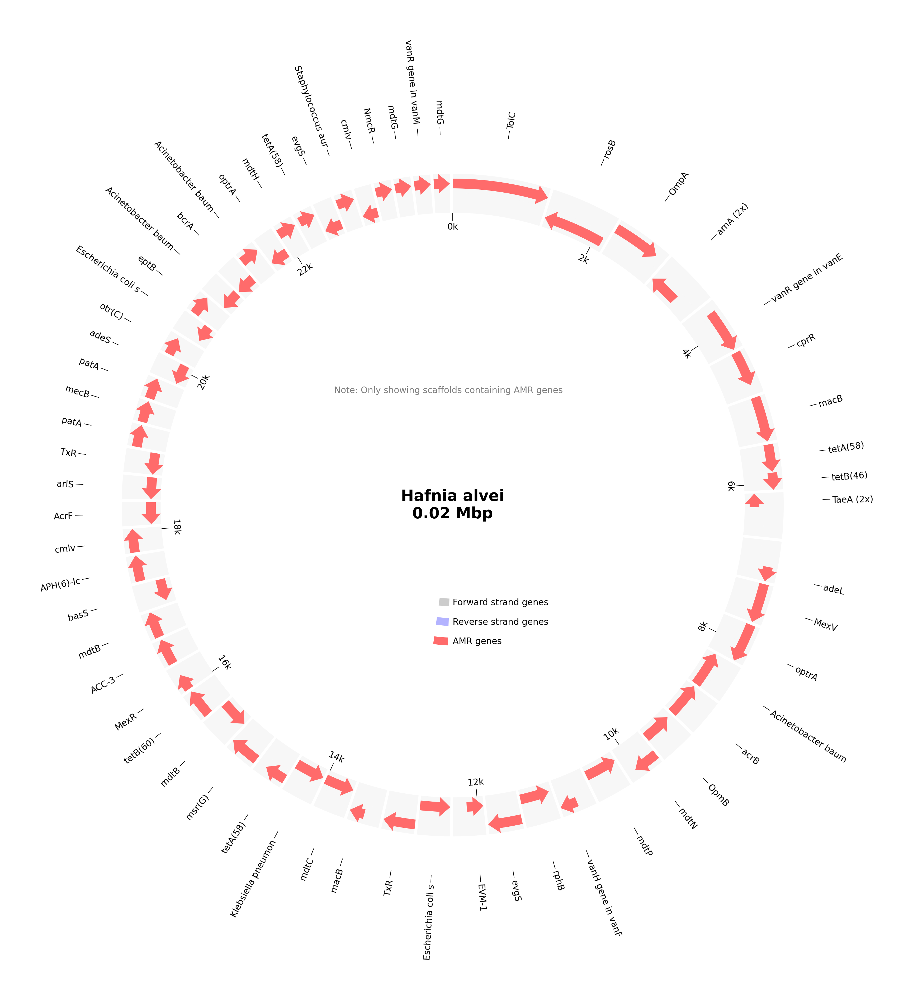

### ACC-3
- **Mechanism**: antibiotic inactivation
- **Drug Classes**: monobactam; cephalosporin; penam
- **AMR Family**: ACC beta-lactamase
- **Locations**:
  - gnl|SPADES|FPFIAAFN_30278_1 : position 1-345

### APH(6)-Ic
- **Mechanism**: antibiotic inactivation
- **Drug Classes**: aminoglycoside antibiotic
- **AMR Family**: APH(6)
- **Locations**:
  - gnl|SPADES|FPFIAAFN_31058_1 : position 3-338

### Acinetobacter baumannii AbaF (found in 2 locations)
- **Mechanism**: antibiotic efflux
- **Drug Classes**: phosphonic acid antibiotic
- **AMR Family**: major facilitator superfamily (MFS) antibiotic efflux pump
- **Locations**:
  - gnl|SPADES|FPFIAAFN_45871_1 : position 1-264
  - gnl|SPADES|FPFIAAFN_48138_1 : position 3-257

### Acinetobacter baumannii AbaQ
- **Mechanism**: antibiotic efflux
- **Drug Classes**: fluoroquinolone antibiotic
- **AMR Family**: major facilitator superfamily (MFS) antibiotic efflux pump
- **Locations**:
  - gnl|SPADES|FPFIAAFN_18946_1 : position 3-494

### AcrF
- **Mechanism**: antibiotic efflux
- **Drug Classes**: fluoroquinolone antibiotic; cephalosporin; cephamycin; penam
- **AMR Family**: resistance-nodulation-cell division (RND) antibiotic efflux pump
- **Locations**:
  - gnl|SPADES|FPFIAAFN_35048_1 : position 2-307

### EVM-1
- **Mechanism**: antibiotic inactivation
- **Drug Classes**: carbapenem
- **AMR Family**: EVM beta-lactamase
- **Locations**:
  - gnl|SPADES|FPFIAAFN_23564_1 : position 1-231

### Escherichia coli soxS with mutation conferring antibiotic resistance (found in 2 locations)
- **Mechanism**: antibiotic target alteration; antibiotic efflux; reduced permeability to antibiotic
- **Drug Classes**: fluoroquinolone antibiotic; monobactam; carbapenem; cephalosporin; glycylcycline; cephamycin; penam; tetracycline antibiotic; rifamycin antibiotic; phenicol antibiotic; penem; disinfecting agents and antiseptics
- **AMR Family**: ATP-binding cassette (ABC) antibiotic efflux pump; major facilitator superfamily (MFS) antibiotic efflux pump; resistance-nodulation-cell division (RND) antibiotic efflux pump; General Bacterial Porin with reduced permeability to beta-lactams
- **Locations**:
  - gnl|SPADES|FPFIAAFN_23604_1 : position 2-415
  - gnl|SPADES|FPFIAAFN_42829_1 : position 50-271

### Klebsiella pneumoniae OmpK37
- **Mechanism**: reduced permeability to antibiotic
- **Drug Classes**: monobactam; carbapenem; cephalosporin; cephamycin; penam; penem
- **AMR Family**: General Bacterial Porin with reduced permeability to beta-lactams
- **Locations**:
  - gnl|SPADES|FPFIAAFN_24323_1 : position 2-406

### MexR
- **Mechanism**: antibiotic target alteration; antibiotic efflux
- **Drug Classes**: macrolide antibiotic; fluoroquinolone antibiotic; monobactam; carbapenem; cephalosporin; cephamycin; penam; tetracycline antibiotic; peptide antibiotic; aminocoumarin antibiotic; diaminopyrimidine antibiotic; sulfonamide antibiotic; phenicol antibiotic; penem
- **AMR Family**: resistance-nodulation-cell division (RND) antibiotic efflux pump
- **Locations**:
  - gnl|SPADES|FPFIAAFN_29369_1 : position 3-218

### MexV
- **Mechanism**: antibiotic efflux
- **Drug Classes**: macrolide antibiotic; fluoroquinolone antibiotic; tetracycline antibiotic; phenicol antibiotic; disinfecting agents and antiseptics
- **AMR Family**: resistance-nodulation-cell division (RND) antibiotic efflux pump
- **Locations**:
  - gnl|SPADES|FPFIAAFN_17988_1 : position 1-513

### NmcR
- **Mechanism**: antibiotic inactivation
- **Drug Classes**: carbapenem; cephalosporin; cephamycin; penam
- **AMR Family**: NmcA beta-lactamase
- **Locations**:
  - gnl|SPADES|FPFIAAFN_67370_1 : position 1-216

### OmpA
- **Mechanism**: reduced permeability to antibiotic
- **Drug Classes**: peptide antibiotic
- **AMR Family**: General Bacterial Porin with reduced permeability to peptide antibiotics
- **Locations**:
  - gnl|SPADES|FPFIAAFN_11364_1 : position 3-623

### OpmB
- **Mechanism**: antibiotic efflux
- **Drug Classes**: macrolide antibiotic; monobactam; tetracycline antibiotic; aminocoumarin antibiotic
- **AMR Family**: resistance-nodulation-cell division (RND) antibiotic efflux pump
- **Locations**:
  - gnl|SPADES|FPFIAAFN_20748_2 : position 56-460

### Staphylococcus aureus mupB conferring resistance to mupirocin
- **Mechanism**: antibiotic target alteration
- **Drug Classes**: mupirocin-like antibiotic
- **AMR Family**: antibiotic-resistant isoleucyl-tRNA synthetase (ileS)
- **Locations**:
  - gnl|SPADES|FPFIAAFN_58378_1 : position 3-233

### TaeA (found in 2 locations)
- **Mechanism**: antibiotic efflux
- **Drug Classes**: pleuromutilin antibiotic
- **AMR Family**: ATP-binding cassette (ABC) antibiotic efflux pump
- **Locations**:
  - gnl|SPADES|FPFIAAFN_15367_1 : position 3-191
  - gnl|SPADES|FPFIAAFN_15367_2 : position 238-582

### TolC
- **Mechanism**: antibiotic efflux
- **Drug Classes**: macrolide antibiotic; fluoroquinolone antibiotic; aminoglycoside antibiotic; carbapenem; cephalosporin; glycylcycline; cephamycin; penam; tetracycline antibiotic; peptide antibiotic; aminocoumarin antibiotic; rifamycin antibiotic; phenicol antibiotic; penem; disinfecting agents and antiseptics
- **AMR Family**: ATP-binding cassette (ABC) antibiotic efflux pump; major facilitator superfamily (MFS) antibiotic efflux pump; resistance-nodulation-cell division (RND) antibiotic efflux pump
- **Locations**:
  - gnl|SPADES|FPFIAAFN_6153_1 : position 2-1246

### TxR (found in 2 locations)
- **Mechanism**: antibiotic efflux
- **Drug Classes**: tetracycline antibiotic
- **AMR Family**: ATP-binding cassette (ABC) antibiotic efflux pump
- **Locations**:
  - gnl|SPADES|FPFIAAFN_23677_1 : position 1-414
  - gnl|SPADES|FPFIAAFN_36268_1 : position 1-297

### acrB
- **Mechanism**: antibiotic efflux
- **Drug Classes**: fluoroquinolone antibiotic; cephalosporin; glycylcycline; penam; tetracycline antibiotic; rifamycin antibiotic; phenicol antibiotic; disinfecting agents and antiseptics
- **AMR Family**: resistance-nodulation-cell division (RND) antibiotic efflux pump
- **Locations**:
  - gnl|SPADES|FPFIAAFN_20100_1 : position 3-473

### adeL
- **Mechanism**: antibiotic efflux
- **Drug Classes**: fluoroquinolone antibiotic; tetracycline antibiotic
- **AMR Family**: resistance-nodulation-cell division (RND) antibiotic efflux pump
- **Locations**:
  - gnl|SPADES|FPFIAAFN_17284_2 : position 343-531

### adeS
- **Mechanism**: antibiotic efflux
- **Drug Classes**: glycylcycline; tetracycline antibiotic
- **AMR Family**: resistance-nodulation-cell division (RND) antibiotic efflux pump
- **Locations**:
  - gnl|SPADES|FPFIAAFN_41573_1 : position 2-274

### arlS
- **Mechanism**: antibiotic efflux
- **Drug Classes**: fluoroquinolone antibiotic; disinfecting agents and antiseptics
- **AMR Family**: major facilitator superfamily (MFS) antibiotic efflux pump
- **Locations**:
  - gnl|SPADES|FPFIAAFN_35559_1 : position 3-302

### arnA (found in 2 locations)
- **Mechanism**: antibiotic target alteration
- **Drug Classes**: peptide antibiotic
- **AMR Family**: pmr phosphoethanolamine transferase
- **Locations**:
  - gnl|SPADES|FPFIAAFN_12079_1 : position 2-418
  - gnl|SPADES|FPFIAAFN_12079_2 : position 381-704

### basS
- **Mechanism**: antibiotic target alteration; antibiotic efflux
- **Drug Classes**: peptide antibiotic
- **AMR Family**: pmr phosphoethanolamine transferase
- **Locations**:
  - gnl|SPADES|FPFIAAFN_30583_2 : position 45-341

### bcrA
- **Mechanism**: antibiotic efflux
- **Drug Classes**: peptide antibiotic
- **AMR Family**: ATP-binding cassette (ABC) antibiotic efflux pump
- **Locations**:
  - gnl|SPADES|FPFIAAFN_46291_1 : position 3-263

### cmlv (found in 2 locations)
- **Mechanism**: antibiotic inactivation
- **Drug Classes**: phenicol antibiotic
- **AMR Family**: chloramphenicol phosphotransferase
- **Locations**:
  - gnl|SPADES|FPFIAAFN_34420_1 : position 3-311
  - gnl|SPADES|FPFIAAFN_67415_1 : position 1-216

### cprR
- **Mechanism**: antibiotic target alteration; antibiotic efflux
- **Drug Classes**: peptide antibiotic
- **AMR Family**: pmr phosphoethanolamine transferase
- **Locations**:
  - gnl|SPADES|FPFIAAFN_14965_1 : position 3-464

### eptB
- **Mechanism**: antibiotic target alteration
- **Drug Classes**: peptide antibiotic
- **AMR Family**: pmr phosphoethanolamine transferase
- **Locations**:
  - gnl|SPADES|FPFIAAFN_44278_1 : position 3-266

### evgS (found in 2 locations)
- **Mechanism**: antibiotic efflux
- **Drug Classes**: macrolide antibiotic; fluoroquinolone antibiotic; penam; tetracycline antibiotic
- **AMR Family**: major facilitator superfamily (MFS) antibiotic efflux pump; resistance-nodulation-cell division (RND) antibiotic efflux pump
- **Locations**:
  - gnl|SPADES|FPFIAAFN_22018_1 : position 3-440
  - gnl|SPADES|FPFIAAFN_55059_1 : position 1-243

### macB (found in 2 locations)
- **Mechanism**: antibiotic efflux
- **Drug Classes**: macrolide antibiotic
- **AMR Family**: ATP-binding cassette (ABC) antibiotic efflux pump
- **Locations**:
  - gnl|SPADES|FPFIAAFN_15032_1 : position 1-591
  - gnl|SPADES|FPFIAAFN_24008_2 : position 217-411

### mdtB (found in 2 locations)
- **Mechanism**: antibiotic efflux
- **Drug Classes**: aminocoumarin antibiotic
- **AMR Family**: resistance-nodulation-cell division (RND) antibiotic efflux pump
- **Locations**:
  - gnl|SPADES|FPFIAAFN_26018_1 : position 2-385
  - gnl|SPADES|FPFIAAFN_30276_1 : position 3-344

### mdtC
- **Mechanism**: antibiotic efflux
- **Drug Classes**: aminocoumarin antibiotic
- **AMR Family**: resistance-nodulation-cell division (RND) antibiotic efflux pump
- **Locations**:
  - gnl|SPADES|FPFIAAFN_24101_1 : position 3-410

### mdtG (found in 2 locations)
- **Mechanism**: antibiotic efflux
- **Drug Classes**: phosphonic acid antibiotic
- **AMR Family**: major facilitator superfamily (MFS) antibiotic efflux pump
- **Locations**:
  - gnl|SPADES|FPFIAAFN_68585_1 : position 2-214
  - gnl|SPADES|FPFIAAFN_71341_1 : position 2-208

### mdtH
- **Mechanism**: antibiotic efflux
- **Drug Classes**: fluoroquinolone antibiotic
- **AMR Family**: major facilitator superfamily (MFS) antibiotic efflux pump
- **Locations**:
  - gnl|SPADES|FPFIAAFN_53079_1 : position 2-247

### mdtN
- **Mechanism**: antibiotic efflux
- **Drug Classes**: nucleoside antibiotic; disinfecting agents and antiseptics
- **AMR Family**: major facilitator superfamily (MFS) antibiotic efflux pump
- **Locations**:
  - gnl|SPADES|FPFIAAFN_21289_1 : position 1-333

### mdtP
- **Mechanism**: antibiotic efflux
- **Drug Classes**: nucleoside antibiotic; disinfecting agents and antiseptics
- **AMR Family**: major facilitator superfamily (MFS) antibiotic efflux pump
- **Locations**:
  - gnl|SPADES|FPFIAAFN_21329_1 : position 3-449

### mecB
- **Mechanism**: antibiotic target replacement
- **Drug Classes**: penam
- **AMR Family**: methicillin resistant PBP2
- **Locations**:
  - gnl|SPADES|FPFIAAFN_39950_1 : position 2-280

### msr(G)
- **Mechanism**: antibiotic target protection
- **Drug Classes**: macrolide antibiotic; streptogramin antibiotic
- **AMR Family**: msr-type ABC-F protein
- **Locations**:
  - gnl|SPADES|FPFIAAFN_25252_1 : position 3-395

### optrA (found in 2 locations)
- **Mechanism**: antibiotic target protection
- **Drug Classes**: oxazolidinone antibiotic; phenicol antibiotic
- **AMR Family**: Miscellaneous ABC-F subfamily ATP-binding cassette ribosomal protection proteins
- **Locations**:
  - gnl|SPADES|FPFIAAFN_18063_1 : position 2-511
  - gnl|SPADES|FPFIAAFN_48639_1 : position 3-257

### otr(C)
- **Mechanism**: antibiotic efflux
- **Drug Classes**: tetracycline antibiotic
- **AMR Family**: ATP-binding cassette (ABC) antibiotic efflux pump
- **Locations**:
  - gnl|SPADES|FPFIAAFN_42818_1 : position 2-238

### patA (found in 2 locations)
- **Mechanism**: antibiotic efflux
- **Drug Classes**: fluoroquinolone antibiotic
- **AMR Family**: ATP-binding cassette (ABC) antibiotic efflux pump
- **Locations**:
  - gnl|SPADES|FPFIAAFN_37725_1 : position 1-288
  - gnl|SPADES|FPFIAAFN_40725_1 : position 3-278

### rosB
- **Mechanism**: antibiotic efflux
- **Drug Classes**: peptide antibiotic
- **AMR Family**: major facilitator superfamily (MFS) antibiotic efflux pump
- **Locations**:
  - gnl|SPADES|FPFIAAFN_9044_1 : position 2-847

### rphB
- **Mechanism**: antibiotic inactivation
- **Drug Classes**: rifamycin antibiotic
- **AMR Family**: rifampin phosphotransferase
- **Locations**:
  - gnl|SPADES|FPFIAAFN_21756_1 : position 39-443

### tetA(58) (found in 3 locations)
- **Mechanism**: antibiotic efflux
- **Drug Classes**: tetracycline antibiotic
- **AMR Family**: major facilitator superfamily (MFS) antibiotic efflux pump
- **Locations**:
  - gnl|SPADES|FPFIAAFN_15113_1 : position 3-359
  - gnl|SPADES|FPFIAAFN_24592_1 : position 1-288
  - gnl|SPADES|FPFIAAFN_53103_1 : position 31-246

### tetB(46)
- **Mechanism**: antibiotic efflux
- **Drug Classes**: tetracycline antibiotic
- **AMR Family**: ATP-binding cassette (ABC) antibiotic efflux pump
- **Locations**:
  - gnl|SPADES|FPFIAAFN_15113_2 : position 369-590

### tetB(60)
- **Mechanism**: antibiotic efflux
- **Drug Classes**: tetracycline antibiotic
- **AMR Family**: ATP-binding cassette (ABC) antibiotic efflux pump
- **Locations**:
  - gnl|SPADES|FPFIAAFN_27798_1 : position 1-369

### vanH gene in vanF cluster
- **Mechanism**: antibiotic target alteration
- **Drug Classes**: glycopeptide antibiotic
- **AMR Family**: vanH; glycopeptide resistance gene cluster
- **Locations**:
  - gnl|SPADES|FPFIAAFN_21726_2 : position 218-445

### vanR gene in vanE cluster
- **Mechanism**: antibiotic target alteration
- **Drug Classes**: glycopeptide antibiotic
- **AMR Family**: glycopeptide resistance gene cluster; vanR
- **Locations**:
  - gnl|SPADES|FPFIAAFN_12509_2 : position 124-684

### vanR gene in vanM cluster
- **Mechanism**: antibiotic target alteration
- **Drug Classes**: glycopeptide antibiotic
- **AMR Family**: glycopeptide resistance gene cluster; vanR
- **Locations**:
  - gnl|SPADES|FPFIAAFN_68191_1 : position 2-214

## Hafnia alvei FB1
**Strain Statistics:**
- Total genome length: 2.8 kbp
- Total scaffolds: 130
- Scaffolds with AMR genes: 8
- Total genes annotated: 2
- Total AMR genes: 8
- Unique AMR genes: 6
- Distinct AMR mechanisms: 3
- Distinct AMR families: 4
- Distinct drug classes: 4

**Circos Plot:**

### LpeA
- **Mechanism**: antibiotic efflux
- **Drug Classes**: macrolide antibiotic
- **AMR Family**: resistance-nodulation-cell division (RND) antibiotic efflux pump
- **Locations**:
  - gnl|SPADES|FPFIAAFN_51792_1 : position 2-250

### RanA (found in 2 locations)
- **Mechanism**: antibiotic efflux
- **Drug Classes**: aminoglycoside antibiotic
- **AMR Family**: ATP-binding cassette (ABC) antibiotic efflux pump
- **Locations**:
  - gnl|SPADES|FPFIAAFN_12231_1 : position 62-697
  - gnl|SPADES|FPFIAAFN_52517_1 : position 1-246

### carA
- **Mechanism**: antibiotic target protection
- **Drug Classes**: macrolide antibiotic
- **AMR Family**: Miscellaneous ABC-F subfamily ATP-binding cassette ribosomal protection proteins
- **Locations**:
  - gnl|SPADES|FPFIAAFN_31447_1 : position 2-334

### macA
- **Mechanism**: antibiotic efflux
- **Drug Classes**: macrolide antibiotic
- **AMR Family**: ATP-binding cassette (ABC) antibiotic efflux pump
- **Locations**:
  - gnl|SPADES|FPFIAAFN_42066_1 : position 3-272

### mdtC (found in 2 locations)
- **Mechanism**: antibiotic efflux
- **Drug Classes**: aminocoumarin antibiotic
- **AMR Family**: resistance-nodulation-cell division (RND) antibiotic efflux pump
- **Locations**:
  - gnl|SPADES|FPFIAAFN_32703_1 : position 1-324
  - gnl|SPADES|FPFIAAFN_36942_1 : position 1-294

### vanH gene in vanO cluster
- **Mechanism**: antibiotic target alteration
- **Drug Classes**: glycopeptide antibiotic
- **AMR Family**: vanH; glycopeptide resistance gene cluster
- **Locations**:
  - gnl|SPADES|FPFIAAFN_30952_1 : position 1-339

## Hafnia paralvei
**Strain Statistics:**
- Total genome length: 4516.3 kbp
- Total scaffolds: 107
- Scaffolds with AMR genes: 42
- Total genes annotated: 8239
- Total AMR genes: 426
- Unique AMR genes: 212
- Distinct AMR mechanisms: 11
- Distinct AMR families: 74
- Distinct drug classes: 37

**Circos Plot:**

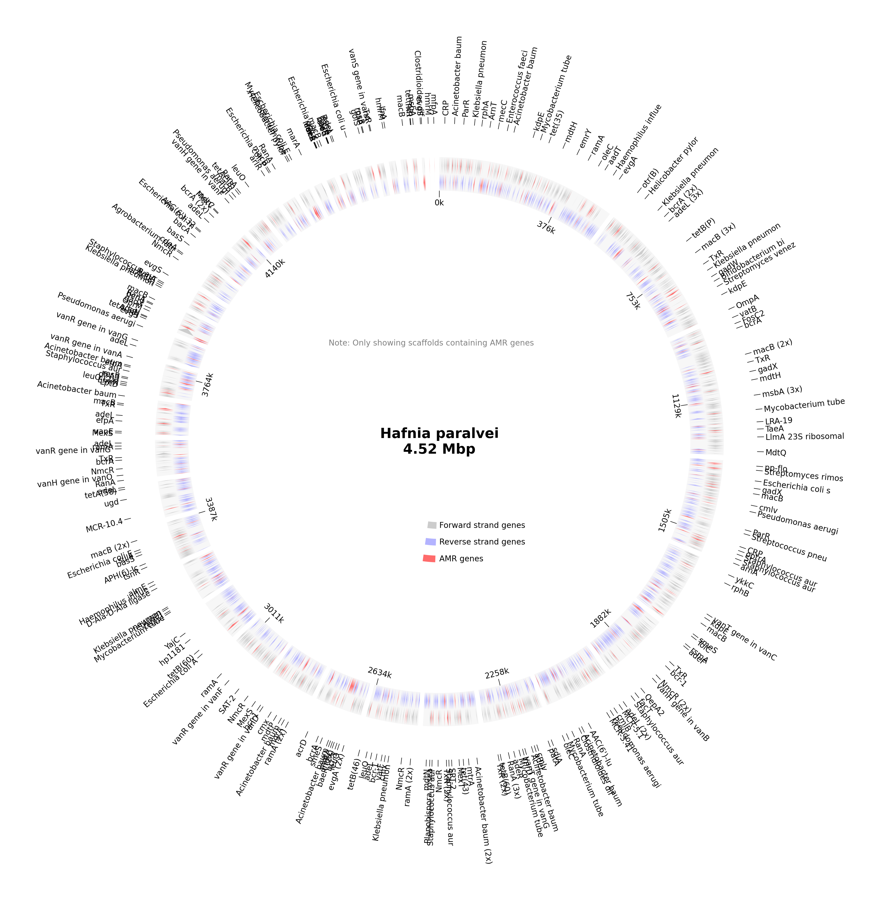

### AAC(6')-32
- **Mechanism**: antibiotic inactivation
- **Drug Classes**: aminoglycoside antibiotic
- **AMR Family**: AAC(6')
- **Locations**:
  - gnl|SPADES|FPFIAAFN_105_38 : position 46961-47563

### AAC(6')-Iu
- **Mechanism**: antibiotic inactivation
- **Drug Classes**: aminoglycoside antibiotic
- **AMR Family**: AAC(6')
- **Locations**:
  - gnl|SPADES|FPFIAAFN_16_106 : position 112080-112538

### ACC-1a
- **Mechanism**: antibiotic inactivation
- **Drug Classes**: monobactam; cephalosporin; cephamycin; penam; oxacephem
- **AMR Family**: ACC beta-lactamase
- **Locations**:
  - gnl|SPADES|FPFIAAFN_5_101: position 127735-128907

### ALI-2
- **Mechanism**: antibiotic inactivation
- **Drug Classes**: carbapenem
- **AMR Family**: ALI beta-lactamase
- **Locations**:
  - gnl|SPADES|FPFIAAFN_18_53 : position 53560-54438

### APH(6)-Ic
- **Mechanism**: antibiotic inactivation
- **Drug Classes**: aminoglycoside antibiotic
- **AMR Family**: APH(6)
- **Locations**:
  - gnl|SPADES|FPFIAAFN_33_29 : position 27546-28349

### Acinetobacter baumannii AbaF (found in 6 locations)
- **Mechanism**: antibiotic efflux
- **Drug Classes**: phosphonic acid antibiotic
- **AMR Family**: major facilitator superfamily (MFS) antibiotic efflux pump
- **Locations**:
  - gnl|SPADES|FPFIAAFN_18_61 : position 61913-63454
  - gnl|SPADES|FPFIAAFN_1_180 : position 191825-193327
  - gnl|SPADES|FPFIAAFN_24_50 : position 61890-63215
  - gnl|SPADES|FPFIAAFN_28_5 : position 3445-4674
  - gnl|SPADES|FPFIAAFN_44_88 : position 97373-98674
  - gnl|SPADES|FPFIAAFN_52_55 : position 62960-64294

### Acinetobacter baumannii AbaQ (found in 7 locations)
- **Mechanism**: antibiotic efflux
- **Drug Classes**: fluoroquinolone antibiotic
- **AMR Family**: major facilitator superfamily (MFS) antibiotic efflux pump
- **Locations**:
  - gnl|SPADES|FPFIAAFN_114_12 : position 12555-13850
  - gnl|SPADES|FPFIAAFN_16_126 : position 131281-132573
  - gnl|SPADES|FPFIAAFN_1_36 : position 38140-39468
  - gnl|SPADES|FPFIAAFN_20_16 : position 15908-17245
  - gnl|SPADES|FPFIAAFN_20_98 : position 110512-111735
  - gnl|SPADES|FPFIAAFN_26_47 : position 44459-45835
  - gnl|SPADES|FPFIAAFN_44_41 : position 34306-35652

### AcrE
- **Mechanism**: antibiotic efflux
- **Drug Classes**: fluoroquinolone antibiotic; cephalosporin; cephamycin; penam
- **AMR Family**: resistance-nodulation-cell division (RND) antibiotic efflux pump
- **Locations**:
  - gnl|SPADES|FPFIAAFN_2_253 : position 278764-279927

### AcrF
- **Mechanism**: antibiotic efflux
- **Drug Classes**: fluoroquinolone antibiotic; cephalosporin; cephamycin; penam
- **AMR Family**: resistance-nodulation-cell division (RND) antibiotic efflux pump
- **Locations**:
  - gnl|SPADES|FPFIAAFN_2_254 : position 279966-283088

### Agrobacterium fabrum chloramphenicol acetyltransferase
- **Mechanism**: antibiotic inactivation
- **Drug Classes**: phenicol antibiotic
- **AMR Family**: chloramphenicol acetyltransferase (CAT)
- **Locations**:
  - gnl|SPADES|FPFIAAFN_102_39 : position 41238-41792

### ArnT
- **Mechanism**: antibiotic target alteration
- **Drug Classes**: peptide antibiotic
- **AMR Family**: pmr phosphoethanolamine transferase
- **Locations**:
  - gnl|SPADES|FPFIAAFN_1_117: position 129028-130677

### Bifidobacterium bifidum ileS conferring resistance to mupirocin
- **Mechanism**: antibiotic target alteration
- **Drug Classes**: mupirocin-like antibiotic
- **AMR Family**: antibiotic-resistant isoleucyl-tRNA synthetase (ileS)
- **Locations**:
  - gnl|SPADES|FPFIAAFN_2_283 : position 309382-311964

### CRP (found in 2 locations)
- **Mechanism**: antibiotic efflux
- **Drug Classes**: macrolide antibiotic; fluoroquinolone antibiotic; penam
- **AMR Family**: resistance-nodulation-cell division (RND) antibiotic efflux pump
- **Locations**:
  - gnl|SPADES|FPFIAAFN_1_14 : position 13458-14255
  - gnl|SPADES|FPFIAAFN_5_178: position 220003-220635

### Clostridioides difficile gyrA conferring resistance to fluoroquinolones
- **Mechanism**: antibiotic target alteration
- **Drug Classes**: fluoroquinolone antibiotic
- **AMR Family**: fluoroquinolone resistant gyrA
- **Locations**:
  - gnl|SPADES|FPFIAAFN_1024_2 : position 3291-5939

### Clostridioides difficile gyrB conferring resistance to fluoroquinolones (found in 2 locations)
- **Mechanism**: antibiotic target alteration
- **Drug Classes**: fluoroquinolone antibiotic
- **AMR Family**: fluoroquinolone resistant gyrB
- **Locations**:
  - gnl|SPADES|FPFIAAFN_13_168 : position 190662-192557
  - gnl|SPADES|FPFIAAFN_16_134 : position 138172-140586

### D-Ala-D-Ala ligase
- **Mechanism**: antibiotic target alteration
- **Drug Classes**: glycopeptide antibiotic
- **AMR Family**: Van ligase
- **Locations**:
  - gnl|SPADES|FPFIAAFN_31_69 : position 87603-88523

### EVM-1
- **Mechanism**: antibiotic inactivation
- **Drug Classes**: carbapenem
- **AMR Family**: EVM beta-lactamase
- **Locations**:
  - gnl|SPADES|FPFIAAFN_3_163 : position 159162-159983

### Enterobacter cloacae acrA
- **Mechanism**: antibiotic efflux
- **Drug Classes**: fluoroquinolone antibiotic; cephalosporin; glycylcycline; penam; tetracycline antibiotic; rifamycin antibiotic; phenicol antibiotic; disinfecting agents and antiseptics
- **AMR Family**: resistance-nodulation-cell division (RND) antibiotic efflux pump
- **Locations**:
  - gnl|SPADES|FPFIAAFN_29_22 : position 22086-23276

### Enterococcus faecium cls conferring resistance to daptomycin
- **Mechanism**: antibiotic target alteration
- **Drug Classes**: peptide antibiotic
- **AMR Family**: daptomycin resistant cls
- **Locations**:
  - gnl|SPADES|FPFIAAFN_1_160 : position 174288-175748

### ErmX
- **Mechanism**: antibiotic target alteration
- **Drug Classes**: macrolide antibiotic; lincosamide antibiotic; streptogramin antibiotic; streptogramin A antibiotic; streptogramin B antibiotic
- **AMR Family**: Erm 23S ribosomal RNA methyltransferase
- **Locations**:
  - gnl|SPADES|FPFIAAFN_52_13 : position 15202-16014

### Escherichia coli AcrAB-TolC with AcrR mutation conferring resistance to ciprofloxacin, tetracycline, and ceftazidime
- **Mechanism**: antibiotic target alteration; antibiotic efflux
- **Drug Classes**: fluoroquinolone antibiotic; cephalosporin; glycylcycline; penam; tetracycline antibiotic; rifamycin antibiotic; phenicol antibiotic; disinfecting agents and antiseptics
- **AMR Family**: resistance-nodulation-cell division (RND) antibiotic efflux pump
- **Locations**:
  - gnl|SPADES|FPFIAAFN_29_21 : position 21242-21946

### Escherichia coli AcrAB-TolC with MarR mutations conferring resistance to ciprofloxacin and tetracycline (found in 2 locations)
- **Mechanism**: antibiotic target alteration; antibiotic efflux
- **Drug Classes**: fluoroquinolone antibiotic; cephalosporin; glycylcycline; penam; tetracycline antibiotic; rifamycin antibiotic; phenicol antibiotic; disinfecting agents and antiseptics
- **AMR Family**: resistance-nodulation-cell division (RND) antibiotic efflux pump
- **Locations**:
  - gnl|SPADES|FPFIAAFN_1_23 : position 23399-23890
  - gnl|SPADES|FPFIAAFN_22_109 : position 116957-117388

### Escherichia coli EF-Tu mutants conferring resistance to Enacyloxin IIa
- **Mechanism**: antibiotic target alteration
- **Drug Classes**: elfamycin antibiotic
- **AMR Family**: elfamycin resistant EF-Tu
- **Locations**:
  - gnl|SPADES|FPFIAAFN_33_64 : position 64855-67557

### Escherichia coli EF-Tu mutants conferring resistance to Pulvomycin (found in 2 locations)
- **Mechanism**: antibiotic target alteration
- **Drug Classes**: elfamycin antibiotic
- **AMR Family**: elfamycin resistant EF-Tu
- **Locations**:
  - gnl|SPADES|FPFIAAFN_198_24 : position 26867-28051
  - gnl|SPADES|FPFIAAFN_5_203 : position 242117-243301

### Escherichia coli PtsI with mutation conferring resistance to fosfomycin
- **Mechanism**: antibiotic target alteration
- **Drug Classes**: phosphonic acid antibiotic
- **AMR Family**: antibiotic-resistant ptsI phosphotransferase
- **Locations**:
  - gnl|SPADES|FPFIAAFN_154_13 : position 14736-16463

### Escherichia coli acrA
- **Mechanism**: antibiotic efflux
- **Drug Classes**: fluoroquinolone antibiotic; cephalosporin; glycylcycline; penam; tetracycline antibiotic; rifamycin antibiotic; phenicol antibiotic; disinfecting agents and antiseptics
- **AMR Family**: resistance-nodulation-cell division (RND) antibiotic efflux pump
- **Locations**:
  - gnl|SPADES|FPFIAAFN_15_7 : position 9200-10387

### Escherichia coli mdfA (found in 2 locations)
- **Mechanism**: antibiotic efflux
- **Drug Classes**: tetracycline antibiotic; phenicol antibiotic; disinfecting agents and antiseptics
- **AMR Family**: major facilitator superfamily (MFS) antibiotic efflux pump
- **Locations**:
  - gnl|SPADES|FPFIAAFN_105_36 : position 43677-44897
  - gnl|SPADES|FPFIAAFN_5_10 : position 13214-14446

### Escherichia coli soxS with mutation conferring antibiotic resistance (found in 4 locations)
- **Mechanism**: antibiotic target alteration; antibiotic efflux; reduced permeability to antibiotic
- **Drug Classes**: fluoroquinolone antibiotic; monobactam; carbapenem; cephalosporin; glycylcycline; cephamycin; penam; tetracycline antibiotic; rifamycin antibiotic; phenicol antibiotic; penem; disinfecting agents and antiseptics
- **AMR Family**: ATP-binding cassette (ABC) antibiotic efflux pump; major facilitator superfamily (MFS) antibiotic efflux pump; resistance-nodulation-cell division (RND) antibiotic efflux pump; General Bacterial Porin with reduced permeability to beta-lactams
- **Locations**:
  - gnl|SPADES|FPFIAAFN_1_185 : position 196710-197081
  - gnl|SPADES|FPFIAAFN_280_15 : position 16577-17455
  - gnl|SPADES|FPFIAAFN_2_261 : position 289575-290396
  - gnl|SPADES|FPFIAAFN_5_35 : position 47313-48176

### Escherichia coli uhpA with mutation conferring resistance to fosfomycin
- **Mechanism**: antibiotic target alteration
- **Drug Classes**: phosphonic acid antibiotic
- **AMR Family**: antibiotic-resistant UhpT
- **Locations**:
  - gnl|SPADES|FPFIAAFN_287_15 : position 13069-13785

### FosC2
- **Mechanism**: antibiotic inactivation
- **Drug Classes**: phosphonic acid antibiotic
- **AMR Family**: fosC phosphotransferase family
- **Locations**:
  - gnl|SPADES|FPFIAAFN_3_23 : position 23569-24033

### H-NS
- **Mechanism**: antibiotic efflux
- **Drug Classes**: macrolide antibiotic; fluoroquinolone antibiotic; cephalosporin; cephamycin; penam; tetracycline antibiotic
- **AMR Family**: major facilitator superfamily (MFS) antibiotic efflux pump; resistance-nodulation-cell division (RND) antibiotic efflux pump
- **Locations**:
  - gnl|SPADES|FPFIAAFN_18_110 : position 112748-113155

### Haemophilus influenzae PBP3 conferring resistance to beta-lactam antibiotics (found in 2 locations)
- **Mechanism**: antibiotic target alteration
- **Drug Classes**: cephalosporin; cephamycin; penam
- **AMR Family**: Penicillin-binding protein mutations conferring resistance to beta-lactam antibiotics
- **Locations**:
  - gnl|SPADES|FPFIAAFN_1_455 : position 469726-471498
  - gnl|SPADES|FPFIAAFN_31_77 : position 97664-99427

### Helicobacter pylori pbp1 mutants conferring resistance to amoxicillin (found in 2 locations)
- **Mechanism**: antibiotic target alteration
- **Drug Classes**: cephalosporin; cephamycin; penam
- **AMR Family**: Penicillin-binding protein mutations conferring resistance to beta-lactam antibiotics
- **Locations**:
  - gnl|SPADES|FPFIAAFN_2_25 : position 33240-35513
  - gnl|SPADES|FPFIAAFN_31_25 : position 34057-36636

### Helicobacter pylori pbp2 mutants conferring resistance to amoxicillin
- **Mechanism**: antibiotic target alteration
- **Drug Classes**: cephalosporin; cephamycin; penam
- **AMR Family**: Penicillin-binding protein mutations conferring resistance to beta-lactam antibiotics
- **Locations**:
  - gnl|SPADES|FPFIAAFN_2_277 : position 303998-305893

### Helicobacter pylori rpoB mutation conferring resistance to rifampicin
- **Mechanism**: antibiotic target alteration; antibiotic target replacement
- **Drug Classes**: fluoroquinolone antibiotic; rifamycin antibiotic
- **AMR Family**: rifamycin-resistant beta-subunit of RNA polymerase (rpoB)
- **Locations**:
  - gnl|SPADES|FPFIAAFN_198_16 : position 14357-18577

### Klebsiella aerogenes Omp36
- **Mechanism**: reduced permeability to antibiotic
- **Drug Classes**: monobactam; carbapenem; cephalosporin; cephamycin; penam; penem
- **AMR Family**: General Bacterial Porin with reduced permeability to beta-lactams
- **Locations**:
  - gnl|SPADES|FPFIAAFN_1_132 : position 146532-147680

### Klebsiella pneumoniae KpnE
- **Mechanism**: antibiotic efflux
- **Drug Classes**: macrolide antibiotic; aminoglycoside antibiotic; cephalosporin; tetracycline antibiotic; peptide antibiotic; rifamycin antibiotic; disinfecting agents and antiseptics
- **AMR Family**: small multidrug resistance (SMR) antibiotic efflux pump
- **Locations**:
  - gnl|SPADES|FPFIAAFN_1_276 : position 288215-288646

### Klebsiella pneumoniae KpnF
- **Mechanism**: antibiotic efflux
- **Drug Classes**: macrolide antibiotic; aminoglycoside antibiotic; cephalosporin; tetracycline antibiotic; peptide antibiotic; rifamycin antibiotic; disinfecting agents and antiseptics
- **AMR Family**: small multidrug resistance (SMR) antibiotic efflux pump
- **Locations**:
  - gnl|SPADES|FPFIAAFN_1_275: position 287899-288228

### Klebsiella pneumoniae KpnG
- **Mechanism**: antibiotic efflux
- **Drug Classes**: macrolide antibiotic; fluoroquinolone antibiotic; aminoglycoside antibiotic; carbapenem; cephalosporin; penam; peptide antibiotic; penem
- **AMR Family**: major facilitator superfamily (MFS) antibiotic efflux pump
- **Locations**:
  - gnl|SPADES|FPFIAAFN_2_61 : position 79501-80676

### Klebsiella pneumoniae KpnH (found in 2 locations)
- **Mechanism**: antibiotic efflux
- **Drug Classes**: macrolide antibiotic; fluoroquinolone antibiotic; aminoglycoside antibiotic; carbapenem; cephalosporin; penam; peptide antibiotic; penem
- **AMR Family**: major facilitator superfamily (MFS) antibiotic efflux pump
- **Locations**:
  - gnl|SPADES|FPFIAAFN_16_181 : position 190672-192111
  - gnl|SPADES|FPFIAAFN_2_60: position 77948-79483

### Klebsiella pneumoniae OmpK37 (found in 6 locations)
- **Mechanism**: reduced permeability to antibiotic
- **Drug Classes**: monobactam; carbapenem; cephalosporin; cephamycin; penam; penem
- **AMR Family**: General Bacterial Porin with reduced permeability to beta-lactams
- **Locations**:
  - gnl|SPADES|FPFIAAFN_101_15 : position 11740-12840
  - gnl|SPADES|FPFIAAFN_18_84 : position 84336-85439
  - gnl|SPADES|FPFIAAFN_1_79 : position 89198-90340
  - gnl|SPADES|FPFIAAFN_22_60 : position 67829-68941
  - gnl|SPADES|FPFIAAFN_31_24 : position 32736-33875
  - gnl|SPADES|FPFIAAFN_3_267 : position 284162-285277

### Klebsiella pneumoniae acrR with mutation conferring multidrug antibiotic resistance
- **Mechanism**: antibiotic target alteration; antibiotic efflux
- **Drug Classes**: fluoroquinolone antibiotic; cephalosporin; glycylcycline; penam; tetracycline antibiotic; rifamycin antibiotic; phenicol antibiotic; disinfecting agents and antiseptics
- **AMR Family**: resistance-nodulation-cell division (RND) antibiotic efflux pump
- **Locations**:
  - gnl|SPADES|FPFIAAFN_2_252 : position 277557-278171

### LRA-19
- **Mechanism**: antibiotic inactivation
- **Drug Classes**: cephalosporin; penam
- **AMR Family**: subclass B3 LRA beta-lactamase
- **Locations**:
  - gnl|SPADES|FPFIAAFN_3_265 : position 281954-282601

### LlmA 23S ribosomal RNA methyltransferase
- **Mechanism**: antibiotic target alteration
- **Drug Classes**: lincosamide antibiotic
- **AMR Family**: Llm 23S ribosomal RNA methyltransferase
- **Locations**:
  - gnl|SPADES|FPFIAAFN_3_296 : position 320198-321391

### LptD
- **Mechanism**: antibiotic efflux
- **Drug Classes**: carbapenem; peptide antibiotic; aminocoumarin antibiotic; rifamycin antibiotic
- **AMR Family**: ATP-binding cassette (ABC) antibiotic efflux pump
- **Locations**:
  - gnl|SPADES|FPFIAAFN_52_10 : position 10403-12805

### MCR-10.4
- **Mechanism**: antibiotic target alteration
- **Drug Classes**: peptide antibiotic
- **AMR Family**: MCR phosphoethanolamine transferase
- **Locations**:
  - gnl|SPADES|FPFIAAFN_39_24 : position 21013-22647

### MCR-3.4
- **Mechanism**: antibiotic target alteration
- **Drug Classes**: peptide antibiotic
- **AMR Family**: MCR phosphoethanolamine transferase
- **Locations**:
  - gnl|SPADES|FPFIAAFN_1_456 : position 471863-473470

### MCR-3.41
- **Mechanism**: antibiotic target alteration
- **Drug Classes**: peptide antibiotic
- **AMR Family**: MCR phosphoethanolamine transferase
- **Locations**:
  - gnl|SPADES|FPFIAAFN_16_52 : position 57364-58986

### MCR-5.1
- **Mechanism**: antibiotic target alteration
- **Drug Classes**: peptide antibiotic
- **AMR Family**: MCR phosphoethanolamine transferase
- **Locations**:
  - gnl|SPADES|FPFIAAFN_16_16 : position 19752-21479

### MdtK
- **Mechanism**: antibiotic efflux
- **Drug Classes**: fluoroquinolone antibiotic
- **AMR Family**: multidrug and toxic compound extrusion (MATE) transporter
- **Locations**:
  - gnl|SPADES|FPFIAAFN_2_245 : position 269929-271386

### MdtQ
- **Mechanism**: reduced permeability to antibiotic
- **Drug Classes**: monobactam; carbapenem; cephalosporin; cephamycin; penam; penem
- **AMR Family**: Outer Membrane Porin (Opr)
- **Locations**:
  - gnl|SPADES|FPFIAAFN_3_323 : position 357624-359129

### MexG
- **Mechanism**: antibiotic efflux
- **Drug Classes**: fluoroquinolone antibiotic; tetracycline antibiotic; disinfecting agents and antiseptics
- **AMR Family**: resistance-nodulation-cell division (RND) antibiotic efflux pump
- **Locations**:
  - gnl|SPADES|FPFIAAFN_1_175 : position 188739-189155

### MexS (found in 6 locations)
- **Mechanism**: antibiotic efflux
- **Drug Classes**: fluoroquinolone antibiotic; diaminopyrimidine antibiotic; phenicol antibiotic
- **AMR Family**: resistance-nodulation-cell division (RND) antibiotic efflux pump
- **Locations**:
  - gnl|SPADES|FPFIAAFN_13_116 : position 129308-130294
  - gnl|SPADES|FPFIAAFN_24_35 : position 40430-41449
  - gnl|SPADES|FPFIAAFN_26_124 : position 123358-124389
  - gnl|SPADES|FPFIAAFN_280_7 : position 8130-9131
  - gnl|SPADES|FPFIAAFN_3_27 : position 27461-28585
  - gnl|SPADES|FPFIAAFN_44_2 : position 2604-3581

### MexT
- **Mechanism**: antibiotic efflux
- **Drug Classes**: fluoroquinolone antibiotic; diaminopyrimidine antibiotic; phenicol antibiotic
- **AMR Family**: resistance-nodulation-cell division (RND) antibiotic efflux pump
- **Locations**:
  - gnl|SPADES|FPFIAAFN_20_58 : position 61995-62888

### MexV
- **Mechanism**: antibiotic efflux
- **Drug Classes**: macrolide antibiotic; fluoroquinolone antibiotic; tetracycline antibiotic; phenicol antibiotic; disinfecting agents and antiseptics
- **AMR Family**: resistance-nodulation-cell division (RND) antibiotic efflux pump
- **Locations**:
  - gnl|SPADES|FPFIAAFN_112_36 : position 39202-40719

### MexZ
- **Mechanism**: antibiotic efflux
- **Drug Classes**: macrolide antibiotic; fluoroquinolone antibiotic; aminoglycoside antibiotic; carbapenem; cephalosporin; cephamycin; penam; tetracycline antibiotic; phenicol antibiotic; disinfecting agents and antiseptics
- **AMR Family**: resistance-nodulation-cell division (RND) antibiotic efflux pump
- **Locations**:
  - gnl|SPADES|FPFIAAFN_13_120 : position 132611-133216

### Mycobacterium tuberculosis gidB mutation conferring resistance to streptomycin
- **Mechanism**: antibiotic target alteration
- **Drug Classes**: aminoglycoside antibiotic
- **AMR Family**: antibiotic resistant gidB
- **Locations**:
  - gnl|SPADES|FPFIAAFN_16_167 : position 174311-174931

### Mycobacterium tuberculosis ndh with mutation conferring resistance to isoniazid
- **Mechanism**: antibiotic target alteration
- **Drug Classes**: isoniazid-like antibiotic
- **AMR Family**: antibiotic resistant ndh
- **Locations**:
  - gnl|SPADES|FPFIAAFN_1_250 : position 262514-263818

### Mycobacterium tuberculosis pncA mutations conferring resistance to pyrazinamide
- **Mechanism**: antibiotic target alteration
- **Drug Classes**: pyrazine antibiotic
- **AMR Family**: Pyrazinamide resistant pncA
- **Locations**:
  - gnl|SPADES|FPFIAAFN_18_93 : position 95331-95966

### Mycobacterium tuberculosis rpoB mutations conferring resistance to rifampicin
- **Mechanism**: antibiotic target alteration; antibiotic target replacement
- **Drug Classes**: rifamycin antibiotic
- **AMR Family**: rifamycin-resistant beta-subunit of RNA polymerase (rpoB)
- **Locations**:
  - gnl|SPADES|FPFIAAFN_198_17 : position 18720-22748

### Mycobacterium tuberculosis rpsA mutations conferring resistance to pyrazinamide
- **Mechanism**: antibiotic target alteration
- **Drug Classes**: pyrazine antibiotic
- **AMR Family**: pyrazinamide resistant rpsA
- **Locations**:
  - gnl|SPADES|FPFIAAFN_3_240 : position 249700-251379

### Mycobacterium tuberculosis thyA with mutation conferring resistance to para-aminosalicylic acid
- **Mechanism**: antibiotic target alteration
- **Drug Classes**: salicylic acid antibiotic
- **AMR Family**: aminosalicylate resistant thymidylate synthase
- **Locations**:
  - gnl|SPADES|FPFIAAFN_31_11 : position 17357-18151

### NmcR (found in 8 locations)
- **Mechanism**: antibiotic inactivation
- **Drug Classes**: carbapenem; cephalosporin; cephamycin; penam
- **AMR Family**: NmcA beta-lactamase
- **Locations**:
  - gnl|SPADES|FPFIAAFN_102_25 : position 24308-25267
  - gnl|SPADES|FPFIAAFN_15_104 : position 124589-125482
  - gnl|SPADES|FPFIAAFN_15_92 : position 109583-110455
  - gnl|SPADES|FPFIAAFN_1_51 : position 51499-52404
  - gnl|SPADES|FPFIAAFN_20_102 : position 115602-116531
  - gnl|SPADES|FPFIAAFN_22_26 : position 34719-35693
  - gnl|SPADES|FPFIAAFN_28_2 : position 245-1072
  - gnl|SPADES|FPFIAAFN_40_37 : position 30301-31197

### OmpA (found in 4 locations)
- **Mechanism**: reduced permeability to antibiotic
- **Drug Classes**: peptide antibiotic
- **AMR Family**: General Bacterial Porin with reduced permeability to peptide antibiotics
- **Locations**:
  - gnl|SPADES|FPFIAAFN_16_110 : position 114929-115588
  - gnl|SPADES|FPFIAAFN_1_181 : position 193900-194391
  - gnl|SPADES|FPFIAAFN_2_352 : position 391559-392074
  - gnl|SPADES|FPFIAAFN_3_286 : position 310081-311139

### OprM
- **Mechanism**: antibiotic efflux
- **Drug Classes**: macrolide antibiotic; fluoroquinolone antibiotic; monobactam; aminoglycoside antibiotic; carbapenem; cephalosporin; cephamycin; penam; tetracycline antibiotic; peptide antibiotic; aminocoumarin antibiotic; diaminopyrimidine antibiotic; sulfonamide antibiotic; phenicol antibiotic; penem; disinfecting agents and antiseptics
- **AMR Family**: resistance-nodulation-cell division (RND) antibiotic efflux pump
- **Locations**:
  - gnl|SPADES|FPFIAAFN_81_9 : position 23785-25146

### ParR (found in 2 locations)
- **Mechanism**: antibiotic efflux; reduced permeability to antibiotic
- **Drug Classes**: macrolide antibiotic; fluoroquinolone antibiotic; monobactam; aminoglycoside antibiotic; carbapenem; cephalosporin; cephamycin; penam; tetracycline antibiotic; phenicol antibiotic; penem; disinfecting agents and antiseptics
- **AMR Family**: resistance-nodulation-cell division (RND) antibiotic efflux pump; Outer Membrane Porin (Opr)
- **Locations**:
  - gnl|SPADES|FPFIAAFN_1_59 : position 62086-62799
  - gnl|SPADES|FPFIAAFN_5_139 : position 174997-175716

### ParS (found in 2 locations)
- **Mechanism**: antibiotic efflux; reduced permeability to antibiotic
- **Drug Classes**: macrolide antibiotic; fluoroquinolone antibiotic; monobactam; aminoglycoside antibiotic; carbapenem; cephalosporin; cephamycin; penam; tetracycline antibiotic; phenicol antibiotic; penem; disinfecting agents and antiseptics
- **AMR Family**: resistance-nodulation-cell division (RND) antibiotic efflux pump; Outer Membrane Porin (Opr)
- **Locations**:
  - gnl|SPADES|FPFIAAFN_13_128 : position 138238-139899
  - gnl|SPADES|FPFIAAFN_1_60 : position 62806-64134

### Planobispora rosea EF-Tu mutants conferring resistance to inhibitor GE2270A
- **Mechanism**: antibiotic target alteration
- **Drug Classes**: elfamycin antibiotic
- **AMR Family**: elfamycin resistant EF-Tu
- **Locations**:
  - gnl|SPADES|FPFIAAFN_20_118 : position 136326-138194

### PmrF
- **Mechanism**: antibiotic target alteration
- **Drug Classes**: peptide antibiotic
- **AMR Family**: pmr phosphoethanolamine transferase
- **Locations**:
  - gnl|SPADES|FPFIAAFN_1_120 : position 133573-134589

### Pseudomonas aeruginosa CpxR
- **Mechanism**: antibiotic efflux
- **Drug Classes**: macrolide antibiotic; fluoroquinolone antibiotic; monobactam; aminoglycoside antibiotic; carbapenem; cephalosporin; cephamycin; penam; tetracycline antibiotic; peptide antibiotic; aminocoumarin antibiotic; diaminopyrimidine antibiotic; sulfonamide antibiotic; phenicol antibiotic; penem
- **AMR Family**: resistance-nodulation-cell division (RND) antibiotic efflux pump
- **Locations**:
  - gnl|SPADES|FPFIAAFN_16_41 : position 47077-47775

### Pseudomonas aeruginosa ampR with mutation conferring resistance to aztreonam (found in 3 locations)
- **Mechanism**: antibiotic target alteration; antibiotic inactivation
- **Drug Classes**: monobactam; carbapenem; cephalosporin
- **AMR Family**: PDC beta-lactamase; ampR transcriptional regulator with mutation conferring resistance to monobactam antibiotics
- **Locations**:
  - gnl|SPADES|FPFIAAFN_114_24 : position 25860-26807
  - gnl|SPADES|FPFIAAFN_5_100 : position 126654-127520
  - gnl|SPADES|FPFIAAFN_78_54 : position 60535-61452

### QepA2
- **Mechanism**: antibiotic efflux
- **Drug Classes**: fluoroquinolone antibiotic
- **AMR Family**: major facilitator superfamily (MFS) antibiotic efflux pump
- **Locations**:
  - gnl|SPADES|FPFIAAFN_15_134 : position 161180-162586

### QepA4
- **Mechanism**: antibiotic efflux
- **Drug Classes**: fluoroquinolone antibiotic
- **AMR Family**: major facilitator superfamily (MFS) antibiotic efflux pump
- **Locations**:
  - gnl|SPADES|FPFIAAFN_1_52 : position 52574-53857

### RanA (found in 13 locations)
- **Mechanism**: antibiotic efflux
- **Drug Classes**: aminoglycoside antibiotic
- **AMR Family**: ATP-binding cassette (ABC) antibiotic efflux pump
- **Locations**:
  - gnl|SPADES|FPFIAAFN_101_27 : position 21770-22600
  - gnl|SPADES|FPFIAAFN_114_49 : position 50401-51477
  - gnl|SPADES|FPFIAAFN_154_31 : position 33575-34510
  - gnl|SPADES|FPFIAAFN_16_152 : position 158985-159761
  - gnl|SPADES|FPFIAAFN_18_117 : position 123195-124181
  - gnl|SPADES|FPFIAAFN_18_118 : position 124178-125182
  - gnl|SPADES|FPFIAAFN_18_130 : position 135468-136607
  - gnl|SPADES|FPFIAAFN_22_92 : position 100908-101534
  - gnl|SPADES|FPFIAAFN_284_15 : position 13521-14546
  - gnl|SPADES|FPFIAAFN_3_184 : position 182971-184104
  - gnl|SPADES|FPFIAAFN_40_1 : position 325-1134
  - gnl|SPADES|FPFIAAFN_5_65 : position 81300-82307
  - gnl|SPADES|FPFIAAFN_81_28 : position 44480-46093

### RanB
- **Mechanism**: antibiotic efflux
- **Drug Classes**: aminoglycoside antibiotic
- **AMR Family**: ATP-binding cassette (ABC) antibiotic efflux pump
- **Locations**:
  - gnl|SPADES|FPFIAAFN_101_28 : position 22605-23387

### RlmA(II)
- **Mechanism**: antibiotic target alteration
- **Drug Classes**: macrolide antibiotic; lincosamide antibiotic
- **AMR Family**: non-erm 23S ribosomal RNA methyltransferase (G748)
- **Locations**:
  - gnl|SPADES|FPFIAAFN_22_30 : position 38436-39248

### SAT-2
- **Mechanism**: antibiotic inactivation
- **Drug Classes**: nucleoside antibiotic
- **AMR Family**: streptothricin acetyltransferase (SAT)
- **Locations**:
  - gnl|SPADES|FPFIAAFN_28_27 : position 29843-30571

### SRT-2
- **Mechanism**: antibiotic inactivation
- **Drug Classes**: cephalosporin
- **AMR Family**: SRT beta-lactamase
- **Locations**:
  - gnl|SPADES|FPFIAAFN_20_76 : position 80931-82070

### SatA
- **Mechanism**: antibiotic inactivation
- **Drug Classes**: nucleoside antibiotic
- **AMR Family**: streptothricin acetyltransferase (SAT)
- **Locations**:
  - gnl|SPADES|FPFIAAFN_1_191 : position 201778-202221

### Staphylococcus aureus GlpT with mutation conferring resistance to fosfomycin
- **Mechanism**: antibiotic target alteration
- **Drug Classes**: phosphonic acid antibiotic
- **AMR Family**: antibiotic-resistant GlpT
- **Locations**:
  - gnl|SPADES|FPFIAAFN_20_113 : position 130754-132109

### Staphylococcus aureus fusA with mutation conferring resistance to fusidic acid (found in 2 locations)
- **Mechanism**: antibiotic target alteration
- **Drug Classes**: fusidane antibiotic
- **AMR Family**: antibiotic resistant fusA
- **Locations**:
  - gnl|SPADES|FPFIAAFN_15_165 : position 192626-194215
  - gnl|SPADES|FPFIAAFN_5_202 : position 239932-242046

### Staphylococcus aureus fusE with mutation conferring resistance to fusidic acid
- **Mechanism**: antibiotic target alteration
- **Drug Classes**: fusidane antibiotic
- **AMR Family**: antibiotic resistant fusE
- **Locations**:
  - gnl|SPADES|FPFIAAFN_5_223 : position 252473-253006

### Staphylococcus aureus mupA conferring resistance to mupirocin
- **Mechanism**: antibiotic target alteration
- **Drug Classes**: mupirocin-like antibiotic
- **AMR Family**: antibiotic-resistant isoleucyl-tRNA synthetase (ileS)
- **Locations**:
  - gnl|SPADES|FPFIAAFN_52_44 : position 47641-50490

### Staphylococcus aureus mupB conferring resistance to mupirocin
- **Mechanism**: antibiotic target alteration
- **Drug Classes**: mupirocin-like antibiotic
- **AMR Family**: antibiotic-resistant isoleucyl-tRNA synthetase (ileS)
- **Locations**:
  - gnl|SPADES|FPFIAAFN_20_81 : position 87109-89964

### Staphylococcus aureus murA with mutation conferring resistance to fosfomycin
- **Mechanism**: antibiotic target alteration
- **Drug Classes**: phosphonic acid antibiotic
- **AMR Family**: antibiotic-resistant murA transferase
- **Locations**:
  - gnl|SPADES|FPFIAAFN_101_33 : position 25524-26783

### Staphylococcus aureus pgsA mutations conferring resistance to daptomycin
- **Mechanism**: antibiotic target alteration
- **Drug Classes**: peptide antibiotic
- **AMR Family**: daptomycin resistant pgsA
- **Locations**:
  - gnl|SPADES|FPFIAAFN_1_469 : position 486426-486974

### Staphylococcus aureus walK with mutation conferring resistance to daptomycin
- **Mechanism**: antibiotic target alteration
- **Drug Classes**: peptide antibiotic
- **AMR Family**: daptomycin resistant walK
- **Locations**:
  - gnl|SPADES|FPFIAAFN_20_87 : position 95549-97423

### Streptococcus pneumoniae PBP2x conferring resistance to amoxicillin
- **Mechanism**: antibiotic target alteration
- **Drug Classes**: cephalosporin; cephamycin; penam
- **AMR Family**: Penicillin-binding protein mutations conferring resistance to beta-lactam antibiotics
- **Locations**:
  - gnl|SPADES|FPFIAAFN_5_147 : position 184498-187068

### Streptomyces rimosus otr(A)
- **Mechanism**: antibiotic target protection
- **Drug Classes**: tetracycline antibiotic
- **AMR Family**: tetracycline-resistant ribosomal protection protein
- **Locations**:
  - gnl|SPADES|FPFIAAFN_5_16 : position 19602-21425

### Streptomyces venezuelae rox (found in 3 locations)
- **Mechanism**: antibiotic inactivation
- **Drug Classes**: rifamycin antibiotic
- **AMR Family**: rifampin monooxygenase
- **Locations**:
  - gnl|SPADES|FPFIAAFN_15_96 : position 115706-116911
  - gnl|SPADES|FPFIAAFN_15_97 : position 116998-118176
  - gnl|SPADES|FPFIAAFN_2_297 : position 325810-326985

### TaeA (found in 2 locations)
- **Mechanism**: antibiotic efflux
- **Drug Classes**: pleuromutilin antibiotic
- **AMR Family**: ATP-binding cassette (ABC) antibiotic efflux pump
- **Locations**:
  - gnl|SPADES|FPFIAAFN_280_9 : position 10224-11891
  - gnl|SPADES|FPFIAAFN_3_277 : position 299732-301639

### TolC
- **Mechanism**: antibiotic efflux
- **Drug Classes**: macrolide antibiotic; fluoroquinolone antibiotic; aminoglycoside antibiotic; carbapenem; cephalosporin; glycylcycline; cephamycin; penam; tetracycline antibiotic; peptide antibiotic; aminocoumarin antibiotic; rifamycin antibiotic; phenicol antibiotic; penem; disinfecting agents and antiseptics
- **AMR Family**: ATP-binding cassette (ABC) antibiotic efflux pump; major facilitator superfamily (MFS) antibiotic efflux pump; resistance-nodulation-cell division (RND) antibiotic efflux pump
- **Locations**:
  - gnl|SPADES|FPFIAAFN_13_173 : position 195490-196971

### TxR (found in 13 locations)
- **Mechanism**: antibiotic efflux
- **Drug Classes**: tetracycline antibiotic
- **AMR Family**: ATP-binding cassette (ABC) antibiotic efflux pump
- **Locations**:
  - gnl|SPADES|FPFIAAFN_13_174 : position 197132-199087
  - gnl|SPADES|FPFIAAFN_15_50 : position 60488-62749
  - gnl|SPADES|FPFIAAFN_18_142 : position 150246-151247
  - gnl|SPADES|FPFIAAFN_18_153 : position 160647-162233
  - gnl|SPADES|FPFIAAFN_20_86 : position 94158-95552
  - gnl|SPADES|FPFIAAFN_20_93 : position 104066-105511
  - gnl|SPADES|FPFIAAFN_2_235 : position 258247-259779
  - gnl|SPADES|FPFIAAFN_329_3 : position 3429-4769
  - gnl|SPADES|FPFIAAFN_3_133 : position 126740-129574
  - gnl|SPADES|FPFIAAFN_40_65 : position 58758-60209
  - gnl|SPADES|FPFIAAFN_44_70 : position 73494-75272
  - gnl|SPADES|FPFIAAFN_458_4 : position 4342-5919
  - gnl|SPADES|FPFIAAFN_5_19 : position 24584-26005

### YajC
- **Mechanism**: antibiotic efflux
- **Drug Classes**: fluoroquinolone antibiotic; cephalosporin; glycylcycline; penam; tetracycline antibiotic; oxazolidinone antibiotic; glycopeptide antibiotic; rifamycin antibiotic; phenicol antibiotic; disinfecting agents and antiseptics
- **AMR Family**: resistance-nodulation-cell division (RND) antibiotic efflux pump
- **Locations**:
  - gnl|SPADES|FPFIAAFN_29_83 : position 90179-90511

### YojI
- **Mechanism**: antibiotic efflux
- **Drug Classes**: peptide antibiotic
- **AMR Family**: ATP-binding cassette (ABC) antibiotic efflux pump
- **Locations**:
  - gnl|SPADES|FPFIAAFN_1_143 : position 157499-158092

### aadT
- **Mechanism**: antibiotic efflux
- **Drug Classes**: macrolide antibiotic; tetracycline antibiotic; disinfecting agents and antiseptics
- **AMR Family**: major facilitator superfamily (MFS) antibiotic efflux pump
- **Locations**:
  - gnl|SPADES|FPFIAAFN_1_430 : position 444827-446296

### abeS
- **Mechanism**: antibiotic efflux
- **Drug Classes**: macrolide antibiotic; aminocoumarin antibiotic
- **AMR Family**: small multidrug resistance (SMR) antibiotic efflux pump
- **Locations**:
  - gnl|SPADES|FPFIAAFN_1_188 : position 198387-198731

### acrB
- **Mechanism**: antibiotic efflux
- **Drug Classes**: fluoroquinolone antibiotic; cephalosporin; glycylcycline; penam; tetracycline antibiotic; rifamycin antibiotic; phenicol antibiotic; disinfecting agents and antiseptics
- **AMR Family**: resistance-nodulation-cell division (RND) antibiotic efflux pump
- **Locations**:
  - gnl|SPADES|FPFIAAFN_29_23 : position 23322-26474

### acrD
- **Mechanism**: antibiotic efflux
- **Drug Classes**: aminoglycoside antibiotic
- **AMR Family**: resistance-nodulation-cell division (RND) antibiotic efflux pump
- **Locations**:
  - gnl|SPADES|FPFIAAFN_24_95 : position 118298-121444

### adeF
- **Mechanism**: antibiotic efflux
- **Drug Classes**: fluoroquinolone antibiotic; tetracycline antibiotic
- **AMR Family**: resistance-nodulation-cell division (RND) antibiotic efflux pump
- **Locations**:
  - gnl|SPADES|FPFIAAFN_15_6: position 6023-9133

### adeG
- **Mechanism**: antibiotic efflux
- **Drug Classes**: fluoroquinolone antibiotic; tetracycline antibiotic
- **AMR Family**: resistance-nodulation-cell division (RND) antibiotic efflux pump
- **Locations**:
  - gnl|SPADES|FPFIAAFN_22_107 : position 115678-116538

### adeL (found in 22 locations)
- **Mechanism**: antibiotic efflux
- **Drug Classes**: fluoroquinolone antibiotic; tetracycline antibiotic
- **AMR Family**: resistance-nodulation-cell division (RND) antibiotic efflux pump
- **Locations**:
  - gnl|SPADES|FPFIAAFN_112_8 : position 7569-8462
  - gnl|SPADES|FPFIAAFN_16_7 : position 7114-8040
  - gnl|SPADES|FPFIAAFN_16_94 : position 97105-98037
  - gnl|SPADES|FPFIAAFN_18_54 : position 54567-55463
  - gnl|SPADES|FPFIAAFN_1_193 : position 202576-203481
  - gnl|SPADES|FPFIAAFN_1_85 : position 94733-95641
  - gnl|SPADES|FPFIAAFN_20_127 : position 147284-148204
  - gnl|SPADES|FPFIAAFN_20_60 : position 63863-64789
  - gnl|SPADES|FPFIAAFN_22_104 : position 112426-113328
  - gnl|SPADES|FPFIAAFN_26_117 : position 117890-118783
  - gnl|SPADES|FPFIAAFN_26_76 : position 77527-78423
  - gnl|SPADES|FPFIAAFN_280_8 : position 9254-10156
  - gnl|SPADES|FPFIAAFN_284_18 : position 17596-18510
  - gnl|SPADES|FPFIAAFN_2_102 : position 117864-118745
  - gnl|SPADES|FPFIAAFN_2_249 : position 275394-276287
  - gnl|SPADES|FPFIAAFN_2_327 : position 364133-365068
  - gnl|SPADES|FPFIAAFN_39_96 : position 101893-102756
  - gnl|SPADES|FPFIAAFN_3_215 : position 216549-217448
  - gnl|SPADES|FPFIAAFN_40_88 : position 95965-96870
  - gnl|SPADES|FPFIAAFN_44_53 : position 47483-48397
  - gnl|SPADES|FPFIAAFN_5_87 : position 111414-112307
  - gnl|SPADES|FPFIAAFN_78_6 : position 8569-9468

### adeN
- **Mechanism**: antibiotic efflux
- **Drug Classes**: macrolide antibiotic; fluoroquinolone antibiotic; lincosamide antibiotic; carbapenem; cephalosporin; tetracycline antibiotic; rifamycin antibiotic; diaminopyrimidine antibiotic; phenicol antibiotic; penem
- **AMR Family**: resistance-nodulation-cell division (RND) antibiotic efflux pump
- **Locations**:
  - gnl|SPADES|FPFIAAFN_81_7 : position 8849-9586

### adeR
- **Mechanism**: antibiotic efflux
- **Drug Classes**: glycylcycline; tetracycline antibiotic
- **AMR Family**: resistance-nodulation-cell division (RND) antibiotic efflux pump
- **Locations**:
  - gnl|SPADES|FPFIAAFN_18_107 : position 109038-110054

### almE (found in 2 locations)
- **Mechanism**: antibiotic target alteration
- **Drug Classes**: peptide antibiotic
- **AMR Family**: polymyxin resistance operon; alm glycyltransferase
- **Locations**:
  - gnl|SPADES|FPFIAAFN_1_265 : position 276445-278127
  - gnl|SPADES|FPFIAAFN_31_85 : position 106476-108278

### arlR (found in 2 locations)
- **Mechanism**: antibiotic efflux
- **Drug Classes**: fluoroquinolone antibiotic; disinfecting agents and antiseptics
- **AMR Family**: major facilitator superfamily (MFS) antibiotic efflux pump
- **Locations**:
  - gnl|SPADES|FPFIAAFN_154_2 : position 1482-2198
  - gnl|SPADES|FPFIAAFN_26_107 : position 109876-110556

### arnA (found in 2 locations)
- **Mechanism**: antibiotic target alteration
- **Drug Classes**: peptide antibiotic
- **AMR Family**: pmr phosphoethanolamine transferase
- **Locations**:
  - gnl|SPADES|FPFIAAFN_1_119 : position 131591-133573
  - gnl|SPADES|FPFIAAFN_5_242 : position 265072-266019

### bacA
- **Mechanism**: antibiotic target alteration
- **Drug Classes**: peptide antibiotic
- **AMR Family**: undecaprenyl pyrophosphate related proteins
- **Locations**:
  - gnl|SPADES|FPFIAAFN_105_20 : position 26142-26960

### baeR (found in 4 locations)
- **Mechanism**: antibiotic efflux
- **Drug Classes**: aminoglycoside antibiotic; aminocoumarin antibiotic
- **AMR Family**: resistance-nodulation-cell division (RND) antibiotic efflux pump
- **Locations**:
  - gnl|SPADES|FPFIAAFN_13_167 : position 189786-190496
  - gnl|SPADES|FPFIAAFN_24_40 : position 46668-47393
  - gnl|SPADES|FPFIAAFN_24_62 : position 78011-78700
  - gnl|SPADES|FPFIAAFN_284_4 : position 2921-3622

### baeS
- **Mechanism**: antibiotic efflux
- **Drug Classes**: aminoglycoside antibiotic; aminocoumarin antibiotic
- **AMR Family**: resistance-nodulation-cell division (RND) antibiotic efflux pump
- **Locations**:
  - gnl|SPADES|FPFIAAFN_24_41 : position 47399-48781

### basS (found in 3 locations)
- **Mechanism**: antibiotic target alteration; antibiotic efflux
- **Drug Classes**: peptide antibiotic
- **AMR Family**: pmr phosphoethanolamine transferase
- **Locations**:
  - gnl|SPADES|FPFIAAFN_105_1 : position 235-1593
  - gnl|SPADES|FPFIAAFN_284_5 : position 3619-5055
  - gnl|SPADES|FPFIAAFN_33_52 : position 52291-53364

### bcr-1 (found in 6 locations)
- **Mechanism**: antibiotic efflux
- **Drug Classes**: bicyclomycin-like antibiotic
- **AMR Family**: major facilitator superfamily (MFS) antibiotic efflux pump
- **Locations**:
  - gnl|SPADES|FPFIAAFN_15_64 : position 75967-77148
  - gnl|SPADES|FPFIAAFN_18_79 : position 80895-82094
  - gnl|SPADES|FPFIAAFN_22_90 : position 98631-99857
  - gnl|SPADES|FPFIAAFN_24_34 : position 39050-40333
  - gnl|SPADES|FPFIAAFN_26_105 : position 107206-108408
  - gnl|SPADES|FPFIAAFN_81_26 : position 41880-43088

### bcrA (found in 8 locations)
- **Mechanism**: antibiotic efflux
- **Drug Classes**: peptide antibiotic
- **AMR Family**: ATP-binding cassette (ABC) antibiotic efflux pump
- **Locations**:
  - gnl|SPADES|FPFIAAFN_112_22 : position 25471-26529
  - gnl|SPADES|FPFIAAFN_112_27 : position 29498-30964
  - gnl|SPADES|FPFIAAFN_1_286 : position 300927-301718
  - gnl|SPADES|FPFIAAFN_24_71 : position 90201-91013
  - gnl|SPADES|FPFIAAFN_2_121 : position 142277-143794
  - gnl|SPADES|FPFIAAFN_2_86 : position 101394-102212
  - gnl|SPADES|FPFIAAFN_3_34 : position 35666-37243
  - gnl|SPADES|FPFIAAFN_40_60 : position 52313-52933

### catB9
- **Mechanism**: antibiotic inactivation
- **Drug Classes**: phenicol antibiotic
- **AMR Family**: chloramphenicol acetyltransferase (CAT)
- **Locations**:
  - gnl|SPADES|FPFIAAFN_1_25 : position 25732-26364

### cdeA
- **Mechanism**: antibiotic efflux
- **Drug Classes**: fluoroquinolone antibiotic; disinfecting agents and antiseptics
- **AMR Family**: multidrug and toxic compound extrusion (MATE) transporter
- **Locations**:
  - gnl|SPADES|FPFIAAFN_102_44 : position 44440-45789

### clbB
- **Mechanism**: antibiotic target alteration
- **Drug Classes**: lincosamide antibiotic; streptogramin antibiotic; streptogramin A antibiotic; oxazolidinone antibiotic; phenicol antibiotic; pleuromutilin antibiotic
- **AMR Family**: Cfr 23S ribosomal RNA methyltransferase
- **Locations**:
  - gnl|SPADES|FPFIAAFN_2_27 : position 36531-37790

### cmlB
- **Mechanism**: antibiotic efflux
- **Drug Classes**: phenicol antibiotic
- **AMR Family**: major facilitator superfamily (MFS) antibiotic efflux pump
- **Locations**:
  - gnl|SPADES|FPFIAAFN_16_29 : position 35515-36699

### cmlv (found in 3 locations)
- **Mechanism**: antibiotic inactivation
- **Drug Classes**: phenicol antibiotic
- **AMR Family**: chloramphenicol phosphotransferase
- **Locations**:
  - gnl|SPADES|FPFIAAFN_18_47 : position 47625-48860
  - gnl|SPADES|FPFIAAFN_1_18 : position 17954-19141
  - gnl|SPADES|FPFIAAFN_5_86 : position 110090-111259

### cmx (found in 2 locations)
- **Mechanism**: antibiotic efflux
- **Drug Classes**: phenicol antibiotic
- **AMR Family**: major facilitator superfamily (MFS) antibiotic efflux pump
- **Locations**:
  - gnl|SPADES|FPFIAAFN_22_71 : position 76955-78151
  - gnl|SPADES|FPFIAAFN_26_74 : position 74811-75995

### cprR
- **Mechanism**: antibiotic target alteration; antibiotic efflux
- **Drug Classes**: peptide antibiotic
- **AMR Family**: pmr phosphoethanolamine transferase
- **Locations**:
  - gnl|SPADES|FPFIAAFN_33_53 : position 53361-54023

### cpxA (found in 4 locations)
- **Mechanism**: antibiotic efflux
- **Drug Classes**: aminoglycoside antibiotic; aminocoumarin antibiotic
- **AMR Family**: resistance-nodulation-cell division (RND) antibiotic efflux pump
- **Locations**:
  - gnl|SPADES|FPFIAAFN_16_42 : position 47772-49142
  - gnl|SPADES|FPFIAAFN_1_237 : position 243740-245212
  - gnl|SPADES|FPFIAAFN_5_140 : position 175713-177101
  - gnl|SPADES|FPFIAAFN_5_18 : position 23461-24537

### dfrA3
- **Mechanism**: antibiotic target replacement
- **Drug Classes**: diaminopyrimidine antibiotic
- **AMR Family**: trimethoprim resistant dihydrofolate reductase dfr
- **Locations**:
  - gnl|SPADES|FPFIAAFN_52_28 : position 29208-29690

### efpA (found in 2 locations)
- **Mechanism**: antibiotic efflux
- **Drug Classes**: rifamycin antibiotic; isoniazid-like antibiotic
- **AMR Family**: major facilitator superfamily (MFS) antibiotic efflux pump
- **Locations**:
  - gnl|SPADES|FPFIAAFN_44_40 : position 32872-34272
  - gnl|SPADES|FPFIAAFN_52_52 : position 59300-60793

### efrA
- **Mechanism**: antibiotic efflux
- **Drug Classes**: macrolide antibiotic; fluoroquinolone antibiotic; rifamycin antibiotic
- **AMR Family**: ATP-binding cassette (ABC) antibiotic efflux pump
- **Locations**:
  - gnl|SPADES|FPFIAAFN_20_53 : position 56616-57365

### emrK
- **Mechanism**: antibiotic efflux
- **Drug Classes**: tetracycline antibiotic
- **AMR Family**: major facilitator superfamily (MFS) antibiotic efflux pump
- **Locations**:
  - gnl|SPADES|FPFIAAFN_1_342 : position 364593-365744

### emrR
- **Mechanism**: antibiotic efflux
- **Drug Classes**: fluoroquinolone antibiotic
- **AMR Family**: major facilitator superfamily (MFS) antibiotic efflux pump
- **Locations**:
  - gnl|SPADES|FPFIAAFN_2_63 : position 82193-82711

### emrY (found in 2 locations)
- **Mechanism**: antibiotic efflux
- **Drug Classes**: tetracycline antibiotic
- **AMR Family**: major facilitator superfamily (MFS) antibiotic efflux pump
- **Locations**:
  - gnl|SPADES|FPFIAAFN_1_341 : position 363046-364584
  - gnl|SPADES|FPFIAAFN_24_42 : position 48778-50202

### eptB
- **Mechanism**: antibiotic target alteration
- **Drug Classes**: peptide antibiotic
- **AMR Family**: pmr phosphoethanolamine transferase
- **Locations**:
  - gnl|SPADES|FPFIAAFN_5_57 : position 71927-73594

### evgA (found in 3 locations)
- **Mechanism**: antibiotic efflux
- **Drug Classes**: macrolide antibiotic; fluoroquinolone antibiotic; penam; tetracycline antibiotic
- **AMR Family**: major facilitator superfamily (MFS) antibiotic efflux pump; resistance-nodulation-cell division (RND) antibiotic efflux pump
- **Locations**:
  - gnl|SPADES|FPFIAAFN_1_471 : position 488857-489513
  - gnl|SPADES|FPFIAAFN_24_101 : position 127698-128330
  - gnl|SPADES|FPFIAAFN_24_20 : position 20491-21153

### evgS (found in 5 locations)
- **Mechanism**: antibiotic efflux
- **Drug Classes**: macrolide antibiotic; fluoroquinolone antibiotic; penam; tetracycline antibiotic
- **AMR Family**: major facilitator superfamily (MFS) antibiotic efflux pump; resistance-nodulation-cell division (RND) antibiotic efflux pump
- **Locations**:
  - gnl|SPADES|FPFIAAFN_101_50 : position 47533-49875
  - gnl|SPADES|FPFIAAFN_1024_1 : position 297-3086
  - gnl|SPADES|FPFIAAFN_1_439 : position 453087-453476
  - gnl|SPADES|FPFIAAFN_2_176 : position 192223-194964
  - gnl|SPADES|FPFIAAFN_81_2 : position 1027-3732

### facT
- **Mechanism**: antibiotic efflux
- **Drug Classes**: elfamycin antibiotic
- **AMR Family**: major facilitator superfamily (MFS) antibiotic efflux pump
- **Locations**:
  - gnl|SPADES|FPFIAAFN_15_154 : position 180234-181529

### farA
- **Mechanism**: antibiotic efflux
- **Drug Classes**: antibacterial free fatty acids
- **AMR Family**: major facilitator superfamily (MFS) antibiotic efflux pump
- **Locations**:
  - gnl|SPADES|FPFIAAFN_81_6 : position 7858-8856

### gadW (found in 3 locations)
- **Mechanism**: antibiotic efflux
- **Drug Classes**: macrolide antibiotic; fluoroquinolone antibiotic; penam
- **AMR Family**: resistance-nodulation-cell division (RND) antibiotic efflux pump
- **Locations**:
  - gnl|SPADES|FPFIAAFN_1_344 : position 365966-366715
  - gnl|SPADES|FPFIAAFN_1_353 : position 374861-375763
  - gnl|SPADES|FPFIAAFN_2_269 : position 296753-297730

### gadX (found in 8 locations)
- **Mechanism**: antibiotic efflux
- **Drug Classes**: macrolide antibiotic; fluoroquinolone antibiotic; penam
- **AMR Family**: resistance-nodulation-cell division (RND) antibiotic efflux pump
- **Locations**:
  - gnl|SPADES|FPFIAAFN_15_8 : position 10678-11439
  - gnl|SPADES|FPFIAAFN_1_462 : position 480070-480816
  - gnl|SPADES|FPFIAAFN_24_53 : position 64754-65635
  - gnl|SPADES|FPFIAAFN_24_72 : position 91118-91915
  - gnl|SPADES|FPFIAAFN_24_73 : position 92430-93266
  - gnl|SPADES|FPFIAAFN_3_156 : position 152019-152900
  - gnl|SPADES|FPFIAAFN_5_51 : position 66565-67113
  - gnl|SPADES|FPFIAAFN_81_15 : position 31724-32479

### golS (found in 2 locations)
- **Mechanism**: antibiotic efflux
- **Drug Classes**: monobactam; carbapenem; cephalosporin; cephamycin; penam; phenicol antibiotic; penem
- **AMR Family**: resistance-nodulation-cell division (RND) antibiotic efflux pump
- **Locations**:
  - gnl|SPADES|FPFIAAFN_314_14 : position 9423-9827
  - gnl|SPADES|FPFIAAFN_5_236 : position 259522-259983

### hmrM (found in 2 locations)
- **Mechanism**: antibiotic efflux
- **Drug Classes**: fluoroquinolone antibiotic; disinfecting agents and antiseptics
- **AMR Family**: multidrug and toxic compound extrusion (MATE) transporter
- **Locations**:
  - gnl|SPADES|FPFIAAFN_332_1 : position 370-1740
  - gnl|SPADES|FPFIAAFN_34344_1 : position 3-311

### hp1181
- **Mechanism**: antibiotic efflux
- **Drug Classes**: fluoroquinolone antibiotic; tetracycline antibiotic; nitroimidazole antibiotic
- **AMR Family**: major facilitator superfamily (MFS) antibiotic efflux pump
- **Locations**:
  - gnl|SPADES|FPFIAAFN_29_63 : position 68991-70358

### kdpD
- **Mechanism**: antibiotic efflux
- **Drug Classes**: aminoglycoside antibiotic
- **AMR Family**: kdpDE
- **Locations**:
  - gnl|SPADES|FPFIAAFN_2_316 : position 350516-353206

### kdpE (found in 3 locations)
- **Mechanism**: antibiotic efflux
- **Drug Classes**: aminoglycoside antibiotic
- **AMR Family**: kdpDE
- **Locations**:
  - gnl|SPADES|FPFIAAFN_13_127 : position 137571-138269
  - gnl|SPADES|FPFIAAFN_1_236 : position 243069-243740
  - gnl|SPADES|FPFIAAFN_2_315 : position 349816-350505

### leuO (found in 11 locations)
- **Mechanism**: antibiotic efflux
- **Drug Classes**: nucleoside antibiotic; disinfecting agents and antiseptics
- **AMR Family**: major facilitator superfamily (MFS) antibiotic efflux pump
- **Locations**:
  - gnl|SPADES|FPFIAAFN_142_10 : position 9733-10638
  - gnl|SPADES|FPFIAAFN_15_52 : position 64272-65192
  - gnl|SPADES|FPFIAAFN_15_65 : position 77117-78076
  - gnl|SPADES|FPFIAAFN_1_189 : position 199042-199974
  - gnl|SPADES|FPFIAAFN_22_118 : position 124531-125421
  - gnl|SPADES|FPFIAAFN_24_29 : position 32895-33851
  - gnl|SPADES|FPFIAAFN_31_86 : position 108641-109594
  - gnl|SPADES|FPFIAAFN_3_282 : position 305948-306889
  - gnl|SPADES|FPFIAAFN_52_19 : position 19778-20683
  - gnl|SPADES|FPFIAAFN_52_27 : position 28213-29136
  - gnl|SPADES|FPFIAAFN_5_89 : position 113807-114718

### lfrA
- **Mechanism**: antibiotic efflux
- **Drug Classes**: fluoroquinolone antibiotic
- **AMR Family**: major facilitator superfamily (MFS) antibiotic efflux pump
- **Locations**:
  - gnl|SPADES|FPFIAAFN_332_6 : position 5489-6865

### lmrC
- **Mechanism**: antibiotic target protection
- **Drug Classes**: lincosamide antibiotic
- **AMR Family**: Miscellaneous ABC-F subfamily ATP-binding cassette ribosomal protection proteins
- **Locations**:
  - gnl|SPADES|FPFIAAFN_39_26 : position 23710-24363

### lmrD
- **Mechanism**: antibiotic efflux
- **Drug Classes**: lincosamide antibiotic
- **AMR Family**: ATP-binding cassette (ABC) antibiotic efflux pump
- **Locations**:
  - gnl|SPADES|FPFIAAFN_18_85 : position 85499-87274

### lsaD
- **Mechanism**: antibiotic target protection
- **Drug Classes**: lincosamide antibiotic; streptogramin antibiotic; streptogramin A antibiotic; pleuromutilin antibiotic
- **AMR Family**: lsa-type ABC-F protein
- **Locations**:
  - gnl|SPADES|FPFIAAFN_1_168 : position 183998-184762

### macB (found in 19 locations)
- **Mechanism**: antibiotic efflux
- **Drug Classes**: macrolide antibiotic
- **AMR Family**: ATP-binding cassette (ABC) antibiotic efflux pump
- **Locations**:
  - gnl|SPADES|FPFIAAFN_114_34 : position 34430-35098
  - gnl|SPADES|FPFIAAFN_13_142 : position 154308-155417
  - gnl|SPADES|FPFIAAFN_154_17 : position 18916-20010
  - gnl|SPADES|FPFIAAFN_18_138 : position 145249-146244
  - gnl|SPADES|FPFIAAFN_1_122 : position 136013-136783
  - gnl|SPADES|FPFIAAFN_1_142 : position 156693-157499
  - gnl|SPADES|FPFIAAFN_1_244 : position 251746-252465
  - gnl|SPADES|FPFIAAFN_280_22 : position 22904-23935
  - gnl|SPADES|FPFIAAFN_2_202 : position 223216-223938
  - gnl|SPADES|FPFIAAFN_2_209 : position 231672-232358
  - gnl|SPADES|FPFIAAFN_2_287 : position 315013-315738
  - gnl|SPADES|FPFIAAFN_33_89 : position 90633-91322
  - gnl|SPADES|FPFIAAFN_33_98 : position 97792-98595
  - gnl|SPADES|FPFIAAFN_367_20 : position 17056-17838
  - gnl|SPADES|FPFIAAFN_3_115 : position 106014-107213
  - gnl|SPADES|FPFIAAFN_3_195 : position 191855-192583
  - gnl|SPADES|FPFIAAFN_44_73 : position 76898-79834
  - gnl|SPADES|FPFIAAFN_5_64 : position 80323-81303
  - gnl|SPADES|FPFIAAFN_81_36 : position 56490-57212

### marA (found in 2 locations)
- **Mechanism**: antibiotic efflux; reduced permeability to antibiotic
- **Drug Classes**: fluoroquinolone antibiotic; monobactam; carbapenem; cephalosporin; glycylcycline; cephamycin; penam; tetracycline antibiotic; rifamycin antibiotic; phenicol antibiotic; penem; disinfecting agents and antiseptics
- **AMR Family**: resistance-nodulation-cell division (RND) antibiotic efflux pump; General Bacterial Porin with reduced permeability to beta-lactams
- **Locations**:
  - gnl|SPADES|FPFIAAFN_13_41 : position 41066-41926
  - gnl|SPADES|FPFIAAFN_268_8 : position 6414-7256

### mdtA
- **Mechanism**: antibiotic efflux
- **Drug Classes**: aminocoumarin antibiotic
- **AMR Family**: resistance-nodulation-cell division (RND) antibiotic efflux pump
- **Locations**:
  - gnl|SPADES|FPFIAAFN_24_45 : position 56544-57833

### mdtB
- **Mechanism**: antibiotic efflux
- **Drug Classes**: aminocoumarin antibiotic
- **AMR Family**: resistance-nodulation-cell division (RND) antibiotic efflux pump
- **Locations**:
  - gnl|SPADES|FPFIAAFN_24_44 : position 53395-56544

### mdtC (found in 2 locations)
- **Mechanism**: antibiotic efflux
- **Drug Classes**: aminocoumarin antibiotic
- **AMR Family**: resistance-nodulation-cell division (RND) antibiotic efflux pump
- **Locations**:
  - gnl|SPADES|FPFIAAFN_112_37 : position 40716-43856
  - gnl|SPADES|FPFIAAFN_24_43 : position 50300-53398

### mdtG
- **Mechanism**: antibiotic efflux
- **Drug Classes**: phosphonic acid antibiotic
- **AMR Family**: major facilitator superfamily (MFS) antibiotic efflux pump
- **Locations**:
  - gnl|SPADES|FPFIAAFN_1_459 : position 475235-476419

### mdtH (found in 2 locations)
- **Mechanism**: antibiotic efflux
- **Drug Classes**: fluoroquinolone antibiotic
- **AMR Family**: major facilitator superfamily (MFS) antibiotic efflux pump
- **Locations**:
  - gnl|SPADES|FPFIAAFN_1_308 : position 324005-325210
  - gnl|SPADES|FPFIAAFN_3_174 : position 173641-174885

### mdtN (found in 2 locations)
- **Mechanism**: antibiotic efflux
- **Drug Classes**: nucleoside antibiotic; disinfecting agents and antiseptics
- **AMR Family**: major facilitator superfamily (MFS) antibiotic efflux pump
- **Locations**:
  - gnl|SPADES|FPFIAAFN_20_125 : position 145724-146659
  - gnl|SPADES|FPFIAAFN_26_61 : position 61866-62852

### mdtO
- **Mechanism**: antibiotic efflux
- **Drug Classes**: nucleoside antibiotic; disinfecting agents and antiseptics
- **AMR Family**: major facilitator superfamily (MFS) antibiotic efflux pump
- **Locations**:
  - gnl|SPADES|FPFIAAFN_26_60 : position 59904-61856

### mdtP (found in 2 locations)
- **Mechanism**: antibiotic efflux
- **Drug Classes**: nucleoside antibiotic; disinfecting agents and antiseptics
- **AMR Family**: major facilitator superfamily (MFS) antibiotic efflux pump
- **Locations**:
  - gnl|SPADES|FPFIAAFN_26_59 : position 58462-59907
  - gnl|SPADES|FPFIAAFN_2_62 : position 80701-82158

### mecC
- **Mechanism**: antibiotic target replacement
- **Drug Classes**: penam
- **AMR Family**: methicillin resistant PBP2
- **Locations**:
  - gnl|SPADES|FPFIAAFN_1_137 : position 150456-152369

### mef(B)
- **Mechanism**: antibiotic efflux
- **Drug Classes**: macrolide antibiotic
- **AMR Family**: major facilitator superfamily (MFS) antibiotic efflux pump
- **Locations**:
  - gnl|SPADES|FPFIAAFN_3_162 : position 157560-158756

### mfpA
- **Mechanism**: antibiotic target protection
- **Drug Classes**: fluoroquinolone antibiotic
- **AMR Family**: quinolone resistance protein (qnr)
- **Locations**:
  - gnl|SPADES|FPFIAAFN_59327_1 : position 1-231

### mgrA
- **Mechanism**: antibiotic efflux
- **Drug Classes**: fluoroquinolone antibiotic; cephalosporin; penam; tetracycline antibiotic; peptide antibiotic; disinfecting agents and antiseptics
- **AMR Family**: ATP-binding cassette (ABC) antibiotic efflux pump; major facilitator superfamily (MFS) antibiotic efflux pump
- **Locations**:
  - gnl|SPADES|FPFIAAFN_26_38 : position 36218-36658

### mphJ
- **Mechanism**: antibiotic inactivation
- **Drug Classes**: macrolide antibiotic
- **AMR Family**: macrolide phosphotransferase (MPH)
- **Locations**:
  - gnl|SPADES|FPFIAAFN_18_122 : position 126820-127698

### mreA
- **Mechanism**: antibiotic efflux
- **Drug Classes**: macrolide antibiotic
- **AMR Family**: major facilitator superfamily (MFS) antibiotic efflux pump
- **Locations**:
  - gnl|SPADES|FPFIAAFN_52_45 : position 50583-51521

### msbA (found in 4 locations)
- **Mechanism**: antibiotic efflux
- **Drug Classes**: nitroimidazole antibiotic
- **AMR Family**: ATP-binding cassette (ABC) antibiotic efflux pump
- **Locations**:
  - gnl|SPADES|FPFIAAFN_3_213 : position 212823-214544
  - gnl|SPADES|FPFIAAFN_3_214 : position 214547-216238
  - gnl|SPADES|FPFIAAFN_3_243 : position 254308-256056
  - gnl|SPADES|FPFIAAFN_458_9 : position 11954-12649

### mtrA (found in 3 locations)
- **Mechanism**: antibiotic efflux
- **Drug Classes**: macrolide antibiotic; penam
- **AMR Family**: resistance-nodulation-cell division (RND) antibiotic efflux pump
- **Locations**:
  - gnl|SPADES|FPFIAAFN_20_35 : position 37852-38763
  - gnl|SPADES|FPFIAAFN_2_68 : position 85882-86703
  - gnl|SPADES|FPFIAAFN_5_8 : position 10652-11833

### nalD (found in 2 locations)
- **Mechanism**: antibiotic efflux
- **Drug Classes**: macrolide antibiotic; fluoroquinolone antibiotic; monobactam; carbapenem; cephalosporin; cephamycin; penam; tetracycline antibiotic; peptide antibiotic; aminocoumarin antibiotic; diaminopyrimidine antibiotic; sulfonamide antibiotic; phenicol antibiotic; penem
- **AMR Family**: resistance-nodulation-cell division (RND) antibiotic efflux pump
- **Locations**:
  - gnl|SPADES|FPFIAAFN_1_427 : position 441809-442444
  - gnl|SPADES|FPFIAAFN_1_429 : position 444149-444706

### novA
- **Mechanism**: antibiotic efflux
- **Drug Classes**: aminocoumarin antibiotic
- **AMR Family**: ATP-binding cassette (ABC) antibiotic efflux pump
- **Locations**:
  - gnl|SPADES|FPFIAAFN_81_10 : position 25177-27321

### oleC (found in 4 locations)
- **Mechanism**: antibiotic efflux
- **Drug Classes**: macrolide antibiotic
- **AMR Family**: ATP-binding cassette (ABC) antibiotic efflux pump
- **Locations**:
  - gnl|SPADES|FPFIAAFN_114_45 : position 46287-46988
  - gnl|SPADES|FPFIAAFN_16_176 : position 185284-186789
  - gnl|SPADES|FPFIAAFN_1_412 : position 425791-426528
  - gnl|SPADES|FPFIAAFN_284_3 : position 1728-2675

### optrA (found in 2 locations)
- **Mechanism**: antibiotic target protection
- **Drug Classes**: oxazolidinone antibiotic; phenicol antibiotic
- **AMR Family**: Miscellaneous ABC-F subfamily ATP-binding cassette ribosomal protection proteins
- **Locations**:
  - gnl|SPADES|FPFIAAFN_40_83 : position 89728-91296
  - gnl|SPADES|FPFIAAFN_5_189 : position 229994-231922

### otr(B) (found in 2 locations)
- **Mechanism**: antibiotic efflux
- **Drug Classes**: tetracycline antibiotic
- **AMR Family**: major facilitator superfamily (MFS) antibiotic efflux pump
- **Locations**:
  - gnl|SPADES|FPFIAAFN_1_46 : position 44588-46078
  - gnl|SPADES|FPFIAAFN_2_5 : position 8832-10262

### patA (found in 2 locations)
- **Mechanism**: antibiotic efflux
- **Drug Classes**: fluoroquinolone antibiotic
- **AMR Family**: ATP-binding cassette (ABC) antibiotic efflux pump
- **Locations**:
  - gnl|SPADES|FPFIAAFN_18_15 : position 17323-17985
  - gnl|SPADES|FPFIAAFN_1_110 : position 122566-123387

### pp-flo
- **Mechanism**: antibiotic efflux
- **Drug Classes**: phenicol antibiotic
- **AMR Family**: major facilitator superfamily (MFS) antibiotic efflux pump
- **Locations**:
  - gnl|SPADES|FPFIAAFN_5_7 : position 9063-10538

### qacG
- **Mechanism**: antibiotic efflux
- **Drug Classes**: disinfecting agents and antiseptics
- **AMR Family**: small multidrug resistance (SMR) antibiotic efflux pump
- **Locations**:
  - gnl|SPADES|FPFIAAFN_1_348: position 369143-369511

### ramA (found in 10 locations)
- **Mechanism**: antibiotic efflux; reduced permeability to antibiotic
- **Drug Classes**: fluoroquinolone antibiotic; monobactam; carbapenem; cephalosporin; glycylcycline; cephamycin; penam; tetracycline antibiotic; rifamycin antibiotic; phenicol antibiotic; penem; disinfecting agents and antiseptics
- **AMR Family**: resistance-nodulation-cell division (RND) antibiotic efflux pump; General Bacterial Porin with reduced permeability to beta-lactams
- **Locations**:
  - gnl|SPADES|FPFIAAFN_1_378 : position 395762-396175
  - gnl|SPADES|FPFIAAFN_22_10 : position 12109-12498
  - gnl|SPADES|FPFIAAFN_22_137 : position 146632-147573
  - gnl|SPADES|FPFIAAFN_24_74 : position 93365-94180
  - gnl|SPADES|FPFIAAFN_26_120 : position 120154-120501
  - gnl|SPADES|FPFIAAFN_26_23 : position 23919-25352
  - gnl|SPADES|FPFIAAFN_28_76 : position 89011-89865
  - gnl|SPADES|FPFIAAFN_2_244 : position 269217-269570
  - gnl|SPADES|FPFIAAFN_2_262 : position 290531-291391
  - gnl|SPADES|FPFIAAFN_40_81 : position 88574-88927

### rosA
- **Mechanism**: antibiotic efflux
- **Drug Classes**: peptide antibiotic
- **AMR Family**: major facilitator superfamily (MFS) antibiotic efflux pump
- **Locations**:
  - gnl|SPADES|FPFIAAFN_314_22 : position 17966-19189

### rosB (found in 3 locations)
- **Mechanism**: antibiotic efflux
- **Drug Classes**: peptide antibiotic
- **AMR Family**: major facilitator superfamily (MFS) antibiotic efflux pump
- **Locations**:
  - gnl|SPADES|FPFIAAFN_314_23 : position 19691-21388
  - gnl|SPADES|FPFIAAFN_52_32 : position 31877-33763
  - gnl|SPADES|FPFIAAFN_5_191 : position 232625-234439

### rphA
- **Mechanism**: antibiotic inactivation
- **Drug Classes**: rifamycin antibiotic
- **AMR Family**: rifampin phosphotransferase
- **Locations**:
  - gnl|SPADES|FPFIAAFN_1_97 : position 107561-109936

### rphB
- **Mechanism**: antibiotic inactivation
- **Drug Classes**: rifamycin antibiotic
- **AMR Family**: rifampin phosphotransferase
- **Locations**:
  - gnl|SPADES|FPFIAAFN_13_37 : position 34904-36379

### rsmA
- **Mechanism**: antibiotic efflux
- **Drug Classes**: fluoroquinolone antibiotic; diaminopyrimidine antibiotic; phenicol antibiotic
- **AMR Family**: resistance-nodulation-cell division (RND) antibiotic efflux pump
- **Locations**:
  - gnl|SPADES|FPFIAAFN_15_1: position 512-697

### sdiA (found in 2 locations)
- **Mechanism**: antibiotic efflux
- **Drug Classes**: fluoroquinolone antibiotic; cephalosporin; glycylcycline; penam; tetracycline antibiotic; rifamycin antibiotic; phenicol antibiotic; disinfecting agents and antiseptics
- **AMR Family**: resistance-nodulation-cell division (RND) antibiotic efflux pump
- **Locations**:
  - gnl|SPADES|FPFIAAFN_18_6 : position 8698-9345
  - gnl|SPADES|FPFIAAFN_3_301 : position 324399-325139

### smeS (found in 2 locations)
- **Mechanism**: antibiotic efflux
- **Drug Classes**: aminoglycoside antibiotic; cephalosporin; cephamycin; penam
- **AMR Family**: resistance-nodulation-cell division (RND) antibiotic efflux pump
- **Locations**:
  - gnl|SPADES|FPFIAAFN_13_166 : position 188327-189805
  - gnl|SPADES|FPFIAAFN_24_63 : position 78810-80159

### sta
- **Mechanism**: antibiotic inactivation
- **Drug Classes**: nucleoside antibiotic
- **AMR Family**: streptothricin acetyltransferase (SAT)
- **Locations**:
  - gnl|SPADES|FPFIAAFN_20_88 : position 97585-98409

### sul4
- **Mechanism**: antibiotic target replacement
- **Drug Classes**: sulfonamide antibiotic
- **AMR Family**: sulfonamide resistant sul
- **Locations**:
  - gnl|SPADES|FPFIAAFN_33_59 : position 59571-60404

### tet(35)
- **Mechanism**: antibiotic efflux
- **Drug Classes**: tetracycline antibiotic
- **AMR Family**: ATP-binding cassette (ABC) antibiotic efflux pump
- **Locations**:
  - gnl|SPADES|FPFIAAFN_1_273 : position 285210-286664

### tet(42) (found in 2 locations)
- **Mechanism**: antibiotic efflux
- **Drug Classes**: tetracycline antibiotic
- **AMR Family**: major facilitator superfamily (MFS) antibiotic efflux pump
- **Locations**:
  - gnl|SPADES|FPFIAAFN_3_41 : position 43734-44951
  - gnl|SPADES|FPFIAAFN_458_5 : position 5925-7106

### tet(43)
- **Mechanism**: antibiotic efflux
- **Drug Classes**: tetracycline antibiotic
- **AMR Family**: major facilitator superfamily (MFS) antibiotic efflux pump
- **Locations**:
  - gnl|SPADES|FPFIAAFN_20_47 : position 51107-52423

### tet(S)
- **Mechanism**: antibiotic target protection
- **Drug Classes**: tetracycline antibiotic
- **AMR Family**: tetracycline-resistant ribosomal protection protein
- **Locations**:
  - gnl|SPADES|FPFIAAFN_31_16 : position 21081-22520

### tetA(58) (found in 6 locations)
- **Mechanism**: antibiotic efflux
- **Drug Classes**: tetracycline antibiotic
- **AMR Family**: major facilitator superfamily (MFS) antibiotic efflux pump
- **Locations**:
  - gnl|SPADES|FPFIAAFN_101_21 : position 16775-17500
  - gnl|SPADES|FPFIAAFN_114_44 : position 45465-46235
  - gnl|SPADES|FPFIAAFN_33_90 : position 91332-92138
  - gnl|SPADES|FPFIAAFN_39_92 : position 96878-97666
  - gnl|SPADES|FPFIAAFN_5_186 : position 227442-228224
  - gnl|SPADES|FPFIAAFN_81_5 : position 6110-7846

### tetA(60) (found in 2 locations)
- **Mechanism**: antibiotic efflux
- **Drug Classes**: tetracycline antibiotic
- **AMR Family**: ATP-binding cassette (ABC) antibiotic efflux pump
- **Locations**:
  - gnl|SPADES|FPFIAAFN_29_34 : position 35035-36807
  - gnl|SPADES|FPFIAAFN_31_22 : position 28983-29780

### tetB(46) (found in 2 locations)
- **Mechanism**: antibiotic efflux
- **Drug Classes**: tetracycline antibiotic
- **AMR Family**: ATP-binding cassette (ABC) antibiotic efflux pump
- **Locations**:
  - gnl|SPADES|FPFIAAFN_22_135 : position 143917-145437
  - gnl|SPADES|FPFIAAFN_39_27 : position 24357-25169

### tetB(60) (found in 2 locations)
- **Mechanism**: antibiotic efflux
- **Drug Classes**: tetracycline antibiotic
- **AMR Family**: ATP-binding cassette (ABC) antibiotic efflux pump
- **Locations**:
  - gnl|SPADES|FPFIAAFN_18_137 : position 144440-145252
  - gnl|SPADES|FPFIAAFN_29_33 : position 33264-35042

### tetB(P)
- **Mechanism**: antibiotic target protection
- **Drug Classes**: tetracycline antibiotic
- **AMR Family**: tetracycline-resistant ribosomal protection protein
- **Locations**:
  - gnl|SPADES|FPFIAAFN_2_169 : position 185421-187214

### tsnR (found in 2 locations)
- **Mechanism**: antibiotic target alteration
- **Drug Classes**: peptide antibiotic
- **AMR Family**: non-erm 23S ribosomal RNA methyltransferase (A1067)
- **Locations**:
  - gnl|SPADES|FPFIAAFN_33_15 : position 17941-18666
  - gnl|SPADES|FPFIAAFN_52_72 : position 85654-86769

### ugd
- **Mechanism**: antibiotic target alteration
- **Drug Classes**: peptide antibiotic
- **AMR Family**: pmr phosphoethanolamine transferase
- **Locations**:
  - gnl|SPADES|FPFIAAFN_39_70 : position 70637-71803

### vanE
- **Mechanism**: antibiotic target alteration
- **Drug Classes**: glycopeptide antibiotic
- **AMR Family**: glycopeptide resistance gene cluster; Van ligase
- **Locations**:
  - gnl|SPADES|FPFIAAFN_44_7 : position 6643-7992

### vanH gene in vanB cluster
- **Mechanism**: antibiotic target alteration
- **Drug Classes**: glycopeptide antibiotic
- **AMR Family**: vanH; glycopeptide resistance gene cluster
- **Locations**:
  - gnl|SPADES|FPFIAAFN_15_102 : position 122051-123289

### vanH gene in vanD cluster
- **Mechanism**: antibiotic target alteration
- **Drug Classes**: glycopeptide antibiotic
- **AMR Family**: vanH; glycopeptide resistance gene cluster
- **Locations**:
  - gnl|SPADES|FPFIAAFN_1_71 : position 78608-79600

### vanH gene in vanF cluster
- **Mechanism**: antibiotic target alteration
- **Drug Classes**: glycopeptide antibiotic
- **AMR Family**: vanH; glycopeptide resistance gene cluster
- **Locations**:
  - gnl|SPADES|FPFIAAFN_114_11 : position 11577-12554

### vanH gene in vanO cluster (found in 2 locations)
- **Mechanism**: antibiotic target alteration
- **Drug Classes**: glycopeptide antibiotic
- **AMR Family**: vanH; glycopeptide resistance gene cluster
- **Locations**:
  - gnl|SPADES|FPFIAAFN_40_16 : position 13498-14625
  - gnl|SPADES|FPFIAAFN_5_20 : position 26484-27464

### vanH gene in vanP cluster
- **Mechanism**: antibiotic target alteration
- **Drug Classes**: glycopeptide antibiotic
- **AMR Family**: vanH; glycopeptide resistance gene cluster
- **Locations**:
  - gnl|SPADES|FPFIAAFN_1_312 : position 327791-328732

### vanR gene in vanA cluster (found in 2 locations)
- **Mechanism**: antibiotic target alteration
- **Drug Classes**: glycopeptide antibiotic
- **AMR Family**: glycopeptide resistance gene cluster; vanR
- **Locations**:
  - gnl|SPADES|FPFIAAFN_2_109 : position 123516-124388
  - gnl|SPADES|FPFIAAFN_52_71 : position 84797-85513

### vanR gene in vanB cluster
- **Mechanism**: antibiotic target alteration
- **Drug Classes**: glycopeptide antibiotic
- **AMR Family**: glycopeptide resistance gene cluster; vanR
- **Locations**:
  - gnl|SPADES|FPFIAAFN_105_2 : position 1590-2252

### vanR gene in vanC cluster
- **Mechanism**: antibiotic target alteration
- **Drug Classes**: glycopeptide antibiotic
- **AMR Family**: glycopeptide resistance gene cluster; vanR
- **Locations**:
  - gnl|SPADES|FPFIAAFN_3_15 : position 14462-15196

### vanR gene in vanD cluster
- **Mechanism**: antibiotic target alteration
- **Drug Classes**: glycopeptide antibiotic
- **AMR Family**: glycopeptide resistance gene cluster; vanR
- **Locations**:
  - gnl|SPADES|FPFIAAFN_26_94 : position 99882-100778

### vanR gene in vanF cluster (found in 2 locations)
- **Mechanism**: antibiotic target alteration
- **Drug Classes**: glycopeptide antibiotic
- **AMR Family**: glycopeptide resistance gene cluster; vanR
- **Locations**:
  - gnl|SPADES|FPFIAAFN_1_440 : position 453511-454563
  - gnl|SPADES|FPFIAAFN_28_56 : position 63328-64044

### vanR gene in vanG cluster (found in 2 locations)
- **Mechanism**: antibiotic target alteration
- **Drug Classes**: glycopeptide antibiotic
- **AMR Family**: glycopeptide resistance gene cluster; vanR
- **Locations**:
  - gnl|SPADES|FPFIAAFN_40_76 : position 81374-82117
  - gnl|SPADES|FPFIAAFN_78_21 : position 22603-24213

### vanR gene in vanM cluster
- **Mechanism**: antibiotic target alteration
- **Drug Classes**: glycopeptide antibiotic
- **AMR Family**: glycopeptide resistance gene cluster; vanR
- **Locations**:
  - gnl|SPADES|FPFIAAFN_5_38 : position 50331-51299

### vanS gene in vanA cluster
- **Mechanism**: antibiotic target alteration
- **Drug Classes**: glycopeptide antibiotic
- **AMR Family**: vanS; glycopeptide resistance gene cluster
- **Locations**:
  - gnl|SPADES|FPFIAAFN_329_1 : position 1154-2590

### vanS gene in vanG cluster
- **Mechanism**: antibiotic target alteration
- **Drug Classes**: glycopeptide antibiotic
- **AMR Family**: vanS; glycopeptide resistance gene cluster
- **Locations**:
  - gnl|SPADES|FPFIAAFN_26_108 : position 110572-112029

### vanS gene in vanP cluster
- **Mechanism**: antibiotic target alteration
- **Drug Classes**: glycopeptide antibiotic
- **AMR Family**: vanS; glycopeptide resistance gene cluster
- **Locations**:
  - gnl|SPADES|FPFIAAFN_28_57 : position 64045-65514

### vanT gene in vanC cluster
- **Mechanism**: antibiotic target alteration
- **Drug Classes**: glycopeptide antibiotic
- **AMR Family**: glycopeptide resistance gene cluster; vanT
- **Locations**:
  - gnl|SPADES|FPFIAAFN_13_114 : position 126639-127718

### vanT gene in vanG cluster
- **Mechanism**: antibiotic target alteration
- **Drug Classes**: glycopeptide antibiotic
- **AMR Family**: glycopeptide resistance gene cluster; vanT
- **Locations**:
  - gnl|SPADES|FPFIAAFN_18_78 : position 79750-80820

### vatB
- **Mechanism**: antibiotic inactivation
- **Drug Classes**: streptogramin antibiotic; streptogramin A antibiotic
- **AMR Family**: streptogramin vat acetyltransferase
- **Locations**:
  - gnl|SPADES|FPFIAAFN_3_7 : position 6878-7444

### vatF
- **Mechanism**: antibiotic inactivation
- **Drug Classes**: streptogramin antibiotic; streptogramin A antibiotic
- **AMR Family**: streptogramin vat acetyltransferase
- **Locations**:
  - gnl|SPADES|FPFIAAFN_22_80 : position 85747-86028

### ykkC
- **Mechanism**: antibiotic efflux
- **Drug Classes**: aminoglycoside antibiotic; tetracycline antibiotic; phenicol antibiotic
- **AMR Family**: small multidrug resistance (SMR) antibiotic efflux pump
- **Locations**:
  - gnl|SPADES|FPFIAAFN_13_11 : position 12510-12827

## Latilactobacillus sakei
**Strain Statistics:**
- Total genome length: 226.5 kbp
- Total scaffolds: 2546
- Scaffolds with AMR genes: 247
- Total genes annotated: 364
- Total AMR genes: 257
- Unique AMR genes: 131
- Distinct AMR mechanisms: 8
- Distinct AMR families: 55
- Distinct drug classes: 34

**Circos Plot:**

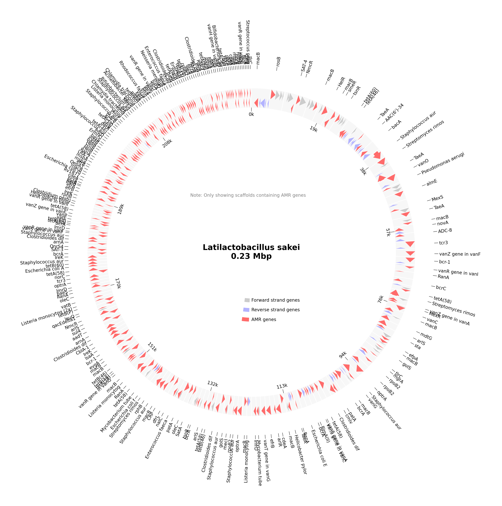

### AAC(6')-34
- **Mechanism**: antibiotic inactivation
- **Drug Classes**: aminoglycoside antibiotic
- **AMR Family**: AAC(6')
- **Locations**:
  - gnl|SPADES|FPFIAAFN_2913_2 : position 958-1521

### ACT-1
- **Mechanism**: antibiotic inactivation
- **Drug Classes**: carbapenem; cephalosporin; cephamycin; penam
- **AMR Family**: ACT beta-lactamase
- **Locations**:
  - gnl|SPADES|FPFIAAFN_22015_1 : position 3-440

### ADC-8
- **Mechanism**: antibiotic inactivation
- **Drug Classes**: cephalosporin
- **AMR Family**: ADC beta-lactamase without carbapenemase activity
- **Locations**:
  - gnl|SPADES|FPFIAAFN_3740_1 : position 3-626

### Acinetobacter baumannii AbaF
- **Mechanism**: antibiotic efflux
- **Drug Classes**: phosphonic acid antibiotic
- **AMR Family**: major facilitator superfamily (MFS) antibiotic efflux pump
- **Locations**:
  - gnl|SPADES|FPFIAAFN_23375_1 : position 3-419

### Bifidobacterium adolescentis rpoB mutants conferring resistance to rifampicin (found in 2 locations)
- **Mechanism**: antibiotic target alteration; antibiotic target replacement
- **Drug Classes**: rifamycin antibiotic
- **AMR Family**: rifamycin-resistant beta-subunit of RNA polymerase (rpoB)
- **Locations**:
  - gnl|SPADES|FPFIAAFN_23234_1 : position 3-422
  - gnl|SPADES|FPFIAAFN_37664_1 : position 1-291

### CRP
- **Mechanism**: antibiotic efflux
- **Drug Classes**: macrolide antibiotic; fluoroquinolone antibiotic; penam
- **AMR Family**: resistance-nodulation-cell division (RND) antibiotic efflux pump
- **Locations**:
  - gnl|SPADES|FPFIAAFN_8383_1 : position 448-954

### CblA-1
- **Mechanism**: antibiotic inactivation
- **Drug Classes**: cephalosporin
- **AMR Family**: CblA beta-lactamase
- **Locations**:
  - gnl|SPADES|FPFIAAFN_9902_1 : position 1-831

### Chlamydia trachomatis intrinsic murA conferring resistance to fosfomycin (found in 2 locations)
- **Mechanism**: antibiotic target alteration
- **Drug Classes**: phosphonic acid antibiotic
- **AMR Family**: antibiotic-resistant murA transferase
- **Locations**:
  - gnl|SPADES|FPFIAAFN_22812_1 : position 276-428
  - gnl|SPADES|FPFIAAFN_23578_1 : position 3-416

### Clostridioides difficile gyrA conferring resistance to fluoroquinolones (found in 2 locations)
- **Mechanism**: antibiotic target alteration
- **Drug Classes**: fluoroquinolone antibiotic
- **AMR Family**: fluoroquinolone resistant gyrA
- **Locations**:
  - gnl|SPADES|FPFIAAFN_27095_1 : position 2-376
  - gnl|SPADES|FPFIAAFN_32750_1 : position 2-325

### Clostridioides difficile gyrB conferring resistance to fluoroquinolones (found in 3 locations)
- **Mechanism**: antibiotic target alteration
- **Drug Classes**: fluoroquinolone antibiotic
- **AMR Family**: fluoroquinolone resistant gyrB
- **Locations**:
  - gnl|SPADES|FPFIAAFN_6180_1 : position 3-1094
  - gnl|SPADES|FPFIAAFN_7625_1 : position 1-822
  - gnl|SPADES|FPFIAAFN_9929_1 : position 2-829

### Clostridioides difficile murG with mutation conferring resistance to vancomycin
- **Mechanism**: antibiotic target alteration
- **Drug Classes**: glycopeptide antibiotic
- **AMR Family**: murG transferase
- **Locations**:
  - gnl|SPADES|FPFIAAFN_13533_2 : position 164-643

### Clostridium perfringes cplR
- **Mechanism**: antibiotic target protection
- **Drug Classes**: lincosamide antibiotic; streptogramin antibiotic; streptogramin A antibiotic; pleuromutilin antibiotic
- **AMR Family**: Miscellaneous ABC-F subfamily ATP-binding cassette ribosomal protection proteins
- **Locations**:
  - gnl|SPADES|FPFIAAFN_15613_1 : position 2-130

### Enterococcus faecalis cls with mutation conferring resistance to daptomycin (found in 2 locations)
- **Mechanism**: antibiotic target alteration
- **Drug Classes**: peptide antibiotic
- **AMR Family**: daptomycin resistant cls
- **Locations**:
  - gnl|SPADES|FPFIAAFN_26249_1 : position 3-383
  - gnl|SPADES|FPFIAAFN_8170_2 : position 277-975

### Erm(36)
- **Mechanism**: antibiotic target alteration
- **Drug Classes**: macrolide antibiotic; lincosamide antibiotic; streptogramin antibiotic; streptogramin A antibiotic; streptogramin B antibiotic
- **AMR Family**: Erm 23S ribosomal RNA methyltransferase
- **Locations**:
  - gnl|SPADES|FPFIAAFN_29693_1 : position 3-350

### Erm(K)
- **Mechanism**: antibiotic target alteration
- **Drug Classes**: macrolide antibiotic; lincosamide antibiotic; streptogramin antibiotic
- **AMR Family**: Erm 23S ribosomal RNA methyltransferase
- **Locations**:
  - gnl|SPADES|FPFIAAFN_19823_1 : position 1-477

### Escherichia coli AcrAB-TolC with AcrR mutation conferring resistance to ciprofloxacin, tetracycline, and ceftazidime
- **Mechanism**: antibiotic target alteration; antibiotic efflux
- **Drug Classes**: fluoroquinolone antibiotic; cephalosporin; glycylcycline; penam; tetracycline antibiotic; rifamycin antibiotic; phenicol antibiotic; disinfecting agents and antiseptics
- **AMR Family**: resistance-nodulation-cell division (RND) antibiotic efflux pump
- **Locations**:
  - gnl|SPADES|FPFIAAFN_12112_1 : position 251-700

### Escherichia coli EF-Tu mutants conferring resistance to Pulvomycin
- **Mechanism**: antibiotic target alteration
- **Drug Classes**: elfamycin antibiotic
- **AMR Family**: elfamycin resistant EF-Tu
- **Locations**:
  - gnl|SPADES|FPFIAAFN_6427_1 : position 3-866

### Escherichia coli fabI mutations conferring resistance to isoniazid and triclosan
- **Mechanism**: antibiotic target alteration
- **Drug Classes**: disinfecting agents and antiseptics; isoniazid-like antibiotic
- **AMR Family**: antibiotic resistant fabI
- **Locations**:
  - gnl|SPADES|FPFIAAFN_8713_1 : position 1-333

### Escherichia coli murA with mutation conferring resistance to fosfomycin
- **Mechanism**: antibiotic target alteration
- **Drug Classes**: phosphonic acid antibiotic
- **AMR Family**: antibiotic-resistant murA transferase
- **Locations**:
  - gnl|SPADES|FPFIAAFN_17894_1 : position 197-517

### HelR (found in 3 locations)
- **Mechanism**: antibiotic target protection
- **Drug Classes**: rifamycin antibiotic
- **AMR Family**: helicase-like RNA polymerase protection protein
- **Locations**:
  - gnl|SPADES|FPFIAAFN_18874_1 : position 1-495
  - gnl|SPADES|FPFIAAFN_19149_1 : position 1-489
  - gnl|SPADES|FPFIAAFN_2735_4 : position 1443-2645

### Helicobacter pylori pbp1 mutants conferring resistance to amoxicillin (found in 2 locations)
- **Mechanism**: antibiotic target alteration
- **Drug Classes**: cephalosporin; cephamycin; penam
- **AMR Family**: Penicillin-binding protein mutations conferring resistance to beta-lactam antibiotics
- **Locations**:
  - gnl|SPADES|FPFIAAFN_15308_1 : position 3-584
  - gnl|SPADES|FPFIAAFN_6534_1 : position 2-592

### IreK (found in 3 locations)
- **Mechanism**: reduced permeability to antibiotic
- **Drug Classes**: cephalosporin
- **AMR Family**: Serine/threonine kinases
- **Locations**:
  - gnl|SPADES|FPFIAAFN_12776_1 : position 2-676
  - gnl|SPADES|FPFIAAFN_15832_1 : position 1-174
  - gnl|SPADES|FPFIAAFN_9898_1 : position 1-831

### LRA-2
- **Mechanism**: antibiotic inactivation
- **Drug Classes**: cephalosporin; penam
- **AMR Family**: subclass B3 LRA beta-lactamase
- **Locations**:
  - gnl|SPADES|FPFIAAFN_18540_1 : position 3-503

### Listeria monocytogenes mprF (found in 5 locations)
- **Mechanism**: antibiotic target alteration
- **Drug Classes**: peptide antibiotic
- **AMR Family**: defensin resistant mprF
- **Locations**:
  - gnl|SPADES|FPFIAAFN_10970_1 : position 3-281
  - gnl|SPADES|FPFIAAFN_10970_2 : position 292-762
  - gnl|SPADES|FPFIAAFN_22259_1 : position 2-436
  - gnl|SPADES|FPFIAAFN_7080_3 : position 890-1105
  - gnl|SPADES|FPFIAAFN_8757_1 : position 2-919

### MexR
- **Mechanism**: antibiotic target alteration; antibiotic efflux
- **Drug Classes**: macrolide antibiotic; fluoroquinolone antibiotic; monobactam; carbapenem; cephalosporin; cephamycin; penam; tetracycline antibiotic; peptide antibiotic; aminocoumarin antibiotic; diaminopyrimidine antibiotic; sulfonamide antibiotic; phenicol antibiotic; penem
- **AMR Family**: resistance-nodulation-cell division (RND) antibiotic efflux pump
- **Locations**:
  - gnl|SPADES|FPFIAAFN_4652_3 : position 1201-1620

### MexS (found in 2 locations)
- **Mechanism**: antibiotic efflux
- **Drug Classes**: fluoroquinolone antibiotic; diaminopyrimidine antibiotic; phenicol antibiotic
- **AMR Family**: resistance-nodulation-cell division (RND) antibiotic efflux pump
- **Locations**:
  - gnl|SPADES|FPFIAAFN_23303_1 : position 2-421
  - gnl|SPADES|FPFIAAFN_3500_4 : position 1651-2109

### Mycobacterium tuberculosis intrinsic murA conferring resistance to fosfomycin
- **Mechanism**: antibiotic target alteration
- **Drug Classes**: phosphonic acid antibiotic
- **AMR Family**: antibiotic-resistant murA transferase
- **Locations**:
  - gnl|SPADES|FPFIAAFN_6941_3 : position 574-1122

### Mycobacterium tuberculosis pncA mutations conferring resistance to pyrazinamide
- **Mechanism**: antibiotic target alteration
- **Drug Classes**: pyrazine antibiotic
- **AMR Family**: Pyrazinamide resistant pncA
- **Locations**:
  - gnl|SPADES|FPFIAAFN_8720_1 : position 1-387

### Neisseria meningititis PBP2 conferring resistance to beta-lactam
- **Mechanism**: antibiotic target alteration
- **Drug Classes**: cephalosporin; cephamycin; penam
- **AMR Family**: Penicillin-binding protein mutations conferring resistance to beta-lactam antibiotics
- **Locations**:
  - gnl|SPADES|FPFIAAFN_26001_1 : position 1-387

### NmcR (found in 2 locations)
- **Mechanism**: antibiotic inactivation
- **Drug Classes**: carbapenem; cephalosporin; cephamycin; penam
- **AMR Family**: NmcA beta-lactamase
- **Locations**:
  - gnl|SPADES|FPFIAAFN_10429_1 : position 3-797
  - gnl|SPADES|FPFIAAFN_2478_1 : position 26-898

### PmrF
- **Mechanism**: antibiotic target alteration
- **Drug Classes**: peptide antibiotic
- **AMR Family**: pmr phosphoethanolamine transferase
- **Locations**:
  - gnl|SPADES|FPFIAAFN_22296_1 : position 3-209

### Pseudomonas aeruginosa soxR
- **Mechanism**: antibiotic target alteration; antibiotic efflux
- **Drug Classes**: fluoroquinolone antibiotic; cephalosporin; glycylcycline; penam; tetracycline antibiotic; rifamycin antibiotic; phenicol antibiotic; disinfecting agents and antiseptics
- **AMR Family**: ATP-binding cassette (ABC) antibiotic efflux pump; major facilitator superfamily (MFS) antibiotic efflux pump; resistance-nodulation-cell division (RND) antibiotic efflux pump
- **Locations**:
  - gnl|SPADES|FPFIAAFN_3292_1 : position 3-359

### QepA1
- **Mechanism**: antibiotic efflux
- **Drug Classes**: fluoroquinolone antibiotic
- **AMR Family**: major facilitator superfamily (MFS) antibiotic efflux pump
- **Locations**:
  - gnl|SPADES|FPFIAAFN_18053_1 : position 3-512

### QnrS4
- **Mechanism**: antibiotic target protection
- **Drug Classes**: fluoroquinolone antibiotic
- **AMR Family**: quinolone resistance protein (qnr)
- **Locations**:
  - gnl|SPADES|FPFIAAFN_13396_1 : position 2-523

### RanA (found in 8 locations)
- **Mechanism**: antibiotic efflux
- **Drug Classes**: aminoglycoside antibiotic
- **AMR Family**: ATP-binding cassette (ABC) antibiotic efflux pump
- **Locations**:
  - gnl|SPADES|FPFIAAFN_11157_2 : position 475-750
  - gnl|SPADES|FPFIAAFN_18665_1 : position 3-464
  - gnl|SPADES|FPFIAAFN_32058_1 : position 3-329
  - gnl|SPADES|FPFIAAFN_33912_1 : position 3-314
  - gnl|SPADES|FPFIAAFN_35705_1 : position 1-303
  - gnl|SPADES|FPFIAAFN_4569_1 : position 3-158
  - gnl|SPADES|FPFIAAFN_6451_2 : position 992-1195
  - gnl|SPADES|FPFIAAFN_8741_1 : position 2-805

### Rhodococcus fascians cmr
- **Mechanism**: antibiotic efflux
- **Drug Classes**: phenicol antibiotic
- **AMR Family**: major facilitator superfamily (MFS) antibiotic efflux pump
- **Locations**:
  - gnl|SPADES|FPFIAAFN_24690_1 : position 2-403

### RlmA(II)
- **Mechanism**: antibiotic target alteration
- **Drug Classes**: macrolide antibiotic; lincosamide antibiotic
- **AMR Family**: non-erm 23S ribosomal RNA methyltransferase (G748)
- **Locations**:
  - gnl|SPADES|FPFIAAFN_6339_2 : position 822-1214

### Rv1877
- **Mechanism**: antibiotic efflux
- **Drug Classes**: fluoroquinolone antibiotic
- **AMR Family**: major facilitator superfamily (MFS) antibiotic efflux pump
- **Locations**:
  - gnl|SPADES|FPFIAAFN_17802_1 : position 1-519

### SAT-3
- **Mechanism**: antibiotic inactivation
- **Drug Classes**: nucleoside antibiotic
- **AMR Family**: streptothricin acetyltransferase (SAT)
- **Locations**:
  - gnl|SPADES|FPFIAAFN_13042_2 : position 130-663

### SAT-4
- **Mechanism**: antibiotic inactivation
- **Drug Classes**: nucleoside antibiotic
- **AMR Family**: streptothricin acetyltransferase (SAT)
- **Locations**:
  - gnl|SPADES|FPFIAAFN_2251_4 : position 2440-2877

### SatA
- **Mechanism**: antibiotic inactivation
- **Drug Classes**: nucleoside antibiotic
- **AMR Family**: streptothricin acetyltransferase (SAT)
- **Locations**:
  - gnl|SPADES|FPFIAAFN_7898_2 : position 278-739

### Staphylococcus aureus LmrS (found in 2 locations)
- **Mechanism**: antibiotic efflux
- **Drug Classes**: macrolide antibiotic; aminoglycoside antibiotic; oxazolidinone antibiotic; diaminopyrimidine antibiotic; phenicol antibiotic
- **AMR Family**: major facilitator superfamily (MFS) antibiotic efflux pump
- **Locations**:
  - gnl|SPADES|FPFIAAFN_21087_1 : position 1-453
  - gnl|SPADES|FPFIAAFN_7433_1 : position 1-714

### Staphylococcus aureus fusA with mutation conferring resistance to fusidic acid
- **Mechanism**: antibiotic target alteration
- **Drug Classes**: fusidane antibiotic
- **AMR Family**: antibiotic resistant fusA
- **Locations**:
  - gnl|SPADES|FPFIAAFN_3085_1 : position 45-2132

### Staphylococcus aureus mupA conferring resistance to mupirocin (found in 3 locations)
- **Mechanism**: antibiotic target alteration
- **Drug Classes**: mupirocin-like antibiotic
- **AMR Family**: antibiotic-resistant isoleucyl-tRNA synthetase (ileS)
- **Locations**:
  - gnl|SPADES|FPFIAAFN_22225_1 : position 3-437
  - gnl|SPADES|FPFIAAFN_22919_1 : position 2-427
  - gnl|SPADES|FPFIAAFN_5565_1 : position 1-1368

### Staphylococcus aureus mupB conferring resistance to mupirocin (found in 2 locations)
- **Mechanism**: antibiotic target alteration
- **Drug Classes**: mupirocin-like antibiotic
- **AMR Family**: antibiotic-resistant isoleucyl-tRNA synthetase (ileS)
- **Locations**:
  - gnl|SPADES|FPFIAAFN_12428_1 : position 2-688
  - gnl|SPADES|FPFIAAFN_8559_1 : position 1-936

### Staphylococcus aureus murA with mutation conferring resistance to fosfomycin
- **Mechanism**: antibiotic target alteration
- **Drug Classes**: phosphonic acid antibiotic
- **AMR Family**: antibiotic-resistant murA transferase
- **Locations**:
  - gnl|SPADES|FPFIAAFN_13652_1 : position 2-640

### Staphylococcus aureus rpoB mutants conferring resistance to rifampicin
- **Mechanism**: antibiotic target alteration; antibiotic target replacement
- **Drug Classes**: rifamycin antibiotic
- **AMR Family**: rifamycin-resistant beta-subunit of RNA polymerase (rpoB)
- **Locations**:
  - gnl|SPADES|FPFIAAFN_7297_1 : position 3-869

### Streptococcus pneumoniae PBP2x conferring resistance to amoxicillin
- **Mechanism**: antibiotic target alteration
- **Drug Classes**: cephalosporin; cephamycin; penam
- **AMR Family**: Penicillin-binding protein mutations conferring resistance to beta-lactam antibiotics
- **Locations**:
  - gnl|SPADES|FPFIAAFN_66828_1 : position 3-218

### Streptomyces rimosus otr(A) (found in 3 locations)
- **Mechanism**: antibiotic target protection
- **Drug Classes**: tetracycline antibiotic
- **AMR Family**: tetracycline-resistant ribosomal protection protein
- **Locations**:
  - gnl|SPADES|FPFIAAFN_3132_1 : position 2-1486
  - gnl|SPADES|FPFIAAFN_4637_1 : position 3-1625
  - gnl|SPADES|FPFIAAFN_8673_1 : position 1-927

### TaeA (found in 4 locations)
- **Mechanism**: antibiotic efflux
- **Drug Classes**: pleuromutilin antibiotic
- **AMR Family**: ATP-binding cassette (ABC) antibiotic efflux pump
- **Locations**:
  - gnl|SPADES|FPFIAAFN_2796_5 : position 2394-2606
  - gnl|SPADES|FPFIAAFN_3146_3 : position 713-2320
  - gnl|SPADES|FPFIAAFN_3603_2 : position 1008-2051
  - gnl|SPADES|FPFIAAFN_6457_1 : position 1-174

### aadT
- **Mechanism**: antibiotic efflux
- **Drug Classes**: macrolide antibiotic; tetracycline antibiotic; disinfecting agents and antiseptics
- **AMR Family**: major facilitator superfamily (MFS) antibiotic efflux pump
- **Locations**:
  - gnl|SPADES|FPFIAAFN_10074_2 : position 202-819

### almE
- **Mechanism**: antibiotic target alteration
- **Drug Classes**: peptide antibiotic
- **AMR Family**: polymyxin resistance operon; alm glycyltransferase
- **Locations**:
  - gnl|SPADES|FPFIAAFN_3450_1 : position 1-1125

### arlR (found in 3 locations)
- **Mechanism**: antibiotic efflux
- **Drug Classes**: fluoroquinolone antibiotic; disinfecting agents and antiseptics
- **AMR Family**: major facilitator superfamily (MFS) antibiotic efflux pump
- **Locations**:
  - gnl|SPADES|FPFIAAFN_26024_1 : position 2-340
  - gnl|SPADES|FPFIAAFN_52607_1 : position 1-246
  - gnl|SPADES|FPFIAAFN_6656_1 : position 2-418

### arlS (found in 4 locations)
- **Mechanism**: antibiotic efflux
- **Drug Classes**: fluoroquinolone antibiotic; disinfecting agents and antiseptics
- **AMR Family**: major facilitator superfamily (MFS) antibiotic efflux pump
- **Locations**:
  - gnl|SPADES|FPFIAAFN_10277_1 : position 67-807
  - gnl|SPADES|FPFIAAFN_37379_1 : position 101-292
  - gnl|SPADES|FPFIAAFN_4821_2 : position 383-1552
  - gnl|SPADES|FPFIAAFN_7711_1 : position 3-473

### arnA (found in 2 locations)
- **Mechanism**: antibiotic target alteration
- **Drug Classes**: peptide antibiotic
- **AMR Family**: pmr phosphoethanolamine transferase
- **Locations**:
  - gnl|SPADES|FPFIAAFN_13514_2 : position 229-645
  - gnl|SPADES|FPFIAAFN_9972_1 : position 3-752

### bacA
- **Mechanism**: antibiotic target alteration
- **Drug Classes**: peptide antibiotic
- **AMR Family**: undecaprenyl pyrophosphate related proteins
- **Locations**:
  - gnl|SPADES|FPFIAAFN_2976_1 : position 231-1058

### baeR
- **Mechanism**: antibiotic efflux
- **Drug Classes**: aminoglycoside antibiotic; aminocoumarin antibiotic
- **AMR Family**: resistance-nodulation-cell division (RND) antibiotic efflux pump
- **Locations**:
  - gnl|SPADES|FPFIAAFN_19166_1 : position 1-378

### baeS
- **Mechanism**: antibiotic efflux
- **Drug Classes**: aminoglycoside antibiotic; aminocoumarin antibiotic
- **AMR Family**: resistance-nodulation-cell division (RND) antibiotic efflux pump
- **Locations**:
  - gnl|SPADES|FPFIAAFN_11369_1 : position 1-738

### basS
- **Mechanism**: antibiotic target alteration; antibiotic efflux
- **Drug Classes**: peptide antibiotic
- **AMR Family**: pmr phosphoethanolamine transferase
- **Locations**:
  - gnl|SPADES|FPFIAAFN_19696_1 : position 1-276

### bcr-1 (found in 2 locations)
- **Mechanism**: antibiotic efflux
- **Drug Classes**: bicyclomycin-like antibiotic
- **AMR Family**: major facilitator superfamily (MFS) antibiotic efflux pump
- **Locations**:
  - gnl|SPADES|FPFIAAFN_3966_1 : position 203-1384
  - gnl|SPADES|FPFIAAFN_9649_1 : position 1-849

### bcrA (found in 8 locations)
- **Mechanism**: antibiotic efflux
- **Drug Classes**: peptide antibiotic
- **AMR Family**: ATP-binding cassette (ABC) antibiotic efflux pump
- **Locations**:
  - gnl|SPADES|FPFIAAFN_12878_1 : position 1-525
  - gnl|SPADES|FPFIAAFN_14393_2 : position 357-611
  - gnl|SPADES|FPFIAAFN_17301_1 : position 2-529
  - gnl|SPADES|FPFIAAFN_31575_1 : position 1-333
  - gnl|SPADES|FPFIAAFN_31686_1 : position 1-333
  - gnl|SPADES|FPFIAAFN_5864_1 : position 1-600
  - gnl|SPADES|FPFIAAFN_6398_1 : position 1-300
  - gnl|SPADES|FPFIAAFN_7805_3 : position 676-1014

### bcrC
- **Mechanism**: antibiotic target alteration
- **Drug Classes**: peptide antibiotic
- **AMR Family**: undecaprenyl pyrophosphate related proteins
- **Locations**:
  - gnl|SPADES|FPFIAAFN_4605_2 : position 388-1026

### cdeA (found in 3 locations)
- **Mechanism**: antibiotic efflux
- **Drug Classes**: fluoroquinolone antibiotic; disinfecting agents and antiseptics
- **AMR Family**: multidrug and toxic compound extrusion (MATE) transporter
- **Locations**:
  - gnl|SPADES|FPFIAAFN_17570_1 : position 1-522
  - gnl|SPADES|FPFIAAFN_52828_1 : position 1-246
  - gnl|SPADES|FPFIAAFN_6570_1 : position 3-1172

### chrB
- **Mechanism**: antibiotic target alteration
- **Drug Classes**: macrolide antibiotic; lincosamide antibiotic
- **AMR Family**: non-erm 23S ribosomal RNA methyltransferase (G748)
- **Locations**:
  - gnl|SPADES|FPFIAAFN_65841_1 : position 3-218

### cmlv (found in 2 locations)
- **Mechanism**: antibiotic inactivation
- **Drug Classes**: phenicol antibiotic
- **AMR Family**: chloramphenicol phosphotransferase
- **Locations**:
  - gnl|SPADES|FPFIAAFN_26525_2 : position 228-380
  - gnl|SPADES|FPFIAAFN_6087_1 : position 1-1002

### dfrL
- **Mechanism**: antibiotic target replacement
- **Drug Classes**: aminoglycoside antibiotic; tetracycline antibiotic; diaminopyrimidine antibiotic
- **AMR Family**: trimethoprim resistant dihydrofolate reductase dfr
- **Locations**:
  - gnl|SPADES|FPFIAAFN_8195_1 : position 272-772

### efpA
- **Mechanism**: antibiotic efflux
- **Drug Classes**: rifamycin antibiotic; isoniazid-like antibiotic
- **AMR Family**: major facilitator superfamily (MFS) antibiotic efflux pump
- **Locations**:
  - gnl|SPADES|FPFIAAFN_4912_2 : position 949-1521

### efrA (found in 7 locations)
- **Mechanism**: antibiotic efflux
- **Drug Classes**: macrolide antibiotic; fluoroquinolone antibiotic; rifamycin antibiotic
- **AMR Family**: ATP-binding cassette (ABC) antibiotic efflux pump
- **Locations**:
  - gnl|SPADES|FPFIAAFN_16764_1 : position 2-544
  - gnl|SPADES|FPFIAAFN_18219_1 : position 2-508
  - gnl|SPADES|FPFIAAFN_24936_1 : position 41-400
  - gnl|SPADES|FPFIAAFN_25041_1 : position 3-398
  - gnl|SPADES|FPFIAAFN_31279_1 : position 3-335
  - gnl|SPADES|FPFIAAFN_33499_1 : position 2-175
  - gnl|SPADES|FPFIAAFN_65923_1 : position 3-218

### efrB (found in 3 locations)
- **Mechanism**: antibiotic efflux
- **Drug Classes**: macrolide antibiotic; fluoroquinolone antibiotic; rifamycin antibiotic
- **AMR Family**: ATP-binding cassette (ABC) antibiotic efflux pump
- **Locations**:
  - gnl|SPADES|FPFIAAFN_16364_1 : position 3-554
  - gnl|SPADES|FPFIAAFN_21507_1 : position 1-447
  - gnl|SPADES|FPFIAAFN_6696_1 : position 3-1157

### evgA
- **Mechanism**: antibiotic efflux
- **Drug Classes**: macrolide antibiotic; fluoroquinolone antibiotic; penam; tetracycline antibiotic
- **AMR Family**: major facilitator superfamily (MFS) antibiotic efflux pump; resistance-nodulation-cell division (RND) antibiotic efflux pump
- **Locations**:
  - gnl|SPADES|FPFIAAFN_9639_1 : position 1-570

### facT (found in 3 locations)
- **Mechanism**: antibiotic efflux
- **Drug Classes**: elfamycin antibiotic
- **AMR Family**: major facilitator superfamily (MFS) antibiotic efflux pump
- **Locations**:
  - gnl|SPADES|FPFIAAFN_25769_1 : position 1-390
  - gnl|SPADES|FPFIAAFN_33886_1 : position 1-315
  - gnl|SPADES|FPFIAAFN_62923_1 : position 1-225

### golS (found in 3 locations)
- **Mechanism**: antibiotic efflux
- **Drug Classes**: monobactam; carbapenem; cephalosporin; cephamycin; penam; phenicol antibiotic; penem
- **AMR Family**: resistance-nodulation-cell division (RND) antibiotic efflux pump
- **Locations**:
  - gnl|SPADES|FPFIAAFN_25480_2 : position 212-394
  - gnl|SPADES|FPFIAAFN_5118_2 : position 250-432
  - gnl|SPADES|FPFIAAFN_7343_2 : position 265-684

### leuO
- **Mechanism**: antibiotic efflux
- **Drug Classes**: nucleoside antibiotic; disinfecting agents and antiseptics
- **AMR Family**: major facilitator superfamily (MFS) antibiotic efflux pump
- **Locations**:
  - gnl|SPADES|FPFIAAFN_10723_1 : position 3-524

### lmrD (found in 5 locations)
- **Mechanism**: antibiotic efflux
- **Drug Classes**: lincosamide antibiotic
- **AMR Family**: ATP-binding cassette (ABC) antibiotic efflux pump
- **Locations**:
  - gnl|SPADES|FPFIAAFN_11653_1 : position 3-194
  - gnl|SPADES|FPFIAAFN_14331_1 : position 188-613
  - gnl|SPADES|FPFIAAFN_20605_1 : position 3-464
  - gnl|SPADES|FPFIAAFN_25909_1 : position 70-387
  - gnl|SPADES|FPFIAAFN_7078_1 : position 2-619

### lsaA
- **Mechanism**: antibiotic target protection
- **Drug Classes**: lincosamide antibiotic; streptogramin antibiotic; streptogramin A antibiotic; streptogramin B antibiotic; pleuromutilin antibiotic
- **AMR Family**: lsa-type ABC-F protein
- **Locations**:
  - gnl|SPADES|FPFIAAFN_9718_2 : position 158-844

### macB (found in 19 locations)
- **Mechanism**: antibiotic efflux
- **Drug Classes**: macrolide antibiotic
- **AMR Family**: ATP-binding cassette (ABC) antibiotic efflux pump
- **Locations**:
  - gnl|SPADES|FPFIAAFN_1500_3 : position 801-1835
  - gnl|SPADES|FPFIAAFN_17925_1 : position 2-514
  - gnl|SPADES|FPFIAAFN_22206_1 : position 2-430
  - gnl|SPADES|FPFIAAFN_2578_3 : position 1852-2538
  - gnl|SPADES|FPFIAAFN_2736_2 : position 476-1252
  - gnl|SPADES|FPFIAAFN_28744_1 : position 3-359
  - gnl|SPADES|FPFIAAFN_29821_1 : position 1-348
  - gnl|SPADES|FPFIAAFN_34257_1 : position 2-313
  - gnl|SPADES|FPFIAAFN_3667_3 : position 1482-2018
  - gnl|SPADES|FPFIAAFN_4698_1 : position 2-799
  - gnl|SPADES|FPFIAAFN_5012_2 : position 139-804
  - gnl|SPADES|FPFIAAFN_5839_1 : position 127-1308
  - gnl|SPADES|FPFIAAFN_60750_1 : position 1-228
  - gnl|SPADES|FPFIAAFN_6555_1 : position 2-757
  - gnl|SPADES|FPFIAAFN_7133_1 : position 2-637
  - gnl|SPADES|FPFIAAFN_8526_2 : position 101-742
  - gnl|SPADES|FPFIAAFN_8809_1 : position 3-821
  - gnl|SPADES|FPFIAAFN_9621_2 : position 531-851
  - gnl|SPADES|FPFIAAFN_9623_1 : position 317-850

### mdtG (found in 2 locations)
- **Mechanism**: antibiotic efflux
- **Drug Classes**: phosphonic acid antibiotic
- **AMR Family**: major facilitator superfamily (MFS) antibiotic efflux pump
- **Locations**:
  - gnl|SPADES|FPFIAAFN_4705_2 : position 604-1593
  - gnl|SPADES|FPFIAAFN_60817_1 : position 2-229

### mecI
- **Mechanism**: antibiotic target replacement
- **Drug Classes**: penam
- **AMR Family**: methicillin resistant PBP2
- **Locations**:
  - gnl|SPADES|FPFIAAFN_7304_2 : position 527-967

### mgrA
- **Mechanism**: antibiotic efflux
- **Drug Classes**: fluoroquinolone antibiotic; cephalosporin; penam; tetracycline antibiotic; peptide antibiotic; disinfecting agents and antiseptics
- **AMR Family**: ATP-binding cassette (ABC) antibiotic efflux pump; major facilitator superfamily (MFS) antibiotic efflux pump
- **Locations**:
  - gnl|SPADES|FPFIAAFN_5153_2 : position 210-665

### mreA
- **Mechanism**: antibiotic efflux
- **Drug Classes**: macrolide antibiotic
- **AMR Family**: major facilitator superfamily (MFS) antibiotic efflux pump
- **Locations**:
  - gnl|SPADES|FPFIAAFN_34728_1 : position 3-158

### msbA (found in 4 locations)
- **Mechanism**: antibiotic efflux
- **Drug Classes**: nitroimidazole antibiotic
- **AMR Family**: ATP-binding cassette (ABC) antibiotic efflux pump
- **Locations**:
  - gnl|SPADES|FPFIAAFN_18364_1 : position 2-211
  - gnl|SPADES|FPFIAAFN_18507_1 : position 1-420
  - gnl|SPADES|FPFIAAFN_23926_1 : position 2-412
  - gnl|SPADES|FPFIAAFN_57949_1 : position 2-235

### nalC
- **Mechanism**: antibiotic efflux
- **Drug Classes**: macrolide antibiotic; fluoroquinolone antibiotic; monobactam; carbapenem; cephalosporin; cephamycin; penam; tetracycline antibiotic; peptide antibiotic; aminocoumarin antibiotic; diaminopyrimidine antibiotic; sulfonamide antibiotic; phenicol antibiotic; penem
- **AMR Family**: resistance-nodulation-cell division (RND) antibiotic efflux pump
- **Locations**:
  - gnl|SPADES|FPFIAAFN_8191_2 : position 517-972

### norB
- **Mechanism**: antibiotic efflux
- **Drug Classes**: fluoroquinolone antibiotic
- **AMR Family**: major facilitator superfamily (MFS) antibiotic efflux pump
- **Locations**:
  - gnl|SPADES|FPFIAAFN_58963_1 : position 2-232

### norC
- **Mechanism**: antibiotic efflux
- **Drug Classes**: fluoroquinolone antibiotic; disinfecting agents and antiseptics
- **AMR Family**: major facilitator superfamily (MFS) antibiotic efflux pump
- **Locations**:
  - gnl|SPADES|FPFIAAFN_11810_1 : position 1-717

### novA
- **Mechanism**: antibiotic efflux
- **Drug Classes**: aminocoumarin antibiotic
- **AMR Family**: ATP-binding cassette (ABC) antibiotic efflux pump
- **Locations**:
  - gnl|SPADES|FPFIAAFN_3693_2 : position 386-1153

### oleC (found in 2 locations)
- **Mechanism**: antibiotic efflux
- **Drug Classes**: macrolide antibiotic
- **AMR Family**: ATP-binding cassette (ABC) antibiotic efflux pump
- **Locations**:
  - gnl|SPADES|FPFIAAFN_11055_2 : position 401-757
  - gnl|SPADES|FPFIAAFN_8084_1 : position 1-669

### optrA (found in 3 locations)
- **Mechanism**: antibiotic target protection
- **Drug Classes**: oxazolidinone antibiotic; phenicol antibiotic
- **AMR Family**: Miscellaneous ABC-F subfamily ATP-binding cassette ribosomal protection proteins
- **Locations**:
  - gnl|SPADES|FPFIAAFN_11744_1 : position 2-643
  - gnl|SPADES|FPFIAAFN_5307_1 : position 1-1422
  - gnl|SPADES|FPFIAAFN_7144_1 : position 50-1096

### patA (found in 6 locations)
- **Mechanism**: antibiotic efflux
- **Drug Classes**: fluoroquinolone antibiotic
- **AMR Family**: ATP-binding cassette (ABC) antibiotic efflux pump
- **Locations**:
  - gnl|SPADES|FPFIAAFN_16962_2 : position 410-538
  - gnl|SPADES|FPFIAAFN_21444_1 : position 276-449
  - gnl|SPADES|FPFIAAFN_22904_1 : position 2-427
  - gnl|SPADES|FPFIAAFN_25766_1 : position 1-354
  - gnl|SPADES|FPFIAAFN_5882_2 : position 815-1300
  - gnl|SPADES|FPFIAAFN_8093_1 : position 2-985

### patB (found in 3 locations)
- **Mechanism**: antibiotic efflux
- **Drug Classes**: fluoroquinolone antibiotic
- **AMR Family**: ATP-binding cassette (ABC) antibiotic efflux pump
- **Locations**:
  - gnl|SPADES|FPFIAAFN_16962_1 : position 2-406
  - gnl|SPADES|FPFIAAFN_27130_1 : position 1-375
  - gnl|SPADES|FPFIAAFN_48285_1 : position 2-256

### qacEdelta1
- **Mechanism**: antibiotic efflux
- **Drug Classes**: disinfecting agents and antiseptics
- **AMR Family**: major facilitator superfamily (MFS) antibiotic efflux pump
- **Locations**:
  - gnl|SPADES|FPFIAAFN_10567_2 : position 561-788

### rosB
- **Mechanism**: antibiotic efflux
- **Drug Classes**: peptide antibiotic
- **AMR Family**: major facilitator superfamily (MFS) antibiotic efflux pump
- **Locations**:
  - gnl|SPADES|FPFIAAFN_1991_2 : position 178-1338

### rphB (found in 2 locations)
- **Mechanism**: antibiotic inactivation
- **Drug Classes**: rifamycin antibiotic
- **AMR Family**: rifampin phosphotransferase
- **Locations**:
  - gnl|SPADES|FPFIAAFN_15664_1 : position 2-271
  - gnl|SPADES|FPFIAAFN_8648_1 : position 2-931

### rpoB2 (found in 4 locations)
- **Mechanism**: antibiotic target alteration; antibiotic target replacement
- **Drug Classes**: rifamycin antibiotic
- **AMR Family**: rifamycin-resistant beta-subunit of RNA polymerase (rpoB)
- **Locations**:
  - gnl|SPADES|FPFIAAFN_30392_1 : position 2-343
  - gnl|SPADES|FPFIAAFN_5150_1 : position 2-418
  - gnl|SPADES|FPFIAAFN_5215_1 : position 3-887
  - gnl|SPADES|FPFIAAFN_7297_2 : position 942-1073

### salA
- **Mechanism**: antibiotic target protection
- **Drug Classes**: lincosamide antibiotic; streptogramin antibiotic; streptogramin A antibiotic; pleuromutilin antibiotic
- **AMR Family**: sal-type ABC-F protein
- **Locations**:
  - gnl|SPADES|FPFIAAFN_24516_1 : position 1-405

### salC
- **Mechanism**: antibiotic target protection
- **Drug Classes**: lincosamide antibiotic; streptogramin antibiotic; streptogramin A antibiotic; pleuromutilin antibiotic
- **AMR Family**: sal-type ABC-F protein
- **Locations**:
  - gnl|SPADES|FPFIAAFN_36475_1 : position 119-298

### smeR
- **Mechanism**: antibiotic efflux
- **Drug Classes**: aminoglycoside antibiotic; cephalosporin; cephamycin; penam
- **AMR Family**: resistance-nodulation-cell division (RND) antibiotic efflux pump
- **Locations**:
  - gnl|SPADES|FPFIAAFN_2736_3 : position 1392-2066

### sta
- **Mechanism**: antibiotic inactivation
- **Drug Classes**: nucleoside antibiotic
- **AMR Family**: streptothricin acetyltransferase (SAT)
- **Locations**:
  - gnl|SPADES|FPFIAAFN_4871_2 : position 235-753

### sul2
- **Mechanism**: antibiotic target replacement
- **Drug Classes**: sulfonamide antibiotic
- **AMR Family**: sulfonamide resistant sul
- **Locations**:
  - gnl|SPADES|FPFIAAFN_36764_1 : position 2-295

### sul4
- **Mechanism**: antibiotic target replacement
- **Drug Classes**: sulfonamide antibiotic
- **AMR Family**: sulfonamide resistant sul
- **Locations**:
  - gnl|SPADES|FPFIAAFN_10108_2 : position 276-818

### tcr3 (found in 2 locations)
- **Mechanism**: antibiotic efflux
- **Drug Classes**: tetracycline antibiotic
- **AMR Family**: major facilitator superfamily (MFS) antibiotic efflux pump
- **Locations**:
  - gnl|SPADES|FPFIAAFN_11793_1 : position 1-717
  - gnl|SPADES|FPFIAAFN_3797_1 : position 47-1507

### tet(47)
- **Mechanism**: antibiotic inactivation
- **Drug Classes**: tetracycline antibiotic
- **AMR Family**: tetracycline inactivation enzyme
- **Locations**:
  - gnl|SPADES|FPFIAAFN_29922_1 : position 3-329

### tetA(46) (found in 3 locations)
- **Mechanism**: antibiotic efflux
- **Drug Classes**: tetracycline antibiotic
- **AMR Family**: ATP-binding cassette (ABC) antibiotic efflux pump
- **Locations**:
  - gnl|SPADES|FPFIAAFN_21235_1 : position 2-418
  - gnl|SPADES|FPFIAAFN_2785_2 : position 826-1371
  - gnl|SPADES|FPFIAAFN_34310_1 : position 3-311

### tetA(58) (found in 11 locations)
- **Mechanism**: antibiotic efflux
- **Drug Classes**: tetracycline antibiotic
- **AMR Family**: major facilitator superfamily (MFS) antibiotic efflux pump
- **Locations**:
  - gnl|SPADES|FPFIAAFN_11829_1 : position 1-699
  - gnl|SPADES|FPFIAAFN_15099_1 : position 2-406
  - gnl|SPADES|FPFIAAFN_21967_2 : position 196-441
  - gnl|SPADES|FPFIAAFN_27241_1 : position 1-372
  - gnl|SPADES|FPFIAAFN_29909_1 : position 3-347
  - gnl|SPADES|FPFIAAFN_39217_1 : position 2-283
  - gnl|SPADES|FPFIAAFN_4625_3 : position 1093-1629
  - gnl|SPADES|FPFIAAFN_6255_2 : position 679-1227
  - gnl|SPADES|FPFIAAFN_7701_1 : position 3-671
  - gnl|SPADES|FPFIAAFN_8725_1 : position 2-805
  - gnl|SPADES|FPFIAAFN_9061_1 : position 3-443

### tetA(60) (found in 2 locations)
- **Mechanism**: antibiotic efflux
- **Drug Classes**: tetracycline antibiotic
- **AMR Family**: ATP-binding cassette (ABC) antibiotic efflux pump
- **Locations**:
  - gnl|SPADES|FPFIAAFN_14459_1 : position 3-188
  - gnl|SPADES|FPFIAAFN_2785_1 : position 3-884

### tetB(46) (found in 2 locations)
- **Mechanism**: antibiotic efflux
- **Drug Classes**: tetracycline antibiotic
- **AMR Family**: ATP-binding cassette (ABC) antibiotic efflux pump
- **Locations**:
  - gnl|SPADES|FPFIAAFN_7678_2 : position 792-1028
  - gnl|SPADES|FPFIAAFN_9553_1 : position 19-855

### tetB(58)
- **Mechanism**: antibiotic efflux
- **Drug Classes**: tetracycline antibiotic
- **AMR Family**: major facilitator superfamily (MFS) antibiotic efflux pump
- **Locations**:
  - gnl|SPADES|FPFIAAFN_9061_2 : position 456-893

### tetB(60) (found in 3 locations)
- **Mechanism**: antibiotic efflux
- **Drug Classes**: tetracycline antibiotic
- **AMR Family**: ATP-binding cassette (ABC) antibiotic efflux pump
- **Locations**:
  - gnl|SPADES|FPFIAAFN_12261_1 : position 2-697
  - gnl|SPADES|FPFIAAFN_14459_2 : position 370-609
  - gnl|SPADES|FPFIAAFN_23619_2 : position 244-417

### tetB(P)
- **Mechanism**: antibiotic target protection
- **Drug Classes**: tetracycline antibiotic
- **AMR Family**: tetracycline-resistant ribosomal protection protein
- **Locations**:
  - gnl|SPADES|FPFIAAFN_10813_1 : position 1-771

### tlrC (found in 2 locations)
- **Mechanism**: antibiotic target protection
- **Drug Classes**: macrolide antibiotic; lincosamide antibiotic
- **AMR Family**: Miscellaneous ABC-F subfamily ATP-binding cassette ribosomal protection proteins
- **Locations**:
  - gnl|SPADES|FPFIAAFN_5145_3 : position 1254-1457
  - gnl|SPADES|FPFIAAFN_66725_1 : position 40-216

### tsnR (found in 3 locations)
- **Mechanism**: antibiotic target alteration
- **Drug Classes**: peptide antibiotic
- **AMR Family**: non-erm 23S ribosomal RNA methyltransferase (A1067)
- **Locations**:
  - gnl|SPADES|FPFIAAFN_19049_1 : position 2-493
  - gnl|SPADES|FPFIAAFN_2774_1 : position 1-675
  - gnl|SPADES|FPFIAAFN_7802_1 : position 2-172

### ugd (found in 2 locations)
- **Mechanism**: antibiotic target alteration
- **Drug Classes**: peptide antibiotic
- **AMR Family**: pmr phosphoethanolamine transferase
- **Locations**:
  - gnl|SPADES|FPFIAAFN_42238_1 : position 16-273
  - gnl|SPADES|FPFIAAFN_55742_1 : position 2-241

### vanC
- **Mechanism**: antibiotic target alteration
- **Drug Classes**: glycopeptide antibiotic
- **AMR Family**: glycopeptide resistance gene cluster; Van ligase
- **Locations**:
  - gnl|SPADES|FPFIAAFN_4699_3 : position 436-1491

### vanG
- **Mechanism**: antibiotic target alteration
- **Drug Classes**: glycopeptide antibiotic
- **AMR Family**: glycopeptide resistance gene cluster; Van ligase
- **Locations**:
  - gnl|SPADES|FPFIAAFN_5614_1 : position 2-376

### vanH gene in vanM cluster
- **Mechanism**: antibiotic target alteration
- **Drug Classes**: glycopeptide antibiotic
- **AMR Family**: vanH; glycopeptide resistance gene cluster
- **Locations**:
  - gnl|SPADES|FPFIAAFN_36690_1 : position 96-296

### vanO
- **Mechanism**: antibiotic target alteration
- **Drug Classes**: glycopeptide antibiotic
- **AMR Family**: glycopeptide resistance gene cluster; Van ligase
- **Locations**:
  - gnl|SPADES|FPFIAAFN_3154_1 : position 1-1479

### vanP
- **Mechanism**: antibiotic target alteration
- **Drug Classes**: glycopeptide antibiotic
- **AMR Family**: glycopeptide resistance gene cluster; Van ligase
- **Locations**:
  - gnl|SPADES|FPFIAAFN_14841_1 : position 2-469

### vanR gene in vanE cluster
- **Mechanism**: antibiotic target alteration
- **Drug Classes**: glycopeptide antibiotic
- **AMR Family**: glycopeptide resistance gene cluster; vanR
- **Locations**:
  - gnl|SPADES|FPFIAAFN_25438_1 : position 2-394

### vanR gene in vanF cluster
- **Mechanism**: antibiotic target alteration
- **Drug Classes**: glycopeptide antibiotic
- **AMR Family**: glycopeptide resistance gene cluster; vanR
- **Locations**:
  - gnl|SPADES|FPFIAAFN_61237_1 : position 2-229

### vanR gene in vanG cluster
- **Mechanism**: antibiotic target alteration
- **Drug Classes**: glycopeptide antibiotic
- **AMR Family**: glycopeptide resistance gene cluster; vanR
- **Locations**:
  - gnl|SPADES|FPFIAAFN_8836_3 : position 628-912

### vanR gene in vanI cluster (found in 3 locations)
- **Mechanism**: antibiotic target alteration
- **Drug Classes**: glycopeptide antibiotic
- **AMR Family**: glycopeptide resistance gene cluster; vanR
- **Locations**:
  - gnl|SPADES|FPFIAAFN_13700_2 : position 525-638
  - gnl|SPADES|FPFIAAFN_15189_2 : position 370-588
  - gnl|SPADES|FPFIAAFN_4120_1 : position 467-1012

### vanS gene in vanA cluster
- **Mechanism**: antibiotic target alteration
- **Drug Classes**: glycopeptide antibiotic
- **AMR Family**: vanS; glycopeptide resistance gene cluster
- **Locations**:
  - gnl|SPADES|FPFIAAFN_6303_2 : position 546-737

### vanS gene in vanC cluster
- **Mechanism**: antibiotic target alteration
- **Drug Classes**: glycopeptide antibiotic
- **AMR Family**: vanS; glycopeptide resistance gene cluster
- **Locations**:
  - gnl|SPADES|FPFIAAFN_6303_3 : position 689-1219

### vanS gene in vanF cluster
- **Mechanism**: antibiotic target alteration
- **Drug Classes**: glycopeptide antibiotic
- **AMR Family**: vanS; glycopeptide resistance gene cluster
- **Locations**:
  - gnl|SPADES|FPFIAAFN_13700_1 : position 1-525

### vanT gene in vanG cluster
- **Mechanism**: antibiotic target alteration
- **Drug Classes**: glycopeptide antibiotic
- **AMR Family**: glycopeptide resistance gene cluster; vanT
- **Locations**:
  - gnl|SPADES|FPFIAAFN_6810_2 : position 159-1142

### vanZ gene in vanA cluster
- **Mechanism**: antibiotic target alteration
- **Drug Classes**: glycopeptide antibiotic
- **AMR Family**: vanZ; glycopeptide resistance gene cluster
- **Locations**:
  - gnl|SPADES|FPFIAAFN_4652_2 : position 579-1175

### vanZ gene in vanF cluster (found in 2 locations)
- **Mechanism**: antibiotic target alteration
- **Drug Classes**: glycopeptide antibiotic
- **AMR Family**: vanZ; glycopeptide resistance gene cluster
- **Locations**:
  - gnl|SPADES|FPFIAAFN_14938_1 : position 2-238
  - gnl|SPADES|FPFIAAFN_3958_2 : position 536-1684

### vatB
- **Mechanism**: antibiotic inactivation
- **Drug Classes**: streptogramin antibiotic; streptogramin A antibiotic
- **AMR Family**: streptogramin vat acetyltransferase
- **Locations**:
  - gnl|SPADES|FPFIAAFN_11026_1 : position 2-334

### vatE
- **Mechanism**: antibiotic inactivation
- **Drug Classes**: streptogramin antibiotic; streptogramin A antibiotic
- **AMR Family**: streptogramin vat acetyltransferase
- **Locations**:
  - gnl|SPADES|FPFIAAFN_14659_1 : position 59-604

### vatF
- **Mechanism**: antibiotic inactivation
- **Drug Classes**: streptogramin antibiotic; streptogramin A antibiotic
- **AMR Family**: streptogramin vat acetyltransferase
- **Locations**:
  - gnl|SPADES|FPFIAAFN_24717_1 : position 2-403

### vgaB
- **Mechanism**: antibiotic target protection
- **Drug Classes**: streptogramin antibiotic; streptogramin A antibiotic; pleuromutilin antibiotic
- **AMR Family**: vga-type ABC-F protein
- **Locations**:
  - gnl|SPADES|FPFIAAFN_19232_1 : position 2-487

### ykkC
- **Mechanism**: antibiotic efflux
- **Drug Classes**: aminoglycoside antibiotic; tetracycline antibiotic; phenicol antibiotic
- **AMR Family**: small multidrug resistance (SMR) antibiotic efflux pump
- **Locations**:
  - gnl|SPADES|FPFIAAFN_46712_1 : position 2-220

## Latilactobacillus sakei subsp. sakei
**Strain Statistics:**
- Total genome length: 0.5 kbp
- Total scaffolds: 36
- Scaffolds with AMR genes: 1
- Total genes annotated: 0
- Total AMR genes: 1
- Unique AMR genes: 1
- Distinct AMR mechanisms: 1
- Distinct AMR families: 1
- Distinct drug classes: 1

**Circos Plot:**

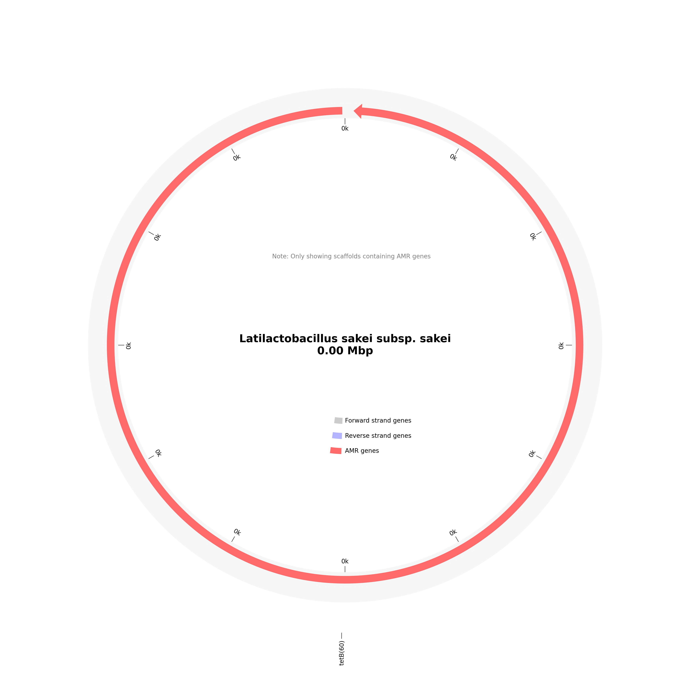

### tetB(60)
- **Mechanism**: antibiotic efflux
- **Drug Classes**: tetracycline antibiotic
- **AMR Family**: ATP-binding cassette (ABC) antibiotic efflux pump
- **Locations**:
  - gnl|SPADES|FPFIAAFN_17540_1 : position 3-524

## Latilactobacillus sakei subsp. sakei 23K
**Strain Statistics:**
- Total genome length: 10.2 kbp
- Total scaffolds: 26
- Scaffolds with AMR genes: 6
- Total genes annotated: 20
- Total AMR genes: 6
- Unique AMR genes: 6
- Distinct AMR mechanisms: 3
- Distinct AMR families: 4
- Distinct drug classes: 7

**Circos Plot:**

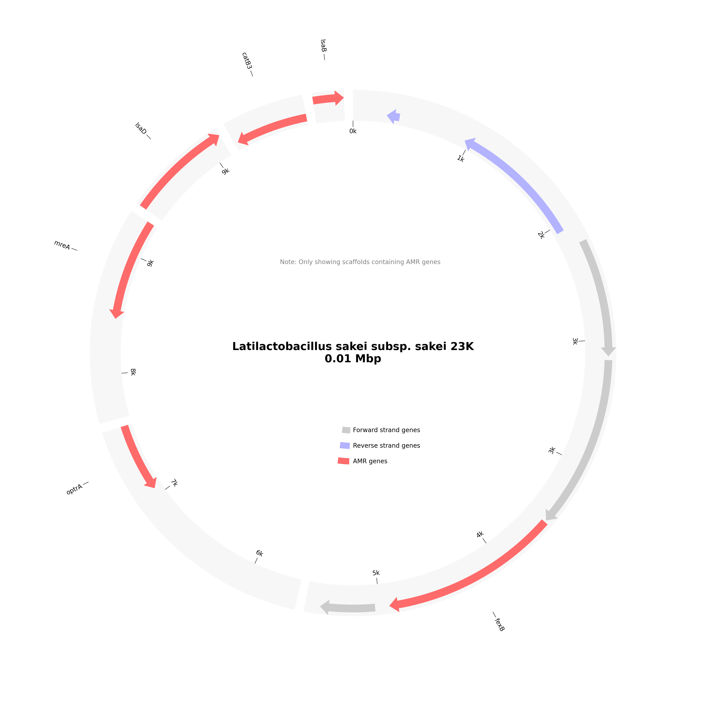

### catB3
- **Mechanism**: antibiotic inactivation
- **Drug Classes**: phenicol antibiotic
- **AMR Family**: chloramphenicol acetyltransferase (CAT)
- **Locations**:
  - gnl|SPADES|FPFIAAFN_16823_1 : position 25-540

### fexB
- **Mechanism**: antibiotic efflux
- **Drug Classes**: phenicol antibiotic
- **AMR Family**: major facilitator superfamily (MFS) antibiotic efflux pump
- **Locations**:
  - gnl|SPADES|FPFIAAFN_1301_7 : position 3864-5054

### lsaB
- **Mechanism**: antibiotic target protection
- **Drug Classes**: lincosamide antibiotic; streptogramin antibiotic; pleuromutilin antibiotic
- **AMR Family**: lsa-type ABC-F protein
- **Locations**:
  - gnl|SPADES|FPFIAAFN_71280_1 : position 2-208

### lsaD
- **Mechanism**: antibiotic target protection
- **Drug Classes**: lincosamide antibiotic; streptogramin antibiotic; streptogramin A antibiotic; pleuromutilin antibiotic
- **AMR Family**: lsa-type ABC-F protein
- **Locations**:
  - gnl|SPADES|FPFIAAFN_12232_1 : position 1-699

### mreA
- **Mechanism**: antibiotic efflux
- **Drug Classes**: macrolide antibiotic
- **AMR Family**: major facilitator superfamily (MFS) antibiotic efflux pump
- **Locations**:
  - gnl|SPADES|FPFIAAFN_5311_2 : position 701-1420

### optrA
- **Mechanism**: antibiotic target protection
- **Drug Classes**: oxazolidinone antibiotic; phenicol antibiotic
- **AMR Family**: Miscellaneous ABC-F subfamily ATP-binding cassette ribosomal protection proteins
- **Locations**:
  - gnl|SPADES|FPFIAAFN_4293_2 : position 1262-1750

## Lelliottia sp. JS-SCA-14
**Strain Statistics:**
- Total genome length: 0.2 kbp
- Total scaffolds: 9
- Scaffolds with AMR genes: 1
- Total genes annotated: 0
- Total AMR genes: 1
- Unique AMR genes: 1
- Distinct AMR mechanisms: 1
- Distinct AMR families: 1
- Distinct drug classes: 12

**Circos Plot:**

### ParS
- **Mechanism**: antibiotic efflux; reduced permeability to antibiotic
- **Drug Classes**: macrolide antibiotic; fluoroquinolone antibiotic; monobactam; aminoglycoside antibiotic; carbapenem; cephalosporin; cephamycin; penam; tetracycline antibiotic; phenicol antibiotic; penem; disinfecting agents and antiseptics
- **AMR Family**: resistance-nodulation-cell division (RND) antibiotic efflux pump; Outer Membrane Porin (Opr)
- **Locations**:
  - gnl|SPADES|FPFIAAFN_61471_1 : position 3-227

## Serratia fonticola
**Strain Statistics:**
- Total genome length: 4840.0 kbp
- Total scaffolds: 332
- Scaffolds with AMR genes: 153
- Total genes annotated: 8928
- Total AMR genes: 563
- Unique AMR genes: 227
- Distinct AMR mechanisms: 10
- Distinct AMR families: 78
- Distinct drug classes: 37

**Circos Plot:**

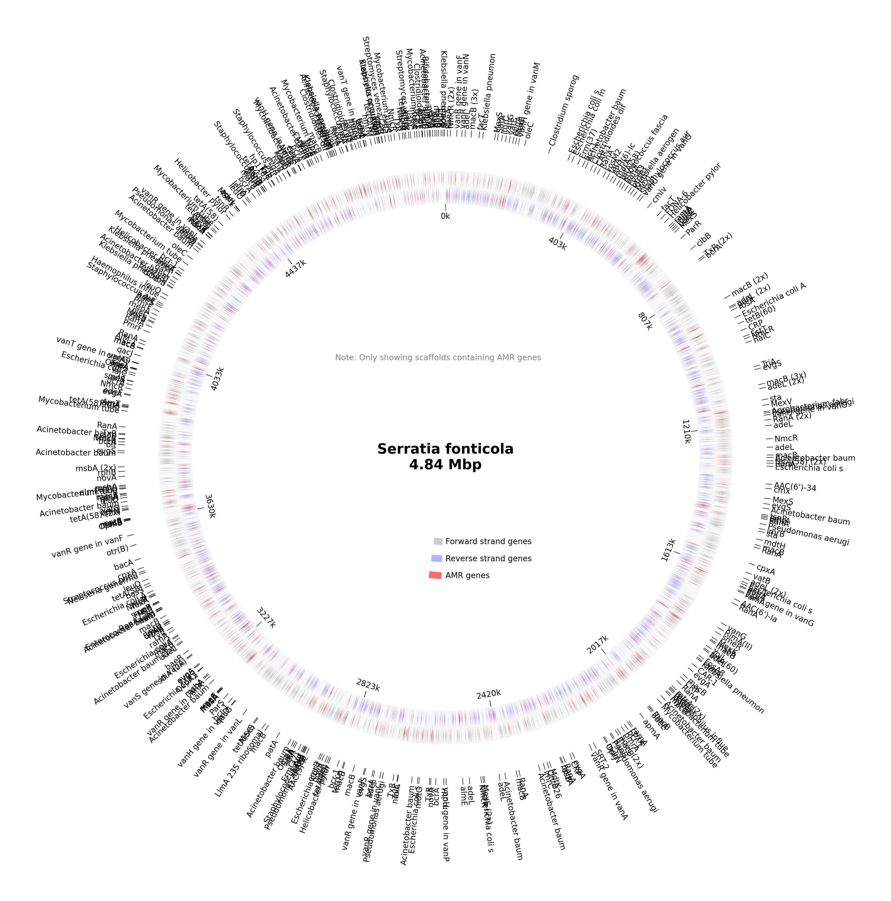

### AAC(3)-Ic
- **Mechanism**: antibiotic inactivation
- **Drug Classes**: aminoglycoside antibiotic
- **AMR Family**: AAC(3)
- **Locations**:
  - gnl|SPADES|FPFIAAFN_162_19 : position 22179-22604

### AAC(6')-34
- **Mechanism**: antibiotic inactivation
- **Drug Classes**: aminoglycoside antibiotic
- **AMR Family**: AAC(6')
- **Locations**:
  - gnl|SPADES|FPFIAAFN_56_14 : position 17255-17752

### AAC(6')-Ia
- **Mechanism**: antibiotic inactivation
- **Drug Classes**: aminoglycoside antibiotic
- **AMR Family**: AAC(6')
- **Locations**:
  - gnl|SPADES|FPFIAAFN_64_64 : position 69334-69852

### AIM-1
- **Mechanism**: antibiotic inactivation
- **Drug Classes**: cephalosporin; cephamycin; penam
- **AMR Family**: AIM beta-lactamase
- **Locations**:
  - gnl|SPADES|FPFIAAFN_366_12 : position 13928-14920

### APH(6)-Ic
- **Mechanism**: antibiotic inactivation
- **Drug Classes**: aminoglycoside antibiotic
- **AMR Family**: APH(6)
- **Locations**:
  - gnl|SPADES|FPFIAAFN_14_28 : position 21856-22713

### Acinetobacter baumannii AbaF (found in 9 locations)
- **Mechanism**: antibiotic efflux
- **Drug Classes**: phosphonic acid antibiotic
- **AMR Family**: major facilitator superfamily (MFS) antibiotic efflux pump
- **Locations**:
  - gnl|SPADES|FPFIAAFN_127_36 : position 35543-37045
  - gnl|SPADES|FPFIAAFN_186_6 : position 4258-5583
  - gnl|SPADES|FPFIAAFN_2135_3 : position 932-2224
  - gnl|SPADES|FPFIAAFN_303_8 : position 5282-6565
  - gnl|SPADES|FPFIAAFN_30_22 : position 31103-32500
  - gnl|SPADES|FPFIAAFN_437_16 : position 13899-15245
  - gnl|SPADES|FPFIAAFN_56_68 : position 80877-82199
  - gnl|SPADES|FPFIAAFN_772_8 : position 7909-9141
  - gnl|SPADES|FPFIAAFN_82_3 : position 2664-3947

### Acinetobacter baumannii AbaQ (found in 13 locations)
- **Mechanism**: antibiotic efflux
- **Drug Classes**: fluoroquinolone antibiotic
- **AMR Family**: major facilitator superfamily (MFS) antibiotic efflux pump
- **Locations**:
  - gnl|SPADES|FPFIAAFN_12_140 : position 158189-159457
  - gnl|SPADES|FPFIAAFN_165_28 : position 33151-34419
  - gnl|SPADES|FPFIAAFN_194_20 : position 20738-22084
  - gnl|SPADES|FPFIAAFN_194_24 : position 25699-26994
  - gnl|SPADES|FPFIAAFN_245_26 : position 26310-27641
  - gnl|SPADES|FPFIAAFN_290_10 : position 9838-11196
  - gnl|SPADES|FPFIAAFN_406_10 : position 10121-11419
  - gnl|SPADES|FPFIAAFN_41_19 : position 18265-19491
  - gnl|SPADES|FPFIAAFN_41_26 : position 27135-28412
  - gnl|SPADES|FPFIAAFN_41_28 : position 29664-31010
  - gnl|SPADES|FPFIAAFN_51_41 : position 43736-45028
  - gnl|SPADES|FPFIAAFN_684_8 : position 5402-6772
  - gnl|SPADES|FPFIAAFN_99_13 : position 15760-17115

### Acinetobacter baumannii AmvA (found in 2 locations)
- **Mechanism**: antibiotic efflux
- **Drug Classes**: macrolide antibiotic; disinfecting agents and antiseptics
- **AMR Family**: major facilitator superfamily (MFS) antibiotic efflux pump
- **Locations**:
  - gnl|SPADES|FPFIAAFN_199_13 : position 8815-10311
  - gnl|SPADES|FPFIAAFN_93_45 : position 50114-51412

### Agrobacterium fabrum chloramphenicol acetyltransferase
- **Mechanism**: antibiotic inactivation
- **Drug Classes**: phenicol antibiotic
- **AMR Family**: chloramphenicol acetyltransferase (CAT)
- **Locations**:
  - gnl|SPADES|FPFIAAFN_49_19 : position 22841-23470

### ArnT
- **Mechanism**: antibiotic target alteration
- **Drug Classes**: peptide antibiotic
- **AMR Family**: pmr phosphoethanolamine transferase
- **Locations**:
  - gnl|SPADES|FPFIAAFN_316_10: position 8329-9993

### BahA
- **Mechanism**: antibiotic inactivation
- **Drug Classes**: peptide antibiotic
- **AMR Family**: Bah amidohydrolase
- **Locations**:
  - gnl|SPADES|FPFIAAFN_14_58 : position 57047-58060

### Bifidobacterium bifidum ileS conferring resistance to mupirocin
- **Mechanism**: antibiotic target alteration
- **Drug Classes**: mupirocin-like antibiotic
- **AMR Family**: antibiotic-resistant isoleucyl-tRNA synthetase (ileS)
- **Locations**:
  - gnl|SPADES|FPFIAAFN_2143_1 : position 1-432

### CAR-1 (found in 2 locations)
- **Mechanism**: antibiotic inactivation
- **Drug Classes**: carbapenem
- **AMR Family**: CAR beta-lactamase
- **Locations**:
  - gnl|SPADES|FPFIAAFN_12_161 : position 182986-183786
  - gnl|SPADES|FPFIAAFN_71_34 : position 32553-33359

### CMY-95
- **Mechanism**: antibiotic inactivation
- **Drug Classes**: cephamycin
- **AMR Family**: CMY beta-lactamase
- **Locations**:
  - gnl|SPADES|FPFIAAFN_684_10 : position 7763-8905

### CRP (found in 3 locations)
- **Mechanism**: antibiotic efflux
- **Drug Classes**: macrolide antibiotic; fluoroquinolone antibiotic; penam
- **AMR Family**: resistance-nodulation-cell division (RND) antibiotic efflux pump
- **Locations**:
  - gnl|SPADES|FPFIAAFN_45_5 : position 4529-5230
  - gnl|SPADES|FPFIAAFN_79_2 : position 1159-1923
  - gnl|SPADES|FPFIAAFN_92_25: position 26470-27102

### Clostridioides difficile gyrA conferring resistance to fluoroquinolones
- **Mechanism**: antibiotic target alteration
- **Drug Classes**: fluoroquinolone antibiotic
- **AMR Family**: fluoroquinolone resistant gyrA
- **Locations**:
  - gnl|SPADES|FPFIAAFN_926_2 : position 1329-3980

### Clostridioides difficile gyrB conferring resistance to fluoroquinolones (found in 3 locations)
- **Mechanism**: antibiotic target alteration
- **Drug Classes**: fluoroquinolone antibiotic
- **AMR Family**: fluoroquinolone resistant gyrB
- **Locations**:
  - gnl|SPADES|FPFIAAFN_12_152 : position 172128-174542
  - gnl|SPADES|FPFIAAFN_1804_1 : position 2-1729
  - gnl|SPADES|FPFIAAFN_755_9 : position 7133-9550

### Clostridium sporogenes cplR
- **Mechanism**: antibiotic target protection
- **Drug Classes**: lincosamide antibiotic; pleuromutilin antibiotic
- **AMR Family**: Miscellaneous ABC-F subfamily ATP-binding cassette ribosomal protection proteins
- **Locations**:
  - gnl|SPADES|FPFIAAFN_12_51 : position 54498-55541

### Enterobacter cloacae acrA
- **Mechanism**: antibiotic efflux
- **Drug Classes**: fluoroquinolone antibiotic; cephalosporin; glycylcycline; penam; tetracycline antibiotic; rifamycin antibiotic; phenicol antibiotic; disinfecting agents and antiseptics
- **AMR Family**: resistance-nodulation-cell division (RND) antibiotic efflux pump
- **Locations**:
  - gnl|SPADES|FPFIAAFN_8_173 : position 186899-188017

### Enterococcus faecalis cls with mutation conferring resistance to daptomycin
- **Mechanism**: antibiotic target alteration
- **Drug Classes**: peptide antibiotic
- **AMR Family**: daptomycin resistant cls
- **Locations**:
  - gnl|SPADES|FPFIAAFN_199_15 : position 11505-12965

### Erm(37) (found in 2 locations)
- **Mechanism**: antibiotic target alteration
- **Drug Classes**: macrolide antibiotic; lincosamide antibiotic; streptogramin antibiotic; streptogramin A antibiotic; streptogramin B antibiotic
- **AMR Family**: Erm 23S ribosomal RNA methyltransferase
- **Locations**:
  - gnl|SPADES|FPFIAAFN_12_121 : position 136449-137228
  - gnl|SPADES|FPFIAAFN_165_4 : position 3253-4035

### ErmC
- **Mechanism**: antibiotic target alteration
- **Drug Classes**: macrolide antibiotic; lincosamide antibiotic; streptogramin antibiotic; streptogramin A antibiotic; streptogramin B antibiotic
- **AMR Family**: Erm 23S ribosomal RNA methyltransferase
- **Locations**:
  - gnl|SPADES|FPFIAAFN_197_12 : position 8876-9694

### Escherichia coli AcrAB-TolC with AcrR mutation conferring resistance to ciprofloxacin, tetracycline, and ceftazidime (found in 2 locations)
- **Mechanism**: antibiotic target alteration; antibiotic efflux
- **Drug Classes**: fluoroquinolone antibiotic; cephalosporin; glycylcycline; penam; tetracycline antibiotic; rifamycin antibiotic; phenicol antibiotic; disinfecting agents and antiseptics
- **AMR Family**: resistance-nodulation-cell division (RND) antibiotic efflux pump
- **Locations**:
  - gnl|SPADES|FPFIAAFN_200_23 : position 24727-25344
  - gnl|SPADES|FPFIAAFN_41_66 : position 73132-73779

### Escherichia coli AcrAB-TolC with MarR mutations conferring resistance to ciprofloxacin and tetracycline
- **Mechanism**: antibiotic target alteration; antibiotic efflux
- **Drug Classes**: fluoroquinolone antibiotic; cephalosporin; glycylcycline; penam; tetracycline antibiotic; rifamycin antibiotic; phenicol antibiotic; disinfecting agents and antiseptics
- **AMR Family**: resistance-nodulation-cell division (RND) antibiotic efflux pump
- **Locations**:
  - gnl|SPADES|FPFIAAFN_14_14 : position 11982-12416

### Escherichia coli EF-Tu mutants conferring resistance to Pulvomycin
- **Mechanism**: antibiotic target alteration
- **Drug Classes**: elfamycin antibiotic
- **AMR Family**: elfamycin resistant EF-Tu
- **Locations**:
  - gnl|SPADES|FPFIAAFN_12_109 : position 122144-123985

### Escherichia coli GlpT with mutation conferring resistance to fosfomycin
- **Mechanism**: antibiotic target alteration
- **Drug Classes**: phosphonic acid antibiotic
- **AMR Family**: antibiotic-resistant GlpT
- **Locations**:
  - gnl|SPADES|FPFIAAFN_51_18 : position 19348-20700

### Escherichia coli acrA
- **Mechanism**: antibiotic efflux
- **Drug Classes**: fluoroquinolone antibiotic; cephalosporin; glycylcycline; penam; tetracycline antibiotic; rifamycin antibiotic; phenicol antibiotic; disinfecting agents and antiseptics
- **AMR Family**: resistance-nodulation-cell division (RND) antibiotic efflux pump
- **Locations**:
  - gnl|SPADES|FPFIAAFN_41_67 : position 73922-75103

### Escherichia coli fabI mutations conferring resistance to isoniazid and triclosan (found in 2 locations)
- **Mechanism**: antibiotic target alteration
- **Drug Classes**: disinfecting agents and antiseptics; isoniazid-like antibiotic
- **AMR Family**: antibiotic resistant fabI
- **Locations**:
  - gnl|SPADES|FPFIAAFN_150_24 : position 28714-29469
  - gnl|SPADES|FPFIAAFN_196_5 : position 2968-3750

### Escherichia coli mdfA
- **Mechanism**: antibiotic efflux
- **Drug Classes**: tetracycline antibiotic; phenicol antibiotic; disinfecting agents and antiseptics
- **AMR Family**: major facilitator superfamily (MFS) antibiotic efflux pump
- **Locations**:
  - gnl|SPADES|FPFIAAFN_12_107 : position 118985-120340

### Escherichia coli soxS with mutation conferring antibiotic resistance (found in 10 locations)
- **Mechanism**: antibiotic target alteration; antibiotic efflux; reduced permeability to antibiotic
- **Drug Classes**: fluoroquinolone antibiotic; monobactam; carbapenem; cephalosporin; glycylcycline; cephamycin; penam; tetracycline antibiotic; rifamycin antibiotic; phenicol antibiotic; penem; disinfecting agents and antiseptics
- **AMR Family**: ATP-binding cassette (ABC) antibiotic efflux pump; major facilitator superfamily (MFS) antibiotic efflux pump; resistance-nodulation-cell division (RND) antibiotic efflux pump; General Bacterial Porin with reduced permeability to beta-lactams
- **Locations**:
  - gnl|SPADES|FPFIAAFN_115_14 : position 13398-14225
  - gnl|SPADES|FPFIAAFN_127_21 : position 20991-21791
  - gnl|SPADES|FPFIAAFN_12_98 : position 108092-109270
  - gnl|SPADES|FPFIAAFN_14_169 : position 180400-181374
  - gnl|SPADES|FPFIAAFN_14_47 : position 44252-45169
  - gnl|SPADES|FPFIAAFN_188_8 : position 10078-10968
  - gnl|SPADES|FPFIAAFN_353_1 : position 3-863
  - gnl|SPADES|FPFIAAFN_51_61 : position 66512-67399
  - gnl|SPADES|FPFIAAFN_64_18 : position 19406-20290
  - gnl|SPADES|FPFIAAFN_8_18 : position 19052-19495

### EstT
- **Mechanism**: antibiotic inactivation
- **Drug Classes**: macrolide antibiotic
- **AMR Family**: macrolide esterase
- **Locations**:
  - gnl|SPADES|FPFIAAFN_45_25 : position 21508-22377

### FONA-6
- **Mechanism**: antibiotic inactivation
- **Drug Classes**: penam
- **AMR Family**: FONA beta-lactamase
- **Locations**:
  - gnl|SPADES|FPFIAAFN_14_174: position 187395-188282

### FosA8
- **Mechanism**: antibiotic inactivation
- **Drug Classes**: phosphonic acid antibiotic
- **AMR Family**: fosfomycin thiol transferase
- **Locations**:
  - gnl|SPADES|FPFIAAFN_71_6: position 4582-4989

### FosB3
- **Mechanism**: antibiotic inactivation
- **Drug Classes**: phosphonic acid antibiotic
- **AMR Family**: fosfomycin thiol transferase
- **Locations**:
  - gnl|SPADES|FPFIAAFN_14_67 : position 67286-67657

### FosM2
- **Mechanism**: antibiotic inactivation
- **Drug Classes**: phosphonic acid antibiotic
- **AMR Family**: fosfomycin thiol transferase
- **Locations**:
  - gnl|SPADES|FPFIAAFN_14_2 : position 144-551

### GMB-1
- **Mechanism**: antibiotic inactivation
- **Drug Classes**: carbapenem
- **AMR Family**: GMB beta-lactamase
- **Locations**:
  - gnl|SPADES|FPFIAAFN_66_59 : position 62310-63194

### GOB-5
- **Mechanism**: antibiotic inactivation
- **Drug Classes**: carbapenem; cephalosporin; penam
- **AMR Family**: GOB beta-lactamase
- **Locations**:
  - gnl|SPADES|FPFIAAFN_402_12 : position 13759-14406

### H-NS
- **Mechanism**: antibiotic efflux
- **Drug Classes**: macrolide antibiotic; fluoroquinolone antibiotic; cephalosporin; cephamycin; penam; tetracycline antibiotic
- **AMR Family**: major facilitator superfamily (MFS) antibiotic efflux pump; resistance-nodulation-cell division (RND) antibiotic efflux pump
- **Locations**:
  - gnl|SPADES|FPFIAAFN_199_27 : position 26904-27311

### Haemophilus influenzae PBP3 conferring resistance to beta-lactam antibiotics (found in 2 locations)
- **Mechanism**: antibiotic target alteration
- **Drug Classes**: cephalosporin; cephamycin; penam
- **AMR Family**: Penicillin-binding protein mutations conferring resistance to beta-lactam antibiotics
- **Locations**:
  - gnl|SPADES|FPFIAAFN_399_1 : position 2-1252
  - gnl|SPADES|FPFIAAFN_79_43 : position 44052-45770

### Helicobacter pylori frxA mutation conferring resistance to metronidazole
- **Mechanism**: antibiotic target alteration
- **Drug Classes**: nitroimidazole antibiotic
- **AMR Family**: Antibiotic resistant Helicobacter pylori nitroreductase
- **Locations**:
  - gnl|SPADES|FPFIAAFN_14_184 : position 201088-201693

### Helicobacter pylori pbp1 mutants conferring resistance to amoxicillin (found in 2 locations)
- **Mechanism**: antibiotic target alteration
- **Drug Classes**: cephalosporin; cephamycin; penam
- **AMR Family**: Penicillin-binding protein mutations conferring resistance to beta-lactam antibiotics
- **Locations**:
  - gnl|SPADES|FPFIAAFN_150_4 : position 4079-6580
  - gnl|SPADES|FPFIAAFN_418_1 : position 83-2446

### Helicobacter pylori pbp2 mutants conferring resistance to amoxicillin
- **Mechanism**: antibiotic target alteration
- **Drug Classes**: cephalosporin; cephamycin; penam
- **AMR Family**: Penicillin-binding protein mutations conferring resistance to beta-lactam antibiotics
- **Locations**:
  - gnl|SPADES|FPFIAAFN_472_9 : position 7462-9357

### Klebsiella aerogenes Omp36
- **Mechanism**: reduced permeability to antibiotic
- **Drug Classes**: monobactam; carbapenem; cephalosporin; cephamycin; penam; penem
- **AMR Family**: General Bacterial Porin with reduced permeability to beta-lactams
- **Locations**:
  - gnl|SPADES|FPFIAAFN_14_86 : position 85123-86250

### Klebsiella pneumoniae KpnE
- **Mechanism**: antibiotic efflux
- **Drug Classes**: macrolide antibiotic; aminoglycoside antibiotic; cephalosporin; tetracycline antibiotic; peptide antibiotic; rifamycin antibiotic; disinfecting agents and antiseptics
- **AMR Family**: small multidrug resistance (SMR) antibiotic efflux pump
- **Locations**:
  - gnl|SPADES|FPFIAAFN_777_1 : position 230-598

### Klebsiella pneumoniae KpnF
- **Mechanism**: antibiotic efflux
- **Drug Classes**: macrolide antibiotic; aminoglycoside antibiotic; cephalosporin; tetracycline antibiotic; peptide antibiotic; rifamycin antibiotic; disinfecting agents and antiseptics
- **AMR Family**: small multidrug resistance (SMR) antibiotic efflux pump
- **Locations**:
  - gnl|SPADES|FPFIAAFN_777_2: position 585-914

### Klebsiella pneumoniae KpnH (found in 2 locations)
- **Mechanism**: antibiotic efflux
- **Drug Classes**: macrolide antibiotic; fluoroquinolone antibiotic; aminoglycoside antibiotic; carbapenem; cephalosporin; penam; peptide antibiotic; penem
- **AMR Family**: major facilitator superfamily (MFS) antibiotic efflux pump
- **Locations**:
  - gnl|SPADES|FPFIAAFN_416_14 : position 12798-14324
  - gnl|SPADES|FPFIAAFN_60_9: position 8330-9709

### Klebsiella pneumoniae OmpK37 (found in 7 locations)
- **Mechanism**: reduced permeability to antibiotic
- **Drug Classes**: monobactam; carbapenem; cephalosporin; cephamycin; penam; penem
- **AMR Family**: General Bacterial Porin with reduced permeability to beta-lactams
- **Locations**:
  - gnl|SPADES|FPFIAAFN_1074_3 : position 4517-5632
  - gnl|SPADES|FPFIAAFN_402_14 : position 15905-16819
  - gnl|SPADES|FPFIAAFN_44819_1 : position 3-266
  - gnl|SPADES|FPFIAAFN_45_9 : position 7489-8535
  - gnl|SPADES|FPFIAAFN_71_18 : position 13709-14791
  - gnl|SPADES|FPFIAAFN_82_42 : position 44226-45317
  - gnl|SPADES|FPFIAAFN_8_84 : position 96898-97992

### LlmA 23S ribosomal RNA methyltransferase
- **Mechanism**: antibiotic target alteration
- **Drug Classes**: lincosamide antibiotic
- **AMR Family**: Llm 23S ribosomal RNA methyltransferase
- **Locations**:
  - gnl|SPADES|FPFIAAFN_169_27 : position 28071-29261

### LptD
- **Mechanism**: antibiotic efflux
- **Drug Classes**: carbapenem; peptide antibiotic; aminocoumarin antibiotic; rifamycin antibiotic
- **AMR Family**: ATP-binding cassette (ABC) antibiotic efflux pump
- **Locations**:
  - gnl|SPADES|FPFIAAFN_197_15 : position 12035-14401

### MOX-3
- **Mechanism**: antibiotic inactivation
- **Drug Classes**: cephalosporin; cephamycin; penam
- **AMR Family**: MOX beta-lactamase
- **Locations**:
  - gnl|SPADES|FPFIAAFN_14_60 : position 59167-60306

### MSI-1
- **Mechanism**: antibiotic inactivation
- **Drug Classes**: carbapenem
- **AMR Family**: MSI beta-lactamase
- **Locations**:
  - gnl|SPADES|FPFIAAFN_487_4 : position 2253-3008

### MdtK
- **Mechanism**: antibiotic efflux
- **Drug Classes**: fluoroquinolone antibiotic
- **AMR Family**: multidrug and toxic compound extrusion (MATE) transporter
- **Locations**:
  - gnl|SPADES|FPFIAAFN_93_21 : position 20223-21680

### MexF
- **Mechanism**: antibiotic efflux
- **Drug Classes**: fluoroquinolone antibiotic; diaminopyrimidine antibiotic; phenicol antibiotic
- **AMR Family**: resistance-nodulation-cell division (RND) antibiotic efflux pump
- **Locations**:
  - gnl|SPADES|FPFIAAFN_8_171 : position 183786-185339

### MexJ
- **Mechanism**: antibiotic efflux
- **Drug Classes**: macrolide antibiotic; tetracycline antibiotic; disinfecting agents and antiseptics
- **AMR Family**: resistance-nodulation-cell division (RND) antibiotic efflux pump
- **Locations**:
  - gnl|SPADES|FPFIAAFN_66_26 : position 26789-27874

### MexK
- **Mechanism**: antibiotic efflux
- **Drug Classes**: macrolide antibiotic; tetracycline antibiotic; disinfecting agents and antiseptics
- **AMR Family**: resistance-nodulation-cell division (RND) antibiotic efflux pump
- **Locations**:
  - gnl|SPADES|FPFIAAFN_66_25 : position 23709-26789

### MexL
- **Mechanism**: antibiotic efflux
- **Drug Classes**: macrolide antibiotic; tetracycline antibiotic; disinfecting agents and antiseptics
- **AMR Family**: resistance-nodulation-cell division (RND) antibiotic efflux pump
- **Locations**:
  - gnl|SPADES|FPFIAAFN_14_95 : position 94433-95029

### MexS (found in 8 locations)
- **Mechanism**: antibiotic efflux
- **Drug Classes**: fluoroquinolone antibiotic; diaminopyrimidine antibiotic; phenicol antibiotic
- **AMR Family**: resistance-nodulation-cell division (RND) antibiotic efflux pump
- **Locations**:
  - gnl|SPADES|FPFIAAFN_115_10 : position 9780-10811
  - gnl|SPADES|FPFIAAFN_115_27 : position 25583-26590
  - gnl|SPADES|FPFIAAFN_172_14 : position 13919-14986
  - gnl|SPADES|FPFIAAFN_302_18 : position 20231-21355
  - gnl|SPADES|FPFIAAFN_30_21 : position 29985-30998
  - gnl|SPADES|FPFIAAFN_378_16 : position 15435-16424
  - gnl|SPADES|FPFIAAFN_56_47 : position 54724-55773
  - gnl|SPADES|FPFIAAFN_8_116 : position 128409-129434

### MexT
- **Mechanism**: antibiotic efflux
- **Drug Classes**: fluoroquinolone antibiotic; diaminopyrimidine antibiotic; phenicol antibiotic
- **AMR Family**: resistance-nodulation-cell division (RND) antibiotic efflux pump
- **Locations**:
  - gnl|SPADES|FPFIAAFN_463_12 : position 12536-13429

### MexV
- **Mechanism**: antibiotic efflux
- **Drug Classes**: macrolide antibiotic; fluoroquinolone antibiotic; tetracycline antibiotic; phenicol antibiotic; disinfecting agents and antiseptics
- **AMR Family**: resistance-nodulation-cell division (RND) antibiotic efflux pump
- **Locations**:
  - gnl|SPADES|FPFIAAFN_49_6 : position 5361-6803

### MexW
- **Mechanism**: antibiotic efflux
- **Drug Classes**: macrolide antibiotic; fluoroquinolone antibiotic; tetracycline antibiotic; phenicol antibiotic; disinfecting agents and antiseptics
- **AMR Family**: resistance-nodulation-cell division (RND) antibiotic efflux pump
- **Locations**:
  - gnl|SPADES|FPFIAAFN_49_7 : position 6800-9943

### Mycobacterium tuberculosis gidB mutation conferring resistance to streptomycin
- **Mechanism**: antibiotic target alteration
- **Drug Classes**: aminoglycoside antibiotic
- **AMR Family**: antibiotic resistant gidB
- **Locations**:
  - gnl|SPADES|FPFIAAFN_1637_3 : position 1683-2303

### Mycobacterium tuberculosis inhA mutations conferring resistance to isoniazid (found in 2 locations)
- **Mechanism**: antibiotic target alteration
- **Drug Classes**: isoniazid-like antibiotic
- **AMR Family**: isoniazid resistant inhA
- **Locations**:
  - gnl|SPADES|FPFIAAFN_14_177 : position 190955-191701
  - gnl|SPADES|FPFIAAFN_267_1 : position 747-1505

### Mycobacterium tuberculosis kasA mutant conferring resistance to isoniazid (found in 4 locations)
- **Mechanism**: antibiotic target alteration
- **Drug Classes**: isoniazid-like antibiotic
- **AMR Family**: antibiotic resistant kasA
- **Locations**:
  - gnl|SPADES|FPFIAAFN_1238_1 : position 3-1169
  - gnl|SPADES|FPFIAAFN_690_5 : position 6016-7290
  - gnl|SPADES|FPFIAAFN_79_50 : position 51158-53716
  - gnl|SPADES|FPFIAAFN_82_18 : position 15880-17049

### Mycobacterium tuberculosis ndh with mutation conferring resistance to isoniazid
- **Mechanism**: antibiotic target alteration
- **Drug Classes**: isoniazid-like antibiotic
- **AMR Family**: antibiotic resistant ndh
- **Locations**:
  - gnl|SPADES|FPFIAAFN_421_11 : position 8173-9501

### Mycobacterium tuberculosis pncA mutations conferring resistance to pyrazinamide
- **Mechanism**: antibiotic target alteration
- **Drug Classes**: pyrazine antibiotic
- **AMR Family**: Pyrazinamide resistant pncA
- **Locations**:
  - gnl|SPADES|FPFIAAFN_469_4 : position 2680-3312

### Mycobacterium tuberculosis thyA with mutation conferring resistance to para-aminosalicylic acid
- **Mechanism**: antibiotic target alteration
- **Drug Classes**: salicylic acid antibiotic
- **AMR Family**: aminosalicylate resistant thymidylate synthase
- **Locations**:
  - gnl|SPADES|FPFIAAFN_315_11 : position 17221-18015

### Mycolicibacterium smegmatis ndh with mutation conferring resistance to isoniazid
- **Mechanism**: antibiotic target alteration
- **Drug Classes**: isoniazid-like antibiotic
- **AMR Family**: antibiotic resistant ndh
- **Locations**:
  - gnl|SPADES|FPFIAAFN_629_5 : position 3417-4616

### Neisseria gonorrhoeae pilQ gene conferring resistance to beta-lactam
- **Mechanism**: antibiotic target alteration
- **Drug Classes**: cephalosporin; cephamycin; penam
- **AMR Family**: Penicillin-binding protein mutations conferring resistance to beta-lactam antibiotics
- **Locations**:
  - gnl|SPADES|FPFIAAFN_210_4 : position 3664-4911

### NmcR (found in 12 locations)
- **Mechanism**: antibiotic inactivation
- **Drug Classes**: carbapenem; cephalosporin; cephamycin; penam
- **AMR Family**: NmcA beta-lactamase
- **Locations**:
  - gnl|SPADES|FPFIAAFN_115_18 : position 18639-19508
  - gnl|SPADES|FPFIAAFN_1278_1 : position 1-849
  - gnl|SPADES|FPFIAAFN_1352_4 : position 4271-5152
  - gnl|SPADES|FPFIAAFN_200_13 : position 13773-14699
  - gnl|SPADES|FPFIAAFN_302_17 : position 19289-20191
  - gnl|SPADES|FPFIAAFN_326_2 : position 2900-3874
  - gnl|SPADES|FPFIAAFN_45_32 : position 27869-28750
  - gnl|SPADES|FPFIAAFN_49_84 : position 94217-95155
  - gnl|SPADES|FPFIAAFN_629_9 : position 7014-7907
  - gnl|SPADES|FPFIAAFN_772_5 : position 4821-5648
  - gnl|SPADES|FPFIAAFN_8_10 : position 12093-12980
  - gnl|SPADES|FPFIAAFN_8_141 : position 153805-154731

### OmpA (found in 4 locations)
- **Mechanism**: reduced permeability to antibiotic
- **Drug Classes**: peptide antibiotic
- **AMR Family**: General Bacterial Porin with reduced permeability to peptide antibiotics
- **Locations**:
  - gnl|SPADES|FPFIAAFN_12_136 : position 154351-155010
  - gnl|SPADES|FPFIAAFN_165_21 : position 24280-24939
  - gnl|SPADES|FPFIAAFN_353_9 : position 10252-10749
  - gnl|SPADES|FPFIAAFN_79_44 : position 45777-46895

### OpmB
- **Mechanism**: antibiotic efflux
- **Drug Classes**: macrolide antibiotic; monobactam; tetracycline antibiotic; aminocoumarin antibiotic
- **AMR Family**: resistance-nodulation-cell division (RND) antibiotic efflux pump
- **Locations**:
  - gnl|SPADES|FPFIAAFN_239_9 : position 8604-10010

### OprJ
- **Mechanism**: antibiotic efflux
- **Drug Classes**: macrolide antibiotic; fluoroquinolone antibiotic; aminoglycoside antibiotic; cephalosporin; penam; tetracycline antibiotic; aminocoumarin antibiotic; diaminopyrimidine antibiotic; phenicol antibiotic
- **AMR Family**: resistance-nodulation-cell division (RND) antibiotic efflux pump
- **Locations**:
  - gnl|SPADES|FPFIAAFN_88_50 : position 55903-57384

### ParR (found in 3 locations)
- **Mechanism**: antibiotic efflux; reduced permeability to antibiotic
- **Drug Classes**: macrolide antibiotic; fluoroquinolone antibiotic; monobactam; aminoglycoside antibiotic; carbapenem; cephalosporin; cephamycin; penam; tetracycline antibiotic; phenicol antibiotic; penem; disinfecting agents and antiseptics
- **AMR Family**: resistance-nodulation-cell division (RND) antibiotic efflux pump; Outer Membrane Porin (Opr)
- **Locations**:
  - gnl|SPADES|FPFIAAFN_176_29 : position 31848-32576
  - gnl|SPADES|FPFIAAFN_210_17 : position 18507-19226
  - gnl|SPADES|FPFIAAFN_30_43 : position 52968-53675

### ParS (found in 2 locations)
- **Mechanism**: antibiotic efflux; reduced permeability to antibiotic
- **Drug Classes**: macrolide antibiotic; fluoroquinolone antibiotic; monobactam; aminoglycoside antibiotic; carbapenem; cephalosporin; cephamycin; penam; tetracycline antibiotic; phenicol antibiotic; penem; disinfecting agents and antiseptics
- **AMR Family**: resistance-nodulation-cell division (RND) antibiotic efflux pump; Outer Membrane Porin (Opr)
- **Locations**:
  - gnl|SPADES|FPFIAAFN_176_28 : position 30547-31851
  - gnl|SPADES|FPFIAAFN_60_28 : position 31831-33423

### PmrF (found in 3 locations)
- **Mechanism**: antibiotic target alteration
- **Drug Classes**: peptide antibiotic
- **AMR Family**: pmr phosphoethanolamine transferase
- **Locations**:
  - gnl|SPADES|FPFIAAFN_316_7 : position 4462-5442
  - gnl|SPADES|FPFIAAFN_377_7 : position 6644-7633
  - gnl|SPADES|FPFIAAFN_384_7 : position 4894-5805

### Pseudomonas aeruginosa CpxR (found in 5 locations)
- **Mechanism**: antibiotic efflux
- **Drug Classes**: macrolide antibiotic; fluoroquinolone antibiotic; monobactam; aminoglycoside antibiotic; carbapenem; cephalosporin; cephamycin; penam; tetracycline antibiotic; peptide antibiotic; aminocoumarin antibiotic; diaminopyrimidine antibiotic; sulfonamide antibiotic; phenicol antibiotic; penem
- **AMR Family**: resistance-nodulation-cell division (RND) antibiotic efflux pump
- **Locations**:
  - gnl|SPADES|FPFIAAFN_162_29 : position 30681-31361
  - gnl|SPADES|FPFIAAFN_445_7 : position 10920-11549
  - gnl|SPADES|FPFIAAFN_49_23 : position 26632-27306
  - gnl|SPADES|FPFIAAFN_60_27 : position 31127-31813
  - gnl|SPADES|FPFIAAFN_86_59 : position 48022-48720

### Pseudomonas aeruginosa ampR with mutation conferring resistance to aztreonam (found in 3 locations)
- **Mechanism**: antibiotic target alteration; antibiotic inactivation
- **Drug Classes**: monobactam; carbapenem; cephalosporin
- **AMR Family**: PDC beta-lactamase; ampR transcriptional regulator with mutation conferring resistance to monobactam antibiotics
- **Locations**:
  - gnl|SPADES|FPFIAAFN_133_8 : position 8681-9571
  - gnl|SPADES|FPFIAAFN_14_175 : position 188415-189290
  - gnl|SPADES|FPFIAAFN_88_33 : position 36388-37329

### QepA2
- **Mechanism**: antibiotic efflux
- **Drug Classes**: fluoroquinolone antibiotic
- **AMR Family**: major facilitator superfamily (MFS) antibiotic efflux pump
- **Locations**:
  - gnl|SPADES|FPFIAAFN_188_7 : position 8629-10023

### QepA4
- **Mechanism**: antibiotic efflux
- **Drug Classes**: fluoroquinolone antibiotic
- **AMR Family**: major facilitator superfamily (MFS) antibiotic efflux pump
- **Locations**:
  - gnl|SPADES|FPFIAAFN_14_69 : position 68831-70117

### QnrB26
- **Mechanism**: antibiotic target protection
- **Drug Classes**: fluoroquinolone antibiotic
- **AMR Family**: quinolone resistance protein (qnr)
- **Locations**:
  - gnl|SPADES|FPFIAAFN_93_28 : position 26884-27537

### RanA (found in 22 locations)
- **Mechanism**: antibiotic efflux
- **Drug Classes**: aminoglycoside antibiotic
- **AMR Family**: ATP-binding cassette (ABC) antibiotic efflux pump
- **Locations**:
  - gnl|SPADES|FPFIAAFN_12_172 : position 193638-194414
  - gnl|SPADES|FPFIAAFN_199_17 : position 13406-14404
  - gnl|SPADES|FPFIAAFN_199_18 : position 14401-15393
  - gnl|SPADES|FPFIAAFN_311_1 : position 41-1030
  - gnl|SPADES|FPFIAAFN_374_2 : position 1127-2722
  - gnl|SPADES|FPFIAAFN_378_2 : position 1091-2206
  - gnl|SPADES|FPFIAAFN_445_2 : position 3454-4512
  - gnl|SPADES|FPFIAAFN_463_6 : position 6024-6836
  - gnl|SPADES|FPFIAAFN_49_41 : position 44717-45490
  - gnl|SPADES|FPFIAAFN_49_67 : position 74276-75403
  - gnl|SPADES|FPFIAAFN_51_54 : position 58720-59793
  - gnl|SPADES|FPFIAAFN_527_10 : position 7196-8011
  - gnl|SPADES|FPFIAAFN_60_16 : position 17326-18525
  - gnl|SPADES|FPFIAAFN_61_9 : position 8215-9321
  - gnl|SPADES|FPFIAAFN_65_2 : position 545-1606
  - gnl|SPADES|FPFIAAFN_79_14 : position 14971-16107
  - gnl|SPADES|FPFIAAFN_82_43 : position 46092-46877
  - gnl|SPADES|FPFIAAFN_880_4 : position 5353-6423
  - gnl|SPADES|FPFIAAFN_88_30 : position 34035-34832
  - gnl|SPADES|FPFIAAFN_8_4 : position 3961-5838
  - gnl|SPADES|FPFIAAFN_92_45 : position 45080-45847
  - gnl|SPADES|FPFIAAFN_96_40 : position 40455-41588

### RanB (found in 2 locations)
- **Mechanism**: antibiotic efflux
- **Drug Classes**: aminoglycoside antibiotic
- **AMR Family**: ATP-binding cassette (ABC) antibiotic efflux pump
- **Locations**:
  - gnl|SPADES|FPFIAAFN_527_9 : position 6409-7191
  - gnl|SPADES|FPFIAAFN_88_29 : position 32893-34038

### Rhodococcus fascians cmr
- **Mechanism**: antibiotic efflux
- **Drug Classes**: phenicol antibiotic
- **AMR Family**: major facilitator superfamily (MFS) antibiotic efflux pump
- **Locations**:
  - gnl|SPADES|FPFIAAFN_14_52 : position 49294-50478

### RlmA(II)
- **Mechanism**: antibiotic target alteration
- **Drug Classes**: macrolide antibiotic; lincosamide antibiotic
- **AMR Family**: non-erm 23S ribosomal RNA methyltransferase (G748)
- **Locations**:
  - gnl|SPADES|FPFIAAFN_65_93 : position 75220-76059

### SAT-3
- **Mechanism**: antibiotic inactivation
- **Drug Classes**: nucleoside antibiotic
- **AMR Family**: streptothricin acetyltransferase (SAT)
- **Locations**:
  - gnl|SPADES|FPFIAAFN_8_154 : position 167733-168275

### SRT-2
- **Mechanism**: antibiotic inactivation
- **Drug Classes**: cephalosporin
- **AMR Family**: SRT beta-lactamase
- **Locations**:
  - gnl|SPADES|FPFIAAFN_91_22 : position 20662-22197

### SatA (found in 3 locations)
- **Mechanism**: antibiotic inactivation
- **Drug Classes**: nucleoside antibiotic
- **AMR Family**: streptothricin acetyltransferase (SAT)
- **Locations**:
  - gnl|SPADES|FPFIAAFN_12_135 : position 153688-154083
  - gnl|SPADES|FPFIAAFN_165_17 : position 19598-20044
  - gnl|SPADES|FPFIAAFN_8_123 : position 136111-136554

### Staphylococcus aureus FosB
- **Mechanism**: antibiotic inactivation
- **Drug Classes**: phosphonic acid antibiotic
- **AMR Family**: fosfomycin thiol transferase
- **Locations**:
  - gnl|SPADES|FPFIAAFN_1074_4 : position 5788-6204

### Staphylococcus aureus GlpT with mutation conferring resistance to fosfomycin
- **Mechanism**: antibiotic target alteration
- **Drug Classes**: phosphonic acid antibiotic
- **AMR Family**: antibiotic-resistant GlpT
- **Locations**:
  - gnl|SPADES|FPFIAAFN_162_34 : position 37614-38996

### Staphylococcus aureus UhpT with mutation conferring resistance to fosfomycin
- **Mechanism**: antibiotic target alteration
- **Drug Classes**: phosphonic acid antibiotic
- **AMR Family**: antibiotic-resistant UhpT
- **Locations**:
  - gnl|SPADES|FPFIAAFN_554_4 : position 2201-3508

### Staphylococcus aureus fusA with mutation conferring resistance to fusidic acid (found in 2 locations)
- **Mechanism**: antibiotic target alteration
- **Drug Classes**: fusidane antibiotic
- **AMR Family**: antibiotic resistant fusA
- **Locations**:
  - gnl|SPADES|FPFIAAFN_14_107 : position 106505-108610
  - gnl|SPADES|FPFIAAFN_386_7 : position 5241-6830

### Staphylococcus aureus mupA conferring resistance to mupirocin
- **Mechanism**: antibiotic target alteration
- **Drug Classes**: mupirocin-like antibiotic
- **AMR Family**: antibiotic-resistant isoleucyl-tRNA synthetase (ileS)
- **Locations**:
  - gnl|SPADES|FPFIAAFN_915_3 : position 1308-4124

### Staphylococcus aureus mupB conferring resistance to mupirocin
- **Mechanism**: antibiotic target alteration
- **Drug Classes**: mupirocin-like antibiotic
- **AMR Family**: antibiotic-resistant isoleucyl-tRNA synthetase (ileS)
- **Locations**:
  - gnl|SPADES|FPFIAAFN_46_81 : position 93448-96324

### Staphylococcus aureus murA with mutation conferring resistance to fosfomycin
- **Mechanism**: antibiotic target alteration
- **Drug Classes**: phosphonic acid antibiotic
- **AMR Family**: antibiotic-resistant murA transferase
- **Locations**:
  - gnl|SPADES|FPFIAAFN_527_4 : position 3187-4446

### Streptococcus pneumoniae PBP2x conferring resistance to amoxicillin
- **Mechanism**: antibiotic target alteration
- **Drug Classes**: cephalosporin; cephamycin; penam
- **AMR Family**: Penicillin-binding protein mutations conferring resistance to beta-lactam antibiotics
- **Locations**:
  - gnl|SPADES|FPFIAAFN_210_9 : position 7263-9821

### Streptomyces venezuelae rox (found in 4 locations)
- **Mechanism**: antibiotic inactivation
- **Drug Classes**: rifamycin antibiotic
- **AMR Family**: rifampin monooxygenase
- **Locations**:
  - gnl|SPADES|FPFIAAFN_1224_3 : position 1995-3173
  - gnl|SPADES|FPFIAAFN_1224_4 : position 3403-4605
  - gnl|SPADES|FPFIAAFN_1448_5 : position 3707-4888
  - gnl|SPADES|FPFIAAFN_82_47 : position 50497-52230

### TaeA (found in 3 locations)
- **Mechanism**: antibiotic efflux
- **Drug Classes**: pleuromutilin antibiotic
- **AMR Family**: ATP-binding cassette (ABC) antibiotic efflux pump
- **Locations**:
  - gnl|SPADES|FPFIAAFN_353_10 : position 10892-12559
  - gnl|SPADES|FPFIAAFN_60_71 : position 73399-74160
  - gnl|SPADES|FPFIAAFN_690_1 : position 24-1928

### TolC (found in 2 locations)
- **Mechanism**: antibiotic efflux
- **Drug Classes**: macrolide antibiotic; fluoroquinolone antibiotic; aminoglycoside antibiotic; carbapenem; cephalosporin; glycylcycline; cephamycin; penam; tetracycline antibiotic; peptide antibiotic; aminocoumarin antibiotic; rifamycin antibiotic; phenicol antibiotic; penem; disinfecting agents and antiseptics
- **AMR Family**: ATP-binding cassette (ABC) antibiotic efflux pump; major facilitator superfamily (MFS) antibiotic efflux pump; resistance-nodulation-cell division (RND) antibiotic efflux pump
- **Locations**:
  - gnl|SPADES|FPFIAAFN_132_10 : position 19624-21021
  - gnl|SPADES|FPFIAAFN_548_5 : position 2761-4182

### TriA
- **Mechanism**: antibiotic efflux
- **Drug Classes**: disinfecting agents and antiseptics
- **AMR Family**: resistance-nodulation-cell division (RND) antibiotic efflux pump
- **Locations**:
  - gnl|SPADES|FPFIAAFN_46_4 : position 3051-4022

### TxR (found in 10 locations)
- **Mechanism**: antibiotic efflux
- **Drug Classes**: tetracycline antibiotic
- **AMR Family**: ATP-binding cassette (ABC) antibiotic efflux pump
- **Locations**:
  - gnl|SPADES|FPFIAAFN_126_43 : position 42530-45340
  - gnl|SPADES|FPFIAAFN_1322_5 : position 4085-5494
  - gnl|SPADES|FPFIAAFN_132_18 : position 31517-32860
  - gnl|SPADES|FPFIAAFN_162_31 : position 32683-33927
  - gnl|SPADES|FPFIAAFN_196_25 : position 26882-28459
  - gnl|SPADES|FPFIAAFN_303_10 : position 7410-8981
  - gnl|SPADES|FPFIAAFN_38_3 : position 1088-3154
  - gnl|SPADES|FPFIAAFN_38_37 : position 45032-46885
  - gnl|SPADES|FPFIAAFN_463_13 : position 13426-14433
  - gnl|SPADES|FPFIAAFN_548_6 : position 4344-6293

### YajC
- **Mechanism**: antibiotic efflux
- **Drug Classes**: fluoroquinolone antibiotic; cephalosporin; glycylcycline; penam; tetracycline antibiotic; oxazolidinone antibiotic; glycopeptide antibiotic; rifamycin antibiotic; phenicol antibiotic; disinfecting agents and antiseptics
- **AMR Family**: resistance-nodulation-cell division (RND) antibiotic efflux pump
- **Locations**:
  - gnl|SPADES|FPFIAAFN_350_15 : position 16827-17159

### YojI
- **Mechanism**: antibiotic efflux
- **Drug Classes**: peptide antibiotic
- **AMR Family**: ATP-binding cassette (ABC) antibiotic efflux pump
- **Locations**:
  - gnl|SPADES|FPFIAAFN_66_47 : position 51014-52666

### Yrc-1
- **Mechanism**: antibiotic inactivation
- **Drug Classes**: cephalosporin; cephamycin; penam
- **AMR Family**: YRC Beta-lactamase
- **Locations**:
  - gnl|SPADES|FPFIAAFN_14_141 : position 147326-148474

### adeF (found in 2 locations)
- **Mechanism**: antibiotic efflux
- **Drug Classes**: fluoroquinolone antibiotic; tetracycline antibiotic
- **AMR Family**: resistance-nodulation-cell division (RND) antibiotic efflux pump
- **Locations**:
  - gnl|SPADES|FPFIAAFN_320_14: position 11476-14601
  - gnl|SPADES|FPFIAAFN_41_68: position 75121-78267

### adeL (found in 36 locations)
- **Mechanism**: antibiotic efflux
- **Drug Classes**: fluoroquinolone antibiotic; tetracycline antibiotic
- **AMR Family**: resistance-nodulation-cell division (RND) antibiotic efflux pump
- **Locations**:
  - gnl|SPADES|FPFIAAFN_1006_7 : position 4627-5571
  - gnl|SPADES|FPFIAAFN_115_52 : position 48555-49460
  - gnl|SPADES|FPFIAAFN_133_32 : position 32295-33182
  - gnl|SPADES|FPFIAAFN_14_101 : position 100942-101952
  - gnl|SPADES|FPFIAAFN_14_103 : position 103202-104086
  - gnl|SPADES|FPFIAAFN_14_137 : position 142961-143869
  - gnl|SPADES|FPFIAAFN_14_53 : position 50493-51305
  - gnl|SPADES|FPFIAAFN_14_59 : position 58149-59066
  - gnl|SPADES|FPFIAAFN_14_65 : position 65626-66513
  - gnl|SPADES|FPFIAAFN_14_7 : position 5419-6348
  - gnl|SPADES|FPFIAAFN_14_70 : position 70232-71134
  - gnl|SPADES|FPFIAAFN_150_12 : position 14272-15192
  - gnl|SPADES|FPFIAAFN_1804_2 : position 1824-2720
  - gnl|SPADES|FPFIAAFN_194_17 : position 17967-18923
  - gnl|SPADES|FPFIAAFN_353_11 : position 12610-13518
  - gnl|SPADES|FPFIAAFN_386_2 : position 777-1679
  - gnl|SPADES|FPFIAAFN_41_37 : position 40928-41851
  - gnl|SPADES|FPFIAAFN_41_76 : position 82994-83920
  - gnl|SPADES|FPFIAAFN_45_45 : position 40767-41696
  - gnl|SPADES|FPFIAAFN_466_11 : position 11781-12704
  - gnl|SPADES|FPFIAAFN_46_57 : position 62470-63357
  - gnl|SPADES|FPFIAAFN_46_65 : position 76579-77508
  - gnl|SPADES|FPFIAAFN_487_8 : position 6796-7686
  - gnl|SPADES|FPFIAAFN_49_54 : position 59352-60269
  - gnl|SPADES|FPFIAAFN_51_16 : position 17033-18040
  - gnl|SPADES|FPFIAAFN_60_42 : position 45506-46324
  - gnl|SPADES|FPFIAAFN_64_52 : position 59014-59922
  - gnl|SPADES|FPFIAAFN_64_9 : position 9410-10303
  - gnl|SPADES|FPFIAAFN_66_60 : position 63304-64212
  - gnl|SPADES|FPFIAAFN_82_46 : position 49461-50369
  - gnl|SPADES|FPFIAAFN_887_1 : position 189-1106
  - gnl|SPADES|FPFIAAFN_88_12 : position 13616-14503
  - gnl|SPADES|FPFIAAFN_88_43 : position 46621-47559
  - gnl|SPADES|FPFIAAFN_8_47 : position 50455-51330
  - gnl|SPADES|FPFIAAFN_92_27 : position 27894-28802
  - gnl|SPADES|FPFIAAFN_99_29 : position 31337-32248

### almE (found in 5 locations)
- **Mechanism**: antibiotic target alteration
- **Drug Classes**: peptide antibiotic
- **AMR Family**: polymyxin resistance operon; alm glycyltransferase
- **Locations**:
  - gnl|SPADES|FPFIAAFN_122_7 : position 8768-13123
  - gnl|SPADES|FPFIAAFN_267_12 : position 12927-16916
  - gnl|SPADES|FPFIAAFN_267_3 : position 2363-3991
  - gnl|SPADES|FPFIAAFN_777_7 : position 5027-6748
  - gnl|SPADES|FPFIAAFN_99_14 : position 17254-18795

### apmA
- **Mechanism**: antibiotic inactivation
- **Drug Classes**: aminoglycoside antibiotic
- **AMR Family**: AAC(2')
- **Locations**:
  - gnl|SPADES|FPFIAAFN_86_10 : position 7882-8703

### arlR
- **Mechanism**: antibiotic efflux
- **Drug Classes**: fluoroquinolone antibiotic; disinfecting agents and antiseptics
- **AMR Family**: major facilitator superfamily (MFS) antibiotic efflux pump
- **Locations**:
  - gnl|SPADES|FPFIAAFN_350_1 : position 3-158

### arnA (found in 4 locations)
- **Mechanism**: antibiotic target alteration
- **Drug Classes**: peptide antibiotic
- **AMR Family**: pmr phosphoethanolamine transferase
- **Locations**:
  - gnl|SPADES|FPFIAAFN_186_26 : position 23783-24421
  - gnl|SPADES|FPFIAAFN_199_28 : position 27471-28481
  - gnl|SPADES|FPFIAAFN_316_8 : position 5439-7424
  - gnl|SPADES|FPFIAAFN_689_6 : position 4336-5280

### bacA
- **Mechanism**: antibiotic target alteration
- **Drug Classes**: peptide antibiotic
- **AMR Family**: undecaprenyl pyrophosphate related proteins
- **Locations**:
  - gnl|SPADES|FPFIAAFN_217_7 : position 6088-6915

### baeR (found in 2 locations)
- **Mechanism**: antibiotic efflux
- **Drug Classes**: aminoglycoside antibiotic; aminocoumarin antibiotic
- **AMR Family**: resistance-nodulation-cell division (RND) antibiotic efflux pump
- **Locations**:
  - gnl|SPADES|FPFIAAFN_189_28 : position 29350-30144
  - gnl|SPADES|FPFIAAFN_30_14 : position 23297-24013

### baeS (found in 4 locations)
- **Mechanism**: antibiotic efflux
- **Drug Classes**: aminoglycoside antibiotic; aminocoumarin antibiotic
- **AMR Family**: resistance-nodulation-cell division (RND) antibiotic efflux pump
- **Locations**:
  - gnl|SPADES|FPFIAAFN_162_32 : position 33921-35924
  - gnl|SPADES|FPFIAAFN_30_13 : position 21914-23284
  - gnl|SPADES|FPFIAAFN_384_15 : position 16605-17771
  - gnl|SPADES|FPFIAAFN_66_10 : position 8659-10077

### basS (found in 3 locations)
- **Mechanism**: antibiotic target alteration; antibiotic efflux
- **Drug Classes**: peptide antibiotic
- **AMR Family**: pmr phosphoethanolamine transferase
- **Locations**:
  - gnl|SPADES|FPFIAAFN_1123_3 : position 2386-3450
  - gnl|SPADES|FPFIAAFN_204_4 : position 2951-4336
  - gnl|SPADES|FPFIAAFN_49_24 : position 27293-28705

### bcr-1 (found in 9 locations)
- **Mechanism**: antibiotic efflux
- **Drug Classes**: bicyclomycin-like antibiotic
- **AMR Family**: major facilitator superfamily (MFS) antibiotic efflux pump
- **Locations**:
  - gnl|SPADES|FPFIAAFN_1006_8 : position 5697-6902
  - gnl|SPADES|FPFIAAFN_12_132 : position 149541-150881
  - gnl|SPADES|FPFIAAFN_139_29 : position 28866-30203
  - gnl|SPADES|FPFIAAFN_1733_1 : position 77-1273
  - gnl|SPADES|FPFIAAFN_176_13 : position 14926-16062
  - gnl|SPADES|FPFIAAFN_245_10 : position 10044-11246
  - gnl|SPADES|FPFIAAFN_418_5 : position 9747-10937
  - gnl|SPADES|FPFIAAFN_64_23 : position 25058-26293
  - gnl|SPADES|FPFIAAFN_86_69 : position 56876-58060

### bcrA (found in 8 locations)
- **Mechanism**: antibiotic efflux
- **Drug Classes**: peptide antibiotic
- **AMR Family**: ATP-binding cassette (ABC) antibiotic efflux pump
- **Locations**:
  - gnl|SPADES|FPFIAAFN_126_29 : position 27257-28015
  - gnl|SPADES|FPFIAAFN_133_37 : position 36312-36944
  - gnl|SPADES|FPFIAAFN_1380_1 : position 321-1424
  - gnl|SPADES|FPFIAAFN_302_11 : position 11582-13090
  - gnl|SPADES|FPFIAAFN_326_12 : position 13842-15341
  - gnl|SPADES|FPFIAAFN_38_6 : position 5653-7158
  - gnl|SPADES|FPFIAAFN_522_9 : position 8226-9719
  - gnl|SPADES|FPFIAAFN_650_6 : position 4776-6344

### blt
- **Mechanism**: antibiotic efflux
- **Drug Classes**: fluoroquinolone antibiotic; disinfecting agents and antiseptics
- **AMR Family**: major facilitator superfamily (MFS) antibiotic efflux pump
- **Locations**:
  - gnl|SPADES|FPFIAAFN_302_4 : position 4008-5231

### clbB
- **Mechanism**: antibiotic target alteration
- **Drug Classes**: lincosamide antibiotic; streptogramin antibiotic; streptogramin A antibiotic; oxazolidinone antibiotic; phenicol antibiotic; pleuromutilin antibiotic
- **AMR Family**: Cfr 23S ribosomal RNA methyltransferase
- **Locations**:
  - gnl|SPADES|FPFIAAFN_30_80 : position 91476-92663

### cmeC (found in 2 locations)
- **Mechanism**: antibiotic efflux
- **Drug Classes**: macrolide antibiotic; fluoroquinolone antibiotic; cephalosporin; fusidane antibiotic
- **AMR Family**: resistance-nodulation-cell division (RND) antibiotic efflux pump
- **Locations**:
  - gnl|SPADES|FPFIAAFN_184_17 : position 15186-16580
  - gnl|SPADES|FPFIAAFN_66_33 : position 36127-37518

### cmlA9
- **Mechanism**: antibiotic efflux
- **Drug Classes**: phenicol antibiotic
- **AMR Family**: major facilitator superfamily (MFS) antibiotic efflux pump
- **Locations**:
  - gnl|SPADES|FPFIAAFN_357_7 : position 4547-5740

### cmlv (found in 3 locations)
- **Mechanism**: antibiotic inactivation
- **Drug Classes**: phenicol antibiotic
- **AMR Family**: chloramphenicol phosphotransferase
- **Locations**:
  - gnl|SPADES|FPFIAAFN_14_136 : position 141648-142841
  - gnl|SPADES|FPFIAAFN_245_7 : position 6677-7864
  - gnl|SPADES|FPFIAAFN_487_7 : position 5515-6690

### cmx (found in 3 locations)
- **Mechanism**: antibiotic efflux
- **Drug Classes**: phenicol antibiotic
- **AMR Family**: major facilitator superfamily (MFS) antibiotic efflux pump
- **Locations**:
  - gnl|SPADES|FPFIAAFN_49_55 : position 60373-61581
  - gnl|SPADES|FPFIAAFN_56_22 : position 28468-29904
  - gnl|SPADES|FPFIAAFN_60_13 : position 13434-14633

### cprR (found in 2 locations)
- **Mechanism**: antibiotic target alteration; antibiotic efflux
- **Drug Classes**: peptide antibiotic
- **AMR Family**: pmr phosphoethanolamine transferase
- **Locations**:
  - gnl|SPADES|FPFIAAFN_1123_4 : position 3447-4109
  - gnl|SPADES|FPFIAAFN_204_5 : position 4333-4995

### cpxA (found in 8 locations)
- **Mechanism**: antibiotic efflux
- **Drug Classes**: aminoglycoside antibiotic; aminocoumarin antibiotic
- **AMR Family**: resistance-nodulation-cell division (RND) antibiotic efflux pump
- **Locations**:
  - gnl|SPADES|FPFIAAFN_162_30 : position 31367-32686
  - gnl|SPADES|FPFIAAFN_210_16 : position 17140-18510
  - gnl|SPADES|FPFIAAFN_30_44 : position 53761-55134
  - gnl|SPADES|FPFIAAFN_3625_2 : position 922-1971
  - gnl|SPADES|FPFIAAFN_61_64 : position 52160-53617
  - gnl|SPADES|FPFIAAFN_642_7 : position 7573-9330
  - gnl|SPADES|FPFIAAFN_86_58 : position 46655-48025
  - gnl|SPADES|FPFIAAFN_8_165 : position 177423-178742

### dfrA3
- **Mechanism**: antibiotic target replacement
- **Drug Classes**: diaminopyrimidine antibiotic
- **AMR Family**: trimethoprim resistant dihydrofolate reductase dfr
- **Locations**:
  - gnl|SPADES|FPFIAAFN_197_9 : position 7103-7585

### emeA
- **Mechanism**: antibiotic efflux
- **Drug Classes**: disinfecting agents and antiseptics
- **AMR Family**: multidrug and toxic compound extrusion (MATE) transporter
- **Locations**:
  - gnl|SPADES|FPFIAAFN_8_118 : position 130700-132058

### emrA (found in 2 locations)
- **Mechanism**: antibiotic efflux
- **Drug Classes**: fluoroquinolone antibiotic
- **AMR Family**: major facilitator superfamily (MFS) antibiotic efflux pump
- **Locations**:
  - gnl|SPADES|FPFIAAFN_416_15 : position 14321-15487
  - gnl|SPADES|FPFIAAFN_60_10 : position 9852-11024

### emrB
- **Mechanism**: antibiotic efflux
- **Drug Classes**: fluoroquinolone antibiotic
- **AMR Family**: major facilitator superfamily (MFS) antibiotic efflux pump
- **Locations**:
  - gnl|SPADES|FPFIAAFN_150_29 : position 32614-33876

### emrK (found in 2 locations)
- **Mechanism**: antibiotic efflux
- **Drug Classes**: tetracycline antibiotic
- **AMR Family**: major facilitator superfamily (MFS) antibiotic efflux pump
- **Locations**:
  - gnl|SPADES|FPFIAAFN_64_30 : position 32683-33852
  - gnl|SPADES|FPFIAAFN_99_31 : position 32786-33721

### emrR
- **Mechanism**: antibiotic efflux
- **Drug Classes**: fluoroquinolone antibiotic
- **AMR Family**: major facilitator superfamily (MFS) antibiotic efflux pump
- **Locations**:
  - gnl|SPADES|FPFIAAFN_60_12 : position 12520-13041

### emrY (found in 3 locations)
- **Mechanism**: antibiotic efflux
- **Drug Classes**: tetracycline antibiotic
- **AMR Family**: major facilitator superfamily (MFS) antibiotic efflux pump
- **Locations**:
  - gnl|SPADES|FPFIAAFN_30_12 : position 20472-21917
  - gnl|SPADES|FPFIAAFN_523_11 : position 11091-12509
  - gnl|SPADES|FPFIAAFN_64_29 : position 31147-32679

### eptA
- **Mechanism**: antibiotic target alteration
- **Drug Classes**: peptide antibiotic
- **AMR Family**: pmr phosphoethanolamine transferase
- **Locations**:
  - gnl|SPADES|FPFIAAFN_14_5 : position 2893-4527

### eptB
- **Mechanism**: antibiotic target alteration
- **Drug Classes**: peptide antibiotic
- **AMR Family**: pmr phosphoethanolamine transferase
- **Locations**:
  - gnl|SPADES|FPFIAAFN_2166_3 : position 1484-3178

### evgA (found in 11 locations)
- **Mechanism**: antibiotic efflux
- **Drug Classes**: macrolide antibiotic; fluoroquinolone antibiotic; penam; tetracycline antibiotic
- **AMR Family**: major facilitator superfamily (MFS) antibiotic efflux pump; resistance-nodulation-cell division (RND) antibiotic efflux pump
- **Locations**:
  - gnl|SPADES|FPFIAAFN_188_19 : position 23581-24213
  - gnl|SPADES|FPFIAAFN_2993_1 : position 3-644
  - gnl|SPADES|FPFIAAFN_320_12 : position 10258-10884
  - gnl|SPADES|FPFIAAFN_46_13 : position 12972-13625
  - gnl|SPADES|FPFIAAFN_46_20 : position 21474-22103
  - gnl|SPADES|FPFIAAFN_554_12 : position 11219-11863
  - gnl|SPADES|FPFIAAFN_642_8 : position 9305-9925
  - gnl|SPADES|FPFIAAFN_64_31 : position 34344-34976
  - gnl|SPADES|FPFIAAFN_71_44 : position 47672-48322
  - gnl|SPADES|FPFIAAFN_8_164 : position 176800-177423
  - gnl|SPADES|FPFIAAFN_92_18 : position 18898-19623

### evgS (found in 11 locations)
- **Mechanism**: antibiotic efflux
- **Drug Classes**: macrolide antibiotic; fluoroquinolone antibiotic; penam; tetracycline antibiotic
- **AMR Family**: major facilitator superfamily (MFS) antibiotic efflux pump; resistance-nodulation-cell division (RND) antibiotic efflux pump
- **Locations**:
  - gnl|SPADES|FPFIAAFN_1074_1 : position 2-2506
  - gnl|SPADES|FPFIAAFN_1233_4 : position 1817-4156
  - gnl|SPADES|FPFIAAFN_132_19 : position 32847-34619
  - gnl|SPADES|FPFIAAFN_134_7 : position 5263-7605
  - gnl|SPADES|FPFIAAFN_188_18 : position 20070-23591
  - gnl|SPADES|FPFIAAFN_228_5 : position 4049-4438
  - gnl|SPADES|FPFIAAFN_290_14 : position 14348-17080
  - gnl|SPADES|FPFIAAFN_46_12 : position 9914-12940
  - gnl|SPADES|FPFIAAFN_56_59 : position 68362-70149
  - gnl|SPADES|FPFIAAFN_64_32 : position 34981-38577
  - gnl|SPADES|FPFIAAFN_926_3 : position 4217-7021

### facT (found in 2 locations)
- **Mechanism**: antibiotic efflux
- **Drug Classes**: elfamycin antibiotic
- **AMR Family**: major facilitator superfamily (MFS) antibiotic efflux pump
- **Locations**:
  - gnl|SPADES|FPFIAAFN_14_166 : position 174753-176174
  - gnl|SPADES|FPFIAAFN_8_77 : position 86865-88283

### farA
- **Mechanism**: antibiotic efflux
- **Drug Classes**: antibacterial free fatty acids
- **AMR Family**: major facilitator superfamily (MFS) antibiotic efflux pump
- **Locations**:
  - gnl|SPADES|FPFIAAFN_14_12 : position 10699-11562

### fexA
- **Mechanism**: antibiotic efflux
- **Drug Classes**: phenicol antibiotic
- **AMR Family**: major facilitator superfamily (MFS) antibiotic efflux pump
- **Locations**:
  - gnl|SPADES|FPFIAAFN_200_11 : position 11187-12431

### gadW
- **Mechanism**: antibiotic efflux
- **Drug Classes**: macrolide antibiotic; fluoroquinolone antibiotic; penam
- **AMR Family**: resistance-nodulation-cell division (RND) antibiotic efflux pump
- **Locations**:
  - gnl|SPADES|FPFIAAFN_950_5 : position 2986-3855

### gadX
- **Mechanism**: antibiotic efflux
- **Drug Classes**: macrolide antibiotic; fluoroquinolone antibiotic; penam
- **AMR Family**: resistance-nodulation-cell division (RND) antibiotic efflux pump
- **Locations**:
  - gnl|SPADES|FPFIAAFN_64_66 : position 70605-71324

### golS (found in 3 locations)
- **Mechanism**: antibiotic efflux
- **Drug Classes**: monobactam; carbapenem; cephalosporin; cephamycin; penam; phenicol antibiotic; penem
- **AMR Family**: resistance-nodulation-cell division (RND) antibiotic efflux pump
- **Locations**:
  - gnl|SPADES|FPFIAAFN_41_43 : position 44702-45103
  - gnl|SPADES|FPFIAAFN_689_1 : position 199-633
  - gnl|SPADES|FPFIAAFN_8_157 : position 170251-171276

### hmrM
- **Mechanism**: antibiotic efflux
- **Drug Classes**: fluoroquinolone antibiotic; disinfecting agents and antiseptics
- **AMR Family**: multidrug and toxic compound extrusion (MATE) transporter
- **Locations**:
  - gnl|SPADES|FPFIAAFN_1067_4 : position 2483-3859

### hp1181
- **Mechanism**: antibiotic efflux
- **Drug Classes**: fluoroquinolone antibiotic; tetracycline antibiotic; nitroimidazole antibiotic
- **AMR Family**: major facilitator superfamily (MFS) antibiotic efflux pump
- **Locations**:
  - gnl|SPADES|FPFIAAFN_533_12 : position 11083-12447

### kdpD
- **Mechanism**: antibiotic efflux
- **Drug Classes**: aminoglycoside antibiotic
- **AMR Family**: kdpDE
- **Locations**:
  - gnl|SPADES|FPFIAAFN_608_4 : position 3399-6092

### kdpE (found in 3 locations)
- **Mechanism**: antibiotic efflux
- **Drug Classes**: aminoglycoside antibiotic
- **AMR Family**: kdpDE
- **Locations**:
  - gnl|SPADES|FPFIAAFN_2036_2 : position 1081-1767
  - gnl|SPADES|FPFIAAFN_608_5 : position 6111-6800
  - gnl|SPADES|FPFIAAFN_61_65 : position 53623-54294

### leuO (found in 6 locations)
- **Mechanism**: antibiotic efflux
- **Drug Classes**: nucleoside antibiotic; disinfecting agents and antiseptics
- **AMR Family**: major facilitator superfamily (MFS) antibiotic efflux pump
- **Locations**:
  - gnl|SPADES|FPFIAAFN_204_23 : position 20881-21801
  - gnl|SPADES|FPFIAAFN_262_3 : position 6237-7160
  - gnl|SPADES|FPFIAAFN_399_10 : position 10665-11612
  - gnl|SPADES|FPFIAAFN_491_12 : position 12485-13414
  - gnl|SPADES|FPFIAAFN_510_6 : position 5098-6006
  - gnl|SPADES|FPFIAAFN_66_61 : position 64209-65132

### lfrA
- **Mechanism**: antibiotic efflux
- **Drug Classes**: fluoroquinolone antibiotic
- **AMR Family**: major facilitator superfamily (MFS) antibiotic efflux pump
- **Locations**:
  - gnl|SPADES|FPFIAAFN_510_10 : position 8983-10374

### lmrB
- **Mechanism**: antibiotic efflux
- **Drug Classes**: lincosamide antibiotic; nucleoside antibiotic
- **AMR Family**: ATP-binding cassette (ABC) antibiotic efflux pump
- **Locations**:
  - gnl|SPADES|FPFIAAFN_60_41 : position 43996-45375

### lmrC (found in 2 locations)
- **Mechanism**: antibiotic target protection
- **Drug Classes**: lincosamide antibiotic
- **AMR Family**: Miscellaneous ABC-F subfamily ATP-binding cassette ribosomal protection proteins
- **Locations**:
  - gnl|SPADES|FPFIAAFN_8_136 : position 146893-147672
  - gnl|SPADES|FPFIAAFN_93_35 : position 36668-38287

### lmrD
- **Mechanism**: antibiotic efflux
- **Drug Classes**: lincosamide antibiotic
- **AMR Family**: ATP-binding cassette (ABC) antibiotic efflux pump
- **Locations**:
  - gnl|SPADES|FPFIAAFN_167_29 : position 26210-26887

### macA (found in 4 locations)
- **Mechanism**: antibiotic efflux
- **Drug Classes**: macrolide antibiotic
- **AMR Family**: ATP-binding cassette (ABC) antibiotic efflux pump
- **Locations**:
  - gnl|SPADES|FPFIAAFN_184_15 : position 12081-13241
  - gnl|SPADES|FPFIAAFN_239_11 : position 11955-13118
  - gnl|SPADES|FPFIAAFN_366_4 : position 2989-4104
  - gnl|SPADES|FPFIAAFN_66_31 : position 33007-34182

### macB (found in 34 locations)
- **Mechanism**: antibiotic efflux
- **Drug Classes**: macrolide antibiotic
- **AMR Family**: ATP-binding cassette (ABC) antibiotic efflux pump
- **Locations**:
  - gnl|SPADES|FPFIAAFN_12_100 : position 110484-112025
  - gnl|SPADES|FPFIAAFN_134_33 : position 36256-37740
  - gnl|SPADES|FPFIAAFN_139_14 : position 13190-13912
  - gnl|SPADES|FPFIAAFN_162_27 : position 28434-29522
  - gnl|SPADES|FPFIAAFN_169_18 : position 19126-19920
  - gnl|SPADES|FPFIAAFN_184_16 : position 13234-15189
  - gnl|SPADES|FPFIAAFN_194_28 : position 30637-32280
  - gnl|SPADES|FPFIAAFN_197_24 : position 25628-26332
  - gnl|SPADES|FPFIAAFN_2143_4 : position 2643-3365
  - gnl|SPADES|FPFIAAFN_239_10 : position 10007-11962
  - gnl|SPADES|FPFIAAFN_262_12 : position 17477-18256
  - gnl|SPADES|FPFIAAFN_2958_2 : position 570-1601
  - gnl|SPADES|FPFIAAFN_366_3 : position 1043-2989
  - gnl|SPADES|FPFIAAFN_3851_2 : position 973-1923
  - gnl|SPADES|FPFIAAFN_41_15 : position 15184-15870
  - gnl|SPADES|FPFIAAFN_41_72 : position 80707-81564
  - gnl|SPADES|FPFIAAFN_463_7 : position 6838-7830
  - gnl|SPADES|FPFIAAFN_46_45 : position 51806-52510
  - gnl|SPADES|FPFIAAFN_46_71 : position 82922-83638
  - gnl|SPADES|FPFIAAFN_46_72 : position 83625-84461
  - gnl|SPADES|FPFIAAFN_51_35 : position 37603-38274
  - gnl|SPADES|FPFIAAFN_523_6 : position 5708-7213
  - gnl|SPADES|FPFIAAFN_61_2 : position 1471-2175
  - gnl|SPADES|FPFIAAFN_66_32 : position 34175-36130
  - gnl|SPADES|FPFIAAFN_694_2 : position 2659-3432
  - gnl|SPADES|FPFIAAFN_71_61 : position 69400-70152
  - gnl|SPADES|FPFIAAFN_79_53 : position 56011-56724
  - gnl|SPADES|FPFIAAFN_82_41 : position 43400-44191
  - gnl|SPADES|FPFIAAFN_88_16 : position 19474-21114
  - gnl|SPADES|FPFIAAFN_8_114 : position 125901-126734
  - gnl|SPADES|FPFIAAFN_8_63 : position 66680-67402
  - gnl|SPADES|FPFIAAFN_8_96 : position 108448-109383
  - gnl|SPADES|FPFIAAFN_96_49 : position 48036-48785
  - gnl|SPADES|FPFIAAFN_978_1 : position 2-1762

### marA
- **Mechanism**: antibiotic efflux; reduced permeability to antibiotic
- **Drug Classes**: fluoroquinolone antibiotic; monobactam; carbapenem; cephalosporin; glycylcycline; cephamycin; penam; tetracycline antibiotic; rifamycin antibiotic; phenicol antibiotic; penem; disinfecting agents and antiseptics
- **AMR Family**: resistance-nodulation-cell division (RND) antibiotic efflux pump; General Bacterial Porin with reduced permeability to beta-lactams
- **Locations**:
  - gnl|SPADES|FPFIAAFN_14_36 : position 30171-31064

### mdtA
- **Mechanism**: antibiotic efflux
- **Drug Classes**: aminocoumarin antibiotic
- **AMR Family**: resistance-nodulation-cell division (RND) antibiotic efflux pump
- **Locations**:
  - gnl|SPADES|FPFIAAFN_30_9 : position 13176-14246

### mdtB
- **Mechanism**: antibiotic efflux
- **Drug Classes**: aminocoumarin antibiotic
- **AMR Family**: resistance-nodulation-cell division (RND) antibiotic efflux pump
- **Locations**:
  - gnl|SPADES|FPFIAAFN_30_10 : position 14246-17365

### mdtC
- **Mechanism**: antibiotic efflux
- **Drug Classes**: aminocoumarin antibiotic
- **AMR Family**: resistance-nodulation-cell division (RND) antibiotic efflux pump
- **Locations**:
  - gnl|SPADES|FPFIAAFN_30_11 : position 17362-20442

### mdtG
- **Mechanism**: antibiotic efflux
- **Drug Classes**: phosphonic acid antibiotic
- **AMR Family**: major facilitator superfamily (MFS) antibiotic efflux pump
- **Locations**:
  - gnl|SPADES|FPFIAAFN_127_18 : position 17145-18380

### mdtH (found in 2 locations)
- **Mechanism**: antibiotic efflux
- **Drug Classes**: fluoroquinolone antibiotic
- **AMR Family**: major facilitator superfamily (MFS) antibiotic efflux pump
- **Locations**:
  - gnl|SPADES|FPFIAAFN_126_7 : position 5911-7116
  - gnl|SPADES|FPFIAAFN_60_70 : position 72154-73383

### mdtN (found in 2 locations)
- **Mechanism**: antibiotic efflux
- **Drug Classes**: nucleoside antibiotic; disinfecting agents and antiseptics
- **AMR Family**: major facilitator superfamily (MFS) antibiotic efflux pump
- **Locations**:
  - gnl|SPADES|FPFIAAFN_88_48 : position 52996-54045
  - gnl|SPADES|FPFIAAFN_8_180 : position 195088-196074

### mdtO
- **Mechanism**: antibiotic efflux
- **Drug Classes**: nucleoside antibiotic; disinfecting agents and antiseptics
- **AMR Family**: major facilitator superfamily (MFS) antibiotic efflux pump
- **Locations**:
  - gnl|SPADES|FPFIAAFN_88_49 : position 54035-55906

### mdtP
- **Mechanism**: antibiotic efflux
- **Drug Classes**: nucleoside antibiotic; disinfecting agents and antiseptics
- **AMR Family**: major facilitator superfamily (MFS) antibiotic efflux pump
- **Locations**:
  - gnl|SPADES|FPFIAAFN_60_11 : position 11046-12497

### mecC
- **Mechanism**: antibiotic target replacement
- **Drug Classes**: penam
- **AMR Family**: methicillin resistant PBP2
- **Locations**:
  - gnl|SPADES|FPFIAAFN_79_36 : position 37989-39914

### mepA
- **Mechanism**: antibiotic efflux
- **Drug Classes**: glycylcycline; tetracycline antibiotic
- **AMR Family**: multidrug and toxic compound extrusion (MATE) transporter
- **Locations**:
  - gnl|SPADES|FPFIAAFN_382_15 : position 13632-14996

### mgrA
- **Mechanism**: antibiotic efflux
- **Drug Classes**: fluoroquinolone antibiotic; cephalosporin; penam; tetracycline antibiotic; peptide antibiotic; disinfecting agents and antiseptics
- **AMR Family**: ATP-binding cassette (ABC) antibiotic efflux pump; major facilitator superfamily (MFS) antibiotic efflux pump
- **Locations**:
  - gnl|SPADES|FPFIAAFN_196_2 : position 760-1203

### mreA
- **Mechanism**: antibiotic efflux
- **Drug Classes**: macrolide antibiotic
- **AMR Family**: major facilitator superfamily (MFS) antibiotic efflux pump
- **Locations**:
  - gnl|SPADES|FPFIAAFN_915_2 : position 339-1277

### msbA (found in 8 locations)
- **Mechanism**: antibiotic efflux
- **Drug Classes**: nitroimidazole antibiotic
- **AMR Family**: ATP-binding cassette (ABC) antibiotic efflux pump
- **Locations**:
  - gnl|SPADES|FPFIAAFN_1585_3 : position 2836-4599
  - gnl|SPADES|FPFIAAFN_184_14 : position 9946-12081
  - gnl|SPADES|FPFIAAFN_186_30 : position 26721-27533
  - gnl|SPADES|FPFIAAFN_267_9 : position 9874-10674
  - gnl|SPADES|FPFIAAFN_275_2 : position 844-2580
  - gnl|SPADES|FPFIAAFN_275_3 : position 2583-4349
  - gnl|SPADES|FPFIAAFN_445_9 : position 13045-14526
  - gnl|SPADES|FPFIAAFN_66_30 : position 30860-33007

### mtrA (found in 5 locations)
- **Mechanism**: antibiotic efflux
- **Drug Classes**: macrolide antibiotic; penam
- **AMR Family**: resistance-nodulation-cell division (RND) antibiotic efflux pump
- **Locations**:
  - gnl|SPADES|FPFIAAFN_14_100 : position 100052-100876
  - gnl|SPADES|FPFIAAFN_79_30 : position 33046-33819
  - gnl|SPADES|FPFIAAFN_79_33 : position 36014-36883
  - gnl|SPADES|FPFIAAFN_8_130 : position 142817-143632
  - gnl|SPADES|FPFIAAFN_8_88 : position 100165-101010

### nalC (found in 2 locations)
- **Mechanism**: antibiotic efflux
- **Drug Classes**: macrolide antibiotic; fluoroquinolone antibiotic; monobactam; carbapenem; cephalosporin; cephamycin; penam; tetracycline antibiotic; peptide antibiotic; aminocoumarin antibiotic; diaminopyrimidine antibiotic; sulfonamide antibiotic; phenicol antibiotic; penem
- **AMR Family**: resistance-nodulation-cell division (RND) antibiotic efflux pump
- **Locations**:
  - gnl|SPADES|FPFIAAFN_45_43 : position 38998-39636
  - gnl|SPADES|FPFIAAFN_8_124 : position 136601-137248

### nalD
- **Mechanism**: antibiotic efflux
- **Drug Classes**: macrolide antibiotic; fluoroquinolone antibiotic; monobactam; carbapenem; cephalosporin; cephamycin; penam; tetracycline antibiotic; peptide antibiotic; aminocoumarin antibiotic; diaminopyrimidine antibiotic; sulfonamide antibiotic; phenicol antibiotic; penem
- **AMR Family**: resistance-nodulation-cell division (RND) antibiotic efflux pump
- **Locations**:
  - gnl|SPADES|FPFIAAFN_199_12 : position 8136-8693

### novA (found in 4 locations)
- **Mechanism**: antibiotic efflux
- **Drug Classes**: aminocoumarin antibiotic
- **AMR Family**: ATP-binding cassette (ABC) antibiotic efflux pump
- **Locations**:
  - gnl|SPADES|FPFIAAFN_126_41 : position 40062-41084
  - gnl|SPADES|FPFIAAFN_132_11 : position 21048-23186
  - gnl|SPADES|FPFIAAFN_150_18 : position 22533-24695
  - gnl|SPADES|FPFIAAFN_271_6 : position 4470-5216

### oleC (found in 3 locations)
- **Mechanism**: antibiotic efflux
- **Drug Classes**: macrolide antibiotic
- **AMR Family**: ATP-binding cassette (ABC) antibiotic efflux pump
- **Locations**:
  - gnl|SPADES|FPFIAAFN_382_5 : position 2483-3373
  - gnl|SPADES|FPFIAAFN_434_10 : position 8007-9335
  - gnl|SPADES|FPFIAAFN_8_193 : position 208696-209406

### optrA (found in 2 locations)
- **Mechanism**: antibiotic target protection
- **Drug Classes**: oxazolidinone antibiotic; phenicol antibiotic
- **AMR Family**: Miscellaneous ABC-F subfamily ATP-binding cassette ribosomal protection proteins
- **Locations**:
  - gnl|SPADES|FPFIAAFN_8_9 : position 10324-11916
  - gnl|SPADES|FPFIAAFN_92_51 : position 50948-52867

### oqxB
- **Mechanism**: antibiotic efflux
- **Drug Classes**: fluoroquinolone antibiotic; glycylcycline; tetracycline antibiotic; diaminopyrimidine antibiotic; nitrofuran antibiotic
- **AMR Family**: resistance-nodulation-cell division (RND) antibiotic efflux pump
- **Locations**:
  - gnl|SPADES|FPFIAAFN_8_172 : position 185380-186888

### otr(B) (found in 2 locations)
- **Mechanism**: antibiotic efflux
- **Drug Classes**: tetracycline antibiotic
- **AMR Family**: major facilitator superfamily (MFS) antibiotic efflux pump
- **Locations**:
  - gnl|SPADES|FPFIAAFN_14_76 : position 76836-78416
  - gnl|SPADES|FPFIAAFN_227_9 : position 8541-9875

### patA (found in 2 locations)
- **Mechanism**: antibiotic efflux
- **Drug Classes**: fluoroquinolone antibiotic
- **AMR Family**: ATP-binding cassette (ABC) antibiotic efflux pump
- **Locations**:
  - gnl|SPADES|FPFIAAFN_167_28 : position 25539-26216
  - gnl|SPADES|FPFIAAFN_56_25 : position 31601-32278

### patB
- **Mechanism**: antibiotic efflux
- **Drug Classes**: fluoroquinolone antibiotic
- **AMR Family**: ATP-binding cassette (ABC) antibiotic efflux pump
- **Locations**:
  - gnl|SPADES|FPFIAAFN_239_12 : position 13115-15253

### pmrA
- **Mechanism**: antibiotic efflux
- **Drug Classes**: fluoroquinolone antibiotic
- **AMR Family**: major facilitator superfamily (MFS) antibiotic efflux pump
- **Locations**:
  - gnl|SPADES|FPFIAAFN_88_3 : position 1512-2723

### qacG
- **Mechanism**: antibiotic efflux
- **Drug Classes**: disinfecting agents and antiseptics
- **AMR Family**: small multidrug resistance (SMR) antibiotic efflux pump
- **Locations**:
  - gnl|SPADES|FPFIAAFN_176_3: position 4247-4579

### qacJ
- **Mechanism**: antibiotic efflux
- **Drug Classes**: disinfecting agents and antiseptics
- **AMR Family**: small multidrug resistance (SMR) antibiotic efflux pump
- **Locations**:
  - gnl|SPADES|FPFIAAFN_362_4: position 4267-4596

### qacL (found in 2 locations)
- **Mechanism**: antibiotic efflux
- **Drug Classes**: disinfecting agents and antiseptics
- **AMR Family**: small multidrug resistance (SMR) antibiotic efflux pump
- **Locations**:
  - gnl|SPADES|FPFIAAFN_362_5 : position 4608-4967
  - gnl|SPADES|FPFIAAFN_416_3 : position 978-1295

### ramA (found in 6 locations)
- **Mechanism**: antibiotic efflux; reduced permeability to antibiotic
- **Drug Classes**: fluoroquinolone antibiotic; monobactam; carbapenem; cephalosporin; glycylcycline; cephamycin; penam; tetracycline antibiotic; rifamycin antibiotic; phenicol antibiotic; penem; disinfecting agents and antiseptics
- **AMR Family**: resistance-nodulation-cell division (RND) antibiotic efflux pump; General Bacterial Porin with reduced permeability to beta-lactams
- **Locations**:
  - gnl|SPADES|FPFIAAFN_196_17 : position 19200-20078
  - gnl|SPADES|FPFIAAFN_262_10 : position 15455-16435
  - gnl|SPADES|FPFIAAFN_30_5 : position 8083-9561
  - gnl|SPADES|FPFIAAFN_64_39 : position 46683-47597
  - gnl|SPADES|FPFIAAFN_71_14 : position 11096-11413
  - gnl|SPADES|FPFIAAFN_86_54 : position 42596-43435

### rosA
- **Mechanism**: antibiotic efflux
- **Drug Classes**: peptide antibiotic
- **AMR Family**: major facilitator superfamily (MFS) antibiotic efflux pump
- **Locations**:
  - gnl|SPADES|FPFIAAFN_41_48 : position 51464-52738

### rosB (found in 3 locations)
- **Mechanism**: antibiotic efflux
- **Drug Classes**: peptide antibiotic
- **AMR Family**: major facilitator superfamily (MFS) antibiotic efflux pump
- **Locations**:
  - gnl|SPADES|FPFIAAFN_197_5 : position 3072-4925
  - gnl|SPADES|FPFIAAFN_41_49 : position 52964-54655
  - gnl|SPADES|FPFIAAFN_92_53 : position 53556-55364

### rphA
- **Mechanism**: antibiotic inactivation
- **Drug Classes**: rifamycin antibiotic
- **AMR Family**: rifampin phosphotransferase
- **Locations**:
  - gnl|SPADES|FPFIAAFN_262_7 : position 10992-13496

### rphB
- **Mechanism**: antibiotic inactivation
- **Drug Classes**: rifamycin antibiotic
- **AMR Family**: rifampin phosphotransferase
- **Locations**:
  - gnl|SPADES|FPFIAAFN_271_16 : position 16811-19189

### rsmA
- **Mechanism**: antibiotic efflux
- **Drug Classes**: fluoroquinolone antibiotic; diaminopyrimidine antibiotic; phenicol antibiotic
- **AMR Family**: resistance-nodulation-cell division (RND) antibiotic efflux pump
- **Locations**:
  - gnl|SPADES|FPFIAAFN_1036_1: position 2-187

### sdiA (found in 3 locations)
- **Mechanism**: antibiotic efflux
- **Drug Classes**: fluoroquinolone antibiotic; cephalosporin; glycylcycline; penam; tetracycline antibiotic; rifamycin antibiotic; phenicol antibiotic; disinfecting agents and antiseptics
- **AMR Family**: resistance-nodulation-cell division (RND) antibiotic efflux pump
- **Locations**:
  - gnl|SPADES|FPFIAAFN_165_14 : position 15291-16034
  - gnl|SPADES|FPFIAAFN_189_13 : position 13972-14709
  - gnl|SPADES|FPFIAAFN_189_18 : position 19659-20375

### sdrM
- **Mechanism**: antibiotic efflux
- **Drug Classes**: fluoroquinolone antibiotic; disinfecting agents and antiseptics
- **AMR Family**: major facilitator superfamily (MFS) antibiotic efflux pump
- **Locations**:
  - gnl|SPADES|FPFIAAFN_200_16 : position 16229-17596

### smeR (found in 2 locations)
- **Mechanism**: antibiotic efflux
- **Drug Classes**: aminoglycoside antibiotic; cephalosporin; cephamycin; penam
- **AMR Family**: resistance-nodulation-cell division (RND) antibiotic efflux pump
- **Locations**:
  - gnl|SPADES|FPFIAAFN_199_30 : position 30214-31227
  - gnl|SPADES|FPFIAAFN_66_9 : position 7967-8662

### smeS
- **Mechanism**: antibiotic efflux
- **Drug Classes**: aminoglycoside antibiotic; cephalosporin; cephamycin; penam
- **AMR Family**: resistance-nodulation-cell division (RND) antibiotic efflux pump
- **Locations**:
  - gnl|SPADES|FPFIAAFN_350_2 : position 183-1499

### sta (found in 2 locations)
- **Mechanism**: antibiotic inactivation
- **Drug Classes**: nucleoside antibiotic
- **AMR Family**: streptothricin acetyltransferase (SAT)
- **Locations**:
  - gnl|SPADES|FPFIAAFN_46_80 : position 92772-93290
  - gnl|SPADES|FPFIAAFN_60_51 : position 51450-51929

### sul4
- **Mechanism**: antibiotic target replacement
- **Drug Classes**: sulfonamide antibiotic
- **AMR Family**: sulfonamide resistant sul
- **Locations**:
  - gnl|SPADES|FPFIAAFN_2328_3 : position 1716-2549

### tcr3
- **Mechanism**: antibiotic efflux
- **Drug Classes**: tetracycline antibiotic
- **AMR Family**: major facilitator superfamily (MFS) antibiotic efflux pump
- **Locations**:
  - gnl|SPADES|FPFIAAFN_8_90 : position 102446-103891

### tet(35) (found in 2 locations)
- **Mechanism**: antibiotic efflux
- **Drug Classes**: tetracycline antibiotic
- **AMR Family**: ATP-binding cassette (ABC) antibiotic efflux pump
- **Locations**:
  - gnl|SPADES|FPFIAAFN_14_170 : position 181486-183003
  - gnl|SPADES|FPFIAAFN_8_150 : position 163735-165183

### tet(43)
- **Mechanism**: antibiotic efflux
- **Drug Classes**: tetracycline antibiotic
- **AMR Family**: major facilitator superfamily (MFS) antibiotic efflux pump
- **Locations**:
  - gnl|SPADES|FPFIAAFN_14_83 : position 82196-83638

### tet(65)
- **Mechanism**: antibiotic efflux
- **Drug Classes**: tetracycline antibiotic
- **AMR Family**: major facilitator superfamily (MFS) antibiotic efflux pump
- **Locations**:
  - gnl|SPADES|FPFIAAFN_79_38 : position 41006-42253

### tet(M)
- **Mechanism**: antibiotic target protection
- **Drug Classes**: tetracycline antibiotic
- **AMR Family**: tetracycline-resistant ribosomal protection protein
- **Locations**:
  - gnl|SPADES|FPFIAAFN_139_17 : position 15406-16836

### tet(O/W)
- **Mechanism**: antibiotic target protection
- **Drug Classes**: tetracycline antibiotic
- **AMR Family**: tetracycline-resistant ribosomal protection protein
- **Locations**:
  - gnl|SPADES|FPFIAAFN_1069_6 : position 3704-5503

### tet(V)
- **Mechanism**: antibiotic efflux
- **Drug Classes**: tetracycline antibiotic
- **AMR Family**: major facilitator superfamily (MFS) antibiotic efflux pump
- **Locations**:
  - gnl|SPADES|FPFIAAFN_267_6 : position 6349-7617

### tetA(58) (found in 17 locations)
- **Mechanism**: antibiotic efflux
- **Drug Classes**: tetracycline antibiotic
- **AMR Family**: major facilitator superfamily (MFS) antibiotic efflux pump
- **Locations**:
  - gnl|SPADES|FPFIAAFN_1380_6 : position 4239-5264
  - gnl|SPADES|FPFIAAFN_14_45 : position 41398-42921
  - gnl|SPADES|FPFIAAFN_172_12 : position 11182-12672
  - gnl|SPADES|FPFIAAFN_204_11 : position 9650-10573
  - gnl|SPADES|FPFIAAFN_245_5 : position 4915-5790
  - gnl|SPADES|FPFIAAFN_245_6 : position 5787-6503
  - gnl|SPADES|FPFIAAFN_316_17 : position 15197-15982
  - gnl|SPADES|FPFIAAFN_316_5 : position 2168-2923
  - gnl|SPADES|FPFIAAFN_406_3 : position 2644-4185
  - gnl|SPADES|FPFIAAFN_466_8 : position 7573-8601
  - gnl|SPADES|FPFIAAFN_46_46 : position 52524-53312
  - gnl|SPADES|FPFIAAFN_470_1 : position 2-496
  - gnl|SPADES|FPFIAAFN_51_48 : position 52652-53419
  - gnl|SPADES|FPFIAAFN_51_49 : position 53424-54125
  - gnl|SPADES|FPFIAAFN_527_16 : position 12034-12759
  - gnl|SPADES|FPFIAAFN_772_2 : position 1294-2808
  - gnl|SPADES|FPFIAAFN_8_181 : position 196084-197820

### tetA(60) (found in 3 locations)
- **Mechanism**: antibiotic efflux
- **Drug Classes**: tetracycline antibiotic
- **AMR Family**: ATP-binding cassette (ABC) antibiotic efflux pump
- **Locations**:
  - gnl|SPADES|FPFIAAFN_150_6 : position 9086-9883
  - gnl|SPADES|FPFIAAFN_41_84 : position 91934-93709
  - gnl|SPADES|FPFIAAFN_66_57 : position 59682-61448

### tetB(60)
- **Mechanism**: antibiotic efflux
- **Drug Classes**: tetracycline antibiotic
- **AMR Family**: ATP-binding cassette (ABC) antibiotic efflux pump
- **Locations**:
  - gnl|SPADES|FPFIAAFN_41_83 : position 90163-91941

### tetR
- **Mechanism**: antibiotic target alteration; antibiotic efflux
- **Drug Classes**: tetracycline antibiotic
- **AMR Family**: major facilitator superfamily (MFS) antibiotic efflux pump
- **Locations**:
  - gnl|SPADES|FPFIAAFN_8_179 : position 194362-195060

### tsnR (found in 3 locations)
- **Mechanism**: antibiotic target alteration
- **Drug Classes**: peptide antibiotic
- **AMR Family**: non-erm 23S ribosomal RNA methyltransferase (A1067)
- **Locations**:
  - gnl|SPADES|FPFIAAFN_480_2 : position 1993-2658
  - gnl|SPADES|FPFIAAFN_598_7 : position 6714-7445
  - gnl|SPADES|FPFIAAFN_60_6 : position 6211-7302

### ugd
- **Mechanism**: antibiotic target alteration
- **Drug Classes**: peptide antibiotic
- **AMR Family**: pmr phosphoethanolamine transferase
- **Locations**:
  - gnl|SPADES|FPFIAAFN_199_29 : position 28491-29834

### vanC
- **Mechanism**: antibiotic target alteration
- **Drug Classes**: glycopeptide antibiotic
- **AMR Family**: glycopeptide resistance gene cluster; Van ligase
- **Locations**:
  - gnl|SPADES|FPFIAAFN_1487_2 : position 867-1787

### vanG (found in 2 locations)
- **Mechanism**: antibiotic target alteration
- **Drug Classes**: glycopeptide antibiotic
- **AMR Family**: glycopeptide resistance gene cluster; Van ligase
- **Locations**:
  - gnl|SPADES|FPFIAAFN_65_78 : position 60044-61222
  - gnl|SPADES|FPFIAAFN_8_144: position 156894-158000

### vanH gene in vanB cluster
- **Mechanism**: antibiotic target alteration
- **Drug Classes**: glycopeptide antibiotic
- **AMR Family**: vanH; glycopeptide resistance gene cluster
- **Locations**:
  - gnl|SPADES|FPFIAAFN_629_11 : position 9200-10438

### vanH gene in vanD cluster
- **Mechanism**: antibiotic target alteration
- **Drug Classes**: glycopeptide antibiotic
- **AMR Family**: vanH; glycopeptide resistance gene cluster
- **Locations**:
  - gnl|SPADES|FPFIAAFN_176_6 : position 5619-6611

### vanH gene in vanF cluster (found in 2 locations)
- **Mechanism**: antibiotic target alteration
- **Drug Classes**: glycopeptide antibiotic
- **AMR Family**: vanH; glycopeptide resistance gene cluster
- **Locations**:
  - gnl|SPADES|FPFIAAFN_12_141 : position 159624-160601
  - gnl|SPADES|FPFIAAFN_165_29 : position 34501-35475

### vanH gene in vanM cluster
- **Mechanism**: antibiotic target alteration
- **Drug Classes**: glycopeptide antibiotic
- **AMR Family**: vanH; glycopeptide resistance gene cluster
- **Locations**:
  - gnl|SPADES|FPFIAAFN_8_177 : position 191634-192593

### vanH gene in vanO cluster
- **Mechanism**: antibiotic target alteration
- **Drug Classes**: glycopeptide antibiotic
- **AMR Family**: vanH; glycopeptide resistance gene cluster
- **Locations**:
  - gnl|SPADES|FPFIAAFN_49_28 : position 31685-32806

### vanH gene in vanP cluster
- **Mechanism**: antibiotic target alteration
- **Drug Classes**: glycopeptide antibiotic
- **AMR Family**: vanH; glycopeptide resistance gene cluster
- **Locations**:
  - gnl|SPADES|FPFIAAFN_126_1 : position 275-1216

### vanR gene in vanA cluster (found in 2 locations)
- **Mechanism**: antibiotic target alteration
- **Drug Classes**: glycopeptide antibiotic
- **AMR Family**: glycopeptide resistance gene cluster; vanR
- **Locations**:
  - gnl|SPADES|FPFIAAFN_186_20 : position 18007-18771
  - gnl|SPADES|FPFIAAFN_91_33 : position 33131-33778

### vanR gene in vanC cluster (found in 2 locations)
- **Mechanism**: antibiotic target alteration
- **Drug Classes**: glycopeptide antibiotic
- **AMR Family**: glycopeptide resistance gene cluster; vanR
- **Locations**:
  - gnl|SPADES|FPFIAAFN_133_15 : position 15462-16196
  - gnl|SPADES|FPFIAAFN_56_60 : position 70139-70990

### vanR gene in vanF cluster (found in 4 locations)
- **Mechanism**: antibiotic target alteration
- **Drug Classes**: glycopeptide antibiotic
- **AMR Family**: glycopeptide resistance gene cluster; vanR
- **Locations**:
  - gnl|SPADES|FPFIAAFN_134_10 : position 8480-9751
  - gnl|SPADES|FPFIAAFN_189_14 : position 14987-15670
  - gnl|SPADES|FPFIAAFN_228_4 : position 2950-3999
  - gnl|SPADES|FPFIAAFN_8_29 : position 28837-29550

### vanR gene in vanL cluster (found in 2 locations)
- **Mechanism**: antibiotic target alteration
- **Drug Classes**: glycopeptide antibiotic
- **AMR Family**: glycopeptide resistance gene cluster; vanR
- **Locations**:
  - gnl|SPADES|FPFIAAFN_173_6 : position 7337-8119
  - gnl|SPADES|FPFIAAFN_462_4 : position 3694-5244

### vanR gene in vanN cluster
- **Mechanism**: antibiotic target alteration
- **Drug Classes**: glycopeptide antibiotic
- **AMR Family**: glycopeptide resistance gene cluster; vanR
- **Locations**:
  - gnl|SPADES|FPFIAAFN_8_39 : position 42229-43059

### vanS gene in vanA cluster
- **Mechanism**: antibiotic target alteration
- **Drug Classes**: glycopeptide antibiotic
- **AMR Family**: vanS; glycopeptide resistance gene cluster
- **Locations**:
  - gnl|SPADES|FPFIAAFN_189_15 : position 15816-17333

### vanS gene in vanM cluster
- **Mechanism**: antibiotic target alteration
- **Drug Classes**: glycopeptide antibiotic
- **AMR Family**: vanS; glycopeptide resistance gene cluster
- **Locations**:
  - gnl|SPADES|FPFIAAFN_8_30 : position 29554-31020

### vanT gene in vanC cluster
- **Mechanism**: antibiotic target alteration
- **Drug Classes**: glycopeptide antibiotic
- **AMR Family**: glycopeptide resistance gene cluster; vanT
- **Locations**:
  - gnl|SPADES|FPFIAAFN_978_7 : position 6226-7305

### vanT gene in vanG cluster (found in 2 locations)
- **Mechanism**: antibiotic target alteration
- **Drug Classes**: glycopeptide antibiotic
- **AMR Family**: glycopeptide resistance gene cluster; vanT
- **Locations**:
  - gnl|SPADES|FPFIAAFN_357_8 : position 5743-6819
  - gnl|SPADES|FPFIAAFN_64_36 : position 43416-44645

### vanU gene in vanG cluster
- **Mechanism**: antibiotic target alteration
- **Drug Classes**: glycopeptide antibiotic
- **AMR Family**: glycopeptide resistance gene cluster; vanU
- **Locations**:
  - gnl|SPADES|FPFIAAFN_14_111 : position 114343-114573

### vanW gene in vanG cluster
- **Mechanism**: antibiotic target alteration
- **Drug Classes**: glycopeptide antibiotic
- **AMR Family**: vanW; glycopeptide resistance gene cluster
- **Locations**:
  - gnl|SPADES|FPFIAAFN_65_4: position 2482-3297

### vatB (found in 2 locations)
- **Mechanism**: antibiotic inactivation
- **Drug Classes**: streptogramin antibiotic; streptogramin A antibiotic
- **AMR Family**: streptogramin vat acetyltransferase
- **Locations**:
  - gnl|SPADES|FPFIAAFN_378_13 : position 13024-13596
  - gnl|SPADES|FPFIAAFN_61_82 : position 77627-78238

### vatD
- **Mechanism**: antibiotic inactivation
- **Drug Classes**: streptogramin antibiotic; streptogramin A antibiotic
- **AMR Family**: streptogramin vat acetyltransferase
- **Locations**:
  - gnl|SPADES|FPFIAAFN_245_16 : position 15415-16008

### vatE
- **Mechanism**: antibiotic inactivation
- **Drug Classes**: streptogramin antibiotic; streptogramin A antibiotic
- **AMR Family**: streptogramin vat acetyltransferase
- **Locations**:
  - gnl|SPADES|FPFIAAFN_8_153 : position 167265-167732

### vmlR
- **Mechanism**: antibiotic target protection
- **Drug Classes**: lincosamide antibiotic; streptogramin antibiotic; streptogramin A antibiotic; streptogramin B antibiotic; nucleoside antibiotic; pleuromutilin antibiotic
- **AMR Family**: Miscellaneous ABC-F subfamily ATP-binding cassette ribosomal protection proteins
- **Locations**:
  - gnl|SPADES|FPFIAAFN_14_110 : position 112233-113960

## Serratia liquefaciens
**Strain Statistics:**
- Total genome length: 153.6 kbp
- Total scaffolds: 319
- Scaffolds with AMR genes: 37
- Total genes annotated: 309
- Total AMR genes: 49
- Unique AMR genes: 32
- Distinct AMR mechanisms: 7
- Distinct AMR families: 14
- Distinct drug classes: 21

**Circos Plot:**

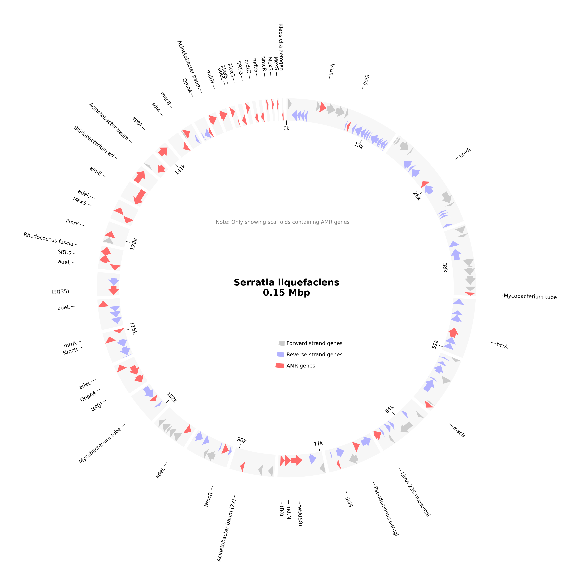

### Acinetobacter baumannii AbaF (found in 2 locations)
- **Mechanism**: antibiotic efflux
- **Drug Classes**: phosphonic acid antibiotic
- **AMR Family**: major facilitator superfamily (MFS) antibiotic efflux pump
- **Locations**:
  - gnl|SPADES|FPFIAAFN_3839_2 : position 378-1688
  - gnl|SPADES|FPFIAAFN_6055_1 : position 1-1146

### Acinetobacter baumannii AbaQ (found in 2 locations)
- **Mechanism**: antibiotic efflux
- **Drug Classes**: fluoroquinolone antibiotic
- **AMR Family**: major facilitator superfamily (MFS) antibiotic efflux pump
- **Locations**:
  - gnl|SPADES|FPFIAAFN_1118_5 : position 4592-5161
  - gnl|SPADES|FPFIAAFN_1118_6 : position 5234-6526

### Bifidobacterium adolescentis rpoB mutants conferring resistance to rifampicin
- **Mechanism**: antibiotic target alteration; antibiotic target replacement
- **Drug Classes**: rifamycin antibiotic
- **AMR Family**: rifamycin-resistant beta-subunit of RNA polymerase (rpoB)
- **Locations**:
  - gnl|SPADES|FPFIAAFN_3163_1 : position 3-2018

### Klebsiella aerogenes Omp36
- **Mechanism**: reduced permeability to antibiotic
- **Drug Classes**: monobactam; carbapenem; cephalosporin; cephamycin; penam; penem
- **AMR Family**: General Bacterial Porin with reduced permeability to beta-lactams
- **Locations**:
  - gnl|SPADES|FPFIAAFN_70803_1 : position 1-210

### LlmA 23S ribosomal RNA methyltransferase
- **Mechanism**: antibiotic target alteration
- **Drug Classes**: lincosamide antibiotic
- **AMR Family**: Llm 23S ribosomal RNA methyltransferase
- **Locations**:
  - gnl|SPADES|FPFIAAFN_860_8 : position 7221-8393

### MexS (found in 5 locations)
- **Mechanism**: antibiotic efflux
- **Drug Classes**: fluoroquinolone antibiotic; diaminopyrimidine antibiotic; phenicol antibiotic
- **AMR Family**: resistance-nodulation-cell division (RND) antibiotic efflux pump
- **Locations**:
  - gnl|SPADES|FPFIAAFN_10749_2 : position 642-776
  - gnl|SPADES|FPFIAAFN_14086_1 : position 2-625
  - gnl|SPADES|FPFIAAFN_2428_1 : position 157-1092
  - gnl|SPADES|FPFIAAFN_33198_1 : position 2-322
  - gnl|SPADES|FPFIAAFN_62390_1 : position 2-226

### Mycobacterium tuberculosis gidB mutation conferring resistance to streptomycin
- **Mechanism**: antibiotic target alteration
- **Drug Classes**: aminoglycoside antibiotic
- **AMR Family**: antibiotic resistant gidB
- **Locations**:
  - gnl|SPADES|FPFIAAFN_1589_3 : position 1796-2416

### Mycobacterium tuberculosis rpsA mutations conferring resistance to pyrazinamide
- **Mechanism**: antibiotic target alteration
- **Drug Classes**: pyrazine antibiotic
- **AMR Family**: pyrazinamide resistant rpsA
- **Locations**:
  - gnl|SPADES|FPFIAAFN_669_9 : position 10040-10516

### NmcR (found in 3 locations)
- **Mechanism**: antibiotic inactivation
- **Drug Classes**: carbapenem; cephalosporin; cephamycin; penam
- **AMR Family**: NmcA beta-lactamase
- **Locations**:
  - gnl|SPADES|FPFIAAFN_1149_2 : position 452-1369
  - gnl|SPADES|FPFIAAFN_1630_3 : position 2947-3801
  - gnl|SPADES|FPFIAAFN_22545_1 : position 155-430

### OmpA
- **Mechanism**: reduced permeability to antibiotic
- **Drug Classes**: peptide antibiotic
- **AMR Family**: General Bacterial Porin with reduced permeability to peptide antibiotics
- **Locations**:
  - gnl|SPADES|FPFIAAFN_4597_2 : position 1234-1638

### PmrF
- **Mechanism**: antibiotic target alteration
- **Drug Classes**: peptide antibiotic
- **AMR Family**: pmr phosphoethanolamine transferase
- **Locations**:
  - gnl|SPADES|FPFIAAFN_2289_2 : position 1032-1949

### Pseudomonas aeruginosa ampR with mutation conferring resistance to aztreonam
- **Mechanism**: antibiotic target alteration; antibiotic inactivation
- **Drug Classes**: monobactam; carbapenem; cephalosporin
- **AMR Family**: PDC beta-lactamase; ampR transcriptional regulator with mutation conferring resistance to monobactam antibiotics
- **Locations**:
  - gnl|SPADES|FPFIAAFN_913_2 : position 2231-3172

### QepA4
- **Mechanism**: antibiotic efflux
- **Drug Classes**: fluoroquinolone antibiotic
- **AMR Family**: major facilitator superfamily (MFS) antibiotic efflux pump
- **Locations**:
  - gnl|SPADES|FPFIAAFN_1601_4 : position 1778-3310

### Rhodococcus fascians cmr
- **Mechanism**: antibiotic efflux
- **Drug Classes**: phenicol antibiotic
- **AMR Family**: major facilitator superfamily (MFS) antibiotic efflux pump
- **Locations**:
  - gnl|SPADES|FPFIAAFN_2128_3 : position 2173-3363

### SRT-2
- **Mechanism**: antibiotic inactivation
- **Drug Classes**: cephalosporin
- **AMR Family**: SRT beta-lactamase
- **Locations**:
  - gnl|SPADES|FPFIAAFN_2128_2 : position 1004-2173

### SRT-3
- **Mechanism**: antibiotic inactivation
- **Drug Classes**: cephalosporin
- **AMR Family**: SRT beta-lactamase
- **Locations**:
  - gnl|SPADES|FPFIAAFN_16530_1 : position 1-549

### adeL (found in 6 locations)
- **Mechanism**: antibiotic efflux
- **Drug Classes**: fluoroquinolone antibiotic; tetracycline antibiotic
- **AMR Family**: resistance-nodulation-cell division (RND) antibiotic efflux pump
- **Locations**:
  - gnl|SPADES|FPFIAAFN_10749_1 : position 3-614
  - gnl|SPADES|FPFIAAFN_1321_1 : position 306-1193
  - gnl|SPADES|FPFIAAFN_1601_5 : position 3486-4373
  - gnl|SPADES|FPFIAAFN_1655_5 : position 3316-4209
  - gnl|SPADES|FPFIAAFN_2128_1 : position 2-880
  - gnl|SPADES|FPFIAAFN_2428_2 : position 1196-2083

### almE
- **Mechanism**: antibiotic target alteration
- **Drug Classes**: peptide antibiotic
- **AMR Family**: polymyxin resistance operon; alm glycyltransferase
- **Locations**:
  - gnl|SPADES|FPFIAAFN_2880_1 : position 3-2531

### arnA
- **Mechanism**: antibiotic target alteration
- **Drug Classes**: peptide antibiotic
- **AMR Family**: pmr phosphoethanolamine transferase
- **Locations**:
  - gnl|SPADES|FPFIAAFN_403_8 : position 5023-5967

### bcrA
- **Mechanism**: antibiotic efflux
- **Drug Classes**: peptide antibiotic
- **AMR Family**: ATP-binding cassette (ABC) antibiotic efflux pump
- **Locations**:
  - gnl|SPADES|FPFIAAFN_838_6 : position 4682-6214

### eptA
- **Mechanism**: antibiotic target alteration
- **Drug Classes**: peptide antibiotic
- **AMR Family**: pmr phosphoethanolamine transferase
- **Locations**:
  - gnl|SPADES|FPFIAAFN_3840_1 : position 183-1721

### golS (found in 2 locations)
- **Mechanism**: antibiotic efflux
- **Drug Classes**: monobactam; carbapenem; cephalosporin; cephamycin; penam; phenicol antibiotic; penem
- **AMR Family**: resistance-nodulation-cell division (RND) antibiotic efflux pump
- **Locations**:
  - gnl|SPADES|FPFIAAFN_403_13 : position 9695-10126
  - gnl|SPADES|FPFIAAFN_913_5 : position 6174-6572

### macB (found in 2 locations)
- **Mechanism**: antibiotic efflux
- **Drug Classes**: macrolide antibiotic
- **AMR Family**: ATP-binding cassette (ABC) antibiotic efflux pump
- **Locations**:
  - gnl|SPADES|FPFIAAFN_4103_2 : position 238-1095
  - gnl|SPADES|FPFIAAFN_856_10 : position 7795-8505

### mdtG (found in 2 locations)
- **Mechanism**: antibiotic efflux
- **Drug Classes**: phosphonic acid antibiotic
- **AMR Family**: major facilitator superfamily (MFS) antibiotic efflux pump
- **Locations**:
  - gnl|SPADES|FPFIAAFN_20496_1 : position 2-463
  - gnl|SPADES|FPFIAAFN_20497_1 : position 2-463

### mdtN (found in 2 locations)
- **Mechanism**: antibiotic efflux
- **Drug Classes**: nucleoside antibiotic; disinfecting agents and antiseptics
- **AMR Family**: major facilitator superfamily (MFS) antibiotic efflux pump
- **Locations**:
  - gnl|SPADES|FPFIAAFN_1032_5 : position 5013-5999
  - gnl|SPADES|FPFIAAFN_6568_1 : position 2-1084

### mtrA
- **Mechanism**: antibiotic efflux
- **Drug Classes**: macrolide antibiotic; penam
- **AMR Family**: resistance-nodulation-cell division (RND) antibiotic efflux pump
- **Locations**:
  - gnl|SPADES|FPFIAAFN_1630_4 : position 3836-4492

### novA
- **Mechanism**: antibiotic efflux
- **Drug Classes**: aminocoumarin antibiotic
- **AMR Family**: ATP-binding cassette (ABC) antibiotic efflux pump
- **Locations**:
  - gnl|SPADES|FPFIAAFN_441_8 : position 7406-8152

### sdiA
- **Mechanism**: antibiotic efflux
- **Drug Classes**: fluoroquinolone antibiotic; cephalosporin; glycylcycline; penam; tetracycline antibiotic; rifamycin antibiotic; phenicol antibiotic; disinfecting agents and antiseptics
- **AMR Family**: resistance-nodulation-cell division (RND) antibiotic efflux pump
- **Locations**:
  - gnl|SPADES|FPFIAAFN_4014_3 : position 1060-1854

### tet(35)
- **Mechanism**: antibiotic efflux
- **Drug Classes**: tetracycline antibiotic
- **AMR Family**: ATP-binding cassette (ABC) antibiotic efflux pump
- **Locations**:
  - gnl|SPADES|FPFIAAFN_2083_2 : position 73-1524

### tet(J)
- **Mechanism**: antibiotic efflux
- **Drug Classes**: tetracycline antibiotic
- **AMR Family**: major facilitator superfamily (MFS) antibiotic efflux pump
- **Locations**:
  - gnl|SPADES|FPFIAAFN_1601_2 : position 337-1554

### tetA(58)
- **Mechanism**: antibiotic efflux
- **Drug Classes**: tetracycline antibiotic
- **AMR Family**: major facilitator superfamily (MFS) antibiotic efflux pump
- **Locations**:
  - gnl|SPADES|FPFIAAFN_1032_4 : position 3272-5002

### tetR
- **Mechanism**: antibiotic target alteration; antibiotic efflux
- **Drug Classes**: tetracycline antibiotic
- **AMR Family**: major facilitator superfamily (MFS) antibiotic efflux pump
- **Locations**:
  - gnl|SPADES|FPFIAAFN_1032_6 : position 6018-6707

## Serratia liquefaciens ATCC 27592
**Strain Statistics:**
- Total genome length: 4861.1 kbp
- Total scaffolds: 173
- Scaffolds with AMR genes: 90
- Total genes annotated: 9068
- Total AMR genes: 596
- Unique AMR genes: 237
- Distinct AMR mechanisms: 10
- Distinct AMR families: 85
- Distinct drug classes: 38

**Circos Plot:**

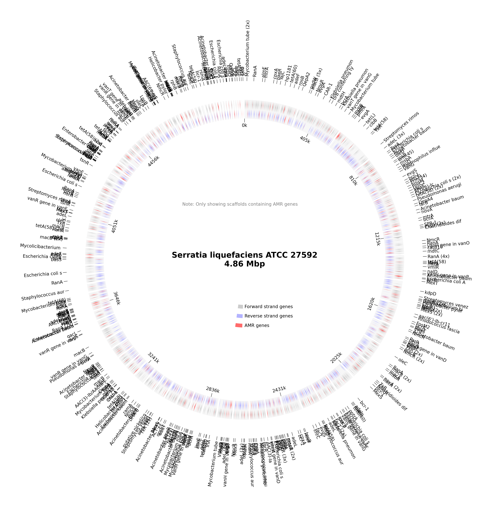

### AAC(3)-Ia
- **Mechanism**: antibiotic inactivation
- **Drug Classes**: aminoglycoside antibiotic
- **AMR Family**: AAC(3)
- **Locations**:
  - gnl|SPADES|FPFIAAFN_54_9 : position 6906-7454

### AAC(3)-Ib/AAC(6')-Ib3 bifunctional protein
- **Mechanism**: antibiotic inactivation
- **Drug Classes**: aminoglycoside antibiotic
- **AMR Family**: aminoglycoside bifunctional resistance protein
- **Locations**:
  - gnl|SPADES|FPFIAAFN_107_12 : position 9541-9993

### AAC(6')-Iai
- **Mechanism**: antibiotic inactivation
- **Drug Classes**: aminoglycoside antibiotic
- **AMR Family**: AAC(6')
- **Locations**:
  - gnl|SPADES|FPFIAAFN_136_2 : position 1005-1457

### AAC(6')-Iak
- **Mechanism**: antibiotic inactivation
- **Drug Classes**: aminoglycoside antibiotic
- **AMR Family**: AAC(6')
- **Locations**:
  - gnl|SPADES|FPFIAAFN_361_2 : position 690-1136

### AAC(6')-Isa
- **Mechanism**: antibiotic inactivation
- **Drug Classes**: aminoglycoside antibiotic
- **AMR Family**: AAC(6')
- **Locations**:
  - gnl|SPADES|FPFIAAFN_6_159 : position 166611-167195

### ACT-22
- **Mechanism**: antibiotic inactivation
- **Drug Classes**: carbapenem; cephalosporin; cephamycin; penam
- **AMR Family**: ACT beta-lactamase
- **Locations**:
  - gnl|SPADES|FPFIAAFN_80_30 : position 26888-28429

### AIM-1
- **Mechanism**: antibiotic inactivation
- **Drug Classes**: cephalosporin; cephamycin; penam
- **AMR Family**: AIM beta-lactamase
- **Locations**:
  - gnl|SPADES|FPFIAAFN_136_28 : position 20575-21519

### APH(6)-Ic
- **Mechanism**: antibiotic inactivation
- **Drug Classes**: aminoglycoside antibiotic
- **AMR Family**: APH(6)
- **Locations**:
  - gnl|SPADES|FPFIAAFN_17_40 : position 35826-36680

### AQU-2
- **Mechanism**: antibiotic inactivation
- **Drug Classes**: cephalosporin
- **AMR Family**: AQU beta-lactamase
- **Locations**:
  - gnl|SPADES|FPFIAAFN_17_82 : position 80633-81781

### Acinetobacter baumannii AbaF (found in 8 locations)
- **Mechanism**: antibiotic efflux
- **Drug Classes**: phosphonic acid antibiotic
- **AMR Family**: major facilitator superfamily (MFS) antibiotic efflux pump
- **Locations**:
  - gnl|SPADES|FPFIAAFN_10_44 : position 45064-46371
  - gnl|SPADES|FPFIAAFN_296_7 : position 6605-7987
  - gnl|SPADES|FPFIAAFN_32_80 : position 101609-102931
  - gnl|SPADES|FPFIAAFN_446_4 : position 5289-6791
  - gnl|SPADES|FPFIAAFN_722_9 : position 8488-9720
  - gnl|SPADES|FPFIAAFN_76_45 : position 48765-50090
  - gnl|SPADES|FPFIAAFN_80_39 : position 37767-39077
  - gnl|SPADES|FPFIAAFN_822_2 : position 1819-3159

### Acinetobacter baumannii AbaQ (found in 9 locations)
- **Mechanism**: antibiotic efflux
- **Drug Classes**: fluoroquinolone antibiotic
- **AMR Family**: major facilitator superfamily (MFS) antibiotic efflux pump
- **Locations**:
  - gnl|SPADES|FPFIAAFN_10_63 : position 67647-69047
  - gnl|SPADES|FPFIAAFN_111_28 : position 25491-26804
  - gnl|SPADES|FPFIAAFN_17_118 : position 124286-125593
  - gnl|SPADES|FPFIAAFN_25_89 : position 97453-98760
  - gnl|SPADES|FPFIAAFN_58_11 : position 8719-10032
  - gnl|SPADES|FPFIAAFN_58_72 : position 83915-85252
  - gnl|SPADES|FPFIAAFN_76_11 : position 10514-11809
  - gnl|SPADES|FPFIAAFN_87_14 : position 13372-14742
  - gnl|SPADES|FPFIAAFN_90_8 : position 7217-8479

### Acinetobacter baumannii AmvA
- **Mechanism**: antibiotic efflux
- **Drug Classes**: macrolide antibiotic; disinfecting agents and antiseptics
- **AMR Family**: major facilitator superfamily (MFS) antibiotic efflux pump
- **Locations**:
  - gnl|SPADES|FPFIAAFN_131_19 : position 15975-17447

### ArnT
- **Mechanism**: antibiotic target alteration
- **Drug Classes**: peptide antibiotic
- **AMR Family**: pmr phosphoethanolamine transferase
- **Locations**:
  - gnl|SPADES|FPFIAAFN_250_17: position 16381-18045

### Bifidobacterium bifidum ileS conferring resistance to mupirocin
- **Mechanism**: antibiotic target alteration
- **Drug Classes**: mupirocin-like antibiotic
- **AMR Family**: antibiotic-resistant isoleucyl-tRNA synthetase (ileS)
- **Locations**:
  - gnl|SPADES|FPFIAAFN_27_70 : position 78529-81111

### CAR-1
- **Mechanism**: antibiotic inactivation
- **Drug Classes**: carbapenem
- **AMR Family**: CAR beta-lactamase
- **Locations**:
  - gnl|SPADES|FPFIAAFN_6_83 : position 95769-96575

### CAU-1
- **Mechanism**: antibiotic inactivation
- **Drug Classes**: carbapenem; penam
- **AMR Family**: CAU beta-lactamase
- **Locations**:
  - gnl|SPADES|FPFIAAFN_98_3 : position 2026-4149

### CRP (found in 2 locations)
- **Mechanism**: antibiotic efflux
- **Drug Classes**: macrolide antibiotic; fluoroquinolone antibiotic; penam
- **AMR Family**: resistance-nodulation-cell division (RND) antibiotic efflux pump
- **Locations**:
  - gnl|SPADES|FPFIAAFN_2014_3 : position 2569-3333
  - gnl|SPADES|FPFIAAFN_54_63: position 69388-70020

### Clostridioides difficile gyrA conferring resistance to fluoroquinolones
- **Mechanism**: antibiotic target alteration
- **Drug Classes**: fluoroquinolone antibiotic
- **AMR Family**: fluoroquinolone resistant gyrA
- **Locations**:
  - gnl|SPADES|FPFIAAFN_23_15 : position 16678-19329

### Clostridioides difficile gyrB conferring resistance to fluoroquinolones
- **Mechanism**: antibiotic target alteration
- **Drug Classes**: fluoroquinolone antibiotic
- **AMR Family**: fluoroquinolone resistant gyrB
- **Locations**:
  - gnl|SPADES|FPFIAAFN_36_42 : position 45971-47866

### CrcB
- **Mechanism**: antibiotic efflux
- **Drug Classes**: aminoglycoside antibiotic
- **AMR Family**: multidrug and toxic compound extrusion (MATE) transporter
- **Locations**:
  - gnl|SPADES|FPFIAAFN_27_85 : position 93964-94347

### DHA-6
- **Mechanism**: antibiotic inactivation
- **Drug Classes**: cephalosporin; cephamycin
- **AMR Family**: DHA beta-lactamase
- **Locations**:
  - gnl|SPADES|FPFIAAFN_87_10 : position 8838-9980

### EdeQ
- **Mechanism**: antibiotic inactivation
- **Drug Classes**: peptide antibiotic; polyamine antibiotic
- **AMR Family**: Edeine acetyltransferase
- **Locations**:
  - gnl|SPADES|FPFIAAFN_1213_6 : position 2466-2900

### Enterobacter cloacae acrA (found in 2 locations)
- **Mechanism**: antibiotic efflux
- **Drug Classes**: fluoroquinolone antibiotic; cephalosporin; glycylcycline; penam; tetracycline antibiotic; rifamycin antibiotic; phenicol antibiotic; disinfecting agents and antiseptics
- **AMR Family**: resistance-nodulation-cell division (RND) antibiotic efflux pump
- **Locations**:
  - gnl|SPADES|FPFIAAFN_238_4 : position 3746-4948
  - gnl|SPADES|FPFIAAFN_4_237 : position 249267-250454

### Enterococcus faecalis cls with mutation conferring resistance to daptomycin
- **Mechanism**: antibiotic target alteration
- **Drug Classes**: peptide antibiotic
- **AMR Family**: daptomycin resistant cls
- **Locations**:
  - gnl|SPADES|FPFIAAFN_131_21 : position 18614-20074

### Enterococcus faecium liaS mutant conferring daptomycin resistance
- **Mechanism**: antibiotic target alteration; antibiotic efflux
- **Drug Classes**: peptide antibiotic
- **AMR Family**: daptomycin resistant liaS
- **Locations**:
  - gnl|SPADES|FPFIAAFN_226_4 : position 2770-4305

### Erm(34)
- **Mechanism**: antibiotic target alteration
- **Drug Classes**: macrolide antibiotic; lincosamide antibiotic; streptogramin antibiotic; streptogramin A antibiotic; streptogramin B antibiotic
- **AMR Family**: Erm 23S ribosomal RNA methyltransferase
- **Locations**:
  - gnl|SPADES|FPFIAAFN_10_182 : position 207961-208587

### Escherichia coli AcrAB-TolC with AcrR mutation conferring resistance to ciprofloxacin, tetracycline, and ceftazidime (found in 5 locations)
- **Mechanism**: antibiotic target alteration; antibiotic efflux
- **Drug Classes**: fluoroquinolone antibiotic; cephalosporin; glycylcycline; penam; tetracycline antibiotic; rifamycin antibiotic; phenicol antibiotic; disinfecting agents and antiseptics
- **AMR Family**: resistance-nodulation-cell division (RND) antibiotic efflux pump
- **Locations**:
  - gnl|SPADES|FPFIAAFN_17_80 : position 78839-79441
  - gnl|SPADES|FPFIAAFN_25_101 : position 113786-114490
  - gnl|SPADES|FPFIAAFN_42_25 : position 25607-26188
  - gnl|SPADES|FPFIAAFN_4_134 : position 133688-134275
  - gnl|SPADES|FPFIAAFN_4_238 : position 250597-251286

### Escherichia coli AcrAB-TolC with MarR mutations conferring resistance to ciprofloxacin and tetracycline (found in 2 locations)
- **Mechanism**: antibiotic target alteration; antibiotic efflux
- **Drug Classes**: fluoroquinolone antibiotic; cephalosporin; glycylcycline; penam; tetracycline antibiotic; rifamycin antibiotic; phenicol antibiotic; disinfecting agents and antiseptics
- **AMR Family**: resistance-nodulation-cell division (RND) antibiotic efflux pump
- **Locations**:
  - gnl|SPADES|FPFIAAFN_17_124 : position 130528-131001
  - gnl|SPADES|FPFIAAFN_17_26 : position 25373-25807

### Escherichia coli EF-Tu mutants conferring resistance to Enacyloxin IIa
- **Mechanism**: antibiotic target alteration
- **Drug Classes**: elfamycin antibiotic
- **AMR Family**: elfamycin resistant EF-Tu
- **Locations**:
  - gnl|SPADES|FPFIAAFN_149_39 : position 39585-42149

### Escherichia coli EF-Tu mutants conferring resistance to Pulvomycin (found in 2 locations)
- **Mechanism**: antibiotic target alteration
- **Drug Classes**: elfamycin antibiotic
- **AMR Family**: elfamycin resistant EF-Tu
- **Locations**:
  - gnl|SPADES|FPFIAAFN_337_12 : position 13850-15697
  - gnl|SPADES|FPFIAAFN_920_4 : position 1461-2645

### Escherichia coli fabI mutations conferring resistance to isoniazid and triclosan (found in 2 locations)
- **Mechanism**: antibiotic target alteration
- **Drug Classes**: disinfecting agents and antiseptics; isoniazid-like antibiotic
- **AMR Family**: antibiotic resistant fabI
- **Locations**:
  - gnl|SPADES|FPFIAAFN_75_59 : position 55304-56050
  - gnl|SPADES|FPFIAAFN_90_12 : position 11642-12397

### Escherichia coli mdfA
- **Mechanism**: antibiotic efflux
- **Drug Classes**: tetracycline antibiotic; phenicol antibiotic; disinfecting agents and antiseptics
- **AMR Family**: major facilitator superfamily (MFS) antibiotic efflux pump
- **Locations**:
  - gnl|SPADES|FPFIAAFN_337_11 : position 12127-13374

### Escherichia coli soxS with mutation conferring antibiotic resistance (found in 9 locations)
- **Mechanism**: antibiotic target alteration; antibiotic efflux; reduced permeability to antibiotic
- **Drug Classes**: fluoroquinolone antibiotic; monobactam; carbapenem; cephalosporin; glycylcycline; cephamycin; penam; tetracycline antibiotic; rifamycin antibiotic; phenicol antibiotic; penem; disinfecting agents and antiseptics
- **AMR Family**: ATP-binding cassette (ABC) antibiotic efflux pump; major facilitator superfamily (MFS) antibiotic efflux pump; resistance-nodulation-cell division (RND) antibiotic efflux pump; General Bacterial Porin with reduced permeability to beta-lactams
- **Locations**:
  - gnl|SPADES|FPFIAAFN_1035_2 : position 1311-1733
  - gnl|SPADES|FPFIAAFN_10_33 : position 31681-32550
  - gnl|SPADES|FPFIAAFN_111_15 : position 10815-11660
  - gnl|SPADES|FPFIAAFN_147_13 : position 13314-14087
  - gnl|SPADES|FPFIAAFN_17_50 : position 47054-47947
  - gnl|SPADES|FPFIAAFN_17_60 : position 59634-60551
  - gnl|SPADES|FPFIAAFN_202_25 : position 21051-21917
  - gnl|SPADES|FPFIAAFN_42_14 : position 12935-13393
  - gnl|SPADES|FPFIAAFN_53_77 : position 70203-71150

### EstT (found in 3 locations)
- **Mechanism**: antibiotic inactivation
- **Drug Classes**: macrolide antibiotic
- **AMR Family**: macrolide esterase
- **Locations**:
  - gnl|SPADES|FPFIAAFN_111_38 : position 34434-35237
  - gnl|SPADES|FPFIAAFN_4_103 : position 105967-106809
  - gnl|SPADES|FPFIAAFN_8305_1 : position 60-890

### FosA8
- **Mechanism**: antibiotic inactivation
- **Drug Classes**: phosphonic acid antibiotic
- **AMR Family**: fosfomycin thiol transferase
- **Locations**:
  - gnl|SPADES|FPFIAAFN_6_127: position 136288-136695

### FosC2
- **Mechanism**: antibiotic inactivation
- **Drug Classes**: phosphonic acid antibiotic
- **AMR Family**: fosC phosphotransferase family
- **Locations**:
  - gnl|SPADES|FPFIAAFN_17_13 : position 11353-11760

### FosM1
- **Mechanism**: antibiotic inactivation
- **Drug Classes**: phosphonic acid antibiotic
- **AMR Family**: fosfomycin thiol transferase
- **Locations**:
  - gnl|SPADES|FPFIAAFN_27_96 : position 103040-103549

### FosM2
- **Mechanism**: antibiotic inactivation
- **Drug Classes**: phosphonic acid antibiotic
- **AMR Family**: fosfomycin thiol transferase
- **Locations**:
  - gnl|SPADES|FPFIAAFN_32_49 : position 59218-59628

### GOB-12
- **Mechanism**: antibiotic inactivation
- **Drug Classes**: carbapenem; cephalosporin; penam
- **AMR Family**: GOB beta-lactamase
- **Locations**:
  - gnl|SPADES|FPFIAAFN_98_20 : position 24156-24803

### H-NS
- **Mechanism**: antibiotic efflux
- **Drug Classes**: macrolide antibiotic; fluoroquinolone antibiotic; cephalosporin; cephamycin; penam; tetracycline antibiotic
- **AMR Family**: major facilitator superfamily (MFS) antibiotic efflux pump; resistance-nodulation-cell division (RND) antibiotic efflux pump
- **Locations**:
  - gnl|SPADES|FPFIAAFN_131_38 : position 41015-41422

### Haemophilus influenzae PBP3 conferring resistance to beta-lactam antibiotics (found in 2 locations)
- **Mechanism**: antibiotic target alteration
- **Drug Classes**: cephalosporin; cephamycin; penam
- **AMR Family**: Penicillin-binding protein mutations conferring resistance to beta-lactam antibiotics
- **Locations**:
  - gnl|SPADES|FPFIAAFN_10_112 : position 128450-130213
  - gnl|SPADES|FPFIAAFN_17_169 : position 182659-184377

### Helicobacter pylori pbp1 mutants conferring resistance to amoxicillin (found in 2 locations)
- **Mechanism**: antibiotic target alteration
- **Drug Classes**: cephalosporin; cephamycin; penam
- **AMR Family**: Penicillin-binding protein mutations conferring resistance to beta-lactam antibiotics
- **Locations**:
  - gnl|SPADES|FPFIAAFN_433_8 : position 6791-9139
  - gnl|SPADES|FPFIAAFN_90_27 : position 29665-32166

### Helicobacter pylori pbp2 mutants conferring resistance to amoxicillin
- **Mechanism**: antibiotic target alteration
- **Drug Classes**: cephalosporin; cephamycin; penam
- **AMR Family**: Penicillin-binding protein mutations conferring resistance to beta-lactam antibiotics
- **Locations**:
  - gnl|SPADES|FPFIAAFN_27_76 : position 84389-86284

### Klebsiella aerogenes Omp36
- **Mechanism**: reduced permeability to antibiotic
- **Drug Classes**: monobactam; carbapenem; cephalosporin; cephamycin; penam; penem
- **AMR Family**: General Bacterial Porin with reduced permeability to beta-lactams
- **Locations**:
  - gnl|SPADES|FPFIAAFN_23_9 : position 6758-7888

### Klebsiella pneumoniae KpnE
- **Mechanism**: antibiotic efflux
- **Drug Classes**: macrolide antibiotic; aminoglycoside antibiotic; cephalosporin; tetracycline antibiotic; peptide antibiotic; rifamycin antibiotic; disinfecting agents and antiseptics
- **AMR Family**: small multidrug resistance (SMR) antibiotic efflux pump
- **Locations**:
  - gnl|SPADES|FPFIAAFN_6_189 : position 198292-198660

### Klebsiella pneumoniae KpnF
- **Mechanism**: antibiotic efflux
- **Drug Classes**: macrolide antibiotic; aminoglycoside antibiotic; cephalosporin; tetracycline antibiotic; peptide antibiotic; rifamycin antibiotic; disinfecting agents and antiseptics
- **AMR Family**: small multidrug resistance (SMR) antibiotic efflux pump
- **Locations**:
  - gnl|SPADES|FPFIAAFN_6_190: position 198647-198976

### Klebsiella pneumoniae KpnH
- **Mechanism**: antibiotic efflux
- **Drug Classes**: macrolide antibiotic; fluoroquinolone antibiotic; aminoglycoside antibiotic; carbapenem; cephalosporin; penam; peptide antibiotic; penem
- **AMR Family**: major facilitator superfamily (MFS) antibiotic efflux pump
- **Locations**:
  - gnl|SPADES|FPFIAAFN_136_43: position 37259-38794

### Klebsiella pneumoniae OmpK37 (found in 3 locations)
- **Mechanism**: reduced permeability to antibiotic
- **Drug Classes**: monobactam; carbapenem; cephalosporin; cephamycin; penam; penem
- **AMR Family**: General Bacterial Porin with reduced permeability to beta-lactams
- **Locations**:
  - gnl|SPADES|FPFIAAFN_42_91 : position 91721-92818
  - gnl|SPADES|FPFIAAFN_6_113 : position 128913-129995
  - gnl|SPADES|FPFIAAFN_98_22 : position 26310-27434

### LRA-8
- **Mechanism**: antibiotic inactivation
- **Drug Classes**: cephalosporin; penam
- **AMR Family**: subclass B3 LRA beta-lactamase
- **Locations**:
  - gnl|SPADES|FPFIAAFN_4_25 : position 20167-20922

### LpsB (found in 2 locations)
- **Mechanism**: reduced permeability to antibiotic
- **Drug Classes**: peptide antibiotic
- **AMR Family**: Intrinsic peptide antibiotic resistant Lps
- **Locations**:
  - gnl|SPADES|FPFIAAFN_317_5 : position 3771-4979
  - gnl|SPADES|FPFIAAFN_48_23 : position 22250-23347

### LptD
- **Mechanism**: antibiotic efflux
- **Drug Classes**: carbapenem; peptide antibiotic; aminocoumarin antibiotic; rifamycin antibiotic
- **AMR Family**: ATP-binding cassette (ABC) antibiotic efflux pump
- **Locations**:
  - gnl|SPADES|FPFIAAFN_10_84 : position 90863-93226

### MdtK
- **Mechanism**: antibiotic efflux
- **Drug Classes**: fluoroquinolone antibiotic
- **AMR Family**: multidrug and toxic compound extrusion (MATE) transporter
- **Locations**:
  - gnl|SPADES|FPFIAAFN_57_22 : position 22730-24193

### MexA
- **Mechanism**: antibiotic efflux
- **Drug Classes**: macrolide antibiotic; fluoroquinolone antibiotic; monobactam; carbapenem; cephalosporin; cephamycin; penam; tetracycline antibiotic; peptide antibiotic; aminocoumarin antibiotic; diaminopyrimidine antibiotic; sulfonamide antibiotic; phenicol antibiotic; penem
- **AMR Family**: resistance-nodulation-cell division (RND) antibiotic efflux pump
- **Locations**:
  - gnl|SPADES|FPFIAAFN_25_103 : position 116200-117342

### MexE
- **Mechanism**: antibiotic efflux
- **Drug Classes**: fluoroquinolone antibiotic; diaminopyrimidine antibiotic; phenicol antibiotic
- **AMR Family**: resistance-nodulation-cell division (RND) antibiotic efflux pump
- **Locations**:
  - gnl|SPADES|FPFIAAFN_17_25 : position 24095-24952

### MexG
- **Mechanism**: antibiotic efflux
- **Drug Classes**: fluoroquinolone antibiotic; tetracycline antibiotic; disinfecting agents and antiseptics
- **AMR Family**: resistance-nodulation-cell division (RND) antibiotic efflux pump
- **Locations**:
  - gnl|SPADES|FPFIAAFN_136_6 : position 3572-3985

### MexL (found in 3 locations)
- **Mechanism**: antibiotic efflux
- **Drug Classes**: macrolide antibiotic; tetracycline antibiotic; disinfecting agents and antiseptics
- **AMR Family**: resistance-nodulation-cell division (RND) antibiotic efflux pump
- **Locations**:
  - gnl|SPADES|FPFIAAFN_111_34 : position 31203-31841
  - gnl|SPADES|FPFIAAFN_25_39 : position 37862-38446
  - gnl|SPADES|FPFIAAFN_80_42 : position 40433-41089

### MexS (found in 10 locations)
- **Mechanism**: antibiotic efflux
- **Drug Classes**: fluoroquinolone antibiotic; diaminopyrimidine antibiotic; phenicol antibiotic
- **AMR Family**: resistance-nodulation-cell division (RND) antibiotic efflux pump
- **Locations**:
  - gnl|SPADES|FPFIAAFN_164_23 : position 19479-20513
  - gnl|SPADES|FPFIAAFN_182_21 : position 23672-24799
  - gnl|SPADES|FPFIAAFN_27_115 : position 121315-122250
  - gnl|SPADES|FPFIAAFN_27_116 : position 122343-123332
  - gnl|SPADES|FPFIAAFN_296_22 : position 20606-21595
  - gnl|SPADES|FPFIAAFN_36_74 : position 84064-85092
  - gnl|SPADES|FPFIAAFN_53_16 : position 16993-17973
  - gnl|SPADES|FPFIAAFN_53_6 : position 6571-7596
  - gnl|SPADES|FPFIAAFN_57_70 : position 69444-70451
  - gnl|SPADES|FPFIAAFN_85_11 : position 13619-14605

### MexT (found in 4 locations)
- **Mechanism**: antibiotic efflux
- **Drug Classes**: fluoroquinolone antibiotic; diaminopyrimidine antibiotic; phenicol antibiotic
- **AMR Family**: resistance-nodulation-cell division (RND) antibiotic efflux pump
- **Locations**:
  - gnl|SPADES|FPFIAAFN_164_21 : position 17759-18688
  - gnl|SPADES|FPFIAAFN_23_5 : position 4127-5029
  - gnl|SPADES|FPFIAAFN_25_115 : position 131357-132253
  - gnl|SPADES|FPFIAAFN_32_67 : position 81299-82249

### MexV
- **Mechanism**: antibiotic efflux
- **Drug Classes**: macrolide antibiotic; fluoroquinolone antibiotic; tetracycline antibiotic; phenicol antibiotic; disinfecting agents and antiseptics
- **AMR Family**: resistance-nodulation-cell division (RND) antibiotic efflux pump
- **Locations**:
  - gnl|SPADES|FPFIAAFN_23_117 : position 134514-135965

### MexZ
- **Mechanism**: antibiotic efflux
- **Drug Classes**: macrolide antibiotic; fluoroquinolone antibiotic; aminoglycoside antibiotic; carbapenem; cephalosporin; cephamycin; penam; tetracycline antibiotic; phenicol antibiotic; disinfecting agents and antiseptics
- **AMR Family**: resistance-nodulation-cell division (RND) antibiotic efflux pump
- **Locations**:
  - gnl|SPADES|FPFIAAFN_42_67 : position 66299-66931

### Mycobacterium tuberculosis inhA mutations conferring resistance to isoniazid
- **Mechanism**: antibiotic target alteration
- **Drug Classes**: isoniazid-like antibiotic
- **AMR Family**: isoniazid resistant inhA
- **Locations**:
  - gnl|SPADES|FPFIAAFN_208_28 : position 31648-32406

### Mycobacterium tuberculosis kasA mutant conferring resistance to isoniazid (found in 4 locations)
- **Mechanism**: antibiotic target alteration
- **Drug Classes**: isoniazid-like antibiotic
- **AMR Family**: antibiotic resistant kasA
- **Locations**:
  - gnl|SPADES|FPFIAAFN_4_16 : position 10855-12024
  - gnl|SPADES|FPFIAAFN_4_19 : position 13219-14448
  - gnl|SPADES|FPFIAAFN_75_72 : position 67442-68608
  - gnl|SPADES|FPFIAAFN_98_41 : position 51255-52535

### Mycobacterium tuberculosis katG mutations conferring resistance to isoniazid
- **Mechanism**: antibiotic target alteration
- **Drug Classes**: isoniazid-like antibiotic
- **AMR Family**: isoniazid resistant katG
- **Locations**:
  - gnl|SPADES|FPFIAAFN_138_27 : position 29664-31862

### Mycobacterium tuberculosis ndh with mutation conferring resistance to isoniazid
- **Mechanism**: antibiotic target alteration
- **Drug Classes**: isoniazid-like antibiotic
- **AMR Family**: antibiotic resistant ndh
- **Locations**:
  - gnl|SPADES|FPFIAAFN_75_50 : position 48042-49346

### Mycobacterium tuberculosis pncA mutations conferring resistance to pyrazinamide (found in 3 locations)
- **Mechanism**: antibiotic target alteration
- **Drug Classes**: pyrazine antibiotic
- **AMR Family**: Pyrazinamide resistant pncA
- **Locations**:
  - gnl|SPADES|FPFIAAFN_337_8 : position 9443-9994
  - gnl|SPADES|FPFIAAFN_57_2 : position 1266-1952
  - gnl|SPADES|FPFIAAFN_6_235 : position 243974-244606

### Mycobacterium tuberculosis thyA with mutation conferring resistance to para-aminosalicylic acid
- **Mechanism**: antibiotic target alteration
- **Drug Classes**: salicylic acid antibiotic
- **AMR Family**: aminosalicylate resistant thymidylate synthase
- **Locations**:
  - gnl|SPADES|FPFIAAFN_58_62 : position 66214-67008

### Mycolicibacterium smegmatis ndh with mutation conferring resistance to isoniazid
- **Mechanism**: antibiotic target alteration
- **Drug Classes**: isoniazid-like antibiotic
- **AMR Family**: antibiotic resistant ndh
- **Locations**:
  - gnl|SPADES|FPFIAAFN_158_31 : position 32892-34100

### Neisseria gonorrhoeae pilQ gene conferring resistance to beta-lactam
- **Mechanism**: antibiotic target alteration
- **Drug Classes**: cephalosporin; cephamycin; penam
- **AMR Family**: Penicillin-binding protein mutations conferring resistance to beta-lactam antibiotics
- **Locations**:
  - gnl|SPADES|FPFIAAFN_54_36 : position 40047-41288

### NmcR (found in 26 locations)
- **Mechanism**: antibiotic inactivation
- **Drug Classes**: carbapenem; cephalosporin; cephamycin; penam
- **AMR Family**: NmcA beta-lactamase
- **Locations**:
  - gnl|SPADES|FPFIAAFN_111_44 : position 39321-40244
  - gnl|SPADES|FPFIAAFN_136_36 : position 30493-31371
  - gnl|SPADES|FPFIAAFN_17_93 : position 94578-95468
  - gnl|SPADES|FPFIAAFN_182_20 : position 22726-23643
  - gnl|SPADES|FPFIAAFN_208_5 : position 4428-5348
  - gnl|SPADES|FPFIAAFN_23_66 : position 79906-80847
  - gnl|SPADES|FPFIAAFN_25_36 : position 34583-35491
  - gnl|SPADES|FPFIAAFN_25_98 : position 110394-111257
  - gnl|SPADES|FPFIAAFN_27_105 : position 112902-113891
  - gnl|SPADES|FPFIAAFN_32_87 : position 110191-111090
  - gnl|SPADES|FPFIAAFN_34_72 : position 83397-84251
  - gnl|SPADES|FPFIAAFN_34_92 : position 105316-106290
  - gnl|SPADES|FPFIAAFN_36_49 : position 55168-56001
  - gnl|SPADES|FPFIAAFN_372_12 : position 12584-13480
  - gnl|SPADES|FPFIAAFN_42_3 : position 2371-3273
  - gnl|SPADES|FPFIAAFN_42_52 : position 53280-54167
  - gnl|SPADES|FPFIAAFN_4_104 : position 106918-107790
  - gnl|SPADES|FPFIAAFN_53_47 : position 44200-45129
  - gnl|SPADES|FPFIAAFN_53_85 : position 77660-78562
  - gnl|SPADES|FPFIAAFN_53_90 : position 83068-84006
  - gnl|SPADES|FPFIAAFN_553_13 : position 11044-11925
  - gnl|SPADES|FPFIAAFN_57_79 : position 76881-77753
  - gnl|SPADES|FPFIAAFN_6_49 : position 52552-53505
  - gnl|SPADES|FPFIAAFN_722_6 : position 5310-6137
  - gnl|SPADES|FPFIAAFN_76_21 : position 21606-22499
  - gnl|SPADES|FPFIAAFN_87_37 : position 34784-35713

### OmpA (found in 2 locations)
- **Mechanism**: reduced permeability to antibiotic
- **Drug Classes**: peptide antibiotic
- **AMR Family**: General Bacterial Porin with reduced permeability to peptide antibiotics
- **Locations**:
  - gnl|SPADES|FPFIAAFN_10_26 : position 24922-25419
  - gnl|SPADES|FPFIAAFN_98_46 : position 56301-57377

### OpmH
- **Mechanism**: antibiotic efflux
- **Drug Classes**: disinfecting agents and antiseptics
- **AMR Family**: resistance-nodulation-cell division (RND) antibiotic efflux pump
- **Locations**:
  - gnl|SPADES|FPFIAAFN_1345_1 : position 3-1343

### OprM
- **Mechanism**: antibiotic efflux
- **Drug Classes**: macrolide antibiotic; fluoroquinolone antibiotic; monobactam; aminoglycoside antibiotic; carbapenem; cephalosporin; cephamycin; penam; tetracycline antibiotic; peptide antibiotic; aminocoumarin antibiotic; diaminopyrimidine antibiotic; sulfonamide antibiotic; phenicol antibiotic; penem; disinfecting agents and antiseptics
- **AMR Family**: resistance-nodulation-cell division (RND) antibiotic efflux pump
- **Locations**:
  - gnl|SPADES|FPFIAAFN_25_105 : position 120499-121953

### ParR (found in 2 locations)
- **Mechanism**: antibiotic efflux; reduced permeability to antibiotic
- **Drug Classes**: macrolide antibiotic; fluoroquinolone antibiotic; monobactam; aminoglycoside antibiotic; carbapenem; cephalosporin; cephamycin; penam; tetracycline antibiotic; phenicol antibiotic; penem; disinfecting agents and antiseptics
- **AMR Family**: resistance-nodulation-cell division (RND) antibiotic efflux pump; Outer Membrane Porin (Opr)
- **Locations**:
  - gnl|SPADES|FPFIAAFN_34_17 : position 19029-19790
  - gnl|SPADES|FPFIAAFN_54_22 : position 25034-25753

### ParS (found in 3 locations)
- **Mechanism**: antibiotic efflux; reduced permeability to antibiotic
- **Drug Classes**: macrolide antibiotic; fluoroquinolone antibiotic; monobactam; aminoglycoside antibiotic; carbapenem; cephalosporin; cephamycin; penam; tetracycline antibiotic; phenicol antibiotic; penem; disinfecting agents and antiseptics
- **AMR Family**: resistance-nodulation-cell division (RND) antibiotic efflux pump; Outer Membrane Porin (Opr)
- **Locations**:
  - gnl|SPADES|FPFIAAFN_136_30 : position 23336-24934
  - gnl|SPADES|FPFIAAFN_34_18 : position 19787-21091
  - gnl|SPADES|FPFIAAFN_9_39 : position 42020-43801

### PmrF (found in 2 locations)
- **Mechanism**: antibiotic target alteration
- **Drug Classes**: peptide antibiotic
- **AMR Family**: pmr phosphoethanolamine transferase
- **Locations**:
  - gnl|SPADES|FPFIAAFN_250_14 : position 12520-13500
  - gnl|SPADES|FPFIAAFN_48_28 : position 27825-28808

### Pseudomonas aeruginosa CpxR (found in 5 locations)
- **Mechanism**: antibiotic efflux
- **Drug Classes**: macrolide antibiotic; fluoroquinolone antibiotic; monobactam; aminoglycoside antibiotic; carbapenem; cephalosporin; cephamycin; penam; tetracycline antibiotic; peptide antibiotic; aminocoumarin antibiotic; diaminopyrimidine antibiotic; sulfonamide antibiotic; phenicol antibiotic; penem
- **AMR Family**: resistance-nodulation-cell division (RND) antibiotic efflux pump
- **Locations**:
  - gnl|SPADES|FPFIAAFN_136_31 : position 24943-25632
  - gnl|SPADES|FPFIAAFN_159_30 : position 32339-33019
  - gnl|SPADES|FPFIAAFN_23_97 : position 111635-112309
  - gnl|SPADES|FPFIAAFN_48_48 : position 47643-48341
  - gnl|SPADES|FPFIAAFN_4_151 : position 151220-151960

### Pseudomonas aeruginosa ampR with mutation conferring resistance to aztreonam (found in 2 locations)
- **Mechanism**: antibiotic target alteration; antibiotic inactivation
- **Drug Classes**: monobactam; carbapenem; cephalosporin
- **AMR Family**: PDC beta-lactamase; ampR transcriptional regulator with mutation conferring resistance to monobactam antibiotics
- **Locations**:
  - gnl|SPADES|FPFIAAFN_116_24 : position 22172-23101
  - gnl|SPADES|FPFIAAFN_17_77 : position 75346-76221

### QepA2
- **Mechanism**: antibiotic efflux
- **Drug Classes**: fluoroquinolone antibiotic
- **AMR Family**: major facilitator superfamily (MFS) antibiotic efflux pump
- **Locations**:
  - gnl|SPADES|FPFIAAFN_4_271 : position 289340-290746

### QepA4
- **Mechanism**: antibiotic efflux
- **Drug Classes**: fluoroquinolone antibiotic
- **AMR Family**: major facilitator superfamily (MFS) antibiotic efflux pump
- **Locations**:
  - gnl|SPADES|FPFIAAFN_17_92 : position 93183-94478

### RanA (found in 24 locations)
- **Mechanism**: antibiotic efflux
- **Drug Classes**: aminoglycoside antibiotic
- **AMR Family**: ATP-binding cassette (ABC) antibiotic efflux pump
- **Locations**:
  - gnl|SPADES|FPFIAAFN_121_6 : position 7308-8297
  - gnl|SPADES|FPFIAAFN_131_29 : position 27686-28687
  - gnl|SPADES|FPFIAAFN_131_30 : position 28684-29700
  - gnl|SPADES|FPFIAAFN_136_32 : position 26039-27241
  - gnl|SPADES|FPFIAAFN_138_6 : position 5893-7569
  - gnl|SPADES|FPFIAAFN_146_16 : position 20417-21409
  - gnl|SPADES|FPFIAAFN_161_23 : position 20319-21395
  - gnl|SPADES|FPFIAAFN_17_107 : position 109179-110258
  - gnl|SPADES|FPFIAAFN_17_172 : position 185555-186316
  - gnl|SPADES|FPFIAAFN_182_28 : position 30201-32078
  - gnl|SPADES|FPFIAAFN_238_19 : position 23132-24193
  - gnl|SPADES|FPFIAAFN_23_80 : position 94776-95549
  - gnl|SPADES|FPFIAAFN_25_10 : position 7879-8991
  - gnl|SPADES|FPFIAAFN_25_32 : position 30865-31578
  - gnl|SPADES|FPFIAAFN_25_47 : position 47473-48510
  - gnl|SPADES|FPFIAAFN_25_66 : position 69540-70655
  - gnl|SPADES|FPFIAAFN_35_51 : position 53884-55017
  - gnl|SPADES|FPFIAAFN_37_69 : position 52027-53619
  - gnl|SPADES|FPFIAAFN_43_41 : position 33206-34021
  - gnl|SPADES|FPFIAAFN_4_50 : position 45216-45959
  - gnl|SPADES|FPFIAAFN_518_3 : position 3275-4345
  - gnl|SPADES|FPFIAAFN_6_54 : position 57676-58512
  - gnl|SPADES|FPFIAAFN_6_99 : position 111299-112267
  - gnl|SPADES|FPFIAAFN_922_3 : position 1539-2474

### RanB
- **Mechanism**: antibiotic efflux
- **Drug Classes**: aminoglycoside antibiotic
- **AMR Family**: ATP-binding cassette (ABC) antibiotic efflux pump
- **Locations**:
  - gnl|SPADES|FPFIAAFN_43_42 : position 34026-34808

### Rhodococcus fascians cmr
- **Mechanism**: antibiotic efflux
- **Drug Classes**: phenicol antibiotic
- **AMR Family**: major facilitator superfamily (MFS) antibiotic efflux pump
- **Locations**:
  - gnl|SPADES|FPFIAAFN_32_26 : position 34440-35867

### Rv1877 (found in 2 locations)
- **Mechanism**: antibiotic efflux
- **Drug Classes**: fluoroquinolone antibiotic
- **AMR Family**: major facilitator superfamily (MFS) antibiotic efflux pump
- **Locations**:
  - gnl|SPADES|FPFIAAFN_10_65 : position 69714-70511
  - gnl|SPADES|FPFIAAFN_25_102 : position 114534-116048

### SAT-2
- **Mechanism**: antibiotic inactivation
- **Drug Classes**: nucleoside antibiotic
- **AMR Family**: streptothricin acetyltransferase (SAT)
- **Locations**:
  - gnl|SPADES|FPFIAAFN_42_66 : position 65654-66283

### SAT-3
- **Mechanism**: antibiotic inactivation
- **Drug Classes**: nucleoside antibiotic
- **AMR Family**: streptothricin acetyltransferase (SAT)
- **Locations**:
  - gnl|SPADES|FPFIAAFN_53_60 : position 56202-56744

### SPR-1
- **Mechanism**: antibiotic inactivation
- **Drug Classes**: carbapenem
- **AMR Family**: SPR beta-lactamase
- **Locations**:
  - gnl|SPADES|FPFIAAFN_23_4 : position 3151-4047

### SRT-3
- **Mechanism**: antibiotic inactivation
- **Drug Classes**: cephalosporin
- **AMR Family**: SRT beta-lactamase
- **Locations**:
  - gnl|SPADES|FPFIAAFN_17_78 : position 76426-77562

### Salmonella serovars soxS with mutation conferring antibiotic resistance
- **Mechanism**: antibiotic target alteration; antibiotic efflux; reduced permeability to antibiotic
- **Drug Classes**: fluoroquinolone antibiotic; monobactam; carbapenem; cephalosporin; glycylcycline; cephamycin; penam; tetracycline antibiotic; rifamycin antibiotic; phenicol antibiotic; penem; disinfecting agents and antiseptics
- **AMR Family**: ATP-binding cassette (ABC) antibiotic efflux pump; major facilitator superfamily (MFS) antibiotic efflux pump; resistance-nodulation-cell division (RND) antibiotic efflux pump; General Bacterial Porin with reduced permeability to beta-lactams
- **Locations**:
  - gnl|SPADES|FPFIAAFN_6_121 : position 133772-134158

### Staphylococcus aureus FosB
- **Mechanism**: antibiotic inactivation
- **Drug Classes**: phosphonic acid antibiotic
- **AMR Family**: fosfomycin thiol transferase
- **Locations**:
  - gnl|SPADES|FPFIAAFN_23_8 : position 6188-6604

### Staphylococcus aureus GlpT with mutation conferring resistance to fosfomycin (found in 2 locations)
- **Mechanism**: antibiotic target alteration
- **Drug Classes**: phosphonic acid antibiotic
- **AMR Family**: antibiotic-resistant GlpT
- **Locations**:
  - gnl|SPADES|FPFIAAFN_144_27 : position 24167-25522
  - gnl|SPADES|FPFIAAFN_266_27 : position 24170-25525

### Staphylococcus aureus LmrS
- **Mechanism**: antibiotic efflux
- **Drug Classes**: macrolide antibiotic; aminoglycoside antibiotic; oxazolidinone antibiotic; diaminopyrimidine antibiotic; phenicol antibiotic
- **AMR Family**: major facilitator superfamily (MFS) antibiotic efflux pump
- **Locations**:
  - gnl|SPADES|FPFIAAFN_136_14 : position 9411-10793

### Staphylococcus aureus fusA with mutation conferring resistance to fusidic acid (found in 3 locations)
- **Mechanism**: antibiotic target alteration
- **Drug Classes**: fusidane antibiotic
- **AMR Family**: antibiotic resistant fusA
- **Locations**:
  - gnl|SPADES|FPFIAAFN_10_6 : position 4699-6288
  - gnl|SPADES|FPFIAAFN_25_46 : position 45095-47200
  - gnl|SPADES|FPFIAAFN_54_87 : position 88484-89986

### Staphylococcus aureus mupA conferring resistance to mupirocin
- **Mechanism**: antibiotic target alteration
- **Drug Classes**: mupirocin-like antibiotic
- **AMR Family**: antibiotic-resistant isoleucyl-tRNA synthetase (ileS)
- **Locations**:
  - gnl|SPADES|FPFIAAFN_10_52 : position 54810-57626

### Staphylococcus aureus mupB conferring resistance to mupirocin
- **Mechanism**: antibiotic target alteration
- **Drug Classes**: mupirocin-like antibiotic
- **AMR Family**: antibiotic-resistant isoleucyl-tRNA synthetase (ileS)
- **Locations**:
  - gnl|SPADES|FPFIAAFN_544_1 : position 284-3160

### Staphylococcus aureus murA with mutation conferring resistance to fosfomycin
- **Mechanism**: antibiotic target alteration
- **Drug Classes**: phosphonic acid antibiotic
- **AMR Family**: antibiotic-resistant murA transferase
- **Locations**:
  - gnl|SPADES|FPFIAAFN_43_47 : position 36761-38020

### Staphylococcus aureus norA (found in 2 locations)
- **Mechanism**: antibiotic efflux
- **Drug Classes**: fluoroquinolone antibiotic
- **AMR Family**: major facilitator superfamily (MFS) antibiotic efflux pump
- **Locations**:
  - gnl|SPADES|FPFIAAFN_226_3 : position 1338-2669
  - gnl|SPADES|FPFIAAFN_9_44 : position 47470-48816

### Staphylococcus aureus pgsA mutations conferring resistance to daptomycin
- **Mechanism**: antibiotic target alteration
- **Drug Classes**: peptide antibiotic
- **AMR Family**: daptomycin resistant pgsA
- **Locations**:
  - gnl|SPADES|FPFIAAFN_111_2 : position 228-776

### Streptococcus pneumoniae PBP2x conferring resistance to amoxicillin
- **Mechanism**: antibiotic target alteration
- **Drug Classes**: cephalosporin; cephamycin; penam
- **AMR Family**: Penicillin-binding protein mutations conferring resistance to beta-lactam antibiotics
- **Locations**:
  - gnl|SPADES|FPFIAAFN_54_32 : position 35127-37685

### Streptomyces rimosus otr(A) (found in 2 locations)
- **Mechanism**: antibiotic target protection
- **Drug Classes**: tetracycline antibiotic
- **AMR Family**: tetracycline-resistant ribosomal protection protein
- **Locations**:
  - gnl|SPADES|FPFIAAFN_168_21 : position 19972-21795
  - gnl|SPADES|FPFIAAFN_9_185 : position 197184-198983

### Streptomyces venezuelae rox (found in 3 locations)
- **Mechanism**: antibiotic inactivation
- **Drug Classes**: rifamycin antibiotic
- **AMR Family**: rifampin monooxygenase
- **Locations**:
  - gnl|SPADES|FPFIAAFN_27_56 : position 64463-65596
  - gnl|SPADES|FPFIAAFN_76_29 : position 29703-30905
  - gnl|SPADES|FPFIAAFN_85_22 : position 26477-28189

### TaeA (found in 2 locations)
- **Mechanism**: antibiotic efflux
- **Drug Classes**: pleuromutilin antibiotic
- **AMR Family**: ATP-binding cassette (ABC) antibiotic efflux pump
- **Locations**:
  - gnl|SPADES|FPFIAAFN_10_25 : position 23114-24781
  - gnl|SPADES|FPFIAAFN_98_36 : position 45269-47173

### TolC
- **Mechanism**: antibiotic efflux
- **Drug Classes**: macrolide antibiotic; fluoroquinolone antibiotic; aminoglycoside antibiotic; carbapenem; cephalosporin; glycylcycline; cephamycin; penam; tetracycline antibiotic; peptide antibiotic; aminocoumarin antibiotic; rifamycin antibiotic; phenicol antibiotic; penem; disinfecting agents and antiseptics
- **AMR Family**: ATP-binding cassette (ABC) antibiotic efflux pump; major facilitator superfamily (MFS) antibiotic efflux pump; resistance-nodulation-cell division (RND) antibiotic efflux pump
- **Locations**:
  - gnl|SPADES|FPFIAAFN_36_37 : position 41617-43140

### TriA
- **Mechanism**: antibiotic efflux
- **Drug Classes**: disinfecting agents and antiseptics
- **AMR Family**: resistance-nodulation-cell division (RND) antibiotic efflux pump
- **Locations**:
  - gnl|SPADES|FPFIAAFN_70_11 : position 10452-11423

### TxR (found in 9 locations)
- **Mechanism**: antibiotic efflux
- **Drug Classes**: tetracycline antibiotic
- **AMR Family**: ATP-binding cassette (ABC) antibiotic efflux pump
- **Locations**:
  - gnl|SPADES|FPFIAAFN_163_6 : position 6758-8644
  - gnl|SPADES|FPFIAAFN_168_24 : position 24943-26355
  - gnl|SPADES|FPFIAAFN_254_15 : position 14626-16584
  - gnl|SPADES|FPFIAAFN_34_52 : position 61191-62762
  - gnl|SPADES|FPFIAAFN_34_59 : position 67487-68494
  - gnl|SPADES|FPFIAAFN_36_35 : position 38227-40173
  - gnl|SPADES|FPFIAAFN_85_49 : position 55353-57419
  - gnl|SPADES|FPFIAAFN_85_5 : position 3552-5342
  - gnl|SPADES|FPFIAAFN_9_111 : position 132799-134136

### VIM-69
- **Mechanism**: antibiotic inactivation
- **Drug Classes**: carbapenem; cephalosporin; cephamycin; penam; penem
- **AMR Family**: VIM beta-lactamase
- **Locations**:
  - gnl|SPADES|FPFIAAFN_58_42 : position 42834-43718

### YajC
- **Mechanism**: antibiotic efflux
- **Drug Classes**: fluoroquinolone antibiotic; cephalosporin; glycylcycline; penam; tetracycline antibiotic; oxazolidinone antibiotic; glycopeptide antibiotic; rifamycin antibiotic; phenicol antibiotic; disinfecting agents and antiseptics
- **AMR Family**: resistance-nodulation-cell division (RND) antibiotic efflux pump
- **Locations**:
  - gnl|SPADES|FPFIAAFN_4_170 : position 177199-177531

### YojI
- **Mechanism**: antibiotic efflux
- **Drug Classes**: peptide antibiotic
- **AMR Family**: ATP-binding cassette (ABC) antibiotic efflux pump
- **Locations**:
  - gnl|SPADES|FPFIAAFN_58_30 : position 30730-32382

### aac(6')-Ib-cr11
- **Mechanism**: antibiotic inactivation
- **Drug Classes**: fluoroquinolone antibiotic; aminoglycoside antibiotic
- **AMR Family**: AAC(6'); AAC(6')-Ib-cr
- **Locations**:
  - gnl|SPADES|FPFIAAFN_32_16 : position 20845-21363

### aadT
- **Mechanism**: antibiotic efflux
- **Drug Classes**: macrolide antibiotic; tetracycline antibiotic; disinfecting agents and antiseptics
- **AMR Family**: major facilitator superfamily (MFS) antibiotic efflux pump
- **Locations**:
  - gnl|SPADES|FPFIAAFN_80_5 : position 3579-4790

### abeM
- **Mechanism**: antibiotic efflux
- **Drug Classes**: fluoroquinolone antibiotic; disinfecting agents and antiseptics
- **AMR Family**: multidrug and toxic compound extrusion (MATE) transporter
- **Locations**:
  - gnl|SPADES|FPFIAAFN_296_13 : position 13666-15030

### acrB
- **Mechanism**: antibiotic efflux
- **Drug Classes**: fluoroquinolone antibiotic; cephalosporin; glycylcycline; penam; tetracycline antibiotic; rifamycin antibiotic; phenicol antibiotic; disinfecting agents and antiseptics
- **AMR Family**: resistance-nodulation-cell division (RND) antibiotic efflux pump
- **Locations**:
  - gnl|SPADES|FPFIAAFN_25_104 : position 117345-120497

### adeF (found in 5 locations)
- **Mechanism**: antibiotic efflux
- **Drug Classes**: fluoroquinolone antibiotic; tetracycline antibiotic
- **AMR Family**: resistance-nodulation-cell division (RND) antibiotic efflux pump
- **Locations**:
  - gnl|SPADES|FPFIAAFN_158_4: position 3340-6453
  - gnl|SPADES|FPFIAAFN_238_5: position 4941-8114
  - gnl|SPADES|FPFIAAFN_34_35: position 42762-45947
  - gnl|SPADES|FPFIAAFN_4_236: position 246103-249249
  - gnl|SPADES|FPFIAAFN_75_47: position 42996-46139

### adeH
- **Mechanism**: antibiotic efflux
- **Drug Classes**: fluoroquinolone antibiotic; tetracycline antibiotic
- **AMR Family**: resistance-nodulation-cell division (RND) antibiotic efflux pump
- **Locations**:
  - gnl|SPADES|FPFIAAFN_446_3 : position 3517-4881

### adeL (found in 48 locations)
- **Mechanism**: antibiotic efflux
- **Drug Classes**: fluoroquinolone antibiotic; tetracycline antibiotic
- **AMR Family**: resistance-nodulation-cell division (RND) antibiotic efflux pump
- **Locations**:
  - gnl|SPADES|FPFIAAFN_1075_1 : position 125-1042
  - gnl|SPADES|FPFIAAFN_1075_6 : position 5808-6692
  - gnl|SPADES|FPFIAAFN_10_1 : position 247-1191
  - gnl|SPADES|FPFIAAFN_10_24 : position 22172-23083
  - gnl|SPADES|FPFIAAFN_10_56 : position 59849-60772
  - gnl|SPADES|FPFIAAFN_136_13 : position 8408-9352
  - gnl|SPADES|FPFIAAFN_136_27 : position 19676-20569
  - gnl|SPADES|FPFIAAFN_138_12 : position 12187-13122
  - gnl|SPADES|FPFIAAFN_164_3 : position 1159-2076
  - gnl|SPADES|FPFIAAFN_17_140 : position 153123-154043
  - gnl|SPADES|FPFIAAFN_17_19 : position 17188-18117
  - gnl|SPADES|FPFIAAFN_17_6 : position 5732-6640
  - gnl|SPADES|FPFIAAFN_17_81 : position 79602-80531
  - gnl|SPADES|FPFIAAFN_208_10 : position 8799-9884
  - gnl|SPADES|FPFIAAFN_2237_4 : position 1296-2231
  - gnl|SPADES|FPFIAAFN_226_14 : position 14882-15745
  - gnl|SPADES|FPFIAAFN_254_20 : position 21102-22001
  - gnl|SPADES|FPFIAAFN_27_101 : position 107264-108157
  - gnl|SPADES|FPFIAAFN_27_114 : position 120331-121230
  - gnl|SPADES|FPFIAAFN_291_13 : position 11589-12506
  - gnl|SPADES|FPFIAAFN_291_19 : position 17887-18789
  - gnl|SPADES|FPFIAAFN_36_43 : position 47947-48843
  - gnl|SPADES|FPFIAAFN_36_75 : position 85201-86121
  - gnl|SPADES|FPFIAAFN_37_92 : position 80724-81596
  - gnl|SPADES|FPFIAAFN_42_84 : position 84546-85460
  - gnl|SPADES|FPFIAAFN_43_8 : position 5090-6001
  - gnl|SPADES|FPFIAAFN_48_85 : position 88544-89461
  - gnl|SPADES|FPFIAAFN_4_113 : position 114733-115641
  - gnl|SPADES|FPFIAAFN_4_21 : position 15440-16327
  - gnl|SPADES|FPFIAAFN_4_227 : position 240336-241268
  - gnl|SPADES|FPFIAAFN_518_9 : position 11189-12160
  - gnl|SPADES|FPFIAAFN_53_10 : position 11429-12364
  - gnl|SPADES|FPFIAAFN_53_17 : position 18094-18984
  - gnl|SPADES|FPFIAAFN_53_37 : position 35023-35916
  - gnl|SPADES|FPFIAAFN_553_5 : position 3842-4774
  - gnl|SPADES|FPFIAAFN_57_35 : position 36775-37674
  - gnl|SPADES|FPFIAAFN_57_62 : position 63962-64864
  - gnl|SPADES|FPFIAAFN_57_67 : position 66119-67051
  - gnl|SPADES|FPFIAAFN_58_21 : position 21159-22055
  - gnl|SPADES|FPFIAAFN_58_26 : position 25579-26523
  - gnl|SPADES|FPFIAAFN_58_29 : position 29656-30576
  - gnl|SPADES|FPFIAAFN_58_43 : position 43827-44735
  - gnl|SPADES|FPFIAAFN_70_40 : position 37320-38228
  - gnl|SPADES|FPFIAAFN_75_61 : position 56781-57692
  - gnl|SPADES|FPFIAAFN_85_10 : position 12600-13487
  - gnl|SPADES|FPFIAAFN_85_14 : position 16952-17839
  - gnl|SPADES|FPFIAAFN_85_20 : position 25355-26281
  - gnl|SPADES|FPFIAAFN_9_108 : position 129384-130307

### adeN
- **Mechanism**: antibiotic efflux
- **Drug Classes**: macrolide antibiotic; fluoroquinolone antibiotic; lincosamide antibiotic; carbapenem; cephalosporin; tetracycline antibiotic; rifamycin antibiotic; diaminopyrimidine antibiotic; phenicol antibiotic; penem
- **AMR Family**: resistance-nodulation-cell division (RND) antibiotic efflux pump
- **Locations**:
  - gnl|SPADES|FPFIAAFN_23_7 : position 5616-6194

### adeR
- **Mechanism**: antibiotic efflux
- **Drug Classes**: glycylcycline; tetracycline antibiotic
- **AMR Family**: resistance-nodulation-cell division (RND) antibiotic efflux pump
- **Locations**:
  - gnl|SPADES|FPFIAAFN_131_42 : position 45150-46163

### almE (found in 6 locations)
- **Mechanism**: antibiotic target alteration
- **Drug Classes**: peptide antibiotic
- **AMR Family**: polymyxin resistance operon; alm glycyltransferase
- **Locations**:
  - gnl|SPADES|FPFIAAFN_10_104 : position 119884-121575
  - gnl|SPADES|FPFIAAFN_208_19 : position 18480-22424
  - gnl|SPADES|FPFIAAFN_208_26 : position 29162-30790
  - gnl|SPADES|FPFIAAFN_4_91 : position 86733-89828
  - gnl|SPADES|FPFIAAFN_6_195 : position 203092-204780
  - gnl|SPADES|FPFIAAFN_70_52 : position 53920-56901

### arlR (found in 2 locations)
- **Mechanism**: antibiotic efflux
- **Drug Classes**: fluoroquinolone antibiotic; disinfecting agents and antiseptics
- **AMR Family**: major facilitator superfamily (MFS) antibiotic efflux pump
- **Locations**:
  - gnl|SPADES|FPFIAAFN_238_3 : position 2750-3457
  - gnl|SPADES|FPFIAAFN_42_41 : position 43693-44364

### arnA (found in 2 locations)
- **Mechanism**: antibiotic target alteration
- **Drug Classes**: peptide antibiotic
- **AMR Family**: pmr phosphoethanolamine transferase
- **Locations**:
  - gnl|SPADES|FPFIAAFN_250_15 : position 13497-15482
  - gnl|SPADES|FPFIAAFN_263_2 : position 905-1543

### bacA
- **Mechanism**: antibiotic target alteration
- **Drug Classes**: peptide antibiotic
- **AMR Family**: undecaprenyl pyrophosphate related proteins
- **Locations**:
  - gnl|SPADES|FPFIAAFN_36_10 : position 11138-11962

### baeR (found in 2 locations)
- **Mechanism**: antibiotic efflux
- **Drug Classes**: aminoglycoside antibiotic; aminocoumarin antibiotic
- **AMR Family**: resistance-nodulation-cell division (RND) antibiotic efflux pump
- **Locations**:
  - gnl|SPADES|FPFIAAFN_4_156 : position 159149-159838
  - gnl|SPADES|FPFIAAFN_9_5 : position 8633-9349

### baeS (found in 4 locations)
- **Mechanism**: antibiotic efflux
- **Drug Classes**: aminoglycoside antibiotic; aminocoumarin antibiotic
- **AMR Family**: resistance-nodulation-cell division (RND) antibiotic efflux pump
- **Locations**:
  - gnl|SPADES|FPFIAAFN_238_2 : position 1296-2750
  - gnl|SPADES|FPFIAAFN_4_157 : position 159863-161179
  - gnl|SPADES|FPFIAAFN_9_113 : position 135008-136444
  - gnl|SPADES|FPFIAAFN_9_4 : position 7251-8633

### basS (found in 5 locations)
- **Mechanism**: antibiotic target alteration; antibiotic efflux
- **Drug Classes**: peptide antibiotic
- **AMR Family**: pmr phosphoethanolamine transferase
- **Locations**:
  - gnl|SPADES|FPFIAAFN_149_27 : position 27132-28196
  - gnl|SPADES|FPFIAAFN_23_96 : position 110230-111648
  - gnl|SPADES|FPFIAAFN_76_36 : position 41117-42523
  - gnl|SPADES|FPFIAAFN_76_53 : position 54987-56405
  - gnl|SPADES|FPFIAAFN_90_35 : position 39982-41340

### bcr-1 (found in 8 locations)
- **Mechanism**: antibiotic efflux
- **Drug Classes**: bicyclomycin-like antibiotic
- **AMR Family**: major facilitator superfamily (MFS) antibiotic efflux pump
- **Locations**:
  - gnl|SPADES|FPFIAAFN_10_162 : position 187955-189301
  - gnl|SPADES|FPFIAAFN_17_5 : position 4397-5608
  - gnl|SPADES|FPFIAAFN_27_88 : position 95248-96438
  - gnl|SPADES|FPFIAAFN_34_23 : position 25353-26501
  - gnl|SPADES|FPFIAAFN_36_57 : position 66980-68401
  - gnl|SPADES|FPFIAAFN_37_67 : position 49861-51069
  - gnl|SPADES|FPFIAAFN_48_58 : position 56417-57601
  - gnl|SPADES|FPFIAAFN_614_5 : position 4154-5350

### bcrA (found in 9 locations)
- **Mechanism**: antibiotic efflux
- **Drug Classes**: peptide antibiotic
- **AMR Family**: ATP-binding cassette (ABC) antibiotic efflux pump
- **Locations**:
  - gnl|SPADES|FPFIAAFN_116_21 : position 19167-19799
  - gnl|SPADES|FPFIAAFN_163_15 : position 20084-20782
  - gnl|SPADES|FPFIAAFN_17_165 : position 177992-178939
  - gnl|SPADES|FPFIAAFN_182_14 : position 15208-16716
  - gnl|SPADES|FPFIAAFN_246_10 : position 8246-9313
  - gnl|SPADES|FPFIAAFN_32_57 : position 68350-69849
  - gnl|SPADES|FPFIAAFN_36_59 : position 69695-71233
  - gnl|SPADES|FPFIAAFN_6_180 : position 187210-187968
  - gnl|SPADES|FPFIAAFN_75_15 : position 13854-15338

### catB10 (found in 2 locations)
- **Mechanism**: antibiotic inactivation
- **Drug Classes**: phenicol antibiotic
- **AMR Family**: chloramphenicol acetyltransferase (CAT)
- **Locations**:
  - gnl|SPADES|FPFIAAFN_23_102 : position 116146-116775
  - gnl|SPADES|FPFIAAFN_70_25 : position 24754-25356

### clbB
- **Mechanism**: antibiotic target alteration
- **Drug Classes**: lincosamide antibiotic; streptogramin antibiotic; streptogramin A antibiotic; oxazolidinone antibiotic; phenicol antibiotic; pleuromutilin antibiotic
- **AMR Family**: Cfr 23S ribosomal RNA methyltransferase
- **Locations**:
  - gnl|SPADES|FPFIAAFN_9_77 : position 95239-96435

### cmlv (found in 7 locations)
- **Mechanism**: antibiotic inactivation
- **Drug Classes**: phenicol antibiotic
- **AMR Family**: chloramphenicol phosphotransferase
- **Locations**:
  - gnl|SPADES|FPFIAAFN_1075_4 : position 3148-4341
  - gnl|SPADES|FPFIAAFN_111_25 : position 22796-23968
  - gnl|SPADES|FPFIAAFN_138_29 : position 33605-34795
  - gnl|SPADES|FPFIAAFN_17_79 : position 77608-78762
  - gnl|SPADES|FPFIAAFN_4_22 : position 16434-17609
  - gnl|SPADES|FPFIAAFN_53_36 : position 33662-34846
  - gnl|SPADES|FPFIAAFN_58_44 : position 45053-46207

### cmx (found in 2 locations)
- **Mechanism**: antibiotic efflux
- **Drug Classes**: phenicol antibiotic
- **AMR Family**: major facilitator superfamily (MFS) antibiotic efflux pump
- **Locations**:
  - gnl|SPADES|FPFIAAFN_1075_2 : position 1146-2342
  - gnl|SPADES|FPFIAAFN_136_37 : position 31473-32672

### cprR (found in 3 locations)
- **Mechanism**: antibiotic target alteration; antibiotic efflux
- **Drug Classes**: peptide antibiotic
- **AMR Family**: pmr phosphoethanolamine transferase
- **Locations**:
  - gnl|SPADES|FPFIAAFN_149_28 : position 28193-28855
  - gnl|SPADES|FPFIAAFN_76_37 : position 42520-43188
  - gnl|SPADES|FPFIAAFN_90_36 : position 41337-41999

### cpxA (found in 7 locations)
- **Mechanism**: antibiotic efflux
- **Drug Classes**: aminoglycoside antibiotic; aminocoumarin antibiotic
- **AMR Family**: resistance-nodulation-cell division (RND) antibiotic efflux pump
- **Locations**:
  - gnl|SPADES|FPFIAAFN_107_18 : position 16759-18225
  - gnl|SPADES|FPFIAAFN_159_31 : position 33019-34341
  - gnl|SPADES|FPFIAAFN_168_23 : position 23885-24934
  - gnl|SPADES|FPFIAAFN_48_47 : position 46273-47646
  - gnl|SPADES|FPFIAAFN_4_144 : position 142226-144838
  - gnl|SPADES|FPFIAAFN_53_72 : position 65723-66922
  - gnl|SPADES|FPFIAAFN_54_23 : position 25750-27120

### dfrA3
- **Mechanism**: antibiotic target replacement
- **Drug Classes**: diaminopyrimidine antibiotic
- **AMR Family**: trimethoprim resistant dihydrofolate reductase dfr
- **Locations**:
  - gnl|SPADES|FPFIAAFN_10_77 : position 83859-84341

### efrB
- **Mechanism**: antibiotic efflux
- **Drug Classes**: macrolide antibiotic; fluoroquinolone antibiotic; rifamycin antibiotic
- **AMR Family**: ATP-binding cassette (ABC) antibiotic efflux pump
- **Locations**:
  - gnl|SPADES|FPFIAAFN_1345_2 : position 2730-4496

### emeA
- **Mechanism**: antibiotic efflux
- **Drug Classes**: disinfecting agents and antiseptics
- **AMR Family**: multidrug and toxic compound extrusion (MATE) transporter
- **Locations**:
  - gnl|SPADES|FPFIAAFN_53_8 : position 8862-10220

### emrA (found in 2 locations)
- **Mechanism**: antibiotic efflux
- **Drug Classes**: fluoroquinolone antibiotic
- **AMR Family**: major facilitator superfamily (MFS) antibiotic efflux pump
- **Locations**:
  - gnl|SPADES|FPFIAAFN_136_42 : position 36069-37241
  - gnl|SPADES|FPFIAAFN_53_98 : position 90671-91699

### emrB
- **Mechanism**: antibiotic efflux
- **Drug Classes**: fluoroquinolone antibiotic
- **AMR Family**: major facilitator superfamily (MFS) antibiotic efflux pump
- **Locations**:
  - gnl|SPADES|FPFIAAFN_517_10 : position 11211-12626

### emrR (found in 2 locations)
- **Mechanism**: antibiotic efflux
- **Drug Classes**: fluoroquinolone antibiotic
- **AMR Family**: major facilitator superfamily (MFS) antibiotic efflux pump
- **Locations**:
  - gnl|SPADES|FPFIAAFN_136_40 : position 34046-34567
  - gnl|SPADES|FPFIAAFN_285_21 : position 18797-19345

### emrY (found in 2 locations)
- **Mechanism**: antibiotic efflux
- **Drug Classes**: tetracycline antibiotic
- **AMR Family**: major facilitator superfamily (MFS) antibiotic efflux pump
- **Locations**:
  - gnl|SPADES|FPFIAAFN_53_97 : position 89064-90668
  - gnl|SPADES|FPFIAAFN_9_3 : position 5821-7251

### eptA
- **Mechanism**: antibiotic target alteration
- **Drug Classes**: peptide antibiotic
- **AMR Family**: pmr phosphoethanolamine transferase
- **Locations**:
  - gnl|SPADES|FPFIAAFN_17_17 : position 14616-16253

### eptB (found in 2 locations)
- **Mechanism**: antibiotic target alteration
- **Drug Classes**: peptide antibiotic
- **AMR Family**: pmr phosphoethanolamine transferase
- **Locations**:
  - gnl|SPADES|FPFIAAFN_226_6 : position 5262-6956
  - gnl|SPADES|FPFIAAFN_446_6 : position 7254-8906

### erm(45)
- **Mechanism**: antibiotic target alteration
- **Drug Classes**: macrolide antibiotic; lincosamide antibiotic; streptogramin antibiotic; streptogramin B antibiotic
- **AMR Family**: Erm 23S ribosomal RNA methyltransferase
- **Locations**:
  - gnl|SPADES|FPFIAAFN_10_81 : position 87709-88527

### evgA (found in 10 locations)
- **Mechanism**: antibiotic efflux
- **Drug Classes**: macrolide antibiotic; fluoroquinolone antibiotic; penam; tetracycline antibiotic
- **AMR Family**: major facilitator superfamily (MFS) antibiotic efflux pump; resistance-nodulation-cell division (RND) antibiotic efflux pump
- **Locations**:
  - gnl|SPADES|FPFIAAFN_111_4 : position 2660-3316
  - gnl|SPADES|FPFIAAFN_158_2 : position 2122-2754
  - gnl|SPADES|FPFIAAFN_226_5 : position 4305-4895
  - gnl|SPADES|FPFIAAFN_4_173 : position 180453-181052
  - gnl|SPADES|FPFIAAFN_53_70 : position 64978-65598
  - gnl|SPADES|FPFIAAFN_54_56 : position 61886-62611
  - gnl|SPADES|FPFIAAFN_58_14 : position 16330-16956
  - gnl|SPADES|FPFIAAFN_6_60 : position 64341-64967
  - gnl|SPADES|FPFIAAFN_886_2 : position 1256-1861
  - gnl|SPADES|FPFIAAFN_9_38 : position 41391-42023

### evgS (found in 11 locations)
- **Mechanism**: antibiotic efflux
- **Drug Classes**: macrolide antibiotic; fluoroquinolone antibiotic; penam; tetracycline antibiotic
- **AMR Family**: major facilitator superfamily (MFS) antibiotic efflux pump; resistance-nodulation-cell division (RND) antibiotic efflux pump
- **Locations**:
  - gnl|SPADES|FPFIAAFN_10_148 : position 167295-170027
  - gnl|SPADES|FPFIAAFN_130_17 : position 18806-21547
  - gnl|SPADES|FPFIAAFN_164_36 : position 34028-34417
  - gnl|SPADES|FPFIAAFN_23_12 : position 10247-12949
  - gnl|SPADES|FPFIAAFN_23_14 : position 13643-16444
  - gnl|SPADES|FPFIAAFN_32_72 : position 85759-87543
  - gnl|SPADES|FPFIAAFN_361_4 : position 1602-2894
  - gnl|SPADES|FPFIAAFN_43_60 : position 53502-55841
  - gnl|SPADES|FPFIAAFN_4_174 : position 181030-182784
  - gnl|SPADES|FPFIAAFN_58_13 : position 11261-15640
  - gnl|SPADES|FPFIAAFN_886_3 : position 1858-5073

### facT (found in 4 locations)
- **Mechanism**: antibiotic efflux
- **Drug Classes**: elfamycin antibiotic
- **AMR Family**: major facilitator superfamily (MFS) antibiotic efflux pump
- **Locations**:
  - gnl|SPADES|FPFIAAFN_254_2 : position 1056-2492
  - gnl|SPADES|FPFIAAFN_42_81 : position 81479-82903
  - gnl|SPADES|FPFIAAFN_42_85 : position 85574-86926
  - gnl|SPADES|FPFIAAFN_43_81 : position 71940-73481

### farA
- **Mechanism**: antibiotic efflux
- **Drug Classes**: antibacterial free fatty acids
- **AMR Family**: major facilitator superfamily (MFS) antibiotic efflux pump
- **Locations**:
  - gnl|SPADES|FPFIAAFN_43_10 : position 6652-7587

### farB
- **Mechanism**: antibiotic efflux
- **Drug Classes**: antibacterial free fatty acids
- **AMR Family**: major facilitator superfamily (MFS) antibiotic efflux pump
- **Locations**:
  - gnl|SPADES|FPFIAAFN_17_103 : position 103555-104997

### floR
- **Mechanism**: antibiotic efflux
- **Drug Classes**: phenicol antibiotic
- **AMR Family**: major facilitator superfamily (MFS) antibiotic efflux pump
- **Locations**:
  - gnl|SPADES|FPFIAAFN_6_211 : position 219771-220964

### gadW
- **Mechanism**: antibiotic efflux
- **Drug Classes**: macrolide antibiotic; fluoroquinolone antibiotic; penam
- **AMR Family**: resistance-nodulation-cell division (RND) antibiotic efflux pump
- **Locations**:
  - gnl|SPADES|FPFIAAFN_6_22 : position 19402-20268

### golS (found in 4 locations)
- **Mechanism**: antibiotic efflux
- **Drug Classes**: monobactam; carbapenem; cephalosporin; cephamycin; penam; phenicol antibiotic; penem
- **AMR Family**: resistance-nodulation-cell division (RND) antibiotic efflux pump
- **Locations**:
  - gnl|SPADES|FPFIAAFN_14191_1 : position 56-460
  - gnl|SPADES|FPFIAAFN_34_39 : position 50419-50919
  - gnl|SPADES|FPFIAAFN_4_262 : position 280040-280441
  - gnl|SPADES|FPFIAAFN_53_65 : position 61162-62187

### hmrM
- **Mechanism**: antibiotic efflux
- **Drug Classes**: fluoroquinolone antibiotic; disinfecting agents and antiseptics
- **AMR Family**: multidrug and toxic compound extrusion (MATE) transporter
- **Locations**:
  - gnl|SPADES|FPFIAAFN_17_1 : position 244-1620

### hp1181
- **Mechanism**: antibiotic efflux
- **Drug Classes**: fluoroquinolone antibiotic; tetracycline antibiotic; nitroimidazole antibiotic
- **AMR Family**: major facilitator superfamily (MFS) antibiotic efflux pump
- **Locations**:
  - gnl|SPADES|FPFIAAFN_4_193 : position 200979-202343

### iri
- **Mechanism**: antibiotic inactivation
- **Drug Classes**: rifamycin antibiotic
- **AMR Family**: rifampin monooxygenase
- **Locations**:
  - gnl|SPADES|FPFIAAFN_163_22 : position 25019-26233

### kdpD
- **Mechanism**: antibiotic efflux
- **Drug Classes**: aminoglycoside antibiotic
- **AMR Family**: kdpDE
- **Locations**:
  - gnl|SPADES|FPFIAAFN_27_35 : position 36094-38787

### kdpE (found in 3 locations)
- **Mechanism**: antibiotic efflux
- **Drug Classes**: aminoglycoside antibiotic
- **AMR Family**: kdpDE
- **Locations**:
  - gnl|SPADES|FPFIAAFN_107_17 : position 16091-16762
  - gnl|SPADES|FPFIAAFN_138_24 : position 24082-24768
  - gnl|SPADES|FPFIAAFN_27_36 : position 38806-39495

### leuO (found in 4 locations)
- **Mechanism**: antibiotic efflux
- **Drug Classes**: nucleoside antibiotic; disinfecting agents and antiseptics
- **AMR Family**: major facilitator superfamily (MFS) antibiotic efflux pump
- **Locations**:
  - gnl|SPADES|FPFIAAFN_10_103 : position 118364-119311
  - gnl|SPADES|FPFIAAFN_58_45 : position 46197-47120
  - gnl|SPADES|FPFIAAFN_822_5 : position 6104-7000
  - gnl|SPADES|FPFIAAFN_85_13 : position 15706-16626

### lfrA
- **Mechanism**: antibiotic efflux
- **Drug Classes**: fluoroquinolone antibiotic
- **AMR Family**: major facilitator superfamily (MFS) antibiotic efflux pump
- **Locations**:
  - gnl|SPADES|FPFIAAFN_297_22 : position 21529-22989

### lmrC (found in 3 locations)
- **Mechanism**: antibiotic target protection
- **Drug Classes**: lincosamide antibiotic
- **AMR Family**: Miscellaneous ABC-F subfamily ATP-binding cassette ribosomal protection proteins
- **Locations**:
  - gnl|SPADES|FPFIAAFN_43_93 : position 86399-88018
  - gnl|SPADES|FPFIAAFN_53_43 : position 38792-39571
  - gnl|SPADES|FPFIAAFN_70_58 : position 61576-62364

### macA (found in 3 locations)
- **Mechanism**: antibiotic efflux
- **Drug Classes**: macrolide antibiotic
- **AMR Family**: ATP-binding cassette (ABC) antibiotic efflux pump
- **Locations**:
  - gnl|SPADES|FPFIAAFN_159_29 : position 30971-32164
  - gnl|SPADES|FPFIAAFN_35_75 : position 79575-80654
  - gnl|SPADES|FPFIAAFN_446_1 : position 392-1576

### macB (found in 31 locations)
- **Mechanism**: antibiotic efflux
- **Drug Classes**: macrolide antibiotic
- **AMR Family**: ATP-binding cassette (ABC) antibiotic efflux pump
- **Locations**:
  - gnl|SPADES|FPFIAAFN_107_28 : position 29122-29826
  - gnl|SPADES|FPFIAAFN_10_174 : position 201713-202435
  - gnl|SPADES|FPFIAAFN_121_5 : position 6331-7311
  - gnl|SPADES|FPFIAAFN_159_26 : position 26958-28046
  - gnl|SPADES|FPFIAAFN_159_28 : position 29016-30971
  - gnl|SPADES|FPFIAAFN_161_38 : position 37564-38235
  - gnl|SPADES|FPFIAAFN_27_66 : position 74912-75637
  - gnl|SPADES|FPFIAAFN_27_95 : position 102182-103009
  - gnl|SPADES|FPFIAAFN_285_2 : position 875-1906
  - gnl|SPADES|FPFIAAFN_291_10 : position 7004-9835
  - gnl|SPADES|FPFIAAFN_296_2 : position 1087-2196
  - gnl|SPADES|FPFIAAFN_337_3 : position 2056-3597
  - gnl|SPADES|FPFIAAFN_34_66 : position 75064-76056
  - gnl|SPADES|FPFIAAFN_35_60 : position 61913-62641
  - gnl|SPADES|FPFIAAFN_35_76 : position 80654-82600
  - gnl|SPADES|FPFIAAFN_37_96 : position 85860-86648
  - gnl|SPADES|FPFIAAFN_42_63 : position 61547-62269
  - gnl|SPADES|FPFIAAFN_446_2 : position 1573-3513
  - gnl|SPADES|FPFIAAFN_4_145 : position 144980-146500
  - gnl|SPADES|FPFIAAFN_4_231 : position 242934-243656
  - gnl|SPADES|FPFIAAFN_4_269 : position 285817-286503
  - gnl|SPADES|FPFIAAFN_517_5 : position 5830-7335
  - gnl|SPADES|FPFIAAFN_53_19 : position 19710-20735
  - gnl|SPADES|FPFIAAFN_53_5 : position 5617-6450
  - gnl|SPADES|FPFIAAFN_54_71 : position 75822-76589
  - gnl|SPADES|FPFIAAFN_6_103 : position 115582-116718
  - gnl|SPADES|FPFIAAFN_6_216 : position 225739-226548
  - gnl|SPADES|FPFIAAFN_6_32 : position 28512-29264
  - gnl|SPADES|FPFIAAFN_6_55 : position 58509-59180
  - gnl|SPADES|FPFIAAFN_6_98 : position 110323-111309
  - gnl|SPADES|FPFIAAFN_98_27 : position 35621-36397

### marA (found in 4 locations)
- **Mechanism**: antibiotic efflux; reduced permeability to antibiotic
- **Drug Classes**: fluoroquinolone antibiotic; monobactam; carbapenem; cephalosporin; glycylcycline; cephamycin; penam; tetracycline antibiotic; rifamycin antibiotic; phenicol antibiotic; penem; disinfecting agents and antiseptics
- **AMR Family**: resistance-nodulation-cell division (RND) antibiotic efflux pump; General Bacterial Porin with reduced permeability to beta-lactams
- **Locations**:
  - gnl|SPADES|FPFIAAFN_136_11 : position 6265-7272
  - gnl|SPADES|FPFIAAFN_238_16 : position 20182-21156
  - gnl|SPADES|FPFIAAFN_57_1 : position 141-1103
  - gnl|SPADES|FPFIAAFN_75_45 : position 41133-41489

### mdsC
- **Mechanism**: antibiotic efflux
- **Drug Classes**: monobactam; carbapenem; cephalosporin; cephamycin; penam; phenicol antibiotic; penem
- **AMR Family**: resistance-nodulation-cell division (RND) antibiotic efflux pump
- **Locations**:
  - gnl|SPADES|FPFIAAFN_238_6 : position 8111-9514

### mdtA
- **Mechanism**: antibiotic efflux
- **Drug Classes**: aminocoumarin antibiotic
- **AMR Family**: resistance-nodulation-cell division (RND) antibiotic efflux pump
- **Locations**:
  - gnl|SPADES|FPFIAAFN_263_17 : position 24435-25682

### mdtB (found in 2 locations)
- **Mechanism**: antibiotic efflux
- **Drug Classes**: aminocoumarin antibiotic
- **AMR Family**: resistance-nodulation-cell division (RND) antibiotic efflux pump
- **Locations**:
  - gnl|SPADES|FPFIAAFN_263_18 : position 25682-26122
  - gnl|SPADES|FPFIAAFN_9_1 : position 1-2733

### mdtC (found in 2 locations)
- **Mechanism**: antibiotic efflux
- **Drug Classes**: aminocoumarin antibiotic
- **AMR Family**: resistance-nodulation-cell division (RND) antibiotic efflux pump
- **Locations**:
  - gnl|SPADES|FPFIAAFN_23_116 : position 131398-134517
  - gnl|SPADES|FPFIAAFN_9_2 : position 2730-5810

### mdtG
- **Mechanism**: antibiotic efflux
- **Drug Classes**: phosphonic acid antibiotic
- **AMR Family**: major facilitator superfamily (MFS) antibiotic efflux pump
- **Locations**:
  - gnl|SPADES|FPFIAAFN_17_157 : position 169447-170643

### mdtH
- **Mechanism**: antibiotic efflux
- **Drug Classes**: fluoroquinolone antibiotic
- **AMR Family**: major facilitator superfamily (MFS) antibiotic efflux pump
- **Locations**:
  - gnl|SPADES|FPFIAAFN_6_158 : position 165060-166265

### mdtP
- **Mechanism**: antibiotic efflux
- **Drug Classes**: nucleoside antibiotic; disinfecting agents and antiseptics
- **AMR Family**: major facilitator superfamily (MFS) antibiotic efflux pump
- **Locations**:
  - gnl|SPADES|FPFIAAFN_136_41 : position 34592-36043

### mecC
- **Mechanism**: antibiotic target replacement
- **Drug Classes**: penam
- **AMR Family**: methicillin resistant PBP2
- **Locations**:
  - gnl|SPADES|FPFIAAFN_17_168 : position 180631-182556

### mexP
- **Mechanism**: antibiotic efflux
- **Drug Classes**: macrolide antibiotic; carbapenem; tetracycline antibiotic; diaminopyrimidine antibiotic; phenicol antibiotic; disinfecting agents and antiseptics
- **AMR Family**: resistance-nodulation-cell division (RND) antibiotic efflux pump
- **Locations**:
  - gnl|SPADES|FPFIAAFN_34_34 : position 41608-42762

### mgrA (found in 2 locations)
- **Mechanism**: antibiotic efflux
- **Drug Classes**: fluoroquinolone antibiotic; cephalosporin; penam; tetracycline antibiotic; peptide antibiotic; disinfecting agents and antiseptics
- **AMR Family**: ATP-binding cassette (ABC) antibiotic efflux pump; major facilitator superfamily (MFS) antibiotic efflux pump
- **Locations**:
  - gnl|SPADES|FPFIAAFN_226_8 : position 7763-8227
  - gnl|SPADES|FPFIAAFN_87_22 : position 21181-21633

### mphH
- **Mechanism**: antibiotic inactivation
- **Drug Classes**: macrolide antibiotic
- **AMR Family**: macrolide phosphotransferase (MPH)
- **Locations**:
  - gnl|SPADES|FPFIAAFN_75_27 : position 24535-25446

### mreA
- **Mechanism**: antibiotic efflux
- **Drug Classes**: macrolide antibiotic
- **AMR Family**: major facilitator superfamily (MFS) antibiotic efflux pump
- **Locations**:
  - gnl|SPADES|FPFIAAFN_10_51 : position 53715-54653

### msbA (found in 6 locations)
- **Mechanism**: antibiotic efflux
- **Drug Classes**: nitroimidazole antibiotic
- **AMR Family**: ATP-binding cassette (ABC) antibiotic efflux pump
- **Locations**:
  - gnl|SPADES|FPFIAAFN_10_92 : position 104003-104764
  - gnl|SPADES|FPFIAAFN_250_12 : position 10223-10978
  - gnl|SPADES|FPFIAAFN_35_82 : position 87172-88908
  - gnl|SPADES|FPFIAAFN_58_24 : position 23232-24998
  - gnl|SPADES|FPFIAAFN_6_215 : position 224943-225734
  - gnl|SPADES|FPFIAAFN_98_4 : position 4185-5933

### mtrA (found in 5 locations)
- **Mechanism**: antibiotic efflux
- **Drug Classes**: macrolide antibiotic; penam
- **AMR Family**: resistance-nodulation-cell division (RND) antibiotic efflux pump
- **Locations**:
  - gnl|SPADES|FPFIAAFN_17_153 : position 166824-167693
  - gnl|SPADES|FPFIAAFN_25_44 : position 43166-43993
  - gnl|SPADES|FPFIAAFN_4_97 : position 99654-100568
  - gnl|SPADES|FPFIAAFN_53_32 : position 29893-30705
  - gnl|SPADES|FPFIAAFN_57_23 : position 24197-25054

### nalC
- **Mechanism**: antibiotic efflux
- **Drug Classes**: macrolide antibiotic; fluoroquinolone antibiotic; monobactam; carbapenem; cephalosporin; cephamycin; penam; tetracycline antibiotic; peptide antibiotic; aminocoumarin antibiotic; diaminopyrimidine antibiotic; sulfonamide antibiotic; phenicol antibiotic; penem
- **AMR Family**: resistance-nodulation-cell division (RND) antibiotic efflux pump
- **Locations**:
  - gnl|SPADES|FPFIAAFN_53_22 : position 22287-22931

### nalD
- **Mechanism**: antibiotic efflux
- **Drug Classes**: macrolide antibiotic; fluoroquinolone antibiotic; monobactam; carbapenem; cephalosporin; cephamycin; penam; tetracycline antibiotic; peptide antibiotic; aminocoumarin antibiotic; diaminopyrimidine antibiotic; sulfonamide antibiotic; phenicol antibiotic; penem
- **AMR Family**: resistance-nodulation-cell division (RND) antibiotic efflux pump
- **Locations**:
  - gnl|SPADES|FPFIAAFN_25_73 : position 79097-79738

### norA
- **Mechanism**: antibiotic efflux
- **Drug Classes**: fluoroquinolone antibiotic; disinfecting agents and antiseptics
- **AMR Family**: major facilitator superfamily (MFS) antibiotic efflux pump
- **Locations**:
  - gnl|SPADES|FPFIAAFN_182_7 : position 7814-9037

### novA (found in 5 locations)
- **Mechanism**: antibiotic efflux
- **Drug Classes**: aminocoumarin antibiotic
- **AMR Family**: ATP-binding cassette (ABC) antibiotic efflux pump
- **Locations**:
  - gnl|SPADES|FPFIAAFN_17_130 : position 138810-140945
  - gnl|SPADES|FPFIAAFN_263_4 : position 2311-3123
  - gnl|SPADES|FPFIAAFN_36_5 : position 3780-5522
  - gnl|SPADES|FPFIAAFN_36_6 : position 5516-7312
  - gnl|SPADES|FPFIAAFN_58_39 : position 39421-41157

### oleC (found in 4 locations)
- **Mechanism**: antibiotic efflux
- **Drug Classes**: macrolide antibiotic
- **AMR Family**: ATP-binding cassette (ABC) antibiotic efflux pump
- **Locations**:
  - gnl|SPADES|FPFIAAFN_163_14 : position 19268-20074
  - gnl|SPADES|FPFIAAFN_238_13 : position 17333-18088
  - gnl|SPADES|FPFIAAFN_297_8 : position 7990-8880
  - gnl|SPADES|FPFIAAFN_35_8 : position 8190-9506

### oleD
- **Mechanism**: antibiotic inactivation
- **Drug Classes**: macrolide antibiotic
- **AMR Family**: ole glycosyltransferase
- **Locations**:
  - gnl|SPADES|FPFIAAFN_10_59 : position 62890-64164

### opmE
- **Mechanism**: antibiotic efflux
- **Drug Classes**: macrolide antibiotic; carbapenem; tetracycline antibiotic; diaminopyrimidine antibiotic; phenicol antibiotic; disinfecting agents and antiseptics
- **AMR Family**: resistance-nodulation-cell division (RND) antibiotic efflux pump
- **Locations**:
  - gnl|SPADES|FPFIAAFN_34_36 : position 45944-47440

### optrA (found in 2 locations)
- **Mechanism**: antibiotic target protection
- **Drug Classes**: oxazolidinone antibiotic; phenicol antibiotic
- **AMR Family**: Miscellaneous ABC-F subfamily ATP-binding cassette ribosomal protection proteins
- **Locations**:
  - gnl|SPADES|FPFIAAFN_42_1 : position 120-1712
  - gnl|SPADES|FPFIAAFN_54_74 : position 78299-80212

### oqxA
- **Mechanism**: antibiotic efflux
- **Drug Classes**: fluoroquinolone antibiotic; glycylcycline; tetracycline antibiotic; diaminopyrimidine antibiotic; nitrofuran antibiotic
- **AMR Family**: resistance-nodulation-cell division (RND) antibiotic efflux pump
- **Locations**:
  - gnl|SPADES|FPFIAAFN_75_46 : position 41786-42973

### otr(B)
- **Mechanism**: antibiotic efflux
- **Drug Classes**: tetracycline antibiotic
- **AMR Family**: major facilitator superfamily (MFS) antibiotic efflux pump
- **Locations**:
  - gnl|SPADES|FPFIAAFN_17_97 : position 99221-100708

### patA
- **Mechanism**: antibiotic efflux
- **Drug Classes**: fluoroquinolone antibiotic
- **AMR Family**: ATP-binding cassette (ABC) antibiotic efflux pump
- **Locations**:
  - gnl|SPADES|FPFIAAFN_32_29 : position 37579-38256

### pmrA (found in 2 locations)
- **Mechanism**: antibiotic efflux
- **Drug Classes**: fluoroquinolone antibiotic
- **AMR Family**: major facilitator superfamily (MFS) antibiotic efflux pump
- **Locations**:
  - gnl|SPADES|FPFIAAFN_254_19 : position 19740-20966
  - gnl|SPADES|FPFIAAFN_9_13 : position 16431-17720

### putative nickel/cobalt transporter
- **Mechanism**: antibiotic efflux
- **Drug Classes**: fluoroquinolone antibiotic; aminoglycoside antibiotic; isoniazid-like antibiotic
- **AMR Family**: metal transporters with antibiotic efflux
- **Locations**:
  - gnl|SPADES|FPFIAAFN_85_31 : position 37088-38119

### qacA
- **Mechanism**: antibiotic efflux
- **Drug Classes**: fluoroquinolone antibiotic
- **AMR Family**: major facilitator superfamily (MFS) antibiotic efflux pump
- **Locations**:
  - gnl|SPADES|FPFIAAFN_27_103 : position 109843-111207

### qacG
- **Mechanism**: antibiotic efflux
- **Drug Classes**: disinfecting agents and antiseptics
- **AMR Family**: small multidrug resistance (SMR) antibiotic efflux pump
- **Locations**:
  - gnl|SPADES|FPFIAAFN_34_32: position 37276-37596

### qacL
- **Mechanism**: antibiotic efflux
- **Drug Classes**: disinfecting agents and antiseptics
- **AMR Family**: small multidrug resistance (SMR) antibiotic efflux pump
- **Locations**:
  - gnl|SPADES|FPFIAAFN_130_31 : position 36962-37279

### qnrE1
- **Mechanism**: antibiotic target protection
- **Drug Classes**: fluoroquinolone antibiotic
- **AMR Family**: quinolone resistance protein (qnr)
- **Locations**:
  - gnl|SPADES|FPFIAAFN_80_13 : position 10722-11366

### ramA (found in 2 locations)
- **Mechanism**: antibiotic efflux; reduced permeability to antibiotic
- **Drug Classes**: fluoroquinolone antibiotic; monobactam; carbapenem; cephalosporin; glycylcycline; cephamycin; penam; tetracycline antibiotic; rifamycin antibiotic; phenicol antibiotic; penem; disinfecting agents and antiseptics
- **AMR Family**: resistance-nodulation-cell division (RND) antibiotic efflux pump; General Bacterial Porin with reduced permeability to beta-lactams
- **Locations**:
  - gnl|SPADES|FPFIAAFN_263_13 : position 19577-21073
  - gnl|SPADES|FPFIAAFN_87_50 : position 49749-50627

### rosA
- **Mechanism**: antibiotic efflux
- **Drug Classes**: peptide antibiotic
- **AMR Family**: major facilitator superfamily (MFS) antibiotic efflux pump
- **Locations**:
  - gnl|SPADES|FPFIAAFN_4_256 : position 271479-272774

### rosB (found in 3 locations)
- **Mechanism**: antibiotic efflux
- **Drug Classes**: peptide antibiotic
- **AMR Family**: major facilitator superfamily (MFS) antibiotic efflux pump
- **Locations**:
  - gnl|SPADES|FPFIAAFN_10_73 : position 79814-81667
  - gnl|SPADES|FPFIAAFN_4_255 : position 269540-271231
  - gnl|SPADES|FPFIAAFN_54_76 : position 80900-82708

### rphB (found in 2 locations)
- **Mechanism**: antibiotic inactivation
- **Drug Classes**: rifamycin antibiotic
- **AMR Family**: rifampin phosphotransferase
- **Locations**:
  - gnl|SPADES|FPFIAAFN_159_33 : position 35161-36888
  - gnl|SPADES|FPFIAAFN_506_6 : position 5591-7969

### rsmA
- **Mechanism**: antibiotic efflux
- **Drug Classes**: fluoroquinolone antibiotic; diaminopyrimidine antibiotic; phenicol antibiotic
- **AMR Family**: resistance-nodulation-cell division (RND) antibiotic efflux pump
- **Locations**:
  - gnl|SPADES|FPFIAAFN_709_2: position 2896-3081

### salD
- **Mechanism**: antibiotic target protection
- **Drug Classes**: lincosamide antibiotic; streptogramin antibiotic; streptogramin A antibiotic; pleuromutilin antibiotic
- **AMR Family**: sal-type ABC-F protein
- **Locations**:
  - gnl|SPADES|FPFIAAFN_70_28 : position 27058-27762

### sdiA (found in 2 locations)
- **Mechanism**: antibiotic efflux
- **Drug Classes**: fluoroquinolone antibiotic; cephalosporin; glycylcycline; penam; tetracycline antibiotic; rifamycin antibiotic; phenicol antibiotic; disinfecting agents and antiseptics
- **AMR Family**: resistance-nodulation-cell division (RND) antibiotic efflux pump
- **Locations**:
  - gnl|SPADES|FPFIAAFN_111_21 : position 17760-18476
  - gnl|SPADES|FPFIAAFN_226_24 : position 24746-25483

### sdrM
- **Mechanism**: antibiotic efflux
- **Drug Classes**: fluoroquinolone antibiotic; disinfecting agents and antiseptics
- **AMR Family**: major facilitator superfamily (MFS) antibiotic efflux pump
- **Locations**:
  - gnl|SPADES|FPFIAAFN_42_96 : position 96047-97543

### smeR (found in 2 locations)
- **Mechanism**: antibiotic efflux
- **Drug Classes**: aminoglycoside antibiotic; cephalosporin; cephamycin; penam
- **AMR Family**: resistance-nodulation-cell division (RND) antibiotic efflux pump
- **Locations**:
  - gnl|SPADES|FPFIAAFN_75_19 : position 19471-20184
  - gnl|SPADES|FPFIAAFN_76_52 : position 54295-54990

### sul4
- **Mechanism**: antibiotic target replacement
- **Drug Classes**: sulfonamide antibiotic
- **AMR Family**: sulfonamide resistant sul
- **Locations**:
  - gnl|SPADES|FPFIAAFN_149_34 : position 34293-35126

### tcr3
- **Mechanism**: antibiotic efflux
- **Drug Classes**: tetracycline antibiotic
- **AMR Family**: major facilitator superfamily (MFS) antibiotic efflux pump
- **Locations**:
  - gnl|SPADES|FPFIAAFN_76_5 : position 4386-5735

### tet(31)
- **Mechanism**: antibiotic efflux
- **Drug Classes**: tetracycline antibiotic
- **AMR Family**: major facilitator superfamily (MFS) antibiotic efflux pump
- **Locations**:
  - gnl|SPADES|FPFIAAFN_57_25 : position 26579-27835

### tet(35)
- **Mechanism**: antibiotic efflux
- **Drug Classes**: tetracycline antibiotic
- **AMR Family**: ATP-binding cassette (ABC) antibiotic efflux pump
- **Locations**:
  - gnl|SPADES|FPFIAAFN_9_80 : position 98629-100068

### tet(50)
- **Mechanism**: antibiotic inactivation
- **Drug Classes**: tetracycline antibiotic
- **AMR Family**: tetracycline inactivation enzyme
- **Locations**:
  - gnl|SPADES|FPFIAAFN_9_43 : position 46293-47429

### tet(52) (found in 2 locations)
- **Mechanism**: antibiotic inactivation
- **Drug Classes**: tetracycline antibiotic
- **AMR Family**: tetracycline inactivation enzyme
- **Locations**:
  - gnl|SPADES|FPFIAAFN_17_122 : position 127922-129073
  - gnl|SPADES|FPFIAAFN_17_131 : position 140978-142135

### tet(54)
- **Mechanism**: antibiotic inactivation
- **Drug Classes**: tetracycline antibiotic
- **AMR Family**: tetracycline inactivation enzyme
- **Locations**:
  - gnl|SPADES|FPFIAAFN_76_28 : position 28438-29616

### tet(L)
- **Mechanism**: antibiotic efflux
- **Drug Classes**: tetracycline antibiotic
- **AMR Family**: major facilitator superfamily (MFS) antibiotic efflux pump
- **Locations**:
  - gnl|SPADES|FPFIAAFN_9_63 : position 74141-75448

### tet(S)
- **Mechanism**: antibiotic target protection
- **Drug Classes**: tetracycline antibiotic
- **AMR Family**: tetracycline-resistant ribosomal protection protein
- **Locations**:
  - gnl|SPADES|FPFIAAFN_10_171 : position 199199-200626

### tet(V)
- **Mechanism**: antibiotic efflux
- **Drug Classes**: tetracycline antibiotic
- **AMR Family**: major facilitator superfamily (MFS) antibiotic efflux pump
- **Locations**:
  - gnl|SPADES|FPFIAAFN_208_23 : position 25532-26800

### tetA(58) (found in 17 locations)
- **Mechanism**: antibiotic efflux
- **Drug Classes**: tetracycline antibiotic
- **AMR Family**: major facilitator superfamily (MFS) antibiotic efflux pump
- **Locations**:
  - gnl|SPADES|FPFIAAFN_138_35 : position 39890-40765
  - gnl|SPADES|FPFIAAFN_161_28 : position 26230-26931
  - gnl|SPADES|FPFIAAFN_161_29 : position 26935-27702
  - gnl|SPADES|FPFIAAFN_17_164 : position 176998-178002
  - gnl|SPADES|FPFIAAFN_17_58 : position 56993-58528
  - gnl|SPADES|FPFIAAFN_208_20 : position 22502-23302
  - gnl|SPADES|FPFIAAFN_246_14 : position 11256-12041
  - gnl|SPADES|FPFIAAFN_246_20 : position 18077-19549
  - gnl|SPADES|FPFIAAFN_250_25 : position 23523-24308
  - gnl|SPADES|FPFIAAFN_25_33 : position 31571-32341
  - gnl|SPADES|FPFIAAFN_43_35 : position 28412-29137
  - gnl|SPADES|FPFIAAFN_599_4 : position 2748-4241
  - gnl|SPADES|FPFIAAFN_70_29 : position 27779-28567
  - gnl|SPADES|FPFIAAFN_722_3 : position 1783-3297
  - gnl|SPADES|FPFIAAFN_76_17 : position 16732-18285
  - gnl|SPADES|FPFIAAFN_90_42 : position 46735-47658
  - gnl|SPADES|FPFIAAFN_9_105 : position 125318-126346

### tetA(60) (found in 4 locations)
- **Mechanism**: antibiotic efflux
- **Drug Classes**: tetracycline antibiotic
- **AMR Family**: ATP-binding cassette (ABC) antibiotic efflux pump
- **Locations**:
  - gnl|SPADES|FPFIAAFN_138_34 : position 39177-39893
  - gnl|SPADES|FPFIAAFN_2286_4 : position 1422-3149
  - gnl|SPADES|FPFIAAFN_4_215 : position 226561-228336
  - gnl|SPADES|FPFIAAFN_90_24 : position 26369-27166

### tetB(60) (found in 4 locations)
- **Mechanism**: antibiotic efflux
- **Drug Classes**: tetracycline antibiotic
- **AMR Family**: ATP-binding cassette (ABC) antibiotic efflux pump
- **Locations**:
  - gnl|SPADES|FPFIAAFN_34_67 : position 76058-76870
  - gnl|SPADES|FPFIAAFN_35_83 : position 88911-90779
  - gnl|SPADES|FPFIAAFN_37_100 : position 90937-92448
  - gnl|SPADES|FPFIAAFN_4_216 : position 228329-230107

### tetR
- **Mechanism**: antibiotic target alteration; antibiotic efflux
- **Drug Classes**: tetracycline antibiotic
- **AMR Family**: major facilitator superfamily (MFS) antibiotic efflux pump
- **Locations**:
  - gnl|SPADES|FPFIAAFN_107_51 : position 54139-54702

### tlrB conferring tylosin resistance
- **Mechanism**: antibiotic target alteration
- **Drug Classes**: macrolide antibiotic; lincosamide antibiotic
- **AMR Family**: non-erm 23S ribosomal RNA methyltransferase (G748)
- **Locations**:
  - gnl|SPADES|FPFIAAFN_6_135 : position 142735-143556

### tsnR (found in 3 locations)
- **Mechanism**: antibiotic target alteration
- **Drug Classes**: peptide antibiotic
- **AMR Family**: non-erm 23S ribosomal RNA methyltransferase (A1067)
- **Locations**:
  - gnl|SPADES|FPFIAAFN_136_44 : position 38867-39967
  - gnl|SPADES|FPFIAAFN_168_12 : position 9389-10051
  - gnl|SPADES|FPFIAAFN_219_19 : position 14462-15193

### ugd
- **Mechanism**: antibiotic target alteration
- **Drug Classes**: peptide antibiotic
- **AMR Family**: pmr phosphoethanolamine transferase
- **Locations**:
  - gnl|SPADES|FPFIAAFN_131_40 : position 42648-43991

### vanE
- **Mechanism**: antibiotic target alteration
- **Drug Classes**: glycopeptide antibiotic
- **AMR Family**: glycopeptide resistance gene cluster; Van ligase
- **Locations**:
  - gnl|SPADES|FPFIAAFN_212_5 : position 4009-5358

### vanG (found in 2 locations)
- **Mechanism**: antibiotic target alteration
- **Drug Classes**: glycopeptide antibiotic
- **AMR Family**: glycopeptide resistance gene cluster; Van ligase
- **Locations**:
  - gnl|SPADES|FPFIAAFN_10_120 : position 139262-140182
  - gnl|SPADES|FPFIAAFN_53_50: position 47408-48511

### vanH gene in vanA cluster
- **Mechanism**: antibiotic target alteration
- **Drug Classes**: glycopeptide antibiotic
- **AMR Family**: vanH; glycopeptide resistance gene cluster
- **Locations**:
  - gnl|SPADES|FPFIAAFN_25_90 : position 98852-99802

### vanH gene in vanB cluster
- **Mechanism**: antibiotic target alteration
- **Drug Classes**: glycopeptide antibiotic
- **AMR Family**: vanH; glycopeptide resistance gene cluster
- **Locations**:
  - gnl|SPADES|FPFIAAFN_76_23 : position 23683-24921

### vanH gene in vanD cluster (found in 2 locations)
- **Mechanism**: antibiotic target alteration
- **Drug Classes**: glycopeptide antibiotic
- **AMR Family**: vanH; glycopeptide resistance gene cluster
- **Locations**:
  - gnl|SPADES|FPFIAAFN_34_29 : position 35060-36052
  - gnl|SPADES|FPFIAAFN_53_94 : position 86677-87636

### vanH gene in vanM cluster
- **Mechanism**: antibiotic target alteration
- **Drug Classes**: glycopeptide antibiotic
- **AMR Family**: vanH; glycopeptide resistance gene cluster
- **Locations**:
  - gnl|SPADES|FPFIAAFN_58_10 : position 7771-8709

### vanH gene in vanO cluster
- **Mechanism**: antibiotic target alteration
- **Drug Classes**: glycopeptide antibiotic
- **AMR Family**: vanH; glycopeptide resistance gene cluster
- **Locations**:
  - gnl|SPADES|FPFIAAFN_23_93 : position 107141-108262

### vanH gene in vanP cluster (found in 2 locations)
- **Mechanism**: antibiotic target alteration
- **Drug Classes**: glycopeptide antibiotic
- **AMR Family**: vanH; glycopeptide resistance gene cluster
- **Locations**:
  - gnl|SPADES|FPFIAAFN_25_83 : position 90726-91706
  - gnl|SPADES|FPFIAAFN_75_43 : position 37417-38358

### vanR gene in vanE cluster
- **Mechanism**: antibiotic target alteration
- **Drug Classes**: glycopeptide antibiotic
- **AMR Family**: glycopeptide resistance gene cluster; vanR
- **Locations**:
  - gnl|SPADES|FPFIAAFN_10_35 : position 33417-34133

### vanR gene in vanF cluster (found in 2 locations)
- **Mechanism**: antibiotic target alteration
- **Drug Classes**: glycopeptide antibiotic
- **AMR Family**: glycopeptide resistance gene cluster; vanR
- **Locations**:
  - gnl|SPADES|FPFIAAFN_164_35 : position 32690-33739
  - gnl|SPADES|FPFIAAFN_42_31 : position 31170-31883

### vanR gene in vanG cluster (found in 2 locations)
- **Mechanism**: antibiotic target alteration
- **Drug Classes**: glycopeptide antibiotic
- **AMR Family**: glycopeptide resistance gene cluster; vanR
- **Locations**:
  - gnl|SPADES|FPFIAAFN_116_38 : position 35149-35883
  - gnl|SPADES|FPFIAAFN_285_18 : position 16258-17814

### vanR gene in vanP cluster
- **Mechanism**: antibiotic target alteration
- **Drug Classes**: glycopeptide antibiotic
- **AMR Family**: glycopeptide resistance gene cluster; vanR
- **Locations**:
  - gnl|SPADES|FPFIAAFN_130_15 : position 17000-17695

### vanS gene in vanF cluster
- **Mechanism**: antibiotic target alteration
- **Drug Classes**: glycopeptide antibiotic
- **AMR Family**: vanS; glycopeptide resistance gene cluster
- **Locations**:
  - gnl|SPADES|FPFIAAFN_42_32 : position 31887-33353

### vanS gene in vanG cluster
- **Mechanism**: antibiotic target alteration
- **Drug Classes**: glycopeptide antibiotic
- **AMR Family**: vanS; glycopeptide resistance gene cluster
- **Locations**:
  - gnl|SPADES|FPFIAAFN_42_40 : position 42272-43696

### vanT gene in vanC cluster (found in 2 locations)
- **Mechanism**: antibiotic target alteration
- **Drug Classes**: glycopeptide antibiotic
- **AMR Family**: glycopeptide resistance gene cluster; vanT
- **Locations**:
  - gnl|SPADES|FPFIAAFN_291_2 : position 219-1298
  - gnl|SPADES|FPFIAAFN_337_10 : position 10915-11859

### vanT gene in vanG cluster
- **Mechanism**: antibiotic target alteration
- **Drug Classes**: glycopeptide antibiotic
- **AMR Family**: glycopeptide resistance gene cluster; vanT
- **Locations**:
  - gnl|SPADES|FPFIAAFN_6_210 : position 218694-219767

### vanX gene in vanM cluster
- **Mechanism**: antibiotic target alteration
- **Drug Classes**: glycopeptide antibiotic
- **AMR Family**: vanX; glycopeptide resistance gene cluster
- **Locations**:
  - gnl|SPADES|FPFIAAFN_17_160 : position 172891-173454

### vatC
- **Mechanism**: antibiotic inactivation
- **Drug Classes**: streptogramin antibiotic; streptogramin A antibiotic
- **AMR Family**: streptogramin vat acetyltransferase
- **Locations**:
  - gnl|SPADES|FPFIAAFN_53_59 : position 55735-56205

### vatH
- **Mechanism**: antibiotic inactivation
- **Drug Classes**: streptogramin antibiotic; streptogramin A antibiotic
- **AMR Family**: streptogramin vat acetyltransferase
- **Locations**:
  - gnl|SPADES|FPFIAAFN_291_8 : position 5135-5692

### vmlR
- **Mechanism**: antibiotic target protection
- **Drug Classes**: lincosamide antibiotic; streptogramin antibiotic; streptogramin A antibiotic; streptogramin B antibiotic; nucleoside antibiotic; pleuromutilin antibiotic
- **AMR Family**: Miscellaneous ABC-F subfamily ATP-binding cassette ribosomal protection proteins
- **Locations**:
  - gnl|SPADES|FPFIAAFN_25_56 : position 57182-58909

## Yersinia alsatica
**Strain Statistics:**
- Total genome length: 64.7 kbp
- Total scaffolds: 2895
- Scaffolds with AMR genes: 176
- Total genes annotated: 38
- Total AMR genes: 177
- Unique AMR genes: 98
- Distinct AMR mechanisms: 9
- Distinct AMR families: 37
- Distinct drug classes: 32

**Circos Plot:**

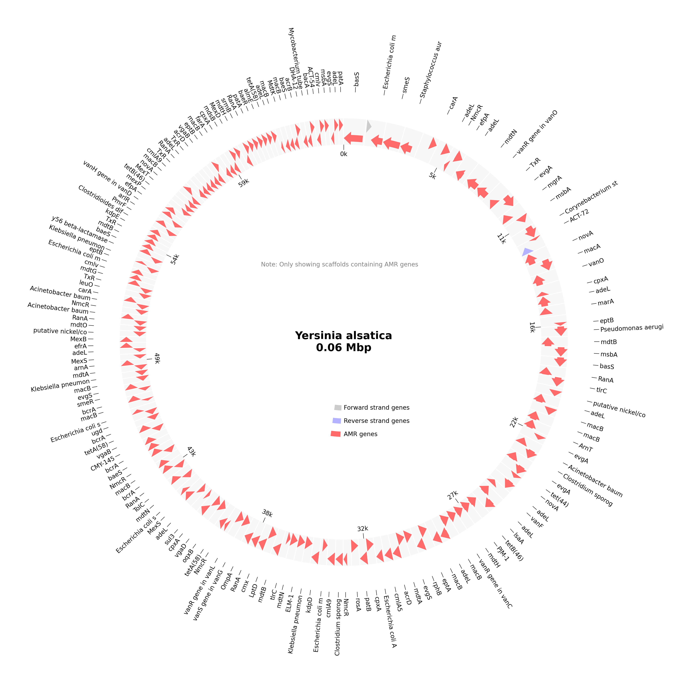

### ACT-54
- **Mechanism**: antibiotic inactivation
- **Drug Classes**: carbapenem; cephalosporin; cephamycin; penam
- **AMR Family**: ACT beta-lactamase
- **Locations**:
  - gnl|SPADES|FPFIAAFN_69839_1 : position 3-212

### ACT-72
- **Mechanism**: antibiotic inactivation
- **Drug Classes**: carbapenem; cephalosporin; cephamycin; penam
- **AMR Family**: ACT beta-lactamase
- **Locations**:
  - gnl|SPADES|FPFIAAFN_14641_1 : position 2-130

### Acinetobacter baumannii AbaF (found in 3 locations)
- **Mechanism**: antibiotic efflux
- **Drug Classes**: phosphonic acid antibiotic
- **AMR Family**: major facilitator superfamily (MFS) antibiotic efflux pump
- **Locations**:
  - gnl|SPADES|FPFIAAFN_20625_1 : position 84-461
  - gnl|SPADES|FPFIAAFN_46634_1 : position 2-262
  - gnl|SPADES|FPFIAAFN_47084_1 : position 1-261

### ArnT
- **Mechanism**: antibiotic target alteration
- **Drug Classes**: peptide antibiotic
- **AMR Family**: pmr phosphoethanolamine transferase
- **Locations**:
  - gnl|SPADES|FPFIAAFN_20401_1 : position 2-466

### CMY-145
- **Mechanism**: antibiotic inactivation
- **Drug Classes**: cephamycin
- **AMR Family**: CMY beta-lactamase
- **Locations**:
  - gnl|SPADES|FPFIAAFN_36002_1 : position 2-301

### Clostridioides difficile gyrB conferring resistance to fluoroquinolones
- **Mechanism**: antibiotic target alteration
- **Drug Classes**: fluoroquinolone antibiotic
- **AMR Family**: fluoroquinolone resistant gyrB
- **Locations**:
  - gnl|SPADES|FPFIAAFN_52746_1 : position 1-246

### Clostridium sporogenes cplR (found in 2 locations)
- **Mechanism**: antibiotic target protection
- **Drug Classes**: lincosamide antibiotic; pleuromutilin antibiotic
- **AMR Family**: Miscellaneous ABC-F subfamily ATP-binding cassette ribosomal protection proteins
- **Locations**:
  - gnl|SPADES|FPFIAAFN_20668_1 : position 1-462
  - gnl|SPADES|FPFIAAFN_26215_1 : position 3-383

### Corynebacterium striatum tetA
- **Mechanism**: antibiotic efflux
- **Drug Classes**: penam; tetracycline antibiotic
- **AMR Family**: major facilitator superfamily (MFS) antibiotic efflux pump
- **Locations**:
  - gnl|SPADES|FPFIAAFN_14338_1 : position 3-614

### DHA-12
- **Mechanism**: antibiotic inactivation
- **Drug Classes**: cephalosporin; cephamycin
- **AMR Family**: DHA beta-lactamase
- **Locations**:
  - gnl|SPADES|FPFIAAFN_68500_1 : position 1-213

### ELM-1
- **Mechanism**: antibiotic inactivation
- **Drug Classes**: carbapenem
- **AMR Family**: ELM beta-lactamase
- **Locations**:
  - gnl|SPADES|FPFIAAFN_26563_1 : position 2-379

### Escherichia coli AcrAB-TolC with AcrR mutation conferring resistance to ciprofloxacin, tetracycline, and ceftazidime
- **Mechanism**: antibiotic target alteration; antibiotic efflux
- **Drug Classes**: fluoroquinolone antibiotic; cephalosporin; glycylcycline; penam; tetracycline antibiotic; rifamycin antibiotic; phenicol antibiotic; disinfecting agents and antiseptics
- **AMR Family**: resistance-nodulation-cell division (RND) antibiotic efflux pump
- **Locations**:
  - gnl|SPADES|FPFIAAFN_25254_1 : position 54-395

### Escherichia coli mdfA (found in 3 locations)
- **Mechanism**: antibiotic efflux
- **Drug Classes**: tetracycline antibiotic; phenicol antibiotic; disinfecting agents and antiseptics
- **AMR Family**: major facilitator superfamily (MFS) antibiotic efflux pump
- **Locations**:
  - gnl|SPADES|FPFIAAFN_26273_1 : position 1-261
  - gnl|SPADES|FPFIAAFN_50035_1 : position 3-254
  - gnl|SPADES|FPFIAAFN_8087_2 : position 338-985

### Escherichia coli soxS with mutation conferring antibiotic resistance (found in 2 locations)
- **Mechanism**: antibiotic target alteration; antibiotic efflux; reduced permeability to antibiotic
- **Drug Classes**: fluoroquinolone antibiotic; monobactam; carbapenem; cephalosporin; glycylcycline; cephamycin; penam; tetracycline antibiotic; rifamycin antibiotic; phenicol antibiotic; penem; disinfecting agents and antiseptics
- **AMR Family**: ATP-binding cassette (ABC) antibiotic efflux pump; major facilitator superfamily (MFS) antibiotic efflux pump; resistance-nodulation-cell division (RND) antibiotic efflux pump; General Bacterial Porin with reduced permeability to beta-lactams
- **Locations**:
  - gnl|SPADES|FPFIAAFN_33113_1 : position 1-201
  - gnl|SPADES|FPFIAAFN_38520_1 : position 1-189

### Klebsiella pneumoniae KpnG
- **Mechanism**: antibiotic efflux
- **Drug Classes**: macrolide antibiotic; fluoroquinolone antibiotic; aminoglycoside antibiotic; carbapenem; cephalosporin; penam; peptide antibiotic; penem
- **AMR Family**: major facilitator superfamily (MFS) antibiotic efflux pump
- **Locations**:
  - gnl|SPADES|FPFIAAFN_41552_1 : position 1-273

### Klebsiella pneumoniae OmpK37 (found in 2 locations)
- **Mechanism**: reduced permeability to antibiotic
- **Drug Classes**: monobactam; carbapenem; cephalosporin; cephamycin; penam; penem
- **AMR Family**: General Bacterial Porin with reduced permeability to beta-lactams
- **Locations**:
  - gnl|SPADES|FPFIAAFN_26401_1 : position 3-383
  - gnl|SPADES|FPFIAAFN_51735_1 : position 3-134

### LptD
- **Mechanism**: antibiotic efflux
- **Drug Classes**: carbapenem; peptide antibiotic; aminocoumarin antibiotic; rifamycin antibiotic
- **AMR Family**: ATP-binding cassette (ABC) antibiotic efflux pump
- **Locations**:
  - gnl|SPADES|FPFIAAFN_27979_1 : position 1-366

### MdtK
- **Mechanism**: antibiotic efflux
- **Drug Classes**: fluoroquinolone antibiotic
- **AMR Family**: multidrug and toxic compound extrusion (MATE) transporter
- **Locations**:
  - gnl|SPADES|FPFIAAFN_67062_1 : position 2-217

### MexB
- **Mechanism**: antibiotic efflux
- **Drug Classes**: macrolide antibiotic; fluoroquinolone antibiotic; monobactam; carbapenem; cephalosporin; cephamycin; penam; tetracycline antibiotic; peptide antibiotic; aminocoumarin antibiotic; diaminopyrimidine antibiotic; sulfonamide antibiotic; phenicol antibiotic; penem
- **AMR Family**: resistance-nodulation-cell division (RND) antibiotic efflux pump
- **Locations**:
  - gnl|SPADES|FPFIAAFN_45088_1 : position 2-265

### MexD
- **Mechanism**: antibiotic efflux
- **Drug Classes**: macrolide antibiotic; fluoroquinolone antibiotic; aminoglycoside antibiotic; cephalosporin; penam; tetracycline antibiotic; aminocoumarin antibiotic; diaminopyrimidine antibiotic; phenicol antibiotic
- **AMR Family**: resistance-nodulation-cell division (RND) antibiotic efflux pump
- **Locations**:
  - gnl|SPADES|FPFIAAFN_63304_1 : position 3-224

### MexS (found in 2 locations)
- **Mechanism**: antibiotic efflux
- **Drug Classes**: fluoroquinolone antibiotic; diaminopyrimidine antibiotic; phenicol antibiotic
- **AMR Family**: resistance-nodulation-cell division (RND) antibiotic efflux pump
- **Locations**:
  - gnl|SPADES|FPFIAAFN_32792_1 : position 2-325
  - gnl|SPADES|FPFIAAFN_43502_1 : position 1-225

### MexT
- **Mechanism**: antibiotic efflux
- **Drug Classes**: fluoroquinolone antibiotic; diaminopyrimidine antibiotic; phenicol antibiotic
- **AMR Family**: resistance-nodulation-cell division (RND) antibiotic efflux pump
- **Locations**:
  - gnl|SPADES|FPFIAAFN_56199_1 : position 3-239

### Mycobacterium tuberculosis thyA with mutation conferring resistance to para-aminosalicylic acid
- **Mechanism**: antibiotic target alteration
- **Drug Classes**: salicylic acid antibiotic
- **AMR Family**: aminosalicylate resistant thymidylate synthase
- **Locations**:
  - gnl|SPADES|FPFIAAFN_69444_1 : position 2-211

### NmcR (found in 5 locations)
- **Mechanism**: antibiotic inactivation
- **Drug Classes**: carbapenem; cephalosporin; cephamycin; penam
- **AMR Family**: NmcA beta-lactamase
- **Locations**:
  - gnl|SPADES|FPFIAAFN_11692_1 : position 3-185
  - gnl|SPADES|FPFIAAFN_25917_2 : position 201-386
  - gnl|SPADES|FPFIAAFN_29247_1 : position 187-354
  - gnl|SPADES|FPFIAAFN_35456_1 : position 1-303
  - gnl|SPADES|FPFIAAFN_46565_1 : position 2-262

### OmpA
- **Mechanism**: reduced permeability to antibiotic
- **Drug Classes**: peptide antibiotic
- **AMR Family**: General Bacterial Porin with reduced permeability to peptide antibiotics
- **Locations**:
  - gnl|SPADES|FPFIAAFN_28405_1 : position 2-361

### PJM-1
- **Mechanism**: antibiotic inactivation
- **Drug Classes**: carbapenem; cephalosporin; cephamycin; penam
- **AMR Family**: PJM beta-lactamase
- **Locations**:
  - gnl|SPADES|FPFIAAFN_22366_1 : position 3-434

### PmrF
- **Mechanism**: antibiotic target alteration
- **Drug Classes**: peptide antibiotic
- **AMR Family**: pmr phosphoethanolamine transferase
- **Locations**:
  - gnl|SPADES|FPFIAAFN_53002_1 : position 1-246

### Pseudomonas aeruginosa CpxR
- **Mechanism**: antibiotic efflux
- **Drug Classes**: macrolide antibiotic; fluoroquinolone antibiotic; monobactam; aminoglycoside antibiotic; carbapenem; cephalosporin; cephamycin; penam; tetracycline antibiotic; peptide antibiotic; aminocoumarin antibiotic; diaminopyrimidine antibiotic; sulfonamide antibiotic; phenicol antibiotic; penem
- **AMR Family**: resistance-nodulation-cell division (RND) antibiotic efflux pump
- **Locations**:
  - gnl|SPADES|FPFIAAFN_18198_1 : position 1-504

### RanA (found in 6 locations)
- **Mechanism**: antibiotic efflux
- **Drug Classes**: aminoglycoside antibiotic
- **AMR Family**: ATP-binding cassette (ABC) antibiotic efflux pump
- **Locations**:
  - gnl|SPADES|FPFIAAFN_19314_1 : position 69-488
  - gnl|SPADES|FPFIAAFN_28418_1 : position 1-363
  - gnl|SPADES|FPFIAAFN_34406_1 : position 3-311
  - gnl|SPADES|FPFIAAFN_46139_1 : position 1-261
  - gnl|SPADES|FPFIAAFN_59464_1 : position 3-233
  - gnl|SPADES|FPFIAAFN_64417_1 : position 3-221

### Staphylococcus aureus mupA conferring resistance to mupirocin
- **Mechanism**: antibiotic target alteration
- **Drug Classes**: mupirocin-like antibiotic
- **AMR Family**: antibiotic-resistant isoleucyl-tRNA synthetase (ileS)
- **Locations**:
  - gnl|SPADES|FPFIAAFN_8584_1 : position 3-647

### TolC
- **Mechanism**: antibiotic efflux
- **Drug Classes**: macrolide antibiotic; fluoroquinolone antibiotic; aminoglycoside antibiotic; carbapenem; cephalosporin; glycylcycline; cephamycin; penam; tetracycline antibiotic; peptide antibiotic; aminocoumarin antibiotic; rifamycin antibiotic; phenicol antibiotic; penem; disinfecting agents and antiseptics
- **AMR Family**: ATP-binding cassette (ABC) antibiotic efflux pump; major facilitator superfamily (MFS) antibiotic efflux pump; resistance-nodulation-cell division (RND) antibiotic efflux pump
- **Locations**:
  - gnl|SPADES|FPFIAAFN_33876_1 : position 3-314

### TxR (found in 5 locations)
- **Mechanism**: antibiotic efflux
- **Drug Classes**: tetracycline antibiotic
- **AMR Family**: ATP-binding cassette (ABC) antibiotic efflux pump
- **Locations**:
  - gnl|SPADES|FPFIAAFN_13323_2 : position 264-653
  - gnl|SPADES|FPFIAAFN_47112_1 : position 1-261
  - gnl|SPADES|FPFIAAFN_52212_1 : position 1-249
  - gnl|SPADES|FPFIAAFN_58566_1 : position 2-235
  - gnl|SPADES|FPFIAAFN_60036_1 : position 1-231

### acrB
- **Mechanism**: antibiotic efflux
- **Drug Classes**: fluoroquinolone antibiotic; cephalosporin; glycylcycline; penam; tetracycline antibiotic; rifamycin antibiotic; phenicol antibiotic; disinfecting agents and antiseptics
- **AMR Family**: resistance-nodulation-cell division (RND) antibiotic efflux pump
- **Locations**:
  - gnl|SPADES|FPFIAAFN_68426_1 : position 1-213

### acrD (found in 2 locations)
- **Mechanism**: antibiotic efflux
- **Drug Classes**: aminoglycoside antibiotic
- **AMR Family**: resistance-nodulation-cell division (RND) antibiotic efflux pump
- **Locations**:
  - gnl|SPADES|FPFIAAFN_24988_1 : position 3-398
  - gnl|SPADES|FPFIAAFN_60192_1 : position 1-231

### adeL (found in 12 locations)
- **Mechanism**: antibiotic efflux
- **Drug Classes**: fluoroquinolone antibiotic; tetracycline antibiotic
- **AMR Family**: resistance-nodulation-cell division (RND) antibiotic efflux pump
- **Locations**:
  - gnl|SPADES|FPFIAAFN_11326_2 : position 345-740
  - gnl|SPADES|FPFIAAFN_11948_1 : position 3-440
  - gnl|SPADES|FPFIAAFN_16429_1 : position 2-553
  - gnl|SPADES|FPFIAAFN_19855_1 : position 16-477
  - gnl|SPADES|FPFIAAFN_21682_1 : position 1-444
  - gnl|SPADES|FPFIAAFN_21861_1 : position 2-442
  - gnl|SPADES|FPFIAAFN_23327_1 : position 1-420
  - gnl|SPADES|FPFIAAFN_32174_1 : position 1-276
  - gnl|SPADES|FPFIAAFN_44042_1 : position 61-267
  - gnl|SPADES|FPFIAAFN_59637_1 : position 1-231
  - gnl|SPADES|FPFIAAFN_66286_1 : position 3-218
  - gnl|SPADES|FPFIAAFN_71846_1 : position 3-206

### almE
- **Mechanism**: antibiotic target alteration
- **Drug Classes**: peptide antibiotic
- **AMR Family**: polymyxin resistance operon; alm glycyltransferase
- **Locations**:
  - gnl|SPADES|FPFIAAFN_65701_1 : position 1-219

### arlR
- **Mechanism**: antibiotic efflux
- **Drug Classes**: fluoroquinolone antibiotic; disinfecting agents and antiseptics
- **AMR Family**: major facilitator superfamily (MFS) antibiotic efflux pump
- **Locations**:
  - gnl|SPADES|FPFIAAFN_53413_1 : position 1-246

### arnA
- **Mechanism**: antibiotic target alteration
- **Drug Classes**: peptide antibiotic
- **AMR Family**: pmr phosphoethanolamine transferase
- **Locations**:
  - gnl|SPADES|FPFIAAFN_42920_1 : position 3-272

### bacA
- **Mechanism**: antibiotic target alteration
- **Drug Classes**: peptide antibiotic
- **AMR Family**: undecaprenyl pyrophosphate related proteins
- **Locations**:
  - gnl|SPADES|FPFIAAFN_70098_1 : position 1-210

### baeR
- **Mechanism**: antibiotic efflux
- **Drug Classes**: aminoglycoside antibiotic; aminocoumarin antibiotic
- **AMR Family**: resistance-nodulation-cell division (RND) antibiotic efflux pump
- **Locations**:
  - gnl|SPADES|FPFIAAFN_66105_1 : position 1-219

### baeS (found in 3 locations)
- **Mechanism**: antibiotic efflux
- **Drug Classes**: aminoglycoside antibiotic; aminocoumarin antibiotic
- **AMR Family**: resistance-nodulation-cell division (RND) antibiotic efflux pump
- **Locations**:
  - gnl|SPADES|FPFIAAFN_35357_1 : position 2-304
  - gnl|SPADES|FPFIAAFN_51961_1 : position 1-249
  - gnl|SPADES|FPFIAAFN_68312_1 : position 2-214

### basS (found in 2 locations)
- **Mechanism**: antibiotic target alteration; antibiotic efflux
- **Drug Classes**: peptide antibiotic
- **AMR Family**: pmr phosphoethanolamine transferase
- **Locations**:
  - gnl|SPADES|FPFIAAFN_19193_1 : position 3-488
  - gnl|SPADES|FPFIAAFN_6818_1 : position 1-1056

### bcrA (found in 4 locations)
- **Mechanism**: antibiotic efflux
- **Drug Classes**: peptide antibiotic
- **AMR Family**: ATP-binding cassette (ABC) antibiotic efflux pump
- **Locations**:
  - gnl|SPADES|FPFIAAFN_34913_1 : position 3-308
  - gnl|SPADES|FPFIAAFN_35844_1 : position 2-301
  - gnl|SPADES|FPFIAAFN_37454_1 : position 3-290
  - gnl|SPADES|FPFIAAFN_38937_1 : position 1-285

### carA (found in 2 locations)
- **Mechanism**: antibiotic target protection
- **Drug Classes**: macrolide antibiotic
- **AMR Family**: Miscellaneous ABC-F subfamily ATP-binding cassette ribosomal protection proteins
- **Locations**:
  - gnl|SPADES|FPFIAAFN_47067_1 : position 2-259
  - gnl|SPADES|FPFIAAFN_9368_2 : position 524-868

### cmlA5
- **Mechanism**: antibiotic efflux
- **Drug Classes**: phenicol antibiotic
- **AMR Family**: major facilitator superfamily (MFS) antibiotic efflux pump
- **Locations**:
  - gnl|SPADES|FPFIAAFN_25135_1 : position 3-398

### cmlA9 (found in 2 locations)
- **Mechanism**: antibiotic efflux
- **Drug Classes**: phenicol antibiotic
- **AMR Family**: major facilitator superfamily (MFS) antibiotic efflux pump
- **Locations**:
  - gnl|SPADES|FPFIAAFN_26170_1 : position 1-384
  - gnl|SPADES|FPFIAAFN_58757_1 : position 1-234

### cmlv (found in 2 locations)
- **Mechanism**: antibiotic inactivation
- **Drug Classes**: phenicol antibiotic
- **AMR Family**: chloramphenicol phosphotransferase
- **Locations**:
  - gnl|SPADES|FPFIAAFN_49262_1 : position 1-255
  - gnl|SPADES|FPFIAAFN_70155_1 : position 1-210

### cmx
- **Mechanism**: antibiotic efflux
- **Drug Classes**: phenicol antibiotic
- **AMR Family**: major facilitator superfamily (MFS) antibiotic efflux pump
- **Locations**:
  - gnl|SPADES|FPFIAAFN_28176_1 : position 3-365

### cpxA (found in 4 locations)
- **Mechanism**: antibiotic efflux
- **Drug Classes**: aminoglycoside antibiotic; aminocoumarin antibiotic
- **AMR Family**: resistance-nodulation-cell division (RND) antibiotic efflux pump
- **Locations**:
  - gnl|SPADES|FPFIAAFN_15611_2 : position 343-573
  - gnl|SPADES|FPFIAAFN_25403_1 : position 2-394
  - gnl|SPADES|FPFIAAFN_30839_1 : position 1-339
  - gnl|SPADES|FPFIAAFN_62733_1 : position 2-226

### efpA (found in 2 locations)
- **Mechanism**: antibiotic efflux
- **Drug Classes**: rifamycin antibiotic; isoniazid-like antibiotic
- **AMR Family**: major facilitator superfamily (MFS) antibiotic efflux pump
- **Locations**:
  - gnl|SPADES|FPFIAAFN_11692_2 : position 315-722
  - gnl|SPADES|FPFIAAFN_54879_1 : position 1-243

### efrA
- **Mechanism**: antibiotic efflux
- **Drug Classes**: macrolide antibiotic; fluoroquinolone antibiotic; rifamycin antibiotic
- **AMR Family**: ATP-binding cassette (ABC) antibiotic efflux pump
- **Locations**:
  - gnl|SPADES|FPFIAAFN_44160_1 : position 1-267

### eptA
- **Mechanism**: antibiotic target alteration
- **Drug Classes**: peptide antibiotic
- **AMR Family**: pmr phosphoethanolamine transferase
- **Locations**:
  - gnl|SPADES|FPFIAAFN_24159_1 : position 3-410

### eptB (found in 3 locations)
- **Mechanism**: antibiotic target alteration
- **Drug Classes**: peptide antibiotic
- **AMR Family**: pmr phosphoethanolamine transferase
- **Locations**:
  - gnl|SPADES|FPFIAAFN_17386_1 : position 354-527
  - gnl|SPADES|FPFIAAFN_50395_1 : position 2-253
  - gnl|SPADES|FPFIAAFN_60698_1 : position 2-229

### evgA (found in 3 locations)
- **Mechanism**: antibiotic efflux
- **Drug Classes**: macrolide antibiotic; fluoroquinolone antibiotic; penam; tetracycline antibiotic
- **AMR Family**: major facilitator superfamily (MFS) antibiotic efflux pump; resistance-nodulation-cell division (RND) antibiotic efflux pump
- **Locations**:
  - gnl|SPADES|FPFIAAFN_13381_1 : position 26-652
  - gnl|SPADES|FPFIAAFN_20413_2 : position 108-350
  - gnl|SPADES|FPFIAAFN_21097_1 : position 24-455

### evgS (found in 3 locations)
- **Mechanism**: antibiotic efflux
- **Drug Classes**: macrolide antibiotic; fluoroquinolone antibiotic; penam; tetracycline antibiotic
- **AMR Family**: major facilitator superfamily (MFS) antibiotic efflux pump; resistance-nodulation-cell division (RND) antibiotic efflux pump
- **Locations**:
  - gnl|SPADES|FPFIAAFN_24442_1 : position 2-406
  - gnl|SPADES|FPFIAAFN_41088_1 : position 3-275
  - gnl|SPADES|FPFIAAFN_71692_1 : position 38-208

### farA
- **Mechanism**: antibiotic efflux
- **Drug Classes**: antibacterial free fatty acids
- **AMR Family**: major facilitator superfamily (MFS) antibiotic efflux pump
- **Locations**:
  - gnl|SPADES|FPFIAAFN_62575_1 : position 2-226

### kdpD
- **Mechanism**: antibiotic efflux
- **Drug Classes**: aminoglycoside antibiotic
- **AMR Family**: kdpDE
- **Locations**:
  - gnl|SPADES|FPFIAAFN_26315_1 : position 2-382

### kdpE
- **Mechanism**: antibiotic efflux
- **Drug Classes**: aminoglycoside antibiotic
- **AMR Family**: kdpDE
- **Locations**:
  - gnl|SPADES|FPFIAAFN_52242_1 : position 2-247

### leuO
- **Mechanism**: antibiotic efflux
- **Drug Classes**: nucleoside antibiotic; disinfecting agents and antiseptics
- **AMR Family**: major facilitator superfamily (MFS) antibiotic efflux pump
- **Locations**:
  - gnl|SPADES|FPFIAAFN_47388_1 : position 3-260

### lsaA
- **Mechanism**: antibiotic target protection
- **Drug Classes**: lincosamide antibiotic; streptogramin antibiotic; streptogramin A antibiotic; streptogramin B antibiotic; pleuromutilin antibiotic
- **AMR Family**: lsa-type ABC-F protein
- **Locations**:
  - gnl|SPADES|FPFIAAFN_21858_1 : position 1-441

### macA
- **Mechanism**: antibiotic efflux
- **Drug Classes**: macrolide antibiotic
- **AMR Family**: ATP-binding cassette (ABC) antibiotic efflux pump
- **Locations**:
  - gnl|SPADES|FPFIAAFN_15364_1 : position 2-583

### macB (found in 11 locations)
- **Mechanism**: antibiotic efflux
- **Drug Classes**: macrolide antibiotic
- **AMR Family**: ATP-binding cassette (ABC) antibiotic efflux pump
- **Locations**:
  - gnl|SPADES|FPFIAAFN_20059_2 : position 85-474
  - gnl|SPADES|FPFIAAFN_20096_1 : position 2-472
  - gnl|SPADES|FPFIAAFN_23040_1 : position 3-425
  - gnl|SPADES|FPFIAAFN_23893_1 : position 2-412
  - gnl|SPADES|FPFIAAFN_35039_1 : position 2-307
  - gnl|SPADES|FPFIAAFN_38624_2 : position 143-286
  - gnl|SPADES|FPFIAAFN_41408_1 : position 3-275
  - gnl|SPADES|FPFIAAFN_57555_1 : position 3-236
  - gnl|SPADES|FPFIAAFN_61038_1 : position 2-229
  - gnl|SPADES|FPFIAAFN_66209_1 : position 2-124
  - gnl|SPADES|FPFIAAFN_66728_1 : position 3-218

### marA
- **Mechanism**: antibiotic efflux; reduced permeability to antibiotic
- **Drug Classes**: fluoroquinolone antibiotic; monobactam; carbapenem; cephalosporin; glycylcycline; cephamycin; penam; tetracycline antibiotic; rifamycin antibiotic; phenicol antibiotic; penem; disinfecting agents and antiseptics
- **AMR Family**: resistance-nodulation-cell division (RND) antibiotic efflux pump; General Bacterial Porin with reduced permeability to beta-lactams
- **Locations**:
  - gnl|SPADES|FPFIAAFN_16737_1 : position 47-421

### mdsB
- **Mechanism**: antibiotic efflux
- **Drug Classes**: monobactam; carbapenem; cephalosporin; cephamycin; penam; phenicol antibiotic; penem
- **AMR Family**: resistance-nodulation-cell division (RND) antibiotic efflux pump
- **Locations**:
  - gnl|SPADES|FPFIAAFN_63427_1 : position 2-223

### mdtA (found in 2 locations)
- **Mechanism**: antibiotic efflux
- **Drug Classes**: aminocoumarin antibiotic
- **AMR Family**: resistance-nodulation-cell division (RND) antibiotic efflux pump
- **Locations**:
  - gnl|SPADES|FPFIAAFN_24864_1 : position 1-399
  - gnl|SPADES|FPFIAAFN_42018_1 : position 2-274

### mdtB (found in 3 locations)
- **Mechanism**: antibiotic efflux
- **Drug Classes**: aminocoumarin antibiotic
- **AMR Family**: resistance-nodulation-cell division (RND) antibiotic efflux pump
- **Locations**:
  - gnl|SPADES|FPFIAAFN_18842_1 : position 1-495
  - gnl|SPADES|FPFIAAFN_27823_1 : position 2-367
  - gnl|SPADES|FPFIAAFN_51682_1 : position 3-248

### mdtG
- **Mechanism**: antibiotic efflux
- **Drug Classes**: phosphonic acid antibiotic
- **AMR Family**: major facilitator superfamily (MFS) antibiotic efflux pump
- **Locations**:
  - gnl|SPADES|FPFIAAFN_47785_1 : position 3-260

### mdtH (found in 2 locations)
- **Mechanism**: antibiotic efflux
- **Drug Classes**: fluoroquinolone antibiotic
- **AMR Family**: major facilitator superfamily (MFS) antibiotic efflux pump
- **Locations**:
  - gnl|SPADES|FPFIAAFN_22728_1 : position 3-428
  - gnl|SPADES|FPFIAAFN_63753_1 : position 3-224

### mdtN (found in 3 locations)
- **Mechanism**: antibiotic efflux
- **Drug Classes**: nucleoside antibiotic; disinfecting agents and antiseptics
- **AMR Family**: major facilitator superfamily (MFS) antibiotic efflux pump
- **Locations**:
  - gnl|SPADES|FPFIAAFN_11979_1 : position 24-707
  - gnl|SPADES|FPFIAAFN_27394_1 : position 1-372
  - gnl|SPADES|FPFIAAFN_33386_1 : position 8-319

### mdtO
- **Mechanism**: antibiotic efflux
- **Drug Classes**: nucleoside antibiotic; disinfecting agents and antiseptics
- **AMR Family**: major facilitator superfamily (MFS) antibiotic efflux pump
- **Locations**:
  - gnl|SPADES|FPFIAAFN_45718_1 : position 2-262

### mexP
- **Mechanism**: antibiotic efflux
- **Drug Classes**: macrolide antibiotic; carbapenem; tetracycline antibiotic; diaminopyrimidine antibiotic; phenicol antibiotic; disinfecting agents and antiseptics
- **AMR Family**: resistance-nodulation-cell division (RND) antibiotic efflux pump
- **Locations**:
  - gnl|SPADES|FPFIAAFN_55329_1 : position 2-241

### mgrA
- **Mechanism**: antibiotic efflux
- **Drug Classes**: fluoroquinolone antibiotic; cephalosporin; penam; tetracycline antibiotic; peptide antibiotic; disinfecting agents and antiseptics
- **AMR Family**: ATP-binding cassette (ABC) antibiotic efflux pump; major facilitator superfamily (MFS) antibiotic efflux pump
- **Locations**:
  - gnl|SPADES|FPFIAAFN_14106_1 : position 23-427

### msbA (found in 3 locations)
- **Mechanism**: antibiotic efflux
- **Drug Classes**: nitroimidazole antibiotic
- **AMR Family**: ATP-binding cassette (ABC) antibiotic efflux pump
- **Locations**:
  - gnl|SPADES|FPFIAAFN_14272_1 : position 1-354
  - gnl|SPADES|FPFIAAFN_18935_1 : position 2-493
  - gnl|SPADES|FPFIAAFN_71534_1 : position 2-208

### novA (found in 3 locations)
- **Mechanism**: antibiotic efflux
- **Drug Classes**: aminocoumarin antibiotic
- **AMR Family**: ATP-binding cassette (ABC) antibiotic efflux pump
- **Locations**:
  - gnl|SPADES|FPFIAAFN_14842_1 : position 1-597
  - gnl|SPADES|FPFIAAFN_21669_1 : position 3-230
  - gnl|SPADES|FPFIAAFN_56246_1 : position 3-239

### oqxB
- **Mechanism**: antibiotic efflux
- **Drug Classes**: fluoroquinolone antibiotic; glycylcycline; tetracycline antibiotic; diaminopyrimidine antibiotic; nitrofuran antibiotic
- **AMR Family**: resistance-nodulation-cell division (RND) antibiotic efflux pump
- **Locations**:
  - gnl|SPADES|FPFIAAFN_29676_1 : position 2-349

### patA (found in 2 locations)
- **Mechanism**: antibiotic efflux
- **Drug Classes**: fluoroquinolone antibiotic
- **AMR Family**: ATP-binding cassette (ABC) antibiotic efflux pump
- **Locations**:
  - gnl|SPADES|FPFIAAFN_64735_1 : position 2-220
  - gnl|SPADES|FPFIAAFN_72403_1 : position 1-207

### patB
- **Mechanism**: antibiotic efflux
- **Drug Classes**: fluoroquinolone antibiotic
- **AMR Family**: ATP-binding cassette (ABC) antibiotic efflux pump
- **Locations**:
  - gnl|SPADES|FPFIAAFN_25638_1 : position 2-391

### putative nickel/cobalt transporter (found in 2 locations)
- **Mechanism**: antibiotic efflux
- **Drug Classes**: fluoroquinolone antibiotic; aminoglycoside antibiotic; isoniazid-like antibiotic
- **AMR Family**: metal transporters with antibiotic efflux
- **Locations**:
  - gnl|SPADES|FPFIAAFN_19422_2 : position 171-485
  - gnl|SPADES|FPFIAAFN_45555_1 : position 2-265

### rosA
- **Mechanism**: antibiotic efflux
- **Drug Classes**: peptide antibiotic
- **AMR Family**: major facilitator superfamily (MFS) antibiotic efflux pump
- **Locations**:
  - gnl|SPADES|FPFIAAFN_25641_1 : position 2-391

### rphB
- **Mechanism**: antibiotic inactivation
- **Drug Classes**: rifamycin antibiotic
- **AMR Family**: rifampin phosphotransferase
- **Locations**:
  - gnl|SPADES|FPFIAAFN_24457_1 : position 2-406

### smeR
- **Mechanism**: antibiotic efflux
- **Drug Classes**: aminoglycoside antibiotic; cephalosporin; cephamycin; penam
- **AMR Family**: resistance-nodulation-cell division (RND) antibiotic efflux pump
- **Locations**:
  - gnl|SPADES|FPFIAAFN_40232_2 : position 76-279

### smeS
- **Mechanism**: antibiotic efflux
- **Drug Classes**: aminoglycoside antibiotic; cephalosporin; cephamycin; penam
- **AMR Family**: resistance-nodulation-cell division (RND) antibiotic efflux pump
- **Locations**:
  - gnl|SPADES|FPFIAAFN_8465_1 : position 1-948

### srmB
- **Mechanism**: antibiotic target protection
- **Drug Classes**: macrolide antibiotic
- **AMR Family**: Miscellaneous ABC-F subfamily ATP-binding cassette ribosomal protection proteins
- **Locations**:
  - gnl|SPADES|FPFIAAFN_64346_1 : position 3-221

### sul3
- **Mechanism**: antibiotic target replacement
- **Drug Classes**: sulfonamide antibiotic
- **AMR Family**: sulfonamide resistant sul
- **Locations**:
  - gnl|SPADES|FPFIAAFN_31197_1 : position 2-160

### tet(44)
- **Mechanism**: antibiotic target protection
- **Drug Classes**: tetracycline antibiotic
- **AMR Family**: tetracycline-resistant ribosomal protection protein
- **Locations**:
  - gnl|SPADES|FPFIAAFN_21387_1 : position 1-450

### tetA(58) (found in 3 locations)
- **Mechanism**: antibiotic efflux
- **Drug Classes**: tetracycline antibiotic
- **AMR Family**: major facilitator superfamily (MFS) antibiotic efflux pump
- **Locations**:
  - gnl|SPADES|FPFIAAFN_29318_1 : position 2-295
  - gnl|SPADES|FPFIAAFN_36490_1 : position 2-298
  - gnl|SPADES|FPFIAAFN_65819_1 : position 2-220

### tetB(46) (found in 2 locations)
- **Mechanism**: antibiotic efflux
- **Drug Classes**: tetracycline antibiotic
- **AMR Family**: ATP-binding cassette (ABC) antibiotic efflux pump
- **Locations**:
  - gnl|SPADES|FPFIAAFN_22122_1 : position 1-438
  - gnl|SPADES|FPFIAAFN_56096_1 : position 3-239

### tlrC (found in 2 locations)
- **Mechanism**: antibiotic target protection
- **Drug Classes**: macrolide antibiotic; lincosamide antibiotic
- **AMR Family**: Miscellaneous ABC-F subfamily ATP-binding cassette ribosomal protection proteins
- **Locations**:
  - gnl|SPADES|FPFIAAFN_19332_1 : position 2-487
  - gnl|SPADES|FPFIAAFN_27473_1 : position 2-187

### ugd
- **Mechanism**: antibiotic target alteration
- **Drug Classes**: peptide antibiotic
- **AMR Family**: pmr phosphoethanolamine transferase
- **Locations**:
  - gnl|SPADES|FPFIAAFN_37833_1 : position 1-288

### vanF
- **Mechanism**: antibiotic target alteration
- **Drug Classes**: glycopeptide antibiotic
- **AMR Family**: glycopeptide resistance gene cluster; Van ligase
- **Locations**:
  - gnl|SPADES|FPFIAAFN_21802_1 : position 1-276

### vanH gene in vanD cluster
- **Mechanism**: antibiotic target alteration
- **Drug Classes**: glycopeptide antibiotic
- **AMR Family**: vanH; glycopeptide resistance gene cluster
- **Locations**:
  - gnl|SPADES|FPFIAAFN_54281_1 : position 2-244

### vanO
- **Mechanism**: antibiotic target alteration
- **Drug Classes**: glycopeptide antibiotic
- **AMR Family**: glycopeptide resistance gene cluster; Van ligase
- **Locations**:
  - gnl|SPADES|FPFIAAFN_15398_1 : position 3-581

### vanR gene in vanC cluster
- **Mechanism**: antibiotic target alteration
- **Drug Classes**: glycopeptide antibiotic
- **AMR Family**: glycopeptide resistance gene cluster; vanR
- **Locations**:
  - gnl|SPADES|FPFIAAFN_22942_1 : position 3-425

### vanR gene in vanL cluster
- **Mechanism**: antibiotic target alteration
- **Drug Classes**: glycopeptide antibiotic
- **AMR Family**: glycopeptide resistance gene cluster; vanR
- **Locations**:
  - gnl|SPADES|FPFIAAFN_28845_1 : position 3-359

### vanR gene in vanO cluster
- **Mechanism**: antibiotic target alteration
- **Drug Classes**: glycopeptide antibiotic
- **AMR Family**: glycopeptide resistance gene cluster; vanR
- **Locations**:
  - gnl|SPADES|FPFIAAFN_12572_1 : position 1-684

### vanS gene in vanG cluster
- **Mechanism**: antibiotic target alteration
- **Drug Classes**: glycopeptide antibiotic
- **AMR Family**: vanS; glycopeptide resistance gene cluster
- **Locations**:
  - gnl|SPADES|FPFIAAFN_28440_1 : position 3-362

### vgaB (found in 2 locations)
- **Mechanism**: antibiotic target protection
- **Drug Classes**: streptogramin antibiotic; streptogramin A antibiotic; pleuromutilin antibiotic
- **AMR Family**: vga-type ABC-F protein
- **Locations**:
  - gnl|SPADES|FPFIAAFN_36344_1 : position 3-299
  - gnl|SPADES|FPFIAAFN_60495_1 : position 3-230

### vgaD
- **Mechanism**: antibiotic target protection
- **Drug Classes**: streptogramin antibiotic; streptogramin A antibiotic; pleuromutilin antibiotic
- **AMR Family**: vga-type ABC-F protein
- **Locations**:
  - gnl|SPADES|FPFIAAFN_30576_1 : position 3-341

### y56 beta-lactamase
- **Mechanism**: antibiotic inactivation
- **Drug Classes**: cephalosporin; penam; penem
- **AMR Family**: BlaA beta-lactamase
- **Locations**:
  - gnl|SPADES|FPFIAAFN_51644_1 : position 2-250

## Yersinia enterocolitica
**Strain Statistics:**
- Total genome length: 1182.3 kbp
- Total scaffolds: 2690
- Scaffolds with AMR genes: 405
- Total genes annotated: 2115
- Total AMR genes: 505
- Unique AMR genes: 207
- Distinct AMR mechanisms: 11
- Distinct AMR families: 71
- Distinct drug classes: 36

**Circos Plot:**

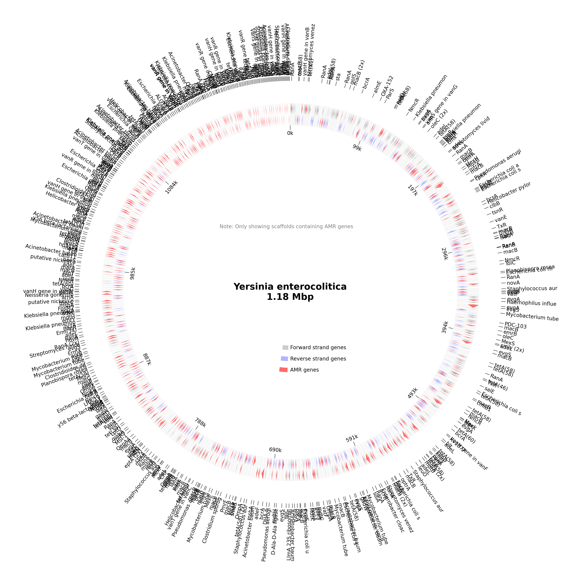

### ACT-28
- **Mechanism**: antibiotic inactivation
- **Drug Classes**: carbapenem; cephalosporin; cephamycin; penam
- **AMR Family**: ACT beta-lactamase
- **Locations**:
  - gnl|SPADES|FPFIAAFN_7375_1 : position 3-917

### ALG11-1
- **Mechanism**: antibiotic inactivation
- **Drug Classes**: carbapenem
- **AMR Family**: ALG11 beta-lactamase
- **Locations**:
  - gnl|SPADES|FPFIAAFN_6875_1 : position 2-1090

### Acinetobacter baumannii AbaF (found in 5 locations)
- **Mechanism**: antibiotic efflux
- **Drug Classes**: phosphonic acid antibiotic
- **AMR Family**: major facilitator superfamily (MFS) antibiotic efflux pump
- **Locations**:
  - gnl|SPADES|FPFIAAFN_2071_3 : position 1731-3134
  - gnl|SPADES|FPFIAAFN_4022_3 : position 1416-1853
  - gnl|SPADES|FPFIAAFN_63204_1 : position 3-224
  - gnl|SPADES|FPFIAAFN_6453_1 : position 1-1194
  - gnl|SPADES|FPFIAAFN_8848_1 : position 3-911

### Acinetobacter baumannii AbaQ (found in 6 locations)
- **Mechanism**: antibiotic efflux
- **Drug Classes**: fluoroquinolone antibiotic
- **AMR Family**: major facilitator superfamily (MFS) antibiotic efflux pump
- **Locations**:
  - gnl|SPADES|FPFIAAFN_1727_3 : position 2575-3891
  - gnl|SPADES|FPFIAAFN_1948_4 : position 2288-3646
  - gnl|SPADES|FPFIAAFN_29226_1 : position 3-353
  - gnl|SPADES|FPFIAAFN_3691_2 : position 1458-1997
  - gnl|SPADES|FPFIAAFN_5115_1 : position 3-719
  - gnl|SPADES|FPFIAAFN_5675_1 : position 2-796

### Acinetobacter baumannii AmvA (found in 2 locations)
- **Mechanism**: antibiotic efflux
- **Drug Classes**: macrolide antibiotic; disinfecting agents and antiseptics
- **AMR Family**: major facilitator superfamily (MFS) antibiotic efflux pump
- **Locations**:
  - gnl|SPADES|FPFIAAFN_1789_4 : position 3590-4051
  - gnl|SPADES|FPFIAAFN_5167_1 : position 2-1024

### ArnT
- **Mechanism**: antibiotic target alteration
- **Drug Classes**: peptide antibiotic
- **AMR Family**: pmr phosphoethanolamine transferase
- **Locations**:
  - gnl|SPADES|FPFIAAFN_3537_1: position 3-1475

### AxyY
- **Mechanism**: antibiotic efflux
- **Drug Classes**: macrolide antibiotic; fluoroquinolone antibiotic; aminoglycoside antibiotic; cephalosporin
- **AMR Family**: resistance-nodulation-cell division (RND) antibiotic efflux pump
- **Locations**:
  - gnl|SPADES|FPFIAAFN_4832_2 : position 1153-1548

### CMY-89
- **Mechanism**: antibiotic inactivation
- **Drug Classes**: cephamycin
- **AMR Family**: CMY beta-lactamase
- **Locations**:
  - gnl|SPADES|FPFIAAFN_10125_1 : position 3-224

### CRP
- **Mechanism**: antibiotic efflux
- **Drug Classes**: macrolide antibiotic; fluoroquinolone antibiotic; penam
- **AMR Family**: resistance-nodulation-cell division (RND) antibiotic efflux pump
- **Locations**:
  - gnl|SPADES|FPFIAAFN_2449_4: position 2100-2732

### Clostridioides difficile gyrA conferring resistance to fluoroquinolones
- **Mechanism**: antibiotic target alteration
- **Drug Classes**: fluoroquinolone antibiotic
- **AMR Family**: fluoroquinolone resistant gyrA
- **Locations**:
  - gnl|SPADES|FPFIAAFN_3007_1 : position 2-427

### Clostridioides difficile gyrB conferring resistance to fluoroquinolones
- **Mechanism**: antibiotic target alteration
- **Drug Classes**: fluoroquinolone antibiotic
- **AMR Family**: fluoroquinolone resistant gyrB
- **Locations**:
  - gnl|SPADES|FPFIAAFN_4382_1 : position 3-1649

### Clostridium sporogenes cplR (found in 2 locations)
- **Mechanism**: antibiotic target protection
- **Drug Classes**: lincosamide antibiotic; pleuromutilin antibiotic
- **AMR Family**: Miscellaneous ABC-F subfamily ATP-binding cassette ribosomal protection proteins
- **Locations**:
  - gnl|SPADES|FPFIAAFN_2191_4 : position 2949-3284
  - gnl|SPADES|FPFIAAFN_66640_1 : position 2-217

### CrcB (found in 2 locations)
- **Mechanism**: antibiotic efflux
- **Drug Classes**: aminoglycoside antibiotic
- **AMR Family**: multidrug and toxic compound extrusion (MATE) transporter
- **Locations**:
  - gnl|SPADES|FPFIAAFN_3006_3 : position 1299-1682
  - gnl|SPADES|FPFIAAFN_5189_2 : position 431-835

### D-Ala-D-Ala ligase
- **Mechanism**: antibiotic target alteration
- **Drug Classes**: glycopeptide antibiotic
- **AMR Family**: Van ligase
- **Locations**:
  - gnl|SPADES|FPFIAAFN_2005_4 : position 2734-3633

### DHA-6
- **Mechanism**: antibiotic inactivation
- **Drug Classes**: cephalosporin; cephamycin
- **AMR Family**: DHA beta-lactamase
- **Locations**:
  - gnl|SPADES|FPFIAAFN_2031_1 : position 395-1537

### Enterobacter cloacae acrA
- **Mechanism**: antibiotic efflux
- **Drug Classes**: fluoroquinolone antibiotic; cephalosporin; glycylcycline; penam; tetracycline antibiotic; rifamycin antibiotic; phenicol antibiotic; disinfecting agents and antiseptics
- **AMR Family**: resistance-nodulation-cell division (RND) antibiotic efflux pump
- **Locations**:
  - gnl|SPADES|FPFIAAFN_1682_1 : position 229-1389

### Erm(34)
- **Mechanism**: antibiotic target alteration
- **Drug Classes**: macrolide antibiotic; lincosamide antibiotic; streptogramin antibiotic; streptogramin A antibiotic; streptogramin B antibiotic
- **AMR Family**: Erm 23S ribosomal RNA methyltransferase
- **Locations**:
  - gnl|SPADES|FPFIAAFN_3155_2 : position 998-1624

### ErmX
- **Mechanism**: antibiotic target alteration
- **Drug Classes**: macrolide antibiotic; lincosamide antibiotic; streptogramin antibiotic; streptogramin A antibiotic; streptogramin B antibiotic
- **AMR Family**: Erm 23S ribosomal RNA methyltransferase
- **Locations**:
  - gnl|SPADES|FPFIAAFN_3050_2 : position 106-738

### Escherichia coli AcrAB-TolC with AcrR mutation conferring resistance to ciprofloxacin, tetracycline, and ceftazidime (found in 2 locations)
- **Mechanism**: antibiotic target alteration; antibiotic efflux
- **Drug Classes**: fluoroquinolone antibiotic; cephalosporin; glycylcycline; penam; tetracycline antibiotic; rifamycin antibiotic; phenicol antibiotic; disinfecting agents and antiseptics
- **AMR Family**: resistance-nodulation-cell division (RND) antibiotic efflux pump
- **Locations**:
  - gnl|SPADES|FPFIAAFN_13386_2 : position 443-649
  - gnl|SPADES|FPFIAAFN_5867_2 : position 889-1302

### Escherichia coli AcrAB-TolC with MarR mutations conferring resistance to ciprofloxacin and tetracycline
- **Mechanism**: antibiotic target alteration; antibiotic efflux
- **Drug Classes**: fluoroquinolone antibiotic; cephalosporin; glycylcycline; penam; tetracycline antibiotic; rifamycin antibiotic; phenicol antibiotic; disinfecting agents and antiseptics
- **AMR Family**: resistance-nodulation-cell division (RND) antibiotic efflux pump
- **Locations**:
  - gnl|SPADES|FPFIAAFN_2851_2 : position 412-843

### Escherichia coli EF-Tu mutants conferring resistance to Pulvomycin
- **Mechanism**: antibiotic target alteration
- **Drug Classes**: elfamycin antibiotic
- **AMR Family**: elfamycin resistant EF-Tu
- **Locations**:
  - gnl|SPADES|FPFIAAFN_6619_1 : position 3-542

### Escherichia coli acrA (found in 3 locations)
- **Mechanism**: antibiotic efflux
- **Drug Classes**: fluoroquinolone antibiotic; cephalosporin; glycylcycline; penam; tetracycline antibiotic; rifamycin antibiotic; phenicol antibiotic; disinfecting agents and antiseptics
- **AMR Family**: resistance-nodulation-cell division (RND) antibiotic efflux pump
- **Locations**:
  - gnl|SPADES|FPFIAAFN_4561_1 : position 2-553
  - gnl|SPADES|FPFIAAFN_6394_1 : position 3-644
  - gnl|SPADES|FPFIAAFN_954_5 : position 5176-6378

### Escherichia coli mdfA
- **Mechanism**: antibiotic efflux
- **Drug Classes**: tetracycline antibiotic; phenicol antibiotic; disinfecting agents and antiseptics
- **AMR Family**: major facilitator superfamily (MFS) antibiotic efflux pump
- **Locations**:
  - gnl|SPADES|FPFIAAFN_1131_6 : position 4597-5826

### Escherichia coli parE conferring resistance to fluoroquinolones
- **Mechanism**: antibiotic target alteration
- **Drug Classes**: fluoroquinolone antibiotic
- **AMR Family**: fluoroquinolone resistant parE
- **Locations**:
  - gnl|SPADES|FPFIAAFN_4796_2 : position 244-1557

### Escherichia coli soxS with mutation conferring antibiotic resistance (found in 4 locations)
- **Mechanism**: antibiotic target alteration; antibiotic efflux; reduced permeability to antibiotic
- **Drug Classes**: fluoroquinolone antibiotic; monobactam; carbapenem; cephalosporin; glycylcycline; cephamycin; penam; tetracycline antibiotic; rifamycin antibiotic; phenicol antibiotic; penem; disinfecting agents and antiseptics
- **AMR Family**: ATP-binding cassette (ABC) antibiotic efflux pump; major facilitator superfamily (MFS) antibiotic efflux pump; resistance-nodulation-cell division (RND) antibiotic efflux pump; General Bacterial Porin with reduced permeability to beta-lactams
- **Locations**:
  - gnl|SPADES|FPFIAAFN_1331_2 : position 1165-2097
  - gnl|SPADES|FPFIAAFN_1651_6 : position 2784-3791
  - gnl|SPADES|FPFIAAFN_1791_2 : position 282-989
  - gnl|SPADES|FPFIAAFN_960_3 : position 1158-2024

### Escherichia coli uhpA with mutation conferring resistance to fosfomycin
- **Mechanism**: antibiotic target alteration
- **Drug Classes**: phosphonic acid antibiotic
- **AMR Family**: antibiotic-resistant UhpT
- **Locations**:
  - gnl|SPADES|FPFIAAFN_1919_4 : position 2768-3352

### FosM2
- **Mechanism**: antibiotic inactivation
- **Drug Classes**: phosphonic acid antibiotic
- **AMR Family**: fosfomycin thiol transferase
- **Locations**:
  - gnl|SPADES|FPFIAAFN_3357_2 : position 1124-1531

### H-NS
- **Mechanism**: antibiotic efflux
- **Drug Classes**: macrolide antibiotic; fluoroquinolone antibiotic; cephalosporin; cephamycin; penam; tetracycline antibiotic
- **AMR Family**: major facilitator superfamily (MFS) antibiotic efflux pump; resistance-nodulation-cell division (RND) antibiotic efflux pump
- **Locations**:
  - gnl|SPADES|FPFIAAFN_9811_1 : position 145-555

### Haemophilus influenzae PBP3 conferring resistance to beta-lactam antibiotics
- **Mechanism**: antibiotic target alteration
- **Drug Classes**: cephalosporin; cephamycin; penam
- **AMR Family**: Penicillin-binding protein mutations conferring resistance to beta-lactam antibiotics
- **Locations**:
  - gnl|SPADES|FPFIAAFN_1176_3 : position 1336-3099

### Helicobacter pylori pbp1 mutants conferring resistance to amoxicillin (found in 3 locations)
- **Mechanism**: antibiotic target alteration
- **Drug Classes**: cephalosporin; cephamycin; penam
- **AMR Family**: Penicillin-binding protein mutations conferring resistance to beta-lactam antibiotics
- **Locations**:
  - gnl|SPADES|FPFIAAFN_1011_1 : position 1-1959
  - gnl|SPADES|FPFIAAFN_2368_2 : position 393-1160
  - gnl|SPADES|FPFIAAFN_38019_1 : position 2-289

### Helicobacter pylori pbp2 mutants conferring resistance to amoxicillin
- **Mechanism**: antibiotic target alteration
- **Drug Classes**: cephalosporin; cephamycin; penam
- **AMR Family**: Penicillin-binding protein mutations conferring resistance to beta-lactam antibiotics
- **Locations**:
  - gnl|SPADES|FPFIAAFN_6040_1 : position 3-290

### Helicobacter pylori pbp3 conferring resistance to amoxicillin
- **Mechanism**: antibiotic target alteration
- **Drug Classes**: cephalosporin; cephamycin; penam
- **AMR Family**: Penicillin-binding protein mutations conferring resistance to beta-lactam antibiotics
- **Locations**:
  - gnl|SPADES|FPFIAAFN_4132_2 : position 700-1809

### Helicobacter pylori rpoB mutation conferring resistance to rifampicin
- **Mechanism**: antibiotic target alteration; antibiotic target replacement
- **Drug Classes**: fluoroquinolone antibiotic; rifamycin antibiotic
- **AMR Family**: rifamycin-resistant beta-subunit of RNA polymerase (rpoB)
- **Locations**:
  - gnl|SPADES|FPFIAAFN_7806_1 : position 1-1014

### Klebsiella pneumoniae KpnE
- **Mechanism**: antibiotic efflux
- **Drug Classes**: macrolide antibiotic; aminoglycoside antibiotic; cephalosporin; tetracycline antibiotic; peptide antibiotic; rifamycin antibiotic; disinfecting agents and antiseptics
- **AMR Family**: small multidrug resistance (SMR) antibiotic efflux pump
- **Locations**:
  - gnl|SPADES|FPFIAAFN_5458_1 : position 197-574

### Klebsiella pneumoniae KpnF
- **Mechanism**: antibiotic efflux
- **Drug Classes**: macrolide antibiotic; aminoglycoside antibiotic; cephalosporin; tetracycline antibiotic; peptide antibiotic; rifamycin antibiotic; disinfecting agents and antiseptics
- **AMR Family**: small multidrug resistance (SMR) antibiotic efflux pump
- **Locations**:
  - gnl|SPADES|FPFIAAFN_5458_2: position 561-890

### Klebsiella pneumoniae KpnH
- **Mechanism**: antibiotic efflux
- **Drug Classes**: macrolide antibiotic; fluoroquinolone antibiotic; aminoglycoside antibiotic; carbapenem; cephalosporin; penam; peptide antibiotic; penem
- **AMR Family**: major facilitator superfamily (MFS) antibiotic efflux pump
- **Locations**:
  - gnl|SPADES|FPFIAAFN_868_2: position 714-2249

### Klebsiella pneumoniae OmpK37 (found in 10 locations)
- **Mechanism**: reduced permeability to antibiotic
- **Drug Classes**: monobactam; carbapenem; cephalosporin; cephamycin; penam; penem
- **AMR Family**: General Bacterial Porin with reduced permeability to beta-lactams
- **Locations**:
  - gnl|SPADES|FPFIAAFN_14305_1 : position 3-614
  - gnl|SPADES|FPFIAAFN_27336_1 : position 2-373
  - gnl|SPADES|FPFIAAFN_27849_1 : position 3-368
  - gnl|SPADES|FPFIAAFN_3250_1 : position 176-1291
  - gnl|SPADES|FPFIAAFN_3330_1 : position 2-115
  - gnl|SPADES|FPFIAAFN_4182_2 : position 1416-1790
  - gnl|SPADES|FPFIAAFN_5606_1 : position 1-255
  - gnl|SPADES|FPFIAAFN_819_6 : position 7521-8600
  - gnl|SPADES|FPFIAAFN_8267_1 : position 3-284
  - gnl|SPADES|FPFIAAFN_8592_1 : position 1-717

### Klebsiella pneumoniae acrR with mutation conferring multidrug antibiotic resistance
- **Mechanism**: antibiotic target alteration; antibiotic efflux
- **Drug Classes**: fluoroquinolone antibiotic; cephalosporin; glycylcycline; penam; tetracycline antibiotic; rifamycin antibiotic; phenicol antibiotic; disinfecting agents and antiseptics
- **AMR Family**: resistance-nodulation-cell division (RND) antibiotic efflux pump
- **Locations**:
  - gnl|SPADES|FPFIAAFN_6394_2 : position 789-1205

### LRA-19
- **Mechanism**: antibiotic inactivation
- **Drug Classes**: cephalosporin; penam
- **AMR Family**: subclass B3 LRA beta-lactamase
- **Locations**:
  - gnl|SPADES|FPFIAAFN_2842_2 : position 942-1589

### LlmA 23S ribosomal RNA methyltransferase
- **Mechanism**: antibiotic target alteration
- **Drug Classes**: lincosamide antibiotic
- **AMR Family**: Llm 23S ribosomal RNA methyltransferase
- **Locations**:
  - gnl|SPADES|FPFIAAFN_1952_5 : position 1681-2865

### LptD (found in 2 locations)
- **Mechanism**: antibiotic efflux
- **Drug Classes**: carbapenem; peptide antibiotic; aminocoumarin antibiotic; rifamycin antibiotic
- **AMR Family**: ATP-binding cassette (ABC) antibiotic efflux pump
- **Locations**:
  - gnl|SPADES|FPFIAAFN_2619_2 : position 1124-2761
  - gnl|SPADES|FPFIAAFN_46576_1 : position 3-260

### MSI-1
- **Mechanism**: antibiotic inactivation
- **Drug Classes**: carbapenem
- **AMR Family**: MSI beta-lactamase
- **Locations**:
  - gnl|SPADES|FPFIAAFN_2563_4 : position 2104-2814

### MdtK
- **Mechanism**: antibiotic efflux
- **Drug Classes**: fluoroquinolone antibiotic
- **AMR Family**: multidrug and toxic compound extrusion (MATE) transporter
- **Locations**:
  - gnl|SPADES|FPFIAAFN_1916_1 : position 2-1378

### MexE
- **Mechanism**: antibiotic efflux
- **Drug Classes**: fluoroquinolone antibiotic; diaminopyrimidine antibiotic; phenicol antibiotic
- **AMR Family**: resistance-nodulation-cell division (RND) antibiotic efflux pump
- **Locations**:
  - gnl|SPADES|FPFIAAFN_2207_3 : position 842-2134

### MexF (found in 2 locations)
- **Mechanism**: antibiotic efflux
- **Drug Classes**: fluoroquinolone antibiotic; diaminopyrimidine antibiotic; phenicol antibiotic
- **AMR Family**: resistance-nodulation-cell division (RND) antibiotic efflux pump
- **Locations**:
  - gnl|SPADES|FPFIAAFN_2452_4 : position 2497-2973
  - gnl|SPADES|FPFIAAFN_4832_1 : position 2-1156

### MexH
- **Mechanism**: antibiotic efflux
- **Drug Classes**: fluoroquinolone antibiotic; tetracycline antibiotic; disinfecting agents and antiseptics
- **AMR Family**: resistance-nodulation-cell division (RND) antibiotic efflux pump
- **Locations**:
  - gnl|SPADES|FPFIAAFN_936_5 : position 2743-4272

### MexJ
- **Mechanism**: antibiotic efflux
- **Drug Classes**: macrolide antibiotic; tetracycline antibiotic; disinfecting agents and antiseptics
- **AMR Family**: resistance-nodulation-cell division (RND) antibiotic efflux pump
- **Locations**:
  - gnl|SPADES|FPFIAAFN_1432_1 : position 442-1524

### MexK
- **Mechanism**: antibiotic efflux
- **Drug Classes**: macrolide antibiotic; tetracycline antibiotic; disinfecting agents and antiseptics
- **AMR Family**: resistance-nodulation-cell division (RND) antibiotic efflux pump
- **Locations**:
  - gnl|SPADES|FPFIAAFN_1432_2 : position 1524-1961

### MexL
- **Mechanism**: antibiotic efflux
- **Drug Classes**: macrolide antibiotic; tetracycline antibiotic; disinfecting agents and antiseptics
- **AMR Family**: resistance-nodulation-cell division (RND) antibiotic efflux pump
- **Locations**:
  - gnl|SPADES|FPFIAAFN_52196_1 : position 2-247

### MexS (found in 5 locations)
- **Mechanism**: antibiotic efflux
- **Drug Classes**: fluoroquinolone antibiotic; diaminopyrimidine antibiotic; phenicol antibiotic
- **AMR Family**: resistance-nodulation-cell division (RND) antibiotic efflux pump
- **Locations**:
  - gnl|SPADES|FPFIAAFN_1254_3 : position 4123-5133
  - gnl|SPADES|FPFIAAFN_15813_1 : position 1-561
  - gnl|SPADES|FPFIAAFN_2171_2 : position 596-1672
  - gnl|SPADES|FPFIAAFN_2974_2 : position 821-1855
  - gnl|SPADES|FPFIAAFN_3936_1 : position 1-798

### MexT
- **Mechanism**: antibiotic efflux
- **Drug Classes**: fluoroquinolone antibiotic; diaminopyrimidine antibiotic; phenicol antibiotic
- **AMR Family**: resistance-nodulation-cell division (RND) antibiotic efflux pump
- **Locations**:
  - gnl|SPADES|FPFIAAFN_5526_1 : position 1-450

### MuxB
- **Mechanism**: antibiotic efflux
- **Drug Classes**: macrolide antibiotic; monobactam; tetracycline antibiotic; aminocoumarin antibiotic
- **AMR Family**: resistance-nodulation-cell division (RND) antibiotic efflux pump
- **Locations**:
  - gnl|SPADES|FPFIAAFN_936_6 : position 4269-7400

### Mycobacterium tuberculosis gidB mutation conferring resistance to streptomycin
- **Mechanism**: antibiotic target alteration
- **Drug Classes**: aminoglycoside antibiotic
- **AMR Family**: antibiotic resistant gidB
- **Locations**:
  - gnl|SPADES|FPFIAAFN_3988_2 : position 677-1297

### Mycobacterium tuberculosis kasA mutant conferring resistance to isoniazid (found in 2 locations)
- **Mechanism**: antibiotic target alteration
- **Drug Classes**: isoniazid-like antibiotic
- **AMR Family**: antibiotic resistant kasA
- **Locations**:
  - gnl|SPADES|FPFIAAFN_1190_3 : position 940-2214
  - gnl|SPADES|FPFIAAFN_3024_4 : position 1926-2420

### Mycobacterium tuberculosis ndh with mutation conferring resistance to isoniazid
- **Mechanism**: antibiotic target alteration
- **Drug Classes**: isoniazid-like antibiotic
- **AMR Family**: antibiotic resistant ndh
- **Locations**:
  - gnl|SPADES|FPFIAAFN_1705_3 : position 2471-3775

### Mycobacterium tuberculosis pncA mutations conferring resistance to pyrazinamide
- **Mechanism**: antibiotic target alteration
- **Drug Classes**: pyrazine antibiotic
- **AMR Family**: Pyrazinamide resistant pncA
- **Locations**:
  - gnl|SPADES|FPFIAAFN_3043_3 : position 1149-1802

### Mycobacterium tuberculosis rpsA mutations conferring resistance to pyrazinamide
- **Mechanism**: antibiotic target alteration
- **Drug Classes**: pyrazine antibiotic
- **AMR Family**: pyrazinamide resistant rpsA
- **Locations**:
  - gnl|SPADES|FPFIAAFN_2211_1 : position 2-493

### Mycobacterium tuberculosis thyA with mutation conferring resistance to para-aminosalicylic acid
- **Mechanism**: antibiotic target alteration
- **Drug Classes**: salicylic acid antibiotic
- **AMR Family**: aminosalicylate resistant thymidylate synthase
- **Locations**:
  - gnl|SPADES|FPFIAAFN_1808_3 : position 858-1652

### Neisseria gonorrhoeae pilQ gene conferring resistance to beta-lactam
- **Mechanism**: antibiotic target alteration
- **Drug Classes**: cephalosporin; cephamycin; penam
- **AMR Family**: Penicillin-binding protein mutations conferring resistance to beta-lactam antibiotics
- **Locations**:
  - gnl|SPADES|FPFIAAFN_3456_1 : position 46-1992

### NmcR (found in 13 locations)
- **Mechanism**: antibiotic inactivation
- **Drug Classes**: carbapenem; cephalosporin; cephamycin; penam
- **AMR Family**: NmcA beta-lactamase
- **Locations**:
  - gnl|SPADES|FPFIAAFN_10125_2 : position 359-817
  - gnl|SPADES|FPFIAAFN_1116_6 : position 5682-6572
  - gnl|SPADES|FPFIAAFN_11802_1 : position 136-717
  - gnl|SPADES|FPFIAAFN_1414_1 : position 1-561
  - gnl|SPADES|FPFIAAFN_2827_1 : position 2-205
  - gnl|SPADES|FPFIAAFN_2843_1 : position 3-398
  - gnl|SPADES|FPFIAAFN_2858_2 : position 181-1035
  - gnl|SPADES|FPFIAAFN_3507_3 : position 1050-1925
  - gnl|SPADES|FPFIAAFN_3708_1 : position 185-1078
  - gnl|SPADES|FPFIAAFN_3716_2 : position 364-1245
  - gnl|SPADES|FPFIAAFN_4133_1 : position 546-1478
  - gnl|SPADES|FPFIAAFN_793_10 : position 7947-8864
  - gnl|SPADES|FPFIAAFN_9989_1 : position 2-826

### OXA-152
- **Mechanism**: antibiotic inactivation
- **Drug Classes**: carbapenem; penam
- **AMR Family**: OXA beta-lactamase; OXA-62-like beta-lactamase
- **Locations**:
  - gnl|SPADES|FPFIAAFN_700_8 : position 5076-5780

### OmpA (found in 6 locations)
- **Mechanism**: reduced permeability to antibiotic
- **Drug Classes**: peptide antibiotic
- **AMR Family**: General Bacterial Porin with reduced permeability to peptide antibiotics
- **Locations**:
  - gnl|SPADES|FPFIAAFN_1832_2 : position 141-1058
  - gnl|SPADES|FPFIAAFN_2153_1 : position 1-462
  - gnl|SPADES|FPFIAAFN_2441_2 : position 906-1397
  - gnl|SPADES|FPFIAAFN_2860_2 : position 144-1520
  - gnl|SPADES|FPFIAAFN_6290_2 : position 339-998
  - gnl|SPADES|FPFIAAFN_7694_1 : position 93-1028

### OprJ
- **Mechanism**: antibiotic efflux
- **Drug Classes**: macrolide antibiotic; fluoroquinolone antibiotic; aminoglycoside antibiotic; cephalosporin; penam; tetracycline antibiotic; aminocoumarin antibiotic; diaminopyrimidine antibiotic; phenicol antibiotic
- **AMR Family**: resistance-nodulation-cell division (RND) antibiotic efflux pump
- **Locations**:
  - gnl|SPADES|FPFIAAFN_8329_1 : position 1-714

### OprM (found in 2 locations)
- **Mechanism**: antibiotic efflux
- **Drug Classes**: macrolide antibiotic; fluoroquinolone antibiotic; monobactam; aminoglycoside antibiotic; carbapenem; cephalosporin; cephamycin; penam; tetracycline antibiotic; peptide antibiotic; aminocoumarin antibiotic; diaminopyrimidine antibiotic; sulfonamide antibiotic; phenicol antibiotic; penem; disinfecting agents and antiseptics
- **AMR Family**: resistance-nodulation-cell division (RND) antibiotic efflux pump
- **Locations**:
  - gnl|SPADES|FPFIAAFN_4388_2 : position 1369-1713
  - gnl|SPADES|FPFIAAFN_6240_1 : position 3-1076

### OprN
- **Mechanism**: antibiotic efflux
- **Drug Classes**: fluoroquinolone antibiotic; diaminopyrimidine antibiotic; phenicol antibiotic
- **AMR Family**: resistance-nodulation-cell division (RND) antibiotic efflux pump
- **Locations**:
  - gnl|SPADES|FPFIAAFN_12905_1 : position 3-668

### OprZ
- **Mechanism**: antibiotic efflux
- **Drug Classes**: macrolide antibiotic; fluoroquinolone antibiotic; aminoglycoside antibiotic; cephalosporin
- **AMR Family**: resistance-nodulation-cell division (RND) antibiotic efflux pump
- **Locations**:
  - gnl|SPADES|FPFIAAFN_7417_1 : position 51-1058

### PDC-103
- **Mechanism**: antibiotic inactivation
- **Drug Classes**: monobactam; carbapenem; cephalosporin
- **AMR Family**: PDC beta-lactamase
- **Locations**:
  - gnl|SPADES|FPFIAAFN_1200_6 : position 5541-6005

### ParR (found in 4 locations)
- **Mechanism**: antibiotic efflux; reduced permeability to antibiotic
- **Drug Classes**: macrolide antibiotic; fluoroquinolone antibiotic; monobactam; aminoglycoside antibiotic; carbapenem; cephalosporin; cephamycin; penam; tetracycline antibiotic; phenicol antibiotic; penem; disinfecting agents and antiseptics
- **AMR Family**: resistance-nodulation-cell division (RND) antibiotic efflux pump; Outer Membrane Porin (Opr)
- **Locations**:
  - gnl|SPADES|FPFIAAFN_13138_1 : position 3-251
  - gnl|SPADES|FPFIAAFN_1573_4 : position 3184-3903
  - gnl|SPADES|FPFIAAFN_17337_2 : position 96-530
  - gnl|SPADES|FPFIAAFN_4839_1 : position 399-1127

### ParS (found in 3 locations)
- **Mechanism**: antibiotic efflux; reduced permeability to antibiotic
- **Drug Classes**: macrolide antibiotic; fluoroquinolone antibiotic; monobactam; aminoglycoside antibiotic; carbapenem; cephalosporin; cephamycin; penam; tetracycline antibiotic; phenicol antibiotic; penem; disinfecting agents and antiseptics
- **AMR Family**: resistance-nodulation-cell division (RND) antibiotic efflux pump; Outer Membrane Porin (Opr)
- **Locations**:
  - gnl|SPADES|FPFIAAFN_18294_1 : position 3-506
  - gnl|SPADES|FPFIAAFN_4420_1 : position 3-488
  - gnl|SPADES|FPFIAAFN_738_1 : position 3-956

### Planobispora rosea EF-Tu mutants conferring resistance to inhibitor GE2270A (found in 2 locations)
- **Mechanism**: antibiotic target alteration
- **Drug Classes**: elfamycin antibiotic
- **AMR Family**: elfamycin resistant EF-Tu
- **Locations**:
  - gnl|SPADES|FPFIAAFN_1131_5 : position 2639-4531
  - gnl|SPADES|FPFIAAFN_2992_2 : position 906-2405

### PmrF (found in 4 locations)
- **Mechanism**: antibiotic target alteration
- **Drug Classes**: peptide antibiotic
- **AMR Family**: pmr phosphoethanolamine transferase
- **Locations**:
  - gnl|SPADES|FPFIAAFN_2181_1 : position 3-989
  - gnl|SPADES|FPFIAAFN_4895_2 : position 751-1524
  - gnl|SPADES|FPFIAAFN_914_6 : position 4526-5515
  - gnl|SPADES|FPFIAAFN_9943_2 : position 678-827

### Pseudomonas aeruginosa CpxR (found in 2 locations)
- **Mechanism**: antibiotic efflux
- **Drug Classes**: macrolide antibiotic; fluoroquinolone antibiotic; monobactam; aminoglycoside antibiotic; carbapenem; cephalosporin; cephamycin; penam; tetracycline antibiotic; peptide antibiotic; aminocoumarin antibiotic; diaminopyrimidine antibiotic; sulfonamide antibiotic; phenicol antibiotic; penem
- **AMR Family**: resistance-nodulation-cell division (RND) antibiotic efflux pump
- **Locations**:
  - gnl|SPADES|FPFIAAFN_2267_3 : position 2006-2689
  - gnl|SPADES|FPFIAAFN_949_5 : position 3606-4304

### Pseudomonas aeruginosa ampR with mutation conferring resistance to aztreonam
- **Mechanism**: antibiotic target alteration; antibiotic inactivation
- **Drug Classes**: monobactam; carbapenem; cephalosporin
- **AMR Family**: PDC beta-lactamase; ampR transcriptional regulator with mutation conferring resistance to monobactam antibiotics
- **Locations**:
  - gnl|SPADES|FPFIAAFN_2021_3 : position 1969-2814

### QepA4 (found in 3 locations)
- **Mechanism**: antibiotic efflux
- **Drug Classes**: fluoroquinolone antibiotic
- **AMR Family**: major facilitator superfamily (MFS) antibiotic efflux pump
- **Locations**:
  - gnl|SPADES|FPFIAAFN_2556_1 : position 2-1549
  - gnl|SPADES|FPFIAAFN_2827_2 : position 382-1674
  - gnl|SPADES|FPFIAAFN_8878_1 : position 3-908

### RanA (found in 25 locations)
- **Mechanism**: antibiotic efflux
- **Drug Classes**: aminoglycoside antibiotic
- **AMR Family**: ATP-binding cassette (ABC) antibiotic efflux pump
- **Locations**:
  - gnl|SPADES|FPFIAAFN_1063_3 : position 2180-3007
  - gnl|SPADES|FPFIAAFN_1081_8 : position 5018-5824
  - gnl|SPADES|FPFIAAFN_1152_3 : position 2581-3780
  - gnl|SPADES|FPFIAAFN_1296_5 : position 4958-5629
  - gnl|SPADES|FPFIAAFN_14635_2 : position 109-603
  - gnl|SPADES|FPFIAAFN_1677_2 : position 393-1526
  - gnl|SPADES|FPFIAAFN_1684_5 : position 2032-2847
  - gnl|SPADES|FPFIAAFN_18425_1 : position 1-504
  - gnl|SPADES|FPFIAAFN_1896_3 : position 2443-3558
  - gnl|SPADES|FPFIAAFN_2470_3 : position 1123-2085
  - gnl|SPADES|FPFIAAFN_2634_2 : position 524-1651
  - gnl|SPADES|FPFIAAFN_3109_1 : position 3-239
  - gnl|SPADES|FPFIAAFN_3109_2 : position 236-595
  - gnl|SPADES|FPFIAAFN_3138_1 : position 3-692
  - gnl|SPADES|FPFIAAFN_4043_2 : position 868-1845
  - gnl|SPADES|FPFIAAFN_4117_2 : position 896-1813
  - gnl|SPADES|FPFIAAFN_4462_2 : position 859-1683
  - gnl|SPADES|FPFIAAFN_509_3 : position 1054-2178
  - gnl|SPADES|FPFIAAFN_585_10 : position 7321-8055
  - gnl|SPADES|FPFIAAFN_593_7 : position 3624-4502
  - gnl|SPADES|FPFIAAFN_610_8 : position 8627-9403
  - gnl|SPADES|FPFIAAFN_6249_1 : position 2-502
  - gnl|SPADES|FPFIAAFN_902_4 : position 3134-4183
  - gnl|SPADES|FPFIAAFN_9217_1 : position 2-565
  - gnl|SPADES|FPFIAAFN_9217_2 : position 562-882

### RanB
- **Mechanism**: antibiotic efflux
- **Drug Classes**: aminoglycoside antibiotic
- **AMR Family**: ATP-binding cassette (ABC) antibiotic efflux pump
- **Locations**:
  - gnl|SPADES|FPFIAAFN_1081_9 : position 5818-6249

### Rv1877 (found in 2 locations)
- **Mechanism**: antibiotic efflux
- **Drug Classes**: fluoroquinolone antibiotic
- **AMR Family**: major facilitator superfamily (MFS) antibiotic efflux pump
- **Locations**:
  - gnl|SPADES|FPFIAAFN_1516_3 : position 2819-4267
  - gnl|SPADES|FPFIAAFN_6364_1 : position 426-1208

### Salmonella serovars soxS with mutation conferring antibiotic resistance
- **Mechanism**: antibiotic target alteration; antibiotic efflux; reduced permeability to antibiotic
- **Drug Classes**: fluoroquinolone antibiotic; monobactam; carbapenem; cephalosporin; glycylcycline; cephamycin; penam; tetracycline antibiotic; rifamycin antibiotic; phenicol antibiotic; penem; disinfecting agents and antiseptics
- **AMR Family**: ATP-binding cassette (ABC) antibiotic efflux pump; major facilitator superfamily (MFS) antibiotic efflux pump; resistance-nodulation-cell division (RND) antibiotic efflux pump; General Bacterial Porin with reduced permeability to beta-lactams
- **Locations**:
  - gnl|SPADES|FPFIAAFN_5669_2 : position 268-654

### SatA
- **Mechanism**: antibiotic inactivation
- **Drug Classes**: nucleoside antibiotic
- **AMR Family**: streptothricin acetyltransferase (SAT)
- **Locations**:
  - gnl|SPADES|FPFIAAFN_7363_1 : position 140-598

### Staphylococcus aureus GlpT with mutation conferring resistance to fosfomycin
- **Mechanism**: antibiotic target alteration
- **Drug Classes**: phosphonic acid antibiotic
- **AMR Family**: antibiotic-resistant GlpT
- **Locations**:
  - gnl|SPADES|FPFIAAFN_1174_2 : position 1069-2433

### Staphylococcus aureus fusA with mutation conferring resistance to fusidic acid (found in 2 locations)
- **Mechanism**: antibiotic target alteration
- **Drug Classes**: fusidane antibiotic
- **AMR Family**: antibiotic resistant fusA
- **Locations**:
  - gnl|SPADES|FPFIAAFN_1614_3 : position 1943-4027
  - gnl|SPADES|FPFIAAFN_5389_1 : position 3-1403

### Staphylococcus aureus mupA conferring resistance to mupirocin (found in 2 locations)
- **Mechanism**: antibiotic target alteration
- **Drug Classes**: mupirocin-like antibiotic
- **AMR Family**: antibiotic-resistant isoleucyl-tRNA synthetase (ileS)
- **Locations**:
  - gnl|SPADES|FPFIAAFN_2098_3 : position 887-3457
  - gnl|SPADES|FPFIAAFN_40295_1 : position 2-277

### Staphylococcus aureus mupB conferring resistance to mupirocin
- **Mechanism**: antibiotic target alteration
- **Drug Classes**: mupirocin-like antibiotic
- **AMR Family**: antibiotic-resistant isoleucyl-tRNA synthetase (ileS)
- **Locations**:
  - gnl|SPADES|FPFIAAFN_2460_1 : position 3-1142

### Streptomyces lividans cmlR
- **Mechanism**: antibiotic efflux
- **Drug Classes**: phenicol antibiotic
- **AMR Family**: major facilitator superfamily (MFS) antibiotic efflux pump
- **Locations**:
  - gnl|SPADES|FPFIAAFN_873_7 : position 6274-7488

### Streptomyces rimosus otr(A) (found in 2 locations)
- **Mechanism**: antibiotic target protection
- **Drug Classes**: tetracycline antibiotic
- **AMR Family**: tetracycline-resistant ribosomal protection protein
- **Locations**:
  - gnl|SPADES|FPFIAAFN_25342_1 : position 1-393
  - gnl|SPADES|FPFIAAFN_3087_1 : position 2-1681

### Streptomyces venezuelae rox (found in 2 locations)
- **Mechanism**: antibiotic inactivation
- **Drug Classes**: rifamycin antibiotic
- **AMR Family**: rifampin monooxygenase
- **Locations**:
  - gnl|SPADES|FPFIAAFN_1675_4 : position 3384-4385
  - gnl|SPADES|FPFIAAFN_535_8 : position 5432-6601

### TaeA (found in 3 locations)
- **Mechanism**: antibiotic efflux
- **Drug Classes**: pleuromutilin antibiotic
- **AMR Family**: ATP-binding cassette (ABC) antibiotic efflux pump
- **Locations**:
  - gnl|SPADES|FPFIAAFN_2415_1 : position 1-804
  - gnl|SPADES|FPFIAAFN_2768_3 : position 1886-2626
  - gnl|SPADES|FPFIAAFN_3696_5 : position 1774-1995

### TolC
- **Mechanism**: antibiotic efflux
- **Drug Classes**: macrolide antibiotic; fluoroquinolone antibiotic; aminoglycoside antibiotic; carbapenem; cephalosporin; glycylcycline; cephamycin; penam; tetracycline antibiotic; peptide antibiotic; aminocoumarin antibiotic; rifamycin antibiotic; phenicol antibiotic; penem; disinfecting agents and antiseptics
- **AMR Family**: ATP-binding cassette (ABC) antibiotic efflux pump; major facilitator superfamily (MFS) antibiotic efflux pump; resistance-nodulation-cell division (RND) antibiotic efflux pump
- **Locations**:
  - gnl|SPADES|FPFIAAFN_1119_4 : position 1787-3268

### TriC
- **Mechanism**: antibiotic efflux
- **Drug Classes**: disinfecting agents and antiseptics
- **AMR Family**: resistance-nodulation-cell division (RND) antibiotic efflux pump
- **Locations**:
  - gnl|SPADES|FPFIAAFN_1432_3 : position 1906-4605

### TxR (found in 12 locations)
- **Mechanism**: antibiotic efflux
- **Drug Classes**: tetracycline antibiotic
- **AMR Family**: ATP-binding cassette (ABC) antibiotic efflux pump
- **Locations**:
  - gnl|SPADES|FPFIAAFN_1049_5 : position 6366-6962
  - gnl|SPADES|FPFIAAFN_1313_1 : position 2-697
  - gnl|SPADES|FPFIAAFN_15382_1 : position 45-581
  - gnl|SPADES|FPFIAAFN_1616_5 : position 3695-4525
  - gnl|SPADES|FPFIAAFN_17258_1 : position 1-468
  - gnl|SPADES|FPFIAAFN_30487_1 : position 3-341
  - gnl|SPADES|FPFIAAFN_3697_1 : position 2-1603
  - gnl|SPADES|FPFIAAFN_45327_1 : position 3-263
  - gnl|SPADES|FPFIAAFN_5496_2 : position 641-1378
  - gnl|SPADES|FPFIAAFN_6200_2 : position 390-1238
  - gnl|SPADES|FPFIAAFN_8700_1 : position 1-615
  - gnl|SPADES|FPFIAAFN_9075_1 : position 1-882

### YajC
- **Mechanism**: antibiotic efflux
- **Drug Classes**: fluoroquinolone antibiotic; cephalosporin; glycylcycline; penam; tetracycline antibiotic; oxazolidinone antibiotic; glycopeptide antibiotic; rifamycin antibiotic; phenicol antibiotic; disinfecting agents and antiseptics
- **AMR Family**: resistance-nodulation-cell division (RND) antibiotic efflux pump
- **Locations**:
  - gnl|SPADES|FPFIAAFN_1971_2 : position 768-1100

### YojI (found in 3 locations)
- **Mechanism**: antibiotic efflux
- **Drug Classes**: peptide antibiotic
- **AMR Family**: ATP-binding cassette (ABC) antibiotic efflux pump
- **Locations**:
  - gnl|SPADES|FPFIAAFN_14958_2 : position 354-593
  - gnl|SPADES|FPFIAAFN_1934_5 : position 3317-3763
  - gnl|SPADES|FPFIAAFN_33491_1 : position 2-319

### acrB (found in 5 locations)
- **Mechanism**: antibiotic efflux
- **Drug Classes**: fluoroquinolone antibiotic; cephalosporin; glycylcycline; penam; tetracycline antibiotic; rifamycin antibiotic; phenicol antibiotic; disinfecting agents and antiseptics
- **AMR Family**: resistance-nodulation-cell division (RND) antibiotic efflux pump
- **Locations**:
  - gnl|SPADES|FPFIAAFN_1682_2 : position 1393-4356
  - gnl|SPADES|FPFIAAFN_3049_1 : position 1-255
  - gnl|SPADES|FPFIAAFN_4561_2 : position 570-1652
  - gnl|SPADES|FPFIAAFN_5840_1 : position 1-1305
  - gnl|SPADES|FPFIAAFN_6240_2 : position 1078-1230

### adeF
- **Mechanism**: antibiotic efflux
- **Drug Classes**: fluoroquinolone antibiotic; tetracycline antibiotic
- **AMR Family**: resistance-nodulation-cell division (RND) antibiotic efflux pump
- **Locations**:
  - gnl|SPADES|FPFIAAFN_2058_1: position 265-3396

### adeK
- **Mechanism**: antibiotic efflux
- **Drug Classes**: macrolide antibiotic; fluoroquinolone antibiotic; lincosamide antibiotic; carbapenem; cephalosporin; tetracycline antibiotic; rifamycin antibiotic; diaminopyrimidine antibiotic; phenicol antibiotic; penem
- **AMR Family**: resistance-nodulation-cell division (RND) antibiotic efflux pump
- **Locations**:
  - gnl|SPADES|FPFIAAFN_15607_2 : position 380-574

### adeL (found in 20 locations)
- **Mechanism**: antibiotic efflux
- **Drug Classes**: fluoroquinolone antibiotic; tetracycline antibiotic
- **AMR Family**: resistance-nodulation-cell division (RND) antibiotic efflux pump
- **Locations**:
  - gnl|SPADES|FPFIAAFN_1256_5 : position 3381-4283
  - gnl|SPADES|FPFIAAFN_1558_1 : position 185-1135
  - gnl|SPADES|FPFIAAFN_1604_3 : position 1812-2705
  - gnl|SPADES|FPFIAAFN_2196_2 : position 1542-2453
  - gnl|SPADES|FPFIAAFN_2218_2 : position 158-1069
  - gnl|SPADES|FPFIAAFN_2401_1 : position 2-751
  - gnl|SPADES|FPFIAAFN_2451_2 : position 302-1234
  - gnl|SPADES|FPFIAAFN_2829_2 : position 307-1245
  - gnl|SPADES|FPFIAAFN_2916_2 : position 1014-1910
  - gnl|SPADES|FPFIAAFN_3026_2 : position 1155-2051
  - gnl|SPADES|FPFIAAFN_3145_1 : position 121-1032
  - gnl|SPADES|FPFIAAFN_3303_3 : position 1925-2215
  - gnl|SPADES|FPFIAAFN_3528_2 : position 801-1733
  - gnl|SPADES|FPFIAAFN_3584_2 : position 542-1438
  - gnl|SPADES|FPFIAAFN_4045_1 : position 3-857
  - gnl|SPADES|FPFIAAFN_4125_1 : position 2-838
  - gnl|SPADES|FPFIAAFN_593_2 : position 611-1519
  - gnl|SPADES|FPFIAAFN_865_1 : position 1-561
  - gnl|SPADES|FPFIAAFN_873_6 : position 5219-6178
  - gnl|SPADES|FPFIAAFN_9121_1 : position 240-890

### almE (found in 2 locations)
- **Mechanism**: antibiotic target alteration
- **Drug Classes**: peptide antibiotic
- **AMR Family**: polymyxin resistance operon; alm glycyltransferase
- **Locations**:
  - gnl|SPADES|FPFIAAFN_676_7 : position 6242-8404
  - gnl|SPADES|FPFIAAFN_7004_1 : position 2-1114

### arlR (found in 2 locations)
- **Mechanism**: antibiotic efflux
- **Drug Classes**: fluoroquinolone antibiotic; disinfecting agents and antiseptics
- **AMR Family**: major facilitator superfamily (MFS) antibiotic efflux pump
- **Locations**:
  - gnl|SPADES|FPFIAAFN_4236_2 : position 1291-1770
  - gnl|SPADES|FPFIAAFN_848_5 : position 2972-3661

### arlS
- **Mechanism**: antibiotic efflux
- **Drug Classes**: fluoroquinolone antibiotic; disinfecting agents and antiseptics
- **AMR Family**: major facilitator superfamily (MFS) antibiotic efflux pump
- **Locations**:
  - gnl|SPADES|FPFIAAFN_9099_2 : position 680-892

### arnA (found in 4 locations)
- **Mechanism**: antibiotic target alteration
- **Drug Classes**: peptide antibiotic
- **AMR Family**: pmr phosphoethanolamine transferase
- **Locations**:
  - gnl|SPADES|FPFIAAFN_12678_1 : position 2-679
  - gnl|SPADES|FPFIAAFN_19966_1 : position 1-474
  - gnl|SPADES|FPFIAAFN_3408_3 : position 842-1789
  - gnl|SPADES|FPFIAAFN_4895_1 : position 2-754

### bacA
- **Mechanism**: antibiotic target alteration
- **Drug Classes**: peptide antibiotic
- **AMR Family**: undecaprenyl pyrophosphate related proteins
- **Locations**:
  - gnl|SPADES|FPFIAAFN_1943_2 : position 1563-2381

### baeR (found in 4 locations)
- **Mechanism**: antibiotic efflux
- **Drug Classes**: aminoglycoside antibiotic; aminocoumarin antibiotic
- **AMR Family**: resistance-nodulation-cell division (RND) antibiotic efflux pump
- **Locations**:
  - gnl|SPADES|FPFIAAFN_2163_3 : position 2359-3048
  - gnl|SPADES|FPFIAAFN_3183_2 : position 1105-1845
  - gnl|SPADES|FPFIAAFN_7580_2 : position 280-1038
  - gnl|SPADES|FPFIAAFN_960_1 : position 2-274

### baeS (found in 2 locations)
- **Mechanism**: antibiotic efflux
- **Drug Classes**: aminoglycoside antibiotic; aminocoumarin antibiotic
- **AMR Family**: resistance-nodulation-cell division (RND) antibiotic efflux pump
- **Locations**:
  - gnl|SPADES|FPFIAAFN_1856_3 : position 2551-3903
  - gnl|SPADES|FPFIAAFN_3661_1 : position 3-950

### basS (found in 2 locations)
- **Mechanism**: antibiotic target alteration; antibiotic efflux
- **Drug Classes**: peptide antibiotic
- **AMR Family**: pmr phosphoethanolamine transferase
- **Locations**:
  - gnl|SPADES|FPFIAAFN_48004_1 : position 84-257
  - gnl|SPADES|FPFIAAFN_840_8 : position 5653-7002

### bcr-1 (found in 3 locations)
- **Mechanism**: antibiotic efflux
- **Drug Classes**: bicyclomycin-like antibiotic
- **AMR Family**: major facilitator superfamily (MFS) antibiotic efflux pump
- **Locations**:
  - gnl|SPADES|FPFIAAFN_10383_2 : position 579-800
  - gnl|SPADES|FPFIAAFN_2829_3 : position 1409-2578
  - gnl|SPADES|FPFIAAFN_8926_1 : position 3-674

### bcrA (found in 9 locations)
- **Mechanism**: antibiotic efflux
- **Drug Classes**: peptide antibiotic
- **AMR Family**: ATP-binding cassette (ABC) antibiotic efflux pump
- **Locations**:
  - gnl|SPADES|FPFIAAFN_1477_1 : position 2-733
  - gnl|SPADES|FPFIAAFN_1580_4 : position 1636-2334
  - gnl|SPADES|FPFIAAFN_2048_2 : position 120-1685
  - gnl|SPADES|FPFIAAFN_2238_2 : position 1018-2499
  - gnl|SPADES|FPFIAAFN_3215_1 : position 1-1107
  - gnl|SPADES|FPFIAAFN_3478_2 : position 804-1562
  - gnl|SPADES|FPFIAAFN_6386_3 : position 907-1203
  - gnl|SPADES|FPFIAAFN_654_9 : position 5424-6239
  - gnl|SPADES|FPFIAAFN_980_8 : position 5617-6324

### blt
- **Mechanism**: antibiotic efflux
- **Drug Classes**: fluoroquinolone antibiotic; disinfecting agents and antiseptics
- **AMR Family**: major facilitator superfamily (MFS) antibiotic efflux pump
- **Locations**:
  - gnl|SPADES|FPFIAAFN_1527_4 : position 3526-4746

### catB11
- **Mechanism**: antibiotic inactivation
- **Drug Classes**: phenicol antibiotic
- **AMR Family**: chloramphenicol acetyltransferase (CAT)
- **Locations**:
  - gnl|SPADES|FPFIAAFN_3666_4 : position 1424-2017

### chrB
- **Mechanism**: antibiotic target alteration
- **Drug Classes**: macrolide antibiotic; lincosamide antibiotic
- **AMR Family**: non-erm 23S ribosomal RNA methyltransferase (G748)
- **Locations**:
  - gnl|SPADES|FPFIAAFN_4132_1 : position 1-582

### clbB
- **Mechanism**: antibiotic target alteration
- **Drug Classes**: lincosamide antibiotic; streptogramin antibiotic; streptogramin A antibiotic; oxazolidinone antibiotic; phenicol antibiotic; pleuromutilin antibiotic
- **AMR Family**: Cfr 23S ribosomal RNA methyltransferase
- **Locations**:
  - gnl|SPADES|FPFIAAFN_1011_4 : position 5458-6654

### cmeA
- **Mechanism**: antibiotic efflux
- **Drug Classes**: macrolide antibiotic; fluoroquinolone antibiotic; cephalosporin; fusidane antibiotic
- **AMR Family**: resistance-nodulation-cell division (RND) antibiotic efflux pump
- **Locations**:
  - gnl|SPADES|FPFIAAFN_8879_1 : position 141-908

### cmeC (found in 2 locations)
- **Mechanism**: antibiotic efflux
- **Drug Classes**: macrolide antibiotic; fluoroquinolone antibiotic; cephalosporin; fusidane antibiotic
- **AMR Family**: resistance-nodulation-cell division (RND) antibiotic efflux pump
- **Locations**:
  - gnl|SPADES|FPFIAAFN_1670_3 : position 794-2281
  - gnl|SPADES|FPFIAAFN_2501_3 : position 2121-2894

### cmlA9
- **Mechanism**: antibiotic efflux
- **Drug Classes**: phenicol antibiotic
- **AMR Family**: major facilitator superfamily (MFS) antibiotic efflux pump
- **Locations**:
  - gnl|SPADES|FPFIAAFN_2584_2 : position 1662-2798

### cmlB1
- **Mechanism**: antibiotic efflux
- **Drug Classes**: phenicol antibiotic
- **AMR Family**: major facilitator superfamily (MFS) antibiotic efflux pump
- **Locations**:
  - gnl|SPADES|FPFIAAFN_1374_1 : position 2-1117

### cmlv (found in 6 locations)
- **Mechanism**: antibiotic inactivation
- **Drug Classes**: phenicol antibiotic
- **AMR Family**: chloramphenicol phosphotransferase
- **Locations**:
  - gnl|SPADES|FPFIAAFN_10286_1 : position 1-480
  - gnl|SPADES|FPFIAAFN_1256_3 : position 2101-2889
  - gnl|SPADES|FPFIAAFN_1256_4 : position 2918-3262
  - gnl|SPADES|FPFIAAFN_2458_1 : position 3-569
  - gnl|SPADES|FPFIAAFN_2916_1 : position 3-662
  - gnl|SPADES|FPFIAAFN_5711_2 : position 671-1336

### cmx
- **Mechanism**: antibiotic efflux
- **Drug Classes**: phenicol antibiotic
- **AMR Family**: major facilitator superfamily (MFS) antibiotic efflux pump
- **Locations**:
  - gnl|SPADES|FPFIAAFN_868_8 : position 6987-8189

### cpxA (found in 5 locations)
- **Mechanism**: antibiotic efflux
- **Drug Classes**: aminoglycoside antibiotic; aminocoumarin antibiotic
- **AMR Family**: resistance-nodulation-cell division (RND) antibiotic efflux pump
- **Locations**:
  - gnl|SPADES|FPFIAAFN_1573_2 : position 1835-2854
  - gnl|SPADES|FPFIAAFN_2491_1 : position 1-1038
  - gnl|SPADES|FPFIAAFN_5253_2 : position 209-1435
  - gnl|SPADES|FPFIAAFN_6590_2 : position 254-976
  - gnl|SPADES|FPFIAAFN_949_6 : position 4301-5677

### dfrA3
- **Mechanism**: antibiotic target replacement
- **Drug Classes**: diaminopyrimidine antibiotic
- **AMR Family**: trimethoprim resistant dihydrofolate reductase dfr
- **Locations**:
  - gnl|SPADES|FPFIAAFN_34073_1 : position 3-314

### efrB
- **Mechanism**: antibiotic efflux
- **Drug Classes**: macrolide antibiotic; fluoroquinolone antibiotic; rifamycin antibiotic
- **AMR Family**: ATP-binding cassette (ABC) antibiotic efflux pump
- **Locations**:
  - gnl|SPADES|FPFIAAFN_8911_1 : position 1-906

### emrA
- **Mechanism**: antibiotic efflux
- **Drug Classes**: fluoroquinolone antibiotic
- **AMR Family**: major facilitator superfamily (MFS) antibiotic efflux pump
- **Locations**:
  - gnl|SPADES|FPFIAAFN_868_3 : position 2289-3461

### emrB
- **Mechanism**: antibiotic efflux
- **Drug Classes**: fluoroquinolone antibiotic
- **AMR Family**: major facilitator superfamily (MFS) antibiotic efflux pump
- **Locations**:
  - gnl|SPADES|FPFIAAFN_1223_2 : position 172-1596

### emrR
- **Mechanism**: antibiotic efflux
- **Drug Classes**: fluoroquinolone antibiotic
- **AMR Family**: major facilitator superfamily (MFS) antibiotic efflux pump
- **Locations**:
  - gnl|SPADES|FPFIAAFN_868_5 : position 4990-5502

### emrY (found in 2 locations)
- **Mechanism**: antibiotic efflux
- **Drug Classes**: tetracycline antibiotic
- **AMR Family**: major facilitator superfamily (MFS) antibiotic efflux pump
- **Locations**:
  - gnl|SPADES|FPFIAAFN_1856_2 : position 1125-2534
  - gnl|SPADES|FPFIAAFN_3284_1 : position 2-1231

### eptA (found in 2 locations)
- **Mechanism**: antibiotic target alteration
- **Drug Classes**: peptide antibiotic
- **AMR Family**: pmr phosphoethanolamine transferase
- **Locations**:
  - gnl|SPADES|FPFIAAFN_2497_1 : position 270-866
  - gnl|SPADES|FPFIAAFN_2497_2 : position 860-1927

### eptB (found in 2 locations)
- **Mechanism**: antibiotic target alteration
- **Drug Classes**: peptide antibiotic
- **AMR Family**: pmr phosphoethanolamine transferase
- **Locations**:
  - gnl|SPADES|FPFIAAFN_1174_5 : position 4774-6222
  - gnl|SPADES|FPFIAAFN_5944_3 : position 1074-1286

### evgA (found in 9 locations)
- **Mechanism**: antibiotic efflux
- **Drug Classes**: macrolide antibiotic; fluoroquinolone antibiotic; penam; tetracycline antibiotic
- **AMR Family**: major facilitator superfamily (MFS) antibiotic efflux pump; resistance-nodulation-cell division (RND) antibiotic efflux pump
- **Locations**:
  - gnl|SPADES|FPFIAAFN_1174_4 : position 4017-4607
  - gnl|SPADES|FPFIAAFN_1175_5 : position 5566-6204
  - gnl|SPADES|FPFIAAFN_1187_1 : position 630-1262
  - gnl|SPADES|FPFIAAFN_1437_2 : position 485-1114
  - gnl|SPADES|FPFIAAFN_1781_2 : position 2250-2882
  - gnl|SPADES|FPFIAAFN_2507_1 : position 240-869
  - gnl|SPADES|FPFIAAFN_4726_2 : position 943-1584
  - gnl|SPADES|FPFIAAFN_4926_1 : position 1-327
  - gnl|SPADES|FPFIAAFN_840_7 : position 5070-5678

### evgS (found in 8 locations)
- **Mechanism**: antibiotic efflux
- **Drug Classes**: macrolide antibiotic; fluoroquinolone antibiotic; penam; tetracycline antibiotic
- **AMR Family**: major facilitator superfamily (MFS) antibiotic efflux pump; resistance-nodulation-cell division (RND) antibiotic efflux pump
- **Locations**:
  - gnl|SPADES|FPFIAAFN_10279_2 : position 452-808
  - gnl|SPADES|FPFIAAFN_1187_2 : position 1237-5061
  - gnl|SPADES|FPFIAAFN_1257_2 : position 2174-5095
  - gnl|SPADES|FPFIAAFN_1781_1 : position 1-2253
  - gnl|SPADES|FPFIAAFN_1919_3 : position 1030-2790
  - gnl|SPADES|FPFIAAFN_1978_1 : position 191-2533
  - gnl|SPADES|FPFIAAFN_21085_1 : position 3-455
  - gnl|SPADES|FPFIAAFN_3059_2 : position 736-2394

### facT
- **Mechanism**: antibiotic efflux
- **Drug Classes**: elfamycin antibiotic
- **AMR Family**: major facilitator superfamily (MFS) antibiotic efflux pump
- **Locations**:
  - gnl|SPADES|FPFIAAFN_8786_1 : position 1-531

### fexA
- **Mechanism**: antibiotic efflux
- **Drug Classes**: phenicol antibiotic
- **AMR Family**: major facilitator superfamily (MFS) antibiotic efflux pump
- **Locations**:
  - gnl|SPADES|FPFIAAFN_1651_7 : position 3844-4446

### fexB
- **Mechanism**: antibiotic efflux
- **Drug Classes**: phenicol antibiotic
- **AMR Family**: major facilitator superfamily (MFS) antibiotic efflux pump
- **Locations**:
  - gnl|SPADES|FPFIAAFN_4571_1 : position 2-1030

### gadW (found in 4 locations)
- **Mechanism**: antibiotic efflux
- **Drug Classes**: macrolide antibiotic; fluoroquinolone antibiotic; penam
- **AMR Family**: resistance-nodulation-cell division (RND) antibiotic efflux pump
- **Locations**:
  - gnl|SPADES|FPFIAAFN_10758_1 : position 1-384
  - gnl|SPADES|FPFIAAFN_1736_2 : position 162-971
  - gnl|SPADES|FPFIAAFN_2691_3 : position 804-1787
  - gnl|SPADES|FPFIAAFN_3458_2 : position 331-1119

### golS (found in 2 locations)
- **Mechanism**: antibiotic efflux
- **Drug Classes**: monobactam; carbapenem; cephalosporin; cephamycin; penam; phenicol antibiotic; penem
- **AMR Family**: resistance-nodulation-cell division (RND) antibiotic efflux pump
- **Locations**:
  - gnl|SPADES|FPFIAAFN_4109_3 : position 681-1106
  - gnl|SPADES|FPFIAAFN_653_2 : position 2448-2867

### hmrM
- **Mechanism**: antibiotic efflux
- **Drug Classes**: fluoroquinolone antibiotic; disinfecting agents and antiseptics
- **AMR Family**: multidrug and toxic compound extrusion (MATE) transporter
- **Locations**:
  - gnl|SPADES|FPFIAAFN_6332_1 : position 3-1214

### hp1181
- **Mechanism**: antibiotic efflux
- **Drug Classes**: fluoroquinolone antibiotic; tetracycline antibiotic; nitroimidazole antibiotic
- **AMR Family**: major facilitator superfamily (MFS) antibiotic efflux pump
- **Locations**:
  - gnl|SPADES|FPFIAAFN_3701_2 : position 385-1749

### kdpD
- **Mechanism**: antibiotic efflux
- **Drug Classes**: aminoglycoside antibiotic
- **AMR Family**: kdpDE
- **Locations**:
  - gnl|SPADES|FPFIAAFN_1567_3 : position 918-3617

### kdpE (found in 3 locations)
- **Mechanism**: antibiotic efflux
- **Drug Classes**: aminoglycoside antibiotic
- **AMR Family**: kdpDE
- **Locations**:
  - gnl|SPADES|FPFIAAFN_1567_4 : position 3614-4303
  - gnl|SPADES|FPFIAAFN_2381_5 : position 2541-3050
  - gnl|SPADES|FPFIAAFN_9099_1 : position 2-658

### leuO (found in 4 locations)
- **Mechanism**: antibiotic efflux
- **Drug Classes**: nucleoside antibiotic; disinfecting agents and antiseptics
- **AMR Family**: major facilitator superfamily (MFS) antibiotic efflux pump
- **Locations**:
  - gnl|SPADES|FPFIAAFN_1608_1 : position 1113-2069
  - gnl|SPADES|FPFIAAFN_2458_2 : position 566-1519
  - gnl|SPADES|FPFIAAFN_25540_1 : position 1-351
  - gnl|SPADES|FPFIAAFN_4926_2 : position 334-1236

### lfrA
- **Mechanism**: antibiotic efflux
- **Drug Classes**: fluoroquinolone antibiotic
- **AMR Family**: major facilitator superfamily (MFS) antibiotic efflux pump
- **Locations**:
  - gnl|SPADES|FPFIAAFN_6823_1 : position 2-283

### lsaC
- **Mechanism**: antibiotic target protection
- **Drug Classes**: lincosamide antibiotic; streptogramin antibiotic; pleuromutilin antibiotic
- **AMR Family**: lsa-type ABC-F protein
- **Locations**:
  - gnl|SPADES|FPFIAAFN_1063_4 : position 3072-3260

### macA (found in 3 locations)
- **Mechanism**: antibiotic efflux
- **Drug Classes**: macrolide antibiotic
- **AMR Family**: ATP-binding cassette (ABC) antibiotic efflux pump
- **Locations**:
  - gnl|SPADES|FPFIAAFN_1823_4 : position 2906-3934
  - gnl|SPADES|FPFIAAFN_2267_2 : position 609-1817
  - gnl|SPADES|FPFIAAFN_2427_2 : position 1060-2235

### macB (found in 38 locations)
- **Mechanism**: antibiotic efflux
- **Drug Classes**: macrolide antibiotic
- **AMR Family**: ATP-binding cassette (ABC) antibiotic efflux pump
- **Locations**:
  - gnl|SPADES|FPFIAAFN_1050_5 : position 3697-4356
  - gnl|SPADES|FPFIAAFN_1063_1 : position 3-1049
  - gnl|SPADES|FPFIAAFN_1083_6 : position 4078-5064
  - gnl|SPADES|FPFIAAFN_11509_1 : position 2-391
  - gnl|SPADES|FPFIAAFN_1217_4 : position 2660-3421
  - gnl|SPADES|FPFIAAFN_12268_1 : position 3-695
  - gnl|SPADES|FPFIAAFN_1266_2 : position 462-1166
  - gnl|SPADES|FPFIAAFN_1350_6 : position 4908-5381
  - gnl|SPADES|FPFIAAFN_1413_3 : position 1982-2998
  - gnl|SPADES|FPFIAAFN_1623_2 : position 943-3774
  - gnl|SPADES|FPFIAAFN_1670_4 : position 2274-3488
  - gnl|SPADES|FPFIAAFN_1670_5 : position 3481-4182
  - gnl|SPADES|FPFIAAFN_1794_2 : position 1315-2037
  - gnl|SPADES|FPFIAAFN_1823_3 : position 957-2906
  - gnl|SPADES|FPFIAAFN_18972_1 : position 2-493
  - gnl|SPADES|FPFIAAFN_1934_4 : position 2325-3317
  - gnl|SPADES|FPFIAAFN_2176_2 : position 203-871
  - gnl|SPADES|FPFIAAFN_2201_1 : position 1-618
  - gnl|SPADES|FPFIAAFN_2267_1 : position 3-605
  - gnl|SPADES|FPFIAAFN_2273_1 : position 3-641
  - gnl|SPADES|FPFIAAFN_2378_3 : position 1468-2247
  - gnl|SPADES|FPFIAAFN_2427_1 : position 3-1070
  - gnl|SPADES|FPFIAAFN_2511_2 : position 819-2111
  - gnl|SPADES|FPFIAAFN_27533_2 : position 78-371
  - gnl|SPADES|FPFIAAFN_3543_2 : position 485-1267
  - gnl|SPADES|FPFIAAFN_3696_4 : position 1086-1781
  - gnl|SPADES|FPFIAAFN_4068_2 : position 96-824
  - gnl|SPADES|FPFIAAFN_4623_2 : position 337-1071
  - gnl|SPADES|FPFIAAFN_49154_1 : position 3-254
  - gnl|SPADES|FPFIAAFN_509_11 : position 9159-9755
  - gnl|SPADES|FPFIAAFN_5207_2 : position 1067-1447
  - gnl|SPADES|FPFIAAFN_5384_1 : position 1-744
  - gnl|SPADES|FPFIAAFN_653_8 : position 6968-7222
  - gnl|SPADES|FPFIAAFN_653_9 : position 7215-7673
  - gnl|SPADES|FPFIAAFN_68837_1 : position 2-214
  - gnl|SPADES|FPFIAAFN_8763_1 : position 3-881
  - gnl|SPADES|FPFIAAFN_914_2 : position 1004-1771
  - gnl|SPADES|FPFIAAFN_945_4 : position 3359-4891

### marA (found in 3 locations)
- **Mechanism**: antibiotic efflux; reduced permeability to antibiotic
- **Drug Classes**: fluoroquinolone antibiotic; monobactam; carbapenem; cephalosporin; glycylcycline; cephamycin; penam; tetracycline antibiotic; rifamycin antibiotic; phenicol antibiotic; penem; disinfecting agents and antiseptics
- **AMR Family**: resistance-nodulation-cell division (RND) antibiotic efflux pump; General Bacterial Porin with reduced permeability to beta-lactams
- **Locations**:
  - gnl|SPADES|FPFIAAFN_1948_2 : position 235-1110
  - gnl|SPADES|FPFIAAFN_3330_3 : position 937-1917
  - gnl|SPADES|FPFIAAFN_3574_2 : position 321-1208

### mdtA (found in 3 locations)
- **Mechanism**: antibiotic efflux
- **Drug Classes**: aminocoumarin antibiotic
- **AMR Family**: resistance-nodulation-cell division (RND) antibiotic efflux pump
- **Locations**:
  - gnl|SPADES|FPFIAAFN_1050_6 : position 4358-5620
  - gnl|SPADES|FPFIAAFN_1594_2 : position 93-647
  - gnl|SPADES|FPFIAAFN_1594_3 : position 740-1435

### mdtB
- **Mechanism**: antibiotic efflux
- **Drug Classes**: aminocoumarin antibiotic
- **AMR Family**: resistance-nodulation-cell division (RND) antibiotic efflux pump
- **Locations**:
  - gnl|SPADES|FPFIAAFN_1594_4 : position 1435-4578

### mdtC (found in 3 locations)
- **Mechanism**: antibiotic efflux
- **Drug Classes**: aminocoumarin antibiotic
- **AMR Family**: resistance-nodulation-cell division (RND) antibiotic efflux pump
- **Locations**:
  - gnl|SPADES|FPFIAAFN_1856_1 : position 2-943
  - gnl|SPADES|FPFIAAFN_36842_1 : position 2-295
  - gnl|SPADES|FPFIAAFN_4539_1 : position 1-1656

### mdtG
- **Mechanism**: antibiotic efflux
- **Drug Classes**: phosphonic acid antibiotic
- **AMR Family**: major facilitator superfamily (MFS) antibiotic efflux pump
- **Locations**:
  - gnl|SPADES|FPFIAAFN_2967_1 : position 139-1383

### mdtH (found in 2 locations)
- **Mechanism**: antibiotic efflux
- **Drug Classes**: fluoroquinolone antibiotic
- **AMR Family**: major facilitator superfamily (MFS) antibiotic efflux pump
- **Locations**:
  - gnl|SPADES|FPFIAAFN_2016_1 : position 128-1333
  - gnl|SPADES|FPFIAAFN_3291_1 : position 132-1613

### mdtN (found in 6 locations)
- **Mechanism**: antibiotic efflux
- **Drug Classes**: nucleoside antibiotic; disinfecting agents and antiseptics
- **AMR Family**: major facilitator superfamily (MFS) antibiotic efflux pump
- **Locations**:
  - gnl|SPADES|FPFIAAFN_11787_1 : position 3-719
  - gnl|SPADES|FPFIAAFN_2218_3 : position 1593-2528
  - gnl|SPADES|FPFIAAFN_2501_1 : position 1-231
  - gnl|SPADES|FPFIAAFN_2851_4 : position 1354-2124
  - gnl|SPADES|FPFIAAFN_5462_1 : position 3-983
  - gnl|SPADES|FPFIAAFN_764_3 : position 2546-3532

### mdtO (found in 2 locations)
- **Mechanism**: antibiotic efflux
- **Drug Classes**: nucleoside antibiotic; disinfecting agents and antiseptics
- **AMR Family**: major facilitator superfamily (MFS) antibiotic efflux pump
- **Locations**:
  - gnl|SPADES|FPFIAAFN_2501_2 : position 215-2119
  - gnl|SPADES|FPFIAAFN_2658_3 : position 1636-2715

### mdtP
- **Mechanism**: antibiotic efflux
- **Drug Classes**: nucleoside antibiotic; disinfecting agents and antiseptics
- **AMR Family**: major facilitator superfamily (MFS) antibiotic efflux pump
- **Locations**:
  - gnl|SPADES|FPFIAAFN_868_4 : position 3476-4942

### mecC
- **Mechanism**: antibiotic target replacement
- **Drug Classes**: penam
- **AMR Family**: methicillin resistant PBP2
- **Locations**:
  - gnl|SPADES|FPFIAAFN_3380_2 : position 547-2169

### mreA
- **Mechanism**: antibiotic efflux
- **Drug Classes**: macrolide antibiotic
- **AMR Family**: major facilitator superfamily (MFS) antibiotic efflux pump
- **Locations**:
  - gnl|SPADES|FPFIAAFN_11725_1 : position 38-721

### msbA (found in 7 locations)
- **Mechanism**: antibiotic efflux
- **Drug Classes**: nitroimidazole antibiotic
- **AMR Family**: ATP-binding cassette (ABC) antibiotic efflux pump
- **Locations**:
  - gnl|SPADES|FPFIAAFN_2097_1 : position 3-1325
  - gnl|SPADES|FPFIAAFN_2467_2 : position 936-1694
  - gnl|SPADES|FPFIAAFN_2471_2 : position 1034-2782
  - gnl|SPADES|FPFIAAFN_2606_1 : position 2-1564
  - gnl|SPADES|FPFIAAFN_3363_2 : position 1290-2102
  - gnl|SPADES|FPFIAAFN_3747_1 : position 2-1570
  - gnl|SPADES|FPFIAAFN_5010_2 : position 307-1497

### msr(I)
- **Mechanism**: antibiotic target protection
- **Drug Classes**: macrolide antibiotic; streptogramin antibiotic; phosphonic acid antibiotic
- **AMR Family**: msr-type ABC-F protein
- **Locations**:
  - gnl|SPADES|FPFIAAFN_4706_1 : position 1-1284

### mtrA (found in 2 locations)
- **Mechanism**: antibiotic efflux
- **Drug Classes**: macrolide antibiotic; penam
- **AMR Family**: resistance-nodulation-cell division (RND) antibiotic efflux pump
- **Locations**:
  - gnl|SPADES|FPFIAAFN_24585_1 : position 81-404
  - gnl|SPADES|FPFIAAFN_945_2 : position 911-2104

### nalC
- **Mechanism**: antibiotic efflux
- **Drug Classes**: macrolide antibiotic; fluoroquinolone antibiotic; monobactam; carbapenem; cephalosporin; cephamycin; penam; tetracycline antibiotic; peptide antibiotic; aminocoumarin antibiotic; diaminopyrimidine antibiotic; sulfonamide antibiotic; phenicol antibiotic; penem
- **AMR Family**: resistance-nodulation-cell division (RND) antibiotic efflux pump
- **Locations**:
  - gnl|SPADES|FPFIAAFN_764_2 : position 1787-2497

### novA (found in 3 locations)
- **Mechanism**: antibiotic efflux
- **Drug Classes**: aminocoumarin antibiotic
- **AMR Family**: ATP-binding cassette (ABC) antibiotic efflux pump
- **Locations**:
  - gnl|SPADES|FPFIAAFN_1157_3 : position 1523-3241
  - gnl|SPADES|FPFIAAFN_3116_2 : position 1136-1882
  - gnl|SPADES|FPFIAAFN_5462_2 : position 996-1385

### oleB
- **Mechanism**: antibiotic target protection
- **Drug Classes**: macrolide antibiotic
- **AMR Family**: Miscellaneous ABC-F subfamily ATP-binding cassette ribosomal protection proteins
- **Locations**:
  - gnl|SPADES|FPFIAAFN_2441_1 : position 2-616

### oleC (found in 4 locations)
- **Mechanism**: antibiotic efflux
- **Drug Classes**: macrolide antibiotic
- **AMR Family**: ATP-binding cassette (ABC) antibiotic efflux pump
- **Locations**:
  - gnl|SPADES|FPFIAAFN_1223_7 : position 5511-6005
  - gnl|SPADES|FPFIAAFN_2504_2 : position 885-1775
  - gnl|SPADES|FPFIAAFN_853_1 : position 3-911
  - gnl|SPADES|FPFIAAFN_853_2 : position 908-1627

### optrA (found in 3 locations)
- **Mechanism**: antibiotic target protection
- **Drug Classes**: oxazolidinone antibiotic; phenicol antibiotic
- **AMR Family**: Miscellaneous ABC-F subfamily ATP-binding cassette ribosomal protection proteins
- **Locations**:
  - gnl|SPADES|FPFIAAFN_1639_3 : position 2211-3917
  - gnl|SPADES|FPFIAAFN_37502_1 : position 2-289
  - gnl|SPADES|FPFIAAFN_914_7 : position 5557-7473

### oqxB
- **Mechanism**: antibiotic efflux
- **Drug Classes**: fluoroquinolone antibiotic; glycylcycline; tetracycline antibiotic; diaminopyrimidine antibiotic; nitrofuran antibiotic
- **AMR Family**: resistance-nodulation-cell division (RND) antibiotic efflux pump
- **Locations**:
  - gnl|SPADES|FPFIAAFN_954_6 : position 6391-7614

### patB
- **Mechanism**: antibiotic efflux
- **Drug Classes**: fluoroquinolone antibiotic
- **AMR Family**: ATP-binding cassette (ABC) antibiotic efflux pump
- **Locations**:
  - gnl|SPADES|FPFIAAFN_8402_1 : position 1-954

### putative nickel/cobalt transporter (found in 2 locations)
- **Mechanism**: antibiotic efflux
- **Drug Classes**: fluoroquinolone antibiotic; aminoglycoside antibiotic; isoniazid-like antibiotic
- **AMR Family**: metal transporters with antibiotic efflux
- **Locations**:
  - gnl|SPADES|FPFIAAFN_3397_1 : position 2-454
  - gnl|SPADES|FPFIAAFN_3640_3 : position 1427-2026

### qacJ
- **Mechanism**: antibiotic efflux
- **Drug Classes**: disinfecting agents and antiseptics
- **AMR Family**: small multidrug resistance (SMR) antibiotic efflux pump
- **Locations**:
  - gnl|SPADES|FPFIAAFN_14624_1: position 255-575

### qacL
- **Mechanism**: antibiotic efflux
- **Drug Classes**: disinfecting agents and antiseptics
- **AMR Family**: small multidrug resistance (SMR) antibiotic efflux pump
- **Locations**:
  - gnl|SPADES|FPFIAAFN_6542_3 : position 580-894

### rosA
- **Mechanism**: antibiotic efflux
- **Drug Classes**: peptide antibiotic
- **AMR Family**: major facilitator superfamily (MFS) antibiotic efflux pump
- **Locations**:
  - gnl|SPADES|FPFIAAFN_2468_2 : position 1401-2633

### rosB (found in 4 locations)
- **Mechanism**: antibiotic efflux
- **Drug Classes**: peptide antibiotic
- **AMR Family**: major facilitator superfamily (MFS) antibiotic efflux pump
- **Locations**:
  - gnl|SPADES|FPFIAAFN_2468_1 : position 1-1164
  - gnl|SPADES|FPFIAAFN_2962_2 : position 280-1584
  - gnl|SPADES|FPFIAAFN_3512_1 : position 1-303
  - gnl|SPADES|FPFIAAFN_53070_1 : position 1-246

### rphA
- **Mechanism**: antibiotic inactivation
- **Drug Classes**: rifamycin antibiotic
- **AMR Family**: rifampin phosphotransferase
- **Locations**:
  - gnl|SPADES|FPFIAAFN_8579_1 : position 2-463

### rphB (found in 2 locations)
- **Mechanism**: antibiotic inactivation
- **Drug Classes**: rifamycin antibiotic
- **AMR Family**: rifampin phosphotransferase
- **Locations**:
  - gnl|SPADES|FPFIAAFN_4380_1 : position 3-1463
  - gnl|SPADES|FPFIAAFN_6499_1 : position 3-1187

### rpoB2
- **Mechanism**: antibiotic target alteration; antibiotic target replacement
- **Drug Classes**: rifamycin antibiotic
- **AMR Family**: rifamycin-resistant beta-subunit of RNA polymerase (rpoB)
- **Locations**:
  - gnl|SPADES|FPFIAAFN_12900_1 : position 1-669

### rsmA
- **Mechanism**: antibiotic efflux
- **Drug Classes**: fluoroquinolone antibiotic; diaminopyrimidine antibiotic; phenicol antibiotic
- **AMR Family**: resistance-nodulation-cell division (RND) antibiotic efflux pump
- **Locations**:
  - gnl|SPADES|FPFIAAFN_9457_1: position 323-508

### salC
- **Mechanism**: antibiotic target protection
- **Drug Classes**: lincosamide antibiotic; streptogramin antibiotic; streptogramin A antibiotic; pleuromutilin antibiotic
- **AMR Family**: sal-type ABC-F protein
- **Locations**:
  - gnl|SPADES|FPFIAAFN_9216_1 : position 1-228

### salE (found in 2 locations)
- **Mechanism**: antibiotic target protection
- **Drug Classes**: lincosamide antibiotic; streptogramin antibiotic; streptogramin A antibiotic; pleuromutilin antibiotic
- **AMR Family**: sal-type ABC-F protein
- **Locations**:
  - gnl|SPADES|FPFIAAFN_1317_2 : position 502-1995
  - gnl|SPADES|FPFIAAFN_5591_1 : position 2-397

### sdiA (found in 2 locations)
- **Mechanism**: antibiotic efflux
- **Drug Classes**: fluoroquinolone antibiotic; cephalosporin; glycylcycline; penam; tetracycline antibiotic; rifamycin antibiotic; phenicol antibiotic; disinfecting agents and antiseptics
- **AMR Family**: resistance-nodulation-cell division (RND) antibiotic efflux pump
- **Locations**:
  - gnl|SPADES|FPFIAAFN_1704_2 : position 412-1014
  - gnl|SPADES|FPFIAAFN_2626_2 : position 948-1682

### smeR
- **Mechanism**: antibiotic efflux
- **Drug Classes**: aminoglycoside antibiotic; cephalosporin; cephamycin; penam
- **AMR Family**: resistance-nodulation-cell division (RND) antibiotic efflux pump
- **Locations**:
  - gnl|SPADES|FPFIAAFN_6663_2 : position 520-1161

### smeS
- **Mechanism**: antibiotic efflux
- **Drug Classes**: aminoglycoside antibiotic; cephalosporin; cephamycin; penam
- **AMR Family**: resistance-nodulation-cell division (RND) antibiotic efflux pump
- **Locations**:
  - gnl|SPADES|FPFIAAFN_2163_2 : position 1018-2334

### sta
- **Mechanism**: antibiotic inactivation
- **Drug Classes**: nucleoside antibiotic
- **AMR Family**: streptothricin acetyltransferase (SAT)
- **Locations**:
  - gnl|SPADES|FPFIAAFN_593_14 : position 10925-11428

### sul3
- **Mechanism**: antibiotic target replacement
- **Drug Classes**: sulfonamide antibiotic
- **AMR Family**: sulfonamide resistant sul
- **Locations**:
  - gnl|SPADES|FPFIAAFN_37356_1 : position 3-131

### sul4
- **Mechanism**: antibiotic target replacement
- **Drug Classes**: sulfonamide antibiotic
- **AMR Family**: sulfonamide resistant sul
- **Locations**:
  - gnl|SPADES|FPFIAAFN_2638_3 : position 2061-2741

### tet(39)
- **Mechanism**: antibiotic efflux
- **Drug Classes**: tetracycline antibiotic
- **AMR Family**: major facilitator superfamily (MFS) antibiotic efflux pump
- **Locations**:
  - gnl|SPADES|FPFIAAFN_2624_1 : position 1-903

### tet(T)
- **Mechanism**: antibiotic target protection
- **Drug Classes**: tetracycline antibiotic
- **AMR Family**: tetracycline-resistant ribosomal protection protein
- **Locations**:
  - gnl|SPADES|FPFIAAFN_6576_1 : position 3-1175

### tet(X1)
- **Mechanism**: antibiotic inactivation
- **Drug Classes**: tetracycline antibiotic
- **AMR Family**: tetracycline inactivation enzyme
- **Locations**:
  - gnl|SPADES|FPFIAAFN_535_9 : position 6689-7882

### tetA(46)
- **Mechanism**: antibiotic efflux
- **Drug Classes**: tetracycline antibiotic
- **AMR Family**: ATP-binding cassette (ABC) antibiotic efflux pump
- **Locations**:
  - gnl|SPADES|FPFIAAFN_1309_9 : position 4880-5578

### tetA(58) (found in 19 locations)
- **Mechanism**: antibiotic efflux
- **Drug Classes**: tetracycline antibiotic
- **AMR Family**: major facilitator superfamily (MFS) antibiotic efflux pump
- **Locations**:
  - gnl|SPADES|FPFIAAFN_1271_6 : position 5282-5776
  - gnl|SPADES|FPFIAAFN_1279_5 : position 2532-3458
  - gnl|SPADES|FPFIAAFN_12817_1 : position 3-542
  - gnl|SPADES|FPFIAAFN_1331_4 : position 3295-4866
  - gnl|SPADES|FPFIAAFN_1399_7 : position 3655-4413
  - gnl|SPADES|FPFIAAFN_1562_6 : position 4210-4653
  - gnl|SPADES|FPFIAAFN_1580_5 : position 2462-3298
  - gnl|SPADES|FPFIAAFN_15871_1 : position 3-566
  - gnl|SPADES|FPFIAAFN_1785_4 : position 2744-3529
  - gnl|SPADES|FPFIAAFN_2113_2 : position 215-916
  - gnl|SPADES|FPFIAAFN_2113_3 : position 961-1728
  - gnl|SPADES|FPFIAAFN_2981_2 : position 460-1248
  - gnl|SPADES|FPFIAAFN_4040_1 : position 2-823
  - gnl|SPADES|FPFIAAFN_4381_1 : position 1-1008
  - gnl|SPADES|FPFIAAFN_509_12 : position 9977-10783
  - gnl|SPADES|FPFIAAFN_593_6 : position 2921-3637
  - gnl|SPADES|FPFIAAFN_6146_1 : position 2-1246
  - gnl|SPADES|FPFIAAFN_764_4 : position 3546-5297
  - gnl|SPADES|FPFIAAFN_865_5 : position 3362-4306

### tetA(60) (found in 6 locations)
- **Mechanism**: antibiotic efflux
- **Drug Classes**: tetracycline antibiotic
- **AMR Family**: ATP-binding cassette (ABC) antibiotic efflux pump
- **Locations**:
  - gnl|SPADES|FPFIAAFN_1452_2 : position 354-2159
  - gnl|SPADES|FPFIAAFN_17229_1 : position 171-533
  - gnl|SPADES|FPFIAAFN_2368_3 : position 1417-2211
  - gnl|SPADES|FPFIAAFN_2650_1 : position 3-578
  - gnl|SPADES|FPFIAAFN_3506_1 : position 2-1168
  - gnl|SPADES|FPFIAAFN_3901_2 : position 481-1902

### tetB(46)
- **Mechanism**: antibiotic efflux
- **Drug Classes**: tetracycline antibiotic
- **AMR Family**: ATP-binding cassette (ABC) antibiotic efflux pump
- **Locations**:
  - gnl|SPADES|FPFIAAFN_2427_3 : position 2235-2996

### tetB(60) (found in 2 locations)
- **Mechanism**: antibiotic efflux
- **Drug Classes**: tetracycline antibiotic
- **AMR Family**: ATP-binding cassette (ABC) antibiotic efflux pump
- **Locations**:
  - gnl|SPADES|FPFIAAFN_2650_2 : position 544-2349
  - gnl|SPADES|FPFIAAFN_3747_2 : position 1643-1837

### tlrC (found in 2 locations)
- **Mechanism**: antibiotic target protection
- **Drug Classes**: macrolide antibiotic; lincosamide antibiotic
- **AMR Family**: Miscellaneous ABC-F subfamily ATP-binding cassette ribosomal protection proteins
- **Locations**:
  - gnl|SPADES|FPFIAAFN_35889_1 : position 2-301
  - gnl|SPADES|FPFIAAFN_9247_1 : position 3-167

### tsnR (found in 2 locations)
- **Mechanism**: antibiotic target alteration
- **Drug Classes**: peptide antibiotic
- **AMR Family**: non-erm 23S ribosomal RNA methyltransferase (A1067)
- **Locations**:
  - gnl|SPADES|FPFIAAFN_1038_6 : position 5254-5994
  - gnl|SPADES|FPFIAAFN_868_1 : position 3-542

### ugd
- **Mechanism**: antibiotic target alteration
- **Drug Classes**: peptide antibiotic
- **AMR Family**: pmr phosphoethanolamine transferase
- **Locations**:
  - gnl|SPADES|FPFIAAFN_2781_2 : position 1096-2445

### vanE
- **Mechanism**: antibiotic target alteration
- **Drug Classes**: glycopeptide antibiotic
- **AMR Family**: glycopeptide resistance gene cluster; Van ligase
- **Locations**:
  - gnl|SPADES|FPFIAAFN_1039_7 : position 6415-7032

### vanG
- **Mechanism**: antibiotic target alteration
- **Drug Classes**: glycopeptide antibiotic
- **AMR Family**: glycopeptide resistance gene cluster; Van ligase
- **Locations**:
  - gnl|SPADES|FPFIAAFN_3472_1 : position 148-1329

### vanH gene in vanB cluster (found in 3 locations)
- **Mechanism**: antibiotic target alteration
- **Drug Classes**: glycopeptide antibiotic
- **AMR Family**: vanH; glycopeptide resistance gene cluster
- **Locations**:
  - gnl|SPADES|FPFIAAFN_21396_1 : position 1-450
  - gnl|SPADES|FPFIAAFN_3458_3 : position 1165-2130
  - gnl|SPADES|FPFIAAFN_535_2 : position 523-1764

### vanH gene in vanD cluster
- **Mechanism**: antibiotic target alteration
- **Drug Classes**: glycopeptide antibiotic
- **AMR Family**: vanH; glycopeptide resistance gene cluster
- **Locations**:
  - gnl|SPADES|FPFIAAFN_10811_1 : position 1-573

### vanH gene in vanF cluster
- **Mechanism**: antibiotic target alteration
- **Drug Classes**: glycopeptide antibiotic
- **AMR Family**: vanH; glycopeptide resistance gene cluster
- **Locations**:
  - gnl|SPADES|FPFIAAFN_1516_2 : position 1683-2663

### vanH gene in vanO cluster (found in 2 locations)
- **Mechanism**: antibiotic target alteration
- **Drug Classes**: glycopeptide antibiotic
- **AMR Family**: vanH; glycopeptide resistance gene cluster
- **Locations**:
  - gnl|SPADES|FPFIAAFN_35606_1 : position 1-303
  - gnl|SPADES|FPFIAAFN_52258_1 : position 3-248

### vanH gene in vanP cluster (found in 2 locations)
- **Mechanism**: antibiotic target alteration
- **Drug Classes**: glycopeptide antibiotic
- **AMR Family**: vanH; glycopeptide resistance gene cluster
- **Locations**:
  - gnl|SPADES|FPFIAAFN_1727_2 : position 1441-2406
  - gnl|SPADES|FPFIAAFN_4344_1 : position 90-1031

### vanR gene in vanB cluster (found in 2 locations)
- **Mechanism**: antibiotic target alteration
- **Drug Classes**: glycopeptide antibiotic
- **AMR Family**: glycopeptide resistance gene cluster; vanR
- **Locations**:
  - gnl|SPADES|FPFIAAFN_4640_2 : position 693-1409
  - gnl|SPADES|FPFIAAFN_7617_2 : position 226-474

### vanR gene in vanC cluster (found in 2 locations)
- **Mechanism**: antibiotic target alteration
- **Drug Classes**: glycopeptide antibiotic
- **AMR Family**: glycopeptide resistance gene cluster; vanR
- **Locations**:
  - gnl|SPADES|FPFIAAFN_11785_2 : position 384-719
  - gnl|SPADES|FPFIAAFN_16262_1 : position 3-557

### vanR gene in vanF cluster (found in 2 locations)
- **Mechanism**: antibiotic target alteration
- **Drug Classes**: glycopeptide antibiotic
- **AMR Family**: glycopeptide resistance gene cluster; vanR
- **Locations**:
  - gnl|SPADES|FPFIAAFN_10081_1 : position 89-820
  - gnl|SPADES|FPFIAAFN_6036_1 : position 2-1009

### vanR gene in vanG cluster
- **Mechanism**: antibiotic target alteration
- **Drug Classes**: glycopeptide antibiotic
- **AMR Family**: glycopeptide resistance gene cluster; vanR
- **Locations**:
  - gnl|SPADES|FPFIAAFN_7617_1 : position 3-266

### vanS gene in vanG cluster
- **Mechanism**: antibiotic target alteration
- **Drug Classes**: glycopeptide antibiotic
- **AMR Family**: vanS; glycopeptide resistance gene cluster
- **Locations**:
  - gnl|SPADES|FPFIAAFN_848_4 : position 1463-2956

### vanS gene in vanP cluster
- **Mechanism**: antibiotic target alteration
- **Drug Classes**: glycopeptide antibiotic
- **AMR Family**: vanS; glycopeptide resistance gene cluster
- **Locations**:
  - gnl|SPADES|FPFIAAFN_19975_1 : position 2-190

### vanT gene in vanC cluster
- **Mechanism**: antibiotic target alteration
- **Drug Classes**: glycopeptide antibiotic
- **AMR Family**: glycopeptide resistance gene cluster; vanT
- **Locations**:
  - gnl|SPADES|FPFIAAFN_2315_2 : position 730-1608

### vanT gene in vanG cluster
- **Mechanism**: antibiotic target alteration
- **Drug Classes**: glycopeptide antibiotic
- **AMR Family**: glycopeptide resistance gene cluster; vanT
- **Locations**:
  - gnl|SPADES|FPFIAAFN_4966_1 : position 2-853

### vatF (found in 2 locations)
- **Mechanism**: antibiotic inactivation
- **Drug Classes**: streptogramin antibiotic; streptogramin A antibiotic
- **AMR Family**: streptogramin vat acetyltransferase
- **Locations**:
  - gnl|SPADES|FPFIAAFN_1175_1 : position 3-560
  - gnl|SPADES|FPFIAAFN_1836_1 : position 3-71

### y56 beta-lactamase (found in 2 locations)
- **Mechanism**: antibiotic inactivation
- **Drug Classes**: cephalosporin; penam; penem
- **AMR Family**: BlaA beta-lactamase
- **Locations**:
  - gnl|SPADES|FPFIAAFN_2827_4 : position 2425-2583
  - gnl|SPADES|FPFIAAFN_4008_1 : position 3-752

## Yersinia enterocolitica (type O:5) str. YE53/03
**Strain Statistics:**
- Total genome length: 77.8 kbp
- Total scaffolds: 66
- Scaffolds with AMR genes: 11
- Total genes annotated: 136
- Total AMR genes: 14
- Unique AMR genes: 14
- Distinct AMR mechanisms: 4
- Distinct AMR families: 9
- Distinct drug classes: 11

**Circos Plot:**

_str._YE53_03.png)

### RanA
- **Mechanism**: antibiotic efflux
- **Drug Classes**: aminoglycoside antibiotic
- **AMR Family**: ATP-binding cassette (ABC) antibiotic efflux pump
- **Locations**:
  - gnl|SPADES|FPFIAAFN_495_13 : position 10409-11212

### RanB
- **Mechanism**: antibiotic efflux
- **Drug Classes**: aminoglycoside antibiotic
- **AMR Family**: ATP-binding cassette (ABC) antibiotic efflux pump
- **Locations**:
  - gnl|SPADES|FPFIAAFN_495_12 : position 9616-10398

### Staphylococcus aureus GlpT with mutation conferring resistance to fosfomycin
- **Mechanism**: antibiotic target alteration
- **Drug Classes**: phosphonic acid antibiotic
- **AMR Family**: antibiotic-resistant GlpT
- **Locations**:
  - gnl|SPADES|FPFIAAFN_365_16 : position 16076-17449

### Staphylococcus aureus murA with mutation conferring resistance to fosfomycin
- **Mechanism**: antibiotic target alteration
- **Drug Classes**: phosphonic acid antibiotic
- **AMR Family**: antibiotic-resistant murA transferase
- **Locations**:
  - gnl|SPADES|FPFIAAFN_495_7 : position 6255-7523

### basS
- **Mechanism**: antibiotic target alteration; antibiotic efflux
- **Drug Classes**: peptide antibiotic
- **AMR Family**: pmr phosphoethanolamine transferase
- **Locations**:
  - gnl|SPADES|FPFIAAFN_1544_3 : position 754-1818

### cprR
- **Mechanism**: antibiotic target alteration; antibiotic efflux
- **Drug Classes**: peptide antibiotic
- **AMR Family**: pmr phosphoethanolamine transferase
- **Locations**:
  - gnl|SPADES|FPFIAAFN_1544_2 : position 98-757

### gadW
- **Mechanism**: antibiotic efflux
- **Drug Classes**: macrolide antibiotic; fluoroquinolone antibiotic; penam
- **AMR Family**: resistance-nodulation-cell division (RND) antibiotic efflux pump
- **Locations**:
  - gnl|SPADES|FPFIAAFN_1281_1 : position 3-374

### leuO
- **Mechanism**: antibiotic efflux
- **Drug Classes**: nucleoside antibiotic; disinfecting agents and antiseptics
- **AMR Family**: major facilitator superfamily (MFS) antibiotic efflux pump
- **Locations**:
  - gnl|SPADES|FPFIAAFN_11106_1 : position 2-475

### macB
- **Mechanism**: antibiotic efflux
- **Drug Classes**: macrolide antibiotic
- **AMR Family**: ATP-binding cassette (ABC) antibiotic efflux pump
- **Locations**:
  - gnl|SPADES|FPFIAAFN_1142_2 : position 783-1511

### mtrA
- **Mechanism**: antibiotic efflux
- **Drug Classes**: macrolide antibiotic; penam
- **AMR Family**: resistance-nodulation-cell division (RND) antibiotic efflux pump
- **Locations**:
  - gnl|SPADES|FPFIAAFN_667_2 : position 1002-2009

### tet(V)
- **Mechanism**: antibiotic efflux
- **Drug Classes**: tetracycline antibiotic
- **AMR Family**: major facilitator superfamily (MFS) antibiotic efflux pump
- **Locations**:
  - gnl|SPADES|FPFIAAFN_1591_4 : position 4158-4586

### tet(W)
- **Mechanism**: antibiotic target protection
- **Drug Classes**: tetracycline antibiotic
- **AMR Family**: tetracycline-resistant ribosomal protection protein
- **Locations**:
  - gnl|SPADES|FPFIAAFN_1253_2 : position 1274-3073

### tlrC
- **Mechanism**: antibiotic target protection
- **Drug Classes**: macrolide antibiotic; lincosamide antibiotic
- **AMR Family**: Miscellaneous ABC-F subfamily ATP-binding cassette ribosomal protection proteins
- **Locations**:
  - gnl|SPADES|FPFIAAFN_1530_3 : position 2460-3278

### vanG
- **Mechanism**: antibiotic target alteration
- **Drug Classes**: glycopeptide antibiotic
- **AMR Family**: glycopeptide resistance gene cluster; Van ligase
- **Locations**:
  - gnl|SPADES|FPFIAAFN_3223_2 : position 846-1946

