# AMR Analysis Report for LB01_Bolton_QG_A2_S8

# Organism Classifications:

## Aeromonas salmonicida
**Strain Statistics:**
- Total genome length: 25.2 kbp
- Total scaffolds: 1516
- Scaffolds with AMR genes: 78
- Total genes annotated: 20
- Total AMR genes: 78
- Unique AMR genes: 58
- Distinct AMR mechanisms: 7
- Distinct AMR families: 27
- Distinct drug classes: 30

**Circos Plot:**

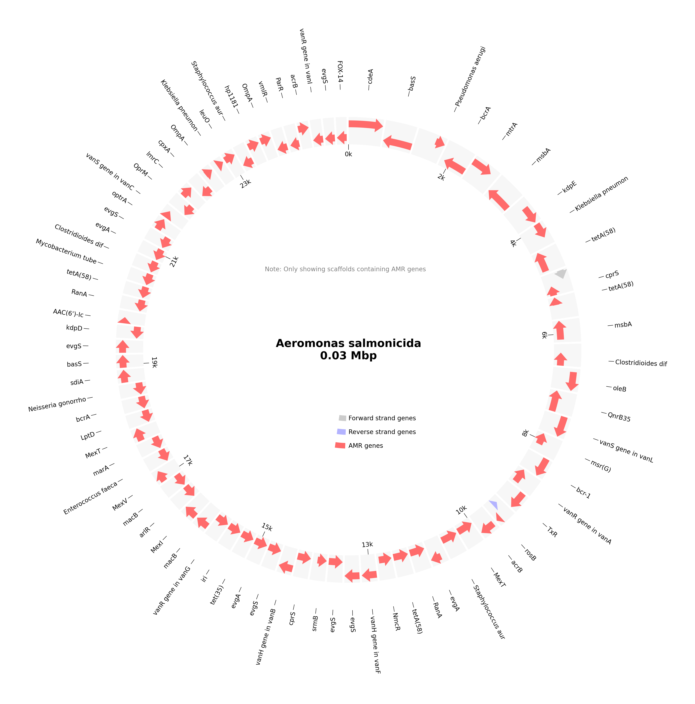

### AAC(6')-Ic
- **Mechanism**: antibiotic inactivation
- **Drug Classes**: aminoglycoside antibiotic
- **AMR Family**: AAC(6')
- **Locations**:
  - gnl|SPADES|OOJMENLF_113730_1 : position 1-126

### Clostridioides difficile gyrB conferring resistance to fluoroquinolones (found in 2 locations)
- **Mechanism**: antibiotic target alteration
- **Drug Classes**: fluoroquinolone antibiotic
- **AMR Family**: fluoroquinolone resistant gyrB
- **Locations**:
  - gnl|SPADES|OOJMENLF_121120_1 : position 3-245
  - gnl|SPADES|OOJMENLF_12744_2 : position 180-455

### Enterococcus faecalis cls with mutation conferring resistance to daptomycin
- **Mechanism**: antibiotic target alteration
- **Drug Classes**: peptide antibiotic
- **AMR Family**: daptomycin resistant cls
- **Locations**:
  - gnl|SPADES|OOJMENLF_67044_1 : position 3-269

### FOX-14
- **Mechanism**: antibiotic inactivation
- **Drug Classes**: cephalosporin; cephamycin
- **AMR Family**: FOX beta-lactamase
- **Locations**:
  - gnl|SPADES|OOJMENLF_198310_1 : position 1-210

### Klebsiella pneumoniae KpnE
- **Mechanism**: antibiotic efflux
- **Drug Classes**: macrolide antibiotic; aminoglycoside antibiotic; cephalosporin; tetracycline antibiotic; peptide antibiotic; rifamycin antibiotic; disinfecting agents and antiseptics
- **AMR Family**: small multidrug resistance (SMR) antibiotic efflux pump
- **Locations**:
  - gnl|SPADES|OOJMENLF_11752_1 : position 2-310

### Klebsiella pneumoniae OmpK37
- **Mechanism**: reduced permeability to antibiotic
- **Drug Classes**: monobactam; carbapenem; cephalosporin; cephamycin; penam; penem
- **AMR Family**: General Bacterial Porin with reduced permeability to beta-lactams
- **Locations**:
  - gnl|SPADES|OOJMENLF_155070_1 : position 89-229

### LptD
- **Mechanism**: antibiotic efflux
- **Drug Classes**: carbapenem; peptide antibiotic; aminocoumarin antibiotic; rifamycin antibiotic
- **AMR Family**: ATP-binding cassette (ABC) antibiotic efflux pump
- **Locations**:
  - gnl|SPADES|OOJMENLF_82793_1 : position 1-261

### MexI
- **Mechanism**: antibiotic efflux
- **Drug Classes**: fluoroquinolone antibiotic; tetracycline antibiotic; disinfecting agents and antiseptics
- **AMR Family**: resistance-nodulation-cell division (RND) antibiotic efflux pump
- **Locations**:
  - gnl|SPADES|OOJMENLF_63625_1 : position 1-273

### MexT (found in 2 locations)
- **Mechanism**: antibiotic efflux
- **Drug Classes**: fluoroquinolone antibiotic; diaminopyrimidine antibiotic; phenicol antibiotic
- **AMR Family**: resistance-nodulation-cell division (RND) antibiotic efflux pump
- **Locations**:
  - gnl|SPADES|OOJMENLF_25620_1 : position 3-347
  - gnl|SPADES|OOJMENLF_83385_1 : position 3-263

### MexV
- **Mechanism**: antibiotic efflux
- **Drug Classes**: macrolide antibiotic; fluoroquinolone antibiotic; tetracycline antibiotic; phenicol antibiotic; disinfecting agents and antiseptics
- **AMR Family**: resistance-nodulation-cell division (RND) antibiotic efflux pump
- **Locations**:
  - gnl|SPADES|OOJMENLF_65743_1 : position 3-236

### Mycobacterium tuberculosis intrinsic murA conferring resistance to fosfomycin
- **Mechanism**: antibiotic target alteration
- **Drug Classes**: phosphonic acid antibiotic
- **AMR Family**: antibiotic-resistant murA transferase
- **Locations**:
  - gnl|SPADES|OOJMENLF_117187_1 : position 2-247

### Neisseria gonorrhoeae pilQ gene conferring resistance to beta-lactam
- **Mechanism**: antibiotic target alteration
- **Drug Classes**: cephalosporin; cephamycin; penam
- **AMR Family**: Penicillin-binding protein mutations conferring resistance to beta-lactam antibiotics
- **Locations**:
  - gnl|SPADES|OOJMENLF_91906_1 : position 3-257

### NmcR
- **Mechanism**: antibiotic inactivation
- **Drug Classes**: carbapenem; cephalosporin; cephamycin; penam
- **AMR Family**: NmcA beta-lactamase
- **Locations**:
  - gnl|SPADES|OOJMENLF_34445_1 : position 3-275

### OmpA (found in 2 locations)
- **Mechanism**: reduced permeability to antibiotic
- **Drug Classes**: peptide antibiotic
- **AMR Family**: General Bacterial Porin with reduced permeability to peptide antibiotics
- **Locations**:
  - gnl|SPADES|OOJMENLF_152943_1 : position 68-232
  - gnl|SPADES|OOJMENLF_170032_1 : position 2-223

### OprM
- **Mechanism**: antibiotic efflux
- **Drug Classes**: macrolide antibiotic; fluoroquinolone antibiotic; monobactam; aminoglycoside antibiotic; carbapenem; cephalosporin; cephamycin; penam; tetracycline antibiotic; peptide antibiotic; aminocoumarin antibiotic; diaminopyrimidine antibiotic; sulfonamide antibiotic; phenicol antibiotic; penem; disinfecting agents and antiseptics
- **AMR Family**: resistance-nodulation-cell division (RND) antibiotic efflux pump
- **Locations**:
  - gnl|SPADES|OOJMENLF_138014_1 : position 3-236

### ParR
- **Mechanism**: antibiotic efflux; reduced permeability to antibiotic
- **Drug Classes**: macrolide antibiotic; fluoroquinolone antibiotic; monobactam; aminoglycoside antibiotic; carbapenem; cephalosporin; cephamycin; penam; tetracycline antibiotic; phenicol antibiotic; penem; disinfecting agents and antiseptics
- **AMR Family**: resistance-nodulation-cell division (RND) antibiotic efflux pump; Outer Membrane Porin (Opr)
- **Locations**:
  - gnl|SPADES|OOJMENLF_173888_1 : position 27-221

### Pseudomonas aeruginosa CpxR
- **Mechanism**: antibiotic efflux
- **Drug Classes**: macrolide antibiotic; fluoroquinolone antibiotic; monobactam; aminoglycoside antibiotic; carbapenem; cephalosporin; cephamycin; penam; tetracycline antibiotic; peptide antibiotic; aminocoumarin antibiotic; diaminopyrimidine antibiotic; sulfonamide antibiotic; phenicol antibiotic; penem
- **AMR Family**: resistance-nodulation-cell division (RND) antibiotic efflux pump
- **Locations**:
  - gnl|SPADES|OOJMENLF_8779_2 : position 394-588

### QnrB35
- **Mechanism**: antibiotic target protection
- **Drug Classes**: fluoroquinolone antibiotic
- **AMR Family**: quinolone resistance protein (qnr)
- **Locations**:
  - gnl|SPADES|OOJMENLF_13249_1 : position 1-447

### RanA (found in 2 locations)
- **Mechanism**: antibiotic efflux
- **Drug Classes**: aminoglycoside antibiotic
- **AMR Family**: ATP-binding cassette (ABC) antibiotic efflux pump
- **Locations**:
  - gnl|SPADES|OOJMENLF_113197_1 : position 2-247
  - gnl|SPADES|OOJMENLF_32178_1 : position 2-322

### Staphylococcus aureus mupA conferring resistance to mupirocin
- **Mechanism**: antibiotic target alteration
- **Drug Classes**: mupirocin-like antibiotic
- **AMR Family**: antibiotic-resistant isoleucyl-tRNA synthetase (ileS)
- **Locations**:
  - gnl|SPADES|OOJMENLF_25533_1 : position 2-349

### Staphylococcus aureus murA with mutation conferring resistance to fosfomycin
- **Mechanism**: antibiotic target alteration
- **Drug Classes**: phosphonic acid antibiotic
- **AMR Family**: antibiotic-resistant murA transferase
- **Locations**:
  - gnl|SPADES|OOJMENLF_157911_1 : position 1-228

### TxR
- **Mechanism**: antibiotic efflux
- **Drug Classes**: tetracycline antibiotic
- **AMR Family**: ATP-binding cassette (ABC) antibiotic efflux pump
- **Locations**:
  - gnl|SPADES|OOJMENLF_22613_1 : position 2-361

### acrB (found in 2 locations)
- **Mechanism**: antibiotic efflux
- **Drug Classes**: fluoroquinolone antibiotic; cephalosporin; glycylcycline; penam; tetracycline antibiotic; rifamycin antibiotic; phenicol antibiotic; disinfecting agents and antiseptics
- **AMR Family**: resistance-nodulation-cell division (RND) antibiotic efflux pump
- **Locations**:
  - gnl|SPADES|OOJMENLF_180596_1 : position 2-217
  - gnl|SPADES|OOJMENLF_24855_1 : position 48-350

### arlR
- **Mechanism**: antibiotic efflux
- **Drug Classes**: fluoroquinolone antibiotic; disinfecting agents and antiseptics
- **AMR Family**: major facilitator superfamily (MFS) antibiotic efflux pump
- **Locations**:
  - gnl|SPADES|OOJMENLF_63819_1 : position 1-273

### basS (found in 2 locations)
- **Mechanism**: antibiotic target alteration; antibiotic efflux
- **Drug Classes**: peptide antibiotic
- **AMR Family**: pmr phosphoethanolamine transferase
- **Locations**:
  - gnl|SPADES|OOJMENLF_8276_1 : position 2-619
  - gnl|SPADES|OOJMENLF_97338_1 : position 1-255

### bcr-1
- **Mechanism**: antibiotic efflux
- **Drug Classes**: bicyclomycin-like antibiotic
- **AMR Family**: major facilitator superfamily (MFS) antibiotic efflux pump
- **Locations**:
  - gnl|SPADES|OOJMENLF_18706_1 : position 1-387

### bcrA (found in 2 locations)
- **Mechanism**: antibiotic efflux
- **Drug Classes**: peptide antibiotic
- **AMR Family**: ATP-binding cassette (ABC) antibiotic efflux pump
- **Locations**:
  - gnl|SPADES|OOJMENLF_88959_1 : position 1-261
  - gnl|SPADES|OOJMENLF_9127_1 : position 82-570

### cdeA
- **Mechanism**: antibiotic efflux
- **Drug Classes**: fluoroquinolone antibiotic; disinfecting agents and antiseptics
- **AMR Family**: multidrug and toxic compound extrusion (MATE) transporter
- **Locations**:
  - gnl|SPADES|OOJMENLF_7392_1 : position 2-691

### cprS (found in 2 locations)
- **Mechanism**: antibiotic target alteration; antibiotic efflux
- **Drug Classes**: peptide antibiotic
- **AMR Family**: pmr phosphoethanolamine transferase
- **Locations**:
  - gnl|SPADES|OOJMENLF_12382_2 : position 263-463
  - gnl|SPADES|OOJMENLF_43560_1 : position 3-290

### cpxA
- **Mechanism**: antibiotic efflux
- **Drug Classes**: aminoglycoside antibiotic; aminocoumarin antibiotic
- **AMR Family**: resistance-nodulation-cell division (RND) antibiotic efflux pump
- **Locations**:
  - gnl|SPADES|OOJMENLF_149993_1 : position 1-231

### evgA (found in 3 locations)
- **Mechanism**: antibiotic efflux
- **Drug Classes**: macrolide antibiotic; fluoroquinolone antibiotic; penam; tetracycline antibiotic
- **AMR Family**: major facilitator superfamily (MFS) antibiotic efflux pump; resistance-nodulation-cell division (RND) antibiotic efflux pump
- **Locations**:
  - gnl|SPADES|OOJMENLF_118927_1 : position 2-244
  - gnl|SPADES|OOJMENLF_31155_1 : position 112-327
  - gnl|SPADES|OOJMENLF_57946_1 : position 2-277

### evgS (found in 6 locations)
- **Mechanism**: antibiotic efflux
- **Drug Classes**: macrolide antibiotic; fluoroquinolone antibiotic; penam; tetracycline antibiotic
- **AMR Family**: major facilitator superfamily (MFS) antibiotic efflux pump; resistance-nodulation-cell division (RND) antibiotic efflux pump
- **Locations**:
  - gnl|SPADES|OOJMENLF_123302_1 : position 3-245
  - gnl|SPADES|OOJMENLF_194952_1 : position 1-210
  - gnl|SPADES|OOJMENLF_38735_1 : position 3-302
  - gnl|SPADES|OOJMENLF_39505_1 : position 2-298
  - gnl|SPADES|OOJMENLF_53616_1 : position 2-277
  - gnl|SPADES|OOJMENLF_95983_1 : position 3-257

### hp1181
- **Mechanism**: antibiotic efflux
- **Drug Classes**: fluoroquinolone antibiotic; tetracycline antibiotic; nitroimidazole antibiotic
- **AMR Family**: major facilitator superfamily (MFS) antibiotic efflux pump
- **Locations**:
  - gnl|SPADES|OOJMENLF_159174_1 : position 2-229

### iri
- **Mechanism**: antibiotic inactivation
- **Drug Classes**: rifamycin antibiotic
- **AMR Family**: rifampin monooxygenase
- **Locations**:
  - gnl|SPADES|OOJMENLF_60733_1 : position 3-275

### kdpD
- **Mechanism**: antibiotic efflux
- **Drug Classes**: aminoglycoside antibiotic
- **AMR Family**: kdpDE
- **Locations**:
  - gnl|SPADES|OOJMENLF_104544_1 : position 2-253

### kdpE
- **Mechanism**: antibiotic efflux
- **Drug Classes**: aminoglycoside antibiotic
- **AMR Family**: kdpDE
- **Locations**:
  - gnl|SPADES|OOJMENLF_9766_2 : position 183-539

### leuO
- **Mechanism**: antibiotic efflux
- **Drug Classes**: nucleoside antibiotic; disinfecting agents and antiseptics
- **AMR Family**: major facilitator superfamily (MFS) antibiotic efflux pump
- **Locations**:
  - gnl|SPADES|OOJMENLF_156982_1 : position 3-230

### lmrC
- **Mechanism**: antibiotic target protection
- **Drug Classes**: lincosamide antibiotic
- **AMR Family**: Miscellaneous ABC-F subfamily ATP-binding cassette ribosomal protection proteins
- **Locations**:
  - gnl|SPADES|OOJMENLF_143752_1 : position 2-235

### macB (found in 2 locations)
- **Mechanism**: antibiotic efflux
- **Drug Classes**: macrolide antibiotic
- **AMR Family**: ATP-binding cassette (ABC) antibiotic efflux pump
- **Locations**:
  - gnl|SPADES|OOJMENLF_61991_1 : position 3-272
  - gnl|SPADES|OOJMENLF_64911_1 : position 2-271

### marA
- **Mechanism**: antibiotic efflux; reduced permeability to antibiotic
- **Drug Classes**: fluoroquinolone antibiotic; monobactam; carbapenem; cephalosporin; glycylcycline; cephamycin; penam; tetracycline antibiotic; rifamycin antibiotic; phenicol antibiotic; penem; disinfecting agents and antiseptics
- **AMR Family**: resistance-nodulation-cell division (RND) antibiotic efflux pump; General Bacterial Porin with reduced permeability to beta-lactams
- **Locations**:
  - gnl|SPADES|OOJMENLF_82349_1 : position 1-264

### msbA (found in 2 locations)
- **Mechanism**: antibiotic efflux
- **Drug Classes**: nitroimidazole antibiotic
- **AMR Family**: ATP-binding cassette (ABC) antibiotic efflux pump
- **Locations**:
  - gnl|SPADES|OOJMENLF_12584_1 : position 2-403
  - gnl|SPADES|OOJMENLF_9366_1 : position 1-558

### msr(G)
- **Mechanism**: antibiotic target protection
- **Drug Classes**: macrolide antibiotic; streptogramin antibiotic
- **AMR Family**: msr-type ABC-F protein
- **Locations**:
  - gnl|SPADES|OOJMENLF_15779_1 : position 3-251

### mtrA
- **Mechanism**: antibiotic efflux
- **Drug Classes**: macrolide antibiotic; penam
- **AMR Family**: resistance-nodulation-cell division (RND) antibiotic efflux pump
- **Locations**:
  - gnl|SPADES|OOJMENLF_9129_1 : position 1-432

### oleB
- **Mechanism**: antibiotic target protection
- **Drug Classes**: macrolide antibiotic
- **AMR Family**: Miscellaneous ABC-F subfamily ATP-binding cassette ribosomal protection proteins
- **Locations**:
  - gnl|SPADES|OOJMENLF_13046_1 : position 69-449

### optrA
- **Mechanism**: antibiotic target protection
- **Drug Classes**: oxazolidinone antibiotic; phenicol antibiotic
- **AMR Family**: Miscellaneous ABC-F subfamily ATP-binding cassette ribosomal protection proteins
- **Locations**:
  - gnl|SPADES|OOJMENLF_133610_1 : position 1-240

### rosB
- **Mechanism**: antibiotic efflux
- **Drug Classes**: peptide antibiotic
- **AMR Family**: major facilitator superfamily (MFS) antibiotic efflux pump
- **Locations**:
  - gnl|SPADES|OOJMENLF_24313_1 : position 250-354

### sdiA
- **Mechanism**: antibiotic efflux
- **Drug Classes**: fluoroquinolone antibiotic; cephalosporin; glycylcycline; penam; tetracycline antibiotic; rifamycin antibiotic; phenicol antibiotic; disinfecting agents and antiseptics
- **AMR Family**: resistance-nodulation-cell division (RND) antibiotic efflux pump
- **Locations**:
  - gnl|SPADES|OOJMENLF_91348_1 : position 2-259

### srmB
- **Mechanism**: antibiotic target protection
- **Drug Classes**: macrolide antibiotic
- **AMR Family**: Miscellaneous ABC-F subfamily ATP-binding cassette ribosomal protection proteins
- **Locations**:
  - gnl|SPADES|OOJMENLF_40280_1 : position 2-199

### tet(35)
- **Mechanism**: antibiotic efflux
- **Drug Classes**: tetracycline antibiotic
- **AMR Family**: ATP-binding cassette (ABC) antibiotic efflux pump
- **Locations**:
  - gnl|SPADES|OOJMENLF_59903_1 : position 2-274

### tetA(58) (found in 4 locations)
- **Mechanism**: antibiotic efflux
- **Drug Classes**: tetracycline antibiotic
- **AMR Family**: major facilitator superfamily (MFS) antibiotic efflux pump
- **Locations**:
  - gnl|SPADES|OOJMENLF_118102_1 : position 3-245
  - gnl|SPADES|OOJMENLF_12148_1 : position 3-431
  - gnl|SPADES|OOJMENLF_12476_1 : position 1-165
  - gnl|SPADES|OOJMENLF_33058_1 : position 3-320

### vanH gene in vanB cluster
- **Mechanism**: antibiotic target alteration
- **Drug Classes**: glycopeptide antibiotic
- **AMR Family**: vanH; glycopeptide resistance gene cluster
- **Locations**:
  - gnl|SPADES|OOJMENLF_46289_1 : position 1-285

### vanH gene in vanF cluster
- **Mechanism**: antibiotic target alteration
- **Drug Classes**: glycopeptide antibiotic
- **AMR Family**: vanH; glycopeptide resistance gene cluster
- **Locations**:
  - gnl|SPADES|OOJMENLF_38024_1 : position 3-302

### vanR gene in vanA cluster
- **Mechanism**: antibiotic target alteration
- **Drug Classes**: glycopeptide antibiotic
- **AMR Family**: glycopeptide resistance gene cluster; vanR
- **Locations**:
  - gnl|SPADES|OOJMENLF_22256_1 : position 2-310

### vanR gene in vanG cluster
- **Mechanism**: antibiotic target alteration
- **Drug Classes**: glycopeptide antibiotic
- **AMR Family**: glycopeptide resistance gene cluster; vanR
- **Locations**:
  - gnl|SPADES|OOJMENLF_60706_1 : position 2-274

### vanR gene in vanI cluster
- **Mechanism**: antibiotic target alteration
- **Drug Classes**: glycopeptide antibiotic
- **AMR Family**: glycopeptide resistance gene cluster; vanR
- **Locations**:
  - gnl|SPADES|OOJMENLF_187505_1 : position 3-215

### vanS gene in vanC cluster
- **Mechanism**: antibiotic target alteration
- **Drug Classes**: glycopeptide antibiotic
- **AMR Family**: vanS; glycopeptide resistance gene cluster
- **Locations**:
  - gnl|SPADES|OOJMENLF_133435_1 : position 3-158

### vanS gene in vanL cluster
- **Mechanism**: antibiotic target alteration
- **Drug Classes**: glycopeptide antibiotic
- **AMR Family**: vanS; glycopeptide resistance gene cluster
- **Locations**:
  - gnl|SPADES|OOJMENLF_14982_1 : position 3-422

### vmlR
- **Mechanism**: antibiotic target protection
- **Drug Classes**: lincosamide antibiotic; streptogramin antibiotic; streptogramin A antibiotic; streptogramin B antibiotic; nucleoside antibiotic; pleuromutilin antibiotic
- **AMR Family**: Miscellaneous ABC-F subfamily ATP-binding cassette ribosomal protection proteins
- **Locations**:
  - gnl|SPADES|OOJMENLF_170988_1 : position 3-221

## Aeromonas salmonicida subsp. masoucida
**Strain Statistics:**
- Total genome length: 0.5 kbp
- Total scaffolds: 25
- Scaffolds with AMR genes: 1
- Total genes annotated: 2
- Total AMR genes: 1
- Unique AMR genes: 1
- Distinct AMR mechanisms: 1
- Distinct AMR families: 1
- Distinct drug classes: 4

**Circos Plot:**

### vgaA
- **Mechanism**: antibiotic target protection
- **Drug Classes**: lincosamide antibiotic; streptogramin antibiotic; streptogramin A antibiotic; pleuromutilin antibiotic
- **AMR Family**: vga-type ABC-F protein
- **Locations**:
  - gnl|SPADES|OOJMENLF_10044_1 : position 121-528

## Aeromonas salmonicida subsp. pectinolytica 34mel
**Strain Statistics:**
- Total genome length: 0.5 kbp
- Total scaffolds: 39
- Scaffolds with AMR genes: 2
- Total genes annotated: 0
- Total AMR genes: 2
- Unique AMR genes: 2
- Distinct AMR mechanisms: 2
- Distinct AMR families: 2
- Distinct drug classes: 5

**Circos Plot:**

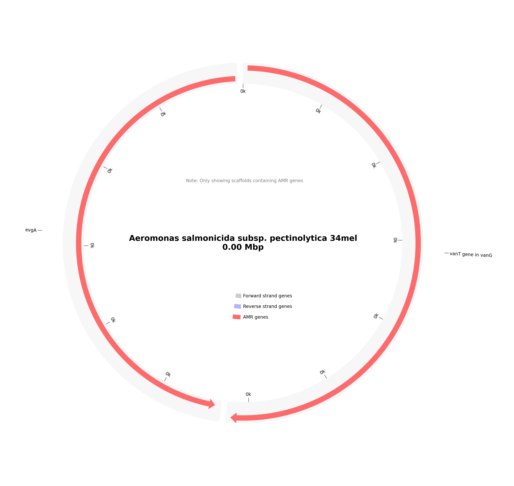

### evgA
- **Mechanism**: antibiotic efflux
- **Drug Classes**: macrolide antibiotic; fluoroquinolone antibiotic; penam; tetracycline antibiotic
- **AMR Family**: major facilitator superfamily (MFS) antibiotic efflux pump; resistance-nodulation-cell division (RND) antibiotic efflux pump
- **Locations**:
  - gnl|SPADES|OOJMENLF_146715_1 : position 3-233

### vanT gene in vanG cluster
- **Mechanism**: antibiotic target alteration
- **Drug Classes**: glycopeptide antibiotic
- **AMR Family**: glycopeptide resistance gene cluster; vanT
- **Locations**:
  - gnl|SPADES|OOJMENLF_101342_1 : position 2-253

## Buttiauxella agrestis
**Strain Statistics:**
- Total genome length: 39.7 kbp
- Total scaffolds: 1022
- Scaffolds with AMR genes: 80
- Total genes annotated: 48
- Total AMR genes: 85
- Unique AMR genes: 54
- Distinct AMR mechanisms: 8
- Distinct AMR families: 22
- Distinct drug classes: 28

**Circos Plot:**

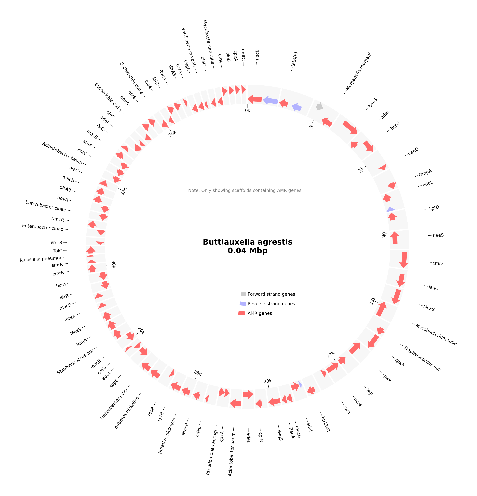

### Acinetobacter baumannii AbaQ (found in 2 locations)
- **Mechanism**: antibiotic efflux
- **Drug Classes**: fluoroquinolone antibiotic
- **AMR Family**: major facilitator superfamily (MFS) antibiotic efflux pump
- **Locations**:
  - gnl|SPADES|OOJMENLF_10434_1 : position 2-514
  - gnl|SPADES|OOJMENLF_34810_1 : position 2-313

### Enterobacter cloacae acrA (found in 2 locations)
- **Mechanism**: antibiotic efflux
- **Drug Classes**: fluoroquinolone antibiotic; cephalosporin; glycylcycline; penam; tetracycline antibiotic; rifamycin antibiotic; phenicol antibiotic; disinfecting agents and antiseptics
- **AMR Family**: resistance-nodulation-cell division (RND) antibiotic efflux pump
- **Locations**:
  - gnl|SPADES|OOJMENLF_30789_1 : position 71-328
  - gnl|SPADES|OOJMENLF_30963_1 : position 3-326

### Escherichia coli acrA
- **Mechanism**: antibiotic efflux
- **Drug Classes**: fluoroquinolone antibiotic; cephalosporin; glycylcycline; penam; tetracycline antibiotic; rifamycin antibiotic; phenicol antibiotic; disinfecting agents and antiseptics
- **AMR Family**: resistance-nodulation-cell division (RND) antibiotic efflux pump
- **Locations**:
  - gnl|SPADES|OOJMENLF_55760_1 : position 1-276

### Escherichia coli soxR with mutation conferring antibiotic resistance
- **Mechanism**: antibiotic target alteration; antibiotic efflux
- **Drug Classes**: fluoroquinolone antibiotic; cephalosporin; glycylcycline; penam; tetracycline antibiotic; rifamycin antibiotic; phenicol antibiotic; disinfecting agents and antiseptics
- **AMR Family**: ATP-binding cassette (ABC) antibiotic efflux pump; major facilitator superfamily (MFS) antibiotic efflux pump; resistance-nodulation-cell division (RND) antibiotic efflux pump
- **Locations**:
  - gnl|SPADES|OOJMENLF_49043_1 : position 1-246

### Helicobacter pylori rpoB mutation conferring resistance to rifampicin
- **Mechanism**: antibiotic target alteration; antibiotic target replacement
- **Drug Classes**: fluoroquinolone antibiotic; rifamycin antibiotic
- **AMR Family**: rifamycin-resistant beta-subunit of RNA polymerase (rpoB)
- **Locations**:
  - gnl|SPADES|OOJMENLF_12546_1 : position 3-458

### Klebsiella pneumoniae KpnG
- **Mechanism**: antibiotic efflux
- **Drug Classes**: macrolide antibiotic; fluoroquinolone antibiotic; aminoglycoside antibiotic; carbapenem; cephalosporin; penam; peptide antibiotic; penem
- **AMR Family**: major facilitator superfamily (MFS) antibiotic efflux pump
- **Locations**:
  - gnl|SPADES|OOJMENLF_21425_2 : position 291-368

### LptD
- **Mechanism**: antibiotic efflux
- **Drug Classes**: carbapenem; peptide antibiotic; aminocoumarin antibiotic; rifamycin antibiotic
- **AMR Family**: ATP-binding cassette (ABC) antibiotic efflux pump
- **Locations**:
  - gnl|SPADES|OOJMENLF_5977_1 : position 3-377

### MexS (found in 2 locations)
- **Mechanism**: antibiotic efflux
- **Drug Classes**: fluoroquinolone antibiotic; diaminopyrimidine antibiotic; phenicol antibiotic
- **AMR Family**: resistance-nodulation-cell division (RND) antibiotic efflux pump
- **Locations**:
  - gnl|SPADES|OOJMENLF_17524_1 : position 3-395
  - gnl|SPADES|OOJMENLF_6705_1 : position 69-764

### Morganella morganii gyrB conferring resistance to fluoroquinolones
- **Mechanism**: antibiotic target alteration
- **Drug Classes**: fluoroquinolone antibiotic
- **AMR Family**: fluoroquinolone resistant gyrB
- **Locations**:
  - gnl|SPADES|OOJMENLF_4207_2 : position 692-1234

### Mycobacterium tuberculosis intrinsic murA conferring resistance to fosfomycin
- **Mechanism**: antibiotic target alteration
- **Drug Classes**: phosphonic acid antibiotic
- **AMR Family**: antibiotic-resistant murA transferase
- **Locations**:
  - gnl|SPADES|OOJMENLF_6920_1 : position 1-735

### Mycobacterium tuberculosis katG mutations conferring resistance to isoniazid
- **Mechanism**: antibiotic target alteration
- **Drug Classes**: isoniazid-like antibiotic
- **AMR Family**: isoniazid resistant katG
- **Locations**:
  - gnl|SPADES|OOJMENLF_110392_1 : position 1-249

### NmcR (found in 2 locations)
- **Mechanism**: antibiotic inactivation
- **Drug Classes**: carbapenem; cephalosporin; cephamycin; penam
- **AMR Family**: NmcA beta-lactamase
- **Locations**:
  - gnl|SPADES|OOJMENLF_10576_1 : position 204-509
  - gnl|SPADES|OOJMENLF_30783_1 : position 1-327

### OmpA
- **Mechanism**: reduced permeability to antibiotic
- **Drug Classes**: peptide antibiotic
- **AMR Family**: General Bacterial Porin with reduced permeability to peptide antibiotics
- **Locations**:
  - gnl|SPADES|OOJMENLF_5777_2 : position 597-893

### Pseudomonas aeruginosa CpxR
- **Mechanism**: antibiotic efflux
- **Drug Classes**: macrolide antibiotic; fluoroquinolone antibiotic; monobactam; aminoglycoside antibiotic; carbapenem; cephalosporin; cephamycin; penam; tetracycline antibiotic; peptide antibiotic; aminocoumarin antibiotic; diaminopyrimidine antibiotic; sulfonamide antibiotic; phenicol antibiotic; penem
- **AMR Family**: resistance-nodulation-cell division (RND) antibiotic efflux pump
- **Locations**:
  - gnl|SPADES|OOJMENLF_10518_2 : position 228-509

### RanA (found in 3 locations)
- **Mechanism**: antibiotic efflux
- **Drug Classes**: aminoglycoside antibiotic
- **AMR Family**: ATP-binding cassette (ABC) antibiotic efflux pump
- **Locations**:
  - gnl|SPADES|OOJMENLF_16006_1 : position 2-409
  - gnl|SPADES|OOJMENLF_63407_1 : position 2-271
  - gnl|SPADES|OOJMENLF_9718_2 : position 320-541

### Staphylococcus aureus GlpT with mutation conferring resistance to fosfomycin
- **Mechanism**: antibiotic target alteration
- **Drug Classes**: phosphonic acid antibiotic
- **AMR Family**: antibiotic-resistant GlpT
- **Locations**:
  - gnl|SPADES|OOJMENLF_7428_2 : position 346-687

### Staphylococcus aureus mupA conferring resistance to mupirocin
- **Mechanism**: antibiotic target alteration
- **Drug Classes**: mupirocin-like antibiotic
- **AMR Family**: antibiotic-resistant isoleucyl-tRNA synthetase (ileS)
- **Locations**:
  - gnl|SPADES|OOJMENLF_15480_1 : position 3-416

### TaeA
- **Mechanism**: antibiotic efflux
- **Drug Classes**: pleuromutilin antibiotic
- **AMR Family**: ATP-binding cassette (ABC) antibiotic efflux pump
- **Locations**:
  - gnl|SPADES|OOJMENLF_60000_1 : position 78-275

### TolC (found in 2 locations)
- **Mechanism**: antibiotic efflux
- **Drug Classes**: macrolide antibiotic; fluoroquinolone antibiotic; aminoglycoside antibiotic; carbapenem; cephalosporin; glycylcycline; cephamycin; penam; tetracycline antibiotic; peptide antibiotic; aminocoumarin antibiotic; rifamycin antibiotic; phenicol antibiotic; penem; disinfecting agents and antiseptics
- **AMR Family**: ATP-binding cassette (ABC) antibiotic efflux pump; major facilitator superfamily (MFS) antibiotic efflux pump; resistance-nodulation-cell division (RND) antibiotic efflux pump
- **Locations**:
  - gnl|SPADES|OOJMENLF_29633_1 : position 1-330
  - gnl|SPADES|OOJMENLF_62390_1 : position 2-274

### YajC
- **Mechanism**: antibiotic efflux
- **Drug Classes**: fluoroquinolone antibiotic; cephalosporin; glycylcycline; penam; tetracycline antibiotic; oxazolidinone antibiotic; glycopeptide antibiotic; rifamycin antibiotic; phenicol antibiotic; disinfecting agents and antiseptics
- **AMR Family**: resistance-nodulation-cell division (RND) antibiotic efflux pump
- **Locations**:
  - gnl|SPADES|OOJMENLF_41932_1 : position 93-293

### YojI
- **Mechanism**: antibiotic efflux
- **Drug Classes**: peptide antibiotic
- **AMR Family**: ATP-binding cassette (ABC) antibiotic efflux pump
- **Locations**:
  - gnl|SPADES|OOJMENLF_7773_2 : position 267-656

### acrB
- **Mechanism**: antibiotic efflux
- **Drug Classes**: fluoroquinolone antibiotic; cephalosporin; glycylcycline; penam; tetracycline antibiotic; rifamycin antibiotic; phenicol antibiotic; disinfecting agents and antiseptics
- **AMR Family**: resistance-nodulation-cell division (RND) antibiotic efflux pump
- **Locations**:
  - gnl|SPADES|OOJMENLF_49888_1 : position 2-280

### adeL (found in 7 locations)
- **Mechanism**: antibiotic efflux
- **Drug Classes**: fluoroquinolone antibiotic; tetracycline antibiotic
- **AMR Family**: resistance-nodulation-cell division (RND) antibiotic efflux pump
- **Locations**:
  - gnl|SPADES|OOJMENLF_10407_1 : position 2-514
  - gnl|SPADES|OOJMENLF_10522_2 : position 370-510
  - gnl|SPADES|OOJMENLF_15168_1 : position 1-192
  - gnl|SPADES|OOJMENLF_41996_1 : position 1-291
  - gnl|SPADES|OOJMENLF_5079_1 : position 1-339
  - gnl|SPADES|OOJMENLF_5880_1 : position 3-386
  - gnl|SPADES|OOJMENLF_9588_1 : position 137-547

### arnA
- **Mechanism**: antibiotic target alteration
- **Drug Classes**: peptide antibiotic
- **AMR Family**: pmr phosphoethanolamine transferase
- **Locations**:
  - gnl|SPADES|OOJMENLF_36064_1 : position 2-310

### baeS (found in 2 locations)
- **Mechanism**: antibiotic efflux
- **Drug Classes**: aminoglycoside antibiotic; aminocoumarin antibiotic
- **AMR Family**: resistance-nodulation-cell division (RND) antibiotic efflux pump
- **Locations**:
  - gnl|SPADES|OOJMENLF_4573_1 : position 337-1128
  - gnl|SPADES|OOJMENLF_6185_1 : position 1-600

### bcr-1
- **Mechanism**: antibiotic efflux
- **Drug Classes**: bicyclomycin-like antibiotic
- **AMR Family**: major facilitator superfamily (MFS) antibiotic efflux pump
- **Locations**:
  - gnl|SPADES|OOJMENLF_5079_2 : position 455-1021

### bcrA (found in 3 locations)
- **Mechanism**: antibiotic efflux
- **Drug Classes**: peptide antibiotic
- **AMR Family**: ATP-binding cassette (ABC) antibiotic efflux pump
- **Locations**:
  - gnl|SPADES|OOJMENLF_19280_1 : position 3-383
  - gnl|SPADES|OOJMENLF_7876_1 : position 1-648
  - gnl|SPADES|OOJMENLF_88325_1 : position 1-261

### carA
- **Mechanism**: antibiotic target protection
- **Drug Classes**: macrolide antibiotic
- **AMR Family**: Miscellaneous ABC-F subfamily ATP-binding cassette ribosomal protection proteins
- **Locations**:
  - gnl|SPADES|OOJMENLF_8373_1 : position 1-207

### cmlv (found in 2 locations)
- **Mechanism**: antibiotic inactivation
- **Drug Classes**: phenicol antibiotic
- **AMR Family**: chloramphenicol phosphotransferase
- **Locations**:
  - gnl|SPADES|OOJMENLF_15168_2 : position 297-419
  - gnl|SPADES|OOJMENLF_6273_1 : position 78-821

### cprR
- **Mechanism**: antibiotic target alteration; antibiotic efflux
- **Drug Classes**: peptide antibiotic
- **AMR Family**: pmr phosphoethanolamine transferase
- **Locations**:
  - gnl|SPADES|OOJMENLF_9903_2 : position 244-534

### cpxA (found in 4 locations)
- **Mechanism**: antibiotic efflux
- **Drug Classes**: aminoglycoside antibiotic; aminocoumarin antibiotic
- **AMR Family**: resistance-nodulation-cell division (RND) antibiotic efflux pump
- **Locations**:
  - gnl|SPADES|OOJMENLF_10518_1 : position 1-231
  - gnl|SPADES|OOJMENLF_186269_1 : position 2-214
  - gnl|SPADES|OOJMENLF_7438_1 : position 1-687
  - gnl|SPADES|OOJMENLF_7679_1 : position 2-664

### dfrA3 (found in 2 locations)
- **Mechanism**: antibiotic target replacement
- **Drug Classes**: diaminopyrimidine antibiotic
- **AMR Family**: trimethoprim resistant dihydrofolate reductase dfr
- **Locations**:
  - gnl|SPADES|OOJMENLF_32124_1 : position 1-321
  - gnl|SPADES|OOJMENLF_78913_1 : position 128-265

### efrA
- **Mechanism**: antibiotic efflux
- **Drug Classes**: macrolide antibiotic; fluoroquinolone antibiotic; rifamycin antibiotic
- **AMR Family**: ATP-binding cassette (ABC) antibiotic efflux pump
- **Locations**:
  - gnl|SPADES|OOJMENLF_126230_1 : position 1-243

### efrB
- **Mechanism**: antibiotic efflux
- **Drug Classes**: macrolide antibiotic; fluoroquinolone antibiotic; rifamycin antibiotic
- **AMR Family**: ATP-binding cassette (ABC) antibiotic efflux pump
- **Locations**:
  - gnl|SPADES|OOJMENLF_19012_1 : position 3-383

### emrB (found in 2 locations)
- **Mechanism**: antibiotic efflux
- **Drug Classes**: fluoroquinolone antibiotic
- **AMR Family**: major facilitator superfamily (MFS) antibiotic efflux pump
- **Locations**:
  - gnl|SPADES|OOJMENLF_20652_1 : position 22-372
  - gnl|SPADES|OOJMENLF_30551_1 : position 2-160

### emrR
- **Mechanism**: antibiotic efflux
- **Drug Classes**: fluoroquinolone antibiotic
- **AMR Family**: major facilitator superfamily (MFS) antibiotic efflux pump
- **Locations**:
  - gnl|SPADES|OOJMENLF_21425_1 : position 1-156

### eptB
- **Mechanism**: antibiotic target alteration
- **Drug Classes**: peptide antibiotic
- **AMR Family**: pmr phosphoethanolamine transferase
- **Locations**:
  - gnl|SPADES|OOJMENLF_11045_1 : position 2-493

### evgA
- **Mechanism**: antibiotic efflux
- **Drug Classes**: macrolide antibiotic; fluoroquinolone antibiotic; penam; tetracycline antibiotic
- **AMR Family**: major facilitator superfamily (MFS) antibiotic efflux pump; resistance-nodulation-cell division (RND) antibiotic efflux pump
- **Locations**:
  - gnl|SPADES|OOJMENLF_90743_1 : position 2-259

### evgS
- **Mechanism**: antibiotic efflux
- **Drug Classes**: macrolide antibiotic; fluoroquinolone antibiotic; penam; tetracycline antibiotic
- **AMR Family**: major facilitator superfamily (MFS) antibiotic efflux pump; resistance-nodulation-cell division (RND) antibiotic efflux pump
- **Locations**:
  - gnl|SPADES|OOJMENLF_9765_1 : position 1-540

### hp1181
- **Mechanism**: antibiotic efflux
- **Drug Classes**: fluoroquinolone antibiotic; tetracycline antibiotic; nitroimidazole antibiotic
- **AMR Family**: major facilitator superfamily (MFS) antibiotic efflux pump
- **Locations**:
  - gnl|SPADES|OOJMENLF_9253_1 : position 187-561

### kdpE
- **Mechanism**: antibiotic efflux
- **Drug Classes**: aminoglycoside antibiotic
- **AMR Family**: kdpDE
- **Locations**:
  - gnl|SPADES|OOJMENLF_13250_1 : position 2-445

### leuO
- **Mechanism**: antibiotic efflux
- **Drug Classes**: nucleoside antibiotic; disinfecting agents and antiseptics
- **AMR Family**: major facilitator superfamily (MFS) antibiotic efflux pump
- **Locations**:
  - gnl|SPADES|OOJMENLF_6474_1 : position 207-791

### lmrC
- **Mechanism**: antibiotic target protection
- **Drug Classes**: lincosamide antibiotic
- **AMR Family**: Miscellaneous ABC-F subfamily ATP-binding cassette ribosomal protection proteins
- **Locations**:
  - gnl|SPADES|OOJMENLF_34995_1 : position 3-311

### macB (found in 6 locations)
- **Mechanism**: antibiotic efflux
- **Drug Classes**: macrolide antibiotic
- **AMR Family**: ATP-binding cassette (ABC) antibiotic efflux pump
- **Locations**:
  - gnl|SPADES|OOJMENLF_15240_1 : position 3-419
  - gnl|SPADES|OOJMENLF_18293_2 : position 182-388
  - gnl|SPADES|OOJMENLF_33898_1 : position 1-315
  - gnl|SPADES|OOJMENLF_3550_1 : position 1-675
  - gnl|SPADES|OOJMENLF_38975_1 : position 2-301
  - gnl|SPADES|OOJMENLF_9718_1 : position 60-323

### mdtC
- **Mechanism**: antibiotic efflux
- **Drug Classes**: aminocoumarin antibiotic
- **AMR Family**: resistance-nodulation-cell division (RND) antibiotic efflux pump
- **Locations**:
  - gnl|SPADES|OOJMENLF_187097_1 : position 2-214

### mreA
- **Mechanism**: antibiotic efflux
- **Drug Classes**: macrolide antibiotic
- **AMR Family**: major facilitator superfamily (MFS) antibiotic efflux pump
- **Locations**:
  - gnl|SPADES|OOJMENLF_18155_1 : position 174-389

### novA (found in 2 locations)
- **Mechanism**: antibiotic efflux
- **Drug Classes**: aminocoumarin antibiotic
- **AMR Family**: ATP-binding cassette (ABC) antibiotic efflux pump
- **Locations**:
  - gnl|SPADES|OOJMENLF_31208_1 : position 2-325
  - gnl|SPADES|OOJMENLF_48942_1 : position 3-275

### oleB
- **Mechanism**: antibiotic target protection
- **Drug Classes**: macrolide antibiotic
- **AMR Family**: Miscellaneous ABC-F subfamily ATP-binding cassette ribosomal protection proteins
- **Locations**:
  - gnl|SPADES|OOJMENLF_160506_1 : position 3-227

### oleC (found in 3 locations)
- **Mechanism**: antibiotic efflux
- **Drug Classes**: macrolide antibiotic
- **AMR Family**: ATP-binding cassette (ABC) antibiotic efflux pump
- **Locations**:
  - gnl|SPADES|OOJMENLF_34883_1 : position 58-312
  - gnl|SPADES|OOJMENLF_48043_1 : position 2-172
  - gnl|SPADES|OOJMENLF_97201_1 : position 2-217

### putative nickel/cobalt transporter (found in 2 locations)
- **Mechanism**: antibiotic efflux
- **Drug Classes**: fluoroquinolone antibiotic; aminoglycoside antibiotic; isoniazid-like antibiotic
- **AMR Family**: metal transporters with antibiotic efflux
- **Locations**:
  - gnl|SPADES|OOJMENLF_10766_2 : position 102-503
  - gnl|SPADES|OOJMENLF_11802_1 : position 3-470

### rosB
- **Mechanism**: antibiotic efflux
- **Drug Classes**: peptide antibiotic
- **AMR Family**: major facilitator superfamily (MFS) antibiotic efflux pump
- **Locations**:
  - gnl|SPADES|OOJMENLF_11200_1 : position 2-178

### tetB(P)
- **Mechanism**: antibiotic target protection
- **Drug Classes**: tetracycline antibiotic
- **AMR Family**: tetracycline-resistant ribosomal protection protein
- **Locations**:
  - gnl|SPADES|OOJMENLF_3551_1 : position 3-422

### vanO
- **Mechanism**: antibiotic target alteration
- **Drug Classes**: glycopeptide antibiotic
- **AMR Family**: glycopeptide resistance gene cluster; Van ligase
- **Locations**:
  - gnl|SPADES|OOJMENLF_5568_3 : position 723-929

### vanT gene in vanG cluster
- **Mechanism**: antibiotic target alteration
- **Drug Classes**: glycopeptide antibiotic
- **AMR Family**: glycopeptide resistance gene cluster; vanT
- **Locations**:
  - gnl|SPADES|OOJMENLF_93649_1 : position 3-134

## Carnobacterium divergens
**Strain Statistics:**
- Total genome length: 2591.4 kbp
- Total scaffolds: 486
- Scaffolds with AMR genes: 48
- Total genes annotated: 4982
- Total AMR genes: 266
- Unique AMR genes: 141
- Distinct AMR mechanisms: 10
- Distinct AMR families: 62
- Distinct drug classes: 32

**Circos Plot:**

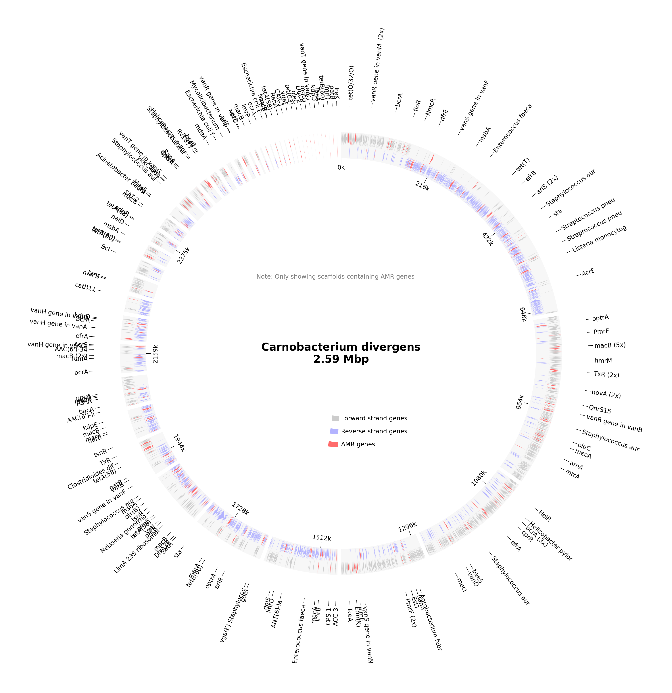

### AAC(6')-34
- **Mechanism**: antibiotic inactivation
- **Drug Classes**: aminoglycoside antibiotic
- **AMR Family**: AAC(6')
- **Locations**:
  - gnl|SPADES|OOJMENLF_116_54 : position 50502-51029

### AAC(6')-Ii
- **Mechanism**: antibiotic inactivation
- **Drug Classes**: aminoglycoside antibiotic
- **AMR Family**: AAC(6')
- **Locations**:
  - gnl|SPADES|OOJMENLF_113_4 : position 1251-1709

### ACC-3
- **Mechanism**: antibiotic inactivation
- **Drug Classes**: monobactam; cephalosporin; penam
- **AMR Family**: ACC beta-lactamase
- **Locations**:
  - gnl|SPADES|OOJMENLF_27_3 : position 1708-2886

### ANT(6)-Ia
- **Mechanism**: antibiotic inactivation
- **Drug Classes**: aminoglycoside antibiotic
- **AMR Family**: ANT(6)
- **Locations**:
  - gnl|SPADES|OOJMENLF_27_98 : position 107735-108592

### Acinetobacter baumannii AbaF
- **Mechanism**: antibiotic efflux
- **Drug Classes**: phosphonic acid antibiotic
- **AMR Family**: major facilitator superfamily (MFS) antibiotic efflux pump
- **Locations**:
  - gnl|SPADES|OOJMENLF_316_3 : position 2315-3550

### Acinetobacter baumannii AbaQ
- **Mechanism**: antibiotic efflux
- **Drug Classes**: fluoroquinolone antibiotic
- **AMR Family**: major facilitator superfamily (MFS) antibiotic efflux pump
- **Locations**:
  - gnl|SPADES|OOJMENLF_1_102 : position 110987-112240

### AcrE
- **Mechanism**: antibiotic efflux
- **Drug Classes**: fluoroquinolone antibiotic; cephalosporin; cephamycin; penam
- **AMR Family**: resistance-nodulation-cell division (RND) antibiotic efflux pump
- **Locations**:
  - gnl|SPADES|OOJMENLF_1_564 : position 595358-596527

### AcrS (found in 2 locations)
- **Mechanism**: antibiotic efflux
- **Drug Classes**: fluoroquinolone antibiotic; cephalosporin; glycylcycline; cephamycin; penam; tetracycline antibiotic; rifamycin antibiotic; phenicol antibiotic; disinfecting agents and antiseptics
- **AMR Family**: resistance-nodulation-cell division (RND) antibiotic efflux pump
- **Locations**:
  - gnl|SPADES|OOJMENLF_116_65 : position 59376-59957
  - gnl|SPADES|OOJMENLF_4_44 : position 45210-45827

### Agrobacterium fabrum chloramphenicol acetyltransferase
- **Mechanism**: antibiotic inactivation
- **Drug Classes**: phenicol antibiotic
- **AMR Family**: chloramphenicol acetyltransferase (CAT)
- **Locations**:
  - gnl|SPADES|OOJMENLF_21_32 : position 32234-32794

### BcI
- **Mechanism**: antibiotic inactivation
- **Drug Classes**: cephalosporin; penem
- **AMR Family**: class A Bacillus cereus Bc beta-lactamase
- **Locations**:
  - gnl|SPADES|OOJMENLF_246_24 : position 22038-22943

### CAR-1
- **Mechanism**: antibiotic inactivation
- **Drug Classes**: carbapenem
- **AMR Family**: CAR beta-lactamase
- **Locations**:
  - gnl|SPADES|OOJMENLF_3089_2 : position 245-1105

### CPS-1
- **Mechanism**: antibiotic inactivation
- **Drug Classes**: carbapenem
- **AMR Family**: CPS beta-lactamase
- **Locations**:
  - gnl|SPADES|OOJMENLF_27_17 : position 15392-16012

### Clostridioides difficile gyrA conferring resistance to fluoroquinolones (found in 2 locations)
- **Mechanism**: antibiotic target alteration
- **Drug Classes**: fluoroquinolone antibiotic
- **AMR Family**: fluoroquinolone resistant gyrA
- **Locations**:
  - gnl|SPADES|OOJMENLF_1_153 : position 168447-170915
  - gnl|SPADES|OOJMENLF_79_61 : position 58645-61131

### Clostridioides difficile gyrB conferring resistance to fluoroquinolones (found in 2 locations)
- **Mechanism**: antibiotic target alteration
- **Drug Classes**: fluoroquinolone antibiotic
- **AMR Family**: fluoroquinolone resistant gyrB
- **Locations**:
  - gnl|SPADES|OOJMENLF_1_154 : position 170905-172932
  - gnl|SPADES|OOJMENLF_79_60 : position 56643-58580

### DfrA36
- **Mechanism**: antibiotic target replacement
- **Drug Classes**: diaminopyrimidine antibiotic
- **AMR Family**: trimethoprim resistant dihydrofolate reductase dfr
- **Locations**:
  - gnl|SPADES|OOJMENLF_46_10 : position 7265-7789

### Enterococcus faecalis cls with mutation conferring resistance to daptomycin (found in 2 locations)
- **Mechanism**: antibiotic target alteration
- **Drug Classes**: peptide antibiotic
- **AMR Family**: daptomycin resistant cls
- **Locations**:
  - gnl|SPADES|OOJMENLF_1_291 : position 308560-310008
  - gnl|SPADES|OOJMENLF_27_63 : position 62286-63803

### Erm(K)
- **Mechanism**: antibiotic target alteration
- **Drug Classes**: macrolide antibiotic; lincosamide antibiotic; streptogramin antibiotic
- **AMR Family**: Erm 23S ribosomal RNA methyltransferase
- **Locations**:
  - gnl|SPADES|OOJMENLF_21_150 : position 156292-157182

### Escherichia coli AcrAB-TolC with AcrR mutation conferring resistance to ciprofloxacin, tetracycline, and ceftazidime
- **Mechanism**: antibiotic target alteration; antibiotic efflux
- **Drug Classes**: fluoroquinolone antibiotic; cephalosporin; glycylcycline; penam; tetracycline antibiotic; rifamycin antibiotic; phenicol antibiotic; disinfecting agents and antiseptics
- **AMR Family**: resistance-nodulation-cell division (RND) antibiotic efflux pump
- **Locations**:
  - gnl|SPADES|OOJMENLF_1_448 : position 474361-474969

### Escherichia coli AcrAB-TolC with MarR mutations conferring resistance to ciprofloxacin and tetracycline
- **Mechanism**: antibiotic target alteration; antibiotic efflux
- **Drug Classes**: fluoroquinolone antibiotic; cephalosporin; glycylcycline; penam; tetracycline antibiotic; rifamycin antibiotic; phenicol antibiotic; disinfecting agents and antiseptics
- **AMR Family**: resistance-nodulation-cell division (RND) antibiotic efflux pump
- **Locations**:
  - gnl|SPADES|OOJMENLF_13_172 : position 185745-186206

### Escherichia coli EF-Tu mutants conferring resistance to kirromycin (found in 2 locations)
- **Mechanism**: antibiotic target alteration
- **Drug Classes**: elfamycin antibiotic
- **AMR Family**: elfamycin resistant EF-Tu
- **Locations**:
  - gnl|SPADES|OOJMENLF_1971_4 : position 2338-2601
  - gnl|SPADES|OOJMENLF_4_270 : position 278878-280065

### Escherichia coli fabI mutations conferring resistance to isoniazid and triclosan
- **Mechanism**: antibiotic target alteration
- **Drug Classes**: disinfecting agents and antiseptics; isoniazid-like antibiotic
- **AMR Family**: antibiotic resistant fabI
- **Locations**:
  - gnl|SPADES|OOJMENLF_613_8 : position 6668-7426

### EstT (found in 2 locations)
- **Mechanism**: antibiotic inactivation
- **Drug Classes**: macrolide antibiotic
- **AMR Family**: macrolide esterase
- **Locations**:
  - gnl|SPADES|OOJMENLF_21_48 : position 49007-49819
  - gnl|SPADES|OOJMENLF_46_66 : position 66398-67114

### FosC2
- **Mechanism**: antibiotic inactivation
- **Drug Classes**: phosphonic acid antibiotic
- **AMR Family**: fosC phosphotransferase family
- **Locations**:
  - gnl|SPADES|OOJMENLF_4_271 : position 280111-280491

### HelR
- **Mechanism**: antibiotic target protection
- **Drug Classes**: rifamycin antibiotic
- **AMR Family**: helicase-like RNA polymerase protection protein
- **Locations**:
  - gnl|SPADES|OOJMENLF_13_18 : position 17065-19359

### Helicobacter pylori pbp1 mutants conferring resistance to amoxicillin (found in 2 locations)
- **Mechanism**: antibiotic target alteration
- **Drug Classes**: cephalosporin; cephamycin; penam
- **AMR Family**: Penicillin-binding protein mutations conferring resistance to beta-lactam antibiotics
- **Locations**:
  - gnl|SPADES|OOJMENLF_13_40 : position 43261-45387
  - gnl|SPADES|OOJMENLF_1_191 : position 207253-209850

### Helicobacter pylori rdxA mutation conferring resistance to metronidazole
- **Mechanism**: antibiotic target alteration
- **Drug Classes**: nitroimidazole antibiotic
- **AMR Family**: Antibiotic resistant Helicobacter pylori nitroreductase
- **Locations**:
  - gnl|SPADES|OOJMENLF_27_21 : position 18217-18855

### Helicobacter pylori rpoB mutation conferring resistance to rifampicin
- **Mechanism**: antibiotic target alteration; antibiotic target replacement
- **Drug Classes**: fluoroquinolone antibiotic; rifamycin antibiotic
- **AMR Family**: rifamycin-resistant beta-subunit of RNA polymerase (rpoB)
- **Locations**:
  - gnl|SPADES|OOJMENLF_379_16 : position 16274-18664

### IreK (found in 3 locations)
- **Mechanism**: reduced permeability to antibiotic
- **Drug Classes**: cephalosporin
- **AMR Family**: Serine/threonine kinases
- **Locations**:
  - gnl|SPADES|OOJMENLF_1_271 : position 288174-290174
  - gnl|SPADES|OOJMENLF_1_74 : position 79741-80289
  - gnl|SPADES|OOJMENLF_203058_1 : position 2-208

### Klebsiella pneumoniae KpnH
- **Mechanism**: antibiotic efflux
- **Drug Classes**: macrolide antibiotic; fluoroquinolone antibiotic; aminoglycoside antibiotic; carbapenem; cephalosporin; penam; peptide antibiotic; penem
- **AMR Family**: major facilitator superfamily (MFS) antibiotic efflux pump
- **Locations**:
  - gnl|SPADES|OOJMENLF_46_92 : position 93045-93893

### LRA-9
- **Mechanism**: antibiotic inactivation
- **Drug Classes**: cephalosporin; penam
- **AMR Family**: subclass B3 LRA beta-lactamase
- **Locations**:
  - gnl|SPADES|OOJMENLF_39770_1 : position 1-297

### Listeria monocytogenes mprF
- **Mechanism**: antibiotic target alteration
- **Drug Classes**: peptide antibiotic
- **AMR Family**: defensin resistant mprF
- **Locations**:
  - gnl|SPADES|OOJMENLF_1_524 : position 546579-549128

### LlmA 23S ribosomal RNA methyltransferase
- **Mechanism**: antibiotic target alteration
- **Drug Classes**: lincosamide antibiotic
- **AMR Family**: Llm 23S ribosomal RNA methyltransferase
- **Locations**:
  - gnl|SPADES|OOJMENLF_46_38 : position 35990-37168

### MexS (found in 2 locations)
- **Mechanism**: antibiotic efflux
- **Drug Classes**: fluoroquinolone antibiotic; diaminopyrimidine antibiotic; phenicol antibiotic
- **AMR Family**: resistance-nodulation-cell division (RND) antibiotic efflux pump
- **Locations**:
  - gnl|SPADES|OOJMENLF_27_67 : position 65160-66101
  - gnl|SPADES|OOJMENLF_316_8 : position 6316-7299

### Mycolicibacterium smegmatis ndh with mutation conferring resistance to isoniazid (found in 2 locations)
- **Mechanism**: antibiotic target alteration
- **Drug Classes**: isoniazid-like antibiotic
- **AMR Family**: antibiotic resistant ndh
- **Locations**:
  - gnl|SPADES|OOJMENLF_4_144 : position 159019-160224
  - gnl|SPADES|OOJMENLF_632_3 : position 1934-3805

### Neisseria gonorrhoeae mtrR with mutation conferring resistance
- **Mechanism**: antibiotic efflux
- **Drug Classes**: macrolide antibiotic
- **AMR Family**: resistance-nodulation-cell division (RND) antibiotic efflux pump
- **Locations**:
  - gnl|SPADES|OOJMENLF_46_74 : position 72998-73591

### NmcR (found in 2 locations)
- **Mechanism**: antibiotic inactivation
- **Drug Classes**: carbapenem; cephalosporin; cephamycin; penam
- **AMR Family**: NmcA beta-lactamase
- **Locations**:
  - gnl|SPADES|OOJMENLF_1_150 : position 163899-164852
  - gnl|SPADES|OOJMENLF_2041_1 : position 43-909

### PAM-2
- **Mechanism**: antibiotic inactivation
- **Drug Classes**: carbapenem; cephalosporin
- **AMR Family**: PAM beta-lactamase
- **Locations**:
  - gnl|SPADES|OOJMENLF_1_515 : position 536853-537566

### PmrF (found in 3 locations)
- **Mechanism**: antibiotic target alteration
- **Drug Classes**: peptide antibiotic
- **AMR Family**: pmr phosphoethanolamine transferase
- **Locations**:
  - gnl|SPADES|OOJMENLF_21_111 : position 112995-114245
  - gnl|SPADES|OOJMENLF_21_60 : position 60015-61199
  - gnl|SPADES|OOJMENLF_4_39 : position 40845-41795

### Pseudomonas mutant PhoP conferring resistance to colistin
- **Mechanism**: antibiotic target alteration; antibiotic efflux; resistance by absence
- **Drug Classes**: macrolide antibiotic; peptide antibiotic
- **AMR Family**: ATP-binding cassette (ABC) antibiotic efflux pump; pmr phosphoethanolamine transferase; transmembrane protein conferring colistin resistance
- **Locations**:
  - gnl|SPADES|OOJMENLF_134_41 : position 39193-39912

### QnrS15
- **Mechanism**: antibiotic target protection
- **Drug Classes**: fluoroquinolone antibiotic
- **AMR Family**: quinolone resistance protein (qnr)
- **Locations**:
  - gnl|SPADES|OOJMENLF_4_167 : position 182297-182920

### QnrVC4
- **Mechanism**: antibiotic target protection
- **Drug Classes**: fluoroquinolone antibiotic
- **AMR Family**: quinolone resistance protein (qnr)
- **Locations**:
  - gnl|SPADES|OOJMENLF_1_508 : position 529013-529648

### RanA (found in 8 locations)
- **Mechanism**: antibiotic efflux
- **Drug Classes**: aminoglycoside antibiotic
- **AMR Family**: ATP-binding cassette (ABC) antibiotic efflux pump
- **Locations**:
  - gnl|SPADES|OOJMENLF_113_28 : position 26148-27185
  - gnl|SPADES|OOJMENLF_116_39 : position 32903-33997
  - gnl|SPADES|OOJMENLF_1_301 : position 320388-321581
  - gnl|SPADES|OOJMENLF_21_39 : position 39067-40170
  - gnl|SPADES|OOJMENLF_3016_2 : position 674-1465
  - gnl|SPADES|OOJMENLF_334_24 : position 19475-20449
  - gnl|SPADES|OOJMENLF_4_242 : position 254673-255446
  - gnl|SPADES|OOJMENLF_4_71 : position 77861-78670

### RlmA(II)
- **Mechanism**: antibiotic target alteration
- **Drug Classes**: macrolide antibiotic; lincosamide antibiotic
- **AMR Family**: non-erm 23S ribosomal RNA methyltransferase (G748)
- **Locations**:
  - gnl|SPADES|OOJMENLF_13_24 : position 24129-24986

### Rv1877
- **Mechanism**: antibiotic efflux
- **Drug Classes**: fluoroquinolone antibiotic
- **AMR Family**: major facilitator superfamily (MFS) antibiotic efflux pump
- **Locations**:
  - gnl|SPADES|OOJMENLF_434_4 : position 2834-4312

### SAT-2
- **Mechanism**: antibiotic inactivation
- **Drug Classes**: nucleoside antibiotic
- **AMR Family**: streptothricin acetyltransferase (SAT)
- **Locations**:
  - gnl|SPADES|OOJMENLF_285_19 : position 17198-18043

### SatA
- **Mechanism**: antibiotic inactivation
- **Drug Classes**: nucleoside antibiotic
- **AMR Family**: streptothricin acetyltransferase (SAT)
- **Locations**:
  - gnl|SPADES|OOJMENLF_46_5 : position 3032-3466

### Staphylococcus aureus fusA with mutation conferring resistance to fusidic acid
- **Mechanism**: antibiotic target alteration
- **Drug Classes**: fusidane antibiotic
- **AMR Family**: antibiotic resistant fusA
- **Locations**:
  - gnl|SPADES|OOJMENLF_13_129 : position 138789-140366

### Staphylococcus aureus mupA conferring resistance to mupirocin (found in 2 locations)
- **Mechanism**: antibiotic target alteration
- **Drug Classes**: mupirocin-like antibiotic
- **AMR Family**: antibiotic-resistant isoleucyl-tRNA synthetase (ileS)
- **Locations**:
  - gnl|SPADES|OOJMENLF_1_464 : position 486563-489349
  - gnl|SPADES|OOJMENLF_21_147 : position 152869-154893

### Staphylococcus aureus mupB conferring resistance to mupirocin (found in 2 locations)
- **Mechanism**: antibiotic target alteration
- **Drug Classes**: mupirocin-like antibiotic
- **AMR Family**: antibiotic-resistant isoleucyl-tRNA synthetase (ileS)
- **Locations**:
  - gnl|SPADES|OOJMENLF_1_423 : position 448382-451027
  - gnl|SPADES|OOJMENLF_46_105 : position 109073-111487

### Staphylococcus aureus murA with mutation conferring resistance to fosfomycin (found in 2 locations)
- **Mechanism**: antibiotic target alteration
- **Drug Classes**: phosphonic acid antibiotic
- **AMR Family**: antibiotic-resistant murA transferase
- **Locations**:
  - gnl|SPADES|OOJMENLF_318_3 : position 2951-4216
  - gnl|SPADES|OOJMENLF_4_217 : position 229296-230609

### Staphylococcus aureus rpoB mutants conferring resistance to rifampicin
- **Mechanism**: antibiotic target alteration; antibiotic target replacement
- **Drug Classes**: rifamycin antibiotic
- **AMR Family**: rifamycin-resistant beta-subunit of RNA polymerase (rpoB)
- **Locations**:
  - gnl|SPADES|OOJMENLF_379_15 : position 12581-16156

### Streptococcus pneumoniae PBP2b conferring resistance to amoxicillin
- **Mechanism**: antibiotic target alteration
- **Drug Classes**: cephalosporin; cephamycin; penam
- **AMR Family**: Penicillin-binding protein mutations conferring resistance to beta-lactam antibiotics
- **Locations**:
  - gnl|SPADES|OOJMENLF_1_506 : position 523999-526119

### Streptococcus pneumoniae PBP2x conferring resistance to amoxicillin
- **Mechanism**: antibiotic target alteration
- **Drug Classes**: cephalosporin; cephamycin; penam
- **AMR Family**: Penicillin-binding protein mutations conferring resistance to beta-lactam antibiotics
- **Locations**:
  - gnl|SPADES|OOJMENLF_1_477 : position 501452-503617

### TaeA (found in 3 locations)
- **Mechanism**: antibiotic efflux
- **Drug Classes**: pleuromutilin antibiotic
- **AMR Family**: ATP-binding cassette (ABC) antibiotic efflux pump
- **Locations**:
  - gnl|SPADES|OOJMENLF_145125_1 : position 2-235
  - gnl|SPADES|OOJMENLF_1_178 : position 194389-196275
  - gnl|SPADES|OOJMENLF_21_165 : position 169200-170840

### TxR (found in 3 locations)
- **Mechanism**: antibiotic efflux
- **Drug Classes**: tetracycline antibiotic
- **AMR Family**: ATP-binding cassette (ABC) antibiotic efflux pump
- **Locations**:
  - gnl|SPADES|OOJMENLF_4_109 : position 117446-120307
  - gnl|SPADES|OOJMENLF_4_304 : position 318968-321640
  - gnl|SPADES|OOJMENLF_79_70 : position 69128-71791

### VatI
- **Mechanism**: antibiotic inactivation
- **Drug Classes**: streptogramin antibiotic; streptogramin A antibiotic
- **AMR Family**: streptogramin vat acetyltransferase
- **Locations**:
  - gnl|SPADES|OOJMENLF_46_47 : position 48240-48941

### YajC
- **Mechanism**: antibiotic efflux
- **Drug Classes**: fluoroquinolone antibiotic; cephalosporin; glycylcycline; penam; tetracycline antibiotic; oxazolidinone antibiotic; glycopeptide antibiotic; rifamycin antibiotic; phenicol antibiotic; disinfecting agents and antiseptics
- **AMR Family**: resistance-nodulation-cell division (RND) antibiotic efflux pump
- **Locations**:
  - gnl|SPADES|OOJMENLF_1_525 : position 549213-549629

### aac(6')-Ib-cr11
- **Mechanism**: antibiotic inactivation
- **Drug Classes**: fluoroquinolone antibiotic; aminoglycoside antibiotic
- **AMR Family**: AAC(6'); AAC(6')-Ib-cr
- **Locations**:
  - gnl|SPADES|OOJMENLF_116_64 : position 58785-59357

### adeR
- **Mechanism**: antibiotic efflux
- **Drug Classes**: glycylcycline; tetracycline antibiotic
- **AMR Family**: resistance-nodulation-cell division (RND) antibiotic efflux pump
- **Locations**:
  - gnl|SPADES|OOJMENLF_284_18 : position 20792-21487

### almE (found in 2 locations)
- **Mechanism**: antibiotic target alteration
- **Drug Classes**: peptide antibiotic
- **AMR Family**: polymyxin resistance operon; alm glycyltransferase
- **Locations**:
  - gnl|SPADES|OOJMENLF_21_144 : position 149646-151085
  - gnl|SPADES|OOJMENLF_46_63 : position 62516-64042

### arlR (found in 5 locations)
- **Mechanism**: antibiotic efflux
- **Drug Classes**: fluoroquinolone antibiotic; disinfecting agents and antiseptics
- **AMR Family**: major facilitator superfamily (MFS) antibiotic efflux pump
- **Locations**:
  - gnl|SPADES|OOJMENLF_13_92 : position 100358-101032
  - gnl|SPADES|OOJMENLF_1_391 : position 421117-421800
  - gnl|SPADES|OOJMENLF_1_557 : position 587666-588352
  - gnl|SPADES|OOJMENLF_28_46 : position 54434-55885
  - gnl|SPADES|OOJMENLF_4_64 : position 70668-71384

### arlS (found in 5 locations)
- **Mechanism**: antibiotic efflux
- **Drug Classes**: fluoroquinolone antibiotic; disinfecting agents and antiseptics
- **AMR Family**: major facilitator superfamily (MFS) antibiotic efflux pump
- **Locations**:
  - gnl|SPADES|OOJMENLF_13_91 : position 99296-100345
  - gnl|SPADES|OOJMENLF_1_390 : position 419834-421120
  - gnl|SPADES|OOJMENLF_1_556 : position 586146-587669
  - gnl|SPADES|OOJMENLF_4_65 : position 71381-73156
  - gnl|SPADES|OOJMENLF_634_3 : position 1031-2866

### arnA (found in 2 locations)
- **Mechanism**: antibiotic target alteration
- **Drug Classes**: peptide antibiotic
- **AMR Family**: pmr phosphoethanolamine transferase
- **Locations**:
  - gnl|SPADES|OOJMENLF_1_274 : position 292327-293277
  - gnl|SPADES|OOJMENLF_4_281 : position 292358-292939

### bacA
- **Mechanism**: antibiotic target alteration
- **Drug Classes**: peptide antibiotic
- **AMR Family**: undecaprenyl pyrophosphate related proteins
- **Locations**:
  - gnl|SPADES|OOJMENLF_113_12 : position 10537-11355

### baeS (found in 2 locations)
- **Mechanism**: antibiotic efflux
- **Drug Classes**: aminoglycoside antibiotic; aminocoumarin antibiotic
- **AMR Family**: resistance-nodulation-cell division (RND) antibiotic efflux pump
- **Locations**:
  - gnl|SPADES|OOJMENLF_13_169 : position 182794-184170
  - gnl|SPADES|OOJMENLF_4_221 : position 233333-234727

### bcrA (found in 8 locations)
- **Mechanism**: antibiotic efflux
- **Drug Classes**: peptide antibiotic
- **AMR Family**: ATP-binding cassette (ABC) antibiotic efflux pump
- **Locations**:
  - gnl|SPADES|OOJMENLF_116_11 : position 8901-9593
  - gnl|SPADES|OOJMENLF_134_35 : position 33650-34570
  - gnl|SPADES|OOJMENLF_13_109 : position 119031-119972
  - gnl|SPADES|OOJMENLF_13_218 : position 224449-225336
  - gnl|SPADES|OOJMENLF_13_49 : position 54179-54913
  - gnl|SPADES|OOJMENLF_1844_3 : position 924-1697
  - gnl|SPADES|OOJMENLF_1_97 : position 105253-106734
  - gnl|SPADES|OOJMENLF_27_5 : position 3416-4315

### bcrC
- **Mechanism**: antibiotic target alteration
- **Drug Classes**: peptide antibiotic
- **AMR Family**: undecaprenyl pyrophosphate related proteins
- **Locations**:
  - gnl|SPADES|OOJMENLF_434_10 : position 9676-10347

### bmr
- **Mechanism**: antibiotic efflux
- **Drug Classes**: fluoroquinolone antibiotic; nucleoside antibiotic; phenicol antibiotic; disinfecting agents and antiseptics
- **AMR Family**: major facilitator superfamily (MFS) antibiotic efflux pump
- **Locations**:
  - gnl|SPADES|OOJMENLF_214_14 : position 12727-13950

### carA
- **Mechanism**: antibiotic target protection
- **Drug Classes**: macrolide antibiotic
- **AMR Family**: Miscellaneous ABC-F subfamily ATP-binding cassette ribosomal protection proteins
- **Locations**:
  - gnl|SPADES|OOJMENLF_21_156 : position 161329-162036

### catB11
- **Mechanism**: antibiotic inactivation
- **Drug Classes**: phenicol antibiotic
- **AMR Family**: chloramphenicol acetyltransferase (CAT)
- **Locations**:
  - gnl|SPADES|OOJMENLF_209_29 : position 30163-30825

### cfrA
- **Mechanism**: antibiotic target alteration
- **Drug Classes**: lincosamide antibiotic; streptogramin antibiotic; streptogramin A antibiotic; oxazolidinone antibiotic; phenicol antibiotic; pleuromutilin antibiotic
- **AMR Family**: Cfr 23S ribosomal RNA methyltransferase
- **Locations**:
  - gnl|SPADES|OOJMENLF_28_7 : position 9554-10612

### cprR
- **Mechanism**: antibiotic target alteration; antibiotic efflux
- **Drug Classes**: peptide antibiotic
- **AMR Family**: pmr phosphoethanolamine transferase
- **Locations**:
  - gnl|SPADES|OOJMENLF_13_60 : position 66020-66553

### dfrE
- **Mechanism**: antibiotic target replacement
- **Drug Classes**: diaminopyrimidine antibiotic
- **AMR Family**: trimethoprim resistant dihydrofolate reductase dfr
- **Locations**:
  - gnl|SPADES|OOJMENLF_1_176 : position 192896-193384

### efrA (found in 4 locations)
- **Mechanism**: antibiotic efflux
- **Drug Classes**: macrolide antibiotic; fluoroquinolone antibiotic; rifamycin antibiotic
- **AMR Family**: ATP-binding cassette (ABC) antibiotic efflux pump
- **Locations**:
  - gnl|SPADES|OOJMENLF_134_5 : position 2905-4710
  - gnl|SPADES|OOJMENLF_13_87 : position 92596-94338
  - gnl|SPADES|OOJMENLF_1_361 : position 389610-391391
  - gnl|SPADES|OOJMENLF_4_181 : position 193512-195233

### efrB
- **Mechanism**: antibiotic efflux
- **Drug Classes**: macrolide antibiotic; fluoroquinolone antibiotic; rifamycin antibiotic
- **AMR Family**: ATP-binding cassette (ABC) antibiotic efflux pump
- **Locations**:
  - gnl|SPADES|OOJMENLF_1_360 : position 387835-389613

### evgA
- **Mechanism**: antibiotic efflux
- **Drug Classes**: macrolide antibiotic; fluoroquinolone antibiotic; penam; tetracycline antibiotic
- **AMR Family**: major facilitator superfamily (MFS) antibiotic efflux pump; resistance-nodulation-cell division (RND) antibiotic efflux pump
- **Locations**:
  - gnl|SPADES|OOJMENLF_1_368 : position 397159-397791

### floR
- **Mechanism**: antibiotic efflux
- **Drug Classes**: phenicol antibiotic
- **AMR Family**: major facilitator superfamily (MFS) antibiotic efflux pump
- **Locations**:
  - gnl|SPADES|OOJMENLF_1_127 : position 140978-142165

### golS (found in 2 locations)
- **Mechanism**: antibiotic efflux
- **Drug Classes**: monobactam; carbapenem; cephalosporin; cephamycin; penam; phenicol antibiotic; penem
- **AMR Family**: resistance-nodulation-cell division (RND) antibiotic efflux pump
- **Locations**:
  - gnl|SPADES|OOJMENLF_27_124 : position 130718-131101
  - gnl|SPADES|OOJMENLF_28_2 : position 2381-3187

### hmrM
- **Mechanism**: antibiotic efflux
- **Drug Classes**: fluoroquinolone antibiotic; disinfecting agents and antiseptics
- **AMR Family**: multidrug and toxic compound extrusion (MATE) transporter
- **Locations**:
  - gnl|SPADES|OOJMENLF_4_87 : position 93750-95099

### kdpD (found in 3 locations)
- **Mechanism**: antibiotic efflux
- **Drug Classes**: aminoglycoside antibiotic
- **AMR Family**: kdpDE
- **Locations**:
  - gnl|SPADES|OOJMENLF_111_53 : position 54691-57420
  - gnl|SPADES|OOJMENLF_116901_1 : position 1-246
  - gnl|SPADES|OOJMENLF_134_42 : position 39909-41558

### kdpE
- **Mechanism**: antibiotic efflux
- **Drug Classes**: aminoglycoside antibiotic
- **AMR Family**: kdpDE
- **Locations**:
  - gnl|SPADES|OOJMENLF_111_52 : position 54008-54694

### leuO
- **Mechanism**: antibiotic efflux
- **Drug Classes**: nucleoside antibiotic; disinfecting agents and antiseptics
- **AMR Family**: major facilitator superfamily (MFS) antibiotic efflux pump
- **Locations**:
  - gnl|SPADES|OOJMENLF_46_6 : position 3486-4301

### lmrB (found in 2 locations)
- **Mechanism**: antibiotic efflux
- **Drug Classes**: lincosamide antibiotic; nucleoside antibiotic
- **AMR Family**: ATP-binding cassette (ABC) antibiotic efflux pump
- **Locations**:
  - gnl|SPADES|OOJMENLF_13_54 : position 59972-61426
  - gnl|SPADES|OOJMENLF_27_40 : position 35013-36410

### lmrD (found in 2 locations)
- **Mechanism**: antibiotic efflux
- **Drug Classes**: lincosamide antibiotic
- **AMR Family**: ATP-binding cassette (ABC) antibiotic efflux pump
- **Locations**:
  - gnl|SPADES|OOJMENLF_193166_1 : position 1-213
  - gnl|SPADES|OOJMENLF_27_113 : position 122877-124958

### lmrP
- **Mechanism**: antibiotic efflux
- **Drug Classes**: macrolide antibiotic; lincosamide antibiotic; streptogramin antibiotic; streptogramin A antibiotic; tetracycline antibiotic
- **AMR Family**: major facilitator superfamily (MFS) antibiotic efflux pump
- **Locations**:
  - gnl|SPADES|OOJMENLF_1449_1 : position 261-1469

### macA
- **Mechanism**: antibiotic efflux
- **Drug Classes**: macrolide antibiotic
- **AMR Family**: ATP-binding cassette (ABC) antibiotic efflux pump
- **Locations**:
  - gnl|SPADES|OOJMENLF_27_46 : position 42090-42950

### macB (found in 28 locations)
- **Mechanism**: antibiotic efflux
- **Drug Classes**: macrolide antibiotic
- **AMR Family**: ATP-binding cassette (ABC) antibiotic efflux pump
- **Locations**:
  - gnl|SPADES|OOJMENLF_111_40 : position 42828-43523
  - gnl|SPADES|OOJMENLF_113_33 : position 29805-31748
  - gnl|SPADES|OOJMENLF_116_43 : position 37993-39702
  - gnl|SPADES|OOJMENLF_116_67 : position 61625-62353
  - gnl|SPADES|OOJMENLF_1227_2 : position 708-1352
  - gnl|SPADES|OOJMENLF_13_108 : position 117911-119038
  - gnl|SPADES|OOJMENLF_13_167 : position 180919-181593
  - gnl|SPADES|OOJMENLF_13_212 : position 218708-219433
  - gnl|SPADES|OOJMENLF_13_93 : position 101249-102016
  - gnl|SPADES|OOJMENLF_1_134 : position 148897-149706
  - gnl|SPADES|OOJMENLF_1_290 : position 307178-308368
  - gnl|SPADES|OOJMENLF_1_382 : position 410291-411049
  - gnl|SPADES|OOJMENLF_1_411 : position 438164-438862
  - gnl|SPADES|OOJMENLF_1_446 : position 472480-473151
  - gnl|SPADES|OOJMENLF_1_562 : position 593398-594636
  - gnl|SPADES|OOJMENLF_1_563 : position 594633-595343
  - gnl|SPADES|OOJMENLF_214_11 : position 10760-11497
  - gnl|SPADES|OOJMENLF_27_47 : position 42966-43658
  - gnl|SPADES|OOJMENLF_27_48 : position 43674-44900
  - gnl|SPADES|OOJMENLF_285_13 : position 12323-13396
  - gnl|SPADES|OOJMENLF_334_20 : position 16466-17194
  - gnl|SPADES|OOJMENLF_434_8 : position 7611-8267
  - gnl|SPADES|OOJMENLF_46_20 : position 16235-17038
  - gnl|SPADES|OOJMENLF_4_190 : position 202462-203151
  - gnl|SPADES|OOJMENLF_4_191 : position 203144-204373
  - gnl|SPADES|OOJMENLF_4_228 : position 240863-241564
  - gnl|SPADES|OOJMENLF_4_60 : position 66455-67141
  - gnl|SPADES|OOJMENLF_4_78 : position 83621-86464

### marA (found in 2 locations)
- **Mechanism**: antibiotic efflux; reduced permeability to antibiotic
- **Drug Classes**: fluoroquinolone antibiotic; monobactam; carbapenem; cephalosporin; glycylcycline; cephamycin; penam; tetracycline antibiotic; rifamycin antibiotic; phenicol antibiotic; penem; disinfecting agents and antiseptics
- **AMR Family**: resistance-nodulation-cell division (RND) antibiotic efflux pump; General Bacterial Porin with reduced permeability to beta-lactams
- **Locations**:
  - gnl|SPADES|OOJMENLF_111_31 : position 32504-34345
  - gnl|SPADES|OOJMENLF_28_87 : position 105241-106077

### mdeA
- **Mechanism**: antibiotic efflux
- **Drug Classes**: fluoroquinolone antibiotic; aminoglycoside antibiotic; penam; tetracycline antibiotic; disinfecting agents and antiseptics
- **AMR Family**: major facilitator superfamily (MFS) antibiotic efflux pump
- **Locations**:
  - gnl|SPADES|OOJMENLF_557_10 : position 9963-11393

### mdtG (found in 2 locations)
- **Mechanism**: antibiotic efflux
- **Drug Classes**: phosphonic acid antibiotic
- **AMR Family**: major facilitator superfamily (MFS) antibiotic efflux pump
- **Locations**:
  - gnl|SPADES|OOJMENLF_46_39 : position 37262-38509
  - gnl|SPADES|OOJMENLF_71796_1 : position 2-268

### mecA
- **Mechanism**: antibiotic target replacement
- **Drug Classes**: penam
- **AMR Family**: methicillin resistant PBP2
- **Locations**:
  - gnl|SPADES|OOJMENLF_4_259 : position 267390-269423

### mecI
- **Mechanism**: antibiotic target replacement
- **Drug Classes**: penam
- **AMR Family**: methicillin resistant PBP2
- **Locations**:
  - gnl|SPADES|OOJMENLF_13_209 : position 216294-216809

### mepR (found in 2 locations)
- **Mechanism**: antibiotic efflux
- **Drug Classes**: glycylcycline; tetracycline antibiotic
- **AMR Family**: multidrug and toxic compound extrusion (MATE) transporter
- **Locations**:
  - gnl|SPADES|OOJMENLF_27_41 : position 36397-36909
  - gnl|SPADES|OOJMENLF_27_68 : position 66082-66546

### mgrA
- **Mechanism**: antibiotic efflux
- **Drug Classes**: fluoroquinolone antibiotic; cephalosporin; penam; tetracycline antibiotic; peptide antibiotic; disinfecting agents and antiseptics
- **AMR Family**: ATP-binding cassette (ABC) antibiotic efflux pump; major facilitator superfamily (MFS) antibiotic efflux pump
- **Locations**:
  - gnl|SPADES|OOJMENLF_4_196 : position 208484-209134

### mreA
- **Mechanism**: antibiotic efflux
- **Drug Classes**: macrolide antibiotic
- **AMR Family**: major facilitator superfamily (MFS) antibiotic efflux pump
- **Locations**:
  - gnl|SPADES|OOJMENLF_1_19 : position 21239-22183

### msbA (found in 4 locations)
- **Mechanism**: antibiotic efflux
- **Drug Classes**: nitroimidazole antibiotic
- **AMR Family**: ATP-binding cassette (ABC) antibiotic efflux pump
- **Locations**:
  - gnl|SPADES|OOJMENLF_1_258 : position 273442-277020
  - gnl|SPADES|OOJMENLF_278_19 : position 21202-21963
  - gnl|SPADES|OOJMENLF_46_101 : position 102705-104837
  - gnl|SPADES|OOJMENLF_4_197 : position 209131-210900

### mtrA
- **Mechanism**: antibiotic efflux
- **Drug Classes**: macrolide antibiotic; penam
- **AMR Family**: resistance-nodulation-cell division (RND) antibiotic efflux pump
- **Locations**:
  - gnl|SPADES|OOJMENLF_4_295 : position 310122-310883

### nalD
- **Mechanism**: antibiotic efflux
- **Drug Classes**: macrolide antibiotic; fluoroquinolone antibiotic; monobactam; carbapenem; cephalosporin; cephamycin; penam; tetracycline antibiotic; peptide antibiotic; aminocoumarin antibiotic; diaminopyrimidine antibiotic; sulfonamide antibiotic; phenicol antibiotic; penem
- **AMR Family**: resistance-nodulation-cell division (RND) antibiotic efflux pump
- **Locations**:
  - gnl|SPADES|OOJMENLF_284_5 : position 3787-4443

### norB
- **Mechanism**: antibiotic efflux
- **Drug Classes**: fluoroquinolone antibiotic
- **AMR Family**: major facilitator superfamily (MFS) antibiotic efflux pump
- **Locations**:
  - gnl|SPADES|OOJMENLF_111_28 : position 29300-30691

### norC
- **Mechanism**: antibiotic efflux
- **Drug Classes**: fluoroquinolone antibiotic; disinfecting agents and antiseptics
- **AMR Family**: major facilitator superfamily (MFS) antibiotic efflux pump
- **Locations**:
  - gnl|SPADES|OOJMENLF_1100_2 : position 1045-2223

### novA (found in 3 locations)
- **Mechanism**: antibiotic efflux
- **Drug Classes**: aminocoumarin antibiotic
- **AMR Family**: ATP-binding cassette (ABC) antibiotic efflux pump
- **Locations**:
  - gnl|SPADES|OOJMENLF_113_40 : position 35718-36491
  - gnl|SPADES|OOJMENLF_4_139 : position 152557-154299
  - gnl|SPADES|OOJMENLF_4_140 : position 154292-156064

### oleC (found in 2 locations)
- **Mechanism**: antibiotic efflux
- **Drug Classes**: macrolide antibiotic
- **AMR Family**: ATP-binding cassette (ABC) antibiotic efflux pump
- **Locations**:
  - gnl|SPADES|OOJMENLF_4_243 : position 255448-256152
  - gnl|SPADES|OOJMENLF_8367_1 : position 2-256

### optrA (found in 4 locations)
- **Mechanism**: antibiotic target protection
- **Drug Classes**: oxazolidinone antibiotic; phenicol antibiotic
- **AMR Family**: Miscellaneous ABC-F subfamily ATP-binding cassette ribosomal protection proteins
- **Locations**:
  - gnl|SPADES|OOJMENLF_1_21 : position 23669-25267
  - gnl|SPADES|OOJMENLF_28_59 : position 69481-71109
  - gnl|SPADES|OOJMENLF_334_18 : position 14127-15959
  - gnl|SPADES|OOJMENLF_4_17 : position 15532-17532

### otr(B)
- **Mechanism**: antibiotic efflux
- **Drug Classes**: tetracycline antibiotic
- **AMR Family**: major facilitator superfamily (MFS) antibiotic efflux pump
- **Locations**:
  - gnl|SPADES|OOJMENLF_46_91 : position 92449-93015

### patA (found in 2 locations)
- **Mechanism**: antibiotic efflux
- **Drug Classes**: fluoroquinolone antibiotic
- **AMR Family**: ATP-binding cassette (ABC) antibiotic efflux pump
- **Locations**:
  - gnl|SPADES|OOJMENLF_28_124 : position 150582-151436
  - gnl|SPADES|OOJMENLF_46_45 : position 45084-46811

### patB (found in 8 locations)
- **Mechanism**: antibiotic efflux
- **Drug Classes**: fluoroquinolone antibiotic
- **AMR Family**: ATP-binding cassette (ABC) antibiotic efflux pump
- **Locations**:
  - gnl|SPADES|OOJMENLF_134_6 : position 4703-6454
  - gnl|SPADES|OOJMENLF_13_88 : position 94331-96106
  - gnl|SPADES|OOJMENLF_192402_1 : position 3-212
  - gnl|SPADES|OOJMENLF_28_83 : position 99858-101618
  - gnl|SPADES|OOJMENLF_46_44 : position 43331-45055
  - gnl|SPADES|OOJMENLF_4_182 : position 195233-197128
  - gnl|SPADES|OOJMENLF_4_72 : position 78683-79447
  - gnl|SPADES|OOJMENLF_79_27 : position 23467-25605

### rosB
- **Mechanism**: antibiotic efflux
- **Drug Classes**: peptide antibiotic
- **AMR Family**: major facilitator superfamily (MFS) antibiotic efflux pump
- **Locations**:
  - gnl|SPADES|OOJMENLF_27_44 : position 39888-41051

### rphB
- **Mechanism**: antibiotic inactivation
- **Drug Classes**: rifamycin antibiotic
- **AMR Family**: rifampin phosphotransferase
- **Locations**:
  - gnl|SPADES|OOJMENLF_13_137 : position 146794-148515

### sta (found in 3 locations)
- **Mechanism**: antibiotic inactivation
- **Drug Classes**: nucleoside antibiotic
- **AMR Family**: streptothricin acetyltransferase (SAT)
- **Locations**:
  - gnl|SPADES|OOJMENLF_1_445 : position 471953-472423
  - gnl|SPADES|OOJMENLF_28_120 : position 147572-148051
  - gnl|SPADES|OOJMENLF_316_4 : position 3681-4106

### tet(32)
- **Mechanism**: antibiotic target protection
- **Drug Classes**: tetracycline antibiotic
- **AMR Family**: tetracycline-resistant ribosomal protection protein
- **Locations**:
  - gnl|SPADES|OOJMENLF_1_27 : position 31086-32921

### tet(63)
- **Mechanism**: antibiotic efflux
- **Drug Classes**: tetracycline antibiotic
- **AMR Family**: major facilitator superfamily (MFS) antibiotic efflux pump
- **Locations**:
  - gnl|SPADES|OOJMENLF_5035_1 : position 3-1031

### tet(O/32/O)
- **Mechanism**: antibiotic target protection
- **Drug Classes**: tetracycline antibiotic
- **AMR Family**: tetracycline-resistant ribosomal protection protein
- **Locations**:
  - gnl|SPADES|OOJMENLF_1_14 : position 15709-18123

### tet(T)
- **Mechanism**: antibiotic target protection
- **Drug Classes**: tetracycline antibiotic
- **AMR Family**: tetracycline-resistant ribosomal protection protein
- **Locations**:
  - gnl|SPADES|OOJMENLF_1_341 : position 362956-364800

### tetA(58) (found in 9 locations)
- **Mechanism**: antibiotic efflux
- **Drug Classes**: tetracycline antibiotic
- **AMR Family**: major facilitator superfamily (MFS) antibiotic efflux pump
- **Locations**:
  - gnl|SPADES|OOJMENLF_1_436 : position 463233-463991
  - gnl|SPADES|OOJMENLF_1_441 : position 468311-469819
  - gnl|SPADES|OOJMENLF_1_519 : position 540732-541493
  - gnl|SPADES|OOJMENLF_1_548 : position 575725-577314
  - gnl|SPADES|OOJMENLF_2596_1 : position 1-528
  - gnl|SPADES|OOJMENLF_284_16 : position 18648-19586
  - gnl|SPADES|OOJMENLF_28_123 : position 149731-150606
  - gnl|SPADES|OOJMENLF_46_59 : position 58761-59666
  - gnl|SPADES|OOJMENLF_79_50 : position 47506-48273

### tetA(60)
- **Mechanism**: antibiotic efflux
- **Drug Classes**: tetracycline antibiotic
- **AMR Family**: ATP-binding cassette (ABC) antibiotic efflux pump
- **Locations**:
  - gnl|SPADES|OOJMENLF_278_6 : position 2651-4402

### tetB(60) (found in 3 locations)
- **Mechanism**: antibiotic efflux
- **Drug Classes**: tetracycline antibiotic
- **AMR Family**: ATP-binding cassette (ABC) antibiotic efflux pump
- **Locations**:
  - gnl|SPADES|OOJMENLF_183469_1 : position 3-215
  - gnl|SPADES|OOJMENLF_278_7 : position 4402-6180
  - gnl|SPADES|OOJMENLF_28_82 : position 98090-99871

### tetR
- **Mechanism**: antibiotic target alteration; antibiotic efflux
- **Drug Classes**: tetracycline antibiotic
- **AMR Family**: major facilitator superfamily (MFS) antibiotic efflux pump
- **Locations**:
  - gnl|SPADES|OOJMENLF_1_527 : position 550857-551426

### tsnR (found in 2 locations)
- **Mechanism**: antibiotic target alteration
- **Drug Classes**: peptide antibiotic
- **AMR Family**: non-erm 23S ribosomal RNA methyltransferase (A1067)
- **Locations**:
  - gnl|SPADES|OOJMENLF_111_4 : position 1739-2608
  - gnl|SPADES|OOJMENLF_46_81 : position 81020-81775

### vanD
- **Mechanism**: antibiotic target alteration
- **Drug Classes**: glycopeptide antibiotic
- **AMR Family**: glycopeptide resistance gene cluster; Van ligase
- **Locations**:
  - gnl|SPADES|OOJMENLF_13_181 : position 192450-193820

### vanH gene in vanA cluster
- **Mechanism**: antibiotic target alteration
- **Drug Classes**: glycopeptide antibiotic
- **AMR Family**: vanH; glycopeptide resistance gene cluster
- **Locations**:
  - gnl|SPADES|OOJMENLF_134_22 : position 20834-21784

### vanH gene in vanD cluster (found in 2 locations)
- **Mechanism**: antibiotic target alteration
- **Drug Classes**: glycopeptide antibiotic
- **AMR Family**: vanH; glycopeptide resistance gene cluster
- **Locations**:
  - gnl|SPADES|OOJMENLF_134_40 : position 38139-39155
  - gnl|SPADES|OOJMENLF_4_111 : position 121652-122836

### vanH gene in vanO cluster
- **Mechanism**: antibiotic target alteration
- **Drug Classes**: glycopeptide antibiotic
- **AMR Family**: vanH; glycopeptide resistance gene cluster
- **Locations**:
  - gnl|SPADES|OOJMENLF_116_62 : position 57031-58020

### vanL
- **Mechanism**: antibiotic target alteration
- **Drug Classes**: glycopeptide antibiotic
- **AMR Family**: glycopeptide resistance gene cluster; Van ligase
- **Locations**:
  - gnl|SPADES|OOJMENLF_318_15 : position 12677-13768

### vanN
- **Mechanism**: antibiotic target alteration
- **Drug Classes**: glycopeptide antibiotic
- **AMR Family**: glycopeptide resistance gene cluster; Van ligase
- **Locations**:
  - gnl|SPADES|OOJMENLF_4_267 : position 275247-276374

### vanR gene in vanB cluster
- **Mechanism**: antibiotic target alteration
- **Drug Classes**: glycopeptide antibiotic
- **AMR Family**: glycopeptide resistance gene cluster; vanR
- **Locations**:
  - gnl|SPADES|OOJMENLF_4_188 : position 200389-201102

### vanR gene in vanE cluster
- **Mechanism**: antibiotic target alteration
- **Drug Classes**: glycopeptide antibiotic
- **AMR Family**: glycopeptide resistance gene cluster; vanR
- **Locations**:
  - gnl|SPADES|OOJMENLF_1_147 : position 160310-161041

### vanR gene in vanF cluster (found in 2 locations)
- **Mechanism**: antibiotic target alteration
- **Drug Classes**: glycopeptide antibiotic
- **AMR Family**: glycopeptide resistance gene cluster; vanR
- **Locations**:
  - gnl|SPADES|OOJMENLF_13_170 : position 184167-184838
  - gnl|SPADES|OOJMENLF_79_6 : position 6078-6767

### vanR gene in vanI cluster (found in 2 locations)
- **Mechanism**: antibiotic target alteration
- **Drug Classes**: glycopeptide antibiotic
- **AMR Family**: glycopeptide resistance gene cluster; vanR
- **Locations**:
  - gnl|SPADES|OOJMENLF_21_131 : position 141600-142244
  - gnl|SPADES|OOJMENLF_634_2 : position 317-1024

### vanR gene in vanM cluster (found in 3 locations)
- **Mechanism**: antibiotic target alteration
- **Drug Classes**: glycopeptide antibiotic
- **AMR Family**: glycopeptide resistance gene cluster; vanR
- **Locations**:
  - gnl|SPADES|OOJMENLF_1_217 : position 235355-236077
  - gnl|SPADES|OOJMENLF_1_51 : position 58792-59484
  - gnl|SPADES|OOJMENLF_4_220 : position 232590-233309

### vanS gene in vanB cluster
- **Mechanism**: antibiotic target alteration
- **Drug Classes**: glycopeptide antibiotic
- **AMR Family**: vanS; glycopeptide resistance gene cluster
- **Locations**:
  - gnl|SPADES|OOJMENLF_4_193 : position 205073-205873

### vanS gene in vanF cluster (found in 2 locations)
- **Mechanism**: antibiotic target alteration
- **Drug Classes**: glycopeptide antibiotic
- **AMR Family**: vanS; glycopeptide resistance gene cluster
- **Locations**:
  - gnl|SPADES|OOJMENLF_1_216 : position 233524-235347
  - gnl|SPADES|OOJMENLF_79_5 : position 4892-6028

### vanS gene in vanN cluster
- **Mechanism**: antibiotic target alteration
- **Drug Classes**: glycopeptide antibiotic
- **AMR Family**: vanS; glycopeptide resistance gene cluster
- **Locations**:
  - gnl|SPADES|OOJMENLF_21_130 : position 140201-141490

### vanT gene in vanG cluster (found in 2 locations)
- **Mechanism**: antibiotic target alteration
- **Drug Classes**: glycopeptide antibiotic
- **AMR Family**: glycopeptide resistance gene cluster; vanT
- **Locations**:
  - gnl|SPADES|OOJMENLF_318_20: position 18727-19827
  - gnl|SPADES|OOJMENLF_87209_1 : position 3-260

### vanY gene in vanG cluster
- **Mechanism**: antibiotic target alteration
- **Drug Classes**: glycopeptide antibiotic
- **AMR Family**: vanY; glycopeptide resistance gene cluster
- **Locations**:
  - gnl|SPADES|OOJMENLF_4_255: position 264694-265449

### vanZ gene in vanA cluster
- **Mechanism**: antibiotic target alteration
- **Drug Classes**: glycopeptide antibiotic
- **AMR Family**: vanZ; glycopeptide resistance gene cluster
- **Locations**:
  - gnl|SPADES|OOJMENLF_46_40 : position 38542-39216

### vatB (found in 3 locations)
- **Mechanism**: antibiotic inactivation
- **Drug Classes**: streptogramin antibiotic; streptogramin A antibiotic
- **AMR Family**: streptogramin vat acetyltransferase
- **Locations**:
  - gnl|SPADES|OOJMENLF_1100_4 : position 3024-3659
  - gnl|SPADES|OOJMENLF_2041_2 : position 1027-1593
  - gnl|SPADES|OOJMENLF_79_19 : position 18618-19199

### vga(E) Staphylococcus cohnii
- **Mechanism**: antibiotic target protection
- **Drug Classes**: lincosamide antibiotic; streptogramin antibiotic; streptogramin A antibiotic; pleuromutilin antibiotic
- **AMR Family**: vga-type ABC-F protein
- **Locations**:
  - gnl|SPADES|OOJMENLF_28_6 : position 7636-9246

### vgaE
- **Mechanism**: antibiotic target protection
- **Drug Classes**: lincosamide antibiotic; streptogramin antibiotic; streptogramin A antibiotic; pleuromutilin antibiotic
- **AMR Family**: vga-type ABC-F protein
- **Locations**:
  - gnl|SPADES|OOJMENLF_4099_1 : position 2-355

### vmlR
- **Mechanism**: antibiotic target protection
- **Drug Classes**: lincosamide antibiotic; streptogramin antibiotic; streptogramin A antibiotic; streptogramin B antibiotic; nucleoside antibiotic; pleuromutilin antibiotic
- **AMR Family**: Miscellaneous ABC-F subfamily ATP-binding cassette ribosomal protection proteins
- **Locations**:
  - gnl|SPADES|OOJMENLF_113_36 : position 32904-33287

### ykkC (found in 3 locations)
- **Mechanism**: antibiotic efflux
- **Drug Classes**: aminoglycoside antibiotic; tetracycline antibiotic; phenicol antibiotic
- **AMR Family**: small multidrug resistance (SMR) antibiotic efflux pump
- **Locations**:
  - gnl|SPADES|OOJMENLF_27_20 : position 17795-18121
  - gnl|SPADES|OOJMENLF_318_13 : position 11880-12209
  - gnl|SPADES|OOJMENLF_318_14 : position 12206-12523

### ykkD
- **Mechanism**: antibiotic efflux
- **Drug Classes**: aminoglycoside antibiotic; tetracycline antibiotic; phenicol antibiotic
- **AMR Family**: small multidrug resistance (SMR) antibiotic efflux pump
- **Locations**:
  - gnl|SPADES|OOJMENLF_27_19 : position 17470-17781

## Carnobacterium maltaromaticum
**Strain Statistics:**
- Total genome length: 1503.8 kbp
- Total scaffolds: 803
- Scaffolds with AMR genes: 85
- Total genes annotated: 2801
- Total AMR genes: 190
- Unique AMR genes: 109
- Distinct AMR mechanisms: 9
- Distinct AMR families: 51
- Distinct drug classes: 35

**Circos Plot:**

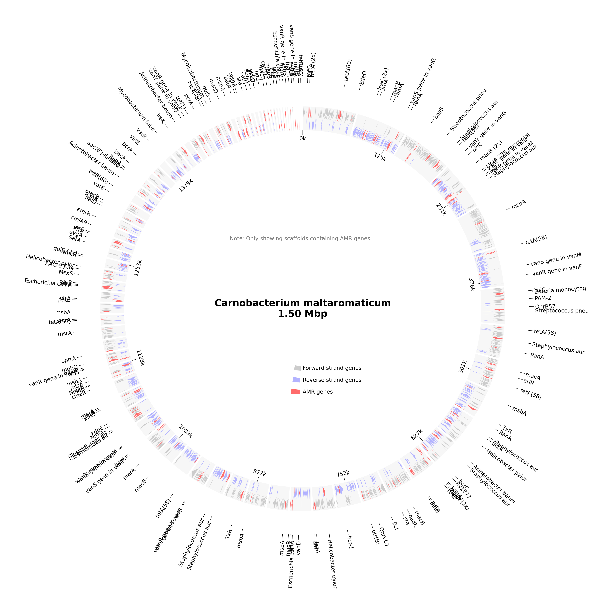

### AAC(6')-34
- **Mechanism**: antibiotic inactivation
- **Drug Classes**: aminoglycoside antibiotic
- **AMR Family**: AAC(6')
- **Locations**:
  - gnl|SPADES|OOJMENLF_527_9 : position 6994-7527

### Acinetobacter baumannii AbaQ (found in 2 locations)
- **Mechanism**: antibiotic efflux
- **Drug Classes**: fluoroquinolone antibiotic
- **AMR Family**: major facilitator superfamily (MFS) antibiotic efflux pump
- **Locations**:
  - gnl|SPADES|OOJMENLF_609_4 : position 3778-5070
  - gnl|SPADES|OOJMENLF_761_6 : position 6265-7521

### Acinetobacter baumannii AmvA
- **Mechanism**: antibiotic efflux
- **Drug Classes**: macrolide antibiotic; disinfecting agents and antiseptics
- **AMR Family**: major facilitator superfamily (MFS) antibiotic efflux pump
- **Locations**:
  - gnl|SPADES|OOJMENLF_200_5 : position 3658-5088

### BcI
- **Mechanism**: antibiotic inactivation
- **Drug Classes**: cephalosporin; penem
- **AMR Family**: class A Bacillus cereus Bc beta-lactamase
- **Locations**:
  - gnl|SPADES|OOJMENLF_217_4 : position 6397-7296

### Clostridioides difficile gyrA conferring resistance to fluoroquinolones
- **Mechanism**: antibiotic target alteration
- **Drug Classes**: fluoroquinolone antibiotic
- **AMR Family**: fluoroquinolone resistant gyrA
- **Locations**:
  - gnl|SPADES|OOJMENLF_358_7 : position 6924-9395

### Clostridioides difficile gyrB conferring resistance to fluoroquinolones
- **Mechanism**: antibiotic target alteration
- **Drug Classes**: fluoroquinolone antibiotic
- **AMR Family**: fluoroquinolone resistant gyrB
- **Locations**:
  - gnl|SPADES|OOJMENLF_358_6 : position 4919-6934

### EdeQ (found in 2 locations)
- **Mechanism**: antibiotic inactivation
- **Drug Classes**: peptide antibiotic; polyamine antibiotic
- **AMR Family**: Edeine acetyltransferase
- **Locations**:
  - gnl|SPADES|OOJMENLF_144_6 : position 5439-5891
  - gnl|SPADES|OOJMENLF_90_66 : position 68377-68829

### Enterococcus faecalis cls with mutation conferring resistance to daptomycin
- **Mechanism**: antibiotic target alteration
- **Drug Classes**: peptide antibiotic
- **AMR Family**: daptomycin resistant cls
- **Locations**:
  - gnl|SPADES|OOJMENLF_95_32 : position 33636-35084

### Escherichia coli AcrAB-TolC with AcrR mutation conferring resistance to ciprofloxacin, tetracycline, and ceftazidime
- **Mechanism**: antibiotic target alteration; antibiotic efflux
- **Drug Classes**: fluoroquinolone antibiotic; cephalosporin; glycylcycline; penam; tetracycline antibiotic; rifamycin antibiotic; phenicol antibiotic; disinfecting agents and antiseptics
- **AMR Family**: resistance-nodulation-cell division (RND) antibiotic efflux pump
- **Locations**:
  - gnl|SPADES|OOJMENLF_510_3 : position 2315-2959

### Escherichia coli AcrAB-TolC with MarR mutations conferring resistance to ciprofloxacin and tetracycline
- **Mechanism**: antibiotic target alteration; antibiotic efflux
- **Drug Classes**: fluoroquinolone antibiotic; cephalosporin; glycylcycline; penam; tetracycline antibiotic; rifamycin antibiotic; phenicol antibiotic; disinfecting agents and antiseptics
- **AMR Family**: resistance-nodulation-cell division (RND) antibiotic efflux pump
- **Locations**:
  - gnl|SPADES|OOJMENLF_265_27 : position 23809-24273

### Escherichia coli EF-Tu mutants conferring resistance to kirromycin
- **Mechanism**: antibiotic target alteration
- **Drug Classes**: elfamycin antibiotic
- **AMR Family**: elfamycin resistant EF-Tu
- **Locations**:
  - gnl|SPADES|OOJMENLF_4222_1 : position 74-1228

### Helicobacter pylori frxA mutation conferring resistance to metronidazole
- **Mechanism**: antibiotic target alteration
- **Drug Classes**: nitroimidazole antibiotic
- **AMR Family**: Antibiotic resistant Helicobacter pylori nitroreductase
- **Locations**:
  - gnl|SPADES|OOJMENLF_527_13 : position 10178-10849

### Helicobacter pylori pbp1 mutants conferring resistance to amoxicillin (found in 2 locations)
- **Mechanism**: antibiotic target alteration
- **Drug Classes**: cephalosporin; cephamycin; penam
- **AMR Family**: Penicillin-binding protein mutations conferring resistance to beta-lactam antibiotics
- **Locations**:
  - gnl|SPADES|OOJMENLF_182_21 : position 21610-23736
  - gnl|SPADES|OOJMENLF_251_11 : position 11294-13930

### IreK (found in 3 locations)
- **Mechanism**: reduced permeability to antibiotic
- **Drug Classes**: cephalosporin
- **AMR Family**: Serine/threonine kinases
- **Locations**:
  - gnl|SPADES|OOJMENLF_744_6 : position 4759-7050
  - gnl|SPADES|OOJMENLF_95_14 : position 15157-17181
  - gnl|SPADES|OOJMENLF_95_40 : position 42094-43290

### Listeria monocytogenes mprF
- **Mechanism**: antibiotic target alteration
- **Drug Classes**: peptide antibiotic
- **AMR Family**: defensin resistant mprF
- **Locations**:
  - gnl|SPADES|OOJMENLF_149_9 : position 7301-9874

### LlmA 23S ribosomal RNA methyltransferase
- **Mechanism**: antibiotic target alteration
- **Drug Classes**: lincosamide antibiotic
- **AMR Family**: Llm 23S ribosomal RNA methyltransferase
- **Locations**:
  - gnl|SPADES|OOJMENLF_108_31 : position 30662-31828

### MexS
- **Mechanism**: antibiotic efflux
- **Drug Classes**: fluoroquinolone antibiotic; diaminopyrimidine antibiotic; phenicol antibiotic
- **AMR Family**: resistance-nodulation-cell division (RND) antibiotic efflux pump
- **Locations**:
  - gnl|SPADES|OOJMENLF_527_1 : position 102-1082

### Mycobacterium tuberculosis pncA mutations conferring resistance to pyrazinamide
- **Mechanism**: antibiotic target alteration
- **Drug Classes**: pyrazine antibiotic
- **AMR Family**: Pyrazinamide resistant pncA
- **Locations**:
  - gnl|SPADES|OOJMENLF_696_3 : position 2161-2706

### Mycolicibacterium smegmatis ndh with mutation conferring resistance to isoniazid
- **Mechanism**: antibiotic target alteration
- **Drug Classes**: isoniazid-like antibiotic
- **AMR Family**: antibiotic resistant ndh
- **Locations**:
  - gnl|SPADES|OOJMENLF_874_5 : position 3586-4791

### NmcR (found in 3 locations)
- **Mechanism**: antibiotic inactivation
- **Drug Classes**: carbapenem; cephalosporin; cephamycin; penam
- **AMR Family**: NmcA beta-lactamase
- **Locations**:
  - gnl|SPADES|OOJMENLF_358_10 : position 13015-13962
  - gnl|SPADES|OOJMENLF_409_4 : position 2646-3530
  - gnl|SPADES|OOJMENLF_529_11 : position 7525-8409

### PAM-2
- **Mechanism**: antibiotic inactivation
- **Drug Classes**: carbapenem; cephalosporin
- **AMR Family**: PAM beta-lactamase
- **Locations**:
  - gnl|SPADES|OOJMENLF_149_14 : position 16011-16691

### QnrB57
- **Mechanism**: antibiotic target protection
- **Drug Classes**: fluoroquinolone antibiotic
- **AMR Family**: quinolone resistance protein (qnr)
- **Locations**:
  - gnl|SPADES|OOJMENLF_149_23 : position 25624-26259

### QnrVC1
- **Mechanism**: antibiotic target protection
- **Drug Classes**: fluoroquinolone antibiotic
- **AMR Family**: quinolone resistance protein (qnr)
- **Locations**:
  - gnl|SPADES|OOJMENLF_217_19 : position 22944-23567

### RanA (found in 7 locations)
- **Mechanism**: antibiotic efflux
- **Drug Classes**: aminoglycoside antibiotic
- **AMR Family**: ATP-binding cassette (ABC) antibiotic efflux pump
- **Locations**:
  - gnl|SPADES|OOJMENLF_1568_2 : position 972-1625
  - gnl|SPADES|OOJMENLF_165_31 : position 30481-31158
  - gnl|SPADES|OOJMENLF_179_35 : position 38780-39895
  - gnl|SPADES|OOJMENLF_593_6 : position 5495-6481
  - gnl|SPADES|OOJMENLF_625_6 : position 4724-5455
  - gnl|SPADES|OOJMENLF_90_11 : position 7965-8690
  - gnl|SPADES|OOJMENLF_95_56 : position 60187-61380

### Rv1877
- **Mechanism**: antibiotic efflux
- **Drug Classes**: fluoroquinolone antibiotic
- **AMR Family**: major facilitator superfamily (MFS) antibiotic efflux pump
- **Locations**:
  - gnl|SPADES|OOJMENLF_200_27 : position 32715-34199

### SatA
- **Mechanism**: antibiotic inactivation
- **Drug Classes**: nucleoside antibiotic
- **AMR Family**: streptothricin acetyltransferase (SAT)
- **Locations**:
  - gnl|SPADES|OOJMENLF_545_11 : position 10330-10782

### Staphylococcus aureus LmrS
- **Mechanism**: antibiotic efflux
- **Drug Classes**: macrolide antibiotic; aminoglycoside antibiotic; oxazolidinone antibiotic; diaminopyrimidine antibiotic; phenicol antibiotic
- **AMR Family**: major facilitator superfamily (MFS) antibiotic efflux pump
- **Locations**:
  - gnl|SPADES|OOJMENLF_182_9 : position 8176-9600

### Staphylococcus aureus fusA with mutation conferring resistance to fusidic acid
- **Mechanism**: antibiotic target alteration
- **Drug Classes**: fusidane antibiotic
- **AMR Family**: antibiotic resistant fusA
- **Locations**:
  - gnl|SPADES|OOJMENLF_293_2 : position 234-2318

### Staphylococcus aureus mupA conferring resistance to mupirocin
- **Mechanism**: antibiotic target alteration
- **Drug Classes**: mupirocin-like antibiotic
- **AMR Family**: antibiotic-resistant isoleucyl-tRNA synthetase (ileS)
- **Locations**:
  - gnl|SPADES|OOJMENLF_98_54 : position 56055-58838

### Staphylococcus aureus mupB conferring resistance to mupirocin (found in 2 locations)
- **Mechanism**: antibiotic target alteration
- **Drug Classes**: mupirocin-like antibiotic
- **AMR Family**: antibiotic-resistant isoleucyl-tRNA synthetase (ileS)
- **Locations**:
  - gnl|SPADES|OOJMENLF_165_18 : position 16827-19496
  - gnl|SPADES|OOJMENLF_200_9 : position 9066-11480

### Staphylococcus aureus murA with mutation conferring resistance to fosfomycin
- **Mechanism**: antibiotic target alteration
- **Drug Classes**: phosphonic acid antibiotic
- **AMR Family**: antibiotic-resistant murA transferase
- **Locations**:
  - gnl|SPADES|OOJMENLF_108_43 : position 43797-45104

### Staphylococcus aureus rpoB mutants conferring resistance to rifampicin
- **Mechanism**: antibiotic target alteration; antibiotic target replacement
- **Drug Classes**: rifamycin antibiotic
- **AMR Family**: rifamycin-resistant beta-subunit of RNA polymerase (rpoB)
- **Locations**:
  - gnl|SPADES|OOJMENLF_293_7 : position 8320-11892

### Streptococcus pneumoniae PBP2b conferring resistance to amoxicillin
- **Mechanism**: antibiotic target alteration
- **Drug Classes**: cephalosporin; cephamycin; penam
- **AMR Family**: Penicillin-binding protein mutations conferring resistance to beta-lactam antibiotics
- **Locations**:
  - gnl|SPADES|OOJMENLF_149_25 : position 29262-31316

### Streptococcus pneumoniae PBP2x conferring resistance to amoxicillin
- **Mechanism**: antibiotic target alteration
- **Drug Classes**: cephalosporin; cephamycin; penam
- **AMR Family**: Penicillin-binding protein mutations conferring resistance to beta-lactam antibiotics
- **Locations**:
  - gnl|SPADES|OOJMENLF_98_41 : position 40918-43107

### TaeA
- **Mechanism**: antibiotic efflux
- **Drug Classes**: pleuromutilin antibiotic
- **AMR Family**: ATP-binding cassette (ABC) antibiotic efflux pump
- **Locations**:
  - gnl|SPADES|OOJMENLF_251_27 : position 26848-28749

### TxR (found in 2 locations)
- **Mechanism**: antibiotic efflux
- **Drug Classes**: tetracycline antibiotic
- **AMR Family**: ATP-binding cassette (ABC) antibiotic efflux pump
- **Locations**:
  - gnl|SPADES|OOJMENLF_179_29 : position 30992-33655
  - gnl|SPADES|OOJMENLF_289_4 : position 2595-5405

### YajC
- **Mechanism**: antibiotic efflux
- **Drug Classes**: fluoroquinolone antibiotic; cephalosporin; glycylcycline; penam; tetracycline antibiotic; oxazolidinone antibiotic; glycopeptide antibiotic; rifamycin antibiotic; phenicol antibiotic; disinfecting agents and antiseptics
- **AMR Family**: resistance-nodulation-cell division (RND) antibiotic efflux pump
- **Locations**:
  - gnl|SPADES|OOJMENLF_149_8 : position 6744-7121

### YojI
- **Mechanism**: antibiotic efflux
- **Drug Classes**: peptide antibiotic
- **AMR Family**: ATP-binding cassette (ABC) antibiotic efflux pump
- **Locations**:
  - gnl|SPADES|OOJMENLF_108_36 : position 37417-37965

### aac(6')-Ib-cr11
- **Mechanism**: antibiotic inactivation
- **Drug Classes**: fluoroquinolone antibiotic; aminoglycoside antibiotic
- **AMR Family**: AAC(6'); AAC(6')-Ib-cr
- **Locations**:
  - gnl|SPADES|OOJMENLF_625_3 : position 1844-2407

### aadK
- **Mechanism**: antibiotic inactivation
- **Drug Classes**: aminoglycoside antibiotic
- **AMR Family**: ANT(6)
- **Locations**:
  - gnl|SPADES|OOJMENLF_215_25 : position 22716-23567

### arlR (found in 2 locations)
- **Mechanism**: antibiotic efflux
- **Drug Classes**: fluoroquinolone antibiotic; disinfecting agents and antiseptics
- **AMR Family**: major facilitator superfamily (MFS) antibiotic efflux pump
- **Locations**:
  - gnl|SPADES|OOJMENLF_177_15 : position 14959-15645
  - gnl|SPADES|OOJMENLF_265_29 : position 25281-25952

### arlS (found in 2 locations)
- **Mechanism**: antibiotic efflux
- **Drug Classes**: fluoroquinolone antibiotic; disinfecting agents and antiseptics
- **AMR Family**: major facilitator superfamily (MFS) antibiotic efflux pump
- **Locations**:
  - gnl|SPADES|OOJMENLF_177_16 : position 15642-17156
  - gnl|SPADES|OOJMENLF_432_5 : position 2691-3743

### arnA
- **Mechanism**: antibiotic target alteration
- **Drug Classes**: peptide antibiotic
- **AMR Family**: pmr phosphoethanolamine transferase
- **Locations**:
  - gnl|SPADES|OOJMENLF_95_17 : position 19342-20295

### arr-1
- **Mechanism**: antibiotic inactivation
- **Drug Classes**: rifamycin antibiotic
- **AMR Family**: rifampin ADP-ribosyltransferase (Arr)
- **Locations**:
  - gnl|SPADES|OOJMENLF_874_1 : position 87-500

### bacA
- **Mechanism**: antibiotic target alteration
- **Drug Classes**: peptide antibiotic
- **AMR Family**: undecaprenyl pyrophosphate related proteins
- **Locations**:
  - gnl|SPADES|OOJMENLF_633_2 : position 181-999

### baeS (found in 2 locations)
- **Mechanism**: antibiotic efflux
- **Drug Classes**: aminoglycoside antibiotic; aminocoumarin antibiotic
- **AMR Family**: resistance-nodulation-cell division (RND) antibiotic efflux pump
- **Locations**:
  - gnl|SPADES|OOJMENLF_108_37 : position 38080-39531
  - gnl|SPADES|OOJMENLF_265_30 : position 25949-27337

### basS
- **Mechanism**: antibiotic target alteration; antibiotic efflux
- **Drug Classes**: peptide antibiotic
- **AMR Family**: pmr phosphoethanolamine transferase
- **Locations**:
  - gnl|SPADES|OOJMENLF_98_16 : position 17582-18646

### bcr-1
- **Mechanism**: antibiotic efflux
- **Drug Classes**: bicyclomycin-like antibiotic
- **AMR Family**: major facilitator superfamily (MFS) antibiotic efflux pump
- **Locations**:
  - gnl|SPADES|OOJMENLF_241_21 : position 24717-25964

### bcrA (found in 7 locations)
- **Mechanism**: antibiotic efflux
- **Drug Classes**: peptide antibiotic
- **AMR Family**: ATP-binding cassette (ABC) antibiotic efflux pump
- **Locations**:
  - gnl|SPADES|OOJMENLF_182_12 : position 11977-12726
  - gnl|SPADES|OOJMENLF_335_19 : position 20995-21927
  - gnl|SPADES|OOJMENLF_485_9 : position 9633-10409
  - gnl|SPADES|OOJMENLF_641_3 : position 757-1503
  - gnl|SPADES|OOJMENLF_857_5 : position 5270-5899
  - gnl|SPADES|OOJMENLF_90_14 : position 10697-11584
  - gnl|SPADES|OOJMENLF_90_24 : position 20155-21060

### bcrC
- **Mechanism**: antibiotic target alteration
- **Drug Classes**: peptide antibiotic
- **AMR Family**: undecaprenyl pyrophosphate related proteins
- **Locations**:
  - gnl|SPADES|OOJMENLF_200_23 : position 28800-29468

### catB11
- **Mechanism**: antibiotic inactivation
- **Drug Classes**: phenicol antibiotic
- **AMR Family**: chloramphenicol acetyltransferase (CAT)
- **Locations**:
  - gnl|SPADES|OOJMENLF_2745_2 : position 478-1134

### cmeR
- **Mechanism**: antibiotic efflux
- **Drug Classes**: macrolide antibiotic; fluoroquinolone antibiotic; cephalosporin; fusidane antibiotic
- **AMR Family**: resistance-nodulation-cell division (RND) antibiotic efflux pump
- **Locations**:
  - gnl|SPADES|OOJMENLF_389_17 : position 17832-18014

### cmlA9
- **Mechanism**: antibiotic efflux
- **Drug Classes**: phenicol antibiotic
- **AMR Family**: major facilitator superfamily (MFS) antibiotic efflux pump
- **Locations**:
  - gnl|SPADES|OOJMENLF_561_4 : position 3312-4514

### dfrE
- **Mechanism**: antibiotic target replacement
- **Drug Classes**: diaminopyrimidine antibiotic
- **AMR Family**: trimethoprim resistant dihydrofolate reductase dfr
- **Locations**:
  - gnl|SPADES|OOJMENLF_251_29 : position 29738-30226

### efrA (found in 3 locations)
- **Mechanism**: antibiotic efflux
- **Drug Classes**: macrolide antibiotic; fluoroquinolone antibiotic; rifamycin antibiotic
- **AMR Family**: ATP-binding cassette (ABC) antibiotic efflux pump
- **Locations**:
  - gnl|SPADES|OOJMENLF_505_2 : position 1863-3608
  - gnl|SPADES|OOJMENLF_510_4 : position 3009-4730
  - gnl|SPADES|OOJMENLF_551_8 : position 6817-8571

### efrB
- **Mechanism**: antibiotic efflux
- **Drug Classes**: macrolide antibiotic; fluoroquinolone antibiotic; rifamycin antibiotic
- **AMR Family**: ATP-binding cassette (ABC) antibiotic efflux pump
- **Locations**:
  - gnl|SPADES|OOJMENLF_551_9 : position 8568-10346

### emrR
- **Mechanism**: antibiotic efflux
- **Drug Classes**: fluoroquinolone antibiotic
- **AMR Family**: major facilitator superfamily (MFS) antibiotic efflux pump
- **Locations**:
  - gnl|SPADES|OOJMENLF_564_2 : position 844-1275

### evgA
- **Mechanism**: antibiotic efflux
- **Drug Classes**: macrolide antibiotic; fluoroquinolone antibiotic; penam; tetracycline antibiotic
- **AMR Family**: major facilitator superfamily (MFS) antibiotic efflux pump; resistance-nodulation-cell division (RND) antibiotic efflux pump
- **Locations**:
  - gnl|SPADES|OOJMENLF_551_3 : position 2173-2805

### golS (found in 5 locations)
- **Mechanism**: antibiotic efflux
- **Drug Classes**: monobactam; carbapenem; cephalosporin; cephamycin; penam; phenicol antibiotic; penem
- **AMR Family**: resistance-nodulation-cell division (RND) antibiotic efflux pump
- **Locations**:
  - gnl|SPADES|OOJMENLF_3564_2 : position 251-679
  - gnl|SPADES|OOJMENLF_529_13 : position 9560-9928
  - gnl|SPADES|OOJMENLF_529_16 : position 11893-12285
  - gnl|SPADES|OOJMENLF_90_12 : position 8980-9330
  - gnl|SPADES|OOJMENLF_913_2 : position 756-1514

### kdpE
- **Mechanism**: antibiotic efflux
- **Drug Classes**: aminoglycoside antibiotic
- **AMR Family**: kdpDE
- **Locations**:
  - gnl|SPADES|OOJMENLF_358_13 : position 16826-17560

### lsaE
- **Mechanism**: antibiotic target protection
- **Drug Classes**: lincosamide antibiotic; streptogramin antibiotic; pleuromutilin antibiotic
- **AMR Family**: lsa-type ABC-F protein
- **Locations**:
  - gnl|SPADES|OOJMENLF_3353_2 : position 270-1556

### macA (found in 2 locations)
- **Mechanism**: antibiotic efflux
- **Drug Classes**: macrolide antibiotic
- **AMR Family**: ATP-binding cassette (ABC) antibiotic efflux pump
- **Locations**:
  - gnl|SPADES|OOJMENLF_177_8 : position 7129-8325
  - gnl|SPADES|OOJMENLF_213_5 : position 4452-5312

### macB (found in 16 locations)
- **Mechanism**: antibiotic efflux
- **Drug Classes**: macrolide antibiotic
- **AMR Family**: ATP-binding cassette (ABC) antibiotic efflux pump
- **Locations**:
  - gnl|SPADES|OOJMENLF_108_20 : position 19808-20509
  - gnl|SPADES|OOJMENLF_108_29 : position 28312-28971
  - gnl|SPADES|OOJMENLF_177_10 : position 9046-10290
  - gnl|SPADES|OOJMENLF_177_9 : position 8342-9049
  - gnl|SPADES|OOJMENLF_213_3 : position 2502-3728
  - gnl|SPADES|OOJMENLF_213_4 : position 3744-4436
  - gnl|SPADES|OOJMENLF_215_15 : position 14774-15592
  - gnl|SPADES|OOJMENLF_2172_3 : position 1536-2192
  - gnl|SPADES|OOJMENLF_265_32 : position 28496-29110
  - gnl|SPADES|OOJMENLF_330_10 : position 10265-11023
  - gnl|SPADES|OOJMENLF_432_7 : position 4567-6933
  - gnl|SPADES|OOJMENLF_5460_2 : position 612-947
  - gnl|SPADES|OOJMENLF_593_10 : position 9068-9796
  - gnl|SPADES|OOJMENLF_6066_2 : position 494-847
  - gnl|SPADES|OOJMENLF_95_31 : position 32171-33367
  - gnl|SPADES|OOJMENLF_98_18 : position 19687-20454

### marA (found in 3 locations)
- **Mechanism**: antibiotic efflux; reduced permeability to antibiotic
- **Drug Classes**: fluoroquinolone antibiotic; monobactam; carbapenem; cephalosporin; glycylcycline; cephamycin; penam; tetracycline antibiotic; rifamycin antibiotic; phenicol antibiotic; penem; disinfecting agents and antiseptics
- **AMR Family**: resistance-nodulation-cell division (RND) antibiotic efflux pump; General Bacterial Porin with reduced permeability to beta-lactams
- **Locations**:
  - gnl|SPADES|OOJMENLF_335_5 : position 4133-4519
  - gnl|SPADES|OOJMENLF_370_14 : position 15663-16499
  - gnl|SPADES|OOJMENLF_4678_1 : position 67-951

### mdtG
- **Mechanism**: antibiotic efflux
- **Drug Classes**: phosphonic acid antibiotic
- **AMR Family**: major facilitator superfamily (MFS) antibiotic efflux pump
- **Locations**:
  - gnl|SPADES|OOJMENLF_108_32 : position 31876-33084

### mecD
- **Mechanism**: antibiotic target replacement
- **Drug Classes**: penam
- **AMR Family**: methicillin resistant PBP2
- **Locations**:
  - gnl|SPADES|OOJMENLF_1015_3 : position 1560-3590

### mecI
- **Mechanism**: antibiotic target replacement
- **Drug Classes**: penam
- **AMR Family**: methicillin resistant PBP2
- **Locations**:
  - gnl|SPADES|OOJMENLF_90_8 : position 5563-6018

### mepR
- **Mechanism**: antibiotic efflux
- **Drug Classes**: glycylcycline; tetracycline antibiotic
- **AMR Family**: multidrug and toxic compound extrusion (MATE) transporter
- **Locations**:
  - gnl|SPADES|OOJMENLF_2812_2 : position 815-1264

### mgrA
- **Mechanism**: antibiotic efflux
- **Drug Classes**: fluoroquinolone antibiotic; cephalosporin; penam; tetracycline antibiotic; peptide antibiotic; disinfecting agents and antiseptics
- **AMR Family**: ATP-binding cassette (ABC) antibiotic efflux pump; major facilitator superfamily (MFS) antibiotic efflux pump
- **Locations**:
  - gnl|SPADES|OOJMENLF_13066_1 : position 3-275

### mphO
- **Mechanism**: antibiotic inactivation
- **Drug Classes**: macrolide antibiotic
- **AMR Family**: macrolide phosphotransferase (MPH)
- **Locations**:
  - gnl|SPADES|OOJMENLF_432_12 : position 9306-10145

### msbA (found in 8 locations)
- **Mechanism**: antibiotic efflux
- **Drug Classes**: nitroimidazole antibiotic
- **AMR Family**: ATP-binding cassette (ABC) antibiotic efflux pump
- **Locations**:
  - gnl|SPADES|OOJMENLF_1131_3 : position 1958-4234
  - gnl|SPADES|OOJMENLF_1190_2 : position 2689-4428
  - gnl|SPADES|OOJMENLF_125_35 : position 19128-19967
  - gnl|SPADES|OOJMENLF_179_7 : position 6790-7572
  - gnl|SPADES|OOJMENLF_269_3 : position 3598-5313
  - gnl|SPADES|OOJMENLF_271_23 : position 20736-21521
  - gnl|SPADES|OOJMENLF_409_13 : position 11938-14088
  - gnl|SPADES|OOJMENLF_486_3 : position 1514-3664

### msrA
- **Mechanism**: antibiotic target protection
- **Drug Classes**: macrolide antibiotic; streptogramin antibiotic; streptogramin B antibiotic
- **AMR Family**: msr-type ABC-F protein
- **Locations**:
  - gnl|SPADES|OOJMENLF_442_17 : position 12588-13163

### msrE
- **Mechanism**: antibiotic target protection
- **Drug Classes**: macrolide antibiotic; streptogramin antibiotic
- **AMR Family**: msr-type ABC-F protein
- **Locations**:
  - gnl|SPADES|OOJMENLF_1190_1 : position 20-2260

### mtrA (found in 2 locations)
- **Mechanism**: antibiotic efflux
- **Drug Classes**: macrolide antibiotic; penam
- **AMR Family**: resistance-nodulation-cell division (RND) antibiotic efflux pump
- **Locations**:
  - gnl|SPADES|OOJMENLF_28160_1 : position 2-337
  - gnl|SPADES|OOJMENLF_409_8 : position 7257-8111

### nalD (found in 2 locations)
- **Mechanism**: antibiotic efflux
- **Drug Classes**: macrolide antibiotic; fluoroquinolone antibiotic; monobactam; carbapenem; cephalosporin; cephamycin; penam; tetracycline antibiotic; peptide antibiotic; aminocoumarin antibiotic; diaminopyrimidine antibiotic; sulfonamide antibiotic; phenicol antibiotic; penem
- **AMR Family**: resistance-nodulation-cell division (RND) antibiotic efflux pump
- **Locations**:
  - gnl|SPADES|OOJMENLF_593_3 : position 2312-2962
  - gnl|SPADES|OOJMENLF_625_4 : position 2428-3006

### oleC
- **Mechanism**: antibiotic efflux
- **Drug Classes**: macrolide antibiotic
- **AMR Family**: ATP-binding cassette (ABC) antibiotic efflux pump
- **Locations**:
  - gnl|SPADES|OOJMENLF_108_8 : position 6473-7177

### optrA
- **Mechanism**: antibiotic target protection
- **Drug Classes**: oxazolidinone antibiotic; phenicol antibiotic
- **AMR Family**: Miscellaneous ABC-F subfamily ATP-binding cassette ribosomal protection proteins
- **Locations**:
  - gnl|SPADES|OOJMENLF_437_1 : position 181-2055

### otr(B)
- **Mechanism**: antibiotic efflux
- **Drug Classes**: tetracycline antibiotic
- **AMR Family**: major facilitator superfamily (MFS) antibiotic efflux pump
- **Locations**:
  - gnl|SPADES|OOJMENLF_217_25 : position 31587-32867

### patA (found in 3 locations)
- **Mechanism**: antibiotic efflux
- **Drug Classes**: fluoroquinolone antibiotic
- **AMR Family**: ATP-binding cassette (ABC) antibiotic efflux pump
- **Locations**:
  - gnl|SPADES|OOJMENLF_1153_4 : position 3112-4593
  - gnl|SPADES|OOJMENLF_213_30 : position 28926-30647
  - gnl|SPADES|OOJMENLF_370_13 : position 13511-15265

### patB (found in 4 locations)
- **Mechanism**: antibiotic efflux
- **Drug Classes**: fluoroquinolone antibiotic
- **AMR Family**: ATP-binding cassette (ABC) antibiotic efflux pump
- **Locations**:
  - gnl|SPADES|OOJMENLF_213_31 : position 30647-32419
  - gnl|SPADES|OOJMENLF_370_12 : position 11737-13518
  - gnl|SPADES|OOJMENLF_505_1 : position 110-1861
  - gnl|SPADES|OOJMENLF_510_5 : position 4732-6630

### ramA
- **Mechanism**: antibiotic efflux; reduced permeability to antibiotic
- **Drug Classes**: fluoroquinolone antibiotic; monobactam; carbapenem; cephalosporin; glycylcycline; cephamycin; penam; tetracycline antibiotic; rifamycin antibiotic; phenicol antibiotic; penem; disinfecting agents and antiseptics
- **AMR Family**: resistance-nodulation-cell division (RND) antibiotic efflux pump; General Bacterial Porin with reduced permeability to beta-lactams
- **Locations**:
  - gnl|SPADES|OOJMENLF_95_35 : position 36775-37692

### rosB
- **Mechanism**: antibiotic efflux
- **Drug Classes**: peptide antibiotic
- **AMR Family**: major facilitator superfamily (MFS) antibiotic efflux pump
- **Locations**:
  - gnl|SPADES|OOJMENLF_213_7 : position 6447-7607

### sta (found in 2 locations)
- **Mechanism**: antibiotic inactivation
- **Drug Classes**: nucleoside antibiotic
- **AMR Family**: streptothricin acetyltransferase (SAT)
- **Locations**:
  - gnl|SPADES|OOJMENLF_1224_6 : position 3445-4347
  - gnl|SPADES|OOJMENLF_215_33 : position 29807-30322

### tet(T)
- **Mechanism**: antibiotic target protection
- **Drug Classes**: tetracycline antibiotic
- **AMR Family**: tetracycline-resistant ribosomal protection protein
- **Locations**:
  - gnl|SPADES|OOJMENLF_830_7 : position 4630-6714

### tetA(46)
- **Mechanism**: antibiotic efflux
- **Drug Classes**: tetracycline antibiotic
- **AMR Family**: ATP-binding cassette (ABC) antibiotic efflux pump
- **Locations**:
  - gnl|SPADES|OOJMENLF_873_6 : position 5731-6477

### tetA(58) (found in 8 locations)
- **Mechanism**: antibiotic efflux
- **Drug Classes**: tetracycline antibiotic
- **AMR Family**: major facilitator superfamily (MFS) antibiotic efflux pump
- **Locations**:
  - gnl|SPADES|OOJMENLF_108_9 : position 7181-7954
  - gnl|SPADES|OOJMENLF_125_36 : position 19943-20824
  - gnl|SPADES|OOJMENLF_144_4 : position 3658-4575
  - gnl|SPADES|OOJMENLF_165_4 : position 2490-3248
  - gnl|SPADES|OOJMENLF_177_25 : position 26519-28087
  - gnl|SPADES|OOJMENLF_310_1 : position 493-1374
  - gnl|SPADES|OOJMENLF_485_7 : position 8007-8969
  - gnl|SPADES|OOJMENLF_98_57 : position 60093-61010

### tetA(60)
- **Mechanism**: antibiotic efflux
- **Drug Classes**: tetracycline antibiotic
- **AMR Family**: ATP-binding cassette (ABC) antibiotic efflux pump
- **Locations**:
  - gnl|SPADES|OOJMENLF_90_55 : position 49393-51144

### tetB(58)
- **Mechanism**: antibiotic efflux
- **Drug Classes**: tetracycline antibiotic
- **AMR Family**: major facilitator superfamily (MFS) antibiotic efflux pump
- **Locations**:
  - gnl|SPADES|OOJMENLF_144_5 : position 4568-5338

### tetB(60) (found in 3 locations)
- **Mechanism**: antibiotic efflux
- **Drug Classes**: tetracycline antibiotic
- **AMR Family**: ATP-binding cassette (ABC) antibiotic efflux pump
- **Locations**:
  - gnl|SPADES|OOJMENLF_171547_1 : position 1-222
  - gnl|SPADES|OOJMENLF_596_5 : position 3314-5404
  - gnl|SPADES|OOJMENLF_90_56 : position 51144-52934

### tva(A)
- **Mechanism**: antibiotic target protection
- **Drug Classes**: pleuromutilin antibiotic
- **AMR Family**: Miscellaneous ABC-F subfamily ATP-binding cassette ribosomal protection proteins
- **Locations**:
  - gnl|SPADES|OOJMENLF_213_1 : position 900-1568

### ugd
- **Mechanism**: antibiotic target alteration
- **Drug Classes**: peptide antibiotic
- **AMR Family**: pmr phosphoethanolamine transferase
- **Locations**:
  - gnl|SPADES|OOJMENLF_1972_2 : position 715-1989

### vanD
- **Mechanism**: antibiotic target alteration
- **Drug Classes**: glycopeptide antibiotic
- **AMR Family**: glycopeptide resistance gene cluster; Van ligase
- **Locations**:
  - gnl|SPADES|OOJMENLF_265_18 : position 16113-17477

### vanR gene in vanB cluster
- **Mechanism**: antibiotic target alteration
- **Drug Classes**: glycopeptide antibiotic
- **AMR Family**: glycopeptide resistance gene cluster; vanR
- **Locations**:
  - gnl|SPADES|OOJMENLF_5320_1 : position 115-798

### vanR gene in vanE cluster
- **Mechanism**: antibiotic target alteration
- **Drug Classes**: glycopeptide antibiotic
- **AMR Family**: glycopeptide resistance gene cluster; vanR
- **Locations**:
  - gnl|SPADES|OOJMENLF_830_1 : position 160-849

### vanR gene in vanF cluster (found in 2 locations)
- **Mechanism**: antibiotic target alteration
- **Drug Classes**: glycopeptide antibiotic
- **AMR Family**: glycopeptide resistance gene cluster; vanR
- **Locations**:
  - gnl|SPADES|OOJMENLF_144_45 : position 41019-41726
  - gnl|SPADES|OOJMENLF_432_6 : position 3740-4414

### vanR gene in vanI cluster (found in 3 locations)
- **Mechanism**: antibiotic target alteration
- **Drug Classes**: glycopeptide antibiotic
- **AMR Family**: glycopeptide resistance gene cluster; vanR
- **Locations**:
  - gnl|SPADES|OOJMENLF_307_12 : position 10657-11352
  - gnl|SPADES|OOJMENLF_95_53 : position 57445-58140
  - gnl|SPADES|OOJMENLF_98_17 : position 18774-19448

### vanR gene in vanM cluster (found in 3 locations)
- **Mechanism**: antibiotic target alteration
- **Drug Classes**: glycopeptide antibiotic
- **AMR Family**: glycopeptide resistance gene cluster; vanR
- **Locations**:
  - gnl|SPADES|OOJMENLF_108_38 : position 39534-40253
  - gnl|SPADES|OOJMENLF_144_33 : position 30854-31576
  - gnl|SPADES|OOJMENLF_343_7 : position 8828-9517

### vanS gene in vanF cluster (found in 2 locations)
- **Mechanism**: antibiotic target alteration
- **Drug Classes**: glycopeptide antibiotic
- **AMR Family**: vanS; glycopeptide resistance gene cluster
- **Locations**:
  - gnl|SPADES|OOJMENLF_335_17 : position 19208-20116
  - gnl|SPADES|OOJMENLF_343_6 : position 7641-8774

### vanS gene in vanG cluster (found in 2 locations)
- **Mechanism**: antibiotic target alteration
- **Drug Classes**: glycopeptide antibiotic
- **AMR Family**: vanS; glycopeptide resistance gene cluster
- **Locations**:
  - gnl|SPADES|OOJMENLF_307_11 : position 9160-10650
  - gnl|SPADES|OOJMENLF_95_52 : position 55254-57455

### vanS gene in vanM cluster
- **Mechanism**: antibiotic target alteration
- **Drug Classes**: glycopeptide antibiotic
- **AMR Family**: vanS; glycopeptide resistance gene cluster
- **Locations**:
  - gnl|SPADES|OOJMENLF_144_32 : position 29045-30847

### vanS gene in vanN cluster
- **Mechanism**: antibiotic target alteration
- **Drug Classes**: glycopeptide antibiotic
- **AMR Family**: vanS; glycopeptide resistance gene cluster
- **Locations**:
  - gnl|SPADES|OOJMENLF_12685_1 : position 3-455

### vanT gene in vanG cluster
- **Mechanism**: antibiotic target alteration
- **Drug Classes**: glycopeptide antibiotic
- **AMR Family**: glycopeptide resistance gene cluster; vanT
- **Locations**:
  - gnl|SPADES|OOJMENLF_827_5 : position 4895-6049

### vanY gene in vanG cluster
- **Mechanism**: antibiotic target alteration
- **Drug Classes**: glycopeptide antibiotic
- **AMR Family**: vanY; glycopeptide resistance gene cluster
- **Locations**:
  - gnl|SPADES|OOJMENLF_108_1: position 286-1059

### vanZ gene in vanF cluster
- **Mechanism**: antibiotic target alteration
- **Drug Classes**: glycopeptide antibiotic
- **AMR Family**: vanZ; glycopeptide resistance gene cluster
- **Locations**:
  - gnl|SPADES|OOJMENLF_108_33 : position 33187-33837

### vatB (found in 2 locations)
- **Mechanism**: antibiotic inactivation
- **Drug Classes**: streptogramin antibiotic; streptogramin A antibiotic
- **AMR Family**: streptogramin vat acetyltransferase
- **Locations**:
  - gnl|SPADES|OOJMENLF_409_3 : position 1961-2539
  - gnl|SPADES|OOJMENLF_654_1 : position 112-663

### vatE (found in 2 locations)
- **Mechanism**: antibiotic inactivation
- **Drug Classes**: streptogramin antibiotic; streptogramin A antibiotic
- **AMR Family**: streptogramin vat acetyltransferase
- **Locations**:
  - gnl|SPADES|OOJMENLF_595_10 : position 8277-8888
  - gnl|SPADES|OOJMENLF_645_3 : position 1424-1993

### vatH
- **Mechanism**: antibiotic inactivation
- **Drug Classes**: streptogramin antibiotic; streptogramin A antibiotic
- **AMR Family**: streptogramin vat acetyltransferase
- **Locations**:
  - gnl|SPADES|OOJMENLF_1475_3 : position 2106-2732

### ykkC
- **Mechanism**: antibiotic efflux
- **Drug Classes**: aminoglycoside antibiotic; tetracycline antibiotic; phenicol antibiotic
- **AMR Family**: small multidrug resistance (SMR) antibiotic efflux pump
- **Locations**:
  - gnl|SPADES|OOJMENLF_1872_2 : position 353-676

### ykkD
- **Mechanism**: antibiotic efflux
- **Drug Classes**: aminoglycoside antibiotic; tetracycline antibiotic; phenicol antibiotic
- **AMR Family**: small multidrug resistance (SMR) antibiotic efflux pump
- **Locations**:
  - gnl|SPADES|OOJMENLF_1872_1 : position 19-336

## Carnobacterium maltaromaticum LMA28
**Strain Statistics:**
- Total genome length: 1471.9 kbp
- Total scaffolds: 224
- Scaffolds with AMR genes: 49
- Total genes annotated: 2658
- Total AMR genes: 150
- Unique AMR genes: 100
- Distinct AMR mechanisms: 9
- Distinct AMR families: 51
- Distinct drug classes: 31

**Circos Plot:**

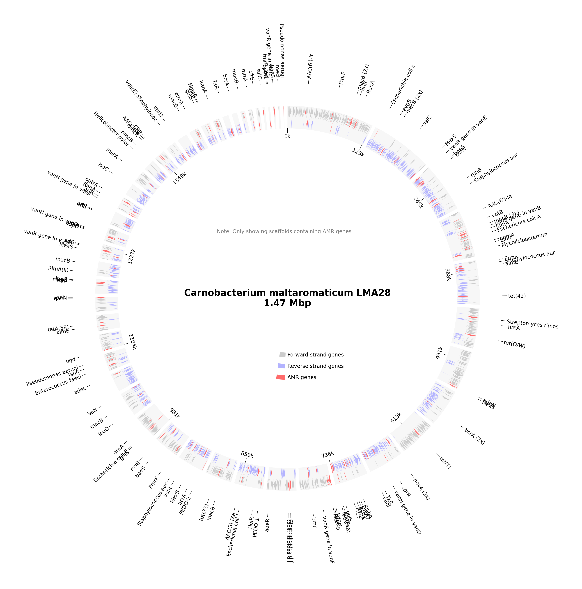

### AAC(3)-IXa
- **Mechanism**: antibiotic inactivation
- **Drug Classes**: aminoglycoside antibiotic
- **AMR Family**: AAC(3)
- **Locations**:
  - gnl|SPADES|OOJMENLF_172_28 : position 31951-32763

### AAC(3)-Ic
- **Mechanism**: antibiotic inactivation
- **Drug Classes**: aminoglycoside antibiotic
- **AMR Family**: AAC(3)
- **Locations**:
  - gnl|SPADES|OOJMENLF_435_9 : position 6227-6664

### AAC(6')-Ia
- **Mechanism**: antibiotic inactivation
- **Drug Classes**: aminoglycoside antibiotic
- **AMR Family**: AAC(6')
- **Locations**:
  - gnl|SPADES|OOJMENLF_97_9 : position 10092-10628

### AAC(6')-Ir
- **Mechanism**: antibiotic inactivation
- **Drug Classes**: aminoglycoside antibiotic
- **AMR Family**: AAC(6')
- **Locations**:
  - gnl|SPADES|OOJMENLF_43_22 : position 26067-26672

### CRP
- **Mechanism**: antibiotic efflux
- **Drug Classes**: macrolide antibiotic; fluoroquinolone antibiotic; penam
- **AMR Family**: resistance-nodulation-cell division (RND) antibiotic efflux pump
- **Locations**:
  - gnl|SPADES|OOJMENLF_435_12 : position 8335-8997

### Clostridioides difficile gyrA conferring resistance to fluoroquinolones
- **Mechanism**: antibiotic target alteration
- **Drug Classes**: fluoroquinolone antibiotic
- **AMR Family**: fluoroquinolone resistant gyrA
- **Locations**:
  - gnl|SPADES|OOJMENLF_168_11 : position 9910-12459

### Clostridioides difficile gyrB conferring resistance to fluoroquinolones
- **Mechanism**: antibiotic target alteration
- **Drug Classes**: fluoroquinolone antibiotic
- **AMR Family**: fluoroquinolone resistant gyrB
- **Locations**:
  - gnl|SPADES|OOJMENLF_168_10 : position 7823-9760

### Enterococcus faecium cls conferring resistance to daptomycin
- **Mechanism**: antibiotic target alteration
- **Drug Classes**: peptide antibiotic
- **AMR Family**: daptomycin resistant cls
- **Locations**:
  - gnl|SPADES|OOJMENLF_297_8 : position 6875-8395

### ErmR
- **Mechanism**: antibiotic target alteration
- **Drug Classes**: macrolide antibiotic; lincosamide antibiotic; streptogramin antibiotic; streptogramin A antibiotic; streptogramin B antibiotic
- **AMR Family**: Erm 23S ribosomal RNA methyltransferase
- **Locations**:
  - gnl|SPADES|OOJMENLF_115_6 : position 4636-5529

### Escherichia coli AcrAB-TolC with AcrR mutation conferring resistance to ciprofloxacin, tetracycline, and ceftazidime
- **Mechanism**: antibiotic target alteration; antibiotic efflux
- **Drug Classes**: fluoroquinolone antibiotic; cephalosporin; glycylcycline; penam; tetracycline antibiotic; rifamycin antibiotic; phenicol antibiotic; disinfecting agents and antiseptics
- **AMR Family**: resistance-nodulation-cell division (RND) antibiotic efflux pump
- **Locations**:
  - gnl|SPADES|OOJMENLF_97_40 : position 41325-41921

### Escherichia coli EF-Tu mutants conferring resistance to Pulvomycin
- **Mechanism**: antibiotic target alteration
- **Drug Classes**: elfamycin antibiotic
- **AMR Family**: elfamycin resistant EF-Tu
- **Locations**:
  - gnl|SPADES|OOJMENLF_210_10 : position 10876-11598

### Escherichia coli EF-Tu mutants conferring resistance to kirromycin
- **Mechanism**: antibiotic target alteration
- **Drug Classes**: elfamycin antibiotic
- **AMR Family**: elfamycin resistant EF-Tu
- **Locations**:
  - gnl|SPADES|OOJMENLF_210_11 : position 11657-12061

### Escherichia coli fabI mutations conferring resistance to isoniazid and triclosan
- **Mechanism**: antibiotic target alteration
- **Drug Classes**: disinfecting agents and antiseptics; isoniazid-like antibiotic
- **AMR Family**: antibiotic resistant fabI
- **Locations**:
  - gnl|SPADES|OOJMENLF_172_21 : position 26433-27191

### Escherichia coli soxS with mutation conferring antibiotic resistance
- **Mechanism**: antibiotic target alteration; antibiotic efflux; reduced permeability to antibiotic
- **Drug Classes**: fluoroquinolone antibiotic; monobactam; carbapenem; cephalosporin; glycylcycline; cephamycin; penam; tetracycline antibiotic; rifamycin antibiotic; phenicol antibiotic; penem; disinfecting agents and antiseptics
- **AMR Family**: ATP-binding cassette (ABC) antibiotic efflux pump; major facilitator superfamily (MFS) antibiotic efflux pump; resistance-nodulation-cell division (RND) antibiotic efflux pump; General Bacterial Porin with reduced permeability to beta-lactams
- **Locations**:
  - gnl|SPADES|OOJMENLF_65_4 : position 5013-5540

### EstT
- **Mechanism**: antibiotic inactivation
- **Drug Classes**: macrolide antibiotic
- **AMR Family**: macrolide esterase
- **Locations**:
  - gnl|SPADES|OOJMENLF_129_46 : position 55975-56355

### FosA7
- **Mechanism**: antibiotic inactivation
- **Drug Classes**: phosphonic acid antibiotic
- **AMR Family**: fosfomycin thiol transferase
- **Locations**:
  - gnl|SPADES|OOJMENLF_154_20 : position 21663-22043

### FosC2
- **Mechanism**: antibiotic inactivation
- **Drug Classes**: phosphonic acid antibiotic
- **AMR Family**: fosC phosphotransferase family
- **Locations**:
  - gnl|SPADES|OOJMENLF_210_12 : position 12116-12496

### FusF
- **Mechanism**: antibiotic target protection
- **Drug Classes**: fusidane antibiotic
- **AMR Family**: Target protecting FusB-type protein conferring resistance to Fusidic acid
- **Locations**:
  - gnl|SPADES|OOJMENLF_154_30 : position 30598-31245

### HelR
- **Mechanism**: antibiotic target protection
- **Drug Classes**: rifamycin antibiotic
- **AMR Family**: helicase-like RNA polymerase protection protein
- **Locations**:
  - gnl|SPADES|OOJMENLF_172_9 : position 8942-11233

### Helicobacter pylori rdxA mutation conferring resistance to metronidazole
- **Mechanism**: antibiotic target alteration
- **Drug Classes**: nitroimidazole antibiotic
- **AMR Family**: Antibiotic resistant Helicobacter pylori nitroreductase
- **Locations**:
  - gnl|SPADES|OOJMENLF_430_8 : position 8165-8794

### MOX-9
- **Mechanism**: antibiotic inactivation
- **Drug Classes**: cephalosporin; cephamycin; penam
- **AMR Family**: MOX beta-lactamase
- **Locations**:
  - gnl|SPADES|OOJMENLF_158_4 : position 4575-5831

### MexL
- **Mechanism**: antibiotic efflux
- **Drug Classes**: macrolide antibiotic; tetracycline antibiotic; disinfecting agents and antiseptics
- **AMR Family**: resistance-nodulation-cell division (RND) antibiotic efflux pump
- **Locations**:
  - gnl|SPADES|OOJMENLF_43_56 : position 67905-68522

### MexS (found in 4 locations)
- **Mechanism**: antibiotic efflux
- **Drug Classes**: fluoroquinolone antibiotic; diaminopyrimidine antibiotic; phenicol antibiotic
- **AMR Family**: resistance-nodulation-cell division (RND) antibiotic efflux pump
- **Locations**:
  - gnl|SPADES|OOJMENLF_129_45 : position 54867-55955
  - gnl|SPADES|OOJMENLF_185_16 : position 16180-17118
  - gnl|SPADES|OOJMENLF_362_9 : position 6088-7032
  - gnl|SPADES|OOJMENLF_65_81 : position 86989-88101

### Mycolicibacterium smegmatis ndh with mutation conferring resistance to isoniazid
- **Mechanism**: antibiotic target alteration
- **Drug Classes**: isoniazid-like antibiotic
- **AMR Family**: antibiotic resistant ndh
- **Locations**:
  - gnl|SPADES|OOJMENLF_97_61 : position 59876-61738

### NmcR (found in 2 locations)
- **Mechanism**: antibiotic inactivation
- **Drug Classes**: carbapenem; cephalosporin; cephamycin; penam
- **AMR Family**: NmcA beta-lactamase
- **Locations**:
  - gnl|SPADES|OOJMENLF_435_7 : position 3134-4027
  - gnl|SPADES|OOJMENLF_503_12 : position 9588-10454

### PEDO-1
- **Mechanism**: antibiotic inactivation
- **Drug Classes**: carbapenem
- **AMR Family**: subclass B3 PEDO beta-lactamase
- **Locations**:
  - gnl|SPADES|OOJMENLF_172_3 : position 3075-3776

### PEDO-2
- **Mechanism**: antibiotic inactivation
- **Drug Classes**: carbapenem
- **AMR Family**: subclass B3 PEDO beta-lactamase
- **Locations**:
  - gnl|SPADES|OOJMENLF_185_2 : position 892-1509

### PmrF (found in 2 locations)
- **Mechanism**: antibiotic target alteration
- **Drug Classes**: peptide antibiotic
- **AMR Family**: pmr phosphoethanolamine transferase
- **Locations**:
  - gnl|SPADES|OOJMENLF_196_3 : position 3191-4441
  - gnl|SPADES|OOJMENLF_43_54 : position 64877-65824

### Pseudomonas aeruginosa catB6
- **Mechanism**: antibiotic inactivation
- **Drug Classes**: phenicol antibiotic
- **AMR Family**: chloramphenicol acetyltransferase (CAT)
- **Locations**:
  - gnl|SPADES|OOJMENLF_4705_2 : position 168-776

### Pseudomonas aeruginosa soxR
- **Mechanism**: antibiotic target alteration; antibiotic efflux
- **Drug Classes**: fluoroquinolone antibiotic; cephalosporin; glycylcycline; penam; tetracycline antibiotic; rifamycin antibiotic; phenicol antibiotic; disinfecting agents and antiseptics
- **AMR Family**: ATP-binding cassette (ABC) antibiotic efflux pump; major facilitator superfamily (MFS) antibiotic efflux pump; resistance-nodulation-cell division (RND) antibiotic efflux pump
- **Locations**:
  - gnl|SPADES|OOJMENLF_297_21 : position 18825-19262

### RanA (found in 8 locations)
- **Mechanism**: antibiotic efflux
- **Drug Classes**: aminoglycoside antibiotic
- **AMR Family**: ATP-binding cassette (ABC) antibiotic efflux pump
- **Locations**:
  - gnl|SPADES|OOJMENLF_154_26 : position 26394-27425
  - gnl|SPADES|OOJMENLF_377_6 : position 7146-8261
  - gnl|SPADES|OOJMENLF_43_82 : position 100578-101384
  - gnl|SPADES|OOJMENLF_604_5 : position 4488-6005
  - gnl|SPADES|OOJMENLF_65_48 : position 52669-53403
  - gnl|SPADES|OOJMENLF_65_62 : position 67324-68418
  - gnl|SPADES|OOJMENLF_91_12 : position 12158-13267
  - gnl|SPADES|OOJMENLF_97_36 : position 35939-36979

### RlmA(II)
- **Mechanism**: antibiotic target alteration
- **Drug Classes**: macrolide antibiotic; lincosamide antibiotic
- **AMR Family**: non-erm 23S ribosomal RNA methyltransferase (G748)
- **Locations**:
  - gnl|SPADES|OOJMENLF_359_3 : position 2195-3052

### Staphylococcus aureus fusA with mutation conferring resistance to fusidic acid
- **Mechanism**: antibiotic target alteration
- **Drug Classes**: fusidane antibiotic
- **AMR Family**: antibiotic resistant fusA
- **Locations**:
  - gnl|SPADES|OOJMENLF_91_46 : position 50161-51738

### Staphylococcus aureus mupA conferring resistance to mupirocin
- **Mechanism**: antibiotic target alteration
- **Drug Classes**: mupirocin-like antibiotic
- **AMR Family**: antibiotic-resistant isoleucyl-tRNA synthetase (ileS)
- **Locations**:
  - gnl|SPADES|OOJMENLF_115_9 : position 6952-8967

### Staphylococcus aureus murA with mutation conferring resistance to fosfomycin
- **Mechanism**: antibiotic target alteration
- **Drug Classes**: phosphonic acid antibiotic
- **AMR Family**: antibiotic-resistant murA transferase
- **Locations**:
  - gnl|SPADES|OOJMENLF_185_34 : position 32894-34162

### Streptomyces rimosus otr(A)
- **Mechanism**: antibiotic target protection
- **Drug Classes**: tetracycline antibiotic
- **AMR Family**: tetracycline-resistant ribosomal protection protein
- **Locations**:
  - gnl|SPADES|OOJMENLF_123_10 : position 12913-15420

### TxR (found in 2 locations)
- **Mechanism**: antibiotic efflux
- **Drug Classes**: tetracycline antibiotic
- **AMR Family**: ATP-binding cassette (ABC) antibiotic efflux pump
- **Locations**:
  - gnl|SPADES|OOJMENLF_146_39 : position 43562-44923
  - gnl|SPADES|OOJMENLF_662_9 : position 4573-7269

### VatI
- **Mechanism**: antibiotic inactivation
- **Drug Classes**: streptogramin antibiotic; streptogramin A antibiotic
- **AMR Family**: streptogramin vat acetyltransferase
- **Locations**:
  - gnl|SPADES|OOJMENLF_211_37 : position 33813-34514

### adeL
- **Mechanism**: antibiotic efflux
- **Drug Classes**: fluoroquinolone antibiotic; tetracycline antibiotic
- **AMR Family**: resistance-nodulation-cell division (RND) antibiotic efflux pump
- **Locations**:
  - gnl|SPADES|OOJMENLF_286_19 : position 23557-24444

### adeN
- **Mechanism**: antibiotic efflux
- **Drug Classes**: macrolide antibiotic; fluoroquinolone antibiotic; lincosamide antibiotic; carbapenem; cephalosporin; tetracycline antibiotic; rifamycin antibiotic; diaminopyrimidine antibiotic; phenicol antibiotic; penem
- **AMR Family**: resistance-nodulation-cell division (RND) antibiotic efflux pump
- **Locations**:
  - gnl|SPADES|OOJMENLF_129_42 : position 52469-53044

### adeR (found in 2 locations)
- **Mechanism**: antibiotic efflux
- **Drug Classes**: glycylcycline; tetracycline antibiotic
- **AMR Family**: resistance-nodulation-cell division (RND) antibiotic efflux pump
- **Locations**:
  - gnl|SPADES|OOJMENLF_168_30 : position 37154-37852
  - gnl|SPADES|OOJMENLF_365_10 : position 7826-8554

### almE (found in 2 locations)
- **Mechanism**: antibiotic target alteration
- **Drug Classes**: peptide antibiotic
- **AMR Family**: polymyxin resistance operon; alm glycyltransferase
- **Locations**:
  - gnl|SPADES|OOJMENLF_115_11 : position 10618-12060
  - gnl|SPADES|OOJMENLF_319_6 : position 6781-8304

### apmA
- **Mechanism**: antibiotic inactivation
- **Drug Classes**: aminoglycoside antibiotic
- **AMR Family**: AAC(2')
- **Locations**:
  - gnl|SPADES|OOJMENLF_97_50 : position 51855-52364

### arlR (found in 3 locations)
- **Mechanism**: antibiotic efflux
- **Drug Classes**: fluoroquinolone antibiotic; disinfecting agents and antiseptics
- **AMR Family**: major facilitator superfamily (MFS) antibiotic efflux pump
- **Locations**:
  - gnl|SPADES|OOJMENLF_368_8 : position 9155-9838
  - gnl|SPADES|OOJMENLF_377_3 : position 2990-3790
  - gnl|SPADES|OOJMENLF_43_75 : position 93131-93850

### arlS (found in 2 locations)
- **Mechanism**: antibiotic efflux
- **Drug Classes**: fluoroquinolone antibiotic; disinfecting agents and antiseptics
- **AMR Family**: major facilitator superfamily (MFS) antibiotic efflux pump
- **Locations**:
  - gnl|SPADES|OOJMENLF_362_14 : position 11417-13246
  - gnl|SPADES|OOJMENLF_368_7 : position 7863-9158

### arnA
- **Mechanism**: antibiotic target alteration
- **Drug Classes**: peptide antibiotic
- **AMR Family**: pmr phosphoethanolamine transferase
- **Locations**:
  - gnl|SPADES|OOJMENLF_210_19 : position 19135-19716

### baeR
- **Mechanism**: antibiotic efflux
- **Drug Classes**: aminoglycoside antibiotic; aminocoumarin antibiotic
- **AMR Family**: resistance-nodulation-cell division (RND) antibiotic efflux pump
- **Locations**:
  - gnl|SPADES|OOJMENLF_91_9 : position 10010-10693

### baeS (found in 4 locations)
- **Mechanism**: antibiotic efflux
- **Drug Classes**: aminoglycoside antibiotic; aminocoumarin antibiotic
- **AMR Family**: resistance-nodulation-cell division (RND) antibiotic efflux pump
- **Locations**:
  - gnl|SPADES|OOJMENLF_196_16 : position 23363-24724
  - gnl|SPADES|OOJMENLF_2084_3 : position 907-2307
  - gnl|SPADES|OOJMENLF_43_76 : position 93847-95616
  - gnl|SPADES|OOJMENLF_91_8 : position 8616-10013

### bcrA (found in 6 locations)
- **Mechanism**: antibiotic efflux
- **Drug Classes**: peptide antibiotic
- **AMR Family**: ATP-binding cassette (ABC) antibiotic efflux pump
- **Locations**:
  - gnl|SPADES|OOJMENLF_132_29 : position 33875-34564
  - gnl|SPADES|OOJMENLF_132_38 : position 44313-45239
  - gnl|SPADES|OOJMENLF_154_23 : position 23720-24706
  - gnl|SPADES|OOJMENLF_185_8 : position 7068-8651
  - gnl|SPADES|OOJMENLF_735_8 : position 4515-5240
  - gnl|SPADES|OOJMENLF_91_11 : position 11227-12168

### bmr
- **Mechanism**: antibiotic efflux
- **Drug Classes**: fluoroquinolone antibiotic; nucleoside antibiotic; phenicol antibiotic; disinfecting agents and antiseptics
- **AMR Family**: major facilitator superfamily (MFS) antibiotic efflux pump
- **Locations**:
  - gnl|SPADES|OOJMENLF_158_22 : position 30653-31876

### cfrE
- **Mechanism**: antibiotic target alteration
- **Drug Classes**: lincosamide antibiotic; streptogramin antibiotic; oxazolidinone antibiotic; phenicol antibiotic; pleuromutilin antibiotic
- **AMR Family**: Cfr 23S ribosomal RNA methyltransferase
- **Locations**:
  - gnl|SPADES|OOJMENLF_1042_2 : position 1233-2300

### cprR
- **Mechanism**: antibiotic target alteration; antibiotic efflux
- **Drug Classes**: peptide antibiotic
- **AMR Family**: pmr phosphoethanolamine transferase
- **Locations**:
  - gnl|SPADES|OOJMENLF_146_20 : position 21662-22381

### efmA
- **Mechanism**: antibiotic efflux
- **Drug Classes**: macrolide antibiotic; fluoroquinolone antibiotic
- **AMR Family**: major facilitator superfamily (MFS) antibiotic efflux pump
- **Locations**:
  - gnl|SPADES|OOJMENLF_479_12 : position 9915-11183

### efrA
- **Mechanism**: antibiotic efflux
- **Drug Classes**: macrolide antibiotic; fluoroquinolone antibiotic; rifamycin antibiotic
- **AMR Family**: ATP-binding cassette (ABC) antibiotic efflux pump
- **Locations**:
  - gnl|SPADES|OOJMENLF_354_13 : position 14344-15450

### evgS
- **Mechanism**: antibiotic efflux
- **Drug Classes**: macrolide antibiotic; fluoroquinolone antibiotic; penam; tetracycline antibiotic
- **AMR Family**: major facilitator superfamily (MFS) antibiotic efflux pump; resistance-nodulation-cell division (RND) antibiotic efflux pump
- **Locations**:
  - gnl|SPADES|OOJMENLF_65_21 : position 20470-21042

### golS (found in 3 locations)
- **Mechanism**: antibiotic efflux
- **Drug Classes**: monobactam; carbapenem; cephalosporin; cephamycin; penam; phenicol antibiotic; penem
- **AMR Family**: resistance-nodulation-cell division (RND) antibiotic efflux pump
- **Locations**:
  - gnl|SPADES|OOJMENLF_154_43 : position 41158-41970
  - gnl|SPADES|OOJMENLF_210_8 : position 9196-10026
  - gnl|SPADES|OOJMENLF_503_5 : position 4822-5202

### kdpD (found in 2 locations)
- **Mechanism**: antibiotic efflux
- **Drug Classes**: aminoglycoside antibiotic
- **AMR Family**: kdpDE
- **Locations**:
  - gnl|SPADES|OOJMENLF_158_1 : position 315-3008
  - gnl|SPADES|OOJMENLF_365_9 : position 6183-7829

### kdpE
- **Mechanism**: antibiotic efflux
- **Drug Classes**: aminoglycoside antibiotic
- **AMR Family**: kdpDE
- **Locations**:
  - gnl|SPADES|OOJMENLF_158_2 : position 3040-3744

### leuO
- **Mechanism**: antibiotic efflux
- **Drug Classes**: nucleoside antibiotic; disinfecting agents and antiseptics
- **AMR Family**: major facilitator superfamily (MFS) antibiotic efflux pump
- **Locations**:
  - gnl|SPADES|OOJMENLF_211_12 : position 7014-7841

### lmrB
- **Mechanism**: antibiotic efflux
- **Drug Classes**: lincosamide antibiotic; nucleoside antibiotic
- **AMR Family**: ATP-binding cassette (ABC) antibiotic efflux pump
- **Locations**:
  - gnl|SPADES|OOJMENLF_354_15 : position 16110-17510

### lmrD
- **Mechanism**: antibiotic efflux
- **Drug Classes**: lincosamide antibiotic
- **AMR Family**: ATP-binding cassette (ABC) antibiotic efflux pump
- **Locations**:
  - gnl|SPADES|OOJMENLF_464_1 : position 145-927

### lsaC
- **Mechanism**: antibiotic target protection
- **Drug Classes**: lincosamide antibiotic; streptogramin antibiotic; pleuromutilin antibiotic
- **AMR Family**: lsa-type ABC-F protein
- **Locations**:
  - gnl|SPADES|OOJMENLF_394_13 : position 12997-13680

### macB (found in 13 locations)
- **Mechanism**: antibiotic efflux
- **Drug Classes**: macrolide antibiotic
- **AMR Family**: ATP-binding cassette (ABC) antibiotic efflux pump
- **Locations**:
  - gnl|SPADES|OOJMENLF_183_13 : position 12085-13161
  - gnl|SPADES|OOJMENLF_211_25 : position 19235-20038
  - gnl|SPADES|OOJMENLF_359_12 : position 13849-14592
  - gnl|SPADES|OOJMENLF_430_15 : position 14206-15003
  - gnl|SPADES|OOJMENLF_43_71 : position 88847-89533
  - gnl|SPADES|OOJMENLF_43_87 : position 104719-107568
  - gnl|SPADES|OOJMENLF_479_3 : position 1925-3406
  - gnl|SPADES|OOJMENLF_65_27 : position 25423-27063
  - gnl|SPADES|OOJMENLF_65_68 : position 73993-75702
  - gnl|SPADES|OOJMENLF_821_3 : position 3957-4361
  - gnl|SPADES|OOJMENLF_97_30 : position 29737-30435
  - gnl|SPADES|OOJMENLF_97_31 : position 30419-31681
  - gnl|SPADES|OOJMENLF_97_42 : position 43142-43810

### marA
- **Mechanism**: antibiotic efflux; reduced permeability to antibiotic
- **Drug Classes**: fluoroquinolone antibiotic; monobactam; carbapenem; cephalosporin; glycylcycline; cephamycin; penam; tetracycline antibiotic; rifamycin antibiotic; phenicol antibiotic; penem; disinfecting agents and antiseptics
- **AMR Family**: resistance-nodulation-cell division (RND) antibiotic efflux pump; General Bacterial Porin with reduced permeability to beta-lactams
- **Locations**:
  - gnl|SPADES|OOJMENLF_396_11 : position 10212-10985

### mecI
- **Mechanism**: antibiotic target replacement
- **Drug Classes**: penam
- **AMR Family**: methicillin resistant PBP2
- **Locations**:
  - gnl|SPADES|OOJMENLF_2218_2 : position 567-1016

### mepR
- **Mechanism**: antibiotic efflux
- **Drug Classes**: glycylcycline; tetracycline antibiotic
- **AMR Family**: multidrug and toxic compound extrusion (MATE) transporter
- **Locations**:
  - gnl|SPADES|OOJMENLF_354_14 : position 15614-16129

### mreA
- **Mechanism**: antibiotic efflux
- **Drug Classes**: macrolide antibiotic
- **AMR Family**: major facilitator superfamily (MFS) antibiotic efflux pump
- **Locations**:
  - gnl|SPADES|OOJMENLF_123_17 : position 20180-21124

### msbA
- **Mechanism**: antibiotic efflux
- **Drug Classes**: nitroimidazole antibiotic
- **AMR Family**: ATP-binding cassette (ABC) antibiotic efflux pump
- **Locations**:
  - gnl|SPADES|OOJMENLF_154_15 : position 17697-18470

### mtrA
- **Mechanism**: antibiotic efflux
- **Drug Classes**: macrolide antibiotic; penam
- **AMR Family**: resistance-nodulation-cell division (RND) antibiotic efflux pump
- **Locations**:
  - gnl|SPADES|OOJMENLF_957_5 : position 3381-4208

### novA (found in 2 locations)
- **Mechanism**: antibiotic efflux
- **Drug Classes**: aminocoumarin antibiotic
- **AMR Family**: ATP-binding cassette (ABC) antibiotic efflux pump
- **Locations**:
  - gnl|SPADES|OOJMENLF_146_6 : position 4216-6018
  - gnl|SPADES|OOJMENLF_146_7 : position 6011-7753

### optrA (found in 4 locations)
- **Mechanism**: antibiotic target protection
- **Drug Classes**: oxazolidinone antibiotic; phenicol antibiotic
- **AMR Family**: Miscellaneous ABC-F subfamily ATP-binding cassette ribosomal protection proteins
- **Locations**:
  - gnl|SPADES|OOJMENLF_154_46 : position 44145-45683
  - gnl|SPADES|OOJMENLF_1987_1 : position 244-1368
  - gnl|SPADES|OOJMENLF_377_11 : position 13515-15143
  - gnl|SPADES|OOJMENLF_43_26 : position 29303-31267

### patB
- **Mechanism**: antibiotic efflux
- **Drug Classes**: fluoroquinolone antibiotic
- **AMR Family**: ATP-binding cassette (ABC) antibiotic efflux pump
- **Locations**:
  - gnl|SPADES|OOJMENLF_43_83 : position 101396-102160

### qacH
- **Mechanism**: antibiotic efflux
- **Drug Classes**: disinfecting agents and antiseptics
- **AMR Family**: small multidrug resistance (SMR) antibiotic efflux pump
- **Locations**:
  - gnl|SPADES|OOJMENLF_351_24 : position 18918-19244

### rosB
- **Mechanism**: antibiotic efflux
- **Drug Classes**: peptide antibiotic
- **AMR Family**: major facilitator superfamily (MFS) antibiotic efflux pump
- **Locations**:
  - gnl|SPADES|OOJMENLF_196_25 : position 32825-33973

### rphB
- **Mechanism**: antibiotic inactivation
- **Drug Classes**: rifamycin antibiotic
- **AMR Family**: rifampin phosphotransferase
- **Locations**:
  - gnl|SPADES|OOJMENLF_91_39 : position 41763-43484

### salC (found in 2 locations)
- **Mechanism**: antibiotic target protection
- **Drug Classes**: lincosamide antibiotic; streptogramin antibiotic; streptogramin A antibiotic; pleuromutilin antibiotic
- **AMR Family**: sal-type ABC-F protein
- **Locations**:
  - gnl|SPADES|OOJMENLF_1623_1 : position 74-1777
  - gnl|SPADES|OOJMENLF_65_46 : position 50764-51471

### tet(35)
- **Mechanism**: antibiotic efflux
- **Drug Classes**: tetracycline antibiotic
- **AMR Family**: ATP-binding cassette (ABC) antibiotic efflux pump
- **Locations**:
  - gnl|SPADES|OOJMENLF_183_19 : position 19877-21274

### tet(42)
- **Mechanism**: antibiotic efflux
- **Drug Classes**: tetracycline antibiotic
- **AMR Family**: major facilitator superfamily (MFS) antibiotic efflux pump
- **Locations**:
  - gnl|SPADES|OOJMENLF_115_50 : position 50510-51745

### tet(O/W)
- **Mechanism**: antibiotic target protection
- **Drug Classes**: tetracycline antibiotic
- **AMR Family**: tetracycline-resistant ribosomal protection protein
- **Locations**:
  - gnl|SPADES|OOJMENLF_123_35 : position 39067-40902

### tet(T)
- **Mechanism**: antibiotic target protection
- **Drug Classes**: tetracycline antibiotic
- **AMR Family**: tetracycline-resistant ribosomal protection protein
- **Locations**:
  - gnl|SPADES|OOJMENLF_137_14 : position 20244-22085

### tetA(46)
- **Mechanism**: antibiotic efflux
- **Drug Classes**: tetracycline antibiotic
- **AMR Family**: ATP-binding cassette (ABC) antibiotic efflux pump
- **Locations**:
  - gnl|SPADES|OOJMENLF_154_48 : position 46143-47834

### tetA(58)
- **Mechanism**: antibiotic efflux
- **Drug Classes**: tetracycline antibiotic
- **AMR Family**: major facilitator superfamily (MFS) antibiotic efflux pump
- **Locations**:
  - gnl|SPADES|OOJMENLF_319_10 : position 11294-12226

### tmrB (found in 2 locations)
- **Mechanism**: reduced permeability to antibiotic
- **Drug Classes**: nucleoside antibiotic
- **AMR Family**: tunicamycin resistance protein
- **Locations**:
  - gnl|SPADES|OOJMENLF_1987_2 : position 1946-2287
  - gnl|SPADES|OOJMENLF_1987_3 : position 2284-2457

### tsnR (found in 2 locations)
- **Mechanism**: antibiotic target alteration
- **Drug Classes**: peptide antibiotic
- **AMR Family**: non-erm 23S ribosomal RNA methyltransferase (A1067)
- **Locations**:
  - gnl|SPADES|OOJMENLF_297_13 : position 13668-14432
  - gnl|SPADES|OOJMENLF_97_53 : position 54338-55213

### ugd
- **Mechanism**: antibiotic target alteration
- **Drug Classes**: peptide antibiotic
- **AMR Family**: pmr phosphoethanolamine transferase
- **Locations**:
  - gnl|SPADES|OOJMENLF_313_1 : position 1-1200

### vanH gene in vanA cluster
- **Mechanism**: antibiotic target alteration
- **Drug Classes**: glycopeptide antibiotic
- **AMR Family**: vanH; glycopeptide resistance gene cluster
- **Locations**:
  - gnl|SPADES|OOJMENLF_377_1 : position 111-1073

### vanH gene in vanD cluster
- **Mechanism**: antibiotic target alteration
- **Drug Classes**: glycopeptide antibiotic
- **AMR Family**: vanH; glycopeptide resistance gene cluster
- **Locations**:
  - gnl|SPADES|OOJMENLF_365_12 : position 9030-10043

### vanH gene in vanO cluster
- **Mechanism**: antibiotic target alteration
- **Drug Classes**: glycopeptide antibiotic
- **AMR Family**: vanH; glycopeptide resistance gene cluster
- **Locations**:
  - gnl|SPADES|OOJMENLF_146_29 : position 31846-33039

### vanI
- **Mechanism**: antibiotic target alteration
- **Drug Classes**: glycopeptide antibiotic
- **AMR Family**: glycopeptide resistance gene cluster; Van ligase
- **Locations**:
  - gnl|SPADES|OOJMENLF_146_42 : position 47967-49094

### vanL
- **Mechanism**: antibiotic target alteration
- **Drug Classes**: glycopeptide antibiotic
- **AMR Family**: glycopeptide resistance gene cluster; Van ligase
- **Locations**:
  - gnl|SPADES|OOJMENLF_185_28 : position 26228-27319

### vanN
- **Mechanism**: antibiotic target alteration
- **Drug Classes**: glycopeptide antibiotic
- **AMR Family**: glycopeptide resistance gene cluster; Van ligase
- **Locations**:
  - gnl|SPADES|OOJMENLF_351_26 : position 19697-20776

### vanR gene in vanB cluster
- **Mechanism**: antibiotic target alteration
- **Drug Classes**: glycopeptide antibiotic
- **AMR Family**: glycopeptide resistance gene cluster; vanR
- **Locations**:
  - gnl|SPADES|OOJMENLF_97_32 : position 31760-32431

### vanR gene in vanE cluster (found in 2 locations)
- **Mechanism**: antibiotic target alteration
- **Drug Classes**: glycopeptide antibiotic
- **AMR Family**: glycopeptide resistance gene cluster; vanR
- **Locations**:
  - gnl|SPADES|OOJMENLF_2084_2 : position 227-910
  - gnl|SPADES|OOJMENLF_91_2 : position 1038-2525

### vanR gene in vanF cluster
- **Mechanism**: antibiotic target alteration
- **Drug Classes**: glycopeptide antibiotic
- **AMR Family**: glycopeptide resistance gene cluster; vanR
- **Locations**:
  - gnl|SPADES|OOJMENLF_158_13 : position 17131-18561

### vanR gene in vanI cluster
- **Mechanism**: antibiotic target alteration
- **Drug Classes**: glycopeptide antibiotic
- **AMR Family**: glycopeptide resistance gene cluster; vanR
- **Locations**:
  - gnl|SPADES|OOJMENLF_196_17 : position 24747-25394

### vanR gene in vanM cluster
- **Mechanism**: antibiotic target alteration
- **Drug Classes**: glycopeptide antibiotic
- **AMR Family**: glycopeptide resistance gene cluster; vanR
- **Locations**:
  - gnl|SPADES|OOJMENLF_362_13 : position 10703-11410

### vanS gene in vanB cluster
- **Mechanism**: antibiotic target alteration
- **Drug Classes**: glycopeptide antibiotic
- **AMR Family**: vanS; glycopeptide resistance gene cluster
- **Locations**:
  - gnl|SPADES|OOJMENLF_97_33 : position 32428-33873

### vatB (found in 2 locations)
- **Mechanism**: antibiotic inactivation
- **Drug Classes**: streptogramin antibiotic; streptogramin A antibiotic
- **AMR Family**: streptogramin vat acetyltransferase
- **Locations**:
  - gnl|SPADES|OOJMENLF_503_11 : position 8892-9461
  - gnl|SPADES|OOJMENLF_97_23 : position 22382-22942

### vga(E) Staphylococcus cohnii
- **Mechanism**: antibiotic target protection
- **Drug Classes**: lincosamide antibiotic; streptogramin antibiotic; streptogramin A antibiotic; pleuromutilin antibiotic
- **AMR Family**: vga-type ABC-F protein
- **Locations**:
  - gnl|SPADES|OOJMENLF_454_10 : position 11595-13166

### ykkD
- **Mechanism**: antibiotic efflux
- **Drug Classes**: aminoglycoside antibiotic; tetracycline antibiotic; phenicol antibiotic
- **AMR Family**: small multidrug resistance (SMR) antibiotic efflux pump
- **Locations**:
  - gnl|SPADES|OOJMENLF_351_25 : position 19244-19561

## Citrobacter
**Strain Statistics:**
- Total genome length: 1.6 kbp
- Total scaffolds: 47
- Scaffolds with AMR genes: 3
- Total genes annotated: 2
- Total AMR genes: 3
- Unique AMR genes: 3
- Distinct AMR mechanisms: 1
- Distinct AMR families: 2
- Distinct drug classes: 4

**Circos Plot:**

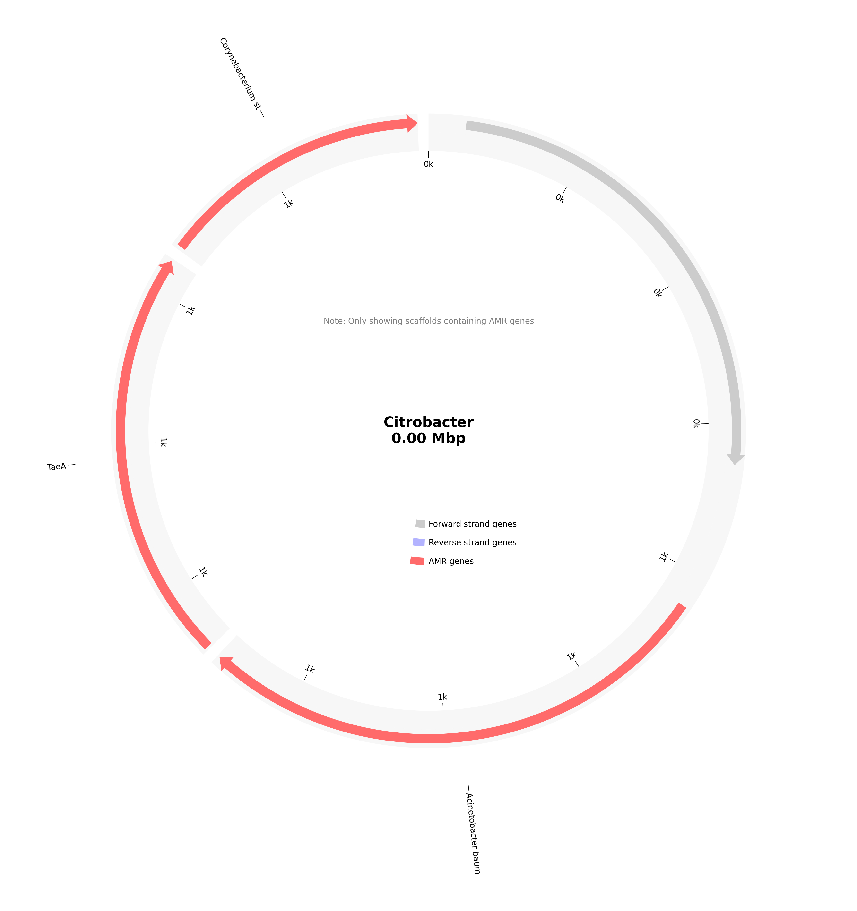

### Acinetobacter baumannii AbaF
- **Mechanism**: antibiotic efflux
- **Drug Classes**: phosphonic acid antibiotic
- **AMR Family**: major facilitator superfamily (MFS) antibiotic efflux pump
- **Locations**:
  - gnl|SPADES|OOJMENLF_5257_2 : position 550-984

### Corynebacterium striatum tetA
- **Mechanism**: antibiotic efflux
- **Drug Classes**: penam; tetracycline antibiotic
- **AMR Family**: major facilitator superfamily (MFS) antibiotic efflux pump
- **Locations**:
  - gnl|SPADES|OOJMENLF_155579_1 : position 3-230

### TaeA
- **Mechanism**: antibiotic efflux
- **Drug Classes**: pleuromutilin antibiotic
- **AMR Family**: ATP-binding cassette (ABC) antibiotic efflux pump
- **Locations**:
  - gnl|SPADES|OOJMENLF_25809_1 : position 2-346

## Citrobacter braakii
**Strain Statistics:**
- Total genome length: 1.2 kbp
- Total scaffolds: 8
- Scaffolds with AMR genes: 1
- Total genes annotated: 2
- Total AMR genes: 1
- Unique AMR genes: 1
- Distinct AMR mechanisms: 1
- Distinct AMR families: 1
- Distinct drug classes: 6

**Circos Plot:**

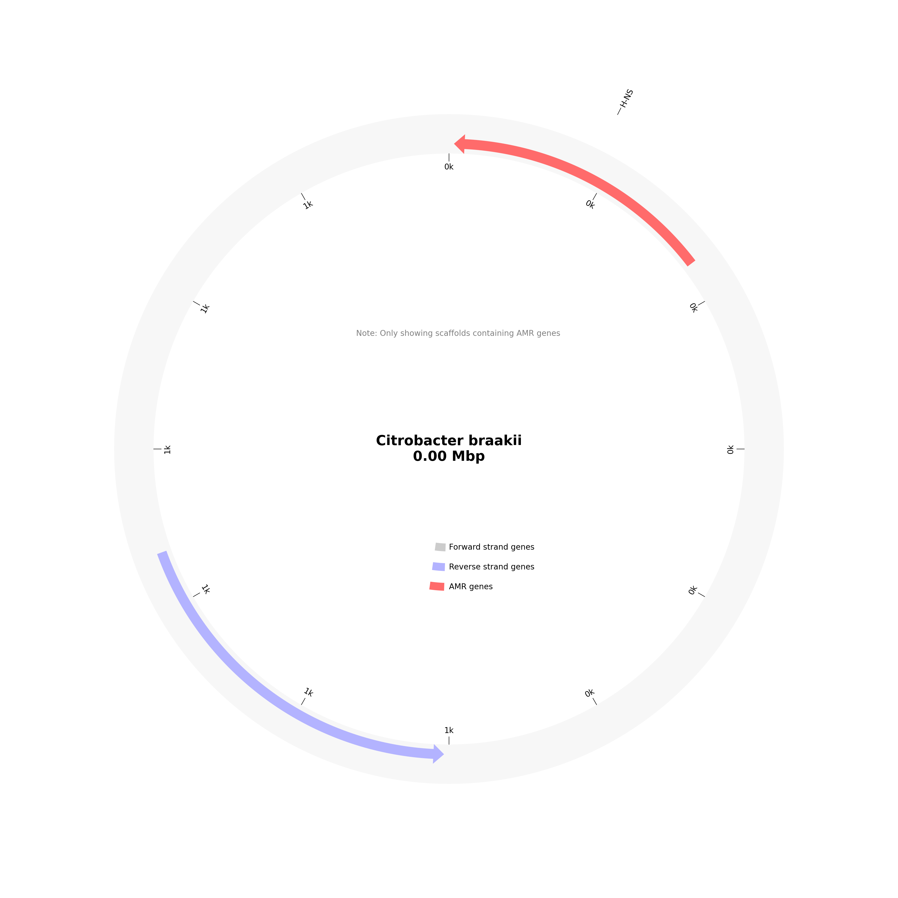

### H-NS
- **Mechanism**: antibiotic efflux
- **Drug Classes**: macrolide antibiotic; fluoroquinolone antibiotic; cephalosporin; cephamycin; penam; tetracycline antibiotic
- **AMR Family**: major facilitator superfamily (MFS) antibiotic efflux pump; resistance-nodulation-cell division (RND) antibiotic efflux pump
- **Locations**:
  - gnl|SPADES|OOJMENLF_4443_1 : position 3-170

## Citrobacter freundii
**Strain Statistics:**
- Total genome length: 0.7 kbp
- Total scaffolds: 55
- Scaffolds with AMR genes: 2
- Total genes annotated: 2
- Total AMR genes: 2
- Unique AMR genes: 2
- Distinct AMR mechanisms: 2
- Distinct AMR families: 2
- Distinct drug classes: 2

**Circos Plot:**

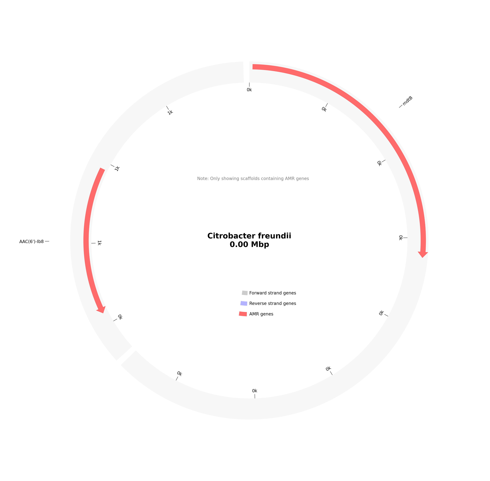

### AAC(6')-Ib8
- **Mechanism**: antibiotic inactivation
- **Drug Classes**: aminoglycoside antibiotic
- **AMR Family**: AAC(6')
- **Locations**:
  - gnl|SPADES|OOJMENLF_111183_1 : position 30-131

### mdtB
- **Mechanism**: antibiotic efflux
- **Drug Classes**: aminocoumarin antibiotic
- **AMR Family**: resistance-nodulation-cell division (RND) antibiotic efflux pump
- **Locations**:
  - gnl|SPADES|OOJMENLF_14105_1 : position 2-184

## Citrobacter freundii complex
**Strain Statistics:**
- Total genome length: 2.7 kbp
- Total scaffolds: 11
- Scaffolds with AMR genes: 2
- Total genes annotated: 2
- Total AMR genes: 2
- Unique AMR genes: 2
- Distinct AMR mechanisms: 1
- Distinct AMR families: 2
- Distinct drug classes: 5

**Circos Plot:**

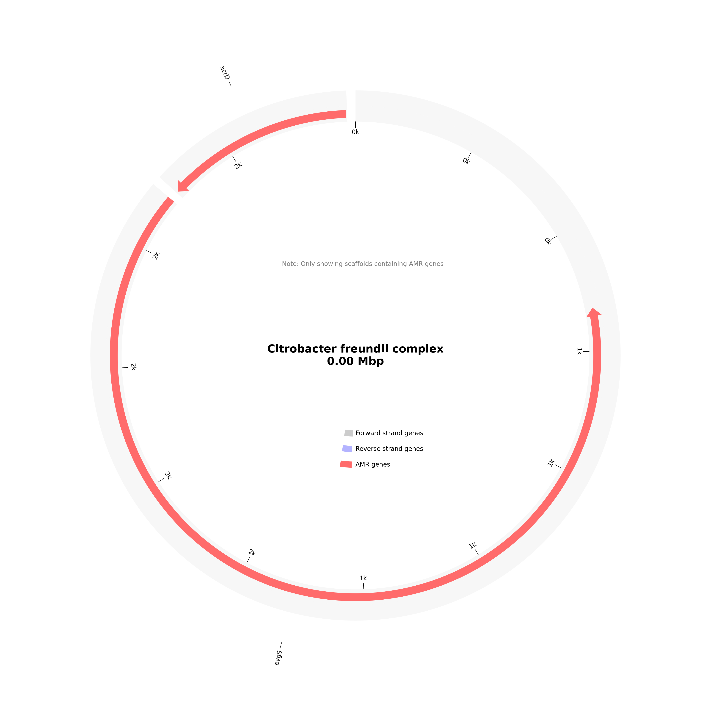

### acrD
- **Mechanism**: antibiotic efflux
- **Drug Classes**: aminoglycoside antibiotic
- **AMR Family**: resistance-nodulation-cell division (RND) antibiotic efflux pump
- **Locations**:
  - gnl|SPADES|OOJMENLF_25454_1 : position 3-347

### evgS
- **Mechanism**: antibiotic efflux
- **Drug Classes**: macrolide antibiotic; fluoroquinolone antibiotic; penam; tetracycline antibiotic
- **AMR Family**: major facilitator superfamily (MFS) antibiotic efflux pump; resistance-nodulation-cell division (RND) antibiotic efflux pump
- **Locations**:
  - gnl|SPADES|OOJMENLF_2181_2 : position 600-2369

## Citrobacter freundii complex sp. CFNIH3
**Strain Statistics:**
- Total genome length: 2.5 kbp
- Total scaffolds: 4
- Scaffolds with AMR genes: 1
- Total genes annotated: 10
- Total AMR genes: 2
- Unique AMR genes: 1
- Distinct AMR mechanisms: 1
- Distinct AMR families: 1
- Distinct drug classes: 6

**Circos Plot:**

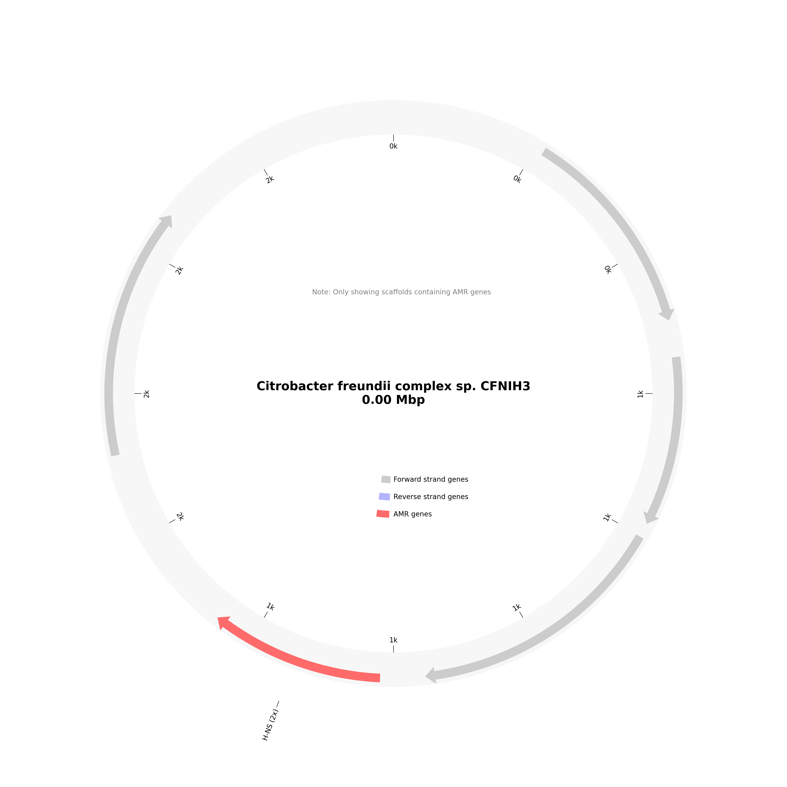

### H-NS (found in 2 locations)
- **Mechanism**: antibiotic efflux
- **Drug Classes**: macrolide antibiotic; fluoroquinolone antibiotic; cephalosporin; cephamycin; penam; tetracycline antibiotic
- **AMR Family**: major facilitator superfamily (MFS) antibiotic efflux pump; resistance-nodulation-cell division (RND) antibiotic efflux pump
- **Locations**:
  - gnl|SPADES|OOJMENLF_2096_5 : position 1247-1489
  - gnl|SPADES|OOJMENLF_2096_7 : position 2168-2455

## Citrobacter koseri
**Strain Statistics:**
- Total genome length: 0.3 kbp
- Total scaffolds: 4
- Scaffolds with AMR genes: 1
- Total genes annotated: 0
- Total AMR genes: 1
- Unique AMR genes: 1
- Distinct AMR mechanisms: 1
- Distinct AMR families: 1
- Distinct drug classes: 1

**Circos Plot:**

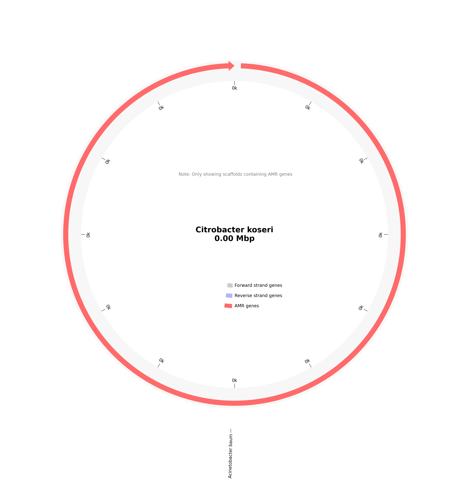

### Acinetobacter baumannii AbaQ
- **Mechanism**: antibiotic efflux
- **Drug Classes**: fluoroquinolone antibiotic
- **AMR Family**: major facilitator superfamily (MFS) antibiotic efflux pump
- **Locations**:
  - gnl|SPADES|OOJMENLF_30001_1 : position 2-331

## Citrobacter sedlakii
**Strain Statistics:**
- Total genome length: 0.5 kbp
- Total scaffolds: 1
- Scaffolds with AMR genes: 1
- Total genes annotated: 2
- Total AMR genes: 1
- Unique AMR genes: 1
- Distinct AMR mechanisms: 1
- Distinct AMR families: 1
- Distinct drug classes: 1

**Circos Plot:**

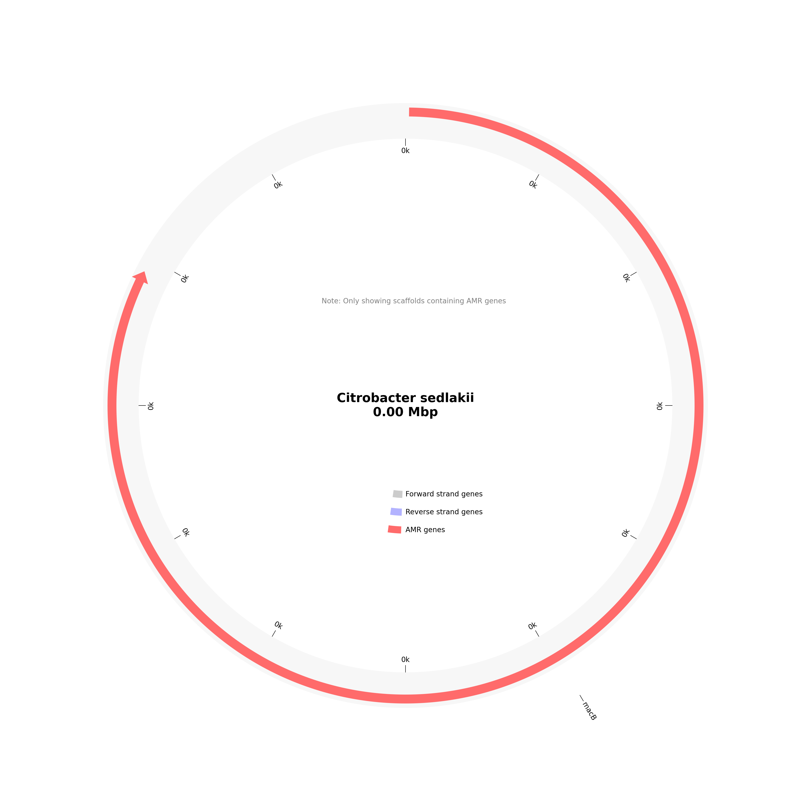

### macB
- **Mechanism**: antibiotic efflux
- **Drug Classes**: macrolide antibiotic
- **AMR Family**: ATP-binding cassette (ABC) antibiotic efflux pump
- **Locations**:
  - gnl|SPADES|OOJMENLF_10361_1 : position 1-426

## Citrobacter sp. R56
**Strain Statistics:**
- Total genome length: 1.0 kbp
- Total scaffolds: 3
- Scaffolds with AMR genes: 1
- Total genes annotated: 0
- Total AMR genes: 1
- Unique AMR genes: 1
- Distinct AMR mechanisms: 1
- Distinct AMR families: 1
- Distinct drug classes: 1

**Circos Plot:**

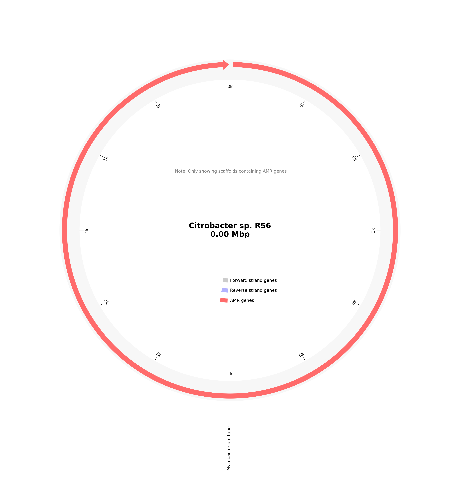

### Mycobacterium tuberculosis katG mutations conferring resistance to isoniazid
- **Mechanism**: antibiotic target alteration
- **Drug Classes**: isoniazid-like antibiotic
- **AMR Family**: isoniazid resistant katG
- **Locations**:
  - gnl|SPADES|OOJMENLF_5107_1 : position 3-1016

## Citrobacter youngae
**Strain Statistics:**
- Total genome length: 0.5 kbp
- Total scaffolds: 4
- Scaffolds with AMR genes: 1
- Total genes annotated: 0
- Total AMR genes: 1
- Unique AMR genes: 1
- Distinct AMR mechanisms: 1
- Distinct AMR families: 1
- Distinct drug classes: 6

**Circos Plot:**

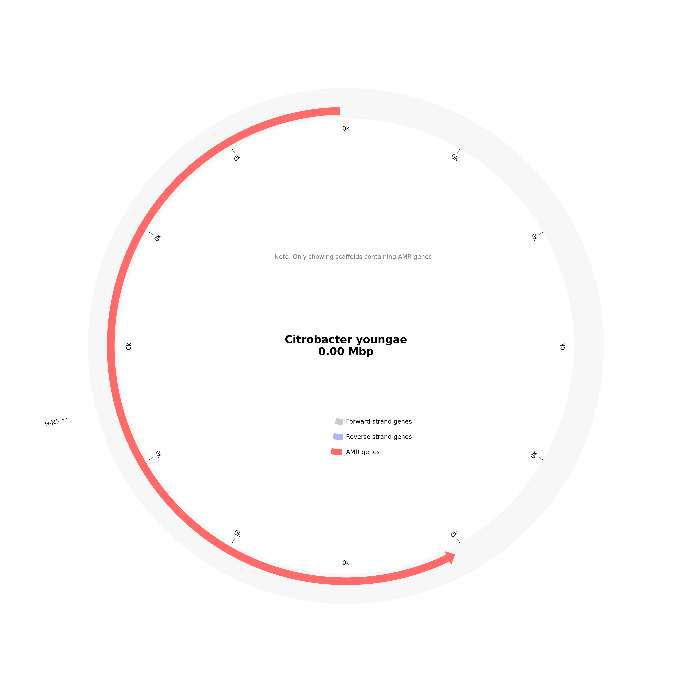

### H-NS
- **Mechanism**: antibiotic efflux
- **Drug Classes**: macrolide antibiotic; fluoroquinolone antibiotic; cephalosporin; cephamycin; penam; tetracycline antibiotic
- **AMR Family**: major facilitator superfamily (MFS) antibiotic efflux pump; resistance-nodulation-cell division (RND) antibiotic efflux pump
- **Locations**:
  - gnl|SPADES|OOJMENLF_10841_1 : position 212-499

## Enterobacter hormaechei
**Strain Statistics:**
- Total genome length: 0.5 kbp
- Total scaffolds: 12
- Scaffolds with AMR genes: 1
- Total genes annotated: 0
- Total AMR genes: 1
- Unique AMR genes: 1
- Distinct AMR mechanisms: 1
- Distinct AMR families: 1
- Distinct drug classes: 6

**Circos Plot:**

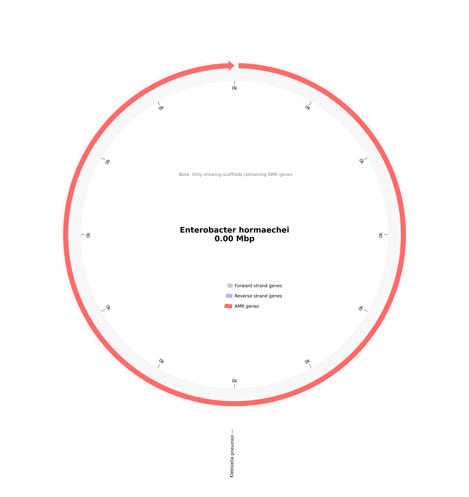

### Klebsiella pneumoniae OmpK37
- **Mechanism**: reduced permeability to antibiotic
- **Drug Classes**: monobactam; carbapenem; cephalosporin; cephamycin; penam; penem
- **AMR Family**: General Bacterial Porin with reduced permeability to beta-lactams
- **Locations**:
  - gnl|SPADES|OOJMENLF_9871_1 : position 2-535

## Escherichia coli
**Strain Statistics:**
- Total genome length: 2593.8 kbp
- Total scaffolds: 135
- Scaffolds with AMR genes: 60
- Total genes annotated: 4860
- Total AMR genes: 261
- Unique AMR genes: 153
- Distinct AMR mechanisms: 10
- Distinct AMR families: 64
- Distinct drug classes: 36

**Circos Plot:**

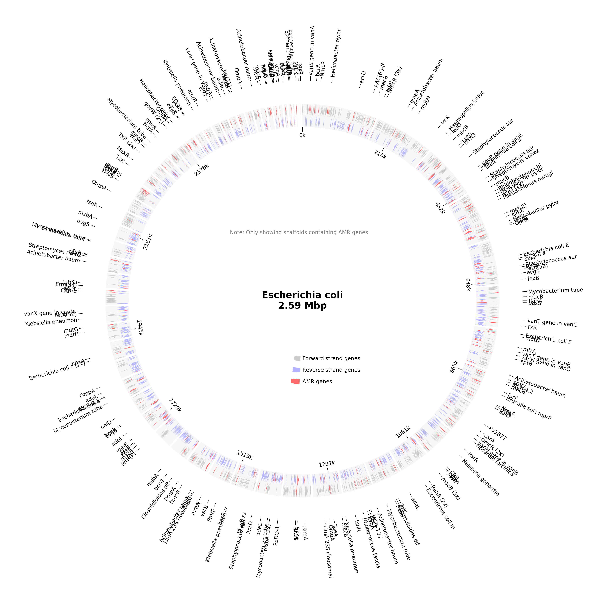

### AAC(6')-If
- **Mechanism**: antibiotic inactivation
- **Drug Classes**: aminoglycoside antibiotic
- **AMR Family**: AAC(6')
- **Locations**:
  - gnl|SPADES|OOJMENLF_24_138 : position 147759-148184

### APH(3'')-Ib
- **Mechanism**: antibiotic inactivation
- **Drug Classes**: aminoglycoside antibiotic
- **AMR Family**: APH(3'')
- **Locations**:
  - gnl|SPADES|OOJMENLF_617_15: position 8866-9669

### APH(6)-Id
- **Mechanism**: antibiotic inactivation
- **Drug Classes**: aminoglycoside antibiotic
- **AMR Family**: APH(6)
- **Locations**:
  - gnl|SPADES|OOJMENLF_617_14: position 8030-8866

### Acinetobacter baumannii AbaF (found in 4 locations)
- **Mechanism**: antibiotic efflux
- **Drug Classes**: phosphonic acid antibiotic
- **AMR Family**: major facilitator superfamily (MFS) antibiotic efflux pump
- **Locations**:
  - gnl|SPADES|OOJMENLF_226_16 : position 12246-13595
  - gnl|SPADES|OOJMENLF_422_1 : position 369-1667
  - gnl|SPADES|OOJMENLF_495_3 : position 9065-10381
  - gnl|SPADES|OOJMENLF_59_78 : position 89848-91170

### Acinetobacter baumannii AbaQ (found in 4 locations)
- **Mechanism**: antibiotic efflux
- **Drug Classes**: fluoroquinolone antibiotic
- **AMR Family**: major facilitator superfamily (MFS) antibiotic efflux pump
- **Locations**:
  - gnl|SPADES|OOJMENLF_100_8 : position 5974-7266
  - gnl|SPADES|OOJMENLF_140_10 : position 11149-12501
  - gnl|SPADES|OOJMENLF_33_53 : position 56614-57990
  - gnl|SPADES|OOJMENLF_41_37 : position 43919-45250

### Acinetobacter baumannii AmvA
- **Mechanism**: antibiotic efflux
- **Drug Classes**: macrolide antibiotic; disinfecting agents and antiseptics
- **AMR Family**: major facilitator superfamily (MFS) antibiotic efflux pump
- **Locations**:
  - gnl|SPADES|OOJMENLF_446_2 : position 1154-2512

### AcrE
- **Mechanism**: antibiotic efflux
- **Drug Classes**: fluoroquinolone antibiotic; cephalosporin; cephamycin; penam
- **AMR Family**: resistance-nodulation-cell division (RND) antibiotic efflux pump
- **Locations**:
  - gnl|SPADES|OOJMENLF_164_9: position 8611-9768

### AcrF
- **Mechanism**: antibiotic efflux
- **Drug Classes**: fluoroquinolone antibiotic; cephalosporin; cephamycin; penam
- **AMR Family**: resistance-nodulation-cell division (RND) antibiotic efflux pump
- **Locations**:
  - gnl|SPADES|OOJMENLF_164_8: position 5495-8599

### AcrS
- **Mechanism**: antibiotic efflux
- **Drug Classes**: fluoroquinolone antibiotic; cephalosporin; glycylcycline; cephamycin; penam; tetracycline antibiotic; rifamycin antibiotic; phenicol antibiotic; disinfecting agents and antiseptics
- **AMR Family**: resistance-nodulation-cell division (RND) antibiotic efflux pump
- **Locations**:
  - gnl|SPADES|OOJMENLF_164_10: position 10168-10830

### Bifidobacterium bifidum ileS conferring resistance to mupirocin
- **Mechanism**: antibiotic target alteration
- **Drug Classes**: mupirocin-like antibiotic
- **AMR Family**: antibiotic-resistant isoleucyl-tRNA synthetase (ileS)
- **Locations**:
  - gnl|SPADES|OOJMENLF_52_22 : position 22514-25096

### Brucella suis mprF
- **Mechanism**: antibiotic target alteration
- **Drug Classes**: peptide antibiotic
- **AMR Family**: defensin resistant mprF
- **Locations**:
  - gnl|SPADES|OOJMENLF_82_34 : position 35017-35973

### CAR-1
- **Mechanism**: antibiotic inactivation
- **Drug Classes**: carbapenem
- **AMR Family**: CAR beta-lactamase
- **Locations**:
  - gnl|SPADES|OOJMENLF_216_26 : position 28681-29436

### CRP
- **Mechanism**: antibiotic efflux
- **Drug Classes**: macrolide antibiotic; fluoroquinolone antibiotic; penam
- **AMR Family**: resistance-nodulation-cell division (RND) antibiotic efflux pump
- **Locations**:
  - gnl|SPADES|OOJMENLF_89_59: position 60255-60887

### Clostridioides difficile gyrB conferring resistance to fluoroquinolones (found in 2 locations)
- **Mechanism**: antibiotic target alteration
- **Drug Classes**: fluoroquinolone antibiotic
- **AMR Family**: fluoroquinolone resistant gyrB
- **Locations**:
  - gnl|SPADES|OOJMENLF_160_2 : position 76-2490
  - gnl|SPADES|OOJMENLF_99_34 : position 34068-35960

### CrcB
- **Mechanism**: antibiotic efflux
- **Drug Classes**: aminoglycoside antibiotic
- **AMR Family**: multidrug and toxic compound extrusion (MATE) transporter
- **Locations**:
  - gnl|SPADES|OOJMENLF_52_39 : position 39361-39744

### EC-13
- **Mechanism**: antibiotic inactivation
- **Drug Classes**: cephalosporin
- **AMR Family**: EC beta-lactamase
- **Locations**:
  - gnl|SPADES|OOJMENLF_378_8: position 4640-5773

### Erm(34) (found in 2 locations)
- **Mechanism**: antibiotic target alteration
- **Drug Classes**: macrolide antibiotic; lincosamide antibiotic; streptogramin antibiotic; streptogramin A antibiotic; streptogramin B antibiotic
- **AMR Family**: Erm 23S ribosomal RNA methyltransferase
- **Locations**:
  - gnl|SPADES|OOJMENLF_222_2 : position 1162-1788
  - gnl|SPADES|OOJMENLF_41_31 : position 38626-39447

### Escherichia coli EF-Tu mutants conferring resistance to Pulvomycin
- **Mechanism**: antibiotic target alteration
- **Drug Classes**: elfamycin antibiotic
- **AMR Family**: elfamycin resistant EF-Tu
- **Locations**:
  - gnl|SPADES|OOJMENLF_1816_4 : position 1793-2821

### Escherichia coli EF-Tu mutants conferring resistance to kirromycin (found in 2 locations)
- **Mechanism**: antibiotic target alteration
- **Drug Classes**: elfamycin antibiotic
- **AMR Family**: elfamycin resistant EF-Tu
- **Locations**:
  - gnl|SPADES|OOJMENLF_55_47 : position 45397-48069
  - gnl|SPADES|OOJMENLF_59_4 : position 2396-4240

### Escherichia coli fabI mutations conferring resistance to isoniazid and triclosan
- **Mechanism**: antibiotic target alteration
- **Drug Classes**: disinfecting agents and antiseptics; isoniazid-like antibiotic
- **AMR Family**: antibiotic resistant fabI
- **Locations**:
  - gnl|SPADES|OOJMENLF_228_19 : position 18861-19592

### Escherichia coli mdfA
- **Mechanism**: antibiotic efflux
- **Drug Classes**: tetracycline antibiotic; phenicol antibiotic; disinfecting agents and antiseptics
- **AMR Family**: major facilitator superfamily (MFS) antibiotic efflux pump
- **Locations**:
  - gnl|SPADES|OOJMENLF_96_41: position 40984-42216

### Escherichia coli soxS with mutation conferring antibiotic resistance (found in 5 locations)
- **Mechanism**: antibiotic target alteration; antibiotic efflux; reduced permeability to antibiotic
- **Drug Classes**: fluoroquinolone antibiotic; monobactam; carbapenem; cephalosporin; glycylcycline; cephamycin; penam; tetracycline antibiotic; rifamycin antibiotic; phenicol antibiotic; penem; disinfecting agents and antiseptics
- **AMR Family**: ATP-binding cassette (ABC) antibiotic efflux pump; major facilitator superfamily (MFS) antibiotic efflux pump; resistance-nodulation-cell division (RND) antibiotic efflux pump; General Bacterial Porin with reduced permeability to beta-lactams
- **Locations**:
  - gnl|SPADES|OOJMENLF_171_23 : position 23530-24381
  - gnl|SPADES|OOJMENLF_174_11 : position 11688-12524
  - gnl|SPADES|OOJMENLF_174_12 : position 12508-13446
  - gnl|SPADES|OOJMENLF_41_86 : position 99320-100189
  - gnl|SPADES|OOJMENLF_852_9 : position 6139-6555

### EstT
- **Mechanism**: antibiotic inactivation
- **Drug Classes**: macrolide antibiotic
- **AMR Family**: macrolide esterase
- **Locations**:
  - gnl|SPADES|OOJMENLF_391_14 : position 14682-15446

### H-NS (found in 2 locations)
- **Mechanism**: antibiotic efflux
- **Drug Classes**: macrolide antibiotic; fluoroquinolone antibiotic; cephalosporin; cephamycin; penam; tetracycline antibiotic
- **AMR Family**: major facilitator superfamily (MFS) antibiotic efflux pump; resistance-nodulation-cell division (RND) antibiotic efflux pump
- **Locations**:
  - gnl|SPADES|OOJMENLF_249_12 : position 10678-11082
  - gnl|SPADES|OOJMENLF_824_6: position 4941-5354

### Haemophilus influenzae PBP3 conferring resistance to beta-lactam antibiotics
- **Mechanism**: antibiotic target alteration
- **Drug Classes**: cephalosporin; cephamycin; penam
- **AMR Family**: Penicillin-binding protein mutations conferring resistance to beta-lactam antibiotics
- **Locations**:
  - gnl|SPADES|OOJMENLF_41_1 : position 2-1150

### Helicobacter pylori pbp1 mutants conferring resistance to amoxicillin
- **Mechanism**: antibiotic target alteration
- **Drug Classes**: cephalosporin; cephamycin; penam
- **AMR Family**: Penicillin-binding protein mutations conferring resistance to beta-lactam antibiotics
- **Locations**:
  - gnl|SPADES|OOJMENLF_24_53 : position 58874-61186

### Helicobacter pylori pbp2 mutants conferring resistance to amoxicillin
- **Mechanism**: antibiotic target alteration
- **Drug Classes**: cephalosporin; cephamycin; penam
- **AMR Family**: Penicillin-binding protein mutations conferring resistance to beta-lactam antibiotics
- **Locations**:
  - gnl|SPADES|OOJMENLF_52_29 : position 29080-30981

### Helicobacter pylori rdxA mutation conferring resistance to metronidazole
- **Mechanism**: antibiotic target alteration
- **Drug Classes**: nitroimidazole antibiotic
- **AMR Family**: Antibiotic resistant Helicobacter pylori nitroreductase
- **Locations**:
  - gnl|SPADES|OOJMENLF_52_88 : position 90717-91370

### Helicobacter pylori rpoB mutation conferring resistance to rifampicin
- **Mechanism**: antibiotic target alteration; antibiotic target replacement
- **Drug Classes**: fluoroquinolone antibiotic; rifamycin antibiotic
- **AMR Family**: rifamycin-resistant beta-subunit of RNA polymerase (rpoB)
- **Locations**:
  - gnl|SPADES|OOJMENLF_346_1 : position 3-3173

### IreK
- **Mechanism**: reduced permeability to antibiotic
- **Drug Classes**: cephalosporin
- **AMR Family**: Serine/threonine kinases
- **Locations**:
  - gnl|SPADES|OOJMENLF_33_107 : position 121968-123437

### Klebsiella pneumoniae OmpK37 (found in 4 locations)
- **Mechanism**: reduced permeability to antibiotic
- **Drug Classes**: monobactam; carbapenem; cephalosporin; cephamycin; penam; penem
- **AMR Family**: General Bacterial Porin with reduced permeability to beta-lactams
- **Locations**:
  - gnl|SPADES|OOJMENLF_104_2 : position 1490-2578
  - gnl|SPADES|OOJMENLF_131_52 : position 44001-45188
  - gnl|SPADES|OOJMENLF_195_12 : position 12801-13091
  - gnl|SPADES|OOJMENLF_385_3 : position 2786-3883

### LlmA 23S ribosomal RNA methyltransferase (found in 2 locations)
- **Mechanism**: antibiotic target alteration
- **Drug Classes**: lincosamide antibiotic
- **AMR Family**: Llm 23S ribosomal RNA methyltransferase
- **Locations**:
  - gnl|SPADES|OOJMENLF_104_40 : position 44551-45726
  - gnl|SPADES|OOJMENLF_140_6 : position 4100-5401

### LptD
- **Mechanism**: antibiotic efflux
- **Drug Classes**: carbapenem; peptide antibiotic; aminocoumarin antibiotic; rifamycin antibiotic
- **AMR Family**: ATP-binding cassette (ABC) antibiotic efflux pump
- **Locations**:
  - gnl|SPADES|OOJMENLF_41_28 : position 33947-36301

### MCR-3.22
- **Mechanism**: antibiotic target alteration
- **Drug Classes**: peptide antibiotic
- **AMR Family**: MCR phosphoethanolamine transferase
- **Locations**:
  - gnl|SPADES|OOJMENLF_100_21 : position 19301-20794

### MCR-4.2
- **Mechanism**: antibiotic target alteration
- **Drug Classes**: peptide antibiotic
- **AMR Family**: MCR phosphoethanolamine transferase
- **Locations**:
  - gnl|SPADES|OOJMENLF_82_6 : position 5074-6657

### MCR-8.3
- **Mechanism**: antibiotic target alteration
- **Drug Classes**: peptide antibiotic
- **AMR Family**: MCR phosphoethanolamine transferase
- **Locations**:
  - gnl|SPADES|OOJMENLF_171_24 : position 24530-26263

### MCR-8.4
- **Mechanism**: antibiotic target alteration
- **Drug Classes**: peptide antibiotic
- **AMR Family**: MCR phosphoethanolamine transferase
- **Locations**:
  - gnl|SPADES|OOJMENLF_55_51 : position 52043-53668

### MdtK
- **Mechanism**: antibiotic efflux
- **Drug Classes**: fluoroquinolone antibiotic
- **AMR Family**: multidrug and toxic compound extrusion (MATE) transporter
- **Locations**:
  - gnl|SPADES|OOJMENLF_2826_2 : position 211-1698

### MexR (found in 2 locations)
- **Mechanism**: antibiotic target alteration; antibiotic efflux
- **Drug Classes**: macrolide antibiotic; fluoroquinolone antibiotic; monobactam; carbapenem; cephalosporin; cephamycin; penam; tetracycline antibiotic; peptide antibiotic; aminocoumarin antibiotic; diaminopyrimidine antibiotic; sulfonamide antibiotic; phenicol antibiotic; penem
- **AMR Family**: resistance-nodulation-cell division (RND) antibiotic efflux pump
- **Locations**:
  - gnl|SPADES|OOJMENLF_262_31 : position 27730-28137
  - gnl|SPADES|OOJMENLF_33_46 : position 50056-50502

### MexV
- **Mechanism**: antibiotic efflux
- **Drug Classes**: macrolide antibiotic; fluoroquinolone antibiotic; tetracycline antibiotic; phenicol antibiotic; disinfecting agents and antiseptics
- **AMR Family**: resistance-nodulation-cell division (RND) antibiotic efflux pump
- **Locations**:
  - gnl|SPADES|OOJMENLF_52_92 : position 97426-98649

### MuxC
- **Mechanism**: antibiotic efflux
- **Drug Classes**: macrolide antibiotic; monobactam; tetracycline antibiotic; aminocoumarin antibiotic
- **AMR Family**: resistance-nodulation-cell division (RND) antibiotic efflux pump
- **Locations**:
  - gnl|SPADES|OOJMENLF_52_91 : position 94271-97414

### Mycobacterium tuberculosis gidB mutation conferring resistance to streptomycin
- **Mechanism**: antibiotic target alteration
- **Drug Classes**: aminoglycoside antibiotic
- **AMR Family**: antibiotic resistant gidB
- **Locations**:
  - gnl|SPADES|OOJMENLF_333_17 : position 18945-19568

### Mycobacterium tuberculosis inhA mutations conferring resistance to isoniazid
- **Mechanism**: antibiotic target alteration
- **Drug Classes**: isoniazid-like antibiotic
- **AMR Family**: isoniazid resistant inhA
- **Locations**:
  - gnl|SPADES|OOJMENLF_99_56 : position 56686-57570

### Mycobacterium tuberculosis kasA mutant conferring resistance to isoniazid
- **Mechanism**: antibiotic target alteration
- **Drug Classes**: isoniazid-like antibiotic
- **AMR Family**: antibiotic resistant kasA
- **Locations**:
  - gnl|SPADES|OOJMENLF_228_21 : position 20053-21222

### Mycobacterium tuberculosis katG mutations conferring resistance to isoniazid
- **Mechanism**: antibiotic target alteration
- **Drug Classes**: isoniazid-like antibiotic
- **AMR Family**: isoniazid resistant katG
- **Locations**:
  - gnl|SPADES|OOJMENLF_171_12 : position 10054-12234

### Mycobacterium tuberculosis ndh with mutation conferring resistance to isoniazid
- **Mechanism**: antibiotic target alteration
- **Drug Classes**: isoniazid-like antibiotic
- **AMR Family**: antibiotic resistant ndh
- **Locations**:
  - gnl|SPADES|OOJMENLF_58_16 : position 14501-15805

### Mycobacterium tuberculosis rpsA mutations conferring resistance to pyrazinamide
- **Mechanism**: antibiotic target alteration
- **Drug Classes**: pyrazine antibiotic
- **AMR Family**: pyrazinamide resistant rpsA
- **Locations**:
  - gnl|SPADES|OOJMENLF_121_17 : position 20814-22340

### Neisseria gonorrhoeae pilQ gene conferring resistance to beta-lactam
- **Mechanism**: antibiotic target alteration
- **Drug Classes**: cephalosporin; cephamycin; penam
- **AMR Family**: Penicillin-binding protein mutations conferring resistance to beta-lactam antibiotics
- **Locations**:
  - gnl|SPADES|OOJMENLF_89_26 : position 26353-27561

### NmcR (found in 8 locations)
- **Mechanism**: antibiotic inactivation
- **Drug Classes**: carbapenem; cephalosporin; cephamycin; penam
- **AMR Family**: NmcA beta-lactamase
- **Locations**:
  - gnl|SPADES|OOJMENLF_140_29 : position 32051-32968
  - gnl|SPADES|OOJMENLF_24_35 : position 37783-38673
  - gnl|SPADES|OOJMENLF_33_1 : position 234-1073
  - gnl|SPADES|OOJMENLF_33_75 : position 81683-82594
  - gnl|SPADES|OOJMENLF_33_9 : position 10035-10928
  - gnl|SPADES|OOJMENLF_82_56 : position 57654-58607
  - gnl|SPADES|OOJMENLF_85_52 : position 50295-51191
  - gnl|SPADES|OOJMENLF_85_57 : position 56822-57715

### Nocardia farcinica rox
- **Mechanism**: antibiotic inactivation
- **Drug Classes**: rifamycin antibiotic
- **AMR Family**: rifampin monooxygenase
- **Locations**:
  - gnl|SPADES|OOJMENLF_85_66 : position 65542-66744

### OmpA (found in 7 locations)
- **Mechanism**: reduced permeability to antibiotic
- **Drug Classes**: peptide antibiotic
- **AMR Family**: General Bacterial Porin with reduced permeability to peptide antibiotics
- **Locations**:
  - gnl|SPADES|OOJMENLF_104_30 : position 34773-35825
  - gnl|SPADES|OOJMENLF_140_39 : position 42845-44497
  - gnl|SPADES|OOJMENLF_173_2 : position 1018-1539
  - gnl|SPADES|OOJMENLF_248_21 : position 18009-18491
  - gnl|SPADES|OOJMENLF_341_18 : position 20831-21610
  - gnl|SPADES|OOJMENLF_453_7 : position 7275-8114
  - gnl|SPADES|OOJMENLF_59_46 : position 47888-48547

### OprM
- **Mechanism**: antibiotic efflux
- **Drug Classes**: macrolide antibiotic; fluoroquinolone antibiotic; monobactam; aminoglycoside antibiotic; carbapenem; cephalosporin; cephamycin; penam; tetracycline antibiotic; peptide antibiotic; aminocoumarin antibiotic; diaminopyrimidine antibiotic; sulfonamide antibiotic; phenicol antibiotic; penem; disinfecting agents and antiseptics
- **AMR Family**: resistance-nodulation-cell division (RND) antibiotic efflux pump
- **Locations**:
  - gnl|SPADES|OOJMENLF_52_94 : position 99024-100403

### PDC-456
- **Mechanism**: antibiotic inactivation
- **Drug Classes**: monobactam; carbapenem; cephalosporin
- **AMR Family**: PDC beta-lactamase
- **Locations**:
  - gnl|SPADES|OOJMENLF_24_142 : position 150309-151613

### PEDO-1
- **Mechanism**: antibiotic inactivation
- **Drug Classes**: carbapenem
- **AMR Family**: subclass B3 PEDO beta-lactamase
- **Locations**:
  - gnl|SPADES|OOJMENLF_121_1 : position 186-833

### ParR
- **Mechanism**: antibiotic efflux; reduced permeability to antibiotic
- **Drug Classes**: macrolide antibiotic; fluoroquinolone antibiotic; monobactam; aminoglycoside antibiotic; carbapenem; cephalosporin; cephamycin; penam; tetracycline antibiotic; phenicol antibiotic; penem; disinfecting agents and antiseptics
- **AMR Family**: resistance-nodulation-cell division (RND) antibiotic efflux pump; Outer Membrane Porin (Opr)
- **Locations**:
  - gnl|SPADES|OOJMENLF_89_10 : position 9700-10419

### ParS
- **Mechanism**: antibiotic efflux; reduced permeability to antibiotic
- **Drug Classes**: macrolide antibiotic; fluoroquinolone antibiotic; monobactam; aminoglycoside antibiotic; carbapenem; cephalosporin; cephamycin; penam; tetracycline antibiotic; phenicol antibiotic; penem; disinfecting agents and antiseptics
- **AMR Family**: resistance-nodulation-cell division (RND) antibiotic efflux pump; Outer Membrane Porin (Opr)
- **Locations**:
  - gnl|SPADES|OOJMENLF_52_44 : position 43407-45065

### PmrF
- **Mechanism**: antibiotic target alteration
- **Drug Classes**: peptide antibiotic
- **AMR Family**: pmr phosphoethanolamine transferase
- **Locations**:
  - gnl|SPADES|OOJMENLF_139_12 : position 10117-11100

### Pseudomonas aeruginosa CpxR (found in 2 locations)
- **Mechanism**: antibiotic efflux
- **Drug Classes**: macrolide antibiotic; fluoroquinolone antibiotic; monobactam; aminoglycoside antibiotic; carbapenem; cephalosporin; cephamycin; penam; tetracycline antibiotic; peptide antibiotic; aminocoumarin antibiotic; diaminopyrimidine antibiotic; sulfonamide antibiotic; phenicol antibiotic; penem
- **AMR Family**: resistance-nodulation-cell division (RND) antibiotic efflux pump
- **Locations**:
  - gnl|SPADES|OOJMENLF_174_18 : position 18924-19622
  - gnl|SPADES|OOJMENLF_52_43 : position 42758-43438

### RanA (found in 5 locations)
- **Mechanism**: antibiotic efflux
- **Drug Classes**: aminoglycoside antibiotic
- **AMR Family**: ATP-binding cassette (ABC) antibiotic efflux pump
- **Locations**:
  - gnl|SPADES|OOJMENLF_249_20 : position 17402-18604
  - gnl|SPADES|OOJMENLF_55_72 : position 71165-71974
  - gnl|SPADES|OOJMENLF_58_33 : position 32893-34029
  - gnl|SPADES|OOJMENLF_96_28 : position 29765-30898
  - gnl|SPADES|OOJMENLF_96_54 : position 56498-58369

### RanB
- **Mechanism**: antibiotic efflux
- **Drug Classes**: aminoglycoside antibiotic
- **AMR Family**: ATP-binding cassette (ABC) antibiotic efflux pump
- **Locations**:
  - gnl|SPADES|OOJMENLF_55_71 : position 70375-71157

### Rhodococcus fascians cmr
- **Mechanism**: antibiotic efflux
- **Drug Classes**: phenicol antibiotic
- **AMR Family**: major facilitator superfamily (MFS) antibiotic efflux pump
- **Locations**:
  - gnl|SPADES|OOJMENLF_100_38 : position 36057-37295

### Rv1877
- **Mechanism**: antibiotic efflux
- **Drug Classes**: fluoroquinolone antibiotic
- **AMR Family**: major facilitator superfamily (MFS) antibiotic efflux pump
- **Locations**:
  - gnl|SPADES|OOJMENLF_85_27 : position 23768-25162

### Staphylococcus aureus fusA with mutation conferring resistance to fusidic acid
- **Mechanism**: antibiotic target alteration
- **Drug Classes**: fusidane antibiotic
- **AMR Family**: antibiotic resistant fusA
- **Locations**:
  - gnl|SPADES|OOJMENLF_41_108 : position 122197-123786

### Staphylococcus aureus mupA conferring resistance to mupirocin
- **Mechanism**: antibiotic target alteration
- **Drug Classes**: mupirocin-like antibiotic
- **AMR Family**: antibiotic-resistant isoleucyl-tRNA synthetase (ileS)
- **Locations**:
  - gnl|SPADES|OOJMENLF_41_57 : position 65815-68631

### Staphylococcus aureus murA with mutation conferring resistance to fosfomycin
- **Mechanism**: antibiotic target alteration
- **Drug Classes**: phosphonic acid antibiotic
- **AMR Family**: antibiotic-resistant murA transferase
- **Locations**:
  - gnl|SPADES|OOJMENLF_55_66 : position 67144-68403

### Staphylococcus aureus pgsA mutations conferring resistance to daptomycin
- **Mechanism**: antibiotic target alteration
- **Drug Classes**: peptide antibiotic
- **AMR Family**: daptomycin resistant pgsA
- **Locations**:
  - gnl|SPADES|OOJMENLF_131_6 : position 4161-4709

### Streptomyces rimosus otr(A)
- **Mechanism**: antibiotic target protection
- **Drug Classes**: tetracycline antibiotic
- **AMR Family**: tetracycline-resistant ribosomal protection protein
- **Locations**:
  - gnl|SPADES|OOJMENLF_226_26 : position 23320-25143

### Streptomyces venezuelae rox
- **Mechanism**: antibiotic inactivation
- **Drug Classes**: rifamycin antibiotic
- **AMR Family**: rifampin monooxygenase
- **Locations**:
  - gnl|SPADES|OOJMENLF_52_2 : position 208-1383

### TaeA (found in 2 locations)
- **Mechanism**: antibiotic efflux
- **Drug Classes**: pleuromutilin antibiotic
- **AMR Family**: ATP-binding cassette (ABC) antibiotic efflux pump
- **Locations**:
  - gnl|SPADES|OOJMENLF_104_22 : position 25725-27632
  - gnl|SPADES|OOJMENLF_41_91 : position 104003-105670

### TolC
- **Mechanism**: antibiotic efflux
- **Drug Classes**: macrolide antibiotic; fluoroquinolone antibiotic; aminoglycoside antibiotic; carbapenem; cephalosporin; glycylcycline; cephamycin; penam; tetracycline antibiotic; peptide antibiotic; aminocoumarin antibiotic; rifamycin antibiotic; phenicol antibiotic; penem; disinfecting agents and antiseptics
- **AMR Family**: ATP-binding cassette (ABC) antibiotic efflux pump; major facilitator superfamily (MFS) antibiotic efflux pump; resistance-nodulation-cell division (RND) antibiotic efflux pump
- **Locations**:
  - gnl|SPADES|OOJMENLF_99_29: position 29868-31356

### TxR (found in 8 locations)
- **Mechanism**: antibiotic efflux
- **Drug Classes**: tetracycline antibiotic
- **AMR Family**: ATP-binding cassette (ABC) antibiotic efflux pump
- **Locations**:
  - gnl|SPADES|OOJMENLF_226_29 : position 28160-29569
  - gnl|SPADES|OOJMENLF_24_18 : position 18010-19344
  - gnl|SPADES|OOJMENLF_24_82 : position 92284-94296
  - gnl|SPADES|OOJMENLF_262_17 : position 13149-15227
  - gnl|SPADES|OOJMENLF_322_19 : position 15602-16006
  - gnl|SPADES|OOJMENLF_322_20 : position 16121-16588
  - gnl|SPADES|OOJMENLF_346_19 : position 16899-18224
  - gnl|SPADES|OOJMENLF_58_86 : position 84410-86329

### acrD
- **Mechanism**: antibiotic efflux
- **Drug Classes**: aminoglycoside antibiotic
- **AMR Family**: resistance-nodulation-cell division (RND) antibiotic efflux pump
- **Locations**:
  - gnl|SPADES|OOJMENLF_24_111: position 116078-119191

### adeB
- **Mechanism**: antibiotic efflux
- **Drug Classes**: glycylcycline; tetracycline antibiotic
- **AMR Family**: resistance-nodulation-cell division (RND) antibiotic efflux pump
- **Locations**:
  - gnl|SPADES|OOJMENLF_617_11 : position 5365-6201

### adeL (found in 9 locations)
- **Mechanism**: antibiotic efflux
- **Drug Classes**: fluoroquinolone antibiotic; tetracycline antibiotic
- **AMR Family**: resistance-nodulation-cell division (RND) antibiotic efflux pump
- **Locations**:
  - gnl|SPADES|OOJMENLF_121_28 : position 34767-35675
  - gnl|SPADES|OOJMENLF_164_29 : position 32893-33822
  - gnl|SPADES|OOJMENLF_171_30 : position 34242-35159
  - gnl|SPADES|OOJMENLF_216_30 : position 32803-33717
  - gnl|SPADES|OOJMENLF_24_163 : position 171753-172679
  - gnl|SPADES|OOJMENLF_422_11 : position 10795-11676
  - gnl|SPADES|OOJMENLF_59_10 : position 9291-10265
  - gnl|SPADES|OOJMENLF_59_80 : position 92643-93614
  - gnl|SPADES|OOJMENLF_99_5 : position 4565-5497

### adeR
- **Mechanism**: antibiotic efflux
- **Drug Classes**: glycylcycline; tetracycline antibiotic
- **AMR Family**: resistance-nodulation-cell division (RND) antibiotic efflux pump
- **Locations**:
  - gnl|SPADES|OOJMENLF_824_4 : position 2674-3687

### almE
- **Mechanism**: antibiotic target alteration
- **Drug Classes**: peptide antibiotic
- **AMR Family**: polymyxin resistance operon; alm glycyltransferase
- **Locations**:
  - gnl|SPADES|OOJMENLF_52_78 : position 78960-82841

### arlR (found in 2 locations)
- **Mechanism**: antibiotic efflux
- **Drug Classes**: fluoroquinolone antibiotic; disinfecting agents and antiseptics
- **AMR Family**: major facilitator superfamily (MFS) antibiotic efflux pump
- **Locations**:
  - gnl|SPADES|OOJMENLF_131_55 : position 48097-48879
  - gnl|SPADES|OOJMENLF_52_95 : position 100560-101243

### arnA
- **Mechanism**: antibiotic target alteration
- **Drug Classes**: peptide antibiotic
- **AMR Family**: pmr phosphoethanolamine transferase
- **Locations**:
  - gnl|SPADES|OOJMENLF_787_8 : position 4600-5547

### bacA
- **Mechanism**: antibiotic target alteration
- **Drug Classes**: peptide antibiotic
- **AMR Family**: undecaprenyl pyrophosphate related proteins
- **Locations**:
  - gnl|SPADES|OOJMENLF_99_8: position 6691-7512

### baeR
- **Mechanism**: antibiotic efflux
- **Drug Classes**: aminoglycoside antibiotic; aminocoumarin antibiotic
- **AMR Family**: resistance-nodulation-cell division (RND) antibiotic efflux pump
- **Locations**:
  - gnl|SPADES|OOJMENLF_170_5 : position 5436-6128

### basS (found in 5 locations)
- **Mechanism**: antibiotic target alteration; antibiotic efflux
- **Drug Classes**: peptide antibiotic
- **AMR Family**: pmr phosphoethanolamine transferase
- **Locations**:
  - gnl|SPADES|OOJMENLF_131_54 : position 46739-48097
  - gnl|SPADES|OOJMENLF_41_83 : position 96510-97934
  - gnl|SPADES|OOJMENLF_52_96 : position 101233-102681
  - gnl|SPADES|OOJMENLF_58_36 : position 36851-38311
  - gnl|SPADES|OOJMENLF_99_38 : position 37631-38980

### bcr-1 (found in 2 locations)
- **Mechanism**: antibiotic efflux
- **Drug Classes**: bicyclomycin-like antibiotic
- **AMR Family**: major facilitator superfamily (MFS) antibiotic efflux pump
- **Locations**:
  - gnl|SPADES|OOJMENLF_100_26 : position 22601-23785
  - gnl|SPADES|OOJMENLF_160_12 : position 13986-15161

### bcrA (found in 3 locations)
- **Mechanism**: antibiotic efflux
- **Drug Classes**: peptide antibiotic
- **AMR Family**: ATP-binding cassette (ABC) antibiotic efflux pump
- **Locations**:
  - gnl|SPADES|OOJMENLF_24_25 : position 28318-29829
  - gnl|SPADES|OOJMENLF_340_7 : position 8399-9946
  - gnl|SPADES|OOJMENLF_82_59 : position 60617-61675

### carA
- **Mechanism**: antibiotic target protection
- **Drug Classes**: macrolide antibiotic
- **AMR Family**: Miscellaneous ABC-F subfamily ATP-binding cassette ribosomal protection proteins
- **Locations**:
  - gnl|SPADES|OOJMENLF_85_41 : position 40329-41006

### clbB
- **Mechanism**: antibiotic target alteration
- **Drug Classes**: lincosamide antibiotic; streptogramin antibiotic; streptogramin A antibiotic; oxazolidinone antibiotic; phenicol antibiotic; pleuromutilin antibiotic
- **AMR Family**: Cfr 23S ribosomal RNA methyltransferase
- **Locations**:
  - gnl|SPADES|OOJMENLF_24_55 : position 61916-63070

### cprR
- **Mechanism**: antibiotic target alteration; antibiotic efflux
- **Drug Classes**: peptide antibiotic
- **AMR Family**: pmr phosphoethanolamine transferase
- **Locations**:
  - gnl|SPADES|OOJMENLF_99_39 : position 38977-39636

### cpxA (found in 3 locations)
- **Mechanism**: antibiotic efflux
- **Drug Classes**: aminoglycoside antibiotic; aminocoumarin antibiotic
- **AMR Family**: resistance-nodulation-cell division (RND) antibiotic efflux pump
- **Locations**:
  - gnl|SPADES|OOJMENLF_174_17: position 17554-18927
  - gnl|SPADES|OOJMENLF_226_28 : position 27099-28148
  - gnl|SPADES|OOJMENLF_89_11 : position 10416-11768

### dfrA3
- **Mechanism**: antibiotic target replacement
- **Drug Classes**: diaminopyrimidine antibiotic
- **AMR Family**: trimethoprim resistant dihydrofolate reductase dfr
- **Locations**:
  - gnl|SPADES|OOJMENLF_41_34 : position 40754-41233

### efrA
- **Mechanism**: antibiotic efflux
- **Drug Classes**: macrolide antibiotic; fluoroquinolone antibiotic; rifamycin antibiotic
- **AMR Family**: ATP-binding cassette (ABC) antibiotic efflux pump
- **Locations**:
  - gnl|SPADES|OOJMENLF_85_42 : position 41000-41677

### emeA
- **Mechanism**: antibiotic efflux
- **Drug Classes**: disinfecting agents and antiseptics
- **AMR Family**: multidrug and toxic compound extrusion (MATE) transporter
- **Locations**:
  - gnl|SPADES|OOJMENLF_33_44 : position 46872-48233

### emrA
- **Mechanism**: antibiotic efflux
- **Drug Classes**: fluoroquinolone antibiotic
- **AMR Family**: major facilitator superfamily (MFS) antibiotic efflux pump
- **Locations**:
  - gnl|SPADES|OOJMENLF_249_27: position 24119-25291

### emrB
- **Mechanism**: antibiotic efflux
- **Drug Classes**: fluoroquinolone antibiotic
- **AMR Family**: major facilitator superfamily (MFS) antibiotic efflux pump
- **Locations**:
  - gnl|SPADES|OOJMENLF_249_28: position 25308-26846

### emrK
- **Mechanism**: antibiotic efflux
- **Drug Classes**: tetracycline antibiotic
- **AMR Family**: major facilitator superfamily (MFS) antibiotic efflux pump
- **Locations**:
  - gnl|SPADES|OOJMENLF_106_26: position 33634-34797

### emrR (found in 3 locations)
- **Mechanism**: antibiotic efflux
- **Drug Classes**: fluoroquinolone antibiotic
- **AMR Family**: major facilitator superfamily (MFS) antibiotic efflux pump
- **Locations**:
  - gnl|SPADES|OOJMENLF_249_26: position 23462-23992
  - gnl|SPADES|OOJMENLF_340_15 : position 18044-18544
  - gnl|SPADES|OOJMENLF_385_13 : position 15358-15858

### emrY (found in 2 locations)
- **Mechanism**: antibiotic efflux
- **Drug Classes**: tetracycline antibiotic
- **AMR Family**: major facilitator superfamily (MFS) antibiotic efflux pump
- **Locations**:
  - gnl|SPADES|OOJMENLF_106_27: position 34797-36335
  - gnl|SPADES|OOJMENLF_333_3 : position 2013-3440

### eptB
- **Mechanism**: antibiotic target alteration
- **Drug Classes**: peptide antibiotic
- **AMR Family**: pmr phosphoethanolamine transferase
- **Locations**:
  - gnl|SPADES|OOJMENLF_59_52 : position 54619-56310

### evgA (found in 4 locations)
- **Mechanism**: antibiotic efflux
- **Drug Classes**: macrolide antibiotic; fluoroquinolone antibiotic; penam; tetracycline antibiotic
- **AMR Family**: major facilitator superfamily (MFS) antibiotic efflux pump; resistance-nodulation-cell division (RND) antibiotic efflux pump
- **Locations**:
  - gnl|SPADES|OOJMENLF_100_31 : position 27119-27709
  - gnl|SPADES|OOJMENLF_106_25: position 32604-33218
  - gnl|SPADES|OOJMENLF_131_8 : position 6595-7251
  - gnl|SPADES|OOJMENLF_420_9 : position 5460-6110

### evgS (found in 6 locations)
- **Mechanism**: antibiotic efflux
- **Drug Classes**: macrolide antibiotic; fluoroquinolone antibiotic; penam; tetracycline antibiotic
- **AMR Family**: major facilitator superfamily (MFS) antibiotic efflux pump; resistance-nodulation-cell division (RND) antibiotic efflux pump
- **Locations**:
  - gnl|SPADES|OOJMENLF_106_24: position 29006-32599
  - gnl|SPADES|OOJMENLF_140_7 : position 5458-8214
  - gnl|SPADES|OOJMENLF_170_3 : position 1608-4307
  - gnl|SPADES|OOJMENLF_232_11 : position 12591-12980
  - gnl|SPADES|OOJMENLF_346_18 : position 15526-16902
  - gnl|SPADES|OOJMENLF_55_87 : position 82598-84934

### farA
- **Mechanism**: antibiotic efflux
- **Drug Classes**: antibacterial free fatty acids
- **AMR Family**: major facilitator superfamily (MFS) antibiotic efflux pump
- **Locations**:
  - gnl|SPADES|OOJMENLF_82_27 : position 27546-28541

### fexB (found in 2 locations)
- **Mechanism**: antibiotic efflux
- **Drug Classes**: phenicol antibiotic
- **AMR Family**: major facilitator superfamily (MFS) antibiotic efflux pump
- **Locations**:
  - gnl|SPADES|OOJMENLF_249_23 : position 21001-22185
  - gnl|SPADES|OOJMENLF_55_95 : position 95966-97456

### gadW (found in 2 locations)
- **Mechanism**: antibiotic efflux
- **Drug Classes**: macrolide antibiotic; fluoroquinolone antibiotic; penam
- **AMR Family**: resistance-nodulation-cell division (RND) antibiotic efflux pump
- **Locations**:
  - gnl|SPADES|OOJMENLF_341_11 : position 10626-11360
  - gnl|SPADES|OOJMENLF_341_15 : position 14206-14988

### golS
- **Mechanism**: antibiotic efflux
- **Drug Classes**: monobactam; carbapenem; cephalosporin; cephamycin; penam; phenicol antibiotic; penem
- **AMR Family**: resistance-nodulation-cell division (RND) antibiotic efflux pump
- **Locations**:
  - gnl|SPADES|OOJMENLF_787_3 : position 631-1056

### kdpD
- **Mechanism**: antibiotic efflux
- **Drug Classes**: aminoglycoside antibiotic
- **AMR Family**: kdpDE
- **Locations**:
  - gnl|SPADES|OOJMENLF_600_5 : position 5223-7907

### kdpE (found in 2 locations)
- **Mechanism**: antibiotic efflux
- **Drug Classes**: aminoglycoside antibiotic
- **AMR Family**: kdpDE
- **Locations**:
  - gnl|SPADES|OOJMENLF_58_37 : position 38311-38982
  - gnl|SPADES|OOJMENLF_600_6: position 7904-8581

### leuO (found in 5 locations)
- **Mechanism**: antibiotic efflux
- **Drug Classes**: nucleoside antibiotic; disinfecting agents and antiseptics
- **AMR Family**: major facilitator superfamily (MFS) antibiotic efflux pump
- **Locations**:
  - gnl|SPADES|OOJMENLF_160_13 : position 15136-16095
  - gnl|SPADES|OOJMENLF_41_8: position 7251-8195
  - gnl|SPADES|OOJMENLF_446_1 : position 119-1027
  - gnl|SPADES|OOJMENLF_52_35 : position 35920-36873
  - gnl|SPADES|OOJMENLF_52_60 : position 59567-60469

### lmrD
- **Mechanism**: antibiotic efflux
- **Drug Classes**: lincosamide antibiotic
- **AMR Family**: ATP-binding cassette (ABC) antibiotic efflux pump
- **Locations**:
  - gnl|SPADES|OOJMENLF_121_41 : position 53449-55215

### macA
- **Mechanism**: antibiotic efflux
- **Drug Classes**: macrolide antibiotic
- **AMR Family**: ATP-binding cassette (ABC) antibiotic efflux pump
- **Locations**:
  - gnl|SPADES|OOJMENLF_96_5 : position 5562-6677

### macB (found in 15 locations)
- **Mechanism**: antibiotic efflux
- **Drug Classes**: macrolide antibiotic
- **AMR Family**: ATP-binding cassette (ABC) antibiotic efflux pump
- **Locations**:
  - gnl|SPADES|OOJMENLF_104_6 : position 9036-9803
  - gnl|SPADES|OOJMENLF_131_11 : position 8953-9705
  - gnl|SPADES|OOJMENLF_164_2 : position 437-1195
  - gnl|SPADES|OOJMENLF_195_25 : position 24738-25724
  - gnl|SPADES|OOJMENLF_24_150 : position 158755-159852
  - gnl|SPADES|OOJMENLF_333_8 : position 7342-8847
  - gnl|SPADES|OOJMENLF_41_18 : position 19636-20334
  - gnl|SPADES|OOJMENLF_52_12 : position 12043-12768
  - gnl|SPADES|OOJMENLF_58_24 : position 25053-25754
  - gnl|SPADES|OOJMENLF_59_31 : position 32753-34294
  - gnl|SPADES|OOJMENLF_59_57 : position 61090-62073
  - gnl|SPADES|OOJMENLF_59_58 : position 62070-63074
  - gnl|SPADES|OOJMENLF_82_12 : position 11208-11930
  - gnl|SPADES|OOJMENLF_96_19 : position 22178-22906
  - gnl|SPADES|OOJMENLF_96_4 : position 3619-5565

### marA
- **Mechanism**: antibiotic efflux; reduced permeability to antibiotic
- **Drug Classes**: fluoroquinolone antibiotic; monobactam; carbapenem; cephalosporin; glycylcycline; cephamycin; penam; tetracycline antibiotic; rifamycin antibiotic; phenicol antibiotic; penem; disinfecting agents and antiseptics
- **AMR Family**: resistance-nodulation-cell division (RND) antibiotic efflux pump; General Bacterial Porin with reduced permeability to beta-lactams
- **Locations**:
  - gnl|SPADES|OOJMENLF_574_8 : position 9870-10706

### mdtG
- **Mechanism**: antibiotic efflux
- **Drug Classes**: phosphonic acid antibiotic
- **AMR Family**: major facilitator superfamily (MFS) antibiotic efflux pump
- **Locations**:
  - gnl|SPADES|OOJMENLF_189_40: position 36119-37345

### mdtH
- **Mechanism**: antibiotic efflux
- **Drug Classes**: fluoroquinolone antibiotic
- **AMR Family**: major facilitator superfamily (MFS) antibiotic efflux pump
- **Locations**:
  - gnl|SPADES|OOJMENLF_189_28: position 26280-27488

### mdtM
- **Mechanism**: antibiotic efflux
- **Drug Classes**: fluoroquinolone antibiotic; lincosamide antibiotic; nucleoside antibiotic; phenicol antibiotic; disinfecting agents and antiseptics
- **AMR Family**: major facilitator superfamily (MFS) antibiotic efflux pump
- **Locations**:
  - gnl|SPADES|OOJMENLF_33_64: position 71453-72685

### mdtN (found in 2 locations)
- **Mechanism**: antibiotic efflux
- **Drug Classes**: nucleoside antibiotic; disinfecting agents and antiseptics
- **AMR Family**: major facilitator superfamily (MFS) antibiotic efflux pump
- **Locations**:
  - gnl|SPADES|OOJMENLF_139_40 : position 42789-43925
  - gnl|SPADES|OOJMENLF_59_9 : position 8158-9294

### mef(E)
- **Mechanism**: antibiotic efflux
- **Drug Classes**: macrolide antibiotic
- **AMR Family**: major facilitator superfamily (MFS) antibiotic efflux pump
- **Locations**:
  - gnl|SPADES|OOJMENLF_52_73 : position 73448-74698

### mreA
- **Mechanism**: antibiotic efflux
- **Drug Classes**: macrolide antibiotic
- **AMR Family**: major facilitator superfamily (MFS) antibiotic efflux pump
- **Locations**:
  - gnl|SPADES|OOJMENLF_41_58 : position 68674-69615

### msbA (found in 4 locations)
- **Mechanism**: antibiotic efflux
- **Drug Classes**: nitroimidazole antibiotic
- **AMR Family**: ATP-binding cassette (ABC) antibiotic efflux pump
- **Locations**:
  - gnl|SPADES|OOJMENLF_121_14: position 16114-17862
  - gnl|SPADES|OOJMENLF_121_42 : position 55216-56937
  - gnl|SPADES|OOJMENLF_160_27 : position 29971-30744
  - gnl|SPADES|OOJMENLF_232_26 : position 28322-29836

### mtrA (found in 2 locations)
- **Mechanism**: antibiotic efflux
- **Drug Classes**: macrolide antibiotic; penam
- **AMR Family**: resistance-nodulation-cell division (RND) antibiotic efflux pump
- **Locations**:
  - gnl|SPADES|OOJMENLF_41_20 : position 21298-22176
  - gnl|SPADES|OOJMENLF_59_29 : position 30338-31516

### nalC
- **Mechanism**: antibiotic efflux
- **Drug Classes**: macrolide antibiotic; fluoroquinolone antibiotic; monobactam; carbapenem; cephalosporin; cephamycin; penam; tetracycline antibiotic; peptide antibiotic; aminocoumarin antibiotic; diaminopyrimidine antibiotic; sulfonamide antibiotic; phenicol antibiotic; penem
- **AMR Family**: resistance-nodulation-cell division (RND) antibiotic efflux pump
- **Locations**:
  - gnl|SPADES|OOJMENLF_58_18 : position 16633-17328

### nalD (found in 2 locations)
- **Mechanism**: antibiotic efflux
- **Drug Classes**: macrolide antibiotic; fluoroquinolone antibiotic; monobactam; carbapenem; cephalosporin; cephamycin; penam; tetracycline antibiotic; peptide antibiotic; aminocoumarin antibiotic; diaminopyrimidine antibiotic; sulfonamide antibiotic; phenicol antibiotic; penem
- **AMR Family**: resistance-nodulation-cell division (RND) antibiotic efflux pump
- **Locations**:
  - gnl|SPADES|OOJMENLF_170_23 : position 22182-22820
  - gnl|SPADES|OOJMENLF_852_8 : position 5458-6126

### novA
- **Mechanism**: antibiotic efflux
- **Drug Classes**: aminocoumarin antibiotic
- **AMR Family**: ATP-binding cassette (ABC) antibiotic efflux pump
- **Locations**:
  - gnl|SPADES|OOJMENLF_574_4 : position 4525-6672

### oleC
- **Mechanism**: antibiotic efflux
- **Drug Classes**: macrolide antibiotic
- **AMR Family**: ATP-binding cassette (ABC) antibiotic efflux pump
- **Locations**:
  - gnl|SPADES|OOJMENLF_52_76 : position 76799-77614

### optrA (found in 2 locations)
- **Mechanism**: antibiotic target protection
- **Drug Classes**: oxazolidinone antibiotic; phenicol antibiotic
- **AMR Family**: Miscellaneous ABC-F subfamily ATP-binding cassette ribosomal protection proteins
- **Locations**:
  - gnl|SPADES|OOJMENLF_82_1 : position 116-1708
  - gnl|SPADES|OOJMENLF_89_64 : position 63805-65718

### oqxA
- **Mechanism**: antibiotic efflux
- **Drug Classes**: fluoroquinolone antibiotic; glycylcycline; tetracycline antibiotic; diaminopyrimidine antibiotic; nitrofuran antibiotic
- **AMR Family**: resistance-nodulation-cell division (RND) antibiotic efflux pump
- **Locations**:
  - gnl|SPADES|OOJMENLF_164_31 : position 34216-35148

### ramA
- **Mechanism**: antibiotic efflux; reduced permeability to antibiotic
- **Drug Classes**: fluoroquinolone antibiotic; monobactam; carbapenem; cephalosporin; glycylcycline; cephamycin; penam; tetracycline antibiotic; rifamycin antibiotic; phenicol antibiotic; penem; disinfecting agents and antiseptics
- **AMR Family**: resistance-nodulation-cell division (RND) antibiotic efflux pump; General Bacterial Porin with reduced permeability to beta-lactams
- **Locations**:
  - gnl|SPADES|OOJMENLF_106_12 : position 14988-15845

### rosB (found in 4 locations)
- **Mechanism**: antibiotic efflux
- **Drug Classes**: peptide antibiotic
- **AMR Family**: major facilitator superfamily (MFS) antibiotic efflux pump
- **Locations**:
  - gnl|SPADES|OOJMENLF_12452_2 : position 200-460
  - gnl|SPADES|OOJMENLF_41_35 : position 41426-43288
  - gnl|SPADES|OOJMENLF_77932_1 : position 1-264
  - gnl|SPADES|OOJMENLF_89_66 : position 66400-68205

### rphB
- **Mechanism**: antibiotic inactivation
- **Drug Classes**: rifamycin antibiotic
- **AMR Family**: rifampin phosphotransferase
- **Locations**:
  - gnl|SPADES|OOJMENLF_24_155 : position 162816-164543

### salD
- **Mechanism**: antibiotic target protection
- **Drug Classes**: lincosamide antibiotic; streptogramin antibiotic; streptogramin A antibiotic; pleuromutilin antibiotic
- **AMR Family**: sal-type ABC-F protein
- **Locations**:
  - gnl|SPADES|OOJMENLF_82_64 : position 64441-65913

### sdiA
- **Mechanism**: antibiotic efflux
- **Drug Classes**: fluoroquinolone antibiotic; cephalosporin; glycylcycline; penam; tetracycline antibiotic; rifamycin antibiotic; phenicol antibiotic; disinfecting agents and antiseptics
- **AMR Family**: resistance-nodulation-cell division (RND) antibiotic efflux pump
- **Locations**:
  - gnl|SPADES|OOJMENLF_131_10 : position 8001-8723

### smeR
- **Mechanism**: antibiotic efflux
- **Drug Classes**: aminoglycoside antibiotic; cephalosporin; cephamycin; penam
- **AMR Family**: resistance-nodulation-cell division (RND) antibiotic efflux pump
- **Locations**:
  - gnl|SPADES|OOJMENLF_41_84 : position 97934-98623

### sta
- **Mechanism**: antibiotic inactivation
- **Drug Classes**: nucleoside antibiotic
- **AMR Family**: streptothricin acetyltransferase (SAT)
- **Locations**:
  - gnl|SPADES|OOJMENLF_41_110 : position 124569-125015

### sul2
- **Mechanism**: antibiotic target replacement
- **Drug Classes**: sulfonamide antibiotic
- **AMR Family**: sulfonamide resistant sul
- **Locations**:
  - gnl|SPADES|OOJMENLF_617_12: position 6442-7257

### sul4
- **Mechanism**: antibiotic target replacement
- **Drug Classes**: sulfonamide antibiotic
- **AMR Family**: sulfonamide resistant sul
- **Locations**:
  - gnl|SPADES|OOJMENLF_55_54 : position 56118-56966

### tet(51)
- **Mechanism**: antibiotic inactivation
- **Drug Classes**: tetracycline antibiotic
- **AMR Family**: tetracycline inactivation enzyme
- **Locations**:
  - gnl|SPADES|OOJMENLF_446_6 : position 4937-6130

### tet(B)
- **Mechanism**: antibiotic efflux
- **Drug Classes**: tetracycline antibiotic
- **AMR Family**: major facilitator superfamily (MFS) antibiotic efflux pump
- **Locations**:
  - gnl|SPADES|OOJMENLF_852_7: position 4140-5345

### tet(S)
- **Mechanism**: antibiotic target protection
- **Drug Classes**: tetracycline antibiotic
- **AMR Family**: tetracycline-resistant ribosomal protection protein
- **Locations**:
  - gnl|SPADES|OOJMENLF_222_10 : position 6261-7688

### tet(X6)
- **Mechanism**: antibiotic inactivation
- **Drug Classes**: tetracycline antibiotic
- **AMR Family**: tetracycline inactivation enzyme
- **Locations**:
  - gnl|SPADES|OOJMENLF_24_113 : position 121261-123240

### tetA(58) (found in 3 locations)
- **Mechanism**: antibiotic efflux
- **Drug Classes**: tetracycline antibiotic
- **AMR Family**: major facilitator superfamily (MFS) antibiotic efflux pump
- **Locations**:
  - gnl|SPADES|OOJMENLF_195_24 : position 23819-24745
  - gnl|SPADES|OOJMENLF_55_78 : position 75853-76578
  - gnl|SPADES|OOJMENLF_82_28 : position 28534-30270

### tetB(P)
- **Mechanism**: antibiotic target protection
- **Drug Classes**: tetracycline antibiotic
- **AMR Family**: tetracycline-resistant ribosomal protection protein
- **Locations**:
  - gnl|SPADES|OOJMENLF_163_50 : position 40824-42623

### tetR
- **Mechanism**: antibiotic target alteration; antibiotic efflux
- **Drug Classes**: tetracycline antibiotic
- **AMR Family**: major facilitator superfamily (MFS) antibiotic efflux pump
- **Locations**:
  - gnl|SPADES|OOJMENLF_852_6: position 3435-4058

### tsnR (found in 2 locations)
- **Mechanism**: antibiotic target alteration
- **Drug Classes**: peptide antibiotic
- **AMR Family**: non-erm 23S ribosomal RNA methyltransferase (A1067)
- **Locations**:
  - gnl|SPADES|OOJMENLF_100_50 : position 53325-53981
  - gnl|SPADES|OOJMENLF_238_15 : position 16668-17399

### vanE
- **Mechanism**: antibiotic target alteration
- **Drug Classes**: glycopeptide antibiotic
- **AMR Family**: glycopeptide resistance gene cluster; Van ligase
- **Locations**:
  - gnl|SPADES|OOJMENLF_164_18 : position 16356-17705

### vanH gene in vanB cluster
- **Mechanism**: antibiotic target alteration
- **Drug Classes**: glycopeptide antibiotic
- **AMR Family**: vanH; glycopeptide resistance gene cluster
- **Locations**:
  - gnl|SPADES|OOJMENLF_85_60 : position 59057-60289

### vanH gene in vanD cluster
- **Mechanism**: antibiotic target alteration
- **Drug Classes**: glycopeptide antibiotic
- **AMR Family**: vanH; glycopeptide resistance gene cluster
- **Locations**:
  - gnl|SPADES|OOJMENLF_420_2 : position 800-1738

### vanH gene in vanO cluster
- **Mechanism**: antibiotic target alteration
- **Drug Classes**: glycopeptide antibiotic
- **AMR Family**: vanH; glycopeptide resistance gene cluster
- **Locations**:
  - gnl|SPADES|OOJMENLF_59_45 : position 46810-47784

### vanR gene in vanE cluster
- **Mechanism**: antibiotic target alteration
- **Drug Classes**: glycopeptide antibiotic
- **AMR Family**: glycopeptide resistance gene cluster; vanR
- **Locations**:
  - gnl|SPADES|OOJMENLF_41_81 : position 94324-95040

### vanR gene in vanF cluster
- **Mechanism**: antibiotic target alteration
- **Drug Classes**: glycopeptide antibiotic
- **AMR Family**: glycopeptide resistance gene cluster; vanR
- **Locations**:
  - gnl|SPADES|OOJMENLF_232_12 : position 12995-14044

### vanR gene in vanG cluster
- **Mechanism**: antibiotic target alteration
- **Drug Classes**: glycopeptide antibiotic
- **AMR Family**: glycopeptide resistance gene cluster; vanR
- **Locations**:
  - gnl|SPADES|OOJMENLF_106_13 : position 15858-16592

### vanS gene in vanA cluster
- **Mechanism**: antibiotic target alteration
- **Drug Classes**: glycopeptide antibiotic
- **AMR Family**: vanS; glycopeptide resistance gene cluster
- **Locations**:
  - gnl|SPADES|OOJMENLF_24_16 : position 15760-17142

### vanT gene in vanC cluster
- **Mechanism**: antibiotic target alteration
- **Drug Classes**: glycopeptide antibiotic
- **AMR Family**: glycopeptide resistance gene cluster; vanT
- **Locations**:
  - gnl|SPADES|OOJMENLF_58_74 : position 72223-73293

### vanT gene in vanE cluster
- **Mechanism**: antibiotic target alteration
- **Drug Classes**: glycopeptide antibiotic
- **AMR Family**: glycopeptide resistance gene cluster; vanT
- **Locations**:
  - gnl|SPADES|OOJMENLF_59_37 : position 39613-40608

### vanX gene in vanM cluster
- **Mechanism**: antibiotic target alteration
- **Drug Classes**: glycopeptide antibiotic
- **AMR Family**: vanX; glycopeptide resistance gene cluster
- **Locations**:
  - gnl|SPADES|OOJMENLF_195_29 : position 29202-29783

### vatB
- **Mechanism**: antibiotic inactivation
- **Drug Classes**: streptogramin antibiotic; streptogramin A antibiotic
- **AMR Family**: streptogramin vat acetyltransferase
- **Locations**:
  - gnl|SPADES|OOJMENLF_139_27 : position 25635-26456

### ykkC
- **Mechanism**: antibiotic efflux
- **Drug Classes**: aminoglycoside antibiotic; tetracycline antibiotic; phenicol antibiotic
- **AMR Family**: small multidrug resistance (SMR) antibiotic efflux pump
- **Locations**:
  - gnl|SPADES|OOJMENLF_378_6 : position 3704-4021

## Escherichia coli K-12
**Strain Statistics:**
- Total genome length: 233.7 kbp
- Total scaffolds: 1
- Scaffolds with AMR genes: 1
- Total genes annotated: 424
- Total AMR genes: 26
- Unique AMR genes: 24
- Distinct AMR mechanisms: 6
- Distinct AMR families: 13
- Distinct drug classes: 22

**Circos Plot:**

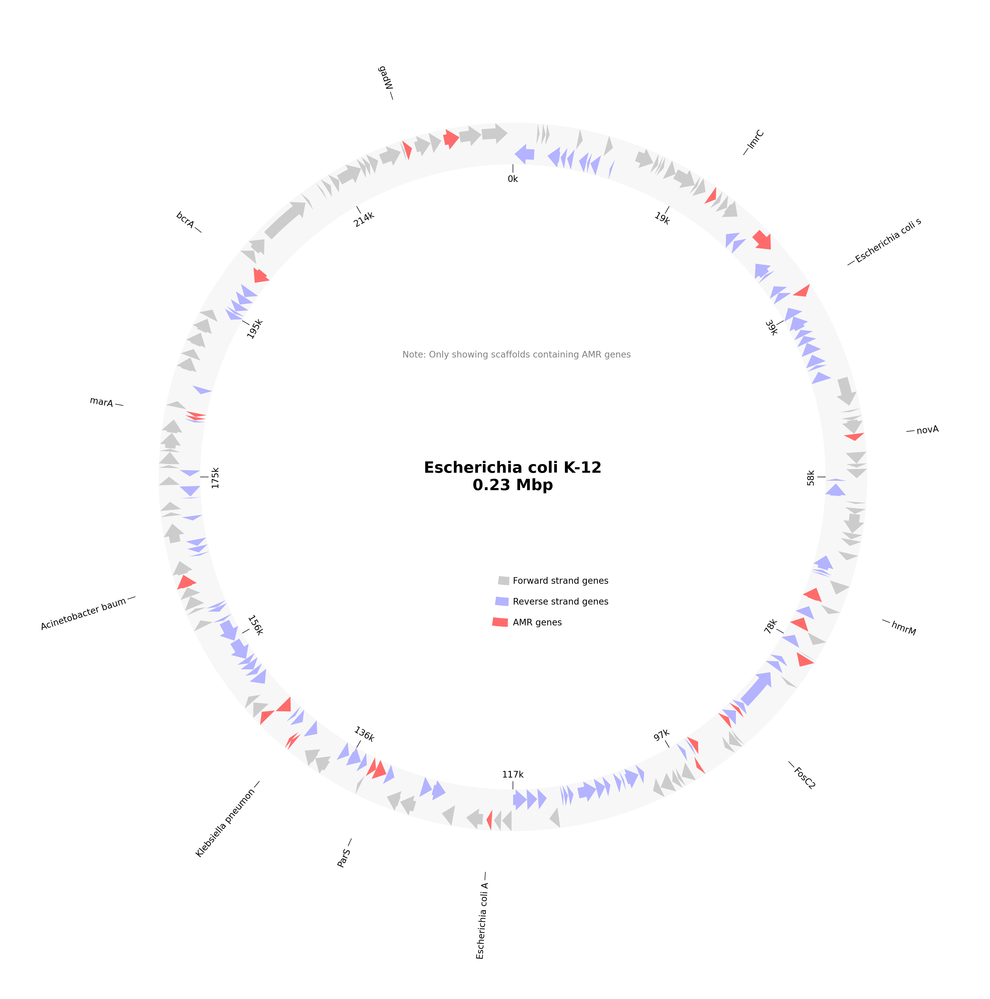

### Acinetobacter baumannii AbaF
- **Mechanism**: antibiotic efflux
- **Drug Classes**: phosphonic acid antibiotic
- **AMR Family**: major facilitator superfamily (MFS) antibiotic efflux pump
- **Locations**:
  - gnl|SPADES|OOJMENLF_15_154 : position 163165-164532

### Escherichia coli AcrAB-TolC with AcrR mutation conferring resistance to ciprofloxacin, tetracycline, and ceftazidime
- **Mechanism**: antibiotic target alteration; antibiotic efflux
- **Drug Classes**: fluoroquinolone antibiotic; cephalosporin; glycylcycline; penam; tetracycline antibiotic; rifamycin antibiotic; phenicol antibiotic; disinfecting agents and antiseptics
- **AMR Family**: resistance-nodulation-cell division (RND) antibiotic efflux pump
- **Locations**:
  - gnl|SPADES|OOJMENLF_15_115 : position 119147-119725

### Escherichia coli AcrAB-TolC with MarR mutations conferring resistance to ciprofloxacin and tetracycline
- **Mechanism**: antibiotic target alteration; antibiotic efflux
- **Drug Classes**: fluoroquinolone antibiotic; cephalosporin; glycylcycline; penam; tetracycline antibiotic; rifamycin antibiotic; phenicol antibiotic; disinfecting agents and antiseptics
- **AMR Family**: resistance-nodulation-cell division (RND) antibiotic efflux pump
- **Locations**:
  - gnl|SPADES|OOJMENLF_15_174: position 182231-182665

### Escherichia coli soxS with mutation conferring antibiotic resistance
- **Mechanism**: antibiotic target alteration; antibiotic efflux; reduced permeability to antibiotic
- **Drug Classes**: fluoroquinolone antibiotic; monobactam; carbapenem; cephalosporin; glycylcycline; cephamycin; penam; tetracycline antibiotic; rifamycin antibiotic; phenicol antibiotic; penem; disinfecting agents and antiseptics
- **AMR Family**: ATP-binding cassette (ABC) antibiotic efflux pump; major facilitator superfamily (MFS) antibiotic efflux pump; resistance-nodulation-cell division (RND) antibiotic efflux pump; General Bacterial Porin with reduced permeability to beta-lactams
- **Locations**:
  - gnl|SPADES|OOJMENLF_15_37 : position 36984-37895

### FosC2
- **Mechanism**: antibiotic inactivation
- **Drug Classes**: phosphonic acid antibiotic
- **AMR Family**: fosC phosphotransferase family
- **Locations**:
  - gnl|SPADES|OOJMENLF_15_81 : position 88030-88437

### Klebsiella pneumoniae KpnE
- **Mechanism**: antibiotic efflux
- **Drug Classes**: macrolide antibiotic; aminoglycoside antibiotic; cephalosporin; tetracycline antibiotic; peptide antibiotic; rifamycin antibiotic; disinfecting agents and antiseptics
- **AMR Family**: small multidrug resistance (SMR) antibiotic efflux pump
- **Locations**:
  - gnl|SPADES|OOJMENLF_15_133: position 142502-142867

### Klebsiella pneumoniae KpnF
- **Mechanism**: antibiotic efflux
- **Drug Classes**: macrolide antibiotic; aminoglycoside antibiotic; cephalosporin; tetracycline antibiotic; peptide antibiotic; rifamycin antibiotic; disinfecting agents and antiseptics
- **AMR Family**: small multidrug resistance (SMR) antibiotic efflux pump
- **Locations**:
  - gnl|SPADES|OOJMENLF_15_134: position 142854-143183

### NmcR (found in 2 locations)
- **Mechanism**: antibiotic inactivation
- **Drug Classes**: carbapenem; cephalosporin; cephamycin; penam
- **AMR Family**: NmcA beta-lactamase
- **Locations**:
  - gnl|SPADES|OOJMENLF_15_138 : position 146411-147304
  - gnl|SPADES|OOJMENLF_15_179 : position 186099-186980

### ParR
- **Mechanism**: antibiotic efflux; reduced permeability to antibiotic
- **Drug Classes**: macrolide antibiotic; fluoroquinolone antibiotic; monobactam; aminoglycoside antibiotic; carbapenem; cephalosporin; cephamycin; penam; tetracycline antibiotic; phenicol antibiotic; penem; disinfecting agents and antiseptics
- **AMR Family**: resistance-nodulation-cell division (RND) antibiotic efflux pump; Outer Membrane Porin (Opr)
- **Locations**:
  - gnl|SPADES|OOJMENLF_15_125 : position 133125-133844

### ParS
- **Mechanism**: antibiotic efflux; reduced permeability to antibiotic
- **Drug Classes**: macrolide antibiotic; fluoroquinolone antibiotic; monobactam; aminoglycoside antibiotic; carbapenem; cephalosporin; cephamycin; penam; tetracycline antibiotic; phenicol antibiotic; penem; disinfecting agents and antiseptics
- **AMR Family**: resistance-nodulation-cell division (RND) antibiotic efflux pump; Outer Membrane Porin (Opr)
- **Locations**:
  - gnl|SPADES|OOJMENLF_15_124 : position 131820-133121

### bcr-1
- **Mechanism**: antibiotic efflux
- **Drug Classes**: bicyclomycin-like antibiotic
- **AMR Family**: major facilitator superfamily (MFS) antibiotic efflux pump
- **Locations**:
  - gnl|SPADES|OOJMENLF_15_71 : position 75167-76378

### bcrA
- **Mechanism**: antibiotic efflux
- **Drug Classes**: peptide antibiotic
- **AMR Family**: ATP-binding cassette (ABC) antibiotic efflux pump
- **Locations**:
  - gnl|SPADES|OOJMENLF_15_192 : position 199257-200792

### cmlB
- **Mechanism**: antibiotic efflux
- **Drug Classes**: phenicol antibiotic
- **AMR Family**: major facilitator superfamily (MFS) antibiotic efflux pump
- **Locations**:
  - gnl|SPADES|OOJMENLF_15_137 : position 145051-146304

### cmlv (found in 2 locations)
- **Mechanism**: antibiotic inactivation
- **Drug Classes**: phenicol antibiotic
- **AMR Family**: chloramphenicol phosphotransferase
- **Locations**:
  - gnl|SPADES|OOJMENLF_15_176 : position 183567-184757
  - gnl|SPADES|OOJMENLF_15_75 : position 78999-80168

### emrR
- **Mechanism**: antibiotic efflux
- **Drug Classes**: fluoroquinolone antibiotic
- **AMR Family**: major facilitator superfamily (MFS) antibiotic efflux pump
- **Locations**:
  - gnl|SPADES|OOJMENLF_15_90 : position 95450-95884

### gadW
- **Mechanism**: antibiotic efflux
- **Drug Classes**: macrolide antibiotic; fluoroquinolone antibiotic; penam
- **AMR Family**: resistance-nodulation-cell division (RND) antibiotic efflux pump
- **Locations**:
  - gnl|SPADES|OOJMENLF_15_206 : position 221858-222619

### hmrM
- **Mechanism**: antibiotic efflux
- **Drug Classes**: fluoroquinolone antibiotic; disinfecting agents and antiseptics
- **AMR Family**: multidrug and toxic compound extrusion (MATE) transporter
- **Locations**:
  - gnl|SPADES|OOJMENLF_15_68 : position 71459-72832

### lmrC
- **Mechanism**: antibiotic target protection
- **Drug Classes**: lincosamide antibiotic
- **AMR Family**: Miscellaneous ABC-F subfamily ATP-binding cassette ribosomal protection proteins
- **Locations**:
  - gnl|SPADES|OOJMENLF_15_23 : position 22724-23473

### marA
- **Mechanism**: antibiotic efflux; reduced permeability to antibiotic
- **Drug Classes**: fluoroquinolone antibiotic; monobactam; carbapenem; cephalosporin; glycylcycline; cephamycin; penam; tetracycline antibiotic; rifamycin antibiotic; phenicol antibiotic; penem; disinfecting agents and antiseptics
- **AMR Family**: resistance-nodulation-cell division (RND) antibiotic efflux pump; General Bacterial Porin with reduced permeability to beta-lactams
- **Locations**:
  - gnl|SPADES|OOJMENLF_15_173: position 181828-182211

### mdtN
- **Mechanism**: antibiotic efflux
- **Drug Classes**: nucleoside antibiotic; disinfecting agents and antiseptics
- **AMR Family**: major facilitator superfamily (MFS) antibiotic efflux pump
- **Locations**:
  - gnl|SPADES|OOJMENLF_15_88 : position 94153-94923

### nalD
- **Mechanism**: antibiotic efflux
- **Drug Classes**: macrolide antibiotic; fluoroquinolone antibiotic; monobactam; carbapenem; cephalosporin; cephamycin; penam; tetracycline antibiotic; peptide antibiotic; aminocoumarin antibiotic; diaminopyrimidine antibiotic; sulfonamide antibiotic; phenicol antibiotic; penem
- **AMR Family**: resistance-nodulation-cell division (RND) antibiotic efflux pump
- **Locations**:
  - gnl|SPADES|OOJMENLF_15_83 : position 89652-90251

### novA
- **Mechanism**: antibiotic efflux
- **Drug Classes**: aminocoumarin antibiotic
- **AMR Family**: ATP-binding cassette (ABC) antibiotic efflux pump
- **Locations**:
  - gnl|SPADES|OOJMENLF_15_51 : position 53777-54523

### rphB
- **Mechanism**: antibiotic inactivation
- **Drug Classes**: rifamycin antibiotic
- **AMR Family**: rifampin phosphotransferase
- **Locations**:
  - gnl|SPADES|OOJMENLF_15_30 : position 29169-31547

### tetB(46)
- **Mechanism**: antibiotic efflux
- **Drug Classes**: tetracycline antibiotic
- **AMR Family**: ATP-binding cassette (ABC) antibiotic efflux pump
- **Locations**:
  - gnl|SPADES|OOJMENLF_15_209 : position 226205-227890

## Escherichia coli M12
**Strain Statistics:**
- Total genome length: 115.5 kbp
- Total scaffolds: 1
- Scaffolds with AMR genes: 1
- Total genes annotated: 213
- Total AMR genes: 5
- Unique AMR genes: 5
- Distinct AMR mechanisms: 2
- Distinct AMR families: 4
- Distinct drug classes: 7

**Circos Plot:**

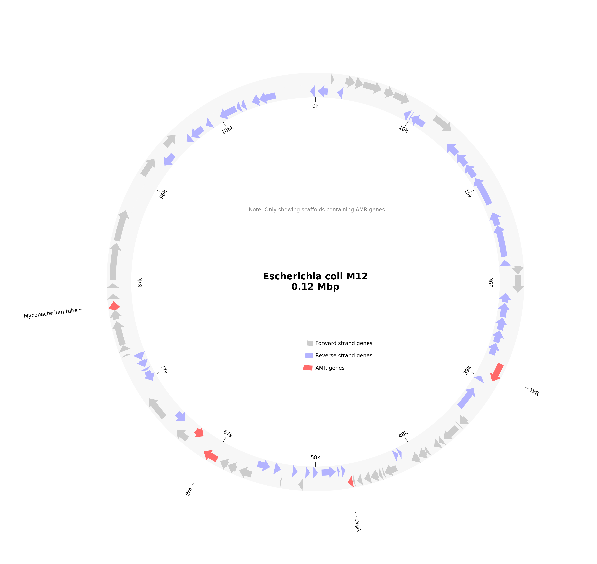

### Mycobacterium tuberculosis thyA with mutation conferring resistance to para-aminosalicylic acid
- **Mechanism**: antibiotic target alteration
- **Drug Classes**: salicylic acid antibiotic
- **AMR Family**: aminosalicylate resistant thymidylate synthase
- **Locations**:
  - gnl|SPADES|OOJMENLF_49_83 : position 84107-84901

### TxR
- **Mechanism**: antibiotic efflux
- **Drug Classes**: tetracycline antibiotic
- **AMR Family**: ATP-binding cassette (ABC) antibiotic efflux pump
- **Locations**:
  - gnl|SPADES|OOJMENLF_49_30 : position 36524-38302

### evgA
- **Mechanism**: antibiotic efflux
- **Drug Classes**: macrolide antibiotic; fluoroquinolone antibiotic; penam; tetracycline antibiotic
- **AMR Family**: major facilitator superfamily (MFS) antibiotic efflux pump; resistance-nodulation-cell division (RND) antibiotic efflux pump
- **Locations**:
  - gnl|SPADES|OOJMENLF_49_52 : position 54358-54801

### leuO
- **Mechanism**: antibiotic efflux
- **Drug Classes**: nucleoside antibiotic; disinfecting agents and antiseptics
- **AMR Family**: major facilitator superfamily (MFS) antibiotic efflux pump
- **Locations**:
  - gnl|SPADES|OOJMENLF_49_70 : position 69305-70240

### lfrA
- **Mechanism**: antibiotic efflux
- **Drug Classes**: fluoroquinolone antibiotic
- **AMR Family**: major facilitator superfamily (MFS) antibiotic efflux pump
- **Locations**:
  - gnl|SPADES|OOJMENLF_49_68 : position 67079-68497

## Escherichia coli O157:H7
**Strain Statistics:**
- Total genome length: 713.8 kbp
- Total scaffolds: 4
- Scaffolds with AMR genes: 4
- Total genes annotated: 1305
- Total AMR genes: 74
- Unique AMR genes: 56
- Distinct AMR mechanisms: 6
- Distinct AMR families: 20
- Distinct drug classes: 26

**Circos Plot:**

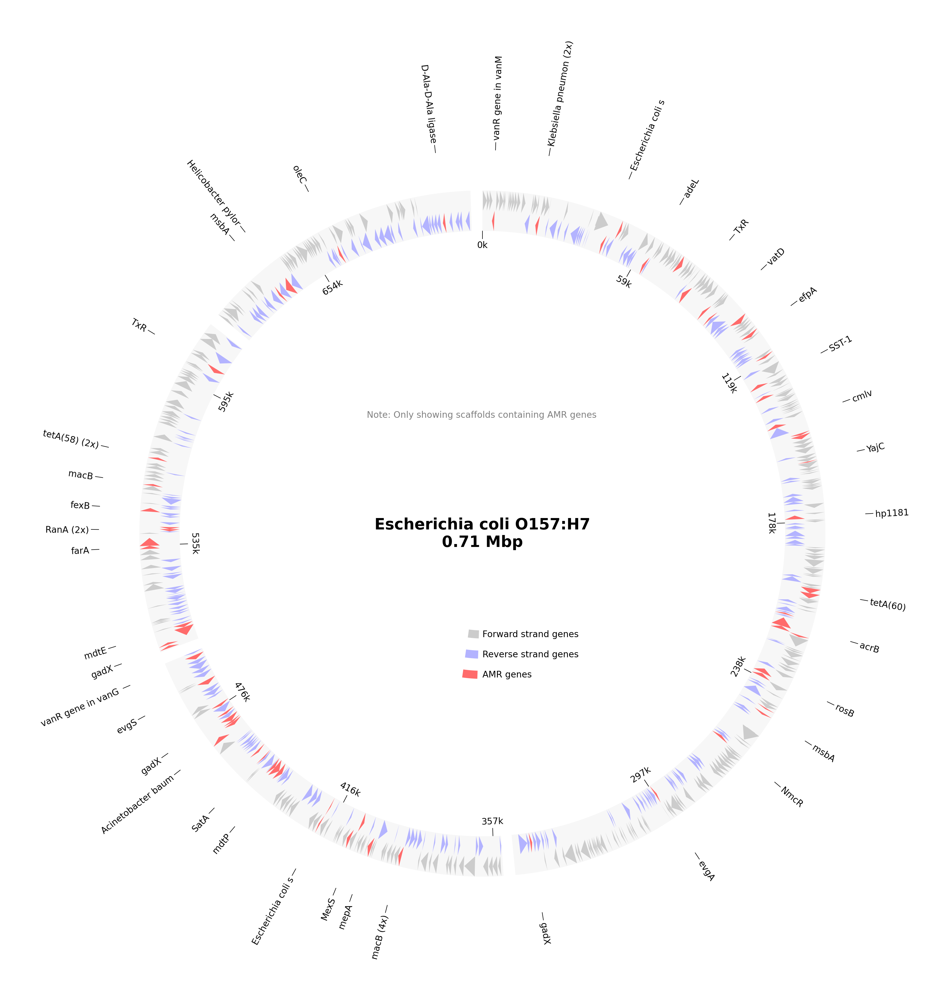

### Acinetobacter baumannii AbaF
- **Mechanism**: antibiotic efflux
- **Drug Classes**: phosphonic acid antibiotic
- **AMR Family**: major facilitator superfamily (MFS) antibiotic efflux pump
- **Locations**:
  - gnl|SPADES|OOJMENLF_31_104 : position 111756-113258

### D-Ala-D-Ala ligase
- **Mechanism**: antibiotic target alteration
- **Drug Classes**: glycopeptide antibiotic
- **AMR Family**: Van ligase
- **Locations**:
  - gnl|SPADES|OOJMENLF_57_75 : position 87450-88370

### Escherichia coli AcrAB-TolC with AcrR mutation conferring resistance to ciprofloxacin, tetracycline, and ceftazidime
- **Mechanism**: antibiotic target alteration; antibiotic efflux
- **Drug Classes**: fluoroquinolone antibiotic; cephalosporin; glycylcycline; penam; tetracycline antibiotic; rifamycin antibiotic; phenicol antibiotic; disinfecting agents and antiseptics
- **AMR Family**: resistance-nodulation-cell division (RND) antibiotic efflux pump
- **Locations**:
  - gnl|SPADES|OOJMENLF_7_202: position 218568-219215

### Escherichia coli acrA
- **Mechanism**: antibiotic efflux
- **Drug Classes**: fluoroquinolone antibiotic; cephalosporin; glycylcycline; penam; tetracycline antibiotic; rifamycin antibiotic; phenicol antibiotic; disinfecting agents and antiseptics
- **AMR Family**: resistance-nodulation-cell division (RND) antibiotic efflux pump
- **Locations**:
  - gnl|SPADES|OOJMENLF_7_201: position 217233-218426

### Escherichia coli soxR with mutation conferring antibiotic resistance
- **Mechanism**: antibiotic target alteration; antibiotic efflux
- **Drug Classes**: fluoroquinolone antibiotic; cephalosporin; glycylcycline; penam; tetracycline antibiotic; rifamycin antibiotic; phenicol antibiotic; disinfecting agents and antiseptics
- **AMR Family**: ATP-binding cassette (ABC) antibiotic efflux pump; major facilitator superfamily (MFS) antibiotic efflux pump; resistance-nodulation-cell division (RND) antibiotic efflux pump
- **Locations**:
  - gnl|SPADES|OOJMENLF_31_61: position 66426-66890

### Escherichia coli soxS with mutation conferring antibiotic resistance (found in 2 locations)
- **Mechanism**: antibiotic target alteration; antibiotic efflux; reduced permeability to antibiotic
- **Drug Classes**: fluoroquinolone antibiotic; monobactam; carbapenem; cephalosporin; glycylcycline; cephamycin; penam; tetracycline antibiotic; rifamycin antibiotic; phenicol antibiotic; penem; disinfecting agents and antiseptics
- **AMR Family**: ATP-binding cassette (ABC) antibiotic efflux pump; major facilitator superfamily (MFS) antibiotic efflux pump; resistance-nodulation-cell division (RND) antibiotic efflux pump; General Bacterial Porin with reduced permeability to beta-lactams
- **Locations**:
  - gnl|SPADES|OOJMENLF_31_60: position 66017-66340
  - gnl|SPADES|OOJMENLF_7_42 : position 45135-45992

### Helicobacter pylori pbp1 mutants conferring resistance to amoxicillin
- **Mechanism**: antibiotic target alteration
- **Drug Classes**: cephalosporin; cephamycin; penam
- **AMR Family**: Penicillin-binding protein mutations conferring resistance to beta-lactam antibiotics
- **Locations**:
  - gnl|SPADES|OOJMENLF_57_20 : position 23408-25942

### Klebsiella pneumoniae OmpK37 (found in 2 locations)
- **Mechanism**: reduced permeability to antibiotic
- **Drug Classes**: monobactam; carbapenem; cephalosporin; cephamycin; penam; penem
- **AMR Family**: General Bacterial Porin with reduced permeability to beta-lactams
- **Locations**:
  - gnl|SPADES|OOJMENLF_7_22 : position 19758-20813
  - gnl|SPADES|OOJMENLF_7_297 : position 312090-313187

### MexS
- **Mechanism**: antibiotic efflux
- **Drug Classes**: fluoroquinolone antibiotic; diaminopyrimidine antibiotic; phenicol antibiotic
- **AMR Family**: resistance-nodulation-cell division (RND) antibiotic efflux pump
- **Locations**:
  - gnl|SPADES|OOJMENLF_31_48 : position 52185-53168

### NmcR
- **Mechanism**: antibiotic inactivation
- **Drug Classes**: carbapenem; cephalosporin; cephamycin; penam
- **AMR Family**: NmcA beta-lactamase
- **Locations**:
  - gnl|SPADES|OOJMENLF_7_241 : position 263907-264833

### Nocardia farcinica rox
- **Mechanism**: antibiotic inactivation
- **Drug Classes**: rifamycin antibiotic
- **AMR Family**: rifampin monooxygenase
- **Locations**:
  - gnl|SPADES|OOJMENLF_7_89 : position 101519-103183

### RanA (found in 2 locations)
- **Mechanism**: antibiotic efflux
- **Drug Classes**: aminoglycoside antibiotic
- **AMR Family**: ATP-binding cassette (ABC) antibiotic efflux pump
- **Locations**:
  - gnl|SPADES|OOJMENLF_48_38 : position 41924-42730
  - gnl|SPADES|OOJMENLF_48_70 : position 72086-73156

### SST-1
- **Mechanism**: antibiotic inactivation
- **Drug Classes**: cephalosporin
- **AMR Family**: SST beta-lactamase
- **Locations**:
  - gnl|SPADES|OOJMENLF_7_110 : position 125008-126165

### SatA
- **Mechanism**: antibiotic inactivation
- **Drug Classes**: nucleoside antibiotic
- **AMR Family**: streptothricin acetyltransferase (SAT)
- **Locations**:
  - gnl|SPADES|OOJMENLF_31_87 : position 96863-97297

### TxR (found in 2 locations)
- **Mechanism**: antibiotic efflux
- **Drug Classes**: tetracycline antibiotic
- **AMR Family**: ATP-binding cassette (ABC) antibiotic efflux pump
- **Locations**:
  - gnl|SPADES|OOJMENLF_48_99 : position 103797-105395
  - gnl|SPADES|OOJMENLF_7_73 : position 80549-82135

### YajC
- **Mechanism**: antibiotic efflux
- **Drug Classes**: fluoroquinolone antibiotic; cephalosporin; glycylcycline; penam; tetracycline antibiotic; oxazolidinone antibiotic; glycopeptide antibiotic; rifamycin antibiotic; phenicol antibiotic; disinfecting agents and antiseptics
- **AMR Family**: resistance-nodulation-cell division (RND) antibiotic efflux pump
- **Locations**:
  - gnl|SPADES|OOJMENLF_7_140 : position 157198-157530

### acrB
- **Mechanism**: antibiotic efflux
- **Drug Classes**: fluoroquinolone antibiotic; cephalosporin; glycylcycline; penam; tetracycline antibiotic; rifamycin antibiotic; phenicol antibiotic; disinfecting agents and antiseptics
- **AMR Family**: resistance-nodulation-cell division (RND) antibiotic efflux pump
- **Locations**:
  - gnl|SPADES|OOJMENLF_7_200: position 214061-217210

### adeL
- **Mechanism**: antibiotic efflux
- **Drug Classes**: fluoroquinolone antibiotic; tetracycline antibiotic
- **AMR Family**: resistance-nodulation-cell division (RND) antibiotic efflux pump
- **Locations**:
  - gnl|SPADES|OOJMENLF_7_55 : position 62363-63295

### arlR
- **Mechanism**: antibiotic efflux
- **Drug Classes**: fluoroquinolone antibiotic; disinfecting agents and antiseptics
- **AMR Family**: major facilitator superfamily (MFS) antibiotic efflux pump
- **Locations**:
  - gnl|SPADES|OOJMENLF_31_107 : position 114536-115204

### baeR
- **Mechanism**: antibiotic efflux
- **Drug Classes**: aminoglycoside antibiotic; aminocoumarin antibiotic
- **AMR Family**: resistance-nodulation-cell division (RND) antibiotic efflux pump
- **Locations**:
  - gnl|SPADES|OOJMENLF_7_132 : position 147053-147742

### basS
- **Mechanism**: antibiotic target alteration; antibiotic efflux
- **Drug Classes**: peptide antibiotic
- **AMR Family**: pmr phosphoethanolamine transferase
- **Locations**:
  - gnl|SPADES|OOJMENLF_31_106 : position 113435-114535

### bcrA (found in 2 locations)
- **Mechanism**: antibiotic efflux
- **Drug Classes**: peptide antibiotic
- **AMR Family**: ATP-binding cassette (ABC) antibiotic efflux pump
- **Locations**:
  - gnl|SPADES|OOJMENLF_48_34 : position 36834-39569
  - gnl|SPADES|OOJMENLF_7_65 : position 73085-74569

### cmlv
- **Mechanism**: antibiotic inactivation
- **Drug Classes**: phenicol antibiotic
- **AMR Family**: chloramphenicol phosphotransferase
- **Locations**:
  - gnl|SPADES|OOJMENLF_7_129 : position 141211-142479

### efpA
- **Mechanism**: antibiotic efflux
- **Drug Classes**: rifamycin antibiotic; isoniazid-like antibiotic
- **AMR Family**: major facilitator superfamily (MFS) antibiotic efflux pump
- **Locations**:
  - gnl|SPADES|OOJMENLF_7_95 : position 107965-109176

### eptA
- **Mechanism**: antibiotic target alteration
- **Drug Classes**: peptide antibiotic
- **AMR Family**: pmr phosphoethanolamine transferase
- **Locations**:
  - gnl|SPADES|OOJMENLF_31_108: position 115201-116844

### evgA
- **Mechanism**: antibiotic efflux
- **Drug Classes**: macrolide antibiotic; fluoroquinolone antibiotic; penam; tetracycline antibiotic
- **AMR Family**: major facilitator superfamily (MFS) antibiotic efflux pump; resistance-nodulation-cell division (RND) antibiotic efflux pump
- **Locations**:
  - gnl|SPADES|OOJMENLF_7_271 : position 296380-297012

### evgS
- **Mechanism**: antibiotic efflux
- **Drug Classes**: macrolide antibiotic; fluoroquinolone antibiotic; penam; tetracycline antibiotic
- **AMR Family**: major facilitator superfamily (MFS) antibiotic efflux pump; resistance-nodulation-cell division (RND) antibiotic efflux pump
- **Locations**:
  - gnl|SPADES|OOJMENLF_31_119 : position 131286-132917

### farA
- **Mechanism**: antibiotic efflux
- **Drug Classes**: antibacterial free fatty acids
- **AMR Family**: major facilitator superfamily (MFS) antibiotic efflux pump
- **Locations**:
  - gnl|SPADES|OOJMENLF_48_33 : position 35770-36837

### fexB
- **Mechanism**: antibiotic efflux
- **Drug Classes**: phenicol antibiotic
- **AMR Family**: major facilitator superfamily (MFS) antibiotic efflux pump
- **Locations**:
  - gnl|SPADES|OOJMENLF_48_45 : position 48740-49990

### gadW
- **Mechanism**: antibiotic efflux
- **Drug Classes**: macrolide antibiotic; fluoroquinolone antibiotic; penam
- **AMR Family**: resistance-nodulation-cell division (RND) antibiotic efflux pump
- **Locations**:
  - gnl|SPADES|OOJMENLF_48_2 : position 1624-2352

### gadX (found in 3 locations)
- **Mechanism**: antibiotic efflux
- **Drug Classes**: macrolide antibiotic; fluoroquinolone antibiotic; penam
- **AMR Family**: resistance-nodulation-cell division (RND) antibiotic efflux pump
- **Locations**:
  - gnl|SPADES|OOJMENLF_31_110 : position 118422-119183
  - gnl|SPADES|OOJMENLF_48_1: position 432-1256
  - gnl|SPADES|OOJMENLF_7_334 : position 346429-347190

### golS
- **Mechanism**: antibiotic efflux
- **Drug Classes**: monobactam; carbapenem; cephalosporin; cephamycin; penam; phenicol antibiotic; penem
- **AMR Family**: resistance-nodulation-cell division (RND) antibiotic efflux pump
- **Locations**:
  - gnl|SPADES|OOJMENLF_7_225 : position 246598-247005

### hp1181
- **Mechanism**: antibiotic efflux
- **Drug Classes**: fluoroquinolone antibiotic; tetracycline antibiotic; nitroimidazole antibiotic
- **AMR Family**: major facilitator superfamily (MFS) antibiotic efflux pump
- **Locations**:
  - gnl|SPADES|OOJMENLF_7_162 : position 175839-177203

### leuO
- **Mechanism**: antibiotic efflux
- **Drug Classes**: nucleoside antibiotic; disinfecting agents and antiseptics
- **AMR Family**: major facilitator superfamily (MFS) antibiotic efflux pump
- **Locations**:
  - gnl|SPADES|OOJMENLF_7_80 : position 90698-91597

### macB (found in 7 locations)
- **Mechanism**: antibiotic efflux
- **Drug Classes**: macrolide antibiotic
- **AMR Family**: ATP-binding cassette (ABC) antibiotic efflux pump
- **Locations**:
  - gnl|SPADES|OOJMENLF_31_29 : position 35721-36836
  - gnl|SPADES|OOJMENLF_31_56 : position 60006-62828
  - gnl|SPADES|OOJMENLF_31_90 : position 98974-99654
  - gnl|SPADES|OOJMENLF_31_99 : position 106128-106916
  - gnl|SPADES|OOJMENLF_48_55 : position 57762-58430
  - gnl|SPADES|OOJMENLF_7_104 : position 117275-118042
  - gnl|SPADES|OOJMENLF_7_233 : position 252338-253024

### mdtE
- **Mechanism**: antibiotic efflux
- **Drug Classes**: macrolide antibiotic; fluoroquinolone antibiotic; penam
- **AMR Family**: resistance-nodulation-cell division (RND) antibiotic efflux pump
- **Locations**:
  - gnl|SPADES|OOJMENLF_48_5: position 5853-7010

### mdtF
- **Mechanism**: antibiotic efflux
- **Drug Classes**: macrolide antibiotic; fluoroquinolone antibiotic; penam
- **AMR Family**: resistance-nodulation-cell division (RND) antibiotic efflux pump
- **Locations**:
  - gnl|SPADES|OOJMENLF_48_4: position 2715-5828

### mdtN
- **Mechanism**: antibiotic efflux
- **Drug Classes**: nucleoside antibiotic; disinfecting agents and antiseptics
- **AMR Family**: major facilitator superfamily (MFS) antibiotic efflux pump
- **Locations**:
  - gnl|SPADES|OOJMENLF_31_81: position 91469-92500

### mdtO
- **Mechanism**: antibiotic efflux
- **Drug Classes**: nucleoside antibiotic; disinfecting agents and antiseptics
- **AMR Family**: major facilitator superfamily (MFS) antibiotic efflux pump
- **Locations**:
  - gnl|SPADES|OOJMENLF_31_80: position 89418-91469

### mdtP
- **Mechanism**: antibiotic efflux
- **Drug Classes**: nucleoside antibiotic; disinfecting agents and antiseptics
- **AMR Family**: major facilitator superfamily (MFS) antibiotic efflux pump
- **Locations**:
  - gnl|SPADES|OOJMENLF_31_79: position 87955-89421

### mepA
- **Mechanism**: antibiotic efflux
- **Drug Classes**: glycylcycline; tetracycline antibiotic
- **AMR Family**: multidrug and toxic compound extrusion (MATE) transporter
- **Locations**:
  - gnl|SPADES|OOJMENLF_31_41 : position 46732-48057

### msbA (found in 3 locations)
- **Mechanism**: antibiotic efflux
- **Drug Classes**: nitroimidazole antibiotic
- **AMR Family**: ATP-binding cassette (ABC) antibiotic efflux pump
- **Locations**:
  - gnl|SPADES|OOJMENLF_48_39 : position 42727-43491
  - gnl|SPADES|OOJMENLF_57_18 : position 20097-20894
  - gnl|SPADES|OOJMENLF_7_228 : position 248524-249201

### mtrA (found in 2 locations)
- **Mechanism**: antibiotic efflux
- **Drug Classes**: macrolide antibiotic; penam
- **AMR Family**: resistance-nodulation-cell division (RND) antibiotic efflux pump
- **Locations**:
  - gnl|SPADES|OOJMENLF_31_112 : position 121974-122882
  - gnl|SPADES|OOJMENLF_7_45 : position 49086-49940

### oleC
- **Mechanism**: antibiotic efflux
- **Drug Classes**: macrolide antibiotic
- **AMR Family**: ATP-binding cassette (ABC) antibiotic efflux pump
- **Locations**:
  - gnl|SPADES|OOJMENLF_57_42 : position 47015-47941

### rosA
- **Mechanism**: antibiotic efflux
- **Drug Classes**: peptide antibiotic
- **AMR Family**: major facilitator superfamily (MFS) antibiotic efflux pump
- **Locations**:
  - gnl|SPADES|OOJMENLF_7_217 : position 236283-237503

### rosB
- **Mechanism**: antibiotic efflux
- **Drug Classes**: peptide antibiotic
- **AMR Family**: major facilitator superfamily (MFS) antibiotic efflux pump
- **Locations**:
  - gnl|SPADES|OOJMENLF_7_216 : position 234369-236045

### smeS
- **Mechanism**: antibiotic efflux
- **Drug Classes**: aminoglycoside antibiotic; cephalosporin; cephamycin; penam
- **AMR Family**: resistance-nodulation-cell division (RND) antibiotic efflux pump
- **Locations**:
  - gnl|SPADES|OOJMENLF_7_133 : position 147800-149095

### tetA(58) (found in 3 locations)
- **Mechanism**: antibiotic efflux
- **Drug Classes**: tetracycline antibiotic
- **AMR Family**: major facilitator superfamily (MFS) antibiotic efflux pump
- **Locations**:
  - gnl|SPADES|OOJMENLF_31_91 : position 99765-100523
  - gnl|SPADES|OOJMENLF_48_65 : position 67063-67830
  - gnl|SPADES|OOJMENLF_48_66 : position 67832-68545

### tetA(60)
- **Mechanism**: antibiotic efflux
- **Drug Classes**: tetracycline antibiotic
- **AMR Family**: ATP-binding cassette (ABC) antibiotic efflux pump
- **Locations**:
  - gnl|SPADES|OOJMENLF_7_187 : position 201679-203451

### tetB(60)
- **Mechanism**: antibiotic efflux
- **Drug Classes**: tetracycline antibiotic
- **AMR Family**: ATP-binding cassette (ABC) antibiotic efflux pump
- **Locations**:
  - gnl|SPADES|OOJMENLF_7_188 : position 203444-205225

### vanG
- **Mechanism**: antibiotic target alteration
- **Drug Classes**: glycopeptide antibiotic
- **AMR Family**: glycopeptide resistance gene cluster; Van ligase
- **Locations**:
  - gnl|SPADES|OOJMENLF_7_116: position 129707-130801

### vanR gene in vanG cluster
- **Mechanism**: antibiotic target alteration
- **Drug Classes**: glycopeptide antibiotic
- **AMR Family**: glycopeptide resistance gene cluster; vanR
- **Locations**:
  - gnl|SPADES|OOJMENLF_31_128 : position 141652-143190

### vanR gene in vanM cluster
- **Mechanism**: antibiotic target alteration
- **Drug Classes**: glycopeptide antibiotic
- **AMR Family**: glycopeptide resistance gene cluster; vanR
- **Locations**:
  - gnl|SPADES|OOJMENLF_7_4 : position 3553-4395

### vanT gene in vanG cluster
- **Mechanism**: antibiotic target alteration
- **Drug Classes**: glycopeptide antibiotic
- **AMR Family**: glycopeptide resistance gene cluster; vanT
- **Locations**:
  - gnl|SPADES|OOJMENLF_31_50 : position 54719-55798

### vatB
- **Mechanism**: antibiotic inactivation
- **Drug Classes**: streptogramin antibiotic; streptogramin A antibiotic
- **AMR Family**: streptogramin vat acetyltransferase
- **Locations**:
  - gnl|SPADES|OOJMENLF_7_197 : position 212174-212725

### vatD
- **Mechanism**: antibiotic inactivation
- **Drug Classes**: streptogramin antibiotic; streptogramin A antibiotic
- **AMR Family**: streptogramin vat acetyltransferase
- **Locations**:
  - gnl|SPADES|OOJMENLF_7_84 : position 94157-94777

## Escherichia coli O157:H7 str. EDL933
**Strain Statistics:**
- Total genome length: 246.7 kbp
- Total scaffolds: 3
- Scaffolds with AMR genes: 3
- Total genes annotated: 471
- Total AMR genes: 14
- Unique AMR genes: 14
- Distinct AMR mechanisms: 3
- Distinct AMR families: 9
- Distinct drug classes: 14

**Circos Plot:**

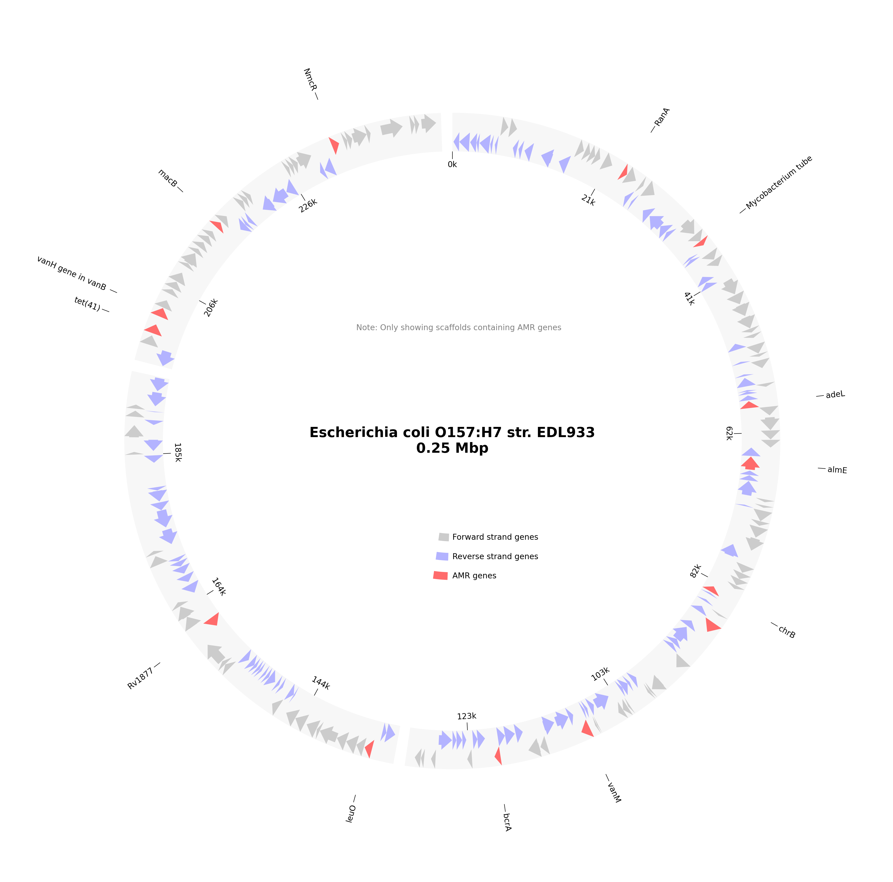

### Mycobacterium tuberculosis pncA mutations conferring resistance to pyrazinamide
- **Mechanism**: antibiotic target alteration
- **Drug Classes**: pyrazine antibiotic
- **AMR Family**: Pyrazinamide resistant pncA
- **Locations**:
  - gnl|SPADES|OOJMENLF_37_36 : position 35665-36306

### NmcR
- **Mechanism**: antibiotic inactivation
- **Drug Classes**: carbapenem; cephalosporin; cephamycin; penam
- **AMR Family**: NmcA beta-lactamase
- **Locations**:
  - gnl|SPADES|OOJMENLF_145_36 : position 37285-38223

### RanA
- **Mechanism**: antibiotic efflux
- **Drug Classes**: aminoglycoside antibiotic
- **AMR Family**: ATP-binding cassette (ABC) antibiotic efflux pump
- **Locations**:
  - gnl|SPADES|OOJMENLF_37_24 : position 22525-23178

### Rv1877
- **Mechanism**: antibiotic efflux
- **Drug Classes**: fluoroquinolone antibiotic
- **AMR Family**: major facilitator superfamily (MFS) antibiotic efflux pump
- **Locations**:
  - gnl|SPADES|OOJMENLF_112_31 : position 28960-30258

### adeL
- **Mechanism**: antibiotic efflux
- **Drug Classes**: fluoroquinolone antibiotic; tetracycline antibiotic
- **AMR Family**: resistance-nodulation-cell division (RND) antibiotic efflux pump
- **Locations**:
  - gnl|SPADES|OOJMENLF_37_60 : position 57402-58325

### almE
- **Mechanism**: antibiotic target alteration
- **Drug Classes**: peptide antibiotic
- **AMR Family**: polymyxin resistance operon; alm glycyltransferase
- **Locations**:
  - gnl|SPADES|OOJMENLF_37_66 : position 64802-66553

### bcrA
- **Mechanism**: antibiotic efflux
- **Drug Classes**: peptide antibiotic
- **AMR Family**: ATP-binding cassette (ABC) antibiotic efflux pump
- **Locations**:
  - gnl|SPADES|OOJMENLF_37_121 : position 119398-120153

### chrB
- **Mechanism**: antibiotic target alteration
- **Drug Classes**: macrolide antibiotic; lincosamide antibiotic
- **AMR Family**: non-erm 23S ribosomal RNA methyltransferase (G748)
- **Locations**:
  - gnl|SPADES|OOJMENLF_37_84 : position 82987-83796

### leuO
- **Mechanism**: antibiotic efflux
- **Drug Classes**: nucleoside antibiotic; disinfecting agents and antiseptics
- **AMR Family**: major facilitator superfamily (MFS) antibiotic efflux pump
- **Locations**:
  - gnl|SPADES|OOJMENLF_112_4 : position 2979-3917

### macB
- **Mechanism**: antibiotic efflux
- **Drug Classes**: macrolide antibiotic
- **AMR Family**: ATP-binding cassette (ABC) antibiotic efflux pump
- **Locations**:
  - gnl|SPADES|OOJMENLF_145_19 : position 19405-20178

### tcr3
- **Mechanism**: antibiotic efflux
- **Drug Classes**: tetracycline antibiotic
- **AMR Family**: major facilitator superfamily (MFS) antibiotic efflux pump
- **Locations**:
  - gnl|SPADES|OOJMENLF_37_89 : position 87011-88384

### tet(41)
- **Mechanism**: antibiotic efflux
- **Drug Classes**: tetracycline antibiotic
- **AMR Family**: major facilitator superfamily (MFS) antibiotic efflux pump
- **Locations**:
  - gnl|SPADES|OOJMENLF_145_3 : position 3794-4972

### vanH gene in vanB cluster
- **Mechanism**: antibiotic target alteration
- **Drug Classes**: glycopeptide antibiotic
- **AMR Family**: vanH; glycopeptide resistance gene cluster
- **Locations**:
  - gnl|SPADES|OOJMENLF_145_5 : position 6063-7199

### vanM
- **Mechanism**: antibiotic target alteration
- **Drug Classes**: glycopeptide antibiotic
- **AMR Family**: glycopeptide resistance gene cluster; Van ligase
- **Locations**:
  - gnl|SPADES|OOJMENLF_37_112 : position 107616-108794

## Escherichia coli O25b:H4-ST131
**Strain Statistics:**
- Total genome length: 106.4 kbp
- Total scaffolds: 1
- Scaffolds with AMR genes: 1
- Total genes annotated: 224
- Total AMR genes: 6
- Unique AMR genes: 6
- Distinct AMR mechanisms: 3
- Distinct AMR families: 4
- Distinct drug classes: 9

**Circos Plot:**

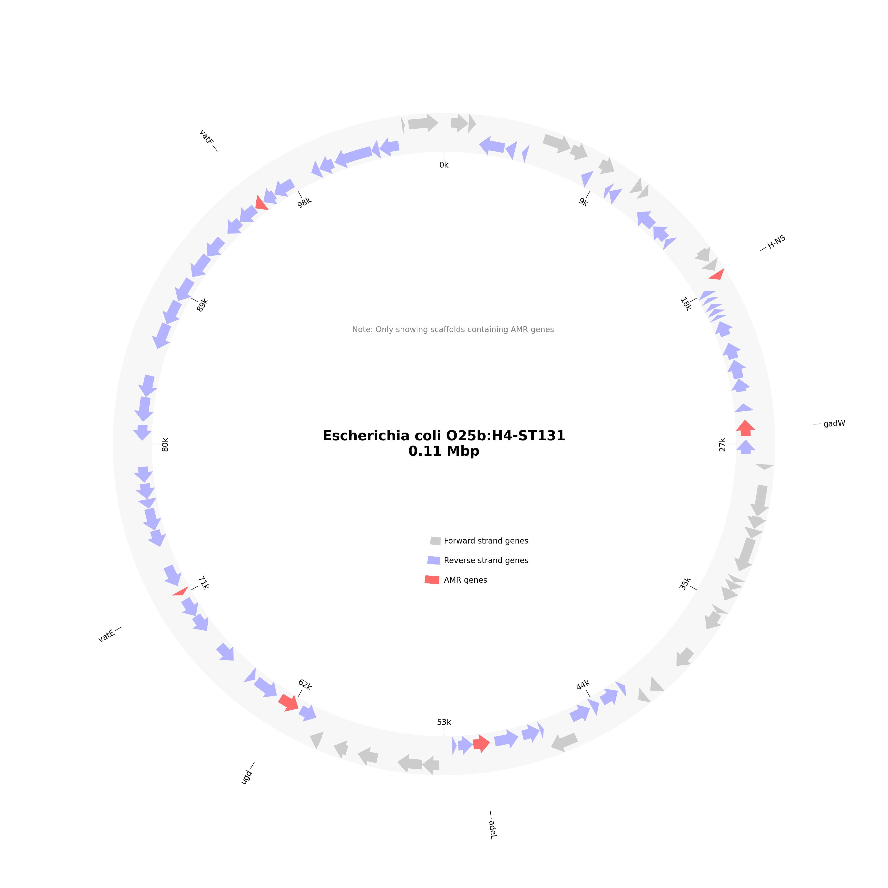

### H-NS
- **Mechanism**: antibiotic efflux
- **Drug Classes**: macrolide antibiotic; fluoroquinolone antibiotic; cephalosporin; cephamycin; penam; tetracycline antibiotic
- **AMR Family**: major facilitator superfamily (MFS) antibiotic efflux pump; resistance-nodulation-cell division (RND) antibiotic efflux pump
- **Locations**:
  - gnl|SPADES|OOJMENLF_54_19 : position 17115-17519

### adeL
- **Mechanism**: antibiotic efflux
- **Drug Classes**: fluoroquinolone antibiotic; tetracycline antibiotic
- **AMR Family**: resistance-nodulation-cell division (RND) antibiotic efflux pump
- **Locations**:
  - gnl|SPADES|OOJMENLF_54_60 : position 50610-51560

### gadW
- **Mechanism**: antibiotic efflux
- **Drug Classes**: macrolide antibiotic; fluoroquinolone antibiotic; penam
- **AMR Family**: resistance-nodulation-cell division (RND) antibiotic efflux pump
- **Locations**:
  - gnl|SPADES|OOJMENLF_54_31 : position 25243-26157

### ugd
- **Mechanism**: antibiotic target alteration
- **Drug Classes**: peptide antibiotic
- **AMR Family**: pmr phosphoethanolamine transferase
- **Locations**:
  - gnl|SPADES|OOJMENLF_54_73: position 61730-62896

### vatE
- **Mechanism**: antibiotic inactivation
- **Drug Classes**: streptogramin antibiotic; streptogramin A antibiotic
- **AMR Family**: streptogramin vat acetyltransferase
- **Locations**:
  - gnl|SPADES|OOJMENLF_54_81 : position 70924-71220

### vatF
- **Mechanism**: antibiotic inactivation
- **Drug Classes**: streptogramin antibiotic; streptogramin A antibiotic
- **AMR Family**: streptogramin vat acetyltransferase
- **Locations**:
  - gnl|SPADES|OOJMENLF_54_102 : position 94985-95533

## Escherichia coli O27:H7
**Strain Statistics:**
- Total genome length: 202.1 kbp
- Total scaffolds: 1
- Scaffolds with AMR genes: 1
- Total genes annotated: 368
- Total AMR genes: 18
- Unique AMR genes: 14
- Distinct AMR mechanisms: 4
- Distinct AMR families: 9
- Distinct drug classes: 18

**Circos Plot:**

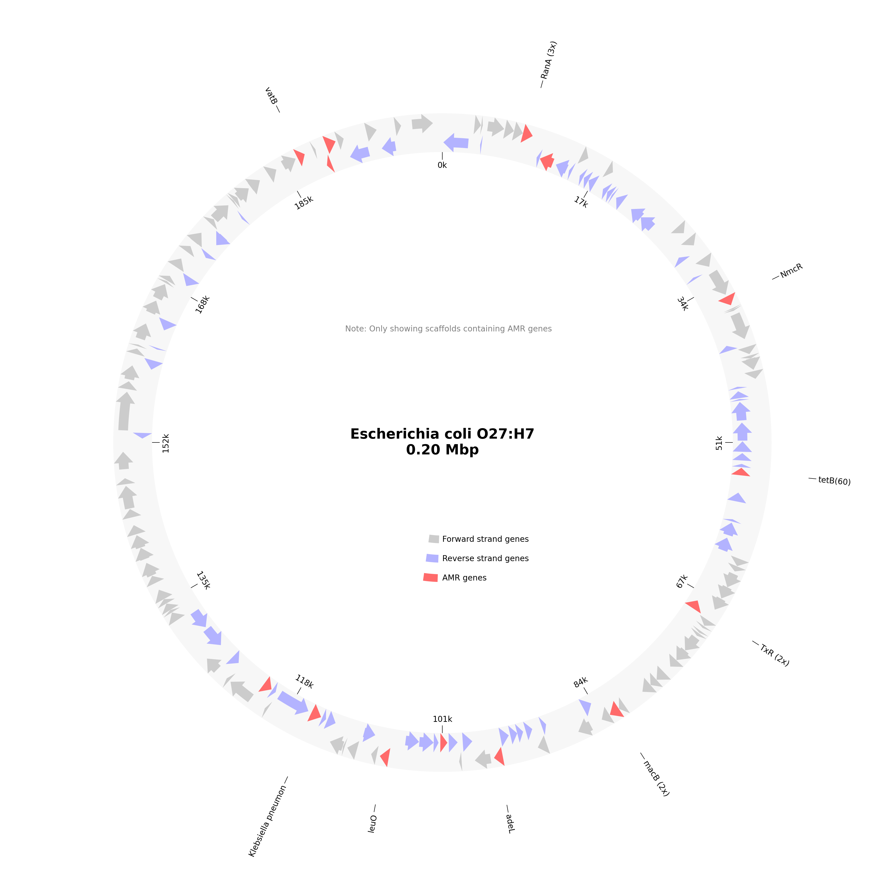

### CRP
- **Mechanism**: antibiotic efflux
- **Drug Classes**: macrolide antibiotic; fluoroquinolone antibiotic; penam
- **AMR Family**: resistance-nodulation-cell division (RND) antibiotic efflux pump
- **Locations**:
  - gnl|SPADES|OOJMENLF_19_99 : position 100532-101284

### Enterococcus faecalis cls with mutation conferring resistance to daptomycin
- **Mechanism**: antibiotic target alteration
- **Drug Classes**: peptide antibiotic
- **AMR Family**: daptomycin resistant cls
- **Locations**:
  - gnl|SPADES|OOJMENLF_19_11 : position 10636-12096

### Klebsiella pneumoniae OmpK37
- **Mechanism**: reduced permeability to antibiotic
- **Drug Classes**: monobactam; carbapenem; cephalosporin; cephamycin; penam; penem
- **AMR Family**: General Bacterial Porin with reduced permeability to beta-lactams
- **Locations**:
  - gnl|SPADES|OOJMENLF_19_112 : position 114457-115590

### MexS
- **Mechanism**: antibiotic efflux
- **Drug Classes**: fluoroquinolone antibiotic; diaminopyrimidine antibiotic; phenicol antibiotic
- **AMR Family**: resistance-nodulation-cell division (RND) antibiotic efflux pump
- **Locations**:
  - gnl|SPADES|OOJMENLF_19_180 : position 190120-191157

### NmcR
- **Mechanism**: antibiotic inactivation
- **Drug Classes**: carbapenem; cephalosporin; cephamycin; penam
- **AMR Family**: NmcA beta-lactamase
- **Locations**:
  - gnl|SPADES|OOJMENLF_19_35 : position 35269-36243

### RanA (found in 3 locations)
- **Mechanism**: antibiotic efflux
- **Drug Classes**: aminoglycoside antibiotic
- **AMR Family**: ATP-binding cassette (ABC) antibiotic efflux pump
- **Locations**:
  - gnl|SPADES|OOJMENLF_19_55 : position 54050-55042
  - gnl|SPADES|OOJMENLF_19_8 : position 8205-9218
  - gnl|SPADES|OOJMENLF_19_9 : position 9215-10219

### TxR (found in 2 locations)
- **Mechanism**: antibiotic efflux
- **Drug Classes**: tetracycline antibiotic
- **AMR Family**: ATP-binding cassette (ABC) antibiotic efflux pump
- **Locations**:
  - gnl|SPADES|OOJMENLF_19_67 : position 68349-69326
  - gnl|SPADES|OOJMENLF_19_87 : position 88133-89674

### adeL
- **Mechanism**: antibiotic efflux
- **Drug Classes**: fluoroquinolone antibiotic; tetracycline antibiotic
- **AMR Family**: resistance-nodulation-cell division (RND) antibiotic efflux pump
- **Locations**:
  - gnl|SPADES|OOJMENLF_19_94 : position 94948-95847

### leuO
- **Mechanism**: antibiotic efflux
- **Drug Classes**: nucleoside antibiotic; disinfecting agents and antiseptics
- **AMR Family**: major facilitator superfamily (MFS) antibiotic efflux pump
- **Locations**:
  - gnl|SPADES|OOJMENLF_19_104 : position 106499-107407

### macB (found in 2 locations)
- **Mechanism**: antibiotic efflux
- **Drug Classes**: macrolide antibiotic
- **AMR Family**: ATP-binding cassette (ABC) antibiotic efflux pump
- **Locations**:
  - gnl|SPADES|OOJMENLF_19_171 : position 182586-183599
  - gnl|SPADES|OOJMENLF_19_82 : position 82234-83316

### sta
- **Mechanism**: antibiotic inactivation
- **Drug Classes**: nucleoside antibiotic
- **AMR Family**: streptothricin acetyltransferase (SAT)
- **Locations**:
  - gnl|SPADES|OOJMENLF_19_179 : position 189421-189939

### tetB(60)
- **Mechanism**: antibiotic efflux
- **Drug Classes**: tetracycline antibiotic
- **AMR Family**: ATP-binding cassette (ABC) antibiotic efflux pump
- **Locations**:
  - gnl|SPADES|OOJMENLF_19_54 : position 53242-54048

### vanH gene in vanD cluster
- **Mechanism**: antibiotic target alteration
- **Drug Classes**: glycopeptide antibiotic
- **AMR Family**: vanH; glycopeptide resistance gene cluster
- **Locations**:
  - gnl|SPADES|OOJMENLF_19_116 : position 120551-121540

### vatB
- **Mechanism**: antibiotic inactivation
- **Drug Classes**: streptogramin antibiotic; streptogramin A antibiotic
- **AMR Family**: streptogramin vat acetyltransferase
- **Locations**:
  - gnl|SPADES|OOJMENLF_19_175 : position 186981-187790

## Escherichia coli O80:H26
**Strain Statistics:**
- Total genome length: 234.4 kbp
- Total scaffolds: 1
- Scaffolds with AMR genes: 1
- Total genes annotated: 385
- Total AMR genes: 23
- Unique AMR genes: 22
- Distinct AMR mechanisms: 5
- Distinct AMR families: 11
- Distinct drug classes: 14

**Circos Plot:**

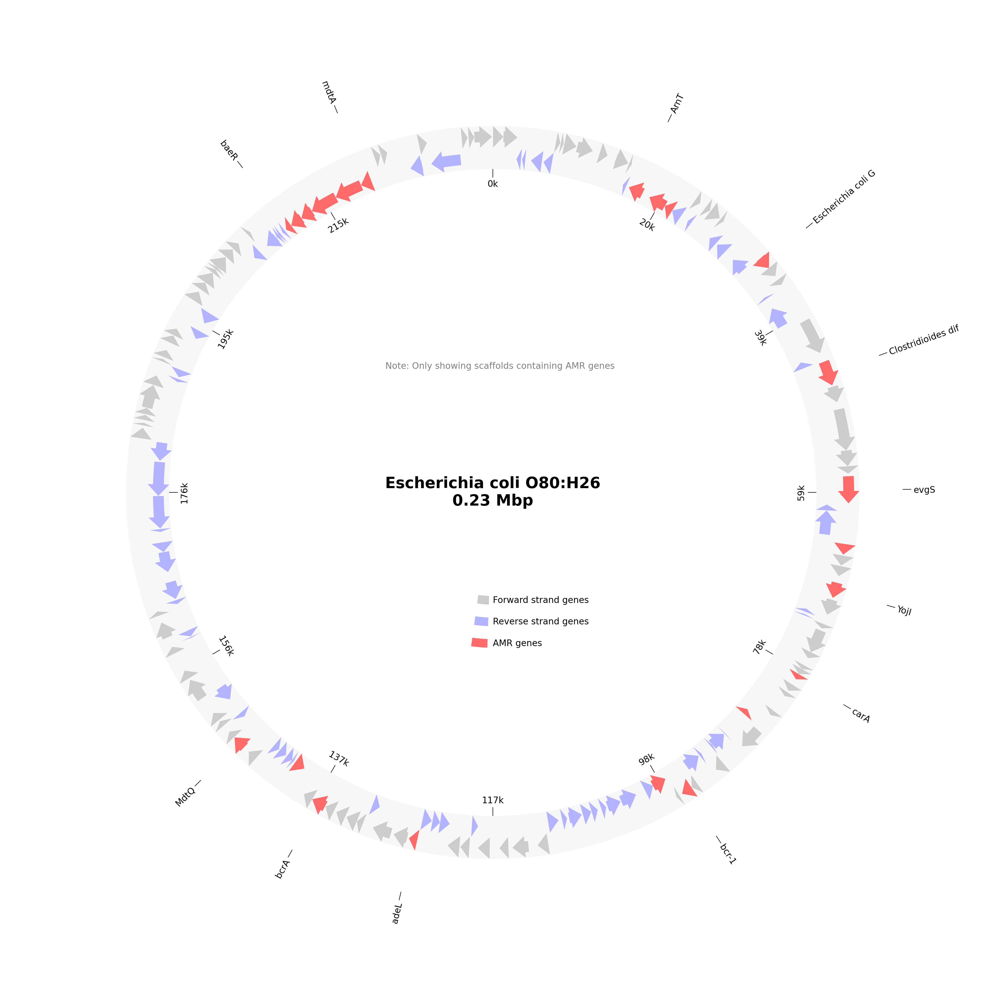

### ArnT
- **Mechanism**: antibiotic target alteration
- **Drug Classes**: peptide antibiotic
- **AMR Family**: pmr phosphoethanolamine transferase
- **Locations**:
  - gnl|SPADES|OOJMENLF_14_17: position 15649-17301

### Clostridioides difficile gyrA conferring resistance to fluoroquinolones
- **Mechanism**: antibiotic target alteration
- **Drug Classes**: fluoroquinolone antibiotic
- **AMR Family**: fluoroquinolone resistant gyrA
- **Locations**:
  - gnl|SPADES|OOJMENLF_14_39 : position 44567-47194

### Escherichia coli GlpT with mutation conferring resistance to fosfomycin
- **Mechanism**: antibiotic target alteration
- **Drug Classes**: phosphonic acid antibiotic
- **AMR Family**: antibiotic-resistant GlpT
- **Locations**:
  - gnl|SPADES|OOJMENLF_14_31 : position 31777-33135

### Klebsiella pneumoniae OmpK37
- **Mechanism**: reduced permeability to antibiotic
- **Drug Classes**: monobactam; carbapenem; cephalosporin; cephamycin; penam; penem
- **AMR Family**: General Bacterial Porin with reduced permeability to beta-lactams
- **Locations**:
  - gnl|SPADES|OOJMENLF_14_48 : position 64022-65146

### MdtQ
- **Mechanism**: reduced permeability to antibiotic
- **Drug Classes**: monobactam; carbapenem; cephalosporin; cephamycin; penam; penem
- **AMR Family**: Outer Membrane Porin (Opr)
- **Locations**:
  - gnl|SPADES|OOJMENLF_14_123 : position 146042-147478

### PmrF
- **Mechanism**: antibiotic target alteration
- **Drug Classes**: peptide antibiotic
- **AMR Family**: pmr phosphoethanolamine transferase
- **Locations**:
  - gnl|SPADES|OOJMENLF_14_20: position 20170-21138

### RanA (found in 2 locations)
- **Mechanism**: antibiotic efflux
- **Drug Classes**: aminoglycoside antibiotic
- **AMR Family**: ATP-binding cassette (ABC) antibiotic efflux pump
- **Locations**:
  - gnl|SPADES|OOJMENLF_14_132 : position 157394-158320
  - gnl|SPADES|OOJMENLF_14_81 : position 96964-98553

### YojI
- **Mechanism**: antibiotic efflux
- **Drug Classes**: peptide antibiotic
- **AMR Family**: ATP-binding cassette (ABC) antibiotic efflux pump
- **Locations**:
  - gnl|SPADES|OOJMENLF_14_52: position 68177-69820

### adeL
- **Mechanism**: antibiotic efflux
- **Drug Classes**: fluoroquinolone antibiotic; tetracycline antibiotic
- **AMR Family**: resistance-nodulation-cell division (RND) antibiotic efflux pump
- **Locations**:
  - gnl|SPADES|OOJMENLF_14_105 : position 125183-126064

### arnA
- **Mechanism**: antibiotic target alteration
- **Drug Classes**: peptide antibiotic
- **AMR Family**: pmr phosphoethanolamine transferase
- **Locations**:
  - gnl|SPADES|OOJMENLF_14_19 : position 18188-20170

### baeR
- **Mechanism**: antibiotic efflux
- **Drug Classes**: aminoglycoside antibiotic; aminocoumarin antibiotic
- **AMR Family**: resistance-nodulation-cell division (RND) antibiotic efflux pump
- **Locations**:
  - gnl|SPADES|OOJMENLF_14_178: position 209560-210282

### baeS
- **Mechanism**: antibiotic efflux
- **Drug Classes**: aminoglycoside antibiotic; aminocoumarin antibiotic
- **AMR Family**: resistance-nodulation-cell division (RND) antibiotic efflux pump
- **Locations**:
  - gnl|SPADES|OOJMENLF_14_179 : position 210279-211682

### bcr-1
- **Mechanism**: antibiotic efflux
- **Drug Classes**: bicyclomycin-like antibiotic
- **AMR Family**: major facilitator superfamily (MFS) antibiotic efflux pump
- **Locations**:
  - gnl|SPADES|OOJMENLF_14_79 : position 95092-96282

### bcrA
- **Mechanism**: antibiotic efflux
- **Drug Classes**: peptide antibiotic
- **AMR Family**: ATP-binding cassette (ABC) antibiotic efflux pump
- **Locations**:
  - gnl|SPADES|OOJMENLF_14_113 : position 135511-137031

### carA
- **Mechanism**: antibiotic target protection
- **Drug Classes**: macrolide antibiotic
- **AMR Family**: Miscellaneous ABC-F subfamily ATP-binding cassette ribosomal protection proteins
- **Locations**:
  - gnl|SPADES|OOJMENLF_14_63 : position 78588-79205

### emrY
- **Mechanism**: antibiotic efflux
- **Drug Classes**: tetracycline antibiotic
- **AMR Family**: major facilitator superfamily (MFS) antibiotic efflux pump
- **Locations**:
  - gnl|SPADES|OOJMENLF_14_180 : position 211679-213094

### evgA
- **Mechanism**: antibiotic efflux
- **Drug Classes**: macrolide antibiotic; fluoroquinolone antibiotic; penam; tetracycline antibiotic
- **AMR Family**: major facilitator superfamily (MFS) antibiotic efflux pump; resistance-nodulation-cell division (RND) antibiotic efflux pump
- **Locations**:
  - gnl|SPADES|OOJMENLF_14_71 : position 84903-85550

### evgS
- **Mechanism**: antibiotic efflux
- **Drug Classes**: macrolide antibiotic; fluoroquinolone antibiotic; penam; tetracycline antibiotic
- **AMR Family**: major facilitator superfamily (MFS) antibiotic efflux pump; resistance-nodulation-cell division (RND) antibiotic efflux pump
- **Locations**:
  - gnl|SPADES|OOJMENLF_14_45 : position 56895-59744

### mdtA
- **Mechanism**: antibiotic efflux
- **Drug Classes**: aminocoumarin antibiotic
- **AMR Family**: resistance-nodulation-cell division (RND) antibiotic efflux pump
- **Locations**:
  - gnl|SPADES|OOJMENLF_14_183: position 219295-220542

### mdtB
- **Mechanism**: antibiotic efflux
- **Drug Classes**: aminocoumarin antibiotic
- **AMR Family**: resistance-nodulation-cell division (RND) antibiotic efflux pump
- **Locations**:
  - gnl|SPADES|OOJMENLF_14_182: position 216173-219295

### mdtC
- **Mechanism**: antibiotic efflux
- **Drug Classes**: aminocoumarin antibiotic
- **AMR Family**: resistance-nodulation-cell division (RND) antibiotic efflux pump
- **Locations**:
  - gnl|SPADES|OOJMENLF_14_181: position 213095-216172

### tet(X6)
- **Mechanism**: antibiotic inactivation
- **Drug Classes**: tetracycline antibiotic
- **AMR Family**: tetracycline inactivation enzyme
- **Locations**:
  - gnl|SPADES|OOJMENLF_14_116 : position 139529-140767

## Ewingella americana
**Strain Statistics:**
- Total genome length: 23.7 kbp
- Total scaffolds: 1144
- Scaffolds with AMR genes: 73
- Total genes annotated: 22
- Total AMR genes: 73
- Unique AMR genes: 54
- Distinct AMR mechanisms: 9
- Distinct AMR families: 18
- Distinct drug classes: 26

**Circos Plot:**

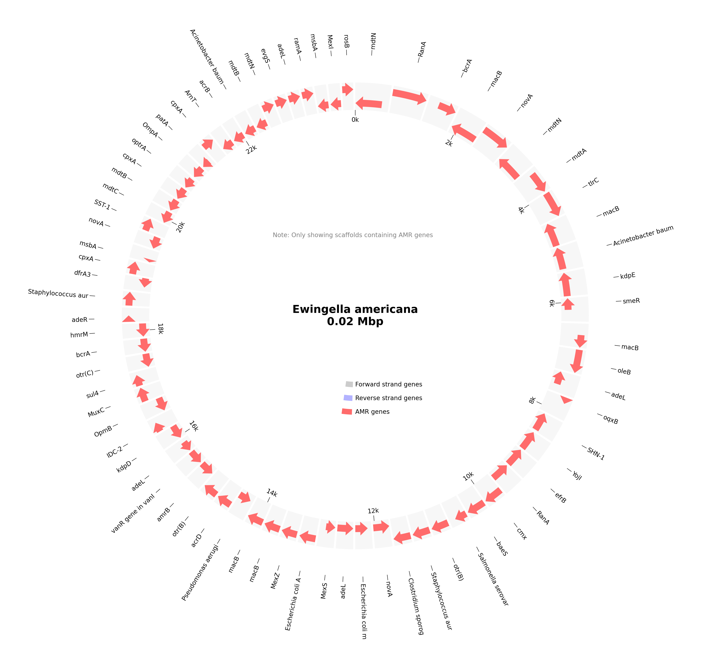

### Acinetobacter baumannii AbaQ (found in 2 locations)
- **Mechanism**: antibiotic efflux
- **Drug Classes**: fluoroquinolone antibiotic
- **AMR Family**: major facilitator superfamily (MFS) antibiotic efflux pump
- **Locations**:
  - gnl|SPADES|OOJMENLF_11971_1 : position 2-439
  - gnl|SPADES|OOJMENLF_172478_1 : position 3-221

### ArnT
- **Mechanism**: antibiotic target alteration
- **Drug Classes**: peptide antibiotic
- **AMR Family**: pmr phosphoethanolamine transferase
- **Locations**:
  - gnl|SPADES|OOJMENLF_160064_1 : position 3-227

### Clostridium sporogenes cplR
- **Mechanism**: antibiotic target protection
- **Drug Classes**: lincosamide antibiotic; pleuromutilin antibiotic
- **AMR Family**: Miscellaneous ABC-F subfamily ATP-binding cassette ribosomal protection proteins
- **Locations**:
  - gnl|SPADES|OOJMENLF_31564_1 : position 2-325

### Escherichia coli AcrAB-TolC with AcrR mutation conferring resistance to ciprofloxacin, tetracycline, and ceftazidime
- **Mechanism**: antibiotic target alteration; antibiotic efflux
- **Drug Classes**: fluoroquinolone antibiotic; cephalosporin; glycylcycline; penam; tetracycline antibiotic; rifamycin antibiotic; phenicol antibiotic; disinfecting agents and antiseptics
- **AMR Family**: resistance-nodulation-cell division (RND) antibiotic efflux pump
- **Locations**:
  - gnl|SPADES|OOJMENLF_36824_1 : position 2-307

### Escherichia coli mdfA
- **Mechanism**: antibiotic efflux
- **Drug Classes**: tetracycline antibiotic; phenicol antibiotic; disinfecting agents and antiseptics
- **AMR Family**: major facilitator superfamily (MFS) antibiotic efflux pump
- **Locations**:
  - gnl|SPADES|OOJMENLF_33387_1 : position 72-317

### IDC-2
- **Mechanism**: antibiotic inactivation
- **Drug Classes**: carbapenem; cephalosporin
- **AMR Family**: IDC beta-lactamase
- **Locations**:
  - gnl|SPADES|OOJMENLF_60227_1 : position 2-181

### MexI
- **Mechanism**: antibiotic efflux
- **Drug Classes**: fluoroquinolone antibiotic; tetracycline antibiotic; disinfecting agents and antiseptics
- **AMR Family**: resistance-nodulation-cell division (RND) antibiotic efflux pump
- **Locations**:
  - gnl|SPADES|OOJMENLF_197651_1 : position 2-211

### MexS
- **Mechanism**: antibiotic efflux
- **Drug Classes**: fluoroquinolone antibiotic; diaminopyrimidine antibiotic; phenicol antibiotic
- **AMR Family**: resistance-nodulation-cell division (RND) antibiotic efflux pump
- **Locations**:
  - gnl|SPADES|OOJMENLF_35311_1 : position 3-188

### MexZ
- **Mechanism**: antibiotic efflux
- **Drug Classes**: macrolide antibiotic; fluoroquinolone antibiotic; aminoglycoside antibiotic; carbapenem; cephalosporin; cephamycin; penam; tetracycline antibiotic; phenicol antibiotic; disinfecting agents and antiseptics
- **AMR Family**: resistance-nodulation-cell division (RND) antibiotic efflux pump
- **Locations**:
  - gnl|SPADES|OOJMENLF_37153_1 : position 12-305

### MuxC
- **Mechanism**: antibiotic efflux
- **Drug Classes**: macrolide antibiotic; monobactam; tetracycline antibiotic; aminocoumarin antibiotic
- **AMR Family**: resistance-nodulation-cell division (RND) antibiotic efflux pump
- **Locations**:
  - gnl|SPADES|OOJMENLF_71162_1 : position 1-267

### OmpA
- **Mechanism**: reduced permeability to antibiotic
- **Drug Classes**: peptide antibiotic
- **AMR Family**: General Bacterial Porin with reduced permeability to peptide antibiotics
- **Locations**:
  - gnl|SPADES|OOJMENLF_159492_1 : position 1-228

### OpmB
- **Mechanism**: antibiotic efflux
- **Drug Classes**: macrolide antibiotic; monobactam; tetracycline antibiotic; aminocoumarin antibiotic
- **AMR Family**: resistance-nodulation-cell division (RND) antibiotic efflux pump
- **Locations**:
  - gnl|SPADES|OOJMENLF_64539_1 : position 2-271

### Pseudomonas aeruginosa CpxR
- **Mechanism**: antibiotic efflux
- **Drug Classes**: macrolide antibiotic; fluoroquinolone antibiotic; monobactam; aminoglycoside antibiotic; carbapenem; cephalosporin; cephamycin; penam; tetracycline antibiotic; peptide antibiotic; aminocoumarin antibiotic; diaminopyrimidine antibiotic; sulfonamide antibiotic; phenicol antibiotic; penem
- **AMR Family**: resistance-nodulation-cell division (RND) antibiotic efflux pump
- **Locations**:
  - gnl|SPADES|OOJMENLF_38460_1 : position 52-303

### RanA (found in 2 locations)
- **Mechanism**: antibiotic efflux
- **Drug Classes**: aminoglycoside antibiotic
- **AMR Family**: ATP-binding cassette (ABC) antibiotic efflux pump
- **Locations**:
  - gnl|SPADES|OOJMENLF_21294_1 : position 2-370
  - gnl|SPADES|OOJMENLF_7907_1 : position 1-645

### SHN-1
- **Mechanism**: antibiotic inactivation
- **Drug Classes**: carbapenem
- **AMR Family**: SHN beta-lactamase
- **Locations**:
  - gnl|SPADES|OOJMENLF_18185_1 : position 2-367

### SST-1
- **Mechanism**: antibiotic inactivation
- **Drug Classes**: cephalosporin
- **AMR Family**: SST beta-lactamase
- **Locations**:
  - gnl|SPADES|OOJMENLF_138568_1 : position 1-237

### Salmonella serovars soxS with mutation conferring antibiotic resistance
- **Mechanism**: antibiotic target alteration; antibiotic efflux; reduced permeability to antibiotic
- **Drug Classes**: fluoroquinolone antibiotic; monobactam; carbapenem; cephalosporin; glycylcycline; cephamycin; penam; tetracycline antibiotic; rifamycin antibiotic; phenicol antibiotic; penem; disinfecting agents and antiseptics
- **AMR Family**: ATP-binding cassette (ABC) antibiotic efflux pump; major facilitator superfamily (MFS) antibiotic efflux pump; resistance-nodulation-cell division (RND) antibiotic efflux pump; General Bacterial Porin with reduced permeability to beta-lactams
- **Locations**:
  - gnl|SPADES|OOJMENLF_28516_1 : position 1-228

### Staphylococcus aureus mupB conferring resistance to mupirocin
- **Mechanism**: antibiotic target alteration
- **Drug Classes**: mupirocin-like antibiotic
- **AMR Family**: antibiotic-resistant isoleucyl-tRNA synthetase (ileS)
- **Locations**:
  - gnl|SPADES|OOJMENLF_30114_1 : position 3-329

### Staphylococcus aureus norA
- **Mechanism**: antibiotic efflux
- **Drug Classes**: fluoroquinolone antibiotic
- **AMR Family**: major facilitator superfamily (MFS) antibiotic efflux pump
- **Locations**:
  - gnl|SPADES|OOJMENLF_87125_1 : position 3-260

### YojI
- **Mechanism**: antibiotic efflux
- **Drug Classes**: peptide antibiotic
- **AMR Family**: ATP-binding cassette (ABC) antibiotic efflux pump
- **Locations**:
  - gnl|SPADES|OOJMENLF_18196_1 : position 3-389

### acrB
- **Mechanism**: antibiotic efflux
- **Drug Classes**: fluoroquinolone antibiotic; cephalosporin; glycylcycline; penam; tetracycline antibiotic; rifamycin antibiotic; phenicol antibiotic; disinfecting agents and antiseptics
- **AMR Family**: resistance-nodulation-cell division (RND) antibiotic efflux pump
- **Locations**:
  - gnl|SPADES|OOJMENLF_165059_1 : position 3-224

### acrD
- **Mechanism**: antibiotic efflux
- **Drug Classes**: aminoglycoside antibiotic
- **AMR Family**: resistance-nodulation-cell division (RND) antibiotic efflux pump
- **Locations**:
  - gnl|SPADES|OOJMENLF_47640_1 : position 3-284

### adeL (found in 4 locations)
- **Mechanism**: antibiotic efflux
- **Drug Classes**: fluoroquinolone antibiotic; tetracycline antibiotic
- **AMR Family**: resistance-nodulation-cell division (RND) antibiotic efflux pump
- **Locations**:
  - gnl|SPADES|OOJMENLF_16186_1 : position 3-260
  - gnl|SPADES|OOJMENLF_180493_1 : position 1-219
  - gnl|SPADES|OOJMENLF_34478_1 : position 1-315
  - gnl|SPADES|OOJMENLF_58429_1 : position 1-204

### adeR
- **Mechanism**: antibiotic efflux
- **Drug Classes**: glycylcycline; tetracycline antibiotic
- **AMR Family**: resistance-nodulation-cell division (RND) antibiotic efflux pump
- **Locations**:
  - gnl|SPADES|OOJMENLF_83086_1 : position 1-120

### amrB
- **Mechanism**: antibiotic efflux
- **Drug Classes**: macrolide antibiotic; aminoglycoside antibiotic
- **AMR Family**: resistance-nodulation-cell division (RND) antibiotic efflux pump
- **Locations**:
  - gnl|SPADES|OOJMENLF_50091_1 : position 3-281

### baeS
- **Mechanism**: antibiotic efflux
- **Drug Classes**: aminoglycoside antibiotic; aminocoumarin antibiotic
- **AMR Family**: resistance-nodulation-cell division (RND) antibiotic efflux pump
- **Locations**:
  - gnl|SPADES|OOJMENLF_24919_1 : position 1-351

### bcrA (found in 2 locations)
- **Mechanism**: antibiotic efflux
- **Drug Classes**: peptide antibiotic
- **AMR Family**: ATP-binding cassette (ABC) antibiotic efflux pump
- **Locations**:
  - gnl|SPADES|OOJMENLF_82350_1 : position 2-262
  - gnl|SPADES|OOJMENLF_9642_2 : position 203-544

### cmx
- **Mechanism**: antibiotic efflux
- **Drug Classes**: phenicol antibiotic
- **AMR Family**: major facilitator superfamily (MFS) antibiotic efflux pump
- **Locations**:
  - gnl|SPADES|OOJMENLF_24664_1 : position 3-353

### cpxA (found in 3 locations)
- **Mechanism**: antibiotic efflux
- **Drug Classes**: aminoglycoside antibiotic; aminocoumarin antibiotic
- **AMR Family**: resistance-nodulation-cell division (RND) antibiotic efflux pump
- **Locations**:
  - gnl|SPADES|OOJMENLF_110570_1 : position 1-237
  - gnl|SPADES|OOJMENLF_146332_1 : position 2-232
  - gnl|SPADES|OOJMENLF_161398_1 : position 2-226

### dfrA3
- **Mechanism**: antibiotic target replacement
- **Drug Classes**: diaminopyrimidine antibiotic
- **AMR Family**: trimethoprim resistant dihydrofolate reductase dfr
- **Locations**:
  - gnl|SPADES|OOJMENLF_96026_1 : position 75-257

### efrB
- **Mechanism**: antibiotic efflux
- **Drug Classes**: macrolide antibiotic; fluoroquinolone antibiotic; rifamycin antibiotic
- **AMR Family**: ATP-binding cassette (ABC) antibiotic efflux pump
- **Locations**:
  - gnl|SPADES|OOJMENLF_20299_1 : position 2-376

### evgS
- **Mechanism**: antibiotic efflux
- **Drug Classes**: macrolide antibiotic; fluoroquinolone antibiotic; penam; tetracycline antibiotic
- **AMR Family**: major facilitator superfamily (MFS) antibiotic efflux pump; resistance-nodulation-cell division (RND) antibiotic efflux pump
- **Locations**:
  - gnl|SPADES|OOJMENLF_181165_1 : position 1-219

### hmrM
- **Mechanism**: antibiotic efflux
- **Drug Classes**: fluoroquinolone antibiotic; disinfecting agents and antiseptics
- **AMR Family**: multidrug and toxic compound extrusion (MATE) transporter
- **Locations**:
  - gnl|SPADES|OOJMENLF_81446_1 : position 3-263

### kdpD
- **Mechanism**: antibiotic efflux
- **Drug Classes**: aminoglycoside antibiotic
- **AMR Family**: kdpDE
- **Locations**:
  - gnl|SPADES|OOJMENLF_58356_1 : position 1-276

### kdpE
- **Mechanism**: antibiotic efflux
- **Drug Classes**: aminoglycoside antibiotic
- **AMR Family**: kdpDE
- **Locations**:
  - gnl|SPADES|OOJMENLF_12077_1 : position 2-469

### macB (found in 5 locations)
- **Mechanism**: antibiotic efflux
- **Drug Classes**: macrolide antibiotic
- **AMR Family**: ATP-binding cassette (ABC) antibiotic efflux pump
- **Locations**:
  - gnl|SPADES|OOJMENLF_11900_1 : position 2-475
  - gnl|SPADES|OOJMENLF_13103_2 : position 214-450
  - gnl|SPADES|OOJMENLF_38066_1 : position 3-302
  - gnl|SPADES|OOJMENLF_38525_1 : position 1-303
  - gnl|SPADES|OOJMENLF_9769_1 : position 11-538

### mdtA
- **Mechanism**: antibiotic efflux
- **Drug Classes**: aminocoumarin antibiotic
- **AMR Family**: resistance-nodulation-cell division (RND) antibiotic efflux pump
- **Locations**:
  - gnl|SPADES|OOJMENLF_11187_1 : position 91-489

### mdtB (found in 2 locations)
- **Mechanism**: antibiotic efflux
- **Drug Classes**: aminocoumarin antibiotic
- **AMR Family**: resistance-nodulation-cell division (RND) antibiotic efflux pump
- **Locations**:
  - gnl|SPADES|OOJMENLF_145930_1 : position 2-235
  - gnl|SPADES|OOJMENLF_174626_1 : position 2-220

### mdtC
- **Mechanism**: antibiotic efflux
- **Drug Classes**: aminocoumarin antibiotic
- **AMR Family**: resistance-nodulation-cell division (RND) antibiotic efflux pump
- **Locations**:
  - gnl|SPADES|OOJMENLF_138138_1 : position 2-238

### mdtN (found in 3 locations)
- **Mechanism**: antibiotic efflux
- **Drug Classes**: nucleoside antibiotic; disinfecting agents and antiseptics
- **AMR Family**: major facilitator superfamily (MFS) antibiotic efflux pump
- **Locations**:
  - gnl|SPADES|OOJMENLF_10382_1 : position 1-516
  - gnl|SPADES|OOJMENLF_173971_1 : position 3-221
  - gnl|SPADES|OOJMENLF_7751_1 : position 2-523

### msbA (found in 2 locations)
- **Mechanism**: antibiotic efflux
- **Drug Classes**: nitroimidazole antibiotic
- **AMR Family**: ATP-binding cassette (ABC) antibiotic efflux pump
- **Locations**:
  - gnl|SPADES|OOJMENLF_122698_1 : position 2-61
  - gnl|SPADES|OOJMENLF_189981_1 : position 1-213

### novA (found in 3 locations)
- **Mechanism**: antibiotic efflux
- **Drug Classes**: aminocoumarin antibiotic
- **AMR Family**: ATP-binding cassette (ABC) antibiotic efflux pump
- **Locations**:
  - gnl|SPADES|OOJMENLF_136787_1 : position 2-238
  - gnl|SPADES|OOJMENLF_32868_1 : position 1-318
  - gnl|SPADES|OOJMENLF_9787_1 : position 2-538

### oleB
- **Mechanism**: antibiotic target protection
- **Drug Classes**: macrolide antibiotic
- **AMR Family**: Miscellaneous ABC-F subfamily ATP-binding cassette ribosomal protection proteins
- **Locations**:
  - gnl|SPADES|OOJMENLF_13700_1 : position 3-440

### optrA
- **Mechanism**: antibiotic target protection
- **Drug Classes**: oxazolidinone antibiotic; phenicol antibiotic
- **AMR Family**: Miscellaneous ABC-F subfamily ATP-binding cassette ribosomal protection proteins
- **Locations**:
  - gnl|SPADES|OOJMENLF_149994_1 : position 2-208

### oqxB
- **Mechanism**: antibiotic efflux
- **Drug Classes**: fluoroquinolone antibiotic; glycylcycline; tetracycline antibiotic; diaminopyrimidine antibiotic; nitrofuran antibiotic
- **AMR Family**: resistance-nodulation-cell division (RND) antibiotic efflux pump
- **Locations**:
  - gnl|SPADES|OOJMENLF_16176_1 : position 1-123

### otr(B) (found in 2 locations)
- **Mechanism**: antibiotic efflux
- **Drug Classes**: tetracycline antibiotic
- **AMR Family**: major facilitator superfamily (MFS) antibiotic efflux pump
- **Locations**:
  - gnl|SPADES|OOJMENLF_30111_1 : position 2-328
  - gnl|SPADES|OOJMENLF_49054_1 : position 3-281

### otr(C)
- **Mechanism**: antibiotic efflux
- **Drug Classes**: tetracycline antibiotic
- **AMR Family**: ATP-binding cassette (ABC) antibiotic efflux pump
- **Locations**:
  - gnl|SPADES|OOJMENLF_78887_1 : position 1-264

### patA
- **Mechanism**: antibiotic efflux
- **Drug Classes**: fluoroquinolone antibiotic
- **AMR Family**: ATP-binding cassette (ABC) antibiotic efflux pump
- **Locations**:
  - gnl|SPADES|OOJMENLF_159723_1 : position 3-161

### ramA
- **Mechanism**: antibiotic efflux; reduced permeability to antibiotic
- **Drug Classes**: fluoroquinolone antibiotic; monobactam; carbapenem; cephalosporin; glycylcycline; cephamycin; penam; tetracycline antibiotic; rifamycin antibiotic; phenicol antibiotic; penem; disinfecting agents and antiseptics
- **AMR Family**: resistance-nodulation-cell division (RND) antibiotic efflux pump; General Bacterial Porin with reduced permeability to beta-lactams
- **Locations**:
  - gnl|SPADES|OOJMENLF_185385_1 : position 2-217

### rosB
- **Mechanism**: antibiotic efflux
- **Drug Classes**: peptide antibiotic
- **AMR Family**: major facilitator superfamily (MFS) antibiotic efflux pump
- **Locations**:
  - gnl|SPADES|OOJMENLF_203624_1 : position 2-208

### smeR
- **Mechanism**: antibiotic efflux
- **Drug Classes**: aminoglycoside antibiotic; cephalosporin; cephamycin; penam
- **AMR Family**: resistance-nodulation-cell division (RND) antibiotic efflux pump
- **Locations**:
  - gnl|SPADES|OOJMENLF_12731_1 : position 1-231

### sul4
- **Mechanism**: antibiotic target replacement
- **Drug Classes**: sulfonamide antibiotic
- **AMR Family**: sulfonamide resistant sul
- **Locations**:
  - gnl|SPADES|OOJMENLF_76418_1 : position 1-207

### tlrC
- **Mechanism**: antibiotic target protection
- **Drug Classes**: macrolide antibiotic; lincosamide antibiotic
- **AMR Family**: Miscellaneous ABC-F subfamily ATP-binding cassette ribosomal protection proteins
- **Locations**:
  - gnl|SPADES|OOJMENLF_11537_1 : position 3-482

### vanR gene in vanI cluster
- **Mechanism**: antibiotic target alteration
- **Drug Classes**: glycopeptide antibiotic
- **AMR Family**: glycopeptide resistance gene cluster; vanR
- **Locations**:
  - gnl|SPADES|OOJMENLF_53596_1 : position 1-279

## Hafnia alvei
**Strain Statistics:**
- Total genome length: 55.9 kbp
- Total scaffolds: 2153
- Scaffolds with AMR genes: 141
- Total genes annotated: 52
- Total AMR genes: 144
- Unique AMR genes: 93
- Distinct AMR mechanisms: 10
- Distinct AMR families: 35
- Distinct drug classes: 31

**Circos Plot:**

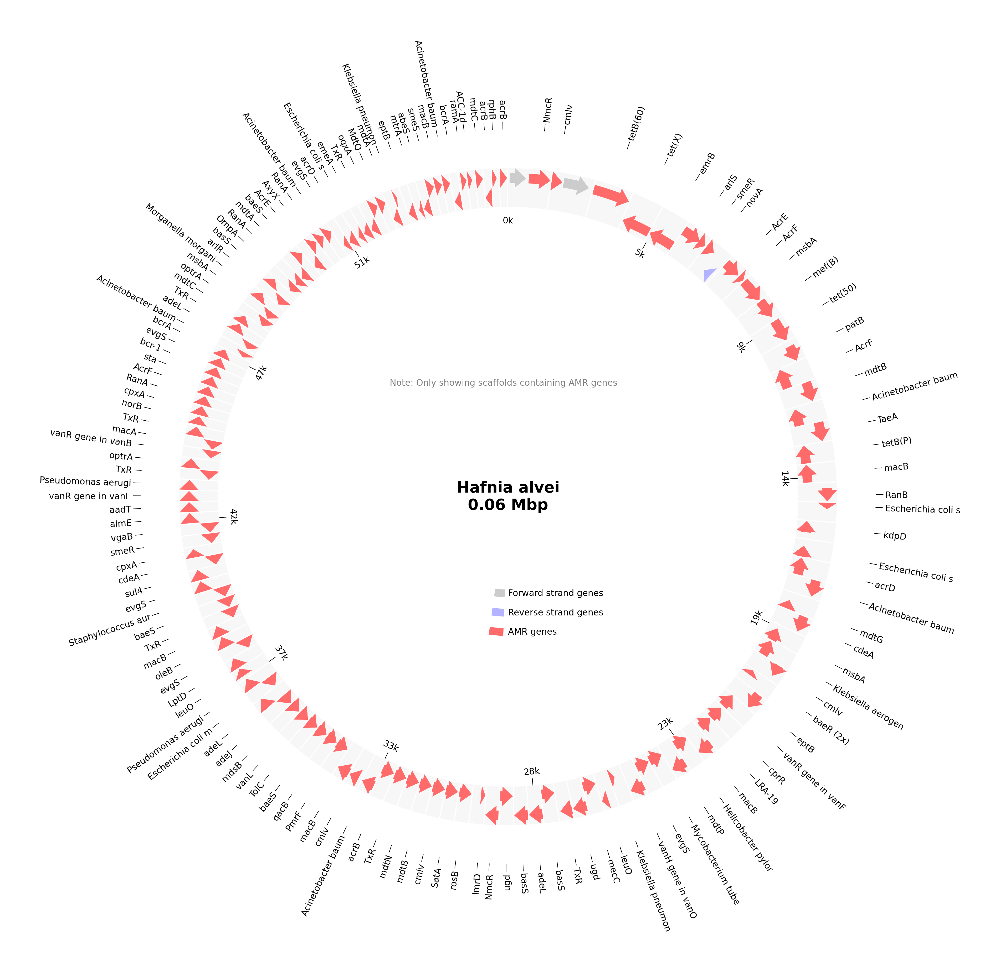

### ACC-1d
- **Mechanism**: antibiotic inactivation
- **Drug Classes**: monobactam; cephalosporin; cephamycin; penam; oxacephem
- **AMR Family**: ACC beta-lactamase
- **Locations**:
  - gnl|SPADES|OOJMENLF_186247_1 : position 2-136

### Acinetobacter baumannii AbaF (found in 2 locations)
- **Mechanism**: antibiotic efflux
- **Drug Classes**: phosphonic acid antibiotic
- **AMR Family**: major facilitator superfamily (MFS) antibiotic efflux pump
- **Locations**:
  - gnl|SPADES|OOJMENLF_179953_1 : position 3-218
  - gnl|SPADES|OOJMENLF_18578_1 : position 3-386

### Acinetobacter baumannii AbaQ (found in 3 locations)
- **Mechanism**: antibiotic efflux
- **Drug Classes**: fluoroquinolone antibiotic
- **AMR Family**: major facilitator superfamily (MFS) antibiotic efflux pump
- **Locations**:
  - gnl|SPADES|OOJMENLF_81329_1 : position 1-168
  - gnl|SPADES|OOJMENLF_8658_1 : position 50-595
  - gnl|SPADES|OOJMENLF_9674_1 : position 2-505

### Acinetobacter baumannii AmvA
- **Mechanism**: antibiotic efflux
- **Drug Classes**: macrolide antibiotic; disinfecting agents and antiseptics
- **AMR Family**: major facilitator superfamily (MFS) antibiotic efflux pump
- **Locations**:
  - gnl|SPADES|OOJMENLF_137750_1 : position 2-238

### AcrE (found in 2 locations)
- **Mechanism**: antibiotic efflux
- **Drug Classes**: fluoroquinolone antibiotic; cephalosporin; cephamycin; penam
- **AMR Family**: resistance-nodulation-cell division (RND) antibiotic efflux pump
- **Locations**:
  - gnl|SPADES|OOJMENLF_123636_1 : position 3-242
  - gnl|SPADES|OOJMENLF_6913_1 : position 1-510

### AcrF (found in 3 locations)
- **Mechanism**: antibiotic efflux
- **Drug Classes**: fluoroquinolone antibiotic; cephalosporin; cephamycin; penam
- **AMR Family**: resistance-nodulation-cell division (RND) antibiotic efflux pump
- **Locations**:
  - gnl|SPADES|OOJMENLF_53969_1 : position 3-278
  - gnl|SPADES|OOJMENLF_6913_2 : position 549-737
  - gnl|SPADES|OOJMENLF_7915_1 : position 1-645

### AxyX
- **Mechanism**: antibiotic efflux
- **Drug Classes**: macrolide antibiotic; fluoroquinolone antibiotic; aminoglycoside antibiotic; cephalosporin
- **AMR Family**: resistance-nodulation-cell division (RND) antibiotic efflux pump
- **Locations**:
  - gnl|SPADES|OOJMENLF_124733_1 : position 2-244

### Escherichia coli mdfA
- **Mechanism**: antibiotic efflux
- **Drug Classes**: tetracycline antibiotic; phenicol antibiotic; disinfecting agents and antiseptics
- **AMR Family**: major facilitator superfamily (MFS) antibiotic efflux pump
- **Locations**:
  - gnl|SPADES|OOJMENLF_27224_1 : position 2-340

### Escherichia coli soxS with mutation conferring antibiotic resistance (found in 3 locations)
- **Mechanism**: antibiotic target alteration; antibiotic efflux; reduced permeability to antibiotic
- **Drug Classes**: fluoroquinolone antibiotic; monobactam; carbapenem; cephalosporin; glycylcycline; cephamycin; penam; tetracycline antibiotic; rifamycin antibiotic; phenicol antibiotic; penem; disinfecting agents and antiseptics
- **AMR Family**: ATP-binding cassette (ABC) antibiotic efflux pump; major facilitator superfamily (MFS) antibiotic efflux pump; resistance-nodulation-cell division (RND) antibiotic efflux pump; General Bacterial Porin with reduced permeability to beta-lactams
- **Locations**:
  - gnl|SPADES|OOJMENLF_148188_1 : position 66-233
  - gnl|SPADES|OOJMENLF_9199_1 : position 3-200
  - gnl|SPADES|OOJMENLF_9262_1 : position 203-562

### Helicobacter pylori pbp1 mutants conferring resistance to amoxicillin
- **Mechanism**: antibiotic target alteration
- **Drug Classes**: cephalosporin; cephamycin; penam
- **AMR Family**: Penicillin-binding protein mutations conferring resistance to beta-lactam antibiotics
- **Locations**:
  - gnl|SPADES|OOJMENLF_13268_1 : position 3-446

### Klebsiella aerogenes Omp36
- **Mechanism**: reduced permeability to antibiotic
- **Drug Classes**: monobactam; carbapenem; cephalosporin; cephamycin; penam; penem
- **AMR Family**: General Bacterial Porin with reduced permeability to beta-lactams
- **Locations**:
  - gnl|SPADES|OOJMENLF_10349_1 : position 2-517

### Klebsiella pneumoniae KpnF
- **Mechanism**: antibiotic efflux
- **Drug Classes**: macrolide antibiotic; aminoglycoside antibiotic; cephalosporin; tetracycline antibiotic; peptide antibiotic; rifamycin antibiotic; disinfecting agents and antiseptics
- **AMR Family**: small multidrug resistance (SMR) antibiotic efflux pump
- **Locations**:
  - gnl|SPADES|OOJMENLF_163814_1 : position 1-93

### Klebsiella pneumoniae OmpK37
- **Mechanism**: reduced permeability to antibiotic
- **Drug Classes**: monobactam; carbapenem; cephalosporin; cephamycin; penam; penem
- **AMR Family**: General Bacterial Porin with reduced permeability to beta-lactams
- **Locations**:
  - gnl|SPADES|OOJMENLF_14676_2 : position 268-426

### LRA-19
- **Mechanism**: antibiotic inactivation
- **Drug Classes**: cephalosporin; penam
- **AMR Family**: subclass B3 LRA beta-lactamase
- **Locations**:
  - gnl|SPADES|OOJMENLF_11912_1 : position 1-420

### LptD
- **Mechanism**: antibiotic efflux
- **Drug Classes**: carbapenem; peptide antibiotic; aminocoumarin antibiotic; rifamycin antibiotic
- **AMR Family**: ATP-binding cassette (ABC) antibiotic efflux pump
- **Locations**:
  - gnl|SPADES|OOJMENLF_28847_1 : position 3-335

### MdtQ
- **Mechanism**: reduced permeability to antibiotic
- **Drug Classes**: monobactam; carbapenem; cephalosporin; cephamycin; penam; penem
- **AMR Family**: Outer Membrane Porin (Opr)
- **Locations**:
  - gnl|SPADES|OOJMENLF_160236_1 : position 2-226

### Morganella morganii gyrB conferring resistance to fluoroquinolones
- **Mechanism**: antibiotic target alteration
- **Drug Classes**: fluoroquinolone antibiotic
- **AMR Family**: fluoroquinolone resistant gyrB
- **Locations**:
  - gnl|SPADES|OOJMENLF_97735_1 : position 1-255

### Mycobacterium tuberculosis intrinsic murA conferring resistance to fosfomycin
- **Mechanism**: antibiotic target alteration
- **Drug Classes**: phosphonic acid antibiotic
- **AMR Family**: antibiotic-resistant murA transferase
- **Locations**:
  - gnl|SPADES|OOJMENLF_13460_1 : position 1-444

### NmcR (found in 2 locations)
- **Mechanism**: antibiotic inactivation
- **Drug Classes**: carbapenem; cephalosporin; cephamycin; penam
- **AMR Family**: NmcA beta-lactamase
- **Locations**:
  - gnl|SPADES|OOJMENLF_16126_1 : position 3-407
  - gnl|SPADES|OOJMENLF_4027_2 : position 625-1287

### OmpA
- **Mechanism**: reduced permeability to antibiotic
- **Drug Classes**: peptide antibiotic
- **AMR Family**: General Bacterial Porin with reduced permeability to peptide antibiotics
- **Locations**:
  - gnl|SPADES|OOJMENLF_113457_1 : position 4-249

### PmrF
- **Mechanism**: antibiotic target alteration
- **Drug Classes**: peptide antibiotic
- **AMR Family**: pmr phosphoethanolamine transferase
- **Locations**:
  - gnl|SPADES|OOJMENLF_19233_1 : position 2-382

### Pseudomonas aeruginosa CpxR
- **Mechanism**: antibiotic efflux
- **Drug Classes**: macrolide antibiotic; fluoroquinolone antibiotic; monobactam; aminoglycoside antibiotic; carbapenem; cephalosporin; cephamycin; penam; tetracycline antibiotic; peptide antibiotic; aminocoumarin antibiotic; diaminopyrimidine antibiotic; sulfonamide antibiotic; phenicol antibiotic; penem
- **AMR Family**: resistance-nodulation-cell division (RND) antibiotic efflux pump
- **Locations**:
  - gnl|SPADES|OOJMENLF_28201_1 : position 3-338

### Pseudomonas aeruginosa ampR with mutation conferring resistance to aztreonam
- **Mechanism**: antibiotic target alteration; antibiotic inactivation
- **Drug Classes**: monobactam; carbapenem; cephalosporin
- **AMR Family**: PDC beta-lactamase; ampR transcriptional regulator with mutation conferring resistance to monobactam antibiotics
- **Locations**:
  - gnl|SPADES|OOJMENLF_39765_1 : position 3-299

### RanA (found in 3 locations)
- **Mechanism**: antibiotic efflux
- **Drug Classes**: aminoglycoside antibiotic
- **AMR Family**: ATP-binding cassette (ABC) antibiotic efflux pump
- **Locations**:
  - gnl|SPADES|OOJMENLF_114870_1 : position 2-247
  - gnl|SPADES|OOJMENLF_129635_1 : position 1-240
  - gnl|SPADES|OOJMENLF_50431_1 : position 1-282

### RanB
- **Mechanism**: antibiotic efflux
- **Drug Classes**: aminoglycoside antibiotic
- **AMR Family**: ATP-binding cassette (ABC) antibiotic efflux pump
- **Locations**:
  - gnl|SPADES|OOJMENLF_9170_1 : position 159-566

### SatA
- **Mechanism**: antibiotic inactivation
- **Drug Classes**: nucleoside antibiotic
- **AMR Family**: streptothricin acetyltransferase (SAT)
- **Locations**:
  - gnl|SPADES|OOJMENLF_16769_1 : position 14-403

### Staphylococcus aureus mupA conferring resistance to mupirocin
- **Mechanism**: antibiotic target alteration
- **Drug Classes**: mupirocin-like antibiotic
- **AMR Family**: antibiotic-resistant isoleucyl-tRNA synthetase (ileS)
- **Locations**:
  - gnl|SPADES|OOJMENLF_30676_1 : position 3-326

### TaeA
- **Mechanism**: antibiotic efflux
- **Drug Classes**: pleuromutilin antibiotic
- **AMR Family**: ATP-binding cassette (ABC) antibiotic efflux pump
- **Locations**:
  - gnl|SPADES|OOJMENLF_8792_1 : position 2-586

### TolC
- **Mechanism**: antibiotic efflux
- **Drug Classes**: macrolide antibiotic; fluoroquinolone antibiotic; aminoglycoside antibiotic; carbapenem; cephalosporin; glycylcycline; cephamycin; penam; tetracycline antibiotic; peptide antibiotic; aminocoumarin antibiotic; rifamycin antibiotic; phenicol antibiotic; penem; disinfecting agents and antiseptics
- **AMR Family**: ATP-binding cassette (ABC) antibiotic efflux pump; major facilitator superfamily (MFS) antibiotic efflux pump; resistance-nodulation-cell division (RND) antibiotic efflux pump
- **Locations**:
  - gnl|SPADES|OOJMENLF_24828_1 : position 2-352

### TxR (found in 7 locations)
- **Mechanism**: antibiotic efflux
- **Drug Classes**: tetracycline antibiotic
- **AMR Family**: ATP-binding cassette (ABC) antibiotic efflux pump
- **Locations**:
  - gnl|SPADES|OOJMENLF_15322_1 : position 1-360
  - gnl|SPADES|OOJMENLF_156640_1 : position 3-230
  - gnl|SPADES|OOJMENLF_17786_1 : position 3-392
  - gnl|SPADES|OOJMENLF_30509_1 : position 1-327
  - gnl|SPADES|OOJMENLF_40939_1 : position 3-296
  - gnl|SPADES|OOJMENLF_44834_1 : position 2-289
  - gnl|SPADES|OOJMENLF_83263_1 : position 1-261

### aadT
- **Mechanism**: antibiotic efflux
- **Drug Classes**: macrolide antibiotic; tetracycline antibiotic; disinfecting agents and antiseptics
- **AMR Family**: major facilitator superfamily (MFS) antibiotic efflux pump
- **Locations**:
  - gnl|SPADES|OOJMENLF_37906_1 : position 3-302

### abeS
- **Mechanism**: antibiotic efflux
- **Drug Classes**: macrolide antibiotic; aminocoumarin antibiotic
- **AMR Family**: small multidrug resistance (SMR) antibiotic efflux pump
- **Locations**:
  - gnl|SPADES|OOJMENLF_174207_1 : position 1-222

### acrB (found in 3 locations)
- **Mechanism**: antibiotic efflux
- **Drug Classes**: fluoroquinolone antibiotic; cephalosporin; glycylcycline; penam; tetracycline antibiotic; rifamycin antibiotic; phenicol antibiotic; disinfecting agents and antiseptics
- **AMR Family**: resistance-nodulation-cell division (RND) antibiotic efflux pump
- **Locations**:
  - gnl|SPADES|OOJMENLF_18061_1 : position 3-392
  - gnl|SPADES|OOJMENLF_196378_1 : position 2-211
  - gnl|SPADES|OOJMENLF_201396_1 : position 2-208

### acrD (found in 2 locations)
- **Mechanism**: antibiotic efflux
- **Drug Classes**: aminoglycoside antibiotic
- **AMR Family**: resistance-nodulation-cell division (RND) antibiotic efflux pump
- **Locations**:
  - gnl|SPADES|OOJMENLF_143837_1 : position 2-235
  - gnl|SPADES|OOJMENLF_9384_1 : position 3-557

### adeJ
- **Mechanism**: antibiotic efflux
- **Drug Classes**: macrolide antibiotic; fluoroquinolone antibiotic; lincosamide antibiotic; carbapenem; cephalosporin; tetracycline antibiotic; rifamycin antibiotic; diaminopyrimidine antibiotic; phenicol antibiotic; penem
- **AMR Family**: resistance-nodulation-cell division (RND) antibiotic efflux pump
- **Locations**:
  - gnl|SPADES|OOJMENLF_26202_1 : position 1-345

### adeL (found in 3 locations)
- **Mechanism**: antibiotic efflux
- **Drug Classes**: fluoroquinolone antibiotic; tetracycline antibiotic
- **AMR Family**: resistance-nodulation-cell division (RND) antibiotic efflux pump
- **Locations**:
  - gnl|SPADES|OOJMENLF_15725_1 : position 3-413
  - gnl|SPADES|OOJMENLF_26601_1 : position 1-342
  - gnl|SPADES|OOJMENLF_82159_1 : position 2-223

### almE
- **Mechanism**: antibiotic target alteration
- **Drug Classes**: peptide antibiotic
- **AMR Family**: polymyxin resistance operon; alm glycyltransferase
- **Locations**:
  - gnl|SPADES|OOJMENLF_36563_1 : position 2-307

### arlR
- **Mechanism**: antibiotic efflux
- **Drug Classes**: fluoroquinolone antibiotic; disinfecting agents and antiseptics
- **AMR Family**: major facilitator superfamily (MFS) antibiotic efflux pump
- **Locations**:
  - gnl|SPADES|OOJMENLF_108988_1 : position 3-251

### arlS
- **Mechanism**: antibiotic efflux
- **Drug Classes**: fluoroquinolone antibiotic; disinfecting agents and antiseptics
- **AMR Family**: major facilitator superfamily (MFS) antibiotic efflux pump
- **Locations**:
  - gnl|SPADES|OOJMENLF_6350_1 : position 2-589

### baeR (found in 2 locations)
- **Mechanism**: antibiotic efflux
- **Drug Classes**: aminoglycoside antibiotic; aminocoumarin antibiotic
- **AMR Family**: resistance-nodulation-cell division (RND) antibiotic efflux pump
- **Locations**:
  - gnl|SPADES|OOJMENLF_10864_1 : position 23-211
  - gnl|SPADES|OOJMENLF_10864_2 : position 171-500

### baeS (found in 3 locations)
- **Mechanism**: antibiotic efflux
- **Drug Classes**: aminoglycoside antibiotic; aminocoumarin antibiotic
- **AMR Family**: resistance-nodulation-cell division (RND) antibiotic efflux pump
- **Locations**:
  - gnl|SPADES|OOJMENLF_122826_1 : position 2-244
  - gnl|SPADES|OOJMENLF_23048_1 : position 1-360
  - gnl|SPADES|OOJMENLF_30744_1 : position 2-328

### basS (found in 3 locations)
- **Mechanism**: antibiotic target alteration; antibiotic efflux
- **Drug Classes**: peptide antibiotic
- **AMR Family**: pmr phosphoethanolamine transferase
- **Locations**:
  - gnl|SPADES|OOJMENLF_108894_1 : position 2-250
  - gnl|SPADES|OOJMENLF_15555_1 : position 1-414
  - gnl|SPADES|OOJMENLF_15827_1 : position 2-412

### bcr-1
- **Mechanism**: antibiotic efflux
- **Drug Classes**: bicyclomycin-like antibiotic
- **AMR Family**: major facilitator superfamily (MFS) antibiotic efflux pump
- **Locations**:
  - gnl|SPADES|OOJMENLF_57044_1 : position 1-276

### bcrA (found in 2 locations)
- **Mechanism**: antibiotic efflux
- **Drug Classes**: peptide antibiotic
- **AMR Family**: ATP-binding cassette (ABC) antibiotic efflux pump
- **Locations**:
  - gnl|SPADES|OOJMENLF_182547_1 : position 3-218
  - gnl|SPADES|OOJMENLF_79240_1 : position 3-263

### cdeA (found in 2 locations)
- **Mechanism**: antibiotic efflux
- **Drug Classes**: fluoroquinolone antibiotic; disinfecting agents and antiseptics
- **AMR Family**: multidrug and toxic compound extrusion (MATE) transporter
- **Locations**:
  - gnl|SPADES|OOJMENLF_10052_1 : position 2-493
  - gnl|SPADES|OOJMENLF_33449_1 : position 2-319

### cmlv (found in 4 locations)
- **Mechanism**: antibiotic inactivation
- **Drug Classes**: phenicol antibiotic
- **AMR Family**: chloramphenicol phosphotransferase
- **Locations**:
  - gnl|SPADES|OOJMENLF_10740_1 : position 2-364
  - gnl|SPADES|OOJMENLF_16914_1 : position 1-399
  - gnl|SPADES|OOJMENLF_18587_1 : position 94-387
  - gnl|SPADES|OOJMENLF_4098_1 : position 1-327

### cprR
- **Mechanism**: antibiotic target alteration; antibiotic efflux
- **Drug Classes**: peptide antibiotic
- **AMR Family**: pmr phosphoethanolamine transferase
- **Locations**:
  - gnl|SPADES|OOJMENLF_11718_1 : position 25-477

### cpxA (found in 2 locations)
- **Mechanism**: antibiotic efflux
- **Drug Classes**: aminoglycoside antibiotic; aminocoumarin antibiotic
- **AMR Family**: resistance-nodulation-cell division (RND) antibiotic efflux pump
- **Locations**:
  - gnl|SPADES|OOJMENLF_33999_1 : position 3-254
  - gnl|SPADES|OOJMENLF_48854_1 : position 3-284

### emeA
- **Mechanism**: antibiotic efflux
- **Drug Classes**: disinfecting agents and antiseptics
- **AMR Family**: multidrug and toxic compound extrusion (MATE) transporter
- **Locations**:
  - gnl|SPADES|OOJMENLF_150309_1 : position 3-233

### emrB
- **Mechanism**: antibiotic efflux
- **Drug Classes**: fluoroquinolone antibiotic
- **AMR Family**: major facilitator superfamily (MFS) antibiotic efflux pump
- **Locations**:
  - gnl|SPADES|OOJMENLF_6131_1 : position 1-840

### eptB (found in 2 locations)
- **Mechanism**: antibiotic target alteration
- **Drug Classes**: peptide antibiotic
- **AMR Family**: pmr phosphoethanolamine transferase
- **Locations**:
  - gnl|SPADES|OOJMENLF_10959_1 : position 3-497
  - gnl|SPADES|OOJMENLF_164214_1 : position 3-224

### evgS (found in 5 locations)
- **Mechanism**: antibiotic efflux
- **Drug Classes**: macrolide antibiotic; fluoroquinolone antibiotic; penam; tetracycline antibiotic
- **AMR Family**: major facilitator superfamily (MFS) antibiotic efflux pump; resistance-nodulation-cell division (RND) antibiotic efflux pump
- **Locations**:
  - gnl|SPADES|OOJMENLF_137975_1 : position 69-236
  - gnl|SPADES|OOJMENLF_14021_1 : position 2-433
  - gnl|SPADES|OOJMENLF_29356_1 : position 3-332
  - gnl|SPADES|OOJMENLF_32312_1 : position 1-321
  - gnl|SPADES|OOJMENLF_65925_1 : position 3-272

### kdpD
- **Mechanism**: antibiotic efflux
- **Drug Classes**: aminoglycoside antibiotic
- **AMR Family**: kdpDE
- **Locations**:
  - gnl|SPADES|OOJMENLF_9224_1 : position 1-366

### leuO (found in 2 locations)
- **Mechanism**: antibiotic efflux
- **Drug Classes**: nucleoside antibiotic; disinfecting agents and antiseptics
- **AMR Family**: major facilitator superfamily (MFS) antibiotic efflux pump
- **Locations**:
  - gnl|SPADES|OOJMENLF_14919_1 : position 230-421
  - gnl|SPADES|OOJMENLF_28476_1 : position 84-335

### lmrD
- **Mechanism**: antibiotic efflux
- **Drug Classes**: lincosamide antibiotic
- **AMR Family**: ATP-binding cassette (ABC) antibiotic efflux pump
- **Locations**:
  - gnl|SPADES|OOJMENLF_16433_1 : position 3-140

### macA
- **Mechanism**: antibiotic efflux
- **Drug Classes**: macrolide antibiotic
- **AMR Family**: ATP-binding cassette (ABC) antibiotic efflux pump
- **Locations**:
  - gnl|SPADES|OOJMENLF_42178_1 : position 1-279

### macB (found in 5 locations)
- **Mechanism**: antibiotic efflux
- **Drug Classes**: macrolide antibiotic
- **AMR Family**: ATP-binding cassette (ABC) antibiotic efflux pump
- **Locations**:
  - gnl|SPADES|OOJMENLF_13036_1 : position 1-450
  - gnl|SPADES|OOJMENLF_181102_1 : position 3-218
  - gnl|SPADES|OOJMENLF_19297_1 : position 3-383
  - gnl|SPADES|OOJMENLF_30183_1 : position 2-328
  - gnl|SPADES|OOJMENLF_8920_1 : position 1-579

### mdsB
- **Mechanism**: antibiotic efflux
- **Drug Classes**: monobactam; carbapenem; cephalosporin; cephamycin; penam; phenicol antibiotic; penem
- **AMR Family**: resistance-nodulation-cell division (RND) antibiotic efflux pump
- **Locations**:
  - gnl|SPADES|OOJMENLF_26084_1 : position 2-346

### mdtA (found in 2 locations)
- **Mechanism**: antibiotic efflux
- **Drug Classes**: aminocoumarin antibiotic
- **AMR Family**: resistance-nodulation-cell division (RND) antibiotic efflux pump
- **Locations**:
  - gnl|SPADES|OOJMENLF_121221_1 : position 3-245
  - gnl|SPADES|OOJMENLF_163376_1 : position 3-227

### mdtB (found in 2 locations)
- **Mechanism**: antibiotic efflux
- **Drug Classes**: aminocoumarin antibiotic
- **AMR Family**: resistance-nodulation-cell division (RND) antibiotic efflux pump
- **Locations**:
  - gnl|SPADES|OOJMENLF_17033_1 : position 3-398
  - gnl|SPADES|OOJMENLF_8526_1 : position 3-602

### mdtC (found in 2 locations)
- **Mechanism**: antibiotic efflux
- **Drug Classes**: aminocoumarin antibiotic
- **AMR Family**: resistance-nodulation-cell division (RND) antibiotic efflux pump
- **Locations**:
  - gnl|SPADES|OOJMENLF_194011_1 : position 3-212
  - gnl|SPADES|OOJMENLF_89991_1 : position 1-258

### mdtG
- **Mechanism**: antibiotic efflux
- **Drug Classes**: phosphonic acid antibiotic
- **AMR Family**: major facilitator superfamily (MFS) antibiotic efflux pump
- **Locations**:
  - gnl|SPADES|OOJMENLF_9788_2 : position 257-538

### mdtN
- **Mechanism**: antibiotic efflux
- **Drug Classes**: nucleoside antibiotic; disinfecting agents and antiseptics
- **AMR Family**: major facilitator superfamily (MFS) antibiotic efflux pump
- **Locations**:
  - gnl|SPADES|OOJMENLF_17558_1 : position 1-396

### mdtP
- **Mechanism**: antibiotic efflux
- **Drug Classes**: nucleoside antibiotic; disinfecting agents and antiseptics
- **AMR Family**: major facilitator superfamily (MFS) antibiotic efflux pump
- **Locations**:
  - gnl|SPADES|OOJMENLF_13272_1 : position 1-447

### mecC
- **Mechanism**: antibiotic target replacement
- **Drug Classes**: penam
- **AMR Family**: methicillin resistant PBP2
- **Locations**:
  - gnl|SPADES|OOJMENLF_15144_1 : position 2-418

### mef(B)
- **Mechanism**: antibiotic efflux
- **Drug Classes**: macrolide antibiotic
- **AMR Family**: major facilitator superfamily (MFS) antibiotic efflux pump
- **Locations**:
  - gnl|SPADES|OOJMENLF_7288_1 : position 2-589

### msbA (found in 3 locations)
- **Mechanism**: antibiotic efflux
- **Drug Classes**: nitroimidazole antibiotic
- **AMR Family**: ATP-binding cassette (ABC) antibiotic efflux pump
- **Locations**:
  - gnl|SPADES|OOJMENLF_10117_2 : position 114-524
  - gnl|SPADES|OOJMENLF_6937_1 : position 1-732
  - gnl|SPADES|OOJMENLF_98747_1 : position 3-254

### mtrA
- **Mechanism**: antibiotic efflux
- **Drug Classes**: macrolide antibiotic; penam
- **AMR Family**: resistance-nodulation-cell division (RND) antibiotic efflux pump
- **Locations**:
  - gnl|SPADES|OOJMENLF_173189_1 : position 97-222

### norB
- **Mechanism**: antibiotic efflux
- **Drug Classes**: fluoroquinolone antibiotic
- **AMR Family**: major facilitator superfamily (MFS) antibiotic efflux pump
- **Locations**:
  - gnl|SPADES|OOJMENLF_47128_1 : position 29-286

### novA
- **Mechanism**: antibiotic efflux
- **Drug Classes**: aminocoumarin antibiotic
- **AMR Family**: ATP-binding cassette (ABC) antibiotic efflux pump
- **Locations**:
  - gnl|SPADES|OOJMENLF_6803_1 : position 1-294

### oleB
- **Mechanism**: antibiotic target protection
- **Drug Classes**: macrolide antibiotic
- **AMR Family**: Miscellaneous ABC-F subfamily ATP-binding cassette ribosomal protection proteins
- **Locations**:
  - gnl|SPADES|OOJMENLF_30051_1 : position 1-330

### optrA (found in 2 locations)
- **Mechanism**: antibiotic target protection
- **Drug Classes**: oxazolidinone antibiotic; phenicol antibiotic
- **AMR Family**: Miscellaneous ABC-F subfamily ATP-binding cassette ribosomal protection proteins
- **Locations**:
  - gnl|SPADES|OOJMENLF_41577_1 : position 1-294
  - gnl|SPADES|OOJMENLF_96358_1 : position 3-257

### oqxA
- **Mechanism**: antibiotic efflux
- **Drug Classes**: fluoroquinolone antibiotic; glycylcycline; tetracycline antibiotic; diaminopyrimidine antibiotic; nitrofuran antibiotic
- **AMR Family**: resistance-nodulation-cell division (RND) antibiotic efflux pump
- **Locations**:
  - gnl|SPADES|OOJMENLF_157862_1 : position 2-229

### patB
- **Mechanism**: antibiotic efflux
- **Drug Classes**: fluoroquinolone antibiotic
- **AMR Family**: ATP-binding cassette (ABC) antibiotic efflux pump
- **Locations**:
  - gnl|SPADES|OOJMENLF_7804_2 : position 170-655

### qacB
- **Mechanism**: antibiotic efflux
- **Drug Classes**: fluoroquinolone antibiotic
- **AMR Family**: major facilitator superfamily (MFS) antibiotic efflux pump
- **Locations**:
  - gnl|SPADES|OOJMENLF_21454_1 : position 2-367

### ramA
- **Mechanism**: antibiotic efflux; reduced permeability to antibiotic
- **Drug Classes**: fluoroquinolone antibiotic; monobactam; carbapenem; cephalosporin; glycylcycline; cephamycin; penam; tetracycline antibiotic; rifamycin antibiotic; phenicol antibiotic; penem; disinfecting agents and antiseptics
- **AMR Family**: resistance-nodulation-cell division (RND) antibiotic efflux pump; General Bacterial Porin with reduced permeability to beta-lactams
- **Locations**:
  - gnl|SPADES|OOJMENLF_184676_1 : position 51-215

### rosB
- **Mechanism**: antibiotic efflux
- **Drug Classes**: peptide antibiotic
- **AMR Family**: major facilitator superfamily (MFS) antibiotic efflux pump
- **Locations**:
  - gnl|SPADES|OOJMENLF_16650_1 : position 2-403

### rphB
- **Mechanism**: antibiotic inactivation
- **Drug Classes**: rifamycin antibiotic
- **AMR Family**: rifampin phosphotransferase
- **Locations**:
  - gnl|SPADES|OOJMENLF_201939_1 : position 3-140

### smeR (found in 2 locations)
- **Mechanism**: antibiotic efflux
- **Drug Classes**: aminoglycoside antibiotic; cephalosporin; cephamycin; penam
- **AMR Family**: resistance-nodulation-cell division (RND) antibiotic efflux pump
- **Locations**:
  - gnl|SPADES|OOJMENLF_33815_1 : position 1-315
  - gnl|SPADES|OOJMENLF_6350_2 : position 558-809

### smeS
- **Mechanism**: antibiotic efflux
- **Drug Classes**: aminoglycoside antibiotic; cephalosporin; cephamycin; penam
- **AMR Family**: resistance-nodulation-cell division (RND) antibiotic efflux pump
- **Locations**:
  - gnl|SPADES|OOJMENLF_177196_1 : position 2-220

### sta
- **Mechanism**: antibiotic inactivation
- **Drug Classes**: nucleoside antibiotic
- **AMR Family**: streptothricin acetyltransferase (SAT)
- **Locations**:
  - gnl|SPADES|OOJMENLF_53935_1 : position 2-277

### sul4
- **Mechanism**: antibiotic target replacement
- **Drug Classes**: sulfonamide antibiotic
- **AMR Family**: sulfonamide resistant sul
- **Locations**:
  - gnl|SPADES|OOJMENLF_33135_1 : position 3-320

### tet(50)
- **Mechanism**: antibiotic inactivation
- **Drug Classes**: tetracycline antibiotic
- **AMR Family**: tetracycline inactivation enzyme
- **Locations**:
  - gnl|SPADES|OOJMENLF_7380_1 : position 3-692

### tet(X)
- **Mechanism**: antibiotic inactivation
- **Drug Classes**: glycylcycline; tetracycline antibiotic
- **AMR Family**: tetracycline inactivation enzyme
- **Locations**:
  - gnl|SPADES|OOJMENLF_5552_1 : position 2-931

### tetB(60)
- **Mechanism**: antibiotic efflux
- **Drug Classes**: tetracycline antibiotic
- **AMR Family**: ATP-binding cassette (ABC) antibiotic efflux pump
- **Locations**:
  - gnl|SPADES|OOJMENLF_4579_1 : position 1-1128

### tetB(P)
- **Mechanism**: antibiotic target protection
- **Drug Classes**: tetracycline antibiotic
- **AMR Family**: tetracycline-resistant ribosomal protection protein
- **Locations**:
  - gnl|SPADES|OOJMENLF_8871_1 : position 1-582

### ugd (found in 2 locations)
- **Mechanism**: antibiotic target alteration
- **Drug Classes**: peptide antibiotic
- **AMR Family**: pmr phosphoethanolamine transferase
- **Locations**:
  - gnl|SPADES|OOJMENLF_15130_1 : position 3-419
  - gnl|SPADES|OOJMENLF_16166_1 : position 1-408

### vanH gene in vanO cluster
- **Mechanism**: antibiotic target alteration
- **Drug Classes**: glycopeptide antibiotic
- **AMR Family**: vanH; glycopeptide resistance gene cluster
- **Locations**:
  - gnl|SPADES|OOJMENLF_14109_1 : position 1-432

### vanL
- **Mechanism**: antibiotic target alteration
- **Drug Classes**: glycopeptide antibiotic
- **AMR Family**: glycopeptide resistance gene cluster; Van ligase
- **Locations**:
  - gnl|SPADES|OOJMENLF_25038_1 : position 1-351

### vanR gene in vanB cluster
- **Mechanism**: antibiotic target alteration
- **Drug Classes**: glycopeptide antibiotic
- **AMR Family**: glycopeptide resistance gene cluster; vanR
- **Locations**:
  - gnl|SPADES|OOJMENLF_41837_1 : position 43-291

### vanR gene in vanF cluster
- **Mechanism**: antibiotic target alteration
- **Drug Classes**: glycopeptide antibiotic
- **AMR Family**: glycopeptide resistance gene cluster; vanR
- **Locations**:
  - gnl|SPADES|OOJMENLF_11394_1 : position 2-460

### vanR gene in vanI cluster
- **Mechanism**: antibiotic target alteration
- **Drug Classes**: glycopeptide antibiotic
- **AMR Family**: glycopeptide resistance gene cluster; vanR
- **Locations**:
  - gnl|SPADES|OOJMENLF_39173_1 : position 1-300

### vgaB
- **Mechanism**: antibiotic target protection
- **Drug Classes**: streptogramin antibiotic; streptogramin A antibiotic; pleuromutilin antibiotic
- **AMR Family**: vga-type ABC-F protein
- **Locations**:
  - gnl|SPADES|OOJMENLF_35868_1 : position 1-309

## Hafnia alvei FB1
**Strain Statistics:**
- Total genome length: 1.5 kbp
- Total scaffolds: 70
- Scaffolds with AMR genes: 4
- Total genes annotated: 2
- Total AMR genes: 4
- Unique AMR genes: 4
- Distinct AMR mechanisms: 2
- Distinct AMR families: 3
- Distinct drug classes: 7

**Circos Plot:**

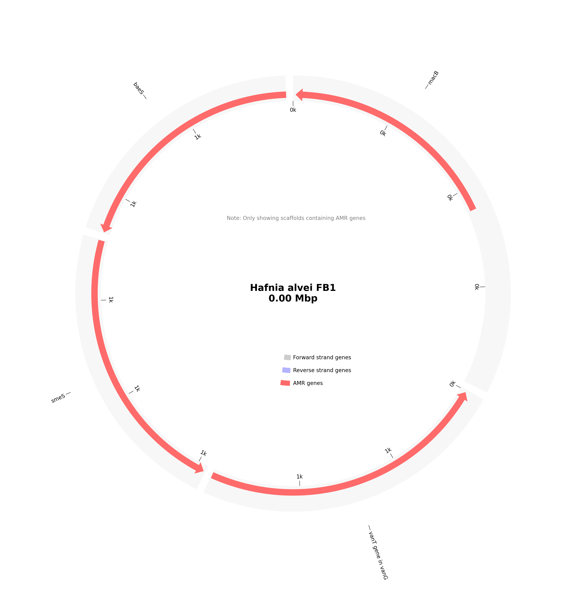

### baeS
- **Mechanism**: antibiotic efflux
- **Drug Classes**: aminoglycoside antibiotic; aminocoumarin antibiotic
- **AMR Family**: resistance-nodulation-cell division (RND) antibiotic efflux pump
- **Locations**:
  - gnl|SPADES|OOJMENLF_40391_1 : position 1-297

### macB
- **Mechanism**: antibiotic efflux
- **Drug Classes**: macrolide antibiotic
- **AMR Family**: ATP-binding cassette (ABC) antibiotic efflux pump
- **Locations**:
  - gnl|SPADES|OOJMENLF_11100_1 : position 3-275

### smeS
- **Mechanism**: antibiotic efflux
- **Drug Classes**: aminoglycoside antibiotic; cephalosporin; cephamycin; penam
- **AMR Family**: resistance-nodulation-cell division (RND) antibiotic efflux pump
- **Locations**:
  - gnl|SPADES|OOJMENLF_28952_1 : position 2-334

### vanT gene in vanG cluster
- **Mechanism**: antibiotic target alteration
- **Drug Classes**: glycopeptide antibiotic
- **AMR Family**: glycopeptide resistance gene cluster; vanT
- **Locations**:
  - gnl|SPADES|OOJMENLF_23210_1 : position 3-359

## Hafnia paralvei
**Strain Statistics:**
- Total genome length: 4506.8 kbp
- Total scaffolds: 114
- Scaffolds with AMR genes: 45
- Total genes annotated: 8202
- Total AMR genes: 426
- Unique AMR genes: 212
- Distinct AMR mechanisms: 11
- Distinct AMR families: 73
- Distinct drug classes: 37

**Circos Plot:**

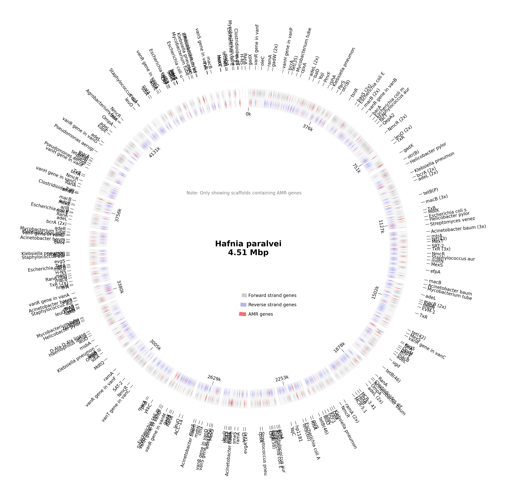

### AAC(6')-32
- **Mechanism**: antibiotic inactivation
- **Drug Classes**: aminoglycoside antibiotic
- **AMR Family**: AAC(6')
- **Locations**:
  - gnl|SPADES|OOJMENLF_5_150 : position 160994-161596

### AAC(6')-Iu
- **Mechanism**: antibiotic inactivation
- **Drug Classes**: aminoglycoside antibiotic
- **AMR Family**: AAC(6')
- **Locations**:
  - gnl|SPADES|OOJMENLF_26_55 : position 56871-57329

### ACC-1a
- **Mechanism**: antibiotic inactivation
- **Drug Classes**: monobactam; cephalosporin; cephamycin; penam; oxacephem
- **AMR Family**: ACC beta-lactamase
- **Locations**:
  - gnl|SPADES|OOJMENLF_36_3: position 3559-4731

### ALI-2
- **Mechanism**: antibiotic inactivation
- **Drug Classes**: carbapenem
- **AMR Family**: ALI beta-lactamase
- **Locations**:
  - gnl|SPADES|OOJMENLF_76_26 : position 23222-24100

### APH(6)-Ic
- **Mechanism**: antibiotic inactivation
- **Drug Classes**: aminoglycoside antibiotic
- **AMR Family**: APH(6)
- **Locations**:
  - gnl|SPADES|OOJMENLF_5_29 : position 27439-28242

### Acinetobacter baumannii AbaF (found in 6 locations)
- **Mechanism**: antibiotic efflux
- **Drug Classes**: phosphonic acid antibiotic
- **AMR Family**: major facilitator superfamily (MFS) antibiotic efflux pump
- **Locations**:
  - gnl|SPADES|OOJMENLF_11_224 : position 257312-258613
  - gnl|SPADES|OOJMENLF_2_290 : position 292721-294223
  - gnl|SPADES|OOJMENLF_34_61 : position 73823-75148
  - gnl|SPADES|OOJMENLF_42_4 : position 3565-4794
  - gnl|SPADES|OOJMENLF_63_55 : position 62879-64213
  - gnl|SPADES|OOJMENLF_76_34 : position 31575-33116

### Acinetobacter baumannii AbaQ (found in 7 locations)
- **Mechanism**: antibiotic efflux
- **Drug Classes**: fluoroquinolone antibiotic
- **AMR Family**: major facilitator superfamily (MFS) antibiotic efflux pump
- **Locations**:
  - gnl|SPADES|OOJMENLF_11_16 : position 15908-17245
  - gnl|SPADES|OOJMENLF_11_177 : position 194245-195591
  - gnl|SPADES|OOJMENLF_11_98 : position 110512-111735
  - gnl|SPADES|OOJMENLF_26_35 : position 36836-38128
  - gnl|SPADES|OOJMENLF_2_434 : position 446580-447908
  - gnl|SPADES|OOJMENLF_35_85 : position 86657-88033
  - gnl|SPADES|OOJMENLF_92_5 : position 4754-6049

### AcrE
- **Mechanism**: antibiotic efflux
- **Drug Classes**: fluoroquinolone antibiotic; cephalosporin; cephamycin; penam
- **AMR Family**: resistance-nodulation-cell division (RND) antibiotic efflux pump
- **Locations**:
  - gnl|SPADES|OOJMENLF_8_253 : position 278851-280014

### AcrF
- **Mechanism**: antibiotic efflux
- **Drug Classes**: fluoroquinolone antibiotic; cephalosporin; cephamycin; penam
- **AMR Family**: resistance-nodulation-cell division (RND) antibiotic efflux pump
- **Locations**:
  - gnl|SPADES|OOJMENLF_8_254 : position 280053-283175

### Agrobacterium fabrum chloramphenicol acetyltransferase
- **Mechanism**: antibiotic inactivation
- **Drug Classes**: phenicol antibiotic
- **AMR Family**: chloramphenicol acetyltransferase (CAT)
- **Locations**:
  - gnl|SPADES|OOJMENLF_127_13 : position 14988-15542

### ArnT
- **Mechanism**: antibiotic target alteration
- **Drug Classes**: peptide antibiotic
- **AMR Family**: pmr phosphoethanolamine transferase
- **Locations**:
  - gnl|SPADES|OOJMENLF_2_353: position 355371-357020

### Bifidobacterium adolescentis rpoB mutants conferring resistance to rifampicin
- **Mechanism**: antibiotic target alteration; antibiotic target replacement
- **Drug Classes**: rifamycin antibiotic
- **AMR Family**: rifamycin-resistant beta-subunit of RNA polymerase (rpoB)
- **Locations**:
  - gnl|SPADES|OOJMENLF_353_1 : position 3-2018

### Bifidobacterium bifidum ileS conferring resistance to mupirocin
- **Mechanism**: antibiotic target alteration
- **Drug Classes**: mupirocin-like antibiotic
- **AMR Family**: antibiotic-resistant isoleucyl-tRNA synthetase (ileS)
- **Locations**:
  - gnl|SPADES|OOJMENLF_8_283 : position 309469-312051

### CRP (found in 2 locations)
- **Mechanism**: antibiotic efflux
- **Drug Classes**: macrolide antibiotic; fluoroquinolone antibiotic; penam
- **AMR Family**: resistance-nodulation-cell division (RND) antibiotic efflux pump
- **Locations**:
  - gnl|SPADES|OOJMENLF_268_14 : position 13537-14334
  - gnl|SPADES|OOJMENLF_32_73: position 50494-51126

### Clostridioides difficile gyrA conferring resistance to fluoroquinolones
- **Mechanism**: antibiotic target alteration
- **Drug Classes**: fluoroquinolone antibiotic
- **AMR Family**: fluoroquinolone resistant gyrA
- **Locations**:
  - gnl|SPADES|OOJMENLF_805_2 : position 3291-5939

### Clostridioides difficile gyrB conferring resistance to fluoroquinolones (found in 2 locations)
- **Mechanism**: antibiotic target alteration
- **Drug Classes**: fluoroquinolone antibiotic
- **AMR Family**: fluoroquinolone resistant gyrB
- **Locations**:
  - gnl|SPADES|OOJMENLF_26_27 : position 28823-31237
  - gnl|SPADES|OOJMENLF_84_52 : position 59975-61870

### D-Ala-D-Ala ligase
- **Mechanism**: antibiotic target alteration
- **Drug Classes**: glycopeptide antibiotic
- **AMR Family**: Van ligase
- **Locations**:
  - gnl|SPADES|OOJMENLF_50_22 : position 26880-27800

### EVM-1
- **Mechanism**: antibiotic inactivation
- **Drug Classes**: carbapenem
- **AMR Family**: EVM beta-lactamase
- **Locations**:
  - gnl|SPADES|OOJMENLF_12_78 : position 90843-91664

### Enterobacter cloacae acrA
- **Mechanism**: antibiotic efflux
- **Drug Classes**: fluoroquinolone antibiotic; cephalosporin; glycylcycline; penam; tetracycline antibiotic; rifamycin antibiotic; phenicol antibiotic; disinfecting agents and antiseptics
- **AMR Family**: resistance-nodulation-cell division (RND) antibiotic efflux pump
- **Locations**:
  - gnl|SPADES|OOJMENLF_30_44 : position 43886-45076

### Enterococcus faecium cls conferring resistance to daptomycin
- **Mechanism**: antibiotic target alteration
- **Drug Classes**: peptide antibiotic
- **AMR Family**: daptomycin resistant cls
- **Locations**:
  - gnl|SPADES|OOJMENLF_2_310 : position 310300-311760

### ErmX
- **Mechanism**: antibiotic target alteration
- **Drug Classes**: macrolide antibiotic; lincosamide antibiotic; streptogramin antibiotic; streptogramin A antibiotic; streptogramin B antibiotic
- **AMR Family**: Erm 23S ribosomal RNA methyltransferase
- **Locations**:
  - gnl|SPADES|OOJMENLF_63_13 : position 15121-15933

### Escherichia coli AcrAB-TolC with AcrR mutation conferring resistance to ciprofloxacin, tetracycline, and ceftazidime
- **Mechanism**: antibiotic target alteration; antibiotic efflux
- **Drug Classes**: fluoroquinolone antibiotic; cephalosporin; glycylcycline; penam; tetracycline antibiotic; rifamycin antibiotic; phenicol antibiotic; disinfecting agents and antiseptics
- **AMR Family**: resistance-nodulation-cell division (RND) antibiotic efflux pump
- **Locations**:
  - gnl|SPADES|OOJMENLF_30_43 : position 43042-43746

### Escherichia coli AcrAB-TolC with MarR mutations conferring resistance to ciprofloxacin and tetracycline (found in 2 locations)
- **Mechanism**: antibiotic target alteration; antibiotic efflux
- **Drug Classes**: fluoroquinolone antibiotic; cephalosporin; glycylcycline; penam; tetracycline antibiotic; rifamycin antibiotic; phenicol antibiotic; disinfecting agents and antiseptics
- **AMR Family**: resistance-nodulation-cell division (RND) antibiotic efflux pump
- **Locations**:
  - gnl|SPADES|OOJMENLF_268_23 : position 23478-23969
  - gnl|SPADES|OOJMENLF_29_109 : position 117024-117455

### Escherichia coli EF-Tu mutants conferring resistance to Enacyloxin IIa
- **Mechanism**: antibiotic target alteration
- **Drug Classes**: elfamycin antibiotic
- **AMR Family**: elfamycin resistant EF-Tu
- **Locations**:
  - gnl|SPADES|OOJMENLF_5_64 : position 64748-67450

### Escherichia coli EF-Tu mutants conferring resistance to Pulvomycin (found in 2 locations)
- **Mechanism**: antibiotic target alteration
- **Drug Classes**: elfamycin antibiotic
- **AMR Family**: elfamycin resistant EF-Tu
- **Locations**:
  - gnl|SPADES|OOJMENLF_32_48 : position 27828-29012
  - gnl|SPADES|OOJMENLF_497_7 : position 6063-7247

### Escherichia coli PtsI with mutation conferring resistance to fosfomycin
- **Mechanism**: antibiotic target alteration
- **Drug Classes**: phosphonic acid antibiotic
- **AMR Family**: antibiotic-resistant ptsI phosphotransferase
- **Locations**:
  - gnl|SPADES|OOJMENLF_81_58 : position 61075-62802

### Escherichia coli acrA
- **Mechanism**: antibiotic efflux
- **Drug Classes**: fluoroquinolone antibiotic; cephalosporin; glycylcycline; penam; tetracycline antibiotic; rifamycin antibiotic; phenicol antibiotic; disinfecting agents and antiseptics
- **AMR Family**: resistance-nodulation-cell division (RND) antibiotic efflux pump
- **Locations**:
  - gnl|SPADES|OOJMENLF_5_319 : position 356093-357280

### Escherichia coli mdfA (found in 2 locations)
- **Mechanism**: antibiotic efflux
- **Drug Classes**: tetracycline antibiotic; phenicol antibiotic; disinfecting agents and antiseptics
- **AMR Family**: major facilitator superfamily (MFS) antibiotic efflux pump
- **Locations**:
  - gnl|SPADES|OOJMENLF_36_94 : position 118020-119252
  - gnl|SPADES|OOJMENLF_5_148 : position 157710-158930

### Escherichia coli soxS with mutation conferring antibiotic resistance (found in 4 locations)
- **Mechanism**: antibiotic target alteration; antibiotic efflux; reduced permeability to antibiotic
- **Drug Classes**: fluoroquinolone antibiotic; monobactam; carbapenem; cephalosporin; glycylcycline; cephamycin; penam; tetracycline antibiotic; rifamycin antibiotic; phenicol antibiotic; penem; disinfecting agents and antiseptics
- **AMR Family**: ATP-binding cassette (ABC) antibiotic efflux pump; major facilitator superfamily (MFS) antibiotic efflux pump; resistance-nodulation-cell division (RND) antibiotic efflux pump; General Bacterial Porin with reduced permeability to beta-lactams
- **Locations**:
  - gnl|SPADES|OOJMENLF_2_285 : position 288967-289338
  - gnl|SPADES|OOJMENLF_36_69 : position 84290-85153
  - gnl|SPADES|OOJMENLF_75_9 : position 7333-8211
  - gnl|SPADES|OOJMENLF_8_261 : position 289662-290483

### Escherichia coli uhpA with mutation conferring resistance to fosfomycin
- **Mechanism**: antibiotic target alteration
- **Drug Classes**: phosphonic acid antibiotic
- **AMR Family**: antibiotic-resistant UhpT
- **Locations**:
  - gnl|SPADES|OOJMENLF_311_15 : position 13069-13785

### FosC2
- **Mechanism**: antibiotic inactivation
- **Drug Classes**: phosphonic acid antibiotic
- **AMR Family**: fosC phosphotransferase family
- **Locations**:
  - gnl|SPADES|OOJMENLF_12_218 : position 226793-227257

### H-NS (found in 2 locations)
- **Mechanism**: antibiotic efflux
- **Drug Classes**: macrolide antibiotic; fluoroquinolone antibiotic; cephalosporin; cephamycin; penam; tetracycline antibiotic
- **AMR Family**: major facilitator superfamily (MFS) antibiotic efflux pump; resistance-nodulation-cell division (RND) antibiotic efflux pump
- **Locations**:
  - gnl|SPADES|OOJMENLF_18078_1 : position 2-379
  - gnl|SPADES|OOJMENLF_74_74 : position 81670-82077

### Haemophilus influenzae PBP3 conferring resistance to beta-lactam antibiotics (found in 2 locations)
- **Mechanism**: antibiotic target alteration
- **Drug Classes**: cephalosporin; cephamycin; penam
- **AMR Family**: Penicillin-binding protein mutations conferring resistance to beta-lactam antibiotics
- **Locations**:
  - gnl|SPADES|OOJMENLF_2_14 : position 14745-16517
  - gnl|SPADES|OOJMENLF_50_14 : position 15976-17739

### Helicobacter pylori pbp1 mutants conferring resistance to amoxicillin (found in 2 locations)
- **Mechanism**: antibiotic target alteration
- **Drug Classes**: cephalosporin; cephamycin; penam
- **AMR Family**: Penicillin-binding protein mutations conferring resistance to beta-lactam antibiotics
- **Locations**:
  - gnl|SPADES|OOJMENLF_50_66 : position 78767-81346
  - gnl|SPADES|OOJMENLF_8_25 : position 33327-35600

### Helicobacter pylori pbp2 mutants conferring resistance to amoxicillin
- **Mechanism**: antibiotic target alteration
- **Drug Classes**: cephalosporin; cephamycin; penam
- **AMR Family**: Penicillin-binding protein mutations conferring resistance to beta-lactam antibiotics
- **Locations**:
  - gnl|SPADES|OOJMENLF_8_277 : position 304085-305980

### Helicobacter pylori rpoB mutation conferring resistance to rifampicin
- **Mechanism**: antibiotic target alteration; antibiotic target replacement
- **Drug Classes**: fluoroquinolone antibiotic; rifamycin antibiotic
- **AMR Family**: rifamycin-resistant beta-subunit of RNA polymerase (rpoB)
- **Locations**:
  - gnl|SPADES|OOJMENLF_353_2 : position 2161-6381

### Klebsiella aerogenes Omp36
- **Mechanism**: reduced permeability to antibiotic
- **Drug Classes**: monobactam; carbapenem; cephalosporin; cephamycin; penam; penem
- **AMR Family**: General Bacterial Porin with reduced permeability to beta-lactams
- **Locations**:
  - gnl|SPADES|OOJMENLF_2_338 : position 338368-339516

### Klebsiella pneumoniae KpnE
- **Mechanism**: antibiotic efflux
- **Drug Classes**: macrolide antibiotic; aminoglycoside antibiotic; cephalosporin; tetracycline antibiotic; peptide antibiotic; rifamycin antibiotic; disinfecting agents and antiseptics
- **AMR Family**: small multidrug resistance (SMR) antibiotic efflux pump
- **Locations**:
  - gnl|SPADES|OOJMENLF_2_194 : position 197402-197833

### Klebsiella pneumoniae KpnF
- **Mechanism**: antibiotic efflux
- **Drug Classes**: macrolide antibiotic; aminoglycoside antibiotic; cephalosporin; tetracycline antibiotic; peptide antibiotic; rifamycin antibiotic; disinfecting agents and antiseptics
- **AMR Family**: small multidrug resistance (SMR) antibiotic efflux pump
- **Locations**:
  - gnl|SPADES|OOJMENLF_2_195: position 197820-198149

### Klebsiella pneumoniae KpnG
- **Mechanism**: antibiotic efflux
- **Drug Classes**: macrolide antibiotic; fluoroquinolone antibiotic; aminoglycoside antibiotic; carbapenem; cephalosporin; penam; peptide antibiotic; penem
- **AMR Family**: major facilitator superfamily (MFS) antibiotic efflux pump
- **Locations**:
  - gnl|SPADES|OOJMENLF_8_61 : position 79588-80763

### Klebsiella pneumoniae KpnH (found in 2 locations)
- **Mechanism**: antibiotic efflux
- **Drug Classes**: macrolide antibiotic; fluoroquinolone antibiotic; aminoglycoside antibiotic; carbapenem; cephalosporin; penam; peptide antibiotic; penem
- **AMR Family**: major facilitator superfamily (MFS) antibiotic efflux pump
- **Locations**:
  - gnl|SPADES|OOJMENLF_345_19 : position 19044-20483
  - gnl|SPADES|OOJMENLF_8_60: position 78035-79570

### Klebsiella pneumoniae OmpK37 (found in 6 locations)
- **Mechanism**: reduced permeability to antibiotic
- **Drug Classes**: monobactam; carbapenem; cephalosporin; cephamycin; penam; penem
- **AMR Family**: General Bacterial Porin with reduced permeability to beta-lactams
- **Locations**:
  - gnl|SPADES|OOJMENLF_29_60 : position 67896-69008
  - gnl|SPADES|OOJMENLF_2_391 : position 395708-396850
  - gnl|SPADES|OOJMENLF_45_70 : position 86373-87488
  - gnl|SPADES|OOJMENLF_50_67 : position 81528-82667
  - gnl|SPADES|OOJMENLF_75_66 : position 68572-69672
  - gnl|SPADES|OOJMENLF_76_57 : position 53998-55101

### Klebsiella pneumoniae acrR with mutation conferring multidrug antibiotic resistance
- **Mechanism**: antibiotic target alteration; antibiotic efflux
- **Drug Classes**: fluoroquinolone antibiotic; cephalosporin; glycylcycline; penam; tetracycline antibiotic; rifamycin antibiotic; phenicol antibiotic; disinfecting agents and antiseptics
- **AMR Family**: resistance-nodulation-cell division (RND) antibiotic efflux pump
- **Locations**:
  - gnl|SPADES|OOJMENLF_8_252 : position 277644-278258

### LRA-19
- **Mechanism**: antibiotic inactivation
- **Drug Classes**: cephalosporin; penam
- **AMR Family**: subclass B3 LRA beta-lactamase
- **Locations**:
  - gnl|SPADES|OOJMENLF_45_72 : position 89049-89696

### LlmA 23S ribosomal RNA methyltransferase
- **Mechanism**: antibiotic target alteration
- **Drug Classes**: lincosamide antibiotic
- **AMR Family**: Llm 23S ribosomal RNA methyltransferase
- **Locations**:
  - gnl|SPADES|OOJMENLF_45_41 : position 50259-51452

### LptD
- **Mechanism**: antibiotic efflux
- **Drug Classes**: carbapenem; peptide antibiotic; aminocoumarin antibiotic; rifamycin antibiotic
- **AMR Family**: ATP-binding cassette (ABC) antibiotic efflux pump
- **Locations**:
  - gnl|SPADES|OOJMENLF_63_10 : position 10322-12724

### MCR-10.4
- **Mechanism**: antibiotic target alteration
- **Drug Classes**: peptide antibiotic
- **AMR Family**: MCR phosphoethanolamine transferase
- **Locations**:
  - gnl|SPADES|OOJMENLF_25_118 : position 147995-149629

### MCR-3.4
- **Mechanism**: antibiotic target alteration
- **Drug Classes**: peptide antibiotic
- **AMR Family**: MCR phosphoethanolamine transferase
- **Locations**:
  - gnl|SPADES|OOJMENLF_2_13 : position 12773-14380

### MCR-3.41
- **Mechanism**: antibiotic target alteration
- **Drug Classes**: peptide antibiotic
- **AMR Family**: MCR phosphoethanolamine transferase
- **Locations**:
  - gnl|SPADES|OOJMENLF_26_109 : position 110423-112045

### MCR-5.1
- **Mechanism**: antibiotic target alteration
- **Drug Classes**: peptide antibiotic
- **AMR Family**: MCR phosphoethanolamine transferase
- **Locations**:
  - gnl|SPADES|OOJMENLF_26_145 : position 147930-149657

### MdtK
- **Mechanism**: antibiotic efflux
- **Drug Classes**: fluoroquinolone antibiotic
- **AMR Family**: multidrug and toxic compound extrusion (MATE) transporter
- **Locations**:
  - gnl|SPADES|OOJMENLF_8_245 : position 270016-271473

### MdtQ
- **Mechanism**: reduced permeability to antibiotic
- **Drug Classes**: monobactam; carbapenem; cephalosporin; cephamycin; penam; penem
- **AMR Family**: Outer Membrane Porin (Opr)
- **Locations**:
  - gnl|SPADES|OOJMENLF_45_14 : position 12521-14026

### MexG
- **Mechanism**: antibiotic efflux
- **Drug Classes**: fluoroquinolone antibiotic; tetracycline antibiotic; disinfecting agents and antiseptics
- **AMR Family**: resistance-nodulation-cell division (RND) antibiotic efflux pump
- **Locations**:
  - gnl|SPADES|OOJMENLF_2_295 : position 296893-297309

### MexS (found in 6 locations)
- **Mechanism**: antibiotic efflux
- **Drug Classes**: fluoroquinolone antibiotic; diaminopyrimidine antibiotic; phenicol antibiotic
- **AMR Family**: resistance-nodulation-cell division (RND) antibiotic efflux pump
- **Locations**:
  - gnl|SPADES|OOJMENLF_11_138 : position 162544-163521
  - gnl|SPADES|OOJMENLF_12_214 : position 222241-223365
  - gnl|SPADES|OOJMENLF_34_76 : position 95589-96608
  - gnl|SPADES|OOJMENLF_35_8 : position 8103-9134
  - gnl|SPADES|OOJMENLF_39_116 : position 129309-130295
  - gnl|SPADES|OOJMENLF_75_17 : position 15657-16658

### MexT
- **Mechanism**: antibiotic efflux
- **Drug Classes**: fluoroquinolone antibiotic; diaminopyrimidine antibiotic; phenicol antibiotic
- **AMR Family**: resistance-nodulation-cell division (RND) antibiotic efflux pump
- **Locations**:
  - gnl|SPADES|OOJMENLF_11_58 : position 61995-62888

### MexV
- **Mechanism**: antibiotic efflux
- **Drug Classes**: macrolide antibiotic; fluoroquinolone antibiotic; tetracycline antibiotic; phenicol antibiotic; disinfecting agents and antiseptics
- **AMR Family**: resistance-nodulation-cell division (RND) antibiotic efflux pump
- **Locations**:
  - gnl|SPADES|OOJMENLF_411_12 : position 12840-14357

### MexZ
- **Mechanism**: antibiotic efflux
- **Drug Classes**: macrolide antibiotic; fluoroquinolone antibiotic; aminoglycoside antibiotic; carbapenem; cephalosporin; cephamycin; penam; tetracycline antibiotic; phenicol antibiotic; disinfecting agents and antiseptics
- **AMR Family**: resistance-nodulation-cell division (RND) antibiotic efflux pump
- **Locations**:
  - gnl|SPADES|OOJMENLF_84_4 : position 1924-2529

### Mycobacterium tuberculosis gidB mutation conferring resistance to streptomycin
- **Mechanism**: antibiotic target alteration
- **Drug Classes**: aminoglycoside antibiotic
- **AMR Family**: antibiotic resistant gidB
- **Locations**:
  - gnl|SPADES|OOJMENLF_345_5 : position 2683-3303

### Mycobacterium tuberculosis ndh with mutation conferring resistance to isoniazid
- **Mechanism**: antibiotic target alteration
- **Drug Classes**: isoniazid-like antibiotic
- **AMR Family**: antibiotic resistant ndh
- **Locations**:
  - gnl|SPADES|OOJMENLF_2_220 : position 222230-223534

### Mycobacterium tuberculosis pncA mutations conferring resistance to pyrazinamide
- **Mechanism**: antibiotic target alteration
- **Drug Classes**: pyrazine antibiotic
- **AMR Family**: Pyrazinamide resistant pncA
- **Locations**:
  - gnl|SPADES|OOJMENLF_76_66 : position 64993-65628

### Mycobacterium tuberculosis rpoB mutations conferring resistance to rifampicin
- **Mechanism**: antibiotic target alteration; antibiotic target replacement
- **Drug Classes**: rifamycin antibiotic
- **AMR Family**: rifamycin-resistant beta-subunit of RNA polymerase (rpoB)
- **Locations**:
  - gnl|SPADES|OOJMENLF_497_14 : position 11366-13429

### Mycobacterium tuberculosis rpsA mutations conferring resistance to pyrazinamide
- **Mechanism**: antibiotic target alteration
- **Drug Classes**: pyrazine antibiotic
- **AMR Family**: pyrazinamide resistant rpsA
- **Locations**:
  - gnl|SPADES|OOJMENLF_12_1 : position 2-1126

### Mycobacterium tuberculosis thyA with mutation conferring resistance to para-aminosalicylic acid
- **Mechanism**: antibiotic target alteration
- **Drug Classes**: salicylic acid antibiotic
- **AMR Family**: aminosalicylate resistant thymidylate synthase
- **Locations**:
  - gnl|SPADES|OOJMENLF_50_80 : position 97252-98046

### NmcR (found in 8 locations)
- **Mechanism**: antibiotic inactivation
- **Drug Classes**: carbapenem; cephalosporin; cephamycin; penam
- **AMR Family**: NmcA beta-lactamase
- **Locations**:
  - gnl|SPADES|OOJMENLF_11_102 : position 115602-116531
  - gnl|SPADES|OOJMENLF_127_27 : position 31513-32472
  - gnl|SPADES|OOJMENLF_29_26 : position 34786-35760
  - gnl|SPADES|OOJMENLF_2_419 : position 433644-434549
  - gnl|SPADES|OOJMENLF_42_1 : position 365-1192
  - gnl|SPADES|OOJMENLF_5_222 : position 240998-241891
  - gnl|SPADES|OOJMENLF_5_234 : position 256025-256897
  - gnl|SPADES|OOJMENLF_86_37 : position 30301-31197

### OmpA (found in 4 locations)
- **Mechanism**: reduced permeability to antibiotic
- **Drug Classes**: peptide antibiotic
- **AMR Family**: General Bacterial Porin with reduced permeability to peptide antibiotics
- **Locations**:
  - gnl|SPADES|OOJMENLF_107_56 : position 63968-64483
  - gnl|SPADES|OOJMENLF_26_51 : position 53821-54480
  - gnl|SPADES|OOJMENLF_2_289 : position 291657-292148
  - gnl|SPADES|OOJMENLF_45_51 : position 60511-61569

### OprM
- **Mechanism**: antibiotic efflux
- **Drug Classes**: macrolide antibiotic; fluoroquinolone antibiotic; monobactam; aminoglycoside antibiotic; carbapenem; cephalosporin; cephamycin; penam; tetracycline antibiotic; peptide antibiotic; aminocoumarin antibiotic; diaminopyrimidine antibiotic; sulfonamide antibiotic; phenicol antibiotic; penem; disinfecting agents and antiseptics
- **AMR Family**: resistance-nodulation-cell division (RND) antibiotic efflux pump
- **Locations**:
  - gnl|SPADES|OOJMENLF_25_9 : position 23582-24943

### ParR (found in 2 locations)
- **Mechanism**: antibiotic efflux; reduced permeability to antibiotic
- **Drug Classes**: macrolide antibiotic; fluoroquinolone antibiotic; monobactam; aminoglycoside antibiotic; carbapenem; cephalosporin; cephamycin; penam; tetracycline antibiotic; phenicol antibiotic; penem; disinfecting agents and antiseptics
- **AMR Family**: resistance-nodulation-cell division (RND) antibiotic efflux pump; Outer Membrane Porin (Opr)
- **Locations**:
  - gnl|SPADES|OOJMENLF_2_411 : position 423249-423962
  - gnl|SPADES|OOJMENLF_32_112 : position 95413-96132

### ParS (found in 2 locations)
- **Mechanism**: antibiotic efflux; reduced permeability to antibiotic
- **Drug Classes**: macrolide antibiotic; fluoroquinolone antibiotic; monobactam; aminoglycoside antibiotic; carbapenem; cephalosporin; cephamycin; penam; tetracycline antibiotic; phenicol antibiotic; penem; disinfecting agents and antiseptics
- **AMR Family**: resistance-nodulation-cell division (RND) antibiotic efflux pump; Outer Membrane Porin (Opr)
- **Locations**:
  - gnl|SPADES|OOJMENLF_2_410 : position 421914-423242
  - gnl|SPADES|OOJMENLF_84_12 : position 7551-9212

### Planobispora rosea EF-Tu mutants conferring resistance to inhibitor GE2270A
- **Mechanism**: antibiotic target alteration
- **Drug Classes**: elfamycin antibiotic
- **AMR Family**: elfamycin resistant EF-Tu
- **Locations**:
  - gnl|SPADES|OOJMENLF_11_118 : position 136326-138194

### PmrF
- **Mechanism**: antibiotic target alteration
- **Drug Classes**: peptide antibiotic
- **AMR Family**: pmr phosphoethanolamine transferase
- **Locations**:
  - gnl|SPADES|OOJMENLF_2_350 : position 351459-352475

### Pseudomonas aeruginosa CpxR
- **Mechanism**: antibiotic efflux
- **Drug Classes**: macrolide antibiotic; fluoroquinolone antibiotic; monobactam; aminoglycoside antibiotic; carbapenem; cephalosporin; cephamycin; penam; tetracycline antibiotic; peptide antibiotic; aminocoumarin antibiotic; diaminopyrimidine antibiotic; sulfonamide antibiotic; phenicol antibiotic; penem
- **AMR Family**: resistance-nodulation-cell division (RND) antibiotic efflux pump
- **Locations**:
  - gnl|SPADES|OOJMENLF_26_120 : position 121634-122332

### Pseudomonas aeruginosa ampR with mutation conferring resistance to aztreonam (found in 3 locations)
- **Mechanism**: antibiotic target alteration; antibiotic inactivation
- **Drug Classes**: monobactam; carbapenem; cephalosporin
- **AMR Family**: PDC beta-lactamase; ampR transcriptional regulator with mutation conferring resistance to monobactam antibiotics
- **Locations**:
  - gnl|SPADES|OOJMENLF_105_6 : position 4734-5651
  - gnl|SPADES|OOJMENLF_36_4 : position 4946-5812
  - gnl|SPADES|OOJMENLF_92_17 : position 18059-19006

### QepA2
- **Mechanism**: antibiotic efflux
- **Drug Classes**: fluoroquinolone antibiotic
- **AMR Family**: major facilitator superfamily (MFS) antibiotic efflux pump
- **Locations**:
  - gnl|SPADES|OOJMENLF_5_192 : position 203894-205300

### QepA4
- **Mechanism**: antibiotic efflux
- **Drug Classes**: fluoroquinolone antibiotic
- **AMR Family**: major facilitator superfamily (MFS) antibiotic efflux pump
- **Locations**:
  - gnl|SPADES|OOJMENLF_2_418 : position 432191-433474

### RanA (found in 14 locations)
- **Mechanism**: antibiotic efflux
- **Drug Classes**: aminoglycoside antibiotic
- **AMR Family**: ATP-binding cassette (ABC) antibiotic efflux pump
- **Locations**:
  - gnl|SPADES|OOJMENLF_12_57 : position 66722-67855
  - gnl|SPADES|OOJMENLF_141559_1 : position 2-235
  - gnl|SPADES|OOJMENLF_25_28 : position 44277-45890
  - gnl|SPADES|OOJMENLF_26_9 : position 9648-10424
  - gnl|SPADES|OOJMENLF_29_92 : position 100975-101601
  - gnl|SPADES|OOJMENLF_302_10 : position 9882-10907
  - gnl|SPADES|OOJMENLF_36_39 : position 50159-51166
  - gnl|SPADES|OOJMENLF_74_54 : position 58218-59357
  - gnl|SPADES|OOJMENLF_74_66 : position 69643-70647
  - gnl|SPADES|OOJMENLF_74_67 : position 70644-71630
  - gnl|SPADES|OOJMENLF_75_54 : position 58812-59642
  - gnl|SPADES|OOJMENLF_81_40 : position 43028-43963
  - gnl|SPADES|OOJMENLF_86_1 : position 325-1134
  - gnl|SPADES|OOJMENLF_92_42 : position 42600-43676

### RanB
- **Mechanism**: antibiotic efflux
- **Drug Classes**: aminoglycoside antibiotic
- **AMR Family**: ATP-binding cassette (ABC) antibiotic efflux pump
- **Locations**:
  - gnl|SPADES|OOJMENLF_75_53 : position 58025-58807

### RlmA(II)
- **Mechanism**: antibiotic target alteration
- **Drug Classes**: macrolide antibiotic; lincosamide antibiotic
- **AMR Family**: non-erm 23S ribosomal RNA methyltransferase (G748)
- **Locations**:
  - gnl|SPADES|OOJMENLF_29_30 : position 38503-39315

### SAT-2
- **Mechanism**: antibiotic inactivation
- **Drug Classes**: nucleoside antibiotic
- **AMR Family**: streptothricin acetyltransferase (SAT)
- **Locations**:
  - gnl|SPADES|OOJMENLF_42_26 : position 29963-30691

### SRT-2
- **Mechanism**: antibiotic inactivation
- **Drug Classes**: cephalosporin
- **AMR Family**: SRT beta-lactamase
- **Locations**:
  - gnl|SPADES|OOJMENLF_11_76 : position 80931-82070

### SatA
- **Mechanism**: antibiotic inactivation
- **Drug Classes**: nucleoside antibiotic
- **AMR Family**: streptothricin acetyltransferase (SAT)
- **Locations**:
  - gnl|SPADES|OOJMENLF_2_279 : position 283827-284270

### Staphylococcus aureus GlpT with mutation conferring resistance to fosfomycin
- **Mechanism**: antibiotic target alteration
- **Drug Classes**: phosphonic acid antibiotic
- **AMR Family**: antibiotic-resistant GlpT
- **Locations**:
  - gnl|SPADES|OOJMENLF_11_113 : position 130754-132109

### Staphylococcus aureus fusA with mutation conferring resistance to fusidic acid (found in 2 locations)
- **Mechanism**: antibiotic target alteration
- **Drug Classes**: fusidane antibiotic
- **AMR Family**: antibiotic resistant fusA
- **Locations**:
  - gnl|SPADES|OOJMENLF_32_49 : position 29083-31197
  - gnl|SPADES|OOJMENLF_5_161 : position 172265-173854

### Staphylococcus aureus fusE with mutation conferring resistance to fusidic acid
- **Mechanism**: antibiotic target alteration
- **Drug Classes**: fusidane antibiotic
- **AMR Family**: antibiotic resistant fusE
- **Locations**:
  - gnl|SPADES|OOJMENLF_32_28 : position 18124-18657

### Staphylococcus aureus mupA conferring resistance to mupirocin
- **Mechanism**: antibiotic target alteration
- **Drug Classes**: mupirocin-like antibiotic
- **AMR Family**: antibiotic-resistant isoleucyl-tRNA synthetase (ileS)
- **Locations**:
  - gnl|SPADES|OOJMENLF_63_44 : position 47560-50409

### Staphylococcus aureus mupB conferring resistance to mupirocin
- **Mechanism**: antibiotic target alteration
- **Drug Classes**: mupirocin-like antibiotic
- **AMR Family**: antibiotic-resistant isoleucyl-tRNA synthetase (ileS)
- **Locations**:
  - gnl|SPADES|OOJMENLF_11_81 : position 87109-89964

### Staphylococcus aureus murA with mutation conferring resistance to fosfomycin
- **Mechanism**: antibiotic target alteration
- **Drug Classes**: phosphonic acid antibiotic
- **AMR Family**: antibiotic-resistant murA transferase
- **Locations**:
  - gnl|SPADES|OOJMENLF_75_48 : position 54629-55888

### Staphylococcus aureus pgsA mutations conferring resistance to daptomycin
- **Mechanism**: antibiotic target alteration
- **Drug Classes**: peptide antibiotic
- **AMR Family**: daptomycin resistant pgsA
- **Locations**:
  - gnl|SPADES|OOJMENLF_199_1 : position 214-762

### Staphylococcus aureus walK with mutation conferring resistance to daptomycin
- **Mechanism**: antibiotic target alteration
- **Drug Classes**: peptide antibiotic
- **AMR Family**: daptomycin resistant walK
- **Locations**:
  - gnl|SPADES|OOJMENLF_11_87 : position 95549-97423

### Streptococcus pneumoniae PBP2x conferring resistance to amoxicillin
- **Mechanism**: antibiotic target alteration
- **Drug Classes**: cephalosporin; cephamycin; penam
- **AMR Family**: Penicillin-binding protein mutations conferring resistance to beta-lactam antibiotics
- **Locations**:
  - gnl|SPADES|OOJMENLF_32_104 : position 84061-86631

### Streptomyces rimosus otr(A)
- **Mechanism**: antibiotic target protection
- **Drug Classes**: tetracycline antibiotic
- **AMR Family**: tetracycline-resistant ribosomal protection protein
- **Locations**:
  - gnl|SPADES|OOJMENLF_36_88 : position 111041-112864

### Streptomyces venezuelae rox (found in 3 locations)
- **Mechanism**: antibiotic inactivation
- **Drug Classes**: rifamycin antibiotic
- **AMR Family**: rifampin monooxygenase
- **Locations**:
  - gnl|SPADES|OOJMENLF_5_229 : position 248304-249482
  - gnl|SPADES|OOJMENLF_5_230 : position 249569-250774
  - gnl|SPADES|OOJMENLF_8_297 : position 325897-327072

### TaeA (found in 2 locations)
- **Mechanism**: antibiotic efflux
- **Drug Classes**: pleuromutilin antibiotic
- **AMR Family**: ATP-binding cassette (ABC) antibiotic efflux pump
- **Locations**:
  - gnl|SPADES|OOJMENLF_45_60 : position 70011-71918
  - gnl|SPADES|OOJMENLF_75_15 : position 12897-14564

### TolC
- **Mechanism**: antibiotic efflux
- **Drug Classes**: macrolide antibiotic; fluoroquinolone antibiotic; aminoglycoside antibiotic; carbapenem; cephalosporin; glycylcycline; cephamycin; penam; tetracycline antibiotic; peptide antibiotic; aminocoumarin antibiotic; rifamycin antibiotic; phenicol antibiotic; penem; disinfecting agents and antiseptics
- **AMR Family**: ATP-binding cassette (ABC) antibiotic efflux pump; major facilitator superfamily (MFS) antibiotic efflux pump; resistance-nodulation-cell division (RND) antibiotic efflux pump
- **Locations**:
  - gnl|SPADES|OOJMENLF_84_57 : position 64803-66284

### TxR (found in 13 locations)
- **Mechanism**: antibiotic efflux
- **Drug Classes**: tetracycline antibiotic
- **AMR Family**: ATP-binding cassette (ABC) antibiotic efflux pump
- **Locations**:
  - gnl|SPADES|OOJMENLF_11_206 : position 233433-235211
  - gnl|SPADES|OOJMENLF_11_86 : position 94158-95552
  - gnl|SPADES|OOJMENLF_11_93 : position 104066-105511
  - gnl|SPADES|OOJMENLF_12_108 : position 121252-124086
  - gnl|SPADES|OOJMENLF_355_16 : position 15728-17068
  - gnl|SPADES|OOJMENLF_36_85 : position 106461-107882
  - gnl|SPADES|OOJMENLF_459_4 : position 4342-5919
  - gnl|SPADES|OOJMENLF_5_276 : position 303731-305992
  - gnl|SPADES|OOJMENLF_74_31 : position 32592-34178
  - gnl|SPADES|OOJMENLF_74_42 : position 43578-44579
  - gnl|SPADES|OOJMENLF_84_58 : position 66445-68400
  - gnl|SPADES|OOJMENLF_86_65 : position 58758-60209
  - gnl|SPADES|OOJMENLF_8_235 : position 258334-259866

### YajC
- **Mechanism**: antibiotic efflux
- **Drug Classes**: fluoroquinolone antibiotic; cephalosporin; glycylcycline; penam; tetracycline antibiotic; oxazolidinone antibiotic; glycopeptide antibiotic; rifamycin antibiotic; phenicol antibiotic; disinfecting agents and antiseptics
- **AMR Family**: resistance-nodulation-cell division (RND) antibiotic efflux pump
- **Locations**:
  - gnl|SPADES|OOJMENLF_30_105 : position 111979-112311

### YojI
- **Mechanism**: antibiotic efflux
- **Drug Classes**: peptide antibiotic
- **AMR Family**: ATP-binding cassette (ABC) antibiotic efflux pump
- **Locations**:
  - gnl|SPADES|OOJMENLF_2_327 : position 327956-328549

### aadT
- **Mechanism**: antibiotic efflux
- **Drug Classes**: macrolide antibiotic; tetracycline antibiotic; disinfecting agents and antiseptics
- **AMR Family**: major facilitator superfamily (MFS) antibiotic efflux pump
- **Locations**:
  - gnl|SPADES|OOJMENLF_2_40 : position 39947-41416

### abeS
- **Mechanism**: antibiotic efflux
- **Drug Classes**: macrolide antibiotic; aminocoumarin antibiotic
- **AMR Family**: small multidrug resistance (SMR) antibiotic efflux pump
- **Locations**:
  - gnl|SPADES|OOJMENLF_2_282 : position 287317-287661

### acrB
- **Mechanism**: antibiotic efflux
- **Drug Classes**: fluoroquinolone antibiotic; cephalosporin; glycylcycline; penam; tetracycline antibiotic; rifamycin antibiotic; phenicol antibiotic; disinfecting agents and antiseptics
- **AMR Family**: resistance-nodulation-cell division (RND) antibiotic efflux pump
- **Locations**:
  - gnl|SPADES|OOJMENLF_30_45 : position 45122-48274

### acrD
- **Mechanism**: antibiotic efflux
- **Drug Classes**: aminoglycoside antibiotic
- **AMR Family**: resistance-nodulation-cell division (RND) antibiotic efflux pump
- **Locations**:
  - gnl|SPADES|OOJMENLF_34_15 : position 15594-18740

### adeF
- **Mechanism**: antibiotic efflux
- **Drug Classes**: fluoroquinolone antibiotic; tetracycline antibiotic
- **AMR Family**: resistance-nodulation-cell division (RND) antibiotic efflux pump
- **Locations**:
  - gnl|SPADES|OOJMENLF_5_320: position 357347-360457

### adeG
- **Mechanism**: antibiotic efflux
- **Drug Classes**: fluoroquinolone antibiotic; tetracycline antibiotic
- **AMR Family**: resistance-nodulation-cell division (RND) antibiotic efflux pump
- **Locations**:
  - gnl|SPADES|OOJMENLF_29_107 : position 115745-116605

### adeL (found in 22 locations)
- **Mechanism**: antibiotic efflux
- **Drug Classes**: fluoroquinolone antibiotic; tetracycline antibiotic
- **AMR Family**: resistance-nodulation-cell division (RND) antibiotic efflux pump
- **Locations**:
  - gnl|SPADES|OOJMENLF_105_54 : position 56718-57617
  - gnl|SPADES|OOJMENLF_107_31 : position 36542-37477
  - gnl|SPADES|OOJMENLF_11_127 : position 147284-148204
  - gnl|SPADES|OOJMENLF_11_189 : position 207422-208336
  - gnl|SPADES|OOJMENLF_11_60 : position 63863-64789
  - gnl|SPADES|OOJMENLF_12_26 : position 33378-34277
  - gnl|SPADES|OOJMENLF_258_7 : position 8200-9105
  - gnl|SPADES|OOJMENLF_25_46 : position 67886-68749
  - gnl|SPADES|OOJMENLF_26_154 : position 161369-162295
  - gnl|SPADES|OOJMENLF_26_67 : position 71372-72304
  - gnl|SPADES|OOJMENLF_29_104 : position 112493-113395
  - gnl|SPADES|OOJMENLF_2_277 : position 282567-283472
  - gnl|SPADES|OOJMENLF_2_385 : position 390407-391315
  - gnl|SPADES|OOJMENLF_302_7 : position 5918-6832
  - gnl|SPADES|OOJMENLF_35_15 : position 13709-14602
  - gnl|SPADES|OOJMENLF_35_56 : position 54069-54965
  - gnl|SPADES|OOJMENLF_36_17 : position 20159-21052
  - gnl|SPADES|OOJMENLF_75_16 : position 14632-15534
  - gnl|SPADES|OOJMENLF_76_27 : position 24229-25125
  - gnl|SPADES|OOJMENLF_81_25 : position 28101-28994
  - gnl|SPADES|OOJMENLF_8_102 : position 117951-118832
  - gnl|SPADES|OOJMENLF_8_249 : position 275481-276374

### adeN
- **Mechanism**: antibiotic efflux
- **Drug Classes**: macrolide antibiotic; fluoroquinolone antibiotic; lincosamide antibiotic; carbapenem; cephalosporin; tetracycline antibiotic; rifamycin antibiotic; diaminopyrimidine antibiotic; phenicol antibiotic; penem
- **AMR Family**: resistance-nodulation-cell division (RND) antibiotic efflux pump
- **Locations**:
  - gnl|SPADES|OOJMENLF_25_7 : position 8646-9383

### adeR
- **Mechanism**: antibiotic efflux
- **Drug Classes**: glycylcycline; tetracycline antibiotic
- **AMR Family**: resistance-nodulation-cell division (RND) antibiotic efflux pump
- **Locations**:
  - gnl|SPADES|OOJMENLF_76_80 : position 78700-79716

### almE (found in 2 locations)
- **Mechanism**: antibiotic target alteration
- **Drug Classes**: peptide antibiotic
- **AMR Family**: polymyxin resistance operon; alm glycyltransferase
- **Locations**:
  - gnl|SPADES|OOJMENLF_2_205 : position 207921-209603
  - gnl|SPADES|OOJMENLF_50_6 : position 7125-8927

### arlR (found in 2 locations)
- **Mechanism**: antibiotic efflux
- **Drug Classes**: fluoroquinolone antibiotic; disinfecting agents and antiseptics
- **AMR Family**: major facilitator superfamily (MFS) antibiotic efflux pump
- **Locations**:
  - gnl|SPADES|OOJMENLF_35_25 : position 21936-22616
  - gnl|SPADES|OOJMENLF_81_69 : position 75340-76056

### arnA (found in 2 locations)
- **Mechanism**: antibiotic target alteration
- **Drug Classes**: peptide antibiotic
- **AMR Family**: pmr phosphoethanolamine transferase
- **Locations**:
  - gnl|SPADES|OOJMENLF_2_351 : position 352475-354457
  - gnl|SPADES|OOJMENLF_32_9 : position 5111-6058

### bacA
- **Mechanism**: antibiotic target alteration
- **Drug Classes**: peptide antibiotic
- **AMR Family**: undecaprenyl pyrophosphate related proteins
- **Locations**:
  - gnl|SPADES|OOJMENLF_5_132 : position 140175-140993

### baeR (found in 4 locations)
- **Mechanism**: antibiotic efflux
- **Drug Classes**: aminoglycoside antibiotic; aminocoumarin antibiotic
- **AMR Family**: resistance-nodulation-cell division (RND) antibiotic efflux pump
- **Locations**:
  - gnl|SPADES|OOJMENLF_302_21 : position 20806-21507
  - gnl|SPADES|OOJMENLF_34_49 : position 58338-59027
  - gnl|SPADES|OOJMENLF_34_71 : position 89645-90370
  - gnl|SPADES|OOJMENLF_84_51 : position 59099-59809

### baeS
- **Mechanism**: antibiotic efflux
- **Drug Classes**: aminoglycoside antibiotic; aminocoumarin antibiotic
- **AMR Family**: resistance-nodulation-cell division (RND) antibiotic efflux pump
- **Locations**:
  - gnl|SPADES|OOJMENLF_34_70 : position 88257-89639

### basS (found in 3 locations)
- **Mechanism**: antibiotic target alteration; antibiotic efflux
- **Drug Classes**: peptide antibiotic
- **AMR Family**: pmr phosphoethanolamine transferase
- **Locations**:
  - gnl|SPADES|OOJMENLF_302_20 : position 19373-20809
  - gnl|SPADES|OOJMENLF_5_113 : position 114268-115626
  - gnl|SPADES|OOJMENLF_5_52 : position 52184-53257

### bcr-1 (found in 6 locations)
- **Mechanism**: antibiotic efflux
- **Drug Classes**: bicyclomycin-like antibiotic
- **AMR Family**: major facilitator superfamily (MFS) antibiotic efflux pump
- **Locations**:
  - gnl|SPADES|OOJMENLF_25_26 : position 41677-42885
  - gnl|SPADES|OOJMENLF_29_90 : position 98698-99924
  - gnl|SPADES|OOJMENLF_34_77 : position 96705-97988
  - gnl|SPADES|OOJMENLF_35_27 : position 24084-25286
  - gnl|SPADES|OOJMENLF_5_262 : position 289332-290513
  - gnl|SPADES|OOJMENLF_76_52 : position 50557-51756

### bcrA (found in 8 locations)
- **Mechanism**: antibiotic efflux
- **Drug Classes**: peptide antibiotic
- **AMR Family**: ATP-binding cassette (ABC) antibiotic efflux pump
- **Locations**:
  - gnl|SPADES|OOJMENLF_12_207 : position 213583-215160
  - gnl|SPADES|OOJMENLF_2_184 : position 184330-185121
  - gnl|SPADES|OOJMENLF_34_40 : position 46025-46837
  - gnl|SPADES|OOJMENLF_81_11 : position 10034-11092
  - gnl|SPADES|OOJMENLF_81_6 : position 5599-7065
  - gnl|SPADES|OOJMENLF_86_60 : position 52313-52933
  - gnl|SPADES|OOJMENLF_8_121 : position 142364-143881
  - gnl|SPADES|OOJMENLF_8_86 : position 101481-102299

### catB9
- **Mechanism**: antibiotic inactivation
- **Drug Classes**: phenicol antibiotic
- **AMR Family**: chloramphenicol acetyltransferase (CAT)
- **Locations**:
  - gnl|SPADES|OOJMENLF_268_25 : position 25811-26443

### cdeA
- **Mechanism**: antibiotic efflux
- **Drug Classes**: fluoroquinolone antibiotic; disinfecting agents and antiseptics
- **AMR Family**: multidrug and toxic compound extrusion (MATE) transporter
- **Locations**:
  - gnl|SPADES|OOJMENLF_127_8 : position 10991-12340

### clbB
- **Mechanism**: antibiotic target alteration
- **Drug Classes**: lincosamide antibiotic; streptogramin antibiotic; streptogramin A antibiotic; oxazolidinone antibiotic; phenicol antibiotic; pleuromutilin antibiotic
- **AMR Family**: Cfr 23S ribosomal RNA methyltransferase
- **Locations**:
  - gnl|SPADES|OOJMENLF_8_27 : position 36618-37877

### cmlB
- **Mechanism**: antibiotic efflux
- **Drug Classes**: phenicol antibiotic
- **AMR Family**: major facilitator superfamily (MFS) antibiotic efflux pump
- **Locations**:
  - gnl|SPADES|OOJMENLF_26_132 : position 132710-133894

### cmlv (found in 3 locations)
- **Mechanism**: antibiotic inactivation
- **Drug Classes**: phenicol antibiotic
- **AMR Family**: chloramphenicol phosphotransferase
- **Locations**:
  - gnl|SPADES|OOJMENLF_268_18 : position 18033-19220
  - gnl|SPADES|OOJMENLF_36_18 : position 21207-22376
  - gnl|SPADES|OOJMENLF_76_20 : position 17287-18522

### cmx (found in 2 locations)
- **Mechanism**: antibiotic efflux
- **Drug Classes**: phenicol antibiotic
- **AMR Family**: major facilitator superfamily (MFS) antibiotic efflux pump
- **Locations**:
  - gnl|SPADES|OOJMENLF_29_71 : position 77022-78218
  - gnl|SPADES|OOJMENLF_35_58 : position 56497-57681

### cprR
- **Mechanism**: antibiotic target alteration; antibiotic efflux
- **Drug Classes**: peptide antibiotic
- **AMR Family**: pmr phosphoethanolamine transferase
- **Locations**:
  - gnl|SPADES|OOJMENLF_5_53 : position 53254-53916

### cpxA (found in 4 locations)
- **Mechanism**: antibiotic efflux
- **Drug Classes**: aminoglycoside antibiotic; aminocoumarin antibiotic
- **AMR Family**: resistance-nodulation-cell division (RND) antibiotic efflux pump
- **Locations**:
  - gnl|SPADES|OOJMENLF_26_119 : position 120267-121637
  - gnl|SPADES|OOJMENLF_2_233 : position 240836-242308
  - gnl|SPADES|OOJMENLF_32_111 : position 94028-95416
  - gnl|SPADES|OOJMENLF_36_86 : position 107929-109005

### dfrA3
- **Mechanism**: antibiotic target replacement
- **Drug Classes**: diaminopyrimidine antibiotic
- **AMR Family**: trimethoprim resistant dihydrofolate reductase dfr
- **Locations**:
  - gnl|SPADES|OOJMENLF_63_28 : position 29127-29609

### efpA (found in 2 locations)
- **Mechanism**: antibiotic efflux
- **Drug Classes**: rifamycin antibiotic; isoniazid-like antibiotic
- **AMR Family**: major facilitator superfamily (MFS) antibiotic efflux pump
- **Locations**:
  - gnl|SPADES|OOJMENLF_11_176 : position 192811-194211
  - gnl|SPADES|OOJMENLF_63_52 : position 59219-60712

### efrA
- **Mechanism**: antibiotic efflux
- **Drug Classes**: macrolide antibiotic; fluoroquinolone antibiotic; rifamycin antibiotic
- **AMR Family**: ATP-binding cassette (ABC) antibiotic efflux pump
- **Locations**:
  - gnl|SPADES|OOJMENLF_11_53 : position 56616-57365

### emrK
- **Mechanism**: antibiotic efflux
- **Drug Classes**: tetracycline antibiotic
- **AMR Family**: major facilitator superfamily (MFS) antibiotic efflux pump
- **Locations**:
  - gnl|SPADES|OOJMENLF_2_128 : position 120304-121455

### emrR
- **Mechanism**: antibiotic efflux
- **Drug Classes**: fluoroquinolone antibiotic
- **AMR Family**: major facilitator superfamily (MFS) antibiotic efflux pump
- **Locations**:
  - gnl|SPADES|OOJMENLF_8_63 : position 82280-82798

### emrY (found in 2 locations)
- **Mechanism**: antibiotic efflux
- **Drug Classes**: tetracycline antibiotic
- **AMR Family**: major facilitator superfamily (MFS) antibiotic efflux pump
- **Locations**:
  - gnl|SPADES|OOJMENLF_2_129 : position 121464-123002
  - gnl|SPADES|OOJMENLF_34_69 : position 86836-88260

### eptB
- **Mechanism**: antibiotic target alteration
- **Drug Classes**: peptide antibiotic
- **AMR Family**: pmr phosphoethanolamine transferase
- **Locations**:
  - gnl|SPADES|OOJMENLF_36_47 : position 58872-60539

### evgA (found in 3 locations)
- **Mechanism**: antibiotic efflux
- **Drug Classes**: macrolide antibiotic; fluoroquinolone antibiotic; penam; tetracycline antibiotic
- **AMR Family**: major facilitator superfamily (MFS) antibiotic efflux pump; resistance-nodulation-cell division (RND) antibiotic efflux pump
- **Locations**:
  - gnl|SPADES|OOJMENLF_199_3 : position 2645-3301
  - gnl|SPADES|OOJMENLF_34_9 : position 8708-9340
  - gnl|SPADES|OOJMENLF_34_91 : position 115885-116547

### evgS (found in 5 locations)
- **Mechanism**: antibiotic efflux
- **Drug Classes**: macrolide antibiotic; fluoroquinolone antibiotic; penam; tetracycline antibiotic
- **AMR Family**: major facilitator superfamily (MFS) antibiotic efflux pump; resistance-nodulation-cell division (RND) antibiotic efflux pump
- **Locations**:
  - gnl|SPADES|OOJMENLF_25_2 : position 824-3529
  - gnl|SPADES|OOJMENLF_2_30 : position 32767-33156
  - gnl|SPADES|OOJMENLF_75_31 : position 31537-33879
  - gnl|SPADES|OOJMENLF_805_1 : position 297-3086
  - gnl|SPADES|OOJMENLF_8_176 : position 192310-195051

### facT
- **Mechanism**: antibiotic efflux
- **Drug Classes**: elfamycin antibiotic
- **AMR Family**: major facilitator superfamily (MFS) antibiotic efflux pump
- **Locations**:
  - gnl|SPADES|OOJMENLF_5_172 : position 184951-186246

### farA
- **Mechanism**: antibiotic efflux
- **Drug Classes**: antibacterial free fatty acids
- **AMR Family**: major facilitator superfamily (MFS) antibiotic efflux pump
- **Locations**:
  - gnl|SPADES|OOJMENLF_25_6 : position 7655-8653

### gadW (found in 3 locations)
- **Mechanism**: antibiotic efflux
- **Drug Classes**: macrolide antibiotic; fluoroquinolone antibiotic; penam
- **AMR Family**: resistance-nodulation-cell division (RND) antibiotic efflux pump
- **Locations**:
  - gnl|SPADES|OOJMENLF_2_117 : position 110285-111187
  - gnl|SPADES|OOJMENLF_2_126 : position 119333-120082
  - gnl|SPADES|OOJMENLF_8_269 : position 296840-297817

### gadX (found in 8 locations)
- **Mechanism**: antibiotic efflux
- **Drug Classes**: macrolide antibiotic; fluoroquinolone antibiotic; penam
- **AMR Family**: resistance-nodulation-cell division (RND) antibiotic efflux pump
- **Locations**:
  - gnl|SPADES|OOJMENLF_12_85 : position 97926-98807
  - gnl|SPADES|OOJMENLF_25_15 : position 31521-32276
  - gnl|SPADES|OOJMENLF_2_7 : position 5427-6173
  - gnl|SPADES|OOJMENLF_34_37 : position 43772-44608
  - gnl|SPADES|OOJMENLF_34_39 : position 45123-45920
  - gnl|SPADES|OOJMENLF_34_58 : position 71403-72284
  - gnl|SPADES|OOJMENLF_36_53 : position 65353-65901
  - gnl|SPADES|OOJMENLF_5_318 : position 355041-355802

### golS (found in 2 locations)
- **Mechanism**: antibiotic efflux
- **Drug Classes**: monobactam; carbapenem; cephalosporin; cephamycin; penam; phenicol antibiotic; penem
- **AMR Family**: resistance-nodulation-cell division (RND) antibiotic efflux pump
- **Locations**:
  - gnl|SPADES|OOJMENLF_30_14 : position 9423-9827
  - gnl|SPADES|OOJMENLF_32_15 : position 11147-11608

### hmrM
- **Mechanism**: antibiotic efflux
- **Drug Classes**: fluoroquinolone antibiotic; disinfecting agents and antiseptics
- **AMR Family**: multidrug and toxic compound extrusion (MATE) transporter
- **Locations**:
  - gnl|SPADES|OOJMENLF_74_20 : position 18364-19734

### hp1181
- **Mechanism**: antibiotic efflux
- **Drug Classes**: fluoroquinolone antibiotic; tetracycline antibiotic; nitroimidazole antibiotic
- **AMR Family**: major facilitator superfamily (MFS) antibiotic efflux pump
- **Locations**:
  - gnl|SPADES|OOJMENLF_30_85 : position 90791-92158

### kdpD
- **Mechanism**: antibiotic efflux
- **Drug Classes**: aminoglycoside antibiotic
- **AMR Family**: kdpDE
- **Locations**:
  - gnl|SPADES|OOJMENLF_107_20 : position 22925-25615

### kdpE (found in 3 locations)
- **Mechanism**: antibiotic efflux
- **Drug Classes**: aminoglycoside antibiotic
- **AMR Family**: kdpDE
- **Locations**:
  - gnl|SPADES|OOJMENLF_107_19 : position 22225-22914
  - gnl|SPADES|OOJMENLF_2_234 : position 242308-242979
  - gnl|SPADES|OOJMENLF_84_11 : position 6884-7582

### leuO (found in 11 locations)
- **Mechanism**: antibiotic efflux
- **Drug Classes**: nucleoside antibiotic; disinfecting agents and antiseptics
- **AMR Family**: major facilitator superfamily (MFS) antibiotic efflux pump
- **Locations**:
  - gnl|SPADES|OOJMENLF_166_31 : position 32944-33849
  - gnl|SPADES|OOJMENLF_29_118 : position 124598-125488
  - gnl|SPADES|OOJMENLF_2_281 : position 286074-287006
  - gnl|SPADES|OOJMENLF_34_82 : position 103187-104143
  - gnl|SPADES|OOJMENLF_36_15 : position 17748-18659
  - gnl|SPADES|OOJMENLF_45_55 : position 64761-65702
  - gnl|SPADES|OOJMENLF_50_5 : position 5809-6762
  - gnl|SPADES|OOJMENLF_5_261 : position 288404-289363
  - gnl|SPADES|OOJMENLF_5_274 : position 301288-302208
  - gnl|SPADES|OOJMENLF_63_19 : position 19697-20602
  - gnl|SPADES|OOJMENLF_63_27 : position 28132-29055

### lfrA
- **Mechanism**: antibiotic efflux
- **Drug Classes**: fluoroquinolone antibiotic
- **AMR Family**: major facilitator superfamily (MFS) antibiotic efflux pump
- **Locations**:
  - gnl|SPADES|OOJMENLF_74_15 : position 13239-14615

### lmrC
- **Mechanism**: antibiotic target protection
- **Drug Classes**: lincosamide antibiotic
- **AMR Family**: Miscellaneous ABC-F subfamily ATP-binding cassette ribosomal protection proteins
- **Locations**:
  - gnl|SPADES|OOJMENLF_25_116 : position 146279-146932

### lmrD
- **Mechanism**: antibiotic efflux
- **Drug Classes**: lincosamide antibiotic
- **AMR Family**: ATP-binding cassette (ABC) antibiotic efflux pump
- **Locations**:
  - gnl|SPADES|OOJMENLF_76_58 : position 55161-56936

### lsaD
- **Mechanism**: antibiotic target protection
- **Drug Classes**: lincosamide antibiotic; streptogramin antibiotic; streptogramin A antibiotic; pleuromutilin antibiotic
- **AMR Family**: lsa-type ABC-F protein
- **Locations**:
  - gnl|SPADES|OOJMENLF_2_302 : position 301286-302050

### macB (found in 19 locations)
- **Mechanism**: antibiotic efflux
- **Drug Classes**: macrolide antibiotic
- **AMR Family**: ATP-binding cassette (ABC) antibiotic efflux pump
- **Locations**:
  - gnl|SPADES|OOJMENLF_11_209 : position 236837-239773
  - gnl|SPADES|OOJMENLF_12_126 : position 143613-144812
  - gnl|SPADES|OOJMENLF_12_46 : position 58243-58971
  - gnl|SPADES|OOJMENLF_25_36 : position 56287-57009
  - gnl|SPADES|OOJMENLF_2_226 : position 233583-234302
  - gnl|SPADES|OOJMENLF_2_328 : position 328549-329355
  - gnl|SPADES|OOJMENLF_2_348 : position 349265-350035
  - gnl|SPADES|OOJMENLF_36_40 : position 51163-52143
  - gnl|SPADES|OOJMENLF_388_1 : position 251-1033
  - gnl|SPADES|OOJMENLF_5_89 : position 90526-91215
  - gnl|SPADES|OOJMENLF_5_98 : position 97685-98488
  - gnl|SPADES|OOJMENLF_74_46 : position 48581-49576
  - gnl|SPADES|OOJMENLF_75_2 : position 853-1884
  - gnl|SPADES|OOJMENLF_81_54 : position 57528-58622
  - gnl|SPADES|OOJMENLF_84_26 : position 23621-24730
  - gnl|SPADES|OOJMENLF_8_202 : position 223303-224025
  - gnl|SPADES|OOJMENLF_8_209 : position 231759-232445
  - gnl|SPADES|OOJMENLF_8_287 : position 315100-315825
  - gnl|SPADES|OOJMENLF_92_27 : position 26629-27297

### marA (found in 2 locations)
- **Mechanism**: antibiotic efflux; reduced permeability to antibiotic
- **Drug Classes**: fluoroquinolone antibiotic; monobactam; carbapenem; cephalosporin; glycylcycline; cephamycin; penam; tetracycline antibiotic; rifamycin antibiotic; phenicol antibiotic; penem; disinfecting agents and antiseptics
- **AMR Family**: resistance-nodulation-cell division (RND) antibiotic efflux pump; General Bacterial Porin with reduced permeability to beta-lactams
- **Locations**:
  - gnl|SPADES|OOJMENLF_39_41 : position 41067-41927
  - gnl|SPADES|OOJMENLF_92_51 : position 51465-52307

### mdtA
- **Mechanism**: antibiotic efflux
- **Drug Classes**: aminocoumarin antibiotic
- **AMR Family**: resistance-nodulation-cell division (RND) antibiotic efflux pump
- **Locations**:
  - gnl|SPADES|OOJMENLF_34_66 : position 79205-80494

### mdtB
- **Mechanism**: antibiotic efflux
- **Drug Classes**: aminocoumarin antibiotic
- **AMR Family**: resistance-nodulation-cell division (RND) antibiotic efflux pump
- **Locations**:
  - gnl|SPADES|OOJMENLF_34_67 : position 80494-83643

### mdtC (found in 2 locations)
- **Mechanism**: antibiotic efflux
- **Drug Classes**: aminocoumarin antibiotic
- **AMR Family**: resistance-nodulation-cell division (RND) antibiotic efflux pump
- **Locations**:
  - gnl|SPADES|OOJMENLF_34_68 : position 83640-86738
  - gnl|SPADES|OOJMENLF_411_11 : position 9703-12843

### mdtG
- **Mechanism**: antibiotic efflux
- **Drug Classes**: phosphonic acid antibiotic
- **AMR Family**: major facilitator superfamily (MFS) antibiotic efflux pump
- **Locations**:
  - gnl|SPADES|OOJMENLF_2_10 : position 9824-11008

### mdtH (found in 2 locations)
- **Mechanism**: antibiotic efflux
- **Drug Classes**: fluoroquinolone antibiotic
- **AMR Family**: major facilitator superfamily (MFS) antibiotic efflux pump
- **Locations**:
  - gnl|SPADES|OOJMENLF_12_67 : position 75941-77185
  - gnl|SPADES|OOJMENLF_2_162 : position 160838-162043

### mdtN (found in 2 locations)
- **Mechanism**: antibiotic efflux
- **Drug Classes**: nucleoside antibiotic; disinfecting agents and antiseptics
- **AMR Family**: major facilitator superfamily (MFS) antibiotic efflux pump
- **Locations**:
  - gnl|SPADES|OOJMENLF_11_125 : position 145724-146659
  - gnl|SPADES|OOJMENLF_35_71 : position 69640-70626

### mdtO
- **Mechanism**: antibiotic efflux
- **Drug Classes**: nucleoside antibiotic; disinfecting agents and antiseptics
- **AMR Family**: major facilitator superfamily (MFS) antibiotic efflux pump
- **Locations**:
  - gnl|SPADES|OOJMENLF_35_72 : position 70636-72588

### mdtP (found in 2 locations)
- **Mechanism**: antibiotic efflux
- **Drug Classes**: nucleoside antibiotic; disinfecting agents and antiseptics
- **AMR Family**: major facilitator superfamily (MFS) antibiotic efflux pump
- **Locations**:
  - gnl|SPADES|OOJMENLF_35_73 : position 72585-74030
  - gnl|SPADES|OOJMENLF_8_62 : position 80788-82245

### mecC
- **Mechanism**: antibiotic target replacement
- **Drug Classes**: penam
- **AMR Family**: methicillin resistant PBP2
- **Locations**:
  - gnl|SPADES|OOJMENLF_2_333 : position 333679-335592

### mef(B)
- **Mechanism**: antibiotic efflux
- **Drug Classes**: macrolide antibiotic
- **AMR Family**: major facilitator superfamily (MFS) antibiotic efflux pump
- **Locations**:
  - gnl|SPADES|OOJMENLF_12_79 : position 92070-93266

### mgrA
- **Mechanism**: antibiotic efflux
- **Drug Classes**: fluoroquinolone antibiotic; cephalosporin; penam; tetracycline antibiotic; peptide antibiotic; disinfecting agents and antiseptics
- **AMR Family**: ATP-binding cassette (ABC) antibiotic efflux pump; major facilitator superfamily (MFS) antibiotic efflux pump
- **Locations**:
  - gnl|SPADES|OOJMENLF_35_94 : position 95834-96274

### mphJ
- **Mechanism**: antibiotic inactivation
- **Drug Classes**: macrolide antibiotic
- **AMR Family**: macrolide phosphotransferase (MPH)
- **Locations**:
  - gnl|SPADES|OOJMENLF_74_62 : position 67127-68005

### mreA
- **Mechanism**: antibiotic efflux
- **Drug Classes**: macrolide antibiotic
- **AMR Family**: major facilitator superfamily (MFS) antibiotic efflux pump
- **Locations**:
  - gnl|SPADES|OOJMENLF_63_45 : position 50502-51440

### msbA (found in 4 locations)
- **Mechanism**: antibiotic efflux
- **Drug Classes**: nitroimidazole antibiotic
- **AMR Family**: ATP-binding cassette (ABC) antibiotic efflux pump
- **Locations**:
  - gnl|SPADES|OOJMENLF_12_27 : position 34588-36279
  - gnl|SPADES|OOJMENLF_12_28 : position 36282-38003
  - gnl|SPADES|OOJMENLF_459_9 : position 11954-12649
  - gnl|SPADES|OOJMENLF_45_94 : position 115594-117342

### mtrA (found in 3 locations)
- **Mechanism**: antibiotic efflux
- **Drug Classes**: macrolide antibiotic; penam
- **AMR Family**: resistance-nodulation-cell division (RND) antibiotic efflux pump
- **Locations**:
  - gnl|SPADES|OOJMENLF_11_35 : position 37852-38763
  - gnl|SPADES|OOJMENLF_36_96 : position 120633-121814
  - gnl|SPADES|OOJMENLF_8_68 : position 85969-86790

### nalD (found in 2 locations)
- **Mechanism**: antibiotic efflux
- **Drug Classes**: macrolide antibiotic; fluoroquinolone antibiotic; monobactam; carbapenem; cephalosporin; cephamycin; penam; tetracycline antibiotic; peptide antibiotic; aminocoumarin antibiotic; diaminopyrimidine antibiotic; sulfonamide antibiotic; phenicol antibiotic; penem
- **AMR Family**: resistance-nodulation-cell division (RND) antibiotic efflux pump
- **Locations**:
  - gnl|SPADES|OOJMENLF_2_41 : position 41537-42094
  - gnl|SPADES|OOJMENLF_2_43 : position 43799-44434

### novA
- **Mechanism**: antibiotic efflux
- **Drug Classes**: aminocoumarin antibiotic
- **AMR Family**: ATP-binding cassette (ABC) antibiotic efflux pump
- **Locations**:
  - gnl|SPADES|OOJMENLF_25_10 : position 24974-27118

### oleC (found in 4 locations)
- **Mechanism**: antibiotic efflux
- **Drug Classes**: macrolide antibiotic
- **AMR Family**: ATP-binding cassette (ABC) antibiotic efflux pump
- **Locations**:
  - gnl|SPADES|OOJMENLF_2_58 : position 59520-60257
  - gnl|SPADES|OOJMENLF_302_22 : position 21753-22700
  - gnl|SPADES|OOJMENLF_345_14 : position 13656-15161
  - gnl|SPADES|OOJMENLF_92_38 : position 38486-39187

### optrA (found in 2 locations)
- **Mechanism**: antibiotic target protection
- **Drug Classes**: oxazolidinone antibiotic; phenicol antibiotic
- **AMR Family**: Miscellaneous ABC-F subfamily ATP-binding cassette ribosomal protection proteins
- **Locations**:
  - gnl|SPADES|OOJMENLF_258_12 : position 13750-15342
  - gnl|SPADES|OOJMENLF_32_62 : position 39207-41135

### otr(B) (found in 2 locations)
- **Mechanism**: antibiotic efflux
- **Drug Classes**: tetracycline antibiotic
- **AMR Family**: major facilitator superfamily (MFS) antibiotic efflux pump
- **Locations**:
  - gnl|SPADES|OOJMENLF_2_424 : position 439970-441460
  - gnl|SPADES|OOJMENLF_8_5 : position 8919-10349

### patA (found in 2 locations)
- **Mechanism**: antibiotic efflux
- **Drug Classes**: fluoroquinolone antibiotic
- **AMR Family**: ATP-binding cassette (ABC) antibiotic efflux pump
- **Locations**:
  - gnl|SPADES|OOJMENLF_250_15 : position 17329-17991
  - gnl|SPADES|OOJMENLF_2_360 : position 362661-363482

### pp-flo
- **Mechanism**: antibiotic efflux
- **Drug Classes**: phenicol antibiotic
- **AMR Family**: major facilitator superfamily (MFS) antibiotic efflux pump
- **Locations**:
  - gnl|SPADES|OOJMENLF_36_97 : position 121928-123403

### qacG
- **Mechanism**: antibiotic efflux
- **Drug Classes**: disinfecting agents and antiseptics
- **AMR Family**: small multidrug resistance (SMR) antibiotic efflux pump
- **Locations**:
  - gnl|SPADES|OOJMENLF_2_122: position 116537-116905

### ramA (found in 9 locations)
- **Mechanism**: antibiotic efflux; reduced permeability to antibiotic
- **Drug Classes**: fluoroquinolone antibiotic; monobactam; carbapenem; cephalosporin; glycylcycline; cephamycin; penam; tetracycline antibiotic; rifamycin antibiotic; phenicol antibiotic; penem; disinfecting agents and antiseptics
- **AMR Family**: resistance-nodulation-cell division (RND) antibiotic efflux pump; General Bacterial Porin with reduced permeability to beta-lactams
- **Locations**:
  - gnl|SPADES|OOJMENLF_29_10 : position 12176-12565
  - gnl|SPADES|OOJMENLF_29_137 : position 146699-147640
  - gnl|SPADES|OOJMENLF_2_92 : position 89873-90286
  - gnl|SPADES|OOJMENLF_34_36 : position 42858-43673
  - gnl|SPADES|OOJMENLF_35_109 : position 107140-108573
  - gnl|SPADES|OOJMENLF_35_12 : position 11991-12338
  - gnl|SPADES|OOJMENLF_42_75 : position 89131-89985
  - gnl|SPADES|OOJMENLF_8_244 : position 269304-269657
  - gnl|SPADES|OOJMENLF_8_262 : position 290618-291478

### rosA
- **Mechanism**: antibiotic efflux
- **Drug Classes**: peptide antibiotic
- **AMR Family**: major facilitator superfamily (MFS) antibiotic efflux pump
- **Locations**:
  - gnl|SPADES|OOJMENLF_30_22 : position 17966-19189

### rosB (found in 3 locations)
- **Mechanism**: antibiotic efflux
- **Drug Classes**: peptide antibiotic
- **AMR Family**: major facilitator superfamily (MFS) antibiotic efflux pump
- **Locations**:
  - gnl|SPADES|OOJMENLF_30_23 : position 19691-21388
  - gnl|SPADES|OOJMENLF_32_60 : position 36690-38504
  - gnl|SPADES|OOJMENLF_63_32 : position 31796-33682

### rphA
- **Mechanism**: antibiotic inactivation
- **Drug Classes**: rifamycin antibiotic
- **AMR Family**: rifampin phosphotransferase
- **Locations**:
  - gnl|SPADES|OOJMENLF_2_373 : position 376112-378487

### rphB
- **Mechanism**: antibiotic inactivation
- **Drug Classes**: rifamycin antibiotic
- **AMR Family**: rifampin phosphotransferase
- **Locations**:
  - gnl|SPADES|OOJMENLF_39_37 : position 34905-36380

### rsmA
- **Mechanism**: antibiotic efflux
- **Drug Classes**: fluoroquinolone antibiotic; diaminopyrimidine antibiotic; phenicol antibiotic
- **AMR Family**: resistance-nodulation-cell division (RND) antibiotic efflux pump
- **Locations**:
  - gnl|SPADES|OOJMENLF_5_325: position 365783-365968

### sdiA (found in 2 locations)
- **Mechanism**: antibiotic efflux
- **Drug Classes**: fluoroquinolone antibiotic; cephalosporin; glycylcycline; penam; tetracycline antibiotic; rifamycin antibiotic; phenicol antibiotic; disinfecting agents and antiseptics
- **AMR Family**: resistance-nodulation-cell division (RND) antibiotic efflux pump
- **Locations**:
  - gnl|SPADES|OOJMENLF_250_6 : position 8704-9351
  - gnl|SPADES|OOJMENLF_45_36 : position 46511-47251

### smeS (found in 2 locations)
- **Mechanism**: antibiotic efflux
- **Drug Classes**: aminoglycoside antibiotic; cephalosporin; cephamycin; penam
- **AMR Family**: resistance-nodulation-cell division (RND) antibiotic efflux pump
- **Locations**:
  - gnl|SPADES|OOJMENLF_34_48 : position 56879-58228
  - gnl|SPADES|OOJMENLF_84_50 : position 57640-59118

### sta
- **Mechanism**: antibiotic inactivation
- **Drug Classes**: nucleoside antibiotic
- **AMR Family**: streptothricin acetyltransferase (SAT)
- **Locations**:
  - gnl|SPADES|OOJMENLF_11_88 : position 97585-98409

### sul4
- **Mechanism**: antibiotic target replacement
- **Drug Classes**: sulfonamide antibiotic
- **AMR Family**: sulfonamide resistant sul
- **Locations**:
  - gnl|SPADES|OOJMENLF_5_59 : position 59464-60297

### tet(35)
- **Mechanism**: antibiotic efflux
- **Drug Classes**: tetracycline antibiotic
- **AMR Family**: ATP-binding cassette (ABC) antibiotic efflux pump
- **Locations**:
  - gnl|SPADES|OOJMENLF_2_197 : position 199384-200838

### tet(42) (found in 2 locations)
- **Mechanism**: antibiotic efflux
- **Drug Classes**: tetracycline antibiotic
- **AMR Family**: major facilitator superfamily (MFS) antibiotic efflux pump
- **Locations**:
  - gnl|SPADES|OOJMENLF_12_200 : position 205875-207092
  - gnl|SPADES|OOJMENLF_459_5 : position 5925-7106

### tet(43)
- **Mechanism**: antibiotic efflux
- **Drug Classes**: tetracycline antibiotic
- **AMR Family**: major facilitator superfamily (MFS) antibiotic efflux pump
- **Locations**:
  - gnl|SPADES|OOJMENLF_11_47 : position 51107-52423

### tet(S)
- **Mechanism**: antibiotic target protection
- **Drug Classes**: tetracycline antibiotic
- **AMR Family**: tetracycline-resistant ribosomal protection protein
- **Locations**:
  - gnl|SPADES|OOJMENLF_50_75 : position 92883-94322

### tetA(58) (found in 6 locations)
- **Mechanism**: antibiotic efflux
- **Drug Classes**: tetracycline antibiotic
- **AMR Family**: major facilitator superfamily (MFS) antibiotic efflux pump
- **Locations**:
  - gnl|SPADES|OOJMENLF_25_5 : position 5907-7643
  - gnl|SPADES|OOJMENLF_25_50 : position 72976-73764
  - gnl|SPADES|OOJMENLF_32_65 : position 42905-43687
  - gnl|SPADES|OOJMENLF_5_90 : position 91225-92031
  - gnl|SPADES|OOJMENLF_75_60 : position 63912-64637
  - gnl|SPADES|OOJMENLF_92_37 : position 37664-38434

### tetA(60) (found in 2 locations)
- **Mechanism**: antibiotic efflux
- **Drug Classes**: tetracycline antibiotic
- **AMR Family**: ATP-binding cassette (ABC) antibiotic efflux pump
- **Locations**:
  - gnl|SPADES|OOJMENLF_30_56 : position 56835-58607
  - gnl|SPADES|OOJMENLF_50_69 : position 85623-86420

### tetB(46) (found in 2 locations)
- **Mechanism**: antibiotic efflux
- **Drug Classes**: tetracycline antibiotic
- **AMR Family**: ATP-binding cassette (ABC) antibiotic efflux pump
- **Locations**:
  - gnl|SPADES|OOJMENLF_25_115 : position 145473-146285
  - gnl|SPADES|OOJMENLF_29_135 : position 143984-145504

### tetB(60) (found in 2 locations)
- **Mechanism**: antibiotic efflux
- **Drug Classes**: tetracycline antibiotic
- **AMR Family**: ATP-binding cassette (ABC) antibiotic efflux pump
- **Locations**:
  - gnl|SPADES|OOJMENLF_30_55 : position 55064-56842
  - gnl|SPADES|OOJMENLF_74_47 : position 49573-50385

### tetB(P)
- **Mechanism**: antibiotic target protection
- **Drug Classes**: tetracycline antibiotic
- **AMR Family**: tetracycline-resistant ribosomal protection protein
- **Locations**:
  - gnl|SPADES|OOJMENLF_8_169 : position 185508-187301

### tsnR (found in 2 locations)
- **Mechanism**: antibiotic target alteration
- **Drug Classes**: peptide antibiotic
- **AMR Family**: non-erm 23S ribosomal RNA methyltransferase (A1067)
- **Locations**:
  - gnl|SPADES|OOJMENLF_5_15 : position 17834-18559
  - gnl|SPADES|OOJMENLF_63_72 : position 85573-86688

### ugd
- **Mechanism**: antibiotic target alteration
- **Drug Classes**: peptide antibiotic
- **AMR Family**: pmr phosphoethanolamine transferase
- **Locations**:
  - gnl|SPADES|OOJMENLF_25_72 : position 98839-100005

### vanE
- **Mechanism**: antibiotic target alteration
- **Drug Classes**: glycopeptide antibiotic
- **AMR Family**: glycopeptide resistance gene cluster; Van ligase
- **Locations**:
  - gnl|SPADES|OOJMENLF_11_143 : position 166583-167932

### vanH gene in vanB cluster
- **Mechanism**: antibiotic target alteration
- **Drug Classes**: glycopeptide antibiotic
- **AMR Family**: vanH; glycopeptide resistance gene cluster
- **Locations**:
  - gnl|SPADES|OOJMENLF_5_224 : position 243191-244429

### vanH gene in vanD cluster
- **Mechanism**: antibiotic target alteration
- **Drug Classes**: glycopeptide antibiotic
- **AMR Family**: vanH; glycopeptide resistance gene cluster
- **Locations**:
  - gnl|SPADES|OOJMENLF_2_399 : position 406448-407440

### vanH gene in vanF cluster
- **Mechanism**: antibiotic target alteration
- **Drug Classes**: glycopeptide antibiotic
- **AMR Family**: vanH; glycopeptide resistance gene cluster
- **Locations**:
  - gnl|SPADES|OOJMENLF_92_4 : position 3776-4753

### vanH gene in vanO cluster (found in 2 locations)
- **Mechanism**: antibiotic target alteration
- **Drug Classes**: glycopeptide antibiotic
- **AMR Family**: vanH; glycopeptide resistance gene cluster
- **Locations**:
  - gnl|SPADES|OOJMENLF_36_84 : position 105002-105982
  - gnl|SPADES|OOJMENLF_86_16 : position 13498-14625

### vanH gene in vanP cluster
- **Mechanism**: antibiotic target alteration
- **Drug Classes**: glycopeptide antibiotic
- **AMR Family**: vanH; glycopeptide resistance gene cluster
- **Locations**:
  - gnl|SPADES|OOJMENLF_2_158 : position 157316-158257

### vanR gene in vanA cluster (found in 2 locations)
- **Mechanism**: antibiotic target alteration
- **Drug Classes**: glycopeptide antibiotic
- **AMR Family**: glycopeptide resistance gene cluster; vanR
- **Locations**:
  - gnl|SPADES|OOJMENLF_63_71 : position 84716-85432
  - gnl|SPADES|OOJMENLF_8_109 : position 123603-124475

### vanR gene in vanB cluster
- **Mechanism**: antibiotic target alteration
- **Drug Classes**: glycopeptide antibiotic
- **AMR Family**: glycopeptide resistance gene cluster; vanR
- **Locations**:
  - gnl|SPADES|OOJMENLF_5_114 : position 115623-116285

### vanR gene in vanC cluster
- **Mechanism**: antibiotic target alteration
- **Drug Classes**: glycopeptide antibiotic
- **AMR Family**: glycopeptide resistance gene cluster; vanR
- **Locations**:
  - gnl|SPADES|OOJMENLF_12_226 : position 235630-236364

### vanR gene in vanD cluster
- **Mechanism**: antibiotic target alteration
- **Drug Classes**: glycopeptide antibiotic
- **AMR Family**: glycopeptide resistance gene cluster; vanR
- **Locations**:
  - gnl|SPADES|OOJMENLF_35_38 : position 31714-32610

### vanR gene in vanF cluster (found in 2 locations)
- **Mechanism**: antibiotic target alteration
- **Drug Classes**: glycopeptide antibiotic
- **AMR Family**: glycopeptide resistance gene cluster; vanR
- **Locations**:
  - gnl|SPADES|OOJMENLF_2_29 : position 31680-32732
  - gnl|SPADES|OOJMENLF_42_55 : position 63448-64164

### vanR gene in vanG cluster (found in 2 locations)
- **Mechanism**: antibiotic target alteration
- **Drug Classes**: glycopeptide antibiotic
- **AMR Family**: glycopeptide resistance gene cluster; vanR
- **Locations**:
  - gnl|SPADES|OOJMENLF_105_39 : position 41973-43583
  - gnl|SPADES|OOJMENLF_258_18 : position 22953-23696

### vanR gene in vanM cluster
- **Mechanism**: antibiotic target alteration
- **Drug Classes**: glycopeptide antibiotic
- **AMR Family**: glycopeptide resistance gene cluster; vanR
- **Locations**:
  - gnl|SPADES|OOJMENLF_36_66 : position 81167-82135

### vanS gene in vanA cluster
- **Mechanism**: antibiotic target alteration
- **Drug Classes**: glycopeptide antibiotic
- **AMR Family**: vanS; glycopeptide resistance gene cluster
- **Locations**:
  - gnl|SPADES|OOJMENLF_355_18 : position 17907-19343

### vanS gene in vanG cluster
- **Mechanism**: antibiotic target alteration
- **Drug Classes**: glycopeptide antibiotic
- **AMR Family**: vanS; glycopeptide resistance gene cluster
- **Locations**:
  - gnl|SPADES|OOJMENLF_35_24 : position 20463-21920

### vanS gene in vanP cluster
- **Mechanism**: antibiotic target alteration
- **Drug Classes**: glycopeptide antibiotic
- **AMR Family**: vanS; glycopeptide resistance gene cluster
- **Locations**:
  - gnl|SPADES|OOJMENLF_42_56 : position 64165-65634

### vanT gene in vanC cluster
- **Mechanism**: antibiotic target alteration
- **Drug Classes**: glycopeptide antibiotic
- **AMR Family**: glycopeptide resistance gene cluster; vanT
- **Locations**:
  - gnl|SPADES|OOJMENLF_39_114 : position 126640-127719

### vanT gene in vanG cluster
- **Mechanism**: antibiotic target alteration
- **Drug Classes**: glycopeptide antibiotic
- **AMR Family**: glycopeptide resistance gene cluster; vanT
- **Locations**:
  - gnl|SPADES|OOJMENLF_76_51 : position 49412-50482

### vatB
- **Mechanism**: antibiotic inactivation
- **Drug Classes**: streptogramin antibiotic; streptogramin A antibiotic
- **AMR Family**: streptogramin vat acetyltransferase
- **Locations**:
  - gnl|SPADES|OOJMENLF_12_234 : position 243382-243948

### vatF
- **Mechanism**: antibiotic inactivation
- **Drug Classes**: streptogramin antibiotic; streptogramin A antibiotic
- **AMR Family**: streptogramin vat acetyltransferase
- **Locations**:
  - gnl|SPADES|OOJMENLF_29_80 : position 85814-86095

### ykkC
- **Mechanism**: antibiotic efflux
- **Drug Classes**: aminoglycoside antibiotic; tetracycline antibiotic; phenicol antibiotic
- **AMR Family**: small multidrug resistance (SMR) antibiotic efflux pump
- **Locations**:
  - gnl|SPADES|OOJMENLF_39_11 : position 12511-12828

## Latilactobacillus sakei
**Strain Statistics:**
- Total genome length: 975.1 kbp
- Total scaffolds: 973
- Scaffolds with AMR genes: 115
- Total genes annotated: 1928
- Total AMR genes: 185
- Unique AMR genes: 109
- Distinct AMR mechanisms: 10
- Distinct AMR families: 51
- Distinct drug classes: 32

**Circos Plot:**

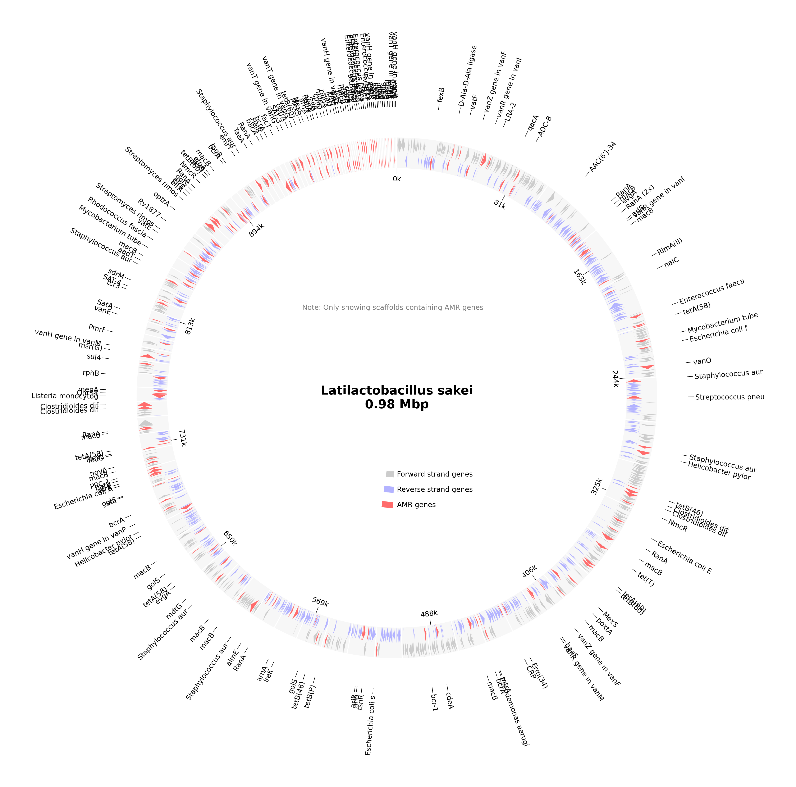

### AAC(6')-34
- **Mechanism**: antibiotic inactivation
- **Drug Classes**: aminoglycoside antibiotic
- **AMR Family**: AAC(6')
- **Locations**:
  - gnl|SPADES|OOJMENLF_175_13 : position 13901-14464

### ADC-8
- **Mechanism**: antibiotic inactivation
- **Drug Classes**: cephalosporin
- **AMR Family**: ADC beta-lactamase without carbapenemase activity
- **Locations**:
  - gnl|SPADES|OOJMENLF_56_82 : position 81999-83150

### CRP
- **Mechanism**: antibiotic efflux
- **Drug Classes**: macrolide antibiotic; fluoroquinolone antibiotic; penam
- **AMR Family**: resistance-nodulation-cell division (RND) antibiotic efflux pump
- **Locations**:
  - gnl|SPADES|OOJMENLF_390_1 : position 458-1126

### Clostridioides difficile gyrA conferring resistance to fluoroquinolones (found in 2 locations)
- **Mechanism**: antibiotic target alteration
- **Drug Classes**: fluoroquinolone antibiotic
- **AMR Family**: fluoroquinolone resistant gyrA
- **Locations**:
  - gnl|SPADES|OOJMENLF_277_19 : position 19710-22184
  - gnl|SPADES|OOJMENLF_621_7 : position 7067-9640

### Clostridioides difficile gyrB conferring resistance to fluoroquinolones (found in 2 locations)
- **Mechanism**: antibiotic target alteration
- **Drug Classes**: fluoroquinolone antibiotic
- **AMR Family**: fluoroquinolone resistant gyrB
- **Locations**:
  - gnl|SPADES|OOJMENLF_277_18 : position 17698-19689
  - gnl|SPADES|OOJMENLF_621_6 : position 5028-7019

### D-Ala-D-Ala ligase
- **Mechanism**: antibiotic target alteration
- **Drug Classes**: glycopeptide antibiotic
- **AMR Family**: Van ligase
- **Locations**:
  - gnl|SPADES|OOJMENLF_56_42 : position 35241-36293

### Enterococcus faecalis cls with mutation conferring resistance to daptomycin (found in 5 locations)
- **Mechanism**: antibiotic target alteration
- **Drug Classes**: peptide antibiotic
- **AMR Family**: daptomycin resistant cls
- **Locations**:
  - gnl|SPADES|OOJMENLF_223_26 : position 25956-27413
  - gnl|SPADES|OOJMENLF_7628_1 : position 3-668
  - gnl|SPADES|OOJMENLF_7632_1 : position 3-668
  - gnl|SPADES|OOJMENLF_8439_1 : position 2-607
  - gnl|SPADES|OOJMENLF_8591_1 : position 3-596

### Erm(34)
- **Mechanism**: antibiotic target alteration
- **Drug Classes**: macrolide antibiotic; lincosamide antibiotic; streptogramin antibiotic; streptogramin A antibiotic; streptogramin B antibiotic
- **AMR Family**: Erm 23S ribosomal RNA methyltransferase
- **Locations**:
  - gnl|SPADES|OOJMENLF_382_20 : position 16116-17009

### Escherichia coli AcrAB-TolC with AcrR mutation conferring resistance to ciprofloxacin, tetracycline, and ceftazidime
- **Mechanism**: antibiotic target alteration; antibiotic efflux
- **Drug Classes**: fluoroquinolone antibiotic; cephalosporin; glycylcycline; penam; tetracycline antibiotic; rifamycin antibiotic; phenicol antibiotic; disinfecting agents and antiseptics
- **AMR Family**: resistance-nodulation-cell division (RND) antibiotic efflux pump
- **Locations**:
  - gnl|SPADES|OOJMENLF_589_8 : position 4833-5474

### Escherichia coli EF-Tu mutants conferring resistance to Pulvomycin
- **Mechanism**: antibiotic target alteration
- **Drug Classes**: elfamycin antibiotic
- **AMR Family**: elfamycin resistant EF-Tu
- **Locations**:
  - gnl|SPADES|OOJMENLF_291_11 : position 10208-11398

### Escherichia coli fabI mutations conferring resistance to isoniazid and triclosan
- **Mechanism**: antibiotic target alteration
- **Drug Classes**: disinfecting agents and antiseptics; isoniazid-like antibiotic
- **AMR Family**: antibiotic resistant fabI
- **Locations**:
  - gnl|SPADES|OOJMENLF_231_18 : position 13313-14062

### Escherichia coli soxS with mutation conferring antibiotic resistance
- **Mechanism**: antibiotic target alteration; antibiotic efflux; reduced permeability to antibiotic
- **Drug Classes**: fluoroquinolone antibiotic; monobactam; carbapenem; cephalosporin; glycylcycline; cephamycin; penam; tetracycline antibiotic; rifamycin antibiotic; phenicol antibiotic; penem; disinfecting agents and antiseptics
- **AMR Family**: ATP-binding cassette (ABC) antibiotic efflux pump; major facilitator superfamily (MFS) antibiotic efflux pump; resistance-nodulation-cell division (RND) antibiotic efflux pump; General Bacterial Porin with reduced permeability to beta-lactams
- **Locations**:
  - gnl|SPADES|OOJMENLF_406_19 : position 16084-17067

### HelR (found in 2 locations)
- **Mechanism**: antibiotic target protection
- **Drug Classes**: rifamycin antibiotic
- **AMR Family**: helicase-like RNA polymerase protection protein
- **Locations**:
  - gnl|SPADES|OOJMENLF_1854_1 : position 146-2443
  - gnl|SPADES|OOJMENLF_9838_1 : position 2-535

### Helicobacter pylori pbp1 mutants conferring resistance to amoxicillin (found in 2 locations)
- **Mechanism**: antibiotic target alteration
- **Drug Classes**: cephalosporin; cephamycin; penam
- **AMR Family**: Penicillin-binding protein mutations conferring resistance to beta-lactam antibiotics
- **Locations**:
  - gnl|SPADES|OOJMENLF_276_21 : position 19560-22115
  - gnl|SPADES|OOJMENLF_543_1 : position 3-2000

### IreK
- **Mechanism**: reduced permeability to antibiotic
- **Drug Classes**: cephalosporin
- **AMR Family**: Serine/threonine kinases
- **Locations**:
  - gnl|SPADES|OOJMENLF_458_7 : position 5423-7306

### LRA-2
- **Mechanism**: antibiotic inactivation
- **Drug Classes**: cephalosporin; penam
- **AMR Family**: subclass B3 LRA beta-lactamase
- **Locations**:
  - gnl|SPADES|OOJMENLF_56_65 : position 61753-62559

### Listeria monocytogenes mprF
- **Mechanism**: antibiotic target alteration
- **Drug Classes**: peptide antibiotic
- **AMR Family**: defensin resistant mprF
- **Locations**:
  - gnl|SPADES|OOJMENLF_682_4 : position 1731-4352

### MexL
- **Mechanism**: antibiotic efflux
- **Drug Classes**: macrolide antibiotic; tetracycline antibiotic; disinfecting agents and antiseptics
- **AMR Family**: resistance-nodulation-cell division (RND) antibiotic efflux pump
- **Locations**:
  - gnl|SPADES|OOJMENLF_597_3 : position 1357-1992

### MexR
- **Mechanism**: antibiotic target alteration; antibiotic efflux
- **Drug Classes**: macrolide antibiotic; fluoroquinolone antibiotic; monobactam; carbapenem; cephalosporin; cephamycin; penam; tetracycline antibiotic; peptide antibiotic; aminocoumarin antibiotic; diaminopyrimidine antibiotic; sulfonamide antibiotic; phenicol antibiotic; penem
- **AMR Family**: resistance-nodulation-cell division (RND) antibiotic efflux pump
- **Locations**:
  - gnl|SPADES|OOJMENLF_56_84 : position 83817-84299

### MexS (found in 3 locations)
- **Mechanism**: antibiotic efflux
- **Drug Classes**: fluoroquinolone antibiotic; diaminopyrimidine antibiotic; phenicol antibiotic
- **AMR Family**: resistance-nodulation-cell division (RND) antibiotic efflux pump
- **Locations**:
  - gnl|SPADES|OOJMENLF_2868_2 : position 708-1643
  - gnl|SPADES|OOJMENLF_3179_1 : position 3-944
  - gnl|SPADES|OOJMENLF_347_12 : position 9237-10190

### Mycobacterium tuberculosis intrinsic murA conferring resistance to fosfomycin
- **Mechanism**: antibiotic target alteration
- **Drug Classes**: phosphonic acid antibiotic
- **AMR Family**: antibiotic-resistant murA transferase
- **Locations**:
  - gnl|SPADES|OOJMENLF_871_5 : position 1895-3196

### Mycobacterium tuberculosis kasA mutant conferring resistance to isoniazid
- **Mechanism**: antibiotic target alteration
- **Drug Classes**: isoniazid-like antibiotic
- **AMR Family**: antibiotic resistant kasA
- **Locations**:
  - gnl|SPADES|OOJMENLF_231_12 : position 8171-9403

### NmcR (found in 2 locations)
- **Mechanism**: antibiotic inactivation
- **Drug Classes**: carbapenem; cephalosporin; cephamycin; penam
- **AMR Family**: NmcA beta-lactamase
- **Locations**:
  - gnl|SPADES|OOJMENLF_1191_2 : position 945-1817
  - gnl|SPADES|OOJMENLF_277_22 : position 25789-26754

### PRC-1
- **Mechanism**: antibiotic inactivation
- **Drug Classes**: cephalosporin; penam
- **AMR Family**: PRC beta-lactamase
- **Locations**:
  - gnl|SPADES|OOJMENLF_589_11 : position 9203-10213

### PmrF
- **Mechanism**: antibiotic target alteration
- **Drug Classes**: peptide antibiotic
- **AMR Family**: pmr phosphoethanolamine transferase
- **Locations**:
  - gnl|SPADES|OOJMENLF_748_6 : position 4215-5147

### Pseudomonas aeruginosa soxR
- **Mechanism**: antibiotic target alteration; antibiotic efflux
- **Drug Classes**: fluoroquinolone antibiotic; cephalosporin; glycylcycline; penam; tetracycline antibiotic; rifamycin antibiotic; phenicol antibiotic; disinfecting agents and antiseptics
- **AMR Family**: ATP-binding cassette (ABC) antibiotic efflux pump; major facilitator superfamily (MFS) antibiotic efflux pump; resistance-nodulation-cell division (RND) antibiotic efflux pump
- **Locations**:
  - gnl|SPADES|OOJMENLF_390_14 : position 16619-17065

### QnrS4
- **Mechanism**: antibiotic target protection
- **Drug Classes**: fluoroquinolone antibiotic
- **AMR Family**: quinolone resistance protein (qnr)
- **Locations**:
  - gnl|SPADES|OOJMENLF_682_5 : position 4439-5074

### RanA (found in 9 locations)
- **Mechanism**: antibiotic efflux
- **Drug Classes**: aminoglycoside antibiotic
- **AMR Family**: ATP-binding cassette (ABC) antibiotic efflux pump
- **Locations**:
  - gnl|SPADES|OOJMENLF_1187_3 : position 2056-2994
  - gnl|SPADES|OOJMENLF_1583_3 : position 1124-2512
  - gnl|SPADES|OOJMENLF_175_34 : position 34002-35093
  - gnl|SPADES|OOJMENLF_220_2 : position 833-1591
  - gnl|SPADES|OOJMENLF_220_3 : position 1612-2421
  - gnl|SPADES|OOJMENLF_291_18 : position 17224-17955
  - gnl|SPADES|OOJMENLF_3604_2 : position 422-1450
  - gnl|SPADES|OOJMENLF_462_8 : position 7325-8113
  - gnl|SPADES|OOJMENLF_605_4 : position 3147-4109

### Rhodococcus fascians cmr
- **Mechanism**: antibiotic efflux
- **Drug Classes**: phenicol antibiotic
- **AMR Family**: major facilitator superfamily (MFS) antibiotic efflux pump
- **Locations**:
  - gnl|SPADES|OOJMENLF_915_2 : position 95-1477

### RlmA(II)
- **Mechanism**: antibiotic target alteration
- **Drug Classes**: macrolide antibiotic; lincosamide antibiotic
- **AMR Family**: non-erm 23S ribosomal RNA methyltransferase (G748)
- **Locations**:
  - gnl|SPADES|OOJMENLF_220_29 : position 31079-31915

### Rv1877 (found in 2 locations)
- **Mechanism**: antibiotic efflux
- **Drug Classes**: fluoroquinolone antibiotic
- **AMR Family**: major facilitator superfamily (MFS) antibiotic efflux pump
- **Locations**:
  - gnl|SPADES|OOJMENLF_1003_1 : position 3-1373
  - gnl|SPADES|OOJMENLF_8549_1 : position 3-599

### SAT-3
- **Mechanism**: antibiotic inactivation
- **Drug Classes**: nucleoside antibiotic
- **AMR Family**: streptothricin acetyltransferase (SAT)
- **Locations**:
  - gnl|SPADES|OOJMENLF_2128_2 : position 775-1320

### SAT-4
- **Mechanism**: antibiotic inactivation
- **Drug Classes**: nucleoside antibiotic
- **AMR Family**: streptothricin acetyltransferase (SAT)
- **Locations**:
  - gnl|SPADES|OOJMENLF_801_1 : position 3-458

### SatA
- **Mechanism**: antibiotic inactivation
- **Drug Classes**: nucleoside antibiotic
- **AMR Family**: streptothricin acetyltransferase (SAT)
- **Locations**:
  - gnl|SPADES|OOJMENLF_799_3 : position 1942-2403

### Staphylococcus aureus LmrS
- **Mechanism**: antibiotic efflux
- **Drug Classes**: macrolide antibiotic; aminoglycoside antibiotic; oxazolidinone antibiotic; diaminopyrimidine antibiotic; phenicol antibiotic
- **AMR Family**: major facilitator superfamily (MFS) antibiotic efflux pump
- **Locations**:
  - gnl|SPADES|OOJMENLF_276_18 : position 16187-17662

### Staphylococcus aureus mupA conferring resistance to mupirocin (found in 4 locations)
- **Mechanism**: antibiotic target alteration
- **Drug Classes**: mupirocin-like antibiotic
- **AMR Family**: antibiotic-resistant isoleucyl-tRNA synthetase (ileS)
- **Locations**:
  - gnl|SPADES|OOJMENLF_1516_1 : position 3-1769
  - gnl|SPADES|OOJMENLF_468_3 : position 2316-4964
  - gnl|SPADES|OOJMENLF_8041_1 : position 1-633
  - gnl|SPADES|OOJMENLF_826_9 : position 5626-6888

### Staphylococcus aureus mupB conferring resistance to mupirocin
- **Mechanism**: antibiotic target alteration
- **Drug Classes**: mupirocin-like antibiotic
- **AMR Family**: antibiotic-resistant isoleucyl-tRNA synthetase (ileS)
- **Locations**:
  - gnl|SPADES|OOJMENLF_274_1 : position 2-1948

### Staphylococcus aureus murA with mutation conferring resistance to fosfomycin
- **Mechanism**: antibiotic target alteration
- **Drug Classes**: phosphonic acid antibiotic
- **AMR Family**: antibiotic-resistant murA transferase
- **Locations**:
  - gnl|SPADES|OOJMENLF_501_2 : position 2061-3320

### Streptococcus pneumoniae PBP2x conferring resistance to amoxicillin
- **Mechanism**: antibiotic target alteration
- **Drug Classes**: cephalosporin; cephamycin; penam
- **AMR Family**: Penicillin-binding protein mutations conferring resistance to beta-lactam antibiotics
- **Locations**:
  - gnl|SPADES|OOJMENLF_274_12 : position 11351-13489

### Streptomyces rimosus otr(A) (found in 2 locations)
- **Mechanism**: antibiotic target protection
- **Drug Classes**: tetracycline antibiotic
- **AMR Family**: tetracycline-resistant ribosomal protection protein
- **Locations**:
  - gnl|SPADES|OOJMENLF_1034_5 : position 2475-5288
  - gnl|SPADES|OOJMENLF_939_2 : position 524-2359

### TaeA
- **Mechanism**: antibiotic efflux
- **Drug Classes**: pleuromutilin antibiotic
- **AMR Family**: ATP-binding cassette (ABC) antibiotic efflux pump
- **Locations**:
  - gnl|SPADES|OOJMENLF_1522_3 : position 1196-3085

### ThfT
- **Mechanism**: resistance by host-dependent nutrient acquisition
- **Drug Classes**: sulfonamide antibiotic
- **AMR Family**: ECF transporter S component
- **Locations**:
  - gnl|SPADES|OOJMENLF_4302_2 : position 608-1201

### aadT
- **Mechanism**: antibiotic efflux
- **Drug Classes**: macrolide antibiotic; tetracycline antibiotic; disinfecting agents and antiseptics
- **AMR Family**: major facilitator superfamily (MFS) antibiotic efflux pump
- **Locations**:
  - gnl|SPADES|OOJMENLF_851_2 : position 783-1991

### almE (found in 4 locations)
- **Mechanism**: antibiotic target alteration
- **Drug Classes**: peptide antibiotic
- **AMR Family**: polymyxin resistance operon; alm glycyltransferase
- **Locations**:
  - gnl|SPADES|OOJMENLF_15117_1 : position 2-418
  - gnl|SPADES|OOJMENLF_22537_1 : position 2-361
  - gnl|SPADES|OOJMENLF_32019_1 : position 2-322
  - gnl|SPADES|OOJMENLF_462_12 : position 11937-12782

### arlR
- **Mechanism**: antibiotic efflux
- **Drug Classes**: fluoroquinolone antibiotic; disinfecting agents and antiseptics
- **AMR Family**: major facilitator superfamily (MFS) antibiotic efflux pump
- **Locations**:
  - gnl|SPADES|OOJMENLF_410_9 : position 8788-9474

### arlS (found in 3 locations)
- **Mechanism**: antibiotic efflux
- **Drug Classes**: fluoroquinolone antibiotic; disinfecting agents and antiseptics
- **AMR Family**: major facilitator superfamily (MFS) antibiotic efflux pump
- **Locations**:
  - gnl|SPADES|OOJMENLF_220_7 : position 5201-6862
  - gnl|SPADES|OOJMENLF_410_8 : position 7289-8791
  - gnl|SPADES|OOJMENLF_56_62 : position 57673-59571

### arnA (found in 2 locations)
- **Mechanism**: antibiotic target alteration
- **Drug Classes**: peptide antibiotic
- **AMR Family**: pmr phosphoethanolamine transferase
- **Locations**:
  - gnl|SPADES|OOJMENLF_3238_2 : position 935-1504
  - gnl|SPADES|OOJMENLF_458_10 : position 9404-10360

### bacA
- **Mechanism**: antibiotic target alteration
- **Drug Classes**: peptide antibiotic
- **AMR Family**: undecaprenyl pyrophosphate related proteins
- **Locations**:
  - gnl|SPADES|OOJMENLF_1820_4 : position 1985-2812

### baeS
- **Mechanism**: antibiotic efflux
- **Drug Classes**: aminoglycoside antibiotic; aminocoumarin antibiotic
- **AMR Family**: resistance-nodulation-cell division (RND) antibiotic efflux pump
- **Locations**:
  - gnl|SPADES|OOJMENLF_375_13 : position 13845-15281

### bcr-1
- **Mechanism**: antibiotic efflux
- **Drug Classes**: bicyclomycin-like antibiotic
- **AMR Family**: major facilitator superfamily (MFS) antibiotic efflux pump
- **Locations**:
  - gnl|SPADES|OOJMENLF_401_2 : position 492-1673

### bcrA (found in 4 locations)
- **Mechanism**: antibiotic efflux
- **Drug Classes**: peptide antibiotic
- **AMR Family**: ATP-binding cassette (ABC) antibiotic efflux pump
- **Locations**:
  - gnl|SPADES|OOJMENLF_1257_3 : position 3115-3984
  - gnl|SPADES|OOJMENLF_1937_2 : position 44-931
  - gnl|SPADES|OOJMENLF_398_1 : position 3-641
  - gnl|SPADES|OOJMENLF_543_13 : position 11111-11983

### blaF
- **Mechanism**: antibiotic inactivation
- **Drug Classes**: penam
- **AMR Family**: blaF family beta-lactamase
- **Locations**:
  - gnl|SPADES|OOJMENLF_6035_1 : position 3-851

### cdeA (found in 2 locations)
- **Mechanism**: antibiotic efflux
- **Drug Classes**: fluoroquinolone antibiotic; disinfecting agents and antiseptics
- **AMR Family**: multidrug and toxic compound extrusion (MATE) transporter
- **Locations**:
  - gnl|SPADES|OOJMENLF_399_14 : position 10075-11391
  - gnl|SPADES|OOJMENLF_7278_1 : position 1-702

### cmlv
- **Mechanism**: antibiotic inactivation
- **Drug Classes**: phenicol antibiotic
- **AMR Family**: chloramphenicol phosphotransferase
- **Locations**:
  - gnl|SPADES|OOJMENLF_3866_1 : position 164-1342

### dfrL
- **Mechanism**: antibiotic target replacement
- **Drug Classes**: aminoglycoside antibiotic; tetracycline antibiotic; diaminopyrimidine antibiotic
- **AMR Family**: trimethoprim resistant dihydrofolate reductase dfr
- **Locations**:
  - gnl|SPADES|OOJMENLF_7420_2 : position 121-621

### efpA
- **Mechanism**: antibiotic efflux
- **Drug Classes**: rifamycin antibiotic; isoniazid-like antibiotic
- **AMR Family**: major facilitator superfamily (MFS) antibiotic efflux pump
- **Locations**:
  - gnl|SPADES|OOJMENLF_1222_5 : position 2970-4328

### efrA (found in 2 locations)
- **Mechanism**: antibiotic efflux
- **Drug Classes**: macrolide antibiotic; fluoroquinolone antibiotic; rifamycin antibiotic
- **AMR Family**: ATP-binding cassette (ABC) antibiotic efflux pump
- **Locations**:
  - gnl|SPADES|OOJMENLF_1150_2 : position 556-2295
  - gnl|SPADES|OOJMENLF_589_9 : position 5498-7228

### efrB
- **Mechanism**: antibiotic efflux
- **Drug Classes**: macrolide antibiotic; fluoroquinolone antibiotic; rifamycin antibiotic
- **AMR Family**: ATP-binding cassette (ABC) antibiotic efflux pump
- **Locations**:
  - gnl|SPADES|OOJMENLF_1150_3 : position 2282-4045

### emrY
- **Mechanism**: antibiotic efflux
- **Drug Classes**: tetracycline antibiotic
- **AMR Family**: major facilitator superfamily (MFS) antibiotic efflux pump
- **Locations**:
  - gnl|SPADES|OOJMENLF_1451_3 : position 1384-2781

### evgA (found in 2 locations)
- **Mechanism**: antibiotic efflux
- **Drug Classes**: macrolide antibiotic; fluoroquinolone antibiotic; penam; tetracycline antibiotic
- **AMR Family**: major facilitator superfamily (MFS) antibiotic efflux pump; resistance-nodulation-cell division (RND) antibiotic efflux pump
- **Locations**:
  - gnl|SPADES|OOJMENLF_175_40 : position 38771-39403
  - gnl|SPADES|OOJMENLF_509_4 : position 2793-3398

### facT (found in 3 locations)
- **Mechanism**: antibiotic efflux
- **Drug Classes**: elfamycin antibiotic
- **AMR Family**: major facilitator superfamily (MFS) antibiotic efflux pump
- **Locations**:
  - gnl|SPADES|OOJMENLF_2037_1 : position 55-1614
  - gnl|SPADES|OOJMENLF_6197_1 : position 3-830
  - gnl|SPADES|OOJMENLF_8533_1 : position 2-274

### fexB
- **Mechanism**: antibiotic efflux
- **Drug Classes**: phenicol antibiotic
- **AMR Family**: major facilitator superfamily (MFS) antibiotic efflux pump
- **Locations**:
  - gnl|SPADES|OOJMENLF_56_27 : position 23168-24358

### golS (found in 6 locations)
- **Mechanism**: antibiotic efflux
- **Drug Classes**: monobactam; carbapenem; cephalosporin; cephamycin; penam; phenicol antibiotic; penem
- **AMR Family**: resistance-nodulation-cell division (RND) antibiotic efflux pump
- **Locations**:
  - gnl|SPADES|OOJMENLF_1187_1 : position 2-466
  - gnl|SPADES|OOJMENLF_1222_3 : position 1958-2359
  - gnl|SPADES|OOJMENLF_19780_1 : position 15-377
  - gnl|SPADES|OOJMENLF_428_9 : position 8466-8885
  - gnl|SPADES|OOJMENLF_509_15 : position 11814-12215
  - gnl|SPADES|OOJMENLF_570_12 : position 10562-10987

### leuO
- **Mechanism**: antibiotic efflux
- **Drug Classes**: nucleoside antibiotic; disinfecting agents and antiseptics
- **AMR Family**: major facilitator superfamily (MFS) antibiotic efflux pump
- **Locations**:
  - gnl|SPADES|OOJMENLF_597_2 : position 450-1337

### lmrB
- **Mechanism**: antibiotic efflux
- **Drug Classes**: lincosamide antibiotic; nucleoside antibiotic
- **AMR Family**: ATP-binding cassette (ABC) antibiotic efflux pump
- **Locations**:
  - gnl|SPADES|OOJMENLF_7038_1 : position 2-724

### lsaA
- **Mechanism**: antibiotic target protection
- **Drug Classes**: lincosamide antibiotic; streptogramin antibiotic; streptogramin A antibiotic; streptogramin B antibiotic; pleuromutilin antibiotic
- **AMR Family**: lsa-type ABC-F protein
- **Locations**:
  - gnl|SPADES|OOJMENLF_3851_1 : position 3-893

### lsaD
- **Mechanism**: antibiotic target protection
- **Drug Classes**: lincosamide antibiotic; streptogramin antibiotic; streptogramin A antibiotic; pleuromutilin antibiotic
- **AMR Family**: lsa-type ABC-F protein
- **Locations**:
  - gnl|SPADES|OOJMENLF_4280_1 : position 536-1207

### macB (found in 15 locations)
- **Mechanism**: antibiotic efflux
- **Drug Classes**: macrolide antibiotic
- **AMR Family**: ATP-binding cassette (ABC) antibiotic efflux pump
- **Locations**:
  - gnl|SPADES|OOJMENLF_1238_3 : position 1451-2194
  - gnl|SPADES|OOJMENLF_175_37 : position 36592-37257
  - gnl|SPADES|OOJMENLF_220_11 : position 9786-10472
  - gnl|SPADES|OOJMENLF_291_24 : position 23112-25637
  - gnl|SPADES|OOJMENLF_347_22 : position 20032-20694
  - gnl|SPADES|OOJMENLF_398_5 : position 4465-6405
  - gnl|SPADES|OOJMENLF_468_13 : position 13098-13739
  - gnl|SPADES|OOJMENLF_47315_1 : position 22-285
  - gnl|SPADES|OOJMENLF_483_7 : position 4253-4987
  - gnl|SPADES|OOJMENLF_534_11 : position 6656-7381
  - gnl|SPADES|OOJMENLF_591_3 : position 2013-3047
  - gnl|SPADES|OOJMENLF_605_3 : position 2093-3118
  - gnl|SPADES|OOJMENLF_6734_2 : position 76-756
  - gnl|SPADES|OOJMENLF_6735_2 : position 76-756
  - gnl|SPADES|OOJMENLF_851_5 : position 3941-4813

### mdeA
- **Mechanism**: antibiotic efflux
- **Drug Classes**: fluoroquinolone antibiotic; aminoglycoside antibiotic; penam; tetracycline antibiotic; disinfecting agents and antiseptics
- **AMR Family**: major facilitator superfamily (MFS) antibiotic efflux pump
- **Locations**:
  - gnl|SPADES|OOJMENLF_3964_1 : position 3-1226

### mdtG
- **Mechanism**: antibiotic efflux
- **Drug Classes**: phosphonic acid antibiotic
- **AMR Family**: major facilitator superfamily (MFS) antibiotic efflux pump
- **Locations**:
  - gnl|SPADES|OOJMENLF_501_7 : position 6790-8043

### mepA
- **Mechanism**: antibiotic efflux
- **Drug Classes**: glycylcycline; tetracycline antibiotic
- **AMR Family**: multidrug and toxic compound extrusion (MATE) transporter
- **Locations**:
  - gnl|SPADES|OOJMENLF_682_7 : position 5929-7296

### msbA (found in 2 locations)
- **Mechanism**: antibiotic efflux
- **Drug Classes**: nitroimidazole antibiotic
- **AMR Family**: ATP-binding cassette (ABC) antibiotic efflux pump
- **Locations**:
  - gnl|SPADES|OOJMENLF_27787_1 : position 3-338
  - gnl|SPADES|OOJMENLF_27789_1 : position 2-337

### msr(G)
- **Mechanism**: antibiotic target protection
- **Drug Classes**: macrolide antibiotic; streptogramin antibiotic
- **AMR Family**: msr-type ABC-F protein
- **Locations**:
  - gnl|SPADES|OOJMENLF_728_4 : position 1853-4120

### mtrA (found in 2 locations)
- **Mechanism**: antibiotic efflux
- **Drug Classes**: macrolide antibiotic; penam
- **AMR Family**: resistance-nodulation-cell division (RND) antibiotic efflux pump
- **Locations**:
  - gnl|SPADES|OOJMENLF_12831_1 : position 140-454
  - gnl|SPADES|OOJMENLF_390_13 : position 15731-16594

### nalC
- **Mechanism**: antibiotic efflux
- **Drug Classes**: macrolide antibiotic; fluoroquinolone antibiotic; monobactam; carbapenem; cephalosporin; cephamycin; penam; tetracycline antibiotic; peptide antibiotic; aminocoumarin antibiotic; diaminopyrimidine antibiotic; sulfonamide antibiotic; phenicol antibiotic; penem
- **AMR Family**: resistance-nodulation-cell division (RND) antibiotic efflux pump
- **Locations**:
  - gnl|SPADES|OOJMENLF_223_4 : position 4126-4812

### novA
- **Mechanism**: antibiotic efflux
- **Drug Classes**: aminocoumarin antibiotic
- **AMR Family**: ATP-binding cassette (ABC) antibiotic efflux pump
- **Locations**:
  - gnl|SPADES|OOJMENLF_591_6 : position 4734-5516

### optrA (found in 2 locations)
- **Mechanism**: antibiotic target protection
- **Drug Classes**: oxazolidinone antibiotic; phenicol antibiotic
- **AMR Family**: Miscellaneous ABC-F subfamily ATP-binding cassette ribosomal protection proteins
- **Locations**:
  - gnl|SPADES|OOJMENLF_1009_2 : position 1903-3507
  - gnl|SPADES|OOJMENLF_2522_2 : position 308-1933

### patB
- **Mechanism**: antibiotic efflux
- **Drug Classes**: fluoroquinolone antibiotic
- **AMR Family**: ATP-binding cassette (ABC) antibiotic efflux pump
- **Locations**:
  - gnl|SPADES|OOJMENLF_589_10 : position 7228-9105

### poxtA
- **Mechanism**: antibiotic target protection
- **Drug Classes**: tetracycline antibiotic; oxazolidinone antibiotic; phenicol antibiotic
- **AMR Family**: Miscellaneous ABC-F subfamily ATP-binding cassette ribosomal protection proteins
- **Locations**:
  - gnl|SPADES|OOJMENLF_347_17 : position 13539-15173

### qacA
- **Mechanism**: antibiotic efflux
- **Drug Classes**: fluoroquinolone antibiotic
- **AMR Family**: major facilitator superfamily (MFS) antibiotic efflux pump
- **Locations**:
  - gnl|SPADES|OOJMENLF_56_75 : position 75088-76311

### qacH
- **Mechanism**: antibiotic efflux
- **Drug Classes**: disinfecting agents and antiseptics
- **AMR Family**: small multidrug resistance (SMR) antibiotic efflux pump
- **Locations**:
  - gnl|SPADES|OOJMENLF_11826_1 : position 1-273

### ramA
- **Mechanism**: antibiotic efflux; reduced permeability to antibiotic
- **Drug Classes**: fluoroquinolone antibiotic; monobactam; carbapenem; cephalosporin; glycylcycline; cephamycin; penam; tetracycline antibiotic; rifamycin antibiotic; phenicol antibiotic; penem; disinfecting agents and antiseptics
- **AMR Family**: resistance-nodulation-cell division (RND) antibiotic efflux pump; General Bacterial Porin with reduced permeability to beta-lactams
- **Locations**:
  - gnl|SPADES|OOJMENLF_4013_2 : position 227-1081

### rphB
- **Mechanism**: antibiotic inactivation
- **Drug Classes**: rifamycin antibiotic
- **AMR Family**: rifampin phosphotransferase
- **Locations**:
  - gnl|SPADES|OOJMENLF_694_9 : position 5552-7312

### sdrM
- **Mechanism**: antibiotic efflux
- **Drug Classes**: fluoroquinolone antibiotic; disinfecting agents and antiseptics
- **AMR Family**: major facilitator superfamily (MFS) antibiotic efflux pump
- **Locations**:
  - gnl|SPADES|OOJMENLF_801_5 : position 3343-4803

### sta
- **Mechanism**: antibiotic inactivation
- **Drug Classes**: nucleoside antibiotic
- **AMR Family**: streptothricin acetyltransferase (SAT)
- **Locations**:
  - gnl|SPADES|OOJMENLF_570_11 : position 9989-10507

### sul4
- **Mechanism**: antibiotic target replacement
- **Drug Classes**: sulfonamide antibiotic
- **AMR Family**: sulfonamide resistant sul
- **Locations**:
  - gnl|SPADES|OOJMENLF_726_10 : position 5679-6764

### tcr3
- **Mechanism**: antibiotic efflux
- **Drug Classes**: tetracycline antibiotic
- **AMR Family**: major facilitator superfamily (MFS) antibiotic efflux pump
- **Locations**:
  - gnl|SPADES|OOJMENLF_800_7 : position 5484-6680

### tet(T)
- **Mechanism**: antibiotic target protection
- **Drug Classes**: tetracycline antibiotic
- **AMR Family**: tetracycline-resistant ribosomal protection protein
- **Locations**:
  - gnl|SPADES|OOJMENLF_312_7 : position 4165-6003

### tetA(58) (found in 5 locations)
- **Mechanism**: antibiotic efflux
- **Drug Classes**: tetracycline antibiotic
- **AMR Family**: major facilitator superfamily (MFS) antibiotic efflux pump
- **Locations**:
  - gnl|SPADES|OOJMENLF_223_30 : position 32233-33024
  - gnl|SPADES|OOJMENLF_509_7 : position 5265-6137
  - gnl|SPADES|OOJMENLF_537_20 : position 10687-11577
  - gnl|SPADES|OOJMENLF_56_44 : position 37052-37948
  - gnl|SPADES|OOJMENLF_597_5 : position 3126-3851

### tetA(60)
- **Mechanism**: antibiotic efflux
- **Drug Classes**: tetracycline antibiotic
- **AMR Family**: ATP-binding cassette (ABC) antibiotic efflux pump
- **Locations**:
  - gnl|SPADES|OOJMENLF_312_22 : position 17425-19170

### tetB(46) (found in 2 locations)
- **Mechanism**: antibiotic efflux
- **Drug Classes**: tetracycline antibiotic
- **AMR Family**: ATP-binding cassette (ABC) antibiotic efflux pump
- **Locations**:
  - gnl|SPADES|OOJMENLF_277_15 : position 15449-16108
  - gnl|SPADES|OOJMENLF_428_4 : position 3785-4543

### tetB(58)
- **Mechanism**: antibiotic efflux
- **Drug Classes**: tetracycline antibiotic
- **AMR Family**: major facilitator superfamily (MFS) antibiotic efflux pump
- **Locations**:
  - gnl|SPADES|OOJMENLF_223_31 : position 33037-33759

### tetB(60) (found in 4 locations)
- **Mechanism**: antibiotic efflux
- **Drug Classes**: tetracycline antibiotic
- **AMR Family**: ATP-binding cassette (ABC) antibiotic efflux pump
- **Locations**:
  - gnl|SPADES|OOJMENLF_1222_1 : position 3-1262
  - gnl|SPADES|OOJMENLF_2626_2 : position 235-1110
  - gnl|SPADES|OOJMENLF_312_23 : position 19172-20962
  - gnl|SPADES|OOJMENLF_7450_2 : position 425-685

### tetB(P)
- **Mechanism**: antibiotic target protection
- **Drug Classes**: tetracycline antibiotic
- **AMR Family**: tetracycline-resistant ribosomal protection protein
- **Locations**:
  - gnl|SPADES|OOJMENLF_425_17 : position 14642-15544

### tsnR (found in 2 locations)
- **Mechanism**: antibiotic target alteration
- **Drug Classes**: peptide antibiotic
- **AMR Family**: non-erm 23S ribosomal RNA methyltransferase (A1067)
- **Locations**:
  - gnl|SPADES|OOJMENLF_1304_1 : position 1-420
  - gnl|SPADES|OOJMENLF_410_5 : position 4868-5629

### ugd (found in 2 locations)
- **Mechanism**: antibiotic target alteration
- **Drug Classes**: peptide antibiotic
- **AMR Family**: pmr phosphoethanolamine transferase
- **Locations**:
  - gnl|SPADES|OOJMENLF_13045_1 : position 23-208
  - gnl|SPADES|OOJMENLF_17244_1 : position 1-321

### vanE
- **Mechanism**: antibiotic target alteration
- **Drug Classes**: glycopeptide antibiotic
- **AMR Family**: glycopeptide resistance gene cluster; Van ligase
- **Locations**:
  - gnl|SPADES|OOJMENLF_764_5 : position 6312-7424

### vanH gene in vanD cluster
- **Mechanism**: antibiotic target alteration
- **Drug Classes**: glycopeptide antibiotic
- **AMR Family**: vanH; glycopeptide resistance gene cluster
- **Locations**:
  - gnl|SPADES|OOJMENLF_6188_1 : position 1-435

### vanH gene in vanM cluster
- **Mechanism**: antibiotic target alteration
- **Drug Classes**: glycopeptide antibiotic
- **AMR Family**: vanH; glycopeptide resistance gene cluster
- **Locations**:
  - gnl|SPADES|OOJMENLF_728_6 : position 5335-5778

### vanH gene in vanP cluster (found in 3 locations)
- **Mechanism**: antibiotic target alteration
- **Drug Classes**: glycopeptide antibiotic
- **AMR Family**: vanH; glycopeptide resistance gene cluster
- **Locations**:
  - gnl|SPADES|OOJMENLF_10985_1 : position 2-496
  - gnl|SPADES|OOJMENLF_543_6 : position 5479-6432
  - gnl|SPADES|OOJMENLF_65978_1 : position 1-270

### vanO
- **Mechanism**: antibiotic target alteration
- **Drug Classes**: glycopeptide antibiotic
- **AMR Family**: glycopeptide resistance gene cluster; Van ligase
- **Locations**:
  - gnl|SPADES|OOJMENLF_231_32 : position 25366-27645

### vanR gene in vanI cluster (found in 2 locations)
- **Mechanism**: antibiotic target alteration
- **Drug Classes**: glycopeptide antibiotic
- **AMR Family**: glycopeptide resistance gene cluster; vanR
- **Locations**:
  - gnl|SPADES|OOJMENLF_220_8 : position 6849-7562
  - gnl|SPADES|OOJMENLF_56_61 : position 56950-57663

### vanR gene in vanM cluster
- **Mechanism**: antibiotic target alteration
- **Drug Classes**: glycopeptide antibiotic
- **AMR Family**: glycopeptide resistance gene cluster; vanR
- **Locations**:
  - gnl|SPADES|OOJMENLF_375_14 : position 15281-16021

### vanT gene in vanG cluster (found in 3 locations)
- **Mechanism**: antibiotic target alteration
- **Drug Classes**: glycopeptide antibiotic
- **AMR Family**: glycopeptide resistance gene cluster; vanT
- **Locations**:
  - gnl|SPADES|OOJMENLF_2089_3 : position 1274-2416
  - gnl|SPADES|OOJMENLF_2526_1 : position 393-1379
  - gnl|SPADES|OOJMENLF_32298_1 : position 3-278

### vanZ gene in vanA cluster
- **Mechanism**: antibiotic target alteration
- **Drug Classes**: glycopeptide antibiotic
- **AMR Family**: vanZ; glycopeptide resistance gene cluster
- **Locations**:
  - gnl|SPADES|OOJMENLF_56_83 : position 83195-83791

### vanZ gene in vanF cluster (found in 2 locations)
- **Mechanism**: antibiotic target alteration
- **Drug Classes**: glycopeptide antibiotic
- **AMR Family**: vanZ; glycopeptide resistance gene cluster
- **Locations**:
  - gnl|SPADES|OOJMENLF_375_6 : position 5457-6065
  - gnl|SPADES|OOJMENLF_56_54 : position 49324-50472

### vatB
- **Mechanism**: antibiotic inactivation
- **Drug Classes**: streptogramin antibiotic; streptogramin A antibiotic
- **AMR Family**: streptogramin vat acetyltransferase
- **Locations**:
  - gnl|SPADES|OOJMENLF_3630_1 : position 1-303

### vatE
- **Mechanism**: antibiotic inactivation
- **Drug Classes**: streptogramin antibiotic; streptogramin A antibiotic
- **AMR Family**: streptogramin vat acetyltransferase
- **Locations**:
  - gnl|SPADES|OOJMENLF_915_7 : position 5361-5927

### vatF
- **Mechanism**: antibiotic inactivation
- **Drug Classes**: streptogramin antibiotic; streptogramin A antibiotic
- **AMR Family**: streptogramin vat acetyltransferase
- **Locations**:
  - gnl|SPADES|OOJMENLF_56_47 : position 41751-42368

## Latilactobacillus sakei subsp. sakei
**Strain Statistics:**
- Total genome length: 196.6 kbp
- Total scaffolds: 75
- Scaffolds with AMR genes: 9
- Total genes annotated: 367
- Total AMR genes: 29
- Unique AMR genes: 25
- Distinct AMR mechanisms: 7
- Distinct AMR families: 17
- Distinct drug classes: 17

**Circos Plot:**

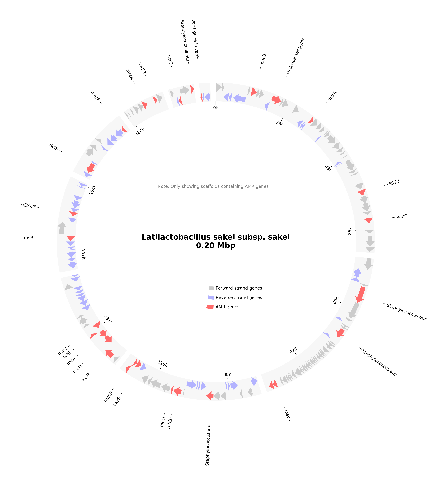

### GES-38
- **Mechanism**: antibiotic inactivation
- **Drug Classes**: carbapenem; cephalosporin; penam
- **AMR Family**: GES beta-lactamase
- **Locations**:
  - gnl|SPADES|OOJMENLF_361_11 : position 12239-13222

### HelR (found in 2 locations)
- **Mechanism**: antibiotic target protection
- **Drug Classes**: rifamycin antibiotic
- **AMR Family**: helicase-like RNA polymerase protection protein
- **Locations**:
  - gnl|SPADES|OOJMENLF_344_3 : position 1656-3704
  - gnl|SPADES|OOJMENLF_452_2 : position 1246-3537

### Helicobacter pylori pbp1 mutants conferring resistance to amoxicillin
- **Mechanism**: antibiotic target alteration
- **Drug Classes**: cephalosporin; cephamycin; penam
- **AMR Family**: Penicillin-binding protein mutations conferring resistance to beta-lactam antibiotics
- **Locations**:
  - gnl|SPADES|OOJMENLF_133_13 : position 12317-14398

### SRT-1
- **Mechanism**: antibiotic inactivation
- **Drug Classes**: cephalosporin
- **AMR Family**: SRT beta-lactamase
- **Locations**:
  - gnl|SPADES|OOJMENLF_133_41 : position 40567-41748

### Staphylococcus aureus fusA with mutation conferring resistance to fusidic acid (found in 2 locations)
- **Mechanism**: antibiotic target alteration
- **Drug Classes**: fusidane antibiotic
- **AMR Family**: antibiotic resistant fusA
- **Locations**:
  - gnl|SPADES|OOJMENLF_194_11 : position 16385-18472
  - gnl|SPADES|OOJMENLF_247_11 : position 10125-11702

### Staphylococcus aureus mupA conferring resistance to mupirocin
- **Mechanism**: antibiotic target alteration
- **Drug Classes**: mupirocin-like antibiotic
- **AMR Family**: antibiotic-resistant isoleucyl-tRNA synthetase (ileS)
- **Locations**:
  - gnl|SPADES|OOJMENLF_1010_5 : position 4731-5438

### Staphylococcus aureus rpoB mutants conferring resistance to rifampicin
- **Mechanism**: antibiotic target alteration; antibiotic target replacement
- **Drug Classes**: rifamycin antibiotic
- **AMR Family**: rifamycin-resistant beta-subunit of RNA polymerase (rpoB)
- **Locations**:
  - gnl|SPADES|OOJMENLF_194_5 : position 6288-9881

### basS
- **Mechanism**: antibiotic target alteration; antibiotic efflux
- **Drug Classes**: peptide antibiotic
- **AMR Family**: pmr phosphoethanolamine transferase
- **Locations**:
  - gnl|SPADES|OOJMENLF_247_25 : position 27406-28473

### bcr-1
- **Mechanism**: antibiotic efflux
- **Drug Classes**: bicyclomycin-like antibiotic
- **AMR Family**: major facilitator superfamily (MFS) antibiotic efflux pump
- **Locations**:
  - gnl|SPADES|OOJMENLF_344_7 : position 8257-9432

### bcrA
- **Mechanism**: antibiotic efflux
- **Drug Classes**: peptide antibiotic
- **AMR Family**: ATP-binding cassette (ABC) antibiotic efflux pump
- **Locations**:
  - gnl|SPADES|OOJMENLF_133_22 : position 21753-22481

### bcrC
- **Mechanism**: antibiotic target alteration
- **Drug Classes**: peptide antibiotic
- **AMR Family**: undecaprenyl pyrophosphate related proteins
- **Locations**:
  - gnl|SPADES|OOJMENLF_1010_3 : position 1590-2228

### catB3
- **Mechanism**: antibiotic inactivation
- **Drug Classes**: phenicol antibiotic
- **AMR Family**: chloramphenicol acetyltransferase (CAT)
- **Locations**:
  - gnl|SPADES|OOJMENLF_648_10 : position 6867-7514

### lmrD
- **Mechanism**: antibiotic efflux
- **Drug Classes**: lincosamide antibiotic
- **AMR Family**: ATP-binding cassette (ABC) antibiotic efflux pump
- **Locations**:
  - gnl|SPADES|OOJMENLF_344_4 : position 3881-5674

### macB (found in 3 locations)
- **Mechanism**: antibiotic efflux
- **Drug Classes**: macrolide antibiotic
- **AMR Family**: ATP-binding cassette (ABC) antibiotic efflux pump
- **Locations**:
  - gnl|SPADES|OOJMENLF_133_8 : position 7723-8874
  - gnl|SPADES|OOJMENLF_247_27 : position 29297-30073
  - gnl|SPADES|OOJMENLF_452_12 : position 13532-14290

### mecI
- **Mechanism**: antibiotic target replacement
- **Drug Classes**: penam
- **AMR Family**: methicillin resistant PBP2
- **Locations**:
  - gnl|SPADES|OOJMENLF_247_19 : position 18931-19371

### mreA
- **Mechanism**: antibiotic efflux
- **Drug Classes**: macrolide antibiotic
- **AMR Family**: major facilitator superfamily (MFS) antibiotic efflux pump
- **Locations**:
  - gnl|SPADES|OOJMENLF_648_7 : position 4263-5216

### msbA
- **Mechanism**: antibiotic efflux
- **Drug Classes**: nitroimidazole antibiotic
- **AMR Family**: ATP-binding cassette (ABC) antibiotic efflux pump
- **Locations**:
  - gnl|SPADES|OOJMENLF_194_41 : position 34869-35711

### patA
- **Mechanism**: antibiotic efflux
- **Drug Classes**: fluoroquinolone antibiotic
- **AMR Family**: ATP-binding cassette (ABC) antibiotic efflux pump
- **Locations**:
  - gnl|SPADES|OOJMENLF_344_5 : position 5678-7390

### rosB
- **Mechanism**: antibiotic efflux
- **Drug Classes**: peptide antibiotic
- **AMR Family**: major facilitator superfamily (MFS) antibiotic efflux pump
- **Locations**:
  - gnl|SPADES|OOJMENLF_361_7 : position 6584-7744

### rphB
- **Mechanism**: antibiotic inactivation
- **Drug Classes**: rifamycin antibiotic
- **AMR Family**: rifampin phosphotransferase
- **Locations**:
  - gnl|SPADES|OOJMENLF_247_18 : position 17057-18781

### smeR
- **Mechanism**: antibiotic efflux
- **Drug Classes**: aminoglycoside antibiotic; cephalosporin; cephamycin; penam
- **AMR Family**: resistance-nodulation-cell division (RND) antibiotic efflux pump
- **Locations**:
  - gnl|SPADES|OOJMENLF_247_26 : position 28483-29157

### tetB(60)
- **Mechanism**: antibiotic efflux
- **Drug Classes**: tetracycline antibiotic
- **AMR Family**: ATP-binding cassette (ABC) antibiotic efflux pump
- **Locations**:
  - gnl|SPADES|OOJMENLF_194_42 : position 35687-36562

### tetR
- **Mechanism**: antibiotic target alteration; antibiotic efflux
- **Drug Classes**: tetracycline antibiotic
- **AMR Family**: major facilitator superfamily (MFS) antibiotic efflux pump
- **Locations**:
  - gnl|SPADES|OOJMENLF_344_6 : position 7533-8204

### vanC
- **Mechanism**: antibiotic target alteration
- **Drug Classes**: glycopeptide antibiotic
- **AMR Family**: glycopeptide resistance gene cluster; Van ligase
- **Locations**:
  - gnl|SPADES|OOJMENLF_133_46 : position 46711-47862

### vanT gene in vanE cluster
- **Mechanism**: antibiotic target alteration
- **Drug Classes**: glycopeptide antibiotic
- **AMR Family**: glycopeptide resistance gene cluster; vanT
- **Locations**:
  - gnl|SPADES|OOJMENLF_2229_1 : position 3-392

## Latilactobacillus sakei subsp. sakei 23K
**Strain Statistics:**
- Total genome length: 92.2 kbp
- Total scaffolds: 17
- Scaffolds with AMR genes: 5
- Total genes annotated: 153
- Total AMR genes: 10
- Unique AMR genes: 9
- Distinct AMR mechanisms: 3
- Distinct AMR families: 7
- Distinct drug classes: 18

**Circos Plot:**

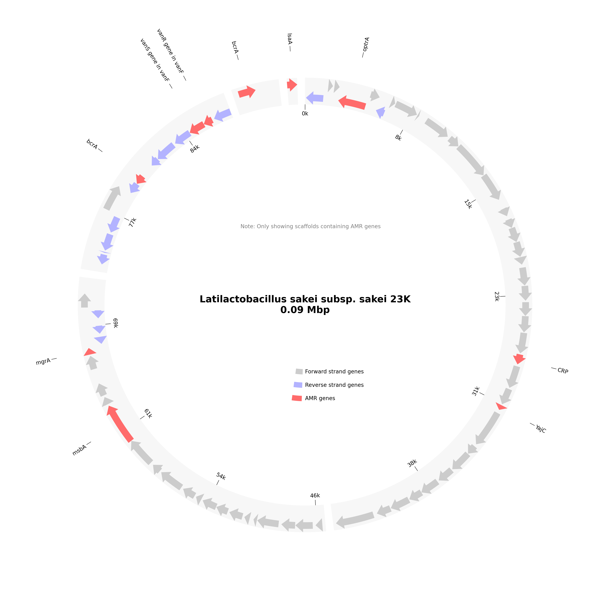

### CRP
- **Mechanism**: antibiotic efflux
- **Drug Classes**: macrolide antibiotic; fluoroquinolone antibiotic; penam
- **AMR Family**: resistance-nodulation-cell division (RND) antibiotic efflux pump
- **Locations**:
  - gnl|SPADES|OOJMENLF_162_24 : position 27116-27817

### YajC
- **Mechanism**: antibiotic efflux
- **Drug Classes**: fluoroquinolone antibiotic; cephalosporin; glycylcycline; penam; tetracycline antibiotic; oxazolidinone antibiotic; glycopeptide antibiotic; rifamycin antibiotic; phenicol antibiotic; disinfecting agents and antiseptics
- **AMR Family**: resistance-nodulation-cell division (RND) antibiotic efflux pump
- **Locations**:
  - gnl|SPADES|OOJMENLF_162_27 : position 30822-31178

### bcrA (found in 2 locations)
- **Mechanism**: antibiotic efflux
- **Drug Classes**: peptide antibiotic
- **AMR Family**: ATP-binding cassette (ABC) antibiotic efflux pump
- **Locations**:
  - gnl|SPADES|OOJMENLF_1586_2 : position 396-1595
  - gnl|SPADES|OOJMENLF_439_7 : position 7016-7696

### lsaA
- **Mechanism**: antibiotic target protection
- **Drug Classes**: lincosamide antibiotic; streptogramin antibiotic; streptogramin A antibiotic; streptogramin B antibiotic; pleuromutilin antibiotic
- **AMR Family**: lsa-type ABC-F protein
- **Locations**:
  - gnl|SPADES|OOJMENLF_7271_1 : position 3-701

### mgrA
- **Mechanism**: antibiotic efflux
- **Drug Classes**: fluoroquinolone antibiotic; cephalosporin; penam; tetracycline antibiotic; peptide antibiotic; disinfecting agents and antiseptics
- **AMR Family**: ATP-binding cassette (ABC) antibiotic efflux pump; major facilitator superfamily (MFS) antibiotic efflux pump
- **Locations**:
  - gnl|SPADES|OOJMENLF_283_22 : position 21689-22144

### msbA
- **Mechanism**: antibiotic efflux
- **Drug Classes**: nitroimidazole antibiotic
- **AMR Family**: ATP-binding cassette (ABC) antibiotic efflux pump
- **Locations**:
  - gnl|SPADES|OOJMENLF_283_17 : position 15099-17951

### optrA
- **Mechanism**: antibiotic target protection
- **Drug Classes**: oxazolidinone antibiotic; phenicol antibiotic
- **AMR Family**: Miscellaneous ABC-F subfamily ATP-binding cassette ribosomal protection proteins
- **Locations**:
  - gnl|SPADES|OOJMENLF_162_4 : position 2423-4444

### vanR gene in vanF cluster
- **Mechanism**: antibiotic target alteration
- **Drug Classes**: glycopeptide antibiotic
- **AMR Family**: glycopeptide resistance gene cluster; vanR
- **Locations**:
  - gnl|SPADES|OOJMENLF_439_13 : position 13592-14278

### vanS gene in vanF cluster
- **Mechanism**: antibiotic target alteration
- **Drug Classes**: glycopeptide antibiotic
- **AMR Family**: vanS; glycopeptide resistance gene cluster
- **Locations**:
  - gnl|SPADES|OOJMENLF_439_12 : position 12393-13592

## Lelliottia amnigena
**Strain Statistics:**
- Total genome length: 0.5 kbp
- Total scaffolds: 29
- Scaffolds with AMR genes: 1
- Total genes annotated: 2
- Total AMR genes: 2
- Unique AMR genes: 2
- Distinct AMR mechanisms: 1
- Distinct AMR families: 1
- Distinct drug classes: 1

**Circos Plot:**

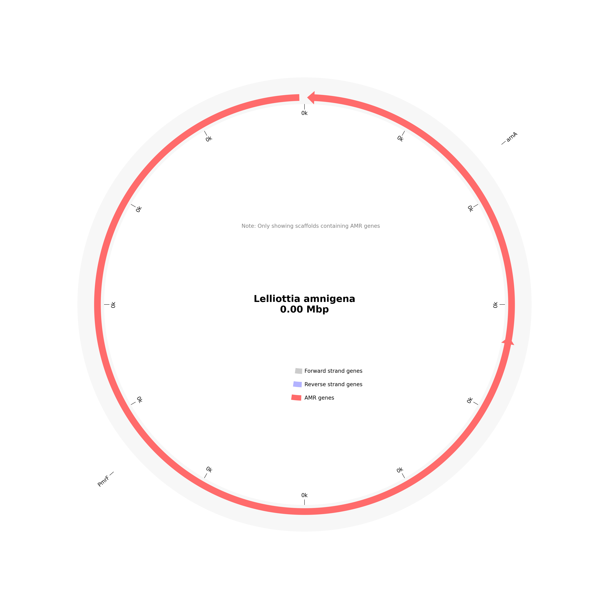

### PmrF
- **Mechanism**: antibiotic target alteration
- **Drug Classes**: peptide antibiotic
- **AMR Family**: pmr phosphoethanolamine transferase
- **Locations**:
  - gnl|SPADES|OOJMENLF_10813_2 : position 138-500

### arnA
- **Mechanism**: antibiotic target alteration
- **Drug Classes**: peptide antibiotic
- **AMR Family**: pmr phosphoethanolamine transferase
- **Locations**:
  - gnl|SPADES|OOJMENLF_10813_1 : position 1-141

## Serratia fonticola
**Strain Statistics:**
- Total genome length: 1997.1 kbp
- Total scaffolds: 1788
- Scaffolds with AMR genes: 452
- Total genes annotated: 3896
- Total AMR genes: 594
- Unique AMR genes: 239
- Distinct AMR mechanisms: 11
- Distinct AMR families: 79
- Distinct drug classes: 37

**Circos Plot:**

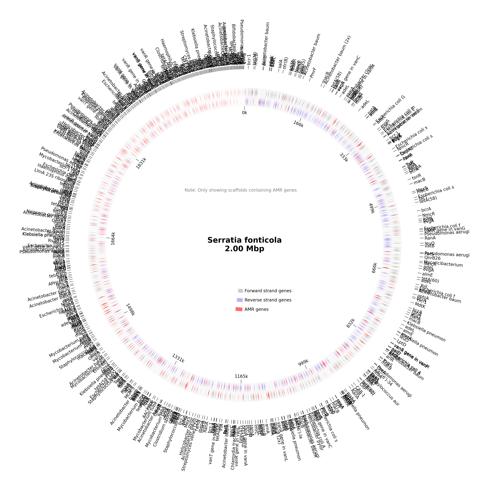

### AAC(3)-Ic
- **Mechanism**: antibiotic inactivation
- **Drug Classes**: aminoglycoside antibiotic
- **AMR Family**: AAC(3)
- **Locations**:
  - gnl|SPADES|OOJMENLF_1123_5 : position 3023-3448

### AAC(6')-34
- **Mechanism**: antibiotic inactivation
- **Drug Classes**: aminoglycoside antibiotic
- **AMR Family**: AAC(6')
- **Locations**:
  - gnl|SPADES|OOJMENLF_774_5 : position 5440-5937

### AAC(6')-Ia
- **Mechanism**: antibiotic inactivation
- **Drug Classes**: aminoglycoside antibiotic
- **AMR Family**: AAC(6')
- **Locations**:
  - gnl|SPADES|OOJMENLF_902_4 : position 1773-2291

### ACT-62
- **Mechanism**: antibiotic inactivation
- **Drug Classes**: carbapenem; cephalosporin; cephamycin; penam
- **AMR Family**: ACT beta-lactamase
- **Locations**:
  - gnl|SPADES|OOJMENLF_3491_2 : position 967-1497

### APH(6)-Ic
- **Mechanism**: antibiotic inactivation
- **Drug Classes**: aminoglycoside antibiotic
- **AMR Family**: APH(6)
- **Locations**:
  - gnl|SPADES|OOJMENLF_1539_4 : position 2379-3236

### Acinetobacter baumannii AbaF (found in 10 locations)
- **Mechanism**: antibiotic efflux
- **Drug Classes**: phosphonic acid antibiotic
- **AMR Family**: major facilitator superfamily (MFS) antibiotic efflux pump
- **Locations**:
  - gnl|SPADES|OOJMENLF_1072_2 : position 133-1446
  - gnl|SPADES|OOJMENLF_1737_2 : position 643-2040
  - gnl|SPADES|OOJMENLF_2529_2 : position 367-1650
  - gnl|SPADES|OOJMENLF_2699_4 : position 1467-1928
  - gnl|SPADES|OOJMENLF_3059_2 : position 729-1703
  - gnl|SPADES|OOJMENLF_667_1 : position 3-968
  - gnl|SPADES|OOJMENLF_758_2 : position 570-1892
  - gnl|SPADES|OOJMENLF_8398_1 : position 3-611
  - gnl|SPADES|OOJMENLF_894_2 : position 271-1617
  - gnl|SPADES|OOJMENLF_994_3 : position 2665-3948

### Acinetobacter baumannii AbaQ (found in 13 locations)
- **Mechanism**: antibiotic efflux
- **Drug Classes**: fluoroquinolone antibiotic
- **AMR Family**: major facilitator superfamily (MFS) antibiotic efflux pump
- **Locations**:
  - gnl|SPADES|OOJMENLF_1110_1 : position 1-1035
  - gnl|SPADES|OOJMENLF_1160_1 : position 1-720
  - gnl|SPADES|OOJMENLF_1267_5 : position 2200-3570
  - gnl|SPADES|OOJMENLF_1508_2 : position 2189-3439
  - gnl|SPADES|OOJMENLF_1525_2 : position 470-1765
  - gnl|SPADES|OOJMENLF_1807_3 : position 1649-2836
  - gnl|SPADES|OOJMENLF_1947_1 : position 3-386
  - gnl|SPADES|OOJMENLF_2386_3 : position 1530-2189
  - gnl|SPADES|OOJMENLF_328_4 : position 3320-4675
  - gnl|SPADES|OOJMENLF_440_4 : position 4402-5748
  - gnl|SPADES|OOJMENLF_440_6 : position 7000-8280
  - gnl|SPADES|OOJMENLF_518_6 : position 4522-5790
  - gnl|SPADES|OOJMENLF_6916_1 : position 2-736

### Acinetobacter baumannii AmvA (found in 2 locations)
- **Mechanism**: antibiotic efflux
- **Drug Classes**: macrolide antibiotic; disinfecting agents and antiseptics
- **AMR Family**: major facilitator superfamily (MFS) antibiotic efflux pump
- **Locations**:
  - gnl|SPADES|OOJMENLF_429_7 : position 3652-4950
  - gnl|SPADES|OOJMENLF_9440_1 : position 1-393

### Agrobacterium fabrum chloramphenicol acetyltransferase
- **Mechanism**: antibiotic inactivation
- **Drug Classes**: phenicol antibiotic
- **AMR Family**: chloramphenicol acetyltransferase (CAT)
- **Locations**:
  - gnl|SPADES|OOJMENLF_1666_3 : position 1547-2176

### ArnT (found in 2 locations)
- **Mechanism**: antibiotic target alteration
- **Drug Classes**: peptide antibiotic
- **AMR Family**: pmr phosphoethanolamine transferase
- **Locations**:
  - gnl|SPADES|OOJMENLF_11145_1 : position 2-490
  - gnl|SPADES|OOJMENLF_6296_1 : position 98-817

### BahA
- **Mechanism**: antibiotic inactivation
- **Drug Classes**: peptide antibiotic
- **AMR Family**: Bah amidohydrolase
- **Locations**:
  - gnl|SPADES|OOJMENLF_916_5 : position 4325-5338

### Bifidobacterium adolescentis rpoB mutants conferring resistance to rifampicin
- **Mechanism**: antibiotic target alteration; antibiotic target replacement
- **Drug Classes**: rifamycin antibiotic
- **AMR Family**: rifamycin-resistant beta-subunit of RNA polymerase (rpoB)
- **Locations**:
  - gnl|SPADES|OOJMENLF_20877_1 : position 2-370

### Bifidobacterium bifidum ileS conferring resistance to mupirocin
- **Mechanism**: antibiotic target alteration
- **Drug Classes**: mupirocin-like antibiotic
- **AMR Family**: antibiotic-resistant isoleucyl-tRNA synthetase (ileS)
- **Locations**:
  - gnl|SPADES|OOJMENLF_9326_1 : position 2-301

### CAR-1
- **Mechanism**: antibiotic inactivation
- **Drug Classes**: carbapenem
- **AMR Family**: CAR beta-lactamase
- **Locations**:
  - gnl|SPADES|OOJMENLF_797_6 : position 3881-4687

### CMY-169
- **Mechanism**: antibiotic inactivation
- **Drug Classes**: cephamycin
- **AMR Family**: CMY beta-lactamase
- **Locations**:
  - gnl|SPADES|OOJMENLF_5241_2 : position 361-987

### CRP (found in 3 locations)
- **Mechanism**: antibiotic efflux
- **Drug Classes**: macrolide antibiotic; fluoroquinolone antibiotic; penam
- **AMR Family**: resistance-nodulation-cell division (RND) antibiotic efflux pump
- **Locations**:
  - gnl|SPADES|OOJMENLF_2066_2: position 1865-2479
  - gnl|SPADES|OOJMENLF_384_1 : position 2-73
  - gnl|SPADES|OOJMENLF_796_2 : position 820-1521

### Chlamydia trachomatis intrinsic murA conferring resistance to fosfomycin
- **Mechanism**: antibiotic target alteration
- **Drug Classes**: phosphonic acid antibiotic
- **AMR Family**: antibiotic-resistant murA transferase
- **Locations**:
  - gnl|SPADES|OOJMENLF_992_1 : position 3-326

### Clostridioides difficile gyrB conferring resistance to fluoroquinolones (found in 2 locations)
- **Mechanism**: antibiotic target alteration
- **Drug Classes**: fluoroquinolone antibiotic
- **AMR Family**: fluoroquinolone resistant gyrB
- **Locations**:
  - gnl|SPADES|OOJMENLF_2543_1 : position 2-1579
  - gnl|SPADES|OOJMENLF_4349_1 : position 1-1188

### Clostridium sporogenes cplR
- **Mechanism**: antibiotic target protection
- **Drug Classes**: lincosamide antibiotic; pleuromutilin antibiotic
- **AMR Family**: Miscellaneous ABC-F subfamily ATP-binding cassette ribosomal protection proteins
- **Locations**:
  - gnl|SPADES|OOJMENLF_1101_3 : position 1292-2335

### Enterobacter cloacae acrA
- **Mechanism**: antibiotic efflux
- **Drug Classes**: fluoroquinolone antibiotic; cephalosporin; glycylcycline; penam; tetracycline antibiotic; rifamycin antibiotic; phenicol antibiotic; disinfecting agents and antiseptics
- **AMR Family**: resistance-nodulation-cell division (RND) antibiotic efflux pump
- **Locations**:
  - gnl|SPADES|OOJMENLF_467_1 : position 2-1096

### Enterococcus faecalis cls with mutation conferring resistance to daptomycin
- **Mechanism**: antibiotic target alteration
- **Drug Classes**: peptide antibiotic
- **AMR Family**: daptomycin resistant cls
- **Locations**:
  - gnl|SPADES|OOJMENLF_2188_2 : position 758-2218

### Erm(37)
- **Mechanism**: antibiotic target alteration
- **Drug Classes**: macrolide antibiotic; lincosamide antibiotic; streptogramin antibiotic; streptogramin A antibiotic; streptogramin B antibiotic
- **AMR Family**: Erm 23S ribosomal RNA methyltransferase
- **Locations**:
  - gnl|SPADES|OOJMENLF_984_2 : position 330-1112

### Erm(48)
- **Mechanism**: antibiotic target alteration
- **Drug Classes**: macrolide antibiotic; lincosamide antibiotic; streptogramin antibiotic; streptogramin B antibiotic
- **AMR Family**: Erm 23S ribosomal RNA methyltransferase
- **Locations**:
  - gnl|SPADES|OOJMENLF_1258_3 : position 3448-4233

### ErmC
- **Mechanism**: antibiotic target alteration
- **Drug Classes**: macrolide antibiotic; lincosamide antibiotic; streptogramin antibiotic; streptogramin A antibiotic; streptogramin B antibiotic
- **AMR Family**: Erm 23S ribosomal RNA methyltransferase
- **Locations**:
  - gnl|SPADES|OOJMENLF_472_3 : position 1132-1950

### Escherichia coli AcrAB-TolC with AcrR mutation conferring resistance to ciprofloxacin, tetracycline, and ceftazidime (found in 2 locations)
- **Mechanism**: antibiotic target alteration; antibiotic efflux
- **Drug Classes**: fluoroquinolone antibiotic; cephalosporin; glycylcycline; penam; tetracycline antibiotic; rifamycin antibiotic; phenicol antibiotic; disinfecting agents and antiseptics
- **AMR Family**: resistance-nodulation-cell division (RND) antibiotic efflux pump
- **Locations**:
  - gnl|SPADES|OOJMENLF_754_5 : position 4427-5074
  - gnl|SPADES|OOJMENLF_862_4 : position 3343-3960

### Escherichia coli EF-Tu mutants conferring resistance to Pulvomycin
- **Mechanism**: antibiotic target alteration
- **Drug Classes**: elfamycin antibiotic
- **AMR Family**: elfamycin resistant EF-Tu
- **Locations**:
  - gnl|SPADES|OOJMENLF_502_10 : position 10419-12260

### Escherichia coli GlpT with mutation conferring resistance to fosfomycin
- **Mechanism**: antibiotic target alteration
- **Drug Classes**: phosphonic acid antibiotic
- **AMR Family**: antibiotic-resistant GlpT
- **Locations**:
  - gnl|SPADES|OOJMENLF_494_10 : position 9355-10707

### Escherichia coli acrA
- **Mechanism**: antibiotic efflux
- **Drug Classes**: fluoroquinolone antibiotic; cephalosporin; glycylcycline; penam; tetracycline antibiotic; rifamycin antibiotic; phenicol antibiotic; disinfecting agents and antiseptics
- **AMR Family**: resistance-nodulation-cell division (RND) antibiotic efflux pump
- **Locations**:
  - gnl|SPADES|OOJMENLF_754_6 : position 5217-6398

### Escherichia coli fabI mutations conferring resistance to isoniazid and triclosan (found in 2 locations)
- **Mechanism**: antibiotic target alteration
- **Drug Classes**: disinfecting agents and antiseptics; isoniazid-like antibiotic
- **AMR Family**: antibiotic resistant fabI
- **Locations**:
  - gnl|SPADES|OOJMENLF_611_6 : position 4974-5756
  - gnl|SPADES|OOJMENLF_666_6 : position 3871-4626

### Escherichia coli mdfA
- **Mechanism**: antibiotic efflux
- **Drug Classes**: tetracycline antibiotic; phenicol antibiotic; disinfecting agents and antiseptics
- **AMR Family**: major facilitator superfamily (MFS) antibiotic efflux pump
- **Locations**:
  - gnl|SPADES|OOJMENLF_502_8 : position 7260-8615

### Escherichia coli soxS with mutation conferring antibiotic resistance (found in 10 locations)
- **Mechanism**: antibiotic target alteration; antibiotic efflux; reduced permeability to antibiotic
- **Drug Classes**: fluoroquinolone antibiotic; monobactam; carbapenem; cephalosporin; glycylcycline; cephamycin; penam; tetracycline antibiotic; rifamycin antibiotic; phenicol antibiotic; penem; disinfecting agents and antiseptics
- **AMR Family**: ATP-binding cassette (ABC) antibiotic efflux pump; major facilitator superfamily (MFS) antibiotic efflux pump; resistance-nodulation-cell division (RND) antibiotic efflux pump; General Bacterial Porin with reduced permeability to beta-lactams
- **Locations**:
  - gnl|SPADES|OOJMENLF_1215_3 : position 2493-3671
  - gnl|SPADES|OOJMENLF_1467_5 : position 3129-3524
  - gnl|SPADES|OOJMENLF_1674_2 : position 353-1237
  - gnl|SPADES|OOJMENLF_2006_2 : position 1808-2557
  - gnl|SPADES|OOJMENLF_2202_2 : position 1622-2347
  - gnl|SPADES|OOJMENLF_2922_2 : position 348-791
  - gnl|SPADES|OOJMENLF_522_10 : position 11001-11888
  - gnl|SPADES|OOJMENLF_554_4 : position 3308-4198
  - gnl|SPADES|OOJMENLF_585_1 : position 1-918
  - gnl|SPADES|OOJMENLF_850_1 : position 3-851

### EstT
- **Mechanism**: antibiotic inactivation
- **Drug Classes**: macrolide antibiotic
- **AMR Family**: macrolide esterase
- **Locations**:
  - gnl|SPADES|OOJMENLF_828_9 : position 6086-6883

### FONA-3
- **Mechanism**: antibiotic inactivation
- **Drug Classes**: penam
- **AMR Family**: FONA beta-lactamase
- **Locations**:
  - gnl|SPADES|OOJMENLF_4571_1 : position 1-489

### FONA-6
- **Mechanism**: antibiotic inactivation
- **Drug Classes**: penam
- **AMR Family**: FONA beta-lactamase
- **Locations**:
  - gnl|SPADES|OOJMENLF_6872_1 : position 2-403

### FosA8
- **Mechanism**: antibiotic inactivation
- **Drug Classes**: phosphonic acid antibiotic
- **AMR Family**: fosfomycin thiol transferase
- **Locations**:
  - gnl|SPADES|OOJMENLF_2702_1: position 101-508

### FosM2
- **Mechanism**: antibiotic inactivation
- **Drug Classes**: phosphonic acid antibiotic
- **AMR Family**: fosfomycin thiol transferase
- **Locations**:
  - gnl|SPADES|OOJMENLF_1859_2 : position 1566-1973

### GMB-1
- **Mechanism**: antibiotic inactivation
- **Drug Classes**: carbapenem
- **AMR Family**: GMB beta-lactamase
- **Locations**:
  - gnl|SPADES|OOJMENLF_1465_1 : position 3-479

### GOB-5
- **Mechanism**: antibiotic inactivation
- **Drug Classes**: carbapenem; cephalosporin; penam
- **AMR Family**: GOB beta-lactamase
- **Locations**:
  - gnl|SPADES|OOJMENLF_3623_2 : position 406-1053

### H-NS
- **Mechanism**: antibiotic efflux
- **Drug Classes**: macrolide antibiotic; fluoroquinolone antibiotic; cephalosporin; cephamycin; penam; tetracycline antibiotic
- **AMR Family**: major facilitator superfamily (MFS) antibiotic efflux pump; resistance-nodulation-cell division (RND) antibiotic efflux pump
- **Locations**:
  - gnl|SPADES|OOJMENLF_1579_4 : position 2543-2950

### Haemophilus influenzae PBP3 conferring resistance to beta-lactam antibiotics (found in 2 locations)
- **Mechanism**: antibiotic target alteration
- **Drug Classes**: cephalosporin; cephamycin; penam
- **AMR Family**: Penicillin-binding protein mutations conferring resistance to beta-lactam antibiotics
- **Locations**:
  - gnl|SPADES|OOJMENLF_2001_1 : position 2-1150
  - gnl|SPADES|OOJMENLF_4521_1 : position 3-1145

### Helicobacter pylori pbp1 mutants conferring resistance to amoxicillin (found in 2 locations)
- **Mechanism**: antibiotic target alteration
- **Drug Classes**: cephalosporin; cephamycin; penam
- **AMR Family**: Penicillin-binding protein mutations conferring resistance to beta-lactam antibiotics
- **Locations**:
  - gnl|SPADES|OOJMENLF_1073_1 : position 3-851
  - gnl|SPADES|OOJMENLF_872_1 : position 3-2402

### Helicobacter pylori pbp2 mutants conferring resistance to amoxicillin
- **Mechanism**: antibiotic target alteration
- **Drug Classes**: cephalosporin; cephamycin; penam
- **AMR Family**: Penicillin-binding protein mutations conferring resistance to beta-lactam antibiotics
- **Locations**:
  - gnl|SPADES|OOJMENLF_2330_2 : position 1012-2229

### Klebsiella aerogenes Omp36
- **Mechanism**: reduced permeability to antibiotic
- **Drug Classes**: monobactam; carbapenem; cephalosporin; cephamycin; penam; penem
- **AMR Family**: General Bacterial Porin with reduced permeability to beta-lactams
- **Locations**:
  - gnl|SPADES|OOJMENLF_2690_1 : position 2-649

### Klebsiella pneumoniae KpnE
- **Mechanism**: antibiotic efflux
- **Drug Classes**: macrolide antibiotic; aminoglycoside antibiotic; cephalosporin; tetracycline antibiotic; peptide antibiotic; rifamycin antibiotic; disinfecting agents and antiseptics
- **AMR Family**: small multidrug resistance (SMR) antibiotic efflux pump
- **Locations**:
  - gnl|SPADES|OOJMENLF_1716_1 : position 231-599

### Klebsiella pneumoniae KpnF
- **Mechanism**: antibiotic efflux
- **Drug Classes**: macrolide antibiotic; aminoglycoside antibiotic; cephalosporin; tetracycline antibiotic; peptide antibiotic; rifamycin antibiotic; disinfecting agents and antiseptics
- **AMR Family**: small multidrug resistance (SMR) antibiotic efflux pump
- **Locations**:
  - gnl|SPADES|OOJMENLF_1716_2: position 586-915

### Klebsiella pneumoniae KpnH (found in 2 locations)
- **Mechanism**: antibiotic efflux
- **Drug Classes**: macrolide antibiotic; fluoroquinolone antibiotic; aminoglycoside antibiotic; carbapenem; cephalosporin; penam; peptide antibiotic; penem
- **AMR Family**: major facilitator superfamily (MFS) antibiotic efflux pump
- **Locations**:
  - gnl|SPADES|OOJMENLF_727_3 : position 2366-3892
  - gnl|SPADES|OOJMENLF_815_3: position 1027-2562

### Klebsiella pneumoniae OmpK37 (found in 6 locations)
- **Mechanism**: reduced permeability to antibiotic
- **Drug Classes**: monobactam; carbapenem; cephalosporin; cephamycin; penam; penem
- **AMR Family**: General Bacterial Porin with reduced permeability to beta-lactams
- **Locations**:
  - gnl|SPADES|OOJMENLF_1245_5 : position 3081-4175
  - gnl|SPADES|OOJMENLF_1944_3 : position 1122-2237
  - gnl|SPADES|OOJMENLF_2700_2 : position 211-1302
  - gnl|SPADES|OOJMENLF_5820_1 : position 3-434
  - gnl|SPADES|OOJMENLF_712_1 : position 237-1283
  - gnl|SPADES|OOJMENLF_918_2 : position 717-1799

### LlmA 23S ribosomal RNA methyltransferase
- **Mechanism**: antibiotic target alteration
- **Drug Classes**: lincosamide antibiotic
- **AMR Family**: Llm 23S ribosomal RNA methyltransferase
- **Locations**:
  - gnl|SPADES|OOJMENLF_1967_4 : position 1761-2609

### LptD
- **Mechanism**: antibiotic efflux
- **Drug Classes**: carbapenem; peptide antibiotic; aminocoumarin antibiotic; rifamycin antibiotic
- **AMR Family**: ATP-binding cassette (ABC) antibiotic efflux pump
- **Locations**:
  - gnl|SPADES|OOJMENLF_731_2 : position 1221-3587

### MCR-5.2
- **Mechanism**: antibiotic target alteration
- **Drug Classes**: peptide antibiotic
- **AMR Family**: MCR phosphoethanolamine transferase
- **Locations**:
  - gnl|SPADES|OOJMENLF_10561_2 : position 403-510

### MCR-8.3
- **Mechanism**: antibiotic target alteration
- **Drug Classes**: peptide antibiotic
- **AMR Family**: MCR phosphoethanolamine transferase
- **Locations**:
  - gnl|SPADES|OOJMENLF_3961_1 : position 2-460

### MOX-3
- **Mechanism**: antibiotic inactivation
- **Drug Classes**: cephalosporin; cephamycin; penam
- **AMR Family**: MOX beta-lactamase
- **Locations**:
  - gnl|SPADES|OOJMENLF_1161_4 : position 3307-4446

### MSI-1
- **Mechanism**: antibiotic inactivation
- **Drug Classes**: carbapenem
- **AMR Family**: MSI beta-lactamase
- **Locations**:
  - gnl|SPADES|OOJMENLF_1524_2 : position 395-1150

### MdtK
- **Mechanism**: antibiotic efflux
- **Drug Classes**: fluoroquinolone antibiotic
- **AMR Family**: multidrug and toxic compound extrusion (MATE) transporter
- **Locations**:
  - gnl|SPADES|OOJMENLF_683_5 : position 1611-3068

### MexF
- **Mechanism**: antibiotic efflux
- **Drug Classes**: fluoroquinolone antibiotic; diaminopyrimidine antibiotic; phenicol antibiotic
- **AMR Family**: resistance-nodulation-cell division (RND) antibiotic efflux pump
- **Locations**:
  - gnl|SPADES|OOJMENLF_1248_1 : position 2-1405

### MexJ
- **Mechanism**: antibiotic efflux
- **Drug Classes**: macrolide antibiotic; tetracycline antibiotic; disinfecting agents and antiseptics
- **AMR Family**: resistance-nodulation-cell division (RND) antibiotic efflux pump
- **Locations**:
  - gnl|SPADES|OOJMENLF_4371_1 : position 2-325

### MexK
- **Mechanism**: antibiotic efflux
- **Drug Classes**: macrolide antibiotic; tetracycline antibiotic; disinfecting agents and antiseptics
- **AMR Family**: resistance-nodulation-cell division (RND) antibiotic efflux pump
- **Locations**:
  - gnl|SPADES|OOJMENLF_1426_1 : position 3-2699

### MexL
- **Mechanism**: antibiotic efflux
- **Drug Classes**: macrolide antibiotic; tetracycline antibiotic; disinfecting agents and antiseptics
- **AMR Family**: resistance-nodulation-cell division (RND) antibiotic efflux pump
- **Locations**:
  - gnl|SPADES|OOJMENLF_966_2 : position 1183-1779

### MexS (found in 8 locations)
- **Mechanism**: antibiotic efflux
- **Drug Classes**: fluoroquinolone antibiotic; diaminopyrimidine antibiotic; phenicol antibiotic
- **AMR Family**: resistance-nodulation-cell division (RND) antibiotic efflux pump
- **Locations**:
  - gnl|SPADES|OOJMENLF_1074_3 : position 1554-2561
  - gnl|SPADES|OOJMENLF_1607_4 : position 1963-2994
  - gnl|SPADES|OOJMENLF_1635_3 : position 2812-3156
  - gnl|SPADES|OOJMENLF_1695_2 : position 1698-2723
  - gnl|SPADES|OOJMENLF_4286_1 : position 3-236
  - gnl|SPADES|OOJMENLF_5780_1 : position 3-680
  - gnl|SPADES|OOJMENLF_582_10 : position 9485-10534
  - gnl|SPADES|OOJMENLF_859_3 : position 2086-3075

### MexT
- **Mechanism**: antibiotic efflux
- **Drug Classes**: fluoroquinolone antibiotic; diaminopyrimidine antibiotic; phenicol antibiotic
- **AMR Family**: resistance-nodulation-cell division (RND) antibiotic efflux pump
- **Locations**:
  - gnl|SPADES|OOJMENLF_783_6 : position 5020-5913

### MexV
- **Mechanism**: antibiotic efflux
- **Drug Classes**: macrolide antibiotic; fluoroquinolone antibiotic; tetracycline antibiotic; phenicol antibiotic; disinfecting agents and antiseptics
- **AMR Family**: resistance-nodulation-cell division (RND) antibiotic efflux pump
- **Locations**:
  - gnl|SPADES|OOJMENLF_2341_1 : position 3-1019

### Mycobacterium tuberculosis gidB mutation conferring resistance to streptomycin
- **Mechanism**: antibiotic target alteration
- **Drug Classes**: aminoglycoside antibiotic
- **AMR Family**: antibiotic resistant gidB
- **Locations**:
  - gnl|SPADES|OOJMENLF_1265_2 : position 1796-2416

### Mycobacterium tuberculosis inhA mutations conferring resistance to isoniazid
- **Mechanism**: antibiotic target alteration
- **Drug Classes**: isoniazid-like antibiotic
- **AMR Family**: isoniazid resistant inhA
- **Locations**:
  - gnl|SPADES|OOJMENLF_1375_4 : position 2721-3479

### Mycobacterium tuberculosis kasA mutant conferring resistance to isoniazid (found in 3 locations)
- **Mechanism**: antibiotic target alteration
- **Drug Classes**: isoniazid-like antibiotic
- **AMR Family**: antibiotic resistant kasA
- **Locations**:
  - gnl|SPADES|OOJMENLF_1106_4 : position 1641-2810
  - gnl|SPADES|OOJMENLF_1348_1 : position 2-754
  - gnl|SPADES|OOJMENLF_2046_2 : position 335-1609

### Mycobacterium tuberculosis pncA mutations conferring resistance to pyrazinamide
- **Mechanism**: antibiotic target alteration
- **Drug Classes**: pyrazine antibiotic
- **AMR Family**: Pyrazinamide resistant pncA
- **Locations**:
  - gnl|SPADES|OOJMENLF_1115_5 : position 2698-3330

### Mycobacterium tuberculosis thyA with mutation conferring resistance to para-aminosalicylic acid
- **Mechanism**: antibiotic target alteration
- **Drug Classes**: salicylic acid antibiotic
- **AMR Family**: aminosalicylate resistant thymidylate synthase
- **Locations**:
  - gnl|SPADES|OOJMENLF_1147_2 : position 273-1067

### Mycolicibacterium smegmatis ndh with mutation conferring resistance to isoniazid
- **Mechanism**: antibiotic target alteration
- **Drug Classes**: isoniazid-like antibiotic
- **AMR Family**: antibiotic resistant ndh
- **Locations**:
  - gnl|SPADES|OOJMENLF_643_6 : position 4804-6036

### Neisseria gonorrhoeae pilQ gene conferring resistance to beta-lactam
- **Mechanism**: antibiotic target alteration
- **Drug Classes**: cephalosporin; cephamycin; penam
- **AMR Family**: Penicillin-binding protein mutations conferring resistance to beta-lactam antibiotics
- **Locations**:
  - gnl|SPADES|OOJMENLF_1819_1 : position 479-1699

### NmcR (found in 14 locations)
- **Mechanism**: antibiotic inactivation
- **Drug Classes**: carbapenem; cephalosporin; cephamycin; penam
- **AMR Family**: NmcA beta-lactamase
- **Locations**:
  - gnl|SPADES|OOJMENLF_1496_3 : position 1350-2219
  - gnl|SPADES|OOJMENLF_1534_3 : position 2269-3150
  - gnl|SPADES|OOJMENLF_1740_3 : position 2054-2881
  - gnl|SPADES|OOJMENLF_2130_2 : position 753-1640
  - gnl|SPADES|OOJMENLF_2135_3 : position 2021-2413
  - gnl|SPADES|OOJMENLF_402_9 : position 7487-8413
  - gnl|SPADES|OOJMENLF_4054_1 : position 2-352
  - gnl|SPADES|OOJMENLF_424_1 : position 1-339
  - gnl|SPADES|OOJMENLF_4286_2 : position 276-1178
  - gnl|SPADES|OOJMENLF_552_5 : position 3892-4830
  - gnl|SPADES|OOJMENLF_598_9 : position 9054-10028
  - gnl|SPADES|OOJMENLF_643_10 : position 8434-9273
  - gnl|SPADES|OOJMENLF_6872_2 : position 536-742
  - gnl|SPADES|OOJMENLF_9028_1 : position 3-575

### OmpA (found in 4 locations)
- **Mechanism**: reduced permeability to antibiotic
- **Drug Classes**: peptide antibiotic
- **AMR Family**: General Bacterial Porin with reduced permeability to peptide antibiotics
- **Locations**:
  - gnl|SPADES|OOJMENLF_1109_4 : position 3638-4135
  - gnl|SPADES|OOJMENLF_1287_4 : position 3053-4111
  - gnl|SPADES|OOJMENLF_4607_2 : position 246-1094
  - gnl|SPADES|OOJMENLF_568_8 : position 9305-9964

### OpmB
- **Mechanism**: antibiotic efflux
- **Drug Classes**: macrolide antibiotic; monobactam; tetracycline antibiotic; aminocoumarin antibiotic
- **AMR Family**: resistance-nodulation-cell division (RND) antibiotic efflux pump
- **Locations**:
  - gnl|SPADES|OOJMENLF_1089_4 : position 3619-4992

### OprA
- **Mechanism**: antibiotic efflux
- **Drug Classes**: macrolide antibiotic; fluoroquinolone antibiotic; aminoglycoside antibiotic; carbapenem; tetracycline antibiotic
- **AMR Family**: resistance-nodulation-cell division (RND) antibiotic efflux pump
- **Locations**:
  - gnl|SPADES|OOJMENLF_4108_1 : position 3-914

### ParR (found in 2 locations)
- **Mechanism**: antibiotic efflux; reduced permeability to antibiotic
- **Drug Classes**: macrolide antibiotic; fluoroquinolone antibiotic; monobactam; aminoglycoside antibiotic; carbapenem; cephalosporin; cephamycin; penam; tetracycline antibiotic; phenicol antibiotic; penem; disinfecting agents and antiseptics
- **AMR Family**: resistance-nodulation-cell division (RND) antibiotic efflux pump; Outer Membrane Porin (Opr)
- **Locations**:
  - gnl|SPADES|OOJMENLF_559_4 : position 4215-4934
  - gnl|SPADES|OOJMENLF_996_2 : position 694-1422

### ParS (found in 3 locations)
- **Mechanism**: antibiotic efflux; reduced permeability to antibiotic
- **Drug Classes**: macrolide antibiotic; fluoroquinolone antibiotic; monobactam; aminoglycoside antibiotic; carbapenem; cephalosporin; cephamycin; penam; tetracycline antibiotic; phenicol antibiotic; penem; disinfecting agents and antiseptics
- **AMR Family**: resistance-nodulation-cell division (RND) antibiotic efflux pump; Outer Membrane Porin (Opr)
- **Locations**:
  - gnl|SPADES|OOJMENLF_636_7 : position 7057-8649
  - gnl|SPADES|OOJMENLF_7650_1 : position 65-667
  - gnl|SPADES|OOJMENLF_996_1 : position 2-697

### PmrF (found in 3 locations)
- **Mechanism**: antibiotic target alteration
- **Drug Classes**: peptide antibiotic
- **AMR Family**: pmr phosphoethanolamine transferase
- **Locations**:
  - gnl|SPADES|OOJMENLF_2183_3 : position 1854-2366
  - gnl|SPADES|OOJMENLF_431_3 : position 2265-3254
  - gnl|SPADES|OOJMENLF_6422_1 : position 1-384

### Pseudomonas aeruginosa CpxR (found in 5 locations)
- **Mechanism**: antibiotic efflux
- **Drug Classes**: macrolide antibiotic; fluoroquinolone antibiotic; monobactam; aminoglycoside antibiotic; carbapenem; cephalosporin; cephamycin; penam; tetracycline antibiotic; peptide antibiotic; aminocoumarin antibiotic; diaminopyrimidine antibiotic; sulfonamide antibiotic; phenicol antibiotic; penem
- **AMR Family**: resistance-nodulation-cell division (RND) antibiotic efflux pump
- **Locations**:
  - gnl|SPADES|OOJMENLF_2086_2 : position 407-1096
  - gnl|SPADES|OOJMENLF_2560_2 : position 1115-1744
  - gnl|SPADES|OOJMENLF_636_6 : position 6353-7039
  - gnl|SPADES|OOJMENLF_772_6 : position 4649-5347
  - gnl|SPADES|OOJMENLF_885_6 : position 4468-5154

### Pseudomonas aeruginosa ampR with mutation conferring resistance to aztreonam (found in 3 locations)
- **Mechanism**: antibiotic target alteration; antibiotic inactivation
- **Drug Classes**: monobactam; carbapenem; cephalosporin
- **AMR Family**: PDC beta-lactamase; ampR transcriptional regulator with mutation conferring resistance to monobactam antibiotics
- **Locations**:
  - gnl|SPADES|OOJMENLF_100086_1 : position 3-254
  - gnl|SPADES|OOJMENLF_1651_5 : position 2140-3081
  - gnl|SPADES|OOJMENLF_614_8 : position 6535-7425

### QepA2 (found in 2 locations)
- **Mechanism**: antibiotic efflux
- **Drug Classes**: fluoroquinolone antibiotic
- **AMR Family**: major facilitator superfamily (MFS) antibiotic efflux pump
- **Locations**:
  - gnl|SPADES|OOJMENLF_1790_4 : position 2257-2865
  - gnl|SPADES|OOJMENLF_554_5 : position 4253-5647

### QepA4 (found in 2 locations)
- **Mechanism**: antibiotic efflux
- **Drug Classes**: fluoroquinolone antibiotic
- **AMR Family**: major facilitator superfamily (MFS) antibiotic efflux pump
- **Locations**:
  - gnl|SPADES|OOJMENLF_6700_1 : position 2-763
  - gnl|SPADES|OOJMENLF_8381_2 : position 143-613

### QnrB26
- **Mechanism**: antibiotic target protection
- **Drug Classes**: fluoroquinolone antibiotic
- **AMR Family**: quinolone resistance protein (qnr)
- **Locations**:
  - gnl|SPADES|OOJMENLF_639_7 : position 5252-5905

### RanA (found in 20 locations)
- **Mechanism**: antibiotic efflux
- **Drug Classes**: aminoglycoside antibiotic
- **AMR Family**: ATP-binding cassette (ABC) antibiotic efflux pump
- **Locations**:
  - gnl|SPADES|OOJMENLF_1031_4 : position 4581-5315
  - gnl|SPADES|OOJMENLF_1108_2 : position 1186-2385
  - gnl|SPADES|OOJMENLF_11825_1 : position 3-476
  - gnl|SPADES|OOJMENLF_1369_2 : position 1137-2732
  - gnl|SPADES|OOJMENLF_1396_3 : position 2013-2777
  - gnl|SPADES|OOJMENLF_1414_4 : position 2819-3679
  - gnl|SPADES|OOJMENLF_1480_3 : position 2228-3505
  - gnl|SPADES|OOJMENLF_1651_1 : position 1-582
  - gnl|SPADES|OOJMENLF_178193_1 : position 2-220
  - gnl|SPADES|OOJMENLF_1915_2 : position 1091-2206
  - gnl|SPADES|OOJMENLF_1966_1 : position 2-958
  - gnl|SPADES|OOJMENLF_2573_2 : position 1314-2030
  - gnl|SPADES|OOJMENLF_2910_3 : position 823-1788
  - gnl|SPADES|OOJMENLF_3795_1 : position 115-900
  - gnl|SPADES|OOJMENLF_4561_1 : position 1-852
  - gnl|SPADES|OOJMENLF_4821_1 : position 1-975
  - gnl|SPADES|OOJMENLF_616_7 : position 4811-5587
  - gnl|SPADES|OOJMENLF_702_2 : position 2117-3223
  - gnl|SPADES|OOJMENLF_806_2 : position 221-1294
  - gnl|SPADES|OOJMENLF_992_7 : position 3076-3891

### RanB (found in 2 locations)
- **Mechanism**: antibiotic efflux
- **Drug Classes**: aminoglycoside antibiotic
- **AMR Family**: ATP-binding cassette (ABC) antibiotic efflux pump
- **Locations**:
  - gnl|SPADES|OOJMENLF_21248_1 : position 2-370
  - gnl|SPADES|OOJMENLF_992_6 : position 2289-3071

### RlmA(II)
- **Mechanism**: antibiotic target alteration
- **Drug Classes**: macrolide antibiotic; lincosamide antibiotic
- **AMR Family**: non-erm 23S ribosomal RNA methyltransferase (G748)
- **Locations**:
  - gnl|SPADES|OOJMENLF_2620_2 : position 822-1661

### Rv1877
- **Mechanism**: antibiotic efflux
- **Drug Classes**: fluoroquinolone antibiotic
- **AMR Family**: major facilitator superfamily (MFS) antibiotic efflux pump
- **Locations**:
  - gnl|SPADES|OOJMENLF_1701_6 : position 2174-3022

### SAT-3
- **Mechanism**: antibiotic inactivation
- **Drug Classes**: nucleoside antibiotic
- **AMR Family**: streptothricin acetyltransferase (SAT)
- **Locations**:
  - gnl|SPADES|OOJMENLF_424_14 : position 13341-13820

### SRT-2
- **Mechanism**: antibiotic inactivation
- **Drug Classes**: cephalosporin
- **AMR Family**: SRT beta-lactamase
- **Locations**:
  - gnl|SPADES|OOJMENLF_1442_3 : position 928-2463

### SatA
- **Mechanism**: antibiotic inactivation
- **Drug Classes**: nucleoside antibiotic
- **AMR Family**: streptothricin acetyltransferase (SAT)
- **Locations**:
  - gnl|SPADES|OOJMENLF_568_4 : position 4623-5069

### Staphylococcus aureus FosB
- **Mechanism**: antibiotic inactivation
- **Drug Classes**: phosphonic acid antibiotic
- **AMR Family**: fosfomycin thiol transferase
- **Locations**:
  - gnl|SPADES|OOJMENLF_1944_2 : position 550-966

### Staphylococcus aureus GlpT with mutation conferring resistance to fosfomycin
- **Mechanism**: antibiotic target alteration
- **Drug Classes**: phosphonic acid antibiotic
- **AMR Family**: antibiotic-resistant GlpT
- **Locations**:
  - gnl|SPADES|OOJMENLF_781_5 : position 5830-7212

### Staphylococcus aureus fusA with mutation conferring resistance to fusidic acid
- **Mechanism**: antibiotic target alteration
- **Drug Classes**: fusidane antibiotic
- **AMR Family**: antibiotic resistant fusA
- **Locations**:
  - gnl|SPADES|OOJMENLF_7258_1 : position 2-703

### Staphylococcus aureus mupA conferring resistance to mupirocin (found in 3 locations)
- **Mechanism**: antibiotic target alteration
- **Drug Classes**: mupirocin-like antibiotic
- **AMR Family**: antibiotic-resistant isoleucyl-tRNA synthetase (ileS)
- **Locations**:
  - gnl|SPADES|OOJMENLF_1085_6 : position 3757-5007
  - gnl|SPADES|OOJMENLF_1214_4 : position 3460-4416
  - gnl|SPADES|OOJMENLF_2326_1 : position 3-1421

### Staphylococcus aureus murA with mutation conferring resistance to fosfomycin
- **Mechanism**: antibiotic target alteration
- **Drug Classes**: phosphonic acid antibiotic
- **AMR Family**: antibiotic-resistant murA transferase
- **Locations**:
  - gnl|SPADES|OOJMENLF_1338_1 : position 1-927

### Streptomyces rimosus otr(A)
- **Mechanism**: antibiotic target protection
- **Drug Classes**: tetracycline antibiotic
- **AMR Family**: tetracycline-resistant ribosomal protection protein
- **Locations**:
  - gnl|SPADES|OOJMENLF_5378_1 : position 1-960

### Streptomyces venezuelae rox (found in 2 locations)
- **Mechanism**: antibiotic inactivation
- **Drug Classes**: rifamycin antibiotic
- **AMR Family**: rifampin monooxygenase
- **Locations**:
  - gnl|SPADES|OOJMENLF_1060_2 : position 556-1734
  - gnl|SPADES|OOJMENLF_1060_3 : position 1964-3142

### TaeA (found in 4 locations)
- **Mechanism**: antibiotic efflux
- **Drug Classes**: pleuromutilin antibiotic
- **AMR Family**: ATP-binding cassette (ABC) antibiotic efflux pump
- **Locations**:
  - gnl|SPADES|OOJMENLF_1197_4 : position 3217-4470
  - gnl|SPADES|OOJMENLF_1210_1 : position 77-838
  - gnl|SPADES|OOJMENLF_3618_2 : position 1064-1441
  - gnl|SPADES|OOJMENLF_7178_1 : position 24-710

### TolC
- **Mechanism**: antibiotic efflux
- **Drug Classes**: macrolide antibiotic; fluoroquinolone antibiotic; aminoglycoside antibiotic; carbapenem; cephalosporin; glycylcycline; cephamycin; penam; tetracycline antibiotic; peptide antibiotic; aminocoumarin antibiotic; rifamycin antibiotic; phenicol antibiotic; penem; disinfecting agents and antiseptics
- **AMR Family**: ATP-binding cassette (ABC) antibiotic efflux pump; major facilitator superfamily (MFS) antibiotic efflux pump; resistance-nodulation-cell division (RND) antibiotic efflux pump
- **Locations**:
  - gnl|SPADES|OOJMENLF_565_8 : position 8629-10050

### TriA
- **Mechanism**: antibiotic efflux
- **Drug Classes**: disinfecting agents and antiseptics
- **AMR Family**: resistance-nodulation-cell division (RND) antibiotic efflux pump
- **Locations**:
  - gnl|SPADES|OOJMENLF_1007_4 : position 3118-4089

### TriB
- **Mechanism**: antibiotic efflux
- **Drug Classes**: disinfecting agents and antiseptics
- **AMR Family**: resistance-nodulation-cell division (RND) antibiotic efflux pump
- **Locations**:
  - gnl|SPADES|OOJMENLF_8158_1 : position 3-626

### TxR (found in 11 locations)
- **Mechanism**: antibiotic efflux
- **Drug Classes**: tetracycline antibiotic
- **AMR Family**: ATP-binding cassette (ABC) antibiotic efflux pump
- **Locations**:
  - gnl|SPADES|OOJMENLF_1166_1 : position 3-1412
  - gnl|SPADES|OOJMENLF_1280_1 : position 1-834
  - gnl|SPADES|OOJMENLF_1864_5 : position 1655-2758
  - gnl|SPADES|OOJMENLF_1920_3 : position 663-2234
  - gnl|SPADES|OOJMENLF_40814_1 : position 3-296
  - gnl|SPADES|OOJMENLF_5178_1 : position 3-1001
  - gnl|SPADES|OOJMENLF_565_7 : position 6518-8467
  - gnl|SPADES|OOJMENLF_770_5 : position 3098-4441
  - gnl|SPADES|OOJMENLF_781_2 : position 899-2143
  - gnl|SPADES|OOJMENLF_783_7 : position 5910-6917
  - gnl|SPADES|OOJMENLF_901_4 : position 3561-5588

### YojI (found in 4 locations)
- **Mechanism**: antibiotic efflux
- **Drug Classes**: peptide antibiotic
- **AMR Family**: ATP-binding cassette (ABC) antibiotic efflux pump
- **Locations**:
  - gnl|SPADES|OOJMENLF_2030_3 : position 1634-2521
  - gnl|SPADES|OOJMENLF_50217_1 : position 3-281
  - gnl|SPADES|OOJMENLF_665_9 : position 8239-8895
  - gnl|SPADES|OOJMENLF_6896_2 : position 501-740

### Yrc-1
- **Mechanism**: antibiotic inactivation
- **Drug Classes**: cephalosporin; cephamycin; penam
- **AMR Family**: YRC Beta-lactamase
- **Locations**:
  - gnl|SPADES|OOJMENLF_676_2 : position 1050-2198

### aadT
- **Mechanism**: antibiotic efflux
- **Drug Classes**: macrolide antibiotic; tetracycline antibiotic; disinfecting agents and antiseptics
- **AMR Family**: major facilitator superfamily (MFS) antibiotic efflux pump
- **Locations**:
  - gnl|SPADES|OOJMENLF_745_9 : position 6639-7736

### acrB (found in 2 locations)
- **Mechanism**: antibiotic efflux
- **Drug Classes**: fluoroquinolone antibiotic; cephalosporin; glycylcycline; penam; tetracycline antibiotic; rifamycin antibiotic; phenicol antibiotic; disinfecting agents and antiseptics
- **AMR Family**: resistance-nodulation-cell division (RND) antibiotic efflux pump
- **Locations**:
  - gnl|SPADES|OOJMENLF_1174_1 : position 2-1822
  - gnl|SPADES|OOJMENLF_754_7 : position 6416-7666

### acrD (found in 3 locations)
- **Mechanism**: antibiotic efflux
- **Drug Classes**: aminoglycoside antibiotic
- **AMR Family**: resistance-nodulation-cell division (RND) antibiotic efflux pump
- **Locations**:
  - gnl|SPADES|OOJMENLF_1425_1 : position 1-1479
  - gnl|SPADES|OOJMENLF_26323_1 : position 3-344
  - gnl|SPADES|OOJMENLF_7219_1 : position 1-705

### adeK
- **Mechanism**: antibiotic efflux
- **Drug Classes**: macrolide antibiotic; fluoroquinolone antibiotic; lincosamide antibiotic; carbapenem; cephalosporin; tetracycline antibiotic; rifamycin antibiotic; diaminopyrimidine antibiotic; phenicol antibiotic; penem
- **AMR Family**: resistance-nodulation-cell division (RND) antibiotic efflux pump
- **Locations**:
  - gnl|SPADES|OOJMENLF_4107_2 : position 348-1259

### adeL (found in 35 locations)
- **Mechanism**: antibiotic efflux
- **Drug Classes**: fluoroquinolone antibiotic; tetracycline antibiotic
- **AMR Family**: resistance-nodulation-cell division (RND) antibiotic efflux pump
- **Locations**:
  - gnl|SPADES|OOJMENLF_1083_4 : position 3303-4193
  - gnl|SPADES|OOJMENLF_1097_2 : position 926-1831
  - gnl|SPADES|OOJMENLF_1200_2 : position 1597-2523
  - gnl|SPADES|OOJMENLF_1435_1 : position 1-744
  - gnl|SPADES|OOJMENLF_1435_3 : position 2335-3240
  - gnl|SPADES|OOJMENLF_1559_1 : position 3-629
  - gnl|SPADES|OOJMENLF_1561_2 : position 1159-2052
  - gnl|SPADES|OOJMENLF_1616_2 : position 258-1142
  - gnl|SPADES|OOJMENLF_1947_4 : position 2201-2644
  - gnl|SPADES|OOJMENLF_2119_2 : position 537-1466
  - gnl|SPADES|OOJMENLF_2132_1 : position 1-537
  - gnl|SPADES|OOJMENLF_2139_1 : position 155-1057
  - gnl|SPADES|OOJMENLF_2543_2 : position 1674-2054
  - gnl|SPADES|OOJMENLF_2718_2 : position 483-1391
  - gnl|SPADES|OOJMENLF_3166_1 : position 2-889
  - gnl|SPADES|OOJMENLF_328_23 : position 18925-19836
  - gnl|SPADES|OOJMENLF_3503_1 : position 3-599
  - gnl|SPADES|OOJMENLF_3618_1 : position 105-1013
  - gnl|SPADES|OOJMENLF_384_3 : position 863-1771
  - gnl|SPADES|OOJMENLF_3927_2 : position 389-1324
  - gnl|SPADES|OOJMENLF_4411_1 : position 3-944
  - gnl|SPADES|OOJMENLF_463_1 : position 1-393
  - gnl|SPADES|OOJMENLF_4718_1 : position 142-1029
  - gnl|SPADES|OOJMENLF_475_8 : position 7503-8420
  - gnl|SPADES|OOJMENLF_489_3 : position 1547-2365
  - gnl|SPADES|OOJMENLF_494_12 : position 12015-13022
  - gnl|SPADES|OOJMENLF_5287_1 : position 100-978
  - gnl|SPADES|OOJMENLF_599_7 : position 5065-5886
  - gnl|SPADES|OOJMENLF_6298_1 : position 3-590
  - gnl|SPADES|OOJMENLF_650_6 : position 5483-6406
  - gnl|SPADES|OOJMENLF_661_8 : position 6594-7514
  - gnl|SPADES|OOJMENLF_718_2 : position 951-1838
  - gnl|SPADES|OOJMENLF_916_6 : position 5427-6089
  - gnl|SPADES|OOJMENLF_919_5 : position 4505-5515
  - gnl|SPADES|OOJMENLF_923_5 : position 2772-3680

### almE (found in 6 locations)
- **Mechanism**: antibiotic target alteration
- **Drug Classes**: peptide antibiotic
- **AMR Family**: polymyxin resistance operon; alm glycyltransferase
- **Locations**:
  - gnl|SPADES|OOJMENLF_1375_2 : position 235-1863
  - gnl|SPADES|OOJMENLF_1384_3 : position 1248-3770
  - gnl|SPADES|OOJMENLF_1460_1 : position 2-1492
  - gnl|SPADES|OOJMENLF_328_5 : position 4814-6355
  - gnl|SPADES|OOJMENLF_660_1 : position 1-3474
  - gnl|SPADES|OOJMENLF_722_1 : position 1-3393

### amrB
- **Mechanism**: antibiotic efflux
- **Drug Classes**: macrolide antibiotic; aminoglycoside antibiotic
- **AMR Family**: resistance-nodulation-cell division (RND) antibiotic efflux pump
- **Locations**:
  - gnl|SPADES|OOJMENLF_2779_1 : position 217-1878

### apmA
- **Mechanism**: antibiotic inactivation
- **Drug Classes**: aminoglycoside antibiotic
- **AMR Family**: AAC(2')
- **Locations**:
  - gnl|SPADES|OOJMENLF_1614_1 : position 3-434

### arlR
- **Mechanism**: antibiotic efflux
- **Drug Classes**: fluoroquinolone antibiotic; disinfecting agents and antiseptics
- **AMR Family**: major facilitator superfamily (MFS) antibiotic efflux pump
- **Locations**:
  - gnl|SPADES|OOJMENLF_763_1 : position 1-372

### arnA (found in 4 locations)
- **Mechanism**: antibiotic target alteration
- **Drug Classes**: peptide antibiotic
- **AMR Family**: pmr phosphoethanolamine transferase
- **Locations**:
  - gnl|SPADES|OOJMENLF_1105_6 : position 3484-4122
  - gnl|SPADES|OOJMENLF_3822_2 : position 818-1360
  - gnl|SPADES|OOJMENLF_7216_1 : position 1-489
  - gnl|SPADES|OOJMENLF_953_4 : position 3232-4176

### bacA (found in 2 locations)
- **Mechanism**: antibiotic target alteration
- **Drug Classes**: peptide antibiotic
- **AMR Family**: undecaprenyl pyrophosphate related proteins
- **Locations**:
  - gnl|SPADES|OOJMENLF_1533_5 : position 2874-3368
  - gnl|SPADES|OOJMENLF_5701_2 : position 587-904

### baeR (found in 2 locations)
- **Mechanism**: antibiotic efflux
- **Drug Classes**: aminoglycoside antibiotic; aminocoumarin antibiotic
- **AMR Family**: resistance-nodulation-cell division (RND) antibiotic efflux pump
- **Locations**:
  - gnl|SPADES|OOJMENLF_1573_5 : position 1856-2572
  - gnl|SPADES|OOJMENLF_1960_3 : position 1326-2120

### baeS (found in 4 locations)
- **Mechanism**: antibiotic efflux
- **Drug Classes**: aminoglycoside antibiotic; aminocoumarin antibiotic
- **AMR Family**: resistance-nodulation-cell division (RND) antibiotic efflux pump
- **Locations**:
  - gnl|SPADES|OOJMENLF_1157_1 : position 1-504
  - gnl|SPADES|OOJMENLF_1573_6 : position 2585-3274
  - gnl|SPADES|OOJMENLF_781_3 : position 2137-4140
  - gnl|SPADES|OOJMENLF_958_6 : position 2871-4286

### basS (found in 4 locations)
- **Mechanism**: antibiotic target alteration; antibiotic efflux
- **Drug Classes**: peptide antibiotic
- **AMR Family**: pmr phosphoethanolamine transferase
- **Locations**:
  - gnl|SPADES|OOJMENLF_3181_2 : position 684-1640
  - gnl|SPADES|OOJMENLF_447_14 : position 11079-12464
  - gnl|SPADES|OOJMENLF_854_3 : position 2272-3336
  - gnl|SPADES|OOJMENLF_885_5 : position 3069-4481

### bcr-1 (found in 9 locations)
- **Mechanism**: antibiotic efflux
- **Drug Classes**: bicyclomycin-like antibiotic
- **AMR Family**: major facilitator superfamily (MFS) antibiotic efflux pump
- **Locations**:
  - gnl|SPADES|OOJMENLF_1029_2 : position 772-1956
  - gnl|SPADES|OOJMENLF_1084_4 : position 3193-4383
  - gnl|SPADES|OOJMENLF_184_9 : position 8171-9508
  - gnl|SPADES|OOJMENLF_2040_1 : position 3-275
  - gnl|SPADES|OOJMENLF_2040_2 : position 477-1259
  - gnl|SPADES|OOJMENLF_3438_2 : position 248-1444
  - gnl|SPADES|OOJMENLF_520_2 : position 259-1494
  - gnl|SPADES|OOJMENLF_6861_1 : position 2-601
  - gnl|SPADES|OOJMENLF_972_5 : position 4511-5653

### bcrA (found in 13 locations)
- **Mechanism**: antibiotic efflux
- **Drug Classes**: peptide antibiotic
- **AMR Family**: ATP-binding cassette (ABC) antibiotic efflux pump
- **Locations**:
  - gnl|SPADES|OOJMENLF_1215_1 : position 2-1279
  - gnl|SPADES|OOJMENLF_14968_1 : position 3-236
  - gnl|SPADES|OOJMENLF_1712_3 : position 874-2373
  - gnl|SPADES|OOJMENLF_1918_3 : position 2227-2679
  - gnl|SPADES|OOJMENLF_2676_3 : position 896-1654
  - gnl|SPADES|OOJMENLF_2755_1 : position 2-508
  - gnl|SPADES|OOJMENLF_4456_2 : position 171-1160
  - gnl|SPADES|OOJMENLF_5564_1 : position 1-927
  - gnl|SPADES|OOJMENLF_576_1 : position 2-1201
  - gnl|SPADES|OOJMENLF_594_9 : position 8207-9700
  - gnl|SPADES|OOJMENLF_599_11 : position 9016-9648
  - gnl|SPADES|OOJMENLF_672_11 : position 8410-8652
  - gnl|SPADES|OOJMENLF_699_6 : position 5419-6927

### blt
- **Mechanism**: antibiotic efflux
- **Drug Classes**: fluoroquinolone antibiotic; disinfecting agents and antiseptics
- **AMR Family**: major facilitator superfamily (MFS) antibiotic efflux pump
- **Locations**:
  - gnl|SPADES|OOJMENLF_1379_3 : position 1904-3127

### carA
- **Mechanism**: antibiotic target protection
- **Drug Classes**: macrolide antibiotic
- **AMR Family**: Miscellaneous ABC-F subfamily ATP-binding cassette ribosomal protection proteins
- **Locations**:
  - gnl|SPADES|OOJMENLF_72699_1 : position 105-266

### clbB
- **Mechanism**: antibiotic target alteration
- **Drug Classes**: lincosamide antibiotic; streptogramin antibiotic; streptogramin A antibiotic; oxazolidinone antibiotic; phenicol antibiotic; pleuromutilin antibiotic
- **AMR Family**: Cfr 23S ribosomal RNA methyltransferase
- **Locations**:
  - gnl|SPADES|OOJMENLF_804_3 : position 1549-2736

### cmeC
- **Mechanism**: antibiotic efflux
- **Drug Classes**: macrolide antibiotic; fluoroquinolone antibiotic; cephalosporin; fusidane antibiotic
- **AMR Family**: resistance-nodulation-cell division (RND) antibiotic efflux pump
- **Locations**:
  - gnl|SPADES|OOJMENLF_1438_3 : position 3058-3591

### cmlA9
- **Mechanism**: antibiotic efflux
- **Drug Classes**: phenicol antibiotic
- **AMR Family**: major facilitator superfamily (MFS) antibiotic efflux pump
- **Locations**:
  - gnl|SPADES|OOJMENLF_1018_4 : position 2822-3988

### cmlv (found in 3 locations)
- **Mechanism**: antibiotic inactivation
- **Drug Classes**: phenicol antibiotic
- **AMR Family**: chloramphenicol phosphotransferase
- **Locations**:
  - gnl|SPADES|OOJMENLF_1083_3 : position 2022-3197
  - gnl|SPADES|OOJMENLF_1973_2 : position 126-1313
  - gnl|SPADES|OOJMENLF_923_4 : position 1459-2652

### cmx (found in 2 locations)
- **Mechanism**: antibiotic efflux
- **Drug Classes**: phenicol antibiotic
- **AMR Family**: major facilitator superfamily (MFS) antibiotic efflux pump
- **Locations**:
  - gnl|SPADES|OOJMENLF_2854_2 : position 205-1641
  - gnl|SPADES|OOJMENLF_815_7 : position 6162-7022

### cprR (found in 2 locations)
- **Mechanism**: antibiotic target alteration; antibiotic efflux
- **Drug Classes**: peptide antibiotic
- **AMR Family**: pmr phosphoethanolamine transferase
- **Locations**:
  - gnl|SPADES|OOJMENLF_447_13 : position 10420-11082
  - gnl|SPADES|OOJMENLF_854_4 : position 3333-3995

### cpxA (found in 7 locations)
- **Mechanism**: antibiotic efflux
- **Drug Classes**: aminoglycoside antibiotic; aminocoumarin antibiotic
- **AMR Family**: resistance-nodulation-cell division (RND) antibiotic efflux pump
- **Locations**:
  - gnl|SPADES|OOJMENLF_1022_1 : position 197-1954
  - gnl|SPADES|OOJMENLF_1254_2 : position 225-1598
  - gnl|SPADES|OOJMENLF_5096_1 : position 2-1018
  - gnl|SPADES|OOJMENLF_559_3 : position 2848-4218
  - gnl|SPADES|OOJMENLF_772_7 : position 5344-6714
  - gnl|SPADES|OOJMENLF_781_1 : position 3-902
  - gnl|SPADES|OOJMENLF_820_10 : position 6665-6973

### dfrA3
- **Mechanism**: antibiotic target replacement
- **Drug Classes**: diaminopyrimidine antibiotic
- **AMR Family**: trimethoprim resistant dihydrofolate reductase dfr
- **Locations**:
  - gnl|SPADES|OOJMENLF_472_6 : position 3241-3723

### efrA
- **Mechanism**: antibiotic efflux
- **Drug Classes**: macrolide antibiotic; fluoroquinolone antibiotic; rifamycin antibiotic
- **AMR Family**: ATP-binding cassette (ABC) antibiotic efflux pump
- **Locations**:
  - gnl|SPADES|OOJMENLF_1949_1 : position 2-433

### emeA
- **Mechanism**: antibiotic efflux
- **Drug Classes**: disinfecting agents and antiseptics
- **AMR Family**: multidrug and toxic compound extrusion (MATE) transporter
- **Locations**:
  - gnl|SPADES|OOJMENLF_946_1 : position 59-1417

### emrA (found in 2 locations)
- **Mechanism**: antibiotic efflux
- **Drug Classes**: fluoroquinolone antibiotic
- **AMR Family**: major facilitator superfamily (MFS) antibiotic efflux pump
- **Locations**:
  - gnl|SPADES|OOJMENLF_727_2 : position 1203-2369
  - gnl|SPADES|OOJMENLF_815_4 : position 2580-3752

### emrB
- **Mechanism**: antibiotic efflux
- **Drug Classes**: fluoroquinolone antibiotic
- **AMR Family**: major facilitator superfamily (MFS) antibiotic efflux pump
- **Locations**:
  - gnl|SPADES|OOJMENLF_666_10 : position 7771-8892

### emrK (found in 2 locations)
- **Mechanism**: antibiotic efflux
- **Drug Classes**: tetracycline antibiotic
- **AMR Family**: major facilitator superfamily (MFS) antibiotic efflux pump
- **Locations**:
  - gnl|SPADES|OOJMENLF_328_25 : position 20374-21309
  - gnl|SPADES|OOJMENLF_520_9 : position 7884-9053

### emrR (found in 2 locations)
- **Mechanism**: antibiotic efflux
- **Drug Classes**: fluoroquinolone antibiotic
- **AMR Family**: major facilitator superfamily (MFS) antibiotic efflux pump
- **Locations**:
  - gnl|SPADES|OOJMENLF_2907_1 : position 38-367
  - gnl|SPADES|OOJMENLF_815_6 : position 5248-5769

### emrY (found in 3 locations)
- **Mechanism**: antibiotic efflux
- **Drug Classes**: tetracycline antibiotic
- **AMR Family**: major facilitator superfamily (MFS) antibiotic efflux pump
- **Locations**:
  - gnl|SPADES|OOJMENLF_1157_2 : position 501-1952
  - gnl|SPADES|OOJMENLF_1236_3 : position 1832-3250
  - gnl|SPADES|OOJMENLF_520_8 : position 6348-7880

### eptA
- **Mechanism**: antibiotic target alteration
- **Drug Classes**: peptide antibiotic
- **AMR Family**: pmr phosphoethanolamine transferase
- **Locations**:
  - gnl|SPADES|OOJMENLF_6373_1 : position 1-807

### eptB
- **Mechanism**: antibiotic target alteration
- **Drug Classes**: peptide antibiotic
- **AMR Family**: pmr phosphoethanolamine transferase
- **Locations**:
  - gnl|SPADES|OOJMENLF_2879_1 : position 156-1808

### evgA (found in 9 locations)
- **Mechanism**: antibiotic efflux
- **Drug Classes**: macrolide antibiotic; fluoroquinolone antibiotic; penam; tetracycline antibiotic
- **AMR Family**: major facilitator superfamily (MFS) antibiotic efflux pump; resistance-nodulation-cell division (RND) antibiotic efflux pump
- **Locations**:
  - gnl|SPADES|OOJMENLF_1022_2 : position 1929-2549
  - gnl|SPADES|OOJMENLF_1425_3 : position 2071-2697
  - gnl|SPADES|OOJMENLF_1499_4 : position 2666-3310
  - gnl|SPADES|OOJMENLF_5004_1 : position 200-829
  - gnl|SPADES|OOJMENLF_520_10 : position 9545-10177
  - gnl|SPADES|OOJMENLF_5276_2 : position 245-895
  - gnl|SPADES|OOJMENLF_610_2 : position 672-1397
  - gnl|SPADES|OOJMENLF_653_2 : position 902-1555
  - gnl|SPADES|OOJMENLF_820_9 : position 6042-6665

### evgS (found in 13 locations)
- **Mechanism**: antibiotic efflux
- **Drug Classes**: macrolide antibiotic; fluoroquinolone antibiotic; penam; tetracycline antibiotic
- **AMR Family**: major facilitator superfamily (MFS) antibiotic efflux pump; resistance-nodulation-cell division (RND) antibiotic efflux pump
- **Locations**:
  - gnl|SPADES|OOJMENLF_1340_4 : position 2167-3897
  - gnl|SPADES|OOJMENLF_1398_2 : position 617-3349
  - gnl|SPADES|OOJMENLF_1754_1 : position 1-2817
  - gnl|SPADES|OOJMENLF_1792_3 : position 1765-2859
  - gnl|SPADES|OOJMENLF_2618_2 : position 1094-1987
  - gnl|SPADES|OOJMENLF_2642_1 : position 3-1964
  - gnl|SPADES|OOJMENLF_3148_1 : position 3-1661
  - gnl|SPADES|OOJMENLF_3207_2 : position 97-486
  - gnl|SPADES|OOJMENLF_3721_1 : position 2-769
  - gnl|SPADES|OOJMENLF_456_5 : position 3728-4948
  - gnl|SPADES|OOJMENLF_498_12 : position 8204-12343
  - gnl|SPADES|OOJMENLF_520_11 : position 10182-12809
  - gnl|SPADES|OOJMENLF_770_4 : position 1339-3111

### facT (found in 3 locations)
- **Mechanism**: antibiotic efflux
- **Drug Classes**: elfamycin antibiotic
- **AMR Family**: major facilitator superfamily (MFS) antibiotic efflux pump
- **Locations**:
  - gnl|SPADES|OOJMENLF_1435_2 : position 856-2340
  - gnl|SPADES|OOJMENLF_4643_1 : position 1-1113
  - gnl|SPADES|OOJMENLF_585_4 : position 5144-6565

### farA
- **Mechanism**: antibiotic efflux
- **Drug Classes**: antibacterial free fatty acids
- **AMR Family**: major facilitator superfamily (MFS) antibiotic efflux pump
- **Locations**:
  - gnl|SPADES|OOJMENLF_1541_3 : position 2147-3010

### fexA
- **Mechanism**: antibiotic efflux
- **Drug Classes**: phenicol antibiotic
- **AMR Family**: major facilitator superfamily (MFS) antibiotic efflux pump
- **Locations**:
  - gnl|SPADES|OOJMENLF_402_11 : position 9755-10834

### gadW
- **Mechanism**: antibiotic efflux
- **Drug Classes**: macrolide antibiotic; fluoroquinolone antibiotic; penam
- **AMR Family**: resistance-nodulation-cell division (RND) antibiotic efflux pump
- **Locations**:
  - gnl|SPADES|OOJMENLF_2742_1 : position 2-868

### gadX
- **Mechanism**: antibiotic efflux
- **Drug Classes**: macrolide antibiotic; fluoroquinolone antibiotic; penam
- **AMR Family**: resistance-nodulation-cell division (RND) antibiotic efflux pump
- **Locations**:
  - gnl|SPADES|OOJMENLF_902_2 : position 301-1020

### golS (found in 3 locations)
- **Mechanism**: antibiotic efflux
- **Drug Classes**: monobactam; carbapenem; cephalosporin; cephamycin; penam; phenicol antibiotic; penem
- **AMR Family**: resistance-nodulation-cell division (RND) antibiotic efflux pump
- **Locations**:
  - gnl|SPADES|OOJMENLF_1504_2 : position 75-476
  - gnl|SPADES|OOJMENLF_424_17 : position 15845-16339
  - gnl|SPADES|OOJMENLF_4614_3 : position 487-921

### hmrM
- **Mechanism**: antibiotic efflux
- **Drug Classes**: fluoroquinolone antibiotic; disinfecting agents and antiseptics
- **AMR Family**: multidrug and toxic compound extrusion (MATE) transporter
- **Locations**:
  - gnl|SPADES|OOJMENLF_972_1 : position 344-1720

### hp1181
- **Mechanism**: antibiotic efflux
- **Drug Classes**: fluoroquinolone antibiotic; tetracycline antibiotic; nitroimidazole antibiotic
- **AMR Family**: major facilitator superfamily (MFS) antibiotic efflux pump
- **Locations**:
  - gnl|SPADES|OOJMENLF_2059_1 : position 3-425

### kdpD (found in 2 locations)
- **Mechanism**: antibiotic efflux
- **Drug Classes**: aminoglycoside antibiotic
- **AMR Family**: kdpDE
- **Locations**:
  - gnl|SPADES|OOJMENLF_3144_2 : position 495-1661
  - gnl|SPADES|OOJMENLF_836_7 : position 5245-6777

### kdpE (found in 2 locations)
- **Mechanism**: antibiotic efflux
- **Drug Classes**: aminoglycoside antibiotic
- **AMR Family**: kdpDE
- **Locations**:
  - gnl|SPADES|OOJMENLF_1125_2 : position 343-1029
  - gnl|SPADES|OOJMENLF_836_6 : position 4537-5226

### leuO (found in 5 locations)
- **Mechanism**: antibiotic efflux
- **Drug Classes**: nucleoside antibiotic; disinfecting agents and antiseptics
- **AMR Family**: major facilitator superfamily (MFS) antibiotic efflux pump
- **Locations**:
  - gnl|SPADES|OOJMENLF_1143_2 : position 1894-2841
  - gnl|SPADES|OOJMENLF_620_7 : position 5556-6476
  - gnl|SPADES|OOJMENLF_701_6 : position 7084-8007
  - gnl|SPADES|OOJMENLF_729_1 : position 3-452
  - gnl|SPADES|OOJMENLF_841_2 : position 696-1625

### lfrA
- **Mechanism**: antibiotic efflux
- **Drug Classes**: fluoroquinolone antibiotic
- **AMR Family**: major facilitator superfamily (MFS) antibiotic efflux pump
- **Locations**:
  - gnl|SPADES|OOJMENLF_1555_2 : position 1050-2441

### lin
- **Mechanism**: antibiotic inactivation
- **Drug Classes**: lincosamide antibiotic
- **AMR Family**: lincosamide nucleotidyltransferase (LNU)
- **Locations**:
  - gnl|SPADES|OOJMENLF_2373_2 : position 1305-2201

### lmrB
- **Mechanism**: antibiotic efflux
- **Drug Classes**: lincosamide antibiotic; nucleoside antibiotic
- **AMR Family**: ATP-binding cassette (ABC) antibiotic efflux pump
- **Locations**:
  - gnl|SPADES|OOJMENLF_489_4 : position 2496-3875

### lmrC (found in 2 locations)
- **Mechanism**: antibiotic target protection
- **Drug Classes**: lincosamide antibiotic
- **AMR Family**: Miscellaneous ABC-F subfamily ATP-binding cassette ribosomal protection proteins
- **Locations**:
  - gnl|SPADES|OOJMENLF_1300_3 : position 1208-1987
  - gnl|SPADES|OOJMENLF_968_2 : position 366-1985

### lmrD (found in 2 locations)
- **Mechanism**: antibiotic efflux
- **Drug Classes**: lincosamide antibiotic
- **AMR Family**: ATP-binding cassette (ABC) antibiotic efflux pump
- **Locations**:
  - gnl|SPADES|OOJMENLF_2564_1 : position 1-585
  - gnl|SPADES|OOJMENLF_848_7 : position 3509-4186

### lsaC
- **Mechanism**: antibiotic target protection
- **Drug Classes**: lincosamide antibiotic; streptogramin antibiotic; pleuromutilin antibiotic
- **AMR Family**: lsa-type ABC-F protein
- **Locations**:
  - gnl|SPADES|OOJMENLF_502_1 : position 1-300

### macA (found in 5 locations)
- **Mechanism**: antibiotic efflux
- **Drug Classes**: macrolide antibiotic
- **AMR Family**: ATP-binding cassette (ABC) antibiotic efflux pump
- **Locations**:
  - gnl|SPADES|OOJMENLF_1087_4 : position 2575-3690
  - gnl|SPADES|OOJMENLF_1089_2 : position 499-1674
  - gnl|SPADES|OOJMENLF_1327_2 : position 653-1039
  - gnl|SPADES|OOJMENLF_1327_3 : position 1047-1793
  - gnl|SPADES|OOJMENLF_1438_1 : position 1-1113

### macB (found in 37 locations)
- **Mechanism**: antibiotic efflux
- **Drug Classes**: macrolide antibiotic
- **AMR Family**: ATP-binding cassette (ABC) antibiotic efflux pump
- **Locations**:
  - gnl|SPADES|OOJMENLF_1032_6 : position 4268-5311
  - gnl|SPADES|OOJMENLF_1087_3 : position 629-2575
  - gnl|SPADES|OOJMENLF_1089_3 : position 1667-3622
  - gnl|SPADES|OOJMENLF_1136_7 : position 3907-4611
  - gnl|SPADES|OOJMENLF_1174_5 : position 4262-4573
  - gnl|SPADES|OOJMENLF_1327_1 : position 1-660
  - gnl|SPADES|OOJMENLF_1348_4 : position 3049-3762
  - gnl|SPADES|OOJMENLF_1380_5 : position 3059-3781
  - gnl|SPADES|OOJMENLF_1414_3 : position 1842-2822
  - gnl|SPADES|OOJMENLF_1438_2 : position 1106-3061
  - gnl|SPADES|OOJMENLF_1457_4 : position 1782-3542
  - gnl|SPADES|OOJMENLF_1510_4 : position 1852-2631
  - gnl|SPADES|OOJMENLF_1624_4 : position 1572-2324
  - gnl|SPADES|OOJMENLF_184_25 : position 24734-25456
  - gnl|SPADES|OOJMENLF_1949_2 : position 372-842
  - gnl|SPADES|OOJMENLF_2915_2 : position 1159-1785
  - gnl|SPADES|OOJMENLF_3131_1 : position 1-1356
  - gnl|SPADES|OOJMENLF_34421_1 : position 1-315
  - gnl|SPADES|OOJMENLF_3505_3 : position 814-1485
  - gnl|SPADES|OOJMENLF_3620_2 : position 746-1441
  - gnl|SPADES|OOJMENLF_4137_1 : position 1-570
  - gnl|SPADES|OOJMENLF_436_17 : position 15352-15948
  - gnl|SPADES|OOJMENLF_5324_2 : position 327-971
  - gnl|SPADES|OOJMENLF_5465_2 : position 431-946
  - gnl|SPADES|OOJMENLF_5613_2 : position 685-921
  - gnl|SPADES|OOJMENLF_580_4 : position 2015-3520
  - gnl|SPADES|OOJMENLF_584_2 : position 1031-1804
  - gnl|SPADES|OOJMENLF_6816_2 : position 370-747
  - gnl|SPADES|OOJMENLF_703_1 : position 1-642
  - gnl|SPADES|OOJMENLF_7327_1 : position 2-697
  - gnl|SPADES|OOJMENLF_771_1 : position 1-603
  - gnl|SPADES|OOJMENLF_783_1 : position 2-310
  - gnl|SPADES|OOJMENLF_832_5 : position 4101-4826
  - gnl|SPADES|OOJMENLF_901_1 : position 2-1009
  - gnl|SPADES|OOJMENLF_932_4 : position 3092-3928
  - gnl|SPADES|OOJMENLF_932_5 : position 3915-4631
  - gnl|SPADES|OOJMENLF_954_7 : position 4919-5788

### marA
- **Mechanism**: antibiotic efflux; reduced permeability to antibiotic
- **Drug Classes**: fluoroquinolone antibiotic; monobactam; carbapenem; cephalosporin; glycylcycline; cephamycin; penam; tetracycline antibiotic; rifamycin antibiotic; phenicol antibiotic; penem; disinfecting agents and antiseptics
- **AMR Family**: resistance-nodulation-cell division (RND) antibiotic efflux pump; General Bacterial Porin with reduced permeability to beta-lactams
- **Locations**:
  - gnl|SPADES|OOJMENLF_9988_1 : position 415-531

### mdsB (found in 2 locations)
- **Mechanism**: antibiotic efflux
- **Drug Classes**: monobactam; carbapenem; cephalosporin; cephamycin; penam; phenicol antibiotic; penem
- **AMR Family**: resistance-nodulation-cell division (RND) antibiotic efflux pump
- **Locations**:
  - gnl|SPADES|OOJMENLF_2341_2 : position 1016-2221
  - gnl|SPADES|OOJMENLF_5570_1 : position 1-735

### mdtA
- **Mechanism**: antibiotic efflux
- **Drug Classes**: aminocoumarin antibiotic
- **AMR Family**: resistance-nodulation-cell division (RND) antibiotic efflux pump
- **Locations**:
  - gnl|SPADES|OOJMENLF_936_2 : position 1345-2415

### mdtB
- **Mechanism**: antibiotic efflux
- **Drug Classes**: aminocoumarin antibiotic
- **AMR Family**: resistance-nodulation-cell division (RND) antibiotic efflux pump
- **Locations**:
  - gnl|SPADES|OOJMENLF_936_3 : position 2415-5534

### mdtC (found in 2 locations)
- **Mechanism**: antibiotic efflux
- **Drug Classes**: aminocoumarin antibiotic
- **AMR Family**: resistance-nodulation-cell division (RND) antibiotic efflux pump
- **Locations**:
  - gnl|SPADES|OOJMENLF_1157_3 : position 1982-4654
  - gnl|SPADES|OOJMENLF_936_4 : position 5531-5905

### mdtH
- **Mechanism**: antibiotic efflux
- **Drug Classes**: fluoroquinolone antibiotic
- **AMR Family**: major facilitator superfamily (MFS) antibiotic efflux pump
- **Locations**:
  - gnl|SPADES|OOJMENLF_1714_1 : position 3-323

### mdtN (found in 2 locations)
- **Mechanism**: antibiotic efflux
- **Drug Classes**: nucleoside antibiotic; disinfecting agents and antiseptics
- **AMR Family**: major facilitator superfamily (MFS) antibiotic efflux pump
- **Locations**:
  - gnl|SPADES|OOJMENLF_1565_3 : position 1183-2232
  - gnl|SPADES|OOJMENLF_467_8 : position 8167-9153

### mdtO (found in 2 locations)
- **Mechanism**: antibiotic efflux
- **Drug Classes**: nucleoside antibiotic; disinfecting agents and antiseptics
- **AMR Family**: major facilitator superfamily (MFS) antibiotic efflux pump
- **Locations**:
  - gnl|SPADES|OOJMENLF_1565_4 : position 2222-3289
  - gnl|SPADES|OOJMENLF_5425_2 : position 397-954

### mdtP
- **Mechanism**: antibiotic efflux
- **Drug Classes**: nucleoside antibiotic; disinfecting agents and antiseptics
- **AMR Family**: major facilitator superfamily (MFS) antibiotic efflux pump
- **Locations**:
  - gnl|SPADES|OOJMENLF_815_5 : position 3774-5225

### mecC
- **Mechanism**: antibiotic target replacement
- **Drug Classes**: penam
- **AMR Family**: methicillin resistant PBP2
- **Locations**:
  - gnl|SPADES|OOJMENLF_993_2 : position 487-2412

### mepA
- **Mechanism**: antibiotic efflux
- **Drug Classes**: glycylcycline; tetracycline antibiotic
- **AMR Family**: multidrug and toxic compound extrusion (MATE) transporter
- **Locations**:
  - gnl|SPADES|OOJMENLF_1044_3 : position 1876-3240

### mexQ
- **Mechanism**: antibiotic efflux
- **Drug Classes**: macrolide antibiotic; carbapenem; tetracycline antibiotic; diaminopyrimidine antibiotic; phenicol antibiotic; disinfecting agents and antiseptics
- **AMR Family**: resistance-nodulation-cell division (RND) antibiotic efflux pump
- **Locations**:
  - gnl|SPADES|OOJMENLF_43668_1 : position 3-290

### mgrA
- **Mechanism**: antibiotic efflux
- **Drug Classes**: fluoroquinolone antibiotic; cephalosporin; penam; tetracycline antibiotic; peptide antibiotic; disinfecting agents and antiseptics
- **AMR Family**: ATP-binding cassette (ABC) antibiotic efflux pump; major facilitator superfamily (MFS) antibiotic efflux pump
- **Locations**:
  - gnl|SPADES|OOJMENLF_611_9 : position 7521-7964

### mreA
- **Mechanism**: antibiotic efflux
- **Drug Classes**: macrolide antibiotic
- **AMR Family**: major facilitator superfamily (MFS) antibiotic efflux pump
- **Locations**:
  - gnl|SPADES|OOJMENLF_2326_2 : position 1452-2234

### msbA (found in 10 locations)
- **Mechanism**: antibiotic efflux
- **Drug Classes**: nitroimidazole antibiotic
- **AMR Family**: ATP-binding cassette (ABC) antibiotic efflux pump
- **Locations**:
  - gnl|SPADES|OOJMENLF_1089_1 : position 2-499
  - gnl|SPADES|OOJMENLF_1105_2 : position 390-1202
  - gnl|SPADES|OOJMENLF_1181_1 : position 3-650
  - gnl|SPADES|OOJMENLF_1536_2 : position 757-2238
  - gnl|SPADES|OOJMENLF_1617_3 : position 2836-3180
  - gnl|SPADES|OOJMENLF_3093_1 : position 24-1685
  - gnl|SPADES|OOJMENLF_4032_1 : position 2-1285
  - gnl|SPADES|OOJMENLF_807_4 : position 2863-3663
  - gnl|SPADES|OOJMENLF_980_2 : position 1255-3021
  - gnl|SPADES|OOJMENLF_980_3 : position 3024-4760

### mtrA (found in 4 locations)
- **Mechanism**: antibiotic efflux
- **Drug Classes**: macrolide antibiotic; penam
- **AMR Family**: resistance-nodulation-cell division (RND) antibiotic efflux pump
- **Locations**:
  - gnl|SPADES|OOJMENLF_1245_1 : position 63-908
  - gnl|SPADES|OOJMENLF_1747_3 : position 1284-2099
  - gnl|SPADES|OOJMENLF_2454_2 : position 1038-1811
  - gnl|SPADES|OOJMENLF_919_4 : position 3615-4439

### nalC (found in 2 locations)
- **Mechanism**: antibiotic efflux
- **Drug Classes**: macrolide antibiotic; fluoroquinolone antibiotic; monobactam; carbapenem; cephalosporin; cephamycin; penam; tetracycline antibiotic; peptide antibiotic; aminocoumarin antibiotic; diaminopyrimidine antibiotic; sulfonamide antibiotic; phenicol antibiotic; penem
- **AMR Family**: resistance-nodulation-cell division (RND) antibiotic efflux pump
- **Locations**:
  - gnl|SPADES|OOJMENLF_2452_1 : position 2-637
  - gnl|SPADES|OOJMENLF_2877_2 : position 155-802

### nalD
- **Mechanism**: antibiotic efflux
- **Drug Classes**: macrolide antibiotic; fluoroquinolone antibiotic; monobactam; carbapenem; cephalosporin; cephamycin; penam; tetracycline antibiotic; peptide antibiotic; aminocoumarin antibiotic; diaminopyrimidine antibiotic; sulfonamide antibiotic; phenicol antibiotic; penem
- **AMR Family**: resistance-nodulation-cell division (RND) antibiotic efflux pump
- **Locations**:
  - gnl|SPADES|OOJMENLF_745_8 : position 5951-6517

### novA
- **Mechanism**: antibiotic efflux
- **Drug Classes**: aminocoumarin antibiotic
- **AMR Family**: ATP-binding cassette (ABC) antibiotic efflux pump
- **Locations**:
  - gnl|SPADES|OOJMENLF_777_1 : position 197-2359

### oleB (found in 2 locations)
- **Mechanism**: antibiotic target protection
- **Drug Classes**: macrolide antibiotic
- **AMR Family**: Miscellaneous ABC-F subfamily ATP-binding cassette ribosomal protection proteins
- **Locations**:
  - gnl|SPADES|OOJMENLF_1109_5 : position 4278-4889
  - gnl|SPADES|OOJMENLF_1200_6 : position 3953-4465

### oleC (found in 3 locations)
- **Mechanism**: antibiotic efflux
- **Drug Classes**: macrolide antibiotic
- **AMR Family**: ATP-binding cassette (ABC) antibiotic efflux pump
- **Locations**:
  - gnl|SPADES|OOJMENLF_1343_3 : position 870-1580
  - gnl|SPADES|OOJMENLF_2022_1 : position 22-912
  - gnl|SPADES|OOJMENLF_7227_2 : position 544-705

### opmE
- **Mechanism**: antibiotic efflux
- **Drug Classes**: macrolide antibiotic; carbapenem; tetracycline antibiotic; diaminopyrimidine antibiotic; phenicol antibiotic; disinfecting agents and antiseptics
- **AMR Family**: resistance-nodulation-cell division (RND) antibiotic efflux pump
- **Locations**:
  - gnl|SPADES|OOJMENLF_6816_1 : position 2-373

### optrA (found in 2 locations)
- **Mechanism**: antibiotic target protection
- **Drug Classes**: oxazolidinone antibiotic; phenicol antibiotic
- **AMR Family**: Miscellaneous ABC-F subfamily ATP-binding cassette ribosomal protection proteins
- **Locations**:
  - gnl|SPADES|OOJMENLF_1833_1 : position 3-593
  - gnl|SPADES|OOJMENLF_672_3 : position 1191-3110

### oqxB
- **Mechanism**: antibiotic efflux
- **Drug Classes**: fluoroquinolone antibiotic; glycylcycline; tetracycline antibiotic; diaminopyrimidine antibiotic; nitrofuran antibiotic
- **AMR Family**: resistance-nodulation-cell division (RND) antibiotic efflux pump
- **Locations**:
  - gnl|SPADES|OOJMENLF_7145_1 : position 2-712

### otr(B)
- **Mechanism**: antibiotic efflux
- **Drug Classes**: tetracycline antibiotic
- **AMR Family**: major facilitator superfamily (MFS) antibiotic efflux pump
- **Locations**:
  - gnl|SPADES|OOJMENLF_393_9 : position 8552-9886

### otr(C)
- **Mechanism**: antibiotic efflux
- **Drug Classes**: tetracycline antibiotic
- **AMR Family**: ATP-binding cassette (ABC) antibiotic efflux pump
- **Locations**:
  - gnl|SPADES|OOJMENLF_8477_1 : position 3-290

### patA (found in 3 locations)
- **Mechanism**: antibiotic efflux
- **Drug Classes**: fluoroquinolone antibiotic
- **AMR Family**: ATP-binding cassette (ABC) antibiotic efflux pump
- **Locations**:
  - gnl|SPADES|OOJMENLF_1925_1 : position 2-766
  - gnl|SPADES|OOJMENLF_480_12 : position 12099-12776
  - gnl|SPADES|OOJMENLF_848_8 : position 4180-4857

### patB (found in 2 locations)
- **Mechanism**: antibiotic efflux
- **Drug Classes**: fluoroquinolone antibiotic
- **AMR Family**: ATP-binding cassette (ABC) antibiotic efflux pump
- **Locations**:
  - gnl|SPADES|OOJMENLF_1324_4 : position 2021-3961
  - gnl|SPADES|OOJMENLF_1327_4 : position 1790-3928

### pmrA
- **Mechanism**: antibiotic efflux
- **Drug Classes**: fluoroquinolone antibiotic
- **AMR Family**: major facilitator superfamily (MFS) antibiotic efflux pump
- **Locations**:
  - gnl|SPADES|OOJMENLF_818_3 : position 1041-2252

### qacEdelta1
- **Mechanism**: antibiotic efflux
- **Drug Classes**: disinfecting agents and antiseptics
- **AMR Family**: major facilitator superfamily (MFS) antibiotic efflux pump
- **Locations**:
  - gnl|SPADES|OOJMENLF_11827_1 : position 277-474

### qacJ
- **Mechanism**: antibiotic efflux
- **Drug Classes**: disinfecting agents and antiseptics
- **AMR Family**: small multidrug resistance (SMR) antibiotic efflux pump
- **Locations**:
  - gnl|SPADES|OOJMENLF_1981_2: position 602-931

### qacL (found in 2 locations)
- **Mechanism**: antibiotic efflux
- **Drug Classes**: disinfecting agents and antiseptics
- **AMR Family**: small multidrug resistance (SMR) antibiotic efflux pump
- **Locations**:
  - gnl|SPADES|OOJMENLF_1981_3 : position 943-1302
  - gnl|SPADES|OOJMENLF_3777_2 : position 467-784

### ramA (found in 6 locations)
- **Mechanism**: antibiotic efflux; reduced permeability to antibiotic
- **Drug Classes**: fluoroquinolone antibiotic; monobactam; carbapenem; cephalosporin; glycylcycline; cephamycin; penam; tetracycline antibiotic; rifamycin antibiotic; phenicol antibiotic; penem; disinfecting agents and antiseptics
- **AMR Family**: resistance-nodulation-cell division (RND) antibiotic efflux pump; General Bacterial Porin with reduced permeability to beta-lactams
- **Locations**:
  - gnl|SPADES|OOJMENLF_1051_5 : position 3490-3933
  - gnl|SPADES|OOJMENLF_1756_2 : position 785-2251
  - gnl|SPADES|OOJMENLF_4171_1 : position 2-895
  - gnl|SPADES|OOJMENLF_463_13 : position 11827-12741
  - gnl|SPADES|OOJMENLF_918_6 : position 4095-4412
  - gnl|SPADES|OOJMENLF_969_3 : position 2475-3314

### rosA
- **Mechanism**: antibiotic efflux
- **Drug Classes**: peptide antibiotic
- **AMR Family**: major facilitator superfamily (MFS) antibiotic efflux pump
- **Locations**:
  - gnl|SPADES|OOJMENLF_1126_4 : position 2766-4040

### rosB (found in 3 locations)
- **Mechanism**: antibiotic efflux
- **Drug Classes**: peptide antibiotic
- **AMR Family**: major facilitator superfamily (MFS) antibiotic efflux pump
- **Locations**:
  - gnl|SPADES|OOJMENLF_1126_5 : position 4266-4799
  - gnl|SPADES|OOJMENLF_3105_2 : position 517-1677
  - gnl|SPADES|OOJMENLF_472_10 : position 5901-7754

### rphA (found in 2 locations)
- **Mechanism**: antibiotic inactivation
- **Drug Classes**: rifamycin antibiotic
- **AMR Family**: rifampin phosphotransferase
- **Locations**:
  - gnl|SPADES|OOJMENLF_5715_1 : position 2-901
  - gnl|SPADES|OOJMENLF_701_2 : position 748-3252

### rphB (found in 2 locations)
- **Mechanism**: antibiotic inactivation
- **Drug Classes**: rifamycin antibiotic
- **AMR Family**: rifampin phosphotransferase
- **Locations**:
  - gnl|SPADES|OOJMENLF_1952_3 : position 1259-2632
  - gnl|SPADES|OOJMENLF_6516_1 : position 3-785

### salA
- **Mechanism**: antibiotic target protection
- **Drug Classes**: lincosamide antibiotic; streptogramin antibiotic; streptogramin A antibiotic; pleuromutilin antibiotic
- **AMR Family**: sal-type ABC-F protein
- **Locations**:
  - gnl|SPADES|OOJMENLF_384_21 : position 18049-18210

### sdiA (found in 3 locations)
- **Mechanism**: antibiotic efflux
- **Drug Classes**: fluoroquinolone antibiotic; cephalosporin; glycylcycline; penam; tetracycline antibiotic; rifamycin antibiotic; phenicol antibiotic; disinfecting agents and antiseptics
- **AMR Family**: resistance-nodulation-cell division (RND) antibiotic efflux pump
- **Locations**:
  - gnl|SPADES|OOJMENLF_3555_1 : position 1-729
  - gnl|SPADES|OOJMENLF_568_1 : position 316-1059
  - gnl|SPADES|OOJMENLF_8029_1 : position 3-518

### sdrM
- **Mechanism**: antibiotic efflux
- **Drug Classes**: fluoroquinolone antibiotic; disinfecting agents and antiseptics
- **AMR Family**: major facilitator superfamily (MFS) antibiotic efflux pump
- **Locations**:
  - gnl|SPADES|OOJMENLF_402_5 : position 4571-5938

### smeR (found in 2 locations)
- **Mechanism**: antibiotic efflux
- **Drug Classes**: aminoglycoside antibiotic; cephalosporin; cephamycin; penam
- **AMR Family**: resistance-nodulation-cell division (RND) antibiotic efflux pump
- **Locations**:
  - gnl|SPADES|OOJMENLF_1868_2 : position 1483-2496
  - gnl|SPADES|OOJMENLF_958_5 : position 2179-2874

### smeS
- **Mechanism**: antibiotic efflux
- **Drug Classes**: aminoglycoside antibiotic; cephalosporin; cephamycin; penam
- **AMR Family**: resistance-nodulation-cell division (RND) antibiotic efflux pump
- **Locations**:
  - gnl|SPADES|OOJMENLF_1149_4 : position 3531-4673

### srmB
- **Mechanism**: antibiotic target protection
- **Drug Classes**: macrolide antibiotic
- **AMR Family**: Miscellaneous ABC-F subfamily ATP-binding cassette ribosomal protection proteins
- **Locations**:
  - gnl|SPADES|OOJMENLF_131040_1 : position 1-240

### sta (found in 2 locations)
- **Mechanism**: antibiotic inactivation
- **Drug Classes**: nucleoside antibiotic
- **AMR Family**: streptothricin acetyltransferase (SAT)
- **Locations**:
  - gnl|SPADES|OOJMENLF_1201_7 : position 2947-3426
  - gnl|SPADES|OOJMENLF_1214_3 : position 2784-3302

### sul4
- **Mechanism**: antibiotic target replacement
- **Drug Classes**: sulfonamide antibiotic
- **AMR Family**: sulfonamide resistant sul
- **Locations**:
  - gnl|SPADES|OOJMENLF_2160_2 : position 897-1730

### tet(35) (found in 2 locations)
- **Mechanism**: antibiotic efflux
- **Drug Classes**: tetracycline antibiotic
- **AMR Family**: ATP-binding cassette (ABC) antibiotic efflux pump
- **Locations**:
  - gnl|SPADES|OOJMENLF_1963_2 : position 917-2434
  - gnl|SPADES|OOJMENLF_424_10 : position 9343-10791

### tet(43)
- **Mechanism**: antibiotic efflux
- **Drug Classes**: tetracycline antibiotic
- **AMR Family**: major facilitator superfamily (MFS) antibiotic efflux pump
- **Locations**:
  - gnl|SPADES|OOJMENLF_1842_3 : position 1204-2646

### tet(44)
- **Mechanism**: antibiotic target protection
- **Drug Classes**: tetracycline antibiotic
- **AMR Family**: tetracycline-resistant ribosomal protection protein
- **Locations**:
  - gnl|SPADES|OOJMENLF_7303_2 : position 262-699

### tet(M) (found in 2 locations)
- **Mechanism**: antibiotic target protection
- **Drug Classes**: tetracycline antibiotic
- **AMR Family**: tetracycline-resistant ribosomal protection protein
- **Locations**:
  - gnl|SPADES|OOJMENLF_184_21 : position 21479-22909
  - gnl|SPADES|OOJMENLF_2157_1 : position 1-1050

### tet(O/W)
- **Mechanism**: antibiotic target protection
- **Drug Classes**: tetracycline antibiotic
- **AMR Family**: tetracycline-resistant ribosomal protection protein
- **Locations**:
  - gnl|SPADES|OOJMENLF_3890_2 : position 587-1339

### tet(T)
- **Mechanism**: antibiotic target protection
- **Drug Classes**: tetracycline antibiotic
- **AMR Family**: tetracycline-resistant ribosomal protection protein
- **Locations**:
  - gnl|SPADES|OOJMENLF_11479_1 : position 1-483

### tet(V)
- **Mechanism**: antibiotic efflux
- **Drug Classes**: tetracycline antibiotic
- **AMR Family**: major facilitator superfamily (MFS) antibiotic efflux pump
- **Locations**:
  - gnl|SPADES|OOJMENLF_807_7 : position 5920-7089

### tetA(58) (found in 17 locations)
- **Mechanism**: antibiotic efflux
- **Drug Classes**: tetracycline antibiotic
- **AMR Family**: major facilitator superfamily (MFS) antibiotic efflux pump
- **Locations**:
  - gnl|SPADES|OOJMENLF_1017_3 : position 1280-2749
  - gnl|SPADES|OOJMENLF_1136_6 : position 3105-3893
  - gnl|SPADES|OOJMENLF_1217_3 : position 2478-3179
  - gnl|SPADES|OOJMENLF_1217_4 : position 3184-3951
  - gnl|SPADES|OOJMENLF_1729_5 : position 1730-2455
  - gnl|SPADES|OOJMENLF_1880_1 : position 3-467
  - gnl|SPADES|OOJMENLF_3023_1 : position 3-944
  - gnl|SPADES|OOJMENLF_3816_1 : position 245-1000
  - gnl|SPADES|OOJMENLF_4276_2 : position 623-1210
  - gnl|SPADES|OOJMENLF_4391_1 : position 3-287
  - gnl|SPADES|OOJMENLF_4391_2 : position 284-1000
  - gnl|SPADES|OOJMENLF_4420_1 : position 2-592
  - gnl|SPADES|OOJMENLF_447_7 : position 4842-5765
  - gnl|SPADES|OOJMENLF_467_9 : position 9163-10899
  - gnl|SPADES|OOJMENLF_5152_1 : position 3-1007
  - gnl|SPADES|OOJMENLF_592_1 : position 2-913
  - gnl|SPADES|OOJMENLF_82612_1 : position 91-261

### tetA(60) (found in 4 locations)
- **Mechanism**: antibiotic efflux
- **Drug Classes**: tetracycline antibiotic
- **AMR Family**: ATP-binding cassette (ABC) antibiotic efflux pump
- **Locations**:
  - gnl|SPADES|OOJMENLF_1465_3 : position 1341-3107
  - gnl|SPADES|OOJMENLF_1560_1 : position 3-431
  - gnl|SPADES|OOJMENLF_661_2 : position 1408-2205
  - gnl|SPADES|OOJMENLF_795_3 : position 2343-4118

### tetB(60) (found in 2 locations)
- **Mechanism**: antibiotic efflux
- **Drug Classes**: tetracycline antibiotic
- **AMR Family**: ATP-binding cassette (ABC) antibiotic efflux pump
- **Locations**:
  - gnl|SPADES|OOJMENLF_2998_1 : position 1-513
  - gnl|SPADES|OOJMENLF_795_2 : position 572-2350

### tetB(P)
- **Mechanism**: antibiotic target protection
- **Drug Classes**: tetracycline antibiotic
- **AMR Family**: tetracycline-resistant ribosomal protection protein
- **Locations**:
  - gnl|SPADES|OOJMENLF_2893_3 : position 1144-1803

### tetR
- **Mechanism**: antibiotic target alteration; antibiotic efflux
- **Drug Classes**: tetracycline antibiotic
- **AMR Family**: major facilitator superfamily (MFS) antibiotic efflux pump
- **Locations**:
  - gnl|SPADES|OOJMENLF_467_7 : position 7441-8139

### tlrC
- **Mechanism**: antibiotic target protection
- **Drug Classes**: macrolide antibiotic; lincosamide antibiotic
- **AMR Family**: Miscellaneous ABC-F subfamily ATP-binding cassette ribosomal protection proteins
- **Locations**:
  - gnl|SPADES|OOJMENLF_2130_3 : position 1817-2419

### tsnR (found in 3 locations)
- **Mechanism**: antibiotic target alteration
- **Drug Classes**: peptide antibiotic
- **AMR Family**: non-erm 23S ribosomal RNA methyltransferase (A1067)
- **Locations**:
  - gnl|SPADES|OOJMENLF_2170_2 : position 526-1191
  - gnl|SPADES|OOJMENLF_579_5 : position 3382-4113
  - gnl|SPADES|OOJMENLF_790_1 : position 7-1098

### ugd
- **Mechanism**: antibiotic target alteration
- **Drug Classes**: peptide antibiotic
- **AMR Family**: pmr phosphoethanolamine transferase
- **Locations**:
  - gnl|SPADES|OOJMENLF_1868_1 : position 3-1103

### vanC
- **Mechanism**: antibiotic target alteration
- **Drug Classes**: glycopeptide antibiotic
- **AMR Family**: glycopeptide resistance gene cluster; Van ligase
- **Locations**:
  - gnl|SPADES|OOJMENLF_1281_2 : position 833-1753

### vanG (found in 2 locations)
- **Mechanism**: antibiotic target alteration
- **Drug Classes**: glycopeptide antibiotic
- **AMR Family**: glycopeptide resistance gene cluster; Van ligase
- **Locations**:
  - gnl|SPADES|OOJMENLF_1923_1 : position 1-1029
  - gnl|SPADES|OOJMENLF_424_4: position 2502-3608

### vanH gene in vanF cluster
- **Mechanism**: antibiotic target alteration
- **Drug Classes**: glycopeptide antibiotic
- **AMR Family**: vanH; glycopeptide resistance gene cluster
- **Locations**:
  - gnl|SPADES|OOJMENLF_518_5 : position 3466-4440

### vanH gene in vanM cluster
- **Mechanism**: antibiotic target alteration
- **Drug Classes**: glycopeptide antibiotic
- **AMR Family**: vanH; glycopeptide resistance gene cluster
- **Locations**:
  - gnl|SPADES|OOJMENLF_467_5 : position 4713-5672

### vanH gene in vanO cluster (found in 2 locations)
- **Mechanism**: antibiotic target alteration
- **Drug Classes**: glycopeptide antibiotic
- **AMR Family**: vanH; glycopeptide resistance gene cluster
- **Locations**:
  - gnl|SPADES|OOJMENLF_2295_3 : position 1256-2257
  - gnl|SPADES|OOJMENLF_3208_3 : position 1047-1622

### vanH gene in vanP cluster
- **Mechanism**: antibiotic target alteration
- **Drug Classes**: glycopeptide antibiotic
- **AMR Family**: vanH; glycopeptide resistance gene cluster
- **Locations**:
  - gnl|SPADES|OOJMENLF_2196_1 : position 275-1216

### vanR gene in vanA cluster (found in 2 locations)
- **Mechanism**: antibiotic target alteration
- **Drug Classes**: glycopeptide antibiotic
- **AMR Family**: glycopeptide resistance gene cluster; vanR
- **Locations**:
  - gnl|SPADES|OOJMENLF_2207_2 : position 1414-2061
  - gnl|SPADES|OOJMENLF_979_4 : position 2696-3460

### vanR gene in vanC cluster
- **Mechanism**: antibiotic target alteration
- **Drug Classes**: glycopeptide antibiotic
- **AMR Family**: glycopeptide resistance gene cluster; vanR
- **Locations**:
  - gnl|SPADES|OOJMENLF_456_6 : position 4938-5789

### vanR gene in vanF cluster (found in 5 locations)
- **Mechanism**: antibiotic target alteration
- **Drug Classes**: glycopeptide antibiotic
- **AMR Family**: glycopeptide resistance gene cluster; vanR
- **Locations**:
  - gnl|SPADES|OOJMENLF_2426_1 : position 3-578
  - gnl|SPADES|OOJMENLF_2549_2 : position 564-1835
  - gnl|SPADES|OOJMENLF_3207_3 : position 536-1585
  - gnl|SPADES|OOJMENLF_3808_2 : position 549-1232
  - gnl|SPADES|OOJMENLF_743_5 : position 5459-6172

### vanR gene in vanG cluster
- **Mechanism**: antibiotic target alteration
- **Drug Classes**: glycopeptide antibiotic
- **AMR Family**: glycopeptide resistance gene cluster; vanR
- **Locations**:
  - gnl|SPADES|OOJMENLF_614_1 : position 3-644

### vanR gene in vanL cluster (found in 2 locations)
- **Mechanism**: antibiotic target alteration
- **Drug Classes**: glycopeptide antibiotic
- **AMR Family**: glycopeptide resistance gene cluster; vanR
- **Locations**:
  - gnl|SPADES|OOJMENLF_929_4 : position 3653-4261
  - gnl|SPADES|OOJMENLF_988_1 : position 322-1104

### vanR gene in vanN cluster
- **Mechanism**: antibiotic target alteration
- **Drug Classes**: glycopeptide antibiotic
- **AMR Family**: glycopeptide resistance gene cluster; vanR
- **Locations**:
  - gnl|SPADES|OOJMENLF_3538_2 : position 552-1382

### vanR gene in vanP cluster
- **Mechanism**: antibiotic target alteration
- **Drug Classes**: glycopeptide antibiotic
- **AMR Family**: glycopeptide resistance gene cluster; vanR
- **Locations**:
  - gnl|SPADES|OOJMENLF_3962_2 : position 626-1309

### vanS gene in vanC cluster
- **Mechanism**: antibiotic target alteration
- **Drug Classes**: glycopeptide antibiotic
- **AMR Family**: vanS; glycopeptide resistance gene cluster
- **Locations**:
  - gnl|SPADES|OOJMENLF_3808_1 : position 2-403

### vanS gene in vanM cluster
- **Mechanism**: antibiotic target alteration
- **Drug Classes**: glycopeptide antibiotic
- **AMR Family**: vanS; glycopeptide resistance gene cluster
- **Locations**:
  - gnl|SPADES|OOJMENLF_743_4 : position 3989-5455

### vanT gene in vanC cluster
- **Mechanism**: antibiotic target alteration
- **Drug Classes**: glycopeptide antibiotic
- **AMR Family**: glycopeptide resistance gene cluster; vanT
- **Locations**:
  - gnl|SPADES|OOJMENLF_859_1 : position 3-488

### vanT gene in vanG cluster (found in 3 locations)
- **Mechanism**: antibiotic target alteration
- **Drug Classes**: glycopeptide antibiotic
- **AMR Family**: glycopeptide resistance gene cluster; vanT
- **Locations**:
  - gnl|SPADES|OOJMENLF_1018_3 : position 1743-2819
  - gnl|SPADES|OOJMENLF_1669_4 : position 2643-3101
  - gnl|SPADES|OOJMENLF_2662_2 : position 815-1957

### vatB (found in 2 locations)
- **Mechanism**: antibiotic inactivation
- **Drug Classes**: streptogramin antibiotic; streptogramin A antibiotic
- **AMR Family**: streptogramin vat acetyltransferase
- **Locations**:
  - gnl|SPADES|OOJMENLF_631_1 : position 3-581
  - gnl|SPADES|OOJMENLF_859_6 : position 4914-5486

### vatD
- **Mechanism**: antibiotic inactivation
- **Drug Classes**: streptogramin antibiotic; streptogramin A antibiotic
- **AMR Family**: streptogramin vat acetyltransferase
- **Locations**:
  - gnl|SPADES|OOJMENLF_3367_2 : position 278-871

### vatE
- **Mechanism**: antibiotic inactivation
- **Drug Classes**: streptogramin antibiotic; streptogramin A antibiotic
- **AMR Family**: streptogramin vat acetyltransferase
- **Locations**:
  - gnl|SPADES|OOJMENLF_424_13 : position 12873-13340

### vgaD
- **Mechanism**: antibiotic target protection
- **Drug Classes**: streptogramin antibiotic; streptogramin A antibiotic; pleuromutilin antibiotic
- **AMR Family**: vga-type ABC-F protein
- **Locations**:
  - gnl|SPADES|OOJMENLF_4181_1 : position 580-1239

### vmlR
- **Mechanism**: antibiotic target protection
- **Drug Classes**: lincosamide antibiotic; streptogramin antibiotic; streptogramin A antibiotic; streptogramin B antibiotic; nucleoside antibiotic; pleuromutilin antibiotic
- **AMR Family**: Miscellaneous ABC-F subfamily ATP-binding cassette ribosomal protection proteins
- **Locations**:
  - gnl|SPADES|OOJMENLF_9509_1 : position 3-551

## Serratia liquefaciens
**Strain Statistics:**
- Total genome length: 262.7 kbp
- Total scaffolds: 348
- Scaffolds with AMR genes: 44
- Total genes annotated: 478
- Total AMR genes: 59
- Unique AMR genes: 42
- Distinct AMR mechanisms: 9
- Distinct AMR families: 19
- Distinct drug classes: 27

**Circos Plot:**

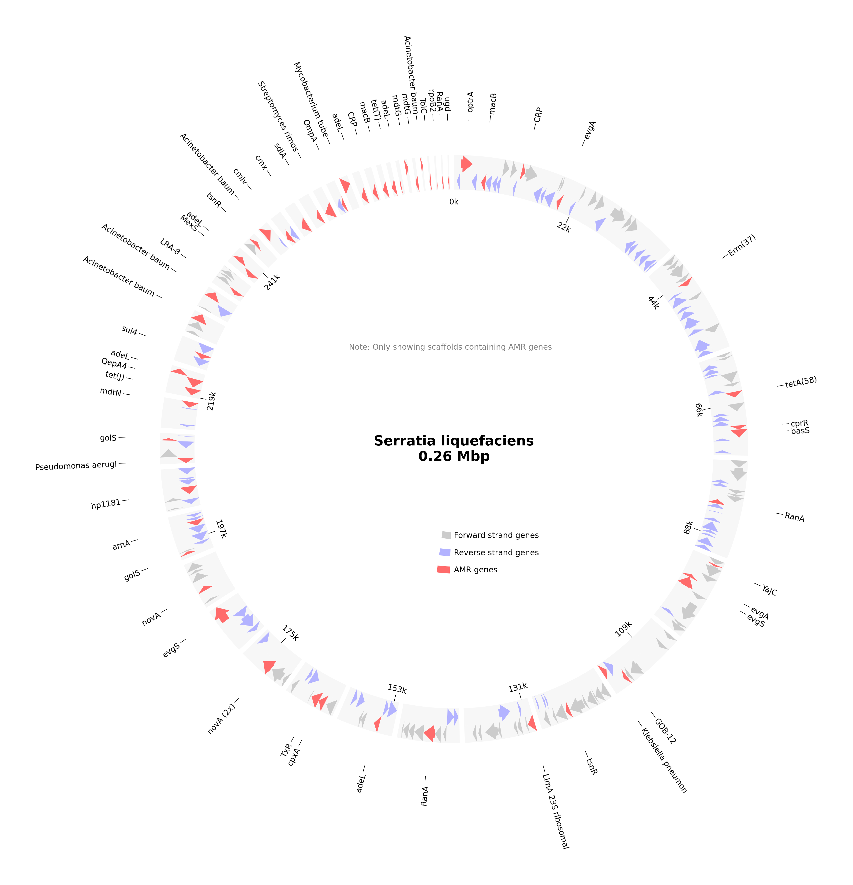

### Acinetobacter baumannii AbaF (found in 2 locations)
- **Mechanism**: antibiotic efflux
- **Drug Classes**: phosphonic acid antibiotic
- **AMR Family**: major facilitator superfamily (MFS) antibiotic efflux pump
- **Locations**:
  - gnl|SPADES|OOJMENLF_1431_3 : position 2155-3387
  - gnl|SPADES|OOJMENLF_2704_1 : position 241-1551

### Acinetobacter baumannii AbaQ (found in 2 locations)
- **Mechanism**: antibiotic efflux
- **Drug Classes**: fluoroquinolone antibiotic
- **AMR Family**: major facilitator superfamily (MFS) antibiotic efflux pump
- **Locations**:
  - gnl|SPADES|OOJMENLF_1388_4 : position 2370-3719
  - gnl|SPADES|OOJMENLF_35703_1 : position 1-309

### CRP (found in 2 locations)
- **Mechanism**: antibiotic efflux
- **Drug Classes**: macrolide antibiotic; fluoroquinolone antibiotic; penam
- **AMR Family**: resistance-nodulation-cell division (RND) antibiotic efflux pump
- **Locations**:
  - gnl|SPADES|OOJMENLF_181_14: position 11382-12014
  - gnl|SPADES|OOJMENLF_4246_1 : position 178-942

### Erm(37)
- **Mechanism**: antibiotic target alteration
- **Drug Classes**: macrolide antibiotic; lincosamide antibiotic; streptogramin antibiotic; streptogramin A antibiotic; streptogramin B antibiotic
- **AMR Family**: Erm 23S ribosomal RNA methyltransferase
- **Locations**:
  - gnl|SPADES|OOJMENLF_400_5 : position 4705-5484

### GOB-12
- **Mechanism**: antibiotic inactivation
- **Drug Classes**: carbapenem; cephalosporin; penam
- **AMR Family**: GOB beta-lactamase
- **Locations**:
  - gnl|SPADES|OOJMENLF_507_7 : position 10090-10737

### Klebsiella pneumoniae OmpK37
- **Mechanism**: reduced permeability to antibiotic
- **Drug Classes**: monobactam; carbapenem; cephalosporin; cephamycin; penam; penem
- **AMR Family**: General Bacterial Porin with reduced permeability to beta-lactams
- **Locations**:
  - gnl|SPADES|OOJMENLF_507_9 : position 12244-13176

### LRA-8
- **Mechanism**: antibiotic inactivation
- **Drug Classes**: cephalosporin; penam
- **AMR Family**: subclass B3 LRA beta-lactamase
- **Locations**:
  - gnl|SPADES|OOJMENLF_1507_2 : position 407-1162

### LlmA 23S ribosomal RNA methyltransferase
- **Mechanism**: antibiotic target alteration
- **Drug Classes**: lincosamide antibiotic
- **AMR Family**: Llm 23S ribosomal RNA methyltransferase
- **Locations**:
  - gnl|SPADES|OOJMENLF_546_1 : position 2-1174

### MexS
- **Mechanism**: antibiotic efflux
- **Drug Classes**: fluoroquinolone antibiotic; diaminopyrimidine antibiotic; phenicol antibiotic
- **AMR Family**: resistance-nodulation-cell division (RND) antibiotic efflux pump
- **Locations**:
  - gnl|SPADES|OOJMENLF_1722_1 : position 157-1092

### Mycobacterium tuberculosis rpoB mutations conferring resistance to rifampicin
- **Mechanism**: antibiotic target alteration; antibiotic target replacement
- **Drug Classes**: rifamycin antibiotic
- **AMR Family**: rifamycin-resistant beta-subunit of RNA polymerase (rpoB)
- **Locations**:
  - gnl|SPADES|OOJMENLF_3771_1 : position 1-1377

### OmpA
- **Mechanism**: reduced permeability to antibiotic
- **Drug Classes**: peptide antibiotic
- **AMR Family**: General Bacterial Porin with reduced permeability to peptide antibiotics
- **Locations**:
  - gnl|SPADES|OOJMENLF_3459_2 : position 990-1511

### Pseudomonas aeruginosa ampR with mutation conferring resistance to aztreonam
- **Mechanism**: antibiotic target alteration; antibiotic inactivation
- **Drug Classes**: monobactam; carbapenem; cephalosporin
- **AMR Family**: PDC beta-lactamase; ampR transcriptional regulator with mutation conferring resistance to monobactam antibiotics
- **Locations**:
  - gnl|SPADES|OOJMENLF_1057_1 : position 1-918

### QepA4
- **Mechanism**: antibiotic efflux
- **Drug Classes**: fluoroquinolone antibiotic
- **AMR Family**: major facilitator superfamily (MFS) antibiotic efflux pump
- **Locations**:
  - gnl|SPADES|OOJMENLF_1180_4 : position 1778-3310

### RanA (found in 3 locations)
- **Mechanism**: antibiotic efflux
- **Drug Classes**: aminoglycoside antibiotic
- **AMR Family**: ATP-binding cassette (ABC) antibiotic efflux pump
- **Locations**:
  - gnl|SPADES|OOJMENLF_112423_1 : position 2-250
  - gnl|SPADES|OOJMENLF_427_8 : position 7061-7834
  - gnl|SPADES|OOJMENLF_602_5 : position 4131-6008

### Streptomyces rimosus otr(A)
- **Mechanism**: antibiotic target protection
- **Drug Classes**: tetracycline antibiotic
- **AMR Family**: tetracycline-resistant ribosomal protection protein
- **Locations**:
  - gnl|SPADES|OOJMENLF_3294_1 : position 2-1582

### TolC
- **Mechanism**: antibiotic efflux
- **Drug Classes**: macrolide antibiotic; fluoroquinolone antibiotic; aminoglycoside antibiotic; carbapenem; cephalosporin; glycylcycline; cephamycin; penam; tetracycline antibiotic; peptide antibiotic; aminocoumarin antibiotic; rifamycin antibiotic; phenicol antibiotic; penem; disinfecting agents and antiseptics
- **AMR Family**: ATP-binding cassette (ABC) antibiotic efflux pump; major facilitator superfamily (MFS) antibiotic efflux pump; resistance-nodulation-cell division (RND) antibiotic efflux pump
- **Locations**:
  - gnl|SPADES|OOJMENLF_42825_1 : position 2-289

### TxR
- **Mechanism**: antibiotic efflux
- **Drug Classes**: tetracycline antibiotic
- **AMR Family**: ATP-binding cassette (ABC) antibiotic efflux pump
- **Locations**:
  - gnl|SPADES|OOJMENLF_674_3 : position 3131-4543

### YajC
- **Mechanism**: antibiotic efflux
- **Drug Classes**: fluoroquinolone antibiotic; cephalosporin; glycylcycline; penam; tetracycline antibiotic; oxazolidinone antibiotic; glycopeptide antibiotic; rifamycin antibiotic; phenicol antibiotic; disinfecting agents and antiseptics
- **AMR Family**: resistance-nodulation-cell division (RND) antibiotic efflux pump
- **Locations**:
  - gnl|SPADES|OOJMENLF_481_2 : position 859-1191

### adeL (found in 5 locations)
- **Mechanism**: antibiotic efflux
- **Drug Classes**: fluoroquinolone antibiotic; tetracycline antibiotic
- **AMR Family**: resistance-nodulation-cell division (RND) antibiotic efflux pump
- **Locations**:
  - gnl|SPADES|OOJMENLF_1180_5 : position 3486-4373
  - gnl|SPADES|OOJMENLF_1722_2 : position 1196-2083
  - gnl|SPADES|OOJMENLF_4203_1 : position 147-1040
  - gnl|SPADES|OOJMENLF_638_3 : position 2460-3377
  - gnl|SPADES|OOJMENLF_8815_1 : position 2-181

### arnA
- **Mechanism**: antibiotic target alteration
- **Drug Classes**: peptide antibiotic
- **AMR Family**: pmr phosphoethanolamine transferase
- **Locations**:
  - gnl|SPADES|OOJMENLF_788_7 : position 4730-5674

### basS
- **Mechanism**: antibiotic target alteration; antibiotic efflux
- **Drug Classes**: peptide antibiotic
- **AMR Family**: pmr phosphoethanolamine transferase
- **Locations**:
  - gnl|SPADES|OOJMENLF_405_16 : position 12884-14242

### cmlv
- **Mechanism**: antibiotic inactivation
- **Drug Classes**: phenicol antibiotic
- **AMR Family**: chloramphenicol phosphotransferase
- **Locations**:
  - gnl|SPADES|OOJMENLF_2713_1 : position 1-846

### cmx
- **Mechanism**: antibiotic efflux
- **Drug Classes**: phenicol antibiotic
- **AMR Family**: major facilitator superfamily (MFS) antibiotic efflux pump
- **Locations**:
  - gnl|SPADES|OOJMENLF_2763_2 : position 528-1724

### cprR
- **Mechanism**: antibiotic target alteration; antibiotic efflux
- **Drug Classes**: peptide antibiotic
- **AMR Family**: pmr phosphoethanolamine transferase
- **Locations**:
  - gnl|SPADES|OOJMENLF_405_15 : position 12225-12887

### cpxA
- **Mechanism**: antibiotic efflux
- **Drug Classes**: aminoglycoside antibiotic; aminocoumarin antibiotic
- **AMR Family**: resistance-nodulation-cell division (RND) antibiotic efflux pump
- **Locations**:
  - gnl|SPADES|OOJMENLF_674_2 : position 2073-3122

### evgA (found in 2 locations)
- **Mechanism**: antibiotic efflux
- **Drug Classes**: macrolide antibiotic; fluoroquinolone antibiotic; penam; tetracycline antibiotic
- **AMR Family**: major facilitator superfamily (MFS) antibiotic efflux pump; resistance-nodulation-cell division (RND) antibiotic efflux pump
- **Locations**:
  - gnl|SPADES|OOJMENLF_181_21 : position 18682-19407
  - gnl|SPADES|OOJMENLF_481_5 : position 4113-4712

### evgS (found in 2 locations)
- **Mechanism**: antibiotic efflux
- **Drug Classes**: macrolide antibiotic; fluoroquinolone antibiotic; penam; tetracycline antibiotic
- **AMR Family**: major facilitator superfamily (MFS) antibiotic efflux pump; resistance-nodulation-cell division (RND) antibiotic efflux pump
- **Locations**:
  - gnl|SPADES|OOJMENLF_481_6 : position 4690-6444
  - gnl|SPADES|OOJMENLF_736_5 : position 5052-7784

### golS (found in 2 locations)
- **Mechanism**: antibiotic efflux
- **Drug Classes**: monobactam; carbapenem; cephalosporin; cephamycin; penam; phenicol antibiotic; penem
- **AMR Family**: resistance-nodulation-cell division (RND) antibiotic efflux pump
- **Locations**:
  - gnl|SPADES|OOJMENLF_1057_4 : position 3921-4319
  - gnl|SPADES|OOJMENLF_788_2 : position 571-1002

### hp1181
- **Mechanism**: antibiotic efflux
- **Drug Classes**: fluoroquinolone antibiotic; tetracycline antibiotic; nitroimidazole antibiotic
- **AMR Family**: major facilitator superfamily (MFS) antibiotic efflux pump
- **Locations**:
  - gnl|SPADES|OOJMENLF_812_4 : position 2313-3677

### macB (found in 2 locations)
- **Mechanism**: antibiotic efflux
- **Drug Classes**: macrolide antibiotic
- **AMR Family**: ATP-binding cassette (ABC) antibiotic efflux pump
- **Locations**:
  - gnl|SPADES|OOJMENLF_181_6 : position 4813-5580
  - gnl|SPADES|OOJMENLF_6335_1 : position 3-812

### mdtG (found in 2 locations)
- **Mechanism**: antibiotic efflux
- **Drug Classes**: phosphonic acid antibiotic
- **AMR Family**: major facilitator superfamily (MFS) antibiotic efflux pump
- **Locations**:
  - gnl|SPADES|OOJMENLF_11041_1 : position 3-494
  - gnl|SPADES|OOJMENLF_11043_1 : position 2-493

### mdtN
- **Mechanism**: antibiotic efflux
- **Drug Classes**: nucleoside antibiotic; disinfecting agents and antiseptics
- **AMR Family**: major facilitator superfamily (MFS) antibiotic efflux pump
- **Locations**:
  - gnl|SPADES|OOJMENLF_1098_4 : position 3909-4949

### novA (found in 3 locations)
- **Mechanism**: antibiotic efflux
- **Drug Classes**: aminocoumarin antibiotic
- **AMR Family**: ATP-binding cassette (ABC) antibiotic efflux pump
- **Locations**:
  - gnl|SPADES|OOJMENLF_695_3 : position 3224-5020
  - gnl|SPADES|OOJMENLF_695_4 : position 5014-6756
  - gnl|SPADES|OOJMENLF_740_4 : position 2517-3263

### optrA
- **Mechanism**: antibiotic target protection
- **Drug Classes**: oxazolidinone antibiotic; phenicol antibiotic
- **AMR Family**: Miscellaneous ABC-F subfamily ATP-binding cassette ribosomal protection proteins
- **Locations**:
  - gnl|SPADES|OOJMENLF_181_3 : position 1190-3103

### rpoB2
- **Mechanism**: antibiotic target alteration; antibiotic target replacement
- **Drug Classes**: rifamycin antibiotic
- **AMR Family**: rifamycin-resistant beta-subunit of RNA polymerase (rpoB)
- **Locations**:
  - gnl|SPADES|OOJMENLF_61643_2 : position 189-272

### sdiA
- **Mechanism**: antibiotic efflux
- **Drug Classes**: fluoroquinolone antibiotic; cephalosporin; glycylcycline; penam; tetracycline antibiotic; rifamycin antibiotic; phenicol antibiotic; disinfecting agents and antiseptics
- **AMR Family**: resistance-nodulation-cell division (RND) antibiotic efflux pump
- **Locations**:
  - gnl|SPADES|OOJMENLF_2825_3 : position 1052-1846

### sul4
- **Mechanism**: antibiotic target replacement
- **Drug Classes**: sulfonamide antibiotic
- **AMR Family**: sulfonamide resistant sul
- **Locations**:
  - gnl|SPADES|OOJMENLF_1255_3 : position 1719-2552

### tet(J)
- **Mechanism**: antibiotic efflux
- **Drug Classes**: tetracycline antibiotic
- **AMR Family**: major facilitator superfamily (MFS) antibiotic efflux pump
- **Locations**:
  - gnl|SPADES|OOJMENLF_1180_2 : position 337-1554

### tet(T)
- **Mechanism**: antibiotic target protection
- **Drug Classes**: tetracycline antibiotic
- **AMR Family**: tetracycline-resistant ribosomal protection protein
- **Locations**:
  - gnl|SPADES|OOJMENLF_7115_1 : position 2-715

### tetA(58)
- **Mechanism**: antibiotic efflux
- **Drug Classes**: tetracycline antibiotic
- **AMR Family**: major facilitator superfamily (MFS) antibiotic efflux pump
- **Locations**:
  - gnl|SPADES|OOJMENLF_405_9 : position 6566-7489

### tsnR (found in 2 locations)
- **Mechanism**: antibiotic target alteration
- **Drug Classes**: peptide antibiotic
- **AMR Family**: non-erm 23S ribosomal RNA methyltransferase (A1067)
- **Locations**:
  - gnl|SPADES|OOJMENLF_2176_2 : position 1187-1849
  - gnl|SPADES|OOJMENLF_526_7 : position 7165-7896

### ugd
- **Mechanism**: antibiotic target alteration
- **Drug Classes**: peptide antibiotic
- **AMR Family**: pmr phosphoethanolamine transferase
- **Locations**:
  - gnl|SPADES|OOJMENLF_152140_1 : position 1-231

## Serratia liquefaciens ATCC 27592
**Strain Statistics:**
- Total genome length: 4286.0 kbp
- Total scaffolds: 244
- Scaffolds with AMR genes: 131
- Total genes annotated: 7908
- Total AMR genes: 582
- Unique AMR genes: 234
- Distinct AMR mechanisms: 10
- Distinct AMR families: 82
- Distinct drug classes: 38

**Circos Plot:**

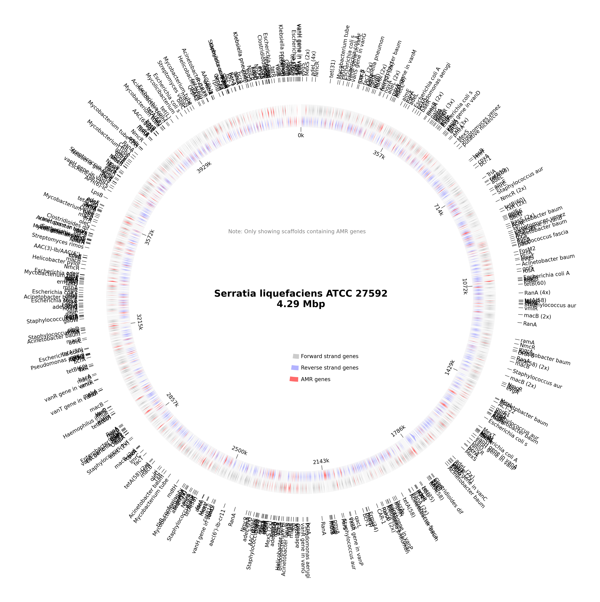

### AAC(3)-Ia
- **Mechanism**: antibiotic inactivation
- **Drug Classes**: aminoglycoside antibiotic
- **AMR Family**: AAC(3)
- **Locations**:
  - gnl|SPADES|OOJMENLF_525_1 : position 19-567

### AAC(3)-Ib/AAC(6')-Ib3 bifunctional protein
- **Mechanism**: antibiotic inactivation
- **Drug Classes**: aminoglycoside antibiotic
- **AMR Family**: aminoglycoside bifunctional resistance protein
- **Locations**:
  - gnl|SPADES|OOJMENLF_281_17 : position 19892-20344

### AAC(6')-Iai
- **Mechanism**: antibiotic inactivation
- **Drug Classes**: aminoglycoside antibiotic
- **AMR Family**: AAC(6')
- **Locations**:
  - gnl|SPADES|OOJMENLF_159_47 : position 44372-44824

### AAC(6')-Iak
- **Mechanism**: antibiotic inactivation
- **Drug Classes**: aminoglycoside antibiotic
- **AMR Family**: AAC(6')
- **Locations**:
  - gnl|SPADES|OOJMENLF_381_20 : position 17282-17728

### AAC(6')-Isa
- **Mechanism**: antibiotic inactivation
- **Drug Classes**: aminoglycoside antibiotic
- **AMR Family**: AAC(6')
- **Locations**:
  - gnl|SPADES|OOJMENLF_192_27 : position 24932-25516

### ACT-22
- **Mechanism**: antibiotic inactivation
- **Drug Classes**: carbapenem; cephalosporin; cephamycin; penam
- **AMR Family**: ACT beta-lactamase
- **Locations**:
  - gnl|SPADES|OOJMENLF_117_34 : position 33731-35266

### AIM-1
- **Mechanism**: antibiotic inactivation
- **Drug Classes**: cephalosporin; cephamycin; penam
- **AMR Family**: AIM beta-lactamase
- **Locations**:
  - gnl|SPADES|OOJMENLF_159_21 : position 24309-25253

### APH(6)-Ic
- **Mechanism**: antibiotic inactivation
- **Drug Classes**: aminoglycoside antibiotic
- **AMR Family**: APH(6)
- **Locations**:
  - gnl|SPADES|OOJMENLF_326_10 : position 6687-7541

### AQU-2
- **Mechanism**: antibiotic inactivation
- **Drug Classes**: cephalosporin
- **AMR Family**: AQU beta-lactamase
- **Locations**:
  - gnl|SPADES|OOJMENLF_255_1 : position 3-986

### Acinetobacter baumannii AbaF (found in 6 locations)
- **Mechanism**: antibiotic efflux
- **Drug Classes**: phosphonic acid antibiotic
- **AMR Family**: major facilitator superfamily (MFS) antibiotic efflux pump
- **Locations**:
  - gnl|SPADES|OOJMENLF_117_25 : position 23083-24393
  - gnl|SPADES|OOJMENLF_118_14 : position 11884-13386
  - gnl|SPADES|OOJMENLF_128_50 : position 48543-49925
  - gnl|SPADES|OOJMENLF_259_9 : position 10641-11948
  - gnl|SPADES|OOJMENLF_77_19 : position 17940-19265
  - gnl|SPADES|OOJMENLF_83_56 : position 67319-68641

### Acinetobacter baumannii AbaQ (found in 10 locations)
- **Mechanism**: antibiotic efflux
- **Drug Classes**: fluoroquinolone antibiotic
- **AMR Family**: major facilitator superfamily (MFS) antibiotic efflux pump
- **Locations**:
  - gnl|SPADES|OOJMENLF_101_52 : position 51991-53361
  - gnl|SPADES|OOJMENLF_119_30 : position 36528-37835
  - gnl|SPADES|OOJMENLF_156_36 : position 38492-39805
  - gnl|SPADES|OOJMENLF_198_27 : position 35579-36916
  - gnl|SPADES|OOJMENLF_266_6 : position 3164-4477
  - gnl|SPADES|OOJMENLF_295_9 : position 8932-10200
  - gnl|SPADES|OOJMENLF_419_8 : position 7231-8493
  - gnl|SPADES|OOJMENLF_504_9 : position 8236-9636
  - gnl|SPADES|OOJMENLF_60_25 : position 27717-29024
  - gnl|SPADES|OOJMENLF_77_53 : position 56066-57361

### Acinetobacter baumannii AmvA
- **Mechanism**: antibiotic efflux
- **Drug Classes**: macrolide antibiotic; disinfecting agents and antiseptics
- **AMR Family**: major facilitator superfamily (MFS) antibiotic efflux pump
- **Locations**:
  - gnl|SPADES|OOJMENLF_138_26 : position 31363-32835

### ArnT
- **Mechanism**: antibiotic target alteration
- **Drug Classes**: peptide antibiotic
- **AMR Family**: pmr phosphoethanolamine transferase
- **Locations**:
  - gnl|SPADES|OOJMENLF_308_14: position 13123-14787

### Bifidobacterium bifidum ileS conferring resistance to mupirocin
- **Mechanism**: antibiotic target alteration
- **Drug Classes**: mupirocin-like antibiotic
- **AMR Family**: antibiotic-resistant isoleucyl-tRNA synthetase (ileS)
- **Locations**:
  - gnl|SPADES|OOJMENLF_157_1 : position 95-2677

### CAR-1 (found in 2 locations)
- **Mechanism**: antibiotic inactivation
- **Drug Classes**: carbapenem
- **AMR Family**: CAR beta-lactamase
- **Locations**:
  - gnl|SPADES|OOJMENLF_147_45 : position 40280-41086
  - gnl|SPADES|OOJMENLF_364_3 : position 3242-4042

### CAU-1
- **Mechanism**: antibiotic inactivation
- **Drug Classes**: carbapenem; penam
- **AMR Family**: CAU beta-lactamase
- **Locations**:
  - gnl|SPADES|OOJMENLF_519_12 : position 9973-12096

### Clostridioides difficile gyrA conferring resistance to fluoroquinolones
- **Mechanism**: antibiotic target alteration
- **Drug Classes**: fluoroquinolone antibiotic
- **AMR Family**: fluoroquinolone resistant gyrA
- **Locations**:
  - gnl|SPADES|OOJMENLF_135_40 : position 46583-49234

### Clostridioides difficile gyrB conferring resistance to fluoroquinolones (found in 2 locations)
- **Mechanism**: antibiotic target alteration
- **Drug Classes**: fluoroquinolone antibiotic
- **AMR Family**: fluoroquinolone resistant gyrB
- **Locations**:
  - gnl|SPADES|OOJMENLF_295_21 : position 22871-25168
  - gnl|SPADES|OOJMENLF_724_6 : position 3574-5469

### CrcB
- **Mechanism**: antibiotic efflux
- **Drug Classes**: aminoglycoside antibiotic
- **AMR Family**: multidrug and toxic compound extrusion (MATE) transporter
- **Locations**:
  - gnl|SPADES|OOJMENLF_157_16 : position 15530-15913

### DHA-6
- **Mechanism**: antibiotic inactivation
- **Drug Classes**: cephalosporin; cephamycin
- **AMR Family**: DHA beta-lactamase
- **Locations**:
  - gnl|SPADES|OOJMENLF_101_56 : position 56753-57895

### EdeQ
- **Mechanism**: antibiotic inactivation
- **Drug Classes**: peptide antibiotic; polyamine antibiotic
- **AMR Family**: Edeine acetyltransferase
- **Locations**:
  - gnl|SPADES|OOJMENLF_1613_1 : position 1-309

### Enterobacter cloacae acrA (found in 2 locations)
- **Mechanism**: antibiotic efflux
- **Drug Classes**: fluoroquinolone antibiotic; cephalosporin; glycylcycline; penam; tetracycline antibiotic; rifamycin antibiotic; phenicol antibiotic; disinfecting agents and antiseptics
- **AMR Family**: resistance-nodulation-cell division (RND) antibiotic efflux pump
- **Locations**:
  - gnl|SPADES|OOJMENLF_221_4 : position 3746-4948
  - gnl|SPADES|OOJMENLF_87_31 : position 34617-35804

### Enterococcus faecalis cls with mutation conferring resistance to daptomycin
- **Mechanism**: antibiotic target alteration
- **Drug Classes**: peptide antibiotic
- **AMR Family**: daptomycin resistant cls
- **Locations**:
  - gnl|SPADES|OOJMENLF_138_24 : position 28736-30196

### Erm(34)
- **Mechanism**: antibiotic target alteration
- **Drug Classes**: macrolide antibiotic; lincosamide antibiotic; streptogramin antibiotic; streptogramin A antibiotic; streptogramin B antibiotic
- **AMR Family**: Erm 23S ribosomal RNA methyltransferase
- **Locations**:
  - gnl|SPADES|OOJMENLF_148_14 : position 17626-18252

### Escherichia coli AcrAB-TolC with AcrR mutation conferring resistance to ciprofloxacin, tetracycline, and ceftazidime (found in 5 locations)
- **Mechanism**: antibiotic target alteration; antibiotic efflux
- **Drug Classes**: fluoroquinolone antibiotic; cephalosporin; glycylcycline; penam; tetracycline antibiotic; rifamycin antibiotic; phenicol antibiotic; disinfecting agents and antiseptics
- **AMR Family**: resistance-nodulation-cell division (RND) antibiotic efflux pump
- **Locations**:
  - gnl|SPADES|OOJMENLF_119_18 : position 20798-21502
  - gnl|SPADES|OOJMENLF_255_3 : position 2178-2780
  - gnl|SPADES|OOJMENLF_53_25 : position 25586-26167
  - gnl|SPADES|OOJMENLF_61_53 : position 57038-57625
  - gnl|SPADES|OOJMENLF_87_30 : position 33785-34474

### Escherichia coli AcrAB-TolC with MarR mutations conferring resistance to ciprofloxacin and tetracycline (found in 2 locations)
- **Mechanism**: antibiotic target alteration; antibiotic efflux
- **Drug Classes**: fluoroquinolone antibiotic; cephalosporin; glycylcycline; penam; tetracycline antibiotic; rifamycin antibiotic; phenicol antibiotic; disinfecting agents and antiseptics
- **AMR Family**: resistance-nodulation-cell division (RND) antibiotic efflux pump
- **Locations**:
  - gnl|SPADES|OOJMENLF_264_26 : position 25370-25804
  - gnl|SPADES|OOJMENLF_60_31 : position 33959-34432

### Escherichia coli EF-Tu mutants conferring resistance to Enacyloxin IIa
- **Mechanism**: antibiotic target alteration
- **Drug Classes**: elfamycin antibiotic
- **AMR Family**: elfamycin resistant EF-Tu
- **Locations**:
  - gnl|SPADES|OOJMENLF_1687_1 : position 3-2588

### Escherichia coli EF-Tu mutants conferring resistance to Pulvomycin
- **Mechanism**: antibiotic target alteration
- **Drug Classes**: elfamycin antibiotic
- **AMR Family**: elfamycin resistant EF-Tu
- **Locations**:
  - gnl|SPADES|OOJMENLF_292_16 : position 18290-20137

### Escherichia coli fabI mutations conferring resistance to isoniazid and triclosan (found in 2 locations)
- **Mechanism**: antibiotic target alteration
- **Drug Classes**: disinfecting agents and antiseptics; isoniazid-like antibiotic
- **AMR Family**: antibiotic resistant fabI
- **Locations**:
  - gnl|SPADES|OOJMENLF_273_15 : position 14664-15410
  - gnl|SPADES|OOJMENLF_419_12 : position 11656-12411

### Escherichia coli mdfA
- **Mechanism**: antibiotic efflux
- **Drug Classes**: tetracycline antibiotic; phenicol antibiotic; disinfecting agents and antiseptics
- **AMR Family**: major facilitator superfamily (MFS) antibiotic efflux pump
- **Locations**:
  - gnl|SPADES|OOJMENLF_292_14 : position 16566-17813

### Escherichia coli soxS with mutation conferring antibiotic resistance (found in 9 locations)
- **Mechanism**: antibiotic target alteration; antibiotic efflux; reduced permeability to antibiotic
- **Drug Classes**: fluoroquinolone antibiotic; monobactam; carbapenem; cephalosporin; glycylcycline; cephamycin; penam; tetracycline antibiotic; rifamycin antibiotic; phenicol antibiotic; penem; disinfecting agents and antiseptics
- **AMR Family**: ATP-binding cassette (ABC) antibiotic efflux pump; major facilitator superfamily (MFS) antibiotic efflux pump; resistance-nodulation-cell division (RND) antibiotic efflux pump; General Bacterial Porin with reduced permeability to beta-lactams
- **Locations**:
  - gnl|SPADES|OOJMENLF_118_30 : position 31933-32706
  - gnl|SPADES|OOJMENLF_219_33 : position 31557-32426
  - gnl|SPADES|OOJMENLF_255_23 : position 21068-21985
  - gnl|SPADES|OOJMENLF_266_19 : position 18308-19153
  - gnl|SPADES|OOJMENLF_326_20 : position 17915-18808
  - gnl|SPADES|OOJMENLF_449_7 : position 8360-9226
  - gnl|SPADES|OOJMENLF_53_14 : position 12914-13372
  - gnl|SPADES|OOJMENLF_62_77 : position 70467-71414
  - gnl|SPADES|OOJMENLF_813_2 : position 1311-1733

### EstT (found in 3 locations)
- **Mechanism**: antibiotic inactivation
- **Drug Classes**: macrolide antibiotic
- **AMR Family**: macrolide esterase
- **Locations**:
  - gnl|SPADES|OOJMENLF_338_6 : position 4522-5325
  - gnl|SPADES|OOJMENLF_5385_1 : position 72-902
  - gnl|SPADES|OOJMENLF_61_22 : position 29318-30160

### FosA8
- **Mechanism**: antibiotic inactivation
- **Drug Classes**: phosphonic acid antibiotic
- **AMR Family**: fosfomycin thiol transferase
- **Locations**:
  - gnl|SPADES|OOJMENLF_147_1: position 160-567

### FosC2
- **Mechanism**: antibiotic inactivation
- **Drug Classes**: phosphonic acid antibiotic
- **AMR Family**: fosC phosphotransferase family
- **Locations**:
  - gnl|SPADES|OOJMENLF_264_13 : position 11350-11757

### FosM1
- **Mechanism**: antibiotic inactivation
- **Drug Classes**: phosphonic acid antibiotic
- **AMR Family**: fosfomycin thiol transferase
- **Locations**:
  - gnl|SPADES|OOJMENLF_157_27 : position 24606-25115

### FosM2
- **Mechanism**: antibiotic inactivation
- **Drug Classes**: phosphonic acid antibiotic
- **AMR Family**: fosfomycin thiol transferase
- **Locations**:
  - gnl|SPADES|OOJMENLF_83_24 : position 25055-25465

### H-NS
- **Mechanism**: antibiotic efflux
- **Drug Classes**: macrolide antibiotic; fluoroquinolone antibiotic; cephalosporin; cephamycin; penam; tetracycline antibiotic
- **AMR Family**: major facilitator superfamily (MFS) antibiotic efflux pump; resistance-nodulation-cell division (RND) antibiotic efflux pump
- **Locations**:
  - gnl|SPADES|OOJMENLF_138_7 : position 7388-7795

### Haemophilus influenzae PBP3 conferring resistance to beta-lactam antibiotics (found in 2 locations)
- **Mechanism**: antibiotic target alteration
- **Drug Classes**: cephalosporin; cephamycin; penam
- **AMR Family**: Penicillin-binding protein mutations conferring resistance to beta-lactam antibiotics
- **Locations**:
  - gnl|SPADES|OOJMENLF_227_10 : position 10829-12592
  - gnl|SPADES|OOJMENLF_60_75 : position 85321-87039

### Helicobacter pylori pbp1 mutants conferring resistance to amoxicillin (found in 2 locations)
- **Mechanism**: antibiotic target alteration
- **Drug Classes**: cephalosporin; cephamycin; penam
- **AMR Family**: Penicillin-binding protein mutations conferring resistance to beta-lactam antibiotics
- **Locations**:
  - gnl|SPADES|OOJMENLF_279_14 : position 18212-20560
  - gnl|SPADES|OOJMENLF_492_5 : position 4870-7374

### Helicobacter pylori pbp2 mutants conferring resistance to amoxicillin
- **Mechanism**: antibiotic target alteration
- **Drug Classes**: cephalosporin; cephamycin; penam
- **AMR Family**: Penicillin-binding protein mutations conferring resistance to beta-lactam antibiotics
- **Locations**:
  - gnl|SPADES|OOJMENLF_157_7 : position 5955-7850

### Klebsiella aerogenes Omp36
- **Mechanism**: reduced permeability to antibiotic
- **Drug Classes**: monobactam; carbapenem; cephalosporin; cephamycin; penam; penem
- **AMR Family**: General Bacterial Porin with reduced permeability to beta-lactams
- **Locations**:
  - gnl|SPADES|OOJMENLF_533_4 : position 4862-5992

### Klebsiella pneumoniae KpnE
- **Mechanism**: antibiotic efflux
- **Drug Classes**: macrolide antibiotic; aminoglycoside antibiotic; cephalosporin; tetracycline antibiotic; peptide antibiotic; rifamycin antibiotic; disinfecting agents and antiseptics
- **AMR Family**: small multidrug resistance (SMR) antibiotic efflux pump
- **Locations**:
  - gnl|SPADES|OOJMENLF_644_10 : position 8653-9021

### Klebsiella pneumoniae KpnF
- **Mechanism**: antibiotic efflux
- **Drug Classes**: macrolide antibiotic; aminoglycoside antibiotic; cephalosporin; tetracycline antibiotic; peptide antibiotic; rifamycin antibiotic; disinfecting agents and antiseptics
- **AMR Family**: small multidrug resistance (SMR) antibiotic efflux pump
- **Locations**:
  - gnl|SPADES|OOJMENLF_644_9: position 8337-8666

### Klebsiella pneumoniae KpnH
- **Mechanism**: antibiotic efflux
- **Drug Classes**: macrolide antibiotic; fluoroquinolone antibiotic; aminoglycoside antibiotic; carbapenem; cephalosporin; penam; peptide antibiotic; penem
- **AMR Family**: major facilitator superfamily (MFS) antibiotic efflux pump
- **Locations**:
  - gnl|SPADES|OOJMENLF_159_6: position 7034-8569

### Klebsiella pneumoniae OmpK37 (found in 3 locations)
- **Mechanism**: reduced permeability to antibiotic
- **Drug Classes**: monobactam; carbapenem; cephalosporin; cephamycin; penam; penem
- **AMR Family**: General Bacterial Porin with reduced permeability to beta-lactams
- **Locations**:
  - gnl|SPADES|OOJMENLF_147_15 : position 6860-7942
  - gnl|SPADES|OOJMENLF_53_92 : position 91700-92797
  - gnl|SPADES|OOJMENLF_950_1 : position 3-245

### LpsB (found in 2 locations)
- **Mechanism**: reduced permeability to antibiotic
- **Drug Classes**: peptide antibiotic
- **AMR Family**: Intrinsic peptide antibiotic resistant Lps
- **Locations**:
  - gnl|SPADES|OOJMENLF_325_5 : position 4975-6183
  - gnl|SPADES|OOJMENLF_70_23 : position 22250-23347

### LptD
- **Mechanism**: antibiotic efflux
- **Drug Classes**: carbapenem; peptide antibiotic; aminocoumarin antibiotic; rifamycin antibiotic
- **AMR Family**: ATP-binding cassette (ABC) antibiotic efflux pump
- **Locations**:
  - gnl|SPADES|OOJMENLF_272_11 : position 14279-16642

### MdtK
- **Mechanism**: antibiotic efflux
- **Drug Classes**: fluoroquinolone antibiotic
- **AMR Family**: multidrug and toxic compound extrusion (MATE) transporter
- **Locations**:
  - gnl|SPADES|OOJMENLF_40_104 : position 101564-103027

### MexA
- **Mechanism**: antibiotic efflux
- **Drug Classes**: macrolide antibiotic; fluoroquinolone antibiotic; monobactam; carbapenem; cephalosporin; cephamycin; penam; tetracycline antibiotic; peptide antibiotic; aminocoumarin antibiotic; diaminopyrimidine antibiotic; sulfonamide antibiotic; phenicol antibiotic; penem
- **AMR Family**: resistance-nodulation-cell division (RND) antibiotic efflux pump
- **Locations**:
  - gnl|SPADES|OOJMENLF_119_16 : position 17946-19088

### MexE
- **Mechanism**: antibiotic efflux
- **Drug Classes**: fluoroquinolone antibiotic; diaminopyrimidine antibiotic; phenicol antibiotic
- **AMR Family**: resistance-nodulation-cell division (RND) antibiotic efflux pump
- **Locations**:
  - gnl|SPADES|OOJMENLF_264_25 : position 24092-24949

### MexG
- **Mechanism**: antibiotic efflux
- **Drug Classes**: fluoroquinolone antibiotic; tetracycline antibiotic; disinfecting agents and antiseptics
- **AMR Family**: resistance-nodulation-cell division (RND) antibiotic efflux pump
- **Locations**:
  - gnl|SPADES|OOJMENLF_159_43 : position 41843-42256

### MexL (found in 3 locations)
- **Mechanism**: antibiotic efflux
- **Drug Classes**: macrolide antibiotic; tetracycline antibiotic; disinfecting agents and antiseptics
- **AMR Family**: resistance-nodulation-cell division (RND) antibiotic efflux pump
- **Locations**:
  - gnl|SPADES|OOJMENLF_117_22 : position 21071-21727
  - gnl|SPADES|OOJMENLF_338_2 : position 1291-1929
  - gnl|SPADES|OOJMENLF_88_39 : position 38043-38627

### MexS (found in 10 locations)
- **Mechanism**: antibiotic efflux
- **Drug Classes**: fluoroquinolone antibiotic; diaminopyrimidine antibiotic; phenicol antibiotic
- **AMR Family**: resistance-nodulation-cell division (RND) antibiotic efflux pump
- **Locations**:
  - gnl|SPADES|OOJMENLF_124_29 : position 32850-33878
  - gnl|SPADES|OOJMENLF_128_35 : position 34935-35924
  - gnl|SPADES|OOJMENLF_157_46 : position 42881-43816
  - gnl|SPADES|OOJMENLF_157_47 : position 43909-44898
  - gnl|SPADES|OOJMENLF_352_4 : position 1631-2758
  - gnl|SPADES|OOJMENLF_40_18 : position 18503-19537
  - gnl|SPADES|OOJMENLF_40_56 : position 55461-56468
  - gnl|SPADES|OOJMENLF_62_16 : position 17223-18203
  - gnl|SPADES|OOJMENLF_62_6 : position 6801-7826
  - gnl|SPADES|OOJMENLF_64_38 : position 42765-43751

### MexT (found in 3 locations)
- **Mechanism**: antibiotic efflux
- **Drug Classes**: fluoroquinolone antibiotic; diaminopyrimidine antibiotic; phenicol antibiotic
- **AMR Family**: resistance-nodulation-cell division (RND) antibiotic efflux pump
- **Locations**:
  - gnl|SPADES|OOJMENLF_119_4 : position 3035-3931
  - gnl|SPADES|OOJMENLF_40_20 : position 20328-21257
  - gnl|SPADES|OOJMENLF_83_42 : position 47136-48086

### MexV
- **Mechanism**: antibiotic efflux
- **Drug Classes**: macrolide antibiotic; fluoroquinolone antibiotic; tetracycline antibiotic; phenicol antibiotic; disinfecting agents and antiseptics
- **AMR Family**: resistance-nodulation-cell division (RND) antibiotic efflux pump
- **Locations**:
  - gnl|SPADES|OOJMENLF_187_29 : position 30520-31971

### MexZ
- **Mechanism**: antibiotic efflux
- **Drug Classes**: macrolide antibiotic; fluoroquinolone antibiotic; aminoglycoside antibiotic; carbapenem; cephalosporin; cephamycin; penam; tetracycline antibiotic; phenicol antibiotic; disinfecting agents and antiseptics
- **AMR Family**: resistance-nodulation-cell division (RND) antibiotic efflux pump
- **Locations**:
  - gnl|SPADES|OOJMENLF_53_67 : position 66278-66910

### Mycobacterium tuberculosis gidB mutation conferring resistance to streptomycin
- **Mechanism**: antibiotic target alteration
- **Drug Classes**: aminoglycoside antibiotic
- **AMR Family**: antibiotic resistant gidB
- **Locations**:
  - gnl|SPADES|OOJMENLF_356_16 : position 18145-18765

### Mycobacterium tuberculosis inhA mutations conferring resistance to isoniazid
- **Mechanism**: antibiotic target alteration
- **Drug Classes**: isoniazid-like antibiotic
- **AMR Family**: isoniazid resistant inhA
- **Locations**:
  - gnl|SPADES|OOJMENLF_191_33 : position 36729-37487

### Mycobacterium tuberculosis kasA mutant conferring resistance to isoniazid (found in 3 locations)
- **Mechanism**: antibiotic target alteration
- **Drug Classes**: isoniazid-like antibiotic
- **AMR Family**: antibiotic resistant kasA
- **Locations**:
  - gnl|SPADES|OOJMENLF_301_16 : position 18313-19593
  - gnl|SPADES|OOJMENLF_366_15 : position 10819-11988
  - gnl|SPADES|OOJMENLF_366_18 : position 13183-14412

### Mycobacterium tuberculosis katG mutations conferring resistance to isoniazid
- **Mechanism**: antibiotic target alteration
- **Drug Classes**: isoniazid-like antibiotic
- **AMR Family**: isoniazid resistant katG
- **Locations**:
  - gnl|SPADES|OOJMENLF_417_2 : position 1543-3741

### Mycobacterium tuberculosis ndh with mutation conferring resistance to isoniazid
- **Mechanism**: antibiotic target alteration
- **Drug Classes**: isoniazid-like antibiotic
- **AMR Family**: antibiotic resistant ndh
- **Locations**:
  - gnl|SPADES|OOJMENLF_273_6 : position 7402-8706

### Mycobacterium tuberculosis pncA mutations conferring resistance to pyrazinamide (found in 3 locations)
- **Mechanism**: antibiotic target alteration
- **Drug Classes**: pyrazine antibiotic
- **AMR Family**: Pyrazinamide resistant pncA
- **Locations**:
  - gnl|SPADES|OOJMENLF_292_11 : position 13882-14433
  - gnl|SPADES|OOJMENLF_40_124 : position 123805-124491
  - gnl|SPADES|OOJMENLF_487_4 : position 2645-3277

### Mycobacterium tuberculosis thyA with mutation conferring resistance to para-aminosalicylic acid
- **Mechanism**: antibiotic target alteration
- **Drug Classes**: salicylic acid antibiotic
- **AMR Family**: aminosalicylate resistant thymidylate synthase
- **Locations**:
  - gnl|SPADES|OOJMENLF_198_16 : position 17591-18385

### Mycolicibacterium smegmatis ndh with mutation conferring resistance to isoniazid
- **Mechanism**: antibiotic target alteration
- **Drug Classes**: isoniazid-like antibiotic
- **AMR Family**: antibiotic resistant ndh
- **Locations**:
  - gnl|SPADES|OOJMENLF_443_12 : position 9747-10955

### Neisseria gonorrhoeae pilQ gene conferring resistance to beta-lactam
- **Mechanism**: antibiotic target alteration
- **Drug Classes**: cephalosporin; cephamycin; penam
- **AMR Family**: Penicillin-binding protein mutations conferring resistance to beta-lactam antibiotics
- **Locations**:
  - gnl|SPADES|OOJMENLF_329_2 : position 318-1559

### NmcR (found in 28 locations)
- **Mechanism**: antibiotic inactivation
- **Drug Classes**: carbapenem; cephalosporin; cephamycin; penam
- **AMR Family**: NmcA beta-lactamase
- **Locations**:
  - gnl|SPADES|OOJMENLF_101_29 : position 31020-31949
  - gnl|SPADES|OOJMENLF_114_24 : position 29319-30272
  - gnl|SPADES|OOJMENLF_119_21 : position 24031-24894
  - gnl|SPADES|OOJMENLF_124_4 : position 3954-4787
  - gnl|SPADES|OOJMENLF_157_36 : position 34468-35457
  - gnl|SPADES|OOJMENLF_159_13 : position 14457-15335
  - gnl|SPADES|OOJMENLF_161_27 : position 29013-29894
  - gnl|SPADES|OOJMENLF_191_10 : position 9509-10429
  - gnl|SPADES|OOJMENLF_279_6 : position 4952-5869
  - gnl|SPADES|OOJMENLF_292_3 : position 2947-3801
  - gnl|SPADES|OOJMENLF_338_12 : position 9409-10332
  - gnl|SPADES|OOJMENLF_352_5 : position 2787-3704
  - gnl|SPADES|OOJMENLF_371_12 : position 12950-13846
  - gnl|SPADES|OOJMENLF_40_47 : position 48159-49031
  - gnl|SPADES|OOJMENLF_532_2 : position 1157-2047
  - gnl|SPADES|OOJMENLF_53_3 : position 2287-3189
  - gnl|SPADES|OOJMENLF_53_52 : position 53259-54146
  - gnl|SPADES|OOJMENLF_61_23 : position 30269-31141
  - gnl|SPADES|OOJMENLF_62_47 : position 44464-45393
  - gnl|SPADES|OOJMENLF_62_85 : position 77924-78826
  - gnl|SPADES|OOJMENLF_62_90 : position 83332-84270
  - gnl|SPADES|OOJMENLF_685_1 : position 220-1119
  - gnl|SPADES|OOJMENLF_688_1 : position 576-1517
  - gnl|SPADES|OOJMENLF_73_12 : position 12282-13256
  - gnl|SPADES|OOJMENLF_73_32 : position 34321-35175
  - gnl|SPADES|OOJMENLF_77_43 : position 45531-46424
  - gnl|SPADES|OOJMENLF_88_36 : position 34764-35672
  - gnl|SPADES|OOJMENLF_930_6 : position 4874-5701

### OmpA (found in 3 locations)
- **Mechanism**: reduced permeability to antibiotic
- **Drug Classes**: peptide antibiotic
- **AMR Family**: General Bacterial Porin with reduced permeability to peptide antibiotics
- **Locations**:
  - gnl|SPADES|OOJMENLF_219_26 : position 24798-25295
  - gnl|SPADES|OOJMENLF_295_5 : position 5094-5753
  - gnl|SPADES|OOJMENLF_301_21 : position 23358-24434

### OpmH
- **Mechanism**: antibiotic efflux
- **Drug Classes**: disinfecting agents and antiseptics
- **AMR Family**: resistance-nodulation-cell division (RND) antibiotic efflux pump
- **Locations**:
  - gnl|SPADES|OOJMENLF_1040_1 : position 3-1376

### OprM
- **Mechanism**: antibiotic efflux
- **Drug Classes**: macrolide antibiotic; fluoroquinolone antibiotic; monobactam; aminoglycoside antibiotic; carbapenem; cephalosporin; cephamycin; penam; tetracycline antibiotic; peptide antibiotic; aminocoumarin antibiotic; diaminopyrimidine antibiotic; sulfonamide antibiotic; phenicol antibiotic; penem; disinfecting agents and antiseptics
- **AMR Family**: resistance-nodulation-cell division (RND) antibiotic efflux pump
- **Locations**:
  - gnl|SPADES|OOJMENLF_119_14 : position 13335-14789

### ParR (found in 2 locations)
- **Mechanism**: antibiotic efflux; reduced permeability to antibiotic
- **Drug Classes**: macrolide antibiotic; fluoroquinolone antibiotic; monobactam; aminoglycoside antibiotic; carbapenem; cephalosporin; cephamycin; penam; tetracycline antibiotic; phenicol antibiotic; penem; disinfecting agents and antiseptics
- **AMR Family**: resistance-nodulation-cell division (RND) antibiotic efflux pump; Outer Membrane Porin (Opr)
- **Locations**:
  - gnl|SPADES|OOJMENLF_327_13 : position 15671-16432
  - gnl|SPADES|OOJMENLF_329_16 : position 15853-16572

### ParS (found in 3 locations)
- **Mechanism**: antibiotic efflux; reduced permeability to antibiotic
- **Drug Classes**: macrolide antibiotic; fluoroquinolone antibiotic; monobactam; aminoglycoside antibiotic; carbapenem; cephalosporin; cephamycin; penam; tetracycline antibiotic; phenicol antibiotic; penem; disinfecting agents and antiseptics
- **AMR Family**: resistance-nodulation-cell division (RND) antibiotic efflux pump; Outer Membrane Porin (Opr)
- **Locations**:
  - gnl|SPADES|OOJMENLF_151_6 : position 5416-7197
  - gnl|SPADES|OOJMENLF_159_19 : position 20894-22492
  - gnl|SPADES|OOJMENLF_327_12 : position 14370-15674

### PmrF (found in 2 locations)
- **Mechanism**: antibiotic target alteration
- **Drug Classes**: peptide antibiotic
- **AMR Family**: pmr phosphoethanolamine transferase
- **Locations**:
  - gnl|SPADES|OOJMENLF_308_11 : position 9262-10242
  - gnl|SPADES|OOJMENLF_70_28 : position 27825-28808

### Pseudomonas aeruginosa CpxR (found in 5 locations)
- **Mechanism**: antibiotic efflux
- **Drug Classes**: macrolide antibiotic; fluoroquinolone antibiotic; monobactam; aminoglycoside antibiotic; carbapenem; cephalosporin; cephamycin; penam; tetracycline antibiotic; peptide antibiotic; aminocoumarin antibiotic; diaminopyrimidine antibiotic; sulfonamide antibiotic; phenicol antibiotic; penem
- **AMR Family**: resistance-nodulation-cell division (RND) antibiotic efflux pump
- **Locations**:
  - gnl|SPADES|OOJMENLF_159_18 : position 20196-20885
  - gnl|SPADES|OOJMENLF_187_9 : position 7643-8317
  - gnl|SPADES|OOJMENLF_218_3 : position 1689-2369
  - gnl|SPADES|OOJMENLF_61_70 : position 74570-75310
  - gnl|SPADES|OOJMENLF_70_48 : position 47643-48341

### Pseudomonas aeruginosa ampR with mutation conferring resistance to aztreonam (found in 2 locations)
- **Mechanism**: antibiotic target alteration; antibiotic inactivation
- **Drug Classes**: monobactam; carbapenem; cephalosporin
- **AMR Family**: PDC beta-lactamase; ampR transcriptional regulator with mutation conferring resistance to monobactam antibiotics
- **Locations**:
  - gnl|SPADES|OOJMENLF_155_24 : position 22172-23101
  - gnl|SPADES|OOJMENLF_255_6 : position 5398-6273

### QepA2
- **Mechanism**: antibiotic efflux
- **Drug Classes**: fluoroquinolone antibiotic
- **AMR Family**: major facilitator superfamily (MFS) antibiotic efflux pump
- **Locations**:
  - gnl|SPADES|OOJMENLF_488_11 : position 7927-9333

### QepA4
- **Mechanism**: antibiotic efflux
- **Drug Classes**: fluoroquinolone antibiotic
- **AMR Family**: major facilitator superfamily (MFS) antibiotic efflux pump
- **Locations**:
  - gnl|SPADES|OOJMENLF_532_3 : position 2147-3442

### RanA (found in 23 locations)
- **Mechanism**: antibiotic efflux
- **Drug Classes**: aminoglycoside antibiotic
- **AMR Family**: ATP-binding cassette (ABC) antibiotic efflux pump
- **Locations**:
  - gnl|SPADES|OOJMENLF_109_7 : position 5698-6774
  - gnl|SPADES|OOJMENLF_114_29 : position 34443-35279
  - gnl|SPADES|OOJMENLF_138_15 : position 19110-20126
  - gnl|SPADES|OOJMENLF_138_16 : position 20123-21124
  - gnl|SPADES|OOJMENLF_147_29 : position 24588-25556
  - gnl|SPADES|OOJMENLF_153_22 : position 22070-22813
  - gnl|SPADES|OOJMENLF_159_17 : position 18587-19789
  - gnl|SPADES|OOJMENLF_161_20 : position 20558-22234
  - gnl|SPADES|OOJMENLF_167_13 : position 21617-22609
  - gnl|SPADES|OOJMENLF_190_41 : position 33206-34021
  - gnl|SPADES|OOJMENLF_221_19 : position 23132-24193
  - gnl|SPADES|OOJMENLF_229_6 : position 7308-8297
  - gnl|SPADES|OOJMENLF_364_14 : position 13894-14670
  - gnl|SPADES|OOJMENLF_53_103 : position 101569-102504
  - gnl|SPADES|OOJMENLF_567_4 : position 2960-4552
  - gnl|SPADES|OOJMENLF_60_14 : position 12610-13689
  - gnl|SPADES|OOJMENLF_60_78 : position 88217-88978
  - gnl|SPADES|OOJMENLF_77_71 : position 76967-78037
  - gnl|SPADES|OOJMENLF_88_10 : position 7880-8992
  - gnl|SPADES|OOJMENLF_88_32 : position 31046-31759
  - gnl|SPADES|OOJMENLF_88_47 : position 47654-48691
  - gnl|SPADES|OOJMENLF_88_65 : position 68723-69838
  - gnl|SPADES|OOJMENLF_94_29 : position 31122-32255

### RanB
- **Mechanism**: antibiotic efflux
- **Drug Classes**: aminoglycoside antibiotic
- **AMR Family**: ATP-binding cassette (ABC) antibiotic efflux pump
- **Locations**:
  - gnl|SPADES|OOJMENLF_190_42 : position 34026-34808

### Rhodococcus fascians cmr (found in 2 locations)
- **Mechanism**: antibiotic efflux
- **Drug Classes**: phenicol antibiotic
- **AMR Family**: major facilitator superfamily (MFS) antibiotic efflux pump
- **Locations**:
  - gnl|SPADES|OOJMENLF_64_2 : position 1181-2371
  - gnl|SPADES|OOJMENLF_83_1 : position 277-1704

### Rv1877 (found in 2 locations)
- **Mechanism**: antibiotic efflux
- **Drug Classes**: fluoroquinolone antibiotic
- **AMR Family**: major facilitator superfamily (MFS) antibiotic efflux pump
- **Locations**:
  - gnl|SPADES|OOJMENLF_119_17 : position 19240-20754
  - gnl|SPADES|OOJMENLF_504_7 : position 6772-7569

### SAT-2
- **Mechanism**: antibiotic inactivation
- **Drug Classes**: nucleoside antibiotic
- **AMR Family**: streptothricin acetyltransferase (SAT)
- **Locations**:
  - gnl|SPADES|OOJMENLF_53_66 : position 65633-66262

### SAT-3
- **Mechanism**: antibiotic inactivation
- **Drug Classes**: nucleoside antibiotic
- **AMR Family**: streptothricin acetyltransferase (SAT)
- **Locations**:
  - gnl|SPADES|OOJMENLF_62_60 : position 56466-57008

### SPR-1
- **Mechanism**: antibiotic inactivation
- **Drug Classes**: carbapenem
- **AMR Family**: SPR beta-lactamase
- **Locations**:
  - gnl|SPADES|OOJMENLF_533_9 : position 8556-9452

### SRT-2
- **Mechanism**: antibiotic inactivation
- **Drug Classes**: cephalosporin
- **AMR Family**: SRT beta-lactamase
- **Locations**:
  - gnl|SPADES|OOJMENLF_64_1 : position 12-1181

### SRT-3
- **Mechanism**: antibiotic inactivation
- **Drug Classes**: cephalosporin
- **AMR Family**: SRT beta-lactamase
- **Locations**:
  - gnl|SPADES|OOJMENLF_255_5 : position 4057-5193

### Salmonella serovars soxS with mutation conferring antibiotic resistance
- **Mechanism**: antibiotic target alteration; antibiotic efflux; reduced permeability to antibiotic
- **Drug Classes**: fluoroquinolone antibiotic; monobactam; carbapenem; cephalosporin; glycylcycline; cephamycin; penam; tetracycline antibiotic; rifamycin antibiotic; phenicol antibiotic; penem; disinfecting agents and antiseptics
- **AMR Family**: ATP-binding cassette (ABC) antibiotic efflux pump; major facilitator superfamily (MFS) antibiotic efflux pump; resistance-nodulation-cell division (RND) antibiotic efflux pump; General Bacterial Porin with reduced permeability to beta-lactams
- **Locations**:
  - gnl|SPADES|OOJMENLF_147_7 : position 2697-3083

### SatA
- **Mechanism**: antibiotic inactivation
- **Drug Classes**: nucleoside antibiotic
- **AMR Family**: streptothricin acetyltransferase (SAT)
- **Locations**:
  - gnl|SPADES|OOJMENLF_295_4 : position 4431-4826

### Staphylococcus aureus FosB
- **Mechanism**: antibiotic inactivation
- **Drug Classes**: phosphonic acid antibiotic
- **AMR Family**: fosfomycin thiol transferase
- **Locations**:
  - gnl|SPADES|OOJMENLF_533_5 : position 6146-6562

### Staphylococcus aureus GlpT with mutation conferring resistance to fosfomycin
- **Mechanism**: antibiotic target alteration
- **Drug Classes**: phosphonic acid antibiotic
- **AMR Family**: antibiotic-resistant GlpT
- **Locations**:
  - gnl|SPADES|OOJMENLF_109_48 : position 48926-50281

### Staphylococcus aureus LmrS
- **Mechanism**: antibiotic efflux
- **Drug Classes**: macrolide antibiotic; aminoglycoside antibiotic; oxazolidinone antibiotic; diaminopyrimidine antibiotic; phenicol antibiotic
- **AMR Family**: major facilitator superfamily (MFS) antibiotic efflux pump
- **Locations**:
  - gnl|SPADES|OOJMENLF_159_35 : position 35035-36417

### Staphylococcus aureus fusA with mutation conferring resistance to fusidic acid (found in 2 locations)
- **Mechanism**: antibiotic target alteration
- **Drug Classes**: fusidane antibiotic
- **AMR Family**: antibiotic resistant fusA
- **Locations**:
  - gnl|SPADES|OOJMENLF_219_6 : position 4574-6163
  - gnl|SPADES|OOJMENLF_88_46 : position 45276-47381

### Staphylococcus aureus mupA conferring resistance to mupirocin
- **Mechanism**: antibiotic target alteration
- **Drug Classes**: mupirocin-like antibiotic
- **AMR Family**: antibiotic-resistant isoleucyl-tRNA synthetase (ileS)
- **Locations**:
  - gnl|SPADES|OOJMENLF_259_17 : position 20386-23202

### Staphylococcus aureus mupB conferring resistance to mupirocin
- **Mechanism**: antibiotic target alteration
- **Drug Classes**: mupirocin-like antibiotic
- **AMR Family**: antibiotic-resistant isoleucyl-tRNA synthetase (ileS)
- **Locations**:
  - gnl|SPADES|OOJMENLF_71_70 : position 74795-77671

### Staphylococcus aureus murA with mutation conferring resistance to fosfomycin
- **Mechanism**: antibiotic target alteration
- **Drug Classes**: phosphonic acid antibiotic
- **AMR Family**: antibiotic-resistant murA transferase
- **Locations**:
  - gnl|SPADES|OOJMENLF_190_47 : position 36761-38020

### Staphylococcus aureus norA (found in 2 locations)
- **Mechanism**: antibiotic efflux
- **Drug Classes**: fluoroquinolone antibiotic
- **AMR Family**: major facilitator superfamily (MFS) antibiotic efflux pump
- **Locations**:
  - gnl|SPADES|OOJMENLF_151_1 : position 401-1747
  - gnl|SPADES|OOJMENLF_263_1 : position 151-1482

### Staphylococcus aureus pgsA mutations conferring resistance to daptomycin
- **Mechanism**: antibiotic target alteration
- **Drug Classes**: peptide antibiotic
- **AMR Family**: daptomycin resistant pgsA
- **Locations**:
  - gnl|SPADES|OOJMENLF_118_3 : position 2518-3066

### Streptococcus pneumoniae PBP2x conferring resistance to amoxicillin
- **Mechanism**: antibiotic target alteration
- **Drug Classes**: cephalosporin; cephamycin; penam
- **AMR Family**: Penicillin-binding protein mutations conferring resistance to beta-lactam antibiotics
- **Locations**:
  - gnl|SPADES|OOJMENLF_329_6 : position 3921-6479

### Streptomyces rimosus otr(A)
- **Mechanism**: antibiotic target protection
- **Drug Classes**: tetracycline antibiotic
- **AMR Family**: tetracycline-resistant ribosomal protection protein
- **Locations**:
  - gnl|SPADES|OOJMENLF_290_20 : position 16766-18565

### Streptomyces venezuelae rox (found in 3 locations)
- **Mechanism**: antibiotic inactivation
- **Drug Classes**: rifamycin antibiotic
- **AMR Family**: rifampin monooxygenase
- **Locations**:
  - gnl|SPADES|OOJMENLF_474_1 : position 489-1622
  - gnl|SPADES|OOJMENLF_64_49 : position 55623-57335
  - gnl|SPADES|OOJMENLF_77_35 : position 37125-38327

### TaeA (found in 2 locations)
- **Mechanism**: antibiotic efflux
- **Drug Classes**: pleuromutilin antibiotic
- **AMR Family**: ATP-binding cassette (ABC) antibiotic efflux pump
- **Locations**:
  - gnl|SPADES|OOJMENLF_219_25 : position 22990-24657
  - gnl|SPADES|OOJMENLF_301_11 : position 12327-14231

### TolC (found in 3 locations)
- **Mechanism**: antibiotic efflux
- **Drug Classes**: macrolide antibiotic; fluoroquinolone antibiotic; aminoglycoside antibiotic; carbapenem; cephalosporin; glycylcycline; cephamycin; penam; tetracycline antibiotic; peptide antibiotic; aminocoumarin antibiotic; rifamycin antibiotic; phenicol antibiotic; penem; disinfecting agents and antiseptics
- **AMR Family**: ATP-binding cassette (ABC) antibiotic efflux pump; major facilitator superfamily (MFS) antibiotic efflux pump; resistance-nodulation-cell division (RND) antibiotic efflux pump
- **Locations**:
  - gnl|SPADES|OOJMENLF_244_29 : position 31137-31715
  - gnl|SPADES|OOJMENLF_35245_1 : position 2-310
  - gnl|SPADES|OOJMENLF_724_1 : position 3-743

### TriA
- **Mechanism**: antibiotic efflux
- **Drug Classes**: disinfecting agents and antiseptics
- **AMR Family**: resistance-nodulation-cell division (RND) antibiotic efflux pump
- **Locations**:
  - gnl|SPADES|OOJMENLF_71_11 : position 10430-11401

### TxR (found in 8 locations)
- **Mechanism**: antibiotic efflux
- **Drug Classes**: tetracycline antibiotic
- **AMR Family**: ATP-binding cassette (ABC) antibiotic efflux pump
- **Locations**:
  - gnl|SPADES|OOJMENLF_136_4 : position 4561-5898
  - gnl|SPADES|OOJMENLF_204_4 : position 4027-5913
  - gnl|SPADES|OOJMENLF_244_27 : position 27747-29693
  - gnl|SPADES|OOJMENLF_64_17 : position 16974-18932
  - gnl|SPADES|OOJMENLF_64_32 : position 32697-34487
  - gnl|SPADES|OOJMENLF_64_76 : position 84499-86565
  - gnl|SPADES|OOJMENLF_73_45 : position 50078-51085
  - gnl|SPADES|OOJMENLF_73_52 : position 55810-57381

### VIM-69
- **Mechanism**: antibiotic inactivation
- **Drug Classes**: carbapenem; cephalosporin; cephamycin; penam; penem
- **AMR Family**: VIM beta-lactamase
- **Locations**:
  - gnl|SPADES|OOJMENLF_156_5 : position 4806-5690

### YojI
- **Mechanism**: antibiotic efflux
- **Drug Classes**: peptide antibiotic
- **AMR Family**: ATP-binding cassette (ABC) antibiotic efflux pump
- **Locations**:
  - gnl|SPADES|OOJMENLF_156_17 : position 16142-17794

### aac(6')-Ib-cr11
- **Mechanism**: antibiotic inactivation
- **Drug Classes**: fluoroquinolone antibiotic; aminoglycoside antibiotic
- **AMR Family**: AAC(6'); AAC(6')-Ib-cr
- **Locations**:
  - gnl|SPADES|OOJMENLF_176_10 : position 12669-13187

### aadT
- **Mechanism**: antibiotic efflux
- **Drug Classes**: macrolide antibiotic; tetracycline antibiotic; disinfecting agents and antiseptics
- **AMR Family**: major facilitator superfamily (MFS) antibiotic efflux pump
- **Locations**:
  - gnl|SPADES|OOJMENLF_117_59 : position 57364-58575

### abeM
- **Mechanism**: antibiotic efflux
- **Drug Classes**: fluoroquinolone antibiotic; disinfecting agents and antiseptics
- **AMR Family**: multidrug and toxic compound extrusion (MATE) transporter
- **Locations**:
  - gnl|SPADES|OOJMENLF_128_44 : position 41500-42864

### acrB
- **Mechanism**: antibiotic efflux
- **Drug Classes**: fluoroquinolone antibiotic; cephalosporin; glycylcycline; penam; tetracycline antibiotic; rifamycin antibiotic; phenicol antibiotic; disinfecting agents and antiseptics
- **AMR Family**: resistance-nodulation-cell division (RND) antibiotic efflux pump
- **Locations**:
  - gnl|SPADES|OOJMENLF_119_15 : position 14791-17943

### adeF (found in 5 locations)
- **Mechanism**: antibiotic efflux
- **Drug Classes**: fluoroquinolone antibiotic; tetracycline antibiotic
- **AMR Family**: resistance-nodulation-cell division (RND) antibiotic efflux pump
- **Locations**:
  - gnl|SPADES|OOJMENLF_221_5: position 4941-8114
  - gnl|SPADES|OOJMENLF_273_3: position 2356-5499
  - gnl|SPADES|OOJMENLF_315_4: position 3340-6453
  - gnl|SPADES|OOJMENLF_73_69: position 72625-75810
  - gnl|SPADES|OOJMENLF_87_32: position 35822-38968

### adeH
- **Mechanism**: antibiotic efflux
- **Drug Classes**: fluoroquinolone antibiotic; tetracycline antibiotic
- **AMR Family**: resistance-nodulation-cell division (RND) antibiotic efflux pump
- **Locations**:
  - gnl|SPADES|OOJMENLF_118_15 : position 13794-15158

### adeL (found in 46 locations)
- **Mechanism**: antibiotic efflux
- **Drug Classes**: fluoroquinolone antibiotic; tetracycline antibiotic
- **AMR Family**: resistance-nodulation-cell division (RND) antibiotic efflux pump
- **Locations**:
  - gnl|SPADES|OOJMENLF_124_30 : position 33987-34907
  - gnl|SPADES|OOJMENLF_128_16 : position 14742-15644
  - gnl|SPADES|OOJMENLF_128_22 : position 21025-21942
  - gnl|SPADES|OOJMENLF_136_7 : position 8390-9313
  - gnl|SPADES|OOJMENLF_156_18 : position 17948-18868
  - gnl|SPADES|OOJMENLF_156_21 : position 22001-22945
  - gnl|SPADES|OOJMENLF_156_26 : position 26469-27365
  - gnl|SPADES|OOJMENLF_156_4 : position 3789-4697
  - gnl|SPADES|OOJMENLF_1576_2 : position 990-1925
  - gnl|SPADES|OOJMENLF_157_32 : position 28830-29723
  - gnl|SPADES|OOJMENLF_157_45 : position 41897-42796
  - gnl|SPADES|OOJMENLF_159_22 : position 25259-26152
  - gnl|SPADES|OOJMENLF_159_36 : position 36476-37420
  - gnl|SPADES|OOJMENLF_161_14 : position 15005-15940
  - gnl|SPADES|OOJMENLF_161_35 : position 36164-37096
  - gnl|SPADES|OOJMENLF_190_8 : position 5090-6001
  - gnl|SPADES|OOJMENLF_191_15 : position 13880-14965
  - gnl|SPADES|OOJMENLF_219_1 : position 122-1066
  - gnl|SPADES|OOJMENLF_219_24 : position 22048-22959
  - gnl|SPADES|OOJMENLF_255_2 : position 1088-2017
  - gnl|SPADES|OOJMENLF_256_18 : position 20371-21243
  - gnl|SPADES|OOJMENLF_259_21 : position 25425-26348
  - gnl|SPADES|OOJMENLF_263_11 : position 13847-14710
  - gnl|SPADES|OOJMENLF_264_19 : position 17185-18114
  - gnl|SPADES|OOJMENLF_264_6 : position 5729-6637
  - gnl|SPADES|OOJMENLF_273_17 : position 16141-17052
  - gnl|SPADES|OOJMENLF_366_20 : position 15404-16291
  - gnl|SPADES|OOJMENLF_40_38 : position 36940-37857
  - gnl|SPADES|OOJMENLF_40_59 : position 58861-59793
  - gnl|SPADES|OOJMENLF_40_64 : position 61048-61950
  - gnl|SPADES|OOJMENLF_40_91 : position 88083-88982
  - gnl|SPADES|OOJMENLF_53_85 : position 84525-85439
  - gnl|SPADES|OOJMENLF_60_46 : position 55785-56705
  - gnl|SPADES|OOJMENLF_60_83 : position 93720-94679
  - gnl|SPADES|OOJMENLF_61_32 : position 38083-38991
  - gnl|SPADES|OOJMENLF_62_10 : position 11659-12594
  - gnl|SPADES|OOJMENLF_62_17 : position 18324-19214
  - gnl|SPADES|OOJMENLF_62_37 : position 35287-36180
  - gnl|SPADES|OOJMENLF_64_22 : position 23450-24349
  - gnl|SPADES|OOJMENLF_64_37 : position 41745-42632
  - gnl|SPADES|OOJMENLF_64_41 : position 46098-46985
  - gnl|SPADES|OOJMENLF_64_47 : position 54501-55427
  - gnl|SPADES|OOJMENLF_71_40 : position 37298-38206
  - gnl|SPADES|OOJMENLF_724_7 : position 5550-6446
  - gnl|SPADES|OOJMENLF_77_65 : position 69152-70123
  - gnl|SPADES|OOJMENLF_87_41 : position 43803-44735

### adeN
- **Mechanism**: antibiotic efflux
- **Drug Classes**: macrolide antibiotic; fluoroquinolone antibiotic; lincosamide antibiotic; carbapenem; cephalosporin; tetracycline antibiotic; rifamycin antibiotic; diaminopyrimidine antibiotic; phenicol antibiotic; penem
- **AMR Family**: resistance-nodulation-cell division (RND) antibiotic efflux pump
- **Locations**:
  - gnl|SPADES|OOJMENLF_533_6 : position 6556-7134

### adeR
- **Mechanism**: antibiotic efflux
- **Drug Classes**: glycylcycline; tetracycline antibiotic
- **AMR Family**: resistance-nodulation-cell division (RND) antibiotic efflux pump
- **Locations**:
  - gnl|SPADES|OOJMENLF_138_3 : position 2647-3660

### almE (found in 6 locations)
- **Mechanism**: antibiotic target alteration
- **Drug Classes**: peptide antibiotic
- **AMR Family**: polymyxin resistance operon; alm glycyltransferase
- **Locations**:
  - gnl|SPADES|OOJMENLF_191_24 : position 23561-27505
  - gnl|SPADES|OOJMENLF_191_31 : position 34243-35871
  - gnl|SPADES|OOJMENLF_227_18 : position 19467-21158
  - gnl|SPADES|OOJMENLF_61_10 : position 9929-13024
  - gnl|SPADES|OOJMENLF_644_4 : position 2533-4221
  - gnl|SPADES|OOJMENLF_71_52 : position 53801-56782

### arlR (found in 2 locations)
- **Mechanism**: antibiotic efflux
- **Drug Classes**: fluoroquinolone antibiotic; disinfecting agents and antiseptics
- **AMR Family**: major facilitator superfamily (MFS) antibiotic efflux pump
- **Locations**:
  - gnl|SPADES|OOJMENLF_221_3 : position 2750-3457
  - gnl|SPADES|OOJMENLF_53_41 : position 43672-44343

### arnA (found in 2 locations)
- **Mechanism**: antibiotic target alteration
- **Drug Classes**: peptide antibiotic
- **AMR Family**: pmr phosphoethanolamine transferase
- **Locations**:
  - gnl|SPADES|OOJMENLF_308_12 : position 10239-12224
  - gnl|SPADES|OOJMENLF_601_4 : position 3451-4089

### bacA
- **Mechanism**: antibiotic target alteration
- **Drug Classes**: peptide antibiotic
- **AMR Family**: undecaprenyl pyrophosphate related proteins
- **Locations**:
  - gnl|SPADES|OOJMENLF_244_2 : position 658-1482

### baeR (found in 2 locations)
- **Mechanism**: antibiotic efflux
- **Drug Classes**: aminoglycoside antibiotic; aminocoumarin antibiotic
- **AMR Family**: resistance-nodulation-cell division (RND) antibiotic efflux pump
- **Locations**:
  - gnl|SPADES|OOJMENLF_151_40 : position 39599-40315
  - gnl|SPADES|OOJMENLF_61_75 : position 82499-83188

### baeS (found in 4 locations)
- **Mechanism**: antibiotic efflux
- **Drug Classes**: aminoglycoside antibiotic; aminocoumarin antibiotic
- **AMR Family**: resistance-nodulation-cell division (RND) antibiotic efflux pump
- **Locations**:
  - gnl|SPADES|OOJMENLF_136_2 : position 2253-3689
  - gnl|SPADES|OOJMENLF_151_41 : position 40315-41697
  - gnl|SPADES|OOJMENLF_221_2 : position 1296-2750
  - gnl|SPADES|OOJMENLF_61_76 : position 83213-84529

### basS (found in 4 locations)
- **Mechanism**: antibiotic target alteration; antibiotic efflux
- **Drug Classes**: peptide antibiotic
- **AMR Family**: pmr phosphoethanolamine transferase
- **Locations**:
  - gnl|SPADES|OOJMENLF_187_8 : position 6238-7656
  - gnl|SPADES|OOJMENLF_387_7 : position 4467-5531
  - gnl|SPADES|OOJMENLF_77_11 : position 11625-13043
  - gnl|SPADES|OOJMENLF_77_28 : position 25507-26913

### bcr-1 (found in 9 locations)
- **Mechanism**: antibiotic efflux
- **Drug Classes**: bicyclomycin-like antibiotic
- **AMR Family**: major facilitator superfamily (MFS) antibiotic efflux pump
- **Locations**:
  - gnl|SPADES|OOJMENLF_124_12 : position 15766-17187
  - gnl|SPADES|OOJMENLF_148_34 : position 36912-38258
  - gnl|SPADES|OOJMENLF_157_19 : position 16814-18004
  - gnl|SPADES|OOJMENLF_264_5 : position 4394-5605
  - gnl|SPADES|OOJMENLF_295_1 : position 284-1624
  - gnl|SPADES|OOJMENLF_327_7 : position 8960-10108
  - gnl|SPADES|OOJMENLF_560_5 : position 4154-5350
  - gnl|SPADES|OOJMENLF_567_2 : position 794-2002
  - gnl|SPADES|OOJMENLF_70_58 : position 56417-57601

### bcrA (found in 10 locations)
- **Mechanism**: antibiotic efflux
- **Drug Classes**: peptide antibiotic
- **AMR Family**: ATP-binding cassette (ABC) antibiotic efflux pump
- **Locations**:
  - gnl|SPADES|OOJMENLF_124_14 : position 18481-20019
  - gnl|SPADES|OOJMENLF_141_27 : position 25559-27043
  - gnl|SPADES|OOJMENLF_155_21 : position 19167-19799
  - gnl|SPADES|OOJMENLF_204_13 : position 17353-18051
  - gnl|SPADES|OOJMENLF_205_20 : position 16769-17836
  - gnl|SPADES|OOJMENLF_254_26 : position 23931-25463
  - gnl|SPADES|OOJMENLF_352_11 : position 9714-11222
  - gnl|SPADES|OOJMENLF_60_71 : position 80654-81601
  - gnl|SPADES|OOJMENLF_624_2 : position 1008-1766
  - gnl|SPADES|OOJMENLF_83_32 : position 34187-35686

### catB10 (found in 2 locations)
- **Mechanism**: antibiotic inactivation
- **Drug Classes**: phenicol antibiotic
- **AMR Family**: chloramphenicol acetyltransferase (CAT)
- **Locations**:
  - gnl|SPADES|OOJMENLF_187_14 : position 12152-12781
  - gnl|SPADES|OOJMENLF_71_25 : position 24732-25334

### clbB
- **Mechanism**: antibiotic target alteration
- **Drug Classes**: lincosamide antibiotic; streptogramin antibiotic; streptogramin A antibiotic; oxazolidinone antibiotic; phenicol antibiotic; pleuromutilin antibiotic
- **AMR Family**: Cfr 23S ribosomal RNA methyltransferase
- **Locations**:
  - gnl|SPADES|OOJMENLF_136_38 : position 42417-43613

### cmlv (found in 6 locations)
- **Mechanism**: antibiotic inactivation
- **Drug Classes**: phenicol antibiotic
- **AMR Family**: chloramphenicol phosphotransferase
- **Locations**:
  - gnl|SPADES|OOJMENLF_156_3 : position 2317-3471
  - gnl|SPADES|OOJMENLF_255_4 : position 2857-4011
  - gnl|SPADES|OOJMENLF_266_9 : position 6000-7172
  - gnl|SPADES|OOJMENLF_366_21 : position 16398-17573
  - gnl|SPADES|OOJMENLF_417_4 : position 5484-6674
  - gnl|SPADES|OOJMENLF_62_36 : position 33892-35076

### cmx
- **Mechanism**: antibiotic efflux
- **Drug Classes**: phenicol antibiotic
- **AMR Family**: major facilitator superfamily (MFS) antibiotic efflux pump
- **Locations**:
  - gnl|SPADES|OOJMENLF_159_12 : position 13156-14355

### cprR (found in 2 locations)
- **Mechanism**: antibiotic target alteration; antibiotic efflux
- **Drug Classes**: peptide antibiotic
- **AMR Family**: pmr phosphoethanolamine transferase
- **Locations**:
  - gnl|SPADES|OOJMENLF_387_6 : position 3808-4470
  - gnl|SPADES|OOJMENLF_77_27 : position 24842-25510

### cpxA (found in 6 locations)
- **Mechanism**: antibiotic efflux
- **Drug Classes**: aminoglycoside antibiotic; aminocoumarin antibiotic
- **AMR Family**: resistance-nodulation-cell division (RND) antibiotic efflux pump
- **Locations**:
  - gnl|SPADES|OOJMENLF_218_2 : position 367-1689
  - gnl|SPADES|OOJMENLF_281_11 : position 11660-13126
  - gnl|SPADES|OOJMENLF_329_15 : position 14486-15856
  - gnl|SPADES|OOJMENLF_61_63 : position 65576-68188
  - gnl|SPADES|OOJMENLF_62_72 : position 65987-67186
  - gnl|SPADES|OOJMENLF_70_47 : position 46273-47646

### dfrA3
- **Mechanism**: antibiotic target replacement
- **Drug Classes**: diaminopyrimidine antibiotic
- **AMR Family**: trimethoprim resistant dihydrofolate reductase dfr
- **Locations**:
  - gnl|SPADES|OOJMENLF_272_18 : position 23023-23505

### efrB
- **Mechanism**: antibiotic efflux
- **Drug Classes**: macrolide antibiotic; fluoroquinolone antibiotic; rifamycin antibiotic
- **AMR Family**: ATP-binding cassette (ABC) antibiotic efflux pump
- **Locations**:
  - gnl|SPADES|OOJMENLF_1040_2 : position 2689-4455

### emeA
- **Mechanism**: antibiotic efflux
- **Drug Classes**: disinfecting agents and antiseptics
- **AMR Family**: multidrug and toxic compound extrusion (MATE) transporter
- **Locations**:
  - gnl|SPADES|OOJMENLF_62_8 : position 9092-10450

### emrA (found in 2 locations)
- **Mechanism**: antibiotic efflux
- **Drug Classes**: fluoroquinolone antibiotic
- **AMR Family**: major facilitator superfamily (MFS) antibiotic efflux pump
- **Locations**:
  - gnl|SPADES|OOJMENLF_159_7 : position 8587-9759
  - gnl|SPADES|OOJMENLF_62_98 : position 90935-91963

### emrB
- **Mechanism**: antibiotic efflux
- **Drug Classes**: fluoroquinolone antibiotic
- **AMR Family**: major facilitator superfamily (MFS) antibiotic efflux pump
- **Locations**:
  - gnl|SPADES|OOJMENLF_356_2 : position 935-2350

### emrR (found in 2 locations)
- **Mechanism**: antibiotic efflux
- **Drug Classes**: fluoroquinolone antibiotic
- **AMR Family**: major facilitator superfamily (MFS) antibiotic efflux pump
- **Locations**:
  - gnl|SPADES|OOJMENLF_159_9 : position 11261-11782
  - gnl|SPADES|OOJMENLF_237_11 : position 14046-14594

### emrY (found in 2 locations)
- **Mechanism**: antibiotic efflux
- **Drug Classes**: tetracycline antibiotic
- **AMR Family**: major facilitator superfamily (MFS) antibiotic efflux pump
- **Locations**:
  - gnl|SPADES|OOJMENLF_151_42 : position 41697-43127
  - gnl|SPADES|OOJMENLF_62_97 : position 89328-90932

### eptA
- **Mechanism**: antibiotic target alteration
- **Drug Classes**: peptide antibiotic
- **AMR Family**: pmr phosphoethanolamine transferase
- **Locations**:
  - gnl|SPADES|OOJMENLF_264_17 : position 14613-16250

### eptB (found in 2 locations)
- **Mechanism**: antibiotic target alteration
- **Drug Classes**: peptide antibiotic
- **AMR Family**: pmr phosphoethanolamine transferase
- **Locations**:
  - gnl|SPADES|OOJMENLF_118_12 : position 9769-11421
  - gnl|SPADES|OOJMENLF_263_3 : position 4230-5924

### erm(45)
- **Mechanism**: antibiotic target alteration
- **Drug Classes**: macrolide antibiotic; lincosamide antibiotic; streptogramin antibiotic; streptogramin B antibiotic
- **AMR Family**: Erm 23S ribosomal RNA methyltransferase
- **Locations**:
  - gnl|SPADES|OOJMENLF_272_14 : position 18837-19655

### evgA (found in 9 locations)
- **Mechanism**: antibiotic efflux
- **Drug Classes**: macrolide antibiotic; fluoroquinolone antibiotic; penam; tetracycline antibiotic
- **AMR Family**: major facilitator superfamily (MFS) antibiotic efflux pump; resistance-nodulation-cell division (RND) antibiotic efflux pump
- **Locations**:
  - gnl|SPADES|OOJMENLF_114_35 : position 41108-41734
  - gnl|SPADES|OOJMENLF_118_1 : position 2-634
  - gnl|SPADES|OOJMENLF_151_7 : position 7194-7826
  - gnl|SPADES|OOJMENLF_156_33 : position 31568-32194
  - gnl|SPADES|OOJMENLF_263_2 : position 3273-3863
  - gnl|SPADES|OOJMENLF_266_30 : position 26652-27308
  - gnl|SPADES|OOJMENLF_315_2 : position 2122-2754
  - gnl|SPADES|OOJMENLF_62_70 : position 65242-65862
  - gnl|SPADES|OOJMENLF_691_2 : position 1256-1861

### evgS (found in 9 locations)
- **Mechanism**: antibiotic efflux
- **Drug Classes**: macrolide antibiotic; fluoroquinolone antibiotic; penam; tetracycline antibiotic
- **AMR Family**: major facilitator superfamily (MFS) antibiotic efflux pump; resistance-nodulation-cell division (RND) antibiotic efflux pump
- **Locations**:
  - gnl|SPADES|OOJMENLF_135_41 : position 49468-52269
  - gnl|SPADES|OOJMENLF_150_25 : position 27346-30087
  - gnl|SPADES|OOJMENLF_156_34 : position 32884-37263
  - gnl|SPADES|OOJMENLF_381_18 : position 15524-16816
  - gnl|SPADES|OOJMENLF_40_5 : position 4599-4988
  - gnl|SPADES|OOJMENLF_533_1 : position 3-2504
  - gnl|SPADES|OOJMENLF_657_6 : position 4657-6996
  - gnl|SPADES|OOJMENLF_691_3 : position 1858-5073
  - gnl|SPADES|OOJMENLF_83_47 : position 51596-53380

### facT (found in 4 locations)
- **Mechanism**: antibiotic efflux
- **Drug Classes**: elfamycin antibiotic
- **AMR Family**: major facilitator superfamily (MFS) antibiotic efflux pump
- **Locations**:
  - gnl|SPADES|OOJMENLF_207_13 : position 8094-9392
  - gnl|SPADES|OOJMENLF_53_82 : position 81458-82882
  - gnl|SPADES|OOJMENLF_53_86 : position 85553-86905
  - gnl|SPADES|OOJMENLF_64_4 : position 3403-4839

### farA
- **Mechanism**: antibiotic efflux
- **Drug Classes**: antibacterial free fatty acids
- **AMR Family**: major facilitator superfamily (MFS) antibiotic efflux pump
- **Locations**:
  - gnl|SPADES|OOJMENLF_190_10 : position 6652-7587

### farB
- **Mechanism**: antibiotic efflux
- **Drug Classes**: antibacterial free fatty acids
- **AMR Family**: major facilitator superfamily (MFS) antibiotic efflux pump
- **Locations**:
  - gnl|SPADES|OOJMENLF_60_10 : position 6986-8428

### floR
- **Mechanism**: antibiotic efflux
- **Drug Classes**: phenicol antibiotic
- **AMR Family**: major facilitator superfamily (MFS) antibiotic efflux pump
- **Locations**:
  - gnl|SPADES|OOJMENLF_236_13 : position 12514-13707

### gadW
- **Mechanism**: antibiotic efflux
- **Drug Classes**: macrolide antibiotic; fluoroquinolone antibiotic; penam
- **AMR Family**: resistance-nodulation-cell division (RND) antibiotic efflux pump
- **Locations**:
  - gnl|SPADES|OOJMENLF_261_31 : position 25695-26561

### golS (found in 4 locations)
- **Mechanism**: antibiotic efflux
- **Drug Classes**: monobactam; carbapenem; cephalosporin; cephamycin; penam; phenicol antibiotic; penem
- **AMR Family**: resistance-nodulation-cell division (RND) antibiotic efflux pump
- **Locations**:
  - gnl|SPADES|OOJMENLF_62_65 : position 61426-62451
  - gnl|SPADES|OOJMENLF_73_65 : position 67653-68153
  - gnl|SPADES|OOJMENLF_7716_1 : position 97-501
  - gnl|SPADES|OOJMENLF_87_6 : position 4630-5031

### hmrM
- **Mechanism**: antibiotic efflux
- **Drug Classes**: fluoroquinolone antibiotic; disinfecting agents and antiseptics
- **AMR Family**: multidrug and toxic compound extrusion (MATE) transporter
- **Locations**:
  - gnl|SPADES|OOJMENLF_264_1 : position 241-1617

### iri
- **Mechanism**: antibiotic inactivation
- **Drug Classes**: rifamycin antibiotic
- **AMR Family**: rifampin monooxygenase
- **Locations**:
  - gnl|SPADES|OOJMENLF_204_19 : position 22381-23595

### kdpD
- **Mechanism**: antibiotic efflux
- **Drug Classes**: aminoglycoside antibiotic
- **AMR Family**: kdpDE
- **Locations**:
  - gnl|SPADES|OOJMENLF_687_1 : position 121-2814

### kdpE (found in 3 locations)
- **Mechanism**: antibiotic efflux
- **Drug Classes**: aminoglycoside antibiotic
- **AMR Family**: kdpDE
- **Locations**:
  - gnl|SPADES|OOJMENLF_161_2 : position 3359-4045
  - gnl|SPADES|OOJMENLF_281_12 : position 13123-13794
  - gnl|SPADES|OOJMENLF_687_2 : position 2833-3522

### leuO (found in 3 locations)
- **Mechanism**: antibiotic efflux
- **Drug Classes**: nucleoside antibiotic; disinfecting agents and antiseptics
- **AMR Family**: major facilitator superfamily (MFS) antibiotic efflux pump
- **Locations**:
  - gnl|SPADES|OOJMENLF_156_2 : position 1404-2327
  - gnl|SPADES|OOJMENLF_227_19 : position 21731-22678
  - gnl|SPADES|OOJMENLF_64_40 : position 44852-45772

### lfrA
- **Mechanism**: antibiotic efflux
- **Drug Classes**: fluoroquinolone antibiotic
- **AMR Family**: major facilitator superfamily (MFS) antibiotic efflux pump
- **Locations**:
  - gnl|SPADES|OOJMENLF_300_24 : position 23004-24464

### lmrC (found in 3 locations)
- **Mechanism**: antibiotic target protection
- **Drug Classes**: lincosamide antibiotic
- **AMR Family**: Miscellaneous ABC-F subfamily ATP-binding cassette ribosomal protection proteins
- **Locations**:
  - gnl|SPADES|OOJMENLF_207_25 : position 22310-23929
  - gnl|SPADES|OOJMENLF_62_43 : position 39056-39835
  - gnl|SPADES|OOJMENLF_71_58 : position 61457-62245

### macA (found in 3 locations)
- **Mechanism**: antibiotic efflux
- **Drug Classes**: macrolide antibiotic
- **AMR Family**: ATP-binding cassette (ABC) antibiotic efflux pump
- **Locations**:
  - gnl|SPADES|OOJMENLF_118_17 : position 17099-18283
  - gnl|SPADES|OOJMENLF_218_4 : position 2544-3737
  - gnl|SPADES|OOJMENLF_94_5 : position 5484-6563

### macB (found in 31 locations)
- **Mechanism**: antibiotic efflux
- **Drug Classes**: macrolide antibiotic
- **AMR Family**: ATP-binding cassette (ABC) antibiotic efflux pump
- **Locations**:
  - gnl|SPADES|OOJMENLF_109_22 : position 22943-23614
  - gnl|SPADES|OOJMENLF_114_30 : position 35276-35947
  - gnl|SPADES|OOJMENLF_114_7 : position 5279-6031
  - gnl|SPADES|OOJMENLF_118_16 : position 15162-17102
  - gnl|SPADES|OOJMENLF_128_25 : position 23696-26527
  - gnl|SPADES|OOJMENLF_128_55 : position 54334-55443
  - gnl|SPADES|OOJMENLF_147_25 : position 20137-21273
  - gnl|SPADES|OOJMENLF_147_30 : position 25546-26532
  - gnl|SPADES|OOJMENLF_148_22 : position 23778-24500
  - gnl|SPADES|OOJMENLF_157_26 : position 23748-24575
  - gnl|SPADES|OOJMENLF_205_10 : position 7868-8578
  - gnl|SPADES|OOJMENLF_218_5 : position 3737-5692
  - gnl|SPADES|OOJMENLF_218_7 : position 6662-7750
  - gnl|SPADES|OOJMENLF_229_5 : position 6331-7311
  - gnl|SPADES|OOJMENLF_236_18 : position 18482-19291
  - gnl|SPADES|OOJMENLF_237_30 : position 31485-32528
  - gnl|SPADES|OOJMENLF_256_22 : position 25507-26295
  - gnl|SPADES|OOJMENLF_281_1 : position 2-763
  - gnl|SPADES|OOJMENLF_292_6 : position 6495-8036
  - gnl|SPADES|OOJMENLF_301_2 : position 2679-3455
  - gnl|SPADES|OOJMENLF_356_7 : position 6226-7731
  - gnl|SPADES|OOJMENLF_474_11 : position 10938-11663
  - gnl|SPADES|OOJMENLF_488_13 : position 12170-12856
  - gnl|SPADES|OOJMENLF_53_63 : position 61526-62248
  - gnl|SPADES|OOJMENLF_61_64 : position 68330-69850
  - gnl|SPADES|OOJMENLF_62_19 : position 19940-20965
  - gnl|SPADES|OOJMENLF_62_5 : position 5847-6680
  - gnl|SPADES|OOJMENLF_73_38 : position 42516-43508
  - gnl|SPADES|OOJMENLF_87_37 : position 41415-42137
  - gnl|SPADES|OOJMENLF_94_20 : position 23498-24226
  - gnl|SPADES|OOJMENLF_94_4 : position 3538-5484

### marA (found in 4 locations)
- **Mechanism**: antibiotic efflux; reduced permeability to antibiotic
- **Drug Classes**: fluoroquinolone antibiotic; monobactam; carbapenem; cephalosporin; glycylcycline; cephamycin; penam; tetracycline antibiotic; rifamycin antibiotic; phenicol antibiotic; penem; disinfecting agents and antiseptics
- **AMR Family**: resistance-nodulation-cell division (RND) antibiotic efflux pump; General Bacterial Porin with reduced permeability to beta-lactams
- **Locations**:
  - gnl|SPADES|OOJMENLF_159_38 : position 38556-39563
  - gnl|SPADES|OOJMENLF_221_16 : position 20182-21156
  - gnl|SPADES|OOJMENLF_273_1 : position 493-849
  - gnl|SPADES|OOJMENLF_40_125 : position 124654-125616

### mdsC
- **Mechanism**: antibiotic efflux
- **Drug Classes**: monobactam; carbapenem; cephalosporin; cephamycin; penam; phenicol antibiotic; penem
- **AMR Family**: resistance-nodulation-cell division (RND) antibiotic efflux pump
- **Locations**:
  - gnl|SPADES|OOJMENLF_221_6 : position 8111-9514

### mdtA
- **Mechanism**: antibiotic efflux
- **Drug Classes**: aminocoumarin antibiotic
- **AMR Family**: resistance-nodulation-cell division (RND) antibiotic efflux pump
- **Locations**:
  - gnl|SPADES|OOJMENLF_380_11 : position 16751-17998

### mdtB (found in 2 locations)
- **Mechanism**: antibiotic efflux
- **Drug Classes**: aminocoumarin antibiotic
- **AMR Family**: resistance-nodulation-cell division (RND) antibiotic efflux pump
- **Locations**:
  - gnl|SPADES|OOJMENLF_151_44 : position 46215-48947
  - gnl|SPADES|OOJMENLF_380_12 : position 17998-18438

### mdtC (found in 2 locations)
- **Mechanism**: antibiotic efflux
- **Drug Classes**: aminocoumarin antibiotic
- **AMR Family**: resistance-nodulation-cell division (RND) antibiotic efflux pump
- **Locations**:
  - gnl|SPADES|OOJMENLF_151_43 : position 43138-46218
  - gnl|SPADES|OOJMENLF_187_28 : position 27404-30523

### mdtG
- **Mechanism**: antibiotic efflux
- **Drug Classes**: phosphonic acid antibiotic
- **AMR Family**: major facilitator superfamily (MFS) antibiotic efflux pump
- **Locations**:
  - gnl|SPADES|OOJMENLF_60_63 : position 72109-73305

### mdtH
- **Mechanism**: antibiotic efflux
- **Drug Classes**: fluoroquinolone antibiotic
- **AMR Family**: major facilitator superfamily (MFS) antibiotic efflux pump
- **Locations**:
  - gnl|SPADES|OOJMENLF_192_26 : position 23381-24586

### mdtN
- **Mechanism**: antibiotic efflux
- **Drug Classes**: nucleoside antibiotic; disinfecting agents and antiseptics
- **AMR Family**: major facilitator superfamily (MFS) antibiotic efflux pump
- **Locations**:
  - gnl|SPADES|OOJMENLF_809_2 : position 1065-2051

### mdtP
- **Mechanism**: antibiotic efflux
- **Drug Classes**: nucleoside antibiotic; disinfecting agents and antiseptics
- **AMR Family**: major facilitator superfamily (MFS) antibiotic efflux pump
- **Locations**:
  - gnl|SPADES|OOJMENLF_159_8 : position 9785-11236

### mecC
- **Mechanism**: antibiotic target replacement
- **Drug Classes**: penam
- **AMR Family**: methicillin resistant PBP2
- **Locations**:
  - gnl|SPADES|OOJMENLF_60_74 : position 83293-85218

### mexP
- **Mechanism**: antibiotic efflux
- **Drug Classes**: macrolide antibiotic; carbapenem; tetracycline antibiotic; diaminopyrimidine antibiotic; phenicol antibiotic; disinfecting agents and antiseptics
- **AMR Family**: resistance-nodulation-cell division (RND) antibiotic efflux pump
- **Locations**:
  - gnl|SPADES|OOJMENLF_73_70 : position 75810-76964

### mgrA (found in 2 locations)
- **Mechanism**: antibiotic efflux
- **Drug Classes**: fluoroquinolone antibiotic; cephalosporin; penam; tetracycline antibiotic; peptide antibiotic; disinfecting agents and antiseptics
- **AMR Family**: ATP-binding cassette (ABC) antibiotic efflux pump; major facilitator superfamily (MFS) antibiotic efflux pump
- **Locations**:
  - gnl|SPADES|OOJMENLF_101_44 : position 45100-45552
  - gnl|SPADES|OOJMENLF_263_5 : position 6728-7192

### mphH
- **Mechanism**: antibiotic inactivation
- **Drug Classes**: macrolide antibiotic
- **AMR Family**: macrolide phosphotransferase (MPH)
- **Locations**:
  - gnl|SPADES|OOJMENLF_141_39 : position 36239-37150

### mreA
- **Mechanism**: antibiotic efflux
- **Drug Classes**: macrolide antibiotic
- **AMR Family**: major facilitator superfamily (MFS) antibiotic efflux pump
- **Locations**:
  - gnl|SPADES|OOJMENLF_259_16 : position 19291-20229

### msbA (found in 6 locations)
- **Mechanism**: antibiotic efflux
- **Drug Classes**: nitroimidazole antibiotic
- **AMR Family**: ATP-binding cassette (ABC) antibiotic efflux pump
- **Locations**:
  - gnl|SPADES|OOJMENLF_156_23 : position 23526-25292
  - gnl|SPADES|OOJMENLF_224_25 : position 30923-32659
  - gnl|SPADES|OOJMENLF_236_17 : position 17686-18477
  - gnl|SPADES|OOJMENLF_272_3 : position 2741-3502
  - gnl|SPADES|OOJMENLF_308_9 : position 6965-7720
  - gnl|SPADES|OOJMENLF_519_11 : position 8189-9937

### mtrA (found in 6 locations)
- **Mechanism**: antibiotic efflux
- **Drug Classes**: macrolide antibiotic; penam
- **AMR Family**: resistance-nodulation-cell division (RND) antibiotic efflux pump
- **Locations**:
  - gnl|SPADES|OOJMENLF_292_4 : position 3836-5014
  - gnl|SPADES|OOJMENLF_40_103 : position 100703-101560
  - gnl|SPADES|OOJMENLF_60_59 : position 69486-70355
  - gnl|SPADES|OOJMENLF_61_16 : position 22850-23764
  - gnl|SPADES|OOJMENLF_62_32 : position 30123-30935
  - gnl|SPADES|OOJMENLF_88_44 : position 43347-44174

### nalC
- **Mechanism**: antibiotic efflux
- **Drug Classes**: macrolide antibiotic; fluoroquinolone antibiotic; monobactam; carbapenem; cephalosporin; cephamycin; penam; tetracycline antibiotic; peptide antibiotic; aminocoumarin antibiotic; diaminopyrimidine antibiotic; sulfonamide antibiotic; phenicol antibiotic; penem
- **AMR Family**: resistance-nodulation-cell division (RND) antibiotic efflux pump
- **Locations**:
  - gnl|SPADES|OOJMENLF_62_22 : position 22517-23161

### nalD
- **Mechanism**: antibiotic efflux
- **Drug Classes**: macrolide antibiotic; fluoroquinolone antibiotic; monobactam; carbapenem; cephalosporin; cephamycin; penam; tetracycline antibiotic; peptide antibiotic; aminocoumarin antibiotic; diaminopyrimidine antibiotic; sulfonamide antibiotic; phenicol antibiotic; penem
- **AMR Family**: resistance-nodulation-cell division (RND) antibiotic efflux pump
- **Locations**:
  - gnl|SPADES|OOJMENLF_119_46 : position 55550-56191

### norA
- **Mechanism**: antibiotic efflux
- **Drug Classes**: fluoroquinolone antibiotic; disinfecting agents and antiseptics
- **AMR Family**: major facilitator superfamily (MFS) antibiotic efflux pump
- **Locations**:
  - gnl|SPADES|OOJMENLF_352_18 : position 17393-18616

### novA (found in 3 locations)
- **Mechanism**: antibiotic efflux
- **Drug Classes**: aminocoumarin antibiotic
- **AMR Family**: ATP-binding cassette (ABC) antibiotic efflux pump
- **Locations**:
  - gnl|SPADES|OOJMENLF_156_8 : position 7367-9103
  - gnl|SPADES|OOJMENLF_601_6 : position 4857-5669
  - gnl|SPADES|OOJMENLF_60_37 : position 42241-44376

### oleC (found in 4 locations)
- **Mechanism**: antibiotic efflux
- **Drug Classes**: macrolide antibiotic
- **AMR Family**: ATP-binding cassette (ABC) antibiotic efflux pump
- **Locations**:
  - gnl|SPADES|OOJMENLF_204_12 : position 16537-17343
  - gnl|SPADES|OOJMENLF_221_13 : position 17333-18088
  - gnl|SPADES|OOJMENLF_300_10 : position 9465-10355
  - gnl|SPADES|OOJMENLF_461_6 : position 7240-8556

### oleD
- **Mechanism**: antibiotic inactivation
- **Drug Classes**: macrolide antibiotic
- **AMR Family**: ole glycosyltransferase
- **Locations**:
  - gnl|SPADES|OOJMENLF_259_24 : position 28466-29680

### opmE
- **Mechanism**: antibiotic efflux
- **Drug Classes**: macrolide antibiotic; carbapenem; tetracycline antibiotic; diaminopyrimidine antibiotic; phenicol antibiotic; disinfecting agents and antiseptics
- **AMR Family**: resistance-nodulation-cell division (RND) antibiotic efflux pump
- **Locations**:
  - gnl|SPADES|OOJMENLF_73_68 : position 71132-72628

### optrA
- **Mechanism**: antibiotic target protection
- **Drug Classes**: oxazolidinone antibiotic; phenicol antibiotic
- **AMR Family**: Miscellaneous ABC-F subfamily ATP-binding cassette ribosomal protection proteins
- **Locations**:
  - gnl|SPADES|OOJMENLF_53_1 : position 36-1628

### oqxA
- **Mechanism**: antibiotic efflux
- **Drug Classes**: fluoroquinolone antibiotic; glycylcycline; tetracycline antibiotic; diaminopyrimidine antibiotic; nitrofuran antibiotic
- **AMR Family**: resistance-nodulation-cell division (RND) antibiotic efflux pump
- **Locations**:
  - gnl|SPADES|OOJMENLF_273_2 : position 1146-2333

### otr(B)
- **Mechanism**: antibiotic efflux
- **Drug Classes**: tetracycline antibiotic
- **AMR Family**: major facilitator superfamily (MFS) antibiotic efflux pump
- **Locations**:
  - gnl|SPADES|OOJMENLF_60_4 : position 2652-4139

### patA
- **Mechanism**: antibiotic efflux
- **Drug Classes**: fluoroquinolone antibiotic
- **AMR Family**: ATP-binding cassette (ABC) antibiotic efflux pump
- **Locations**:
  - gnl|SPADES|OOJMENLF_83_4 : position 3416-4093

### pmrA (found in 2 locations)
- **Mechanism**: antibiotic efflux
- **Drug Classes**: fluoroquinolone antibiotic
- **AMR Family**: major facilitator superfamily (MFS) antibiotic efflux pump
- **Locations**:
  - gnl|SPADES|OOJMENLF_151_32 : position 31228-32517
  - gnl|SPADES|OOJMENLF_64_21 : position 22088-23314

### putative nickel/cobalt transporter
- **Mechanism**: antibiotic efflux
- **Drug Classes**: fluoroquinolone antibiotic; aminoglycoside antibiotic; isoniazid-like antibiotic
- **AMR Family**: metal transporters with antibiotic efflux
- **Locations**:
  - gnl|SPADES|OOJMENLF_64_58 : position 66234-67265

### qacA
- **Mechanism**: antibiotic efflux
- **Drug Classes**: fluoroquinolone antibiotic
- **AMR Family**: major facilitator superfamily (MFS) antibiotic efflux pump
- **Locations**:
  - gnl|SPADES|OOJMENLF_157_34 : position 31409-32773

### qacG
- **Mechanism**: antibiotic efflux
- **Drug Classes**: disinfecting agents and antiseptics
- **AMR Family**: small multidrug resistance (SMR) antibiotic efflux pump
- **Locations**:
  - gnl|SPADES|OOJMENLF_73_72: position 80976-81296

### qacL
- **Mechanism**: antibiotic efflux
- **Drug Classes**: disinfecting agents and antiseptics
- **AMR Family**: small multidrug resistance (SMR) antibiotic efflux pump
- **Locations**:
  - gnl|SPADES|OOJMENLF_150_11 : position 11715-12032

### qnrE1
- **Mechanism**: antibiotic target protection
- **Drug Classes**: fluoroquinolone antibiotic
- **AMR Family**: quinolone resistance protein (qnr)
- **Locations**:
  - gnl|SPADES|OOJMENLF_117_51 : position 50788-51432

### ramA (found in 2 locations)
- **Mechanism**: antibiotic efflux; reduced permeability to antibiotic
- **Drug Classes**: fluoroquinolone antibiotic; monobactam; carbapenem; cephalosporin; glycylcycline; cephamycin; penam; tetracycline antibiotic; rifamycin antibiotic; phenicol antibiotic; penem; disinfecting agents and antiseptics
- **AMR Family**: resistance-nodulation-cell division (RND) antibiotic efflux pump; General Bacterial Porin with reduced permeability to beta-lactams
- **Locations**:
  - gnl|SPADES|OOJMENLF_101_16 : position 16106-16984
  - gnl|SPADES|OOJMENLF_380_7 : position 11893-13389

### rosA
- **Mechanism**: antibiotic efflux
- **Drug Classes**: peptide antibiotic
- **AMR Family**: major facilitator superfamily (MFS) antibiotic efflux pump
- **Locations**:
  - gnl|SPADES|OOJMENLF_87_12 : position 12297-13592

### rosB (found in 3 locations)
- **Mechanism**: antibiotic efflux
- **Drug Classes**: peptide antibiotic
- **AMR Family**: major facilitator superfamily (MFS) antibiotic efflux pump
- **Locations**:
  - gnl|SPADES|OOJMENLF_272_22 : position 25697-27550
  - gnl|SPADES|OOJMENLF_87_13 : position 13840-15531
  - gnl|SPADES|OOJMENLF_889_10 : position 4995-6356

### rphB (found in 2 locations)
- **Mechanism**: antibiotic inactivation
- **Drug Classes**: rifamycin antibiotic
- **AMR Family**: rifampin phosphotransferase
- **Locations**:
  - gnl|SPADES|OOJMENLF_191_2 : position 509-2236
  - gnl|SPADES|OOJMENLF_528_6 : position 4338-6716

### salD
- **Mechanism**: antibiotic target protection
- **Drug Classes**: lincosamide antibiotic; streptogramin antibiotic; streptogramin A antibiotic; pleuromutilin antibiotic
- **AMR Family**: sal-type ABC-F protein
- **Locations**:
  - gnl|SPADES|OOJMENLF_71_28 : position 27036-27740

### sdiA (found in 2 locations)
- **Mechanism**: antibiotic efflux
- **Drug Classes**: fluoroquinolone antibiotic; cephalosporin; glycylcycline; penam; tetracycline antibiotic; rifamycin antibiotic; phenicol antibiotic; disinfecting agents and antiseptics
- **AMR Family**: resistance-nodulation-cell division (RND) antibiotic efflux pump
- **Locations**:
  - gnl|SPADES|OOJMENLF_263_21 : position 23712-24449
  - gnl|SPADES|OOJMENLF_266_13 : position 11492-12208

### sdrM
- **Mechanism**: antibiotic efflux
- **Drug Classes**: fluoroquinolone antibiotic; disinfecting agents and antiseptics
- **AMR Family**: major facilitator superfamily (MFS) antibiotic efflux pump
- **Locations**:
  - gnl|SPADES|OOJMENLF_53_97 : position 96026-97522

### smeR (found in 2 locations)
- **Mechanism**: antibiotic efflux
- **Drug Classes**: aminoglycoside antibiotic; cephalosporin; cephamycin; penam
- **AMR Family**: resistance-nodulation-cell division (RND) antibiotic efflux pump
- **Locations**:
  - gnl|SPADES|OOJMENLF_141_31 : position 31175-31888
  - gnl|SPADES|OOJMENLF_77_12 : position 13040-13735

### tcr3
- **Mechanism**: antibiotic efflux
- **Drug Classes**: tetracycline antibiotic
- **AMR Family**: major facilitator superfamily (MFS) antibiotic efflux pump
- **Locations**:
  - gnl|SPADES|OOJMENLF_77_59 : position 62140-63489

### tet(31)
- **Mechanism**: antibiotic efflux
- **Drug Classes**: tetracycline antibiotic
- **AMR Family**: major facilitator superfamily (MFS) antibiotic efflux pump
- **Locations**:
  - gnl|SPADES|OOJMENLF_40_101 : position 97922-99178

### tet(35)
- **Mechanism**: antibiotic efflux
- **Drug Classes**: tetracycline antibiotic
- **AMR Family**: ATP-binding cassette (ABC) antibiotic efflux pump
- **Locations**:
  - gnl|SPADES|OOJMENLF_136_35 : position 38784-40223

### tet(50)
- **Mechanism**: antibiotic inactivation
- **Drug Classes**: tetracycline antibiotic
- **AMR Family**: tetracycline inactivation enzyme
- **Locations**:
  - gnl|SPADES|OOJMENLF_151_2 : position 1788-2924

### tet(52) (found in 2 locations)
- **Mechanism**: antibiotic inactivation
- **Drug Classes**: tetracycline antibiotic
- **AMR Family**: tetracycline inactivation enzyme
- **Locations**:
  - gnl|SPADES|OOJMENLF_60_29 : position 31353-32504
  - gnl|SPADES|OOJMENLF_60_38 : position 44409-45566

### tet(54)
- **Mechanism**: antibiotic inactivation
- **Drug Classes**: tetracycline antibiotic
- **AMR Family**: tetracycline inactivation enzyme
- **Locations**:
  - gnl|SPADES|OOJMENLF_77_36 : position 38414-39592

### tet(L)
- **Mechanism**: antibiotic efflux
- **Drug Classes**: tetracycline antibiotic
- **AMR Family**: major facilitator superfamily (MFS) antibiotic efflux pump
- **Locations**:
  - gnl|SPADES|OOJMENLF_426_5 : position 7276-8583

### tet(S)
- **Mechanism**: antibiotic target protection
- **Drug Classes**: tetracycline antibiotic
- **AMR Family**: tetracycline-resistant ribosomal protection protein
- **Locations**:
  - gnl|SPADES|OOJMENLF_148_25 : position 25587-27014

### tet(V)
- **Mechanism**: antibiotic efflux
- **Drug Classes**: tetracycline antibiotic
- **AMR Family**: major facilitator superfamily (MFS) antibiotic efflux pump
- **Locations**:
  - gnl|SPADES|OOJMENLF_191_28 : position 30613-31881

### tetA(58) (found in 17 locations)
- **Mechanism**: antibiotic efflux
- **Drug Classes**: tetracycline antibiotic
- **AMR Family**: major facilitator superfamily (MFS) antibiotic efflux pump
- **Locations**:
  - gnl|SPADES|OOJMENLF_109_12 : position 11609-12310
  - gnl|SPADES|OOJMENLF_109_13 : position 12314-13081
  - gnl|SPADES|OOJMENLF_136_10 : position 12351-13379
  - gnl|SPADES|OOJMENLF_141_4 : position 2741-4234
  - gnl|SPADES|OOJMENLF_190_35 : position 28412-29137
  - gnl|SPADES|OOJMENLF_191_25 : position 27583-28383
  - gnl|SPADES|OOJMENLF_205_24 : position 19779-20564
  - gnl|SPADES|OOJMENLF_205_30 : position 26600-28072
  - gnl|SPADES|OOJMENLF_255_25 : position 23091-24626
  - gnl|SPADES|OOJMENLF_308_22 : position 20265-21050
  - gnl|SPADES|OOJMENLF_417_10 : position 11769-12644
  - gnl|SPADES|OOJMENLF_60_70 : position 79660-80664
  - gnl|SPADES|OOJMENLF_71_29 : position 27757-28545
  - gnl|SPADES|OOJMENLF_77_47 : position 49590-51143
  - gnl|SPADES|OOJMENLF_809_3 : position 2062-3792
  - gnl|SPADES|OOJMENLF_88_33 : position 31752-32522
  - gnl|SPADES|OOJMENLF_930_3 : position 1347-2861

### tetA(60) (found in 4 locations)
- **Mechanism**: antibiotic efflux
- **Drug Classes**: tetracycline antibiotic
- **AMR Family**: ATP-binding cassette (ABC) antibiotic efflux pump
- **Locations**:
  - gnl|SPADES|OOJMENLF_1676_1 : position 3-1712
  - gnl|SPADES|OOJMENLF_417_9 : position 11056-11772
  - gnl|SPADES|OOJMENLF_492_7 : position 9874-10671
  - gnl|SPADES|OOJMENLF_87_53 : position 56735-58510

### tetB(60) (found in 4 locations)
- **Mechanism**: antibiotic efflux
- **Drug Classes**: tetracycline antibiotic
- **AMR Family**: ATP-binding cassette (ABC) antibiotic efflux pump
- **Locations**:
  - gnl|SPADES|OOJMENLF_224_24 : position 29052-30920
  - gnl|SPADES|OOJMENLF_254_2 : position 857-2368
  - gnl|SPADES|OOJMENLF_73_37 : position 41702-42514
  - gnl|SPADES|OOJMENLF_87_52 : position 54964-56742

### tetR (found in 2 locations)
- **Mechanism**: antibiotic target alteration; antibiotic efflux
- **Drug Classes**: tetracycline antibiotic
- **AMR Family**: major facilitator superfamily (MFS) antibiotic efflux pump
- **Locations**:
  - gnl|SPADES|OOJMENLF_809_1 : position 357-1046
  - gnl|SPADES|OOJMENLF_860_1 : position 80-643

### tlrB conferring tylosin resistance
- **Mechanism**: antibiotic target alteration
- **Drug Classes**: macrolide antibiotic; lincosamide antibiotic
- **AMR Family**: non-erm 23S ribosomal RNA methyltransferase (G748)
- **Locations**:
  - gnl|SPADES|OOJMENLF_192_3 : position 1056-1877

### tsnR
- **Mechanism**: antibiotic target alteration
- **Drug Classes**: peptide antibiotic
- **AMR Family**: non-erm 23S ribosomal RNA methyltransferase (A1067)
- **Locations**:
  - gnl|SPADES|OOJMENLF_159_5 : position 5861-6961

### ugd
- **Mechanism**: antibiotic target alteration
- **Drug Classes**: peptide antibiotic
- **AMR Family**: pmr phosphoethanolamine transferase
- **Locations**:
  - gnl|SPADES|OOJMENLF_138_5 : position 4819-6162

### vanE
- **Mechanism**: antibiotic target alteration
- **Drug Classes**: glycopeptide antibiotic
- **AMR Family**: glycopeptide resistance gene cluster; Van ligase
- **Locations**:
  - gnl|SPADES|OOJMENLF_891_2 : position 481-1830

### vanG (found in 2 locations)
- **Mechanism**: antibiotic target alteration
- **Drug Classes**: glycopeptide antibiotic
- **AMR Family**: glycopeptide resistance gene cluster; Van ligase
- **Locations**:
  - gnl|SPADES|OOJMENLF_227_2 : position 860-1780
  - gnl|SPADES|OOJMENLF_62_50: position 47672-48775

### vanH gene in vanA cluster
- **Mechanism**: antibiotic target alteration
- **Drug Classes**: glycopeptide antibiotic
- **AMR Family**: vanH; glycopeptide resistance gene cluster
- **Locations**:
  - gnl|SPADES|OOJMENLF_119_29 : position 35486-36436

### vanH gene in vanB cluster (found in 3 locations)
- **Mechanism**: antibiotic target alteration
- **Drug Classes**: glycopeptide antibiotic
- **AMR Family**: vanH; glycopeptide resistance gene cluster
- **Locations**:
  - gnl|SPADES|OOJMENLF_48911_1 : position 3-281
  - gnl|SPADES|OOJMENLF_48912_1 : position 3-281
  - gnl|SPADES|OOJMENLF_77_41 : position 43109-44347

### vanH gene in vanD cluster (found in 2 locations)
- **Mechanism**: antibiotic target alteration
- **Drug Classes**: glycopeptide antibiotic
- **AMR Family**: vanH; glycopeptide resistance gene cluster
- **Locations**:
  - gnl|SPADES|OOJMENLF_327_1 : position 3-401
  - gnl|SPADES|OOJMENLF_62_94 : position 86941-87900

### vanH gene in vanF cluster
- **Mechanism**: antibiotic target alteration
- **Drug Classes**: glycopeptide antibiotic
- **AMR Family**: vanH; glycopeptide resistance gene cluster
- **Locations**:
  - gnl|SPADES|OOJMENLF_295_10 : position 10367-11344

### vanH gene in vanM cluster
- **Mechanism**: antibiotic target alteration
- **Drug Classes**: glycopeptide antibiotic
- **AMR Family**: vanH; glycopeptide resistance gene cluster
- **Locations**:
  - gnl|SPADES|OOJMENLF_156_37 : position 39815-40753

### vanH gene in vanO cluster (found in 2 locations)
- **Mechanism**: antibiotic target alteration
- **Drug Classes**: glycopeptide antibiotic
- **AMR Family**: vanH; glycopeptide resistance gene cluster
- **Locations**:
  - gnl|SPADES|OOJMENLF_187_5 : position 3149-4270
  - gnl|SPADES|OOJMENLF_73_75 : position 82520-82936

### vanH gene in vanP cluster (found in 2 locations)
- **Mechanism**: antibiotic target alteration
- **Drug Classes**: glycopeptide antibiotic
- **AMR Family**: vanH; glycopeptide resistance gene cluster
- **Locations**:
  - gnl|SPADES|OOJMENLF_119_36 : position 43582-44562
  - gnl|SPADES|OOJMENLF_141_55 : position 49121-50062

### vanR gene in vanE cluster
- **Mechanism**: antibiotic target alteration
- **Drug Classes**: glycopeptide antibiotic
- **AMR Family**: glycopeptide resistance gene cluster; vanR
- **Locations**:
  - gnl|SPADES|OOJMENLF_219_35 : position 33293-34009

### vanR gene in vanF cluster (found in 2 locations)
- **Mechanism**: antibiotic target alteration
- **Drug Classes**: glycopeptide antibiotic
- **AMR Family**: glycopeptide resistance gene cluster; vanR
- **Locations**:
  - gnl|SPADES|OOJMENLF_40_6 : position 5277-6326
  - gnl|SPADES|OOJMENLF_53_31 : position 31149-31862

### vanR gene in vanG cluster (found in 2 locations)
- **Mechanism**: antibiotic target alteration
- **Drug Classes**: glycopeptide antibiotic
- **AMR Family**: glycopeptide resistance gene cluster; vanR
- **Locations**:
  - gnl|SPADES|OOJMENLF_155_38 : position 35149-35883
  - gnl|SPADES|OOJMENLF_237_14 : position 15577-17133

### vanR gene in vanP cluster
- **Mechanism**: antibiotic target alteration
- **Drug Classes**: glycopeptide antibiotic
- **AMR Family**: glycopeptide resistance gene cluster; vanR
- **Locations**:
  - gnl|SPADES|OOJMENLF_150_27 : position 31198-31893

### vanS gene in vanF cluster
- **Mechanism**: antibiotic target alteration
- **Drug Classes**: glycopeptide antibiotic
- **AMR Family**: vanS; glycopeptide resistance gene cluster
- **Locations**:
  - gnl|SPADES|OOJMENLF_53_32 : position 31866-33332

### vanS gene in vanG cluster
- **Mechanism**: antibiotic target alteration
- **Drug Classes**: glycopeptide antibiotic
- **AMR Family**: vanS; glycopeptide resistance gene cluster
- **Locations**:
  - gnl|SPADES|OOJMENLF_53_40 : position 42251-43675

### vanT gene in vanC cluster (found in 2 locations)
- **Mechanism**: antibiotic target alteration
- **Drug Classes**: glycopeptide antibiotic
- **AMR Family**: glycopeptide resistance gene cluster; vanT
- **Locations**:
  - gnl|SPADES|OOJMENLF_128_33 : position 32233-33312
  - gnl|SPADES|OOJMENLF_292_13 : position 15354-16298

### vanT gene in vanG cluster
- **Mechanism**: antibiotic target alteration
- **Drug Classes**: glycopeptide antibiotic
- **AMR Family**: glycopeptide resistance gene cluster; vanT
- **Locations**:
  - gnl|SPADES|OOJMENLF_236_12 : position 11437-12510

### vanX gene in vanM cluster
- **Mechanism**: antibiotic target alteration
- **Drug Classes**: glycopeptide antibiotic
- **AMR Family**: vanX; glycopeptide resistance gene cluster
- **Locations**:
  - gnl|SPADES|OOJMENLF_60_66 : position 75553-76116

### vatC
- **Mechanism**: antibiotic inactivation
- **Drug Classes**: streptogramin antibiotic; streptogramin A antibiotic
- **AMR Family**: streptogramin vat acetyltransferase
- **Locations**:
  - gnl|SPADES|OOJMENLF_62_59 : position 55999-56469

### vatH
- **Mechanism**: antibiotic inactivation
- **Drug Classes**: streptogramin antibiotic; streptogramin A antibiotic
- **AMR Family**: streptogramin vat acetyltransferase
- **Locations**:
  - gnl|SPADES|OOJMENLF_128_27 : position 27839-28396

### vmlR
- **Mechanism**: antibiotic target protection
- **Drug Classes**: lincosamide antibiotic; streptogramin antibiotic; streptogramin A antibiotic; streptogramin B antibiotic; nucleoside antibiotic; pleuromutilin antibiotic
- **AMR Family**: Miscellaneous ABC-F subfamily ATP-binding cassette ribosomal protection proteins
- **Locations**:
  - gnl|SPADES|OOJMENLF_88_56 : position 57363-59090

## Yersinia alsatica
**Strain Statistics:**
- Total genome length: 31.4 kbp
- Total scaffolds: 1642
- Scaffolds with AMR genes: 102
- Total genes annotated: 12
- Total AMR genes: 102
- Unique AMR genes: 70
- Distinct AMR mechanisms: 8
- Distinct AMR families: 26
- Distinct drug classes: 31

**Circos Plot:**

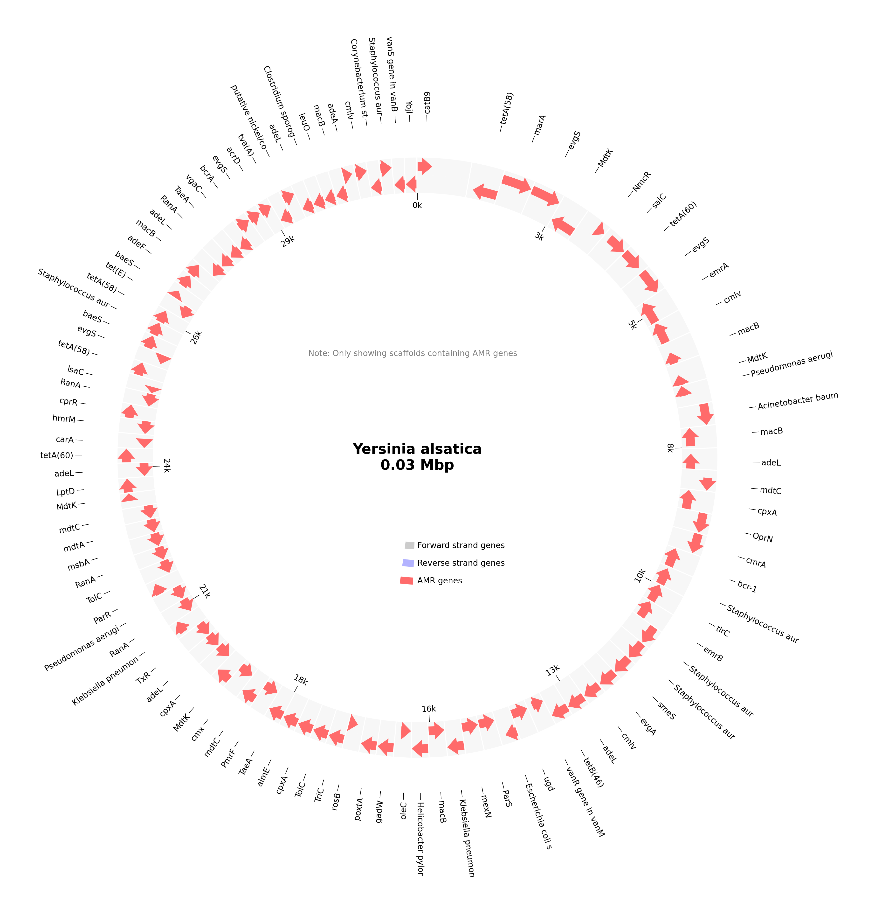

### Acinetobacter baumannii AbaF
- **Mechanism**: antibiotic efflux
- **Drug Classes**: phosphonic acid antibiotic
- **AMR Family**: major facilitator superfamily (MFS) antibiotic efflux pump
- **Locations**:
  - gnl|SPADES|OOJMENLF_18057_1 : position 2-391

### Clostridium sporogenes cplR
- **Mechanism**: antibiotic target protection
- **Drug Classes**: lincosamide antibiotic; pleuromutilin antibiotic
- **AMR Family**: Miscellaneous ABC-F subfamily ATP-binding cassette ribosomal protection proteins
- **Locations**:
  - gnl|SPADES|OOJMENLF_188038_1 : position 3-215

### Corynebacterium striatum tetA
- **Mechanism**: antibiotic efflux
- **Drug Classes**: penam; tetracycline antibiotic
- **AMR Family**: major facilitator superfamily (MFS) antibiotic efflux pump
- **Locations**:
  - gnl|SPADES|OOJMENLF_200278_1 : position 1-207

### Escherichia coli soxS with mutation conferring antibiotic resistance
- **Mechanism**: antibiotic target alteration; antibiotic efflux; reduced permeability to antibiotic
- **Drug Classes**: fluoroquinolone antibiotic; monobactam; carbapenem; cephalosporin; glycylcycline; cephamycin; penam; tetracycline antibiotic; rifamycin antibiotic; phenicol antibiotic; penem; disinfecting agents and antiseptics
- **AMR Family**: ATP-binding cassette (ABC) antibiotic efflux pump; major facilitator superfamily (MFS) antibiotic efflux pump; resistance-nodulation-cell division (RND) antibiotic efflux pump; General Bacterial Porin with reduced permeability to beta-lactams
- **Locations**:
  - gnl|SPADES|OOJMENLF_33679_1 : position 3-221

### Helicobacter pylori pbp1 mutants conferring resistance to amoxicillin
- **Mechanism**: antibiotic target alteration
- **Drug Classes**: cephalosporin; cephamycin; penam
- **AMR Family**: Penicillin-binding protein mutations conferring resistance to beta-lactam antibiotics
- **Locations**:
  - gnl|SPADES|OOJMENLF_39451_1 : position 1-300

### Klebsiella pneumoniae KpnG
- **Mechanism**: antibiotic efflux
- **Drug Classes**: macrolide antibiotic; fluoroquinolone antibiotic; aminoglycoside antibiotic; carbapenem; cephalosporin; penam; peptide antibiotic; penem
- **AMR Family**: major facilitator superfamily (MFS) antibiotic efflux pump
- **Locations**:
  - gnl|SPADES|OOJMENLF_36498_1 : position 2-307

### Klebsiella pneumoniae OmpK37
- **Mechanism**: reduced permeability to antibiotic
- **Drug Classes**: monobactam; carbapenem; cephalosporin; cephamycin; penam; penem
- **AMR Family**: General Bacterial Porin with reduced permeability to beta-lactams
- **Locations**:
  - gnl|SPADES|OOJMENLF_81137_1 : position 39-263

### LptD
- **Mechanism**: antibiotic efflux
- **Drug Classes**: carbapenem; peptide antibiotic; aminocoumarin antibiotic; rifamycin antibiotic
- **AMR Family**: ATP-binding cassette (ABC) antibiotic efflux pump
- **Locations**:
  - gnl|SPADES|OOJMENLF_100278_1 : position 2-253

### MdtK (found in 4 locations)
- **Mechanism**: antibiotic efflux
- **Drug Classes**: fluoroquinolone antibiotic
- **AMR Family**: multidrug and toxic compound extrusion (MATE) transporter
- **Locations**:
  - gnl|SPADES|OOJMENLF_11701_1 : position 3-479
  - gnl|SPADES|OOJMENLF_15490_2 : position 219-416
  - gnl|SPADES|OOJMENLF_61975_1 : position 1-273
  - gnl|SPADES|OOJMENLF_95034_1 : position 120-257

### NmcR
- **Mechanism**: antibiotic inactivation
- **Drug Classes**: carbapenem; cephalosporin; cephamycin; penam
- **AMR Family**: NmcA beta-lactamase
- **Locations**:
  - gnl|SPADES|OOJMENLF_11907_2 : position 303-473

### OprN
- **Mechanism**: antibiotic efflux
- **Drug Classes**: fluoroquinolone antibiotic; diaminopyrimidine antibiotic; phenicol antibiotic
- **AMR Family**: resistance-nodulation-cell division (RND) antibiotic efflux pump
- **Locations**:
  - gnl|SPADES|OOJMENLF_21429_1 : position 2-367

### ParR
- **Mechanism**: antibiotic efflux; reduced permeability to antibiotic
- **Drug Classes**: macrolide antibiotic; fluoroquinolone antibiotic; monobactam; aminoglycoside antibiotic; carbapenem; cephalosporin; cephamycin; penam; tetracycline antibiotic; phenicol antibiotic; penem; disinfecting agents and antiseptics
- **AMR Family**: resistance-nodulation-cell division (RND) antibiotic efflux pump; Outer Membrane Porin (Opr)
- **Locations**:
  - gnl|SPADES|OOJMENLF_82787_1 : position 3-209

### ParS
- **Mechanism**: antibiotic efflux; reduced permeability to antibiotic
- **Drug Classes**: macrolide antibiotic; fluoroquinolone antibiotic; monobactam; aminoglycoside antibiotic; carbapenem; cephalosporin; cephamycin; penam; tetracycline antibiotic; phenicol antibiotic; penem; disinfecting agents and antiseptics
- **AMR Family**: resistance-nodulation-cell division (RND) antibiotic efflux pump; Outer Membrane Porin (Opr)
- **Locations**:
  - gnl|SPADES|OOJMENLF_34963_1 : position 3-311

### PmrF
- **Mechanism**: antibiotic target alteration
- **Drug Classes**: peptide antibiotic
- **AMR Family**: pmr phosphoethanolamine transferase
- **Locations**:
  - gnl|SPADES|OOJMENLF_57149_1 : position 3-275

### Pseudomonas aeruginosa CpxR (found in 2 locations)
- **Mechanism**: antibiotic efflux
- **Drug Classes**: macrolide antibiotic; fluoroquinolone antibiotic; monobactam; aminoglycoside antibiotic; carbapenem; cephalosporin; cephamycin; penam; tetracycline antibiotic; peptide antibiotic; aminocoumarin antibiotic; diaminopyrimidine antibiotic; sulfonamide antibiotic; phenicol antibiotic; penem
- **AMR Family**: resistance-nodulation-cell division (RND) antibiotic efflux pump
- **Locations**:
  - gnl|SPADES|OOJMENLF_17342_1 : position 1-198
  - gnl|SPADES|OOJMENLF_81968_1 : position 3-263

### RanA (found in 4 locations)
- **Mechanism**: antibiotic efflux
- **Drug Classes**: aminoglycoside antibiotic
- **AMR Family**: ATP-binding cassette (ABC) antibiotic efflux pump
- **Locations**:
  - gnl|SPADES|OOJMENLF_118725_1 : position 1-246
  - gnl|SPADES|OOJMENLF_163888_1 : position 1-225
  - gnl|SPADES|OOJMENLF_81673_1 : position 1-264
  - gnl|SPADES|OOJMENLF_89834_1 : position 2-259

### Staphylococcus aureus fusA with mutation conferring resistance to fusidic acid
- **Mechanism**: antibiotic target alteration
- **Drug Classes**: fusidane antibiotic
- **AMR Family**: antibiotic resistant fusA
- **Locations**:
  - gnl|SPADES|OOJMENLF_26059_1 : position 2-346

### Staphylococcus aureus mupA conferring resistance to mupirocin
- **Mechanism**: antibiotic target alteration
- **Drug Classes**: mupirocin-like antibiotic
- **AMR Family**: antibiotic-resistant isoleucyl-tRNA synthetase (ileS)
- **Locations**:
  - gnl|SPADES|OOJMENLF_25734_1 : position 2-346

### Staphylococcus aureus mupB conferring resistance to mupirocin (found in 2 locations)
- **Mechanism**: antibiotic target alteration
- **Drug Classes**: mupirocin-like antibiotic
- **AMR Family**: antibiotic-resistant isoleucyl-tRNA synthetase (ileS)
- **Locations**:
  - gnl|SPADES|OOJMENLF_126643_1 : position 3-242
  - gnl|SPADES|OOJMENLF_22448_1 : position 32-364

### Staphylococcus aureus pgsA mutations conferring resistance to daptomycin
- **Mechanism**: antibiotic target alteration
- **Drug Classes**: peptide antibiotic
- **AMR Family**: daptomycin resistant pgsA
- **Locations**:
  - gnl|SPADES|OOJMENLF_203428_1 : position 1-207

### TaeA (found in 2 locations)
- **Mechanism**: antibiotic efflux
- **Drug Classes**: pleuromutilin antibiotic
- **AMR Family**: ATP-binding cassette (ABC) antibiotic efflux pump
- **Locations**:
  - gnl|SPADES|OOJMENLF_167293_1 : position 3-224
  - gnl|SPADES|OOJMENLF_56951_1 : position 2-277

### TolC (found in 2 locations)
- **Mechanism**: antibiotic efflux
- **Drug Classes**: macrolide antibiotic; fluoroquinolone antibiotic; aminoglycoside antibiotic; carbapenem; cephalosporin; glycylcycline; cephamycin; penam; tetracycline antibiotic; peptide antibiotic; aminocoumarin antibiotic; rifamycin antibiotic; phenicol antibiotic; penem; disinfecting agents and antiseptics
- **AMR Family**: ATP-binding cassette (ABC) antibiotic efflux pump; major facilitator superfamily (MFS) antibiotic efflux pump; resistance-nodulation-cell division (RND) antibiotic efflux pump
- **Locations**:
  - gnl|SPADES|OOJMENLF_52024_1 : position 3-278
  - gnl|SPADES|OOJMENLF_87695_1 : position 1-261

### TriC
- **Mechanism**: antibiotic efflux
- **Drug Classes**: disinfecting agents and antiseptics
- **AMR Family**: resistance-nodulation-cell division (RND) antibiotic efflux pump
- **Locations**:
  - gnl|SPADES|OOJMENLF_48150_1 : position 3-284

### TxR
- **Mechanism**: antibiotic efflux
- **Drug Classes**: tetracycline antibiotic
- **AMR Family**: ATP-binding cassette (ABC) antibiotic efflux pump
- **Locations**:
  - gnl|SPADES|OOJMENLF_74812_1 : position 1-267

### YojI
- **Mechanism**: antibiotic efflux
- **Drug Classes**: peptide antibiotic
- **AMR Family**: ATP-binding cassette (ABC) antibiotic efflux pump
- **Locations**:
  - gnl|SPADES|OOJMENLF_205633_1 : position 1-207

### acrD
- **Mechanism**: antibiotic efflux
- **Drug Classes**: aminoglycoside antibiotic
- **AMR Family**: resistance-nodulation-cell division (RND) antibiotic efflux pump
- **Locations**:
  - gnl|SPADES|OOJMENLF_177799_1 : position 2-220

### adeA
- **Mechanism**: antibiotic efflux
- **Drug Classes**: glycylcycline; tetracycline antibiotic
- **AMR Family**: resistance-nodulation-cell division (RND) antibiotic efflux pump
- **Locations**:
  - gnl|SPADES|OOJMENLF_194729_1 : position 3-167

### adeF
- **Mechanism**: antibiotic efflux
- **Drug Classes**: fluoroquinolone antibiotic; tetracycline antibiotic
- **AMR Family**: resistance-nodulation-cell division (RND) antibiotic efflux pump
- **Locations**:
  - gnl|SPADES|OOJMENLF_144191_1 : position 2-235

### adeL (found in 6 locations)
- **Mechanism**: antibiotic efflux
- **Drug Classes**: fluoroquinolone antibiotic; tetracycline antibiotic
- **AMR Family**: resistance-nodulation-cell division (RND) antibiotic efflux pump
- **Locations**:
  - gnl|SPADES|OOJMENLF_101888_1 : position 2-253
  - gnl|SPADES|OOJMENLF_156893_1 : position 3-230
  - gnl|SPADES|OOJMENLF_186290_1 : position 3-215
  - gnl|SPADES|OOJMENLF_19938_1 : position 90-377
  - gnl|SPADES|OOJMENLF_30110_1 : position 1-330
  - gnl|SPADES|OOJMENLF_71297_1 : position 3-269

### almE
- **Mechanism**: antibiotic target alteration
- **Drug Classes**: peptide antibiotic
- **AMR Family**: polymyxin resistance operon; alm glycyltransferase
- **Locations**:
  - gnl|SPADES|OOJMENLF_55345_1 : position 1-276

### baeS (found in 2 locations)
- **Mechanism**: antibiotic efflux
- **Drug Classes**: aminoglycoside antibiotic; aminocoumarin antibiotic
- **AMR Family**: resistance-nodulation-cell division (RND) antibiotic efflux pump
- **Locations**:
  - gnl|SPADES|OOJMENLF_126813_1 : position 3-242
  - gnl|SPADES|OOJMENLF_143842_1 : position 2-142

### bcr-1
- **Mechanism**: antibiotic efflux
- **Drug Classes**: bicyclomycin-like antibiotic
- **AMR Family**: major facilitator superfamily (MFS) antibiotic efflux pump
- **Locations**:
  - gnl|SPADES|OOJMENLF_21650_1 : position 2-367

### bcrA
- **Mechanism**: antibiotic efflux
- **Drug Classes**: peptide antibiotic
- **AMR Family**: ATP-binding cassette (ABC) antibiotic efflux pump
- **Locations**:
  - gnl|SPADES|OOJMENLF_170945_1 : position 1-222

### carA
- **Mechanism**: antibiotic target protection
- **Drug Classes**: macrolide antibiotic
- **AMR Family**: Miscellaneous ABC-F subfamily ATP-binding cassette ribosomal protection proteins
- **Locations**:
  - gnl|SPADES|OOJMENLF_104992_1 : position 1-180

### catB9
- **Mechanism**: antibiotic inactivation
- **Drug Classes**: phenicol antibiotic
- **AMR Family**: chloramphenicol acetyltransferase (CAT)
- **Locations**:
  - gnl|SPADES|OOJMENLF_5397_1 : position 3-269

### cmlv (found in 3 locations)
- **Mechanism**: antibiotic inactivation
- **Drug Classes**: phenicol antibiotic
- **AMR Family**: chloramphenicol phosphotransferase
- **Locations**:
  - gnl|SPADES|OOJMENLF_14934_1 : position 3-422
  - gnl|SPADES|OOJMENLF_197519_1 : position 2-211
  - gnl|SPADES|OOJMENLF_28388_1 : position 11-337

### cmrA
- **Mechanism**: antibiotic efflux
- **Drug Classes**: phenicol antibiotic
- **AMR Family**: major facilitator superfamily (MFS) antibiotic efflux pump
- **Locations**:
  - gnl|SPADES|OOJMENLF_21638_1 : position 2-367

### cmx
- **Mechanism**: antibiotic efflux
- **Drug Classes**: phenicol antibiotic
- **AMR Family**: major facilitator superfamily (MFS) antibiotic efflux pump
- **Locations**:
  - gnl|SPADES|OOJMENLF_60164_1 : position 3-275

### cprR
- **Mechanism**: antibiotic target alteration; antibiotic efflux
- **Drug Classes**: peptide antibiotic
- **AMR Family**: pmr phosphoethanolamine transferase
- **Locations**:
  - gnl|SPADES|OOJMENLF_110633_1 : position 3-248

### cpxA (found in 3 locations)
- **Mechanism**: antibiotic efflux
- **Drug Classes**: aminoglycoside antibiotic; aminocoumarin antibiotic
- **AMR Family**: resistance-nodulation-cell division (RND) antibiotic efflux pump
- **Locations**:
  - gnl|SPADES|OOJMENLF_21134_1 : position 3-371
  - gnl|SPADES|OOJMENLF_55216_1 : position 1-276
  - gnl|SPADES|OOJMENLF_64167_1 : position 1-273

### emrA
- **Mechanism**: antibiotic efflux
- **Drug Classes**: fluoroquinolone antibiotic
- **AMR Family**: major facilitator superfamily (MFS) antibiotic efflux pump
- **Locations**:
  - gnl|SPADES|OOJMENLF_13661_1 : position 3-440

### emrB
- **Mechanism**: antibiotic efflux
- **Drug Classes**: fluoroquinolone antibiotic
- **AMR Family**: major facilitator superfamily (MFS) antibiotic efflux pump
- **Locations**:
  - gnl|SPADES|OOJMENLF_25687_1 : position 2-346

### evgA
- **Mechanism**: antibiotic efflux
- **Drug Classes**: macrolide antibiotic; fluoroquinolone antibiotic; penam; tetracycline antibiotic
- **AMR Family**: major facilitator superfamily (MFS) antibiotic efflux pump; resistance-nodulation-cell division (RND) antibiotic efflux pump
- **Locations**:
  - gnl|SPADES|OOJMENLF_27719_1 : position 1-336

### evgS (found in 4 locations)
- **Mechanism**: antibiotic efflux
- **Drug Classes**: macrolide antibiotic; fluoroquinolone antibiotic; penam; tetracycline antibiotic
- **AMR Family**: major facilitator superfamily (MFS) antibiotic efflux pump; resistance-nodulation-cell division (RND) antibiotic efflux pump
- **Locations**:
  - gnl|SPADES|OOJMENLF_12746_1 : position 1-456
  - gnl|SPADES|OOJMENLF_127595_1 : position 62-241
  - gnl|SPADES|OOJMENLF_174445_1 : position 2-220
  - gnl|SPADES|OOJMENLF_9485_1 : position 3-551

### gadW
- **Mechanism**: antibiotic efflux
- **Drug Classes**: macrolide antibiotic; fluoroquinolone antibiotic; penam
- **AMR Family**: resistance-nodulation-cell division (RND) antibiotic efflux pump
- **Locations**:
  - gnl|SPADES|OOJMENLF_42238_1 : position 2-292

### hmrM
- **Mechanism**: antibiotic efflux
- **Drug Classes**: fluoroquinolone antibiotic; disinfecting agents and antiseptics
- **AMR Family**: multidrug and toxic compound extrusion (MATE) transporter
- **Locations**:
  - gnl|SPADES|OOJMENLF_111501_1 : position 2-250

### leuO
- **Mechanism**: antibiotic efflux
- **Drug Classes**: nucleoside antibiotic; disinfecting agents and antiseptics
- **AMR Family**: major facilitator superfamily (MFS) antibiotic efflux pump
- **Locations**:
  - gnl|SPADES|OOJMENLF_190371_1 : position 1-198

### lsaC
- **Mechanism**: antibiotic target protection
- **Drug Classes**: lincosamide antibiotic; streptogramin antibiotic; pleuromutilin antibiotic
- **AMR Family**: lsa-type ABC-F protein
- **Locations**:
  - gnl|SPADES|OOJMENLF_121504_1 : position 3-122

### macB (found in 5 locations)
- **Mechanism**: antibiotic efflux
- **Drug Classes**: macrolide antibiotic
- **AMR Family**: ATP-binding cassette (ABC) antibiotic efflux pump
- **Locations**:
  - gnl|SPADES|OOJMENLF_152721_1 : position 2-232
  - gnl|SPADES|OOJMENLF_15354_2 : position 186-416
  - gnl|SPADES|OOJMENLF_18101_1 : position 1-354
  - gnl|SPADES|OOJMENLF_193552_1 : position 3-212
  - gnl|SPADES|OOJMENLF_36921_1 : position 3-305

### marA
- **Mechanism**: antibiotic efflux; reduced permeability to antibiotic
- **Drug Classes**: fluoroquinolone antibiotic; monobactam; carbapenem; cephalosporin; glycylcycline; cephamycin; penam; tetracycline antibiotic; rifamycin antibiotic; phenicol antibiotic; penem; disinfecting agents and antiseptics
- **AMR Family**: resistance-nodulation-cell division (RND) antibiotic efflux pump; General Bacterial Porin with reduced permeability to beta-lactams
- **Locations**:
  - gnl|SPADES|OOJMENLF_9467_1 : position 1-552

### mdtA
- **Mechanism**: antibiotic efflux
- **Drug Classes**: aminocoumarin antibiotic
- **AMR Family**: resistance-nodulation-cell division (RND) antibiotic efflux pump
- **Locations**:
  - gnl|SPADES|OOJMENLF_91548_1 : position 2-259

### mdtC (found in 3 locations)
- **Mechanism**: antibiotic efflux
- **Drug Classes**: aminocoumarin antibiotic
- **AMR Family**: resistance-nodulation-cell division (RND) antibiotic efflux pump
- **Locations**:
  - gnl|SPADES|OOJMENLF_20743_1 : position 135-371
  - gnl|SPADES|OOJMENLF_59998_1 : position 1-273
  - gnl|SPADES|OOJMENLF_93708_1 : position 1-258

### mexN
- **Mechanism**: antibiotic efflux
- **Drug Classes**: phenicol antibiotic
- **AMR Family**: resistance-nodulation-cell division (RND) antibiotic efflux pump
- **Locations**:
  - gnl|SPADES|OOJMENLF_35849_1 : position 2-310

### msbA
- **Mechanism**: antibiotic efflux
- **Drug Classes**: nitroimidazole antibiotic
- **AMR Family**: ATP-binding cassette (ABC) antibiotic efflux pump
- **Locations**:
  - gnl|SPADES|OOJMENLF_90360_1 : position 3-260

### oleC
- **Mechanism**: antibiotic efflux
- **Drug Classes**: macrolide antibiotic
- **AMR Family**: ATP-binding cassette (ABC) antibiotic efflux pump
- **Locations**:
  - gnl|SPADES|OOJMENLF_41383_1 : position 1-192

### poxtA
- **Mechanism**: antibiotic target protection
- **Drug Classes**: tetracycline antibiotic; oxazolidinone antibiotic; phenicol antibiotic
- **AMR Family**: Miscellaneous ABC-F subfamily ATP-binding cassette ribosomal protection proteins
- **Locations**:
  - gnl|SPADES|OOJMENLF_45651_1 : position 3-287

### putative nickel/cobalt transporter
- **Mechanism**: antibiotic efflux
- **Drug Classes**: fluoroquinolone antibiotic; aminoglycoside antibiotic; isoniazid-like antibiotic
- **AMR Family**: metal transporters with antibiotic efflux
- **Locations**:
  - gnl|SPADES|OOJMENLF_183100_1 : position 3-218

### rosB
- **Mechanism**: antibiotic efflux
- **Drug Classes**: peptide antibiotic
- **AMR Family**: major facilitator superfamily (MFS) antibiotic efflux pump
- **Locations**:
  - gnl|SPADES|OOJMENLF_48647_1 : position 109-282

### salC
- **Mechanism**: antibiotic target protection
- **Drug Classes**: lincosamide antibiotic; streptogramin antibiotic; streptogramin A antibiotic; pleuromutilin antibiotic
- **AMR Family**: sal-type ABC-F protein
- **Locations**:
  - gnl|SPADES|OOJMENLF_12450_1 : position 103-462

### smeS
- **Mechanism**: antibiotic efflux
- **Drug Classes**: aminoglycoside antibiotic; cephalosporin; cephamycin; penam
- **AMR Family**: resistance-nodulation-cell division (RND) antibiotic efflux pump
- **Locations**:
  - gnl|SPADES|OOJMENLF_26153_1 : position 2-346

### tet(E)
- **Mechanism**: antibiotic efflux
- **Drug Classes**: tetracycline antibiotic
- **AMR Family**: major facilitator superfamily (MFS) antibiotic efflux pump
- **Locations**:
  - gnl|SPADES|OOJMENLF_130528_1 : position 1-240

### tetA(58) (found in 3 locations)
- **Mechanism**: antibiotic efflux
- **Drug Classes**: tetracycline antibiotic
- **AMR Family**: major facilitator superfamily (MFS) antibiotic efflux pump
- **Locations**:
  - gnl|SPADES|OOJMENLF_124632_1 : position 3-242
  - gnl|SPADES|OOJMENLF_131709_1 : position 1-228
  - gnl|SPADES|OOJMENLF_9019_2 : position 103-576

### tetA(60) (found in 2 locations)
- **Mechanism**: antibiotic efflux
- **Drug Classes**: tetracycline antibiotic
- **AMR Family**: ATP-binding cassette (ABC) antibiotic efflux pump
- **Locations**:
  - gnl|SPADES|OOJMENLF_105566_1 : position 2-253
  - gnl|SPADES|OOJMENLF_12522_1 : position 3-386

### tetB(46)
- **Mechanism**: antibiotic efflux
- **Drug Classes**: tetracycline antibiotic
- **AMR Family**: ATP-binding cassette (ABC) antibiotic efflux pump
- **Locations**:
  - gnl|SPADES|OOJMENLF_32771_1 : position 1-321

### tlrC
- **Mechanism**: antibiotic target protection
- **Drug Classes**: macrolide antibiotic; lincosamide antibiotic
- **AMR Family**: Miscellaneous ABC-F subfamily ATP-binding cassette ribosomal protection proteins
- **Locations**:
  - gnl|SPADES|OOJMENLF_25250_1 : position 1-348

### tva(A)
- **Mechanism**: antibiotic target protection
- **Drug Classes**: pleuromutilin antibiotic
- **AMR Family**: Miscellaneous ABC-F subfamily ATP-binding cassette ribosomal protection proteins
- **Locations**:
  - gnl|SPADES|OOJMENLF_183026_1 : position 3-218

### ugd
- **Mechanism**: antibiotic target alteration
- **Drug Classes**: peptide antibiotic
- **AMR Family**: pmr phosphoethanolamine transferase
- **Locations**:
  - gnl|SPADES|OOJMENLF_33423_1 : position 1-318

### vanR gene in vanM cluster
- **Mechanism**: antibiotic target alteration
- **Drug Classes**: glycopeptide antibiotic
- **AMR Family**: glycopeptide resistance gene cluster; vanR
- **Locations**:
  - gnl|SPADES|OOJMENLF_32596_1 : position 2-229

### vanS gene in vanB cluster
- **Mechanism**: antibiotic target alteration
- **Drug Classes**: glycopeptide antibiotic
- **AMR Family**: vanS; glycopeptide resistance gene cluster
- **Locations**:
  - gnl|SPADES|OOJMENLF_205926_1 : position 2-205

### vgaC
- **Mechanism**: antibiotic target protection
- **Drug Classes**: lincosamide antibiotic; streptogramin antibiotic; streptogramin A antibiotic; pleuromutilin antibiotic
- **AMR Family**: vga-type ABC-F protein
- **Locations**:
  - gnl|SPADES|OOJMENLF_168791_1 : position 3-224

## Yersinia enterocolitica
**Strain Statistics:**
- Total genome length: 531.4 kbp
- Total scaffolds: 4952
- Scaffolds with AMR genes: 526
- Total genes annotated: 808
- Total AMR genes: 565
- Unique AMR genes: 217
- Distinct AMR mechanisms: 10
- Distinct AMR families: 67
- Distinct drug classes: 37

**Circos Plot:**

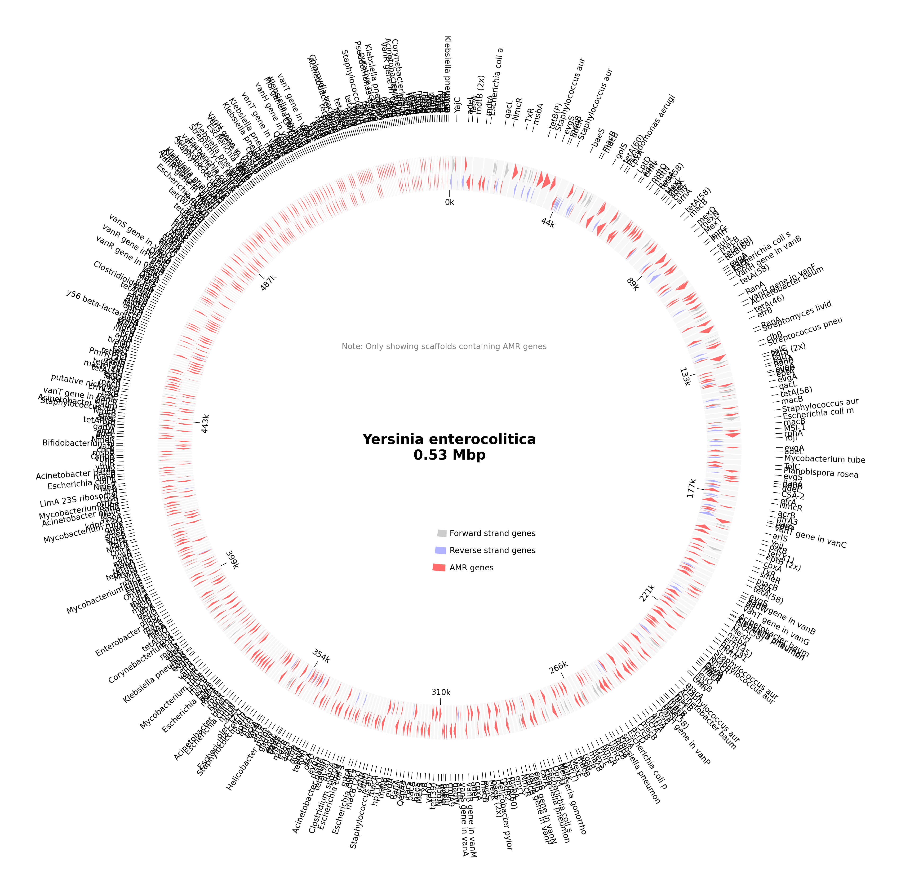

### Acinetobacter baumannii AbaF (found in 3 locations)
- **Mechanism**: antibiotic efflux
- **Drug Classes**: phosphonic acid antibiotic
- **AMR Family**: major facilitator superfamily (MFS) antibiotic efflux pump
- **Locations**:
  - gnl|SPADES|OOJMENLF_2363_1 : position 3-1286
  - gnl|SPADES|OOJMENLF_3306_2 : position 706-1578
  - gnl|SPADES|OOJMENLF_3621_1 : position 545-1441

### Acinetobacter baumannii AbaQ (found in 7 locations)
- **Mechanism**: antibiotic efflux
- **Drug Classes**: fluoroquinolone antibiotic
- **AMR Family**: major facilitator superfamily (MFS) antibiotic efflux pump
- **Locations**:
  - gnl|SPADES|OOJMENLF_12304_1 : position 1-465
  - gnl|SPADES|OOJMENLF_12785_1 : position 1-453
  - gnl|SPADES|OOJMENLF_32025_1 : position 1-321
  - gnl|SPADES|OOJMENLF_5050_1 : position 1-750
  - gnl|SPADES|OOJMENLF_5516_1 : position 1-936
  - gnl|SPADES|OOJMENLF_6858_2 : position 140-742
  - gnl|SPADES|OOJMENLF_7735_1 : position 2-574

### Acinetobacter baumannii AmvA (found in 2 locations)
- **Mechanism**: antibiotic efflux
- **Drug Classes**: macrolide antibiotic; disinfecting agents and antiseptics
- **AMR Family**: major facilitator superfamily (MFS) antibiotic efflux pump
- **Locations**:
  - gnl|SPADES|OOJMENLF_114877_1 : position 2-247
  - gnl|SPADES|OOJMENLF_7199_1 : position 38-709

### AcrF
- **Mechanism**: antibiotic efflux
- **Drug Classes**: fluoroquinolone antibiotic; cephalosporin; cephamycin; penam
- **AMR Family**: resistance-nodulation-cell division (RND) antibiotic efflux pump
- **Locations**:
  - gnl|SPADES|OOJMENLF_25098_1 : position 2-349

### ArnT (found in 3 locations)
- **Mechanism**: antibiotic target alteration
- **Drug Classes**: peptide antibiotic
- **AMR Family**: pmr phosphoethanolamine transferase
- **Locations**:
  - gnl|SPADES|OOJMENLF_10558_1 : position 1-510
  - gnl|SPADES|OOJMENLF_192127_1 : position 57-212
  - gnl|SPADES|OOJMENLF_9024_1 : position 3-575

### Bifidobacterium bifidum ileS conferring resistance to mupirocin
- **Mechanism**: antibiotic target alteration
- **Drug Classes**: mupirocin-like antibiotic
- **AMR Family**: antibiotic-resistant isoleucyl-tRNA synthetase (ileS)
- **Locations**:
  - gnl|SPADES|OOJMENLF_7332_1 : position 3-302

### CMY-144
- **Mechanism**: antibiotic inactivation
- **Drug Classes**: cephamycin
- **AMR Family**: CMY beta-lactamase
- **Locations**:
  - gnl|SPADES|OOJMENLF_115356_1 : position 1-246

### CMY-157
- **Mechanism**: antibiotic inactivation
- **Drug Classes**: cephamycin
- **AMR Family**: CMY beta-lactamase
- **Locations**:
  - gnl|SPADES|OOJMENLF_23053_1 : position 1-360

### CRP (found in 2 locations)
- **Mechanism**: antibiotic efflux
- **Drug Classes**: macrolide antibiotic; fluoroquinolone antibiotic; penam
- **AMR Family**: resistance-nodulation-cell division (RND) antibiotic efflux pump
- **Locations**:
  - gnl|SPADES|OOJMENLF_10692_1 : position 1-393
  - gnl|SPADES|OOJMENLF_21965_1 : position 2-73

### CSA-2
- **Mechanism**: antibiotic inactivation
- **Drug Classes**: cephalosporin
- **AMR Family**: CSA beta-lactamase
- **Locations**:
  - gnl|SPADES|OOJMENLF_3032_1 : position 1-657

### Chlamydia trachomatis intrinsic murA conferring resistance to fosfomycin
- **Mechanism**: antibiotic target alteration
- **Drug Classes**: phosphonic acid antibiotic
- **AMR Family**: antibiotic-resistant murA transferase
- **Locations**:
  - gnl|SPADES|OOJMENLF_32576_1 : position 2-319

### Clostridioides difficile gyrB conferring resistance to fluoroquinolones
- **Mechanism**: antibiotic target alteration
- **Drug Classes**: fluoroquinolone antibiotic
- **AMR Family**: fluoroquinolone resistant gyrB
- **Locations**:
  - gnl|SPADES|OOJMENLF_9062_1 : position 2-571

### Clostridium sporogenes cplR
- **Mechanism**: antibiotic target protection
- **Drug Classes**: lincosamide antibiotic; pleuromutilin antibiotic
- **AMR Family**: Miscellaneous ABC-F subfamily ATP-binding cassette ribosomal protection proteins
- **Locations**:
  - gnl|SPADES|OOJMENLF_5018_1 : position 1-315

### Corynebacterium striatum tetA (found in 2 locations)
- **Mechanism**: antibiotic efflux
- **Drug Classes**: penam; tetracycline antibiotic
- **AMR Family**: major facilitator superfamily (MFS) antibiotic efflux pump
- **Locations**:
  - gnl|SPADES|OOJMENLF_128178_1 : position 1-240
  - gnl|SPADES|OOJMENLF_5868_2 : position 480-878

### CrcB
- **Mechanism**: antibiotic efflux
- **Drug Classes**: aminoglycoside antibiotic
- **AMR Family**: multidrug and toxic compound extrusion (MATE) transporter
- **Locations**:
  - gnl|SPADES|OOJMENLF_3843_2 : position 302-685

### DHA-6
- **Mechanism**: antibiotic inactivation
- **Drug Classes**: cephalosporin; cephamycin
- **AMR Family**: DHA beta-lactamase
- **Locations**:
  - gnl|SPADES|OOJMENLF_9886_1 : position 2-535

### EC-15
- **Mechanism**: antibiotic inactivation
- **Drug Classes**: cephalosporin
- **AMR Family**: EC beta-lactamase
- **Locations**:
  - gnl|SPADES|OOJMENLF_16635_1 : position 27-404

### Enterobacter cloacae acrA
- **Mechanism**: antibiotic efflux
- **Drug Classes**: fluoroquinolone antibiotic; cephalosporin; glycylcycline; penam; tetracycline antibiotic; rifamycin antibiotic; phenicol antibiotic; disinfecting agents and antiseptics
- **AMR Family**: resistance-nodulation-cell division (RND) antibiotic efflux pump
- **Locations**:
  - gnl|SPADES|OOJMENLF_6082_1 : position 1-846

### Erm(34)
- **Mechanism**: antibiotic target alteration
- **Drug Classes**: macrolide antibiotic; lincosamide antibiotic; streptogramin antibiotic; streptogramin A antibiotic; streptogramin B antibiotic
- **AMR Family**: Erm 23S ribosomal RNA methyltransferase
- **Locations**:
  - gnl|SPADES|OOJMENLF_7788_1 : position 209-655

### Escherichia coli AcrAB-TolC with AcrR mutation conferring resistance to ciprofloxacin, tetracycline, and ceftazidime (found in 2 locations)
- **Mechanism**: antibiotic target alteration; antibiotic efflux
- **Drug Classes**: fluoroquinolone antibiotic; cephalosporin; glycylcycline; penam; tetracycline antibiotic; rifamycin antibiotic; phenicol antibiotic; disinfecting agents and antiseptics
- **AMR Family**: resistance-nodulation-cell division (RND) antibiotic efflux pump
- **Locations**:
  - gnl|SPADES|OOJMENLF_13631_1 : position 3-383
  - gnl|SPADES|OOJMENLF_7063_2 : position 510-722

### Escherichia coli acrA (found in 3 locations)
- **Mechanism**: antibiotic efflux
- **Drug Classes**: fluoroquinolone antibiotic; cephalosporin; glycylcycline; penam; tetracycline antibiotic; rifamycin antibiotic; phenicol antibiotic; disinfecting agents and antiseptics
- **AMR Family**: resistance-nodulation-cell division (RND) antibiotic efflux pump
- **Locations**:
  - gnl|SPADES|OOJMENLF_1378_1 : position 3-1142
  - gnl|SPADES|OOJMENLF_15042_2 : position 147-419
  - gnl|SPADES|OOJMENLF_5506_1 : position 59-940

### Escherichia coli mdfA (found in 3 locations)
- **Mechanism**: antibiotic efflux
- **Drug Classes**: tetracycline antibiotic; phenicol antibiotic; disinfecting agents and antiseptics
- **AMR Family**: major facilitator superfamily (MFS) antibiotic efflux pump
- **Locations**:
  - gnl|SPADES|OOJMENLF_11961_1 : position 1-471
  - gnl|SPADES|OOJMENLF_2800_2 : position 1527-1865
  - gnl|SPADES|OOJMENLF_5471_1 : position 1-258

### Escherichia coli parE conferring resistance to fluoroquinolones
- **Mechanism**: antibiotic target alteration
- **Drug Classes**: fluoroquinolone antibiotic
- **AMR Family**: fluoroquinolone resistant parE
- **Locations**:
  - gnl|SPADES|OOJMENLF_3861_1 : position 2-1348

### Escherichia coli soxS with mutation conferring antibiotic resistance (found in 5 locations)
- **Mechanism**: antibiotic target alteration; antibiotic efflux; reduced permeability to antibiotic
- **Drug Classes**: fluoroquinolone antibiotic; monobactam; carbapenem; cephalosporin; glycylcycline; cephamycin; penam; tetracycline antibiotic; rifamycin antibiotic; phenicol antibiotic; penem; disinfecting agents and antiseptics
- **AMR Family**: ATP-binding cassette (ABC) antibiotic efflux pump; major facilitator superfamily (MFS) antibiotic efflux pump; resistance-nodulation-cell division (RND) antibiotic efflux pump; General Bacterial Porin with reduced permeability to beta-lactams
- **Locations**:
  - gnl|SPADES|OOJMENLF_2291_1 : position 3-779
  - gnl|SPADES|OOJMENLF_4004_2 : position 260-1192
  - gnl|SPADES|OOJMENLF_4968_2 : position 467-1027
  - gnl|SPADES|OOJMENLF_4977_2 : position 819-1043
  - gnl|SPADES|OOJMENLF_5599_2 : position 340-498

### EstT
- **Mechanism**: antibiotic inactivation
- **Drug Classes**: macrolide antibiotic
- **AMR Family**: macrolide esterase
- **Locations**:
  - gnl|SPADES|OOJMENLF_8271_1 : position 101-619

### H-NS
- **Mechanism**: antibiotic efflux
- **Drug Classes**: macrolide antibiotic; fluoroquinolone antibiotic; cephalosporin; cephamycin; penam; tetracycline antibiotic
- **AMR Family**: major facilitator superfamily (MFS) antibiotic efflux pump; resistance-nodulation-cell division (RND) antibiotic efflux pump
- **Locations**:
  - gnl|SPADES|OOJMENLF_8091_1 : position 1-99

### Helicobacter pylori pbp1 mutants conferring resistance to amoxicillin
- **Mechanism**: antibiotic target alteration
- **Drug Classes**: cephalosporin; cephamycin; penam
- **AMR Family**: Penicillin-binding protein mutations conferring resistance to beta-lactam antibiotics
- **Locations**:
  - gnl|SPADES|OOJMENLF_5335_1 : position 1-969

### Helicobacter pylori pbp3 conferring resistance to amoxicillin
- **Mechanism**: antibiotic target alteration
- **Drug Classes**: cephalosporin; cephamycin; penam
- **AMR Family**: Penicillin-binding protein mutations conferring resistance to beta-lactam antibiotics
- **Locations**:
  - gnl|SPADES|OOJMENLF_4294_1 : position 66-1205

### Klebsiella pneumoniae KpnE
- **Mechanism**: antibiotic efflux
- **Drug Classes**: macrolide antibiotic; aminoglycoside antibiotic; cephalosporin; tetracycline antibiotic; peptide antibiotic; rifamycin antibiotic; disinfecting agents and antiseptics
- **AMR Family**: small multidrug resistance (SMR) antibiotic efflux pump
- **Locations**:
  - gnl|SPADES|OOJMENLF_3309_1 : position 227-604

### Klebsiella pneumoniae KpnF
- **Mechanism**: antibiotic efflux
- **Drug Classes**: macrolide antibiotic; aminoglycoside antibiotic; cephalosporin; tetracycline antibiotic; peptide antibiotic; rifamycin antibiotic; disinfecting agents and antiseptics
- **AMR Family**: small multidrug resistance (SMR) antibiotic efflux pump
- **Locations**:
  - gnl|SPADES|OOJMENLF_3309_2: position 591-920

### Klebsiella pneumoniae KpnG
- **Mechanism**: antibiotic efflux
- **Drug Classes**: macrolide antibiotic; fluoroquinolone antibiotic; aminoglycoside antibiotic; carbapenem; cephalosporin; penam; peptide antibiotic; penem
- **AMR Family**: major facilitator superfamily (MFS) antibiotic efflux pump
- **Locations**:
  - gnl|SPADES|OOJMENLF_17960_1 : position 4-393

### Klebsiella pneumoniae KpnH (found in 2 locations)
- **Mechanism**: antibiotic efflux
- **Drug Classes**: macrolide antibiotic; fluoroquinolone antibiotic; aminoglycoside antibiotic; carbapenem; cephalosporin; penam; peptide antibiotic; penem
- **AMR Family**: major facilitator superfamily (MFS) antibiotic efflux pump
- **Locations**:
  - gnl|SPADES|OOJMENLF_12563_1 : position 2-460
  - gnl|SPADES|OOJMENLF_5767_1 : position 3-146

### Klebsiella pneumoniae OmpK37 (found in 8 locations)
- **Mechanism**: reduced permeability to antibiotic
- **Drug Classes**: monobactam; carbapenem; cephalosporin; cephamycin; penam; penem
- **AMR Family**: General Bacterial Porin with reduced permeability to beta-lactams
- **Locations**:
  - gnl|SPADES|OOJMENLF_12394_1 : position 323-463
  - gnl|SPADES|OOJMENLF_14582_1 : position 2-427
  - gnl|SPADES|OOJMENLF_17519_1 : position 3-395
  - gnl|SPADES|OOJMENLF_205423_1 : position 1-207
  - gnl|SPADES|OOJMENLF_23431_1 : position 3-359
  - gnl|SPADES|OOJMENLF_3874_2 : position 1101-1343
  - gnl|SPADES|OOJMENLF_4007_1 : position 2-1063
  - gnl|SPADES|OOJMENLF_92142_1 : position 3-257

### LlmA 23S ribosomal RNA methyltransferase
- **Mechanism**: antibiotic target alteration
- **Drug Classes**: lincosamide antibiotic
- **AMR Family**: Llm 23S ribosomal RNA methyltransferase
- **Locations**:
  - gnl|SPADES|OOJMENLF_6982_1 : position 2-730

### LpsB
- **Mechanism**: reduced permeability to antibiotic
- **Drug Classes**: peptide antibiotic
- **AMR Family**: Intrinsic peptide antibiotic resistant Lps
- **Locations**:
  - gnl|SPADES|OOJMENLF_6936_1 : position 2-397

### LptD
- **Mechanism**: antibiotic efflux
- **Drug Classes**: carbapenem; peptide antibiotic; aminocoumarin antibiotic; rifamycin antibiotic
- **AMR Family**: ATP-binding cassette (ABC) antibiotic efflux pump
- **Locations**:
  - gnl|SPADES|OOJMENLF_1877_1 : position 12-2408

### MOX-3
- **Mechanism**: antibiotic inactivation
- **Drug Classes**: cephalosporin; cephamycin; penam
- **AMR Family**: MOX beta-lactamase
- **Locations**:
  - gnl|SPADES|OOJMENLF_6451_2 : position 448-795

### MSI-1 (found in 2 locations)
- **Mechanism**: antibiotic inactivation
- **Drug Classes**: carbapenem
- **AMR Family**: MSI beta-lactamase
- **Locations**:
  - gnl|SPADES|OOJMENLF_14207_1 : position 2-349
  - gnl|SPADES|OOJMENLF_2816_3 : position 929-1684

### MdtK (found in 4 locations)
- **Mechanism**: antibiotic efflux
- **Drug Classes**: fluoroquinolone antibiotic
- **AMR Family**: multidrug and toxic compound extrusion (MATE) transporter
- **Locations**:
  - gnl|SPADES|OOJMENLF_10601_1 : position 1-507
  - gnl|SPADES|OOJMENLF_19688_1 : position 187-378
  - gnl|SPADES|OOJMENLF_23977_1 : position 3-356
  - gnl|SPADES|OOJMENLF_3979_2 : position 1218-1304

### MdtQ
- **Mechanism**: reduced permeability to antibiotic
- **Drug Classes**: monobactam; carbapenem; cephalosporin; cephamycin; penam; penem
- **AMR Family**: Outer Membrane Porin (Opr)
- **Locations**:
  - gnl|SPADES|OOJMENLF_8415_1 : position 1-609

### MexF
- **Mechanism**: antibiotic efflux
- **Drug Classes**: fluoroquinolone antibiotic; diaminopyrimidine antibiotic; phenicol antibiotic
- **AMR Family**: resistance-nodulation-cell division (RND) antibiotic efflux pump
- **Locations**:
  - gnl|SPADES|OOJMENLF_3958_1 : position 1-1314

### MexH
- **Mechanism**: antibiotic efflux
- **Drug Classes**: fluoroquinolone antibiotic; tetracycline antibiotic; disinfecting agents and antiseptics
- **AMR Family**: resistance-nodulation-cell division (RND) antibiotic efflux pump
- **Locations**:
  - gnl|SPADES|OOJMENLF_3447_2 : position 78-1514

### MexJ
- **Mechanism**: antibiotic efflux
- **Drug Classes**: macrolide antibiotic; tetracycline antibiotic; disinfecting agents and antiseptics
- **AMR Family**: resistance-nodulation-cell division (RND) antibiotic efflux pump
- **Locations**:
  - gnl|SPADES|OOJMENLF_2010_2 : position 822-1904

### MexK (found in 2 locations)
- **Mechanism**: antibiotic efflux
- **Drug Classes**: macrolide antibiotic; tetracycline antibiotic; disinfecting agents and antiseptics
- **AMR Family**: resistance-nodulation-cell division (RND) antibiotic efflux pump
- **Locations**:
  - gnl|SPADES|OOJMENLF_2010_3 : position 1904-2548
  - gnl|SPADES|OOJMENLF_4354_1 : position 3-884

### MexS (found in 5 locations)
- **Mechanism**: antibiotic efflux
- **Drug Classes**: fluoroquinolone antibiotic; diaminopyrimidine antibiotic; phenicol antibiotic
- **AMR Family**: resistance-nodulation-cell division (RND) antibiotic efflux pump
- **Locations**:
  - gnl|SPADES|OOJMENLF_3919_2 : position 469-1326
  - gnl|SPADES|OOJMENLF_4612_2 : position 606-1118
  - gnl|SPADES|OOJMENLF_6851_1 : position 3-743
  - gnl|SPADES|OOJMENLF_8523_1 : position 365-601
  - gnl|SPADES|OOJMENLF_9441_1 : position 3-539

### MexT
- **Mechanism**: antibiotic efflux
- **Drug Classes**: fluoroquinolone antibiotic; diaminopyrimidine antibiotic; phenicol antibiotic
- **AMR Family**: resistance-nodulation-cell division (RND) antibiotic efflux pump
- **Locations**:
  - gnl|SPADES|OOJMENLF_2111_1 : position 2-868

### Morganella morganii gyrB conferring resistance to fluoroquinolones
- **Mechanism**: antibiotic target alteration
- **Drug Classes**: fluoroquinolone antibiotic
- **AMR Family**: fluoroquinolone resistant gyrB
- **Locations**:
  - gnl|SPADES|OOJMENLF_23170_1 : position 1-360

### Mycobacterium tuberculosis gidB mutation conferring resistance to streptomycin
- **Mechanism**: antibiotic target alteration
- **Drug Classes**: aminoglycoside antibiotic
- **AMR Family**: antibiotic resistant gidB
- **Locations**:
  - gnl|SPADES|OOJMENLF_2892_1 : position 291-911

### Mycobacterium tuberculosis kasA mutant conferring resistance to isoniazid
- **Mechanism**: antibiotic target alteration
- **Drug Classes**: isoniazid-like antibiotic
- **AMR Family**: antibiotic resistant kasA
- **Locations**:
  - gnl|SPADES|OOJMENLF_5685_1 : position 2-622

### Mycobacterium tuberculosis ndh with mutation conferring resistance to isoniazid
- **Mechanism**: antibiotic target alteration
- **Drug Classes**: isoniazid-like antibiotic
- **AMR Family**: antibiotic resistant ndh
- **Locations**:
  - gnl|SPADES|OOJMENLF_6809_1 : position 3-608

### Mycobacterium tuberculosis pncA mutations conferring resistance to pyrazinamide
- **Mechanism**: antibiotic target alteration
- **Drug Classes**: pyrazine antibiotic
- **AMR Family**: Pyrazinamide resistant pncA
- **Locations**:
  - gnl|SPADES|OOJMENLF_6903_1 : position 2-601

### Mycobacterium tuberculosis thyA with mutation conferring resistance to para-aminosalicylic acid
- **Mechanism**: antibiotic target alteration
- **Drug Classes**: salicylic acid antibiotic
- **AMR Family**: aminosalicylate resistant thymidylate synthase
- **Locations**:
  - gnl|SPADES|OOJMENLF_6338_1 : position 1-555

### Neisseria gonorrhoeae pilQ gene conferring resistance to beta-lactam
- **Mechanism**: antibiotic target alteration
- **Drug Classes**: cephalosporin; cephamycin; penam
- **AMR Family**: Penicillin-binding protein mutations conferring resistance to beta-lactam antibiotics
- **Locations**:
  - gnl|SPADES|OOJMENLF_3980_1 : position 1-534

### NmcR (found in 13 locations)
- **Mechanism**: antibiotic inactivation
- **Drug Classes**: carbapenem; cephalosporin; cephamycin; penam
- **AMR Family**: NmcA beta-lactamase
- **Locations**:
  - gnl|SPADES|OOJMENLF_1506_2 : position 279-662
  - gnl|SPADES|OOJMENLF_3055_1 : position 1-261
  - gnl|SPADES|OOJMENLF_33322_1 : position 129-317
  - gnl|SPADES|OOJMENLF_3521_1 : position 145-1026
  - gnl|SPADES|OOJMENLF_3908_1 : position 306-1226
  - gnl|SPADES|OOJMENLF_4119_1 : position 35-952
  - gnl|SPADES|OOJMENLF_4559_1 : position 30-962
  - gnl|SPADES|OOJMENLF_6644_2 : position 571-771
  - gnl|SPADES|OOJMENLF_7021_1 : position 2-193
  - gnl|SPADES|OOJMENLF_7348_1 : position 3-575
  - gnl|SPADES|OOJMENLF_7654_1 : position 2-421
  - gnl|SPADES|OOJMENLF_7780_1 : position 2-607
  - gnl|SPADES|OOJMENLF_8824_1 : position 3-536

### OmpA (found in 5 locations)
- **Mechanism**: reduced permeability to antibiotic
- **Drug Classes**: peptide antibiotic
- **AMR Family**: General Bacterial Porin with reduced permeability to peptide antibiotics
- **Locations**:
  - gnl|SPADES|OOJMENLF_12635_1 : position 1-456
  - gnl|SPADES|OOJMENLF_13489_2 : position 233-442
  - gnl|SPADES|OOJMENLF_6266_2 : position 389-820
  - gnl|SPADES|OOJMENLF_7274_1 : position 1-411
  - gnl|SPADES|OOJMENLF_81038_1 : position 2-262

### OprM (found in 2 locations)
- **Mechanism**: antibiotic efflux
- **Drug Classes**: macrolide antibiotic; fluoroquinolone antibiotic; monobactam; aminoglycoside antibiotic; carbapenem; cephalosporin; cephamycin; penam; tetracycline antibiotic; peptide antibiotic; aminocoumarin antibiotic; diaminopyrimidine antibiotic; sulfonamide antibiotic; phenicol antibiotic; penem; disinfecting agents and antiseptics
- **AMR Family**: resistance-nodulation-cell division (RND) antibiotic efflux pump
- **Locations**:
  - gnl|SPADES|OOJMENLF_3523_2 : position 854-1474
  - gnl|SPADES|OOJMENLF_3999_1 : position 190-1293

### OprN
- **Mechanism**: antibiotic efflux
- **Drug Classes**: fluoroquinolone antibiotic; diaminopyrimidine antibiotic; phenicol antibiotic
- **AMR Family**: resistance-nodulation-cell division (RND) antibiotic efflux pump
- **Locations**:
  - gnl|SPADES|OOJMENLF_104466_1 : position 1-252

### ParR (found in 3 locations)
- **Mechanism**: antibiotic efflux; reduced permeability to antibiotic
- **Drug Classes**: macrolide antibiotic; fluoroquinolone antibiotic; monobactam; aminoglycoside antibiotic; carbapenem; cephalosporin; cephamycin; penam; tetracycline antibiotic; phenicol antibiotic; penem; disinfecting agents and antiseptics
- **AMR Family**: resistance-nodulation-cell division (RND) antibiotic efflux pump; Outer Membrane Porin (Opr)
- **Locations**:
  - gnl|SPADES|OOJMENLF_2592_3 : position 1527-2006
  - gnl|SPADES|OOJMENLF_5707_1 : position 1-192
  - gnl|SPADES|OOJMENLF_6659_1 : position 5-724

### ParS (found in 3 locations)
- **Mechanism**: antibiotic efflux; reduced permeability to antibiotic
- **Drug Classes**: macrolide antibiotic; fluoroquinolone antibiotic; monobactam; aminoglycoside antibiotic; carbapenem; cephalosporin; cephamycin; penam; tetracycline antibiotic; phenicol antibiotic; penem; disinfecting agents and antiseptics
- **AMR Family**: resistance-nodulation-cell division (RND) antibiotic efflux pump; Outer Membrane Porin (Opr)
- **Locations**:
  - gnl|SPADES|OOJMENLF_2592_1 : position 161-661
  - gnl|SPADES|OOJMENLF_2592_2 : position 645-1511
  - gnl|SPADES|OOJMENLF_4704_1 : position 112-1101

### Planobispora rosea EF-Tu mutants conferring resistance to inhibitor GE2270A
- **Mechanism**: antibiotic target alteration
- **Drug Classes**: elfamycin antibiotic
- **AMR Family**: elfamycin resistant EF-Tu
- **Locations**:
  - gnl|SPADES|OOJMENLF_2937_1 : position 3-1124

### PmrF (found in 4 locations)
- **Mechanism**: antibiotic target alteration
- **Drug Classes**: peptide antibiotic
- **AMR Family**: pmr phosphoethanolamine transferase
- **Locations**:
  - gnl|SPADES|OOJMENLF_2126_2 : position 1022-2011
  - gnl|SPADES|OOJMENLF_3911_2 : position 196-1071
  - gnl|SPADES|OOJMENLF_8088_1 : position 49-339
  - gnl|SPADES|OOJMENLF_8088_2 : position 281-631

### Pseudomonas aeruginosa CpxR (found in 2 locations)
- **Mechanism**: antibiotic efflux
- **Drug Classes**: macrolide antibiotic; fluoroquinolone antibiotic; monobactam; aminoglycoside antibiotic; carbapenem; cephalosporin; cephamycin; penam; tetracycline antibiotic; peptide antibiotic; aminocoumarin antibiotic; diaminopyrimidine antibiotic; sulfonamide antibiotic; phenicol antibiotic; penem
- **AMR Family**: resistance-nodulation-cell division (RND) antibiotic efflux pump
- **Locations**:
  - gnl|SPADES|OOJMENLF_1824_1 : position 3-488
  - gnl|SPADES|OOJMENLF_61792_1 : position 1-273

### QepA2
- **Mechanism**: antibiotic efflux
- **Drug Classes**: fluoroquinolone antibiotic
- **AMR Family**: major facilitator superfamily (MFS) antibiotic efflux pump
- **Locations**:
  - gnl|SPADES|OOJMENLF_20327_1 : position 3-374

### QepA4
- **Mechanism**: antibiotic efflux
- **Drug Classes**: fluoroquinolone antibiotic
- **AMR Family**: major facilitator superfamily (MFS) antibiotic efflux pump
- **Locations**:
  - gnl|SPADES|OOJMENLF_4715_2 : position 476-1096

### RanA (found in 21 locations)
- **Mechanism**: antibiotic efflux
- **Drug Classes**: aminoglycoside antibiotic
- **AMR Family**: ATP-binding cassette (ABC) antibiotic efflux pump
- **Locations**:
  - gnl|SPADES|OOJMENLF_155166_1 : position 1-231
  - gnl|SPADES|OOJMENLF_1956_2 : position 838-1716
  - gnl|SPADES|OOJMENLF_2313_3 : position 1582-2244
  - gnl|SPADES|OOJMENLF_2455_4 : position 1720-2127
  - gnl|SPADES|OOJMENLF_2605_2 : position 431-1237
  - gnl|SPADES|OOJMENLF_29385_1 : position 3-332
  - gnl|SPADES|OOJMENLF_2970_2 : position 224-1027
  - gnl|SPADES|OOJMENLF_32024_1 : position 1-321
  - gnl|SPADES|OOJMENLF_32974_1 : position 1-318
  - gnl|SPADES|OOJMENLF_35252_1 : position 1-312
  - gnl|SPADES|OOJMENLF_4547_2 : position 667-1134
  - gnl|SPADES|OOJMENLF_4767_1 : position 2-796
  - gnl|SPADES|OOJMENLF_5019_1 : position 3-629
  - gnl|SPADES|OOJMENLF_5543_1 : position 2-832
  - gnl|SPADES|OOJMENLF_5758_1 : position 3-299
  - gnl|SPADES|OOJMENLF_6055_1 : position 2-373
  - gnl|SPADES|OOJMENLF_6250_2 : position 270-824
  - gnl|SPADES|OOJMENLF_6524_1 : position 2-784
  - gnl|SPADES|OOJMENLF_6891_1 : position 1-741
  - gnl|SPADES|OOJMENLF_9275_1 : position 2-355
  - gnl|SPADES|OOJMENLF_9565_2 : position 221-547

### RanB (found in 2 locations)
- **Mechanism**: antibiotic efflux
- **Drug Classes**: aminoglycoside antibiotic
- **AMR Family**: ATP-binding cassette (ABC) antibiotic efflux pump
- **Locations**:
  - gnl|SPADES|OOJMENLF_2605_3 : position 1231-1995
  - gnl|SPADES|OOJMENLF_2970_3 : position 1038-1751

### Staphylococcus aureus GlpT with mutation conferring resistance to fosfomycin (found in 2 locations)
- **Mechanism**: antibiotic target alteration
- **Drug Classes**: phosphonic acid antibiotic
- **AMR Family**: antibiotic-resistant GlpT
- **Locations**:
  - gnl|SPADES|OOJMENLF_2765_2 : position 956-1888
  - gnl|SPADES|OOJMENLF_4858_1 : position 2-1066

### Staphylococcus aureus fusA with mutation conferring resistance to fusidic acid (found in 2 locations)
- **Mechanism**: antibiotic target alteration
- **Drug Classes**: fusidane antibiotic
- **AMR Family**: antibiotic resistant fusA
- **Locations**:
  - gnl|SPADES|OOJMENLF_1727_3 : position 973-2988
  - gnl|SPADES|OOJMENLF_3619_1 : position 132-1442

### Staphylococcus aureus mupA conferring resistance to mupirocin (found in 4 locations)
- **Mechanism**: antibiotic target alteration
- **Drug Classes**: mupirocin-like antibiotic
- **AMR Family**: antibiotic-resistant isoleucyl-tRNA synthetase (ileS)
- **Locations**:
  - gnl|SPADES|OOJMENLF_12674_1 : position 3-455
  - gnl|SPADES|OOJMENLF_3497_2 : position 450-1490
  - gnl|SPADES|OOJMENLF_3501_1 : position 1-1488
  - gnl|SPADES|OOJMENLF_41295_1 : position 2-295

### Staphylococcus aureus mupB conferring resistance to mupirocin
- **Mechanism**: antibiotic target alteration
- **Drug Classes**: mupirocin-like antibiotic
- **AMR Family**: antibiotic-resistant isoleucyl-tRNA synthetase (ileS)
- **Locations**:
  - gnl|SPADES|OOJMENLF_5454_1 : position 1-948

### Staphylococcus aureus murA with mutation conferring resistance to fosfomycin
- **Mechanism**: antibiotic target alteration
- **Drug Classes**: phosphonic acid antibiotic
- **AMR Family**: antibiotic-resistant murA transferase
- **Locations**:
  - gnl|SPADES|OOJMENLF_1750_1 : position 1-843

### Staphylococcus aureus pgsA mutations conferring resistance to daptomycin
- **Mechanism**: antibiotic target alteration
- **Drug Classes**: peptide antibiotic
- **AMR Family**: daptomycin resistant pgsA
- **Locations**:
  - gnl|SPADES|OOJMENLF_7692_1 : position 114-662

### Streptococcus pneumoniae PBP2x conferring resistance to amoxicillin
- **Mechanism**: antibiotic target alteration
- **Drug Classes**: cephalosporin; cephamycin; penam
- **AMR Family**: Penicillin-binding protein mutations conferring resistance to beta-lactam antibiotics
- **Locations**:
  - gnl|SPADES|OOJMENLF_2532_1 : position 3-2063

### Streptomyces lividans cmlR
- **Mechanism**: antibiotic efflux
- **Drug Classes**: phenicol antibiotic
- **AMR Family**: major facilitator superfamily (MFS) antibiotic efflux pump
- **Locations**:
  - gnl|SPADES|OOJMENLF_2492_1 : position 2-1264

### Streptomyces rimosus otr(A)
- **Mechanism**: antibiotic target protection
- **Drug Classes**: tetracycline antibiotic
- **AMR Family**: tetracycline-resistant ribosomal protection protein
- **Locations**:
  - gnl|SPADES|OOJMENLF_14274_1 : position 2-430

### TaeA (found in 2 locations)
- **Mechanism**: antibiotic efflux
- **Drug Classes**: pleuromutilin antibiotic
- **AMR Family**: ATP-binding cassette (ABC) antibiotic efflux pump
- **Locations**:
  - gnl|SPADES|OOJMENLF_1205_4 : position 2414-4081
  - gnl|SPADES|OOJMENLF_6985_2 : position 213-731

### TolC (found in 2 locations)
- **Mechanism**: antibiotic efflux
- **Drug Classes**: macrolide antibiotic; fluoroquinolone antibiotic; aminoglycoside antibiotic; carbapenem; cephalosporin; glycylcycline; cephamycin; penam; tetracycline antibiotic; peptide antibiotic; aminocoumarin antibiotic; rifamycin antibiotic; phenicol antibiotic; penem; disinfecting agents and antiseptics
- **AMR Family**: ATP-binding cassette (ABC) antibiotic efflux pump; major facilitator superfamily (MFS) antibiotic efflux pump; resistance-nodulation-cell division (RND) antibiotic efflux pump
- **Locations**:
  - gnl|SPADES|OOJMENLF_2896_2 : position 864-1799
  - gnl|SPADES|OOJMENLF_5691_1 : position 2-451

### TriC (found in 2 locations)
- **Mechanism**: antibiotic efflux
- **Drug Classes**: disinfecting agents and antiseptics
- **AMR Family**: resistance-nodulation-cell division (RND) antibiotic efflux pump
- **Locations**:
  - gnl|SPADES|OOJMENLF_5834_1 : position 1-885
  - gnl|SPADES|OOJMENLF_9431_1 : position 2-553

### TxR (found in 10 locations)
- **Mechanism**: antibiotic efflux
- **Drug Classes**: tetracycline antibiotic
- **AMR Family**: ATP-binding cassette (ABC) antibiotic efflux pump
- **Locations**:
  - gnl|SPADES|OOJMENLF_1593_2 : position 512-2431
  - gnl|SPADES|OOJMENLF_17790_1 : position 16-393
  - gnl|SPADES|OOJMENLF_25927_1 : position 1-345
  - gnl|SPADES|OOJMENLF_3205_2 : position 1072-1626
  - gnl|SPADES|OOJMENLF_4602_2 : position 107-1120
  - gnl|SPADES|OOJMENLF_4785_1 : position 2-1084
  - gnl|SPADES|OOJMENLF_7465_1 : position 1-684
  - gnl|SPADES|OOJMENLF_7848_1 : position 2-529
  - gnl|SPADES|OOJMENLF_8304_1 : position 2-616
  - gnl|SPADES|OOJMENLF_8366_1 : position 1-612

### YajC
- **Mechanism**: antibiotic efflux
- **Drug Classes**: fluoroquinolone antibiotic; cephalosporin; glycylcycline; penam; tetracycline antibiotic; oxazolidinone antibiotic; glycopeptide antibiotic; rifamycin antibiotic; phenicol antibiotic; disinfecting agents and antiseptics
- **AMR Family**: resistance-nodulation-cell division (RND) antibiotic efflux pump
- **Locations**:
  - gnl|SPADES|OOJMENLF_1154_3 : position 2460-2792

### YojI (found in 2 locations)
- **Mechanism**: antibiotic efflux
- **Drug Classes**: peptide antibiotic
- **AMR Family**: ATP-binding cassette (ABC) antibiotic efflux pump
- **Locations**:
  - gnl|SPADES|OOJMENLF_2864_1 : position 1-324
  - gnl|SPADES|OOJMENLF_3153_4 : position 1334-1657

### acrB (found in 8 locations)
- **Mechanism**: antibiotic efflux
- **Drug Classes**: fluoroquinolone antibiotic; cephalosporin; glycylcycline; penam; tetracycline antibiotic; rifamycin antibiotic; phenicol antibiotic; disinfecting agents and antiseptics
- **AMR Family**: resistance-nodulation-cell division (RND) antibiotic efflux pump
- **Locations**:
  - gnl|SPADES|OOJMENLF_15042_1 : position 2-130
  - gnl|SPADES|OOJMENLF_160033_1 : position 1-228
  - gnl|SPADES|OOJMENLF_190201_1 : position 1-213
  - gnl|SPADES|OOJMENLF_23750_1 : position 1-357
  - gnl|SPADES|OOJMENLF_3067_1 : position 2-1699
  - gnl|SPADES|OOJMENLF_4492_2 : position 680-1150
  - gnl|SPADES|OOJMENLF_5140_1 : position 3-902
  - gnl|SPADES|OOJMENLF_9855_1 : position 2-535

### acrD (found in 6 locations)
- **Mechanism**: antibiotic efflux
- **Drug Classes**: aminoglycoside antibiotic
- **AMR Family**: resistance-nodulation-cell division (RND) antibiotic efflux pump
- **Locations**:
  - gnl|SPADES|OOJMENLF_135933_1 : position 95-238
  - gnl|SPADES|OOJMENLF_22777_1 : position 2-361
  - gnl|SPADES|OOJMENLF_26907_1 : position 39-341
  - gnl|SPADES|OOJMENLF_3845_1 : position 3-1355
  - gnl|SPADES|OOJMENLF_41473_1 : position 3-293
  - gnl|SPADES|OOJMENLF_8684_1 : position 159-593

### adeH
- **Mechanism**: antibiotic efflux
- **Drug Classes**: fluoroquinolone antibiotic; tetracycline antibiotic
- **AMR Family**: resistance-nodulation-cell division (RND) antibiotic efflux pump
- **Locations**:
  - gnl|SPADES|OOJMENLF_5393_1 : position 2-958

### adeJ
- **Mechanism**: antibiotic efflux
- **Drug Classes**: macrolide antibiotic; fluoroquinolone antibiotic; lincosamide antibiotic; carbapenem; cephalosporin; tetracycline antibiotic; rifamycin antibiotic; diaminopyrimidine antibiotic; phenicol antibiotic; penem
- **AMR Family**: resistance-nodulation-cell division (RND) antibiotic efflux pump
- **Locations**:
  - gnl|SPADES|OOJMENLF_10953_1 : position 1-498

### adeK
- **Mechanism**: antibiotic efflux
- **Drug Classes**: macrolide antibiotic; fluoroquinolone antibiotic; lincosamide antibiotic; carbapenem; cephalosporin; tetracycline antibiotic; rifamycin antibiotic; diaminopyrimidine antibiotic; phenicol antibiotic; penem
- **AMR Family**: resistance-nodulation-cell division (RND) antibiotic efflux pump
- **Locations**:
  - gnl|SPADES|OOJMENLF_1744_2 : position 244-1650

### adeL (found in 26 locations)
- **Mechanism**: antibiotic efflux
- **Drug Classes**: fluoroquinolone antibiotic; tetracycline antibiotic
- **AMR Family**: resistance-nodulation-cell division (RND) antibiotic efflux pump
- **Locations**:
  - gnl|SPADES|OOJMENLF_11361_2 : position 300-485
  - gnl|SPADES|OOJMENLF_1205_3 : position 1427-2338
  - gnl|SPADES|OOJMENLF_14492_1 : position 62-427
  - gnl|SPADES|OOJMENLF_1893_1 : position 3-272
  - gnl|SPADES|OOJMENLF_2026_1 : position 2-814
  - gnl|SPADES|OOJMENLF_27040_1 : position 3-341
  - gnl|SPADES|OOJMENLF_2888_2 : position 76-1008
  - gnl|SPADES|OOJMENLF_3017_1 : position 1-627
  - gnl|SPADES|OOJMENLF_33843_1 : position 1-315
  - gnl|SPADES|OOJMENLF_34967_1 : position 2-313
  - gnl|SPADES|OOJMENLF_3937_2 : position 514-1320
  - gnl|SPADES|OOJMENLF_4405_1 : position 2-778
  - gnl|SPADES|OOJMENLF_4744_1 : position 3-869
  - gnl|SPADES|OOJMENLF_4970_1 : position 49-1008
  - gnl|SPADES|OOJMENLF_5159_1 : position 1-504
  - gnl|SPADES|OOJMENLF_5326_1 : position 1-387
  - gnl|SPADES|OOJMENLF_5502_1 : position 2-805
  - gnl|SPADES|OOJMENLF_5540_1 : position 2-664
  - gnl|SPADES|OOJMENLF_5582_2 : position 401-925
  - gnl|SPADES|OOJMENLF_5805_1 : position 44-886
  - gnl|SPADES|OOJMENLF_6677_2 : position 314-766
  - gnl|SPADES|OOJMENLF_6704_1 : position 362-763
  - gnl|SPADES|OOJMENLF_7354_1 : position 2-664
  - gnl|SPADES|OOJMENLF_7603_1 : position 2-589
  - gnl|SPADES|OOJMENLF_9466_1 : position 3-170
  - gnl|SPADES|OOJMENLF_9703_2 : position 429-542

### arlR (found in 3 locations)
- **Mechanism**: antibiotic efflux
- **Drug Classes**: fluoroquinolone antibiotic; disinfecting agents and antiseptics
- **AMR Family**: major facilitator superfamily (MFS) antibiotic efflux pump
- **Locations**:
  - gnl|SPADES|OOJMENLF_6441_2 : position 342-797
  - gnl|SPADES|OOJMENLF_6551_1 : position 3-248
  - gnl|SPADES|OOJMENLF_7234_1 : position 2-316

### arlS
- **Mechanism**: antibiotic efflux
- **Drug Classes**: fluoroquinolone antibiotic; disinfecting agents and antiseptics
- **AMR Family**: major facilitator superfamily (MFS) antibiotic efflux pump
- **Locations**:
  - gnl|SPADES|OOJMENLF_3154_1 : position 2-1549

### arnA (found in 4 locations)
- **Mechanism**: antibiotic target alteration
- **Drug Classes**: peptide antibiotic
- **AMR Family**: pmr phosphoethanolamine transferase
- **Locations**:
  - gnl|SPADES|OOJMENLF_2035_1 : position 231-1178
  - gnl|SPADES|OOJMENLF_3798_1 : position 1-1308
  - gnl|SPADES|OOJMENLF_7399_1 : position 3-167
  - gnl|SPADES|OOJMENLF_8331_1 : position 2-616

### bacA (found in 2 locations)
- **Mechanism**: antibiotic target alteration
- **Drug Classes**: peptide antibiotic
- **AMR Family**: undecaprenyl pyrophosphate related proteins
- **Locations**:
  - gnl|SPADES|OOJMENLF_200341_1 : position 3-143
  - gnl|SPADES|OOJMENLF_4692_2 : position 660-1103

### baeR
- **Mechanism**: antibiotic efflux
- **Drug Classes**: aminoglycoside antibiotic; aminocoumarin antibiotic
- **AMR Family**: resistance-nodulation-cell division (RND) antibiotic efflux pump
- **Locations**:
  - gnl|SPADES|OOJMENLF_20123_1 : position 2-358

### baeS (found in 5 locations)
- **Mechanism**: antibiotic efflux
- **Drug Classes**: aminoglycoside antibiotic; aminocoumarin antibiotic
- **AMR Family**: resistance-nodulation-cell division (RND) antibiotic efflux pump
- **Locations**:
  - gnl|SPADES|OOJMENLF_1758_2 : position 1701-2918
  - gnl|SPADES|OOJMENLF_4345_1 : position 2-364
  - gnl|SPADES|OOJMENLF_4345_2 : position 358-1188
  - gnl|SPADES|OOJMENLF_4639_1 : position 1-993
  - gnl|SPADES|OOJMENLF_5325_1 : position 3-182

### basS (found in 2 locations)
- **Mechanism**: antibiotic target alteration; antibiotic efflux
- **Drug Classes**: peptide antibiotic
- **AMR Family**: pmr phosphoethanolamine transferase
- **Locations**:
  - gnl|SPADES|OOJMENLF_11189_1 : position 2-490
  - gnl|SPADES|OOJMENLF_3106_1 : position 2-700

### bcr-1 (found in 2 locations)
- **Mechanism**: antibiotic efflux
- **Drug Classes**: bicyclomycin-like antibiotic
- **AMR Family**: major facilitator superfamily (MFS) antibiotic efflux pump
- **Locations**:
  - gnl|SPADES|OOJMENLF_5582_1 : position 1-237
  - gnl|SPADES|OOJMENLF_6165_1 : position 265-834

### bcrA (found in 7 locations)
- **Mechanism**: antibiotic efflux
- **Drug Classes**: peptide antibiotic
- **AMR Family**: ATP-binding cassette (ABC) antibiotic efflux pump
- **Locations**:
  - gnl|SPADES|OOJMENLF_154961_1 : position 2-229
  - gnl|SPADES|OOJMENLF_18879_1 : position 1-243
  - gnl|SPADES|OOJMENLF_28313_1 : position 2-337
  - gnl|SPADES|OOJMENLF_35289_1 : position 3-311
  - gnl|SPADES|OOJMENLF_3825_1 : position 1-483
  - gnl|SPADES|OOJMENLF_5391_1 : position 1-306
  - gnl|SPADES|OOJMENLF_9858_1 : position 3-308

### blt
- **Mechanism**: antibiotic efflux
- **Drug Classes**: fluoroquinolone antibiotic; disinfecting agents and antiseptics
- **AMR Family**: major facilitator superfamily (MFS) antibiotic efflux pump
- **Locations**:
  - gnl|SPADES|OOJMENLF_3292_1 : position 56-1276

### carA (found in 4 locations)
- **Mechanism**: antibiotic target protection
- **Drug Classes**: macrolide antibiotic
- **AMR Family**: Miscellaneous ABC-F subfamily ATP-binding cassette ribosomal protection proteins
- **Locations**:
  - gnl|SPADES|OOJMENLF_189226_1 : position 2-184
  - gnl|SPADES|OOJMENLF_23965_1 : position 1-354
  - gnl|SPADES|OOJMENLF_4014_1 : position 3-359
  - gnl|SPADES|OOJMENLF_6272_1 : position 1-495

### catB11
- **Mechanism**: antibiotic inactivation
- **Drug Classes**: phenicol antibiotic
- **AMR Family**: chloramphenicol acetyltransferase (CAT)
- **Locations**:
  - gnl|SPADES|OOJMENLF_16885_1 : position 2-400

### ceoB
- **Mechanism**: antibiotic efflux
- **Drug Classes**: fluoroquinolone antibiotic; aminoglycoside antibiotic
- **AMR Family**: resistance-nodulation-cell division (RND) antibiotic efflux pump
- **Locations**:
  - gnl|SPADES|OOJMENLF_150873_1 : position 3-230

### chrB
- **Mechanism**: antibiotic target alteration
- **Drug Classes**: macrolide antibiotic; lincosamide antibiotic
- **AMR Family**: non-erm 23S ribosomal RNA methyltransferase (G748)
- **Locations**:
  - gnl|SPADES|OOJMENLF_7321_1 : position 2-637

### clbB (found in 2 locations)
- **Mechanism**: antibiotic target alteration
- **Drug Classes**: lincosamide antibiotic; streptogramin antibiotic; streptogramin A antibiotic; oxazolidinone antibiotic; phenicol antibiotic; pleuromutilin antibiotic
- **AMR Family**: Cfr 23S ribosomal RNA methyltransferase
- **Locations**:
  - gnl|SPADES|OOJMENLF_2518_3 : position 1579-2076
  - gnl|SPADES|OOJMENLF_5158_1 : position 2-706

### cmlA9
- **Mechanism**: antibiotic efflux
- **Drug Classes**: phenicol antibiotic
- **AMR Family**: major facilitator superfamily (MFS) antibiotic efflux pump
- **Locations**:
  - gnl|SPADES|OOJMENLF_4531_1 : position 163-1140

### cmlB
- **Mechanism**: antibiotic efflux
- **Drug Classes**: phenicol antibiotic
- **AMR Family**: major facilitator superfamily (MFS) antibiotic efflux pump
- **Locations**:
  - gnl|SPADES|OOJMENLF_11186_1 : position 2-490

### cmlv (found in 5 locations)
- **Mechanism**: antibiotic inactivation
- **Drug Classes**: phenicol antibiotic
- **AMR Family**: chloramphenicol phosphotransferase
- **Locations**:
  - gnl|SPADES|OOJMENLF_140486_1 : position 3-236
  - gnl|SPADES|OOJMENLF_1893_2 : position 391-1545
  - gnl|SPADES|OOJMENLF_2026_2 : position 1166-2326
  - gnl|SPADES|OOJMENLF_3577_1 : position 2-325
  - gnl|SPADES|OOJMENLF_7237_1 : position 1-348

### cmrA
- **Mechanism**: antibiotic efflux
- **Drug Classes**: phenicol antibiotic
- **AMR Family**: major facilitator superfamily (MFS) antibiotic efflux pump
- **Locations**:
  - gnl|SPADES|OOJMENLF_6586_1 : position 1-777

### cprR
- **Mechanism**: antibiotic target alteration; antibiotic efflux
- **Drug Classes**: peptide antibiotic
- **AMR Family**: pmr phosphoethanolamine transferase
- **Locations**:
  - gnl|SPADES|OOJMENLF_3106_2 : position 697-1356

### cpxA (found in 4 locations)
- **Mechanism**: antibiotic efflux
- **Drug Classes**: aminoglycoside antibiotic; aminocoumarin antibiotic
- **AMR Family**: resistance-nodulation-cell division (RND) antibiotic efflux pump
- **Locations**:
  - gnl|SPADES|OOJMENLF_1824_2 : position 485-1861
  - gnl|SPADES|OOJMENLF_3203_1 : position 218-1570
  - gnl|SPADES|OOJMENLF_4390_1 : position 2-1039
  - gnl|SPADES|OOJMENLF_5938_1 : position 3-833

### dfrA3
- **Mechanism**: antibiotic target replacement
- **Drug Classes**: diaminopyrimidine antibiotic
- **AMR Family**: trimethoprim resistant dihydrofolate reductase dfr
- **Locations**:
  - gnl|SPADES|OOJMENLF_3097_2 : position 408-890

### efpA
- **Mechanism**: antibiotic efflux
- **Drug Classes**: rifamycin antibiotic; isoniazid-like antibiotic
- **AMR Family**: major facilitator superfamily (MFS) antibiotic efflux pump
- **Locations**:
  - gnl|SPADES|OOJMENLF_5362_2 : position 540-965

### efrA (found in 3 locations)
- **Mechanism**: antibiotic efflux
- **Drug Classes**: macrolide antibiotic; fluoroquinolone antibiotic; rifamycin antibiotic
- **AMR Family**: ATP-binding cassette (ABC) antibiotic efflux pump
- **Locations**:
  - gnl|SPADES|OOJMENLF_109903_1 : position 2-241
  - gnl|SPADES|OOJMENLF_3035_1 : position 1-1290
  - gnl|SPADES|OOJMENLF_6235_1 : position 1-504

### efrB (found in 3 locations)
- **Mechanism**: antibiotic efflux
- **Drug Classes**: macrolide antibiotic; fluoroquinolone antibiotic; rifamycin antibiotic
- **AMR Family**: ATP-binding cassette (ABC) antibiotic efflux pump
- **Locations**:
  - gnl|SPADES|OOJMENLF_2387_1 : position 1-1089
  - gnl|SPADES|OOJMENLF_5384_2 : position 814-960
  - gnl|SPADES|OOJMENLF_5717_1 : position 3-362

### emrA
- **Mechanism**: antibiotic efflux
- **Drug Classes**: fluoroquinolone antibiotic
- **AMR Family**: major facilitator superfamily (MFS) antibiotic efflux pump
- **Locations**:
  - gnl|SPADES|OOJMENLF_3523_1 : position 3-839

### emrB (found in 2 locations)
- **Mechanism**: antibiotic efflux
- **Drug Classes**: fluoroquinolone antibiotic
- **AMR Family**: major facilitator superfamily (MFS) antibiotic efflux pump
- **Locations**:
  - gnl|SPADES|OOJMENLF_202608_1 : position 45-206
  - gnl|SPADES|OOJMENLF_6684_1 : position 1-765

### emrR (found in 2 locations)
- **Mechanism**: antibiotic efflux
- **Drug Classes**: fluoroquinolone antibiotic
- **AMR Family**: major facilitator superfamily (MFS) antibiotic efflux pump
- **Locations**:
  - gnl|SPADES|OOJMENLF_10027_2 : position 388-528
  - gnl|SPADES|OOJMENLF_8527_2 : position 238-603

### emrY (found in 2 locations)
- **Mechanism**: antibiotic efflux
- **Drug Classes**: tetracycline antibiotic
- **AMR Family**: major facilitator superfamily (MFS) antibiotic efflux pump
- **Locations**:
  - gnl|SPADES|OOJMENLF_4131_2 : position 331-1254
  - gnl|SPADES|OOJMENLF_5325_2 : position 199-972

### eptA (found in 2 locations)
- **Mechanism**: antibiotic target alteration
- **Drug Classes**: peptide antibiotic
- **AMR Family**: pmr phosphoethanolamine transferase
- **Locations**:
  - gnl|SPADES|OOJMENLF_2683_1 : position 1-906
  - gnl|SPADES|OOJMENLF_8540_1 : position 247-600

### eptB (found in 3 locations)
- **Mechanism**: antibiotic target alteration
- **Drug Classes**: peptide antibiotic
- **AMR Family**: pmr phosphoethanolamine transferase
- **Locations**:
  - gnl|SPADES|OOJMENLF_3204_1 : position 335-547
  - gnl|SPADES|OOJMENLF_3204_2 : position 592-1626
  - gnl|SPADES|OOJMENLF_7621_1 : position 3-299

### erm(45)
- **Mechanism**: antibiotic target alteration
- **Drug Classes**: macrolide antibiotic; lincosamide antibiotic; streptogramin antibiotic; streptogramin B antibiotic
- **AMR Family**: Erm 23S ribosomal RNA methyltransferase
- **Locations**:
  - gnl|SPADES|OOJMENLF_3453_3 : position 556-1374

### evgA (found in 7 locations)
- **Mechanism**: antibiotic efflux
- **Drug Classes**: macrolide antibiotic; fluoroquinolone antibiotic; penam; tetracycline antibiotic
- **AMR Family**: major facilitator superfamily (MFS) antibiotic efflux pump; resistance-nodulation-cell division (RND) antibiotic efflux pump
- **Locations**:
  - gnl|SPADES|OOJMENLF_15135_1 : position 3-308
  - gnl|SPADES|OOJMENLF_2263_2 : position 863-1492
  - gnl|SPADES|OOJMENLF_2646_2 : position 749-1357
  - gnl|SPADES|OOJMENLF_2709_1 : position 2-193
  - gnl|SPADES|OOJMENLF_2865_3 : position 1212-1817
  - gnl|SPADES|OOJMENLF_4779_2 : position 709-1086
  - gnl|SPADES|OOJMENLF_5618_1 : position 2-409

### evgS (found in 13 locations)
- **Mechanism**: antibiotic efflux
- **Drug Classes**: macrolide antibiotic; fluoroquinolone antibiotic; penam; tetracycline antibiotic
- **AMR Family**: major facilitator superfamily (MFS) antibiotic efflux pump; resistance-nodulation-cell division (RND) antibiotic efflux pump
- **Locations**:
  - gnl|SPADES|OOJMENLF_11081_1 : position 1-492
  - gnl|SPADES|OOJMENLF_1734_1 : position 2-2842
  - gnl|SPADES|OOJMENLF_2646_3 : position 1332-1964
  - gnl|SPADES|OOJMENLF_2953_1 : position 2-955
  - gnl|SPADES|OOJMENLF_3276_3 : position 1180-1569
  - gnl|SPADES|OOJMENLF_4019_1 : position 1-996
  - gnl|SPADES|OOJMENLF_4368_1 : position 227-1183
  - gnl|SPADES|OOJMENLF_5061_1 : position 1-975
  - gnl|SPADES|OOJMENLF_5189_1 : position 3-977
  - gnl|SPADES|OOJMENLF_5726_2 : position 731-901
  - gnl|SPADES|OOJMENLF_6317_2 : position 607-816
  - gnl|SPADES|OOJMENLF_7356_2 : position 110-694
  - gnl|SPADES|OOJMENLF_7935_1 : position 3-644

### facT (found in 2 locations)
- **Mechanism**: antibiotic efflux
- **Drug Classes**: elfamycin antibiotic
- **AMR Family**: major facilitator superfamily (MFS) antibiotic efflux pump
- **Locations**:
  - gnl|SPADES|OOJMENLF_3687_1 : position 2-553
  - gnl|SPADES|OOJMENLF_8163_1 : position 3-626

### farB
- **Mechanism**: antibiotic efflux
- **Drug Classes**: antibacterial free fatty acids
- **AMR Family**: major facilitator superfamily (MFS) antibiotic efflux pump
- **Locations**:
  - gnl|SPADES|OOJMENLF_49755_1 : position 1-282

### fexA (found in 2 locations)
- **Mechanism**: antibiotic efflux
- **Drug Classes**: phenicol antibiotic
- **AMR Family**: major facilitator superfamily (MFS) antibiotic efflux pump
- **Locations**:
  - gnl|SPADES|OOJMENLF_2291_2 : position 867-2102
  - gnl|SPADES|OOJMENLF_9928_1 : position 1-345

### fexB
- **Mechanism**: antibiotic efflux
- **Drug Classes**: phenicol antibiotic
- **AMR Family**: major facilitator superfamily (MFS) antibiotic efflux pump
- **Locations**:
  - gnl|SPADES|OOJMENLF_7794_1 : position 1-477

### gadW (found in 4 locations)
- **Mechanism**: antibiotic efflux
- **Drug Classes**: macrolide antibiotic; fluoroquinolone antibiotic; penam
- **AMR Family**: resistance-nodulation-cell division (RND) antibiotic efflux pump
- **Locations**:
  - gnl|SPADES|OOJMENLF_3290_2 : position 1220-1585
  - gnl|SPADES|OOJMENLF_4507_1 : position 45-1028
  - gnl|SPADES|OOJMENLF_5332_1 : position 2-898
  - gnl|SPADES|OOJMENLF_7427_1 : position 104-688

### golS (found in 2 locations)
- **Mechanism**: antibiotic efflux
- **Drug Classes**: monobactam; carbapenem; cephalosporin; cephamycin; penam; phenicol antibiotic; penem
- **AMR Family**: resistance-nodulation-cell division (RND) antibiotic efflux pump
- **Locations**:
  - gnl|SPADES|OOJMENLF_1818_3 : position 1547-1966
  - gnl|SPADES|OOJMENLF_5135_2 : position 381-728

### hmrM (found in 3 locations)
- **Mechanism**: antibiotic efflux
- **Drug Classes**: fluoroquinolone antibiotic; disinfecting agents and antiseptics
- **AMR Family**: multidrug and toxic compound extrusion (MATE) transporter
- **Locations**:
  - gnl|SPADES|OOJMENLF_10964_1 : position 2-199
  - gnl|SPADES|OOJMENLF_10986_1 : position 3-497
  - gnl|SPADES|OOJMENLF_148495_1 : position 4-231

### hp1181 (found in 2 locations)
- **Mechanism**: antibiotic efflux
- **Drug Classes**: fluoroquinolone antibiotic; tetracycline antibiotic; nitroimidazole antibiotic
- **AMR Family**: major facilitator superfamily (MFS) antibiotic efflux pump
- **Locations**:
  - gnl|SPADES|OOJMENLF_3464_2 : position 699-1508
  - gnl|SPADES|OOJMENLF_4807_1 : position 3-467

### kdpD (found in 3 locations)
- **Mechanism**: antibiotic efflux
- **Drug Classes**: aminoglycoside antibiotic
- **AMR Family**: kdpDE
- **Locations**:
  - gnl|SPADES|OOJMENLF_203126_1 : position 3-206
  - gnl|SPADES|OOJMENLF_23002_1 : position 3-359
  - gnl|SPADES|OOJMENLF_4870_2 : position 714-1064

### kdpE (found in 5 locations)
- **Mechanism**: antibiotic efflux
- **Drug Classes**: aminoglycoside antibiotic
- **AMR Family**: kdpDE
- **Locations**:
  - gnl|SPADES|OOJMENLF_2263_3 : position 1694-2293
  - gnl|SPADES|OOJMENLF_6324_2 : position 590-814
  - gnl|SPADES|OOJMENLF_6823_2 : position 197-487
  - gnl|SPADES|OOJMENLF_6823_3 : position 525-746
  - gnl|SPADES|OOJMENLF_9047_1 : position 1-525

### leuO (found in 7 locations)
- **Mechanism**: antibiotic efflux
- **Drug Classes**: nucleoside antibiotic; disinfecting agents and antiseptics
- **AMR Family**: major facilitator superfamily (MFS) antibiotic efflux pump
- **Locations**:
  - gnl|SPADES|OOJMENLF_10005_1 : position 3-530
  - gnl|SPADES|OOJMENLF_18832_1 : position 1-384
  - gnl|SPADES|OOJMENLF_3554_1 : position 1105-1464
  - gnl|SPADES|OOJMENLF_6028_2 : position 665-853
  - gnl|SPADES|OOJMENLF_6134_2 : position 663-839
  - gnl|SPADES|OOJMENLF_74976_1 : position 1-267
  - gnl|SPADES|OOJMENLF_7845_2 : position 228-650

### lfrA (found in 2 locations)
- **Mechanism**: antibiotic efflux
- **Drug Classes**: fluoroquinolone antibiotic
- **AMR Family**: major facilitator superfamily (MFS) antibiotic efflux pump
- **Locations**:
  - gnl|SPADES|OOJMENLF_5119_1 : position 3-485
  - gnl|SPADES|OOJMENLF_6981_1 : position 94-729

### lin
- **Mechanism**: antibiotic inactivation
- **Drug Classes**: lincosamide antibiotic
- **AMR Family**: lincosamide nucleotidyltransferase (LNU)
- **Locations**:
  - gnl|SPADES|OOJMENLF_8273_1 : position 30-620

### lmrC (found in 2 locations)
- **Mechanism**: antibiotic target protection
- **Drug Classes**: lincosamide antibiotic
- **AMR Family**: Miscellaneous ABC-F subfamily ATP-binding cassette ribosomal protection proteins
- **Locations**:
  - gnl|SPADES|OOJMENLF_12010_1 : position 1-393
  - gnl|SPADES|OOJMENLF_2126_1 : position 3-980

### lmrD
- **Mechanism**: antibiotic efflux
- **Drug Classes**: lincosamide antibiotic
- **AMR Family**: ATP-binding cassette (ABC) antibiotic efflux pump
- **Locations**:
  - gnl|SPADES|OOJMENLF_38237_1 : position 3-167

### lsaC
- **Mechanism**: antibiotic target protection
- **Drug Classes**: lincosamide antibiotic; streptogramin antibiotic; pleuromutilin antibiotic
- **AMR Family**: lsa-type ABC-F protein
- **Locations**:
  - gnl|SPADES|OOJMENLF_166861_1 : position 72-224

### macA (found in 3 locations)
- **Mechanism**: antibiotic efflux
- **Drug Classes**: macrolide antibiotic
- **AMR Family**: ATP-binding cassette (ABC) antibiotic efflux pump
- **Locations**:
  - gnl|SPADES|OOJMENLF_3547_2 : position 600-1463
  - gnl|SPADES|OOJMENLF_3699_2 : position 510-1412
  - gnl|SPADES|OOJMENLF_4834_1 : position 3-1073

### macB (found in 51 locations)
- **Mechanism**: antibiotic efflux
- **Drug Classes**: macrolide antibiotic
- **AMR Family**: ATP-binding cassette (ABC) antibiotic efflux pump
- **Locations**:
  - gnl|SPADES|OOJMENLF_10722_1 : position 2-319
  - gnl|SPADES|OOJMENLF_10763_1 : position 3-503
  - gnl|SPADES|OOJMENLF_12324_1 : position 3-464
  - gnl|SPADES|OOJMENLF_128015_1 : position 1-243
  - gnl|SPADES|OOJMENLF_146304_1 : position 3-233
  - gnl|SPADES|OOJMENLF_15630_2 : position 172-414
  - gnl|SPADES|OOJMENLF_16924_1 : position 1-237
  - gnl|SPADES|OOJMENLF_1744_1 : position 2-247
  - gnl|SPADES|OOJMENLF_1774_5 : position 2689-2886
  - gnl|SPADES|OOJMENLF_1811_1 : position 3-662
  - gnl|SPADES|OOJMENLF_200959_1 : position 2-208
  - gnl|SPADES|OOJMENLF_2055_2 : position 438-1805
  - gnl|SPADES|OOJMENLF_20810_1 : position 3-371
  - gnl|SPADES|OOJMENLF_2203_1 : position 240-965
  - gnl|SPADES|OOJMENLF_2762_2 : position 494-1180
  - gnl|SPADES|OOJMENLF_2802_4 : position 1181-1864
  - gnl|SPADES|OOJMENLF_29183_1 : position 2-334
  - gnl|SPADES|OOJMENLF_3233_3 : position 992-1615
  - gnl|SPADES|OOJMENLF_3547_1 : position 2-610
  - gnl|SPADES|OOJMENLF_3563_3 : position 1115-1459
  - gnl|SPADES|OOJMENLF_3644_2 : position 862-1428
  - gnl|SPADES|OOJMENLF_3699_1 : position 1-510
  - gnl|SPADES|OOJMENLF_3835_1 : position 52-807
  - gnl|SPADES|OOJMENLF_3892_1 : position 2-709
  - gnl|SPADES|OOJMENLF_3926_2 : position 339-1121
  - gnl|SPADES|OOJMENLF_3954_1 : position 2-217
  - gnl|SPADES|OOJMENLF_4040_2 : position 247-948
  - gnl|SPADES|OOJMENLF_41213_1 : position 2-295
  - gnl|SPADES|OOJMENLF_43880_1 : position 2-289
  - gnl|SPADES|OOJMENLF_4392_1 : position 1-342
  - gnl|SPADES|OOJMENLF_4540_2 : position 767-1138
  - gnl|SPADES|OOJMENLF_4547_1 : position 2-670
  - gnl|SPADES|OOJMENLF_4963_2 : position 461-685
  - gnl|SPADES|OOJMENLF_4963_3 : position 697-1047
  - gnl|SPADES|OOJMENLF_5219_1 : position 2-376
  - gnl|SPADES|OOJMENLF_5644_2 : position 249-914
  - gnl|SPADES|OOJMENLF_5818_1 : position 2-670
  - gnl|SPADES|OOJMENLF_6065_1 : position 3-848
  - gnl|SPADES|OOJMENLF_6239_1 : position 1-777
  - gnl|SPADES|OOJMENLF_6430_1 : position 3-797
  - gnl|SPADES|OOJMENLF_7203_1 : position 2-403
  - gnl|SPADES|OOJMENLF_7844_2 : position 315-650
  - gnl|SPADES|OOJMENLF_8065_1 : position 1-249
  - gnl|SPADES|OOJMENLF_8065_2 : position 276-632
  - gnl|SPADES|OOJMENLF_8086_1 : position 2-631
  - gnl|SPADES|OOJMENLF_8399_1 : position 2-190
  - gnl|SPADES|OOJMENLF_9008_1 : position 3-389
  - gnl|SPADES|OOJMENLF_9021_2 : position 150-575
  - gnl|SPADES|OOJMENLF_96137_1 : position 2-256
  - gnl|SPADES|OOJMENLF_97891_1 : position 1-255
  - gnl|SPADES|OOJMENLF_9815_1 : position 3-536

### marA (found in 3 locations)
- **Mechanism**: antibiotic efflux; reduced permeability to antibiotic
- **Drug Classes**: fluoroquinolone antibiotic; monobactam; carbapenem; cephalosporin; glycylcycline; cephamycin; penam; tetracycline antibiotic; rifamycin antibiotic; phenicol antibiotic; penem; disinfecting agents and antiseptics
- **AMR Family**: resistance-nodulation-cell division (RND) antibiotic efflux pump; General Bacterial Porin with reduced permeability to beta-lactams
- **Locations**:
  - gnl|SPADES|OOJMENLF_3596_4 : position 1297-1452
  - gnl|SPADES|OOJMENLF_6031_2 : position 537-851
  - gnl|SPADES|OOJMENLF_6268_1 : position 1-459

### mdtA (found in 2 locations)
- **Mechanism**: antibiotic efflux
- **Drug Classes**: aminocoumarin antibiotic
- **AMR Family**: resistance-nodulation-cell division (RND) antibiotic efflux pump
- **Locations**:
  - gnl|SPADES|OOJMENLF_12710_1 : position 1-456
  - gnl|SPADES|OOJMENLF_1292_3 : position 2975-4120

### mdtB (found in 3 locations)
- **Mechanism**: antibiotic efflux
- **Drug Classes**: aminocoumarin antibiotic
- **AMR Family**: resistance-nodulation-cell division (RND) antibiotic efflux pump
- **Locations**:
  - gnl|SPADES|OOJMENLF_1292_1 : position 2-472
  - gnl|SPADES|OOJMENLF_1292_2 : position 486-2975
  - gnl|SPADES|OOJMENLF_179080_1 : position 3-218

### mdtC (found in 4 locations)
- **Mechanism**: antibiotic efflux
- **Drug Classes**: aminocoumarin antibiotic
- **AMR Family**: resistance-nodulation-cell division (RND) antibiotic efflux pump
- **Locations**:
  - gnl|SPADES|OOJMENLF_10393_1 : position 3-515
  - gnl|SPADES|OOJMENLF_6526_1 : position 2-784
  - gnl|SPADES|OOJMENLF_7778_1 : position 2-355
  - gnl|SPADES|OOJMENLF_8940_1 : position 126-578

### mdtG (found in 2 locations)
- **Mechanism**: antibiotic efflux
- **Drug Classes**: phosphonic acid antibiotic
- **AMR Family**: major facilitator superfamily (MFS) antibiotic efflux pump
- **Locations**:
  - gnl|SPADES|OOJMENLF_166412_1 : position 2-223
  - gnl|SPADES|OOJMENLF_3879_2 : position 765-1340

### mdtH (found in 2 locations)
- **Mechanism**: antibiotic efflux
- **Drug Classes**: fluoroquinolone antibiotic
- **AMR Family**: major facilitator superfamily (MFS) antibiotic efflux pump
- **Locations**:
  - gnl|SPADES|OOJMENLF_4797_1 : position 2-280
  - gnl|SPADES|OOJMENLF_6088_1 : position 1-843

### mdtN (found in 4 locations)
- **Mechanism**: antibiotic efflux
- **Drug Classes**: nucleoside antibiotic; disinfecting agents and antiseptics
- **AMR Family**: major facilitator superfamily (MFS) antibiotic efflux pump
- **Locations**:
  - gnl|SPADES|OOJMENLF_140349_1 : position 3-236
  - gnl|SPADES|OOJMENLF_1924_2 : position 1520-2575
  - gnl|SPADES|OOJMENLF_3495_1 : position 2-877
  - gnl|SPADES|OOJMENLF_5505_2 : position 227-940

### mdtO
- **Mechanism**: antibiotic efflux
- **Drug Classes**: nucleoside antibiotic; disinfecting agents and antiseptics
- **AMR Family**: major facilitator superfamily (MFS) antibiotic efflux pump
- **Locations**:
  - gnl|SPADES|OOJMENLF_1924_1 : position 1-1536

### mecC
- **Mechanism**: antibiotic target replacement
- **Drug Classes**: penam
- **AMR Family**: methicillin resistant PBP2
- **Locations**:
  - gnl|SPADES|OOJMENLF_5555_1 : position 1-930

### mexN
- **Mechanism**: antibiotic efflux
- **Drug Classes**: phenicol antibiotic
- **AMR Family**: resistance-nodulation-cell division (RND) antibiotic efflux pump
- **Locations**:
  - gnl|SPADES|OOJMENLF_2102_1 : position 1-1857

### mexQ (found in 2 locations)
- **Mechanism**: antibiotic efflux
- **Drug Classes**: macrolide antibiotic; carbapenem; tetracycline antibiotic; diaminopyrimidine antibiotic; phenicol antibiotic; disinfecting agents and antiseptics
- **AMR Family**: resistance-nodulation-cell division (RND) antibiotic efflux pump
- **Locations**:
  - gnl|SPADES|OOJMENLF_160414_1 : position 1-228
  - gnl|SPADES|OOJMENLF_2060_3 : position 1678-2484

### mreA (found in 2 locations)
- **Mechanism**: antibiotic efflux
- **Drug Classes**: macrolide antibiotic
- **AMR Family**: major facilitator superfamily (MFS) antibiotic efflux pump
- **Locations**:
  - gnl|SPADES|OOJMENLF_18305_1 : position 2-388
  - gnl|SPADES|OOJMENLF_46598_1 : position 1-285

### msbA (found in 8 locations)
- **Mechanism**: antibiotic efflux
- **Drug Classes**: nitroimidazole antibiotic
- **AMR Family**: ATP-binding cassette (ABC) antibiotic efflux pump
- **Locations**:
  - gnl|SPADES|OOJMENLF_10081_1 : position 1-339
  - gnl|SPADES|OOJMENLF_10221_1 : position 3-521
  - gnl|SPADES|OOJMENLF_1679_1 : position 3-566
  - gnl|SPADES|OOJMENLF_17506_1 : position 2-394
  - gnl|SPADES|OOJMENLF_3449_2 : position 635-1447
  - gnl|SPADES|OOJMENLF_4155_2 : position 951-1247
  - gnl|SPADES|OOJMENLF_5053_1 : position 3-1028
  - gnl|SPADES|OOJMENLF_7297_2 : position 137-700

### msr(I)
- **Mechanism**: antibiotic target protection
- **Drug Classes**: macrolide antibiotic; streptogramin antibiotic; phosphonic acid antibiotic
- **AMR Family**: msr-type ABC-F protein
- **Locations**:
  - gnl|SPADES|OOJMENLF_39117_1 : position 3-299

### mtrA (found in 2 locations)
- **Mechanism**: antibiotic efflux
- **Drug Classes**: macrolide antibiotic; penam
- **AMR Family**: resistance-nodulation-cell division (RND) antibiotic efflux pump
- **Locations**:
  - gnl|SPADES|OOJMENLF_3826_1 : position 52-1245
  - gnl|SPADES|OOJMENLF_4983_1 : position 1-231

### novA (found in 5 locations)
- **Mechanism**: antibiotic efflux
- **Drug Classes**: aminocoumarin antibiotic
- **AMR Family**: ATP-binding cassette (ABC) antibiotic efflux pump
- **Locations**:
  - gnl|SPADES|OOJMENLF_121808_1 : position 3-245
  - gnl|SPADES|OOJMENLF_39677_1 : position 3-299
  - gnl|SPADES|OOJMENLF_6558_1 : position 3-554
  - gnl|SPADES|OOJMENLF_6712_1 : position 1-648
  - gnl|SPADES|OOJMENLF_6840_1 : position 3-635

### oleB (found in 2 locations)
- **Mechanism**: antibiotic target protection
- **Drug Classes**: macrolide antibiotic
- **AMR Family**: Miscellaneous ABC-F subfamily ATP-binding cassette ribosomal protection proteins
- **Locations**:
  - gnl|SPADES|OOJMENLF_108444_1 : position 2-250
  - gnl|SPADES|OOJMENLF_35690_1 : position 3-311

### oleC (found in 6 locations)
- **Mechanism**: antibiotic efflux
- **Drug Classes**: macrolide antibiotic
- **AMR Family**: ATP-binding cassette (ABC) antibiotic efflux pump
- **Locations**:
  - gnl|SPADES|OOJMENLF_14879_1 : position 3-293
  - gnl|SPADES|OOJMENLF_3708_3 : position 948-1406
  - gnl|SPADES|OOJMENLF_5091_2 : position 540-1019
  - gnl|SPADES|OOJMENLF_5472_1 : position 3-251
  - gnl|SPADES|OOJMENLF_5472_2 : position 248-946
  - gnl|SPADES|OOJMENLF_5790_2 : position 575-892

### optrA (found in 4 locations)
- **Mechanism**: antibiotic target protection
- **Drug Classes**: oxazolidinone antibiotic; phenicol antibiotic
- **AMR Family**: Miscellaneous ABC-F subfamily ATP-binding cassette ribosomal protection proteins
- **Locations**:
  - gnl|SPADES|OOJMENLF_10173_1 : position 68-523
  - gnl|SPADES|OOJMENLF_5449_1 : position 3-950
  - gnl|SPADES|OOJMENLF_8770_1 : position 1-588
  - gnl|SPADES|OOJMENLF_92098_1 : position 2-259

### oqxB
- **Mechanism**: antibiotic efflux
- **Drug Classes**: fluoroquinolone antibiotic; glycylcycline; tetracycline antibiotic; diaminopyrimidine antibiotic; nitrofuran antibiotic
- **AMR Family**: resistance-nodulation-cell division (RND) antibiotic efflux pump
- **Locations**:
  - gnl|SPADES|OOJMENLF_160643_1 : position 1-228

### otr(C)
- **Mechanism**: antibiotic efflux
- **Drug Classes**: tetracycline antibiotic
- **AMR Family**: ATP-binding cassette (ABC) antibiotic efflux pump
- **Locations**:
  - gnl|SPADES|OOJMENLF_6917_1 : position 3-305

### patB
- **Mechanism**: antibiotic efflux
- **Drug Classes**: fluoroquinolone antibiotic
- **AMR Family**: ATP-binding cassette (ABC) antibiotic efflux pump
- **Locations**:
  - gnl|SPADES|OOJMENLF_3162_1 : position 1-1650

### putative nickel/cobalt transporter (found in 2 locations)
- **Mechanism**: antibiotic efflux
- **Drug Classes**: fluoroquinolone antibiotic; aminoglycoside antibiotic; isoniazid-like antibiotic
- **AMR Family**: metal transporters with antibiotic efflux
- **Locations**:
  - gnl|SPADES|OOJMENLF_65635_1 : position 2-271
  - gnl|SPADES|OOJMENLF_7849_1 : position 2-469

### qacE
- **Mechanism**: antibiotic efflux
- **Drug Classes**: disinfecting agents and antiseptics
- **AMR Family**: major facilitator superfamily (MFS) antibiotic efflux pump
- **Locations**:
  - gnl|SPADES|OOJMENLF_24759_1 : position 3-146

### qacL (found in 2 locations)
- **Mechanism**: antibiotic efflux
- **Drug Classes**: disinfecting agents and antiseptics
- **AMR Family**: small multidrug resistance (SMR) antibiotic efflux pump
- **Locations**:
  - gnl|SPADES|OOJMENLF_1386_4 : position 1510-1824
  - gnl|SPADES|OOJMENLF_2711_1 : position 2-244

### rosA
- **Mechanism**: antibiotic efflux
- **Drug Classes**: peptide antibiotic
- **AMR Family**: major facilitator superfamily (MFS) antibiotic efflux pump
- **Locations**:
  - gnl|SPADES|OOJMENLF_29388_1 : position 1-333

### rosB (found in 4 locations)
- **Mechanism**: antibiotic efflux
- **Drug Classes**: peptide antibiotic
- **AMR Family**: major facilitator superfamily (MFS) antibiotic efflux pump
- **Locations**:
  - gnl|SPADES|OOJMENLF_16211_1 : position 3-263
  - gnl|SPADES|OOJMENLF_3759_1 : position 50-1381
  - gnl|SPADES|OOJMENLF_3929_2 : position 869-1324
  - gnl|SPADES|OOJMENLF_5544_1 : position 2-931

### rphA
- **Mechanism**: antibiotic inactivation
- **Drug Classes**: rifamycin antibiotic
- **AMR Family**: rifampin phosphotransferase
- **Locations**:
  - gnl|SPADES|OOJMENLF_2818_1 : position 1-1791

### rphB (found in 2 locations)
- **Mechanism**: antibiotic inactivation
- **Drug Classes**: rifamycin antibiotic
- **AMR Family**: rifampin phosphotransferase
- **Locations**:
  - gnl|SPADES|OOJMENLF_14800_1 : position 2-424
  - gnl|SPADES|OOJMENLF_4903_1 : position 2-1057

### rpoB2
- **Mechanism**: antibiotic target alteration; antibiotic target replacement
- **Drug Classes**: rifamycin antibiotic
- **AMR Family**: rifamycin-resistant beta-subunit of RNA polymerase (rpoB)
- **Locations**:
  - gnl|SPADES|OOJMENLF_4260_1 : position 3-1214

### salC
- **Mechanism**: antibiotic target protection
- **Drug Classes**: lincosamide antibiotic; streptogramin antibiotic; streptogramin A antibiotic; pleuromutilin antibiotic
- **AMR Family**: sal-type ABC-F protein
- **Locations**:
  - gnl|SPADES|OOJMENLF_2565_3 : position 1693-2034

### sdiA (found in 2 locations)
- **Mechanism**: antibiotic efflux
- **Drug Classes**: fluoroquinolone antibiotic; cephalosporin; glycylcycline; penam; tetracycline antibiotic; rifamycin antibiotic; phenicol antibiotic; disinfecting agents and antiseptics
- **AMR Family**: resistance-nodulation-cell division (RND) antibiotic efflux pump
- **Locations**:
  - gnl|SPADES|OOJMENLF_3266_1 : position 286-1020
  - gnl|SPADES|OOJMENLF_3870_2 : position 1147-1344

### smeE
- **Mechanism**: antibiotic efflux
- **Drug Classes**: macrolide antibiotic; fluoroquinolone antibiotic; tetracycline antibiotic; phenicol antibiotic
- **AMR Family**: resistance-nodulation-cell division (RND) antibiotic efflux pump
- **Locations**:
  - gnl|SPADES|OOJMENLF_6696_1 : position 1-765

### smeR
- **Mechanism**: antibiotic efflux
- **Drug Classes**: aminoglycoside antibiotic; cephalosporin; cephamycin; penam
- **AMR Family**: resistance-nodulation-cell division (RND) antibiotic efflux pump
- **Locations**:
  - gnl|SPADES|OOJMENLF_3214_2 : position 442-1140

### smeS (found in 2 locations)
- **Mechanism**: antibiotic efflux
- **Drug Classes**: aminoglycoside antibiotic; cephalosporin; cephamycin; penam
- **AMR Family**: resistance-nodulation-cell division (RND) antibiotic efflux pump
- **Locations**:
  - gnl|SPADES|OOJMENLF_30128_1 : position 27-329
  - gnl|SPADES|OOJMENLF_5008_1 : position 2-877

### sul4
- **Mechanism**: antibiotic target replacement
- **Drug Classes**: sulfonamide antibiotic
- **AMR Family**: sulfonamide resistant sul
- **Locations**:
  - gnl|SPADES|OOJMENLF_2190_2 : position 1229-2062

### tet(39)
- **Mechanism**: antibiotic efflux
- **Drug Classes**: tetracycline antibiotic
- **AMR Family**: major facilitator superfamily (MFS) antibiotic efflux pump
- **Locations**:
  - gnl|SPADES|OOJMENLF_4586_1 : position 73-1125

### tet(54)
- **Mechanism**: antibiotic inactivation
- **Drug Classes**: tetracycline antibiotic
- **AMR Family**: tetracycline inactivation enzyme
- **Locations**:
  - gnl|SPADES|OOJMENLF_9880_1 : position 2-535

### tet(M) (found in 2 locations)
- **Mechanism**: antibiotic target protection
- **Drug Classes**: tetracycline antibiotic
- **AMR Family**: tetracycline-resistant ribosomal protection protein
- **Locations**:
  - gnl|SPADES|OOJMENLF_5127_2 : position 654-1013
  - gnl|SPADES|OOJMENLF_6517_1 : position 1-786

### tet(T)
- **Mechanism**: antibiotic target protection
- **Drug Classes**: tetracycline antibiotic
- **AMR Family**: tetracycline-resistant ribosomal protection protein
- **Locations**:
  - gnl|SPADES|OOJMENLF_3960_2 : position 195-1310

### tet(V)
- **Mechanism**: antibiotic efflux
- **Drug Classes**: tetracycline antibiotic
- **AMR Family**: major facilitator superfamily (MFS) antibiotic efflux pump
- **Locations**:
  - gnl|SPADES|OOJMENLF_5651_1 : position 1-915

### tet(W/32/O)
- **Mechanism**: antibiotic target protection
- **Drug Classes**: tetracycline antibiotic
- **AMR Family**: tetracycline-resistant ribosomal protection protein
- **Locations**:
  - gnl|SPADES|OOJMENLF_11312_1 : position 2-307

### tet(X1)
- **Mechanism**: antibiotic inactivation
- **Drug Classes**: tetracycline antibiotic
- **AMR Family**: tetracycline inactivation enzyme
- **Locations**:
  - gnl|SPADES|OOJMENLF_3194_1 : position 220-1434

### tetA(46)
- **Mechanism**: antibiotic efflux
- **Drug Classes**: tetracycline antibiotic
- **AMR Family**: ATP-binding cassette (ABC) antibiotic efflux pump
- **Locations**:
  - gnl|SPADES|OOJMENLF_2379_1 : position 3-2009

### tetA(58) (found in 14 locations)
- **Mechanism**: antibiotic efflux
- **Drug Classes**: tetracycline antibiotic
- **AMR Family**: major facilitator superfamily (MFS) antibiotic efflux pump
- **Locations**:
  - gnl|SPADES|OOJMENLF_1956_3 : position 1703-2419
  - gnl|SPADES|OOJMENLF_2049_4 : position 1867-2496
  - gnl|SPADES|OOJMENLF_2300_1 : position 3-977
  - gnl|SPADES|OOJMENLF_2760_2 : position 292-954
  - gnl|SPADES|OOJMENLF_31507_1 : position 3-323
  - gnl|SPADES|OOJMENLF_3275_1 : position 1-912
  - gnl|SPADES|OOJMENLF_3394_1 : position 3-380
  - gnl|SPADES|OOJMENLF_3708_2 : position 136-903
  - gnl|SPADES|OOJMENLF_5044_2 : position 223-981
  - gnl|SPADES|OOJMENLF_6456_1 : position 3-794
  - gnl|SPADES|OOJMENLF_7507_1 : position 3-356
  - gnl|SPADES|OOJMENLF_8005_1 : position 3-629
  - gnl|SPADES|OOJMENLF_8084_1 : position 2-628
  - gnl|SPADES|OOJMENLF_9027_1 : position 1-573

### tetA(60) (found in 6 locations)
- **Mechanism**: antibiotic efflux
- **Drug Classes**: tetracycline antibiotic
- **AMR Family**: ATP-binding cassette (ABC) antibiotic efflux pump
- **Locations**:
  - gnl|SPADES|OOJMENLF_1821_2 : position 852-2657
  - gnl|SPADES|OOJMENLF_2250_1 : position 2-385
  - gnl|SPADES|OOJMENLF_34743_1 : position 2-313
  - gnl|SPADES|OOJMENLF_37926_1 : position 3-302
  - gnl|SPADES|OOJMENLF_4215_1 : position 44-1231
  - gnl|SPADES|OOJMENLF_5971_1 : position 1-864

### tetB(46)
- **Mechanism**: antibiotic efflux
- **Drug Classes**: tetracycline antibiotic
- **AMR Family**: ATP-binding cassette (ABC) antibiotic efflux pump
- **Locations**:
  - gnl|SPADES|OOJMENLF_11107_1 : position 2-493

### tetB(60) (found in 2 locations)
- **Mechanism**: antibiotic efflux
- **Drug Classes**: tetracycline antibiotic
- **AMR Family**: ATP-binding cassette (ABC) antibiotic efflux pump
- **Locations**:
  - gnl|SPADES|OOJMENLF_11603_1 : position 1-480
  - gnl|SPADES|OOJMENLF_2250_2 : position 351-2156

### tetB(P) (found in 2 locations)
- **Mechanism**: antibiotic target protection
- **Drug Classes**: tetracycline antibiotic
- **AMR Family**: tetracycline-resistant ribosomal protection protein
- **Locations**:
  - gnl|SPADES|OOJMENLF_1710_5 : position 2654-3013
  - gnl|SPADES|OOJMENLF_8147_1 : position 3-626

### tlrC (found in 3 locations)
- **Mechanism**: antibiotic target protection
- **Drug Classes**: macrolide antibiotic; lincosamide antibiotic
- **AMR Family**: Miscellaneous ABC-F subfamily ATP-binding cassette ribosomal protection proteins
- **Locations**:
  - gnl|SPADES|OOJMENLF_13743_1 : position 75-437
  - gnl|SPADES|OOJMENLF_18051_1 : position 125-391
  - gnl|SPADES|OOJMENLF_8743_1 : position 2-589

### tsnR
- **Mechanism**: antibiotic target alteration
- **Drug Classes**: peptide antibiotic
- **AMR Family**: non-erm 23S ribosomal RNA methyltransferase (A1067)
- **Locations**:
  - gnl|SPADES|OOJMENLF_5767_2 : position 354-893

### tva(A)
- **Mechanism**: antibiotic target protection
- **Drug Classes**: pleuromutilin antibiotic
- **AMR Family**: Miscellaneous ABC-F subfamily ATP-binding cassette ribosomal protection proteins
- **Locations**:
  - gnl|SPADES|OOJMENLF_8292_1 : position 2-616

### vanE
- **Mechanism**: antibiotic target alteration
- **Drug Classes**: glycopeptide antibiotic
- **AMR Family**: glycopeptide resistance gene cluster; Van ligase
- **Locations**:
  - gnl|SPADES|OOJMENLF_5296_1 : position 3-608

### vanF
- **Mechanism**: antibiotic target alteration
- **Drug Classes**: glycopeptide antibiotic
- **AMR Family**: glycopeptide resistance gene cluster; Van ligase
- **Locations**:
  - gnl|SPADES|OOJMENLF_7100_2 : position 350-718

### vanG (found in 2 locations)
- **Mechanism**: antibiotic target alteration
- **Drug Classes**: glycopeptide antibiotic
- **AMR Family**: glycopeptide resistance gene cluster; Van ligase
- **Locations**:
  - gnl|SPADES|OOJMENLF_3900_1 : position 3-470
  - gnl|SPADES|OOJMENLF_4587_1 : position 225-1124

### vanH gene in vanB cluster (found in 2 locations)
- **Mechanism**: antibiotic target alteration
- **Drug Classes**: glycopeptide antibiotic
- **AMR Family**: vanH; glycopeptide resistance gene cluster
- **Locations**:
  - gnl|SPADES|OOJMENLF_2296_1 : position 1-1053
  - gnl|SPADES|OOJMENLF_3290_1 : position 41-1174

### vanH gene in vanD cluster
- **Mechanism**: antibiotic target alteration
- **Drug Classes**: glycopeptide antibiotic
- **AMR Family**: vanH; glycopeptide resistance gene cluster
- **Locations**:
  - gnl|SPADES|OOJMENLF_15560_1 : position 1-414

### vanH gene in vanF cluster
- **Mechanism**: antibiotic target alteration
- **Drug Classes**: glycopeptide antibiotic
- **AMR Family**: vanH; glycopeptide resistance gene cluster
- **Locations**:
  - gnl|SPADES|OOJMENLF_2346_2 : position 1486-2220

### vanH gene in vanO cluster
- **Mechanism**: antibiotic target alteration
- **Drug Classes**: glycopeptide antibiotic
- **AMR Family**: vanH; glycopeptide resistance gene cluster
- **Locations**:
  - gnl|SPADES|OOJMENLF_22108_1 : position 2-364

### vanH gene in vanP cluster (found in 3 locations)
- **Mechanism**: antibiotic target alteration
- **Drug Classes**: glycopeptide antibiotic
- **AMR Family**: vanH; glycopeptide resistance gene cluster
- **Locations**:
  - gnl|SPADES|OOJMENLF_13635_1 : position 1-441
  - gnl|SPADES|OOJMENLF_3712_1 : position 263-1204
  - gnl|SPADES|OOJMENLF_4036_2 : position 638-1285

### vanL
- **Mechanism**: antibiotic target alteration
- **Drug Classes**: glycopeptide antibiotic
- **AMR Family**: glycopeptide resistance gene cluster; Van ligase
- **Locations**:
  - gnl|SPADES|OOJMENLF_5380_2 : position 317-961

### vanO
- **Mechanism**: antibiotic target alteration
- **Drug Classes**: glycopeptide antibiotic
- **AMR Family**: glycopeptide resistance gene cluster; Van ligase
- **Locations**:
  - gnl|SPADES|OOJMENLF_5716_1 : position 1-402

### vanR gene in vanC cluster
- **Mechanism**: antibiotic target alteration
- **Drug Classes**: glycopeptide antibiotic
- **AMR Family**: glycopeptide resistance gene cluster; vanR
- **Locations**:
  - gnl|SPADES|OOJMENLF_9885_2 : position 306-533

### vanR gene in vanE cluster (found in 2 locations)
- **Mechanism**: antibiotic target alteration
- **Drug Classes**: glycopeptide antibiotic
- **AMR Family**: glycopeptide resistance gene cluster; vanR
- **Locations**:
  - gnl|SPADES|OOJMENLF_114717_1 : position 1-249
  - gnl|SPADES|OOJMENLF_9786_2 : position 366-539

### vanR gene in vanG cluster
- **Mechanism**: antibiotic target alteration
- **Drug Classes**: glycopeptide antibiotic
- **AMR Family**: glycopeptide resistance gene cluster; vanR
- **Locations**:
  - gnl|SPADES|OOJMENLF_12312_1 : position 1-465

### vanR gene in vanM cluster
- **Mechanism**: antibiotic target alteration
- **Drug Classes**: glycopeptide antibiotic
- **AMR Family**: glycopeptide resistance gene cluster; vanR
- **Locations**:
  - gnl|SPADES|OOJMENLF_4455_1 : position 22-720

### vanR gene in vanN cluster
- **Mechanism**: antibiotic target alteration
- **Drug Classes**: glycopeptide antibiotic
- **AMR Family**: glycopeptide resistance gene cluster; vanR
- **Locations**:
  - gnl|SPADES|OOJMENLF_4019_2 : position 974-1288

### vanS gene in vanA cluster
- **Mechanism**: antibiotic target alteration
- **Drug Classes**: glycopeptide antibiotic
- **AMR Family**: vanS; glycopeptide resistance gene cluster
- **Locations**:
  - gnl|SPADES|OOJMENLF_4474_2 : position 932-1156

### vanS gene in vanG cluster
- **Mechanism**: antibiotic target alteration
- **Drug Classes**: glycopeptide antibiotic
- **AMR Family**: vanS; glycopeptide resistance gene cluster
- **Locations**:
  - gnl|SPADES|OOJMENLF_9963_1 : position 2-532

### vanS gene in vanP cluster
- **Mechanism**: antibiotic target alteration
- **Drug Classes**: glycopeptide antibiotic
- **AMR Family**: vanS; glycopeptide resistance gene cluster
- **Locations**:
  - gnl|SPADES|OOJMENLF_15447_1 : position 1-414

### vanT gene in vanC cluster (found in 3 locations)
- **Mechanism**: antibiotic target alteration
- **Drug Classes**: glycopeptide antibiotic
- **AMR Family**: glycopeptide resistance gene cluster; vanT
- **Locations**:
  - gnl|SPADES|OOJMENLF_19245_1 : position 3-209
  - gnl|SPADES|OOJMENLF_24443_1 : position 2-352
  - gnl|SPADES|OOJMENLF_3151_1 : position 2-151

### vanT gene in vanE cluster
- **Mechanism**: antibiotic target alteration
- **Drug Classes**: glycopeptide antibiotic
- **AMR Family**: glycopeptide resistance gene cluster; vanT
- **Locations**:
  - gnl|SPADES|OOJMENLF_7772_1 : position 1-612

### vanT gene in vanG cluster
- **Mechanism**: antibiotic target alteration
- **Drug Classes**: glycopeptide antibiotic
- **AMR Family**: glycopeptide resistance gene cluster; vanT
- **Locations**:
  - gnl|SPADES|OOJMENLF_3297_1 : position 2-364

### vatF
- **Mechanism**: antibiotic inactivation
- **Drug Classes**: streptogramin antibiotic; streptogramin A antibiotic
- **AMR Family**: streptogramin vat acetyltransferase
- **Locations**:
  - gnl|SPADES|OOJMENLF_7328_1 : position 145-696

### vgaD
- **Mechanism**: antibiotic target protection
- **Drug Classes**: streptogramin antibiotic; streptogramin A antibiotic; pleuromutilin antibiotic
- **AMR Family**: vga-type ABC-F protein
- **Locations**:
  - gnl|SPADES|OOJMENLF_12594_1 : position 1-228

### vgaE
- **Mechanism**: antibiotic target protection
- **Drug Classes**: lincosamide antibiotic; streptogramin antibiotic; streptogramin A antibiotic; pleuromutilin antibiotic
- **AMR Family**: vga-type ABC-F protein
- **Locations**:
  - gnl|SPADES|OOJMENLF_194595_1 : position 3-212

### vmlR (found in 3 locations)
- **Mechanism**: antibiotic target protection
- **Drug Classes**: lincosamide antibiotic; streptogramin antibiotic; streptogramin A antibiotic; streptogramin B antibiotic; nucleoside antibiotic; pleuromutilin antibiotic
- **AMR Family**: Miscellaneous ABC-F subfamily ATP-binding cassette ribosomal protection proteins
- **Locations**:
  - gnl|SPADES|OOJMENLF_171040_1 : position 1-222
  - gnl|SPADES|OOJMENLF_7232_1 : position 3-137
  - gnl|SPADES|OOJMENLF_7277_2 : position 516-701

### y56 beta-lactamase
- **Mechanism**: antibiotic inactivation
- **Drug Classes**: cephalosporin; penam; penem
- **AMR Family**: BlaA beta-lactamase
- **Locations**:
  - gnl|SPADES|OOJMENLF_8542_1 : position 2-601

## Yersinia enterocolitica (type O:5) str. YE53/03
**Strain Statistics:**
- Total genome length: 10.8 kbp
- Total scaffolds: 75
- Scaffolds with AMR genes: 8
- Total genes annotated: 16
- Total AMR genes: 9
- Unique AMR genes: 8
- Distinct AMR mechanisms: 3
- Distinct AMR families: 5
- Distinct drug classes: 6

**Circos Plot:**

_str._YE53_03.png)

### Rv1877
- **Mechanism**: antibiotic efflux
- **Drug Classes**: fluoroquinolone antibiotic
- **AMR Family**: major facilitator superfamily (MFS) antibiotic efflux pump
- **Locations**:
  - gnl|SPADES|OOJMENLF_2576_1 : position 185-1633

### acrD
- **Mechanism**: antibiotic efflux
- **Drug Classes**: aminoglycoside antibiotic
- **AMR Family**: resistance-nodulation-cell division (RND) antibiotic efflux pump
- **Locations**:
  - gnl|SPADES|OOJMENLF_50251_1 : position 2-280

### basS
- **Mechanism**: antibiotic target alteration; antibiotic efflux
- **Drug Classes**: peptide antibiotic
- **AMR Family**: pmr phosphoethanolamine transferase
- **Locations**:
  - gnl|SPADES|OOJMENLF_7953_1 : position 2-523

### bcr-1
- **Mechanism**: antibiotic efflux
- **Drug Classes**: bicyclomycin-like antibiotic
- **AMR Family**: major facilitator superfamily (MFS) antibiotic efflux pump
- **Locations**:
  - gnl|SPADES|OOJMENLF_5657_1 : position 106-912

### carA
- **Mechanism**: antibiotic target protection
- **Drug Classes**: macrolide antibiotic
- **AMR Family**: Miscellaneous ABC-F subfamily ATP-binding cassette ribosomal protection proteins
- **Locations**:
  - gnl|SPADES|OOJMENLF_2169_3 : position 1828-2385

### macB
- **Mechanism**: antibiotic efflux
- **Drug Classes**: macrolide antibiotic
- **AMR Family**: ATP-binding cassette (ABC) antibiotic efflux pump
- **Locations**:
  - gnl|SPADES|OOJMENLF_3110_2 : position 392-1126

### patB
- **Mechanism**: antibiotic efflux
- **Drug Classes**: fluoroquinolone antibiotic
- **AMR Family**: ATP-binding cassette (ABC) antibiotic efflux pump
- **Locations**:
  - gnl|SPADES|OOJMENLF_2267_1 : position 1-351

### tetA(58) (found in 2 locations)
- **Mechanism**: antibiotic efflux
- **Drug Classes**: tetracycline antibiotic
- **AMR Family**: major facilitator superfamily (MFS) antibiotic efflux pump
- **Locations**:
  - gnl|SPADES|OOJMENLF_10036_1 : position 1-528
  - gnl|SPADES|OOJMENLF_3110_1 : position 1-378

## Yersinia enterocolitica subsp. palearctica Y11
**Strain Statistics:**
- Total genome length: 3.8 kbp
- Total scaffolds: 2
- Scaffolds with AMR genes: 1
- Total genes annotated: 10
- Total AMR genes: 2
- Unique AMR genes: 2
- Distinct AMR mechanisms: 2
- Distinct AMR families: 2
- Distinct drug classes: 2

**Circos Plot:**

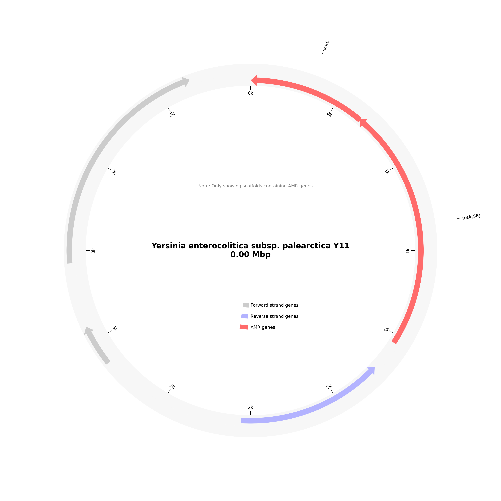

### lmrC
- **Mechanism**: antibiotic target protection
- **Drug Classes**: lincosamide antibiotic
- **AMR Family**: Miscellaneous ABC-F subfamily ATP-binding cassette ribosomal protection proteins
- **Locations**:
  - gnl|SPADES|OOJMENLF_1391_1 : position 1-417

### tetA(58)
- **Mechanism**: antibiotic efflux
- **Drug Classes**: tetracycline antibiotic
- **AMR Family**: major facilitator superfamily (MFS) antibiotic efflux pump
- **Locations**:
  - gnl|SPADES|OOJMENLF_1391_2 : position 414-1280

