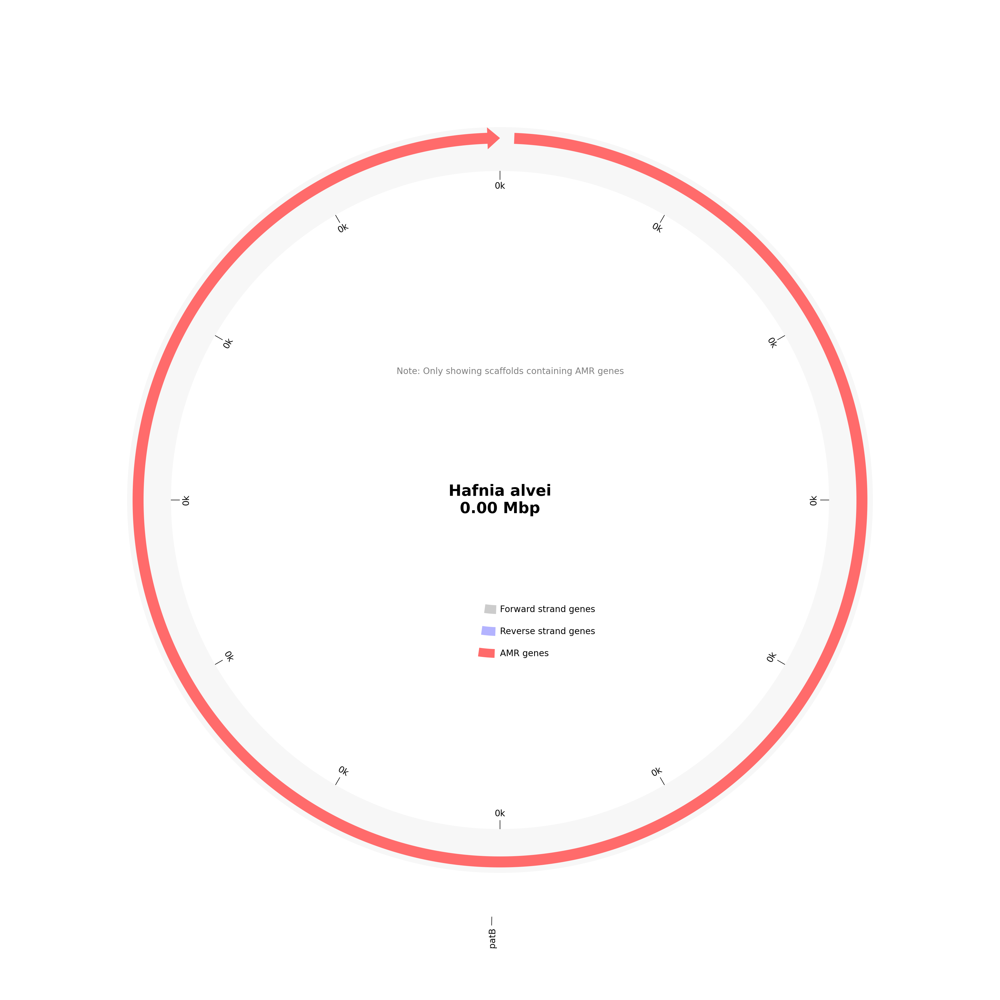

# AMR Analysis Report for LB01_CI_QG_A1_S1

# Organism Classifications:

## Aeromonas salmonicida
**Strain Statistics:**
- Total genome length: 3.1 kbp
- Total scaffolds: 260
- Scaffolds with AMR genes: 11
- Total genes annotated: 0
- Total AMR genes: 11
- Unique AMR genes: 11
- Distinct AMR mechanisms: 3
- Distinct AMR families: 6
- Distinct drug classes: 15

**Circos Plot:**

### Acinetobacter baumannii AbaF
- **Mechanism**: antibiotic efflux
- **Drug Classes**: phosphonic acid antibiotic
- **AMR Family**: major facilitator superfamily (MFS) antibiotic efflux pump
- **Locations**:
  - gnl|SPADES|NHFFGOGK_874824_1 : position 1-288

### MexW
- **Mechanism**: antibiotic efflux
- **Drug Classes**: macrolide antibiotic; fluoroquinolone antibiotic; tetracycline antibiotic; phenicol antibiotic; disinfecting agents and antiseptics
- **AMR Family**: resistance-nodulation-cell division (RND) antibiotic efflux pump
- **Locations**:
  - gnl|SPADES|NHFFGOGK_1781622_1 : position 3-245

### Neisseria gonorrhoeae pilQ gene conferring resistance to beta-lactam
- **Mechanism**: antibiotic target alteration
- **Drug Classes**: cephalosporin; cephamycin; penam
- **AMR Family**: Penicillin-binding protein mutations conferring resistance to beta-lactam antibiotics
- **Locations**:
  - gnl|SPADES|NHFFGOGK_1592010_1 : position 2-262

### OmpA
- **Mechanism**: reduced permeability to antibiotic
- **Drug Classes**: peptide antibiotic
- **AMR Family**: General Bacterial Porin with reduced permeability to peptide antibiotics
- **Locations**:
  - gnl|SPADES|NHFFGOGK_2359476_1 : position 89-205

### RanA
- **Mechanism**: antibiotic efflux
- **Drug Classes**: aminoglycoside antibiotic
- **AMR Family**: ATP-binding cassette (ABC) antibiotic efflux pump
- **Locations**:
  - gnl|SPADES|NHFFGOGK_1555701_1 : position 1-264

### YojI
- **Mechanism**: antibiotic efflux
- **Drug Classes**: peptide antibiotic
- **AMR Family**: ATP-binding cassette (ABC) antibiotic efflux pump
- **Locations**:
  - gnl|SPADES|NHFFGOGK_1610182_1 : position 1-204

### adeL
- **Mechanism**: antibiotic efflux
- **Drug Classes**: fluoroquinolone antibiotic; tetracycline antibiotic
- **AMR Family**: resistance-nodulation-cell division (RND) antibiotic efflux pump
- **Locations**:
  - gnl|SPADES|NHFFGOGK_1741037_1 : position 1-249

### baeS
- **Mechanism**: antibiotic efflux
- **Drug Classes**: aminoglycoside antibiotic; aminocoumarin antibiotic
- **AMR Family**: resistance-nodulation-cell division (RND) antibiotic efflux pump
- **Locations**:
  - gnl|SPADES|NHFFGOGK_422564_1 : position 2-502

### novA
- **Mechanism**: antibiotic efflux
- **Drug Classes**: aminocoumarin antibiotic
- **AMR Family**: ATP-binding cassette (ABC) antibiotic efflux pump
- **Locations**:
  - gnl|SPADES|NHFFGOGK_1452303_1 : position 2-277

### sdiA
- **Mechanism**: antibiotic efflux
- **Drug Classes**: fluoroquinolone antibiotic; cephalosporin; glycylcycline; penam; tetracycline antibiotic; rifamycin antibiotic; phenicol antibiotic; disinfecting agents and antiseptics
- **AMR Family**: resistance-nodulation-cell division (RND) antibiotic efflux pump
- **Locations**:
  - gnl|SPADES|NHFFGOGK_1564594_1 : position 2-241

### vanH gene in vanB cluster
- **Mechanism**: antibiotic target alteration
- **Drug Classes**: glycopeptide antibiotic
- **AMR Family**: vanH; glycopeptide resistance gene cluster
- **Locations**:
  - gnl|SPADES|NHFFGOGK_2009955_1 : position 2-229

## Aeromonas salmonicida subsp. masoucida
**Strain Statistics:**
- Total genome length: 0.2 kbp
- Total scaffolds: 8
- Scaffolds with AMR genes: 1
- Total genes annotated: 2
- Total AMR genes: 1
- Unique AMR genes: 1
- Distinct AMR mechanisms: 1
- Distinct AMR families: 1
- Distinct drug classes: 1

**Circos Plot:**

### LpeB
- **Mechanism**: antibiotic efflux
- **Drug Classes**: macrolide antibiotic
- **AMR Family**: resistance-nodulation-cell division (RND) antibiotic efflux pump
- **Locations**:
  - gnl|SPADES|NHFFGOGK_2042415_1 : position 26-229

## Buttiauxella agrestis
**Strain Statistics:**
- Total genome length: 0.8 kbp
- Total scaffolds: 151
- Scaffolds with AMR genes: 3
- Total genes annotated: 0
- Total AMR genes: 3
- Unique AMR genes: 3
- Distinct AMR mechanisms: 1
- Distinct AMR families: 2
- Distinct drug classes: 9

**Circos Plot:**

### acrB
- **Mechanism**: antibiotic efflux
- **Drug Classes**: fluoroquinolone antibiotic; cephalosporin; glycylcycline; penam; tetracycline antibiotic; rifamycin antibiotic; phenicol antibiotic; disinfecting agents and antiseptics
- **AMR Family**: resistance-nodulation-cell division (RND) antibiotic efflux pump
- **Locations**:
  - gnl|SPADES|NHFFGOGK_1825272_1 : position 1-243

### efrA
- **Mechanism**: antibiotic efflux
- **Drug Classes**: macrolide antibiotic; fluoroquinolone antibiotic; rifamycin antibiotic
- **AMR Family**: ATP-binding cassette (ABC) antibiotic efflux pump
- **Locations**:
  - gnl|SPADES|NHFFGOGK_1495508_1 : position 1-270

### macB
- **Mechanism**: antibiotic efflux
- **Drug Classes**: macrolide antibiotic
- **AMR Family**: ATP-binding cassette (ABC) antibiotic efflux pump
- **Locations**:
  - gnl|SPADES|NHFFGOGK_1278461_1 : position 2-295

## Carnobacterium divergens
**Strain Statistics:**
- Total genome length: 2571.8 kbp
- Total scaffolds: 396
- Scaffolds with AMR genes: 43
- Total genes annotated: 4917
- Total AMR genes: 261
- Unique AMR genes: 141
- Distinct AMR mechanisms: 10
- Distinct AMR families: 62
- Distinct drug classes: 32

**Circos Plot:**

### AAC(6')-34
- **Mechanism**: antibiotic inactivation
- **Drug Classes**: aminoglycoside antibiotic
- **AMR Family**: AAC(6')
- **Locations**:
  - gnl|SPADES|NHFFGOGK_6_89 : position 84371-84898

### AAC(6')-Ii
- **Mechanism**: antibiotic inactivation
- **Drug Classes**: aminoglycoside antibiotic
- **AMR Family**: AAC(6')
- **Locations**:
  - gnl|SPADES|NHFFGOGK_3_105 : position 110970-111428

### ACC-3
- **Mechanism**: antibiotic inactivation
- **Drug Classes**: monobactam; cephalosporin; penam
- **AMR Family**: ACC beta-lactamase
- **Locations**:
  - gnl|SPADES|NHFFGOGK_3_110 : position 114995-116182

### ANT(6)-Ia
- **Mechanism**: antibiotic inactivation
- **Drug Classes**: aminoglycoside antibiotic
- **AMR Family**: ANT(6)
- **Locations**:
  - gnl|SPADES|NHFFGOGK_3_205 : position 221022-221900

### Acinetobacter baumannii AbaF
- **Mechanism**: antibiotic efflux
- **Drug Classes**: phosphonic acid antibiotic
- **AMR Family**: major facilitator superfamily (MFS) antibiotic efflux pump
- **Locations**:
  - gnl|SPADES|NHFFGOGK_98_25 : position 19526-20761

### Acinetobacter baumannii AbaQ
- **Mechanism**: antibiotic efflux
- **Drug Classes**: fluoroquinolone antibiotic
- **AMR Family**: major facilitator superfamily (MFS) antibiotic efflux pump
- **Locations**:
  - gnl|SPADES|NHFFGOGK_4_77 : position 82328-83581

### AcrE
- **Mechanism**: antibiotic efflux
- **Drug Classes**: fluoroquinolone antibiotic; cephalosporin; cephamycin; penam
- **AMR Family**: resistance-nodulation-cell division (RND) antibiotic efflux pump
- **Locations**:
  - gnl|SPADES|NHFFGOGK_1_270 : position 283281-284450

### AcrS (found in 2 locations)
- **Mechanism**: antibiotic efflux
- **Drug Classes**: fluoroquinolone antibiotic; cephalosporin; glycylcycline; cephamycin; penam; tetracycline antibiotic; rifamycin antibiotic; phenicol antibiotic; disinfecting agents and antiseptics
- **AMR Family**: resistance-nodulation-cell division (RND) antibiotic efflux pump
- **Locations**:
  - gnl|SPADES|NHFFGOGK_35_44 : position 45210-45827
  - gnl|SPADES|NHFFGOGK_6_100 : position 93245-93826

### Agrobacterium fabrum chloramphenicol acetyltransferase
- **Mechanism**: antibiotic inactivation
- **Drug Classes**: phenicol antibiotic
- **AMR Family**: chloramphenicol acetyltransferase (CAT)
- **Locations**:
  - gnl|SPADES|NHFFGOGK_75_23 : position 26509-27084

### BcI (found in 2 locations)
- **Mechanism**: antibiotic inactivation
- **Drug Classes**: cephalosporin; penem
- **AMR Family**: class A Bacillus cereus Bc beta-lactamase
- **Locations**:
  - gnl|SPADES|NHFFGOGK_1205248_1 : position 1-306
  - gnl|SPADES|NHFFGOGK_9_10 : position 7512-7880

### CAR-1
- **Mechanism**: antibiotic inactivation
- **Drug Classes**: carbapenem
- **AMR Family**: CAR beta-lactamase
- **Locations**:
  - gnl|SPADES|NHFFGOGK_484177_1 : position 1-474

### CPS-1
- **Mechanism**: antibiotic inactivation
- **Drug Classes**: carbapenem
- **AMR Family**: CPS beta-lactamase
- **Locations**:
  - gnl|SPADES|NHFFGOGK_3_124 : position 128679-129299

### Clostridioides difficile gyrA conferring resistance to fluoroquinolones (found in 2 locations)
- **Mechanism**: antibiotic target alteration
- **Drug Classes**: fluoroquinolone antibiotic
- **AMR Family**: fluoroquinolone resistant gyrA
- **Locations**:
  - gnl|SPADES|NHFFGOGK_4_26 : position 23653-26121
  - gnl|SPADES|NHFFGOGK_9_51 : position 47088-49574

### Clostridioides difficile gyrB conferring resistance to fluoroquinolones (found in 2 locations)
- **Mechanism**: antibiotic target alteration
- **Drug Classes**: fluoroquinolone antibiotic
- **AMR Family**: fluoroquinolone resistant gyrB
- **Locations**:
  - gnl|SPADES|NHFFGOGK_4_25 : position 21636-23663
  - gnl|SPADES|NHFFGOGK_9_52 : position 49639-51576

### Clostridium sporogenes cplR
- **Mechanism**: antibiotic target protection
- **Drug Classes**: lincosamide antibiotic; pleuromutilin antibiotic
- **AMR Family**: Miscellaneous ABC-F subfamily ATP-binding cassette ribosomal protection proteins
- **Locations**:
  - gnl|SPADES|NHFFGOGK_1620_2 : position 419-742

### Corynebacterium striatum tetA
- **Mechanism**: antibiotic efflux
- **Drug Classes**: penam; tetracycline antibiotic
- **AMR Family**: major facilitator superfamily (MFS) antibiotic efflux pump
- **Locations**:
  - gnl|SPADES|NHFFGOGK_1800321_1 : position 3-245

### DfrA36 (found in 2 locations)
- **Mechanism**: antibiotic target replacement
- **Drug Classes**: diaminopyrimidine antibiotic
- **AMR Family**: trimethoprim resistant dihydrofolate reductase dfr
- **Locations**:
  - gnl|SPADES|NHFFGOGK_20_55 : position 49664-50050
  - gnl|SPADES|NHFFGOGK_5_84 : position 58189-58713

### Enterococcus faecalis cls with mutation conferring resistance to daptomycin (found in 2 locations)
- **Mechanism**: antibiotic target alteration
- **Drug Classes**: peptide antibiotic
- **AMR Family**: daptomycin resistant cls
- **Locations**:
  - gnl|SPADES|NHFFGOGK_29_55 : position 50252-51700
  - gnl|SPADES|NHFFGOGK_3_170 : position 175573-177090

### Erm(K)
- **Mechanism**: antibiotic target alteration
- **Drug Classes**: macrolide antibiotic; lincosamide antibiotic; streptogramin antibiotic
- **AMR Family**: Erm 23S ribosomal RNA methyltransferase
- **Locations**:
  - gnl|SPADES|NHFFGOGK_20_26 : position 21064-21954

### Escherichia coli AcrAB-TolC with AcrR mutation conferring resistance to ciprofloxacin, tetracycline, and ceftazidime
- **Mechanism**: antibiotic target alteration; antibiotic efflux
- **Drug Classes**: fluoroquinolone antibiotic; cephalosporin; glycylcycline; penam; tetracycline antibiotic; rifamycin antibiotic; phenicol antibiotic; disinfecting agents and antiseptics
- **AMR Family**: resistance-nodulation-cell division (RND) antibiotic efflux pump
- **Locations**:
  - gnl|SPADES|NHFFGOGK_1_154 : position 162284-162892

### Escherichia coli AcrAB-TolC with MarR mutations conferring resistance to ciprofloxacin and tetracycline
- **Mechanism**: antibiotic target alteration; antibiotic efflux
- **Drug Classes**: fluoroquinolone antibiotic; cephalosporin; glycylcycline; penam; tetracycline antibiotic; rifamycin antibiotic; phenicol antibiotic; disinfecting agents and antiseptics
- **AMR Family**: resistance-nodulation-cell division (RND) antibiotic efflux pump
- **Locations**:
  - gnl|SPADES|NHFFGOGK_2_72 : position 64147-64608

### Escherichia coli EF-Tu mutants conferring resistance to kirromycin (found in 2 locations)
- **Mechanism**: antibiotic target alteration
- **Drug Classes**: elfamycin antibiotic
- **AMR Family**: elfamycin resistant EF-Tu
- **Locations**:
  - gnl|SPADES|NHFFGOGK_7_110 : position 100180-101367
  - gnl|SPADES|NHFFGOGK_966_1 : position 3-395

### Escherichia coli fabI mutations conferring resistance to isoniazid and triclosan
- **Mechanism**: antibiotic target alteration
- **Drug Classes**: disinfecting agents and antiseptics; isoniazid-like antibiotic
- **AMR Family**: antibiotic resistant fabI
- **Locations**:
  - gnl|SPADES|NHFFGOGK_232_8 : position 6668-7426

### EstT (found in 2 locations)
- **Mechanism**: antibiotic inactivation
- **Drug Classes**: macrolide antibiotic
- **AMR Family**: macrolide esterase
- **Locations**:
  - gnl|SPADES|NHFFGOGK_10_78 : position 85465-86277
  - gnl|SPADES|NHFFGOGK_5_140 : position 117142-117858

### FosC2
- **Mechanism**: antibiotic inactivation
- **Drug Classes**: phosphonic acid antibiotic
- **AMR Family**: fosC phosphotransferase family
- **Locations**:
  - gnl|SPADES|NHFFGOGK_7_111 : position 101413-101793

### HelR
- **Mechanism**: antibiotic target protection
- **Drug Classes**: rifamycin antibiotic
- **AMR Family**: helicase-like RNA polymerase protection protein
- **Locations**:
  - gnl|SPADES|NHFFGOGK_2_226 : position 230994-233288

### Helicobacter pylori pbp1 mutants conferring resistance to amoxicillin (found in 2 locations)
- **Mechanism**: antibiotic target alteration
- **Drug Classes**: cephalosporin; cephamycin; penam
- **AMR Family**: Penicillin-binding protein mutations conferring resistance to beta-lactam antibiotics
- **Locations**:
  - gnl|SPADES|NHFFGOGK_22_14 : position 12688-15285
  - gnl|SPADES|NHFFGOGK_2_204 : position 204966-207092

### Helicobacter pylori rdxA mutation conferring resistance to metronidazole
- **Mechanism**: antibiotic target alteration
- **Drug Classes**: nitroimidazole antibiotic
- **AMR Family**: Antibiotic resistant Helicobacter pylori nitroreductase
- **Locations**:
  - gnl|SPADES|NHFFGOGK_3_128 : position 131504-132130

### Helicobacter pylori rpoB mutation conferring resistance to rifampicin
- **Mechanism**: antibiotic target alteration; antibiotic target replacement
- **Drug Classes**: fluoroquinolone antibiotic; rifamycin antibiotic
- **AMR Family**: rifamycin-resistant beta-subunit of RNA polymerase (rpoB)
- **Locations**:
  - gnl|SPADES|NHFFGOGK_11_6 : position 5380-9009

### IreK (found in 2 locations)
- **Mechanism**: reduced permeability to antibiotic
- **Drug Classes**: cephalosporin
- **AMR Family**: Serine/threonine kinases
- **Locations**:
  - gnl|SPADES|NHFFGOGK_29_35 : position 29866-31866
  - gnl|SPADES|NHFFGOGK_4_105 : position 114279-114926

### Klebsiella pneumoniae KpnH
- **Mechanism**: antibiotic efflux
- **Drug Classes**: macrolide antibiotic; fluoroquinolone antibiotic; aminoglycoside antibiotic; carbapenem; cephalosporin; penam; peptide antibiotic; penem
- **AMR Family**: major facilitator superfamily (MFS) antibiotic efflux pump
- **Locations**:
  - gnl|SPADES|NHFFGOGK_5_167 : position 143685-144533

### Listeria monocytogenes mprF
- **Mechanism**: antibiotic target alteration
- **Drug Classes**: peptide antibiotic
- **AMR Family**: defensin resistant mprF
- **Locations**:
  - gnl|SPADES|NHFFGOGK_1_230 : position 234502-237051

### LlmA 23S ribosomal RNA methyltransferase
- **Mechanism**: antibiotic target alteration
- **Drug Classes**: lincosamide antibiotic
- **AMR Family**: Llm 23S ribosomal RNA methyltransferase
- **Locations**:
  - gnl|SPADES|NHFFGOGK_5_113 : position 86914-88092

### MexS (found in 2 locations)
- **Mechanism**: antibiotic efflux
- **Drug Classes**: fluoroquinolone antibiotic; diaminopyrimidine antibiotic; phenicol antibiotic
- **AMR Family**: resistance-nodulation-cell division (RND) antibiotic efflux pump
- **Locations**:
  - gnl|SPADES|NHFFGOGK_3_174 : position 178447-179397
  - gnl|SPADES|NHFFGOGK_98_20 : position 15777-16760

### Mycolicibacterium smegmatis ndh with mutation conferring resistance to isoniazid (found in 2 locations)
- **Mechanism**: antibiotic target alteration
- **Drug Classes**: isoniazid-like antibiotic
- **AMR Family**: antibiotic resistant ndh
- **Locations**:
  - gnl|SPADES|NHFFGOGK_11_30 : position 31718-33589
  - gnl|SPADES|NHFFGOGK_26_15 : position 16080-17285

### Neisseria gonorrhoeae mtrR with mutation conferring resistance
- **Mechanism**: antibiotic efflux
- **Drug Classes**: macrolide antibiotic
- **AMR Family**: resistance-nodulation-cell division (RND) antibiotic efflux pump
- **Locations**:
  - gnl|SPADES|NHFFGOGK_5_148 : position 123742-124335

### NmcR
- **Mechanism**: antibiotic inactivation
- **Drug Classes**: carbapenem; cephalosporin; cephamycin; penam
- **AMR Family**: NmcA beta-lactamase
- **Locations**:
  - gnl|SPADES|NHFFGOGK_4_29 : position 29716-30669

### PAM-2
- **Mechanism**: antibiotic inactivation
- **Drug Classes**: carbapenem; cephalosporin
- **AMR Family**: PAM beta-lactamase
- **Locations**:
  - gnl|SPADES|NHFFGOGK_1_221 : position 224776-225489

### PmrF (found in 3 locations)
- **Mechanism**: antibiotic target alteration
- **Drug Classes**: peptide antibiotic
- **AMR Family**: pmr phosphoethanolamine transferase
- **Locations**:
  - gnl|SPADES|NHFFGOGK_10_15 : position 21039-22289
  - gnl|SPADES|NHFFGOGK_10_66 : position 74085-75269
  - gnl|SPADES|NHFFGOGK_35_39 : position 40845-41795

### Pseudomonas mutant PhoP conferring resistance to colistin
- **Mechanism**: antibiotic target alteration; antibiotic efflux; resistance by absence
- **Drug Classes**: macrolide antibiotic; peptide antibiotic
- **AMR Family**: ATP-binding cassette (ABC) antibiotic efflux pump; pmr phosphoethanolamine transferase; transmembrane protein conferring colistin resistance
- **Locations**:
  - gnl|SPADES|NHFFGOGK_6_144 : position 136823-137542

### QnrS15
- **Mechanism**: antibiotic target protection
- **Drug Classes**: fluoroquinolone antibiotic
- **AMR Family**: quinolone resistance protein (qnr)
- **Locations**:
  - gnl|SPADES|NHFFGOGK_7_7 : position 3599-4222

### QnrVC4
- **Mechanism**: antibiotic target protection
- **Drug Classes**: fluoroquinolone antibiotic
- **AMR Family**: quinolone resistance protein (qnr)
- **Locations**:
  - gnl|SPADES|NHFFGOGK_1_214 : position 216936-217571

### RanA (found in 7 locations)
- **Mechanism**: antibiotic efflux
- **Drug Classes**: aminoglycoside antibiotic
- **AMR Family**: ATP-binding cassette (ABC) antibiotic efflux pump
- **Locations**:
  - gnl|SPADES|NHFFGOGK_10_87 : position 95114-96217
  - gnl|SPADES|NHFFGOGK_1_7 : position 8326-9519
  - gnl|SPADES|NHFFGOGK_21_37 : position 37877-38686
  - gnl|SPADES|NHFFGOGK_3_23 : position 19475-20449
  - gnl|SPADES|NHFFGOGK_3_81 : position 85494-86531
  - gnl|SPADES|NHFFGOGK_6_74 : position 66772-67866
  - gnl|SPADES|NHFFGOGK_7_82 : position 75975-76748

### RlmA(II)
- **Mechanism**: antibiotic target alteration
- **Drug Classes**: macrolide antibiotic; lincosamide antibiotic
- **AMR Family**: non-erm 23S ribosomal RNA methyltransferase (G748)
- **Locations**:
  - gnl|SPADES|NHFFGOGK_2_220 : position 225367-226224

### Rv1877
- **Mechanism**: antibiotic efflux
- **Drug Classes**: fluoroquinolone antibiotic
- **AMR Family**: major facilitator superfamily (MFS) antibiotic efflux pump
- **Locations**:
  - gnl|SPADES|NHFFGOGK_147_4 : position 2833-4311

### SAT-2
- **Mechanism**: antibiotic inactivation
- **Drug Classes**: nucleoside antibiotic
- **AMR Family**: streptothricin acetyltransferase (SAT)
- **Locations**:
  - gnl|SPADES|NHFFGOGK_81_19 : position 17199-18044

### SatA
- **Mechanism**: antibiotic inactivation
- **Drug Classes**: nucleoside antibiotic
- **AMR Family**: streptothricin acetyltransferase (SAT)
- **Locations**:
  - gnl|SPADES|NHFFGOGK_5_79 : position 53956-54390

### Staphylococcus aureus fusA with mutation conferring resistance to fusidic acid (found in 2 locations)
- **Mechanism**: antibiotic target alteration
- **Drug Classes**: fusidane antibiotic
- **AMR Family**: antibiotic resistant fusA
- **Locations**:
  - gnl|SPADES|NHFFGOGK_11_1 : position 2-1891
  - gnl|SPADES|NHFFGOGK_2_115 : position 109987-111564

### Staphylococcus aureus mupA conferring resistance to mupirocin (found in 2 locations)
- **Mechanism**: antibiotic target alteration
- **Drug Classes**: mupirocin-like antibiotic
- **AMR Family**: antibiotic-resistant isoleucyl-tRNA synthetase (ileS)
- **Locations**:
  - gnl|SPADES|NHFFGOGK_1_170 : position 174486-177272
  - gnl|SPADES|NHFFGOGK_20_23 : position 17641-19665

### Staphylococcus aureus mupB conferring resistance to mupirocin (found in 2 locations)
- **Mechanism**: antibiotic target alteration
- **Drug Classes**: mupirocin-like antibiotic
- **AMR Family**: antibiotic-resistant isoleucyl-tRNA synthetase (ileS)
- **Locations**:
  - gnl|SPADES|NHFFGOGK_1_129 : position 136305-138950
  - gnl|SPADES|NHFFGOGK_5_179 : position 159113-161527

### Staphylococcus aureus murA with mutation conferring resistance to fosfomycin (found in 2 locations)
- **Mechanism**: antibiotic target alteration
- **Drug Classes**: phosphonic acid antibiotic
- **AMR Family**: antibiotic-resistant murA transferase
- **Locations**:
  - gnl|SPADES|NHFFGOGK_7_57 : position 50598-51911
  - gnl|SPADES|NHFFGOGK_99_3 : position 2951-4216

### Staphylococcus aureus rpoB mutants conferring resistance to rifampicin
- **Mechanism**: antibiotic target alteration; antibiotic target replacement
- **Drug Classes**: rifamycin antibiotic
- **AMR Family**: rifamycin-resistant beta-subunit of RNA polymerase (rpoB)
- **Locations**:
  - gnl|SPADES|NHFFGOGK_11_7 : position 9127-12702

### Streptococcus pneumoniae PBP2b conferring resistance to amoxicillin
- **Mechanism**: antibiotic target alteration
- **Drug Classes**: cephalosporin; cephamycin; penam
- **AMR Family**: Penicillin-binding protein mutations conferring resistance to beta-lactam antibiotics
- **Locations**:
  - gnl|SPADES|NHFFGOGK_1_212 : position 211922-214042

### Streptococcus pneumoniae PBP2x conferring resistance to amoxicillin
- **Mechanism**: antibiotic target alteration
- **Drug Classes**: cephalosporin; cephamycin; penam
- **AMR Family**: Penicillin-binding protein mutations conferring resistance to beta-lactam antibiotics
- **Locations**:
  - gnl|SPADES|NHFFGOGK_1_183 : position 189375-191540

### TaeA (found in 2 locations)
- **Mechanism**: antibiotic efflux
- **Drug Classes**: pleuromutilin antibiotic
- **AMR Family**: ATP-binding cassette (ABC) antibiotic efflux pump
- **Locations**:
  - gnl|SPADES|NHFFGOGK_20_41 : position 33972-35612
  - gnl|SPADES|NHFFGOGK_22_1 : position 1-1710

### TxR (found in 3 locations)
- **Mechanism**: antibiotic efflux
- **Drug Classes**: tetracycline antibiotic
- **AMR Family**: ATP-binding cassette (ABC) antibiotic efflux pump
- **Locations**:
  - gnl|SPADES|NHFFGOGK_26_49 : position 56103-58964
  - gnl|SPADES|NHFFGOGK_7_144 : position 140270-142942
  - gnl|SPADES|NHFFGOGK_9_42 : position 36428-39091

### VatI
- **Mechanism**: antibiotic inactivation
- **Drug Classes**: streptogramin antibiotic; streptogramin A antibiotic
- **AMR Family**: streptogramin vat acetyltransferase
- **Locations**:
  - gnl|SPADES|NHFFGOGK_5_122 : position 99164-99865

### YajC
- **Mechanism**: antibiotic efflux
- **Drug Classes**: fluoroquinolone antibiotic; cephalosporin; glycylcycline; penam; tetracycline antibiotic; oxazolidinone antibiotic; glycopeptide antibiotic; rifamycin antibiotic; phenicol antibiotic; disinfecting agents and antiseptics
- **AMR Family**: resistance-nodulation-cell division (RND) antibiotic efflux pump
- **Locations**:
  - gnl|SPADES|NHFFGOGK_1_231 : position 237136-237552

### aac(6')-Ib-cr11
- **Mechanism**: antibiotic inactivation
- **Drug Classes**: fluoroquinolone antibiotic; aminoglycoside antibiotic
- **AMR Family**: AAC(6'); AAC(6')-Ib-cr
- **Locations**:
  - gnl|SPADES|NHFFGOGK_6_99 : position 92654-93226

### adeR
- **Mechanism**: antibiotic efflux
- **Drug Classes**: glycylcycline; tetracycline antibiotic
- **AMR Family**: resistance-nodulation-cell division (RND) antibiotic efflux pump
- **Locations**:
  - gnl|SPADES|NHFFGOGK_3_29 : position 27240-27935

### almE (found in 2 locations)
- **Mechanism**: antibiotic target alteration
- **Drug Classes**: peptide antibiotic
- **AMR Family**: polymyxin resistance operon; alm glycyltransferase
- **Locations**:
  - gnl|SPADES|NHFFGOGK_20_20 : position 14418-15857
  - gnl|SPADES|NHFFGOGK_5_137 : position 113260-114786

### arlR (found in 6 locations)
- **Mechanism**: antibiotic efflux
- **Drug Classes**: fluoroquinolone antibiotic; disinfecting agents and antiseptics
- **AMR Family**: major facilitator superfamily (MFS) antibiotic efflux pump
- **Locations**:
  - gnl|SPADES|NHFFGOGK_1_263 : position 275589-276275
  - gnl|SPADES|NHFFGOGK_1_97 : position 109040-109723
  - gnl|SPADES|NHFFGOGK_21_44 : position 45163-45879
  - gnl|SPADES|NHFFGOGK_2225919_1 : position 3-215
  - gnl|SPADES|NHFFGOGK_2_152 : position 149321-149995
  - gnl|SPADES|NHFFGOGK_8_81 : position 98453-99904

### arlS (found in 5 locations)
- **Mechanism**: antibiotic efflux
- **Drug Classes**: fluoroquinolone antibiotic; disinfecting agents and antiseptics
- **AMR Family**: major facilitator superfamily (MFS) antibiotic efflux pump
- **Locations**:
  - gnl|SPADES|NHFFGOGK_1_262 : position 274069-275592
  - gnl|SPADES|NHFFGOGK_1_96 : position 107757-109043
  - gnl|SPADES|NHFFGOGK_21_43 : position 43391-45166
  - gnl|SPADES|NHFFGOGK_237_3 : position 1031-2866
  - gnl|SPADES|NHFFGOGK_2_153 : position 150008-151057

### arnA (found in 2 locations)
- **Mechanism**: antibiotic target alteration
- **Drug Classes**: peptide antibiotic
- **AMR Family**: pmr phosphoethanolamine transferase
- **Locations**:
  - gnl|SPADES|NHFFGOGK_29_38 : position 34019-34951
  - gnl|SPADES|NHFFGOGK_7_121 : position 113660-114241

### bacA
- **Mechanism**: antibiotic target alteration
- **Drug Classes**: peptide antibiotic
- **AMR Family**: undecaprenyl pyrophosphate related proteins
- **Locations**:
  - gnl|SPADES|NHFFGOGK_3_97 : position 101324-102142

### baeS (found in 2 locations)
- **Mechanism**: antibiotic efflux
- **Drug Classes**: aminoglycoside antibiotic; aminocoumarin antibiotic
- **AMR Family**: resistance-nodulation-cell division (RND) antibiotic efflux pump
- **Locations**:
  - gnl|SPADES|NHFFGOGK_2_75 : position 66183-67559
  - gnl|SPADES|NHFFGOGK_7_61 : position 54635-56029

### bcrA (found in 8 locations)
- **Mechanism**: antibiotic efflux
- **Drug Classes**: peptide antibiotic
- **AMR Family**: ATP-binding cassette (ABC) antibiotic efflux pump
- **Locations**:
  - gnl|SPADES|NHFFGOGK_212733_1 : position 3-632
  - gnl|SPADES|NHFFGOGK_2_135 : position 130381-131322
  - gnl|SPADES|NHFFGOGK_2_195 : position 195440-196174
  - gnl|SPADES|NHFFGOGK_2_26 : position 25017-25904
  - gnl|SPADES|NHFFGOGK_3_112 : position 116703-117602
  - gnl|SPADES|NHFFGOGK_4_82 : position 87834-89315
  - gnl|SPADES|NHFFGOGK_6_138 : position 131280-132200
  - gnl|SPADES|NHFFGOGK_6_47 : position 42770-43462

### bcrC
- **Mechanism**: antibiotic target alteration
- **Drug Classes**: peptide antibiotic
- **AMR Family**: undecaprenyl pyrophosphate related proteins
- **Locations**:
  - gnl|SPADES|NHFFGOGK_147_10 : position 9675-10346

### bmr
- **Mechanism**: antibiotic efflux
- **Drug Classes**: fluoroquinolone antibiotic; nucleoside antibiotic; phenicol antibiotic; disinfecting agents and antiseptics
- **AMR Family**: major facilitator superfamily (MFS) antibiotic efflux pump
- **Locations**:
  - gnl|SPADES|NHFFGOGK_43_29 : position 28355-29578

### carA
- **Mechanism**: antibiotic target protection
- **Drug Classes**: macrolide antibiotic
- **AMR Family**: Miscellaneous ABC-F subfamily ATP-binding cassette ribosomal protection proteins
- **Locations**:
  - gnl|SPADES|NHFFGOGK_20_32 : position 26101-26808

### catB11
- **Mechanism**: antibiotic inactivation
- **Drug Classes**: phenicol antibiotic
- **AMR Family**: chloramphenicol acetyltransferase (CAT)
- **Locations**:
  - gnl|SPADES|NHFFGOGK_14_3 : position 5001-5663

### cfrA
- **Mechanism**: antibiotic target alteration
- **Drug Classes**: lincosamide antibiotic; streptogramin antibiotic; streptogramin A antibiotic; oxazolidinone antibiotic; phenicol antibiotic; pleuromutilin antibiotic
- **AMR Family**: Cfr 23S ribosomal RNA methyltransferase
- **Locations**:
  - gnl|SPADES|NHFFGOGK_142_5 : position 6387-7445

### cprR
- **Mechanism**: antibiotic target alteration; antibiotic efflux
- **Drug Classes**: peptide antibiotic
- **AMR Family**: pmr phosphoethanolamine transferase
- **Locations**:
  - gnl|SPADES|NHFFGOGK_2_184 : position 183800-184333

### dfrE
- **Mechanism**: antibiotic target replacement
- **Drug Classes**: diaminopyrimidine antibiotic
- **AMR Family**: trimethoprim resistant dihydrofolate reductase dfr
- **Locations**:
  - gnl|SPADES|NHFFGOGK_4_3 : position 1179-1667

### efrA (found in 4 locations)
- **Mechanism**: antibiotic efflux
- **Drug Classes**: macrolide antibiotic; fluoroquinolone antibiotic; rifamycin antibiotic
- **AMR Family**: ATP-binding cassette (ABC) antibiotic efflux pump
- **Locations**:
  - gnl|SPADES|NHFFGOGK_1_67 : position 77533-79314
  - gnl|SPADES|NHFFGOGK_2_157 : position 156015-157757
  - gnl|SPADES|NHFFGOGK_6_108 : position 100535-102340
  - gnl|SPADES|NHFFGOGK_7_21 : position 14814-16535

### efrB
- **Mechanism**: antibiotic efflux
- **Drug Classes**: macrolide antibiotic; fluoroquinolone antibiotic; rifamycin antibiotic
- **AMR Family**: ATP-binding cassette (ABC) antibiotic efflux pump
- **Locations**:
  - gnl|SPADES|NHFFGOGK_1_66 : position 75758-77536

### evgA
- **Mechanism**: antibiotic efflux
- **Drug Classes**: macrolide antibiotic; fluoroquinolone antibiotic; penam; tetracycline antibiotic
- **AMR Family**: major facilitator superfamily (MFS) antibiotic efflux pump; resistance-nodulation-cell division (RND) antibiotic efflux pump
- **Locations**:
  - gnl|SPADES|NHFFGOGK_1_74 : position 85082-85714

### floR
- **Mechanism**: antibiotic efflux
- **Drug Classes**: phenicol antibiotic
- **AMR Family**: major facilitator superfamily (MFS) antibiotic efflux pump
- **Locations**:
  - gnl|SPADES|NHFFGOGK_4_52 : position 52403-53590

### golS (found in 2 locations)
- **Mechanism**: antibiotic efflux
- **Drug Classes**: monobactam; carbapenem; cephalosporin; cephamycin; penam; phenicol antibiotic; penem
- **AMR Family**: resistance-nodulation-cell division (RND) antibiotic efflux pump
- **Locations**:
  - gnl|SPADES|NHFFGOGK_142_10 : position 13812-14618
  - gnl|SPADES|NHFFGOGK_6_5 : position 1895-2278

### hmrM
- **Mechanism**: antibiotic efflux
- **Drug Classes**: fluoroquinolone antibiotic; disinfecting agents and antiseptics
- **AMR Family**: multidrug and toxic compound extrusion (MATE) transporter
- **Locations**:
  - gnl|SPADES|NHFFGOGK_21_21 : position 21448-22797

### kdpD (found in 2 locations)
- **Mechanism**: antibiotic efflux
- **Drug Classes**: aminoglycoside antibiotic
- **AMR Family**: kdpDE
- **Locations**:
  - gnl|SPADES|NHFFGOGK_11_85 : position 90158-92875
  - gnl|SPADES|NHFFGOGK_6_145 : position 137539-139188

### kdpE
- **Mechanism**: antibiotic efflux
- **Drug Classes**: aminoglycoside antibiotic
- **AMR Family**: kdpDE
- **Locations**:
  - gnl|SPADES|NHFFGOGK_11_84 : position 89475-90161

### leuO
- **Mechanism**: antibiotic efflux
- **Drug Classes**: nucleoside antibiotic; disinfecting agents and antiseptics
- **AMR Family**: major facilitator superfamily (MFS) antibiotic efflux pump
- **Locations**:
  - gnl|SPADES|NHFFGOGK_5_80 : position 54410-55225

### lin
- **Mechanism**: antibiotic inactivation
- **Drug Classes**: lincosamide antibiotic
- **AMR Family**: lincosamide nucleotidyltransferase (LNU)
- **Locations**:
  - gnl|SPADES|NHFFGOGK_1620_3 : position 856-1209

### lmrB (found in 2 locations)
- **Mechanism**: antibiotic efflux
- **Drug Classes**: lincosamide antibiotic; nucleoside antibiotic
- **AMR Family**: ATP-binding cassette (ABC) antibiotic efflux pump
- **Locations**:
  - gnl|SPADES|NHFFGOGK_2_190 : position 188927-190381
  - gnl|SPADES|NHFFGOGK_3_147 : position 148300-149697

### lmrD
- **Mechanism**: antibiotic efflux
- **Drug Classes**: lincosamide antibiotic
- **AMR Family**: ATP-binding cassette (ABC) antibiotic efflux pump
- **Locations**:
  - gnl|SPADES|NHFFGOGK_3_220 : position 236164-238245

### lmrP
- **Mechanism**: antibiotic efflux
- **Drug Classes**: macrolide antibiotic; lincosamide antibiotic; streptogramin antibiotic; streptogramin A antibiotic; tetracycline antibiotic
- **AMR Family**: major facilitator superfamily (MFS) antibiotic efflux pump
- **Locations**:
  - gnl|SPADES|NHFFGOGK_7636_1 : position 2-1114

### macA
- **Mechanism**: antibiotic efflux
- **Drug Classes**: macrolide antibiotic
- **AMR Family**: ATP-binding cassette (ABC) antibiotic efflux pump
- **Locations**:
  - gnl|SPADES|NHFFGOGK_3_153 : position 155377-156237

### macB (found in 29 locations)
- **Mechanism**: antibiotic efflux
- **Drug Classes**: macrolide antibiotic
- **AMR Family**: ATP-binding cassette (ABC) antibiotic efflux pump
- **Locations**:
  - gnl|SPADES|NHFFGOGK_11_72 : position 78295-78990
  - gnl|SPADES|NHFFGOGK_147_8 : position 7610-8266
  - gnl|SPADES|NHFFGOGK_1580142_1 : position 3-263
  - gnl|SPADES|NHFFGOGK_1_117 : position 126087-126785
  - gnl|SPADES|NHFFGOGK_1_152 : position 160403-161074
  - gnl|SPADES|NHFFGOGK_1_268 : position 281321-282559
  - gnl|SPADES|NHFFGOGK_1_269 : position 282556-283266
  - gnl|SPADES|NHFFGOGK_1_88 : position 98214-98972
  - gnl|SPADES|NHFFGOGK_21_30 : position 30083-32926
  - gnl|SPADES|NHFFGOGK_21_48 : position 49406-50092
  - gnl|SPADES|NHFFGOGK_29_54 : position 48870-50060
  - gnl|SPADES|NHFFGOGK_2_136 : position 131315-132442
  - gnl|SPADES|NHFFGOGK_2_151 : position 148337-149104
  - gnl|SPADES|NHFFGOGK_2_32 : position 30920-31645
  - gnl|SPADES|NHFFGOGK_2_77 : position 68760-69434
  - gnl|SPADES|NHFFGOGK_3_154 : position 156253-156945
  - gnl|SPADES|NHFFGOGK_3_155 : position 156985-158187
  - gnl|SPADES|NHFFGOGK_3_19 : position 16466-17194
  - gnl|SPADES|NHFFGOGK_3_76 : position 80931-82874
  - gnl|SPADES|NHFFGOGK_43_32 : position 30808-31545
  - gnl|SPADES|NHFFGOGK_48141_1 : position 3-275
  - gnl|SPADES|NHFFGOGK_4_45 : position 44862-45671
  - gnl|SPADES|NHFFGOGK_5_94 : position 67159-67962
  - gnl|SPADES|NHFFGOGK_6_102 : position 95494-96222
  - gnl|SPADES|NHFFGOGK_6_78 : position 71862-73571
  - gnl|SPADES|NHFFGOGK_7_30 : position 23764-24453
  - gnl|SPADES|NHFFGOGK_7_31 : position 24446-25675
  - gnl|SPADES|NHFFGOGK_7_68 : position 62165-62866
  - gnl|SPADES|NHFFGOGK_81_13 : position 12324-13397

### marA (found in 2 locations)
- **Mechanism**: antibiotic efflux; reduced permeability to antibiotic
- **Drug Classes**: fluoroquinolone antibiotic; monobactam; carbapenem; cephalosporin; glycylcycline; cephamycin; penam; tetracycline antibiotic; rifamycin antibiotic; phenicol antibiotic; penem; disinfecting agents and antiseptics
- **AMR Family**: resistance-nodulation-cell division (RND) antibiotic efflux pump; General Bacterial Porin with reduced permeability to beta-lactams
- **Locations**:
  - gnl|SPADES|NHFFGOGK_11_63 : position 67971-69881
  - gnl|SPADES|NHFFGOGK_8_40 : position 48261-49097

### mdeA
- **Mechanism**: antibiotic efflux
- **Drug Classes**: fluoroquinolone antibiotic; aminoglycoside antibiotic; penam; tetracycline antibiotic; disinfecting agents and antiseptics
- **AMR Family**: major facilitator superfamily (MFS) antibiotic efflux pump
- **Locations**:
  - gnl|SPADES|NHFFGOGK_14_61 : position 67372-68802

### mdtG
- **Mechanism**: antibiotic efflux
- **Drug Classes**: phosphonic acid antibiotic
- **AMR Family**: major facilitator superfamily (MFS) antibiotic efflux pump
- **Locations**:
  - gnl|SPADES|NHFFGOGK_5_114 : position 88186-89433

### mecA
- **Mechanism**: antibiotic target replacement
- **Drug Classes**: penam
- **AMR Family**: methicillin resistant PBP2
- **Locations**:
  - gnl|SPADES|NHFFGOGK_7_99 : position 88692-90725

### mecI
- **Mechanism**: antibiotic target replacement
- **Drug Classes**: penam
- **AMR Family**: methicillin resistant PBP2
- **Locations**:
  - gnl|SPADES|NHFFGOGK_2_35 : position 33544-34059

### mepR (found in 2 locations)
- **Mechanism**: antibiotic efflux
- **Drug Classes**: glycylcycline; tetracycline antibiotic
- **AMR Family**: multidrug and toxic compound extrusion (MATE) transporter
- **Locations**:
  - gnl|SPADES|NHFFGOGK_3_148 : position 149684-150196
  - gnl|SPADES|NHFFGOGK_3_175 : position 179369-179770

### mgrA
- **Mechanism**: antibiotic efflux
- **Drug Classes**: fluoroquinolone antibiotic; cephalosporin; penam; tetracycline antibiotic; peptide antibiotic; disinfecting agents and antiseptics
- **AMR Family**: ATP-binding cassette (ABC) antibiotic efflux pump; major facilitator superfamily (MFS) antibiotic efflux pump
- **Locations**:
  - gnl|SPADES|NHFFGOGK_7_36 : position 29786-30436

### mreA
- **Mechanism**: antibiotic efflux
- **Drug Classes**: macrolide antibiotic
- **AMR Family**: major facilitator superfamily (MFS) antibiotic efflux pump
- **Locations**:
  - gnl|SPADES|NHFFGOGK_4_161 : position 172237-173181

### msbA (found in 4 locations)
- **Mechanism**: antibiotic efflux
- **Drug Classes**: nitroimidazole antibiotic
- **AMR Family**: ATP-binding cassette (ABC) antibiotic efflux pump
- **Locations**:
  - gnl|SPADES|NHFFGOGK_29_22 : position 15134-18712
  - gnl|SPADES|NHFFGOGK_5_175 : position 152745-154856
  - gnl|SPADES|NHFFGOGK_79_19 : position 21202-21963
  - gnl|SPADES|NHFFGOGK_7_37 : position 30433-32202

### mtrA
- **Mechanism**: antibiotic efflux
- **Drug Classes**: macrolide antibiotic; penam
- **AMR Family**: resistance-nodulation-cell division (RND) antibiotic efflux pump
- **Locations**:
  - gnl|SPADES|NHFFGOGK_7_135 : position 131424-132185

### nalD
- **Mechanism**: antibiotic efflux
- **Drug Classes**: macrolide antibiotic; fluoroquinolone antibiotic; monobactam; carbapenem; cephalosporin; cephamycin; penam; tetracycline antibiotic; peptide antibiotic; aminocoumarin antibiotic; diaminopyrimidine antibiotic; sulfonamide antibiotic; phenicol antibiotic; penem
- **AMR Family**: resistance-nodulation-cell division (RND) antibiotic efflux pump
- **Locations**:
  - gnl|SPADES|NHFFGOGK_3_42 : position 44284-44940

### norB (found in 2 locations)
- **Mechanism**: antibiotic efflux
- **Drug Classes**: fluoroquinolone antibiotic
- **AMR Family**: major facilitator superfamily (MFS) antibiotic efflux pump
- **Locations**:
  - gnl|SPADES|NHFFGOGK_107796_1 : position 2-766
  - gnl|SPADES|NHFFGOGK_11_60 : position 64767-66140

### novA (found in 3 locations)
- **Mechanism**: antibiotic efflux
- **Drug Classes**: aminocoumarin antibiotic
- **AMR Family**: ATP-binding cassette (ABC) antibiotic efflux pump
- **Locations**:
  - gnl|SPADES|NHFFGOGK_26_19 : position 20240-21988
  - gnl|SPADES|NHFFGOGK_26_20 : position 22005-23744
  - gnl|SPADES|NHFFGOGK_3_69 : position 76188-76961

### oleC (found in 2 locations)
- **Mechanism**: antibiotic efflux
- **Drug Classes**: macrolide antibiotic
- **AMR Family**: ATP-binding cassette (ABC) antibiotic efflux pump
- **Locations**:
  - gnl|SPADES|NHFFGOGK_353425_1 : position 1-537
  - gnl|SPADES|NHFFGOGK_7_83 : position 76750-77454

### optrA (found in 4 locations)
- **Mechanism**: antibiotic target protection
- **Drug Classes**: oxazolidinone antibiotic; phenicol antibiotic
- **AMR Family**: Miscellaneous ABC-F subfamily ATP-binding cassette ribosomal protection proteins
- **Locations**:
  - gnl|SPADES|NHFFGOGK_35_17 : position 15532-17532
  - gnl|SPADES|NHFFGOGK_3_18 : position 14127-15980
  - gnl|SPADES|NHFFGOGK_4_159 : position 169153-170751
  - gnl|SPADES|NHFFGOGK_8_68 : position 83229-84857

### otr(B)
- **Mechanism**: antibiotic efflux
- **Drug Classes**: tetracycline antibiotic
- **AMR Family**: major facilitator superfamily (MFS) antibiotic efflux pump
- **Locations**:
  - gnl|SPADES|NHFFGOGK_5_166 : position 143089-143655

### patA (found in 2 locations)
- **Mechanism**: antibiotic efflux
- **Drug Classes**: fluoroquinolone antibiotic
- **AMR Family**: ATP-binding cassette (ABC) antibiotic efflux pump
- **Locations**:
  - gnl|SPADES|NHFFGOGK_5_120 : position 96008-97735
  - gnl|SPADES|NHFFGOGK_8_3 : position 2902-3756

### patB (found in 7 locations)
- **Mechanism**: antibiotic efflux
- **Drug Classes**: fluoroquinolone antibiotic
- **AMR Family**: ATP-binding cassette (ABC) antibiotic efflux pump
- **Locations**:
  - gnl|SPADES|NHFFGOGK_21_36 : position 37100-37864
  - gnl|SPADES|NHFFGOGK_2_156 : position 154247-156022
  - gnl|SPADES|NHFFGOGK_5_119 : position 94255-96015
  - gnl|SPADES|NHFFGOGK_6_109 : position 102333-104084
  - gnl|SPADES|NHFFGOGK_7_22 : position 16535-18430
  - gnl|SPADES|NHFFGOGK_8_44 : position 52720-54480
  - gnl|SPADES|NHFFGOGK_9_85 : position 82614-84752

### rosB
- **Mechanism**: antibiotic efflux
- **Drug Classes**: peptide antibiotic
- **AMR Family**: major facilitator superfamily (MFS) antibiotic efflux pump
- **Locations**:
  - gnl|SPADES|NHFFGOGK_3_151 : position 153175-154338

### rphB
- **Mechanism**: antibiotic inactivation
- **Drug Classes**: rifamycin antibiotic
- **AMR Family**: rifampin phosphotransferase
- **Locations**:
  - gnl|SPADES|NHFFGOGK_2_107 : position 101838-103559

### sta (found in 3 locations)
- **Mechanism**: antibiotic inactivation
- **Drug Classes**: nucleoside antibiotic
- **AMR Family**: streptothricin acetyltransferase (SAT)
- **Locations**:
  - gnl|SPADES|NHFFGOGK_1_151 : position 159876-160346
  - gnl|SPADES|NHFFGOGK_8_7 : position 6287-6766
  - gnl|SPADES|NHFFGOGK_98_24 : position 18970-19395

### tet(32)
- **Mechanism**: antibiotic target protection
- **Drug Classes**: tetracycline antibiotic
- **AMR Family**: tetracycline-resistant ribosomal protection protein
- **Locations**:
  - gnl|SPADES|NHFFGOGK_4_153 : position 161499-163334

### tet(63)
- **Mechanism**: antibiotic efflux
- **Drug Classes**: tetracycline antibiotic
- **AMR Family**: major facilitator superfamily (MFS) antibiotic efflux pump
- **Locations**:
  - gnl|SPADES|NHFFGOGK_6506_2 : position 233-1264

### tet(O/32/O)
- **Mechanism**: antibiotic target protection
- **Drug Classes**: tetracycline antibiotic
- **AMR Family**: tetracycline-resistant ribosomal protection protein
- **Locations**:
  - gnl|SPADES|NHFFGOGK_4_166 : position 176297-178711

### tet(T)
- **Mechanism**: antibiotic target protection
- **Drug Classes**: tetracycline antibiotic
- **AMR Family**: tetracycline-resistant ribosomal protection protein
- **Locations**:
  - gnl|SPADES|NHFFGOGK_1_47 : position 50894-52738

### tetA(58) (found in 8 locations)
- **Mechanism**: antibiotic efflux
- **Drug Classes**: tetracycline antibiotic
- **AMR Family**: major facilitator superfamily (MFS) antibiotic efflux pump
- **Locations**:
  - gnl|SPADES|NHFFGOGK_1_142 : position 151156-151914
  - gnl|SPADES|NHFFGOGK_1_147 : position 156234-157742
  - gnl|SPADES|NHFFGOGK_1_225 : position 228655-229416
  - gnl|SPADES|NHFFGOGK_1_254 : position 263648-265237
  - gnl|SPADES|NHFFGOGK_3_31 : position 29141-30079
  - gnl|SPADES|NHFFGOGK_5_133 : position 109505-110410
  - gnl|SPADES|NHFFGOGK_8_4 : position 3732-4607
  - gnl|SPADES|NHFFGOGK_9_62 : position 59946-60713

### tetA(60)
- **Mechanism**: antibiotic efflux
- **Drug Classes**: tetracycline antibiotic
- **AMR Family**: ATP-binding cassette (ABC) antibiotic efflux pump
- **Locations**:
  - gnl|SPADES|NHFFGOGK_79_6 : position 2651-4402

### tetB(60) (found in 3 locations)
- **Mechanism**: antibiotic efflux
- **Drug Classes**: tetracycline antibiotic
- **AMR Family**: ATP-binding cassette (ABC) antibiotic efflux pump
- **Locations**:
  - gnl|SPADES|NHFFGOGK_1432378_1 : position 6-278
  - gnl|SPADES|NHFFGOGK_79_7 : position 4402-6180
  - gnl|SPADES|NHFFGOGK_8_45 : position 54467-56248

### tetR
- **Mechanism**: antibiotic target alteration; antibiotic efflux
- **Drug Classes**: tetracycline antibiotic
- **AMR Family**: major facilitator superfamily (MFS) antibiotic efflux pump
- **Locations**:
  - gnl|SPADES|NHFFGOGK_1_233 : position 238780-239349

### tsnR (found in 2 locations)
- **Mechanism**: antibiotic target alteration
- **Drug Classes**: peptide antibiotic
- **AMR Family**: non-erm 23S ribosomal RNA methyltransferase (A1067)
- **Locations**:
  - gnl|SPADES|NHFFGOGK_11_36 : position 37206-38075
  - gnl|SPADES|NHFFGOGK_5_155 : position 131764-132519

### vanD
- **Mechanism**: antibiotic target alteration
- **Drug Classes**: glycopeptide antibiotic
- **AMR Family**: glycopeptide resistance gene cluster; Van ligase
- **Locations**:
  - gnl|SPADES|NHFFGOGK_2_63 : position 56533-57903

### vanH gene in vanA cluster
- **Mechanism**: antibiotic target alteration
- **Drug Classes**: glycopeptide antibiotic
- **AMR Family**: vanH; glycopeptide resistance gene cluster
- **Locations**:
  - gnl|SPADES|NHFFGOGK_6_125 : position 118464-119414

### vanH gene in vanD cluster (found in 2 locations)
- **Mechanism**: antibiotic target alteration
- **Drug Classes**: glycopeptide antibiotic
- **AMR Family**: vanH; glycopeptide resistance gene cluster
- **Locations**:
  - gnl|SPADES|NHFFGOGK_26_47 : position 53574-54758
  - gnl|SPADES|NHFFGOGK_6_143 : position 135769-136785

### vanH gene in vanO cluster
- **Mechanism**: antibiotic target alteration
- **Drug Classes**: glycopeptide antibiotic
- **AMR Family**: vanH; glycopeptide resistance gene cluster
- **Locations**:
  - gnl|SPADES|NHFFGOGK_6_97 : position 90900-91889

### vanL
- **Mechanism**: antibiotic target alteration
- **Drug Classes**: glycopeptide antibiotic
- **AMR Family**: glycopeptide resistance gene cluster; Van ligase
- **Locations**:
  - gnl|SPADES|NHFFGOGK_99_15 : position 12677-13768

### vanN
- **Mechanism**: antibiotic target alteration
- **Drug Classes**: glycopeptide antibiotic
- **AMR Family**: glycopeptide resistance gene cluster; Van ligase
- **Locations**:
  - gnl|SPADES|NHFFGOGK_7_107 : position 96549-97676

### vanR gene in vanB cluster
- **Mechanism**: antibiotic target alteration
- **Drug Classes**: glycopeptide antibiotic
- **AMR Family**: glycopeptide resistance gene cluster; vanR
- **Locations**:
  - gnl|SPADES|NHFFGOGK_7_28 : position 21691-22404

### vanR gene in vanE cluster
- **Mechanism**: antibiotic target alteration
- **Drug Classes**: glycopeptide antibiotic
- **AMR Family**: glycopeptide resistance gene cluster; vanR
- **Locations**:
  - gnl|SPADES|NHFFGOGK_4_32 : position 33527-34258

### vanR gene in vanF cluster (found in 2 locations)
- **Mechanism**: antibiotic target alteration
- **Drug Classes**: glycopeptide antibiotic
- **AMR Family**: glycopeptide resistance gene cluster; vanR
- **Locations**:
  - gnl|SPADES|NHFFGOGK_2_74 : position 65515-66186
  - gnl|SPADES|NHFFGOGK_9_106 : position 101452-102141

### vanR gene in vanI cluster (found in 2 locations)
- **Mechanism**: antibiotic target alteration
- **Drug Classes**: glycopeptide antibiotic
- **AMR Family**: glycopeptide resistance gene cluster; vanR
- **Locations**:
  - gnl|SPADES|NHFFGOGK_20_7 : position 6372-7016
  - gnl|SPADES|NHFFGOGK_237_2 : position 317-1024

### vanR gene in vanM cluster (found in 3 locations)
- **Mechanism**: antibiotic target alteration
- **Drug Classes**: glycopeptide antibiotic
- **AMR Family**: glycopeptide resistance gene cluster; vanR
- **Locations**:
  - gnl|SPADES|NHFFGOGK_22_40 : position 40790-41497
  - gnl|SPADES|NHFFGOGK_4_129 : position 134936-135628
  - gnl|SPADES|NHFFGOGK_7_60 : position 53892-54611

### vanS gene in vanB cluster
- **Mechanism**: antibiotic target alteration
- **Drug Classes**: glycopeptide antibiotic
- **AMR Family**: vanS; glycopeptide resistance gene cluster
- **Locations**:
  - gnl|SPADES|NHFFGOGK_7_33 : position 26375-27175

### vanS gene in vanF cluster (found in 2 locations)
- **Mechanism**: antibiotic target alteration
- **Drug Classes**: glycopeptide antibiotic
- **AMR Family**: vanS; glycopeptide resistance gene cluster
- **Locations**:
  - gnl|SPADES|NHFFGOGK_22_39 : position 38959-40782
  - gnl|SPADES|NHFFGOGK_9_107 : position 102191-103327

### vanS gene in vanN cluster
- **Mechanism**: antibiotic target alteration
- **Drug Classes**: glycopeptide antibiotic
- **AMR Family**: vanS; glycopeptide resistance gene cluster
- **Locations**:
  - gnl|SPADES|NHFFGOGK_20_6 : position 4973-6349

### vanT gene in vanG cluster
- **Mechanism**: antibiotic target alteration
- **Drug Classes**: glycopeptide antibiotic
- **AMR Family**: glycopeptide resistance gene cluster; vanT
- **Locations**:
  - gnl|SPADES|NHFFGOGK_99_20: position 18727-19827

### vanY gene in vanG cluster
- **Mechanism**: antibiotic target alteration
- **Drug Classes**: glycopeptide antibiotic
- **AMR Family**: vanY; glycopeptide resistance gene cluster
- **Locations**:
  - gnl|SPADES|NHFFGOGK_7_95: position 85996-86751

### vanZ gene in vanA cluster
- **Mechanism**: antibiotic target alteration
- **Drug Classes**: glycopeptide antibiotic
- **AMR Family**: vanZ; glycopeptide resistance gene cluster
- **Locations**:
  - gnl|SPADES|NHFFGOGK_5_115 : position 89466-90104

### vatB (found in 2 locations)
- **Mechanism**: antibiotic inactivation
- **Drug Classes**: streptogramin antibiotic; streptogramin A antibiotic
- **AMR Family**: streptogramin vat acetyltransferase
- **Locations**:
  - gnl|SPADES|NHFFGOGK_139980_1 : position 3-638
  - gnl|SPADES|NHFFGOGK_9_93 : position 89020-89601

### vga(E) Staphylococcus cohnii
- **Mechanism**: antibiotic target protection
- **Drug Classes**: lincosamide antibiotic; streptogramin antibiotic; streptogramin A antibiotic; pleuromutilin antibiotic
- **AMR Family**: vga-type ABC-F protein
- **Locations**:
  - gnl|SPADES|NHFFGOGK_142_6 : position 7753-9363

### vmlR
- **Mechanism**: antibiotic target protection
- **Drug Classes**: lincosamide antibiotic; streptogramin antibiotic; streptogramin A antibiotic; streptogramin B antibiotic; nucleoside antibiotic; pleuromutilin antibiotic
- **AMR Family**: Miscellaneous ABC-F subfamily ATP-binding cassette ribosomal protection proteins
- **Locations**:
  - gnl|SPADES|NHFFGOGK_3_73 : position 79392-79775

### ykkC (found in 3 locations)
- **Mechanism**: antibiotic efflux
- **Drug Classes**: aminoglycoside antibiotic; tetracycline antibiotic; phenicol antibiotic
- **AMR Family**: small multidrug resistance (SMR) antibiotic efflux pump
- **Locations**:
  - gnl|SPADES|NHFFGOGK_3_127 : position 131082-131429
  - gnl|SPADES|NHFFGOGK_99_13 : position 11880-12209
  - gnl|SPADES|NHFFGOGK_99_14 : position 12206-12523

### ykkD
- **Mechanism**: antibiotic efflux
- **Drug Classes**: aminoglycoside antibiotic; tetracycline antibiotic; phenicol antibiotic
- **AMR Family**: small multidrug resistance (SMR) antibiotic efflux pump
- **Locations**:
  - gnl|SPADES|NHFFGOGK_3_126 : position 130757-131104

## Carnobacterium maltaromaticum
**Strain Statistics:**
- Total genome length: 1539.7 kbp
- Total scaffolds: 723
- Scaffolds with AMR genes: 81
- Total genes annotated: 2879
- Total AMR genes: 189
- Unique AMR genes: 109
- Distinct AMR mechanisms: 9
- Distinct AMR families: 51
- Distinct drug classes: 35

**Circos Plot:**

### AAC(6')-34
- **Mechanism**: antibiotic inactivation
- **Drug Classes**: aminoglycoside antibiotic
- **AMR Family**: AAC(6')
- **Locations**:
  - gnl|SPADES|NHFFGOGK_190_9 : position 6963-7496

### Acinetobacter baumannii AbaQ (found in 2 locations)
- **Mechanism**: antibiotic efflux
- **Drug Classes**: fluoroquinolone antibiotic
- **AMR Family**: major facilitator superfamily (MFS) antibiotic efflux pump
- **Locations**:
  - gnl|SPADES|NHFFGOGK_229_5 : position 5081-6373
  - gnl|SPADES|NHFFGOGK_36_1 : position 309-1565

### Acinetobacter baumannii AmvA
- **Mechanism**: antibiotic efflux
- **Drug Classes**: macrolide antibiotic; disinfecting agents and antiseptics
- **AMR Family**: major facilitator superfamily (MFS) antibiotic efflux pump
- **Locations**:
  - gnl|SPADES|NHFFGOGK_300_4 : position 3933-5363

### BcI
- **Mechanism**: antibiotic inactivation
- **Drug Classes**: cephalosporin; penem
- **AMR Family**: class A Bacillus cereus Bc beta-lactamase
- **Locations**:
  - gnl|SPADES|NHFFGOGK_92_17 : position 16960-17859

### EdeQ (found in 2 locations)
- **Mechanism**: antibiotic inactivation
- **Drug Classes**: peptide antibiotic; polyamine antibiotic
- **AMR Family**: Edeine acetyltransferase
- **Locations**:
  - gnl|SPADES|NHFFGOGK_19_5 : position 3541-3993
  - gnl|SPADES|NHFFGOGK_34_6 : position 5439-5891

### Enterococcus faecalis cls with mutation conferring resistance to daptomycin
- **Mechanism**: antibiotic target alteration
- **Drug Classes**: peptide antibiotic
- **AMR Family**: daptomycin resistant cls
- **Locations**:
  - gnl|SPADES|NHFFGOGK_17_32 : position 34055-35503

### ErmR
- **Mechanism**: antibiotic target alteration
- **Drug Classes**: macrolide antibiotic; lincosamide antibiotic; streptogramin antibiotic; streptogramin A antibiotic; streptogramin B antibiotic
- **AMR Family**: Erm 23S ribosomal RNA methyltransferase
- **Locations**:
  - gnl|SPADES|NHFFGOGK_24_6 : position 4636-5529

### Escherichia coli AcrAB-TolC with AcrR mutation conferring resistance to ciprofloxacin, tetracycline, and ceftazidime
- **Mechanism**: antibiotic target alteration; antibiotic efflux
- **Drug Classes**: fluoroquinolone antibiotic; cephalosporin; glycylcycline; penam; tetracycline antibiotic; rifamycin antibiotic; phenicol antibiotic; disinfecting agents and antiseptics
- **AMR Family**: resistance-nodulation-cell division (RND) antibiotic efflux pump
- **Locations**:
  - gnl|SPADES|NHFFGOGK_31_47 : position 50028-50672

### Escherichia coli AcrAB-TolC with MarR mutations conferring resistance to ciprofloxacin and tetracycline
- **Mechanism**: antibiotic target alteration; antibiotic efflux
- **Drug Classes**: fluoroquinolone antibiotic; cephalosporin; glycylcycline; penam; tetracycline antibiotic; rifamycin antibiotic; phenicol antibiotic; disinfecting agents and antiseptics
- **AMR Family**: resistance-nodulation-cell division (RND) antibiotic efflux pump
- **Locations**:
  - gnl|SPADES|NHFFGOGK_76_6 : position 4783-5247

### Escherichia coli EF-Tu mutants conferring resistance to kirromycin
- **Mechanism**: antibiotic target alteration
- **Drug Classes**: elfamycin antibiotic
- **AMR Family**: elfamycin resistant EF-Tu
- **Locations**:
  - gnl|SPADES|NHFFGOGK_12787_1 : position 74-1228

### Helicobacter pylori frxA mutation conferring resistance to metronidazole
- **Mechanism**: antibiotic target alteration
- **Drug Classes**: nitroimidazole antibiotic
- **AMR Family**: Antibiotic resistant Helicobacter pylori nitroreductase
- **Locations**:
  - gnl|SPADES|NHFFGOGK_190_13 : position 10147-10818

### Helicobacter pylori pbp1 mutants conferring resistance to amoxicillin
- **Mechanism**: antibiotic target alteration
- **Drug Classes**: cephalosporin; cephamycin; penam
- **AMR Family**: Penicillin-binding protein mutations conferring resistance to beta-lactam antibiotics
- **Locations**:
  - gnl|SPADES|NHFFGOGK_46_23 : position 23388-25514

### IreK (found in 3 locations)
- **Mechanism**: reduced permeability to antibiotic
- **Drug Classes**: cephalosporin
- **AMR Family**: Serine/threonine kinases
- **Locations**:
  - gnl|SPADES|NHFFGOGK_17_24 : position 25849-27045
  - gnl|SPADES|NHFFGOGK_17_50 : position 51958-53982
  - gnl|SPADES|NHFFGOGK_291_1 : position 727-3018

### Listeria monocytogenes mprF
- **Mechanism**: antibiotic target alteration
- **Drug Classes**: peptide antibiotic
- **AMR Family**: defensin resistant mprF
- **Locations**:
  - gnl|SPADES|NHFFGOGK_37_9 : position 7301-9874

### LlmA 23S ribosomal RNA methyltransferase
- **Mechanism**: antibiotic target alteration
- **Drug Classes**: lincosamide antibiotic
- **AMR Family**: Llm 23S ribosomal RNA methyltransferase
- **Locations**:
  - gnl|SPADES|NHFFGOGK_31_6 : position 5208-6374

### MOX-9
- **Mechanism**: antibiotic inactivation
- **Drug Classes**: cephalosporin; cephamycin; penam
- **AMR Family**: MOX beta-lactamase
- **Locations**:
  - gnl|SPADES|NHFFGOGK_166_3 : position 3443-4681

### MexS
- **Mechanism**: antibiotic efflux
- **Drug Classes**: fluoroquinolone antibiotic; diaminopyrimidine antibiotic; phenicol antibiotic
- **AMR Family**: resistance-nodulation-cell division (RND) antibiotic efflux pump
- **Locations**:
  - gnl|SPADES|NHFFGOGK_190_1 : position 71-1051

### Mycobacterium tuberculosis pncA mutations conferring resistance to pyrazinamide
- **Mechanism**: antibiotic target alteration
- **Drug Classes**: pyrazine antibiotic
- **AMR Family**: Pyrazinamide resistant pncA
- **Locations**:
  - gnl|SPADES|NHFFGOGK_263_3 : position 2161-2706

### Mycolicibacterium smegmatis ndh with mutation conferring resistance to isoniazid
- **Mechanism**: antibiotic target alteration
- **Drug Classes**: isoniazid-like antibiotic
- **AMR Family**: antibiotic resistant ndh
- **Locations**:
  - gnl|SPADES|NHFFGOGK_64_22 : position 19380-21242

### NmcR (found in 3 locations)
- **Mechanism**: antibiotic inactivation
- **Drug Classes**: carbapenem; cephalosporin; cephamycin; penam
- **AMR Family**: NmcA beta-lactamase
- **Locations**:
  - gnl|SPADES|NHFFGOGK_119_1 : position 239-1105
  - gnl|SPADES|NHFFGOGK_127_14 : position 14243-15109
  - gnl|SPADES|NHFFGOGK_168_9 : position 5815-6699

### PAM-2
- **Mechanism**: antibiotic inactivation
- **Drug Classes**: carbapenem; cephalosporin
- **AMR Family**: PAM beta-lactamase
- **Locations**:
  - gnl|SPADES|NHFFGOGK_37_14 : position 16269-16949

### PmrF
- **Mechanism**: antibiotic target alteration
- **Drug Classes**: peptide antibiotic
- **AMR Family**: pmr phosphoethanolamine transferase
- **Locations**:
  - gnl|SPADES|NHFFGOGK_60_24 : position 30116-31366

### QnrB57
- **Mechanism**: antibiotic target protection
- **Drug Classes**: fluoroquinolone antibiotic
- **AMR Family**: quinolone resistance protein (qnr)
- **Locations**:
  - gnl|SPADES|NHFFGOGK_37_23 : position 25882-26517

### QnrVC1
- **Mechanism**: antibiotic target protection
- **Drug Classes**: fluoroquinolone antibiotic
- **AMR Family**: quinolone resistance protein (qnr)
- **Locations**:
  - gnl|SPADES|NHFFGOGK_92_1 : position 689-1312

### RanA (found in 7 locations)
- **Mechanism**: antibiotic efflux
- **Drug Classes**: aminoglycoside antibiotic
- **AMR Family**: ATP-binding cassette (ABC) antibiotic efflux pump
- **Locations**:
  - gnl|SPADES|NHFFGOGK_17_8 : position 7759-8952
  - gnl|SPADES|NHFFGOGK_19_60 : position 63681-64406
  - gnl|SPADES|NHFFGOGK_217_6 : position 5593-6579
  - gnl|SPADES|NHFFGOGK_234_5 : position 4304-5035
  - gnl|SPADES|NHFFGOGK_48_35 : position 38796-39911
  - gnl|SPADES|NHFFGOGK_69_1 : position 119-796
  - gnl|SPADES|NHFFGOGK_725_2 : position 972-1625

### Rv1877
- **Mechanism**: antibiotic efflux
- **Drug Classes**: fluoroquinolone antibiotic
- **AMR Family**: major facilitator superfamily (MFS) antibiotic efflux pump
- **Locations**:
  - gnl|SPADES|NHFFGOGK_74_4 : position 4310-5794

### SatA
- **Mechanism**: antibiotic inactivation
- **Drug Classes**: nucleoside antibiotic
- **AMR Family**: streptothricin acetyltransferase (SAT)
- **Locations**:
  - gnl|SPADES|NHFFGOGK_193_2 : position 1150-1602

### Staphylococcus aureus LmrS
- **Mechanism**: antibiotic efflux
- **Drug Classes**: macrolide antibiotic; aminoglycoside antibiotic; oxazolidinone antibiotic; diaminopyrimidine antibiotic; phenicol antibiotic
- **AMR Family**: major facilitator superfamily (MFS) antibiotic efflux pump
- **Locations**:
  - gnl|SPADES|NHFFGOGK_46_11 : position 9954-11378

### Staphylococcus aureus fusA with mutation conferring resistance to fusidic acid (found in 2 locations)
- **Mechanism**: antibiotic target alteration
- **Drug Classes**: fusidane antibiotic
- **AMR Family**: antibiotic resistant fusA
- **Locations**:
  - gnl|SPADES|NHFFGOGK_195_6 : position 9872-11761
  - gnl|SPADES|NHFFGOGK_314_7 : position 4737-6821

### Staphylococcus aureus mupA conferring resistance to mupirocin (found in 2 locations)
- **Mechanism**: antibiotic target alteration
- **Drug Classes**: mupirocin-like antibiotic
- **AMR Family**: antibiotic-resistant isoleucyl-tRNA synthetase (ileS)
- **Locations**:
  - gnl|SPADES|NHFFGOGK_24_9 : position 6952-8967
  - gnl|SPADES|NHFFGOGK_38_10 : position 8864-11647

### Staphylococcus aureus mupB conferring resistance to mupirocin (found in 2 locations)
- **Mechanism**: antibiotic target alteration
- **Drug Classes**: mupirocin-like antibiotic
- **AMR Family**: antibiotic-resistant isoleucyl-tRNA synthetase (ileS)
- **Locations**:
  - gnl|SPADES|NHFFGOGK_69_14 : position 11781-14450
  - gnl|SPADES|NHFFGOGK_74_22 : position 27119-29533

### Staphylococcus aureus murA with mutation conferring resistance to fosfomycin
- **Mechanism**: antibiotic target alteration
- **Drug Classes**: phosphonic acid antibiotic
- **AMR Family**: antibiotic-resistant murA transferase
- **Locations**:
  - gnl|SPADES|NHFFGOGK_31_18 : position 18343-19650

### Staphylococcus aureus rpoB mutants conferring resistance to rifampicin
- **Mechanism**: antibiotic target alteration; antibiotic target replacement
- **Drug Classes**: rifamycin antibiotic
- **AMR Family**: rifamycin-resistant beta-subunit of RNA polymerase (rpoB)
- **Locations**:
  - gnl|SPADES|NHFFGOGK_195_1 : position 298-3870

### Streptococcus pneumoniae PBP2b conferring resistance to amoxicillin
- **Mechanism**: antibiotic target alteration
- **Drug Classes**: cephalosporin; cephamycin; penam
- **AMR Family**: Penicillin-binding protein mutations conferring resistance to beta-lactam antibiotics
- **Locations**:
  - gnl|SPADES|NHFFGOGK_37_25 : position 29520-31574

### Streptococcus pneumoniae PBP2x conferring resistance to amoxicillin
- **Mechanism**: antibiotic target alteration
- **Drug Classes**: cephalosporin; cephamycin; penam
- **AMR Family**: Penicillin-binding protein mutations conferring resistance to beta-lactam antibiotics
- **Locations**:
  - gnl|SPADES|NHFFGOGK_38_23 : position 24326-26515

### Streptomyces rimosus otr(A)
- **Mechanism**: antibiotic target protection
- **Drug Classes**: tetracycline antibiotic
- **AMR Family**: tetracycline-resistant ribosomal protection protein
- **Locations**:
  - gnl|SPADES|NHFFGOGK_67_18 : position 16347-18854

### TxR (found in 2 locations)
- **Mechanism**: antibiotic efflux
- **Drug Classes**: tetracycline antibiotic
- **AMR Family**: ATP-binding cassette (ABC) antibiotic efflux pump
- **Locations**:
  - gnl|SPADES|NHFFGOGK_139_16 : position 11907-14717
  - gnl|SPADES|NHFFGOGK_48_29 : position 30902-33565

### VatI
- **Mechanism**: antibiotic inactivation
- **Drug Classes**: streptogramin antibiotic; streptogramin A antibiotic
- **AMR Family**: streptogramin vat acetyltransferase
- **Locations**:
  - gnl|SPADES|NHFFGOGK_3652_1 : position 152-853

### YajC
- **Mechanism**: antibiotic efflux
- **Drug Classes**: fluoroquinolone antibiotic; cephalosporin; glycylcycline; penam; tetracycline antibiotic; oxazolidinone antibiotic; glycopeptide antibiotic; rifamycin antibiotic; phenicol antibiotic; disinfecting agents and antiseptics
- **AMR Family**: resistance-nodulation-cell division (RND) antibiotic efflux pump
- **Locations**:
  - gnl|SPADES|NHFFGOGK_37_8 : position 6744-7121

### YojI
- **Mechanism**: antibiotic efflux
- **Drug Classes**: peptide antibiotic
- **AMR Family**: ATP-binding cassette (ABC) antibiotic efflux pump
- **Locations**:
  - gnl|SPADES|NHFFGOGK_31_11 : position 11963-12511

### aac(6')-Ib-cr11
- **Mechanism**: antibiotic inactivation
- **Drug Classes**: fluoroquinolone antibiotic; aminoglycoside antibiotic
- **AMR Family**: AAC(6'); AAC(6')-Ib-cr
- **Locations**:
  - gnl|SPADES|NHFFGOGK_234_8 : position 7352-7915

### aadK
- **Mechanism**: antibiotic inactivation
- **Drug Classes**: aminoglycoside antibiotic
- **AMR Family**: ANT(6)
- **Locations**:
  - gnl|SPADES|NHFFGOGK_192_1 : position 73-924

### almE
- **Mechanism**: antibiotic target alteration
- **Drug Classes**: peptide antibiotic
- **AMR Family**: polymyxin resistance operon; alm glycyltransferase
- **Locations**:
  - gnl|SPADES|NHFFGOGK_24_11 : position 10618-12060

### apmA
- **Mechanism**: antibiotic inactivation
- **Drug Classes**: aminoglycoside antibiotic
- **AMR Family**: AAC(2')
- **Locations**:
  - gnl|SPADES|NHFFGOGK_64_33 : position 28754-29263

### arlR
- **Mechanism**: antibiotic efflux
- **Drug Classes**: fluoroquinolone antibiotic; disinfecting agents and antiseptics
- **AMR Family**: major facilitator superfamily (MFS) antibiotic efflux pump
- **Locations**:
  - gnl|SPADES|NHFFGOGK_76_4 : position 3104-3775

### arlS
- **Mechanism**: antibiotic efflux
- **Drug Classes**: fluoroquinolone antibiotic; disinfecting agents and antiseptics
- **AMR Family**: major facilitator superfamily (MFS) antibiotic efflux pump
- **Locations**:
  - gnl|SPADES|NHFFGOGK_40_26 : position 26575-27627

### arnA
- **Mechanism**: antibiotic target alteration
- **Drug Classes**: peptide antibiotic
- **AMR Family**: pmr phosphoethanolamine transferase
- **Locations**:
  - gnl|SPADES|NHFFGOGK_17_47 : position 48844-49797

### bacA
- **Mechanism**: antibiotic target alteration
- **Drug Classes**: peptide antibiotic
- **AMR Family**: undecaprenyl pyrophosphate related proteins
- **Locations**:
  - gnl|SPADES|NHFFGOGK_85_15 : position 15386-16204

### baeS (found in 3 locations)
- **Mechanism**: antibiotic efflux
- **Drug Classes**: aminoglycoside antibiotic; aminocoumarin antibiotic
- **AMR Family**: resistance-nodulation-cell division (RND) antibiotic efflux pump
- **Locations**:
  - gnl|SPADES|NHFFGOGK_31_12 : position 12626-14077
  - gnl|SPADES|NHFFGOGK_60_11 : position 9833-11194
  - gnl|SPADES|NHFFGOGK_76_3 : position 1719-3107

### basS
- **Mechanism**: antibiotic target alteration; antibiotic efflux
- **Drug Classes**: peptide antibiotic
- **AMR Family**: pmr phosphoethanolamine transferase
- **Locations**:
  - gnl|SPADES|NHFFGOGK_473_3 : position 3371-4435

### bcr-1
- **Mechanism**: antibiotic efflux
- **Drug Classes**: bicyclomycin-like antibiotic
- **AMR Family**: major facilitator superfamily (MFS) antibiotic efflux pump
- **Locations**:
  - gnl|SPADES|NHFFGOGK_65_22 : position 24717-25964

### bcrA (found in 7 locations)
- **Mechanism**: antibiotic efflux
- **Drug Classes**: peptide antibiotic
- **AMR Family**: ATP-binding cassette (ABC) antibiotic efflux pump
- **Locations**:
  - gnl|SPADES|NHFFGOGK_164_5 : position 4792-5718
  - gnl|SPADES|NHFFGOGK_19_47 : position 51311-52216
  - gnl|SPADES|NHFFGOGK_19_57 : position 60787-61674
  - gnl|SPADES|NHFFGOGK_307_5 : position 5869-6498
  - gnl|SPADES|NHFFGOGK_323_10 : position 5807-6553
  - gnl|SPADES|NHFFGOGK_40_34 : position 33687-34463
  - gnl|SPADES|NHFFGOGK_46_14 : position 13755-14504

### bcrC
- **Mechanism**: antibiotic target alteration
- **Drug Classes**: peptide antibiotic
- **AMR Family**: undecaprenyl pyrophosphate related proteins
- **Locations**:
  - gnl|SPADES|NHFFGOGK_74_8 : position 9041-9709

### catB11
- **Mechanism**: antibiotic inactivation
- **Drug Classes**: phenicol antibiotic
- **AMR Family**: chloramphenicol acetyltransferase (CAT)
- **Locations**:
  - gnl|SPADES|NHFFGOGK_85_2 : position 768-1424

### cmeR
- **Mechanism**: antibiotic efflux
- **Drug Classes**: macrolide antibiotic; fluoroquinolone antibiotic; cephalosporin; fusidane antibiotic
- **AMR Family**: resistance-nodulation-cell division (RND) antibiotic efflux pump
- **Locations**:
  - gnl|SPADES|NHFFGOGK_130_1 : position 74-256

### cmlA9
- **Mechanism**: antibiotic efflux
- **Drug Classes**: phenicol antibiotic
- **AMR Family**: major facilitator superfamily (MFS) antibiotic efflux pump
- **Locations**:
  - gnl|SPADES|NHFFGOGK_198_4 : position 3312-4514

### efrA (found in 3 locations)
- **Mechanism**: antibiotic efflux
- **Drug Classes**: macrolide antibiotic; fluoroquinolone antibiotic; rifamycin antibiotic
- **AMR Family**: ATP-binding cassette (ABC) antibiotic efflux pump
- **Locations**:
  - gnl|SPADES|NHFFGOGK_138_6 : position 6020-7765
  - gnl|SPADES|NHFFGOGK_194_8 : position 6984-8738
  - gnl|SPADES|NHFFGOGK_31_46 : position 48257-49978

### efrB
- **Mechanism**: antibiotic efflux
- **Drug Classes**: macrolide antibiotic; fluoroquinolone antibiotic; rifamycin antibiotic
- **AMR Family**: ATP-binding cassette (ABC) antibiotic efflux pump
- **Locations**:
  - gnl|SPADES|NHFFGOGK_194_9 : position 8735-10513

### evgA
- **Mechanism**: antibiotic efflux
- **Drug Classes**: macrolide antibiotic; fluoroquinolone antibiotic; penam; tetracycline antibiotic
- **AMR Family**: major facilitator superfamily (MFS) antibiotic efflux pump; resistance-nodulation-cell division (RND) antibiotic efflux pump
- **Locations**:
  - gnl|SPADES|NHFFGOGK_194_3 : position 2185-2817

### golS (found in 7 locations)
- **Mechanism**: antibiotic efflux
- **Drug Classes**: monobactam; carbapenem; cephalosporin; cephamycin; penam; phenicol antibiotic; penem
- **AMR Family**: resistance-nodulation-cell division (RND) antibiotic efflux pump
- **Locations**:
  - gnl|SPADES|NHFFGOGK_119_18 : position 16753-17565
  - gnl|SPADES|NHFFGOGK_119_8 : position 5491-5871
  - gnl|SPADES|NHFFGOGK_168_4 : position 1940-2332
  - gnl|SPADES|NHFFGOGK_168_7 : position 4296-4664
  - gnl|SPADES|NHFFGOGK_19_59 : position 63041-63391
  - gnl|SPADES|NHFFGOGK_354_5 : position 4608-5366
  - gnl|SPADES|NHFFGOGK_5146_2 : position 251-679

### kdpD
- **Mechanism**: antibiotic efflux
- **Drug Classes**: aminoglycoside antibiotic
- **AMR Family**: kdpDE
- **Locations**:
  - gnl|SPADES|NHFFGOGK_166_6 : position 6266-8959

### kdpE
- **Mechanism**: antibiotic efflux
- **Drug Classes**: aminoglycoside antibiotic
- **AMR Family**: kdpDE
- **Locations**:
  - gnl|SPADES|NHFFGOGK_166_5 : position 5530-6216

### lsaE
- **Mechanism**: antibiotic target protection
- **Drug Classes**: lincosamide antibiotic; streptogramin antibiotic; pleuromutilin antibiotic
- **AMR Family**: lsa-type ABC-F protein
- **Locations**:
  - gnl|SPADES|NHFFGOGK_4190_2 : position 270-1556

### macA
- **Mechanism**: antibiotic efflux
- **Drug Classes**: macrolide antibiotic
- **AMR Family**: ATP-binding cassette (ABC) antibiotic efflux pump
- **Locations**:
  - gnl|SPADES|NHFFGOGK_66_27 : position 27129-27989

### macB (found in 16 locations)
- **Mechanism**: antibiotic efflux
- **Drug Classes**: macrolide antibiotic
- **AMR Family**: ATP-binding cassette (ABC) antibiotic efflux pump
- **Locations**:
  - gnl|SPADES|NHFFGOGK_100_12 : position 11436-12194
  - gnl|SPADES|NHFFGOGK_1246880_1 : position 1-300
  - gnl|SPADES|NHFFGOGK_1253939_1 : position 3-299
  - gnl|SPADES|NHFFGOGK_133886_1 : position 2-580
  - gnl|SPADES|NHFFGOGK_17_33 : position 35772-36968
  - gnl|SPADES|NHFFGOGK_217_10 : position 9165-9893
  - gnl|SPADES|NHFFGOGK_222_10 : position 8701-9519
  - gnl|SPADES|NHFFGOGK_31_4 : position 2858-3517
  - gnl|SPADES|NHFFGOGK_38_46 : position 46979-47746
  - gnl|SPADES|NHFFGOGK_40_24 : position 23385-25751
  - gnl|SPADES|NHFFGOGK_66_28 : position 28005-28697
  - gnl|SPADES|NHFFGOGK_66_29 : position 28713-29939
  - gnl|SPADES|NHFFGOGK_76_1 : position 3-560
  - gnl|SPADES|NHFFGOGK_780302_2 : position 216-383
  - gnl|SPADES|NHFFGOGK_86_20 : position 19905-20606
  - gnl|SPADES|NHFFGOGK_974_3 : position 2536-2703

### marA (found in 2 locations)
- **Mechanism**: antibiotic efflux; reduced permeability to antibiotic
- **Drug Classes**: fluoroquinolone antibiotic; monobactam; carbapenem; cephalosporin; glycylcycline; cephamycin; penam; tetracycline antibiotic; rifamycin antibiotic; phenicol antibiotic; penem; disinfecting agents and antiseptics
- **AMR Family**: resistance-nodulation-cell division (RND) antibiotic efflux pump; General Bacterial Porin with reduced permeability to beta-lactams
- **Locations**:
  - gnl|SPADES|NHFFGOGK_121_4 : position 2778-3614
  - gnl|SPADES|NHFFGOGK_85_21 : position 24757-25635

### mdtG
- **Mechanism**: antibiotic efflux
- **Drug Classes**: phosphonic acid antibiotic
- **AMR Family**: major facilitator superfamily (MFS) antibiotic efflux pump
- **Locations**:
  - gnl|SPADES|NHFFGOGK_31_7 : position 6422-7630

### mecD
- **Mechanism**: antibiotic target replacement
- **Drug Classes**: penam
- **AMR Family**: methicillin resistant PBP2
- **Locations**:
  - gnl|SPADES|NHFFGOGK_401_3 : position 1840-3870

### mecI
- **Mechanism**: antibiotic target replacement
- **Drug Classes**: penam
- **AMR Family**: methicillin resistant PBP2
- **Locations**:
  - gnl|SPADES|NHFFGOGK_19_63 : position 66353-66808

### mepR
- **Mechanism**: antibiotic efflux
- **Drug Classes**: glycylcycline; tetracycline antibiotic
- **AMR Family**: multidrug and toxic compound extrusion (MATE) transporter
- **Locations**:
  - gnl|SPADES|NHFFGOGK_2226_2 : position 815-1264

### mphO
- **Mechanism**: antibiotic inactivation
- **Drug Classes**: macrolide antibiotic
- **AMR Family**: macrolide phosphotransferase (MPH)
- **Locations**:
  - gnl|SPADES|NHFFGOGK_40_19 : position 20173-21012

### mreA
- **Mechanism**: antibiotic efflux
- **Drug Classes**: macrolide antibiotic
- **AMR Family**: major facilitator superfamily (MFS) antibiotic efflux pump
- **Locations**:
  - gnl|SPADES|NHFFGOGK_67_11 : position 10643-11587

### msbA (found in 7 locations)
- **Mechanism**: antibiotic efflux
- **Drug Classes**: nitroimidazole antibiotic
- **AMR Family**: ATP-binding cassette (ABC) antibiotic efflux pump
- **Locations**:
  - gnl|SPADES|NHFFGOGK_127_7 : position 3685-5835
  - gnl|SPADES|NHFFGOGK_172_14 : position 10088-12238
  - gnl|SPADES|NHFFGOGK_27_35 : position 19128-19967
  - gnl|SPADES|NHFFGOGK_36_33 : position 35488-36273
  - gnl|SPADES|NHFFGOGK_478_1 : position 94-1833
  - gnl|SPADES|NHFFGOGK_48_7 : position 6701-7483
  - gnl|SPADES|NHFFGOGK_77_4 : position 3648-5363

### msrE
- **Mechanism**: antibiotic target protection
- **Drug Classes**: macrolide antibiotic; streptogramin antibiotic
- **AMR Family**: msr-type ABC-F protein
- **Locations**:
  - gnl|SPADES|NHFFGOGK_478_2 : position 2262-4502

### mtrA
- **Mechanism**: antibiotic efflux
- **Drug Classes**: macrolide antibiotic; penam
- **AMR Family**: resistance-nodulation-cell division (RND) antibiotic efflux pump
- **Locations**:
  - gnl|SPADES|NHFFGOGK_127_11 : position 9662-10516

### nalD (found in 2 locations)
- **Mechanism**: antibiotic efflux
- **Drug Classes**: macrolide antibiotic; fluoroquinolone antibiotic; monobactam; carbapenem; cephalosporin; cephamycin; penam; tetracycline antibiotic; peptide antibiotic; aminocoumarin antibiotic; diaminopyrimidine antibiotic; sulfonamide antibiotic; phenicol antibiotic; penem
- **AMR Family**: resistance-nodulation-cell division (RND) antibiotic efflux pump
- **Locations**:
  - gnl|SPADES|NHFFGOGK_217_3 : position 2410-3060
  - gnl|SPADES|NHFFGOGK_234_7 : position 6753-7331

### oleC
- **Mechanism**: antibiotic efflux
- **Drug Classes**: macrolide antibiotic
- **AMR Family**: ATP-binding cassette (ABC) antibiotic efflux pump
- **Locations**:
  - gnl|SPADES|NHFFGOGK_86_8 : position 6570-7274

### optrA (found in 3 locations)
- **Mechanism**: antibiotic target protection
- **Drug Classes**: oxazolidinone antibiotic; phenicol antibiotic
- **AMR Family**: Miscellaneous ABC-F subfamily ATP-binding cassette ribosomal protection proteins
- **Locations**:
  - gnl|SPADES|NHFFGOGK_119_15 : position 13040-14578
  - gnl|SPADES|NHFFGOGK_126_14 : position 13549-15177
  - gnl|SPADES|NHFFGOGK_151_1 : position 201-2075

### otr(B)
- **Mechanism**: antibiotic efflux
- **Drug Classes**: tetracycline antibiotic
- **AMR Family**: major facilitator superfamily (MFS) antibiotic efflux pump
- **Locations**:
  - gnl|SPADES|NHFFGOGK_186_6 : position 7200-8480

### patA (found in 3 locations)
- **Mechanism**: antibiotic efflux
- **Drug Classes**: fluoroquinolone antibiotic
- **AMR Family**: ATP-binding cassette (ABC) antibiotic efflux pump
- **Locations**:
  - gnl|SPADES|NHFFGOGK_121_5 : position 4012-5766
  - gnl|SPADES|NHFFGOGK_463_1 : position 67-1548
  - gnl|SPADES|NHFFGOGK_66_2 : position 1789-3510

### patB (found in 4 locations)
- **Mechanism**: antibiotic efflux
- **Drug Classes**: fluoroquinolone antibiotic
- **AMR Family**: ATP-binding cassette (ABC) antibiotic efflux pump
- **Locations**:
  - gnl|SPADES|NHFFGOGK_121_6 : position 5759-7540
  - gnl|SPADES|NHFFGOGK_138_5 : position 4267-6018
  - gnl|SPADES|NHFFGOGK_31_45 : position 46357-48255
  - gnl|SPADES|NHFFGOGK_66_1 : position 17-1789

### ramA
- **Mechanism**: antibiotic efflux; reduced permeability to antibiotic
- **Drug Classes**: fluoroquinolone antibiotic; monobactam; carbapenem; cephalosporin; glycylcycline; cephamycin; penam; tetracycline antibiotic; rifamycin antibiotic; phenicol antibiotic; penem; disinfecting agents and antiseptics
- **AMR Family**: resistance-nodulation-cell division (RND) antibiotic efflux pump; General Bacterial Porin with reduced permeability to beta-lactams
- **Locations**:
  - gnl|SPADES|NHFFGOGK_17_29 : position 31447-32364

### rosB (found in 2 locations)
- **Mechanism**: antibiotic efflux
- **Drug Classes**: peptide antibiotic
- **AMR Family**: major facilitator superfamily (MFS) antibiotic efflux pump
- **Locations**:
  - gnl|SPADES|NHFFGOGK_60_2 : position 584-1732
  - gnl|SPADES|NHFFGOGK_66_25 : position 24834-25994

### sta (found in 2 locations)
- **Mechanism**: antibiotic inactivation
- **Drug Classes**: nucleoside antibiotic
- **AMR Family**: streptothricin acetyltransferase (SAT)
- **Locations**:
  - gnl|SPADES|NHFFGOGK_192_9 : position 7164-7679
  - gnl|SPADES|NHFFGOGK_492_1 : position 28-930

### tet(42)
- **Mechanism**: antibiotic efflux
- **Drug Classes**: tetracycline antibiotic
- **AMR Family**: major facilitator superfamily (MFS) antibiotic efflux pump
- **Locations**:
  - gnl|SPADES|NHFFGOGK_24_50 : position 50510-51745

### tetA(46) (found in 2 locations)
- **Mechanism**: antibiotic efflux
- **Drug Classes**: tetracycline antibiotic
- **AMR Family**: ATP-binding cassette (ABC) antibiotic efflux pump
- **Locations**:
  - gnl|SPADES|NHFFGOGK_119_13 : position 10889-12580
  - gnl|SPADES|NHFFGOGK_330_1 : position 2-748

### tetA(58) (found in 7 locations)
- **Mechanism**: antibiotic efflux
- **Drug Classes**: tetracycline antibiotic
- **AMR Family**: major facilitator superfamily (MFS) antibiotic efflux pump
- **Locations**:
  - gnl|SPADES|NHFFGOGK_2017315_1 : position 3-230
  - gnl|SPADES|NHFFGOGK_27_36 : position 19943-20824
  - gnl|SPADES|NHFFGOGK_34_4 : position 3658-4575
  - gnl|SPADES|NHFFGOGK_38_7 : position 6537-7454
  - gnl|SPADES|NHFFGOGK_40_36 : position 35127-36089
  - gnl|SPADES|NHFFGOGK_69_28 : position 28029-28787
  - gnl|SPADES|NHFFGOGK_86_9 : position 7278-8051

### tetA(60)
- **Mechanism**: antibiotic efflux
- **Drug Classes**: tetracycline antibiotic
- **AMR Family**: ATP-binding cassette (ABC) antibiotic efflux pump
- **Locations**:
  - gnl|SPADES|NHFFGOGK_19_16 : position 21227-22978

### tetB(58)
- **Mechanism**: antibiotic efflux
- **Drug Classes**: tetracycline antibiotic
- **AMR Family**: major facilitator superfamily (MFS) antibiotic efflux pump
- **Locations**:
  - gnl|SPADES|NHFFGOGK_34_5 : position 4568-5338

### tetB(60)
- **Mechanism**: antibiotic efflux
- **Drug Classes**: tetracycline antibiotic
- **AMR Family**: ATP-binding cassette (ABC) antibiotic efflux pump
- **Locations**:
  - gnl|SPADES|NHFFGOGK_19_15 : position 19437-21227

### tsnR
- **Mechanism**: antibiotic target alteration
- **Drug Classes**: peptide antibiotic
- **AMR Family**: non-erm 23S ribosomal RNA methyltransferase (A1067)
- **Locations**:
  - gnl|SPADES|NHFFGOGK_64_30 : position 25905-26780

### tva(A)
- **Mechanism**: antibiotic target protection
- **Drug Classes**: pleuromutilin antibiotic
- **AMR Family**: Miscellaneous ABC-F subfamily ATP-binding cassette ribosomal protection proteins
- **Locations**:
  - gnl|SPADES|NHFFGOGK_66_31 : position 30873-31541

### vanD
- **Mechanism**: antibiotic target alteration
- **Drug Classes**: glycopeptide antibiotic
- **AMR Family**: glycopeptide resistance gene cluster; Van ligase
- **Locations**:
  - gnl|SPADES|NHFFGOGK_76_15 : position 11579-12943

### vanR gene in vanB cluster
- **Mechanism**: antibiotic target alteration
- **Drug Classes**: glycopeptide antibiotic
- **AMR Family**: glycopeptide resistance gene cluster; vanR
- **Locations**:
  - gnl|SPADES|NHFFGOGK_146921_1 : position 90-704

### vanR gene in vanE cluster
- **Mechanism**: antibiotic target alteration
- **Drug Classes**: glycopeptide antibiotic
- **AMR Family**: glycopeptide resistance gene cluster; vanR
- **Locations**:
  - gnl|SPADES|NHFFGOGK_314_1 : position 196-885

### vanR gene in vanF cluster (found in 2 locations)
- **Mechanism**: antibiotic target alteration
- **Drug Classes**: glycopeptide antibiotic
- **AMR Family**: glycopeptide resistance gene cluster; vanR
- **Locations**:
  - gnl|SPADES|NHFFGOGK_34_45 : position 41019-41726
  - gnl|SPADES|NHFFGOGK_40_25 : position 25904-26578

### vanR gene in vanI cluster (found in 4 locations)
- **Mechanism**: antibiotic target alteration
- **Drug Classes**: glycopeptide antibiotic
- **AMR Family**: glycopeptide resistance gene cluster; vanR
- **Locations**:
  - gnl|SPADES|NHFFGOGK_17_11 : position 10999-11694
  - gnl|SPADES|NHFFGOGK_38_47 : position 47985-48659
  - gnl|SPADES|NHFFGOGK_60_10 : position 9163-9801
  - gnl|SPADES|NHFFGOGK_88_12 : position 10657-11352

### vanR gene in vanM cluster (found in 3 locations)
- **Mechanism**: antibiotic target alteration
- **Drug Classes**: glycopeptide antibiotic
- **AMR Family**: glycopeptide resistance gene cluster; vanR
- **Locations**:
  - gnl|SPADES|NHFFGOGK_31_13 : position 14080-14799
  - gnl|SPADES|NHFFGOGK_34_33 : position 30854-31576
  - gnl|SPADES|NHFFGOGK_61_7 : position 15173-15862

### vanS gene in vanF cluster
- **Mechanism**: antibiotic target alteration
- **Drug Classes**: glycopeptide antibiotic
- **AMR Family**: vanS; glycopeptide resistance gene cluster
- **Locations**:
  - gnl|SPADES|NHFFGOGK_61_8 : position 15916-17049

### vanS gene in vanG cluster (found in 2 locations)
- **Mechanism**: antibiotic target alteration
- **Drug Classes**: glycopeptide antibiotic
- **AMR Family**: vanS; glycopeptide resistance gene cluster
- **Locations**:
  - gnl|SPADES|NHFFGOGK_17_12 : position 11684-13885
  - gnl|SPADES|NHFFGOGK_88_11 : position 9160-10650

### vanS gene in vanM cluster
- **Mechanism**: antibiotic target alteration
- **Drug Classes**: glycopeptide antibiotic
- **AMR Family**: vanS; glycopeptide resistance gene cluster
- **Locations**:
  - gnl|SPADES|NHFFGOGK_34_32 : position 29045-30847

### vanT gene in vanG cluster
- **Mechanism**: antibiotic target alteration
- **Drug Classes**: glycopeptide antibiotic
- **AMR Family**: glycopeptide resistance gene cluster; vanT
- **Locations**:
  - gnl|SPADES|NHFFGOGK_315_5 : position 4972-6126

### vanY gene in vanG cluster
- **Mechanism**: antibiotic target alteration
- **Drug Classes**: glycopeptide antibiotic
- **AMR Family**: vanY; glycopeptide resistance gene cluster
- **Locations**:
  - gnl|SPADES|NHFFGOGK_86_1: position 383-1156

### vanZ gene in vanF cluster
- **Mechanism**: antibiotic target alteration
- **Drug Classes**: glycopeptide antibiotic
- **AMR Family**: vanZ; glycopeptide resistance gene cluster
- **Locations**:
  - gnl|SPADES|NHFFGOGK_31_8 : position 7733-8383

### vatB (found in 2 locations)
- **Mechanism**: antibiotic inactivation
- **Drug Classes**: streptogramin antibiotic; streptogramin A antibiotic
- **AMR Family**: streptogramin vat acetyltransferase
- **Locations**:
  - gnl|SPADES|NHFFGOGK_119_2 : position 1232-1801
  - gnl|SPADES|NHFFGOGK_127_15 : position 15234-15812

### vatE (found in 2 locations)
- **Mechanism**: antibiotic inactivation
- **Drug Classes**: streptogramin antibiotic; streptogramin A antibiotic
- **AMR Family**: streptogramin vat acetyltransferase
- **Locations**:
  - gnl|SPADES|NHFFGOGK_219_10 : position 8275-8886
  - gnl|SPADES|NHFFGOGK_290_6 : position 5503-6072

### vatH
- **Mechanism**: antibiotic inactivation
- **Drug Classes**: streptogramin antibiotic; streptogramin A antibiotic
- **AMR Family**: streptogramin vat acetyltransferase
- **Locations**:
  - gnl|SPADES|NHFFGOGK_618_4 : position 2250-2876

### ykkC
- **Mechanism**: antibiotic efflux
- **Drug Classes**: aminoglycoside antibiotic; tetracycline antibiotic; phenicol antibiotic
- **AMR Family**: small multidrug resistance (SMR) antibiotic efflux pump
- **Locations**:
  - gnl|SPADES|NHFFGOGK_958_2 : position 2066-2389

### ykkD
- **Mechanism**: antibiotic efflux
- **Drug Classes**: aminoglycoside antibiotic; tetracycline antibiotic; phenicol antibiotic
- **AMR Family**: small multidrug resistance (SMR) antibiotic efflux pump
- **Locations**:
  - gnl|SPADES|NHFFGOGK_958_3 : position 2406-2723

## Carnobacterium maltaromaticum LMA28
**Strain Statistics:**
- Total genome length: 1381.1 kbp
- Total scaffolds: 251
- Scaffolds with AMR genes: 49
- Total genes annotated: 2533
- Total AMR genes: 143
- Unique AMR genes: 94
- Distinct AMR mechanisms: 9
- Distinct AMR families: 50
- Distinct drug classes: 30

**Circos Plot:**

### AAC(3)-IXa
- **Mechanism**: antibiotic inactivation
- **Drug Classes**: aminoglycoside antibiotic
- **AMR Family**: AAC(3)
- **Locations**:
  - gnl|SPADES|NHFFGOGK_56_4 : position 3044-3856

### AAC(3)-Ic
- **Mechanism**: antibiotic inactivation
- **Drug Classes**: aminoglycoside antibiotic
- **AMR Family**: AAC(3)
- **Locations**:
  - gnl|SPADES|NHFFGOGK_169_10 : position 6220-6657

### AAC(6')-Ia
- **Mechanism**: antibiotic inactivation
- **Drug Classes**: aminoglycoside antibiotic
- **AMR Family**: AAC(6')
- **Locations**:
  - gnl|SPADES|NHFFGOGK_47_35 : position 33743-34279

### AAC(6')-Ir
- **Mechanism**: antibiotic inactivation
- **Drug Classes**: aminoglycoside antibiotic
- **AMR Family**: AAC(6')
- **Locations**:
  - gnl|SPADES|NHFFGOGK_155_11 : position 10167-10772

### CRP
- **Mechanism**: antibiotic efflux
- **Drug Classes**: macrolide antibiotic; fluoroquinolone antibiotic; penam
- **AMR Family**: resistance-nodulation-cell division (RND) antibiotic efflux pump
- **Locations**:
  - gnl|SPADES|NHFFGOGK_169_13 : position 8328-8990

### Clostridioides difficile gyrA conferring resistance to fluoroquinolones (found in 2 locations)
- **Mechanism**: antibiotic target alteration
- **Drug Classes**: fluoroquinolone antibiotic
- **AMR Family**: fluoroquinolone resistant gyrA
- **Locations**:
  - gnl|SPADES|NHFFGOGK_16_53 : position 52794-55265
  - gnl|SPADES|NHFFGOGK_41_11 : position 9857-12406

### Clostridioides difficile gyrB conferring resistance to fluoroquinolones (found in 2 locations)
- **Mechanism**: antibiotic target alteration
- **Drug Classes**: fluoroquinolone antibiotic
- **AMR Family**: fluoroquinolone resistant gyrB
- **Locations**:
  - gnl|SPADES|NHFFGOGK_16_52 : position 50789-52804
  - gnl|SPADES|NHFFGOGK_41_10 : position 7770-9707

### Enterococcus faecium cls conferring resistance to daptomycin
- **Mechanism**: antibiotic target alteration
- **Drug Classes**: peptide antibiotic
- **AMR Family**: daptomycin resistant cls
- **Locations**:
  - gnl|SPADES|NHFFGOGK_84_19 : position 16586-18106

### Escherichia coli AcrAB-TolC with AcrR mutation conferring resistance to ciprofloxacin, tetracycline, and ceftazidime
- **Mechanism**: antibiotic target alteration; antibiotic efflux
- **Drug Classes**: fluoroquinolone antibiotic; cephalosporin; glycylcycline; penam; tetracycline antibiotic; rifamycin antibiotic; phenicol antibiotic; disinfecting agents and antiseptics
- **AMR Family**: resistance-nodulation-cell division (RND) antibiotic efflux pump
- **Locations**:
  - gnl|SPADES|NHFFGOGK_47_4 : position 2450-3046

### Escherichia coli EF-Tu mutants conferring resistance to kirromycin
- **Mechanism**: antibiotic target alteration
- **Drug Classes**: elfamycin antibiotic
- **AMR Family**: elfamycin resistant EF-Tu
- **Locations**:
  - gnl|SPADES|NHFFGOGK_57_10 : position 10876-12063

### Escherichia coli fabI mutations conferring resistance to isoniazid and triclosan
- **Mechanism**: antibiotic target alteration
- **Drug Classes**: disinfecting agents and antiseptics; isoniazid-like antibiotic
- **AMR Family**: antibiotic resistant fabI
- **Locations**:
  - gnl|SPADES|NHFFGOGK_56_11 : position 8616-9374

### Escherichia coli soxS with mutation conferring antibiotic resistance
- **Mechanism**: antibiotic target alteration; antibiotic efflux; reduced permeability to antibiotic
- **Drug Classes**: fluoroquinolone antibiotic; monobactam; carbapenem; cephalosporin; glycylcycline; cephamycin; penam; tetracycline antibiotic; rifamycin antibiotic; phenicol antibiotic; penem; disinfecting agents and antiseptics
- **AMR Family**: ATP-binding cassette (ABC) antibiotic efflux pump; major facilitator superfamily (MFS) antibiotic efflux pump; resistance-nodulation-cell division (RND) antibiotic efflux pump; General Bacterial Porin with reduced permeability to beta-lactams
- **Locations**:
  - gnl|SPADES|NHFFGOGK_91_4 : position 4997-5524

### EstT
- **Mechanism**: antibiotic inactivation
- **Drug Classes**: macrolide antibiotic
- **AMR Family**: macrolide esterase
- **Locations**:
  - gnl|SPADES|NHFFGOGK_72_16 : position 17319-18152

### FosA7
- **Mechanism**: antibiotic inactivation
- **Drug Classes**: phosphonic acid antibiotic
- **AMR Family**: fosfomycin thiol transferase
- **Locations**:
  - gnl|SPADES|NHFFGOGK_71_10 : position 8062-8442

### FosC2
- **Mechanism**: antibiotic inactivation
- **Drug Classes**: phosphonic acid antibiotic
- **AMR Family**: fosC phosphotransferase family
- **Locations**:
  - gnl|SPADES|NHFFGOGK_57_11 : position 12118-12498

### FusF
- **Mechanism**: antibiotic target protection
- **Drug Classes**: fusidane antibiotic
- **AMR Family**: Target protecting FusB-type protein conferring resistance to Fusidic acid
- **Locations**:
  - gnl|SPADES|NHFFGOGK_254_9 : position 7587-8234

### HelR
- **Mechanism**: antibiotic target protection
- **Drug Classes**: rifamycin antibiotic
- **AMR Family**: helicase-like RNA polymerase protection protein
- **Locations**:
  - gnl|SPADES|NHFFGOGK_56_23 : position 24574-26865

### Helicobacter pylori pbp1 mutants conferring resistance to amoxicillin
- **Mechanism**: antibiotic target alteration
- **Drug Classes**: cephalosporin; cephamycin; penam
- **AMR Family**: Penicillin-binding protein mutations conferring resistance to beta-lactam antibiotics
- **Locations**:
  - gnl|SPADES|NHFFGOGK_16_11 : position 11294-13930

### Helicobacter pylori rdxA mutation conferring resistance to metronidazole
- **Mechanism**: antibiotic target alteration
- **Drug Classes**: nitroimidazole antibiotic
- **AMR Family**: Antibiotic resistant Helicobacter pylori nitroreductase
- **Locations**:
  - gnl|SPADES|NHFFGOGK_148_9 : position 7428-8057

### MexL
- **Mechanism**: antibiotic efflux
- **Drug Classes**: macrolide antibiotic; tetracycline antibiotic; disinfecting agents and antiseptics
- **AMR Family**: resistance-nodulation-cell division (RND) antibiotic efflux pump
- **Locations**:
  - gnl|SPADES|NHFFGOGK_199_3 : position 4698-5315

### MexS (found in 4 locations)
- **Mechanism**: antibiotic efflux
- **Drug Classes**: fluoroquinolone antibiotic; diaminopyrimidine antibiotic; phenicol antibiotic
- **AMR Family**: resistance-nodulation-cell division (RND) antibiotic efflux pump
- **Locations**:
  - gnl|SPADES|NHFFGOGK_112_9 : position 6085-7029
  - gnl|SPADES|NHFFGOGK_12_56 : position 62470-63582
  - gnl|SPADES|NHFFGOGK_51_23 : position 21386-22324
  - gnl|SPADES|NHFFGOGK_72_15 : position 16211-17299

### Mycolicibacterium smegmatis ndh with mutation conferring resistance to isoniazid
- **Mechanism**: antibiotic target alteration
- **Drug Classes**: isoniazid-like antibiotic
- **AMR Family**: antibiotic resistant ndh
- **Locations**:
  - gnl|SPADES|NHFFGOGK_23_55 : position 58882-60087

### NmcR (found in 2 locations)
- **Mechanism**: antibiotic inactivation
- **Drug Classes**: carbapenem; cephalosporin; cephamycin; penam
- **AMR Family**: NmcA beta-lactamase
- **Locations**:
  - gnl|SPADES|NHFFGOGK_169_7 : position 3134-4027
  - gnl|SPADES|NHFFGOGK_16_56 : position 58885-59832

### PEDO-1
- **Mechanism**: antibiotic inactivation
- **Drug Classes**: carbapenem
- **AMR Family**: subclass B3 PEDO beta-lactamase
- **Locations**:
  - gnl|SPADES|NHFFGOGK_56_29 : position 32031-32732

### PEDO-2
- **Mechanism**: antibiotic inactivation
- **Drug Classes**: carbapenem
- **AMR Family**: subclass B3 PEDO beta-lactamase
- **Locations**:
  - gnl|SPADES|NHFFGOGK_51_37 : position 36995-37612

### PmrF
- **Mechanism**: antibiotic target alteration
- **Drug Classes**: peptide antibiotic
- **AMR Family**: pmr phosphoethanolamine transferase
- **Locations**:
  - gnl|SPADES|NHFFGOGK_199_5 : position 7396-8343

### Pseudomonas aeruginosa soxR
- **Mechanism**: antibiotic target alteration; antibiotic efflux
- **Drug Classes**: fluoroquinolone antibiotic; cephalosporin; glycylcycline; penam; tetracycline antibiotic; rifamycin antibiotic; phenicol antibiotic; disinfecting agents and antiseptics
- **AMR Family**: ATP-binding cassette (ABC) antibiotic efflux pump; major facilitator superfamily (MFS) antibiotic efflux pump; resistance-nodulation-cell division (RND) antibiotic efflux pump
- **Locations**:
  - gnl|SPADES|NHFFGOGK_84_6 : position 5719-6156

### RanA (found in 8 locations)
- **Mechanism**: antibiotic efflux
- **Drug Classes**: aminoglycoside antibiotic
- **AMR Family**: ATP-binding cassette (ABC) antibiotic efflux pump
- **Locations**:
  - gnl|SPADES|NHFFGOGK_12_23 : position 28150-28884
  - gnl|SPADES|NHFFGOGK_12_37 : position 42805-43899
  - gnl|SPADES|NHFFGOGK_176_6 : position 7146-8261
  - gnl|SPADES|NHFFGOGK_228_5 : position 4152-5669
  - gnl|SPADES|NHFFGOGK_25_12 : position 12158-13267
  - gnl|SPADES|NHFFGOGK_33_24 : position 24050-24856
  - gnl|SPADES|NHFFGOGK_47_8 : position 7392-8432
  - gnl|SPADES|NHFFGOGK_71_4 : position 2691-3722

### RlmA(II)
- **Mechanism**: antibiotic target alteration
- **Drug Classes**: macrolide antibiotic; lincosamide antibiotic
- **AMR Family**: non-erm 23S ribosomal RNA methyltransferase (G748)
- **Locations**:
  - gnl|SPADES|NHFFGOGK_104_16 : position 18579-19436

### Staphylococcus aureus fusA with mutation conferring resistance to fusidic acid
- **Mechanism**: antibiotic target alteration
- **Drug Classes**: fusidane antibiotic
- **AMR Family**: antibiotic resistant fusA
- **Locations**:
  - gnl|SPADES|NHFFGOGK_25_46 : position 50161-51738

### Staphylococcus aureus murA with mutation conferring resistance to fosfomycin
- **Mechanism**: antibiotic target alteration
- **Drug Classes**: phosphonic acid antibiotic
- **AMR Family**: antibiotic-resistant murA transferase
- **Locations**:
  - gnl|SPADES|NHFFGOGK_51_5 : position 4342-5610

### TaeA
- **Mechanism**: antibiotic efflux
- **Drug Classes**: pleuromutilin antibiotic
- **AMR Family**: ATP-binding cassette (ABC) antibiotic efflux pump
- **Locations**:
  - gnl|SPADES|NHFFGOGK_16_27 : position 26848-28749

### TxR (found in 2 locations)
- **Mechanism**: antibiotic efflux
- **Drug Classes**: tetracycline antibiotic
- **AMR Family**: ATP-binding cassette (ABC) antibiotic efflux pump
- **Locations**:
  - gnl|SPADES|NHFFGOGK_175_9 : position 4573-7269
  - gnl|SPADES|NHFFGOGK_23_12 : position 10425-11786

### adeL
- **Mechanism**: antibiotic efflux
- **Drug Classes**: fluoroquinolone antibiotic; tetracycline antibiotic
- **AMR Family**: resistance-nodulation-cell division (RND) antibiotic efflux pump
- **Locations**:
  - gnl|SPADES|NHFFGOGK_82_3 : position 2274-3161

### adeN
- **Mechanism**: antibiotic efflux
- **Drug Classes**: macrolide antibiotic; fluoroquinolone antibiotic; lincosamide antibiotic; carbapenem; cephalosporin; tetracycline antibiotic; rifamycin antibiotic; diaminopyrimidine antibiotic; phenicol antibiotic; penem
- **AMR Family**: resistance-nodulation-cell division (RND) antibiotic efflux pump
- **Locations**:
  - gnl|SPADES|NHFFGOGK_72_12 : position 13813-14388

### adeR (found in 2 locations)
- **Mechanism**: antibiotic efflux
- **Drug Classes**: glycylcycline; tetracycline antibiotic
- **AMR Family**: resistance-nodulation-cell division (RND) antibiotic efflux pump
- **Locations**:
  - gnl|SPADES|NHFFGOGK_118_10 : position 7826-8554
  - gnl|SPADES|NHFFGOGK_41_30 : position 37100-37798

### almE
- **Mechanism**: antibiotic target alteration
- **Drug Classes**: peptide antibiotic
- **AMR Family**: polymyxin resistance operon; alm glycyltransferase
- **Locations**:
  - gnl|SPADES|NHFFGOGK_101_11 : position 13966-15489

### arlR (found in 4 locations)
- **Mechanism**: antibiotic efflux
- **Drug Classes**: fluoroquinolone antibiotic; disinfecting agents and antiseptics
- **AMR Family**: major facilitator superfamily (MFS) antibiotic efflux pump
- **Locations**:
  - gnl|SPADES|NHFFGOGK_116_13 : position 9861-10544
  - gnl|SPADES|NHFFGOGK_176_3 : position 2990-3790
  - gnl|SPADES|NHFFGOGK_18_23 : position 25970-26656
  - gnl|SPADES|NHFFGOGK_33_31 : position 31584-32303

### arlS (found in 3 locations)
- **Mechanism**: antibiotic efflux
- **Drug Classes**: fluoroquinolone antibiotic; disinfecting agents and antiseptics
- **AMR Family**: major facilitator superfamily (MFS) antibiotic efflux pump
- **Locations**:
  - gnl|SPADES|NHFFGOGK_112_14 : position 11414-13243
  - gnl|SPADES|NHFFGOGK_116_14 : position 10541-11836
  - gnl|SPADES|NHFFGOGK_18_22 : position 24459-25973

### arnA
- **Mechanism**: antibiotic target alteration
- **Drug Classes**: peptide antibiotic
- **AMR Family**: pmr phosphoethanolamine transferase
- **Locations**:
  - gnl|SPADES|NHFFGOGK_57_18 : position 19137-19718

### arr-1
- **Mechanism**: antibiotic inactivation
- **Drug Classes**: rifamycin antibiotic
- **AMR Family**: rifampin ADP-ribosyltransferase (Arr)
- **Locations**:
  - gnl|SPADES|NHFFGOGK_23_51 : position 55383-55796

### baeR
- **Mechanism**: antibiotic efflux
- **Drug Classes**: aminoglycoside antibiotic; aminocoumarin antibiotic
- **AMR Family**: resistance-nodulation-cell division (RND) antibiotic efflux pump
- **Locations**:
  - gnl|SPADES|NHFFGOGK_25_9 : position 10010-10693

### baeS (found in 3 locations)
- **Mechanism**: antibiotic efflux
- **Drug Classes**: aminoglycoside antibiotic; aminocoumarin antibiotic
- **AMR Family**: resistance-nodulation-cell division (RND) antibiotic efflux pump
- **Locations**:
  - gnl|SPADES|NHFFGOGK_1595561_1 : position 1-261
  - gnl|SPADES|NHFFGOGK_25_8 : position 8616-10013
  - gnl|SPADES|NHFFGOGK_33_30 : position 29818-31587

### bcrA (found in 6 locations)
- **Mechanism**: antibiotic efflux
- **Drug Classes**: peptide antibiotic
- **AMR Family**: ATP-binding cassette (ABC) antibiotic efflux pump
- **Locations**:
  - gnl|SPADES|NHFFGOGK_25_11 : position 11227-12168
  - gnl|SPADES|NHFFGOGK_277_8 : position 4509-5234
  - gnl|SPADES|NHFFGOGK_39_1 : position 72-1004
  - gnl|SPADES|NHFFGOGK_49_29 : position 33994-34683
  - gnl|SPADES|NHFFGOGK_51_31 : position 29853-31436
  - gnl|SPADES|NHFFGOGK_71_7 : position 5410-6396

### bmr
- **Mechanism**: antibiotic efflux
- **Drug Classes**: fluoroquinolone antibiotic; nucleoside antibiotic; phenicol antibiotic; disinfecting agents and antiseptics
- **AMR Family**: major facilitator superfamily (MFS) antibiotic efflux pump
- **Locations**:
  - gnl|SPADES|NHFFGOGK_54_15 : position 14095-15318

### cfrE
- **Mechanism**: antibiotic target alteration
- **Drug Classes**: lincosamide antibiotic; streptogramin antibiotic; oxazolidinone antibiotic; phenicol antibiotic; pleuromutilin antibiotic
- **AMR Family**: Cfr 23S ribosomal RNA methyltransferase
- **Locations**:
  - gnl|SPADES|NHFFGOGK_113_5 : position 5956-7023

### cprR
- **Mechanism**: antibiotic target alteration; antibiotic efflux
- **Drug Classes**: peptide antibiotic
- **AMR Family**: pmr phosphoethanolamine transferase
- **Locations**:
  - gnl|SPADES|NHFFGOGK_23_31 : position 32967-33686

### dfrE
- **Mechanism**: antibiotic target replacement
- **Drug Classes**: diaminopyrimidine antibiotic
- **AMR Family**: trimethoprim resistant dihydrofolate reductase dfr
- **Locations**:
  - gnl|SPADES|NHFFGOGK_16_29 : position 29738-30226

### efmA
- **Mechanism**: antibiotic efflux
- **Drug Classes**: macrolide antibiotic; fluoroquinolone antibiotic
- **AMR Family**: major facilitator superfamily (MFS) antibiotic efflux pump
- **Locations**:
  - gnl|SPADES|NHFFGOGK_13_50 : position 48426-49694

### efrA
- **Mechanism**: antibiotic efflux
- **Drug Classes**: macrolide antibiotic; fluoroquinolone antibiotic; rifamycin antibiotic
- **AMR Family**: ATP-binding cassette (ABC) antibiotic efflux pump
- **Locations**:
  - gnl|SPADES|NHFFGOGK_109_13 : position 14344-15450

### evgS
- **Mechanism**: antibiotic efflux
- **Drug Classes**: macrolide antibiotic; fluoroquinolone antibiotic; penam; tetracycline antibiotic
- **AMR Family**: major facilitator superfamily (MFS) antibiotic efflux pump; resistance-nodulation-cell division (RND) antibiotic efflux pump
- **Locations**:
  - gnl|SPADES|NHFFGOGK_91_21 : position 20153-20725

### golS
- **Mechanism**: antibiotic efflux
- **Drug Classes**: monobactam; carbapenem; cephalosporin; cephamycin; penam; phenicol antibiotic; penem
- **AMR Family**: resistance-nodulation-cell division (RND) antibiotic efflux pump
- **Locations**:
  - gnl|SPADES|NHFFGOGK_57_8 : position 9196-10026

### kdpD
- **Mechanism**: antibiotic efflux
- **Drug Classes**: aminoglycoside antibiotic
- **AMR Family**: kdpDE
- **Locations**:
  - gnl|SPADES|NHFFGOGK_118_9 : position 6183-7829

### kdpE
- **Mechanism**: antibiotic efflux
- **Drug Classes**: aminoglycoside antibiotic
- **AMR Family**: kdpDE
- **Locations**:
  - gnl|SPADES|NHFFGOGK_16_59 : position 62696-63430

### leuO
- **Mechanism**: antibiotic efflux
- **Drug Classes**: nucleoside antibiotic; disinfecting agents and antiseptics
- **AMR Family**: major facilitator superfamily (MFS) antibiotic efflux pump
- **Locations**:
  - gnl|SPADES|NHFFGOGK_18_49 : position 48684-49511

### lmrB
- **Mechanism**: antibiotic efflux
- **Drug Classes**: lincosamide antibiotic; nucleoside antibiotic
- **AMR Family**: ATP-binding cassette (ABC) antibiotic efflux pump
- **Locations**:
  - gnl|SPADES|NHFFGOGK_109_15 : position 16110-17510

### lmrD
- **Mechanism**: antibiotic efflux
- **Drug Classes**: lincosamide antibiotic
- **AMR Family**: ATP-binding cassette (ABC) antibiotic efflux pump
- **Locations**:
  - gnl|SPADES|NHFFGOGK_163_11 : position 13746-14528

### lsaC
- **Mechanism**: antibiotic target protection
- **Drug Classes**: lincosamide antibiotic; streptogramin antibiotic; pleuromutilin antibiotic
- **AMR Family**: lsa-type ABC-F protein
- **Locations**:
  - gnl|SPADES|NHFFGOGK_137_6 : position 4017-4700

### macA
- **Mechanism**: antibiotic efflux
- **Drug Classes**: macrolide antibiotic
- **AMR Family**: ATP-binding cassette (ABC) antibiotic efflux pump
- **Locations**:
  - gnl|SPADES|NHFFGOGK_18_30 : position 33246-34442

### macB (found in 15 locations)
- **Mechanism**: antibiotic efflux
- **Drug Classes**: macrolide antibiotic
- **AMR Family**: ATP-binding cassette (ABC) antibiotic efflux pump
- **Locations**:
  - gnl|SPADES|NHFFGOGK_104_7 : position 7039-7782
  - gnl|SPADES|NHFFGOGK_12_2 : position 904-2544
  - gnl|SPADES|NHFFGOGK_12_43 : position 49474-51183
  - gnl|SPADES|NHFFGOGK_13_26 : position 25406-26482
  - gnl|SPADES|NHFFGOGK_13_41 : position 40436-41917
  - gnl|SPADES|NHFFGOGK_148_2 : position 1219-2016
  - gnl|SPADES|NHFFGOGK_18_28 : position 31281-32525
  - gnl|SPADES|NHFFGOGK_18_29 : position 32522-33229
  - gnl|SPADES|NHFFGOGK_18_62 : position 60887-61690
  - gnl|SPADES|NHFFGOGK_316_3 : position 3957-4361
  - gnl|SPADES|NHFFGOGK_33_19 : position 17866-20715
  - gnl|SPADES|NHFFGOGK_33_35 : position 35901-36587
  - gnl|SPADES|NHFFGOGK_47_13 : position 12690-13952
  - gnl|SPADES|NHFFGOGK_47_14 : position 13936-14634
  - gnl|SPADES|NHFFGOGK_47_2 : position 561-1229

### marA (found in 2 locations)
- **Mechanism**: antibiotic efflux; reduced permeability to antibiotic
- **Drug Classes**: fluoroquinolone antibiotic; monobactam; carbapenem; cephalosporin; glycylcycline; cephamycin; penam; tetracycline antibiotic; rifamycin antibiotic; phenicol antibiotic; penem; disinfecting agents and antiseptics
- **AMR Family**: resistance-nodulation-cell division (RND) antibiotic efflux pump; General Bacterial Porin with reduced permeability to beta-lactams
- **Locations**:
  - gnl|SPADES|NHFFGOGK_13_64 : position 62728-63501
  - gnl|SPADES|NHFFGOGK_39_15 : position 17480-17866

### mecI
- **Mechanism**: antibiotic target replacement
- **Drug Classes**: penam
- **AMR Family**: methicillin resistant PBP2
- **Locations**:
  - gnl|SPADES|NHFFGOGK_8867_1 : position 14-463

### mepR
- **Mechanism**: antibiotic efflux
- **Drug Classes**: glycylcycline; tetracycline antibiotic
- **AMR Family**: multidrug and toxic compound extrusion (MATE) transporter
- **Locations**:
  - gnl|SPADES|NHFFGOGK_109_14 : position 15614-16129

### msbA (found in 2 locations)
- **Mechanism**: antibiotic efflux
- **Drug Classes**: nitroimidazole antibiotic
- **AMR Family**: ATP-binding cassette (ABC) antibiotic efflux pump
- **Locations**:
  - gnl|SPADES|NHFFGOGK_23_3 : position 539-2815
  - gnl|SPADES|NHFFGOGK_71_15 : position 11635-12408

### msrA
- **Mechanism**: antibiotic target protection
- **Drug Classes**: macrolide antibiotic; streptogramin antibiotic; streptogramin B antibiotic
- **AMR Family**: msr-type ABC-F protein
- **Locations**:
  - gnl|SPADES|NHFFGOGK_131_5 : position 3600-4175

### mtrA
- **Mechanism**: antibiotic efflux
- **Drug Classes**: macrolide antibiotic; penam
- **AMR Family**: resistance-nodulation-cell division (RND) antibiotic efflux pump
- **Locations**:
  - gnl|SPADES|NHFFGOGK_394_3 : position 1445-2272

### novA (found in 2 locations)
- **Mechanism**: antibiotic efflux
- **Drug Classes**: aminocoumarin antibiotic
- **AMR Family**: ATP-binding cassette (ABC) antibiotic efflux pump
- **Locations**:
  - gnl|SPADES|NHFFGOGK_23_44 : position 47595-49337
  - gnl|SPADES|NHFFGOGK_23_45 : position 49330-51132

### optrA (found in 2 locations)
- **Mechanism**: antibiotic target protection
- **Drug Classes**: oxazolidinone antibiotic; phenicol antibiotic
- **AMR Family**: Miscellaneous ABC-F subfamily ATP-binding cassette ribosomal protection proteins
- **Locations**:
  - gnl|SPADES|NHFFGOGK_1052_1 : position 244-1368
  - gnl|SPADES|NHFFGOGK_155_7 : position 5572-7536

### patB
- **Mechanism**: antibiotic efflux
- **Drug Classes**: fluoroquinolone antibiotic
- **AMR Family**: ATP-binding cassette (ABC) antibiotic efflux pump
- **Locations**:
  - gnl|SPADES|NHFFGOGK_33_23 : position 23274-24038

### qacH
- **Mechanism**: antibiotic efflux
- **Drug Classes**: disinfecting agents and antiseptics
- **AMR Family**: small multidrug resistance (SMR) antibiotic efflux pump
- **Locations**:
  - gnl|SPADES|NHFFGOGK_80_29 : position 25167-25493

### rphB
- **Mechanism**: antibiotic inactivation
- **Drug Classes**: rifamycin antibiotic
- **AMR Family**: rifampin phosphotransferase
- **Locations**:
  - gnl|SPADES|NHFFGOGK_25_39 : position 41763-43484

### salC
- **Mechanism**: antibiotic target protection
- **Drug Classes**: lincosamide antibiotic; streptogramin antibiotic; streptogramin A antibiotic; pleuromutilin antibiotic
- **AMR Family**: sal-type ABC-F protein
- **Locations**:
  - gnl|SPADES|NHFFGOGK_12_21 : position 26245-26952

### tet(O/W)
- **Mechanism**: antibiotic target protection
- **Drug Classes**: tetracycline antibiotic
- **AMR Family**: tetracycline-resistant ribosomal protection protein
- **Locations**:
  - gnl|SPADES|NHFFGOGK_39_41 : position 39184-41019

### tet(T)
- **Mechanism**: antibiotic target protection
- **Drug Classes**: tetracycline antibiotic
- **AMR Family**: tetracycline-resistant ribosomal protection protein
- **Locations**:
  - gnl|SPADES|NHFFGOGK_44_27 : position 29420-31261

### tetA(58) (found in 2 locations)
- **Mechanism**: antibiotic efflux
- **Drug Classes**: tetracycline antibiotic
- **AMR Family**: major facilitator superfamily (MFS) antibiotic efflux pump
- **Locations**:
  - gnl|SPADES|NHFFGOGK_101_7 : position 10044-10976
  - gnl|SPADES|NHFFGOGK_18_13 : position 13528-15096

### tetB(60)
- **Mechanism**: antibiotic efflux
- **Drug Classes**: tetracycline antibiotic
- **AMR Family**: ATP-binding cassette (ABC) antibiotic efflux pump
- **Locations**:
  - gnl|SPADES|NHFFGOGK_113_11 : position 13227-15317

### tmrB (found in 2 locations)
- **Mechanism**: reduced permeability to antibiotic
- **Drug Classes**: nucleoside antibiotic
- **AMR Family**: tunicamycin resistance protein
- **Locations**:
  - gnl|SPADES|NHFFGOGK_1052_2 : position 1946-2287
  - gnl|SPADES|NHFFGOGK_1052_3 : position 2284-2457

### tsnR
- **Mechanism**: antibiotic target alteration
- **Drug Classes**: peptide antibiotic
- **AMR Family**: non-erm 23S ribosomal RNA methyltransferase (A1067)
- **Locations**:
  - gnl|SPADES|NHFFGOGK_84_14 : position 10549-11313

### ugd
- **Mechanism**: antibiotic target alteration
- **Drug Classes**: peptide antibiotic
- **AMR Family**: pmr phosphoethanolamine transferase
- **Locations**:
  - gnl|SPADES|NHFFGOGK_10003_1 : position 1-1200

### vanH gene in vanA cluster
- **Mechanism**: antibiotic target alteration
- **Drug Classes**: glycopeptide antibiotic
- **AMR Family**: vanH; glycopeptide resistance gene cluster
- **Locations**:
  - gnl|SPADES|NHFFGOGK_176_1 : position 111-1073

### vanH gene in vanD cluster
- **Mechanism**: antibiotic target alteration
- **Drug Classes**: glycopeptide antibiotic
- **AMR Family**: vanH; glycopeptide resistance gene cluster
- **Locations**:
  - gnl|SPADES|NHFFGOGK_118_12 : position 9030-10043

### vanH gene in vanO cluster
- **Mechanism**: antibiotic target alteration
- **Drug Classes**: glycopeptide antibiotic
- **AMR Family**: vanH; glycopeptide resistance gene cluster
- **Locations**:
  - gnl|SPADES|NHFFGOGK_23_22 : position 22309-23502

### vanI
- **Mechanism**: antibiotic target alteration
- **Drug Classes**: glycopeptide antibiotic
- **AMR Family**: glycopeptide resistance gene cluster; Van ligase
- **Locations**:
  - gnl|SPADES|NHFFGOGK_23_9 : position 6254-7381

### vanL
- **Mechanism**: antibiotic target alteration
- **Drug Classes**: glycopeptide antibiotic
- **AMR Family**: glycopeptide resistance gene cluster; Van ligase
- **Locations**:
  - gnl|SPADES|NHFFGOGK_51_11 : position 11185-12276

### vanN
- **Mechanism**: antibiotic target alteration
- **Drug Classes**: glycopeptide antibiotic
- **AMR Family**: glycopeptide resistance gene cluster; Van ligase
- **Locations**:
  - gnl|SPADES|NHFFGOGK_80_31 : position 25946-27025

### vanR gene in vanB cluster
- **Mechanism**: antibiotic target alteration
- **Drug Classes**: glycopeptide antibiotic
- **AMR Family**: glycopeptide resistance gene cluster; vanR
- **Locations**:
  - gnl|SPADES|NHFFGOGK_47_12 : position 11940-12611

### vanR gene in vanE cluster
- **Mechanism**: antibiotic target alteration
- **Drug Classes**: glycopeptide antibiotic
- **AMR Family**: glycopeptide resistance gene cluster; vanR
- **Locations**:
  - gnl|SPADES|NHFFGOGK_25_2 : position 1038-2525

### vanR gene in vanF cluster
- **Mechanism**: antibiotic target alteration
- **Drug Classes**: glycopeptide antibiotic
- **AMR Family**: glycopeptide resistance gene cluster; vanR
- **Locations**:
  - gnl|SPADES|NHFFGOGK_54_24 : position 27410-28840

### vanR gene in vanM cluster
- **Mechanism**: antibiotic target alteration
- **Drug Classes**: glycopeptide antibiotic
- **AMR Family**: glycopeptide resistance gene cluster; vanR
- **Locations**:
  - gnl|SPADES|NHFFGOGK_112_13 : position 10700-11407

### vanS gene in vanB cluster
- **Mechanism**: antibiotic target alteration
- **Drug Classes**: glycopeptide antibiotic
- **AMR Family**: vanS; glycopeptide resistance gene cluster
- **Locations**:
  - gnl|SPADES|NHFFGOGK_47_11 : position 10498-11943

### vanS gene in vanF cluster
- **Mechanism**: antibiotic target alteration
- **Drug Classes**: glycopeptide antibiotic
- **AMR Family**: vanS; glycopeptide resistance gene cluster
- **Locations**:
  - gnl|SPADES|NHFFGOGK_39_3 : position 1883-2791

### vatB (found in 3 locations)
- **Mechanism**: antibiotic inactivation
- **Drug Classes**: streptogramin antibiotic; streptogramin A antibiotic
- **AMR Family**: streptogramin vat acetyltransferase
- **Locations**:
  - gnl|SPADES|NHFFGOGK_47_21 : position 21429-21989
  - gnl|SPADES|NHFFGOGK_70_26 : position 29948-30499
  - gnl|SPADES|NHFFGOGK_732424_1 : position 2-397

### vga(E) Staphylococcus cohnii
- **Mechanism**: antibiotic target protection
- **Drug Classes**: lincosamide antibiotic; streptogramin antibiotic; streptogramin A antibiotic; pleuromutilin antibiotic
- **AMR Family**: vga-type ABC-F protein
- **Locations**:
  - gnl|SPADES|NHFFGOGK_113_2 : position 1262-2833

### ykkD
- **Mechanism**: antibiotic efflux
- **Drug Classes**: aminoglycoside antibiotic; tetracycline antibiotic; phenicol antibiotic
- **AMR Family**: small multidrug resistance (SMR) antibiotic efflux pump
- **Locations**:
  - gnl|SPADES|NHFFGOGK_80_30 : position 25493-25810

## Citrobacter
**Strain Statistics:**
- Total genome length: 0.5 kbp
- Total scaffolds: 19
- Scaffolds with AMR genes: 2
- Total genes annotated: 0
- Total AMR genes: 2
- Unique AMR genes: 2
- Distinct AMR mechanisms: 2
- Distinct AMR families: 2
- Distinct drug classes: 4

**Circos Plot:**

### Helicobacter pylori pbp1 mutants conferring resistance to amoxicillin
- **Mechanism**: antibiotic target alteration
- **Drug Classes**: cephalosporin; cephamycin; penam
- **AMR Family**: Penicillin-binding protein mutations conferring resistance to beta-lactam antibiotics
- **Locations**:
  - gnl|SPADES|NHFFGOGK_2160349_1 : position 3-218

### TaeA
- **Mechanism**: antibiotic efflux
- **Drug Classes**: pleuromutilin antibiotic
- **AMR Family**: ATP-binding cassette (ABC) antibiotic efflux pump
- **Locations**:
  - gnl|SPADES|NHFFGOGK_1898969_1 : position 2-238

## Citrobacter freundii complex
**Strain Statistics:**
- Total genome length: 0.5 kbp
- Total scaffolds: 6
- Scaffolds with AMR genes: 2
- Total genes annotated: 0
- Total AMR genes: 2
- Unique AMR genes: 2
- Distinct AMR mechanisms: 2
- Distinct AMR families: 2
- Distinct drug classes: 2

**Circos Plot:**

### YojI
- **Mechanism**: antibiotic efflux
- **Drug Classes**: peptide antibiotic
- **AMR Family**: ATP-binding cassette (ABC) antibiotic efflux pump
- **Locations**:
  - gnl|SPADES|NHFFGOGK_1686107_1 : position 1-255

### vanR gene in vanM cluster
- **Mechanism**: antibiotic target alteration
- **Drug Classes**: glycopeptide antibiotic
- **AMR Family**: glycopeptide resistance gene cluster; vanR
- **Locations**:
  - gnl|SPADES|NHFFGOGK_2020577_1 : position 3-230

## Citrobacter werkmanii
**Strain Statistics:**
- Total genome length: 0.3 kbp
- Total scaffolds: 1
- Scaffolds with AMR genes: 1
- Total genes annotated: 0
- Total AMR genes: 1
- Unique AMR genes: 1
- Distinct AMR mechanisms: 1
- Distinct AMR families: 1
- Distinct drug classes: 2

**Circos Plot:**

### baeS
- **Mechanism**: antibiotic efflux
- **Drug Classes**: aminoglycoside antibiotic; aminocoumarin antibiotic
- **AMR Family**: resistance-nodulation-cell division (RND) antibiotic efflux pump
- **Locations**:
  - gnl|SPADES|NHFFGOGK_1433444_1 : position 2-277

## Ewingella americana
**Strain Statistics:**
- Total genome length: 88.4 kbp
- Total scaffolds: 2684
- Scaffolds with AMR genes: 219
- Total genes annotated: 84
- Total AMR genes: 223
- Unique AMR genes: 132
- Distinct AMR mechanisms: 10
- Distinct AMR families: 44
- Distinct drug classes: 33

**Circos Plot:**

### Acinetobacter baumannii AbaF (found in 4 locations)
- **Mechanism**: antibiotic efflux
- **Drug Classes**: phosphonic acid antibiotic
- **AMR Family**: major facilitator superfamily (MFS) antibiotic efflux pump
- **Locations**:
  - gnl|SPADES|NHFFGOGK_118182_2 : position 63-749
  - gnl|SPADES|NHFFGOGK_190937_1 : position 3-653
  - gnl|SPADES|NHFFGOGK_2072815_1 : position 3-224
  - gnl|SPADES|NHFFGOGK_2262229_1 : position 2-211

### Acinetobacter baumannii AbaQ (found in 4 locations)
- **Mechanism**: antibiotic efflux
- **Drug Classes**: fluoroquinolone antibiotic
- **AMR Family**: major facilitator superfamily (MFS) antibiotic efflux pump
- **Locations**:
  - gnl|SPADES|NHFFGOGK_1392799_1 : position 58-282
  - gnl|SPADES|NHFFGOGK_177390_1 : position 95-466
  - gnl|SPADES|NHFFGOGK_742560_1 : position 1-393
  - gnl|SPADES|NHFFGOGK_986762_1 : position 3-341

### ArnT
- **Mechanism**: antibiotic target alteration
- **Drug Classes**: peptide antibiotic
- **AMR Family**: pmr phosphoethanolamine transferase
- **Locations**:
  - gnl|SPADES|NHFFGOGK_1506688_1 : position 3-269

### Bifidobacterium adolescentis rpoB mutants conferring resistance to rifampicin (found in 2 locations)
- **Mechanism**: antibiotic target alteration; antibiotic target replacement
- **Drug Classes**: rifamycin antibiotic
- **AMR Family**: rifamycin-resistant beta-subunit of RNA polymerase (rpoB)
- **Locations**:
  - gnl|SPADES|NHFFGOGK_1325324_1 : position 1-291
  - gnl|SPADES|NHFFGOGK_1960986_1 : position 2-232

### CRP (found in 4 locations)
- **Mechanism**: antibiotic efflux
- **Drug Classes**: macrolide antibiotic; fluoroquinolone antibiotic; penam
- **AMR Family**: resistance-nodulation-cell division (RND) antibiotic efflux pump
- **Locations**:
  - gnl|SPADES|NHFFGOGK_1181578_1 : position 2-310
  - gnl|SPADES|NHFFGOGK_1256262_1 : position 107-298
  - gnl|SPADES|NHFFGOGK_38784_2 : position 268-975
  - gnl|SPADES|NHFFGOGK_749983_1 : position 2-148

### Clostridioides difficile gyrB conferring resistance to fluoroquinolones
- **Mechanism**: antibiotic target alteration
- **Drug Classes**: fluoroquinolone antibiotic
- **AMR Family**: fluoroquinolone resistant gyrB
- **Locations**:
  - gnl|SPADES|NHFFGOGK_549081_1 : position 1-450

### ErmX
- **Mechanism**: antibiotic target alteration
- **Drug Classes**: macrolide antibiotic; lincosamide antibiotic; streptogramin antibiotic; streptogramin A antibiotic; streptogramin B antibiotic
- **AMR Family**: Erm 23S ribosomal RNA methyltransferase
- **Locations**:
  - gnl|SPADES|NHFFGOGK_370816_2 : position 264-527

### Escherichia coli AcrAB-TolC with AcrR mutation conferring resistance to ciprofloxacin, tetracycline, and ceftazidime
- **Mechanism**: antibiotic target alteration; antibiotic efflux
- **Drug Classes**: fluoroquinolone antibiotic; cephalosporin; glycylcycline; penam; tetracycline antibiotic; rifamycin antibiotic; phenicol antibiotic; disinfecting agents and antiseptics
- **AMR Family**: resistance-nodulation-cell division (RND) antibiotic efflux pump
- **Locations**:
  - gnl|SPADES|NHFFGOGK_700322_2 : position 234-404

### Escherichia coli mdfA
- **Mechanism**: antibiotic efflux
- **Drug Classes**: tetracycline antibiotic; phenicol antibiotic; disinfecting agents and antiseptics
- **AMR Family**: major facilitator superfamily (MFS) antibiotic efflux pump
- **Locations**:
  - gnl|SPADES|NHFFGOGK_16464_2 : position 705-1166

### Escherichia coli soxS with mutation conferring antibiotic resistance
- **Mechanism**: antibiotic target alteration; antibiotic efflux; reduced permeability to antibiotic
- **Drug Classes**: fluoroquinolone antibiotic; monobactam; carbapenem; cephalosporin; glycylcycline; cephamycin; penam; tetracycline antibiotic; rifamycin antibiotic; phenicol antibiotic; penem; disinfecting agents and antiseptics
- **AMR Family**: ATP-binding cassette (ABC) antibiotic efflux pump; major facilitator superfamily (MFS) antibiotic efflux pump; resistance-nodulation-cell division (RND) antibiotic efflux pump; General Bacterial Porin with reduced permeability to beta-lactams
- **Locations**:
  - gnl|SPADES|NHFFGOGK_946608_1 : position 1-237

### EstT
- **Mechanism**: antibiotic inactivation
- **Drug Classes**: macrolide antibiotic
- **AMR Family**: macrolide esterase
- **Locations**:
  - gnl|SPADES|NHFFGOGK_866235_1 : position 3-365

### Klebsiella aerogenes Omp36
- **Mechanism**: reduced permeability to antibiotic
- **Drug Classes**: monobactam; carbapenem; cephalosporin; cephamycin; penam; penem
- **AMR Family**: General Bacterial Porin with reduced permeability to beta-lactams
- **Locations**:
  - gnl|SPADES|NHFFGOGK_516291_1 : position 2-463

### Klebsiella pneumoniae KpnG
- **Mechanism**: antibiotic efflux
- **Drug Classes**: macrolide antibiotic; fluoroquinolone antibiotic; aminoglycoside antibiotic; carbapenem; cephalosporin; penam; peptide antibiotic; penem
- **AMR Family**: major facilitator superfamily (MFS) antibiotic efflux pump
- **Locations**:
  - gnl|SPADES|NHFFGOGK_713771_1 : position 3-401

### Klebsiella pneumoniae OmpK37 (found in 5 locations)
- **Mechanism**: reduced permeability to antibiotic
- **Drug Classes**: monobactam; carbapenem; cephalosporin; cephamycin; penam; penem
- **AMR Family**: General Bacterial Porin with reduced permeability to beta-lactams
- **Locations**:
  - gnl|SPADES|NHFFGOGK_1320114_1 : position 1-291
  - gnl|SPADES|NHFFGOGK_2080079_1 : position 1-225
  - gnl|SPADES|NHFFGOGK_2233891_1 : position 1-213
  - gnl|SPADES|NHFFGOGK_738601_1 : position 2-394
  - gnl|SPADES|NHFFGOGK_828531_1 : position 2-373

### LptD (found in 3 locations)
- **Mechanism**: antibiotic efflux
- **Drug Classes**: carbapenem; peptide antibiotic; aminocoumarin antibiotic; rifamycin antibiotic
- **AMR Family**: ATP-binding cassette (ABC) antibiotic efflux pump
- **Locations**:
  - gnl|SPADES|NHFFGOGK_1245914_1 : position 3-302
  - gnl|SPADES|NHFFGOGK_399140_1 : position 1-513
  - gnl|SPADES|NHFFGOGK_868389_1 : position 3-365

### MCR-3.17
- **Mechanism**: antibiotic target alteration
- **Drug Classes**: peptide antibiotic
- **AMR Family**: MCR phosphoethanolamine transferase
- **Locations**:
  - gnl|SPADES|NHFFGOGK_2281115_1 : position 2-211

### MexS
- **Mechanism**: antibiotic efflux
- **Drug Classes**: fluoroquinolone antibiotic; diaminopyrimidine antibiotic; phenicol antibiotic
- **AMR Family**: resistance-nodulation-cell division (RND) antibiotic efflux pump
- **Locations**:
  - gnl|SPADES|NHFFGOGK_867577_1 : position 2-364

### MuxA
- **Mechanism**: antibiotic efflux
- **Drug Classes**: macrolide antibiotic; monobactam; tetracycline antibiotic; aminocoumarin antibiotic
- **AMR Family**: resistance-nodulation-cell division (RND) antibiotic efflux pump
- **Locations**:
  - gnl|SPADES|NHFFGOGK_1722238_1 : position 3-251

### MuxB (found in 3 locations)
- **Mechanism**: antibiotic efflux
- **Drug Classes**: macrolide antibiotic; monobactam; tetracycline antibiotic; aminocoumarin antibiotic
- **AMR Family**: resistance-nodulation-cell division (RND) antibiotic efflux pump
- **Locations**:
  - gnl|SPADES|NHFFGOGK_2172432_1 : position 1-219
  - gnl|SPADES|NHFFGOGK_816520_1 : position 3-377
  - gnl|SPADES|NHFFGOGK_909328_1 : position 2-358

### MuxC
- **Mechanism**: antibiotic efflux
- **Drug Classes**: macrolide antibiotic; monobactam; tetracycline antibiotic; aminocoumarin antibiotic
- **AMR Family**: resistance-nodulation-cell division (RND) antibiotic efflux pump
- **Locations**:
  - gnl|SPADES|NHFFGOGK_1782580_1 : position 2-247

### Mycobacterium tuberculosis gidB mutation conferring resistance to streptomycin
- **Mechanism**: antibiotic target alteration
- **Drug Classes**: aminoglycoside antibiotic
- **AMR Family**: antibiotic resistant gidB
- **Locations**:
  - gnl|SPADES|NHFFGOGK_28045_1 : position 1-588

### Neisseria gonorrhoeae pilQ gene conferring resistance to beta-lactam
- **Mechanism**: antibiotic target alteration
- **Drug Classes**: cephalosporin; cephamycin; penam
- **AMR Family**: Penicillin-binding protein mutations conferring resistance to beta-lactam antibiotics
- **Locations**:
  - gnl|SPADES|NHFFGOGK_25636_1 : position 1-1065

### Neisseria meningititis PBP2 conferring resistance to beta-lactam
- **Mechanism**: antibiotic target alteration
- **Drug Classes**: cephalosporin; cephamycin; penam
- **AMR Family**: Penicillin-binding protein mutations conferring resistance to beta-lactam antibiotics
- **Locations**:
  - gnl|SPADES|NHFFGOGK_139914_1 : position 2-340

### NmcR (found in 5 locations)
- **Mechanism**: antibiotic inactivation
- **Drug Classes**: carbapenem; cephalosporin; cephamycin; penam
- **AMR Family**: NmcA beta-lactamase
- **Locations**:
  - gnl|SPADES|NHFFGOGK_1449519_1 : position 3-239
  - gnl|SPADES|NHFFGOGK_245178_1 : position 2-340
  - gnl|SPADES|NHFFGOGK_245178_2 : position 337-606
  - gnl|SPADES|NHFFGOGK_260334_1 : position 2-406
  - gnl|SPADES|NHFFGOGK_591083_1 : position 1-438

### OmpA (found in 2 locations)
- **Mechanism**: reduced permeability to antibiotic
- **Drug Classes**: peptide antibiotic
- **AMR Family**: General Bacterial Porin with reduced permeability to peptide antibiotics
- **Locations**:
  - gnl|SPADES|NHFFGOGK_480834_1 : position 3-455
  - gnl|SPADES|NHFFGOGK_936617_1 : position 3-350

### OprM (found in 2 locations)
- **Mechanism**: antibiotic efflux
- **Drug Classes**: macrolide antibiotic; fluoroquinolone antibiotic; monobactam; aminoglycoside antibiotic; carbapenem; cephalosporin; cephamycin; penam; tetracycline antibiotic; peptide antibiotic; aminocoumarin antibiotic; diaminopyrimidine antibiotic; sulfonamide antibiotic; phenicol antibiotic; penem; disinfecting agents and antiseptics
- **AMR Family**: resistance-nodulation-cell division (RND) antibiotic efflux pump
- **Locations**:
  - gnl|SPADES|NHFFGOGK_1190277_1 : position 72-308
  - gnl|SPADES|NHFFGOGK_1543635_1 : position 2-265

### OprN
- **Mechanism**: antibiotic efflux
- **Drug Classes**: fluoroquinolone antibiotic; diaminopyrimidine antibiotic; phenicol antibiotic
- **AMR Family**: resistance-nodulation-cell division (RND) antibiotic efflux pump
- **Locations**:
  - gnl|SPADES|NHFFGOGK_1656589_1 : position 3-257

### ParS
- **Mechanism**: antibiotic efflux; reduced permeability to antibiotic
- **Drug Classes**: macrolide antibiotic; fluoroquinolone antibiotic; monobactam; aminoglycoside antibiotic; carbapenem; cephalosporin; cephamycin; penam; tetracycline antibiotic; phenicol antibiotic; penem; disinfecting agents and antiseptics
- **AMR Family**: resistance-nodulation-cell division (RND) antibiotic efflux pump; Outer Membrane Porin (Opr)
- **Locations**:
  - gnl|SPADES|NHFFGOGK_140796_1 : position 3-713

### PmrF (found in 2 locations)
- **Mechanism**: antibiotic target alteration
- **Drug Classes**: peptide antibiotic
- **AMR Family**: pmr phosphoethanolamine transferase
- **Locations**:
  - gnl|SPADES|NHFFGOGK_1704115_1 : position 3-254
  - gnl|SPADES|NHFFGOGK_2010131_1 : position 1-192

### Pseudomonas aeruginosa CpxR (found in 2 locations)
- **Mechanism**: antibiotic efflux
- **Drug Classes**: macrolide antibiotic; fluoroquinolone antibiotic; monobactam; aminoglycoside antibiotic; carbapenem; cephalosporin; cephamycin; penam; tetracycline antibiotic; peptide antibiotic; aminocoumarin antibiotic; diaminopyrimidine antibiotic; sulfonamide antibiotic; phenicol antibiotic; penem
- **AMR Family**: resistance-nodulation-cell division (RND) antibiotic efflux pump
- **Locations**:
  - gnl|SPADES|NHFFGOGK_1386164_1 : position 1-282
  - gnl|SPADES|NHFFGOGK_1759527_1 : position 3-239

### QnrB44
- **Mechanism**: antibiotic target protection
- **Drug Classes**: fluoroquinolone antibiotic
- **AMR Family**: quinolone resistance protein (qnr)
- **Locations**:
  - gnl|SPADES|NHFFGOGK_357698_2 : position 262-534

### RanA (found in 8 locations)
- **Mechanism**: antibiotic efflux
- **Drug Classes**: aminoglycoside antibiotic
- **AMR Family**: ATP-binding cassette (ABC) antibiotic efflux pump
- **Locations**:
  - gnl|SPADES|NHFFGOGK_1101241_1 : position 2-322
  - gnl|SPADES|NHFFGOGK_1457410_1 : position 1-276
  - gnl|SPADES|NHFFGOGK_1688006_1 : position 1-255
  - gnl|SPADES|NHFFGOGK_1808741_1 : position 1-243
  - gnl|SPADES|NHFFGOGK_1835177_1 : position 3-242
  - gnl|SPADES|NHFFGOGK_256310_1 : position 3-599
  - gnl|SPADES|NHFFGOGK_642902_1 : position 3-422
  - gnl|SPADES|NHFFGOGK_96694_1 : position 1-702

### Rhodococcus fascians cmr
- **Mechanism**: antibiotic efflux
- **Drug Classes**: phenicol antibiotic
- **AMR Family**: major facilitator superfamily (MFS) antibiotic efflux pump
- **Locations**:
  - gnl|SPADES|NHFFGOGK_618098_1 : position 1-429

### SST-1
- **Mechanism**: antibiotic inactivation
- **Drug Classes**: cephalosporin
- **AMR Family**: SST beta-lactamase
- **Locations**:
  - gnl|SPADES|NHFFGOGK_719379_1 : position 2-400

### Salmonella serovars soxS with mutation conferring antibiotic resistance
- **Mechanism**: antibiotic target alteration; antibiotic efflux; reduced permeability to antibiotic
- **Drug Classes**: fluoroquinolone antibiotic; monobactam; carbapenem; cephalosporin; glycylcycline; cephamycin; penam; tetracycline antibiotic; rifamycin antibiotic; phenicol antibiotic; penem; disinfecting agents and antiseptics
- **AMR Family**: ATP-binding cassette (ABC) antibiotic efflux pump; major facilitator superfamily (MFS) antibiotic efflux pump; resistance-nodulation-cell division (RND) antibiotic efflux pump; General Bacterial Porin with reduced permeability to beta-lactams
- **Locations**:
  - gnl|SPADES|NHFFGOGK_945815_1 : position 2-289

### Staphylococcus aureus GlpT with mutation conferring resistance to fosfomycin
- **Mechanism**: antibiotic target alteration
- **Drug Classes**: phosphonic acid antibiotic
- **AMR Family**: antibiotic-resistant GlpT
- **Locations**:
  - gnl|SPADES|NHFFGOGK_215709_1 : position 104-631

### Staphylococcus aureus fusA with mutation conferring resistance to fusidic acid
- **Mechanism**: antibiotic target alteration
- **Drug Classes**: fusidane antibiotic
- **AMR Family**: antibiotic resistant fusA
- **Locations**:
  - gnl|SPADES|NHFFGOGK_1510339_1 : position 1-270

### Staphylococcus aureus mupA conferring resistance to mupirocin (found in 3 locations)
- **Mechanism**: antibiotic target alteration
- **Drug Classes**: mupirocin-like antibiotic
- **AMR Family**: antibiotic-resistant isoleucyl-tRNA synthetase (ileS)
- **Locations**:
  - gnl|SPADES|NHFFGOGK_133235_1 : position 2-724
  - gnl|SPADES|NHFFGOGK_2059113_1 : position 2-226
  - gnl|SPADES|NHFFGOGK_5010_1 : position 1-870

### Staphylococcus aureus mupB conferring resistance to mupirocin
- **Mechanism**: antibiotic target alteration
- **Drug Classes**: mupirocin-like antibiotic
- **AMR Family**: antibiotic-resistant isoleucyl-tRNA synthetase (ileS)
- **Locations**:
  - gnl|SPADES|NHFFGOGK_243663_1 : position 3-608

### Staphylococcus aureus pgsA mutations conferring resistance to daptomycin
- **Mechanism**: antibiotic target alteration
- **Drug Classes**: peptide antibiotic
- **AMR Family**: daptomycin resistant pgsA
- **Locations**:
  - gnl|SPADES|NHFFGOGK_1811658_1 : position 52-243

### TolC (found in 2 locations)
- **Mechanism**: antibiotic efflux
- **Drug Classes**: macrolide antibiotic; fluoroquinolone antibiotic; aminoglycoside antibiotic; carbapenem; cephalosporin; glycylcycline; cephamycin; penam; tetracycline antibiotic; peptide antibiotic; aminocoumarin antibiotic; rifamycin antibiotic; phenicol antibiotic; penem; disinfecting agents and antiseptics
- **AMR Family**: ATP-binding cassette (ABC) antibiotic efflux pump; major facilitator superfamily (MFS) antibiotic efflux pump; resistance-nodulation-cell division (RND) antibiotic efflux pump
- **Locations**:
  - gnl|SPADES|NHFFGOGK_2105973_1 : position 2-223
  - gnl|SPADES|NHFFGOGK_33957_1 : position 15-1004

### TxR
- **Mechanism**: antibiotic efflux
- **Drug Classes**: tetracycline antibiotic
- **AMR Family**: ATP-binding cassette (ABC) antibiotic efflux pump
- **Locations**:
  - gnl|SPADES|NHFFGOGK_686486_1 : position 204-410

### YojI (found in 4 locations)
- **Mechanism**: antibiotic efflux
- **Drug Classes**: peptide antibiotic
- **AMR Family**: ATP-binding cassette (ABC) antibiotic efflux pump
- **Locations**:
  - gnl|SPADES|NHFFGOGK_1578968_1 : position 2-262
  - gnl|SPADES|NHFFGOGK_1800053_1 : position 1-246
  - gnl|SPADES|NHFFGOGK_1813972_1 : position 52-243
  - gnl|SPADES|NHFFGOGK_580484_1 : position 2-439

### acrB (found in 4 locations)
- **Mechanism**: antibiotic efflux
- **Drug Classes**: fluoroquinolone antibiotic; cephalosporin; glycylcycline; penam; tetracycline antibiotic; rifamycin antibiotic; phenicol antibiotic; disinfecting agents and antiseptics
- **AMR Family**: resistance-nodulation-cell division (RND) antibiotic efflux pump
- **Locations**:
  - gnl|SPADES|NHFFGOGK_1562597_1 : position 2-265
  - gnl|SPADES|NHFFGOGK_1595785_1 : position 1-159
  - gnl|SPADES|NHFFGOGK_2169752_1 : position 3-218
  - gnl|SPADES|NHFFGOGK_2202038_1 : position 1-216

### acrD
- **Mechanism**: antibiotic efflux
- **Drug Classes**: aminoglycoside antibiotic
- **AMR Family**: resistance-nodulation-cell division (RND) antibiotic efflux pump
- **Locations**:
  - gnl|SPADES|NHFFGOGK_602269_1 : position 1-405

### adeL (found in 10 locations)
- **Mechanism**: antibiotic efflux
- **Drug Classes**: fluoroquinolone antibiotic; tetracycline antibiotic
- **AMR Family**: resistance-nodulation-cell division (RND) antibiotic efflux pump
- **Locations**:
  - gnl|SPADES|NHFFGOGK_1158679_1 : position 3-314
  - gnl|SPADES|NHFFGOGK_1616308_1 : position 1-261
  - gnl|SPADES|NHFFGOGK_1807833_1 : position 3-245
  - gnl|SPADES|NHFFGOGK_2235870_1 : position 3-215
  - gnl|SPADES|NHFFGOGK_302174_1 : position 1-204
  - gnl|SPADES|NHFFGOGK_377537_1 : position 3-524
  - gnl|SPADES|NHFFGOGK_547044_1 : position 2-322
  - gnl|SPADES|NHFFGOGK_552011_1 : position 123-449
  - gnl|SPADES|NHFFGOGK_583003_1 : position 1-441
  - gnl|SPADES|NHFFGOGK_704011_1 : position 2-295

### adeR
- **Mechanism**: antibiotic efflux
- **Drug Classes**: glycylcycline; tetracycline antibiotic
- **AMR Family**: resistance-nodulation-cell division (RND) antibiotic efflux pump
- **Locations**:
  - gnl|SPADES|NHFFGOGK_1161978_1 : position 2-286

### adeS
- **Mechanism**: antibiotic efflux
- **Drug Classes**: glycylcycline; tetracycline antibiotic
- **AMR Family**: resistance-nodulation-cell division (RND) antibiotic efflux pump
- **Locations**:
  - gnl|SPADES|NHFFGOGK_795486_1 : position 2-382

### arlR (found in 4 locations)
- **Mechanism**: antibiotic efflux
- **Drug Classes**: fluoroquinolone antibiotic; disinfecting agents and antiseptics
- **AMR Family**: major facilitator superfamily (MFS) antibiotic efflux pump
- **Locations**:
  - gnl|SPADES|NHFFGOGK_1963843_1 : position 2-232
  - gnl|SPADES|NHFFGOGK_444713_2 : position 130-492
  - gnl|SPADES|NHFFGOGK_578683_2 : position 258-440
  - gnl|SPADES|NHFFGOGK_658494_1 : position 1-333

### arnA
- **Mechanism**: antibiotic target alteration
- **Drug Classes**: peptide antibiotic
- **AMR Family**: pmr phosphoethanolamine transferase
- **Locations**:
  - gnl|SPADES|NHFFGOGK_2142915_1 : position 1-222

### bacA
- **Mechanism**: antibiotic target alteration
- **Drug Classes**: peptide antibiotic
- **AMR Family**: undecaprenyl pyrophosphate related proteins
- **Locations**:
  - gnl|SPADES|NHFFGOGK_12419_2 : position 455-1234

### baeR
- **Mechanism**: antibiotic efflux
- **Drug Classes**: aminoglycoside antibiotic; aminocoumarin antibiotic
- **AMR Family**: resistance-nodulation-cell division (RND) antibiotic efflux pump
- **Locations**:
  - gnl|SPADES|NHFFGOGK_1657417_1 : position 1-258

### baeS (found in 2 locations)
- **Mechanism**: antibiotic efflux
- **Drug Classes**: aminoglycoside antibiotic; aminocoumarin antibiotic
- **AMR Family**: resistance-nodulation-cell division (RND) antibiotic efflux pump
- **Locations**:
  - gnl|SPADES|NHFFGOGK_240985_1 : position 3-608
  - gnl|SPADES|NHFFGOGK_775404_1 : position 3-308

### basS (found in 2 locations)
- **Mechanism**: antibiotic target alteration; antibiotic efflux
- **Drug Classes**: peptide antibiotic
- **AMR Family**: pmr phosphoethanolamine transferase
- **Locations**:
  - gnl|SPADES|NHFFGOGK_1176445_1 : position 1-312
  - gnl|SPADES|NHFFGOGK_68969_1 : position 1-855

### bcr-1
- **Mechanism**: antibiotic efflux
- **Drug Classes**: bicyclomycin-like antibiotic
- **AMR Family**: major facilitator superfamily (MFS) antibiotic efflux pump
- **Locations**:
  - gnl|SPADES|NHFFGOGK_1131874_1 : position 2-319

### bcrA (found in 3 locations)
- **Mechanism**: antibiotic efflux
- **Drug Classes**: peptide antibiotic
- **AMR Family**: ATP-binding cassette (ABC) antibiotic efflux pump
- **Locations**:
  - gnl|SPADES|NHFFGOGK_2181782_1 : position 37-219
  - gnl|SPADES|NHFFGOGK_689617_1 : position 3-407
  - gnl|SPADES|NHFFGOGK_937767_1 : position 1-210

### carA
- **Mechanism**: antibiotic target protection
- **Drug Classes**: macrolide antibiotic
- **AMR Family**: Miscellaneous ABC-F subfamily ATP-binding cassette ribosomal protection proteins
- **Locations**:
  - gnl|SPADES|NHFFGOGK_1033762_1 : position 1-300

### cfrA
- **Mechanism**: antibiotic target alteration
- **Drug Classes**: lincosamide antibiotic; streptogramin antibiotic; streptogramin A antibiotic; oxazolidinone antibiotic; phenicol antibiotic; pleuromutilin antibiotic
- **AMR Family**: Cfr 23S ribosomal RNA methyltransferase
- **Locations**:
  - gnl|SPADES|NHFFGOGK_1899253_1 : position 2-238

### cmeB
- **Mechanism**: antibiotic efflux
- **Drug Classes**: macrolide antibiotic; fluoroquinolone antibiotic; cephalosporin; fusidane antibiotic
- **AMR Family**: resistance-nodulation-cell division (RND) antibiotic efflux pump
- **Locations**:
  - gnl|SPADES|NHFFGOGK_1889615_1 : position 1-237

### cmeR
- **Mechanism**: antibiotic efflux
- **Drug Classes**: macrolide antibiotic; fluoroquinolone antibiotic; cephalosporin; fusidane antibiotic
- **AMR Family**: resistance-nodulation-cell division (RND) antibiotic efflux pump
- **Locations**:
  - gnl|SPADES|NHFFGOGK_1122082_1 : position 72-320

### cmlB1
- **Mechanism**: antibiotic efflux
- **Drug Classes**: phenicol antibiotic
- **AMR Family**: major facilitator superfamily (MFS) antibiotic efflux pump
- **Locations**:
  - gnl|SPADES|NHFFGOGK_16505_1 : position 122-1165

### cmlv
- **Mechanism**: antibiotic inactivation
- **Drug Classes**: phenicol antibiotic
- **AMR Family**: chloramphenicol phosphotransferase
- **Locations**:
  - gnl|SPADES|NHFFGOGK_343189_1 : position 2-541

### cpxA (found in 3 locations)
- **Mechanism**: antibiotic efflux
- **Drug Classes**: aminoglycoside antibiotic; aminocoumarin antibiotic
- **AMR Family**: resistance-nodulation-cell division (RND) antibiotic efflux pump
- **Locations**:
  - gnl|SPADES|NHFFGOGK_1028458_1 : position 3-335
  - gnl|SPADES|NHFFGOGK_1810846_1 : position 3-209
  - gnl|SPADES|NHFFGOGK_847912_1 : position 3-368

### dfrA3
- **Mechanism**: antibiotic target replacement
- **Drug Classes**: diaminopyrimidine antibiotic
- **AMR Family**: trimethoprim resistant dihydrofolate reductase dfr
- **Locations**:
  - gnl|SPADES|NHFFGOGK_779557_1 : position 3-353

### efrA
- **Mechanism**: antibiotic efflux
- **Drug Classes**: macrolide antibiotic; fluoroquinolone antibiotic; rifamycin antibiotic
- **AMR Family**: ATP-binding cassette (ABC) antibiotic efflux pump
- **Locations**:
  - gnl|SPADES|NHFFGOGK_750691_1 : position 1-393

### emeA
- **Mechanism**: antibiotic efflux
- **Drug Classes**: disinfecting agents and antiseptics
- **AMR Family**: multidrug and toxic compound extrusion (MATE) transporter
- **Locations**:
  - gnl|SPADES|NHFFGOGK_345659_1 : position 2-541

### emrB (found in 3 locations)
- **Mechanism**: antibiotic efflux
- **Drug Classes**: fluoroquinolone antibiotic
- **AMR Family**: major facilitator superfamily (MFS) antibiotic efflux pump
- **Locations**:
  - gnl|SPADES|NHFFGOGK_1410261_1 : position 2-280
  - gnl|SPADES|NHFFGOGK_2010473_1 : position 2-229
  - gnl|SPADES|NHFFGOGK_2368141_1 : position 3-206

### emrR
- **Mechanism**: antibiotic efflux
- **Drug Classes**: fluoroquinolone antibiotic
- **AMR Family**: major facilitator superfamily (MFS) antibiotic efflux pump
- **Locations**:
  - gnl|SPADES|NHFFGOGK_1896434_2 : position 108-239

### evgA (found in 2 locations)
- **Mechanism**: antibiotic efflux
- **Drug Classes**: macrolide antibiotic; fluoroquinolone antibiotic; penam; tetracycline antibiotic
- **AMR Family**: major facilitator superfamily (MFS) antibiotic efflux pump; resistance-nodulation-cell division (RND) antibiotic efflux pump
- **Locations**:
  - gnl|SPADES|NHFFGOGK_378426_1 : position 1-318
  - gnl|SPADES|NHFFGOGK_786819_1 : position 1-297

### evgS (found in 2 locations)
- **Mechanism**: antibiotic efflux
- **Drug Classes**: macrolide antibiotic; fluoroquinolone antibiotic; penam; tetracycline antibiotic
- **AMR Family**: major facilitator superfamily (MFS) antibiotic efflux pump; resistance-nodulation-cell division (RND) antibiotic efflux pump
- **Locations**:
  - gnl|SPADES|NHFFGOGK_223291_1 : position 2-625
  - gnl|SPADES|NHFFGOGK_753820_1 : position 1-390

### farA (found in 2 locations)
- **Mechanism**: antibiotic efflux
- **Drug Classes**: antibacterial free fatty acids
- **AMR Family**: major facilitator superfamily (MFS) antibiotic efflux pump
- **Locations**:
  - gnl|SPADES|NHFFGOGK_1902849_1 : position 1-237
  - gnl|SPADES|NHFFGOGK_410513_1 : position 2-508

### golS
- **Mechanism**: antibiotic efflux
- **Drug Classes**: monobactam; carbapenem; cephalosporin; cephamycin; penam; phenicol antibiotic; penem
- **AMR Family**: resistance-nodulation-cell division (RND) antibiotic efflux pump
- **Locations**:
  - gnl|SPADES|NHFFGOGK_499177_2 : position 342-470

### kdpD
- **Mechanism**: antibiotic efflux
- **Drug Classes**: aminoglycoside antibiotic
- **AMR Family**: kdpDE
- **Locations**:
  - gnl|SPADES|NHFFGOGK_1231503_1 : position 1-303

### kdpE (found in 2 locations)
- **Mechanism**: antibiotic efflux
- **Drug Classes**: aminoglycoside antibiotic
- **AMR Family**: kdpDE
- **Locations**:
  - gnl|SPADES|NHFFGOGK_253430_1 : position 3-545
  - gnl|SPADES|NHFFGOGK_775404_2 : position 305-385

### leuO
- **Mechanism**: antibiotic efflux
- **Drug Classes**: nucleoside antibiotic; disinfecting agents and antiseptics
- **AMR Family**: major facilitator superfamily (MFS) antibiotic efflux pump
- **Locations**:
  - gnl|SPADES|NHFFGOGK_1982820_1 : position 1-231

### lfrA
- **Mechanism**: antibiotic efflux
- **Drug Classes**: fluoroquinolone antibiotic
- **AMR Family**: major facilitator superfamily (MFS) antibiotic efflux pump
- **Locations**:
  - gnl|SPADES|NHFFGOGK_784381_1 : position 3-383

### lmrB
- **Mechanism**: antibiotic efflux
- **Drug Classes**: lincosamide antibiotic; nucleoside antibiotic
- **AMR Family**: ATP-binding cassette (ABC) antibiotic efflux pump
- **Locations**:
  - gnl|SPADES|NHFFGOGK_592692_1 : position 2-436

### lmrC
- **Mechanism**: antibiotic target protection
- **Drug Classes**: lincosamide antibiotic
- **AMR Family**: Miscellaneous ABC-F subfamily ATP-binding cassette ribosomal protection proteins
- **Locations**:
  - gnl|SPADES|NHFFGOGK_1856802_1 : position 1-240

### lsaC
- **Mechanism**: antibiotic target protection
- **Drug Classes**: lincosamide antibiotic; streptogramin antibiotic; pleuromutilin antibiotic
- **AMR Family**: lsa-type ABC-F protein
- **Locations**:
  - gnl|SPADES|NHFFGOGK_1420005_1 : position 51-278

### macB (found in 9 locations)
- **Mechanism**: antibiotic efflux
- **Drug Classes**: macrolide antibiotic
- **AMR Family**: ATP-binding cassette (ABC) antibiotic efflux pump
- **Locations**:
  - gnl|SPADES|NHFFGOGK_1026874_1 : position 1-336
  - gnl|SPADES|NHFFGOGK_1322342_2 : position 93-290
  - gnl|SPADES|NHFFGOGK_1710332_1 : position 3-251
  - gnl|SPADES|NHFFGOGK_172123_1 : position 2-157
  - gnl|SPADES|NHFFGOGK_249745_1 : position 47-601
  - gnl|SPADES|NHFFGOGK_303186_1 : position 3-566
  - gnl|SPADES|NHFFGOGK_437458_1 : position 1-366
  - gnl|SPADES|NHFFGOGK_648207_1 : position 2-421
  - gnl|SPADES|NHFFGOGK_888512_1 : position 3-362

### marA
- **Mechanism**: antibiotic efflux; reduced permeability to antibiotic
- **Drug Classes**: fluoroquinolone antibiotic; monobactam; carbapenem; cephalosporin; glycylcycline; cephamycin; penam; tetracycline antibiotic; rifamycin antibiotic; phenicol antibiotic; penem; disinfecting agents and antiseptics
- **AMR Family**: resistance-nodulation-cell division (RND) antibiotic efflux pump; General Bacterial Porin with reduced permeability to beta-lactams
- **Locations**:
  - gnl|SPADES|NHFFGOGK_1082753_1 : position 1-327

### mdtA
- **Mechanism**: antibiotic efflux
- **Drug Classes**: aminocoumarin antibiotic
- **AMR Family**: resistance-nodulation-cell division (RND) antibiotic efflux pump
- **Locations**:
  - gnl|SPADES|NHFFGOGK_1437978_1 : position 2-277

### mdtB (found in 5 locations)
- **Mechanism**: antibiotic efflux
- **Drug Classes**: aminocoumarin antibiotic
- **AMR Family**: resistance-nodulation-cell division (RND) antibiotic efflux pump
- **Locations**:
  - gnl|SPADES|NHFFGOGK_1317543_1 : position 1-291
  - gnl|SPADES|NHFFGOGK_1489806_1 : position 3-272
  - gnl|SPADES|NHFFGOGK_1928196_1 : position 2-235
  - gnl|SPADES|NHFFGOGK_2310734_1 : position 2-208
  - gnl|SPADES|NHFFGOGK_748542_2 : position 190-393

### mdtC (found in 2 locations)
- **Mechanism**: antibiotic efflux
- **Drug Classes**: aminocoumarin antibiotic
- **AMR Family**: resistance-nodulation-cell division (RND) antibiotic efflux pump
- **Locations**:
  - gnl|SPADES|NHFFGOGK_1464745_1 : position 2-274
  - gnl|SPADES|NHFFGOGK_748542_1 : position 2-193

### mdtE
- **Mechanism**: antibiotic efflux
- **Drug Classes**: macrolide antibiotic; fluoroquinolone antibiotic; penam
- **AMR Family**: resistance-nodulation-cell division (RND) antibiotic efflux pump
- **Locations**:
  - gnl|SPADES|NHFFGOGK_1392018_1 : position 43-282

### mdtG
- **Mechanism**: antibiotic efflux
- **Drug Classes**: phosphonic acid antibiotic
- **AMR Family**: major facilitator superfamily (MFS) antibiotic efflux pump
- **Locations**:
  - gnl|SPADES|NHFFGOGK_1470462_1 : position 1-273

### mdtH
- **Mechanism**: antibiotic efflux
- **Drug Classes**: fluoroquinolone antibiotic
- **AMR Family**: major facilitator superfamily (MFS) antibiotic efflux pump
- **Locations**:
  - gnl|SPADES|NHFFGOGK_1295682_1 : position 2-295

### mdtN (found in 2 locations)
- **Mechanism**: antibiotic efflux
- **Drug Classes**: nucleoside antibiotic; disinfecting agents and antiseptics
- **AMR Family**: major facilitator superfamily (MFS) antibiotic efflux pump
- **Locations**:
  - gnl|SPADES|NHFFGOGK_1160211_1 : position 75-314
  - gnl|SPADES|NHFFGOGK_161188_2 : position 336-686

### mdtP
- **Mechanism**: antibiotic efflux
- **Drug Classes**: nucleoside antibiotic; disinfecting agents and antiseptics
- **AMR Family**: major facilitator superfamily (MFS) antibiotic efflux pump
- **Locations**:
  - gnl|SPADES|NHFFGOGK_1175779_1 : position 2-310

### mef(F)
- **Mechanism**: antibiotic efflux
- **Drug Classes**: macrolide antibiotic
- **AMR Family**: major facilitator superfamily (MFS) antibiotic efflux pump
- **Locations**:
  - gnl|SPADES|NHFFGOGK_566324_1 : position 2-445

### mreA
- **Mechanism**: antibiotic efflux
- **Drug Classes**: macrolide antibiotic
- **AMR Family**: major facilitator superfamily (MFS) antibiotic efflux pump
- **Locations**:
  - gnl|SPADES|NHFFGOGK_5010_2 : position 942-1490

### msbA (found in 2 locations)
- **Mechanism**: antibiotic efflux
- **Drug Classes**: nitroimidazole antibiotic
- **AMR Family**: ATP-binding cassette (ABC) antibiotic efflux pump
- **Locations**:
  - gnl|SPADES|NHFFGOGK_1727591_1 : position 2-250
  - gnl|SPADES|NHFFGOGK_1951431_1 : position 3-209

### mtrA
- **Mechanism**: antibiotic efflux
- **Drug Classes**: macrolide antibiotic; penam
- **AMR Family**: resistance-nodulation-cell division (RND) antibiotic efflux pump
- **Locations**:
  - gnl|SPADES|NHFFGOGK_254408_2 : position 350-598

### mtrD
- **Mechanism**: antibiotic efflux
- **Drug Classes**: macrolide antibiotic; penam
- **AMR Family**: resistance-nodulation-cell division (RND) antibiotic efflux pump
- **Locations**:
  - gnl|SPADES|NHFFGOGK_1741813_1 : position 1-198

### myrA
- **Mechanism**: antibiotic target alteration
- **Drug Classes**: macrolide antibiotic; lincosamide antibiotic
- **AMR Family**: non-erm 23S ribosomal RNA methyltransferase (G748)
- **Locations**:
  - gnl|SPADES|NHFFGOGK_942903_1 : position 3-350

### nalC
- **Mechanism**: antibiotic efflux
- **Drug Classes**: macrolide antibiotic; fluoroquinolone antibiotic; monobactam; carbapenem; cephalosporin; cephamycin; penam; tetracycline antibiotic; peptide antibiotic; aminocoumarin antibiotic; diaminopyrimidine antibiotic; sulfonamide antibiotic; phenicol antibiotic; penem
- **AMR Family**: resistance-nodulation-cell division (RND) antibiotic efflux pump
- **Locations**:
  - gnl|SPADES|NHFFGOGK_1638821_1 : position 3-257

### norC
- **Mechanism**: antibiotic efflux
- **Drug Classes**: fluoroquinolone antibiotic; disinfecting agents and antiseptics
- **AMR Family**: major facilitator superfamily (MFS) antibiotic efflux pump
- **Locations**:
  - gnl|SPADES|NHFFGOGK_1609914_1 : position 1-261

### novA (found in 3 locations)
- **Mechanism**: antibiotic efflux
- **Drug Classes**: aminocoumarin antibiotic
- **AMR Family**: ATP-binding cassette (ABC) antibiotic efflux pump
- **Locations**:
  - gnl|SPADES|NHFFGOGK_2331738_1 : position 2-208
  - gnl|SPADES|NHFFGOGK_308648_1 : position 2-562
  - gnl|SPADES|NHFFGOGK_53693_1 : position 2-592

### oleB
- **Mechanism**: antibiotic target protection
- **Drug Classes**: macrolide antibiotic
- **AMR Family**: Miscellaneous ABC-F subfamily ATP-binding cassette ribosomal protection proteins
- **Locations**:
  - gnl|SPADES|NHFFGOGK_2049350_1 : position 2-226

### oleC (found in 2 locations)
- **Mechanism**: antibiotic efflux
- **Drug Classes**: macrolide antibiotic
- **AMR Family**: ATP-binding cassette (ABC) antibiotic efflux pump
- **Locations**:
  - gnl|SPADES|NHFFGOGK_468453_2 : position 238-483
  - gnl|SPADES|NHFFGOGK_621460_1 : position 2-184

### optrA
- **Mechanism**: antibiotic target protection
- **Drug Classes**: oxazolidinone antibiotic; phenicol antibiotic
- **AMR Family**: Miscellaneous ABC-F subfamily ATP-binding cassette ribosomal protection proteins
- **Locations**:
  - gnl|SPADES|NHFFGOGK_12032_1 : position 2-1243

### oqxB
- **Mechanism**: antibiotic efflux
- **Drug Classes**: fluoroquinolone antibiotic; glycylcycline; tetracycline antibiotic; diaminopyrimidine antibiotic; nitrofuran antibiotic
- **AMR Family**: resistance-nodulation-cell division (RND) antibiotic efflux pump
- **Locations**:
  - gnl|SPADES|NHFFGOGK_588251_1 : position 3-437

### otr(C)
- **Mechanism**: antibiotic efflux
- **Drug Classes**: tetracycline antibiotic
- **AMR Family**: ATP-binding cassette (ABC) antibiotic efflux pump
- **Locations**:
  - gnl|SPADES|NHFFGOGK_1856015_1 : position 1-225

### patA
- **Mechanism**: antibiotic efflux
- **Drug Classes**: fluoroquinolone antibiotic
- **AMR Family**: ATP-binding cassette (ABC) antibiotic efflux pump
- **Locations**:
  - gnl|SPADES|NHFFGOGK_532262_1 : position 2-163

### poxtA
- **Mechanism**: antibiotic target protection
- **Drug Classes**: tetracycline antibiotic; oxazolidinone antibiotic; phenicol antibiotic
- **AMR Family**: Miscellaneous ABC-F subfamily ATP-binding cassette ribosomal protection proteins
- **Locations**:
  - gnl|SPADES|NHFFGOGK_1245826_1 : position 3-302

### qacL
- **Mechanism**: antibiotic efflux
- **Drug Classes**: disinfecting agents and antiseptics
- **AMR Family**: small multidrug resistance (SMR) antibiotic efflux pump
- **Locations**:
  - gnl|SPADES|NHFFGOGK_1130723_1 : position 208-318

### ramA
- **Mechanism**: antibiotic efflux; reduced permeability to antibiotic
- **Drug Classes**: fluoroquinolone antibiotic; monobactam; carbapenem; cephalosporin; glycylcycline; cephamycin; penam; tetracycline antibiotic; rifamycin antibiotic; phenicol antibiotic; penem; disinfecting agents and antiseptics
- **AMR Family**: resistance-nodulation-cell division (RND) antibiotic efflux pump; General Bacterial Porin with reduced permeability to beta-lactams
- **Locations**:
  - gnl|SPADES|NHFFGOGK_739066_1 : position 1-396

### rosB
- **Mechanism**: antibiotic efflux
- **Drug Classes**: peptide antibiotic
- **AMR Family**: major facilitator superfamily (MFS) antibiotic efflux pump
- **Locations**:
  - gnl|SPADES|NHFFGOGK_1851081_1 : position 1-219

### salC
- **Mechanism**: antibiotic target protection
- **Drug Classes**: lincosamide antibiotic; streptogramin antibiotic; streptogramin A antibiotic; pleuromutilin antibiotic
- **AMR Family**: sal-type ABC-F protein
- **Locations**:
  - gnl|SPADES|NHFFGOGK_1093650_1 : position 2-325

### srmB
- **Mechanism**: antibiotic target protection
- **Drug Classes**: macrolide antibiotic
- **AMR Family**: Miscellaneous ABC-F subfamily ATP-binding cassette ribosomal protection proteins
- **Locations**:
  - gnl|SPADES|NHFFGOGK_867622_1 : position 3-365

### sul4
- **Mechanism**: antibiotic target replacement
- **Drug Classes**: sulfonamide antibiotic
- **AMR Family**: sulfonamide resistant sul
- **Locations**:
  - gnl|SPADES|NHFFGOGK_525595_2 : position 113-460

### tet(30) (found in 2 locations)
- **Mechanism**: antibiotic efflux
- **Drug Classes**: tetracycline antibiotic
- **AMR Family**: major facilitator superfamily (MFS) antibiotic efflux pump
- **Locations**:
  - gnl|SPADES|NHFFGOGK_144405_1 : position 84-707
  - gnl|SPADES|NHFFGOGK_1892054_1 : position 1-237

### tet(45)
- **Mechanism**: antibiotic efflux
- **Drug Classes**: tetracycline antibiotic
- **AMR Family**: major facilitator superfamily (MFS) antibiotic efflux pump
- **Locations**:
  - gnl|SPADES|NHFFGOGK_377959_1 : position 43-522

### tet(O/W/32/O)
- **Mechanism**: antibiotic target protection
- **Drug Classes**: tetracycline antibiotic
- **AMR Family**: tetracycline-resistant ribosomal protection protein
- **Locations**:
  - gnl|SPADES|NHFFGOGK_724045_1 : position 112-399

### tet(T)
- **Mechanism**: antibiotic target protection
- **Drug Classes**: tetracycline antibiotic
- **AMR Family**: tetracycline-resistant ribosomal protection protein
- **Locations**:
  - gnl|SPADES|NHFFGOGK_1571786_1 : position 1-264

### tetA(58) (found in 5 locations)
- **Mechanism**: antibiotic efflux
- **Drug Classes**: tetracycline antibiotic
- **AMR Family**: major facilitator superfamily (MFS) antibiotic efflux pump
- **Locations**:
  - gnl|SPADES|NHFFGOGK_1512730_1 : position 3-125
  - gnl|SPADES|NHFFGOGK_1537711_1 : position 2-268
  - gnl|SPADES|NHFFGOGK_1882850_1 : position 3-239
  - gnl|SPADES|NHFFGOGK_82951_1 : position 3-308
  - gnl|SPADES|NHFFGOGK_957967_1 : position 2-346

### tetB(46)
- **Mechanism**: antibiotic efflux
- **Drug Classes**: tetracycline antibiotic
- **AMR Family**: ATP-binding cassette (ABC) antibiotic efflux pump
- **Locations**:
  - gnl|SPADES|NHFFGOGK_839882_1 : position 2-370

### tlrC
- **Mechanism**: antibiotic target protection
- **Drug Classes**: macrolide antibiotic; lincosamide antibiotic
- **AMR Family**: Miscellaneous ABC-F subfamily ATP-binding cassette ribosomal protection proteins
- **Locations**:
  - gnl|SPADES|NHFFGOGK_1721468_1 : position 1-252

### tva(A)
- **Mechanism**: antibiotic target protection
- **Drug Classes**: pleuromutilin antibiotic
- **AMR Family**: Miscellaneous ABC-F subfamily ATP-binding cassette ribosomal protection proteins
- **Locations**:
  - gnl|SPADES|NHFFGOGK_1127275_1 : position 139-318

### vanH gene in vanB cluster (found in 3 locations)
- **Mechanism**: antibiotic target alteration
- **Drug Classes**: glycopeptide antibiotic
- **AMR Family**: vanH; glycopeptide resistance gene cluster
- **Locations**:
  - gnl|SPADES|NHFFGOGK_1084794_1 : position 1-255
  - gnl|SPADES|NHFFGOGK_1968509_1 : position 1-234
  - gnl|SPADES|NHFFGOGK_365582_1 : position 1-528

### vanH gene in vanD cluster
- **Mechanism**: antibiotic target alteration
- **Drug Classes**: glycopeptide antibiotic
- **AMR Family**: vanH; glycopeptide resistance gene cluster
- **Locations**:
  - gnl|SPADES|NHFFGOGK_1150118_1 : position 2-289

### vanI
- **Mechanism**: antibiotic target alteration
- **Drug Classes**: glycopeptide antibiotic
- **AMR Family**: glycopeptide resistance gene cluster; Van ligase
- **Locations**:
  - gnl|SPADES|NHFFGOGK_1354327_1 : position 3-140

### vanN
- **Mechanism**: antibiotic target alteration
- **Drug Classes**: glycopeptide antibiotic
- **AMR Family**: glycopeptide resistance gene cluster; Van ligase
- **Locations**:
  - gnl|SPADES|NHFFGOGK_1552149_1 : position 2-205

### vanO
- **Mechanism**: antibiotic target alteration
- **Drug Classes**: glycopeptide antibiotic
- **AMR Family**: glycopeptide resistance gene cluster; Van ligase
- **Locations**:
  - gnl|SPADES|NHFFGOGK_1851611_1 : position 1-213

### vanR gene in vanE cluster
- **Mechanism**: antibiotic target alteration
- **Drug Classes**: glycopeptide antibiotic
- **AMR Family**: glycopeptide resistance gene cluster; vanR
- **Locations**:
  - gnl|SPADES|NHFFGOGK_1310641_1 : position 2-184

### vanR gene in vanF cluster
- **Mechanism**: antibiotic target alteration
- **Drug Classes**: glycopeptide antibiotic
- **AMR Family**: glycopeptide resistance gene cluster; vanR
- **Locations**:
  - gnl|SPADES|NHFFGOGK_1749649_1 : position 1-249

### vanR gene in vanI cluster
- **Mechanism**: antibiotic target alteration
- **Drug Classes**: glycopeptide antibiotic
- **AMR Family**: glycopeptide resistance gene cluster; vanR
- **Locations**:
  - gnl|SPADES|NHFFGOGK_462280_1 : position 2-484

### vanR gene in vanN cluster
- **Mechanism**: antibiotic target alteration
- **Drug Classes**: glycopeptide antibiotic
- **AMR Family**: glycopeptide resistance gene cluster; vanR
- **Locations**:
  - gnl|SPADES|NHFFGOGK_1733593_1 : position 2-250

### vanS gene in vanG cluster
- **Mechanism**: antibiotic target alteration
- **Drug Classes**: glycopeptide antibiotic
- **AMR Family**: vanS; glycopeptide resistance gene cluster
- **Locations**:
  - gnl|SPADES|NHFFGOGK_1137814_1 : position 2-316

### vanS gene in vanM cluster
- **Mechanism**: antibiotic target alteration
- **Drug Classes**: glycopeptide antibiotic
- **AMR Family**: vanS; glycopeptide resistance gene cluster
- **Locations**:
  - gnl|SPADES|NHFFGOGK_277202_1 : position 2-583

### vanT gene in vanC cluster
- **Mechanism**: antibiotic target alteration
- **Drug Classes**: glycopeptide antibiotic
- **AMR Family**: glycopeptide resistance gene cluster; vanT
- **Locations**:
  - gnl|SPADES|NHFFGOGK_1319454_1 : position 2-292

### vatA
- **Mechanism**: antibiotic inactivation
- **Drug Classes**: streptogramin antibiotic; streptogramin A antibiotic
- **AMR Family**: streptogramin vat acetyltransferase
- **Locations**:
  - gnl|SPADES|NHFFGOGK_1109586_1 : position 1-321

## Hafnia alvei
**Strain Statistics:**
- Total genome length: 0.3 kbp
- Total scaffolds: 96
- Scaffolds with AMR genes: 1
- Total genes annotated: 0
- Total AMR genes: 1
- Unique AMR genes: 1
- Distinct AMR mechanisms: 1
- Distinct AMR families: 1
- Distinct drug classes: 1

**Circos Plot:**

### patB
- **Mechanism**: antibiotic efflux
- **Drug Classes**: fluoroquinolone antibiotic
- **AMR Family**: ATP-binding cassette (ABC) antibiotic efflux pump
- **Locations**:
  - gnl|SPADES|NHFFGOGK_1128793_1 : position 2-319

## Hafnia paralvei
**Strain Statistics:**
- Total genome length: 502.7 kbp
- Total scaffolds: 4404
- Scaffolds with AMR genes: 426
- Total genes annotated: 813
- Total AMR genes: 469
- Unique AMR genes: 201
- Distinct AMR mechanisms: 11
- Distinct AMR families: 60
- Distinct drug classes: 34

**Circos Plot:**

### AAC(6')-32
- **Mechanism**: antibiotic inactivation
- **Drug Classes**: aminoglycoside antibiotic
- **AMR Family**: AAC(6')
- **Locations**:
  - gnl|SPADES|NHFFGOGK_2270_2 : position 662-1264

### AAC(6')-Iu
- **Mechanism**: antibiotic inactivation
- **Drug Classes**: aminoglycoside antibiotic
- **AMR Family**: AAC(6')
- **Locations**:
  - gnl|SPADES|NHFFGOGK_2855_2 : position 652-1110

### ACC-1a
- **Mechanism**: antibiotic inactivation
- **Drug Classes**: monobactam; cephalosporin; cephamycin; penam; oxacephem
- **AMR Family**: ACC beta-lactamase
- **Locations**:
  - gnl|SPADES|NHFFGOGK_537_4: position 2416-3588

### APH(6)-Ic (found in 2 locations)
- **Mechanism**: antibiotic inactivation
- **Drug Classes**: aminoglycoside antibiotic
- **AMR Family**: APH(6)
- **Locations**:
  - gnl|SPADES|NHFFGOGK_1612166_1 : position 2-259
  - gnl|SPADES|NHFFGOGK_551220_1 : position 68-451

### Acinetobacter baumannii AbaF (found in 8 locations)
- **Mechanism**: antibiotic efflux
- **Drug Classes**: phosphonic acid antibiotic
- **AMR Family**: major facilitator superfamily (MFS) antibiotic efflux pump
- **Locations**:
  - gnl|SPADES|NHFFGOGK_1194_3 : position 990-2219
  - gnl|SPADES|NHFFGOGK_166308_1 : position 3-680
  - gnl|SPADES|NHFFGOGK_1853901_1 : position 2-241
  - gnl|SPADES|NHFFGOGK_2026441_1 : position 2-229
  - gnl|SPADES|NHFFGOGK_303667_1 : position 1-255
  - gnl|SPADES|NHFFGOGK_459874_1 : position 1-486
  - gnl|SPADES|NHFFGOGK_641_3 : position 843-2177
  - gnl|SPADES|NHFFGOGK_810674_1 : position 3-377

### Acinetobacter baumannii AbaQ (found in 10 locations)
- **Mechanism**: antibiotic efflux
- **Drug Classes**: fluoroquinolone antibiotic
- **AMR Family**: major facilitator superfamily (MFS) antibiotic efflux pump
- **Locations**:
  - gnl|SPADES|NHFFGOGK_1307_2 : position 1244-2338
  - gnl|SPADES|NHFFGOGK_179396_1 : position 34-666
  - gnl|SPADES|NHFFGOGK_2229_2 : position 1103-1858
  - gnl|SPADES|NHFFGOGK_259075_2 : position 359-595
  - gnl|SPADES|NHFFGOGK_28903_2 : position 596-1039
  - gnl|SPADES|NHFFGOGK_552_1 : position 128-520
  - gnl|SPADES|NHFFGOGK_552_2 : position 492-1430
  - gnl|SPADES|NHFFGOGK_571_4 : position 2146-3369
  - gnl|SPADES|NHFFGOGK_65524_1 : position 1-867
  - gnl|SPADES|NHFFGOGK_75734_1 : position 2-838

### AcrE
- **Mechanism**: antibiotic efflux
- **Drug Classes**: fluoroquinolone antibiotic; cephalosporin; cephamycin; penam
- **AMR Family**: resistance-nodulation-cell division (RND) antibiotic efflux pump
- **Locations**:
  - gnl|SPADES|NHFFGOGK_8218_2 : position 782-1342

### AcrF (found in 5 locations)
- **Mechanism**: antibiotic efflux
- **Drug Classes**: fluoroquinolone antibiotic; cephalosporin; cephamycin; penam
- **AMR Family**: resistance-nodulation-cell division (RND) antibiotic efflux pump
- **Locations**:
  - gnl|SPADES|NHFFGOGK_12827_2 : position 1093-1227
  - gnl|SPADES|NHFFGOGK_157618_1 : position 1-339
  - gnl|SPADES|NHFFGOGK_24627_1 : position 120-1073
  - gnl|SPADES|NHFFGOGK_367563_1 : position 2-529
  - gnl|SPADES|NHFFGOGK_8218_1 : position 3-743

### Agrobacterium fabrum chloramphenicol acetyltransferase
- **Mechanism**: antibiotic inactivation
- **Drug Classes**: phenicol antibiotic
- **AMR Family**: chloramphenicol acetyltransferase (CAT)
- **Locations**:
  - gnl|SPADES|NHFFGOGK_3103_2 : position 461-1015

### ArnT (found in 2 locations)
- **Mechanism**: antibiotic target alteration
- **Drug Classes**: peptide antibiotic
- **AMR Family**: pmr phosphoethanolamine transferase
- **Locations**:
  - gnl|SPADES|NHFFGOGK_182200_1 : position 1-435
  - gnl|SPADES|NHFFGOGK_182200_2 : position 435-662

### Bifidobacterium adolescentis rpoB mutants conferring resistance to rifampicin (found in 3 locations)
- **Mechanism**: antibiotic target alteration; antibiotic target replacement
- **Drug Classes**: rifamycin antibiotic
- **AMR Family**: rifamycin-resistant beta-subunit of RNA polymerase (rpoB)
- **Locations**:
  - gnl|SPADES|NHFFGOGK_10440_1 : position 322-1278
  - gnl|SPADES|NHFFGOGK_11009_1 : position 3-1181
  - gnl|SPADES|NHFFGOGK_90562_1 : position 3-800

### Bifidobacterium bifidum ileS conferring resistance to mupirocin
- **Mechanism**: antibiotic target alteration
- **Drug Classes**: mupirocin-like antibiotic
- **AMR Family**: antibiotic-resistant isoleucyl-tRNA synthetase (ileS)
- **Locations**:
  - gnl|SPADES|NHFFGOGK_285412_1 : position 2-577

### CRP (found in 2 locations)
- **Mechanism**: antibiotic efflux
- **Drug Classes**: macrolide antibiotic; fluoroquinolone antibiotic; penam
- **AMR Family**: resistance-nodulation-cell division (RND) antibiotic efflux pump
- **Locations**:
  - gnl|SPADES|NHFFGOGK_622_1 : position 2-310
  - gnl|SPADES|NHFFGOGK_990217_1 : position 67-342

### Chlamydia trachomatis intrinsic murA conferring resistance to fosfomycin (found in 2 locations)
- **Mechanism**: antibiotic target alteration
- **Drug Classes**: phosphonic acid antibiotic
- **AMR Family**: antibiotic-resistant murA transferase
- **Locations**:
  - gnl|SPADES|NHFFGOGK_1288_4 : position 1530-1802
  - gnl|SPADES|NHFFGOGK_1502163_1 : position 1-270

### Clostridioides difficile cplR (found in 2 locations)
- **Mechanism**: antibiotic target protection
- **Drug Classes**: lincosamide antibiotic; streptogramin antibiotic; streptogramin A antibiotic; nucleoside antibiotic
- **AMR Family**: Miscellaneous ABC-F subfamily ATP-binding cassette ribosomal protection proteins
- **Locations**:
  - gnl|SPADES|NHFFGOGK_242451_2 : position 358-609
  - gnl|SPADES|NHFFGOGK_828386_1 : position 1-375

### Clostridioides difficile gyrB conferring resistance to fluoroquinolones (found in 2 locations)
- **Mechanism**: antibiotic target alteration
- **Drug Classes**: fluoroquinolone antibiotic
- **AMR Family**: fluoroquinolone resistant gyrB
- **Locations**:
  - gnl|SPADES|NHFFGOGK_1114_3 : position 1339-2505
  - gnl|SPADES|NHFFGOGK_361_3 : position 1661-3532

### Clostridium perfringes cplR (found in 2 locations)
- **Mechanism**: antibiotic target protection
- **Drug Classes**: lincosamide antibiotic; streptogramin antibiotic; streptogramin A antibiotic; pleuromutilin antibiotic
- **AMR Family**: Miscellaneous ABC-F subfamily ATP-binding cassette ribosomal protection proteins
- **Locations**:
  - gnl|SPADES|NHFFGOGK_1277519_1 : position 3-206
  - gnl|SPADES|NHFFGOGK_145169_1 : position 3-707

### Corynebacterium striatum tetA
- **Mechanism**: antibiotic efflux
- **Drug Classes**: penam; tetracycline antibiotic
- **AMR Family**: major facilitator superfamily (MFS) antibiotic efflux pump
- **Locations**:
  - gnl|SPADES|NHFFGOGK_1011_2 : position 790-1188

### EVM-1
- **Mechanism**: antibiotic inactivation
- **Drug Classes**: carbapenem
- **AMR Family**: EVM beta-lactamase
- **Locations**:
  - gnl|SPADES|NHFFGOGK_621655_1 : position 136-426

### Enterobacter cloacae acrA (found in 3 locations)
- **Mechanism**: antibiotic efflux
- **Drug Classes**: fluoroquinolone antibiotic; cephalosporin; glycylcycline; penam; tetracycline antibiotic; rifamycin antibiotic; phenicol antibiotic; disinfecting agents and antiseptics
- **AMR Family**: resistance-nodulation-cell division (RND) antibiotic efflux pump
- **Locations**:
  - gnl|SPADES|NHFFGOGK_1020764_1 : position 2-337
  - gnl|SPADES|NHFFGOGK_389518_2 : position 179-517
  - gnl|SPADES|NHFFGOGK_630163_2 : position 246-425

### Enterococcus faecium cls conferring resistance to daptomycin
- **Mechanism**: antibiotic target alteration
- **Drug Classes**: peptide antibiotic
- **AMR Family**: daptomycin resistant cls
- **Locations**:
  - gnl|SPADES|NHFFGOGK_819080_1 : position 2-376

### ErmX
- **Mechanism**: antibiotic target alteration
- **Drug Classes**: macrolide antibiotic; lincosamide antibiotic; streptogramin antibiotic; streptogramin A antibiotic; streptogramin B antibiotic
- **AMR Family**: Erm 23S ribosomal RNA methyltransferase
- **Locations**:
  - gnl|SPADES|NHFFGOGK_13925_2 : position 244-1056

### Escherichia coli AcrAB-TolC with AcrR mutation conferring resistance to ciprofloxacin, tetracycline, and ceftazidime
- **Mechanism**: antibiotic target alteration; antibiotic efflux
- **Drug Classes**: fluoroquinolone antibiotic; cephalosporin; glycylcycline; penam; tetracycline antibiotic; rifamycin antibiotic; phenicol antibiotic; disinfecting agents and antiseptics
- **AMR Family**: resistance-nodulation-cell division (RND) antibiotic efflux pump
- **Locations**:
  - gnl|SPADES|NHFFGOGK_630163_1 : position 2-106

### Escherichia coli AcrAB-TolC with MarR mutations conferring resistance to ciprofloxacin and tetracycline
- **Mechanism**: antibiotic target alteration; antibiotic efflux
- **Drug Classes**: fluoroquinolone antibiotic; cephalosporin; glycylcycline; penam; tetracycline antibiotic; rifamycin antibiotic; phenicol antibiotic; disinfecting agents and antiseptics
- **AMR Family**: resistance-nodulation-cell division (RND) antibiotic efflux pump
- **Locations**:
  - gnl|SPADES|NHFFGOGK_1095412_1 : position 1-324

### Escherichia coli EF-Tu mutants conferring resistance to kirromycin
- **Mechanism**: antibiotic target alteration
- **Drug Classes**: elfamycin antibiotic
- **AMR Family**: elfamycin resistant EF-Tu
- **Locations**:
  - gnl|SPADES|NHFFGOGK_32552_1 : position 1-1011

### Escherichia coli PtsI with mutation conferring resistance to fosfomycin
- **Mechanism**: antibiotic target alteration
- **Drug Classes**: phosphonic acid antibiotic
- **AMR Family**: antibiotic-resistant ptsI phosphotransferase
- **Locations**:
  - gnl|SPADES|NHFFGOGK_214384_1 : position 3-386

### Escherichia coli acrA
- **Mechanism**: antibiotic efflux
- **Drug Classes**: fluoroquinolone antibiotic; cephalosporin; glycylcycline; penam; tetracycline antibiotic; rifamycin antibiotic; phenicol antibiotic; disinfecting agents and antiseptics
- **AMR Family**: resistance-nodulation-cell division (RND) antibiotic efflux pump
- **Locations**:
  - gnl|SPADES|NHFFGOGK_12827_1 : position 1-1026

### Escherichia coli mdfA (found in 4 locations)
- **Mechanism**: antibiotic efflux
- **Drug Classes**: tetracycline antibiotic; phenicol antibiotic; disinfecting agents and antiseptics
- **AMR Family**: major facilitator superfamily (MFS) antibiotic efflux pump
- **Locations**:
  - gnl|SPADES|NHFFGOGK_1053937_1 : position 1-204
  - gnl|SPADES|NHFFGOGK_109241_1 : position 3-764
  - gnl|SPADES|NHFFGOGK_437_3 : position 2280-3512
  - gnl|SPADES|NHFFGOGK_66987_1 : position 2-190

### Escherichia coli soxS with mutation conferring antibiotic resistance (found in 4 locations)
- **Mechanism**: antibiotic target alteration; antibiotic efflux; reduced permeability to antibiotic
- **Drug Classes**: fluoroquinolone antibiotic; monobactam; carbapenem; cephalosporin; glycylcycline; cephamycin; penam; tetracycline antibiotic; rifamycin antibiotic; phenicol antibiotic; penem; disinfecting agents and antiseptics
- **AMR Family**: ATP-binding cassette (ABC) antibiotic efflux pump; major facilitator superfamily (MFS) antibiotic efflux pump; resistance-nodulation-cell division (RND) antibiotic efflux pump; General Bacterial Porin with reduced permeability to beta-lactams
- **Locations**:
  - gnl|SPADES|NHFFGOGK_2326_3 : position 1481-1828
  - gnl|SPADES|NHFFGOGK_61683_1 : position 3-494
  - gnl|SPADES|NHFFGOGK_65230_2 : position 565-867
  - gnl|SPADES|NHFFGOGK_99328_1 : position 58-429

### H-NS
- **Mechanism**: antibiotic efflux
- **Drug Classes**: macrolide antibiotic; fluoroquinolone antibiotic; cephalosporin; cephamycin; penam; tetracycline antibiotic
- **AMR Family**: major facilitator superfamily (MFS) antibiotic efflux pump; resistance-nodulation-cell division (RND) antibiotic efflux pump
- **Locations**:
  - gnl|SPADES|NHFFGOGK_1698446_1 : position 2-253

### Haemophilus influenzae PBP3 conferring resistance to beta-lactam antibiotics
- **Mechanism**: antibiotic target alteration
- **Drug Classes**: cephalosporin; cephamycin; penam
- **AMR Family**: Penicillin-binding protein mutations conferring resistance to beta-lactam antibiotics
- **Locations**:
  - gnl|SPADES|NHFFGOGK_1882575_1 : position 1-240

### Helicobacter pylori pbp1 mutants conferring resistance to amoxicillin (found in 3 locations)
- **Mechanism**: antibiotic target alteration
- **Drug Classes**: cephalosporin; cephamycin; penam
- **AMR Family**: Penicillin-binding protein mutations conferring resistance to beta-lactam antibiotics
- **Locations**:
  - gnl|SPADES|NHFFGOGK_11476_1 : position 135-1256
  - gnl|SPADES|NHFFGOGK_377_1 : position 2-1660
  - gnl|SPADES|NHFFGOGK_521764_1 : position 2-460

### Klebsiella aerogenes Omp36
- **Mechanism**: reduced permeability to antibiotic
- **Drug Classes**: monobactam; carbapenem; cephalosporin; cephamycin; penam; penem
- **AMR Family**: General Bacterial Porin with reduced permeability to beta-lactams
- **Locations**:
  - gnl|SPADES|NHFFGOGK_471685_1 : position 3-479

### Klebsiella pneumoniae KpnG
- **Mechanism**: antibiotic efflux
- **Drug Classes**: macrolide antibiotic; fluoroquinolone antibiotic; aminoglycoside antibiotic; carbapenem; cephalosporin; penam; peptide antibiotic; penem
- **AMR Family**: major facilitator superfamily (MFS) antibiotic efflux pump
- **Locations**:
  - gnl|SPADES|NHFFGOGK_660822_1 : position 2-415

### Klebsiella pneumoniae OmpK37 (found in 7 locations)
- **Mechanism**: reduced permeability to antibiotic
- **Drug Classes**: monobactam; carbapenem; cephalosporin; cephamycin; penam; penem
- **AMR Family**: General Bacterial Porin with reduced permeability to beta-lactams
- **Locations**:
  - gnl|SPADES|NHFFGOGK_130290_1 : position 2-727
  - gnl|SPADES|NHFFGOGK_224319_1 : position 140-622
  - gnl|SPADES|NHFFGOGK_5223_1 : position 2-985
  - gnl|SPADES|NHFFGOGK_549196_1 : position 3-89
  - gnl|SPADES|NHFFGOGK_58704_1 : position 1-888
  - gnl|SPADES|NHFFGOGK_839_4 : position 1775-2875
  - gnl|SPADES|NHFFGOGK_873054_1 : position 1-363

### Klebsiella pneumoniae acrR with mutation conferring multidrug antibiotic resistance (found in 2 locations)
- **Mechanism**: antibiotic target alteration; antibiotic efflux
- **Drug Classes**: fluoroquinolone antibiotic; cephalosporin; glycylcycline; penam; tetracycline antibiotic; rifamycin antibiotic; phenicol antibiotic; disinfecting agents and antiseptics
- **AMR Family**: resistance-nodulation-cell division (RND) antibiotic efflux pump
- **Locations**:
  - gnl|SPADES|NHFFGOGK_4497_1 : position 1-582
  - gnl|SPADES|NHFFGOGK_685922_1 : position 1-408

### LRA-19
- **Mechanism**: antibiotic inactivation
- **Drug Classes**: cephalosporin; penam
- **AMR Family**: subclass B3 LRA beta-lactamase
- **Locations**:
  - gnl|SPADES|NHFFGOGK_247821_1 : position 1-600

### LptD
- **Mechanism**: antibiotic efflux
- **Drug Classes**: carbapenem; peptide antibiotic; aminocoumarin antibiotic; rifamycin antibiotic
- **AMR Family**: ATP-binding cassette (ABC) antibiotic efflux pump
- **Locations**:
  - gnl|SPADES|NHFFGOGK_627_1 : position 1-2037

### MCR-10.2
- **Mechanism**: antibiotic target alteration
- **Drug Classes**: peptide antibiotic
- **AMR Family**: MCR phosphoethanolamine transferase
- **Locations**:
  - gnl|SPADES|NHFFGOGK_935587_1 : position 3-353

### MCR-10.4
- **Mechanism**: antibiotic target alteration
- **Drug Classes**: peptide antibiotic
- **AMR Family**: MCR phosphoethanolamine transferase
- **Locations**:
  - gnl|SPADES|NHFFGOGK_1294499_1 : position 75-293

### MCR-3.2
- **Mechanism**: antibiotic target alteration
- **Drug Classes**: peptide antibiotic
- **AMR Family**: MCR phosphoethanolamine transferase
- **Locations**:
  - gnl|SPADES|NHFFGOGK_1288648_1 : position 98-295

### MCR-4.1
- **Mechanism**: antibiotic target alteration
- **Drug Classes**: peptide antibiotic
- **AMR Family**: MCR phosphoethanolamine transferase
- **Locations**:
  - gnl|SPADES|NHFFGOGK_43062_1 : position 3-953

### MCR-5.1
- **Mechanism**: antibiotic target alteration
- **Drug Classes**: peptide antibiotic
- **AMR Family**: MCR phosphoethanolamine transferase
- **Locations**:
  - gnl|SPADES|NHFFGOGK_805_3 : position 1991-3088

### MdtK (found in 3 locations)
- **Mechanism**: antibiotic efflux
- **Drug Classes**: fluoroquinolone antibiotic
- **AMR Family**: multidrug and toxic compound extrusion (MATE) transporter
- **Locations**:
  - gnl|SPADES|NHFFGOGK_1283_1 : position 2-250
  - gnl|SPADES|NHFFGOGK_1283_2 : position 284-904
  - gnl|SPADES|NHFFGOGK_1848901_1 : position 1-240

### MdtQ (found in 3 locations)
- **Mechanism**: reduced permeability to antibiotic
- **Drug Classes**: monobactam; carbapenem; cephalosporin; cephamycin; penam; penem
- **AMR Family**: Outer Membrane Porin (Opr)
- **Locations**:
  - gnl|SPADES|NHFFGOGK_1174110_1 : position 3-311
  - gnl|SPADES|NHFFGOGK_337627_1 : position 1-240
  - gnl|SPADES|NHFFGOGK_351361_1 : position 289-537

### MexD
- **Mechanism**: antibiotic efflux
- **Drug Classes**: macrolide antibiotic; fluoroquinolone antibiotic; aminoglycoside antibiotic; cephalosporin; penam; tetracycline antibiotic; aminocoumarin antibiotic; diaminopyrimidine antibiotic; phenicol antibiotic
- **AMR Family**: resistance-nodulation-cell division (RND) antibiotic efflux pump
- **Locations**:
  - gnl|SPADES|NHFFGOGK_70654_2 : position 321-851

### MexS (found in 4 locations)
- **Mechanism**: antibiotic efflux
- **Drug Classes**: fluoroquinolone antibiotic; diaminopyrimidine antibiotic; phenicol antibiotic
- **AMR Family**: resistance-nodulation-cell division (RND) antibiotic efflux pump
- **Locations**:
  - gnl|SPADES|NHFFGOGK_1255855_1 : position 1-300
  - gnl|SPADES|NHFFGOGK_3234_1 : position 54-1073
  - gnl|SPADES|NHFFGOGK_36549_1 : position 1-801
  - gnl|SPADES|NHFFGOGK_967_2 : position 673-1674

### MexT (found in 2 locations)
- **Mechanism**: antibiotic efflux
- **Drug Classes**: fluoroquinolone antibiotic; diaminopyrimidine antibiotic; phenicol antibiotic
- **AMR Family**: resistance-nodulation-cell division (RND) antibiotic efflux pump
- **Locations**:
  - gnl|SPADES|NHFFGOGK_3598_2 : position 761-1618
  - gnl|SPADES|NHFFGOGK_542303_1 : position 1-453

### MexW
- **Mechanism**: antibiotic efflux
- **Drug Classes**: macrolide antibiotic; fluoroquinolone antibiotic; tetracycline antibiotic; phenicol antibiotic; disinfecting agents and antiseptics
- **AMR Family**: resistance-nodulation-cell division (RND) antibiotic efflux pump
- **Locations**:
  - gnl|SPADES|NHFFGOGK_272975_1 : position 2-586

### MexZ
- **Mechanism**: antibiotic efflux
- **Drug Classes**: macrolide antibiotic; fluoroquinolone antibiotic; aminoglycoside antibiotic; carbapenem; cephalosporin; cephamycin; penam; tetracycline antibiotic; phenicol antibiotic; disinfecting agents and antiseptics
- **AMR Family**: resistance-nodulation-cell division (RND) antibiotic efflux pump
- **Locations**:
  - gnl|SPADES|NHFFGOGK_1615_4 : position 1366-1971

### Morganella morganii gyrB conferring resistance to fluoroquinolones
- **Mechanism**: antibiotic target alteration
- **Drug Classes**: fluoroquinolone antibiotic
- **AMR Family**: fluoroquinolone resistant gyrB
- **Locations**:
  - gnl|SPADES|NHFFGOGK_8495_3 : position 980-1333

### MuxB
- **Mechanism**: antibiotic efflux
- **Drug Classes**: macrolide antibiotic; monobactam; tetracycline antibiotic; aminocoumarin antibiotic
- **AMR Family**: resistance-nodulation-cell division (RND) antibiotic efflux pump
- **Locations**:
  - gnl|SPADES|NHFFGOGK_3991_1 : position 1-141

### Mycobacterium tuberculosis gidB mutation conferring resistance to streptomycin
- **Mechanism**: antibiotic target alteration
- **Drug Classes**: aminoglycoside antibiotic
- **AMR Family**: antibiotic resistant gidB
- **Locations**:
  - gnl|SPADES|NHFFGOGK_273_4 : position 2761-3237

### Mycobacterium tuberculosis intrinsic murA conferring resistance to fosfomycin
- **Mechanism**: antibiotic target alteration
- **Drug Classes**: phosphonic acid antibiotic
- **AMR Family**: antibiotic-resistant murA transferase
- **Locations**:
  - gnl|SPADES|NHFFGOGK_1288_5 : position 1762-2358

### Neisseria gonorrhoeae PBP2 conferring resistance to beta-lactam antibiotics (found in 2 locations)
- **Mechanism**: antibiotic target alteration
- **Drug Classes**: cephalosporin; cephamycin; penam
- **AMR Family**: Penicillin-binding protein mutations conferring resistance to beta-lactam antibiotics
- **Locations**:
  - gnl|SPADES|NHFFGOGK_1029812_1 : position 3-335
  - gnl|SPADES|NHFFGOGK_146062_1 : position 2-613

### NmcR (found in 9 locations)
- **Mechanism**: antibiotic inactivation
- **Drug Classes**: carbapenem; cephalosporin; cephamycin; penam
- **AMR Family**: NmcA beta-lactamase
- **Locations**:
  - gnl|SPADES|NHFFGOGK_1035991_1 : position 2-211
  - gnl|SPADES|NHFFGOGK_180471_1 : position 155-664
  - gnl|SPADES|NHFFGOGK_223430_1 : position 2-574
  - gnl|SPADES|NHFFGOGK_25740_2 : position 776-1063
  - gnl|SPADES|NHFFGOGK_308809_1 : position 3-269
  - gnl|SPADES|NHFFGOGK_320_3 : position 1709-2410
  - gnl|SPADES|NHFFGOGK_3758_2 : position 234-1061
  - gnl|SPADES|NHFFGOGK_39835_1 : position 2-880
  - gnl|SPADES|NHFFGOGK_703_1 : position 1-384

### Nocardia farcinica rox
- **Mechanism**: antibiotic inactivation
- **Drug Classes**: rifamycin antibiotic
- **AMR Family**: rifampin monooxygenase
- **Locations**:
  - gnl|SPADES|NHFFGOGK_229444_1 : position 2-619

### OmpA (found in 4 locations)
- **Mechanism**: reduced permeability to antibiotic
- **Drug Classes**: peptide antibiotic
- **AMR Family**: General Bacterial Porin with reduced permeability to peptide antibiotics
- **Locations**:
  - gnl|SPADES|NHFFGOGK_113809_2 : position 270-755
  - gnl|SPADES|NHFFGOGK_1452_3 : position 1749-2219
  - gnl|SPADES|NHFFGOGK_1919905_1 : position 2-85
  - gnl|SPADES|NHFFGOGK_2017832_1 : position 1-228

### ParR (found in 3 locations)
- **Mechanism**: antibiotic efflux; reduced permeability to antibiotic
- **Drug Classes**: macrolide antibiotic; fluoroquinolone antibiotic; monobactam; aminoglycoside antibiotic; carbapenem; cephalosporin; cephamycin; penam; tetracycline antibiotic; phenicol antibiotic; penem; disinfecting agents and antiseptics
- **AMR Family**: resistance-nodulation-cell division (RND) antibiotic efflux pump; Outer Membrane Porin (Opr)
- **Locations**:
  - gnl|SPADES|NHFFGOGK_533_3 : position 1672-2391
  - gnl|SPADES|NHFFGOGK_636470_1 : position 97-423
  - gnl|SPADES|NHFFGOGK_665092_1 : position 2-259

### ParS (found in 2 locations)
- **Mechanism**: antibiotic efflux; reduced permeability to antibiotic
- **Drug Classes**: macrolide antibiotic; fluoroquinolone antibiotic; monobactam; aminoglycoside antibiotic; carbapenem; cephalosporin; cephamycin; penam; tetracycline antibiotic; phenicol antibiotic; penem; disinfecting agents and antiseptics
- **AMR Family**: resistance-nodulation-cell division (RND) antibiotic efflux pump; Outer Membrane Porin (Opr)
- **Locations**:
  - gnl|SPADES|NHFFGOGK_1175095_1 : position 2-310
  - gnl|SPADES|NHFFGOGK_2178320_1 : position 1-219

### Planobispora rosea EF-Tu mutants conferring resistance to inhibitor GE2270A
- **Mechanism**: antibiotic target alteration
- **Drug Classes**: elfamycin antibiotic
- **AMR Family**: elfamycin resistant EF-Tu
- **Locations**:
  - gnl|SPADES|NHFFGOGK_772176_1 : position 1-387

### Pseudomonas aeruginosa CpxR
- **Mechanism**: antibiotic efflux
- **Drug Classes**: macrolide antibiotic; fluoroquinolone antibiotic; monobactam; aminoglycoside antibiotic; carbapenem; cephalosporin; cephamycin; penam; tetracycline antibiotic; peptide antibiotic; aminocoumarin antibiotic; diaminopyrimidine antibiotic; sulfonamide antibiotic; phenicol antibiotic; penem
- **AMR Family**: resistance-nodulation-cell division (RND) antibiotic efflux pump
- **Locations**:
  - gnl|SPADES|NHFFGOGK_674_4 : position 2926-3441

### Pseudomonas aeruginosa ampR with mutation conferring resistance to aztreonam (found in 2 locations)
- **Mechanism**: antibiotic target alteration; antibiotic inactivation
- **Drug Classes**: monobactam; carbapenem; cephalosporin
- **AMR Family**: PDC beta-lactamase; ampR transcriptional regulator with mutation conferring resistance to monobactam antibiotics
- **Locations**:
  - gnl|SPADES|NHFFGOGK_537_3 : position 1335-2201
  - gnl|SPADES|NHFFGOGK_6713_2 : position 247-1164

### RanA (found in 11 locations)
- **Mechanism**: antibiotic efflux
- **Drug Classes**: aminoglycoside antibiotic
- **AMR Family**: ATP-binding cassette (ABC) antibiotic efflux pump
- **Locations**:
  - gnl|SPADES|NHFFGOGK_156285_1 : position 2-508
  - gnl|SPADES|NHFFGOGK_158639_1 : position 1-654
  - gnl|SPADES|NHFFGOGK_17731_1 : position 2-904
  - gnl|SPADES|NHFFGOGK_19585_2 : position 438-1124
  - gnl|SPADES|NHFFGOGK_1977331_1 : position 3-233
  - gnl|SPADES|NHFFGOGK_481018_2 : position 202-477
  - gnl|SPADES|NHFFGOGK_56385_1 : position 3-359
  - gnl|SPADES|NHFFGOGK_623_3 : position 1525-2157
  - gnl|SPADES|NHFFGOGK_68303_1 : position 2-550
  - gnl|SPADES|NHFFGOGK_9182_1 : position 79-1218
  - gnl|SPADES|NHFFGOGK_98381_2 : position 405-785

### RanB (found in 2 locations)
- **Mechanism**: antibiotic efflux
- **Drug Classes**: aminoglycoside antibiotic
- **AMR Family**: ATP-binding cassette (ABC) antibiotic efflux pump
- **Locations**:
  - gnl|SPADES|NHFFGOGK_170851_1 : position 2-364
  - gnl|SPADES|NHFFGOGK_19585_1 : position 2-433

### SAT-2
- **Mechanism**: antibiotic inactivation
- **Drug Classes**: nucleoside antibiotic
- **AMR Family**: streptothricin acetyltransferase (SAT)
- **Locations**:
  - gnl|SPADES|NHFFGOGK_573659_1 : position 1-444

### SRT-2
- **Mechanism**: antibiotic inactivation
- **Drug Classes**: cephalosporin
- **AMR Family**: SRT beta-lactamase
- **Locations**:
  - gnl|SPADES|NHFFGOGK_448_4 : position 3345-4484

### SatA
- **Mechanism**: antibiotic inactivation
- **Drug Classes**: nucleoside antibiotic
- **AMR Family**: streptothricin acetyltransferase (SAT)
- **Locations**:
  - gnl|SPADES|NHFFGOGK_25086_1 : position 558-1001

### Shigella flexneri parC conferring resistance to fluoroquinolones
- **Mechanism**: antibiotic target alteration
- **Drug Classes**: fluoroquinolone antibiotic
- **AMR Family**: fluoroquinolone resistant parC
- **Locations**:
  - gnl|SPADES|NHFFGOGK_436409_1 : position 1-285

### Staphylococcus aureus GlpT with mutation conferring resistance to fosfomycin
- **Mechanism**: antibiotic target alteration
- **Drug Classes**: phosphonic acid antibiotic
- **AMR Family**: antibiotic-resistant GlpT
- **Locations**:
  - gnl|SPADES|NHFFGOGK_5685_2 : position 853-1449

### Staphylococcus aureus fusA with mutation conferring resistance to fusidic acid (found in 2 locations)
- **Mechanism**: antibiotic target alteration
- **Drug Classes**: fusidane antibiotic
- **AMR Family**: antibiotic resistant fusA
- **Locations**:
  - gnl|SPADES|NHFFGOGK_1720_1 : position 2-436
  - gnl|SPADES|NHFFGOGK_565_4 : position 2256-3845

### Staphylococcus aureus mupA conferring resistance to mupirocin (found in 3 locations)
- **Mechanism**: antibiotic target alteration
- **Drug Classes**: mupirocin-like antibiotic
- **AMR Family**: antibiotic-resistant isoleucyl-tRNA synthetase (ileS)
- **Locations**:
  - gnl|SPADES|NHFFGOGK_156154_1 : position 1-693
  - gnl|SPADES|NHFFGOGK_248303_1 : position 3-323
  - gnl|SPADES|NHFFGOGK_775_1 : position 3-2237

### Staphylococcus aureus pgsA mutations conferring resistance to daptomycin
- **Mechanism**: antibiotic target alteration
- **Drug Classes**: peptide antibiotic
- **AMR Family**: daptomycin resistant pgsA
- **Locations**:
  - gnl|SPADES|NHFFGOGK_389368_1 : position 3-203

### Streptomyces lividans cmlR
- **Mechanism**: antibiotic efflux
- **Drug Classes**: phenicol antibiotic
- **AMR Family**: major facilitator superfamily (MFS) antibiotic efflux pump
- **Locations**:
  - gnl|SPADES|NHFFGOGK_251233_1 : position 3-602

### Streptomyces rimosus otr(A)
- **Mechanism**: antibiotic target protection
- **Drug Classes**: tetracycline antibiotic
- **AMR Family**: tetracycline-resistant ribosomal protection protein
- **Locations**:
  - gnl|SPADES|NHFFGOGK_409_1 : position 3-1652

### Streptomyces venezuelae rox
- **Mechanism**: antibiotic inactivation
- **Drug Classes**: rifamycin antibiotic
- **AMR Family**: rifampin monooxygenase
- **Locations**:
  - gnl|SPADES|NHFFGOGK_52681_1 : position 2-910

### TaeA (found in 4 locations)
- **Mechanism**: antibiotic efflux
- **Drug Classes**: pleuromutilin antibiotic
- **AMR Family**: ATP-binding cassette (ABC) antibiotic efflux pump
- **Locations**:
  - gnl|SPADES|NHFFGOGK_126659_1 : position 2-733
  - gnl|SPADES|NHFFGOGK_33544_1 : position 2-1006
  - gnl|SPADES|NHFFGOGK_430664_1 : position 3-497
  - gnl|SPADES|NHFFGOGK_47668_1 : position 2-580

### TolC
- **Mechanism**: antibiotic efflux
- **Drug Classes**: macrolide antibiotic; fluoroquinolone antibiotic; aminoglycoside antibiotic; carbapenem; cephalosporin; glycylcycline; cephamycin; penam; tetracycline antibiotic; peptide antibiotic; aminocoumarin antibiotic; rifamycin antibiotic; phenicol antibiotic; penem; disinfecting agents and antiseptics
- **AMR Family**: ATP-binding cassette (ABC) antibiotic efflux pump; major facilitator superfamily (MFS) antibiotic efflux pump; resistance-nodulation-cell division (RND) antibiotic efflux pump
- **Locations**:
  - gnl|SPADES|NHFFGOGK_878_1 : position 3-1412

### TxR (found in 13 locations)
- **Mechanism**: antibiotic efflux
- **Drug Classes**: tetracycline antibiotic
- **AMR Family**: ATP-binding cassette (ABC) antibiotic efflux pump
- **Locations**:
  - gnl|SPADES|NHFFGOGK_1040_3 : position 1714-2598
  - gnl|SPADES|NHFFGOGK_1461_1 : position 3-1652
  - gnl|SPADES|NHFFGOGK_170655_1 : position 2-676
  - gnl|SPADES|NHFFGOGK_184450_1 : position 1-660
  - gnl|SPADES|NHFFGOGK_2177_3 : position 1169-1870
  - gnl|SPADES|NHFFGOGK_227966_1 : position 1-621
  - gnl|SPADES|NHFFGOGK_2463_1 : position 2-1243
  - gnl|SPADES|NHFFGOGK_446_1 : position 1-1452
  - gnl|SPADES|NHFFGOGK_5794_1 : position 2-1057
  - gnl|SPADES|NHFFGOGK_689_1 : position 1-495
  - gnl|SPADES|NHFFGOGK_733_3 : position 1871-2833
  - gnl|SPADES|NHFFGOGK_733_4 : position 2805-3272
  - gnl|SPADES|NHFFGOGK_878_3 : position 2564-2920

### YajC
- **Mechanism**: antibiotic efflux
- **Drug Classes**: fluoroquinolone antibiotic; cephalosporin; glycylcycline; penam; tetracycline antibiotic; oxazolidinone antibiotic; glycopeptide antibiotic; rifamycin antibiotic; phenicol antibiotic; disinfecting agents and antiseptics
- **AMR Family**: resistance-nodulation-cell division (RND) antibiotic efflux pump
- **Locations**:
  - gnl|SPADES|NHFFGOGK_50127_2 : position 527-859

### YojI (found in 2 locations)
- **Mechanism**: antibiotic efflux
- **Drug Classes**: peptide antibiotic
- **AMR Family**: ATP-binding cassette (ABC) antibiotic efflux pump
- **Locations**:
  - gnl|SPADES|NHFFGOGK_101835_2 : position 403-777
  - gnl|SPADES|NHFFGOGK_1157678_1 : position 3-314

### aadT (found in 3 locations)
- **Mechanism**: antibiotic efflux
- **Drug Classes**: macrolide antibiotic; tetracycline antibiotic; disinfecting agents and antiseptics
- **AMR Family**: major facilitator superfamily (MFS) antibiotic efflux pump
- **Locations**:
  - gnl|SPADES|NHFFGOGK_1407570_1 : position 1-279
  - gnl|SPADES|NHFFGOGK_1543399_1 : position 69-266
  - gnl|SPADES|NHFFGOGK_708884_1 : position 3-401

### acrB (found in 9 locations)
- **Mechanism**: antibiotic efflux
- **Drug Classes**: fluoroquinolone antibiotic; cephalosporin; glycylcycline; penam; tetracycline antibiotic; rifamycin antibiotic; phenicol antibiotic; disinfecting agents and antiseptics
- **AMR Family**: resistance-nodulation-cell division (RND) antibiotic efflux pump
- **Locations**:
  - gnl|SPADES|NHFFGOGK_1068_1 : position 2-247
  - gnl|SPADES|NHFFGOGK_12752_1 : position 101-1228
  - gnl|SPADES|NHFFGOGK_135636_1 : position 3-719
  - gnl|SPADES|NHFFGOGK_157618_2 : position 281-691
  - gnl|SPADES|NHFFGOGK_2308835_1 : position 3-209
  - gnl|SPADES|NHFFGOGK_333579_1 : position 1-546
  - gnl|SPADES|NHFFGOGK_451726_1 : position 3-488
  - gnl|SPADES|NHFFGOGK_51536_1 : position 2-916
  - gnl|SPADES|NHFFGOGK_717563_1 : position 2-400

### acrD (found in 2 locations)
- **Mechanism**: antibiotic efflux
- **Drug Classes**: aminoglycoside antibiotic
- **AMR Family**: resistance-nodulation-cell division (RND) antibiotic efflux pump
- **Locations**:
  - gnl|SPADES|NHFFGOGK_21112_2 : position 930-1109
  - gnl|SPADES|NHFFGOGK_956_1 : position 2-2743

### adeL (found in 17 locations)
- **Mechanism**: antibiotic efflux
- **Drug Classes**: fluoroquinolone antibiotic; tetracycline antibiotic
- **AMR Family**: resistance-nodulation-cell division (RND) antibiotic efflux pump
- **Locations**:
  - gnl|SPADES|NHFFGOGK_1074_1 : position 2-874
  - gnl|SPADES|NHFFGOGK_1111195_1 : position 2-190
  - gnl|SPADES|NHFFGOGK_1150_2 : position 982-1845
  - gnl|SPADES|NHFFGOGK_13008_2 : position 357-1223
  - gnl|SPADES|NHFFGOGK_223561_1 : position 94-624
  - gnl|SPADES|NHFFGOGK_231016_2 : position 305-616
  - gnl|SPADES|NHFFGOGK_2997_2 : position 543-1469
  - gnl|SPADES|NHFFGOGK_345_6 : position 3776-4669
  - gnl|SPADES|NHFFGOGK_40955_1 : position 2-940
  - gnl|SPADES|NHFFGOGK_43929_1 : position 2-538
  - gnl|SPADES|NHFFGOGK_4744_1 : position 3-725
  - gnl|SPADES|NHFFGOGK_4889_1 : position 91-1005
  - gnl|SPADES|NHFFGOGK_525815_1 : position 1-459
  - gnl|SPADES|NHFFGOGK_54987_2 : position 512-904
  - gnl|SPADES|NHFFGOGK_679662_1 : position 2-409
  - gnl|SPADES|NHFFGOGK_967_1 : position 2-550
  - gnl|SPADES|NHFFGOGK_97861_1 : position 115-786

### adeN
- **Mechanism**: antibiotic efflux
- **Drug Classes**: macrolide antibiotic; fluoroquinolone antibiotic; lincosamide antibiotic; carbapenem; cephalosporin; tetracycline antibiotic; rifamycin antibiotic; diaminopyrimidine antibiotic; phenicol antibiotic; penem
- **AMR Family**: resistance-nodulation-cell division (RND) antibiotic efflux pump
- **Locations**:
  - gnl|SPADES|NHFFGOGK_1611381_1 : position 64-261

### almE
- **Mechanism**: antibiotic target alteration
- **Drug Classes**: peptide antibiotic
- **AMR Family**: polymyxin resistance operon; alm glycyltransferase
- **Locations**:
  - gnl|SPADES|NHFFGOGK_232972_1 : position 1-615

### amrB
- **Mechanism**: antibiotic efflux
- **Drug Classes**: macrolide antibiotic; aminoglycoside antibiotic
- **AMR Family**: resistance-nodulation-cell division (RND) antibiotic efflux pump
- **Locations**:
  - gnl|SPADES|NHFFGOGK_35298_1 : position 2-994

### arlR
- **Mechanism**: antibiotic efflux
- **Drug Classes**: fluoroquinolone antibiotic; disinfecting agents and antiseptics
- **AMR Family**: major facilitator superfamily (MFS) antibiotic efflux pump
- **Locations**:
  - gnl|SPADES|NHFFGOGK_1314290_1 : position 2-184

### arlS
- **Mechanism**: antibiotic efflux
- **Drug Classes**: fluoroquinolone antibiotic; disinfecting agents and antiseptics
- **AMR Family**: major facilitator superfamily (MFS) antibiotic efflux pump
- **Locations**:
  - gnl|SPADES|NHFFGOGK_14697_1 : position 1-435

### arnA (found in 4 locations)
- **Mechanism**: antibiotic target alteration
- **Drug Classes**: peptide antibiotic
- **AMR Family**: pmr phosphoethanolamine transferase
- **Locations**:
  - gnl|SPADES|NHFFGOGK_3763_2 : position 713-1477
  - gnl|SPADES|NHFFGOGK_611449_1 : position 2-430
  - gnl|SPADES|NHFFGOGK_788784_1 : position 2-382
  - gnl|SPADES|NHFFGOGK_96561_1 : position 2-787

### bacA (found in 2 locations)
- **Mechanism**: antibiotic target alteration
- **Drug Classes**: peptide antibiotic
- **AMR Family**: undecaprenyl pyrophosphate related proteins
- **Locations**:
  - gnl|SPADES|NHFFGOGK_1590580_1 : position 1-261
  - gnl|SPADES|NHFFGOGK_448477_1 : position 2-490

### baeR (found in 3 locations)
- **Mechanism**: antibiotic efflux
- **Drug Classes**: aminoglycoside antibiotic; aminocoumarin antibiotic
- **AMR Family**: resistance-nodulation-cell division (RND) antibiotic efflux pump
- **Locations**:
  - gnl|SPADES|NHFFGOGK_230935_1 : position 3-608
  - gnl|SPADES|NHFFGOGK_318427_2 : position 335-556
  - gnl|SPADES|NHFFGOGK_98136_1 : position 1-558

### baeS (found in 3 locations)
- **Mechanism**: antibiotic efflux
- **Drug Classes**: aminoglycoside antibiotic; aminocoumarin antibiotic
- **AMR Family**: resistance-nodulation-cell division (RND) antibiotic efflux pump
- **Locations**:
  - gnl|SPADES|NHFFGOGK_318427_1 : position 3-329
  - gnl|SPADES|NHFFGOGK_3724_1 : position 3-215
  - gnl|SPADES|NHFFGOGK_778297_1 : position 1-384

### basS (found in 4 locations)
- **Mechanism**: antibiotic target alteration; antibiotic efflux
- **Drug Classes**: peptide antibiotic
- **AMR Family**: pmr phosphoethanolamine transferase
- **Locations**:
  - gnl|SPADES|NHFFGOGK_101565_1 : position 1-777
  - gnl|SPADES|NHFFGOGK_1554_1 : position 46-1119
  - gnl|SPADES|NHFFGOGK_360432_2 : position 277-531
  - gnl|SPADES|NHFFGOGK_957_1 : position 1-858

### bcr-1 (found in 3 locations)
- **Mechanism**: antibiotic efflux
- **Drug Classes**: bicyclomycin-like antibiotic
- **AMR Family**: major facilitator superfamily (MFS) antibiotic efflux pump
- **Locations**:
  - gnl|SPADES|NHFFGOGK_15196_1 : position 394-1185
  - gnl|SPADES|NHFFGOGK_3439_1 : position 3-770
  - gnl|SPADES|NHFFGOGK_41674_1 : position 1-768

### bcrA (found in 4 locations)
- **Mechanism**: antibiotic efflux
- **Drug Classes**: peptide antibiotic
- **AMR Family**: ATP-binding cassette (ABC) antibiotic efflux pump
- **Locations**:
  - gnl|SPADES|NHFFGOGK_1600291_1 : position 2-262
  - gnl|SPADES|NHFFGOGK_376287_2 : position 192-524
  - gnl|SPADES|NHFFGOGK_4988_2 : position 239-859
  - gnl|SPADES|NHFFGOGK_75724_2 : position 526-837

### catB9
- **Mechanism**: antibiotic inactivation
- **Drug Classes**: phenicol antibiotic
- **AMR Family**: chloramphenicol acetyltransferase (CAT)
- **Locations**:
  - gnl|SPADES|NHFFGOGK_115128_1 : position 203-754

### cdeA
- **Mechanism**: antibiotic efflux
- **Drug Classes**: fluoroquinolone antibiotic; disinfecting agents and antiseptics
- **AMR Family**: multidrug and toxic compound extrusion (MATE) transporter
- **Locations**:
  - gnl|SPADES|NHFFGOGK_116785_1 : position 65-751

### cfrE
- **Mechanism**: antibiotic target alteration
- **Drug Classes**: lincosamide antibiotic; streptogramin antibiotic; oxazolidinone antibiotic; phenicol antibiotic; pleuromutilin antibiotic
- **AMR Family**: Cfr 23S ribosomal RNA methyltransferase
- **Locations**:
  - gnl|SPADES|NHFFGOGK_773153_1 : position 1-387

### cmlA8
- **Mechanism**: antibiotic efflux
- **Drug Classes**: phenicol antibiotic
- **AMR Family**: major facilitator superfamily (MFS) antibiotic efflux pump
- **Locations**:
  - gnl|SPADES|NHFFGOGK_2094208_1 : position 1-225

### cmlB
- **Mechanism**: antibiotic efflux
- **Drug Classes**: phenicol antibiotic
- **AMR Family**: major facilitator superfamily (MFS) antibiotic efflux pump
- **Locations**:
  - gnl|SPADES|NHFFGOGK_1541_1 : position 3-1112

### cmlv (found in 2 locations)
- **Mechanism**: antibiotic inactivation
- **Drug Classes**: phenicol antibiotic
- **AMR Family**: chloramphenicol phosphotransferase
- **Locations**:
  - gnl|SPADES|NHFFGOGK_345_5 : position 2455-3558
  - gnl|SPADES|NHFFGOGK_612095_1 : position 3-302

### cmx
- **Mechanism**: antibiotic efflux
- **Drug Classes**: phenicol antibiotic
- **AMR Family**: major facilitator superfamily (MFS) antibiotic efflux pump
- **Locations**:
  - gnl|SPADES|NHFFGOGK_447216_1 : position 1-492

### cprR (found in 2 locations)
- **Mechanism**: antibiotic target alteration; antibiotic efflux
- **Drug Classes**: peptide antibiotic
- **AMR Family**: pmr phosphoethanolamine transferase
- **Locations**:
  - gnl|SPADES|NHFFGOGK_208648_1 : position 49-636
  - gnl|SPADES|NHFFGOGK_84209_1 : position 2-817

### cpxA (found in 6 locations)
- **Mechanism**: antibiotic efflux
- **Drug Classes**: aminoglycoside antibiotic; aminocoumarin antibiotic
- **AMR Family**: resistance-nodulation-cell division (RND) antibiotic efflux pump
- **Locations**:
  - gnl|SPADES|NHFFGOGK_2066572_1 : position 3-173
  - gnl|SPADES|NHFFGOGK_24197_1 : position 3-437
  - gnl|SPADES|NHFFGOGK_533_4 : position 2388-3776
  - gnl|SPADES|NHFFGOGK_621_2 : position 559-1635
  - gnl|SPADES|NHFFGOGK_674_3 : position 1559-2929
  - gnl|SPADES|NHFFGOGK_772626_1 : position 2-385

### dfrA3
- **Mechanism**: antibiotic target replacement
- **Drug Classes**: diaminopyrimidine antibiotic
- **AMR Family**: trimethoprim resistant dihydrofolate reductase dfr
- **Locations**:
  - gnl|SPADES|NHFFGOGK_23441_1 : position 186-668

### efpA (found in 2 locations)
- **Mechanism**: antibiotic efflux
- **Drug Classes**: rifamycin antibiotic; isoniazid-like antibiotic
- **AMR Family**: major facilitator superfamily (MFS) antibiotic efflux pump
- **Locations**:
  - gnl|SPADES|NHFFGOGK_12742_1 : position 2-1186
  - gnl|SPADES|NHFFGOGK_2871_1 : position 1-948

### efrA
- **Mechanism**: antibiotic efflux
- **Drug Classes**: macrolide antibiotic; fluoroquinolone antibiotic; rifamycin antibiotic
- **AMR Family**: ATP-binding cassette (ABC) antibiotic efflux pump
- **Locations**:
  - gnl|SPADES|NHFFGOGK_1210_1 : position 3-542

### efrB (found in 2 locations)
- **Mechanism**: antibiotic efflux
- **Drug Classes**: macrolide antibiotic; fluoroquinolone antibiotic; rifamycin antibiotic
- **AMR Family**: ATP-binding cassette (ABC) antibiotic efflux pump
- **Locations**:
  - gnl|SPADES|NHFFGOGK_14783_1 : position 2-1120
  - gnl|SPADES|NHFFGOGK_771209_1 : position 1-312

### emrA (found in 2 locations)
- **Mechanism**: antibiotic efflux
- **Drug Classes**: fluoroquinolone antibiotic
- **AMR Family**: major facilitator superfamily (MFS) antibiotic efflux pump
- **Locations**:
  - gnl|SPADES|NHFFGOGK_393474_1 : position 2-514
  - gnl|SPADES|NHFFGOGK_542082_1 : position 3-218

### emrB (found in 2 locations)
- **Mechanism**: antibiotic efflux
- **Drug Classes**: fluoroquinolone antibiotic
- **AMR Family**: major facilitator superfamily (MFS) antibiotic efflux pump
- **Locations**:
  - gnl|SPADES|NHFFGOGK_16574_1 : position 1-825
  - gnl|SPADES|NHFFGOGK_2101200_1 : position 1-222

### emrK (found in 2 locations)
- **Mechanism**: antibiotic efflux
- **Drug Classes**: tetracycline antibiotic
- **AMR Family**: major facilitator superfamily (MFS) antibiotic efflux pump
- **Locations**:
  - gnl|SPADES|NHFFGOGK_1508811_1 : position 2-196
  - gnl|SPADES|NHFFGOGK_179303_1 : position 1-666

### emrR
- **Mechanism**: antibiotic efflux
- **Drug Classes**: fluoroquinolone antibiotic
- **AMR Family**: major facilitator superfamily (MFS) antibiotic efflux pump
- **Locations**:
  - gnl|SPADES|NHFFGOGK_2907_1 : position 3-308

### emrY (found in 4 locations)
- **Mechanism**: antibiotic efflux
- **Drug Classes**: tetracycline antibiotic
- **AMR Family**: major facilitator superfamily (MFS) antibiotic efflux pump
- **Locations**:
  - gnl|SPADES|NHFFGOGK_1441_3 : position 1453-2223
  - gnl|SPADES|NHFFGOGK_1940910_1 : position 2-235
  - gnl|SPADES|NHFFGOGK_2137671_1 : position 2-220
  - gnl|SPADES|NHFFGOGK_3724_2 : position 212-1603

### eptB (found in 2 locations)
- **Mechanism**: antibiotic target alteration
- **Drug Classes**: peptide antibiotic
- **AMR Family**: pmr phosphoethanolamine transferase
- **Locations**:
  - gnl|SPADES|NHFFGOGK_155525_1 : position 2-694
  - gnl|SPADES|NHFFGOGK_5349_1 : position 2-859

### evgA
- **Mechanism**: antibiotic efflux
- **Drug Classes**: macrolide antibiotic; fluoroquinolone antibiotic; penam; tetracycline antibiotic
- **AMR Family**: major facilitator superfamily (MFS) antibiotic efflux pump; resistance-nodulation-cell division (RND) antibiotic efflux pump
- **Locations**:
  - gnl|SPADES|NHFFGOGK_112216_1 : position 2-562

### evgS (found in 7 locations)
- **Mechanism**: antibiotic efflux
- **Drug Classes**: macrolide antibiotic; fluoroquinolone antibiotic; penam; tetracycline antibiotic
- **AMR Family**: major facilitator superfamily (MFS) antibiotic efflux pump; resistance-nodulation-cell division (RND) antibiotic efflux pump
- **Locations**:
  - gnl|SPADES|NHFFGOGK_138236_2 : position 399-716
  - gnl|SPADES|NHFFGOGK_238107_1 : position 3-611
  - gnl|SPADES|NHFFGOGK_293873_1 : position 1-276
  - gnl|SPADES|NHFFGOGK_30258_1 : position 1-1029
  - gnl|SPADES|NHFFGOGK_380382_1 : position 2-523
  - gnl|SPADES|NHFFGOGK_7336_1 : position 1-906
  - gnl|SPADES|NHFFGOGK_76616_1 : position 3-836

### gadW
- **Mechanism**: antibiotic efflux
- **Drug Classes**: macrolide antibiotic; fluoroquinolone antibiotic; penam
- **AMR Family**: resistance-nodulation-cell division (RND) antibiotic efflux pump
- **Locations**:
  - gnl|SPADES|NHFFGOGK_179018_2 : position 364-666

### gadX (found in 8 locations)
- **Mechanism**: antibiotic efflux
- **Drug Classes**: macrolide antibiotic; fluoroquinolone antibiotic; penam
- **AMR Family**: resistance-nodulation-cell division (RND) antibiotic efflux pump
- **Locations**:
  - gnl|SPADES|NHFFGOGK_11070_1 : position 92-853
  - gnl|SPADES|NHFFGOGK_12903_2 : position 303-1139
  - gnl|SPADES|NHFFGOGK_130308_1 : position 3-728
  - gnl|SPADES|NHFFGOGK_1405_1 : position 89-637
  - gnl|SPADES|NHFFGOGK_289752_1 : position 73-573
  - gnl|SPADES|NHFFGOGK_489179_1 : position 59-472
  - gnl|SPADES|NHFFGOGK_75724_1 : position 2-421
  - gnl|SPADES|NHFFGOGK_8676_2 : position 313-1194

### golS (found in 2 locations)
- **Mechanism**: antibiotic efflux
- **Drug Classes**: monobactam; carbapenem; cephalosporin; cephamycin; penam; phenicol antibiotic; penem
- **AMR Family**: resistance-nodulation-cell division (RND) antibiotic efflux pump
- **Locations**:
  - gnl|SPADES|NHFFGOGK_3068_3 : position 506-967
  - gnl|SPADES|NHFFGOGK_352642_2 : position 251-535

### hmrM
- **Mechanism**: antibiotic efflux
- **Drug Classes**: fluoroquinolone antibiotic; disinfecting agents and antiseptics
- **AMR Family**: multidrug and toxic compound extrusion (MATE) transporter
- **Locations**:
  - gnl|SPADES|NHFFGOGK_217171_1 : position 3-629

### hp1181
- **Mechanism**: antibiotic efflux
- **Drug Classes**: fluoroquinolone antibiotic; tetracycline antibiotic; nitroimidazole antibiotic
- **AMR Family**: major facilitator superfamily (MFS) antibiotic efflux pump
- **Locations**:
  - gnl|SPADES|NHFFGOGK_890630_1 : position 2-361

### iri
- **Mechanism**: antibiotic inactivation
- **Drug Classes**: rifamycin antibiotic
- **AMR Family**: rifampin monooxygenase
- **Locations**:
  - gnl|SPADES|NHFFGOGK_56837_1 : position 1-591

### kdpD (found in 2 locations)
- **Mechanism**: antibiotic efflux
- **Drug Classes**: aminoglycoside antibiotic
- **AMR Family**: kdpDE
- **Locations**:
  - gnl|SPADES|NHFFGOGK_2204_2 : position 403-1866
  - gnl|SPADES|NHFFGOGK_431953_1 : position 3-497

### kdpE (found in 4 locations)
- **Mechanism**: antibiotic efflux
- **Drug Classes**: aminoglycoside antibiotic
- **AMR Family**: kdpDE
- **Locations**:
  - gnl|SPADES|NHFFGOGK_1461668_1 : position 1-141
  - gnl|SPADES|NHFFGOGK_14697_2 : position 404-1102
  - gnl|SPADES|NHFFGOGK_2204_1 : position 3-392
  - gnl|SPADES|NHFFGOGK_621_1 : position 3-512

### leuO (found in 7 locations)
- **Mechanism**: antibiotic efflux
- **Drug Classes**: nucleoside antibiotic; disinfecting agents and antiseptics
- **AMR Family**: major facilitator superfamily (MFS) antibiotic efflux pump
- **Locations**:
  - gnl|SPADES|NHFFGOGK_1108290_1 : position 2-322
  - gnl|SPADES|NHFFGOGK_1120_1 : position 1-501
  - gnl|SPADES|NHFFGOGK_1255_1 : position 1-129
  - gnl|SPADES|NHFFGOGK_2162434_1 : position 44-220
  - gnl|SPADES|NHFFGOGK_446_3 : position 2975-3895
  - gnl|SPADES|NHFFGOGK_84508_2 : position 169-816
  - gnl|SPADES|NHFFGOGK_9049_1 : position 1-972

### lfrA
- **Mechanism**: antibiotic efflux
- **Drug Classes**: fluoroquinolone antibiotic
- **AMR Family**: major facilitator superfamily (MFS) antibiotic efflux pump
- **Locations**:
  - gnl|SPADES|NHFFGOGK_6060_2 : position 1091-1432

### lmrD
- **Mechanism**: antibiotic efflux
- **Drug Classes**: lincosamide antibiotic
- **AMR Family**: ATP-binding cassette (ABC) antibiotic efflux pump
- **Locations**:
  - gnl|SPADES|NHFFGOGK_1011_3 : position 1190-1516

### lsaC
- **Mechanism**: antibiotic target protection
- **Drug Classes**: lincosamide antibiotic; streptogramin antibiotic; pleuromutilin antibiotic
- **AMR Family**: lsa-type ABC-F protein
- **Locations**:
  - gnl|SPADES|NHFFGOGK_831640_1 : position 110-373

### macB (found in 14 locations)
- **Mechanism**: antibiotic efflux
- **Drug Classes**: macrolide antibiotic
- **AMR Family**: ATP-binding cassette (ABC) antibiotic efflux pump
- **Locations**:
  - gnl|SPADES|NHFFGOGK_113023_1 : position 2-505
  - gnl|SPADES|NHFFGOGK_11305_1 : position 100-828
  - gnl|SPADES|NHFFGOGK_1767367_1 : position 2-247
  - gnl|SPADES|NHFFGOGK_1854_3 : position 1432-1989
  - gnl|SPADES|NHFFGOGK_25395_1 : position 1-378
  - gnl|SPADES|NHFFGOGK_272119_1 : position 1-585
  - gnl|SPADES|NHFFGOGK_272973_1 : position 1-516
  - gnl|SPADES|NHFFGOGK_305_4 : position 2453-3121
  - gnl|SPADES|NHFFGOGK_36359_1 : position 2-481
  - gnl|SPADES|NHFFGOGK_42244_1 : position 31-756
  - gnl|SPADES|NHFFGOGK_442947_1 : position 2-493
  - gnl|SPADES|NHFFGOGK_451_4 : position 1737-4673
  - gnl|SPADES|NHFFGOGK_528605_1 : position 49-459
  - gnl|SPADES|NHFFGOGK_6582_3 : position 1084-1407

### marA
- **Mechanism**: antibiotic efflux; reduced permeability to antibiotic
- **Drug Classes**: fluoroquinolone antibiotic; monobactam; carbapenem; cephalosporin; glycylcycline; cephamycin; penam; tetracycline antibiotic; rifamycin antibiotic; phenicol antibiotic; penem; disinfecting agents and antiseptics
- **AMR Family**: resistance-nodulation-cell division (RND) antibiotic efflux pump; General Bacterial Porin with reduced permeability to beta-lactams
- **Locations**:
  - gnl|SPADES|NHFFGOGK_440_2 : position 1806-2648

### mdtA (found in 2 locations)
- **Mechanism**: antibiotic efflux
- **Drug Classes**: aminocoumarin antibiotic
- **AMR Family**: resistance-nodulation-cell division (RND) antibiotic efflux pump
- **Locations**:
  - gnl|SPADES|NHFFGOGK_184351_1 : position 2-661
  - gnl|SPADES|NHFFGOGK_270332_1 : position 1-348

### mdtB (found in 7 locations)
- **Mechanism**: antibiotic efflux
- **Drug Classes**: aminocoumarin antibiotic
- **AMR Family**: resistance-nodulation-cell division (RND) antibiotic efflux pump
- **Locations**:
  - gnl|SPADES|NHFFGOGK_1904835_1 : position 2-238
  - gnl|SPADES|NHFFGOGK_196588_1 : position 3-647
  - gnl|SPADES|NHFFGOGK_2227879_1 : position 1-216
  - gnl|SPADES|NHFFGOGK_2333325_1 : position 1-207
  - gnl|SPADES|NHFFGOGK_270332_2 : position 348-587
  - gnl|SPADES|NHFFGOGK_349266_1 : position 3-539
  - gnl|SPADES|NHFFGOGK_789309_1 : position 1-381

### mdtC (found in 4 locations)
- **Mechanism**: antibiotic efflux
- **Drug Classes**: aminocoumarin antibiotic
- **AMR Family**: resistance-nodulation-cell division (RND) antibiotic efflux pump
- **Locations**:
  - gnl|SPADES|NHFFGOGK_1583198_1 : position 2-262
  - gnl|SPADES|NHFFGOGK_3991_2 : position 138-1577
  - gnl|SPADES|NHFFGOGK_421092_1 : position 140-502
  - gnl|SPADES|NHFFGOGK_82562_1 : position 1-819

### mdtG (found in 3 locations)
- **Mechanism**: antibiotic efflux
- **Drug Classes**: phosphonic acid antibiotic
- **AMR Family**: major facilitator superfamily (MFS) antibiotic efflux pump
- **Locations**:
  - gnl|SPADES|NHFFGOGK_1232208_1 : position 2-304
  - gnl|SPADES|NHFFGOGK_1907440_1 : position 1-129
  - gnl|SPADES|NHFFGOGK_92706_2 : position 230-796

### mdtH (found in 3 locations)
- **Mechanism**: antibiotic efflux
- **Drug Classes**: fluoroquinolone antibiotic
- **AMR Family**: major facilitator superfamily (MFS) antibiotic efflux pump
- **Locations**:
  - gnl|SPADES|NHFFGOGK_143171_1 : position 3-77
  - gnl|SPADES|NHFFGOGK_143171_2 : position 198-572
  - gnl|SPADES|NHFFGOGK_392323_1 : position 3-362

### mdtN (found in 4 locations)
- **Mechanism**: antibiotic efflux
- **Drug Classes**: nucleoside antibiotic; disinfecting agents and antiseptics
- **AMR Family**: major facilitator superfamily (MFS) antibiotic efflux pump
- **Locations**:
  - gnl|SPADES|NHFFGOGK_1198444_1 : position 3-308
  - gnl|SPADES|NHFFGOGK_1450875_1 : position 3-212
  - gnl|SPADES|NHFFGOGK_2856_2 : position 1190-1717
  - gnl|SPADES|NHFFGOGK_4250_1 : position 1-192

### mdtO
- **Mechanism**: antibiotic efflux
- **Drug Classes**: nucleoside antibiotic; disinfecting agents and antiseptics
- **AMR Family**: major facilitator superfamily (MFS) antibiotic efflux pump
- **Locations**:
  - gnl|SPADES|NHFFGOGK_4250_2 : position 202-1551

### mdtP (found in 3 locations)
- **Mechanism**: antibiotic efflux
- **Drug Classes**: nucleoside antibiotic; disinfecting agents and antiseptics
- **AMR Family**: major facilitator superfamily (MFS) antibiotic efflux pump
- **Locations**:
  - gnl|SPADES|NHFFGOGK_1142_1 : position 2-976
  - gnl|SPADES|NHFFGOGK_136315_1 : position 3-203
  - gnl|SPADES|NHFFGOGK_2907_2 : position 343-1707

### mecB
- **Mechanism**: antibiotic target replacement
- **Drug Classes**: penam
- **AMR Family**: methicillin resistant PBP2
- **Locations**:
  - gnl|SPADES|NHFFGOGK_617359_1 : position 1-429

### mecD
- **Mechanism**: antibiotic target replacement
- **Drug Classes**: penam
- **AMR Family**: methicillin resistant PBP2
- **Locations**:
  - gnl|SPADES|NHFFGOGK_1916426_1 : position 2-235

### mef(B) (found in 2 locations)
- **Mechanism**: antibiotic efflux
- **Drug Classes**: macrolide antibiotic
- **AMR Family**: major facilitator superfamily (MFS) antibiotic efflux pump
- **Locations**:
  - gnl|SPADES|NHFFGOGK_222485_1 : position 10-624
  - gnl|SPADES|NHFFGOGK_724203_1 : position 2-397

### mphJ
- **Mechanism**: antibiotic inactivation
- **Drug Classes**: macrolide antibiotic
- **AMR Family**: macrolide phosphotransferase (MPH)
- **Locations**:
  - gnl|SPADES|NHFFGOGK_64925_1 : position 3-662

### mreA
- **Mechanism**: antibiotic efflux
- **Drug Classes**: macrolide antibiotic
- **AMR Family**: major facilitator superfamily (MFS) antibiotic efflux pump
- **Locations**:
  - gnl|SPADES|NHFFGOGK_226241_2 : position 124-621

### msbA (found in 6 locations)
- **Mechanism**: antibiotic efflux
- **Drug Classes**: nitroimidazole antibiotic
- **AMR Family**: ATP-binding cassette (ABC) antibiotic efflux pump
- **Locations**:
  - gnl|SPADES|NHFFGOGK_10926_2 : position 654-1268
  - gnl|SPADES|NHFFGOGK_2132168_1 : position 3-221
  - gnl|SPADES|NHFFGOGK_240886_2 : position 388-609
  - gnl|SPADES|NHFFGOGK_41765_1 : position 3-959
  - gnl|SPADES|NHFFGOGK_434857_1 : position 2-496
  - gnl|SPADES|NHFFGOGK_535979_1 : position 3-455

### mtrA (found in 2 locations)
- **Mechanism**: antibiotic efflux
- **Drug Classes**: macrolide antibiotic; penam
- **AMR Family**: resistance-nodulation-cell division (RND) antibiotic efflux pump
- **Locations**:
  - gnl|SPADES|NHFFGOGK_437_1 : position 3-929
  - gnl|SPADES|NHFFGOGK_5564_1 : position 3-416

### nalD
- **Mechanism**: antibiotic efflux
- **Drug Classes**: macrolide antibiotic; fluoroquinolone antibiotic; monobactam; carbapenem; cephalosporin; cephamycin; penam; tetracycline antibiotic; peptide antibiotic; aminocoumarin antibiotic; diaminopyrimidine antibiotic; sulfonamide antibiotic; phenicol antibiotic; penem
- **AMR Family**: resistance-nodulation-cell division (RND) antibiotic efflux pump
- **Locations**:
  - gnl|SPADES|NHFFGOGK_619972_1 : position 1-429

### novA (found in 5 locations)
- **Mechanism**: antibiotic efflux
- **Drug Classes**: aminocoumarin antibiotic
- **AMR Family**: ATP-binding cassette (ABC) antibiotic efflux pump
- **Locations**:
  - gnl|SPADES|NHFFGOGK_100812_1 : position 1-780
  - gnl|SPADES|NHFFGOGK_1036246_1 : position 1-333
  - gnl|SPADES|NHFFGOGK_202019_1 : position 13-642
  - gnl|SPADES|NHFFGOGK_5223_2 : position 1045-1479
  - gnl|SPADES|NHFFGOGK_931249_1 : position 69-353

### oleC (found in 4 locations)
- **Mechanism**: antibiotic efflux
- **Drug Classes**: macrolide antibiotic
- **AMR Family**: ATP-binding cassette (ABC) antibiotic efflux pump
- **Locations**:
  - gnl|SPADES|NHFFGOGK_466317_1 : position 2-484
  - gnl|SPADES|NHFFGOGK_706_3 : position 1383-2084
  - gnl|SPADES|NHFFGOGK_73268_1 : position 1-753
  - gnl|SPADES|NHFFGOGK_796_3 : position 1685-3100

### optrA (found in 3 locations)
- **Mechanism**: antibiotic target protection
- **Drug Classes**: oxazolidinone antibiotic; phenicol antibiotic
- **AMR Family**: Miscellaneous ABC-F subfamily ATP-binding cassette ribosomal protection proteins
- **Locations**:
  - gnl|SPADES|NHFFGOGK_2366111_1 : position 1-207
  - gnl|SPADES|NHFFGOGK_2411_2 : position 559-1809
  - gnl|SPADES|NHFFGOGK_274714_1 : position 3-584

### otr(B)
- **Mechanism**: antibiotic efflux
- **Drug Classes**: tetracycline antibiotic
- **AMR Family**: major facilitator superfamily (MFS) antibiotic efflux pump
- **Locations**:
  - gnl|SPADES|NHFFGOGK_2342_1 : position 1-627

### patA (found in 2 locations)
- **Mechanism**: antibiotic efflux
- **Drug Classes**: fluoroquinolone antibiotic
- **AMR Family**: ATP-binding cassette (ABC) antibiotic efflux pump
- **Locations**:
  - gnl|SPADES|NHFFGOGK_2257785_1 : position 2-214
  - gnl|SPADES|NHFFGOGK_7164_2 : position 406-1227

### patB
- **Mechanism**: antibiotic efflux
- **Drug Classes**: fluoroquinolone antibiotic
- **AMR Family**: ATP-binding cassette (ABC) antibiotic efflux pump
- **Locations**:
  - gnl|SPADES|NHFFGOGK_558735_1 : position 2-448

### pmrA
- **Mechanism**: antibiotic efflux
- **Drug Classes**: fluoroquinolone antibiotic
- **AMR Family**: major facilitator superfamily (MFS) antibiotic efflux pump
- **Locations**:
  - gnl|SPADES|NHFFGOGK_3234_2 : position 1170-1661

### pp-flo
- **Mechanism**: antibiotic efflux
- **Drug Classes**: phenicol antibiotic
- **AMR Family**: major facilitator superfamily (MFS) antibiotic efflux pump
- **Locations**:
  - gnl|SPADES|NHFFGOGK_367_4 : position 4018-5493

### qacG
- **Mechanism**: antibiotic efflux
- **Drug Classes**: disinfecting agents and antiseptics
- **AMR Family**: small multidrug resistance (SMR) antibiotic efflux pump
- **Locations**:
  - gnl|SPADES|NHFFGOGK_865928_1: position 3-335

### qacL
- **Mechanism**: antibiotic efflux
- **Drug Classes**: disinfecting agents and antiseptics
- **AMR Family**: small multidrug resistance (SMR) antibiotic efflux pump
- **Locations**:
  - gnl|SPADES|NHFFGOGK_179652_3 : position 488-664

### ramA (found in 6 locations)
- **Mechanism**: antibiotic efflux; reduced permeability to antibiotic
- **Drug Classes**: fluoroquinolone antibiotic; monobactam; carbapenem; cephalosporin; glycylcycline; cephamycin; penam; tetracycline antibiotic; rifamycin antibiotic; phenicol antibiotic; penem; disinfecting agents and antiseptics
- **AMR Family**: resistance-nodulation-cell division (RND) antibiotic efflux pump; General Bacterial Porin with reduced permeability to beta-lactams
- **Locations**:
  - gnl|SPADES|NHFFGOGK_1074_4 : position 2245-2490
  - gnl|SPADES|NHFFGOGK_1283_3 : position 1263-1616
  - gnl|SPADES|NHFFGOGK_27252_2 : position 385-1050
  - gnl|SPADES|NHFFGOGK_442400_1 : position 40-492
  - gnl|SPADES|NHFFGOGK_49765_1 : position 2-922
  - gnl|SPADES|NHFFGOGK_88162_1 : position 3-233

### rosA (found in 3 locations)
- **Mechanism**: antibiotic efflux
- **Drug Classes**: peptide antibiotic
- **AMR Family**: major facilitator superfamily (MFS) antibiotic efflux pump
- **Locations**:
  - gnl|SPADES|NHFFGOGK_17279_1 : position 264-443
  - gnl|SPADES|NHFFGOGK_17279_2 : position 632-1153
  - gnl|SPADES|NHFFGOGK_919499_1 : position 2-316

### rosB (found in 4 locations)
- **Mechanism**: antibiotic efflux
- **Drug Classes**: peptide antibiotic
- **AMR Family**: major facilitator superfamily (MFS) antibiotic efflux pump
- **Locations**:
  - gnl|SPADES|NHFFGOGK_1203_1 : position 1-1281
  - gnl|SPADES|NHFFGOGK_41976_1 : position 1-960
  - gnl|SPADES|NHFFGOGK_434522_1 : position 2-496
  - gnl|SPADES|NHFFGOGK_751694_1 : position 3-392

### rphA
- **Mechanism**: antibiotic inactivation
- **Drug Classes**: rifamycin antibiotic
- **AMR Family**: rifampin phosphotransferase
- **Locations**:
  - gnl|SPADES|NHFFGOGK_2017_2 : position 1166-1921

### rphB (found in 3 locations)
- **Mechanism**: antibiotic inactivation
- **Drug Classes**: rifamycin antibiotic
- **AMR Family**: rifampin phosphotransferase
- **Locations**:
  - gnl|SPADES|NHFFGOGK_387801_1 : position 2-517
  - gnl|SPADES|NHFFGOGK_63528_1 : position 1-873
  - gnl|SPADES|NHFFGOGK_838_1 : position 2-487

### sdiA
- **Mechanism**: antibiotic efflux
- **Drug Classes**: fluoroquinolone antibiotic; cephalosporin; glycylcycline; penam; tetracycline antibiotic; rifamycin antibiotic; phenicol antibiotic; disinfecting agents and antiseptics
- **AMR Family**: resistance-nodulation-cell division (RND) antibiotic efflux pump
- **Locations**:
  - gnl|SPADES|NHFFGOGK_1202468_1 : position 3-308

### smeS (found in 2 locations)
- **Mechanism**: antibiotic efflux
- **Drug Classes**: aminoglycoside antibiotic; cephalosporin; cephamycin; penam
- **AMR Family**: resistance-nodulation-cell division (RND) antibiotic efflux pump
- **Locations**:
  - gnl|SPADES|NHFFGOGK_419_6 : position 3813-5192
  - gnl|SPADES|NHFFGOGK_733_2 : position 1452-1874

### sta
- **Mechanism**: antibiotic inactivation
- **Drug Classes**: nucleoside antibiotic
- **AMR Family**: streptothricin acetyltransferase (SAT)
- **Locations**:
  - gnl|SPADES|NHFFGOGK_26344_2 : position 509-1057

### sul4
- **Mechanism**: antibiotic target replacement
- **Drug Classes**: sulfonamide antibiotic
- **AMR Family**: sulfonamide resistant sul
- **Locations**:
  - gnl|SPADES|NHFFGOGK_9185_1 : position 1-387

### tet(33)
- **Mechanism**: antibiotic efflux
- **Drug Classes**: tetracycline antibiotic
- **AMR Family**: major facilitator superfamily (MFS) antibiotic efflux pump
- **Locations**:
  - gnl|SPADES|NHFFGOGK_139927_1 : position 148-714

### tet(35)
- **Mechanism**: antibiotic efflux
- **Drug Classes**: tetracycline antibiotic
- **AMR Family**: ATP-binding cassette (ABC) antibiotic efflux pump
- **Locations**:
  - gnl|SPADES|NHFFGOGK_66671_1 : position 1-864

### tet(O/W/O)
- **Mechanism**: antibiotic target protection
- **Drug Classes**: tetracycline antibiotic
- **AMR Family**: tetracycline-resistant ribosomal protection protein
- **Locations**:
  - gnl|SPADES|NHFFGOGK_4473_1 : position 1-1530

### tet(S)
- **Mechanism**: antibiotic target protection
- **Drug Classes**: tetracycline antibiotic
- **AMR Family**: tetracycline-resistant ribosomal protection protein
- **Locations**:
  - gnl|SPADES|NHFFGOGK_3786_1 : position 2-478

### tetA(58) (found in 9 locations)
- **Mechanism**: antibiotic efflux
- **Drug Classes**: tetracycline antibiotic
- **AMR Family**: major facilitator superfamily (MFS) antibiotic efflux pump
- **Locations**:
  - gnl|SPADES|NHFFGOGK_1057439_1 : position 1-330
  - gnl|SPADES|NHFFGOGK_1133482_1 : position 1-318
  - gnl|SPADES|NHFFGOGK_1497636_1 : position 2-271
  - gnl|SPADES|NHFFGOGK_1974_1 : position 1-1110
  - gnl|SPADES|NHFFGOGK_36359_2 : position 491-988
  - gnl|SPADES|NHFFGOGK_513063_1 : position 3-464
  - gnl|SPADES|NHFFGOGK_706_2 : position 561-1331
  - gnl|SPADES|NHFFGOGK_73578_1 : position 42-842
  - gnl|SPADES|NHFFGOGK_787_3 : position 1094-1819

### tetA(60) (found in 4 locations)
- **Mechanism**: antibiotic efflux
- **Drug Classes**: tetracycline antibiotic
- **AMR Family**: ATP-binding cassette (ABC) antibiotic efflux pump
- **Locations**:
  - gnl|SPADES|NHFFGOGK_194474_1 : position 3-650
  - gnl|SPADES|NHFFGOGK_241978_1 : position 282-608
  - gnl|SPADES|NHFFGOGK_457290_2 : position 210-485
  - gnl|SPADES|NHFFGOGK_960370_1 : position 180-347

### tetB(46) (found in 3 locations)
- **Mechanism**: antibiotic efflux
- **Drug Classes**: tetracycline antibiotic
- **AMR Family**: ATP-binding cassette (ABC) antibiotic efflux pump
- **Locations**:
  - gnl|SPADES|NHFFGOGK_14416_2 : position 464-1198
  - gnl|SPADES|NHFFGOGK_15968_2 : position 364-1173
  - gnl|SPADES|NHFFGOGK_453830_1 : position 1-174

### tetB(60) (found in 2 locations)
- **Mechanism**: antibiotic efflux
- **Drug Classes**: tetracycline antibiotic
- **AMR Family**: ATP-binding cassette (ABC) antibiotic efflux pump
- **Locations**:
  - gnl|SPADES|NHFFGOGK_464984_1 : position 3-482
  - gnl|SPADES|NHFFGOGK_8777_1 : position 2-415

### tetB(P)
- **Mechanism**: antibiotic target protection
- **Drug Classes**: tetracycline antibiotic
- **AMR Family**: tetracycline-resistant ribosomal protection protein
- **Locations**:
  - gnl|SPADES|NHFFGOGK_118981_1 : position 3-626

### tlrC (found in 2 locations)
- **Mechanism**: antibiotic target protection
- **Drug Classes**: macrolide antibiotic; lincosamide antibiotic
- **AMR Family**: Miscellaneous ABC-F subfamily ATP-binding cassette ribosomal protection proteins
- **Locations**:
  - gnl|SPADES|NHFFGOGK_1203_3 : position 1984-2427
  - gnl|SPADES|NHFFGOGK_1920412_1 : position 3-236

### ugd (found in 3 locations)
- **Mechanism**: antibiotic target alteration
- **Drug Classes**: peptide antibiotic
- **AMR Family**: pmr phosphoethanolamine transferase
- **Locations**:
  - gnl|SPADES|NHFFGOGK_1270361_1 : position 1-297
  - gnl|SPADES|NHFFGOGK_150257_1 : position 2-325
  - gnl|SPADES|NHFFGOGK_34463_1 : position 3-113

### vanE
- **Mechanism**: antibiotic target alteration
- **Drug Classes**: glycopeptide antibiotic
- **AMR Family**: glycopeptide resistance gene cluster; Van ligase
- **Locations**:
  - gnl|SPADES|NHFFGOGK_98885_1 : position 3-548

### vanF
- **Mechanism**: antibiotic target alteration
- **Drug Classes**: glycopeptide antibiotic
- **AMR Family**: glycopeptide resistance gene cluster; Van ligase
- **Locations**:
  - gnl|SPADES|NHFFGOGK_122811_1 : position 3-569

### vanG
- **Mechanism**: antibiotic target alteration
- **Drug Classes**: glycopeptide antibiotic
- **AMR Family**: glycopeptide resistance gene cluster; Van ligase
- **Locations**:
  - gnl|SPADES|NHFFGOGK_1330292_1 : position 10-291

### vanH gene in vanB cluster (found in 2 locations)
- **Mechanism**: antibiotic target alteration
- **Drug Classes**: glycopeptide antibiotic
- **AMR Family**: vanH; glycopeptide resistance gene cluster
- **Locations**:
  - gnl|SPADES|NHFFGOGK_1644121_1 : position 2-259
  - gnl|SPADES|NHFFGOGK_25484_1 : position 305-1066

### vanH gene in vanF cluster
- **Mechanism**: antibiotic target alteration
- **Drug Classes**: glycopeptide antibiotic
- **AMR Family**: vanH; glycopeptide resistance gene cluster
- **Locations**:
  - gnl|SPADES|NHFFGOGK_552_4 : position 1710-2408

### vanH gene in vanO cluster (found in 3 locations)
- **Mechanism**: antibiotic target alteration
- **Drug Classes**: glycopeptide antibiotic
- **AMR Family**: vanH; glycopeptide resistance gene cluster
- **Locations**:
  - gnl|SPADES|NHFFGOGK_1040_2 : position 255-1235
  - gnl|SPADES|NHFFGOGK_1540305_1 : position 2-268
  - gnl|SPADES|NHFFGOGK_32908_2 : position 251-1009

### vanH gene in vanP cluster
- **Mechanism**: antibiotic target alteration
- **Drug Classes**: glycopeptide antibiotic
- **AMR Family**: vanH; glycopeptide resistance gene cluster
- **Locations**:
  - gnl|SPADES|NHFFGOGK_287040_1 : position 206-577

### vanR gene in vanA cluster
- **Mechanism**: antibiotic target alteration
- **Drug Classes**: glycopeptide antibiotic
- **AMR Family**: glycopeptide resistance gene cluster; vanR
- **Locations**:
  - gnl|SPADES|NHFFGOGK_9523_1 : position 3-845

### vanR gene in vanB cluster (found in 2 locations)
- **Mechanism**: antibiotic target alteration
- **Drug Classes**: glycopeptide antibiotic
- **AMR Family**: glycopeptide resistance gene cluster; vanR
- **Locations**:
  - gnl|SPADES|NHFFGOGK_49610_2 : position 568-924
  - gnl|SPADES|NHFFGOGK_957_2 : position 855-1517

### vanR gene in vanF cluster
- **Mechanism**: antibiotic target alteration
- **Drug Classes**: glycopeptide antibiotic
- **AMR Family**: glycopeptide resistance gene cluster; vanR
- **Locations**:
  - gnl|SPADES|NHFFGOGK_1090_4 : position 1573-2289

### vanR gene in vanG cluster (found in 2 locations)
- **Mechanism**: antibiotic target alteration
- **Drug Classes**: glycopeptide antibiotic
- **AMR Family**: glycopeptide resistance gene cluster; vanR
- **Locations**:
  - gnl|SPADES|NHFFGOGK_823_4 : position 2367-3044
  - gnl|SPADES|NHFFGOGK_99834_1 : position 111-782

### vanR gene in vanI cluster (found in 2 locations)
- **Mechanism**: antibiotic target alteration
- **Drug Classes**: glycopeptide antibiotic
- **AMR Family**: glycopeptide resistance gene cluster; vanR
- **Locations**:
  - gnl|SPADES|NHFFGOGK_1617059_1 : position 2-259
  - gnl|SPADES|NHFFGOGK_8495_1 : position 3-461

### vanR gene in vanM cluster
- **Mechanism**: antibiotic target alteration
- **Drug Classes**: glycopeptide antibiotic
- **AMR Family**: glycopeptide resistance gene cluster; vanR
- **Locations**:
  - gnl|SPADES|NHFFGOGK_28914_1 : position 2-472

### vanS gene in vanA cluster
- **Mechanism**: antibiotic target alteration
- **Drug Classes**: glycopeptide antibiotic
- **AMR Family**: vanS; glycopeptide resistance gene cluster
- **Locations**:
  - gnl|SPADES|NHFFGOGK_740263_1 : position 43-393

### vanS gene in vanG cluster
- **Mechanism**: antibiotic target alteration
- **Drug Classes**: glycopeptide antibiotic
- **AMR Family**: vanS; glycopeptide resistance gene cluster
- **Locations**:
  - gnl|SPADES|NHFFGOGK_587658_1 : position 2-439

### vanS gene in vanM cluster
- **Mechanism**: antibiotic target alteration
- **Drug Classes**: glycopeptide antibiotic
- **AMR Family**: vanS; glycopeptide resistance gene cluster
- **Locations**:
  - gnl|SPADES|NHFFGOGK_479378_1 : position 2-478

### vanS gene in vanP cluster
- **Mechanism**: antibiotic target alteration
- **Drug Classes**: glycopeptide antibiotic
- **AMR Family**: vanS; glycopeptide resistance gene cluster
- **Locations**:
  - gnl|SPADES|NHFFGOGK_661_1 : position 3-1112

### vanT gene in vanC cluster
- **Mechanism**: antibiotic target alteration
- **Drug Classes**: glycopeptide antibiotic
- **AMR Family**: glycopeptide resistance gene cluster; vanT
- **Locations**:
  - gnl|SPADES|NHFFGOGK_1297_1 : position 3-1061

### vanT gene in vanG cluster
- **Mechanism**: antibiotic target alteration
- **Drug Classes**: glycopeptide antibiotic
- **AMR Family**: glycopeptide resistance gene cluster; vanT
- **Locations**:
  - gnl|SPADES|NHFFGOGK_508982_1 : position 2-466

### vatB
- **Mechanism**: antibiotic inactivation
- **Drug Classes**: streptogramin antibiotic; streptogramin A antibiotic
- **AMR Family**: streptogramin vat acetyltransferase
- **Locations**:
  - gnl|SPADES|NHFFGOGK_1457969_1 : position 2-241

### vgaD
- **Mechanism**: antibiotic target protection
- **Drug Classes**: streptogramin antibiotic; streptogramin A antibiotic; pleuromutilin antibiotic
- **AMR Family**: vga-type ABC-F protein
- **Locations**:
  - gnl|SPADES|NHFFGOGK_42624_1 : position 1-168

### vmlR
- **Mechanism**: antibiotic target protection
- **Drug Classes**: lincosamide antibiotic; streptogramin antibiotic; streptogramin A antibiotic; streptogramin B antibiotic; nucleoside antibiotic; pleuromutilin antibiotic
- **AMR Family**: Miscellaneous ABC-F subfamily ATP-binding cassette ribosomal protection proteins
- **Locations**:
  - gnl|SPADES|NHFFGOGK_2202378_1 : position 1-216

### ykkD
- **Mechanism**: antibiotic efflux
- **Drug Classes**: aminoglycoside antibiotic; tetracycline antibiotic; phenicol antibiotic
- **AMR Family**: small multidrug resistance (SMR) antibiotic efflux pump
- **Locations**:
  - gnl|SPADES|NHFFGOGK_1502_5 : position 2028-2174

## Latilactobacillus sakei
**Strain Statistics:**
- Total genome length: 989.3 kbp
- Total scaffolds: 923
- Scaffolds with AMR genes: 125
- Total genes annotated: 1881
- Total AMR genes: 185
- Unique AMR genes: 112
- Distinct AMR mechanisms: 10
- Distinct AMR families: 52
- Distinct drug classes: 32

**Circos Plot:**

### AAC(6')-34
- **Mechanism**: antibiotic inactivation
- **Drug Classes**: aminoglycoside antibiotic
- **AMR Family**: AAC(6')
- **Locations**:
  - gnl|SPADES|NHFFGOGK_52_30 : position 26876-27439

### BKC-1
- **Mechanism**: antibiotic inactivation
- **Drug Classes**: carbapenem
- **AMR Family**: BKC Beta-lactamase
- **Locations**:
  - gnl|SPADES|NHFFGOGK_1071_2 : position 1188-2492

### CRP
- **Mechanism**: antibiotic efflux
- **Drug Classes**: macrolide antibiotic; fluoroquinolone antibiotic; penam
- **AMR Family**: resistance-nodulation-cell division (RND) antibiotic efflux pump
- **Locations**:
  - gnl|SPADES|NHFFGOGK_125_16 : position 17635-18303

### Clostridioides difficile gyrA conferring resistance to fluoroquinolones (found in 2 locations)
- **Mechanism**: antibiotic target alteration
- **Drug Classes**: fluoroquinolone antibiotic
- **AMR Family**: fluoroquinolone resistant gyrA
- **Locations**:
  - gnl|SPADES|NHFFGOGK_30_46 : position 39419-41992
  - gnl|SPADES|NHFFGOGK_78_19 : position 20521-22995

### Clostridioides difficile gyrB conferring resistance to fluoroquinolones (found in 2 locations)
- **Mechanism**: antibiotic target alteration
- **Drug Classes**: fluoroquinolone antibiotic
- **AMR Family**: fluoroquinolone resistant gyrB
- **Locations**:
  - gnl|SPADES|NHFFGOGK_30_47 : position 42040-44031
  - gnl|SPADES|NHFFGOGK_78_18 : position 18509-20500

### Clostridioides difficile murG with mutation conferring resistance to vancomycin
- **Mechanism**: antibiotic target alteration
- **Drug Classes**: glycopeptide antibiotic
- **AMR Family**: murG transferase
- **Locations**:
  - gnl|SPADES|NHFFGOGK_108_25 : position 19221-20321

### D-Ala-D-Ala ligase
- **Mechanism**: antibiotic target alteration
- **Drug Classes**: glycopeptide antibiotic
- **AMR Family**: Van ligase
- **Locations**:
  - gnl|SPADES|NHFFGOGK_30_5 : position 3246-4298

### Enterococcus faecalis cls with mutation conferring resistance to daptomycin
- **Mechanism**: antibiotic target alteration
- **Drug Classes**: peptide antibiotic
- **AMR Family**: daptomycin resistant cls
- **Locations**:
  - gnl|SPADES|NHFFGOGK_208_3 : position 1315-2772

### Erm(34)
- **Mechanism**: antibiotic target alteration
- **Drug Classes**: macrolide antibiotic; lincosamide antibiotic; streptogramin antibiotic; streptogramin A antibiotic; streptogramin B antibiotic
- **AMR Family**: Erm 23S ribosomal RNA methyltransferase
- **Locations**:
  - gnl|SPADES|NHFFGOGK_117_21 : position 17607-18500

### Escherichia coli AcrAB-TolC with AcrR mutation conferring resistance to ciprofloxacin, tetracycline, and ceftazidime
- **Mechanism**: antibiotic target alteration; antibiotic efflux
- **Drug Classes**: fluoroquinolone antibiotic; cephalosporin; glycylcycline; penam; tetracycline antibiotic; rifamycin antibiotic; phenicol antibiotic; disinfecting agents and antiseptics
- **AMR Family**: resistance-nodulation-cell division (RND) antibiotic efflux pump
- **Locations**:
  - gnl|SPADES|NHFFGOGK_1842_3 : position 1266-1907

### Escherichia coli EF-Tu mutants conferring resistance to Pulvomycin
- **Mechanism**: antibiotic target alteration
- **Drug Classes**: elfamycin antibiotic
- **AMR Family**: elfamycin resistant EF-Tu
- **Locations**:
  - gnl|SPADES|NHFFGOGK_152_5 : position 3826-5016

### GES-38
- **Mechanism**: antibiotic inactivation
- **Drug Classes**: carbapenem; cephalosporin; penam
- **AMR Family**: GES beta-lactamase
- **Locations**:
  - gnl|SPADES|NHFFGOGK_298_5 : position 4681-5664

### HelR (found in 2 locations)
- **Mechanism**: antibiotic target protection
- **Drug Classes**: rifamycin antibiotic
- **AMR Family**: helicase-like RNA polymerase protection protein
- **Locations**:
  - gnl|SPADES|NHFFGOGK_406_1 : position 2-1249
  - gnl|SPADES|NHFFGOGK_49250_1 : position 2-925

### Helicobacter pylori pbp1 mutants conferring resistance to amoxicillin (found in 2 locations)
- **Mechanism**: antibiotic target alteration
- **Drug Classes**: cephalosporin; cephamycin; penam
- **AMR Family**: Penicillin-binding protein mutations conferring resistance to beta-lactam antibiotics
- **Locations**:
  - gnl|SPADES|NHFFGOGK_235_2 : position 1173-3728
  - gnl|SPADES|NHFFGOGK_586_4 : position 1868-3865

### IreK
- **Mechanism**: reduced permeability to antibiotic
- **Drug Classes**: cephalosporin
- **AMR Family**: Serine/threonine kinases
- **Locations**:
  - gnl|SPADES|NHFFGOGK_141_4 : position 2376-4259

### Klebsiella pneumoniae KpnF
- **Mechanism**: antibiotic efflux
- **Drug Classes**: macrolide antibiotic; aminoglycoside antibiotic; cephalosporin; tetracycline antibiotic; peptide antibiotic; rifamycin antibiotic; disinfecting agents and antiseptics
- **AMR Family**: small multidrug resistance (SMR) antibiotic efflux pump
- **Locations**:
  - gnl|SPADES|NHFFGOGK_1323634_1 : position 104-289

### LRA-2
- **Mechanism**: antibiotic inactivation
- **Drug Classes**: cephalosporin; penam
- **AMR Family**: subclass B3 LRA beta-lactamase
- **Locations**:
  - gnl|SPADES|NHFFGOGK_124_11 : position 12155-12961

### Listeria monocytogenes mprF (found in 4 locations)
- **Mechanism**: antibiotic target alteration
- **Drug Classes**: peptide antibiotic
- **AMR Family**: defensin resistant mprF
- **Locations**:
  - gnl|SPADES|NHFFGOGK_148399_2 : position 417-701
  - gnl|SPADES|NHFFGOGK_602_1 : position 1-2067
  - gnl|SPADES|NHFFGOGK_810642_1 : position 3-377
  - gnl|SPADES|NHFFGOGK_810677_1 : position 3-377

### MexL
- **Mechanism**: antibiotic efflux
- **Drug Classes**: macrolide antibiotic; tetracycline antibiotic; disinfecting agents and antiseptics
- **AMR Family**: resistance-nodulation-cell division (RND) antibiotic efflux pump
- **Locations**:
  - gnl|SPADES|NHFFGOGK_221_8 : position 8382-9017

### MexS (found in 4 locations)
- **Mechanism**: antibiotic efflux
- **Drug Classes**: fluoroquinolone antibiotic; diaminopyrimidine antibiotic; phenicol antibiotic
- **AMR Family**: resistance-nodulation-cell division (RND) antibiotic efflux pump
- **Locations**:
  - gnl|SPADES|NHFFGOGK_120_4 : position 4604-5611
  - gnl|SPADES|NHFFGOGK_153_12 : position 10920-11873
  - gnl|SPADES|NHFFGOGK_191_6 : position 4186-5007
  - gnl|SPADES|NHFFGOGK_265_11 : position 7125-8060

### Mycobacterium tuberculosis intrinsic murA conferring resistance to fosfomycin
- **Mechanism**: antibiotic target alteration
- **Drug Classes**: phosphonic acid antibiotic
- **AMR Family**: antibiotic-resistant murA transferase
- **Locations**:
  - gnl|SPADES|NHFFGOGK_159_16 : position 12389-13690

### Mycobacterium tuberculosis pncA mutations conferring resistance to pyrazinamide
- **Mechanism**: antibiotic target alteration
- **Drug Classes**: pyrazine antibiotic
- **AMR Family**: Pyrazinamide resistant pncA
- **Locations**:
  - gnl|SPADES|NHFFGOGK_2975_1 : position 3-536

### NmcR (found in 2 locations)
- **Mechanism**: antibiotic inactivation
- **Drug Classes**: carbapenem; cephalosporin; cephamycin; penam
- **AMR Family**: NmcA beta-lactamase
- **Locations**:
  - gnl|SPADES|NHFFGOGK_177_19 : position 9989-10861
  - gnl|SPADES|NHFFGOGK_78_22 : position 26600-27565

### PRC-1
- **Mechanism**: antibiotic inactivation
- **Drug Classes**: cephalosporin; penam
- **AMR Family**: PRC beta-lactamase
- **Locations**:
  - gnl|SPADES|NHFFGOGK_206_7 : position 6524-7534

### PmrF
- **Mechanism**: antibiotic target alteration
- **Drug Classes**: peptide antibiotic
- **AMR Family**: pmr phosphoethanolamine transferase
- **Locations**:
  - gnl|SPADES|NHFFGOGK_292_5 : position 2577-3509

### Pseudomonas aeruginosa soxR
- **Mechanism**: antibiotic target alteration; antibiotic efflux
- **Drug Classes**: fluoroquinolone antibiotic; cephalosporin; glycylcycline; penam; tetracycline antibiotic; rifamycin antibiotic; phenicol antibiotic; disinfecting agents and antiseptics
- **AMR Family**: ATP-binding cassette (ABC) antibiotic efflux pump; major facilitator superfamily (MFS) antibiotic efflux pump; resistance-nodulation-cell division (RND) antibiotic efflux pump
- **Locations**:
  - gnl|SPADES|NHFFGOGK_125_3 : position 1694-2140

### QnrS4 (found in 2 locations)
- **Mechanism**: antibiotic target protection
- **Drug Classes**: fluoroquinolone antibiotic
- **AMR Family**: quinolone resistance protein (qnr)
- **Locations**:
  - gnl|SPADES|NHFFGOGK_2921_4 : position 1343-1705
  - gnl|SPADES|NHFFGOGK_406_5 : position 4998-5357

### RanA (found in 9 locations)
- **Mechanism**: antibiotic efflux
- **Drug Classes**: aminoglycoside antibiotic
- **AMR Family**: ATP-binding cassette (ABC) antibiotic efflux pump
- **Locations**:
  - gnl|SPADES|NHFFGOGK_100791_2 : position 142-780
  - gnl|SPADES|NHFFGOGK_1394_2 : position 1007-1963
  - gnl|SPADES|NHFFGOGK_245_2 : position 744-2132
  - gnl|SPADES|NHFFGOGK_259_2 : position 424-1212
  - gnl|SPADES|NHFFGOGK_336_6 : position 4678-5616
  - gnl|SPADES|NHFFGOGK_52_9 : position 6381-7472
  - gnl|SPADES|NHFFGOGK_58_7 : position 5092-5850
  - gnl|SPADES|NHFFGOGK_58_8 : position 5871-6680
  - gnl|SPADES|NHFFGOGK_83_14 : position 15742-16704

### Rhodococcus fascians cmr
- **Mechanism**: antibiotic efflux
- **Drug Classes**: phenicol antibiotic
- **AMR Family**: major facilitator superfamily (MFS) antibiotic efflux pump
- **Locations**:
  - gnl|SPADES|NHFFGOGK_803_2 : position 1614-2996

### RlmA(II)
- **Mechanism**: antibiotic target alteration
- **Drug Classes**: macrolide antibiotic; lincosamide antibiotic
- **AMR Family**: non-erm 23S ribosomal RNA methyltransferase (G748)
- **Locations**:
  - gnl|SPADES|NHFFGOGK_218_10 : position 9466-10302

### Rv1877
- **Mechanism**: antibiotic efflux
- **Drug Classes**: fluoroquinolone antibiotic
- **AMR Family**: major facilitator superfamily (MFS) antibiotic efflux pump
- **Locations**:
  - gnl|SPADES|NHFFGOGK_434_1 : position 3-1373

### SAT-3
- **Mechanism**: antibiotic inactivation
- **Drug Classes**: nucleoside antibiotic
- **AMR Family**: streptothricin acetyltransferase (SAT)
- **Locations**:
  - gnl|SPADES|NHFFGOGK_173_11 : position 12231-12776

### SAT-4
- **Mechanism**: antibiotic inactivation
- **Drug Classes**: nucleoside antibiotic
- **AMR Family**: streptothricin acetyltransferase (SAT)
- **Locations**:
  - gnl|SPADES|NHFFGOGK_218_7 : position 6699-7136

### SatA
- **Mechanism**: antibiotic inactivation
- **Drug Classes**: nucleoside antibiotic
- **AMR Family**: streptothricin acetyltransferase (SAT)
- **Locations**:
  - gnl|SPADES|NHFFGOGK_519_4 : position 2911-3372

### Staphylococcus aureus LmrS
- **Mechanism**: antibiotic efflux
- **Drug Classes**: macrolide antibiotic; aminoglycoside antibiotic; oxazolidinone antibiotic; diaminopyrimidine antibiotic; phenicol antibiotic
- **AMR Family**: major facilitator superfamily (MFS) antibiotic efflux pump
- **Locations**:
  - gnl|SPADES|NHFFGOGK_226_2 : position 781-2256

### Staphylococcus aureus fusA with mutation conferring resistance to fusidic acid (found in 2 locations)
- **Mechanism**: antibiotic target alteration
- **Drug Classes**: fusidane antibiotic
- **AMR Family**: antibiotic resistant fusA
- **Locations**:
  - gnl|SPADES|NHFFGOGK_50_26 : position 26759-28336
  - gnl|SPADES|NHFFGOGK_93_12 : position 17417-19504

### Staphylococcus aureus mupA conferring resistance to mupirocin
- **Mechanism**: antibiotic target alteration
- **Drug Classes**: mupirocin-like antibiotic
- **AMR Family**: antibiotic-resistant isoleucyl-tRNA synthetase (ileS)
- **Locations**:
  - gnl|SPADES|NHFFGOGK_288_1 : position 75-2120

### Staphylococcus aureus mupB conferring resistance to mupirocin
- **Mechanism**: antibiotic target alteration
- **Drug Classes**: mupirocin-like antibiotic
- **AMR Family**: antibiotic-resistant isoleucyl-tRNA synthetase (ileS)
- **Locations**:
  - gnl|SPADES|NHFFGOGK_180_6 : position 3112-5898

### Staphylococcus aureus murA with mutation conferring resistance to fosfomycin
- **Mechanism**: antibiotic target alteration
- **Drug Classes**: phosphonic acid antibiotic
- **AMR Family**: antibiotic-resistant murA transferase
- **Locations**:
  - gnl|SPADES|NHFFGOGK_128_18 : position 15047-16306

### Staphylococcus aureus rpoB mutants conferring resistance to rifampicin
- **Mechanism**: antibiotic target alteration; antibiotic target replacement
- **Drug Classes**: rifamycin antibiotic
- **AMR Family**: rifamycin-resistant beta-subunit of RNA polymerase (rpoB)
- **Locations**:
  - gnl|SPADES|NHFFGOGK_93_6 : position 7320-10913

### Streptococcus pneumoniae PBP2x conferring resistance to amoxicillin
- **Mechanism**: antibiotic target alteration
- **Drug Classes**: cephalosporin; cephamycin; penam
- **AMR Family**: Penicillin-binding protein mutations conferring resistance to beta-lactam antibiotics
- **Locations**:
  - gnl|SPADES|NHFFGOGK_108_22 : position 14692-16830

### Streptomyces rimosus otr(A) (found in 2 locations)
- **Mechanism**: antibiotic target protection
- **Drug Classes**: tetracycline antibiotic
- **AMR Family**: tetracycline-resistant ribosomal protection protein
- **Locations**:
  - gnl|SPADES|NHFFGOGK_364_5 : position 3517-5352
  - gnl|SPADES|NHFFGOGK_534_1 : position 27-2840

### TaeA (found in 3 locations)
- **Mechanism**: antibiotic efflux
- **Drug Classes**: pleuromutilin antibiotic
- **AMR Family**: ATP-binding cassette (ABC) antibiotic efflux pump
- **Locations**:
  - gnl|SPADES|NHFFGOGK_1611808_1 : position 2-259
  - gnl|SPADES|NHFFGOGK_191_1 : position 3-1097
  - gnl|SPADES|NHFFGOGK_32542_1 : position 3-848

### ThfT
- **Mechanism**: resistance by host-dependent nutrient acquisition
- **Drug Classes**: sulfonamide antibiotic
- **AMR Family**: ECF transporter S component
- **Locations**:
  - gnl|SPADES|NHFFGOGK_2562_1 : position 3-596

### aadT
- **Mechanism**: antibiotic efflux
- **Drug Classes**: macrolide antibiotic; tetracycline antibiotic; disinfecting agents and antiseptics
- **AMR Family**: major facilitator superfamily (MFS) antibiotic efflux pump
- **Locations**:
  - gnl|SPADES|NHFFGOGK_191_9 : position 6434-7642

### almE
- **Mechanism**: antibiotic target alteration
- **Drug Classes**: peptide antibiotic
- **AMR Family**: polymyxin resistance operon; alm glycyltransferase
- **Locations**:
  - gnl|SPADES|NHFFGOGK_248_9 : position 6265-7791

### arlR
- **Mechanism**: antibiotic efflux
- **Drug Classes**: fluoroquinolone antibiotic; disinfecting agents and antiseptics
- **AMR Family**: major facilitator superfamily (MFS) antibiotic efflux pump
- **Locations**:
  - gnl|SPADES|NHFFGOGK_711_2 : position 1070-1756

### arlS (found in 3 locations)
- **Mechanism**: antibiotic efflux
- **Drug Classes**: fluoroquinolone antibiotic; disinfecting agents and antiseptics
- **AMR Family**: major facilitator superfamily (MFS) antibiotic efflux pump
- **Locations**:
  - gnl|SPADES|NHFFGOGK_124_14 : position 15143-17041
  - gnl|SPADES|NHFFGOGK_58_12 : position 9460-11121
  - gnl|SPADES|NHFFGOGK_711_3 : position 1753-3255

### arnA
- **Mechanism**: antibiotic target alteration
- **Drug Classes**: peptide antibiotic
- **AMR Family**: pmr phosphoethanolamine transferase
- **Locations**:
  - gnl|SPADES|NHFFGOGK_141_7 : position 6357-7313

### baeS
- **Mechanism**: antibiotic efflux
- **Drug Classes**: aminoglycoside antibiotic; aminocoumarin antibiotic
- **AMR Family**: resistance-nodulation-cell division (RND) antibiotic efflux pump
- **Locations**:
  - gnl|SPADES|NHFFGOGK_62_27 : position 27833-29269

### basS
- **Mechanism**: antibiotic target alteration; antibiotic efflux
- **Drug Classes**: peptide antibiotic
- **AMR Family**: pmr phosphoethanolamine transferase
- **Locations**:
  - gnl|SPADES|NHFFGOGK_50_12 : position 10074-11141

### bcr-1 (found in 2 locations)
- **Mechanism**: antibiotic efflux
- **Drug Classes**: bicyclomycin-like antibiotic
- **AMR Family**: major facilitator superfamily (MFS) antibiotic efflux pump
- **Locations**:
  - gnl|SPADES|NHFFGOGK_57722_1 : position 3-893
  - gnl|SPADES|NHFFGOGK_741_3 : position 1552-2733

### bcrA (found in 8 locations)
- **Mechanism**: antibiotic efflux
- **Drug Classes**: peptide antibiotic
- **AMR Family**: ATP-binding cassette (ABC) antibiotic efflux pump
- **Locations**:
  - gnl|SPADES|NHFFGOGK_3416_2 : position 889-1638
  - gnl|SPADES|NHFFGOGK_386_1 : position 1-549
  - gnl|SPADES|NHFFGOGK_395_2 : position 1904-3103
  - gnl|SPADES|NHFFGOGK_438373_1 : position 2-493
  - gnl|SPADES|NHFFGOGK_438378_1 : position 3-494
  - gnl|SPADES|NHFFGOGK_750_2 : position 266-1153
  - gnl|SPADES|NHFFGOGK_915462_1 : position 2-181
  - gnl|SPADES|NHFFGOGK_920676_1 : position 2-181

### cmlv
- **Mechanism**: antibiotic inactivation
- **Drug Classes**: phenicol antibiotic
- **AMR Family**: chloramphenicol phosphotransferase
- **Locations**:
  - gnl|SPADES|NHFFGOGK_722_1 : position 2116-3294

### dfrL
- **Mechanism**: antibiotic target replacement
- **Drug Classes**: aminoglycoside antibiotic; tetracycline antibiotic; diaminopyrimidine antibiotic
- **AMR Family**: trimethoprim resistant dihydrofolate reductase dfr
- **Locations**:
  - gnl|SPADES|NHFFGOGK_461_2 : position 561-1061

### efrA (found in 3 locations)
- **Mechanism**: antibiotic efflux
- **Drug Classes**: macrolide antibiotic; fluoroquinolone antibiotic; rifamycin antibiotic
- **AMR Family**: ATP-binding cassette (ABC) antibiotic efflux pump
- **Locations**:
  - gnl|SPADES|NHFFGOGK_1822_3 : position 1457-2005
  - gnl|SPADES|NHFFGOGK_206_9 : position 9509-11188
  - gnl|SPADES|NHFFGOGK_296_6 : position 5061-6800

### efrB
- **Mechanism**: antibiotic efflux
- **Drug Classes**: macrolide antibiotic; fluoroquinolone antibiotic; rifamycin antibiotic
- **AMR Family**: ATP-binding cassette (ABC) antibiotic efflux pump
- **Locations**:
  - gnl|SPADES|NHFFGOGK_296_5 : position 3560-5074

### emrY
- **Mechanism**: antibiotic efflux
- **Drug Classes**: tetracycline antibiotic
- **AMR Family**: major facilitator superfamily (MFS) antibiotic efflux pump
- **Locations**:
  - gnl|SPADES|NHFFGOGK_363_4 : position 3795-5192

### evgA (found in 2 locations)
- **Mechanism**: antibiotic efflux
- **Drug Classes**: macrolide antibiotic; fluoroquinolone antibiotic; penam; tetracycline antibiotic
- **AMR Family**: major facilitator superfamily (MFS) antibiotic efflux pump; resistance-nodulation-cell division (RND) antibiotic efflux pump
- **Locations**:
  - gnl|SPADES|NHFFGOGK_230_7 : position 4786-5391
  - gnl|SPADES|NHFFGOGK_52_3 : position 2071-2703

### facT (found in 3 locations)
- **Mechanism**: antibiotic efflux
- **Drug Classes**: elfamycin antibiotic
- **AMR Family**: major facilitator superfamily (MFS) antibiotic efflux pump
- **Locations**:
  - gnl|SPADES|NHFFGOGK_1107_1 : position 55-1614
  - gnl|SPADES|NHFFGOGK_13797_3 : position 936-1208
  - gnl|SPADES|NHFFGOGK_31140_1 : position 1-612

### fexB
- **Mechanism**: antibiotic efflux
- **Drug Classes**: phenicol antibiotic
- **AMR Family**: major facilitator superfamily (MFS) antibiotic efflux pump
- **Locations**:
  - gnl|SPADES|NHFFGOGK_30_19 : position 15183-16373

### golS (found in 3 locations)
- **Mechanism**: antibiotic efflux
- **Drug Classes**: monobactam; carbapenem; cephalosporin; cephamycin; penam; phenicol antibiotic; penem
- **AMR Family**: resistance-nodulation-cell division (RND) antibiotic efflux pump
- **Locations**:
  - gnl|SPADES|NHFFGOGK_429_7 : position 3746-4147
  - gnl|SPADES|NHFFGOGK_62_7 : position 6273-6692
  - gnl|SPADES|NHFFGOGK_890704_1 : position 2-361

### leuO (found in 2 locations)
- **Mechanism**: antibiotic efflux
- **Drug Classes**: nucleoside antibiotic; disinfecting agents and antiseptics
- **AMR Family**: major facilitator superfamily (MFS) antibiotic efflux pump
- **Locations**:
  - gnl|SPADES|NHFFGOGK_221_9 : position 9037-9924
  - gnl|SPADES|NHFFGOGK_5334_1 : position 134-1021

### lsaA (found in 2 locations)
- **Mechanism**: antibiotic target protection
- **Drug Classes**: lincosamide antibiotic; streptogramin antibiotic; streptogramin A antibiotic; streptogramin B antibiotic; pleuromutilin antibiotic
- **AMR Family**: lsa-type ABC-F protein
- **Locations**:
  - gnl|SPADES|NHFFGOGK_2947_1 : position 3-125
  - gnl|SPADES|NHFFGOGK_923_1 : position 651-2162

### lsaD
- **Mechanism**: antibiotic target protection
- **Drug Classes**: lincosamide antibiotic; streptogramin antibiotic; streptogramin A antibiotic; pleuromutilin antibiotic
- **AMR Family**: lsa-type ABC-F protein
- **Locations**:
  - gnl|SPADES|NHFFGOGK_1404865_1 : position 3-281

### macB (found in 13 locations)
- **Mechanism**: antibiotic efflux
- **Drug Classes**: macrolide antibiotic
- **AMR Family**: ATP-binding cassette (ABC) antibiotic efflux pump
- **Locations**:
  - gnl|SPADES|NHFFGOGK_153_2 : position 261-923
  - gnl|SPADES|NHFFGOGK_159_9 : position 7503-8537
  - gnl|SPADES|NHFFGOGK_1625147_1 : position 2-259
  - gnl|SPADES|NHFFGOGK_174_7 : position 5171-5905
  - gnl|SPADES|NHFFGOGK_191_12 : position 9592-10464
  - gnl|SPADES|NHFFGOGK_204_8 : position 7365-9305
  - gnl|SPADES|NHFFGOGK_28228_1 : position 3-1043
  - gnl|SPADES|NHFFGOGK_50_10 : position 8474-9250
  - gnl|SPADES|NHFFGOGK_52_6 : position 4217-4882
  - gnl|SPADES|NHFFGOGK_58_16 : position 14045-14731
  - gnl|SPADES|NHFFGOGK_6007_2 : position 764-1432
  - gnl|SPADES|NHFFGOGK_79895_1 : position 9-752
  - gnl|SPADES|NHFFGOGK_83_15 : position 16733-17758

### marA
- **Mechanism**: antibiotic efflux; reduced permeability to antibiotic
- **Drug Classes**: fluoroquinolone antibiotic; monobactam; carbapenem; cephalosporin; glycylcycline; cephamycin; penam; tetracycline antibiotic; rifamycin antibiotic; phenicol antibiotic; penem; disinfecting agents and antiseptics
- **AMR Family**: resistance-nodulation-cell division (RND) antibiotic efflux pump; General Bacterial Porin with reduced permeability to beta-lactams
- **Locations**:
  - gnl|SPADES|NHFFGOGK_1705341_1 : position 3-254

### mdeA
- **Mechanism**: antibiotic efflux
- **Drug Classes**: fluoroquinolone antibiotic; aminoglycoside antibiotic; penam; tetracycline antibiotic; disinfecting agents and antiseptics
- **AMR Family**: major facilitator superfamily (MFS) antibiotic efflux pump
- **Locations**:
  - gnl|SPADES|NHFFGOGK_3514_1 : position 3-1226

### mdtG
- **Mechanism**: antibiotic efflux
- **Drug Classes**: phosphonic acid antibiotic
- **AMR Family**: major facilitator superfamily (MFS) antibiotic efflux pump
- **Locations**:
  - gnl|SPADES|NHFFGOGK_128_13 : position 10323-11576

### mecI
- **Mechanism**: antibiotic target replacement
- **Drug Classes**: penam
- **AMR Family**: methicillin resistant PBP2
- **Locations**:
  - gnl|SPADES|NHFFGOGK_50_18 : position 19090-19530

### mepA
- **Mechanism**: antibiotic efflux
- **Drug Classes**: glycylcycline; tetracycline antibiotic
- **AMR Family**: multidrug and toxic compound extrusion (MATE) transporter
- **Locations**:
  - gnl|SPADES|NHFFGOGK_406_3 : position 2776-4143

### mfpA
- **Mechanism**: antibiotic target protection
- **Drug Classes**: fluoroquinolone antibiotic
- **AMR Family**: quinolone resistance protein (qnr)
- **Locations**:
  - gnl|SPADES|NHFFGOGK_148399_1 : position 1-330

### msr(G)
- **Mechanism**: antibiotic target protection
- **Drug Classes**: macrolide antibiotic; streptogramin antibiotic
- **AMR Family**: msr-type ABC-F protein
- **Locations**:
  - gnl|SPADES|NHFFGOGK_518_1 : position 127-2394

### mtrA
- **Mechanism**: antibiotic efflux
- **Drug Classes**: macrolide antibiotic; penam
- **AMR Family**: resistance-nodulation-cell division (RND) antibiotic efflux pump
- **Locations**:
  - gnl|SPADES|NHFFGOGK_125_4 : position 2165-3028

### nalC
- **Mechanism**: antibiotic efflux
- **Drug Classes**: macrolide antibiotic; fluoroquinolone antibiotic; monobactam; carbapenem; cephalosporin; cephamycin; penam; tetracycline antibiotic; peptide antibiotic; aminocoumarin antibiotic; diaminopyrimidine antibiotic; sulfonamide antibiotic; phenicol antibiotic; penem
- **AMR Family**: resistance-nodulation-cell division (RND) antibiotic efflux pump
- **Locations**:
  - gnl|SPADES|NHFFGOGK_120_5 : position 5613-6299

### novA
- **Mechanism**: antibiotic efflux
- **Drug Classes**: aminocoumarin antibiotic
- **AMR Family**: ATP-binding cassette (ABC) antibiotic efflux pump
- **Locations**:
  - gnl|SPADES|NHFFGOGK_159_6 : position 5034-5816

### optrA (found in 2 locations)
- **Mechanism**: antibiotic target protection
- **Drug Classes**: oxazolidinone antibiotic; phenicol antibiotic
- **AMR Family**: Miscellaneous ABC-F subfamily ATP-binding cassette ribosomal protection proteins
- **Locations**:
  - gnl|SPADES|NHFFGOGK_173_6 : position 6328-8349
  - gnl|SPADES|NHFFGOGK_399_3 : position 3571-5196

### patA (found in 4 locations)
- **Mechanism**: antibiotic efflux
- **Drug Classes**: fluoroquinolone antibiotic
- **AMR Family**: ATP-binding cassette (ABC) antibiotic efflux pump
- **Locations**:
  - gnl|SPADES|NHFFGOGK_10700_1 : position 3-209
  - gnl|SPADES|NHFFGOGK_1874405_1 : position 3-179
  - gnl|SPADES|NHFFGOGK_638149_1 : position 2-421
  - gnl|SPADES|NHFFGOGK_638151_1 : position 2-421

### patB (found in 2 locations)
- **Mechanism**: antibiotic efflux
- **Drug Classes**: fluoroquinolone antibiotic
- **AMR Family**: ATP-binding cassette (ABC) antibiotic efflux pump
- **Locations**:
  - gnl|SPADES|NHFFGOGK_206_8 : position 7632-9509
  - gnl|SPADES|NHFFGOGK_296_4 : position 3303-3563

### poxtA
- **Mechanism**: antibiotic target protection
- **Drug Classes**: tetracycline antibiotic; oxazolidinone antibiotic; phenicol antibiotic
- **AMR Family**: Miscellaneous ABC-F subfamily ATP-binding cassette ribosomal protection proteins
- **Locations**:
  - gnl|SPADES|NHFFGOGK_153_7 : position 5937-7571

### qacEdelta1
- **Mechanism**: antibiotic efflux
- **Drug Classes**: disinfecting agents and antiseptics
- **AMR Family**: major facilitator superfamily (MFS) antibiotic efflux pump
- **Locations**:
  - gnl|SPADES|NHFFGOGK_95030_2 : position 605-790

### ramA
- **Mechanism**: antibiotic efflux; reduced permeability to antibiotic
- **Drug Classes**: fluoroquinolone antibiotic; monobactam; carbapenem; cephalosporin; glycylcycline; cephamycin; penam; tetracycline antibiotic; rifamycin antibiotic; phenicol antibiotic; penem; disinfecting agents and antiseptics
- **AMR Family**: resistance-nodulation-cell division (RND) antibiotic efflux pump; General Bacterial Porin with reduced permeability to beta-lactams
- **Locations**:
  - gnl|SPADES|NHFFGOGK_943_1 : position 73-927

### rosB
- **Mechanism**: antibiotic efflux
- **Drug Classes**: peptide antibiotic
- **AMR Family**: major facilitator superfamily (MFS) antibiotic efflux pump
- **Locations**:
  - gnl|SPADES|NHFFGOGK_329_3 : position 2014-3174

### rphB (found in 2 locations)
- **Mechanism**: antibiotic inactivation
- **Drug Classes**: rifamycin antibiotic
- **AMR Family**: rifampin phosphotransferase
- **Locations**:
  - gnl|SPADES|NHFFGOGK_110_12 : position 7533-9293
  - gnl|SPADES|NHFFGOGK_50_19 : position 19680-21404

### sdrM
- **Mechanism**: antibiotic efflux
- **Drug Classes**: fluoroquinolone antibiotic; disinfecting agents and antiseptics
- **AMR Family**: major facilitator superfamily (MFS) antibiotic efflux pump
- **Locations**:
  - gnl|SPADES|NHFFGOGK_218_3 : position 2354-3814

### smeR
- **Mechanism**: antibiotic efflux
- **Drug Classes**: aminoglycoside antibiotic; cephalosporin; cephamycin; penam
- **AMR Family**: resistance-nodulation-cell division (RND) antibiotic efflux pump
- **Locations**:
  - gnl|SPADES|NHFFGOGK_50_11 : position 9390-10064

### sul4
- **Mechanism**: antibiotic target replacement
- **Drug Classes**: sulfonamide antibiotic
- **AMR Family**: sulfonamide resistant sul
- **Locations**:
  - gnl|SPADES|NHFFGOGK_150_8 : position 5776-6861

### tcr3
- **Mechanism**: antibiotic efflux
- **Drug Classes**: tetracycline antibiotic
- **AMR Family**: major facilitator superfamily (MFS) antibiotic efflux pump
- **Locations**:
  - gnl|SPADES|NHFFGOGK_114_2 : position 1348-2544

### tet(T)
- **Mechanism**: antibiotic target protection
- **Drug Classes**: tetracycline antibiotic
- **AMR Family**: tetracycline-resistant ribosomal protection protein
- **Locations**:
  - gnl|SPADES|NHFFGOGK_269_1 : position 1-1794

### tetA(58) (found in 5 locations)
- **Mechanism**: antibiotic efflux
- **Drug Classes**: tetracycline antibiotic
- **AMR Family**: major facilitator superfamily (MFS) antibiotic efflux pump
- **Locations**:
  - gnl|SPADES|NHFFGOGK_221_6 : position 6523-7248
  - gnl|SPADES|NHFFGOGK_230_10 : position 7258-8130
  - gnl|SPADES|NHFFGOGK_30_3 : position 1737-2498
  - gnl|SPADES|NHFFGOGK_340_6 : position 3499-4389
  - gnl|SPADES|NHFFGOGK_413_2 : position 895-1836

### tetA(60)
- **Mechanism**: antibiotic efflux
- **Drug Classes**: tetracycline antibiotic
- **AMR Family**: ATP-binding cassette (ABC) antibiotic efflux pump
- **Locations**:
  - gnl|SPADES|NHFFGOGK_317_1 : position 50-1795

### tetB(46) (found in 3 locations)
- **Mechanism**: antibiotic efflux
- **Drug Classes**: tetracycline antibiotic
- **AMR Family**: ATP-binding cassette (ABC) antibiotic efflux pump
- **Locations**:
  - gnl|SPADES|NHFFGOGK_599_4 : position 1977-3773
  - gnl|SPADES|NHFFGOGK_62_2 : position 1591-2349
  - gnl|SPADES|NHFFGOGK_78_15 : position 16260-16919

### tetB(58)
- **Mechanism**: antibiotic efflux
- **Drug Classes**: tetracycline antibiotic
- **AMR Family**: major facilitator superfamily (MFS) antibiotic efflux pump
- **Locations**:
  - gnl|SPADES|NHFFGOGK_413_1 : position 109-882

### tetB(60) (found in 2 locations)
- **Mechanism**: antibiotic efflux
- **Drug Classes**: tetracycline antibiotic
- **AMR Family**: ATP-binding cassette (ABC) antibiotic efflux pump
- **Locations**:
  - gnl|SPADES|NHFFGOGK_665483_2 : position 235-414
  - gnl|SPADES|NHFFGOGK_665523_1 : position 2-181

### tetB(P)
- **Mechanism**: antibiotic target protection
- **Drug Classes**: tetracycline antibiotic
- **AMR Family**: tetracycline-resistant ribosomal protection protein
- **Locations**:
  - gnl|SPADES|NHFFGOGK_87_9 : position 5498-6400

### tetR
- **Mechanism**: antibiotic target alteration; antibiotic efflux
- **Drug Classes**: tetracycline antibiotic
- **AMR Family**: major facilitator superfamily (MFS) antibiotic efflux pump
- **Locations**:
  - gnl|SPADES|NHFFGOGK_10700_2 : position 352-1023

### tsnR (found in 2 locations)
- **Mechanism**: antibiotic target alteration
- **Drug Classes**: peptide antibiotic
- **AMR Family**: non-erm 23S ribosomal RNA methyltransferase (A1067)
- **Locations**:
  - gnl|SPADES|NHFFGOGK_236_3 : position 1653-2414
  - gnl|SPADES|NHFFGOGK_432_6 : position 2679-3566

### tva(A)
- **Mechanism**: antibiotic target protection
- **Drug Classes**: pleuromutilin antibiotic
- **AMR Family**: Miscellaneous ABC-F subfamily ATP-binding cassette ribosomal protection proteins
- **Locations**:
  - gnl|SPADES|NHFFGOGK_2345316_1 : position 2-208

### vanC
- **Mechanism**: antibiotic target alteration
- **Drug Classes**: glycopeptide antibiotic
- **AMR Family**: glycopeptide resistance gene cluster; Van ligase
- **Locations**:
  - gnl|SPADES|NHFFGOGK_162_4 : position 2873-4024

### vanE
- **Mechanism**: antibiotic target alteration
- **Drug Classes**: glycopeptide antibiotic
- **AMR Family**: glycopeptide resistance gene cluster; Van ligase
- **Locations**:
  - gnl|SPADES|NHFFGOGK_959_1 : position 120-1232

### vanH gene in vanB cluster
- **Mechanism**: antibiotic target alteration
- **Drug Classes**: glycopeptide antibiotic
- **AMR Family**: vanH; glycopeptide resistance gene cluster
- **Locations**:
  - gnl|SPADES|NHFFGOGK_739537_1 : position 2-394

### vanH gene in vanM cluster
- **Mechanism**: antibiotic target alteration
- **Drug Classes**: glycopeptide antibiotic
- **AMR Family**: vanH; glycopeptide resistance gene cluster
- **Locations**:
  - gnl|SPADES|NHFFGOGK_518_3 : position 3609-4052

### vanH gene in vanP cluster (found in 2 locations)
- **Mechanism**: antibiotic target alteration
- **Drug Classes**: glycopeptide antibiotic
- **AMR Family**: vanH; glycopeptide resistance gene cluster
- **Locations**:
  - gnl|SPADES|NHFFGOGK_1091_1 : position 3-863
  - gnl|SPADES|NHFFGOGK_1408_1 : position 5-1015

### vanR gene in vanI cluster (found in 2 locations)
- **Mechanism**: antibiotic target alteration
- **Drug Classes**: glycopeptide antibiotic
- **AMR Family**: glycopeptide resistance gene cluster; vanR
- **Locations**:
  - gnl|SPADES|NHFFGOGK_124_15 : position 17051-17764
  - gnl|SPADES|NHFFGOGK_58_13 : position 11108-11821

### vanR gene in vanM cluster
- **Mechanism**: antibiotic target alteration
- **Drug Classes**: glycopeptide antibiotic
- **AMR Family**: glycopeptide resistance gene cluster; vanR
- **Locations**:
  - gnl|SPADES|NHFFGOGK_62_28 : position 29269-30009

### vanT gene in vanG cluster (found in 2 locations)
- **Mechanism**: antibiotic target alteration
- **Drug Classes**: glycopeptide antibiotic
- **AMR Family**: glycopeptide resistance gene cluster; vanT
- **Locations**:
  - gnl|SPADES|NHFFGOGK_128_4 : position 1527-2669
  - gnl|SPADES|NHFFGOGK_799_3 : position 1683-2702

### vanZ gene in vanF cluster (found in 2 locations)
- **Mechanism**: antibiotic target alteration
- **Drug Classes**: glycopeptide antibiotic
- **AMR Family**: vanZ; glycopeptide resistance gene cluster
- **Locations**:
  - gnl|SPADES|NHFFGOGK_161_5 : position 4280-5428
  - gnl|SPADES|NHFFGOGK_62_20 : position 19445-20053

### vatA
- **Mechanism**: antibiotic inactivation
- **Drug Classes**: streptogramin antibiotic; streptogramin A antibiotic
- **AMR Family**: streptogramin vat acetyltransferase
- **Locations**:
  - gnl|SPADES|NHFFGOGK_1276_1 : position 120-731

### vatB
- **Mechanism**: antibiotic inactivation
- **Drug Classes**: streptogramin antibiotic; streptogramin A antibiotic
- **AMR Family**: streptogramin vat acetyltransferase
- **Locations**:
  - gnl|SPADES|NHFFGOGK_5974_1 : position 1-303

### vatE
- **Mechanism**: antibiotic inactivation
- **Drug Classes**: streptogramin antibiotic; streptogramin A antibiotic
- **AMR Family**: streptogramin vat acetyltransferase
- **Locations**:
  - gnl|SPADES|NHFFGOGK_336_4 : position 1923-2489

### vatF
- **Mechanism**: antibiotic inactivation
- **Drug Classes**: streptogramin antibiotic; streptogramin A antibiotic
- **AMR Family**: streptogramin vat acetyltransferase
- **Locations**:
  - gnl|SPADES|NHFFGOGK_161_12 : position 12384-13001

### ykkC
- **Mechanism**: antibiotic efflux
- **Drug Classes**: aminoglycoside antibiotic; tetracycline antibiotic; phenicol antibiotic
- **AMR Family**: small multidrug resistance (SMR) antibiotic efflux pump
- **Locations**:
  - gnl|SPADES|NHFFGOGK_139621_1 : position 3-188

## Latilactobacillus sakei subsp. sakei
**Strain Statistics:**
- Total genome length: 120.9 kbp
- Total scaffolds: 65
- Scaffolds with AMR genes: 8
- Total genes annotated: 229
- Total AMR genes: 18
- Unique AMR genes: 16
- Distinct AMR mechanisms: 6
- Distinct AMR families: 12
- Distinct drug classes: 20

**Circos Plot:**

### ADC-8
- **Mechanism**: antibiotic inactivation
- **Drug Classes**: cephalosporin
- **AMR Family**: ADC beta-lactamase without carbapenemase activity
- **Locations**:
  - gnl|SPADES|NHFFGOGK_42_34 : position 34309-35460

### Escherichia coli soxS with mutation conferring antibiotic resistance
- **Mechanism**: antibiotic target alteration; antibiotic efflux; reduced permeability to antibiotic
- **Drug Classes**: fluoroquinolone antibiotic; monobactam; carbapenem; cephalosporin; glycylcycline; cephamycin; penam; tetracycline antibiotic; rifamycin antibiotic; phenicol antibiotic; penem; disinfecting agents and antiseptics
- **AMR Family**: ATP-binding cassette (ABC) antibiotic efflux pump; major facilitator superfamily (MFS) antibiotic efflux pump; resistance-nodulation-cell division (RND) antibiotic efflux pump; General Bacterial Porin with reduced permeability to beta-lactams
- **Locations**:
  - gnl|SPADES|NHFFGOGK_213_1 : position 2-760

### HelR
- **Mechanism**: antibiotic target protection
- **Drug Classes**: rifamycin antibiotic
- **AMR Family**: helicase-like RNA polymerase protection protein
- **Locations**:
  - gnl|SPADES|NHFFGOGK_42_2 : position 1246-3537

### Helicobacter pylori pbp1 mutants conferring resistance to amoxicillin
- **Mechanism**: antibiotic target alteration
- **Drug Classes**: cephalosporin; cephamycin; penam
- **AMR Family**: Penicillin-binding protein mutations conferring resistance to beta-lactam antibiotics
- **Locations**:
  - gnl|SPADES|NHFFGOGK_123_12 : position 11078-13159

### MexR
- **Mechanism**: antibiotic target alteration; antibiotic efflux
- **Drug Classes**: macrolide antibiotic; fluoroquinolone antibiotic; monobactam; carbapenem; cephalosporin; cephamycin; penam; tetracycline antibiotic; peptide antibiotic; aminocoumarin antibiotic; diaminopyrimidine antibiotic; sulfonamide antibiotic; phenicol antibiotic; penem
- **AMR Family**: resistance-nodulation-cell division (RND) antibiotic efflux pump
- **Locations**:
  - gnl|SPADES|NHFFGOGK_42_32 : position 33160-33642

### RanA
- **Mechanism**: antibiotic efflux
- **Drug Classes**: aminoglycoside antibiotic
- **AMR Family**: ATP-binding cassette (ABC) antibiotic efflux pump
- **Locations**:
  - gnl|SPADES|NHFFGOGK_202_5 : position 2705-3436

### SRT-1
- **Mechanism**: antibiotic inactivation
- **Drug Classes**: cephalosporin
- **AMR Family**: SRT beta-lactamase
- **Locations**:
  - gnl|SPADES|NHFFGOGK_94_23 : position 20769-21950

### Staphylococcus aureus mupA conferring resistance to mupirocin
- **Mechanism**: antibiotic target alteration
- **Drug Classes**: mupirocin-like antibiotic
- **AMR Family**: antibiotic-resistant isoleucyl-tRNA synthetase (ileS)
- **Locations**:
  - gnl|SPADES|NHFFGOGK_225_9 : position 7749-10172

### bacA
- **Mechanism**: antibiotic target alteration
- **Drug Classes**: peptide antibiotic
- **AMR Family**: undecaprenyl pyrophosphate related proteins
- **Locations**:
  - gnl|SPADES|NHFFGOGK_225_4 : position 1991-2818

### bcrA
- **Mechanism**: antibiotic efflux
- **Drug Classes**: peptide antibiotic
- **AMR Family**: ATP-binding cassette (ABC) antibiotic efflux pump
- **Locations**:
  - gnl|SPADES|NHFFGOGK_94_4 : position 1865-2593

### bcrC
- **Mechanism**: antibiotic target alteration
- **Drug Classes**: peptide antibiotic
- **AMR Family**: undecaprenyl pyrophosphate related proteins
- **Locations**:
  - gnl|SPADES|NHFFGOGK_225_7 : position 4508-5146

### efrB
- **Mechanism**: antibiotic efflux
- **Drug Classes**: macrolide antibiotic; fluoroquinolone antibiotic; rifamycin antibiotic
- **AMR Family**: ATP-binding cassette (ABC) antibiotic efflux pump
- **Locations**:
  - gnl|SPADES|NHFFGOGK_1798594_1 : position 3-245

### macB (found in 3 locations)
- **Mechanism**: antibiotic efflux
- **Drug Classes**: macrolide antibiotic
- **AMR Family**: ATP-binding cassette (ABC) antibiotic efflux pump
- **Locations**:
  - gnl|SPADES|NHFFGOGK_123_7 : position 6517-7668
  - gnl|SPADES|NHFFGOGK_202_11 : position 8593-11118
  - gnl|SPADES|NHFFGOGK_42_12 : position 13657-14415

### qacA
- **Mechanism**: antibiotic efflux
- **Drug Classes**: fluoroquinolone antibiotic
- **AMR Family**: major facilitator superfamily (MFS) antibiotic efflux pump
- **Locations**:
  - gnl|SPADES|NHFFGOGK_42_41 : position 41148-42371

### vanT gene in vanE cluster
- **Mechanism**: antibiotic target alteration
- **Drug Classes**: glycopeptide antibiotic
- **AMR Family**: glycopeptide resistance gene cluster; vanT
- **Locations**:
  - gnl|SPADES|NHFFGOGK_1035_1 : position 2-706

### vanZ gene in vanA cluster
- **Mechanism**: antibiotic target alteration
- **Drug Classes**: glycopeptide antibiotic
- **AMR Family**: vanZ; glycopeptide resistance gene cluster
- **Locations**:
  - gnl|SPADES|NHFFGOGK_42_33 : position 33668-34264

## Latilactobacillus sakei subsp. sakei 23K
**Strain Statistics:**
- Total genome length: 151.4 kbp
- Total scaffolds: 23
- Scaffolds with AMR genes: 7
- Total genes annotated: 288
- Total AMR genes: 20
- Unique AMR genes: 18
- Distinct AMR mechanisms: 4
- Distinct AMR families: 11
- Distinct drug classes: 20

**Circos Plot:**

### CRP
- **Mechanism**: antibiotic efflux
- **Drug Classes**: macrolide antibiotic; fluoroquinolone antibiotic; penam
- **AMR Family**: resistance-nodulation-cell division (RND) antibiotic efflux pump
- **Locations**:
  - gnl|SPADES|NHFFGOGK_59_13 : position 17694-18395

### HelR
- **Mechanism**: antibiotic target protection
- **Drug Classes**: rifamycin antibiotic
- **AMR Family**: helicase-like RNA polymerase protection protein
- **Locations**:
  - gnl|SPADES|NHFFGOGK_45_31 : position 36746-38794

### YajC
- **Mechanism**: antibiotic efflux
- **Drug Classes**: fluoroquinolone antibiotic; cephalosporin; glycylcycline; penam; tetracycline antibiotic; oxazolidinone antibiotic; glycopeptide antibiotic; rifamycin antibiotic; phenicol antibiotic; disinfecting agents and antiseptics
- **AMR Family**: resistance-nodulation-cell division (RND) antibiotic efflux pump
- **Locations**:
  - gnl|SPADES|NHFFGOGK_59_10 : position 14333-14689

### bcrA
- **Mechanism**: antibiotic efflux
- **Drug Classes**: peptide antibiotic
- **AMR Family**: ATP-binding cassette (ABC) antibiotic efflux pump
- **Locations**:
  - gnl|SPADES|NHFFGOGK_45_22 : position 26396-27076

### catB3
- **Mechanism**: antibiotic inactivation
- **Drug Classes**: phenicol antibiotic
- **AMR Family**: chloramphenicol acetyltransferase (CAT)
- **Locations**:
  - gnl|SPADES|NHFFGOGK_275_7 : position 5113-5760

### cdeA
- **Mechanism**: antibiotic efflux
- **Drug Classes**: fluoroquinolone antibiotic; disinfecting agents and antiseptics
- **AMR Family**: multidrug and toxic compound extrusion (MATE) transporter
- **Locations**:
  - gnl|SPADES|NHFFGOGK_97_12 : position 8076-9392

### efpA
- **Mechanism**: antibiotic efflux
- **Drug Classes**: rifamycin antibiotic; isoniazid-like antibiotic
- **AMR Family**: major facilitator superfamily (MFS) antibiotic efflux pump
- **Locations**:
  - gnl|SPADES|NHFFGOGK_55_2 : position 2651-4009

### golS (found in 2 locations)
- **Mechanism**: antibiotic efflux
- **Drug Classes**: monobactam; carbapenem; cephalosporin; cephamycin; penam; phenicol antibiotic; penem
- **AMR Family**: resistance-nodulation-cell division (RND) antibiotic efflux pump
- **Locations**:
  - gnl|SPADES|NHFFGOGK_55_13 : position 13574-13999
  - gnl|SPADES|NHFFGOGK_55_4 : position 4620-5021

### lmrD
- **Mechanism**: antibiotic efflux
- **Drug Classes**: lincosamide antibiotic
- **AMR Family**: ATP-binding cassette (ABC) antibiotic efflux pump
- **Locations**:
  - gnl|SPADES|NHFFGOGK_45_32 : position 38971-40764

### mgrA
- **Mechanism**: antibiotic efflux
- **Drug Classes**: fluoroquinolone antibiotic; cephalosporin; penam; tetracycline antibiotic; peptide antibiotic; disinfecting agents and antiseptics
- **AMR Family**: ATP-binding cassette (ABC) antibiotic efflux pump; major facilitator superfamily (MFS) antibiotic efflux pump
- **Locations**:
  - gnl|SPADES|NHFFGOGK_318_6 : position 4383-4838

### mreA
- **Mechanism**: antibiotic efflux
- **Drug Classes**: macrolide antibiotic
- **AMR Family**: major facilitator superfamily (MFS) antibiotic efflux pump
- **Locations**:
  - gnl|SPADES|NHFFGOGK_275_5 : position 2256-3209

### msbA (found in 2 locations)
- **Mechanism**: antibiotic efflux
- **Drug Classes**: nitroimidazole antibiotic
- **AMR Family**: ATP-binding cassette (ABC) antibiotic efflux pump
- **Locations**:
  - gnl|SPADES|NHFFGOGK_318_1 : position 1-645
  - gnl|SPADES|NHFFGOGK_55_5 : position 5503-7254

### optrA
- **Mechanism**: antibiotic target protection
- **Drug Classes**: oxazolidinone antibiotic; phenicol antibiotic
- **AMR Family**: Miscellaneous ABC-F subfamily ATP-binding cassette ribosomal protection proteins
- **Locations**:
  - gnl|SPADES|NHFFGOGK_45_2 : position 2007-3551

### patA
- **Mechanism**: antibiotic efflux
- **Drug Classes**: fluoroquinolone antibiotic
- **AMR Family**: ATP-binding cassette (ABC) antibiotic efflux pump
- **Locations**:
  - gnl|SPADES|NHFFGOGK_45_33 : position 40768-41958

### sta
- **Mechanism**: antibiotic inactivation
- **Drug Classes**: nucleoside antibiotic
- **AMR Family**: streptothricin acetyltransferase (SAT)
- **Locations**:
  - gnl|SPADES|NHFFGOGK_55_14 : position 14054-14572

### tetA(60)
- **Mechanism**: antibiotic efflux
- **Drug Classes**: tetracycline antibiotic
- **AMR Family**: ATP-binding cassette (ABC) antibiotic efflux pump
- **Locations**:
  - gnl|SPADES|NHFFGOGK_1730296_1 : position 50-250

### vanR gene in vanF cluster
- **Mechanism**: antibiotic target alteration
- **Drug Classes**: glycopeptide antibiotic
- **AMR Family**: glycopeptide resistance gene cluster; vanR
- **Locations**:
  - gnl|SPADES|NHFFGOGK_45_28 : position 32972-33658

### vanS gene in vanF cluster
- **Mechanism**: antibiotic target alteration
- **Drug Classes**: glycopeptide antibiotic
- **AMR Family**: vanS; glycopeptide resistance gene cluster
- **Locations**:
  - gnl|SPADES|NHFFGOGK_45_27 : position 31773-32972

## Latilactobacillus sakei subsp. sakei DSM 20017 = JCM 1157
**Strain Statistics:**
- Total genome length: 77.1 kbp
- Total scaffolds: 1
- Scaffolds with AMR genes: 1
- Total genes annotated: 163
- Total AMR genes: 7
- Unique AMR genes: 6
- Distinct AMR mechanisms: 2
- Distinct AMR families: 6
- Distinct drug classes: 6

**Circos Plot:**

### Enterococcus faecalis cls with mutation conferring resistance to daptomycin
- **Mechanism**: antibiotic target alteration
- **Drug Classes**: peptide antibiotic
- **AMR Family**: daptomycin resistant cls
- **Locations**:
  - gnl|SPADES|NHFFGOGK_15_1 : position 2-1312

### Escherichia coli fabI mutations conferring resistance to isoniazid and triclosan
- **Mechanism**: antibiotic target alteration
- **Drug Classes**: disinfecting agents and antiseptics; isoniazid-like antibiotic
- **AMR Family**: antibiotic resistant fabI
- **Locations**:
  - gnl|SPADES|NHFFGOGK_15_35 : position 34715-35464

### Mycobacterium tuberculosis kasA mutant conferring resistance to isoniazid
- **Mechanism**: antibiotic target alteration
- **Drug Classes**: isoniazid-like antibiotic
- **AMR Family**: antibiotic resistant kasA
- **Locations**:
  - gnl|SPADES|NHFFGOGK_15_41 : position 39374-40606

### Staphylococcus aureus mupA conferring resistance to mupirocin
- **Mechanism**: antibiotic target alteration
- **Drug Classes**: mupirocin-like antibiotic
- **AMR Family**: antibiotic-resistant isoleucyl-tRNA synthetase (ileS)
- **Locations**:
  - gnl|SPADES|NHFFGOGK_15_13 : position 10901-13549

### macB (found in 2 locations)
- **Mechanism**: antibiotic efflux
- **Drug Classes**: macrolide antibiotic
- **AMR Family**: ATP-binding cassette (ABC) antibiotic efflux pump
- **Locations**:
  - gnl|SPADES|NHFFGOGK_15_3 : position 2125-2766
  - gnl|SPADES|NHFFGOGK_15_77 : position 73906-74631

### vanO
- **Mechanism**: antibiotic target alteration
- **Drug Classes**: glycopeptide antibiotic
- **AMR Family**: glycopeptide resistance gene cluster; Van ligase
- **Locations**:
  - gnl|SPADES|NHFFGOGK_15_21 : position 21132-23411

## Serratia fonticola
**Strain Statistics:**
- Total genome length: 68.1 kbp
- Total scaffolds: 2636
- Scaffolds with AMR genes: 170
- Total genes annotated: 56
- Total AMR genes: 171
- Unique AMR genes: 96
- Distinct AMR mechanisms: 7
- Distinct AMR families: 33
- Distinct drug classes: 31

**Circos Plot:**

### AAC(6')-34
- **Mechanism**: antibiotic inactivation
- **Drug Classes**: aminoglycoside antibiotic
- **AMR Family**: AAC(6')
- **Locations**:
  - gnl|SPADES|NHFFGOGK_21625_1 : position 376-756

### AIM-1
- **Mechanism**: antibiotic inactivation
- **Drug Classes**: cephalosporin; cephamycin; penam
- **AMR Family**: AIM beta-lactamase
- **Locations**:
  - gnl|SPADES|NHFFGOGK_1281627_1 : position 2-295

### Acinetobacter baumannii AbaF (found in 5 locations)
- **Mechanism**: antibiotic efflux
- **Drug Classes**: phosphonic acid antibiotic
- **AMR Family**: major facilitator superfamily (MFS) antibiotic efflux pump
- **Locations**:
  - gnl|SPADES|NHFFGOGK_1842980_1 : position 3-242
  - gnl|SPADES|NHFFGOGK_296501_1 : position 3-569
  - gnl|SPADES|NHFFGOGK_407520_2 : position 237-509
  - gnl|SPADES|NHFFGOGK_42056_1 : position 1-924
  - gnl|SPADES|NHFFGOGK_868396_1 : position 1-366

### Acinetobacter baumannii AbaQ (found in 5 locations)
- **Mechanism**: antibiotic efflux
- **Drug Classes**: fluoroquinolone antibiotic
- **AMR Family**: major facilitator superfamily (MFS) antibiotic efflux pump
- **Locations**:
  - gnl|SPADES|NHFFGOGK_150774_2 : position 325-699
  - gnl|SPADES|NHFFGOGK_1519150_1 : position 2-268
  - gnl|SPADES|NHFFGOGK_1564056_1 : position 2-265
  - gnl|SPADES|NHFFGOGK_2177068_1 : position 1-219
  - gnl|SPADES|NHFFGOGK_815038_1 : position 2-376

### Acinetobacter baumannii AmvA
- **Mechanism**: antibiotic efflux
- **Drug Classes**: macrolide antibiotic; disinfecting agents and antiseptics
- **AMR Family**: major facilitator superfamily (MFS) antibiotic efflux pump
- **Locations**:
  - gnl|SPADES|NHFFGOGK_1969410_1 : position 3-233

### ArnT
- **Mechanism**: antibiotic target alteration
- **Drug Classes**: peptide antibiotic
- **AMR Family**: pmr phosphoethanolamine transferase
- **Locations**:
  - gnl|SPADES|NHFFGOGK_1925824_1 : position 2-235

### Clostridium perfringes cplR
- **Mechanism**: antibiotic target protection
- **Drug Classes**: lincosamide antibiotic; streptogramin antibiotic; streptogramin A antibiotic; pleuromutilin antibiotic
- **AMR Family**: Miscellaneous ABC-F subfamily ATP-binding cassette ribosomal protection proteins
- **Locations**:
  - gnl|SPADES|NHFFGOGK_155807_1 : position 2-610

### Enterobacter cloacae acrA
- **Mechanism**: antibiotic efflux
- **Drug Classes**: fluoroquinolone antibiotic; cephalosporin; glycylcycline; penam; tetracycline antibiotic; rifamycin antibiotic; phenicol antibiotic; disinfecting agents and antiseptics
- **AMR Family**: resistance-nodulation-cell division (RND) antibiotic efflux pump
- **Locations**:
  - gnl|SPADES|NHFFGOGK_583029_1 : position 3-422

### Erm(37)
- **Mechanism**: antibiotic target alteration
- **Drug Classes**: macrolide antibiotic; lincosamide antibiotic; streptogramin antibiotic; streptogramin A antibiotic; streptogramin B antibiotic
- **AMR Family**: Erm 23S ribosomal RNA methyltransferase
- **Locations**:
  - gnl|SPADES|NHFFGOGK_541282_1 : position 47-454

### Escherichia coli mdfA (found in 2 locations)
- **Mechanism**: antibiotic efflux
- **Drug Classes**: tetracycline antibiotic; phenicol antibiotic; disinfecting agents and antiseptics
- **AMR Family**: major facilitator superfamily (MFS) antibiotic efflux pump
- **Locations**:
  - gnl|SPADES|NHFFGOGK_405295_1 : position 2-511
  - gnl|SPADES|NHFFGOGK_440137_1 : position 1-495

### GMB-1
- **Mechanism**: antibiotic inactivation
- **Drug Classes**: carbapenem
- **AMR Family**: GMB beta-lactamase
- **Locations**:
  - gnl|SPADES|NHFFGOGK_598524_1 : position 2-436

### Helicobacter pylori pbp1 mutants conferring resistance to amoxicillin (found in 2 locations)
- **Mechanism**: antibiotic target alteration
- **Drug Classes**: cephalosporin; cephamycin; penam
- **AMR Family**: Penicillin-binding protein mutations conferring resistance to beta-lactam antibiotics
- **Locations**:
  - gnl|SPADES|NHFFGOGK_389786_1 : position 2-517
  - gnl|SPADES|NHFFGOGK_906756_1 : position 3-356

### Klebsiella pneumoniae OmpK37 (found in 3 locations)
- **Mechanism**: reduced permeability to antibiotic
- **Drug Classes**: monobactam; carbapenem; cephalosporin; cephamycin; penam; penem
- **AMR Family**: General Bacterial Porin with reduced permeability to beta-lactams
- **Locations**:
  - gnl|SPADES|NHFFGOGK_1515795_1 : position 2-268
  - gnl|SPADES|NHFFGOGK_269913_1 : position 74-589
  - gnl|SPADES|NHFFGOGK_451727_1 : position 3-488

### LptD (found in 2 locations)
- **Mechanism**: antibiotic efflux
- **Drug Classes**: carbapenem; peptide antibiotic; aminocoumarin antibiotic; rifamycin antibiotic
- **AMR Family**: ATP-binding cassette (ABC) antibiotic efflux pump
- **Locations**:
  - gnl|SPADES|NHFFGOGK_2216173_1 : position 1-216
  - gnl|SPADES|NHFFGOGK_461471_1 : position 2-484

### MdtK
- **Mechanism**: antibiotic efflux
- **Drug Classes**: fluoroquinolone antibiotic
- **AMR Family**: multidrug and toxic compound extrusion (MATE) transporter
- **Locations**:
  - gnl|SPADES|NHFFGOGK_1725935_1 : position 1-252

### MexF
- **Mechanism**: antibiotic efflux
- **Drug Classes**: fluoroquinolone antibiotic; diaminopyrimidine antibiotic; phenicol antibiotic
- **AMR Family**: resistance-nodulation-cell division (RND) antibiotic efflux pump
- **Locations**:
  - gnl|SPADES|NHFFGOGK_1325959_1 : position 1-291

### MexS (found in 4 locations)
- **Mechanism**: antibiotic efflux
- **Drug Classes**: fluoroquinolone antibiotic; diaminopyrimidine antibiotic; phenicol antibiotic
- **AMR Family**: resistance-nodulation-cell division (RND) antibiotic efflux pump
- **Locations**:
  - gnl|SPADES|NHFFGOGK_1531335_1 : position 18-269
  - gnl|SPADES|NHFFGOGK_1643168_1 : position 126-257
  - gnl|SPADES|NHFFGOGK_2054853_1 : position 1-228
  - gnl|SPADES|NHFFGOGK_320057_1 : position 3-554

### MuxA
- **Mechanism**: antibiotic efflux
- **Drug Classes**: macrolide antibiotic; monobactam; tetracycline antibiotic; aminocoumarin antibiotic
- **AMR Family**: resistance-nodulation-cell division (RND) antibiotic efflux pump
- **Locations**:
  - gnl|SPADES|NHFFGOGK_2042883_1 : position 3-227

### NmcR
- **Mechanism**: antibiotic inactivation
- **Drug Classes**: carbapenem; cephalosporin; cephamycin; penam
- **AMR Family**: NmcA beta-lactamase
- **Locations**:
  - gnl|SPADES|NHFFGOGK_2318649_1 : position 2-208

### OprA
- **Mechanism**: antibiotic efflux
- **Drug Classes**: macrolide antibiotic; fluoroquinolone antibiotic; aminoglycoside antibiotic; carbapenem; tetracycline antibiotic
- **AMR Family**: resistance-nodulation-cell division (RND) antibiotic efflux pump
- **Locations**:
  - gnl|SPADES|NHFFGOGK_330888_2 : position 237-548

### OprM
- **Mechanism**: antibiotic efflux
- **Drug Classes**: macrolide antibiotic; fluoroquinolone antibiotic; monobactam; aminoglycoside antibiotic; carbapenem; cephalosporin; cephamycin; penam; tetracycline antibiotic; peptide antibiotic; aminocoumarin antibiotic; diaminopyrimidine antibiotic; sulfonamide antibiotic; phenicol antibiotic; penem; disinfecting agents and antiseptics
- **AMR Family**: resistance-nodulation-cell division (RND) antibiotic efflux pump
- **Locations**:
  - gnl|SPADES|NHFFGOGK_1076697_1 : position 1-192

### Pseudomonas aeruginosa CpxR (found in 2 locations)
- **Mechanism**: antibiotic efflux
- **Drug Classes**: macrolide antibiotic; fluoroquinolone antibiotic; monobactam; aminoglycoside antibiotic; carbapenem; cephalosporin; cephamycin; penam; tetracycline antibiotic; peptide antibiotic; aminocoumarin antibiotic; diaminopyrimidine antibiotic; sulfonamide antibiotic; phenicol antibiotic; penem
- **AMR Family**: resistance-nodulation-cell division (RND) antibiotic efflux pump
- **Locations**:
  - gnl|SPADES|NHFFGOGK_509827_2 : position 249-464
  - gnl|SPADES|NHFFGOGK_868538_1 : position 1-366

### QnrB26
- **Mechanism**: antibiotic target protection
- **Drug Classes**: fluoroquinolone antibiotic
- **AMR Family**: quinolone resistance protein (qnr)
- **Locations**:
  - gnl|SPADES|NHFFGOGK_836145_1 : position 1-198

### RanA (found in 6 locations)
- **Mechanism**: antibiotic efflux
- **Drug Classes**: aminoglycoside antibiotic
- **AMR Family**: ATP-binding cassette (ABC) antibiotic efflux pump
- **Locations**:
  - gnl|SPADES|NHFFGOGK_1087458_1 : position 2-325
  - gnl|SPADES|NHFFGOGK_1650443_1 : position 1-258
  - gnl|SPADES|NHFFGOGK_1839838_1 : position 21-242
  - gnl|SPADES|NHFFGOGK_1941750_1 : position 3-236
  - gnl|SPADES|NHFFGOGK_774250_1 : position 3-386
  - gnl|SPADES|NHFFGOGK_909929_1 : position 2-358

### RanB (found in 2 locations)
- **Mechanism**: antibiotic efflux
- **Drug Classes**: aminoglycoside antibiotic
- **AMR Family**: ATP-binding cassette (ABC) antibiotic efflux pump
- **Locations**:
  - gnl|SPADES|NHFFGOGK_1641254_1 : position 1-258
  - gnl|SPADES|NHFFGOGK_1711191_1 : position 1-252

### SFO-1
- **Mechanism**: antibiotic inactivation
- **Drug Classes**: carbapenem
- **AMR Family**: SFO beta-lactamase
- **Locations**:
  - gnl|SPADES|NHFFGOGK_2007897_1 : position 2-229

### Salmonella serovars soxS with mutation conferring antibiotic resistance
- **Mechanism**: antibiotic target alteration; antibiotic efflux; reduced permeability to antibiotic
- **Drug Classes**: fluoroquinolone antibiotic; monobactam; carbapenem; cephalosporin; glycylcycline; cephamycin; penam; tetracycline antibiotic; rifamycin antibiotic; phenicol antibiotic; penem; disinfecting agents and antiseptics
- **AMR Family**: ATP-binding cassette (ABC) antibiotic efflux pump; major facilitator superfamily (MFS) antibiotic efflux pump; resistance-nodulation-cell division (RND) antibiotic efflux pump; General Bacterial Porin with reduced permeability to beta-lactams
- **Locations**:
  - gnl|SPADES|NHFFGOGK_166553_1 : position 316-681

### Staphylococcus aureus GlpT with mutation conferring resistance to fosfomycin
- **Mechanism**: antibiotic target alteration
- **Drug Classes**: phosphonic acid antibiotic
- **AMR Family**: antibiotic-resistant GlpT
- **Locations**:
  - gnl|SPADES|NHFFGOGK_86830_1 : position 224-397

### Staphylococcus aureus LmrS
- **Mechanism**: antibiotic efflux
- **Drug Classes**: macrolide antibiotic; aminoglycoside antibiotic; oxazolidinone antibiotic; diaminopyrimidine antibiotic; phenicol antibiotic
- **AMR Family**: major facilitator superfamily (MFS) antibiotic efflux pump
- **Locations**:
  - gnl|SPADES|NHFFGOGK_1606719_1 : position 2-262

### Staphylococcus aureus mupA conferring resistance to mupirocin
- **Mechanism**: antibiotic target alteration
- **Drug Classes**: mupirocin-like antibiotic
- **AMR Family**: antibiotic-resistant isoleucyl-tRNA synthetase (ileS)
- **Locations**:
  - gnl|SPADES|NHFFGOGK_2476_1 : position 2-1657

### Staphylococcus aureus mupB conferring resistance to mupirocin
- **Mechanism**: antibiotic target alteration
- **Drug Classes**: mupirocin-like antibiotic
- **AMR Family**: antibiotic-resistant isoleucyl-tRNA synthetase (ileS)
- **Locations**:
  - gnl|SPADES|NHFFGOGK_509765_1 : position 2-466

### Staphylococcus aureus murA with mutation conferring resistance to fosfomycin
- **Mechanism**: antibiotic target alteration
- **Drug Classes**: phosphonic acid antibiotic
- **AMR Family**: antibiotic-resistant murA transferase
- **Locations**:
  - gnl|SPADES|NHFFGOGK_796414_1 : position 3-380

### Streptomyces lividans otr(A)
- **Mechanism**: antibiotic target protection
- **Drug Classes**: tetracycline antibiotic
- **AMR Family**: tetracycline-resistant ribosomal protection protein
- **Locations**:
  - gnl|SPADES|NHFFGOGK_1211166_1 : position 2-307

### TaeA
- **Mechanism**: antibiotic efflux
- **Drug Classes**: pleuromutilin antibiotic
- **AMR Family**: ATP-binding cassette (ABC) antibiotic efflux pump
- **Locations**:
  - gnl|SPADES|NHFFGOGK_141927_1 : position 3-710

### TolC
- **Mechanism**: antibiotic efflux
- **Drug Classes**: macrolide antibiotic; fluoroquinolone antibiotic; aminoglycoside antibiotic; carbapenem; cephalosporin; glycylcycline; cephamycin; penam; tetracycline antibiotic; peptide antibiotic; aminocoumarin antibiotic; rifamycin antibiotic; phenicol antibiotic; penem; disinfecting agents and antiseptics
- **AMR Family**: ATP-binding cassette (ABC) antibiotic efflux pump; major facilitator superfamily (MFS) antibiotic efflux pump; resistance-nodulation-cell division (RND) antibiotic efflux pump
- **Locations**:
  - gnl|SPADES|NHFFGOGK_2002336_1 : position 3-191

### TriB
- **Mechanism**: antibiotic efflux
- **Drug Classes**: disinfecting agents and antiseptics
- **AMR Family**: resistance-nodulation-cell division (RND) antibiotic efflux pump
- **Locations**:
  - gnl|SPADES|NHFFGOGK_1245769_1 : position 3-302

### TxR (found in 3 locations)
- **Mechanism**: antibiotic efflux
- **Drug Classes**: tetracycline antibiotic
- **AMR Family**: ATP-binding cassette (ABC) antibiotic efflux pump
- **Locations**:
  - gnl|SPADES|NHFFGOGK_1197480_1 : position 2-307
  - gnl|SPADES|NHFFGOGK_1339904_1 : position 2-289
  - gnl|SPADES|NHFFGOGK_718908_1 : position 2-400

### YojI (found in 2 locations)
- **Mechanism**: antibiotic efflux
- **Drug Classes**: peptide antibiotic
- **AMR Family**: ATP-binding cassette (ABC) antibiotic efflux pump
- **Locations**:
  - gnl|SPADES|NHFFGOGK_1372529_1 : position 2-286
  - gnl|SPADES|NHFFGOGK_758189_1 : position 1-162

### Yrc-1
- **Mechanism**: antibiotic inactivation
- **Drug Classes**: cephalosporin; cephamycin; penam
- **AMR Family**: YRC Beta-lactamase
- **Locations**:
  - gnl|SPADES|NHFFGOGK_1452160_1 : position 3-275

### acrD
- **Mechanism**: antibiotic efflux
- **Drug Classes**: aminoglycoside antibiotic
- **AMR Family**: resistance-nodulation-cell division (RND) antibiotic efflux pump
- **Locations**:
  - gnl|SPADES|NHFFGOGK_1629725_1 : position 1-258

### adeL (found in 13 locations)
- **Mechanism**: antibiotic efflux
- **Drug Classes**: fluoroquinolone antibiotic; tetracycline antibiotic
- **AMR Family**: resistance-nodulation-cell division (RND) antibiotic efflux pump
- **Locations**:
  - gnl|SPADES|NHFFGOGK_1094196_1 : position 1-222
  - gnl|SPADES|NHFFGOGK_1117_2 : position 258-1175
  - gnl|SPADES|NHFFGOGK_1165344_1 : position 3-314
  - gnl|SPADES|NHFFGOGK_1212657_1 : position 117-305
  - gnl|SPADES|NHFFGOGK_1353218_1 : position 3-287
  - gnl|SPADES|NHFFGOGK_1394255_1 : position 1-282
  - gnl|SPADES|NHFFGOGK_1847907_1 : position 2-241
  - gnl|SPADES|NHFFGOGK_1913253_1 : position 2-238
  - gnl|SPADES|NHFFGOGK_1974304_1 : position 3-233
  - gnl|SPADES|NHFFGOGK_36587_1 : position 2-877
  - gnl|SPADES|NHFFGOGK_441033_1 : position 146-493
  - gnl|SPADES|NHFFGOGK_565718_1 : position 2-445
  - gnl|SPADES|NHFFGOGK_890250_1 : position 3-362

### almE
- **Mechanism**: antibiotic target alteration
- **Drug Classes**: peptide antibiotic
- **AMR Family**: polymyxin resistance operon; alm glycyltransferase
- **Locations**:
  - gnl|SPADES|NHFFGOGK_180858_1 : position 3-665

### baeR
- **Mechanism**: antibiotic efflux
- **Drug Classes**: aminoglycoside antibiotic; aminocoumarin antibiotic
- **AMR Family**: resistance-nodulation-cell division (RND) antibiotic efflux pump
- **Locations**:
  - gnl|SPADES|NHFFGOGK_870338_2 : position 255-365

### basS
- **Mechanism**: antibiotic target alteration; antibiotic efflux
- **Drug Classes**: peptide antibiotic
- **AMR Family**: pmr phosphoethanolamine transferase
- **Locations**:
  - gnl|SPADES|NHFFGOGK_1501148_1 : position 2-271

### bcr-1 (found in 2 locations)
- **Mechanism**: antibiotic efflux
- **Drug Classes**: bicyclomycin-like antibiotic
- **AMR Family**: major facilitator superfamily (MFS) antibiotic efflux pump
- **Locations**:
  - gnl|SPADES|NHFFGOGK_453119_1 : position 1-489
  - gnl|SPADES|NHFFGOGK_986145_1 : position 1-342

### bcrA (found in 3 locations)
- **Mechanism**: antibiotic efflux
- **Drug Classes**: peptide antibiotic
- **AMR Family**: ATP-binding cassette (ABC) antibiotic efflux pump
- **Locations**:
  - gnl|SPADES|NHFFGOGK_1758940_1 : position 1-249
  - gnl|SPADES|NHFFGOGK_240008_1 : position 3-611
  - gnl|SPADES|NHFFGOGK_267490_1 : position 1-588

### bmr
- **Mechanism**: antibiotic efflux
- **Drug Classes**: fluoroquinolone antibiotic; nucleoside antibiotic; phenicol antibiotic; disinfecting agents and antiseptics
- **AMR Family**: major facilitator superfamily (MFS) antibiotic efflux pump
- **Locations**:
  - gnl|SPADES|NHFFGOGK_714854_1 : position 3-401

### carA
- **Mechanism**: antibiotic target protection
- **Drug Classes**: macrolide antibiotic
- **AMR Family**: Miscellaneous ABC-F subfamily ATP-binding cassette ribosomal protection proteins
- **Locations**:
  - gnl|SPADES|NHFFGOGK_292014_2 : position 382-573

### ceoB
- **Mechanism**: antibiotic efflux
- **Drug Classes**: fluoroquinolone antibiotic; aminoglycoside antibiotic
- **AMR Family**: resistance-nodulation-cell division (RND) antibiotic efflux pump
- **Locations**:
  - gnl|SPADES|NHFFGOGK_775779_1 : position 3-386

### cmeC (found in 2 locations)
- **Mechanism**: antibiotic efflux
- **Drug Classes**: macrolide antibiotic; fluoroquinolone antibiotic; cephalosporin; fusidane antibiotic
- **AMR Family**: resistance-nodulation-cell division (RND) antibiotic efflux pump
- **Locations**:
  - gnl|SPADES|NHFFGOGK_1114053_1 : position 2-319
  - gnl|SPADES|NHFFGOGK_1346096_1 : position 2-289

### cprR
- **Mechanism**: antibiotic target alteration; antibiotic efflux
- **Drug Classes**: peptide antibiotic
- **AMR Family**: pmr phosphoethanolamine transferase
- **Locations**:
  - gnl|SPADES|NHFFGOGK_1765084_1 : position 1-249

### cpxA
- **Mechanism**: antibiotic efflux
- **Drug Classes**: aminoglycoside antibiotic; aminocoumarin antibiotic
- **AMR Family**: resistance-nodulation-cell division (RND) antibiotic efflux pump
- **Locations**:
  - gnl|SPADES|NHFFGOGK_509827_1 : position 1-252

### efrA
- **Mechanism**: antibiotic efflux
- **Drug Classes**: macrolide antibiotic; fluoroquinolone antibiotic; rifamycin antibiotic
- **AMR Family**: ATP-binding cassette (ABC) antibiotic efflux pump
- **Locations**:
  - gnl|SPADES|NHFFGOGK_1321744_1 : position 1-291

### emrB (found in 3 locations)
- **Mechanism**: antibiotic efflux
- **Drug Classes**: fluoroquinolone antibiotic
- **AMR Family**: major facilitator superfamily (MFS) antibiotic efflux pump
- **Locations**:
  - gnl|SPADES|NHFFGOGK_1179278_1 : position 3-311
  - gnl|SPADES|NHFFGOGK_1394641_1 : position 3-281
  - gnl|SPADES|NHFFGOGK_627100_1 : position 1-426

### emrY (found in 2 locations)
- **Mechanism**: antibiotic efflux
- **Drug Classes**: tetracycline antibiotic
- **AMR Family**: major facilitator superfamily (MFS) antibiotic efflux pump
- **Locations**:
  - gnl|SPADES|NHFFGOGK_1429970_1 : position 2-277
  - gnl|SPADES|NHFFGOGK_1718029_1 : position 77-253

### eptA
- **Mechanism**: antibiotic target alteration
- **Drug Classes**: peptide antibiotic
- **AMR Family**: pmr phosphoethanolamine transferase
- **Locations**:
  - gnl|SPADES|NHFFGOGK_1420820_1 : position 1-279

### eptB (found in 2 locations)
- **Mechanism**: antibiotic target alteration
- **Drug Classes**: peptide antibiotic
- **AMR Family**: pmr phosphoethanolamine transferase
- **Locations**:
  - gnl|SPADES|NHFFGOGK_108304_1 : position 2-694
  - gnl|SPADES|NHFFGOGK_1209840_1 : position 2-307

### evgA
- **Mechanism**: antibiotic efflux
- **Drug Classes**: macrolide antibiotic; fluoroquinolone antibiotic; penam; tetracycline antibiotic
- **AMR Family**: major facilitator superfamily (MFS) antibiotic efflux pump; resistance-nodulation-cell division (RND) antibiotic efflux pump
- **Locations**:
  - gnl|SPADES|NHFFGOGK_1971388_1 : position 3-233

### evgS (found in 6 locations)
- **Mechanism**: antibiotic efflux
- **Drug Classes**: macrolide antibiotic; fluoroquinolone antibiotic; penam; tetracycline antibiotic
- **AMR Family**: major facilitator superfamily (MFS) antibiotic efflux pump; resistance-nodulation-cell division (RND) antibiotic efflux pump
- **Locations**:
  - gnl|SPADES|NHFFGOGK_1057675_1 : position 1-261
  - gnl|SPADES|NHFFGOGK_1125602_1 : position 2-319
  - gnl|SPADES|NHFFGOGK_1358656_1 : position 2-286
  - gnl|SPADES|NHFFGOGK_2180545_1 : position 1-219
  - gnl|SPADES|NHFFGOGK_318692_1 : position 1-555
  - gnl|SPADES|NHFFGOGK_729423_1 : position 1-396

### leuO (found in 4 locations)
- **Mechanism**: antibiotic efflux
- **Drug Classes**: nucleoside antibiotic; disinfecting agents and antiseptics
- **AMR Family**: major facilitator superfamily (MFS) antibiotic efflux pump
- **Locations**:
  - gnl|SPADES|NHFFGOGK_1863678_1 : position 2-241
  - gnl|SPADES|NHFFGOGK_216212_1 : position 120-629
  - gnl|SPADES|NHFFGOGK_2273040_1 : position 2-211
  - gnl|SPADES|NHFFGOGK_600481_1 : position 3-221

### lmrB
- **Mechanism**: antibiotic efflux
- **Drug Classes**: lincosamide antibiotic; nucleoside antibiotic
- **AMR Family**: ATP-binding cassette (ABC) antibiotic efflux pump
- **Locations**:
  - gnl|SPADES|NHFFGOGK_659491_1 : position 2-415

### lmrC (found in 3 locations)
- **Mechanism**: antibiotic target protection
- **Drug Classes**: lincosamide antibiotic
- **AMR Family**: Miscellaneous ABC-F subfamily ATP-binding cassette ribosomal protection proteins
- **Locations**:
  - gnl|SPADES|NHFFGOGK_1428334_1 : position 2-277
  - gnl|SPADES|NHFFGOGK_850983_1 : position 2-370
  - gnl|SPADES|NHFFGOGK_982746_1 : position 1-213

### lsaC
- **Mechanism**: antibiotic target protection
- **Drug Classes**: lincosamide antibiotic; streptogramin antibiotic; pleuromutilin antibiotic
- **AMR Family**: lsa-type ABC-F protein
- **Locations**:
  - gnl|SPADES|NHFFGOGK_1004466_2 : position 133-339

### lsaD
- **Mechanism**: antibiotic target protection
- **Drug Classes**: lincosamide antibiotic; streptogramin antibiotic; streptogramin A antibiotic; pleuromutilin antibiotic
- **AMR Family**: lsa-type ABC-F protein
- **Locations**:
  - gnl|SPADES|NHFFGOGK_584314_1 : position 3-440

### macA (found in 2 locations)
- **Mechanism**: antibiotic efflux
- **Drug Classes**: macrolide antibiotic
- **AMR Family**: ATP-binding cassette (ABC) antibiotic efflux pump
- **Locations**:
  - gnl|SPADES|NHFFGOGK_1901988_1 : position 1-237
  - gnl|SPADES|NHFFGOGK_977201_2 : position 82-345

### macB (found in 9 locations)
- **Mechanism**: antibiotic efflux
- **Drug Classes**: macrolide antibiotic
- **AMR Family**: ATP-binding cassette (ABC) antibiotic efflux pump
- **Locations**:
  - gnl|SPADES|NHFFGOGK_1016870_1 : position 1-336
  - gnl|SPADES|NHFFGOGK_1644568_1 : position 3-197
  - gnl|SPADES|NHFFGOGK_307014_1 : position 2-562
  - gnl|SPADES|NHFFGOGK_417722_1 : position 2-505
  - gnl|SPADES|NHFFGOGK_670400_1 : position 2-304
  - gnl|SPADES|NHFFGOGK_675322_1 : position 1-411
  - gnl|SPADES|NHFFGOGK_778561_1 : position 1-354
  - gnl|SPADES|NHFFGOGK_832291_1 : position 1-372
  - gnl|SPADES|NHFFGOGK_913433_1 : position 1-357

### mdtB (found in 4 locations)
- **Mechanism**: antibiotic efflux
- **Drug Classes**: aminocoumarin antibiotic
- **AMR Family**: resistance-nodulation-cell division (RND) antibiotic efflux pump
- **Locations**:
  - gnl|SPADES|NHFFGOGK_1603154_1 : position 3-260
  - gnl|SPADES|NHFFGOGK_2068919_1 : position 3-227
  - gnl|SPADES|NHFFGOGK_625247_1 : position 3-425
  - gnl|SPADES|NHFFGOGK_939389_1 : position 2-352

### mdtC (found in 3 locations)
- **Mechanism**: antibiotic efflux
- **Drug Classes**: aminocoumarin antibiotic
- **AMR Family**: resistance-nodulation-cell division (RND) antibiotic efflux pump
- **Locations**:
  - gnl|SPADES|NHFFGOGK_1666145_1 : position 2-256
  - gnl|SPADES|NHFFGOGK_2062036_1 : position 3-227
  - gnl|SPADES|NHFFGOGK_2173125_1 : position 1-219

### mdtH
- **Mechanism**: antibiotic efflux
- **Drug Classes**: fluoroquinolone antibiotic
- **AMR Family**: major facilitator superfamily (MFS) antibiotic efflux pump
- **Locations**:
  - gnl|SPADES|NHFFGOGK_187131_1 : position 114-659

### mdtN (found in 2 locations)
- **Mechanism**: antibiotic efflux
- **Drug Classes**: nucleoside antibiotic; disinfecting agents and antiseptics
- **AMR Family**: major facilitator superfamily (MFS) antibiotic efflux pump
- **Locations**:
  - gnl|SPADES|NHFFGOGK_483903_1 : position 1-477
  - gnl|SPADES|NHFFGOGK_799885_2 : position 101-379

### mdtO
- **Mechanism**: antibiotic efflux
- **Drug Classes**: nucleoside antibiotic; disinfecting agents and antiseptics
- **AMR Family**: major facilitator superfamily (MFS) antibiotic efflux pump
- **Locations**:
  - gnl|SPADES|NHFFGOGK_1790352_1 : position 3-245

### msbA (found in 4 locations)
- **Mechanism**: antibiotic efflux
- **Drug Classes**: nitroimidazole antibiotic
- **AMR Family**: ATP-binding cassette (ABC) antibiotic efflux pump
- **Locations**:
  - gnl|SPADES|NHFFGOGK_1751578_1 : position 3-248
  - gnl|SPADES|NHFFGOGK_1945001_1 : position 3-233
  - gnl|SPADES|NHFFGOGK_1947417_1 : position 1-234
  - gnl|SPADES|NHFFGOGK_541655_1 : position 3-230

### nalC
- **Mechanism**: antibiotic efflux
- **Drug Classes**: macrolide antibiotic; fluoroquinolone antibiotic; monobactam; carbapenem; cephalosporin; cephamycin; penam; tetracycline antibiotic; peptide antibiotic; aminocoumarin antibiotic; diaminopyrimidine antibiotic; sulfonamide antibiotic; phenicol antibiotic; penem
- **AMR Family**: resistance-nodulation-cell division (RND) antibiotic efflux pump
- **Locations**:
  - gnl|SPADES|NHFFGOGK_1308533_1 : position 3-293

### novA
- **Mechanism**: antibiotic efflux
- **Drug Classes**: aminocoumarin antibiotic
- **AMR Family**: ATP-binding cassette (ABC) antibiotic efflux pump
- **Locations**:
  - gnl|SPADES|NHFFGOGK_128761_1 : position 3-638

### oleC
- **Mechanism**: antibiotic efflux
- **Drug Classes**: macrolide antibiotic
- **AMR Family**: ATP-binding cassette (ABC) antibiotic efflux pump
- **Locations**:
  - gnl|SPADES|NHFFGOGK_1805050_1 : position 81-245

### poxtA
- **Mechanism**: antibiotic target protection
- **Drug Classes**: tetracycline antibiotic; oxazolidinone antibiotic; phenicol antibiotic
- **AMR Family**: Miscellaneous ABC-F subfamily ATP-binding cassette ribosomal protection proteins
- **Locations**:
  - gnl|SPADES|NHFFGOGK_1680683_1 : position 1-255

### qacA
- **Mechanism**: antibiotic efflux
- **Drug Classes**: fluoroquinolone antibiotic
- **AMR Family**: major facilitator superfamily (MFS) antibiotic efflux pump
- **Locations**:
  - gnl|SPADES|NHFFGOGK_1781193_1 : position 2-247

### qnrE2
- **Mechanism**: antibiotic target protection
- **Drug Classes**: fluoroquinolone antibiotic
- **AMR Family**: quinolone resistance protein (qnr)
- **Locations**:
  - gnl|SPADES|NHFFGOGK_889480_1 : position 2-361

### rosB
- **Mechanism**: antibiotic efflux
- **Drug Classes**: peptide antibiotic
- **AMR Family**: major facilitator superfamily (MFS) antibiotic efflux pump
- **Locations**:
  - gnl|SPADES|NHFFGOGK_1282489_1 : position 1-297

### rphB
- **Mechanism**: antibiotic inactivation
- **Drug Classes**: rifamycin antibiotic
- **AMR Family**: rifampin phosphotransferase
- **Locations**:
  - gnl|SPADES|NHFFGOGK_449975_1 : position 1-489

### salC
- **Mechanism**: antibiotic target protection
- **Drug Classes**: lincosamide antibiotic; streptogramin antibiotic; streptogramin A antibiotic; pleuromutilin antibiotic
- **AMR Family**: sal-type ABC-F protein
- **Locations**:
  - gnl|SPADES|NHFFGOGK_988260_1 : position 33-341

### sdiA
- **Mechanism**: antibiotic efflux
- **Drug Classes**: fluoroquinolone antibiotic; cephalosporin; glycylcycline; penam; tetracycline antibiotic; rifamycin antibiotic; phenicol antibiotic; disinfecting agents and antiseptics
- **AMR Family**: resistance-nodulation-cell division (RND) antibiotic efflux pump
- **Locations**:
  - gnl|SPADES|NHFFGOGK_1497431_1 : position 34-270

### srmB
- **Mechanism**: antibiotic target protection
- **Drug Classes**: macrolide antibiotic
- **AMR Family**: Miscellaneous ABC-F subfamily ATP-binding cassette ribosomal protection proteins
- **Locations**:
  - gnl|SPADES|NHFFGOGK_1064078_1 : position 1-192

### sta
- **Mechanism**: antibiotic inactivation
- **Drug Classes**: nucleoside antibiotic
- **AMR Family**: streptothricin acetyltransferase (SAT)
- **Locations**:
  - gnl|SPADES|NHFFGOGK_1473154_1 : position 3-272

### tetA(46)
- **Mechanism**: antibiotic efflux
- **Drug Classes**: tetracycline antibiotic
- **AMR Family**: ATP-binding cassette (ABC) antibiotic efflux pump
- **Locations**:
  - gnl|SPADES|NHFFGOGK_777288_1 : position 3-386

### tetA(58) (found in 2 locations)
- **Mechanism**: antibiotic efflux
- **Drug Classes**: tetracycline antibiotic
- **AMR Family**: major facilitator superfamily (MFS) antibiotic efflux pump
- **Locations**:
  - gnl|SPADES|NHFFGOGK_1591171_1 : position 2-262
  - gnl|SPADES|NHFFGOGK_902376_1 : position 1-357

### tetA(60)
- **Mechanism**: antibiotic efflux
- **Drug Classes**: tetracycline antibiotic
- **AMR Family**: ATP-binding cassette (ABC) antibiotic efflux pump
- **Locations**:
  - gnl|SPADES|NHFFGOGK_301027_1 : position 3-566

### tetB(46)
- **Mechanism**: antibiotic efflux
- **Drug Classes**: tetracycline antibiotic
- **AMR Family**: ATP-binding cassette (ABC) antibiotic efflux pump
- **Locations**:
  - gnl|SPADES|NHFFGOGK_1518121_1 : position 1-270

### tetB(60)
- **Mechanism**: antibiotic efflux
- **Drug Classes**: tetracycline antibiotic
- **AMR Family**: ATP-binding cassette (ABC) antibiotic efflux pump
- **Locations**:
  - gnl|SPADES|NHFFGOGK_1462357_1 : position 1-276

### tlrC
- **Mechanism**: antibiotic target protection
- **Drug Classes**: macrolide antibiotic; lincosamide antibiotic
- **AMR Family**: Miscellaneous ABC-F subfamily ATP-binding cassette ribosomal protection proteins
- **Locations**:
  - gnl|SPADES|NHFFGOGK_644400_1 : position 2-421

### vanG
- **Mechanism**: antibiotic target alteration
- **Drug Classes**: glycopeptide antibiotic
- **AMR Family**: glycopeptide resistance gene cluster; Van ligase
- **Locations**:
  - gnl|SPADES|NHFFGOGK_39963_1 : position 1-969

### vanH gene in vanM cluster
- **Mechanism**: antibiotic target alteration
- **Drug Classes**: glycopeptide antibiotic
- **AMR Family**: vanH; glycopeptide resistance gene cluster
- **Locations**:
  - gnl|SPADES|NHFFGOGK_1738600_1 : position 2-250

### vanR gene in vanC cluster
- **Mechanism**: antibiotic target alteration
- **Drug Classes**: glycopeptide antibiotic
- **AMR Family**: glycopeptide resistance gene cluster; vanR
- **Locations**:
  - gnl|SPADES|NHFFGOGK_994172_1 : position 1-342

### vanR gene in vanF cluster
- **Mechanism**: antibiotic target alteration
- **Drug Classes**: glycopeptide antibiotic
- **AMR Family**: glycopeptide resistance gene cluster; vanR
- **Locations**:
  - gnl|SPADES|NHFFGOGK_285492_2 : position 246-578

### vanS gene in vanC cluster
- **Mechanism**: antibiotic target alteration
- **Drug Classes**: glycopeptide antibiotic
- **AMR Family**: vanS; glycopeptide resistance gene cluster
- **Locations**:
  - gnl|SPADES|NHFFGOGK_937063_1 : position 48-350

### vatB
- **Mechanism**: antibiotic inactivation
- **Drug Classes**: streptogramin antibiotic; streptogramin A antibiotic
- **AMR Family**: streptogramin vat acetyltransferase
- **Locations**:
  - gnl|SPADES|NHFFGOGK_1170715_1 : position 1-168

## Serratia liquefaciens
**Strain Statistics:**
- Total genome length: 465.8 kbp
- Total scaffolds: 4223
- Scaffolds with AMR genes: 521
- Total genes annotated: 826
- Total AMR genes: 554
- Unique AMR genes: 225
- Distinct AMR mechanisms: 9
- Distinct AMR families: 72
- Distinct drug classes: 37

**Circos Plot:**

### AAC(3)-Ia
- **Mechanism**: antibiotic inactivation
- **Drug Classes**: aminoglycoside antibiotic
- **AMR Family**: AAC(3)
- **Locations**:
  - gnl|SPADES|NHFFGOGK_9146_2 : position 694-1245

### AAC(6')-Iak
- **Mechanism**: antibiotic inactivation
- **Drug Classes**: aminoglycoside antibiotic
- **AMR Family**: AAC(6')
- **Locations**:
  - gnl|SPADES|NHFFGOGK_129046_2 : position 488-730

### ACT-22
- **Mechanism**: antibiotic inactivation
- **Drug Classes**: carbapenem; cephalosporin; cephamycin; penam
- **AMR Family**: ACT beta-lactamase
- **Locations**:
  - gnl|SPADES|NHFFGOGK_154112_1 : position 1-588

### Acinetobacter baumannii AbaF (found in 8 locations)
- **Mechanism**: antibiotic efflux
- **Drug Classes**: phosphonic acid antibiotic
- **AMR Family**: major facilitator superfamily (MFS) antibiotic efflux pump
- **Locations**:
  - gnl|SPADES|NHFFGOGK_1060_1 : position 2-505
  - gnl|SPADES|NHFFGOGK_10912_1 : position 2-1039
  - gnl|SPADES|NHFFGOGK_11116_1 : position 3-1265
  - gnl|SPADES|NHFFGOGK_1243_3 : position 1621-2394
  - gnl|SPADES|NHFFGOGK_2396_1 : position 2-736
  - gnl|SPADES|NHFFGOGK_4560_3 : position 917-1525
  - gnl|SPADES|NHFFGOGK_489347_1 : position 3-473
  - gnl|SPADES|NHFFGOGK_538_3 : position 2018-3340

### Acinetobacter baumannii AbaQ (found in 13 locations)
- **Mechanism**: antibiotic efflux
- **Drug Classes**: fluoroquinolone antibiotic
- **AMR Family**: major facilitator superfamily (MFS) antibiotic efflux pump
- **Locations**:
  - gnl|SPADES|NHFFGOGK_116762_1 : position 3-524
  - gnl|SPADES|NHFFGOGK_1176391_1 : position 2-310
  - gnl|SPADES|NHFFGOGK_126427_1 : position 2-673
  - gnl|SPADES|NHFFGOGK_1315499_1 : position 3-290
  - gnl|SPADES|NHFFGOGK_144376_1 : position 3-707
  - gnl|SPADES|NHFFGOGK_1517523_1 : position 2-268
  - gnl|SPADES|NHFFGOGK_1911461_1 : position 3-236
  - gnl|SPADES|NHFFGOGK_290211_1 : position 158-574
  - gnl|SPADES|NHFFGOGK_373_2 : position 428-1696
  - gnl|SPADES|NHFFGOGK_4569_1 : position 3-818
  - gnl|SPADES|NHFFGOGK_4871_1 : position 2-1153
  - gnl|SPADES|NHFFGOGK_735849_1 : position 1-387
  - gnl|SPADES|NHFFGOGK_863375_1 : position 2-367

### Acinetobacter baumannii AmvA
- **Mechanism**: antibiotic efflux
- **Drug Classes**: macrolide antibiotic; disinfecting agents and antiseptics
- **AMR Family**: major facilitator superfamily (MFS) antibiotic efflux pump
- **Locations**:
  - gnl|SPADES|NHFFGOGK_1753037_1 : position 2-250

### AcrF
- **Mechanism**: antibiotic efflux
- **Drug Classes**: fluoroquinolone antibiotic; cephalosporin; cephamycin; penam
- **AMR Family**: resistance-nodulation-cell division (RND) antibiotic efflux pump
- **Locations**:
  - gnl|SPADES|NHFFGOGK_1230756_1 : position 2-304

### ArnT (found in 3 locations)
- **Mechanism**: antibiotic target alteration
- **Drug Classes**: peptide antibiotic
- **AMR Family**: pmr phosphoethanolamine transferase
- **Locations**:
  - gnl|SPADES|NHFFGOGK_1102970_1 : position 1-321
  - gnl|SPADES|NHFFGOGK_1147315_1 : position 2-199
  - gnl|SPADES|NHFFGOGK_458157_1 : position 2-487

### AxyY
- **Mechanism**: antibiotic efflux
- **Drug Classes**: macrolide antibiotic; fluoroquinolone antibiotic; aminoglycoside antibiotic; cephalosporin
- **AMR Family**: resistance-nodulation-cell division (RND) antibiotic efflux pump
- **Locations**:
  - gnl|SPADES|NHFFGOGK_1924682_1 : position 2-235

### CAR-1 (found in 2 locations)
- **Mechanism**: antibiotic inactivation
- **Drug Classes**: carbapenem
- **AMR Family**: CAR beta-lactamase
- **Locations**:
  - gnl|SPADES|NHFFGOGK_1628_1 : position 2-736
  - gnl|SPADES|NHFFGOGK_1803572_1 : position 2-244

### CRP (found in 2 locations)
- **Mechanism**: antibiotic efflux
- **Drug Classes**: macrolide antibiotic; fluoroquinolone antibiotic; penam
- **AMR Family**: resistance-nodulation-cell division (RND) antibiotic efflux pump
- **Locations**:
  - gnl|SPADES|NHFFGOGK_289_7: position 4576-5208
  - gnl|SPADES|NHFFGOGK_64662_1 : position 87-851

### Clostridioides difficile gyrB conferring resistance to fluoroquinolones
- **Mechanism**: antibiotic target alteration
- **Drug Classes**: fluoroquinolone antibiotic
- **AMR Family**: fluoroquinolone resistant gyrB
- **Locations**:
  - gnl|SPADES|NHFFGOGK_118402_1 : position 8-748

### Corynebacterium striatum tetA (found in 2 locations)
- **Mechanism**: antibiotic efflux
- **Drug Classes**: penam; tetracycline antibiotic
- **AMR Family**: major facilitator superfamily (MFS) antibiotic efflux pump
- **Locations**:
  - gnl|SPADES|NHFFGOGK_15652_2 : position 803-1177
  - gnl|SPADES|NHFFGOGK_2213976_1 : position 2-217

### CrcB
- **Mechanism**: antibiotic efflux
- **Drug Classes**: aminoglycoside antibiotic
- **AMR Family**: multidrug and toxic compound extrusion (MATE) transporter
- **Locations**:
  - gnl|SPADES|NHFFGOGK_39580_2 : position 372-755

### ECV-1
- **Mechanism**: antibiotic inactivation
- **Drug Classes**: carbapenem
- **AMR Family**: ECV beta-lactamase
- **Locations**:
  - gnl|SPADES|NHFFGOGK_92629_1 : position 3-797

### Enterobacter cloacae acrA
- **Mechanism**: antibiotic efflux
- **Drug Classes**: fluoroquinolone antibiotic; cephalosporin; glycylcycline; penam; tetracycline antibiotic; rifamycin antibiotic; phenicol antibiotic; disinfecting agents and antiseptics
- **AMR Family**: resistance-nodulation-cell division (RND) antibiotic efflux pump
- **Locations**:
  - gnl|SPADES|NHFFGOGK_24705_2 : position 298-1074

### Enterococcus faecium cls conferring resistance to daptomycin
- **Mechanism**: antibiotic target alteration
- **Drug Classes**: peptide antibiotic
- **AMR Family**: daptomycin resistant cls
- **Locations**:
  - gnl|SPADES|NHFFGOGK_64730_1 : position 2-868

### Erm(37)
- **Mechanism**: antibiotic target alteration
- **Drug Classes**: macrolide antibiotic; lincosamide antibiotic; streptogramin antibiotic; streptogramin A antibiotic; streptogramin B antibiotic
- **AMR Family**: Erm 23S ribosomal RNA methyltransferase
- **Locations**:
  - gnl|SPADES|NHFFGOGK_757_2 : position 531-1406

### ErmX
- **Mechanism**: antibiotic target alteration
- **Drug Classes**: macrolide antibiotic; lincosamide antibiotic; streptogramin antibiotic; streptogramin A antibiotic; streptogramin B antibiotic
- **AMR Family**: Erm 23S ribosomal RNA methyltransferase
- **Locations**:
  - gnl|SPADES|NHFFGOGK_14045_2 : position 756-1205

### Escherichia coli AcrAB-TolC with AcrR mutation conferring resistance to ciprofloxacin, tetracycline, and ceftazidime
- **Mechanism**: antibiotic target alteration; antibiotic efflux
- **Drug Classes**: fluoroquinolone antibiotic; cephalosporin; glycylcycline; penam; tetracycline antibiotic; rifamycin antibiotic; phenicol antibiotic; disinfecting agents and antiseptics
- **AMR Family**: resistance-nodulation-cell division (RND) antibiotic efflux pump
- **Locations**:
  - gnl|SPADES|NHFFGOGK_1572078_1 : position 1-243

### Escherichia coli AcrAB-TolC with MarR mutations conferring resistance to ciprofloxacin and tetracycline
- **Mechanism**: antibiotic target alteration; antibiotic efflux
- **Drug Classes**: fluoroquinolone antibiotic; cephalosporin; glycylcycline; penam; tetracycline antibiotic; rifamycin antibiotic; phenicol antibiotic; disinfecting agents and antiseptics
- **AMR Family**: resistance-nodulation-cell division (RND) antibiotic efflux pump
- **Locations**:
  - gnl|SPADES|NHFFGOGK_1433062_1 : position 2-277

### Escherichia coli EF-Tu mutants conferring resistance to Enacyloxin IIa
- **Mechanism**: antibiotic target alteration
- **Drug Classes**: elfamycin antibiotic
- **AMR Family**: elfamycin resistant EF-Tu
- **Locations**:
  - gnl|SPADES|NHFFGOGK_934_1 : position 2-2080

### Escherichia coli acrA
- **Mechanism**: antibiotic efflux
- **Drug Classes**: fluoroquinolone antibiotic; cephalosporin; glycylcycline; penam; tetracycline antibiotic; rifamycin antibiotic; phenicol antibiotic; disinfecting agents and antiseptics
- **AMR Family**: resistance-nodulation-cell division (RND) antibiotic efflux pump
- **Locations**:
  - gnl|SPADES|NHFFGOGK_79098_1 : position 3-827

### Escherichia coli fabI mutations conferring resistance to isoniazid and triclosan
- **Mechanism**: antibiotic target alteration
- **Drug Classes**: disinfecting agents and antiseptics; isoniazid-like antibiotic
- **AMR Family**: antibiotic resistant fabI
- **Locations**:
  - gnl|SPADES|NHFFGOGK_2299_2 : position 1108-1836

### Escherichia coli parE conferring resistance to fluoroquinolones
- **Mechanism**: antibiotic target alteration
- **Drug Classes**: fluoroquinolone antibiotic
- **AMR Family**: fluoroquinolone resistant parE
- **Locations**:
  - gnl|SPADES|NHFFGOGK_3785_2 : position 538-1596

### Escherichia coli soxS with mutation conferring antibiotic resistance (found in 3 locations)
- **Mechanism**: antibiotic target alteration; antibiotic efflux; reduced permeability to antibiotic
- **Drug Classes**: fluoroquinolone antibiotic; monobactam; carbapenem; cephalosporin; glycylcycline; cephamycin; penam; tetracycline antibiotic; rifamycin antibiotic; phenicol antibiotic; penem; disinfecting agents and antiseptics
- **AMR Family**: ATP-binding cassette (ABC) antibiotic efflux pump; major facilitator superfamily (MFS) antibiotic efflux pump; resistance-nodulation-cell division (RND) antibiotic efflux pump; General Bacterial Porin with reduced permeability to beta-lactams
- **Locations**:
  - gnl|SPADES|NHFFGOGK_2022918_1 : position 25-228
  - gnl|SPADES|NHFFGOGK_67434_1 : position 1-705
  - gnl|SPADES|NHFFGOGK_818188_1 : position 1-234

### EstT
- **Mechanism**: antibiotic inactivation
- **Drug Classes**: macrolide antibiotic
- **AMR Family**: macrolide esterase
- **Locations**:
  - gnl|SPADES|NHFFGOGK_475928_1 : position 3-389

### FosA8
- **Mechanism**: antibiotic inactivation
- **Drug Classes**: phosphonic acid antibiotic
- **AMR Family**: fosfomycin thiol transferase
- **Locations**:
  - gnl|SPADES|NHFFGOGK_438162_1: position 3-347

### GMB-1
- **Mechanism**: antibiotic inactivation
- **Drug Classes**: carbapenem
- **AMR Family**: GMB beta-lactamase
- **Locations**:
  - gnl|SPADES|NHFFGOGK_164561_1 : position 25-681

### Helicobacter pylori pbp1 mutants conferring resistance to amoxicillin
- **Mechanism**: antibiotic target alteration
- **Drug Classes**: cephalosporin; cephamycin; penam
- **AMR Family**: Penicillin-binding protein mutations conferring resistance to beta-lactam antibiotics
- **Locations**:
  - gnl|SPADES|NHFFGOGK_8426_1 : position 54-1337

### Helicobacter pylori pbp2 mutants conferring resistance to amoxicillin
- **Mechanism**: antibiotic target alteration
- **Drug Classes**: cephalosporin; cephamycin; penam
- **AMR Family**: Penicillin-binding protein mutations conferring resistance to beta-lactam antibiotics
- **Locations**:
  - gnl|SPADES|NHFFGOGK_195295_2 : position 308-649

### Klebsiella pneumoniae KpnE
- **Mechanism**: antibiotic efflux
- **Drug Classes**: macrolide antibiotic; aminoglycoside antibiotic; cephalosporin; tetracycline antibiotic; peptide antibiotic; rifamycin antibiotic; disinfecting agents and antiseptics
- **AMR Family**: small multidrug resistance (SMR) antibiotic efflux pump
- **Locations**:
  - gnl|SPADES|NHFFGOGK_384040_1 : position 2-259

### Klebsiella pneumoniae KpnF
- **Mechanism**: antibiotic efflux
- **Drug Classes**: macrolide antibiotic; aminoglycoside antibiotic; cephalosporin; tetracycline antibiotic; peptide antibiotic; rifamycin antibiotic; disinfecting agents and antiseptics
- **AMR Family**: small multidrug resistance (SMR) antibiotic efflux pump
- **Locations**:
  - gnl|SPADES|NHFFGOGK_384040_2 : position 246-521

### Klebsiella pneumoniae KpnG
- **Mechanism**: antibiotic efflux
- **Drug Classes**: macrolide antibiotic; fluoroquinolone antibiotic; aminoglycoside antibiotic; carbapenem; cephalosporin; penam; peptide antibiotic; penem
- **AMR Family**: major facilitator superfamily (MFS) antibiotic efflux pump
- **Locations**:
  - gnl|SPADES|NHFFGOGK_16313_1 : position 1-678

### Klebsiella pneumoniae OmpK37 (found in 4 locations)
- **Mechanism**: reduced permeability to antibiotic
- **Drug Classes**: monobactam; carbapenem; cephalosporin; cephamycin; penam; penem
- **AMR Family**: General Bacterial Porin with reduced permeability to beta-lactams
- **Locations**:
  - gnl|SPADES|NHFFGOGK_1300_3 : position 1466-2344
  - gnl|SPADES|NHFFGOGK_148934_2 : position 604-702
  - gnl|SPADES|NHFFGOGK_48586_1 : position 223-927
  - gnl|SPADES|NHFFGOGK_62384_1 : position 3-860

### Klebsiella pneumoniae acrR with mutation conferring multidrug antibiotic resistance
- **Mechanism**: antibiotic target alteration; antibiotic efflux
- **Drug Classes**: fluoroquinolone antibiotic; cephalosporin; glycylcycline; penam; tetracycline antibiotic; rifamycin antibiotic; phenicol antibiotic; disinfecting agents and antiseptics
- **AMR Family**: resistance-nodulation-cell division (RND) antibiotic efflux pump
- **Locations**:
  - gnl|SPADES|NHFFGOGK_383312_2 : position 311-520

### LlmA 23S ribosomal RNA methyltransferase
- **Mechanism**: antibiotic target alteration
- **Drug Classes**: lincosamide antibiotic
- **AMR Family**: Llm 23S ribosomal RNA methyltransferase
- **Locations**:
  - gnl|SPADES|NHFFGOGK_604005_1 : position 3-434

### LpsB
- **Mechanism**: reduced permeability to antibiotic
- **Drug Classes**: peptide antibiotic
- **AMR Family**: Intrinsic peptide antibiotic resistant Lps
- **Locations**:
  - gnl|SPADES|NHFFGOGK_1910_3 : position 906-1592

### LptD (found in 2 locations)
- **Mechanism**: antibiotic efflux
- **Drug Classes**: carbapenem; peptide antibiotic; aminocoumarin antibiotic; rifamycin antibiotic
- **AMR Family**: ATP-binding cassette (ABC) antibiotic efflux pump
- **Locations**:
  - gnl|SPADES|NHFFGOGK_364147_1 : position 3-530
  - gnl|SPADES|NHFFGOGK_383200_1 : position 3-521

### MdtK (found in 3 locations)
- **Mechanism**: antibiotic efflux
- **Drug Classes**: fluoroquinolone antibiotic
- **AMR Family**: multidrug and toxic compound extrusion (MATE) transporter
- **Locations**:
  - gnl|SPADES|NHFFGOGK_1421007_2 : position 101-280
  - gnl|SPADES|NHFFGOGK_2256793_1 : position 44-214
  - gnl|SPADES|NHFFGOGK_437824_1 : position 1-495

### MexA
- **Mechanism**: antibiotic efflux
- **Drug Classes**: macrolide antibiotic; fluoroquinolone antibiotic; monobactam; carbapenem; cephalosporin; cephamycin; penam; tetracycline antibiotic; peptide antibiotic; aminocoumarin antibiotic; diaminopyrimidine antibiotic; sulfonamide antibiotic; phenicol antibiotic; penem
- **AMR Family**: resistance-nodulation-cell division (RND) antibiotic efflux pump
- **Locations**:
  - gnl|SPADES|NHFFGOGK_1773204_1 : position 3-248

### MexB (found in 4 locations)
- **Mechanism**: antibiotic efflux
- **Drug Classes**: macrolide antibiotic; fluoroquinolone antibiotic; monobactam; carbapenem; cephalosporin; cephamycin; penam; tetracycline antibiotic; peptide antibiotic; aminocoumarin antibiotic; diaminopyrimidine antibiotic; sulfonamide antibiotic; phenicol antibiotic; penem
- **AMR Family**: resistance-nodulation-cell division (RND) antibiotic efflux pump
- **Locations**:
  - gnl|SPADES|NHFFGOGK_1261993_1 : position 1-297
  - gnl|SPADES|NHFFGOGK_215150_1 : position 1-630
  - gnl|SPADES|NHFFGOGK_24705_1 : position 3-305
  - gnl|SPADES|NHFFGOGK_77366_1 : position 1-834

### MexL (found in 2 locations)
- **Mechanism**: antibiotic efflux
- **Drug Classes**: macrolide antibiotic; tetracycline antibiotic; disinfecting agents and antiseptics
- **AMR Family**: resistance-nodulation-cell division (RND) antibiotic efflux pump
- **Locations**:
  - gnl|SPADES|NHFFGOGK_227347_1 : position 116-619
  - gnl|SPADES|NHFFGOGK_562403_1 : position 1-447

### MexS (found in 6 locations)
- **Mechanism**: antibiotic efflux
- **Drug Classes**: fluoroquinolone antibiotic; diaminopyrimidine antibiotic; phenicol antibiotic
- **AMR Family**: resistance-nodulation-cell division (RND) antibiotic efflux pump
- **Locations**:
  - gnl|SPADES|NHFFGOGK_1831585_1 : position 1-243
  - gnl|SPADES|NHFFGOGK_192824_1 : position 3-653
  - gnl|SPADES|NHFFGOGK_21100_1 : position 160-1107
  - gnl|SPADES|NHFFGOGK_244953_1 : position 2-544
  - gnl|SPADES|NHFFGOGK_280560_1 : position 1-291
  - gnl|SPADES|NHFFGOGK_95536_1 : position 2-217

### MexT
- **Mechanism**: antibiotic efflux
- **Drug Classes**: fluoroquinolone antibiotic; diaminopyrimidine antibiotic; phenicol antibiotic
- **AMR Family**: resistance-nodulation-cell division (RND) antibiotic efflux pump
- **Locations**:
  - gnl|SPADES|NHFFGOGK_811944_1 : position 3-377

### Mycobacterium tuberculosis gidB mutation conferring resistance to streptomycin
- **Mechanism**: antibiotic target alteration
- **Drug Classes**: aminoglycoside antibiotic
- **AMR Family**: antibiotic resistant gidB
- **Locations**:
  - gnl|SPADES|NHFFGOGK_619_2 : position 2092-2712

### Mycobacterium tuberculosis kasA mutant conferring resistance to isoniazid (found in 2 locations)
- **Mechanism**: antibiotic target alteration
- **Drug Classes**: isoniazid-like antibiotic
- **AMR Family**: antibiotic resistant kasA
- **Locations**:
  - gnl|SPADES|NHFFGOGK_358038_1 : position 3-179
  - gnl|SPADES|NHFFGOGK_410888_1 : position 76-507

### Mycobacterium tuberculosis pncA mutations conferring resistance to pyrazinamide (found in 2 locations)
- **Mechanism**: antibiotic target alteration
- **Drug Classes**: pyrazine antibiotic
- **AMR Family**: Pyrazinamide resistant pncA
- **Locations**:
  - gnl|SPADES|NHFFGOGK_53992_2 : position 469-906
  - gnl|SPADES|NHFFGOGK_894_2 : position 302-853

### Mycobacterium tuberculosis thyA with mutation conferring resistance to para-aminosalicylic acid
- **Mechanism**: antibiotic target alteration
- **Drug Classes**: salicylic acid antibiotic
- **AMR Family**: aminosalicylate resistant thymidylate synthase
- **Locations**:
  - gnl|SPADES|NHFFGOGK_3321_3 : position 1243-1647

### Neisseria gonorrhoeae pilQ gene conferring resistance to beta-lactam
- **Mechanism**: antibiotic target alteration
- **Drug Classes**: cephalosporin; cephamycin; penam
- **AMR Family**: Penicillin-binding protein mutations conferring resistance to beta-lactam antibiotics
- **Locations**:
  - gnl|SPADES|NHFFGOGK_429273_1 : position 1-357

### Neisseria meningititis PBP2 conferring resistance to beta-lactam
- **Mechanism**: antibiotic target alteration
- **Drug Classes**: cephalosporin; cephamycin; penam
- **AMR Family**: Penicillin-binding protein mutations conferring resistance to beta-lactam antibiotics
- **Locations**:
  - gnl|SPADES|NHFFGOGK_827562_1 : position 18-374

### NmcR (found in 20 locations)
- **Mechanism**: antibiotic inactivation
- **Drug Classes**: carbapenem; cephalosporin; cephamycin; penam
- **AMR Family**: NmcA beta-lactamase
- **Locations**:
  - gnl|SPADES|NHFFGOGK_102558_2 : position 239-775
  - gnl|SPADES|NHFFGOGK_11714_1 : position 2-412
  - gnl|SPADES|NHFFGOGK_1363516_1 : position 3-221
  - gnl|SPADES|NHFFGOGK_137484_1 : position 1-204
  - gnl|SPADES|NHFFGOGK_1587934_1 : position 1-264
  - gnl|SPADES|NHFFGOGK_18242_1 : position 2-526
  - gnl|SPADES|NHFFGOGK_187755_2 : position 285-617
  - gnl|SPADES|NHFFGOGK_19106_1 : position 2-451
  - gnl|SPADES|NHFFGOGK_1998569_1 : position 2-232
  - gnl|SPADES|NHFFGOGK_211416_1 : position 66-635
  - gnl|SPADES|NHFFGOGK_239368_2 : position 446-610
  - gnl|SPADES|NHFFGOGK_41544_1 : position 234-962
  - gnl|SPADES|NHFFGOGK_47067_1 : position 1-738
  - gnl|SPADES|NHFFGOGK_530591_2 : position 311-457
  - gnl|SPADES|NHFFGOGK_648725_1 : position 3-419
  - gnl|SPADES|NHFFGOGK_715_2 : position 274-1101
  - gnl|SPADES|NHFFGOGK_771048_1 : position 2-151
  - gnl|SPADES|NHFFGOGK_8575_1 : position 1-252
  - gnl|SPADES|NHFFGOGK_9040_1 : position 184-1038
  - gnl|SPADES|NHFFGOGK_98783_2 : position 382-783

### OmpA (found in 2 locations)
- **Mechanism**: reduced permeability to antibiotic
- **Drug Classes**: peptide antibiotic
- **AMR Family**: General Bacterial Porin with reduced permeability to peptide antibiotics
- **Locations**:
  - gnl|SPADES|NHFFGOGK_153507_2 : position 399-695
  - gnl|SPADES|NHFFGOGK_373_7 : position 4801-5460

### OpmB
- **Mechanism**: antibiotic efflux
- **Drug Classes**: macrolide antibiotic; monobactam; tetracycline antibiotic; aminocoumarin antibiotic
- **AMR Family**: resistance-nodulation-cell division (RND) antibiotic efflux pump
- **Locations**:
  - gnl|SPADES|NHFFGOGK_1608528_1 : position 3-260

### OpmH
- **Mechanism**: antibiotic efflux
- **Drug Classes**: disinfecting agents and antiseptics
- **AMR Family**: resistance-nodulation-cell division (RND) antibiotic efflux pump
- **Locations**:
  - gnl|SPADES|NHFFGOGK_1084687_1 : position 3-326

### OprA
- **Mechanism**: antibiotic efflux
- **Drug Classes**: macrolide antibiotic; fluoroquinolone antibiotic; aminoglycoside antibiotic; carbapenem; tetracycline antibiotic
- **AMR Family**: resistance-nodulation-cell division (RND) antibiotic efflux pump
- **Locations**:
  - gnl|SPADES|NHFFGOGK_1320113_1 : position 1-291

### OprM
- **Mechanism**: antibiotic efflux
- **Drug Classes**: macrolide antibiotic; fluoroquinolone antibiotic; monobactam; aminoglycoside antibiotic; carbapenem; cephalosporin; cephamycin; penam; tetracycline antibiotic; peptide antibiotic; aminocoumarin antibiotic; diaminopyrimidine antibiotic; sulfonamide antibiotic; phenicol antibiotic; penem; disinfecting agents and antiseptics
- **AMR Family**: resistance-nodulation-cell division (RND) antibiotic efflux pump
- **Locations**:
  - gnl|SPADES|NHFFGOGK_160866_1 : position 3-686

### PAC-1
- **Mechanism**: antibiotic inactivation
- **Drug Classes**: cephalosporin
- **AMR Family**: PAC beta-lactamase
- **Locations**:
  - gnl|SPADES|NHFFGOGK_712766_1 : position 2-400

### ParR (found in 3 locations)
- **Mechanism**: antibiotic efflux; reduced permeability to antibiotic
- **Drug Classes**: macrolide antibiotic; fluoroquinolone antibiotic; monobactam; aminoglycoside antibiotic; carbapenem; cephalosporin; cephamycin; penam; tetracycline antibiotic; phenicol antibiotic; penem; disinfecting agents and antiseptics
- **AMR Family**: resistance-nodulation-cell division (RND) antibiotic efflux pump; Outer Membrane Porin (Opr)
- **Locations**:
  - gnl|SPADES|NHFFGOGK_277888_1 : position 1-516
  - gnl|SPADES|NHFFGOGK_7196_2 : position 716-1381
  - gnl|SPADES|NHFFGOGK_951_5 : position 2605-2751

### ParS (found in 2 locations)
- **Mechanism**: antibiotic efflux; reduced permeability to antibiotic
- **Drug Classes**: macrolide antibiotic; fluoroquinolone antibiotic; monobactam; aminoglycoside antibiotic; carbapenem; cephalosporin; cephamycin; penam; tetracycline antibiotic; phenicol antibiotic; penem; disinfecting agents and antiseptics
- **AMR Family**: resistance-nodulation-cell division (RND) antibiotic efflux pump; Outer Membrane Porin (Opr)
- **Locations**:
  - gnl|SPADES|NHFFGOGK_1253436_1 : position 1-300
  - gnl|SPADES|NHFFGOGK_1493542_1 : position 1-270

### PmpM
- **Mechanism**: antibiotic efflux
- **Drug Classes**: fluoroquinolone antibiotic; aminoglycoside antibiotic; disinfecting agents and antiseptics
- **AMR Family**: multidrug and toxic compound extrusion (MATE) transporter
- **Locations**:
  - gnl|SPADES|NHFFGOGK_184649_2 : position 468-659

### PmrF
- **Mechanism**: antibiotic target alteration
- **Drug Classes**: peptide antibiotic
- **AMR Family**: pmr phosphoethanolamine transferase
- **Locations**:
  - gnl|SPADES|NHFFGOGK_334135_1 : position 1-546

### Pseudomonas aeruginosa CpxR (found in 5 locations)
- **Mechanism**: antibiotic efflux
- **Drug Classes**: macrolide antibiotic; fluoroquinolone antibiotic; monobactam; aminoglycoside antibiotic; carbapenem; cephalosporin; cephamycin; penam; tetracycline antibiotic; peptide antibiotic; aminocoumarin antibiotic; diaminopyrimidine antibiotic; sulfonamide antibiotic; phenicol antibiotic; penem
- **AMR Family**: resistance-nodulation-cell division (RND) antibiotic efflux pump
- **Locations**:
  - gnl|SPADES|NHFFGOGK_1023_2 : position 589-984
  - gnl|SPADES|NHFFGOGK_1947342_1 : position 2-235
  - gnl|SPADES|NHFFGOGK_3746_2 : position 1378-1602
  - gnl|SPADES|NHFFGOGK_48875_2 : position 588-926
  - gnl|SPADES|NHFFGOGK_612670_1 : position 2-430

### QepA1 (found in 2 locations)
- **Mechanism**: antibiotic efflux
- **Drug Classes**: fluoroquinolone antibiotic
- **AMR Family**: major facilitator superfamily (MFS) antibiotic efflux pump
- **Locations**:
  - gnl|SPADES|NHFFGOGK_1294515_1 : position 2-295
  - gnl|SPADES|NHFFGOGK_403093_1 : position 1-510

### RanA (found in 12 locations)
- **Mechanism**: antibiotic efflux
- **Drug Classes**: aminoglycoside antibiotic
- **AMR Family**: ATP-binding cassette (ABC) antibiotic efflux pump
- **Locations**:
  - gnl|SPADES|NHFFGOGK_1428_4 : position 1669-2235
  - gnl|SPADES|NHFFGOGK_146047_1 : position 1-537
  - gnl|SPADES|NHFFGOGK_1522_2 : position 557-1759
  - gnl|SPADES|NHFFGOGK_160429_1 : position 1-687
  - gnl|SPADES|NHFFGOGK_184803_2 : position 197-661
  - gnl|SPADES|NHFFGOGK_190864_1 : position 2-517
  - gnl|SPADES|NHFFGOGK_19944_1 : position 1-1122
  - gnl|SPADES|NHFFGOGK_212215_1 : position 2-634
  - gnl|SPADES|NHFFGOGK_33293_1 : position 2-1009
  - gnl|SPADES|NHFFGOGK_435_5 : position 4119-4949
  - gnl|SPADES|NHFFGOGK_6715_2 : position 589-1401
  - gnl|SPADES|NHFFGOGK_813271_1 : position 3-377

### RanB
- **Mechanism**: antibiotic efflux
- **Drug Classes**: aminoglycoside antibiotic
- **AMR Family**: ATP-binding cassette (ABC) antibiotic efflux pump
- **Locations**:
  - gnl|SPADES|NHFFGOGK_1428_3 : position 882-1664

### Rhodococcus fascians cmr
- **Mechanism**: antibiotic efflux
- **Drug Classes**: phenicol antibiotic
- **AMR Family**: major facilitator superfamily (MFS) antibiotic efflux pump
- **Locations**:
  - gnl|SPADES|NHFFGOGK_682_2 : position 1002-2429

### RlmA(II)
- **Mechanism**: antibiotic target alteration
- **Drug Classes**: macrolide antibiotic; lincosamide antibiotic
- **AMR Family**: non-erm 23S ribosomal RNA methyltransferase (G748)
- **Locations**:
  - gnl|SPADES|NHFFGOGK_41147_1 : position 1-711

### Rv1877 (found in 2 locations)
- **Mechanism**: antibiotic efflux
- **Drug Classes**: fluoroquinolone antibiotic
- **AMR Family**: major facilitator superfamily (MFS) antibiotic efflux pump
- **Locations**:
  - gnl|SPADES|NHFFGOGK_1470777_1 : position 1-273
  - gnl|SPADES|NHFFGOGK_2229797_1 : position 1-216

### SPR-1 (found in 2 locations)
- **Mechanism**: antibiotic inactivation
- **Drug Classes**: carbapenem
- **AMR Family**: SPR beta-lactamase
- **Locations**:
  - gnl|SPADES|NHFFGOGK_798128_1 : position 2-379
  - gnl|SPADES|NHFFGOGK_93748_1 : position 2-250

### SRT-2 (found in 2 locations)
- **Mechanism**: antibiotic inactivation
- **Drug Classes**: cephalosporin
- **AMR Family**: SRT beta-lactamase
- **Locations**:
  - gnl|SPADES|NHFFGOGK_217820_1 : position 2-628
  - gnl|SPADES|NHFFGOGK_459203_1 : position 1-486

### SatA
- **Mechanism**: antibiotic inactivation
- **Drug Classes**: nucleoside antibiotic
- **AMR Family**: streptothricin acetyltransferase (SAT)
- **Locations**:
  - gnl|SPADES|NHFFGOGK_11799_1 : position 3-365

### Staphylococcus aureus fusA with mutation conferring resistance to fusidic acid
- **Mechanism**: antibiotic target alteration
- **Drug Classes**: fusidane antibiotic
- **AMR Family**: antibiotic resistant fusA
- **Locations**:
  - gnl|SPADES|NHFFGOGK_1070002_1 : position 3-329

### Staphylococcus aureus mupB conferring resistance to mupirocin (found in 3 locations)
- **Mechanism**: antibiotic target alteration
- **Drug Classes**: mupirocin-like antibiotic
- **AMR Family**: antibiotic-resistant isoleucyl-tRNA synthetase (ileS)
- **Locations**:
  - gnl|SPADES|NHFFGOGK_1941940_1 : position 3-236
  - gnl|SPADES|NHFFGOGK_35297_1 : position 3-995
  - gnl|SPADES|NHFFGOGK_407661_1 : position 2-508

### Staphylococcus aureus murA with mutation conferring resistance to fosfomycin
- **Mechanism**: antibiotic target alteration
- **Drug Classes**: phosphonic acid antibiotic
- **AMR Family**: antibiotic-resistant murA transferase
- **Locations**:
  - gnl|SPADES|NHFFGOGK_1507_4 : position 1077-2171

### Staphylococcus aureus norA
- **Mechanism**: antibiotic efflux
- **Drug Classes**: fluoroquinolone antibiotic
- **AMR Family**: major facilitator superfamily (MFS) antibiotic efflux pump
- **Locations**:
  - gnl|SPADES|NHFFGOGK_181576_1 : position 1-378

### Staphylococcus aureus pgsA mutations conferring resistance to daptomycin (found in 2 locations)
- **Mechanism**: antibiotic target alteration
- **Drug Classes**: peptide antibiotic
- **AMR Family**: daptomycin resistant pgsA
- **Locations**:
  - gnl|SPADES|NHFFGOGK_14619_1 : position 167-715
  - gnl|SPADES|NHFFGOGK_2141753_1 : position 1-222

### Streptococcus pneumoniae PBP2x conferring resistance to amoxicillin
- **Mechanism**: antibiotic target alteration
- **Drug Classes**: cephalosporin; cephamycin; penam
- **AMR Family**: Penicillin-binding protein mutations conferring resistance to beta-lactam antibiotics
- **Locations**:
  - gnl|SPADES|NHFFGOGK_512_4 : position 2177-4243

### Streptomyces rimosus otr(A)
- **Mechanism**: antibiotic target protection
- **Drug Classes**: tetracycline antibiotic
- **AMR Family**: tetracycline-resistant ribosomal protection protein
- **Locations**:
  - gnl|SPADES|NHFFGOGK_1865_1 : position 1-633

### Streptomyces venezuelae rox (found in 3 locations)
- **Mechanism**: antibiotic inactivation
- **Drug Classes**: rifamycin antibiotic
- **AMR Family**: rifampin monooxygenase
- **Locations**:
  - gnl|SPADES|NHFFGOGK_10068_1 : position 337-1290
  - gnl|SPADES|NHFFGOGK_117289_1 : position 96-749
  - gnl|SPADES|NHFFGOGK_437400_1 : position 332-496

### TaeA (found in 4 locations)
- **Mechanism**: antibiotic efflux
- **Drug Classes**: pleuromutilin antibiotic
- **AMR Family**: ATP-binding cassette (ABC) antibiotic efflux pump
- **Locations**:
  - gnl|SPADES|NHFFGOGK_1473234_1 : position 2-274
  - gnl|SPADES|NHFFGOGK_1968_1 : position 3-338
  - gnl|SPADES|NHFFGOGK_76151_1 : position 2-337
  - gnl|SPADES|NHFFGOGK_911953_1 : position 1-357

### TolC (found in 3 locations)
- **Mechanism**: antibiotic efflux
- **Drug Classes**: macrolide antibiotic; fluoroquinolone antibiotic; aminoglycoside antibiotic; carbapenem; cephalosporin; glycylcycline; cephamycin; penam; tetracycline antibiotic; peptide antibiotic; aminocoumarin antibiotic; rifamycin antibiotic; phenicol antibiotic; penem; disinfecting agents and antiseptics
- **AMR Family**: ATP-binding cassette (ABC) antibiotic efflux pump; major facilitator superfamily (MFS) antibiotic efflux pump; resistance-nodulation-cell division (RND) antibiotic efflux pump
- **Locations**:
  - gnl|SPADES|NHFFGOGK_10404_2 : position 383-1279
  - gnl|SPADES|NHFFGOGK_1474_1 : position 3-350
  - gnl|SPADES|NHFFGOGK_483081_1 : position 3-476

### TriA
- **Mechanism**: antibiotic efflux
- **Drug Classes**: disinfecting agents and antiseptics
- **AMR Family**: resistance-nodulation-cell division (RND) antibiotic efflux pump
- **Locations**:
  - gnl|SPADES|NHFFGOGK_4090_2 : position 321-1286

### TxR (found in 10 locations)
- **Mechanism**: antibiotic efflux
- **Drug Classes**: tetracycline antibiotic
- **AMR Family**: ATP-binding cassette (ABC) antibiotic efflux pump
- **Locations**:
  - gnl|SPADES|NHFFGOGK_1023_3 : position 1159-1785
  - gnl|SPADES|NHFFGOGK_107189_1 : position 2-436
  - gnl|SPADES|NHFFGOGK_107189_2 : position 390-767
  - gnl|SPADES|NHFFGOGK_1314055_1 : position 1-291
  - gnl|SPADES|NHFFGOGK_2177200_1 : position 1-219
  - gnl|SPADES|NHFFGOGK_220654_1 : position 2-625
  - gnl|SPADES|NHFFGOGK_427899_1 : position 2-499
  - gnl|SPADES|NHFFGOGK_486105_1 : position 1-474
  - gnl|SPADES|NHFFGOGK_54423_1 : position 2-904
  - gnl|SPADES|NHFFGOGK_69742_1 : position 3-854

### YojI (found in 3 locations)
- **Mechanism**: antibiotic efflux
- **Drug Classes**: peptide antibiotic
- **AMR Family**: ATP-binding cassette (ABC) antibiotic efflux pump
- **Locations**:
  - gnl|SPADES|NHFFGOGK_112534_1 : position 3-296
  - gnl|SPADES|NHFFGOGK_1280456_1 : position 1-216
  - gnl|SPADES|NHFFGOGK_868439_1 : position 3-365

### aac(6')-Ib-cr11
- **Mechanism**: antibiotic inactivation
- **Drug Classes**: fluoroquinolone antibiotic; aminoglycoside antibiotic
- **AMR Family**: AAC(6'); AAC(6')-Ib-cr
- **Locations**:
  - gnl|SPADES|NHFFGOGK_1873_2 : position 769-1287

### aadT
- **Mechanism**: antibiotic efflux
- **Drug Classes**: macrolide antibiotic; tetracycline antibiotic; disinfecting agents and antiseptics
- **AMR Family**: major facilitator superfamily (MFS) antibiotic efflux pump
- **Locations**:
  - gnl|SPADES|NHFFGOGK_147177_2 : position 427-705

### abeM
- **Mechanism**: antibiotic efflux
- **Drug Classes**: fluoroquinolone antibiotic; disinfecting agents and antiseptics
- **AMR Family**: multidrug and toxic compound extrusion (MATE) transporter
- **Locations**:
  - gnl|SPADES|NHFFGOGK_73107_1 : position 1-411

### acrB (found in 6 locations)
- **Mechanism**: antibiotic efflux
- **Drug Classes**: fluoroquinolone antibiotic; cephalosporin; glycylcycline; penam; tetracycline antibiotic; rifamycin antibiotic; phenicol antibiotic; disinfecting agents and antiseptics
- **AMR Family**: resistance-nodulation-cell division (RND) antibiotic efflux pump
- **Locations**:
  - gnl|SPADES|NHFFGOGK_1055111_1 : position 1-330
  - gnl|SPADES|NHFFGOGK_204956_1 : position 2-640
  - gnl|SPADES|NHFFGOGK_3374_1 : position 7-774
  - gnl|SPADES|NHFFGOGK_3374_2 : position 752-1642
  - gnl|SPADES|NHFFGOGK_584588_1 : position 1-438
  - gnl|SPADES|NHFFGOGK_803862_1 : position 1-378

### acrD (found in 3 locations)
- **Mechanism**: antibiotic efflux
- **Drug Classes**: aminoglycoside antibiotic
- **AMR Family**: resistance-nodulation-cell division (RND) antibiotic efflux pump
- **Locations**:
  - gnl|SPADES|NHFFGOGK_1663578_1 : position 2-256
  - gnl|SPADES|NHFFGOGK_25813_1 : position 3-1064
  - gnl|SPADES|NHFFGOGK_67517_1 : position 3-860

### adeH
- **Mechanism**: antibiotic efflux
- **Drug Classes**: fluoroquinolone antibiotic; tetracycline antibiotic
- **AMR Family**: resistance-nodulation-cell division (RND) antibiotic efflux pump
- **Locations**:
  - gnl|SPADES|NHFFGOGK_1308432_1 : position 1-291

### adeJ
- **Mechanism**: antibiotic efflux
- **Drug Classes**: macrolide antibiotic; fluoroquinolone antibiotic; lincosamide antibiotic; carbapenem; cephalosporin; tetracycline antibiotic; rifamycin antibiotic; diaminopyrimidine antibiotic; phenicol antibiotic; penem
- **AMR Family**: resistance-nodulation-cell division (RND) antibiotic efflux pump
- **Locations**:
  - gnl|SPADES|NHFFGOGK_686243_1 : position 3-410

### adeL (found in 33 locations)
- **Mechanism**: antibiotic efflux
- **Drug Classes**: fluoroquinolone antibiotic; tetracycline antibiotic
- **AMR Family**: resistance-nodulation-cell division (RND) antibiotic efflux pump
- **Locations**:
  - gnl|SPADES|NHFFGOGK_1002355_1 : position 2-340
  - gnl|SPADES|NHFFGOGK_10148_1 : position 3-848
  - gnl|SPADES|NHFFGOGK_1095612_1 : position 3-272
  - gnl|SPADES|NHFFGOGK_1106808_1 : position 2-322
  - gnl|SPADES|NHFFGOGK_119985_1 : position 2-571
  - gnl|SPADES|NHFFGOGK_1294672_1 : position 2-136
  - gnl|SPADES|NHFFGOGK_139547_1 : position 2-715
  - gnl|SPADES|NHFFGOGK_1506480_1 : position 2-271
  - gnl|SPADES|NHFFGOGK_20382_2 : position 360-1115
  - gnl|SPADES|NHFFGOGK_2101046_1 : position 3-224
  - gnl|SPADES|NHFFGOGK_210932_2 : position 250-633
  - gnl|SPADES|NHFFGOGK_2142552_1 : position 2-220
  - gnl|SPADES|NHFFGOGK_21627_1 : position 3-407
  - gnl|SPADES|NHFFGOGK_222756_2 : position 122-625
  - gnl|SPADES|NHFFGOGK_2234710_1 : position 1-213
  - gnl|SPADES|NHFFGOGK_25982_1 : position 2-712
  - gnl|SPADES|NHFFGOGK_280560_2 : position 376-579
  - gnl|SPADES|NHFFGOGK_288139_1 : position 157-576
  - gnl|SPADES|NHFFGOGK_295369_1 : position 3-527
  - gnl|SPADES|NHFFGOGK_3176_2 : position 854-1669
  - gnl|SPADES|NHFFGOGK_345842_1 : position 2-541
  - gnl|SPADES|NHFFGOGK_358056_1 : position 1-534
  - gnl|SPADES|NHFFGOGK_420720_1 : position 1-501
  - gnl|SPADES|NHFFGOGK_46375_1 : position 2-358
  - gnl|SPADES|NHFFGOGK_55287_1 : position 3-776
  - gnl|SPADES|NHFFGOGK_562810_1 : position 2-424
  - gnl|SPADES|NHFFGOGK_681460_1 : position 1-378
  - gnl|SPADES|NHFFGOGK_735_3 : position 1599-2462
  - gnl|SPADES|NHFFGOGK_74235_1 : position 2-595
  - gnl|SPADES|NHFFGOGK_759451_1 : position 122-391
  - gnl|SPADES|NHFFGOGK_9205_1 : position 2-652
  - gnl|SPADES|NHFFGOGK_951597_1 : position 2-349
  - gnl|SPADES|NHFFGOGK_97167_1 : position 3-512

### adeN
- **Mechanism**: antibiotic efflux
- **Drug Classes**: macrolide antibiotic; fluoroquinolone antibiotic; lincosamide antibiotic; carbapenem; cephalosporin; tetracycline antibiotic; rifamycin antibiotic; diaminopyrimidine antibiotic; phenicol antibiotic; penem
- **AMR Family**: resistance-nodulation-cell division (RND) antibiotic efflux pump
- **Locations**:
  - gnl|SPADES|NHFFGOGK_1438253_1 : position 1-210

### almE
- **Mechanism**: antibiotic target alteration
- **Drug Classes**: peptide antibiotic
- **AMR Family**: polymyxin resistance operon; alm glycyltransferase
- **Locations**:
  - gnl|SPADES|NHFFGOGK_284154_1 : position 3-578

### amrA
- **Mechanism**: antibiotic efflux
- **Drug Classes**: macrolide antibiotic; aminoglycoside antibiotic
- **AMR Family**: resistance-nodulation-cell division (RND) antibiotic efflux pump
- **Locations**:
  - gnl|SPADES|NHFFGOGK_1717658_1 : position 3-251

### arlR (found in 4 locations)
- **Mechanism**: antibiotic efflux
- **Drug Classes**: fluoroquinolone antibiotic; disinfecting agents and antiseptics
- **AMR Family**: major facilitator superfamily (MFS) antibiotic efflux pump
- **Locations**:
  - gnl|SPADES|NHFFGOGK_1046_3 : position 1169-1840
  - gnl|SPADES|NHFFGOGK_584910_1 : position 1-438
  - gnl|SPADES|NHFFGOGK_888025_1 : position 1-228
  - gnl|SPADES|NHFFGOGK_910236_1 : position 1-357

### arlS
- **Mechanism**: antibiotic efflux
- **Drug Classes**: fluoroquinolone antibiotic; disinfecting agents and antiseptics
- **AMR Family**: major facilitator superfamily (MFS) antibiotic efflux pump
- **Locations**:
  - gnl|SPADES|NHFFGOGK_391054_1 : position 3-206

### arnA (found in 5 locations)
- **Mechanism**: antibiotic target alteration
- **Drug Classes**: peptide antibiotic
- **AMR Family**: pmr phosphoethanolamine transferase
- **Locations**:
  - gnl|SPADES|NHFFGOGK_1521259_1 : position 2-268
  - gnl|SPADES|NHFFGOGK_1558529_1 : position 1-264
  - gnl|SPADES|NHFFGOGK_1815_2 : position 585-1223
  - gnl|SPADES|NHFFGOGK_32101_2 : position 398-1015
  - gnl|SPADES|NHFFGOGK_341415_1 : position 84-542

### bacA (found in 3 locations)
- **Mechanism**: antibiotic target alteration
- **Drug Classes**: peptide antibiotic
- **AMR Family**: undecaprenyl pyrophosphate related proteins
- **Locations**:
  - gnl|SPADES|NHFFGOGK_118339_1 : position 2-349
  - gnl|SPADES|NHFFGOGK_118339_2 : position 410-556
  - gnl|SPADES|NHFFGOGK_6628_3 : position 990-1406

### baeR (found in 2 locations)
- **Mechanism**: antibiotic efflux
- **Drug Classes**: aminoglycoside antibiotic; aminocoumarin antibiotic
- **AMR Family**: resistance-nodulation-cell division (RND) antibiotic efflux pump
- **Locations**:
  - gnl|SPADES|NHFFGOGK_1388_5 : position 1632-2270
  - gnl|SPADES|NHFFGOGK_988_2 : position 1197-1886

### baeS (found in 3 locations)
- **Mechanism**: antibiotic efflux
- **Drug Classes**: aminoglycoside antibiotic; aminocoumarin antibiotic
- **AMR Family**: resistance-nodulation-cell division (RND) antibiotic efflux pump
- **Locations**:
  - gnl|SPADES|NHFFGOGK_2197274_1 : position 2-217
  - gnl|SPADES|NHFFGOGK_807438_1 : position 1-306
  - gnl|SPADES|NHFFGOGK_988_3 : position 1911-2681

### basS (found in 6 locations)
- **Mechanism**: antibiotic target alteration; antibiotic efflux
- **Drug Classes**: peptide antibiotic
- **AMR Family**: pmr phosphoethanolamine transferase
- **Locations**:
  - gnl|SPADES|NHFFGOGK_1046_1 : position 1-660
  - gnl|SPADES|NHFFGOGK_148266_1 : position 1-279
  - gnl|SPADES|NHFFGOGK_15861_1 : position 2-859
  - gnl|SPADES|NHFFGOGK_214604_1 : position 3-632
  - gnl|SPADES|NHFFGOGK_23707_2 : position 197-1081
  - gnl|SPADES|NHFFGOGK_82119_1 : position 1-822

### bcr-1 (found in 11 locations)
- **Mechanism**: antibiotic efflux
- **Drug Classes**: bicyclomycin-like antibiotic
- **AMR Family**: major facilitator superfamily (MFS) antibiotic efflux pump
- **Locations**:
  - gnl|SPADES|NHFFGOGK_1224_2 : position 1890-2408
  - gnl|SPADES|NHFFGOGK_1275_2 : position 823-2163
  - gnl|SPADES|NHFFGOGK_136147_1 : position 3-272
  - gnl|SPADES|NHFFGOGK_190799_2 : position 235-654
  - gnl|SPADES|NHFFGOGK_2068400_1 : position 2-226
  - gnl|SPADES|NHFFGOGK_2669_1 : position 1-720
  - gnl|SPADES|NHFFGOGK_284299_1 : position 3-323
  - gnl|SPADES|NHFFGOGK_3170_1 : position 57-1403
  - gnl|SPADES|NHFFGOGK_39432_1 : position 206-973
  - gnl|SPADES|NHFFGOGK_6387_1 : position 3-932
  - gnl|SPADES|NHFFGOGK_77992_1 : position 1-624

### bcrA (found in 4 locations)
- **Mechanism**: antibiotic efflux
- **Drug Classes**: peptide antibiotic
- **AMR Family**: ATP-binding cassette (ABC) antibiotic efflux pump
- **Locations**:
  - gnl|SPADES|NHFFGOGK_1385662_1 : position 1-282
  - gnl|SPADES|NHFFGOGK_3173_2 : position 1098-1670
  - gnl|SPADES|NHFFGOGK_45624_1 : position 2-229
  - gnl|SPADES|NHFFGOGK_588453_1 : position 3-404

### catB10
- **Mechanism**: antibiotic inactivation
- **Drug Classes**: phenicol antibiotic
- **AMR Family**: chloramphenicol acetyltransferase (CAT)
- **Locations**:
  - gnl|SPADES|NHFFGOGK_1287739_1 : position 1-294

### clbB
- **Mechanism**: antibiotic target alteration
- **Drug Classes**: lincosamide antibiotic; streptogramin antibiotic; streptogramin A antibiotic; oxazolidinone antibiotic; phenicol antibiotic; pleuromutilin antibiotic
- **AMR Family**: Cfr 23S ribosomal RNA methyltransferase
- **Locations**:
  - gnl|SPADES|NHFFGOGK_1691_3 : position 1031-2062

### cmeB
- **Mechanism**: antibiotic efflux
- **Drug Classes**: macrolide antibiotic; fluoroquinolone antibiotic; cephalosporin; fusidane antibiotic
- **AMR Family**: resistance-nodulation-cell division (RND) antibiotic efflux pump
- **Locations**:
  - gnl|SPADES|NHFFGOGK_35985_1 : position 3-992

### cmlA8
- **Mechanism**: antibiotic efflux
- **Drug Classes**: phenicol antibiotic
- **AMR Family**: major facilitator superfamily (MFS) antibiotic efflux pump
- **Locations**:
  - gnl|SPADES|NHFFGOGK_874388_1 : position 3-365

### cmlv (found in 5 locations)
- **Mechanism**: antibiotic inactivation
- **Drug Classes**: phenicol antibiotic
- **AMR Family**: chloramphenicol phosphotransferase
- **Locations**:
  - gnl|SPADES|NHFFGOGK_153518_1 : position 2-697
  - gnl|SPADES|NHFFGOGK_1692575_1 : position 1-255
  - gnl|SPADES|NHFFGOGK_2189242_1 : position 1-216
  - gnl|SPADES|NHFFGOGK_5644_1 : position 3-1055
  - gnl|SPADES|NHFFGOGK_741956_1 : position 2-202

### cmx
- **Mechanism**: antibiotic efflux
- **Drug Classes**: phenicol antibiotic
- **AMR Family**: major facilitator superfamily (MFS) antibiotic efflux pump
- **Locations**:
  - gnl|SPADES|NHFFGOGK_1900454_1 : position 2-238

### cprR (found in 2 locations)
- **Mechanism**: antibiotic target alteration; antibiotic efflux
- **Drug Classes**: peptide antibiotic
- **AMR Family**: pmr phosphoethanolamine transferase
- **Locations**:
  - gnl|SPADES|NHFFGOGK_127527_1 : position 2-622
  - gnl|SPADES|NHFFGOGK_725538_1 : position 2-289

### cprS
- **Mechanism**: antibiotic target alteration; antibiotic efflux
- **Drug Classes**: peptide antibiotic
- **AMR Family**: pmr phosphoethanolamine transferase
- **Locations**:
  - gnl|SPADES|NHFFGOGK_8677_1 : position 3-1109

### cpxA (found in 3 locations)
- **Mechanism**: antibiotic efflux
- **Drug Classes**: aminoglycoside antibiotic; aminocoumarin antibiotic
- **AMR Family**: resistance-nodulation-cell division (RND) antibiotic efflux pump
- **Locations**:
  - gnl|SPADES|NHFFGOGK_1023_1 : position 2-580
  - gnl|SPADES|NHFFGOGK_1133474_1 : position 14-316
  - gnl|SPADES|NHFFGOGK_951_4 : position 1238-2608

### dfrA3
- **Mechanism**: antibiotic target replacement
- **Drug Classes**: diaminopyrimidine antibiotic
- **AMR Family**: trimethoprim resistant dihydrofolate reductase dfr
- **Locations**:
  - gnl|SPADES|NHFFGOGK_142052_1 : position 23-505

### efrA (found in 3 locations)
- **Mechanism**: antibiotic efflux
- **Drug Classes**: macrolide antibiotic; fluoroquinolone antibiotic; rifamycin antibiotic
- **AMR Family**: ATP-binding cassette (ABC) antibiotic efflux pump
- **Locations**:
  - gnl|SPADES|NHFFGOGK_774605_1 : position 3-386
  - gnl|SPADES|NHFFGOGK_84303_1 : position 1-816
  - gnl|SPADES|NHFFGOGK_953373_1 : position 3-347

### emeA
- **Mechanism**: antibiotic efflux
- **Drug Classes**: disinfecting agents and antiseptics
- **AMR Family**: multidrug and toxic compound extrusion (MATE) transporter
- **Locations**:
  - gnl|SPADES|NHFFGOGK_129470_1 : position 3-620

### emrA
- **Mechanism**: antibiotic efflux
- **Drug Classes**: fluoroquinolone antibiotic
- **AMR Family**: major facilitator superfamily (MFS) antibiotic efflux pump
- **Locations**:
  - gnl|SPADES|NHFFGOGK_10123_2 : position 817-1287

### emrB (found in 3 locations)
- **Mechanism**: antibiotic efflux
- **Drug Classes**: fluoroquinolone antibiotic
- **AMR Family**: major facilitator superfamily (MFS) antibiotic efflux pump
- **Locations**:
  - gnl|SPADES|NHFFGOGK_1200100_1 : position 3-308
  - gnl|SPADES|NHFFGOGK_16313_2 : position 696-1169
  - gnl|SPADES|NHFFGOGK_2144_2 : position 1073-1882

### emrR (found in 4 locations)
- **Mechanism**: antibiotic efflux
- **Drug Classes**: fluoroquinolone antibiotic
- **AMR Family**: major facilitator superfamily (MFS) antibiotic efflux pump
- **Locations**:
  - gnl|SPADES|NHFFGOGK_25804_2 : position 557-1063
  - gnl|SPADES|NHFFGOGK_46321_2 : position 655-939
  - gnl|SPADES|NHFFGOGK_6751_1 : position 3-245
  - gnl|SPADES|NHFFGOGK_81238_1 : position 148-504

### emrY
- **Mechanism**: antibiotic efflux
- **Drug Classes**: tetracycline antibiotic
- **AMR Family**: major facilitator superfamily (MFS) antibiotic efflux pump
- **Locations**:
  - gnl|SPADES|NHFFGOGK_1351654_1 : position 1-288

### eptA (found in 2 locations)
- **Mechanism**: antibiotic target alteration
- **Drug Classes**: peptide antibiotic
- **AMR Family**: pmr phosphoethanolamine transferase
- **Locations**:
  - gnl|SPADES|NHFFGOGK_156991_1 : position 3-308
  - gnl|SPADES|NHFFGOGK_74852_2 : position 227-841

### eptB (found in 4 locations)
- **Mechanism**: antibiotic target alteration
- **Drug Classes**: peptide antibiotic
- **AMR Family**: pmr phosphoethanolamine transferase
- **Locations**:
  - gnl|SPADES|NHFFGOGK_407523_1 : position 3-509
  - gnl|SPADES|NHFFGOGK_529_1 : position 2-598
  - gnl|SPADES|NHFFGOGK_768692_1 : position 1-387
  - gnl|SPADES|NHFFGOGK_972150_1 : position 2-346

### evgA (found in 6 locations)
- **Mechanism**: antibiotic efflux
- **Drug Classes**: macrolide antibiotic; fluoroquinolone antibiotic; penam; tetracycline antibiotic
- **AMR Family**: major facilitator superfamily (MFS) antibiotic efflux pump; resistance-nodulation-cell division (RND) antibiotic efflux pump
- **Locations**:
  - gnl|SPADES|NHFFGOGK_13905_2 : position 614-1207
  - gnl|SPADES|NHFFGOGK_1423343_1 : position 3-278
  - gnl|SPADES|NHFFGOGK_186320_1 : position 317-658
  - gnl|SPADES|NHFFGOGK_265706_1 : position 1-591
  - gnl|SPADES|NHFFGOGK_363936_1 : position 2-286
  - gnl|SPADES|NHFFGOGK_832854_1 : position 82-372

### evgS (found in 10 locations)
- **Mechanism**: antibiotic efflux
- **Drug Classes**: macrolide antibiotic; fluoroquinolone antibiotic; penam; tetracycline antibiotic
- **AMR Family**: major facilitator superfamily (MFS) antibiotic efflux pump; resistance-nodulation-cell division (RND) antibiotic efflux pump
- **Locations**:
  - gnl|SPADES|NHFFGOGK_1417_4 : position 1774-2244
  - gnl|SPADES|NHFFGOGK_1440_2 : position 785-2224
  - gnl|SPADES|NHFFGOGK_2404_2 : position 476-1810
  - gnl|SPADES|NHFFGOGK_396166_1 : position 1-513
  - gnl|SPADES|NHFFGOGK_406321_1 : position 1-510
  - gnl|SPADES|NHFFGOGK_4309_1 : position 2-1546
  - gnl|SPADES|NHFFGOGK_5093_1 : position 3-884
  - gnl|SPADES|NHFFGOGK_5201_2 : position 230-1480
  - gnl|SPADES|NHFFGOGK_699787_1 : position 1-405
  - gnl|SPADES|NHFFGOGK_841629_1 : position 1-372

### facT (found in 5 locations)
- **Mechanism**: antibiotic efflux
- **Drug Classes**: elfamycin antibiotic
- **AMR Family**: major facilitator superfamily (MFS) antibiotic efflux pump
- **Locations**:
  - gnl|SPADES|NHFFGOGK_170071_1 : position 2-508
  - gnl|SPADES|NHFFGOGK_3012_2 : position 761-1690
  - gnl|SPADES|NHFFGOGK_375998_1 : position 2-523
  - gnl|SPADES|NHFFGOGK_53767_2 : position 642-908
  - gnl|SPADES|NHFFGOGK_5782_1 : position 50-1447

### farB
- **Mechanism**: antibiotic efflux
- **Drug Classes**: antibacterial free fatty acids
- **AMR Family**: major facilitator superfamily (MFS) antibiotic efflux pump
- **Locations**:
  - gnl|SPADES|NHFFGOGK_1315902_1 : position 2-292

### gadX
- **Mechanism**: antibiotic efflux
- **Drug Classes**: macrolide antibiotic; fluoroquinolone antibiotic; penam
- **AMR Family**: resistance-nodulation-cell division (RND) antibiotic efflux pump
- **Locations**:
  - gnl|SPADES|NHFFGOGK_9040_2 : position 1073-1318

### golS (found in 3 locations)
- **Mechanism**: antibiotic efflux
- **Drug Classes**: monobactam; carbapenem; cephalosporin; cephamycin; penam; phenicol antibiotic; penem
- **AMR Family**: resistance-nodulation-cell division (RND) antibiotic efflux pump
- **Locations**:
  - gnl|SPADES|NHFFGOGK_1613340_1 : position 3-260
  - gnl|SPADES|NHFFGOGK_21402_2 : position 441-857
  - gnl|SPADES|NHFFGOGK_938281_2 : position 217-351

### hmrM
- **Mechanism**: antibiotic efflux
- **Drug Classes**: fluoroquinolone antibiotic; disinfecting agents and antiseptics
- **AMR Family**: multidrug and toxic compound extrusion (MATE) transporter
- **Locations**:
  - gnl|SPADES|NHFFGOGK_184649_1 : position 1-453

### hp1181
- **Mechanism**: antibiotic efflux
- **Drug Classes**: fluoroquinolone antibiotic; tetracycline antibiotic; nitroimidazole antibiotic
- **AMR Family**: major facilitator superfamily (MFS) antibiotic efflux pump
- **Locations**:
  - gnl|SPADES|NHFFGOGK_261061_1 : position 1-594

### iri
- **Mechanism**: antibiotic inactivation
- **Drug Classes**: rifamycin antibiotic
- **AMR Family**: rifampin monooxygenase
- **Locations**:
  - gnl|SPADES|NHFFGOGK_1732265_1 : position 3-251

### kdpD (found in 2 locations)
- **Mechanism**: antibiotic efflux
- **Drug Classes**: aminoglycoside antibiotic
- **AMR Family**: kdpDE
- **Locations**:
  - gnl|SPADES|NHFFGOGK_62959_1 : position 2-874
  - gnl|SPADES|NHFFGOGK_707003_1 : position 1-402

### kdpE
- **Mechanism**: antibiotic efflux
- **Drug Classes**: aminoglycoside antibiotic
- **AMR Family**: kdpDE
- **Locations**:
  - gnl|SPADES|NHFFGOGK_1900729_1 : position 1-237

### leuO (found in 4 locations)
- **Mechanism**: antibiotic efflux
- **Drug Classes**: nucleoside antibiotic; disinfecting agents and antiseptics
- **AMR Family**: major facilitator superfamily (MFS) antibiotic efflux pump
- **Locations**:
  - gnl|SPADES|NHFFGOGK_10342_2 : position 969-1280
  - gnl|SPADES|NHFFGOGK_1137098_1 : position 2-277
  - gnl|SPADES|NHFFGOGK_122081_1 : position 1-732
  - gnl|SPADES|NHFFGOGK_463428_1 : position 2-172

### lfrA
- **Mechanism**: antibiotic efflux
- **Drug Classes**: fluoroquinolone antibiotic
- **AMR Family**: major facilitator superfamily (MFS) antibiotic efflux pump
- **Locations**:
  - gnl|SPADES|NHFFGOGK_19669_1 : position 1-315

### lmrC (found in 2 locations)
- **Mechanism**: antibiotic target protection
- **Drug Classes**: lincosamide antibiotic
- **AMR Family**: Miscellaneous ABC-F subfamily ATP-binding cassette ribosomal protection proteins
- **Locations**:
  - gnl|SPADES|NHFFGOGK_1518_2 : position 276-1781
  - gnl|SPADES|NHFFGOGK_93699_1 : position 1-645

### lsaC (found in 2 locations)
- **Mechanism**: antibiotic target protection
- **Drug Classes**: lincosamide antibiotic; streptogramin antibiotic; pleuromutilin antibiotic
- **AMR Family**: lsa-type ABC-F protein
- **Locations**:
  - gnl|SPADES|NHFFGOGK_221517_2 : position 195-626
  - gnl|SPADES|NHFFGOGK_248420_1 : position 3-602

### lsaE
- **Mechanism**: antibiotic target protection
- **Drug Classes**: lincosamide antibiotic; streptogramin antibiotic; pleuromutilin antibiotic
- **AMR Family**: lsa-type ABC-F protein
- **Locations**:
  - gnl|SPADES|NHFFGOGK_788401_1 : position 2-382

### macA (found in 5 locations)
- **Mechanism**: antibiotic efflux
- **Drug Classes**: macrolide antibiotic
- **AMR Family**: ATP-binding cassette (ABC) antibiotic efflux pump
- **Locations**:
  - gnl|SPADES|NHFFGOGK_1542610_1 : position 3-266
  - gnl|SPADES|NHFFGOGK_1654323_1 : position 3-257
  - gnl|SPADES|NHFFGOGK_1691733_1 : position 3-254
  - gnl|SPADES|NHFFGOGK_256061_1 : position 2-598
  - gnl|SPADES|NHFFGOGK_267126_1 : position 1-531

### macB (found in 34 locations)
- **Mechanism**: antibiotic efflux
- **Drug Classes**: macrolide antibiotic
- **AMR Family**: ATP-binding cassette (ABC) antibiotic efflux pump
- **Locations**:
  - gnl|SPADES|NHFFGOGK_1007451_1 : position 3-338
  - gnl|SPADES|NHFFGOGK_1058220_1 : position 117-329
  - gnl|SPADES|NHFFGOGK_1080344_1 : position 3-326
  - gnl|SPADES|NHFFGOGK_1101602_2 : position 195-323
  - gnl|SPADES|NHFFGOGK_1126713_1 : position 1-318
  - gnl|SPADES|NHFFGOGK_11982_2 : position 720-1244
  - gnl|SPADES|NHFFGOGK_133912_1 : position 2-310
  - gnl|SPADES|NHFFGOGK_162723_1 : position 2-685
  - gnl|SPADES|NHFFGOGK_1872088_1 : position 3-200
  - gnl|SPADES|NHFFGOGK_2057_2 : position 690-1907
  - gnl|SPADES|NHFFGOGK_232182_1 : position 1-615
  - gnl|SPADES|NHFFGOGK_23546_2 : position 552-1082
  - gnl|SPADES|NHFFGOGK_39071_2 : position 639-974
  - gnl|SPADES|NHFFGOGK_405_1 : position 1-1119
  - gnl|SPADES|NHFFGOGK_435_4 : position 3142-4122
  - gnl|SPADES|NHFFGOGK_437338_1 : position 1-495
  - gnl|SPADES|NHFFGOGK_459061_2 : position 234-485
  - gnl|SPADES|NHFFGOGK_469133_1 : position 66-482
  - gnl|SPADES|NHFFGOGK_477592_1 : position 3-479
  - gnl|SPADES|NHFFGOGK_48315_2 : position 187-858
  - gnl|SPADES|NHFFGOGK_49167_3 : position 670-927
  - gnl|SPADES|NHFFGOGK_547093_1 : position 1-453
  - gnl|SPADES|NHFFGOGK_58055_1 : position 1-891
  - gnl|SPADES|NHFFGOGK_60120_2 : position 97-885
  - gnl|SPADES|NHFFGOGK_603212_1 : position 3-434
  - gnl|SPADES|NHFFGOGK_60872_1 : position 2-553
  - gnl|SPADES|NHFFGOGK_63666_1 : position 1-873
  - gnl|SPADES|NHFFGOGK_695942_1 : position 1-234
  - gnl|SPADES|NHFFGOGK_705_2 : position 506-2047
  - gnl|SPADES|NHFFGOGK_752181_1 : position 1-222
  - gnl|SPADES|NHFFGOGK_778_2 : position 1131-1898
  - gnl|SPADES|NHFFGOGK_7860_1 : position 2-751
  - gnl|SPADES|NHFFGOGK_801694_1 : position 2-379
  - gnl|SPADES|NHFFGOGK_865690_1 : position 1-366

### marA (found in 2 locations)
- **Mechanism**: antibiotic efflux; reduced permeability to antibiotic
- **Drug Classes**: fluoroquinolone antibiotic; monobactam; carbapenem; cephalosporin; glycylcycline; cephamycin; penam; tetracycline antibiotic; rifamycin antibiotic; phenicol antibiotic; penem; disinfecting agents and antiseptics
- **AMR Family**: resistance-nodulation-cell division (RND) antibiotic efflux pump; General Bacterial Porin with reduced permeability to beta-lactams
- **Locations**:
  - gnl|SPADES|NHFFGOGK_20781_1 : position 95-796
  - gnl|SPADES|NHFFGOGK_854447_1 : position 61-369

### mdsC
- **Mechanism**: antibiotic efflux
- **Drug Classes**: monobactam; carbapenem; cephalosporin; cephamycin; penam; phenicol antibiotic; penem
- **AMR Family**: resistance-nodulation-cell division (RND) antibiotic efflux pump
- **Locations**:
  - gnl|SPADES|NHFFGOGK_38682_1 : position 2-976

### mdtA (found in 2 locations)
- **Mechanism**: antibiotic efflux
- **Drug Classes**: aminocoumarin antibiotic
- **AMR Family**: resistance-nodulation-cell division (RND) antibiotic efflux pump
- **Locations**:
  - gnl|SPADES|NHFFGOGK_1879648_1 : position 33-239
  - gnl|SPADES|NHFFGOGK_89812_1 : position 2-424

### mdtB (found in 3 locations)
- **Mechanism**: antibiotic efflux
- **Drug Classes**: aminocoumarin antibiotic
- **AMR Family**: resistance-nodulation-cell division (RND) antibiotic efflux pump
- **Locations**:
  - gnl|SPADES|NHFFGOGK_349497_1 : position 2-538
  - gnl|SPADES|NHFFGOGK_3537_2 : position 359-1624
  - gnl|SPADES|NHFFGOGK_410764_1 : position 2-508

### mdtC (found in 4 locations)
- **Mechanism**: antibiotic efflux
- **Drug Classes**: aminocoumarin antibiotic
- **AMR Family**: resistance-nodulation-cell division (RND) antibiotic efflux pump
- **Locations**:
  - gnl|SPADES|NHFFGOGK_1806410_1 : position 2-244
  - gnl|SPADES|NHFFGOGK_1902630_1 : position 1-99
  - gnl|SPADES|NHFFGOGK_3537_1 : position 3-362
  - gnl|SPADES|NHFFGOGK_391711_1 : position 2-517

### mdtF
- **Mechanism**: antibiotic efflux
- **Drug Classes**: macrolide antibiotic; fluoroquinolone antibiotic; penam
- **AMR Family**: resistance-nodulation-cell division (RND) antibiotic efflux pump
- **Locations**:
  - gnl|SPADES|NHFFGOGK_1066922_1 : position 2-328

### mdtG (found in 3 locations)
- **Mechanism**: antibiotic efflux
- **Drug Classes**: phosphonic acid antibiotic
- **AMR Family**: major facilitator superfamily (MFS) antibiotic efflux pump
- **Locations**:
  - gnl|SPADES|NHFFGOGK_1267588_1 : position 3-140
  - gnl|SPADES|NHFFGOGK_1590431_1 : position 1-261
  - gnl|SPADES|NHFFGOGK_643178_1 : position 161-421

### mdtH (found in 2 locations)
- **Mechanism**: antibiotic efflux
- **Drug Classes**: fluoroquinolone antibiotic
- **AMR Family**: major facilitator superfamily (MFS) antibiotic efflux pump
- **Locations**:
  - gnl|SPADES|NHFFGOGK_1487403_1 : position 3-272
  - gnl|SPADES|NHFFGOGK_660294_1 : position 2-184

### mdtN (found in 2 locations)
- **Mechanism**: antibiotic efflux
- **Drug Classes**: nucleoside antibiotic; disinfecting agents and antiseptics
- **AMR Family**: major facilitator superfamily (MFS) antibiotic efflux pump
- **Locations**:
  - gnl|SPADES|NHFFGOGK_2852_1 : position 1-723
  - gnl|SPADES|NHFFGOGK_58145_2 : position 341-892

### mdtP (found in 2 locations)
- **Mechanism**: antibiotic efflux
- **Drug Classes**: nucleoside antibiotic; disinfecting agents and antiseptics
- **AMR Family**: major facilitator superfamily (MFS) antibiotic efflux pump
- **Locations**:
  - gnl|SPADES|NHFFGOGK_10123_1 : position 3-791
  - gnl|SPADES|NHFFGOGK_46321_1 : position 1-630

### mecB
- **Mechanism**: antibiotic target replacement
- **Drug Classes**: penam
- **AMR Family**: methicillin resistant PBP2
- **Locations**:
  - gnl|SPADES|NHFFGOGK_105322_1 : position 3-770

### mecD
- **Mechanism**: antibiotic target replacement
- **Drug Classes**: penam
- **AMR Family**: methicillin resistant PBP2
- **Locations**:
  - gnl|SPADES|NHFFGOGK_87894_1 : position 2-649

### mexP
- **Mechanism**: antibiotic efflux
- **Drug Classes**: macrolide antibiotic; carbapenem; tetracycline antibiotic; diaminopyrimidine antibiotic; phenicol antibiotic; disinfecting agents and antiseptics
- **AMR Family**: resistance-nodulation-cell division (RND) antibiotic efflux pump
- **Locations**:
  - gnl|SPADES|NHFFGOGK_1508730_1 : position 2-271

### mexQ (found in 3 locations)
- **Mechanism**: antibiotic efflux
- **Drug Classes**: macrolide antibiotic; carbapenem; tetracycline antibiotic; diaminopyrimidine antibiotic; phenicol antibiotic; disinfecting agents and antiseptics
- **AMR Family**: resistance-nodulation-cell division (RND) antibiotic efflux pump
- **Locations**:
  - gnl|SPADES|NHFFGOGK_2049656_1 : position 3-227
  - gnl|SPADES|NHFFGOGK_311976_1 : position 3-560
  - gnl|SPADES|NHFFGOGK_74460_1 : position 1-513

### mgrA
- **Mechanism**: antibiotic efflux
- **Drug Classes**: fluoroquinolone antibiotic; cephalosporin; penam; tetracycline antibiotic; peptide antibiotic; disinfecting agents and antiseptics
- **AMR Family**: ATP-binding cassette (ABC) antibiotic efflux pump; major facilitator superfamily (MFS) antibiotic efflux pump
- **Locations**:
  - gnl|SPADES|NHFFGOGK_529_3 : position 1254-1718

### mreA
- **Mechanism**: antibiotic efflux
- **Drug Classes**: macrolide antibiotic
- **AMR Family**: major facilitator superfamily (MFS) antibiotic efflux pump
- **Locations**:
  - gnl|SPADES|NHFFGOGK_142566_1 : position 1-711

### msbA (found in 4 locations)
- **Mechanism**: antibiotic efflux
- **Drug Classes**: nitroimidazole antibiotic
- **AMR Family**: ATP-binding cassette (ABC) antibiotic efflux pump
- **Locations**:
  - gnl|SPADES|NHFFGOGK_139178_1 : position 1-714
  - gnl|SPADES|NHFFGOGK_2096474_2 : position 98-223
  - gnl|SPADES|NHFFGOGK_628_2 : position 1686-1982
  - gnl|SPADES|NHFFGOGK_963782_1 : position 3-347

### mtrA (found in 2 locations)
- **Mechanism**: antibiotic efflux
- **Drug Classes**: macrolide antibiotic; penam
- **AMR Family**: resistance-nodulation-cell division (RND) antibiotic efflux pump
- **Locations**:
  - gnl|SPADES|NHFFGOGK_1520506_1 : position 3-269
  - gnl|SPADES|NHFFGOGK_86977_2 : position 413-808

### novA (found in 5 locations)
- **Mechanism**: antibiotic efflux
- **Drug Classes**: aminocoumarin antibiotic
- **AMR Family**: ATP-binding cassette (ABC) antibiotic efflux pump
- **Locations**:
  - gnl|SPADES|NHFFGOGK_2063_2 : position 499-1413
  - gnl|SPADES|NHFFGOGK_3090_3 : position 1288-1680
  - gnl|SPADES|NHFFGOGK_628_1 : position 205-1671
  - gnl|SPADES|NHFFGOGK_628_3 : position 1976-3454
  - gnl|SPADES|NHFFGOGK_721542_1 : position 1-291

### oleB
- **Mechanism**: antibiotic target protection
- **Drug Classes**: macrolide antibiotic
- **AMR Family**: Miscellaneous ABC-F subfamily ATP-binding cassette ribosomal protection proteins
- **Locations**:
  - gnl|SPADES|NHFFGOGK_100841_1 : position 2-778

### oleC (found in 5 locations)
- **Mechanism**: antibiotic efflux
- **Drug Classes**: macrolide antibiotic
- **AMR Family**: ATP-binding cassette (ABC) antibiotic efflux pump
- **Locations**:
  - gnl|SPADES|NHFFGOGK_1348688_1 : position 3-287
  - gnl|SPADES|NHFFGOGK_1592_3 : position 1400-1801
  - gnl|SPADES|NHFFGOGK_498435_1 : position 2-469
  - gnl|SPADES|NHFFGOGK_603365_1 : position 3-434
  - gnl|SPADES|NHFFGOGK_725427_1 : position 2-163

### opmE (found in 3 locations)
- **Mechanism**: antibiotic efflux
- **Drug Classes**: macrolide antibiotic; carbapenem; tetracycline antibiotic; diaminopyrimidine antibiotic; phenicol antibiotic; disinfecting agents and antiseptics
- **AMR Family**: resistance-nodulation-cell division (RND) antibiotic efflux pump
- **Locations**:
  - gnl|SPADES|NHFFGOGK_1030165_1 : position 1-333
  - gnl|SPADES|NHFFGOGK_1156995_1 : position 3-314
  - gnl|SPADES|NHFFGOGK_74460_2 : position 510-842

### optrA (found in 4 locations)
- **Mechanism**: antibiotic target protection
- **Drug Classes**: oxazolidinone antibiotic; phenicol antibiotic
- **AMR Family**: Miscellaneous ABC-F subfamily ATP-binding cassette ribosomal protection proteins
- **Locations**:
  - gnl|SPADES|NHFFGOGK_13276_2 : position 200-1138
  - gnl|SPADES|NHFFGOGK_333125_1 : position 1-546
  - gnl|SPADES|NHFFGOGK_816216_1 : position 3-377
  - gnl|SPADES|NHFFGOGK_886150_1 : position 1-360

### oqxB (found in 5 locations)
- **Mechanism**: antibiotic efflux
- **Drug Classes**: fluoroquinolone antibiotic; glycylcycline; tetracycline antibiotic; diaminopyrimidine antibiotic; nitrofuran antibiotic
- **AMR Family**: resistance-nodulation-cell division (RND) antibiotic efflux pump
- **Locations**:
  - gnl|SPADES|NHFFGOGK_1531141_1 : position 3-269
  - gnl|SPADES|NHFFGOGK_1773009_1 : position 3-248
  - gnl|SPADES|NHFFGOGK_381006_1 : position 3-521
  - gnl|SPADES|NHFFGOGK_739477_1 : position 2-394
  - gnl|SPADES|NHFFGOGK_841439_1 : position 1-372

### otr(B)
- **Mechanism**: antibiotic efflux
- **Drug Classes**: tetracycline antibiotic
- **AMR Family**: major facilitator superfamily (MFS) antibiotic efflux pump
- **Locations**:
  - gnl|SPADES|NHFFGOGK_1047470_1 : position 2-331

### otr(C) (found in 3 locations)
- **Mechanism**: antibiotic efflux
- **Drug Classes**: tetracycline antibiotic
- **AMR Family**: ATP-binding cassette (ABC) antibiotic efflux pump
- **Locations**:
  - gnl|SPADES|NHFFGOGK_1797414_1 : position 3-245
  - gnl|SPADES|NHFFGOGK_37613_1 : position 1-981
  - gnl|SPADES|NHFFGOGK_98414_2 : position 189-785

### patA (found in 4 locations)
- **Mechanism**: antibiotic efflux
- **Drug Classes**: fluoroquinolone antibiotic
- **AMR Family**: ATP-binding cassette (ABC) antibiotic efflux pump
- **Locations**:
  - gnl|SPADES|NHFFGOGK_1014144_1 : position 2-337
  - gnl|SPADES|NHFFGOGK_2213669_1 : position 2-217
  - gnl|SPADES|NHFFGOGK_364926_2 : position 322-531
  - gnl|SPADES|NHFFGOGK_39135_1 : position 2-925

### patB
- **Mechanism**: antibiotic efflux
- **Drug Classes**: fluoroquinolone antibiotic
- **AMR Family**: ATP-binding cassette (ABC) antibiotic efflux pump
- **Locations**:
  - gnl|SPADES|NHFFGOGK_92360_2 : position 149-796

### pp-flo
- **Mechanism**: antibiotic efflux
- **Drug Classes**: phenicol antibiotic
- **AMR Family**: major facilitator superfamily (MFS) antibiotic efflux pump
- **Locations**:
  - gnl|SPADES|NHFFGOGK_1696652_1 : position 3-254

### putative nickel/cobalt transporter
- **Mechanism**: antibiotic efflux
- **Drug Classes**: fluoroquinolone antibiotic; aminoglycoside antibiotic; isoniazid-like antibiotic
- **AMR Family**: metal transporters with antibiotic efflux
- **Locations**:
  - gnl|SPADES|NHFFGOGK_735409_1 : position 2-349

### qacL
- **Mechanism**: antibiotic efflux
- **Drug Classes**: disinfecting agents and antiseptics
- **AMR Family**: small multidrug resistance (SMR) antibiotic efflux pump
- **Locations**:
  - gnl|SPADES|NHFFGOGK_513_3 : position 825-1028

### ramA
- **Mechanism**: antibiotic efflux; reduced permeability to antibiotic
- **Drug Classes**: fluoroquinolone antibiotic; monobactam; carbapenem; cephalosporin; glycylcycline; cephamycin; penam; tetracycline antibiotic; rifamycin antibiotic; phenicol antibiotic; penem; disinfecting agents and antiseptics
- **AMR Family**: resistance-nodulation-cell division (RND) antibiotic efflux pump; General Bacterial Porin with reduced permeability to beta-lactams
- **Locations**:
  - gnl|SPADES|NHFFGOGK_976177_1 : position 2-343

### rosA (found in 2 locations)
- **Mechanism**: antibiotic efflux
- **Drug Classes**: peptide antibiotic
- **AMR Family**: major facilitator superfamily (MFS) antibiotic efflux pump
- **Locations**:
  - gnl|SPADES|NHFFGOGK_23104_2 : position 573-1088
  - gnl|SPADES|NHFFGOGK_980132_1 : position 2-343

### rosB (found in 4 locations)
- **Mechanism**: antibiotic efflux
- **Drug Classes**: peptide antibiotic
- **AMR Family**: major facilitator superfamily (MFS) antibiotic efflux pump
- **Locations**:
  - gnl|SPADES|NHFFGOGK_23104_1 : position 2-325
  - gnl|SPADES|NHFFGOGK_233049_1 : position 1-615
  - gnl|SPADES|NHFFGOGK_26692_2 : position 215-1057
  - gnl|SPADES|NHFFGOGK_2781_2 : position 412-1275

### rphB (found in 3 locations)
- **Mechanism**: antibiotic inactivation
- **Drug Classes**: rifamycin antibiotic
- **AMR Family**: rifampin phosphotransferase
- **Locations**:
  - gnl|SPADES|NHFFGOGK_117555_2 : position 301-750
  - gnl|SPADES|NHFFGOGK_355383_1 : position 2-535
  - gnl|SPADES|NHFFGOGK_64145_1 : position 1-870

### salE
- **Mechanism**: antibiotic target protection
- **Drug Classes**: lincosamide antibiotic; streptogramin antibiotic; streptogramin A antibiotic; pleuromutilin antibiotic
- **AMR Family**: sal-type ABC-F protein
- **Locations**:
  - gnl|SPADES|NHFFGOGK_490925_1 : position 1-318

### sdiA (found in 2 locations)
- **Mechanism**: antibiotic efflux
- **Drug Classes**: fluoroquinolone antibiotic; cephalosporin; glycylcycline; penam; tetracycline antibiotic; rifamycin antibiotic; phenicol antibiotic; disinfecting agents and antiseptics
- **AMR Family**: resistance-nodulation-cell division (RND) antibiotic efflux pump
- **Locations**:
  - gnl|SPADES|NHFFGOGK_72726_1 : position 151-846
  - gnl|SPADES|NHFFGOGK_96558_1 : position 63-788

### sdrM (found in 2 locations)
- **Mechanism**: antibiotic efflux
- **Drug Classes**: fluoroquinolone antibiotic; disinfecting agents and antiseptics
- **AMR Family**: major facilitator superfamily (MFS) antibiotic efflux pump
- **Locations**:
  - gnl|SPADES|NHFFGOGK_1009296_1 : position 2-337
  - gnl|SPADES|NHFFGOGK_75295_1 : position 3-839

### smeR (found in 2 locations)
- **Mechanism**: antibiotic efflux
- **Drug Classes**: aminoglycoside antibiotic; cephalosporin; cephamycin; penam
- **AMR Family**: resistance-nodulation-cell division (RND) antibiotic efflux pump
- **Locations**:
  - gnl|SPADES|NHFFGOGK_3057_1 : position 3-464
  - gnl|SPADES|NHFFGOGK_8677_2 : position 1106-1327

### smeS (found in 2 locations)
- **Mechanism**: antibiotic efflux
- **Drug Classes**: aminoglycoside antibiotic; cephalosporin; cephamycin; penam
- **AMR Family**: resistance-nodulation-cell division (RND) antibiotic efflux pump
- **Locations**:
  - gnl|SPADES|NHFFGOGK_4964_1 : position 1-513
  - gnl|SPADES|NHFFGOGK_678067_1 : position 2-307

### srmB
- **Mechanism**: antibiotic target protection
- **Drug Classes**: macrolide antibiotic
- **AMR Family**: Miscellaneous ABC-F subfamily ATP-binding cassette ribosomal protection proteins
- **Locations**:
  - gnl|SPADES|NHFFGOGK_112089_1 : position 1-234

### sul4 (found in 2 locations)
- **Mechanism**: antibiotic target replacement
- **Drug Classes**: sulfonamide antibiotic
- **AMR Family**: sulfonamide resistant sul
- **Locations**:
  - gnl|SPADES|NHFFGOGK_1077737_1 : position 3-326
  - gnl|SPADES|NHFFGOGK_17711_2 : position 801-1148

### tcr3 (found in 2 locations)
- **Mechanism**: antibiotic efflux
- **Drug Classes**: tetracycline antibiotic
- **AMR Family**: major facilitator superfamily (MFS) antibiotic efflux pump
- **Locations**:
  - gnl|SPADES|NHFFGOGK_203076_1 : position 2-643
  - gnl|SPADES|NHFFGOGK_7899_2 : position 571-1353

### tet(31)
- **Mechanism**: antibiotic efflux
- **Drug Classes**: tetracycline antibiotic
- **AMR Family**: major facilitator superfamily (MFS) antibiotic efflux pump
- **Locations**:
  - gnl|SPADES|NHFFGOGK_309354_2 : position 229-561

### tet(52)
- **Mechanism**: antibiotic inactivation
- **Drug Classes**: tetracycline antibiotic
- **AMR Family**: tetracycline inactivation enzyme
- **Locations**:
  - gnl|SPADES|NHFFGOGK_44129_1 : position 2-922

### tet(55)
- **Mechanism**: antibiotic inactivation
- **Drug Classes**: tetracycline antibiotic
- **AMR Family**: tetracycline inactivation enzyme
- **Locations**:
  - gnl|SPADES|NHFFGOGK_1789_3 : position 1327-2019

### tet(56)
- **Mechanism**: antibiotic inactivation
- **Drug Classes**: tetracycline antibiotic
- **AMR Family**: tetracycline inactivation enzyme
- **Locations**:
  - gnl|SPADES|NHFFGOGK_1439740_1 : position 3-278

### tet(M)
- **Mechanism**: antibiotic target protection
- **Drug Classes**: tetracycline antibiotic
- **AMR Family**: tetracycline-resistant ribosomal protection protein
- **Locations**:
  - gnl|SPADES|NHFFGOGK_18613_1 : position 3-1136

### tet(S)
- **Mechanism**: antibiotic target protection
- **Drug Classes**: tetracycline antibiotic
- **AMR Family**: tetracycline-resistant ribosomal protection protein
- **Locations**:
  - gnl|SPADES|NHFFGOGK_15965_1 : position 3-1172

### tet(T)
- **Mechanism**: antibiotic target protection
- **Drug Classes**: tetracycline antibiotic
- **AMR Family**: tetracycline-resistant ribosomal protection protein
- **Locations**:
  - gnl|SPADES|NHFFGOGK_5436_1 : position 1-237

### tet(W)
- **Mechanism**: antibiotic target protection
- **Drug Classes**: tetracycline antibiotic
- **AMR Family**: tetracycline-resistant ribosomal protection protein
- **Locations**:
  - gnl|SPADES|NHFFGOGK_61261_1 : position 1-672

### tet(X6)
- **Mechanism**: antibiotic inactivation
- **Drug Classes**: tetracycline antibiotic
- **AMR Family**: tetracycline inactivation enzyme
- **Locations**:
  - gnl|SPADES|NHFFGOGK_1006242_1 : position 3-338

### tetA(58) (found in 11 locations)
- **Mechanism**: antibiotic efflux
- **Drug Classes**: tetracycline antibiotic
- **AMR Family**: major facilitator superfamily (MFS) antibiotic efflux pump
- **Locations**:
  - gnl|SPADES|NHFFGOGK_1447527_1 : position 2-277
  - gnl|SPADES|NHFFGOGK_1576_2 : position 934-1635
  - gnl|SPADES|NHFFGOGK_1576_3 : position 1639-2130
  - gnl|SPADES|NHFFGOGK_1592_2 : position 874-1425
  - gnl|SPADES|NHFFGOGK_480742_2 : position 161-478
  - gnl|SPADES|NHFFGOGK_49167_2 : position 376-627
  - gnl|SPADES|NHFFGOGK_520_2 : position 798-1586
  - gnl|SPADES|NHFFGOGK_520_3 : position 1603-2307
  - gnl|SPADES|NHFFGOGK_67236_2 : position 725-862
  - gnl|SPADES|NHFFGOGK_91980_1 : position 1-798
  - gnl|SPADES|NHFFGOGK_94141_2 : position 171-794

### tetA(60) (found in 2 locations)
- **Mechanism**: antibiotic efflux
- **Drug Classes**: tetracycline antibiotic
- **AMR Family**: ATP-binding cassette (ABC) antibiotic efflux pump
- **Locations**:
  - gnl|SPADES|NHFFGOGK_241574_1 : position 3-326
  - gnl|SPADES|NHFFGOGK_800570_1 : position 1-381

### tetB(46)
- **Mechanism**: antibiotic efflux
- **Drug Classes**: tetracycline antibiotic
- **AMR Family**: ATP-binding cassette (ABC) antibiotic efflux pump
- **Locations**:
  - gnl|SPADES|NHFFGOGK_1306139_1 : position 3-293

### tetB(60) (found in 2 locations)
- **Mechanism**: antibiotic efflux
- **Drug Classes**: tetracycline antibiotic
- **AMR Family**: ATP-binding cassette (ABC) antibiotic efflux pump
- **Locations**:
  - gnl|SPADES|NHFFGOGK_25476_1 : position 1-507
  - gnl|SPADES|NHFFGOGK_64289_1 : position 2-871

### tetB(P)
- **Mechanism**: antibiotic target protection
- **Drug Classes**: tetracycline antibiotic
- **AMR Family**: tetracycline-resistant ribosomal protection protein
- **Locations**:
  - gnl|SPADES|NHFFGOGK_341584_1 : position 2-541

### tetR (found in 2 locations)
- **Mechanism**: antibiotic target alteration; antibiotic efflux
- **Drug Classes**: tetracycline antibiotic
- **AMR Family**: major facilitator superfamily (MFS) antibiotic efflux pump
- **Locations**:
  - gnl|SPADES|NHFFGOGK_790631_2 : position 217-381
  - gnl|SPADES|NHFFGOGK_98405_1 : position 1-633

### tlrC (found in 4 locations)
- **Mechanism**: antibiotic target protection
- **Drug Classes**: macrolide antibiotic; lincosamide antibiotic
- **AMR Family**: Miscellaneous ABC-F subfamily ATP-binding cassette ribosomal protection proteins
- **Locations**:
  - gnl|SPADES|NHFFGOGK_454199_1 : position 1-192
  - gnl|SPADES|NHFFGOGK_51955_1 : position 3-560
  - gnl|SPADES|NHFFGOGK_552886_2 : position 225-449
  - gnl|SPADES|NHFFGOGK_736185_1 : position 2-211

### tsnR
- **Mechanism**: antibiotic target alteration
- **Drug Classes**: peptide antibiotic
- **AMR Family**: non-erm 23S ribosomal RNA methyltransferase (A1067)
- **Locations**:
  - gnl|SPADES|NHFFGOGK_8306_2 : position 361-1092

### ugd
- **Mechanism**: antibiotic target alteration
- **Drug Classes**: peptide antibiotic
- **AMR Family**: pmr phosphoethanolamine transferase
- **Locations**:
  - gnl|SPADES|NHFFGOGK_137001_1 : position 143-718

### vanC
- **Mechanism**: antibiotic target alteration
- **Drug Classes**: glycopeptide antibiotic
- **AMR Family**: glycopeptide resistance gene cluster; Van ligase
- **Locations**:
  - gnl|SPADES|NHFFGOGK_244274_1 : position 3-605

### vanE
- **Mechanism**: antibiotic target alteration
- **Drug Classes**: glycopeptide antibiotic
- **AMR Family**: glycopeptide resistance gene cluster; Van ligase
- **Locations**:
  - gnl|SPADES|NHFFGOGK_2125_2 : position 91-1440

### vanH gene in vanB cluster
- **Mechanism**: antibiotic target alteration
- **Drug Classes**: glycopeptide antibiotic
- **AMR Family**: vanH; glycopeptide resistance gene cluster
- **Locations**:
  - gnl|SPADES|NHFFGOGK_411758_1 : position 2-328

### vanH gene in vanM cluster
- **Mechanism**: antibiotic target alteration
- **Drug Classes**: glycopeptide antibiotic
- **AMR Family**: vanH; glycopeptide resistance gene cluster
- **Locations**:
  - gnl|SPADES|NHFFGOGK_21453_2 : position 179-1105

### vanH gene in vanO cluster (found in 2 locations)
- **Mechanism**: antibiotic target alteration
- **Drug Classes**: glycopeptide antibiotic
- **AMR Family**: vanH; glycopeptide resistance gene cluster
- **Locations**:
  - gnl|SPADES|NHFFGOGK_2291840_1 : position 2-211
  - gnl|SPADES|NHFFGOGK_450953_1 : position 1-489

### vanH gene in vanP cluster (found in 2 locations)
- **Mechanism**: antibiotic target alteration
- **Drug Classes**: glycopeptide antibiotic
- **AMR Family**: vanH; glycopeptide resistance gene cluster
- **Locations**:
  - gnl|SPADES|NHFFGOGK_121496_2 : position 458-742
  - gnl|SPADES|NHFFGOGK_140726_1 : position 3-320

### vanL
- **Mechanism**: antibiotic target alteration
- **Drug Classes**: glycopeptide antibiotic
- **AMR Family**: glycopeptide resistance gene cluster; Van ligase
- **Locations**:
  - gnl|SPADES|NHFFGOGK_132033_1 : position 3-725

### vanR gene in vanA cluster
- **Mechanism**: antibiotic target alteration
- **Drug Classes**: glycopeptide antibiotic
- **AMR Family**: glycopeptide resistance gene cluster; vanR
- **Locations**:
  - gnl|SPADES|NHFFGOGK_1049_2 : position 1662-2378

### vanR gene in vanC cluster
- **Mechanism**: antibiotic target alteration
- **Drug Classes**: glycopeptide antibiotic
- **AMR Family**: glycopeptide resistance gene cluster; vanR
- **Locations**:
  - gnl|SPADES|NHFFGOGK_2404_1 : position 1-486

### vanR gene in vanM cluster
- **Mechanism**: antibiotic target alteration
- **Drug Classes**: glycopeptide antibiotic
- **AMR Family**: glycopeptide resistance gene cluster; vanR
- **Locations**:
  - gnl|SPADES|NHFFGOGK_759826_1 : position 3-389

### vanR gene in vanN cluster
- **Mechanism**: antibiotic target alteration
- **Drug Classes**: glycopeptide antibiotic
- **AMR Family**: glycopeptide resistance gene cluster; vanR
- **Locations**:
  - gnl|SPADES|NHFFGOGK_1034_4 : position 2477-2605

### vanR gene in vanP cluster
- **Mechanism**: antibiotic target alteration
- **Drug Classes**: glycopeptide antibiotic
- **AMR Family**: glycopeptide resistance gene cluster; vanR
- **Locations**:
  - gnl|SPADES|NHFFGOGK_105456_1 : position 63-758

### vanS gene in vanB cluster
- **Mechanism**: antibiotic target alteration
- **Drug Classes**: glycopeptide antibiotic
- **AMR Family**: vanS; glycopeptide resistance gene cluster
- **Locations**:
  - gnl|SPADES|NHFFGOGK_2128119_1 : position 1-222

### vanS gene in vanC cluster (found in 2 locations)
- **Mechanism**: antibiotic target alteration
- **Drug Classes**: glycopeptide antibiotic
- **AMR Family**: vanS; glycopeptide resistance gene cluster
- **Locations**:
  - gnl|SPADES|NHFFGOGK_1075598_1 : position 2-328
  - gnl|SPADES|NHFFGOGK_1200514_1 : position 2-307

### vanS gene in vanF cluster
- **Mechanism**: antibiotic target alteration
- **Drug Classes**: glycopeptide antibiotic
- **AMR Family**: vanS; glycopeptide resistance gene cluster
- **Locations**:
  - gnl|SPADES|NHFFGOGK_36781_1 : position 1-987

### vanS gene in vanG cluster
- **Mechanism**: antibiotic target alteration
- **Drug Classes**: glycopeptide antibiotic
- **AMR Family**: vanS; glycopeptide resistance gene cluster
- **Locations**:
  - gnl|SPADES|NHFFGOGK_1481711_1 : position 103-273

### vanT gene in vanC cluster (found in 2 locations)
- **Mechanism**: antibiotic target alteration
- **Drug Classes**: glycopeptide antibiotic
- **AMR Family**: glycopeptide resistance gene cluster; vanT
- **Locations**:
  - gnl|SPADES|NHFFGOGK_18488_1 : position 3-1046
  - gnl|SPADES|NHFFGOGK_894_4 : position 1774-2718

### vanT gene in vanG cluster
- **Mechanism**: antibiotic target alteration
- **Drug Classes**: glycopeptide antibiotic
- **AMR Family**: glycopeptide resistance gene cluster; vanT
- **Locations**:
  - gnl|SPADES|NHFFGOGK_847732_1 : position 2-370

### vanX gene in vanM cluster (found in 2 locations)
- **Mechanism**: antibiotic target alteration
- **Drug Classes**: glycopeptide antibiotic
- **AMR Family**: vanX; glycopeptide resistance gene cluster
- **Locations**:
  - gnl|SPADES|NHFFGOGK_109284_1 : position 3-233
  - gnl|SPADES|NHFFGOGK_78324_2 : position 401-832

### vatC
- **Mechanism**: antibiotic inactivation
- **Drug Classes**: streptogramin antibiotic; streptogramin A antibiotic
- **AMR Family**: streptogramin vat acetyltransferase
- **Locations**:
  - gnl|SPADES|NHFFGOGK_1061842_1 : position 3-260

### vgaD
- **Mechanism**: antibiotic target protection
- **Drug Classes**: streptogramin antibiotic; streptogramin A antibiotic; pleuromutilin antibiotic
- **AMR Family**: vga-type ABC-F protein
- **Locations**:
  - gnl|SPADES|NHFFGOGK_1451449_1 : position 106-276

### vmlR
- **Mechanism**: antibiotic target protection
- **Drug Classes**: lincosamide antibiotic; streptogramin antibiotic; streptogramin A antibiotic; streptogramin B antibiotic; nucleoside antibiotic; pleuromutilin antibiotic
- **AMR Family**: Miscellaneous ABC-F subfamily ATP-binding cassette ribosomal protection proteins
- **Locations**:
  - gnl|SPADES|NHFFGOGK_13258_2 : position 940-1134

### ykkD
- **Mechanism**: antibiotic efflux
- **Drug Classes**: aminoglycoside antibiotic; tetracycline antibiotic; phenicol antibiotic
- **AMR Family**: small multidrug resistance (SMR) antibiotic efflux pump
- **Locations**:
  - gnl|SPADES|NHFFGOGK_513_4 : position 1067-1258

## Serratia liquefaciens ATCC 27592
**Strain Statistics:**
- Total genome length: 111.0 kbp
- Total scaffolds: 539
- Scaffolds with AMR genes: 83
- Total genes annotated: 222
- Total AMR genes: 89
- Unique AMR genes: 60
- Distinct AMR mechanisms: 8
- Distinct AMR families: 30
- Distinct drug classes: 28

**Circos Plot:**

### AAC(3)-Ib/AAC(6')-Ib3 bifunctional protein
- **Mechanism**: antibiotic inactivation
- **Drug Classes**: aminoglycoside antibiotic
- **AMR Family**: aminoglycoside bifunctional resistance protein
- **Locations**:
  - gnl|SPADES|NHFFGOGK_166445_1 : position 203-655

### AIM-1
- **Mechanism**: antibiotic inactivation
- **Drug Classes**: cephalosporin; cephamycin; penam
- **AMR Family**: AIM beta-lactamase
- **Locations**:
  - gnl|SPADES|NHFFGOGK_1508_2 : position 1371-2168

### Acinetobacter baumannii AbaF
- **Mechanism**: antibiotic efflux
- **Drug Classes**: phosphonic acid antibiotic
- **AMR Family**: major facilitator superfamily (MFS) antibiotic efflux pump
- **Locations**:
  - gnl|SPADES|NHFFGOGK_669_3 : position 1311-2693

### Acinetobacter baumannii AbaQ
- **Mechanism**: antibiotic efflux
- **Drug Classes**: fluoroquinolone antibiotic
- **AMR Family**: major facilitator superfamily (MFS) antibiotic efflux pump
- **Locations**:
  - gnl|SPADES|NHFFGOGK_490061_1 : position 1-474

### Clostridioides difficile gyrA conferring resistance to fluoroquinolones
- **Mechanism**: antibiotic target alteration
- **Drug Classes**: fluoroquinolone antibiotic
- **AMR Family**: fluoroquinolone resistant gyrA
- **Locations**:
  - gnl|SPADES|NHFFGOGK_6385_2 : position 469-1416

### Erm(34)
- **Mechanism**: antibiotic target alteration
- **Drug Classes**: macrolide antibiotic; lincosamide antibiotic; streptogramin antibiotic; streptogramin A antibiotic; streptogramin B antibiotic
- **AMR Family**: Erm 23S ribosomal RNA methyltransferase
- **Locations**:
  - gnl|SPADES|NHFFGOGK_1694_3 : position 1387-2013

### Escherichia coli AcrAB-TolC with AcrR mutation conferring resistance to ciprofloxacin, tetracycline, and ceftazidime
- **Mechanism**: antibiotic target alteration; antibiotic efflux
- **Drug Classes**: fluoroquinolone antibiotic; cephalosporin; glycylcycline; penam; tetracycline antibiotic; rifamycin antibiotic; phenicol antibiotic; disinfecting agents and antiseptics
- **AMR Family**: resistance-nodulation-cell division (RND) antibiotic efflux pump
- **Locations**:
  - gnl|SPADES|NHFFGOGK_168874_1 : position 121-678

### Escherichia coli EF-Tu mutants conferring resistance to Pulvomycin
- **Mechanism**: antibiotic target alteration
- **Drug Classes**: elfamycin antibiotic
- **AMR Family**: elfamycin resistant EF-Tu
- **Locations**:
  - gnl|SPADES|NHFFGOGK_768_1 : position 181-1602

### Escherichia coli mdfA
- **Mechanism**: antibiotic efflux
- **Drug Classes**: tetracycline antibiotic; phenicol antibiotic; disinfecting agents and antiseptics
- **AMR Family**: major facilitator superfamily (MFS) antibiotic efflux pump
- **Locations**:
  - gnl|SPADES|NHFFGOGK_235700_1 : position 96-614

### Escherichia coli soxS with mutation conferring antibiotic resistance (found in 2 locations)
- **Mechanism**: antibiotic target alteration; antibiotic efflux; reduced permeability to antibiotic
- **Drug Classes**: fluoroquinolone antibiotic; monobactam; carbapenem; cephalosporin; glycylcycline; cephamycin; penam; tetracycline antibiotic; rifamycin antibiotic; phenicol antibiotic; penem; disinfecting agents and antiseptics
- **AMR Family**: ATP-binding cassette (ABC) antibiotic efflux pump; major facilitator superfamily (MFS) antibiotic efflux pump; resistance-nodulation-cell division (RND) antibiotic efflux pump; General Bacterial Porin with reduced permeability to beta-lactams
- **Locations**:
  - gnl|SPADES|NHFFGOGK_3810_1 : position 169-1038
  - gnl|SPADES|NHFFGOGK_69727_1 : position 1-243

### FosM2
- **Mechanism**: antibiotic inactivation
- **Drug Classes**: phosphonic acid antibiotic
- **AMR Family**: fosfomycin thiol transferase
- **Locations**:
  - gnl|SPADES|NHFFGOGK_656_2 : position 1718-2128

### Klebsiella aerogenes Omp36
- **Mechanism**: reduced permeability to antibiotic
- **Drug Classes**: monobactam; carbapenem; cephalosporin; cephamycin; penam; penem
- **AMR Family**: General Bacterial Porin with reduced permeability to beta-lactams
- **Locations**:
  - gnl|SPADES|NHFFGOGK_6651_1 : position 1-1050

### LptD (found in 2 locations)
- **Mechanism**: antibiotic efflux
- **Drug Classes**: carbapenem; peptide antibiotic; aminocoumarin antibiotic; rifamycin antibiotic
- **AMR Family**: ATP-binding cassette (ABC) antibiotic efflux pump
- **Locations**:
  - gnl|SPADES|NHFFGOGK_2793_1 : position 42-386
  - gnl|SPADES|NHFFGOGK_64322_1 : position 2-871

### MexT
- **Mechanism**: antibiotic efflux
- **Drug Classes**: fluoroquinolone antibiotic; diaminopyrimidine antibiotic; phenicol antibiotic
- **AMR Family**: resistance-nodulation-cell division (RND) antibiotic efflux pump
- **Locations**:
  - gnl|SPADES|NHFFGOGK_636655_1 : position 3-422

### NmcR
- **Mechanism**: antibiotic inactivation
- **Drug Classes**: carbapenem; cephalosporin; cephamycin; penam
- **AMR Family**: NmcA beta-lactamase
- **Locations**:
  - gnl|SPADES|NHFFGOGK_10390_1 : position 2-358

### PSZ-1
- **Mechanism**: antibiotic inactivation
- **Drug Classes**: cephalosporin; cephamycin; penam
- **AMR Family**: PSZ beta-lactamase
- **Locations**:
  - gnl|SPADES|NHFFGOGK_1601_1 : position 3-497

### PmrF
- **Mechanism**: antibiotic target alteration
- **Drug Classes**: peptide antibiotic
- **AMR Family**: pmr phosphoethanolamine transferase
- **Locations**:
  - gnl|SPADES|NHFFGOGK_609_2 : position 162-1121

### Pseudomonas aeruginosa CpxR (found in 2 locations)
- **Mechanism**: antibiotic efflux
- **Drug Classes**: macrolide antibiotic; fluoroquinolone antibiotic; monobactam; aminoglycoside antibiotic; carbapenem; cephalosporin; cephamycin; penam; tetracycline antibiotic; peptide antibiotic; aminocoumarin antibiotic; diaminopyrimidine antibiotic; sulfonamide antibiotic; phenicol antibiotic; penem
- **AMR Family**: resistance-nodulation-cell division (RND) antibiotic efflux pump
- **Locations**:
  - gnl|SPADES|NHFFGOGK_542_5 : position 3531-4112
  - gnl|SPADES|NHFFGOGK_708455_1 : position 2-403

### Pseudomonas aeruginosa ampR with mutation conferring resistance to aztreonam (found in 2 locations)
- **Mechanism**: antibiotic target alteration; antibiotic inactivation
- **Drug Classes**: monobactam; carbapenem; cephalosporin
- **AMR Family**: PDC beta-lactamase; ampR transcriptional regulator with mutation conferring resistance to monobactam antibiotics
- **Locations**:
  - gnl|SPADES|NHFFGOGK_41480_2 : position 374-961
  - gnl|SPADES|NHFFGOGK_97511_1 : position 1-543

### RanA (found in 3 locations)
- **Mechanism**: antibiotic efflux
- **Drug Classes**: aminoglycoside antibiotic
- **AMR Family**: ATP-binding cassette (ABC) antibiotic efflux pump
- **Locations**:
  - gnl|SPADES|NHFFGOGK_148140_1 : position 3-704
  - gnl|SPADES|NHFFGOGK_627326_1 : position 1-426
  - gnl|SPADES|NHFFGOGK_90662_2 : position 356-802

### SatA
- **Mechanism**: antibiotic inactivation
- **Drug Classes**: nucleoside antibiotic
- **AMR Family**: streptothricin acetyltransferase (SAT)
- **Locations**:
  - gnl|SPADES|NHFFGOGK_16076_2 : position 815-1171

### Staphylococcus aureus mupA conferring resistance to mupirocin
- **Mechanism**: antibiotic target alteration
- **Drug Classes**: mupirocin-like antibiotic
- **AMR Family**: antibiotic-resistant isoleucyl-tRNA synthetase (ileS)
- **Locations**:
  - gnl|SPADES|NHFFGOGK_10458_1 : position 2-1279

### Staphylococcus aureus pgsA mutations conferring resistance to daptomycin
- **Mechanism**: antibiotic target alteration
- **Drug Classes**: peptide antibiotic
- **AMR Family**: daptomycin resistant pgsA
- **Locations**:
  - gnl|SPADES|NHFFGOGK_1713722_1 : position 1-252

### Streptomyces lividans cmlR
- **Mechanism**: antibiotic efflux
- **Drug Classes**: phenicol antibiotic
- **AMR Family**: major facilitator superfamily (MFS) antibiotic efflux pump
- **Locations**:
  - gnl|SPADES|NHFFGOGK_38656_2 : position 468-977

### TRU-1
- **Mechanism**: antibiotic inactivation
- **Drug Classes**: cephalosporin; penam
- **AMR Family**: TRU beta-lactamase
- **Locations**:
  - gnl|SPADES|NHFFGOGK_1199683_1 : position 3-272

### TxR
- **Mechanism**: antibiotic efflux
- **Drug Classes**: tetracycline antibiotic
- **AMR Family**: ATP-binding cassette (ABC) antibiotic efflux pump
- **Locations**:
  - gnl|SPADES|NHFFGOGK_1113_2 : position 1233-2504

### YojI
- **Mechanism**: antibiotic efflux
- **Drug Classes**: peptide antibiotic
- **AMR Family**: ATP-binding cassette (ABC) antibiotic efflux pump
- **Locations**:
  - gnl|SPADES|NHFFGOGK_10267_2 : position 318-1283

### adeL (found in 9 locations)
- **Mechanism**: antibiotic efflux
- **Drug Classes**: fluoroquinolone antibiotic; tetracycline antibiotic
- **AMR Family**: resistance-nodulation-cell division (RND) antibiotic efflux pump
- **Locations**:
  - gnl|SPADES|NHFFGOGK_1415354_1 : position 3-221
  - gnl|SPADES|NHFFGOGK_1681_3 : position 1515-2069
  - gnl|SPADES|NHFFGOGK_2609_3 : position 827-1768
  - gnl|SPADES|NHFFGOGK_27523_2 : position 457-1050
  - gnl|SPADES|NHFFGOGK_3938_1 : position 2-457
  - gnl|SPADES|NHFFGOGK_5025_1 : position 2-808
  - gnl|SPADES|NHFFGOGK_712001_1 : position 1-402
  - gnl|SPADES|NHFFGOGK_835_2 : position 707-1609
  - gnl|SPADES|NHFFGOGK_945409_1 : position 1-351

### almE (found in 2 locations)
- **Mechanism**: antibiotic target alteration
- **Drug Classes**: peptide antibiotic
- **AMR Family**: polymyxin resistance operon; alm glycyltransferase
- **Locations**:
  - gnl|SPADES|NHFFGOGK_370_4 : position 2678-5656
  - gnl|SPADES|NHFFGOGK_43547_1 : position 2-952

### arnA
- **Mechanism**: antibiotic target alteration
- **Drug Classes**: peptide antibiotic
- **AMR Family**: pmr phosphoethanolamine transferase
- **Locations**:
  - gnl|SPADES|NHFFGOGK_384685_1 : position 1-519

### baeS (found in 3 locations)
- **Mechanism**: antibiotic efflux
- **Drug Classes**: aminoglycoside antibiotic; aminocoumarin antibiotic
- **AMR Family**: resistance-nodulation-cell division (RND) antibiotic efflux pump
- **Locations**:
  - gnl|SPADES|NHFFGOGK_50636_1 : position 1-921
  - gnl|SPADES|NHFFGOGK_719361_1 : position 2-400
  - gnl|SPADES|NHFFGOGK_8807_2 : position 929-1324

### bcrA
- **Mechanism**: antibiotic efflux
- **Drug Classes**: peptide antibiotic
- **AMR Family**: ATP-binding cassette (ABC) antibiotic efflux pump
- **Locations**:
  - gnl|SPADES|NHFFGOGK_10755_1 : position 3-260

### cmlv
- **Mechanism**: antibiotic inactivation
- **Drug Classes**: phenicol antibiotic
- **AMR Family**: chloramphenicol phosphotransferase
- **Locations**:
  - gnl|SPADES|NHFFGOGK_3938_2 : position 775-1581

### cprR
- **Mechanism**: antibiotic target alteration; antibiotic efflux
- **Drug Classes**: peptide antibiotic
- **AMR Family**: pmr phosphoethanolamine transferase
- **Locations**:
  - gnl|SPADES|NHFFGOGK_18022_3 : position 455-904

### cpxA (found in 2 locations)
- **Mechanism**: antibiotic efflux
- **Drug Classes**: aminoglycoside antibiotic; aminocoumarin antibiotic
- **AMR Family**: resistance-nodulation-cell division (RND) antibiotic efflux pump
- **Locations**:
  - gnl|SPADES|NHFFGOGK_542_4 : position 2195-3427
  - gnl|SPADES|NHFFGOGK_7414_1 : position 3-1370

### emrB
- **Mechanism**: antibiotic efflux
- **Drug Classes**: fluoroquinolone antibiotic
- **AMR Family**: major facilitator superfamily (MFS) antibiotic efflux pump
- **Locations**:
  - gnl|SPADES|NHFFGOGK_8807_1 : position 3-929

### eptB (found in 2 locations)
- **Mechanism**: antibiotic target alteration
- **Drug Classes**: peptide antibiotic
- **AMR Family**: pmr phosphoethanolamine transferase
- **Locations**:
  - gnl|SPADES|NHFFGOGK_881_3 : position 2179-2910
  - gnl|SPADES|NHFFGOGK_98510_1 : position 3-557

### evgA
- **Mechanism**: antibiotic efflux
- **Drug Classes**: macrolide antibiotic; fluoroquinolone antibiotic; penam; tetracycline antibiotic
- **AMR Family**: major facilitator superfamily (MFS) antibiotic efflux pump; resistance-nodulation-cell division (RND) antibiotic efflux pump
- **Locations**:
  - gnl|SPADES|NHFFGOGK_881_2 : position 1222-1812

### evgS (found in 3 locations)
- **Mechanism**: antibiotic efflux
- **Drug Classes**: macrolide antibiotic; fluoroquinolone antibiotic; penam; tetracycline antibiotic
- **AMR Family**: major facilitator superfamily (MFS) antibiotic efflux pump; resistance-nodulation-cell division (RND) antibiotic efflux pump
- **Locations**:
  - gnl|SPADES|NHFFGOGK_36671_1 : position 1-987
  - gnl|SPADES|NHFFGOGK_49315_1 : position 2-925
  - gnl|SPADES|NHFFGOGK_49462_1 : position 1-828

### golS
- **Mechanism**: antibiotic efflux
- **Drug Classes**: monobactam; carbapenem; cephalosporin; cephamycin; penam; phenicol antibiotic; penem
- **AMR Family**: resistance-nodulation-cell division (RND) antibiotic efflux pump
- **Locations**:
  - gnl|SPADES|NHFFGOGK_405375_1 : position 1-210

### kdpD
- **Mechanism**: antibiotic efflux
- **Drug Classes**: aminoglycoside antibiotic
- **AMR Family**: kdpDE
- **Locations**:
  - gnl|SPADES|NHFFGOGK_19174_1 : position 2-598

### kdpE (found in 2 locations)
- **Mechanism**: antibiotic efflux
- **Drug Classes**: aminoglycoside antibiotic
- **AMR Family**: kdpDE
- **Locations**:
  - gnl|SPADES|NHFFGOGK_653407_2 : position 127-417
  - gnl|SPADES|NHFFGOGK_8021_1 : position 3-605

### leuO
- **Mechanism**: antibiotic efflux
- **Drug Classes**: nucleoside antibiotic; disinfecting agents and antiseptics
- **AMR Family**: major facilitator superfamily (MFS) antibiotic efflux pump
- **Locations**:
  - gnl|SPADES|NHFFGOGK_671_4 : position 2978-3445

### lmrC
- **Mechanism**: antibiotic target protection
- **Drug Classes**: lincosamide antibiotic
- **AMR Family**: Miscellaneous ABC-F subfamily ATP-binding cassette ribosomal protection proteins
- **Locations**:
  - gnl|SPADES|NHFFGOGK_563024_1 : position 2-445

### macB (found in 4 locations)
- **Mechanism**: antibiotic efflux
- **Drug Classes**: macrolide antibiotic
- **AMR Family**: ATP-binding cassette (ABC) antibiotic efflux pump
- **Locations**:
  - gnl|SPADES|NHFFGOGK_2420_1 : position 1-969
  - gnl|SPADES|NHFFGOGK_2585_2 : position 872-1393
  - gnl|SPADES|NHFFGOGK_3011_1 : position 2-739
  - gnl|SPADES|NHFFGOGK_512074_1 : position 1-465

### mdtC
- **Mechanism**: antibiotic efflux
- **Drug Classes**: aminocoumarin antibiotic
- **AMR Family**: resistance-nodulation-cell division (RND) antibiotic efflux pump
- **Locations**:
  - gnl|SPADES|NHFFGOGK_1012150_1 : position 1-339

### mexQ (found in 2 locations)
- **Mechanism**: antibiotic efflux
- **Drug Classes**: macrolide antibiotic; carbapenem; tetracycline antibiotic; diaminopyrimidine antibiotic; phenicol antibiotic; disinfecting agents and antiseptics
- **AMR Family**: resistance-nodulation-cell division (RND) antibiotic efflux pump
- **Locations**:
  - gnl|SPADES|NHFFGOGK_1318382_1 : position 3-290
  - gnl|SPADES|NHFFGOGK_1888492_1 : position 2-238

### msrE
- **Mechanism**: antibiotic target protection
- **Drug Classes**: macrolide antibiotic; streptogramin antibiotic
- **AMR Family**: msr-type ABC-F protein
- **Locations**:
  - gnl|SPADES|NHFFGOGK_651909_2 : position 200-418

### novA
- **Mechanism**: antibiotic efflux
- **Drug Classes**: aminocoumarin antibiotic
- **AMR Family**: ATP-binding cassette (ABC) antibiotic efflux pump
- **Locations**:
  - gnl|SPADES|NHFFGOGK_1844574_1 : position 2-241

### patB
- **Mechanism**: antibiotic efflux
- **Drug Classes**: fluoroquinolone antibiotic
- **AMR Family**: ATP-binding cassette (ABC) antibiotic efflux pump
- **Locations**:
  - gnl|SPADES|NHFFGOGK_487342_1 : position 3-473

### poxtA
- **Mechanism**: antibiotic target protection
- **Drug Classes**: tetracycline antibiotic; oxazolidinone antibiotic; phenicol antibiotic
- **AMR Family**: Miscellaneous ABC-F subfamily ATP-binding cassette ribosomal protection proteins
- **Locations**:
  - gnl|SPADES|NHFFGOGK_1476974_1 : position 2-274

### tet(M)
- **Mechanism**: antibiotic target protection
- **Drug Classes**: tetracycline antibiotic
- **AMR Family**: tetracycline-resistant ribosomal protection protein
- **Locations**:
  - gnl|SPADES|NHFFGOGK_768_2 : position 1636-2028

### tetA(58) (found in 4 locations)
- **Mechanism**: antibiotic efflux
- **Drug Classes**: tetracycline antibiotic
- **AMR Family**: major facilitator superfamily (MFS) antibiotic efflux pump
- **Locations**:
  - gnl|SPADES|NHFFGOGK_110437_1 : position 3-173
  - gnl|SPADES|NHFFGOGK_1220_1 : position 2-586
  - gnl|SPADES|NHFFGOGK_2178_2 : position 272-1057
  - gnl|SPADES|NHFFGOGK_39583_1 : position 1-972

### tetA(60)
- **Mechanism**: antibiotic efflux
- **Drug Classes**: tetracycline antibiotic
- **AMR Family**: ATP-binding cassette (ABC) antibiotic efflux pump
- **Locations**:
  - gnl|SPADES|NHFFGOGK_1704557_1 : position 3-254

### tsnR
- **Mechanism**: antibiotic target alteration
- **Drug Classes**: peptide antibiotic
- **AMR Family**: non-erm 23S ribosomal RNA methyltransferase (A1067)
- **Locations**:
  - gnl|SPADES|NHFFGOGK_637_2 : position 1239-1901

### vanH gene in vanB cluster
- **Mechanism**: antibiotic target alteration
- **Drug Classes**: glycopeptide antibiotic
- **AMR Family**: vanH; glycopeptide resistance gene cluster
- **Locations**:
  - gnl|SPADES|NHFFGOGK_1351_2 : position 1098-2111

### vanR gene in vanB cluster
- **Mechanism**: antibiotic target alteration
- **Drug Classes**: glycopeptide antibiotic
- **AMR Family**: glycopeptide resistance gene cluster; vanR
- **Locations**:
  - gnl|SPADES|NHFFGOGK_18022_2 : position 223-465

### vanR gene in vanC cluster
- **Mechanism**: antibiotic target alteration
- **Drug Classes**: glycopeptide antibiotic
- **AMR Family**: glycopeptide resistance gene cluster; vanR
- **Locations**:
  - gnl|SPADES|NHFFGOGK_60362_1 : position 3-218

### vanR gene in vanF cluster
- **Mechanism**: antibiotic target alteration
- **Drug Classes**: glycopeptide antibiotic
- **AMR Family**: glycopeptide resistance gene cluster; vanR
- **Locations**:
  - gnl|SPADES|NHFFGOGK_85740_1 : position 131-811

### vatH
- **Mechanism**: antibiotic inactivation
- **Drug Classes**: streptogramin antibiotic; streptogramin A antibiotic
- **AMR Family**: streptogramin vat acetyltransferase
- **Locations**:
  - gnl|SPADES|NHFFGOGK_11529_1 : position 104-661

## Yersinia alsatica
**Strain Statistics:**
- Total genome length: 1.0 kbp
- Total scaffolds: 164
- Scaffolds with AMR genes: 4
- Total genes annotated: 0
- Total AMR genes: 4
- Unique AMR genes: 4
- Distinct AMR mechanisms: 2
- Distinct AMR families: 3
- Distinct drug classes: 13

**Circos Plot:**

### ParS
- **Mechanism**: antibiotic efflux; reduced permeability to antibiotic
- **Drug Classes**: macrolide antibiotic; fluoroquinolone antibiotic; monobactam; aminoglycoside antibiotic; carbapenem; cephalosporin; cephamycin; penam; tetracycline antibiotic; phenicol antibiotic; penem; disinfecting agents and antiseptics
- **AMR Family**: resistance-nodulation-cell division (RND) antibiotic efflux pump; Outer Membrane Porin (Opr)
- **Locations**:
  - gnl|SPADES|NHFFGOGK_1763422_1 : position 1-249

### TaeA
- **Mechanism**: antibiotic efflux
- **Drug Classes**: pleuromutilin antibiotic
- **AMR Family**: ATP-binding cassette (ABC) antibiotic efflux pump
- **Locations**:
  - gnl|SPADES|NHFFGOGK_1898649_1 : position 3-239

### macB
- **Mechanism**: antibiotic efflux
- **Drug Classes**: macrolide antibiotic
- **AMR Family**: ATP-binding cassette (ABC) antibiotic efflux pump
- **Locations**:
  - gnl|SPADES|NHFFGOGK_2200171_1 : position 2-217

### mdtH
- **Mechanism**: antibiotic efflux
- **Drug Classes**: fluoroquinolone antibiotic
- **AMR Family**: major facilitator superfamily (MFS) antibiotic efflux pump
- **Locations**:
  - gnl|SPADES|NHFFGOGK_1553119_1 : position 3-266

## Yersinia enterocolitica
**Strain Statistics:**
- Total genome length: 27.5 kbp
- Total scaffolds: 1608
- Scaffolds with AMR genes: 89
- Total genes annotated: 16
- Total AMR genes: 91
- Unique AMR genes: 68
- Distinct AMR mechanisms: 7
- Distinct AMR families: 21
- Distinct drug classes: 27

**Circos Plot:**

### Acinetobacter baumannii AbaF (found in 3 locations)
- **Mechanism**: antibiotic efflux
- **Drug Classes**: phosphonic acid antibiotic
- **AMR Family**: major facilitator superfamily (MFS) antibiotic efflux pump
- **Locations**:
  - gnl|SPADES|NHFFGOGK_1428668_1 : position 3-278
  - gnl|SPADES|NHFFGOGK_145216_1 : position 2-706
  - gnl|SPADES|NHFFGOGK_1679464_1 : position 2-256

### Acinetobacter baumannii AbaQ
- **Mechanism**: antibiotic efflux
- **Drug Classes**: fluoroquinolone antibiotic
- **AMR Family**: major facilitator superfamily (MFS) antibiotic efflux pump
- **Locations**:
  - gnl|SPADES|NHFFGOGK_652466_1 : position 59-418

### AxyY
- **Mechanism**: antibiotic efflux
- **Drug Classes**: macrolide antibiotic; fluoroquinolone antibiotic; aminoglycoside antibiotic; cephalosporin
- **AMR Family**: resistance-nodulation-cell division (RND) antibiotic efflux pump
- **Locations**:
  - gnl|SPADES|NHFFGOGK_1190354_1 : position 1-135

### Clostridioides difficile gyrB conferring resistance to fluoroquinolones
- **Mechanism**: antibiotic target alteration
- **Drug Classes**: fluoroquinolone antibiotic
- **AMR Family**: fluoroquinolone resistant gyrB
- **Locations**:
  - gnl|SPADES|NHFFGOGK_1912655_1 : position 1-237

### Enterobacter cloacae acrA
- **Mechanism**: antibiotic efflux
- **Drug Classes**: fluoroquinolone antibiotic; cephalosporin; glycylcycline; penam; tetracycline antibiotic; rifamycin antibiotic; phenicol antibiotic; disinfecting agents and antiseptics
- **AMR Family**: resistance-nodulation-cell division (RND) antibiotic efflux pump
- **Locations**:
  - gnl|SPADES|NHFFGOGK_2266614_1 : position 1-213

### Escherichia coli AcrAB-TolC with AcrR mutation conferring resistance to ciprofloxacin, tetracycline, and ceftazidime
- **Mechanism**: antibiotic target alteration; antibiotic efflux
- **Drug Classes**: fluoroquinolone antibiotic; cephalosporin; glycylcycline; penam; tetracycline antibiotic; rifamycin antibiotic; phenicol antibiotic; disinfecting agents and antiseptics
- **AMR Family**: resistance-nodulation-cell division (RND) antibiotic efflux pump
- **Locations**:
  - gnl|SPADES|NHFFGOGK_1971481_1 : position 19-231

### Escherichia coli acrA
- **Mechanism**: antibiotic efflux
- **Drug Classes**: fluoroquinolone antibiotic; cephalosporin; glycylcycline; penam; tetracycline antibiotic; rifamycin antibiotic; phenicol antibiotic; disinfecting agents and antiseptics
- **AMR Family**: resistance-nodulation-cell division (RND) antibiotic efflux pump
- **Locations**:
  - gnl|SPADES|NHFFGOGK_2024307_1 : position 2-229

### Escherichia coli mdfA
- **Mechanism**: antibiotic efflux
- **Drug Classes**: tetracycline antibiotic; phenicol antibiotic; disinfecting agents and antiseptics
- **AMR Family**: major facilitator superfamily (MFS) antibiotic efflux pump
- **Locations**:
  - gnl|SPADES|NHFFGOGK_2317987_1 : position 3-209

### H-NS
- **Mechanism**: antibiotic efflux
- **Drug Classes**: macrolide antibiotic; fluoroquinolone antibiotic; cephalosporin; cephamycin; penam; tetracycline antibiotic
- **AMR Family**: major facilitator superfamily (MFS) antibiotic efflux pump; resistance-nodulation-cell division (RND) antibiotic efflux pump
- **Locations**:
  - gnl|SPADES|NHFFGOGK_1356142_1 : position 82-288

### Helicobacter pylori pbp1 mutants conferring resistance to amoxicillin (found in 2 locations)
- **Mechanism**: antibiotic target alteration
- **Drug Classes**: cephalosporin; cephamycin; penam
- **AMR Family**: Penicillin-binding protein mutations conferring resistance to beta-lactam antibiotics
- **Locations**:
  - gnl|SPADES|NHFFGOGK_1684757_1 : position 1-255
  - gnl|SPADES|NHFFGOGK_263094_1 : position 2-592

### Klebsiella pneumoniae KpnG
- **Mechanism**: antibiotic efflux
- **Drug Classes**: macrolide antibiotic; fluoroquinolone antibiotic; aminoglycoside antibiotic; carbapenem; cephalosporin; penam; peptide antibiotic; penem
- **AMR Family**: major facilitator superfamily (MFS) antibiotic efflux pump
- **Locations**:
  - gnl|SPADES|NHFFGOGK_1891687_1 : position 1-219

### Klebsiella pneumoniae OmpK37
- **Mechanism**: reduced permeability to antibiotic
- **Drug Classes**: monobactam; carbapenem; cephalosporin; cephamycin; penam; penem
- **AMR Family**: General Bacterial Porin with reduced permeability to beta-lactams
- **Locations**:
  - gnl|SPADES|NHFFGOGK_1246786_1 : position 1-300

### LptD
- **Mechanism**: antibiotic efflux
- **Drug Classes**: carbapenem; peptide antibiotic; aminocoumarin antibiotic; rifamycin antibiotic
- **AMR Family**: ATP-binding cassette (ABC) antibiotic efflux pump
- **Locations**:
  - gnl|SPADES|NHFFGOGK_1807682_1 : position 2-244

### MdtK (found in 2 locations)
- **Mechanism**: antibiotic efflux
- **Drug Classes**: fluoroquinolone antibiotic
- **AMR Family**: multidrug and toxic compound extrusion (MATE) transporter
- **Locations**:
  - gnl|SPADES|NHFFGOGK_2096200_1 : position 1-225
  - gnl|SPADES|NHFFGOGK_2189860_1 : position 1-216

### MexS
- **Mechanism**: antibiotic efflux
- **Drug Classes**: fluoroquinolone antibiotic; diaminopyrimidine antibiotic; phenicol antibiotic
- **AMR Family**: resistance-nodulation-cell division (RND) antibiotic efflux pump
- **Locations**:
  - gnl|SPADES|NHFFGOGK_1559454_1 : position 1-264

### NmcR (found in 2 locations)
- **Mechanism**: antibiotic inactivation
- **Drug Classes**: carbapenem; cephalosporin; cephamycin; penam
- **AMR Family**: NmcA beta-lactamase
- **Locations**:
  - gnl|SPADES|NHFFGOGK_1279897_1 : position 2-232
  - gnl|SPADES|NHFFGOGK_148893_1 : position 3-701

### ParR
- **Mechanism**: antibiotic efflux; reduced permeability to antibiotic
- **Drug Classes**: macrolide antibiotic; fluoroquinolone antibiotic; monobactam; aminoglycoside antibiotic; carbapenem; cephalosporin; cephamycin; penam; tetracycline antibiotic; phenicol antibiotic; penem; disinfecting agents and antiseptics
- **AMR Family**: resistance-nodulation-cell division (RND) antibiotic efflux pump; Outer Membrane Porin (Opr)
- **Locations**:
  - gnl|SPADES|NHFFGOGK_250854_1 : position 2-505

### Pseudomonas aeruginosa CpxR
- **Mechanism**: antibiotic efflux
- **Drug Classes**: macrolide antibiotic; fluoroquinolone antibiotic; monobactam; aminoglycoside antibiotic; carbapenem; cephalosporin; cephamycin; penam; tetracycline antibiotic; peptide antibiotic; aminocoumarin antibiotic; diaminopyrimidine antibiotic; sulfonamide antibiotic; phenicol antibiotic; penem
- **AMR Family**: resistance-nodulation-cell division (RND) antibiotic efflux pump
- **Locations**:
  - gnl|SPADES|NHFFGOGK_1647815_1 : position 3-257

### RanA (found in 6 locations)
- **Mechanism**: antibiotic efflux
- **Drug Classes**: aminoglycoside antibiotic
- **AMR Family**: ATP-binding cassette (ABC) antibiotic efflux pump
- **Locations**:
  - gnl|SPADES|NHFFGOGK_1506220_1 : position 2-271
  - gnl|SPADES|NHFFGOGK_1781767_1 : position 2-247
  - gnl|SPADES|NHFFGOGK_2330339_1 : position 1-207
  - gnl|SPADES|NHFFGOGK_297654_1 : position 2-367
  - gnl|SPADES|NHFFGOGK_659857_1 : position 102-416
  - gnl|SPADES|NHFFGOGK_989676_1 : position 3-341

### Staphylococcus aureus mupA conferring resistance to mupirocin
- **Mechanism**: antibiotic target alteration
- **Drug Classes**: mupirocin-like antibiotic
- **AMR Family**: antibiotic-resistant isoleucyl-tRNA synthetase (ileS)
- **Locations**:
  - gnl|SPADES|NHFFGOGK_592676_1 : position 3-437

### TaeA
- **Mechanism**: antibiotic efflux
- **Drug Classes**: pleuromutilin antibiotic
- **AMR Family**: ATP-binding cassette (ABC) antibiotic efflux pump
- **Locations**:
  - gnl|SPADES|NHFFGOGK_1381815_1 : position 2-283

### TolC
- **Mechanism**: antibiotic efflux
- **Drug Classes**: macrolide antibiotic; fluoroquinolone antibiotic; aminoglycoside antibiotic; carbapenem; cephalosporin; glycylcycline; cephamycin; penam; tetracycline antibiotic; peptide antibiotic; aminocoumarin antibiotic; rifamycin antibiotic; phenicol antibiotic; penem; disinfecting agents and antiseptics
- **AMR Family**: ATP-binding cassette (ABC) antibiotic efflux pump; major facilitator superfamily (MFS) antibiotic efflux pump; resistance-nodulation-cell division (RND) antibiotic efflux pump
- **Locations**:
  - gnl|SPADES|NHFFGOGK_1760986_1 : position 2-247

### TriA
- **Mechanism**: antibiotic efflux
- **Drug Classes**: disinfecting agents and antiseptics
- **AMR Family**: resistance-nodulation-cell division (RND) antibiotic efflux pump
- **Locations**:
  - gnl|SPADES|NHFFGOGK_1552402_1 : position 3-266

### TriC
- **Mechanism**: antibiotic efflux
- **Drug Classes**: disinfecting agents and antiseptics
- **AMR Family**: resistance-nodulation-cell division (RND) antibiotic efflux pump
- **Locations**:
  - gnl|SPADES|NHFFGOGK_1094935_1 : position 2-325

### TxR
- **Mechanism**: antibiotic efflux
- **Drug Classes**: tetracycline antibiotic
- **AMR Family**: ATP-binding cassette (ABC) antibiotic efflux pump
- **Locations**:
  - gnl|SPADES|NHFFGOGK_1864600_1 : position 2-241

### YojI
- **Mechanism**: antibiotic efflux
- **Drug Classes**: peptide antibiotic
- **AMR Family**: ATP-binding cassette (ABC) antibiotic efflux pump
- **Locations**:
  - gnl|SPADES|NHFFGOGK_1596310_1 : position 3-263

### acrB (found in 2 locations)
- **Mechanism**: antibiotic efflux
- **Drug Classes**: fluoroquinolone antibiotic; cephalosporin; glycylcycline; penam; tetracycline antibiotic; rifamycin antibiotic; phenicol antibiotic; disinfecting agents and antiseptics
- **AMR Family**: resistance-nodulation-cell division (RND) antibiotic efflux pump
- **Locations**:
  - gnl|SPADES|NHFFGOGK_1584994_1 : position 1-264
  - gnl|SPADES|NHFFGOGK_1997460_1 : position 2-232

### adeA
- **Mechanism**: antibiotic efflux
- **Drug Classes**: glycylcycline; tetracycline antibiotic
- **AMR Family**: resistance-nodulation-cell division (RND) antibiotic efflux pump
- **Locations**:
  - gnl|SPADES|NHFFGOGK_1190354_2 : position 148-309

### adeL (found in 3 locations)
- **Mechanism**: antibiotic efflux
- **Drug Classes**: fluoroquinolone antibiotic; tetracycline antibiotic
- **AMR Family**: resistance-nodulation-cell division (RND) antibiotic efflux pump
- **Locations**:
  - gnl|SPADES|NHFFGOGK_1594864_1 : position 3-263
  - gnl|SPADES|NHFFGOGK_1886119_1 : position 3-239
  - gnl|SPADES|NHFFGOGK_325737_2 : position 224-553

### apmA
- **Mechanism**: antibiotic inactivation
- **Drug Classes**: aminoglycoside antibiotic
- **AMR Family**: AAC(2')
- **Locations**:
  - gnl|SPADES|NHFFGOGK_1728641_1 : position 1-252

### arnA
- **Mechanism**: antibiotic target alteration
- **Drug Classes**: peptide antibiotic
- **AMR Family**: pmr phosphoethanolamine transferase
- **Locations**:
  - gnl|SPADES|NHFFGOGK_1481520_1 : position 50-274

### baeS (found in 2 locations)
- **Mechanism**: antibiotic efflux
- **Drug Classes**: aminoglycoside antibiotic; aminocoumarin antibiotic
- **AMR Family**: resistance-nodulation-cell division (RND) antibiotic efflux pump
- **Locations**:
  - gnl|SPADES|NHFFGOGK_463965_1 : position 2-229
  - gnl|SPADES|NHFFGOGK_946831_1 : position 2-349

### ceoB
- **Mechanism**: antibiotic efflux
- **Drug Classes**: fluoroquinolone antibiotic; aminoglycoside antibiotic
- **AMR Family**: resistance-nodulation-cell division (RND) antibiotic efflux pump
- **Locations**:
  - gnl|SPADES|NHFFGOGK_1933704_1 : position 3-236

### cmx
- **Mechanism**: antibiotic efflux
- **Drug Classes**: phenicol antibiotic
- **AMR Family**: major facilitator superfamily (MFS) antibiotic efflux pump
- **Locations**:
  - gnl|SPADES|NHFFGOGK_1859254_1 : position 30-239

### cpxA (found in 3 locations)
- **Mechanism**: antibiotic efflux
- **Drug Classes**: aminoglycoside antibiotic; aminocoumarin antibiotic
- **AMR Family**: resistance-nodulation-cell division (RND) antibiotic efflux pump
- **Locations**:
  - gnl|SPADES|NHFFGOGK_1534750_1 : position 1-267
  - gnl|SPADES|NHFFGOGK_1729228_1 : position 2-250
  - gnl|SPADES|NHFFGOGK_972207_1 : position 2-307

### efrB (found in 2 locations)
- **Mechanism**: antibiotic efflux
- **Drug Classes**: macrolide antibiotic; fluoroquinolone antibiotic; rifamycin antibiotic
- **AMR Family**: ATP-binding cassette (ABC) antibiotic efflux pump
- **Locations**:
  - gnl|SPADES|NHFFGOGK_1216445_1 : position 3-305
  - gnl|SPADES|NHFFGOGK_1924489_1 : position 1-237

### emrA
- **Mechanism**: antibiotic efflux
- **Drug Classes**: fluoroquinolone antibiotic
- **AMR Family**: major facilitator superfamily (MFS) antibiotic efflux pump
- **Locations**:
  - gnl|SPADES|NHFFGOGK_282958_1 : position 2-580

### emrY
- **Mechanism**: antibiotic efflux
- **Drug Classes**: tetracycline antibiotic
- **AMR Family**: major facilitator superfamily (MFS) antibiotic efflux pump
- **Locations**:
  - gnl|SPADES|NHFFGOGK_1770044_1 : position 2-247

### eptB
- **Mechanism**: antibiotic target alteration
- **Drug Classes**: peptide antibiotic
- **AMR Family**: pmr phosphoethanolamine transferase
- **Locations**:
  - gnl|SPADES|NHFFGOGK_1704068_1 : position 93-254

### evgS
- **Mechanism**: antibiotic efflux
- **Drug Classes**: macrolide antibiotic; fluoroquinolone antibiotic; penam; tetracycline antibiotic
- **AMR Family**: major facilitator superfamily (MFS) antibiotic efflux pump; resistance-nodulation-cell division (RND) antibiotic efflux pump
- **Locations**:
  - gnl|SPADES|NHFFGOGK_1954540_1 : position 3-233

### facT
- **Mechanism**: antibiotic efflux
- **Drug Classes**: elfamycin antibiotic
- **AMR Family**: major facilitator superfamily (MFS) antibiotic efflux pump
- **Locations**:
  - gnl|SPADES|NHFFGOGK_1855895_1 : position 2-241

### farB
- **Mechanism**: antibiotic efflux
- **Drug Classes**: antibacterial free fatty acids
- **AMR Family**: major facilitator superfamily (MFS) antibiotic efflux pump
- **Locations**:
  - gnl|SPADES|NHFFGOGK_1098967_1 : position 2-322

### golS
- **Mechanism**: antibiotic efflux
- **Drug Classes**: monobactam; carbapenem; cephalosporin; cephamycin; penam; phenicol antibiotic; penem
- **AMR Family**: resistance-nodulation-cell division (RND) antibiotic efflux pump
- **Locations**:
  - gnl|SPADES|NHFFGOGK_1535483_1 : position 103-267

### hmrM
- **Mechanism**: antibiotic efflux
- **Drug Classes**: fluoroquinolone antibiotic; disinfecting agents and antiseptics
- **AMR Family**: multidrug and toxic compound extrusion (MATE) transporter
- **Locations**:
  - gnl|SPADES|NHFFGOGK_1690547_1 : position 2-253

### hp1181
- **Mechanism**: antibiotic efflux
- **Drug Classes**: fluoroquinolone antibiotic; tetracycline antibiotic; nitroimidazole antibiotic
- **AMR Family**: major facilitator superfamily (MFS) antibiotic efflux pump
- **Locations**:
  - gnl|SPADES|NHFFGOGK_1317071_1 : position 1-291

### kdpE
- **Mechanism**: antibiotic efflux
- **Drug Classes**: aminoglycoside antibiotic
- **AMR Family**: kdpDE
- **Locations**:
  - gnl|SPADES|NHFFGOGK_463965_2 : position 226-483

### leuO
- **Mechanism**: antibiotic efflux
- **Drug Classes**: nucleoside antibiotic; disinfecting agents and antiseptics
- **AMR Family**: major facilitator superfamily (MFS) antibiotic efflux pump
- **Locations**:
  - gnl|SPADES|NHFFGOGK_2286764_1 : position 1-210

### macA
- **Mechanism**: antibiotic efflux
- **Drug Classes**: macrolide antibiotic
- **AMR Family**: ATP-binding cassette (ABC) antibiotic efflux pump
- **Locations**:
  - gnl|SPADES|NHFFGOGK_1480782_1 : position 2-274

### macB (found in 6 locations)
- **Mechanism**: antibiotic efflux
- **Drug Classes**: macrolide antibiotic
- **AMR Family**: ATP-binding cassette (ABC) antibiotic efflux pump
- **Locations**:
  - gnl|SPADES|NHFFGOGK_1624708_1 : position 2-259
  - gnl|SPADES|NHFFGOGK_1879913_1 : position 1-240
  - gnl|SPADES|NHFFGOGK_2201508_1 : position 2-217
  - gnl|SPADES|NHFFGOGK_2241295_1 : position 3-215
  - gnl|SPADES|NHFFGOGK_353933_1 : position 2-535
  - gnl|SPADES|NHFFGOGK_747780_1 : position 3-392

### mdtA
- **Mechanism**: antibiotic efflux
- **Drug Classes**: aminocoumarin antibiotic
- **AMR Family**: resistance-nodulation-cell division (RND) antibiotic efflux pump
- **Locations**:
  - gnl|SPADES|NHFFGOGK_1753826_1 : position 3-248

### mdtB
- **Mechanism**: antibiotic efflux
- **Drug Classes**: aminocoumarin antibiotic
- **AMR Family**: resistance-nodulation-cell division (RND) antibiotic efflux pump
- **Locations**:
  - gnl|SPADES|NHFFGOGK_1644422_1 : position 1-258

### mdtC
- **Mechanism**: antibiotic efflux
- **Drug Classes**: aminocoumarin antibiotic
- **AMR Family**: resistance-nodulation-cell division (RND) antibiotic efflux pump
- **Locations**:
  - gnl|SPADES|NHFFGOGK_2168284_1 : position 2-220

### msbA (found in 2 locations)
- **Mechanism**: antibiotic efflux
- **Drug Classes**: nitroimidazole antibiotic
- **AMR Family**: ATP-binding cassette (ABC) antibiotic efflux pump
- **Locations**:
  - gnl|SPADES|NHFFGOGK_1490743_1 : position 3-272
  - gnl|SPADES|NHFFGOGK_2018452_1 : position 3-230

### novA
- **Mechanism**: antibiotic efflux
- **Drug Classes**: aminocoumarin antibiotic
- **AMR Family**: ATP-binding cassette (ABC) antibiotic efflux pump
- **Locations**:
  - gnl|SPADES|NHFFGOGK_707823_1 : position 1-402

### qacL
- **Mechanism**: antibiotic efflux
- **Drug Classes**: disinfecting agents and antiseptics
- **AMR Family**: small multidrug resistance (SMR) antibiotic efflux pump
- **Locations**:
  - gnl|SPADES|NHFFGOGK_1103600_1 : position 1-234

### rosA
- **Mechanism**: antibiotic efflux
- **Drug Classes**: peptide antibiotic
- **AMR Family**: major facilitator superfamily (MFS) antibiotic efflux pump
- **Locations**:
  - gnl|SPADES|NHFFGOGK_1302756_1 : position 3-293

### smeA
- **Mechanism**: antibiotic efflux
- **Drug Classes**: aminoglycoside antibiotic; cephalosporin; cephamycin; penam
- **AMR Family**: resistance-nodulation-cell division (RND) antibiotic efflux pump
- **Locations**:
  - gnl|SPADES|NHFFGOGK_1202577_1 : position 3-308

### tetA(46)
- **Mechanism**: antibiotic efflux
- **Drug Classes**: tetracycline antibiotic
- **AMR Family**: ATP-binding cassette (ABC) antibiotic efflux pump
- **Locations**:
  - gnl|SPADES|NHFFGOGK_1499480_1 : position 2-271

### tetB(46)
- **Mechanism**: antibiotic efflux
- **Drug Classes**: tetracycline antibiotic
- **AMR Family**: ATP-binding cassette (ABC) antibiotic efflux pump
- **Locations**:
  - gnl|SPADES|NHFFGOGK_1017427_1 : position 2-337

### tetB(60)
- **Mechanism**: antibiotic efflux
- **Drug Classes**: tetracycline antibiotic
- **AMR Family**: ATP-binding cassette (ABC) antibiotic efflux pump
- **Locations**:
  - gnl|SPADES|NHFFGOGK_1712559_1 : position 29-253

### tlrC
- **Mechanism**: antibiotic target protection
- **Drug Classes**: macrolide antibiotic; lincosamide antibiotic
- **AMR Family**: Miscellaneous ABC-F subfamily ATP-binding cassette ribosomal protection proteins
- **Locations**:
  - gnl|SPADES|NHFFGOGK_945544_1 : position 3-350

### vanG
- **Mechanism**: antibiotic target alteration
- **Drug Classes**: glycopeptide antibiotic
- **AMR Family**: glycopeptide resistance gene cluster; Van ligase
- **Locations**:
  - gnl|SPADES|NHFFGOGK_1774580_1 : position 1-246

### vanR gene in vanB cluster
- **Mechanism**: antibiotic target alteration
- **Drug Classes**: glycopeptide antibiotic
- **AMR Family**: glycopeptide resistance gene cluster; vanR
- **Locations**:
  - gnl|SPADES|NHFFGOGK_1348877_1 : position 2-256

### vanR gene in vanI cluster
- **Mechanism**: antibiotic target alteration
- **Drug Classes**: glycopeptide antibiotic
- **AMR Family**: glycopeptide resistance gene cluster; vanR
- **Locations**:
  - gnl|SPADES|NHFFGOGK_2343643_1 : position 2-208

### vanR gene in vanM cluster
- **Mechanism**: antibiotic target alteration
- **Drug Classes**: glycopeptide antibiotic
- **AMR Family**: glycopeptide resistance gene cluster; vanR
- **Locations**:
  - gnl|SPADES|NHFFGOGK_2208489_1 : position 3-215

### vanR gene in vanN cluster
- **Mechanism**: antibiotic target alteration
- **Drug Classes**: glycopeptide antibiotic
- **AMR Family**: glycopeptide resistance gene cluster; vanR
- **Locations**:
  - gnl|SPADES|NHFFGOGK_1000826_1 : position 1-339

### vanS gene in vanC cluster
- **Mechanism**: antibiotic target alteration
- **Drug Classes**: glycopeptide antibiotic
- **AMR Family**: vanS; glycopeptide resistance gene cluster
- **Locations**:
  - gnl|SPADES|NHFFGOGK_371909_1 : position 1-339

### vanT gene in vanG cluster
- **Mechanism**: antibiotic target alteration
- **Drug Classes**: glycopeptide antibiotic
- **AMR Family**: glycopeptide resistance gene cluster; vanT
- **Locations**:
  - gnl|SPADES|NHFFGOGK_1139190_1 : position 3-317

