# AMR Analysis Report for LB01_CI_QG_A2_S2

# Organism Classifications:

## Aeromonas salmonicida
**Strain Statistics:**
- Total genome length: 5.3 kbp
- Total scaffolds: 253
- Scaffolds with AMR genes: 20
- Total genes annotated: 2
- Total AMR genes: 20
- Unique AMR genes: 20
- Distinct AMR mechanisms: 6
- Distinct AMR families: 13
- Distinct drug classes: 20

**Circos Plot:**

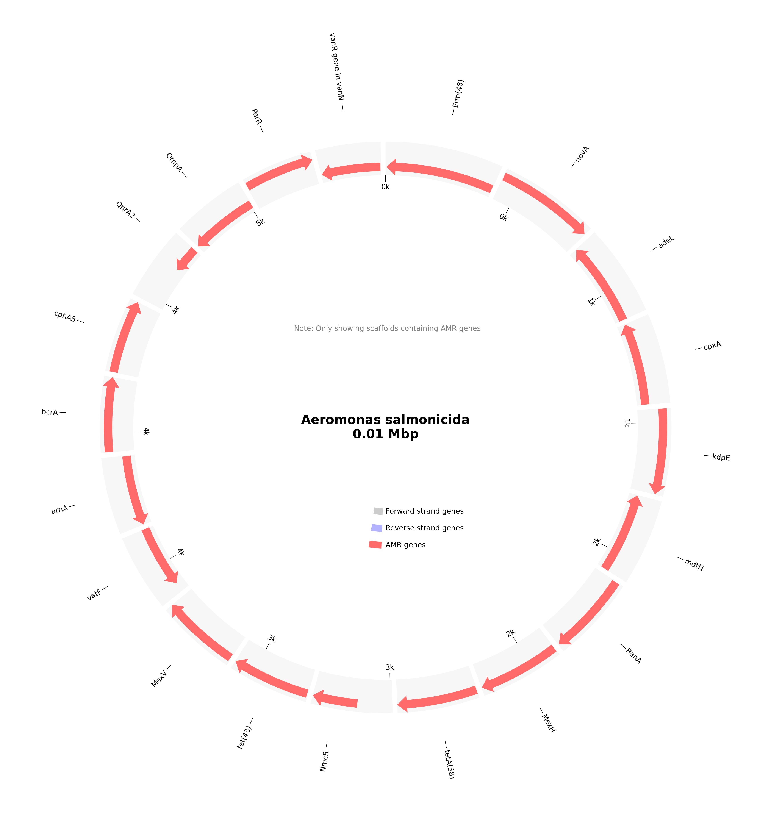

### Erm(48)
- **Mechanism**: antibiotic target alteration
- **Drug Classes**: macrolide antibiotic; lincosamide antibiotic; streptogramin antibiotic; streptogramin B antibiotic
- **AMR Family**: Erm 23S ribosomal RNA methyltransferase
- **Locations**:
  - gnl|SPADES|IAMKMEGF_738417_1 : position 3-374

### MexH
- **Mechanism**: antibiotic efflux
- **Drug Classes**: fluoroquinolone antibiotic; tetracycline antibiotic; disinfecting agents and antiseptics
- **AMR Family**: resistance-nodulation-cell division (RND) antibiotic efflux pump
- **Locations**:
  - gnl|SPADES|IAMKMEGF_1421588_1 : position 2-268

### MexV
- **Mechanism**: antibiotic efflux
- **Drug Classes**: macrolide antibiotic; fluoroquinolone antibiotic; tetracycline antibiotic; phenicol antibiotic; disinfecting agents and antiseptics
- **AMR Family**: resistance-nodulation-cell division (RND) antibiotic efflux pump
- **Locations**:
  - gnl|SPADES|IAMKMEGF_1558801_1 : position 3-257

### NmcR
- **Mechanism**: antibiotic inactivation
- **Drug Classes**: carbapenem; cephalosporin; cephamycin; penam
- **AMR Family**: NmcA beta-lactamase
- **Locations**:
  - gnl|SPADES|IAMKMEGF_1528588_2 : position 113-259

### OmpA
- **Mechanism**: reduced permeability to antibiotic
- **Drug Classes**: peptide antibiotic
- **AMR Family**: General Bacterial Porin with reduced permeability to peptide antibiotics
- **Locations**:
  - gnl|SPADES|IAMKMEGF_1834759_1 : position 1-234

### ParR
- **Mechanism**: antibiotic efflux; reduced permeability to antibiotic
- **Drug Classes**: macrolide antibiotic; fluoroquinolone antibiotic; monobactam; aminoglycoside antibiotic; carbapenem; cephalosporin; cephamycin; penam; tetracycline antibiotic; phenicol antibiotic; penem; disinfecting agents and antiseptics
- **AMR Family**: resistance-nodulation-cell division (RND) antibiotic efflux pump; Outer Membrane Porin (Opr)
- **Locations**:
  - gnl|SPADES|IAMKMEGF_1930959_1 : position 2-229

### QnrA2
- **Mechanism**: antibiotic target protection
- **Drug Classes**: fluoroquinolone antibiotic
- **AMR Family**: quinolone resistance protein (qnr)
- **Locations**:
  - gnl|SPADES|IAMKMEGF_1842750_1 : position 143-235

### RanA
- **Mechanism**: antibiotic efflux
- **Drug Classes**: aminoglycoside antibiotic
- **AMR Family**: ATP-binding cassette (ABC) antibiotic efflux pump
- **Locations**:
  - gnl|SPADES|IAMKMEGF_1344766_1 : position 2-274

### adeL
- **Mechanism**: antibiotic efflux
- **Drug Classes**: fluoroquinolone antibiotic; tetracycline antibiotic
- **AMR Family**: resistance-nodulation-cell division (RND) antibiotic efflux pump
- **Locations**:
  - gnl|SPADES|IAMKMEGF_1217234_1 : position 2-292

### arnA
- **Mechanism**: antibiotic target alteration
- **Drug Classes**: peptide antibiotic
- **AMR Family**: pmr phosphoethanolamine transferase
- **Locations**:
  - gnl|SPADES|IAMKMEGF_1704398_1 : position 1-243

### bcrA
- **Mechanism**: antibiotic efflux
- **Drug Classes**: peptide antibiotic
- **AMR Family**: ATP-binding cassette (ABC) antibiotic efflux pump
- **Locations**:
  - gnl|SPADES|IAMKMEGF_1723663_1 : position 1-243

### cphA5
- **Mechanism**: antibiotic inactivation
- **Drug Classes**: carbapenem
- **AMR Family**: CphA beta-lactamase
- **Locations**:
  - gnl|SPADES|IAMKMEGF_1769791_1 : position 1-240

### cpxA
- **Mechanism**: antibiotic efflux
- **Drug Classes**: aminoglycoside antibiotic; aminocoumarin antibiotic
- **AMR Family**: resistance-nodulation-cell division (RND) antibiotic efflux pump
- **Locations**:
  - gnl|SPADES|IAMKMEGF_1265950_1 : position 1-285

### kdpE
- **Mechanism**: antibiotic efflux
- **Drug Classes**: aminoglycoside antibiotic
- **AMR Family**: kdpDE
- **Locations**:
  - gnl|SPADES|IAMKMEGF_1314949_1 : position 1-279

### mdtN
- **Mechanism**: antibiotic efflux
- **Drug Classes**: nucleoside antibiotic; disinfecting agents and antiseptics
- **AMR Family**: major facilitator superfamily (MFS) antibiotic efflux pump
- **Locations**:
  - gnl|SPADES|IAMKMEGF_1343871_1 : position 2-277

### novA
- **Mechanism**: antibiotic efflux
- **Drug Classes**: aminocoumarin antibiotic
- **AMR Family**: ATP-binding cassette (ABC) antibiotic efflux pump
- **Locations**:
  - gnl|SPADES|IAMKMEGF_1002188_1 : position 2-322

### tet(43)
- **Mechanism**: antibiotic efflux
- **Drug Classes**: tetracycline antibiotic
- **AMR Family**: major facilitator superfamily (MFS) antibiotic efflux pump
- **Locations**:
  - gnl|SPADES|IAMKMEGF_1542529_1 : position 3-257

### tetA(58)
- **Mechanism**: antibiotic efflux
- **Drug Classes**: tetracycline antibiotic
- **AMR Family**: major facilitator superfamily (MFS) antibiotic efflux pump
- **Locations**:
  - gnl|SPADES|IAMKMEGF_1490477_1 : position 2-262

### vanR gene in vanN cluster
- **Mechanism**: antibiotic target alteration
- **Drug Classes**: glycopeptide antibiotic
- **AMR Family**: glycopeptide resistance gene cluster; vanR
- **Locations**:
  - gnl|SPADES|IAMKMEGF_2249010_1 : position 2-205

### vatF
- **Mechanism**: antibiotic inactivation
- **Drug Classes**: streptogramin antibiotic; streptogramin A antibiotic
- **AMR Family**: streptogramin vat acetyltransferase
- **Locations**:
  - gnl|SPADES|IAMKMEGF_1678233_1 : position 32-247

## Aeromonas salmonicida subsp. masoucida
**Strain Statistics:**
- Total genome length: 0.4 kbp
- Total scaffolds: 8
- Scaffolds with AMR genes: 1
- Total genes annotated: 0
- Total AMR genes: 1
- Unique AMR genes: 1
- Distinct AMR mechanisms: 1
- Distinct AMR families: 1
- Distinct drug classes: 2

**Circos Plot:**

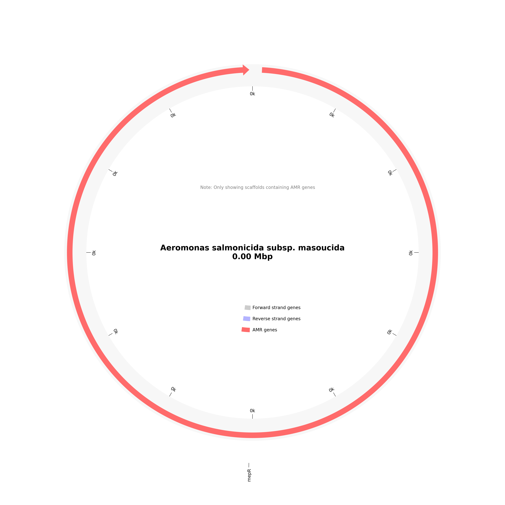

### mepR
- **Mechanism**: antibiotic efflux
- **Drug Classes**: glycylcycline; tetracycline antibiotic
- **AMR Family**: multidrug and toxic compound extrusion (MATE) transporter
- **Locations**:
  - gnl|SPADES|IAMKMEGF_797298_1 : position 3-362

## Buttiauxella agrestis
**Strain Statistics:**
- Total genome length: 2.7 kbp
- Total scaffolds: 148
- Scaffolds with AMR genes: 9
- Total genes annotated: 2
- Total AMR genes: 9
- Unique AMR genes: 9
- Distinct AMR mechanisms: 3
- Distinct AMR families: 6
- Distinct drug classes: 11

**Circos Plot:**

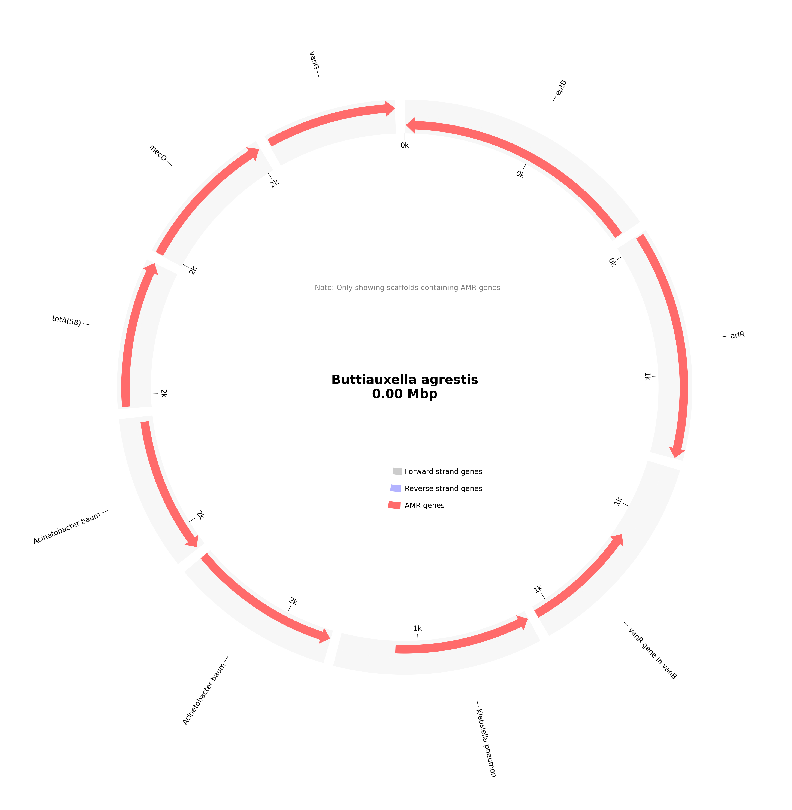

### Acinetobacter baumannii AbaF
- **Mechanism**: antibiotic efflux
- **Drug Classes**: phosphonic acid antibiotic
- **AMR Family**: major facilitator superfamily (MFS) antibiotic efflux pump
- **Locations**:
  - gnl|SPADES|IAMKMEGF_1705200_1 : position 3-236

### Acinetobacter baumannii AbaQ
- **Mechanism**: antibiotic efflux
- **Drug Classes**: fluoroquinolone antibiotic
- **AMR Family**: major facilitator superfamily (MFS) antibiotic efflux pump
- **Locations**:
  - gnl|SPADES|IAMKMEGF_1509768_1 : position 1-261

### Klebsiella pneumoniae acrA
- **Mechanism**: antibiotic efflux
- **Drug Classes**: fluoroquinolone antibiotic; cephalosporin; glycylcycline; penam; tetracycline antibiotic; rifamycin antibiotic; phenicol antibiotic; disinfecting agents and antiseptics
- **AMR Family**: resistance-nodulation-cell division (RND) antibiotic efflux pump
- **Locations**:
  - gnl|SPADES|IAMKMEGF_965141_1 : position 1-234

### arlR
- **Mechanism**: antibiotic efflux
- **Drug Classes**: fluoroquinolone antibiotic; disinfecting agents and antiseptics
- **AMR Family**: major facilitator superfamily (MFS) antibiotic efflux pump
- **Locations**:
  - gnl|SPADES|IAMKMEGF_756568_1 : position 3-371

### eptB
- **Mechanism**: antibiotic target alteration
- **Drug Classes**: peptide antibiotic
- **AMR Family**: pmr phosphoethanolamine transferase
- **Locations**:
  - gnl|SPADES|IAMKMEGF_557779_1 : position 2-424

### mecD
- **Mechanism**: antibiotic target replacement
- **Drug Classes**: penam
- **AMR Family**: methicillin resistant PBP2
- **Locations**:
  - gnl|SPADES|IAMKMEGF_1830630_1 : position 1-234

### tetA(58)
- **Mechanism**: antibiotic efflux
- **Drug Classes**: tetracycline antibiotic
- **AMR Family**: major facilitator superfamily (MFS) antibiotic efflux pump
- **Locations**:
  - gnl|SPADES|IAMKMEGF_1786901_1 : position 3-239

### vanG
- **Mechanism**: antibiotic target alteration
- **Drug Classes**: glycopeptide antibiotic
- **AMR Family**: glycopeptide resistance gene cluster; Van ligase
- **Locations**:
  - gnl|SPADES|IAMKMEGF_2186339_1 : position 2-211

### vanR gene in vanB cluster
- **Mechanism**: antibiotic target alteration
- **Drug Classes**: glycopeptide antibiotic
- **AMR Family**: glycopeptide resistance gene cluster; vanR
- **Locations**:
  - gnl|SPADES|IAMKMEGF_945639_2 : position 134-334

## Carnobacterium divergens
**Strain Statistics:**
- Total genome length: 2617.9 kbp
- Total scaffolds: 377
- Scaffolds with AMR genes: 32
- Total genes annotated: 5004
- Total AMR genes: 254
- Unique AMR genes: 138
- Distinct AMR mechanisms: 10
- Distinct AMR families: 60
- Distinct drug classes: 32

**Circos Plot:**

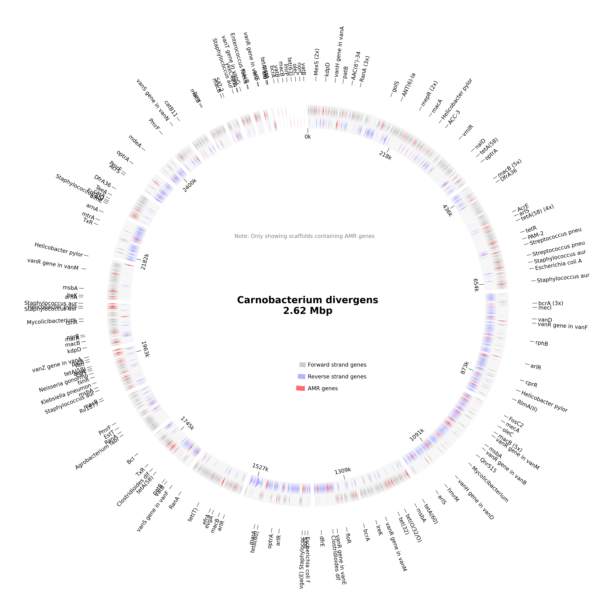

### AAC(6')-34
- **Mechanism**: antibiotic inactivation
- **Drug Classes**: aminoglycoside antibiotic
- **AMR Family**: AAC(6')
- **Locations**:
  - gnl|SPADES|IAMKMEGF_1_94 : position 89925-90452

### AAC(6')-Ii
- **Mechanism**: antibiotic inactivation
- **Drug Classes**: aminoglycoside antibiotic
- **AMR Family**: AAC(6')
- **Locations**:
  - gnl|SPADES|IAMKMEGF_1_304 : position 305457-305915

### ACC-3
- **Mechanism**: antibiotic inactivation
- **Drug Classes**: monobactam; cephalosporin; penam
- **AMR Family**: ACC beta-lactamase
- **Locations**:
  - gnl|SPADES|IAMKMEGF_1_299 : position 300760-301938

### ANT(6)-Ia
- **Mechanism**: antibiotic inactivation
- **Drug Classes**: aminoglycoside antibiotic
- **AMR Family**: ANT(6)
- **Locations**:
  - gnl|SPADES|IAMKMEGF_1_204 : position 195054-195911

### Acinetobacter baumannii AbaF
- **Mechanism**: antibiotic efflux
- **Drug Classes**: phosphonic acid antibiotic
- **AMR Family**: major facilitator superfamily (MFS) antibiotic efflux pump
- **Locations**:
  - gnl|SPADES|IAMKMEGF_1_25 : position 19526-20761

### Acinetobacter baumannii AbaQ
- **Mechanism**: antibiotic efflux
- **Drug Classes**: fluoroquinolone antibiotic
- **AMR Family**: major facilitator superfamily (MFS) antibiotic efflux pump
- **Locations**:
  - gnl|SPADES|IAMKMEGF_5_124 : position 137981-139234

### AcrE
- **Mechanism**: antibiotic efflux
- **Drug Classes**: fluoroquinolone antibiotic; cephalosporin; cephamycin; penam
- **AMR Family**: resistance-nodulation-cell division (RND) antibiotic efflux pump
- **Locations**:
  - gnl|SPADES|IAMKMEGF_2_123 : position 96199-97368

### AcrS (found in 2 locations)
- **Mechanism**: antibiotic efflux
- **Drug Classes**: fluoroquinolone antibiotic; cephalosporin; glycylcycline; cephamycin; penam; tetracycline antibiotic; rifamycin antibiotic; phenicol antibiotic; disinfecting agents and antiseptics
- **AMR Family**: resistance-nodulation-cell division (RND) antibiotic efflux pump
- **Locations**:
  - gnl|SPADES|IAMKMEGF_1_83 : position 80997-81578
  - gnl|SPADES|IAMKMEGF_31_2 : position 4584-5201

### Agrobacterium fabrum chloramphenicol acetyltransferase
- **Mechanism**: antibiotic inactivation
- **Drug Classes**: phenicol antibiotic
- **AMR Family**: chloramphenicol acetyltransferase (CAT)
- **Locations**:
  - gnl|SPADES|IAMKMEGF_10_32 : position 32553-33113

### BcI
- **Mechanism**: antibiotic inactivation
- **Drug Classes**: cephalosporin; penem
- **AMR Family**: class A Bacillus cereus Bc beta-lactamase
- **Locations**:
  - gnl|SPADES|IAMKMEGF_9_101 : position 100339-101244

### CPS-1
- **Mechanism**: antibiotic inactivation
- **Drug Classes**: carbapenem
- **AMR Family**: CPS beta-lactamase
- **Locations**:
  - gnl|SPADES|IAMKMEGF_1_285 : position 287634-288254

### Clostridioides difficile gyrA conferring resistance to fluoroquinolones (found in 2 locations)
- **Mechanism**: antibiotic target alteration
- **Drug Classes**: fluoroquinolone antibiotic
- **AMR Family**: fluoroquinolone resistant gyrA
- **Locations**:
  - gnl|SPADES|IAMKMEGF_5_176 : position 195468-197936
  - gnl|SPADES|IAMKMEGF_9_61 : position 58645-61131

### Clostridioides difficile gyrB conferring resistance to fluoroquinolones (found in 2 locations)
- **Mechanism**: antibiotic target alteration
- **Drug Classes**: fluoroquinolone antibiotic
- **AMR Family**: fluoroquinolone resistant gyrB
- **Locations**:
  - gnl|SPADES|IAMKMEGF_5_177 : position 197926-199953
  - gnl|SPADES|IAMKMEGF_9_60 : position 56643-58580

### DfrA36 (found in 2 locations)
- **Mechanism**: antibiotic target replacement
- **Drug Classes**: diaminopyrimidine antibiotic
- **AMR Family**: trimethoprim resistant dihydrofolate reductase dfr
- **Locations**:
  - gnl|SPADES|IAMKMEGF_25_42 : position 38652-39038
  - gnl|SPADES|IAMKMEGF_2_29 : position 27833-28357

### Enterococcus faecalis cls with mutation conferring resistance to daptomycin (found in 2 locations)
- **Mechanism**: antibiotic target alteration
- **Drug Classes**: peptide antibiotic
- **AMR Family**: daptomycin resistant cls
- **Locations**:
  - gnl|SPADES|IAMKMEGF_147_4 : position 2217-3665
  - gnl|SPADES|IAMKMEGF_1_239 : position 239843-241360

### Erm(K)
- **Mechanism**: antibiotic target alteration
- **Drug Classes**: macrolide antibiotic; lincosamide antibiotic; streptogramin antibiotic
- **AMR Family**: Erm 23S ribosomal RNA methyltransferase
- **Locations**:
  - gnl|SPADES|IAMKMEGF_25_13 : position 10052-10942

### Escherichia coli AcrAB-TolC with AcrR mutation conferring resistance to ciprofloxacin, tetracycline, and ceftazidime (found in 2 locations)
- **Mechanism**: antibiotic target alteration; antibiotic efflux
- **Drug Classes**: fluoroquinolone antibiotic; cephalosporin; glycylcycline; penam; tetracycline antibiotic; rifamycin antibiotic; phenicol antibiotic; disinfecting agents and antiseptics
- **AMR Family**: resistance-nodulation-cell division (RND) antibiotic efflux pump
- **Locations**:
  - gnl|SPADES|IAMKMEGF_2_239 : position 217757-218365
  - gnl|SPADES|IAMKMEGF_4_96 : position 92432-93058

### Escherichia coli AcrAB-TolC with MarR mutations conferring resistance to ciprofloxacin and tetracycline
- **Mechanism**: antibiotic target alteration; antibiotic efflux
- **Drug Classes**: fluoroquinolone antibiotic; cephalosporin; glycylcycline; penam; tetracycline antibiotic; rifamycin antibiotic; phenicol antibiotic; disinfecting agents and antiseptics
- **AMR Family**: resistance-nodulation-cell division (RND) antibiotic efflux pump
- **Locations**:
  - gnl|SPADES|IAMKMEGF_3_72 : position 64147-64608

### Escherichia coli EF-Tu mutants conferring resistance to kirromycin
- **Mechanism**: antibiotic target alteration
- **Drug Classes**: elfamycin antibiotic
- **AMR Family**: elfamycin resistant EF-Tu
- **Locations**:
  - gnl|SPADES|IAMKMEGF_4_6 : position 5805-6992

### Escherichia coli fabI mutations conferring resistance to isoniazid and triclosan
- **Mechanism**: antibiotic target alteration
- **Drug Classes**: disinfecting agents and antiseptics; isoniazid-like antibiotic
- **AMR Family**: antibiotic resistant fabI
- **Locations**:
  - gnl|SPADES|IAMKMEGF_6_8 : position 6668-7390

### EstT (found in 2 locations)
- **Mechanism**: antibiotic inactivation
- **Drug Classes**: macrolide antibiotic
- **AMR Family**: macrolide esterase
- **Locations**:
  - gnl|SPADES|IAMKMEGF_10_48 : position 49303-50115
  - gnl|SPADES|IAMKMEGF_11_62 : position 68673-69389

### FosC2
- **Mechanism**: antibiotic inactivation
- **Drug Classes**: phosphonic acid antibiotic
- **AMR Family**: fosC phosphotransferase family
- **Locations**:
  - gnl|SPADES|IAMKMEGF_4_5 : position 5379-5759

### HelR
- **Mechanism**: antibiotic target protection
- **Drug Classes**: rifamycin antibiotic
- **AMR Family**: helicase-like RNA polymerase protection protein
- **Locations**:
  - gnl|SPADES|IAMKMEGF_3_226 : position 230994-233288

### Helicobacter pylori pbp1 mutants conferring resistance to amoxicillin (found in 2 locations)
- **Mechanism**: antibiotic target alteration
- **Drug Classes**: cephalosporin; cephamycin; penam
- **AMR Family**: Penicillin-binding protein mutations conferring resistance to beta-lactam antibiotics
- **Locations**:
  - gnl|SPADES|IAMKMEGF_13_87 : position 86510-89107
  - gnl|SPADES|IAMKMEGF_3_204 : position 204966-207092

### Helicobacter pylori rdxA mutation conferring resistance to metronidazole
- **Mechanism**: antibiotic target alteration
- **Drug Classes**: nitroimidazole antibiotic
- **AMR Family**: Antibiotic resistant Helicobacter pylori nitroreductase
- **Locations**:
  - gnl|SPADES|IAMKMEGF_1_281 : position 284791-285429

### Helicobacter pylori rpoB mutation conferring resistance to rifampicin
- **Mechanism**: antibiotic target alteration; antibiotic target replacement
- **Drug Classes**: fluoroquinolone antibiotic; rifamycin antibiotic
- **AMR Family**: rifamycin-resistant beta-subunit of RNA polymerase (rpoB)
- **Locations**:
  - gnl|SPADES|IAMKMEGF_12_85 : position 90704-94333

### IreK (found in 2 locations)
- **Mechanism**: reduced permeability to antibiotic
- **Drug Classes**: cephalosporin
- **AMR Family**: Serine/threonine kinases
- **Locations**:
  - gnl|SPADES|IAMKMEGF_13_7 : position 6186-8186
  - gnl|SPADES|IAMKMEGF_5_96 : position 106729-107277

### Klebsiella pneumoniae KpnH
- **Mechanism**: antibiotic efflux
- **Drug Classes**: macrolide antibiotic; fluoroquinolone antibiotic; aminoglycoside antibiotic; carbapenem; cephalosporin; penam; peptide antibiotic; penem
- **AMR Family**: major facilitator superfamily (MFS) antibiotic efflux pump
- **Locations**:
  - gnl|SPADES|IAMKMEGF_11_35 : position 41998-42846

### Listeria monocytogenes mprF
- **Mechanism**: antibiotic target alteration
- **Drug Classes**: peptide antibiotic
- **AMR Family**: defensin resistant mprF
- **Locations**:
  - gnl|SPADES|IAMKMEGF_2_163 : position 143598-146147

### LlmA 23S ribosomal RNA methyltransferase
- **Mechanism**: antibiotic target alteration
- **Drug Classes**: lincosamide antibiotic
- **AMR Family**: Llm 23S ribosomal RNA methyltransferase
- **Locations**:
  - gnl|SPADES|IAMKMEGF_11_89 : position 98409-99587

### MexS (found in 2 locations)
- **Mechanism**: antibiotic efflux
- **Drug Classes**: fluoroquinolone antibiotic; diaminopyrimidine antibiotic; phenicol antibiotic
- **AMR Family**: resistance-nodulation-cell division (RND) antibiotic efflux pump
- **Locations**:
  - gnl|SPADES|IAMKMEGF_1_20 : position 15777-16760
  - gnl|SPADES|IAMKMEGF_1_235 : position 237545-238486

### Mycolicibacterium smegmatis ndh with mutation conferring resistance to isoniazid (found in 2 locations)
- **Mechanism**: antibiotic target alteration
- **Drug Classes**: isoniazid-like antibiotic
- **AMR Family**: antibiotic resistant ndh
- **Locations**:
  - gnl|SPADES|IAMKMEGF_12_61 : position 66124-67995
  - gnl|SPADES|IAMKMEGF_4_132 : position 125636-126841

### Neisseria gonorrhoeae mtrR with mutation conferring resistance
- **Mechanism**: antibiotic efflux
- **Drug Classes**: macrolide antibiotic
- **AMR Family**: resistance-nodulation-cell division (RND) antibiotic efflux pump
- **Locations**:
  - gnl|SPADES|IAMKMEGF_11_54 : position 62196-62789

### NmcR
- **Mechanism**: antibiotic inactivation
- **Drug Classes**: carbapenem; cephalosporin; cephamycin; penam
- **AMR Family**: NmcA beta-lactamase
- **Locations**:
  - gnl|SPADES|IAMKMEGF_5_173 : position 190920-191918

### PAM-2
- **Mechanism**: antibiotic inactivation
- **Drug Classes**: carbapenem; cephalosporin
- **AMR Family**: PAM beta-lactamase
- **Locations**:
  - gnl|SPADES|IAMKMEGF_2_172 : position 155160-155873

### PmrF (found in 3 locations)
- **Mechanism**: antibiotic target alteration
- **Drug Classes**: peptide antibiotic
- **AMR Family**: pmr phosphoethanolamine transferase
- **Locations**:
  - gnl|SPADES|IAMKMEGF_10_60 : position 60311-61495
  - gnl|SPADES|IAMKMEGF_31_7 : position 8616-9566
  - gnl|SPADES|IAMKMEGF_46_10 : position 9833-11083

### Pseudomonas mutant PhoP conferring resistance to colistin
- **Mechanism**: antibiotic target alteration; antibiotic efflux; resistance by absence
- **Drug Classes**: macrolide antibiotic; peptide antibiotic
- **AMR Family**: ATP-binding cassette (ABC) antibiotic efflux pump; pmr phosphoethanolamine transferase; transmembrane protein conferring colistin resistance
- **Locations**:
  - gnl|SPADES|IAMKMEGF_1_39 : position 37282-38001

### QnrS15
- **Mechanism**: antibiotic target protection
- **Drug Classes**: fluoroquinolone antibiotic
- **AMR Family**: quinolone resistance protein (qnr)
- **Locations**:
  - gnl|SPADES|IAMKMEGF_4_109 : position 102940-103563

### QnrVC4
- **Mechanism**: antibiotic target protection
- **Drug Classes**: fluoroquinolone antibiotic
- **AMR Family**: quinolone resistance protein (qnr)
- **Locations**:
  - gnl|SPADES|IAMKMEGF_2_179 : position 163078-163713

### RanA (found in 7 locations)
- **Mechanism**: antibiotic efflux
- **Drug Classes**: aminoglycoside antibiotic
- **AMR Family**: ATP-binding cassette (ABC) antibiotic efflux pump
- **Locations**:
  - gnl|SPADES|IAMKMEGF_10_39 : position 39363-40466
  - gnl|SPADES|IAMKMEGF_1_109 : position 106957-108051
  - gnl|SPADES|IAMKMEGF_1_329 : position 330354-331391
  - gnl|SPADES|IAMKMEGF_1_392 : position 396436-397410
  - gnl|SPADES|IAMKMEGF_4_205 : position 207190-207999
  - gnl|SPADES|IAMKMEGF_4_34 : position 30414-31187
  - gnl|SPADES|IAMKMEGF_7_107 : position 115760-116953

### RlmA(II)
- **Mechanism**: antibiotic target alteration
- **Drug Classes**: macrolide antibiotic; lincosamide antibiotic
- **AMR Family**: non-erm 23S ribosomal RNA methyltransferase (G748)
- **Locations**:
  - gnl|SPADES|IAMKMEGF_3_220 : position 225367-226224

### Rv1877
- **Mechanism**: antibiotic efflux
- **Drug Classes**: fluoroquinolone antibiotic
- **AMR Family**: major facilitator superfamily (MFS) antibiotic efflux pump
- **Locations**:
  - gnl|SPADES|IAMKMEGF_11_4 : position 2833-4311

### SAT-2
- **Mechanism**: antibiotic inactivation
- **Drug Classes**: nucleoside antibiotic
- **AMR Family**: streptothricin acetyltransferase (SAT)
- **Locations**:
  - gnl|SPADES|IAMKMEGF_86_19 : position 17198-18043

### SatA
- **Mechanism**: antibiotic inactivation
- **Drug Classes**: nucleoside antibiotic
- **AMR Family**: streptothricin acetyltransferase (SAT)
- **Locations**:
  - gnl|SPADES|IAMKMEGF_2_34 : position 32156-32590

### Staphylococcus aureus fusA with mutation conferring resistance to fusidic acid (found in 2 locations)
- **Mechanism**: antibiotic target alteration
- **Drug Classes**: fusidane antibiotic
- **AMR Family**: antibiotic resistant fusA
- **Locations**:
  - gnl|SPADES|IAMKMEGF_12_90 : position 97822-99711
  - gnl|SPADES|IAMKMEGF_3_115 : position 109987-111564

### Staphylococcus aureus mupA conferring resistance to mupirocin (found in 2 locations)
- **Mechanism**: antibiotic target alteration
- **Drug Classes**: mupirocin-like antibiotic
- **AMR Family**: antibiotic-resistant isoleucyl-tRNA synthetase (ileS)
- **Locations**:
  - gnl|SPADES|IAMKMEGF_25_10 : position 6629-8653
  - gnl|SPADES|IAMKMEGF_2_223 : position 203377-206163

### Staphylococcus aureus mupB conferring resistance to mupirocin (found in 2 locations)
- **Mechanism**: antibiotic target alteration
- **Drug Classes**: mupirocin-like antibiotic
- **AMR Family**: antibiotic-resistant isoleucyl-tRNA synthetase (ileS)
- **Locations**:
  - gnl|SPADES|IAMKMEGF_11_23 : position 24404-26818
  - gnl|SPADES|IAMKMEGF_2_264 : position 241699-244344

### Staphylococcus aureus murA with mutation conferring resistance to fosfomycin (found in 2 locations)
- **Mechanism**: antibiotic target alteration
- **Drug Classes**: phosphonic acid antibiotic
- **AMR Family**: antibiotic-resistant murA transferase
- **Locations**:
  - gnl|SPADES|IAMKMEGF_102_3 : position 2951-4216
  - gnl|SPADES|IAMKMEGF_4_59 : position 55251-56564

### Staphylococcus aureus rpoB mutants conferring resistance to rifampicin
- **Mechanism**: antibiotic target alteration; antibiotic target replacement
- **Drug Classes**: rifamycin antibiotic
- **AMR Family**: rifamycin-resistant beta-subunit of RNA polymerase (rpoB)
- **Locations**:
  - gnl|SPADES|IAMKMEGF_12_84 : position 87011-90586

### Streptococcus pneumoniae PBP2b conferring resistance to amoxicillin
- **Mechanism**: antibiotic target alteration
- **Drug Classes**: cephalosporin; cephamycin; penam
- **AMR Family**: Penicillin-binding protein mutations conferring resistance to beta-lactam antibiotics
- **Locations**:
  - gnl|SPADES|IAMKMEGF_2_181 : position 166607-168727

### Streptococcus pneumoniae PBP2x conferring resistance to amoxicillin
- **Mechanism**: antibiotic target alteration
- **Drug Classes**: cephalosporin; cephamycin; penam
- **AMR Family**: Penicillin-binding protein mutations conferring resistance to beta-lactam antibiotics
- **Locations**:
  - gnl|SPADES|IAMKMEGF_2_210 : position 189109-191274

### TaeA (found in 2 locations)
- **Mechanism**: antibiotic efflux
- **Drug Classes**: pleuromutilin antibiotic
- **AMR Family**: ATP-binding cassette (ABC) antibiotic efflux pump
- **Locations**:
  - gnl|SPADES|IAMKMEGF_25_28 : position 22960-24600
  - gnl|SPADES|IAMKMEGF_5_201 : position 221410-223296

### TxR (found in 3 locations)
- **Mechanism**: antibiotic efflux
- **Drug Classes**: tetracycline antibiotic
- **AMR Family**: ATP-binding cassette (ABC) antibiotic efflux pump
- **Locations**:
  - gnl|SPADES|IAMKMEGF_14_53 : position 54343-57015
  - gnl|SPADES|IAMKMEGF_4_167 : position 165553-168414
  - gnl|SPADES|IAMKMEGF_9_70 : position 69128-71791

### VatI
- **Mechanism**: antibiotic inactivation
- **Drug Classes**: streptogramin antibiotic; streptogramin A antibiotic
- **AMR Family**: streptogramin vat acetyltransferase
- **Locations**:
  - gnl|SPADES|IAMKMEGF_11_80 : position 86636-87337

### YajC
- **Mechanism**: antibiotic efflux
- **Drug Classes**: fluoroquinolone antibiotic; cephalosporin; glycylcycline; penam; tetracycline antibiotic; oxazolidinone antibiotic; glycopeptide antibiotic; rifamycin antibiotic; phenicol antibiotic; disinfecting agents and antiseptics
- **AMR Family**: resistance-nodulation-cell division (RND) antibiotic efflux pump
- **Locations**:
  - gnl|SPADES|IAMKMEGF_2_162 : position 143097-143513

### aac(6')-Ib-cr11
- **Mechanism**: antibiotic inactivation
- **Drug Classes**: fluoroquinolone antibiotic; aminoglycoside antibiotic
- **AMR Family**: AAC(6'); AAC(6')-Ib-cr
- **Locations**:
  - gnl|SPADES|IAMKMEGF_1_84 : position 81597-82169

### adeR
- **Mechanism**: antibiotic efflux
- **Drug Classes**: glycylcycline; tetracycline antibiotic
- **AMR Family**: resistance-nodulation-cell division (RND) antibiotic efflux pump
- **Locations**:
  - gnl|SPADES|IAMKMEGF_1_386 : position 388950-389594

### almE (found in 2 locations)
- **Mechanism**: antibiotic target alteration
- **Drug Classes**: peptide antibiotic
- **AMR Family**: polymyxin resistance operon; alm glycyltransferase
- **Locations**:
  - gnl|SPADES|IAMKMEGF_11_65 : position 71745-73271
  - gnl|SPADES|IAMKMEGF_25_7 : position 3406-4845

### arlR (found in 5 locations)
- **Mechanism**: antibiotic efflux
- **Drug Classes**: fluoroquinolone antibiotic; disinfecting agents and antiseptics
- **AMR Family**: major facilitator superfamily (MFS) antibiotic efflux pump
- **Locations**:
  - gnl|SPADES|IAMKMEGF_2_130 : position 104374-105060
  - gnl|SPADES|IAMKMEGF_3_152 : position 149321-149995
  - gnl|SPADES|IAMKMEGF_4_212 : position 214476-215192
  - gnl|SPADES|IAMKMEGF_6_54 : position 64419-65870
  - gnl|SPADES|IAMKMEGF_7_18 : position 15540-16223

### arlS (found in 5 locations)
- **Mechanism**: antibiotic efflux
- **Drug Classes**: fluoroquinolone antibiotic; disinfecting agents and antiseptics
- **AMR Family**: major facilitator superfamily (MFS) antibiotic efflux pump
- **Locations**:
  - gnl|SPADES|IAMKMEGF_222_2 : position 1026-2861
  - gnl|SPADES|IAMKMEGF_2_131 : position 105057-106580
  - gnl|SPADES|IAMKMEGF_3_153 : position 150008-151057
  - gnl|SPADES|IAMKMEGF_4_211 : position 212704-214479
  - gnl|SPADES|IAMKMEGF_7_19 : position 16220-17506

### arnA (found in 2 locations)
- **Mechanism**: antibiotic target alteration
- **Drug Classes**: peptide antibiotic
- **AMR Family**: pmr phosphoethanolamine transferase
- **Locations**:
  - gnl|SPADES|IAMKMEGF_13_4 : position 3101-4033
  - gnl|SPADES|IAMKMEGF_14_76 : position 83044-83625

### bacA
- **Mechanism**: antibiotic target alteration
- **Drug Classes**: peptide antibiotic
- **AMR Family**: undecaprenyl pyrophosphate related proteins
- **Locations**:
  - gnl|SPADES|IAMKMEGF_1_312 : position 314743-315561

### baeS (found in 2 locations)
- **Mechanism**: antibiotic efflux
- **Drug Classes**: aminoglycoside antibiotic; aminocoumarin antibiotic
- **AMR Family**: resistance-nodulation-cell division (RND) antibiotic efflux pump
- **Locations**:
  - gnl|SPADES|IAMKMEGF_3_75 : position 66183-67559
  - gnl|SPADES|IAMKMEGF_4_55 : position 51133-52527

### bcrA (found in 8 locations)
- **Mechanism**: antibiotic efflux
- **Drug Classes**: peptide antibiotic
- **AMR Family**: ATP-binding cassette (ABC) antibiotic efflux pump
- **Locations**:
  - gnl|SPADES|IAMKMEGF_1_136 : position 131361-132053
  - gnl|SPADES|IAMKMEGF_1_297 : position 299331-300230
  - gnl|SPADES|IAMKMEGF_1_45 : position 42623-43543
  - gnl|SPADES|IAMKMEGF_2285_4 : position 1385-1741
  - gnl|SPADES|IAMKMEGF_3_135 : position 130381-131322
  - gnl|SPADES|IAMKMEGF_3_195 : position 195440-196174
  - gnl|SPADES|IAMKMEGF_3_26 : position 25017-25904
  - gnl|SPADES|IAMKMEGF_5_119 : position 132241-133728

### bcrC
- **Mechanism**: antibiotic target alteration
- **Drug Classes**: peptide antibiotic
- **AMR Family**: undecaprenyl pyrophosphate related proteins
- **Locations**:
  - gnl|SPADES|IAMKMEGF_11_10 : position 9675-10346

### bmr
- **Mechanism**: antibiotic efflux
- **Drug Classes**: fluoroquinolone antibiotic; nucleoside antibiotic; phenicol antibiotic; disinfecting agents and antiseptics
- **AMR Family**: major facilitator superfamily (MFS) antibiotic efflux pump
- **Locations**:
  - gnl|SPADES|IAMKMEGF_61_14 : position 12727-13950

### carA
- **Mechanism**: antibiotic target protection
- **Drug Classes**: macrolide antibiotic
- **AMR Family**: Miscellaneous ABC-F subfamily ATP-binding cassette ribosomal protection proteins
- **Locations**:
  - gnl|SPADES|IAMKMEGF_25_19 : position 15089-15796

### catB11
- **Mechanism**: antibiotic inactivation
- **Drug Classes**: phenicol antibiotic
- **AMR Family**: chloramphenicol acetyltransferase (CAT)
- **Locations**:
  - gnl|SPADES|IAMKMEGF_57_3 : position 5001-5663

### cfrA
- **Mechanism**: antibiotic target alteration
- **Drug Classes**: lincosamide antibiotic; streptogramin antibiotic; streptogramin A antibiotic; oxazolidinone antibiotic; phenicol antibiotic; pleuromutilin antibiotic
- **AMR Family**: Cfr 23S ribosomal RNA methyltransferase
- **Locations**:
  - gnl|SPADES|IAMKMEGF_6_15 : position 19539-20597

### cprR
- **Mechanism**: antibiotic target alteration; antibiotic efflux
- **Drug Classes**: peptide antibiotic
- **AMR Family**: pmr phosphoethanolamine transferase
- **Locations**:
  - gnl|SPADES|IAMKMEGF_3_184 : position 183800-184333

### dfrE
- **Mechanism**: antibiotic target replacement
- **Drug Classes**: diaminopyrimidine antibiotic
- **AMR Family**: trimethoprim resistant dihydrofolate reductase dfr
- **Locations**:
  - gnl|SPADES|IAMKMEGF_5_199 : position 219917-220405

### efrA (found in 4 locations)
- **Mechanism**: antibiotic efflux
- **Drug Classes**: macrolide antibiotic; fluoroquinolone antibiotic; rifamycin antibiotic
- **AMR Family**: ATP-binding cassette (ABC) antibiotic efflux pump
- **Locations**:
  - gnl|SPADES|IAMKMEGF_1_75 : position 72483-74288
  - gnl|SPADES|IAMKMEGF_3_157 : position 156015-157757
  - gnl|SPADES|IAMKMEGF_4_95 : position 90627-92348
  - gnl|SPADES|IAMKMEGF_7_47 : position 45950-47731

### efrB
- **Mechanism**: antibiotic efflux
- **Drug Classes**: macrolide antibiotic; fluoroquinolone antibiotic; rifamycin antibiotic
- **AMR Family**: ATP-binding cassette (ABC) antibiotic efflux pump
- **Locations**:
  - gnl|SPADES|IAMKMEGF_7_48 : position 47728-49506

### evgA
- **Mechanism**: antibiotic efflux
- **Drug Classes**: macrolide antibiotic; fluoroquinolone antibiotic; penam; tetracycline antibiotic
- **AMR Family**: major facilitator superfamily (MFS) antibiotic efflux pump; resistance-nodulation-cell division (RND) antibiotic efflux pump
- **Locations**:
  - gnl|SPADES|IAMKMEGF_7_40 : position 39550-40182

### floR
- **Mechanism**: antibiotic efflux
- **Drug Classes**: phenicol antibiotic
- **AMR Family**: major facilitator superfamily (MFS) antibiotic efflux pump
- **Locations**:
  - gnl|SPADES|IAMKMEGF_5_149 : position 167972-169159

### golS (found in 2 locations)
- **Mechanism**: antibiotic efflux
- **Drug Classes**: monobactam; carbapenem; cephalosporin; cephamycin; penam; phenicol antibiotic; penem
- **AMR Family**: resistance-nodulation-cell division (RND) antibiotic efflux pump
- **Locations**:
  - gnl|SPADES|IAMKMEGF_1_178 : position 172545-172928
  - gnl|SPADES|IAMKMEGF_6_10 : position 12366-13172

### hmrM
- **Mechanism**: antibiotic efflux
- **Drug Classes**: fluoroquinolone antibiotic; disinfecting agents and antiseptics
- **AMR Family**: multidrug and toxic compound extrusion (MATE) transporter
- **Locations**:
  - gnl|SPADES|IAMKMEGF_4_189 : position 190761-192110

### kdpD (found in 2 locations)
- **Mechanism**: antibiotic efflux
- **Drug Classes**: aminoglycoside antibiotic
- **AMR Family**: kdpDE
- **Locations**:
  - gnl|SPADES|IAMKMEGF_12_6 : position 6838-9555
  - gnl|SPADES|IAMKMEGF_1_38 : position 35636-37285

### kdpE
- **Mechanism**: antibiotic efflux
- **Drug Classes**: aminoglycoside antibiotic
- **AMR Family**: kdpDE
- **Locations**:
  - gnl|SPADES|IAMKMEGF_12_7 : position 9552-10238

### leuO
- **Mechanism**: antibiotic efflux
- **Drug Classes**: nucleoside antibiotic; disinfecting agents and antiseptics
- **AMR Family**: major facilitator superfamily (MFS) antibiotic efflux pump
- **Locations**:
  - gnl|SPADES|IAMKMEGF_2_33 : position 31321-32136

### lmrB (found in 2 locations)
- **Mechanism**: antibiotic efflux
- **Drug Classes**: lincosamide antibiotic; nucleoside antibiotic
- **AMR Family**: ATP-binding cassette (ABC) antibiotic efflux pump
- **Locations**:
  - gnl|SPADES|IAMKMEGF_1_262 : position 267236-268633
  - gnl|SPADES|IAMKMEGF_3_190 : position 188927-190381

### lmrD
- **Mechanism**: antibiotic efflux
- **Drug Classes**: lincosamide antibiotic
- **AMR Family**: ATP-binding cassette (ABC) antibiotic efflux pump
- **Locations**:
  - gnl|SPADES|IAMKMEGF_1_189 : position 178688-180769

### lmrP
- **Mechanism**: antibiotic efflux
- **Drug Classes**: macrolide antibiotic; lincosamide antibiotic; streptogramin antibiotic; streptogramin A antibiotic; tetracycline antibiotic
- **AMR Family**: major facilitator superfamily (MFS) antibiotic efflux pump
- **Locations**:
  - gnl|SPADES|IAMKMEGF_49899_1 : position 2-757

### macA
- **Mechanism**: antibiotic efflux
- **Drug Classes**: macrolide antibiotic
- **AMR Family**: ATP-binding cassette (ABC) antibiotic efflux pump
- **Locations**:
  - gnl|SPADES|IAMKMEGF_1_256 : position 260696-261556

### macB (found in 28 locations)
- **Mechanism**: antibiotic efflux
- **Drug Classes**: macrolide antibiotic
- **AMR Family**: ATP-binding cassette (ABC) antibiotic efflux pump
- **Locations**:
  - gnl|SPADES|IAMKMEGF_11_8 : position 7610-8266
  - gnl|SPADES|IAMKMEGF_12_19 : position 20723-21418
  - gnl|SPADES|IAMKMEGF_147_5 : position 3857-5047
  - gnl|SPADES|IAMKMEGF_1_105 : position 101252-102961
  - gnl|SPADES|IAMKMEGF_1_254 : position 258746-259972
  - gnl|SPADES|IAMKMEGF_1_255 : position 259988-260680
  - gnl|SPADES|IAMKMEGF_1_334 : position 334011-335945
  - gnl|SPADES|IAMKMEGF_1_396 : position 399691-400419
  - gnl|SPADES|IAMKMEGF_1_81 : position 78601-79329
  - gnl|SPADES|IAMKMEGF_2_124 : position 97383-98093
  - gnl|SPADES|IAMKMEGF_2_125 : position 98090-99328
  - gnl|SPADES|IAMKMEGF_2_19 : position 18584-19387
  - gnl|SPADES|IAMKMEGF_2_241 : position 219575-220246
  - gnl|SPADES|IAMKMEGF_2_276 : position 253864-254562
  - gnl|SPADES|IAMKMEGF_35663_2 : position 364-939
  - gnl|SPADES|IAMKMEGF_3_136 : position 131315-132442
  - gnl|SPADES|IAMKMEGF_3_151 : position 148337-149104
  - gnl|SPADES|IAMKMEGF_3_32 : position 30920-31645
  - gnl|SPADES|IAMKMEGF_3_77 : position 68760-69434
  - gnl|SPADES|IAMKMEGF_4_198 : position 199396-202239
  - gnl|SPADES|IAMKMEGF_4_216 : position 218719-219405
  - gnl|SPADES|IAMKMEGF_4_48 : position 44296-44997
  - gnl|SPADES|IAMKMEGF_4_85 : position 81487-82716
  - gnl|SPADES|IAMKMEGF_4_86 : position 82709-83398
  - gnl|SPADES|IAMKMEGF_5_157 : position 175891-176700
  - gnl|SPADES|IAMKMEGF_61_11 : position 10760-11497
  - gnl|SPADES|IAMKMEGF_7_27 : position 26291-27049
  - gnl|SPADES|IAMKMEGF_86_13 : position 12323-13396

### marA (found in 2 locations)
- **Mechanism**: antibiotic efflux; reduced permeability to antibiotic
- **Drug Classes**: fluoroquinolone antibiotic; monobactam; carbapenem; cephalosporin; glycylcycline; cephamycin; penam; tetracycline antibiotic; rifamycin antibiotic; phenicol antibiotic; penem; disinfecting agents and antiseptics
- **AMR Family**: resistance-nodulation-cell division (RND) antibiotic efflux pump; General Bacterial Porin with reduced permeability to beta-lactams
- **Locations**:
  - gnl|SPADES|IAMKMEGF_12_28 : position 29832-31742
  - gnl|SPADES|IAMKMEGF_6_95 : position 115226-116062

### mdeA
- **Mechanism**: antibiotic efflux
- **Drug Classes**: fluoroquinolone antibiotic; aminoglycoside antibiotic; penam; tetracycline antibiotic; disinfecting agents and antiseptics
- **AMR Family**: major facilitator superfamily (MFS) antibiotic efflux pump
- **Locations**:
  - gnl|SPADES|IAMKMEGF_45_9 : position 10982-12412

### mdtG
- **Mechanism**: antibiotic efflux
- **Drug Classes**: phosphonic acid antibiotic
- **AMR Family**: major facilitator superfamily (MFS) antibiotic efflux pump
- **Locations**:
  - gnl|SPADES|IAMKMEGF_11_88 : position 97068-98315

### mecA
- **Mechanism**: antibiotic target replacement
- **Drug Classes**: penam
- **AMR Family**: methicillin resistant PBP2
- **Locations**:
  - gnl|SPADES|IAMKMEGF_4_17 : position 16447-18480

### mecI
- **Mechanism**: antibiotic target replacement
- **Drug Classes**: penam
- **AMR Family**: methicillin resistant PBP2
- **Locations**:
  - gnl|SPADES|IAMKMEGF_3_35 : position 33544-34059

### mepR (found in 2 locations)
- **Mechanism**: antibiotic efflux
- **Drug Classes**: glycylcycline; tetracycline antibiotic
- **AMR Family**: multidrug and toxic compound extrusion (MATE) transporter
- **Locations**:
  - gnl|SPADES|IAMKMEGF_1_234 : position 237100-237564
  - gnl|SPADES|IAMKMEGF_1_261 : position 266737-267249

### mgrA
- **Mechanism**: antibiotic efflux
- **Drug Classes**: fluoroquinolone antibiotic; cephalosporin; penam; tetracycline antibiotic; peptide antibiotic; disinfecting agents and antiseptics
- **AMR Family**: ATP-binding cassette (ABC) antibiotic efflux pump; major facilitator superfamily (MFS) antibiotic efflux pump
- **Locations**:
  - gnl|SPADES|IAMKMEGF_4_80 : position 76726-77376

### mreA
- **Mechanism**: antibiotic efflux
- **Drug Classes**: macrolide antibiotic
- **AMR Family**: major facilitator superfamily (MFS) antibiotic efflux pump
- **Locations**:
  - gnl|SPADES|IAMKMEGF_5_41 : position 48395-49339

### msbA (found in 4 locations)
- **Mechanism**: antibiotic efflux
- **Drug Classes**: nitroimidazole antibiotic
- **AMR Family**: ATP-binding cassette (ABC) antibiotic efflux pump
- **Locations**:
  - gnl|SPADES|IAMKMEGF_11_27 : position 31075-33186
  - gnl|SPADES|IAMKMEGF_13_20 : position 19340-22918
  - gnl|SPADES|IAMKMEGF_4_79 : position 74960-76729
  - gnl|SPADES|IAMKMEGF_5_18 : position 20295-21056

### mtrA
- **Mechanism**: antibiotic efflux
- **Drug Classes**: macrolide antibiotic; penam
- **AMR Family**: resistance-nodulation-cell division (RND) antibiotic efflux pump
- **Locations**:
  - gnl|SPADES|IAMKMEGF_14_62 : position 65100-65861

### nalD
- **Mechanism**: antibiotic efflux
- **Drug Classes**: macrolide antibiotic; fluoroquinolone antibiotic; monobactam; carbapenem; cephalosporin; cephamycin; penam; tetracycline antibiotic; peptide antibiotic; aminocoumarin antibiotic; diaminopyrimidine antibiotic; sulfonamide antibiotic; phenicol antibiotic; penem
- **AMR Family**: resistance-nodulation-cell division (RND) antibiotic efflux pump
- **Locations**:
  - gnl|SPADES|IAMKMEGF_1_372 : position 371945-372601

### norB
- **Mechanism**: antibiotic efflux
- **Drug Classes**: fluoroquinolone antibiotic
- **AMR Family**: major facilitator superfamily (MFS) antibiotic efflux pump
- **Locations**:
  - gnl|SPADES|IAMKMEGF_12_31 : position 33573-34946

### norC
- **Mechanism**: antibiotic efflux
- **Drug Classes**: fluoroquinolone antibiotic; disinfecting agents and antiseptics
- **AMR Family**: major facilitator superfamily (MFS) antibiotic efflux pump
- **Locations**:
  - gnl|SPADES|IAMKMEGF_1291795_1 : position 1-282

### novA (found in 3 locations)
- **Mechanism**: antibiotic efflux
- **Drug Classes**: aminocoumarin antibiotic
- **AMR Family**: ATP-binding cassette (ABC) antibiotic efflux pump
- **Locations**:
  - gnl|SPADES|IAMKMEGF_1_342 : position 339924-340697
  - gnl|SPADES|IAMKMEGF_4_136 : position 129796-131568
  - gnl|SPADES|IAMKMEGF_4_137 : position 131561-133303

### oleC (found in 2 locations)
- **Mechanism**: antibiotic efflux
- **Drug Classes**: macrolide antibiotic
- **AMR Family**: ATP-binding cassette (ABC) antibiotic efflux pump
- **Locations**:
  - gnl|SPADES|IAMKMEGF_348142_1 : position 2-448
  - gnl|SPADES|IAMKMEGF_4_33 : position 29708-30412

### optrA (found in 4 locations)
- **Mechanism**: antibiotic target protection
- **Drug Classes**: oxazolidinone antibiotic; phenicol antibiotic
- **AMR Family**: Miscellaneous ABC-F subfamily ATP-binding cassette ribosomal protection proteins
- **Locations**:
  - gnl|SPADES|IAMKMEGF_1_398 : position 400926-402758
  - gnl|SPADES|IAMKMEGF_31_29 : position 32879-34879
  - gnl|SPADES|IAMKMEGF_5_43 : position 50825-52423
  - gnl|SPADES|IAMKMEGF_6_67 : position 79466-81094

### otr(B)
- **Mechanism**: antibiotic efflux
- **Drug Classes**: tetracycline antibiotic
- **AMR Family**: major facilitator superfamily (MFS) antibiotic efflux pump
- **Locations**:
  - gnl|SPADES|IAMKMEGF_11_36 : position 42876-43442

### patA (found in 2 locations)
- **Mechanism**: antibiotic efflux
- **Drug Classes**: fluoroquinolone antibiotic
- **AMR Family**: ATP-binding cassette (ABC) antibiotic efflux pump
- **Locations**:
  - gnl|SPADES|IAMKMEGF_11_82 : position 88766-90493
  - gnl|SPADES|IAMKMEGF_299_5 : position 3139-3978

### patB (found in 7 locations)
- **Mechanism**: antibiotic efflux
- **Drug Classes**: fluoroquinolone antibiotic
- **AMR Family**: ATP-binding cassette (ABC) antibiotic efflux pump
- **Locations**:
  - gnl|SPADES|IAMKMEGF_11_83 : position 90486-92246
  - gnl|SPADES|IAMKMEGF_1_74 : position 70739-72490
  - gnl|SPADES|IAMKMEGF_3_156 : position 154247-156022
  - gnl|SPADES|IAMKMEGF_4_204 : position 206413-207177
  - gnl|SPADES|IAMKMEGF_4_94 : position 88732-90627
  - gnl|SPADES|IAMKMEGF_6_91 : position 109843-111603
  - gnl|SPADES|IAMKMEGF_9_27 : position 23467-25605

### rosB
- **Mechanism**: antibiotic efflux
- **Drug Classes**: peptide antibiotic
- **AMR Family**: major facilitator superfamily (MFS) antibiotic efflux pump
- **Locations**:
  - gnl|SPADES|IAMKMEGF_1_258 : position 262595-263758

### rphB
- **Mechanism**: antibiotic inactivation
- **Drug Classes**: rifamycin antibiotic
- **AMR Family**: rifampin phosphotransferase
- **Locations**:
  - gnl|SPADES|IAMKMEGF_3_107 : position 101838-103559

### sta (found in 3 locations)
- **Mechanism**: antibiotic inactivation
- **Drug Classes**: nucleoside antibiotic
- **AMR Family**: streptothricin acetyltransferase (SAT)
- **Locations**:
  - gnl|SPADES|IAMKMEGF_1_24 : position 18970-19395
  - gnl|SPADES|IAMKMEGF_299_1 : position 129-608
  - gnl|SPADES|IAMKMEGF_2_242 : position 220303-220773

### tet(32)
- **Mechanism**: antibiotic target protection
- **Drug Classes**: tetracycline antibiotic
- **AMR Family**: tetracycline-resistant ribosomal protection protein
- **Locations**:
  - gnl|SPADES|IAMKMEGF_5_49 : position 58242-60077

### tet(63)
- **Mechanism**: antibiotic efflux
- **Drug Classes**: tetracycline antibiotic
- **AMR Family**: major facilitator superfamily (MFS) antibiotic efflux pump
- **Locations**:
  - gnl|SPADES|IAMKMEGF_135718_1 : position 3-569

### tet(O/32/O)
- **Mechanism**: antibiotic target protection
- **Drug Classes**: tetracycline antibiotic
- **AMR Family**: tetracycline-resistant ribosomal protection protein
- **Locations**:
  - gnl|SPADES|IAMKMEGF_5_36 : position 42865-45279

### tet(T)
- **Mechanism**: antibiotic target protection
- **Drug Classes**: tetracycline antibiotic
- **AMR Family**: tetracycline-resistant ribosomal protection protein
- **Locations**:
  - gnl|SPADES|IAMKMEGF_7_67 : position 72541-74385

### tetA(58) (found in 8 locations)
- **Mechanism**: antibiotic efflux
- **Drug Classes**: tetracycline antibiotic
- **AMR Family**: major facilitator superfamily (MFS) antibiotic efflux pump
- **Locations**:
  - gnl|SPADES|IAMKMEGF_11_69 : position 76121-77026
  - gnl|SPADES|IAMKMEGF_1_384 : position 386806-387744
  - gnl|SPADES|IAMKMEGF_299_4 : position 2288-3163
  - gnl|SPADES|IAMKMEGF_2_139 : position 115412-117001
  - gnl|SPADES|IAMKMEGF_2_168 : position 151233-151994
  - gnl|SPADES|IAMKMEGF_2_246 : position 222907-224415
  - gnl|SPADES|IAMKMEGF_2_251 : position 228735-229493
  - gnl|SPADES|IAMKMEGF_9_50 : position 47506-48273

### tetA(60)
- **Mechanism**: antibiotic efflux
- **Drug Classes**: tetracycline antibiotic
- **AMR Family**: ATP-binding cassette (ABC) antibiotic efflux pump
- **Locations**:
  - gnl|SPADES|IAMKMEGF_5_4 : position 1744-3495

### tetB(60) (found in 2 locations)
- **Mechanism**: antibiotic efflux
- **Drug Classes**: tetracycline antibiotic
- **AMR Family**: ATP-binding cassette (ABC) antibiotic efflux pump
- **Locations**:
  - gnl|SPADES|IAMKMEGF_5_5 : position 3495-5273
  - gnl|SPADES|IAMKMEGF_6_90 : position 108075-109856

### tetR
- **Mechanism**: antibiotic target alteration; antibiotic efflux
- **Drug Classes**: tetracycline antibiotic
- **AMR Family**: major facilitator superfamily (MFS) antibiotic efflux pump
- **Locations**:
  - gnl|SPADES|IAMKMEGF_2_160 : position 141300-141869

### tsnR (found in 2 locations)
- **Mechanism**: antibiotic target alteration
- **Drug Classes**: peptide antibiotic
- **AMR Family**: non-erm 23S ribosomal RNA methyltransferase (A1067)
- **Locations**:
  - gnl|SPADES|IAMKMEGF_11_47 : position 54012-54767
  - gnl|SPADES|IAMKMEGF_12_55 : position 61638-62507

### vanD
- **Mechanism**: antibiotic target alteration
- **Drug Classes**: glycopeptide antibiotic
- **AMR Family**: glycopeptide resistance gene cluster; Van ligase
- **Locations**:
  - gnl|SPADES|IAMKMEGF_3_63 : position 56533-57903

### vanH gene in vanA cluster
- **Mechanism**: antibiotic target alteration
- **Drug Classes**: glycopeptide antibiotic
- **AMR Family**: vanH; glycopeptide resistance gene cluster
- **Locations**:
  - gnl|SPADES|IAMKMEGF_1_58 : position 55409-56359

### vanH gene in vanD cluster (found in 2 locations)
- **Mechanism**: antibiotic target alteration
- **Drug Classes**: glycopeptide antibiotic
- **AMR Family**: vanH; glycopeptide resistance gene cluster
- **Locations**:
  - gnl|SPADES|IAMKMEGF_1_40 : position 38038-39054
  - gnl|SPADES|IAMKMEGF_4_165 : position 163024-164208

### vanH gene in vanO cluster
- **Mechanism**: antibiotic target alteration
- **Drug Classes**: glycopeptide antibiotic
- **AMR Family**: vanH; glycopeptide resistance gene cluster
- **Locations**:
  - gnl|SPADES|IAMKMEGF_1_86 : position 82934-83923

### vanL
- **Mechanism**: antibiotic target alteration
- **Drug Classes**: glycopeptide antibiotic
- **AMR Family**: glycopeptide resistance gene cluster; Van ligase
- **Locations**:
  - gnl|SPADES|IAMKMEGF_102_15 : position 12677-13768

### vanN
- **Mechanism**: antibiotic target alteration
- **Drug Classes**: glycopeptide antibiotic
- **AMR Family**: glycopeptide resistance gene cluster; Van ligase
- **Locations**:
  - gnl|SPADES|IAMKMEGF_4_9 : position 9496-10623

### vanR gene in vanB cluster
- **Mechanism**: antibiotic target alteration
- **Drug Classes**: glycopeptide antibiotic
- **AMR Family**: glycopeptide resistance gene cluster; vanR
- **Locations**:
  - gnl|SPADES|IAMKMEGF_4_88 : position 84758-85471

### vanR gene in vanE cluster
- **Mechanism**: antibiotic target alteration
- **Drug Classes**: glycopeptide antibiotic
- **AMR Family**: glycopeptide resistance gene cluster; vanR
- **Locations**:
  - gnl|SPADES|IAMKMEGF_5_170 : position 187331-188062

### vanR gene in vanF cluster (found in 2 locations)
- **Mechanism**: antibiotic target alteration
- **Drug Classes**: glycopeptide antibiotic
- **AMR Family**: glycopeptide resistance gene cluster; vanR
- **Locations**:
  - gnl|SPADES|IAMKMEGF_3_74 : position 65515-66186
  - gnl|SPADES|IAMKMEGF_9_6 : position 6078-6767

### vanR gene in vanI cluster (found in 2 locations)
- **Mechanism**: antibiotic target alteration
- **Drug Classes**: glycopeptide antibiotic
- **AMR Family**: glycopeptide resistance gene cluster; vanR
- **Locations**:
  - gnl|SPADES|IAMKMEGF_222_1 : position 312-1019
  - gnl|SPADES|IAMKMEGF_46_31 : position 38438-39082

### vanR gene in vanM cluster (found in 3 locations)
- **Mechanism**: antibiotic target alteration
- **Drug Classes**: glycopeptide antibiotic
- **AMR Family**: glycopeptide resistance gene cluster; vanR
- **Locations**:
  - gnl|SPADES|IAMKMEGF_13_61 : position 60298-61005
  - gnl|SPADES|IAMKMEGF_4_56 : position 52551-53270
  - gnl|SPADES|IAMKMEGF_5_72 : position 85935-86627

### vanS gene in vanB cluster
- **Mechanism**: antibiotic target alteration
- **Drug Classes**: glycopeptide antibiotic
- **AMR Family**: vanS; glycopeptide resistance gene cluster
- **Locations**:
  - gnl|SPADES|IAMKMEGF_4_83 : position 79987-80787

### vanS gene in vanF cluster (found in 2 locations)
- **Mechanism**: antibiotic target alteration
- **Drug Classes**: glycopeptide antibiotic
- **AMR Family**: vanS; glycopeptide resistance gene cluster
- **Locations**:
  - gnl|SPADES|IAMKMEGF_13_62 : position 61013-62836
  - gnl|SPADES|IAMKMEGF_9_5 : position 4892-6028

### vanS gene in vanN cluster
- **Mechanism**: antibiotic target alteration
- **Drug Classes**: glycopeptide antibiotic
- **AMR Family**: vanS; glycopeptide resistance gene cluster
- **Locations**:
  - gnl|SPADES|IAMKMEGF_46_30 : position 37039-38415

### vanT gene in vanG cluster
- **Mechanism**: antibiotic target alteration
- **Drug Classes**: glycopeptide antibiotic
- **AMR Family**: glycopeptide resistance gene cluster; vanT
- **Locations**:
  - gnl|SPADES|IAMKMEGF_102_20: position 18727-19827

### vanY gene in vanG cluster
- **Mechanism**: antibiotic target alteration
- **Drug Classes**: glycopeptide antibiotic
- **AMR Family**: vanY; glycopeptide resistance gene cluster
- **Locations**:
  - gnl|SPADES|IAMKMEGF_4_21: position 20411-21166

### vanZ gene in vanA cluster
- **Mechanism**: antibiotic target alteration
- **Drug Classes**: glycopeptide antibiotic
- **AMR Family**: vanZ; glycopeptide resistance gene cluster
- **Locations**:
  - gnl|SPADES|IAMKMEGF_11_87 : position 96397-97035

### vatB (found in 3 locations)
- **Mechanism**: antibiotic inactivation
- **Drug Classes**: streptogramin antibiotic; streptogramin A antibiotic
- **AMR Family**: streptogramin vat acetyltransferase
- **Locations**:
  - gnl|SPADES|IAMKMEGF_1908764_1 : position 31-228
  - gnl|SPADES|IAMKMEGF_28680_1 : position 3-446
  - gnl|SPADES|IAMKMEGF_9_19 : position 18618-19199

### vga(E) Staphylococcus cohnii
- **Mechanism**: antibiotic target protection
- **Drug Classes**: lincosamide antibiotic; streptogramin antibiotic; streptogramin A antibiotic; pleuromutilin antibiotic
- **AMR Family**: vga-type ABC-F protein
- **Locations**:
  - gnl|SPADES|IAMKMEGF_6_14 : position 17621-19231

### vmlR
- **Mechanism**: antibiotic target protection
- **Drug Classes**: lincosamide antibiotic; streptogramin antibiotic; streptogramin A antibiotic; streptogramin B antibiotic; nucleoside antibiotic; pleuromutilin antibiotic
- **AMR Family**: Miscellaneous ABC-F subfamily ATP-binding cassette ribosomal protection proteins
- **Locations**:
  - gnl|SPADES|IAMKMEGF_1_338 : position 337110-337493

### ykkC (found in 3 locations)
- **Mechanism**: antibiotic efflux
- **Drug Classes**: aminoglycoside antibiotic; tetracycline antibiotic; phenicol antibiotic
- **AMR Family**: small multidrug resistance (SMR) antibiotic efflux pump
- **Locations**:
  - gnl|SPADES|IAMKMEGF_102_13 : position 11880-12209
  - gnl|SPADES|IAMKMEGF_102_14 : position 12206-12523
  - gnl|SPADES|IAMKMEGF_1_282 : position 285525-285851

### ykkD
- **Mechanism**: antibiotic efflux
- **Drug Classes**: aminoglycoside antibiotic; tetracycline antibiotic; phenicol antibiotic
- **AMR Family**: small multidrug resistance (SMR) antibiotic efflux pump
- **Locations**:
  - gnl|SPADES|IAMKMEGF_1_283 : position 285865-286176

## Carnobacterium maltaromaticum
**Strain Statistics:**
- Total genome length: 1513.8 kbp
- Total scaffolds: 722
- Scaffolds with AMR genes: 78
- Total genes annotated: 2831
- Total AMR genes: 172
- Unique AMR genes: 108
- Distinct AMR mechanisms: 10
- Distinct AMR families: 49
- Distinct drug classes: 34

**Circos Plot:**

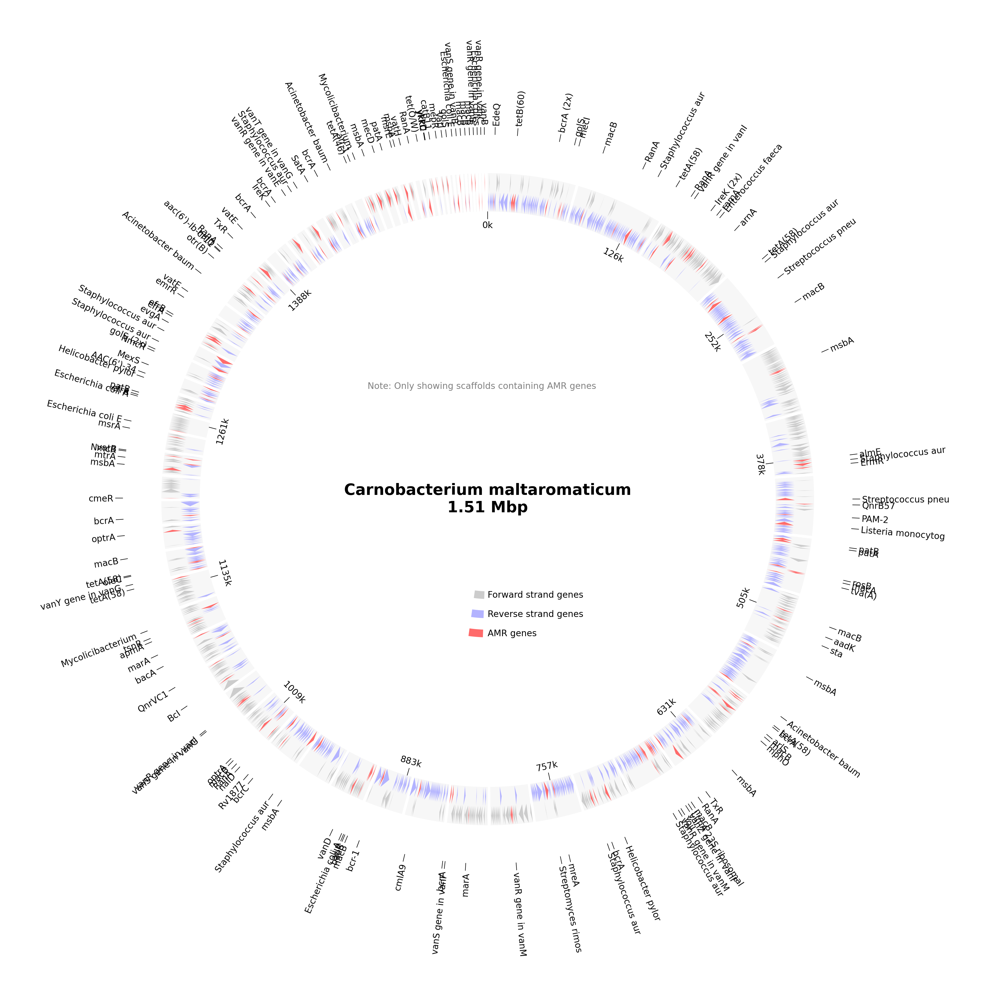

### AAC(6')-34
- **Mechanism**: antibiotic inactivation
- **Drug Classes**: aminoglycoside antibiotic
- **AMR Family**: AAC(6')
- **Locations**:
  - gnl|SPADES|IAMKMEGF_182_6 : position 5008-5541

### Acinetobacter baumannii AbaQ (found in 2 locations)
- **Mechanism**: antibiotic efflux
- **Drug Classes**: fluoroquinolone antibiotic
- **AMR Family**: major facilitator superfamily (MFS) antibiotic efflux pump
- **Locations**:
  - gnl|SPADES|IAMKMEGF_214_5 : position 5081-6373
  - gnl|SPADES|IAMKMEGF_43_39 : position 41977-43233

### Acinetobacter baumannii AmvA
- **Mechanism**: antibiotic efflux
- **Drug Classes**: macrolide antibiotic; disinfecting agents and antiseptics
- **AMR Family**: major facilitator superfamily (MFS) antibiotic efflux pump
- **Locations**:
  - gnl|SPADES|IAMKMEGF_313_3 : position 1220-2650

### BcI
- **Mechanism**: antibiotic inactivation
- **Drug Classes**: cephalosporin; penem
- **AMR Family**: class A Bacillus cereus Bc beta-lactamase
- **Locations**:
  - gnl|SPADES|IAMKMEGF_92_4 : position 6397-7296

### EdeQ
- **Mechanism**: antibiotic inactivation
- **Drug Classes**: peptide antibiotic; polyamine antibiotic
- **AMR Family**: Edeine acetyltransferase
- **Locations**:
  - gnl|SPADES|IAMKMEGF_19_7 : position 5231-5683

### Enterococcus faecalis cls with mutation conferring resistance to daptomycin
- **Mechanism**: antibiotic target alteration
- **Drug Classes**: peptide antibiotic
- **AMR Family**: daptomycin resistant cls
- **Locations**:
  - gnl|SPADES|IAMKMEGF_21_32 : position 33821-35269

### ErmR
- **Mechanism**: antibiotic target alteration
- **Drug Classes**: macrolide antibiotic; lincosamide antibiotic; streptogramin antibiotic; streptogramin A antibiotic; streptogramin B antibiotic
- **AMR Family**: Erm 23S ribosomal RNA methyltransferase
- **Locations**:
  - gnl|SPADES|IAMKMEGF_32_44 : position 44798-45691

### Escherichia coli AcrAB-TolC with AcrR mutation conferring resistance to ciprofloxacin, tetracycline, and ceftazidime
- **Mechanism**: antibiotic target alteration; antibiotic efflux
- **Drug Classes**: fluoroquinolone antibiotic; cephalosporin; glycylcycline; penam; tetracycline antibiotic; rifamycin antibiotic; phenicol antibiotic; disinfecting agents and antiseptics
- **AMR Family**: resistance-nodulation-cell division (RND) antibiotic efflux pump
- **Locations**:
  - gnl|SPADES|IAMKMEGF_176_3 : position 2315-2959

### Escherichia coli AcrAB-TolC with MarR mutations conferring resistance to ciprofloxacin and tetracycline
- **Mechanism**: antibiotic target alteration; antibiotic efflux
- **Drug Classes**: fluoroquinolone antibiotic; cephalosporin; glycylcycline; penam; tetracycline antibiotic; rifamycin antibiotic; phenicol antibiotic; disinfecting agents and antiseptics
- **AMR Family**: resistance-nodulation-cell division (RND) antibiotic efflux pump
- **Locations**:
  - gnl|SPADES|IAMKMEGF_79_6 : position 4840-5304

### Escherichia coli EF-Tu mutants conferring resistance to kirromycin (found in 2 locations)
- **Mechanism**: antibiotic target alteration
- **Drug Classes**: elfamycin antibiotic
- **AMR Family**: elfamycin resistant EF-Tu
- **Locations**:
  - gnl|SPADES|IAMKMEGF_163_1 : position 3-395
  - gnl|SPADES|IAMKMEGF_9791_1 : position 74-1228

### Escherichia coli soxS with mutation conferring antibiotic resistance
- **Mechanism**: antibiotic target alteration; antibiotic efflux; reduced permeability to antibiotic
- **Drug Classes**: fluoroquinolone antibiotic; monobactam; carbapenem; cephalosporin; glycylcycline; cephamycin; penam; tetracycline antibiotic; rifamycin antibiotic; phenicol antibiotic; penem; disinfecting agents and antiseptics
- **AMR Family**: ATP-binding cassette (ABC) antibiotic efflux pump; major facilitator superfamily (MFS) antibiotic efflux pump; resistance-nodulation-cell division (RND) antibiotic efflux pump; General Bacterial Porin with reduced permeability to beta-lactams
- **Locations**:
  - gnl|SPADES|IAMKMEGF_961318_1 : position 3-329

### Helicobacter pylori frxA mutation conferring resistance to metronidazole
- **Mechanism**: antibiotic target alteration
- **Drug Classes**: nitroimidazole antibiotic
- **AMR Family**: Antibiotic resistant Helicobacter pylori nitroreductase
- **Locations**:
  - gnl|SPADES|IAMKMEGF_182_2 : position 1686-2357

### Helicobacter pylori pbp1 mutants conferring resistance to amoxicillin
- **Mechanism**: antibiotic target alteration
- **Drug Classes**: cephalosporin; cephamycin; penam
- **AMR Family**: Penicillin-binding protein mutations conferring resistance to beta-lactam antibiotics
- **Locations**:
  - gnl|SPADES|IAMKMEGF_53_13 : position 15682-17808

### IreK (found in 3 locations)
- **Mechanism**: reduced permeability to antibiotic
- **Drug Classes**: cephalosporin
- **AMR Family**: Serine/threonine kinases
- **Locations**:
  - gnl|SPADES|IAMKMEGF_21_24 : position 25615-26811
  - gnl|SPADES|IAMKMEGF_21_50 : position 51724-53748
  - gnl|SPADES|IAMKMEGF_267_6 : position 4453-6744

### Listeria monocytogenes mprF
- **Mechanism**: antibiotic target alteration
- **Drug Classes**: peptide antibiotic
- **AMR Family**: defensin resistant mprF
- **Locations**:
  - gnl|SPADES|IAMKMEGF_34_36 : position 39789-42362

### LlmA 23S ribosomal RNA methyltransferase
- **Mechanism**: antibiotic target alteration
- **Drug Classes**: lincosamide antibiotic
- **AMR Family**: Llm 23S ribosomal RNA methyltransferase
- **Locations**:
  - gnl|SPADES|IAMKMEGF_52_6 : position 5208-6374

### MexS
- **Mechanism**: antibiotic efflux
- **Drug Classes**: fluoroquinolone antibiotic; diaminopyrimidine antibiotic; phenicol antibiotic
- **AMR Family**: resistance-nodulation-cell division (RND) antibiotic efflux pump
- **Locations**:
  - gnl|SPADES|IAMKMEGF_182_14 : position 11453-12433

### Mycolicibacterium smegmatis ndh with mutation conferring resistance to isoniazid (found in 2 locations)
- **Mechanism**: antibiotic target alteration
- **Drug Classes**: isoniazid-like antibiotic
- **AMR Family**: antibiotic resistant ndh
- **Locations**:
  - gnl|SPADES|IAMKMEGF_327_5 : position 3527-4732
  - gnl|SPADES|IAMKMEGF_96_19 : position 15561-17423

### NmcR (found in 2 locations)
- **Mechanism**: antibiotic inactivation
- **Drug Classes**: carbapenem; cephalosporin; cephamycin; penam
- **AMR Family**: NmcA beta-lactamase
- **Locations**:
  - gnl|SPADES|IAMKMEGF_128_16 : position 14243-15127
  - gnl|SPADES|IAMKMEGF_185_11 : position 7525-8409

### PAM-2
- **Mechanism**: antibiotic inactivation
- **Drug Classes**: carbapenem; cephalosporin
- **AMR Family**: PAM beta-lactamase
- **Locations**:
  - gnl|SPADES|IAMKMEGF_34_31 : position 32695-33375

### QnrB57
- **Mechanism**: antibiotic target protection
- **Drug Classes**: fluoroquinolone antibiotic
- **AMR Family**: quinolone resistance protein (qnr)
- **Locations**:
  - gnl|SPADES|IAMKMEGF_34_22 : position 23127-23762

### QnrVC1
- **Mechanism**: antibiotic target protection
- **Drug Classes**: fluoroquinolone antibiotic
- **AMR Family**: quinolone resistance protein (qnr)
- **Locations**:
  - gnl|SPADES|IAMKMEGF_92_19 : position 22944-23567

### RanA (found in 7 locations)
- **Mechanism**: antibiotic efflux
- **Drug Classes**: aminoglycoside antibiotic
- **AMR Family**: ATP-binding cassette (ABC) antibiotic efflux pump
- **Locations**:
  - gnl|SPADES|IAMKMEGF_19_62 : position 65371-66096
  - gnl|SPADES|IAMKMEGF_20_44 : position 42051-42728
  - gnl|SPADES|IAMKMEGF_218_6 : position 4724-5455
  - gnl|SPADES|IAMKMEGF_21_8 : position 7525-8718
  - gnl|SPADES|IAMKMEGF_51_35 : position 38691-39806
  - gnl|SPADES|IAMKMEGF_670_2 : position 972-1625
  - gnl|SPADES|IAMKMEGF_87_6 : position 5517-6503

### Rv1877
- **Mechanism**: antibiotic efflux
- **Drug Classes**: fluoroquinolone antibiotic
- **AMR Family**: major facilitator superfamily (MFS) antibiotic efflux pump
- **Locations**:
  - gnl|SPADES|IAMKMEGF_83_19 : position 23748-25232

### SatA
- **Mechanism**: antibiotic inactivation
- **Drug Classes**: nucleoside antibiotic
- **AMR Family**: streptothricin acetyltransferase (SAT)
- **Locations**:
  - gnl|SPADES|IAMKMEGF_304_2 : position 1150-1602

### Staphylococcus aureus LmrS
- **Mechanism**: antibiotic efflux
- **Drug Classes**: macrolide antibiotic; aminoglycoside antibiotic; oxazolidinone antibiotic; diaminopyrimidine antibiotic; phenicol antibiotic
- **AMR Family**: major facilitator superfamily (MFS) antibiotic efflux pump
- **Locations**:
  - gnl|SPADES|IAMKMEGF_53_25 : position 29818-31242

### Staphylococcus aureus fusA with mutation conferring resistance to fusidic acid (found in 2 locations)
- **Mechanism**: antibiotic target alteration
- **Drug Classes**: fusidane antibiotic
- **AMR Family**: antibiotic resistant fusA
- **Locations**:
  - gnl|SPADES|IAMKMEGF_188_2 : position 234-2318
  - gnl|SPADES|IAMKMEGF_297_7 : position 4702-6786

### Staphylococcus aureus mupA conferring resistance to mupirocin (found in 2 locations)
- **Mechanism**: antibiotic target alteration
- **Drug Classes**: mupirocin-like antibiotic
- **AMR Family**: antibiotic-resistant isoleucyl-tRNA synthetase (ileS)
- **Locations**:
  - gnl|SPADES|IAMKMEGF_22_10 : position 8876-11659
  - gnl|SPADES|IAMKMEGF_32_41 : position 41360-43375

### Staphylococcus aureus mupB conferring resistance to mupirocin (found in 2 locations)
- **Mechanism**: antibiotic target alteration
- **Drug Classes**: mupirocin-like antibiotic
- **AMR Family**: antibiotic-resistant isoleucyl-tRNA synthetase (ileS)
- **Locations**:
  - gnl|SPADES|IAMKMEGF_20_57 : position 53713-56382
  - gnl|SPADES|IAMKMEGF_83_1 : position 6-2420

### Staphylococcus aureus murA with mutation conferring resistance to fosfomycin
- **Mechanism**: antibiotic target alteration
- **Drug Classes**: phosphonic acid antibiotic
- **AMR Family**: antibiotic-resistant murA transferase
- **Locations**:
  - gnl|SPADES|IAMKMEGF_52_18 : position 18343-19650

### Staphylococcus aureus rpoB mutants conferring resistance to rifampicin
- **Mechanism**: antibiotic target alteration; antibiotic target replacement
- **Drug Classes**: rifamycin antibiotic
- **AMR Family**: rifamycin-resistant beta-subunit of RNA polymerase (rpoB)
- **Locations**:
  - gnl|SPADES|IAMKMEGF_188_7 : position 8320-11892

### Streptococcus pneumoniae PBP2b conferring resistance to amoxicillin
- **Mechanism**: antibiotic target alteration
- **Drug Classes**: cephalosporin; cephamycin; penam
- **AMR Family**: Penicillin-binding protein mutations conferring resistance to beta-lactam antibiotics
- **Locations**:
  - gnl|SPADES|IAMKMEGF_34_20 : position 18070-20124

### Streptococcus pneumoniae PBP2x conferring resistance to amoxicillin
- **Mechanism**: antibiotic target alteration
- **Drug Classes**: cephalosporin; cephamycin; penam
- **AMR Family**: Penicillin-binding protein mutations conferring resistance to beta-lactam antibiotics
- **Locations**:
  - gnl|SPADES|IAMKMEGF_22_23 : position 24338-26527

### Streptomyces rimosus otr(A)
- **Mechanism**: antibiotic target protection
- **Drug Classes**: tetracycline antibiotic
- **AMR Family**: tetracycline-resistant ribosomal protection protein
- **Locations**:
  - gnl|SPADES|IAMKMEGF_56_25 : position 23608-26115

### TxR (found in 2 locations)
- **Mechanism**: antibiotic efflux
- **Drug Classes**: tetracycline antibiotic
- **AMR Family**: ATP-binding cassette (ABC) antibiotic efflux pump
- **Locations**:
  - gnl|SPADES|IAMKMEGF_224_4 : position 2468-5278
  - gnl|SPADES|IAMKMEGF_51_29 : position 30902-33565

### VatI
- **Mechanism**: antibiotic inactivation
- **Drug Classes**: streptogramin antibiotic; streptogramin A antibiotic
- **AMR Family**: streptogramin vat acetyltransferase
- **Locations**:
  - gnl|SPADES|IAMKMEGF_2704_2 : position 759-1460

### YajC
- **Mechanism**: antibiotic efflux
- **Drug Classes**: fluoroquinolone antibiotic; cephalosporin; glycylcycline; penam; tetracycline antibiotic; oxazolidinone antibiotic; glycopeptide antibiotic; rifamycin antibiotic; phenicol antibiotic; disinfecting agents and antiseptics
- **AMR Family**: resistance-nodulation-cell division (RND) antibiotic efflux pump
- **Locations**:
  - gnl|SPADES|IAMKMEGF_34_37 : position 42542-42919

### YojI
- **Mechanism**: antibiotic efflux
- **Drug Classes**: peptide antibiotic
- **AMR Family**: ATP-binding cassette (ABC) antibiotic efflux pump
- **Locations**:
  - gnl|SPADES|IAMKMEGF_52_11 : position 11963-12511

### aac(6')-Ib-cr11
- **Mechanism**: antibiotic inactivation
- **Drug Classes**: fluoroquinolone antibiotic; aminoglycoside antibiotic
- **AMR Family**: AAC(6'); AAC(6')-Ib-cr
- **Locations**:
  - gnl|SPADES|IAMKMEGF_218_3 : position 1844-2407

### aadK
- **Mechanism**: antibiotic inactivation
- **Drug Classes**: aminoglycoside antibiotic
- **AMR Family**: ANT(6)
- **Locations**:
  - gnl|SPADES|IAMKMEGF_39_25 : position 22716-23567

### almE
- **Mechanism**: antibiotic target alteration
- **Drug Classes**: peptide antibiotic
- **AMR Family**: polymyxin resistance operon; alm glycyltransferase
- **Locations**:
  - gnl|SPADES|IAMKMEGF_32_39 : position 38267-39709

### apmA
- **Mechanism**: antibiotic inactivation
- **Drug Classes**: aminoglycoside antibiotic
- **AMR Family**: AAC(2')
- **Locations**:
  - gnl|SPADES|IAMKMEGF_96_8 : position 7540-8049

### arlR
- **Mechanism**: antibiotic efflux
- **Drug Classes**: fluoroquinolone antibiotic; disinfecting agents and antiseptics
- **AMR Family**: major facilitator superfamily (MFS) antibiotic efflux pump
- **Locations**:
  - gnl|SPADES|IAMKMEGF_79_4 : position 3161-3832

### arlS
- **Mechanism**: antibiotic efflux
- **Drug Classes**: fluoroquinolone antibiotic; disinfecting agents and antiseptics
- **AMR Family**: major facilitator superfamily (MFS) antibiotic efflux pump
- **Locations**:
  - gnl|SPADES|IAMKMEGF_47_17 : position 13206-14258

### arnA
- **Mechanism**: antibiotic target alteration
- **Drug Classes**: peptide antibiotic
- **AMR Family**: pmr phosphoethanolamine transferase
- **Locations**:
  - gnl|SPADES|IAMKMEGF_21_47 : position 48610-49563

### arr-1
- **Mechanism**: antibiotic inactivation
- **Drug Classes**: rifamycin antibiotic
- **AMR Family**: rifampin ADP-ribosyltransferase (Arr)
- **Locations**:
  - gnl|SPADES|IAMKMEGF_327_1 : position 28-441

### bacA
- **Mechanism**: antibiotic target alteration
- **Drug Classes**: peptide antibiotic
- **AMR Family**: undecaprenyl pyrophosphate related proteins
- **Locations**:
  - gnl|SPADES|IAMKMEGF_95_14 : position 13887-14705

### baeS (found in 2 locations)
- **Mechanism**: antibiotic efflux
- **Drug Classes**: aminoglycoside antibiotic; aminocoumarin antibiotic
- **AMR Family**: resistance-nodulation-cell division (RND) antibiotic efflux pump
- **Locations**:
  - gnl|SPADES|IAMKMEGF_52_12 : position 12626-14077
  - gnl|SPADES|IAMKMEGF_79_3 : position 1776-3164

### basS
- **Mechanism**: antibiotic target alteration; antibiotic efflux
- **Drug Classes**: peptide antibiotic
- **AMR Family**: pmr phosphoethanolamine transferase
- **Locations**:
  - gnl|SPADES|IAMKMEGF_22_48 : position 48799-49863

### bcr-1
- **Mechanism**: antibiotic efflux
- **Drug Classes**: bicyclomycin-like antibiotic
- **AMR Family**: major facilitator superfamily (MFS) antibiotic efflux pump
- **Locations**:
  - gnl|SPADES|IAMKMEGF_70_21 : position 24717-25964

### bcrA (found in 9 locations)
- **Mechanism**: antibiotic efflux
- **Drug Classes**: peptide antibiotic
- **AMR Family**: ATP-binding cassette (ABC) antibiotic efflux pump
- **Locations**:
  - gnl|SPADES|IAMKMEGF_123_5 : position 4927-5853
  - gnl|SPADES|IAMKMEGF_19_49 : position 53001-53906
  - gnl|SPADES|IAMKMEGF_19_59 : position 62477-63364
  - gnl|SPADES|IAMKMEGF_241_3 : position 2695-3384
  - gnl|SPADES|IAMKMEGF_283_2 : position 590-1219
  - gnl|SPADES|IAMKMEGF_309_1 : position 92-838
  - gnl|SPADES|IAMKMEGF_47_8 : position 6370-7146
  - gnl|SPADES|IAMKMEGF_53_22 : position 26692-27441
  - gnl|SPADES|IAMKMEGF_66_32 : position 32960-33892

### bcrC
- **Mechanism**: antibiotic target alteration
- **Drug Classes**: peptide antibiotic
- **AMR Family**: undecaprenyl pyrophosphate related proteins
- **Locations**:
  - gnl|SPADES|IAMKMEGF_83_15 : position 19744-20412

### catB11
- **Mechanism**: antibiotic inactivation
- **Drug Classes**: phenicol antibiotic
- **AMR Family**: chloramphenicol acetyltransferase (CAT)
- **Locations**:
  - gnl|SPADES|IAMKMEGF_1179_2 : position 543-1193

### cmeR
- **Mechanism**: antibiotic efflux
- **Drug Classes**: macrolide antibiotic; fluoroquinolone antibiotic; cephalosporin; fusidane antibiotic
- **AMR Family**: resistance-nodulation-cell division (RND) antibiotic efflux pump
- **Locations**:
  - gnl|SPADES|IAMKMEGF_126_1 : position 74-256

### cmlA9
- **Mechanism**: antibiotic efflux
- **Drug Classes**: phenicol antibiotic
- **AMR Family**: major facilitator superfamily (MFS) antibiotic efflux pump
- **Locations**:
  - gnl|SPADES|IAMKMEGF_67_24 : position 25121-26323

### efrA (found in 2 locations)
- **Mechanism**: antibiotic efflux
- **Drug Classes**: macrolide antibiotic; fluoroquinolone antibiotic; rifamycin antibiotic
- **AMR Family**: ATP-binding cassette (ABC) antibiotic efflux pump
- **Locations**:
  - gnl|SPADES|IAMKMEGF_176_4 : position 3009-4730
  - gnl|SPADES|IAMKMEGF_194_8 : position 6817-8571

### efrB
- **Mechanism**: antibiotic efflux
- **Drug Classes**: macrolide antibiotic; fluoroquinolone antibiotic; rifamycin antibiotic
- **AMR Family**: ATP-binding cassette (ABC) antibiotic efflux pump
- **Locations**:
  - gnl|SPADES|IAMKMEGF_194_9 : position 8568-10346

### emrR
- **Mechanism**: antibiotic efflux
- **Drug Classes**: fluoroquinolone antibiotic
- **AMR Family**: major facilitator superfamily (MFS) antibiotic efflux pump
- **Locations**:
  - gnl|SPADES|IAMKMEGF_199_13 : position 10043-10474

### evgA
- **Mechanism**: antibiotic efflux
- **Drug Classes**: macrolide antibiotic; fluoroquinolone antibiotic; penam; tetracycline antibiotic
- **AMR Family**: major facilitator superfamily (MFS) antibiotic efflux pump; resistance-nodulation-cell division (RND) antibiotic efflux pump
- **Locations**:
  - gnl|SPADES|IAMKMEGF_194_3 : position 2173-2805

### golS (found in 4 locations)
- **Mechanism**: antibiotic efflux
- **Drug Classes**: monobactam; carbapenem; cephalosporin; cephamycin; penam; phenicol antibiotic; penem
- **AMR Family**: resistance-nodulation-cell division (RND) antibiotic efflux pump
- **Locations**:
  - gnl|SPADES|IAMKMEGF_185_13 : position 9560-9928
  - gnl|SPADES|IAMKMEGF_185_16 : position 11892-12341
  - gnl|SPADES|IAMKMEGF_19_61 : position 64731-65081
  - gnl|SPADES|IAMKMEGF_4041_2 : position 251-679

### macA
- **Mechanism**: antibiotic efflux
- **Drug Classes**: macrolide antibiotic
- **AMR Family**: ATP-binding cassette (ABC) antibiotic efflux pump
- **Locations**:
  - gnl|SPADES|IAMKMEGF_37_29 : position 29528-30388

### macB (found in 14 locations)
- **Mechanism**: antibiotic efflux
- **Drug Classes**: macrolide antibiotic
- **AMR Family**: ATP-binding cassette (ABC) antibiotic efflux pump
- **Locations**:
  - gnl|SPADES|IAMKMEGF_110_20 : position 19808-20509
  - gnl|SPADES|IAMKMEGF_20_10 : position 10265-11023
  - gnl|SPADES|IAMKMEGF_21_33 : position 35538-36734
  - gnl|SPADES|IAMKMEGF_22_46 : position 46991-47758
  - gnl|SPADES|IAMKMEGF_248188_1 : position 2-529
  - gnl|SPADES|IAMKMEGF_34415_1 : position 2-337
  - gnl|SPADES|IAMKMEGF_37_30 : position 30404-31096
  - gnl|SPADES|IAMKMEGF_37_31 : position 31112-32338
  - gnl|SPADES|IAMKMEGF_39_15 : position 14774-15592
  - gnl|SPADES|IAMKMEGF_47_19 : position 15082-17448
  - gnl|SPADES|IAMKMEGF_52_4 : position 2858-3517
  - gnl|SPADES|IAMKMEGF_56429_1 : position 2-355
  - gnl|SPADES|IAMKMEGF_79_1 : position 3-617
  - gnl|SPADES|IAMKMEGF_87_10 : position 9091-9819

### marA (found in 2 locations)
- **Mechanism**: antibiotic efflux; reduced permeability to antibiotic
- **Drug Classes**: fluoroquinolone antibiotic; monobactam; carbapenem; cephalosporin; glycylcycline; cephamycin; penam; tetracycline antibiotic; rifamycin antibiotic; phenicol antibiotic; penem; disinfecting agents and antiseptics
- **AMR Family**: resistance-nodulation-cell division (RND) antibiotic efflux pump; General Bacterial Porin with reduced permeability to beta-lactams
- **Locations**:
  - gnl|SPADES|IAMKMEGF_66_18 : position 16098-16484
  - gnl|SPADES|IAMKMEGF_95_21 : position 23252-24136

### mdtG
- **Mechanism**: antibiotic efflux
- **Drug Classes**: phosphonic acid antibiotic
- **AMR Family**: major facilitator superfamily (MFS) antibiotic efflux pump
- **Locations**:
  - gnl|SPADES|IAMKMEGF_52_7 : position 6422-7630

### mecD
- **Mechanism**: antibiotic target replacement
- **Drug Classes**: penam
- **AMR Family**: methicillin resistant PBP2
- **Locations**:
  - gnl|SPADES|IAMKMEGF_380_3 : position 1560-3590

### mecI
- **Mechanism**: antibiotic target replacement
- **Drug Classes**: penam
- **AMR Family**: methicillin resistant PBP2
- **Locations**:
  - gnl|SPADES|IAMKMEGF_19_65 : position 68043-68498

### mepR
- **Mechanism**: antibiotic efflux
- **Drug Classes**: glycylcycline; tetracycline antibiotic
- **AMR Family**: multidrug and toxic compound extrusion (MATE) transporter
- **Locations**:
  - gnl|SPADES|IAMKMEGF_1898_2 : position 815-1264

### mphO
- **Mechanism**: antibiotic inactivation
- **Drug Classes**: macrolide antibiotic
- **AMR Family**: macrolide phosphotransferase (MPH)
- **Locations**:
  - gnl|SPADES|IAMKMEGF_47_24 : position 19821-20660

### mreA
- **Mechanism**: antibiotic efflux
- **Drug Classes**: macrolide antibiotic
- **AMR Family**: major facilitator superfamily (MFS) antibiotic efflux pump
- **Locations**:
  - gnl|SPADES|IAMKMEGF_56_18 : position 17904-18848

### msbA (found in 7 locations)
- **Mechanism**: antibiotic efflux
- **Drug Classes**: nitroimidazole antibiotic
- **AMR Family**: ATP-binding cassette (ABC) antibiotic efflux pump
- **Locations**:
  - gnl|SPADES|IAMKMEGF_128_7 : position 3685-5835
  - gnl|SPADES|IAMKMEGF_26_35 : position 19128-19967
  - gnl|SPADES|IAMKMEGF_371_3 : position 1521-3671
  - gnl|SPADES|IAMKMEGF_43_7 : position 7154-7939
  - gnl|SPADES|IAMKMEGF_447_2 : position 2689-4428
  - gnl|SPADES|IAMKMEGF_51_7 : position 6701-7483
  - gnl|SPADES|IAMKMEGF_80_20 : position 23561-25276

### msrA
- **Mechanism**: antibiotic target protection
- **Drug Classes**: macrolide antibiotic; streptogramin antibiotic; streptogramin B antibiotic
- **AMR Family**: msr-type ABC-F protein
- **Locations**:
  - gnl|SPADES|IAMKMEGF_158_16 : position 11493-12068

### msrE
- **Mechanism**: antibiotic target protection
- **Drug Classes**: macrolide antibiotic; streptogramin antibiotic
- **AMR Family**: msr-type ABC-F protein
- **Locations**:
  - gnl|SPADES|IAMKMEGF_447_1 : position 20-2260

### mtrA
- **Mechanism**: antibiotic efflux
- **Drug Classes**: macrolide antibiotic; penam
- **AMR Family**: resistance-nodulation-cell division (RND) antibiotic efflux pump
- **Locations**:
  - gnl|SPADES|IAMKMEGF_128_12 : position 9662-10516

### nalD (found in 2 locations)
- **Mechanism**: antibiotic efflux
- **Drug Classes**: macrolide antibiotic; fluoroquinolone antibiotic; monobactam; carbapenem; cephalosporin; cephamycin; penam; tetracycline antibiotic; peptide antibiotic; aminocoumarin antibiotic; diaminopyrimidine antibiotic; sulfonamide antibiotic; phenicol antibiotic; penem
- **AMR Family**: resistance-nodulation-cell division (RND) antibiotic efflux pump
- **Locations**:
  - gnl|SPADES|IAMKMEGF_218_4 : position 2428-3006
  - gnl|SPADES|IAMKMEGF_87_3 : position 2334-2984

### oleC
- **Mechanism**: antibiotic efflux
- **Drug Classes**: macrolide antibiotic
- **AMR Family**: ATP-binding cassette (ABC) antibiotic efflux pump
- **Locations**:
  - gnl|SPADES|IAMKMEGF_110_8 : position 6473-7177

### optrA (found in 2 locations)
- **Mechanism**: antibiotic target protection
- **Drug Classes**: oxazolidinone antibiotic; phenicol antibiotic
- **AMR Family**: Miscellaneous ABC-F subfamily ATP-binding cassette ribosomal protection proteins
- **Locations**:
  - gnl|SPADES|IAMKMEGF_122_14 : position 13549-15177
  - gnl|SPADES|IAMKMEGF_87_12 : position 10726-12600

### otr(B)
- **Mechanism**: antibiotic efflux
- **Drug Classes**: tetracycline antibiotic
- **AMR Family**: major facilitator superfamily (MFS) antibiotic efflux pump
- **Locations**:
  - gnl|SPADES|IAMKMEGF_217_6 : position 7200-8480

### patA (found in 2 locations)
- **Mechanism**: antibiotic efflux
- **Drug Classes**: fluoroquinolone antibiotic
- **AMR Family**: ATP-binding cassette (ABC) antibiotic efflux pump
- **Locations**:
  - gnl|SPADES|IAMKMEGF_37_4 : position 4193-5914
  - gnl|SPADES|IAMKMEGF_433_1 : position 67-1548

### patB (found in 2 locations)
- **Mechanism**: antibiotic efflux
- **Drug Classes**: fluoroquinolone antibiotic
- **AMR Family**: ATP-binding cassette (ABC) antibiotic efflux pump
- **Locations**:
  - gnl|SPADES|IAMKMEGF_176_5 : position 4732-6630
  - gnl|SPADES|IAMKMEGF_37_3 : position 2421-4193

### ramA
- **Mechanism**: antibiotic efflux; reduced permeability to antibiotic
- **Drug Classes**: fluoroquinolone antibiotic; monobactam; carbapenem; cephalosporin; glycylcycline; cephamycin; penam; tetracycline antibiotic; rifamycin antibiotic; phenicol antibiotic; penem; disinfecting agents and antiseptics
- **AMR Family**: resistance-nodulation-cell division (RND) antibiotic efflux pump; General Bacterial Porin with reduced permeability to beta-lactams
- **Locations**:
  - gnl|SPADES|IAMKMEGF_21_29 : position 31213-32130

### rosB
- **Mechanism**: antibiotic efflux
- **Drug Classes**: peptide antibiotic
- **AMR Family**: major facilitator superfamily (MFS) antibiotic efflux pump
- **Locations**:
  - gnl|SPADES|IAMKMEGF_37_27 : position 27233-28393

### sta
- **Mechanism**: antibiotic inactivation
- **Drug Classes**: nucleoside antibiotic
- **AMR Family**: streptothricin acetyltransferase (SAT)
- **Locations**:
  - gnl|SPADES|IAMKMEGF_39_33 : position 29807-30322

### tet(O/W)
- **Mechanism**: antibiotic target protection
- **Drug Classes**: tetracycline antibiotic
- **AMR Family**: tetracycline-resistant ribosomal protection protein
- **Locations**:
  - gnl|SPADES|IAMKMEGF_688_2 : position 1295-3130

### tetA(46)
- **Mechanism**: antibiotic efflux
- **Drug Classes**: tetracycline antibiotic
- **AMR Family**: ATP-binding cassette (ABC) antibiotic efflux pump
- **Locations**:
  - gnl|SPADES|IAMKMEGF_321_6 : position 5731-6477

### tetA(58) (found in 6 locations)
- **Mechanism**: antibiotic efflux
- **Drug Classes**: tetracycline antibiotic
- **AMR Family**: major facilitator superfamily (MFS) antibiotic efflux pump
- **Locations**:
  - gnl|SPADES|IAMKMEGF_110_9 : position 7181-7954
  - gnl|SPADES|IAMKMEGF_20_71 : position 69961-70719
  - gnl|SPADES|IAMKMEGF_22_7 : position 6704-7621
  - gnl|SPADES|IAMKMEGF_26_36 : position 19943-20824
  - gnl|SPADES|IAMKMEGF_47_6 : position 4744-5706
  - gnl|SPADES|IAMKMEGF_97_20 : position 22630-23511

### tetA(60)
- **Mechanism**: antibiotic efflux
- **Drug Classes**: tetracycline antibiotic
- **AMR Family**: ATP-binding cassette (ABC) antibiotic efflux pump
- **Locations**:
  - gnl|SPADES|IAMKMEGF_19_18 : position 22916-24667

### tetB(60)
- **Mechanism**: antibiotic efflux
- **Drug Classes**: tetracycline antibiotic
- **AMR Family**: ATP-binding cassette (ABC) antibiotic efflux pump
- **Locations**:
  - gnl|SPADES|IAMKMEGF_19_17 : position 21126-22916

### tsnR
- **Mechanism**: antibiotic target alteration
- **Drug Classes**: peptide antibiotic
- **AMR Family**: non-erm 23S ribosomal RNA methyltransferase (A1067)
- **Locations**:
  - gnl|SPADES|IAMKMEGF_96_11 : position 10023-10898

### tva(A)
- **Mechanism**: antibiotic target protection
- **Drug Classes**: pleuromutilin antibiotic
- **AMR Family**: Miscellaneous ABC-F subfamily ATP-binding cassette ribosomal protection proteins
- **Locations**:
  - gnl|SPADES|IAMKMEGF_37_33 : position 33272-33940

### vanB
- **Mechanism**: antibiotic target alteration
- **Drug Classes**: glycopeptide antibiotic
- **AMR Family**: glycopeptide resistance gene cluster; Van ligase
- **Locations**:
  - gnl|SPADES|IAMKMEGF_2184211_1 : position 1-210

### vanD
- **Mechanism**: antibiotic target alteration
- **Drug Classes**: glycopeptide antibiotic
- **AMR Family**: glycopeptide resistance gene cluster; Van ligase
- **Locations**:
  - gnl|SPADES|IAMKMEGF_79_15 : position 11636-13000

### vanR gene in vanB cluster
- **Mechanism**: antibiotic target alteration
- **Drug Classes**: glycopeptide antibiotic
- **AMR Family**: glycopeptide resistance gene cluster; vanR
- **Locations**:
  - gnl|SPADES|IAMKMEGF_289030_1 : position 2-457

### vanR gene in vanC cluster
- **Mechanism**: antibiotic target alteration
- **Drug Classes**: glycopeptide antibiotic
- **AMR Family**: glycopeptide resistance gene cluster; vanR
- **Locations**:
  - gnl|SPADES|IAMKMEGF_1270901_1 : position 2-247

### vanR gene in vanE cluster
- **Mechanism**: antibiotic target alteration
- **Drug Classes**: glycopeptide antibiotic
- **AMR Family**: glycopeptide resistance gene cluster; vanR
- **Locations**:
  - gnl|SPADES|IAMKMEGF_297_1 : position 160-849

### vanR gene in vanF cluster
- **Mechanism**: antibiotic target alteration
- **Drug Classes**: glycopeptide antibiotic
- **AMR Family**: glycopeptide resistance gene cluster; vanR
- **Locations**:
  - gnl|SPADES|IAMKMEGF_47_18 : position 14255-14929

### vanR gene in vanI cluster (found in 3 locations)
- **Mechanism**: antibiotic target alteration
- **Drug Classes**: glycopeptide antibiotic
- **AMR Family**: glycopeptide resistance gene cluster; vanR
- **Locations**:
  - gnl|SPADES|IAMKMEGF_21_11 : position 10765-11460
  - gnl|SPADES|IAMKMEGF_22_47 : position 47997-48671
  - gnl|SPADES|IAMKMEGF_91_12 : position 10657-11352

### vanR gene in vanM cluster (found in 2 locations)
- **Mechanism**: antibiotic target alteration
- **Drug Classes**: glycopeptide antibiotic
- **AMR Family**: glycopeptide resistance gene cluster; vanR
- **Locations**:
  - gnl|SPADES|IAMKMEGF_52_13 : position 14080-14799
  - gnl|SPADES|IAMKMEGF_64_7 : position 16258-16947

### vanS gene in vanB cluster
- **Mechanism**: antibiotic target alteration
- **Drug Classes**: glycopeptide antibiotic
- **AMR Family**: vanS; glycopeptide resistance gene cluster
- **Locations**:
  - gnl|SPADES|IAMKMEGF_23219_1 : position 3-608

### vanS gene in vanF cluster (found in 2 locations)
- **Mechanism**: antibiotic target alteration
- **Drug Classes**: glycopeptide antibiotic
- **AMR Family**: vanS; glycopeptide resistance gene cluster
- **Locations**:
  - gnl|SPADES|IAMKMEGF_64_8 : position 17001-18134
  - gnl|SPADES|IAMKMEGF_66_30 : position 31173-32081

### vanS gene in vanG cluster (found in 2 locations)
- **Mechanism**: antibiotic target alteration
- **Drug Classes**: glycopeptide antibiotic
- **AMR Family**: vanS; glycopeptide resistance gene cluster
- **Locations**:
  - gnl|SPADES|IAMKMEGF_21_12 : position 11450-13651
  - gnl|SPADES|IAMKMEGF_91_11 : position 9160-10650

### vanT gene in vanG cluster
- **Mechanism**: antibiotic target alteration
- **Drug Classes**: glycopeptide antibiotic
- **AMR Family**: glycopeptide resistance gene cluster; vanT
- **Locations**:
  - gnl|SPADES|IAMKMEGF_300_3 : position 841-1995

### vanY gene in vanG cluster
- **Mechanism**: antibiotic target alteration
- **Drug Classes**: glycopeptide antibiotic
- **AMR Family**: vanY; glycopeptide resistance gene cluster
- **Locations**:
  - gnl|SPADES|IAMKMEGF_110_1: position 286-1059

### vanZ gene in vanF cluster
- **Mechanism**: antibiotic target alteration
- **Drug Classes**: glycopeptide antibiotic
- **AMR Family**: vanZ; glycopeptide resistance gene cluster
- **Locations**:
  - gnl|SPADES|IAMKMEGF_52_8 : position 7733-8383

### vatB
- **Mechanism**: antibiotic inactivation
- **Drug Classes**: streptogramin antibiotic; streptogramin A antibiotic
- **AMR Family**: streptogramin vat acetyltransferase
- **Locations**:
  - gnl|SPADES|IAMKMEGF_128_17 : position 15234-15812

### vatE (found in 2 locations)
- **Mechanism**: antibiotic inactivation
- **Drug Classes**: streptogramin antibiotic; streptogramin A antibiotic
- **AMR Family**: streptogramin vat acetyltransferase
- **Locations**:
  - gnl|SPADES|IAMKMEGF_210_3 : position 1536-2147
  - gnl|SPADES|IAMKMEGF_231_3 : position 1424-1993

### vatH
- **Mechanism**: antibiotic inactivation
- **Drug Classes**: streptogramin antibiotic; streptogramin A antibiotic
- **AMR Family**: streptogramin vat acetyltransferase
- **Locations**:
  - gnl|SPADES|IAMKMEGF_577_3 : position 791-1408

### ykkC
- **Mechanism**: antibiotic efflux
- **Drug Classes**: aminoglycoside antibiotic; tetracycline antibiotic; phenicol antibiotic
- **AMR Family**: small multidrug resistance (SMR) antibiotic efflux pump
- **Locations**:
  - gnl|SPADES|IAMKMEGF_884_2 : position 2066-2389

### ykkD
- **Mechanism**: antibiotic efflux
- **Drug Classes**: aminoglycoside antibiotic; tetracycline antibiotic; phenicol antibiotic
- **AMR Family**: small multidrug resistance (SMR) antibiotic efflux pump
- **Locations**:
  - gnl|SPADES|IAMKMEGF_884_3 : position 2406-2723

## Carnobacterium maltaromaticum LMA28
**Strain Statistics:**
- Total genome length: 1501.2 kbp
- Total scaffolds: 267
- Scaffolds with AMR genes: 51
- Total genes annotated: 2715
- Total AMR genes: 168
- Unique AMR genes: 102
- Distinct AMR mechanisms: 9
- Distinct AMR families: 50
- Distinct drug classes: 31

**Circos Plot:**

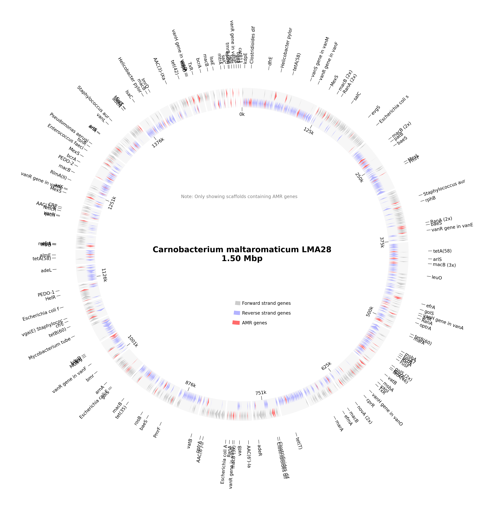

### AAC(3)-IXa
- **Mechanism**: antibiotic inactivation
- **Drug Classes**: aminoglycoside antibiotic
- **AMR Family**: AAC(3)
- **Locations**:
  - gnl|SPADES|IAMKMEGF_172_10 : position 8717-9529

### AAC(3)-Ic
- **Mechanism**: antibiotic inactivation
- **Drug Classes**: aminoglycoside antibiotic
- **AMR Family**: AAC(3)
- **Locations**:
  - gnl|SPADES|IAMKMEGF_112_10 : position 6220-6657

### AAC(6')-Ia
- **Mechanism**: antibiotic inactivation
- **Drug Classes**: aminoglycoside antibiotic
- **AMR Family**: AAC(6')
- **Locations**:
  - gnl|SPADES|IAMKMEGF_49_7 : position 6208-6744

### AAC(6')-Ir
- **Mechanism**: antibiotic inactivation
- **Drug Classes**: aminoglycoside antibiotic
- **AMR Family**: AAC(6')
- **Locations**:
  - gnl|SPADES|IAMKMEGF_50_22 : position 26067-26672

### CRP
- **Mechanism**: antibiotic efflux
- **Drug Classes**: macrolide antibiotic; fluoroquinolone antibiotic; penam
- **AMR Family**: resistance-nodulation-cell division (RND) antibiotic efflux pump
- **Locations**:
  - gnl|SPADES|IAMKMEGF_112_13 : position 8328-8990

### Clostridioides difficile gyrA conferring resistance to fluoroquinolones (found in 2 locations)
- **Mechanism**: antibiotic target alteration
- **Drug Classes**: fluoroquinolone antibiotic
- **AMR Family**: fluoroquinolone resistant gyrA
- **Locations**:
  - gnl|SPADES|IAMKMEGF_44_11 : position 9857-12406
  - gnl|SPADES|IAMKMEGF_8_11 : position 11506-13977

### Clostridioides difficile gyrB conferring resistance to fluoroquinolones (found in 2 locations)
- **Mechanism**: antibiotic target alteration
- **Drug Classes**: fluoroquinolone antibiotic
- **AMR Family**: fluoroquinolone resistant gyrB
- **Locations**:
  - gnl|SPADES|IAMKMEGF_44_10 : position 7770-9707
  - gnl|SPADES|IAMKMEGF_8_12 : position 13967-15982

### EdeQ
- **Mechanism**: antibiotic inactivation
- **Drug Classes**: peptide antibiotic; polyamine antibiotic
- **AMR Family**: Edeine acetyltransferase
- **Locations**:
  - gnl|SPADES|IAMKMEGF_8_69 : position 72152-72604

### Enterococcus faecium cls conferring resistance to daptomycin
- **Mechanism**: antibiotic target alteration
- **Drug Classes**: peptide antibiotic
- **AMR Family**: daptomycin resistant cls
- **Locations**:
  - gnl|SPADES|IAMKMEGF_116_4 : position 3194-4714

### Escherichia coli AcrAB-TolC with AcrR mutation conferring resistance to ciprofloxacin, tetracycline, and ceftazidime
- **Mechanism**: antibiotic target alteration; antibiotic efflux
- **Drug Classes**: fluoroquinolone antibiotic; cephalosporin; glycylcycline; penam; tetracycline antibiotic; rifamycin antibiotic; phenicol antibiotic; disinfecting agents and antiseptics
- **AMR Family**: resistance-nodulation-cell division (RND) antibiotic efflux pump
- **Locations**:
  - gnl|SPADES|IAMKMEGF_49_38 : position 37441-38037

### Escherichia coli EF-Tu mutants conferring resistance to Pulvomycin
- **Mechanism**: antibiotic target alteration
- **Drug Classes**: elfamycin antibiotic
- **AMR Family**: elfamycin resistant EF-Tu
- **Locations**:
  - gnl|SPADES|IAMKMEGF_63_10 : position 10876-11598

### Escherichia coli EF-Tu mutants conferring resistance to kirromycin
- **Mechanism**: antibiotic target alteration
- **Drug Classes**: elfamycin antibiotic
- **AMR Family**: elfamycin resistant EF-Tu
- **Locations**:
  - gnl|SPADES|IAMKMEGF_63_11 : position 11657-12061

### Escherichia coli fabI mutations conferring resistance to isoniazid and triclosan
- **Mechanism**: antibiotic target alteration
- **Drug Classes**: disinfecting agents and antiseptics; isoniazid-like antibiotic
- **AMR Family**: antibiotic resistant fabI
- **Locations**:
  - gnl|SPADES|IAMKMEGF_82_2 : position 1163-1921

### Escherichia coli soxS with mutation conferring antibiotic resistance
- **Mechanism**: antibiotic target alteration; antibiotic efflux; reduced permeability to antibiotic
- **Drug Classes**: fluoroquinolone antibiotic; monobactam; carbapenem; cephalosporin; glycylcycline; cephamycin; penam; tetracycline antibiotic; rifamycin antibiotic; phenicol antibiotic; penem; disinfecting agents and antiseptics
- **AMR Family**: ATP-binding cassette (ABC) antibiotic efflux pump; major facilitator superfamily (MFS) antibiotic efflux pump; resistance-nodulation-cell division (RND) antibiotic efflux pump; General Bacterial Porin with reduced permeability to beta-lactams
- **Locations**:
  - gnl|SPADES|IAMKMEGF_15_79 : position 84001-84528

### EstT
- **Mechanism**: antibiotic inactivation
- **Drug Classes**: macrolide antibiotic
- **AMR Family**: macrolide esterase
- **Locations**:
  - gnl|SPADES|IAMKMEGF_130_16 : position 17319-17699

### FosA7
- **Mechanism**: antibiotic inactivation
- **Drug Classes**: phosphonic acid antibiotic
- **AMR Family**: fosfomycin thiol transferase
- **Locations**:
  - gnl|SPADES|IAMKMEGF_24_20 : position 21663-22043

### FosC2
- **Mechanism**: antibiotic inactivation
- **Drug Classes**: phosphonic acid antibiotic
- **AMR Family**: fosC phosphotransferase family
- **Locations**:
  - gnl|SPADES|IAMKMEGF_63_12 : position 12116-12496

### FusF
- **Mechanism**: antibiotic target protection
- **Drug Classes**: fusidane antibiotic
- **AMR Family**: Target protecting FusB-type protein conferring resistance to Fusidic acid
- **Locations**:
  - gnl|SPADES|IAMKMEGF_24_30 : position 30598-31245

### HelR
- **Mechanism**: antibiotic target protection
- **Drug Classes**: rifamycin antibiotic
- **AMR Family**: helicase-like RNA polymerase protection protein
- **Locations**:
  - gnl|SPADES|IAMKMEGF_82_14 : position 17122-19413

### Helicobacter pylori pbp1 mutants conferring resistance to amoxicillin
- **Mechanism**: antibiotic target alteration
- **Drug Classes**: cephalosporin; cephamycin; penam
- **AMR Family**: Penicillin-binding protein mutations conferring resistance to beta-lactam antibiotics
- **Locations**:
  - gnl|SPADES|IAMKMEGF_8_53 : position 52839-55475

### Helicobacter pylori rdxA mutation conferring resistance to metronidazole
- **Mechanism**: antibiotic target alteration
- **Drug Classes**: nitroimidazole antibiotic
- **AMR Family**: Antibiotic resistant Helicobacter pylori nitroreductase
- **Locations**:
  - gnl|SPADES|IAMKMEGF_142_8 : position 8252-8881

### MOX-9
- **Mechanism**: antibiotic inactivation
- **Drug Classes**: cephalosporin; cephamycin; penam
- **AMR Family**: MOX beta-lactamase
- **Locations**:
  - gnl|SPADES|IAMKMEGF_68_20 : position 27315-28571

### MexL
- **Mechanism**: antibiotic efflux
- **Drug Classes**: macrolide antibiotic; tetracycline antibiotic; disinfecting agents and antiseptics
- **AMR Family**: resistance-nodulation-cell division (RND) antibiotic efflux pump
- **Locations**:
  - gnl|SPADES|IAMKMEGF_16_49 : position 55768-56385

### MexS (found in 4 locations)
- **Mechanism**: antibiotic efflux
- **Drug Classes**: fluoroquinolone antibiotic; diaminopyrimidine antibiotic; phenicol antibiotic
- **AMR Family**: resistance-nodulation-cell division (RND) antibiotic efflux pump
- **Locations**:
  - gnl|SPADES|IAMKMEGF_113_9 : position 6162-7106
  - gnl|SPADES|IAMKMEGF_115_16 : position 16335-17273
  - gnl|SPADES|IAMKMEGF_130_15 : position 16211-17299
  - gnl|SPADES|IAMKMEGF_15_2 : position 1282-2394

### Mycobacterium tuberculosis pncA mutations conferring resistance to pyrazinamide
- **Mechanism**: antibiotic target alteration
- **Drug Classes**: pyrazine antibiotic
- **AMR Family**: Pyrazinamide resistant pncA
- **Locations**:
  - gnl|SPADES|IAMKMEGF_75_26 : position 24775-25320

### NmcR (found in 3 locations)
- **Mechanism**: antibiotic inactivation
- **Drug Classes**: carbapenem; cephalosporin; cephamycin; penam
- **AMR Family**: NmcA beta-lactamase
- **Locations**:
  - gnl|SPADES|IAMKMEGF_112_7 : position 3134-4027
  - gnl|SPADES|IAMKMEGF_24_60 : position 57562-58428
  - gnl|SPADES|IAMKMEGF_8_8 : position 6939-7886

### PEDO-1
- **Mechanism**: antibiotic inactivation
- **Drug Classes**: carbapenem
- **AMR Family**: subclass B3 PEDO beta-lactamase
- **Locations**:
  - gnl|SPADES|IAMKMEGF_82_20 : position 24579-25280

### PEDO-2
- **Mechanism**: antibiotic inactivation
- **Drug Classes**: carbapenem
- **AMR Family**: subclass B3 PEDO beta-lactamase
- **Locations**:
  - gnl|SPADES|IAMKMEGF_115_2 : position 892-1509

### PmrF (found in 2 locations)
- **Mechanism**: antibiotic target alteration
- **Drug Classes**: peptide antibiotic
- **AMR Family**: pmr phosphoethanolamine transferase
- **Locations**:
  - gnl|SPADES|IAMKMEGF_16_51 : position 58466-59413
  - gnl|SPADES|IAMKMEGF_59_3 : position 3315-4565

### Pseudomonas aeruginosa soxR
- **Mechanism**: antibiotic target alteration; antibiotic efflux
- **Drug Classes**: fluoroquinolone antibiotic; cephalosporin; glycylcycline; penam; tetracycline antibiotic; rifamycin antibiotic; phenicol antibiotic; disinfecting agents and antiseptics
- **AMR Family**: ATP-binding cassette (ABC) antibiotic efflux pump; major facilitator superfamily (MFS) antibiotic efflux pump; resistance-nodulation-cell division (RND) antibiotic efflux pump
- **Locations**:
  - gnl|SPADES|IAMKMEGF_116_18 : position 15144-15581

### RanA (found in 8 locations)
- **Mechanism**: antibiotic efflux
- **Drug Classes**: aminoglycoside antibiotic
- **AMR Family**: ATP-binding cassette (ABC) antibiotic efflux pump
- **Locations**:
  - gnl|SPADES|IAMKMEGF_15_21 : position 20965-22059
  - gnl|SPADES|IAMKMEGF_15_35 : position 35980-36714
  - gnl|SPADES|IAMKMEGF_16_23 : position 22906-23712
  - gnl|SPADES|IAMKMEGF_17_54 : position 57980-59089
  - gnl|SPADES|IAMKMEGF_17_70 : position 75679-77196
  - gnl|SPADES|IAMKMEGF_23_27 : position 30562-31677
  - gnl|SPADES|IAMKMEGF_24_26 : position 26394-27425
  - gnl|SPADES|IAMKMEGF_49_34 : position 32055-33095

### RlmA(II)
- **Mechanism**: antibiotic target alteration
- **Drug Classes**: macrolide antibiotic; lincosamide antibiotic
- **AMR Family**: non-erm 23S ribosomal RNA methyltransferase (G748)
- **Locations**:
  - gnl|SPADES|IAMKMEGF_114_3 : position 2185-3042

### Staphylococcus aureus fusA with mutation conferring resistance to fusidic acid
- **Mechanism**: antibiotic target alteration
- **Drug Classes**: fusidane antibiotic
- **AMR Family**: antibiotic resistant fusA
- **Locations**:
  - gnl|SPADES|IAMKMEGF_17_19 : position 19509-21086

### Staphylococcus aureus murA with mutation conferring resistance to fosfomycin
- **Mechanism**: antibiotic target alteration
- **Drug Classes**: phosphonic acid antibiotic
- **AMR Family**: antibiotic-resistant murA transferase
- **Locations**:
  - gnl|SPADES|IAMKMEGF_124_16 : position 12566-13834

### TaeA
- **Mechanism**: antibiotic efflux
- **Drug Classes**: pleuromutilin antibiotic
- **AMR Family**: ATP-binding cassette (ABC) antibiotic efflux pump
- **Locations**:
  - gnl|SPADES|IAMKMEGF_8_37 : position 38020-39921

### TxR (found in 2 locations)
- **Mechanism**: antibiotic efflux
- **Drug Classes**: tetracycline antibiotic
- **AMR Family**: ATP-binding cassette (ABC) antibiotic efflux pump
- **Locations**:
  - gnl|SPADES|IAMKMEGF_237_2 : position 1611-4307
  - gnl|SPADES|IAMKMEGF_27_14 : position 11833-13194

### adeL
- **Mechanism**: antibiotic efflux
- **Drug Classes**: fluoroquinolone antibiotic; tetracycline antibiotic
- **AMR Family**: resistance-nodulation-cell division (RND) antibiotic efflux pump
- **Locations**:
  - gnl|SPADES|IAMKMEGF_85_19 : position 23557-24444

### adeN
- **Mechanism**: antibiotic efflux
- **Drug Classes**: macrolide antibiotic; fluoroquinolone antibiotic; lincosamide antibiotic; carbapenem; cephalosporin; tetracycline antibiotic; rifamycin antibiotic; diaminopyrimidine antibiotic; phenicol antibiotic; penem
- **AMR Family**: resistance-nodulation-cell division (RND) antibiotic efflux pump
- **Locations**:
  - gnl|SPADES|IAMKMEGF_130_12 : position 13813-14388

### adeR (found in 2 locations)
- **Mechanism**: antibiotic efflux
- **Drug Classes**: glycylcycline; tetracycline antibiotic
- **AMR Family**: resistance-nodulation-cell division (RND) antibiotic efflux pump
- **Locations**:
  - gnl|SPADES|IAMKMEGF_193_10 : position 7825-8553
  - gnl|SPADES|IAMKMEGF_44_30 : position 37101-37799

### almE
- **Mechanism**: antibiotic target alteration
- **Drug Classes**: peptide antibiotic
- **AMR Family**: polymyxin resistance operon; alm glycyltransferase
- **Locations**:
  - gnl|SPADES|IAMKMEGF_103_11 : position 13966-15489

### arlR (found in 4 locations)
- **Mechanism**: antibiotic efflux
- **Drug Classes**: fluoroquinolone antibiotic; disinfecting agents and antiseptics
- **AMR Family**: major facilitator superfamily (MFS) antibiotic efflux pump
- **Locations**:
  - gnl|SPADES|IAMKMEGF_119_13 : position 9856-10539
  - gnl|SPADES|IAMKMEGF_16_30 : position 30440-31159
  - gnl|SPADES|IAMKMEGF_18_23 : position 25970-26656
  - gnl|SPADES|IAMKMEGF_23_24 : position 26406-27206

### arlS (found in 4 locations)
- **Mechanism**: antibiotic efflux
- **Drug Classes**: fluoroquinolone antibiotic; disinfecting agents and antiseptics
- **AMR Family**: major facilitator superfamily (MFS) antibiotic efflux pump
- **Locations**:
  - gnl|SPADES|IAMKMEGF_113_14 : position 11491-13320
  - gnl|SPADES|IAMKMEGF_119_14 : position 10536-11831
  - gnl|SPADES|IAMKMEGF_18_22 : position 24459-25973
  - gnl|SPADES|IAMKMEGF_270307_1 : position 2-160

### arnA
- **Mechanism**: antibiotic target alteration
- **Drug Classes**: peptide antibiotic
- **AMR Family**: pmr phosphoethanolamine transferase
- **Locations**:
  - gnl|SPADES|IAMKMEGF_63_19 : position 19135-19716

### baeR
- **Mechanism**: antibiotic efflux
- **Drug Classes**: aminoglycoside antibiotic; aminocoumarin antibiotic
- **AMR Family**: resistance-nodulation-cell division (RND) antibiotic efflux pump
- **Locations**:
  - gnl|SPADES|IAMKMEGF_17_57 : position 60554-61237

### baeS (found in 4 locations)
- **Mechanism**: antibiotic efflux
- **Drug Classes**: aminoglycoside antibiotic; aminocoumarin antibiotic
- **AMR Family**: resistance-nodulation-cell division (RND) antibiotic efflux pump
- **Locations**:
  - gnl|SPADES|IAMKMEGF_16_29 : position 28674-30443
  - gnl|SPADES|IAMKMEGF_17_58 : position 61234-62631
  - gnl|SPADES|IAMKMEGF_416684_1 : position 1-477
  - gnl|SPADES|IAMKMEGF_59_17 : position 23397-24758

### bcrA (found in 4 locations)
- **Mechanism**: antibiotic efflux
- **Drug Classes**: peptide antibiotic
- **AMR Family**: ATP-binding cassette (ABC) antibiotic efflux pump
- **Locations**:
  - gnl|SPADES|IAMKMEGF_115_8 : position 7068-8651
  - gnl|SPADES|IAMKMEGF_17_55 : position 59079-60020
  - gnl|SPADES|IAMKMEGF_249_3 : position 2696-3421
  - gnl|SPADES|IAMKMEGF_24_23 : position 23720-24706

### bmr
- **Mechanism**: antibiotic efflux
- **Drug Classes**: fluoroquinolone antibiotic; nucleoside antibiotic; phenicol antibiotic; disinfecting agents and antiseptics
- **AMR Family**: major facilitator superfamily (MFS) antibiotic efflux pump
- **Locations**:
  - gnl|SPADES|IAMKMEGF_68_3 : position 1192-2493

### catB11
- **Mechanism**: antibiotic inactivation
- **Drug Classes**: phenicol antibiotic
- **AMR Family**: chloramphenicol acetyltransferase (CAT)
- **Locations**:
  - gnl|SPADES|IAMKMEGF_1161374_1 : position 39-299

### cfrE
- **Mechanism**: antibiotic target alteration
- **Drug Classes**: lincosamide antibiotic; streptogramin antibiotic; oxazolidinone antibiotic; phenicol antibiotic; pleuromutilin antibiotic
- **AMR Family**: Cfr 23S ribosomal RNA methyltransferase
- **Locations**:
  - gnl|SPADES|IAMKMEGF_76_10 : position 13269-14336

### cprR
- **Mechanism**: antibiotic target alteration; antibiotic efflux
- **Drug Classes**: peptide antibiotic
- **AMR Family**: pmr phosphoethanolamine transferase
- **Locations**:
  - gnl|SPADES|IAMKMEGF_27_33 : position 34375-35094

### dfrE
- **Mechanism**: antibiotic target replacement
- **Drug Classes**: diaminopyrimidine antibiotic
- **AMR Family**: trimethoprim resistant dihydrofolate reductase dfr
- **Locations**:
  - gnl|SPADES|IAMKMEGF_8_35 : position 36543-37031

### efmA
- **Mechanism**: antibiotic efflux
- **Drug Classes**: macrolide antibiotic; fluoroquinolone antibiotic
- **AMR Family**: major facilitator superfamily (MFS) antibiotic efflux pump
- **Locations**:
  - gnl|SPADES|IAMKMEGF_33_15 : position 11788-13056

### efrA (found in 2 locations)
- **Mechanism**: antibiotic efflux
- **Drug Classes**: macrolide antibiotic; fluoroquinolone antibiotic; rifamycin antibiotic
- **AMR Family**: ATP-binding cassette (ABC) antibiotic efflux pump
- **Locations**:
  - gnl|SPADES|IAMKMEGF_104_7 : position 5200-6306
  - gnl|SPADES|IAMKMEGF_23_10 : position 9669-11414

### evgS
- **Mechanism**: antibiotic efflux
- **Drug Classes**: macrolide antibiotic; fluoroquinolone antibiotic; penam; tetracycline antibiotic
- **AMR Family**: major facilitator superfamily (MFS) antibiotic efflux pump; resistance-nodulation-cell division (RND) antibiotic efflux pump
- **Locations**:
  - gnl|SPADES|IAMKMEGF_15_62 : position 68344-68916

### golS (found in 4 locations)
- **Mechanism**: antibiotic efflux
- **Drug Classes**: monobactam; carbapenem; cephalosporin; cephamycin; penam; phenicol antibiotic; penem
- **AMR Family**: resistance-nodulation-cell division (RND) antibiotic efflux pump
- **Locations**:
  - gnl|SPADES|IAMKMEGF_23_17 : position 18102-18860
  - gnl|SPADES|IAMKMEGF_24_43 : position 41102-41914
  - gnl|SPADES|IAMKMEGF_24_53 : position 52796-53176
  - gnl|SPADES|IAMKMEGF_63_8 : position 9196-10026

### kdpD (found in 2 locations)
- **Mechanism**: antibiotic efflux
- **Drug Classes**: aminoglycoside antibiotic
- **AMR Family**: kdpDE
- **Locations**:
  - gnl|SPADES|IAMKMEGF_193_9 : position 6182-7828
  - gnl|SPADES|IAMKMEGF_68_23 : position 30138-32831

### kdpE (found in 2 locations)
- **Mechanism**: antibiotic efflux
- **Drug Classes**: aminoglycoside antibiotic
- **AMR Family**: kdpDE
- **Locations**:
  - gnl|SPADES|IAMKMEGF_68_22 : position 29402-30106
  - gnl|SPADES|IAMKMEGF_8_5 : position 3341-4075

### leuO
- **Mechanism**: antibiotic efflux
- **Drug Classes**: nucleoside antibiotic; disinfecting agents and antiseptics
- **AMR Family**: major facilitator superfamily (MFS) antibiotic efflux pump
- **Locations**:
  - gnl|SPADES|IAMKMEGF_18_49 : position 48784-49611

### lmrB
- **Mechanism**: antibiotic efflux
- **Drug Classes**: lincosamide antibiotic; nucleoside antibiotic
- **AMR Family**: ATP-binding cassette (ABC) antibiotic efflux pump
- **Locations**:
  - gnl|SPADES|IAMKMEGF_104_5 : position 3140-4540

### lmrD
- **Mechanism**: antibiotic efflux
- **Drug Classes**: lincosamide antibiotic
- **AMR Family**: ATP-binding cassette (ABC) antibiotic efflux pump
- **Locations**:
  - gnl|SPADES|IAMKMEGF_157_1 : position 118-900

### lsaC
- **Mechanism**: antibiotic target protection
- **Drug Classes**: lincosamide antibiotic; streptogramin antibiotic; pleuromutilin antibiotic
- **AMR Family**: lsa-type ABC-F protein
- **Locations**:
  - gnl|SPADES|IAMKMEGF_135_13 : position 12781-13464

### lsaE
- **Mechanism**: antibiotic target protection
- **Drug Classes**: lincosamide antibiotic; streptogramin antibiotic; pleuromutilin antibiotic
- **AMR Family**: lsa-type ABC-F protein
- **Locations**:
  - gnl|SPADES|IAMKMEGF_354_3 : position 270-2222

### macA
- **Mechanism**: antibiotic efflux
- **Drug Classes**: macrolide antibiotic
- **AMR Family**: ATP-binding cassette (ABC) antibiotic efflux pump
- **Locations**:
  - gnl|SPADES|IAMKMEGF_18_30 : position 33305-34501

### macB (found in 15 locations)
- **Mechanism**: antibiotic efflux
- **Drug Classes**: macrolide antibiotic
- **AMR Family**: ATP-binding cassette (ABC) antibiotic efflux pump
- **Locations**:
  - gnl|SPADES|IAMKMEGF_114_12 : position 13839-14582
  - gnl|SPADES|IAMKMEGF_142_15 : position 14293-15090
  - gnl|SPADES|IAMKMEGF_15_15 : position 13681-15390
  - gnl|SPADES|IAMKMEGF_15_56 : position 62323-63963
  - gnl|SPADES|IAMKMEGF_16_18 : position 16722-19571
  - gnl|SPADES|IAMKMEGF_16_34 : position 34757-35443
  - gnl|SPADES|IAMKMEGF_18_28 : position 31340-32584
  - gnl|SPADES|IAMKMEGF_18_29 : position 32581-33288
  - gnl|SPADES|IAMKMEGF_18_62 : position 61005-61808
  - gnl|SPADES|IAMKMEGF_296_2 : position 2578-2982
  - gnl|SPADES|IAMKMEGF_33_6 : position 3798-5279
  - gnl|SPADES|IAMKMEGF_49_28 : position 25853-26551
  - gnl|SPADES|IAMKMEGF_49_29 : position 26535-27797
  - gnl|SPADES|IAMKMEGF_49_40 : position 39258-39926
  - gnl|SPADES|IAMKMEGF_60_26 : position 25284-26360

### marA (found in 2 locations)
- **Mechanism**: antibiotic efflux; reduced permeability to antibiotic
- **Drug Classes**: fluoroquinolone antibiotic; monobactam; carbapenem; cephalosporin; glycylcycline; cephamycin; penam; tetracycline antibiotic; rifamycin antibiotic; phenicol antibiotic; penem; disinfecting agents and antiseptics
- **AMR Family**: resistance-nodulation-cell division (RND) antibiotic efflux pump; General Bacterial Porin with reduced permeability to beta-lactams
- **Locations**:
  - gnl|SPADES|IAMKMEGF_23_48 : position 57718-58554
  - gnl|SPADES|IAMKMEGF_33_29 : position 26090-26863

### mepR
- **Mechanism**: antibiotic efflux
- **Drug Classes**: glycylcycline; tetracycline antibiotic
- **AMR Family**: multidrug and toxic compound extrusion (MATE) transporter
- **Locations**:
  - gnl|SPADES|IAMKMEGF_104_6 : position 4521-5036

### msbA (found in 2 locations)
- **Mechanism**: antibiotic efflux
- **Drug Classes**: nitroimidazole antibiotic
- **AMR Family**: ATP-binding cassette (ABC) antibiotic efflux pump
- **Locations**:
  - gnl|SPADES|IAMKMEGF_24_15 : position 17697-18470
  - gnl|SPADES|IAMKMEGF_27_5 : position 1947-4223

### mtrA
- **Mechanism**: antibiotic efflux
- **Drug Classes**: macrolide antibiotic; penam
- **AMR Family**: resistance-nodulation-cell division (RND) antibiotic efflux pump
- **Locations**:
  - gnl|SPADES|IAMKMEGF_373_4 : position 3259-4086

### novA (found in 2 locations)
- **Mechanism**: antibiotic efflux
- **Drug Classes**: aminocoumarin antibiotic
- **AMR Family**: ATP-binding cassette (ABC) antibiotic efflux pump
- **Locations**:
  - gnl|SPADES|IAMKMEGF_27_46 : position 49003-50745
  - gnl|SPADES|IAMKMEGF_27_47 : position 50738-52540

### optrA (found in 4 locations)
- **Mechanism**: antibiotic target protection
- **Drug Classes**: oxazolidinone antibiotic; phenicol antibiotic
- **AMR Family**: Miscellaneous ABC-F subfamily ATP-binding cassette ribosomal protection proteins
- **Locations**:
  - gnl|SPADES|IAMKMEGF_23_32 : position 36931-38559
  - gnl|SPADES|IAMKMEGF_24_46 : position 44089-45627
  - gnl|SPADES|IAMKMEGF_50_26 : position 29303-31267
  - gnl|SPADES|IAMKMEGF_990_1 : position 244-1368

### patA
- **Mechanism**: antibiotic efflux
- **Drug Classes**: fluoroquinolone antibiotic
- **AMR Family**: ATP-binding cassette (ABC) antibiotic efflux pump
- **Locations**:
  - gnl|SPADES|IAMKMEGF_23_47 : position 55566-57320

### patB (found in 2 locations)
- **Mechanism**: antibiotic efflux
- **Drug Classes**: fluoroquinolone antibiotic
- **AMR Family**: ATP-binding cassette (ABC) antibiotic efflux pump
- **Locations**:
  - gnl|SPADES|IAMKMEGF_16_22 : position 22130-22894
  - gnl|SPADES|IAMKMEGF_23_11 : position 11416-13167

### qacH
- **Mechanism**: antibiotic efflux
- **Drug Classes**: disinfecting agents and antiseptics
- **AMR Family**: small multidrug resistance (SMR) antibiotic efflux pump
- **Locations**:
  - gnl|SPADES|IAMKMEGF_108_24 : position 18993-19319

### rosB
- **Mechanism**: antibiotic efflux
- **Drug Classes**: peptide antibiotic
- **AMR Family**: major facilitator superfamily (MFS) antibiotic efflux pump
- **Locations**:
  - gnl|SPADES|IAMKMEGF_59_27 : position 32860-34008

### rphB
- **Mechanism**: antibiotic inactivation
- **Drug Classes**: rifamycin antibiotic
- **AMR Family**: rifampin phosphotransferase
- **Locations**:
  - gnl|SPADES|IAMKMEGF_17_26 : position 27763-29484

### salC (found in 2 locations)
- **Mechanism**: antibiotic target protection
- **Drug Classes**: lincosamide antibiotic; streptogramin antibiotic; streptogramin A antibiotic; pleuromutilin antibiotic
- **AMR Family**: sal-type ABC-F protein
- **Locations**:
  - gnl|SPADES|IAMKMEGF_15_37 : position 37912-38619
  - gnl|SPADES|IAMKMEGF_703_1 : position 74-1777

### tet(35)
- **Mechanism**: antibiotic efflux
- **Drug Classes**: tetracycline antibiotic
- **AMR Family**: ATP-binding cassette (ABC) antibiotic efflux pump
- **Locations**:
  - gnl|SPADES|IAMKMEGF_60_20 : position 17171-18568

### tet(42)
- **Mechanism**: antibiotic efflux
- **Drug Classes**: tetracycline antibiotic
- **AMR Family**: major facilitator superfamily (MFS) antibiotic efflux pump
- **Locations**:
  - gnl|SPADES|IAMKMEGF_174_17 : position 11643-12878

### tet(T)
- **Mechanism**: antibiotic target protection
- **Drug Classes**: tetracycline antibiotic
- **AMR Family**: tetracycline-resistant ribosomal protection protein
- **Locations**:
  - gnl|SPADES|IAMKMEGF_41_29 : position 30553-32394

### tetA(46)
- **Mechanism**: antibiotic efflux
- **Drug Classes**: tetracycline antibiotic
- **AMR Family**: ATP-binding cassette (ABC) antibiotic efflux pump
- **Locations**:
  - gnl|SPADES|IAMKMEGF_24_48 : position 46087-47778

### tetA(58) (found in 3 locations)
- **Mechanism**: antibiotic efflux
- **Drug Classes**: tetracycline antibiotic
- **AMR Family**: major facilitator superfamily (MFS) antibiotic efflux pump
- **Locations**:
  - gnl|SPADES|IAMKMEGF_103_7 : position 10044-10976
  - gnl|SPADES|IAMKMEGF_18_13 : position 13528-15096
  - gnl|SPADES|IAMKMEGF_8_67 : position 70371-71288

### tetB(58)
- **Mechanism**: antibiotic efflux
- **Drug Classes**: tetracycline antibiotic
- **AMR Family**: major facilitator superfamily (MFS) antibiotic efflux pump
- **Locations**:
  - gnl|SPADES|IAMKMEGF_8_68 : position 71281-72051

### tetB(60) (found in 2 locations)
- **Mechanism**: antibiotic efflux
- **Drug Classes**: tetracycline antibiotic
- **AMR Family**: ATP-binding cassette (ABC) antibiotic efflux pump
- **Locations**:
  - gnl|SPADES|IAMKMEGF_23_46 : position 53792-55573
  - gnl|SPADES|IAMKMEGF_76_4 : position 4975-7065

### tmrB (found in 2 locations)
- **Mechanism**: reduced permeability to antibiotic
- **Drug Classes**: nucleoside antibiotic
- **AMR Family**: tunicamycin resistance protein
- **Locations**:
  - gnl|SPADES|IAMKMEGF_990_2 : position 1946-2287
  - gnl|SPADES|IAMKMEGF_990_3 : position 2284-2457

### tsnR
- **Mechanism**: antibiotic target alteration
- **Drug Classes**: peptide antibiotic
- **AMR Family**: non-erm 23S ribosomal RNA methyltransferase (A1067)
- **Locations**:
  - gnl|SPADES|IAMKMEGF_116_9 : position 9987-10751

### ugd
- **Mechanism**: antibiotic target alteration
- **Drug Classes**: peptide antibiotic
- **AMR Family**: pmr phosphoethanolamine transferase
- **Locations**:
  - gnl|SPADES|IAMKMEGF_7643_1 : position 1-1200

### vanH gene in vanA cluster
- **Mechanism**: antibiotic target alteration
- **Drug Classes**: glycopeptide antibiotic
- **AMR Family**: vanH; glycopeptide resistance gene cluster
- **Locations**:
  - gnl|SPADES|IAMKMEGF_23_22 : position 23527-24489

### vanH gene in vanD cluster
- **Mechanism**: antibiotic target alteration
- **Drug Classes**: glycopeptide antibiotic
- **AMR Family**: vanH; glycopeptide resistance gene cluster
- **Locations**:
  - gnl|SPADES|IAMKMEGF_193_12 : position 9029-10042

### vanH gene in vanO cluster
- **Mechanism**: antibiotic target alteration
- **Drug Classes**: glycopeptide antibiotic
- **AMR Family**: vanH; glycopeptide resistance gene cluster
- **Locations**:
  - gnl|SPADES|IAMKMEGF_27_24 : position 23717-24910

### vanI
- **Mechanism**: antibiotic target alteration
- **Drug Classes**: glycopeptide antibiotic
- **AMR Family**: glycopeptide resistance gene cluster; Van ligase
- **Locations**:
  - gnl|SPADES|IAMKMEGF_27_11 : position 7662-8789

### vanL
- **Mechanism**: antibiotic target alteration
- **Drug Classes**: glycopeptide antibiotic
- **AMR Family**: glycopeptide resistance gene cluster; Van ligase
- **Locations**:
  - gnl|SPADES|IAMKMEGF_124_9 : position 5900-6991

### vanN
- **Mechanism**: antibiotic target alteration
- **Drug Classes**: glycopeptide antibiotic
- **AMR Family**: glycopeptide resistance gene cluster; Van ligase
- **Locations**:
  - gnl|SPADES|IAMKMEGF_108_26 : position 19772-20851

### vanR gene in vanB cluster
- **Mechanism**: antibiotic target alteration
- **Drug Classes**: glycopeptide antibiotic
- **AMR Family**: glycopeptide resistance gene cluster; vanR
- **Locations**:
  - gnl|SPADES|IAMKMEGF_49_30 : position 27876-28547

### vanR gene in vanE cluster (found in 2 locations)
- **Mechanism**: antibiotic target alteration
- **Drug Classes**: glycopeptide antibiotic
- **AMR Family**: glycopeptide resistance gene cluster; vanR
- **Locations**:
  - gnl|SPADES|IAMKMEGF_16541_1 : position 2-616
  - gnl|SPADES|IAMKMEGF_17_64 : position 68722-70209

### vanR gene in vanF cluster (found in 2 locations)
- **Mechanism**: antibiotic target alteration
- **Drug Classes**: glycopeptide antibiotic
- **AMR Family**: glycopeptide resistance gene cluster; vanR
- **Locations**:
  - gnl|SPADES|IAMKMEGF_68_11 : position 14585-16015
  - gnl|SPADES|IAMKMEGF_8_108 : position 107723-108430

### vanR gene in vanI cluster
- **Mechanism**: antibiotic target alteration
- **Drug Classes**: glycopeptide antibiotic
- **AMR Family**: glycopeptide resistance gene cluster; vanR
- **Locations**:
  - gnl|SPADES|IAMKMEGF_59_18 : position 24790-25428

### vanR gene in vanM cluster (found in 2 locations)
- **Mechanism**: antibiotic target alteration
- **Drug Classes**: glycopeptide antibiotic
- **AMR Family**: glycopeptide resistance gene cluster; vanR
- **Locations**:
  - gnl|SPADES|IAMKMEGF_113_13 : position 10777-11484
  - gnl|SPADES|IAMKMEGF_8_96 : position 97558-98280

### vanS gene in vanB cluster
- **Mechanism**: antibiotic target alteration
- **Drug Classes**: glycopeptide antibiotic
- **AMR Family**: vanS; glycopeptide resistance gene cluster
- **Locations**:
  - gnl|SPADES|IAMKMEGF_49_31 : position 28544-29989

### vanS gene in vanM cluster
- **Mechanism**: antibiotic target alteration
- **Drug Classes**: glycopeptide antibiotic
- **AMR Family**: vanS; glycopeptide resistance gene cluster
- **Locations**:
  - gnl|SPADES|IAMKMEGF_8_95 : position 95749-97551

### vatB (found in 3 locations)
- **Mechanism**: antibiotic inactivation
- **Drug Classes**: streptogramin antibiotic; streptogramin A antibiotic
- **AMR Family**: streptogramin vat acetyltransferase
- **Locations**:
  - gnl|SPADES|IAMKMEGF_24_59 : position 56866-57435
  - gnl|SPADES|IAMKMEGF_49_21 : position 18498-19058
  - gnl|SPADES|IAMKMEGF_54_1 : position 49-600

### vga(E) Staphylococcus cohnii
- **Mechanism**: antibiotic target protection
- **Drug Classes**: lincosamide antibiotic; streptogramin antibiotic; streptogramin A antibiotic; pleuromutilin antibiotic
- **AMR Family**: vga-type ABC-F protein
- **Locations**:
  - gnl|SPADES|IAMKMEGF_76_13 : position 17459-19030

### ykkD
- **Mechanism**: antibiotic efflux
- **Drug Classes**: aminoglycoside antibiotic; tetracycline antibiotic; phenicol antibiotic
- **AMR Family**: small multidrug resistance (SMR) antibiotic efflux pump
- **Locations**:
  - gnl|SPADES|IAMKMEGF_108_25 : position 19319-19636

## Citrobacter
**Strain Statistics:**
- Total genome length: 0.3 kbp
- Total scaffolds: 14
- Scaffolds with AMR genes: 1
- Total genes annotated: 0
- Total AMR genes: 1
- Unique AMR genes: 1
- Distinct AMR mechanisms: 1
- Distinct AMR families: 1
- Distinct drug classes: 1

**Circos Plot:**

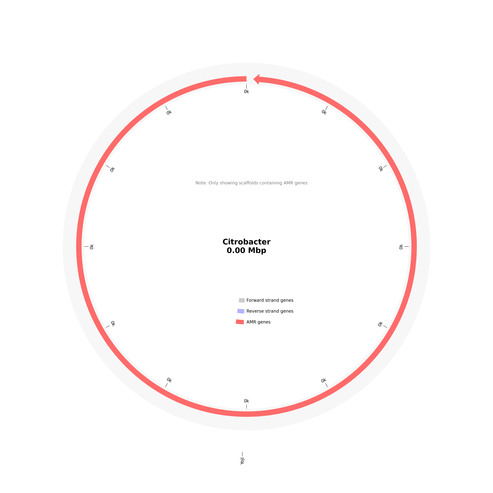

### YojI
- **Mechanism**: antibiotic efflux
- **Drug Classes**: peptide antibiotic
- **AMR Family**: ATP-binding cassette (ABC) antibiotic efflux pump
- **Locations**:
  - gnl|SPADES|IAMKMEGF_1068423_1 : position 2-313

## Ewingella americana
**Strain Statistics:**
- Total genome length: 86.0 kbp
- Total scaffolds: 2603
- Scaffolds with AMR genes: 204
- Total genes annotated: 108
- Total AMR genes: 208
- Unique AMR genes: 121
- Distinct AMR mechanisms: 9
- Distinct AMR families: 41
- Distinct drug classes: 33

**Circos Plot:**

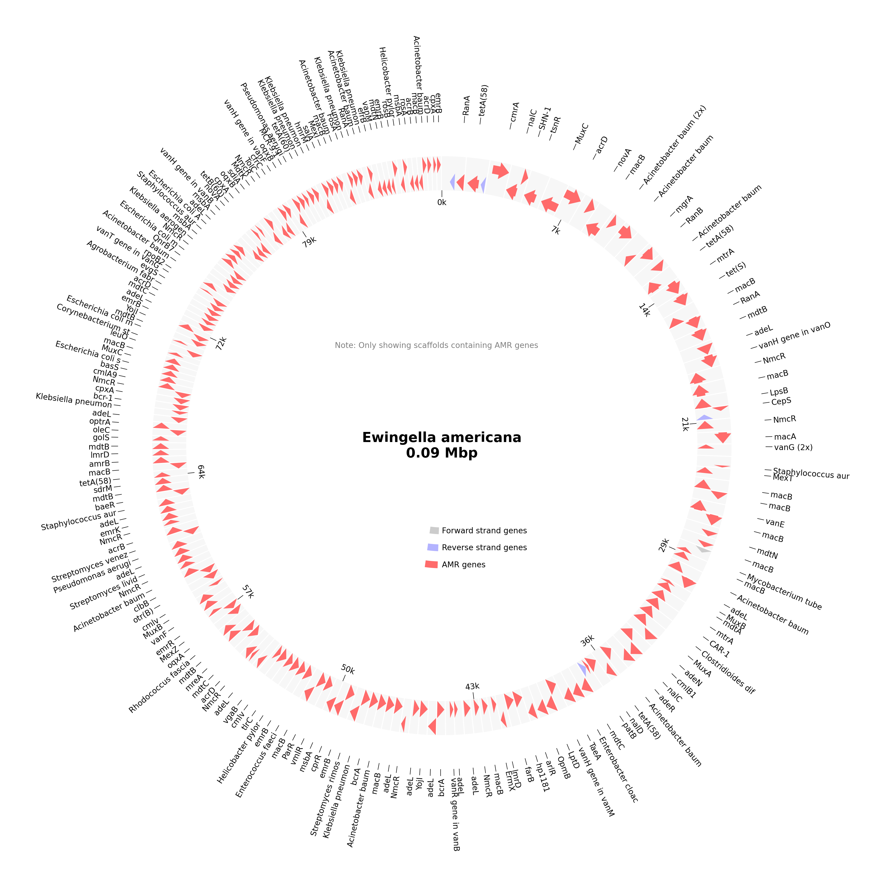

### Acinetobacter baumannii AbaF (found in 5 locations)
- **Mechanism**: antibiotic efflux
- **Drug Classes**: phosphonic acid antibiotic
- **AMR Family**: major facilitator superfamily (MFS) antibiotic efflux pump
- **Locations**:
  - gnl|SPADES|IAMKMEGF_1922790_1 : position 1-228
  - gnl|SPADES|IAMKMEGF_2175347_1 : position 1-210
  - gnl|SPADES|IAMKMEGF_348042_1 : position 2-466
  - gnl|SPADES|IAMKMEGF_76433_1 : position 2-790
  - gnl|SPADES|IAMKMEGF_94462_1 : position 304-747

### Acinetobacter baumannii AbaQ (found in 6 locations)
- **Mechanism**: antibiotic efflux
- **Drug Classes**: fluoroquinolone antibiotic
- **AMR Family**: major facilitator superfamily (MFS) antibiotic efflux pump
- **Locations**:
  - gnl|SPADES|IAMKMEGF_1374853_1 : position 3-236
  - gnl|SPADES|IAMKMEGF_1885860_1 : position 1-231
  - gnl|SPADES|IAMKMEGF_258340_1 : position 1-504
  - gnl|SPADES|IAMKMEGF_72264_1 : position 174-518
  - gnl|SPADES|IAMKMEGF_72264_2 : position 463-801
  - gnl|SPADES|IAMKMEGF_829594_1 : position 2-355

### Acinetobacter baumannii AmvA
- **Mechanism**: antibiotic efflux
- **Drug Classes**: macrolide antibiotic; disinfecting agents and antiseptics
- **AMR Family**: major facilitator superfamily (MFS) antibiotic efflux pump
- **Locations**:
  - gnl|SPADES|IAMKMEGF_543145_1 : position 1-429

### Agrobacterium fabrum chloramphenicol acetyltransferase
- **Mechanism**: antibiotic inactivation
- **Drug Classes**: phenicol antibiotic
- **AMR Family**: chloramphenicol acetyltransferase (CAT)
- **Locations**:
  - gnl|SPADES|IAMKMEGF_1350820_1 : position 2-274

### CAR-1
- **Mechanism**: antibiotic inactivation
- **Drug Classes**: carbapenem
- **AMR Family**: CAR beta-lactamase
- **Locations**:
  - gnl|SPADES|IAMKMEGF_299646_1 : position 3-536

### CepS
- **Mechanism**: antibiotic inactivation
- **Drug Classes**: cephalosporin
- **AMR Family**: CepS beta-lactamase
- **Locations**:
  - gnl|SPADES|IAMKMEGF_160841_1 : position 3-236

### Clostridioides difficile gyrB conferring resistance to fluoroquinolones
- **Mechanism**: antibiotic target alteration
- **Drug Classes**: fluoroquinolone antibiotic
- **AMR Family**: fluoroquinolone resistant gyrB
- **Locations**:
  - gnl|SPADES|IAMKMEGF_314554_1 : position 2-529

### Corynebacterium striatum tetA
- **Mechanism**: antibiotic efflux
- **Drug Classes**: penam; tetracycline antibiotic
- **AMR Family**: major facilitator superfamily (MFS) antibiotic efflux pump
- **Locations**:
  - gnl|SPADES|IAMKMEGF_1256247_1 : position 3-287

### Enterobacter cloacae acrA
- **Mechanism**: antibiotic efflux
- **Drug Classes**: fluoroquinolone antibiotic; cephalosporin; glycylcycline; penam; tetracycline antibiotic; rifamycin antibiotic; phenicol antibiotic; disinfecting agents and antiseptics
- **AMR Family**: resistance-nodulation-cell division (RND) antibiotic efflux pump
- **Locations**:
  - gnl|SPADES|IAMKMEGF_402062_1 : position 1-483

### Enterococcus faecium cls conferring resistance to daptomycin
- **Mechanism**: antibiotic target alteration
- **Drug Classes**: peptide antibiotic
- **AMR Family**: daptomycin resistant cls
- **Locations**:
  - gnl|SPADES|IAMKMEGF_658172_1 : position 3-395

### ErmX
- **Mechanism**: antibiotic target alteration
- **Drug Classes**: macrolide antibiotic; lincosamide antibiotic; streptogramin antibiotic; streptogramin A antibiotic; streptogramin B antibiotic
- **AMR Family**: Erm 23S ribosomal RNA methyltransferase
- **Locations**:
  - gnl|SPADES|IAMKMEGF_461766_1 : position 1-240

### Escherichia coli AcrAB-TolC with AcrR mutation conferring resistance to ciprofloxacin, tetracycline, and ceftazidime
- **Mechanism**: antibiotic target alteration; antibiotic efflux
- **Drug Classes**: fluoroquinolone antibiotic; cephalosporin; glycylcycline; penam; tetracycline antibiotic; rifamycin antibiotic; phenicol antibiotic; disinfecting agents and antiseptics
- **AMR Family**: resistance-nodulation-cell division (RND) antibiotic efflux pump
- **Locations**:
  - gnl|SPADES|IAMKMEGF_1482023_1 : position 37-261

### Escherichia coli mdfA (found in 2 locations)
- **Mechanism**: antibiotic efflux
- **Drug Classes**: tetracycline antibiotic; phenicol antibiotic; disinfecting agents and antiseptics
- **AMR Family**: major facilitator superfamily (MFS) antibiotic efflux pump
- **Locations**:
  - gnl|SPADES|IAMKMEGF_1257337_2 : position 179-286
  - gnl|SPADES|IAMKMEGF_1400788_1 : position 2-271

### Escherichia coli soxS with mutation conferring antibiotic resistance
- **Mechanism**: antibiotic target alteration; antibiotic efflux; reduced permeability to antibiotic
- **Drug Classes**: fluoroquinolone antibiotic; monobactam; carbapenem; cephalosporin; glycylcycline; cephamycin; penam; tetracycline antibiotic; rifamycin antibiotic; phenicol antibiotic; penem; disinfecting agents and antiseptics
- **AMR Family**: ATP-binding cassette (ABC) antibiotic efflux pump; major facilitator superfamily (MFS) antibiotic efflux pump; resistance-nodulation-cell division (RND) antibiotic efflux pump; General Bacterial Porin with reduced permeability to beta-lactams
- **Locations**:
  - gnl|SPADES|IAMKMEGF_1150556_1 : position 1-282

### FosA
- **Mechanism**: antibiotic inactivation
- **Drug Classes**: phosphonic acid antibiotic
- **AMR Family**: fosfomycin thiol transferase
- **Locations**:
  - gnl|SPADES|IAMKMEGF_1898226_1 : position 40-231

### Helicobacter pylori pbp1 mutants conferring resistance to amoxicillin (found in 2 locations)
- **Mechanism**: antibiotic target alteration
- **Drug Classes**: cephalosporin; cephamycin; penam
- **AMR Family**: Penicillin-binding protein mutations conferring resistance to beta-lactam antibiotics
- **Locations**:
  - gnl|SPADES|IAMKMEGF_2093101_1 : position 1-216
  - gnl|SPADES|IAMKMEGF_682243_1 : position 1-387

### Klebsiella aerogenes Omp36
- **Mechanism**: reduced permeability to antibiotic
- **Drug Classes**: monobactam; carbapenem; cephalosporin; cephamycin; penam; penem
- **AMR Family**: General Bacterial Porin with reduced permeability to beta-lactams
- **Locations**:
  - gnl|SPADES|IAMKMEGF_1446222_1 : position 3-266

### Klebsiella pneumoniae KpnG (found in 3 locations)
- **Mechanism**: antibiotic efflux
- **Drug Classes**: macrolide antibiotic; fluoroquinolone antibiotic; aminoglycoside antibiotic; carbapenem; cephalosporin; penam; peptide antibiotic; penem
- **AMR Family**: major facilitator superfamily (MFS) antibiotic efflux pump
- **Locations**:
  - gnl|SPADES|IAMKMEGF_1915164_1 : position 2-229
  - gnl|SPADES|IAMKMEGF_1953975_1 : position 22-225
  - gnl|SPADES|IAMKMEGF_556705_1 : position 2-424

### Klebsiella pneumoniae OmpK37 (found in 3 locations)
- **Mechanism**: reduced permeability to antibiotic
- **Drug Classes**: monobactam; carbapenem; cephalosporin; cephamycin; penam; penem
- **AMR Family**: General Bacterial Porin with reduced permeability to beta-lactams
- **Locations**:
  - gnl|SPADES|IAMKMEGF_1064968_1 : position 120-314
  - gnl|SPADES|IAMKMEGF_1736970_1 : position 2-241
  - gnl|SPADES|IAMKMEGF_1772006_1 : position 2-238

### LpsB
- **Mechanism**: reduced permeability to antibiotic
- **Drug Classes**: peptide antibiotic
- **AMR Family**: Intrinsic peptide antibiotic resistant Lps
- **Locations**:
  - gnl|SPADES|IAMKMEGF_160644_1 : position 98-649

### LptD
- **Mechanism**: antibiotic efflux
- **Drug Classes**: carbapenem; peptide antibiotic; aminocoumarin antibiotic; rifamycin antibiotic
- **AMR Family**: ATP-binding cassette (ABC) antibiotic efflux pump
- **Locations**:
  - gnl|SPADES|IAMKMEGF_415158_1 : position 2-478

### MCR-9.1
- **Mechanism**: antibiotic target alteration
- **Drug Classes**: peptide antibiotic
- **AMR Family**: MCR phosphoethanolamine transferase
- **Locations**:
  - gnl|SPADES|IAMKMEGF_1703580_1 : position 3-245

### MdtK
- **Mechanism**: antibiotic efflux
- **Drug Classes**: fluoroquinolone antibiotic
- **AMR Family**: multidrug and toxic compound extrusion (MATE) transporter
- **Locations**:
  - gnl|SPADES|IAMKMEGF_1628578_1 : position 3-251

### MexI
- **Mechanism**: antibiotic efflux
- **Drug Classes**: fluoroquinolone antibiotic; tetracycline antibiotic; disinfecting agents and antiseptics
- **AMR Family**: resistance-nodulation-cell division (RND) antibiotic efflux pump
- **Locations**:
  - gnl|SPADES|IAMKMEGF_1821093_1 : position 3-236

### MexT
- **Mechanism**: antibiotic efflux
- **Drug Classes**: fluoroquinolone antibiotic; diaminopyrimidine antibiotic; phenicol antibiotic
- **AMR Family**: resistance-nodulation-cell division (RND) antibiotic efflux pump
- **Locations**:
  - gnl|SPADES|IAMKMEGF_217221_1 : position 2-346

### MexZ
- **Mechanism**: antibiotic efflux
- **Drug Classes**: macrolide antibiotic; fluoroquinolone antibiotic; aminoglycoside antibiotic; carbapenem; cephalosporin; cephamycin; penam; tetracycline antibiotic; phenicol antibiotic; disinfecting agents and antiseptics
- **AMR Family**: resistance-nodulation-cell division (RND) antibiotic efflux pump
- **Locations**:
  - gnl|SPADES|IAMKMEGF_783211_1 : position 3-335

### MuxA
- **Mechanism**: antibiotic efflux
- **Drug Classes**: macrolide antibiotic; monobactam; tetracycline antibiotic; aminocoumarin antibiotic
- **AMR Family**: resistance-nodulation-cell division (RND) antibiotic efflux pump
- **Locations**:
  - gnl|SPADES|IAMKMEGF_327292_1 : position 1-522

### MuxB (found in 2 locations)
- **Mechanism**: antibiotic efflux
- **Drug Classes**: macrolide antibiotic; monobactam; tetracycline antibiotic; aminocoumarin antibiotic
- **AMR Family**: resistance-nodulation-cell division (RND) antibiotic efflux pump
- **Locations**:
  - gnl|SPADES|IAMKMEGF_261479_1 : position 3-158
  - gnl|SPADES|IAMKMEGF_798731_1 : position 1-360

### MuxC (found in 2 locations)
- **Mechanism**: antibiotic efflux
- **Drug Classes**: macrolide antibiotic; monobactam; tetracycline antibiotic; aminocoumarin antibiotic
- **AMR Family**: resistance-nodulation-cell division (RND) antibiotic efflux pump
- **Locations**:
  - gnl|SPADES|IAMKMEGF_1207960_1 : position 1-291
  - gnl|SPADES|IAMKMEGF_24558_1 : position 1-1017

### Mycobacterium tuberculosis kasA mutant conferring resistance to isoniazid
- **Mechanism**: antibiotic target alteration
- **Drug Classes**: isoniazid-like antibiotic
- **AMR Family**: antibiotic resistant kasA
- **Locations**:
  - gnl|SPADES|IAMKMEGF_243155_2 : position 341-574

### NmcR (found in 10 locations)
- **Mechanism**: antibiotic inactivation
- **Drug Classes**: carbapenem; cephalosporin; cephamycin; penam
- **AMR Family**: NmcA beta-lactamase
- **Locations**:
  - gnl|SPADES|IAMKMEGF_1104773_1 : position 1-306
  - gnl|SPADES|IAMKMEGF_1392368_1 : position 2-271
  - gnl|SPADES|IAMKMEGF_140933_1 : position 1-612
  - gnl|SPADES|IAMKMEGF_1628890_1 : position 2-250
  - gnl|SPADES|IAMKMEGF_165529_1 : position 1-462
  - gnl|SPADES|IAMKMEGF_486918_1 : position 2-274
  - gnl|SPADES|IAMKMEGF_516727_2 : position 228-437
  - gnl|SPADES|IAMKMEGF_717595_1 : position 228-380
  - gnl|SPADES|IAMKMEGF_845684_1 : position 82-351
  - gnl|SPADES|IAMKMEGF_866080_1 : position 130-348

### OpmB
- **Mechanism**: antibiotic efflux
- **Drug Classes**: macrolide antibiotic; monobactam; tetracycline antibiotic; aminocoumarin antibiotic
- **AMR Family**: resistance-nodulation-cell division (RND) antibiotic efflux pump
- **Locations**:
  - gnl|SPADES|IAMKMEGF_424592_1 : position 3-473

### ParR
- **Mechanism**: antibiotic efflux; reduced permeability to antibiotic
- **Drug Classes**: macrolide antibiotic; fluoroquinolone antibiotic; monobactam; aminoglycoside antibiotic; carbapenem; cephalosporin; cephamycin; penam; tetracycline antibiotic; phenicol antibiotic; penem; disinfecting agents and antiseptics
- **AMR Family**: resistance-nodulation-cell division (RND) antibiotic efflux pump; Outer Membrane Porin (Opr)
- **Locations**:
  - gnl|SPADES|IAMKMEGF_644738_1 : position 2-397

### Pseudomonas aeruginosa CpxR (found in 2 locations)
- **Mechanism**: antibiotic efflux
- **Drug Classes**: macrolide antibiotic; fluoroquinolone antibiotic; monobactam; aminoglycoside antibiotic; carbapenem; cephalosporin; cephamycin; penam; tetracycline antibiotic; peptide antibiotic; aminocoumarin antibiotic; diaminopyrimidine antibiotic; sulfonamide antibiotic; phenicol antibiotic; penem
- **AMR Family**: resistance-nodulation-cell division (RND) antibiotic efflux pump
- **Locations**:
  - gnl|SPADES|IAMKMEGF_1713043_1 : position 2-172
  - gnl|SPADES|IAMKMEGF_854846_1 : position 2-349

### QnrB7
- **Mechanism**: antibiotic target protection
- **Drug Classes**: fluoroquinolone antibiotic
- **AMR Family**: quinolone resistance protein (qnr)
- **Locations**:
  - gnl|SPADES|IAMKMEGF_1383278_1 : position 3-272

### RanA (found in 3 locations)
- **Mechanism**: antibiotic efflux
- **Drug Classes**: aminoglycoside antibiotic
- **AMR Family**: ATP-binding cassette (ABC) antibiotic efflux pump
- **Locations**:
  - gnl|SPADES|IAMKMEGF_130433_1 : position 1-609
  - gnl|SPADES|IAMKMEGF_1927541_1 : position 1-228
  - gnl|SPADES|IAMKMEGF_7787_2 : position 847-1287

### RanB
- **Mechanism**: antibiotic efflux
- **Drug Classes**: aminoglycoside antibiotic
- **AMR Family**: ATP-binding cassette (ABC) antibiotic efflux pump
- **Locations**:
  - gnl|SPADES|IAMKMEGF_89138_2 : position 179-760

### Rhodococcus fascians cmr
- **Mechanism**: antibiotic efflux
- **Drug Classes**: phenicol antibiotic
- **AMR Family**: major facilitator superfamily (MFS) antibiotic efflux pump
- **Locations**:
  - gnl|SPADES|IAMKMEGF_774240_1 : position 1-366

### SHN-1
- **Mechanism**: antibiotic inactivation
- **Drug Classes**: carbapenem
- **AMR Family**: SHN beta-lactamase
- **Locations**:
  - gnl|SPADES|IAMKMEGF_22472_2 : position 735-1034

### Staphylococcus aureus GlpT with mutation conferring resistance to fosfomycin
- **Mechanism**: antibiotic target alteration
- **Drug Classes**: phosphonic acid antibiotic
- **AMR Family**: antibiotic-resistant GlpT
- **Locations**:
  - gnl|SPADES|IAMKMEGF_212725_2 : position 488-598

### Staphylococcus aureus mupB conferring resistance to mupirocin
- **Mechanism**: antibiotic target alteration
- **Drug Classes**: mupirocin-like antibiotic
- **AMR Family**: antibiotic-resistant isoleucyl-tRNA synthetase (ileS)
- **Locations**:
  - gnl|SPADES|IAMKMEGF_1488241_1 : position 2-262

### Staphylococcus aureus murA with mutation conferring resistance to fosfomycin
- **Mechanism**: antibiotic target alteration
- **Drug Classes**: phosphonic acid antibiotic
- **AMR Family**: antibiotic-resistant murA transferase
- **Locations**:
  - gnl|SPADES|IAMKMEGF_916891_1 : position 2-337

### Streptomyces lividans cmlR
- **Mechanism**: antibiotic efflux
- **Drug Classes**: phenicol antibiotic
- **AMR Family**: major facilitator superfamily (MFS) antibiotic efflux pump
- **Locations**:
  - gnl|SPADES|IAMKMEGF_848683_1 : position 2-352

### Streptomyces rimosus otr(A)
- **Mechanism**: antibiotic target protection
- **Drug Classes**: tetracycline antibiotic
- **AMR Family**: tetracycline-resistant ribosomal protection protein
- **Locations**:
  - gnl|SPADES|IAMKMEGF_567516_1 : position 3-422

### Streptomyces venezuelae rox
- **Mechanism**: antibiotic inactivation
- **Drug Classes**: rifamycin antibiotic
- **AMR Family**: rifampin monooxygenase
- **Locations**:
  - gnl|SPADES|IAMKMEGF_859722_1 : position 2-349

### TaeA
- **Mechanism**: antibiotic efflux
- **Drug Classes**: pleuromutilin antibiotic
- **AMR Family**: ATP-binding cassette (ABC) antibiotic efflux pump
- **Locations**:
  - gnl|SPADES|IAMKMEGF_402998_1 : position 1-483

### TolC
- **Mechanism**: antibiotic efflux
- **Drug Classes**: macrolide antibiotic; fluoroquinolone antibiotic; aminoglycoside antibiotic; carbapenem; cephalosporin; glycylcycline; cephamycin; penam; tetracycline antibiotic; peptide antibiotic; aminocoumarin antibiotic; rifamycin antibiotic; phenicol antibiotic; penem; disinfecting agents and antiseptics
- **AMR Family**: ATP-binding cassette (ABC) antibiotic efflux pump; major facilitator superfamily (MFS) antibiotic efflux pump; resistance-nodulation-cell division (RND) antibiotic efflux pump
- **Locations**:
  - gnl|SPADES|IAMKMEGF_1664419_1 : position 1-246

### YojI (found in 2 locations)
- **Mechanism**: antibiotic efflux
- **Drug Classes**: peptide antibiotic
- **AMR Family**: ATP-binding cassette (ABC) antibiotic efflux pump
- **Locations**:
  - gnl|SPADES|IAMKMEGF_1310707_1 : position 2-280
  - gnl|SPADES|IAMKMEGF_514622_1 : position 3-440

### acrB (found in 2 locations)
- **Mechanism**: antibiotic efflux
- **Drug Classes**: fluoroquinolone antibiotic; cephalosporin; glycylcycline; penam; tetracycline antibiotic; rifamycin antibiotic; phenicol antibiotic; disinfecting agents and antiseptics
- **AMR Family**: resistance-nodulation-cell division (RND) antibiotic efflux pump
- **Locations**:
  - gnl|SPADES|IAMKMEGF_2140784_1 : position 2-214
  - gnl|SPADES|IAMKMEGF_857438_1 : position 2-349

### acrD (found in 4 locations)
- **Mechanism**: antibiotic efflux
- **Drug Classes**: aminoglycoside antibiotic
- **AMR Family**: resistance-nodulation-cell division (RND) antibiotic efflux pump
- **Locations**:
  - gnl|SPADES|IAMKMEGF_1318546_1 : position 1-279
  - gnl|SPADES|IAMKMEGF_2191197_1 : position 1-210
  - gnl|SPADES|IAMKMEGF_32357_1 : position 1-960
  - gnl|SPADES|IAMKMEGF_736296_1 : position 1-375

### adeL (found in 13 locations)
- **Mechanism**: antibiotic efflux
- **Drug Classes**: fluoroquinolone antibiotic; tetracycline antibiotic
- **AMR Family**: resistance-nodulation-cell division (RND) antibiotic efflux pump
- **Locations**:
  - gnl|SPADES|IAMKMEGF_1043449_1 : position 1-315
  - gnl|SPADES|IAMKMEGF_1315841_1 : position 3-278
  - gnl|SPADES|IAMKMEGF_132776_2 : position 164-685
  - gnl|SPADES|IAMKMEGF_1491227_1 : position 2-262
  - gnl|SPADES|IAMKMEGF_258477_1 : position 1-564
  - gnl|SPADES|IAMKMEGF_489649_2 : position 252-449
  - gnl|SPADES|IAMKMEGF_489982_1 : position 2-379
  - gnl|SPADES|IAMKMEGF_512545_1 : position 3-440
  - gnl|SPADES|IAMKMEGF_518659_1 : position 3-344
  - gnl|SPADES|IAMKMEGF_524875_1 : position 1-435
  - gnl|SPADES|IAMKMEGF_700132_1 : position 99-383
  - gnl|SPADES|IAMKMEGF_855644_1 : position 2-349
  - gnl|SPADES|IAMKMEGF_911193_1 : position 3-338

### adeN
- **Mechanism**: antibiotic efflux
- **Drug Classes**: macrolide antibiotic; fluoroquinolone antibiotic; lincosamide antibiotic; carbapenem; cephalosporin; tetracycline antibiotic; rifamycin antibiotic; diaminopyrimidine antibiotic; phenicol antibiotic; penem
- **AMR Family**: resistance-nodulation-cell division (RND) antibiotic efflux pump
- **Locations**:
  - gnl|SPADES|IAMKMEGF_330612_1 : position 50-520

### adeR
- **Mechanism**: antibiotic efflux
- **Drug Classes**: glycylcycline; tetracycline antibiotic
- **AMR Family**: resistance-nodulation-cell division (RND) antibiotic efflux pump
- **Locations**:
  - gnl|SPADES|IAMKMEGF_346087_1 : position 1-453

### amrB
- **Mechanism**: antibiotic efflux
- **Drug Classes**: macrolide antibiotic; aminoglycoside antibiotic
- **AMR Family**: resistance-nodulation-cell division (RND) antibiotic efflux pump
- **Locations**:
  - gnl|SPADES|IAMKMEGF_965066_1 : position 1-330

### arlR
- **Mechanism**: antibiotic efflux
- **Drug Classes**: fluoroquinolone antibiotic; disinfecting agents and antiseptics
- **AMR Family**: major facilitator superfamily (MFS) antibiotic efflux pump
- **Locations**:
  - gnl|SPADES|IAMKMEGF_431981_2 : position 87-470

### baeR
- **Mechanism**: antibiotic efflux
- **Drug Classes**: aminoglycoside antibiotic; aminocoumarin antibiotic
- **AMR Family**: resistance-nodulation-cell division (RND) antibiotic efflux pump
- **Locations**:
  - gnl|SPADES|IAMKMEGF_937815_1 : position 1-333

### basS
- **Mechanism**: antibiotic target alteration; antibiotic efflux
- **Drug Classes**: peptide antibiotic
- **AMR Family**: pmr phosphoethanolamine transferase
- **Locations**:
  - gnl|SPADES|IAMKMEGF_1139821_1 : position 3-302

### bcr-1
- **Mechanism**: antibiotic efflux
- **Drug Classes**: bicyclomycin-like antibiotic
- **AMR Family**: major facilitator superfamily (MFS) antibiotic efflux pump
- **Locations**:
  - gnl|SPADES|IAMKMEGF_1066668_1 : position 3-311

### bcrA (found in 2 locations)
- **Mechanism**: antibiotic efflux
- **Drug Classes**: peptide antibiotic
- **AMR Family**: ATP-binding cassette (ABC) antibiotic efflux pump
- **Locations**:
  - gnl|SPADES|IAMKMEGF_503585_1 : position 25-444
  - gnl|SPADES|IAMKMEGF_551852_1 : position 3-425

### cfrC
- **Mechanism**: antibiotic target alteration
- **Drug Classes**: lincosamide antibiotic; streptogramin antibiotic; oxazolidinone antibiotic; phenicol antibiotic
- **AMR Family**: Cfr 23S ribosomal RNA methyltransferase
- **Locations**:
  - gnl|SPADES|IAMKMEGF_1679145_1 : position 3-245

### clbB
- **Mechanism**: antibiotic target alteration
- **Drug Classes**: lincosamide antibiotic; streptogramin antibiotic; streptogramin A antibiotic; oxazolidinone antibiotic; phenicol antibiotic; pleuromutilin antibiotic
- **AMR Family**: Cfr 23S ribosomal RNA methyltransferase
- **Locations**:
  - gnl|SPADES|IAMKMEGF_824232_1 : position 2-355

### cmlA9
- **Mechanism**: antibiotic efflux
- **Drug Classes**: phenicol antibiotic
- **AMR Family**: major facilitator superfamily (MFS) antibiotic efflux pump
- **Locations**:
  - gnl|SPADES|IAMKMEGF_1119788_1 : position 1-303

### cmlB1
- **Mechanism**: antibiotic efflux
- **Drug Classes**: phenicol antibiotic
- **AMR Family**: major facilitator superfamily (MFS) antibiotic efflux pump
- **Locations**:
  - gnl|SPADES|IAMKMEGF_335748_1 : position 1-516

### cmlv (found in 2 locations)
- **Mechanism**: antibiotic inactivation
- **Drug Classes**: phenicol antibiotic
- **AMR Family**: chloramphenicol phosphotransferase
- **Locations**:
  - gnl|SPADES|IAMKMEGF_687346_1 : position 3-386
  - gnl|SPADES|IAMKMEGF_810500_1 : position 2-181

### cmrA
- **Mechanism**: antibiotic efflux
- **Drug Classes**: phenicol antibiotic
- **AMR Family**: major facilitator superfamily (MFS) antibiotic efflux pump
- **Locations**:
  - gnl|SPADES|IAMKMEGF_15460_2 : position 196-1116

### cprR
- **Mechanism**: antibiotic target alteration; antibiotic efflux
- **Drug Classes**: peptide antibiotic
- **AMR Family**: pmr phosphoethanolamine transferase
- **Locations**:
  - gnl|SPADES|IAMKMEGF_614976_1 : position 2-406

### cpxA (found in 3 locations)
- **Mechanism**: antibiotic efflux
- **Drug Classes**: aminoglycoside antibiotic; aminocoumarin antibiotic
- **AMR Family**: resistance-nodulation-cell division (RND) antibiotic efflux pump
- **Locations**:
  - gnl|SPADES|IAMKMEGF_1069463_1 : position 2-313
  - gnl|SPADES|IAMKMEGF_1597538_1 : position 1-120
  - gnl|SPADES|IAMKMEGF_2200805_1 : position 67-210

### efrB
- **Mechanism**: antibiotic efflux
- **Drug Classes**: macrolide antibiotic; fluoroquinolone antibiotic; rifamycin antibiotic
- **AMR Family**: ATP-binding cassette (ABC) antibiotic efflux pump
- **Locations**:
  - gnl|SPADES|IAMKMEGF_1971824_1 : position 2-226

### emrB (found in 5 locations)
- **Mechanism**: antibiotic efflux
- **Drug Classes**: fluoroquinolone antibiotic
- **AMR Family**: major facilitator superfamily (MFS) antibiotic efflux pump
- **Locations**:
  - gnl|SPADES|IAMKMEGF_1308331_1 : position 2-280
  - gnl|SPADES|IAMKMEGF_2055948_1 : position 2-163
  - gnl|SPADES|IAMKMEGF_2234157_1 : position 1-207
  - gnl|SPADES|IAMKMEGF_601348_1 : position 3-410
  - gnl|SPADES|IAMKMEGF_676861_1 : position 3-389

### emrK
- **Mechanism**: antibiotic efflux
- **Drug Classes**: tetracycline antibiotic
- **AMR Family**: major facilitator superfamily (MFS) antibiotic efflux pump
- **Locations**:
  - gnl|SPADES|IAMKMEGF_874478_1 : position 1-345

### emrR
- **Mechanism**: antibiotic efflux
- **Drug Classes**: fluoroquinolone antibiotic
- **AMR Family**: major facilitator superfamily (MFS) antibiotic efflux pump
- **Locations**:
  - gnl|SPADES|IAMKMEGF_790220_1 : position 3-194

### evgS
- **Mechanism**: antibiotic efflux
- **Drug Classes**: macrolide antibiotic; fluoroquinolone antibiotic; penam; tetracycline antibiotic
- **AMR Family**: major facilitator superfamily (MFS) antibiotic efflux pump; resistance-nodulation-cell division (RND) antibiotic efflux pump
- **Locations**:
  - gnl|SPADES|IAMKMEGF_1362864_1 : position 3-275

### farB
- **Mechanism**: antibiotic efflux
- **Drug Classes**: antibacterial free fatty acids
- **AMR Family**: major facilitator superfamily (MFS) antibiotic efflux pump
- **Locations**:
  - gnl|SPADES|IAMKMEGF_433933_1 : position 3-470

### golS
- **Mechanism**: antibiotic efflux
- **Drug Classes**: monobactam; carbapenem; cephalosporin; cephamycin; penam; phenicol antibiotic; penem
- **AMR Family**: resistance-nodulation-cell division (RND) antibiotic efflux pump
- **Locations**:
  - gnl|SPADES|IAMKMEGF_992785_2 : position 85-324

### hmrM
- **Mechanism**: antibiotic efflux
- **Drug Classes**: fluoroquinolone antibiotic; disinfecting agents and antiseptics
- **AMR Family**: multidrug and toxic compound extrusion (MATE) transporter
- **Locations**:
  - gnl|SPADES|IAMKMEGF_1772688_1 : position 3-239

### hp1181
- **Mechanism**: antibiotic efflux
- **Drug Classes**: fluoroquinolone antibiotic; tetracycline antibiotic; nitroimidazole antibiotic
- **AMR Family**: major facilitator superfamily (MFS) antibiotic efflux pump
- **Locations**:
  - gnl|SPADES|IAMKMEGF_430343_1 : position 3-470

### leuO
- **Mechanism**: antibiotic efflux
- **Drug Classes**: nucleoside antibiotic; disinfecting agents and antiseptics
- **AMR Family**: major facilitator superfamily (MFS) antibiotic efflux pump
- **Locations**:
  - gnl|SPADES|IAMKMEGF_1242946_1 : position 128-286

### lmrD (found in 2 locations)
- **Mechanism**: antibiotic efflux
- **Drug Classes**: lincosamide antibiotic
- **AMR Family**: ATP-binding cassette (ABC) antibiotic efflux pump
- **Locations**:
  - gnl|SPADES|IAMKMEGF_444156_2 : position 217-465
  - gnl|SPADES|IAMKMEGF_978886_1 : position 39-326

### macA
- **Mechanism**: antibiotic efflux
- **Drug Classes**: macrolide antibiotic
- **AMR Family**: ATP-binding cassette (ABC) antibiotic efflux pump
- **Locations**:
  - gnl|SPADES|IAMKMEGF_181477_1 : position 20-628

### macB (found in 15 locations)
- **Mechanism**: antibiotic efflux
- **Drug Classes**: macrolide antibiotic
- **AMR Family**: ATP-binding cassette (ABC) antibiotic efflux pump
- **Locations**:
  - gnl|SPADES|IAMKMEGF_1238360_1 : position 1-288
  - gnl|SPADES|IAMKMEGF_129929_2 : position 223-690
  - gnl|SPADES|IAMKMEGF_144084_1 : position 1-669
  - gnl|SPADES|IAMKMEGF_1885371_1 : position 3-230
  - gnl|SPADES|IAMKMEGF_2158803_1 : position 3-212
  - gnl|SPADES|IAMKMEGF_217487_1 : position 76-594
  - gnl|SPADES|IAMKMEGF_218755_1 : position 2-406
  - gnl|SPADES|IAMKMEGF_224960_1 : position 1-588
  - gnl|SPADES|IAMKMEGF_241646_2 : position 295-576
  - gnl|SPADES|IAMKMEGF_245640_1 : position 3-350
  - gnl|SPADES|IAMKMEGF_487088_1 : position 2-295
  - gnl|SPADES|IAMKMEGF_529060_1 : position 1-435
  - gnl|SPADES|IAMKMEGF_654140_1 : position 3-395
  - gnl|SPADES|IAMKMEGF_67569_1 : position 1-813
  - gnl|SPADES|IAMKMEGF_954607_1 : position 2-331

### mdtA
- **Mechanism**: antibiotic efflux
- **Drug Classes**: aminocoumarin antibiotic
- **AMR Family**: resistance-nodulation-cell division (RND) antibiotic efflux pump
- **Locations**:
  - gnl|SPADES|IAMKMEGF_261479_2 : position 155-562

### mdtB (found in 5 locations)
- **Mechanism**: antibiotic efflux
- **Drug Classes**: aminocoumarin antibiotic
- **AMR Family**: resistance-nodulation-cell division (RND) antibiotic efflux pump
- **Locations**:
  - gnl|SPADES|IAMKMEGF_1304636_1 : position 1-279
  - gnl|SPADES|IAMKMEGF_131512_1 : position 1-618
  - gnl|SPADES|IAMKMEGF_769563_1 : position 2-367
  - gnl|SPADES|IAMKMEGF_943369_1 : position 2-334
  - gnl|SPADES|IAMKMEGF_991649_1 : position 1-324

### mdtC (found in 3 locations)
- **Mechanism**: antibiotic efflux
- **Drug Classes**: aminocoumarin antibiotic
- **AMR Family**: resistance-nodulation-cell division (RND) antibiotic efflux pump
- **Locations**:
  - gnl|SPADES|IAMKMEGF_1325312_1 : position 64-279
  - gnl|SPADES|IAMKMEGF_396336_1 : position 1-486
  - gnl|SPADES|IAMKMEGF_751285_1 : position 1-372

### mdtN (found in 2 locations)
- **Mechanism**: antibiotic efflux
- **Drug Classes**: nucleoside antibiotic; disinfecting agents and antiseptics
- **AMR Family**: major facilitator superfamily (MFS) antibiotic efflux pump
- **Locations**:
  - gnl|SPADES|IAMKMEGF_2036497_1 : position 1-219
  - gnl|SPADES|IAMKMEGF_241484_2 : position 276-575

### mgrA
- **Mechanism**: antibiotic efflux
- **Drug Classes**: fluoroquinolone antibiotic; cephalosporin; penam; tetracycline antibiotic; peptide antibiotic; disinfecting agents and antiseptics
- **AMR Family**: ATP-binding cassette (ABC) antibiotic efflux pump; major facilitator superfamily (MFS) antibiotic efflux pump
- **Locations**:
  - gnl|SPADES|IAMKMEGF_77506_2 : position 420-785

### mreA
- **Mechanism**: antibiotic efflux
- **Drug Classes**: macrolide antibiotic
- **AMR Family**: major facilitator superfamily (MFS) antibiotic efflux pump
- **Locations**:
  - gnl|SPADES|IAMKMEGF_755425_1 : position 3-371

### msbA (found in 4 locations)
- **Mechanism**: antibiotic efflux
- **Drug Classes**: nitroimidazole antibiotic
- **AMR Family**: ATP-binding cassette (ABC) antibiotic efflux pump
- **Locations**:
  - gnl|SPADES|IAMKMEGF_1484506_1 : position 1-261
  - gnl|SPADES|IAMKMEGF_1521981_1 : position 1-258
  - gnl|SPADES|IAMKMEGF_2123748_1 : position 21-215
  - gnl|SPADES|IAMKMEGF_626601_1 : position 2-403

### mtrA (found in 2 locations)
- **Mechanism**: antibiotic efflux
- **Drug Classes**: macrolide antibiotic; penam
- **AMR Family**: resistance-nodulation-cell division (RND) antibiotic efflux pump
- **Locations**:
  - gnl|SPADES|IAMKMEGF_113805_1 : position 3-713
  - gnl|SPADES|IAMKMEGF_269709_1 : position 69-557

### nalC (found in 2 locations)
- **Mechanism**: antibiotic efflux
- **Drug Classes**: macrolide antibiotic; fluoroquinolone antibiotic; monobactam; carbapenem; cephalosporin; cephamycin; penam; tetracycline antibiotic; peptide antibiotic; aminocoumarin antibiotic; diaminopyrimidine antibiotic; sulfonamide antibiotic; phenicol antibiotic; penem
- **AMR Family**: resistance-nodulation-cell division (RND) antibiotic efflux pump
- **Locations**:
  - gnl|SPADES|IAMKMEGF_22472_1 : position 1-624
  - gnl|SPADES|IAMKMEGF_341503_1 : position 35-514

### nalD
- **Mechanism**: antibiotic efflux
- **Drug Classes**: macrolide antibiotic; fluoroquinolone antibiotic; monobactam; carbapenem; cephalosporin; cephamycin; penam; tetracycline antibiotic; peptide antibiotic; aminocoumarin antibiotic; diaminopyrimidine antibiotic; sulfonamide antibiotic; phenicol antibiotic; penem
- **AMR Family**: resistance-nodulation-cell division (RND) antibiotic efflux pump
- **Locations**:
  - gnl|SPADES|IAMKMEGF_373538_1 : position 1-498

### novA (found in 2 locations)
- **Mechanism**: antibiotic efflux
- **Drug Classes**: aminocoumarin antibiotic
- **AMR Family**: ATP-binding cassette (ABC) antibiotic efflux pump
- **Locations**:
  - gnl|SPADES|IAMKMEGF_1578266_1 : position 2-253
  - gnl|SPADES|IAMKMEGF_61178_2 : position 407-832

### oleC
- **Mechanism**: antibiotic efflux
- **Drug Classes**: macrolide antibiotic
- **AMR Family**: ATP-binding cassette (ABC) antibiotic efflux pump
- **Locations**:
  - gnl|SPADES|IAMKMEGF_1012069_1 : position 1-321

### optrA
- **Mechanism**: antibiotic target protection
- **Drug Classes**: oxazolidinone antibiotic; phenicol antibiotic
- **AMR Family**: Miscellaneous ABC-F subfamily ATP-binding cassette ribosomal protection proteins
- **Locations**:
  - gnl|SPADES|IAMKMEGF_1029649_1 : position 1-318

### oqxA
- **Mechanism**: antibiotic efflux
- **Drug Classes**: fluoroquinolone antibiotic; glycylcycline; tetracycline antibiotic; diaminopyrimidine antibiotic; nitrofuran antibiotic
- **AMR Family**: resistance-nodulation-cell division (RND) antibiotic efflux pump
- **Locations**:
  - gnl|SPADES|IAMKMEGF_775404_1 : position 3-365

### oqxB (found in 2 locations)
- **Mechanism**: antibiotic efflux
- **Drug Classes**: fluoroquinolone antibiotic; glycylcycline; tetracycline antibiotic; diaminopyrimidine antibiotic; nitrofuran antibiotic
- **AMR Family**: resistance-nodulation-cell division (RND) antibiotic efflux pump
- **Locations**:
  - gnl|SPADES|IAMKMEGF_1604436_1 : position 2-253
  - gnl|SPADES|IAMKMEGF_1698616_1 : position 1-243

### otr(B)
- **Mechanism**: antibiotic efflux
- **Drug Classes**: tetracycline antibiotic
- **AMR Family**: major facilitator superfamily (MFS) antibiotic efflux pump
- **Locations**:
  - gnl|SPADES|IAMKMEGF_807935_1 : position 1-360

### patB
- **Mechanism**: antibiotic efflux
- **Drug Classes**: fluoroquinolone antibiotic
- **AMR Family**: ATP-binding cassette (ABC) antibiotic efflux pump
- **Locations**:
  - gnl|SPADES|IAMKMEGF_390824_1 : position 1-153

### rosA
- **Mechanism**: antibiotic efflux
- **Drug Classes**: peptide antibiotic
- **AMR Family**: major facilitator superfamily (MFS) antibiotic efflux pump
- **Locations**:
  - gnl|SPADES|IAMKMEGF_2136301_1 : position 1-213

### rosB
- **Mechanism**: antibiotic efflux
- **Drug Classes**: peptide antibiotic
- **AMR Family**: major facilitator superfamily (MFS) antibiotic efflux pump
- **Locations**:
  - gnl|SPADES|IAMKMEGF_2058933_1 : position 2-220

### rpoB2
- **Mechanism**: antibiotic target alteration; antibiotic target replacement
- **Drug Classes**: rifamycin antibiotic
- **AMR Family**: rifamycin-resistant beta-subunit of RNA polymerase (rpoB)
- **Locations**:
  - gnl|SPADES|IAMKMEGF_1373041_1 : position 2-88

### salA
- **Mechanism**: antibiotic target protection
- **Drug Classes**: lincosamide antibiotic; streptogramin antibiotic; streptogramin A antibiotic; pleuromutilin antibiotic
- **AMR Family**: sal-type ABC-F protein
- **Locations**:
  - gnl|SPADES|IAMKMEGF_1777068_1 : position 2-238

### sdiA
- **Mechanism**: antibiotic efflux
- **Drug Classes**: fluoroquinolone antibiotic; cephalosporin; glycylcycline; penam; tetracycline antibiotic; rifamycin antibiotic; phenicol antibiotic; disinfecting agents and antiseptics
- **AMR Family**: resistance-nodulation-cell division (RND) antibiotic efflux pump
- **Locations**:
  - gnl|SPADES|IAMKMEGF_1610607_1 : position 2-250

### sdrM
- **Mechanism**: antibiotic efflux
- **Drug Classes**: fluoroquinolone antibiotic; disinfecting agents and antiseptics
- **AMR Family**: major facilitator superfamily (MFS) antibiotic efflux pump
- **Locations**:
  - gnl|SPADES|IAMKMEGF_951385_1 : position 1-333

### tet(S)
- **Mechanism**: antibiotic target protection
- **Drug Classes**: tetracycline antibiotic
- **AMR Family**: tetracycline-resistant ribosomal protection protein
- **Locations**:
  - gnl|SPADES|IAMKMEGF_125755_1 : position 87-695

### tetA(58) (found in 4 locations)
- **Mechanism**: antibiotic efflux
- **Drug Classes**: tetracycline antibiotic
- **AMR Family**: major facilitator superfamily (MFS) antibiotic efflux pump
- **Locations**:
  - gnl|SPADES|IAMKMEGF_10195_2 : position 150-812
  - gnl|SPADES|IAMKMEGF_112761_1 : position 1-606
  - gnl|SPADES|IAMKMEGF_350762_1 : position 134-508
  - gnl|SPADES|IAMKMEGF_954369_1 : position 1-255

### tetA(60)
- **Mechanism**: antibiotic efflux
- **Drug Classes**: tetracycline antibiotic
- **AMR Family**: ATP-binding cassette (ABC) antibiotic efflux pump
- **Locations**:
  - gnl|SPADES|IAMKMEGF_1729917_1 : position 2-241

### tetB(60)
- **Mechanism**: antibiotic efflux
- **Drug Classes**: tetracycline antibiotic
- **AMR Family**: ATP-binding cassette (ABC) antibiotic efflux pump
- **Locations**:
  - gnl|SPADES|IAMKMEGF_1593055_1 : position 3-149

### tlrC
- **Mechanism**: antibiotic target protection
- **Drug Classes**: macrolide antibiotic; lincosamide antibiotic
- **AMR Family**: Miscellaneous ABC-F subfamily ATP-binding cassette ribosomal protection proteins
- **Locations**:
  - gnl|SPADES|IAMKMEGF_687144_1 : position 3-344

### tsnR
- **Mechanism**: antibiotic target alteration
- **Drug Classes**: peptide antibiotic
- **AMR Family**: non-erm 23S ribosomal RNA methyltransferase (A1067)
- **Locations**:
  - gnl|SPADES|IAMKMEGF_24537_1 : position 3-707

### vanE
- **Mechanism**: antibiotic target alteration
- **Drug Classes**: glycopeptide antibiotic
- **AMR Family**: glycopeptide resistance gene cluster; Van ligase
- **Locations**:
  - gnl|SPADES|IAMKMEGF_221812_1 : position 2-592

### vanF
- **Mechanism**: antibiotic target alteration
- **Drug Classes**: glycopeptide antibiotic
- **AMR Family**: glycopeptide resistance gene cluster; Van ligase
- **Locations**:
  - gnl|SPADES|IAMKMEGF_789404_1 : position 2-364

### vanG (found in 2 locations)
- **Mechanism**: antibiotic target alteration
- **Drug Classes**: glycopeptide antibiotic
- **AMR Family**: glycopeptide resistance gene cluster; Van ligase
- **Locations**:
  - gnl|SPADES|IAMKMEGF_192974_1 : position 1-237
  - gnl|SPADES|IAMKMEGF_192974_2 : position 234-617

### vanH gene in vanB cluster
- **Mechanism**: antibiotic target alteration
- **Drug Classes**: glycopeptide antibiotic
- **AMR Family**: vanH; glycopeptide resistance gene cluster
- **Locations**:
  - gnl|SPADES|IAMKMEGF_1559437_1 : position 3-257

### vanH gene in vanF cluster
- **Mechanism**: antibiotic target alteration
- **Drug Classes**: glycopeptide antibiotic
- **AMR Family**: vanH; glycopeptide resistance gene cluster
- **Locations**:
  - gnl|SPADES|IAMKMEGF_1688164_1 : position 2-244

### vanH gene in vanM cluster
- **Mechanism**: antibiotic target alteration
- **Drug Classes**: glycopeptide antibiotic
- **AMR Family**: vanH; glycopeptide resistance gene cluster
- **Locations**:
  - gnl|SPADES|IAMKMEGF_409019_1 : position 1-480

### vanH gene in vanO cluster
- **Mechanism**: antibiotic target alteration
- **Drug Classes**: glycopeptide antibiotic
- **AMR Family**: vanH; glycopeptide resistance gene cluster
- **Locations**:
  - gnl|SPADES|IAMKMEGF_137166_1 : position 3-680

### vanM
- **Mechanism**: antibiotic target alteration
- **Drug Classes**: glycopeptide antibiotic
- **AMR Family**: glycopeptide resistance gene cluster; Van ligase
- **Locations**:
  - gnl|SPADES|IAMKMEGF_1973473_1 : position 2-226

### vanR gene in vanB cluster
- **Mechanism**: antibiotic target alteration
- **Drug Classes**: glycopeptide antibiotic
- **AMR Family**: glycopeptide resistance gene cluster; vanR
- **Locations**:
  - gnl|SPADES|IAMKMEGF_494126_1 : position 2-205

### vanT gene in vanG cluster
- **Mechanism**: antibiotic target alteration
- **Drug Classes**: glycopeptide antibiotic
- **AMR Family**: glycopeptide resistance gene cluster; vanT
- **Locations**:
  - gnl|SPADES|IAMKMEGF_1376888_1 : position 2-271

### vgaB
- **Mechanism**: antibiotic target protection
- **Drug Classes**: streptogramin antibiotic; streptogramin A antibiotic; pleuromutilin antibiotic
- **AMR Family**: vga-type ABC-F protein
- **Locations**:
  - gnl|SPADES|IAMKMEGF_699591_1 : position 2-253

### vmlR
- **Mechanism**: antibiotic target protection
- **Drug Classes**: lincosamide antibiotic; streptogramin antibiotic; streptogramin A antibiotic; streptogramin B antibiotic; nucleoside antibiotic; pleuromutilin antibiotic
- **AMR Family**: Miscellaneous ABC-F subfamily ATP-binding cassette ribosomal protection proteins
- **Locations**:
  - gnl|SPADES|IAMKMEGF_647442_1 : position 3-398

## Hafnia paralvei
**Strain Statistics:**
- Total genome length: 494.5 kbp
- Total scaffolds: 4505
- Scaffolds with AMR genes: 465
- Total genes annotated: 728
- Total AMR genes: 503
- Unique AMR genes: 219
- Distinct AMR mechanisms: 11
- Distinct AMR families: 66
- Distinct drug classes: 36

**Circos Plot:**

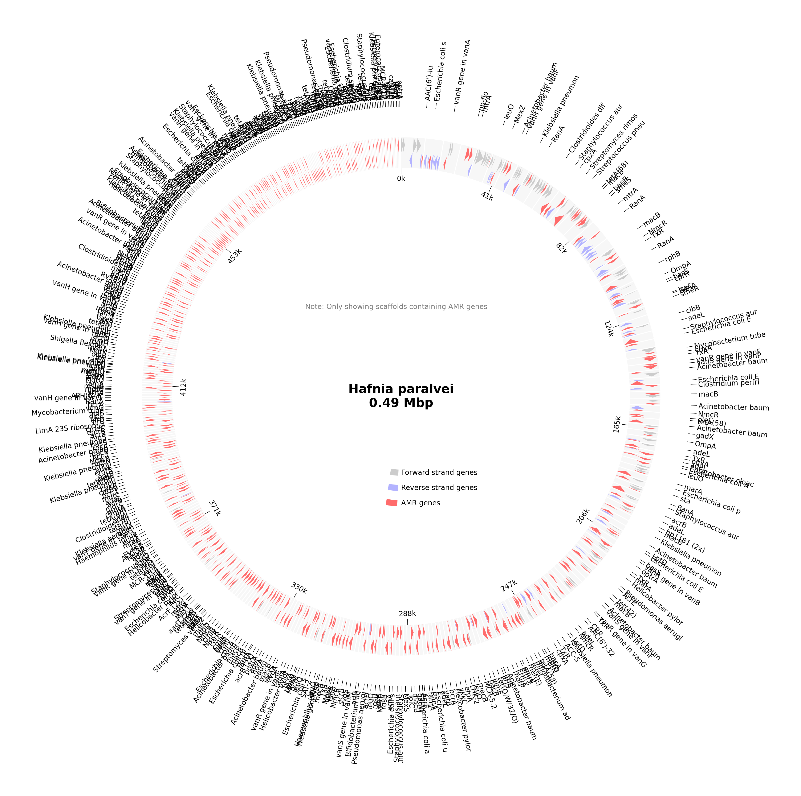

### AAC(6')-32
- **Mechanism**: antibiotic inactivation
- **Drug Classes**: aminoglycoside antibiotic
- **AMR Family**: AAC(6')
- **Locations**:
  - gnl|SPADES|IAMKMEGF_2392_2 : position 188-790

### AAC(6')-Iu
- **Mechanism**: antibiotic inactivation
- **Drug Classes**: aminoglycoside antibiotic
- **AMR Family**: AAC(6')
- **Locations**:
  - gnl|SPADES|IAMKMEGF_220_8 : position 9123-9581

### ACC-1b
- **Mechanism**: antibiotic inactivation
- **Drug Classes**: monobactam; cephalosporin; cephamycin; penam; oxacephem
- **AMR Family**: ACC beta-lactamase
- **Locations**:
  - gnl|SPADES|IAMKMEGF_55658_2 : position 518-850

### ACC-5
- **Mechanism**: antibiotic inactivation
- **Drug Classes**: monobactam; cephalosporin; penam
- **AMR Family**: ACC beta-lactamase
- **Locations**:
  - gnl|SPADES|IAMKMEGF_2794_1 : position 1-846

### ALI-1
- **Mechanism**: antibiotic inactivation
- **Drug Classes**: carbapenem
- **AMR Family**: ALI beta-lactamase
- **Locations**:
  - gnl|SPADES|IAMKMEGF_105995_1 : position 3-728

### APH(6)-Ic
- **Mechanism**: antibiotic inactivation
- **Drug Classes**: aminoglycoside antibiotic
- **AMR Family**: APH(6)
- **Locations**:
  - gnl|SPADES|IAMKMEGF_143862_1 : position 3-293

### Acinetobacter baumannii AbaF (found in 6 locations)
- **Mechanism**: antibiotic efflux
- **Drug Classes**: phosphonic acid antibiotic
- **AMR Family**: major facilitator superfamily (MFS) antibiotic efflux pump
- **Locations**:
  - gnl|SPADES|IAMKMEGF_1031_4 : position 1969-2514
  - gnl|SPADES|IAMKMEGF_111445_1 : position 2-718
  - gnl|SPADES|IAMKMEGF_24548_1 : position 120-1016
  - gnl|SPADES|IAMKMEGF_357443_1 : position 3-506
  - gnl|SPADES|IAMKMEGF_632822_1 : position 1-402
  - gnl|SPADES|IAMKMEGF_936_1 : position 1-609

### Acinetobacter baumannii AbaQ (found in 9 locations)
- **Mechanism**: antibiotic efflux
- **Drug Classes**: fluoroquinolone antibiotic
- **AMR Family**: major facilitator superfamily (MFS) antibiotic efflux pump
- **Locations**:
  - gnl|SPADES|IAMKMEGF_1154_2 : position 787-2019
  - gnl|SPADES|IAMKMEGF_1599_2 : position 1350-1991
  - gnl|SPADES|IAMKMEGF_2211_2 : position 794-1762
  - gnl|SPADES|IAMKMEGF_28378_2 : position 615-986
  - gnl|SPADES|IAMKMEGF_294073_1 : position 1-540
  - gnl|SPADES|IAMKMEGF_409542_2 : position 261-479
  - gnl|SPADES|IAMKMEGF_413_2 : position 955-1815
  - gnl|SPADES|IAMKMEGF_4244_1 : position 3-1145
  - gnl|SPADES|IAMKMEGF_659094_1 : position 20-283

### AcrE
- **Mechanism**: antibiotic efflux
- **Drug Classes**: fluoroquinolone antibiotic; cephalosporin; cephamycin; penam
- **AMR Family**: resistance-nodulation-cell division (RND) antibiotic efflux pump
- **Locations**:
  - gnl|SPADES|IAMKMEGF_2042_1 : position 25-1188

### AcrF (found in 5 locations)
- **Mechanism**: antibiotic efflux
- **Drug Classes**: fluoroquinolone antibiotic; cephalosporin; cephamycin; penam
- **AMR Family**: resistance-nodulation-cell division (RND) antibiotic efflux pump
- **Locations**:
  - gnl|SPADES|IAMKMEGF_2235371_1 : position 1-207
  - gnl|SPADES|IAMKMEGF_267580_1 : position 3-557
  - gnl|SPADES|IAMKMEGF_40887_1 : position 3-488
  - gnl|SPADES|IAMKMEGF_40887_2 : position 473-913
  - gnl|SPADES|IAMKMEGF_7582_1 : position 1-996

### ArnT (found in 3 locations)
- **Mechanism**: antibiotic target alteration
- **Drug Classes**: peptide antibiotic
- **AMR Family**: pmr phosphoethanolamine transferase
- **Locations**:
  - gnl|SPADES|IAMKMEGF_1550217_1 : position 3-257
  - gnl|SPADES|IAMKMEGF_1812132_1 : position 3-236
  - gnl|SPADES|IAMKMEGF_878138_1 : position 3-344

### Bifidobacterium adolescentis rpoB mutants conferring resistance to rifampicin (found in 3 locations)
- **Mechanism**: antibiotic target alteration; antibiotic target replacement
- **Drug Classes**: rifamycin antibiotic
- **AMR Family**: rifamycin-resistant beta-subunit of RNA polymerase (rpoB)
- **Locations**:
  - gnl|SPADES|IAMKMEGF_12804_1 : position 380-1159
  - gnl|SPADES|IAMKMEGF_3776_1 : position 2-1249
  - gnl|SPADES|IAMKMEGF_627381_1 : position 1-402

### Bifidobacterium bifidum ileS conferring resistance to mupirocin
- **Mechanism**: antibiotic target alteration
- **Drug Classes**: mupirocin-like antibiotic
- **AMR Family**: antibiotic-resistant isoleucyl-tRNA synthetase (ileS)
- **Locations**:
  - gnl|SPADES|IAMKMEGF_410370_1 : position 1-294

### CRP
- **Mechanism**: antibiotic efflux
- **Drug Classes**: macrolide antibiotic; fluoroquinolone antibiotic; penam
- **AMR Family**: resistance-nodulation-cell division (RND) antibiotic efflux pump
- **Locations**:
  - gnl|SPADES|IAMKMEGF_2333_2: position 1071-1703

### Clostridioides difficile gyrB conferring resistance to fluoroquinolones (found in 3 locations)
- **Mechanism**: antibiotic target alteration
- **Drug Classes**: fluoroquinolone antibiotic
- **AMR Family**: fluoroquinolone resistant gyrB
- **Locations**:
  - gnl|SPADES|IAMKMEGF_337965_1 : position 3-515
  - gnl|SPADES|IAMKMEGF_455_4 : position 3786-4469
  - gnl|SPADES|IAMKMEGF_77684_2 : position 286-786

### Clostridium perfringes cplR
- **Mechanism**: antibiotic target protection
- **Drug Classes**: lincosamide antibiotic; streptogramin antibiotic; streptogramin A antibiotic; pleuromutilin antibiotic
- **AMR Family**: Miscellaneous ABC-F subfamily ATP-binding cassette ribosomal protection proteins
- **Locations**:
  - gnl|SPADES|IAMKMEGF_1006_1 : position 1-795

### Clostridium sporogenes cplR
- **Mechanism**: antibiotic target protection
- **Drug Classes**: lincosamide antibiotic; pleuromutilin antibiotic
- **AMR Family**: Miscellaneous ABC-F subfamily ATP-binding cassette ribosomal protection proteins
- **Locations**:
  - gnl|SPADES|IAMKMEGF_1746468_1 : position 49-240

### EVM-1
- **Mechanism**: antibiotic inactivation
- **Drug Classes**: carbapenem
- **AMR Family**: EVM beta-lactamase
- **Locations**:
  - gnl|SPADES|IAMKMEGF_57319_1 : position 3-608

### Enterobacter cloacae acrA
- **Mechanism**: antibiotic efflux
- **Drug Classes**: fluoroquinolone antibiotic; cephalosporin; glycylcycline; penam; tetracycline antibiotic; rifamycin antibiotic; phenicol antibiotic; disinfecting agents and antiseptics
- **AMR Family**: resistance-nodulation-cell division (RND) antibiotic efflux pump
- **Locations**:
  - gnl|SPADES|IAMKMEGF_1298_1 : position 111-692

### Enterococcus faecium cls conferring resistance to daptomycin
- **Mechanism**: antibiotic target alteration
- **Drug Classes**: peptide antibiotic
- **AMR Family**: daptomycin resistant cls
- **Locations**:
  - gnl|SPADES|IAMKMEGF_2164736_1 : position 1-210

### ErmX
- **Mechanism**: antibiotic target alteration
- **Drug Classes**: macrolide antibiotic; lincosamide antibiotic; streptogramin antibiotic; streptogramin A antibiotic; streptogramin B antibiotic
- **AMR Family**: Erm 23S ribosomal RNA methyltransferase
- **Locations**:
  - gnl|SPADES|IAMKMEGF_4138_2 : position 323-1135

### Escherichia coli AcrAB-TolC with AcrR mutation conferring resistance to ciprofloxacin, tetracycline, and ceftazidime (found in 2 locations)
- **Mechanism**: antibiotic target alteration; antibiotic efflux
- **Drug Classes**: fluoroquinolone antibiotic; cephalosporin; glycylcycline; penam; tetracycline antibiotic; rifamycin antibiotic; phenicol antibiotic; disinfecting agents and antiseptics
- **AMR Family**: resistance-nodulation-cell division (RND) antibiotic efflux pump
- **Locations**:
  - gnl|SPADES|IAMKMEGF_1298_2 : position 832-1548
  - gnl|SPADES|IAMKMEGF_1633619_1 : position 1-249

### Escherichia coli AcrAB-TolC with MarR mutations conferring resistance to ciprofloxacin and tetracycline
- **Mechanism**: antibiotic target alteration; antibiotic efflux
- **Drug Classes**: fluoroquinolone antibiotic; cephalosporin; glycylcycline; penam; tetracycline antibiotic; rifamycin antibiotic; phenicol antibiotic; disinfecting agents and antiseptics
- **AMR Family**: resistance-nodulation-cell division (RND) antibiotic efflux pump
- **Locations**:
  - gnl|SPADES|IAMKMEGF_2071831_1 : position 1-219

### Escherichia coli EF-Tu mutants conferring resistance to Pulvomycin (found in 2 locations)
- **Mechanism**: antibiotic target alteration
- **Drug Classes**: elfamycin antibiotic
- **AMR Family**: elfamycin resistant EF-Tu
- **Locations**:
  - gnl|SPADES|IAMKMEGF_1652_1 : position 2-763
  - gnl|SPADES|IAMKMEGF_805_1 : position 2-613

### Escherichia coli EF-Tu mutants conferring resistance to kirromycin
- **Mechanism**: antibiotic target alteration
- **Drug Classes**: elfamycin antibiotic
- **AMR Family**: elfamycin resistant EF-Tu
- **Locations**:
  - gnl|SPADES|IAMKMEGF_953_3 : position 952-2637

### Escherichia coli acrA (found in 2 locations)
- **Mechanism**: antibiotic efflux
- **Drug Classes**: fluoroquinolone antibiotic; cephalosporin; glycylcycline; penam; tetracycline antibiotic; rifamycin antibiotic; phenicol antibiotic; disinfecting agents and antiseptics
- **AMR Family**: resistance-nodulation-cell division (RND) antibiotic efflux pump
- **Locations**:
  - gnl|SPADES|IAMKMEGF_30990_1 : position 2-970
  - gnl|SPADES|IAMKMEGF_7582_2 : position 1042-1293

### Escherichia coli mdfA (found in 6 locations)
- **Mechanism**: antibiotic efflux
- **Drug Classes**: tetracycline antibiotic; phenicol antibiotic; disinfecting agents and antiseptics
- **AMR Family**: major facilitator superfamily (MFS) antibiotic efflux pump
- **Locations**:
  - gnl|SPADES|IAMKMEGF_1665458_1 : position 3-248
  - gnl|SPADES|IAMKMEGF_27100_2 : position 411-995
  - gnl|SPADES|IAMKMEGF_44603_2 : position 764-895
  - gnl|SPADES|IAMKMEGF_634125_1 : position 1-402
  - gnl|SPADES|IAMKMEGF_723734_1 : position 1-309
  - gnl|SPADES|IAMKMEGF_936441_1 : position 2-334

### Escherichia coli parE conferring resistance to fluoroquinolones
- **Mechanism**: antibiotic target alteration
- **Drug Classes**: fluoroquinolone antibiotic
- **AMR Family**: fluoroquinolone resistant parE
- **Locations**:
  - gnl|SPADES|IAMKMEGF_1309_3 : position 690-2210

### Escherichia coli soxS with mutation conferring antibiotic resistance (found in 4 locations)
- **Mechanism**: antibiotic target alteration; antibiotic efflux; reduced permeability to antibiotic
- **Drug Classes**: fluoroquinolone antibiotic; monobactam; carbapenem; cephalosporin; glycylcycline; cephamycin; penam; tetracycline antibiotic; rifamycin antibiotic; phenicol antibiotic; penem; disinfecting agents and antiseptics
- **AMR Family**: ATP-binding cassette (ABC) antibiotic efflux pump; major facilitator superfamily (MFS) antibiotic efflux pump; resistance-nodulation-cell division (RND) antibiotic efflux pump; General Bacterial Porin with reduced permeability to beta-lactams
- **Locations**:
  - gnl|SPADES|IAMKMEGF_10646_2 : position 505-1206
  - gnl|SPADES|IAMKMEGF_18681_2 : position 646-1074
  - gnl|SPADES|IAMKMEGF_280_3 : position 2156-3019
  - gnl|SPADES|IAMKMEGF_846152_1 : position 189-350

### Escherichia coli uhpA with mutation conferring resistance to fosfomycin
- **Mechanism**: antibiotic target alteration
- **Drug Classes**: phosphonic acid antibiotic
- **AMR Family**: antibiotic-resistant UhpT
- **Locations**:
  - gnl|SPADES|IAMKMEGF_6996_2 : position 504-947

### H-NS (found in 2 locations)
- **Mechanism**: antibiotic efflux
- **Drug Classes**: macrolide antibiotic; fluoroquinolone antibiotic; cephalosporin; cephamycin; penam; tetracycline antibiotic
- **AMR Family**: major facilitator superfamily (MFS) antibiotic efflux pump; resistance-nodulation-cell division (RND) antibiotic efflux pump
- **Locations**:
  - gnl|SPADES|IAMKMEGF_2196999_1 : position 1-210
  - gnl|SPADES|IAMKMEGF_754709_1 : position 298-372

### Haemophilus influenzae PBP3 conferring resistance to beta-lactam antibiotics (found in 2 locations)
- **Mechanism**: antibiotic target alteration
- **Drug Classes**: cephalosporin; cephamycin; penam
- **AMR Family**: Penicillin-binding protein mutations conferring resistance to beta-lactam antibiotics
- **Locations**:
  - gnl|SPADES|IAMKMEGF_15208_2 : position 577-1119
  - gnl|SPADES|IAMKMEGF_62126_1 : position 3-830

### Helicobacter pylori pbp1 mutants conferring resistance to amoxicillin (found in 3 locations)
- **Mechanism**: antibiotic target alteration
- **Drug Classes**: cephalosporin; cephamycin; penam
- **AMR Family**: Penicillin-binding protein mutations conferring resistance to beta-lactam antibiotics
- **Locations**:
  - gnl|SPADES|IAMKMEGF_21887_1 : position 3-1040
  - gnl|SPADES|IAMKMEGF_42619_1 : position 2-904
  - gnl|SPADES|IAMKMEGF_480779_1 : position 3-452

### Helicobacter pylori pbp2 mutants conferring resistance to amoxicillin
- **Mechanism**: antibiotic target alteration
- **Drug Classes**: cephalosporin; cephamycin; penam
- **AMR Family**: Penicillin-binding protein mutations conferring resistance to beta-lactam antibiotics
- **Locations**:
  - gnl|SPADES|IAMKMEGF_1846_1 : position 2-526

### Helicobacter pylori rpoB mutation conferring resistance to rifampicin
- **Mechanism**: antibiotic target alteration; antibiotic target replacement
- **Drug Classes**: fluoroquinolone antibiotic; rifamycin antibiotic
- **AMR Family**: rifamycin-resistant beta-subunit of RNA polymerase (rpoB)
- **Locations**:
  - gnl|SPADES|IAMKMEGF_6457_1 : position 2-1339

### Klebsiella aerogenes Omp36
- **Mechanism**: reduced permeability to antibiotic
- **Drug Classes**: monobactam; carbapenem; cephalosporin; cephamycin; penam; penem
- **AMR Family**: General Bacterial Porin with reduced permeability to beta-lactams
- **Locations**:
  - gnl|SPADES|IAMKMEGF_67225_1 : position 3-773

### Klebsiella pneumoniae KpnE
- **Mechanism**: antibiotic efflux
- **Drug Classes**: macrolide antibiotic; aminoglycoside antibiotic; cephalosporin; tetracycline antibiotic; peptide antibiotic; rifamycin antibiotic; disinfecting agents and antiseptics
- **AMR Family**: small multidrug resistance (SMR) antibiotic efflux pump
- **Locations**:
  - gnl|SPADES|IAMKMEGF_172281_2 : position 279-638

### Klebsiella pneumoniae KpnF
- **Mechanism**: antibiotic efflux
- **Drug Classes**: macrolide antibiotic; aminoglycoside antibiotic; cephalosporin; tetracycline antibiotic; peptide antibiotic; rifamycin antibiotic; disinfecting agents and antiseptics
- **AMR Family**: small multidrug resistance (SMR) antibiotic efflux pump
- **Locations**:
  - gnl|SPADES|IAMKMEGF_172281_1: position 2-292

### Klebsiella pneumoniae KpnG (found in 2 locations)
- **Mechanism**: antibiotic efflux
- **Drug Classes**: macrolide antibiotic; fluoroquinolone antibiotic; aminoglycoside antibiotic; carbapenem; cephalosporin; penam; peptide antibiotic; penem
- **AMR Family**: major facilitator superfamily (MFS) antibiotic efflux pump
- **Locations**:
  - gnl|SPADES|IAMKMEGF_2063519_1 : position 23-217
  - gnl|SPADES|IAMKMEGF_89127_1 : position 60-758

### Klebsiella pneumoniae KpnH (found in 2 locations)
- **Mechanism**: antibiotic efflux
- **Drug Classes**: macrolide antibiotic; fluoroquinolone antibiotic; aminoglycoside antibiotic; carbapenem; cephalosporin; penam; peptide antibiotic; penem
- **AMR Family**: major facilitator superfamily (MFS) antibiotic efflux pump
- **Locations**:
  - gnl|SPADES|IAMKMEGF_1187927_1 : position 2-295
  - gnl|SPADES|IAMKMEGF_1591_1 : position 1-891

### Klebsiella pneumoniae OmpK37 (found in 9 locations)
- **Mechanism**: reduced permeability to antibiotic
- **Drug Classes**: monobactam; carbapenem; cephalosporin; cephamycin; penam; penem
- **AMR Family**: General Bacterial Porin with reduced permeability to beta-lactams
- **Locations**:
  - gnl|SPADES|IAMKMEGF_102941_1 : position 2-733
  - gnl|SPADES|IAMKMEGF_120879_1 : position 2-211
  - gnl|SPADES|IAMKMEGF_1278246_1 : position 3-284
  - gnl|SPADES|IAMKMEGF_229584_1 : position 2-358
  - gnl|SPADES|IAMKMEGF_2619_1 : position 1-132
  - gnl|SPADES|IAMKMEGF_415_6 : position 2880-3977
  - gnl|SPADES|IAMKMEGF_482695_1 : position 1-450
  - gnl|SPADES|IAMKMEGF_542579_1 : position 3-431
  - gnl|SPADES|IAMKMEGF_982266_1 : position 2-325

### Klebsiella pneumoniae acrR with mutation conferring multidrug antibiotic resistance
- **Mechanism**: antibiotic target alteration; antibiotic efflux
- **Drug Classes**: fluoroquinolone antibiotic; cephalosporin; glycylcycline; penam; tetracycline antibiotic; rifamycin antibiotic; phenicol antibiotic; disinfecting agents and antiseptics
- **AMR Family**: resistance-nodulation-cell division (RND) antibiotic efflux pump
- **Locations**:
  - gnl|SPADES|IAMKMEGF_792947_2 : position 106-363

### LHK-2
- **Mechanism**: antibiotic inactivation
- **Drug Classes**: carbapenem; cephalosporin
- **AMR Family**: LHK beta-lactamase
- **Locations**:
  - gnl|SPADES|IAMKMEGF_5718_1 : position 2-964

### LlmA 23S ribosomal RNA methyltransferase
- **Mechanism**: antibiotic target alteration
- **Drug Classes**: lincosamide antibiotic
- **AMR Family**: Llm 23S ribosomal RNA methyltransferase
- **Locations**:
  - gnl|SPADES|IAMKMEGF_126535_1 : position 3-695

### LptD (found in 4 locations)
- **Mechanism**: antibiotic efflux
- **Drug Classes**: carbapenem; peptide antibiotic; aminocoumarin antibiotic; rifamycin antibiotic
- **AMR Family**: ATP-binding cassette (ABC) antibiotic efflux pump
- **Locations**:
  - gnl|SPADES|IAMKMEGF_1346812_1 : position 3-275
  - gnl|SPADES|IAMKMEGF_1641_3 : position 1670-1966
  - gnl|SPADES|IAMKMEGF_2491_2 : position 740-1690
  - gnl|SPADES|IAMKMEGF_44768_1 : position 3-770

### MCR-10.4
- **Mechanism**: antibiotic target alteration
- **Drug Classes**: peptide antibiotic
- **AMR Family**: MCR phosphoethanolamine transferase
- **Locations**:
  - gnl|SPADES|IAMKMEGF_51701_1 : position 3-866

### MCR-3.11
- **Mechanism**: antibiotic target alteration
- **Drug Classes**: peptide antibiotic
- **AMR Family**: MCR phosphoethanolamine transferase
- **Locations**:
  - gnl|SPADES|IAMKMEGF_2164196_1 : position 3-212

### MCR-5.2 (found in 2 locations)
- **Mechanism**: antibiotic target alteration
- **Drug Classes**: peptide antibiotic
- **AMR Family**: MCR phosphoethanolamine transferase
- **Locations**:
  - gnl|SPADES|IAMKMEGF_1277640_1 : position 1-180
  - gnl|SPADES|IAMKMEGF_5518_1 : position 2-1000

### MdtK (found in 3 locations)
- **Mechanism**: antibiotic efflux
- **Drug Classes**: fluoroquinolone antibiotic
- **AMR Family**: multidrug and toxic compound extrusion (MATE) transporter
- **Locations**:
  - gnl|SPADES|IAMKMEGF_200189_1 : position 1-609
  - gnl|SPADES|IAMKMEGF_46090_2 : position 521-889
  - gnl|SPADES|IAMKMEGF_533754_1 : position 109-432

### MdtQ (found in 4 locations)
- **Mechanism**: reduced permeability to antibiotic
- **Drug Classes**: monobactam; carbapenem; cephalosporin; cephamycin; penam; penem
- **AMR Family**: Outer Membrane Porin (Opr)
- **Locations**:
  - gnl|SPADES|IAMKMEGF_157813_2 : position 258-653
  - gnl|SPADES|IAMKMEGF_662458_1 : position 3-395
  - gnl|SPADES|IAMKMEGF_770771_1 : position 1-366
  - gnl|SPADES|IAMKMEGF_848794_1 : position 1-351

### MexD
- **Mechanism**: antibiotic efflux
- **Drug Classes**: macrolide antibiotic; fluoroquinolone antibiotic; aminoglycoside antibiotic; cephalosporin; penam; tetracycline antibiotic; aminocoumarin antibiotic; diaminopyrimidine antibiotic; phenicol antibiotic
- **AMR Family**: resistance-nodulation-cell division (RND) antibiotic efflux pump
- **Locations**:
  - gnl|SPADES|IAMKMEGF_20600_1 : position 1-363

### MexE
- **Mechanism**: antibiotic efflux
- **Drug Classes**: fluoroquinolone antibiotic; diaminopyrimidine antibiotic; phenicol antibiotic
- **AMR Family**: resistance-nodulation-cell division (RND) antibiotic efflux pump
- **Locations**:
  - gnl|SPADES|IAMKMEGF_11922_1 : position 2-496

### MexS (found in 3 locations)
- **Mechanism**: antibiotic efflux
- **Drug Classes**: fluoroquinolone antibiotic; diaminopyrimidine antibiotic; phenicol antibiotic
- **AMR Family**: resistance-nodulation-cell division (RND) antibiotic efflux pump
- **Locations**:
  - gnl|SPADES|IAMKMEGF_14147_2 : position 384-1136
  - gnl|SPADES|IAMKMEGF_22694_1 : position 2-505
  - gnl|SPADES|IAMKMEGF_9793_2 : position 339-1226

### MexT (found in 2 locations)
- **Mechanism**: antibiotic efflux
- **Drug Classes**: fluoroquinolone antibiotic; diaminopyrimidine antibiotic; phenicol antibiotic
- **AMR Family**: resistance-nodulation-cell division (RND) antibiotic efflux pump
- **Locations**:
  - gnl|SPADES|IAMKMEGF_1015399_1 : position 1-321
  - gnl|SPADES|IAMKMEGF_37400_2 : position 235-930

### MexV
- **Mechanism**: antibiotic efflux
- **Drug Classes**: macrolide antibiotic; fluoroquinolone antibiotic; tetracycline antibiotic; phenicol antibiotic; disinfecting agents and antiseptics
- **AMR Family**: resistance-nodulation-cell division (RND) antibiotic efflux pump
- **Locations**:
  - gnl|SPADES|IAMKMEGF_20600_2 : position 360-1052

### MexZ
- **Mechanism**: antibiotic efflux
- **Drug Classes**: macrolide antibiotic; fluoroquinolone antibiotic; aminoglycoside antibiotic; carbapenem; cephalosporin; cephamycin; penam; tetracycline antibiotic; phenicol antibiotic; disinfecting agents and antiseptics
- **AMR Family**: resistance-nodulation-cell division (RND) antibiotic efflux pump
- **Locations**:
  - gnl|SPADES|IAMKMEGF_378_6 : position 2959-3564

### Mycobacterium tuberculosis gidB mutation conferring resistance to streptomycin
- **Mechanism**: antibiotic target alteration
- **Drug Classes**: aminoglycoside antibiotic
- **AMR Family**: antibiotic resistant gidB
- **Locations**:
  - gnl|SPADES|IAMKMEGF_813_2 : position 1915-2535

### Mycobacterium tuberculosis intrinsic murA conferring resistance to fosfomycin
- **Mechanism**: antibiotic target alteration
- **Drug Classes**: phosphonic acid antibiotic
- **AMR Family**: antibiotic-resistant murA transferase
- **Locations**:
  - gnl|SPADES|IAMKMEGF_506860_1 : position 3-377

### Mycobacterium tuberculosis ndh with mutation conferring resistance to isoniazid
- **Mechanism**: antibiotic target alteration
- **Drug Classes**: isoniazid-like antibiotic
- **AMR Family**: antibiotic resistant ndh
- **Locations**:
  - gnl|SPADES|IAMKMEGF_135175_1 : position 1-681

### Neisseria gonorrhoeae PBP2 conferring resistance to beta-lactam antibiotics
- **Mechanism**: antibiotic target alteration
- **Drug Classes**: cephalosporin; cephamycin; penam
- **AMR Family**: Penicillin-binding protein mutations conferring resistance to beta-lactam antibiotics
- **Locations**:
  - gnl|SPADES|IAMKMEGF_15208_1 : position 41-544

### NmcR (found in 9 locations)
- **Mechanism**: antibiotic inactivation
- **Drug Classes**: carbapenem; cephalosporin; cephamycin; penam
- **AMR Family**: NmcA beta-lactamase
- **Locations**:
  - gnl|SPADES|IAMKMEGF_1045_3 : position 1970-2494
  - gnl|SPADES|IAMKMEGF_105936_1 : position 2-568
  - gnl|SPADES|IAMKMEGF_13853_1 : position 405-1142
  - gnl|SPADES|IAMKMEGF_2490_2 : position 322-1149
  - gnl|SPADES|IAMKMEGF_32904_2 : position 170-955
  - gnl|SPADES|IAMKMEGF_33105_1 : position 94-954
  - gnl|SPADES|IAMKMEGF_346784_1 : position 1-510
  - gnl|SPADES|IAMKMEGF_547_4 : position 2433-3362
  - gnl|SPADES|IAMKMEGF_55658_1 : position 1-303

### OmpA (found in 4 locations)
- **Mechanism**: reduced permeability to antibiotic
- **Drug Classes**: peptide antibiotic
- **AMR Family**: General Bacterial Porin with reduced permeability to peptide antibiotics
- **Locations**:
  - gnl|SPADES|IAMKMEGF_1242_2 : position 1433-1948
  - gnl|SPADES|IAMKMEGF_1583887_1 : position 1-252
  - gnl|SPADES|IAMKMEGF_642_4 : position 2200-2859
  - gnl|SPADES|IAMKMEGF_80571_2 : position 507-779

### ParR (found in 2 locations)
- **Mechanism**: antibiotic efflux; reduced permeability to antibiotic
- **Drug Classes**: macrolide antibiotic; fluoroquinolone antibiotic; monobactam; aminoglycoside antibiotic; carbapenem; cephalosporin; cephamycin; penam; tetracycline antibiotic; phenicol antibiotic; penem; disinfecting agents and antiseptics
- **AMR Family**: resistance-nodulation-cell division (RND) antibiotic efflux pump; Outer Membrane Porin (Opr)
- **Locations**:
  - gnl|SPADES|IAMKMEGF_1030265_2 : position 137-319
  - gnl|SPADES|IAMKMEGF_31506_2 : position 601-966

### PmrF (found in 2 locations)
- **Mechanism**: antibiotic target alteration
- **Drug Classes**: peptide antibiotic
- **AMR Family**: pmr phosphoethanolamine transferase
- **Locations**:
  - gnl|SPADES|IAMKMEGF_25720_2 : position 404-1006
  - gnl|SPADES|IAMKMEGF_568228_1 : position 2-334

### Pseudomonas aeruginosa CpxR (found in 3 locations)
- **Mechanism**: antibiotic efflux
- **Drug Classes**: macrolide antibiotic; fluoroquinolone antibiotic; monobactam; aminoglycoside antibiotic; carbapenem; cephalosporin; cephamycin; penam; tetracycline antibiotic; peptide antibiotic; aminocoumarin antibiotic; diaminopyrimidine antibiotic; sulfonamide antibiotic; phenicol antibiotic; penem
- **AMR Family**: resistance-nodulation-cell division (RND) antibiotic efflux pump
- **Locations**:
  - gnl|SPADES|IAMKMEGF_12537_1 : position 3-473
  - gnl|SPADES|IAMKMEGF_1516787_1 : position 32-259
  - gnl|SPADES|IAMKMEGF_1936_3 : position 1249-1842

### Pseudomonas aeruginosa ampR with mutation conferring resistance to aztreonam
- **Mechanism**: antibiotic target alteration; antibiotic inactivation
- **Drug Classes**: monobactam; carbapenem; cephalosporin
- **AMR Family**: PDC beta-lactamase; ampR transcriptional regulator with mutation conferring resistance to monobactam antibiotics
- **Locations**:
  - gnl|SPADES|IAMKMEGF_1317618_1 : position 3-278

### RanA (found in 16 locations)
- **Mechanism**: antibiotic efflux
- **Drug Classes**: aminoglycoside antibiotic
- **AMR Family**: ATP-binding cassette (ABC) antibiotic efflux pump
- **Locations**:
  - gnl|SPADES|IAMKMEGF_1083463_1 : position 1-309
  - gnl|SPADES|IAMKMEGF_1354_3 : position 1909-2175
  - gnl|SPADES|IAMKMEGF_141883_1 : position 1-672
  - gnl|SPADES|IAMKMEGF_1501885_1 : position 2-259
  - gnl|SPADES|IAMKMEGF_1504934_1 : position 1-261
  - gnl|SPADES|IAMKMEGF_1800604_1 : position 1-237
  - gnl|SPADES|IAMKMEGF_1989751_1 : position 2-223
  - gnl|SPADES|IAMKMEGF_329263_1 : position 2-520
  - gnl|SPADES|IAMKMEGF_337401_1 : position 1-516
  - gnl|SPADES|IAMKMEGF_429_4 : position 1424-2200
  - gnl|SPADES|IAMKMEGF_49369_1 : position 1-453
  - gnl|SPADES|IAMKMEGF_515_1 : position 2-631
  - gnl|SPADES|IAMKMEGF_590_1 : position 68-898
  - gnl|SPADES|IAMKMEGF_653_5 : position 2245-2982
  - gnl|SPADES|IAMKMEGF_7427_2 : position 689-1297
  - gnl|SPADES|IAMKMEGF_998915_1 : position 2-322

### RanB
- **Mechanism**: antibiotic efflux
- **Drug Classes**: aminoglycoside antibiotic
- **AMR Family**: ATP-binding cassette (ABC) antibiotic efflux pump
- **Locations**:
  - gnl|SPADES|IAMKMEGF_310145_1 : position 3-341

### Rv1877
- **Mechanism**: antibiotic efflux
- **Drug Classes**: fluoroquinolone antibiotic
- **AMR Family**: major facilitator superfamily (MFS) antibiotic efflux pump
- **Locations**:
  - gnl|SPADES|IAMKMEGF_298008_1 : position 73-537

### SAT-2
- **Mechanism**: antibiotic inactivation
- **Drug Classes**: nucleoside antibiotic
- **AMR Family**: streptothricin acetyltransferase (SAT)
- **Locations**:
  - gnl|SPADES|IAMKMEGF_17611_2 : position 391-1086

### SatA
- **Mechanism**: antibiotic inactivation
- **Drug Classes**: nucleoside antibiotic
- **AMR Family**: streptothricin acetyltransferase (SAT)
- **Locations**:
  - gnl|SPADES|IAMKMEGF_686621_1 : position 3-287

### Shigella flexneri parC conferring resistance to fluoroquinolones
- **Mechanism**: antibiotic target alteration
- **Drug Classes**: fluoroquinolone antibiotic
- **AMR Family**: fluoroquinolone resistant parC
- **Locations**:
  - gnl|SPADES|IAMKMEGF_212194_1 : position 269-598

### Staphylococcus aureus GlpT with mutation conferring resistance to fosfomycin
- **Mechanism**: antibiotic target alteration
- **Drug Classes**: phosphonic acid antibiotic
- **AMR Family**: antibiotic-resistant GlpT
- **Locations**:
  - gnl|SPADES|IAMKMEGF_1937482_1 : position 3-167

### Staphylococcus aureus LmrS
- **Mechanism**: antibiotic efflux
- **Drug Classes**: macrolide antibiotic; aminoglycoside antibiotic; oxazolidinone antibiotic; diaminopyrimidine antibiotic; phenicol antibiotic
- **AMR Family**: major facilitator superfamily (MFS) antibiotic efflux pump
- **Locations**:
  - gnl|SPADES|IAMKMEGF_515564_1 : position 2-439

### Staphylococcus aureus fusA with mutation conferring resistance to fusidic acid (found in 2 locations)
- **Mechanism**: antibiotic target alteration
- **Drug Classes**: fusidane antibiotic
- **AMR Family**: antibiotic resistant fusA
- **Locations**:
  - gnl|SPADES|IAMKMEGF_10451_1 : position 3-1211
  - gnl|SPADES|IAMKMEGF_1372_2 : position 153-2153

### Staphylococcus aureus mupA conferring resistance to mupirocin (found in 4 locations)
- **Mechanism**: antibiotic target alteration
- **Drug Classes**: mupirocin-like antibiotic
- **AMR Family**: antibiotic-resistant isoleucyl-tRNA synthetase (ileS)
- **Locations**:
  - gnl|SPADES|IAMKMEGF_462_4 : position 2684-4423
  - gnl|SPADES|IAMKMEGF_602477_1 : position 1-411
  - gnl|SPADES|IAMKMEGF_796_4 : position 970-2943
  - gnl|SPADES|IAMKMEGF_816710_1 : position 2-358

### Staphylococcus aureus murA with mutation conferring resistance to fosfomycin
- **Mechanism**: antibiotic target alteration
- **Drug Classes**: phosphonic acid antibiotic
- **AMR Family**: antibiotic-resistant murA transferase
- **Locations**:
  - gnl|SPADES|IAMKMEGF_10124_2 : position 353-1219

### Staphylococcus aureus pgsA mutations conferring resistance to daptomycin
- **Mechanism**: antibiotic target alteration
- **Drug Classes**: peptide antibiotic
- **AMR Family**: daptomycin resistant pgsA
- **Locations**:
  - gnl|SPADES|IAMKMEGF_52961_2 : position 268-816

### Streptococcus pneumoniae PBP2x conferring resistance to amoxicillin
- **Mechanism**: antibiotic target alteration
- **Drug Classes**: cephalosporin; cephamycin; penam
- **AMR Family**: Penicillin-binding protein mutations conferring resistance to beta-lactam antibiotics
- **Locations**:
  - gnl|SPADES|IAMKMEGF_472_2 : position 773-3343

### Streptomyces lividans cmlR
- **Mechanism**: antibiotic efflux
- **Drug Classes**: phenicol antibiotic
- **AMR Family**: major facilitator superfamily (MFS) antibiotic efflux pump
- **Locations**:
  - gnl|SPADES|IAMKMEGF_47945_1 : position 3-365

### Streptomyces rimosus otr(A)
- **Mechanism**: antibiotic target protection
- **Drug Classes**: tetracycline antibiotic
- **AMR Family**: tetracycline-resistant ribosomal protection protein
- **Locations**:
  - gnl|SPADES|IAMKMEGF_464_4 : position 3281-4411

### Streptomyces venezuelae rox
- **Mechanism**: antibiotic inactivation
- **Drug Classes**: rifamycin antibiotic
- **AMR Family**: rifampin monooxygenase
- **Locations**:
  - gnl|SPADES|IAMKMEGF_35723_2 : position 374-940

### TaeA (found in 3 locations)
- **Mechanism**: antibiotic efflux
- **Drug Classes**: pleuromutilin antibiotic
- **AMR Family**: ATP-binding cassette (ABC) antibiotic efflux pump
- **Locations**:
  - gnl|SPADES|IAMKMEGF_1200351_1 : position 3-293
  - gnl|SPADES|IAMKMEGF_35969_1 : position 2-319
  - gnl|SPADES|IAMKMEGF_681783_1 : position 3-389

### TolC (found in 3 locations)
- **Mechanism**: antibiotic efflux
- **Drug Classes**: macrolide antibiotic; fluoroquinolone antibiotic; aminoglycoside antibiotic; carbapenem; cephalosporin; glycylcycline; cephamycin; penam; tetracycline antibiotic; peptide antibiotic; aminocoumarin antibiotic; rifamycin antibiotic; phenicol antibiotic; penem; disinfecting agents and antiseptics
- **AMR Family**: ATP-binding cassette (ABC) antibiotic efflux pump; major facilitator superfamily (MFS) antibiotic efflux pump; resistance-nodulation-cell division (RND) antibiotic efflux pump
- **Locations**:
  - gnl|SPADES|IAMKMEGF_1983289_1 : position 2-223
  - gnl|SPADES|IAMKMEGF_232594_1 : position 3-581
  - gnl|SPADES|IAMKMEGF_9367_1 : position 2-628

### TxR (found in 15 locations)
- **Mechanism**: antibiotic efflux
- **Drug Classes**: tetracycline antibiotic
- **AMR Family**: ATP-binding cassette (ABC) antibiotic efflux pump
- **Locations**:
  - gnl|SPADES|IAMKMEGF_1281_2 : position 1195-2232
  - gnl|SPADES|IAMKMEGF_1422582_1 : position 2-268
  - gnl|SPADES|IAMKMEGF_14750_1 : position 1-927
  - gnl|SPADES|IAMKMEGF_1475149_1 : position 3-263
  - gnl|SPADES|IAMKMEGF_1734_3 : position 1496-1930
  - gnl|SPADES|IAMKMEGF_1760601_1 : position 3-239
  - gnl|SPADES|IAMKMEGF_1977024_1 : position 1-225
  - gnl|SPADES|IAMKMEGF_2277_1 : position 3-350
  - gnl|SPADES|IAMKMEGF_3028_1 : position 1-1182
  - gnl|SPADES|IAMKMEGF_330038_1 : position 2-520
  - gnl|SPADES|IAMKMEGF_346693_1 : position 1-510
  - gnl|SPADES|IAMKMEGF_350477_1 : position 1-507
  - gnl|SPADES|IAMKMEGF_57844_1 : position 1-234
  - gnl|SPADES|IAMKMEGF_586_1 : position 2-907
  - gnl|SPADES|IAMKMEGF_882_2 : position 678-2093

### YojI (found in 2 locations)
- **Mechanism**: antibiotic efflux
- **Drug Classes**: peptide antibiotic
- **AMR Family**: ATP-binding cassette (ABC) antibiotic efflux pump
- **Locations**:
  - gnl|SPADES|IAMKMEGF_1114652_1 : position 55-306
  - gnl|SPADES|IAMKMEGF_178487_1 : position 2-421

### aadT (found in 2 locations)
- **Mechanism**: antibiotic efflux
- **Drug Classes**: macrolide antibiotic; tetracycline antibiotic; disinfecting agents and antiseptics
- **AMR Family**: major facilitator superfamily (MFS) antibiotic efflux pump
- **Locations**:
  - gnl|SPADES|IAMKMEGF_37396_1 : position 3-608
  - gnl|SPADES|IAMKMEGF_37396_2 : position 605-931

### abeS
- **Mechanism**: antibiotic efflux
- **Drug Classes**: macrolide antibiotic; aminocoumarin antibiotic
- **AMR Family**: small multidrug resistance (SMR) antibiotic efflux pump
- **Locations**:
  - gnl|SPADES|IAMKMEGF_493181_1 : position 173-448

### acrB (found in 7 locations)
- **Mechanism**: antibiotic efflux
- **Drug Classes**: fluoroquinolone antibiotic; cephalosporin; glycylcycline; penam; tetracycline antibiotic; rifamycin antibiotic; phenicol antibiotic; disinfecting agents and antiseptics
- **AMR Family**: resistance-nodulation-cell division (RND) antibiotic efflux pump
- **Locations**:
  - gnl|SPADES|IAMKMEGF_1190070_1 : position 3-293
  - gnl|SPADES|IAMKMEGF_122041_1 : position 1-699
  - gnl|SPADES|IAMKMEGF_13583_1 : position 1-1146
  - gnl|SPADES|IAMKMEGF_1377_3 : position 1401-2153
  - gnl|SPADES|IAMKMEGF_25351_1 : position 3-344
  - gnl|SPADES|IAMKMEGF_25351_2 : position 295-1008
  - gnl|SPADES|IAMKMEGF_83155_1 : position 113-772

### acrD (found in 5 locations)
- **Mechanism**: antibiotic efflux
- **Drug Classes**: aminoglycoside antibiotic
- **AMR Family**: resistance-nodulation-cell division (RND) antibiotic efflux pump
- **Locations**:
  - gnl|SPADES|IAMKMEGF_12504_1 : position 3-1166
  - gnl|SPADES|IAMKMEGF_2174870_1 : position 2-211
  - gnl|SPADES|IAMKMEGF_218976_1 : position 19-594
  - gnl|SPADES|IAMKMEGF_269179_1 : position 115-555
  - gnl|SPADES|IAMKMEGF_53958_1 : position 2-292

### adeL (found in 18 locations)
- **Mechanism**: antibiotic efflux
- **Drug Classes**: fluoroquinolone antibiotic; tetracycline antibiotic
- **AMR Family**: resistance-nodulation-cell division (RND) antibiotic efflux pump
- **Locations**:
  - gnl|SPADES|IAMKMEGF_101778_1 : position 22-735
  - gnl|SPADES|IAMKMEGF_1046267_1 : position 2-316
  - gnl|SPADES|IAMKMEGF_1246_2 : position 1864-2271
  - gnl|SPADES|IAMKMEGF_1287_3 : position 1139-2059
  - gnl|SPADES|IAMKMEGF_1296232_1 : position 2-280
  - gnl|SPADES|IAMKMEGF_14147_1 : position 1-261
  - gnl|SPADES|IAMKMEGF_1418_3 : position 1127-2026
  - gnl|SPADES|IAMKMEGF_2444_3 : position 782-1699
  - gnl|SPADES|IAMKMEGF_25209_1 : position 1-867
  - gnl|SPADES|IAMKMEGF_35969_2 : position 387-938
  - gnl|SPADES|IAMKMEGF_3775_1 : position 15-929
  - gnl|SPADES|IAMKMEGF_53729_1 : position 2-550
  - gnl|SPADES|IAMKMEGF_659079_1 : position 3-395
  - gnl|SPADES|IAMKMEGF_6927_1 : position 167-1093
  - gnl|SPADES|IAMKMEGF_694584_1 : position 52-384
  - gnl|SPADES|IAMKMEGF_772_3 : position 1646-2323
  - gnl|SPADES|IAMKMEGF_80316_1 : position 3-704
  - gnl|SPADES|IAMKMEGF_84329_1 : position 1-417

### almE (found in 2 locations)
- **Mechanism**: antibiotic target alteration
- **Drug Classes**: peptide antibiotic
- **AMR Family**: polymyxin resistance operon; alm glycyltransferase
- **Locations**:
  - gnl|SPADES|IAMKMEGF_36233_1 : position 1-435
  - gnl|SPADES|IAMKMEGF_4987_1 : position 1-1320

### amrB
- **Mechanism**: antibiotic efflux
- **Drug Classes**: macrolide antibiotic; aminoglycoside antibiotic
- **AMR Family**: resistance-nodulation-cell division (RND) antibiotic efflux pump
- **Locations**:
  - gnl|SPADES|IAMKMEGF_171091_1 : position 1-639

### arlR (found in 2 locations)
- **Mechanism**: antibiotic efflux
- **Drug Classes**: fluoroquinolone antibiotic; disinfecting agents and antiseptics
- **AMR Family**: major facilitator superfamily (MFS) antibiotic efflux pump
- **Locations**:
  - gnl|SPADES|IAMKMEGF_13122_1 : position 1-312
  - gnl|SPADES|IAMKMEGF_4538_1 : position 2-148

### arlS (found in 4 locations)
- **Mechanism**: antibiotic efflux
- **Drug Classes**: fluoroquinolone antibiotic; disinfecting agents and antiseptics
- **AMR Family**: major facilitator superfamily (MFS) antibiotic efflux pump
- **Locations**:
  - gnl|SPADES|IAMKMEGF_1579834_1 : position 1-255
  - gnl|SPADES|IAMKMEGF_239050_2 : position 63-578
  - gnl|SPADES|IAMKMEGF_4538_2 : position 319-1443
  - gnl|SPADES|IAMKMEGF_52280_1 : position 1-579

### arnA (found in 6 locations)
- **Mechanism**: antibiotic target alteration
- **Drug Classes**: peptide antibiotic
- **AMR Family**: pmr phosphoethanolamine transferase
- **Locations**:
  - gnl|SPADES|IAMKMEGF_10787_1 : position 3-539
  - gnl|SPADES|IAMKMEGF_144159_1 : position 3-404
  - gnl|SPADES|IAMKMEGF_1506934_1 : position 28-261
  - gnl|SPADES|IAMKMEGF_1600211_1 : position 3-251
  - gnl|SPADES|IAMKMEGF_2198749_1 : position 3-209
  - gnl|SPADES|IAMKMEGF_25720_1 : position 3-404

### bacA
- **Mechanism**: antibiotic target alteration
- **Drug Classes**: peptide antibiotic
- **AMR Family**: undecaprenyl pyrophosphate related proteins
- **Locations**:
  - gnl|SPADES|IAMKMEGF_3518_2 : position 904-1536

### baeR (found in 3 locations)
- **Mechanism**: antibiotic efflux
- **Drug Classes**: aminoglycoside antibiotic; aminocoumarin antibiotic
- **AMR Family**: resistance-nodulation-cell division (RND) antibiotic efflux pump
- **Locations**:
  - gnl|SPADES|IAMKMEGF_31369_1 : position 75-800
  - gnl|SPADES|IAMKMEGF_506_2 : position 354-1064
  - gnl|SPADES|IAMKMEGF_638336_1 : position 1-399

### baeS (found in 4 locations)
- **Mechanism**: antibiotic efflux
- **Drug Classes**: aminoglycoside antibiotic; aminocoumarin antibiotic
- **AMR Family**: resistance-nodulation-cell division (RND) antibiotic efflux pump
- **Locations**:
  - gnl|SPADES|IAMKMEGF_2188588_1 : position 3-209
  - gnl|SPADES|IAMKMEGF_239264_1 : position 2-556
  - gnl|SPADES|IAMKMEGF_31369_2 : position 806-967
  - gnl|SPADES|IAMKMEGF_913117_1 : position 3-212

### basS (found in 3 locations)
- **Mechanism**: antibiotic target alteration; antibiotic efflux
- **Drug Classes**: peptide antibiotic
- **AMR Family**: pmr phosphoethanolamine transferase
- **Locations**:
  - gnl|SPADES|IAMKMEGF_117215_1 : position 3-707
  - gnl|SPADES|IAMKMEGF_1662_1 : position 214-1572
  - gnl|SPADES|IAMKMEGF_649_2 : position 363-1436

### bcr-1 (found in 5 locations)
- **Mechanism**: antibiotic efflux
- **Drug Classes**: bicyclomycin-like antibiotic
- **AMR Family**: major facilitator superfamily (MFS) antibiotic efflux pump
- **Locations**:
  - gnl|SPADES|IAMKMEGF_1282588_1 : position 1-282
  - gnl|SPADES|IAMKMEGF_1984434_1 : position 52-225
  - gnl|SPADES|IAMKMEGF_242915_1 : position 248-574
  - gnl|SPADES|IAMKMEGF_642961_1 : position 3-398
  - gnl|SPADES|IAMKMEGF_87613_1 : position 32-763

### bcrA (found in 8 locations)
- **Mechanism**: antibiotic efflux
- **Drug Classes**: peptide antibiotic
- **AMR Family**: ATP-binding cassette (ABC) antibiotic efflux pump
- **Locations**:
  - gnl|SPADES|IAMKMEGF_1008731_1 : position 3-323
  - gnl|SPADES|IAMKMEGF_138823_1 : position 2-184
  - gnl|SPADES|IAMKMEGF_170666_1 : position 3-611
  - gnl|SPADES|IAMKMEGF_19293_2 : position 408-1067
  - gnl|SPADES|IAMKMEGF_20589_1 : position 1-1053
  - gnl|SPADES|IAMKMEGF_39251_2 : position 294-920
  - gnl|SPADES|IAMKMEGF_460242_1 : position 1-459
  - gnl|SPADES|IAMKMEGF_6636_2 : position 738-1331

### bmr
- **Mechanism**: antibiotic efflux
- **Drug Classes**: fluoroquinolone antibiotic; nucleoside antibiotic; phenicol antibiotic; disinfecting agents and antiseptics
- **AMR Family**: major facilitator superfamily (MFS) antibiotic efflux pump
- **Locations**:
  - gnl|SPADES|IAMKMEGF_423024_1 : position 2-475

### catB10
- **Mechanism**: antibiotic inactivation
- **Drug Classes**: phenicol antibiotic
- **AMR Family**: chloramphenicol acetyltransferase (CAT)
- **Locations**:
  - gnl|SPADES|IAMKMEGF_2194715_1 : position 1-198

### catB9
- **Mechanism**: antibiotic inactivation
- **Drug Classes**: phenicol antibiotic
- **AMR Family**: chloramphenicol acetyltransferase (CAT)
- **Locations**:
  - gnl|SPADES|IAMKMEGF_87946_1 : position 210-761

### cdeA
- **Mechanism**: antibiotic efflux
- **Drug Classes**: fluoroquinolone antibiotic; disinfecting agents and antiseptics
- **AMR Family**: multidrug and toxic compound extrusion (MATE) transporter
- **Locations**:
  - gnl|SPADES|IAMKMEGF_286751_1 : position 3-545

### chrB
- **Mechanism**: antibiotic target alteration
- **Drug Classes**: macrolide antibiotic; lincosamide antibiotic
- **AMR Family**: non-erm 23S ribosomal RNA methyltransferase (G748)
- **Locations**:
  - gnl|SPADES|IAMKMEGF_371724_1 : position 3-323

### clbB
- **Mechanism**: antibiotic target alteration
- **Drug Classes**: lincosamide antibiotic; streptogramin antibiotic; streptogramin A antibiotic; oxazolidinone antibiotic; phenicol antibiotic; pleuromutilin antibiotic
- **AMR Family**: Cfr 23S ribosomal RNA methyltransferase
- **Locations**:
  - gnl|SPADES|IAMKMEGF_708_4 : position 2416-3168

### cmeC
- **Mechanism**: antibiotic efflux
- **Drug Classes**: macrolide antibiotic; fluoroquinolone antibiotic; cephalosporin; fusidane antibiotic
- **AMR Family**: resistance-nodulation-cell division (RND) antibiotic efflux pump
- **Locations**:
  - gnl|SPADES|IAMKMEGF_125101_1 : position 1-696

### cmlA6
- **Mechanism**: antibiotic efflux
- **Drug Classes**: phenicol antibiotic
- **AMR Family**: major facilitator superfamily (MFS) antibiotic efflux pump
- **Locations**:
  - gnl|SPADES|IAMKMEGF_1667670_1 : position 2-247

### cmlB
- **Mechanism**: antibiotic efflux
- **Drug Classes**: phenicol antibiotic
- **AMR Family**: major facilitator superfamily (MFS) antibiotic efflux pump
- **Locations**:
  - gnl|SPADES|IAMKMEGF_32941_1 : position 2-955

### cmlv (found in 3 locations)
- **Mechanism**: antibiotic inactivation
- **Drug Classes**: phenicol antibiotic
- **AMR Family**: chloramphenicol phosphotransferase
- **Locations**:
  - gnl|SPADES|IAMKMEGF_31286_1 : position 98-967
  - gnl|SPADES|IAMKMEGF_31421_1 : position 1-810
  - gnl|SPADES|IAMKMEGF_47945_2 : position 419-865

### cprR
- **Mechanism**: antibiotic target alteration; antibiotic efflux
- **Drug Classes**: peptide antibiotic
- **AMR Family**: pmr phosphoethanolamine transferase
- **Locations**:
  - gnl|SPADES|IAMKMEGF_649_3 : position 1433-2095

### cpxA (found in 5 locations)
- **Mechanism**: antibiotic efflux
- **Drug Classes**: aminoglycoside antibiotic; aminocoumarin antibiotic
- **AMR Family**: resistance-nodulation-cell division (RND) antibiotic efflux pump
- **Locations**:
  - gnl|SPADES|IAMKMEGF_3363_1 : position 2-391
  - gnl|SPADES|IAMKMEGF_464_2 : position 169-1245
  - gnl|SPADES|IAMKMEGF_517089_1 : position 1-438
  - gnl|SPADES|IAMKMEGF_88200_1 : position 1-762
  - gnl|SPADES|IAMKMEGF_882_1 : position 1-669

### dfrA3
- **Mechanism**: antibiotic target replacement
- **Drug Classes**: diaminopyrimidine antibiotic
- **AMR Family**: trimethoprim resistant dihydrofolate reductase dfr
- **Locations**:
  - gnl|SPADES|IAMKMEGF_749771_1 : position 146-373

### efpA
- **Mechanism**: antibiotic efflux
- **Drug Classes**: rifamycin antibiotic; isoniazid-like antibiotic
- **AMR Family**: major facilitator superfamily (MFS) antibiotic efflux pump
- **Locations**:
  - gnl|SPADES|IAMKMEGF_5895_1 : position 2-1321

### efrA
- **Mechanism**: antibiotic efflux
- **Drug Classes**: macrolide antibiotic; fluoroquinolone antibiotic; rifamycin antibiotic
- **AMR Family**: ATP-binding cassette (ABC) antibiotic efflux pump
- **Locations**:
  - gnl|SPADES|IAMKMEGF_11922_2 : position 509-1177

### efrB
- **Mechanism**: antibiotic efflux
- **Drug Classes**: macrolide antibiotic; fluoroquinolone antibiotic; rifamycin antibiotic
- **AMR Family**: ATP-binding cassette (ABC) antibiotic efflux pump
- **Locations**:
  - gnl|SPADES|IAMKMEGF_127260_1 : position 1-330

### emrA (found in 2 locations)
- **Mechanism**: antibiotic efflux
- **Drug Classes**: fluoroquinolone antibiotic
- **AMR Family**: major facilitator superfamily (MFS) antibiotic efflux pump
- **Locations**:
  - gnl|SPADES|IAMKMEGF_2138081_1 : position 2-214
  - gnl|SPADES|IAMKMEGF_637889_1 : position 234-401

### emrB (found in 3 locations)
- **Mechanism**: antibiotic efflux
- **Drug Classes**: fluoroquinolone antibiotic
- **AMR Family**: major facilitator superfamily (MFS) antibiotic efflux pump
- **Locations**:
  - gnl|SPADES|IAMKMEGF_123452_1 : position 1-630
  - gnl|SPADES|IAMKMEGF_465660_1 : position 3-458
  - gnl|SPADES|IAMKMEGF_678909_1 : position 2-388

### emrK (found in 2 locations)
- **Mechanism**: antibiotic efflux
- **Drug Classes**: tetracycline antibiotic
- **AMR Family**: major facilitator superfamily (MFS) antibiotic efflux pump
- **Locations**:
  - gnl|SPADES|IAMKMEGF_4076_1 : position 1-291
  - gnl|SPADES|IAMKMEGF_872407_1 : position 1-345

### emrR
- **Mechanism**: antibiotic efflux
- **Drug Classes**: fluoroquinolone antibiotic
- **AMR Family**: major facilitator superfamily (MFS) antibiotic efflux pump
- **Locations**:
  - gnl|SPADES|IAMKMEGF_98515_2 : position 540-740

### emrY (found in 2 locations)
- **Mechanism**: antibiotic efflux
- **Drug Classes**: tetracycline antibiotic
- **AMR Family**: major facilitator superfamily (MFS) antibiotic efflux pump
- **Locations**:
  - gnl|SPADES|IAMKMEGF_1673415_1 : position 1-246
  - gnl|SPADES|IAMKMEGF_4076_2 : position 300-1478

### eptB (found in 3 locations)
- **Mechanism**: antibiotic target alteration
- **Drug Classes**: peptide antibiotic
- **AMR Family**: pmr phosphoethanolamine transferase
- **Locations**:
  - gnl|SPADES|IAMKMEGF_270432_1 : position 2-556
  - gnl|SPADES|IAMKMEGF_50364_1 : position 118-870
  - gnl|SPADES|IAMKMEGF_98077_1 : position 1-294

### evgA
- **Mechanism**: antibiotic efflux
- **Drug Classes**: macrolide antibiotic; fluoroquinolone antibiotic; penam; tetracycline antibiotic
- **AMR Family**: major facilitator superfamily (MFS) antibiotic efflux pump; resistance-nodulation-cell division (RND) antibiotic efflux pump
- **Locations**:
  - gnl|SPADES|IAMKMEGF_22533_2 : position 401-1033

### evgS (found in 9 locations)
- **Mechanism**: antibiotic efflux
- **Drug Classes**: macrolide antibiotic; fluoroquinolone antibiotic; penam; tetracycline antibiotic
- **AMR Family**: major facilitator superfamily (MFS) antibiotic efflux pump; resistance-nodulation-cell division (RND) antibiotic efflux pump
- **Locations**:
  - gnl|SPADES|IAMKMEGF_121387_1 : position 2-700
  - gnl|SPADES|IAMKMEGF_13527_1 : position 2-1147
  - gnl|SPADES|IAMKMEGF_1386977_1 : position 3-272
  - gnl|SPADES|IAMKMEGF_1397443_1 : position 1-270
  - gnl|SPADES|IAMKMEGF_1698664_1 : position 1-237
  - gnl|SPADES|IAMKMEGF_1830189_1 : position 1-234
  - gnl|SPADES|IAMKMEGF_289070_1 : position 41-430
  - gnl|SPADES|IAMKMEGF_565985_1 : position 2-421
  - gnl|SPADES|IAMKMEGF_58170_1 : position 3-842

### farA
- **Mechanism**: antibiotic efflux
- **Drug Classes**: antibacterial free fatty acids
- **AMR Family**: major facilitator superfamily (MFS) antibiotic efflux pump
- **Locations**:
  - gnl|SPADES|IAMKMEGF_891198_1 : position 2-343

### gadW (found in 2 locations)
- **Mechanism**: antibiotic efflux
- **Drug Classes**: macrolide antibiotic; fluoroquinolone antibiotic; penam
- **AMR Family**: resistance-nodulation-cell division (RND) antibiotic efflux pump
- **Locations**:
  - gnl|SPADES|IAMKMEGF_7748_1 : position 114-1091
  - gnl|SPADES|IAMKMEGF_95346_1 : position 362-745

### gadX (found in 5 locations)
- **Mechanism**: antibiotic efflux
- **Drug Classes**: macrolide antibiotic; fluoroquinolone antibiotic; penam
- **AMR Family**: resistance-nodulation-cell division (RND) antibiotic efflux pump
- **Locations**:
  - gnl|SPADES|IAMKMEGF_1119875_1 : position 2-304
  - gnl|SPADES|IAMKMEGF_1223_2 : position 1079-1627
  - gnl|SPADES|IAMKMEGF_168389_1 : position 2-622
  - gnl|SPADES|IAMKMEGF_297049_1 : position 2-538
  - gnl|SPADES|IAMKMEGF_75314_1 : position 3-476

### golS (found in 2 locations)
- **Mechanism**: antibiotic efflux
- **Drug Classes**: monobactam; carbapenem; cephalosporin; cephamycin; penam; phenicol antibiotic; penem
- **AMR Family**: resistance-nodulation-cell division (RND) antibiotic efflux pump
- **Locations**:
  - gnl|SPADES|IAMKMEGF_133717_2 : position 218-466
  - gnl|SPADES|IAMKMEGF_414687_1 : position 3-398

### hmrM (found in 3 locations)
- **Mechanism**: antibiotic efflux
- **Drug Classes**: fluoroquinolone antibiotic; disinfecting agents and antiseptics
- **AMR Family**: multidrug and toxic compound extrusion (MATE) transporter
- **Locations**:
  - gnl|SPADES|IAMKMEGF_1368969_1 : position 3-272
  - gnl|SPADES|IAMKMEGF_1415241_1 : position 2-268
  - gnl|SPADES|IAMKMEGF_1508994_1 : position 3-188

### hp1181 (found in 2 locations)
- **Mechanism**: antibiotic efflux
- **Drug Classes**: fluoroquinolone antibiotic; tetracycline antibiotic; nitroimidazole antibiotic
- **AMR Family**: major facilitator superfamily (MFS) antibiotic efflux pump
- **Locations**:
  - gnl|SPADES|IAMKMEGF_1487_2 : position 1327-1575
  - gnl|SPADES|IAMKMEGF_1487_3 : position 1623-2063

### kdpD (found in 2 locations)
- **Mechanism**: antibiotic efflux
- **Drug Classes**: aminoglycoside antibiotic
- **AMR Family**: kdpDE
- **Locations**:
  - gnl|SPADES|IAMKMEGF_35131_1 : position 1-942
  - gnl|SPADES|IAMKMEGF_456658_1 : position 2-460

### kdpE (found in 2 locations)
- **Mechanism**: antibiotic efflux
- **Drug Classes**: aminoglycoside antibiotic
- **AMR Family**: kdpDE
- **Locations**:
  - gnl|SPADES|IAMKMEGF_682819_1 : position 1-387
  - gnl|SPADES|IAMKMEGF_913117_2 : position 223-339

### leuO (found in 9 locations)
- **Mechanism**: antibiotic efflux
- **Drug Classes**: nucleoside antibiotic; disinfecting agents and antiseptics
- **AMR Family**: major facilitator superfamily (MFS) antibiotic efflux pump
- **Locations**:
  - gnl|SPADES|IAMKMEGF_1040851_1 : position 98-316
  - gnl|SPADES|IAMKMEGF_12391_2 : position 428-1111
  - gnl|SPADES|IAMKMEGF_1302_1 : position 3-893
  - gnl|SPADES|IAMKMEGF_16054_1 : position 1-738
  - gnl|SPADES|IAMKMEGF_19197_3 : position 791-1069
  - gnl|SPADES|IAMKMEGF_331_7 : position 6229-6366
  - gnl|SPADES|IAMKMEGF_447449_1 : position 1-465
  - gnl|SPADES|IAMKMEGF_5631_2 : position 491-1375
  - gnl|SPADES|IAMKMEGF_993530_1 : position 94-324

### lsaC (found in 3 locations)
- **Mechanism**: antibiotic target protection
- **Drug Classes**: lincosamide antibiotic; streptogramin antibiotic; pleuromutilin antibiotic
- **AMR Family**: lsa-type ABC-F protein
- **Locations**:
  - gnl|SPADES|IAMKMEGF_331525_1 : position 1-189
  - gnl|SPADES|IAMKMEGF_41590_3 : position 794-910
  - gnl|SPADES|IAMKMEGF_653_4 : position 2073-2303

### lsaD
- **Mechanism**: antibiotic target protection
- **Drug Classes**: lincosamide antibiotic; streptogramin antibiotic; streptogramin A antibiotic; pleuromutilin antibiotic
- **AMR Family**: lsa-type ABC-F protein
- **Locations**:
  - gnl|SPADES|IAMKMEGF_1231862_1 : position 86-289

### macB (found in 16 locations)
- **Mechanism**: antibiotic efflux
- **Drug Classes**: macrolide antibiotic
- **AMR Family**: ATP-binding cassette (ABC) antibiotic efflux pump
- **Locations**:
  - gnl|SPADES|IAMKMEGF_1027_3 : position 564-1367
  - gnl|SPADES|IAMKMEGF_108516_2 : position 329-721
  - gnl|SPADES|IAMKMEGF_1490087_1 : position 2-262
  - gnl|SPADES|IAMKMEGF_1548_1 : position 3-488
  - gnl|SPADES|IAMKMEGF_2205_2 : position 415-1164
  - gnl|SPADES|IAMKMEGF_23589_1 : position 1-861
  - gnl|SPADES|IAMKMEGF_27498_2 : position 138-860
  - gnl|SPADES|IAMKMEGF_27701_2 : position 412-990
  - gnl|SPADES|IAMKMEGF_332337_1 : position 1-327
  - gnl|SPADES|IAMKMEGF_473_5 : position 2338-3027
  - gnl|SPADES|IAMKMEGF_49369_2 : position 469-717
  - gnl|SPADES|IAMKMEGF_521_5 : position 3595-3978
  - gnl|SPADES|IAMKMEGF_5574_2 : position 567-1376
  - gnl|SPADES|IAMKMEGF_612338_1 : position 3-407
  - gnl|SPADES|IAMKMEGF_723172_1 : position 3-377
  - gnl|SPADES|IAMKMEGF_8738_1 : position 3-1256

### marA (found in 2 locations)
- **Mechanism**: antibiotic efflux; reduced permeability to antibiotic
- **Drug Classes**: fluoroquinolone antibiotic; monobactam; carbapenem; cephalosporin; glycylcycline; cephamycin; penam; tetracycline antibiotic; rifamycin antibiotic; phenicol antibiotic; penem; disinfecting agents and antiseptics
- **AMR Family**: resistance-nodulation-cell division (RND) antibiotic efflux pump; General Bacterial Porin with reduced permeability to beta-lactams
- **Locations**:
  - gnl|SPADES|IAMKMEGF_1308_3 : position 1821-2210
  - gnl|SPADES|IAMKMEGF_1807_1 : position 55-915

### mdtA
- **Mechanism**: antibiotic efflux
- **Drug Classes**: aminocoumarin antibiotic
- **AMR Family**: resistance-nodulation-cell division (RND) antibiotic efflux pump
- **Locations**:
  - gnl|SPADES|IAMKMEGF_80691_1 : position 3-419

### mdtB (found in 4 locations)
- **Mechanism**: antibiotic efflux
- **Drug Classes**: aminocoumarin antibiotic
- **AMR Family**: resistance-nodulation-cell division (RND) antibiotic efflux pump
- **Locations**:
  - gnl|SPADES|IAMKMEGF_1159666_1 : position 2-298
  - gnl|SPADES|IAMKMEGF_146161_2 : position 478-666
  - gnl|SPADES|IAMKMEGF_1570153_1 : position 2-256
  - gnl|SPADES|IAMKMEGF_286118_1 : position 2-544

### mdtC (found in 4 locations)
- **Mechanism**: antibiotic efflux
- **Drug Classes**: aminocoumarin antibiotic
- **AMR Family**: resistance-nodulation-cell division (RND) antibiotic efflux pump
- **Locations**:
  - gnl|SPADES|IAMKMEGF_146161_1 : position 2-481
  - gnl|SPADES|IAMKMEGF_35490_1 : position 50-940
  - gnl|SPADES|IAMKMEGF_82728_1 : position 3-773
  - gnl|SPADES|IAMKMEGF_85887_1 : position 1-768

### mdtG (found in 3 locations)
- **Mechanism**: antibiotic efflux
- **Drug Classes**: phosphonic acid antibiotic
- **AMR Family**: major facilitator superfamily (MFS) antibiotic efflux pump
- **Locations**:
  - gnl|SPADES|IAMKMEGF_1746756_1 : position 83-241
  - gnl|SPADES|IAMKMEGF_40321_1 : position 2-313
  - gnl|SPADES|IAMKMEGF_824761_1 : position 3-356

### mdtH (found in 2 locations)
- **Mechanism**: antibiotic efflux
- **Drug Classes**: fluoroquinolone antibiotic
- **AMR Family**: major facilitator superfamily (MFS) antibiotic efflux pump
- **Locations**:
  - gnl|SPADES|IAMKMEGF_212006_2 : position 462-599
  - gnl|SPADES|IAMKMEGF_799012_1 : position 3-362

### mdtN (found in 4 locations)
- **Mechanism**: antibiotic efflux
- **Drug Classes**: nucleoside antibiotic; disinfecting agents and antiseptics
- **AMR Family**: major facilitator superfamily (MFS) antibiotic efflux pump
- **Locations**:
  - gnl|SPADES|IAMKMEGF_104787_1 : position 104-730
  - gnl|SPADES|IAMKMEGF_1433099_1 : position 75-266
  - gnl|SPADES|IAMKMEGF_158135_2 : position 261-653
  - gnl|SPADES|IAMKMEGF_3667_2 : position 959-1519

### mdtO (found in 2 locations)
- **Mechanism**: antibiotic efflux
- **Drug Classes**: nucleoside antibiotic; disinfecting agents and antiseptics
- **AMR Family**: major facilitator superfamily (MFS) antibiotic efflux pump
- **Locations**:
  - gnl|SPADES|IAMKMEGF_280113_1 : position 1-549
  - gnl|SPADES|IAMKMEGF_3667_1 : position 2-949

### mdtP (found in 3 locations)
- **Mechanism**: antibiotic efflux
- **Drug Classes**: nucleoside antibiotic; disinfecting agents and antiseptics
- **AMR Family**: major facilitator superfamily (MFS) antibiotic efflux pump
- **Locations**:
  - gnl|SPADES|IAMKMEGF_224242_1 : position 1-588
  - gnl|SPADES|IAMKMEGF_4159_1 : position 2-1015
  - gnl|SPADES|IAMKMEGF_907156_1 : position 165-341

### mecB
- **Mechanism**: antibiotic target replacement
- **Drug Classes**: penam
- **AMR Family**: methicillin resistant PBP2
- **Locations**:
  - gnl|SPADES|IAMKMEGF_15134_1 : position 1-1122

### mecD (found in 2 locations)
- **Mechanism**: antibiotic target replacement
- **Drug Classes**: penam
- **AMR Family**: methicillin resistant PBP2
- **Locations**:
  - gnl|SPADES|IAMKMEGF_1257623_1 : position 2-286
  - gnl|SPADES|IAMKMEGF_255980_1 : position 2-565

### mef(B)
- **Mechanism**: antibiotic efflux
- **Drug Classes**: macrolide antibiotic
- **AMR Family**: major facilitator superfamily (MFS) antibiotic efflux pump
- **Locations**:
  - gnl|SPADES|IAMKMEGF_168244_1 : position 3-269

### mef(D)
- **Mechanism**: antibiotic efflux
- **Drug Classes**: macrolide antibiotic
- **AMR Family**: major facilitator superfamily (MFS) antibiotic efflux pump
- **Locations**:
  - gnl|SPADES|IAMKMEGF_1544003_1 : position 1-258

### mef(E)
- **Mechanism**: antibiotic efflux
- **Drug Classes**: macrolide antibiotic
- **AMR Family**: major facilitator superfamily (MFS) antibiotic efflux pump
- **Locations**:
  - gnl|SPADES|IAMKMEGF_3878_1 : position 1-540

### mef(F)
- **Mechanism**: antibiotic efflux
- **Drug Classes**: macrolide antibiotic
- **AMR Family**: major facilitator superfamily (MFS) antibiotic efflux pump
- **Locations**:
  - gnl|SPADES|IAMKMEGF_168244_2 : position 301-642

### mreA
- **Mechanism**: antibiotic efflux
- **Drug Classes**: macrolide antibiotic
- **AMR Family**: major facilitator superfamily (MFS) antibiotic efflux pump
- **Locations**:
  - gnl|SPADES|IAMKMEGF_57575_1 : position 290-844

### msbA (found in 6 locations)
- **Mechanism**: antibiotic efflux
- **Drug Classes**: nitroimidazole antibiotic
- **AMR Family**: ATP-binding cassette (ABC) antibiotic efflux pump
- **Locations**:
  - gnl|SPADES|IAMKMEGF_1106764_1 : position 1-306
  - gnl|SPADES|IAMKMEGF_152388_1 : position 3-659
  - gnl|SPADES|IAMKMEGF_204954_2 : position 212-604
  - gnl|SPADES|IAMKMEGF_807819_2 : position 160-360
  - gnl|SPADES|IAMKMEGF_831667_1 : position 2-355
  - gnl|SPADES|IAMKMEGF_883242_1 : position 2-133

### msrA
- **Mechanism**: antibiotic target protection
- **Drug Classes**: macrolide antibiotic; streptogramin antibiotic; streptogramin B antibiotic
- **AMR Family**: msr-type ABC-F protein
- **Locations**:
  - gnl|SPADES|IAMKMEGF_2224915_1 : position 2-208

### mtrA (found in 2 locations)
- **Mechanism**: antibiotic efflux
- **Drug Classes**: macrolide antibiotic; penam
- **AMR Family**: resistance-nodulation-cell division (RND) antibiotic efflux pump
- **Locations**:
  - gnl|SPADES|IAMKMEGF_322_3 : position 4290-5471
  - gnl|SPADES|IAMKMEGF_511_2 : position 717-1628

### norA
- **Mechanism**: antibiotic efflux
- **Drug Classes**: fluoroquinolone antibiotic; disinfecting agents and antiseptics
- **AMR Family**: major facilitator superfamily (MFS) antibiotic efflux pump
- **Locations**:
  - gnl|SPADES|IAMKMEGF_24782_2 : position 491-1015

### novA
- **Mechanism**: antibiotic efflux
- **Drug Classes**: aminocoumarin antibiotic
- **AMR Family**: ATP-binding cassette (ABC) antibiotic efflux pump
- **Locations**:
  - gnl|SPADES|IAMKMEGF_365920_1 : position 1-324

### oleB (found in 2 locations)
- **Mechanism**: antibiotic target protection
- **Drug Classes**: macrolide antibiotic
- **AMR Family**: Miscellaneous ABC-F subfamily ATP-binding cassette ribosomal protection proteins
- **Locations**:
  - gnl|SPADES|IAMKMEGF_1147276_1 : position 3-299
  - gnl|SPADES|IAMKMEGF_192804_1 : position 1-273

### oleC (found in 3 locations)
- **Mechanism**: antibiotic efflux
- **Drug Classes**: macrolide antibiotic
- **AMR Family**: ATP-binding cassette (ABC) antibiotic efflux pump
- **Locations**:
  - gnl|SPADES|IAMKMEGF_1061_2 : position 996-1697
  - gnl|SPADES|IAMKMEGF_130301_2 : position 275-688
  - gnl|SPADES|IAMKMEGF_2194429_1 : position 3-209

### optrA (found in 3 locations)
- **Mechanism**: antibiotic target protection
- **Drug Classes**: oxazolidinone antibiotic; phenicol antibiotic
- **AMR Family**: Miscellaneous ABC-F subfamily ATP-binding cassette ribosomal protection proteins
- **Locations**:
  - gnl|SPADES|IAMKMEGF_1135215_1 : position 3-302
  - gnl|SPADES|IAMKMEGF_1721_3 : position 774-1934
  - gnl|SPADES|IAMKMEGF_2237118_1 : position 3-206

### oqxA
- **Mechanism**: antibiotic efflux
- **Drug Classes**: fluoroquinolone antibiotic; glycylcycline; tetracycline antibiotic; diaminopyrimidine antibiotic; nitrofuran antibiotic
- **AMR Family**: resistance-nodulation-cell division (RND) antibiotic efflux pump
- **Locations**:
  - gnl|SPADES|IAMKMEGF_1287_1 : position 2-514

### otr(C)
- **Mechanism**: antibiotic efflux
- **Drug Classes**: tetracycline antibiotic
- **AMR Family**: ATP-binding cassette (ABC) antibiotic efflux pump
- **Locations**:
  - gnl|SPADES|IAMKMEGF_342154_1 : position 1-513

### patA
- **Mechanism**: antibiotic efflux
- **Drug Classes**: fluoroquinolone antibiotic
- **AMR Family**: ATP-binding cassette (ABC) antibiotic efflux pump
- **Locations**:
  - gnl|SPADES|IAMKMEGF_1387013_1 : position 2-271

### patB
- **Mechanism**: antibiotic efflux
- **Drug Classes**: fluoroquinolone antibiotic
- **AMR Family**: ATP-binding cassette (ABC) antibiotic efflux pump
- **Locations**:
  - gnl|SPADES|IAMKMEGF_1627162_1 : position 1-249

### poxtA (found in 2 locations)
- **Mechanism**: antibiotic target protection
- **Drug Classes**: tetracycline antibiotic; oxazolidinone antibiotic; phenicol antibiotic
- **AMR Family**: Miscellaneous ABC-F subfamily ATP-binding cassette ribosomal protection proteins
- **Locations**:
  - gnl|SPADES|IAMKMEGF_25388_1 : position 1-525
  - gnl|SPADES|IAMKMEGF_341110_1 : position 3-512

### pp-flo
- **Mechanism**: antibiotic efflux
- **Drug Classes**: phenicol antibiotic
- **AMR Family**: major facilitator superfamily (MFS) antibiotic efflux pump
- **Locations**:
  - gnl|SPADES|IAMKMEGF_322_2 : position 2701-4176

### qacB
- **Mechanism**: antibiotic efflux
- **Drug Classes**: fluoroquinolone antibiotic
- **AMR Family**: major facilitator superfamily (MFS) antibiotic efflux pump
- **Locations**:
  - gnl|SPADES|IAMKMEGF_5049_1 : position 2-610

### qacE
- **Mechanism**: antibiotic efflux
- **Drug Classes**: disinfecting agents and antiseptics
- **AMR Family**: major facilitator superfamily (MFS) antibiotic efflux pump
- **Locations**:
  - gnl|SPADES|IAMKMEGF_2183489_1 : position 91-210

### ramA (found in 9 locations)
- **Mechanism**: antibiotic efflux; reduced permeability to antibiotic
- **Drug Classes**: fluoroquinolone antibiotic; monobactam; carbapenem; cephalosporin; glycylcycline; cephamycin; penam; tetracycline antibiotic; rifamycin antibiotic; phenicol antibiotic; penem; disinfecting agents and antiseptics
- **AMR Family**: resistance-nodulation-cell division (RND) antibiotic efflux pump; General Bacterial Porin with reduced permeability to beta-lactams
- **Locations**:
  - gnl|SPADES|IAMKMEGF_1519770_1 : position 1-258
  - gnl|SPADES|IAMKMEGF_156697_1 : position 3-218
  - gnl|SPADES|IAMKMEGF_1692670_1 : position 1-246
  - gnl|SPADES|IAMKMEGF_175688_1 : position 1-633
  - gnl|SPADES|IAMKMEGF_22193_1 : position 1-690
  - gnl|SPADES|IAMKMEGF_354284_2 : position 130-507
  - gnl|SPADES|IAMKMEGF_46090_1 : position 1-192
  - gnl|SPADES|IAMKMEGF_7486_1 : position 2-676
  - gnl|SPADES|IAMKMEGF_761895_1 : position 12-368

### rosA
- **Mechanism**: antibiotic efflux
- **Drug Classes**: peptide antibiotic
- **AMR Family**: major facilitator superfamily (MFS) antibiotic efflux pump
- **Locations**:
  - gnl|SPADES|IAMKMEGF_114756_1 : position 2-304

### rosB (found in 3 locations)
- **Mechanism**: antibiotic efflux
- **Drug Classes**: peptide antibiotic
- **AMR Family**: major facilitator superfamily (MFS) antibiotic efflux pump
- **Locations**:
  - gnl|SPADES|IAMKMEGF_11633_1 : position 2-1183
  - gnl|SPADES|IAMKMEGF_12077_2 : position 249-1175
  - gnl|SPADES|IAMKMEGF_569040_1 : position 2-421

### rphA
- **Mechanism**: antibiotic inactivation
- **Drug Classes**: rifamycin antibiotic
- **AMR Family**: rifampin phosphotransferase
- **Locations**:
  - gnl|SPADES|IAMKMEGF_2057650_1 : position 2-220

### rphB (found in 2 locations)
- **Mechanism**: antibiotic inactivation
- **Drug Classes**: rifamycin antibiotic
- **AMR Family**: rifampin phosphotransferase
- **Locations**:
  - gnl|SPADES|IAMKMEGF_1768379_1 : position 1-240
  - gnl|SPADES|IAMKMEGF_597_2 : position 1182-2657

### rsmA
- **Mechanism**: antibiotic efflux
- **Drug Classes**: fluoroquinolone antibiotic; diaminopyrimidine antibiotic; phenicol antibiotic
- **AMR Family**: resistance-nodulation-cell division (RND) antibiotic efflux pump
- **Locations**:
  - gnl|SPADES|IAMKMEGF_252268_1 : position 408-569

### sdiA
- **Mechanism**: antibiotic efflux
- **Drug Classes**: fluoroquinolone antibiotic; cephalosporin; glycylcycline; penam; tetracycline antibiotic; rifamycin antibiotic; phenicol antibiotic; disinfecting agents and antiseptics
- **AMR Family**: resistance-nodulation-cell division (RND) antibiotic efflux pump
- **Locations**:
  - gnl|SPADES|IAMKMEGF_721540_1 : position 46-378

### smeR (found in 2 locations)
- **Mechanism**: antibiotic efflux
- **Drug Classes**: aminoglycoside antibiotic; cephalosporin; cephamycin; penam
- **AMR Family**: resistance-nodulation-cell division (RND) antibiotic efflux pump
- **Locations**:
  - gnl|SPADES|IAMKMEGF_36532_2 : position 582-935
  - gnl|SPADES|IAMKMEGF_654_1 : position 3-371

### smeS
- **Mechanism**: antibiotic efflux
- **Drug Classes**: aminoglycoside antibiotic; cephalosporin; cephamycin; penam
- **AMR Family**: resistance-nodulation-cell division (RND) antibiotic efflux pump
- **Locations**:
  - gnl|SPADES|IAMKMEGF_506_3 : position 1045-2523

### sta
- **Mechanism**: antibiotic inactivation
- **Drug Classes**: nucleoside antibiotic
- **AMR Family**: streptothricin acetyltransferase (SAT)
- **Locations**:
  - gnl|SPADES|IAMKMEGF_1335_2 : position 769-1593

### sul4
- **Mechanism**: antibiotic target replacement
- **Drug Classes**: sulfonamide antibiotic
- **AMR Family**: sulfonamide resistant sul
- **Locations**:
  - gnl|SPADES|IAMKMEGF_402863_1 : position 1-288

### tcr3
- **Mechanism**: antibiotic efflux
- **Drug Classes**: tetracycline antibiotic
- **AMR Family**: major facilitator superfamily (MFS) antibiotic efflux pump
- **Locations**:
  - gnl|SPADES|IAMKMEGF_961374_1 : position 2-331

### tet(42)
- **Mechanism**: antibiotic efflux
- **Drug Classes**: tetracycline antibiotic
- **AMR Family**: major facilitator superfamily (MFS) antibiotic efflux pump
- **Locations**:
  - gnl|SPADES|IAMKMEGF_2190_3 : position 1223-1768

### tet(50)
- **Mechanism**: antibiotic inactivation
- **Drug Classes**: tetracycline antibiotic
- **AMR Family**: tetracycline inactivation enzyme
- **Locations**:
  - gnl|SPADES|IAMKMEGF_233885_1 : position 1-582

### tet(O/W/32/O)
- **Mechanism**: antibiotic target protection
- **Drug Classes**: tetracycline antibiotic
- **AMR Family**: tetracycline-resistant ribosomal protection protein
- **Locations**:
  - gnl|SPADES|IAMKMEGF_4642_1 : position 2-1435

### tet(S)
- **Mechanism**: antibiotic target protection
- **Drug Classes**: tetracycline antibiotic
- **AMR Family**: tetracycline-resistant ribosomal protection protein
- **Locations**:
  - gnl|SPADES|IAMKMEGF_289197_1 : position 89-544

### tet(X)
- **Mechanism**: antibiotic inactivation
- **Drug Classes**: glycylcycline; tetracycline antibiotic
- **AMR Family**: tetracycline inactivation enzyme
- **Locations**:
  - gnl|SPADES|IAMKMEGF_1147138_1 : position 1-300

### tetA(46) (found in 3 locations)
- **Mechanism**: antibiotic efflux
- **Drug Classes**: tetracycline antibiotic
- **AMR Family**: ATP-binding cassette (ABC) antibiotic efflux pump
- **Locations**:
  - gnl|SPADES|IAMKMEGF_1008638_1 : position 1-321
  - gnl|SPADES|IAMKMEGF_1511902_1 : position 3-260
  - gnl|SPADES|IAMKMEGF_1820476_1 : position 1-234

### tetA(58) (found in 7 locations)
- **Mechanism**: antibiotic efflux
- **Drug Classes**: tetracycline antibiotic
- **AMR Family**: major facilitator superfamily (MFS) antibiotic efflux pump
- **Locations**:
  - gnl|SPADES|IAMKMEGF_1061_3 : position 1749-2477
  - gnl|SPADES|IAMKMEGF_1293922_1 : position 2-280
  - gnl|SPADES|IAMKMEGF_1514655_1 : position 1-258
  - gnl|SPADES|IAMKMEGF_36532_1 : position 1-336
  - gnl|SPADES|IAMKMEGF_3669_2 : position 808-1518
  - gnl|SPADES|IAMKMEGF_454494_1 : position 2-460
  - gnl|SPADES|IAMKMEGF_473_4 : position 1527-2273

### tetA(60) (found in 2 locations)
- **Mechanism**: antibiotic efflux
- **Drug Classes**: tetracycline antibiotic
- **AMR Family**: ATP-binding cassette (ABC) antibiotic efflux pump
- **Locations**:
  - gnl|SPADES|IAMKMEGF_1564648_1 : position 3-218
  - gnl|SPADES|IAMKMEGF_80546_1 : position 2-778

### tetB(46) (found in 2 locations)
- **Mechanism**: antibiotic efflux
- **Drug Classes**: tetracycline antibiotic
- **AMR Family**: ATP-binding cassette (ABC) antibiotic efflux pump
- **Locations**:
  - gnl|SPADES|IAMKMEGF_1746640_1 : position 3-242
  - gnl|SPADES|IAMKMEGF_52182_1 : position 2-322

### tetB(60) (found in 2 locations)
- **Mechanism**: antibiotic efflux
- **Drug Classes**: tetracycline antibiotic
- **AMR Family**: ATP-binding cassette (ABC) antibiotic efflux pump
- **Locations**:
  - gnl|SPADES|IAMKMEGF_682878_1 : position 168-389
  - gnl|SPADES|IAMKMEGF_93956_2 : position 550-750

### tetB(P)
- **Mechanism**: antibiotic target protection
- **Drug Classes**: tetracycline antibiotic
- **AMR Family**: tetracycline-resistant ribosomal protection protein
- **Locations**:
  - gnl|SPADES|IAMKMEGF_75700_1 : position 2-223

### tlrC
- **Mechanism**: antibiotic target protection
- **Drug Classes**: macrolide antibiotic; lincosamide antibiotic
- **AMR Family**: Miscellaneous ABC-F subfamily ATP-binding cassette ribosomal protection proteins
- **Locations**:
  - gnl|SPADES|IAMKMEGF_127000_1 : position 352-693

### tsnR
- **Mechanism**: antibiotic target alteration
- **Drug Classes**: peptide antibiotic
- **AMR Family**: non-erm 23S ribosomal RNA methyltransferase (A1067)
- **Locations**:
  - gnl|SPADES|IAMKMEGF_14044_2 : position 279-1004

### ugd (found in 2 locations)
- **Mechanism**: antibiotic target alteration
- **Drug Classes**: peptide antibiotic
- **AMR Family**: pmr phosphoethanolamine transferase
- **Locations**:
  - gnl|SPADES|IAMKMEGF_1500585_1 : position 3-260
  - gnl|SPADES|IAMKMEGF_388858_1 : position 3-491

### vanE
- **Mechanism**: antibiotic target alteration
- **Drug Classes**: glycopeptide antibiotic
- **AMR Family**: glycopeptide resistance gene cluster; Van ligase
- **Locations**:
  - gnl|SPADES|IAMKMEGF_366252_1 : position 1-501

### vanF
- **Mechanism**: antibiotic target alteration
- **Drug Classes**: glycopeptide antibiotic
- **AMR Family**: glycopeptide resistance gene cluster; Van ligase
- **Locations**:
  - gnl|SPADES|IAMKMEGF_51863_1 : position 3-434

### vanG
- **Mechanism**: antibiotic target alteration
- **Drug Classes**: glycopeptide antibiotic
- **AMR Family**: glycopeptide resistance gene cluster; Van ligase
- **Locations**:
  - gnl|SPADES|IAMKMEGF_137639_1 : position 3-398

### vanH gene in vanB cluster
- **Mechanism**: antibiotic target alteration
- **Drug Classes**: glycopeptide antibiotic
- **AMR Family**: vanH; glycopeptide resistance gene cluster
- **Locations**:
  - gnl|SPADES|IAMKMEGF_767487_1 : position 3-368

### vanH gene in vanF cluster
- **Mechanism**: antibiotic target alteration
- **Drug Classes**: glycopeptide antibiotic
- **AMR Family**: vanH; glycopeptide resistance gene cluster
- **Locations**:
  - gnl|SPADES|IAMKMEGF_413_4 : position 2270-3247

### vanH gene in vanO cluster (found in 2 locations)
- **Mechanism**: antibiotic target alteration
- **Drug Classes**: glycopeptide antibiotic
- **AMR Family**: vanH; glycopeptide resistance gene cluster
- **Locations**:
  - gnl|SPADES|IAMKMEGF_142740_2 : position 256-672
  - gnl|SPADES|IAMKMEGF_273645_1 : position 2-553

### vanH gene in vanP cluster
- **Mechanism**: antibiotic target alteration
- **Drug Classes**: glycopeptide antibiotic
- **AMR Family**: vanH; glycopeptide resistance gene cluster
- **Locations**:
  - gnl|SPADES|IAMKMEGF_228431_1 : position 3-356

### vanR gene in vanA cluster (found in 2 locations)
- **Mechanism**: antibiotic target alteration
- **Drug Classes**: glycopeptide antibiotic
- **AMR Family**: glycopeptide resistance gene cluster; vanR
- **Locations**:
  - gnl|SPADES|IAMKMEGF_291_3 : position 1446-2318
  - gnl|SPADES|IAMKMEGF_374873_1 : position 2-496

### vanR gene in vanB cluster
- **Mechanism**: antibiotic target alteration
- **Drug Classes**: glycopeptide antibiotic
- **AMR Family**: glycopeptide resistance gene cluster; vanR
- **Locations**:
  - gnl|SPADES|IAMKMEGF_1662_2 : position 1569-1955

### vanR gene in vanE cluster (found in 2 locations)
- **Mechanism**: antibiotic target alteration
- **Drug Classes**: glycopeptide antibiotic
- **AMR Family**: glycopeptide resistance gene cluster; vanR
- **Locations**:
  - gnl|SPADES|IAMKMEGF_22443_1 : position 3-173
  - gnl|SPADES|IAMKMEGF_52280_2 : position 576-863

### vanR gene in vanF cluster
- **Mechanism**: antibiotic target alteration
- **Drug Classes**: glycopeptide antibiotic
- **AMR Family**: glycopeptide resistance gene cluster; vanR
- **Locations**:
  - gnl|SPADES|IAMKMEGF_905_1 : position 219-935

### vanR gene in vanG cluster
- **Mechanism**: antibiotic target alteration
- **Drug Classes**: glycopeptide antibiotic
- **AMR Family**: glycopeptide resistance gene cluster; vanR
- **Locations**:
  - gnl|SPADES|IAMKMEGF_2256_3 : position 1338-1748

### vanR gene in vanM cluster
- **Mechanism**: antibiotic target alteration
- **Drug Classes**: glycopeptide antibiotic
- **AMR Family**: glycopeptide resistance gene cluster; vanR
- **Locations**:
  - gnl|SPADES|IAMKMEGF_496403_1 : position 9-446

### vanS gene in vanF cluster
- **Mechanism**: antibiotic target alteration
- **Drug Classes**: glycopeptide antibiotic
- **AMR Family**: vanS; glycopeptide resistance gene cluster
- **Locations**:
  - gnl|SPADES|IAMKMEGF_2234_1 : position 3-1025

### vanS gene in vanM cluster
- **Mechanism**: antibiotic target alteration
- **Drug Classes**: glycopeptide antibiotic
- **AMR Family**: vanS; glycopeptide resistance gene cluster
- **Locations**:
  - gnl|SPADES|IAMKMEGF_13421_1 : position 2-1150

### vanS gene in vanP cluster
- **Mechanism**: antibiotic target alteration
- **Drug Classes**: glycopeptide antibiotic
- **AMR Family**: vanS; glycopeptide resistance gene cluster
- **Locations**:
  - gnl|SPADES|IAMKMEGF_905_2 : position 936-2405

### vanT gene in vanC cluster
- **Mechanism**: antibiotic target alteration
- **Drug Classes**: glycopeptide antibiotic
- **AMR Family**: glycopeptide resistance gene cluster; vanT
- **Locations**:
  - gnl|SPADES|IAMKMEGF_47748_1 : position 1-822

### vanT gene in vanG cluster (found in 3 locations)
- **Mechanism**: antibiotic target alteration
- **Drug Classes**: glycopeptide antibiotic
- **AMR Family**: glycopeptide resistance gene cluster; vanT
- **Locations**:
  - gnl|SPADES|IAMKMEGF_1663836_1 : position 3-248
  - gnl|SPADES|IAMKMEGF_67196_2 : position 548-814
  - gnl|SPADES|IAMKMEGF_841301_1 : position 1-351

### vatB
- **Mechanism**: antibiotic inactivation
- **Drug Classes**: streptogramin antibiotic; streptogramin A antibiotic
- **AMR Family**: streptogramin vat acetyltransferase
- **Locations**:
  - gnl|SPADES|IAMKMEGF_6660_2 : position 830-1330

### vgaB
- **Mechanism**: antibiotic target protection
- **Drug Classes**: streptogramin antibiotic; streptogramin A antibiotic; pleuromutilin antibiotic
- **AMR Family**: vga-type ABC-F protein
- **Locations**:
  - gnl|SPADES|IAMKMEGF_48875_2 : position 419-877

### vgaD
- **Mechanism**: antibiotic target protection
- **Drug Classes**: streptogramin antibiotic; streptogramin A antibiotic; pleuromutilin antibiotic
- **AMR Family**: vga-type ABC-F protein
- **Locations**:
  - gnl|SPADES|IAMKMEGF_214123_1 : position 3-332

### vmlR
- **Mechanism**: antibiotic target protection
- **Drug Classes**: lincosamide antibiotic; streptogramin antibiotic; streptogramin A antibiotic; streptogramin B antibiotic; nucleoside antibiotic; pleuromutilin antibiotic
- **AMR Family**: Miscellaneous ABC-F subfamily ATP-binding cassette ribosomal protection proteins
- **Locations**:
  - gnl|SPADES|IAMKMEGF_1039278_1 : position 1-318

### ykkC
- **Mechanism**: antibiotic efflux
- **Drug Classes**: aminoglycoside antibiotic; tetracycline antibiotic; phenicol antibiotic
- **AMR Family**: small multidrug resistance (SMR) antibiotic efflux pump
- **Locations**:
  - gnl|SPADES|IAMKMEGF_6230_2 : position 660-977

## Latilactobacillus sakei
**Strain Statistics:**
- Total genome length: 956.6 kbp
- Total scaffolds: 933
- Scaffolds with AMR genes: 123
- Total genes annotated: 1865
- Total AMR genes: 174
- Unique AMR genes: 99
- Distinct AMR mechanisms: 10
- Distinct AMR families: 49
- Distinct drug classes: 33

**Circos Plot:**

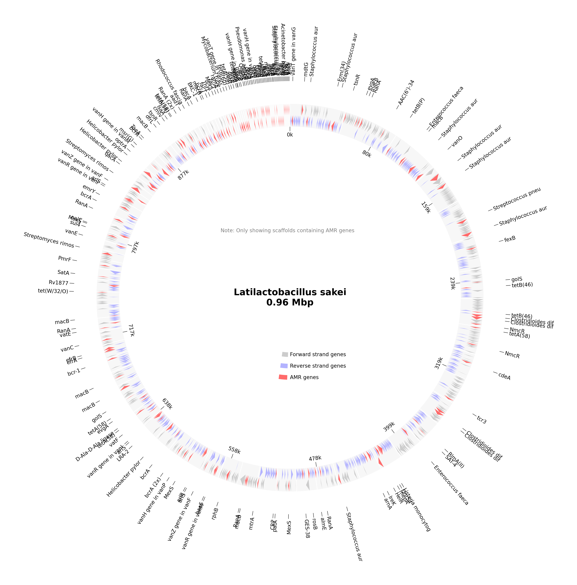

### AAC(6')-34
- **Mechanism**: antibiotic inactivation
- **Drug Classes**: aminoglycoside antibiotic
- **AMR Family**: AAC(6')
- **Locations**:
  - gnl|SPADES|IAMKMEGF_38_39 : position 35762-36322

### Acinetobacter baumannii AbaQ
- **Mechanism**: antibiotic efflux
- **Drug Classes**: fluoroquinolone antibiotic
- **AMR Family**: major facilitator superfamily (MFS) antibiotic efflux pump
- **Locations**:
  - gnl|SPADES|IAMKMEGF_1039749_1 : position 1-318

### BKC-1
- **Mechanism**: antibiotic inactivation
- **Drug Classes**: carbapenem
- **AMR Family**: BKC Beta-lactamase
- **Locations**:
  - gnl|SPADES|IAMKMEGF_1153_2 : position 1003-2307

### CRP
- **Mechanism**: antibiotic efflux
- **Drug Classes**: macrolide antibiotic; fluoroquinolone antibiotic; penam
- **AMR Family**: resistance-nodulation-cell division (RND) antibiotic efflux pump
- **Locations**:
  - gnl|SPADES|IAMKMEGF_141_1 : position 459-1127

### Clostridioides difficile gyrA conferring resistance to fluoroquinolones (found in 2 locations)
- **Mechanism**: antibiotic target alteration
- **Drug Classes**: fluoroquinolone antibiotic
- **AMR Family**: fluoroquinolone resistant gyrA
- **Locations**:
  - gnl|SPADES|IAMKMEGF_109_13 : position 12697-15270
  - gnl|SPADES|IAMKMEGF_99_14 : position 15380-17854

### Clostridioides difficile gyrB conferring resistance to fluoroquinolones (found in 2 locations)
- **Mechanism**: antibiotic target alteration
- **Drug Classes**: fluoroquinolone antibiotic
- **AMR Family**: fluoroquinolone resistant gyrB
- **Locations**:
  - gnl|SPADES|IAMKMEGF_109_12 : position 10658-12649
  - gnl|SPADES|IAMKMEGF_99_13 : position 13368-15359

### D-Ala-D-Ala ligase
- **Mechanism**: antibiotic target alteration
- **Drug Classes**: glycopeptide antibiotic
- **AMR Family**: Van ligase
- **Locations**:
  - gnl|SPADES|IAMKMEGF_169_11 : position 10500-11552

### Enterococcus faecalis cls with mutation conferring resistance to daptomycin (found in 2 locations)
- **Mechanism**: antibiotic target alteration
- **Drug Classes**: peptide antibiotic
- **AMR Family**: daptomycin resistant cls
- **Locations**:
  - gnl|SPADES|IAMKMEGF_118_3 : position 2785-4242
  - gnl|SPADES|IAMKMEGF_48_18 : position 16153-17589

### Erm(34)
- **Mechanism**: antibiotic target alteration
- **Drug Classes**: macrolide antibiotic; lincosamide antibiotic; streptogramin antibiotic; streptogramin A antibiotic; streptogramin B antibiotic
- **AMR Family**: Erm 23S ribosomal RNA methyltransferase
- **Locations**:
  - gnl|SPADES|IAMKMEGF_36_40 : position 35917-36810

### GES-38
- **Mechanism**: antibiotic inactivation
- **Drug Classes**: carbapenem; cephalosporin; penam
- **AMR Family**: GES beta-lactamase
- **Locations**:
  - gnl|SPADES|IAMKMEGF_136_10 : position 10345-11328

### HelR (found in 2 locations)
- **Mechanism**: antibiotic target protection
- **Drug Classes**: rifamycin antibiotic
- **AMR Family**: helicase-like RNA polymerase protection protein
- **Locations**:
  - gnl|SPADES|IAMKMEGF_120_20 : position 16586-18883
  - gnl|SPADES|IAMKMEGF_1478612_1 : position 2-262

### Helicobacter pylori pbp1 mutants conferring resistance to amoxicillin (found in 3 locations)
- **Mechanism**: antibiotic target alteration
- **Drug Classes**: cephalosporin; cephamycin; penam
- **AMR Family**: Penicillin-binding protein mutations conferring resistance to beta-lactam antibiotics
- **Locations**:
  - gnl|SPADES|IAMKMEGF_164_11 : position 10286-12367
  - gnl|SPADES|IAMKMEGF_435_1 : position 125-2428
  - gnl|SPADES|IAMKMEGF_453_2 : position 1173-3728

### IreK
- **Mechanism**: reduced permeability to antibiotic
- **Drug Classes**: cephalosporin
- **AMR Family**: Serine/threonine kinases
- **Locations**:
  - gnl|SPADES|IAMKMEGF_121_4 : position 2548-4431

### LRA-2
- **Mechanism**: antibiotic inactivation
- **Drug Classes**: cephalosporin; penam
- **AMR Family**: subclass B3 LRA beta-lactamase
- **Locations**:
  - gnl|SPADES|IAMKMEGF_166_7 : position 8044-8850

### Listeria monocytogenes mprF
- **Mechanism**: antibiotic target alteration
- **Drug Classes**: peptide antibiotic
- **AMR Family**: defensin resistant mprF
- **Locations**:
  - gnl|SPADES|IAMKMEGF_120_15 : position 9494-12115

### MexS (found in 4 locations)
- **Mechanism**: antibiotic efflux
- **Drug Classes**: fluoroquinolone antibiotic; diaminopyrimidine antibiotic; phenicol antibiotic
- **AMR Family**: resistance-nodulation-cell division (RND) antibiotic efflux pump
- **Locations**:
  - gnl|SPADES|IAMKMEGF_140_5 : position 5999-6952
  - gnl|SPADES|IAMKMEGF_154_15 : position 11996-12931
  - gnl|SPADES|IAMKMEGF_2063_1 : position 75-1106
  - gnl|SPADES|IAMKMEGF_285_1 : position 2-994

### Mycobacterium tuberculosis pncA mutations conferring resistance to pyrazinamide
- **Mechanism**: antibiotic target alteration
- **Drug Classes**: pyrazine antibiotic
- **AMR Family**: Pyrazinamide resistant pncA
- **Locations**:
  - gnl|SPADES|IAMKMEGF_3634_2 : position 136-675

### NmcR (found in 2 locations)
- **Mechanism**: antibiotic inactivation
- **Drug Classes**: carbapenem; cephalosporin; cephamycin; penam
- **AMR Family**: NmcA beta-lactamase
- **Locations**:
  - gnl|SPADES|IAMKMEGF_100_27 : position 15370-16242
  - gnl|SPADES|IAMKMEGF_99_17 : position 21459-22424

### PmrF
- **Mechanism**: antibiotic target alteration
- **Drug Classes**: peptide antibiotic
- **AMR Family**: pmr phosphoethanolamine transferase
- **Locations**:
  - gnl|SPADES|IAMKMEGF_269_5 : position 2155-3087

### Pseudomonas aeruginosa soxR
- **Mechanism**: antibiotic target alteration; antibiotic efflux
- **Drug Classes**: fluoroquinolone antibiotic; cephalosporin; glycylcycline; penam; tetracycline antibiotic; rifamycin antibiotic; phenicol antibiotic; disinfecting agents and antiseptics
- **AMR Family**: ATP-binding cassette (ABC) antibiotic efflux pump; major facilitator superfamily (MFS) antibiotic efflux pump; resistance-nodulation-cell division (RND) antibiotic efflux pump
- **Locations**:
  - gnl|SPADES|IAMKMEGF_201368_1 : position 1-567

### QepA2
- **Mechanism**: antibiotic efflux
- **Drug Classes**: fluoroquinolone antibiotic
- **AMR Family**: major facilitator superfamily (MFS) antibiotic efflux pump
- **Locations**:
  - gnl|SPADES|IAMKMEGF_116483_1 : position 3-644

### QnrS4
- **Mechanism**: antibiotic target protection
- **Drug Classes**: fluoroquinolone antibiotic
- **AMR Family**: quinolone resistance protein (qnr)
- **Locations**:
  - gnl|SPADES|IAMKMEGF_120_16 : position 12202-12840

### RanA (found in 8 locations)
- **Mechanism**: antibiotic efflux
- **Drug Classes**: aminoglycoside antibiotic
- **AMR Family**: ATP-binding cassette (ABC) antibiotic efflux pump
- **Locations**:
  - gnl|SPADES|IAMKMEGF_129_16 : position 12426-13214
  - gnl|SPADES|IAMKMEGF_144_8 : position 9260-10222
  - gnl|SPADES|IAMKMEGF_204_6 : position 4693-5631
  - gnl|SPADES|IAMKMEGF_298_6 : position 4348-5736
  - gnl|SPADES|IAMKMEGF_38_17 : position 14868-15959
  - gnl|SPADES|IAMKMEGF_656_2 : position 921-1730
  - gnl|SPADES|IAMKMEGF_656_3 : position 1751-2509
  - gnl|SPADES|IAMKMEGF_747_2 : position 792-1814

### Rhodococcus fascians cmr
- **Mechanism**: antibiotic efflux
- **Drug Classes**: phenicol antibiotic
- **AMR Family**: major facilitator superfamily (MFS) antibiotic efflux pump
- **Locations**:
  - gnl|SPADES|IAMKMEGF_734_2 : position 95-1477

### RlmA(II)
- **Mechanism**: antibiotic target alteration
- **Drug Classes**: macrolide antibiotic; lincosamide antibiotic
- **AMR Family**: non-erm 23S ribosomal RNA methyltransferase (G748)
- **Locations**:
  - gnl|SPADES|IAMKMEGF_111_10 : position 10358-11194

### Rv1877
- **Mechanism**: antibiotic efflux
- **Drug Classes**: fluoroquinolone antibiotic
- **AMR Family**: major facilitator superfamily (MFS) antibiotic efflux pump
- **Locations**:
  - gnl|SPADES|IAMKMEGF_216_6 : position 4458-5936

### SAT-4
- **Mechanism**: antibiotic inactivation
- **Drug Classes**: nucleoside antibiotic
- **AMR Family**: streptothricin acetyltransferase (SAT)
- **Locations**:
  - gnl|SPADES|IAMKMEGF_111_13 : position 13524-13961

### SatA
- **Mechanism**: antibiotic inactivation
- **Drug Classes**: nucleoside antibiotic
- **AMR Family**: streptothricin acetyltransferase (SAT)
- **Locations**:
  - gnl|SPADES|IAMKMEGF_239_3 : position 1942-2403

### Staphylococcus aureus LmrS (found in 3 locations)
- **Mechanism**: antibiotic efflux
- **Drug Classes**: macrolide antibiotic; aminoglycoside antibiotic; oxazolidinone antibiotic; diaminopyrimidine antibiotic; phenicol antibiotic
- **AMR Family**: major facilitator superfamily (MFS) antibiotic efflux pump
- **Locations**:
  - gnl|SPADES|IAMKMEGF_125_18 : position 16187-17662
  - gnl|SPADES|IAMKMEGF_897292_1 : position 2-340
  - gnl|SPADES|IAMKMEGF_897296_1 : position 2-340

### Staphylococcus aureus fusA with mutation conferring resistance to fusidic acid
- **Mechanism**: antibiotic target alteration
- **Drug Classes**: fusidane antibiotic
- **AMR Family**: antibiotic resistant fusA
- **Locations**:
  - gnl|SPADES|IAMKMEGF_65_12 : position 17069-19156

### Staphylococcus aureus mupA conferring resistance to mupirocin (found in 2 locations)
- **Mechanism**: antibiotic target alteration
- **Drug Classes**: mupirocin-like antibiotic
- **AMR Family**: antibiotic-resistant isoleucyl-tRNA synthetase (ileS)
- **Locations**:
  - gnl|SPADES|IAMKMEGF_36_43 : position 38748-40793
  - gnl|SPADES|IAMKMEGF_48_30 : position 27177-29825

### Staphylococcus aureus mupB conferring resistance to mupirocin
- **Mechanism**: antibiotic target alteration
- **Drug Classes**: mupirocin-like antibiotic
- **AMR Family**: antibiotic-resistant isoleucyl-tRNA synthetase (ileS)
- **Locations**:
  - gnl|SPADES|IAMKMEGF_71_38 : position 28126-30912

### Staphylococcus aureus murA with mutation conferring resistance to fosfomycin
- **Mechanism**: antibiotic target alteration
- **Drug Classes**: phosphonic acid antibiotic
- **AMR Family**: antibiotic-resistant murA transferase
- **Locations**:
  - gnl|SPADES|IAMKMEGF_36_18 : position 15045-16304

### Staphylococcus aureus rpoB mutants conferring resistance to rifampicin
- **Mechanism**: antibiotic target alteration; antibiotic target replacement
- **Drug Classes**: rifamycin antibiotic
- **AMR Family**: rifamycin-resistant beta-subunit of RNA polymerase (rpoB)
- **Locations**:
  - gnl|SPADES|IAMKMEGF_65_6 : position 6972-10565

### Streptococcus pneumoniae PBP2x conferring resistance to amoxicillin
- **Mechanism**: antibiotic target alteration
- **Drug Classes**: cephalosporin; cephamycin; penam
- **AMR Family**: Penicillin-binding protein mutations conferring resistance to beta-lactam antibiotics
- **Locations**:
  - gnl|SPADES|IAMKMEGF_71_27 : position 16522-18660

### Streptomyces rimosus otr(A) (found in 2 locations)
- **Mechanism**: antibiotic target protection
- **Drug Classes**: tetracycline antibiotic
- **AMR Family**: tetracycline-resistant ribosomal protection protein
- **Locations**:
  - gnl|SPADES|IAMKMEGF_274_5 : position 4217-6052
  - gnl|SPADES|IAMKMEGF_412_1 : position 27-2840

### TaeA (found in 2 locations)
- **Mechanism**: antibiotic efflux
- **Drug Classes**: pleuromutilin antibiotic
- **AMR Family**: ATP-binding cassette (ABC) antibiotic efflux pump
- **Locations**:
  - gnl|SPADES|IAMKMEGF_22183_2 : position 401-1036
  - gnl|SPADES|IAMKMEGF_505_2 : position 123-1262

### ThfT
- **Mechanism**: resistance by host-dependent nutrient acquisition
- **Drug Classes**: sulfonamide antibiotic
- **AMR Family**: ECF transporter S component
- **Locations**:
  - gnl|SPADES|IAMKMEGF_1899_1 : position 3-596

### aadT
- **Mechanism**: antibiotic efflux
- **Drug Classes**: macrolide antibiotic; tetracycline antibiotic; disinfecting agents and antiseptics
- **AMR Family**: major facilitator superfamily (MFS) antibiotic efflux pump
- **Locations**:
  - gnl|SPADES|IAMKMEGF_665_2 : position 783-1991

### almE (found in 4 locations)
- **Mechanism**: antibiotic target alteration
- **Drug Classes**: peptide antibiotic
- **AMR Family**: polymyxin resistance operon; alm glycyltransferase
- **Locations**:
  - gnl|SPADES|IAMKMEGF_129_20 : position 16842-17759
  - gnl|SPADES|IAMKMEGF_573417_1 : position 2-418
  - gnl|SPADES|IAMKMEGF_793411_1 : position 2-361
  - gnl|SPADES|IAMKMEGF_866785_1 : position 2-346

### arlR
- **Mechanism**: antibiotic efflux
- **Drug Classes**: fluoroquinolone antibiotic; disinfecting agents and antiseptics
- **AMR Family**: major facilitator superfamily (MFS) antibiotic efflux pump
- **Locations**:
  - gnl|SPADES|IAMKMEGF_154_4 : position 3171-3857

### arlS (found in 3 locations)
- **Mechanism**: antibiotic efflux
- **Drug Classes**: fluoroquinolone antibiotic; disinfecting agents and antiseptics
- **AMR Family**: major facilitator superfamily (MFS) antibiotic efflux pump
- **Locations**:
  - gnl|SPADES|IAMKMEGF_154_3 : position 1672-3174
  - gnl|SPADES|IAMKMEGF_166_10 : position 11032-12930
  - gnl|SPADES|IAMKMEGF_347_4 : position 2497-4158

### arnA (found in 2 locations)
- **Mechanism**: antibiotic target alteration
- **Drug Classes**: peptide antibiotic
- **AMR Family**: pmr phosphoethanolamine transferase
- **Locations**:
  - gnl|SPADES|IAMKMEGF_121_7 : position 6529-7485
  - gnl|SPADES|IAMKMEGF_268888_1 : position 1-195

### bacA (found in 2 locations)
- **Mechanism**: antibiotic target alteration
- **Drug Classes**: peptide antibiotic
- **AMR Family**: undecaprenyl pyrophosphate related proteins
- **Locations**:
  - gnl|SPADES|IAMKMEGF_850888_1 : position 1-351
  - gnl|SPADES|IAMKMEGF_952_1 : position 2-532

### baeS
- **Mechanism**: antibiotic efflux
- **Drug Classes**: aminoglycoside antibiotic; aminocoumarin antibiotic
- **AMR Family**: resistance-nodulation-cell division (RND) antibiotic efflux pump
- **Locations**:
  - gnl|SPADES|IAMKMEGF_148_5 : position 3696-5132

### bcr-1
- **Mechanism**: antibiotic efflux
- **Drug Classes**: bicyclomycin-like antibiotic
- **AMR Family**: major facilitator superfamily (MFS) antibiotic efflux pump
- **Locations**:
  - gnl|SPADES|IAMKMEGF_192_11 : position 10063-11244

### bcrA (found in 9 locations)
- **Mechanism**: antibiotic efflux
- **Drug Classes**: peptide antibiotic
- **AMR Family**: ATP-binding cassette (ABC) antibiotic efflux pump
- **Locations**:
  - gnl|SPADES|IAMKMEGF_1219_1 : position 71-961
  - gnl|SPADES|IAMKMEGF_1288098_1 : position 3-281
  - gnl|SPADES|IAMKMEGF_156_10 : position 7119-7991
  - gnl|SPADES|IAMKMEGF_156_13 : position 9673-10560
  - gnl|SPADES|IAMKMEGF_164_3 : position 2077-2805
  - gnl|SPADES|IAMKMEGF_311_5 : position 3384-4583
  - gnl|SPADES|IAMKMEGF_501_3 : position 3270-4139
  - gnl|SPADES|IAMKMEGF_825997_1 : position 176-355
  - gnl|SPADES|IAMKMEGF_830906_1 : position 2-181

### cdeA (found in 2 locations)
- **Mechanism**: antibiotic efflux
- **Drug Classes**: fluoroquinolone antibiotic; disinfecting agents and antiseptics
- **AMR Family**: multidrug and toxic compound extrusion (MATE) transporter
- **Locations**:
  - gnl|SPADES|IAMKMEGF_105_11 : position 7632-8948
  - gnl|SPADES|IAMKMEGF_241758_1 : position 1-576

### cmlB
- **Mechanism**: antibiotic efflux
- **Drug Classes**: phenicol antibiotic
- **AMR Family**: major facilitator superfamily (MFS) antibiotic efflux pump
- **Locations**:
  - gnl|SPADES|IAMKMEGF_524788_1 : position 3-434

### cmlv
- **Mechanism**: antibiotic inactivation
- **Drug Classes**: phenicol antibiotic
- **AMR Family**: chloramphenicol phosphotransferase
- **Locations**:
  - gnl|SPADES|IAMKMEGF_603_3 : position 2371-3549

### dfrL (found in 3 locations)
- **Mechanism**: antibiotic target replacement
- **Drug Classes**: aminoglycoside antibiotic; tetracycline antibiotic; diaminopyrimidine antibiotic
- **AMR Family**: trimethoprim resistant dihydrofolate reductase dfr
- **Locations**:
  - gnl|SPADES|IAMKMEGF_543_8 : position 3644-3871
  - gnl|SPADES|IAMKMEGF_793073_1 : position 2-328
  - gnl|SPADES|IAMKMEGF_793312_1 : position 2-328

### efrA
- **Mechanism**: antibiotic efflux
- **Drug Classes**: macrolide antibiotic; fluoroquinolone antibiotic; rifamycin antibiotic
- **AMR Family**: ATP-binding cassette (ABC) antibiotic efflux pump
- **Locations**:
  - gnl|SPADES|IAMKMEGF_195_7 : position 5189-6928

### efrB
- **Mechanism**: antibiotic efflux
- **Drug Classes**: macrolide antibiotic; fluoroquinolone antibiotic; rifamycin antibiotic
- **AMR Family**: ATP-binding cassette (ABC) antibiotic efflux pump
- **Locations**:
  - gnl|SPADES|IAMKMEGF_195_8 : position 6915-8678

### emrY
- **Mechanism**: antibiotic efflux
- **Drug Classes**: tetracycline antibiotic
- **AMR Family**: major facilitator superfamily (MFS) antibiotic efflux pump
- **Locations**:
  - gnl|SPADES|IAMKMEGF_315_3 : position 1312-2709

### evgA (found in 2 locations)
- **Mechanism**: antibiotic efflux
- **Drug Classes**: macrolide antibiotic; fluoroquinolone antibiotic; penam; tetracycline antibiotic
- **AMR Family**: major facilitator superfamily (MFS) antibiotic efflux pump; resistance-nodulation-cell division (RND) antibiotic efflux pump
- **Locations**:
  - gnl|SPADES|IAMKMEGF_184_5 : position 3097-3702
  - gnl|SPADES|IAMKMEGF_38_11 : position 10558-11190

### facT (found in 4 locations)
- **Mechanism**: antibiotic efflux
- **Drug Classes**: elfamycin antibiotic
- **AMR Family**: major facilitator superfamily (MFS) antibiotic efflux pump
- **Locations**:
  - gnl|SPADES|IAMKMEGF_1514_1 : position 2-1147
  - gnl|SPADES|IAMKMEGF_3005_1 : position 3-668
  - gnl|SPADES|IAMKMEGF_599320_1 : position 2-412
  - gnl|SPADES|IAMKMEGF_905583_1 : position 2-340

### fexA (found in 2 locations)
- **Mechanism**: antibiotic efflux
- **Drug Classes**: phenicol antibiotic
- **AMR Family**: major facilitator superfamily (MFS) antibiotic efflux pump
- **Locations**:
  - gnl|SPADES|IAMKMEGF_10785_1 : position 2-1120
  - gnl|SPADES|IAMKMEGF_1215285_1 : position 1-291

### fexB (found in 2 locations)
- **Mechanism**: antibiotic efflux
- **Drug Classes**: phenicol antibiotic
- **AMR Family**: major facilitator superfamily (MFS) antibiotic efflux pump
- **Locations**:
  - gnl|SPADES|IAMKMEGF_637967_1 : position 3-401
  - gnl|SPADES|IAMKMEGF_84_12 : position 8937-10127

### golS (found in 4 locations)
- **Mechanism**: antibiotic efflux
- **Drug Classes**: monobactam; carbapenem; cephalosporin; cephamycin; penam; phenicol antibiotic; penem
- **AMR Family**: resistance-nodulation-cell division (RND) antibiotic efflux pump
- **Locations**:
  - gnl|SPADES|IAMKMEGF_184_16 : position 12117-12377
  - gnl|SPADES|IAMKMEGF_247354_1 : position 43-570
  - gnl|SPADES|IAMKMEGF_88167_2 : position 458-760
  - gnl|SPADES|IAMKMEGF_90_12 : position 10473-10892

### lmrB
- **Mechanism**: antibiotic efflux
- **Drug Classes**: lincosamide antibiotic; nucleoside antibiotic
- **AMR Family**: ATP-binding cassette (ABC) antibiotic efflux pump
- **Locations**:
  - gnl|SPADES|IAMKMEGF_9908_1 : position 55-1224

### lmrD (found in 2 locations)
- **Mechanism**: antibiotic efflux
- **Drug Classes**: lincosamide antibiotic
- **AMR Family**: ATP-binding cassette (ABC) antibiotic efflux pump
- **Locations**:
  - gnl|SPADES|IAMKMEGF_913281_1 : position 2-337
  - gnl|SPADES|IAMKMEGF_913290_1 : position 2-337

### lsaA (found in 2 locations)
- **Mechanism**: antibiotic target protection
- **Drug Classes**: lincosamide antibiotic; streptogramin antibiotic; streptogramin A antibiotic; streptogramin B antibiotic; pleuromutilin antibiotic
- **AMR Family**: lsa-type ABC-F protein
- **Locations**:
  - gnl|SPADES|IAMKMEGF_390177_1 : position 2-490
  - gnl|SPADES|IAMKMEGF_610_1 : position 682-2193

### macB (found in 13 locations)
- **Mechanism**: antibiotic efflux
- **Drug Classes**: macrolide antibiotic
- **AMR Family**: ATP-binding cassette (ABC) antibiotic efflux pump
- **Locations**:
  - gnl|SPADES|IAMKMEGF_1195_4 : position 1873-2325
  - gnl|SPADES|IAMKMEGF_144_7 : position 8206-9231
  - gnl|SPADES|IAMKMEGF_145421_1 : position 3-599
  - gnl|SPADES|IAMKMEGF_189_8 : position 7945-9885
  - gnl|SPADES|IAMKMEGF_190_9 : position 6361-7095
  - gnl|SPADES|IAMKMEGF_206_1 : position 3-434
  - gnl|SPADES|IAMKMEGF_38_14 : position 12704-13369
  - gnl|SPADES|IAMKMEGF_48_20 : position 18402-19043
  - gnl|SPADES|IAMKMEGF_514_4 : position 2503-3231
  - gnl|SPADES|IAMKMEGF_576667_1 : position 3-419
  - gnl|SPADES|IAMKMEGF_736927_1 : position 69-374
  - gnl|SPADES|IAMKMEGF_76033_1 : position 3-308
  - gnl|SPADES|IAMKMEGF_918668_1 : position 3-338

### mdtG
- **Mechanism**: antibiotic efflux
- **Drug Classes**: phosphonic acid antibiotic
- **AMR Family**: major facilitator superfamily (MFS) antibiotic efflux pump
- **Locations**:
  - gnl|SPADES|IAMKMEGF_36_13 : position 10323-11576

### mepA
- **Mechanism**: antibiotic efflux
- **Drug Classes**: glycylcycline; tetracycline antibiotic
- **AMR Family**: multidrug and toxic compound extrusion (MATE) transporter
- **Locations**:
  - gnl|SPADES|IAMKMEGF_120_18 : position 13692-15059

### msbA
- **Mechanism**: antibiotic efflux
- **Drug Classes**: nitroimidazole antibiotic
- **AMR Family**: ATP-binding cassette (ABC) antibiotic efflux pump
- **Locations**:
  - gnl|SPADES|IAMKMEGF_36326_2 : position 157-936

### msr(G)
- **Mechanism**: antibiotic target protection
- **Drug Classes**: macrolide antibiotic; streptogramin antibiotic
- **AMR Family**: msr-type ABC-F protein
- **Locations**:
  - gnl|SPADES|IAMKMEGF_489_3 : position 1794-4061

### mtrA
- **Mechanism**: antibiotic efflux
- **Drug Classes**: macrolide antibiotic; penam
- **AMR Family**: resistance-nodulation-cell division (RND) antibiotic efflux pump
- **Locations**:
  - gnl|SPADES|IAMKMEGF_141_13 : position 15732-16595

### nalC
- **Mechanism**: antibiotic efflux
- **Drug Classes**: macrolide antibiotic; fluoroquinolone antibiotic; monobactam; carbapenem; cephalosporin; cephamycin; penam; tetracycline antibiotic; peptide antibiotic; aminocoumarin antibiotic; diaminopyrimidine antibiotic; sulfonamide antibiotic; phenicol antibiotic; penem
- **AMR Family**: resistance-nodulation-cell division (RND) antibiotic efflux pump
- **Locations**:
  - gnl|SPADES|IAMKMEGF_285_2 : position 996-1577

### novA
- **Mechanism**: antibiotic efflux
- **Drug Classes**: aminocoumarin antibiotic
- **AMR Family**: ATP-binding cassette (ABC) antibiotic efflux pump
- **Locations**:
  - gnl|SPADES|IAMKMEGF_1344423_1 : position 3-275

### optrA
- **Mechanism**: antibiotic target protection
- **Drug Classes**: oxazolidinone antibiotic; phenicol antibiotic
- **AMR Family**: Miscellaneous ABC-F subfamily ATP-binding cassette ribosomal protection proteins
- **Locations**:
  - gnl|SPADES|IAMKMEGF_463_1 : position 195-1820

### patA
- **Mechanism**: antibiotic efflux
- **Drug Classes**: fluoroquinolone antibiotic
- **AMR Family**: ATP-binding cassette (ABC) antibiotic efflux pump
- **Locations**:
  - gnl|SPADES|IAMKMEGF_140_15 : position 16410-16670

### qacA
- **Mechanism**: antibiotic efflux
- **Drug Classes**: fluoroquinolone antibiotic
- **AMR Family**: major facilitator superfamily (MFS) antibiotic efflux pump
- **Locations**:
  - gnl|SPADES|IAMKMEGF_423_4 : position 3547-4758

### qacH
- **Mechanism**: antibiotic efflux
- **Drug Classes**: disinfecting agents and antiseptics
- **AMR Family**: small multidrug resistance (SMR) antibiotic efflux pump
- **Locations**:
  - gnl|SPADES|IAMKMEGF_406989_1 : position 196-480

### ramA
- **Mechanism**: antibiotic efflux; reduced permeability to antibiotic
- **Drug Classes**: fluoroquinolone antibiotic; monobactam; carbapenem; cephalosporin; glycylcycline; cephamycin; penam; tetracycline antibiotic; rifamycin antibiotic; phenicol antibiotic; penem; disinfecting agents and antiseptics
- **AMR Family**: resistance-nodulation-cell division (RND) antibiotic efflux pump; General Bacterial Porin with reduced permeability to beta-lactams
- **Locations**:
  - gnl|SPADES|IAMKMEGF_3249_1 : position 1-423

### rosB
- **Mechanism**: antibiotic efflux
- **Drug Classes**: peptide antibiotic
- **AMR Family**: major facilitator superfamily (MFS) antibiotic efflux pump
- **Locations**:
  - gnl|SPADES|IAMKMEGF_136_6 : position 4690-5850

### rphB
- **Mechanism**: antibiotic inactivation
- **Drug Classes**: rifamycin antibiotic
- **AMR Family**: rifampin phosphotransferase
- **Locations**:
  - gnl|SPADES|IAMKMEGF_145_9 : position 8519-10279

### sul4
- **Mechanism**: antibiotic target replacement
- **Drug Classes**: sulfonamide antibiotic
- **AMR Family**: sulfonamide resistant sul
- **Locations**:
  - gnl|SPADES|IAMKMEGF_282_9 : position 4893-5978

### tcr3
- **Mechanism**: antibiotic efflux
- **Drug Classes**: tetracycline antibiotic
- **AMR Family**: major facilitator superfamily (MFS) antibiotic efflux pump
- **Locations**:
  - gnl|SPADES|IAMKMEGF_106_22 : position 20310-21506

### tet(W/32/O)
- **Mechanism**: antibiotic target protection
- **Drug Classes**: tetracycline antibiotic
- **AMR Family**: tetracycline-resistant ribosomal protection protein
- **Locations**:
  - gnl|SPADES|IAMKMEGF_207_11 : position 10207-10710

### tetA(58) (found in 6 locations)
- **Mechanism**: antibiotic efflux
- **Drug Classes**: tetracycline antibiotic
- **AMR Family**: major facilitator superfamily (MFS) antibiotic efflux pump
- **Locations**:
  - gnl|SPADES|IAMKMEGF_100_2 : position 557-1447
  - gnl|SPADES|IAMKMEGF_169_9 : position 8991-9752
  - gnl|SPADES|IAMKMEGF_184_8 : position 5569-6441
  - gnl|SPADES|IAMKMEGF_576670_1 : position 3-419
  - gnl|SPADES|IAMKMEGF_637_2 : position 738-1679
  - gnl|SPADES|IAMKMEGF_7285_2 : position 766-1302

### tetB(46) (found in 2 locations)
- **Mechanism**: antibiotic efflux
- **Drug Classes**: tetracycline antibiotic
- **AMR Family**: ATP-binding cassette (ABC) antibiotic efflux pump
- **Locations**:
  - gnl|SPADES|IAMKMEGF_90_16 : position 14657-15415
  - gnl|SPADES|IAMKMEGF_99_10 : position 11119-11778

### tetB(58)
- **Mechanism**: antibiotic efflux
- **Drug Classes**: tetracycline antibiotic
- **AMR Family**: major facilitator superfamily (MFS) antibiotic efflux pump
- **Locations**:
  - gnl|SPADES|IAMKMEGF_637_1 : position 3-725

### tetB(60) (found in 2 locations)
- **Mechanism**: antibiotic efflux
- **Drug Classes**: tetracycline antibiotic
- **AMR Family**: ATP-binding cassette (ABC) antibiotic efflux pump
- **Locations**:
  - gnl|SPADES|IAMKMEGF_36326_1 : position 2-181
  - gnl|SPADES|IAMKMEGF_5204_2 : position 210-1085

### tetB(P)
- **Mechanism**: antibiotic target protection
- **Drug Classes**: tetracycline antibiotic
- **AMR Family**: tetracycline-resistant ribosomal protection protein
- **Locations**:
  - gnl|SPADES|IAMKMEGF_48_2 : position 818-1720

### tsnR (found in 2 locations)
- **Mechanism**: antibiotic target alteration
- **Drug Classes**: peptide antibiotic
- **AMR Family**: non-erm 23S ribosomal RNA methyltransferase (A1067)
- **Locations**:
  - gnl|SPADES|IAMKMEGF_38_1 : position 44-805
  - gnl|SPADES|IAMKMEGF_587_6 : position 2285-3172

### ugd
- **Mechanism**: antibiotic target alteration
- **Drug Classes**: peptide antibiotic
- **AMR Family**: pmr phosphoethanolamine transferase
- **Locations**:
  - gnl|SPADES|IAMKMEGF_496344_1 : position 1-447

### vanC
- **Mechanism**: antibiotic target alteration
- **Drug Classes**: glycopeptide antibiotic
- **AMR Family**: glycopeptide resistance gene cluster; Van ligase
- **Locations**:
  - gnl|SPADES|IAMKMEGF_203_4 : position 2892-4043

### vanE
- **Mechanism**: antibiotic target alteration
- **Drug Classes**: glycopeptide antibiotic
- **AMR Family**: glycopeptide resistance gene cluster; Van ligase
- **Locations**:
  - gnl|SPADES|IAMKMEGF_276_5 : position 6002-7114

### vanH gene in vanD cluster
- **Mechanism**: antibiotic target alteration
- **Drug Classes**: glycopeptide antibiotic
- **AMR Family**: vanH; glycopeptide resistance gene cluster
- **Locations**:
  - gnl|SPADES|IAMKMEGF_335730_1 : position 1-291

### vanH gene in vanM cluster
- **Mechanism**: antibiotic target alteration
- **Drug Classes**: glycopeptide antibiotic
- **AMR Family**: vanH; glycopeptide resistance gene cluster
- **Locations**:
  - gnl|SPADES|IAMKMEGF_489_1 : position 136-579

### vanH gene in vanP cluster (found in 2 locations)
- **Mechanism**: antibiotic target alteration
- **Drug Classes**: glycopeptide antibiotic
- **AMR Family**: vanH; glycopeptide resistance gene cluster
- **Locations**:
  - gnl|SPADES|IAMKMEGF_156_2 : position 1310-2263
  - gnl|SPADES|IAMKMEGF_75682_1 : position 65-790

### vanO
- **Mechanism**: antibiotic target alteration
- **Drug Classes**: glycopeptide antibiotic
- **AMR Family**: glycopeptide resistance gene cluster; Van ligase
- **Locations**:
  - gnl|SPADES|IAMKMEGF_48_38 : position 37407-39686

### vanR gene in vanI cluster (found in 2 locations)
- **Mechanism**: antibiotic target alteration
- **Drug Classes**: glycopeptide antibiotic
- **AMR Family**: glycopeptide resistance gene cluster; vanR
- **Locations**:
  - gnl|SPADES|IAMKMEGF_166_11 : position 12940-13653
  - gnl|SPADES|IAMKMEGF_347_3 : position 1797-2510

### vanR gene in vanM cluster
- **Mechanism**: antibiotic target alteration
- **Drug Classes**: glycopeptide antibiotic
- **AMR Family**: glycopeptide resistance gene cluster; vanR
- **Locations**:
  - gnl|SPADES|IAMKMEGF_148_4 : position 2956-3696

### vanT gene in vanG cluster (found in 2 locations)
- **Mechanism**: antibiotic target alteration
- **Drug Classes**: glycopeptide antibiotic
- **AMR Family**: glycopeptide resistance gene cluster; vanT
- **Locations**:
  - gnl|SPADES|IAMKMEGF_36_4 : position 1527-2669
  - gnl|SPADES|IAMKMEGF_4093_1 : position 67-1086

### vanZ gene in vanF cluster (found in 2 locations)
- **Mechanism**: antibiotic target alteration
- **Drug Classes**: glycopeptide antibiotic
- **AMR Family**: vanZ; glycopeptide resistance gene cluster
- **Locations**:
  - gnl|SPADES|IAMKMEGF_148_12 : position 12912-13520
  - gnl|SPADES|IAMKMEGF_369_2 : position 189-1337

### vatE
- **Mechanism**: antibiotic inactivation
- **Drug Classes**: streptogramin antibiotic; streptogramin A antibiotic
- **AMR Family**: streptogramin vat acetyltransferase
- **Locations**:
  - gnl|SPADES|IAMKMEGF_204_4 : position 1901-2467

### vatF
- **Mechanism**: antibiotic inactivation
- **Drug Classes**: streptogramin antibiotic; streptogramin A antibiotic
- **AMR Family**: streptogramin vat acetyltransferase
- **Locations**:
  - gnl|SPADES|IAMKMEGF_169_6 : position 4726-5343

## Latilactobacillus sakei subsp. sakei
**Strain Statistics:**
- Total genome length: 203.0 kbp
- Total scaffolds: 68
- Scaffolds with AMR genes: 11
- Total genes annotated: 388
- Total AMR genes: 27
- Unique AMR genes: 23
- Distinct AMR mechanisms: 7
- Distinct AMR families: 16
- Distinct drug classes: 22

**Circos Plot:**

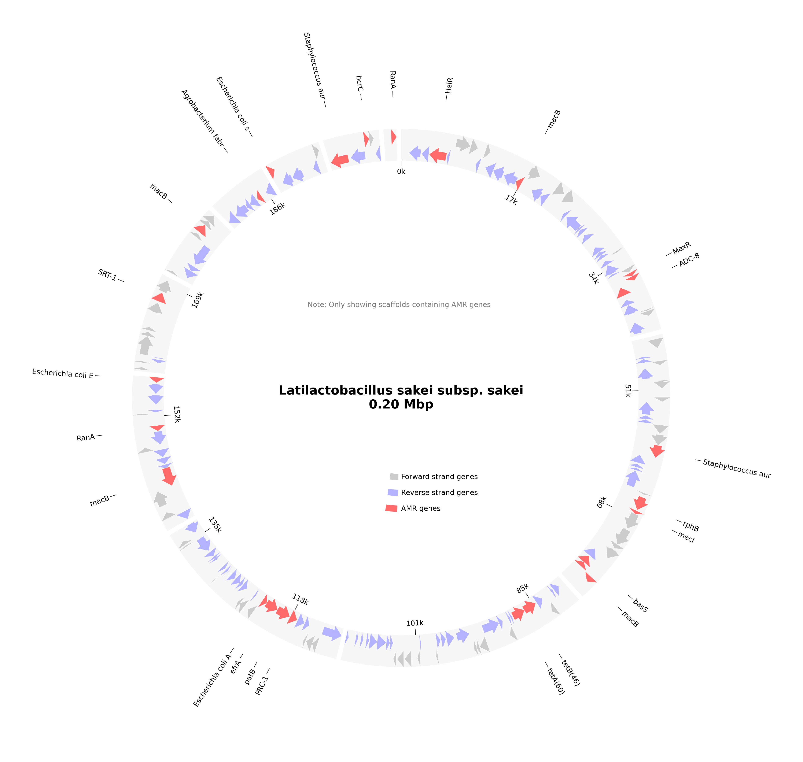

### ADC-8
- **Mechanism**: antibiotic inactivation
- **Drug Classes**: cephalosporin
- **AMR Family**: ADC beta-lactamase without carbapenemase activity
- **Locations**:
  - gnl|SPADES|IAMKMEGF_42_37 : position 36829-37980

### Agrobacterium fabrum chloramphenicol acetyltransferase
- **Mechanism**: antibiotic inactivation
- **Drug Classes**: phenicol antibiotic
- **AMR Family**: chloramphenicol acetyltransferase (CAT)
- **Locations**:
  - gnl|SPADES|IAMKMEGF_255_5 : position 5098-5745

### Escherichia coli AcrAB-TolC with AcrR mutation conferring resistance to ciprofloxacin, tetracycline, and ceftazidime
- **Mechanism**: antibiotic target alteration; antibiotic efflux
- **Drug Classes**: fluoroquinolone antibiotic; cephalosporin; glycylcycline; penam; tetracycline antibiotic; rifamycin antibiotic; phenicol antibiotic; disinfecting agents and antiseptics
- **AMR Family**: resistance-nodulation-cell division (RND) antibiotic efflux pump
- **Locations**:
  - gnl|SPADES|IAMKMEGF_88_10 : position 11212-11853

### Escherichia coli EF-Tu mutants conferring resistance to kirromycin
- **Mechanism**: antibiotic target alteration
- **Drug Classes**: elfamycin antibiotic
- **AMR Family**: elfamycin resistant EF-Tu
- **Locations**:
  - gnl|SPADES|IAMKMEGF_117_18 : position 19325-20065

### Escherichia coli soxS with mutation conferring antibiotic resistance
- **Mechanism**: antibiotic target alteration; antibiotic efflux; reduced permeability to antibiotic
- **Drug Classes**: fluoroquinolone antibiotic; monobactam; carbapenem; cephalosporin; glycylcycline; cephamycin; penam; tetracycline antibiotic; rifamycin antibiotic; phenicol antibiotic; penem; disinfecting agents and antiseptics
- **AMR Family**: ATP-binding cassette (ABC) antibiotic efflux pump; major facilitator superfamily (MFS) antibiotic efflux pump; resistance-nodulation-cell division (RND) antibiotic efflux pump; General Bacterial Porin with reduced permeability to beta-lactams
- **Locations**:
  - gnl|SPADES|IAMKMEGF_275_1 : position 1-780

### HelR
- **Mechanism**: antibiotic target protection
- **Drug Classes**: rifamycin antibiotic
- **AMR Family**: helicase-like RNA polymerase protection protein
- **Locations**:
  - gnl|SPADES|IAMKMEGF_42_4 : position 3845-6136

### MexR
- **Mechanism**: antibiotic target alteration; antibiotic efflux
- **Drug Classes**: macrolide antibiotic; fluoroquinolone antibiotic; monobactam; carbapenem; cephalosporin; cephamycin; penam; tetracycline antibiotic; peptide antibiotic; aminocoumarin antibiotic; diaminopyrimidine antibiotic; sulfonamide antibiotic; phenicol antibiotic; penem
- **AMR Family**: resistance-nodulation-cell division (RND) antibiotic efflux pump
- **Locations**:
  - gnl|SPADES|IAMKMEGF_42_35 : position 35680-36162

### PRC-1
- **Mechanism**: antibiotic inactivation
- **Drug Classes**: cephalosporin; penam
- **AMR Family**: PRC beta-lactamase
- **Locations**:
  - gnl|SPADES|IAMKMEGF_88_7 : position 6473-7483

### RanA (found in 2 locations)
- **Mechanism**: antibiotic efflux
- **Drug Classes**: aminoglycoside antibiotic
- **AMR Family**: ATP-binding cassette (ABC) antibiotic efflux pump
- **Locations**:
  - gnl|SPADES|IAMKMEGF_117_11 : position 12768-13499
  - gnl|SPADES|IAMKMEGF_2860_1 : position 960-1622

### SRT-1
- **Mechanism**: antibiotic inactivation
- **Drug Classes**: cephalosporin
- **AMR Family**: SRT beta-lactamase
- **Locations**:
  - gnl|SPADES|IAMKMEGF_181_10 : position 9257-10438

### Staphylococcus aureus fusA with mutation conferring resistance to fusidic acid
- **Mechanism**: antibiotic target alteration
- **Drug Classes**: fusidane antibiotic
- **AMR Family**: antibiotic resistant fusA
- **Locations**:
  - gnl|SPADES|IAMKMEGF_62_16 : position 14135-15712

### Staphylococcus aureus mupA conferring resistance to mupirocin
- **Mechanism**: antibiotic target alteration
- **Drug Classes**: mupirocin-like antibiotic
- **AMR Family**: antibiotic-resistant isoleucyl-tRNA synthetase (ileS)
- **Locations**:
  - gnl|SPADES|IAMKMEGF_288_1 : position 170-2593

### basS
- **Mechanism**: antibiotic target alteration; antibiotic efflux
- **Drug Classes**: peptide antibiotic
- **AMR Family**: pmr phosphoethanolamine transferase
- **Locations**:
  - gnl|SPADES|IAMKMEGF_62_30 : position 31331-32398

### bcrC
- **Mechanism**: antibiotic target alteration
- **Drug Classes**: peptide antibiotic
- **AMR Family**: undecaprenyl pyrophosphate related proteins
- **Locations**:
  - gnl|SPADES|IAMKMEGF_288_3 : position 5096-5734

### efrA
- **Mechanism**: antibiotic efflux
- **Drug Classes**: macrolide antibiotic; fluoroquinolone antibiotic; rifamycin antibiotic
- **AMR Family**: ATP-binding cassette (ABC) antibiotic efflux pump
- **Locations**:
  - gnl|SPADES|IAMKMEGF_88_9 : position 9458-11188

### macB (found in 4 locations)
- **Mechanism**: antibiotic efflux
- **Drug Classes**: macrolide antibiotic
- **AMR Family**: ATP-binding cassette (ABC) antibiotic efflux pump
- **Locations**:
  - gnl|SPADES|IAMKMEGF_117_5 : position 5086-7611
  - gnl|SPADES|IAMKMEGF_228_7 : position 6408-7559
  - gnl|SPADES|IAMKMEGF_42_14 : position 16255-17013
  - gnl|SPADES|IAMKMEGF_62_32 : position 33222-33998

### mecI
- **Mechanism**: antibiotic target replacement
- **Drug Classes**: penam
- **AMR Family**: methicillin resistant PBP2
- **Locations**:
  - gnl|SPADES|IAMKMEGF_62_24 : position 22941-23381

### patB
- **Mechanism**: antibiotic efflux
- **Drug Classes**: fluoroquinolone antibiotic
- **AMR Family**: ATP-binding cassette (ABC) antibiotic efflux pump
- **Locations**:
  - gnl|SPADES|IAMKMEGF_88_8 : position 7581-9458

### rphB
- **Mechanism**: antibiotic inactivation
- **Drug Classes**: rifamycin antibiotic
- **AMR Family**: rifampin phosphotransferase
- **Locations**:
  - gnl|SPADES|IAMKMEGF_62_23 : position 21067-22791

### smeR
- **Mechanism**: antibiotic efflux
- **Drug Classes**: aminoglycoside antibiotic; cephalosporin; cephamycin; penam
- **AMR Family**: resistance-nodulation-cell division (RND) antibiotic efflux pump
- **Locations**:
  - gnl|SPADES|IAMKMEGF_62_31 : position 32408-33082

### tetA(60)
- **Mechanism**: antibiotic efflux
- **Drug Classes**: tetracycline antibiotic
- **AMR Family**: ATP-binding cassette (ABC) antibiotic efflux pump
- **Locations**:
  - gnl|SPADES|IAMKMEGF_72_8 : position 6560-8305

### tetB(46)
- **Mechanism**: antibiotic efflux
- **Drug Classes**: tetracycline antibiotic
- **AMR Family**: ATP-binding cassette (ABC) antibiotic efflux pump
- **Locations**:
  - gnl|SPADES|IAMKMEGF_72_7 : position 4768-6558

### vanZ gene in vanA cluster
- **Mechanism**: antibiotic target alteration
- **Drug Classes**: glycopeptide antibiotic
- **AMR Family**: vanZ; glycopeptide resistance gene cluster
- **Locations**:
  - gnl|SPADES|IAMKMEGF_42_36 : position 36188-36784

## Latilactobacillus sakei subsp. sakei 23K
**Strain Statistics:**
- Total genome length: 188.9 kbp
- Total scaffolds: 26
- Scaffolds with AMR genes: 8
- Total genes annotated: 337
- Total AMR genes: 29
- Unique AMR genes: 26
- Distinct AMR mechanisms: 5
- Distinct AMR families: 12
- Distinct drug classes: 26

**Circos Plot:**

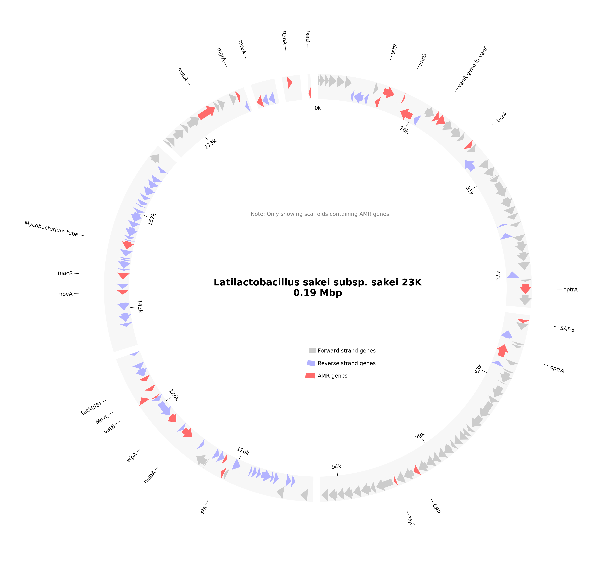

### CRP
- **Mechanism**: antibiotic efflux
- **Drug Classes**: macrolide antibiotic; fluoroquinolone antibiotic; penam
- **AMR Family**: resistance-nodulation-cell division (RND) antibiotic efflux pump
- **Locations**:
  - gnl|SPADES|IAMKMEGF_40_26 : position 29528-30229

### HelR
- **Mechanism**: antibiotic target protection
- **Drug Classes**: rifamycin antibiotic
- **AMR Family**: helicase-like RNA polymerase protection protein
- **Locations**:
  - gnl|SPADES|IAMKMEGF_28_14 : position 13715-15763

### MexL
- **Mechanism**: antibiotic efflux
- **Drug Classes**: macrolide antibiotic; tetracycline antibiotic; disinfecting agents and antiseptics
- **AMR Family**: resistance-nodulation-cell division (RND) antibiotic efflux pump
- **Locations**:
  - gnl|SPADES|IAMKMEGF_58_33 : position 31213-31848

### Mycobacterium tuberculosis intrinsic murA conferring resistance to fosfomycin
- **Mechanism**: antibiotic target alteration
- **Drug Classes**: phosphonic acid antibiotic
- **AMR Family**: antibiotic-resistant murA transferase
- **Locations**:
  - gnl|SPADES|IAMKMEGF_69_17 : position 15856-17157

### RanA
- **Mechanism**: antibiotic efflux
- **Drug Classes**: aminoglycoside antibiotic
- **AMR Family**: ATP-binding cassette (ABC) antibiotic efflux pump
- **Locations**:
  - gnl|SPADES|IAMKMEGF_898_2 : position 756-1496

### SAT-3
- **Mechanism**: antibiotic inactivation
- **Drug Classes**: nucleoside antibiotic
- **AMR Family**: streptothricin acetyltransferase (SAT)
- **Locations**:
  - gnl|SPADES|IAMKMEGF_40_2 : position 775-1320

### YajC
- **Mechanism**: antibiotic efflux
- **Drug Classes**: fluoroquinolone antibiotic; cephalosporin; glycylcycline; penam; tetracycline antibiotic; oxazolidinone antibiotic; glycopeptide antibiotic; rifamycin antibiotic; phenicol antibiotic; disinfecting agents and antiseptics
- **AMR Family**: resistance-nodulation-cell division (RND) antibiotic efflux pump
- **Locations**:
  - gnl|SPADES|IAMKMEGF_40_29 : position 33234-33590

### bcrA
- **Mechanism**: antibiotic efflux
- **Drug Classes**: peptide antibiotic
- **AMR Family**: ATP-binding cassette (ABC) antibiotic efflux pump
- **Locations**:
  - gnl|SPADES|IAMKMEGF_28_23 : position 25433-26113

### efpA
- **Mechanism**: antibiotic efflux
- **Drug Classes**: rifamycin antibiotic; isoniazid-like antibiotic
- **AMR Family**: major facilitator superfamily (MFS) antibiotic efflux pump
- **Locations**:
  - gnl|SPADES|IAMKMEGF_58_28 : position 24800-26158

### golS (found in 2 locations)
- **Mechanism**: antibiotic efflux
- **Drug Classes**: monobactam; carbapenem; cephalosporin; cephamycin; penam; phenicol antibiotic; penem
- **AMR Family**: resistance-nodulation-cell division (RND) antibiotic efflux pump
- **Locations**:
  - gnl|SPADES|IAMKMEGF_58_17 : position 14595-15020
  - gnl|SPADES|IAMKMEGF_58_26 : position 23788-24189

### leuO
- **Mechanism**: antibiotic efflux
- **Drug Classes**: nucleoside antibiotic; disinfecting agents and antiseptics
- **AMR Family**: major facilitator superfamily (MFS) antibiotic efflux pump
- **Locations**:
  - gnl|SPADES|IAMKMEGF_58_32 : position 30306-31193

### lmrD
- **Mechanism**: antibiotic efflux
- **Drug Classes**: lincosamide antibiotic
- **AMR Family**: ATP-binding cassette (ABC) antibiotic efflux pump
- **Locations**:
  - gnl|SPADES|IAMKMEGF_28_13 : position 13290-13538

### lsaD
- **Mechanism**: antibiotic target protection
- **Drug Classes**: lincosamide antibiotic; streptogramin antibiotic; streptogramin A antibiotic; pleuromutilin antibiotic
- **AMR Family**: lsa-type ABC-F protein
- **Locations**:
  - gnl|SPADES|IAMKMEGF_572112_1 : position 1-420

### macB
- **Mechanism**: antibiotic efflux
- **Drug Classes**: macrolide antibiotic
- **AMR Family**: ATP-binding cassette (ABC) antibiotic efflux pump
- **Locations**:
  - gnl|SPADES|IAMKMEGF_69_10 : position 10970-12004

### mgrA
- **Mechanism**: antibiotic efflux
- **Drug Classes**: fluoroquinolone antibiotic; cephalosporin; penam; tetracycline antibiotic; peptide antibiotic; disinfecting agents and antiseptics
- **AMR Family**: ATP-binding cassette (ABC) antibiotic efflux pump; major facilitator superfamily (MFS) antibiotic efflux pump
- **Locations**:
  - gnl|SPADES|IAMKMEGF_161_11 : position 12909-13364

### mreA
- **Mechanism**: antibiotic efflux
- **Drug Classes**: macrolide antibiotic
- **AMR Family**: major facilitator superfamily (MFS) antibiotic efflux pump
- **Locations**:
  - gnl|SPADES|IAMKMEGF_594_1 : position 2-943

### msbA (found in 2 locations)
- **Mechanism**: antibiotic efflux
- **Drug Classes**: nitroimidazole antibiotic
- **AMR Family**: ATP-binding cassette (ABC) antibiotic efflux pump
- **Locations**:
  - gnl|SPADES|IAMKMEGF_161_6 : position 6319-9171
  - gnl|SPADES|IAMKMEGF_58_24 : position 21341-23092

### novA
- **Mechanism**: antibiotic efflux
- **Drug Classes**: aminocoumarin antibiotic
- **AMR Family**: ATP-binding cassette (ABC) antibiotic efflux pump
- **Locations**:
  - gnl|SPADES|IAMKMEGF_69_7 : position 8501-9283

### optrA (found in 2 locations)
- **Mechanism**: antibiotic target protection
- **Drug Classes**: oxazolidinone antibiotic; phenicol antibiotic
- **AMR Family**: Miscellaneous ABC-F subfamily ATP-binding cassette ribosomal protection proteins
- **Locations**:
  - gnl|SPADES|IAMKMEGF_28_43 : position 48803-50347
  - gnl|SPADES|IAMKMEGF_40_7 : position 5202-7223

### patA
- **Mechanism**: antibiotic efflux
- **Drug Classes**: fluoroquinolone antibiotic
- **AMR Family**: ATP-binding cassette (ABC) antibiotic efflux pump
- **Locations**:
  - gnl|SPADES|IAMKMEGF_28_12 : position 10158-11870

### sta
- **Mechanism**: antibiotic inactivation
- **Drug Classes**: nucleoside antibiotic
- **AMR Family**: streptothricin acetyltransferase (SAT)
- **Locations**:
  - gnl|SPADES|IAMKMEGF_58_16 : position 14022-14540

### tetA(58)
- **Mechanism**: antibiotic efflux
- **Drug Classes**: tetracycline antibiotic
- **AMR Family**: major facilitator superfamily (MFS) antibiotic efflux pump
- **Locations**:
  - gnl|SPADES|IAMKMEGF_58_35 : position 32982-33707

### tetR
- **Mechanism**: antibiotic target alteration; antibiotic efflux
- **Drug Classes**: tetracycline antibiotic
- **AMR Family**: major facilitator superfamily (MFS) antibiotic efflux pump
- **Locations**:
  - gnl|SPADES|IAMKMEGF_28_11 : position 9344-10015

### vanR gene in vanF cluster
- **Mechanism**: antibiotic target alteration
- **Drug Classes**: glycopeptide antibiotic
- **AMR Family**: glycopeptide resistance gene cluster; vanR
- **Locations**:
  - gnl|SPADES|IAMKMEGF_28_17 : position 18851-19537

### vanS gene in vanF cluster
- **Mechanism**: antibiotic target alteration
- **Drug Classes**: glycopeptide antibiotic
- **AMR Family**: vanS; glycopeptide resistance gene cluster
- **Locations**:
  - gnl|SPADES|IAMKMEGF_28_18 : position 19537-20736

### vatB
- **Mechanism**: antibiotic inactivation
- **Drug Classes**: streptogramin antibiotic; streptogramin A antibiotic
- **AMR Family**: streptogramin vat acetyltransferase
- **Locations**:
  - gnl|SPADES|IAMKMEGF_58_31 : position 29887-30153

## Latilactobacillus sakei subsp. sakei DSM 20017 = JCM 1157
**Strain Statistics:**
- Total genome length: 52.2 kbp
- Total scaffolds: 1
- Scaffolds with AMR genes: 1
- Total genes annotated: 122
- Total AMR genes: 4
- Unique AMR genes: 4
- Distinct AMR mechanisms: 2
- Distinct AMR families: 4
- Distinct drug classes: 4

**Circos Plot:**

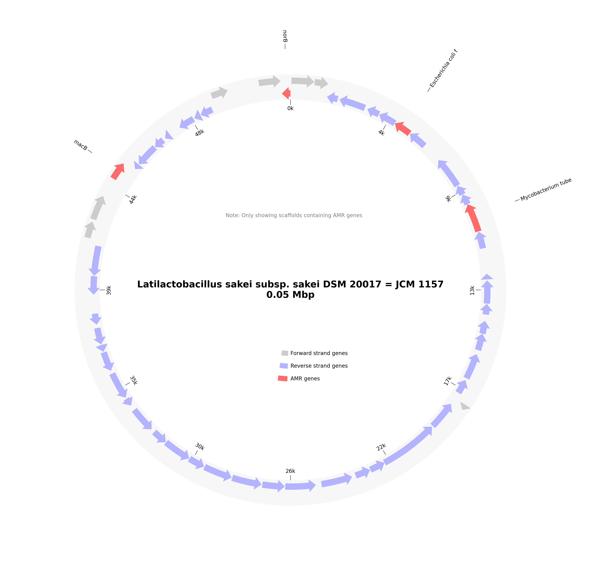

### Escherichia coli fabI mutations conferring resistance to isoniazid and triclosan
- **Mechanism**: antibiotic target alteration
- **Drug Classes**: disinfecting agents and antiseptics; isoniazid-like antibiotic
- **AMR Family**: antibiotic resistant fabI
- **Locations**:
  - gnl|SPADES|IAMKMEGF_29_7 : position 4647-5396

### Mycobacterium tuberculosis kasA mutant conferring resistance to isoniazid
- **Mechanism**: antibiotic target alteration
- **Drug Classes**: isoniazid-like antibiotic
- **AMR Family**: antibiotic resistant kasA
- **Locations**:
  - gnl|SPADES|IAMKMEGF_29_13 : position 9306-10538

### macB
- **Mechanism**: antibiotic efflux
- **Drug Classes**: macrolide antibiotic
- **AMR Family**: ATP-binding cassette (ABC) antibiotic efflux pump
- **Locations**:
  - gnl|SPADES|IAMKMEGF_29_49 : position 43831-44556

### norB
- **Mechanism**: antibiotic efflux
- **Drug Classes**: fluoroquinolone antibiotic
- **AMR Family**: major facilitator superfamily (MFS) antibiotic efflux pump
- **Locations**:
  - gnl|SPADES|IAMKMEGF_29_60 : position 51847-52212

## Serratia fonticola
**Strain Statistics:**
- Total genome length: 65.0 kbp
- Total scaffolds: 2605
- Scaffolds with AMR genes: 182
- Total genes annotated: 62
- Total AMR genes: 185
- Unique AMR genes: 104
- Distinct AMR mechanisms: 9
- Distinct AMR families: 37
- Distinct drug classes: 33

**Circos Plot:**

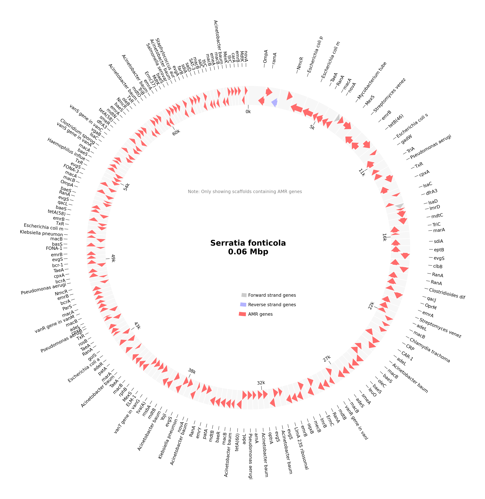

### Acinetobacter baumannii AbaF (found in 6 locations)
- **Mechanism**: antibiotic efflux
- **Drug Classes**: phosphonic acid antibiotic
- **AMR Family**: major facilitator superfamily (MFS) antibiotic efflux pump
- **Locations**:
  - gnl|SPADES|IAMKMEGF_1894356_1 : position 3-230
  - gnl|SPADES|IAMKMEGF_2182744_1 : position 1-210
  - gnl|SPADES|IAMKMEGF_608701_1 : position 3-410
  - gnl|SPADES|IAMKMEGF_759577_1 : position 2-370
  - gnl|SPADES|IAMKMEGF_771584_1 : position 1-366
  - gnl|SPADES|IAMKMEGF_874151_2 : position 194-346

### Acinetobacter baumannii AbaQ (found in 5 locations)
- **Mechanism**: antibiotic efflux
- **Drug Classes**: fluoroquinolone antibiotic
- **AMR Family**: major facilitator superfamily (MFS) antibiotic efflux pump
- **Locations**:
  - gnl|SPADES|IAMKMEGF_1064804_1 : position 3-314
  - gnl|SPADES|IAMKMEGF_1818339_1 : position 3-236
  - gnl|SPADES|IAMKMEGF_1968977_1 : position 2-226
  - gnl|SPADES|IAMKMEGF_822928_1 : position 122-355
  - gnl|SPADES|IAMKMEGF_963932_1 : position 3-329

### CAR-1
- **Mechanism**: antibiotic inactivation
- **Drug Classes**: carbapenem
- **AMR Family**: CAR beta-lactamase
- **Locations**:
  - gnl|SPADES|IAMKMEGF_582501_1 : position 2-418

### CRP
- **Mechanism**: antibiotic efflux
- **Drug Classes**: macrolide antibiotic; fluoroquinolone antibiotic; penam
- **AMR Family**: resistance-nodulation-cell division (RND) antibiotic efflux pump
- **Locations**:
  - gnl|SPADES|IAMKMEGF_573678_1 : position 3-296

### Chlamydia trachomatis intrinsic murA conferring resistance to fosfomycin
- **Mechanism**: antibiotic target alteration
- **Drug Classes**: phosphonic acid antibiotic
- **AMR Family**: antibiotic-resistant murA transferase
- **Locations**:
  - gnl|SPADES|IAMKMEGF_560311_1 : position 34-273

### Clostridioides difficile gyrB conferring resistance to fluoroquinolones
- **Mechanism**: antibiotic target alteration
- **Drug Classes**: fluoroquinolone antibiotic
- **AMR Family**: fluoroquinolone resistant gyrB
- **Locations**:
  - gnl|SPADES|IAMKMEGF_476363_1 : position 2-454

### Clostridium sporogenes cplR
- **Mechanism**: antibiotic target protection
- **Drug Classes**: lincosamide antibiotic; pleuromutilin antibiotic
- **AMR Family**: Miscellaneous ABC-F subfamily ATP-binding cassette ribosomal protection proteins
- **Locations**:
  - gnl|SPADES|IAMKMEGF_1605019_1 : position 1-252

### ELM-1
- **Mechanism**: antibiotic inactivation
- **Drug Classes**: carbapenem
- **AMR Family**: ELM beta-lactamase
- **Locations**:
  - gnl|SPADES|IAMKMEGF_1033849_1 : position 2-319

### Erm(37)
- **Mechanism**: antibiotic target alteration
- **Drug Classes**: macrolide antibiotic; lincosamide antibiotic; streptogramin antibiotic; streptogramin A antibiotic; streptogramin B antibiotic
- **AMR Family**: Erm 23S ribosomal RNA methyltransferase
- **Locations**:
  - gnl|SPADES|IAMKMEGF_1922691_1 : position 1-228

### ErmC
- **Mechanism**: antibiotic target alteration
- **Drug Classes**: macrolide antibiotic; lincosamide antibiotic; streptogramin antibiotic; streptogramin A antibiotic; streptogramin B antibiotic
- **AMR Family**: Erm 23S ribosomal RNA methyltransferase
- **Locations**:
  - gnl|SPADES|IAMKMEGF_734893_1 : position 2-376

### Escherichia coli acrA
- **Mechanism**: antibiotic efflux
- **Drug Classes**: fluoroquinolone antibiotic; cephalosporin; glycylcycline; penam; tetracycline antibiotic; rifamycin antibiotic; phenicol antibiotic; disinfecting agents and antiseptics
- **AMR Family**: resistance-nodulation-cell division (RND) antibiotic efflux pump
- **Locations**:
  - gnl|SPADES|IAMKMEGF_1122830_1 : position 1-303

### Escherichia coli mdfA (found in 2 locations)
- **Mechanism**: antibiotic efflux
- **Drug Classes**: tetracycline antibiotic; phenicol antibiotic; disinfecting agents and antiseptics
- **AMR Family**: major facilitator superfamily (MFS) antibiotic efflux pump
- **Locations**:
  - gnl|SPADES|IAMKMEGF_1377659_1 : position 3-272
  - gnl|SPADES|IAMKMEGF_61222_1 : position 2-832

### Escherichia coli parE conferring resistance to fluoroquinolones
- **Mechanism**: antibiotic target alteration
- **Drug Classes**: fluoroquinolone antibiotic
- **AMR Family**: fluoroquinolone resistant parE
- **Locations**:
  - gnl|SPADES|IAMKMEGF_34959_1 : position 2-943

### Escherichia coli soxS with mutation conferring antibiotic resistance
- **Mechanism**: antibiotic target alteration; antibiotic efflux; reduced permeability to antibiotic
- **Drug Classes**: fluoroquinolone antibiotic; monobactam; carbapenem; cephalosporin; glycylcycline; cephamycin; penam; tetracycline antibiotic; rifamycin antibiotic; phenicol antibiotic; penem; disinfecting agents and antiseptics
- **AMR Family**: ATP-binding cassette (ABC) antibiotic efflux pump; major facilitator superfamily (MFS) antibiotic efflux pump; resistance-nodulation-cell division (RND) antibiotic efflux pump; General Bacterial Porin with reduced permeability to beta-lactams
- **Locations**:
  - gnl|SPADES|IAMKMEGF_237587_2 : position 341-580

### FONA-1
- **Mechanism**: antibiotic inactivation
- **Drug Classes**: penam
- **AMR Family**: FONA beta-lactamase
- **Locations**:
  - gnl|SPADES|IAMKMEGF_1347898_1 : position 133-276

### FONA-3
- **Mechanism**: antibiotic inactivation
- **Drug Classes**: penam
- **AMR Family**: FONA beta-lactamase
- **Locations**:
  - gnl|SPADES|IAMKMEGF_1532215_1 : position 3-257

### Haemophilus influenzae PBP3 conferring resistance to beta-lactam antibiotics
- **Mechanism**: antibiotic target alteration
- **Drug Classes**: cephalosporin; cephamycin; penam
- **AMR Family**: Penicillin-binding protein mutations conferring resistance to beta-lactam antibiotics
- **Locations**:
  - gnl|SPADES|IAMKMEGF_1560685_1 : position 1-255

### Klebsiella pneumoniae KpnH
- **Mechanism**: antibiotic efflux
- **Drug Classes**: macrolide antibiotic; fluoroquinolone antibiotic; aminoglycoside antibiotic; carbapenem; cephalosporin; penam; peptide antibiotic; penem
- **AMR Family**: major facilitator superfamily (MFS) antibiotic efflux pump
- **Locations**:
  - gnl|SPADES|IAMKMEGF_903004_1 : position 2-340

### Klebsiella pneumoniae OmpK37
- **Mechanism**: reduced permeability to antibiotic
- **Drug Classes**: monobactam; carbapenem; cephalosporin; cephamycin; penam; penem
- **AMR Family**: General Bacterial Porin with reduced permeability to beta-lactams
- **Locations**:
  - gnl|SPADES|IAMKMEGF_1377380_1 : position 3-194

### LlmA 23S ribosomal RNA methyltransferase
- **Mechanism**: antibiotic target alteration
- **Drug Classes**: lincosamide antibiotic
- **AMR Family**: Llm 23S ribosomal RNA methyltransferase
- **Locations**:
  - gnl|SPADES|IAMKMEGF_752682_1 : position 1-372

### MdtK (found in 2 locations)
- **Mechanism**: antibiotic efflux
- **Drug Classes**: fluoroquinolone antibiotic
- **AMR Family**: multidrug and toxic compound extrusion (MATE) transporter
- **Locations**:
  - gnl|SPADES|IAMKMEGF_1917732_1 : position 2-229
  - gnl|SPADES|IAMKMEGF_2226592_1 : position 3-206

### MexK
- **Mechanism**: antibiotic efflux
- **Drug Classes**: macrolide antibiotic; tetracycline antibiotic; disinfecting agents and antiseptics
- **AMR Family**: resistance-nodulation-cell division (RND) antibiotic efflux pump
- **Locations**:
  - gnl|SPADES|IAMKMEGF_2199553_1 : position 3-209

### MexS (found in 2 locations)
- **Mechanism**: antibiotic efflux
- **Drug Classes**: fluoroquinolone antibiotic; diaminopyrimidine antibiotic; phenicol antibiotic
- **AMR Family**: resistance-nodulation-cell division (RND) antibiotic efflux pump
- **Locations**:
  - gnl|SPADES|IAMKMEGF_1045504_1 : position 2-259
  - gnl|SPADES|IAMKMEGF_132660_1 : position 52-684

### Mycobacterium tuberculosis thyA with mutation conferring resistance to para-aminosalicylic acid
- **Mechanism**: antibiotic target alteration
- **Drug Classes**: salicylic acid antibiotic
- **AMR Family**: aminosalicylate resistant thymidylate synthase
- **Locations**:
  - gnl|SPADES|IAMKMEGF_128917_2 : position 340-690

### NmcR (found in 3 locations)
- **Mechanism**: antibiotic inactivation
- **Drug Classes**: carbapenem; cephalosporin; cephamycin; penam
- **AMR Family**: NmcA beta-lactamase
- **Locations**:
  - gnl|SPADES|IAMKMEGF_1245543_1 : position 1-219
  - gnl|SPADES|IAMKMEGF_1727032_1 : position 1-243
  - gnl|SPADES|IAMKMEGF_33198_2 : position 572-955

### OmpA (found in 2 locations)
- **Mechanism**: reduced permeability to antibiotic
- **Drug Classes**: peptide antibiotic
- **AMR Family**: General Bacterial Porin with reduced permeability to peptide antibiotics
- **Locations**:
  - gnl|SPADES|IAMKMEGF_1489273_1 : position 3-263
  - gnl|SPADES|IAMKMEGF_8806_2 : position 769-1254

### OprM
- **Mechanism**: antibiotic efflux
- **Drug Classes**: macrolide antibiotic; fluoroquinolone antibiotic; monobactam; aminoglycoside antibiotic; carbapenem; cephalosporin; cephamycin; penam; tetracycline antibiotic; peptide antibiotic; aminocoumarin antibiotic; diaminopyrimidine antibiotic; sulfonamide antibiotic; phenicol antibiotic; penem; disinfecting agents and antiseptics
- **AMR Family**: resistance-nodulation-cell division (RND) antibiotic efflux pump
- **Locations**:
  - gnl|SPADES|IAMKMEGF_510401_1 : position 2-442

### ParS
- **Mechanism**: antibiotic efflux; reduced permeability to antibiotic
- **Drug Classes**: macrolide antibiotic; fluoroquinolone antibiotic; monobactam; aminoglycoside antibiotic; carbapenem; cephalosporin; cephamycin; penam; tetracycline antibiotic; phenicol antibiotic; penem; disinfecting agents and antiseptics
- **AMR Family**: resistance-nodulation-cell division (RND) antibiotic efflux pump; Outer Membrane Porin (Opr)
- **Locations**:
  - gnl|SPADES|IAMKMEGF_1227253_1 : position 2-250

### Pseudomonas aeruginosa CpxR (found in 4 locations)
- **Mechanism**: antibiotic efflux
- **Drug Classes**: macrolide antibiotic; fluoroquinolone antibiotic; monobactam; aminoglycoside antibiotic; carbapenem; cephalosporin; cephamycin; penam; tetracycline antibiotic; peptide antibiotic; aminocoumarin antibiotic; diaminopyrimidine antibiotic; sulfonamide antibiotic; phenicol antibiotic; penem
- **AMR Family**: resistance-nodulation-cell division (RND) antibiotic efflux pump
- **Locations**:
  - gnl|SPADES|IAMKMEGF_1195094_1 : position 3-233
  - gnl|SPADES|IAMKMEGF_1254439_2 : position 141-287
  - gnl|SPADES|IAMKMEGF_308448_1 : position 1-414
  - gnl|SPADES|IAMKMEGF_799026_1 : position 1-348

### RanA (found in 7 locations)
- **Mechanism**: antibiotic efflux
- **Drug Classes**: aminoglycoside antibiotic
- **AMR Family**: ATP-binding cassette (ABC) antibiotic efflux pump
- **Locations**:
  - gnl|SPADES|IAMKMEGF_1141216_2 : position 138-302
  - gnl|SPADES|IAMKMEGF_1470035_1 : position 3-263
  - gnl|SPADES|IAMKMEGF_473933_1 : position 42-455
  - gnl|SPADES|IAMKMEGF_477573_1 : position 3-452
  - gnl|SPADES|IAMKMEGF_719454_1 : position 1-378
  - gnl|SPADES|IAMKMEGF_74283_2 : position 303-794
  - gnl|SPADES|IAMKMEGF_864832_1 : position 2-349

### SAT-3
- **Mechanism**: antibiotic inactivation
- **Drug Classes**: nucleoside antibiotic
- **AMR Family**: streptothricin acetyltransferase (SAT)
- **Locations**:
  - gnl|SPADES|IAMKMEGF_2071354_1 : position 3-218

### Salmonella serovars soxS with mutation conferring antibiotic resistance
- **Mechanism**: antibiotic target alteration; antibiotic efflux; reduced permeability to antibiotic
- **Drug Classes**: fluoroquinolone antibiotic; monobactam; carbapenem; cephalosporin; glycylcycline; cephamycin; penam; tetracycline antibiotic; rifamycin antibiotic; phenicol antibiotic; penem; disinfecting agents and antiseptics
- **AMR Family**: ATP-binding cassette (ABC) antibiotic efflux pump; major facilitator superfamily (MFS) antibiotic efflux pump; resistance-nodulation-cell division (RND) antibiotic efflux pump; General Bacterial Porin with reduced permeability to beta-lactams
- **Locations**:
  - gnl|SPADES|IAMKMEGF_1954928_1 : position 2-226

### Staphylococcus aureus mupA conferring resistance to mupirocin
- **Mechanism**: antibiotic target alteration
- **Drug Classes**: mupirocin-like antibiotic
- **AMR Family**: antibiotic-resistant isoleucyl-tRNA synthetase (ileS)
- **Locations**:
  - gnl|SPADES|IAMKMEGF_1968472_1 : position 2-226

### Streptomyces venezuelae rox (found in 2 locations)
- **Mechanism**: antibiotic inactivation
- **Drug Classes**: rifamycin antibiotic
- **AMR Family**: rifampin monooxygenase
- **Locations**:
  - gnl|SPADES|IAMKMEGF_170006_1 : position 2-640
  - gnl|SPADES|IAMKMEGF_525563_1 : position 3-434

### TaeA (found in 4 locations)
- **Mechanism**: antibiotic efflux
- **Drug Classes**: pleuromutilin antibiotic
- **AMR Family**: ATP-binding cassette (ABC) antibiotic efflux pump
- **Locations**:
  - gnl|SPADES|IAMKMEGF_1054272_1 : position 3-314
  - gnl|SPADES|IAMKMEGF_1144842_1 : position 2-301
  - gnl|SPADES|IAMKMEGF_1310975_1 : position 2-280
  - gnl|SPADES|IAMKMEGF_74283_1 : position 2-316

### TriA
- **Mechanism**: antibiotic efflux
- **Drug Classes**: disinfecting agents and antiseptics
- **AMR Family**: resistance-nodulation-cell division (RND) antibiotic efflux pump
- **Locations**:
  - gnl|SPADES|IAMKMEGF_290401_2 : position 210-542

### TriB
- **Mechanism**: antibiotic efflux
- **Drug Classes**: disinfecting agents and antiseptics
- **AMR Family**: resistance-nodulation-cell division (RND) antibiotic efflux pump
- **Locations**:
  - gnl|SPADES|IAMKMEGF_1880550_1 : position 2-232

### TriC
- **Mechanism**: antibiotic efflux
- **Drug Classes**: disinfecting agents and antiseptics
- **AMR Family**: resistance-nodulation-cell division (RND) antibiotic efflux pump
- **Locations**:
  - gnl|SPADES|IAMKMEGF_424890_1 : position 2-475

### TxR (found in 5 locations)
- **Mechanism**: antibiotic efflux
- **Drug Classes**: tetracycline antibiotic
- **AMR Family**: ATP-binding cassette (ABC) antibiotic efflux pump
- **Locations**:
  - gnl|SPADES|IAMKMEGF_1198090_1 : position 10-294
  - gnl|SPADES|IAMKMEGF_1393243_1 : position 3-269
  - gnl|SPADES|IAMKMEGF_1548879_1 : position 1-255
  - gnl|SPADES|IAMKMEGF_1742426_1 : position 1-240
  - gnl|SPADES|IAMKMEGF_311275_1 : position 3-530

### YojI
- **Mechanism**: antibiotic efflux
- **Drug Classes**: peptide antibiotic
- **AMR Family**: ATP-binding cassette (ABC) antibiotic efflux pump
- **Locations**:
  - gnl|SPADES|IAMKMEGF_918289_1 : position 1-339

### adeL (found in 4 locations)
- **Mechanism**: antibiotic efflux
- **Drug Classes**: fluoroquinolone antibiotic; tetracycline antibiotic
- **AMR Family**: resistance-nodulation-cell division (RND) antibiotic efflux pump
- **Locations**:
  - gnl|SPADES|IAMKMEGF_1209360_1 : position 1-291
  - gnl|SPADES|IAMKMEGF_528457_1 : position 1-294
  - gnl|SPADES|IAMKMEGF_604208_1 : position 3-410
  - gnl|SPADES|IAMKMEGF_803307_1 : position 3-359

### adeR
- **Mechanism**: antibiotic efflux
- **Drug Classes**: glycylcycline; tetracycline antibiotic
- **AMR Family**: resistance-nodulation-cell division (RND) antibiotic efflux pump
- **Locations**:
  - gnl|SPADES|IAMKMEGF_1082043_1 : position 1-309

### adeS
- **Mechanism**: antibiotic efflux
- **Drug Classes**: glycylcycline; tetracycline antibiotic
- **AMR Family**: resistance-nodulation-cell division (RND) antibiotic efflux pump
- **Locations**:
  - gnl|SPADES|IAMKMEGF_655778_1 : position 2-394

### arnA
- **Mechanism**: antibiotic target alteration
- **Drug Classes**: peptide antibiotic
- **AMR Family**: pmr phosphoethanolamine transferase
- **Locations**:
  - gnl|SPADES|IAMKMEGF_787973_2 : position 94-363

### baeR
- **Mechanism**: antibiotic efflux
- **Drug Classes**: aminoglycoside antibiotic; aminocoumarin antibiotic
- **AMR Family**: resistance-nodulation-cell division (RND) antibiotic efflux pump
- **Locations**:
  - gnl|SPADES|IAMKMEGF_833682_1 : position 3-353

### baeS (found in 7 locations)
- **Mechanism**: antibiotic efflux
- **Drug Classes**: aminoglycoside antibiotic; aminocoumarin antibiotic
- **AMR Family**: resistance-nodulation-cell division (RND) antibiotic efflux pump
- **Locations**:
  - gnl|SPADES|IAMKMEGF_1431776_1 : position 2-268
  - gnl|SPADES|IAMKMEGF_1476099_1 : position 2-136
  - gnl|SPADES|IAMKMEGF_1566458_1 : position 3-254
  - gnl|SPADES|IAMKMEGF_1696056_1 : position 3-245
  - gnl|SPADES|IAMKMEGF_1942387_1 : position 2-226
  - gnl|SPADES|IAMKMEGF_623998_1 : position 3-404
  - gnl|SPADES|IAMKMEGF_633317_1 : position 2-403

### basS
- **Mechanism**: antibiotic target alteration; antibiotic efflux
- **Drug Classes**: peptide antibiotic
- **AMR Family**: pmr phosphoethanolamine transferase
- **Locations**:
  - gnl|SPADES|IAMKMEGF_1355318_1 : position 1-273

### bcr-1
- **Mechanism**: antibiotic efflux
- **Drug Classes**: bicyclomycin-like antibiotic
- **AMR Family**: major facilitator superfamily (MFS) antibiotic efflux pump
- **Locations**:
  - gnl|SPADES|IAMKMEGF_1333260_1 : position 1-276

### bcrA (found in 2 locations)
- **Mechanism**: antibiotic efflux
- **Drug Classes**: peptide antibiotic
- **AMR Family**: ATP-binding cassette (ABC) antibiotic efflux pump
- **Locations**:
  - gnl|SPADES|IAMKMEGF_1239214_1 : position 2-289
  - gnl|SPADES|IAMKMEGF_1261224_1 : position 1-285

### carA
- **Mechanism**: antibiotic target protection
- **Drug Classes**: macrolide antibiotic
- **AMR Family**: Miscellaneous ABC-F subfamily ATP-binding cassette ribosomal protection proteins
- **Locations**:
  - gnl|SPADES|IAMKMEGF_2220572_1 : position 3-209

### clbB
- **Mechanism**: antibiotic target alteration
- **Drug Classes**: lincosamide antibiotic; streptogramin antibiotic; streptogramin A antibiotic; oxazolidinone antibiotic; phenicol antibiotic; pleuromutilin antibiotic
- **AMR Family**: Cfr 23S ribosomal RNA methyltransferase
- **Locations**:
  - gnl|SPADES|IAMKMEGF_465775_1 : position 1-456

### cpxA (found in 3 locations)
- **Mechanism**: antibiotic efflux
- **Drug Classes**: aminoglycoside antibiotic; aminocoumarin antibiotic
- **AMR Family**: resistance-nodulation-cell division (RND) antibiotic efflux pump
- **Locations**:
  - gnl|SPADES|IAMKMEGF_1195094_2 : position 230-292
  - gnl|SPADES|IAMKMEGF_1297906_1 : position 1-282
  - gnl|SPADES|IAMKMEGF_313036_1 : position 1-528

### dfrA3 (found in 2 locations)
- **Mechanism**: antibiotic target replacement
- **Drug Classes**: diaminopyrimidine antibiotic
- **AMR Family**: trimethoprim resistant dihydrofolate reductase dfr
- **Locations**:
  - gnl|SPADES|IAMKMEGF_1658544_1 : position 1-246
  - gnl|SPADES|IAMKMEGF_374162_2 : position 243-497

### emeA
- **Mechanism**: antibiotic efflux
- **Drug Classes**: disinfecting agents and antiseptics
- **AMR Family**: multidrug and toxic compound extrusion (MATE) transporter
- **Locations**:
  - gnl|SPADES|IAMKMEGF_2172873_1 : position 1-210

### emrA (found in 3 locations)
- **Mechanism**: antibiotic efflux
- **Drug Classes**: fluoroquinolone antibiotic
- **AMR Family**: major facilitator superfamily (MFS) antibiotic efflux pump
- **Locations**:
  - gnl|SPADES|IAMKMEGF_1686383_1 : position 1-246
  - gnl|SPADES|IAMKMEGF_1900646_1 : position 1-231
  - gnl|SPADES|IAMKMEGF_511667_1 : position 1-441

### emrB (found in 6 locations)
- **Mechanism**: antibiotic efflux
- **Drug Classes**: fluoroquinolone antibiotic
- **AMR Family**: major facilitator superfamily (MFS) antibiotic efflux pump
- **Locations**:
  - gnl|SPADES|IAMKMEGF_1238336_1 : position 1-288
  - gnl|SPADES|IAMKMEGF_1342883_1 : position 1-276
  - gnl|SPADES|IAMKMEGF_1416342_1 : position 1-213
  - gnl|SPADES|IAMKMEGF_200084_1 : position 3-611
  - gnl|SPADES|IAMKMEGF_2214896_1 : position 1-207
  - gnl|SPADES|IAMKMEGF_745079_1 : position 3-374

### emrY
- **Mechanism**: antibiotic efflux
- **Drug Classes**: tetracycline antibiotic
- **AMR Family**: major facilitator superfamily (MFS) antibiotic efflux pump
- **Locations**:
  - gnl|SPADES|IAMKMEGF_852149_1 : position 3-350

### eptB
- **Mechanism**: antibiotic target alteration
- **Drug Classes**: peptide antibiotic
- **AMR Family**: pmr phosphoethanolamine transferase
- **Locations**:
  - gnl|SPADES|IAMKMEGF_445471_1 : position 1-465

### evgA
- **Mechanism**: antibiotic efflux
- **Drug Classes**: macrolide antibiotic; fluoroquinolone antibiotic; penam; tetracycline antibiotic
- **AMR Family**: major facilitator superfamily (MFS) antibiotic efflux pump; resistance-nodulation-cell division (RND) antibiotic efflux pump
- **Locations**:
  - gnl|SPADES|IAMKMEGF_1966509_1 : position 2-226

### evgS (found in 7 locations)
- **Mechanism**: antibiotic efflux
- **Drug Classes**: macrolide antibiotic; fluoroquinolone antibiotic; penam; tetracycline antibiotic
- **AMR Family**: major facilitator superfamily (MFS) antibiotic efflux pump; resistance-nodulation-cell division (RND) antibiotic efflux pump
- **Locations**:
  - gnl|SPADES|IAMKMEGF_1334653_1 : position 58-276
  - gnl|SPADES|IAMKMEGF_1466547_1 : position 1-264
  - gnl|SPADES|IAMKMEGF_1545014_1 : position 2-256
  - gnl|SPADES|IAMKMEGF_444672_1 : position 1-465
  - gnl|SPADES|IAMKMEGF_759349_1 : position 94-369
  - gnl|SPADES|IAMKMEGF_763649_1 : position 1-369
  - gnl|SPADES|IAMKMEGF_906436_1 : position 1-339

### farB
- **Mechanism**: antibiotic efflux
- **Drug Classes**: antibacterial free fatty acids
- **AMR Family**: major facilitator superfamily (MFS) antibiotic efflux pump
- **Locations**:
  - gnl|SPADES|IAMKMEGF_2022879_1 : position 1-222

### gadW
- **Mechanism**: antibiotic efflux
- **Drug Classes**: macrolide antibiotic; fluoroquinolone antibiotic; penam
- **AMR Family**: resistance-nodulation-cell division (RND) antibiotic efflux pump
- **Locations**:
  - gnl|SPADES|IAMKMEGF_262757_1 : position 3-560

### golS
- **Mechanism**: antibiotic efflux
- **Drug Classes**: monobactam; carbapenem; cephalosporin; cephamycin; penam; phenicol antibiotic; penem
- **AMR Family**: resistance-nodulation-cell division (RND) antibiotic efflux pump
- **Locations**:
  - gnl|SPADES|IAMKMEGF_1133837_1 : position 3-281

### leuO
- **Mechanism**: antibiotic efflux
- **Drug Classes**: nucleoside antibiotic; disinfecting agents and antiseptics
- **AMR Family**: major facilitator superfamily (MFS) antibiotic efflux pump
- **Locations**:
  - gnl|SPADES|IAMKMEGF_630816_1 : position 1-225

### lmrB
- **Mechanism**: antibiotic efflux
- **Drug Classes**: lincosamide antibiotic; nucleoside antibiotic
- **AMR Family**: ATP-binding cassette (ABC) antibiotic efflux pump
- **Locations**:
  - gnl|SPADES|IAMKMEGF_737868_1 : position 3-374

### lmrD
- **Mechanism**: antibiotic efflux
- **Drug Classes**: lincosamide antibiotic
- **AMR Family**: ATP-binding cassette (ABC) antibiotic efflux pump
- **Locations**:
  - gnl|SPADES|IAMKMEGF_410793_1 : position 2-481

### lsaC (found in 2 locations)
- **Mechanism**: antibiotic target protection
- **Drug Classes**: lincosamide antibiotic; streptogramin antibiotic; pleuromutilin antibiotic
- **AMR Family**: lsa-type ABC-F protein
- **Locations**:
  - gnl|SPADES|IAMKMEGF_1597944_1 : position 2-253
  - gnl|SPADES|IAMKMEGF_357329_2 : position 321-506

### lsaD
- **Mechanism**: antibiotic target protection
- **Drug Classes**: lincosamide antibiotic; streptogramin antibiotic; streptogramin A antibiotic; pleuromutilin antibiotic
- **AMR Family**: lsa-type ABC-F protein
- **Locations**:
  - gnl|SPADES|IAMKMEGF_378411_2 : position 350-496

### macA (found in 4 locations)
- **Mechanism**: antibiotic efflux
- **Drug Classes**: macrolide antibiotic
- **AMR Family**: ATP-binding cassette (ABC) antibiotic efflux pump
- **Locations**:
  - gnl|SPADES|IAMKMEGF_109562_1 : position 2-349
  - gnl|SPADES|IAMKMEGF_1225761_1 : position 1-210
  - gnl|SPADES|IAMKMEGF_1523598_1 : position 1-258
  - gnl|SPADES|IAMKMEGF_1595355_1 : position 3-236

### macB (found in 11 locations)
- **Mechanism**: antibiotic efflux
- **Drug Classes**: macrolide antibiotic
- **AMR Family**: ATP-binding cassette (ABC) antibiotic efflux pump
- **Locations**:
  - gnl|SPADES|IAMKMEGF_1053841_1 : position 1-315
  - gnl|SPADES|IAMKMEGF_1224040_1 : position 44-289
  - gnl|SPADES|IAMKMEGF_1358082_1 : position 1-273
  - gnl|SPADES|IAMKMEGF_1513131_1 : position 1-261
  - gnl|SPADES|IAMKMEGF_2099983_1 : position 2-217
  - gnl|SPADES|IAMKMEGF_2155767_1 : position 3-212
  - gnl|SPADES|IAMKMEGF_2170326_1 : position 2-211
  - gnl|SPADES|IAMKMEGF_553100_1 : position 3-281
  - gnl|SPADES|IAMKMEGF_621828_1 : position 47-406
  - gnl|SPADES|IAMKMEGF_683235_1 : position 34-387
  - gnl|SPADES|IAMKMEGF_829301_1 : position 3-356

### marA (found in 2 locations)
- **Mechanism**: antibiotic efflux; reduced permeability to antibiotic
- **Drug Classes**: fluoroquinolone antibiotic; monobactam; carbapenem; cephalosporin; glycylcycline; cephamycin; penam; tetracycline antibiotic; rifamycin antibiotic; phenicol antibiotic; penem; disinfecting agents and antiseptics
- **AMR Family**: resistance-nodulation-cell division (RND) antibiotic efflux pump; General Bacterial Porin with reduced permeability to beta-lactams
- **Locations**:
  - gnl|SPADES|IAMKMEGF_1067380_1 : position 3-158
  - gnl|SPADES|IAMKMEGF_429283_1 : position 1-150

### mdtB (found in 3 locations)
- **Mechanism**: antibiotic efflux
- **Drug Classes**: aminocoumarin antibiotic
- **AMR Family**: resistance-nodulation-cell division (RND) antibiotic efflux pump
- **Locations**:
  - gnl|SPADES|IAMKMEGF_716349_1 : position 2-379
  - gnl|SPADES|IAMKMEGF_848695_1 : position 2-352
  - gnl|SPADES|IAMKMEGF_982699_1 : position 3-326

### mdtC
- **Mechanism**: antibiotic efflux
- **Drug Classes**: aminocoumarin antibiotic
- **AMR Family**: resistance-nodulation-cell division (RND) antibiotic efflux pump
- **Locations**:
  - gnl|SPADES|IAMKMEGF_422463_1 : position 2-475

### mdtN
- **Mechanism**: antibiotic efflux
- **Drug Classes**: nucleoside antibiotic; disinfecting agents and antiseptics
- **AMR Family**: major facilitator superfamily (MFS) antibiotic efflux pump
- **Locations**:
  - gnl|SPADES|IAMKMEGF_1679728_1 : position 3-245

### mdtO
- **Mechanism**: antibiotic efflux
- **Drug Classes**: nucleoside antibiotic; disinfecting agents and antiseptics
- **AMR Family**: major facilitator superfamily (MFS) antibiotic efflux pump
- **Locations**:
  - gnl|SPADES|IAMKMEGF_1872120_1 : position 2-232

### mecB
- **Mechanism**: antibiotic target replacement
- **Drug Classes**: penam
- **AMR Family**: methicillin resistant PBP2
- **Locations**:
  - gnl|SPADES|IAMKMEGF_737814_1 : position 2-376

### msbA
- **Mechanism**: antibiotic efflux
- **Drug Classes**: nitroimidazole antibiotic
- **AMR Family**: ATP-binding cassette (ABC) antibiotic efflux pump
- **Locations**:
  - gnl|SPADES|IAMKMEGF_992033_1 : position 2-325

### novA (found in 3 locations)
- **Mechanism**: antibiotic efflux
- **Drug Classes**: aminocoumarin antibiotic
- **AMR Family**: ATP-binding cassette (ABC) antibiotic efflux pump
- **Locations**:
  - gnl|SPADES|IAMKMEGF_109562_2 : position 346-720
  - gnl|SPADES|IAMKMEGF_2245078_1 : position 1-207
  - gnl|SPADES|IAMKMEGF_899083_1 : position 1-300

### oleB
- **Mechanism**: antibiotic target protection
- **Drug Classes**: macrolide antibiotic
- **AMR Family**: Miscellaneous ABC-F subfamily ATP-binding cassette ribosomal protection proteins
- **Locations**:
  - gnl|SPADES|IAMKMEGF_1736793_1 : position 3-197

### oleC
- **Mechanism**: antibiotic efflux
- **Drug Classes**: macrolide antibiotic
- **AMR Family**: ATP-binding cassette (ABC) antibiotic efflux pump
- **Locations**:
  - gnl|SPADES|IAMKMEGF_623502_1 : position 3-404

### optrA
- **Mechanism**: antibiotic target protection
- **Drug Classes**: oxazolidinone antibiotic; phenicol antibiotic
- **AMR Family**: Miscellaneous ABC-F subfamily ATP-binding cassette ribosomal protection proteins
- **Locations**:
  - gnl|SPADES|IAMKMEGF_769368_1 : position 1-369

### oqxB
- **Mechanism**: antibiotic efflux
- **Drug Classes**: fluoroquinolone antibiotic; glycylcycline; tetracycline antibiotic; diaminopyrimidine antibiotic; nitrofuran antibiotic
- **AMR Family**: resistance-nodulation-cell division (RND) antibiotic efflux pump
- **Locations**:
  - gnl|SPADES|IAMKMEGF_742884_1 : position 2-373

### patA (found in 2 locations)
- **Mechanism**: antibiotic efflux
- **Drug Classes**: fluoroquinolone antibiotic
- **AMR Family**: ATP-binding cassette (ABC) antibiotic efflux pump
- **Locations**:
  - gnl|SPADES|IAMKMEGF_1078626_1 : position 3-311
  - gnl|SPADES|IAMKMEGF_854252_1 : position 1-351

### qacJ
- **Mechanism**: antibiotic efflux
- **Drug Classes**: disinfecting agents and antiseptics
- **AMR Family**: small multidrug resistance (SMR) antibiotic efflux pump
- **Locations**:
  - gnl|SPADES|IAMKMEGF_492640_1: position 102-431

### qacL
- **Mechanism**: antibiotic efflux
- **Drug Classes**: disinfecting agents and antiseptics
- **AMR Family**: small multidrug resistance (SMR) antibiotic efflux pump
- **Locations**:
  - gnl|SPADES|IAMKMEGF_1453918_1 : position 38-265

### ramA
- **Mechanism**: antibiotic efflux; reduced permeability to antibiotic
- **Drug Classes**: fluoroquinolone antibiotic; monobactam; carbapenem; cephalosporin; glycylcycline; cephamycin; penam; tetracycline antibiotic; rifamycin antibiotic; phenicol antibiotic; penem; disinfecting agents and antiseptics
- **AMR Family**: resistance-nodulation-cell division (RND) antibiotic efflux pump; General Bacterial Porin with reduced permeability to beta-lactams
- **Locations**:
  - gnl|SPADES|IAMKMEGF_24637_1 : position 1-492

### rosB
- **Mechanism**: antibiotic efflux
- **Drug Classes**: peptide antibiotic
- **AMR Family**: major facilitator superfamily (MFS) antibiotic efflux pump
- **Locations**:
  - gnl|SPADES|IAMKMEGF_1156136_1 : position 3-299

### rphB
- **Mechanism**: antibiotic inactivation
- **Drug Classes**: rifamycin antibiotic
- **AMR Family**: rifampin phosphotransferase
- **Locations**:
  - gnl|SPADES|IAMKMEGF_1058504_1 : position 3-314

### salC
- **Mechanism**: antibiotic target protection
- **Drug Classes**: lincosamide antibiotic; streptogramin antibiotic; streptogramin A antibiotic; pleuromutilin antibiotic
- **AMR Family**: sal-type ABC-F protein
- **Locations**:
  - gnl|SPADES|IAMKMEGF_2116180_1 : position 1-216

### salD
- **Mechanism**: antibiotic target protection
- **Drug Classes**: lincosamide antibiotic; streptogramin antibiotic; streptogramin A antibiotic; pleuromutilin antibiotic
- **AMR Family**: sal-type ABC-F protein
- **Locations**:
  - gnl|SPADES|IAMKMEGF_2063018_1 : position 1-219

### sdiA (found in 2 locations)
- **Mechanism**: antibiotic efflux
- **Drug Classes**: fluoroquinolone antibiotic; cephalosporin; glycylcycline; penam; tetracycline antibiotic; rifamycin antibiotic; phenicol antibiotic; disinfecting agents and antiseptics
- **AMR Family**: resistance-nodulation-cell division (RND) antibiotic efflux pump
- **Locations**:
  - gnl|SPADES|IAMKMEGF_2047594_1 : position 3-206
  - gnl|SPADES|IAMKMEGF_429466_1 : position 1-471

### smeA
- **Mechanism**: antibiotic efflux
- **Drug Classes**: aminoglycoside antibiotic; cephalosporin; cephamycin; penam
- **AMR Family**: resistance-nodulation-cell division (RND) antibiotic efflux pump
- **Locations**:
  - gnl|SPADES|IAMKMEGF_653076_1 : position 2-397

### smeR
- **Mechanism**: antibiotic efflux
- **Drug Classes**: aminoglycoside antibiotic; cephalosporin; cephamycin; penam
- **AMR Family**: resistance-nodulation-cell division (RND) antibiotic efflux pump
- **Locations**:
  - gnl|SPADES|IAMKMEGF_1656629_1 : position 3-248

### tetA(58) (found in 2 locations)
- **Mechanism**: antibiotic efflux
- **Drug Classes**: tetracycline antibiotic
- **AMR Family**: major facilitator superfamily (MFS) antibiotic efflux pump
- **Locations**:
  - gnl|SPADES|IAMKMEGF_1432767_1 : position 3-266
  - gnl|SPADES|IAMKMEGF_1664116_1 : position 3-248

### tetA(60)
- **Mechanism**: antibiotic efflux
- **Drug Classes**: tetracycline antibiotic
- **AMR Family**: ATP-binding cassette (ABC) antibiotic efflux pump
- **Locations**:
  - gnl|SPADES|IAMKMEGF_816216_1 : position 2-358

### tetB(46)
- **Mechanism**: antibiotic efflux
- **Drug Classes**: tetracycline antibiotic
- **AMR Family**: ATP-binding cassette (ABC) antibiotic efflux pump
- **Locations**:
  - gnl|SPADES|IAMKMEGF_221278_1 : position 1-591

### tlrC (found in 2 locations)
- **Mechanism**: antibiotic target protection
- **Drug Classes**: macrolide antibiotic; lincosamide antibiotic
- **AMR Family**: Miscellaneous ABC-F subfamily ATP-binding cassette ribosomal protection proteins
- **Locations**:
  - gnl|SPADES|IAMKMEGF_2132100_1 : position 2-151
  - gnl|SPADES|IAMKMEGF_2203812_1 : position 3-209

### tva(A)
- **Mechanism**: antibiotic target protection
- **Drug Classes**: pleuromutilin antibiotic
- **AMR Family**: Miscellaneous ABC-F subfamily ATP-binding cassette ribosomal protection proteins
- **Locations**:
  - gnl|SPADES|IAMKMEGF_995370_1 : position 1-324

### vanR gene in vanI cluster
- **Mechanism**: antibiotic target alteration
- **Drug Classes**: glycopeptide antibiotic
- **AMR Family**: glycopeptide resistance gene cluster; vanR
- **Locations**:
  - gnl|SPADES|IAMKMEGF_700341_1 : position 1-276

### vanR gene in vanM cluster
- **Mechanism**: antibiotic target alteration
- **Drug Classes**: glycopeptide antibiotic
- **AMR Family**: glycopeptide resistance gene cluster; vanR
- **Locations**:
  - gnl|SPADES|IAMKMEGF_1219658_1 : position 2-289

### vanS gene in vanA cluster
- **Mechanism**: antibiotic target alteration
- **Drug Classes**: glycopeptide antibiotic
- **AMR Family**: vanS; glycopeptide resistance gene cluster
- **Locations**:
  - gnl|SPADES|IAMKMEGF_1593831_1 : position 91-252

### vanS gene in vanC cluster
- **Mechanism**: antibiotic target alteration
- **Drug Classes**: glycopeptide antibiotic
- **AMR Family**: vanS; glycopeptide resistance gene cluster
- **Locations**:
  - gnl|SPADES|IAMKMEGF_1654301_1 : position 2-223

### vanT gene in vanG cluster
- **Mechanism**: antibiotic target alteration
- **Drug Classes**: glycopeptide antibiotic
- **AMR Family**: glycopeptide resistance gene cluster; vanT
- **Locations**:
  - gnl|SPADES|IAMKMEGF_1014682_1 : position 11-322

### vgaB
- **Mechanism**: antibiotic target protection
- **Drug Classes**: streptogramin antibiotic; streptogramin A antibiotic; pleuromutilin antibiotic
- **AMR Family**: vga-type ABC-F protein
- **Locations**:
  - gnl|SPADES|IAMKMEGF_1598258_1 : position 2-253

## Serratia liquefaciens
**Strain Statistics:**
- Total genome length: 437.9 kbp
- Total scaffolds: 4202
- Scaffolds with AMR genes: 478
- Total genes annotated: 793
- Total AMR genes: 511
- Unique AMR genes: 210
- Distinct AMR mechanisms: 11
- Distinct AMR families: 69
- Distinct drug classes: 37

**Circos Plot:**

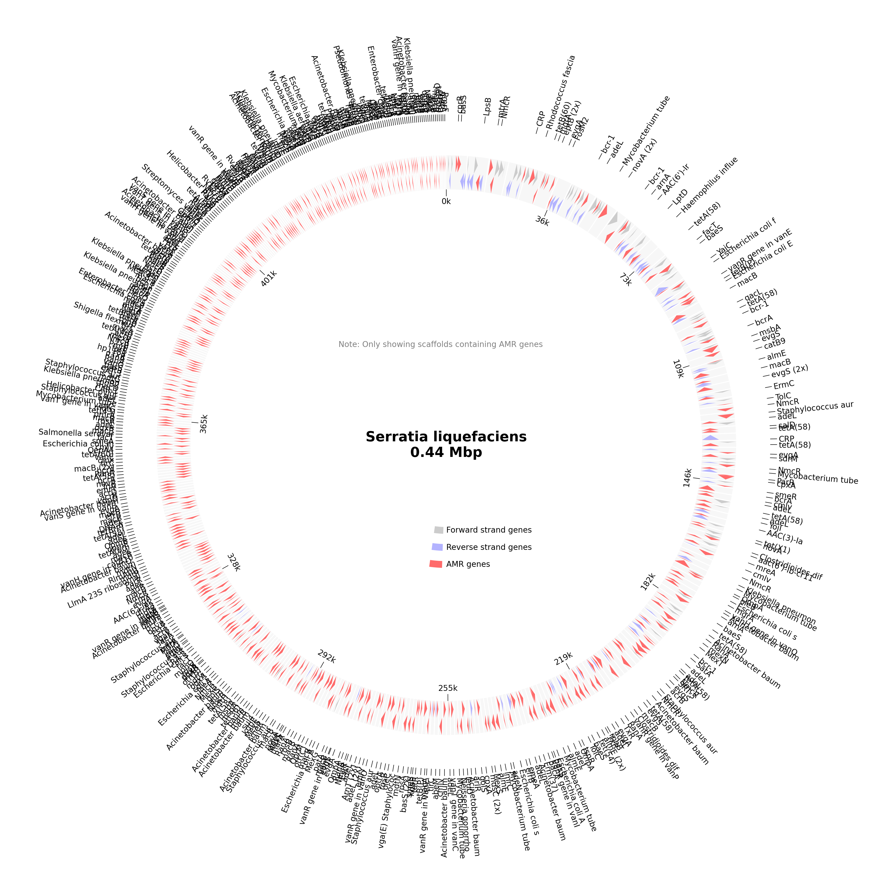

### AAC(3)-Ia
- **Mechanism**: antibiotic inactivation
- **Drug Classes**: aminoglycoside antibiotic
- **AMR Family**: AAC(3)
- **Locations**:
  - gnl|SPADES|IAMKMEGF_2495_1 : position 2-499

### AAC(6')-Iak
- **Mechanism**: antibiotic inactivation
- **Drug Classes**: aminoglycoside antibiotic
- **AMR Family**: AAC(6')
- **Locations**:
  - gnl|SPADES|IAMKMEGF_143441_1 : position 3-404

### AAC(6')-Ir
- **Mechanism**: antibiotic inactivation
- **Drug Classes**: aminoglycoside antibiotic
- **AMR Family**: AAC(6')
- **Locations**:
  - gnl|SPADES|IAMKMEGF_681_1 : position 2-301

### Acinetobacter baumannii AbaF (found in 6 locations)
- **Mechanism**: antibiotic efflux
- **Drug Classes**: phosphonic acid antibiotic
- **AMR Family**: major facilitator superfamily (MFS) antibiotic efflux pump
- **Locations**:
  - gnl|SPADES|IAMKMEGF_1296594_1 : position 2-280
  - gnl|SPADES|IAMKMEGF_131419_1 : position 3-686
  - gnl|SPADES|IAMKMEGF_23810_1 : position 3-824
  - gnl|SPADES|IAMKMEGF_3569_3 : position 1187-1528
  - gnl|SPADES|IAMKMEGF_584508_1 : position 3-416
  - gnl|SPADES|IAMKMEGF_75195_1 : position 2-703

### Acinetobacter baumannii AbaQ (found in 13 locations)
- **Mechanism**: antibiotic efflux
- **Drug Classes**: fluoroquinolone antibiotic
- **AMR Family**: major facilitator superfamily (MFS) antibiotic efflux pump
- **Locations**:
  - gnl|SPADES|IAMKMEGF_14515_1 : position 3-911
  - gnl|SPADES|IAMKMEGF_166563_1 : position 1-624
  - gnl|SPADES|IAMKMEGF_1847874_1 : position 1-234
  - gnl|SPADES|IAMKMEGF_209757_1 : position 465-602
  - gnl|SPADES|IAMKMEGF_21779_2 : position 586-1041
  - gnl|SPADES|IAMKMEGF_3371_2 : position 700-1554
  - gnl|SPADES|IAMKMEGF_6326_1 : position 3-1232
  - gnl|SPADES|IAMKMEGF_64124_2 : position 274-822
  - gnl|SPADES|IAMKMEGF_646435_1 : position 2-397
  - gnl|SPADES|IAMKMEGF_667040_1 : position 1-393
  - gnl|SPADES|IAMKMEGF_68682_2 : position 534-809
  - gnl|SPADES|IAMKMEGF_966275_1 : position 3-329
  - gnl|SPADES|IAMKMEGF_971020_1 : position 1-327

### Acinetobacter baumannii AmvA
- **Mechanism**: antibiotic efflux
- **Drug Classes**: macrolide antibiotic; disinfecting agents and antiseptics
- **AMR Family**: major facilitator superfamily (MFS) antibiotic efflux pump
- **Locations**:
  - gnl|SPADES|IAMKMEGF_84556_1 : position 1-768

### AcrF
- **Mechanism**: antibiotic efflux
- **Drug Classes**: fluoroquinolone antibiotic; cephalosporin; cephamycin; penam
- **AMR Family**: resistance-nodulation-cell division (RND) antibiotic efflux pump
- **Locations**:
  - gnl|SPADES|IAMKMEGF_2126090_1 : position 3-215

### ArnT (found in 2 locations)
- **Mechanism**: antibiotic target alteration
- **Drug Classes**: peptide antibiotic
- **AMR Family**: pmr phosphoethanolamine transferase
- **Locations**:
  - gnl|SPADES|IAMKMEGF_35384_1 : position 2-520
  - gnl|SPADES|IAMKMEGF_35384_2 : position 501-827

### CAR-1
- **Mechanism**: antibiotic inactivation
- **Drug Classes**: carbapenem
- **AMR Family**: CAR beta-lactamase
- **Locations**:
  - gnl|SPADES|IAMKMEGF_327348_1 : position 3-521

### CRP (found in 2 locations)
- **Mechanism**: antibiotic efflux
- **Drug Classes**: macrolide antibiotic; fluoroquinolone antibiotic; penam
- **AMR Family**: resistance-nodulation-cell division (RND) antibiotic efflux pump
- **Locations**:
  - gnl|SPADES|IAMKMEGF_1566_2 : position 1947-2015
  - gnl|SPADES|IAMKMEGF_349_8 : position 5539-6033

### Clostridioides difficile gyrB conferring resistance to fluoroquinolones (found in 2 locations)
- **Mechanism**: antibiotic target alteration
- **Drug Classes**: fluoroquinolone antibiotic
- **AMR Family**: fluoroquinolone resistant gyrB
- **Locations**:
  - gnl|SPADES|IAMKMEGF_2571_2 : position 800-1675
  - gnl|SPADES|IAMKMEGF_7095_1 : position 1-1311

### DHA-6
- **Mechanism**: antibiotic inactivation
- **Drug Classes**: cephalosporin; cephamycin
- **AMR Family**: DHA beta-lactamase
- **Locations**:
  - gnl|SPADES|IAMKMEGF_195456_1 : position 3-614

### Enterobacter cloacae acrA (found in 2 locations)
- **Mechanism**: antibiotic efflux
- **Drug Classes**: fluoroquinolone antibiotic; cephalosporin; glycylcycline; penam; tetracycline antibiotic; rifamycin antibiotic; phenicol antibiotic; disinfecting agents and antiseptics
- **AMR Family**: resistance-nodulation-cell division (RND) antibiotic efflux pump
- **Locations**:
  - gnl|SPADES|IAMKMEGF_1579854_1 : position 1-255
  - gnl|SPADES|IAMKMEGF_491826_1 : position 2-448

### Erm(37)
- **Mechanism**: antibiotic target alteration
- **Drug Classes**: macrolide antibiotic; lincosamide antibiotic; streptogramin antibiotic; streptogramin A antibiotic; streptogramin B antibiotic
- **AMR Family**: Erm 23S ribosomal RNA methyltransferase
- **Locations**:
  - gnl|SPADES|IAMKMEGF_14042_2 : position 199-978

### ErmC
- **Mechanism**: antibiotic target alteration
- **Drug Classes**: macrolide antibiotic; lincosamide antibiotic; streptogramin antibiotic; streptogramin A antibiotic; streptogramin B antibiotic
- **AMR Family**: Erm 23S ribosomal RNA methyltransferase
- **Locations**:
  - gnl|SPADES|IAMKMEGF_1320_3 : position 1030-1848

### Escherichia coli AcrAB-TolC with AcrR mutation conferring resistance to ciprofloxacin, tetracycline, and ceftazidime (found in 3 locations)
- **Mechanism**: antibiotic target alteration; antibiotic efflux
- **Drug Classes**: fluoroquinolone antibiotic; cephalosporin; glycylcycline; penam; tetracycline antibiotic; rifamycin antibiotic; phenicol antibiotic; disinfecting agents and antiseptics
- **AMR Family**: resistance-nodulation-cell division (RND) antibiotic efflux pump
- **Locations**:
  - gnl|SPADES|IAMKMEGF_1075084_1 : position 1-312
  - gnl|SPADES|IAMKMEGF_11306_2 : position 716-1189
  - gnl|SPADES|IAMKMEGF_46322_2 : position 527-886

### Escherichia coli EF-Tu mutants conferring resistance to Pulvomycin
- **Mechanism**: antibiotic target alteration
- **Drug Classes**: elfamycin antibiotic
- **AMR Family**: elfamycin resistant EF-Tu
- **Locations**:
  - gnl|SPADES|IAMKMEGF_961_2 : position 722-1906

### Escherichia coli acrA
- **Mechanism**: antibiotic efflux
- **Drug Classes**: fluoroquinolone antibiotic; cephalosporin; glycylcycline; penam; tetracycline antibiotic; rifamycin antibiotic; phenicol antibiotic; disinfecting agents and antiseptics
- **AMR Family**: resistance-nodulation-cell division (RND) antibiotic efflux pump
- **Locations**:
  - gnl|SPADES|IAMKMEGF_634306_1 : position 2-400

### Escherichia coli fabI mutations conferring resistance to isoniazid and triclosan
- **Mechanism**: antibiotic target alteration
- **Drug Classes**: disinfecting agents and antiseptics; isoniazid-like antibiotic
- **AMR Family**: antibiotic resistant fabI
- **Locations**:
  - gnl|SPADES|IAMKMEGF_825_2 : position 624-1379

### Escherichia coli mdfA
- **Mechanism**: antibiotic efflux
- **Drug Classes**: tetracycline antibiotic; phenicol antibiotic; disinfecting agents and antiseptics
- **AMR Family**: major facilitator superfamily (MFS) antibiotic efflux pump
- **Locations**:
  - gnl|SPADES|IAMKMEGF_250014_1 : position 1-570

### Escherichia coli soxS with mutation conferring antibiotic resistance (found in 6 locations)
- **Mechanism**: antibiotic target alteration; antibiotic efflux; reduced permeability to antibiotic
- **Drug Classes**: fluoroquinolone antibiotic; monobactam; carbapenem; cephalosporin; glycylcycline; cephamycin; penam; tetracycline antibiotic; rifamycin antibiotic; phenicol antibiotic; penem; disinfecting agents and antiseptics
- **AMR Family**: ATP-binding cassette (ABC) antibiotic efflux pump; major facilitator superfamily (MFS) antibiotic efflux pump; resistance-nodulation-cell division (RND) antibiotic efflux pump; General Bacterial Porin with reduced permeability to beta-lactams
- **Locations**:
  - gnl|SPADES|IAMKMEGF_110230_2 : position 496-720
  - gnl|SPADES|IAMKMEGF_1168242_2 : position 166-297
  - gnl|SPADES|IAMKMEGF_15710_1 : position 2-634
  - gnl|SPADES|IAMKMEGF_3034_2 : position 634-1323
  - gnl|SPADES|IAMKMEGF_491449_1 : position 2-448
  - gnl|SPADES|IAMKMEGF_91146_1 : position 1-408

### EstT (found in 2 locations)
- **Mechanism**: antibiotic inactivation
- **Drug Classes**: macrolide antibiotic
- **AMR Family**: macrolide esterase
- **Locations**:
  - gnl|SPADES|IAMKMEGF_129858_1 : position 1-690
  - gnl|SPADES|IAMKMEGF_37824_1 : position 1-360

### FosM2
- **Mechanism**: antibiotic inactivation
- **Drug Classes**: phosphonic acid antibiotic
- **AMR Family**: fosfomycin thiol transferase
- **Locations**:
  - gnl|SPADES|IAMKMEGF_459_1 : position 70-480

### H-NS
- **Mechanism**: antibiotic efflux
- **Drug Classes**: macrolide antibiotic; fluoroquinolone antibiotic; cephalosporin; cephamycin; penam; tetracycline antibiotic
- **AMR Family**: major facilitator superfamily (MFS) antibiotic efflux pump; resistance-nodulation-cell division (RND) antibiotic efflux pump
- **Locations**:
  - gnl|SPADES|IAMKMEGF_1353840_1 : position 63-275

### Haemophilus influenzae PBP3 conferring resistance to beta-lactam antibiotics
- **Mechanism**: antibiotic target alteration
- **Drug Classes**: cephalosporin; cephamycin; penam
- **AMR Family**: Penicillin-binding protein mutations conferring resistance to beta-lactam antibiotics
- **Locations**:
  - gnl|SPADES|IAMKMEGF_715_1 : position 2-1027

### Helicobacter pylori pbp1 mutants conferring resistance to amoxicillin
- **Mechanism**: antibiotic target alteration
- **Drug Classes**: cephalosporin; cephamycin; penam
- **AMR Family**: Penicillin-binding protein mutations conferring resistance to beta-lactam antibiotics
- **Locations**:
  - gnl|SPADES|IAMKMEGF_326380_1 : position 2-520

### Helicobacter pylori pbp2 mutants conferring resistance to amoxicillin
- **Mechanism**: antibiotic target alteration
- **Drug Classes**: cephalosporin; cephamycin; penam
- **AMR Family**: Penicillin-binding protein mutations conferring resistance to beta-lactam antibiotics
- **Locations**:
  - gnl|SPADES|IAMKMEGF_737351_1 : position 1-375

### Klebsiella aerogenes Omp36
- **Mechanism**: reduced permeability to antibiotic
- **Drug Classes**: monobactam; carbapenem; cephalosporin; cephamycin; penam; penem
- **AMR Family**: General Bacterial Porin with reduced permeability to beta-lactams
- **Locations**:
  - gnl|SPADES|IAMKMEGF_1163206_1 : position 1-297

### Klebsiella pneumoniae KpnE
- **Mechanism**: antibiotic efflux
- **Drug Classes**: macrolide antibiotic; aminoglycoside antibiotic; cephalosporin; tetracycline antibiotic; peptide antibiotic; rifamycin antibiotic; disinfecting agents and antiseptics
- **AMR Family**: small multidrug resistance (SMR) antibiotic efflux pump
- **Locations**:
  - gnl|SPADES|IAMKMEGF_981098_1 : position 2-121

### Klebsiella pneumoniae OmpK37 (found in 5 locations)
- **Mechanism**: reduced permeability to antibiotic
- **Drug Classes**: monobactam; carbapenem; cephalosporin; cephamycin; penam; penem
- **AMR Family**: General Bacterial Porin with reduced permeability to beta-lactams
- **Locations**:
  - gnl|SPADES|IAMKMEGF_1920960_1 : position 27-227
  - gnl|SPADES|IAMKMEGF_2952_3 : position 1432-1611
  - gnl|SPADES|IAMKMEGF_350479_1 : position 2-508
  - gnl|SPADES|IAMKMEGF_505769_1 : position 97-441
  - gnl|SPADES|IAMKMEGF_524504_1 : position 1-435

### Klebsiella pneumoniae acrA
- **Mechanism**: antibiotic efflux
- **Drug Classes**: fluoroquinolone antibiotic; cephalosporin; glycylcycline; penam; tetracycline antibiotic; rifamycin antibiotic; phenicol antibiotic; disinfecting agents and antiseptics
- **AMR Family**: resistance-nodulation-cell division (RND) antibiotic efflux pump
- **Locations**:
  - gnl|SPADES|IAMKMEGF_1410118_1 : position 3-269

### LRA-8
- **Mechanism**: antibiotic inactivation
- **Drug Classes**: cephalosporin; penam
- **AMR Family**: subclass B3 LRA beta-lactamase
- **Locations**:
  - gnl|SPADES|IAMKMEGF_112310_1 : position 1-675

### LlmA 23S ribosomal RNA methyltransferase
- **Mechanism**: antibiotic target alteration
- **Drug Classes**: lincosamide antibiotic
- **AMR Family**: Llm 23S ribosomal RNA methyltransferase
- **Locations**:
  - gnl|SPADES|IAMKMEGF_155149_1 : position 61-657

### LpsB
- **Mechanism**: reduced permeability to antibiotic
- **Drug Classes**: peptide antibiotic
- **AMR Family**: Intrinsic peptide antibiotic resistant Lps
- **Locations**:
  - gnl|SPADES|IAMKMEGF_303_5 : position 3512-4609

### LptD
- **Mechanism**: antibiotic efflux
- **Drug Classes**: carbapenem; peptide antibiotic; aminocoumarin antibiotic; rifamycin antibiotic
- **AMR Family**: ATP-binding cassette (ABC) antibiotic efflux pump
- **Locations**:
  - gnl|SPADES|IAMKMEGF_692_1 : position 3-1145

### MCR-8.1
- **Mechanism**: antibiotic target alteration
- **Drug Classes**: peptide antibiotic
- **AMR Family**: MCR phosphoethanolamine transferase
- **Locations**:
  - gnl|SPADES|IAMKMEGF_513811_1 : position 138-440

### MdtK
- **Mechanism**: antibiotic efflux
- **Drug Classes**: fluoroquinolone antibiotic
- **AMR Family**: multidrug and toxic compound extrusion (MATE) transporter
- **Locations**:
  - gnl|SPADES|IAMKMEGF_119593_1 : position 3-509

### MexB (found in 2 locations)
- **Mechanism**: antibiotic efflux
- **Drug Classes**: macrolide antibiotic; fluoroquinolone antibiotic; monobactam; carbapenem; cephalosporin; cephamycin; penam; tetracycline antibiotic; peptide antibiotic; aminocoumarin antibiotic; diaminopyrimidine antibiotic; sulfonamide antibiotic; phenicol antibiotic; penem
- **AMR Family**: resistance-nodulation-cell division (RND) antibiotic efflux pump
- **Locations**:
  - gnl|SPADES|IAMKMEGF_1487147_1 : position 2-262
  - gnl|SPADES|IAMKMEGF_87794_1 : position 2-763

### MexE
- **Mechanism**: antibiotic efflux
- **Drug Classes**: fluoroquinolone antibiotic; diaminopyrimidine antibiotic; phenicol antibiotic
- **AMR Family**: resistance-nodulation-cell division (RND) antibiotic efflux pump
- **Locations**:
  - gnl|SPADES|IAMKMEGF_1374025_1 : position 1-273

### MexG
- **Mechanism**: antibiotic efflux
- **Drug Classes**: fluoroquinolone antibiotic; tetracycline antibiotic; disinfecting agents and antiseptics
- **AMR Family**: resistance-nodulation-cell division (RND) antibiotic efflux pump
- **Locations**:
  - gnl|SPADES|IAMKMEGF_44633_2 : position 510-896

### MexL
- **Mechanism**: antibiotic efflux
- **Drug Classes**: macrolide antibiotic; tetracycline antibiotic; disinfecting agents and antiseptics
- **AMR Family**: resistance-nodulation-cell division (RND) antibiotic efflux pump
- **Locations**:
  - gnl|SPADES|IAMKMEGF_1016686_2 : position 100-321

### MexS (found in 4 locations)
- **Mechanism**: antibiotic efflux
- **Drug Classes**: fluoroquinolone antibiotic; diaminopyrimidine antibiotic; phenicol antibiotic
- **AMR Family**: resistance-nodulation-cell division (RND) antibiotic efflux pump
- **Locations**:
  - gnl|SPADES|IAMKMEGF_19259_2 : position 522-1067
  - gnl|SPADES|IAMKMEGF_57355_1 : position 1-288
  - gnl|SPADES|IAMKMEGF_64514_1 : position 6-821
  - gnl|SPADES|IAMKMEGF_773675_1 : position 1-120

### MexT
- **Mechanism**: antibiotic efflux
- **Drug Classes**: fluoroquinolone antibiotic; diaminopyrimidine antibiotic; phenicol antibiotic
- **AMR Family**: resistance-nodulation-cell division (RND) antibiotic efflux pump
- **Locations**:
  - gnl|SPADES|IAMKMEGF_3769_1 : position 2-580

### Mycobacterium tuberculosis gidB mutation conferring resistance to streptomycin
- **Mechanism**: antibiotic target alteration
- **Drug Classes**: aminoglycoside antibiotic
- **AMR Family**: antibiotic resistant gidB
- **Locations**:
  - gnl|SPADES|IAMKMEGF_1762_1 : position 116-736

### Mycobacterium tuberculosis kasA mutant conferring resistance to isoniazid (found in 2 locations)
- **Mechanism**: antibiotic target alteration
- **Drug Classes**: isoniazid-like antibiotic
- **AMR Family**: antibiotic resistant kasA
- **Locations**:
  - gnl|SPADES|IAMKMEGF_11146_1 : position 1-1023
  - gnl|SPADES|IAMKMEGF_22290_1 : position 1-342

### Mycobacterium tuberculosis katG mutations conferring resistance to isoniazid
- **Mechanism**: antibiotic target alteration
- **Drug Classes**: isoniazid-like antibiotic
- **AMR Family**: isoniazid resistant katG
- **Locations**:
  - gnl|SPADES|IAMKMEGF_17448_1 : position 1-657

### Mycobacterium tuberculosis pncA mutations conferring resistance to pyrazinamide (found in 2 locations)
- **Mechanism**: antibiotic target alteration
- **Drug Classes**: pyrazine antibiotic
- **AMR Family**: Pyrazinamide resistant pncA
- **Locations**:
  - gnl|SPADES|IAMKMEGF_1126177_1 : position 2-286
  - gnl|SPADES|IAMKMEGF_541_3 : position 1753-2304

### Mycobacterium tuberculosis rpoB mutations conferring resistance to rifampicin
- **Mechanism**: antibiotic target alteration; antibiotic target replacement
- **Drug Classes**: rifamycin antibiotic
- **AMR Family**: rifamycin-resistant beta-subunit of RNA polymerase (rpoB)
- **Locations**:
  - gnl|SPADES|IAMKMEGF_2975_1 : position 2-1606

### Mycobacterium tuberculosis thyA with mutation conferring resistance to para-aminosalicylic acid
- **Mechanism**: antibiotic target alteration
- **Drug Classes**: salicylic acid antibiotic
- **AMR Family**: aminosalicylate resistant thymidylate synthase
- **Locations**:
  - gnl|SPADES|IAMKMEGF_295477_1 : position 1-540

### Neisseria gonorrhoeae PBP2 conferring resistance to beta-lactam antibiotics
- **Mechanism**: antibiotic target alteration
- **Drug Classes**: cephalosporin; cephamycin; penam
- **AMR Family**: Penicillin-binding protein mutations conferring resistance to beta-lactam antibiotics
- **Locations**:
  - gnl|SPADES|IAMKMEGF_22278_1 : position 2-733

### Neisseria gonorrhoeae pilQ gene conferring resistance to beta-lactam
- **Mechanism**: antibiotic target alteration
- **Drug Classes**: cephalosporin; cephamycin; penam
- **AMR Family**: Penicillin-binding protein mutations conferring resistance to beta-lactam antibiotics
- **Locations**:
  - gnl|SPADES|IAMKMEGF_966035_1 : position 37-330

### NmcR (found in 15 locations)
- **Mechanism**: antibiotic inactivation
- **Drug Classes**: carbapenem; cephalosporin; cephamycin; penam
- **AMR Family**: NmcA beta-lactamase
- **Locations**:
  - gnl|SPADES|IAMKMEGF_1433_2 : position 934-1866
  - gnl|SPADES|IAMKMEGF_148555_1 : position 2-265
  - gnl|SPADES|IAMKMEGF_1690_4 : position 1064-1945
  - gnl|SPADES|IAMKMEGF_1748348_1 : position 48-242
  - gnl|SPADES|IAMKMEGF_2004301_1 : position 3-221
  - gnl|SPADES|IAMKMEGF_2743_3 : position 907-1191
  - gnl|SPADES|IAMKMEGF_339_2 : position 1501-2355
  - gnl|SPADES|IAMKMEGF_37824_2 : position 463-930
  - gnl|SPADES|IAMKMEGF_406312_1 : position 3-422
  - gnl|SPADES|IAMKMEGF_4767_1 : position 2-166
  - gnl|SPADES|IAMKMEGF_5672_1 : position 1-792
  - gnl|SPADES|IAMKMEGF_568048_1 : position 3-422
  - gnl|SPADES|IAMKMEGF_743042_1 : position 3-374
  - gnl|SPADES|IAMKMEGF_83591_1 : position 2-772
  - gnl|SPADES|IAMKMEGF_90158_2 : position 537-758

### OmpA (found in 3 locations)
- **Mechanism**: reduced permeability to antibiotic
- **Drug Classes**: peptide antibiotic
- **AMR Family**: General Bacterial Porin with reduced permeability to peptide antibiotics
- **Locations**:
  - gnl|SPADES|IAMKMEGF_10367_1 : position 3-257
  - gnl|SPADES|IAMKMEGF_3021_2 : position 311-808
  - gnl|SPADES|IAMKMEGF_39834_1 : position 1-240

### OpmB
- **Mechanism**: antibiotic efflux
- **Drug Classes**: macrolide antibiotic; monobactam; tetracycline antibiotic; aminocoumarin antibiotic
- **AMR Family**: resistance-nodulation-cell division (RND) antibiotic efflux pump
- **Locations**:
  - gnl|SPADES|IAMKMEGF_185310_1 : position 29-622

### OpmH
- **Mechanism**: antibiotic efflux
- **Drug Classes**: disinfecting agents and antiseptics
- **AMR Family**: resistance-nodulation-cell division (RND) antibiotic efflux pump
- **Locations**:
  - gnl|SPADES|IAMKMEGF_680360_1 : position 1-390

### OprM (found in 2 locations)
- **Mechanism**: antibiotic efflux
- **Drug Classes**: macrolide antibiotic; fluoroquinolone antibiotic; monobactam; aminoglycoside antibiotic; carbapenem; cephalosporin; cephamycin; penam; tetracycline antibiotic; peptide antibiotic; aminocoumarin antibiotic; diaminopyrimidine antibiotic; sulfonamide antibiotic; phenicol antibiotic; penem; disinfecting agents and antiseptics
- **AMR Family**: resistance-nodulation-cell division (RND) antibiotic efflux pump
- **Locations**:
  - gnl|SPADES|IAMKMEGF_1524675_2 : position 71-259
  - gnl|SPADES|IAMKMEGF_52098_1 : position 2-865

### ParR (found in 4 locations)
- **Mechanism**: antibiotic efflux; reduced permeability to antibiotic
- **Drug Classes**: macrolide antibiotic; fluoroquinolone antibiotic; monobactam; aminoglycoside antibiotic; carbapenem; cephalosporin; cephamycin; penam; tetracycline antibiotic; phenicol antibiotic; penem; disinfecting agents and antiseptics
- **AMR Family**: resistance-nodulation-cell division (RND) antibiotic efflux pump; Outer Membrane Porin (Opr)
- **Locations**:
  - gnl|SPADES|IAMKMEGF_153138_1 : position 1-657
  - gnl|SPADES|IAMKMEGF_1811245_1 : position 1-237
  - gnl|SPADES|IAMKMEGF_1879_1 : position 1-219
  - gnl|SPADES|IAMKMEGF_850743_1 : position 2-352

### ParS
- **Mechanism**: antibiotic efflux; reduced permeability to antibiotic
- **Drug Classes**: macrolide antibiotic; fluoroquinolone antibiotic; monobactam; aminoglycoside antibiotic; carbapenem; cephalosporin; cephamycin; penam; tetracycline antibiotic; phenicol antibiotic; penem; disinfecting agents and antiseptics
- **AMR Family**: resistance-nodulation-cell division (RND) antibiotic efflux pump; Outer Membrane Porin (Opr)
- **Locations**:
  - gnl|SPADES|IAMKMEGF_606781_1 : position 2-310

### PmpM
- **Mechanism**: antibiotic efflux
- **Drug Classes**: fluoroquinolone antibiotic; aminoglycoside antibiotic; disinfecting agents and antiseptics
- **AMR Family**: multidrug and toxic compound extrusion (MATE) transporter
- **Locations**:
  - gnl|SPADES|IAMKMEGF_1249954_1 : position 3-287

### PmrF (found in 2 locations)
- **Mechanism**: antibiotic target alteration
- **Drug Classes**: peptide antibiotic
- **AMR Family**: pmr phosphoethanolamine transferase
- **Locations**:
  - gnl|SPADES|IAMKMEGF_2244965_1 : position 2-205
  - gnl|SPADES|IAMKMEGF_403657_1 : position 1-483

### Pseudomonas aeruginosa ampR with mutation conferring resistance to aztreonam
- **Mechanism**: antibiotic target alteration; antibiotic inactivation
- **Drug Classes**: monobactam; carbapenem; cephalosporin
- **AMR Family**: PDC beta-lactamase; ampR transcriptional regulator with mutation conferring resistance to monobactam antibiotics
- **Locations**:
  - gnl|SPADES|IAMKMEGF_1411302_1 : position 1-270

### QepA4
- **Mechanism**: antibiotic efflux
- **Drug Classes**: fluoroquinolone antibiotic
- **AMR Family**: major facilitator superfamily (MFS) antibiotic efflux pump
- **Locations**:
  - gnl|SPADES|IAMKMEGF_243143_1 : position 239-574

### QnrB75
- **Mechanism**: antibiotic target protection
- **Drug Classes**: fluoroquinolone antibiotic
- **AMR Family**: quinolone resistance protein (qnr)
- **Locations**:
  - gnl|SPADES|IAMKMEGF_2219917_1 : position 2-169

### RanA (found in 15 locations)
- **Mechanism**: antibiotic efflux
- **Drug Classes**: aminoglycoside antibiotic
- **AMR Family**: ATP-binding cassette (ABC) antibiotic efflux pump
- **Locations**:
  - gnl|SPADES|IAMKMEGF_1301261_1 : position 3-281
  - gnl|SPADES|IAMKMEGF_227708_1 : position 2-586
  - gnl|SPADES|IAMKMEGF_3599_2 : position 597-1340
  - gnl|SPADES|IAMKMEGF_374671_1 : position 3-497
  - gnl|SPADES|IAMKMEGF_379117_1 : position 349-495
  - gnl|SPADES|IAMKMEGF_38654_1 : position 1-924
  - gnl|SPADES|IAMKMEGF_461624_1 : position 1-441
  - gnl|SPADES|IAMKMEGF_495287_1 : position 3-446
  - gnl|SPADES|IAMKMEGF_53820_1 : position 2-760
  - gnl|SPADES|IAMKMEGF_56153_1 : position 3-632
  - gnl|SPADES|IAMKMEGF_577238_1 : position 1-417
  - gnl|SPADES|IAMKMEGF_694014_1 : position 30-386
  - gnl|SPADES|IAMKMEGF_720165_1 : position 2-379
  - gnl|SPADES|IAMKMEGF_7675_2 : position 152-928
  - gnl|SPADES|IAMKMEGF_875813_1 : position 3-347

### Rhodococcus fascians cmr
- **Mechanism**: antibiotic efflux
- **Drug Classes**: phenicol antibiotic
- **AMR Family**: major facilitator superfamily (MFS) antibiotic efflux pump
- **Locations**:
  - gnl|SPADES|IAMKMEGF_382_2 : position 1733-3160

### RlmA(II)
- **Mechanism**: antibiotic target alteration
- **Drug Classes**: macrolide antibiotic; lincosamide antibiotic
- **AMR Family**: non-erm 23S ribosomal RNA methyltransferase (G748)
- **Locations**:
  - gnl|SPADES|IAMKMEGF_158853_1 : position 3-341

### Rv1877 (found in 2 locations)
- **Mechanism**: antibiotic efflux
- **Drug Classes**: fluoroquinolone antibiotic
- **AMR Family**: major facilitator superfamily (MFS) antibiotic efflux pump
- **Locations**:
  - gnl|SPADES|IAMKMEGF_745386_1 : position 2-373
  - gnl|SPADES|IAMKMEGF_852267_1 : position 1-351

### SAT-3
- **Mechanism**: antibiotic inactivation
- **Drug Classes**: nucleoside antibiotic
- **AMR Family**: streptothricin acetyltransferase (SAT)
- **Locations**:
  - gnl|SPADES|IAMKMEGF_368202_2 : position 85-501

### SPR-1 (found in 2 locations)
- **Mechanism**: antibiotic inactivation
- **Drug Classes**: carbapenem
- **AMR Family**: SPR beta-lactamase
- **Locations**:
  - gnl|SPADES|IAMKMEGF_1742127_1 : position 1-240
  - gnl|SPADES|IAMKMEGF_674931_1 : position 3-389

### SRT-3
- **Mechanism**: antibiotic inactivation
- **Drug Classes**: cephalosporin
- **AMR Family**: SRT beta-lactamase
- **Locations**:
  - gnl|SPADES|IAMKMEGF_4767_2 : position 309-1424

### Salmonella serovars soxS with mutation conferring antibiotic resistance
- **Mechanism**: antibiotic target alteration; antibiotic efflux; reduced permeability to antibiotic
- **Drug Classes**: fluoroquinolone antibiotic; monobactam; carbapenem; cephalosporin; glycylcycline; cephamycin; penam; tetracycline antibiotic; rifamycin antibiotic; phenicol antibiotic; penem; disinfecting agents and antiseptics
- **AMR Family**: ATP-binding cassette (ABC) antibiotic efflux pump; major facilitator superfamily (MFS) antibiotic efflux pump; resistance-nodulation-cell division (RND) antibiotic efflux pump; General Bacterial Porin with reduced permeability to beta-lactams
- **Locations**:
  - gnl|SPADES|IAMKMEGF_259121_2 : position 122-508

### SatA
- **Mechanism**: antibiotic inactivation
- **Drug Classes**: nucleoside antibiotic
- **AMR Family**: streptothricin acetyltransferase (SAT)
- **Locations**:
  - gnl|SPADES|IAMKMEGF_3797_2 : position 524-919

### Shigella flexneri acrA
- **Mechanism**: antibiotic efflux
- **Drug Classes**: fluoroquinolone antibiotic; cephalosporin; glycylcycline; penam; tetracycline antibiotic; rifamycin antibiotic; phenicol antibiotic; disinfecting agents and antiseptics
- **AMR Family**: resistance-nodulation-cell division (RND) antibiotic efflux pump
- **Locations**:
  - gnl|SPADES|IAMKMEGF_440980_1 : position 107-466

### Staphylococcus aureus FosB
- **Mechanism**: antibiotic inactivation
- **Drug Classes**: phosphonic acid antibiotic
- **AMR Family**: fosfomycin thiol transferase
- **Locations**:
  - gnl|SPADES|IAMKMEGF_59728_1 : position 2-394

### Staphylococcus aureus GlpT with mutation conferring resistance to fosfomycin
- **Mechanism**: antibiotic target alteration
- **Drug Classes**: phosphonic acid antibiotic
- **AMR Family**: antibiotic-resistant GlpT
- **Locations**:
  - gnl|SPADES|IAMKMEGF_1526_2 : position 536-1891

### Staphylococcus aureus fusA with mutation conferring resistance to fusidic acid
- **Mechanism**: antibiotic target alteration
- **Drug Classes**: fusidane antibiotic
- **AMR Family**: antibiotic resistant fusA
- **Locations**:
  - gnl|SPADES|IAMKMEGF_33741_1 : position 3-950

### Staphylococcus aureus mupA conferring resistance to mupirocin (found in 2 locations)
- **Mechanism**: antibiotic target alteration
- **Drug Classes**: mupirocin-like antibiotic
- **AMR Family**: antibiotic-resistant isoleucyl-tRNA synthetase (ileS)
- **Locations**:
  - gnl|SPADES|IAMKMEGF_113094_1 : position 3-716
  - gnl|SPADES|IAMKMEGF_120113_1 : position 1-702

### Staphylococcus aureus mupB conferring resistance to mupirocin (found in 2 locations)
- **Mechanism**: antibiotic target alteration
- **Drug Classes**: mupirocin-like antibiotic
- **AMR Family**: antibiotic-resistant isoleucyl-tRNA synthetase (ileS)
- **Locations**:
  - gnl|SPADES|IAMKMEGF_310499_1 : position 3-530
  - gnl|SPADES|IAMKMEGF_354288_1 : position 2-505

### Staphylococcus aureus murA with mutation conferring resistance to fosfomycin
- **Mechanism**: antibiotic target alteration
- **Drug Classes**: phosphonic acid antibiotic
- **AMR Family**: antibiotic-resistant murA transferase
- **Locations**:
  - gnl|SPADES|IAMKMEGF_5578_1 : position 574-1377

### Streptomyces venezuelae rox
- **Mechanism**: antibiotic inactivation
- **Drug Classes**: rifamycin antibiotic
- **AMR Family**: rifampin monooxygenase
- **Locations**:
  - gnl|SPADES|IAMKMEGF_687653_1 : position 3-386

### TaeA (found in 2 locations)
- **Mechanism**: antibiotic efflux
- **Drug Classes**: pleuromutilin antibiotic
- **AMR Family**: ATP-binding cassette (ABC) antibiotic efflux pump
- **Locations**:
  - gnl|SPADES|IAMKMEGF_124449_2 : position 134-697
  - gnl|SPADES|IAMKMEGF_91004_2 : position 126-755

### TolC (found in 3 locations)
- **Mechanism**: antibiotic efflux
- **Drug Classes**: macrolide antibiotic; fluoroquinolone antibiotic; aminoglycoside antibiotic; carbapenem; cephalosporin; glycylcycline; cephamycin; penam; tetracycline antibiotic; peptide antibiotic; aminocoumarin antibiotic; rifamycin antibiotic; phenicol antibiotic; penem; disinfecting agents and antiseptics
- **AMR Family**: ATP-binding cassette (ABC) antibiotic efflux pump; major facilitator superfamily (MFS) antibiotic efflux pump; resistance-nodulation-cell division (RND) antibiotic efflux pump
- **Locations**:
  - gnl|SPADES|IAMKMEGF_10114_1 : position 3-461
  - gnl|SPADES|IAMKMEGF_1360_4 : position 1992-2168
  - gnl|SPADES|IAMKMEGF_679373_1 : position 1-390

### TriA
- **Mechanism**: antibiotic efflux
- **Drug Classes**: disinfecting agents and antiseptics
- **AMR Family**: resistance-nodulation-cell division (RND) antibiotic efflux pump
- **Locations**:
  - gnl|SPADES|IAMKMEGF_215245_1 : position 2-595

### TxR (found in 6 locations)
- **Mechanism**: antibiotic efflux
- **Drug Classes**: tetracycline antibiotic
- **AMR Family**: ATP-binding cassette (ABC) antibiotic efflux pump
- **Locations**:
  - gnl|SPADES|IAMKMEGF_382278_1 : position 2-493
  - gnl|SPADES|IAMKMEGF_404297_1 : position 106-483
  - gnl|SPADES|IAMKMEGF_596279_1 : position 1-411
  - gnl|SPADES|IAMKMEGF_720634_1 : position 2-379
  - gnl|SPADES|IAMKMEGF_8041_1 : position 1-855
  - gnl|SPADES|IAMKMEGF_8294_2 : position 555-1271

### YajC
- **Mechanism**: antibiotic efflux
- **Drug Classes**: fluoroquinolone antibiotic; cephalosporin; glycylcycline; penam; tetracycline antibiotic; oxazolidinone antibiotic; glycopeptide antibiotic; rifamycin antibiotic; phenicol antibiotic; disinfecting agents and antiseptics
- **AMR Family**: resistance-nodulation-cell division (RND) antibiotic efflux pump
- **Locations**:
  - gnl|SPADES|IAMKMEGF_819_3 : position 2582-2872

### YojI (found in 3 locations)
- **Mechanism**: antibiotic efflux
- **Drug Classes**: peptide antibiotic
- **AMR Family**: ATP-binding cassette (ABC) antibiotic efflux pump
- **Locations**:
  - gnl|SPADES|IAMKMEGF_1858354_1 : position 1-234
  - gnl|SPADES|IAMKMEGF_2349_1 : position 3-377
  - gnl|SPADES|IAMKMEGF_718818_1 : position 3-380

### aac(6')-Ib-cr11
- **Mechanism**: antibiotic inactivation
- **Drug Classes**: fluoroquinolone antibiotic; aminoglycoside antibiotic
- **AMR Family**: AAC(6'); AAC(6')-Ib-cr
- **Locations**:
  - gnl|SPADES|IAMKMEGF_2598_1 : position 3-467

### abeM
- **Mechanism**: antibiotic efflux
- **Drug Classes**: fluoroquinolone antibiotic; disinfecting agents and antiseptics
- **AMR Family**: multidrug and toxic compound extrusion (MATE) transporter
- **Locations**:
  - gnl|SPADES|IAMKMEGF_24279_1 : position 3-530

### acrB (found in 7 locations)
- **Mechanism**: antibiotic efflux
- **Drug Classes**: fluoroquinolone antibiotic; cephalosporin; glycylcycline; penam; tetracycline antibiotic; rifamycin antibiotic; phenicol antibiotic; disinfecting agents and antiseptics
- **AMR Family**: resistance-nodulation-cell division (RND) antibiotic efflux pump
- **Locations**:
  - gnl|SPADES|IAMKMEGF_128821_1 : position 2-691
  - gnl|SPADES|IAMKMEGF_1488013_1 : position 2-262
  - gnl|SPADES|IAMKMEGF_2142047_1 : position 1-213
  - gnl|SPADES|IAMKMEGF_215006_1 : position 2-598
  - gnl|SPADES|IAMKMEGF_410026_1 : position 3-479
  - gnl|SPADES|IAMKMEGF_5178_1 : position 2-859
  - gnl|SPADES|IAMKMEGF_927846_1 : position 3-335

### acrD (found in 8 locations)
- **Mechanism**: antibiotic efflux
- **Drug Classes**: aminoglycoside antibiotic
- **AMR Family**: resistance-nodulation-cell division (RND) antibiotic efflux pump
- **Locations**:
  - gnl|SPADES|IAMKMEGF_1104586_1 : position 2-307
  - gnl|SPADES|IAMKMEGF_1264984_1 : position 1-285
  - gnl|SPADES|IAMKMEGF_1806151_1 : position 1-237
  - gnl|SPADES|IAMKMEGF_215679_1 : position 41-595
  - gnl|SPADES|IAMKMEGF_538145_1 : position 3-431
  - gnl|SPADES|IAMKMEGF_653935_1 : position 3-227
  - gnl|SPADES|IAMKMEGF_747976_1 : position 1-372
  - gnl|SPADES|IAMKMEGF_982562_1 : position 1-327

### adeJ
- **Mechanism**: antibiotic efflux
- **Drug Classes**: macrolide antibiotic; fluoroquinolone antibiotic; lincosamide antibiotic; carbapenem; cephalosporin; tetracycline antibiotic; rifamycin antibiotic; diaminopyrimidine antibiotic; phenicol antibiotic; penem
- **AMR Family**: resistance-nodulation-cell division (RND) antibiotic efflux pump
- **Locations**:
  - gnl|SPADES|IAMKMEGF_665540_2 : position 80-394

### adeL (found in 35 locations)
- **Mechanism**: antibiotic efflux
- **Drug Classes**: fluoroquinolone antibiotic; tetracycline antibiotic
- **AMR Family**: resistance-nodulation-cell division (RND) antibiotic efflux pump
- **Locations**:
  - gnl|SPADES|IAMKMEGF_10664_1 : position 1-555
  - gnl|SPADES|IAMKMEGF_114125_1 : position 3-419
  - gnl|SPADES|IAMKMEGF_1432541_1 : position 1-267
  - gnl|SPADES|IAMKMEGF_14638_1 : position 2-436
  - gnl|SPADES|IAMKMEGF_150147_1 : position 3-662
  - gnl|SPADES|IAMKMEGF_1501639_1 : position 1-261
  - gnl|SPADES|IAMKMEGF_1529_1 : position 1-732
  - gnl|SPADES|IAMKMEGF_1533465_1 : position 1-204
  - gnl|SPADES|IAMKMEGF_178120_1 : position 1-630
  - gnl|SPADES|IAMKMEGF_1873510_1 : position 2-232
  - gnl|SPADES|IAMKMEGF_187588_1 : position 3-620
  - gnl|SPADES|IAMKMEGF_189158_1 : position 2-619
  - gnl|SPADES|IAMKMEGF_197237_2 : position 329-613
  - gnl|SPADES|IAMKMEGF_2084648_1 : position 3-218
  - gnl|SPADES|IAMKMEGF_2218_2 : position 715-1623
  - gnl|SPADES|IAMKMEGF_2282_2 : position 346-1290
  - gnl|SPADES|IAMKMEGF_23302_1 : position 3-338
  - gnl|SPADES|IAMKMEGF_269028_1 : position 2-556
  - gnl|SPADES|IAMKMEGF_302786_2 : position 257-535
  - gnl|SPADES|IAMKMEGF_33749_1 : position 3-803
  - gnl|SPADES|IAMKMEGF_34944_1 : position 166-420
  - gnl|SPADES|IAMKMEGF_34944_2 : position 417-944
  - gnl|SPADES|IAMKMEGF_36152_1 : position 3-938
  - gnl|SPADES|IAMKMEGF_4110_2 : position 843-1475
  - gnl|SPADES|IAMKMEGF_4551_2 : position 1229-1441
  - gnl|SPADES|IAMKMEGF_456057_1 : position 2-460
  - gnl|SPADES|IAMKMEGF_478041_1 : position 202-453
  - gnl|SPADES|IAMKMEGF_502672_1 : position 2-442
  - gnl|SPADES|IAMKMEGF_507_3 : position 1683-2591
  - gnl|SPADES|IAMKMEGF_57355_2 : position 373-843
  - gnl|SPADES|IAMKMEGF_622191_1 : position 2-406
  - gnl|SPADES|IAMKMEGF_690575_1 : position 2-385
  - gnl|SPADES|IAMKMEGF_8210_1 : position 2-601
  - gnl|SPADES|IAMKMEGF_872556_1 : position 3-347
  - gnl|SPADES|IAMKMEGF_883954_1 : position 2-313

### adeN
- **Mechanism**: antibiotic efflux
- **Drug Classes**: macrolide antibiotic; fluoroquinolone antibiotic; lincosamide antibiotic; carbapenem; cephalosporin; tetracycline antibiotic; rifamycin antibiotic; diaminopyrimidine antibiotic; phenicol antibiotic; penem
- **AMR Family**: resistance-nodulation-cell division (RND) antibiotic efflux pump
- **Locations**:
  - gnl|SPADES|IAMKMEGF_17001_3 : position 877-1095

### almE (found in 5 locations)
- **Mechanism**: antibiotic target alteration
- **Drug Classes**: peptide antibiotic
- **AMR Family**: polymyxin resistance operon; alm glycyltransferase
- **Locations**:
  - gnl|SPADES|IAMKMEGF_11100_1 : position 3-1196
  - gnl|SPADES|IAMKMEGF_1254_1 : position 3-1355
  - gnl|SPADES|IAMKMEGF_19032_1 : position 1-1071
  - gnl|SPADES|IAMKMEGF_8715_1 : position 1-981
  - gnl|SPADES|IAMKMEGF_8715_2 : position 942-1256

### arlR (found in 2 locations)
- **Mechanism**: antibiotic efflux
- **Drug Classes**: fluoroquinolone antibiotic; disinfecting agents and antiseptics
- **AMR Family**: major facilitator superfamily (MFS) antibiotic efflux pump
- **Locations**:
  - gnl|SPADES|IAMKMEGF_148376_1 : position 2-409
  - gnl|SPADES|IAMKMEGF_21275_3 : position 838-1047

### arnA (found in 3 locations)
- **Mechanism**: antibiotic target alteration
- **Drug Classes**: peptide antibiotic
- **AMR Family**: pmr phosphoethanolamine transferase
- **Locations**:
  - gnl|SPADES|IAMKMEGF_3472_2 : position 162-800
  - gnl|SPADES|IAMKMEGF_677_3 : position 913-1857
  - gnl|SPADES|IAMKMEGF_888294_1 : position 1-342

### bacA
- **Mechanism**: antibiotic target alteration
- **Drug Classes**: peptide antibiotic
- **AMR Family**: undecaprenyl pyrophosphate related proteins
- **Locations**:
  - gnl|SPADES|IAMKMEGF_12698_2 : position 254-1072

### baeS (found in 3 locations)
- **Mechanism**: antibiotic efflux
- **Drug Classes**: aminoglycoside antibiotic; aminocoumarin antibiotic
- **AMR Family**: resistance-nodulation-cell division (RND) antibiotic efflux pump
- **Locations**:
  - gnl|SPADES|IAMKMEGF_3499_1 : position 291-1541
  - gnl|SPADES|IAMKMEGF_809_1 : position 2-1291
  - gnl|SPADES|IAMKMEGF_9406_2 : position 75-1238

### basS (found in 6 locations)
- **Mechanism**: antibiotic target alteration; antibiotic efflux
- **Drug Classes**: peptide antibiotic
- **AMR Family**: pmr phosphoethanolamine transferase
- **Locations**:
  - gnl|SPADES|IAMKMEGF_12569_1 : position 3-917
  - gnl|SPADES|IAMKMEGF_27692_1 : position 1-621
  - gnl|SPADES|IAMKMEGF_27692_2 : position 578-991
  - gnl|SPADES|IAMKMEGF_302_7 : position 3878-4957
  - gnl|SPADES|IAMKMEGF_367969_1 : position 1-213
  - gnl|SPADES|IAMKMEGF_536078_1 : position 2-433

### bcr-1 (found in 6 locations)
- **Mechanism**: antibiotic efflux
- **Drug Classes**: bicyclomycin-like antibiotic
- **AMR Family**: major facilitator superfamily (MFS) antibiotic efflux pump
- **Locations**:
  - gnl|SPADES|IAMKMEGF_130742_1 : position 1-687
  - gnl|SPADES|IAMKMEGF_3779_2 : position 731-1507
  - gnl|SPADES|IAMKMEGF_500_4 : position 3618-4196
  - gnl|SPADES|IAMKMEGF_508915_1 : position 1-441
  - gnl|SPADES|IAMKMEGF_600_2 : position 2166-3506
  - gnl|SPADES|IAMKMEGF_998_1 : position 3-596

### bcrA (found in 6 locations)
- **Mechanism**: antibiotic efflux
- **Drug Classes**: peptide antibiotic
- **AMR Family**: ATP-binding cassette (ABC) antibiotic efflux pump
- **Locations**:
  - gnl|SPADES|IAMKMEGF_1003_2 : position 924-1712
  - gnl|SPADES|IAMKMEGF_1972_2 : position 115-1653
  - gnl|SPADES|IAMKMEGF_217405_1 : position 2-595
  - gnl|SPADES|IAMKMEGF_237273_1 : position 1-579
  - gnl|SPADES|IAMKMEGF_581618_1 : position 2-145
  - gnl|SPADES|IAMKMEGF_588537_1 : position 1-363

### carA
- **Mechanism**: antibiotic target protection
- **Drug Classes**: macrolide antibiotic
- **AMR Family**: Miscellaneous ABC-F subfamily ATP-binding cassette ribosomal protection proteins
- **Locations**:
  - gnl|SPADES|IAMKMEGF_931750_1 : position 139-336

### catB10
- **Mechanism**: antibiotic inactivation
- **Drug Classes**: phenicol antibiotic
- **AMR Family**: chloramphenicol acetyltransferase (CAT)
- **Locations**:
  - gnl|SPADES|IAMKMEGF_169686_1 : position 2-391

### catB9
- **Mechanism**: antibiotic inactivation
- **Drug Classes**: phenicol antibiotic
- **AMR Family**: chloramphenicol acetyltransferase (CAT)
- **Locations**:
  - gnl|SPADES|IAMKMEGF_1241_1 : position 3-197

### cmlv (found in 6 locations)
- **Mechanism**: antibiotic inactivation
- **Drug Classes**: phenicol antibiotic
- **AMR Family**: chloramphenicol phosphotransferase
- **Locations**:
  - gnl|SPADES|IAMKMEGF_114125_2 : position 526-714
  - gnl|SPADES|IAMKMEGF_2218_1 : position 2-397
  - gnl|SPADES|IAMKMEGF_24042_1 : position 3-863
  - gnl|SPADES|IAMKMEGF_247459_1 : position 3-572
  - gnl|SPADES|IAMKMEGF_2701_1 : position 2-1135
  - gnl|SPADES|IAMKMEGF_922418_1 : position 2-337

### cmx (found in 2 locations)
- **Mechanism**: antibiotic efflux
- **Drug Classes**: phenicol antibiotic
- **AMR Family**: major facilitator superfamily (MFS) antibiotic efflux pump
- **Locations**:
  - gnl|SPADES|IAMKMEGF_147932_1 : position 3-665
  - gnl|SPADES|IAMKMEGF_240381_1 : position 1-576

### cprR
- **Mechanism**: antibiotic target alteration; antibiotic efflux
- **Drug Classes**: peptide antibiotic
- **AMR Family**: pmr phosphoethanolamine transferase
- **Locations**:
  - gnl|SPADES|IAMKMEGF_302_6 : position 3219-3881

### cpxA (found in 2 locations)
- **Mechanism**: antibiotic efflux
- **Drug Classes**: aminoglycoside antibiotic; aminocoumarin antibiotic
- **AMR Family**: resistance-nodulation-cell division (RND) antibiotic efflux pump
- **Locations**:
  - gnl|SPADES|IAMKMEGF_1879_2 : position 216-1586
  - gnl|SPADES|IAMKMEGF_19507_2 : position 192-1064

### dfrA3
- **Mechanism**: antibiotic target replacement
- **Drug Classes**: diaminopyrimidine antibiotic
- **AMR Family**: trimethoprim resistant dihydrofolate reductase dfr
- **Locations**:
  - gnl|SPADES|IAMKMEGF_139700_1 : position 5-487

### efrB (found in 2 locations)
- **Mechanism**: antibiotic efflux
- **Drug Classes**: macrolide antibiotic; fluoroquinolone antibiotic; rifamycin antibiotic
- **AMR Family**: ATP-binding cassette (ABC) antibiotic efflux pump
- **Locations**:
  - gnl|SPADES|IAMKMEGF_15464_1 : position 1-150
  - gnl|SPADES|IAMKMEGF_198205_2 : position 271-612

### emeA
- **Mechanism**: antibiotic efflux
- **Drug Classes**: disinfecting agents and antiseptics
- **AMR Family**: multidrug and toxic compound extrusion (MATE) transporter
- **Locations**:
  - gnl|SPADES|IAMKMEGF_14684_1 : position 2-1129

### emrA
- **Mechanism**: antibiotic efflux
- **Drug Classes**: fluoroquinolone antibiotic
- **AMR Family**: major facilitator superfamily (MFS) antibiotic efflux pump
- **Locations**:
  - gnl|SPADES|IAMKMEGF_680099_1 : position 2-388

### emrB
- **Mechanism**: antibiotic efflux
- **Drug Classes**: fluoroquinolone antibiotic
- **AMR Family**: major facilitator superfamily (MFS) antibiotic efflux pump
- **Locations**:
  - gnl|SPADES|IAMKMEGF_788899_1 : position 1-297

### emrR
- **Mechanism**: antibiotic efflux
- **Drug Classes**: fluoroquinolone antibiotic
- **AMR Family**: major facilitator superfamily (MFS) antibiotic efflux pump
- **Locations**:
  - gnl|SPADES|IAMKMEGF_847905_1 : position 85-351

### emrY (found in 2 locations)
- **Mechanism**: antibiotic efflux
- **Drug Classes**: tetracycline antibiotic
- **AMR Family**: major facilitator superfamily (MFS) antibiotic efflux pump
- **Locations**:
  - gnl|SPADES|IAMKMEGF_215450_2 : position 187-597
  - gnl|SPADES|IAMKMEGF_33755_1 : position 2-952

### eptA (found in 2 locations)
- **Mechanism**: antibiotic target alteration
- **Drug Classes**: peptide antibiotic
- **AMR Family**: pmr phosphoethanolamine transferase
- **Locations**:
  - gnl|SPADES|IAMKMEGF_1432837_1 : position 3-266
  - gnl|SPADES|IAMKMEGF_1514456_1 : position 1-258

### eptB (found in 6 locations)
- **Mechanism**: antibiotic target alteration
- **Drug Classes**: peptide antibiotic
- **AMR Family**: pmr phosphoethanolamine transferase
- **Locations**:
  - gnl|SPADES|IAMKMEGF_1142657_1 : position 3-215
  - gnl|SPADES|IAMKMEGF_1238865_1 : position 3-287
  - gnl|SPADES|IAMKMEGF_1347889_1 : position 2-274
  - gnl|SPADES|IAMKMEGF_1945117_1 : position 2-226
  - gnl|SPADES|IAMKMEGF_443_4 : position 1561-2037
  - gnl|SPADES|IAMKMEGF_443_5 : position 2053-3255

### evgA (found in 7 locations)
- **Mechanism**: antibiotic efflux
- **Drug Classes**: macrolide antibiotic; fluoroquinolone antibiotic; penam; tetracycline antibiotic
- **AMR Family**: major facilitator superfamily (MFS) antibiotic efflux pump; resistance-nodulation-cell division (RND) antibiotic efflux pump
- **Locations**:
  - gnl|SPADES|IAMKMEGF_145570_1 : position 193-669
  - gnl|SPADES|IAMKMEGF_1606_3 : position 1491-1988
  - gnl|SPADES|IAMKMEGF_1929600_1 : position 2-217
  - gnl|SPADES|IAMKMEGF_206173_1 : position 3-605
  - gnl|SPADES|IAMKMEGF_39737_1 : position 298-918
  - gnl|SPADES|IAMKMEGF_443_6 : position 3622-4212
  - gnl|SPADES|IAMKMEGF_8137_2 : position 335-1060

### evgS (found in 8 locations)
- **Mechanism**: antibiotic efflux
- **Drug Classes**: macrolide antibiotic; fluoroquinolone antibiotic; penam; tetracycline antibiotic
- **AMR Family**: major facilitator superfamily (MFS) antibiotic efflux pump; resistance-nodulation-cell division (RND) antibiotic efflux pump
- **Locations**:
  - gnl|SPADES|IAMKMEGF_1150_1 : position 2-1030
  - gnl|SPADES|IAMKMEGF_1283_1 : position 1-1326
  - gnl|SPADES|IAMKMEGF_1283_2 : position 1310-1654
  - gnl|SPADES|IAMKMEGF_132825_1 : position 2-466
  - gnl|SPADES|IAMKMEGF_41285_2 : position 393-629
  - gnl|SPADES|IAMKMEGF_4978_1 : position 3-1412
  - gnl|SPADES|IAMKMEGF_6546_3 : position 368-601
  - gnl|SPADES|IAMKMEGF_841854_1 : position 2-244

### facT (found in 3 locations)
- **Mechanism**: antibiotic efflux
- **Drug Classes**: elfamycin antibiotic
- **AMR Family**: major facilitator superfamily (MFS) antibiotic efflux pump
- **Locations**:
  - gnl|SPADES|IAMKMEGF_109140_1 : position 3-722
  - gnl|SPADES|IAMKMEGF_253765_1 : position 1-567
  - gnl|SPADES|IAMKMEGF_802_4 : position 2099-2923

### farB
- **Mechanism**: antibiotic efflux
- **Drug Classes**: antibacterial free fatty acids
- **AMR Family**: major facilitator superfamily (MFS) antibiotic efflux pump
- **Locations**:
  - gnl|SPADES|IAMKMEGF_399625_1 : position 3-485

### fexB
- **Mechanism**: antibiotic efflux
- **Drug Classes**: phenicol antibiotic
- **AMR Family**: major facilitator superfamily (MFS) antibiotic efflux pump
- **Locations**:
  - gnl|SPADES|IAMKMEGF_1223032_1 : position 3-290

### gadW
- **Mechanism**: antibiotic efflux
- **Drug Classes**: macrolide antibiotic; fluoroquinolone antibiotic; penam
- **AMR Family**: resistance-nodulation-cell division (RND) antibiotic efflux pump
- **Locations**:
  - gnl|SPADES|IAMKMEGF_771629_1 : position 119-367

### golS (found in 2 locations)
- **Mechanism**: antibiotic efflux
- **Drug Classes**: monobactam; carbapenem; cephalosporin; cephamycin; penam; phenicol antibiotic; penem
- **AMR Family**: resistance-nodulation-cell division (RND) antibiotic efflux pump
- **Locations**:
  - gnl|SPADES|IAMKMEGF_20372_2 : position 469-633
  - gnl|SPADES|IAMKMEGF_84675_1 : position 2-622

### hmrM (found in 2 locations)
- **Mechanism**: antibiotic efflux
- **Drug Classes**: fluoroquinolone antibiotic; disinfecting agents and antiseptics
- **AMR Family**: multidrug and toxic compound extrusion (MATE) transporter
- **Locations**:
  - gnl|SPADES|IAMKMEGF_1844917_1 : position 3-233
  - gnl|SPADES|IAMKMEGF_904295_1 : position 2-340

### hp1181
- **Mechanism**: antibiotic efflux
- **Drug Classes**: fluoroquinolone antibiotic; tetracycline antibiotic; nitroimidazole antibiotic
- **AMR Family**: major facilitator superfamily (MFS) antibiotic efflux pump
- **Locations**:
  - gnl|SPADES|IAMKMEGF_387764_1 : position 2-490

### kdpD (found in 2 locations)
- **Mechanism**: antibiotic efflux
- **Drug Classes**: aminoglycoside antibiotic
- **AMR Family**: kdpDE
- **Locations**:
  - gnl|SPADES|IAMKMEGF_1423301_1 : position 2-268
  - gnl|SPADES|IAMKMEGF_213612_1 : position 2-598

### kdpE (found in 3 locations)
- **Mechanism**: antibiotic efflux
- **Drug Classes**: aminoglycoside antibiotic
- **AMR Family**: kdpDE
- **Locations**:
  - gnl|SPADES|IAMKMEGF_27787_1 : position 3-389
  - gnl|SPADES|IAMKMEGF_577419_1 : position 3-299
  - gnl|SPADES|IAMKMEGF_64859_1 : position 3-821

### leuO (found in 2 locations)
- **Mechanism**: antibiotic efflux
- **Drug Classes**: nucleoside antibiotic; disinfecting agents and antiseptics
- **AMR Family**: major facilitator superfamily (MFS) antibiotic efflux pump
- **Locations**:
  - gnl|SPADES|IAMKMEGF_115411_1 : position 93-455
  - gnl|SPADES|IAMKMEGF_22061_1 : position 74-1021

### lmrC (found in 2 locations)
- **Mechanism**: antibiotic target protection
- **Drug Classes**: lincosamide antibiotic
- **AMR Family**: Miscellaneous ABC-F subfamily ATP-binding cassette ribosomal protection proteins
- **Locations**:
  - gnl|SPADES|IAMKMEGF_18576_1 : position 44-1075
  - gnl|SPADES|IAMKMEGF_989719_1 : position 1-324

### macA (found in 3 locations)
- **Mechanism**: antibiotic efflux
- **Drug Classes**: macrolide antibiotic
- **AMR Family**: ATP-binding cassette (ABC) antibiotic efflux pump
- **Locations**:
  - gnl|SPADES|IAMKMEGF_1714286_1 : position 1-243
  - gnl|SPADES|IAMKMEGF_25337_2 : position 489-1010
  - gnl|SPADES|IAMKMEGF_414751_1 : position 3-380

### macB (found in 29 locations)
- **Mechanism**: antibiotic efflux
- **Drug Classes**: macrolide antibiotic
- **AMR Family**: ATP-binding cassette (ABC) antibiotic efflux pump
- **Locations**:
  - gnl|SPADES|IAMKMEGF_1013677_1 : position 2-322
  - gnl|SPADES|IAMKMEGF_1099772_1 : position 19-306
  - gnl|SPADES|IAMKMEGF_1169243_1 : position 1-297
  - gnl|SPADES|IAMKMEGF_1255_2 : position 384-989
  - gnl|SPADES|IAMKMEGF_1361977_1 : position 2-274
  - gnl|SPADES|IAMKMEGF_148429_1 : position 2-664
  - gnl|SPADES|IAMKMEGF_1578381_1 : position 3-254
  - gnl|SPADES|IAMKMEGF_1686862_1 : position 1-246
  - gnl|SPADES|IAMKMEGF_176601_1 : position 2-631
  - gnl|SPADES|IAMKMEGF_197566_1 : position 19-612
  - gnl|SPADES|IAMKMEGF_203894_1 : position 3-605
  - gnl|SPADES|IAMKMEGF_2155053_1 : position 3-212
  - gnl|SPADES|IAMKMEGF_238433_1 : position 2-409
  - gnl|SPADES|IAMKMEGF_238433_2 : position 364-579
  - gnl|SPADES|IAMKMEGF_268751_1 : position 3-557
  - gnl|SPADES|IAMKMEGF_272050_1 : position 2-553
  - gnl|SPADES|IAMKMEGF_41411_1 : position 2-910
  - gnl|SPADES|IAMKMEGF_48183_1 : position 1-879
  - gnl|SPADES|IAMKMEGF_483612_1 : position 3-449
  - gnl|SPADES|IAMKMEGF_514993_1 : position 3-440
  - gnl|SPADES|IAMKMEGF_54004_2 : position 296-856
  - gnl|SPADES|IAMKMEGF_579760_2 : position 296-418
  - gnl|SPADES|IAMKMEGF_57978_1 : position 376-843
  - gnl|SPADES|IAMKMEGF_697366_1 : position 3-386
  - gnl|SPADES|IAMKMEGF_7054_2 : position 263-1312
  - gnl|SPADES|IAMKMEGF_71588_2 : position 377-802
  - gnl|SPADES|IAMKMEGF_818694_1 : position 1-357
  - gnl|SPADES|IAMKMEGF_959928_1 : position 2-331
  - gnl|SPADES|IAMKMEGF_987_1 : position 33-1574

### marA (found in 3 locations)
- **Mechanism**: antibiotic efflux; reduced permeability to antibiotic
- **Drug Classes**: fluoroquinolone antibiotic; monobactam; carbapenem; cephalosporin; glycylcycline; cephamycin; penam; tetracycline antibiotic; rifamycin antibiotic; phenicol antibiotic; penem; disinfecting agents and antiseptics
- **AMR Family**: resistance-nodulation-cell division (RND) antibiotic efflux pump; General Bacterial Porin with reduced permeability to beta-lactams
- **Locations**:
  - gnl|SPADES|IAMKMEGF_2247397_1 : position 1-207
  - gnl|SPADES|IAMKMEGF_475661_1 : position 2-454
  - gnl|SPADES|IAMKMEGF_56397_1 : position 283-849

### mdsC (found in 2 locations)
- **Mechanism**: antibiotic efflux
- **Drug Classes**: monobactam; carbapenem; cephalosporin; cephamycin; penam; phenicol antibiotic; penem
- **AMR Family**: resistance-nodulation-cell division (RND) antibiotic efflux pump
- **Locations**:
  - gnl|SPADES|IAMKMEGF_19260_1 : position 3-575
  - gnl|SPADES|IAMKMEGF_19260_2 : position 746-1069

### mdtA (found in 2 locations)
- **Mechanism**: antibiotic efflux
- **Drug Classes**: aminocoumarin antibiotic
- **AMR Family**: resistance-nodulation-cell division (RND) antibiotic efflux pump
- **Locations**:
  - gnl|SPADES|IAMKMEGF_1089583_1 : position 1-309
  - gnl|SPADES|IAMKMEGF_137378_2 : position 261-677

### mdtB (found in 4 locations)
- **Mechanism**: antibiotic efflux
- **Drug Classes**: aminocoumarin antibiotic
- **AMR Family**: resistance-nodulation-cell division (RND) antibiotic efflux pump
- **Locations**:
  - gnl|SPADES|IAMKMEGF_137378_1 : position 1-261
  - gnl|SPADES|IAMKMEGF_137946_1 : position 1-678
  - gnl|SPADES|IAMKMEGF_366407_1 : position 2-499
  - gnl|SPADES|IAMKMEGF_819347_1 : position 2-358

### mdtC (found in 4 locations)
- **Mechanism**: antibiotic efflux
- **Drug Classes**: aminocoumarin antibiotic
- **AMR Family**: resistance-nodulation-cell division (RND) antibiotic efflux pump
- **Locations**:
  - gnl|SPADES|IAMKMEGF_1211428_1 : position 3-290
  - gnl|SPADES|IAMKMEGF_1940757_1 : position 2-226
  - gnl|SPADES|IAMKMEGF_706925_1 : position 2-382
  - gnl|SPADES|IAMKMEGF_774565_1 : position 3-365

### mdtG (found in 4 locations)
- **Mechanism**: antibiotic efflux
- **Drug Classes**: phosphonic acid antibiotic
- **AMR Family**: major facilitator superfamily (MFS) antibiotic efflux pump
- **Locations**:
  - gnl|SPADES|IAMKMEGF_100048_1 : position 1-300
  - gnl|SPADES|IAMKMEGF_1169834_1 : position 2-298
  - gnl|SPADES|IAMKMEGF_280758_1 : position 2-550
  - gnl|SPADES|IAMKMEGF_353178_1 : position 24-506

### mdtH (found in 3 locations)
- **Mechanism**: antibiotic efflux
- **Drug Classes**: fluoroquinolone antibiotic
- **AMR Family**: major facilitator superfamily (MFS) antibiotic efflux pump
- **Locations**:
  - gnl|SPADES|IAMKMEGF_1220327_1 : position 3-290
  - gnl|SPADES|IAMKMEGF_1353749_1 : position 2-274
  - gnl|SPADES|IAMKMEGF_83085_2 : position 633-773

### mdtN (found in 2 locations)
- **Mechanism**: antibiotic efflux
- **Drug Classes**: nucleoside antibiotic; disinfecting agents and antiseptics
- **AMR Family**: major facilitator superfamily (MFS) antibiotic efflux pump
- **Locations**:
  - gnl|SPADES|IAMKMEGF_165712_1 : position 2-478
  - gnl|SPADES|IAMKMEGF_30590_1 : position 40-972

### mdtP
- **Mechanism**: antibiotic efflux
- **Drug Classes**: nucleoside antibiotic; disinfecting agents and antiseptics
- **AMR Family**: major facilitator superfamily (MFS) antibiotic efflux pump
- **Locations**:
  - gnl|SPADES|IAMKMEGF_156315_1 : position 1-654

### mecD
- **Mechanism**: antibiotic target replacement
- **Drug Classes**: penam
- **AMR Family**: methicillin resistant PBP2
- **Locations**:
  - gnl|SPADES|IAMKMEGF_331427_1 : position 3-518

### mexN
- **Mechanism**: antibiotic efflux
- **Drug Classes**: phenicol antibiotic
- **AMR Family**: resistance-nodulation-cell division (RND) antibiotic efflux pump
- **Locations**:
  - gnl|SPADES|IAMKMEGF_3741_1 : position 2-1219

### mexP
- **Mechanism**: antibiotic efflux
- **Drug Classes**: macrolide antibiotic; carbapenem; tetracycline antibiotic; diaminopyrimidine antibiotic; phenicol antibiotic; disinfecting agents and antiseptics
- **AMR Family**: resistance-nodulation-cell division (RND) antibiotic efflux pump
- **Locations**:
  - gnl|SPADES|IAMKMEGF_1295669_1 : position 1-282

### mexQ (found in 2 locations)
- **Mechanism**: antibiotic efflux
- **Drug Classes**: macrolide antibiotic; carbapenem; tetracycline antibiotic; diaminopyrimidine antibiotic; phenicol antibiotic; disinfecting agents and antiseptics
- **AMR Family**: resistance-nodulation-cell division (RND) antibiotic efflux pump
- **Locations**:
  - gnl|SPADES|IAMKMEGF_1108571_1 : position 2-307
  - gnl|SPADES|IAMKMEGF_495805_1 : position 1-447

### mexY
- **Mechanism**: antibiotic efflux
- **Drug Classes**: macrolide antibiotic; fluoroquinolone antibiotic; aminoglycoside antibiotic; carbapenem; cephalosporin; cephamycin; penam; tetracycline antibiotic; phenicol antibiotic; disinfecting agents and antiseptics
- **AMR Family**: resistance-nodulation-cell division (RND) antibiotic efflux pump
- **Locations**:
  - gnl|SPADES|IAMKMEGF_410365_1 : position 2-481

### mgrA (found in 2 locations)
- **Mechanism**: antibiotic efflux
- **Drug Classes**: fluoroquinolone antibiotic; cephalosporin; penam; tetracycline antibiotic; peptide antibiotic; disinfecting agents and antiseptics
- **AMR Family**: ATP-binding cassette (ABC) antibiotic efflux pump; major facilitator superfamily (MFS) antibiotic efflux pump
- **Locations**:
  - gnl|SPADES|IAMKMEGF_3060_2 : position 194-646
  - gnl|SPADES|IAMKMEGF_443_2 : position 290-754

### mphO
- **Mechanism**: antibiotic inactivation
- **Drug Classes**: macrolide antibiotic
- **AMR Family**: macrolide phosphotransferase (MPH)
- **Locations**:
  - gnl|SPADES|IAMKMEGF_108305_1 : position 1-513

### mreA
- **Mechanism**: antibiotic efflux
- **Drug Classes**: macrolide antibiotic
- **AMR Family**: major facilitator superfamily (MFS) antibiotic efflux pump
- **Locations**:
  - gnl|SPADES|IAMKMEGF_2615_1 : position 1-720

### msbA (found in 5 locations)
- **Mechanism**: antibiotic efflux
- **Drug Classes**: nitroimidazole antibiotic
- **AMR Family**: ATP-binding cassette (ABC) antibiotic efflux pump
- **Locations**:
  - gnl|SPADES|IAMKMEGF_1021454_1 : position 3-320
  - gnl|SPADES|IAMKMEGF_1088_2 : position 718-2439
  - gnl|SPADES|IAMKMEGF_77697_1 : position 1-786
  - gnl|SPADES|IAMKMEGF_80989_1 : position 3-617
  - gnl|SPADES|IAMKMEGF_911428_2 : position 122-340

### mtrA (found in 3 locations)
- **Mechanism**: antibiotic efflux
- **Drug Classes**: macrolide antibiotic; penam
- **AMR Family**: resistance-nodulation-cell division (RND) antibiotic efflux pump
- **Locations**:
  - gnl|SPADES|IAMKMEGF_119593_2 : position 513-704
  - gnl|SPADES|IAMKMEGF_339_1 : position 288-1466
  - gnl|SPADES|IAMKMEGF_447523_1 : position 3-392

### myrA
- **Mechanism**: antibiotic target alteration
- **Drug Classes**: macrolide antibiotic; lincosamide antibiotic
- **AMR Family**: non-erm 23S ribosomal RNA methyltransferase (G748)
- **Locations**:
  - gnl|SPADES|IAMKMEGF_1828426_1 : position 3-236

### novA (found in 5 locations)
- **Mechanism**: antibiotic efflux
- **Drug Classes**: aminocoumarin antibiotic
- **AMR Family**: ATP-binding cassette (ABC) antibiotic efflux pump
- **Locations**:
  - gnl|SPADES|IAMKMEGF_216237_1 : position 1-597
  - gnl|SPADES|IAMKMEGF_2537_1 : position 3-494
  - gnl|SPADES|IAMKMEGF_57292_1 : position 3-521
  - gnl|SPADES|IAMKMEGF_572_1 : position 19-1815
  - gnl|SPADES|IAMKMEGF_572_2 : position 1809-3551

### oleB
- **Mechanism**: antibiotic target protection
- **Drug Classes**: macrolide antibiotic
- **AMR Family**: Miscellaneous ABC-F subfamily ATP-binding cassette ribosomal protection proteins
- **Locations**:
  - gnl|SPADES|IAMKMEGF_3021_3 : position 949-1599

### oleC (found in 2 locations)
- **Mechanism**: antibiotic efflux
- **Drug Classes**: macrolide antibiotic
- **AMR Family**: ATP-binding cassette (ABC) antibiotic efflux pump
- **Locations**:
  - gnl|SPADES|IAMKMEGF_31065_3 : position 597-968
  - gnl|SPADES|IAMKMEGF_627606_1 : position 1-402

### opmE
- **Mechanism**: antibiotic efflux
- **Drug Classes**: macrolide antibiotic; carbapenem; tetracycline antibiotic; diaminopyrimidine antibiotic; phenicol antibiotic; disinfecting agents and antiseptics
- **AMR Family**: resistance-nodulation-cell division (RND) antibiotic efflux pump
- **Locations**:
  - gnl|SPADES|IAMKMEGF_185166_1 : position 3-623

### optrA (found in 2 locations)
- **Mechanism**: antibiotic target protection
- **Drug Classes**: oxazolidinone antibiotic; phenicol antibiotic
- **AMR Family**: Miscellaneous ABC-F subfamily ATP-binding cassette ribosomal protection proteins
- **Locations**:
  - gnl|SPADES|IAMKMEGF_1200925_1 : position 1-291
  - gnl|SPADES|IAMKMEGF_33408_1 : position 2-952

### oqxA (found in 2 locations)
- **Mechanism**: antibiotic efflux
- **Drug Classes**: fluoroquinolone antibiotic; glycylcycline; tetracycline antibiotic; diaminopyrimidine antibiotic; nitrofuran antibiotic
- **AMR Family**: resistance-nodulation-cell division (RND) antibiotic efflux pump
- **Locations**:
  - gnl|SPADES|IAMKMEGF_105407_2 : position 600-728
  - gnl|SPADES|IAMKMEGF_95814_1 : position 2-745

### oqxB (found in 4 locations)
- **Mechanism**: antibiotic efflux
- **Drug Classes**: fluoroquinolone antibiotic; glycylcycline; tetracycline antibiotic; diaminopyrimidine antibiotic; nitrofuran antibiotic
- **AMR Family**: resistance-nodulation-cell division (RND) antibiotic efflux pump
- **Locations**:
  - gnl|SPADES|IAMKMEGF_105407_1 : position 2-577
  - gnl|SPADES|IAMKMEGF_129606_1 : position 2-688
  - gnl|SPADES|IAMKMEGF_1958718_1 : position 2-226
  - gnl|SPADES|IAMKMEGF_267439_1 : position 1-558

### otr(B)
- **Mechanism**: antibiotic efflux
- **Drug Classes**: tetracycline antibiotic
- **AMR Family**: major facilitator superfamily (MFS) antibiotic efflux pump
- **Locations**:
  - gnl|SPADES|IAMKMEGF_100039_1 : position 171-737

### otr(C) (found in 3 locations)
- **Mechanism**: antibiotic efflux
- **Drug Classes**: tetracycline antibiotic
- **AMR Family**: ATP-binding cassette (ABC) antibiotic efflux pump
- **Locations**:
  - gnl|SPADES|IAMKMEGF_1201329_1 : position 3-293
  - gnl|SPADES|IAMKMEGF_2249918_1 : position 48-206
  - gnl|SPADES|IAMKMEGF_48368_1 : position 1-879

### patA (found in 2 locations)
- **Mechanism**: antibiotic efflux
- **Drug Classes**: fluoroquinolone antibiotic
- **AMR Family**: ATP-binding cassette (ABC) antibiotic efflux pump
- **Locations**:
  - gnl|SPADES|IAMKMEGF_1306034_1 : position 1-279
  - gnl|SPADES|IAMKMEGF_43569_1 : position 3-320

### patB (found in 2 locations)
- **Mechanism**: antibiotic efflux
- **Drug Classes**: fluoroquinolone antibiotic
- **AMR Family**: ATP-binding cassette (ABC) antibiotic efflux pump
- **Locations**:
  - gnl|SPADES|IAMKMEGF_1152486_1 : position 46-300
  - gnl|SPADES|IAMKMEGF_908813_2 : position 104-340

### pexA
- **Mechanism**: antibiotic efflux
- **Drug Classes**: phenicol antibiotic
- **AMR Family**: major facilitator superfamily (MFS) antibiotic efflux pump
- **Locations**:
  - gnl|SPADES|IAMKMEGF_761149_1 : position 2-370

### pmrA
- **Mechanism**: antibiotic efflux
- **Drug Classes**: fluoroquinolone antibiotic
- **AMR Family**: major facilitator superfamily (MFS) antibiotic efflux pump
- **Locations**:
  - gnl|SPADES|IAMKMEGF_274469_1 : position 2-553

### pp-flo
- **Mechanism**: antibiotic efflux
- **Drug Classes**: phenicol antibiotic
- **AMR Family**: major facilitator superfamily (MFS) antibiotic efflux pump
- **Locations**:
  - gnl|SPADES|IAMKMEGF_498941_1 : position 2-445

### qacL
- **Mechanism**: antibiotic efflux
- **Drug Classes**: disinfecting agents and antiseptics
- **AMR Family**: small multidrug resistance (SMR) antibiotic efflux pump
- **Locations**:
  - gnl|SPADES|IAMKMEGF_992_4 : position 2258-2575

### qnrE2
- **Mechanism**: antibiotic target protection
- **Drug Classes**: fluoroquinolone antibiotic
- **AMR Family**: quinolone resistance protein (qnr)
- **Locations**:
  - gnl|SPADES|IAMKMEGF_1969453_1 : position 2-226

### rosA (found in 2 locations)
- **Mechanism**: antibiotic efflux
- **Drug Classes**: peptide antibiotic
- **AMR Family**: major facilitator superfamily (MFS) antibiotic efflux pump
- **Locations**:
  - gnl|SPADES|IAMKMEGF_270497_2 : position 141-554
  - gnl|SPADES|IAMKMEGF_30520_1 : position 2-730

### rosB (found in 4 locations)
- **Mechanism**: antibiotic efflux
- **Drug Classes**: peptide antibiotic
- **AMR Family**: major facilitator superfamily (MFS) antibiotic efflux pump
- **Locations**:
  - gnl|SPADES|IAMKMEGF_105078_1 : position 2-727
  - gnl|SPADES|IAMKMEGF_1185845_1 : position 3-296
  - gnl|SPADES|IAMKMEGF_32601_1 : position 2-958
  - gnl|SPADES|IAMKMEGF_54837_1 : position 2-853

### rphB (found in 3 locations)
- **Mechanism**: antibiotic inactivation
- **Drug Classes**: rifamycin antibiotic
- **AMR Family**: rifampin phosphotransferase
- **Locations**:
  - gnl|SPADES|IAMKMEGF_1952457_1 : position 2-226
  - gnl|SPADES|IAMKMEGF_443945_1 : position 2-466
  - gnl|SPADES|IAMKMEGF_8294_1 : position 1-546

### rpoB2
- **Mechanism**: antibiotic target alteration; antibiotic target replacement
- **Drug Classes**: rifamycin antibiotic
- **AMR Family**: rifamycin-resistant beta-subunit of RNA polymerase (rpoB)
- **Locations**:
  - gnl|SPADES|IAMKMEGF_335137_2 : position 237-515

### salD
- **Mechanism**: antibiotic target protection
- **Drug Classes**: lincosamide antibiotic; streptogramin antibiotic; streptogramin A antibiotic; pleuromutilin antibiotic
- **AMR Family**: sal-type ABC-F protein
- **Locations**:
  - gnl|SPADES|IAMKMEGF_1534_2 : position 111-815

### sdrM
- **Mechanism**: antibiotic efflux
- **Drug Classes**: fluoroquinolone antibiotic; disinfecting agents and antiseptics
- **AMR Family**: major facilitator superfamily (MFS) antibiotic efflux pump
- **Locations**:
  - gnl|SPADES|IAMKMEGF_1669_1 : position 2-952

### smeA
- **Mechanism**: antibiotic efflux
- **Drug Classes**: aminoglycoside antibiotic; cephalosporin; cephamycin; penam
- **AMR Family**: resistance-nodulation-cell division (RND) antibiotic efflux pump
- **Locations**:
  - gnl|SPADES|IAMKMEGF_252447_1 : position 2-409

### smeR (found in 2 locations)
- **Mechanism**: antibiotic efflux
- **Drug Classes**: aminoglycoside antibiotic; cephalosporin; cephamycin; penam
- **AMR Family**: resistance-nodulation-cell division (RND) antibiotic efflux pump
- **Locations**:
  - gnl|SPADES|IAMKMEGF_1945_3 : position 1479-1841
  - gnl|SPADES|IAMKMEGF_64316_2 : position 185-823

### smeS
- **Mechanism**: antibiotic efflux
- **Drug Classes**: aminoglycoside antibiotic; cephalosporin; cephamycin; penam
- **AMR Family**: resistance-nodulation-cell division (RND) antibiotic efflux pump
- **Locations**:
  - gnl|SPADES|IAMKMEGF_27787_2 : position 408-992

### sul4 (found in 2 locations)
- **Mechanism**: antibiotic target replacement
- **Drug Classes**: sulfonamide antibiotic
- **AMR Family**: sulfonamide resistant sul
- **Locations**:
  - gnl|SPADES|IAMKMEGF_1560569_1 : position 3-254
  - gnl|SPADES|IAMKMEGF_66124_1 : position 1-471

### tet(36)
- **Mechanism**: antibiotic target protection
- **Drug Classes**: tetracycline antibiotic
- **AMR Family**: tetracycline-resistant ribosomal protection protein
- **Locations**:
  - gnl|SPADES|IAMKMEGF_77238_1 : position 1-786

### tet(39)
- **Mechanism**: antibiotic efflux
- **Drug Classes**: tetracycline antibiotic
- **AMR Family**: major facilitator superfamily (MFS) antibiotic efflux pump
- **Locations**:
  - gnl|SPADES|IAMKMEGF_2235163_1 : position 1-207

### tet(43) (found in 2 locations)
- **Mechanism**: antibiotic efflux
- **Drug Classes**: tetracycline antibiotic
- **AMR Family**: major facilitator superfamily (MFS) antibiotic efflux pump
- **Locations**:
  - gnl|SPADES|IAMKMEGF_278847_2 : position 230-550
  - gnl|SPADES|IAMKMEGF_934602_1 : position 1-336

### tet(47)
- **Mechanism**: antibiotic inactivation
- **Drug Classes**: tetracycline antibiotic
- **AMR Family**: tetracycline inactivation enzyme
- **Locations**:
  - gnl|SPADES|IAMKMEGF_1439729_1 : position 2-265

### tet(49)
- **Mechanism**: antibiotic inactivation
- **Drug Classes**: tetracycline antibiotic
- **AMR Family**: tetracycline inactivation enzyme
- **Locations**:
  - gnl|SPADES|IAMKMEGF_517915_1 : position 1-438

### tet(54)
- **Mechanism**: antibiotic inactivation
- **Drug Classes**: tetracycline antibiotic
- **AMR Family**: tetracycline inactivation enzyme
- **Locations**:
  - gnl|SPADES|IAMKMEGF_8736_1 : position 3-968

### tet(X1)
- **Mechanism**: antibiotic inactivation
- **Drug Classes**: tetracycline antibiotic
- **AMR Family**: tetracycline inactivation enzyme
- **Locations**:
  - gnl|SPADES|IAMKMEGF_2535_2 : position 1213-1683

### tetA(46)
- **Mechanism**: antibiotic efflux
- **Drug Classes**: tetracycline antibiotic
- **AMR Family**: ATP-binding cassette (ABC) antibiotic efflux pump
- **Locations**:
  - gnl|SPADES|IAMKMEGF_413211_1 : position 2-478

### tetA(58) (found in 13 locations)
- **Mechanism**: antibiotic efflux
- **Drug Classes**: tetracycline antibiotic
- **AMR Family**: major facilitator superfamily (MFS) antibiotic efflux pump
- **Locations**:
  - gnl|SPADES|IAMKMEGF_1534_3 : position 832-1620
  - gnl|SPADES|IAMKMEGF_1574_2 : position 769-1797
  - gnl|SPADES|IAMKMEGF_1644784_1 : position 1-249
  - gnl|SPADES|IAMKMEGF_188973_1 : position 2-271
  - gnl|SPADES|IAMKMEGF_225080_1 : position 48-587
  - gnl|SPADES|IAMKMEGF_2269_3 : position 1128-1745
  - gnl|SPADES|IAMKMEGF_3568_3 : position 1131-1529
  - gnl|SPADES|IAMKMEGF_4562_1 : position 1-507
  - gnl|SPADES|IAMKMEGF_6494_2 : position 674-1336
  - gnl|SPADES|IAMKMEGF_717890_1 : position 1-381
  - gnl|SPADES|IAMKMEGF_721_3 : position 1885-2526
  - gnl|SPADES|IAMKMEGF_81692_1 : position 2-466
  - gnl|SPADES|IAMKMEGF_997_2 : position 880-1803

### tetA(60) (found in 4 locations)
- **Mechanism**: antibiotic efflux
- **Drug Classes**: tetracycline antibiotic
- **AMR Family**: ATP-binding cassette (ABC) antibiotic efflux pump
- **Locations**:
  - gnl|SPADES|IAMKMEGF_1239951_1 : position 1-288
  - gnl|SPADES|IAMKMEGF_181718_1 : position 1-627
  - gnl|SPADES|IAMKMEGF_243336_1 : position 1-324
  - gnl|SPADES|IAMKMEGF_576903_1 : position 2-418

### tetB(60) (found in 2 locations)
- **Mechanism**: antibiotic efflux
- **Drug Classes**: tetracycline antibiotic
- **AMR Family**: ATP-binding cassette (ABC) antibiotic efflux pump
- **Locations**:
  - gnl|SPADES|IAMKMEGF_382_5 : position 4872-5387
  - gnl|SPADES|IAMKMEGF_449686_1 : position 2-463

### tetB(P) (found in 3 locations)
- **Mechanism**: antibiotic target protection
- **Drug Classes**: tetracycline antibiotic
- **AMR Family**: tetracycline-resistant ribosomal protection protein
- **Locations**:
  - gnl|SPADES|IAMKMEGF_190818_2 : position 263-619
  - gnl|SPADES|IAMKMEGF_25627_1 : position 3-1007
  - gnl|SPADES|IAMKMEGF_961_1 : position 1-651

### tetR
- **Mechanism**: antibiotic target alteration; antibiotic efflux
- **Drug Classes**: tetracycline antibiotic
- **AMR Family**: major facilitator superfamily (MFS) antibiotic efflux pump
- **Locations**:
  - gnl|SPADES|IAMKMEGF_27011_3 : position 470-931

### tlrC (found in 5 locations)
- **Mechanism**: antibiotic target protection
- **Drug Classes**: macrolide antibiotic; lincosamide antibiotic
- **AMR Family**: Miscellaneous ABC-F subfamily ATP-binding cassette ribosomal protection proteins
- **Locations**:
  - gnl|SPADES|IAMKMEGF_1006346_1 : position 3-323
  - gnl|SPADES|IAMKMEGF_1015019_1 : position 2-322
  - gnl|SPADES|IAMKMEGF_239633_1 : position 1-576
  - gnl|SPADES|IAMKMEGF_24294_1 : position 3-422
  - gnl|SPADES|IAMKMEGF_421452_1 : position 210-476

### tsnR
- **Mechanism**: antibiotic target alteration
- **Drug Classes**: peptide antibiotic
- **AMR Family**: non-erm 23S ribosomal RNA methyltransferase (A1067)
- **Locations**:
  - gnl|SPADES|IAMKMEGF_10292_2 : position 408-1103

### vanE
- **Mechanism**: antibiotic target alteration
- **Drug Classes**: glycopeptide antibiotic
- **AMR Family**: glycopeptide resistance gene cluster; Van ligase
- **Locations**:
  - gnl|SPADES|IAMKMEGF_241819_1 : position 2-574

### vanG
- **Mechanism**: antibiotic target alteration
- **Drug Classes**: glycopeptide antibiotic
- **AMR Family**: glycopeptide resistance gene cluster; Van ligase
- **Locations**:
  - gnl|SPADES|IAMKMEGF_369354_1 : position 2-499

### vanH gene in vanA cluster (found in 2 locations)
- **Mechanism**: antibiotic target alteration
- **Drug Classes**: glycopeptide antibiotic
- **AMR Family**: vanH; glycopeptide resistance gene cluster
- **Locations**:
  - gnl|SPADES|IAMKMEGF_1838527_1 : position 2-235
  - gnl|SPADES|IAMKMEGF_632322_2 : position 193-402

### vanH gene in vanO cluster (found in 2 locations)
- **Mechanism**: antibiotic target alteration
- **Drug Classes**: glycopeptide antibiotic
- **AMR Family**: vanH; glycopeptide resistance gene cluster
- **Locations**:
  - gnl|SPADES|IAMKMEGF_165997_1 : position 122-643
  - gnl|SPADES|IAMKMEGF_3371_1 : position 3-533

### vanL
- **Mechanism**: antibiotic target alteration
- **Drug Classes**: glycopeptide antibiotic
- **AMR Family**: glycopeptide resistance gene cluster; Van ligase
- **Locations**:
  - gnl|SPADES|IAMKMEGF_593657_1 : position 2-172

### vanR gene in vanA cluster
- **Mechanism**: antibiotic target alteration
- **Drug Classes**: glycopeptide antibiotic
- **AMR Family**: glycopeptide resistance gene cluster; vanR
- **Locations**:
  - gnl|SPADES|IAMKMEGF_132825_2 : position 444-686

### vanR gene in vanB cluster
- **Mechanism**: antibiotic target alteration
- **Drug Classes**: glycopeptide antibiotic
- **AMR Family**: glycopeptide resistance gene cluster; vanR
- **Locations**:
  - gnl|SPADES|IAMKMEGF_828802_2 : position 75-356

### vanR gene in vanE cluster (found in 2 locations)
- **Mechanism**: antibiotic target alteration
- **Drug Classes**: glycopeptide antibiotic
- **AMR Family**: glycopeptide resistance gene cluster; vanR
- **Locations**:
  - gnl|SPADES|IAMKMEGF_25337_1 : position 3-314
  - gnl|SPADES|IAMKMEGF_848_2 : position 1608-2324

### vanR gene in vanI cluster (found in 2 locations)
- **Mechanism**: antibiotic target alteration
- **Drug Classes**: glycopeptide antibiotic
- **AMR Family**: glycopeptide resistance gene cluster; vanR
- **Locations**:
  - gnl|SPADES|IAMKMEGF_12569_2 : position 904-1164
  - gnl|SPADES|IAMKMEGF_41285_3 : position 589-912

### vanR gene in vanO cluster
- **Mechanism**: antibiotic target alteration
- **Drug Classes**: glycopeptide antibiotic
- **AMR Family**: glycopeptide resistance gene cluster; vanR
- **Locations**:
  - gnl|SPADES|IAMKMEGF_33820_2 : position 549-950

### vanR gene in vanP cluster
- **Mechanism**: antibiotic target alteration
- **Drug Classes**: glycopeptide antibiotic
- **AMR Family**: glycopeptide resistance gene cluster; vanR
- **Locations**:
  - gnl|SPADES|IAMKMEGF_7327_1 : position 1-537

### vanS gene in vanB cluster
- **Mechanism**: antibiotic target alteration
- **Drug Classes**: glycopeptide antibiotic
- **AMR Family**: vanS; glycopeptide resistance gene cluster
- **Locations**:
  - gnl|SPADES|IAMKMEGF_209920_1 : position 2-601

### vanS gene in vanG cluster
- **Mechanism**: antibiotic target alteration
- **Drug Classes**: glycopeptide antibiotic
- **AMR Family**: vanS; glycopeptide resistance gene cluster
- **Locations**:
  - gnl|SPADES|IAMKMEGF_660059_1 : position 3-395

### vanT gene in vanC cluster (found in 3 locations)
- **Mechanism**: antibiotic target alteration
- **Drug Classes**: glycopeptide antibiotic
- **AMR Family**: glycopeptide resistance gene cluster; vanT
- **Locations**:
  - gnl|SPADES|IAMKMEGF_22931_1 : position 2-880
  - gnl|SPADES|IAMKMEGF_294186_1 : position 1-387
  - gnl|SPADES|IAMKMEGF_657899_1 : position 3-275

### vga(E) Staphylococcus cohnii
- **Mechanism**: antibiotic target protection
- **Drug Classes**: lincosamide antibiotic; streptogramin antibiotic; streptogramin A antibiotic; pleuromutilin antibiotic
- **AMR Family**: vga-type ABC-F protein
- **Locations**:
  - gnl|SPADES|IAMKMEGF_30719_2 : position 350-970

### vgaE
- **Mechanism**: antibiotic target protection
- **Drug Classes**: lincosamide antibiotic; streptogramin antibiotic; streptogramin A antibiotic; pleuromutilin antibiotic
- **AMR Family**: vga-type ABC-F protein
- **Locations**:
  - gnl|SPADES|IAMKMEGF_126698_1 : position 2-481

### vmlR
- **Mechanism**: antibiotic target protection
- **Drug Classes**: lincosamide antibiotic; streptogramin antibiotic; streptogramin A antibiotic; streptogramin B antibiotic; nucleoside antibiotic; pleuromutilin antibiotic
- **AMR Family**: Miscellaneous ABC-F subfamily ATP-binding cassette ribosomal protection proteins
- **Locations**:
  - gnl|SPADES|IAMKMEGF_940103_2 : position 142-333

## Serratia liquefaciens ATCC 27592
**Strain Statistics:**
- Total genome length: 121.1 kbp
- Total scaffolds: 555
- Scaffolds with AMR genes: 84
- Total genes annotated: 268
- Total AMR genes: 87
- Unique AMR genes: 64
- Distinct AMR mechanisms: 6
- Distinct AMR families: 30
- Distinct drug classes: 28

**Circos Plot:**

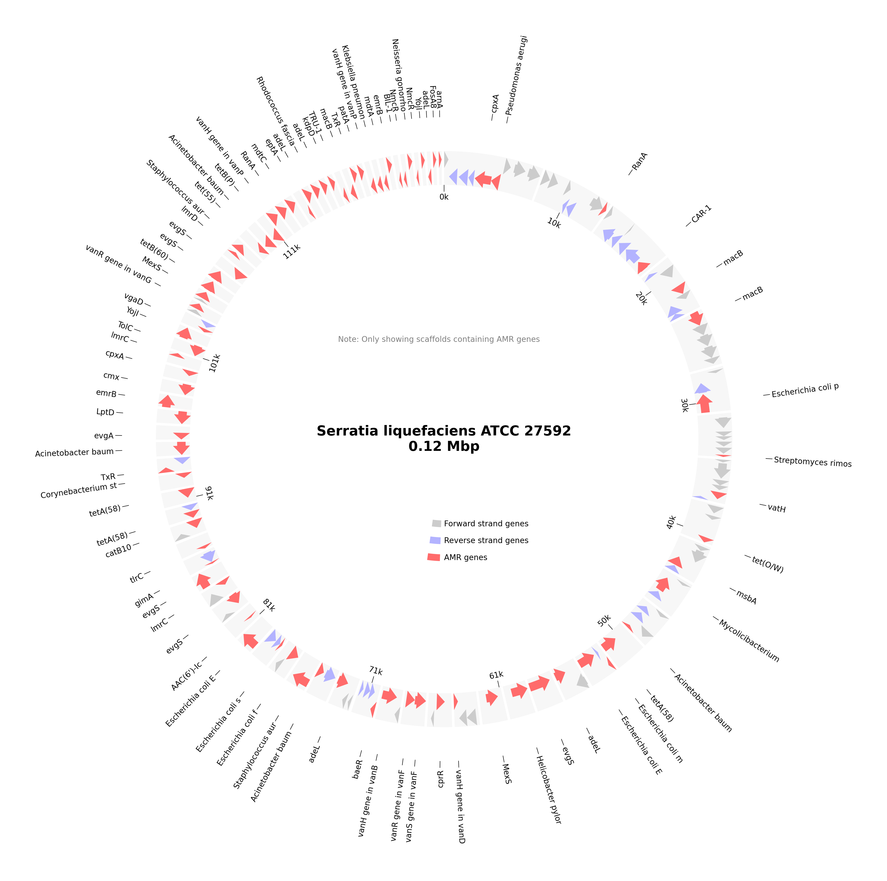

### AAC(6')-Ic
- **Mechanism**: antibiotic inactivation
- **Drug Classes**: aminoglycoside antibiotic
- **AMR Family**: AAC(6')
- **Locations**:
  - gnl|SPADES|IAMKMEGF_6922_2 : position 356-505

### Acinetobacter baumannii AbaF (found in 3 locations)
- **Mechanism**: antibiotic efflux
- **Drug Classes**: phosphonic acid antibiotic
- **AMR Family**: major facilitator superfamily (MFS) antibiotic efflux pump
- **Locations**:
  - gnl|SPADES|IAMKMEGF_125655_1 : position 3-695
  - gnl|SPADES|IAMKMEGF_16830_1 : position 9-1097
  - gnl|SPADES|IAMKMEGF_891_5 : position 2463-2735

### Acinetobacter baumannii AbaQ
- **Mechanism**: antibiotic efflux
- **Drug Classes**: fluoroquinolone antibiotic
- **AMR Family**: major facilitator superfamily (MFS) antibiotic efflux pump
- **Locations**:
  - gnl|SPADES|IAMKMEGF_2666_2 : position 1137-1658

### BIL-1
- **Mechanism**: antibiotic inactivation
- **Drug Classes**: cephalosporin
- **AMR Family**: BIL Beta-lactamase
- **Locations**:
  - gnl|SPADES|IAMKMEGF_838536_2 : position 150-353

### CAR-1
- **Mechanism**: antibiotic inactivation
- **Drug Classes**: carbapenem
- **AMR Family**: CAR beta-lactamase
- **Locations**:
  - gnl|SPADES|IAMKMEGF_375_6 : position 4474-5274

### Corynebacterium striatum tetA
- **Mechanism**: antibiotic efflux
- **Drug Classes**: penam; tetracycline antibiotic
- **AMR Family**: major facilitator superfamily (MFS) antibiotic efflux pump
- **Locations**:
  - gnl|SPADES|IAMKMEGF_13779_2 : position 719-1144

### Escherichia coli EF-Tu mutants conferring resistance to Enacyloxin IIa
- **Mechanism**: antibiotic target alteration
- **Drug Classes**: elfamycin antibiotic
- **AMR Family**: elfamycin resistant EF-Tu
- **Locations**:
  - gnl|SPADES|IAMKMEGF_6747_1 : position 3-1325

### Escherichia coli EF-Tu mutants conferring resistance to Pulvomycin
- **Mechanism**: antibiotic target alteration
- **Drug Classes**: elfamycin antibiotic
- **AMR Family**: elfamycin resistant EF-Tu
- **Locations**:
  - gnl|SPADES|IAMKMEGF_1299_3 : position 771-2216

### Escherichia coli fabI mutations conferring resistance to isoniazid and triclosan
- **Mechanism**: antibiotic target alteration
- **Drug Classes**: disinfecting agents and antiseptics; isoniazid-like antibiotic
- **AMR Family**: antibiotic resistant fabI
- **Locations**:
  - gnl|SPADES|IAMKMEGF_4063_1 : position 1-744

### Escherichia coli mdfA
- **Mechanism**: antibiotic efflux
- **Drug Classes**: tetracycline antibiotic; phenicol antibiotic; disinfecting agents and antiseptics
- **AMR Family**: major facilitator superfamily (MFS) antibiotic efflux pump
- **Locations**:
  - gnl|SPADES|IAMKMEGF_1299_1 : position 1-294

### Escherichia coli parE conferring resistance to fluoroquinolones
- **Mechanism**: antibiotic target alteration
- **Drug Classes**: fluoroquinolone antibiotic
- **AMR Family**: fluoroquinolone resistant parE
- **Locations**:
  - gnl|SPADES|IAMKMEGF_634_4 : position 1863-3407

### Escherichia coli soxS with mutation conferring antibiotic resistance
- **Mechanism**: antibiotic target alteration; antibiotic efflux; reduced permeability to antibiotic
- **Drug Classes**: fluoroquinolone antibiotic; monobactam; carbapenem; cephalosporin; glycylcycline; cephamycin; penam; tetracycline antibiotic; rifamycin antibiotic; phenicol antibiotic; penem; disinfecting agents and antiseptics
- **AMR Family**: ATP-binding cassette (ABC) antibiotic efflux pump; major facilitator superfamily (MFS) antibiotic efflux pump; resistance-nodulation-cell division (RND) antibiotic efflux pump; General Bacterial Porin with reduced permeability to beta-lactams
- **Locations**:
  - gnl|SPADES|IAMKMEGF_4778_1 : position 1-198

### FosA8
- **Mechanism**: antibiotic inactivation
- **Drug Classes**: phosphonic acid antibiotic
- **AMR Family**: fosfomycin thiol transferase
- **Locations**:
  - gnl|SPADES|IAMKMEGF_1575949_1: position 1-255

### Helicobacter pylori pbp1 mutants conferring resistance to amoxicillin
- **Mechanism**: antibiotic target alteration
- **Drug Classes**: cephalosporin; cephamycin; penam
- **AMR Family**: Penicillin-binding protein mutations conferring resistance to beta-lactam antibiotics
- **Locations**:
  - gnl|SPADES|IAMKMEGF_1623_1 : position 1-1371

### Klebsiella pneumoniae KpnH
- **Mechanism**: antibiotic efflux
- **Drug Classes**: macrolide antibiotic; fluoroquinolone antibiotic; aminoglycoside antibiotic; carbapenem; cephalosporin; penam; peptide antibiotic; penem
- **AMR Family**: major facilitator superfamily (MFS) antibiotic efflux pump
- **Locations**:
  - gnl|SPADES|IAMKMEGF_737427_1 : position 3-374

### LptD
- **Mechanism**: antibiotic efflux
- **Drug Classes**: carbapenem; peptide antibiotic; aminocoumarin antibiotic; rifamycin antibiotic
- **AMR Family**: ATP-binding cassette (ABC) antibiotic efflux pump
- **Locations**:
  - gnl|SPADES|IAMKMEGF_20584_1 : position 2-1054

### MexS (found in 2 locations)
- **Mechanism**: antibiotic efflux
- **Drug Classes**: fluoroquinolone antibiotic; diaminopyrimidine antibiotic; phenicol antibiotic
- **AMR Family**: resistance-nodulation-cell division (RND) antibiotic efflux pump
- **Locations**:
  - gnl|SPADES|IAMKMEGF_1694_2 : position 373-1362
  - gnl|SPADES|IAMKMEGF_54878_2 : position 283-852

### Mycolicibacterium smegmatis ndh with mutation conferring resistance to isoniazid
- **Mechanism**: antibiotic target alteration
- **Drug Classes**: isoniazid-like antibiotic
- **AMR Family**: antibiotic resistant ndh
- **Locations**:
  - gnl|SPADES|IAMKMEGF_814_3 : position 514-1722

### Neisseria gonorrhoeae PBP2 conferring resistance to beta-lactam antibiotics
- **Mechanism**: antibiotic target alteration
- **Drug Classes**: cephalosporin; cephamycin; penam
- **AMR Family**: Penicillin-binding protein mutations conferring resistance to beta-lactam antibiotics
- **Locations**:
  - gnl|SPADES|IAMKMEGF_947511_1 : position 3-332

### NmcR (found in 2 locations)
- **Mechanism**: antibiotic inactivation
- **Drug Classes**: carbapenem; cephalosporin; cephamycin; penam
- **AMR Family**: NmcA beta-lactamase
- **Locations**:
  - gnl|SPADES|IAMKMEGF_1050199_1 : position 2-184
  - gnl|SPADES|IAMKMEGF_905746_1 : position 2-223

### Pseudomonas aeruginosa CpxR
- **Mechanism**: antibiotic efflux
- **Drug Classes**: macrolide antibiotic; fluoroquinolone antibiotic; monobactam; aminoglycoside antibiotic; carbapenem; cephalosporin; cephamycin; penam; tetracycline antibiotic; peptide antibiotic; aminocoumarin antibiotic; diaminopyrimidine antibiotic; sulfonamide antibiotic; phenicol antibiotic; penem
- **AMR Family**: resistance-nodulation-cell division (RND) antibiotic efflux pump
- **Locations**:
  - gnl|SPADES|IAMKMEGF_258_6 : position 3915-4613

### RanA (found in 2 locations)
- **Mechanism**: antibiotic efflux
- **Drug Classes**: aminoglycoside antibiotic
- **AMR Family**: ATP-binding cassette (ABC) antibiotic efflux pump
- **Locations**:
  - gnl|SPADES|IAMKMEGF_143757_1 : position 1-669
  - gnl|SPADES|IAMKMEGF_370_8 : position 5289-5603

### Rhodococcus fascians cmr
- **Mechanism**: antibiotic efflux
- **Drug Classes**: phenicol antibiotic
- **AMR Family**: major facilitator superfamily (MFS) antibiotic efflux pump
- **Locations**:
  - gnl|SPADES|IAMKMEGF_324570_1 : position 1-522

### Staphylococcus aureus mupA conferring resistance to mupirocin
- **Mechanism**: antibiotic target alteration
- **Drug Classes**: mupirocin-like antibiotic
- **AMR Family**: antibiotic-resistant isoleucyl-tRNA synthetase (ileS)
- **Locations**:
  - gnl|SPADES|IAMKMEGF_3269_1 : position 3-1370

### Staphylococcus aureus norA
- **Mechanism**: antibiotic efflux
- **Drug Classes**: fluoroquinolone antibiotic
- **AMR Family**: major facilitator superfamily (MFS) antibiotic efflux pump
- **Locations**:
  - gnl|SPADES|IAMKMEGF_108520_1 : position 24-626

### Streptomyces rimosus otr(A)
- **Mechanism**: antibiotic target protection
- **Drug Classes**: tetracycline antibiotic
- **AMR Family**: tetracycline-resistant ribosomal protection protein
- **Locations**:
  - gnl|SPADES|IAMKMEGF_635_7 : position 3242-3406

### TRU-1
- **Mechanism**: antibiotic inactivation
- **Drug Classes**: cephalosporin; penam
- **AMR Family**: TRU beta-lactamase
- **Locations**:
  - gnl|SPADES|IAMKMEGF_501649_1 : position 2-280

### TolC
- **Mechanism**: antibiotic efflux
- **Drug Classes**: macrolide antibiotic; fluoroquinolone antibiotic; aminoglycoside antibiotic; carbapenem; cephalosporin; glycylcycline; cephamycin; penam; tetracycline antibiotic; peptide antibiotic; aminocoumarin antibiotic; rifamycin antibiotic; phenicol antibiotic; penem; disinfecting agents and antiseptics
- **AMR Family**: ATP-binding cassette (ABC) antibiotic efflux pump; major facilitator superfamily (MFS) antibiotic efflux pump; resistance-nodulation-cell division (RND) antibiotic efflux pump
- **Locations**:
  - gnl|SPADES|IAMKMEGF_48507_1 : position 3-878

### TxR (found in 2 locations)
- **Mechanism**: antibiotic efflux
- **Drug Classes**: tetracycline antibiotic
- **AMR Family**: ATP-binding cassette (ABC) antibiotic efflux pump
- **Locations**:
  - gnl|SPADES|IAMKMEGF_16722_1 : position 3-395
  - gnl|SPADES|IAMKMEGF_648704_1 : position 2-397

### YojI (found in 2 locations)
- **Mechanism**: antibiotic efflux
- **Drug Classes**: peptide antibiotic
- **AMR Family**: ATP-binding cassette (ABC) antibiotic efflux pump
- **Locations**:
  - gnl|SPADES|IAMKMEGF_1274937_1 : position 3-284
  - gnl|SPADES|IAMKMEGF_49067_1 : position 1-876

### adeL (found in 5 locations)
- **Mechanism**: antibiotic efflux
- **Drug Classes**: fluoroquinolone antibiotic; tetracycline antibiotic
- **AMR Family**: resistance-nodulation-cell division (RND) antibiotic efflux pump
- **Locations**:
  - gnl|SPADES|IAMKMEGF_1436_2 : position 1144-2067
  - gnl|SPADES|IAMKMEGF_1463459_1 : position 2-265
  - gnl|SPADES|IAMKMEGF_2514_3 : position 802-1686
  - gnl|SPADES|IAMKMEGF_283435_1 : position 3-548
  - gnl|SPADES|IAMKMEGF_455028_1 : position 1-462

### arnA
- **Mechanism**: antibiotic target alteration
- **Drug Classes**: peptide antibiotic
- **AMR Family**: pmr phosphoethanolamine transferase
- **Locations**:
  - gnl|SPADES|IAMKMEGF_1983937_1 : position 3-224

### baeR
- **Mechanism**: antibiotic efflux
- **Drug Classes**: aminoglycoside antibiotic; aminocoumarin antibiotic
- **AMR Family**: resistance-nodulation-cell division (RND) antibiotic efflux pump
- **Locations**:
  - gnl|SPADES|IAMKMEGF_2509_1 : position 2-349

### catB10
- **Mechanism**: antibiotic inactivation
- **Drug Classes**: phenicol antibiotic
- **AMR Family**: chloramphenicol acetyltransferase (CAT)
- **Locations**:
  - gnl|SPADES|IAMKMEGF_12275_2 : position 470-1171

### cmx
- **Mechanism**: antibiotic efflux
- **Drug Classes**: phenicol antibiotic
- **AMR Family**: major facilitator superfamily (MFS) antibiotic efflux pump
- **Locations**:
  - gnl|SPADES|IAMKMEGF_35270_1 : position 2-904

### cprR
- **Mechanism**: antibiotic target alteration; antibiotic efflux
- **Drug Classes**: peptide antibiotic
- **AMR Family**: pmr phosphoethanolamine transferase
- **Locations**:
  - gnl|SPADES|IAMKMEGF_1755_2 : position 552-1220

### cpxA (found in 2 locations)
- **Mechanism**: antibiotic efflux
- **Drug Classes**: aminoglycoside antibiotic; aminocoumarin antibiotic
- **AMR Family**: resistance-nodulation-cell division (RND) antibiotic efflux pump
- **Locations**:
  - gnl|SPADES|IAMKMEGF_258_5 : position 2545-3918
  - gnl|SPADES|IAMKMEGF_37622_2 : position 491-931

### emrB (found in 2 locations)
- **Mechanism**: antibiotic efflux
- **Drug Classes**: fluoroquinolone antibiotic
- **AMR Family**: major facilitator superfamily (MFS) antibiotic efflux pump
- **Locations**:
  - gnl|SPADES|IAMKMEGF_28837_1 : position 1-984
  - gnl|SPADES|IAMKMEGF_784322_1 : position 3-365

### eptA
- **Mechanism**: antibiotic target alteration
- **Drug Classes**: peptide antibiotic
- **AMR Family**: pmr phosphoethanolamine transferase
- **Locations**:
  - gnl|SPADES|IAMKMEGF_274544_2 : position 319-552

### evgA
- **Mechanism**: antibiotic efflux
- **Drug Classes**: macrolide antibiotic; fluoroquinolone antibiotic; penam; tetracycline antibiotic
- **AMR Family**: major facilitator superfamily (MFS) antibiotic efflux pump; resistance-nodulation-cell division (RND) antibiotic efflux pump
- **Locations**:
  - gnl|SPADES|IAMKMEGF_17351_1 : position 2-556

### evgS (found in 5 locations)
- **Mechanism**: antibiotic efflux
- **Drug Classes**: macrolide antibiotic; fluoroquinolone antibiotic; penam; tetracycline antibiotic
- **AMR Family**: major facilitator superfamily (MFS) antibiotic efflux pump; resistance-nodulation-cell division (RND) antibiotic efflux pump
- **Locations**:
  - gnl|SPADES|IAMKMEGF_1464_1 : position 290-2074
  - gnl|SPADES|IAMKMEGF_7231_2 : position 414-1307
  - gnl|SPADES|IAMKMEGF_74675_1 : position 2-793
  - gnl|SPADES|IAMKMEGF_89637_1 : position 3-758
  - gnl|SPADES|IAMKMEGF_9519_1 : position 2-1234

### gimA
- **Mechanism**: antibiotic inactivation
- **Drug Classes**: macrolide antibiotic
- **AMR Family**: gimA family macrolide glycosyltransferase
- **Locations**:
  - gnl|SPADES|IAMKMEGF_10605_1 : position 2-145

### kdpD
- **Mechanism**: antibiotic efflux
- **Drug Classes**: aminoglycoside antibiotic
- **AMR Family**: kdpDE
- **Locations**:
  - gnl|SPADES|IAMKMEGF_473229_1 : position 78-455

### lmrC (found in 2 locations)
- **Mechanism**: antibiotic target protection
- **Drug Classes**: lincosamide antibiotic
- **AMR Family**: Miscellaneous ABC-F subfamily ATP-binding cassette ribosomal protection proteins
- **Locations**:
  - gnl|SPADES|IAMKMEGF_45093_2 : position 604-894
  - gnl|SPADES|IAMKMEGF_9022_2 : position 828-1247

### lmrD
- **Mechanism**: antibiotic efflux
- **Drug Classes**: lincosamide antibiotic
- **AMR Family**: ATP-binding cassette (ABC) antibiotic efflux pump
- **Locations**:
  - gnl|SPADES|IAMKMEGF_95991_2 : position 483-746

### macB (found in 3 locations)
- **Mechanism**: antibiotic efflux
- **Drug Classes**: macrolide antibiotic
- **AMR Family**: ATP-binding cassette (ABC) antibiotic efflux pump
- **Locations**:
  - gnl|SPADES|IAMKMEGF_451_4 : position 2250-2972
  - gnl|SPADES|IAMKMEGF_461_1 : position 2-1099
  - gnl|SPADES|IAMKMEGF_601046_1 : position 3-410

### mdtA
- **Mechanism**: antibiotic efflux
- **Drug Classes**: aminocoumarin antibiotic
- **AMR Family**: resistance-nodulation-cell division (RND) antibiotic efflux pump
- **Locations**:
  - gnl|SPADES|IAMKMEGF_781193_1 : position 1-297

### mdtC
- **Mechanism**: antibiotic efflux
- **Drug Classes**: aminocoumarin antibiotic
- **AMR Family**: resistance-nodulation-cell division (RND) antibiotic efflux pump
- **Locations**:
  - gnl|SPADES|IAMKMEGF_200985_1 : position 2-610

### msbA
- **Mechanism**: antibiotic efflux
- **Drug Classes**: nitroimidazole antibiotic
- **AMR Family**: ATP-binding cassette (ABC) antibiotic efflux pump
- **Locations**:
  - gnl|SPADES|IAMKMEGF_784_2 : position 1669-2430

### patA
- **Mechanism**: antibiotic efflux
- **Drug Classes**: fluoroquinolone antibiotic
- **AMR Family**: ATP-binding cassette (ABC) antibiotic efflux pump
- **Locations**:
  - gnl|SPADES|IAMKMEGF_670004_1 : position 2-391

### tet(55)
- **Mechanism**: antibiotic inactivation
- **Drug Classes**: tetracycline antibiotic
- **AMR Family**: tetracycline inactivation enzyme
- **Locations**:
  - gnl|SPADES|IAMKMEGF_121063_2 : position 223-702

### tet(O/W)
- **Mechanism**: antibiotic target protection
- **Drug Classes**: tetracycline antibiotic
- **AMR Family**: tetracycline-resistant ribosomal protection protein
- **Locations**:
  - gnl|SPADES|IAMKMEGF_739_5 : position 2669-3082

### tetA(58) (found in 3 locations)
- **Mechanism**: antibiotic efflux
- **Drug Classes**: tetracycline antibiotic
- **AMR Family**: major facilitator superfamily (MFS) antibiotic efflux pump
- **Locations**:
  - gnl|SPADES|IAMKMEGF_1070_3 : position 1174-2460
  - gnl|SPADES|IAMKMEGF_13180_1 : position 3-560
  - gnl|SPADES|IAMKMEGF_13378_2 : position 384-1151

### tetB(60)
- **Mechanism**: antibiotic efflux
- **Drug Classes**: tetracycline antibiotic
- **AMR Family**: ATP-binding cassette (ABC) antibiotic efflux pump
- **Locations**:
  - gnl|SPADES|IAMKMEGF_73142_1 : position 2-796

### tetB(P)
- **Mechanism**: antibiotic target protection
- **Drug Classes**: tetracycline antibiotic
- **AMR Family**: tetracycline-resistant ribosomal protection protein
- **Locations**:
  - gnl|SPADES|IAMKMEGF_139461_1 : position 2-676

### tlrC
- **Mechanism**: antibiotic target protection
- **Drug Classes**: macrolide antibiotic; lincosamide antibiotic
- **AMR Family**: Miscellaneous ABC-F subfamily ATP-binding cassette ribosomal protection proteins
- **Locations**:
  - gnl|SPADES|IAMKMEGF_12072_1 : position 1-249

### vanH gene in vanB cluster
- **Mechanism**: antibiotic target alteration
- **Drug Classes**: glycopeptide antibiotic
- **AMR Family**: vanH; glycopeptide resistance gene cluster
- **Locations**:
  - gnl|SPADES|IAMKMEGF_2185_2 : position 419-1657

### vanH gene in vanD cluster
- **Mechanism**: antibiotic target alteration
- **Drug Classes**: glycopeptide antibiotic
- **AMR Family**: vanH; glycopeptide resistance gene cluster
- **Locations**:
  - gnl|SPADES|IAMKMEGF_1696_3 : position 1593-1940

### vanH gene in vanP cluster (found in 2 locations)
- **Mechanism**: antibiotic target alteration
- **Drug Classes**: glycopeptide antibiotic
- **AMR Family**: vanH; glycopeptide resistance gene cluster
- **Locations**:
  - gnl|SPADES|IAMKMEGF_143024_1 : position 3-671
  - gnl|SPADES|IAMKMEGF_711249_1 : position 1-381

### vanR gene in vanF cluster
- **Mechanism**: antibiotic target alteration
- **Drug Classes**: glycopeptide antibiotic
- **AMR Family**: glycopeptide resistance gene cluster; vanR
- **Locations**:
  - gnl|SPADES|IAMKMEGF_1999_2 : position 929-1642

### vanR gene in vanG cluster
- **Mechanism**: antibiotic target alteration
- **Drug Classes**: glycopeptide antibiotic
- **AMR Family**: glycopeptide resistance gene cluster; vanR
- **Locations**:
  - gnl|SPADES|IAMKMEGF_54783_2 : position 385-852

### vanS gene in vanF cluster
- **Mechanism**: antibiotic target alteration
- **Drug Classes**: glycopeptide antibiotic
- **AMR Family**: vanS; glycopeptide resistance gene cluster
- **Locations**:
  - gnl|SPADES|IAMKMEGF_1999_1 : position 2-925

### vatH
- **Mechanism**: antibiotic inactivation
- **Drug Classes**: streptogramin antibiotic; streptogramin A antibiotic
- **AMR Family**: streptogramin vat acetyltransferase
- **Locations**:
  - gnl|SPADES|IAMKMEGF_641_5 : position 2577-3134

### vgaD
- **Mechanism**: antibiotic target protection
- **Drug Classes**: streptogramin antibiotic; streptogramin A antibiotic; pleuromutilin antibiotic
- **AMR Family**: vga-type ABC-F protein
- **Locations**:
  - gnl|SPADES|IAMKMEGF_54182_1 : position 1-279

## Yersinia alsatica
**Strain Statistics:**
- Total genome length: 1.5 kbp
- Total scaffolds: 128
- Scaffolds with AMR genes: 6
- Total genes annotated: 0
- Total AMR genes: 6
- Unique AMR genes: 6
- Distinct AMR mechanisms: 2
- Distinct AMR families: 4
- Distinct drug classes: 14

**Circos Plot:**

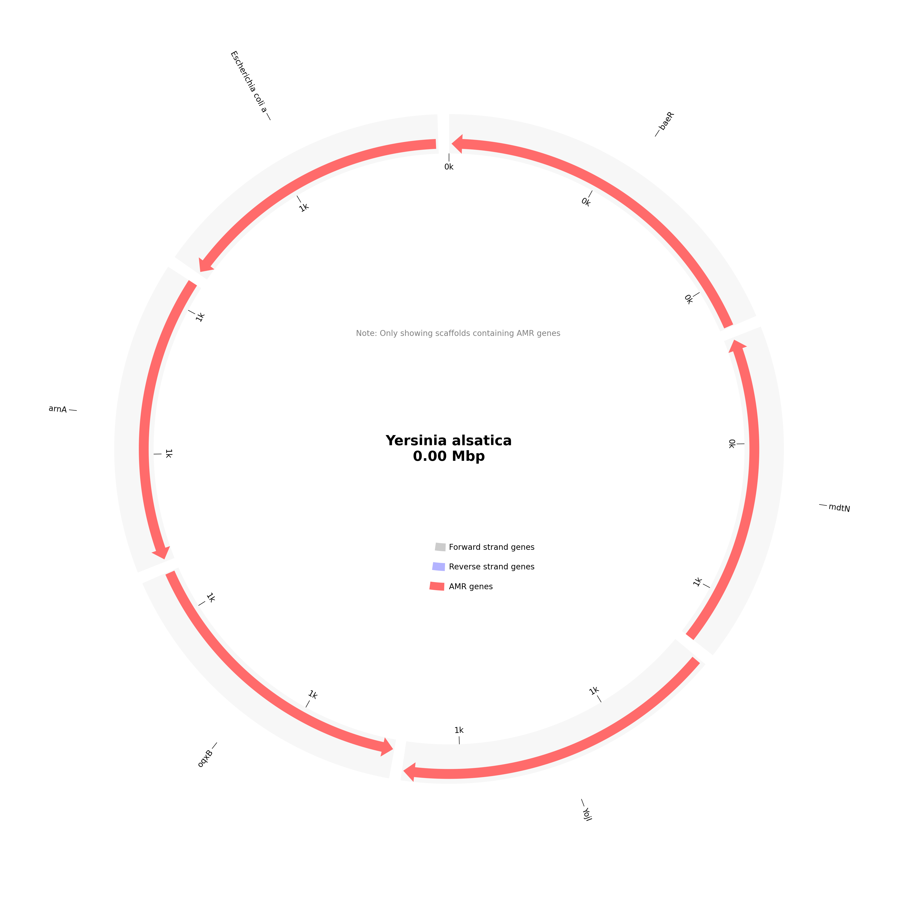

### Escherichia coli acrA
- **Mechanism**: antibiotic efflux
- **Drug Classes**: fluoroquinolone antibiotic; cephalosporin; glycylcycline; penam; tetracycline antibiotic; rifamycin antibiotic; phenicol antibiotic; disinfecting agents and antiseptics
- **AMR Family**: resistance-nodulation-cell division (RND) antibiotic efflux pump
- **Locations**:
  - gnl|SPADES|IAMKMEGF_1891579_1 : position 2-229

### YojI
- **Mechanism**: antibiotic efflux
- **Drug Classes**: peptide antibiotic
- **AMR Family**: ATP-binding cassette (ABC) antibiotic efflux pump
- **Locations**:
  - gnl|SPADES|IAMKMEGF_1595421_1 : position 2-253

### arnA
- **Mechanism**: antibiotic target alteration
- **Drug Classes**: peptide antibiotic
- **AMR Family**: pmr phosphoethanolamine transferase
- **Locations**:
  - gnl|SPADES|IAMKMEGF_1794689_1 : position 2-238

### baeR
- **Mechanism**: antibiotic efflux
- **Drug Classes**: aminoglycoside antibiotic; aminocoumarin antibiotic
- **AMR Family**: resistance-nodulation-cell division (RND) antibiotic efflux pump
- **Locations**:
  - gnl|SPADES|IAMKMEGF_1232882_1 : position 2-289

### mdtN
- **Mechanism**: antibiotic efflux
- **Drug Classes**: nucleoside antibiotic; disinfecting agents and antiseptics
- **AMR Family**: major facilitator superfamily (MFS) antibiotic efflux pump
- **Locations**:
  - gnl|SPADES|IAMKMEGF_1529714_1 : position 2-259

### oqxB
- **Mechanism**: antibiotic efflux
- **Drug Classes**: fluoroquinolone antibiotic; glycylcycline; tetracycline antibiotic; diaminopyrimidine antibiotic; nitrofuran antibiotic
- **AMR Family**: resistance-nodulation-cell division (RND) antibiotic efflux pump
- **Locations**:
  - gnl|SPADES|IAMKMEGF_1707766_1 : position 1-243

## Yersinia enterocolitica
**Strain Statistics:**
- Total genome length: 31.6 kbp
- Total scaffolds: 1475
- Scaffolds with AMR genes: 100
- Total genes annotated: 10
- Total AMR genes: 100
- Unique AMR genes: 72
- Distinct AMR mechanisms: 9
- Distinct AMR families: 28
- Distinct drug classes: 30

**Circos Plot:**

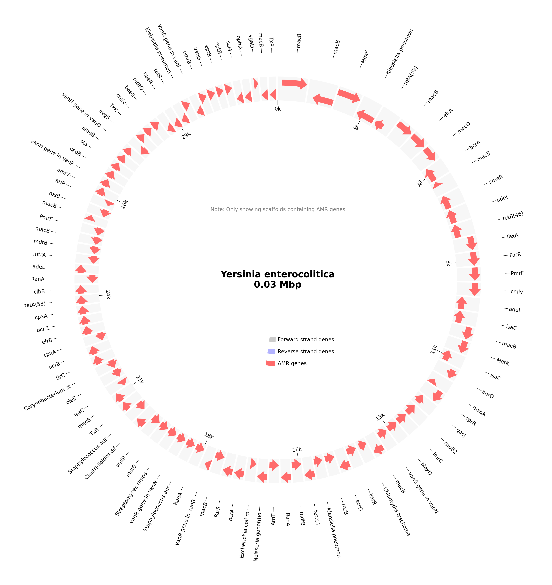

### ArnT
- **Mechanism**: antibiotic target alteration
- **Drug Classes**: peptide antibiotic
- **AMR Family**: pmr phosphoethanolamine transferase
- **Locations**:
  - gnl|SPADES|IAMKMEGF_1154912_1 : position 2-298

### Chlamydia trachomatis intrinsic murA conferring resistance to fosfomycin
- **Mechanism**: antibiotic target alteration
- **Drug Classes**: phosphonic acid antibiotic
- **AMR Family**: antibiotic-resistant murA transferase
- **Locations**:
  - gnl|SPADES|IAMKMEGF_1038434_1 : position 3-260

### Clostridioides difficile gyrB conferring resistance to fluoroquinolones
- **Mechanism**: antibiotic target alteration
- **Drug Classes**: fluoroquinolone antibiotic
- **AMR Family**: fluoroquinolone resistant gyrB
- **Locations**:
  - gnl|SPADES|IAMKMEGF_1365070_1 : position 3-272

### Corynebacterium striatum tetA
- **Mechanism**: antibiotic efflux
- **Drug Classes**: penam; tetracycline antibiotic
- **AMR Family**: major facilitator superfamily (MFS) antibiotic efflux pump
- **Locations**:
  - gnl|SPADES|IAMKMEGF_1454145_1 : position 2-265

### Escherichia coli mdfA
- **Mechanism**: antibiotic efflux
- **Drug Classes**: tetracycline antibiotic; phenicol antibiotic; disinfecting agents and antiseptics
- **AMR Family**: major facilitator superfamily (MFS) antibiotic efflux pump
- **Locations**:
  - gnl|SPADES|IAMKMEGF_1191895_1 : position 1-189

### Klebsiella pneumoniae KpnG
- **Mechanism**: antibiotic efflux
- **Drug Classes**: macrolide antibiotic; fluoroquinolone antibiotic; aminoglycoside antibiotic; carbapenem; cephalosporin; penam; peptide antibiotic; penem
- **AMR Family**: major facilitator superfamily (MFS) antibiotic efflux pump
- **Locations**:
  - gnl|SPADES|IAMKMEGF_1110855_1 : position 37-306

### Klebsiella pneumoniae KpnH
- **Mechanism**: antibiotic efflux
- **Drug Classes**: macrolide antibiotic; fluoroquinolone antibiotic; aminoglycoside antibiotic; carbapenem; cephalosporin; penam; peptide antibiotic; penem
- **AMR Family**: major facilitator superfamily (MFS) antibiotic efflux pump
- **Locations**:
  - gnl|SPADES|IAMKMEGF_227497_1 : position 1-588

### Klebsiella pneumoniae OmpK37
- **Mechanism**: reduced permeability to antibiotic
- **Drug Classes**: monobactam; carbapenem; cephalosporin; cephamycin; penam; penem
- **AMR Family**: General Bacterial Porin with reduced permeability to beta-lactams
- **Locations**:
  - gnl|SPADES|IAMKMEGF_2071073_1 : position 3-218

### MdtK
- **Mechanism**: antibiotic efflux
- **Drug Classes**: fluoroquinolone antibiotic
- **AMR Family**: multidrug and toxic compound extrusion (MATE) transporter
- **Locations**:
  - gnl|SPADES|IAMKMEGF_729550_1 : position 3-377

### MexD
- **Mechanism**: antibiotic efflux
- **Drug Classes**: macrolide antibiotic; fluoroquinolone antibiotic; aminoglycoside antibiotic; cephalosporin; penam; tetracycline antibiotic; aminocoumarin antibiotic; diaminopyrimidine antibiotic; phenicol antibiotic
- **AMR Family**: resistance-nodulation-cell division (RND) antibiotic efflux pump
- **Locations**:
  - gnl|SPADES|IAMKMEGF_908694_1 : position 1-339

### MexF
- **Mechanism**: antibiotic efflux
- **Drug Classes**: fluoroquinolone antibiotic; diaminopyrimidine antibiotic; phenicol antibiotic
- **AMR Family**: resistance-nodulation-cell division (RND) antibiotic efflux pump
- **Locations**:
  - gnl|SPADES|IAMKMEGF_121065_1 : position 1-702

### Neisseria gonorrhoeae pilQ gene conferring resistance to beta-lactam
- **Mechanism**: antibiotic target alteration
- **Drug Classes**: cephalosporin; cephamycin; penam
- **AMR Family**: Penicillin-binding protein mutations conferring resistance to beta-lactam antibiotics
- **Locations**:
  - gnl|SPADES|IAMKMEGF_1162513_1 : position 1-297

### ParR (found in 2 locations)
- **Mechanism**: antibiotic efflux; reduced permeability to antibiotic
- **Drug Classes**: macrolide antibiotic; fluoroquinolone antibiotic; monobactam; aminoglycoside antibiotic; carbapenem; cephalosporin; cephamycin; penam; tetracycline antibiotic; phenicol antibiotic; penem; disinfecting agents and antiseptics
- **AMR Family**: resistance-nodulation-cell division (RND) antibiotic efflux pump; Outer Membrane Porin (Opr)
- **Locations**:
  - gnl|SPADES|IAMKMEGF_1043086_1 : position 1-315
  - gnl|SPADES|IAMKMEGF_619024_1 : position 3-407

### ParS
- **Mechanism**: antibiotic efflux; reduced permeability to antibiotic
- **Drug Classes**: macrolide antibiotic; fluoroquinolone antibiotic; monobactam; aminoglycoside antibiotic; carbapenem; cephalosporin; cephamycin; penam; tetracycline antibiotic; phenicol antibiotic; penem; disinfecting agents and antiseptics
- **AMR Family**: resistance-nodulation-cell division (RND) antibiotic efflux pump; Outer Membrane Porin (Opr)
- **Locations**:
  - gnl|SPADES|IAMKMEGF_1196123_1 : position 1-294

### PmrF (found in 2 locations)
- **Mechanism**: antibiotic target alteration
- **Drug Classes**: peptide antibiotic
- **AMR Family**: pmr phosphoethanolamine transferase
- **Locations**:
  - gnl|SPADES|IAMKMEGF_1650242_1 : position 2-247
  - gnl|SPADES|IAMKMEGF_640097_1 : position 3-401

### RanA (found in 3 locations)
- **Mechanism**: antibiotic efflux
- **Drug Classes**: aminoglycoside antibiotic
- **AMR Family**: ATP-binding cassette (ABC) antibiotic efflux pump
- **Locations**:
  - gnl|SPADES|IAMKMEGF_1135116_1 : position 2-301
  - gnl|SPADES|IAMKMEGF_1296261_1 : position 2-280
  - gnl|SPADES|IAMKMEGF_1600144_1 : position 2-253

### Staphylococcus aureus GlpT with mutation conferring resistance to fosfomycin
- **Mechanism**: antibiotic target alteration
- **Drug Classes**: phosphonic acid antibiotic
- **AMR Family**: antibiotic-resistant GlpT
- **Locations**:
  - gnl|SPADES|IAMKMEGF_1381305_1 : position 1-273

### Staphylococcus aureus fusA with mutation conferring resistance to fusidic acid
- **Mechanism**: antibiotic target alteration
- **Drug Classes**: fusidane antibiotic
- **AMR Family**: antibiotic resistant fusA
- **Locations**:
  - gnl|SPADES|IAMKMEGF_1294151_1 : position 1-282

### Streptomyces rimosus otr(A)
- **Mechanism**: antibiotic target protection
- **Drug Classes**: tetracycline antibiotic
- **AMR Family**: tetracycline-resistant ribosomal protection protein
- **Locations**:
  - gnl|SPADES|IAMKMEGF_1302294_1 : position 3-281

### TxR (found in 3 locations)
- **Mechanism**: antibiotic efflux
- **Drug Classes**: tetracycline antibiotic
- **AMR Family**: ATP-binding cassette (ABC) antibiotic efflux pump
- **Locations**:
  - gnl|SPADES|IAMKMEGF_1400792_1 : position 3-269
  - gnl|SPADES|IAMKMEGF_1931922_1 : position 2-226
  - gnl|SPADES|IAMKMEGF_2235651_1 : position 2-208

### acrB
- **Mechanism**: antibiotic efflux
- **Drug Classes**: fluoroquinolone antibiotic; cephalosporin; glycylcycline; penam; tetracycline antibiotic; rifamycin antibiotic; phenicol antibiotic; disinfecting agents and antiseptics
- **AMR Family**: resistance-nodulation-cell division (RND) antibiotic efflux pump
- **Locations**:
  - gnl|SPADES|IAMKMEGF_1510876_1 : position 2-259

### acrD
- **Mechanism**: antibiotic efflux
- **Drug Classes**: aminoglycoside antibiotic
- **AMR Family**: resistance-nodulation-cell division (RND) antibiotic efflux pump
- **Locations**:
  - gnl|SPADES|IAMKMEGF_1083625_1 : position 1-309

### adeL (found in 3 locations)
- **Mechanism**: antibiotic efflux
- **Drug Classes**: fluoroquinolone antibiotic; tetracycline antibiotic
- **AMR Family**: resistance-nodulation-cell division (RND) antibiotic efflux pump
- **Locations**:
  - gnl|SPADES|IAMKMEGF_1608701_1 : position 2-250
  - gnl|SPADES|IAMKMEGF_521129_1 : position 2-436
  - gnl|SPADES|IAMKMEGF_670462_1 : position 3-392

### arlR
- **Mechanism**: antibiotic efflux
- **Drug Classes**: fluoroquinolone antibiotic; disinfecting agents and antiseptics
- **AMR Family**: major facilitator superfamily (MFS) antibiotic efflux pump
- **Locations**:
  - gnl|SPADES|IAMKMEGF_1733971_2 : position 88-243

### baeR
- **Mechanism**: antibiotic efflux
- **Drug Classes**: aminoglycoside antibiotic; aminocoumarin antibiotic
- **AMR Family**: resistance-nodulation-cell division (RND) antibiotic efflux pump
- **Locations**:
  - gnl|SPADES|IAMKMEGF_2043177_1 : position 2-220

### baeS
- **Mechanism**: antibiotic efflux
- **Drug Classes**: aminoglycoside antibiotic; aminocoumarin antibiotic
- **AMR Family**: resistance-nodulation-cell division (RND) antibiotic efflux pump
- **Locations**:
  - gnl|SPADES|IAMKMEGF_1976902_1 : position 3-224

### bcr-1
- **Mechanism**: antibiotic efflux
- **Drug Classes**: bicyclomycin-like antibiotic
- **AMR Family**: major facilitator superfamily (MFS) antibiotic efflux pump
- **Locations**:
  - gnl|SPADES|IAMKMEGF_1559626_1 : position 3-257

### bcrA (found in 2 locations)
- **Mechanism**: antibiotic efflux
- **Drug Classes**: peptide antibiotic
- **AMR Family**: ATP-binding cassette (ABC) antibiotic efflux pump
- **Locations**:
  - gnl|SPADES|IAMKMEGF_1194436_1 : position 3-293
  - gnl|SPADES|IAMKMEGF_499185_1 : position 3-446

### ceoB
- **Mechanism**: antibiotic efflux
- **Drug Classes**: fluoroquinolone antibiotic; aminoglycoside antibiotic
- **AMR Family**: resistance-nodulation-cell division (RND) antibiotic efflux pump
- **Locations**:
  - gnl|SPADES|IAMKMEGF_1743232_1 : position 1-240

### clbB
- **Mechanism**: antibiotic target alteration
- **Drug Classes**: lincosamide antibiotic; streptogramin antibiotic; streptogramin A antibiotic; oxazolidinone antibiotic; phenicol antibiotic; pleuromutilin antibiotic
- **AMR Family**: Cfr 23S ribosomal RNA methyltransferase
- **Locations**:
  - gnl|SPADES|IAMKMEGF_1587348_1 : position 1-252

### cmlv (found in 2 locations)
- **Mechanism**: antibiotic inactivation
- **Drug Classes**: phenicol antibiotic
- **AMR Family**: chloramphenicol phosphotransferase
- **Locations**:
  - gnl|SPADES|IAMKMEGF_1984131_1 : position 1-225
  - gnl|SPADES|IAMKMEGF_658048_1 : position 3-395

### cprR
- **Mechanism**: antibiotic target alteration; antibiotic efflux
- **Drug Classes**: peptide antibiotic
- **AMR Family**: pmr phosphoethanolamine transferase
- **Locations**:
  - gnl|SPADES|IAMKMEGF_830496_1 : position 1-354

### cpxA (found in 2 locations)
- **Mechanism**: antibiotic efflux
- **Drug Classes**: aminoglycoside antibiotic; aminocoumarin antibiotic
- **AMR Family**: resistance-nodulation-cell division (RND) antibiotic efflux pump
- **Locations**:
  - gnl|SPADES|IAMKMEGF_1547499_1 : position 3-257
  - gnl|SPADES|IAMKMEGF_1562217_1 : position 1-255

### efrA
- **Mechanism**: antibiotic efflux
- **Drug Classes**: macrolide antibiotic; fluoroquinolone antibiotic; rifamycin antibiotic
- **AMR Family**: ATP-binding cassette (ABC) antibiotic efflux pump
- **Locations**:
  - gnl|SPADES|IAMKMEGF_380550_1 : position 2-493

### efrB
- **Mechanism**: antibiotic efflux
- **Drug Classes**: macrolide antibiotic; fluoroquinolone antibiotic; rifamycin antibiotic
- **AMR Family**: ATP-binding cassette (ABC) antibiotic efflux pump
- **Locations**:
  - gnl|SPADES|IAMKMEGF_1559126_1 : position 3-257

### emrB
- **Mechanism**: antibiotic efflux
- **Drug Classes**: fluoroquinolone antibiotic
- **AMR Family**: major facilitator superfamily (MFS) antibiotic efflux pump
- **Locations**:
  - gnl|SPADES|IAMKMEGF_2068932_1 : position 1-219

### emrY
- **Mechanism**: antibiotic efflux
- **Drug Classes**: tetracycline antibiotic
- **AMR Family**: major facilitator superfamily (MFS) antibiotic efflux pump
- **Locations**:
  - gnl|SPADES|IAMKMEGF_1748108_1 : position 2-241

### eptB (found in 2 locations)
- **Mechanism**: antibiotic target alteration
- **Drug Classes**: peptide antibiotic
- **AMR Family**: pmr phosphoethanolamine transferase
- **Locations**:
  - gnl|SPADES|IAMKMEGF_2135957_1 : position 2-214
  - gnl|SPADES|IAMKMEGF_2139617_1 : position 1-213

### evgS
- **Mechanism**: antibiotic efflux
- **Drug Classes**: macrolide antibiotic; fluoroquinolone antibiotic; penam; tetracycline antibiotic
- **AMR Family**: major facilitator superfamily (MFS) antibiotic efflux pump; resistance-nodulation-cell division (RND) antibiotic efflux pump
- **Locations**:
  - gnl|SPADES|IAMKMEGF_1899277_1 : position 1-231

### fexA
- **Mechanism**: antibiotic efflux
- **Drug Classes**: phenicol antibiotic
- **AMR Family**: major facilitator superfamily (MFS) antibiotic efflux pump
- **Locations**:
  - gnl|SPADES|IAMKMEGF_595763_1 : position 2-412

### lmrC
- **Mechanism**: antibiotic target protection
- **Drug Classes**: lincosamide antibiotic
- **AMR Family**: Miscellaneous ABC-F subfamily ATP-binding cassette ribosomal protection proteins
- **Locations**:
  - gnl|SPADES|IAMKMEGF_880945_1 : position 2-346

### lmrD
- **Mechanism**: antibiotic efflux
- **Drug Classes**: lincosamide antibiotic
- **AMR Family**: ATP-binding cassette (ABC) antibiotic efflux pump
- **Locations**:
  - gnl|SPADES|IAMKMEGF_809020_1 : position 86-358

### lsaC (found in 3 locations)
- **Mechanism**: antibiotic target protection
- **Drug Classes**: lincosamide antibiotic; streptogramin antibiotic; pleuromutilin antibiotic
- **AMR Family**: lsa-type ABC-F protein
- **Locations**:
  - gnl|SPADES|IAMKMEGF_1418888_1 : position 3-194
  - gnl|SPADES|IAMKMEGF_675600_1 : position 3-389
  - gnl|SPADES|IAMKMEGF_792153_1 : position 1-336

### macB (found in 11 locations)
- **Mechanism**: antibiotic efflux
- **Drug Classes**: macrolide antibiotic
- **AMR Family**: ATP-binding cassette (ABC) antibiotic efflux pump
- **Locations**:
  - gnl|SPADES|IAMKMEGF_1005935_1 : position 2-322
  - gnl|SPADES|IAMKMEGF_1218116_1 : position 2-292
  - gnl|SPADES|IAMKMEGF_1420923_1 : position 2-268
  - gnl|SPADES|IAMKMEGF_1634743_1 : position 3-248
  - gnl|SPADES|IAMKMEGF_1654779_2 : position 88-249
  - gnl|SPADES|IAMKMEGF_2196319_1 : position 2-208
  - gnl|SPADES|IAMKMEGF_360079_1 : position 2-505
  - gnl|SPADES|IAMKMEGF_46596_1 : position 118-885
  - gnl|SPADES|IAMKMEGF_500490_1 : position 3-155
  - gnl|SPADES|IAMKMEGF_62507_1 : position 165-827
  - gnl|SPADES|IAMKMEGF_715880_1 : position 1-381

### mdtB (found in 3 locations)
- **Mechanism**: antibiotic efflux
- **Drug Classes**: aminocoumarin antibiotic
- **AMR Family**: resistance-nodulation-cell division (RND) antibiotic efflux pump
- **Locations**:
  - gnl|SPADES|IAMKMEGF_1126792_1 : position 2-304
  - gnl|SPADES|IAMKMEGF_1316253_1 : position 2-277
  - gnl|SPADES|IAMKMEGF_1629531_1 : position 2-250

### mdtO
- **Mechanism**: antibiotic efflux
- **Drug Classes**: nucleoside antibiotic; disinfecting agents and antiseptics
- **AMR Family**: major facilitator superfamily (MFS) antibiotic efflux pump
- **Locations**:
  - gnl|SPADES|IAMKMEGF_2043958_1 : position 1-219

### mecD
- **Mechanism**: antibiotic target replacement
- **Drug Classes**: penam
- **AMR Family**: methicillin resistant PBP2
- **Locations**:
  - gnl|SPADES|IAMKMEGF_479822_1 : position 1-453

### msbA
- **Mechanism**: antibiotic efflux
- **Drug Classes**: nitroimidazole antibiotic
- **AMR Family**: ATP-binding cassette (ABC) antibiotic efflux pump
- **Locations**:
  - gnl|SPADES|IAMKMEGF_824545_2 : position 183-356

### mtrA
- **Mechanism**: antibiotic efflux
- **Drug Classes**: macrolide antibiotic; penam
- **AMR Family**: resistance-nodulation-cell division (RND) antibiotic efflux pump
- **Locations**:
  - gnl|SPADES|IAMKMEGF_1629426_1 : position 1-249

### oleB
- **Mechanism**: antibiotic target protection
- **Drug Classes**: macrolide antibiotic
- **AMR Family**: Miscellaneous ABC-F subfamily ATP-binding cassette ribosomal protection proteins
- **Locations**:
  - gnl|SPADES|IAMKMEGF_1414145_1 : position 3-269

### optrA
- **Mechanism**: antibiotic target protection
- **Drug Classes**: oxazolidinone antibiotic; phenicol antibiotic
- **AMR Family**: Miscellaneous ABC-F subfamily ATP-binding cassette ribosomal protection proteins
- **Locations**:
  - gnl|SPADES|IAMKMEGF_2177002_1 : position 2-211

### qacJ
- **Mechanism**: antibiotic efflux
- **Drug Classes**: disinfecting agents and antiseptics
- **AMR Family**: small multidrug resistance (SMR) antibiotic efflux pump
- **Locations**:
  - gnl|SPADES|IAMKMEGF_832995_1 : position 1-273

### rosB (found in 2 locations)
- **Mechanism**: antibiotic efflux
- **Drug Classes**: peptide antibiotic
- **AMR Family**: major facilitator superfamily (MFS) antibiotic efflux pump
- **Locations**:
  - gnl|SPADES|IAMKMEGF_1085911_1 : position 3-308
  - gnl|SPADES|IAMKMEGF_1665991_1 : position 2-247

### rpoB2
- **Mechanism**: antibiotic target alteration; antibiotic target replacement
- **Drug Classes**: rifamycin antibiotic
- **AMR Family**: rifamycin-resistant beta-subunit of RNA polymerase (rpoB)
- **Locations**:
  - gnl|SPADES|IAMKMEGF_848295_1 : position 2-352

### smeB
- **Mechanism**: antibiotic efflux
- **Drug Classes**: aminoglycoside antibiotic; cephalosporin; cephamycin; penam
- **AMR Family**: resistance-nodulation-cell division (RND) antibiotic efflux pump
- **Locations**:
  - gnl|SPADES|IAMKMEGF_1852684_1 : position 2-232

### smeR
- **Mechanism**: antibiotic efflux
- **Drug Classes**: aminoglycoside antibiotic; cephalosporin; cephamycin; penam
- **AMR Family**: resistance-nodulation-cell division (RND) antibiotic efflux pump
- **Locations**:
  - gnl|SPADES|IAMKMEGF_509573_1 : position 1-441

### sta
- **Mechanism**: antibiotic inactivation
- **Drug Classes**: nucleoside antibiotic
- **AMR Family**: streptothricin acetyltransferase (SAT)
- **Locations**:
  - gnl|SPADES|IAMKMEGF_1761764_1 : position 3-239

### sul4
- **Mechanism**: antibiotic target replacement
- **Drug Classes**: sulfonamide antibiotic
- **AMR Family**: sulfonamide resistant sul
- **Locations**:
  - gnl|SPADES|IAMKMEGF_2159453_1 : position 3-212

### tet(C)
- **Mechanism**: antibiotic efflux
- **Drug Classes**: tetracycline antibiotic
- **AMR Family**: major facilitator superfamily (MFS) antibiotic efflux pump
- **Locations**:
  - gnl|SPADES|IAMKMEGF_1124816_1 : position 1-303

### tetA(58) (found in 2 locations)
- **Mechanism**: antibiotic efflux
- **Drug Classes**: tetracycline antibiotic
- **AMR Family**: major facilitator superfamily (MFS) antibiotic efflux pump
- **Locations**:
  - gnl|SPADES|IAMKMEGF_1589520_1 : position 3-254
  - gnl|SPADES|IAMKMEGF_245485_1 : position 2-310

### tetB(46)
- **Mechanism**: antibiotic efflux
- **Drug Classes**: tetracycline antibiotic
- **AMR Family**: ATP-binding cassette (ABC) antibiotic efflux pump
- **Locations**:
  - gnl|SPADES|IAMKMEGF_562523_1 : position 1-423

### tetR
- **Mechanism**: antibiotic target alteration; antibiotic efflux
- **Drug Classes**: tetracycline antibiotic
- **AMR Family**: major facilitator superfamily (MFS) antibiotic efflux pump
- **Locations**:
  - gnl|SPADES|IAMKMEGF_2055953_1 : position 1-219

### tlrC
- **Mechanism**: antibiotic target protection
- **Drug Classes**: macrolide antibiotic; lincosamide antibiotic
- **AMR Family**: Miscellaneous ABC-F subfamily ATP-binding cassette ribosomal protection proteins
- **Locations**:
  - gnl|SPADES|IAMKMEGF_1462804_1 : position 1-264

### vanG
- **Mechanism**: antibiotic target alteration
- **Drug Classes**: glycopeptide antibiotic
- **AMR Family**: glycopeptide resistance gene cluster; Van ligase
- **Locations**:
  - gnl|SPADES|IAMKMEGF_2115168_1 : position 3-215

### vanH gene in vanF cluster
- **Mechanism**: antibiotic target alteration
- **Drug Classes**: glycopeptide antibiotic
- **AMR Family**: vanH; glycopeptide resistance gene cluster
- **Locations**:
  - gnl|SPADES|IAMKMEGF_1734872_1 : position 2-241

### vanH gene in vanO cluster
- **Mechanism**: antibiotic target alteration
- **Drug Classes**: glycopeptide antibiotic
- **AMR Family**: vanH; glycopeptide resistance gene cluster
- **Locations**:
  - gnl|SPADES|IAMKMEGF_1870810_1 : position 2-232

### vanR gene in vanB cluster
- **Mechanism**: antibiotic target alteration
- **Drug Classes**: glycopeptide antibiotic
- **AMR Family**: glycopeptide resistance gene cluster; vanR
- **Locations**:
  - gnl|SPADES|IAMKMEGF_1277805_1 : position 1-180

### vanR gene in vanI cluster
- **Mechanism**: antibiotic target alteration
- **Drug Classes**: glycopeptide antibiotic
- **AMR Family**: glycopeptide resistance gene cluster; vanR
- **Locations**:
  - gnl|SPADES|IAMKMEGF_2069002_1 : position 2-217

### vanR gene in vanN cluster
- **Mechanism**: antibiotic target alteration
- **Drug Classes**: glycopeptide antibiotic
- **AMR Family**: glycopeptide resistance gene cluster; vanR
- **Locations**:
  - gnl|SPADES|IAMKMEGF_1295714_1 : position 2-280

### vanS gene in vanN cluster
- **Mechanism**: antibiotic target alteration
- **Drug Classes**: glycopeptide antibiotic
- **AMR Family**: vanS; glycopeptide resistance gene cluster
- **Locations**:
  - gnl|SPADES|IAMKMEGF_967078_1 : position 2-310

### vgaD
- **Mechanism**: antibiotic target protection
- **Drug Classes**: streptogramin antibiotic; streptogramin A antibiotic; pleuromutilin antibiotic
- **AMR Family**: vga-type ABC-F protein
- **Locations**:
  - gnl|SPADES|IAMKMEGF_2204738_1 : position 78-209

### vmlR
- **Mechanism**: antibiotic target protection
- **Drug Classes**: lincosamide antibiotic; streptogramin antibiotic; streptogramin A antibiotic; streptogramin B antibiotic; nucleoside antibiotic; pleuromutilin antibiotic
- **AMR Family**: Miscellaneous ABC-F subfamily ATP-binding cassette ribosomal protection proteins
- **Locations**:
  - gnl|SPADES|IAMKMEGF_1345539_1 : position 1-276

