# AMR Analysis Report for LB01_MacConkey_QG_A1_S9

# Organism Classifications:

## Aeromonas salmonicida
**Strain Statistics:**
- Total genome length: 36.0 kbp
- Total scaffolds: 1013
- Scaffolds with AMR genes: 48
- Total genes annotated: 52
- Total AMR genes: 50
- Unique AMR genes: 36
- Distinct AMR mechanisms: 9
- Distinct AMR families: 18
- Distinct drug classes: 27

**Circos Plot:**

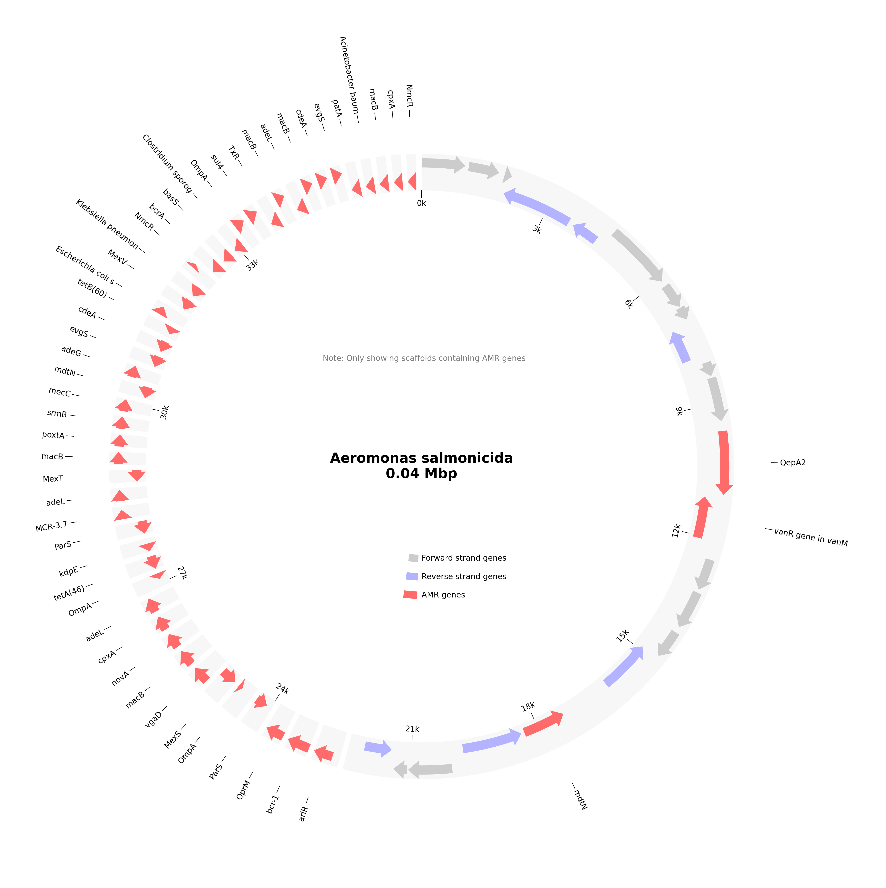

### Acinetobacter baumannii AbaF
- **Mechanism**: antibiotic efflux
- **Drug Classes**: phosphonic acid antibiotic
- **AMR Family**: major facilitator superfamily (MFS) antibiotic efflux pump
- **Locations**:
  - gnl|SPADES|EHPDDGNP_39149_1 : position 2-214

### Clostridium sporogenes cplR
- **Mechanism**: antibiotic target protection
- **Drug Classes**: lincosamide antibiotic; pleuromutilin antibiotic
- **AMR Family**: Miscellaneous ABC-F subfamily ATP-binding cassette ribosomal protection proteins
- **Locations**:
  - gnl|SPADES|EHPDDGNP_32172_1 : position 2-235

### Escherichia coli soxS with mutation conferring antibiotic resistance
- **Mechanism**: antibiotic target alteration; antibiotic efflux; reduced permeability to antibiotic
- **Drug Classes**: fluoroquinolone antibiotic; monobactam; carbapenem; cephalosporin; glycylcycline; cephamycin; penam; tetracycline antibiotic; rifamycin antibiotic; phenicol antibiotic; penem; disinfecting agents and antiseptics
- **AMR Family**: ATP-binding cassette (ABC) antibiotic efflux pump; major facilitator superfamily (MFS) antibiotic efflux pump; resistance-nodulation-cell division (RND) antibiotic efflux pump; General Bacterial Porin with reduced permeability to beta-lactams
- **Locations**:
  - gnl|SPADES|EHPDDGNP_26471_1 : position 1-186

### Klebsiella pneumoniae OmpK37
- **Mechanism**: reduced permeability to antibiotic
- **Drug Classes**: monobactam; carbapenem; cephalosporin; cephamycin; penam; penem
- **AMR Family**: General Bacterial Porin with reduced permeability to beta-lactams
- **Locations**:
  - gnl|SPADES|EHPDDGNP_27690_1 : position 3-251

### MCR-3.7
- **Mechanism**: antibiotic target alteration
- **Drug Classes**: peptide antibiotic
- **AMR Family**: MCR phosphoethanolamine transferase
- **Locations**:
  - gnl|SPADES|EHPDDGNP_19542_1 : position 1-207

### MexS
- **Mechanism**: antibiotic efflux
- **Drug Classes**: fluoroquinolone antibiotic; diaminopyrimidine antibiotic; phenicol antibiotic
- **AMR Family**: resistance-nodulation-cell division (RND) antibiotic efflux pump
- **Locations**:
  - gnl|SPADES|EHPDDGNP_13571_1 : position 2-382

### MexT
- **Mechanism**: antibiotic efflux
- **Drug Classes**: fluoroquinolone antibiotic; diaminopyrimidine antibiotic; phenicol antibiotic
- **AMR Family**: resistance-nodulation-cell division (RND) antibiotic efflux pump
- **Locations**:
  - gnl|SPADES|EHPDDGNP_20037_1 : position 2-280

### MexV
- **Mechanism**: antibiotic efflux
- **Drug Classes**: macrolide antibiotic; fluoroquinolone antibiotic; tetracycline antibiotic; phenicol antibiotic; disinfecting agents and antiseptics
- **AMR Family**: resistance-nodulation-cell division (RND) antibiotic efflux pump
- **Locations**:
  - gnl|SPADES|EHPDDGNP_27280_1 : position 2-253

### NmcR (found in 2 locations)
- **Mechanism**: antibiotic inactivation
- **Drug Classes**: carbapenem; cephalosporin; cephamycin; penam
- **AMR Family**: NmcA beta-lactamase
- **Locations**:
  - gnl|SPADES|EHPDDGNP_29041_2 : position 144-245
  - gnl|SPADES|EHPDDGNP_40449_1 : position 2-196

### OmpA (found in 3 locations)
- **Mechanism**: reduced permeability to antibiotic
- **Drug Classes**: peptide antibiotic
- **AMR Family**: General Bacterial Porin with reduced permeability to peptide antibiotics
- **Locations**:
  - gnl|SPADES|EHPDDGNP_12962_2 : position 298-399
  - gnl|SPADES|EHPDDGNP_16637_2 : position 185-322
  - gnl|SPADES|EHPDDGNP_33101_1 : position 1-234

### OprM
- **Mechanism**: antibiotic efflux
- **Drug Classes**: macrolide antibiotic; fluoroquinolone antibiotic; monobactam; aminoglycoside antibiotic; carbapenem; cephalosporin; cephamycin; penam; tetracycline antibiotic; peptide antibiotic; aminocoumarin antibiotic; diaminopyrimidine antibiotic; sulfonamide antibiotic; phenicol antibiotic; penem; disinfecting agents and antiseptics
- **AMR Family**: resistance-nodulation-cell division (RND) antibiotic efflux pump
- **Locations**:
  - gnl|SPADES|EHPDDGNP_12337_1 : position 1-414

### ParS (found in 2 locations)
- **Mechanism**: antibiotic efflux; reduced permeability to antibiotic
- **Drug Classes**: macrolide antibiotic; fluoroquinolone antibiotic; monobactam; aminoglycoside antibiotic; carbapenem; cephalosporin; cephamycin; penam; tetracycline antibiotic; phenicol antibiotic; penem; disinfecting agents and antiseptics
- **AMR Family**: resistance-nodulation-cell division (RND) antibiotic efflux pump; Outer Membrane Porin (Opr)
- **Locations**:
  - gnl|SPADES|EHPDDGNP_12380_2 : position 129-413
  - gnl|SPADES|EHPDDGNP_17939_1 : position 1-303

### QepA2
- **Mechanism**: antibiotic efflux
- **Drug Classes**: fluoroquinolone antibiotic
- **AMR Family**: major facilitator superfamily (MFS) antibiotic efflux pump
- **Locations**:
  - gnl|SPADES|EHPDDGNP_319_11 : position 9620-11017

### TxR
- **Mechanism**: antibiotic efflux
- **Drug Classes**: tetracycline antibiotic
- **AMR Family**: ATP-binding cassette (ABC) antibiotic efflux pump
- **Locations**:
  - gnl|SPADES|EHPDDGNP_34126_1 : position 2-229

### adeG
- **Mechanism**: antibiotic efflux
- **Drug Classes**: fluoroquinolone antibiotic; tetracycline antibiotic
- **AMR Family**: resistance-nodulation-cell division (RND) antibiotic efflux pump
- **Locations**:
  - gnl|SPADES|EHPDDGNP_24671_1 : position 3-260

### adeL (found in 3 locations)
- **Mechanism**: antibiotic efflux
- **Drug Classes**: fluoroquinolone antibiotic; tetracycline antibiotic
- **AMR Family**: resistance-nodulation-cell division (RND) antibiotic efflux pump
- **Locations**:
  - gnl|SPADES|EHPDDGNP_16521_1 : position 1-324
  - gnl|SPADES|EHPDDGNP_19702_1 : position 1-243
  - gnl|SPADES|EHPDDGNP_35436_1 : position 2-226

### arlR
- **Mechanism**: antibiotic efflux
- **Drug Classes**: fluoroquinolone antibiotic; disinfecting agents and antiseptics
- **AMR Family**: major facilitator superfamily (MFS) antibiotic efflux pump
- **Locations**:
  - gnl|SPADES|EHPDDGNP_8689_1 : position 166-591

### basS
- **Mechanism**: antibiotic target alteration; antibiotic efflux
- **Drug Classes**: peptide antibiotic
- **AMR Family**: pmr phosphoethanolamine transferase
- **Locations**:
  - gnl|SPADES|EHPDDGNP_31184_1 : position 2-238

### bcr-1
- **Mechanism**: antibiotic efflux
- **Drug Classes**: bicyclomycin-like antibiotic
- **AMR Family**: major facilitator superfamily (MFS) antibiotic efflux pump
- **Locations**:
  - gnl|SPADES|EHPDDGNP_10099_1 : position 1-507

### bcrA
- **Mechanism**: antibiotic efflux
- **Drug Classes**: peptide antibiotic
- **AMR Family**: ATP-binding cassette (ABC) antibiotic efflux pump
- **Locations**:
  - gnl|SPADES|EHPDDGNP_31212_1 : position 3-239

### cdeA (found in 2 locations)
- **Mechanism**: antibiotic efflux
- **Drug Classes**: fluoroquinolone antibiotic; disinfecting agents and antiseptics
- **AMR Family**: multidrug and toxic compound extrusion (MATE) transporter
- **Locations**:
  - gnl|SPADES|EHPDDGNP_25450_1 : position 2-259
  - gnl|SPADES|EHPDDGNP_36992_1 : position 1-219

### cpxA (found in 2 locations)
- **Mechanism**: antibiotic efflux
- **Drug Classes**: aminoglycoside antibiotic; aminocoumarin antibiotic
- **AMR Family**: resistance-nodulation-cell division (RND) antibiotic efflux pump
- **Locations**:
  - gnl|SPADES|EHPDDGNP_16070_1 : position 1-330
  - gnl|SPADES|EHPDDGNP_40042_1 : position 3-209

### evgS (found in 2 locations)
- **Mechanism**: antibiotic efflux
- **Drug Classes**: macrolide antibiotic; fluoroquinolone antibiotic; penam; tetracycline antibiotic
- **AMR Family**: major facilitator superfamily (MFS) antibiotic efflux pump; resistance-nodulation-cell division (RND) antibiotic efflux pump
- **Locations**:
  - gnl|SPADES|EHPDDGNP_24737_1 : position 3-260
  - gnl|SPADES|EHPDDGNP_36932_1 : position 3-221

### kdpE
- **Mechanism**: antibiotic efflux
- **Drug Classes**: aminoglycoside antibiotic
- **AMR Family**: kdpDE
- **Locations**:
  - gnl|SPADES|EHPDDGNP_17493_1 : position 2-187

### macB (found in 5 locations)
- **Mechanism**: antibiotic efflux
- **Drug Classes**: macrolide antibiotic
- **AMR Family**: ATP-binding cassette (ABC) antibiotic efflux pump
- **Locations**:
  - gnl|SPADES|EHPDDGNP_14442_1 : position 1-363
  - gnl|SPADES|EHPDDGNP_20595_1 : position 15-278
  - gnl|SPADES|EHPDDGNP_35488_1 : position 17-226
  - gnl|SPADES|EHPDDGNP_36057_1 : position 3-215
  - gnl|SPADES|EHPDDGNP_39551_1 : position 3-212

### mdtN (found in 2 locations)
- **Mechanism**: antibiotic efflux
- **Drug Classes**: nucleoside antibiotic; disinfecting agents and antiseptics
- **AMR Family**: major facilitator superfamily (MFS) antibiotic efflux pump
- **Locations**:
  - gnl|SPADES|EHPDDGNP_23100_1 : position 2-268
  - gnl|SPADES|EHPDDGNP_319_18 : position 17346-18350

### mecC
- **Mechanism**: antibiotic target replacement
- **Drug Classes**: penam
- **AMR Family**: methicillin resistant PBP2
- **Locations**:
  - gnl|SPADES|EHPDDGNP_22764_1 : position 2-268

### novA
- **Mechanism**: antibiotic efflux
- **Drug Classes**: aminocoumarin antibiotic
- **AMR Family**: ATP-binding cassette (ABC) antibiotic efflux pump
- **Locations**:
  - gnl|SPADES|EHPDDGNP_15400_1 : position 3-344

### patA
- **Mechanism**: antibiotic efflux
- **Drug Classes**: fluoroquinolone antibiotic
- **AMR Family**: ATP-binding cassette (ABC) antibiotic efflux pump
- **Locations**:
  - gnl|SPADES|EHPDDGNP_38163_1 : position 1-216

### poxtA
- **Mechanism**: antibiotic target protection
- **Drug Classes**: tetracycline antibiotic; oxazolidinone antibiotic; phenicol antibiotic
- **AMR Family**: Miscellaneous ABC-F subfamily ATP-binding cassette ribosomal protection proteins
- **Locations**:
  - gnl|SPADES|EHPDDGNP_21960_1 : position 2-271

### srmB
- **Mechanism**: antibiotic target protection
- **Drug Classes**: macrolide antibiotic
- **AMR Family**: Miscellaneous ABC-F subfamily ATP-binding cassette ribosomal protection proteins
- **Locations**:
  - gnl|SPADES|EHPDDGNP_22116_1 : position 2-271

### sul4
- **Mechanism**: antibiotic target replacement
- **Drug Classes**: sulfonamide antibiotic
- **AMR Family**: sulfonamide resistant sul
- **Locations**:
  - gnl|SPADES|EHPDDGNP_33764_1 : position 2-232

### tetA(46)
- **Mechanism**: antibiotic efflux
- **Drug Classes**: tetracycline antibiotic
- **AMR Family**: ATP-binding cassette (ABC) antibiotic efflux pump
- **Locations**:
  - gnl|SPADES|EHPDDGNP_17358_1 : position 1-309

### tetB(60)
- **Mechanism**: antibiotic efflux
- **Drug Classes**: tetracycline antibiotic
- **AMR Family**: ATP-binding cassette (ABC) antibiotic efflux pump
- **Locations**:
  - gnl|SPADES|EHPDDGNP_26170_2 : position 87-257

### vanR gene in vanM cluster
- **Mechanism**: antibiotic target alteration
- **Drug Classes**: glycopeptide antibiotic
- **AMR Family**: glycopeptide resistance gene cluster; vanR
- **Locations**:
  - gnl|SPADES|EHPDDGNP_319_12 : position 11092-12063

### vgaD
- **Mechanism**: antibiotic target protection
- **Drug Classes**: streptogramin antibiotic; streptogramin A antibiotic; pleuromutilin antibiotic
- **AMR Family**: vga-type ABC-F protein
- **Locations**:
  - gnl|SPADES|EHPDDGNP_13764_1 : position 1-378

## Aeromonas salmonicida subsp. pectinolytica 34mel
**Strain Statistics:**
- Total genome length: 1.0 kbp
- Total scaffolds: 133
- Scaffolds with AMR genes: 2
- Total genes annotated: 2
- Total AMR genes: 2
- Unique AMR genes: 2
- Distinct AMR mechanisms: 1
- Distinct AMR families: 2
- Distinct drug classes: 4

**Circos Plot:**

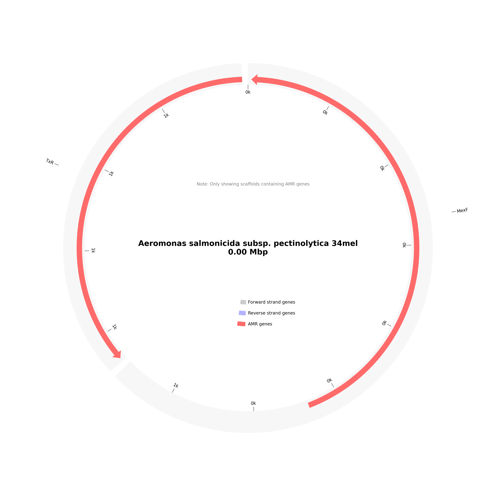

### MexF
- **Mechanism**: antibiotic efflux
- **Drug Classes**: fluoroquinolone antibiotic; diaminopyrimidine antibiotic; phenicol antibiotic
- **AMR Family**: resistance-nodulation-cell division (RND) antibiotic efflux pump
- **Locations**:
  - gnl|SPADES|EHPDDGNP_8477_1 : position 3-428

### TxR
- **Mechanism**: antibiotic efflux
- **Drug Classes**: tetracycline antibiotic
- **AMR Family**: ATP-binding cassette (ABC) antibiotic efflux pump
- **Locations**:
  - gnl|SPADES|EHPDDGNP_15096_1 : position 3-350

## Buttiauxella agrestis
**Strain Statistics:**
- Total genome length: 2457.7 kbp
- Total scaffolds: 1721
- Scaffolds with AMR genes: 433
- Total genes annotated: 4606
- Total AMR genes: 617
- Unique AMR genes: 206
- Distinct AMR mechanisms: 11
- Distinct AMR families: 72
- Distinct drug classes: 35

**Circos Plot:**

### ACT-8 (found in 2 locations)
- **Mechanism**: antibiotic inactivation
- **Drug Classes**: carbapenem; cephalosporin; cephamycin; penam
- **AMR Family**: ACT beta-lactamase
- **Locations**:
  - gnl|SPADES|EHPDDGNP_1020_5: position 1844-2995
  - gnl|SPADES|EHPDDGNP_813_5: position 3353-4504

### APH(6)-Ic (found in 2 locations)
- **Mechanism**: antibiotic inactivation
- **Drug Classes**: aminoglycoside antibiotic
- **AMR Family**: APH(6)
- **Locations**:
  - gnl|SPADES|EHPDDGNP_474_4 : position 3138-3983
  - gnl|SPADES|EHPDDGNP_535_1 : position 2-511

### Acinetobacter baumannii AbaF (found in 13 locations)
- **Mechanism**: antibiotic efflux
- **Drug Classes**: phosphonic acid antibiotic
- **AMR Family**: major facilitator superfamily (MFS) antibiotic efflux pump
- **Locations**:
  - gnl|SPADES|EHPDDGNP_1011_4 : position 3859-5163
  - gnl|SPADES|EHPDDGNP_1627_1 : position 90-1415
  - gnl|SPADES|EHPDDGNP_24959_1 : position 2-259
  - gnl|SPADES|EHPDDGNP_2647_3 : position 1190-2215
  - gnl|SPADES|EHPDDGNP_3160_2 : position 1178-1831
  - gnl|SPADES|EHPDDGNP_4005_1 : position 2-640
  - gnl|SPADES|EHPDDGNP_405_3 : position 1856-3190
  - gnl|SPADES|EHPDDGNP_475_4 : position 2934-4259
  - gnl|SPADES|EHPDDGNP_499_5 : position 3525-4859
  - gnl|SPADES|EHPDDGNP_5264_1 : position 21-1046
  - gnl|SPADES|EHPDDGNP_6421_1 : position 1-834
  - gnl|SPADES|EHPDDGNP_695_6 : position 5524-7029
  - gnl|SPADES|EHPDDGNP_8481_1 : position 2-607

### Acinetobacter baumannii AbaQ (found in 9 locations)
- **Mechanism**: antibiotic efflux
- **Drug Classes**: fluoroquinolone antibiotic
- **AMR Family**: major facilitator superfamily (MFS) antibiotic efflux pump
- **Locations**:
  - gnl|SPADES|EHPDDGNP_1261_1 : position 39-791
  - gnl|SPADES|EHPDDGNP_1548_5 : position 3002-3697
  - gnl|SPADES|EHPDDGNP_1770_3 : position 2521-3276
  - gnl|SPADES|EHPDDGNP_2182_3 : position 1114-2412
  - gnl|SPADES|EHPDDGNP_3294_1 : position 1-1062
  - gnl|SPADES|EHPDDGNP_401_8 : position 6779-8140
  - gnl|SPADES|EHPDDGNP_4142_1 : position 3-422
  - gnl|SPADES|EHPDDGNP_539_11 : position 10167-10928
  - gnl|SPADES|EHPDDGNP_601_12 : position 9035-9631

### AcrE
- **Mechanism**: antibiotic efflux
- **Drug Classes**: fluoroquinolone antibiotic; cephalosporin; cephamycin; penam
- **AMR Family**: resistance-nodulation-cell division (RND) antibiotic efflux pump
- **Locations**:
  - gnl|SPADES|EHPDDGNP_781_2 : position 237-1391

### AcrF (found in 2 locations)
- **Mechanism**: antibiotic efflux
- **Drug Classes**: fluoroquinolone antibiotic; cephalosporin; cephamycin; penam
- **AMR Family**: resistance-nodulation-cell division (RND) antibiotic efflux pump
- **Locations**:
  - gnl|SPADES|EHPDDGNP_2426_2 : position 960-1532
  - gnl|SPADES|EHPDDGNP_781_1 : position 2-223

### AcrS (found in 3 locations)
- **Mechanism**: antibiotic efflux
- **Drug Classes**: fluoroquinolone antibiotic; cephalosporin; glycylcycline; cephamycin; penam; tetracycline antibiotic; rifamycin antibiotic; phenicol antibiotic; disinfecting agents and antiseptics
- **AMR Family**: resistance-nodulation-cell division (RND) antibiotic efflux pump
- **Locations**:
  - gnl|SPADES|EHPDDGNP_1107_3 : position 2028-2573
  - gnl|SPADES|EHPDDGNP_2426_3 : position 1783-2400
  - gnl|SPADES|EHPDDGNP_781_5 : position 4860-5477

### ArnT
- **Mechanism**: antibiotic target alteration
- **Drug Classes**: peptide antibiotic
- **AMR Family**: pmr phosphoethanolamine transferase
- **Locations**:
  - gnl|SPADES|EHPDDGNP_779_7: position 3644-5305

### Bartonella bacilliformis gyrB conferring resistance to aminocoumarin (found in 2 locations)
- **Mechanism**: antibiotic target alteration
- **Drug Classes**: aminocoumarin antibiotic
- **AMR Family**: aminocoumarin resistant gyrB
- **Locations**:
  - gnl|SPADES|EHPDDGNP_11109_1 : position 3-458
  - gnl|SPADES|EHPDDGNP_14234_1 : position 3-365

### Bifidobacterium adolescentis rpoB mutants conferring resistance to rifampicin (found in 2 locations)
- **Mechanism**: antibiotic target alteration; antibiotic target replacement
- **Drug Classes**: rifamycin antibiotic
- **AMR Family**: rifamycin-resistant beta-subunit of RNA polymerase (rpoB)
- **Locations**:
  - gnl|SPADES|EHPDDGNP_2599_3 : position 1081-2250
  - gnl|SPADES|EHPDDGNP_934_1 : position 3-713

### Brucella suis mprF
- **Mechanism**: antibiotic target alteration
- **Drug Classes**: peptide antibiotic
- **AMR Family**: defensin resistant mprF
- **Locations**:
  - gnl|SPADES|EHPDDGNP_760_2 : position 823-1791

### CRP (found in 4 locations)
- **Mechanism**: antibiotic efflux
- **Drug Classes**: macrolide antibiotic; fluoroquinolone antibiotic; penam
- **AMR Family**: resistance-nodulation-cell division (RND) antibiotic efflux pump
- **Locations**:
  - gnl|SPADES|EHPDDGNP_372_6 : position 5875-6567
  - gnl|SPADES|EHPDDGNP_420_7: position 3758-4390
  - gnl|SPADES|EHPDDGNP_886_3 : position 2364-3056
  - gnl|SPADES|EHPDDGNP_929_6 : position 5479-5919

### Chlamydia trachomatis intrinsic murA conferring resistance to fosfomycin
- **Mechanism**: antibiotic target alteration
- **Drug Classes**: phosphonic acid antibiotic
- **AMR Family**: antibiotic-resistant murA transferase
- **Locations**:
  - gnl|SPADES|EHPDDGNP_6639_3 : position 538-798

### Clostridioides difficile gyrB conferring resistance to fluoroquinolones (found in 4 locations)
- **Mechanism**: antibiotic target alteration
- **Drug Classes**: fluoroquinolone antibiotic
- **AMR Family**: fluoroquinolone resistant gyrB
- **Locations**:
  - gnl|SPADES|EHPDDGNP_1155_2 : position 1616-3511
  - gnl|SPADES|EHPDDGNP_23792_1 : position 3-263
  - gnl|SPADES|EHPDDGNP_2502_2 : position 848-2341
  - gnl|SPADES|EHPDDGNP_31162_1 : position 3-239

### CrcB
- **Mechanism**: antibiotic efflux
- **Drug Classes**: aminoglycoside antibiotic
- **AMR Family**: multidrug and toxic compound extrusion (MATE) transporter
- **Locations**:
  - gnl|SPADES|EHPDDGNP_1380_5 : position 3292-3675

### Enterobacter cloacae acrA (found in 2 locations)
- **Mechanism**: antibiotic efflux
- **Drug Classes**: fluoroquinolone antibiotic; cephalosporin; glycylcycline; penam; tetracycline antibiotic; rifamycin antibiotic; phenicol antibiotic; disinfecting agents and antiseptics
- **AMR Family**: resistance-nodulation-cell division (RND) antibiotic efflux pump
- **Locations**:
  - gnl|SPADES|EHPDDGNP_10643_1 : position 3-479
  - gnl|SPADES|EHPDDGNP_1112_2 : position 1873-2601

### Enterococcus faecium liaR mutant conferring daptomycin resistance (found in 2 locations)
- **Mechanism**: antibiotic target alteration; antibiotic efflux
- **Drug Classes**: peptide antibiotic
- **AMR Family**: daptomycin resistant liaR
- **Locations**:
  - gnl|SPADES|EHPDDGNP_1020_8 : position 4247-4831
  - gnl|SPADES|EHPDDGNP_813_8 : position 5756-6340

### Erm(30)
- **Mechanism**: antibiotic target alteration
- **Drug Classes**: macrolide antibiotic; lincosamide antibiotic; streptogramin antibiotic
- **AMR Family**: Erm 23S ribosomal RNA methyltransferase
- **Locations**:
  - gnl|SPADES|EHPDDGNP_7502_2 : position 258-692

### Escherichia coli AcrAB-TolC with AcrR mutation conferring resistance to ciprofloxacin, tetracycline, and ceftazidime
- **Mechanism**: antibiotic target alteration; antibiotic efflux
- **Drug Classes**: fluoroquinolone antibiotic; cephalosporin; glycylcycline; penam; tetracycline antibiotic; rifamycin antibiotic; phenicol antibiotic; disinfecting agents and antiseptics
- **AMR Family**: resistance-nodulation-cell division (RND) antibiotic efflux pump
- **Locations**:
  - gnl|SPADES|EHPDDGNP_570_7 : position 6415-6999

### Escherichia coli AcrAB-TolC with MarR mutations conferring resistance to ciprofloxacin and tetracycline (found in 2 locations)
- **Mechanism**: antibiotic target alteration; antibiotic efflux
- **Drug Classes**: fluoroquinolone antibiotic; cephalosporin; glycylcycline; penam; tetracycline antibiotic; rifamycin antibiotic; phenicol antibiotic; disinfecting agents and antiseptics
- **AMR Family**: resistance-nodulation-cell division (RND) antibiotic efflux pump
- **Locations**:
  - gnl|SPADES|EHPDDGNP_10621_1 : position 1-327
  - gnl|SPADES|EHPDDGNP_2210_3 : position 2163-2618

### Escherichia coli EF-Tu mutants conferring resistance to Pulvomycin
- **Mechanism**: antibiotic target alteration
- **Drug Classes**: elfamycin antibiotic
- **AMR Family**: elfamycin resistant EF-Tu
- **Locations**:
  - gnl|SPADES|EHPDDGNP_1280_4 : position 2378-4225

### Escherichia coli EF-Tu mutants conferring resistance to kirromycin
- **Mechanism**: antibiotic target alteration
- **Drug Classes**: elfamycin antibiotic
- **AMR Family**: elfamycin resistant EF-Tu
- **Locations**:
  - gnl|SPADES|EHPDDGNP_1301_5 : position 2781-4397

### Escherichia coli UhpT with mutation conferring resistance to fosfomycin
- **Mechanism**: antibiotic target alteration
- **Drug Classes**: phosphonic acid antibiotic
- **AMR Family**: antibiotic-resistant UhpT
- **Locations**:
  - gnl|SPADES|EHPDDGNP_1883_1 : position 3-401

### Escherichia coli fabI mutations conferring resistance to isoniazid and triclosan
- **Mechanism**: antibiotic target alteration
- **Drug Classes**: disinfecting agents and antiseptics; isoniazid-like antibiotic
- **AMR Family**: antibiotic resistant fabI
- **Locations**:
  - gnl|SPADES|EHPDDGNP_608_8 : position 8009-8782

### Escherichia coli mdfA (found in 2 locations)
- **Mechanism**: antibiotic efflux
- **Drug Classes**: tetracycline antibiotic; phenicol antibiotic; disinfecting agents and antiseptics
- **AMR Family**: major facilitator superfamily (MFS) antibiotic efflux pump
- **Locations**:
  - gnl|SPADES|EHPDDGNP_2503_1 : position 3-893
  - gnl|SPADES|EHPDDGNP_769_1 : position 3-893

### Escherichia coli soxR with mutation conferring antibiotic resistance (found in 2 locations)
- **Mechanism**: antibiotic target alteration; antibiotic efflux
- **Drug Classes**: fluoroquinolone antibiotic; cephalosporin; glycylcycline; penam; tetracycline antibiotic; rifamycin antibiotic; phenicol antibiotic; disinfecting agents and antiseptics
- **AMR Family**: ATP-binding cassette (ABC) antibiotic efflux pump; major facilitator superfamily (MFS) antibiotic efflux pump; resistance-nodulation-cell division (RND) antibiotic efflux pump
- **Locations**:
  - gnl|SPADES|EHPDDGNP_366_3 : position 2355-2813
  - gnl|SPADES|EHPDDGNP_603_5 : position 3179-3637

### Escherichia coli soxS with mutation conferring antibiotic resistance (found in 10 locations)
- **Mechanism**: antibiotic target alteration; antibiotic efflux; reduced permeability to antibiotic
- **Drug Classes**: fluoroquinolone antibiotic; monobactam; carbapenem; cephalosporin; glycylcycline; cephamycin; penam; tetracycline antibiotic; rifamycin antibiotic; phenicol antibiotic; penem; disinfecting agents and antiseptics
- **AMR Family**: ATP-binding cassette (ABC) antibiotic efflux pump; major facilitator superfamily (MFS) antibiotic efflux pump; resistance-nodulation-cell division (RND) antibiotic efflux pump; General Bacterial Porin with reduced permeability to beta-lactams
- **Locations**:
  - gnl|SPADES|EHPDDGNP_1161_1 : position 115-960
  - gnl|SPADES|EHPDDGNP_3084_3 : position 904-1773
  - gnl|SPADES|EHPDDGNP_366_4 : position 2899-3222
  - gnl|SPADES|EHPDDGNP_3718_1 : position 45-917
  - gnl|SPADES|EHPDDGNP_508_1 : position 186-1031
  - gnl|SPADES|EHPDDGNP_594_8 : position 5613-6485
  - gnl|SPADES|EHPDDGNP_597_2 : position 1147-1995
  - gnl|SPADES|EHPDDGNP_603_4 : position 2770-3093
  - gnl|SPADES|EHPDDGNP_620_6 : position 5967-6866
  - gnl|SPADES|EHPDDGNP_707_6 : position 6842-7702

### FosA
- **Mechanism**: antibiotic inactivation
- **Drug Classes**: phosphonic acid antibiotic
- **AMR Family**: fosfomycin thiol transferase
- **Locations**:
  - gnl|SPADES|EHPDDGNP_1108_3 : position 1753-2142

### FosG
- **Mechanism**: antibiotic inactivation
- **Drug Classes**: phosphonic acid antibiotic
- **AMR Family**: fosfomycin thiol transferase
- **Locations**:
  - gnl|SPADES|EHPDDGNP_1332_5 : position 3941-4312

### GMB-1
- **Mechanism**: antibiotic inactivation
- **Drug Classes**: carbapenem
- **AMR Family**: GMB beta-lactamase
- **Locations**:
  - gnl|SPADES|EHPDDGNP_419_12 : position 11202-12068

### H-NS
- **Mechanism**: antibiotic efflux
- **Drug Classes**: macrolide antibiotic; fluoroquinolone antibiotic; cephalosporin; cephamycin; penam; tetracycline antibiotic
- **AMR Family**: major facilitator superfamily (MFS) antibiotic efflux pump; resistance-nodulation-cell division (RND) antibiotic efflux pump
- **Locations**:
  - gnl|SPADES|EHPDDGNP_4697_1 : position 57-467

### HMB-1
- **Mechanism**: antibiotic inactivation
- **Drug Classes**: carbapenem
- **AMR Family**: HMB beta-lactamase
- **Locations**:
  - gnl|SPADES|EHPDDGNP_441_14 : position 12066-14096

### Haemophilus influenzae PBP3 conferring resistance to beta-lactam antibiotics
- **Mechanism**: antibiotic target alteration
- **Drug Classes**: cephalosporin; cephamycin; penam
- **AMR Family**: Penicillin-binding protein mutations conferring resistance to beta-lactam antibiotics
- **Locations**:
  - gnl|SPADES|EHPDDGNP_640_2 : position 1203-2969

### Helicobacter pylori pbp1 mutants conferring resistance to amoxicillin (found in 2 locations)
- **Mechanism**: antibiotic target alteration
- **Drug Classes**: cephalosporin; cephamycin; penam
- **AMR Family**: Penicillin-binding protein mutations conferring resistance to beta-lactam antibiotics
- **Locations**:
  - gnl|SPADES|EHPDDGNP_547_1 : position 3-1532
  - gnl|SPADES|EHPDDGNP_737_5 : position 6104-7639

### Helicobacter pylori rdxA mutation conferring resistance to metronidazole (found in 2 locations)
- **Mechanism**: antibiotic target alteration
- **Drug Classes**: nitroimidazole antibiotic
- **AMR Family**: Antibiotic resistant Helicobacter pylori nitroreductase
- **Locations**:
  - gnl|SPADES|EHPDDGNP_327_21 : position 20776-21429
  - gnl|SPADES|EHPDDGNP_3504_2 : position 747-1400

### Helicobacter pylori rpoB mutation conferring resistance to rifampicin
- **Mechanism**: antibiotic target alteration; antibiotic target replacement
- **Drug Classes**: fluoroquinolone antibiotic; rifamycin antibiotic
- **AMR Family**: rifamycin-resistant beta-subunit of RNA polymerase (rpoB)
- **Locations**:
  - gnl|SPADES|EHPDDGNP_934_2 : position 799-5025

### Klebsiella pneumoniae KpnE (found in 2 locations)
- **Mechanism**: antibiotic efflux
- **Drug Classes**: macrolide antibiotic; aminoglycoside antibiotic; cephalosporin; tetracycline antibiotic; peptide antibiotic; rifamycin antibiotic; disinfecting agents and antiseptics
- **AMR Family**: small multidrug resistance (SMR) antibiotic efflux pump
- **Locations**:
  - gnl|SPADES|EHPDDGNP_317_12: position 9441-9815
  - gnl|SPADES|EHPDDGNP_394_11: position 12971-13345

### Klebsiella pneumoniae KpnF (found in 2 locations)
- **Mechanism**: antibiotic efflux
- **Drug Classes**: macrolide antibiotic; aminoglycoside antibiotic; cephalosporin; tetracycline antibiotic; peptide antibiotic; rifamycin antibiotic; disinfecting agents and antiseptics
- **AMR Family**: small multidrug resistance (SMR) antibiotic efflux pump
- **Locations**:
  - gnl|SPADES|EHPDDGNP_317_11: position 9125-9454
  - gnl|SPADES|EHPDDGNP_394_12: position 13332-13661

### Klebsiella pneumoniae KpnG (found in 2 locations)
- **Mechanism**: antibiotic efflux
- **Drug Classes**: macrolide antibiotic; fluoroquinolone antibiotic; aminoglycoside antibiotic; carbapenem; cephalosporin; penam; peptide antibiotic; penem
- **AMR Family**: major facilitator superfamily (MFS) antibiotic efflux pump
- **Locations**:
  - gnl|SPADES|EHPDDGNP_493_10 : position 8522-9694
  - gnl|SPADES|EHPDDGNP_669_3 : position 1848-3020

### Klebsiella pneumoniae KpnH (found in 4 locations)
- **Mechanism**: antibiotic efflux
- **Drug Classes**: macrolide antibiotic; fluoroquinolone antibiotic; aminoglycoside antibiotic; carbapenem; cephalosporin; penam; peptide antibiotic; penem
- **AMR Family**: major facilitator superfamily (MFS) antibiotic efflux pump
- **Locations**:
  - gnl|SPADES|EHPDDGNP_1882_3 : position 1732-3087
  - gnl|SPADES|EHPDDGNP_2524_1 : position 12-1394
  - gnl|SPADES|EHPDDGNP_493_11: position 9710-11248
  - gnl|SPADES|EHPDDGNP_669_2: position 285-1832

### Klebsiella pneumoniae OmpK37 (found in 3 locations)
- **Mechanism**: reduced permeability to antibiotic
- **Drug Classes**: monobactam; carbapenem; cephalosporin; cephamycin; penam; penem
- **AMR Family**: General Bacterial Porin with reduced permeability to beta-lactams
- **Locations**:
  - gnl|SPADES|EHPDDGNP_1021_4 : position 2882-4012
  - gnl|SPADES|EHPDDGNP_732_4 : position 4974-6074
  - gnl|SPADES|EHPDDGNP_840_1 : position 136-1206

### Klebsiella pneumoniae acrR with mutation conferring multidrug antibiotic resistance
- **Mechanism**: antibiotic target alteration; antibiotic efflux
- **Drug Classes**: fluoroquinolone antibiotic; cephalosporin; glycylcycline; penam; tetracycline antibiotic; rifamycin antibiotic; phenicol antibiotic; disinfecting agents and antiseptics
- **AMR Family**: resistance-nodulation-cell division (RND) antibiotic efflux pump
- **Locations**:
  - gnl|SPADES|EHPDDGNP_1112_3 : position 3371-4012

### LlmA 23S ribosomal RNA methyltransferase
- **Mechanism**: antibiotic target alteration
- **Drug Classes**: lincosamide antibiotic
- **AMR Family**: Llm 23S ribosomal RNA methyltransferase
- **Locations**:
  - gnl|SPADES|EHPDDGNP_1156_4 : position 1633-2808

### LptD
- **Mechanism**: antibiotic efflux
- **Drug Classes**: carbapenem; peptide antibiotic; aminocoumarin antibiotic; rifamycin antibiotic
- **AMR Family**: ATP-binding cassette (ABC) antibiotic efflux pump
- **Locations**:
  - gnl|SPADES|EHPDDGNP_510_5 : position 7336-9723

### MCR-3.15
- **Mechanism**: antibiotic target alteration
- **Drug Classes**: peptide antibiotic
- **AMR Family**: MCR phosphoethanolamine transferase
- **Locations**:
  - gnl|SPADES|EHPDDGNP_1667_4 : position 1901-3445

### MdtK (found in 3 locations)
- **Mechanism**: antibiotic efflux
- **Drug Classes**: fluoroquinolone antibiotic
- **AMR Family**: multidrug and toxic compound extrusion (MATE) transporter
- **Locations**:
  - gnl|SPADES|EHPDDGNP_1524_4 : position 3539-3769
  - gnl|SPADES|EHPDDGNP_1606_3 : position 2933-3577
  - gnl|SPADES|EHPDDGNP_893_6 : position 5407-6225

### MexH (found in 3 locations)
- **Mechanism**: antibiotic efflux
- **Drug Classes**: fluoroquinolone antibiotic; tetracycline antibiotic; disinfecting agents and antiseptics
- **AMR Family**: resistance-nodulation-cell division (RND) antibiotic efflux pump
- **Locations**:
  - gnl|SPADES|EHPDDGNP_1408_1 : position 46-1503
  - gnl|SPADES|EHPDDGNP_706_4 : position 4187-5014
  - gnl|SPADES|EHPDDGNP_881_2 : position 1510-2967

### MexL (found in 2 locations)
- **Mechanism**: antibiotic efflux
- **Drug Classes**: macrolide antibiotic; tetracycline antibiotic; disinfecting agents and antiseptics
- **AMR Family**: resistance-nodulation-cell division (RND) antibiotic efflux pump
- **Locations**:
  - gnl|SPADES|EHPDDGNP_417_11 : position 11311-11901
  - gnl|SPADES|EHPDDGNP_642_3 : position 1604-2236

### MexS (found in 6 locations)
- **Mechanism**: antibiotic efflux
- **Drug Classes**: fluoroquinolone antibiotic; diaminopyrimidine antibiotic; phenicol antibiotic
- **AMR Family**: resistance-nodulation-cell division (RND) antibiotic efflux pump
- **Locations**:
  - gnl|SPADES|EHPDDGNP_1005_4 : position 3588-4619
  - gnl|SPADES|EHPDDGNP_1113_2 : position 752-1735
  - gnl|SPADES|EHPDDGNP_499_10 : position 10373-11404
  - gnl|SPADES|EHPDDGNP_620_2 : position 418-1440
  - gnl|SPADES|EHPDDGNP_761_3 : position 2447-3496
  - gnl|SPADES|EHPDDGNP_773_3 : position 2982-3965

### MexT (found in 2 locations)
- **Mechanism**: antibiotic efflux
- **Drug Classes**: fluoroquinolone antibiotic; diaminopyrimidine antibiotic; phenicol antibiotic
- **AMR Family**: resistance-nodulation-cell division (RND) antibiotic efflux pump
- **Locations**:
  - gnl|SPADES|EHPDDGNP_1591_3 : position 1721-2650
  - gnl|SPADES|EHPDDGNP_1891_3 : position 869-1873

### Morganella morganii gyrB conferring resistance to fluoroquinolones (found in 2 locations)
- **Mechanism**: antibiotic target alteration
- **Drug Classes**: fluoroquinolone antibiotic
- **AMR Family**: fluoroquinolone resistant gyrB
- **Locations**:
  - gnl|SPADES|EHPDDGNP_1026_5 : position 3956-5341
  - gnl|SPADES|EHPDDGNP_761_1 : position 3-1430

### Mycobacterium tuberculosis folC with mutation conferring resistance to para-aminosalicylic acid
- **Mechanism**: antibiotic target alteration
- **Drug Classes**: salicylic acid antibiotic
- **AMR Family**: aminosalicylate resistant dihydrofolate synthase
- **Locations**:
  - gnl|SPADES|EHPDDGNP_2771_3 : position 1468-2100

### Mycobacterium tuberculosis gidB mutation conferring resistance to streptomycin (found in 2 locations)
- **Mechanism**: antibiotic target alteration
- **Drug Classes**: aminoglycoside antibiotic
- **AMR Family**: antibiotic resistant gidB
- **Locations**:
  - gnl|SPADES|EHPDDGNP_1769_2 : position 1772-2395
  - gnl|SPADES|EHPDDGNP_4210_2 : position 885-1343

### Mycobacterium tuberculosis kasA mutant conferring resistance to isoniazid
- **Mechanism**: antibiotic target alteration
- **Drug Classes**: isoniazid-like antibiotic
- **AMR Family**: antibiotic resistant kasA
- **Locations**:
  - gnl|SPADES|EHPDDGNP_1266_3 : position 3006-4235

### Mycobacterium tuberculosis katG mutations conferring resistance to isoniazid (found in 2 locations)
- **Mechanism**: antibiotic target alteration
- **Drug Classes**: isoniazid-like antibiotic
- **AMR Family**: isoniazid resistant katG
- **Locations**:
  - gnl|SPADES|EHPDDGNP_10365_1 : position 5-493
  - gnl|SPADES|EHPDDGNP_3341_1 : position 3-461

### Mycobacterium tuberculosis ndh with mutation conferring resistance to isoniazid
- **Mechanism**: antibiotic target alteration
- **Drug Classes**: isoniazid-like antibiotic
- **AMR Family**: antibiotic resistant ndh
- **Locations**:
  - gnl|SPADES|EHPDDGNP_3832_2 : position 624-1493

### Mycobacterium tuberculosis thyA with mutation conferring resistance to para-aminosalicylic acid
- **Mechanism**: antibiotic target alteration
- **Drug Classes**: salicylic acid antibiotic
- **AMR Family**: aminosalicylate resistant thymidylate synthase
- **Locations**:
  - gnl|SPADES|EHPDDGNP_1811_3 : position 2843-3208

### Neisseria gonorrhoeae pilQ gene conferring resistance to beta-lactam
- **Mechanism**: antibiotic target alteration
- **Drug Classes**: cephalosporin; cephamycin; penam
- **AMR Family**: Penicillin-binding protein mutations conferring resistance to beta-lactam antibiotics
- **Locations**:
  - gnl|SPADES|EHPDDGNP_711_6 : position 5168-5887

### NmcR (found in 10 locations)
- **Mechanism**: antibiotic inactivation
- **Drug Classes**: carbapenem; cephalosporin; cephamycin; penam
- **AMR Family**: NmcA beta-lactamase
- **Locations**:
  - gnl|SPADES|EHPDDGNP_1221_1 : position 26-925
  - gnl|SPADES|EHPDDGNP_1891_4 : position 1979-2923
  - gnl|SPADES|EHPDDGNP_1994_2 : position 2043-2927
  - gnl|SPADES|EHPDDGNP_3076_3 : position 784-1674
  - gnl|SPADES|EHPDDGNP_317_1 : position 2-706
  - gnl|SPADES|EHPDDGNP_3853_2 : position 524-1417
  - gnl|SPADES|EHPDDGNP_4116_2 : position 493-1377
  - gnl|SPADES|EHPDDGNP_4372_2 : position 366-1265
  - gnl|SPADES|EHPDDGNP_608_7 : position 6913-7821
  - gnl|SPADES|EHPDDGNP_959_1 : position 301-1236

### OmpA (found in 6 locations)
- **Mechanism**: reduced permeability to antibiotic
- **Drug Classes**: peptide antibiotic
- **AMR Family**: General Bacterial Porin with reduced permeability to peptide antibiotics
- **Locations**:
  - gnl|SPADES|EHPDDGNP_1309_2 : position 498-1577
  - gnl|SPADES|EHPDDGNP_1969_2 : position 1408-1929
  - gnl|SPADES|EHPDDGNP_299_16 : position 15421-16083
  - gnl|SPADES|EHPDDGNP_411_13 : position 13571-14620
  - gnl|SPADES|EHPDDGNP_446_10 : position 11362-12408
  - gnl|SPADES|EHPDDGNP_474_7 : position 5193-5855

### OpmD
- **Mechanism**: antibiotic efflux
- **Drug Classes**: fluoroquinolone antibiotic; tetracycline antibiotic; disinfecting agents and antiseptics
- **AMR Family**: resistance-nodulation-cell division (RND) antibiotic efflux pump
- **Locations**:
  - gnl|SPADES|EHPDDGNP_1610_1 : position 1-1326

### OprN (found in 2 locations)
- **Mechanism**: antibiotic efflux
- **Drug Classes**: fluoroquinolone antibiotic; diaminopyrimidine antibiotic; phenicol antibiotic
- **AMR Family**: resistance-nodulation-cell division (RND) antibiotic efflux pump
- **Locations**:
  - gnl|SPADES|EHPDDGNP_324_6 : position 6014-7537
  - gnl|SPADES|EHPDDGNP_776_6 : position 5631-7151

### OprZ
- **Mechanism**: antibiotic efflux
- **Drug Classes**: macrolide antibiotic; fluoroquinolone antibiotic; aminoglycoside antibiotic; cephalosporin
- **AMR Family**: resistance-nodulation-cell division (RND) antibiotic efflux pump
- **Locations**:
  - gnl|SPADES|EHPDDGNP_349_11 : position 11018-12415

### PEDO-1
- **Mechanism**: antibiotic inactivation
- **Drug Classes**: carbapenem
- **AMR Family**: subclass B3 PEDO beta-lactamase
- **Locations**:
  - gnl|SPADES|EHPDDGNP_840_3 : position 2645-3292

### ParR (found in 3 locations)
- **Mechanism**: antibiotic efflux; reduced permeability to antibiotic
- **Drug Classes**: macrolide antibiotic; fluoroquinolone antibiotic; monobactam; aminoglycoside antibiotic; carbapenem; cephalosporin; cephamycin; penam; tetracycline antibiotic; phenicol antibiotic; penem; disinfecting agents and antiseptics
- **AMR Family**: resistance-nodulation-cell division (RND) antibiotic efflux pump; Outer Membrane Porin (Opr)
- **Locations**:
  - gnl|SPADES|EHPDDGNP_1183_2 : position 805-1524
  - gnl|SPADES|EHPDDGNP_1475_3 : position 3162-3881
  - gnl|SPADES|EHPDDGNP_1670_3 : position 1546-2286

### ParS (found in 2 locations)
- **Mechanism**: antibiotic efflux; reduced permeability to antibiotic
- **Drug Classes**: macrolide antibiotic; fluoroquinolone antibiotic; monobactam; aminoglycoside antibiotic; carbapenem; cephalosporin; cephamycin; penam; tetracycline antibiotic; phenicol antibiotic; penem; disinfecting agents and antiseptics
- **AMR Family**: resistance-nodulation-cell division (RND) antibiotic efflux pump; Outer Membrane Porin (Opr)
- **Locations**:
  - gnl|SPADES|EHPDDGNP_6520_1 : position 3-818
  - gnl|SPADES|EHPDDGNP_905_1 : position 3-1160

### PmrF
- **Mechanism**: antibiotic target alteration
- **Drug Classes**: peptide antibiotic
- **AMR Family**: pmr phosphoethanolamine transferase
- **Locations**:
  - gnl|SPADES|EHPDDGNP_625_5 : position 2236-3153

### Pseudomonas aeruginosa CpxR (found in 5 locations)
- **Mechanism**: antibiotic efflux
- **Drug Classes**: macrolide antibiotic; fluoroquinolone antibiotic; monobactam; aminoglycoside antibiotic; carbapenem; cephalosporin; cephamycin; penam; tetracycline antibiotic; peptide antibiotic; aminocoumarin antibiotic; diaminopyrimidine antibiotic; sulfonamide antibiotic; phenicol antibiotic; penem
- **AMR Family**: resistance-nodulation-cell division (RND) antibiotic efflux pump
- **Locations**:
  - gnl|SPADES|EHPDDGNP_1121_5 : position 3538-4236
  - gnl|SPADES|EHPDDGNP_1422_4 : position 2249-2923
  - gnl|SPADES|EHPDDGNP_437_11 : position 12558-13232
  - gnl|SPADES|EHPDDGNP_565_7 : position 7367-8101
  - gnl|SPADES|EHPDDGNP_950_8 : position 5082-5786

### Pseudomonas aeruginosa ampR with mutation conferring resistance to aztreonam (found in 4 locations)
- **Mechanism**: antibiotic target alteration; antibiotic inactivation
- **Drug Classes**: monobactam; carbapenem; cephalosporin
- **AMR Family**: PDC beta-lactamase; ampR transcriptional regulator with mutation conferring resistance to monobactam antibiotics
- **Locations**:
  - gnl|SPADES|EHPDDGNP_1021_3 : position 1593-2453
  - gnl|SPADES|EHPDDGNP_1920_1 : position 3-707
  - gnl|SPADES|EHPDDGNP_299_8 : position 8852-9775
  - gnl|SPADES|EHPDDGNP_474_1 : position 205-1128

### QnrB9
- **Mechanism**: antibiotic target protection
- **Drug Classes**: fluoroquinolone antibiotic
- **AMR Family**: quinolone resistance protein (qnr)
- **Locations**:
  - gnl|SPADES|EHPDDGNP_2989_3 : position 1058-1702

### RanA (found in 31 locations)
- **Mechanism**: antibiotic efflux
- **Drug Classes**: aminoglycoside antibiotic
- **AMR Family**: ATP-binding cassette (ABC) antibiotic efflux pump
- **Locations**:
  - gnl|SPADES|EHPDDGNP_1024_3 : position 2017-3030
  - gnl|SPADES|EHPDDGNP_1024_4 : position 3027-4031
  - gnl|SPADES|EHPDDGNP_1210_2 : position 1745-2839
  - gnl|SPADES|EHPDDGNP_1214_1 : position 1-969
  - gnl|SPADES|EHPDDGNP_1962_5 : position 2248-2967
  - gnl|SPADES|EHPDDGNP_2088_3 : position 2208-2798
  - gnl|SPADES|EHPDDGNP_22750_1 : position 1-267
  - gnl|SPADES|EHPDDGNP_2366_2 : position 1617-2471
  - gnl|SPADES|EHPDDGNP_2509_2 : position 639-1733
  - gnl|SPADES|EHPDDGNP_2649_1 : position 3-581
  - gnl|SPADES|EHPDDGNP_28795_1 : position 3-248
  - gnl|SPADES|EHPDDGNP_3049_2 : position 1226-1897
  - gnl|SPADES|EHPDDGNP_309_11 : position 10836-11948
  - gnl|SPADES|EHPDDGNP_3132_1 : position 3-755
  - gnl|SPADES|EHPDDGNP_3205_3 : position 1108-1803
  - gnl|SPADES|EHPDDGNP_327_16 : position 16932-17633
  - gnl|SPADES|EHPDDGNP_431_3 : position 1750-2877
  - gnl|SPADES|EHPDDGNP_466_7 : position 5379-6449
  - gnl|SPADES|EHPDDGNP_493_3 : position 1901-3100
  - gnl|SPADES|EHPDDGNP_5017_2 : position 289-1110
  - gnl|SPADES|EHPDDGNP_5179_1 : position 3-917
  - gnl|SPADES|EHPDDGNP_538_6 : position 4080-5213
  - gnl|SPADES|EHPDDGNP_549_5 : position 3886-4956
  - gnl|SPADES|EHPDDGNP_567_7 : position 6548-7597
  - gnl|SPADES|EHPDDGNP_657_3 : position 2239-3243
  - gnl|SPADES|EHPDDGNP_695_2 : position 970-1806
  - gnl|SPADES|EHPDDGNP_701_3 : position 1983-3116
  - gnl|SPADES|EHPDDGNP_769_2 : position 976-2034
  - gnl|SPADES|EHPDDGNP_823_5 : position 2248-3063
  - gnl|SPADES|EHPDDGNP_849_4 : position 2353-3357
  - gnl|SPADES|EHPDDGNP_9342_1 : position 3-545

### RanB (found in 2 locations)
- **Mechanism**: antibiotic efflux
- **Drug Classes**: aminoglycoside antibiotic
- **AMR Family**: ATP-binding cassette (ABC) antibiotic efflux pump
- **Locations**:
  - gnl|SPADES|EHPDDGNP_1962_4 : position 1458-2240
  - gnl|SPADES|EHPDDGNP_823_4 : position 1458-2240

### Rm3
- **Mechanism**: antibiotic inactivation
- **Drug Classes**: carbapenem; cephalosporin; penam
- **AMR Family**: Rm3 family beta-lactamase
- **Locations**:
  - gnl|SPADES|EHPDDGNP_600_11 : position 8848-9603

### Rv1877
- **Mechanism**: antibiotic efflux
- **Drug Classes**: fluoroquinolone antibiotic
- **AMR Family**: major facilitator superfamily (MFS) antibiotic efflux pump
- **Locations**:
  - gnl|SPADES|EHPDDGNP_1591_2 : position 194-1588

### SST-1 (found in 2 locations)
- **Mechanism**: antibiotic inactivation
- **Drug Classes**: cephalosporin
- **AMR Family**: SST beta-lactamase
- **Locations**:
  - gnl|SPADES|EHPDDGNP_1817_4 : position 2360-3202
  - gnl|SPADES|EHPDDGNP_970_1 : position 3-689

### Staphylococcus aureus GlpT with mutation conferring resistance to fosfomycin
- **Mechanism**: antibiotic target alteration
- **Drug Classes**: phosphonic acid antibiotic
- **AMR Family**: antibiotic-resistant GlpT
- **Locations**:
  - gnl|SPADES|EHPDDGNP_437_4 : position 3426-4781

### Staphylococcus aureus LmrS
- **Mechanism**: antibiotic efflux
- **Drug Classes**: macrolide antibiotic; aminoglycoside antibiotic; oxazolidinone antibiotic; diaminopyrimidine antibiotic; phenicol antibiotic
- **AMR Family**: major facilitator superfamily (MFS) antibiotic efflux pump
- **Locations**:
  - gnl|SPADES|EHPDDGNP_327_18 : position 18011-19393

### Staphylococcus aureus fusA with mutation conferring resistance to fusidic acid (found in 2 locations)
- **Mechanism**: antibiotic target alteration
- **Drug Classes**: fusidane antibiotic
- **AMR Family**: antibiotic resistant fusA
- **Locations**:
  - gnl|SPADES|EHPDDGNP_1035_4 : position 2860-4449
  - gnl|SPADES|EHPDDGNP_2171_2 : position 248-1837

### Staphylococcus aureus mupA conferring resistance to mupirocin
- **Mechanism**: antibiotic target alteration
- **Drug Classes**: mupirocin-like antibiotic
- **AMR Family**: antibiotic-resistant isoleucyl-tRNA synthetase (ileS)
- **Locations**:
  - gnl|SPADES|EHPDDGNP_1045_1 : position 3-560

### Staphylococcus aureus mupB conferring resistance to mupirocin (found in 2 locations)
- **Mechanism**: antibiotic target alteration
- **Drug Classes**: mupirocin-like antibiotic
- **AMR Family**: antibiotic-resistant isoleucyl-tRNA synthetase (ileS)
- **Locations**:
  - gnl|SPADES|EHPDDGNP_2691_1 : position 1-1689
  - gnl|SPADES|EHPDDGNP_3433_1 : position 1-1674

### Staphylococcus aureus pgsA mutations conferring resistance to daptomycin
- **Mechanism**: antibiotic target alteration
- **Drug Classes**: peptide antibiotic
- **AMR Family**: daptomycin resistant pgsA
- **Locations**:
  - gnl|SPADES|EHPDDGNP_947_2 : position 1036-1593

### Streptococcus pneumoniae PBP2x conferring resistance to amoxicillin (found in 2 locations)
- **Mechanism**: antibiotic target alteration
- **Drug Classes**: cephalosporin; cephamycin; penam
- **AMR Family**: Penicillin-binding protein mutations conferring resistance to beta-lactam antibiotics
- **Locations**:
  - gnl|SPADES|EHPDDGNP_3584_1 : position 205-1599
  - gnl|SPADES|EHPDDGNP_906_4 : position 2150-3895

### Streptomyces rimosus otr(A) (found in 3 locations)
- **Mechanism**: antibiotic target protection
- **Drug Classes**: tetracycline antibiotic
- **AMR Family**: tetracycline-resistant ribosomal protection protein
- **Locations**:
  - gnl|SPADES|EHPDDGNP_1620_2 : position 969-2795
  - gnl|SPADES|EHPDDGNP_3539_1 : position 1-651
  - gnl|SPADES|EHPDDGNP_7265_1 : position 2-721

### Streptomyces venezuelae rox
- **Mechanism**: antibiotic inactivation
- **Drug Classes**: rifamycin antibiotic
- **AMR Family**: rifampin monooxygenase
- **Locations**:
  - gnl|SPADES|EHPDDGNP_405_10 : position 8457-9641

### TaeA (found in 7 locations)
- **Mechanism**: antibiotic efflux
- **Drug Classes**: pleuromutilin antibiotic
- **AMR Family**: ATP-binding cassette (ABC) antibiotic efflux pump
- **Locations**:
  - gnl|SPADES|EHPDDGNP_10202_1 : position 2-499
  - gnl|SPADES|EHPDDGNP_1538_1 : position 3-1079
  - gnl|SPADES|EHPDDGNP_18544_1 : position 2-292
  - gnl|SPADES|EHPDDGNP_2845_2 : position 602-2029
  - gnl|SPADES|EHPDDGNP_3319_1 : position 3-203
  - gnl|SPADES|EHPDDGNP_5390_2 : position 818-1018
  - gnl|SPADES|EHPDDGNP_8947_1 : position 3-572

### TolC (found in 5 locations)
- **Mechanism**: antibiotic efflux
- **Drug Classes**: macrolide antibiotic; fluoroquinolone antibiotic; aminoglycoside antibiotic; carbapenem; cephalosporin; glycylcycline; cephamycin; penam; tetracycline antibiotic; peptide antibiotic; aminocoumarin antibiotic; rifamycin antibiotic; phenicol antibiotic; penem; disinfecting agents and antiseptics
- **AMR Family**: ATP-binding cassette (ABC) antibiotic efflux pump; major facilitator superfamily (MFS) antibiotic efflux pump; resistance-nodulation-cell division (RND) antibiotic efflux pump
- **Locations**:
  - gnl|SPADES|EHPDDGNP_1197_5 : position 3358-4716
  - gnl|SPADES|EHPDDGNP_1220_3 : position 2827-4170
  - gnl|SPADES|EHPDDGNP_3306_1 : position 3-1427
  - gnl|SPADES|EHPDDGNP_3653_1 : position 3-116
  - gnl|SPADES|EHPDDGNP_9099_1 : position 3-560

### TriA
- **Mechanism**: antibiotic efflux
- **Drug Classes**: disinfecting agents and antiseptics
- **AMR Family**: resistance-nodulation-cell division (RND) antibiotic efflux pump
- **Locations**:
  - gnl|SPADES|EHPDDGNP_2688_2 : position 1316-2170

### TxR (found in 8 locations)
- **Mechanism**: antibiotic efflux
- **Drug Classes**: tetracycline antibiotic
- **AMR Family**: ATP-binding cassette (ABC) antibiotic efflux pump
- **Locations**:
  - gnl|SPADES|EHPDDGNP_2205_1 : position 3-503
  - gnl|SPADES|EHPDDGNP_309_9 : position 7539-9053
  - gnl|SPADES|EHPDDGNP_360_15 : position 11896-13410
  - gnl|SPADES|EHPDDGNP_411_6 : position 4040-6124
  - gnl|SPADES|EHPDDGNP_446_2 : position 1053-3137
  - gnl|SPADES|EHPDDGNP_454_1 : position 2-1453
  - gnl|SPADES|EHPDDGNP_454_8 : position 5964-6944
  - gnl|SPADES|EHPDDGNP_652_2 : position 1217-2779

### YajC
- **Mechanism**: antibiotic efflux
- **Drug Classes**: fluoroquinolone antibiotic; cephalosporin; glycylcycline; penam; tetracycline antibiotic; oxazolidinone antibiotic; glycopeptide antibiotic; rifamycin antibiotic; phenicol antibiotic; disinfecting agents and antiseptics
- **AMR Family**: resistance-nodulation-cell division (RND) antibiotic efflux pump
- **Locations**:
  - gnl|SPADES|EHPDDGNP_1262_2 : position 402-734

### YojI (found in 5 locations)
- **Mechanism**: antibiotic efflux
- **Drug Classes**: peptide antibiotic
- **AMR Family**: ATP-binding cassette (ABC) antibiotic efflux pump
- **Locations**:
  - gnl|SPADES|EHPDDGNP_1648_5 : position 3175-3492
  - gnl|SPADES|EHPDDGNP_2527_1 : position 60-1571
  - gnl|SPADES|EHPDDGNP_2528_2 : position 751-2262
  - gnl|SPADES|EHPDDGNP_3753_1 : position 3-1367
  - gnl|SPADES|EHPDDGNP_841_6 : position 4804-6435

### acrB (found in 5 locations)
- **Mechanism**: antibiotic efflux
- **Drug Classes**: fluoroquinolone antibiotic; cephalosporin; glycylcycline; penam; tetracycline antibiotic; rifamycin antibiotic; phenicol antibiotic; disinfecting agents and antiseptics
- **AMR Family**: resistance-nodulation-cell division (RND) antibiotic efflux pump
- **Locations**:
  - gnl|SPADES|EHPDDGNP_1112_1 : position 3-1850
  - gnl|SPADES|EHPDDGNP_2426_1 : position 1-933
  - gnl|SPADES|EHPDDGNP_3285_1 : position 401-1753
  - gnl|SPADES|EHPDDGNP_781_3 : position 1513-2235
  - gnl|SPADES|EHPDDGNP_781_4 : position 2388-4619

### adeF
- **Mechanism**: antibiotic efflux
- **Drug Classes**: fluoroquinolone antibiotic; tetracycline antibiotic
- **AMR Family**: resistance-nodulation-cell division (RND) antibiotic efflux pump
- **Locations**:
  - gnl|SPADES|EHPDDGNP_261_9: position 6740-9916

### adeH
- **Mechanism**: antibiotic efflux
- **Drug Classes**: fluoroquinolone antibiotic; tetracycline antibiotic
- **AMR Family**: resistance-nodulation-cell division (RND) antibiotic efflux pump
- **Locations**:
  - gnl|SPADES|EHPDDGNP_563_3 : position 3533-4963

### adeJ (found in 2 locations)
- **Mechanism**: antibiotic efflux
- **Drug Classes**: macrolide antibiotic; fluoroquinolone antibiotic; lincosamide antibiotic; carbapenem; cephalosporin; tetracycline antibiotic; rifamycin antibiotic; diaminopyrimidine antibiotic; phenicol antibiotic; penem
- **AMR Family**: resistance-nodulation-cell division (RND) antibiotic efflux pump
- **Locations**:
  - gnl|SPADES|EHPDDGNP_6115_1 : position 3-881
  - gnl|SPADES|EHPDDGNP_881_1 : position 2-1513

### adeL (found in 35 locations)
- **Mechanism**: antibiotic efflux
- **Drug Classes**: fluoroquinolone antibiotic; tetracycline antibiotic
- **AMR Family**: resistance-nodulation-cell division (RND) antibiotic efflux pump
- **Locations**:
  - gnl|SPADES|EHPDDGNP_1036_5 : position 2713-3618
  - gnl|SPADES|EHPDDGNP_1099_2 : position 1086-2012
  - gnl|SPADES|EHPDDGNP_1106_2 : position 375-1241
  - gnl|SPADES|EHPDDGNP_1261_2 : position 828-1742
  - gnl|SPADES|EHPDDGNP_1348_2 : position 1356-2270
  - gnl|SPADES|EHPDDGNP_1378_2 : position 1086-2012
  - gnl|SPADES|EHPDDGNP_1524_2 : position 821-1732
  - gnl|SPADES|EHPDDGNP_1600_2 : position 1178-2119
  - gnl|SPADES|EHPDDGNP_1606_1 : position 91-1002
  - gnl|SPADES|EHPDDGNP_1609_4 : position 2938-3573
  - gnl|SPADES|EHPDDGNP_1627_3 : position 2788-3531
  - gnl|SPADES|EHPDDGNP_1851_2 : position 1391-2302
  - gnl|SPADES|EHPDDGNP_2100_3 : position 1858-2790
  - gnl|SPADES|EHPDDGNP_2123_4 : position 2443-2763
  - gnl|SPADES|EHPDDGNP_2707_1 : position 74-976
  - gnl|SPADES|EHPDDGNP_3233_2 : position 423-1352
  - gnl|SPADES|EHPDDGNP_327_19 : position 19501-20400
  - gnl|SPADES|EHPDDGNP_349_4 : position 2312-3241
  - gnl|SPADES|EHPDDGNP_3525_2 : position 641-1603
  - gnl|SPADES|EHPDDGNP_405_2 : position 750-1685
  - gnl|SPADES|EHPDDGNP_419_11 : position 10188-11096
  - gnl|SPADES|EHPDDGNP_419_14 : position 12728-13657
  - gnl|SPADES|EHPDDGNP_419_3 : position 1044-1937
  - gnl|SPADES|EHPDDGNP_475_2 : position 640-1539
  - gnl|SPADES|EHPDDGNP_499_6 : position 5030-5965
  - gnl|SPADES|EHPDDGNP_526_2 : position 1472-2365
  - gnl|SPADES|EHPDDGNP_533_5 : position 5245-6141
  - gnl|SPADES|EHPDDGNP_535_8 : position 6421-7320
  - gnl|SPADES|EHPDDGNP_603_9 : position 8243-9133
  - gnl|SPADES|EHPDDGNP_629_2 : position 673-1608
  - gnl|SPADES|EHPDDGNP_735_3 : position 1324-2220
  - gnl|SPADES|EHPDDGNP_761_2 : position 1432-2334
  - gnl|SPADES|EHPDDGNP_765_1 : position 3-932
  - gnl|SPADES|EHPDDGNP_869_1 : position 3-719
  - gnl|SPADES|EHPDDGNP_914_4 : position 2103-3008

### almE (found in 7 locations)
- **Mechanism**: antibiotic target alteration
- **Drug Classes**: peptide antibiotic
- **AMR Family**: polymyxin resistance operon; alm glycyltransferase
- **Locations**:
  - gnl|SPADES|EHPDDGNP_1198_4 : position 2520-4136
  - gnl|SPADES|EHPDDGNP_385_11 : position 7533-8969
  - gnl|SPADES|EHPDDGNP_392_21 : position 15858-16709
  - gnl|SPADES|EHPDDGNP_577_1 : position 2-1171
  - gnl|SPADES|EHPDDGNP_688_10 : position 5283-6599
  - gnl|SPADES|EHPDDGNP_838_3 : position 1969-3510
  - gnl|SPADES|EHPDDGNP_868_5 : position 3263-6358

### apmA
- **Mechanism**: antibiotic inactivation
- **Drug Classes**: aminoglycoside antibiotic
- **AMR Family**: AAC(2')
- **Locations**:
  - gnl|SPADES|EHPDDGNP_950_5 : position 2334-3155

### arnA (found in 4 locations)
- **Mechanism**: antibiotic target alteration
- **Drug Classes**: peptide antibiotic
- **AMR Family**: pmr phosphoethanolamine transferase
- **Locations**:
  - gnl|SPADES|EHPDDGNP_1154_6 : position 3979-4851
  - gnl|SPADES|EHPDDGNP_2265_1 : position 115-1062
  - gnl|SPADES|EHPDDGNP_2748_1 : position 3-569
  - gnl|SPADES|EHPDDGNP_779_9 : position 6254-7138

### bacA
- **Mechanism**: antibiotic target alteration
- **Drug Classes**: peptide antibiotic
- **AMR Family**: undecaprenyl pyrophosphate related proteins
- **Locations**:
  - gnl|SPADES|EHPDDGNP_1064_4 : position 2472-3290

### baeR (found in 3 locations)
- **Mechanism**: antibiotic efflux
- **Drug Classes**: aminoglycoside antibiotic; aminocoumarin antibiotic
- **AMR Family**: resistance-nodulation-cell division (RND) antibiotic efflux pump
- **Locations**:
  - gnl|SPADES|EHPDDGNP_1457_3 : position 2423-3154
  - gnl|SPADES|EHPDDGNP_1950_2 : position 1040-1762
  - gnl|SPADES|EHPDDGNP_464_3 : position 4103-4792

### baeS (found in 5 locations)
- **Mechanism**: antibiotic efflux
- **Drug Classes**: aminoglycoside antibiotic; aminocoumarin antibiotic
- **AMR Family**: resistance-nodulation-cell division (RND) antibiotic efflux pump
- **Locations**:
  - gnl|SPADES|EHPDDGNP_11760_1 : position 2-433
  - gnl|SPADES|EHPDDGNP_1950_1 : position 273-1043
  - gnl|SPADES|EHPDDGNP_2359_1 : position 2-382
  - gnl|SPADES|EHPDDGNP_3171_2 : position 1026-1826
  - gnl|SPADES|EHPDDGNP_464_4 : position 4815-6122

### basR
- **Mechanism**: antibiotic target alteration; antibiotic efflux
- **Drug Classes**: peptide antibiotic
- **AMR Family**: pmr phosphoethanolamine transferase
- **Locations**:
  - gnl|SPADES|EHPDDGNP_5322_1 : position 3-347

### basS (found in 8 locations)
- **Mechanism**: antibiotic target alteration; antibiotic efflux
- **Drug Classes**: peptide antibiotic
- **AMR Family**: pmr phosphoethanolamine transferase
- **Locations**:
  - gnl|SPADES|EHPDDGNP_1206_3 : position 2737-4164
  - gnl|SPADES|EHPDDGNP_1236_1 : position 1-1278
  - gnl|SPADES|EHPDDGNP_1422_3 : position 856-2262
  - gnl|SPADES|EHPDDGNP_3228_1 : position 70-1425
  - gnl|SPADES|EHPDDGNP_327_5 : position 8223-9623
  - gnl|SPADES|EHPDDGNP_3877_2 : position 658-1470
  - gnl|SPADES|EHPDDGNP_3878_2 : position 658-1470
  - gnl|SPADES|EHPDDGNP_437_10 : position 11165-12571

### bcr-1 (found in 6 locations)
- **Mechanism**: antibiotic efflux
- **Drug Classes**: bicyclomycin-like antibiotic
- **AMR Family**: major facilitator superfamily (MFS) antibiotic efflux pump
- **Locations**:
  - gnl|SPADES|EHPDDGNP_1851_1 : position 82-1275
  - gnl|SPADES|EHPDDGNP_299_12 : position 12282-13466
  - gnl|SPADES|EHPDDGNP_3205_1 : position 3-398
  - gnl|SPADES|EHPDDGNP_474_2 : position 1174-2358
  - gnl|SPADES|EHPDDGNP_620_3 : position 1450-2886
  - gnl|SPADES|EHPDDGNP_8039_2 : position 231-641

### bcrA (found in 8 locations)
- **Mechanism**: antibiotic efflux
- **Drug Classes**: peptide antibiotic
- **AMR Family**: ATP-binding cassette (ABC) antibiotic efflux pump
- **Locations**:
  - gnl|SPADES|EHPDDGNP_1248_5 : position 4063-4575
  - gnl|SPADES|EHPDDGNP_1742_2 : position 251-1771
  - gnl|SPADES|EHPDDGNP_17655_1 : position 2-304
  - gnl|SPADES|EHPDDGNP_3562_1 : position 1-495
  - gnl|SPADES|EHPDDGNP_416_6 : position 7806-9305
  - gnl|SPADES|EHPDDGNP_5110_2 : position 440-1084
  - gnl|SPADES|EHPDDGNP_536_5 : position 5975-7474
  - gnl|SPADES|EHPDDGNP_561_5 : position 4179-5696

### bmr (found in 2 locations)
- **Mechanism**: antibiotic efflux
- **Drug Classes**: fluoroquinolone antibiotic; nucleoside antibiotic; phenicol antibiotic; disinfecting agents and antiseptics
- **AMR Family**: major facilitator superfamily (MFS) antibiotic efflux pump
- **Locations**:
  - gnl|SPADES|EHPDDGNP_1708_2 : position 802-2097
  - gnl|SPADES|EHPDDGNP_685_5 : position 2919-4214

### carA (found in 2 locations)
- **Mechanism**: antibiotic target protection
- **Drug Classes**: macrolide antibiotic
- **AMR Family**: Miscellaneous ABC-F subfamily ATP-binding cassette ribosomal protection proteins
- **Locations**:
  - gnl|SPADES|EHPDDGNP_523_10 : position 7847-8455
  - gnl|SPADES|EHPDDGNP_758_3 : position 2824-3432

### catA4
- **Mechanism**: antibiotic inactivation
- **Drug Classes**: phenicol antibiotic
- **AMR Family**: chloramphenicol acetyltransferase (CAT)
- **Locations**:
  - gnl|SPADES|EHPDDGNP_1313_4 : position 2525-3193

### chrB (found in 2 locations)
- **Mechanism**: antibiotic target alteration
- **Drug Classes**: macrolide antibiotic; lincosamide antibiotic
- **AMR Family**: non-erm 23S ribosomal RNA methyltransferase (G748)
- **Locations**:
  - gnl|SPADES|EHPDDGNP_2303_3 : position 1275-2087
  - gnl|SPADES|EHPDDGNP_906_3 : position 1275-2087

### clbB
- **Mechanism**: antibiotic target alteration
- **Drug Classes**: lincosamide antibiotic; streptogramin antibiotic; streptogramin A antibiotic; oxazolidinone antibiotic; phenicol antibiotic; pleuromutilin antibiotic
- **AMR Family**: Cfr 23S ribosomal RNA methyltransferase
- **Locations**:
  - gnl|SPADES|EHPDDGNP_749_2 : position 754-1920

### cmlB
- **Mechanism**: antibiotic efflux
- **Drug Classes**: phenicol antibiotic
- **AMR Family**: major facilitator superfamily (MFS) antibiotic efflux pump
- **Locations**:
  - gnl|SPADES|EHPDDGNP_317_2 : position 809-2059

### cmlv (found in 3 locations)
- **Mechanism**: antibiotic inactivation
- **Drug Classes**: phenicol antibiotic
- **AMR Family**: chloramphenicol phosphotransferase
- **Locations**:
  - gnl|SPADES|EHPDDGNP_3022_2 : position 654-1829
  - gnl|SPADES|EHPDDGNP_642_8 : position 7526-8680
  - gnl|SPADES|EHPDDGNP_819_3 : position 2260-3426

### cmx (found in 2 locations)
- **Mechanism**: antibiotic efflux
- **Drug Classes**: phenicol antibiotic
- **AMR Family**: major facilitator superfamily (MFS) antibiotic efflux pump
- **Locations**:
  - gnl|SPADES|EHPDDGNP_493_6 : position 5393-6568
  - gnl|SPADES|EHPDDGNP_669_7 : position 4974-6149

### cprR (found in 2 locations)
- **Mechanism**: antibiotic target alteration; antibiotic efflux
- **Drug Classes**: peptide antibiotic
- **AMR Family**: pmr phosphoethanolamine transferase
- **Locations**:
  - gnl|SPADES|EHPDDGNP_327_6 : position 9625-10290
  - gnl|SPADES|EHPDDGNP_3878_1 : position 2-661

### cpxA (found in 5 locations)
- **Mechanism**: antibiotic efflux
- **Drug Classes**: aminoglycoside antibiotic; aminocoumarin antibiotic
- **AMR Family**: resistance-nodulation-cell division (RND) antibiotic efflux pump
- **Locations**:
  - gnl|SPADES|EHPDDGNP_1121_6 : position 4233-4958
  - gnl|SPADES|EHPDDGNP_1183_3 : position 1521-2873
  - gnl|SPADES|EHPDDGNP_20382_1 : position 3-278
  - gnl|SPADES|EHPDDGNP_2782_1 : position 1-300
  - gnl|SPADES|EHPDDGNP_950_7 : position 3715-5085

### dfrA3 (found in 3 locations)
- **Mechanism**: antibiotic target replacement
- **Drug Classes**: diaminopyrimidine antibiotic
- **AMR Family**: trimethoprim resistant dihydrofolate reductase dfr
- **Locations**:
  - gnl|SPADES|EHPDDGNP_1292_4 : position 1716-2195
  - gnl|SPADES|EHPDDGNP_2197_1 : position 334-813
  - gnl|SPADES|EHPDDGNP_33799_1 : position 2-232

### emrA
- **Mechanism**: antibiotic efflux
- **Drug Classes**: fluoroquinolone antibiotic
- **AMR Family**: major facilitator superfamily (MFS) antibiotic efflux pump
- **Locations**:
  - gnl|SPADES|EHPDDGNP_3512_2 : position 535-1632

### emrB (found in 2 locations)
- **Mechanism**: antibiotic efflux
- **Drug Classes**: fluoroquinolone antibiotic
- **AMR Family**: major facilitator superfamily (MFS) antibiotic efflux pump
- **Locations**:
  - gnl|SPADES|EHPDDGNP_3512_1 : position 3-524
  - gnl|SPADES|EHPDDGNP_4643_1 : position 2-442

### emrR (found in 3 locations)
- **Mechanism**: antibiotic efflux
- **Drug Classes**: fluoroquinolone antibiotic
- **AMR Family**: major facilitator superfamily (MFS) antibiotic efflux pump
- **Locations**:
  - gnl|SPADES|EHPDDGNP_2151_1 : position 114-548
  - gnl|SPADES|EHPDDGNP_493_9: position 7857-8387
  - gnl|SPADES|EHPDDGNP_669_4: position 3155-3685

### emrY (found in 2 locations)
- **Mechanism**: antibiotic efflux
- **Drug Classes**: tetracycline antibiotic
- **AMR Family**: major facilitator superfamily (MFS) antibiotic efflux pump
- **Locations**:
  - gnl|SPADES|EHPDDGNP_2359_2 : position 379-1794
  - gnl|SPADES|EHPDDGNP_3171_1 : position 1-1029

### eptA (found in 3 locations)
- **Mechanism**: antibiotic target alteration
- **Drug Classes**: peptide antibiotic
- **AMR Family**: pmr phosphoethanolamine transferase
- **Locations**:
  - gnl|SPADES|EHPDDGNP_1203_3 : position 1328-2878
  - gnl|SPADES|EHPDDGNP_1332_2 : position 324-1961
  - gnl|SPADES|EHPDDGNP_1748_2 : position 266-1894

### eptB (found in 4 locations)
- **Mechanism**: antibiotic target alteration
- **Drug Classes**: peptide antibiotic
- **AMR Family**: pmr phosphoethanolamine transferase
- **Locations**:
  - gnl|SPADES|EHPDDGNP_299_23 : position 22718-24187
  - gnl|SPADES|EHPDDGNP_3787_1 : position 1125-1508
  - gnl|SPADES|EHPDDGNP_474_14 : position 12592-13068
  - gnl|SPADES|EHPDDGNP_488_3 : position 1209-2759

### evgA (found in 9 locations)
- **Mechanism**: antibiotic efflux
- **Drug Classes**: macrolide antibiotic; fluoroquinolone antibiotic; penam; tetracycline antibiotic
- **AMR Family**: major facilitator superfamily (MFS) antibiotic efflux pump; resistance-nodulation-cell division (RND) antibiotic efflux pump
- **Locations**:
  - gnl|SPADES|EHPDDGNP_1477_2 : position 1773-2405
  - gnl|SPADES|EHPDDGNP_2279_4 : position 1699-2364
  - gnl|SPADES|EHPDDGNP_27525_1 : position 3-251
  - gnl|SPADES|EHPDDGNP_3148_2 : position 302-937
  - gnl|SPADES|EHPDDGNP_403_7 : position 6464-7096
  - gnl|SPADES|EHPDDGNP_450_4 : position 5275-5925
  - gnl|SPADES|EHPDDGNP_567_2 : position 440-1069
  - gnl|SPADES|EHPDDGNP_608_9 : position 9126-9524
  - gnl|SPADES|EHPDDGNP_947_5 : position 3631-4290

### evgS (found in 5 locations)
- **Mechanism**: antibiotic efflux
- **Drug Classes**: macrolide antibiotic; fluoroquinolone antibiotic; penam; tetracycline antibiotic
- **AMR Family**: major facilitator superfamily (MFS) antibiotic efflux pump; resistance-nodulation-cell division (RND) antibiotic efflux pump
- **Locations**:
  - gnl|SPADES|EHPDDGNP_3647_1 : position 1-1575
  - gnl|SPADES|EHPDDGNP_401_12 : position 12138-14897
  - gnl|SPADES|EHPDDGNP_618_4 : position 3533-6292
  - gnl|SPADES|EHPDDGNP_706_1 : position 3-500
  - gnl|SPADES|EHPDDGNP_800_2 : position 292-681

### facT (found in 2 locations)
- **Mechanism**: antibiotic efflux
- **Drug Classes**: elfamycin antibiotic
- **AMR Family**: major facilitator superfamily (MFS) antibiotic efflux pump
- **Locations**:
  - gnl|SPADES|EHPDDGNP_174_48 : position 46304-47743
  - gnl|SPADES|EHPDDGNP_535_7 : position 4913-6322

### farA
- **Mechanism**: antibiotic efflux
- **Drug Classes**: antibacterial free fatty acids
- **AMR Family**: major facilitator superfamily (MFS) antibiotic efflux pump
- **Locations**:
  - gnl|SPADES|EHPDDGNP_4390_1 : position 2-688

### farB (found in 6 locations)
- **Mechanism**: antibiotic efflux
- **Drug Classes**: antibacterial free fatty acids
- **AMR Family**: major facilitator superfamily (MFS) antibiotic efflux pump
- **Locations**:
  - gnl|SPADES|EHPDDGNP_1114_1 : position 2-832
  - gnl|SPADES|EHPDDGNP_1140_4 : position 2330-3748
  - gnl|SPADES|EHPDDGNP_1596_4 : position 2351-3601
  - gnl|SPADES|EHPDDGNP_2275_2 : position 840-2111
  - gnl|SPADES|EHPDDGNP_4915_1 : position 1-828
  - gnl|SPADES|EHPDDGNP_970_6 : position 4551-5615

### fexB
- **Mechanism**: antibiotic efflux
- **Drug Classes**: phenicol antibiotic
- **AMR Family**: major facilitator superfamily (MFS) antibiotic efflux pump
- **Locations**:
  - gnl|SPADES|EHPDDGNP_4294_1 : position 3-1283

### gadX
- **Mechanism**: antibiotic efflux
- **Drug Classes**: macrolide antibiotic; fluoroquinolone antibiotic; penam
- **AMR Family**: resistance-nodulation-cell division (RND) antibiotic efflux pump
- **Locations**:
  - gnl|SPADES|EHPDDGNP_451_5 : position 4856-6034

### golS (found in 3 locations)
- **Mechanism**: antibiotic efflux
- **Drug Classes**: monobactam; carbapenem; cephalosporin; cephamycin; penam; phenicol antibiotic; penem
- **AMR Family**: resistance-nodulation-cell division (RND) antibiotic efflux pump
- **Locations**:
  - gnl|SPADES|EHPDDGNP_1154_1 : position 3-335
  - gnl|SPADES|EHPDDGNP_261_12 : position 14041-14520
  - gnl|SPADES|EHPDDGNP_975_5 : position 4671-5072

### hmrM
- **Mechanism**: antibiotic efflux
- **Drug Classes**: fluoroquinolone antibiotic; disinfecting agents and antiseptics
- **AMR Family**: multidrug and toxic compound extrusion (MATE) transporter
- **Locations**:
  - gnl|SPADES|EHPDDGNP_3352_1 : position 140-1513

### hp1181 (found in 4 locations)
- **Mechanism**: antibiotic efflux
- **Drug Classes**: fluoroquinolone antibiotic; tetracycline antibiotic; nitroimidazole antibiotic
- **AMR Family**: major facilitator superfamily (MFS) antibiotic efflux pump
- **Locations**:
  - gnl|SPADES|EHPDDGNP_3541_2 : position 561-1616
  - gnl|SPADES|EHPDDGNP_3542_2 : position 561-1616
  - gnl|SPADES|EHPDDGNP_356_12 : position 12812-14062
  - gnl|SPADES|EHPDDGNP_400_6 : position 5540-6790

### kdpD (found in 3 locations)
- **Mechanism**: antibiotic efflux
- **Drug Classes**: aminoglycoside antibiotic
- **AMR Family**: kdpDE
- **Locations**:
  - gnl|SPADES|EHPDDGNP_36618_1 : position 2-220
  - gnl|SPADES|EHPDDGNP_488_8 : position 7880-10567
  - gnl|SPADES|EHPDDGNP_5180_1 : position 2-1066

### kdpE
- **Mechanism**: antibiotic efflux
- **Drug Classes**: aminoglycoside antibiotic
- **AMR Family**: kdpDE
- **Locations**:
  - gnl|SPADES|EHPDDGNP_488_9 : position 10564-11241

### leuO (found in 3 locations)
- **Mechanism**: antibiotic efflux
- **Drug Classes**: nucleoside antibiotic; disinfecting agents and antiseptics
- **AMR Family**: major facilitator superfamily (MFS) antibiotic efflux pump
- **Locations**:
  - gnl|SPADES|EHPDDGNP_1537_2 : position 1273-2247
  - gnl|SPADES|EHPDDGNP_790_5 : position 3774-4748
  - gnl|SPADES|EHPDDGNP_819_2 : position 1335-2258

### lfrA (found in 3 locations)
- **Mechanism**: antibiotic efflux
- **Drug Classes**: fluoroquinolone antibiotic
- **AMR Family**: major facilitator superfamily (MFS) antibiotic efflux pump
- **Locations**:
  - gnl|SPADES|EHPDDGNP_1958_2 : position 1087-2481
  - gnl|SPADES|EHPDDGNP_324_1 : position 341-1765
  - gnl|SPADES|EHPDDGNP_776_1 : position 3-1382

### lmrC (found in 2 locations)
- **Mechanism**: antibiotic target protection
- **Drug Classes**: lincosamide antibiotic
- **AMR Family**: Miscellaneous ABC-F subfamily ATP-binding cassette ribosomal protection proteins
- **Locations**:
  - gnl|SPADES|EHPDDGNP_2563_2 : position 703-2172
  - gnl|SPADES|EHPDDGNP_767_5 : position 3933-5402

### lmrD
- **Mechanism**: antibiotic efflux
- **Drug Classes**: lincosamide antibiotic
- **AMR Family**: ATP-binding cassette (ABC) antibiotic efflux pump
- **Locations**:
  - gnl|SPADES|EHPDDGNP_5049_3 : position 834-1100

### lmrP
- **Mechanism**: antibiotic efflux
- **Drug Classes**: macrolide antibiotic; lincosamide antibiotic; streptogramin antibiotic; streptogramin A antibiotic; tetracycline antibiotic
- **AMR Family**: major facilitator superfamily (MFS) antibiotic efflux pump
- **Locations**:
  - gnl|SPADES|EHPDDGNP_535_5 : position 2477-3583

### lsaC (found in 2 locations)
- **Mechanism**: antibiotic target protection
- **Drug Classes**: lincosamide antibiotic; streptogramin antibiotic; pleuromutilin antibiotic
- **AMR Family**: lsa-type ABC-F protein
- **Locations**:
  - gnl|SPADES|EHPDDGNP_1060_7 : position 5065-5208
  - gnl|SPADES|EHPDDGNP_1471_3 : position 1247-2002

### macA
- **Mechanism**: antibiotic efflux
- **Drug Classes**: macrolide antibiotic
- **AMR Family**: ATP-binding cassette (ABC) antibiotic efflux pump
- **Locations**:
  - gnl|SPADES|EHPDDGNP_349_9 : position 7916-9079

### macB (found in 48 locations)
- **Mechanism**: antibiotic efflux
- **Drug Classes**: macrolide antibiotic
- **AMR Family**: ATP-binding cassette (ABC) antibiotic efflux pump
- **Locations**:
  - gnl|SPADES|EHPDDGNP_1022_6 : position 3326-4027
  - gnl|SPADES|EHPDDGNP_1032_4 : position 2396-3121
  - gnl|SPADES|EHPDDGNP_1043_4 : position 2998-3744
  - gnl|SPADES|EHPDDGNP_1045_4 : position 2420-3145
  - gnl|SPADES|EHPDDGNP_1049_3 : position 2024-2797
  - gnl|SPADES|EHPDDGNP_1145_5 : position 2862-3563
  - gnl|SPADES|EHPDDGNP_1230_1 : position 3-2048
  - gnl|SPADES|EHPDDGNP_1412_2 : position 737-1837
  - gnl|SPADES|EHPDDGNP_1453_3 : position 2647-3285
  - gnl|SPADES|EHPDDGNP_1660_4 : position 2364-3116
  - gnl|SPADES|EHPDDGNP_1737_3 : position 1135-1869
  - gnl|SPADES|EHPDDGNP_1787_3 : position 1390-2169
  - gnl|SPADES|EHPDDGNP_1828_1 : position 2-1318
  - gnl|SPADES|EHPDDGNP_1871_3 : position 1091-1870
  - gnl|SPADES|EHPDDGNP_1976_2 : position 1021-1803
  - gnl|SPADES|EHPDDGNP_2354_1 : position 1-417
  - gnl|SPADES|EHPDDGNP_2739_2 : position 1351-2037
  - gnl|SPADES|EHPDDGNP_2826_2 : position 461-1099
  - gnl|SPADES|EHPDDGNP_299_11 : position 11486-12208
  - gnl|SPADES|EHPDDGNP_307_1 : position 2-469
  - gnl|SPADES|EHPDDGNP_307_17 : position 15675-16487
  - gnl|SPADES|EHPDDGNP_309_21 : position 22995-23525
  - gnl|SPADES|EHPDDGNP_349_10 : position 9069-11021
  - gnl|SPADES|EHPDDGNP_360_9 : position 5055-5846
  - gnl|SPADES|EHPDDGNP_444_17 : position 13815-14135
  - gnl|SPADES|EHPDDGNP_4500_1 : position 3-716
  - gnl|SPADES|EHPDDGNP_451_3 : position 2062-3594
  - gnl|SPADES|EHPDDGNP_454_13 : position 12741-13733
  - gnl|SPADES|EHPDDGNP_479_13 : position 10535-11635
  - gnl|SPADES|EHPDDGNP_4854_1 : position 56-802
  - gnl|SPADES|EHPDDGNP_490_8 : position 7624-8406
  - gnl|SPADES|EHPDDGNP_490_9 : position 8417-9283
  - gnl|SPADES|EHPDDGNP_491_14 : position 11324-11992
  - gnl|SPADES|EHPDDGNP_553_3 : position 1239-2231
  - gnl|SPADES|EHPDDGNP_565_1 : position 215-1741
  - gnl|SPADES|EHPDDGNP_570_9 : position 7892-8671
  - gnl|SPADES|EHPDDGNP_638_1 : position 1-657
  - gnl|SPADES|EHPDDGNP_654_6 : position 5248-6357
  - gnl|SPADES|EHPDDGNP_657_4 : position 3240-4223
  - gnl|SPADES|EHPDDGNP_698_9 : position 6254-7285
  - gnl|SPADES|EHPDDGNP_7681_1 : position 3-596
  - gnl|SPADES|EHPDDGNP_811_6 : position 5664-6530
  - gnl|SPADES|EHPDDGNP_811_7 : position 6541-6882
  - gnl|SPADES|EHPDDGNP_849_3 : position 1373-2356
  - gnl|SPADES|EHPDDGNP_878_3 : position 2166-3680
  - gnl|SPADES|EHPDDGNP_907_4 : position 2958-3662
  - gnl|SPADES|EHPDDGNP_949_9 : position 5110-5790
  - gnl|SPADES|EHPDDGNP_976_2 : position 257-1216

### marA (found in 2 locations)
- **Mechanism**: antibiotic efflux; reduced permeability to antibiotic
- **Drug Classes**: fluoroquinolone antibiotic; monobactam; carbapenem; cephalosporin; glycylcycline; cephamycin; penam; tetracycline antibiotic; rifamycin antibiotic; phenicol antibiotic; penem; disinfecting agents and antiseptics
- **AMR Family**: resistance-nodulation-cell division (RND) antibiotic efflux pump; General Bacterial Porin with reduced permeability to beta-lactams
- **Locations**:
  - gnl|SPADES|EHPDDGNP_5879_1 : position 2-310
  - gnl|SPADES|EHPDDGNP_975_1 : position 3-275

### mdtA
- **Mechanism**: antibiotic efflux
- **Drug Classes**: aminocoumarin antibiotic
- **AMR Family**: resistance-nodulation-cell division (RND) antibiotic efflux pump
- **Locations**:
  - gnl|SPADES|EHPDDGNP_791_3 : position 814-2064

### mdtB
- **Mechanism**: antibiotic efflux
- **Drug Classes**: aminocoumarin antibiotic
- **AMR Family**: resistance-nodulation-cell division (RND) antibiotic efflux pump
- **Locations**:
  - gnl|SPADES|EHPDDGNP_791_5 : position 4121-5047

### mdtC (found in 4 locations)
- **Mechanism**: antibiotic efflux
- **Drug Classes**: aminocoumarin antibiotic
- **AMR Family**: resistance-nodulation-cell division (RND) antibiotic efflux pump
- **Locations**:
  - gnl|SPADES|EHPDDGNP_1380_1 : position 3-1910
  - gnl|SPADES|EHPDDGNP_2359_3 : position 1887-2483
  - gnl|SPADES|EHPDDGNP_4643_2 : position 589-1206
  - gnl|SPADES|EHPDDGNP_791_6 : position 5044-7023

### mdtG (found in 4 locations)
- **Mechanism**: antibiotic efflux
- **Drug Classes**: phosphonic acid antibiotic
- **AMR Family**: major facilitator superfamily (MFS) antibiotic efflux pump
- **Locations**:
  - gnl|SPADES|EHPDDGNP_4792_1 : position 1-1029
  - gnl|SPADES|EHPDDGNP_525_11 : position 6588-7808
  - gnl|SPADES|EHPDDGNP_629_1 : position 3-578
  - gnl|SPADES|EHPDDGNP_973_3 : position 907-2127

### mdtH (found in 2 locations)
- **Mechanism**: antibiotic efflux
- **Drug Classes**: fluoroquinolone antibiotic
- **AMR Family**: major facilitator superfamily (MFS) antibiotic efflux pump
- **Locations**:
  - gnl|SPADES|EHPDDGNP_6594_2 : position 688-804
  - gnl|SPADES|EHPDDGNP_980_8 : position 5354-5557

### mdtN (found in 5 locations)
- **Mechanism**: antibiotic efflux
- **Drug Classes**: nucleoside antibiotic; disinfecting agents and antiseptics
- **AMR Family**: major facilitator superfamily (MFS) antibiotic efflux pump
- **Locations**:
  - gnl|SPADES|EHPDDGNP_324_5 : position 4923-6017
  - gnl|SPADES|EHPDDGNP_500_9 : position 8033-9169
  - gnl|SPADES|EHPDDGNP_637_10 : position 7220-8359
  - gnl|SPADES|EHPDDGNP_7136_1 : position 62-739
  - gnl|SPADES|EHPDDGNP_776_5 : position 4540-5634

### mepA (found in 2 locations)
- **Mechanism**: antibiotic efflux
- **Drug Classes**: glycylcycline; tetracycline antibiotic
- **AMR Family**: multidrug and toxic compound extrusion (MATE) transporter
- **Locations**:
  - gnl|SPADES|EHPDDGNP_2209_2 : position 569-1900
  - gnl|SPADES|EHPDDGNP_2705_2 : position 569-1900

### mexP
- **Mechanism**: antibiotic efflux
- **Drug Classes**: macrolide antibiotic; carbapenem; tetracycline antibiotic; diaminopyrimidine antibiotic; phenicol antibiotic; disinfecting agents and antiseptics
- **AMR Family**: resistance-nodulation-cell division (RND) antibiotic efflux pump
- **Locations**:
  - gnl|SPADES|EHPDDGNP_261_8 : position 5574-6743

### mreA
- **Mechanism**: antibiotic efflux
- **Drug Classes**: macrolide antibiotic
- **AMR Family**: major facilitator superfamily (MFS) antibiotic efflux pump
- **Locations**:
  - gnl|SPADES|EHPDDGNP_539_3 : position 1620-2552

### msbA (found in 13 locations)
- **Mechanism**: antibiotic efflux
- **Drug Classes**: nitroimidazole antibiotic
- **AMR Family**: ATP-binding cassette (ABC) antibiotic efflux pump
- **Locations**:
  - gnl|SPADES|EHPDDGNP_1001_2 : position 1012-2778
  - gnl|SPADES|EHPDDGNP_1001_3 : position 2778-4499
  - gnl|SPADES|EHPDDGNP_1041_2 : position 1012-2778
  - gnl|SPADES|EHPDDGNP_1041_3 : position 2778-4499
  - gnl|SPADES|EHPDDGNP_10757_1 : position 1-438
  - gnl|SPADES|EHPDDGNP_1610_2 : position 1323-3509
  - gnl|SPADES|EHPDDGNP_18121_1 : position 3-299
  - gnl|SPADES|EHPDDGNP_2071_2 : position 428-1207
  - gnl|SPADES|EHPDDGNP_2688_1 : position 1-1335
  - gnl|SPADES|EHPDDGNP_563_5 : position 6347-8515
  - gnl|SPADES|EHPDDGNP_647_5 : position 4234-5781
  - gnl|SPADES|EHPDDGNP_6988_1 : position 38-742
  - gnl|SPADES|EHPDDGNP_989_1 : position 1-399

### mtrA (found in 4 locations)
- **Mechanism**: antibiotic efflux
- **Drug Classes**: macrolide antibiotic; penam
- **AMR Family**: resistance-nodulation-cell division (RND) antibiotic efflux pump
- **Locations**:
  - gnl|SPADES|EHPDDGNP_174_5 : position 3956-4792
  - gnl|SPADES|EHPDDGNP_2339_2 : position 327-1301
  - gnl|SPADES|EHPDDGNP_530_7 : position 6249-7082
  - gnl|SPADES|EHPDDGNP_700_5 : position 3877-4713

### nalC
- **Mechanism**: antibiotic efflux
- **Drug Classes**: macrolide antibiotic; fluoroquinolone antibiotic; monobactam; carbapenem; cephalosporin; cephamycin; penam; tetracycline antibiotic; peptide antibiotic; aminocoumarin antibiotic; diaminopyrimidine antibiotic; sulfonamide antibiotic; phenicol antibiotic; penem
- **AMR Family**: resistance-nodulation-cell division (RND) antibiotic efflux pump
- **Locations**:
  - gnl|SPADES|EHPDDGNP_2455_2 : position 800-1432

### nalD
- **Mechanism**: antibiotic efflux
- **Drug Classes**: macrolide antibiotic; fluoroquinolone antibiotic; monobactam; carbapenem; cephalosporin; cephamycin; penam; tetracycline antibiotic; peptide antibiotic; aminocoumarin antibiotic; diaminopyrimidine antibiotic; sulfonamide antibiotic; phenicol antibiotic; penem
- **AMR Family**: resistance-nodulation-cell division (RND) antibiotic efflux pump
- **Locations**:
  - gnl|SPADES|EHPDDGNP_405_7 : position 6164-6805

### norB
- **Mechanism**: antibiotic efflux
- **Drug Classes**: fluoroquinolone antibiotic
- **AMR Family**: major facilitator superfamily (MFS) antibiotic efflux pump
- **Locations**:
  - gnl|SPADES|EHPDDGNP_1889_1 : position 1-579

### novA (found in 5 locations)
- **Mechanism**: antibiotic efflux
- **Drug Classes**: aminocoumarin antibiotic
- **AMR Family**: ATP-binding cassette (ABC) antibiotic efflux pump
- **Locations**:
  - gnl|SPADES|EHPDDGNP_1220_2 : position 540-2732
  - gnl|SPADES|EHPDDGNP_1436_3 : position 1864-4005
  - gnl|SPADES|EHPDDGNP_1895_2 : position 862-1608
  - gnl|SPADES|EHPDDGNP_2280_1 : position 3-650
  - gnl|SPADES|EHPDDGNP_841_2 : position 580-1638

### oleC (found in 5 locations)
- **Mechanism**: antibiotic efflux
- **Drug Classes**: macrolide antibiotic
- **AMR Family**: ATP-binding cassette (ABC) antibiotic efflux pump
- **Locations**:
  - gnl|SPADES|EHPDDGNP_1906_4 : position 2195-3055
  - gnl|SPADES|EHPDDGNP_4192_1 : position 142-852
  - gnl|SPADES|EHPDDGNP_4221_1 : position 132-842
  - gnl|SPADES|EHPDDGNP_466_11 : position 9811-10524
  - gnl|SPADES|EHPDDGNP_549_11 : position 9150-9863

### opmE
- **Mechanism**: antibiotic efflux
- **Drug Classes**: macrolide antibiotic; carbapenem; tetracycline antibiotic; diaminopyrimidine antibiotic; phenicol antibiotic; disinfecting agents and antiseptics
- **AMR Family**: resistance-nodulation-cell division (RND) antibiotic efflux pump
- **Locations**:
  - gnl|SPADES|EHPDDGNP_261_10 : position 9913-11367

### optrA (found in 2 locations)
- **Mechanism**: antibiotic target protection
- **Drug Classes**: oxazolidinone antibiotic; phenicol antibiotic
- **AMR Family**: Miscellaneous ABC-F subfamily ATP-binding cassette ribosomal protection proteins
- **Locations**:
  - gnl|SPADES|EHPDDGNP_1229_1 : position 264-2168
  - gnl|SPADES|EHPDDGNP_709_4 : position 2426-4021

### oqxA (found in 2 locations)
- **Mechanism**: antibiotic efflux
- **Drug Classes**: fluoroquinolone antibiotic; glycylcycline; tetracycline antibiotic; diaminopyrimidine antibiotic; nitrofuran antibiotic
- **AMR Family**: resistance-nodulation-cell division (RND) antibiotic efflux pump
- **Locations**:
  - gnl|SPADES|EHPDDGNP_1600_4 : position 2490-3422
  - gnl|SPADES|EHPDDGNP_5148_1 : position 3-962

### otr(B) (found in 2 locations)
- **Mechanism**: antibiotic efflux
- **Drug Classes**: tetracycline antibiotic
- **AMR Family**: major facilitator superfamily (MFS) antibiotic efflux pump
- **Locations**:
  - gnl|SPADES|EHPDDGNP_412_5 : position 5640-6995
  - gnl|SPADES|EHPDDGNP_502_6 : position 5211-6650

### putative nickel/cobalt transporter (found in 2 locations)
- **Mechanism**: antibiotic efflux
- **Drug Classes**: fluoroquinolone antibiotic; aminoglycoside antibiotic; isoniazid-like antibiotic
- **AMR Family**: metal transporters with antibiotic efflux
- **Locations**:
  - gnl|SPADES|EHPDDGNP_451_9 : position 10825-11847
  - gnl|SPADES|EHPDDGNP_573_10 : position 8196-9218

### qacJ (found in 2 locations)
- **Mechanism**: antibiotic efflux
- **Drug Classes**: disinfecting agents and antiseptics
- **AMR Family**: small multidrug resistance (SMR) antibiotic efflux pump
- **Locations**:
  - gnl|SPADES|EHPDDGNP_1020_7 : position 3627-3944
  - gnl|SPADES|EHPDDGNP_813_7 : position 5136-5453

### ramA (found in 2 locations)
- **Mechanism**: antibiotic efflux; reduced permeability to antibiotic
- **Drug Classes**: fluoroquinolone antibiotic; monobactam; carbapenem; cephalosporin; glycylcycline; cephamycin; penam; tetracycline antibiotic; rifamycin antibiotic; phenicol antibiotic; penem; disinfecting agents and antiseptics
- **AMR Family**: resistance-nodulation-cell division (RND) antibiotic efflux pump; General Bacterial Porin with reduced permeability to beta-lactams
- **Locations**:
  - gnl|SPADES|EHPDDGNP_174_4 : position 2933-3808
  - gnl|SPADES|EHPDDGNP_2796_1 : position 2-613

### rosA (found in 2 locations)
- **Mechanism**: antibiotic efflux
- **Drug Classes**: peptide antibiotic
- **AMR Family**: major facilitator superfamily (MFS) antibiotic efflux pump
- **Locations**:
  - gnl|SPADES|EHPDDGNP_602_3 : position 2652-3860
  - gnl|SPADES|EHPDDGNP_943_2 : position 2069-3277

### rosB (found in 5 locations)
- **Mechanism**: antibiotic efflux
- **Drug Classes**: peptide antibiotic
- **AMR Family**: major facilitator superfamily (MFS) antibiotic efflux pump
- **Locations**:
  - gnl|SPADES|EHPDDGNP_1229_3 : position 2845-4635
  - gnl|SPADES|EHPDDGNP_3646_3 : position 918-1574
  - gnl|SPADES|EHPDDGNP_602_4 : position 4082-5758
  - gnl|SPADES|EHPDDGNP_8513_1 : position 1-603
  - gnl|SPADES|EHPDDGNP_943_1 : position 177-1853

### rphB
- **Mechanism**: antibiotic inactivation
- **Drug Classes**: rifamycin antibiotic
- **AMR Family**: rifampin phosphotransferase
- **Locations**:
  - gnl|SPADES|EHPDDGNP_534_5 : position 4425-6797

### rsmA
- **Mechanism**: antibiotic efflux
- **Drug Classes**: fluoroquinolone antibiotic; diaminopyrimidine antibiotic; phenicol antibiotic
- **AMR Family**: resistance-nodulation-cell division (RND) antibiotic efflux pump
- **Locations**:
  - gnl|SPADES|EHPDDGNP_3262_2: position 874-1059

### sdiA (found in 2 locations)
- **Mechanism**: antibiotic efflux
- **Drug Classes**: fluoroquinolone antibiotic; cephalosporin; glycylcycline; penam; tetracycline antibiotic; rifamycin antibiotic; phenicol antibiotic; disinfecting agents and antiseptics
- **AMR Family**: resistance-nodulation-cell division (RND) antibiotic efflux pump
- **Locations**:
  - gnl|SPADES|EHPDDGNP_1660_5 : position 3324-3461
  - gnl|SPADES|EHPDDGNP_947_7 : position 5010-5732

### smeR (found in 2 locations)
- **Mechanism**: antibiotic efflux
- **Drug Classes**: aminoglycoside antibiotic; cephalosporin; cephamycin; penam
- **AMR Family**: resistance-nodulation-cell division (RND) antibiotic efflux pump
- **Locations**:
  - gnl|SPADES|EHPDDGNP_1206_4 : position 4164-4700
  - gnl|SPADES|EHPDDGNP_643_8 : position 6436-7131

### sta (found in 2 locations)
- **Mechanism**: antibiotic inactivation
- **Drug Classes**: nucleoside antibiotic
- **AMR Family**: streptothricin acetyltransferase (SAT)
- **Locations**:
  - gnl|SPADES|EHPDDGNP_309_5 : position 3387-4205
  - gnl|SPADES|EHPDDGNP_360_19 : position 16702-17520

### sul4 (found in 2 locations)
- **Mechanism**: antibiotic target replacement
- **Drug Classes**: sulfonamide antibiotic
- **AMR Family**: sulfonamide resistant sul
- **Locations**:
  - gnl|SPADES|EHPDDGNP_2541_2 : position 1266-2114
  - gnl|SPADES|EHPDDGNP_9121_1 : position 86-559

### tcr3
- **Mechanism**: antibiotic efflux
- **Drug Classes**: tetracycline antibiotic
- **AMR Family**: major facilitator superfamily (MFS) antibiotic efflux pump
- **Locations**:
  - gnl|SPADES|EHPDDGNP_2511_4 : position 1950-2330

### tet(35)
- **Mechanism**: antibiotic efflux
- **Drug Classes**: tetracycline antibiotic
- **AMR Family**: ATP-binding cassette (ABC) antibiotic efflux pump
- **Locations**:
  - gnl|SPADES|EHPDDGNP_362_4 : position 5313-6752

### tet(47) (found in 2 locations)
- **Mechanism**: antibiotic inactivation
- **Drug Classes**: tetracycline antibiotic
- **AMR Family**: tetracycline inactivation enzyme
- **Locations**:
  - gnl|SPADES|EHPDDGNP_2362_4 : position 1819-2478
  - gnl|SPADES|EHPDDGNP_729_7 : position 4748-5905

### tet(V)
- **Mechanism**: antibiotic efflux
- **Drug Classes**: tetracycline antibiotic
- **AMR Family**: major facilitator superfamily (MFS) antibiotic efflux pump
- **Locations**:
  - gnl|SPADES|EHPDDGNP_597_1 : position 1-1143

### tetA(46)
- **Mechanism**: antibiotic efflux
- **Drug Classes**: tetracycline antibiotic
- **AMR Family**: ATP-binding cassette (ABC) antibiotic efflux pump
- **Locations**:
  - gnl|SPADES|EHPDDGNP_349_8 : position 5776-7923

### tetA(58) (found in 14 locations)
- **Mechanism**: antibiotic efflux
- **Drug Classes**: tetracycline antibiotic
- **AMR Family**: major facilitator superfamily (MFS) antibiotic efflux pump
- **Locations**:
  - gnl|SPADES|EHPDDGNP_1022_7 : position 4158-4916
  - gnl|SPADES|EHPDDGNP_1115_5 : position 4098-4907
  - gnl|SPADES|EHPDDGNP_1145_6 : position 3573-4331
  - gnl|SPADES|EHPDDGNP_1306_3 : position 1276-2778
  - gnl|SPADES|EHPDDGNP_1750_2 : position 438-1163
  - gnl|SPADES|EHPDDGNP_466_12 : position 10526-11293
  - gnl|SPADES|EHPDDGNP_4716_2 : position 128-937
  - gnl|SPADES|EHPDDGNP_500_5 : position 3778-4803
  - gnl|SPADES|EHPDDGNP_542_4 : position 1791-2717
  - gnl|SPADES|EHPDDGNP_549_12 : position 9882-10586
  - gnl|SPADES|EHPDDGNP_868_4 : position 2334-3134
  - gnl|SPADES|EHPDDGNP_893_4 : position 3633-4508
  - gnl|SPADES|EHPDDGNP_922_3 : position 1201-2127
  - gnl|SPADES|EHPDDGNP_971_3 : position 2169-3671

### tetA(60) (found in 6 locations)
- **Mechanism**: antibiotic efflux
- **Drug Classes**: tetracycline antibiotic
- **AMR Family**: ATP-binding cassette (ABC) antibiotic efflux pump
- **Locations**:
  - gnl|SPADES|EHPDDGNP_30042_1 : position 1-243
  - gnl|SPADES|EHPDDGNP_482_8 : position 6373-8151
  - gnl|SPADES|EHPDDGNP_5110_1 : position 3-443
  - gnl|SPADES|EHPDDGNP_547_3 : position 4042-4839
  - gnl|SPADES|EHPDDGNP_737_3 : position 2845-3642
  - gnl|SPADES|EHPDDGNP_893_5 : position 4505-5224

### tetB(46)
- **Mechanism**: antibiotic efflux
- **Drug Classes**: tetracycline antibiotic
- **AMR Family**: ATP-binding cassette (ABC) antibiotic efflux pump
- **Locations**:
  - gnl|SPADES|EHPDDGNP_17662_1 : position 3-305

### tetB(60) (found in 3 locations)
- **Mechanism**: antibiotic efflux
- **Drug Classes**: tetracycline antibiotic
- **AMR Family**: ATP-binding cassette (ABC) antibiotic efflux pump
- **Locations**:
  - gnl|SPADES|EHPDDGNP_482_9 : position 8144-9922
  - gnl|SPADES|EHPDDGNP_553_4 : position 2231-3037
  - gnl|SPADES|EHPDDGNP_695_1 : position 261-983

### tetB(P) (found in 2 locations)
- **Mechanism**: antibiotic target protection
- **Drug Classes**: tetracycline antibiotic
- **AMR Family**: tetracycline-resistant ribosomal protection protein
- **Locations**:
  - gnl|SPADES|EHPDDGNP_473_4 : position 2866-4665
  - gnl|SPADES|EHPDDGNP_5581_1 : position 1-717

### tlrC
- **Mechanism**: antibiotic target protection
- **Drug Classes**: macrolide antibiotic; lincosamide antibiotic
- **AMR Family**: Miscellaneous ABC-F subfamily ATP-binding cassette ribosomal protection proteins
- **Locations**:
  - gnl|SPADES|EHPDDGNP_4668_3 : position 890-1201

### tsnR (found in 4 locations)
- **Mechanism**: antibiotic target alteration
- **Drug Classes**: peptide antibiotic
- **AMR Family**: non-erm 23S ribosomal RNA methyltransferase (A1067)
- **Locations**:
  - gnl|SPADES|EHPDDGNP_1875_4 : position 2101-3099
  - gnl|SPADES|EHPDDGNP_2078_2 : position 1269-1958
  - gnl|SPADES|EHPDDGNP_694_2 : position 1326-2057
  - gnl|SPADES|EHPDDGNP_876_2 : position 1123-1812

### ugd
- **Mechanism**: antibiotic target alteration
- **Drug Classes**: peptide antibiotic
- **AMR Family**: pmr phosphoethanolamine transferase
- **Locations**:
  - gnl|SPADES|EHPDDGNP_5554_1 : position 3-896

### vanA (found in 2 locations)
- **Mechanism**: antibiotic target alteration
- **Drug Classes**: glycopeptide antibiotic
- **AMR Family**: glycopeptide resistance gene cluster; Van ligase
- **Locations**:
  - gnl|SPADES|EHPDDGNP_2521_1 : position 1-864
  - gnl|SPADES|EHPDDGNP_714_3 : position 926-2104

### vanE
- **Mechanism**: antibiotic target alteration
- **Drug Classes**: glycopeptide antibiotic
- **AMR Family**: glycopeptide resistance gene cluster; Van ligase
- **Locations**:
  - gnl|SPADES|EHPDDGNP_2079_1 : position 10-1356

### vanG (found in 3 locations)
- **Mechanism**: antibiotic target alteration
- **Drug Classes**: glycopeptide antibiotic
- **AMR Family**: glycopeptide resistance gene cluster; Van ligase
- **Locations**:
  - gnl|SPADES|EHPDDGNP_1065_4 : position 3047-3967
  - gnl|SPADES|EHPDDGNP_1492_3 : position 1658-2578
  - gnl|SPADES|EHPDDGNP_525_14: position 8711-9811

### vanH gene in vanB cluster
- **Mechanism**: antibiotic target alteration
- **Drug Classes**: glycopeptide antibiotic
- **AMR Family**: vanH; glycopeptide resistance gene cluster
- **Locations**:
  - gnl|SPADES|EHPDDGNP_1221_3 : position 2034-3272

### vanH gene in vanO cluster
- **Mechanism**: antibiotic target alteration
- **Drug Classes**: glycopeptide antibiotic
- **AMR Family**: vanH; glycopeptide resistance gene cluster
- **Locations**:
  - gnl|SPADES|EHPDDGNP_1889_3 : position 1668-2855

### vanR gene in vanA cluster
- **Mechanism**: antibiotic target alteration
- **Drug Classes**: glycopeptide antibiotic
- **AMR Family**: glycopeptide resistance gene cluster; vanR
- **Locations**:
  - gnl|SPADES|EHPDDGNP_3877_1 : position 2-661

### vanR gene in vanB cluster (found in 2 locations)
- **Mechanism**: antibiotic target alteration
- **Drug Classes**: glycopeptide antibiotic
- **AMR Family**: glycopeptide resistance gene cluster; vanR
- **Locations**:
  - gnl|SPADES|EHPDDGNP_12641_2 : position 130-405
  - gnl|SPADES|EHPDDGNP_12643_1 : position 3-278

### vanR gene in vanE cluster
- **Mechanism**: antibiotic target alteration
- **Drug Classes**: glycopeptide antibiotic
- **AMR Family**: glycopeptide resistance gene cluster; vanR
- **Locations**:
  - gnl|SPADES|EHPDDGNP_1206_1 : position 348-1064

### vanR gene in vanF cluster (found in 3 locations)
- **Mechanism**: antibiotic target alteration
- **Drug Classes**: glycopeptide antibiotic
- **AMR Family**: glycopeptide resistance gene cluster; vanR
- **Locations**:
  - gnl|SPADES|EHPDDGNP_431_13 : position 12506-14194
  - gnl|SPADES|EHPDDGNP_4708_1 : position 36-1085
  - gnl|SPADES|EHPDDGNP_6008_1 : position 2-868

### vanR gene in vanI cluster
- **Mechanism**: antibiotic target alteration
- **Drug Classes**: glycopeptide antibiotic
- **AMR Family**: glycopeptide resistance gene cluster; vanR
- **Locations**:
  - gnl|SPADES|EHPDDGNP_3084_1 : position 3-212

### vanR gene in vanL cluster
- **Mechanism**: antibiotic target alteration
- **Drug Classes**: glycopeptide antibiotic
- **AMR Family**: glycopeptide resistance gene cluster; vanR
- **Locations**:
  - gnl|SPADES|EHPDDGNP_495_6 : position 6238-6972

### vanR gene in vanM cluster (found in 2 locations)
- **Mechanism**: antibiotic target alteration
- **Drug Classes**: glycopeptide antibiotic
- **AMR Family**: glycopeptide resistance gene cluster; vanR
- **Locations**:
  - gnl|SPADES|EHPDDGNP_174_11 : position 10384-11349
  - gnl|SPADES|EHPDDGNP_369_12 : position 10750-11715

### vanR gene in vanO cluster
- **Mechanism**: antibiotic target alteration
- **Drug Classes**: glycopeptide antibiotic
- **AMR Family**: glycopeptide resistance gene cluster; vanR
- **Locations**:
  - gnl|SPADES|EHPDDGNP_3228_2 : position 1419-1787

### vanR gene in vanP cluster
- **Mechanism**: antibiotic target alteration
- **Drug Classes**: glycopeptide antibiotic
- **AMR Family**: glycopeptide resistance gene cluster; vanR
- **Locations**:
  - gnl|SPADES|EHPDDGNP_431_14 : position 14198-14566

### vanT gene in vanC cluster
- **Mechanism**: antibiotic target alteration
- **Drug Classes**: glycopeptide antibiotic
- **AMR Family**: glycopeptide resistance gene cluster; vanT
- **Locations**:
  - gnl|SPADES|EHPDDGNP_1056_2 : position 691-1686

### vanT gene in vanG cluster (found in 2 locations)
- **Mechanism**: antibiotic target alteration
- **Drug Classes**: glycopeptide antibiotic
- **AMR Family**: glycopeptide resistance gene cluster; vanT
- **Locations**:
  - gnl|SPADES|EHPDDGNP_3206_1 : position 2-1039
  - gnl|SPADES|EHPDDGNP_773_1 : position 252-1331

### vatC
- **Mechanism**: antibiotic inactivation
- **Drug Classes**: streptogramin antibiotic; streptogramin A antibiotic
- **AMR Family**: streptogramin vat acetyltransferase
- **Locations**:
  - gnl|SPADES|EHPDDGNP_174_22 : position 20663-20944

### vatF
- **Mechanism**: antibiotic inactivation
- **Drug Classes**: streptogramin antibiotic; streptogramin A antibiotic
- **AMR Family**: streptogramin vat acetyltransferase
- **Locations**:
  - gnl|SPADES|EHPDDGNP_1424_1 : position 164-706

### vatH
- **Mechanism**: antibiotic inactivation
- **Drug Classes**: streptogramin antibiotic; streptogramin A antibiotic
- **AMR Family**: streptogramin vat acetyltransferase
- **Locations**:
  - gnl|SPADES|EHPDDGNP_360_3 : position 1155-1721

## Carnobacterium divergens
**Strain Statistics:**
- Total genome length: 23.5 kbp
- Total scaffolds: 1382
- Scaffolds with AMR genes: 65
- Total genes annotated: 20
- Total AMR genes: 66
- Unique AMR genes: 55
- Distinct AMR mechanisms: 6
- Distinct AMR families: 26
- Distinct drug classes: 29

**Circos Plot:**

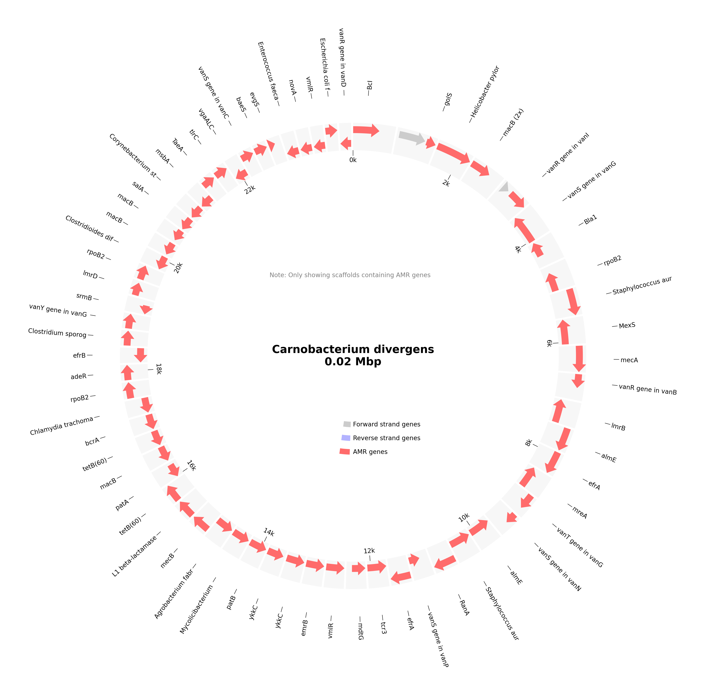

### Agrobacterium fabrum chloramphenicol acetyltransferase
- **Mechanism**: antibiotic inactivation
- **Drug Classes**: phenicol antibiotic
- **AMR Family**: chloramphenicol acetyltransferase (CAT)
- **Locations**:
  - gnl|SPADES|EHPDDGNP_15505_1 : position 3-341

### BcI
- **Mechanism**: antibiotic inactivation
- **Drug Classes**: cephalosporin; penem
- **AMR Family**: class A Bacillus cereus Bc beta-lactamase
- **Locations**:
  - gnl|SPADES|EHPDDGNP_6933_1 : position 1-480

### Bla1
- **Mechanism**: antibiotic inactivation
- **Drug Classes**: penam
- **AMR Family**: class A Bacillus anthracis Bla beta-lactamase
- **Locations**:
  - gnl|SPADES|EHPDDGNP_10336_1 : position 1-285

### Chlamydia trachomatis intrinsic murA conferring resistance to fosfomycin
- **Mechanism**: antibiotic target alteration
- **Drug Classes**: phosphonic acid antibiotic
- **AMR Family**: antibiotic-resistant murA transferase
- **Locations**:
  - gnl|SPADES|EHPDDGNP_18261_1 : position 1-297

### Clostridioides difficile gyrA conferring resistance to fluoroquinolones
- **Mechanism**: antibiotic target alteration
- **Drug Classes**: fluoroquinolone antibiotic
- **AMR Family**: fluoroquinolone resistant gyrA
- **Locations**:
  - gnl|SPADES|EHPDDGNP_23584_1 : position 2-265

### Clostridium sporogenes cplR
- **Mechanism**: antibiotic target protection
- **Drug Classes**: lincosamide antibiotic; pleuromutilin antibiotic
- **AMR Family**: Miscellaneous ABC-F subfamily ATP-binding cassette ribosomal protection proteins
- **Locations**:
  - gnl|SPADES|EHPDDGNP_21363_1 : position 3-275

### Corynebacterium striatum tetA
- **Mechanism**: antibiotic efflux
- **Drug Classes**: penam; tetracycline antibiotic
- **AMR Family**: major facilitator superfamily (MFS) antibiotic efflux pump
- **Locations**:
  - gnl|SPADES|EHPDDGNP_27082_1 : position 3-254

### Enterococcus faecalis cls with mutation conferring resistance to daptomycin
- **Mechanism**: antibiotic target alteration
- **Drug Classes**: peptide antibiotic
- **AMR Family**: daptomycin resistant cls
- **Locations**:
  - gnl|SPADES|EHPDDGNP_32859_1 : position 1-234

### Escherichia coli fabI mutations conferring resistance to isoniazid and triclosan
- **Mechanism**: antibiotic target alteration
- **Drug Classes**: disinfecting agents and antiseptics; isoniazid-like antibiotic
- **AMR Family**: antibiotic resistant fabI
- **Locations**:
  - gnl|SPADES|EHPDDGNP_36938_1 : position 2-220

### Helicobacter pylori rpoB mutation conferring resistance to rifampicin
- **Mechanism**: antibiotic target alteration; antibiotic target replacement
- **Drug Classes**: fluoroquinolone antibiotic; rifamycin antibiotic
- **AMR Family**: rifamycin-resistant beta-subunit of RNA polymerase (rpoB)
- **Locations**:
  - gnl|SPADES|EHPDDGNP_7824_1 : position 2-661

### L1 beta-lactamase
- **Mechanism**: antibiotic inactivation
- **Drug Classes**: cephalosporin
- **AMR Family**: L1 family beta-lactamase
- **Locations**:
  - gnl|SPADES|EHPDDGNP_15736_1 : position 3-338

### MexS
- **Mechanism**: antibiotic efflux
- **Drug Classes**: fluoroquinolone antibiotic; diaminopyrimidine antibiotic; phenicol antibiotic
- **AMR Family**: resistance-nodulation-cell division (RND) antibiotic efflux pump
- **Locations**:
  - gnl|SPADES|EHPDDGNP_10560_1 : position 2-484

### Mycolicibacterium smegmatis ndh with mutation conferring resistance to isoniazid
- **Mechanism**: antibiotic target alteration
- **Drug Classes**: isoniazid-like antibiotic
- **AMR Family**: antibiotic resistant ndh
- **Locations**:
  - gnl|SPADES|EHPDDGNP_15480_1 : position 1-342

### RanA
- **Mechanism**: antibiotic efflux
- **Drug Classes**: aminoglycoside antibiotic
- **AMR Family**: ATP-binding cassette (ABC) antibiotic efflux pump
- **Locations**:
  - gnl|SPADES|EHPDDGNP_12446_1 : position 2-412

### Staphylococcus aureus fusA with mutation conferring resistance to fusidic acid
- **Mechanism**: antibiotic target alteration
- **Drug Classes**: fusidane antibiotic
- **AMR Family**: antibiotic resistant fusA
- **Locations**:
  - gnl|SPADES|EHPDDGNP_10351_1 : position 3-494

### Staphylococcus aureus mupA conferring resistance to mupirocin
- **Mechanism**: antibiotic target alteration
- **Drug Classes**: mupirocin-like antibiotic
- **AMR Family**: antibiotic-resistant isoleucyl-tRNA synthetase (ileS)
- **Locations**:
  - gnl|SPADES|EHPDDGNP_12452_1 : position 1-411

### TaeA
- **Mechanism**: antibiotic efflux
- **Drug Classes**: pleuromutilin antibiotic
- **AMR Family**: ATP-binding cassette (ABC) antibiotic efflux pump
- **Locations**:
  - gnl|SPADES|EHPDDGNP_28942_1 : position 1-246

### adeR
- **Mechanism**: antibiotic efflux
- **Drug Classes**: glycylcycline; tetracycline antibiotic
- **AMR Family**: resistance-nodulation-cell division (RND) antibiotic efflux pump
- **Locations**:
  - gnl|SPADES|EHPDDGNP_20351_1 : position 2-280

### almE (found in 2 locations)
- **Mechanism**: antibiotic target alteration
- **Drug Classes**: peptide antibiotic
- **AMR Family**: polymyxin resistance operon; alm glycyltransferase
- **Locations**:
  - gnl|SPADES|EHPDDGNP_11772_1 : position 3-434
  - gnl|SPADES|EHPDDGNP_12338_1 : position 2-415

### baeS
- **Mechanism**: antibiotic efflux
- **Drug Classes**: aminoglycoside antibiotic; aminocoumarin antibiotic
- **AMR Family**: resistance-nodulation-cell division (RND) antibiotic efflux pump
- **Locations**:
  - gnl|SPADES|EHPDDGNP_31524_1 : position 2-238

### bcrA
- **Mechanism**: antibiotic efflux
- **Drug Classes**: peptide antibiotic
- **AMR Family**: ATP-binding cassette (ABC) antibiotic efflux pump
- **Locations**:
  - gnl|SPADES|EHPDDGNP_18246_1 : position 1-297

### efrA (found in 2 locations)
- **Mechanism**: antibiotic efflux
- **Drug Classes**: macrolide antibiotic; fluoroquinolone antibiotic; rifamycin antibiotic
- **AMR Family**: ATP-binding cassette (ABC) antibiotic efflux pump
- **Locations**:
  - gnl|SPADES|EHPDDGNP_12036_1 : position 3-425
  - gnl|SPADES|EHPDDGNP_13899_1 : position 3-374

### efrB
- **Mechanism**: antibiotic efflux
- **Drug Classes**: macrolide antibiotic; fluoroquinolone antibiotic; rifamycin antibiotic
- **AMR Family**: ATP-binding cassette (ABC) antibiotic efflux pump
- **Locations**:
  - gnl|SPADES|EHPDDGNP_21331_1 : position 1-276

### emrB
- **Mechanism**: antibiotic efflux
- **Drug Classes**: fluoroquinolone antibiotic
- **AMR Family**: major facilitator superfamily (MFS) antibiotic efflux pump
- **Locations**:
  - gnl|SPADES|EHPDDGNP_14786_1 : position 2-355

### evgS
- **Mechanism**: antibiotic efflux
- **Drug Classes**: macrolide antibiotic; fluoroquinolone antibiotic; penam; tetracycline antibiotic
- **AMR Family**: major facilitator superfamily (MFS) antibiotic efflux pump; resistance-nodulation-cell division (RND) antibiotic efflux pump
- **Locations**:
  - gnl|SPADES|EHPDDGNP_32445_1 : position 3-122

### golS
- **Mechanism**: antibiotic efflux
- **Drug Classes**: monobactam; carbapenem; cephalosporin; cephamycin; penam; phenicol antibiotic; penem
- **AMR Family**: resistance-nodulation-cell division (RND) antibiotic efflux pump
- **Locations**:
  - gnl|SPADES|EHPDDGNP_7185_2 : position 557-733

### lmrB
- **Mechanism**: antibiotic efflux
- **Drug Classes**: lincosamide antibiotic; nucleoside antibiotic
- **AMR Family**: ATP-binding cassette (ABC) antibiotic efflux pump
- **Locations**:
  - gnl|SPADES|EHPDDGNP_11129_1 : position 3-458

### lmrD
- **Mechanism**: antibiotic efflux
- **Drug Classes**: lincosamide antibiotic
- **AMR Family**: ATP-binding cassette (ABC) antibiotic efflux pump
- **Locations**:
  - gnl|SPADES|EHPDDGNP_22654_1 : position 3-239

### macB (found in 5 locations)
- **Mechanism**: antibiotic efflux
- **Drug Classes**: macrolide antibiotic
- **AMR Family**: ATP-binding cassette (ABC) antibiotic efflux pump
- **Locations**:
  - gnl|SPADES|EHPDDGNP_17991_1 : position 3-302
  - gnl|SPADES|EHPDDGNP_23603_1 : position 22-264
  - gnl|SPADES|EHPDDGNP_25435_1 : position 40-258
  - gnl|SPADES|EHPDDGNP_8231_1 : position 2-385
  - gnl|SPADES|EHPDDGNP_8231_2 : position 375-578

### mdtG
- **Mechanism**: antibiotic efflux
- **Drug Classes**: phosphonic acid antibiotic
- **AMR Family**: major facilitator superfamily (MFS) antibiotic efflux pump
- **Locations**:
  - gnl|SPADES|EHPDDGNP_14119_1 : position 3-263

### mecA
- **Mechanism**: antibiotic target replacement
- **Drug Classes**: penam
- **AMR Family**: methicillin resistant PBP2
- **Locations**:
  - gnl|SPADES|EHPDDGNP_10609_1 : position 2-481

### mecB
- **Mechanism**: antibiotic target replacement
- **Drug Classes**: penam
- **AMR Family**: methicillin resistant PBP2
- **Locations**:
  - gnl|SPADES|EHPDDGNP_15564_1 : position 1-342

### mreA
- **Mechanism**: antibiotic efflux
- **Drug Classes**: macrolide antibiotic
- **AMR Family**: major facilitator superfamily (MFS) antibiotic efflux pump
- **Locations**:
  - gnl|SPADES|EHPDDGNP_12103_1 : position 3-422

### msbA
- **Mechanism**: antibiotic efflux
- **Drug Classes**: nitroimidazole antibiotic
- **AMR Family**: ATP-binding cassette (ABC) antibiotic efflux pump
- **Locations**:
  - gnl|SPADES|EHPDDGNP_28162_1 : position 1-249

### novA
- **Mechanism**: antibiotic efflux
- **Drug Classes**: aminocoumarin antibiotic
- **AMR Family**: ATP-binding cassette (ABC) antibiotic efflux pump
- **Locations**:
  - gnl|SPADES|EHPDDGNP_35559_1 : position 2-226

### patA
- **Mechanism**: antibiotic efflux
- **Drug Classes**: fluoroquinolone antibiotic
- **AMR Family**: ATP-binding cassette (ABC) antibiotic efflux pump
- **Locations**:
  - gnl|SPADES|EHPDDGNP_16955_1 : position 1-264

### patB
- **Mechanism**: antibiotic efflux
- **Drug Classes**: fluoroquinolone antibiotic
- **AMR Family**: ATP-binding cassette (ABC) antibiotic efflux pump
- **Locations**:
  - gnl|SPADES|EHPDDGNP_15478_1 : position 2-343

### rpoB2 (found in 3 locations)
- **Mechanism**: antibiotic target alteration; antibiotic target replacement
- **Drug Classes**: rifamycin antibiotic
- **AMR Family**: rifamycin-resistant beta-subunit of RNA polymerase (rpoB)
- **Locations**:
  - gnl|SPADES|EHPDDGNP_10327_1 : position 125-493
  - gnl|SPADES|EHPDDGNP_18264_1 : position 1-297
  - gnl|SPADES|EHPDDGNP_23399_1 : position 1-267

### salA
- **Mechanism**: antibiotic target protection
- **Drug Classes**: lincosamide antibiotic; streptogramin antibiotic; streptogramin A antibiotic; pleuromutilin antibiotic
- **AMR Family**: sal-type ABC-F protein
- **Locations**:
  - gnl|SPADES|EHPDDGNP_27119_1 : position 1-252

### srmB
- **Mechanism**: antibiotic target protection
- **Drug Classes**: macrolide antibiotic
- **AMR Family**: Miscellaneous ABC-F subfamily ATP-binding cassette ribosomal protection proteins
- **Locations**:
  - gnl|SPADES|EHPDDGNP_22371_1 : position 2-172

### tcr3
- **Mechanism**: antibiotic efflux
- **Drug Classes**: tetracycline antibiotic
- **AMR Family**: major facilitator superfamily (MFS) antibiotic efflux pump
- **Locations**:
  - gnl|SPADES|EHPDDGNP_14140_1 : position 2-370

### tetB(60) (found in 2 locations)
- **Mechanism**: antibiotic efflux
- **Drug Classes**: tetracycline antibiotic
- **AMR Family**: ATP-binding cassette (ABC) antibiotic efflux pump
- **Locations**:
  - gnl|SPADES|EHPDDGNP_16222_1 : position 2-328
  - gnl|SPADES|EHPDDGNP_18081_1 : position 3-299

### tlrC
- **Mechanism**: antibiotic target protection
- **Drug Classes**: macrolide antibiotic; lincosamide antibiotic
- **AMR Family**: Miscellaneous ABC-F subfamily ATP-binding cassette ribosomal protection proteins
- **Locations**:
  - gnl|SPADES|EHPDDGNP_29240_1 : position 2-247

### vanR gene in vanB cluster
- **Mechanism**: antibiotic target alteration
- **Drug Classes**: glycopeptide antibiotic
- **AMR Family**: glycopeptide resistance gene cluster; vanR
- **Locations**:
  - gnl|SPADES|EHPDDGNP_10794_1 : position 1-255

### vanR gene in vanD cluster
- **Mechanism**: antibiotic target alteration
- **Drug Classes**: glycopeptide antibiotic
- **AMR Family**: glycopeptide resistance gene cluster; vanR
- **Locations**:
  - gnl|SPADES|EHPDDGNP_39392_1 : position 2-211

### vanR gene in vanI cluster
- **Mechanism**: antibiotic target alteration
- **Drug Classes**: glycopeptide antibiotic
- **AMR Family**: glycopeptide resistance gene cluster; vanR
- **Locations**:
  - gnl|SPADES|EHPDDGNP_8799_2 : position 231-584

### vanS gene in vanC cluster
- **Mechanism**: antibiotic target alteration
- **Drug Classes**: glycopeptide antibiotic
- **AMR Family**: vanS; glycopeptide resistance gene cluster
- **Locations**:
  - gnl|SPADES|EHPDDGNP_31773_1 : position 3-239

### vanS gene in vanG cluster
- **Mechanism**: antibiotic target alteration
- **Drug Classes**: glycopeptide antibiotic
- **AMR Family**: vanS; glycopeptide resistance gene cluster
- **Locations**:
  - gnl|SPADES|EHPDDGNP_9010_1 : position 2-568

### vanS gene in vanN cluster
- **Mechanism**: antibiotic target alteration
- **Drug Classes**: glycopeptide antibiotic
- **AMR Family**: vanS; glycopeptide resistance gene cluster
- **Locations**:
  - gnl|SPADES|EHPDDGNP_12296_1 : position 3-209

### vanS gene in vanP cluster
- **Mechanism**: antibiotic target alteration
- **Drug Classes**: glycopeptide antibiotic
- **AMR Family**: vanS; glycopeptide resistance gene cluster
- **Locations**:
  - gnl|SPADES|EHPDDGNP_13917_1 : position 166-375

### vanT gene in vanG cluster
- **Mechanism**: antibiotic target alteration
- **Drug Classes**: glycopeptide antibiotic
- **AMR Family**: glycopeptide resistance gene cluster; vanT
- **Locations**:
  - gnl|SPADES|EHPDDGNP_12220_1 : position 3-293

### vanY gene in vanG cluster
- **Mechanism**: antibiotic target alteration
- **Drug Classes**: glycopeptide antibiotic
- **AMR Family**: vanY; glycopeptide resistance gene cluster
- **Locations**:
  - gnl|SPADES|EHPDDGNP_21485_1: position 3-275

### vgaALC
- **Mechanism**: antibiotic target protection
- **Drug Classes**: lincosamide antibiotic; streptogramin antibiotic; streptogramin A antibiotic; pleuromutilin antibiotic
- **AMR Family**: vga-type ABC-F protein
- **Locations**:
  - gnl|SPADES|EHPDDGNP_29881_1 : position 1-243

### vmlR (found in 2 locations)
- **Mechanism**: antibiotic target protection
- **Drug Classes**: lincosamide antibiotic; streptogramin antibiotic; streptogramin A antibiotic; streptogramin B antibiotic; nucleoside antibiotic; pleuromutilin antibiotic
- **AMR Family**: Miscellaneous ABC-F subfamily ATP-binding cassette ribosomal protection proteins
- **Locations**:
  - gnl|SPADES|EHPDDGNP_14702_1 : position 3-356
  - gnl|SPADES|EHPDDGNP_35903_1 : position 2-223

### ykkC (found in 2 locations)
- **Mechanism**: antibiotic efflux
- **Drug Classes**: aminoglycoside antibiotic; tetracycline antibiotic; phenicol antibiotic
- **AMR Family**: small multidrug resistance (SMR) antibiotic efflux pump
- **Locations**:
  - gnl|SPADES|EHPDDGNP_14845_1 : position 1-354
  - gnl|SPADES|EHPDDGNP_14930_1 : position 32-352

## Carnobacterium maltaromaticum
**Strain Statistics:**
- Total genome length: 354.8 kbp
- Total scaffolds: 3387
- Scaffolds with AMR genes: 308
- Total genes annotated: 538
- Total AMR genes: 330
- Unique AMR genes: 150
- Distinct AMR mechanisms: 10
- Distinct AMR families: 63
- Distinct drug classes: 34

**Circos Plot:**

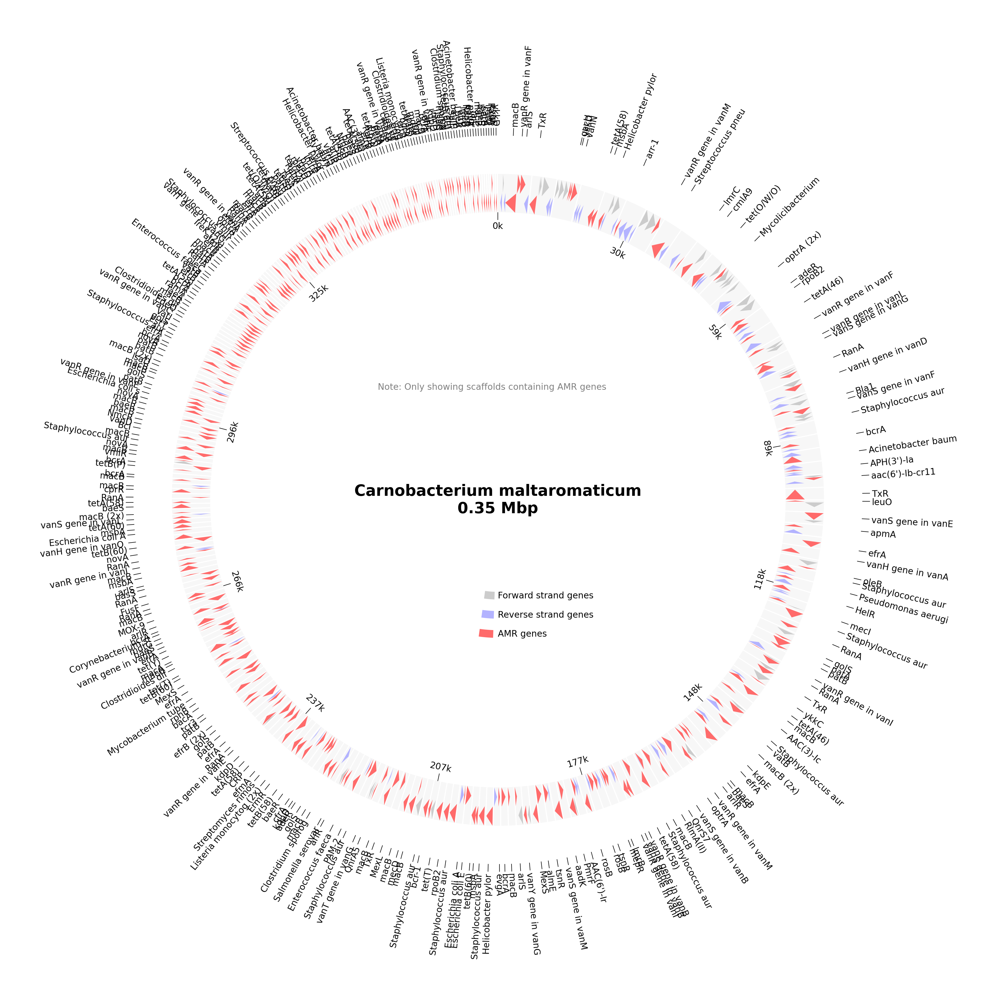

### AAC(3)-IIIa
- **Mechanism**: antibiotic inactivation
- **Drug Classes**: aminoglycoside antibiotic
- **AMR Family**: AAC(3)
- **Locations**:
  - gnl|SPADES|EHPDDGNP_12677_1 : position 2-406

### AAC(3)-Ic
- **Mechanism**: antibiotic inactivation
- **Drug Classes**: aminoglycoside antibiotic
- **AMR Family**: AAC(3)
- **Locations**:
  - gnl|SPADES|EHPDDGNP_3118_2 : position 209-646

### AAC(6')-Ir
- **Mechanism**: antibiotic inactivation
- **Drug Classes**: aminoglycoside antibiotic
- **AMR Family**: AAC(6')
- **Locations**:
  - gnl|SPADES|EHPDDGNP_3867_3 : position 860-1465

### APH(3')-Ia
- **Mechanism**: antibiotic inactivation
- **Drug Classes**: aminoglycoside antibiotic
- **AMR Family**: APH(3')
- **Locations**:
  - gnl|SPADES|EHPDDGNP_2309_2 : position 1185-1469

### Acinetobacter baumannii AbaQ (found in 2 locations)
- **Mechanism**: antibiotic efflux
- **Drug Classes**: fluoroquinolone antibiotic
- **AMR Family**: major facilitator superfamily (MFS) antibiotic efflux pump
- **Locations**:
  - gnl|SPADES|EHPDDGNP_11548_1 : position 2-442
  - gnl|SPADES|EHPDDGNP_21343_1 : position 2-274

### Acinetobacter baumannii AmvA
- **Mechanism**: antibiotic efflux
- **Drug Classes**: macrolide antibiotic; disinfecting agents and antiseptics
- **AMR Family**: major facilitator superfamily (MFS) antibiotic efflux pump
- **Locations**:
  - gnl|SPADES|EHPDDGNP_2249_2 : position 970-2400

### BcI
- **Mechanism**: antibiotic inactivation
- **Drug Classes**: cephalosporin; penem
- **AMR Family**: class A Bacillus cereus Bc beta-lactamase
- **Locations**:
  - gnl|SPADES|EHPDDGNP_6853_2 : position 361-774

### Bla1
- **Mechanism**: antibiotic inactivation
- **Drug Classes**: penam
- **AMR Family**: class A Bacillus anthracis Bla beta-lactamase
- **Locations**:
  - gnl|SPADES|EHPDDGNP_2097_4 : position 2327-2794

### CRP
- **Mechanism**: antibiotic efflux
- **Drug Classes**: macrolide antibiotic; fluoroquinolone antibiotic; penam
- **AMR Family**: resistance-nodulation-cell division (RND) antibiotic efflux pump
- **Locations**:
  - gnl|SPADES|EHPDDGNP_5104_2 : position 201-863

### Clostridioides difficile gyrA conferring resistance to fluoroquinolones
- **Mechanism**: antibiotic target alteration
- **Drug Classes**: fluoroquinolone antibiotic
- **AMR Family**: fluoroquinolone resistant gyrA
- **Locations**:
  - gnl|SPADES|EHPDDGNP_5469_1 : position 1-1005

### Clostridioides difficile gyrB conferring resistance to fluoroquinolones (found in 2 locations)
- **Mechanism**: antibiotic target alteration
- **Drug Classes**: fluoroquinolone antibiotic
- **AMR Family**: fluoroquinolone resistant gyrB
- **Locations**:
  - gnl|SPADES|EHPDDGNP_14409_1 : position 1-363
  - gnl|SPADES|EHPDDGNP_8604_1 : position 3-596

### Clostridium sporogenes cplR (found in 2 locations)
- **Mechanism**: antibiotic target protection
- **Drug Classes**: lincosamide antibiotic; pleuromutilin antibiotic
- **AMR Family**: Miscellaneous ABC-F subfamily ATP-binding cassette ribosomal protection proteins
- **Locations**:
  - gnl|SPADES|EHPDDGNP_19705_1 : position 1-282
  - gnl|SPADES|EHPDDGNP_4794_2 : position 986-1171

### Corynebacterium striatum tetA
- **Mechanism**: antibiotic efflux
- **Drug Classes**: penam; tetracycline antibiotic
- **AMR Family**: major facilitator superfamily (MFS) antibiotic efflux pump
- **Locations**:
  - gnl|SPADES|EHPDDGNP_5621_1 : position 2-214

### EdeQ
- **Mechanism**: antibiotic inactivation
- **Drug Classes**: peptide antibiotic; polyamine antibiotic
- **AMR Family**: Edeine acetyltransferase
- **Locations**:
  - gnl|SPADES|EHPDDGNP_8505_1 : position 164-604

### Enterococcus faecalis cls with mutation conferring resistance to daptomycin (found in 2 locations)
- **Mechanism**: antibiotic target alteration
- **Drug Classes**: peptide antibiotic
- **AMR Family**: daptomycin resistant cls
- **Locations**:
  - gnl|SPADES|EHPDDGNP_4728_1 : position 3-848
  - gnl|SPADES|EHPDDGNP_8903_1 : position 3-575

### ErmR
- **Mechanism**: antibiotic target alteration
- **Drug Classes**: macrolide antibiotic; lincosamide antibiotic; streptogramin antibiotic; streptogramin A antibiotic; streptogramin B antibiotic
- **AMR Family**: Erm 23S ribosomal RNA methyltransferase
- **Locations**:
  - gnl|SPADES|EHPDDGNP_5031_2 : position 294-1106

### Escherichia coli AcrAB-TolC with AcrR mutation conferring resistance to ciprofloxacin, tetracycline, and ceftazidime (found in 2 locations)
- **Mechanism**: antibiotic target alteration; antibiotic efflux
- **Drug Classes**: fluoroquinolone antibiotic; cephalosporin; glycylcycline; penam; tetracycline antibiotic; rifamycin antibiotic; phenicol antibiotic; disinfecting agents and antiseptics
- **AMR Family**: resistance-nodulation-cell division (RND) antibiotic efflux pump
- **Locations**:
  - gnl|SPADES|EHPDDGNP_4204_1 : position 1-201
  - gnl|SPADES|EHPDDGNP_6187_2 : position 649-870

### Escherichia coli EF-Tu mutants conferring resistance to kirromycin
- **Mechanism**: antibiotic target alteration
- **Drug Classes**: elfamycin antibiotic
- **AMR Family**: elfamycin resistant EF-Tu
- **Locations**:
  - gnl|SPADES|EHPDDGNP_4193_2 : position 197-1351

### Escherichia coli soxS with mutation conferring antibiotic resistance
- **Mechanism**: antibiotic target alteration; antibiotic efflux; reduced permeability to antibiotic
- **Drug Classes**: fluoroquinolone antibiotic; monobactam; carbapenem; cephalosporin; glycylcycline; cephamycin; penam; tetracycline antibiotic; rifamycin antibiotic; phenicol antibiotic; penem; disinfecting agents and antiseptics
- **AMR Family**: ATP-binding cassette (ABC) antibiotic efflux pump; major facilitator superfamily (MFS) antibiotic efflux pump; resistance-nodulation-cell division (RND) antibiotic efflux pump; General Bacterial Porin with reduced permeability to beta-lactams
- **Locations**:
  - gnl|SPADES|EHPDDGNP_7314_1 : position 2-679

### EstT
- **Mechanism**: antibiotic inactivation
- **Drug Classes**: macrolide antibiotic
- **AMR Family**: macrolide esterase
- **Locations**:
  - gnl|SPADES|EHPDDGNP_8252_1 : position 1-570

### FusF
- **Mechanism**: antibiotic target protection
- **Drug Classes**: fusidane antibiotic
- **AMR Family**: Target protecting FusB-type protein conferring resistance to Fusidic acid
- **Locations**:
  - gnl|SPADES|EHPDDGNP_5756_1 : position 2-382

### HelR
- **Mechanism**: antibiotic target protection
- **Drug Classes**: rifamycin antibiotic
- **AMR Family**: helicase-like RNA polymerase protection protein
- **Locations**:
  - gnl|SPADES|EHPDDGNP_2822_1 : position 1-846

### Helicobacter pylori frxA mutation conferring resistance to metronidazole
- **Mechanism**: antibiotic target alteration
- **Drug Classes**: nitroimidazole antibiotic
- **AMR Family**: Antibiotic resistant Helicobacter pylori nitroreductase
- **Locations**:
  - gnl|SPADES|EHPDDGNP_1233_2 : position 745-1416

### Helicobacter pylori pbp1 mutants conferring resistance to amoxicillin (found in 2 locations)
- **Mechanism**: antibiotic target alteration
- **Drug Classes**: cephalosporin; cephamycin; penam
- **AMR Family**: Penicillin-binding protein mutations conferring resistance to beta-lactam antibiotics
- **Locations**:
  - gnl|SPADES|EHPDDGNP_11352_1 : position 2-448
  - gnl|SPADES|EHPDDGNP_4164_1 : position 3-1361

### Helicobacter pylori rdxA mutation conferring resistance to metronidazole
- **Mechanism**: antibiotic target alteration
- **Drug Classes**: nitroimidazole antibiotic
- **AMR Family**: Antibiotic resistant Helicobacter pylori nitroreductase
- **Locations**:
  - gnl|SPADES|EHPDDGNP_26623_1 : position 3-254

### IreK (found in 3 locations)
- **Mechanism**: reduced permeability to antibiotic
- **Drug Classes**: cephalosporin
- **AMR Family**: Serine/threonine kinases
- **Locations**:
  - gnl|SPADES|EHPDDGNP_10846_1 : position 2-472
  - gnl|SPADES|EHPDDGNP_9313_1 : position 2-280
  - gnl|SPADES|EHPDDGNP_9313_2 : position 316-546

### Listeria monocytogenes mprF (found in 3 locations)
- **Mechanism**: antibiotic target alteration
- **Drug Classes**: peptide antibiotic
- **AMR Family**: defensin resistant mprF
- **Locations**:
  - gnl|SPADES|EHPDDGNP_16149_1 : position 3-329
  - gnl|SPADES|EHPDDGNP_5086_1 : position 1-852
  - gnl|SPADES|EHPDDGNP_5086_2 : position 833-1090

### LpeA
- **Mechanism**: antibiotic efflux
- **Drug Classes**: macrolide antibiotic
- **AMR Family**: resistance-nodulation-cell division (RND) antibiotic efflux pump
- **Locations**:
  - gnl|SPADES|EHPDDGNP_22315_1 : position 3-260

### MOX-9
- **Mechanism**: antibiotic inactivation
- **Drug Classes**: cephalosporin; cephamycin; penam
- **AMR Family**: MOX beta-lactamase
- **Locations**:
  - gnl|SPADES|EHPDDGNP_5707_1 : position 1-954

### MexL
- **Mechanism**: antibiotic efflux
- **Drug Classes**: macrolide antibiotic; tetracycline antibiotic; disinfecting agents and antiseptics
- **AMR Family**: resistance-nodulation-cell division (RND) antibiotic efflux pump
- **Locations**:
  - gnl|SPADES|EHPDDGNP_4544_2 : position 307-924

### MexS (found in 2 locations)
- **Mechanism**: antibiotic efflux
- **Drug Classes**: fluoroquinolone antibiotic; diaminopyrimidine antibiotic; phenicol antibiotic
- **AMR Family**: resistance-nodulation-cell division (RND) antibiotic efflux pump
- **Locations**:
  - gnl|SPADES|EHPDDGNP_3994_1 : position 71-1051
  - gnl|SPADES|EHPDDGNP_5443_1 : position 282-1010

### Mycobacterium tuberculosis pncA mutations conferring resistance to pyrazinamide
- **Mechanism**: antibiotic target alteration
- **Drug Classes**: pyrazine antibiotic
- **AMR Family**: Pyrazinamide resistant pncA
- **Locations**:
  - gnl|SPADES|EHPDDGNP_5394_1 : position 8-553

### Mycolicibacterium smegmatis ndh with mutation conferring resistance to isoniazid
- **Mechanism**: antibiotic target alteration
- **Drug Classes**: isoniazid-like antibiotic
- **AMR Family**: antibiotic resistant ndh
- **Locations**:
  - gnl|SPADES|EHPDDGNP_1619_1 : position 2-613

### NmcR (found in 2 locations)
- **Mechanism**: antibiotic inactivation
- **Drug Classes**: carbapenem; cephalosporin; cephamycin; penam
- **AMR Family**: NmcA beta-lactamase
- **Locations**:
  - gnl|SPADES|EHPDDGNP_12059_1 : position 2-241
  - gnl|SPADES|EHPDDGNP_6949_1 : position 3-416

### PAM-2
- **Mechanism**: antibiotic inactivation
- **Drug Classes**: carbapenem; cephalosporin
- **AMR Family**: PAM beta-lactamase
- **Locations**:
  - gnl|SPADES|EHPDDGNP_4703_1 : position 1-366

### PmrF
- **Mechanism**: antibiotic target alteration
- **Drug Classes**: peptide antibiotic
- **AMR Family**: pmr phosphoethanolamine transferase
- **Locations**:
  - gnl|SPADES|EHPDDGNP_3870_2 : position 328-1473

### Pseudomonas aeruginosa catB6
- **Mechanism**: antibiotic inactivation
- **Drug Classes**: phenicol antibiotic
- **AMR Family**: chloramphenicol acetyltransferase (CAT)
- **Locations**:
  - gnl|SPADES|EHPDDGNP_2811_1 : position 3-560

### QnrA5
- **Mechanism**: antibiotic target protection
- **Drug Classes**: fluoroquinolone antibiotic
- **AMR Family**: quinolone resistance protein (qnr)
- **Locations**:
  - gnl|SPADES|EHPDDGNP_4582_2 : position 314-832

### QnrS7
- **Mechanism**: antibiotic target protection
- **Drug Classes**: fluoroquinolone antibiotic
- **AMR Family**: quinolone resistance protein (qnr)
- **Locations**:
  - gnl|SPADES|EHPDDGNP_3399_3 : position 1169-1693

### RanA (found in 15 locations)
- **Mechanism**: antibiotic efflux
- **Drug Classes**: aminoglycoside antibiotic
- **AMR Family**: ATP-binding cassette (ABC) antibiotic efflux pump
- **Locations**:
  - gnl|SPADES|EHPDDGNP_10870_1 : position 1-468
  - gnl|SPADES|EHPDDGNP_13293_1 : position 2-346
  - gnl|SPADES|EHPDDGNP_1974_4 : position 1453-2106
  - gnl|SPADES|EHPDDGNP_24977_1 : position 3-260
  - gnl|SPADES|EHPDDGNP_2881_2 : position 853-1584
  - gnl|SPADES|EHPDDGNP_3060_2 : position 531-1571
  - gnl|SPADES|EHPDDGNP_39201_1 : position 1-213
  - gnl|SPADES|EHPDDGNP_5242_1 : position 1-399
  - gnl|SPADES|EHPDDGNP_5713_1 : position 2-727
  - gnl|SPADES|EHPDDGNP_5784_2 : position 183-941
  - gnl|SPADES|EHPDDGNP_5978_1 : position 1-249
  - gnl|SPADES|EHPDDGNP_6433_1 : position 2-202
  - gnl|SPADES|EHPDDGNP_8969_1 : position 2-571
  - gnl|SPADES|EHPDDGNP_9813_1 : position 3-263
  - gnl|SPADES|EHPDDGNP_9848_1 : position 3-518

### RlmA(II)
- **Mechanism**: antibiotic target alteration
- **Drug Classes**: macrolide antibiotic; lincosamide antibiotic
- **AMR Family**: non-erm 23S ribosomal RNA methyltransferase (G748)
- **Locations**:
  - gnl|SPADES|EHPDDGNP_3432_2 : position 593-1450

### Rv1877
- **Mechanism**: antibiotic efflux
- **Drug Classes**: fluoroquinolone antibiotic
- **AMR Family**: major facilitator superfamily (MFS) antibiotic efflux pump
- **Locations**:
  - gnl|SPADES|EHPDDGNP_11537_1 : position 1-441

### Salmonella serovars soxS with mutation conferring antibiotic resistance
- **Mechanism**: antibiotic target alteration; antibiotic efflux; reduced permeability to antibiotic
- **Drug Classes**: fluoroquinolone antibiotic; monobactam; carbapenem; cephalosporin; glycylcycline; cephamycin; penam; tetracycline antibiotic; rifamycin antibiotic; phenicol antibiotic; penem; disinfecting agents and antiseptics
- **AMR Family**: ATP-binding cassette (ABC) antibiotic efflux pump; major facilitator superfamily (MFS) antibiotic efflux pump; resistance-nodulation-cell division (RND) antibiotic efflux pump; General Bacterial Porin with reduced permeability to beta-lactams
- **Locations**:
  - gnl|SPADES|EHPDDGNP_4774_1 : position 3-272

### Staphylococcus aureus LmrS
- **Mechanism**: antibiotic efflux
- **Drug Classes**: macrolide antibiotic; aminoglycoside antibiotic; oxazolidinone antibiotic; diaminopyrimidine antibiotic; phenicol antibiotic
- **AMR Family**: major facilitator superfamily (MFS) antibiotic efflux pump
- **Locations**:
  - gnl|SPADES|EHPDDGNP_3173_2 : position 631-1824

### Staphylococcus aureus fusA with mutation conferring resistance to fusidic acid (found in 2 locations)
- **Mechanism**: antibiotic target alteration
- **Drug Classes**: fusidane antibiotic
- **AMR Family**: antibiotic resistant fusA
- **Locations**:
  - gnl|SPADES|EHPDDGNP_2855_1 : position 72-1622
  - gnl|SPADES|EHPDDGNP_4169_2 : position 200-1357

### Staphylococcus aureus mupA conferring resistance to mupirocin (found in 7 locations)
- **Mechanism**: antibiotic target alteration
- **Drug Classes**: mupirocin-like antibiotic
- **AMR Family**: antibiotic-resistant isoleucyl-tRNA synthetase (ileS)
- **Locations**:
  - gnl|SPADES|EHPDDGNP_2181_1 : position 1-414
  - gnl|SPADES|EHPDDGNP_2790_1 : position 3-1052
  - gnl|SPADES|EHPDDGNP_4387_1 : position 2-889
  - gnl|SPADES|EHPDDGNP_4706_1 : position 2-1189
  - gnl|SPADES|EHPDDGNP_6807_1 : position 3-779
  - gnl|SPADES|EHPDDGNP_8149_1 : position 3-632
  - gnl|SPADES|EHPDDGNP_9525_1 : position 1-534

### Staphylococcus aureus mupB conferring resistance to mupirocin
- **Mechanism**: antibiotic target alteration
- **Drug Classes**: mupirocin-like antibiotic
- **AMR Family**: antibiotic-resistant isoleucyl-tRNA synthetase (ileS)
- **Locations**:
  - gnl|SPADES|EHPDDGNP_20680_1 : position 3-278

### Staphylococcus aureus murA with mutation conferring resistance to fosfomycin
- **Mechanism**: antibiotic target alteration
- **Drug Classes**: phosphonic acid antibiotic
- **AMR Family**: antibiotic-resistant murA transferase
- **Locations**:
  - gnl|SPADES|EHPDDGNP_3519_1 : position 1-999

### Staphylococcus aureus rpoB mutants conferring resistance to rifampicin
- **Mechanism**: antibiotic target alteration; antibiotic target replacement
- **Drug Classes**: rifamycin antibiotic
- **AMR Family**: rifamycin-resistant beta-subunit of RNA polymerase (rpoB)
- **Locations**:
  - gnl|SPADES|EHPDDGNP_4263_1 : position 3-1325

### Streptococcus pneumoniae PBP2b conferring resistance to amoxicillin
- **Mechanism**: antibiotic target alteration
- **Drug Classes**: cephalosporin; cephamycin; penam
- **AMR Family**: Penicillin-binding protein mutations conferring resistance to beta-lactam antibiotics
- **Locations**:
  - gnl|SPADES|EHPDDGNP_10544_1 : position 1-483

### Streptococcus pneumoniae PBP2x conferring resistance to amoxicillin
- **Mechanism**: antibiotic target alteration
- **Drug Classes**: cephalosporin; cephamycin; penam
- **AMR Family**: Penicillin-binding protein mutations conferring resistance to beta-lactam antibiotics
- **Locations**:
  - gnl|SPADES|EHPDDGNP_1478_2 : position 418-2607

### Streptomyces rimosus otr(A)
- **Mechanism**: antibiotic target protection
- **Drug Classes**: tetracycline antibiotic
- **AMR Family**: tetracycline-resistant ribosomal protection protein
- **Locations**:
  - gnl|SPADES|EHPDDGNP_5088_1 : position 1-1089

### TaeA (found in 2 locations)
- **Mechanism**: antibiotic efflux
- **Drug Classes**: pleuromutilin antibiotic
- **AMR Family**: ATP-binding cassette (ABC) antibiotic efflux pump
- **Locations**:
  - gnl|SPADES|EHPDDGNP_10711_1 : position 1-477
  - gnl|SPADES|EHPDDGNP_8736_1 : position 2-586

### TxR (found in 4 locations)
- **Mechanism**: antibiotic efflux
- **Drug Classes**: tetracycline antibiotic
- **AMR Family**: ATP-binding cassette (ABC) antibiotic efflux pump
- **Locations**:
  - gnl|SPADES|EHPDDGNP_1084_1 : position 1-1431
  - gnl|SPADES|EHPDDGNP_2418_1 : position 192-2429
  - gnl|SPADES|EHPDDGNP_3080_2 : position 773-1876
  - gnl|SPADES|EHPDDGNP_4554_2 : position 243-1235

### VatI
- **Mechanism**: antibiotic inactivation
- **Drug Classes**: streptogramin antibiotic; streptogramin A antibiotic
- **AMR Family**: streptogramin vat acetyltransferase
- **Locations**:
  - gnl|SPADES|EHPDDGNP_8294_1 : position 163-621

### YajC
- **Mechanism**: antibiotic efflux
- **Drug Classes**: fluoroquinolone antibiotic; cephalosporin; glycylcycline; penam; tetracycline antibiotic; oxazolidinone antibiotic; glycopeptide antibiotic; rifamycin antibiotic; phenicol antibiotic; disinfecting agents and antiseptics
- **AMR Family**: resistance-nodulation-cell division (RND) antibiotic efflux pump
- **Locations**:
  - gnl|SPADES|EHPDDGNP_26746_1 : position 2-253

### YojI
- **Mechanism**: antibiotic efflux
- **Drug Classes**: peptide antibiotic
- **AMR Family**: ATP-binding cassette (ABC) antibiotic efflux pump
- **Locations**:
  - gnl|SPADES|EHPDDGNP_17159_1 : position 3-233

### aac(6')-Ib-cr11
- **Mechanism**: antibiotic inactivation
- **Drug Classes**: fluoroquinolone antibiotic; aminoglycoside antibiotic
- **AMR Family**: AAC(6'); AAC(6')-Ib-cr
- **Locations**:
  - gnl|SPADES|EHPDDGNP_2341_2 : position 444-1007

### aadK
- **Mechanism**: antibiotic inactivation
- **Drug Classes**: aminoglycoside antibiotic
- **AMR Family**: ANT(6)
- **Locations**:
  - gnl|SPADES|EHPDDGNP_3899_2 : position 283-1134

### adeR (found in 2 locations)
- **Mechanism**: antibiotic efflux
- **Drug Classes**: glycylcycline; tetracycline antibiotic
- **AMR Family**: resistance-nodulation-cell division (RND) antibiotic efflux pump
- **Locations**:
  - gnl|SPADES|EHPDDGNP_1657_3 : position 2734-3462
  - gnl|SPADES|EHPDDGNP_4926_1 : position 1-405

### almE (found in 2 locations)
- **Mechanism**: antibiotic target alteration
- **Drug Classes**: peptide antibiotic
- **AMR Family**: polymyxin resistance operon; alm glycyltransferase
- **Locations**:
  - gnl|SPADES|EHPDDGNP_3985_2 : position 340-1428
  - gnl|SPADES|EHPDDGNP_9299_1 : position 1-474

### apmA
- **Mechanism**: antibiotic inactivation
- **Drug Classes**: aminoglycoside antibiotic
- **AMR Family**: AAC(2')
- **Locations**:
  - gnl|SPADES|EHPDDGNP_2529_2 : position 229-738

### arlR (found in 4 locations)
- **Mechanism**: antibiotic efflux
- **Drug Classes**: fluoroquinolone antibiotic; disinfecting agents and antiseptics
- **AMR Family**: major facilitator superfamily (MFS) antibiotic efflux pump
- **Locations**:
  - gnl|SPADES|EHPDDGNP_11790_1 : position 1-432
  - gnl|SPADES|EHPDDGNP_3327_3 : position 1158-1733
  - gnl|SPADES|EHPDDGNP_4759_2 : position 690-1178
  - gnl|SPADES|EHPDDGNP_5678_1 : position 86-772

### arlS (found in 6 locations)
- **Mechanism**: antibiotic efflux
- **Drug Classes**: fluoroquinolone antibiotic; disinfecting agents and antiseptics
- **AMR Family**: major facilitator superfamily (MFS) antibiotic efflux pump
- **Locations**:
  - gnl|SPADES|EHPDDGNP_10149_1 : position 1-504
  - gnl|SPADES|EHPDDGNP_11603_1 : position 65-439
  - gnl|SPADES|EHPDDGNP_15445_1 : position 2-214
  - gnl|SPADES|EHPDDGNP_4050_2 : position 989-1399
  - gnl|SPADES|EHPDDGNP_5892_1 : position 3-191
  - gnl|SPADES|EHPDDGNP_794_8 : position 4886-5938

### arnA
- **Mechanism**: antibiotic target alteration
- **Drug Classes**: peptide antibiotic
- **AMR Family**: pmr phosphoethanolamine transferase
- **Locations**:
  - gnl|SPADES|EHPDDGNP_12695_1 : position 3-404

### arr-1
- **Mechanism**: antibiotic inactivation
- **Drug Classes**: rifamycin antibiotic
- **AMR Family**: rifampin ADP-ribosyltransferase (Arr)
- **Locations**:
  - gnl|SPADES|EHPDDGNP_1338_1 : position 91-504

### bacA
- **Mechanism**: antibiotic target alteration
- **Drug Classes**: peptide antibiotic
- **AMR Family**: undecaprenyl pyrophosphate related proteins
- **Locations**:
  - gnl|SPADES|EHPDDGNP_5373_2 : position 249-1022

### baeR (found in 2 locations)
- **Mechanism**: antibiotic efflux
- **Drug Classes**: aminoglycoside antibiotic; aminocoumarin antibiotic
- **AMR Family**: resistance-nodulation-cell division (RND) antibiotic efflux pump
- **Locations**:
  - gnl|SPADES|EHPDDGNP_5006_1 : position 3-644
  - gnl|SPADES|EHPDDGNP_7077_1 : position 2-490

### baeS (found in 6 locations)
- **Mechanism**: antibiotic efflux
- **Drug Classes**: aminoglycoside antibiotic; aminocoumarin antibiotic
- **AMR Family**: resistance-nodulation-cell division (RND) antibiotic efflux pump
- **Locations**:
  - gnl|SPADES|EHPDDGNP_12132_1 : position 1-399
  - gnl|SPADES|EHPDDGNP_12612_1 : position 3-407
  - gnl|SPADES|EHPDDGNP_28356_1 : position 3-248
  - gnl|SPADES|EHPDDGNP_3327_1 : position 3-584
  - gnl|SPADES|EHPDDGNP_5575_3 : position 814-984
  - gnl|SPADES|EHPDDGNP_6342_1 : position 2-847

### basS
- **Mechanism**: antibiotic target alteration; antibiotic efflux
- **Drug Classes**: peptide antibiotic
- **AMR Family**: pmr phosphoethanolamine transferase
- **Locations**:
  - gnl|SPADES|EHPDDGNP_5824_2 : position 284-934

### bcr-1
- **Mechanism**: antibiotic efflux
- **Drug Classes**: bicyclomycin-like antibiotic
- **AMR Family**: major facilitator superfamily (MFS) antibiotic efflux pump
- **Locations**:
  - gnl|SPADES|EHPDDGNP_4347_2 : position 843-1298

### bcrA (found in 12 locations)
- **Mechanism**: antibiotic efflux
- **Drug Classes**: peptide antibiotic
- **AMR Family**: ATP-binding cassette (ABC) antibiotic efflux pump
- **Locations**:
  - gnl|SPADES|EHPDDGNP_11122_1 : position 3-320
  - gnl|SPADES|EHPDDGNP_13546_1 : position 55-381
  - gnl|SPADES|EHPDDGNP_16623_1 : position 3-320
  - gnl|SPADES|EHPDDGNP_17411_1 : position 3-308
  - gnl|SPADES|EHPDDGNP_2192_3 : position 1003-1632
  - gnl|SPADES|EHPDDGNP_4111_2 : position 354-1241
  - gnl|SPADES|EHPDDGNP_5621_2 : position 379-975
  - gnl|SPADES|EHPDDGNP_6617_1 : position 3-173
  - gnl|SPADES|EHPDDGNP_6662_1 : position 2-796
  - gnl|SPADES|EHPDDGNP_7968_1 : position 3-596
  - gnl|SPADES|EHPDDGNP_8763_2 : position 83-586
  - gnl|SPADES|EHPDDGNP_8780_1 : position 3-584

### carA
- **Mechanism**: antibiotic target protection
- **Drug Classes**: macrolide antibiotic
- **AMR Family**: Miscellaneous ABC-F subfamily ATP-binding cassette ribosomal protection proteins
- **Locations**:
  - gnl|SPADES|EHPDDGNP_36996_1 : position 1-219

### catB11
- **Mechanism**: antibiotic inactivation
- **Drug Classes**: phenicol antibiotic
- **AMR Family**: chloramphenicol acetyltransferase (CAT)
- **Locations**:
  - gnl|SPADES|EHPDDGNP_14102_1 : position 3-176

### cfrA
- **Mechanism**: antibiotic target alteration
- **Drug Classes**: lincosamide antibiotic; streptogramin antibiotic; streptogramin A antibiotic; oxazolidinone antibiotic; phenicol antibiotic; pleuromutilin antibiotic
- **AMR Family**: Cfr 23S ribosomal RNA methyltransferase
- **Locations**:
  - gnl|SPADES|EHPDDGNP_4980_1 : position 2-346

### cmlA9
- **Mechanism**: antibiotic efflux
- **Drug Classes**: phenicol antibiotic
- **AMR Family**: major facilitator superfamily (MFS) antibiotic efflux pump
- **Locations**:
  - gnl|SPADES|EHPDDGNP_1515_2 : position 904-2106

### cprR
- **Mechanism**: antibiotic target alteration; antibiotic efflux
- **Drug Classes**: peptide antibiotic
- **AMR Family**: pmr phosphoethanolamine transferase
- **Locations**:
  - gnl|SPADES|EHPDDGNP_6485_1 : position 121-822

### dfrE
- **Mechanism**: antibiotic target replacement
- **Drug Classes**: diaminopyrimidine antibiotic
- **AMR Family**: trimethoprim resistant dihydrofolate reductase dfr
- **Locations**:
  - gnl|SPADES|EHPDDGNP_17542_1 : position 3-308

### efmA (found in 2 locations)
- **Mechanism**: antibiotic efflux
- **Drug Classes**: macrolide antibiotic; fluoroquinolone antibiotic
- **AMR Family**: major facilitator superfamily (MFS) antibiotic efflux pump
- **Locations**:
  - gnl|SPADES|EHPDDGNP_5102_1 : position 2-673
  - gnl|SPADES|EHPDDGNP_9700_1 : position 118-525

### efrA (found in 10 locations)
- **Mechanism**: antibiotic efflux
- **Drug Classes**: macrolide antibiotic; fluoroquinolone antibiotic; rifamycin antibiotic
- **AMR Family**: ATP-binding cassette (ABC) antibiotic efflux pump
- **Locations**:
  - gnl|SPADES|EHPDDGNP_10045_1 : position 3-509
  - gnl|SPADES|EHPDDGNP_11207_1 : position 1-456
  - gnl|SPADES|EHPDDGNP_16601_1 : position 2-322
  - gnl|SPADES|EHPDDGNP_2612_2 : position 1004-2239
  - gnl|SPADES|EHPDDGNP_3235_2 : position 345-1787
  - gnl|SPADES|EHPDDGNP_5260_1 : position 2-478
  - gnl|SPADES|EHPDDGNP_5418_1 : position 1-1014
  - gnl|SPADES|EHPDDGNP_5572_1 : position 2-904
  - gnl|SPADES|EHPDDGNP_8080_2 : position 329-637
  - gnl|SPADES|EHPDDGNP_9998_1 : position 1-510

### efrB (found in 6 locations)
- **Mechanism**: antibiotic efflux
- **Drug Classes**: macrolide antibiotic; fluoroquinolone antibiotic; rifamycin antibiotic
- **AMR Family**: ATP-binding cassette (ABC) antibiotic efflux pump
- **Locations**:
  - gnl|SPADES|EHPDDGNP_13008_1 : position 53-397
  - gnl|SPADES|EHPDDGNP_22603_1 : position 64-270
  - gnl|SPADES|EHPDDGNP_5309_1 : position 3-575
  - gnl|SPADES|EHPDDGNP_5309_2 : position 553-1038
  - gnl|SPADES|EHPDDGNP_8875_1 : position 1-579
  - gnl|SPADES|EHPDDGNP_9201_1 : position 2-553

### evgA
- **Mechanism**: antibiotic efflux
- **Drug Classes**: macrolide antibiotic; fluoroquinolone antibiotic; penam; tetracycline antibiotic
- **AMR Family**: major facilitator superfamily (MFS) antibiotic efflux pump; resistance-nodulation-cell division (RND) antibiotic efflux pump
- **Locations**:
  - gnl|SPADES|EHPDDGNP_4153_1 : position 1-363

### evgS
- **Mechanism**: antibiotic efflux
- **Drug Classes**: macrolide antibiotic; fluoroquinolone antibiotic; penam; tetracycline antibiotic
- **AMR Family**: major facilitator superfamily (MFS) antibiotic efflux pump; resistance-nodulation-cell division (RND) antibiotic efflux pump
- **Locations**:
  - gnl|SPADES|EHPDDGNP_39865_1 : position 3-182

### golS (found in 5 locations)
- **Mechanism**: antibiotic efflux
- **Drug Classes**: monobactam; carbapenem; cephalosporin; cephamycin; penam; phenicol antibiotic; penem
- **AMR Family**: resistance-nodulation-cell division (RND) antibiotic efflux pump
- **Locations**:
  - gnl|SPADES|EHPDDGNP_2889_4 : position 1701-2000
  - gnl|SPADES|EHPDDGNP_4916_1 : position 1-762
  - gnl|SPADES|EHPDDGNP_5293_1 : position 285-677
  - gnl|SPADES|EHPDDGNP_7479_2 : position 299-679
  - gnl|SPADES|EHPDDGNP_8290_1 : position 2-397

### kdpD (found in 3 locations)
- **Mechanism**: antibiotic efflux
- **Drug Classes**: aminoglycoside antibiotic
- **AMR Family**: kdpDE
- **Locations**:
  - gnl|SPADES|EHPDDGNP_18208_1 : position 3-299
  - gnl|SPADES|EHPDDGNP_4926_2 : position 402-1136
  - gnl|SPADES|EHPDDGNP_5127_1 : position 1-870

### kdpE
- **Mechanism**: antibiotic efflux
- **Drug Classes**: aminoglycoside antibiotic
- **AMR Family**: kdpDE
- **Locations**:
  - gnl|SPADES|EHPDDGNP_3216_3 : position 1073-1759

### leuO
- **Mechanism**: antibiotic efflux
- **Drug Classes**: nucleoside antibiotic; disinfecting agents and antiseptics
- **AMR Family**: major facilitator superfamily (MFS) antibiotic efflux pump
- **Locations**:
  - gnl|SPADES|EHPDDGNP_2440_1 : position 3-260

### lmrB (found in 3 locations)
- **Mechanism**: antibiotic efflux
- **Drug Classes**: lincosamide antibiotic; nucleoside antibiotic
- **AMR Family**: ATP-binding cassette (ABC) antibiotic efflux pump
- **Locations**:
  - gnl|SPADES|EHPDDGNP_11170_1 : position 30-458
  - gnl|SPADES|EHPDDGNP_23398_1 : position 1-267
  - gnl|SPADES|EHPDDGNP_3716_1 : position 1-675

### lmrC
- **Mechanism**: antibiotic target protection
- **Drug Classes**: lincosamide antibiotic
- **AMR Family**: Miscellaneous ABC-F subfamily ATP-binding cassette ribosomal protection proteins
- **Locations**:
  - gnl|SPADES|EHPDDGNP_1481_5 : position 3646-3888

### lmrD (found in 2 locations)
- **Mechanism**: antibiotic efflux
- **Drug Classes**: lincosamide antibiotic
- **AMR Family**: ATP-binding cassette (ABC) antibiotic efflux pump
- **Locations**:
  - gnl|SPADES|EHPDDGNP_18696_1 : position 1-291
  - gnl|SPADES|EHPDDGNP_37293_1 : position 6-218

### lsaC
- **Mechanism**: antibiotic target protection
- **Drug Classes**: lincosamide antibiotic; streptogramin antibiotic; pleuromutilin antibiotic
- **AMR Family**: lsa-type ABC-F protein
- **Locations**:
  - gnl|SPADES|EHPDDGNP_18744_1 : position 26-292

### lsaD
- **Mechanism**: antibiotic target protection
- **Drug Classes**: lincosamide antibiotic; streptogramin antibiotic; streptogramin A antibiotic; pleuromutilin antibiotic
- **AMR Family**: lsa-type ABC-F protein
- **Locations**:
  - gnl|SPADES|EHPDDGNP_7636_1 : position 1-417

### macA
- **Mechanism**: antibiotic efflux
- **Drug Classes**: macrolide antibiotic
- **AMR Family**: ATP-binding cassette (ABC) antibiotic efflux pump
- **Locations**:
  - gnl|SPADES|EHPDDGNP_5501_2 : position 293-997

### macB (found in 36 locations)
- **Mechanism**: antibiotic efflux
- **Drug Classes**: macrolide antibiotic
- **AMR Family**: ATP-binding cassette (ABC) antibiotic efflux pump
- **Locations**:
  - gnl|SPADES|EHPDDGNP_10077_1 : position 3-506
  - gnl|SPADES|EHPDDGNP_10143_1 : position 25-504
  - gnl|SPADES|EHPDDGNP_10315_2 : position 329-496
  - gnl|SPADES|EHPDDGNP_11963_1 : position 2-427
  - gnl|SPADES|EHPDDGNP_14086_1 : position 72-371
  - gnl|SPADES|EHPDDGNP_17381_1 : position 2-202
  - gnl|SPADES|EHPDDGNP_27593_1 : position 2-178
  - gnl|SPADES|EHPDDGNP_3117_1 : position 1-1161
  - gnl|SPADES|EHPDDGNP_3194_2 : position 163-861
  - gnl|SPADES|EHPDDGNP_3194_3 : position 845-1810
  - gnl|SPADES|EHPDDGNP_3287_3 : position 1497-1754
  - gnl|SPADES|EHPDDGNP_3496_2 : position 563-1291
  - gnl|SPADES|EHPDDGNP_4070_3 : position 967-1392
  - gnl|SPADES|EHPDDGNP_4393_2 : position 1054-1284
  - gnl|SPADES|EHPDDGNP_4482_1 : position 3-785
  - gnl|SPADES|EHPDDGNP_4563_1 : position 2-766
  - gnl|SPADES|EHPDDGNP_4806_2 : position 304-1047
  - gnl|SPADES|EHPDDGNP_5501_1 : position 1-276
  - gnl|SPADES|EHPDDGNP_5714_2 : position 563-952
  - gnl|SPADES|EHPDDGNP_5963_1 : position 2-472
  - gnl|SPADES|EHPDDGNP_6324_1 : position 2-193
  - gnl|SPADES|EHPDDGNP_6324_2 : position 190-849
  - gnl|SPADES|EHPDDGNP_6497_1 : position 3-134
  - gnl|SPADES|EHPDDGNP_6514_2 : position 521-820
  - gnl|SPADES|EHPDDGNP_6742_1 : position 3-785
  - gnl|SPADES|EHPDDGNP_6844_1 : position 1-582
  - gnl|SPADES|EHPDDGNP_7047_1 : position 3-554
  - gnl|SPADES|EHPDDGNP_7165_1 : position 2-577
  - gnl|SPADES|EHPDDGNP_7539_2 : position 418-690
  - gnl|SPADES|EHPDDGNP_7548_1 : position 2-307
  - gnl|SPADES|EHPDDGNP_7641_1 : position 1-168
  - gnl|SPADES|EHPDDGNP_7641_2 : position 218-502
  - gnl|SPADES|EHPDDGNP_794_6 : position 1696-4062
  - gnl|SPADES|EHPDDGNP_8701_2 : position 173-589
  - gnl|SPADES|EHPDDGNP_9183_1 : position 3-437
  - gnl|SPADES|EHPDDGNP_9982_1 : position 1-513

### mdtG (found in 2 locations)
- **Mechanism**: antibiotic efflux
- **Drug Classes**: phosphonic acid antibiotic
- **AMR Family**: major facilitator superfamily (MFS) antibiotic efflux pump
- **Locations**:
  - gnl|SPADES|EHPDDGNP_17093_1 : position 2-262
  - gnl|SPADES|EHPDDGNP_5590_1 : position 2-982

### mecD (found in 2 locations)
- **Mechanism**: antibiotic target replacement
- **Drug Classes**: penam
- **AMR Family**: methicillin resistant PBP2
- **Locations**:
  - gnl|SPADES|EHPDDGNP_10932_1 : position 3-467
  - gnl|SPADES|EHPDDGNP_4461_1 : position 2-1045

### mecI
- **Mechanism**: antibiotic target replacement
- **Drug Classes**: penam
- **AMR Family**: methicillin resistant PBP2
- **Locations**:
  - gnl|SPADES|EHPDDGNP_2843_3 : position 983-1438

### mepR
- **Mechanism**: antibiotic efflux
- **Drug Classes**: glycylcycline; tetracycline antibiotic
- **AMR Family**: multidrug and toxic compound extrusion (MATE) transporter
- **Locations**:
  - gnl|SPADES|EHPDDGNP_3716_2 : position 656-1171

### msbA (found in 5 locations)
- **Mechanism**: antibiotic efflux
- **Drug Classes**: nitroimidazole antibiotic
- **AMR Family**: ATP-binding cassette (ABC) antibiotic efflux pump
- **Locations**:
  - gnl|SPADES|EHPDDGNP_1148_7 : position 4073-4867
  - gnl|SPADES|EHPDDGNP_19114_1 : position 1-234
  - gnl|SPADES|EHPDDGNP_4175_1 : position 1-516
  - gnl|SPADES|EHPDDGNP_5956_1 : position 3-911
  - gnl|SPADES|EHPDDGNP_6262_2 : position 135-857

### novA (found in 5 locations)
- **Mechanism**: antibiotic efflux
- **Drug Classes**: aminocoumarin antibiotic
- **AMR Family**: ATP-binding cassette (ABC) antibiotic efflux pump
- **Locations**:
  - gnl|SPADES|EHPDDGNP_25286_1 : position 2-238
  - gnl|SPADES|EHPDDGNP_6054_1 : position 3-614
  - gnl|SPADES|EHPDDGNP_6770_1 : position 1-783
  - gnl|SPADES|EHPDDGNP_7278_1 : position 3-572
  - gnl|SPADES|EHPDDGNP_7948_2 : position 365-649

### oleB
- **Mechanism**: antibiotic target protection
- **Drug Classes**: macrolide antibiotic
- **AMR Family**: Miscellaneous ABC-F subfamily ATP-binding cassette ribosomal protection proteins
- **Locations**:
  - gnl|SPADES|EHPDDGNP_2765_4 : position 1833-2111

### oleC
- **Mechanism**: antibiotic efflux
- **Drug Classes**: macrolide antibiotic
- **AMR Family**: ATP-binding cassette (ABC) antibiotic efflux pump
- **Locations**:
  - gnl|SPADES|EHPDDGNP_8915_1 : position 3-155

### optrA (found in 5 locations)
- **Mechanism**: antibiotic target protection
- **Drug Classes**: oxazolidinone antibiotic; phenicol antibiotic
- **AMR Family**: Miscellaneous ABC-F subfamily ATP-binding cassette ribosomal protection proteins
- **Locations**:
  - gnl|SPADES|EHPDDGNP_1638_4 : position 2833-3198
  - gnl|SPADES|EHPDDGNP_1638_5 : position 3174-3506
  - gnl|SPADES|EHPDDGNP_16811_1 : position 3-320
  - gnl|SPADES|EHPDDGNP_3383_2 : position 474-1703
  - gnl|SPADES|EHPDDGNP_9682_1 : position 1-525

### patA (found in 2 locations)
- **Mechanism**: antibiotic efflux
- **Drug Classes**: fluoroquinolone antibiotic
- **AMR Family**: ATP-binding cassette (ABC) antibiotic efflux pump
- **Locations**:
  - gnl|SPADES|EHPDDGNP_13999_1 : position 2-202
  - gnl|SPADES|EHPDDGNP_2927_1 : position 3-1499

### patB (found in 9 locations)
- **Mechanism**: antibiotic efflux
- **Drug Classes**: fluoroquinolone antibiotic
- **AMR Family**: ATP-binding cassette (ABC) antibiotic efflux pump
- **Locations**:
  - gnl|SPADES|EHPDDGNP_10656_1 : position 2-478
  - gnl|SPADES|EHPDDGNP_28213_1 : position 3-248
  - gnl|SPADES|EHPDDGNP_2927_2 : position 1499-1972
  - gnl|SPADES|EHPDDGNP_5290_1 : position 1-945
  - gnl|SPADES|EHPDDGNP_5317_2 : position 709-1035
  - gnl|SPADES|EHPDDGNP_7396_1 : position 1-318
  - gnl|SPADES|EHPDDGNP_7637_1 : position 69-680
  - gnl|SPADES|EHPDDGNP_7875_2 : position 361-657
  - gnl|SPADES|EHPDDGNP_8999_1 : position 3-569

### poxtA
- **Mechanism**: antibiotic target protection
- **Drug Classes**: tetracycline antibiotic; oxazolidinone antibiotic; phenicol antibiotic
- **AMR Family**: Miscellaneous ABC-F subfamily ATP-binding cassette ribosomal protection proteins
- **Locations**:
  - gnl|SPADES|EHPDDGNP_9153_1 : position 2-556

### qacH
- **Mechanism**: antibiotic efflux
- **Drug Classes**: disinfecting agents and antiseptics
- **AMR Family**: small multidrug resistance (SMR) antibiotic efflux pump
- **Locations**:
  - gnl|SPADES|EHPDDGNP_1137_4 : position 2805-3131

### ramA
- **Mechanism**: antibiotic efflux; reduced permeability to antibiotic
- **Drug Classes**: fluoroquinolone antibiotic; monobactam; carbapenem; cephalosporin; glycylcycline; cephamycin; penam; tetracycline antibiotic; rifamycin antibiotic; phenicol antibiotic; penem; disinfecting agents and antiseptics
- **AMR Family**: resistance-nodulation-cell division (RND) antibiotic efflux pump; General Bacterial Porin with reduced permeability to beta-lactams
- **Locations**:
  - gnl|SPADES|EHPDDGNP_8729_1 : position 120-587

### rosB (found in 2 locations)
- **Mechanism**: antibiotic efflux
- **Drug Classes**: peptide antibiotic
- **AMR Family**: major facilitator superfamily (MFS) antibiotic efflux pump
- **Locations**:
  - gnl|SPADES|EHPDDGNP_3784_1 : position 3-860
  - gnl|SPADES|EHPDDGNP_3841_2 : position 530-1486

### rphB
- **Mechanism**: antibiotic inactivation
- **Drug Classes**: rifamycin antibiotic
- **AMR Family**: rifampin phosphotransferase
- **Locations**:
  - gnl|SPADES|EHPDDGNP_5385_1 : position 3-773

### rpoB2 (found in 2 locations)
- **Mechanism**: antibiotic target alteration; antibiotic target replacement
- **Drug Classes**: rifamycin antibiotic
- **AMR Family**: rifamycin-resistant beta-subunit of RNA polymerase (rpoB)
- **Locations**:
  - gnl|SPADES|EHPDDGNP_1733_1 : position 1-966
  - gnl|SPADES|EHPDDGNP_4313_1 : position 3-1061

### salE
- **Mechanism**: antibiotic target protection
- **Drug Classes**: lincosamide antibiotic; streptogramin antibiotic; streptogramin A antibiotic; pleuromutilin antibiotic
- **AMR Family**: sal-type ABC-F protein
- **Locations**:
  - gnl|SPADES|EHPDDGNP_21114_1 : position 2-274

### tcr3
- **Mechanism**: antibiotic efflux
- **Drug Classes**: tetracycline antibiotic
- **AMR Family**: major facilitator superfamily (MFS) antibiotic efflux pump
- **Locations**:
  - gnl|SPADES|EHPDDGNP_5321_1 : position 3-779

### tet(42)
- **Mechanism**: antibiotic efflux
- **Drug Classes**: tetracycline antibiotic
- **AMR Family**: major facilitator superfamily (MFS) antibiotic efflux pump
- **Locations**:
  - gnl|SPADES|EHPDDGNP_10875_1 : position 2-469

### tet(O/W/O) (found in 2 locations)
- **Mechanism**: antibiotic target protection
- **Drug Classes**: tetracycline antibiotic
- **AMR Family**: tetracycline-resistant ribosomal protection protein
- **Locations**:
  - gnl|SPADES|EHPDDGNP_10268_1 : position 1-477
  - gnl|SPADES|EHPDDGNP_1519_1 : position 3-1433

### tet(S)
- **Mechanism**: antibiotic target protection
- **Drug Classes**: tetracycline antibiotic
- **AMR Family**: tetracycline-resistant ribosomal protection protein
- **Locations**:
  - gnl|SPADES|EHPDDGNP_10649_1 : position 3-479

### tet(T) (found in 2 locations)
- **Mechanism**: antibiotic target protection
- **Drug Classes**: tetracycline antibiotic
- **AMR Family**: tetracycline-resistant ribosomal protection protein
- **Locations**:
  - gnl|SPADES|EHPDDGNP_4326_1 : position 3-1073
  - gnl|SPADES|EHPDDGNP_5461_1 : position 2-364

### tet(Y)
- **Mechanism**: antibiotic efflux
- **Drug Classes**: tetracycline antibiotic
- **AMR Family**: major facilitator superfamily (MFS) antibiotic efflux pump
- **Locations**:
  - gnl|SPADES|EHPDDGNP_5552_2 : position 148-987

### tetA(46) (found in 4 locations)
- **Mechanism**: antibiotic efflux
- **Drug Classes**: tetracycline antibiotic
- **AMR Family**: ATP-binding cassette (ABC) antibiotic efflux pump
- **Locations**:
  - gnl|SPADES|EHPDDGNP_10367_1 : position 3-365
  - gnl|SPADES|EHPDDGNP_16743_1 : position 101-319
  - gnl|SPADES|EHPDDGNP_1735_1 : position 3-449
  - gnl|SPADES|EHPDDGNP_3110_4 : position 1056-1859

### tetA(58) (found in 8 locations)
- **Mechanism**: antibiotic efflux
- **Drug Classes**: tetracycline antibiotic
- **AMR Family**: major facilitator superfamily (MFS) antibiotic efflux pump
- **Locations**:
  - gnl|SPADES|EHPDDGNP_10212_1 : position 1-501
  - gnl|SPADES|EHPDDGNP_1148_6 : position 3216-4097
  - gnl|SPADES|EHPDDGNP_11810_1 : position 13-432
  - gnl|SPADES|EHPDDGNP_12674_1 : position 2-406
  - gnl|SPADES|EHPDDGNP_3538_2 : position 67-984
  - gnl|SPADES|EHPDDGNP_5105_1 : position 1-801
  - gnl|SPADES|EHPDDGNP_6357_1 : position 2-385
  - gnl|SPADES|EHPDDGNP_8793_1 : position 3-410

### tetA(60) (found in 2 locations)
- **Mechanism**: antibiotic efflux
- **Drug Classes**: tetracycline antibiotic
- **AMR Family**: ATP-binding cassette (ABC) antibiotic efflux pump
- **Locations**:
  - gnl|SPADES|EHPDDGNP_13427_1 : position 2-361
  - gnl|SPADES|EHPDDGNP_6278_1 : position 3-854

### tetB(58)
- **Mechanism**: antibiotic efflux
- **Drug Classes**: tetracycline antibiotic
- **AMR Family**: major facilitator superfamily (MFS) antibiotic efflux pump
- **Locations**:
  - gnl|SPADES|EHPDDGNP_5024_1 : position 3-662

### tetB(60) (found in 4 locations)
- **Mechanism**: antibiotic efflux
- **Drug Classes**: tetracycline antibiotic
- **AMR Family**: ATP-binding cassette (ABC) antibiotic efflux pump
- **Locations**:
  - gnl|SPADES|EHPDDGNP_20224_1 : position 3-278
  - gnl|SPADES|EHPDDGNP_4175_2 : position 509-1354
  - gnl|SPADES|EHPDDGNP_5457_2 : position 613-1008
  - gnl|SPADES|EHPDDGNP_6082_1 : position 1-888

### tetB(P)
- **Mechanism**: antibiotic target protection
- **Drug Classes**: tetracycline antibiotic
- **AMR Family**: tetracycline-resistant ribosomal protection protein
- **Locations**:
  - gnl|SPADES|EHPDDGNP_6646_1 : position 610-798

### tsnR (found in 2 locations)
- **Mechanism**: antibiotic target alteration
- **Drug Classes**: peptide antibiotic
- **AMR Family**: non-erm 23S ribosomal RNA methyltransferase (A1067)
- **Locations**:
  - gnl|SPADES|EHPDDGNP_3766_2 : position 869-1522
  - gnl|SPADES|EHPDDGNP_3972_2 : position 471-1346

### vanD
- **Mechanism**: antibiotic target alteration
- **Drug Classes**: glycopeptide antibiotic
- **AMR Family**: glycopeptide resistance gene cluster; Van ligase
- **Locations**:
  - gnl|SPADES|EHPDDGNP_6892_1 : position 1-768

### vanH gene in vanA cluster
- **Mechanism**: antibiotic target alteration
- **Drug Classes**: glycopeptide antibiotic
- **AMR Family**: vanH; glycopeptide resistance gene cluster
- **Locations**:
  - gnl|SPADES|EHPDDGNP_2722_2 : position 613-1575

### vanH gene in vanD cluster
- **Mechanism**: antibiotic target alteration
- **Drug Classes**: glycopeptide antibiotic
- **AMR Family**: vanH; glycopeptide resistance gene cluster
- **Locations**:
  - gnl|SPADES|EHPDDGNP_1982_2 : position 1078-2091

### vanH gene in vanO cluster
- **Mechanism**: antibiotic target alteration
- **Drug Classes**: glycopeptide antibiotic
- **AMR Family**: vanH; glycopeptide resistance gene cluster
- **Locations**:
  - gnl|SPADES|EHPDDGNP_6151_1 : position 2-877

### vanN
- **Mechanism**: antibiotic target alteration
- **Drug Classes**: glycopeptide antibiotic
- **AMR Family**: glycopeptide resistance gene cluster; Van ligase
- **Locations**:
  - gnl|SPADES|EHPDDGNP_1137_6 : position 3555-4634

### vanR gene in vanB cluster (found in 3 locations)
- **Mechanism**: antibiotic target alteration
- **Drug Classes**: glycopeptide antibiotic
- **AMR Family**: glycopeptide resistance gene cluster; vanR
- **Locations**:
  - gnl|SPADES|EHPDDGNP_13998_1 : position 2-373
  - gnl|SPADES|EHPDDGNP_3575_1 : position 95-766
  - gnl|SPADES|EHPDDGNP_5575_1 : position 3-137

### vanR gene in vanC cluster
- **Mechanism**: antibiotic target alteration
- **Drug Classes**: glycopeptide antibiotic
- **AMR Family**: glycopeptide resistance gene cluster; vanR
- **Locations**:
  - gnl|SPADES|EHPDDGNP_8493_2 : position 444-605

### vanR gene in vanE cluster (found in 2 locations)
- **Mechanism**: antibiotic target alteration
- **Drug Classes**: glycopeptide antibiotic
- **AMR Family**: glycopeptide resistance gene cluster; vanR
- **Locations**:
  - gnl|SPADES|EHPDDGNP_5156_2 : position 297-1073
  - gnl|SPADES|EHPDDGNP_7384_1 : position 3-668

### vanR gene in vanF cluster (found in 2 locations)
- **Mechanism**: antibiotic target alteration
- **Drug Classes**: glycopeptide antibiotic
- **AMR Family**: glycopeptide resistance gene cluster; vanR
- **Locations**:
  - gnl|SPADES|EHPDDGNP_1914_1 : position 2-523
  - gnl|SPADES|EHPDDGNP_794_7 : position 4215-4889

### vanR gene in vanI cluster (found in 5 locations)
- **Mechanism**: antibiotic target alteration
- **Drug Classes**: glycopeptide antibiotic
- **AMR Family**: glycopeptide resistance gene cluster; vanR
- **Locations**:
  - gnl|SPADES|EHPDDGNP_1917_1 : position 3-362
  - gnl|SPADES|EHPDDGNP_3053_4 : position 1785-1898
  - gnl|SPADES|EHPDDGNP_3643_1 : position 2-163
  - gnl|SPADES|EHPDDGNP_5970_1 : position 1-282
  - gnl|SPADES|EHPDDGNP_9802_1 : position 3-134

### vanR gene in vanL cluster
- **Mechanism**: antibiotic target alteration
- **Drug Classes**: glycopeptide antibiotic
- **AMR Family**: glycopeptide resistance gene cluster; vanR
- **Locations**:
  - gnl|SPADES|EHPDDGNP_17686_1 : position 1-138

### vanR gene in vanM cluster (found in 2 locations)
- **Mechanism**: antibiotic target alteration
- **Drug Classes**: glycopeptide antibiotic
- **AMR Family**: glycopeptide resistance gene cluster; vanR
- **Locations**:
  - gnl|SPADES|EHPDDGNP_1393_4 : position 3333-4022
  - gnl|SPADES|EHPDDGNP_3378_2 : position 1021-1704

### vanS gene in vanB cluster (found in 2 locations)
- **Mechanism**: antibiotic target alteration
- **Drug Classes**: glycopeptide antibiotic
- **AMR Family**: vanS; glycopeptide resistance gene cluster
- **Locations**:
  - gnl|SPADES|EHPDDGNP_3398_3 : position 1541-1693
  - gnl|SPADES|EHPDDGNP_3575_2 : position 763-1605

### vanS gene in vanE cluster
- **Mechanism**: antibiotic target alteration
- **Drug Classes**: glycopeptide antibiotic
- **AMR Family**: vanS; glycopeptide resistance gene cluster
- **Locations**:
  - gnl|SPADES|EHPDDGNP_2468_1 : position 3-1508

### vanS gene in vanF cluster
- **Mechanism**: antibiotic target alteration
- **Drug Classes**: glycopeptide antibiotic
- **AMR Family**: vanS; glycopeptide resistance gene cluster
- **Locations**:
  - gnl|SPADES|EHPDDGNP_2107_1 : position 3-1058

### vanS gene in vanG cluster
- **Mechanism**: antibiotic target alteration
- **Drug Classes**: glycopeptide antibiotic
- **AMR Family**: vanS; glycopeptide resistance gene cluster
- **Locations**:
  - gnl|SPADES|EHPDDGNP_1917_2 : position 369-1859

### vanS gene in vanL cluster
- **Mechanism**: antibiotic target alteration
- **Drug Classes**: glycopeptide antibiotic
- **AMR Family**: vanS; glycopeptide resistance gene cluster
- **Locations**:
  - gnl|SPADES|EHPDDGNP_6319_1 : position 1-447

### vanS gene in vanM cluster
- **Mechanism**: antibiotic target alteration
- **Drug Classes**: glycopeptide antibiotic
- **AMR Family**: vanS; glycopeptide resistance gene cluster
- **Locations**:
  - gnl|SPADES|EHPDDGNP_3928_1 : position 2-1375

### vanT gene in vanG cluster (found in 2 locations)
- **Mechanism**: antibiotic target alteration
- **Drug Classes**: glycopeptide antibiotic
- **AMR Family**: glycopeptide resistance gene cluster; vanT
- **Locations**:
  - gnl|SPADES|EHPDDGNP_4654_1 : position 3-212
  - gnl|SPADES|EHPDDGNP_9480_1 : position 1-537

### vanY gene in vanG cluster
- **Mechanism**: antibiotic target alteration
- **Drug Classes**: glycopeptide antibiotic
- **AMR Family**: vanY; glycopeptide resistance gene cluster
- **Locations**:
  - gnl|SPADES|EHPDDGNP_4045_2: position 781-1401

### vatB (found in 2 locations)
- **Mechanism**: antibiotic inactivation
- **Drug Classes**: streptogramin antibiotic; streptogramin A antibiotic
- **AMR Family**: streptogramin vat acetyltransferase
- **Locations**:
  - gnl|SPADES|EHPDDGNP_3177_1 : position 54-605
  - gnl|SPADES|EHPDDGNP_8862_2 : position 229-579

### vgaD
- **Mechanism**: antibiotic target protection
- **Drug Classes**: streptogramin antibiotic; streptogramin A antibiotic; pleuromutilin antibiotic
- **AMR Family**: vga-type ABC-F protein
- **Locations**:
  - gnl|SPADES|EHPDDGNP_11102_1 : position 66-461

### vmlR (found in 3 locations)
- **Mechanism**: antibiotic target protection
- **Drug Classes**: lincosamide antibiotic; streptogramin antibiotic; streptogramin A antibiotic; streptogramin B antibiotic; nucleoside antibiotic; pleuromutilin antibiotic
- **AMR Family**: Miscellaneous ABC-F subfamily ATP-binding cassette ribosomal protection proteins
- **Locations**:
  - gnl|SPADES|EHPDDGNP_11674_1 : position 1-174
  - gnl|SPADES|EHPDDGNP_6679_2 : position 650-796
  - gnl|SPADES|EHPDDGNP_9515_1 : position 2-535

### ykkC
- **Mechanism**: antibiotic efflux
- **Drug Classes**: aminoglycoside antibiotic; tetracycline antibiotic; phenicol antibiotic
- **AMR Family**: small multidrug resistance (SMR) antibiotic efflux pump
- **Locations**:
  - gnl|SPADES|EHPDDGNP_3106_2 : position 1662-1862

### ykkD (found in 2 locations)
- **Mechanism**: antibiotic efflux
- **Drug Classes**: aminoglycoside antibiotic; tetracycline antibiotic; phenicol antibiotic
- **AMR Family**: small multidrug resistance (SMR) antibiotic efflux pump
- **Locations**:
  - gnl|SPADES|EHPDDGNP_1137_5 : position 3131-3448
  - gnl|SPADES|EHPDDGNP_41323_1 : position 2-205

## Carnobacterium maltaromaticum LMA28
**Strain Statistics:**
- Total genome length: 57.2 kbp
- Total scaffolds: 358
- Scaffolds with AMR genes: 28
- Total genes annotated: 94
- Total AMR genes: 34
- Unique AMR genes: 28
- Distinct AMR mechanisms: 6
- Distinct AMR families: 18
- Distinct drug classes: 23

**Circos Plot:**

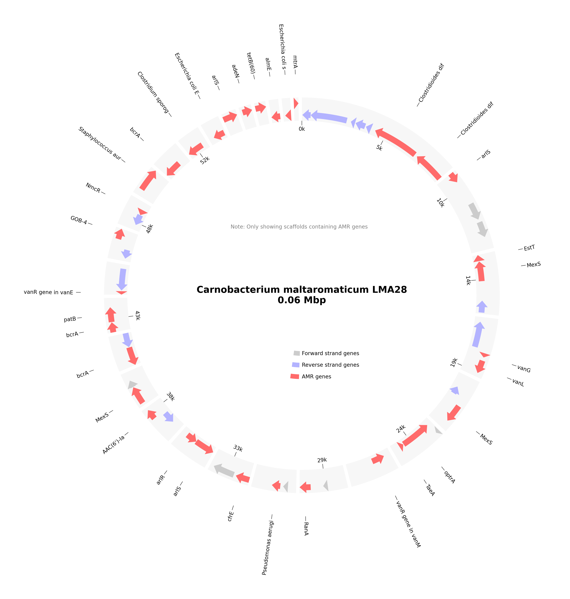

### AAC(6')-Ia
- **Mechanism**: antibiotic inactivation
- **Drug Classes**: aminoglycoside antibiotic
- **AMR Family**: AAC(6')
- **Locations**:
  - gnl|SPADES|EHPDDGNP_2870_3 : position 1328-1864

### Clostridioides difficile gyrA conferring resistance to fluoroquinolones
- **Mechanism**: antibiotic target alteration
- **Drug Classes**: fluoroquinolone antibiotic
- **AMR Family**: fluoroquinolone resistant gyrA
- **Locations**:
  - gnl|SPADES|EHPDDGNP_665_6 : position 4127-6679

### Clostridioides difficile gyrB conferring resistance to fluoroquinolones
- **Mechanism**: antibiotic target alteration
- **Drug Classes**: fluoroquinolone antibiotic
- **AMR Family**: fluoroquinolone resistant gyrB
- **Locations**:
  - gnl|SPADES|EHPDDGNP_665_7 : position 6829-8565

### Clostridium sporogenes cplR
- **Mechanism**: antibiotic target protection
- **Drug Classes**: lincosamide antibiotic; pleuromutilin antibiotic
- **AMR Family**: Miscellaneous ABC-F subfamily ATP-binding cassette ribosomal protection proteins
- **Locations**:
  - gnl|SPADES|EHPDDGNP_4666_1 : position 3-896

### Escherichia coli EF-Tu mutants conferring resistance to kirromycin
- **Mechanism**: antibiotic target alteration
- **Drug Classes**: elfamycin antibiotic
- **AMR Family**: elfamycin resistant EF-Tu
- **Locations**:
  - gnl|SPADES|EHPDDGNP_5611_2 : position 270-902

### Escherichia coli soxS with mutation conferring antibiotic resistance
- **Mechanism**: antibiotic target alteration; antibiotic efflux; reduced permeability to antibiotic
- **Drug Classes**: fluoroquinolone antibiotic; monobactam; carbapenem; cephalosporin; glycylcycline; cephamycin; penam; tetracycline antibiotic; rifamycin antibiotic; phenicol antibiotic; penem; disinfecting agents and antiseptics
- **AMR Family**: ATP-binding cassette (ABC) antibiotic efflux pump; major facilitator superfamily (MFS) antibiotic efflux pump; resistance-nodulation-cell division (RND) antibiotic efflux pump; General Bacterial Porin with reduced permeability to beta-lactams
- **Locations**:
  - gnl|SPADES|EHPDDGNP_11979_1 : position 104-427

### EstT
- **Mechanism**: antibiotic inactivation
- **Drug Classes**: macrolide antibiotic
- **AMR Family**: macrolide esterase
- **Locations**:
  - gnl|SPADES|EHPDDGNP_1801_1 : position 3-338

### GOB-4
- **Mechanism**: antibiotic inactivation
- **Drug Classes**: carbapenem; cephalosporin; penam
- **AMR Family**: GOB beta-lactamase
- **Locations**:
  - gnl|SPADES|EHPDDGNP_3532_2 : position 1065-1622

### MexS (found in 3 locations)
- **Mechanism**: antibiotic efflux
- **Drug Classes**: fluoroquinolone antibiotic; diaminopyrimidine antibiotic; phenicol antibiotic
- **AMR Family**: resistance-nodulation-cell division (RND) antibiotic efflux pump
- **Locations**:
  - gnl|SPADES|EHPDDGNP_1801_2 : position 358-1446
  - gnl|SPADES|EHPDDGNP_1947_3 : position 1590-2534
  - gnl|SPADES|EHPDDGNP_3006_2 : position 138-1076

### NmcR
- **Mechanism**: antibiotic inactivation
- **Drug Classes**: carbapenem; cephalosporin; cephamycin; penam
- **AMR Family**: NmcA beta-lactamase
- **Locations**:
  - gnl|SPADES|EHPDDGNP_3632_3 : position 879-1178

### Pseudomonas aeruginosa soxR
- **Mechanism**: antibiotic target alteration; antibiotic efflux
- **Drug Classes**: fluoroquinolone antibiotic; cephalosporin; glycylcycline; penam; tetracycline antibiotic; rifamycin antibiotic; phenicol antibiotic; disinfecting agents and antiseptics
- **AMR Family**: ATP-binding cassette (ABC) antibiotic efflux pump; major facilitator superfamily (MFS) antibiotic efflux pump; resistance-nodulation-cell division (RND) antibiotic efflux pump
- **Locations**:
  - gnl|SPADES|EHPDDGNP_2577_4 : position 820-1257

### RanA
- **Mechanism**: antibiotic efflux
- **Drug Classes**: aminoglycoside antibiotic
- **AMR Family**: ATP-binding cassette (ABC) antibiotic efflux pump
- **Locations**:
  - gnl|SPADES|EHPDDGNP_2393_4 : position 1881-2453

### Staphylococcus aureus murA with mutation conferring resistance to fosfomycin
- **Mechanism**: antibiotic target alteration
- **Drug Classes**: phosphonic acid antibiotic
- **AMR Family**: antibiotic-resistant murA transferase
- **Locations**:
  - gnl|SPADES|EHPDDGNP_3701_1 : position 343-1551

### TaeA
- **Mechanism**: antibiotic efflux
- **Drug Classes**: pleuromutilin antibiotic
- **AMR Family**: ATP-binding cassette (ABC) antibiotic efflux pump
- **Locations**:
  - gnl|SPADES|EHPDDGNP_2212_3 : position 1968-2207

### adeN
- **Mechanism**: antibiotic efflux
- **Drug Classes**: macrolide antibiotic; fluoroquinolone antibiotic; lincosamide antibiotic; carbapenem; cephalosporin; tetracycline antibiotic; rifamycin antibiotic; diaminopyrimidine antibiotic; phenicol antibiotic; penem
- **AMR Family**: resistance-nodulation-cell division (RND) antibiotic efflux pump
- **Locations**:
  - gnl|SPADES|EHPDDGNP_8128_1 : position 123-635

### almE
- **Mechanism**: antibiotic target alteration
- **Drug Classes**: peptide antibiotic
- **AMR Family**: polymyxin resistance operon; alm glycyltransferase
- **Locations**:
  - gnl|SPADES|EHPDDGNP_10494_1 : position 1-486

### arlR
- **Mechanism**: antibiotic efflux
- **Drug Classes**: fluoroquinolone antibiotic; disinfecting agents and antiseptics
- **AMR Family**: major facilitator superfamily (MFS) antibiotic efflux pump
- **Locations**:
  - gnl|SPADES|EHPDDGNP_2801_2 : position 1098-1706

### arlS (found in 3 locations)
- **Mechanism**: antibiotic efflux
- **Drug Classes**: fluoroquinolone antibiotic; disinfecting agents and antiseptics
- **AMR Family**: major facilitator superfamily (MFS) antibiotic efflux pump
- **Locations**:
  - gnl|SPADES|EHPDDGNP_1308_1 : position 3-554
  - gnl|SPADES|EHPDDGNP_2801_1 : position 1-1101
  - gnl|SPADES|EHPDDGNP_6994_1 : position 2-754

### bcrA (found in 3 locations)
- **Mechanism**: antibiotic efflux
- **Drug Classes**: peptide antibiotic
- **AMR Family**: ATP-binding cassette (ABC) antibiotic efflux pump
- **Locations**:
  - gnl|SPADES|EHPDDGNP_3186_1 : position 1-1014
  - gnl|SPADES|EHPDDGNP_3246_1 : position 3-527
  - gnl|SPADES|EHPDDGNP_3789_1 : position 14-955

### cfrE
- **Mechanism**: antibiotic target alteration
- **Drug Classes**: lincosamide antibiotic; streptogramin antibiotic; oxazolidinone antibiotic; phenicol antibiotic; pleuromutilin antibiotic
- **AMR Family**: Cfr 23S ribosomal RNA methyltransferase
- **Locations**:
  - gnl|SPADES|EHPDDGNP_2698_1 : position 3-728

### mtrA
- **Mechanism**: antibiotic efflux
- **Drug Classes**: macrolide antibiotic; penam
- **AMR Family**: resistance-nodulation-cell division (RND) antibiotic efflux pump
- **Locations**:
  - gnl|SPADES|EHPDDGNP_30515_1 : position 3-242

### optrA
- **Mechanism**: antibiotic target protection
- **Drug Classes**: oxazolidinone antibiotic; phenicol antibiotic
- **AMR Family**: Miscellaneous ABC-F subfamily ATP-binding cassette ribosomal protection proteins
- **Locations**:
  - gnl|SPADES|EHPDDGNP_2212_2 : position 278-1942

### patB
- **Mechanism**: antibiotic efflux
- **Drug Classes**: fluoroquinolone antibiotic
- **AMR Family**: ATP-binding cassette (ABC) antibiotic efflux pump
- **Locations**:
  - gnl|SPADES|EHPDDGNP_3246_2 : position 539-1303

### tetB(60)
- **Mechanism**: antibiotic efflux
- **Drug Classes**: tetracycline antibiotic
- **AMR Family**: ATP-binding cassette (ABC) antibiotic efflux pump
- **Locations**:
  - gnl|SPADES|EHPDDGNP_9047_1 : position 3-566

### vanG
- **Mechanism**: antibiotic target alteration
- **Drug Classes**: glycopeptide antibiotic
- **AMR Family**: glycopeptide resistance gene cluster; Van ligase
- **Locations**:
  - gnl|SPADES|EHPDDGNP_1857_3 : position 1848-2069

### vanL
- **Mechanism**: antibiotic target alteration
- **Drug Classes**: glycopeptide antibiotic
- **AMR Family**: glycopeptide resistance gene cluster; Van ligase
- **Locations**:
  - gnl|SPADES|EHPDDGNP_1857_4 : position 2246-2926

### vanR gene in vanE cluster
- **Mechanism**: antibiotic target alteration
- **Drug Classes**: glycopeptide antibiotic
- **AMR Family**: glycopeptide resistance gene cluster; vanR
- **Locations**:
  - gnl|SPADES|EHPDDGNP_3455_1 : position 2-187

### vanR gene in vanM cluster
- **Mechanism**: antibiotic target alteration
- **Drug Classes**: glycopeptide antibiotic
- **AMR Family**: glycopeptide resistance gene cluster; vanR
- **Locations**:
  - gnl|SPADES|EHPDDGNP_2316_2 : position 382-1089

## Citrobacter
**Strain Statistics:**
- Total genome length: 7.3 kbp
- Total scaffolds: 136
- Scaffolds with AMR genes: 7
- Total genes annotated: 10
- Total AMR genes: 7
- Unique AMR genes: 7
- Distinct AMR mechanisms: 5
- Distinct AMR families: 7
- Distinct drug classes: 17

**Circos Plot:**

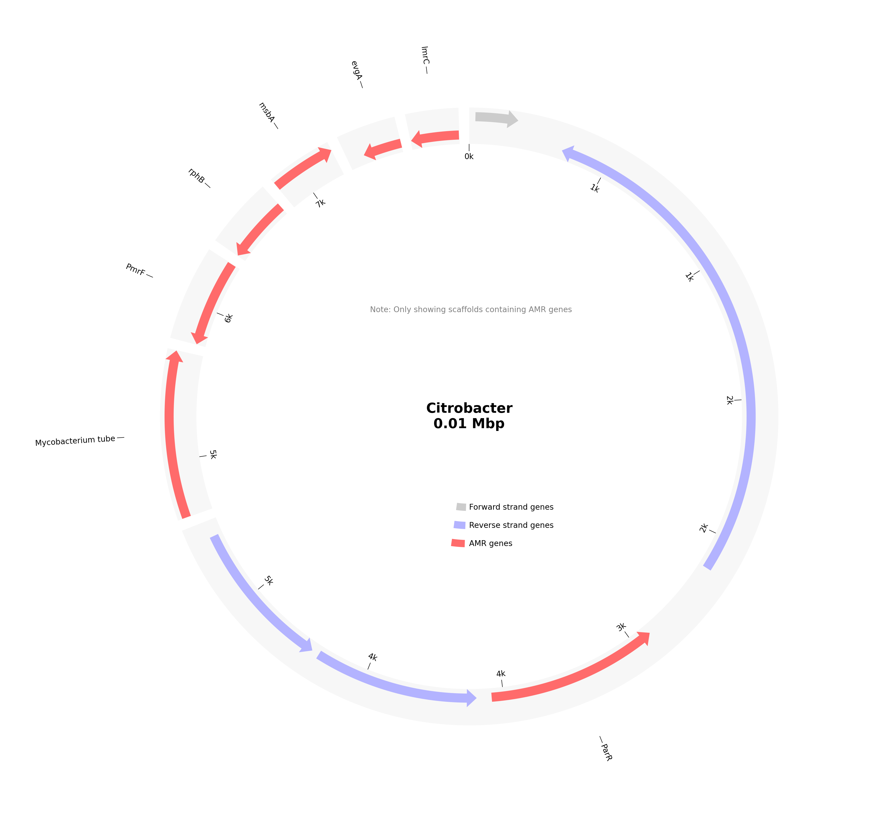

### Mycobacterium tuberculosis katG mutations conferring resistance to isoniazid
- **Mechanism**: antibiotic target alteration
- **Drug Classes**: isoniazid-like antibiotic
- **AMR Family**: isoniazid resistant katG
- **Locations**:
  - gnl|SPADES|EHPDDGNP_7620_1 : position 1-681

### ParR
- **Mechanism**: antibiotic efflux; reduced permeability to antibiotic
- **Drug Classes**: macrolide antibiotic; fluoroquinolone antibiotic; monobactam; aminoglycoside antibiotic; carbapenem; cephalosporin; cephamycin; penam; tetracycline antibiotic; phenicol antibiotic; penem; disinfecting agents and antiseptics
- **AMR Family**: resistance-nodulation-cell division (RND) antibiotic efflux pump; Outer Membrane Porin (Opr)
- **Locations**:
  - gnl|SPADES|EHPDDGNP_1058_3 : position 2944-3684

### PmrF
- **Mechanism**: antibiotic target alteration
- **Drug Classes**: peptide antibiotic
- **AMR Family**: pmr phosphoethanolamine transferase
- **Locations**:
  - gnl|SPADES|EHPDDGNP_13763_1 : position 2-376

### evgA
- **Mechanism**: antibiotic efflux
- **Drug Classes**: macrolide antibiotic; fluoroquinolone antibiotic; penam; tetracycline antibiotic
- **AMR Family**: major facilitator superfamily (MFS) antibiotic efflux pump; resistance-nodulation-cell division (RND) antibiotic efflux pump
- **Locations**:
  - gnl|SPADES|EHPDDGNP_31826_2 : position 71-238

### lmrC
- **Mechanism**: antibiotic target protection
- **Drug Classes**: lincosamide antibiotic
- **AMR Family**: Miscellaneous ABC-F subfamily ATP-binding cassette ribosomal protection proteins
- **Locations**:
  - gnl|SPADES|EHPDDGNP_40436_1 : position 2-208

### msbA
- **Mechanism**: antibiotic efflux
- **Drug Classes**: nitroimidazole antibiotic
- **AMR Family**: ATP-binding cassette (ABC) antibiotic efflux pump
- **Locations**:
  - gnl|SPADES|EHPDDGNP_24093_1 : position 1-264

### rphB
- **Mechanism**: antibiotic inactivation
- **Drug Classes**: rifamycin antibiotic
- **AMR Family**: rifampin phosphotransferase
- **Locations**:
  - gnl|SPADES|EHPDDGNP_20173_1 : position 2-280

## Citrobacter braakii
**Strain Statistics:**
- Total genome length: 22.3 kbp
- Total scaffolds: 26
- Scaffolds with AMR genes: 3
- Total genes annotated: 48
- Total AMR genes: 4
- Unique AMR genes: 3
- Distinct AMR mechanisms: 1
- Distinct AMR families: 3
- Distinct drug classes: 6

**Circos Plot:**

### H-NS (found in 2 locations)
- **Mechanism**: antibiotic efflux
- **Drug Classes**: macrolide antibiotic; fluoroquinolone antibiotic; cephalosporin; cephamycin; penam; tetracycline antibiotic
- **AMR Family**: major facilitator superfamily (MFS) antibiotic efflux pump; resistance-nodulation-cell division (RND) antibiotic efflux pump
- **Locations**:
  - gnl|SPADES|EHPDDGNP_328_17 : position 17228-17632
  - gnl|SPADES|EHPDDGNP_328_21 : position 19095-19337

### adeL
- **Mechanism**: antibiotic efflux
- **Drug Classes**: fluoroquinolone antibiotic; tetracycline antibiotic
- **AMR Family**: resistance-nodulation-cell division (RND) antibiotic efflux pump
- **Locations**:
  - gnl|SPADES|EHPDDGNP_22987_1 : position 1-267

### emrB
- **Mechanism**: antibiotic efflux
- **Drug Classes**: fluoroquinolone antibiotic
- **AMR Family**: major facilitator superfamily (MFS) antibiotic efflux pump
- **Locations**:
  - gnl|SPADES|EHPDDGNP_25573_1 : position 1-258

## Citrobacter enshiensis
**Strain Statistics:**
- Total genome length: 2.8 kbp
- Total scaffolds: 4
- Scaffolds with AMR genes: 2
- Total genes annotated: 2
- Total AMR genes: 2
- Unique AMR genes: 2
- Distinct AMR mechanisms: 2
- Distinct AMR families: 2
- Distinct drug classes: 3

**Circos Plot:**

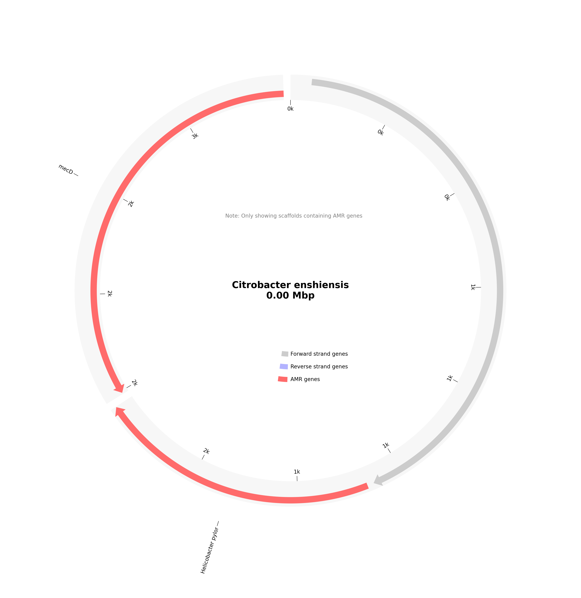

### Helicobacter pylori pbp1 mutants conferring resistance to amoxicillin
- **Mechanism**: antibiotic target alteration
- **Drug Classes**: cephalosporin; cephamycin; penam
- **AMR Family**: Penicillin-binding protein mutations conferring resistance to beta-lactam antibiotics
- **Locations**:
  - gnl|SPADES|EHPDDGNP_3101_2 : position 1250-1864

### mecD
- **Mechanism**: antibiotic target replacement
- **Drug Classes**: penam
- **AMR Family**: methicillin resistant PBP2
- **Locations**:
  - gnl|SPADES|EHPDDGNP_5771_1 : position 3-944

## Citrobacter farmeri
**Strain Statistics:**
- Total genome length: 2.8 kbp
- Total scaffolds: 4
- Scaffolds with AMR genes: 1
- Total genes annotated: 6
- Total AMR genes: 1
- Unique AMR genes: 1
- Distinct AMR mechanisms: 1
- Distinct AMR families: 1
- Distinct drug classes: 1

**Circos Plot:**

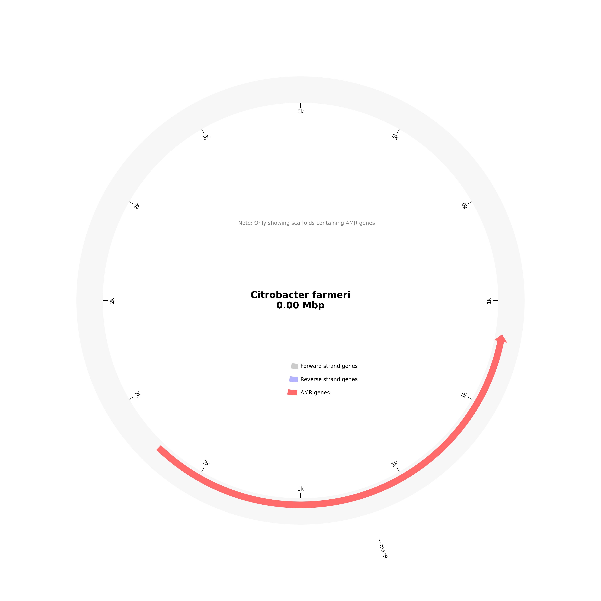

### macB
- **Mechanism**: antibiotic efflux
- **Drug Classes**: macrolide antibiotic
- **AMR Family**: ATP-binding cassette (ABC) antibiotic efflux pump
- **Locations**:
  - gnl|SPADES|EHPDDGNP_2115_3 : position 767-1726

## Citrobacter freundii complex
**Strain Statistics:**
- Total genome length: 1.9 kbp
- Total scaffolds: 9
- Scaffolds with AMR genes: 1
- Total genes annotated: 2
- Total AMR genes: 1
- Unique AMR genes: 1
- Distinct AMR mechanisms: 1
- Distinct AMR families: 1
- Distinct drug classes: 2

**Circos Plot:**

### leuO
- **Mechanism**: antibiotic efflux
- **Drug Classes**: nucleoside antibiotic; disinfecting agents and antiseptics
- **AMR Family**: major facilitator superfamily (MFS) antibiotic efflux pump
- **Locations**:
  - gnl|SPADES|EHPDDGNP_3065_2 : position 398-1342

## Citrobacter freundii complex sp. CFNIH9
**Strain Statistics:**
- Total genome length: 36.9 kbp
- Total scaffolds: 1
- Scaffolds with AMR genes: 1
- Total genes annotated: 66
- Total AMR genes: 2
- Unique AMR genes: 1
- Distinct AMR mechanisms: 1
- Distinct AMR families: 1
- Distinct drug classes: 6

**Circos Plot:**

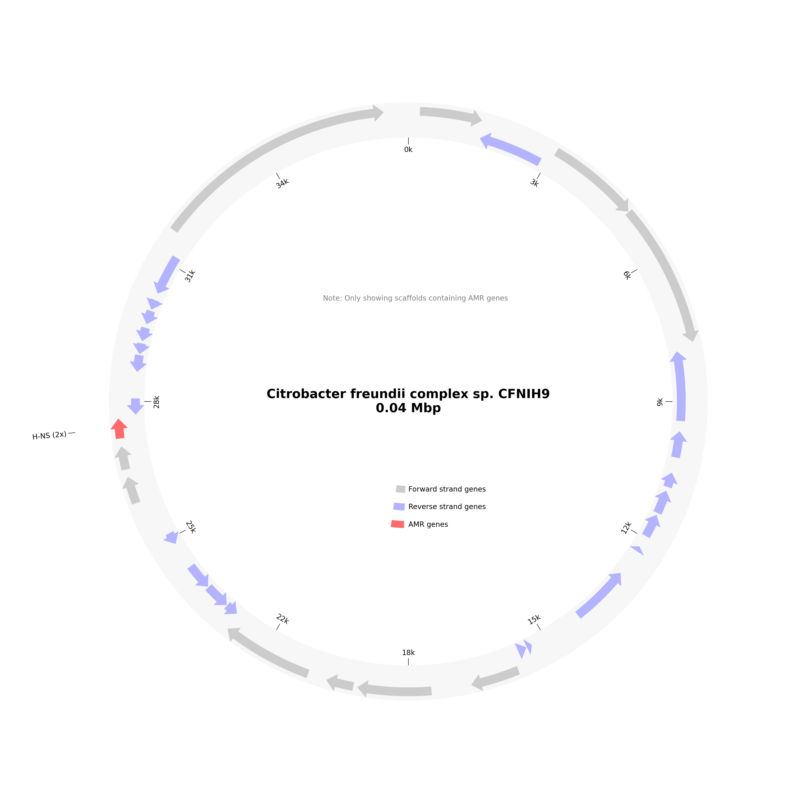

### H-NS (found in 2 locations)
- **Mechanism**: antibiotic efflux
- **Drug Classes**: macrolide antibiotic; fluoroquinolone antibiotic; cephalosporin; cephamycin; penam; tetracycline antibiotic
- **AMR Family**: major facilitator superfamily (MFS) antibiotic efflux pump; resistance-nodulation-cell division (RND) antibiotic efflux pump
- **Locations**:
  - gnl|SPADES|EHPDDGNP_212_25 : position 26911-27315
  - gnl|SPADES|EHPDDGNP_212_27 : position 27994-28236

## Citrobacter portucalensis
**Strain Statistics:**
- Total genome length: 3.4 kbp
- Total scaffolds: 16
- Scaffolds with AMR genes: 1
- Total genes annotated: 6
- Total AMR genes: 1
- Unique AMR genes: 1
- Distinct AMR mechanisms: 1
- Distinct AMR families: 1
- Distinct drug classes: 1

**Circos Plot:**

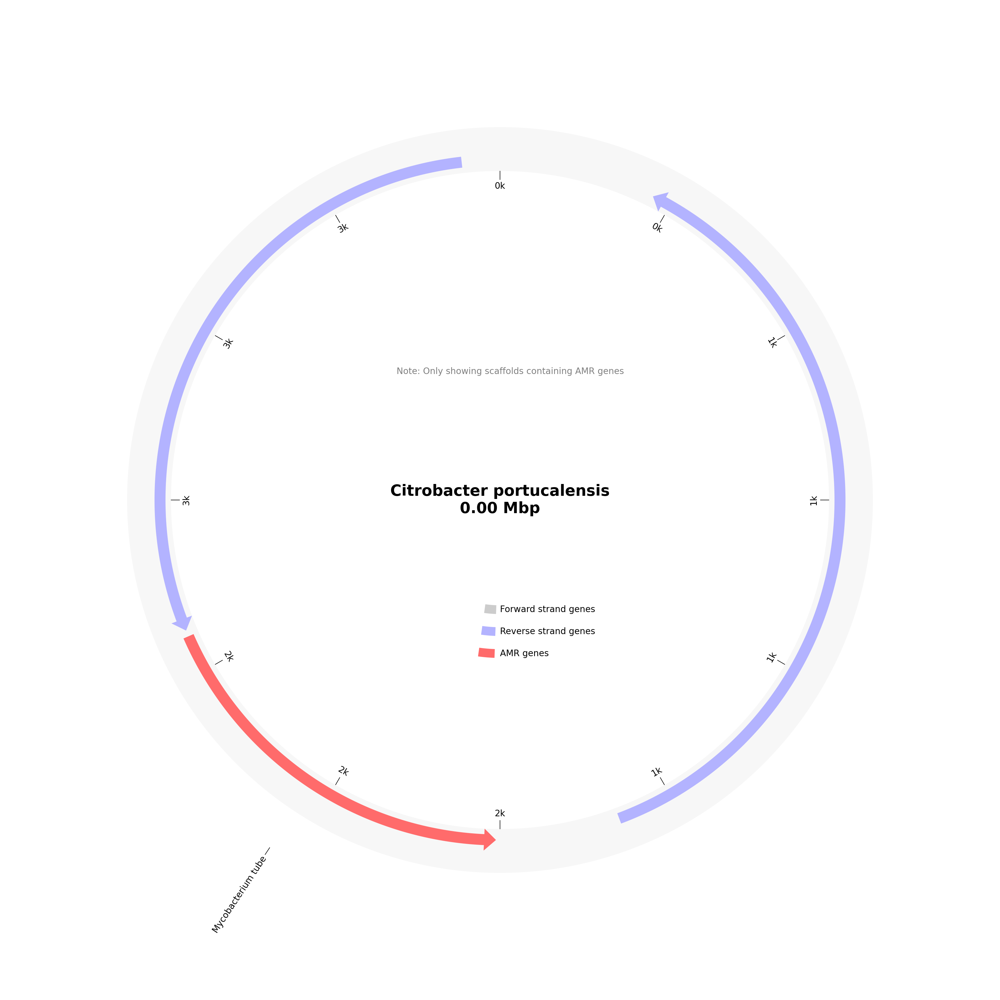

### Mycobacterium tuberculosis pncA mutations conferring resistance to pyrazinamide
- **Mechanism**: antibiotic target alteration
- **Drug Classes**: pyrazine antibiotic
- **AMR Family**: Pyrazinamide resistant pncA
- **Locations**:
  - gnl|SPADES|EHPDDGNP_1666_3 : position 1730-2359

## Citrobacter sp. 21OH12SH02A-Citro
**Strain Statistics:**
- Total genome length: 3.0 kbp
- Total scaffolds: 2
- Scaffolds with AMR genes: 1
- Total genes annotated: 4
- Total AMR genes: 1
- Unique AMR genes: 1
- Distinct AMR mechanisms: 1
- Distinct AMR families: 1
- Distinct drug classes: 4

**Circos Plot:**

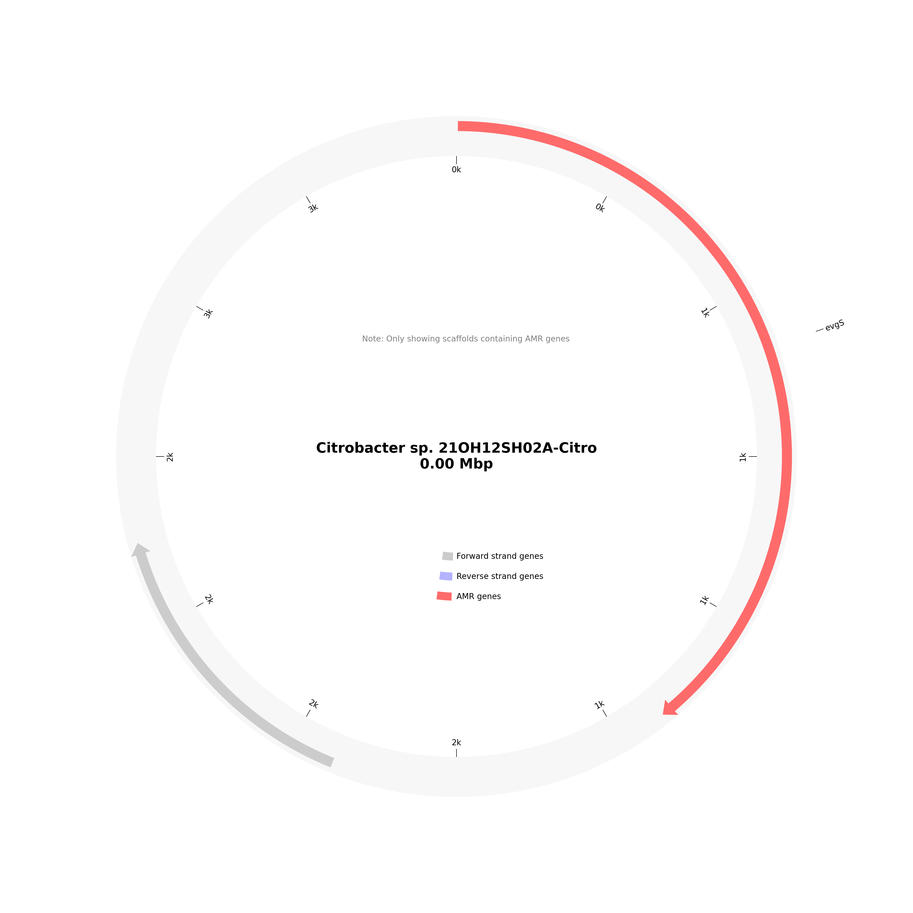

### evgS
- **Mechanism**: antibiotic efflux
- **Drug Classes**: macrolide antibiotic; fluoroquinolone antibiotic; penam; tetracycline antibiotic
- **AMR Family**: major facilitator superfamily (MFS) antibiotic efflux pump; resistance-nodulation-cell division (RND) antibiotic efflux pump
- **Locations**:
  - gnl|SPADES|EHPDDGNP_1915_1 : position 2-1195

## Citrobacter sp. R56
**Strain Statistics:**
- Total genome length: 2.6 kbp
- Total scaffolds: 5
- Scaffolds with AMR genes: 1
- Total genes annotated: 6
- Total AMR genes: 1
- Unique AMR genes: 1
- Distinct AMR mechanisms: 1
- Distinct AMR families: 1
- Distinct drug classes: 4

**Circos Plot:**

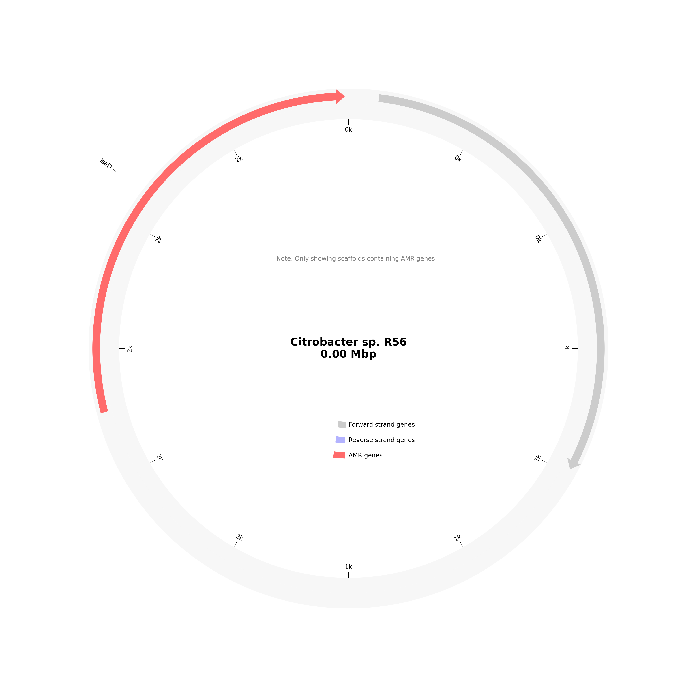

### lsaD
- **Mechanism**: antibiotic target protection
- **Drug Classes**: lincosamide antibiotic; streptogramin antibiotic; streptogramin A antibiotic; pleuromutilin antibiotic
- **AMR Family**: lsa-type ABC-F protein
- **Locations**:
  - gnl|SPADES|EHPDDGNP_2254_3 : position 1850-2602

## Enterobacter hormaechei
**Strain Statistics:**
- Total genome length: 5.5 kbp
- Total scaffolds: 16
- Scaffolds with AMR genes: 1
- Total genes annotated: 12
- Total AMR genes: 1
- Unique AMR genes: 1
- Distinct AMR mechanisms: 1
- Distinct AMR families: 1
- Distinct drug classes: 10

**Circos Plot:**

### adeN
- **Mechanism**: antibiotic efflux
- **Drug Classes**: macrolide antibiotic; fluoroquinolone antibiotic; lincosamide antibiotic; carbapenem; cephalosporin; tetracycline antibiotic; rifamycin antibiotic; diaminopyrimidine antibiotic; phenicol antibiotic; penem
- **AMR Family**: resistance-nodulation-cell division (RND) antibiotic efflux pump
- **Locations**:
  - gnl|SPADES|EHPDDGNP_988_1 : position 255-875

## Enterobacter hormaechei subsp. hormaechei
**Strain Statistics:**
- Total genome length: 2.2 kbp
- Total scaffolds: 3
- Scaffolds with AMR genes: 1
- Total genes annotated: 4
- Total AMR genes: 1
- Unique AMR genes: 1
- Distinct AMR mechanisms: 1
- Distinct AMR families: 1
- Distinct drug classes: 1

**Circos Plot:**

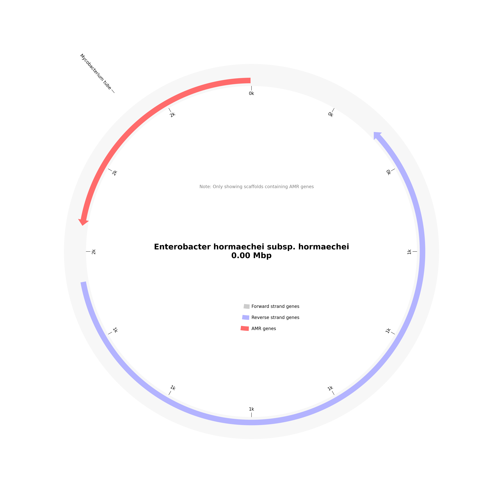

### Mycobacterium tuberculosis katG mutations conferring resistance to isoniazid
- **Mechanism**: antibiotic target alteration
- **Drug Classes**: isoniazid-like antibiotic
- **AMR Family**: isoniazid resistant katG
- **Locations**:
  - gnl|SPADES|EHPDDGNP_2601_3 : position 1740-2246

## Enterobacter hormaechei subsp. steigerwaltii
**Strain Statistics:**
- Total genome length: 6.4 kbp
- Total scaffolds: 1
- Scaffolds with AMR genes: 1
- Total genes annotated: 18
- Total AMR genes: 1
- Unique AMR genes: 1
- Distinct AMR mechanisms: 1
- Distinct AMR families: 1
- Distinct drug classes: 3

**Circos Plot:**

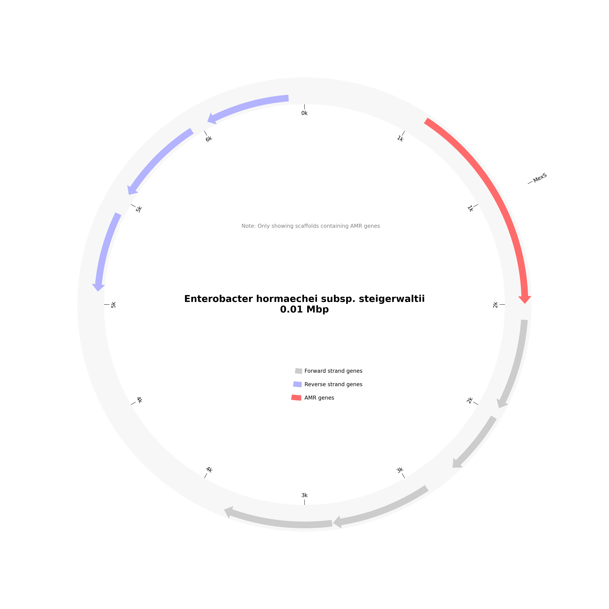

### MexS
- **Mechanism**: antibiotic efflux
- **Drug Classes**: fluoroquinolone antibiotic; diaminopyrimidine antibiotic; phenicol antibiotic
- **AMR Family**: resistance-nodulation-cell division (RND) antibiotic efflux pump
- **Locations**:
  - gnl|SPADES|EHPDDGNP_859_1 : position 597-1607

## Escherichia coli
**Strain Statistics:**
- Total genome length: 32.0 kbp
- Total scaffolds: 81
- Scaffolds with AMR genes: 6
- Total genes annotated: 70
- Total AMR genes: 6
- Unique AMR genes: 6
- Distinct AMR mechanisms: 2
- Distinct AMR families: 5
- Distinct drug classes: 8

**Circos Plot:**

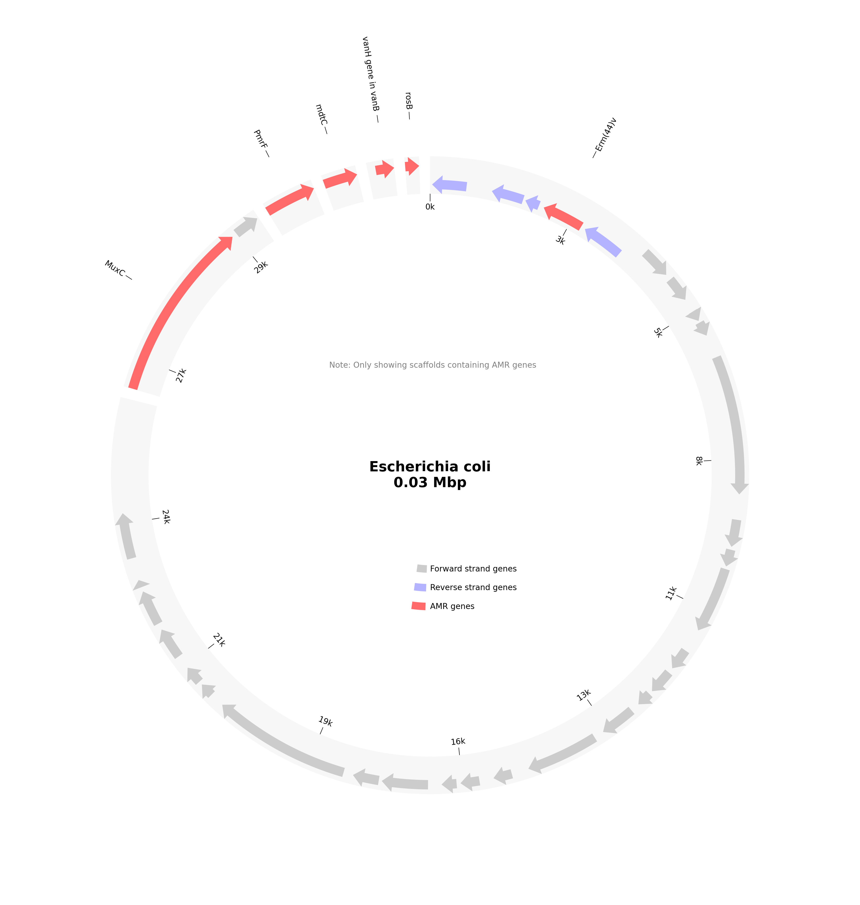

### Erm(44)v
- **Mechanism**: antibiotic target alteration
- **Drug Classes**: macrolide antibiotic; lincosamide antibiotic; streptogramin antibiotic
- **AMR Family**: Erm 23S ribosomal RNA methyltransferase
- **Locations**:
  - gnl|SPADES|EHPDDGNP_277_4 : position 2115-2876

### MuxC
- **Mechanism**: antibiotic efflux
- **Drug Classes**: macrolide antibiotic; monobactam; tetracycline antibiotic; aminocoumarin antibiotic
- **AMR Family**: resistance-nodulation-cell division (RND) antibiotic efflux pump
- **Locations**:
  - gnl|SPADES|EHPDDGNP_1550_1 : position 3-3143

### PmrF
- **Mechanism**: antibiotic target alteration
- **Drug Classes**: peptide antibiotic
- **AMR Family**: pmr phosphoethanolamine transferase
- **Locations**:
  - gnl|SPADES|EHPDDGNP_6096_1 : position 1-885

### mdtC
- **Mechanism**: antibiotic efflux
- **Drug Classes**: aminocoumarin antibiotic
- **AMR Family**: resistance-nodulation-cell division (RND) antibiotic efflux pump
- **Locations**:
  - gnl|SPADES|EHPDDGNP_8710_1 : position 3-587

### rosB
- **Mechanism**: antibiotic efflux
- **Drug Classes**: peptide antibiotic
- **AMR Family**: major facilitator superfamily (MFS) antibiotic efflux pump
- **Locations**:
  - gnl|SPADES|EHPDDGNP_30245_1 : position 3-242

### vanH gene in vanB cluster
- **Mechanism**: antibiotic target alteration
- **Drug Classes**: glycopeptide antibiotic
- **AMR Family**: vanH; glycopeptide resistance gene cluster
- **Locations**:
  - gnl|SPADES|EHPDDGNP_11217_1 : position 138-455

## Ewingella americana
**Strain Statistics:**
- Total genome length: 4434.5 kbp
- Total scaffolds: 102
- Scaffolds with AMR genes: 68
- Total genes annotated: 8270
- Total AMR genes: 513
- Unique AMR genes: 216
- Distinct AMR mechanisms: 12
- Distinct AMR families: 75
- Distinct drug classes: 37

**Circos Plot:**

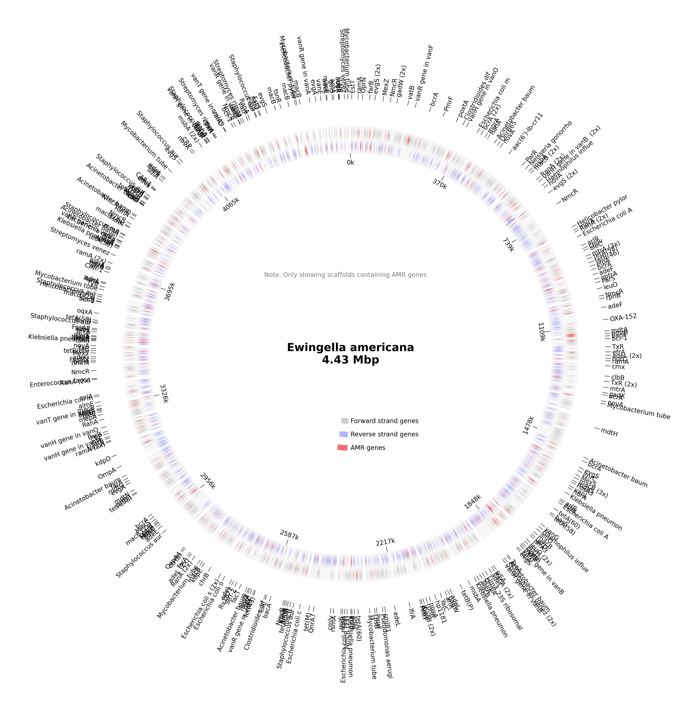

### Acinetobacter baumannii AbaF (found in 7 locations)
- **Mechanism**: antibiotic efflux
- **Drug Classes**: phosphonic acid antibiotic
- **AMR Family**: major facilitator superfamily (MFS) antibiotic efflux pump
- **Locations**:
  - gnl|SPADES|EHPDDGNP_130_43 : position 39944-41446
  - gnl|SPADES|EHPDDGNP_13_105 : position 115519-116841
  - gnl|SPADES|EHPDDGNP_203_17 : position 18560-19876
  - gnl|SPADES|EHPDDGNP_20_132 : position 134176-135525
  - gnl|SPADES|EHPDDGNP_222_5 : position 3789-5027
  - gnl|SPADES|EHPDDGNP_35_121 : position 122165-123511
  - gnl|SPADES|EHPDDGNP_61_72 : position 82596-83927

### Acinetobacter baumannii AbaQ (found in 7 locations)
- **Mechanism**: antibiotic efflux
- **Drug Classes**: fluoroquinolone antibiotic
- **AMR Family**: major facilitator superfamily (MFS) antibiotic efflux pump
- **Locations**:
  - gnl|SPADES|EHPDDGNP_13_10 : position 11476-12792
  - gnl|SPADES|EHPDDGNP_13_17 : position 18604-19872
  - gnl|SPADES|EHPDDGNP_15_43 : position 49198-50553
  - gnl|SPADES|EHPDDGNP_225_4 : position 2011-3207
  - gnl|SPADES|EHPDDGNP_90_84 : position 81381-82721
  - gnl|SPADES|EHPDDGNP_92_28 : position 24237-25466
  - gnl|SPADES|EHPDDGNP_92_37 : position 35429-36784

### ArnT
- **Mechanism**: antibiotic target alteration
- **Drug Classes**: peptide antibiotic
- **AMR Family**: pmr phosphoethanolamine transferase
- **Locations**:
  - gnl|SPADES|EHPDDGNP_78_29: position 32930-34600

### CAR-1 (found in 2 locations)
- **Mechanism**: antibiotic inactivation
- **Drug Classes**: carbapenem
- **AMR Family**: CAR beta-lactamase
- **Locations**:
  - gnl|SPADES|EHPDDGNP_194_5 : position 5014-5739
  - gnl|SPADES|EHPDDGNP_236_24 : position 20864-21619

### CRP (found in 3 locations)
- **Mechanism**: antibiotic efflux
- **Drug Classes**: macrolide antibiotic; fluoroquinolone antibiotic; penam
- **AMR Family**: resistance-nodulation-cell division (RND) antibiotic efflux pump
- **Locations**:
  - gnl|SPADES|EHPDDGNP_142_37 : position 38999-39754
  - gnl|SPADES|EHPDDGNP_225_1 : position 3-137
  - gnl|SPADES|EHPDDGNP_253_28 : position 28639-29187

### CfiA11
- **Mechanism**: antibiotic inactivation
- **Drug Classes**: carbapenem
- **AMR Family**: CfiA beta-lactamase
- **Locations**:
  - gnl|SPADES|EHPDDGNP_90_65 : position 65981-66832

### Clostridioides difficile gyrA conferring resistance to fluoroquinolones
- **Mechanism**: antibiotic target alteration
- **Drug Classes**: fluoroquinolone antibiotic
- **AMR Family**: fluoroquinolone resistant gyrA
- **Locations**:
  - gnl|SPADES|EHPDDGNP_15_70 : position 99563-102232

### Clostridioides difficile gyrB conferring resistance to fluoroquinolones (found in 2 locations)
- **Mechanism**: antibiotic target alteration
- **Drug Classes**: fluoroquinolone antibiotic
- **AMR Family**: fluoroquinolone resistant gyrB
- **Locations**:
  - gnl|SPADES|EHPDDGNP_13_4 : position 4337-6751
  - gnl|SPADES|EHPDDGNP_90_21 : position 20562-22478

### CrcB
- **Mechanism**: antibiotic efflux
- **Drug Classes**: aminoglycoside antibiotic
- **AMR Family**: multidrug and toxic compound extrusion (MATE) transporter
- **Locations**:
  - gnl|SPADES|EHPDDGNP_188_19 : position 17102-17485

### Enterobacter cloacae acrA
- **Mechanism**: antibiotic efflux
- **Drug Classes**: fluoroquinolone antibiotic; cephalosporin; glycylcycline; penam; tetracycline antibiotic; rifamycin antibiotic; phenicol antibiotic; disinfecting agents and antiseptics
- **AMR Family**: resistance-nodulation-cell division (RND) antibiotic efflux pump
- **Locations**:
  - gnl|SPADES|EHPDDGNP_84_42 : position 43454-44644

### Enterococcus faecalis cls with mutation conferring resistance to daptomycin
- **Mechanism**: antibiotic target alteration
- **Drug Classes**: peptide antibiotic
- **AMR Family**: daptomycin resistant cls
- **Locations**:
  - gnl|SPADES|EHPDDGNP_163_9 : position 10025-11485

### ErmC
- **Mechanism**: antibiotic target alteration
- **Drug Classes**: macrolide antibiotic; lincosamide antibiotic; streptogramin antibiotic; streptogramin A antibiotic; streptogramin B antibiotic
- **AMR Family**: Erm 23S ribosomal RNA methyltransferase
- **Locations**:
  - gnl|SPADES|EHPDDGNP_46_99 : position 119565-120398

### Escherichia coli AcrAB-TolC with AcrR mutation conferring resistance to ciprofloxacin, tetracycline, and ceftazidime (found in 2 locations)
- **Mechanism**: antibiotic target alteration; antibiotic efflux
- **Drug Classes**: fluoroquinolone antibiotic; cephalosporin; glycylcycline; penam; tetracycline antibiotic; rifamycin antibiotic; phenicol antibiotic; disinfecting agents and antiseptics
- **AMR Family**: resistance-nodulation-cell division (RND) antibiotic efflux pump
- **Locations**:
  - gnl|SPADES|EHPDDGNP_18_28 : position 25215-25820
  - gnl|SPADES|EHPDDGNP_40_126 : position 128535-129134

### Escherichia coli cyaA with mutation conferring resistance to fosfomycin
- **Mechanism**: antibiotic target alteration
- **Drug Classes**: phosphonic acid antibiotic
- **AMR Family**: antibiotic-resistant cya adenylate cyclase
- **Locations**:
  - gnl|SPADES|EHPDDGNP_86_5 : position 5507-8065

### Escherichia coli fabI mutations conferring resistance to isoniazid and triclosan (found in 2 locations)
- **Mechanism**: antibiotic target alteration
- **Drug Classes**: disinfecting agents and antiseptics; isoniazid-like antibiotic
- **AMR Family**: antibiotic resistant fabI
- **Locations**:
  - gnl|SPADES|EHPDDGNP_84_61 : position 63691-64467
  - gnl|SPADES|EHPDDGNP_84_66 : position 67962-68708

### Escherichia coli mdfA (found in 2 locations)
- **Mechanism**: antibiotic efflux
- **Drug Classes**: tetracycline antibiotic; phenicol antibiotic; disinfecting agents and antiseptics
- **AMR Family**: major facilitator superfamily (MFS) antibiotic efflux pump
- **Locations**:
  - gnl|SPADES|EHPDDGNP_13_51 : position 54516-55754
  - gnl|SPADES|EHPDDGNP_151_19 : position 21303-22526

### Escherichia coli ompF with mutation conferring resistance to beta-lactam antibiotics
- **Mechanism**: reduced permeability to antibiotic
- **Drug Classes**: monobactam; carbapenem; cephalosporin; cephamycin; penam; penem
- **AMR Family**: General Bacterial Porin with reduced permeability to beta-lactams
- **Locations**:
  - gnl|SPADES|EHPDDGNP_92_59 : position 64083-65222

### Escherichia coli soxS with mutation conferring antibiotic resistance (found in 4 locations)
- **Mechanism**: antibiotic target alteration; antibiotic efflux; reduced permeability to antibiotic
- **Drug Classes**: fluoroquinolone antibiotic; monobactam; carbapenem; cephalosporin; glycylcycline; cephamycin; penam; tetracycline antibiotic; rifamycin antibiotic; phenicol antibiotic; penem; disinfecting agents and antiseptics
- **AMR Family**: ATP-binding cassette (ABC) antibiotic efflux pump; major facilitator superfamily (MFS) antibiotic efflux pump; resistance-nodulation-cell division (RND) antibiotic efflux pump; General Bacterial Porin with reduced permeability to beta-lactams
- **Locations**:
  - gnl|SPADES|EHPDDGNP_18_152 : position 153547-153906
  - gnl|SPADES|EHPDDGNP_203_6 : position 5235-6101
  - gnl|SPADES|EHPDDGNP_92_54 : position 59410-60246
  - gnl|SPADES|EHPDDGNP_92_70 : position 78845-79672

### EstT (found in 2 locations)
- **Mechanism**: antibiotic inactivation
- **Drug Classes**: macrolide antibiotic
- **AMR Family**: macrolide esterase
- **Locations**:
  - gnl|SPADES|EHPDDGNP_347_18 : position 15838-16677
  - gnl|SPADES|EHPDDGNP_6_3 : position 2861-3871

### FosA3
- **Mechanism**: antibiotic inactivation
- **Drug Classes**: phosphonic acid antibiotic
- **AMR Family**: fosfomycin thiol transferase
- **Locations**:
  - gnl|SPADES|EHPDDGNP_40_53 : position 54985-55410

### FosA8
- **Mechanism**: antibiotic inactivation
- **Drug Classes**: phosphonic acid antibiotic
- **AMR Family**: fosfomycin thiol transferase
- **Locations**:
  - gnl|SPADES|EHPDDGNP_178_39: position 43942-44352

### FosM2
- **Mechanism**: antibiotic inactivation
- **Drug Classes**: phosphonic acid antibiotic
- **AMR Family**: fosfomycin thiol transferase
- **Locations**:
  - gnl|SPADES|EHPDDGNP_166_10 : position 10826-11233

### H-NS
- **Mechanism**: antibiotic efflux
- **Drug Classes**: macrolide antibiotic; fluoroquinolone antibiotic; cephalosporin; cephamycin; penam; tetracycline antibiotic
- **AMR Family**: major facilitator superfamily (MFS) antibiotic efflux pump; resistance-nodulation-cell division (RND) antibiotic efflux pump
- **Locations**:
  - gnl|SPADES|EHPDDGNP_655_6 : position 5626-6033

### Haemophilus influenzae PBP3 conferring resistance to beta-lactam antibiotics (found in 2 locations)
- **Mechanism**: antibiotic target alteration
- **Drug Classes**: cephalosporin; cephamycin; penam
- **AMR Family**: Penicillin-binding protein mutations conferring resistance to beta-lactam antibiotics
- **Locations**:
  - gnl|SPADES|EHPDDGNP_15_56 : position 63094-64869
  - gnl|SPADES|EHPDDGNP_46_72 : position 82797-84560

### Helicobacter pylori pbp1 mutants conferring resistance to amoxicillin
- **Mechanism**: antibiotic target alteration
- **Drug Classes**: cephalosporin; cephamycin; penam
- **AMR Family**: Penicillin-binding protein mutations conferring resistance to beta-lactam antibiotics
- **Locations**:
  - gnl|SPADES|EHPDDGNP_15_175 : position 219642-221999

### Helicobacter pylori pbp2 mutants conferring resistance to amoxicillin
- **Mechanism**: antibiotic target alteration
- **Drug Classes**: cephalosporin; cephamycin; penam
- **AMR Family**: Penicillin-binding protein mutations conferring resistance to beta-lactam antibiotics
- **Locations**:
  - gnl|SPADES|EHPDDGNP_188_34 : position 30882-32786

### Helicobacter pylori rpoB mutation conferring resistance to rifampicin
- **Mechanism**: antibiotic target alteration; antibiotic target replacement
- **Drug Classes**: fluoroquinolone antibiotic; rifamycin antibiotic
- **AMR Family**: rifamycin-resistant beta-subunit of RNA polymerase (rpoB)
- **Locations**:
  - gnl|SPADES|EHPDDGNP_438_7 : position 5965-10185

### Klebsiella aerogenes Omp36
- **Mechanism**: reduced permeability to antibiotic
- **Drug Classes**: monobactam; carbapenem; cephalosporin; cephamycin; penam; penem
- **AMR Family**: General Bacterial Porin with reduced permeability to beta-lactams
- **Locations**:
  - gnl|SPADES|EHPDDGNP_15_60 : position 67064-68185

### Klebsiella pneumoniae KpnG
- **Mechanism**: antibiotic efflux
- **Drug Classes**: macrolide antibiotic; fluoroquinolone antibiotic; aminoglycoside antibiotic; carbapenem; cephalosporin; penam; peptide antibiotic; penem
- **AMR Family**: major facilitator superfamily (MFS) antibiotic efflux pump
- **Locations**:
  - gnl|SPADES|EHPDDGNP_178_8 : position 9290-10486

### Klebsiella pneumoniae KpnH (found in 2 locations)
- **Mechanism**: antibiotic efflux
- **Drug Classes**: macrolide antibiotic; fluoroquinolone antibiotic; aminoglycoside antibiotic; carbapenem; cephalosporin; penam; peptide antibiotic; penem
- **AMR Family**: major facilitator superfamily (MFS) antibiotic efflux pump
- **Locations**:
  - gnl|SPADES|EHPDDGNP_178_7: position 7728-9272
  - gnl|SPADES|EHPDDGNP_6_30 : position 36724-38292

### Klebsiella pneumoniae OmpK37 (found in 4 locations)
- **Mechanism**: reduced permeability to antibiotic
- **Drug Classes**: monobactam; carbapenem; cephalosporin; cephamycin; penam; penem
- **AMR Family**: General Bacterial Porin with reduced permeability to beta-lactams
- **Locations**:
  - gnl|SPADES|EHPDDGNP_18_64 : position 67359-68519
  - gnl|SPADES|EHPDDGNP_196_33 : position 39364-40467
  - gnl|SPADES|EHPDDGNP_40_94 : position 91808-92908
  - gnl|SPADES|EHPDDGNP_68_69 : position 81582-82691

### Klebsiella pneumoniae acrR with mutation conferring multidrug antibiotic resistance
- **Mechanism**: antibiotic target alteration; antibiotic efflux
- **Drug Classes**: fluoroquinolone antibiotic; cephalosporin; glycylcycline; penam; tetracycline antibiotic; rifamycin antibiotic; phenicol antibiotic; disinfecting agents and antiseptics
- **AMR Family**: resistance-nodulation-cell division (RND) antibiotic efflux pump
- **Locations**:
  - gnl|SPADES|EHPDDGNP_84_43 : position 44750-45433

### Klebsiella pneumoniae ramR mutants
- **Mechanism**: antibiotic target alteration; antibiotic efflux
- **Drug Classes**: fluoroquinolone antibiotic; cephalosporin; glycylcycline; penam; tetracycline antibiotic; rifamycin antibiotic; phenicol antibiotic; disinfecting agents and antiseptics
- **AMR Family**: resistance-nodulation-cell division (RND) antibiotic efflux pump
- **Locations**:
  - gnl|SPADES|EHPDDGNP_13_123 : position 134053-134706

### LRA-19
- **Mechanism**: antibiotic inactivation
- **Drug Classes**: cephalosporin; penam
- **AMR Family**: subclass B3 LRA beta-lactamase
- **Locations**:
  - gnl|SPADES|EHPDDGNP_68_71 : position 84207-84854

### LlmA 23S ribosomal RNA methyltransferase
- **Mechanism**: antibiotic target alteration
- **Drug Classes**: lincosamide antibiotic
- **AMR Family**: Llm 23S ribosomal RNA methyltransferase
- **Locations**:
  - gnl|SPADES|EHPDDGNP_68_37 : position 43146-44339

### LpsB
- **Mechanism**: reduced permeability to antibiotic
- **Drug Classes**: peptide antibiotic
- **AMR Family**: Intrinsic peptide antibiotic resistant Lps
- **Locations**:
  - gnl|SPADES|EHPDDGNP_81_65 : position 71404-72504

### LptD
- **Mechanism**: antibiotic efflux
- **Drug Classes**: carbapenem; peptide antibiotic; aminocoumarin antibiotic; rifamycin antibiotic
- **AMR Family**: ATP-binding cassette (ABC) antibiotic efflux pump
- **Locations**:
  - gnl|SPADES|EHPDDGNP_46_96 : position 114810-117185

### MCR-10.4
- **Mechanism**: antibiotic target alteration
- **Drug Classes**: peptide antibiotic
- **AMR Family**: MCR phosphoethanolamine transferase
- **Locations**:
  - gnl|SPADES|EHPDDGNP_6_4 : position 3934-5565

### MdtK
- **Mechanism**: antibiotic efflux
- **Drug Classes**: fluoroquinolone antibiotic
- **AMR Family**: multidrug and toxic compound extrusion (MATE) transporter
- **Locations**:
  - gnl|SPADES|EHPDDGNP_204_9 : position 7973-9364

### MexH
- **Mechanism**: antibiotic efflux
- **Drug Classes**: fluoroquinolone antibiotic; tetracycline antibiotic; disinfecting agents and antiseptics
- **AMR Family**: resistance-nodulation-cell division (RND) antibiotic efflux pump
- **Locations**:
  - gnl|SPADES|EHPDDGNP_128_9 : position 8178-9434

### MexS (found in 3 locations)
- **Mechanism**: antibiotic efflux
- **Drug Classes**: fluoroquinolone antibiotic; diaminopyrimidine antibiotic; phenicol antibiotic
- **AMR Family**: resistance-nodulation-cell division (RND) antibiotic efflux pump
- **Locations**:
  - gnl|SPADES|EHPDDGNP_128_26 : position 29023-30147
  - gnl|SPADES|EHPDDGNP_150_38 : position 47317-48303
  - gnl|SPADES|EHPDDGNP_40_27 : position 28561-29604

### MexT (found in 3 locations)
- **Mechanism**: antibiotic efflux
- **Drug Classes**: fluoroquinolone antibiotic; diaminopyrimidine antibiotic; phenicol antibiotic
- **AMR Family**: resistance-nodulation-cell division (RND) antibiotic efflux pump
- **Locations**:
  - gnl|SPADES|EHPDDGNP_166_29 : position 28378-29325
  - gnl|SPADES|EHPDDGNP_18_123 : position 121928-122857
  - gnl|SPADES|EHPDDGNP_18_18 : position 14922-15839

### MexZ (found in 2 locations)
- **Mechanism**: antibiotic efflux
- **Drug Classes**: macrolide antibiotic; fluoroquinolone antibiotic; aminoglycoside antibiotic; carbapenem; cephalosporin; cephamycin; penam; tetracycline antibiotic; phenicol antibiotic; disinfecting agents and antiseptics
- **AMR Family**: resistance-nodulation-cell division (RND) antibiotic efflux pump
- **Locations**:
  - gnl|SPADES|EHPDDGNP_6_91 : position 99061-99642
  - gnl|SPADES|EHPDDGNP_81_83 : position 88038-88658

### MuxA
- **Mechanism**: antibiotic efflux
- **Drug Classes**: macrolide antibiotic; monobactam; tetracycline antibiotic; aminocoumarin antibiotic
- **AMR Family**: resistance-nodulation-cell division (RND) antibiotic efflux pump
- **Locations**:
  - gnl|SPADES|EHPDDGNP_61_20 : position 27337-28632

### MuxC
- **Mechanism**: antibiotic efflux
- **Drug Classes**: macrolide antibiotic; monobactam; tetracycline antibiotic; aminocoumarin antibiotic
- **AMR Family**: resistance-nodulation-cell division (RND) antibiotic efflux pump
- **Locations**:
  - gnl|SPADES|EHPDDGNP_61_18 : position 20984-24112

### Mycobacterium tuberculosis gidB mutation conferring resistance to streptomycin
- **Mechanism**: antibiotic target alteration
- **Drug Classes**: aminoglycoside antibiotic
- **AMR Family**: antibiotic resistant gidB
- **Locations**:
  - gnl|SPADES|EHPDDGNP_1291_2 : position 2032-2652

### Mycobacterium tuberculosis kasA mutant conferring resistance to isoniazid
- **Mechanism**: antibiotic target alteration
- **Drug Classes**: isoniazid-like antibiotic
- **AMR Family**: antibiotic resistant kasA
- **Locations**:
  - gnl|SPADES|EHPDDGNP_81_82 : position 86612-87886

### Mycobacterium tuberculosis katG mutations conferring resistance to isoniazid
- **Mechanism**: antibiotic target alteration
- **Drug Classes**: isoniazid-like antibiotic
- **AMR Family**: isoniazid resistant katG
- **Locations**:
  - gnl|SPADES|EHPDDGNP_6_100 : position 107276-109453

### Mycobacterium tuberculosis ndh with mutation conferring resistance to isoniazid
- **Mechanism**: antibiotic target alteration
- **Drug Classes**: isoniazid-like antibiotic
- **AMR Family**: antibiotic resistant ndh
- **Locations**:
  - gnl|SPADES|EHPDDGNP_103_66 : position 62808-64115

### Mycobacterium tuberculosis pncA mutations conferring resistance to pyrazinamide (found in 2 locations)
- **Mechanism**: antibiotic target alteration
- **Drug Classes**: pyrazine antibiotic
- **AMR Family**: Pyrazinamide resistant pncA
- **Locations**:
  - gnl|SPADES|EHPDDGNP_191_3 : position 1251-1877
  - gnl|SPADES|EHPDDGNP_27_110 : position 123028-123717

### Mycobacterium tuberculosis rpoB mutations conferring resistance to rifampicin
- **Mechanism**: antibiotic target alteration; antibiotic target replacement
- **Drug Classes**: rifamycin antibiotic
- **AMR Family**: rifamycin-resistant beta-subunit of RNA polymerase (rpoB)
- **Locations**:
  - gnl|SPADES|EHPDDGNP_438_8 : position 10277-14305

### Mycobacterium tuberculosis thyA with mutation conferring resistance to para-aminosalicylic acid
- **Mechanism**: antibiotic target alteration
- **Drug Classes**: salicylic acid antibiotic
- **AMR Family**: aminosalicylate resistant thymidylate synthase
- **Locations**:
  - gnl|SPADES|EHPDDGNP_242_11 : position 13596-14390

### Neisseria gonorrhoeae pilQ gene conferring resistance to beta-lactam
- **Mechanism**: antibiotic target alteration
- **Drug Classes**: cephalosporin; cephamycin; penam
- **AMR Family**: Penicillin-binding protein mutations conferring resistance to beta-lactam antibiotics
- **Locations**:
  - gnl|SPADES|EHPDDGNP_13_216 : position 239571-240842

### NmcR (found in 18 locations)
- **Mechanism**: antibiotic inactivation
- **Drug Classes**: carbapenem; cephalosporin; cephamycin; penam
- **AMR Family**: NmcA beta-lactamase
- **Locations**:
  - gnl|SPADES|EHPDDGNP_13_128 : position 140454-141371
  - gnl|SPADES|EHPDDGNP_142_12 : position 16205-17077
  - gnl|SPADES|EHPDDGNP_15_99 : position 135958-136902
  - gnl|SPADES|EHPDDGNP_163_34 : position 34446-35420
  - gnl|SPADES|EHPDDGNP_178_12 : position 14414-15295
  - gnl|SPADES|EHPDDGNP_18_55 : position 58529-59383
  - gnl|SPADES|EHPDDGNP_196_31 : position 37110-38009
  - gnl|SPADES|EHPDDGNP_204_21 : position 20053-20964
  - gnl|SPADES|EHPDDGNP_20_3 : position 1459-2379
  - gnl|SPADES|EHPDDGNP_222_11 : position 11843-12724
  - gnl|SPADES|EHPDDGNP_222_2 : position 576-1403
  - gnl|SPADES|EHPDDGNP_225_8 : position 6432-7331
  - gnl|SPADES|EHPDDGNP_322_17 : position 16255-17175
  - gnl|SPADES|EHPDDGNP_40_31 : position 32781-33743
  - gnl|SPADES|EHPDDGNP_6_117 : position 121519-122400
  - gnl|SPADES|EHPDDGNP_84_53 : position 56357-57229
  - gnl|SPADES|EHPDDGNP_84_62 : position 64668-65594
  - gnl|SPADES|EHPDDGNP_86_57 : position 57655-58578

### OXA-152
- **Mechanism**: antibiotic inactivation
- **Drug Classes**: carbapenem; penam
- **AMR Family**: OXA beta-lactamase; OXA-62-like beta-lactamase
- **Locations**:
  - gnl|SPADES|EHPDDGNP_20_86 : position 75157-75831

### OmpA (found in 3 locations)
- **Mechanism**: reduced permeability to antibiotic
- **Drug Classes**: peptide antibiotic
- **AMR Family**: General Bacterial Porin with reduced permeability to peptide antibiotics
- **Locations**:
  - gnl|SPADES|EHPDDGNP_137_2 : position 1301-1807
  - gnl|SPADES|EHPDDGNP_13_23 : position 23635-24297
  - gnl|SPADES|EHPDDGNP_68_47 : position 53486-54565

### OpmB
- **Mechanism**: antibiotic efflux
- **Drug Classes**: macrolide antibiotic; monobactam; tetracycline antibiotic; aminocoumarin antibiotic
- **AMR Family**: resistance-nodulation-cell division (RND) antibiotic efflux pump
- **Locations**:
  - gnl|SPADES|EHPDDGNP_61_17 : position 19552-20991

### OprM (found in 2 locations)
- **Mechanism**: antibiotic efflux
- **Drug Classes**: macrolide antibiotic; fluoroquinolone antibiotic; monobactam; aminoglycoside antibiotic; carbapenem; cephalosporin; cephamycin; penam; tetracycline antibiotic; peptide antibiotic; aminocoumarin antibiotic; diaminopyrimidine antibiotic; sulfonamide antibiotic; phenicol antibiotic; penem; disinfecting agents and antiseptics
- **AMR Family**: resistance-nodulation-cell division (RND) antibiotic efflux pump
- **Locations**:
  - gnl|SPADES|EHPDDGNP_15_64 : position 74547-75938
  - gnl|SPADES|EHPDDGNP_6_194 : position 208639-210009

### OprN
- **Mechanism**: antibiotic efflux
- **Drug Classes**: fluoroquinolone antibiotic; diaminopyrimidine antibiotic; phenicol antibiotic
- **AMR Family**: resistance-nodulation-cell division (RND) antibiotic efflux pump
- **Locations**:
  - gnl|SPADES|EHPDDGNP_6_29 : position 35147-36718

### PAM-1
- **Mechanism**: antibiotic inactivation
- **Drug Classes**: carbapenem; cephalosporin
- **AMR Family**: PAM beta-lactamase
- **Locations**:
  - gnl|SPADES|EHPDDGNP_166_30 : position 29400-30302

### ParR (found in 2 locations)
- **Mechanism**: antibiotic efflux; reduced permeability to antibiotic
- **Drug Classes**: macrolide antibiotic; fluoroquinolone antibiotic; monobactam; aminoglycoside antibiotic; carbapenem; cephalosporin; cephamycin; penam; tetracycline antibiotic; phenicol antibiotic; penem; disinfecting agents and antiseptics
- **AMR Family**: resistance-nodulation-cell division (RND) antibiotic efflux pump; Outer Membrane Porin (Opr)
- **Locations**:
  - gnl|SPADES|EHPDDGNP_13_204 : position 224457-225176
  - gnl|SPADES|EHPDDGNP_142_43 : position 46252-46986

### ParS (found in 3 locations)
- **Mechanism**: antibiotic efflux; reduced permeability to antibiotic
- **Drug Classes**: macrolide antibiotic; fluoroquinolone antibiotic; monobactam; aminoglycoside antibiotic; carbapenem; cephalosporin; cephamycin; penam; tetracycline antibiotic; phenicol antibiotic; penem; disinfecting agents and antiseptics
- **AMR Family**: resistance-nodulation-cell division (RND) antibiotic efflux pump; Outer Membrane Porin (Opr)
- **Locations**:
  - gnl|SPADES|EHPDDGNP_142_44 : position 46983-48290
  - gnl|SPADES|EHPDDGNP_178_18 : position 21414-23051
  - gnl|SPADES|EHPDDGNP_18_172 : position 175770-177170

### PmrF (found in 3 locations)
- **Mechanism**: antibiotic target alteration
- **Drug Classes**: peptide antibiotic
- **AMR Family**: pmr phosphoethanolamine transferase
- **Locations**:
  - gnl|SPADES|EHPDDGNP_6_275 : position 288603-289535
  - gnl|SPADES|EHPDDGNP_78_32 : position 37494-38474
  - gnl|SPADES|EHPDDGNP_81_60 : position 65924-66913

### Pseudomonas aeruginosa CpxR (found in 3 locations)
- **Mechanism**: antibiotic efflux
- **Drug Classes**: macrolide antibiotic; fluoroquinolone antibiotic; monobactam; aminoglycoside antibiotic; carbapenem; cephalosporin; cephamycin; penam; tetracycline antibiotic; peptide antibiotic; aminocoumarin antibiotic; diaminopyrimidine antibiotic; sulfonamide antibiotic; phenicol antibiotic; penem
- **AMR Family**: resistance-nodulation-cell division (RND) antibiotic efflux pump
- **Locations**:
  - gnl|SPADES|EHPDDGNP_194_16 : position 14251-15009
  - gnl|SPADES|EHPDDGNP_20_14 : position 13524-14207
  - gnl|SPADES|EHPDDGNP_81_42 : position 47838-48539

### Pseudomonas aeruginosa ampR with mutation conferring resistance to aztreonam
- **Mechanism**: antibiotic target alteration; antibiotic inactivation
- **Drug Classes**: monobactam; carbapenem; cephalosporin
- **AMR Family**: PDC beta-lactamase; ampR transcriptional regulator with mutation conferring resistance to monobactam antibiotics
- **Locations**:
  - gnl|SPADES|EHPDDGNP_6_71 : position 79485-80366

### Pseudomonas mutant PhoQ conferring resistance to colistin
- **Mechanism**: antibiotic target alteration; antibiotic efflux; resistance by absence
- **Drug Classes**: macrolide antibiotic; peptide antibiotic
- **AMR Family**: ATP-binding cassette (ABC) antibiotic efflux pump; pmr phosphoethanolamine transferase; transmembrane protein conferring colistin resistance
- **Locations**:
  - gnl|SPADES|EHPDDGNP_103_55 : position 48241-49695

### QepA2
- **Mechanism**: antibiotic efflux
- **Drug Classes**: fluoroquinolone antibiotic
- **AMR Family**: major facilitator superfamily (MFS) antibiotic efflux pump
- **Locations**:
  - gnl|SPADES|EHPDDGNP_178_11 : position 13085-14329

### QepA4 (found in 2 locations)
- **Mechanism**: antibiotic efflux
- **Drug Classes**: fluoroquinolone antibiotic
- **AMR Family**: major facilitator superfamily (MFS) antibiotic efflux pump
- **Locations**:
  - gnl|SPADES|EHPDDGNP_113_40 : position 43272-44576
  - gnl|SPADES|EHPDDGNP_6_126 : position 131496-132998

### QnrA7
- **Mechanism**: antibiotic target protection
- **Drug Classes**: fluoroquinolone antibiotic
- **AMR Family**: quinolone resistance protein (qnr)
- **Locations**:
  - gnl|SPADES|EHPDDGNP_85_74 : position 60755-61453

### QnrB65
- **Mechanism**: antibiotic target protection
- **Drug Classes**: fluoroquinolone antibiotic
- **AMR Family**: quinolone resistance protein (qnr)
- **Locations**:
  - gnl|SPADES|EHPDDGNP_13_118 : position 127627-128283

### RanA (found in 27 locations)
- **Mechanism**: antibiotic efflux
- **Drug Classes**: aminoglycoside antibiotic
- **AMR Family**: ATP-binding cassette (ABC) antibiotic efflux pump
- **Locations**:
  - gnl|SPADES|EHPDDGNP_113_1 : position 333-1082
  - gnl|SPADES|EHPDDGNP_113_9 : position 9870-10958
  - gnl|SPADES|EHPDDGNP_13_88 : position 90936-91952
  - gnl|SPADES|EHPDDGNP_150_12 : position 15823-16815
  - gnl|SPADES|EHPDDGNP_15_119 : position 159760-160533
  - gnl|SPADES|EHPDDGNP_15_33 : position 39115-40710
  - gnl|SPADES|EHPDDGNP_163_6 : position 7382-8407
  - gnl|SPADES|EHPDDGNP_163_7 : position 8404-9441
  - gnl|SPADES|EHPDDGNP_178_16 : position 18775-19971
  - gnl|SPADES|EHPDDGNP_179_13 : position 9155-9958
  - gnl|SPADES|EHPDDGNP_18_11 : position 8569-9321
  - gnl|SPADES|EHPDDGNP_18_82 : position 83374-84981
  - gnl|SPADES|EHPDDGNP_191_22 : position 21110-22189
  - gnl|SPADES|EHPDDGNP_194_23 : position 20643-21752
  - gnl|SPADES|EHPDDGNP_204_37 : position 38202-38987
  - gnl|SPADES|EHPDDGNP_291_12 : position 13984-15063
  - gnl|SPADES|EHPDDGNP_341_7 : position 7604-8380
  - gnl|SPADES|EHPDDGNP_40_78 : position 78739-79683
  - gnl|SPADES|EHPDDGNP_61_27 : position 32765-33487
  - gnl|SPADES|EHPDDGNP_61_58 : position 69343-70488
  - gnl|SPADES|EHPDDGNP_68_15 : position 18928-20766
  - gnl|SPADES|EHPDDGNP_68_31 : position 36524-37594
  - gnl|SPADES|EHPDDGNP_6_138 : position 145892-147544
  - gnl|SPADES|EHPDDGNP_6_253 : position 269166-270299
  - gnl|SPADES|EHPDDGNP_6_314 : position 331408-332322
  - gnl|SPADES|EHPDDGNP_74_60 : position 58289-59110
  - gnl|SPADES|EHPDDGNP_86_46 : position 48402-49475

### RanB
- **Mechanism**: antibiotic efflux
- **Drug Classes**: aminoglycoside antibiotic
- **AMR Family**: ATP-binding cassette (ABC) antibiotic efflux pump
- **Locations**:
  - gnl|SPADES|EHPDDGNP_179_12 : position 8357-9139

### Rhodococcus fascians cmr
- **Mechanism**: antibiotic efflux
- **Drug Classes**: phenicol antibiotic
- **AMR Family**: major facilitator superfamily (MFS) antibiotic efflux pump
- **Locations**:
  - gnl|SPADES|EHPDDGNP_18_128 : position 126531-126893

### Rv1877 (found in 2 locations)
- **Mechanism**: antibiotic efflux
- **Drug Classes**: fluoroquinolone antibiotic
- **AMR Family**: major facilitator superfamily (MFS) antibiotic efflux pump
- **Locations**:
  - gnl|SPADES|EHPDDGNP_13_124 : position 134855-136393
  - gnl|SPADES|EHPDDGNP_92_35 : position 33202-34485

### SRT-2
- **Mechanism**: antibiotic inactivation
- **Drug Classes**: cephalosporin
- **AMR Family**: SRT beta-lactamase
- **Locations**:
  - gnl|SPADES|EHPDDGNP_92_27 : position 22979-24124

### SST-1
- **Mechanism**: antibiotic inactivation
- **Drug Classes**: cephalosporin
- **AMR Family**: SST beta-lactamase
- **Locations**:
  - gnl|SPADES|EHPDDGNP_6_70 : position 78219-79358

### Salmonella serovars soxS with mutation conferring antibiotic resistance (found in 2 locations)
- **Mechanism**: antibiotic target alteration; antibiotic efflux; reduced permeability to antibiotic
- **Drug Classes**: fluoroquinolone antibiotic; monobactam; carbapenem; cephalosporin; glycylcycline; cephamycin; penam; tetracycline antibiotic; rifamycin antibiotic; phenicol antibiotic; penem; disinfecting agents and antiseptics
- **AMR Family**: ATP-binding cassette (ABC) antibiotic efflux pump; major facilitator superfamily (MFS) antibiotic efflux pump; resistance-nodulation-cell division (RND) antibiotic efflux pump; General Bacterial Porin with reduced permeability to beta-lactams
- **Locations**:
  - gnl|SPADES|EHPDDGNP_15_57 : position 65386-65772
  - gnl|SPADES|EHPDDGNP_18_90 : position 90656-91540

### SatA
- **Mechanism**: antibiotic inactivation
- **Drug Classes**: nucleoside antibiotic
- **AMR Family**: streptothricin acetyltransferase (SAT)
- **Locations**:
  - gnl|SPADES|EHPDDGNP_13_58 : position 61523-61975

### Staphylococcus aureus GlpT with mutation conferring resistance to fosfomycin
- **Mechanism**: antibiotic target alteration
- **Drug Classes**: phosphonic acid antibiotic
- **AMR Family**: antibiotic-resistant GlpT
- **Locations**:
  - gnl|SPADES|EHPDDGNP_86_24 : position 26076-27428

### Staphylococcus aureus fusA with mutation conferring resistance to fusidic acid (found in 3 locations)
- **Mechanism**: antibiotic target alteration
- **Drug Classes**: fusidane antibiotic
- **AMR Family**: antibiotic resistant fusA
- **Locations**:
  - gnl|SPADES|EHPDDGNP_125_67 : position 45111-46700
  - gnl|SPADES|EHPDDGNP_225_38 : position 33197-34504
  - gnl|SPADES|EHPDDGNP_6_60 : position 67395-69497

### Staphylococcus aureus mupA conferring resistance to mupirocin (found in 2 locations)
- **Mechanism**: antibiotic target alteration
- **Drug Classes**: mupirocin-like antibiotic
- **AMR Family**: antibiotic-resistant isoleucyl-tRNA synthetase (ileS)
- **Locations**:
  - gnl|SPADES|EHPDDGNP_188_40 : position 36253-38835
  - gnl|SPADES|EHPDDGNP_203_25 : position 28214-31030

### Staphylococcus aureus mupB conferring resistance to mupirocin
- **Mechanism**: antibiotic target alteration
- **Drug Classes**: mupirocin-like antibiotic
- **AMR Family**: antibiotic-resistant isoleucyl-tRNA synthetase (ileS)
- **Locations**:
  - gnl|SPADES|EHPDDGNP_245_13 : position 18775-21630

### Staphylococcus aureus murA with mutation conferring resistance to fosfomycin
- **Mechanism**: antibiotic target alteration
- **Drug Classes**: phosphonic acid antibiotic
- **AMR Family**: antibiotic-resistant murA transferase
- **Locations**:
  - gnl|SPADES|EHPDDGNP_179_7 : position 5068-6327

### Staphylococcus aureus norA
- **Mechanism**: antibiotic efflux
- **Drug Classes**: fluoroquinolone antibiotic
- **AMR Family**: major facilitator superfamily (MFS) antibiotic efflux pump
- **Locations**:
  - gnl|SPADES|EHPDDGNP_291_9 : position 9274-10584

### Staphylococcus aureus pgsA mutations conferring resistance to daptomycin
- **Mechanism**: antibiotic target alteration
- **Drug Classes**: peptide antibiotic
- **AMR Family**: daptomycin resistant pgsA
- **Locations**:
  - gnl|SPADES|EHPDDGNP_347_2 : position 200-748

### Streptomyces lividans cmlR
- **Mechanism**: antibiotic efflux
- **Drug Classes**: phenicol antibiotic
- **AMR Family**: major facilitator superfamily (MFS) antibiotic efflux pump
- **Locations**:
  - gnl|SPADES|EHPDDGNP_6_98 : position 105750-106937

### Streptomyces rimosus otr(A) (found in 2 locations)
- **Mechanism**: antibiotic target protection
- **Drug Classes**: tetracycline antibiotic
- **AMR Family**: tetracycline-resistant ribosomal protection protein
- **Locations**:
  - gnl|SPADES|EHPDDGNP_314_7 : position 8246-10069
  - gnl|SPADES|EHPDDGNP_333_16 : position 15078-17771

### Streptomyces venezuelae rox (found in 4 locations)
- **Mechanism**: antibiotic inactivation
- **Drug Classes**: rifamycin antibiotic
- **AMR Family**: rifampin monooxygenase
- **Locations**:
  - gnl|SPADES|EHPDDGNP_196_7 : position 9359-10567
  - gnl|SPADES|EHPDDGNP_61_80 : position 92506-93732
  - gnl|SPADES|EHPDDGNP_61_81 : position 93755-94906
  - gnl|SPADES|EHPDDGNP_953_5 : position 3744-4928

### TaeA (found in 4 locations)
- **Mechanism**: antibiotic efflux
- **Drug Classes**: pleuromutilin antibiotic
- **AMR Family**: ATP-binding cassette (ABC) antibiotic efflux pump
- **Locations**:
  - gnl|SPADES|EHPDDGNP_125_84 : position 63854-64354
  - gnl|SPADES|EHPDDGNP_203_1 : position 2-1222
  - gnl|SPADES|EHPDDGNP_61_67 : position 77964-79496
  - gnl|SPADES|EHPDDGNP_68_55 : position 61914-63818

### TolC
- **Mechanism**: antibiotic efflux
- **Drug Classes**: macrolide antibiotic; fluoroquinolone antibiotic; aminoglycoside antibiotic; carbapenem; cephalosporin; glycylcycline; cephamycin; penam; tetracycline antibiotic; peptide antibiotic; aminocoumarin antibiotic; rifamycin antibiotic; phenicol antibiotic; penem; disinfecting agents and antiseptics
- **AMR Family**: ATP-binding cassette (ABC) antibiotic efflux pump; major facilitator superfamily (MFS) antibiotic efflux pump; resistance-nodulation-cell division (RND) antibiotic efflux pump
- **Locations**:
  - gnl|SPADES|EHPDDGNP_90_16 : position 16189-17724

### TxR (found in 6 locations)
- **Mechanism**: antibiotic efflux
- **Drug Classes**: tetracycline antibiotic
- **AMR Family**: ATP-binding cassette (ABC) antibiotic efflux pump
- **Locations**:
  - gnl|SPADES|EHPDDGNP_166_40 : position 41894-42904
  - gnl|SPADES|EHPDDGNP_191_11 : position 9743-11311
  - gnl|SPADES|EHPDDGNP_20_158 : position 157695-158678
  - gnl|SPADES|EHPDDGNP_27_52 : position 54777-56114
  - gnl|SPADES|EHPDDGNP_27_99 : position 107480-109384
  - gnl|SPADES|EHPDDGNP_314_4 : position 3637-5049

### YajC
- **Mechanism**: antibiotic efflux
- **Drug Classes**: fluoroquinolone antibiotic; cephalosporin; glycylcycline; penam; tetracycline antibiotic; oxazolidinone antibiotic; glycopeptide antibiotic; rifamycin antibiotic; phenicol antibiotic; disinfecting agents and antiseptics
- **AMR Family**: resistance-nodulation-cell division (RND) antibiotic efflux pump
- **Locations**:
  - gnl|SPADES|EHPDDGNP_74_79 : position 82228-82560

### YojI
- **Mechanism**: antibiotic efflux
- **Drug Classes**: peptide antibiotic
- **AMR Family**: ATP-binding cassette (ABC) antibiotic efflux pump
- **Locations**:
  - gnl|SPADES|EHPDDGNP_6_25 : position 28215-29990

### aac(6')-Ib-cr11
- **Mechanism**: antibiotic inactivation
- **Drug Classes**: fluoroquinolone antibiotic; aminoglycoside antibiotic
- **AMR Family**: AAC(6'); AAC(6')-Ib-cr
- **Locations**:
  - gnl|SPADES|EHPDDGNP_13_158 : position 171310-171837

### acrB
- **Mechanism**: antibiotic efflux
- **Drug Classes**: fluoroquinolone antibiotic; cephalosporin; glycylcycline; penam; tetracycline antibiotic; rifamycin antibiotic; phenicol antibiotic; disinfecting agents and antiseptics
- **AMR Family**: resistance-nodulation-cell division (RND) antibiotic efflux pump
- **Locations**:
  - gnl|SPADES|EHPDDGNP_84_41 : position 40282-43437

### adeF (found in 2 locations)
- **Mechanism**: antibiotic efflux
- **Drug Classes**: fluoroquinolone antibiotic; tetracycline antibiotic
- **AMR Family**: resistance-nodulation-cell division (RND) antibiotic efflux pump
- **Locations**:
  - gnl|SPADES|EHPDDGNP_18_150: position 148786-151935
  - gnl|SPADES|EHPDDGNP_20_36: position 36088-39270

### adeG
- **Mechanism**: antibiotic efflux
- **Drug Classes**: fluoroquinolone antibiotic; tetracycline antibiotic
- **AMR Family**: resistance-nodulation-cell division (RND) antibiotic efflux pump
- **Locations**:
  - gnl|SPADES|EHPDDGNP_166_16 : position 16805-17662

### adeL (found in 38 locations)
- **Mechanism**: antibiotic efflux
- **Drug Classes**: fluoroquinolone antibiotic; tetracycline antibiotic
- **AMR Family**: resistance-nodulation-cell division (RND) antibiotic efflux pump
- **Locations**:
  - gnl|SPADES|EHPDDGNP_113_12 : position 12928-13821
  - gnl|SPADES|EHPDDGNP_113_39 : position 42243-43148
  - gnl|SPADES|EHPDDGNP_125_83 : position 62889-63809
  - gnl|SPADES|EHPDDGNP_128_1 : position 376-1332
  - gnl|SPADES|EHPDDGNP_13_107 : position 118242-119183
  - gnl|SPADES|EHPDDGNP_13_153 : position 165184-166101
  - gnl|SPADES|EHPDDGNP_13_181 : position 200227-201132
  - gnl|SPADES|EHPDDGNP_150_42 : position 52075-53007
  - gnl|SPADES|EHPDDGNP_150_48 : position 56951-57847
  - gnl|SPADES|EHPDDGNP_15_14 : position 17255-18127
  - gnl|SPADES|EHPDDGNP_163_35 : position 35479-36399
  - gnl|SPADES|EHPDDGNP_166_5 : position 5612-6517
  - gnl|SPADES|EHPDDGNP_178_35 : position 39627-40538
  - gnl|SPADES|EHPDDGNP_179_45 : position 36941-37873
  - gnl|SPADES|EHPDDGNP_18_118 : position 117831-118727
  - gnl|SPADES|EHPDDGNP_18_7 : position 5302-6195
  - gnl|SPADES|EHPDDGNP_191_24 : position 23710-24651
  - gnl|SPADES|EHPDDGNP_194_39 : position 36804-37697
  - gnl|SPADES|EHPDDGNP_194_6 : position 6004-6852
  - gnl|SPADES|EHPDDGNP_20_174 : position 183974-184864
  - gnl|SPADES|EHPDDGNP_20_178 : position 186508-187419
  - gnl|SPADES|EHPDDGNP_236_20 : position 16107-16997
  - gnl|SPADES|EHPDDGNP_240_22 : position 25017-25892
  - gnl|SPADES|EHPDDGNP_27_10 : position 8924-9844
  - gnl|SPADES|EHPDDGNP_40_121 : position 122081-122995
  - gnl|SPADES|EHPDDGNP_496_2 : position 2255-3157
  - gnl|SPADES|EHPDDGNP_61_6 : position 6187-7095
  - gnl|SPADES|EHPDDGNP_68_23 : position 29440-30321
  - gnl|SPADES|EHPDDGNP_6_110 : position 117324-118205
  - gnl|SPADES|EHPDDGNP_6_143 : position 151603-152496
  - gnl|SPADES|EHPDDGNP_6_58 : position 65906-66823
  - gnl|SPADES|EHPDDGNP_6_86 : position 94591-95511
  - gnl|SPADES|EHPDDGNP_74_52 : position 49328-50221
  - gnl|SPADES|EHPDDGNP_81_9 : position 10177-11097
  - gnl|SPADES|EHPDDGNP_84_30 : position 34460-35407
  - gnl|SPADES|EHPDDGNP_85_9 : position 9554-10456
  - gnl|SPADES|EHPDDGNP_90_52 : position 54915-55802
  - gnl|SPADES|EHPDDGNP_92_41 : position 40711-41637

### adeN
- **Mechanism**: antibiotic efflux
- **Drug Classes**: macrolide antibiotic; fluoroquinolone antibiotic; lincosamide antibiotic; carbapenem; cephalosporin; tetracycline antibiotic; rifamycin antibiotic; diaminopyrimidine antibiotic; phenicol antibiotic; penem
- **AMR Family**: resistance-nodulation-cell division (RND) antibiotic efflux pump
- **Locations**:
  - gnl|SPADES|EHPDDGNP_15_59 : position 66374-66961

### adeR (found in 2 locations)
- **Mechanism**: antibiotic efflux
- **Drug Classes**: glycylcycline; tetracycline antibiotic
- **AMR Family**: resistance-nodulation-cell division (RND) antibiotic efflux pump
- **Locations**:
  - gnl|SPADES|EHPDDGNP_20_190 : position 199037-199816
  - gnl|SPADES|EHPDDGNP_655_3 : position 1813-2826

### almE
- **Mechanism**: antibiotic target alteration
- **Drug Classes**: peptide antibiotic
- **AMR Family**: polymyxin resistance operon; alm glycyltransferase
- **Locations**:
  - gnl|SPADES|EHPDDGNP_151_5 : position 3399-5096

### arlR (found in 3 locations)
- **Mechanism**: antibiotic efflux
- **Drug Classes**: fluoroquinolone antibiotic; disinfecting agents and antiseptics
- **AMR Family**: major facilitator superfamily (MFS) antibiotic efflux pump
- **Locations**:
  - gnl|SPADES|EHPDDGNP_18_51 : position 54423-55094
  - gnl|SPADES|EHPDDGNP_40_117 : position 116926-117597
  - gnl|SPADES|EHPDDGNP_74_65 : position 65850-66539

### arnA (found in 2 locations)
- **Mechanism**: antibiotic target alteration
- **Drug Classes**: peptide antibiotic
- **AMR Family**: pmr phosphoethanolamine transferase
- **Locations**:
  - gnl|SPADES|EHPDDGNP_514_9 : position 5688-6623
  - gnl|SPADES|EHPDDGNP_78_31 : position 35512-37494

### bacA
- **Mechanism**: antibiotic target alteration
- **Drug Classes**: peptide antibiotic
- **AMR Family**: undecaprenyl pyrophosphate related proteins
- **Locations**:
  - gnl|SPADES|EHPDDGNP_90_5 : position 2808-3635

### baeR (found in 2 locations)
- **Mechanism**: antibiotic efflux
- **Drug Classes**: aminoglycoside antibiotic; aminocoumarin antibiotic
- **AMR Family**: resistance-nodulation-cell division (RND) antibiotic efflux pump
- **Locations**:
  - gnl|SPADES|EHPDDGNP_20_119 : position 119904-120623
  - gnl|SPADES|EHPDDGNP_240_17 : position 20249-20986

### baeS
- **Mechanism**: antibiotic efflux
- **Drug Classes**: aminoglycoside antibiotic; aminocoumarin antibiotic
- **AMR Family**: resistance-nodulation-cell division (RND) antibiotic efflux pump
- **Locations**:
  - gnl|SPADES|EHPDDGNP_20_118 : position 118518-119903

### basR
- **Mechanism**: antibiotic target alteration; antibiotic efflux
- **Drug Classes**: peptide antibiotic
- **AMR Family**: pmr phosphoethanolamine transferase
- **Locations**:
  - gnl|SPADES|EHPDDGNP_61_38 : position 45761-46480

### basS (found in 3 locations)
- **Mechanism**: antibiotic target alteration; antibiotic efflux
- **Drug Classes**: peptide antibiotic
- **AMR Family**: pmr phosphoethanolamine transferase
- **Locations**:
  - gnl|SPADES|EHPDDGNP_333_4 : position 2422-3489
  - gnl|SPADES|EHPDDGNP_40_118 : position 117594-119042
  - gnl|SPADES|EHPDDGNP_46_22 : position 27198-28565

### bcr-1 (found in 6 locations)
- **Mechanism**: antibiotic efflux
- **Drug Classes**: bicyclomycin-like antibiotic
- **AMR Family**: major facilitator superfamily (MFS) antibiotic efflux pump
- **Locations**:
  - gnl|SPADES|EHPDDGNP_15_44 : position 50606-51814
  - gnl|SPADES|EHPDDGNP_166_4 : position 4238-5452
  - gnl|SPADES|EHPDDGNP_188_16 : position 14781-15974
  - gnl|SPADES|EHPDDGNP_20_131 : position 132809-134098
  - gnl|SPADES|EHPDDGNP_322_10 : position 8765-10003
  - gnl|SPADES|EHPDDGNP_90_79 : position 76232-77431

### bcrA (found in 8 locations)
- **Mechanism**: antibiotic efflux
- **Drug Classes**: peptide antibiotic
- **AMR Family**: ATP-binding cassette (ABC) antibiotic efflux pump
- **Locations**:
  - gnl|SPADES|EHPDDGNP_128_34 : position 38814-40364
  - gnl|SPADES|EHPDDGNP_13_70 : position 67861-68559
  - gnl|SPADES|EHPDDGNP_13_71 : position 68575-69381
  - gnl|SPADES|EHPDDGNP_18_138 : position 134310-135278
  - gnl|SPADES|EHPDDGNP_27_90 : position 96319-97860
  - gnl|SPADES|EHPDDGNP_35_130 : position 133953-135482
  - gnl|SPADES|EHPDDGNP_40_19 : position 19456-20517
  - gnl|SPADES|EHPDDGNP_6_229 : position 244405-245946

### carA
- **Mechanism**: antibiotic target protection
- **Drug Classes**: macrolide antibiotic
- **AMR Family**: Miscellaneous ABC-F subfamily ATP-binding cassette ribosomal protection proteins
- **Locations**:
  - gnl|SPADES|EHPDDGNP_78_34 : position 39984-40751

### catB3
- **Mechanism**: antibiotic inactivation
- **Drug Classes**: phenicol antibiotic
- **AMR Family**: chloramphenicol acetyltransferase (CAT)
- **Locations**:
  - gnl|SPADES|EHPDDGNP_129_40 : position 50255-50890

### ceoB
- **Mechanism**: antibiotic efflux
- **Drug Classes**: fluoroquinolone antibiotic; aminoglycoside antibiotic
- **AMR Family**: resistance-nodulation-cell division (RND) antibiotic efflux pump
- **Locations**:
  - gnl|SPADES|EHPDDGNP_74_80 : position 82621-84435

### chrB
- **Mechanism**: antibiotic target alteration
- **Drug Classes**: macrolide antibiotic; lincosamide antibiotic
- **AMR Family**: non-erm 23S ribosomal RNA methyltransferase (G748)
- **Locations**:
  - gnl|SPADES|EHPDDGNP_103_26 : position 24023-24838

### clbB
- **Mechanism**: antibiotic target alteration
- **Drug Classes**: lincosamide antibiotic; streptogramin antibiotic; streptogramin A antibiotic; oxazolidinone antibiotic; phenicol antibiotic; pleuromutilin antibiotic
- **AMR Family**: Cfr 23S ribosomal RNA methyltransferase
- **Locations**:
  - gnl|SPADES|EHPDDGNP_27_37 : position 38718-39926

### cmeR
- **Mechanism**: antibiotic efflux
- **Drug Classes**: macrolide antibiotic; fluoroquinolone antibiotic; cephalosporin; fusidane antibiotic
- **AMR Family**: resistance-nodulation-cell division (RND) antibiotic efflux pump
- **Locations**:
  - gnl|SPADES|EHPDDGNP_188_17 : position 16027-16677

### cmlA9
- **Mechanism**: antibiotic efflux
- **Drug Classes**: phenicol antibiotic
- **AMR Family**: major facilitator superfamily (MFS) antibiotic efflux pump
- **Locations**:
  - gnl|SPADES|EHPDDGNP_321_13 : position 11864-13063

### cmlB1
- **Mechanism**: antibiotic efflux
- **Drug Classes**: phenicol antibiotic
- **AMR Family**: major facilitator superfamily (MFS) antibiotic efflux pump
- **Locations**:
  - gnl|SPADES|EHPDDGNP_81_34 : position 40002-41186

### cmlv (found in 5 locations)
- **Mechanism**: antibiotic inactivation
- **Drug Classes**: phenicol antibiotic
- **AMR Family**: chloramphenicol phosphotransferase
- **Locations**:
  - gnl|SPADES|EHPDDGNP_18_60 : position 64308-65489
  - gnl|SPADES|EHPDDGNP_236_21 : position 17104-18279
  - gnl|SPADES|EHPDDGNP_61_5 : position 4702-5865
  - gnl|SPADES|EHPDDGNP_85_8 : position 8229-9452
  - gnl|SPADES|EHPDDGNP_86_51 : position 53027-54241

### cmx
- **Mechanism**: antibiotic efflux
- **Drug Classes**: phenicol antibiotic
- **AMR Family**: major facilitator superfamily (MFS) antibiotic efflux pump
- **Locations**:
  - gnl|SPADES|EHPDDGNP_27_9 : position 7468-8616

### cpxA (found in 5 locations)
- **Mechanism**: antibiotic efflux
- **Drug Classes**: aminoglycoside antibiotic; aminocoumarin antibiotic
- **AMR Family**: resistance-nodulation-cell division (RND) antibiotic efflux pump
- **Locations**:
  - gnl|SPADES|EHPDDGNP_13_205 : position 225173-226534
  - gnl|SPADES|EHPDDGNP_194_15 : position 12947-14254
  - gnl|SPADES|EHPDDGNP_20_13 : position 12194-13444
  - gnl|SPADES|EHPDDGNP_314_5 : position 5058-6107
  - gnl|SPADES|EHPDDGNP_81_43 : position 48536-49906

### dfrA3
- **Mechanism**: antibiotic target replacement
- **Drug Classes**: diaminopyrimidine antibiotic
- **AMR Family**: trimethoprim resistant dihydrofolate reductase dfr
- **Locations**:
  - gnl|SPADES|EHPDDGNP_46_102 : position 121783-122271

### efpA
- **Mechanism**: antibiotic efflux
- **Drug Classes**: rifamycin antibiotic; isoniazid-like antibiotic
- **AMR Family**: major facilitator superfamily (MFS) antibiotic efflux pump
- **Locations**:
  - gnl|SPADES|EHPDDGNP_18_124 : position 123001-124434

### efrA
- **Mechanism**: antibiotic efflux
- **Drug Classes**: macrolide antibiotic; fluoroquinolone antibiotic; rifamycin antibiotic
- **AMR Family**: ATP-binding cassette (ABC) antibiotic efflux pump
- **Locations**:
  - gnl|SPADES|EHPDDGNP_20_167 : position 172663-174828

### emrB (found in 3 locations)
- **Mechanism**: antibiotic efflux
- **Drug Classes**: fluoroquinolone antibiotic
- **AMR Family**: major facilitator superfamily (MFS) antibiotic efflux pump
- **Locations**:
  - gnl|SPADES|EHPDDGNP_130_30 : position 30917-32527
  - gnl|SPADES|EHPDDGNP_20_117 : position 117046-118521
  - gnl|SPADES|EHPDDGNP_61_34 : position 40382-41839

### emrK
- **Mechanism**: antibiotic efflux
- **Drug Classes**: tetracycline antibiotic
- **AMR Family**: major facilitator superfamily (MFS) antibiotic efflux pump
- **Locations**:
  - gnl|SPADES|EHPDDGNP_6_31 : position 38289-39566

### emrR
- **Mechanism**: antibiotic efflux
- **Drug Classes**: fluoroquinolone antibiotic
- **AMR Family**: major facilitator superfamily (MFS) antibiotic efflux pump
- **Locations**:
  - gnl|SPADES|EHPDDGNP_178_10 : position 11993-12514

### eptB (found in 2 locations)
- **Mechanism**: antibiotic target alteration
- **Drug Classes**: peptide antibiotic
- **AMR Family**: pmr phosphoethanolamine transferase
- **Locations**:
  - gnl|SPADES|EHPDDGNP_13_83 : position 83553-85238
  - gnl|SPADES|EHPDDGNP_40_119 : position 119283-120950

### evgA (found in 7 locations)
- **Mechanism**: antibiotic efflux
- **Drug Classes**: macrolide antibiotic; fluoroquinolone antibiotic; penam; tetracycline antibiotic
- **AMR Family**: major facilitator superfamily (MFS) antibiotic efflux pump; resistance-nodulation-cell division (RND) antibiotic efflux pump
- **Locations**:
  - gnl|SPADES|EHPDDGNP_130_15 : position 14242-14892
  - gnl|SPADES|EHPDDGNP_20_135 : position 137019-137636
  - gnl|SPADES|EHPDDGNP_291_7 : position 7031-7654
  - gnl|SPADES|EHPDDGNP_347_4 : position 2633-3289
  - gnl|SPADES|EHPDDGNP_40_5 : position 6635-7243
  - gnl|SPADES|EHPDDGNP_480_7 : position 8482-9132
  - gnl|SPADES|EHPDDGNP_6_66 : position 75847-76470

### evgS (found in 8 locations)
- **Mechanism**: antibiotic efflux
- **Drug Classes**: macrolide antibiotic; fluoroquinolone antibiotic; penam; tetracycline antibiotic
- **AMR Family**: major facilitator superfamily (MFS) antibiotic efflux pump; resistance-nodulation-cell division (RND) antibiotic efflux pump
- **Locations**:
  - gnl|SPADES|EHPDDGNP_15_67 : position 93108-95801
  - gnl|SPADES|EHPDDGNP_15_69 : position 96556-99360
  - gnl|SPADES|EHPDDGNP_245_6 : position 10100-12439
  - gnl|SPADES|EHPDDGNP_365_6 : position 7816-10563
  - gnl|SPADES|EHPDDGNP_40_4 : position 3450-6638
  - gnl|SPADES|EHPDDGNP_61_37 : position 44133-45764
  - gnl|SPADES|EHPDDGNP_6_186 : position 199848-200237
  - gnl|SPADES|EHPDDGNP_6_65 : position 72223-75825

### facT
- **Mechanism**: antibiotic efflux
- **Drug Classes**: elfamycin antibiotic
- **AMR Family**: major facilitator superfamily (MFS) antibiotic efflux pump
- **Locations**:
  - gnl|SPADES|EHPDDGNP_92_13 : position 8175-9467

### farA (found in 4 locations)
- **Mechanism**: antibiotic efflux
- **Drug Classes**: antibacterial free fatty acids
- **AMR Family**: major facilitator superfamily (MFS) antibiotic efflux pump
- **Locations**:
  - gnl|SPADES|EHPDDGNP_113_18 : position 18796-19845
  - gnl|SPADES|EHPDDGNP_130_29 : position 29818-30855
  - gnl|SPADES|EHPDDGNP_61_33 : position 39303-40385
  - gnl|SPADES|EHPDDGNP_6_50 : position 58901-60016

### farB (found in 2 locations)
- **Mechanism**: antibiotic efflux
- **Drug Classes**: antibacterial free fatty acids
- **AMR Family**: major facilitator superfamily (MFS) antibiotic efflux pump
- **Locations**:
  - gnl|SPADES|EHPDDGNP_142_23 : position 24410-25846
  - gnl|SPADES|EHPDDGNP_6_49 : position 57258-58820

### fexA
- **Mechanism**: antibiotic efflux
- **Drug Classes**: phenicol antibiotic
- **AMR Family**: major facilitator superfamily (MFS) antibiotic efflux pump
- **Locations**:
  - gnl|SPADES|EHPDDGNP_178_28 : position 33387-34583

### gadW (found in 3 locations)
- **Mechanism**: antibiotic efflux
- **Drug Classes**: macrolide antibiotic; fluoroquinolone antibiotic; penam
- **AMR Family**: resistance-nodulation-cell division (RND) antibiotic efflux pump
- **Locations**:
  - gnl|SPADES|EHPDDGNP_6_134 : position 141455-142360
  - gnl|SPADES|EHPDDGNP_6_287 : position 296181-297002
  - gnl|SPADES|EHPDDGNP_74_59 : position 57187-58311

### gadX
- **Mechanism**: antibiotic efflux
- **Drug Classes**: macrolide antibiotic; fluoroquinolone antibiotic; penam
- **AMR Family**: resistance-nodulation-cell division (RND) antibiotic efflux pump
- **Locations**:
  - gnl|SPADES|EHPDDGNP_27_83 : position 89822-90676

### golS (found in 2 locations)
- **Mechanism**: antibiotic efflux
- **Drug Classes**: monobactam; carbapenem; cephalosporin; cephamycin; penam; phenicol antibiotic; penem
- **AMR Family**: resistance-nodulation-cell division (RND) antibiotic efflux pump
- **Locations**:
  - gnl|SPADES|EHPDDGNP_514_4 : position 1653-2069
  - gnl|SPADES|EHPDDGNP_84_73 : position 74767-75174

### hmrM
- **Mechanism**: antibiotic efflux
- **Drug Classes**: fluoroquinolone antibiotic; disinfecting agents and antiseptics
- **AMR Family**: multidrug and toxic compound extrusion (MATE) transporter
- **Locations**:
  - gnl|SPADES|EHPDDGNP_166_1 : position 255-1628

### hp1181
- **Mechanism**: antibiotic efflux
- **Drug Classes**: fluoroquinolone antibiotic; tetracycline antibiotic; nitroimidazole antibiotic
- **AMR Family**: major facilitator superfamily (MFS) antibiotic efflux pump
- **Locations**:
  - gnl|SPADES|EHPDDGNP_74_97 : position 99223-100587

### kdpD
- **Mechanism**: antibiotic efflux
- **Drug Classes**: aminoglycoside antibiotic
- **AMR Family**: kdpDE
- **Locations**:
  - gnl|SPADES|EHPDDGNP_137_36 : position 37505-40198

### kdpE (found in 2 locations)
- **Mechanism**: antibiotic efflux
- **Drug Classes**: aminoglycoside antibiotic
- **AMR Family**: kdpDE
- **Locations**:
  - gnl|SPADES|EHPDDGNP_103_54 : position 47547-48221
  - gnl|SPADES|EHPDDGNP_137_37 : position 40195-40884

### leuO (found in 7 locations)
- **Mechanism**: antibiotic efflux
- **Drug Classes**: nucleoside antibiotic; disinfecting agents and antiseptics
- **AMR Family**: major facilitator superfamily (MFS) antibiotic efflux pump
- **Locations**:
  - gnl|SPADES|EHPDDGNP_18_193 : position 195156-196043
  - gnl|SPADES|EHPDDGNP_225_3 : position 913-1818
  - gnl|SPADES|EHPDDGNP_46_80 : position 93144-94085
  - gnl|SPADES|EHPDDGNP_61_3 : position 2788-3723
  - gnl|SPADES|EHPDDGNP_61_90 : position 101889-102791
  - gnl|SPADES|EHPDDGNP_6_37 : position 44501-45445
  - gnl|SPADES|EHPDDGNP_90_78 : position 75277-76257

### lfrA
- **Mechanism**: antibiotic efflux
- **Drug Classes**: fluoroquinolone antibiotic
- **AMR Family**: major facilitator superfamily (MFS) antibiotic efflux pump
- **Locations**:
  - gnl|SPADES|EHPDDGNP_78_66 : position 70174-71568

### lmrB
- **Mechanism**: antibiotic efflux
- **Drug Classes**: lincosamide antibiotic; nucleoside antibiotic
- **AMR Family**: ATP-binding cassette (ABC) antibiotic efflux pump
- **Locations**:
  - gnl|SPADES|EHPDDGNP_18_117 : position 116323-117705

### lmrC (found in 2 locations)
- **Mechanism**: antibiotic target protection
- **Drug Classes**: lincosamide antibiotic
- **AMR Family**: Miscellaneous ABC-F subfamily ATP-binding cassette ribosomal protection proteins
- **Locations**:
  - gnl|SPADES|EHPDDGNP_18_164 : position 169110-170735
  - gnl|SPADES|EHPDDGNP_40_14 : position 15038-16507

### lmrD
- **Mechanism**: antibiotic efflux
- **Drug Classes**: lincosamide antibiotic
- **AMR Family**: ATP-binding cassette (ABC) antibiotic efflux pump
- **Locations**:
  - gnl|SPADES|EHPDDGNP_61_11 : position 10864-12711

### macA
- **Mechanism**: antibiotic efflux
- **Drug Classes**: macrolide antibiotic
- **AMR Family**: ATP-binding cassette (ABC) antibiotic efflux pump
- **Locations**:
  - gnl|SPADES|EHPDDGNP_6_192 : position 205516-206697

### macB (found in 38 locations)
- **Mechanism**: antibiotic efflux
- **Drug Classes**: macrolide antibiotic
- **AMR Family**: ATP-binding cassette (ABC) antibiotic efflux pump
- **Locations**:
  - gnl|SPADES|EHPDDGNP_103_60 : position 54562-55284
  - gnl|SPADES|EHPDDGNP_113_20 : position 20510-21499
  - gnl|SPADES|EHPDDGNP_128_19 : position 19632-21512
  - gnl|SPADES|EHPDDGNP_128_42 : position 47949-48698
  - gnl|SPADES|EHPDDGNP_129_37 : position 47816-48523
  - gnl|SPADES|EHPDDGNP_13_87 : position 89921-90946
  - gnl|SPADES|EHPDDGNP_150_49 : position 57903-59243
  - gnl|SPADES|EHPDDGNP_15_10 : position 12233-13072
  - gnl|SPADES|EHPDDGNP_15_165 : position 205596-206222
  - gnl|SPADES|EHPDDGNP_166_35 : position 35745-36737
  - gnl|SPADES|EHPDDGNP_188_26 : position 23543-24328
  - gnl|SPADES|EHPDDGNP_188_42 : position 39676-40401
  - gnl|SPADES|EHPDDGNP_18_139 : position 135275-136285
  - gnl|SPADES|EHPDDGNP_196_8 : position 10687-11358
  - gnl|SPADES|EHPDDGNP_204_12 : position 11025-11888
  - gnl|SPADES|EHPDDGNP_204_19 : position 18276-19121
  - gnl|SPADES|EHPDDGNP_204_29 : position 27730-29280
  - gnl|SPADES|EHPDDGNP_204_36 : position 36409-38205
  - gnl|SPADES|EHPDDGNP_20_16 : position 15321-16415
  - gnl|SPADES|EHPDDGNP_225_22 : position 20467-21234
  - gnl|SPADES|EHPDDGNP_27_142 : position 159175-159924
  - gnl|SPADES|EHPDDGNP_27_95 : position 102091-103107
  - gnl|SPADES|EHPDDGNP_389_9 : position 11450-12223
  - gnl|SPADES|EHPDDGNP_40_103 : position 105472-106194
  - gnl|SPADES|EHPDDGNP_40_37 : position 38957-39667
  - gnl|SPADES|EHPDDGNP_40_59 : position 61485-62318
  - gnl|SPADES|EHPDDGNP_432_8 : position 8361-9866
  - gnl|SPADES|EHPDDGNP_443_2 : position 864-1895
  - gnl|SPADES|EHPDDGNP_46_90 : position 105694-106395
  - gnl|SPADES|EHPDDGNP_496_5 : position 4483-5244
  - gnl|SPADES|EHPDDGNP_68_64 : position 72833-73606
  - gnl|SPADES|EHPDDGNP_6_193 : position 206690-208642
  - gnl|SPADES|EHPDDGNP_6_298 : position 306662-307414
  - gnl|SPADES|EHPDDGNP_78_22 : position 26612-27400
  - gnl|SPADES|EHPDDGNP_78_59 : position 64394-65131
  - gnl|SPADES|EHPDDGNP_84_36 : position 37125-37862
  - gnl|SPADES|EHPDDGNP_84_79 : position 79354-80040
  - gnl|SPADES|EHPDDGNP_86_34 : position 36271-36942

### marA (found in 2 locations)
- **Mechanism**: antibiotic efflux; reduced permeability to antibiotic
- **Drug Classes**: fluoroquinolone antibiotic; monobactam; carbapenem; cephalosporin; glycylcycline; cephamycin; penam; tetracycline antibiotic; rifamycin antibiotic; phenicol antibiotic; penem; disinfecting agents and antiseptics
- **AMR Family**: resistance-nodulation-cell division (RND) antibiotic efflux pump; General Bacterial Porin with reduced permeability to beta-lactams
- **Locations**:
  - gnl|SPADES|EHPDDGNP_18_2 : position 1218-2198
  - gnl|SPADES|EHPDDGNP_6_125 : position 130375-131370

### mdtA
- **Mechanism**: antibiotic efflux
- **Drug Classes**: aminocoumarin antibiotic
- **AMR Family**: resistance-nodulation-cell division (RND) antibiotic efflux pump
- **Locations**:
  - gnl|SPADES|EHPDDGNP_20_114 : position 109555-110814

### mdtB (found in 2 locations)
- **Mechanism**: antibiotic efflux
- **Drug Classes**: aminocoumarin antibiotic
- **AMR Family**: resistance-nodulation-cell division (RND) antibiotic efflux pump
- **Locations**:
  - gnl|SPADES|EHPDDGNP_20_115 : position 110814-113936
  - gnl|SPADES|EHPDDGNP_61_19 : position 24113-27340

### mdtC (found in 2 locations)
- **Mechanism**: antibiotic efflux
- **Drug Classes**: aminocoumarin antibiotic
- **AMR Family**: resistance-nodulation-cell division (RND) antibiotic efflux pump
- **Locations**:
  - gnl|SPADES|EHPDDGNP_128_8 : position 5002-8181
  - gnl|SPADES|EHPDDGNP_20_116 : position 113933-117049

### mdtG (found in 3 locations)
- **Mechanism**: antibiotic efflux
- **Drug Classes**: phosphonic acid antibiotic
- **AMR Family**: major facilitator superfamily (MFS) antibiotic efflux pump
- **Locations**:
  - gnl|SPADES|EHPDDGNP_130_22 : position 21775-22902
  - gnl|SPADES|EHPDDGNP_191_23 : position 22397-23614
  - gnl|SPADES|EHPDDGNP_40_48 : position 48645-49784

### mdtH
- **Mechanism**: antibiotic efflux
- **Drug Classes**: fluoroquinolone antibiotic
- **AMR Family**: major facilitator superfamily (MFS) antibiotic efflux pump
- **Locations**:
  - gnl|SPADES|EHPDDGNP_35_41 : position 25852-27057

### mdtN
- **Mechanism**: antibiotic efflux
- **Drug Classes**: nucleoside antibiotic; disinfecting agents and antiseptics
- **AMR Family**: major facilitator superfamily (MFS) antibiotic efflux pump
- **Locations**:
  - gnl|SPADES|EHPDDGNP_129_52 : position 59587-60558

### mdtP
- **Mechanism**: antibiotic efflux
- **Drug Classes**: nucleoside antibiotic; disinfecting agents and antiseptics
- **AMR Family**: major facilitator superfamily (MFS) antibiotic efflux pump
- **Locations**:
  - gnl|SPADES|EHPDDGNP_178_9 : position 10516-11970

### mecC
- **Mechanism**: antibiotic target replacement
- **Drug Classes**: penam
- **AMR Family**: methicillin resistant PBP2
- **Locations**:
  - gnl|SPADES|EHPDDGNP_27_55 : position 58897-60846

### mepA
- **Mechanism**: antibiotic efflux
- **Drug Classes**: glycylcycline; tetracycline antibiotic
- **AMR Family**: multidrug and toxic compound extrusion (MATE) transporter
- **Locations**:
  - gnl|SPADES|EHPDDGNP_150_25 : position 30760-32121

### mepR
- **Mechanism**: antibiotic efflux
- **Drug Classes**: glycylcycline; tetracycline antibiotic
- **AMR Family**: multidrug and toxic compound extrusion (MATE) transporter
- **Locations**:
  - gnl|SPADES|EHPDDGNP_166_18 : position 18086-18523

### mgrA (found in 2 locations)
- **Mechanism**: antibiotic efflux
- **Drug Classes**: fluoroquinolone antibiotic; cephalosporin; penam; tetracycline antibiotic; peptide antibiotic; disinfecting agents and antiseptics
- **AMR Family**: ATP-binding cassette (ABC) antibiotic efflux pump; major facilitator superfamily (MFS) antibiotic efflux pump
- **Locations**:
  - gnl|SPADES|EHPDDGNP_13_81 : position 82346-82750
  - gnl|SPADES|EHPDDGNP_90_72 : position 71560-72039

### mreA
- **Mechanism**: antibiotic efflux
- **Drug Classes**: macrolide antibiotic
- **AMR Family**: major facilitator superfamily (MFS) antibiotic efflux pump
- **Locations**:
  - gnl|SPADES|EHPDDGNP_203_24 : position 27204-28142

### msbA (found in 5 locations)
- **Mechanism**: antibiotic efflux
- **Drug Classes**: nitroimidazole antibiotic
- **AMR Family**: ATP-binding cassette (ABC) antibiotic efflux pump
- **Locations**:
  - gnl|SPADES|EHPDDGNP_15_4 : position 3982-5634
  - gnl|SPADES|EHPDDGNP_263_16 : position 20479-22170
  - gnl|SPADES|EHPDDGNP_263_17 : position 22173-23894
  - gnl|SPADES|EHPDDGNP_27_105 : position 116541-118196
  - gnl|SPADES|EHPDDGNP_68_86 : position 102592-104337

### mtrA (found in 7 locations)
- **Mechanism**: antibiotic efflux
- **Drug Classes**: macrolide antibiotic; penam
- **AMR Family**: resistance-nodulation-cell division (RND) antibiotic efflux pump
- **Locations**:
  - gnl|SPADES|EHPDDGNP_18_121 : position 120009-120836
  - gnl|SPADES|EHPDDGNP_18_89 : position 89711-90622
  - gnl|SPADES|EHPDDGNP_18_97 : position 96762-97658
  - gnl|SPADES|EHPDDGNP_194_20 : position 17233-18069
  - gnl|SPADES|EHPDDGNP_27_71 : position 73336-74166
  - gnl|SPADES|EHPDDGNP_6_231 : position 247316-248494
  - gnl|SPADES|EHPDDGNP_92_71 : position 79761-80630

### nalC (found in 2 locations)
- **Mechanism**: antibiotic efflux
- **Drug Classes**: macrolide antibiotic; fluoroquinolone antibiotic; monobactam; carbapenem; cephalosporin; cephamycin; penam; tetracycline antibiotic; peptide antibiotic; aminocoumarin antibiotic; diaminopyrimidine antibiotic; sulfonamide antibiotic; phenicol antibiotic; penem
- **AMR Family**: resistance-nodulation-cell division (RND) antibiotic efflux pump
- **Locations**:
  - gnl|SPADES|EHPDDGNP_40_72 : position 71373-72032
  - gnl|SPADES|EHPDDGNP_90_64 : position 65244-65870

### nalD
- **Mechanism**: antibiotic efflux
- **Drug Classes**: macrolide antibiotic; fluoroquinolone antibiotic; monobactam; carbapenem; cephalosporin; cephamycin; penam; tetracycline antibiotic; peptide antibiotic; aminocoumarin antibiotic; diaminopyrimidine antibiotic; sulfonamide antibiotic; phenicol antibiotic; penem
- **AMR Family**: resistance-nodulation-cell division (RND) antibiotic efflux pump
- **Locations**:
  - gnl|SPADES|EHPDDGNP_347_14 : position 12519-13163

### norA
- **Mechanism**: antibiotic efflux
- **Drug Classes**: fluoroquinolone antibiotic; disinfecting agents and antiseptics
- **AMR Family**: major facilitator superfamily (MFS) antibiotic efflux pump
- **Locations**:
  - gnl|SPADES|EHPDDGNP_40_75 : position 74724-76202

### norC
- **Mechanism**: antibiotic efflux
- **Drug Classes**: fluoroquinolone antibiotic; disinfecting agents and antiseptics
- **AMR Family**: major facilitator superfamily (MFS) antibiotic efflux pump
- **Locations**:
  - gnl|SPADES|EHPDDGNP_20_183 : position 192710-193873

### novA (found in 7 locations)
- **Mechanism**: antibiotic efflux
- **Drug Classes**: aminocoumarin antibiotic
- **AMR Family**: ATP-binding cassette (ABC) antibiotic efflux pump
- **Locations**:
  - gnl|SPADES|EHPDDGNP_13_126 : position 137450-139282
  - gnl|SPADES|EHPDDGNP_15_63 : position 72282-74498
  - gnl|SPADES|EHPDDGNP_166_49 : position 49440-51539
  - gnl|SPADES|EHPDDGNP_196_34 : position 41190-42902
  - gnl|SPADES|EHPDDGNP_253_24 : position 21555-23672
  - gnl|SPADES|EHPDDGNP_27_104 : position 114829-116544
  - gnl|SPADES|EHPDDGNP_78_7 : position 6967-7713

### oleC (found in 3 locations)
- **Mechanism**: antibiotic efflux
- **Drug Classes**: macrolide antibiotic
- **AMR Family**: ATP-binding cassette (ABC) antibiotic efflux pump
- **Locations**:
  - gnl|SPADES|EHPDDGNP_150_31 : position 39069-40610
  - gnl|SPADES|EHPDDGNP_18_69 : position 71683-72480
  - gnl|SPADES|EHPDDGNP_86_42 : position 44271-44972

### optrA (found in 3 locations)
- **Mechanism**: antibiotic target protection
- **Drug Classes**: oxazolidinone antibiotic; phenicol antibiotic
- **AMR Family**: Miscellaneous ABC-F subfamily ATP-binding cassette ribosomal protection proteins
- **Locations**:
  - gnl|SPADES|EHPDDGNP_128_13 : position 12618-14213
  - gnl|SPADES|EHPDDGNP_18_161 : position 164642-166378
  - gnl|SPADES|EHPDDGNP_225_25 : position 23126-25045

### oqxA (found in 2 locations)
- **Mechanism**: antibiotic efflux
- **Drug Classes**: fluoroquinolone antibiotic; glycylcycline; tetracycline antibiotic; diaminopyrimidine antibiotic; nitrofuran antibiotic
- **AMR Family**: resistance-nodulation-cell division (RND) antibiotic efflux pump
- **Locations**:
  - gnl|SPADES|EHPDDGNP_179_43 : position 35499-36434
  - gnl|SPADES|EHPDDGNP_18_151 : position 151959-153164

### otr(B) (found in 3 locations)
- **Mechanism**: antibiotic efflux
- **Drug Classes**: tetracycline antibiotic
- **AMR Family**: major facilitator superfamily (MFS) antibiotic efflux pump
- **Locations**:
  - gnl|SPADES|EHPDDGNP_113_36 : position 38323-39813
  - gnl|SPADES|EHPDDGNP_150_35 : position 43866-45296
  - gnl|SPADES|EHPDDGNP_40_51 : position 52500-53930

### patB
- **Mechanism**: antibiotic efflux
- **Drug Classes**: fluoroquinolone antibiotic
- **AMR Family**: ATP-binding cassette (ABC) antibiotic efflux pump
- **Locations**:
  - gnl|SPADES|EHPDDGNP_6_191 : position 203396-205519

### poxtA
- **Mechanism**: antibiotic target protection
- **Drug Classes**: tetracycline antibiotic; oxazolidinone antibiotic; phenicol antibiotic
- **AMR Family**: Miscellaneous ABC-F subfamily ATP-binding cassette ribosomal protection proteins
- **Locations**:
  - gnl|SPADES|EHPDDGNP_6_315 : position 332319-332996

### qacH
- **Mechanism**: antibiotic efflux
- **Drug Classes**: disinfecting agents and antiseptics
- **AMR Family**: small multidrug resistance (SMR) antibiotic efflux pump
- **Locations**:
  - gnl|SPADES|EHPDDGNP_18_53 : position 56553-56870

### ramA (found in 7 locations)
- **Mechanism**: antibiotic efflux; reduced permeability to antibiotic
- **Drug Classes**: fluoroquinolone antibiotic; monobactam; carbapenem; cephalosporin; glycylcycline; cephamycin; penam; tetracycline antibiotic; rifamycin antibiotic; phenicol antibiotic; penem; disinfecting agents and antiseptics
- **AMR Family**: resistance-nodulation-cell division (RND) antibiotic efflux pump; General Bacterial Porin with reduced permeability to beta-lactams
- **Locations**:
  - gnl|SPADES|EHPDDGNP_142_20 : position 22116-23102
  - gnl|SPADES|EHPDDGNP_142_9 : position 13285-14343
  - gnl|SPADES|EHPDDGNP_178_30 : position 35134-36021
  - gnl|SPADES|EHPDDGNP_194_36 : position 33778-34656
  - gnl|SPADES|EHPDDGNP_194_40 : position 37701-38657
  - gnl|SPADES|EHPDDGNP_20_192 : position 200763-201206
  - gnl|SPADES|EHPDDGNP_6_20 : position 22146-22997

### rosA
- **Mechanism**: antibiotic efflux
- **Drug Classes**: peptide antibiotic
- **AMR Family**: major facilitator superfamily (MFS) antibiotic efflux pump
- **Locations**:
  - gnl|SPADES|EHPDDGNP_84_69 : position 71295-72512

### rosB (found in 3 locations)
- **Mechanism**: antibiotic efflux
- **Drug Classes**: peptide antibiotic
- **AMR Family**: major facilitator superfamily (MFS) antibiotic efflux pump
- **Locations**:
  - gnl|SPADES|EHPDDGNP_225_27 : position 25731-27539
  - gnl|SPADES|EHPDDGNP_46_104 : position 123390-125243
  - gnl|SPADES|EHPDDGNP_84_68 : position 69373-71064

### rphB (found in 2 locations)
- **Mechanism**: antibiotic inactivation
- **Drug Classes**: rifamycin antibiotic
- **AMR Family**: rifampin phosphotransferase
- **Locations**:
  - gnl|SPADES|EHPDDGNP_20_11 : position 9813-11540
  - gnl|SPADES|EHPDDGNP_78_14 : position 16123-18501

### rsmA
- **Mechanism**: antibiotic efflux
- **Drug Classes**: fluoroquinolone antibiotic; diaminopyrimidine antibiotic; phenicol antibiotic
- **AMR Family**: resistance-nodulation-cell division (RND) antibiotic efflux pump
- **Locations**:
  - gnl|SPADES|EHPDDGNP_85_1: position 599-784

### salA
- **Mechanism**: antibiotic target protection
- **Drug Classes**: lincosamide antibiotic; streptogramin antibiotic; streptogramin A antibiotic; pleuromutilin antibiotic
- **AMR Family**: sal-type ABC-F protein
- **Locations**:
  - gnl|SPADES|EHPDDGNP_151_23 : position 26073-26876

### sdiA (found in 2 locations)
- **Mechanism**: antibiotic efflux
- **Drug Classes**: fluoroquinolone antibiotic; cephalosporin; glycylcycline; penam; tetracycline antibiotic; rifamycin antibiotic; phenicol antibiotic; disinfecting agents and antiseptics
- **AMR Family**: resistance-nodulation-cell division (RND) antibiotic efflux pump
- **Locations**:
  - gnl|SPADES|EHPDDGNP_240_6 : position 12318-12893
  - gnl|SPADES|EHPDDGNP_68_10 : position 12495-13211

### smeR (found in 2 locations)
- **Mechanism**: antibiotic efflux
- **Drug Classes**: aminoglycoside antibiotic; cephalosporin; cephamycin; penam
- **AMR Family**: resistance-nodulation-cell division (RND) antibiotic efflux pump
- **Locations**:
  - gnl|SPADES|EHPDDGNP_178_17 : position 20573-21325
  - gnl|SPADES|EHPDDGNP_18_173 : position 177160-177822

### smeS (found in 2 locations)
- **Mechanism**: antibiotic efflux
- **Drug Classes**: aminoglycoside antibiotic; cephalosporin; cephamycin; penam
- **AMR Family**: resistance-nodulation-cell division (RND) antibiotic efflux pump
- **Locations**:
  - gnl|SPADES|EHPDDGNP_20_189 : position 197856-199040
  - gnl|SPADES|EHPDDGNP_74_66 : position 66654-67979

### sul4
- **Mechanism**: antibiotic target replacement
- **Drug Classes**: sulfonamide antibiotic
- **AMR Family**: sulfonamide resistant sul
- **Locations**:
  - gnl|SPADES|EHPDDGNP_333_11 : position 9775-10611

### tet(30)
- **Mechanism**: antibiotic efflux
- **Drug Classes**: tetracycline antibiotic
- **AMR Family**: major facilitator superfamily (MFS) antibiotic efflux pump
- **Locations**:
  - gnl|SPADES|EHPDDGNP_18_95 : position 94546-95712

### tet(43)
- **Mechanism**: antibiotic efflux
- **Drug Classes**: tetracycline antibiotic
- **AMR Family**: major facilitator superfamily (MFS) antibiotic efflux pump
- **Locations**:
  - gnl|SPADES|EHPDDGNP_90_51 : position 53287-54798

### tet(M)
- **Mechanism**: antibiotic target protection
- **Drug Classes**: tetracycline antibiotic
- **AMR Family**: tetracycline-resistant ribosomal protection protein
- **Locations**:
  - gnl|SPADES|EHPDDGNP_85_101 : position 74271-75698

### tet(V)
- **Mechanism**: antibiotic efflux
- **Drug Classes**: tetracycline antibiotic
- **AMR Family**: major facilitator superfamily (MFS) antibiotic efflux pump
- **Locations**:
  - gnl|SPADES|EHPDDGNP_291_13 : position 15329-16594

### tet(X)
- **Mechanism**: antibiotic inactivation
- **Drug Classes**: glycylcycline; tetracycline antibiotic
- **AMR Family**: tetracycline inactivation enzyme
- **Locations**:
  - gnl|SPADES|EHPDDGNP_18_130 : position 127520-128656

### tet(Z)
- **Mechanism**: antibiotic efflux
- **Drug Classes**: tetracycline antibiotic
- **AMR Family**: major facilitator superfamily (MFS) antibiotic efflux pump
- **Locations**:
  - gnl|SPADES|EHPDDGNP_13_122 : position 132731-133930

### tetA(58) (found in 7 locations)
- **Mechanism**: antibiotic efflux
- **Drug Classes**: tetracycline antibiotic
- **AMR Family**: major facilitator superfamily (MFS) antibiotic efflux pump
- **Locations**:
  - gnl|SPADES|EHPDDGNP_129_36 : position 47011-47802
  - gnl|SPADES|EHPDDGNP_179_19 : position 13945-14670
  - gnl|SPADES|EHPDDGNP_18_100 : position 98813-99547
  - gnl|SPADES|EHPDDGNP_196_27 : position 32969-33772
  - gnl|SPADES|EHPDDGNP_225_10 : position 8494-10062
  - gnl|SPADES|EHPDDGNP_46_28 : position 32715-33638
  - gnl|SPADES|EHPDDGNP_86_41 : position 43487-44257

### tetA(60) (found in 2 locations)
- **Mechanism**: antibiotic efflux
- **Drug Classes**: tetracycline antibiotic
- **AMR Family**: ATP-binding cassette (ABC) antibiotic efflux pump
- **Locations**:
  - gnl|SPADES|EHPDDGNP_46_11 : position 11356-12198
  - gnl|SPADES|EHPDDGNP_84_20 : position 22330-24147

### tetB(46)
- **Mechanism**: antibiotic efflux
- **Drug Classes**: tetracycline antibiotic
- **AMR Family**: ATP-binding cassette (ABC) antibiotic efflux pump
- **Locations**:
  - gnl|SPADES|EHPDDGNP_18_111 : position 111650-112432

### tetB(60) (found in 2 locations)
- **Mechanism**: antibiotic efflux
- **Drug Classes**: tetracycline antibiotic
- **AMR Family**: ATP-binding cassette (ABC) antibiotic efflux pump
- **Locations**:
  - gnl|SPADES|EHPDDGNP_166_34 : position 34930-35748
  - gnl|SPADES|EHPDDGNP_84_21 : position 24140-25924

### tetB(P)
- **Mechanism**: antibiotic target protection
- **Drug Classes**: tetracycline antibiotic
- **AMR Family**: tetracycline-resistant ribosomal protection protein
- **Locations**:
  - gnl|SPADES|EHPDDGNP_74_18 : position 15035-16834

### tsnR (found in 2 locations)
- **Mechanism**: antibiotic target alteration
- **Drug Classes**: peptide antibiotic
- **AMR Family**: non-erm 23S ribosomal RNA methyltransferase (A1067)
- **Locations**:
  - gnl|SPADES|EHPDDGNP_178_6 : position 6505-7638
  - gnl|SPADES|EHPDDGNP_429_5 : position 5296-6036

### ugd
- **Mechanism**: antibiotic target alteration
- **Drug Classes**: peptide antibiotic
- **AMR Family**: pmr phosphoethanolamine transferase
- **Locations**:
  - gnl|SPADES|EHPDDGNP_655_4 : position 3047-4390

### vanE
- **Mechanism**: antibiotic target alteration
- **Drug Classes**: glycopeptide antibiotic
- **AMR Family**: glycopeptide resistance gene cluster; Van ligase
- **Locations**:
  - gnl|SPADES|EHPDDGNP_486_6 : position 4714-6063

### vanF
- **Mechanism**: antibiotic target alteration
- **Drug Classes**: glycopeptide antibiotic
- **AMR Family**: glycopeptide resistance gene cluster; Van ligase
- **Locations**:
  - gnl|SPADES|EHPDDGNP_20_125 : position 124847-126013

### vanG
- **Mechanism**: antibiotic target alteration
- **Drug Classes**: glycopeptide antibiotic
- **AMR Family**: glycopeptide resistance gene cluster; Van ligase
- **Locations**:
  - gnl|SPADES|EHPDDGNP_46_64 : position 72837-73757

### vanH gene in vanB cluster (found in 5 locations)
- **Mechanism**: antibiotic target alteration
- **Drug Classes**: glycopeptide antibiotic
- **AMR Family**: vanH; glycopeptide resistance gene cluster
- **Locations**:
  - gnl|SPADES|EHPDDGNP_15_133 : position 172320-173447
  - gnl|SPADES|EHPDDGNP_15_42 : position 48145-49068
  - gnl|SPADES|EHPDDGNP_291_5 : position 4749-5717
  - gnl|SPADES|EHPDDGNP_35_46 : position 30164-31108
  - gnl|SPADES|EHPDDGNP_61_88 : position 99357-100595

### vanH gene in vanM cluster
- **Mechanism**: antibiotic target alteration
- **Drug Classes**: glycopeptide antibiotic
- **AMR Family**: vanH; glycopeptide resistance gene cluster
- **Locations**:
  - gnl|SPADES|EHPDDGNP_142_29 : position 29236-30180

### vanH gene in vanO cluster (found in 2 locations)
- **Mechanism**: antibiotic target alteration
- **Drug Classes**: glycopeptide antibiotic
- **AMR Family**: vanH; glycopeptide resistance gene cluster
- **Locations**:
  - gnl|SPADES|EHPDDGNP_13_16 : position 17538-18515
  - gnl|SPADES|EHPDDGNP_142_54 : position 60587-61573

### vanL
- **Mechanism**: antibiotic target alteration
- **Drug Classes**: glycopeptide antibiotic
- **AMR Family**: glycopeptide resistance gene cluster; Van ligase
- **Locations**:
  - gnl|SPADES|EHPDDGNP_40_65 : position 67448-68545

### vanR gene in vanA cluster
- **Mechanism**: antibiotic target alteration
- **Drug Classes**: glycopeptide antibiotic
- **AMR Family**: glycopeptide resistance gene cluster; vanR
- **Locations**:
  - gnl|SPADES|EHPDDGNP_468_10 : position 10648-11568

### vanR gene in vanB cluster (found in 2 locations)
- **Mechanism**: antibiotic target alteration
- **Drug Classes**: glycopeptide antibiotic
- **AMR Family**: glycopeptide resistance gene cluster; vanR
- **Locations**:
  - gnl|SPADES|EHPDDGNP_333_5 : position 3486-4148
  - gnl|SPADES|EHPDDGNP_46_23 : position 28562-29236

### vanR gene in vanE cluster
- **Mechanism**: antibiotic target alteration
- **Drug Classes**: glycopeptide antibiotic
- **AMR Family**: glycopeptide resistance gene cluster; vanR
- **Locations**:
  - gnl|SPADES|EHPDDGNP_203_8 : position 6879-7595

### vanR gene in vanF cluster (found in 2 locations)
- **Mechanism**: antibiotic target alteration
- **Drug Classes**: glycopeptide antibiotic
- **AMR Family**: glycopeptide resistance gene cluster; vanR
- **Locations**:
  - gnl|SPADES|EHPDDGNP_6_185 : position 198747-199796
  - gnl|SPADES|EHPDDGNP_90_54 : position 57269-57991

### vanS gene in vanF cluster
- **Mechanism**: antibiotic target alteration
- **Drug Classes**: glycopeptide antibiotic
- **AMR Family**: vanS; glycopeptide resistance gene cluster
- **Locations**:
  - gnl|SPADES|EHPDDGNP_18_52 : position 55091-56485

### vanS gene in vanL cluster
- **Mechanism**: antibiotic target alteration
- **Drug Classes**: glycopeptide antibiotic
- **AMR Family**: vanS; glycopeptide resistance gene cluster
- **Locations**:
  - gnl|SPADES|EHPDDGNP_27_54 : position 56895-58277

### vanS gene in vanM cluster
- **Mechanism**: antibiotic target alteration
- **Drug Classes**: glycopeptide antibiotic
- **AMR Family**: vanS; glycopeptide resistance gene cluster
- **Locations**:
  - gnl|SPADES|EHPDDGNP_90_53 : position 55799-57265

### vanT gene in vanC cluster (found in 2 locations)
- **Mechanism**: antibiotic target alteration
- **Drug Classes**: glycopeptide antibiotic
- **AMR Family**: glycopeptide resistance gene cluster; vanT
- **Locations**:
  - gnl|SPADES|EHPDDGNP_150_40 : position 50099-51184
  - gnl|SPADES|EHPDDGNP_321_12 : position 10768-11841

### vanY gene in vanB cluster
- **Mechanism**: antibiotic target alteration
- **Drug Classes**: glycopeptide antibiotic
- **AMR Family**: vanY; glycopeptide resistance gene cluster
- **Locations**:
  - gnl|SPADES|EHPDDGNP_61_24: position 30543-31076

### vatB
- **Mechanism**: antibiotic inactivation
- **Drug Classes**: streptogramin antibiotic; streptogramin A antibiotic
- **AMR Family**: streptogramin vat acetyltransferase
- **Locations**:
  - gnl|SPADES|EHPDDGNP_6_163 : position 175250-175783

### vatF
- **Mechanism**: antibiotic inactivation
- **Drug Classes**: streptogramin antibiotic; streptogramin A antibiotic
- **AMR Family**: streptogramin vat acetyltransferase
- **Locations**:
  - gnl|SPADES|EHPDDGNP_341_2 : position 790-2160

## Hafnia alvei
**Strain Statistics:**
- Total genome length: 78.6 kbp
- Total scaffolds: 2325
- Scaffolds with AMR genes: 143
- Total genes annotated: 96
- Total AMR genes: 145
- Unique AMR genes: 95
- Distinct AMR mechanisms: 8
- Distinct AMR families: 33
- Distinct drug classes: 29

**Circos Plot:**

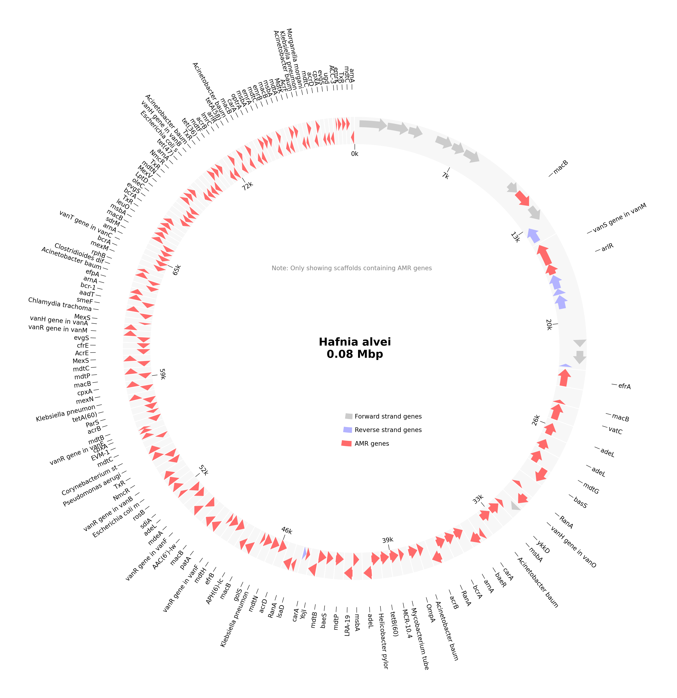

### AAC(6')-Iw
- **Mechanism**: antibiotic inactivation
- **Drug Classes**: aminoglycoside antibiotic
- **AMR Family**: AAC(6')
- **Locations**:
  - gnl|SPADES|EHPDDGNP_11805_1 : position 2-433

### ACC-3
- **Mechanism**: antibiotic inactivation
- **Drug Classes**: monobactam; cephalosporin; penam
- **AMR Family**: ACC beta-lactamase
- **Locations**:
  - gnl|SPADES|EHPDDGNP_39941_1 : position 140-211

### APH(6)-Ic
- **Mechanism**: antibiotic inactivation
- **Drug Classes**: aminoglycoside antibiotic
- **AMR Family**: APH(6)
- **Locations**:
  - gnl|SPADES|EHPDDGNP_11553_1 : position 3-341

### Acinetobacter baumannii AbaF (found in 2 locations)
- **Mechanism**: antibiotic efflux
- **Drug Classes**: phosphonic acid antibiotic
- **AMR Family**: major facilitator superfamily (MFS) antibiotic efflux pump
- **Locations**:
  - gnl|SPADES|EHPDDGNP_36252_1 : position 3-224
  - gnl|SPADES|EHPDDGNP_7426_1 : position 1-702

### Acinetobacter baumannii AbaQ (found in 3 locations)
- **Mechanism**: antibiotic efflux
- **Drug Classes**: fluoroquinolone antibiotic
- **AMR Family**: major facilitator superfamily (MFS) antibiotic efflux pump
- **Locations**:
  - gnl|SPADES|EHPDDGNP_17889_1 : position 55-303
  - gnl|SPADES|EHPDDGNP_24925_1 : position 2-262
  - gnl|SPADES|EHPDDGNP_8812_2 : position 228-581

### Acinetobacter baumannii AmvA
- **Mechanism**: antibiotic efflux
- **Drug Classes**: macrolide antibiotic; disinfecting agents and antiseptics
- **AMR Family**: major facilitator superfamily (MFS) antibiotic efflux pump
- **Locations**:
  - gnl|SPADES|EHPDDGNP_30384_1 : position 2-241

### AcrE
- **Mechanism**: antibiotic efflux
- **Drug Classes**: fluoroquinolone antibiotic; cephalosporin; cephamycin; penam
- **AMR Family**: resistance-nodulation-cell division (RND) antibiotic efflux pump
- **Locations**:
  - gnl|SPADES|EHPDDGNP_15855_1 : position 2-334

### AcrF
- **Mechanism**: antibiotic efflux
- **Drug Classes**: fluoroquinolone antibiotic; cephalosporin; cephamycin; penam
- **AMR Family**: resistance-nodulation-cell division (RND) antibiotic efflux pump
- **Locations**:
  - gnl|SPADES|EHPDDGNP_35821_1 : position 2-223

### Chlamydia trachomatis intrinsic murA conferring resistance to fosfomycin
- **Mechanism**: antibiotic target alteration
- **Drug Classes**: phosphonic acid antibiotic
- **AMR Family**: antibiotic-resistant murA transferase
- **Locations**:
  - gnl|SPADES|EHPDDGNP_16656_1 : position 3-320

### Clostridioides difficile gyrB conferring resistance to fluoroquinolones
- **Mechanism**: antibiotic target alteration
- **Drug Classes**: fluoroquinolone antibiotic
- **AMR Family**: fluoroquinolone resistant gyrB
- **Locations**:
  - gnl|SPADES|EHPDDGNP_17969_1 : position 3-302

### Corynebacterium striatum tetA
- **Mechanism**: antibiotic efflux
- **Drug Classes**: penam; tetracycline antibiotic
- **AMR Family**: major facilitator superfamily (MFS) antibiotic efflux pump
- **Locations**:
  - gnl|SPADES|EHPDDGNP_13418_1 : position 2-385

### EVM-1
- **Mechanism**: antibiotic inactivation
- **Drug Classes**: carbapenem
- **AMR Family**: EVM beta-lactamase
- **Locations**:
  - gnl|SPADES|EHPDDGNP_14204_1 : position 100-366

### Escherichia coli mdfA
- **Mechanism**: antibiotic efflux
- **Drug Classes**: tetracycline antibiotic; phenicol antibiotic; disinfecting agents and antiseptics
- **AMR Family**: major facilitator superfamily (MFS) antibiotic efflux pump
- **Locations**:
  - gnl|SPADES|EHPDDGNP_12909_1 : position 1-399

### Escherichia coli soxS with mutation conferring antibiotic resistance
- **Mechanism**: antibiotic target alteration; antibiotic efflux; reduced permeability to antibiotic
- **Drug Classes**: fluoroquinolone antibiotic; monobactam; carbapenem; cephalosporin; glycylcycline; cephamycin; penam; tetracycline antibiotic; rifamycin antibiotic; phenicol antibiotic; penem; disinfecting agents and antiseptics
- **AMR Family**: ATP-binding cassette (ABC) antibiotic efflux pump; major facilitator superfamily (MFS) antibiotic efflux pump; resistance-nodulation-cell division (RND) antibiotic efflux pump; General Bacterial Porin with reduced permeability to beta-lactams
- **Locations**:
  - gnl|SPADES|EHPDDGNP_23634_1 : position 3-266

### Helicobacter pylori pbp1 mutants conferring resistance to amoxicillin
- **Mechanism**: antibiotic target alteration
- **Drug Classes**: cephalosporin; cephamycin; penam
- **AMR Family**: Penicillin-binding protein mutations conferring resistance to beta-lactam antibiotics
- **Locations**:
  - gnl|SPADES|EHPDDGNP_9386_1 : position 3-542

### Klebsiella pneumoniae KpnH
- **Mechanism**: antibiotic efflux
- **Drug Classes**: macrolide antibiotic; fluoroquinolone antibiotic; aminoglycoside antibiotic; carbapenem; cephalosporin; penam; peptide antibiotic; penem
- **AMR Family**: major facilitator superfamily (MFS) antibiotic efflux pump
- **Locations**:
  - gnl|SPADES|EHPDDGNP_11231_1 : position 2-454

### Klebsiella pneumoniae OmpK37 (found in 2 locations)
- **Mechanism**: reduced permeability to antibiotic
- **Drug Classes**: monobactam; carbapenem; cephalosporin; cephamycin; penam; penem
- **AMR Family**: General Bacterial Porin with reduced permeability to beta-lactams
- **Locations**:
  - gnl|SPADES|EHPDDGNP_14733_1 : position 3-320
  - gnl|SPADES|EHPDDGNP_36443_1 : position 3-161

### LRA-19
- **Mechanism**: antibiotic inactivation
- **Drug Classes**: cephalosporin; penam
- **AMR Family**: subclass B3 LRA beta-lactamase
- **Locations**:
  - gnl|SPADES|EHPDDGNP_9823_1 : position 2-520

### LptD
- **Mechanism**: antibiotic efflux
- **Drug Classes**: carbapenem; peptide antibiotic; aminocoumarin antibiotic; rifamycin antibiotic
- **AMR Family**: ATP-binding cassette (ABC) antibiotic efflux pump
- **Locations**:
  - gnl|SPADES|EHPDDGNP_22137_1 : position 2-271

### MCR-10.4
- **Mechanism**: antibiotic target alteration
- **Drug Classes**: peptide antibiotic
- **AMR Family**: MCR phosphoethanolamine transferase
- **Locations**:
  - gnl|SPADES|EHPDDGNP_9074_1 : position 1-564

### MdtK
- **Mechanism**: antibiotic efflux
- **Drug Classes**: fluoroquinolone antibiotic
- **AMR Family**: multidrug and toxic compound extrusion (MATE) transporter
- **Locations**:
  - gnl|SPADES|EHPDDGNP_35871_1 : position 2-223

### MexS (found in 2 locations)
- **Mechanism**: antibiotic efflux
- **Drug Classes**: fluoroquinolone antibiotic; diaminopyrimidine antibiotic; phenicol antibiotic
- **AMR Family**: resistance-nodulation-cell division (RND) antibiotic efflux pump
- **Locations**:
  - gnl|SPADES|EHPDDGNP_15792_1 : position 2-337
  - gnl|SPADES|EHPDDGNP_16544_1 : position 2-130

### MexV
- **Mechanism**: antibiotic efflux
- **Drug Classes**: macrolide antibiotic; fluoroquinolone antibiotic; tetracycline antibiotic; phenicol antibiotic; disinfecting agents and antiseptics
- **AMR Family**: resistance-nodulation-cell division (RND) antibiotic efflux pump
- **Locations**:
  - gnl|SPADES|EHPDDGNP_22786_1 : position 2-268

### Morganella morganii gyrB conferring resistance to fluoroquinolones
- **Mechanism**: antibiotic target alteration
- **Drug Classes**: fluoroquinolone antibiotic
- **AMR Family**: fluoroquinolone resistant gyrB
- **Locations**:
  - gnl|SPADES|EHPDDGNP_37699_1 : position 1-219

### Mycobacterium tuberculosis gidB mutation conferring resistance to streptomycin
- **Mechanism**: antibiotic target alteration
- **Drug Classes**: aminoglycoside antibiotic
- **AMR Family**: antibiotic resistant gidB
- **Locations**:
  - gnl|SPADES|EHPDDGNP_8853_1 : position 271-579

### NmcR (found in 2 locations)
- **Mechanism**: antibiotic inactivation
- **Drug Classes**: carbapenem; cephalosporin; cephamycin; penam
- **AMR Family**: NmcA beta-lactamase
- **Locations**:
  - gnl|SPADES|EHPDDGNP_13121_1 : position 2-382
  - gnl|SPADES|EHPDDGNP_23264_1 : position 2-268

### OmpA
- **Mechanism**: reduced permeability to antibiotic
- **Drug Classes**: peptide antibiotic
- **AMR Family**: General Bacterial Porin with reduced permeability to peptide antibiotics
- **Locations**:
  - gnl|SPADES|EHPDDGNP_8820_1 : position 4-582

### ParS
- **Mechanism**: antibiotic efflux; reduced permeability to antibiotic
- **Drug Classes**: macrolide antibiotic; fluoroquinolone antibiotic; monobactam; aminoglycoside antibiotic; carbapenem; cephalosporin; cephamycin; penam; tetracycline antibiotic; phenicol antibiotic; penem; disinfecting agents and antiseptics
- **AMR Family**: resistance-nodulation-cell division (RND) antibiotic efflux pump; Outer Membrane Porin (Opr)
- **Locations**:
  - gnl|SPADES|EHPDDGNP_14487_1 : position 2-361

### Pseudomonas aeruginosa CpxR
- **Mechanism**: antibiotic efflux
- **Drug Classes**: macrolide antibiotic; fluoroquinolone antibiotic; monobactam; aminoglycoside antibiotic; carbapenem; cephalosporin; cephamycin; penam; tetracycline antibiotic; peptide antibiotic; aminocoumarin antibiotic; diaminopyrimidine antibiotic; sulfonamide antibiotic; phenicol antibiotic; penem
- **AMR Family**: resistance-nodulation-cell division (RND) antibiotic efflux pump
- **Locations**:
  - gnl|SPADES|EHPDDGNP_13417_1 : position 2-385

### RanA (found in 3 locations)
- **Mechanism**: antibiotic efflux
- **Drug Classes**: aminoglycoside antibiotic
- **AMR Family**: ATP-binding cassette (ABC) antibiotic efflux pump
- **Locations**:
  - gnl|SPADES|EHPDDGNP_11105_1 : position 2-460
  - gnl|SPADES|EHPDDGNP_6416_2 : position 580-834
  - gnl|SPADES|EHPDDGNP_8693_1 : position 2-589

### TxR (found in 5 locations)
- **Mechanism**: antibiotic efflux
- **Drug Classes**: tetracycline antibiotic
- **AMR Family**: ATP-binding cassette (ABC) antibiotic efflux pump
- **Locations**:
  - gnl|SPADES|EHPDDGNP_13251_1 : position 2-391
  - gnl|SPADES|EHPDDGNP_20724_1 : position 3-278
  - gnl|SPADES|EHPDDGNP_23133_1 : position 2-268
  - gnl|SPADES|EHPDDGNP_26190_1 : position 1-255
  - gnl|SPADES|EHPDDGNP_40250_1 : position 1-210

### YojI
- **Mechanism**: antibiotic efflux
- **Drug Classes**: peptide antibiotic
- **AMR Family**: ATP-binding cassette (ABC) antibiotic efflux pump
- **Locations**:
  - gnl|SPADES|EHPDDGNP_10722_1 : position 3-476

### aadT
- **Mechanism**: antibiotic efflux
- **Drug Classes**: macrolide antibiotic; tetracycline antibiotic; disinfecting agents and antiseptics
- **AMR Family**: major facilitator superfamily (MFS) antibiotic efflux pump
- **Locations**:
  - gnl|SPADES|EHPDDGNP_17229_1 : position 2-313

### acrB (found in 3 locations)
- **Mechanism**: antibiotic efflux
- **Drug Classes**: fluoroquinolone antibiotic; cephalosporin; glycylcycline; penam; tetracycline antibiotic; rifamycin antibiotic; phenicol antibiotic; disinfecting agents and antiseptics
- **AMR Family**: resistance-nodulation-cell division (RND) antibiotic efflux pump
- **Locations**:
  - gnl|SPADES|EHPDDGNP_14416_1 : position 150-362
  - gnl|SPADES|EHPDDGNP_27068_1 : position 2-253
  - gnl|SPADES|EHPDDGNP_8746_1 : position 2-586

### acrD (found in 2 locations)
- **Mechanism**: antibiotic efflux
- **Drug Classes**: aminoglycoside antibiotic
- **AMR Family**: resistance-nodulation-cell division (RND) antibiotic efflux pump
- **Locations**:
  - gnl|SPADES|EHPDDGNP_11135_1 : position 1-459
  - gnl|SPADES|EHPDDGNP_38477_1 : position 3-215

### adeL (found in 4 locations)
- **Mechanism**: antibiotic efflux
- **Drug Classes**: fluoroquinolone antibiotic; tetracycline antibiotic
- **AMR Family**: resistance-nodulation-cell division (RND) antibiotic efflux pump
- **Locations**:
  - gnl|SPADES|EHPDDGNP_11967_1 : position 1-426
  - gnl|SPADES|EHPDDGNP_5512_1 : position 222-995
  - gnl|SPADES|EHPDDGNP_5816_2 : position 295-936
  - gnl|SPADES|EHPDDGNP_9592_1 : position 1-504

### arlR (found in 2 locations)
- **Mechanism**: antibiotic efflux
- **Drug Classes**: fluoroquinolone antibiotic; disinfecting agents and antiseptics
- **AMR Family**: major facilitator superfamily (MFS) antibiotic efflux pump
- **Locations**:
  - gnl|SPADES|EHPDDGNP_29252_1 : position 1-246
  - gnl|SPADES|EHPDDGNP_684_2 : position 1474-2154

### arnA (found in 5 locations)
- **Mechanism**: antibiotic target alteration
- **Drug Classes**: peptide antibiotic
- **AMR Family**: pmr phosphoethanolamine transferase
- **Locations**:
  - gnl|SPADES|EHPDDGNP_17837_1 : position 1-303
  - gnl|SPADES|EHPDDGNP_18908_1 : position 3-290
  - gnl|SPADES|EHPDDGNP_23322_1 : position 2-265
  - gnl|SPADES|EHPDDGNP_41149_1 : position 2-205
  - gnl|SPADES|EHPDDGNP_8596_1 : position 2-598

### baeR
- **Mechanism**: antibiotic efflux
- **Drug Classes**: aminoglycoside antibiotic; aminocoumarin antibiotic
- **AMR Family**: resistance-nodulation-cell division (RND) antibiotic efflux pump
- **Locations**:
  - gnl|SPADES|EHPDDGNP_8436_1 : position 1-609

### baeS
- **Mechanism**: antibiotic efflux
- **Drug Classes**: aminoglycoside antibiotic; aminocoumarin antibiotic
- **AMR Family**: resistance-nodulation-cell division (RND) antibiotic efflux pump
- **Locations**:
  - gnl|SPADES|EHPDDGNP_10082_2 : position 110-508

### basS
- **Mechanism**: antibiotic target alteration; antibiotic efflux
- **Drug Classes**: peptide antibiotic
- **AMR Family**: pmr phosphoethanolamine transferase
- **Locations**:
  - gnl|SPADES|EHPDDGNP_6033_1 : position 1-897

### bcr-1
- **Mechanism**: antibiotic efflux
- **Drug Classes**: bicyclomycin-like antibiotic
- **AMR Family**: major facilitator superfamily (MFS) antibiotic efflux pump
- **Locations**:
  - gnl|SPADES|EHPDDGNP_17337_1 : position 3-311

### bcrA (found in 3 locations)
- **Mechanism**: antibiotic efflux
- **Drug Classes**: peptide antibiotic
- **AMR Family**: ATP-binding cassette (ABC) antibiotic efflux pump
- **Locations**:
  - gnl|SPADES|EHPDDGNP_18650_1 : position 2-292
  - gnl|SPADES|EHPDDGNP_20716_1 : position 3-278
  - gnl|SPADES|EHPDDGNP_8642_1 : position 2-595

### carA (found in 3 locations)
- **Mechanism**: antibiotic target protection
- **Drug Classes**: macrolide antibiotic
- **AMR Family**: Miscellaneous ABC-F subfamily ATP-binding cassette ribosomal protection proteins
- **Locations**:
  - gnl|SPADES|EHPDDGNP_10750_1 : position 1-231
  - gnl|SPADES|EHPDDGNP_32030_1 : position 2-238
  - gnl|SPADES|EHPDDGNP_7838_2 : position 397-660

### cfrE
- **Mechanism**: antibiotic target alteration
- **Drug Classes**: lincosamide antibiotic; streptogramin antibiotic; oxazolidinone antibiotic; phenicol antibiotic; pleuromutilin antibiotic
- **AMR Family**: Cfr 23S ribosomal RNA methyltransferase
- **Locations**:
  - gnl|SPADES|EHPDDGNP_16131_1 : position 3-329

### cpxA (found in 3 locations)
- **Mechanism**: antibiotic efflux
- **Drug Classes**: aminoglycoside antibiotic; aminocoumarin antibiotic
- **AMR Family**: resistance-nodulation-cell division (RND) antibiotic efflux pump
- **Locations**:
  - gnl|SPADES|EHPDDGNP_14343_1 : position 1-243
  - gnl|SPADES|EHPDDGNP_15300_1 : position 3-344
  - gnl|SPADES|EHPDDGNP_38533_1 : position 35-214

### efpA
- **Mechanism**: antibiotic efflux
- **Drug Classes**: rifamycin antibiotic; isoniazid-like antibiotic
- **AMR Family**: major facilitator superfamily (MFS) antibiotic efflux pump
- **Locations**:
  - gnl|SPADES|EHPDDGNP_17871_1 : position 3-302

### efrA
- **Mechanism**: antibiotic efflux
- **Drug Classes**: macrolide antibiotic; fluoroquinolone antibiotic; rifamycin antibiotic
- **AMR Family**: ATP-binding cassette (ABC) antibiotic efflux pump
- **Locations**:
  - gnl|SPADES|EHPDDGNP_5001_1 : position 1-1116

### efrB
- **Mechanism**: antibiotic efflux
- **Drug Classes**: macrolide antibiotic; fluoroquinolone antibiotic; rifamycin antibiotic
- **AMR Family**: ATP-binding cassette (ABC) antibiotic efflux pump
- **Locations**:
  - gnl|SPADES|EHPDDGNP_11619_1 : position 2-439

### emrA
- **Mechanism**: antibiotic efflux
- **Drug Classes**: fluoroquinolone antibiotic
- **AMR Family**: major facilitator superfamily (MFS) antibiotic efflux pump
- **Locations**:
  - gnl|SPADES|EHPDDGNP_33552_1 : position 2-232

### emrB
- **Mechanism**: antibiotic efflux
- **Drug Classes**: fluoroquinolone antibiotic
- **AMR Family**: major facilitator superfamily (MFS) antibiotic efflux pump
- **Locations**:
  - gnl|SPADES|EHPDDGNP_33608_1 : position 2-232

### emrK
- **Mechanism**: antibiotic efflux
- **Drug Classes**: tetracycline antibiotic
- **AMR Family**: major facilitator superfamily (MFS) antibiotic efflux pump
- **Locations**:
  - gnl|SPADES|EHPDDGNP_40397_1 : position 3-209

### evgS (found in 3 locations)
- **Mechanism**: antibiotic efflux
- **Drug Classes**: macrolide antibiotic; fluoroquinolone antibiotic; penam; tetracycline antibiotic
- **AMR Family**: major facilitator superfamily (MFS) antibiotic efflux pump; resistance-nodulation-cell division (RND) antibiotic efflux pump
- **Locations**:
  - gnl|SPADES|EHPDDGNP_16266_1 : position 3-329
  - gnl|SPADES|EHPDDGNP_21124_1 : position 1-276
  - gnl|SPADES|EHPDDGNP_38864_1 : position 3-215

### golS
- **Mechanism**: antibiotic efflux
- **Drug Classes**: monobactam; carbapenem; cephalosporin; cephamycin; penam; phenicol antibiotic; penem
- **AMR Family**: resistance-nodulation-cell division (RND) antibiotic efflux pump
- **Locations**:
  - gnl|SPADES|EHPDDGNP_11274_1 : position 3-191

### leuO
- **Mechanism**: antibiotic efflux
- **Drug Classes**: nucleoside antibiotic; disinfecting agents and antiseptics
- **AMR Family**: major facilitator superfamily (MFS) antibiotic efflux pump
- **Locations**:
  - gnl|SPADES|EHPDDGNP_20429_1 : position 3-278

### lmrC
- **Mechanism**: antibiotic target protection
- **Drug Classes**: lincosamide antibiotic
- **AMR Family**: Miscellaneous ABC-F subfamily ATP-binding cassette ribosomal protection proteins
- **Locations**:
  - gnl|SPADES|EHPDDGNP_28974_1 : position 1-246

### lsaD
- **Mechanism**: antibiotic target protection
- **Drug Classes**: lincosamide antibiotic; streptogramin antibiotic; streptogramin A antibiotic; pleuromutilin antibiotic
- **AMR Family**: lsa-type ABC-F protein
- **Locations**:
  - gnl|SPADES|EHPDDGNP_10753_2 : position 240-476

### macB (found in 8 locations)
- **Mechanism**: antibiotic efflux
- **Drug Classes**: macrolide antibiotic
- **AMR Family**: ATP-binding cassette (ABC) antibiotic efflux pump
- **Locations**:
  - gnl|SPADES|EHPDDGNP_11313_1 : position 3-452
  - gnl|SPADES|EHPDDGNP_11804_1 : position 1-432
  - gnl|SPADES|EHPDDGNP_15367_1 : position 1-345
  - gnl|SPADES|EHPDDGNP_19350_1 : position 1-285
  - gnl|SPADES|EHPDDGNP_31286_1 : position 1-240
  - gnl|SPADES|EHPDDGNP_33887_1 : position 23-229
  - gnl|SPADES|EHPDDGNP_439_10 : position 10943-12019
  - gnl|SPADES|EHPDDGNP_5144_3 : position 850-1077

### mdeA
- **Mechanism**: antibiotic efflux
- **Drug Classes**: fluoroquinolone antibiotic; aminoglycoside antibiotic; penam; tetracycline antibiotic; disinfecting agents and antiseptics
- **AMR Family**: major facilitator superfamily (MFS) antibiotic efflux pump
- **Locations**:
  - gnl|SPADES|EHPDDGNP_11945_1 : position 3-428

### mdtA
- **Mechanism**: antibiotic efflux
- **Drug Classes**: aminocoumarin antibiotic
- **AMR Family**: resistance-nodulation-cell division (RND) antibiotic efflux pump
- **Locations**:
  - gnl|SPADES|EHPDDGNP_35575_1 : position 3-224

### mdtB (found in 2 locations)
- **Mechanism**: antibiotic efflux
- **Drug Classes**: aminocoumarin antibiotic
- **AMR Family**: resistance-nodulation-cell division (RND) antibiotic efflux pump
- **Locations**:
  - gnl|SPADES|EHPDDGNP_10406_1 : position 2-490
  - gnl|SPADES|EHPDDGNP_14436_1 : position 2-361

### mdtC (found in 5 locations)
- **Mechanism**: antibiotic efflux
- **Drug Classes**: aminocoumarin antibiotic
- **AMR Family**: resistance-nodulation-cell division (RND) antibiotic efflux pump
- **Locations**:
  - gnl|SPADES|EHPDDGNP_14061_1 : position 115-369
  - gnl|SPADES|EHPDDGNP_15565_1 : position 2-340
  - gnl|SPADES|EHPDDGNP_33374_1 : position 3-233
  - gnl|SPADES|EHPDDGNP_37935_1 : position 1-216
  - gnl|SPADES|EHPDDGNP_40604_1 : position 2-208

### mdtF
- **Mechanism**: antibiotic efflux
- **Drug Classes**: macrolide antibiotic; fluoroquinolone antibiotic; penam
- **AMR Family**: resistance-nodulation-cell division (RND) antibiotic efflux pump
- **Locations**:
  - gnl|SPADES|EHPDDGNP_26989_1 : position 1-252

### mdtG
- **Mechanism**: antibiotic efflux
- **Drug Classes**: phosphonic acid antibiotic
- **AMR Family**: major facilitator superfamily (MFS) antibiotic efflux pump
- **Locations**:
  - gnl|SPADES|EHPDDGNP_5856_2 : position 149-928

### mdtH
- **Mechanism**: antibiotic efflux
- **Drug Classes**: fluoroquinolone antibiotic
- **AMR Family**: major facilitator superfamily (MFS) antibiotic efflux pump
- **Locations**:
  - gnl|SPADES|EHPDDGNP_11753_1 : position 3-434

### mdtN (found in 2 locations)
- **Mechanism**: antibiotic efflux
- **Drug Classes**: nucleoside antibiotic; disinfecting agents and antiseptics
- **AMR Family**: major facilitator superfamily (MFS) antibiotic efflux pump
- **Locations**:
  - gnl|SPADES|EHPDDGNP_11201_1 : position 3-455
  - gnl|SPADES|EHPDDGNP_22858_1 : position 2-268

### mdtP (found in 2 locations)
- **Mechanism**: antibiotic efflux
- **Drug Classes**: nucleoside antibiotic; disinfecting agents and antiseptics
- **AMR Family**: major facilitator superfamily (MFS) antibiotic efflux pump
- **Locations**:
  - gnl|SPADES|EHPDDGNP_15395_1 : position 3-344
  - gnl|SPADES|EHPDDGNP_9852_1 : position 2-517

### mexM
- **Mechanism**: antibiotic efflux
- **Drug Classes**: phenicol antibiotic
- **AMR Family**: resistance-nodulation-cell division (RND) antibiotic efflux pump
- **Locations**:
  - gnl|SPADES|EHPDDGNP_18440_1 : position 1-294

### mexN
- **Mechanism**: antibiotic efflux
- **Drug Classes**: phenicol antibiotic
- **AMR Family**: resistance-nodulation-cell division (RND) antibiotic efflux pump
- **Locations**:
  - gnl|SPADES|EHPDDGNP_15204_1 : position 3-347

### msbA (found in 5 locations)
- **Mechanism**: antibiotic efflux
- **Drug Classes**: nitroimidazole antibiotic
- **AMR Family**: ATP-binding cassette (ABC) antibiotic efflux pump
- **Locations**:
  - gnl|SPADES|EHPDDGNP_20283_1 : position 3-278
  - gnl|SPADES|EHPDDGNP_32917_1 : position 2-235
  - gnl|SPADES|EHPDDGNP_35439_1 : position 1-225
  - gnl|SPADES|EHPDDGNP_7386_1 : position 9-707
  - gnl|SPADES|EHPDDGNP_9586_2 : position 159-530

### oleC
- **Mechanism**: antibiotic efflux
- **Drug Classes**: macrolide antibiotic
- **AMR Family**: ATP-binding cassette (ABC) antibiotic efflux pump
- **Locations**:
  - gnl|SPADES|EHPDDGNP_21581_1 : position 3-272

### optrA
- **Mechanism**: antibiotic target protection
- **Drug Classes**: oxazolidinone antibiotic; phenicol antibiotic
- **AMR Family**: Miscellaneous ABC-F subfamily ATP-binding cassette ribosomal protection proteins
- **Locations**:
  - gnl|SPADES|EHPDDGNP_32486_1 : position 3-236

### patA
- **Mechanism**: antibiotic efflux
- **Drug Classes**: fluoroquinolone antibiotic
- **AMR Family**: ATP-binding cassette (ABC) antibiotic efflux pump
- **Locations**:
  - gnl|SPADES|EHPDDGNP_11751_1 : position 3-434

### rosB
- **Mechanism**: antibiotic efflux
- **Drug Classes**: peptide antibiotic
- **AMR Family**: major facilitator superfamily (MFS) antibiotic efflux pump
- **Locations**:
  - gnl|SPADES|EHPDDGNP_12840_1 : position 3-401

### rphB
- **Mechanism**: antibiotic inactivation
- **Drug Classes**: rifamycin antibiotic
- **AMR Family**: rifampin phosphotransferase
- **Locations**:
  - gnl|SPADES|EHPDDGNP_18390_1 : position 3-182

### sdiA
- **Mechanism**: antibiotic efflux
- **Drug Classes**: fluoroquinolone antibiotic; cephalosporin; glycylcycline; penam; tetracycline antibiotic; rifamycin antibiotic; phenicol antibiotic; disinfecting agents and antiseptics
- **AMR Family**: resistance-nodulation-cell division (RND) antibiotic efflux pump
- **Locations**:
  - gnl|SPADES|EHPDDGNP_12747_1 : position 3-227

### sdrM
- **Mechanism**: antibiotic efflux
- **Drug Classes**: fluoroquinolone antibiotic; disinfecting agents and antiseptics
- **AMR Family**: major facilitator superfamily (MFS) antibiotic efflux pump
- **Locations**:
  - gnl|SPADES|EHPDDGNP_19385_1 : position 1-285

### smeF
- **Mechanism**: antibiotic efflux
- **Drug Classes**: macrolide antibiotic; fluoroquinolone antibiotic; tetracycline antibiotic; phenicol antibiotic
- **AMR Family**: resistance-nodulation-cell division (RND) antibiotic efflux pump
- **Locations**:
  - gnl|SPADES|EHPDDGNP_17133_1 : position 3-314

### tet(36)
- **Mechanism**: antibiotic target protection
- **Drug Classes**: tetracycline antibiotic
- **AMR Family**: tetracycline-resistant ribosomal protection protein
- **Locations**:
  - gnl|SPADES|EHPDDGNP_26775_1 : position 3-254

### tet(47)
- **Mechanism**: antibiotic inactivation
- **Drug Classes**: tetracycline antibiotic
- **AMR Family**: tetracycline inactivation enzyme
- **Locations**:
  - gnl|SPADES|EHPDDGNP_23393_1 : position 1-267

### tetA(58)
- **Mechanism**: antibiotic efflux
- **Drug Classes**: tetracycline antibiotic
- **AMR Family**: major facilitator superfamily (MFS) antibiotic efflux pump
- **Locations**:
  - gnl|SPADES|EHPDDGNP_30301_1 : position 3-209

### tetA(60)
- **Mechanism**: antibiotic efflux
- **Drug Classes**: tetracycline antibiotic
- **AMR Family**: ATP-binding cassette (ABC) antibiotic efflux pump
- **Locations**:
  - gnl|SPADES|EHPDDGNP_14460_1 : position 1-360

### tetB(60)
- **Mechanism**: antibiotic efflux
- **Drug Classes**: tetracycline antibiotic
- **AMR Family**: ATP-binding cassette (ABC) antibiotic efflux pump
- **Locations**:
  - gnl|SPADES|EHPDDGNP_9264_1 : position 3-551

### ugd
- **Mechanism**: antibiotic target alteration
- **Drug Classes**: peptide antibiotic
- **AMR Family**: pmr phosphoethanolamine transferase
- **Locations**:
  - gnl|SPADES|EHPDDGNP_38888_1 : position 3-215

### vanH gene in vanA cluster
- **Mechanism**: antibiotic target alteration
- **Drug Classes**: glycopeptide antibiotic
- **AMR Family**: vanH; glycopeptide resistance gene cluster
- **Locations**:
  - gnl|SPADES|EHPDDGNP_16342_1 : position 2-325

### vanH gene in vanB cluster
- **Mechanism**: antibiotic target alteration
- **Drug Classes**: glycopeptide antibiotic
- **AMR Family**: vanH; glycopeptide resistance gene cluster
- **Locations**:
  - gnl|SPADES|EHPDDGNP_24111_1 : position 1-264

### vanH gene in vanO cluster
- **Mechanism**: antibiotic target alteration
- **Drug Classes**: glycopeptide antibiotic
- **AMR Family**: vanH; glycopeptide resistance gene cluster
- **Locations**:
  - gnl|SPADES|EHPDDGNP_6700_1 : position 170-793

### vanR gene in vanB cluster
- **Mechanism**: antibiotic target alteration
- **Drug Classes**: glycopeptide antibiotic
- **AMR Family**: glycopeptide resistance gene cluster; vanR
- **Locations**:
  - gnl|SPADES|EHPDDGNP_13018_1 : position 3-380

### vanR gene in vanE cluster
- **Mechanism**: antibiotic target alteration
- **Drug Classes**: glycopeptide antibiotic
- **AMR Family**: glycopeptide resistance gene cluster; vanR
- **Locations**:
  - gnl|SPADES|EHPDDGNP_14343_2 : position 233-364

### vanR gene in vanF cluster (found in 2 locations)
- **Mechanism**: antibiotic target alteration
- **Drug Classes**: glycopeptide antibiotic
- **AMR Family**: glycopeptide resistance gene cluster; vanR
- **Locations**:
  - gnl|SPADES|EHPDDGNP_11747_1 : position 2-202
  - gnl|SPADES|EHPDDGNP_11918_1 : position 32-430

### vanR gene in vanM cluster
- **Mechanism**: antibiotic target alteration
- **Drug Classes**: glycopeptide antibiotic
- **AMR Family**: glycopeptide resistance gene cluster; vanR
- **Locations**:
  - gnl|SPADES|EHPDDGNP_16258_1 : position 1-327

### vanS gene in vanM cluster
- **Mechanism**: antibiotic target alteration
- **Drug Classes**: glycopeptide antibiotic
- **AMR Family**: vanS; glycopeptide resistance gene cluster
- **Locations**:
  - gnl|SPADES|EHPDDGNP_684_1 : position 77-1477

### vanT gene in vanC cluster
- **Mechanism**: antibiotic target alteration
- **Drug Classes**: glycopeptide antibiotic
- **AMR Family**: glycopeptide resistance gene cluster; vanT
- **Locations**:
  - gnl|SPADES|EHPDDGNP_18821_1 : position 2-292

### vatC
- **Mechanism**: antibiotic inactivation
- **Drug Classes**: streptogramin antibiotic; streptogramin A antibiotic
- **AMR Family**: streptogramin vat acetyltransferase
- **Locations**:
  - gnl|SPADES|EHPDDGNP_5306_1 : position 2-1039

### ykkD
- **Mechanism**: antibiotic efflux
- **Drug Classes**: aminoglycoside antibiotic; tetracycline antibiotic; phenicol antibiotic
- **AMR Family**: small multidrug resistance (SMR) antibiotic efflux pump
- **Locations**:
  - gnl|SPADES|EHPDDGNP_6775_2 : position 519-782

## Hafnia alvei FB1
**Strain Statistics:**
- Total genome length: 5.2 kbp
- Total scaffolds: 99
- Scaffolds with AMR genes: 10
- Total genes annotated: 4
- Total AMR genes: 10
- Unique AMR genes: 8
- Distinct AMR mechanisms: 4
- Distinct AMR families: 6
- Distinct drug classes: 12

**Circos Plot:**

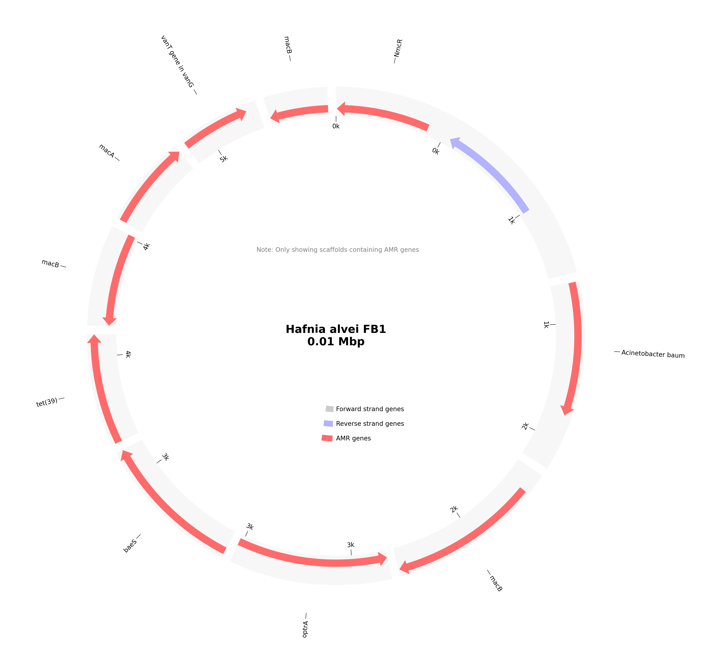

### Acinetobacter baumannii AbaF
- **Mechanism**: antibiotic efflux
- **Drug Classes**: phosphonic acid antibiotic
- **AMR Family**: major facilitator superfamily (MFS) antibiotic efflux pump
- **Locations**:
  - gnl|SPADES|EHPDDGNP_7555_1 : position 3-491

### NmcR
- **Mechanism**: antibiotic inactivation
- **Drug Classes**: carbapenem; cephalosporin; cephamycin; penam
- **AMR Family**: NmcA beta-lactamase
- **Locations**:
  - gnl|SPADES|EHPDDGNP_4881_1 : position 3-365

### baeS
- **Mechanism**: antibiotic efflux
- **Drug Classes**: aminoglycoside antibiotic; aminocoumarin antibiotic
- **AMR Family**: resistance-nodulation-cell division (RND) antibiotic efflux pump
- **Locations**:
  - gnl|SPADES|EHPDDGNP_9640_1 : position 2-529

### macA
- **Mechanism**: antibiotic efflux
- **Drug Classes**: macrolide antibiotic
- **AMR Family**: ATP-binding cassette (ABC) antibiotic efflux pump
- **Locations**:
  - gnl|SPADES|EHPDDGNP_16249_1 : position 3-329

### macB (found in 3 locations)
- **Mechanism**: antibiotic efflux
- **Drug Classes**: macrolide antibiotic
- **AMR Family**: ATP-binding cassette (ABC) antibiotic efflux pump
- **Locations**:
  - gnl|SPADES|EHPDDGNP_14463_1 : position 2-361
  - gnl|SPADES|EHPDDGNP_34527_1 : position 2-229
  - gnl|SPADES|EHPDDGNP_8266_2 : position 81-623

### optrA
- **Mechanism**: antibiotic target protection
- **Drug Classes**: oxazolidinone antibiotic; phenicol antibiotic
- **AMR Family**: Miscellaneous ABC-F subfamily ATP-binding cassette ribosomal protection proteins
- **Locations**:
  - gnl|SPADES|EHPDDGNP_8785_1 : position 1-585

### tet(39)
- **Mechanism**: antibiotic efflux
- **Drug Classes**: tetracycline antibiotic
- **AMR Family**: major facilitator superfamily (MFS) antibiotic efflux pump
- **Locations**:
  - gnl|SPADES|EHPDDGNP_12706_1 : position 1-405

### vanT gene in vanG cluster
- **Mechanism**: antibiotic target alteration
- **Drug Classes**: glycopeptide antibiotic
- **AMR Family**: glycopeptide resistance gene cluster; vanT
- **Locations**:
  - gnl|SPADES|EHPDDGNP_18369_1 : position 3-254

## Hafnia paralvei
**Strain Statistics:**
- Total genome length: 4581.5 kbp
- Total scaffolds: 168
- Scaffolds with AMR genes: 55
- Total genes annotated: 8318
- Total AMR genes: 433
- Unique AMR genes: 212
- Distinct AMR mechanisms: 11
- Distinct AMR families: 73
- Distinct drug classes: 37

**Circos Plot:**

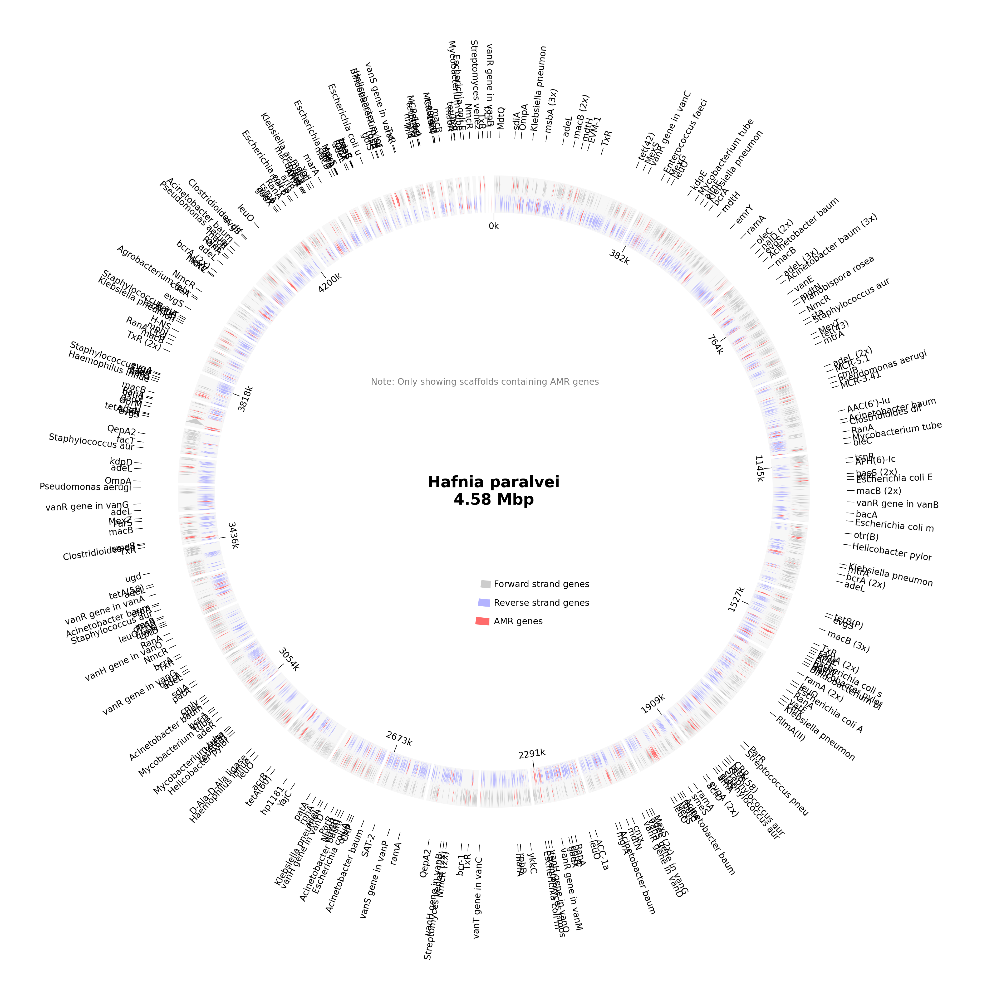

### AAC(6')-32
- **Mechanism**: antibiotic inactivation
- **Drug Classes**: aminoglycoside antibiotic
- **AMR Family**: AAC(6')
- **Locations**:
  - gnl|SPADES|EHPDDGNP_24_150 : position 161101-161703

### AAC(6')-Iu
- **Mechanism**: antibiotic inactivation
- **Drug Classes**: aminoglycoside antibiotic
- **AMR Family**: AAC(6')
- **Locations**:
  - gnl|SPADES|EHPDDGNP_22_106 : position 112080-112538

### ACC-1a
- **Mechanism**: antibiotic inactivation
- **Drug Classes**: monobactam; cephalosporin; cephamycin; penam; oxacephem
- **AMR Family**: ACC beta-lactamase
- **Locations**:
  - gnl|SPADES|EHPDDGNP_42_3: position 3559-4731

### ALI-2
- **Mechanism**: antibiotic inactivation
- **Drug Classes**: carbapenem
- **AMR Family**: ALI beta-lactamase
- **Locations**:
  - gnl|SPADES|EHPDDGNP_63_56 : position 57357-58235

### APH(6)-Ic
- **Mechanism**: antibiotic inactivation
- **Drug Classes**: aminoglycoside antibiotic
- **AMR Family**: APH(6)
- **Locations**:
  - gnl|SPADES|EHPDDGNP_24_29 : position 27546-28349

### Acinetobacter baumannii AbaF (found in 6 locations)
- **Mechanism**: antibiotic efflux
- **Drug Classes**: phosphonic acid antibiotic
- **AMR Family**: major facilitator superfamily (MFS) antibiotic efflux pump
- **Locations**:
  - gnl|SPADES|EHPDDGNP_11_1 : position 347-1648
  - gnl|SPADES|EHPDDGNP_38_62 : position 73470-74795
  - gnl|SPADES|EHPDDGNP_49_103 : position 119517-120746
  - gnl|SPADES|EHPDDGNP_63_48 : position 48341-49882
  - gnl|SPADES|EHPDDGNP_80_55 : position 62714-64048
  - gnl|SPADES|EHPDDGNP_8_32 : position 28015-29517

### Acinetobacter baumannii AbaQ (found in 7 locations)
- **Mechanism**: antibiotic efflux
- **Drug Classes**: fluoroquinolone antibiotic
- **AMR Family**: major facilitator superfamily (MFS) antibiotic efflux pump
- **Locations**:
  - gnl|SPADES|EHPDDGNP_11_127 : position 147226-148449
  - gnl|SPADES|EHPDDGNP_11_209 : position 241716-243053
  - gnl|SPADES|EHPDDGNP_11_48 : position 63369-64715
  - gnl|SPADES|EHPDDGNP_164_39 : position 38813-40108
  - gnl|SPADES|EHPDDGNP_22_126 : position 131281-132573
  - gnl|SPADES|EHPDDGNP_41_85 : position 86730-88106
  - gnl|SPADES|EHPDDGNP_51_35 : position 38179-39507

### AcrE
- **Mechanism**: antibiotic efflux
- **Drug Classes**: fluoroquinolone antibiotic; cephalosporin; cephamycin; penam
- **AMR Family**: resistance-nodulation-cell division (RND) antibiotic efflux pump
- **Locations**:
  - gnl|SPADES|EHPDDGNP_33_102 : position 109110-110273

### AcrF
- **Mechanism**: antibiotic efflux
- **Drug Classes**: fluoroquinolone antibiotic; cephalosporin; cephamycin; penam
- **AMR Family**: resistance-nodulation-cell division (RND) antibiotic efflux pump
- **Locations**:
  - gnl|SPADES|EHPDDGNP_33_103 : position 110312-113434

### Agrobacterium fabrum chloramphenicol acetyltransferase
- **Mechanism**: antibiotic inactivation
- **Drug Classes**: phenicol antibiotic
- **AMR Family**: chloramphenicol acetyltransferase (CAT)
- **Locations**:
  - gnl|SPADES|EHPDDGNP_155_13 : position 14719-15273

### ArnT
- **Mechanism**: antibiotic target alteration
- **Drug Classes**: peptide antibiotic
- **AMR Family**: pmr phosphoethanolamine transferase
- **Locations**:
  - gnl|SPADES|EHPDDGNP_205_7: position 4939-6588

### Bifidobacterium adolescentis rpoB mutants conferring resistance to rifampicin
- **Mechanism**: antibiotic target alteration; antibiotic target replacement
- **Drug Classes**: rifamycin antibiotic
- **AMR Family**: rifamycin-resistant beta-subunit of RNA polymerase (rpoB)
- **Locations**:
  - gnl|SPADES|EHPDDGNP_339_1 : position 3-2018

### Bifidobacterium bifidum ileS conferring resistance to mupirocin
- **Mechanism**: antibiotic target alteration
- **Drug Classes**: mupirocin-like antibiotic
- **AMR Family**: antibiotic-resistant isoleucyl-tRNA synthetase (ileS)
- **Locations**:
  - gnl|SPADES|EHPDDGNP_33_132 : position 139728-142310

### CRP (found in 2 locations)
- **Mechanism**: antibiotic efflux
- **Drug Classes**: macrolide antibiotic; fluoroquinolone antibiotic; penam
- **AMR Family**: resistance-nodulation-cell division (RND) antibiotic efflux pump
- **Locations**:
  - gnl|SPADES|EHPDDGNP_37_75: position 87389-88021
  - gnl|SPADES|EHPDDGNP_51_13 : position 13497-14294

### Clostridioides difficile gyrA conferring resistance to fluoroquinolones
- **Mechanism**: antibiotic target alteration
- **Drug Classes**: fluoroquinolone antibiotic
- **AMR Family**: fluoroquinolone resistant gyrA
- **Locations**:
  - gnl|SPADES|EHPDDGNP_171_2 : position 3291-5939

### Clostridioides difficile gyrB conferring resistance to fluoroquinolones (found in 2 locations)
- **Mechanism**: antibiotic target alteration
- **Drug Classes**: fluoroquinolone antibiotic
- **AMR Family**: fluoroquinolone resistant gyrB
- **Locations**:
  - gnl|SPADES|EHPDDGNP_105_13 : position 13569-15464
  - gnl|SPADES|EHPDDGNP_22_134 : position 138172-140586

### D-Ala-D-Ala ligase
- **Mechanism**: antibiotic target alteration
- **Drug Classes**: glycopeptide antibiotic
- **AMR Family**: Van ligase
- **Locations**:
  - gnl|SPADES|EHPDDGNP_57_22 : position 26752-27672

### EVM-1
- **Mechanism**: antibiotic inactivation
- **Drug Classes**: carbapenem
- **AMR Family**: EVM beta-lactamase
- **Locations**:
  - gnl|SPADES|EHPDDGNP_4_174 : position 211667-212488

### Enterobacter cloacae acrA
- **Mechanism**: antibiotic efflux
- **Drug Classes**: fluoroquinolone antibiotic; cephalosporin; glycylcycline; penam; tetracycline antibiotic; rifamycin antibiotic; phenicol antibiotic; disinfecting agents and antiseptics
- **AMR Family**: resistance-nodulation-cell division (RND) antibiotic efflux pump
- **Locations**:
  - gnl|SPADES|EHPDDGNP_53_107 : position 100519-101709

### Enterococcus faecium cls conferring resistance to daptomycin
- **Mechanism**: antibiotic target alteration
- **Drug Classes**: peptide antibiotic
- **AMR Family**: daptomycin resistant cls
- **Locations**:
  - gnl|SPADES|EHPDDGNP_8_12 : position 10478-11938

### ErmX
- **Mechanism**: antibiotic target alteration
- **Drug Classes**: macrolide antibiotic; lincosamide antibiotic; streptogramin antibiotic; streptogramin A antibiotic; streptogramin B antibiotic
- **AMR Family**: Erm 23S ribosomal RNA methyltransferase
- **Locations**:
  - gnl|SPADES|EHPDDGNP_80_13 : position 14956-15768

### Escherichia coli AcrAB-TolC with AcrR mutation conferring resistance to ciprofloxacin, tetracycline, and ceftazidime
- **Mechanism**: antibiotic target alteration; antibiotic efflux
- **Drug Classes**: fluoroquinolone antibiotic; cephalosporin; glycylcycline; penam; tetracycline antibiotic; rifamycin antibiotic; phenicol antibiotic; disinfecting agents and antiseptics
- **AMR Family**: resistance-nodulation-cell division (RND) antibiotic efflux pump
- **Locations**:
  - gnl|SPADES|EHPDDGNP_53_108 : position 101849-102553

### Escherichia coli AcrAB-TolC with MarR mutations conferring resistance to ciprofloxacin and tetracycline (found in 2 locations)
- **Mechanism**: antibiotic target alteration; antibiotic efflux
- **Drug Classes**: fluoroquinolone antibiotic; cephalosporin; glycylcycline; penam; tetracycline antibiotic; rifamycin antibiotic; phenicol antibiotic; disinfecting agents and antiseptics
- **AMR Family**: resistance-nodulation-cell division (RND) antibiotic efflux pump
- **Locations**:
  - gnl|SPADES|EHPDDGNP_34_32 : position 34017-34448
  - gnl|SPADES|EHPDDGNP_51_22 : position 23438-23929

### Escherichia coli EF-Tu mutants conferring resistance to Enacyloxin IIa
- **Mechanism**: antibiotic target alteration
- **Drug Classes**: elfamycin antibiotic
- **AMR Family**: elfamycin resistant EF-Tu
- **Locations**:
  - gnl|SPADES|EHPDDGNP_24_64 : position 64855-67557

### Escherichia coli EF-Tu mutants conferring resistance to Pulvomycin (found in 2 locations)
- **Mechanism**: antibiotic target alteration
- **Drug Classes**: elfamycin antibiotic
- **AMR Family**: elfamycin resistant EF-Tu
- **Locations**:
  - gnl|SPADES|EHPDDGNP_37_100 : position 109503-110687
  - gnl|SPADES|EHPDDGNP_465_8 : position 6185-7369

### Escherichia coli PtsI with mutation conferring resistance to fosfomycin
- **Mechanism**: antibiotic target alteration
- **Drug Classes**: phosphonic acid antibiotic
- **AMR Family**: antibiotic-resistant ptsI phosphotransferase
- **Locations**:
  - gnl|SPADES|EHPDDGNP_202_26 : position 24217-25944

### Escherichia coli acrA
- **Mechanism**: antibiotic efflux
- **Drug Classes**: fluoroquinolone antibiotic; cephalosporin; glycylcycline; penam; tetracycline antibiotic; rifamycin antibiotic; phenicol antibiotic; disinfecting agents and antiseptics
- **AMR Family**: resistance-nodulation-cell division (RND) antibiotic efflux pump
- **Locations**:
  - gnl|SPADES|EHPDDGNP_182_32 : position 36511-37698

### Escherichia coli mdfA (found in 2 locations)
- **Mechanism**: antibiotic efflux
- **Drug Classes**: tetracycline antibiotic; phenicol antibiotic; disinfecting agents and antiseptics
- **AMR Family**: major facilitator superfamily (MFS) antibiotic efflux pump
- **Locations**:
  - gnl|SPADES|EHPDDGNP_24_148 : position 157817-159037
  - gnl|SPADES|EHPDDGNP_42_94 : position 118020-119252

### Escherichia coli soxS with mutation conferring antibiotic resistance (found in 4 locations)
- **Mechanism**: antibiotic target alteration; antibiotic efflux; reduced permeability to antibiotic
- **Drug Classes**: fluoroquinolone antibiotic; monobactam; carbapenem; cephalosporin; glycylcycline; cephamycin; penam; tetracycline antibiotic; rifamycin antibiotic; phenicol antibiotic; penem; disinfecting agents and antiseptics
- **AMR Family**: ATP-binding cassette (ABC) antibiotic efflux pump; major facilitator superfamily (MFS) antibiotic efflux pump; resistance-nodulation-cell division (RND) antibiotic efflux pump; General Bacterial Porin with reduced permeability to beta-lactams
- **Locations**:
  - gnl|SPADES|EHPDDGNP_293_9 : position 7333-8211
  - gnl|SPADES|EHPDDGNP_33_110 : position 119921-120742
  - gnl|SPADES|EHPDDGNP_42_69 : position 84290-85153
  - gnl|SPADES|EHPDDGNP_8_37 : position 32900-33271

### Escherichia coli uhpA with mutation conferring resistance to fosfomycin
- **Mechanism**: antibiotic target alteration
- **Drug Classes**: phosphonic acid antibiotic
- **AMR Family**: antibiotic-resistant UhpT
- **Locations**:
  - gnl|SPADES|EHPDDGNP_304_15 : position 13069-13785

### FosC2
- **Mechanism**: antibiotic inactivation
- **Drug Classes**: phosphonic acid antibiotic
- **AMR Family**: fosC phosphotransferase family
- **Locations**:
  - gnl|SPADES|EHPDDGNP_4_314 : position 347617-348081

### H-NS
- **Mechanism**: antibiotic efflux
- **Drug Classes**: macrolide antibiotic; fluoroquinolone antibiotic; cephalosporin; cephamycin; penam; tetracycline antibiotic
- **AMR Family**: major facilitator superfamily (MFS) antibiotic efflux pump; resistance-nodulation-cell division (RND) antibiotic efflux pump
- **Locations**:
  - gnl|SPADES|EHPDDGNP_141_54 : position 61368-61775

### Haemophilus influenzae PBP3 conferring resistance to beta-lactam antibiotics (found in 2 locations)
- **Mechanism**: antibiotic target alteration
- **Drug Classes**: cephalosporin; cephamycin; penam
- **AMR Family**: Penicillin-binding protein mutations conferring resistance to beta-lactam antibiotics
- **Locations**:
  - gnl|SPADES|EHPDDGNP_131_12 : position 10077-11849
  - gnl|SPADES|EHPDDGNP_57_14 : position 15848-17611

### Helicobacter pylori pbp1 mutants conferring resistance to amoxicillin (found in 2 locations)
- **Mechanism**: antibiotic target alteration
- **Drug Classes**: cephalosporin; cephamycin; penam
- **AMR Family**: Penicillin-binding protein mutations conferring resistance to beta-lactam antibiotics
- **Locations**:
  - gnl|SPADES|EHPDDGNP_25_25 : position 33295-35568
  - gnl|SPADES|EHPDDGNP_57_66 : position 78639-81218

### Helicobacter pylori pbp2 mutants conferring resistance to amoxicillin
- **Mechanism**: antibiotic target alteration
- **Drug Classes**: cephalosporin; cephamycin; penam
- **AMR Family**: Penicillin-binding protein mutations conferring resistance to beta-lactam antibiotics
- **Locations**:
  - gnl|SPADES|EHPDDGNP_33_126 : position 134344-136239

### Helicobacter pylori rpoB mutation conferring resistance to rifampicin
- **Mechanism**: antibiotic target alteration; antibiotic target replacement
- **Drug Classes**: fluoroquinolone antibiotic; rifamycin antibiotic
- **AMR Family**: rifamycin-resistant beta-subunit of RNA polymerase (rpoB)
- **Locations**:
  - gnl|SPADES|EHPDDGNP_339_2 : position 2161-6381

### Klebsiella aerogenes Omp36
- **Mechanism**: reduced permeability to antibiotic
- **Drug Classes**: monobactam; carbapenem; cephalosporin; cephamycin; penam; penem
- **AMR Family**: General Bacterial Porin with reduced permeability to beta-lactams
- **Locations**:
  - gnl|SPADES|EHPDDGNP_205_22 : position 22443-23591

### Klebsiella pneumoniae KpnE
- **Mechanism**: antibiotic efflux
- **Drug Classes**: macrolide antibiotic; aminoglycoside antibiotic; cephalosporin; tetracycline antibiotic; peptide antibiotic; rifamycin antibiotic; disinfecting agents and antiseptics
- **AMR Family**: small multidrug resistance (SMR) antibiotic efflux pump
- **Locations**:
  - gnl|SPADES|EHPDDGNP_8_128 : position 124405-124836

### Klebsiella pneumoniae KpnF
- **Mechanism**: antibiotic efflux
- **Drug Classes**: macrolide antibiotic; aminoglycoside antibiotic; cephalosporin; tetracycline antibiotic; peptide antibiotic; rifamycin antibiotic; disinfecting agents and antiseptics
- **AMR Family**: small multidrug resistance (SMR) antibiotic efflux pump
- **Locations**:
  - gnl|SPADES|EHPDDGNP_8_127: position 124089-124418

### Klebsiella pneumoniae KpnG
- **Mechanism**: antibiotic efflux
- **Drug Classes**: macrolide antibiotic; fluoroquinolone antibiotic; aminoglycoside antibiotic; carbapenem; cephalosporin; penam; peptide antibiotic; penem
- **AMR Family**: major facilitator superfamily (MFS) antibiotic efflux pump
- **Locations**:
  - gnl|SPADES|EHPDDGNP_25_61 : position 79556-80731

### Klebsiella pneumoniae KpnH (found in 2 locations)
- **Mechanism**: antibiotic efflux
- **Drug Classes**: macrolide antibiotic; fluoroquinolone antibiotic; aminoglycoside antibiotic; carbapenem; cephalosporin; penam; peptide antibiotic; penem
- **AMR Family**: major facilitator superfamily (MFS) antibiotic efflux pump
- **Locations**:
  - gnl|SPADES|EHPDDGNP_22_181 : position 190672-192111
  - gnl|SPADES|EHPDDGNP_25_60: position 78003-79538

### Klebsiella pneumoniae OmpK37 (found in 6 locations)
- **Mechanism**: reduced permeability to antibiotic
- **Drug Classes**: monobactam; carbapenem; cephalosporin; cephamycin; penam; penem
- **AMR Family**: General Bacterial Porin with reduced permeability to beta-lactams
- **Locations**:
  - gnl|SPADES|EHPDDGNP_154_15 : position 12055-13155
  - gnl|SPADES|EHPDDGNP_34_81 : position 82464-83576
  - gnl|SPADES|EHPDDGNP_4_70 : position 86373-87488
  - gnl|SPADES|EHPDDGNP_51_78 : position 89237-90379
  - gnl|SPADES|EHPDDGNP_57_67 : position 81400-82539
  - gnl|SPADES|EHPDDGNP_63_25 : position 26356-27459

### Klebsiella pneumoniae acrR with mutation conferring multidrug antibiotic resistance
- **Mechanism**: antibiotic target alteration; antibiotic efflux
- **Drug Classes**: fluoroquinolone antibiotic; cephalosporin; glycylcycline; penam; tetracycline antibiotic; rifamycin antibiotic; phenicol antibiotic; disinfecting agents and antiseptics
- **AMR Family**: resistance-nodulation-cell division (RND) antibiotic efflux pump
- **Locations**:
  - gnl|SPADES|EHPDDGNP_33_101 : position 107903-108517

### LRA-19
- **Mechanism**: antibiotic inactivation
- **Drug Classes**: cephalosporin; penam
- **AMR Family**: subclass B3 LRA beta-lactamase
- **Locations**:
  - gnl|SPADES|EHPDDGNP_4_72 : position 89049-89696

### LlmA 23S ribosomal RNA methyltransferase
- **Mechanism**: antibiotic target alteration
- **Drug Classes**: lincosamide antibiotic
- **AMR Family**: Llm 23S ribosomal RNA methyltransferase
- **Locations**:
  - gnl|SPADES|EHPDDGNP_4_41 : position 50259-51452

### LptD
- **Mechanism**: antibiotic efflux
- **Drug Classes**: carbapenem; peptide antibiotic; aminocoumarin antibiotic; rifamycin antibiotic
- **AMR Family**: ATP-binding cassette (ABC) antibiotic efflux pump
- **Locations**:
  - gnl|SPADES|EHPDDGNP_80_10 : position 10157-12559

### MCR-10.4 (found in 2 locations)
- **Mechanism**: antibiotic target alteration
- **Drug Classes**: peptide antibiotic
- **AMR Family**: MCR phosphoethanolamine transferase
- **Locations**:
  - gnl|SPADES|EHPDDGNP_368_7 : position 5284-6918
  - gnl|SPADES|EHPDDGNP_370_11 : position 11409-13043

### MCR-3.4
- **Mechanism**: antibiotic target alteration
- **Drug Classes**: peptide antibiotic
- **AMR Family**: MCR phosphoethanolamine transferase
- **Locations**:
  - gnl|SPADES|EHPDDGNP_131_13 : position 12214-13821

### MCR-3.41
- **Mechanism**: antibiotic target alteration
- **Drug Classes**: peptide antibiotic
- **AMR Family**: MCR phosphoethanolamine transferase
- **Locations**:
  - gnl|SPADES|EHPDDGNP_22_52 : position 57364-58986

### MCR-5.1
- **Mechanism**: antibiotic target alteration
- **Drug Classes**: peptide antibiotic
- **AMR Family**: MCR phosphoethanolamine transferase
- **Locations**:
  - gnl|SPADES|EHPDDGNP_22_16 : position 19752-21479

### MdtK
- **Mechanism**: antibiotic efflux
- **Drug Classes**: fluoroquinolone antibiotic
- **AMR Family**: multidrug and toxic compound extrusion (MATE) transporter
- **Locations**:
  - gnl|SPADES|EHPDDGNP_33_94 : position 100275-101732

### MdtQ
- **Mechanism**: reduced permeability to antibiotic
- **Drug Classes**: monobactam; carbapenem; cephalosporin; cephamycin; penam; penem
- **AMR Family**: Outer Membrane Porin (Opr)
- **Locations**:
  - gnl|SPADES|EHPDDGNP_4_14 : position 12521-14026

### MexG
- **Mechanism**: antibiotic efflux
- **Drug Classes**: fluoroquinolone antibiotic; tetracycline antibiotic; disinfecting agents and antiseptics
- **AMR Family**: resistance-nodulation-cell division (RND) antibiotic efflux pump
- **Locations**:
  - gnl|SPADES|EHPDDGNP_8_27 : position 24929-25345

### MexS (found in 6 locations)
- **Mechanism**: antibiotic efflux
- **Drug Classes**: fluoroquinolone antibiotic; diaminopyrimidine antibiotic; phenicol antibiotic
- **AMR Family**: resistance-nodulation-cell division (RND) antibiotic efflux pump
- **Locations**:
  - gnl|SPADES|EHPDDGNP_11_87 : position 95440-96417
  - gnl|SPADES|EHPDDGNP_293_17 : position 15657-16658
  - gnl|SPADES|EHPDDGNP_38_77 : position 95236-96255
  - gnl|SPADES|EHPDDGNP_41_8 : position 8176-9207
  - gnl|SPADES|EHPDDGNP_43_116 : position 129308-130294
  - gnl|SPADES|EHPDDGNP_4_310 : position 343065-344189

### MexT
- **Mechanism**: antibiotic efflux
- **Drug Classes**: fluoroquinolone antibiotic; diaminopyrimidine antibiotic; phenicol antibiotic
- **AMR Family**: resistance-nodulation-cell division (RND) antibiotic efflux pump
- **Locations**:
  - gnl|SPADES|EHPDDGNP_11_167 : position 196073-196966

### MexV
- **Mechanism**: antibiotic efflux
- **Drug Classes**: macrolide antibiotic; fluoroquinolone antibiotic; tetracycline antibiotic; phenicol antibiotic; disinfecting agents and antiseptics
- **AMR Family**: resistance-nodulation-cell division (RND) antibiotic efflux pump
- **Locations**:
  - gnl|SPADES|EHPDDGNP_162_12 : position 12669-14186

### MexZ
- **Mechanism**: antibiotic efflux
- **Drug Classes**: macrolide antibiotic; fluoroquinolone antibiotic; aminoglycoside antibiotic; carbapenem; cephalosporin; cephamycin; penam; tetracycline antibiotic; phenicol antibiotic; disinfecting agents and antiseptics
- **AMR Family**: resistance-nodulation-cell division (RND) antibiotic efflux pump
- **Locations**:
  - gnl|SPADES|EHPDDGNP_105_61 : position 72910-73515

### Mycobacterium tuberculosis gidB mutation conferring resistance to streptomycin
- **Mechanism**: antibiotic target alteration
- **Drug Classes**: aminoglycoside antibiotic
- **AMR Family**: antibiotic resistant gidB
- **Locations**:
  - gnl|SPADES|EHPDDGNP_22_167 : position 174311-174931

### Mycobacterium tuberculosis ndh with mutation conferring resistance to isoniazid
- **Mechanism**: antibiotic target alteration
- **Drug Classes**: isoniazid-like antibiotic
- **AMR Family**: antibiotic resistant ndh
- **Locations**:
  - gnl|SPADES|EHPDDGNP_8_102 : position 98704-100008

### Mycobacterium tuberculosis pncA mutations conferring resistance to pyrazinamide
- **Mechanism**: antibiotic target alteration
- **Drug Classes**: pyrazine antibiotic
- **AMR Family**: Pyrazinamide resistant pncA
- **Locations**:
  - gnl|SPADES|EHPDDGNP_63_16 : position 15829-16464

### Mycobacterium tuberculosis rpoB mutations conferring resistance to rifampicin
- **Mechanism**: antibiotic target alteration; antibiotic target replacement
- **Drug Classes**: rifamycin antibiotic
- **AMR Family**: rifamycin-resistant beta-subunit of RNA polymerase (rpoB)
- **Locations**:
  - gnl|SPADES|EHPDDGNP_465_1 : position 3-2066

### Mycobacterium tuberculosis rpsA mutations conferring resistance to pyrazinamide
- **Mechanism**: antibiotic target alteration
- **Drug Classes**: pyrazine antibiotic
- **AMR Family**: pyrazinamide resistant rpsA
- **Locations**:
  - gnl|SPADES|EHPDDGNP_4_97 : position 120271-121950

### Mycobacterium tuberculosis thyA with mutation conferring resistance to para-aminosalicylic acid
- **Mechanism**: antibiotic target alteration
- **Drug Classes**: salicylic acid antibiotic
- **AMR Family**: aminosalicylate resistant thymidylate synthase
- **Locations**:
  - gnl|SPADES|EHPDDGNP_57_80 : position 97124-97918

### NmcR (found in 9 locations)
- **Mechanism**: antibiotic inactivation
- **Drug Classes**: carbapenem; cephalosporin; cephamycin; penam
- **AMR Family**: NmcA beta-lactamase
- **Locations**:
  - gnl|SPADES|EHPDDGNP_11_123 : position 142430-143359
  - gnl|SPADES|EHPDDGNP_155_27 : position 31244-32203
  - gnl|SPADES|EHPDDGNP_34_115 : position 115712-116686
  - gnl|SPADES|EHPDDGNP_45_53 : position 62525-63397
  - gnl|SPADES|EHPDDGNP_45_65 : position 77531-78424
  - gnl|SPADES|EHPDDGNP_49_106 : position 123119-123946
  - gnl|SPADES|EHPDDGNP_51_50 : position 51538-52443
  - gnl|SPADES|EHPDDGNP_676_1 : position 3-755
  - gnl|SPADES|EHPDDGNP_72_57 : position 73873-74769

### OmpA (found in 4 locations)
- **Mechanism**: reduced permeability to antibiotic
- **Drug Classes**: peptide antibiotic
- **AMR Family**: General Bacterial Porin with reduced permeability to peptide antibiotics
- **Locations**:
  - gnl|SPADES|EHPDDGNP_120_2 : position 1312-1827
  - gnl|SPADES|EHPDDGNP_22_110 : position 114929-115588
  - gnl|SPADES|EHPDDGNP_4_51 : position 60511-61569
  - gnl|SPADES|EHPDDGNP_8_33 : position 30090-30581

### OprM
- **Mechanism**: antibiotic efflux
- **Drug Classes**: macrolide antibiotic; fluoroquinolone antibiotic; monobactam; aminoglycoside antibiotic; carbapenem; cephalosporin; cephamycin; penam; tetracycline antibiotic; peptide antibiotic; aminocoumarin antibiotic; diaminopyrimidine antibiotic; sulfonamide antibiotic; phenicol antibiotic; penem; disinfecting agents and antiseptics
- **AMR Family**: resistance-nodulation-cell division (RND) antibiotic efflux pump
- **Locations**:
  - gnl|SPADES|EHPDDGNP_123_9 : position 23608-24969

### ParR (found in 2 locations)
- **Mechanism**: antibiotic efflux; reduced permeability to antibiotic
- **Drug Classes**: macrolide antibiotic; fluoroquinolone antibiotic; monobactam; aminoglycoside antibiotic; carbapenem; cephalosporin; cephamycin; penam; tetracycline antibiotic; phenicol antibiotic; penem; disinfecting agents and antiseptics
- **AMR Family**: resistance-nodulation-cell division (RND) antibiotic efflux pump; Outer Membrane Porin (Opr)
- **Locations**:
  - gnl|SPADES|EHPDDGNP_37_36 : position 42383-43102
  - gnl|SPADES|EHPDDGNP_51_58 : position 62125-62838

### ParS (found in 2 locations)
- **Mechanism**: antibiotic efflux; reduced permeability to antibiotic
- **Drug Classes**: macrolide antibiotic; fluoroquinolone antibiotic; monobactam; aminoglycoside antibiotic; carbapenem; cephalosporin; cephamycin; penam; tetracycline antibiotic; phenicol antibiotic; penem; disinfecting agents and antiseptics
- **AMR Family**: resistance-nodulation-cell division (RND) antibiotic efflux pump; Outer Membrane Porin (Opr)
- **Locations**:
  - gnl|SPADES|EHPDDGNP_105_53 : position 66227-67888
  - gnl|SPADES|EHPDDGNP_51_59 : position 62845-64173

### Planobispora rosea EF-Tu mutants conferring resistance to inhibitor GE2270A
- **Mechanism**: antibiotic target alteration
- **Drug Classes**: elfamycin antibiotic
- **AMR Family**: elfamycin resistant EF-Tu
- **Locations**:
  - gnl|SPADES|EHPDDGNP_11_107 : position 120767-122635

### PmrF
- **Mechanism**: antibiotic target alteration
- **Drug Classes**: peptide antibiotic
- **AMR Family**: pmr phosphoethanolamine transferase
- **Locations**:
  - gnl|SPADES|EHPDDGNP_205_10 : position 9484-10500

### Pseudomonas aeruginosa CpxR
- **Mechanism**: antibiotic efflux
- **Drug Classes**: macrolide antibiotic; fluoroquinolone antibiotic; monobactam; aminoglycoside antibiotic; carbapenem; cephalosporin; cephamycin; penam; tetracycline antibiotic; peptide antibiotic; aminocoumarin antibiotic; diaminopyrimidine antibiotic; sulfonamide antibiotic; phenicol antibiotic; penem
- **AMR Family**: resistance-nodulation-cell division (RND) antibiotic efflux pump
- **Locations**:
  - gnl|SPADES|EHPDDGNP_22_41 : position 47077-47775

### Pseudomonas aeruginosa ampR with mutation conferring resistance to aztreonam (found in 3 locations)
- **Mechanism**: antibiotic target alteration; antibiotic inactivation
- **Drug Classes**: monobactam; carbapenem; cephalosporin
- **AMR Family**: PDC beta-lactamase; ampR transcriptional regulator with mutation conferring resistance to monobactam antibiotics
- **Locations**:
  - gnl|SPADES|EHPDDGNP_117_54 : position 60707-61624
  - gnl|SPADES|EHPDDGNP_164_27 : position 25856-26803
  - gnl|SPADES|EHPDDGNP_42_4 : position 4946-5812

### QepA2 (found in 2 locations)
- **Mechanism**: antibiotic efflux
- **Drug Classes**: fluoroquinolone antibiotic
- **AMR Family**: major facilitator superfamily (MFS) antibiotic efflux pump
- **Locations**:
  - gnl|SPADES|EHPDDGNP_122_35 : position 34177-35583
  - gnl|SPADES|EHPDDGNP_45_86 : position 101980-103374

### QepA4
- **Mechanism**: antibiotic efflux
- **Drug Classes**: fluoroquinolone antibiotic
- **AMR Family**: major facilitator superfamily (MFS) antibiotic efflux pump
- **Locations**:
  - gnl|SPADES|EHPDDGNP_51_51 : position 52613-53896

### RanA (found in 13 locations)
- **Mechanism**: antibiotic efflux
- **Drug Classes**: aminoglycoside antibiotic
- **AMR Family**: ATP-binding cassette (ABC) antibiotic efflux pump
- **Locations**:
  - gnl|SPADES|EHPDDGNP_123_28 : position 44303-45916
  - gnl|SPADES|EHPDDGNP_141_34 : position 37916-39055
  - gnl|SPADES|EHPDDGNP_141_46 : position 49341-50345
  - gnl|SPADES|EHPDDGNP_141_47 : position 50342-51328
  - gnl|SPADES|EHPDDGNP_154_27 : position 22085-22915
  - gnl|SPADES|EHPDDGNP_164_2 : position 1186-2262
  - gnl|SPADES|EHPDDGNP_202_8 : position 6170-7105
  - gnl|SPADES|EHPDDGNP_22_152 : position 158985-159761
  - gnl|SPADES|EHPDDGNP_294_10 : position 9882-10907
  - gnl|SPADES|EHPDDGNP_34_49 : position 49871-50497
  - gnl|SPADES|EHPDDGNP_42_39 : position 50159-51166
  - gnl|SPADES|EHPDDGNP_4_153 : position 187546-188679
  - gnl|SPADES|EHPDDGNP_72_93 : position 103936-104745

### RanB
- **Mechanism**: antibiotic efflux
- **Drug Classes**: aminoglycoside antibiotic
- **AMR Family**: ATP-binding cassette (ABC) antibiotic efflux pump
- **Locations**:
  - gnl|SPADES|EHPDDGNP_154_28 : position 22920-23702

### RlmA(II)
- **Mechanism**: antibiotic target alteration
- **Drug Classes**: macrolide antibiotic; lincosamide antibiotic
- **AMR Family**: non-erm 23S ribosomal RNA methyltransferase (G748)
- **Locations**:
  - gnl|SPADES|EHPDDGNP_34_111 : position 112157-112969

### SAT-2
- **Mechanism**: antibiotic inactivation
- **Drug Classes**: nucleoside antibiotic
- **AMR Family**: streptothricin acetyltransferase (SAT)
- **Locations**:
  - gnl|SPADES|EHPDDGNP_49_81 : position 93620-94348

### SRT-2
- **Mechanism**: antibiotic inactivation
- **Drug Classes**: cephalosporin
- **AMR Family**: SRT beta-lactamase
- **Locations**:
  - gnl|SPADES|EHPDDGNP_11_149 : position 176891-178030

### SatA
- **Mechanism**: antibiotic inactivation
- **Drug Classes**: nucleoside antibiotic
- **AMR Family**: streptothricin acetyltransferase (SAT)
- **Locations**:
  - gnl|SPADES|EHPDDGNP_8_43 : position 37968-38411

### Staphylococcus aureus GlpT with mutation conferring resistance to fosfomycin
- **Mechanism**: antibiotic target alteration
- **Drug Classes**: phosphonic acid antibiotic
- **AMR Family**: antibiotic-resistant GlpT
- **Locations**:
  - gnl|SPADES|EHPDDGNP_11_112 : position 126852-128207

### Staphylococcus aureus fusA with mutation conferring resistance to fusidic acid (found in 2 locations)
- **Mechanism**: antibiotic target alteration
- **Drug Classes**: fusidane antibiotic
- **AMR Family**: antibiotic resistant fusA
- **Locations**:
  - gnl|SPADES|EHPDDGNP_122_4 : position 2548-4137
  - gnl|SPADES|EHPDDGNP_37_99 : position 107318-109432

### Staphylococcus aureus fusE with mutation conferring resistance to fusidic acid
- **Mechanism**: antibiotic target alteration
- **Drug Classes**: fusidane antibiotic
- **AMR Family**: antibiotic resistant fusE
- **Locations**:
  - gnl|SPADES|EHPDDGNP_37_120 : position 119858-120391

### Staphylococcus aureus mupA conferring resistance to mupirocin
- **Mechanism**: antibiotic target alteration
- **Drug Classes**: mupirocin-like antibiotic
- **AMR Family**: antibiotic-resistant isoleucyl-tRNA synthetase (ileS)
- **Locations**:
  - gnl|SPADES|EHPDDGNP_80_44 : position 47395-50244

### Staphylococcus aureus mupB conferring resistance to mupirocin
- **Mechanism**: antibiotic target alteration
- **Drug Classes**: mupirocin-like antibiotic
- **AMR Family**: antibiotic-resistant isoleucyl-tRNA synthetase (ileS)
- **Locations**:
  - gnl|SPADES|EHPDDGNP_11_144 : position 168997-171852

### Staphylococcus aureus murA with mutation conferring resistance to fosfomycin
- **Mechanism**: antibiotic target alteration
- **Drug Classes**: phosphonic acid antibiotic
- **AMR Family**: antibiotic-resistant murA transferase
- **Locations**:
  - gnl|SPADES|EHPDDGNP_154_33 : position 25839-27098

### Staphylococcus aureus pgsA mutations conferring resistance to daptomycin
- **Mechanism**: antibiotic target alteration
- **Drug Classes**: peptide antibiotic
- **AMR Family**: daptomycin resistant pgsA
- **Locations**:
  - gnl|SPADES|EHPDDGNP_131_26 : position 26780-27328

### Staphylococcus aureus walK with mutation conferring resistance to daptomycin
- **Mechanism**: antibiotic target alteration
- **Drug Classes**: peptide antibiotic
- **AMR Family**: daptomycin resistant walK
- **Locations**:
  - gnl|SPADES|EHPDDGNP_11_138 : position 161538-163412

### Streptococcus pneumoniae PBP2x conferring resistance to amoxicillin
- **Mechanism**: antibiotic target alteration
- **Drug Classes**: cephalosporin; cephamycin; penam
- **AMR Family**: Penicillin-binding protein mutations conferring resistance to beta-lactam antibiotics
- **Locations**:
  - gnl|SPADES|EHPDDGNP_37_44 : position 51884-54454

### Streptomyces rimosus otr(A)
- **Mechanism**: antibiotic target protection
- **Drug Classes**: tetracycline antibiotic
- **AMR Family**: tetracycline-resistant ribosomal protection protein
- **Locations**:
  - gnl|SPADES|EHPDDGNP_42_88 : position 111041-112864

### Streptomyces venezuelae rox (found in 3 locations)
- **Mechanism**: antibiotic inactivation
- **Drug Classes**: rifamycin antibiotic
- **AMR Family**: rifampin monooxygenase
- **Locations**:
  - gnl|SPADES|EHPDDGNP_45_57 : position 68648-69853
  - gnl|SPADES|EHPDDGNP_45_58 : position 69940-71118
  - gnl|SPADES|EHPDDGNP_968_5 : position 3915-5090

### TaeA (found in 2 locations)
- **Mechanism**: antibiotic efflux
- **Drug Classes**: pleuromutilin antibiotic
- **AMR Family**: ATP-binding cassette (ABC) antibiotic efflux pump
- **Locations**:
  - gnl|SPADES|EHPDDGNP_293_15 : position 12897-14564
  - gnl|SPADES|EHPDDGNP_4_60 : position 70011-71918

### TolC
- **Mechanism**: antibiotic efflux
- **Drug Classes**: macrolide antibiotic; fluoroquinolone antibiotic; aminoglycoside antibiotic; carbapenem; cephalosporin; glycylcycline; cephamycin; penam; tetracycline antibiotic; peptide antibiotic; aminocoumarin antibiotic; rifamycin antibiotic; phenicol antibiotic; penem; disinfecting agents and antiseptics
- **AMR Family**: ATP-binding cassette (ABC) antibiotic efflux pump; major facilitator superfamily (MFS) antibiotic efflux pump; resistance-nodulation-cell division (RND) antibiotic efflux pump
- **Locations**:
  - gnl|SPADES|EHPDDGNP_105_8 : position 9155-10636

### TxR (found in 14 locations)
- **Mechanism**: antibiotic efflux
- **Drug Classes**: tetracycline antibiotic
- **AMR Family**: ATP-binding cassette (ABC) antibiotic efflux pump
- **Locations**:
  - gnl|SPADES|EHPDDGNP_105_7 : position 7039-8994
  - gnl|SPADES|EHPDDGNP_11_132 : position 153450-154895
  - gnl|SPADES|EHPDDGNP_11_139 : position 163409-164803
  - gnl|SPADES|EHPDDGNP_11_19 : position 23749-25527
  - gnl|SPADES|EHPDDGNP_1276_2 : position 448-2685
  - gnl|SPADES|EHPDDGNP_141_11 : position 12290-13876
  - gnl|SPADES|EHPDDGNP_141_22 : position 23276-24277
  - gnl|SPADES|EHPDDGNP_33_84 : position 88593-90125
  - gnl|SPADES|EHPDDGNP_342_3 : position 3529-4869
  - gnl|SPADES|EHPDDGNP_415_8 : position 9042-10619
  - gnl|SPADES|EHPDDGNP_42_85 : position 106461-107882
  - gnl|SPADES|EHPDDGNP_45_12 : position 13430-15556
  - gnl|SPADES|EHPDDGNP_4_204 : position 242076-244910
  - gnl|SPADES|EHPDDGNP_72_29 : position 44861-46312

### YajC
- **Mechanism**: antibiotic efflux
- **Drug Classes**: fluoroquinolone antibiotic; cephalosporin; glycylcycline; penam; tetracycline antibiotic; oxazolidinone antibiotic; glycopeptide antibiotic; rifamycin antibiotic; phenicol antibiotic; disinfecting agents and antiseptics
- **AMR Family**: resistance-nodulation-cell division (RND) antibiotic efflux pump
- **Locations**:
  - gnl|SPADES|EHPDDGNP_53_46 : position 33284-33616

### YojI
- **Mechanism**: antibiotic efflux
- **Drug Classes**: peptide antibiotic
- **AMR Family**: ATP-binding cassette (ABC) antibiotic efflux pump
- **Locations**:
  - gnl|SPADES|EHPDDGNP_205_33 : position 33410-34003

### aadT
- **Mechanism**: antibiotic efflux
- **Drug Classes**: macrolide antibiotic; tetracycline antibiotic; disinfecting agents and antiseptics
- **AMR Family**: major facilitator superfamily (MFS) antibiotic efflux pump
- **Locations**:
  - gnl|SPADES|EHPDDGNP_8_280 : position 281103-282572

### abeS
- **Mechanism**: antibiotic efflux
- **Drug Classes**: macrolide antibiotic; aminocoumarin antibiotic
- **AMR Family**: small multidrug resistance (SMR) antibiotic efflux pump
- **Locations**:
  - gnl|SPADES|EHPDDGNP_8_40 : position 34577-34921

### acrB
- **Mechanism**: antibiotic efflux
- **Drug Classes**: fluoroquinolone antibiotic; cephalosporin; glycylcycline; penam; tetracycline antibiotic; rifamycin antibiotic; phenicol antibiotic; disinfecting agents and antiseptics
- **AMR Family**: resistance-nodulation-cell division (RND) antibiotic efflux pump
- **Locations**:
  - gnl|SPADES|EHPDDGNP_53_106 : position 97321-100473

### acrD
- **Mechanism**: antibiotic efflux
- **Drug Classes**: aminoglycoside antibiotic
- **AMR Family**: resistance-nodulation-cell division (RND) antibiotic efflux pump
- **Locations**:
  - gnl|SPADES|EHPDDGNP_38_16 : position 15241-18387

### adeF
- **Mechanism**: antibiotic efflux
- **Drug Classes**: fluoroquinolone antibiotic; tetracycline antibiotic
- **AMR Family**: resistance-nodulation-cell division (RND) antibiotic efflux pump
- **Locations**:
  - gnl|SPADES|EHPDDGNP_182_33: position 37765-40875

### adeG
- **Mechanism**: antibiotic efflux
- **Drug Classes**: fluoroquinolone antibiotic; tetracycline antibiotic
- **AMR Family**: resistance-nodulation-cell division (RND) antibiotic efflux pump
- **Locations**:
  - gnl|SPADES|EHPDDGNP_34_34 : position 34867-35727

### adeL (found in 22 locations)
- **Mechanism**: antibiotic efflux
- **Drug Classes**: fluoroquinolone antibiotic; tetracycline antibiotic
- **AMR Family**: resistance-nodulation-cell division (RND) antibiotic efflux pump
- **Locations**:
  - gnl|SPADES|EHPDDGNP_100_3 : position 2729-3592
  - gnl|SPADES|EHPDDGNP_117_6 : position 8741-9640
  - gnl|SPADES|EHPDDGNP_11_165 : position 194172-195098
  - gnl|SPADES|EHPDDGNP_11_36 : position 50624-51538
  - gnl|SPADES|EHPDDGNP_11_98 : position 110757-111677
  - gnl|SPADES|EHPDDGNP_120_27 : position 28318-29253
  - gnl|SPADES|EHPDDGNP_162_40 : position 44926-45819
  - gnl|SPADES|EHPDDGNP_22_7 : position 7114-8040
  - gnl|SPADES|EHPDDGNP_22_94 : position 97105-98037
  - gnl|SPADES|EHPDDGNP_25_102 : position 117919-118800
  - gnl|SPADES|EHPDDGNP_293_16 : position 14632-15534
  - gnl|SPADES|EHPDDGNP_294_7 : position 5918-6832
  - gnl|SPADES|EHPDDGNP_33_98 : position 105740-106633
  - gnl|SPADES|EHPDDGNP_34_37 : position 38077-38979
  - gnl|SPADES|EHPDDGNP_41_15 : position 13782-14675
  - gnl|SPADES|EHPDDGNP_41_56 : position 54142-55038
  - gnl|SPADES|EHPDDGNP_42_17 : position 20159-21052
  - gnl|SPADES|EHPDDGNP_4_122 : position 154202-155101
  - gnl|SPADES|EHPDDGNP_51_84 : position 94772-95680
  - gnl|SPADES|EHPDDGNP_63_55 : position 56332-57228
  - gnl|SPADES|EHPDDGNP_72_7 : position 8200-9105
  - gnl|SPADES|EHPDDGNP_8_45 : position 38766-39671

### adeN
- **Mechanism**: antibiotic efflux
- **Drug Classes**: macrolide antibiotic; fluoroquinolone antibiotic; lincosamide antibiotic; carbapenem; cephalosporin; tetracycline antibiotic; rifamycin antibiotic; diaminopyrimidine antibiotic; phenicol antibiotic; penem
- **AMR Family**: resistance-nodulation-cell division (RND) antibiotic efflux pump
- **Locations**:
  - gnl|SPADES|EHPDDGNP_123_7 : position 8672-9409

### adeR
- **Mechanism**: antibiotic efflux
- **Drug Classes**: glycylcycline; tetracycline antibiotic
- **AMR Family**: resistance-nodulation-cell division (RND) antibiotic efflux pump
- **Locations**:
  - gnl|SPADES|EHPDDGNP_63_2 : position 1741-2757

### almE (found in 2 locations)
- **Mechanism**: antibiotic target alteration
- **Drug Classes**: peptide antibiotic
- **AMR Family**: polymyxin resistance operon; alm glycyltransferase
- **Locations**:
  - gnl|SPADES|EHPDDGNP_57_6 : position 6997-8799
  - gnl|SPADES|EHPDDGNP_8_117 : position 112635-114317

### arlR (found in 2 locations)
- **Mechanism**: antibiotic efflux
- **Drug Classes**: fluoroquinolone antibiotic; disinfecting agents and antiseptics
- **AMR Family**: major facilitator superfamily (MFS) antibiotic efflux pump
- **Locations**:
  - gnl|SPADES|EHPDDGNP_202_37 : position 38482-39198
  - gnl|SPADES|EHPDDGNP_41_25 : position 22009-22689

### arnA (found in 2 locations)
- **Mechanism**: antibiotic target alteration
- **Drug Classes**: peptide antibiotic
- **AMR Family**: pmr phosphoethanolamine transferase
- **Locations**:
  - gnl|SPADES|EHPDDGNP_205_9 : position 7502-9484
  - gnl|SPADES|EHPDDGNP_37_139 : position 132458-133405

### bacA
- **Mechanism**: antibiotic target alteration
- **Drug Classes**: peptide antibiotic
- **AMR Family**: undecaprenyl pyrophosphate related proteins
- **Locations**:
  - gnl|SPADES|EHPDDGNP_24_132 : position 140282-141100

### baeR (found in 4 locations)
- **Mechanism**: antibiotic efflux
- **Drug Classes**: aminoglycoside antibiotic; aminocoumarin antibiotic
- **AMR Family**: resistance-nodulation-cell division (RND) antibiotic efflux pump
- **Locations**:
  - gnl|SPADES|EHPDDGNP_105_14 : position 15630-16340
  - gnl|SPADES|EHPDDGNP_294_21 : position 20806-21507
  - gnl|SPADES|EHPDDGNP_38_50 : position 57985-58674
  - gnl|SPADES|EHPDDGNP_38_72 : position 89292-90017

### baeS
- **Mechanism**: antibiotic efflux
- **Drug Classes**: aminoglycoside antibiotic; aminocoumarin antibiotic
- **AMR Family**: resistance-nodulation-cell division (RND) antibiotic efflux pump
- **Locations**:
  - gnl|SPADES|EHPDDGNP_38_71 : position 87904-89286

### basS (found in 3 locations)
- **Mechanism**: antibiotic target alteration; antibiotic efflux
- **Drug Classes**: peptide antibiotic
- **AMR Family**: pmr phosphoethanolamine transferase
- **Locations**:
  - gnl|SPADES|EHPDDGNP_24_113 : position 114375-115733
  - gnl|SPADES|EHPDDGNP_24_52 : position 52291-53364
  - gnl|SPADES|EHPDDGNP_294_20 : position 19373-20809

### bcr-1 (found in 7 locations)
- **Mechanism**: antibiotic efflux
- **Drug Classes**: bicyclomycin-like antibiotic
- **AMR Family**: major facilitator superfamily (MFS) antibiotic efflux pump
- **Locations**:
  - gnl|SPADES|EHPDDGNP_123_26 : position 41703-42911
  - gnl|SPADES|EHPDDGNP_34_51 : position 51548-52774
  - gnl|SPADES|EHPDDGNP_38_78 : position 96352-97635
  - gnl|SPADES|EHPDDGNP_41_27 : position 24157-25359
  - gnl|SPADES|EHPDDGNP_45_26 : position 28909-30090
  - gnl|SPADES|EHPDDGNP_63_30 : position 29701-30900
  - gnl|SPADES|EHPDDGNP_7321_1 : position 2-715

### bcrA (found in 8 locations)
- **Mechanism**: antibiotic efflux
- **Drug Classes**: peptide antibiotic
- **AMR Family**: ATP-binding cassette (ABC) antibiotic efflux pump
- **Locations**:
  - gnl|SPADES|EHPDDGNP_162_21 : position 22424-23890
  - gnl|SPADES|EHPDDGNP_162_26 : position 26859-27917
  - gnl|SPADES|EHPDDGNP_25_121 : position 142332-143849
  - gnl|SPADES|EHPDDGNP_25_86 : position 101449-102267
  - gnl|SPADES|EHPDDGNP_38_41 : position 45672-46484
  - gnl|SPADES|EHPDDGNP_4_303 : position 334407-335984
  - gnl|SPADES|EHPDDGNP_72_34 : position 52137-52757
  - gnl|SPADES|EHPDDGNP_8_138 : position 137117-137908

### catB9
- **Mechanism**: antibiotic inactivation
- **Drug Classes**: phenicol antibiotic
- **AMR Family**: chloramphenicol acetyltransferase (CAT)
- **Locations**:
  - gnl|SPADES|EHPDDGNP_51_24 : position 25771-26403

### cdeA
- **Mechanism**: antibiotic efflux
- **Drug Classes**: fluoroquinolone antibiotic; disinfecting agents and antiseptics
- **AMR Family**: multidrug and toxic compound extrusion (MATE) transporter
- **Locations**:
  - gnl|SPADES|EHPDDGNP_155_8 : position 10722-12071

### clbB
- **Mechanism**: antibiotic target alteration
- **Drug Classes**: lincosamide antibiotic; streptogramin antibiotic; streptogramin A antibiotic; oxazolidinone antibiotic; phenicol antibiotic; pleuromutilin antibiotic
- **AMR Family**: Cfr 23S ribosomal RNA methyltransferase
- **Locations**:
  - gnl|SPADES|EHPDDGNP_25_27 : position 36586-37845

### cmlB
- **Mechanism**: antibiotic efflux
- **Drug Classes**: phenicol antibiotic
- **AMR Family**: major facilitator superfamily (MFS) antibiotic efflux pump
- **Locations**:
  - gnl|SPADES|EHPDDGNP_22_29 : position 35515-36699

### cmlv (found in 3 locations)
- **Mechanism**: antibiotic inactivation
- **Drug Classes**: phenicol antibiotic
- **AMR Family**: chloramphenicol phosphotransferase
- **Locations**:
  - gnl|SPADES|EHPDDGNP_42_18 : position 21207-22376
  - gnl|SPADES|EHPDDGNP_51_17 : position 17993-19180
  - gnl|SPADES|EHPDDGNP_63_62 : position 62935-64170

### cmx (found in 2 locations)
- **Mechanism**: antibiotic efflux
- **Drug Classes**: phenicol antibiotic
- **AMR Family**: major facilitator superfamily (MFS) antibiotic efflux pump
- **Locations**:
  - gnl|SPADES|EHPDDGNP_34_70 : position 73254-74450
  - gnl|SPADES|EHPDDGNP_41_58 : position 56570-57754

### cprR
- **Mechanism**: antibiotic target alteration; antibiotic efflux
- **Drug Classes**: peptide antibiotic
- **AMR Family**: pmr phosphoethanolamine transferase
- **Locations**:
  - gnl|SPADES|EHPDDGNP_24_53 : position 53361-54023

### cpxA (found in 4 locations)
- **Mechanism**: antibiotic efflux
- **Drug Classes**: aminoglycoside antibiotic; aminocoumarin antibiotic
- **AMR Family**: resistance-nodulation-cell division (RND) antibiotic efflux pump
- **Locations**:
  - gnl|SPADES|EHPDDGNP_22_42 : position 47772-49142
  - gnl|SPADES|EHPDDGNP_37_37 : position 43099-44487
  - gnl|SPADES|EHPDDGNP_42_86 : position 107929-109005
  - gnl|SPADES|EHPDDGNP_8_89 : position 79930-81402

### dfrA3
- **Mechanism**: antibiotic target replacement
- **Drug Classes**: diaminopyrimidine antibiotic
- **AMR Family**: trimethoprim resistant dihydrofolate reductase dfr
- **Locations**:
  - gnl|SPADES|EHPDDGNP_80_28 : position 28962-29444

### efpA (found in 2 locations)
- **Mechanism**: antibiotic efflux
- **Drug Classes**: rifamycin antibiotic; isoniazid-like antibiotic
- **AMR Family**: major facilitator superfamily (MFS) antibiotic efflux pump
- **Locations**:
  - gnl|SPADES|EHPDDGNP_11_49 : position 64749-66149
  - gnl|SPADES|EHPDDGNP_80_52 : position 59054-60547

### efrA
- **Mechanism**: antibiotic efflux
- **Drug Classes**: macrolide antibiotic; fluoroquinolone antibiotic; rifamycin antibiotic
- **AMR Family**: ATP-binding cassette (ABC) antibiotic efflux pump
- **Locations**:
  - gnl|SPADES|EHPDDGNP_11_172 : position 201596-202345

### emrK
- **Mechanism**: antibiotic efflux
- **Drug Classes**: tetracycline antibiotic
- **AMR Family**: major facilitator superfamily (MFS) antibiotic efflux pump
- **Locations**:
  - gnl|SPADES|EHPDDGNP_8_194 : position 200783-201934

### emrR
- **Mechanism**: antibiotic efflux
- **Drug Classes**: fluoroquinolone antibiotic
- **AMR Family**: major facilitator superfamily (MFS) antibiotic efflux pump
- **Locations**:
  - gnl|SPADES|EHPDDGNP_25_63 : position 82248-82766

### emrY (found in 2 locations)
- **Mechanism**: antibiotic efflux
- **Drug Classes**: tetracycline antibiotic
- **AMR Family**: major facilitator superfamily (MFS) antibiotic efflux pump
- **Locations**:
  - gnl|SPADES|EHPDDGNP_38_70 : position 86483-87907
  - gnl|SPADES|EHPDDGNP_8_193 : position 199236-200774

### eptB
- **Mechanism**: antibiotic target alteration
- **Drug Classes**: peptide antibiotic
- **AMR Family**: pmr phosphoethanolamine transferase
- **Locations**:
  - gnl|SPADES|EHPDDGNP_42_47 : position 58872-60539

### evgA (found in 3 locations)
- **Mechanism**: antibiotic efflux
- **Drug Classes**: macrolide antibiotic; fluoroquinolone antibiotic; penam; tetracycline antibiotic
- **AMR Family**: major facilitator superfamily (MFS) antibiotic efflux pump; resistance-nodulation-cell division (RND) antibiotic efflux pump
- **Locations**:
  - gnl|SPADES|EHPDDGNP_131_28 : position 29211-29867
  - gnl|SPADES|EHPDDGNP_38_10 : position 8355-8987
  - gnl|SPADES|EHPDDGNP_38_92 : position 115533-116195

### evgS (found in 5 locations)
- **Mechanism**: antibiotic efflux
- **Drug Classes**: macrolide antibiotic; fluoroquinolone antibiotic; penam; tetracycline antibiotic
- **AMR Family**: major facilitator superfamily (MFS) antibiotic efflux pump; resistance-nodulation-cell division (RND) antibiotic efflux pump
- **Locations**:
  - gnl|SPADES|EHPDDGNP_123_2 : position 850-3555
  - gnl|SPADES|EHPDDGNP_154_50 : position 47848-50190
  - gnl|SPADES|EHPDDGNP_171_1 : position 297-3155
  - gnl|SPADES|EHPDDGNP_33_25 : position 22569-25310
  - gnl|SPADES|EHPDDGNP_8_289 : position 289363-289752

### facT
- **Mechanism**: antibiotic efflux
- **Drug Classes**: elfamycin antibiotic
- **AMR Family**: major facilitator superfamily (MFS) antibiotic efflux pump
- **Locations**:
  - gnl|SPADES|EHPDDGNP_122_15 : position 15234-16529

### farA
- **Mechanism**: antibiotic efflux
- **Drug Classes**: antibacterial free fatty acids
- **AMR Family**: major facilitator superfamily (MFS) antibiotic efflux pump
- **Locations**:
  - gnl|SPADES|EHPDDGNP_123_6 : position 7681-8679

### gadW (found in 3 locations)
- **Mechanism**: antibiotic efflux
- **Drug Classes**: macrolide antibiotic; fluoroquinolone antibiotic; penam
- **AMR Family**: resistance-nodulation-cell division (RND) antibiotic efflux pump
- **Locations**:
  - gnl|SPADES|EHPDDGNP_33_118 : position 127099-128076
  - gnl|SPADES|EHPDDGNP_8_196 : position 202156-202905
  - gnl|SPADES|EHPDDGNP_8_205 : position 211051-211953

### gadX (found in 8 locations)
- **Mechanism**: antibiotic efflux
- **Drug Classes**: macrolide antibiotic; fluoroquinolone antibiotic; penam
- **AMR Family**: resistance-nodulation-cell division (RND) antibiotic efflux pump
- **Locations**:
  - gnl|SPADES|EHPDDGNP_123_15 : position 31547-32302
  - gnl|SPADES|EHPDDGNP_131_19 : position 20421-21167
  - gnl|SPADES|EHPDDGNP_182_31 : position 35459-36220
  - gnl|SPADES|EHPDDGNP_38_38 : position 43419-44255
  - gnl|SPADES|EHPDDGNP_38_40 : position 44770-45567
  - gnl|SPADES|EHPDDGNP_38_59 : position 71050-71931
  - gnl|SPADES|EHPDDGNP_42_53 : position 65353-65901
  - gnl|SPADES|EHPDDGNP_4_181 : position 218750-219631

### golS (found in 2 locations)
- **Mechanism**: antibiotic efflux
- **Drug Classes**: monobactam; carbapenem; cephalosporin; cephamycin; penam; phenicol antibiotic; penem
- **AMR Family**: resistance-nodulation-cell division (RND) antibiotic efflux pump
- **Locations**:
  - gnl|SPADES|EHPDDGNP_329_14 : position 9423-9827
  - gnl|SPADES|EHPDDGNP_37_133 : position 126908-127369

### hmrM
- **Mechanism**: antibiotic efflux
- **Drug Classes**: fluoroquinolone antibiotic; disinfecting agents and antiseptics
- **AMR Family**: multidrug and toxic compound extrusion (MATE) transporter
- **Locations**:
  - gnl|SPADES|EHPDDGNP_346_20 : position 18520-19890

### hp1181
- **Mechanism**: antibiotic efflux
- **Drug Classes**: fluoroquinolone antibiotic; tetracycline antibiotic; nitroimidazole antibiotic
- **AMR Family**: major facilitator superfamily (MFS) antibiotic efflux pump
- **Locations**:
  - gnl|SPADES|EHPDDGNP_53_66 : position 53437-54804

### kdpD
- **Mechanism**: antibiotic efflux
- **Drug Classes**: aminoglycoside antibiotic
- **AMR Family**: kdpDE
- **Locations**:
  - gnl|SPADES|EHPDDGNP_120_38 : position 40180-42870

### kdpE (found in 3 locations)
- **Mechanism**: antibiotic efflux
- **Drug Classes**: aminoglycoside antibiotic
- **AMR Family**: kdpDE
- **Locations**:
  - gnl|SPADES|EHPDDGNP_105_54 : position 67857-68555
  - gnl|SPADES|EHPDDGNP_120_39 : position 42881-43570
  - gnl|SPADES|EHPDDGNP_8_88 : position 79259-79930

### leuO (found in 11 locations)
- **Mechanism**: antibiotic efflux
- **Drug Classes**: nucleoside antibiotic; disinfecting agents and antiseptics
- **AMR Family**: major facilitator superfamily (MFS) antibiotic efflux pump
- **Locations**:
  - gnl|SPADES|EHPDDGNP_171_34 : position 40261-41166
  - gnl|SPADES|EHPDDGNP_34_23 : position 25984-26874
  - gnl|SPADES|EHPDDGNP_38_83 : position 102834-103790
  - gnl|SPADES|EHPDDGNP_42_15 : position 17748-18659
  - gnl|SPADES|EHPDDGNP_45_14 : position 17214-18134
  - gnl|SPADES|EHPDDGNP_45_27 : position 30059-31018
  - gnl|SPADES|EHPDDGNP_4_55 : position 64761-65702
  - gnl|SPADES|EHPDDGNP_57_5 : position 5681-6634
  - gnl|SPADES|EHPDDGNP_80_19 : position 19532-20437
  - gnl|SPADES|EHPDDGNP_80_27 : position 27967-28890
  - gnl|SPADES|EHPDDGNP_8_41 : position 35232-36164

### lfrA
- **Mechanism**: antibiotic efflux
- **Drug Classes**: fluoroquinolone antibiotic
- **AMR Family**: major facilitator superfamily (MFS) antibiotic efflux pump
- **Locations**:
  - gnl|SPADES|EHPDDGNP_346_15 : position 13395-14771

### lmrC (found in 2 locations)
- **Mechanism**: antibiotic target protection
- **Drug Classes**: lincosamide antibiotic
- **AMR Family**: Miscellaneous ABC-F subfamily ATP-binding cassette ribosomal protection proteins
- **Locations**:
  - gnl|SPADES|EHPDDGNP_368_5 : position 3568-4221
  - gnl|SPADES|EHPDDGNP_370_13 : position 14106-14759

### lmrD
- **Mechanism**: antibiotic efflux
- **Drug Classes**: lincosamide antibiotic
- **AMR Family**: ATP-binding cassette (ABC) antibiotic efflux pump
- **Locations**:
  - gnl|SPADES|EHPDDGNP_63_24 : position 24521-26296

### lsaD
- **Mechanism**: antibiotic target protection
- **Drug Classes**: lincosamide antibiotic; streptogramin antibiotic; streptogramin A antibiotic; pleuromutilin antibiotic
- **AMR Family**: lsa-type ABC-F protein
- **Locations**:
  - gnl|SPADES|EHPDDGNP_8_20 : position 20188-20952

### macB (found in 19 locations)
- **Mechanism**: antibiotic efflux
- **Drug Classes**: macrolide antibiotic
- **AMR Family**: ATP-binding cassette (ABC) antibiotic efflux pump
- **Locations**:
  - gnl|SPADES|EHPDDGNP_105_39 : position 50709-51818
  - gnl|SPADES|EHPDDGNP_11_16 : position 19187-22123
  - gnl|SPADES|EHPDDGNP_123_36 : position 56313-57035
  - gnl|SPADES|EHPDDGNP_141_26 : position 28279-29274
  - gnl|SPADES|EHPDDGNP_164_17 : position 17565-18233
  - gnl|SPADES|EHPDDGNP_202_22 : position 20670-21764
  - gnl|SPADES|EHPDDGNP_205_12 : position 11924-12694
  - gnl|SPADES|EHPDDGNP_205_32 : position 32604-33410
  - gnl|SPADES|EHPDDGNP_24_89 : position 90633-91322
  - gnl|SPADES|EHPDDGNP_24_98 : position 97792-98595
  - gnl|SPADES|EHPDDGNP_293_2 : position 853-1884
  - gnl|SPADES|EHPDDGNP_33_136 : position 145359-146084
  - gnl|SPADES|EHPDDGNP_33_51 : position 53562-54284
  - gnl|SPADES|EHPDDGNP_33_58 : position 62018-62704
  - gnl|SPADES|EHPDDGNP_373_1 : position 438-1220
  - gnl|SPADES|EHPDDGNP_42_40 : position 51163-52143
  - gnl|SPADES|EHPDDGNP_4_142 : position 179067-179795
  - gnl|SPADES|EHPDDGNP_4_222 : position 264437-265636
  - gnl|SPADES|EHPDDGNP_8_96 : position 87936-88655

### marA (found in 2 locations)
- **Mechanism**: antibiotic efflux; reduced permeability to antibiotic
- **Drug Classes**: fluoroquinolone antibiotic; monobactam; carbapenem; cephalosporin; glycylcycline; cephamycin; penam; tetracycline antibiotic; rifamycin antibiotic; phenicol antibiotic; penem; disinfecting agents and antiseptics
- **AMR Family**: resistance-nodulation-cell division (RND) antibiotic efflux pump; General Bacterial Porin with reduced permeability to beta-lactams
- **Locations**:
  - gnl|SPADES|EHPDDGNP_288_8 : position 6392-7234
  - gnl|SPADES|EHPDDGNP_43_41 : position 41066-41926

### mdtA
- **Mechanism**: antibiotic efflux
- **Drug Classes**: aminocoumarin antibiotic
- **AMR Family**: resistance-nodulation-cell division (RND) antibiotic efflux pump
- **Locations**:
  - gnl|SPADES|EHPDDGNP_38_67 : position 78852-80141

### mdtB
- **Mechanism**: antibiotic efflux
- **Drug Classes**: aminocoumarin antibiotic
- **AMR Family**: resistance-nodulation-cell division (RND) antibiotic efflux pump
- **Locations**:
  - gnl|SPADES|EHPDDGNP_38_68 : position 80141-83290

### mdtC (found in 2 locations)
- **Mechanism**: antibiotic efflux
- **Drug Classes**: aminocoumarin antibiotic
- **AMR Family**: resistance-nodulation-cell division (RND) antibiotic efflux pump
- **Locations**:
  - gnl|SPADES|EHPDDGNP_162_11 : position 9532-12672
  - gnl|SPADES|EHPDDGNP_38_69 : position 83287-86385

### mdtG
- **Mechanism**: antibiotic efflux
- **Drug Classes**: phosphonic acid antibiotic
- **AMR Family**: major facilitator superfamily (MFS) antibiotic efflux pump
- **Locations**:
  - gnl|SPADES|EHPDDGNP_131_16 : position 15586-16770

### mdtH (found in 2 locations)
- **Mechanism**: antibiotic efflux
- **Drug Classes**: fluoroquinolone antibiotic
- **AMR Family**: major facilitator superfamily (MFS) antibiotic efflux pump
- **Locations**:
  - gnl|SPADES|EHPDDGNP_4_163 : position 196765-198009
  - gnl|SPADES|EHPDDGNP_8_160 : position 160195-161400

### mdtN (found in 2 locations)
- **Mechanism**: antibiotic efflux
- **Drug Classes**: nucleoside antibiotic; disinfecting agents and antiseptics
- **AMR Family**: major facilitator superfamily (MFS) antibiotic efflux pump
- **Locations**:
  - gnl|SPADES|EHPDDGNP_11_100 : position 112302-113237
  - gnl|SPADES|EHPDDGNP_41_71 : position 69713-70699

### mdtO
- **Mechanism**: antibiotic efflux
- **Drug Classes**: nucleoside antibiotic; disinfecting agents and antiseptics
- **AMR Family**: major facilitator superfamily (MFS) antibiotic efflux pump
- **Locations**:
  - gnl|SPADES|EHPDDGNP_41_72 : position 70709-72661

### mdtP (found in 2 locations)
- **Mechanism**: antibiotic efflux
- **Drug Classes**: nucleoside antibiotic; disinfecting agents and antiseptics
- **AMR Family**: major facilitator superfamily (MFS) antibiotic efflux pump
- **Locations**:
  - gnl|SPADES|EHPDDGNP_25_62 : position 80756-82213
  - gnl|SPADES|EHPDDGNP_41_73 : position 72658-74103

### mecC
- **Mechanism**: antibiotic target replacement
- **Drug Classes**: penam
- **AMR Family**: methicillin resistant PBP2
- **Locations**:
  - gnl|SPADES|EHPDDGNP_205_27 : position 26367-28280

### mef(B)
- **Mechanism**: antibiotic efflux
- **Drug Classes**: macrolide antibiotic
- **AMR Family**: major facilitator superfamily (MFS) antibiotic efflux pump
- **Locations**:
  - gnl|SPADES|EHPDDGNP_4_175 : position 212894-214090

### mgrA
- **Mechanism**: antibiotic efflux
- **Drug Classes**: fluoroquinolone antibiotic; cephalosporin; penam; tetracycline antibiotic; peptide antibiotic; disinfecting agents and antiseptics
- **AMR Family**: ATP-binding cassette (ABC) antibiotic efflux pump; major facilitator superfamily (MFS) antibiotic efflux pump
- **Locations**:
  - gnl|SPADES|EHPDDGNP_41_94 : position 95907-96347

### mphJ
- **Mechanism**: antibiotic inactivation
- **Drug Classes**: macrolide antibiotic
- **AMR Family**: macrolide phosphotransferase (MPH)
- **Locations**:
  - gnl|SPADES|EHPDDGNP_141_42 : position 46825-47703

### mreA
- **Mechanism**: antibiotic efflux
- **Drug Classes**: macrolide antibiotic
- **AMR Family**: major facilitator superfamily (MFS) antibiotic efflux pump
- **Locations**:
  - gnl|SPADES|EHPDDGNP_80_45 : position 50337-51275

### msbA (found in 4 locations)
- **Mechanism**: antibiotic efflux
- **Drug Classes**: nitroimidazole antibiotic
- **AMR Family**: ATP-binding cassette (ABC) antibiotic efflux pump
- **Locations**:
  - gnl|SPADES|EHPDDGNP_415_3 : position 2312-3007
  - gnl|SPADES|EHPDDGNP_4_123 : position 155412-157103
  - gnl|SPADES|EHPDDGNP_4_124 : position 157106-158827
  - gnl|SPADES|EHPDDGNP_4_94 : position 115594-117342

### mtrA (found in 3 locations)
- **Mechanism**: antibiotic efflux
- **Drug Classes**: macrolide antibiotic; penam
- **AMR Family**: resistance-nodulation-cell division (RND) antibiotic efflux pump
- **Locations**:
  - gnl|SPADES|EHPDDGNP_11_190 : position 220198-221109
  - gnl|SPADES|EHPDDGNP_25_68 : position 85937-86758
  - gnl|SPADES|EHPDDGNP_42_96 : position 120633-121814

### nalD (found in 2 locations)
- **Mechanism**: antibiotic efflux
- **Drug Classes**: macrolide antibiotic; fluoroquinolone antibiotic; monobactam; carbapenem; cephalosporin; cephamycin; penam; tetracycline antibiotic; peptide antibiotic; aminocoumarin antibiotic; diaminopyrimidine antibiotic; sulfonamide antibiotic; phenicol antibiotic; penem
- **AMR Family**: resistance-nodulation-cell division (RND) antibiotic efflux pump
- **Locations**:
  - gnl|SPADES|EHPDDGNP_8_277 : position 278085-278720
  - gnl|SPADES|EHPDDGNP_8_279 : position 280425-280982

### novA
- **Mechanism**: antibiotic efflux
- **Drug Classes**: aminocoumarin antibiotic
- **AMR Family**: ATP-binding cassette (ABC) antibiotic efflux pump
- **Locations**:
  - gnl|SPADES|EHPDDGNP_123_10 : position 25000-27144

### oleC (found in 4 locations)
- **Mechanism**: antibiotic efflux
- **Drug Classes**: macrolide antibiotic
- **AMR Family**: ATP-binding cassette (ABC) antibiotic efflux pump
- **Locations**:
  - gnl|SPADES|EHPDDGNP_164_6 : position 5675-6376
  - gnl|SPADES|EHPDDGNP_22_176 : position 185284-186789
  - gnl|SPADES|EHPDDGNP_294_22 : position 21753-22700
  - gnl|SPADES|EHPDDGNP_8_264 : position 261981-262718

### optrA (found in 2 locations)
- **Mechanism**: antibiotic target protection
- **Drug Classes**: oxazolidinone antibiotic; phenicol antibiotic
- **AMR Family**: Miscellaneous ABC-F subfamily ATP-binding cassette ribosomal protection proteins
- **Locations**:
  - gnl|SPADES|EHPDDGNP_37_86 : position 97380-99308
  - gnl|SPADES|EHPDDGNP_72_12 : position 13774-15342

### otr(B) (found in 2 locations)
- **Mechanism**: antibiotic efflux
- **Drug Classes**: tetracycline antibiotic
- **AMR Family**: major facilitator superfamily (MFS) antibiotic efflux pump
- **Locations**:
  - gnl|SPADES|EHPDDGNP_25_5 : position 8887-10317
  - gnl|SPADES|EHPDDGNP_51_45 : position 44627-46117

### patA (found in 2 locations)
- **Mechanism**: antibiotic efflux
- **Drug Classes**: fluoroquinolone antibiotic
- **AMR Family**: ATP-binding cassette (ABC) antibiotic efflux pump
- **Locations**:
  - gnl|SPADES|EHPDDGNP_51_109 : position 122605-123426
  - gnl|SPADES|EHPDDGNP_63_94 : position 93810-94472

### pp-flo
- **Mechanism**: antibiotic efflux
- **Drug Classes**: phenicol antibiotic
- **AMR Family**: major facilitator superfamily (MFS) antibiotic efflux pump
- **Locations**:
  - gnl|SPADES|EHPDDGNP_42_97 : position 121928-123403

### qacG
- **Mechanism**: antibiotic efflux
- **Drug Classes**: disinfecting agents and antiseptics
- **AMR Family**: small multidrug resistance (SMR) antibiotic efflux pump
- **Locations**:
  - gnl|SPADES|EHPDDGNP_8_200: position 205333-205701

### ramA (found in 10 locations)
- **Mechanism**: antibiotic efflux; reduced permeability to antibiotic
- **Drug Classes**: fluoroquinolone antibiotic; monobactam; carbapenem; cephalosporin; glycylcycline; cephamycin; penam; tetracycline antibiotic; rifamycin antibiotic; phenicol antibiotic; penem; disinfecting agents and antiseptics
- **AMR Family**: resistance-nodulation-cell division (RND) antibiotic efflux pump; General Bacterial Porin with reduced permeability to beta-lactams
- **Locations**:
  - gnl|SPADES|EHPDDGNP_33_111 : position 120877-121737
  - gnl|SPADES|EHPDDGNP_33_93 : position 99563-99916
  - gnl|SPADES|EHPDDGNP_34_131 : position 138907-139296
  - gnl|SPADES|EHPDDGNP_34_4 : position 3832-4773
  - gnl|SPADES|EHPDDGNP_38_37 : position 42505-43320
  - gnl|SPADES|EHPDDGNP_41_109 : position 107213-108646
  - gnl|SPADES|EHPDDGNP_41_12 : position 12064-12411
  - gnl|SPADES|EHPDDGNP_49_32 : position 34326-35180
  - gnl|SPADES|EHPDDGNP_72_14 : position 16143-16496
  - gnl|SPADES|EHPDDGNP_8_230 : position 231952-232365

### rosA
- **Mechanism**: antibiotic efflux
- **Drug Classes**: peptide antibiotic
- **AMR Family**: major facilitator superfamily (MFS) antibiotic efflux pump
- **Locations**:
  - gnl|SPADES|EHPDDGNP_329_22 : position 17966-19189

### rosB (found in 3 locations)
- **Mechanism**: antibiotic efflux
- **Drug Classes**: peptide antibiotic
- **AMR Family**: major facilitator superfamily (MFS) antibiotic efflux pump
- **Locations**:
  - gnl|SPADES|EHPDDGNP_329_23 : position 19691-21388
  - gnl|SPADES|EHPDDGNP_37_88 : position 100011-101825
  - gnl|SPADES|EHPDDGNP_80_32 : position 31631-33517

### rphA
- **Mechanism**: antibiotic inactivation
- **Drug Classes**: rifamycin antibiotic
- **AMR Family**: rifampin phosphotransferase
- **Locations**:
  - gnl|SPADES|EHPDDGNP_51_96 : position 107600-109975

### rphB
- **Mechanism**: antibiotic inactivation
- **Drug Classes**: rifamycin antibiotic
- **AMR Family**: rifampin phosphotransferase
- **Locations**:
  - gnl|SPADES|EHPDDGNP_43_37 : position 34904-36379

### rsmA
- **Mechanism**: antibiotic efflux
- **Drug Classes**: fluoroquinolone antibiotic; diaminopyrimidine antibiotic; phenicol antibiotic
- **AMR Family**: resistance-nodulation-cell division (RND) antibiotic efflux pump
- **Locations**:
  - gnl|SPADES|EHPDDGNP_182_38: position 46201-46386

### sdiA (found in 2 locations)
- **Mechanism**: antibiotic efflux
- **Drug Classes**: fluoroquinolone antibiotic; cephalosporin; glycylcycline; penam; tetracycline antibiotic; rifamycin antibiotic; phenicol antibiotic; disinfecting agents and antiseptics
- **AMR Family**: resistance-nodulation-cell division (RND) antibiotic efflux pump
- **Locations**:
  - gnl|SPADES|EHPDDGNP_4_36 : position 46511-47251
  - gnl|SPADES|EHPDDGNP_63_103 : position 102450-103097

### smeS (found in 2 locations)
- **Mechanism**: antibiotic efflux
- **Drug Classes**: aminoglycoside antibiotic; cephalosporin; cephamycin; penam
- **AMR Family**: resistance-nodulation-cell division (RND) antibiotic efflux pump
- **Locations**:
  - gnl|SPADES|EHPDDGNP_105_15 : position 16321-17799
  - gnl|SPADES|EHPDDGNP_38_49 : position 56526-57875

### sta
- **Mechanism**: antibiotic inactivation
- **Drug Classes**: nucleoside antibiotic
- **AMR Family**: streptothricin acetyltransferase (SAT)
- **Locations**:
  - gnl|SPADES|EHPDDGNP_11_137 : position 160552-161376

### sul4
- **Mechanism**: antibiotic target replacement
- **Drug Classes**: sulfonamide antibiotic
- **AMR Family**: sulfonamide resistant sul
- **Locations**:
  - gnl|SPADES|EHPDDGNP_24_59 : position 59571-60404

### tet(35)
- **Mechanism**: antibiotic efflux
- **Drug Classes**: tetracycline antibiotic
- **AMR Family**: ATP-binding cassette (ABC) antibiotic efflux pump
- **Locations**:
  - gnl|SPADES|EHPDDGNP_8_125 : position 121400-122854

### tet(42) (found in 2 locations)
- **Mechanism**: antibiotic efflux
- **Drug Classes**: tetracycline antibiotic
- **AMR Family**: major facilitator superfamily (MFS) antibiotic efflux pump
- **Locations**:
  - gnl|SPADES|EHPDDGNP_415_7 : position 7855-9036
  - gnl|SPADES|EHPDDGNP_4_296 : position 326699-327916

### tet(43)
- **Mechanism**: antibiotic efflux
- **Drug Classes**: tetracycline antibiotic
- **AMR Family**: major facilitator superfamily (MFS) antibiotic efflux pump
- **Locations**:
  - gnl|SPADES|EHPDDGNP_11_178 : position 206538-207854

### tet(S)
- **Mechanism**: antibiotic target protection
- **Drug Classes**: tetracycline antibiotic
- **AMR Family**: tetracycline-resistant ribosomal protection protein
- **Locations**:
  - gnl|SPADES|EHPDDGNP_57_75 : position 92755-94194

### tetA(58) (found in 6 locations)
- **Mechanism**: antibiotic efflux
- **Drug Classes**: tetracycline antibiotic
- **AMR Family**: major facilitator superfamily (MFS) antibiotic efflux pump
- **Locations**:
  - gnl|SPADES|EHPDDGNP_100_7 : position 7819-8607
  - gnl|SPADES|EHPDDGNP_123_5 : position 5933-7669
  - gnl|SPADES|EHPDDGNP_154_21 : position 17090-17815
  - gnl|SPADES|EHPDDGNP_164_7 : position 6428-7198
  - gnl|SPADES|EHPDDGNP_24_90 : position 91332-92138
  - gnl|SPADES|EHPDDGNP_37_83 : position 94828-95610

### tetA(60) (found in 2 locations)
- **Mechanism**: antibiotic efflux
- **Drug Classes**: tetracycline antibiotic
- **AMR Family**: ATP-binding cassette (ABC) antibiotic efflux pump
- **Locations**:
  - gnl|SPADES|EHPDDGNP_53_95 : position 86988-88760
  - gnl|SPADES|EHPDDGNP_57_69 : position 85495-86292

### tetB(46) (found in 3 locations)
- **Mechanism**: antibiotic efflux
- **Drug Classes**: tetracycline antibiotic
- **AMR Family**: ATP-binding cassette (ABC) antibiotic efflux pump
- **Locations**:
  - gnl|SPADES|EHPDDGNP_34_6 : position 5968-7488
  - gnl|SPADES|EHPDDGNP_368_4 : position 2762-3574
  - gnl|SPADES|EHPDDGNP_370_14 : position 14753-15565

### tetB(60) (found in 2 locations)
- **Mechanism**: antibiotic efflux
- **Drug Classes**: tetracycline antibiotic
- **AMR Family**: ATP-binding cassette (ABC) antibiotic efflux pump
- **Locations**:
  - gnl|SPADES|EHPDDGNP_141_27 : position 29271-30083
  - gnl|SPADES|EHPDDGNP_53_96 : position 88753-90531

### tetB(P)
- **Mechanism**: antibiotic target protection
- **Drug Classes**: tetracycline antibiotic
- **AMR Family**: tetracycline-resistant ribosomal protection protein
- **Locations**:
  - gnl|SPADES|EHPDDGNP_33_18 : position 15767-17560

### tsnR (found in 2 locations)
- **Mechanism**: antibiotic target alteration
- **Drug Classes**: peptide antibiotic
- **AMR Family**: non-erm 23S ribosomal RNA methyltransferase (A1067)
- **Locations**:
  - gnl|SPADES|EHPDDGNP_24_15 : position 17941-18666
  - gnl|SPADES|EHPDDGNP_80_72 : position 85408-86523

### ugd
- **Mechanism**: antibiotic target alteration
- **Drug Classes**: peptide antibiotic
- **AMR Family**: pmr phosphoethanolamine transferase
- **Locations**:
  - gnl|SPADES|EHPDDGNP_100_29 : position 33682-34848

### vanE
- **Mechanism**: antibiotic target alteration
- **Drug Classes**: glycopeptide antibiotic
- **AMR Family**: glycopeptide resistance gene cluster; Van ligase
- **Locations**:
  - gnl|SPADES|EHPDDGNP_11_82 : position 91029-92378

### vanH gene in vanB cluster
- **Mechanism**: antibiotic target alteration
- **Drug Classes**: glycopeptide antibiotic
- **AMR Family**: vanH; glycopeptide resistance gene cluster
- **Locations**:
  - gnl|SPADES|EHPDDGNP_45_63 : position 74993-76231

### vanH gene in vanD cluster
- **Mechanism**: antibiotic target alteration
- **Drug Classes**: glycopeptide antibiotic
- **AMR Family**: vanH; glycopeptide resistance gene cluster
- **Locations**:
  - gnl|SPADES|EHPDDGNP_51_70 : position 78647-79639

### vanH gene in vanF cluster
- **Mechanism**: antibiotic target alteration
- **Drug Classes**: glycopeptide antibiotic
- **AMR Family**: vanH; glycopeptide resistance gene cluster
- **Locations**:
  - gnl|SPADES|EHPDDGNP_164_40 : position 40109-41086

### vanH gene in vanO cluster (found in 2 locations)
- **Mechanism**: antibiotic target alteration
- **Drug Classes**: glycopeptide antibiotic
- **AMR Family**: vanH; glycopeptide resistance gene cluster
- **Locations**:
  - gnl|SPADES|EHPDDGNP_42_84 : position 105002-105982
  - gnl|SPADES|EHPDDGNP_72_78 : position 90445-91572

### vanH gene in vanP cluster
- **Mechanism**: antibiotic target alteration
- **Drug Classes**: glycopeptide antibiotic
- **AMR Family**: vanH; glycopeptide resistance gene cluster
- **Locations**:
  - gnl|SPADES|EHPDDGNP_8_164 : position 163981-164922

### vanR gene in vanA cluster (found in 2 locations)
- **Mechanism**: antibiotic target alteration
- **Drug Classes**: glycopeptide antibiotic
- **AMR Family**: glycopeptide resistance gene cluster; vanR
- **Locations**:
  - gnl|SPADES|EHPDDGNP_25_109 : position 123571-124443
  - gnl|SPADES|EHPDDGNP_80_71 : position 84551-85267

### vanR gene in vanB cluster (found in 2 locations)
- **Mechanism**: antibiotic target alteration
- **Drug Classes**: glycopeptide antibiotic
- **AMR Family**: glycopeptide resistance gene cluster; vanR
- **Locations**:
  - gnl|SPADES|EHPDDGNP_24_114 : position 115730-116392
  - gnl|SPADES|EHPDDGNP_8770_2 : position 342-584

### vanR gene in vanC cluster
- **Mechanism**: antibiotic target alteration
- **Drug Classes**: glycopeptide antibiotic
- **AMR Family**: glycopeptide resistance gene cluster; vanR
- **Locations**:
  - gnl|SPADES|EHPDDGNP_4_322 : position 356454-357188

### vanR gene in vanD cluster
- **Mechanism**: antibiotic target alteration
- **Drug Classes**: glycopeptide antibiotic
- **AMR Family**: glycopeptide resistance gene cluster; vanR
- **Locations**:
  - gnl|SPADES|EHPDDGNP_41_38 : position 31787-32683

### vanR gene in vanF cluster (found in 2 locations)
- **Mechanism**: antibiotic target alteration
- **Drug Classes**: glycopeptide antibiotic
- **AMR Family**: glycopeptide resistance gene cluster; vanR
- **Locations**:
  - gnl|SPADES|EHPDDGNP_49_52 : position 60147-60863
  - gnl|SPADES|EHPDDGNP_8_290 : position 289787-290839

### vanR gene in vanG cluster (found in 2 locations)
- **Mechanism**: antibiotic target alteration
- **Drug Classes**: glycopeptide antibiotic
- **AMR Family**: glycopeptide resistance gene cluster; vanR
- **Locations**:
  - gnl|SPADES|EHPDDGNP_117_21 : position 22775-24385
  - gnl|SPADES|EHPDDGNP_72_19 : position 22953-23696

### vanR gene in vanM cluster
- **Mechanism**: antibiotic target alteration
- **Drug Classes**: glycopeptide antibiotic
- **AMR Family**: glycopeptide resistance gene cluster; vanR
- **Locations**:
  - gnl|SPADES|EHPDDGNP_42_66 : position 81167-82135

### vanS gene in vanA cluster
- **Mechanism**: antibiotic target alteration
- **Drug Classes**: glycopeptide antibiotic
- **AMR Family**: vanS; glycopeptide resistance gene cluster
- **Locations**:
  - gnl|SPADES|EHPDDGNP_342_1 : position 1254-2690

### vanS gene in vanG cluster
- **Mechanism**: antibiotic target alteration
- **Drug Classes**: glycopeptide antibiotic
- **AMR Family**: vanS; glycopeptide resistance gene cluster
- **Locations**:
  - gnl|SPADES|EHPDDGNP_41_24 : position 20536-21993

### vanS gene in vanP cluster
- **Mechanism**: antibiotic target alteration
- **Drug Classes**: glycopeptide antibiotic
- **AMR Family**: vanS; glycopeptide resistance gene cluster
- **Locations**:
  - gnl|SPADES|EHPDDGNP_49_51 : position 58677-60146

### vanT gene in vanC cluster
- **Mechanism**: antibiotic target alteration
- **Drug Classes**: glycopeptide antibiotic
- **AMR Family**: glycopeptide resistance gene cluster; vanT
- **Locations**:
  - gnl|SPADES|EHPDDGNP_43_114 : position 126639-127718

### vanT gene in vanG cluster
- **Mechanism**: antibiotic target alteration
- **Drug Classes**: glycopeptide antibiotic
- **AMR Family**: glycopeptide resistance gene cluster; vanT
- **Locations**:
  - gnl|SPADES|EHPDDGNP_63_31 : position 30975-32045

### vatB
- **Mechanism**: antibiotic inactivation
- **Drug Classes**: streptogramin antibiotic; streptogramin A antibiotic
- **AMR Family**: streptogramin vat acetyltransferase
- **Locations**:
  - gnl|SPADES|EHPDDGNP_4_330 : position 364206-364772

### vatF
- **Mechanism**: antibiotic inactivation
- **Drug Classes**: streptogramin antibiotic; streptogramin A antibiotic
- **AMR Family**: streptogramin vat acetyltransferase
- **Locations**:
  - gnl|SPADES|EHPDDGNP_34_61 : position 65377-65658

### ykkC
- **Mechanism**: antibiotic efflux
- **Drug Classes**: aminoglycoside antibiotic; tetracycline antibiotic; phenicol antibiotic
- **AMR Family**: small multidrug resistance (SMR) antibiotic efflux pump
- **Locations**:
  - gnl|SPADES|EHPDDGNP_43_11 : position 12510-12827

## Latilactobacillus sakei
**Strain Statistics:**
- Total genome length: 133.0 kbp
- Total scaffolds: 2667
- Scaffolds with AMR genes: 196
- Total genes annotated: 143
- Total AMR genes: 204
- Unique AMR genes: 114
- Distinct AMR mechanisms: 8
- Distinct AMR families: 50
- Distinct drug classes: 33

**Circos Plot:**

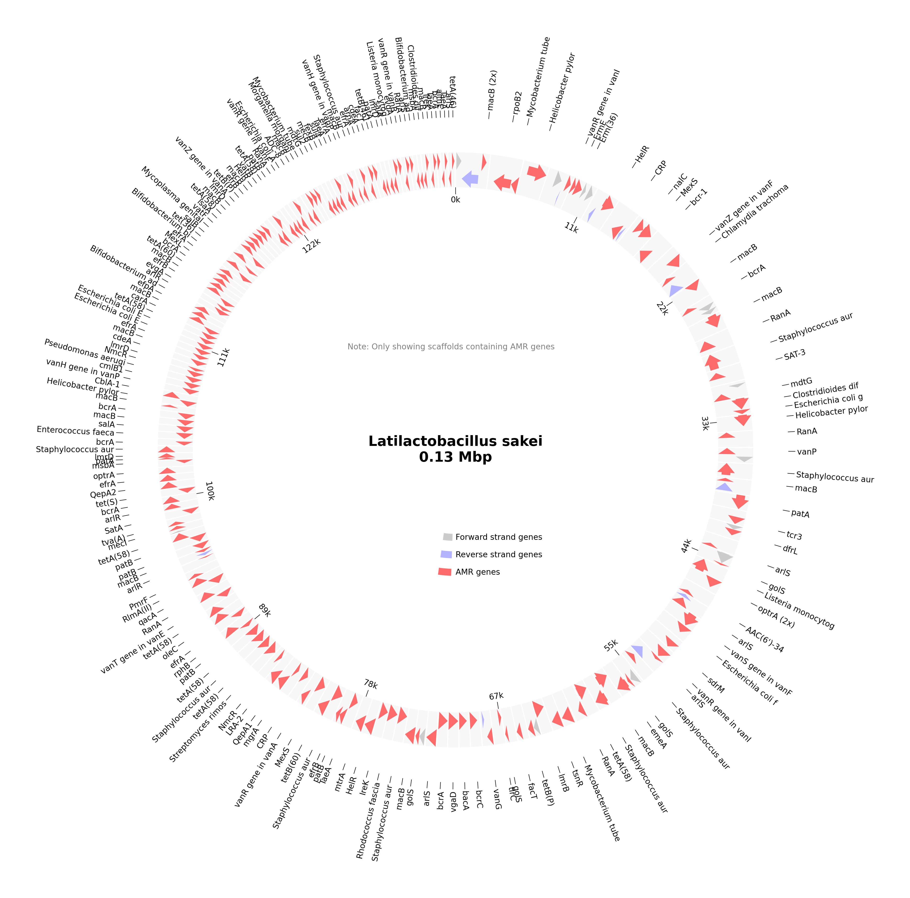

### AAC(6')-34
- **Mechanism**: antibiotic inactivation
- **Drug Classes**: aminoglycoside antibiotic
- **AMR Family**: AAC(6')
- **Locations**:
  - gnl|SPADES|EHPDDGNP_5177_2 : position 749-1066

### ADC-8
- **Mechanism**: antibiotic inactivation
- **Drug Classes**: cephalosporin
- **AMR Family**: ADC beta-lactamase without carbapenemase activity
- **Locations**:
  - gnl|SPADES|EHPDDGNP_17612_1 : position 1-306

### Bifidobacterium adolescentis rpoB mutants conferring resistance to rifampicin (found in 2 locations)
- **Mechanism**: antibiotic target alteration; antibiotic target replacement
- **Drug Classes**: rifamycin antibiotic
- **AMR Family**: rifamycin-resistant beta-subunit of RNA polymerase (rpoB)
- **Locations**:
  - gnl|SPADES|EHPDDGNP_13358_1 : position 2-388
  - gnl|SPADES|EHPDDGNP_30247_1 : position 2-241

### Bifidobacterium bifidum ileS conferring resistance to mupirocin
- **Mechanism**: antibiotic target alteration
- **Drug Classes**: mupirocin-like antibiotic
- **AMR Family**: antibiotic-resistant isoleucyl-tRNA synthetase (ileS)
- **Locations**:
  - gnl|SPADES|EHPDDGNP_14790_1 : position 3-356

### CRP (found in 2 locations)
- **Mechanism**: antibiotic efflux
- **Drug Classes**: macrolide antibiotic; fluoroquinolone antibiotic; penam
- **AMR Family**: resistance-nodulation-cell division (RND) antibiotic efflux pump
- **Locations**:
  - gnl|SPADES|EHPDDGNP_3068_2 : position 736-1437
  - gnl|SPADES|EHPDDGNP_7454_1 : position 239-697

### CblA-1
- **Mechanism**: antibiotic inactivation
- **Drug Classes**: cephalosporin
- **AMR Family**: CblA beta-lactamase
- **Locations**:
  - gnl|SPADES|EHPDDGNP_11227_1 : position 1-456

### Chlamydia trachomatis intrinsic murA conferring resistance to fosfomycin
- **Mechanism**: antibiotic target alteration
- **Drug Classes**: phosphonic acid antibiotic
- **AMR Family**: antibiotic-resistant murA transferase
- **Locations**:
  - gnl|SPADES|EHPDDGNP_3689_1 : position 3-359

### Clostridioides difficile gyrB conferring resistance to fluoroquinolones (found in 2 locations)
- **Mechanism**: antibiotic target alteration
- **Drug Classes**: fluoroquinolone antibiotic
- **AMR Family**: fluoroquinolone resistant gyrB
- **Locations**:
  - gnl|SPADES|EHPDDGNP_33366_1 : position 1-231
  - gnl|SPADES|EHPDDGNP_4339_1 : position 3-914

### Enterococcus faecalis cls with mutation conferring resistance to daptomycin
- **Mechanism**: antibiotic target alteration
- **Drug Classes**: peptide antibiotic
- **AMR Family**: daptomycin resistant cls
- **Locations**:
  - gnl|SPADES|EHPDDGNP_10363_1 : position 3-494

### Erm(36)
- **Mechanism**: antibiotic target alteration
- **Drug Classes**: macrolide antibiotic; lincosamide antibiotic; streptogramin antibiotic; streptogramin A antibiotic; streptogramin B antibiotic
- **AMR Family**: Erm 23S ribosomal RNA methyltransferase
- **Locations**:
  - gnl|SPADES|EHPDDGNP_2929_2 : position 354-929

### ErmE
- **Mechanism**: antibiotic target alteration
- **Drug Classes**: macrolide antibiotic; lincosamide antibiotic; streptogramin antibiotic; streptogramin A antibiotic; streptogramin B antibiotic
- **AMR Family**: Erm 23S ribosomal RNA methyltransferase
- **Locations**:
  - gnl|SPADES|EHPDDGNP_2929_1 : position 38-352

### Escherichia coli AcrAB-TolC with AcrR mutation conferring resistance to ciprofloxacin, tetracycline, and ceftazidime
- **Mechanism**: antibiotic target alteration; antibiotic efflux
- **Drug Classes**: fluoroquinolone antibiotic; cephalosporin; glycylcycline; penam; tetracycline antibiotic; rifamycin antibiotic; phenicol antibiotic; disinfecting agents and antiseptics
- **AMR Family**: resistance-nodulation-cell division (RND) antibiotic efflux pump
- **Locations**:
  - gnl|SPADES|EHPDDGNP_17622_1 : position 2-229

### Escherichia coli EF-Tu mutants conferring resistance to Pulvomycin
- **Mechanism**: antibiotic target alteration
- **Drug Classes**: elfamycin antibiotic
- **AMR Family**: elfamycin resistant EF-Tu
- **Locations**:
  - gnl|SPADES|EHPDDGNP_12459_1 : position 2-412

### Escherichia coli EF-Tu mutants conferring resistance to kirromycin
- **Mechanism**: antibiotic target alteration
- **Drug Classes**: elfamycin antibiotic
- **AMR Family**: elfamycin resistant EF-Tu
- **Locations**:
  - gnl|SPADES|EHPDDGNP_12586_1 : position 39-407

### Escherichia coli fabI mutations conferring resistance to isoniazid and triclosan
- **Mechanism**: antibiotic target alteration
- **Drug Classes**: disinfecting agents and antiseptics; isoniazid-like antibiotic
- **AMR Family**: antibiotic resistant fabI
- **Locations**:
  - gnl|SPADES|EHPDDGNP_5222_1 : position 1-627

### Escherichia coli gyrA conferring resistance to fluoroquinolones
- **Mechanism**: antibiotic target alteration
- **Drug Classes**: fluoroquinolone antibiotic
- **AMR Family**: fluoroquinolone resistant gyrA
- **Locations**:
  - gnl|SPADES|EHPDDGNP_4339_2 : position 962-1300

### HelR (found in 3 locations)
- **Mechanism**: antibiotic target protection
- **Drug Classes**: rifamycin antibiotic
- **AMR Family**: helicase-like RNA polymerase protection protein
- **Locations**:
  - gnl|SPADES|EHPDDGNP_16470_1 : position 1-324
  - gnl|SPADES|EHPDDGNP_3066_3 : position 969-1886
  - gnl|SPADES|EHPDDGNP_6879_1 : position 2-769

### Helicobacter pylori pbp1 mutants conferring resistance to amoxicillin (found in 3 locations)
- **Mechanism**: antibiotic target alteration
- **Drug Classes**: cephalosporin; cephamycin; penam
- **AMR Family**: Penicillin-binding protein mutations conferring resistance to beta-lactam antibiotics
- **Locations**:
  - gnl|SPADES|EHPDDGNP_11040_1 : position 1-462
  - gnl|SPADES|EHPDDGNP_2808_2 : position 482-2050
  - gnl|SPADES|EHPDDGNP_4417_1 : position 2-925

### IreK (found in 2 locations)
- **Mechanism**: reduced permeability to antibiotic
- **Drug Classes**: cephalosporin
- **AMR Family**: Serine/threonine kinases
- **Locations**:
  - gnl|SPADES|EHPDDGNP_33929_1 : position 3-230
  - gnl|SPADES|EHPDDGNP_6858_1 : position 2-661

### LRA-2
- **Mechanism**: antibiotic inactivation
- **Drug Classes**: cephalosporin; penam
- **AMR Family**: subclass B3 LRA beta-lactamase
- **Locations**:
  - gnl|SPADES|EHPDDGNP_7683_1 : position 4-675

### Listeria monocytogenes mprF (found in 2 locations)
- **Mechanism**: antibiotic target alteration
- **Drug Classes**: peptide antibiotic
- **AMR Family**: defensin resistant mprF
- **Locations**:
  - gnl|SPADES|EHPDDGNP_26762_1 : position 2-253
  - gnl|SPADES|EHPDDGNP_5157_1 : position 1-1071

### MexL
- **Mechanism**: antibiotic efflux
- **Drug Classes**: macrolide antibiotic; tetracycline antibiotic; disinfecting agents and antiseptics
- **AMR Family**: resistance-nodulation-cell division (RND) antibiotic efflux pump
- **Locations**:
  - gnl|SPADES|EHPDDGNP_14591_1 : position 31-360

### MexS (found in 2 locations)
- **Mechanism**: antibiotic efflux
- **Drug Classes**: fluoroquinolone antibiotic; diaminopyrimidine antibiotic; phenicol antibiotic
- **AMR Family**: resistance-nodulation-cell division (RND) antibiotic efflux pump
- **Locations**:
  - gnl|SPADES|EHPDDGNP_3141_3 : position 970-1842
  - gnl|SPADES|EHPDDGNP_7300_1 : position 71-715

### Morganella morganii gyrB conferring resistance to fluoroquinolones
- **Mechanism**: antibiotic target alteration
- **Drug Classes**: fluoroquinolone antibiotic
- **AMR Family**: fluoroquinolone resistant gyrB
- **Locations**:
  - gnl|SPADES|EHPDDGNP_17843_1 : position 3-302

### Mycobacterium tuberculosis intrinsic murA conferring resistance to fosfomycin
- **Mechanism**: antibiotic target alteration
- **Drug Classes**: phosphonic acid antibiotic
- **AMR Family**: antibiotic-resistant murA transferase
- **Locations**:
  - gnl|SPADES|EHPDDGNP_5919_1 : position 88-918

### Mycobacterium tuberculosis kasA mutant conferring resistance to isoniazid
- **Mechanism**: antibiotic target alteration
- **Drug Classes**: isoniazid-like antibiotic
- **AMR Family**: antibiotic resistant kasA
- **Locations**:
  - gnl|SPADES|EHPDDGNP_18823_1 : position 2-238

### Mycobacterium tuberculosis rpoB mutations conferring resistance to rifampicin
- **Mechanism**: antibiotic target alteration; antibiotic target replacement
- **Drug Classes**: rifamycin antibiotic
- **AMR Family**: rifamycin-resistant beta-subunit of RNA polymerase (rpoB)
- **Locations**:
  - gnl|SPADES|EHPDDGNP_2263_3 : position 2039-2599

### Mycoplasma genitalium parC mutations confers resistance to Moxifloxacin
- **Mechanism**: antibiotic target alteration
- **Drug Classes**: fluoroquinolone antibiotic
- **AMR Family**: fluoroquinolone resistant parC
- **Locations**:
  - gnl|SPADES|EHPDDGNP_15070_1 : position 3-350

### NmcR (found in 2 locations)
- **Mechanism**: antibiotic inactivation
- **Drug Classes**: carbapenem; cephalosporin; cephamycin; penam
- **AMR Family**: NmcA beta-lactamase
- **Locations**:
  - gnl|SPADES|EHPDDGNP_11742_1 : position 1-435
  - gnl|SPADES|EHPDDGNP_7788_1 : position 3-290

### PmrF
- **Mechanism**: antibiotic target alteration
- **Drug Classes**: peptide antibiotic
- **AMR Family**: pmr phosphoethanolamine transferase
- **Locations**:
  - gnl|SPADES|EHPDDGNP_8749_1 : position 1-276

### Pseudomonas aeruginosa soxR
- **Mechanism**: antibiotic target alteration; antibiotic efflux
- **Drug Classes**: fluoroquinolone antibiotic; cephalosporin; glycylcycline; penam; tetracycline antibiotic; rifamycin antibiotic; phenicol antibiotic; disinfecting agents and antiseptics
- **AMR Family**: ATP-binding cassette (ABC) antibiotic efflux pump; major facilitator superfamily (MFS) antibiotic efflux pump; resistance-nodulation-cell division (RND) antibiotic efflux pump
- **Locations**:
  - gnl|SPADES|EHPDDGNP_11692_1 : position 3-437

### QepA1
- **Mechanism**: antibiotic efflux
- **Drug Classes**: fluoroquinolone antibiotic
- **AMR Family**: major facilitator superfamily (MFS) antibiotic efflux pump
- **Locations**:
  - gnl|SPADES|EHPDDGNP_7610_1 : position 2-682

### QepA2
- **Mechanism**: antibiotic efflux
- **Drug Classes**: fluoroquinolone antibiotic
- **AMR Family**: major facilitator superfamily (MFS) antibiotic efflux pump
- **Locations**:
  - gnl|SPADES|EHPDDGNP_9917_1 : position 3-515

### RanA (found in 6 locations)
- **Mechanism**: antibiotic efflux
- **Drug Classes**: aminoglycoside antibiotic
- **AMR Family**: ATP-binding cassette (ABC) antibiotic efflux pump
- **Locations**:
  - gnl|SPADES|EHPDDGNP_17304_1 : position 2-310
  - gnl|SPADES|EHPDDGNP_29792_1 : position 1-243
  - gnl|SPADES|EHPDDGNP_4124_2 : position 204-992
  - gnl|SPADES|EHPDDGNP_4441_1 : position 1-465
  - gnl|SPADES|EHPDDGNP_5774_1 : position 3-482
  - gnl|SPADES|EHPDDGNP_8542_1 : position 16-603

### Rhodococcus fascians cmr
- **Mechanism**: antibiotic efflux
- **Drug Classes**: phenicol antibiotic
- **AMR Family**: major facilitator superfamily (MFS) antibiotic efflux pump
- **Locations**:
  - gnl|SPADES|EHPDDGNP_6825_1 : position 3-776

### RlmA(II)
- **Mechanism**: antibiotic target alteration
- **Drug Classes**: macrolide antibiotic; lincosamide antibiotic
- **AMR Family**: non-erm 23S ribosomal RNA methyltransferase (G748)
- **Locations**:
  - gnl|SPADES|EHPDDGNP_8730_1 : position 3-551

### SAT-3
- **Mechanism**: antibiotic inactivation
- **Drug Classes**: nucleoside antibiotic
- **AMR Family**: streptothricin acetyltransferase (SAT)
- **Locations**:
  - gnl|SPADES|EHPDDGNP_4244_2 : position 248-793

### SatA
- **Mechanism**: antibiotic inactivation
- **Drug Classes**: nucleoside antibiotic
- **AMR Family**: streptothricin acetyltransferase (SAT)
- **Locations**:
  - gnl|SPADES|EHPDDGNP_9429_1 : position 1-447

### Staphylococcus aureus LmrS
- **Mechanism**: antibiotic efflux
- **Drug Classes**: macrolide antibiotic; aminoglycoside antibiotic; oxazolidinone antibiotic; diaminopyrimidine antibiotic; phenicol antibiotic
- **AMR Family**: major facilitator superfamily (MFS) antibiotic efflux pump
- **Locations**:
  - gnl|SPADES|EHPDDGNP_5510_1 : position 204-620

### Staphylococcus aureus fusA with mutation conferring resistance to fusidic acid
- **Mechanism**: antibiotic target alteration
- **Drug Classes**: fusidane antibiotic
- **AMR Family**: antibiotic resistant fusA
- **Locations**:
  - gnl|SPADES|EHPDDGNP_4594_1 : position 2-1042

### Staphylococcus aureus mupA conferring resistance to mupirocin (found in 3 locations)
- **Mechanism**: antibiotic target alteration
- **Drug Classes**: mupirocin-like antibiotic
- **AMR Family**: antibiotic-resistant isoleucyl-tRNA synthetase (ileS)
- **Locations**:
  - gnl|SPADES|EHPDDGNP_4149_1 : position 3-1364
  - gnl|SPADES|EHPDDGNP_5717_1 : position 2-952
  - gnl|SPADES|EHPDDGNP_6814_1 : position 1-726

### Staphylococcus aureus mupB conferring resistance to mupirocin (found in 3 locations)
- **Mechanism**: antibiotic target alteration
- **Drug Classes**: mupirocin-like antibiotic
- **AMR Family**: antibiotic-resistant isoleucyl-tRNA synthetase (ileS)
- **Locations**:
  - gnl|SPADES|EHPDDGNP_10285_1 : position 2-496
  - gnl|SPADES|EHPDDGNP_22534_1 : position 1-270
  - gnl|SPADES|EHPDDGNP_7092_1 : position 1-744

### Staphylococcus aureus murA with mutation conferring resistance to fosfomycin
- **Mechanism**: antibiotic target alteration
- **Drug Classes**: phosphonic acid antibiotic
- **AMR Family**: antibiotic-resistant murA transferase
- **Locations**:
  - gnl|SPADES|EHPDDGNP_7820_1 : position 1-663

### Streptomyces rimosus otr(A)
- **Mechanism**: antibiotic target protection
- **Drug Classes**: tetracycline antibiotic
- **AMR Family**: tetracycline-resistant ribosomal protection protein
- **Locations**:
  - gnl|SPADES|EHPDDGNP_7790_1 : position 3-665

### TaeA (found in 4 locations)
- **Mechanism**: antibiotic efflux
- **Drug Classes**: pleuromutilin antibiotic
- **AMR Family**: ATP-binding cassette (ABC) antibiotic efflux pump
- **Locations**:
  - gnl|SPADES|EHPDDGNP_20392_1 : position 2-277
  - gnl|SPADES|EHPDDGNP_34473_1 : position 2-229
  - gnl|SPADES|EHPDDGNP_38757_1 : position 3-215
  - gnl|SPADES|EHPDDGNP_7008_2 : position 217-753

### almE
- **Mechanism**: antibiotic target alteration
- **Drug Classes**: peptide antibiotic
- **AMR Family**: polymyxin resistance operon; alm glycyltransferase
- **Locations**:
  - gnl|SPADES|EHPDDGNP_37312_1 : position 3-218

### arlR (found in 3 locations)
- **Mechanism**: antibiotic efflux
- **Drug Classes**: fluoroquinolone antibiotic; disinfecting agents and antiseptics
- **AMR Family**: major facilitator superfamily (MFS) antibiotic efflux pump
- **Locations**:
  - gnl|SPADES|EHPDDGNP_13361_1 : position 1-387
  - gnl|SPADES|EHPDDGNP_8744_2 : position 492-587
  - gnl|SPADES|EHPDDGNP_9636_1 : position 120-530

### arlS (found in 6 locations)
- **Mechanism**: antibiotic efflux
- **Drug Classes**: fluoroquinolone antibiotic; disinfecting agents and antiseptics
- **AMR Family**: major facilitator superfamily (MFS) antibiotic efflux pump
- **Locations**:
  - gnl|SPADES|EHPDDGNP_30259_1 : position 1-243
  - gnl|SPADES|EHPDDGNP_40016_1 : position 1-210
  - gnl|SPADES|EHPDDGNP_5034_2 : position 826-1107
  - gnl|SPADES|EHPDDGNP_5193_2 : position 411-1061
  - gnl|SPADES|EHPDDGNP_5389_1 : position 3-236
  - gnl|SPADES|EHPDDGNP_6526_1 : position 3-818

### arnA
- **Mechanism**: antibiotic target alteration
- **Drug Classes**: peptide antibiotic
- **AMR Family**: pmr phosphoethanolamine transferase
- **Locations**:
  - gnl|SPADES|EHPDDGNP_23408_1 : position 2-265

### bacA
- **Mechanism**: antibiotic target alteration
- **Drug Classes**: peptide antibiotic
- **AMR Family**: undecaprenyl pyrophosphate related proteins
- **Locations**:
  - gnl|SPADES|EHPDDGNP_6404_1 : position 167-838

### bcr-1
- **Mechanism**: antibiotic efflux
- **Drug Classes**: bicyclomycin-like antibiotic
- **AMR Family**: major facilitator superfamily (MFS) antibiotic efflux pump
- **Locations**:
  - gnl|SPADES|EHPDDGNP_3482_1 : position 3-806

### bcrA (found in 7 locations)
- **Mechanism**: antibiotic efflux
- **Drug Classes**: peptide antibiotic
- **AMR Family**: ATP-binding cassette (ABC) antibiotic efflux pump
- **Locations**:
  - gnl|SPADES|EHPDDGNP_10313_1 : position 1-339
  - gnl|SPADES|EHPDDGNP_10602_1 : position 3-482
  - gnl|SPADES|EHPDDGNP_14498_1 : position 1-360
  - gnl|SPADES|EHPDDGNP_36927_1 : position 2-220
  - gnl|SPADES|EHPDDGNP_3977_1 : position 3-368
  - gnl|SPADES|EHPDDGNP_6472_1 : position 3-782
  - gnl|SPADES|EHPDDGNP_9633_1 : position 1-528

### bcrC
- **Mechanism**: antibiotic target alteration
- **Drug Classes**: peptide antibiotic
- **AMR Family**: undecaprenyl pyrophosphate related proteins
- **Locations**:
  - gnl|SPADES|EHPDDGNP_6210_2 : position 211-849

### carA
- **Mechanism**: antibiotic target protection
- **Drug Classes**: macrolide antibiotic
- **AMR Family**: Miscellaneous ABC-F subfamily ATP-binding cassette ribosomal protection proteins
- **Locations**:
  - gnl|SPADES|EHPDDGNP_13053_1 : position 2-394

### cdeA (found in 2 locations)
- **Mechanism**: antibiotic efflux
- **Drug Classes**: fluoroquinolone antibiotic; disinfecting agents and antiseptics
- **AMR Family**: multidrug and toxic compound extrusion (MATE) transporter
- **Locations**:
  - gnl|SPADES|EHPDDGNP_12139_1 : position 2-421
  - gnl|SPADES|EHPDDGNP_23298_1 : position 3-266

### cmlB1
- **Mechanism**: antibiotic efflux
- **Drug Classes**: phenicol antibiotic
- **AMR Family**: major facilitator superfamily (MFS) antibiotic efflux pump
- **Locations**:
  - gnl|SPADES|EHPDDGNP_11684_1 : position 1-438

### dfrL
- **Mechanism**: antibiotic target replacement
- **Drug Classes**: aminoglycoside antibiotic; tetracycline antibiotic; diaminopyrimidine antibiotic
- **AMR Family**: trimethoprim resistant dihydrofolate reductase dfr
- **Locations**:
  - gnl|SPADES|EHPDDGNP_4871_2 : position 383-883

### efpA
- **Mechanism**: antibiotic efflux
- **Drug Classes**: rifamycin antibiotic; isoniazid-like antibiotic
- **AMR Family**: major facilitator superfamily (MFS) antibiotic efflux pump
- **Locations**:
  - gnl|SPADES|EHPDDGNP_13280_1 : position 1-390

### efrA (found in 6 locations)
- **Mechanism**: antibiotic efflux
- **Drug Classes**: macrolide antibiotic; fluoroquinolone antibiotic; rifamycin antibiotic
- **AMR Family**: ATP-binding cassette (ABC) antibiotic efflux pump
- **Locations**:
  - gnl|SPADES|EHPDDGNP_12202_1 : position 3-419
  - gnl|SPADES|EHPDDGNP_14610_1 : position 3-359
  - gnl|SPADES|EHPDDGNP_21099_1 : position 3-275
  - gnl|SPADES|EHPDDGNP_22857_1 : position 2-268
  - gnl|SPADES|EHPDDGNP_8337_1 : position 3-443
  - gnl|SPADES|EHPDDGNP_9950_1 : position 2-514

### efrB (found in 3 locations)
- **Mechanism**: antibiotic efflux
- **Drug Classes**: macrolide antibiotic; fluoroquinolone antibiotic; rifamycin antibiotic
- **AMR Family**: ATP-binding cassette (ABC) antibiotic efflux pump
- **Locations**:
  - gnl|SPADES|EHPDDGNP_14091_1 : position 1-369
  - gnl|SPADES|EHPDDGNP_16113_1 : position 2-331
  - gnl|SPADES|EHPDDGNP_7074_2 : position 426-746

### emeA
- **Mechanism**: antibiotic efflux
- **Drug Classes**: disinfecting agents and antiseptics
- **AMR Family**: multidrug and toxic compound extrusion (MATE) transporter
- **Locations**:
  - gnl|SPADES|EHPDDGNP_5610_1 : position 53-979

### evgA (found in 2 locations)
- **Mechanism**: antibiotic efflux
- **Drug Classes**: macrolide antibiotic; fluoroquinolone antibiotic; penam; tetracycline antibiotic
- **AMR Family**: major facilitator superfamily (MFS) antibiotic efflux pump; resistance-nodulation-cell division (RND) antibiotic efflux pump
- **Locations**:
  - gnl|SPADES|EHPDDGNP_14015_1 : position 1-270
  - gnl|SPADES|EHPDDGNP_27434_1 : position 2-253

### facT (found in 2 locations)
- **Mechanism**: antibiotic efflux
- **Drug Classes**: elfamycin antibiotic
- **AMR Family**: major facilitator superfamily (MFS) antibiotic efflux pump
- **Locations**:
  - gnl|SPADES|EHPDDGNP_23361_1 : position 3-266
  - gnl|SPADES|EHPDDGNP_6120_2 : position 490-882

### fexB
- **Mechanism**: antibiotic efflux
- **Drug Classes**: phenicol antibiotic
- **AMR Family**: major facilitator superfamily (MFS) antibiotic efflux pump
- **Locations**:
  - gnl|SPADES|EHPDDGNP_19747_1 : position 2-283

### golS (found in 4 locations)
- **Mechanism**: antibiotic efflux
- **Drug Classes**: monobactam; carbapenem; cephalosporin; cephamycin; penam; phenicol antibiotic; penem
- **AMR Family**: resistance-nodulation-cell division (RND) antibiotic efflux pump
- **Locations**:
  - gnl|SPADES|EHPDDGNP_5151_2 : position 925-1074
  - gnl|SPADES|EHPDDGNP_5539_2 : position 760-990
  - gnl|SPADES|EHPDDGNP_6122_2 : position 662-880
  - gnl|SPADES|EHPDDGNP_6543_2 : position 509-814

### lmrB
- **Mechanism**: antibiotic efflux
- **Drug Classes**: lincosamide antibiotic; nucleoside antibiotic
- **AMR Family**: ATP-binding cassette (ABC) antibiotic efflux pump
- **Locations**:
  - gnl|SPADES|EHPDDGNP_6103_1 : position 39-884

### lmrD (found in 4 locations)
- **Mechanism**: antibiotic efflux
- **Drug Classes**: lincosamide antibiotic
- **AMR Family**: ATP-binding cassette (ABC) antibiotic efflux pump
- **Locations**:
  - gnl|SPADES|EHPDDGNP_10227_2 : position 151-498
  - gnl|SPADES|EHPDDGNP_12101_1 : position 1-249
  - gnl|SPADES|EHPDDGNP_15532_1 : position 2-340
  - gnl|SPADES|EHPDDGNP_25825_1 : position 1-258

### lsaA
- **Mechanism**: antibiotic target protection
- **Drug Classes**: lincosamide antibiotic; streptogramin antibiotic; streptogramin A antibiotic; streptogramin B antibiotic; pleuromutilin antibiotic
- **AMR Family**: lsa-type ABC-F protein
- **Locations**:
  - gnl|SPADES|EHPDDGNP_15125_1 : position 2-337

### macB (found in 18 locations)
- **Mechanism**: antibiotic efflux
- **Drug Classes**: macrolide antibiotic
- **AMR Family**: ATP-binding cassette (ABC) antibiotic efflux pump
- **Locations**:
  - gnl|SPADES|EHPDDGNP_10512_1 : position 2-484
  - gnl|SPADES|EHPDDGNP_10837_2 : position 287-472
  - gnl|SPADES|EHPDDGNP_12212_1 : position 73-420
  - gnl|SPADES|EHPDDGNP_13074_1 : position 3-395
  - gnl|SPADES|EHPDDGNP_14208_1 : position 2-367
  - gnl|SPADES|EHPDDGNP_15382_1 : position 1-345
  - gnl|SPADES|EHPDDGNP_16347_1 : position 3-326
  - gnl|SPADES|EHPDDGNP_17835_1 : position 27-302
  - gnl|SPADES|EHPDDGNP_2118_3 : position 2190-2555
  - gnl|SPADES|EHPDDGNP_2118_4 : position 2588-2773
  - gnl|SPADES|EHPDDGNP_22389_1 : position 3-164
  - gnl|SPADES|EHPDDGNP_33587_1 : position 1-231
  - gnl|SPADES|EHPDDGNP_3829_1 : position 3-683
  - gnl|SPADES|EHPDDGNP_3987_1 : position 1-1074
  - gnl|SPADES|EHPDDGNP_4669_1 : position 2-286
  - gnl|SPADES|EHPDDGNP_5635_1 : position 1-972
  - gnl|SPADES|EHPDDGNP_6738_1 : position 1-786
  - gnl|SPADES|EHPDDGNP_8856_2 : position 339-578

### mdtG (found in 2 locations)
- **Mechanism**: antibiotic efflux
- **Drug Classes**: phosphonic acid antibiotic
- **AMR Family**: major facilitator superfamily (MFS) antibiotic efflux pump
- **Locations**:
  - gnl|SPADES|EHPDDGNP_18909_1 : position 2-289
  - gnl|SPADES|EHPDDGNP_4333_2 : position 749-1303

### mecB
- **Mechanism**: antibiotic target replacement
- **Drug Classes**: penam
- **AMR Family**: methicillin resistant PBP2
- **Locations**:
  - gnl|SPADES|EHPDDGNP_19633_1 : position 2-283

### mecI
- **Mechanism**: antibiotic target replacement
- **Drug Classes**: penam
- **AMR Family**: methicillin resistant PBP2
- **Locations**:
  - gnl|SPADES|EHPDDGNP_9322_2 : position 274-546

### mgrA
- **Mechanism**: antibiotic efflux
- **Drug Classes**: fluoroquinolone antibiotic; cephalosporin; penam; tetracycline antibiotic; peptide antibiotic; disinfecting agents and antiseptics
- **AMR Family**: ATP-binding cassette (ABC) antibiotic efflux pump; major facilitator superfamily (MFS) antibiotic efflux pump
- **Locations**:
  - gnl|SPADES|EHPDDGNP_7508_2 : position 404-694

### msbA (found in 2 locations)
- **Mechanism**: antibiotic efflux
- **Drug Classes**: nitroimidazole antibiotic
- **AMR Family**: ATP-binding cassette (ABC) antibiotic efflux pump
- **Locations**:
  - gnl|SPADES|EHPDDGNP_10012_1 : position 217-510
  - gnl|SPADES|EHPDDGNP_30334_1 : position 1-243

### mtrA
- **Mechanism**: antibiotic efflux
- **Drug Classes**: macrolide antibiotic; penam
- **AMR Family**: resistance-nodulation-cell division (RND) antibiotic efflux pump
- **Locations**:
  - gnl|SPADES|EHPDDGNP_6935_1 : position 1-687

### nalC
- **Mechanism**: antibiotic efflux
- **Drug Classes**: macrolide antibiotic; fluoroquinolone antibiotic; monobactam; carbapenem; cephalosporin; cephamycin; penam; tetracycline antibiotic; peptide antibiotic; aminocoumarin antibiotic; diaminopyrimidine antibiotic; sulfonamide antibiotic; phenicol antibiotic; penem
- **AMR Family**: resistance-nodulation-cell division (RND) antibiotic efflux pump
- **Locations**:
  - gnl|SPADES|EHPDDGNP_3141_2 : position 387-968

### oleC
- **Mechanism**: antibiotic efflux
- **Drug Classes**: macrolide antibiotic
- **AMR Family**: ATP-binding cassette (ABC) antibiotic efflux pump
- **Locations**:
  - gnl|SPADES|EHPDDGNP_8352_1 : position 3-617

### optrA (found in 3 locations)
- **Mechanism**: antibiotic target protection
- **Drug Classes**: oxazolidinone antibiotic; phenicol antibiotic
- **AMR Family**: Miscellaneous ABC-F subfamily ATP-binding cassette ribosomal protection proteins
- **Locations**:
  - gnl|SPADES|EHPDDGNP_10010_1 : position 30-509
  - gnl|SPADES|EHPDDGNP_5174_1 : position 1-765
  - gnl|SPADES|EHPDDGNP_5174_2 : position 818-1069

### patA (found in 3 locations)
- **Mechanism**: antibiotic efflux
- **Drug Classes**: fluoroquinolone antibiotic
- **AMR Family**: ATP-binding cassette (ABC) antibiotic efflux pump
- **Locations**:
  - gnl|SPADES|EHPDDGNP_10227_1 : position 1-147
  - gnl|SPADES|EHPDDGNP_23545_1 : position 1-177
  - gnl|SPADES|EHPDDGNP_4757_1 : position 1-1167

### patB (found in 5 locations)
- **Mechanism**: antibiotic efflux
- **Drug Classes**: fluoroquinolone antibiotic
- **AMR Family**: ATP-binding cassette (ABC) antibiotic efflux pump
- **Locations**:
  - gnl|SPADES|EHPDDGNP_17141_1 : position 1-243
  - gnl|SPADES|EHPDDGNP_7074_1 : position 1-429
  - gnl|SPADES|EHPDDGNP_8201_2 : position 307-630
  - gnl|SPADES|EHPDDGNP_8938_1 : position 3-500
  - gnl|SPADES|EHPDDGNP_9076_1 : position 1-564

### qacA
- **Mechanism**: antibiotic efflux
- **Drug Classes**: fluoroquinolone antibiotic
- **AMR Family**: major facilitator superfamily (MFS) antibiotic efflux pump
- **Locations**:
  - gnl|SPADES|EHPDDGNP_8614_1 : position 3-596

### rphB
- **Mechanism**: antibiotic inactivation
- **Drug Classes**: rifamycin antibiotic
- **AMR Family**: rifampin phosphotransferase
- **Locations**:
  - gnl|SPADES|EHPDDGNP_8310_1 : position 2-619

### rpoB2
- **Mechanism**: antibiotic target alteration; antibiotic target replacement
- **Drug Classes**: rifamycin antibiotic
- **AMR Family**: rifamycin-resistant beta-subunit of RNA polymerase (rpoB)
- **Locations**:
  - gnl|SPADES|EHPDDGNP_2263_2 : position 485-1999

### salA (found in 2 locations)
- **Mechanism**: antibiotic target protection
- **Drug Classes**: lincosamide antibiotic; streptogramin antibiotic; streptogramin A antibiotic; pleuromutilin antibiotic
- **AMR Family**: sal-type ABC-F protein
- **Locations**:
  - gnl|SPADES|EHPDDGNP_10426_1 : position 2-490
  - gnl|SPADES|EHPDDGNP_26501_1 : position 1-255

### salB
- **Mechanism**: antibiotic target protection
- **Drug Classes**: lincosamide antibiotic; streptogramin antibiotic; streptogramin A antibiotic; pleuromutilin antibiotic
- **AMR Family**: sal-type ABC-F protein
- **Locations**:
  - gnl|SPADES|EHPDDGNP_14824_1 : position 1-258

### sdrM
- **Mechanism**: antibiotic efflux
- **Drug Classes**: fluoroquinolone antibiotic; disinfecting agents and antiseptics
- **AMR Family**: major facilitator superfamily (MFS) antibiotic efflux pump
- **Locations**:
  - gnl|SPADES|EHPDDGNP_5251_2 : position 450-1049

### sul2
- **Mechanism**: antibiotic target replacement
- **Drug Classes**: sulfonamide antibiotic
- **AMR Family**: sulfonamide resistant sul
- **Locations**:
  - gnl|SPADES|EHPDDGNP_19088_1 : position 2-289

### sul4
- **Mechanism**: antibiotic target replacement
- **Drug Classes**: sulfonamide antibiotic
- **AMR Family**: sulfonamide resistant sul
- **Locations**:
  - gnl|SPADES|EHPDDGNP_19768_1 : position 2-283

### tcr3
- **Mechanism**: antibiotic efflux
- **Drug Classes**: tetracycline antibiotic
- **AMR Family**: major facilitator superfamily (MFS) antibiotic efflux pump
- **Locations**:
  - gnl|SPADES|EHPDDGNP_4824_2 : position 566-1162

### tet(36)
- **Mechanism**: antibiotic target protection
- **Drug Classes**: tetracycline antibiotic
- **AMR Family**: tetracycline-resistant ribosomal protection protein
- **Locations**:
  - gnl|SPADES|EHPDDGNP_14851_1 : position 3-353

### tet(S)
- **Mechanism**: antibiotic target protection
- **Drug Classes**: tetracycline antibiotic
- **AMR Family**: tetracycline-resistant ribosomal protection protein
- **Locations**:
  - gnl|SPADES|EHPDDGNP_9735_1 : position 1-426

### tetA(46)
- **Mechanism**: antibiotic efflux
- **Drug Classes**: tetracycline antibiotic
- **AMR Family**: ATP-binding cassette (ABC) antibiotic efflux pump
- **Locations**:
  - gnl|SPADES|EHPDDGNP_40774_1 : position 2-208

### tetA(58) (found in 8 locations)
- **Mechanism**: antibiotic efflux
- **Drug Classes**: tetracycline antibiotic
- **AMR Family**: major facilitator superfamily (MFS) antibiotic efflux pump
- **Locations**:
  - gnl|SPADES|EHPDDGNP_12999_1 : position 1-396
  - gnl|SPADES|EHPDDGNP_15322_1 : position 3-344
  - gnl|SPADES|EHPDDGNP_16931_1 : position 3-317
  - gnl|SPADES|EHPDDGNP_5748_1 : position 2-871
  - gnl|SPADES|EHPDDGNP_7797_1 : position 36-665
  - gnl|SPADES|EHPDDGNP_7964_1 : position 13-648
  - gnl|SPADES|EHPDDGNP_8376_1 : position 1-615
  - gnl|SPADES|EHPDDGNP_9117_1 : position 1-561

### tetA(60)
- **Mechanism**: antibiotic efflux
- **Drug Classes**: tetracycline antibiotic
- **AMR Family**: ATP-binding cassette (ABC) antibiotic efflux pump
- **Locations**:
  - gnl|SPADES|EHPDDGNP_14240_1 : position 3-365

### tetB(46)
- **Mechanism**: antibiotic efflux
- **Drug Classes**: tetracycline antibiotic
- **AMR Family**: ATP-binding cassette (ABC) antibiotic efflux pump
- **Locations**:
  - gnl|SPADES|EHPDDGNP_23645_1 : position 2-265

### tetB(60)
- **Mechanism**: antibiotic efflux
- **Drug Classes**: tetracycline antibiotic
- **AMR Family**: ATP-binding cassette (ABC) antibiotic efflux pump
- **Locations**:
  - gnl|SPADES|EHPDDGNP_7134_1 : position 3-740

### tetB(P) (found in 2 locations)
- **Mechanism**: antibiotic target protection
- **Drug Classes**: tetracycline antibiotic
- **AMR Family**: tetracycline-resistant ribosomal protection protein
- **Locations**:
  - gnl|SPADES|EHPDDGNP_16162_1 : position 24-329
  - gnl|SPADES|EHPDDGNP_6107_2 : position 444-884

### tlrC
- **Mechanism**: antibiotic target protection
- **Drug Classes**: macrolide antibiotic; lincosamide antibiotic
- **AMR Family**: Miscellaneous ABC-F subfamily ATP-binding cassette ribosomal protection proteins
- **Locations**:
  - gnl|SPADES|EHPDDGNP_6158_1 : position 2-262

### tsnR
- **Mechanism**: antibiotic target alteration
- **Drug Classes**: peptide antibiotic
- **AMR Family**: non-erm 23S ribosomal RNA methyltransferase (A1067)
- **Locations**:
  - gnl|SPADES|EHPDDGNP_5979_1 : position 42-803

### tva(A)
- **Mechanism**: antibiotic target protection
- **Drug Classes**: pleuromutilin antibiotic
- **AMR Family**: Miscellaneous ABC-F subfamily ATP-binding cassette ribosomal protection proteins
- **Locations**:
  - gnl|SPADES|EHPDDGNP_9382_1 : position 1-282

### vanG
- **Mechanism**: antibiotic target alteration
- **Drug Classes**: glycopeptide antibiotic
- **AMR Family**: glycopeptide resistance gene cluster; Van ligase
- **Locations**:
  - gnl|SPADES|EHPDDGNP_6202_1 : position 1-447

### vanH gene in vanP cluster (found in 2 locations)
- **Mechanism**: antibiotic target alteration
- **Drug Classes**: glycopeptide antibiotic
- **AMR Family**: vanH; glycopeptide resistance gene cluster
- **Locations**:
  - gnl|SPADES|EHPDDGNP_11464_1 : position 2-445
  - gnl|SPADES|EHPDDGNP_21100_1 : position 3-275

### vanP
- **Mechanism**: antibiotic target alteration
- **Drug Classes**: glycopeptide antibiotic
- **AMR Family**: glycopeptide resistance gene cluster; Van ligase
- **Locations**:
  - gnl|SPADES|EHPDDGNP_4565_1 : position 2-532

### vanR gene in vanA cluster
- **Mechanism**: antibiotic target alteration
- **Drug Classes**: glycopeptide antibiotic
- **AMR Family**: glycopeptide resistance gene cluster; vanR
- **Locations**:
  - gnl|SPADES|EHPDDGNP_7423_1 : position 222-701

### vanR gene in vanB cluster
- **Mechanism**: antibiotic target alteration
- **Drug Classes**: glycopeptide antibiotic
- **AMR Family**: glycopeptide resistance gene cluster; vanR
- **Locations**:
  - gnl|SPADES|EHPDDGNP_29874_1 : position 2-244

### vanR gene in vanF cluster
- **Mechanism**: antibiotic target alteration
- **Drug Classes**: glycopeptide antibiotic
- **AMR Family**: glycopeptide resistance gene cluster; vanR
- **Locations**:
  - gnl|SPADES|EHPDDGNP_17577_1 : position 3-308

### vanR gene in vanI cluster (found in 2 locations)
- **Mechanism**: antibiotic target alteration
- **Drug Classes**: glycopeptide antibiotic
- **AMR Family**: glycopeptide resistance gene cluster; vanR
- **Locations**:
  - gnl|SPADES|EHPDDGNP_2812_3 : position 1693-2052
  - gnl|SPADES|EHPDDGNP_5316_2 : position 304-1017

### vanS gene in vanF cluster
- **Mechanism**: antibiotic target alteration
- **Drug Classes**: glycopeptide antibiotic
- **AMR Family**: vanS; glycopeptide resistance gene cluster
- **Locations**:
  - gnl|SPADES|EHPDDGNP_5208_1 : position 2-1060

### vanT gene in vanE cluster
- **Mechanism**: antibiotic target alteration
- **Drug Classes**: glycopeptide antibiotic
- **AMR Family**: glycopeptide resistance gene cluster; vanT
- **Locations**:
  - gnl|SPADES|EHPDDGNP_8489_1 : position 1-531

### vanZ gene in vanA cluster
- **Mechanism**: antibiotic target alteration
- **Drug Classes**: glycopeptide antibiotic
- **AMR Family**: vanZ; glycopeptide resistance gene cluster
- **Locations**:
  - gnl|SPADES|EHPDDGNP_15526_1 : position 3-338

### vanZ gene in vanF cluster
- **Mechanism**: antibiotic target alteration
- **Drug Classes**: glycopeptide antibiotic
- **AMR Family**: vanZ; glycopeptide resistance gene cluster
- **Locations**:
  - gnl|SPADES|EHPDDGNP_3667_2 : position 749-1564

### vatB
- **Mechanism**: antibiotic inactivation
- **Drug Classes**: streptogramin antibiotic; streptogramin A antibiotic
- **AMR Family**: streptogramin vat acetyltransferase
- **Locations**:
  - gnl|SPADES|EHPDDGNP_16695_1 : position 2-319

### vatF
- **Mechanism**: antibiotic inactivation
- **Drug Classes**: streptogramin antibiotic; streptogramin A antibiotic
- **AMR Family**: streptogramin vat acetyltransferase
- **Locations**:
  - gnl|SPADES|EHPDDGNP_15115_1 : position 3-350

### vgaD
- **Mechanism**: antibiotic target protection
- **Drug Classes**: streptogramin antibiotic; streptogramin A antibiotic; pleuromutilin antibiotic
- **AMR Family**: vga-type ABC-F protein
- **Locations**:
  - gnl|SPADES|EHPDDGNP_6417_1 : position 2-835

## Latilactobacillus sakei subsp. sakei
**Strain Statistics:**
- Total genome length: 1.2 kbp
- Total scaffolds: 33
- Scaffolds with AMR genes: 2
- Total genes annotated: 2
- Total AMR genes: 2
- Unique AMR genes: 2
- Distinct AMR mechanisms: 1
- Distinct AMR families: 2
- Distinct drug classes: 2

**Circos Plot:**

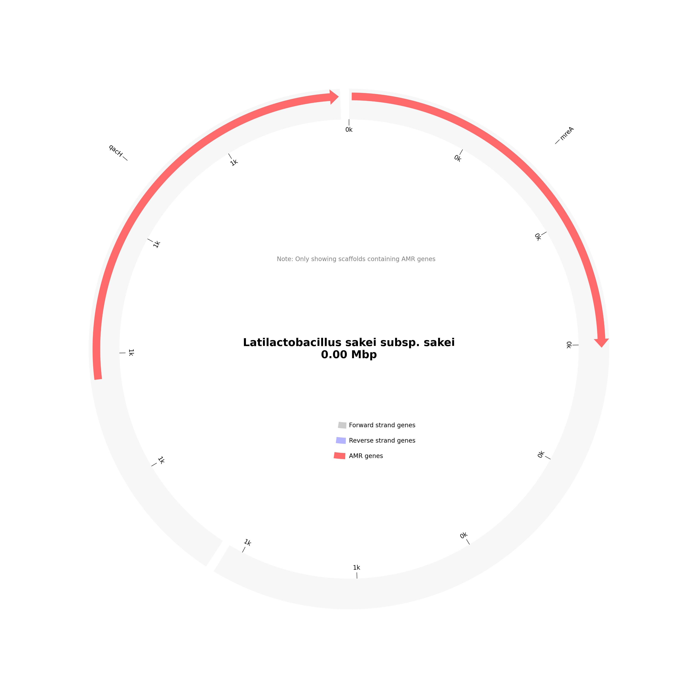

### mreA
- **Mechanism**: antibiotic efflux
- **Drug Classes**: macrolide antibiotic
- **AMR Family**: major facilitator superfamily (MFS) antibiotic efflux pump
- **Locations**:
  - gnl|SPADES|EHPDDGNP_7568_1 : position 2-292

### qacH
- **Mechanism**: antibiotic efflux
- **Drug Classes**: disinfecting agents and antiseptics
- **AMR Family**: small multidrug resistance (SMR) antibiotic efflux pump
- **Locations**:
  - gnl|SPADES|EHPDDGNP_10857_1 : position 162-470

## Latilactobacillus sakei subsp. sakei 23K
**Strain Statistics:**
- Total genome length: 2.8 kbp
- Total scaffolds: 26
- Scaffolds with AMR genes: 5
- Total genes annotated: 4
- Total AMR genes: 6
- Unique AMR genes: 6
- Distinct AMR mechanisms: 3
- Distinct AMR families: 5
- Distinct drug classes: 15

**Circos Plot:**

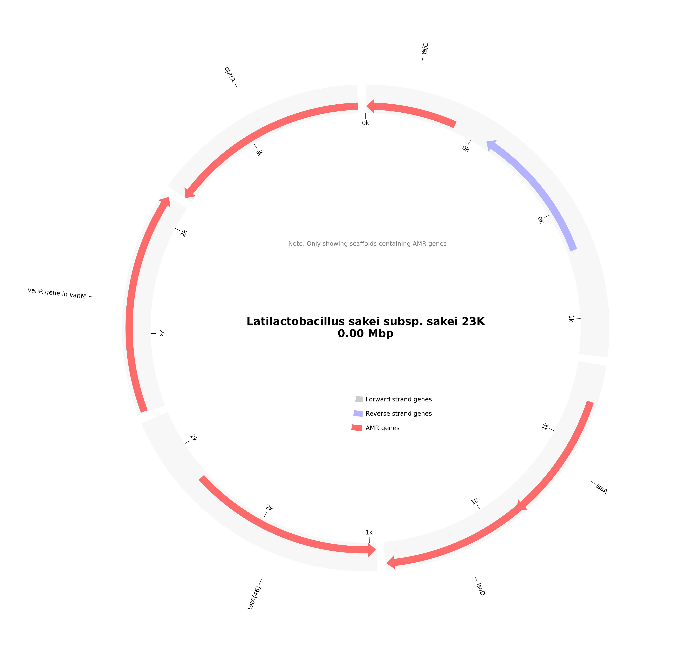

### YajC
- **Mechanism**: antibiotic efflux
- **Drug Classes**: fluoroquinolone antibiotic; cephalosporin; glycylcycline; penam; tetracycline antibiotic; oxazolidinone antibiotic; glycopeptide antibiotic; rifamycin antibiotic; phenicol antibiotic; disinfecting agents and antiseptics
- **AMR Family**: resistance-nodulation-cell division (RND) antibiotic efflux pump
- **Locations**:
  - gnl|SPADES|EHPDDGNP_6764_1 : position 1-192

### lsaA
- **Mechanism**: antibiotic target protection
- **Drug Classes**: lincosamide antibiotic; streptogramin antibiotic; streptogramin A antibiotic; streptogramin B antibiotic; pleuromutilin antibiotic
- **AMR Family**: lsa-type ABC-F protein
- **Locations**:
  - gnl|SPADES|EHPDDGNP_8363_1 : position 75-335

### lsaD
- **Mechanism**: antibiotic target protection
- **Drug Classes**: lincosamide antibiotic; streptogramin antibiotic; streptogramin A antibiotic; pleuromutilin antibiotic
- **AMR Family**: lsa-type ABC-F protein
- **Locations**:
  - gnl|SPADES|EHPDDGNP_8363_2 : position 313-615

### optrA
- **Mechanism**: antibiotic target protection
- **Drug Classes**: oxazolidinone antibiotic; phenicol antibiotic
- **AMR Family**: Miscellaneous ABC-F subfamily ATP-binding cassette ribosomal protection proteins
- **Locations**:
  - gnl|SPADES|EHPDDGNP_12146_1 : position 1-423

### tetA(46)
- **Mechanism**: antibiotic efflux
- **Drug Classes**: tetracycline antibiotic
- **AMR Family**: ATP-binding cassette (ABC) antibiotic efflux pump
- **Locations**:
  - gnl|SPADES|EHPDDGNP_9078_1 : position 1-408

### vanR gene in vanM cluster
- **Mechanism**: antibiotic target alteration
- **Drug Classes**: glycopeptide antibiotic
- **AMR Family**: glycopeptide resistance gene cluster; vanR
- **Locations**:
  - gnl|SPADES|EHPDDGNP_11556_1 : position 3-443

## Lelliottia amnigena
**Strain Statistics:**
- Total genome length: 10.0 kbp
- Total scaffolds: 14
- Scaffolds with AMR genes: 4
- Total genes annotated: 18
- Total AMR genes: 6
- Unique AMR genes: 6
- Distinct AMR mechanisms: 2
- Distinct AMR families: 5
- Distinct drug classes: 8

**Circos Plot:**

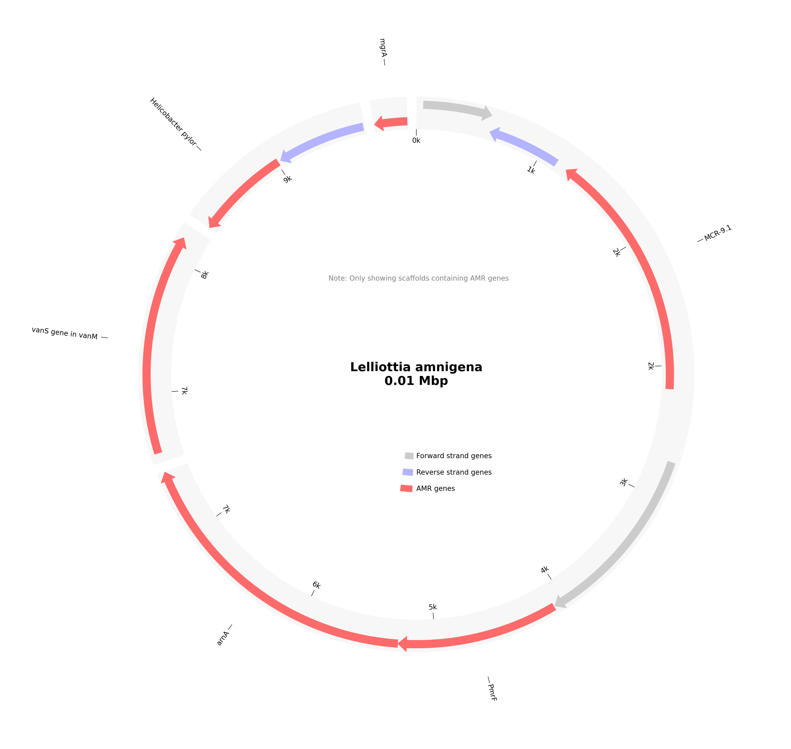

### Helicobacter pylori pbp1 mutants conferring resistance to amoxicillin
- **Mechanism**: antibiotic target alteration
- **Drug Classes**: cephalosporin; cephamycin; penam
- **AMR Family**: Penicillin-binding protein mutations conferring resistance to beta-lactam antibiotics
- **Locations**:
  - gnl|SPADES|EHPDDGNP_4617_1 : position 2-616

### MCR-9.1
- **Mechanism**: antibiotic target alteration
- **Drug Classes**: peptide antibiotic
- **AMR Family**: MCR phosphoethanolamine transferase
- **Locations**:
  - gnl|SPADES|EHPDDGNP_786_3 : position 1022-2641

### PmrF
- **Mechanism**: antibiotic target alteration
- **Drug Classes**: peptide antibiotic
- **AMR Family**: pmr phosphoethanolamine transferase
- **Locations**:
  - gnl|SPADES|EHPDDGNP_786_5 : position 4226-5209

### arnA
- **Mechanism**: antibiotic target alteration
- **Drug Classes**: peptide antibiotic
- **AMR Family**: pmr phosphoethanolamine transferase
- **Locations**:
  - gnl|SPADES|EHPDDGNP_786_6 : position 5206-7044

### mgrA
- **Mechanism**: antibiotic efflux
- **Drug Classes**: fluoroquinolone antibiotic; cephalosporin; penam; tetracycline antibiotic; peptide antibiotic; disinfecting agents and antiseptics
- **AMR Family**: ATP-binding cassette (ABC) antibiotic efflux pump; major facilitator superfamily (MFS) antibiotic efflux pump
- **Locations**:
  - gnl|SPADES|EHPDDGNP_37625_1 : position 3-218

### vanS gene in vanM cluster
- **Mechanism**: antibiotic target alteration
- **Drug Classes**: glycopeptide antibiotic
- **AMR Family**: vanS; glycopeptide resistance gene cluster
- **Locations**:
  - gnl|SPADES|EHPDDGNP_3850_1 : position 59-1405

## Lelliottia sp. AC1
**Strain Statistics:**
- Total genome length: 0.3 kbp
- Total scaffolds: 1
- Scaffolds with AMR genes: 1
- Total genes annotated: 0
- Total AMR genes: 1
- Unique AMR genes: 1
- Distinct AMR mechanisms: 1
- Distinct AMR families: 1
- Distinct drug classes: 1

**Circos Plot:**

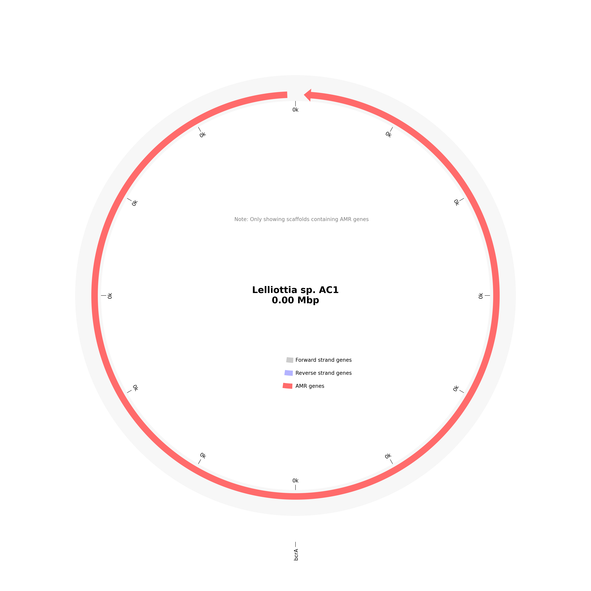

### bcrA
- **Mechanism**: antibiotic efflux
- **Drug Classes**: peptide antibiotic
- **AMR Family**: ATP-binding cassette (ABC) antibiotic efflux pump
- **Locations**:
  - gnl|SPADES|EHPDDGNP_17659_1 : position 2-304

## Lelliottia sp. JS-SCA-14
**Strain Statistics:**
- Total genome length: 0.7 kbp
- Total scaffolds: 3
- Scaffolds with AMR genes: 1
- Total genes annotated: 2
- Total AMR genes: 1
- Unique AMR genes: 1
- Distinct AMR mechanisms: 1
- Distinct AMR families: 1
- Distinct drug classes: 2

**Circos Plot:**

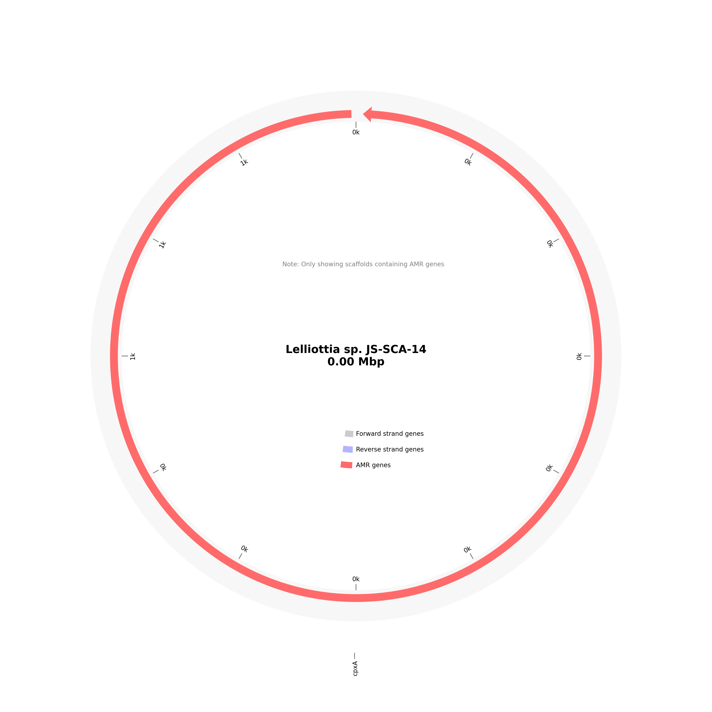

### cpxA
- **Mechanism**: antibiotic efflux
- **Drug Classes**: aminoglycoside antibiotic; aminocoumarin antibiotic
- **AMR Family**: resistance-nodulation-cell division (RND) antibiotic efflux pump
- **Locations**:
  - gnl|SPADES|EHPDDGNP_7778_1 : position 3-665

## Serratia fonticola
**Strain Statistics:**
- Total genome length: 5375.6 kbp
- Total scaffolds: 199
- Scaffolds with AMR genes: 84
- Total genes annotated: 9872
- Total AMR genes: 584
- Unique AMR genes: 232
- Distinct AMR mechanisms: 11
- Distinct AMR families: 79
- Distinct drug classes: 37

**Circos Plot:**

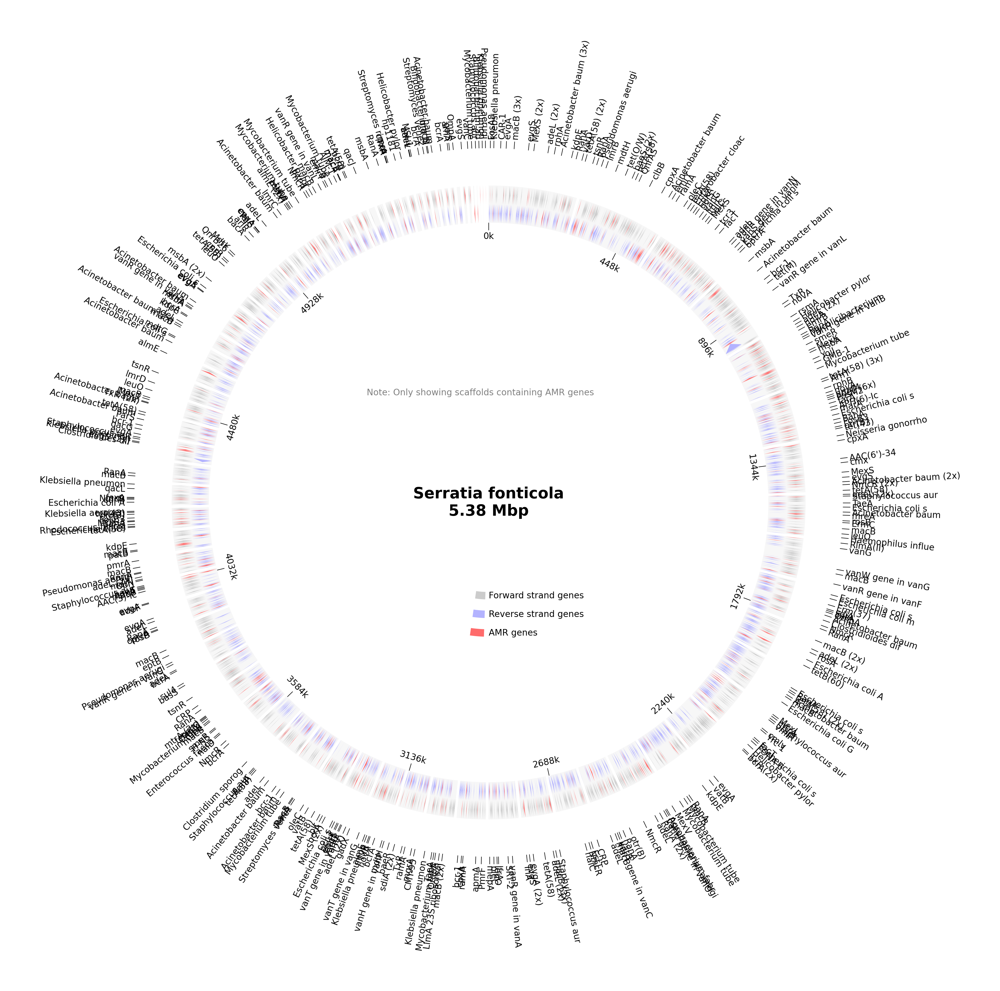

### AAC(3)-Ic
- **Mechanism**: antibiotic inactivation
- **Drug Classes**: aminoglycoside antibiotic
- **AMR Family**: AAC(3)
- **Locations**:
  - gnl|SPADES|EHPDDGNP_135_43 : position 45828-46253

### AAC(6')-34
- **Mechanism**: antibiotic inactivation
- **Drug Classes**: aminoglycoside antibiotic
- **AMR Family**: AAC(6')
- **Locations**:
  - gnl|SPADES|EHPDDGNP_32_56 : position 63242-63739

### AAC(6')-Ia
- **Mechanism**: antibiotic inactivation
- **Drug Classes**: aminoglycoside antibiotic
- **AMR Family**: AAC(6')
- **Locations**:
  - gnl|SPADES|EHPDDGNP_101_14 : position 14599-15117

### AIM-1
- **Mechanism**: antibiotic inactivation
- **Drug Classes**: cephalosporin; cephamycin; penam
- **AMR Family**: AIM beta-lactamase
- **Locations**:
  - gnl|SPADES|EHPDDGNP_340_4 : position 3269-4261

### APH(6)-Ic
- **Mechanism**: antibiotic inactivation
- **Drug Classes**: aminoglycoside antibiotic
- **AMR Family**: APH(6)
- **Locations**:
  - gnl|SPADES|EHPDDGNP_31_86 : position 84808-85665

### Acinetobacter baumannii AbaF (found in 9 locations)
- **Mechanism**: antibiotic efflux
- **Drug Classes**: phosphonic acid antibiotic
- **AMR Family**: major facilitator superfamily (MFS) antibiotic efflux pump
- **Locations**:
  - gnl|SPADES|EHPDDGNP_104_55 : position 60756-62039
  - gnl|SPADES|EHPDDGNP_10_216 : position 233811-235208
  - gnl|SPADES|EHPDDGNP_167_17 : position 15885-17168
  - gnl|SPADES|EHPDDGNP_181_15 : position 12449-13951
  - gnl|SPADES|EHPDDGNP_192_29 : position 30031-31356
  - gnl|SPADES|EHPDDGNP_32_110 : position 126864-128186
  - gnl|SPADES|EHPDDGNP_32_124 : position 143614-144846
  - gnl|SPADES|EHPDDGNP_509_2 : position 609-1955
  - gnl|SPADES|EHPDDGNP_50_42 : position 48274-49566

### Acinetobacter baumannii AbaQ (found in 14 locations)
- **Mechanism**: antibiotic efflux
- **Drug Classes**: fluoroquinolone antibiotic
- **AMR Family**: major facilitator superfamily (MFS) antibiotic efflux pump
- **Locations**:
  - gnl|SPADES|EHPDDGNP_107_13 : position 15761-17116
  - gnl|SPADES|EHPDDGNP_158_40 : position 43853-45151
  - gnl|SPADES|EHPDDGNP_186_13 : position 15047-16393
  - gnl|SPADES|EHPDDGNP_186_9 : position 10137-11432
  - gnl|SPADES|EHPDDGNP_19_49 : position 49695-51053
  - gnl|SPADES|EHPDDGNP_55_58 : position 70473-71741
  - gnl|SPADES|EHPDDGNP_56_19 : position 18380-19606
  - gnl|SPADES|EHPDDGNP_56_26 : position 27250-28527
  - gnl|SPADES|EHPDDGNP_56_28 : position 29779-31125
  - gnl|SPADES|EHPDDGNP_58_53 : position 58347-59639
  - gnl|SPADES|EHPDDGNP_97_5 : position 3998-5368
  - gnl|SPADES|EHPDDGNP_9_196 : position 199624-200919
  - gnl|SPADES|EHPDDGNP_9_200 : position 204534-205880
  - gnl|SPADES|EHPDDGNP_9_234 : position 245889-247220

### Acinetobacter baumannii AmvA (found in 2 locations)
- **Mechanism**: antibiotic efflux
- **Drug Classes**: macrolide antibiotic; disinfecting agents and antiseptics
- **AMR Family**: major facilitator superfamily (MFS) antibiotic efflux pump
- **Locations**:
  - gnl|SPADES|EHPDDGNP_116_41 : position 41775-43271
  - gnl|SPADES|EHPDDGNP_269_13 : position 8621-9919

### Agrobacterium fabrum chloramphenicol acetyltransferase
- **Mechanism**: antibiotic inactivation
- **Drug Classes**: phenicol antibiotic
- **AMR Family**: chloramphenicol acetyltransferase (CAT)
- **Locations**:
  - gnl|SPADES|EHPDDGNP_65_20 : position 25229-25858

### ArnT
- **Mechanism**: antibiotic target alteration
- **Drug Classes**: peptide antibiotic
- **AMR Family**: pmr phosphoethanolamine transferase
- **Locations**:
  - gnl|SPADES|EHPDDGNP_31_11: position 10725-12389

### BahA (found in 2 locations)
- **Mechanism**: antibiotic inactivation
- **Drug Classes**: peptide antibiotic
- **AMR Family**: Bah amidohydrolase
- **Locations**:
  - gnl|SPADES|EHPDDGNP_143_22 : position 25718-26731
  - gnl|SPADES|EHPDDGNP_31_117 : position 120099-121112

### Bifidobacterium adolescentis rpoB mutants conferring resistance to rifampicin
- **Mechanism**: antibiotic target alteration; antibiotic target replacement
- **Drug Classes**: rifamycin antibiotic
- **AMR Family**: rifamycin-resistant beta-subunit of RNA polymerase (rpoB)
- **Locations**:
  - gnl|SPADES|EHPDDGNP_8627_1 : position 2-595

### Bifidobacterium bifidum ileS conferring resistance to mupirocin
- **Mechanism**: antibiotic target alteration
- **Drug Classes**: mupirocin-like antibiotic
- **AMR Family**: antibiotic-resistant isoleucyl-tRNA synthetase (ileS)
- **Locations**:
  - gnl|SPADES|EHPDDGNP_452_14 : position 13412-13843

### CAR-1
- **Mechanism**: antibiotic inactivation
- **Drug Classes**: carbapenem
- **AMR Family**: CAR beta-lactamase
- **Locations**:
  - gnl|SPADES|EHPDDGNP_9_34 : position 32553-33359

### CMY-95
- **Mechanism**: antibiotic inactivation
- **Drug Classes**: cephamycin
- **AMR Family**: CMY beta-lactamase
- **Locations**:
  - gnl|SPADES|EHPDDGNP_97_3 : position 1865-3007

### CRP (found in 3 locations)
- **Mechanism**: antibiotic efflux
- **Drug Classes**: macrolide antibiotic; fluoroquinolone antibiotic; penam
- **AMR Family**: resistance-nodulation-cell division (RND) antibiotic efflux pump
- **Locations**:
  - gnl|SPADES|EHPDDGNP_119_62 : position 64260-65024
  - gnl|SPADES|EHPDDGNP_133_38: position 32982-33614
  - gnl|SPADES|EHPDDGNP_76_8 : position 5716-6417

### Clostridioides difficile gyrA conferring resistance to fluoroquinolones
- **Mechanism**: antibiotic target alteration
- **Drug Classes**: fluoroquinolone antibiotic
- **AMR Family**: fluoroquinolone resistant gyrA
- **Locations**:
  - gnl|SPADES|EHPDDGNP_153_23 : position 32783-35434

### Clostridioides difficile gyrB conferring resistance to fluoroquinolones
- **Mechanism**: antibiotic target alteration
- **Drug Classes**: fluoroquinolone antibiotic
- **AMR Family**: fluoroquinolone resistant gyrB
- **Locations**:
  - gnl|SPADES|EHPDDGNP_55_71 : position 84152-86566

### Clostridium sporogenes cplR
- **Mechanism**: antibiotic target protection
- **Drug Classes**: lincosamide antibiotic; pleuromutilin antibiotic
- **AMR Family**: Miscellaneous ABC-F subfamily ATP-binding cassette ribosomal protection proteins
- **Locations**:
  - gnl|SPADES|EHPDDGNP_111_19 : position 12461-13504

### Enterobacter cloacae acrA
- **Mechanism**: antibiotic efflux
- **Drug Classes**: fluoroquinolone antibiotic; cephalosporin; glycylcycline; penam; tetracycline antibiotic; rifamycin antibiotic; phenicol antibiotic; disinfecting agents and antiseptics
- **AMR Family**: resistance-nodulation-cell division (RND) antibiotic efflux pump
- **Locations**:
  - gnl|SPADES|EHPDDGNP_17_30 : position 29049-30167

### Enterococcus faecalis cls with mutation conferring resistance to daptomycin
- **Mechanism**: antibiotic target alteration
- **Drug Classes**: peptide antibiotic
- **AMR Family**: daptomycin resistant cls
- **Locations**:
  - gnl|SPADES|EHPDDGNP_116_43 : position 44465-45925

### Erm(37)
- **Mechanism**: antibiotic target alteration
- **Drug Classes**: macrolide antibiotic; lincosamide antibiotic; streptogramin antibiotic; streptogramin A antibiotic; streptogramin B antibiotic
- **AMR Family**: Erm 23S ribosomal RNA methyltransferase
- **Locations**:
  - gnl|SPADES|EHPDDGNP_55_34 : position 40535-41317

### ErmC
- **Mechanism**: antibiotic target alteration
- **Drug Classes**: macrolide antibiotic; lincosamide antibiotic; streptogramin antibiotic; streptogramin A antibiotic; streptogramin B antibiotic
- **AMR Family**: Erm 23S ribosomal RNA methyltransferase
- **Locations**:
  - gnl|SPADES|EHPDDGNP_50_67 : position 77439-78257

### Escherichia coli AcrAB-TolC with AcrR mutation conferring resistance to ciprofloxacin, tetracycline, and ceftazidime (found in 2 locations)
- **Mechanism**: antibiotic target alteration; antibiotic efflux
- **Drug Classes**: fluoroquinolone antibiotic; cephalosporin; glycylcycline; penam; tetracycline antibiotic; rifamycin antibiotic; phenicol antibiotic; disinfecting agents and antiseptics
- **AMR Family**: resistance-nodulation-cell division (RND) antibiotic efflux pump
- **Locations**:
  - gnl|SPADES|EHPDDGNP_144_8 : position 8653-9270
  - gnl|SPADES|EHPDDGNP_56_66 : position 73247-73894

### Escherichia coli AcrAB-TolC with MarR mutations conferring resistance to ciprofloxacin and tetracycline
- **Mechanism**: antibiotic target alteration; antibiotic efflux
- **Drug Classes**: fluoroquinolone antibiotic; cephalosporin; glycylcycline; penam; tetracycline antibiotic; rifamycin antibiotic; phenicol antibiotic; disinfecting agents and antiseptics
- **AMR Family**: resistance-nodulation-cell division (RND) antibiotic efflux pump
- **Locations**:
  - gnl|SPADES|EHPDDGNP_31_72 : position 74934-75368

### Escherichia coli EF-Tu mutants conferring resistance to Pulvomycin
- **Mechanism**: antibiotic target alteration
- **Drug Classes**: elfamycin antibiotic
- **AMR Family**: elfamycin resistant EF-Tu
- **Locations**:
  - gnl|SPADES|EHPDDGNP_55_22 : position 26263-28104

### Escherichia coli GlpT with mutation conferring resistance to fosfomycin
- **Mechanism**: antibiotic target alteration
- **Drug Classes**: phosphonic acid antibiotic
- **AMR Family**: antibiotic-resistant GlpT
- **Locations**:
  - gnl|SPADES|EHPDDGNP_58_76 : position 82675-84027

### Escherichia coli acrA
- **Mechanism**: antibiotic efflux
- **Drug Classes**: fluoroquinolone antibiotic; cephalosporin; glycylcycline; penam; tetracycline antibiotic; rifamycin antibiotic; phenicol antibiotic; disinfecting agents and antiseptics
- **AMR Family**: resistance-nodulation-cell division (RND) antibiotic efflux pump
- **Locations**:
  - gnl|SPADES|EHPDDGNP_56_67 : position 74037-75218

### Escherichia coli fabI mutations conferring resistance to isoniazid and triclosan (found in 2 locations)
- **Mechanism**: antibiotic target alteration
- **Drug Classes**: disinfecting agents and antiseptics; isoniazid-like antibiotic
- **AMR Family**: antibiotic resistant fabI
- **Locations**:
  - gnl|SPADES|EHPDDGNP_26_24 : position 28715-29470
  - gnl|SPADES|EHPDDGNP_97_16 : position 13683-14465

### Escherichia coli mdfA
- **Mechanism**: antibiotic efflux
- **Drug Classes**: tetracycline antibiotic; phenicol antibiotic; disinfecting agents and antiseptics
- **AMR Family**: major facilitator superfamily (MFS) antibiotic efflux pump
- **Locations**:
  - gnl|SPADES|EHPDDGNP_55_20 : position 23104-24459

### Escherichia coli soxS with mutation conferring antibiotic resistance (found in 11 locations)
- **Mechanism**: antibiotic target alteration; antibiotic efflux; reduced permeability to antibiotic
- **Drug Classes**: fluoroquinolone antibiotic; monobactam; carbapenem; cephalosporin; glycylcycline; cephamycin; penam; tetracycline antibiotic; rifamycin antibiotic; phenicol antibiotic; penem; disinfecting agents and antiseptics
- **AMR Family**: ATP-binding cassette (ABC) antibiotic efflux pump; major facilitator superfamily (MFS) antibiotic efflux pump; resistance-nodulation-cell division (RND) antibiotic efflux pump; General Bacterial Porin with reduced permeability to beta-lactams
- **Locations**:
  - gnl|SPADES|EHPDDGNP_101_60 : position 64161-65045
  - gnl|SPADES|EHPDDGNP_143_11 : position 12923-13840
  - gnl|SPADES|EHPDDGNP_17_185 : position 197742-198185
  - gnl|SPADES|EHPDDGNP_181_30 : position 27703-28503
  - gnl|SPADES|EHPDDGNP_207_26 : position 24362-25252
  - gnl|SPADES|EHPDDGNP_31_106 : position 107304-108221
  - gnl|SPADES|EHPDDGNP_50_31 : position 34921-35790
  - gnl|SPADES|EHPDDGNP_55_11 : position 12211-13389
  - gnl|SPADES|EHPDDGNP_58_33 : position 35976-36863
  - gnl|SPADES|EHPDDGNP_59_78 : position 87597-88571
  - gnl|SPADES|EHPDDGNP_9_126 : position 126958-127785

### EstT
- **Mechanism**: antibiotic inactivation
- **Drug Classes**: macrolide antibiotic
- **AMR Family**: macrolide esterase
- **Locations**:
  - gnl|SPADES|EHPDDGNP_76_28 : position 22695-23564

### FONA-6
- **Mechanism**: antibiotic inactivation
- **Drug Classes**: penam
- **AMR Family**: FONA beta-lactamase
- **Locations**:
  - gnl|SPADES|EHPDDGNP_59_83: position 94592-95479

### FosA8
- **Mechanism**: antibiotic inactivation
- **Drug Classes**: phosphonic acid antibiotic
- **AMR Family**: fosfomycin thiol transferase
- **Locations**:
  - gnl|SPADES|EHPDDGNP_9_6: position 4582-4989

### FosB3 (found in 2 locations)
- **Mechanism**: antibiotic inactivation
- **Drug Classes**: phosphonic acid antibiotic
- **AMR Family**: fosfomycin thiol transferase
- **Locations**:
  - gnl|SPADES|EHPDDGNP_143_31 : position 35957-36328
  - gnl|SPADES|EHPDDGNP_31_126 : position 130338-130709

### FosM2
- **Mechanism**: antibiotic inactivation
- **Drug Classes**: phosphonic acid antibiotic
- **AMR Family**: fosfomycin thiol transferase
- **Locations**:
  - gnl|SPADES|EHPDDGNP_31_60 : position 63096-63503

### GMB-1
- **Mechanism**: antibiotic inactivation
- **Drug Classes**: carbapenem
- **AMR Family**: GMB beta-lactamase
- **Locations**:
  - gnl|SPADES|EHPDDGNP_26_119 : position 131696-132580

### GOB-5
- **Mechanism**: antibiotic inactivation
- **Drug Classes**: carbapenem; cephalosporin; penam
- **AMR Family**: GOB beta-lactamase
- **Locations**:
  - gnl|SPADES|EHPDDGNP_91_62 : position 70864-71511

### H-NS
- **Mechanism**: antibiotic efflux
- **Drug Classes**: macrolide antibiotic; fluoroquinolone antibiotic; cephalosporin; cephamycin; penam; tetracycline antibiotic
- **AMR Family**: major facilitator superfamily (MFS) antibiotic efflux pump; resistance-nodulation-cell division (RND) antibiotic efflux pump
- **Locations**:
  - gnl|SPADES|EHPDDGNP_116_55 : position 59864-60271

### Haemophilus influenzae PBP3 conferring resistance to beta-lactam antibiotics (found in 2 locations)
- **Mechanism**: antibiotic target alteration
- **Drug Classes**: cephalosporin; cephamycin; penam
- **AMR Family**: Penicillin-binding protein mutations conferring resistance to beta-lactam antibiotics
- **Locations**:
  - gnl|SPADES|EHPDDGNP_119_21 : position 20413-22131
  - gnl|SPADES|EHPDDGNP_50_99 : position 118554-120320

### Helicobacter pylori frxA mutation conferring resistance to metronidazole
- **Mechanism**: antibiotic target alteration
- **Drug Classes**: nitroimidazole antibiotic
- **AMR Family**: Antibiotic resistant Helicobacter pylori nitroreductase
- **Locations**:
  - gnl|SPADES|EHPDDGNP_59_93 : position 108285-108890

### Helicobacter pylori pbp1 mutants conferring resistance to amoxicillin (found in 2 locations)
- **Mechanism**: antibiotic target alteration
- **Drug Classes**: cephalosporin; cephamycin; penam
- **AMR Family**: Penicillin-binding protein mutations conferring resistance to beta-lactam antibiotics
- **Locations**:
  - gnl|SPADES|EHPDDGNP_26_4 : position 4080-6581
  - gnl|SPADES|EHPDDGNP_316_17 : position 20330-22693

### Helicobacter pylori pbp2 mutants conferring resistance to amoxicillin
- **Mechanism**: antibiotic target alteration
- **Drug Classes**: cephalosporin; cephamycin; penam
- **AMR Family**: Penicillin-binding protein mutations conferring resistance to beta-lactam antibiotics
- **Locations**:
  - gnl|SPADES|EHPDDGNP_436_7 : position 5000-6895

### Klebsiella aerogenes Omp36 (found in 2 locations)
- **Mechanism**: reduced permeability to antibiotic
- **Drug Classes**: monobactam; carbapenem; cephalosporin; cephamycin; penam; penem
- **AMR Family**: General Bacterial Porin with reduced permeability to beta-lactams
- **Locations**:
  - gnl|SPADES|EHPDDGNP_143_50 : position 53794-54921
  - gnl|SPADES|EHPDDGNP_31_145 : position 148175-149302

### Klebsiella pneumoniae KpnE
- **Mechanism**: antibiotic efflux
- **Drug Classes**: macrolide antibiotic; aminoglycoside antibiotic; cephalosporin; tetracycline antibiotic; peptide antibiotic; rifamycin antibiotic; disinfecting agents and antiseptics
- **AMR Family**: small multidrug resistance (SMR) antibiotic efflux pump
- **Locations**:
  - gnl|SPADES|EHPDDGNP_99_50 : position 50446-50814

### Klebsiella pneumoniae KpnF
- **Mechanism**: antibiotic efflux
- **Drug Classes**: macrolide antibiotic; aminoglycoside antibiotic; cephalosporin; tetracycline antibiotic; peptide antibiotic; rifamycin antibiotic; disinfecting agents and antiseptics
- **AMR Family**: small multidrug resistance (SMR) antibiotic efflux pump
- **Locations**:
  - gnl|SPADES|EHPDDGNP_99_51: position 50801-51130

### Klebsiella pneumoniae KpnH (found in 3 locations)
- **Mechanism**: antibiotic efflux
- **Drug Classes**: macrolide antibiotic; fluoroquinolone antibiotic; aminoglycoside antibiotic; carbapenem; cephalosporin; penam; peptide antibiotic; penem
- **AMR Family**: major facilitator superfamily (MFS) antibiotic efflux pump
- **Locations**:
  - gnl|SPADES|EHPDDGNP_10_9: position 8330-9865
  - gnl|SPADES|EHPDDGNP_144_54 : position 57646-59172
  - gnl|SPADES|EHPDDGNP_16809_1 : position 3-320

### Klebsiella pneumoniae OmpK37 (found in 6 locations)
- **Mechanism**: reduced permeability to antibiotic
- **Drug Classes**: monobactam; carbapenem; cephalosporin; cephamycin; penam; penem
- **AMR Family**: General Bacterial Porin with reduced permeability to beta-lactams
- **Locations**:
  - gnl|SPADES|EHPDDGNP_104_16 : position 19386-20477
  - gnl|SPADES|EHPDDGNP_153_28 : position 43916-45031
  - gnl|SPADES|EHPDDGNP_17_119 : position 119260-120354
  - gnl|SPADES|EHPDDGNP_76_12 : position 8676-9722
  - gnl|SPADES|EHPDDGNP_91_60 : position 68259-69365
  - gnl|SPADES|EHPDDGNP_9_18 : position 13709-14791

### LlmA 23S ribosomal RNA methyltransferase
- **Mechanism**: antibiotic target alteration
- **Drug Classes**: lincosamide antibiotic
- **AMR Family**: Llm 23S ribosomal RNA methyltransferase
- **Locations**:
  - gnl|SPADES|EHPDDGNP_91_27 : position 28071-29261

### LptD
- **Mechanism**: antibiotic efflux
- **Drug Classes**: carbapenem; peptide antibiotic; aminocoumarin antibiotic; rifamycin antibiotic
- **AMR Family**: ATP-binding cassette (ABC) antibiotic efflux pump
- **Locations**:
  - gnl|SPADES|EHPDDGNP_50_70 : position 80598-82964

### MOX-3 (found in 2 locations)
- **Mechanism**: antibiotic inactivation
- **Drug Classes**: cephalosporin; cephamycin; penam
- **AMR Family**: MOX beta-lactamase
- **Locations**:
  - gnl|SPADES|EHPDDGNP_143_24 : position 27838-28977
  - gnl|SPADES|EHPDDGNP_31_119 : position 122219-123358

### MSI-1
- **Mechanism**: antibiotic inactivation
- **Drug Classes**: carbapenem
- **AMR Family**: MSI beta-lactamase
- **Locations**:
  - gnl|SPADES|EHPDDGNP_442_12 : position 11196-11951

### MdtK
- **Mechanism**: antibiotic efflux
- **Drug Classes**: fluoroquinolone antibiotic
- **AMR Family**: multidrug and toxic compound extrusion (MATE) transporter
- **Locations**:
  - gnl|SPADES|EHPDDGNP_233_12 : position 11306-12763

### MexF
- **Mechanism**: antibiotic efflux
- **Drug Classes**: fluoroquinolone antibiotic; diaminopyrimidine antibiotic; phenicol antibiotic
- **AMR Family**: resistance-nodulation-cell division (RND) antibiotic efflux pump
- **Locations**:
  - gnl|SPADES|EHPDDGNP_17_32 : position 31727-33280

### MexJ
- **Mechanism**: antibiotic efflux
- **Drug Classes**: macrolide antibiotic; tetracycline antibiotic; disinfecting agents and antiseptics
- **AMR Family**: resistance-nodulation-cell division (RND) antibiotic efflux pump
- **Locations**:
  - gnl|SPADES|EHPDDGNP_26_86 : position 96175-97260

### MexK
- **Mechanism**: antibiotic efflux
- **Drug Classes**: macrolide antibiotic; tetracycline antibiotic; disinfecting agents and antiseptics
- **AMR Family**: resistance-nodulation-cell division (RND) antibiotic efflux pump
- **Locations**:
  - gnl|SPADES|EHPDDGNP_26_85 : position 93095-96175

### MexL
- **Mechanism**: antibiotic efflux
- **Drug Classes**: macrolide antibiotic; tetracycline antibiotic; disinfecting agents and antiseptics
- **AMR Family**: resistance-nodulation-cell division (RND) antibiotic efflux pump
- **Locations**:
  - gnl|SPADES|EHPDDGNP_59_4 : position 1630-2226

### MexS (found in 8 locations)
- **Mechanism**: antibiotic efflux
- **Drug Classes**: fluoroquinolone antibiotic; diaminopyrimidine antibiotic; phenicol antibiotic
- **AMR Family**: resistance-nodulation-cell division (RND) antibiotic efflux pump
- **Locations**:
  - gnl|SPADES|EHPDDGNP_102_2 : position 1067-2191
  - gnl|SPADES|EHPDDGNP_102_33 : position 36318-37385
  - gnl|SPADES|EHPDDGNP_10_217 : position 235313-236326
  - gnl|SPADES|EHPDDGNP_17_87 : position 87718-88743
  - gnl|SPADES|EHPDDGNP_32_89 : position 100711-101760
  - gnl|SPADES|EHPDDGNP_75_43 : position 53357-54346
  - gnl|SPADES|EHPDDGNP_9_122 : position 123340-124371
  - gnl|SPADES|EHPDDGNP_9_139 : position 139143-140150

### MexT
- **Mechanism**: antibiotic efflux
- **Drug Classes**: fluoroquinolone antibiotic; diaminopyrimidine antibiotic; phenicol antibiotic
- **AMR Family**: resistance-nodulation-cell division (RND) antibiotic efflux pump
- **Locations**:
  - gnl|SPADES|EHPDDGNP_167_26 : position 24134-25027

### MexV
- **Mechanism**: antibiotic efflux
- **Drug Classes**: macrolide antibiotic; fluoroquinolone antibiotic; tetracycline antibiotic; phenicol antibiotic; disinfecting agents and antiseptics
- **AMR Family**: resistance-nodulation-cell division (RND) antibiotic efflux pump
- **Locations**:
  - gnl|SPADES|EHPDDGNP_65_7 : position 7779-9221

### MexW
- **Mechanism**: antibiotic efflux
- **Drug Classes**: macrolide antibiotic; fluoroquinolone antibiotic; tetracycline antibiotic; phenicol antibiotic; disinfecting agents and antiseptics
- **AMR Family**: resistance-nodulation-cell division (RND) antibiotic efflux pump
- **Locations**:
  - gnl|SPADES|EHPDDGNP_65_8 : position 9218-12361

### Mycobacterium tuberculosis gidB mutation conferring resistance to streptomycin
- **Mechanism**: antibiotic target alteration
- **Drug Classes**: aminoglycoside antibiotic
- **AMR Family**: antibiotic resistant gidB
- **Locations**:
  - gnl|SPADES|EHPDDGNP_326_18 : position 19327-19947

### Mycobacterium tuberculosis inhA mutations conferring resistance to isoniazid (found in 2 locations)
- **Mechanism**: antibiotic target alteration
- **Drug Classes**: isoniazid-like antibiotic
- **AMR Family**: isoniazid resistant inhA
- **Locations**:
  - gnl|SPADES|EHPDDGNP_287_20 : position 24045-24803
  - gnl|SPADES|EHPDDGNP_59_86 : position 98152-98898

### Mycobacterium tuberculosis kasA mutant conferring resistance to isoniazid (found in 4 locations)
- **Mechanism**: antibiotic target alteration
- **Drug Classes**: isoniazid-like antibiotic
- **AMR Family**: antibiotic resistant kasA
- **Locations**:
  - gnl|SPADES|EHPDDGNP_104_40 : position 47654-48823
  - gnl|SPADES|EHPDDGNP_119_14 : position 12467-15025
  - gnl|SPADES|EHPDDGNP_62_110 : position 104846-106087
  - gnl|SPADES|EHPDDGNP_91_42 : position 43141-44415

### Mycobacterium tuberculosis ndh with mutation conferring resistance to isoniazid
- **Mechanism**: antibiotic target alteration
- **Drug Classes**: isoniazid-like antibiotic
- **AMR Family**: antibiotic resistant ndh
- **Locations**:
  - gnl|SPADES|EHPDDGNP_62_93 : position 90522-91850

### Mycobacterium tuberculosis pncA mutations conferring resistance to pyrazinamide
- **Mechanism**: antibiotic target alteration
- **Drug Classes**: pyrazine antibiotic
- **AMR Family**: Pyrazinamide resistant pncA
- **Locations**:
  - gnl|SPADES|EHPDDGNP_295_11 : position 11145-11777

### Mycobacterium tuberculosis rpoB mutations conferring resistance to rifampicin
- **Mechanism**: antibiotic target alteration; antibiotic target replacement
- **Drug Classes**: rifamycin antibiotic
- **AMR Family**: rifamycin-resistant beta-subunit of RNA polymerase (rpoB)
- **Locations**:
  - gnl|SPADES|EHPDDGNP_2334_1 : position 2-2509

### Mycobacterium tuberculosis thyA with mutation conferring resistance to para-aminosalicylic acid
- **Mechanism**: antibiotic target alteration
- **Drug Classes**: salicylic acid antibiotic
- **AMR Family**: aminosalicylate resistant thymidylate synthase
- **Locations**:
  - gnl|SPADES|EHPDDGNP_26_134 : position 149545-150339

### Mycolicibacterium smegmatis ndh with mutation conferring resistance to isoniazid
- **Mechanism**: antibiotic target alteration
- **Drug Classes**: isoniazid-like antibiotic
- **AMR Family**: antibiotic resistant ndh
- **Locations**:
  - gnl|SPADES|EHPDDGNP_26_46 : position 53798-54997

### Neisseria gonorrhoeae pilQ gene conferring resistance to beta-lactam
- **Mechanism**: antibiotic target alteration
- **Drug Classes**: cephalosporin; cephamycin; penam
- **AMR Family**: Penicillin-binding protein mutations conferring resistance to beta-lactam antibiotics
- **Locations**:
  - gnl|SPADES|EHPDDGNP_32_1 : position 501-1748

### NmcR (found in 13 locations)
- **Mechanism**: antibiotic inactivation
- **Drug Classes**: carbapenem; cephalosporin; cephamycin; penam
- **AMR Family**: NmcA beta-lactamase
- **Locations**:
  - gnl|SPADES|EHPDDGNP_102_3 : position 2231-3133
  - gnl|SPADES|EHPDDGNP_116_16 : position 16761-17735
  - gnl|SPADES|EHPDDGNP_144_18 : position 19298-20224
  - gnl|SPADES|EHPDDGNP_17_193 : position 204257-205144
  - gnl|SPADES|EHPDDGNP_17_62 : position 62335-63261
  - gnl|SPADES|EHPDDGNP_26_50 : position 57395-58288
  - gnl|SPADES|EHPDDGNP_316_6 : position 4905-5822
  - gnl|SPADES|EHPDDGNP_32_117 : position 135151-136032
  - gnl|SPADES|EHPDDGNP_32_127 : position 147200-148027
  - gnl|SPADES|EHPDDGNP_55_85 : position 100018-100905
  - gnl|SPADES|EHPDDGNP_65_85 : position 96605-97543
  - gnl|SPADES|EHPDDGNP_76_35 : position 29056-29937
  - gnl|SPADES|EHPDDGNP_9_130 : position 132199-133068

### OmpA (found in 5 locations)
- **Mechanism**: reduced permeability to antibiotic
- **Drug Classes**: peptide antibiotic
- **AMR Family**: General Bacterial Porin with reduced permeability to peptide antibiotics
- **Locations**:
  - gnl|SPADES|EHPDDGNP_119_20 : position 19288-20406
  - gnl|SPADES|EHPDDGNP_50_23 : position 25035-25532
  - gnl|SPADES|EHPDDGNP_55_51 : position 61602-62261
  - gnl|SPADES|EHPDDGNP_560_2 : position 1051-1560
  - gnl|SPADES|EHPDDGNP_91_37 : position 38324-39400

### OpmB
- **Mechanism**: antibiotic efflux
- **Drug Classes**: macrolide antibiotic; monobactam; tetracycline antibiotic; aminocoumarin antibiotic
- **AMR Family**: resistance-nodulation-cell division (RND) antibiotic efflux pump
- **Locations**:
  - gnl|SPADES|EHPDDGNP_140_13 : position 19543-20949

### OprJ
- **Mechanism**: antibiotic efflux
- **Drug Classes**: macrolide antibiotic; fluoroquinolone antibiotic; aminoglycoside antibiotic; cephalosporin; penam; tetracycline antibiotic; aminocoumarin antibiotic; diaminopyrimidine antibiotic; phenicol antibiotic
- **AMR Family**: resistance-nodulation-cell division (RND) antibiotic efflux pump
- **Locations**:
  - gnl|SPADES|EHPDDGNP_138_5 : position 4902-6383

### ParR (found in 3 locations)
- **Mechanism**: antibiotic efflux; reduced permeability to antibiotic
- **Drug Classes**: macrolide antibiotic; fluoroquinolone antibiotic; monobactam; aminoglycoside antibiotic; carbapenem; cephalosporin; cephamycin; penam; tetracycline antibiotic; phenicol antibiotic; penem; disinfecting agents and antiseptics
- **AMR Family**: resistance-nodulation-cell division (RND) antibiotic efflux pump; Outer Membrane Porin (Opr)
- **Locations**:
  - gnl|SPADES|EHPDDGNP_10_195 : position 212636-213343
  - gnl|SPADES|EHPDDGNP_158_29 : position 31848-32576
  - gnl|SPADES|EHPDDGNP_32_14 : position 15344-16063

### ParS (found in 2 locations)
- **Mechanism**: antibiotic efflux; reduced permeability to antibiotic
- **Drug Classes**: macrolide antibiotic; fluoroquinolone antibiotic; monobactam; aminoglycoside antibiotic; carbapenem; cephalosporin; cephamycin; penam; tetracycline antibiotic; phenicol antibiotic; penem; disinfecting agents and antiseptics
- **AMR Family**: resistance-nodulation-cell division (RND) antibiotic efflux pump; Outer Membrane Porin (Opr)
- **Locations**:
  - gnl|SPADES|EHPDDGNP_10_28 : position 32026-33618
  - gnl|SPADES|EHPDDGNP_158_28 : position 30547-31851

### PmrF (found in 3 locations)
- **Mechanism**: antibiotic target alteration
- **Drug Classes**: peptide antibiotic
- **AMR Family**: pmr phosphoethanolamine transferase
- **Locations**:
  - gnl|SPADES|EHPDDGNP_10_105 : position 109436-110347
  - gnl|SPADES|EHPDDGNP_31_8 : position 6858-7838
  - gnl|SPADES|EHPDDGNP_87_11 : position 10230-11219

### Pseudomonas aeruginosa CpxR (found in 5 locations)
- **Mechanism**: antibiotic efflux
- **Drug Classes**: macrolide antibiotic; fluoroquinolone antibiotic; monobactam; aminoglycoside antibiotic; carbapenem; cephalosporin; cephamycin; penam; tetracycline antibiotic; peptide antibiotic; aminocoumarin antibiotic; diaminopyrimidine antibiotic; sulfonamide antibiotic; phenicol antibiotic; penem
- **AMR Family**: resistance-nodulation-cell division (RND) antibiotic efflux pump
- **Locations**:
  - gnl|SPADES|EHPDDGNP_10_27 : position 31322-32008
  - gnl|SPADES|EHPDDGNP_135_53 : position 54330-55010
  - gnl|SPADES|EHPDDGNP_65_24 : position 29020-29694
  - gnl|SPADES|EHPDDGNP_87_75 : position 65834-66532
  - gnl|SPADES|EHPDDGNP_9_227 : position 234126-234755

### Pseudomonas aeruginosa ampR with mutation conferring resistance to aztreonam (found in 4 locations)
- **Mechanism**: antibiotic target alteration; antibiotic inactivation
- **Drug Classes**: monobactam; carbapenem; cephalosporin
- **AMR Family**: PDC beta-lactamase; ampR transcriptional regulator with mutation conferring resistance to monobactam antibiotics
- **Locations**:
  - gnl|SPADES|EHPDDGNP_127_56 : position 54391-55281
  - gnl|SPADES|EHPDDGNP_138_22 : position 24957-25898
  - gnl|SPADES|EHPDDGNP_39842_1 : position 1-210
  - gnl|SPADES|EHPDDGNP_59_84 : position 95612-96487

### QepA2
- **Mechanism**: antibiotic efflux
- **Drug Classes**: fluoroquinolone antibiotic
- **AMR Family**: major facilitator superfamily (MFS) antibiotic efflux pump
- **Locations**:
  - gnl|SPADES|EHPDDGNP_207_27 : position 25307-26701

### QepA4 (found in 2 locations)
- **Mechanism**: antibiotic efflux
- **Drug Classes**: fluoroquinolone antibiotic
- **AMR Family**: major facilitator superfamily (MFS) antibiotic efflux pump
- **Locations**:
  - gnl|SPADES|EHPDDGNP_143_33 : position 37502-38788
  - gnl|SPADES|EHPDDGNP_31_128 : position 131883-133169

### QnrAS
- **Mechanism**: antibiotic target protection
- **Drug Classes**: fluoroquinolone antibiotic
- **AMR Family**: quinolone resistance protein (qnr)
- **Locations**:
  - gnl|SPADES|EHPDDGNP_10_132 : position 142093-142575

### QnrB26
- **Mechanism**: antibiotic target protection
- **Drug Classes**: fluoroquinolone antibiotic
- **AMR Family**: quinolone resistance protein (qnr)
- **Locations**:
  - gnl|SPADES|EHPDDGNP_233_5 : position 5449-6102

### RanA (found in 22 locations)
- **Mechanism**: antibiotic efflux
- **Drug Classes**: aminoglycoside antibiotic
- **AMR Family**: ATP-binding cassette (ABC) antibiotic efflux pump
- **Locations**:
  - gnl|SPADES|EHPDDGNP_104_15 : position 17826-18611
  - gnl|SPADES|EHPDDGNP_107_68 : position 65511-66326
  - gnl|SPADES|EHPDDGNP_10_16 : position 17521-18720
  - gnl|SPADES|EHPDDGNP_116_45 : position 46366-47364
  - gnl|SPADES|EHPDDGNP_116_46 : position 47361-48353
  - gnl|SPADES|EHPDDGNP_119_50 : position 50076-51212
  - gnl|SPADES|EHPDDGNP_132_21 : position 19519-20508
  - gnl|SPADES|EHPDDGNP_133_18 : position 14237-15004
  - gnl|SPADES|EHPDDGNP_138_25 : position 27454-28251
  - gnl|SPADES|EHPDDGNP_149_19 : position 17676-18809
  - gnl|SPADES|EHPDDGNP_167_32 : position 30727-31539
  - gnl|SPADES|EHPDDGNP_17_199 : position 211399-213276
  - gnl|SPADES|EHPDDGNP_26_39 : position 46523-47593
  - gnl|SPADES|EHPDDGNP_375_14 : position 15233-16828
  - gnl|SPADES|EHPDDGNP_52_93 : position 75420-76481
  - gnl|SPADES|EHPDDGNP_55_95 : position 109671-110447
  - gnl|SPADES|EHPDDGNP_58_40 : position 43582-44655
  - gnl|SPADES|EHPDDGNP_62_80 : position 74473-75579
  - gnl|SPADES|EHPDDGNP_65_42 : position 47105-47878
  - gnl|SPADES|EHPDDGNP_65_68 : position 76664-77791
  - gnl|SPADES|EHPDDGNP_75_29 : position 39013-40128
  - gnl|SPADES|EHPDDGNP_9_232 : position 241163-242221

### RanB (found in 2 locations)
- **Mechanism**: antibiotic efflux
- **Drug Classes**: aminoglycoside antibiotic
- **AMR Family**: ATP-binding cassette (ABC) antibiotic efflux pump
- **Locations**:
  - gnl|SPADES|EHPDDGNP_107_69 : position 66331-67113
  - gnl|SPADES|EHPDDGNP_138_26 : position 28248-29393

### Rhodococcus fascians cmr (found in 2 locations)
- **Mechanism**: antibiotic efflux
- **Drug Classes**: phenicol antibiotic
- **AMR Family**: major facilitator superfamily (MFS) antibiotic efflux pump
- **Locations**:
  - gnl|SPADES|EHPDDGNP_143_16 : position 17965-19149
  - gnl|SPADES|EHPDDGNP_31_111 : position 112346-113530

### RlmA(II)
- **Mechanism**: antibiotic target alteration
- **Drug Classes**: macrolide antibiotic; lincosamide antibiotic
- **AMR Family**: non-erm 23S ribosomal RNA methyltransferase (G748)
- **Locations**:
  - gnl|SPADES|EHPDDGNP_52_2 : position 967-1806

### SAT-3
- **Mechanism**: antibiotic inactivation
- **Drug Classes**: nucleoside antibiotic
- **AMR Family**: streptothricin acetyltransferase (SAT)
- **Locations**:
  - gnl|SPADES|EHPDDGNP_17_49 : position 48791-49333

### SRT-2
- **Mechanism**: antibiotic inactivation
- **Drug Classes**: cephalosporin
- **AMR Family**: SRT beta-lactamase
- **Locations**:
  - gnl|SPADES|EHPDDGNP_82_36 : position 37991-39526

### SatA (found in 2 locations)
- **Mechanism**: antibiotic inactivation
- **Drug Classes**: nucleoside antibiotic
- **AMR Family**: streptothricin acetyltransferase (SAT)
- **Locations**:
  - gnl|SPADES|EHPDDGNP_17_80 : position 80598-81041
  - gnl|SPADES|EHPDDGNP_55_47 : position 56920-57366

### Staphylococcus aureus FosB
- **Mechanism**: antibiotic inactivation
- **Drug Classes**: phosphonic acid antibiotic
- **AMR Family**: fosfomycin thiol transferase
- **Locations**:
  - gnl|SPADES|EHPDDGNP_153_29 : position 45187-45603

### Staphylococcus aureus GlpT with mutation conferring resistance to fosfomycin
- **Mechanism**: antibiotic target alteration
- **Drug Classes**: phosphonic acid antibiotic
- **AMR Family**: antibiotic-resistant GlpT
- **Locations**:
  - gnl|SPADES|EHPDDGNP_135_58 : position 61263-62645

### Staphylococcus aureus UhpT with mutation conferring resistance to fosfomycin
- **Mechanism**: antibiotic target alteration
- **Drug Classes**: phosphonic acid antibiotic
- **AMR Family**: antibiotic-resistant UhpT
- **Locations**:
  - gnl|SPADES|EHPDDGNP_153_34 : position 48405-49712

### Staphylococcus aureus fusA with mutation conferring resistance to fusidic acid (found in 3 locations)
- **Mechanism**: antibiotic target alteration
- **Drug Classes**: fusidane antibiotic
- **AMR Family**: antibiotic resistant fusA
- **Locations**:
  - gnl|SPADES|EHPDDGNP_4271_1 : position 2-1321
  - gnl|SPADES|EHPDDGNP_50_6 : position 4619-6208
  - gnl|SPADES|EHPDDGNP_59_16 : position 13702-15807

### Staphylococcus aureus mupA conferring resistance to mupirocin
- **Mechanism**: antibiotic target alteration
- **Drug Classes**: mupirocin-like antibiotic
- **AMR Family**: antibiotic-resistant isoleucyl-tRNA synthetase (ileS)
- **Locations**:
  - gnl|SPADES|EHPDDGNP_50_50 : position 57970-60786

### Staphylococcus aureus mupB conferring resistance to mupirocin
- **Mechanism**: antibiotic target alteration
- **Drug Classes**: mupirocin-like antibiotic
- **AMR Family**: antibiotic-resistant isoleucyl-tRNA synthetase (ileS)
- **Locations**:
  - gnl|SPADES|EHPDDGNP_79_4 : position 2324-5200

### Staphylococcus aureus murA with mutation conferring resistance to fosfomycin
- **Mechanism**: antibiotic target alteration
- **Drug Classes**: phosphonic acid antibiotic
- **AMR Family**: antibiotic-resistant murA transferase
- **Locations**:
  - gnl|SPADES|EHPDDGNP_107_74 : position 69076-70335

### Streptococcus pneumoniae PBP2x conferring resistance to amoxicillin
- **Mechanism**: antibiotic target alteration
- **Drug Classes**: cephalosporin; cephamycin; penam
- **AMR Family**: Penicillin-binding protein mutations conferring resistance to beta-lactam antibiotics
- **Locations**:
  - gnl|SPADES|EHPDDGNP_32_6 : position 4100-6658

### Streptomyces rimosus otr(A)
- **Mechanism**: antibiotic target protection
- **Drug Classes**: tetracycline antibiotic
- **AMR Family**: tetracycline-resistant ribosomal protection protein
- **Locations**:
  - gnl|SPADES|EHPDDGNP_379_15 : position 16416-17540

### Streptomyces venezuelae rox (found in 4 locations)
- **Mechanism**: antibiotic inactivation
- **Drug Classes**: rifamycin antibiotic
- **AMR Family**: rifampin monooxygenase
- **Locations**:
  - gnl|SPADES|EHPDDGNP_104_11 : position 12473-14206
  - gnl|SPADES|EHPDDGNP_26_57 : position 64385-65563
  - gnl|SPADES|EHPDDGNP_26_58 : position 65793-66995
  - gnl|SPADES|EHPDDGNP_452_1 : position 138-1319

### TaeA (found in 3 locations)
- **Mechanism**: antibiotic efflux
- **Drug Classes**: pleuromutilin antibiotic
- **AMR Family**: ATP-binding cassette (ABC) antibiotic efflux pump
- **Locations**:
  - gnl|SPADES|EHPDDGNP_10_71 : position 73594-74355
  - gnl|SPADES|EHPDDGNP_50_22 : position 23225-24892
  - gnl|SPADES|EHPDDGNP_91_46 : position 48503-50407

### TolC
- **Mechanism**: antibiotic efflux
- **Drug Classes**: macrolide antibiotic; fluoroquinolone antibiotic; aminoglycoside antibiotic; carbapenem; cephalosporin; glycylcycline; cephamycin; penam; tetracycline antibiotic; peptide antibiotic; aminocoumarin antibiotic; rifamycin antibiotic; phenicol antibiotic; penem; disinfecting agents and antiseptics
- **AMR Family**: ATP-binding cassette (ABC) antibiotic efflux pump; major facilitator superfamily (MFS) antibiotic efflux pump; resistance-nodulation-cell division (RND) antibiotic efflux pump
- **Locations**:
  - gnl|SPADES|EHPDDGNP_19_160 : position 174850-176247

### TriA
- **Mechanism**: antibiotic efflux
- **Drug Classes**: disinfecting agents and antiseptics
- **AMR Family**: resistance-nodulation-cell division (RND) antibiotic efflux pump
- **Locations**:
  - gnl|SPADES|EHPDDGNP_79_81 : position 94626-95597

### TxR (found in 10 locations)
- **Mechanism**: antibiotic efflux
- **Drug Classes**: tetracycline antibiotic
- **AMR Family**: ATP-binding cassette (ABC) antibiotic efflux pump
- **Locations**:
  - gnl|SPADES|EHPDDGNP_10_115 : position 123453-124790
  - gnl|SPADES|EHPDDGNP_135_55 : position 56332-57576
  - gnl|SPADES|EHPDDGNP_167_15 : position 13469-15040
  - gnl|SPADES|EHPDDGNP_167_25 : position 23130-24137
  - gnl|SPADES|EHPDDGNP_19_152 : position 163011-164354
  - gnl|SPADES|EHPDDGNP_379_12 : position 11945-13357
  - gnl|SPADES|EHPDDGNP_60_3 : position 1088-3154
  - gnl|SPADES|EHPDDGNP_60_37 : position 45032-46885
  - gnl|SPADES|EHPDDGNP_97_36 : position 37597-39174
  - gnl|SPADES|EHPDDGNP_99_43 : position 42530-45340

### YajC
- **Mechanism**: antibiotic efflux
- **Drug Classes**: fluoroquinolone antibiotic; cephalosporin; glycylcycline; penam; tetracycline antibiotic; oxazolidinone antibiotic; glycopeptide antibiotic; rifamycin antibiotic; phenicol antibiotic; disinfecting agents and antiseptics
- **AMR Family**: resistance-nodulation-cell division (RND) antibiotic efflux pump
- **Locations**:
  - gnl|SPADES|EHPDDGNP_249_15 : position 16827-17159

### YojI
- **Mechanism**: antibiotic efflux
- **Drug Classes**: peptide antibiotic
- **AMR Family**: ATP-binding cassette (ABC) antibiotic efflux pump
- **Locations**:
  - gnl|SPADES|EHPDDGNP_26_107 : position 120400-122052

### Yrc-1
- **Mechanism**: antibiotic inactivation
- **Drug Classes**: cephalosporin; cephamycin; penam
- **AMR Family**: YRC Beta-lactamase
- **Locations**:
  - gnl|SPADES|EHPDDGNP_59_50 : position 54523-55671

### adeF (found in 2 locations)
- **Mechanism**: antibiotic efflux
- **Drug Classes**: fluoroquinolone antibiotic; tetracycline antibiotic
- **AMR Family**: resistance-nodulation-cell division (RND) antibiotic efflux pump
- **Locations**:
  - gnl|SPADES|EHPDDGNP_135_12: position 8950-12075
  - gnl|SPADES|EHPDDGNP_56_68: position 75236-78382

### adeL (found in 41 locations)
- **Mechanism**: antibiotic efflux
- **Drug Classes**: fluoroquinolone antibiotic; tetracycline antibiotic
- **AMR Family**: resistance-nodulation-cell division (RND) antibiotic efflux pump
- **Locations**:
  - gnl|SPADES|EHPDDGNP_101_26 : position 24529-25437
  - gnl|SPADES|EHPDDGNP_101_69 : position 74148-75041
  - gnl|SPADES|EHPDDGNP_104_12 : position 14334-15242
  - gnl|SPADES|EHPDDGNP_107_29 : position 31338-32249
  - gnl|SPADES|EHPDDGNP_10_118 : position 127083-128006
  - gnl|SPADES|EHPDDGNP_10_42 : position 45701-46519
  - gnl|SPADES|EHPDDGNP_127_32 : position 30680-31567
  - gnl|SPADES|EHPDDGNP_133_36 : position 31282-32190
  - gnl|SPADES|EHPDDGNP_138_12 : position 14727-15665
  - gnl|SPADES|EHPDDGNP_138_43 : position 47783-48670
  - gnl|SPADES|EHPDDGNP_143_17 : position 19164-19976
  - gnl|SPADES|EHPDDGNP_143_23 : position 26820-27737
  - gnl|SPADES|EHPDDGNP_143_29 : position 34297-35184
  - gnl|SPADES|EHPDDGNP_143_34 : position 38903-39805
  - gnl|SPADES|EHPDDGNP_17_156 : position 165922-166797
  - gnl|SPADES|EHPDDGNP_186_16 : position 18208-19164
  - gnl|SPADES|EHPDDGNP_262_7 : position 7025-7942
  - gnl|SPADES|EHPDDGNP_26_12 : position 14273-15193
  - gnl|SPADES|EHPDDGNP_26_120 : position 132690-133598
  - gnl|SPADES|EHPDDGNP_31_112 : position 113545-114357
  - gnl|SPADES|EHPDDGNP_31_118 : position 121201-122118
  - gnl|SPADES|EHPDDGNP_31_124 : position 128678-129565
  - gnl|SPADES|EHPDDGNP_31_129 : position 133284-134186
  - gnl|SPADES|EHPDDGNP_31_53 : position 57436-58380
  - gnl|SPADES|EHPDDGNP_31_65 : position 68371-69300
  - gnl|SPADES|EHPDDGNP_442_8 : position 6500-7390
  - gnl|SPADES|EHPDDGNP_50_1 : position 155-1057
  - gnl|SPADES|EHPDDGNP_50_21 : position 22266-23174
  - gnl|SPADES|EHPDDGNP_56_37 : position 41043-41966
  - gnl|SPADES|EHPDDGNP_56_76 : position 83109-84035
  - gnl|SPADES|EHPDDGNP_58_78 : position 85335-86342
  - gnl|SPADES|EHPDDGNP_59_10 : position 8139-9149
  - gnl|SPADES|EHPDDGNP_59_12 : position 10399-11283
  - gnl|SPADES|EHPDDGNP_59_46 : position 50158-51066
  - gnl|SPADES|EHPDDGNP_65_55 : position 61740-62657
  - gnl|SPADES|EHPDDGNP_75_62 : position 76391-77275
  - gnl|SPADES|EHPDDGNP_76_48 : position 41950-42879
  - gnl|SPADES|EHPDDGNP_79_20 : position 21140-22069
  - gnl|SPADES|EHPDDGNP_79_28 : position 35291-36178
  - gnl|SPADES|EHPDDGNP_9_164 : position 162346-163251
  - gnl|SPADES|EHPDDGNP_9_203 : position 207695-208651

### almE (found in 5 locations)
- **Mechanism**: antibiotic target alteration
- **Drug Classes**: peptide antibiotic
- **AMR Family**: polymyxin resistance operon; alm glycyltransferase
- **Locations**:
  - gnl|SPADES|EHPDDGNP_107_14 : position 17255-18796
  - gnl|SPADES|EHPDDGNP_172_35 : position 37814-42169
  - gnl|SPADES|EHPDDGNP_287_18 : position 21559-23187
  - gnl|SPADES|EHPDDGNP_287_9 : position 8634-12623
  - gnl|SPADES|EHPDDGNP_99_56 : position 55243-56964

### apmA
- **Mechanism**: antibiotic inactivation
- **Drug Classes**: aminoglycoside antibiotic
- **AMR Family**: AAC(2')
- **Locations**:
  - gnl|SPADES|EHPDDGNP_87_26 : position 25694-26515

### arlR
- **Mechanism**: antibiotic efflux
- **Drug Classes**: fluoroquinolone antibiotic; disinfecting agents and antiseptics
- **AMR Family**: major facilitator superfamily (MFS) antibiotic efflux pump
- **Locations**:
  - gnl|SPADES|EHPDDGNP_249_1 : position 3-158

### arnA (found in 4 locations)
- **Mechanism**: antibiotic target alteration
- **Drug Classes**: peptide antibiotic
- **AMR Family**: pmr phosphoethanolamine transferase
- **Locations**:
  - gnl|SPADES|EHPDDGNP_116_56 : position 60431-61441
  - gnl|SPADES|EHPDDGNP_192_9 : position 11193-11831
  - gnl|SPADES|EHPDDGNP_31_9 : position 7835-9820
  - gnl|SPADES|EHPDDGNP_555_8 : position 5019-5963

### bacA
- **Mechanism**: antibiotic target alteration
- **Drug Classes**: peptide antibiotic
- **AMR Family**: undecaprenyl pyrophosphate related proteins
- **Locations**:
  - gnl|SPADES|EHPDDGNP_238_26 : position 25677-26504

### baeR (found in 2 locations)
- **Mechanism**: antibiotic efflux
- **Drug Classes**: aminoglycoside antibiotic; aminocoumarin antibiotic
- **AMR Family**: resistance-nodulation-cell division (RND) antibiotic efflux pump
- **Locations**:
  - gnl|SPADES|EHPDDGNP_10_224 : position 242298-243014
  - gnl|SPADES|EHPDDGNP_97_69 : position 74640-75434

### baeS (found in 4 locations)
- **Mechanism**: antibiotic efflux
- **Drug Classes**: aminoglycoside antibiotic; aminocoumarin antibiotic
- **AMR Family**: resistance-nodulation-cell division (RND) antibiotic efflux pump
- **Locations**:
  - gnl|SPADES|EHPDDGNP_10_113 : position 121148-122584
  - gnl|SPADES|EHPDDGNP_10_225 : position 243027-244397
  - gnl|SPADES|EHPDDGNP_135_56 : position 57570-59573
  - gnl|SPADES|EHPDDGNP_26_70 : position 78045-79463

### basS (found in 3 locations)
- **Mechanism**: antibiotic target alteration; antibiotic efflux
- **Drug Classes**: peptide antibiotic
- **AMR Family**: pmr phosphoethanolamine transferase
- **Locations**:
  - gnl|SPADES|EHPDDGNP_121_54 : position 55302-56366
  - gnl|SPADES|EHPDDGNP_227_31 : position 29818-31203
  - gnl|SPADES|EHPDDGNP_65_25 : position 29681-31093

### bcr-1 (found in 8 locations)
- **Mechanism**: antibiotic efflux
- **Drug Classes**: bicyclomycin-like antibiotic
- **AMR Family**: major facilitator superfamily (MFS) antibiotic efflux pump
- **Locations**:
  - gnl|SPADES|EHPDDGNP_101_55 : position 58158-59393
  - gnl|SPADES|EHPDDGNP_104_68 : position 74783-75979
  - gnl|SPADES|EHPDDGNP_158_13 : position 14926-16062
  - gnl|SPADES|EHPDDGNP_19_70 : position 79535-80872
  - gnl|SPADES|EHPDDGNP_316_13 : position 11839-13029
  - gnl|SPADES|EHPDDGNP_31_52 : position 56105-57310
  - gnl|SPADES|EHPDDGNP_87_85 : position 74688-75872
  - gnl|SPADES|EHPDDGNP_9_250 : position 262284-263486

### bcrA (found in 9 locations)
- **Mechanism**: antibiotic efflux
- **Drug Classes**: peptide antibiotic
- **AMR Family**: ATP-binding cassette (ABC) antibiotic efflux pump
- **Locations**:
  - gnl|SPADES|EHPDDGNP_102_9 : position 9332-10840
  - gnl|SPADES|EHPDDGNP_116_6 : position 5294-6793
  - gnl|SPADES|EHPDDGNP_127_27 : position 26918-27550
  - gnl|SPADES|EHPDDGNP_186_38 : position 41662-43143
  - gnl|SPADES|EHPDDGNP_353_1 : position 321-1424
  - gnl|SPADES|EHPDDGNP_449_10 : position 8799-10292
  - gnl|SPADES|EHPDDGNP_541_5 : position 4518-6086
  - gnl|SPADES|EHPDDGNP_60_6 : position 5653-7158
  - gnl|SPADES|EHPDDGNP_99_29 : position 27257-28015

### blt
- **Mechanism**: antibiotic efflux
- **Drug Classes**: fluoroquinolone antibiotic; disinfecting agents and antiseptics
- **AMR Family**: major facilitator superfamily (MFS) antibiotic efflux pump
- **Locations**:
  - gnl|SPADES|EHPDDGNP_102_16 : position 17191-18414

### clbB
- **Mechanism**: antibiotic target alteration
- **Drug Classes**: lincosamide antibiotic; streptogramin antibiotic; streptogramin A antibiotic; oxazolidinone antibiotic; phenicol antibiotic; pleuromutilin antibiotic
- **AMR Family**: Cfr 23S ribosomal RNA methyltransferase
- **Locations**:
  - gnl|SPADES|EHPDDGNP_10_158 : position 173648-174835

### cmeC (found in 2 locations)
- **Mechanism**: antibiotic efflux
- **Drug Classes**: macrolide antibiotic; fluoroquinolone antibiotic; cephalosporin; fusidane antibiotic
- **AMR Family**: resistance-nodulation-cell division (RND) antibiotic efflux pump
- **Locations**:
  - gnl|SPADES|EHPDDGNP_19_20 : position 19133-20527
  - gnl|SPADES|EHPDDGNP_26_93 : position 105513-106904

### cmlA9
- **Mechanism**: antibiotic efflux
- **Drug Classes**: phenicol antibiotic
- **AMR Family**: major facilitator superfamily (MFS) antibiotic efflux pump
- **Locations**:
  - gnl|SPADES|EHPDDGNP_99_74 : position 73242-74435

### cmlv (found in 3 locations)
- **Mechanism**: antibiotic inactivation
- **Drug Classes**: phenicol antibiotic
- **AMR Family**: chloramphenicol phosphotransferase
- **Locations**:
  - gnl|SPADES|EHPDDGNP_442_9 : position 7496-8671
  - gnl|SPADES|EHPDDGNP_59_45 : position 48845-50038
  - gnl|SPADES|EHPDDGNP_9_253 : position 265666-266853

### cmx (found in 3 locations)
- **Mechanism**: antibiotic efflux
- **Drug Classes**: phenicol antibiotic
- **AMR Family**: major facilitator superfamily (MFS) antibiotic efflux pump
- **Locations**:
  - gnl|SPADES|EHPDDGNP_10_13 : position 13465-14664
  - gnl|SPADES|EHPDDGNP_32_64 : position 74455-75891
  - gnl|SPADES|EHPDDGNP_65_56 : position 62761-63969

### cprR (found in 2 locations)
- **Mechanism**: antibiotic target alteration; antibiotic efflux
- **Drug Classes**: peptide antibiotic
- **AMR Family**: pmr phosphoethanolamine transferase
- **Locations**:
  - gnl|SPADES|EHPDDGNP_121_55 : position 56363-57025
  - gnl|SPADES|EHPDDGNP_227_30 : position 29159-29821

### cpxA (found in 8 locations)
- **Mechanism**: antibiotic efflux
- **Drug Classes**: aminoglycoside antibiotic; aminocoumarin antibiotic
- **AMR Family**: resistance-nodulation-cell division (RND) antibiotic efflux pump
- **Locations**:
  - gnl|SPADES|EHPDDGNP_10_194 : position 211177-212550
  - gnl|SPADES|EHPDDGNP_135_54 : position 55016-56335
  - gnl|SPADES|EHPDDGNP_17_38 : position 38324-39643
  - gnl|SPADES|EHPDDGNP_249_19 : position 20658-22415
  - gnl|SPADES|EHPDDGNP_32_13 : position 13977-15347
  - gnl|SPADES|EHPDDGNP_379_13 : position 13368-14417
  - gnl|SPADES|EHPDDGNP_62_25 : position 30179-31636
  - gnl|SPADES|EHPDDGNP_87_74 : position 64467-65837

### dfrA3
- **Mechanism**: antibiotic target replacement
- **Drug Classes**: diaminopyrimidine antibiotic
- **AMR Family**: trimethoprim resistant dihydrofolate reductase dfr
- **Locations**:
  - gnl|SPADES|EHPDDGNP_50_64 : position 75666-76148

### emeA
- **Mechanism**: antibiotic efflux
- **Drug Classes**: disinfecting agents and antiseptics
- **AMR Family**: multidrug and toxic compound extrusion (MATE) transporter
- **Locations**:
  - gnl|SPADES|EHPDDGNP_17_85 : position 85094-86452

### emrA (found in 2 locations)
- **Mechanism**: antibiotic efflux
- **Drug Classes**: fluoroquinolone antibiotic
- **AMR Family**: major facilitator superfamily (MFS) antibiotic efflux pump
- **Locations**:
  - gnl|SPADES|EHPDDGNP_10_10 : position 9883-11055
  - gnl|SPADES|EHPDDGNP_144_55 : position 59169-60335

### emrB
- **Mechanism**: antibiotic efflux
- **Drug Classes**: fluoroquinolone antibiotic
- **AMR Family**: major facilitator superfamily (MFS) antibiotic efflux pump
- **Locations**:
  - gnl|SPADES|EHPDDGNP_26_28 : position 32615-33877

### emrK (found in 2 locations)
- **Mechanism**: antibiotic efflux
- **Drug Classes**: tetracycline antibiotic
- **AMR Family**: major facilitator superfamily (MFS) antibiotic efflux pump
- **Locations**:
  - gnl|SPADES|EHPDDGNP_101_48 : position 50599-51768
  - gnl|SPADES|EHPDDGNP_107_31 : position 32787-33722

### emrR
- **Mechanism**: antibiotic efflux
- **Drug Classes**: fluoroquinolone antibiotic
- **AMR Family**: major facilitator superfamily (MFS) antibiotic efflux pump
- **Locations**:
  - gnl|SPADES|EHPDDGNP_10_12 : position 12551-13072

### emrY (found in 3 locations)
- **Mechanism**: antibiotic efflux
- **Drug Classes**: tetracycline antibiotic
- **AMR Family**: major facilitator superfamily (MFS) antibiotic efflux pump
- **Locations**:
  - gnl|SPADES|EHPDDGNP_101_49 : position 51772-53304
  - gnl|SPADES|EHPDDGNP_10_226 : position 244394-245839
  - gnl|SPADES|EHPDDGNP_326_2 : position 884-2302

### eptA
- **Mechanism**: antibiotic target alteration
- **Drug Classes**: peptide antibiotic
- **AMR Family**: pmr phosphoethanolamine transferase
- **Locations**:
  - gnl|SPADES|EHPDDGNP_31_63 : position 65845-67479

### eptB
- **Mechanism**: antibiotic target alteration
- **Drug Classes**: peptide antibiotic
- **AMR Family**: pmr phosphoethanolamine transferase
- **Locations**:
  - gnl|SPADES|EHPDDGNP_132_3 : position 1484-3178

### evgA (found in 11 locations)
- **Mechanism**: antibiotic efflux
- **Drug Classes**: macrolide antibiotic; fluoroquinolone antibiotic; penam; tetracycline antibiotic
- **AMR Family**: major facilitator superfamily (MFS) antibiotic efflux pump; resistance-nodulation-cell division (RND) antibiotic efflux pump
- **Locations**:
  - gnl|SPADES|EHPDDGNP_101_47 : position 49475-50107
  - gnl|SPADES|EHPDDGNP_133_45 : position 40461-41186
  - gnl|SPADES|EHPDDGNP_135_14 : position 12667-13293
  - gnl|SPADES|EHPDDGNP_153_42 : position 57423-58067
  - gnl|SPADES|EHPDDGNP_17_39 : position 39643-40266
  - gnl|SPADES|EHPDDGNP_207_15 : position 11117-11749
  - gnl|SPADES|EHPDDGNP_249_18 : position 20063-20683
  - gnl|SPADES|EHPDDGNP_60_93 : position 112090-112746
  - gnl|SPADES|EHPDDGNP_79_65 : position 76545-77174
  - gnl|SPADES|EHPDDGNP_79_72 : position 85023-85676
  - gnl|SPADES|EHPDDGNP_9_44 : position 47672-48322

### evgS (found in 11 locations)
- **Mechanism**: antibiotic efflux
- **Drug Classes**: macrolide antibiotic; fluoroquinolone antibiotic; penam; tetracycline antibiotic
- **AMR Family**: major facilitator superfamily (MFS) antibiotic efflux pump; resistance-nodulation-cell division (RND) antibiotic efflux pump
- **Locations**:
  - gnl|SPADES|EHPDDGNP_101_46 : position 45874-49470
  - gnl|SPADES|EHPDDGNP_153_24 : position 35671-38475
  - gnl|SPADES|EHPDDGNP_153_26 : position 39200-41905
  - gnl|SPADES|EHPDDGNP_19_151 : position 161252-163024
  - gnl|SPADES|EHPDDGNP_19_53 : position 54205-56937
  - gnl|SPADES|EHPDDGNP_207_16 : position 11739-15260
  - gnl|SPADES|EHPDDGNP_32_101 : position 114349-116136
  - gnl|SPADES|EHPDDGNP_52_129 : position 116178-118520
  - gnl|SPADES|EHPDDGNP_708_4 : position 3908-6247
  - gnl|SPADES|EHPDDGNP_79_73 : position 85708-88734
  - gnl|SPADES|EHPDDGNP_9_109 : position 108781-109170

### facT (found in 2 locations)
- **Mechanism**: antibiotic efflux
- **Drug Classes**: elfamycin antibiotic
- **AMR Family**: major facilitator superfamily (MFS) antibiotic efflux pump
- **Locations**:
  - gnl|SPADES|EHPDDGNP_17_126 : position 128969-130387
  - gnl|SPADES|EHPDDGNP_59_75 : position 81950-83371

### farA
- **Mechanism**: antibiotic efflux
- **Drug Classes**: antibacterial free fatty acids
- **AMR Family**: major facilitator superfamily (MFS) antibiotic efflux pump
- **Locations**:
  - gnl|SPADES|EHPDDGNP_31_70 : position 73651-74514

### fexA
- **Mechanism**: antibiotic efflux
- **Drug Classes**: phenicol antibiotic
- **AMR Family**: major facilitator superfamily (MFS) antibiotic efflux pump
- **Locations**:
  - gnl|SPADES|EHPDDGNP_144_20 : position 21566-22810

### gadW
- **Mechanism**: antibiotic efflux
- **Drug Classes**: macrolide antibiotic; fluoroquinolone antibiotic; penam
- **AMR Family**: resistance-nodulation-cell division (RND) antibiotic efflux pump
- **Locations**:
  - gnl|SPADES|EHPDDGNP_9_71 : position 78368-79237

### gadX
- **Mechanism**: antibiotic efflux
- **Drug Classes**: macrolide antibiotic; fluoroquinolone antibiotic; penam
- **AMR Family**: resistance-nodulation-cell division (RND) antibiotic efflux pump
- **Locations**:
  - gnl|SPADES|EHPDDGNP_101_12 : position 13127-13846

### golS (found in 3 locations)
- **Mechanism**: antibiotic efflux
- **Drug Classes**: monobactam; carbapenem; cephalosporin; cephamycin; penam; phenicol antibiotic; penem
- **AMR Family**: resistance-nodulation-cell division (RND) antibiotic efflux pump
- **Locations**:
  - gnl|SPADES|EHPDDGNP_17_46 : position 45790-46815
  - gnl|SPADES|EHPDDGNP_555_13 : position 9666-10100
  - gnl|SPADES|EHPDDGNP_56_43 : position 44817-45218

### hmrM
- **Mechanism**: antibiotic efflux
- **Drug Classes**: fluoroquinolone antibiotic; disinfecting agents and antiseptics
- **AMR Family**: multidrug and toxic compound extrusion (MATE) transporter
- **Locations**:
  - gnl|SPADES|EHPDDGNP_31_48 : position 51938-53314

### hp1181
- **Mechanism**: antibiotic efflux
- **Drug Classes**: fluoroquinolone antibiotic; tetracycline antibiotic; nitroimidazole antibiotic
- **AMR Family**: major facilitator superfamily (MFS) antibiotic efflux pump
- **Locations**:
  - gnl|SPADES|EHPDDGNP_433_12 : position 11128-12492

### kdpD
- **Mechanism**: antibiotic efflux
- **Drug Classes**: aminoglycoside antibiotic
- **AMR Family**: kdpDE
- **Locations**:
  - gnl|SPADES|EHPDDGNP_140_30 : position 36413-39106

### kdpE (found in 4 locations)
- **Mechanism**: antibiotic efflux
- **Drug Classes**: aminoglycoside antibiotic
- **AMR Family**: kdpDE
- **Locations**:
  - gnl|SPADES|EHPDDGNP_140_29 : position 35705-36394
  - gnl|SPADES|EHPDDGNP_186_35 : position 38899-39585
  - gnl|SPADES|EHPDDGNP_62_24 : position 29502-30173
  - gnl|SPADES|EHPDDGNP_9_222 : position 228386-229072

### leuO (found in 6 locations)
- **Mechanism**: antibiotic efflux
- **Drug Classes**: nucleoside antibiotic; disinfecting agents and antiseptics
- **AMR Family**: major facilitator superfamily (MFS) antibiotic efflux pump
- **Locations**:
  - gnl|SPADES|EHPDDGNP_167_49 : position 50052-50981
  - gnl|SPADES|EHPDDGNP_227_12 : position 12353-13273
  - gnl|SPADES|EHPDDGNP_26_121 : position 133595-134518
  - gnl|SPADES|EHPDDGNP_50_90 : position 108194-109141
  - gnl|SPADES|EHPDDGNP_82_65 : position 68601-69509
  - gnl|SPADES|EHPDDGNP_9_187 : position 185665-186588

### lfrA
- **Mechanism**: antibiotic efflux
- **Drug Classes**: fluoroquinolone antibiotic
- **AMR Family**: major facilitator superfamily (MFS) antibiotic efflux pump
- **Locations**:
  - gnl|SPADES|EHPDDGNP_82_61 : position 64233-65624

### lmrB
- **Mechanism**: antibiotic efflux
- **Drug Classes**: lincosamide antibiotic; nucleoside antibiotic
- **AMR Family**: ATP-binding cassette (ABC) antibiotic efflux pump
- **Locations**:
  - gnl|SPADES|EHPDDGNP_10_41 : position 44191-45570

### lmrC (found in 2 locations)
- **Mechanism**: antibiotic target protection
- **Drug Classes**: lincosamide antibiotic
- **AMR Family**: Miscellaneous ABC-F subfamily ATP-binding cassette ribosomal protection proteins
- **Locations**:
  - gnl|SPADES|EHPDDGNP_17_67 : position 69480-70259
  - gnl|SPADES|EHPDDGNP_269_23 : position 21746-23365

### lmrD
- **Mechanism**: antibiotic efflux
- **Drug Classes**: lincosamide antibiotic
- **AMR Family**: ATP-binding cassette (ABC) antibiotic efflux pump
- **Locations**:
  - gnl|SPADES|EHPDDGNP_168_17 : position 11607-12284

### macA (found in 4 locations)
- **Mechanism**: antibiotic efflux
- **Drug Classes**: macrolide antibiotic
- **AMR Family**: ATP-binding cassette (ABC) antibiotic efflux pump
- **Locations**:
  - gnl|SPADES|EHPDDGNP_140_11 : position 16435-17598
  - gnl|SPADES|EHPDDGNP_19_18 : position 16028-17188
  - gnl|SPADES|EHPDDGNP_26_91 : position 102393-103568
  - gnl|SPADES|EHPDDGNP_340_12 : position 14085-15200

### macB (found in 35 locations)
- **Mechanism**: antibiotic efflux
- **Drug Classes**: macrolide antibiotic
- **AMR Family**: ATP-binding cassette (ABC) antibiotic efflux pump
- **Locations**:
  - gnl|SPADES|EHPDDGNP_104_17 : position 20512-21303
  - gnl|SPADES|EHPDDGNP_119_11 : position 9459-10172
  - gnl|SPADES|EHPDDGNP_132_20 : position 18542-19522
  - gnl|SPADES|EHPDDGNP_135_51 : position 52083-53171
  - gnl|SPADES|EHPDDGNP_138_39 : position 41172-42812
  - gnl|SPADES|EHPDDGNP_140_12 : position 17591-19546
  - gnl|SPADES|EHPDDGNP_149_10 : position 10397-11146
  - gnl|SPADES|EHPDDGNP_167_31 : position 29733-30725
  - gnl|SPADES|EHPDDGNP_17_107 : position 107869-108804
  - gnl|SPADES|EHPDDGNP_17_140 : position 149850-150572
  - gnl|SPADES|EHPDDGNP_17_89 : position 90418-91251
  - gnl|SPADES|EHPDDGNP_186_5 : position 4851-6494
  - gnl|SPADES|EHPDDGNP_19_19 : position 17181-19136
  - gnl|SPADES|EHPDDGNP_19_85 : position 96190-96912
  - gnl|SPADES|EHPDDGNP_26_92 : position 103561-105516
  - gnl|SPADES|EHPDDGNP_318_2 : position 875-1906
  - gnl|SPADES|EHPDDGNP_326_7 : position 6180-7685
  - gnl|SPADES|EHPDDGNP_340_13 : position 15200-17146
  - gnl|SPADES|EHPDDGNP_452_11 : position 10476-11201
  - gnl|SPADES|EHPDDGNP_50_79 : position 94191-94895
  - gnl|SPADES|EHPDDGNP_52_103 : position 86043-87527
  - gnl|SPADES|EHPDDGNP_55_13 : position 14603-16144
  - gnl|SPADES|EHPDDGNP_56_15 : position 15299-15985
  - gnl|SPADES|EHPDDGNP_56_72 : position 80822-81679
  - gnl|SPADES|EHPDDGNP_58_59 : position 65101-65772
  - gnl|SPADES|EHPDDGNP_62_87 : position 81619-82323
  - gnl|SPADES|EHPDDGNP_75_51 : position 61487-64315
  - gnl|SPADES|EHPDDGNP_79_13 : position 14187-15023
  - gnl|SPADES|EHPDDGNP_79_14 : position 15010-15726
  - gnl|SPADES|EHPDDGNP_79_40 : position 46138-46842
  - gnl|SPADES|EHPDDGNP_91_18 : position 19126-19920
  - gnl|SPADES|EHPDDGNP_91_55 : position 59352-60125
  - gnl|SPADES|EHPDDGNP_9_178 : position 174569-175348
  - gnl|SPADES|EHPDDGNP_9_192 : position 194338-195981
  - gnl|SPADES|EHPDDGNP_9_61 : position 69400-70152

### marA
- **Mechanism**: antibiotic efflux; reduced permeability to antibiotic
- **Drug Classes**: fluoroquinolone antibiotic; monobactam; carbapenem; cephalosporin; glycylcycline; cephamycin; penam; tetracycline antibiotic; rifamycin antibiotic; phenicol antibiotic; penem; disinfecting agents and antiseptics
- **AMR Family**: resistance-nodulation-cell division (RND) antibiotic efflux pump; General Bacterial Porin with reduced permeability to beta-lactams
- **Locations**:
  - gnl|SPADES|EHPDDGNP_31_94 : position 93123-94016

### mdtA
- **Mechanism**: antibiotic efflux
- **Drug Classes**: aminocoumarin antibiotic
- **AMR Family**: resistance-nodulation-cell division (RND) antibiotic efflux pump
- **Locations**:
  - gnl|SPADES|EHPDDGNP_10_229 : position 252065-253135

### mdtB
- **Mechanism**: antibiotic efflux
- **Drug Classes**: aminocoumarin antibiotic
- **AMR Family**: resistance-nodulation-cell division (RND) antibiotic efflux pump
- **Locations**:
  - gnl|SPADES|EHPDDGNP_10_228 : position 248946-252065

### mdtC
- **Mechanism**: antibiotic efflux
- **Drug Classes**: aminocoumarin antibiotic
- **AMR Family**: resistance-nodulation-cell division (RND) antibiotic efflux pump
- **Locations**:
  - gnl|SPADES|EHPDDGNP_10_227 : position 245869-248949

### mdtG
- **Mechanism**: antibiotic efflux
- **Drug Classes**: phosphonic acid antibiotic
- **AMR Family**: major facilitator superfamily (MFS) antibiotic efflux pump
- **Locations**:
  - gnl|SPADES|EHPDDGNP_181_33 : position 31114-32349

### mdtH (found in 2 locations)
- **Mechanism**: antibiotic efflux
- **Drug Classes**: fluoroquinolone antibiotic
- **AMR Family**: major facilitator superfamily (MFS) antibiotic efflux pump
- **Locations**:
  - gnl|SPADES|EHPDDGNP_10_70 : position 72349-73578
  - gnl|SPADES|EHPDDGNP_99_7 : position 5911-7116

### mdtN (found in 2 locations)
- **Mechanism**: antibiotic efflux
- **Drug Classes**: nucleoside antibiotic; disinfecting agents and antiseptics
- **AMR Family**: major facilitator superfamily (MFS) antibiotic efflux pump
- **Locations**:
  - gnl|SPADES|EHPDDGNP_138_7 : position 8241-9290
  - gnl|SPADES|EHPDDGNP_17_23 : position 20992-21978

### mdtO
- **Mechanism**: antibiotic efflux
- **Drug Classes**: nucleoside antibiotic; disinfecting agents and antiseptics
- **AMR Family**: major facilitator superfamily (MFS) antibiotic efflux pump
- **Locations**:
  - gnl|SPADES|EHPDDGNP_138_6 : position 6380-8251

### mdtP
- **Mechanism**: antibiotic efflux
- **Drug Classes**: nucleoside antibiotic; disinfecting agents and antiseptics
- **AMR Family**: major facilitator superfamily (MFS) antibiotic efflux pump
- **Locations**:
  - gnl|SPADES|EHPDDGNP_10_11 : position 11077-12528

### mecC
- **Mechanism**: antibiotic target replacement
- **Drug Classes**: penam
- **AMR Family**: methicillin resistant PBP2
- **Locations**:
  - gnl|SPADES|EHPDDGNP_119_28 : position 26269-28194

### mepA
- **Mechanism**: antibiotic efflux
- **Drug Classes**: glycylcycline; tetracycline antibiotic
- **AMR Family**: multidrug and toxic compound extrusion (MATE) transporter
- **Locations**:
  - gnl|SPADES|EHPDDGNP_82_84 : position 88194-89558

### mgrA
- **Mechanism**: antibiotic efflux
- **Drug Classes**: fluoroquinolone antibiotic; cephalosporin; penam; tetracycline antibiotic; peptide antibiotic; disinfecting agents and antiseptics
- **AMR Family**: ATP-binding cassette (ABC) antibiotic efflux pump; major facilitator superfamily (MFS) antibiotic efflux pump
- **Locations**:
  - gnl|SPADES|EHPDDGNP_97_13 : position 11475-11918

### mreA
- **Mechanism**: antibiotic efflux
- **Drug Classes**: macrolide antibiotic
- **AMR Family**: major facilitator superfamily (MFS) antibiotic efflux pump
- **Locations**:
  - gnl|SPADES|EHPDDGNP_50_49 : position 57001-57939

### msbA (found in 8 locations)
- **Mechanism**: antibiotic efflux
- **Drug Classes**: nitroimidazole antibiotic
- **AMR Family**: ATP-binding cassette (ABC) antibiotic efflux pump
- **Locations**:
  - gnl|SPADES|EHPDDGNP_192_5 : position 8099-8911
  - gnl|SPADES|EHPDDGNP_19_17 : position 13893-16028
  - gnl|SPADES|EHPDDGNP_223_2 : position 845-2581
  - gnl|SPADES|EHPDDGNP_223_3 : position 2584-4350
  - gnl|SPADES|EHPDDGNP_26_90 : position 100246-102393
  - gnl|SPADES|EHPDDGNP_287_12 : position 14876-15676
  - gnl|SPADES|EHPDDGNP_371_13 : position 13191-14936
  - gnl|SPADES|EHPDDGNP_9_225 : position 231149-232630

### mtrA (found in 5 locations)
- **Mechanism**: antibiotic efflux
- **Drug Classes**: macrolide antibiotic; penam
- **AMR Family**: resistance-nodulation-cell division (RND) antibiotic efflux pump
- **Locations**:
  - gnl|SPADES|EHPDDGNP_119_31 : position 29300-30169
  - gnl|SPADES|EHPDDGNP_119_34 : position 32364-33137
  - gnl|SPADES|EHPDDGNP_17_115 : position 116242-117087
  - gnl|SPADES|EHPDDGNP_17_73 : position 73520-74335
  - gnl|SPADES|EHPDDGNP_59_9 : position 7249-8073

### nalC (found in 2 locations)
- **Mechanism**: antibiotic efflux
- **Drug Classes**: macrolide antibiotic; fluoroquinolone antibiotic; monobactam; carbapenem; cephalosporin; cephamycin; penam; tetracycline antibiotic; peptide antibiotic; aminocoumarin antibiotic; diaminopyrimidine antibiotic; sulfonamide antibiotic; phenicol antibiotic; penem
- **AMR Family**: resistance-nodulation-cell division (RND) antibiotic efflux pump
- **Locations**:
  - gnl|SPADES|EHPDDGNP_17_79 : position 79904-80551
  - gnl|SPADES|EHPDDGNP_76_46 : position 40181-40819

### nalD
- **Mechanism**: antibiotic efflux
- **Drug Classes**: macrolide antibiotic; fluoroquinolone antibiotic; monobactam; carbapenem; cephalosporin; cephamycin; penam; tetracycline antibiotic; peptide antibiotic; aminocoumarin antibiotic; diaminopyrimidine antibiotic; sulfonamide antibiotic; phenicol antibiotic; penem
- **AMR Family**: resistance-nodulation-cell division (RND) antibiotic efflux pump
- **Locations**:
  - gnl|SPADES|EHPDDGNP_116_40 : position 41096-41653

### novA (found in 4 locations)
- **Mechanism**: antibiotic efflux
- **Drug Classes**: aminocoumarin antibiotic
- **AMR Family**: ATP-binding cassette (ABC) antibiotic efflux pump
- **Locations**:
  - gnl|SPADES|EHPDDGNP_19_159 : position 172685-174823
  - gnl|SPADES|EHPDDGNP_26_18 : position 22534-24696
  - gnl|SPADES|EHPDDGNP_31_40 : position 43647-44393
  - gnl|SPADES|EHPDDGNP_99_41 : position 40062-41084

### oleC (found in 3 locations)
- **Mechanism**: antibiotic efflux
- **Drug Classes**: macrolide antibiotic
- **AMR Family**: ATP-binding cassette (ABC) antibiotic efflux pump
- **Locations**:
  - gnl|SPADES|EHPDDGNP_102_62 : position 68742-70070
  - gnl|SPADES|EHPDDGNP_17_9 : position 7660-8370
  - gnl|SPADES|EHPDDGNP_82_74 : position 77045-77935

### optrA (found in 2 locations)
- **Mechanism**: antibiotic target protection
- **Drug Classes**: oxazolidinone antibiotic; phenicol antibiotic
- **AMR Family**: Miscellaneous ABC-F subfamily ATP-binding cassette ribosomal protection proteins
- **Locations**:
  - gnl|SPADES|EHPDDGNP_133_12 : position 7217-9136
  - gnl|SPADES|EHPDDGNP_17_194 : position 205321-206913

### oqxB
- **Mechanism**: antibiotic efflux
- **Drug Classes**: fluoroquinolone antibiotic; glycylcycline; tetracycline antibiotic; diaminopyrimidine antibiotic; nitrofuran antibiotic
- **AMR Family**: resistance-nodulation-cell division (RND) antibiotic efflux pump
- **Locations**:
  - gnl|SPADES|EHPDDGNP_17_31 : position 30178-31686

### otr(B) (found in 4 locations)
- **Mechanism**: antibiotic efflux
- **Drug Classes**: tetracycline antibiotic
- **AMR Family**: major facilitator superfamily (MFS) antibiotic efflux pump
- **Locations**:
  - gnl|SPADES|EHPDDGNP_143_40 : position 45507-47087
  - gnl|SPADES|EHPDDGNP_31_135 : position 139888-141468
  - gnl|SPADES|EHPDDGNP_55_86 : position 101150-102511
  - gnl|SPADES|EHPDDGNP_75_14 : position 20233-21567

### patA (found in 2 locations)
- **Mechanism**: antibiotic efflux
- **Drug Classes**: fluoroquinolone antibiotic
- **AMR Family**: ATP-binding cassette (ABC) antibiotic efflux pump
- **Locations**:
  - gnl|SPADES|EHPDDGNP_168_18 : position 12278-12955
  - gnl|SPADES|EHPDDGNP_32_67 : position 77588-78265

### patB
- **Mechanism**: antibiotic efflux
- **Drug Classes**: fluoroquinolone antibiotic
- **AMR Family**: ATP-binding cassette (ABC) antibiotic efflux pump
- **Locations**:
  - gnl|SPADES|EHPDDGNP_140_10 : position 14300-16438

### pmrA
- **Mechanism**: antibiotic efflux
- **Drug Classes**: fluoroquinolone antibiotic
- **AMR Family**: major facilitator superfamily (MFS) antibiotic efflux pump
- **Locations**:
  - gnl|SPADES|EHPDDGNP_138_52 : position 59563-60774

### qacG
- **Mechanism**: antibiotic efflux
- **Drug Classes**: disinfecting agents and antiseptics
- **AMR Family**: small multidrug resistance (SMR) antibiotic efflux pump
- **Locations**:
  - gnl|SPADES|EHPDDGNP_158_3: position 4247-4579

### qacJ
- **Mechanism**: antibiotic efflux
- **Drug Classes**: disinfecting agents and antiseptics
- **AMR Family**: small multidrug resistance (SMR) antibiotic efflux pump
- **Locations**:
  - gnl|SPADES|EHPDDGNP_367_4: position 4267-4596

### qacL (found in 2 locations)
- **Mechanism**: antibiotic efflux
- **Drug Classes**: disinfecting agents and antiseptics
- **AMR Family**: small multidrug resistance (SMR) antibiotic efflux pump
- **Locations**:
  - gnl|SPADES|EHPDDGNP_144_43 : position 45826-46143
  - gnl|SPADES|EHPDDGNP_367_5 : position 4608-4967

### ramA (found in 6 locations)
- **Mechanism**: antibiotic efflux; reduced permeability to antibiotic
- **Drug Classes**: fluoroquinolone antibiotic; monobactam; carbapenem; cephalosporin; glycylcycline; cephamycin; penam; tetracycline antibiotic; rifamycin antibiotic; phenicol antibiotic; penem; disinfecting agents and antiseptics
- **AMR Family**: resistance-nodulation-cell division (RND) antibiotic efflux pump; General Bacterial Porin with reduced permeability to beta-lactams
- **Locations**:
  - gnl|SPADES|EHPDDGNP_101_39 : position 36854-37768
  - gnl|SPADES|EHPDDGNP_10_233 : position 256750-258228
  - gnl|SPADES|EHPDDGNP_87_70 : position 60408-61247
  - gnl|SPADES|EHPDDGNP_97_28 : position 29915-30793
  - gnl|SPADES|EHPDDGNP_9_14 : position 11096-11413
  - gnl|SPADES|EHPDDGNP_9_180 : position 176390-177370

### rosA
- **Mechanism**: antibiotic efflux
- **Drug Classes**: peptide antibiotic
- **AMR Family**: major facilitator superfamily (MFS) antibiotic efflux pump
- **Locations**:
  - gnl|SPADES|EHPDDGNP_56_48 : position 51579-52853

### rosB (found in 3 locations)
- **Mechanism**: antibiotic efflux
- **Drug Classes**: peptide antibiotic
- **AMR Family**: major facilitator superfamily (MFS) antibiotic efflux pump
- **Locations**:
  - gnl|SPADES|EHPDDGNP_133_10 : position 4720-6528
  - gnl|SPADES|EHPDDGNP_50_60 : position 71635-73488
  - gnl|SPADES|EHPDDGNP_56_49 : position 53079-54770

### rphA
- **Mechanism**: antibiotic inactivation
- **Drug Classes**: rifamycin antibiotic
- **AMR Family**: rifampin phosphotransferase
- **Locations**:
  - gnl|SPADES|EHPDDGNP_9_183 : position 179329-181833

### rphB
- **Mechanism**: antibiotic inactivation
- **Drug Classes**: rifamycin antibiotic
- **AMR Family**: rifampin phosphotransferase
- **Locations**:
  - gnl|SPADES|EHPDDGNP_31_30 : position 29674-32052

### rsmA
- **Mechanism**: antibiotic efflux
- **Drug Classes**: fluoroquinolone antibiotic; diaminopyrimidine antibiotic; phenicol antibiotic
- **AMR Family**: resistance-nodulation-cell division (RND) antibiotic efflux pump
- **Locations**:
  - gnl|SPADES|EHPDDGNP_19_168: position 205282-205467

### sdiA (found in 3 locations)
- **Mechanism**: antibiotic efflux
- **Drug Classes**: fluoroquinolone antibiotic; cephalosporin; glycylcycline; penam; tetracycline antibiotic; rifamycin antibiotic; phenicol antibiotic; disinfecting agents and antiseptics
- **AMR Family**: resistance-nodulation-cell division (RND) antibiotic efflux pump
- **Locations**:
  - gnl|SPADES|EHPDDGNP_55_44 : position 52613-53356
  - gnl|SPADES|EHPDDGNP_97_54 : position 59262-59999
  - gnl|SPADES|EHPDDGNP_97_59 : position 64949-65665

### sdrM
- **Mechanism**: antibiotic efflux
- **Drug Classes**: fluoroquinolone antibiotic; disinfecting agents and antiseptics
- **AMR Family**: major facilitator superfamily (MFS) antibiotic efflux pump
- **Locations**:
  - gnl|SPADES|EHPDDGNP_144_15 : position 16401-17768

### smeR (found in 2 locations)
- **Mechanism**: antibiotic efflux
- **Drug Classes**: aminoglycoside antibiotic; cephalosporin; cephamycin; penam
- **AMR Family**: resistance-nodulation-cell division (RND) antibiotic efflux pump
- **Locations**:
  - gnl|SPADES|EHPDDGNP_116_58 : position 63174-64187
  - gnl|SPADES|EHPDDGNP_26_69 : position 77353-78048

### smeS
- **Mechanism**: antibiotic efflux
- **Drug Classes**: aminoglycoside antibiotic; cephalosporin; cephamycin; penam
- **AMR Family**: resistance-nodulation-cell division (RND) antibiotic efflux pump
- **Locations**:
  - gnl|SPADES|EHPDDGNP_249_2 : position 183-1499

### sta (found in 2 locations)
- **Mechanism**: antibiotic inactivation
- **Drug Classes**: nucleoside antibiotic
- **AMR Family**: streptothricin acetyltransferase (SAT)
- **Locations**:
  - gnl|SPADES|EHPDDGNP_10_51 : position 51645-52124
  - gnl|SPADES|EHPDDGNP_79_5 : position 5358-5876

### sul4
- **Mechanism**: antibiotic target replacement
- **Drug Classes**: sulfonamide antibiotic
- **AMR Family**: sulfonamide resistant sul
- **Locations**:
  - gnl|SPADES|EHPDDGNP_121_61 : position 62561-63394

### tcr3
- **Mechanism**: antibiotic efflux
- **Drug Classes**: tetracycline antibiotic
- **AMR Family**: major facilitator superfamily (MFS) antibiotic efflux pump
- **Locations**:
  - gnl|SPADES|EHPDDGNP_17_113 : position 113361-114806

### tet(35) (found in 2 locations)
- **Mechanism**: antibiotic efflux
- **Drug Classes**: tetracycline antibiotic
- **AMR Family**: ATP-binding cassette (ABC) antibiotic efflux pump
- **Locations**:
  - gnl|SPADES|EHPDDGNP_17_53 : position 51883-53331
  - gnl|SPADES|EHPDDGNP_59_79 : position 88683-90200

### tet(43) (found in 2 locations)
- **Mechanism**: antibiotic efflux
- **Drug Classes**: tetracycline antibiotic
- **AMR Family**: major facilitator superfamily (MFS) antibiotic efflux pump
- **Locations**:
  - gnl|SPADES|EHPDDGNP_143_47 : position 50867-52309
  - gnl|SPADES|EHPDDGNP_31_142 : position 145248-146690

### tet(65)
- **Mechanism**: antibiotic efflux
- **Drug Classes**: tetracycline antibiotic
- **AMR Family**: major facilitator superfamily (MFS) antibiotic efflux pump
- **Locations**:
  - gnl|SPADES|EHPDDGNP_119_26 : position 23930-25177

### tet(M)
- **Mechanism**: antibiotic target protection
- **Drug Classes**: tetracycline antibiotic
- **AMR Family**: tetracycline-resistant ribosomal protection protein
- **Locations**:
  - gnl|SPADES|EHPDDGNP_19_82 : position 92902-94332

### tet(O/W)
- **Mechanism**: antibiotic target protection
- **Drug Classes**: tetracycline antibiotic
- **AMR Family**: tetracycline-resistant ribosomal protection protein
- **Locations**:
  - gnl|SPADES|EHPDDGNP_10_96 : position 100651-102450

### tet(V)
- **Mechanism**: antibiotic efflux
- **Drug Classes**: tetracycline antibiotic
- **AMR Family**: major facilitator superfamily (MFS) antibiotic efflux pump
- **Locations**:
  - gnl|SPADES|EHPDDGNP_287_15 : position 17933-19201

### tetA(58) (found in 17 locations)
- **Mechanism**: antibiotic efflux
- **Drug Classes**: tetracycline antibiotic
- **AMR Family**: major facilitator superfamily (MFS) antibiotic efflux pump
- **Locations**:
  - gnl|SPADES|EHPDDGNP_102_31 : position 33581-35071
  - gnl|SPADES|EHPDDGNP_107_62 : position 60763-61488
  - gnl|SPADES|EHPDDGNP_10_121 : position 131186-132214
  - gnl|SPADES|EHPDDGNP_143_9 : position 10069-11592
  - gnl|SPADES|EHPDDGNP_158_47 : position 51087-52628
  - gnl|SPADES|EHPDDGNP_17_22 : position 19246-20982
  - gnl|SPADES|EHPDDGNP_227_24 : position 23581-24504
  - gnl|SPADES|EHPDDGNP_31_104 : position 104450-105973
  - gnl|SPADES|EHPDDGNP_31_18 : position 17593-18378
  - gnl|SPADES|EHPDDGNP_31_6 : position 4564-5319
  - gnl|SPADES|EHPDDGNP_32_130 : position 150040-151554
  - gnl|SPADES|EHPDDGNP_353_6 : position 4239-5708
  - gnl|SPADES|EHPDDGNP_58_45 : position 49250-49951
  - gnl|SPADES|EHPDDGNP_58_46 : position 49956-50723
  - gnl|SPADES|EHPDDGNP_79_39 : position 45336-46124
  - gnl|SPADES|EHPDDGNP_9_254 : position 267027-267743
  - gnl|SPADES|EHPDDGNP_9_255 : position 267740-268615

### tetA(60) (found in 3 locations)
- **Mechanism**: antibiotic efflux
- **Drug Classes**: tetracycline antibiotic
- **AMR Family**: ATP-binding cassette (ABC) antibiotic efflux pump
- **Locations**:
  - gnl|SPADES|EHPDDGNP_26_117 : position 129068-130834
  - gnl|SPADES|EHPDDGNP_26_6 : position 9087-9884
  - gnl|SPADES|EHPDDGNP_56_84 : position 92049-93824

### tetB(60)
- **Mechanism**: antibiotic efflux
- **Drug Classes**: tetracycline antibiotic
- **AMR Family**: ATP-binding cassette (ABC) antibiotic efflux pump
- **Locations**:
  - gnl|SPADES|EHPDDGNP_56_83 : position 90278-92056

### tetR
- **Mechanism**: antibiotic target alteration; antibiotic efflux
- **Drug Classes**: tetracycline antibiotic
- **AMR Family**: major facilitator superfamily (MFS) antibiotic efflux pump
- **Locations**:
  - gnl|SPADES|EHPDDGNP_17_24 : position 22006-22704

### tsnR (found in 3 locations)
- **Mechanism**: antibiotic target alteration
- **Drug Classes**: peptide antibiotic
- **AMR Family**: non-erm 23S ribosomal RNA methyltransferase (A1067)
- **Locations**:
  - gnl|SPADES|EHPDDGNP_10_6 : position 6211-7302
  - gnl|SPADES|EHPDDGNP_121_15 : position 17171-17902
  - gnl|SPADES|EHPDDGNP_168_48 : position 40975-41640

### ugd
- **Mechanism**: antibiotic target alteration
- **Drug Classes**: peptide antibiotic
- **AMR Family**: pmr phosphoethanolamine transferase
- **Locations**:
  - gnl|SPADES|EHPDDGNP_116_57 : position 61451-62794

### vanC
- **Mechanism**: antibiotic target alteration
- **Drug Classes**: glycopeptide antibiotic
- **AMR Family**: glycopeptide resistance gene cluster; Van ligase
- **Locations**:
  - gnl|SPADES|EHPDDGNP_798_5 : position 5205-6125

### vanG (found in 2 locations)
- **Mechanism**: antibiotic target alteration
- **Drug Classes**: glycopeptide antibiotic
- **AMR Family**: glycopeptide resistance gene cluster; Van ligase
- **Locations**:
  - gnl|SPADES|EHPDDGNP_17_59: position 59066-60172
  - gnl|SPADES|EHPDDGNP_52_17 : position 15804-16982

### vanH gene in vanB cluster
- **Mechanism**: antibiotic target alteration
- **Drug Classes**: glycopeptide antibiotic
- **AMR Family**: vanH; glycopeptide resistance gene cluster
- **Locations**:
  - gnl|SPADES|EHPDDGNP_26_52 : position 59581-60819

### vanH gene in vanD cluster
- **Mechanism**: antibiotic target alteration
- **Drug Classes**: glycopeptide antibiotic
- **AMR Family**: vanH; glycopeptide resistance gene cluster
- **Locations**:
  - gnl|SPADES|EHPDDGNP_158_6 : position 5619-6611

### vanH gene in vanF cluster
- **Mechanism**: antibiotic target alteration
- **Drug Classes**: glycopeptide antibiotic
- **AMR Family**: vanH; glycopeptide resistance gene cluster
- **Locations**:
  - gnl|SPADES|EHPDDGNP_55_59 : position 71823-72797

### vanH gene in vanM cluster
- **Mechanism**: antibiotic target alteration
- **Drug Classes**: glycopeptide antibiotic
- **AMR Family**: vanH; glycopeptide resistance gene cluster
- **Locations**:
  - gnl|SPADES|EHPDDGNP_17_26 : position 24473-25432

### vanH gene in vanO cluster
- **Mechanism**: antibiotic target alteration
- **Drug Classes**: glycopeptide antibiotic
- **AMR Family**: vanH; glycopeptide resistance gene cluster
- **Locations**:
  - gnl|SPADES|EHPDDGNP_65_29 : position 34073-35194

### vanH gene in vanP cluster
- **Mechanism**: antibiotic target alteration
- **Drug Classes**: glycopeptide antibiotic
- **AMR Family**: vanH; glycopeptide resistance gene cluster
- **Locations**:
  - gnl|SPADES|EHPDDGNP_99_1 : position 275-1216

### vanR gene in vanA cluster (found in 2 locations)
- **Mechanism**: antibiotic target alteration
- **Drug Classes**: glycopeptide antibiotic
- **AMR Family**: glycopeptide resistance gene cluster; vanR
- **Locations**:
  - gnl|SPADES|EHPDDGNP_192_15 : position 16843-17607
  - gnl|SPADES|EHPDDGNP_82_25 : position 26410-27057

### vanR gene in vanC cluster (found in 2 locations)
- **Mechanism**: antibiotic target alteration
- **Drug Classes**: glycopeptide antibiotic
- **AMR Family**: glycopeptide resistance gene cluster; vanR
- **Locations**:
  - gnl|SPADES|EHPDDGNP_127_49 : position 47766-48500
  - gnl|SPADES|EHPDDGNP_32_102 : position 116126-116977

### vanR gene in vanE cluster
- **Mechanism**: antibiotic target alteration
- **Drug Classes**: glycopeptide antibiotic
- **AMR Family**: glycopeptide resistance gene cluster; vanR
- **Locations**:
  - gnl|SPADES|EHPDDGNP_50_33 : position 36657-37373

### vanR gene in vanF cluster (found in 4 locations)
- **Mechanism**: antibiotic target alteration
- **Drug Classes**: glycopeptide antibiotic
- **AMR Family**: glycopeptide resistance gene cluster; vanR
- **Locations**:
  - gnl|SPADES|EHPDDGNP_17_174 : position 187687-188400
  - gnl|SPADES|EHPDDGNP_52_126 : position 114032-115303
  - gnl|SPADES|EHPDDGNP_97_55 : position 60277-60960
  - gnl|SPADES|EHPDDGNP_9_110 : position 109220-110269

### vanR gene in vanL cluster (found in 2 locations)
- **Mechanism**: antibiotic target alteration
- **Drug Classes**: glycopeptide antibiotic
- **AMR Family**: glycopeptide resistance gene cluster; vanR
- **Locations**:
  - gnl|SPADES|EHPDDGNP_19_104 : position 117395-118177
  - gnl|SPADES|EHPDDGNP_318_19 : position 17404-18954

### vanR gene in vanN cluster
- **Mechanism**: antibiotic target alteration
- **Drug Classes**: glycopeptide antibiotic
- **AMR Family**: glycopeptide resistance gene cluster; vanR
- **Locations**:
  - gnl|SPADES|EHPDDGNP_17_164 : position 174193-175023

### vanS gene in vanA cluster
- **Mechanism**: antibiotic target alteration
- **Drug Classes**: glycopeptide antibiotic
- **AMR Family**: vanS; glycopeptide resistance gene cluster
- **Locations**:
  - gnl|SPADES|EHPDDGNP_97_56 : position 61106-62623

### vanS gene in vanM cluster
- **Mechanism**: antibiotic target alteration
- **Drug Classes**: glycopeptide antibiotic
- **AMR Family**: vanS; glycopeptide resistance gene cluster
- **Locations**:
  - gnl|SPADES|EHPDDGNP_17_173 : position 186217-187683

### vanT gene in vanC cluster
- **Mechanism**: antibiotic target alteration
- **Drug Classes**: glycopeptide antibiotic
- **AMR Family**: glycopeptide resistance gene cluster; vanT
- **Locations**:
  - gnl|SPADES|EHPDDGNP_75_45 : position 55944-57023

### vanT gene in vanG cluster (found in 2 locations)
- **Mechanism**: antibiotic target alteration
- **Drug Classes**: glycopeptide antibiotic
- **AMR Family**: glycopeptide resistance gene cluster; vanT
- **Locations**:
  - gnl|SPADES|EHPDDGNP_101_42 : position 39806-41035
  - gnl|SPADES|EHPDDGNP_99_73 : position 72163-73239

### vanU gene in vanG cluster
- **Mechanism**: antibiotic target alteration
- **Drug Classes**: glycopeptide antibiotic
- **AMR Family**: glycopeptide resistance gene cluster; vanU
- **Locations**:
  - gnl|SPADES|EHPDDGNP_59_20 : position 21540-21770

### vanW gene in vanG cluster
- **Mechanism**: antibiotic target alteration
- **Drug Classes**: glycopeptide antibiotic
- **AMR Family**: vanW; glycopeptide resistance gene cluster
- **Locations**:
  - gnl|SPADES|EHPDDGNP_52_91: position 73729-74544

### vatB (found in 3 locations)
- **Mechanism**: antibiotic inactivation
- **Drug Classes**: streptogramin antibiotic; streptogramin A antibiotic
- **AMR Family**: streptogramin vat acetyltransferase
- **Locations**:
  - gnl|SPADES|EHPDDGNP_102_46 : position 53877-54422
  - gnl|SPADES|EHPDDGNP_62_7 : position 5558-6169
  - gnl|SPADES|EHPDDGNP_75_40 : position 50946-51518

### vatD
- **Mechanism**: antibiotic inactivation
- **Drug Classes**: streptogramin antibiotic; streptogramin A antibiotic
- **AMR Family**: streptogramin vat acetyltransferase
- **Locations**:
  - gnl|SPADES|EHPDDGNP_9_244 : position 257522-258115

### vatE
- **Mechanism**: antibiotic inactivation
- **Drug Classes**: streptogramin antibiotic; streptogramin A antibiotic
- **AMR Family**: streptogramin vat acetyltransferase
- **Locations**:
  - gnl|SPADES|EHPDDGNP_17_50 : position 49334-49801

### vmlR
- **Mechanism**: antibiotic target protection
- **Drug Classes**: lincosamide antibiotic; streptogramin antibiotic; streptogramin A antibiotic; streptogramin B antibiotic; nucleoside antibiotic; pleuromutilin antibiotic
- **AMR Family**: Miscellaneous ABC-F subfamily ATP-binding cassette ribosomal protection proteins
- **Locations**:
  - gnl|SPADES|EHPDDGNP_59_19 : position 19430-21157

## Serratia liquefaciens
**Strain Statistics:**
- Total genome length: 168.7 kbp
- Total scaffolds: 304
- Scaffolds with AMR genes: 37
- Total genes annotated: 332
- Total AMR genes: 49
- Unique AMR genes: 34
- Distinct AMR mechanisms: 7
- Distinct AMR families: 15
- Distinct drug classes: 26

**Circos Plot:**

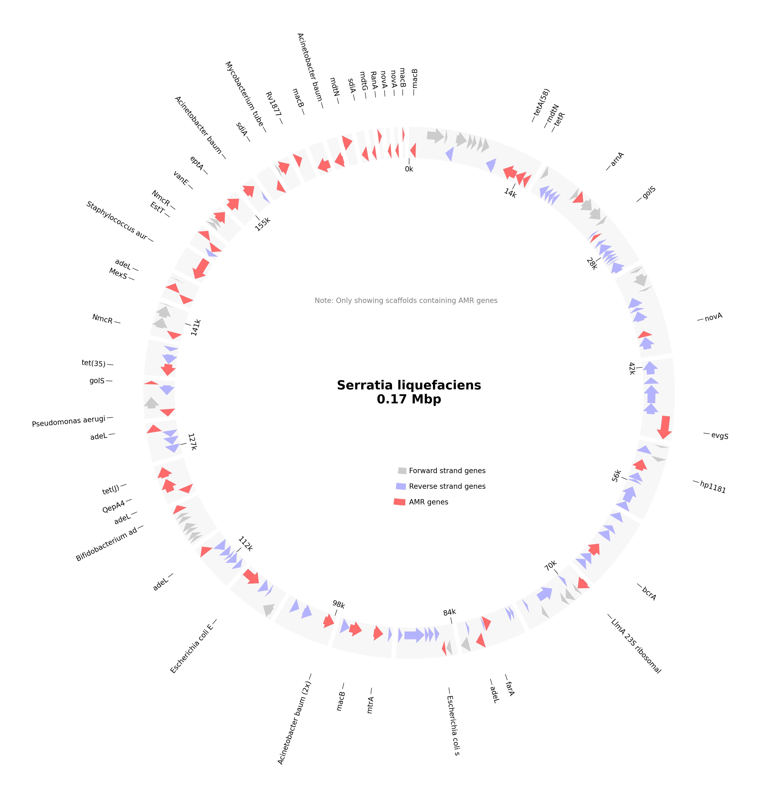

### Acinetobacter baumannii AbaF (found in 2 locations)
- **Mechanism**: antibiotic efflux
- **Drug Classes**: phosphonic acid antibiotic
- **AMR Family**: major facilitator superfamily (MFS) antibiotic efflux pump
- **Locations**:
  - gnl|SPADES|EHPDDGNP_3000_1 : position 241-1551
  - gnl|SPADES|EHPDDGNP_4463_1 : position 117-1262

### Acinetobacter baumannii AbaQ (found in 2 locations)
- **Mechanism**: antibiotic efflux
- **Drug Classes**: fluoroquinolone antibiotic
- **AMR Family**: major facilitator superfamily (MFS) antibiotic efflux pump
- **Locations**:
  - gnl|SPADES|EHPDDGNP_848_1 : position 30-1322
  - gnl|SPADES|EHPDDGNP_848_2 : position 1395-1964

### Bifidobacterium adolescentis rpoB mutants conferring resistance to rifampicin
- **Mechanism**: antibiotic target alteration; antibiotic target replacement
- **Drug Classes**: rifamycin antibiotic
- **AMR Family**: rifamycin-resistant beta-subunit of RNA polymerase (rpoB)
- **Locations**:
  - gnl|SPADES|EHPDDGNP_1144_8 : position 4149-4886

### Escherichia coli EF-Tu mutants conferring resistance to Enacyloxin IIa
- **Mechanism**: antibiotic target alteration
- **Drug Classes**: elfamycin antibiotic
- **AMR Family**: elfamycin resistant EF-Tu
- **Locations**:
  - gnl|SPADES|EHPDDGNP_954_5 : position 3552-5747

### Escherichia coli soxS with mutation conferring antibiotic resistance
- **Mechanism**: antibiotic target alteration; antibiotic efflux; reduced permeability to antibiotic
- **Drug Classes**: fluoroquinolone antibiotic; monobactam; carbapenem; cephalosporin; glycylcycline; cephamycin; penam; tetracycline antibiotic; rifamycin antibiotic; phenicol antibiotic; penem; disinfecting agents and antiseptics
- **AMR Family**: ATP-binding cassette (ABC) antibiotic efflux pump; major facilitator superfamily (MFS) antibiotic efflux pump; resistance-nodulation-cell division (RND) antibiotic efflux pump; General Bacterial Porin with reduced permeability to beta-lactams
- **Locations**:
  - gnl|SPADES|EHPDDGNP_787_2 : position 1311-1733

### EstT
- **Mechanism**: antibiotic inactivation
- **Drug Classes**: macrolide antibiotic
- **AMR Family**: macrolide esterase
- **Locations**:
  - gnl|SPADES|EHPDDGNP_2381_2 : position 683-1525

### LlmA 23S ribosomal RNA methyltransferase
- **Mechanism**: antibiotic target alteration
- **Drug Classes**: lincosamide antibiotic
- **AMR Family**: Llm 23S ribosomal RNA methyltransferase
- **Locations**:
  - gnl|SPADES|EHPDDGNP_675_1 : position 2-1174

### MexS
- **Mechanism**: antibiotic efflux
- **Drug Classes**: fluoroquinolone antibiotic; diaminopyrimidine antibiotic; phenicol antibiotic
- **AMR Family**: resistance-nodulation-cell division (RND) antibiotic efflux pump
- **Locations**:
  - gnl|SPADES|EHPDDGNP_1940_1 : position 157-1092

### Mycobacterium tuberculosis kasA mutant conferring resistance to isoniazid
- **Mechanism**: antibiotic target alteration
- **Drug Classes**: isoniazid-like antibiotic
- **AMR Family**: antibiotic resistant kasA
- **Locations**:
  - gnl|SPADES|EHPDDGNP_3323_2 : position 331-1572

### NmcR (found in 2 locations)
- **Mechanism**: antibiotic inactivation
- **Drug Classes**: carbapenem; cephalosporin; cephamycin; penam
- **AMR Family**: NmcA beta-lactamase
- **Locations**:
  - gnl|SPADES|EHPDDGNP_1458_1 : position 90-944
  - gnl|SPADES|EHPDDGNP_2381_3 : position 1634-2458

### Pseudomonas aeruginosa ampR with mutation conferring resistance to aztreonam
- **Mechanism**: antibiotic target alteration; antibiotic inactivation
- **Drug Classes**: monobactam; carbapenem; cephalosporin
- **AMR Family**: PDC beta-lactamase; ampR transcriptional regulator with mutation conferring resistance to monobactam antibiotics
- **Locations**:
  - gnl|SPADES|EHPDDGNP_1297_1 : position 1-918

### QepA4
- **Mechanism**: antibiotic efflux
- **Drug Classes**: fluoroquinolone antibiotic
- **AMR Family**: major facilitator superfamily (MFS) antibiotic efflux pump
- **Locations**:
  - gnl|SPADES|EHPDDGNP_1257_2 : position 1243-2775

### RanA
- **Mechanism**: antibiotic efflux
- **Drug Classes**: aminoglycoside antibiotic
- **AMR Family**: ATP-binding cassette (ABC) antibiotic efflux pump
- **Locations**:
  - gnl|SPADES|EHPDDGNP_11797_1 : position 2-433

### Rv1877
- **Mechanism**: antibiotic efflux
- **Drug Classes**: fluoroquinolone antibiotic
- **AMR Family**: major facilitator superfamily (MFS) antibiotic efflux pump
- **Locations**:
  - gnl|SPADES|EHPDDGNP_3567_1 : position 146-943

### Staphylococcus aureus mupB conferring resistance to mupirocin
- **Mechanism**: antibiotic target alteration
- **Drug Classes**: mupirocin-like antibiotic
- **AMR Family**: antibiotic-resistant isoleucyl-tRNA synthetase (ileS)
- **Locations**:
  - gnl|SPADES|EHPDDGNP_2122_1 : position 71-2767

### adeL (found in 5 locations)
- **Mechanism**: antibiotic efflux
- **Drug Classes**: fluoroquinolone antibiotic; tetracycline antibiotic
- **AMR Family**: resistance-nodulation-cell division (RND) antibiotic efflux pump
- **Locations**:
  - gnl|SPADES|EHPDDGNP_1009_6 : position 4308-5195
  - gnl|SPADES|EHPDDGNP_1257_1 : position 180-1067
  - gnl|SPADES|EHPDDGNP_1288_5 : position 3313-4206
  - gnl|SPADES|EHPDDGNP_1940_2 : position 1196-2083
  - gnl|SPADES|EHPDDGNP_748_7 : position 4825-5736

### arnA
- **Mechanism**: antibiotic target alteration
- **Drug Classes**: peptide antibiotic
- **AMR Family**: pmr phosphoethanolamine transferase
- **Locations**:
  - gnl|SPADES|EHPDDGNP_418_8 : position 5023-5967

### bcrA
- **Mechanism**: antibiotic efflux
- **Drug Classes**: peptide antibiotic
- **AMR Family**: ATP-binding cassette (ABC) antibiotic efflux pump
- **Locations**:
  - gnl|SPADES|EHPDDGNP_662_6 : position 4665-6197

### eptA
- **Mechanism**: antibiotic target alteration
- **Drug Classes**: peptide antibiotic
- **AMR Family**: pmr phosphoethanolamine transferase
- **Locations**:
  - gnl|SPADES|EHPDDGNP_2997_1 : position 183-1721

### evgS
- **Mechanism**: antibiotic efflux
- **Drug Classes**: macrolide antibiotic; fluoroquinolone antibiotic; penam; tetracycline antibiotic
- **AMR Family**: major facilitator superfamily (MFS) antibiotic efflux pump; resistance-nodulation-cell division (RND) antibiotic efflux pump
- **Locations**:
  - gnl|SPADES|EHPDDGNP_613_5 : position 6644-9376

### farA
- **Mechanism**: antibiotic efflux
- **Drug Classes**: antibacterial free fatty acids
- **AMR Family**: major facilitator superfamily (MFS) antibiotic efflux pump
- **Locations**:
  - gnl|SPADES|EHPDDGNP_748_5 : position 3238-4173

### golS (found in 2 locations)
- **Mechanism**: antibiotic efflux
- **Drug Classes**: monobactam; carbapenem; cephalosporin; cephamycin; penam; phenicol antibiotic; penem
- **AMR Family**: resistance-nodulation-cell division (RND) antibiotic efflux pump
- **Locations**:
  - gnl|SPADES|EHPDDGNP_1297_4 : position 3920-4318
  - gnl|SPADES|EHPDDGNP_418_13 : position 9695-10126

### hp1181
- **Mechanism**: antibiotic efflux
- **Drug Classes**: fluoroquinolone antibiotic; tetracycline antibiotic; nitroimidazole antibiotic
- **AMR Family**: major facilitator superfamily (MFS) antibiotic efflux pump
- **Locations**:
  - gnl|SPADES|EHPDDGNP_646_4 : position 2313-3677

### macB (found in 4 locations)
- **Mechanism**: antibiotic efflux
- **Drug Classes**: macrolide antibiotic
- **AMR Family**: ATP-binding cassette (ABC) antibiotic efflux pump
- **Locations**:
  - gnl|SPADES|EHPDDGNP_29279_1 : position 3-245
  - gnl|SPADES|EHPDDGNP_3625_1 : position 2-1585
  - gnl|SPADES|EHPDDGNP_408_1 : position 104-814
  - gnl|SPADES|EHPDDGNP_814_6 : position 3833-5374

### mdtG
- **Mechanism**: antibiotic efflux
- **Drug Classes**: phosphonic acid antibiotic
- **AMR Family**: major facilitator superfamily (MFS) antibiotic efflux pump
- **Locations**:
  - gnl|SPADES|EHPDDGNP_10996_1 : position 2-463

### mdtN (found in 2 locations)
- **Mechanism**: antibiotic efflux
- **Drug Classes**: nucleoside antibiotic; disinfecting agents and antiseptics
- **AMR Family**: major facilitator superfamily (MFS) antibiotic efflux pump
- **Locations**:
  - gnl|SPADES|EHPDDGNP_408_14 : position 13639-14625
  - gnl|SPADES|EHPDDGNP_4813_1 : position 2-1084

### mtrA
- **Mechanism**: antibiotic efflux
- **Drug Classes**: macrolide antibiotic; penam
- **AMR Family**: resistance-nodulation-cell division (RND) antibiotic efflux pump
- **Locations**:
  - gnl|SPADES|EHPDDGNP_814_4 : position 1174-2352

### novA (found in 3 locations)
- **Mechanism**: antibiotic efflux
- **Drug Classes**: aminocoumarin antibiotic
- **AMR Family**: ATP-binding cassette (ABC) antibiotic efflux pump
- **Locations**:
  - gnl|SPADES|EHPDDGNP_12298_1 : position 2-415
  - gnl|SPADES|EHPDDGNP_12299_1 : position 2-415
  - gnl|SPADES|EHPDDGNP_546_8 : position 7379-8125

### sdiA (found in 2 locations)
- **Mechanism**: antibiotic efflux
- **Drug Classes**: fluoroquinolone antibiotic; cephalosporin; glycylcycline; penam; tetracycline antibiotic; rifamycin antibiotic; phenicol antibiotic; disinfecting agents and antiseptics
- **AMR Family**: resistance-nodulation-cell division (RND) antibiotic efflux pump
- **Locations**:
  - gnl|SPADES|EHPDDGNP_3136_3 : position 1052-1846
  - gnl|SPADES|EHPDDGNP_5972_1 : position 127-864

### tet(35)
- **Mechanism**: antibiotic efflux
- **Drug Classes**: tetracycline antibiotic
- **AMR Family**: ATP-binding cassette (ABC) antibiotic efflux pump
- **Locations**:
  - gnl|SPADES|EHPDDGNP_1423_2 : position 73-1524

### tet(J)
- **Mechanism**: antibiotic efflux
- **Drug Classes**: tetracycline antibiotic
- **AMR Family**: major facilitator superfamily (MFS) antibiotic efflux pump
- **Locations**:
  - gnl|SPADES|EHPDDGNP_1257_4 : position 2999-4216

### tetA(58)
- **Mechanism**: antibiotic efflux
- **Drug Classes**: tetracycline antibiotic
- **AMR Family**: major facilitator superfamily (MFS) antibiotic efflux pump
- **Locations**:
  - gnl|SPADES|EHPDDGNP_408_13 : position 11898-13628

### tetR
- **Mechanism**: antibiotic target alteration; antibiotic efflux
- **Drug Classes**: tetracycline antibiotic
- **AMR Family**: major facilitator superfamily (MFS) antibiotic efflux pump
- **Locations**:
  - gnl|SPADES|EHPDDGNP_408_15 : position 14644-15333

### vanE
- **Mechanism**: antibiotic target alteration
- **Drug Classes**: glycopeptide antibiotic
- **AMR Family**: glycopeptide resistance gene cluster; Van ligase
- **Locations**:
  - gnl|SPADES|EHPDDGNP_2437_3 : position 1144-2403

## Serratia liquefaciens ATCC 27592
**Strain Statistics:**
- Total genome length: 4649.3 kbp
- Total scaffolds: 182
- Scaffolds with AMR genes: 106
- Total genes annotated: 8645
- Total AMR genes: 598
- Unique AMR genes: 238
- Distinct AMR mechanisms: 11
- Distinct AMR families: 87
- Distinct drug classes: 38

**Circos Plot:**

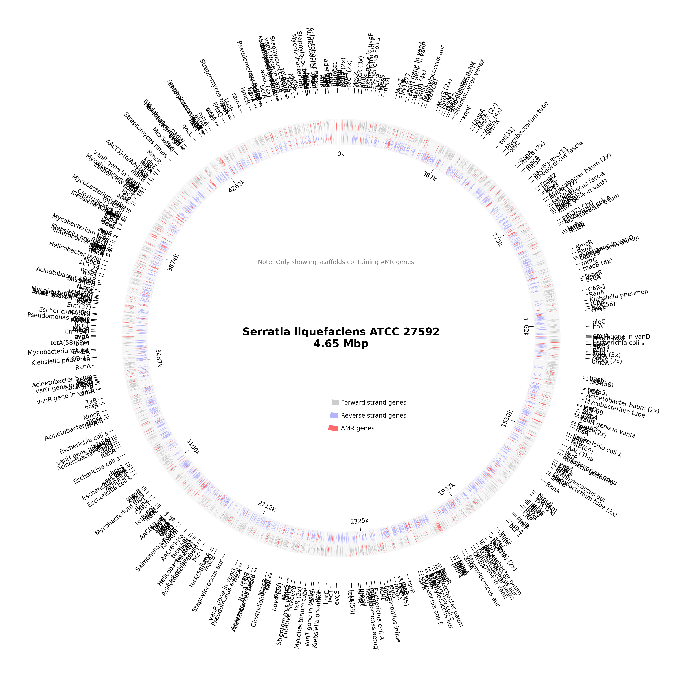

### AAC(3)-Ia
- **Mechanism**: antibiotic inactivation
- **Drug Classes**: aminoglycoside antibiotic
- **AMR Family**: AAC(3)
- **Locations**:
  - gnl|SPADES|EHPDDGNP_94_1 : position 31-579

### AAC(3)-Ib/AAC(6')-Ib3 bifunctional protein
- **Mechanism**: antibiotic inactivation
- **Drug Classes**: aminoglycoside antibiotic
- **AMR Family**: aminoglycoside bifunctional resistance protein
- **Locations**:
  - gnl|SPADES|EHPDDGNP_280_17 : position 19877-20329

### AAC(6')-Iai
- **Mechanism**: antibiotic inactivation
- **Drug Classes**: aminoglycoside antibiotic
- **AMR Family**: AAC(6')
- **Locations**:
  - gnl|SPADES|EHPDDGNP_177_47 : position 44362-44814

### AAC(6')-Iak
- **Mechanism**: antibiotic inactivation
- **Drug Classes**: aminoglycoside antibiotic
- **AMR Family**: AAC(6')
- **Locations**:
  - gnl|SPADES|EHPDDGNP_302_20 : position 17320-17766

### AAC(6')-Isa
- **Mechanism**: antibiotic inactivation
- **Drug Classes**: aminoglycoside antibiotic
- **AMR Family**: AAC(6')
- **Locations**:
  - gnl|SPADES|EHPDDGNP_176_13 : position 12119-12703

### ACT-54
- **Mechanism**: antibiotic inactivation
- **Drug Classes**: carbapenem; cephalosporin; cephamycin; penam
- **AMR Family**: ACT beta-lactamase
- **Locations**:
  - gnl|SPADES|EHPDDGNP_247_27 : position 25523-27058

### AIM-1
- **Mechanism**: antibiotic inactivation
- **Drug Classes**: cephalosporin; cephamycin; penam
- **AMR Family**: AIM beta-lactamase
- **Locations**:
  - gnl|SPADES|EHPDDGNP_177_21 : position 24299-25243

### APH(6)-Ic
- **Mechanism**: antibiotic inactivation
- **Drug Classes**: aminoglycoside antibiotic
- **AMR Family**: APH(6)
- **Locations**:
  - gnl|SPADES|EHPDDGNP_189_12 : position 11625-12479

### AQU-2
- **Mechanism**: antibiotic inactivation
- **Drug Classes**: cephalosporin
- **AMR Family**: AQU beta-lactamase
- **Locations**:
  - gnl|SPADES|EHPDDGNP_229_1 : position 180-1328

### Acinetobacter baumannii AbaF (found in 8 locations)
- **Mechanism**: antibiotic efflux
- **Drug Classes**: phosphonic acid antibiotic
- **AMR Family**: major facilitator superfamily (MFS) antibiotic efflux pump
- **Locations**:
  - gnl|SPADES|EHPDDGNP_110_21 : position 22851-24158
  - gnl|SPADES|EHPDDGNP_115_67 : position 62230-63732
  - gnl|SPADES|EHPDDGNP_209_26 : position 23784-25166
  - gnl|SPADES|EHPDDGNP_243_16 : position 14827-16152
  - gnl|SPADES|EHPDDGNP_585_6 : position 6727-8067
  - gnl|SPADES|EHPDDGNP_621_4 : position 1967-3277
  - gnl|SPADES|EHPDDGNP_67_66 : position 81572-82894
  - gnl|SPADES|EHPDDGNP_67_80 : position 98609-99841

### Acinetobacter baumannii AbaQ (found in 10 locations)
- **Mechanism**: antibiotic efflux
- **Drug Classes**: fluoroquinolone antibiotic
- **AMR Family**: major facilitator superfamily (MFS) antibiotic efflux pump
- **Locations**:
  - gnl|SPADES|EHPDDGNP_110_2 : position 177-1577
  - gnl|SPADES|EHPDDGNP_115_30 : position 26727-28040
  - gnl|SPADES|EHPDDGNP_175_8 : position 7217-8479
  - gnl|SPADES|EHPDDGNP_193_21 : position 23942-25237
  - gnl|SPADES|EHPDDGNP_199_15 : position 13952-15322
  - gnl|SPADES|EHPDDGNP_232_25 : position 28163-29431
  - gnl|SPADES|EHPDDGNP_39_30 : position 36744-38051
  - gnl|SPADES|EHPDDGNP_69_61 : position 67860-69167
  - gnl|SPADES|EHPDDGNP_89_1 : position 182-1519
  - gnl|SPADES|EHPDDGNP_89_62 : position 74872-76185

### Acinetobacter baumannii AmvA
- **Mechanism**: antibiotic efflux
- **Drug Classes**: macrolide antibiotic; disinfecting agents and antiseptics
- **AMR Family**: major facilitator superfamily (MFS) antibiotic efflux pump
- **Locations**:
  - gnl|SPADES|EHPDDGNP_161_27 : position 25246-26718

### ArnT
- **Mechanism**: antibiotic target alteration
- **Drug Classes**: peptide antibiotic
- **AMR Family**: pmr phosphoethanolamine transferase
- **Locations**:
  - gnl|SPADES|EHPDDGNP_73_21: position 23011-24675

### Bifidobacterium adolescentis rpoB mutants conferring resistance to rifampicin
- **Mechanism**: antibiotic target alteration; antibiotic target replacement
- **Drug Classes**: rifamycin antibiotic
- **AMR Family**: rifamycin-resistant beta-subunit of RNA polymerase (rpoB)
- **Locations**:
  - gnl|SPADES|EHPDDGNP_302_22 : position 22277-23995

### Bifidobacterium bifidum ileS conferring resistance to mupirocin
- **Mechanism**: antibiotic target alteration
- **Drug Classes**: mupirocin-like antibiotic
- **AMR Family**: antibiotic-resistant isoleucyl-tRNA synthetase (ileS)
- **Locations**:
  - gnl|SPADES|EHPDDGNP_47_49 : position 43701-46283

### CAR-1 (found in 2 locations)
- **Mechanism**: antibiotic inactivation
- **Drug Classes**: carbapenem
- **AMR Family**: CAR beta-lactamase
- **Locations**:
  - gnl|SPADES|EHPDDGNP_183_3 : position 2139-2939
  - gnl|SPADES|EHPDDGNP_71_58 : position 71486-72292

### CAU-1
- **Mechanism**: antibiotic inactivation
- **Drug Classes**: carbapenem; penam
- **AMR Family**: CAU beta-lactamase
- **Locations**:
  - gnl|SPADES|EHPDDGNP_217_20 : position 23084-25207

### CRP (found in 2 locations)
- **Mechanism**: antibiotic efflux
- **Drug Classes**: macrolide antibiotic; fluoroquinolone antibiotic; penam
- **AMR Family**: resistance-nodulation-cell division (RND) antibiotic efflux pump
- **Locations**:
  - gnl|SPADES|EHPDDGNP_94_55: position 62383-63015
  - gnl|SPADES|EHPDDGNP_98_67 : position 78905-79669

### Clostridioides difficile gyrA conferring resistance to fluoroquinolones
- **Mechanism**: antibiotic target alteration
- **Drug Classes**: fluoroquinolone antibiotic
- **AMR Family**: fluoroquinolone resistant gyrA
- **Locations**:
  - gnl|SPADES|EHPDDGNP_268_15 : position 16398-19049

### Clostridioides difficile gyrB conferring resistance to fluoroquinolones
- **Mechanism**: antibiotic target alteration
- **Drug Classes**: fluoroquinolone antibiotic
- **AMR Family**: fluoroquinolone resistant gyrB
- **Locations**:
  - gnl|SPADES|EHPDDGNP_148_40 : position 43767-45662

### CrcB
- **Mechanism**: antibiotic efflux
- **Drug Classes**: aminoglycoside antibiotic
- **AMR Family**: multidrug and toxic compound extrusion (MATE) transporter
- **Locations**:
  - gnl|SPADES|EHPDDGNP_47_34 : position 30465-30848

### DHA-6
- **Mechanism**: antibiotic inactivation
- **Drug Classes**: cephalosporin; cephamycin
- **AMR Family**: DHA beta-lactamase
- **Locations**:
  - gnl|SPADES|EHPDDGNP_199_11 : position 9263-10405

### EdeQ
- **Mechanism**: antibiotic inactivation
- **Drug Classes**: peptide antibiotic; polyamine antibiotic
- **AMR Family**: Edeine acetyltransferase
- **Locations**:
  - gnl|SPADES|EHPDDGNP_325_25 : position 16566-17000

### Enterobacter cloacae acrA (found in 2 locations)
- **Mechanism**: antibiotic efflux
- **Drug Classes**: fluoroquinolone antibiotic; cephalosporin; glycylcycline; penam; tetracycline antibiotic; rifamycin antibiotic; phenicol antibiotic; disinfecting agents and antiseptics
- **AMR Family**: resistance-nodulation-cell division (RND) antibiotic efflux pump
- **Locations**:
  - gnl|SPADES|EHPDDGNP_255_19 : position 23890-25092
  - gnl|SPADES|EHPDDGNP_93_41 : position 45235-46422

### Enterococcus faecalis cls with mutation conferring resistance to daptomycin
- **Mechanism**: antibiotic target alteration
- **Drug Classes**: peptide antibiotic
- **AMR Family**: daptomycin resistant cls
- **Locations**:
  - gnl|SPADES|EHPDDGNP_161_29 : position 27885-29345

### Enterococcus faecium liaS mutant conferring daptomycin resistance
- **Mechanism**: antibiotic target alteration; antibiotic efflux
- **Drug Classes**: peptide antibiotic
- **AMR Family**: daptomycin resistant liaS
- **Locations**:
  - gnl|SPADES|EHPDDGNP_308_20 : position 20368-21903

### Erm(34)
- **Mechanism**: antibiotic target alteration
- **Drug Classes**: macrolide antibiotic; lincosamide antibiotic; streptogramin antibiotic; streptogramin A antibiotic; streptogramin B antibiotic
- **AMR Family**: Erm 23S ribosomal RNA methyltransferase
- **Locations**:
  - gnl|SPADES|EHPDDGNP_219_4 : position 4973-5599

### Erm(37)
- **Mechanism**: antibiotic target alteration
- **Drug Classes**: macrolide antibiotic; lincosamide antibiotic; streptogramin antibiotic; streptogramin A antibiotic; streptogramin B antibiotic
- **AMR Family**: Erm 23S ribosomal RNA methyltransferase
- **Locations**:
  - gnl|SPADES|EHPDDGNP_232_7 : position 6267-7046

### Escherichia coli AcrAB-TolC with AcrR mutation conferring resistance to ciprofloxacin, tetracycline, and ceftazidime (found in 5 locations)
- **Mechanism**: antibiotic target alteration; antibiotic efflux
- **Drug Classes**: fluoroquinolone antibiotic; cephalosporin; glycylcycline; penam; tetracycline antibiotic; rifamycin antibiotic; phenicol antibiotic; disinfecting agents and antiseptics
- **AMR Family**: resistance-nodulation-cell division (RND) antibiotic efflux pump
- **Locations**:
  - gnl|SPADES|EHPDDGNP_134_31 : position 26076-26663
  - gnl|SPADES|EHPDDGNP_229_3 : position 2520-3122
  - gnl|SPADES|EHPDDGNP_23_86 : position 82873-83454
  - gnl|SPADES|EHPDDGNP_39_17 : position 21017-21718
  - gnl|SPADES|EHPDDGNP_93_40 : position 44403-45092

### Escherichia coli AcrAB-TolC with MarR mutations conferring resistance to ciprofloxacin and tetracycline (found in 2 locations)
- **Mechanism**: antibiotic target alteration; antibiotic efflux
- **Drug Classes**: fluoroquinolone antibiotic; cephalosporin; glycylcycline; penam; tetracycline antibiotic; rifamycin antibiotic; phenicol antibiotic; disinfecting agents and antiseptics
- **AMR Family**: resistance-nodulation-cell division (RND) antibiotic efflux pump
- **Locations**:
  - gnl|SPADES|EHPDDGNP_189_26 : position 22499-22933
  - gnl|SPADES|EHPDDGNP_69_55 : position 62452-62925

### Escherichia coli EF-Tu mutants conferring resistance to Enacyloxin IIa
- **Mechanism**: antibiotic target alteration
- **Drug Classes**: elfamycin antibiotic
- **AMR Family**: elfamycin resistant EF-Tu
- **Locations**:
  - gnl|SPADES|EHPDDGNP_118_5 : position 4341-7028

### Escherichia coli EF-Tu mutants conferring resistance to Pulvomycin
- **Mechanism**: antibiotic target alteration
- **Drug Classes**: elfamycin antibiotic
- **AMR Family**: elfamycin resistant EF-Tu
- **Locations**:
  - gnl|SPADES|EHPDDGNP_428_8 : position 8853-10700

### Escherichia coli fabI mutations conferring resistance to isoniazid and triclosan (found in 2 locations)
- **Mechanism**: antibiotic target alteration
- **Drug Classes**: disinfecting agents and antiseptics; isoniazid-like antibiotic
- **AMR Family**: antibiotic resistant fabI
- **Locations**:
  - gnl|SPADES|EHPDDGNP_175_12 : position 11642-12397
  - gnl|SPADES|EHPDDGNP_275_13 : position 11283-12029

### Escherichia coli mdfA
- **Mechanism**: antibiotic efflux
- **Drug Classes**: tetracycline antibiotic; phenicol antibiotic; disinfecting agents and antiseptics
- **AMR Family**: major facilitator superfamily (MFS) antibiotic efflux pump
- **Locations**:
  - gnl|SPADES|EHPDDGNP_428_7 : position 7130-8377

### Escherichia coli soxS with mutation conferring antibiotic resistance (found in 8 locations)
- **Mechanism**: antibiotic target alteration; antibiotic efflux; reduced permeability to antibiotic
- **Drug Classes**: fluoroquinolone antibiotic; monobactam; carbapenem; cephalosporin; glycylcycline; cephamycin; penam; tetracycline antibiotic; rifamycin antibiotic; phenicol antibiotic; penem; disinfecting agents and antiseptics
- **AMR Family**: ATP-binding cassette (ABC) antibiotic efflux pump; major facilitator superfamily (MFS) antibiotic efflux pump; resistance-nodulation-cell division (RND) antibiotic efflux pump; General Bacterial Porin with reduced permeability to beta-lactams
- **Locations**:
  - gnl|SPADES|EHPDDGNP_110_32 : position 36672-37541
  - gnl|SPADES|EHPDDGNP_115_43 : position 41871-42716
  - gnl|SPADES|EHPDDGNP_189_2 : position 358-1251
  - gnl|SPADES|EHPDDGNP_190_18 : position 23213-24079
  - gnl|SPADES|EHPDDGNP_198_13 : position 13315-14088
  - gnl|SPADES|EHPDDGNP_229_24 : position 21411-22328
  - gnl|SPADES|EHPDDGNP_23_98 : position 95668-96126
  - gnl|SPADES|EHPDDGNP_83_23 : position 20591-21538

### EstT (found in 2 locations)
- **Mechanism**: antibiotic inactivation
- **Drug Classes**: macrolide antibiotic
- **AMR Family**: macrolide esterase
- **Locations**:
  - gnl|SPADES|EHPDDGNP_115_20 : position 18294-19097
  - gnl|SPADES|EHPDDGNP_697_6 : position 3895-4725

### FosA8
- **Mechanism**: antibiotic inactivation
- **Drug Classes**: phosphonic acid antibiotic
- **AMR Family**: fosfomycin thiol transferase
- **Locations**:
  - gnl|SPADES|EHPDDGNP_176_45: position 42621-43028

### FosC2
- **Mechanism**: antibiotic inactivation
- **Drug Classes**: phosphonic acid antibiotic
- **AMR Family**: fosC phosphotransferase family
- **Locations**:
  - gnl|SPADES|EHPDDGNP_189_39 : position 36546-36953

### FosM1
- **Mechanism**: antibiotic inactivation
- **Drug Classes**: phosphonic acid antibiotic
- **AMR Family**: fosfomycin thiol transferase
- **Locations**:
  - gnl|SPADES|EHPDDGNP_47_23 : position 21263-21772

### FosM2
- **Mechanism**: antibiotic inactivation
- **Drug Classes**: phosphonic acid antibiotic
- **AMR Family**: fosfomycin thiol transferase
- **Locations**:
  - gnl|SPADES|EHPDDGNP_67_34 : position 39234-39644

### GOB-12
- **Mechanism**: antibiotic inactivation
- **Drug Classes**: carbapenem; cephalosporin; penam
- **AMR Family**: GOB beta-lactamase
- **Locations**:
  - gnl|SPADES|EHPDDGNP_217_3 : position 2429-3076

### H-NS
- **Mechanism**: antibiotic efflux
- **Drug Classes**: macrolide antibiotic; fluoroquinolone antibiotic; cephalosporin; cephamycin; penam; tetracycline antibiotic
- **AMR Family**: major facilitator superfamily (MFS) antibiotic efflux pump; resistance-nodulation-cell division (RND) antibiotic efflux pump
- **Locations**:
  - gnl|SPADES|EHPDDGNP_161_46 : position 50287-50694

### Haemophilus influenzae PBP3 conferring resistance to beta-lactam antibiotics (found in 2 locations)
- **Mechanism**: antibiotic target alteration
- **Drug Classes**: cephalosporin; cephamycin; penam
- **AMR Family**: Penicillin-binding protein mutations conferring resistance to beta-lactam antibiotics
- **Locations**:
  - gnl|SPADES|EHPDDGNP_124_42 : position 51807-53570
  - gnl|SPADES|EHPDDGNP_69_11 : position 10073-11791

### Helicobacter pylori pbp1 mutants conferring resistance to amoxicillin (found in 2 locations)
- **Mechanism**: antibiotic target alteration
- **Drug Classes**: cephalosporin; cephamycin; penam
- **AMR Family**: Penicillin-binding protein mutations conferring resistance to beta-lactam antibiotics
- **Locations**:
  - gnl|SPADES|EHPDDGNP_175_27 : position 29687-32191
  - gnl|SPADES|EHPDDGNP_251_15 : position 18349-20697

### Helicobacter pylori pbp2 mutants conferring resistance to amoxicillin
- **Mechanism**: antibiotic target alteration
- **Drug Classes**: cephalosporin; cephamycin; penam
- **AMR Family**: Penicillin-binding protein mutations conferring resistance to beta-lactam antibiotics
- **Locations**:
  - gnl|SPADES|EHPDDGNP_47_43 : position 38528-40423

### Helicobacter pylori rpoB mutation conferring resistance to rifampicin
- **Mechanism**: antibiotic target alteration; antibiotic target replacement
- **Drug Classes**: fluoroquinolone antibiotic; rifamycin antibiotic
- **AMR Family**: rifamycin-resistant beta-subunit of RNA polymerase (rpoB)
- **Locations**:
  - gnl|SPADES|EHPDDGNP_302_21 : position 17938-22158

### Klebsiella aerogenes Omp36
- **Mechanism**: reduced permeability to antibiotic
- **Drug Classes**: monobactam; carbapenem; cephalosporin; cephamycin; penam; penem
- **AMR Family**: General Bacterial Porin with reduced permeability to beta-lactams
- **Locations**:
  - gnl|SPADES|EHPDDGNP_268_9 : position 6479-7609

### Klebsiella pneumoniae KpnE
- **Mechanism**: antibiotic efflux
- **Drug Classes**: macrolide antibiotic; aminoglycoside antibiotic; cephalosporin; tetracycline antibiotic; peptide antibiotic; rifamycin antibiotic; disinfecting agents and antiseptics
- **AMR Family**: small multidrug resistance (SMR) antibiotic efflux pump
- **Locations**:
  - gnl|SPADES|EHPDDGNP_145_4 : position 4094-4462

### Klebsiella pneumoniae KpnF
- **Mechanism**: antibiotic efflux
- **Drug Classes**: macrolide antibiotic; aminoglycoside antibiotic; cephalosporin; tetracycline antibiotic; peptide antibiotic; rifamycin antibiotic; disinfecting agents and antiseptics
- **AMR Family**: small multidrug resistance (SMR) antibiotic efflux pump
- **Locations**:
  - gnl|SPADES|EHPDDGNP_145_5: position 4449-4778

### Klebsiella pneumoniae KpnH
- **Mechanism**: antibiotic efflux
- **Drug Classes**: macrolide antibiotic; fluoroquinolone antibiotic; aminoglycoside antibiotic; carbapenem; cephalosporin; penam; peptide antibiotic; penem
- **AMR Family**: major facilitator superfamily (MFS) antibiotic efflux pump
- **Locations**:
  - gnl|SPADES|EHPDDGNP_177_6: position 7024-8559

### Klebsiella pneumoniae OmpK37 (found in 4 locations)
- **Mechanism**: reduced permeability to antibiotic
- **Drug Classes**: monobactam; carbapenem; cephalosporin; cephamycin; penam; penem
- **AMR Family**: General Bacterial Porin with reduced permeability to beta-lactams
- **Locations**:
  - gnl|SPADES|EHPDDGNP_217_1 : position 2-922
  - gnl|SPADES|EHPDDGNP_23_20 : position 16078-17175
  - gnl|SPADES|EHPDDGNP_258_1 : position 1-258
  - gnl|SPADES|EHPDDGNP_71_88 : position 104631-105713

### LRA-8
- **Mechanism**: antibiotic inactivation
- **Drug Classes**: cephalosporin; penam
- **AMR Family**: subclass B3 LRA beta-lactamase
- **Locations**:
  - gnl|SPADES|EHPDDGNP_95_23 : position 20338-21093

### LpsB (found in 2 locations)
- **Mechanism**: reduced permeability to antibiotic
- **Drug Classes**: peptide antibiotic
- **AMR Family**: Intrinsic peptide antibiotic resistant Lps
- **Locations**:
  - gnl|SPADES|EHPDDGNP_106_20 : position 17008-18105
  - gnl|SPADES|EHPDDGNP_335_5 : position 3649-4857

### LptD
- **Mechanism**: antibiotic efflux
- **Drug Classes**: carbapenem; peptide antibiotic; aminocoumarin antibiotic; rifamycin antibiotic
- **AMR Family**: ATP-binding cassette (ABC) antibiotic efflux pump
- **Locations**:
  - gnl|SPADES|EHPDDGNP_124_14 : position 14220-16583

### MdtK
- **Mechanism**: antibiotic efflux
- **Drug Classes**: fluoroquinolone antibiotic
- **AMR Family**: multidrug and toxic compound extrusion (MATE) transporter
- **Locations**:
  - gnl|SPADES|EHPDDGNP_48_104 : position 101649-103112

### MexA
- **Mechanism**: antibiotic efflux
- **Drug Classes**: macrolide antibiotic; fluoroquinolone antibiotic; monobactam; carbapenem; cephalosporin; cephamycin; penam; tetracycline antibiotic; peptide antibiotic; aminocoumarin antibiotic; diaminopyrimidine antibiotic; sulfonamide antibiotic; phenicol antibiotic; penem
- **AMR Family**: resistance-nodulation-cell division (RND) antibiotic efflux pump
- **Locations**:
  - gnl|SPADES|EHPDDGNP_39_15 : position 18165-19307

### MexE
- **Mechanism**: antibiotic efflux
- **Drug Classes**: fluoroquinolone antibiotic; diaminopyrimidine antibiotic; phenicol antibiotic
- **AMR Family**: resistance-nodulation-cell division (RND) antibiotic efflux pump
- **Locations**:
  - gnl|SPADES|EHPDDGNP_189_27 : position 23354-24211

### MexG
- **Mechanism**: antibiotic efflux
- **Drug Classes**: fluoroquinolone antibiotic; tetracycline antibiotic; disinfecting agents and antiseptics
- **AMR Family**: resistance-nodulation-cell division (RND) antibiotic efflux pump
- **Locations**:
  - gnl|SPADES|EHPDDGNP_177_43 : position 41833-42246

### MexL (found in 3 locations)
- **Mechanism**: antibiotic efflux
- **Drug Classes**: macrolide antibiotic; tetracycline antibiotic; disinfecting agents and antiseptics
- **AMR Family**: resistance-nodulation-cell division (RND) antibiotic efflux pump
- **Locations**:
  - gnl|SPADES|EHPDDGNP_115_24 : position 21690-22328
  - gnl|SPADES|EHPDDGNP_39_80 : position 97152-97736
  - gnl|SPADES|EHPDDGNP_621_1 : position 3-611

### MexS (found in 12 locations)
- **Mechanism**: antibiotic efflux
- **Drug Classes**: fluoroquinolone antibiotic; diaminopyrimidine antibiotic; phenicol antibiotic
- **AMR Family**: resistance-nodulation-cell division (RND) antibiotic efflux pump
- **Locations**:
  - gnl|SPADES|EHPDDGNP_146_42 : position 45275-46261
  - gnl|SPADES|EHPDDGNP_209_11 : position 10174-11163
  - gnl|SPADES|EHPDDGNP_23_124 : position 120740-121867
  - gnl|SPADES|EHPDDGNP_266_5 : position 3884-4912
  - gnl|SPADES|EHPDDGNP_300_23 : position 19511-20530
  - gnl|SPADES|EHPDDGNP_300_24 : position 20520-21515
  - gnl|SPADES|EHPDDGNP_47_3 : position 1482-2471
  - gnl|SPADES|EHPDDGNP_47_4 : position 2564-3499
  - gnl|SPADES|EHPDDGNP_48_18 : position 18500-19534
  - gnl|SPADES|EHPDDGNP_48_56 : position 55457-56464
  - gnl|SPADES|EHPDDGNP_83_83 : position 73808-74788
  - gnl|SPADES|EHPDDGNP_83_93 : position 84185-85210

### MexT (found in 4 locations)
- **Mechanism**: antibiotic efflux
- **Drug Classes**: fluoroquinolone antibiotic; diaminopyrimidine antibiotic; phenicol antibiotic
- **AMR Family**: resistance-nodulation-cell division (RND) antibiotic efflux pump
- **Locations**:
  - gnl|SPADES|EHPDDGNP_268_5 : position 3848-4750
  - gnl|SPADES|EHPDDGNP_39_3 : position 3254-4150
  - gnl|SPADES|EHPDDGNP_48_20 : position 20325-21254
  - gnl|SPADES|EHPDDGNP_67_52 : position 61315-62265

### MexV
- **Mechanism**: antibiotic efflux
- **Drug Classes**: macrolide antibiotic; fluoroquinolone antibiotic; tetracycline antibiotic; phenicol antibiotic; disinfecting agents and antiseptics
- **AMR Family**: resistance-nodulation-cell division (RND) antibiotic efflux pump
- **Locations**:
  - gnl|SPADES|EHPDDGNP_70_87 : position 98048-99499

### MexZ
- **Mechanism**: antibiotic efflux
- **Drug Classes**: macrolide antibiotic; fluoroquinolone antibiotic; aminoglycoside antibiotic; carbapenem; cephalosporin; cephamycin; penam; tetracycline antibiotic; phenicol antibiotic; disinfecting agents and antiseptics
- **AMR Family**: resistance-nodulation-cell division (RND) antibiotic efflux pump
- **Locations**:
  - gnl|SPADES|EHPDDGNP_23_45 : position 42025-42591

### Mycobacterium tuberculosis gidB mutation conferring resistance to streptomycin
- **Mechanism**: antibiotic target alteration
- **Drug Classes**: aminoglycoside antibiotic
- **AMR Family**: antibiotic resistant gidB
- **Locations**:
  - gnl|SPADES|EHPDDGNP_183_29 : position 28101-28721

### Mycobacterium tuberculosis inhA mutations conferring resistance to isoniazid
- **Mechanism**: antibiotic target alteration
- **Drug Classes**: isoniazid-like antibiotic
- **AMR Family**: isoniazid resistant inhA
- **Locations**:
  - gnl|SPADES|EHPDDGNP_234_1 : position 182-940

### Mycobacterium tuberculosis kasA mutant conferring resistance to isoniazid (found in 3 locations)
- **Mechanism**: antibiotic target alteration
- **Drug Classes**: isoniazid-like antibiotic
- **AMR Family**: antibiotic resistant kasA
- **Locations**:
  - gnl|SPADES|EHPDDGNP_258_20 : position 24078-25352
  - gnl|SPADES|EHPDDGNP_95_14 : position 11026-12195
  - gnl|SPADES|EHPDDGNP_95_17 : position 13390-14619

### Mycobacterium tuberculosis katG mutations conferring resistance to isoniazid
- **Mechanism**: antibiotic target alteration
- **Drug Classes**: isoniazid-like antibiotic
- **AMR Family**: isoniazid resistant katG
- **Locations**:
  - gnl|SPADES|EHPDDGNP_270_12 : position 13198-15396

### Mycobacterium tuberculosis ndh with mutation conferring resistance to isoniazid
- **Mechanism**: antibiotic target alteration
- **Drug Classes**: isoniazid-like antibiotic
- **AMR Family**: antibiotic resistant ndh
- **Locations**:
  - gnl|SPADES|EHPDDGNP_275_22 : position 17987-19291

### Mycobacterium tuberculosis pncA mutations conferring resistance to pyrazinamide (found in 3 locations)
- **Mechanism**: antibiotic target alteration
- **Drug Classes**: pyrazine antibiotic
- **AMR Family**: Pyrazinamide resistant pncA
- **Locations**:
  - gnl|SPADES|EHPDDGNP_145_48 : position 49072-49704
  - gnl|SPADES|EHPDDGNP_428_4 : position 4446-4997
  - gnl|SPADES|EHPDDGNP_48_124 : position 123888-124574

### Mycobacterium tuberculosis rpsA mutations conferring resistance to pyrazinamide
- **Mechanism**: antibiotic target alteration
- **Drug Classes**: pyrazine antibiotic
- **AMR Family**: pyrazinamide resistant rpsA
- **Locations**:
  - gnl|SPADES|EHPDDGNP_217_22 : position 25983-27656

### Mycobacterium tuberculosis thyA with mutation conferring resistance to para-aminosalicylic acid
- **Mechanism**: antibiotic target alteration
- **Drug Classes**: salicylic acid antibiotic
- **AMR Family**: aminosalicylate resistant thymidylate synthase
- **Locations**:
  - gnl|SPADES|EHPDDGNP_89_13 : position 18708-19502

### Mycolicibacterium smegmatis ndh with mutation conferring resistance to isoniazid
- **Mechanism**: antibiotic target alteration
- **Drug Classes**: isoniazid-like antibiotic
- **AMR Family**: antibiotic resistant ndh
- **Locations**:
  - gnl|SPADES|EHPDDGNP_498_10 : position 8120-9328

### Neisseria gonorrhoeae pilQ gene conferring resistance to beta-lactam
- **Mechanism**: antibiotic target alteration
- **Drug Classes**: cephalosporin; cephamycin; penam
- **AMR Family**: Penicillin-binding protein mutations conferring resistance to beta-lactam antibiotics
- **Locations**:
  - gnl|SPADES|EHPDDGNP_94_29 : position 33166-34407

### NmcR (found in 26 locations)
- **Mechanism**: antibiotic inactivation
- **Drug Classes**: carbapenem; cephalosporin; cephamycin; penam
- **AMR Family**: NmcA beta-lactamase
- **Locations**:
  - gnl|SPADES|EHPDDGNP_115_14 : position 13287-14210
  - gnl|SPADES|EHPDDGNP_148_47 : position 52964-53797
  - gnl|SPADES|EHPDDGNP_177_13 : position 14447-15325
  - gnl|SPADES|EHPDDGNP_193_31 : position 35083-35976
  - gnl|SPADES|EHPDDGNP_199_38 : position 35364-36293
  - gnl|SPADES|EHPDDGNP_234_22 : position 27503-28423
  - gnl|SPADES|EHPDDGNP_23_109 : position 105851-106732
  - gnl|SPADES|EHPDDGNP_23_125 : position 121896-122813
  - gnl|SPADES|EHPDDGNP_23_59 : position 54877-55764
  - gnl|SPADES|EHPDDGNP_251_7 : position 5111-6028
  - gnl|SPADES|EHPDDGNP_297_17 : position 15816-16790
  - gnl|SPADES|EHPDDGNP_345_12 : position 12567-13463
  - gnl|SPADES|EHPDDGNP_39_20 : position 24244-25110
  - gnl|SPADES|EHPDDGNP_39_83 : position 100107-101015
  - gnl|SPADES|EHPDDGNP_471_13 : position 11212-12093
  - gnl|SPADES|EHPDDGNP_47_14 : position 10923-11912
  - gnl|SPADES|EHPDDGNP_48_47 : position 48157-49029
  - gnl|SPADES|EHPDDGNP_67_73 : position 90149-91048
  - gnl|SPADES|EHPDDGNP_67_83 : position 102192-103019
  - gnl|SPADES|EHPDDGNP_69_86 : position 97986-98876
  - gnl|SPADES|EHPDDGNP_70_36 : position 43441-44382
  - gnl|SPADES|EHPDDGNP_71_24 : position 28450-29403
  - gnl|SPADES|EHPDDGNP_83_10 : position 7735-8673
  - gnl|SPADES|EHPDDGNP_83_15 : position 13179-14081
  - gnl|SPADES|EHPDDGNP_83_52 : position 46613-47542
  - gnl|SPADES|EHPDDGNP_98_4 : position 5146-6000

### OmpA (found in 3 locations)
- **Mechanism**: reduced permeability to antibiotic
- **Drug Classes**: peptide antibiotic
- **AMR Family**: General Bacterial Porin with reduced permeability to peptide antibiotics
- **Locations**:
  - gnl|SPADES|EHPDDGNP_110_39 : position 43958-44455
  - gnl|SPADES|EHPDDGNP_232_21 : position 24325-24987
  - gnl|SPADES|EHPDDGNP_47_118 : position 124762-125271

### OpmH
- **Mechanism**: antibiotic efflux
- **Drug Classes**: disinfecting agents and antiseptics
- **AMR Family**: resistance-nodulation-cell division (RND) antibiotic efflux pump
- **Locations**:
  - gnl|SPADES|EHPDDGNP_1088_1 : position 3-1343

### OprM
- **Mechanism**: antibiotic efflux
- **Drug Classes**: macrolide antibiotic; fluoroquinolone antibiotic; monobactam; aminoglycoside antibiotic; carbapenem; cephalosporin; cephamycin; penam; tetracycline antibiotic; peptide antibiotic; aminocoumarin antibiotic; diaminopyrimidine antibiotic; sulfonamide antibiotic; phenicol antibiotic; penem; disinfecting agents and antiseptics
- **AMR Family**: resistance-nodulation-cell division (RND) antibiotic efflux pump
- **Locations**:
  - gnl|SPADES|EHPDDGNP_39_13 : position 13554-15008

### ParR (found in 2 locations)
- **Mechanism**: antibiotic efflux; reduced permeability to antibiotic
- **Drug Classes**: macrolide antibiotic; fluoroquinolone antibiotic; monobactam; aminoglycoside antibiotic; carbapenem; cephalosporin; cephamycin; penam; tetracycline antibiotic; phenicol antibiotic; penem; disinfecting agents and antiseptics
- **AMR Family**: resistance-nodulation-cell division (RND) antibiotic efflux pump; Outer Membrane Porin (Opr)
- **Locations**:
  - gnl|SPADES|EHPDDGNP_94_14 : position 18153-18872
  - gnl|SPADES|EHPDDGNP_98_59 : position 69607-70368

### ParS (found in 3 locations)
- **Mechanism**: antibiotic efflux; reduced permeability to antibiotic
- **Drug Classes**: macrolide antibiotic; fluoroquinolone antibiotic; monobactam; aminoglycoside antibiotic; carbapenem; cephalosporin; cephamycin; penam; tetracycline antibiotic; phenicol antibiotic; penem; disinfecting agents and antiseptics
- **AMR Family**: resistance-nodulation-cell division (RND) antibiotic efflux pump; Outer Membrane Porin (Opr)
- **Locations**:
  - gnl|SPADES|EHPDDGNP_177_19 : position 20884-22482
  - gnl|SPADES|EHPDDGNP_559_4 : position 3048-4829
  - gnl|SPADES|EHPDDGNP_98_58 : position 68306-69610

### PmrF (found in 2 locations)
- **Mechanism**: antibiotic target alteration
- **Drug Classes**: peptide antibiotic
- **AMR Family**: pmr phosphoethanolamine transferase
- **Locations**:
  - gnl|SPADES|EHPDDGNP_106_25 : position 22583-23566
  - gnl|SPADES|EHPDDGNP_73_24 : position 27556-28536

### Pseudomonas aeruginosa CpxR (found in 5 locations)
- **Mechanism**: antibiotic efflux
- **Drug Classes**: macrolide antibiotic; fluoroquinolone antibiotic; monobactam; aminoglycoside antibiotic; carbapenem; cephalosporin; cephamycin; penam; tetracycline antibiotic; peptide antibiotic; aminocoumarin antibiotic; diaminopyrimidine antibiotic; sulfonamide antibiotic; phenicol antibiotic; penem
- **AMR Family**: resistance-nodulation-cell division (RND) antibiotic efflux pump
- **Locations**:
  - gnl|SPADES|EHPDDGNP_106_45 : position 42400-43098
  - gnl|SPADES|EHPDDGNP_134_48 : position 43608-44348
  - gnl|SPADES|EHPDDGNP_177_18 : position 20186-20875
  - gnl|SPADES|EHPDDGNP_393_8 : position 6774-7454
  - gnl|SPADES|EHPDDGNP_70_67 : position 75168-75842

### Pseudomonas aeruginosa ampR with mutation conferring resistance to aztreonam (found in 2 locations)
- **Mechanism**: antibiotic target alteration; antibiotic inactivation
- **Drug Classes**: monobactam; carbapenem; cephalosporin
- **AMR Family**: PDC beta-lactamase; ampR transcriptional regulator with mutation conferring resistance to monobactam antibiotics
- **Locations**:
  - gnl|SPADES|EHPDDGNP_165_24 : position 22172-23101
  - gnl|SPADES|EHPDDGNP_229_6 : position 5740-6615

### QepA2
- **Mechanism**: antibiotic efflux
- **Drug Classes**: fluoroquinolone antibiotic
- **AMR Family**: major facilitator superfamily (MFS) antibiotic efflux pump
- **Locations**:
  - gnl|SPADES|EHPDDGNP_93_7 : position 4944-6350

### QepA4
- **Mechanism**: antibiotic efflux
- **Drug Classes**: fluoroquinolone antibiotic
- **AMR Family**: major facilitator superfamily (MFS) antibiotic efflux pump
- **Locations**:
  - gnl|SPADES|EHPDDGNP_69_87 : position 98976-100271

### RanA (found in 24 locations)
- **Mechanism**: antibiotic efflux
- **Drug Classes**: aminoglycoside antibiotic
- **AMR Family**: ATP-binding cassette (ABC) antibiotic efflux pump
- **Locations**:
  - gnl|SPADES|EHPDDGNP_161_37 : position 36958-37959
  - gnl|SPADES|EHPDDGNP_161_38 : position 37956-38972
  - gnl|SPADES|EHPDDGNP_173_17 : position 17885-18961
  - gnl|SPADES|EHPDDGNP_177_17 : position 18577-19779
  - gnl|SPADES|EHPDDGNP_183_14 : position 12791-13567
  - gnl|SPADES|EHPDDGNP_187_3 : position 1952-2941
  - gnl|SPADES|EHPDDGNP_193_3 : position 3275-4345
  - gnl|SPADES|EHPDDGNP_216_8 : position 14976-15968
  - gnl|SPADES|EHPDDGNP_23_116 : position 113270-115147
  - gnl|SPADES|EHPDDGNP_23_7 : position 5414-6349
  - gnl|SPADES|EHPDDGNP_255_4 : position 4645-5706
  - gnl|SPADES|EHPDDGNP_281_6 : position 5680-7356
  - gnl|SPADES|EHPDDGNP_383_6 : position 6791-8383
  - gnl|SPADES|EHPDDGNP_39_109 : position 126607-127719
  - gnl|SPADES|EHPDDGNP_39_53 : position 64849-65964
  - gnl|SPADES|EHPDDGNP_39_72 : position 87088-88125
  - gnl|SPADES|EHPDDGNP_39_87 : position 104020-104733
  - gnl|SPADES|EHPDDGNP_463_7 : position 4105-4920
  - gnl|SPADES|EHPDDGNP_66_51 : position 53896-55029
  - gnl|SPADES|EHPDDGNP_69_72 : position 83196-84275
  - gnl|SPADES|EHPDDGNP_69_8 : position 8134-8895
  - gnl|SPADES|EHPDDGNP_70_50 : position 58309-59082
  - gnl|SPADES|EHPDDGNP_71_74 : position 87017-87985
  - gnl|SPADES|EHPDDGNP_95_48 : position 45388-46131

### RanB
- **Mechanism**: antibiotic efflux
- **Drug Classes**: aminoglycoside antibiotic
- **AMR Family**: ATP-binding cassette (ABC) antibiotic efflux pump
- **Locations**:
  - gnl|SPADES|EHPDDGNP_463_6 : position 3318-4100

### Rhodococcus fascians cmr (found in 2 locations)
- **Mechanism**: antibiotic efflux
- **Drug Classes**: phenicol antibiotic
- **AMR Family**: major facilitator superfamily (MFS) antibiotic efflux pump
- **Locations**:
  - gnl|SPADES|EHPDDGNP_67_12 : position 14454-15881
  - gnl|SPADES|EHPDDGNP_69_1 : position 34-1212

### RlmA(II)
- **Mechanism**: antibiotic target alteration
- **Drug Classes**: macrolide antibiotic; lincosamide antibiotic
- **AMR Family**: non-erm 23S ribosomal RNA methyltransferase (G748)
- **Locations**:
  - gnl|SPADES|EHPDDGNP_176_37 : position 35759-36580

### Rv1877
- **Mechanism**: antibiotic efflux
- **Drug Classes**: fluoroquinolone antibiotic
- **AMR Family**: major facilitator superfamily (MFS) antibiotic efflux pump
- **Locations**:
  - gnl|SPADES|EHPDDGNP_39_16 : position 19459-20973

### SAT-2
- **Mechanism**: antibiotic inactivation
- **Drug Classes**: nucleoside antibiotic
- **AMR Family**: streptothricin acetyltransferase (SAT)
- **Locations**:
  - gnl|SPADES|EHPDDGNP_23_46 : position 42607-43236

### SAT-3
- **Mechanism**: antibiotic inactivation
- **Drug Classes**: nucleoside antibiotic
- **AMR Family**: streptothricin acetyltransferase (SAT)
- **Locations**:
  - gnl|SPADES|EHPDDGNP_83_39 : position 34998-35540

### SPR-1
- **Mechanism**: antibiotic inactivation
- **Drug Classes**: carbapenem
- **AMR Family**: SPR beta-lactamase
- **Locations**:
  - gnl|SPADES|EHPDDGNP_268_4 : position 2873-3769

### SRT-2
- **Mechanism**: antibiotic inactivation
- **Drug Classes**: cephalosporin
- **AMR Family**: SRT beta-lactamase
- **Locations**:
  - gnl|SPADES|EHPDDGNP_69_2 : position 1212-2381

### SRT-3
- **Mechanism**: antibiotic inactivation
- **Drug Classes**: cephalosporin
- **AMR Family**: SRT beta-lactamase
- **Locations**:
  - gnl|SPADES|EHPDDGNP_229_5 : position 4399-5535

### Salmonella serovars soxS with mutation conferring antibiotic resistance
- **Mechanism**: antibiotic target alteration; antibiotic efflux; reduced permeability to antibiotic
- **Drug Classes**: fluoroquinolone antibiotic; monobactam; carbapenem; cephalosporin; glycylcycline; cephamycin; penam; tetracycline antibiotic; rifamycin antibiotic; phenicol antibiotic; penem; disinfecting agents and antiseptics
- **AMR Family**: ATP-binding cassette (ABC) antibiotic efflux pump; major facilitator superfamily (MFS) antibiotic efflux pump; resistance-nodulation-cell division (RND) antibiotic efflux pump; General Bacterial Porin with reduced permeability to beta-lactams
- **Locations**:
  - gnl|SPADES|EHPDDGNP_176_51 : position 45159-45545

### SatA
- **Mechanism**: antibiotic inactivation
- **Drug Classes**: nucleoside antibiotic
- **AMR Family**: streptothricin acetyltransferase (SAT)
- **Locations**:
  - gnl|SPADES|EHPDDGNP_232_20 : position 23662-24057

### Staphylococcus aureus FosB
- **Mechanism**: antibiotic inactivation
- **Drug Classes**: phosphonic acid antibiotic
- **AMR Family**: fosfomycin thiol transferase
- **Locations**:
  - gnl|SPADES|EHPDDGNP_268_8 : position 5909-6325

### Staphylococcus aureus GlpT with mutation conferring resistance to fosfomycin
- **Mechanism**: antibiotic target alteration
- **Drug Classes**: phosphonic acid antibiotic
- **AMR Family**: antibiotic-resistant GlpT
- **Locations**:
  - gnl|SPADES|EHPDDGNP_169_26 : position 25870-27225

### Staphylococcus aureus fusA with mutation conferring resistance to fusidic acid (found in 3 locations)
- **Mechanism**: antibiotic target alteration
- **Drug Classes**: fusidane antibiotic
- **AMR Family**: antibiotic resistant fusA
- **Locations**:
  - gnl|SPADES|EHPDDGNP_110_58 : position 63090-64679
  - gnl|SPADES|EHPDDGNP_39_73 : position 88398-90503
  - gnl|SPADES|EHPDDGNP_94_79 : position 81480-82793

### Staphylococcus aureus mupA conferring resistance to mupirocin
- **Mechanism**: antibiotic target alteration
- **Drug Classes**: mupirocin-like antibiotic
- **AMR Family**: antibiotic-resistant isoleucyl-tRNA synthetase (ileS)
- **Locations**:
  - gnl|SPADES|EHPDDGNP_110_13 : position 11597-14413

### Staphylococcus aureus murA with mutation conferring resistance to fosfomycin
- **Mechanism**: antibiotic target alteration
- **Drug Classes**: phosphonic acid antibiotic
- **AMR Family**: antibiotic-resistant murA transferase
- **Locations**:
  - gnl|SPADES|EHPDDGNP_463_1 : position 106-1365

### Staphylococcus aureus norA (found in 2 locations)
- **Mechanism**: antibiotic efflux
- **Drug Classes**: fluoroquinolone antibiotic
- **AMR Family**: major facilitator superfamily (MFS) antibiotic efflux pump
- **Locations**:
  - gnl|SPADES|EHPDDGNP_308_21 : position 22004-23335
  - gnl|SPADES|EHPDDGNP_559_9 : position 8498-9844

### Staphylococcus aureus pgsA mutations conferring resistance to daptomycin
- **Mechanism**: antibiotic target alteration
- **Drug Classes**: peptide antibiotic
- **AMR Family**: daptomycin resistant pgsA
- **Locations**:
  - gnl|SPADES|EHPDDGNP_115_56 : position 52756-53304

### Streptococcus pneumoniae PBP2x conferring resistance to amoxicillin
- **Mechanism**: antibiotic target alteration
- **Drug Classes**: cephalosporin; cephamycin; penam
- **AMR Family**: Penicillin-binding protein mutations conferring resistance to beta-lactam antibiotics
- **Locations**:
  - gnl|SPADES|EHPDDGNP_94_24 : position 28246-30804

### Streptomyces rimosus otr(A) (found in 2 locations)
- **Mechanism**: antibiotic target protection
- **Drug Classes**: tetracycline antibiotic
- **AMR Family**: tetracycline-resistant ribosomal protection protein
- **Locations**:
  - gnl|SPADES|EHPDDGNP_298_20 : position 17402-19201
  - gnl|SPADES|EHPDDGNP_330_15 : position 16384-18207

### Streptomyces venezuelae rox (found in 3 locations)
- **Mechanism**: antibiotic inactivation
- **Drug Classes**: rifamycin antibiotic
- **AMR Family**: rifampin monooxygenase
- **Locations**:
  - gnl|SPADES|EHPDDGNP_146_31 : position 31691-33403
  - gnl|SPADES|EHPDDGNP_193_39 : position 43180-44382
  - gnl|SPADES|EHPDDGNP_47_63 : position 59337-60470

### TaeA (found in 2 locations)
- **Mechanism**: antibiotic efflux
- **Drug Classes**: pleuromutilin antibiotic
- **AMR Family**: ATP-binding cassette (ABC) antibiotic efflux pump
- **Locations**:
  - gnl|SPADES|EHPDDGNP_110_40 : position 44596-46263
  - gnl|SPADES|EHPDDGNP_258_15 : position 18093-19997

### TolC
- **Mechanism**: antibiotic efflux
- **Drug Classes**: macrolide antibiotic; fluoroquinolone antibiotic; aminoglycoside antibiotic; carbapenem; cephalosporin; glycylcycline; cephamycin; penam; tetracycline antibiotic; peptide antibiotic; aminocoumarin antibiotic; rifamycin antibiotic; phenicol antibiotic; penem; disinfecting agents and antiseptics
- **AMR Family**: ATP-binding cassette (ABC) antibiotic efflux pump; major facilitator superfamily (MFS) antibiotic efflux pump; resistance-nodulation-cell division (RND) antibiotic efflux pump
- **Locations**:
  - gnl|SPADES|EHPDDGNP_148_35 : position 39434-40936

### TriA
- **Mechanism**: antibiotic efflux
- **Drug Classes**: disinfecting agents and antiseptics
- **AMR Family**: resistance-nodulation-cell division (RND) antibiotic efflux pump
- **Locations**:
  - gnl|SPADES|EHPDDGNP_109_59 : position 63149-64120

### TxR (found in 9 locations)
- **Mechanism**: antibiotic efflux
- **Drug Classes**: tetracycline antibiotic
- **AMR Family**: ATP-binding cassette (ABC) antibiotic efflux pump
- **Locations**:
  - gnl|SPADES|EHPDDGNP_146_4 : position 2461-4527
  - gnl|SPADES|EHPDDGNP_146_48 : position 54539-56329
  - gnl|SPADES|EHPDDGNP_148_33 : position 36044-37990
  - gnl|SPADES|EHPDDGNP_206_31 : position 30641-32527
  - gnl|SPADES|EHPDDGNP_271_12 : position 10179-12137
  - gnl|SPADES|EHPDDGNP_330_12 : position 11824-13236
  - gnl|SPADES|EHPDDGNP_88_43 : position 40632-41969
  - gnl|SPADES|EHPDDGNP_98_17 : position 20904-21911
  - gnl|SPADES|EHPDDGNP_98_24 : position 26636-28207

### VIM-69
- **Mechanism**: antibiotic inactivation
- **Drug Classes**: carbapenem; cephalosporin; cephamycin; penam; penem
- **AMR Family**: VIM beta-lactamase
- **Locations**:
  - gnl|SPADES|EHPDDGNP_89_31 : position 41153-42037

### YajC
- **Mechanism**: antibiotic efflux
- **Drug Classes**: fluoroquinolone antibiotic; cephalosporin; glycylcycline; penam; tetracycline antibiotic; oxazolidinone antibiotic; glycopeptide antibiotic; rifamycin antibiotic; phenicol antibiotic; disinfecting agents and antiseptics
- **AMR Family**: resistance-nodulation-cell division (RND) antibiotic efflux pump
- **Locations**:
  - gnl|SPADES|EHPDDGNP_259_6 : position 6650-6982

### YojI
- **Mechanism**: antibiotic efflux
- **Drug Classes**: peptide antibiotic
- **AMR Family**: ATP-binding cassette (ABC) antibiotic efflux pump
- **Locations**:
  - gnl|SPADES|EHPDDGNP_89_43 : position 52366-54018

### aac(6')-Ib-cr11
- **Mechanism**: antibiotic inactivation
- **Drug Classes**: fluoroquinolone antibiotic; aminoglycoside antibiotic
- **AMR Family**: AAC(6'); AAC(6')-Ib-cr
- **Locations**:
  - gnl|SPADES|EHPDDGNP_67_2 : position 1111-1629

### aadT
- **Mechanism**: antibiotic efflux
- **Drug Classes**: macrolide antibiotic; tetracycline antibiotic; disinfecting agents and antiseptics
- **AMR Family**: major facilitator superfamily (MFS) antibiotic efflux pump
- **Locations**:
  - gnl|SPADES|EHPDDGNP_247_3 : position 2193-3404

### abeM
- **Mechanism**: antibiotic efflux
- **Drug Classes**: fluoroquinolone antibiotic; disinfecting agents and antiseptics
- **AMR Family**: multidrug and toxic compound extrusion (MATE) transporter
- **Locations**:
  - gnl|SPADES|EHPDDGNP_209_20 : position 16739-18103

### acrB
- **Mechanism**: antibiotic efflux
- **Drug Classes**: fluoroquinolone antibiotic; cephalosporin; glycylcycline; penam; tetracycline antibiotic; rifamycin antibiotic; phenicol antibiotic; disinfecting agents and antiseptics
- **AMR Family**: resistance-nodulation-cell division (RND) antibiotic efflux pump
- **Locations**:
  - gnl|SPADES|EHPDDGNP_39_14 : position 15010-18162

### adeF (found in 5 locations)
- **Mechanism**: antibiotic efflux
- **Drug Classes**: fluoroquinolone antibiotic; tetracycline antibiotic
- **AMR Family**: resistance-nodulation-cell division (RND) antibiotic efflux pump
- **Locations**:
  - gnl|SPADES|EHPDDGNP_255_18: position 20724-23897
  - gnl|SPADES|EHPDDGNP_275_25: position 21201-24344
  - gnl|SPADES|EHPDDGNP_311_16: position 16904-20017
  - gnl|SPADES|EHPDDGNP_93_42: position 46440-49586
  - gnl|SPADES|EHPDDGNP_98_41: position 43451-46636

### adeH
- **Mechanism**: antibiotic efflux
- **Drug Classes**: fluoroquinolone antibiotic; tetracycline antibiotic
- **AMR Family**: resistance-nodulation-cell division (RND) antibiotic efflux pump
- **Locations**:
  - gnl|SPADES|EHPDDGNP_115_68 : position 64140-65504

### adeL (found in 49 locations)
- **Mechanism**: antibiotic efflux
- **Drug Classes**: fluoroquinolone antibiotic; tetracycline antibiotic
- **AMR Family**: resistance-nodulation-cell division (RND) antibiotic efflux pump
- **Locations**:
  - gnl|SPADES|EHPDDGNP_109_30 : position 36345-37253
  - gnl|SPADES|EHPDDGNP_110_41 : position 46294-47205
  - gnl|SPADES|EHPDDGNP_110_63 : position 68187-69131
  - gnl|SPADES|EHPDDGNP_110_9 : position 8452-9375
  - gnl|SPADES|EHPDDGNP_134_10 : position 7121-8029
  - gnl|SPADES|EHPDDGNP_146_33 : position 33599-34525
  - gnl|SPADES|EHPDDGNP_146_39 : position 42041-42928
  - gnl|SPADES|EHPDDGNP_146_43 : position 46394-47281
  - gnl|SPADES|EHPDDGNP_148_41 : position 45743-46639
  - gnl|SPADES|EHPDDGNP_177_22 : position 25249-26142
  - gnl|SPADES|EHPDDGNP_177_36 : position 36513-37409
  - gnl|SPADES|EHPDDGNP_177_50 : position 46753-47688
  - gnl|SPADES|EHPDDGNP_180_18 : position 20370-21242
  - gnl|SPADES|EHPDDGNP_189_33 : position 30189-31118
  - gnl|SPADES|EHPDDGNP_189_46 : position 41666-42574
  - gnl|SPADES|EHPDDGNP_193_9 : position 11180-12151
  - gnl|SPADES|EHPDDGNP_229_2 : position 1430-2359
  - gnl|SPADES|EHPDDGNP_234_17 : position 22967-24052
  - gnl|SPADES|EHPDDGNP_23_27 : position 23435-24349
  - gnl|SPADES|EHPDDGNP_266_4 : position 2855-3775
  - gnl|SPADES|EHPDDGNP_271_7 : position 4761-5660
  - gnl|SPADES|EHPDDGNP_275_11 : position 9641-10552
  - gnl|SPADES|EHPDDGNP_281_12 : position 11960-12910
  - gnl|SPADES|EHPDDGNP_300_22 : position 18584-19483
  - gnl|SPADES|EHPDDGNP_308_10 : position 8931-9794
  - gnl|SPADES|EHPDDGNP_424_14 : position 11233-12150
  - gnl|SPADES|EHPDDGNP_424_8 : position 4976-5878
  - gnl|SPADES|EHPDDGNP_471_5 : position 4010-4942
  - gnl|SPADES|EHPDDGNP_478_7 : position 6932-7849
  - gnl|SPADES|EHPDDGNP_47_18 : position 16657-17550
  - gnl|SPADES|EHPDDGNP_47_5 : position 3584-4483
  - gnl|SPADES|EHPDDGNP_48_38 : position 36938-37855
  - gnl|SPADES|EHPDDGNP_48_59 : position 58857-59789
  - gnl|SPADES|EHPDDGNP_48_64 : position 61044-61946
  - gnl|SPADES|EHPDDGNP_48_91 : position 88104-89003
  - gnl|SPADES|EHPDDGNP_69_3 : position 2505-3392
  - gnl|SPADES|EHPDDGNP_69_40 : position 40407-41327
  - gnl|SPADES|EHPDDGNP_822_1 : position 125-1042
  - gnl|SPADES|EHPDDGNP_822_6 : position 5808-6692
  - gnl|SPADES|EHPDDGNP_83_62 : position 55826-56719
  - gnl|SPADES|EHPDDGNP_83_82 : position 72797-73687
  - gnl|SPADES|EHPDDGNP_83_89 : position 79417-80352
  - gnl|SPADES|EHPDDGNP_88_46 : position 44461-45384
  - gnl|SPADES|EHPDDGNP_89_30 : position 40136-41044
  - gnl|SPADES|EHPDDGNP_89_44 : position 54172-55092
  - gnl|SPADES|EHPDDGNP_89_47 : position 58225-59169
  - gnl|SPADES|EHPDDGNP_89_52 : position 62693-63589
  - gnl|SPADES|EHPDDGNP_93_51 : position 54421-55353
  - gnl|SPADES|EHPDDGNP_95_19 : position 15611-16498

### adeN
- **Mechanism**: antibiotic efflux
- **Drug Classes**: macrolide antibiotic; fluoroquinolone antibiotic; lincosamide antibiotic; carbapenem; cephalosporin; tetracycline antibiotic; rifamycin antibiotic; diaminopyrimidine antibiotic; phenicol antibiotic; penem
- **AMR Family**: resistance-nodulation-cell division (RND) antibiotic efflux pump
- **Locations**:
  - gnl|SPADES|EHPDDGNP_268_7 : position 5337-5915

### adeR
- **Mechanism**: antibiotic efflux
- **Drug Classes**: glycylcycline; tetracycline antibiotic
- **AMR Family**: resistance-nodulation-cell division (RND) antibiotic efflux pump
- **Locations**:
  - gnl|SPADES|EHPDDGNP_1611_4 : position 2791-3570

### almE (found in 6 locations)
- **Mechanism**: antibiotic target alteration
- **Drug Classes**: peptide antibiotic
- **AMR Family**: polymyxin resistance operon; alm glycyltransferase
- **Locations**:
  - gnl|SPADES|EHPDDGNP_109_18 : position 17785-20766
  - gnl|SPADES|EHPDDGNP_124_34 : position 43241-44932
  - gnl|SPADES|EHPDDGNP_145_10 : position 8894-10582
  - gnl|SPADES|EHPDDGNP_234_10 : position 10164-14108
  - gnl|SPADES|EHPDDGNP_234_3 : position 1798-3426
  - gnl|SPADES|EHPDDGNP_310_5 : position 4738-7833

### arlR (found in 2 locations)
- **Mechanism**: antibiotic efflux
- **Drug Classes**: fluoroquinolone antibiotic; disinfecting agents and antiseptics
- **AMR Family**: major facilitator superfamily (MFS) antibiotic efflux pump
- **Locations**:
  - gnl|SPADES|EHPDDGNP_23_70 : position 64682-65353
  - gnl|SPADES|EHPDDGNP_255_20 : position 25381-26088

### arnA (found in 2 locations)
- **Mechanism**: antibiotic target alteration
- **Drug Classes**: peptide antibiotic
- **AMR Family**: pmr phosphoethanolamine transferase
- **Locations**:
  - gnl|SPADES|EHPDDGNP_114_4 : position 3506-4144
  - gnl|SPADES|EHPDDGNP_73_23 : position 25574-27559

### bacA
- **Mechanism**: antibiotic target alteration
- **Drug Classes**: peptide antibiotic
- **AMR Family**: undecaprenyl pyrophosphate related proteins
- **Locations**:
  - gnl|SPADES|EHPDDGNP_148_8 : position 8955-9779

### baeR (found in 2 locations)
- **Mechanism**: antibiotic efflux
- **Drug Classes**: aminoglycoside antibiotic; aminocoumarin antibiotic
- **AMR Family**: resistance-nodulation-cell division (RND) antibiotic efflux pump
- **Locations**:
  - gnl|SPADES|EHPDDGNP_114_24 : position 37301-38017
  - gnl|SPADES|EHPDDGNP_134_53 : position 51537-52226

### baeS (found in 4 locations)
- **Mechanism**: antibiotic efflux
- **Drug Classes**: aminoglycoside antibiotic; aminocoumarin antibiotic
- **AMR Family**: resistance-nodulation-cell division (RND) antibiotic efflux pump
- **Locations**:
  - gnl|SPADES|EHPDDGNP_114_23 : position 35919-37301
  - gnl|SPADES|EHPDDGNP_134_54 : position 52251-53567
  - gnl|SPADES|EHPDDGNP_255_21 : position 26088-27542
  - gnl|SPADES|EHPDDGNP_88_41 : position 38327-39763

### basS (found in 5 locations)
- **Mechanism**: antibiotic target alteration; antibiotic efflux
- **Drug Classes**: peptide antibiotic
- **AMR Family**: pmr phosphoethanolamine transferase
- **Locations**:
  - gnl|SPADES|EHPDDGNP_118_17 : position 18417-19481
  - gnl|SPADES|EHPDDGNP_175_35 : position 40007-41365
  - gnl|SPADES|EHPDDGNP_243_25 : position 22394-23800
  - gnl|SPADES|EHPDDGNP_243_8 : position 8512-9930
  - gnl|SPADES|EHPDDGNP_70_66 : position 73763-75181

### bcr-1 (found in 9 locations)
- **Mechanism**: antibiotic efflux
- **Drug Classes**: bicyclomycin-like antibiotic
- **AMR Family**: major facilitator superfamily (MFS) antibiotic efflux pump
- **Locations**:
  - gnl|SPADES|EHPDDGNP_106_55 : position 51174-52358
  - gnl|SPADES|EHPDDGNP_173_43 : position 45292-46488
  - gnl|SPADES|EHPDDGNP_189_47 : position 42698-43909
  - gnl|SPADES|EHPDDGNP_219_24 : position 24260-25606
  - gnl|SPADES|EHPDDGNP_232_17 : position 19515-20855
  - gnl|SPADES|EHPDDGNP_266_22 : position 20575-21996
  - gnl|SPADES|EHPDDGNP_383_8 : position 9340-10548
  - gnl|SPADES|EHPDDGNP_47_31 : position 28374-29564
  - gnl|SPADES|EHPDDGNP_98_53 : position 62897-64045

### bcrA (found in 11 locations)
- **Mechanism**: antibiotic efflux
- **Drug Classes**: peptide antibiotic
- **AMR Family**: ATP-binding cassette (ABC) antibiotic efflux pump
- **Locations**:
  - gnl|SPADES|EHPDDGNP_136_14 : position 10793-12277
  - gnl|SPADES|EHPDDGNP_165_21 : position 19166-19798
  - gnl|SPADES|EHPDDGNP_206_22 : position 18348-19046
  - gnl|SPADES|EHPDDGNP_218_10 : position 8144-9211
  - gnl|SPADES|EHPDDGNP_23_131 : position 128823-130331
  - gnl|SPADES|EHPDDGNP_255_10 : position 10750-11505
  - gnl|SPADES|EHPDDGNP_266_20 : position 17743-19281
  - gnl|SPADES|EHPDDGNP_422_6 : position 6230-6988
  - gnl|SPADES|EHPDDGNP_67_42 : position 48366-49865
  - gnl|SPADES|EHPDDGNP_69_15 : position 15511-16458
  - gnl|SPADES|EHPDDGNP_71_29 : position 33574-34410

### catB10 (found in 2 locations)
- **Mechanism**: antibiotic inactivation
- **Drug Classes**: phenicol antibiotic
- **AMR Family**: chloramphenicol acetyltransferase (CAT)
- **Locations**:
  - gnl|SPADES|EHPDDGNP_109_45 : position 49216-49818
  - gnl|SPADES|EHPDDGNP_70_72 : position 79679-80308

### clbB
- **Mechanism**: antibiotic target alteration
- **Drug Classes**: lincosamide antibiotic; streptogramin antibiotic; streptogramin A antibiotic; oxazolidinone antibiotic; phenicol antibiotic; pleuromutilin antibiotic
- **AMR Family**: Cfr 23S ribosomal RNA methyltransferase
- **Locations**:
  - gnl|SPADES|EHPDDGNP_88_77 : position 78334-79530

### cmlv (found in 7 locations)
- **Mechanism**: antibiotic inactivation
- **Drug Classes**: phenicol antibiotic
- **AMR Family**: chloramphenicol phosphotransferase
- **Locations**:
  - gnl|SPADES|EHPDDGNP_115_33 : position 29563-30735
  - gnl|SPADES|EHPDDGNP_229_4 : position 3199-4353
  - gnl|SPADES|EHPDDGNP_270_10 : position 10264-11454
  - gnl|SPADES|EHPDDGNP_822_4 : position 3148-4341
  - gnl|SPADES|EHPDDGNP_83_63 : position 56935-58119
  - gnl|SPADES|EHPDDGNP_89_29 : position 38664-39818
  - gnl|SPADES|EHPDDGNP_95_20 : position 16605-17780

### cmx (found in 2 locations)
- **Mechanism**: antibiotic efflux
- **Drug Classes**: phenicol antibiotic
- **AMR Family**: major facilitator superfamily (MFS) antibiotic efflux pump
- **Locations**:
  - gnl|SPADES|EHPDDGNP_177_12 : position 13146-14345
  - gnl|SPADES|EHPDDGNP_822_2 : position 1146-2342

### cprR (found in 3 locations)
- **Mechanism**: antibiotic target alteration; antibiotic efflux
- **Drug Classes**: peptide antibiotic
- **AMR Family**: pmr phosphoethanolamine transferase
- **Locations**:
  - gnl|SPADES|EHPDDGNP_118_16 : position 17758-18420
  - gnl|SPADES|EHPDDGNP_175_36 : position 41362-42024
  - gnl|SPADES|EHPDDGNP_243_24 : position 21729-22397

### cpxA (found in 7 locations)
- **Mechanism**: antibiotic efflux
- **Drug Classes**: aminoglycoside antibiotic; aminocoumarin antibiotic
- **AMR Family**: resistance-nodulation-cell division (RND) antibiotic efflux pump
- **Locations**:
  - gnl|SPADES|EHPDDGNP_106_44 : position 41030-42403
  - gnl|SPADES|EHPDDGNP_134_41 : position 34614-37226
  - gnl|SPADES|EHPDDGNP_280_11 : position 11645-13111
  - gnl|SPADES|EHPDDGNP_330_13 : position 13245-14294
  - gnl|SPADES|EHPDDGNP_393_7 : position 5452-6774
  - gnl|SPADES|EHPDDGNP_83_28 : position 24819-26144
  - gnl|SPADES|EHPDDGNP_94_15 : position 18869-20239

### dfrA3
- **Mechanism**: antibiotic target replacement
- **Drug Classes**: diaminopyrimidine antibiotic
- **AMR Family**: trimethoprim resistant dihydrofolate reductase dfr
- **Locations**:
  - gnl|SPADES|EHPDDGNP_124_7 : position 7216-7698

### emeA
- **Mechanism**: antibiotic efflux
- **Drug Classes**: disinfecting agents and antiseptics
- **AMR Family**: multidrug and toxic compound extrusion (MATE) transporter
- **Locations**:
  - gnl|SPADES|EHPDDGNP_83_91 : position 81561-82919

### emrA (found in 2 locations)
- **Mechanism**: antibiotic efflux
- **Drug Classes**: fluoroquinolone antibiotic
- **AMR Family**: major facilitator superfamily (MFS) antibiotic efflux pump
- **Locations**:
  - gnl|SPADES|EHPDDGNP_177_7 : position 8577-9749
  - gnl|SPADES|EHPDDGNP_83_2 : position 207-1235

### emrB
- **Mechanism**: antibiotic efflux
- **Drug Classes**: fluoroquinolone antibiotic
- **AMR Family**: major facilitator superfamily (MFS) antibiotic efflux pump
- **Locations**:
  - gnl|SPADES|EHPDDGNP_183_43 : position 44516-45931

### emrR (found in 2 locations)
- **Mechanism**: antibiotic efflux
- **Drug Classes**: fluoroquinolone antibiotic
- **AMR Family**: major facilitator superfamily (MFS) antibiotic efflux pump
- **Locations**:
  - gnl|SPADES|EHPDDGNP_177_9 : position 11251-11772
  - gnl|SPADES|EHPDDGNP_208_16 : position 19270-19818

### emrY (found in 2 locations)
- **Mechanism**: antibiotic efflux
- **Drug Classes**: tetracycline antibiotic
- **AMR Family**: major facilitator superfamily (MFS) antibiotic efflux pump
- **Locations**:
  - gnl|SPADES|EHPDDGNP_114_22 : position 34489-35919
  - gnl|SPADES|EHPDDGNP_83_3 : position 1238-2842

### eptA
- **Mechanism**: antibiotic target alteration
- **Drug Classes**: peptide antibiotic
- **AMR Family**: pmr phosphoethanolamine transferase
- **Locations**:
  - gnl|SPADES|EHPDDGNP_189_35 : position 32053-33690

### eptB (found in 2 locations)
- **Mechanism**: antibiotic target alteration
- **Drug Classes**: peptide antibiotic
- **AMR Family**: pmr phosphoethanolamine transferase
- **Locations**:
  - gnl|SPADES|EHPDDGNP_115_65 : position 60115-61767
  - gnl|SPADES|EHPDDGNP_308_18 : position 17717-19411

### erm(45)
- **Mechanism**: antibiotic target alteration
- **Drug Classes**: macrolide antibiotic; lincosamide antibiotic; streptogramin antibiotic; streptogramin B antibiotic
- **AMR Family**: Erm 23S ribosomal RNA methyltransferase
- **Locations**:
  - gnl|SPADES|EHPDDGNP_124_11 : position 11066-11884

### evgA (found in 10 locations)
- **Mechanism**: antibiotic efflux
- **Drug Classes**: macrolide antibiotic; fluoroquinolone antibiotic; penam; tetracycline antibiotic
- **AMR Family**: major facilitator superfamily (MFS) antibiotic efflux pump; resistance-nodulation-cell division (RND) antibiotic efflux pump
- **Locations**:
  - gnl|SPADES|EHPDDGNP_115_54 : position 50216-50872
  - gnl|SPADES|EHPDDGNP_218_31 : position 29004-29609
  - gnl|SPADES|EHPDDGNP_259_9 : position 9904-10503
  - gnl|SPADES|EHPDDGNP_308_19 : position 19778-20368
  - gnl|SPADES|EHPDDGNP_311_18 : position 20603-21235
  - gnl|SPADES|EHPDDGNP_559_3 : position 2419-3051
  - gnl|SPADES|EHPDDGNP_71_35 : position 40215-40865
  - gnl|SPADES|EHPDDGNP_83_29 : position 26144-26764
  - gnl|SPADES|EHPDDGNP_89_59 : position 67793-68419
  - gnl|SPADES|EHPDDGNP_94_49 : position 55037-55762

### evgS (found in 10 locations)
- **Mechanism**: antibiotic efflux
- **Drug Classes**: macrolide antibiotic; fluoroquinolone antibiotic; penam; tetracycline antibiotic
- **AMR Family**: major facilitator superfamily (MFS) antibiotic efflux pump; resistance-nodulation-cell division (RND) antibiotic efflux pump
- **Locations**:
  - gnl|SPADES|EHPDDGNP_139_13 : position 15503-17842
  - gnl|SPADES|EHPDDGNP_218_32 : position 29606-32821
  - gnl|SPADES|EHPDDGNP_259_10 : position 10481-12235
  - gnl|SPADES|EHPDDGNP_268_12 : position 9967-12669
  - gnl|SPADES|EHPDDGNP_268_14 : position 13363-16164
  - gnl|SPADES|EHPDDGNP_279_2 : position 3629-6370
  - gnl|SPADES|EHPDDGNP_302_18 : position 15562-16854
  - gnl|SPADES|EHPDDGNP_48_5 : position 4599-4988
  - gnl|SPADES|EHPDDGNP_67_57 : position 65775-67559
  - gnl|SPADES|EHPDDGNP_89_60 : position 69109-73488

### facT (found in 4 locations)
- **Mechanism**: antibiotic efflux
- **Drug Classes**: elfamycin antibiotic
- **AMR Family**: major facilitator superfamily (MFS) antibiotic efflux pump
- **Locations**:
  - gnl|SPADES|EHPDDGNP_139_34 : position 34184-35482
  - gnl|SPADES|EHPDDGNP_23_26 : position 21970-23322
  - gnl|SPADES|EHPDDGNP_23_30 : position 25992-27416
  - gnl|SPADES|EHPDDGNP_271_25 : position 24270-25706

### farB
- **Mechanism**: antibiotic efflux
- **Drug Classes**: antibacterial free fatty acids
- **AMR Family**: major facilitator superfamily (MFS) antibiotic efflux pump
- **Locations**:
  - gnl|SPADES|EHPDDGNP_69_76 : position 88457-89899

### floR
- **Mechanism**: antibiotic efflux
- **Drug Classes**: phenicol antibiotic
- **AMR Family**: major facilitator superfamily (MFS) antibiotic efflux pump
- **Locations**:
  - gnl|SPADES|EHPDDGNP_145_26 : position 25573-26766

### gadW
- **Mechanism**: antibiotic efflux
- **Drug Classes**: macrolide antibiotic; fluoroquinolone antibiotic; penam
- **AMR Family**: resistance-nodulation-cell division (RND) antibiotic efflux pump
- **Locations**:
  - gnl|SPADES|EHPDDGNP_303_5 : position 3890-4756

### golS (found in 4 locations)
- **Mechanism**: antibiotic efflux
- **Drug Classes**: monobactam; carbapenem; cephalosporin; cephamycin; penam; phenicol antibiotic; penem
- **AMR Family**: resistance-nodulation-cell division (RND) antibiotic efflux pump
- **Locations**:
  - gnl|SPADES|EHPDDGNP_697_5 : position 3314-3718
  - gnl|SPADES|EHPDDGNP_83_34 : position 29555-30580
  - gnl|SPADES|EHPDDGNP_93_16 : position 15248-15649
  - gnl|SPADES|EHPDDGNP_98_37 : position 38479-38979

### hmrM
- **Mechanism**: antibiotic efflux
- **Drug Classes**: fluoroquinolone antibiotic; disinfecting agents and antiseptics
- **AMR Family**: multidrug and toxic compound extrusion (MATE) transporter
- **Locations**:
  - gnl|SPADES|EHPDDGNP_2077_3 : position 1195-2571

### iri
- **Mechanism**: antibiotic inactivation
- **Drug Classes**: rifamycin antibiotic
- **AMR Family**: rifampin monooxygenase
- **Locations**:
  - gnl|SPADES|EHPDDGNP_206_15 : position 12903-14117

### kdpD
- **Mechanism**: antibiotic efflux
- **Drug Classes**: aminoglycoside antibiotic
- **AMR Family**: kdpDE
- **Locations**:
  - gnl|SPADES|EHPDDGNP_47_84 : position 86146-88839

### kdpE (found in 3 locations)
- **Mechanism**: antibiotic efflux
- **Drug Classes**: aminoglycoside antibiotic
- **AMR Family**: kdpDE
- **Locations**:
  - gnl|SPADES|EHPDDGNP_280_12 : position 13108-13779
  - gnl|SPADES|EHPDDGNP_281_24 : position 23870-24556
  - gnl|SPADES|EHPDDGNP_47_83 : position 85438-86127

### leuO (found in 4 locations)
- **Mechanism**: antibiotic efflux
- **Drug Classes**: nucleoside antibiotic; disinfecting agents and antiseptics
- **AMR Family**: major facilitator superfamily (MFS) antibiotic efflux pump
- **Locations**:
  - gnl|SPADES|EHPDDGNP_124_33 : position 41721-42668
  - gnl|SPADES|EHPDDGNP_146_40 : position 43254-44174
  - gnl|SPADES|EHPDDGNP_585_3 : position 2886-3782
  - gnl|SPADES|EHPDDGNP_89_28 : position 37751-38674

### lfrA
- **Mechanism**: antibiotic efflux
- **Drug Classes**: fluoroquinolone antibiotic
- **AMR Family**: major facilitator superfamily (MFS) antibiotic efflux pump
- **Locations**:
  - gnl|SPADES|EHPDDGNP_73_79 : position 78910-80370

### lmrB
- **Mechanism**: antibiotic efflux
- **Drug Classes**: lincosamide antibiotic; nucleoside antibiotic
- **AMR Family**: ATP-binding cassette (ABC) antibiotic efflux pump
- **Locations**:
  - gnl|SPADES|EHPDDGNP_177_35 : position 35024-36406

### lmrC (found in 3 locations)
- **Mechanism**: antibiotic target protection
- **Drug Classes**: lincosamide antibiotic
- **AMR Family**: Miscellaneous ABC-F subfamily ATP-binding cassette ribosomal protection proteins
- **Locations**:
  - gnl|SPADES|EHPDDGNP_109_12 : position 12322-13110
  - gnl|SPADES|EHPDDGNP_139_46 : position 48400-50019
  - gnl|SPADES|EHPDDGNP_83_56 : position 52171-52950

### macA (found in 3 locations)
- **Mechanism**: antibiotic efflux
- **Drug Classes**: macrolide antibiotic
- **AMR Family**: ATP-binding cassette (ABC) antibiotic efflux pump
- **Locations**:
  - gnl|SPADES|EHPDDGNP_3851_1 : position 190-1374
  - gnl|SPADES|EHPDDGNP_393_9 : position 7629-8822
  - gnl|SPADES|EHPDDGNP_66_75 : position 79743-80822

### macB (found in 30 locations)
- **Mechanism**: antibiotic efflux
- **Drug Classes**: macrolide antibiotic
- **AMR Family**: ATP-binding cassette (ABC) antibiotic efflux pump
- **Locations**:
  - gnl|SPADES|EHPDDGNP_115_69 : position 65508-67256
  - gnl|SPADES|EHPDDGNP_134_42 : position 37368-38888
  - gnl|SPADES|EHPDDGNP_145_31 : position 31540-32349
  - gnl|SPADES|EHPDDGNP_173_2 : position 1048-1719
  - gnl|SPADES|EHPDDGNP_180_22 : position 25506-26294
  - gnl|SPADES|EHPDDGNP_183_38 : position 39135-40640
  - gnl|SPADES|EHPDDGNP_187_2 : position 975-1955
  - gnl|SPADES|EHPDDGNP_208_35 : position 36712-37743
  - gnl|SPADES|EHPDDGNP_209_1 : position 3-1766
  - gnl|SPADES|EHPDDGNP_209_31 : position 29575-30684
  - gnl|SPADES|EHPDDGNP_219_12 : position 11126-11848
  - gnl|SPADES|EHPDDGNP_23_49 : position 46621-47343
  - gnl|SPADES|EHPDDGNP_258_6 : position 8445-9221
  - gnl|SPADES|EHPDDGNP_280_1 : position 1-747
  - gnl|SPADES|EHPDDGNP_393_10 : position 8822-10777
  - gnl|SPADES|EHPDDGNP_393_12 : position 11747-12835
  - gnl|SPADES|EHPDDGNP_47_24 : position 21803-22630
  - gnl|SPADES|EHPDDGNP_47_53 : position 49298-50023
  - gnl|SPADES|EHPDDGNP_66_60 : position 62081-62809
  - gnl|SPADES|EHPDDGNP_66_76 : position 80822-82768
  - gnl|SPADES|EHPDDGNP_71_30 : position 34407-35078
  - gnl|SPADES|EHPDDGNP_71_7 : position 4410-5162
  - gnl|SPADES|EHPDDGNP_71_73 : position 86041-87027
  - gnl|SPADES|EHPDDGNP_71_78 : position 91300-92436
  - gnl|SPADES|EHPDDGNP_83_80 : position 71046-72071
  - gnl|SPADES|EHPDDGNP_83_94 : position 85331-86164
  - gnl|SPADES|EHPDDGNP_93_47 : position 52033-52755
  - gnl|SPADES|EHPDDGNP_93_9 : position 9186-9872
  - gnl|SPADES|EHPDDGNP_94_63 : position 68817-69584
  - gnl|SPADES|EHPDDGNP_98_10 : position 13341-14333

### marA (found in 4 locations)
- **Mechanism**: antibiotic efflux; reduced permeability to antibiotic
- **Drug Classes**: fluoroquinolone antibiotic; monobactam; carbapenem; cephalosporin; glycylcycline; cephamycin; penam; tetracycline antibiotic; rifamycin antibiotic; phenicol antibiotic; penem; disinfecting agents and antiseptics
- **AMR Family**: resistance-nodulation-cell division (RND) antibiotic efflux pump; General Bacterial Porin with reduced permeability to beta-lactams
- **Locations**:
  - gnl|SPADES|EHPDDGNP_177_38 : position 38545-39552
  - gnl|SPADES|EHPDDGNP_255_7 : position 7682-8656
  - gnl|SPADES|EHPDDGNP_275_27 : position 25851-26207
  - gnl|SPADES|EHPDDGNP_48_125 : position 124737-125699

### mdsC
- **Mechanism**: antibiotic efflux
- **Drug Classes**: monobactam; carbapenem; cephalosporin; cephamycin; penam; phenicol antibiotic; penem
- **AMR Family**: resistance-nodulation-cell division (RND) antibiotic efflux pump
- **Locations**:
  - gnl|SPADES|EHPDDGNP_255_17 : position 19324-20727

### mdtA
- **Mechanism**: antibiotic efflux
- **Drug Classes**: aminocoumarin antibiotic
- **AMR Family**: resistance-nodulation-cell division (RND) antibiotic efflux pump
- **Locations**:
  - gnl|SPADES|EHPDDGNP_114_19 : position 27035-28282

### mdtB
- **Mechanism**: antibiotic efflux
- **Drug Classes**: aminocoumarin antibiotic
- **AMR Family**: resistance-nodulation-cell division (RND) antibiotic efflux pump
- **Locations**:
  - gnl|SPADES|EHPDDGNP_114_20 : position 28282-31401

### mdtC (found in 2 locations)
- **Mechanism**: antibiotic efflux
- **Drug Classes**: aminocoumarin antibiotic
- **AMR Family**: resistance-nodulation-cell division (RND) antibiotic efflux pump
- **Locations**:
  - gnl|SPADES|EHPDDGNP_114_21 : position 31398-34478
  - gnl|SPADES|EHPDDGNP_70_86 : position 94932-98051

### mdtG (found in 2 locations)
- **Mechanism**: antibiotic efflux
- **Drug Classes**: phosphonic acid antibiotic
- **AMR Family**: major facilitator superfamily (MFS) antibiotic efflux pump
- **Locations**:
  - gnl|SPADES|EHPDDGNP_10994_1 : position 2-463
  - gnl|SPADES|EHPDDGNP_69_23 : position 23807-25003

### mdtH
- **Mechanism**: antibiotic efflux
- **Drug Classes**: fluoroquinolone antibiotic
- **AMR Family**: major facilitator superfamily (MFS) antibiotic efflux pump
- **Locations**:
  - gnl|SPADES|EHPDDGNP_176_14 : position 13049-14254

### mdtP
- **Mechanism**: antibiotic efflux
- **Drug Classes**: nucleoside antibiotic; disinfecting agents and antiseptics
- **AMR Family**: major facilitator superfamily (MFS) antibiotic efflux pump
- **Locations**:
  - gnl|SPADES|EHPDDGNP_177_8 : position 9775-11226

### mecC
- **Mechanism**: antibiotic target replacement
- **Drug Classes**: penam
- **AMR Family**: methicillin resistant PBP2
- **Locations**:
  - gnl|SPADES|EHPDDGNP_69_12 : position 11894-13819

### mexP
- **Mechanism**: antibiotic efflux
- **Drug Classes**: macrolide antibiotic; carbapenem; tetracycline antibiotic; diaminopyrimidine antibiotic; phenicol antibiotic; disinfecting agents and antiseptics
- **AMR Family**: resistance-nodulation-cell division (RND) antibiotic efflux pump
- **Locations**:
  - gnl|SPADES|EHPDDGNP_98_42 : position 46636-47790

### mgrA (found in 2 locations)
- **Mechanism**: antibiotic efflux
- **Drug Classes**: fluoroquinolone antibiotic; cephalosporin; penam; tetracycline antibiotic; peptide antibiotic; disinfecting agents and antiseptics
- **AMR Family**: ATP-binding cassette (ABC) antibiotic efflux pump; major facilitator superfamily (MFS) antibiotic efflux pump
- **Locations**:
  - gnl|SPADES|EHPDDGNP_199_23 : position 21761-22213
  - gnl|SPADES|EHPDDGNP_308_16 : position 16449-16913

### mphH
- **Mechanism**: antibiotic inactivation
- **Drug Classes**: macrolide antibiotic
- **AMR Family**: macrolide phosphotransferase (MPH)
- **Locations**:
  - gnl|SPADES|EHPDDGNP_136_2 : position 683-1594

### mreA
- **Mechanism**: antibiotic efflux
- **Drug Classes**: macrolide antibiotic
- **AMR Family**: major facilitator superfamily (MFS) antibiotic efflux pump
- **Locations**:
  - gnl|SPADES|EHPDDGNP_110_14 : position 14570-15508

### msbA (found in 6 locations)
- **Mechanism**: antibiotic efflux
- **Drug Classes**: nitroimidazole antibiotic
- **AMR Family**: ATP-binding cassette (ABC) antibiotic efflux pump
- **Locations**:
  - gnl|SPADES|EHPDDGNP_124_22 : position 27360-28121
  - gnl|SPADES|EHPDDGNP_145_30 : position 30744-31535
  - gnl|SPADES|EHPDDGNP_217_19 : position 21300-23048
  - gnl|SPADES|EHPDDGNP_66_82 : position 87340-89076
  - gnl|SPADES|EHPDDGNP_73_26 : position 30078-30833
  - gnl|SPADES|EHPDDGNP_89_49 : position 59750-61516

### mtrA (found in 5 locations)
- **Mechanism**: antibiotic efflux
- **Drug Classes**: macrolide antibiotic; penam
- **AMR Family**: resistance-nodulation-cell division (RND) antibiotic efflux pump
- **Locations**:
  - gnl|SPADES|EHPDDGNP_310_11 : position 17659-18573
  - gnl|SPADES|EHPDDGNP_39_75 : position 91605-92432
  - gnl|SPADES|EHPDDGNP_48_103 : position 100788-101645
  - gnl|SPADES|EHPDDGNP_69_27 : position 26757-27626
  - gnl|SPADES|EHPDDGNP_83_67 : position 61076-61888

### nalC
- **Mechanism**: antibiotic efflux
- **Drug Classes**: macrolide antibiotic; fluoroquinolone antibiotic; monobactam; carbapenem; cephalosporin; cephamycin; penam; tetracycline antibiotic; peptide antibiotic; aminocoumarin antibiotic; diaminopyrimidine antibiotic; sulfonamide antibiotic; phenicol antibiotic; penem
- **AMR Family**: resistance-nodulation-cell division (RND) antibiotic efflux pump
- **Locations**:
  - gnl|SPADES|EHPDDGNP_83_77 : position 68850-69494

### nalD
- **Mechanism**: antibiotic efflux
- **Drug Classes**: macrolide antibiotic; fluoroquinolone antibiotic; monobactam; carbapenem; cephalosporin; cephamycin; penam; tetracycline antibiotic; peptide antibiotic; aminocoumarin antibiotic; diaminopyrimidine antibiotic; sulfonamide antibiotic; phenicol antibiotic; penem
- **AMR Family**: resistance-nodulation-cell division (RND) antibiotic efflux pump
- **Locations**:
  - gnl|SPADES|EHPDDGNP_39_46 : position 55764-56405

### norA
- **Mechanism**: antibiotic efflux
- **Drug Classes**: fluoroquinolone antibiotic; disinfecting agents and antiseptics
- **AMR Family**: major facilitator superfamily (MFS) antibiotic efflux pump
- **Locations**:
  - gnl|SPADES|EHPDDGNP_23_138 : position 136502-137725

### novA (found in 5 locations)
- **Mechanism**: antibiotic efflux
- **Drug Classes**: aminocoumarin antibiotic
- **AMR Family**: ATP-binding cassette (ABC) antibiotic efflux pump
- **Locations**:
  - gnl|SPADES|EHPDDGNP_114_6 : position 4911-5723
  - gnl|SPADES|EHPDDGNP_148_3 : position 1597-3339
  - gnl|SPADES|EHPDDGNP_148_4 : position 3333-5129
  - gnl|SPADES|EHPDDGNP_69_49 : position 52737-54872
  - gnl|SPADES|EHPDDGNP_89_34 : position 43591-45327

### oleC (found in 3 locations)
- **Mechanism**: antibiotic efflux
- **Drug Classes**: macrolide antibiotic
- **AMR Family**: ATP-binding cassette (ABC) antibiotic efflux pump
- **Locations**:
  - gnl|SPADES|EHPDDGNP_206_23 : position 19056-19862
  - gnl|SPADES|EHPDDGNP_66_8 : position 8206-9522
  - gnl|SPADES|EHPDDGNP_73_65 : position 65370-66260

### oleD
- **Mechanism**: antibiotic inactivation
- **Drug Classes**: macrolide antibiotic
- **AMR Family**: ole glycosyltransferase
- **Locations**:
  - gnl|SPADES|EHPDDGNP_110_6 : position 5060-6334

### opmE
- **Mechanism**: antibiotic efflux
- **Drug Classes**: macrolide antibiotic; carbapenem; tetracycline antibiotic; diaminopyrimidine antibiotic; phenicol antibiotic; disinfecting agents and antiseptics
- **AMR Family**: resistance-nodulation-cell division (RND) antibiotic efflux pump
- **Locations**:
  - gnl|SPADES|EHPDDGNP_98_40 : position 41958-43454

### optrA (found in 2 locations)
- **Mechanism**: antibiotic target protection
- **Drug Classes**: oxazolidinone antibiotic; phenicol antibiotic
- **AMR Family**: Miscellaneous ABC-F subfamily ATP-binding cassette ribosomal protection proteins
- **Locations**:
  - gnl|SPADES|EHPDDGNP_23_111 : position 107567-109159
  - gnl|SPADES|EHPDDGNP_94_66 : position 71294-73207

### oqxA
- **Mechanism**: antibiotic efflux
- **Drug Classes**: fluoroquinolone antibiotic; glycylcycline; tetracycline antibiotic; diaminopyrimidine antibiotic; nitrofuran antibiotic
- **AMR Family**: resistance-nodulation-cell division (RND) antibiotic efflux pump
- **Locations**:
  - gnl|SPADES|EHPDDGNP_275_26 : position 24367-25554

### otr(B)
- **Mechanism**: antibiotic efflux
- **Drug Classes**: tetracycline antibiotic
- **AMR Family**: major facilitator superfamily (MFS) antibiotic efflux pump
- **Locations**:
  - gnl|SPADES|EHPDDGNP_69_82 : position 92746-94233

### patA
- **Mechanism**: antibiotic efflux
- **Drug Classes**: fluoroquinolone antibiotic
- **AMR Family**: ATP-binding cassette (ABC) antibiotic efflux pump
- **Locations**:
  - gnl|SPADES|EHPDDGNP_67_15 : position 17593-18270

### pmrA
- **Mechanism**: antibiotic efflux
- **Drug Classes**: fluoroquinolone antibiotic
- **AMR Family**: major facilitator superfamily (MFS) antibiotic efflux pump
- **Locations**:
  - gnl|SPADES|EHPDDGNP_114_32 : position 45099-46388

### putative nickel/cobalt transporter
- **Mechanism**: antibiotic efflux
- **Drug Classes**: fluoroquinolone antibiotic; aminoglycoside antibiotic; isoniazid-like antibiotic
- **AMR Family**: metal transporters with antibiotic efflux
- **Locations**:
  - gnl|SPADES|EHPDDGNP_146_22 : position 21761-22792

### qacA
- **Mechanism**: antibiotic efflux
- **Drug Classes**: fluoroquinolone antibiotic
- **AMR Family**: major facilitator superfamily (MFS) antibiotic efflux pump
- **Locations**:
  - gnl|SPADES|EHPDDGNP_47_16 : position 13607-14971

### qacG
- **Mechanism**: antibiotic efflux
- **Drug Classes**: disinfecting agents and antiseptics
- **AMR Family**: small multidrug resistance (SMR) antibiotic efflux pump
- **Locations**:
  - gnl|SPADES|EHPDDGNP_98_44: position 51802-52122

### qacL
- **Mechanism**: antibiotic efflux
- **Drug Classes**: disinfecting agents and antiseptics
- **AMR Family**: small multidrug resistance (SMR) antibiotic efflux pump
- **Locations**:
  - gnl|SPADES|EHPDDGNP_305_13 : position 11809-12126

### qnrE1
- **Mechanism**: antibiotic target protection
- **Drug Classes**: fluoroquinolone antibiotic
- **AMR Family**: quinolone resistance protein (qnr)
- **Locations**:
  - gnl|SPADES|EHPDDGNP_247_10 : position 9491-10135

### ramA (found in 2 locations)
- **Mechanism**: antibiotic efflux; reduced permeability to antibiotic
- **Drug Classes**: fluoroquinolone antibiotic; monobactam; carbapenem; cephalosporin; glycylcycline; cephamycin; penam; tetracycline antibiotic; rifamycin antibiotic; phenicol antibiotic; penem; disinfecting agents and antiseptics
- **AMR Family**: resistance-nodulation-cell division (RND) antibiotic efflux pump; General Bacterial Porin with reduced permeability to beta-lactams
- **Locations**:
  - gnl|SPADES|EHPDDGNP_114_15 : position 22177-23673
  - gnl|SPADES|EHPDDGNP_337_7 : position 7068-7946

### rosA
- **Mechanism**: antibiotic efflux
- **Drug Classes**: peptide antibiotic
- **AMR Family**: major facilitator superfamily (MFS) antibiotic efflux pump
- **Locations**:
  - gnl|SPADES|EHPDDGNP_93_22 : position 22915-24210

### rosB (found in 3 locations)
- **Mechanism**: antibiotic efflux
- **Drug Classes**: peptide antibiotic
- **AMR Family**: major facilitator superfamily (MFS) antibiotic efflux pump
- **Locations**:
  - gnl|SPADES|EHPDDGNP_124_3 : position 3170-5023
  - gnl|SPADES|EHPDDGNP_93_23 : position 24458-26149
  - gnl|SPADES|EHPDDGNP_94_68 : position 73895-75703

### rphB (found in 2 locations)
- **Mechanism**: antibiotic inactivation
- **Drug Classes**: rifamycin antibiotic
- **AMR Family**: rifampin phosphotransferase
- **Locations**:
  - gnl|SPADES|EHPDDGNP_393_5 : position 2901-4628
  - gnl|SPADES|EHPDDGNP_73_5 : position 5775-8153

### sdiA
- **Mechanism**: antibiotic efflux
- **Drug Classes**: fluoroquinolone antibiotic; cephalosporin; glycylcycline; penam; tetracycline antibiotic; rifamycin antibiotic; phenicol antibiotic; disinfecting agents and antiseptics
- **AMR Family**: resistance-nodulation-cell division (RND) antibiotic efflux pump
- **Locations**:
  - gnl|SPADES|EHPDDGNP_115_37 : position 35055-35771

### sdrM
- **Mechanism**: antibiotic efflux
- **Drug Classes**: fluoroquinolone antibiotic; disinfecting agents and antiseptics
- **AMR Family**: major facilitator superfamily (MFS) antibiotic efflux pump
- **Locations**:
  - gnl|SPADES|EHPDDGNP_23_15 : position 11354-12850

### smeR (found in 2 locations)
- **Mechanism**: antibiotic efflux
- **Drug Classes**: aminoglycoside antibiotic; cephalosporin; cephamycin; penam
- **AMR Family**: resistance-nodulation-cell division (RND) antibiotic efflux pump
- **Locations**:
  - gnl|SPADES|EHPDDGNP_136_10 : position 5948-6661
  - gnl|SPADES|EHPDDGNP_243_9 : position 9927-10622

### sul4
- **Mechanism**: antibiotic target replacement
- **Drug Classes**: sulfonamide antibiotic
- **AMR Family**: sulfonamide resistant sul
- **Locations**:
  - gnl|SPADES|EHPDDGNP_118_10 : position 11487-12320

### tcr3
- **Mechanism**: antibiotic efflux
- **Drug Classes**: tetracycline antibiotic
- **AMR Family**: major facilitator superfamily (MFS) antibiotic efflux pump
- **Locations**:
  - gnl|SPADES|EHPDDGNP_193_15 : position 17814-19163

### tet(31)
- **Mechanism**: antibiotic efflux
- **Drug Classes**: tetracycline antibiotic
- **AMR Family**: major facilitator superfamily (MFS) antibiotic efflux pump
- **Locations**:
  - gnl|SPADES|EHPDDGNP_48_101 : position 97942-99198

### tet(35)
- **Mechanism**: antibiotic efflux
- **Drug Classes**: tetracycline antibiotic
- **AMR Family**: ATP-binding cassette (ABC) antibiotic efflux pump
- **Locations**:
  - gnl|SPADES|EHPDDGNP_88_74 : position 74700-76139

### tet(52) (found in 2 locations)
- **Mechanism**: antibiotic inactivation
- **Drug Classes**: tetracycline antibiotic
- **AMR Family**: tetracycline inactivation enzyme
- **Locations**:
  - gnl|SPADES|EHPDDGNP_69_48 : position 51547-52704
  - gnl|SPADES|EHPDDGNP_69_57 : position 64380-65531

### tet(54)
- **Mechanism**: antibiotic inactivation
- **Drug Classes**: tetracycline antibiotic
- **AMR Family**: tetracycline inactivation enzyme
- **Locations**:
  - gnl|SPADES|EHPDDGNP_193_38 : position 41915-43093

### tet(55)
- **Mechanism**: antibiotic inactivation
- **Drug Classes**: tetracycline antibiotic
- **AMR Family**: tetracycline inactivation enzyme
- **Locations**:
  - gnl|SPADES|EHPDDGNP_559_8 : position 7321-8457

### tet(L)
- **Mechanism**: antibiotic efflux
- **Drug Classes**: tetracycline antibiotic
- **AMR Family**: major facilitator superfamily (MFS) antibiotic efflux pump
- **Locations**:
  - gnl|SPADES|EHPDDGNP_576_2 : position 1465-2772

### tet(S)
- **Mechanism**: antibiotic target protection
- **Drug Classes**: tetracycline antibiotic
- **AMR Family**: tetracycline-resistant ribosomal protection protein
- **Locations**:
  - gnl|SPADES|EHPDDGNP_219_15 : position 12935-14362

### tet(V)
- **Mechanism**: antibiotic efflux
- **Drug Classes**: tetracycline antibiotic
- **AMR Family**: major facilitator superfamily (MFS) antibiotic efflux pump
- **Locations**:
  - gnl|SPADES|EHPDDGNP_234_6 : position 5788-7056

### tetA(58) (found in 18 locations)
- **Mechanism**: antibiotic efflux
- **Drug Classes**: tetracycline antibiotic
- **AMR Family**: major facilitator superfamily (MFS) antibiotic efflux pump
- **Locations**:
  - gnl|SPADES|EHPDDGNP_109_41 : position 46005-46793
  - gnl|SPADES|EHPDDGNP_109_42 : position 46810-47514
  - gnl|SPADES|EHPDDGNP_136_37 : position 33602-35095
  - gnl|SPADES|EHPDDGNP_173_11 : position 11578-12345
  - gnl|SPADES|EHPDDGNP_173_12 : position 12349-13050
  - gnl|SPADES|EHPDDGNP_175_42 : position 46915-47838
  - gnl|SPADES|EHPDDGNP_193_27 : position 30160-31713
  - gnl|SPADES|EHPDDGNP_218_14 : position 11249-12034
  - gnl|SPADES|EHPDDGNP_218_20 : position 18070-19542
  - gnl|SPADES|EHPDDGNP_229_26 : position 23434-24969
  - gnl|SPADES|EHPDDGNP_234_9 : position 9286-10086
  - gnl|SPADES|EHPDDGNP_270_4 : position 4294-5169
  - gnl|SPADES|EHPDDGNP_39_86 : position 103257-104027
  - gnl|SPADES|EHPDDGNP_463_13 : position 8989-9714
  - gnl|SPADES|EHPDDGNP_67_86 : position 105032-106546
  - gnl|SPADES|EHPDDGNP_69_16 : position 16448-17452
  - gnl|SPADES|EHPDDGNP_73_13 : position 16748-17533
  - gnl|SPADES|EHPDDGNP_88_49 : position 48422-49450

### tetA(60) (found in 4 locations)
- **Mechanism**: antibiotic efflux
- **Drug Classes**: tetracycline antibiotic
- **AMR Family**: ATP-binding cassette (ABC) antibiotic efflux pump
- **Locations**:
  - gnl|SPADES|EHPDDGNP_175_25 : position 26390-27187
  - gnl|SPADES|EHPDDGNP_1898_3 : position 1357-3066
  - gnl|SPADES|EHPDDGNP_270_5 : position 5166-5882
  - gnl|SPADES|EHPDDGNP_93_63 : position 67355-69130

### tetB(60) (found in 4 locations)
- **Mechanism**: antibiotic efflux
- **Drug Classes**: tetracycline antibiotic
- **AMR Family**: ATP-binding cassette (ABC) antibiotic efflux pump
- **Locations**:
  - gnl|SPADES|EHPDDGNP_180_26 : position 30584-32095
  - gnl|SPADES|EHPDDGNP_66_83 : position 89079-90947
  - gnl|SPADES|EHPDDGNP_93_62 : position 65584-67362
  - gnl|SPADES|EHPDDGNP_98_9 : position 12527-13339

### tetR
- **Mechanism**: antibiotic target alteration; antibiotic efflux
- **Drug Classes**: tetracycline antibiotic
- **AMR Family**: major facilitator superfamily (MFS) antibiotic efflux pump
- **Locations**:
  - gnl|SPADES|EHPDDGNP_136_43 : position 39168-39731

### tsnR (found in 3 locations)
- **Mechanism**: antibiotic target alteration
- **Drug Classes**: peptide antibiotic
- **AMR Family**: non-erm 23S ribosomal RNA methyltransferase (A1067)
- **Locations**:
  - gnl|SPADES|EHPDDGNP_118_55 : position 54096-54827
  - gnl|SPADES|EHPDDGNP_177_5 : position 5851-6951
  - gnl|SPADES|EHPDDGNP_663_5 : position 6746-7408

### ugd
- **Mechanism**: antibiotic target alteration
- **Drug Classes**: peptide antibiotic
- **AMR Family**: pmr phosphoethanolamine transferase
- **Locations**:
  - gnl|SPADES|EHPDDGNP_161_48 : position 51921-53264

### vanG (found in 2 locations)
- **Mechanism**: antibiotic target alteration
- **Drug Classes**: glycopeptide antibiotic
- **AMR Family**: glycopeptide resistance gene cluster; Van ligase
- **Locations**:
  - gnl|SPADES|EHPDDGNP_124_50 : position 62619-63539
  - gnl|SPADES|EHPDDGNP_83_49: position 43231-44334

### vanH gene in vanA cluster
- **Mechanism**: antibiotic target alteration
- **Drug Classes**: glycopeptide antibiotic
- **AMR Family**: vanH; glycopeptide resistance gene cluster
- **Locations**:
  - gnl|SPADES|EHPDDGNP_39_29 : position 35702-36652

### vanH gene in vanB cluster
- **Mechanism**: antibiotic target alteration
- **Drug Classes**: glycopeptide antibiotic
- **AMR Family**: vanH; glycopeptide resistance gene cluster
- **Locations**:
  - gnl|SPADES|EHPDDGNP_193_33 : position 37160-38398

### vanH gene in vanD cluster (found in 2 locations)
- **Mechanism**: antibiotic target alteration
- **Drug Classes**: glycopeptide antibiotic
- **AMR Family**: vanH; glycopeptide resistance gene cluster
- **Locations**:
  - gnl|SPADES|EHPDDGNP_83_6 : position 4270-5229
  - gnl|SPADES|EHPDDGNP_98_47 : position 53346-54338

### vanH gene in vanF cluster
- **Mechanism**: antibiotic target alteration
- **Drug Classes**: glycopeptide antibiotic
- **AMR Family**: vanH; glycopeptide resistance gene cluster
- **Locations**:
  - gnl|SPADES|EHPDDGNP_232_26 : position 29598-30575

### vanH gene in vanM cluster
- **Mechanism**: antibiotic target alteration
- **Drug Classes**: glycopeptide antibiotic
- **AMR Family**: vanH; glycopeptide resistance gene cluster
- **Locations**:
  - gnl|SPADES|EHPDDGNP_89_63 : position 76195-77133

### vanH gene in vanO cluster
- **Mechanism**: antibiotic target alteration
- **Drug Classes**: glycopeptide antibiotic
- **AMR Family**: vanH; glycopeptide resistance gene cluster
- **Locations**:
  - gnl|SPADES|EHPDDGNP_70_63 : position 70674-71795

### vanH gene in vanP cluster (found in 2 locations)
- **Mechanism**: antibiotic target alteration
- **Drug Classes**: glycopeptide antibiotic
- **AMR Family**: vanH; glycopeptide resistance gene cluster
- **Locations**:
  - gnl|SPADES|EHPDDGNP_39_36 : position 43797-44777
  - gnl|SPADES|EHPDDGNP_460_2 : position 2154-3095

### vanR gene in vanE cluster
- **Mechanism**: antibiotic target alteration
- **Drug Classes**: glycopeptide antibiotic
- **AMR Family**: glycopeptide resistance gene cluster; vanR
- **Locations**:
  - gnl|SPADES|EHPDDGNP_110_30 : position 35089-35805

### vanR gene in vanF cluster (found in 2 locations)
- **Mechanism**: antibiotic target alteration
- **Drug Classes**: glycopeptide antibiotic
- **AMR Family**: glycopeptide resistance gene cluster; vanR
- **Locations**:
  - gnl|SPADES|EHPDDGNP_23_80 : position 77163-77876
  - gnl|SPADES|EHPDDGNP_48_6 : position 5274-6323

### vanR gene in vanG cluster (found in 2 locations)
- **Mechanism**: antibiotic target alteration
- **Drug Classes**: glycopeptide antibiotic
- **AMR Family**: glycopeptide resistance gene cluster; vanR
- **Locations**:
  - gnl|SPADES|EHPDDGNP_165_38 : position 35149-35883
  - gnl|SPADES|EHPDDGNP_208_19 : position 20801-22357

### vanR gene in vanP cluster
- **Mechanism**: antibiotic target alteration
- **Drug Classes**: glycopeptide antibiotic
- **AMR Family**: glycopeptide resistance gene cluster; vanR
- **Locations**:
  - gnl|SPADES|EHPDDGNP_279_4 : position 7481-8176

### vanS gene in vanF cluster
- **Mechanism**: antibiotic target alteration
- **Drug Classes**: glycopeptide antibiotic
- **AMR Family**: vanS; glycopeptide resistance gene cluster
- **Locations**:
  - gnl|SPADES|EHPDDGNP_23_79 : position 75693-77159

### vanS gene in vanG cluster
- **Mechanism**: antibiotic target alteration
- **Drug Classes**: glycopeptide antibiotic
- **AMR Family**: vanS; glycopeptide resistance gene cluster
- **Locations**:
  - gnl|SPADES|EHPDDGNP_23_71 : position 65350-66774

### vanT gene in vanC cluster (found in 2 locations)
- **Mechanism**: antibiotic target alteration
- **Drug Classes**: glycopeptide antibiotic
- **AMR Family**: glycopeptide resistance gene cluster; vanT
- **Locations**:
  - gnl|SPADES|EHPDDGNP_209_9 : position 7472-8551
  - gnl|SPADES|EHPDDGNP_428_6 : position 5918-6862

### vanT gene in vanG cluster
- **Mechanism**: antibiotic target alteration
- **Drug Classes**: glycopeptide antibiotic
- **AMR Family**: glycopeptide resistance gene cluster; vanT
- **Locations**:
  - gnl|SPADES|EHPDDGNP_145_25 : position 24496-25569

### vanX gene in vanM cluster
- **Mechanism**: antibiotic target alteration
- **Drug Classes**: glycopeptide antibiotic
- **AMR Family**: vanX; glycopeptide resistance gene cluster
- **Locations**:
  - gnl|SPADES|EHPDDGNP_69_20 : position 20996-21559

### vatC
- **Mechanism**: antibiotic inactivation
- **Drug Classes**: streptogramin antibiotic; streptogramin A antibiotic
- **AMR Family**: streptogramin vat acetyltransferase
- **Locations**:
  - gnl|SPADES|EHPDDGNP_83_40 : position 35537-36007

### vatH
- **Mechanism**: antibiotic inactivation
- **Drug Classes**: streptogramin antibiotic; streptogramin A antibiotic
- **AMR Family**: streptogramin vat acetyltransferase
- **Locations**:
  - gnl|SPADES|EHPDDGNP_209_3 : position 3078-3635

### vmlR
- **Mechanism**: antibiotic target protection
- **Drug Classes**: lincosamide antibiotic; streptogramin antibiotic; streptogramin A antibiotic; streptogramin B antibiotic; nucleoside antibiotic; pleuromutilin antibiotic
- **AMR Family**: Miscellaneous ABC-F subfamily ATP-binding cassette ribosomal protection proteins
- **Locations**:
  - gnl|SPADES|EHPDDGNP_39_63 : position 76893-78416

## Yersinia alsatica
**Strain Statistics:**
- Total genome length: 26.4 kbp
- Total scaffolds: 1330
- Scaffolds with AMR genes: 87
- Total genes annotated: 8
- Total AMR genes: 87
- Unique AMR genes: 66
- Distinct AMR mechanisms: 8
- Distinct AMR families: 23
- Distinct drug classes: 28

**Circos Plot:**

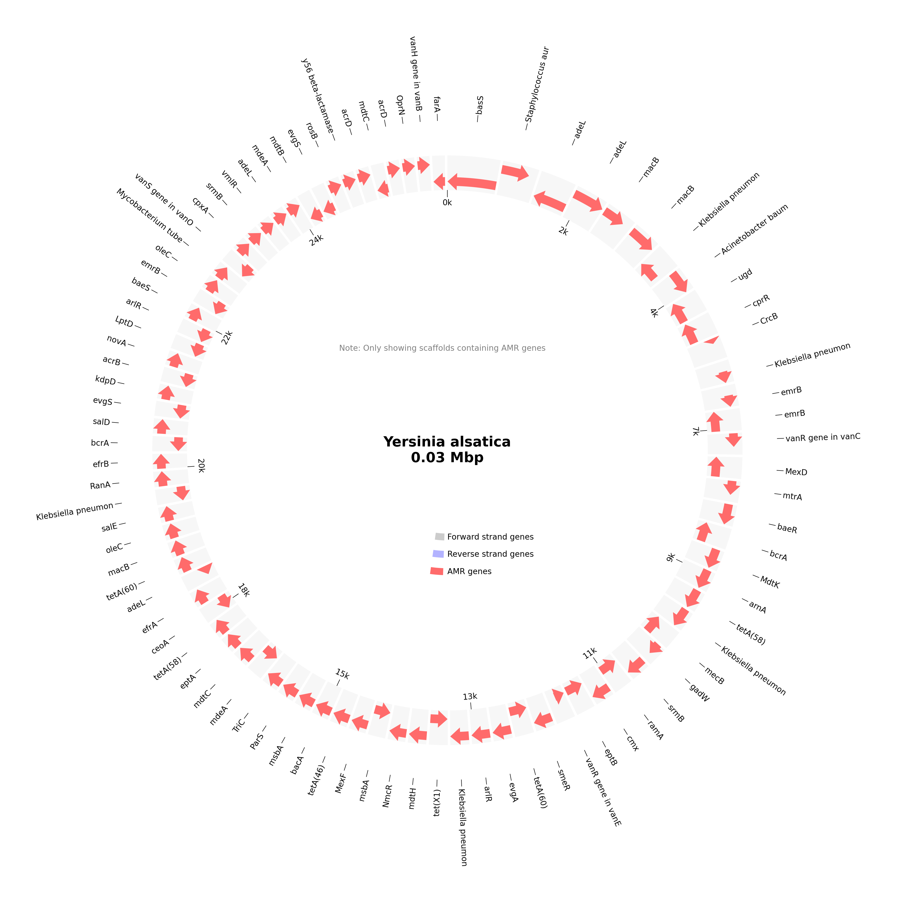

### Acinetobacter baumannii AbaF
- **Mechanism**: antibiotic efflux
- **Drug Classes**: phosphonic acid antibiotic
- **AMR Family**: major facilitator superfamily (MFS) antibiotic efflux pump
- **Locations**:
  - gnl|SPADES|EHPDDGNP_13101_1 : position 1-393

### CrcB
- **Mechanism**: antibiotic efflux
- **Drug Classes**: aminoglycoside antibiotic
- **AMR Family**: multidrug and toxic compound extrusion (MATE) transporter
- **Locations**:
  - gnl|SPADES|EHPDDGNP_13946_1 : position 3-92

### Klebsiella pneumoniae KpnF
- **Mechanism**: antibiotic efflux
- **Drug Classes**: macrolide antibiotic; aminoglycoside antibiotic; cephalosporin; tetracycline antibiotic; peptide antibiotic; rifamycin antibiotic; disinfecting agents and antiseptics
- **AMR Family**: small multidrug resistance (SMR) antibiotic efflux pump
- **Locations**:
  - gnl|SPADES|EHPDDGNP_14265_1 : position 171-365

### Klebsiella pneumoniae OmpK37 (found in 4 locations)
- **Mechanism**: reduced permeability to antibiotic
- **Drug Classes**: monobactam; carbapenem; cephalosporin; cephamycin; penam; penem
- **AMR Family**: General Bacterial Porin with reduced permeability to beta-lactams
- **Locations**:
  - gnl|SPADES|EHPDDGNP_11795_1 : position 2-355
  - gnl|SPADES|EHPDDGNP_16095_1 : position 2-331
  - gnl|SPADES|EHPDDGNP_17210_1 : position 2-313
  - gnl|SPADES|EHPDDGNP_27184_1 : position 2-253

### LptD
- **Mechanism**: antibiotic efflux
- **Drug Classes**: carbapenem; peptide antibiotic; aminocoumarin antibiotic; rifamycin antibiotic
- **AMR Family**: ATP-binding cassette (ABC) antibiotic efflux pump
- **Locations**:
  - gnl|SPADES|EHPDDGNP_31402_1 : position 2-238

### MdtK
- **Mechanism**: antibiotic efflux
- **Drug Classes**: fluoroquinolone antibiotic
- **AMR Family**: multidrug and toxic compound extrusion (MATE) transporter
- **Locations**:
  - gnl|SPADES|EHPDDGNP_15744_1 : position 3-338

### MexD
- **Mechanism**: antibiotic efflux
- **Drug Classes**: macrolide antibiotic; fluoroquinolone antibiotic; aminoglycoside antibiotic; cephalosporin; penam; tetracycline antibiotic; aminocoumarin antibiotic; diaminopyrimidine antibiotic; phenicol antibiotic
- **AMR Family**: resistance-nodulation-cell division (RND) antibiotic efflux pump
- **Locations**:
  - gnl|SPADES|EHPDDGNP_14794_1 : position 2-355

### MexF
- **Mechanism**: antibiotic efflux
- **Drug Classes**: fluoroquinolone antibiotic; diaminopyrimidine antibiotic; phenicol antibiotic
- **AMR Family**: resistance-nodulation-cell division (RND) antibiotic efflux pump
- **Locations**:
  - gnl|SPADES|EHPDDGNP_19658_1 : position 2-283

### Mycobacterium tuberculosis pncA mutations conferring resistance to pyrazinamide
- **Mechanism**: antibiotic target alteration
- **Drug Classes**: pyrazine antibiotic
- **AMR Family**: Pyrazinamide resistant pncA
- **Locations**:
  - gnl|SPADES|EHPDDGNP_34378_1 : position 1-228

### NmcR
- **Mechanism**: antibiotic inactivation
- **Drug Classes**: carbapenem; cephalosporin; cephamycin; penam
- **AMR Family**: NmcA beta-lactamase
- **Locations**:
  - gnl|SPADES|EHPDDGNP_19007_1 : position 1-288

### OprN
- **Mechanism**: antibiotic efflux
- **Drug Classes**: fluoroquinolone antibiotic; diaminopyrimidine antibiotic; phenicol antibiotic
- **AMR Family**: resistance-nodulation-cell division (RND) antibiotic efflux pump
- **Locations**:
  - gnl|SPADES|EHPDDGNP_40128_1 : position 2-211

### ParS
- **Mechanism**: antibiotic efflux; reduced permeability to antibiotic
- **Drug Classes**: macrolide antibiotic; fluoroquinolone antibiotic; monobactam; aminoglycoside antibiotic; carbapenem; cephalosporin; cephamycin; penam; tetracycline antibiotic; phenicol antibiotic; penem; disinfecting agents and antiseptics
- **AMR Family**: resistance-nodulation-cell division (RND) antibiotic efflux pump; Outer Membrane Porin (Opr)
- **Locations**:
  - gnl|SPADES|EHPDDGNP_20934_1 : position 2-277

### RanA
- **Mechanism**: antibiotic efflux
- **Drug Classes**: aminoglycoside antibiotic
- **AMR Family**: ATP-binding cassette (ABC) antibiotic efflux pump
- **Locations**:
  - gnl|SPADES|EHPDDGNP_27733_1 : position 1-252

### Staphylococcus aureus murA with mutation conferring resistance to fosfomycin
- **Mechanism**: antibiotic target alteration
- **Drug Classes**: phosphonic acid antibiotic
- **AMR Family**: antibiotic-resistant murA transferase
- **Locations**:
  - gnl|SPADES|EHPDDGNP_8510_1 : position 2-472

### TriC
- **Mechanism**: antibiotic efflux
- **Drug Classes**: disinfecting agents and antiseptics
- **AMR Family**: resistance-nodulation-cell division (RND) antibiotic efflux pump
- **Locations**:
  - gnl|SPADES|EHPDDGNP_20963_1 : position 3-275

### acrB
- **Mechanism**: antibiotic efflux
- **Drug Classes**: fluoroquinolone antibiotic; cephalosporin; glycylcycline; penam; tetracycline antibiotic; rifamycin antibiotic; phenicol antibiotic; disinfecting agents and antiseptics
- **AMR Family**: resistance-nodulation-cell division (RND) antibiotic efflux pump
- **Locations**:
  - gnl|SPADES|EHPDDGNP_30927_1 : position 3-239

### acrD (found in 2 locations)
- **Mechanism**: antibiotic efflux
- **Drug Classes**: aminoglycoside antibiotic
- **AMR Family**: resistance-nodulation-cell division (RND) antibiotic efflux pump
- **Locations**:
  - gnl|SPADES|EHPDDGNP_38657_1 : position 1-216
  - gnl|SPADES|EHPDDGNP_40186_1 : position 1-210

### adeL (found in 4 locations)
- **Mechanism**: antibiotic efflux
- **Drug Classes**: fluoroquinolone antibiotic; tetracycline antibiotic
- **AMR Family**: resistance-nodulation-cell division (RND) antibiotic efflux pump
- **Locations**:
  - gnl|SPADES|EHPDDGNP_25647_1 : position 99-257
  - gnl|SPADES|EHPDDGNP_35842_1 : position 3-224
  - gnl|SPADES|EHPDDGNP_8640_1 : position 2-595
  - gnl|SPADES|EHPDDGNP_9472_1 : position 3-539

### arlR (found in 2 locations)
- **Mechanism**: antibiotic efflux
- **Drug Classes**: fluoroquinolone antibiotic; disinfecting agents and antiseptics
- **AMR Family**: major facilitator superfamily (MFS) antibiotic efflux pump
- **Locations**:
  - gnl|SPADES|EHPDDGNP_17188_1 : position 1-312
  - gnl|SPADES|EHPDDGNP_31608_1 : position 3-239

### arnA
- **Mechanism**: antibiotic target alteration
- **Drug Classes**: peptide antibiotic
- **AMR Family**: pmr phosphoethanolamine transferase
- **Locations**:
  - gnl|SPADES|EHPDDGNP_15958_1 : position 1-333

### bacA
- **Mechanism**: antibiotic target alteration
- **Drug Classes**: peptide antibiotic
- **AMR Family**: undecaprenyl pyrophosphate related proteins
- **Locations**:
  - gnl|SPADES|EHPDDGNP_20058_1 : position 3-281

### baeR
- **Mechanism**: antibiotic efflux
- **Drug Classes**: aminoglycoside antibiotic; aminocoumarin antibiotic
- **AMR Family**: resistance-nodulation-cell division (RND) antibiotic efflux pump
- **Locations**:
  - gnl|SPADES|EHPDDGNP_15077_1 : position 2-349

### baeS
- **Mechanism**: antibiotic efflux
- **Drug Classes**: aminoglycoside antibiotic; aminocoumarin antibiotic
- **AMR Family**: resistance-nodulation-cell division (RND) antibiotic efflux pump
- **Locations**:
  - gnl|SPADES|EHPDDGNP_32254_1 : position 2-235

### basS
- **Mechanism**: antibiotic target alteration; antibiotic efflux
- **Drug Classes**: peptide antibiotic
- **AMR Family**: pmr phosphoethanolamine transferase
- **Locations**:
  - gnl|SPADES|EHPDDGNP_6204_1 : position 2-868

### bcrA (found in 2 locations)
- **Mechanism**: antibiotic efflux
- **Drug Classes**: peptide antibiotic
- **AMR Family**: ATP-binding cassette (ABC) antibiotic efflux pump
- **Locations**:
  - gnl|SPADES|EHPDDGNP_15158_1 : position 3-347
  - gnl|SPADES|EHPDDGNP_28497_1 : position 3-248

### ceoA
- **Mechanism**: antibiotic efflux
- **Drug Classes**: fluoroquinolone antibiotic; aminoglycoside antibiotic
- **AMR Family**: resistance-nodulation-cell division (RND) antibiotic efflux pump
- **Locations**:
  - gnl|SPADES|EHPDDGNP_25105_1 : position 3-260

### cmx
- **Mechanism**: antibiotic efflux
- **Drug Classes**: phenicol antibiotic
- **AMR Family**: major facilitator superfamily (MFS) antibiotic efflux pump
- **Locations**:
  - gnl|SPADES|EHPDDGNP_16825_1 : position 3-317

### cprR
- **Mechanism**: antibiotic target alteration; antibiotic efflux
- **Drug Classes**: peptide antibiotic
- **AMR Family**: pmr phosphoethanolamine transferase
- **Locations**:
  - gnl|SPADES|EHPDDGNP_13910_1 : position 3-374

### cpxA
- **Mechanism**: antibiotic efflux
- **Drug Classes**: aminoglycoside antibiotic; aminocoumarin antibiotic
- **AMR Family**: resistance-nodulation-cell division (RND) antibiotic efflux pump
- **Locations**:
  - gnl|SPADES|EHPDDGNP_34963_1 : position 1-228

### efrA
- **Mechanism**: antibiotic efflux
- **Drug Classes**: macrolide antibiotic; fluoroquinolone antibiotic; rifamycin antibiotic
- **AMR Family**: ATP-binding cassette (ABC) antibiotic efflux pump
- **Locations**:
  - gnl|SPADES|EHPDDGNP_25469_1 : position 2-259

### efrB
- **Mechanism**: antibiotic efflux
- **Drug Classes**: macrolide antibiotic; fluoroquinolone antibiotic; rifamycin antibiotic
- **AMR Family**: ATP-binding cassette (ABC) antibiotic efflux pump
- **Locations**:
  - gnl|SPADES|EHPDDGNP_28373_1 : position 1-249

### emrB (found in 3 locations)
- **Mechanism**: antibiotic efflux
- **Drug Classes**: fluoroquinolone antibiotic
- **AMR Family**: major facilitator superfamily (MFS) antibiotic efflux pump
- **Locations**:
  - gnl|SPADES|EHPDDGNP_14482_2 : position 168-362
  - gnl|SPADES|EHPDDGNP_14646_1 : position 1-357
  - gnl|SPADES|EHPDDGNP_33051_1 : position 2-232

### eptA
- **Mechanism**: antibiotic target alteration
- **Drug Classes**: peptide antibiotic
- **AMR Family**: pmr phosphoethanolamine transferase
- **Locations**:
  - gnl|SPADES|EHPDDGNP_24026_1 : position 1-264

### eptB
- **Mechanism**: antibiotic target alteration
- **Drug Classes**: peptide antibiotic
- **AMR Family**: pmr phosphoethanolamine transferase
- **Locations**:
  - gnl|SPADES|EHPDDGNP_16949_1 : position 1-315

### evgA
- **Mechanism**: antibiotic efflux
- **Drug Classes**: macrolide antibiotic; fluoroquinolone antibiotic; penam; tetracycline antibiotic
- **AMR Family**: major facilitator superfamily (MFS) antibiotic efflux pump; resistance-nodulation-cell division (RND) antibiotic efflux pump
- **Locations**:
  - gnl|SPADES|EHPDDGNP_17150_1 : position 1-312

### evgS (found in 2 locations)
- **Mechanism**: antibiotic efflux
- **Drug Classes**: macrolide antibiotic; fluoroquinolone antibiotic; penam; tetracycline antibiotic
- **AMR Family**: major facilitator superfamily (MFS) antibiotic efflux pump; resistance-nodulation-cell division (RND) antibiotic efflux pump
- **Locations**:
  - gnl|SPADES|EHPDDGNP_29963_1 : position 2-244
  - gnl|SPADES|EHPDDGNP_38186_1 : position 3-215

### farA
- **Mechanism**: antibiotic efflux
- **Drug Classes**: antibacterial free fatty acids
- **AMR Family**: major facilitator superfamily (MFS) antibiotic efflux pump
- **Locations**:
  - gnl|SPADES|EHPDDGNP_40892_1 : position 2-208

### gadW
- **Mechanism**: antibiotic efflux
- **Drug Classes**: macrolide antibiotic; fluoroquinolone antibiotic; penam
- **AMR Family**: resistance-nodulation-cell division (RND) antibiotic efflux pump
- **Locations**:
  - gnl|SPADES|EHPDDGNP_16372_1 : position 3-206

### kdpD
- **Mechanism**: antibiotic efflux
- **Drug Classes**: aminoglycoside antibiotic
- **AMR Family**: kdpDE
- **Locations**:
  - gnl|SPADES|EHPDDGNP_30453_1 : position 3-242

### macB (found in 3 locations)
- **Mechanism**: antibiotic efflux
- **Drug Classes**: macrolide antibiotic
- **AMR Family**: ATP-binding cassette (ABC) antibiotic efflux pump
- **Locations**:
  - gnl|SPADES|EHPDDGNP_10941_1 : position 3-467
  - gnl|SPADES|EHPDDGNP_26236_1 : position 1-255
  - gnl|SPADES|EHPDDGNP_9814_1 : position 2-379

### mdeA (found in 2 locations)
- **Mechanism**: antibiotic efflux
- **Drug Classes**: fluoroquinolone antibiotic; aminoglycoside antibiotic; penam; tetracycline antibiotic; disinfecting agents and antiseptics
- **AMR Family**: major facilitator superfamily (MFS) antibiotic efflux pump
- **Locations**:
  - gnl|SPADES|EHPDDGNP_21152_1 : position 2-274
  - gnl|SPADES|EHPDDGNP_37142_1 : position 1-219

### mdtB
- **Mechanism**: antibiotic efflux
- **Drug Classes**: aminocoumarin antibiotic
- **AMR Family**: resistance-nodulation-cell division (RND) antibiotic efflux pump
- **Locations**:
  - gnl|SPADES|EHPDDGNP_38318_1 : position 1-216

### mdtC (found in 2 locations)
- **Mechanism**: antibiotic efflux
- **Drug Classes**: aminocoumarin antibiotic
- **AMR Family**: resistance-nodulation-cell division (RND) antibiotic efflux pump
- **Locations**:
  - gnl|SPADES|EHPDDGNP_22098_1 : position 3-272
  - gnl|SPADES|EHPDDGNP_39826_1 : position 2-199

### mdtH
- **Mechanism**: antibiotic efflux
- **Drug Classes**: fluoroquinolone antibiotic
- **AMR Family**: major facilitator superfamily (MFS) antibiotic efflux pump
- **Locations**:
  - gnl|SPADES|EHPDDGNP_18012_1 : position 2-301

### mecB
- **Mechanism**: antibiotic target replacement
- **Drug Classes**: penam
- **AMR Family**: methicillin resistant PBP2
- **Locations**:
  - gnl|SPADES|EHPDDGNP_16306_1 : position 2-328

### msbA (found in 2 locations)
- **Mechanism**: antibiotic efflux
- **Drug Classes**: nitroimidazole antibiotic
- **AMR Family**: ATP-binding cassette (ABC) antibiotic efflux pump
- **Locations**:
  - gnl|SPADES|EHPDDGNP_19183_1 : position 2-286
  - gnl|SPADES|EHPDDGNP_20414_1 : position 1-279

### mtrA
- **Mechanism**: antibiotic efflux
- **Drug Classes**: macrolide antibiotic; penam
- **AMR Family**: resistance-nodulation-cell division (RND) antibiotic efflux pump
- **Locations**:
  - gnl|SPADES|EHPDDGNP_15006_1 : position 2-238

### novA
- **Mechanism**: antibiotic efflux
- **Drug Classes**: aminocoumarin antibiotic
- **AMR Family**: ATP-binding cassette (ABC) antibiotic efflux pump
- **Locations**:
  - gnl|SPADES|EHPDDGNP_31213_1 : position 1-240

### oleC (found in 2 locations)
- **Mechanism**: antibiotic efflux
- **Drug Classes**: macrolide antibiotic
- **AMR Family**: ATP-binding cassette (ABC) antibiotic efflux pump
- **Locations**:
  - gnl|SPADES|EHPDDGNP_26784_1 : position 2-253
  - gnl|SPADES|EHPDDGNP_33365_1 : position 1-231

### ramA
- **Mechanism**: antibiotic efflux; reduced permeability to antibiotic
- **Drug Classes**: fluoroquinolone antibiotic; monobactam; carbapenem; cephalosporin; glycylcycline; cephamycin; penam; tetracycline antibiotic; rifamycin antibiotic; phenicol antibiotic; penem; disinfecting agents and antiseptics
- **AMR Family**: resistance-nodulation-cell division (RND) antibiotic efflux pump; General Bacterial Porin with reduced permeability to beta-lactams
- **Locations**:
  - gnl|SPADES|EHPDDGNP_16869_1 : position 2-319

### rosB
- **Mechanism**: antibiotic efflux
- **Drug Classes**: peptide antibiotic
- **AMR Family**: major facilitator superfamily (MFS) antibiotic efflux pump
- **Locations**:
  - gnl|SPADES|EHPDDGNP_38246_1 : position 2-217

### salD
- **Mechanism**: antibiotic target protection
- **Drug Classes**: lincosamide antibiotic; streptogramin antibiotic; streptogramin A antibiotic; pleuromutilin antibiotic
- **AMR Family**: sal-type ABC-F protein
- **Locations**:
  - gnl|SPADES|EHPDDGNP_28715_1 : position 3-248

### salE
- **Mechanism**: antibiotic target protection
- **Drug Classes**: lincosamide antibiotic; streptogramin antibiotic; streptogramin A antibiotic; pleuromutilin antibiotic
- **AMR Family**: sal-type ABC-F protein
- **Locations**:
  - gnl|SPADES|EHPDDGNP_27229_1 : position 3-254

### smeR
- **Mechanism**: antibiotic efflux
- **Drug Classes**: aminoglycoside antibiotic; cephalosporin; cephamycin; penam
- **AMR Family**: resistance-nodulation-cell division (RND) antibiotic efflux pump
- **Locations**:
  - gnl|SPADES|EHPDDGNP_17180_1 : position 2-313

### srmB (found in 2 locations)
- **Mechanism**: antibiotic target protection
- **Drug Classes**: macrolide antibiotic
- **AMR Family**: Miscellaneous ABC-F subfamily ATP-binding cassette ribosomal protection proteins
- **Locations**:
  - gnl|SPADES|EHPDDGNP_16435_1 : position 2-325
  - gnl|SPADES|EHPDDGNP_35435_1 : position 3-224

### tet(X1)
- **Mechanism**: antibiotic inactivation
- **Drug Classes**: tetracycline antibiotic
- **AMR Family**: tetracycline inactivation enzyme
- **Locations**:
  - gnl|SPADES|EHPDDGNP_17585_1 : position 3-308

### tetA(46)
- **Mechanism**: antibiotic efflux
- **Drug Classes**: tetracycline antibiotic
- **AMR Family**: ATP-binding cassette (ABC) antibiotic efflux pump
- **Locations**:
  - gnl|SPADES|EHPDDGNP_19731_1 : position 2-283

### tetA(58) (found in 2 locations)
- **Mechanism**: antibiotic efflux
- **Drug Classes**: tetracycline antibiotic
- **AMR Family**: major facilitator superfamily (MFS) antibiotic efflux pump
- **Locations**:
  - gnl|SPADES|EHPDDGNP_16041_1 : position 3-332
  - gnl|SPADES|EHPDDGNP_24552_1 : position 3-263

### tetA(60) (found in 2 locations)
- **Mechanism**: antibiotic efflux
- **Drug Classes**: tetracycline antibiotic
- **AMR Family**: ATP-binding cassette (ABC) antibiotic efflux pump
- **Locations**:
  - gnl|SPADES|EHPDDGNP_17170_1 : position 3-314
  - gnl|SPADES|EHPDDGNP_26355_1 : position 3-257

### ugd
- **Mechanism**: antibiotic target alteration
- **Drug Classes**: peptide antibiotic
- **AMR Family**: pmr phosphoethanolamine transferase
- **Locations**:
  - gnl|SPADES|EHPDDGNP_13602_1 : position 1-381

### vanH gene in vanB cluster
- **Mechanism**: antibiotic target alteration
- **Drug Classes**: glycopeptide antibiotic
- **AMR Family**: vanH; glycopeptide resistance gene cluster
- **Locations**:
  - gnl|SPADES|EHPDDGNP_40754_1 : position 2-208

### vanR gene in vanC cluster
- **Mechanism**: antibiotic target alteration
- **Drug Classes**: glycopeptide antibiotic
- **AMR Family**: glycopeptide resistance gene cluster; vanR
- **Locations**:
  - gnl|SPADES|EHPDDGNP_14685_1 : position 3-230

### vanR gene in vanE cluster
- **Mechanism**: antibiotic target alteration
- **Drug Classes**: glycopeptide antibiotic
- **AMR Family**: glycopeptide resistance gene cluster; vanR
- **Locations**:
  - gnl|SPADES|EHPDDGNP_16972_1 : position 3-179

### vanS gene in vanO cluster
- **Mechanism**: antibiotic target alteration
- **Drug Classes**: glycopeptide antibiotic
- **AMR Family**: vanS; glycopeptide resistance gene cluster
- **Locations**:
  - gnl|SPADES|EHPDDGNP_34608_1 : position 3-227

### vmlR
- **Mechanism**: antibiotic target protection
- **Drug Classes**: lincosamide antibiotic; streptogramin antibiotic; streptogramin A antibiotic; streptogramin B antibiotic; nucleoside antibiotic; pleuromutilin antibiotic
- **AMR Family**: Miscellaneous ABC-F subfamily ATP-binding cassette ribosomal protection proteins
- **Locations**:
  - gnl|SPADES|EHPDDGNP_35861_1 : position 3-224

### y56 beta-lactamase
- **Mechanism**: antibiotic inactivation
- **Drug Classes**: cephalosporin; penam; penem
- **AMR Family**: BlaA beta-lactamase
- **Locations**:
  - gnl|SPADES|EHPDDGNP_38529_1 : position 3-215

## Yersinia enterocolitica
**Strain Statistics:**
- Total genome length: 1077.7 kbp
- Total scaffolds: 2890
- Scaffolds with AMR genes: 413
- Total genes annotated: 1895
- Total AMR genes: 499
- Unique AMR genes: 206
- Distinct AMR mechanisms: 10
- Distinct AMR families: 71
- Distinct drug classes: 35

**Circos Plot:**

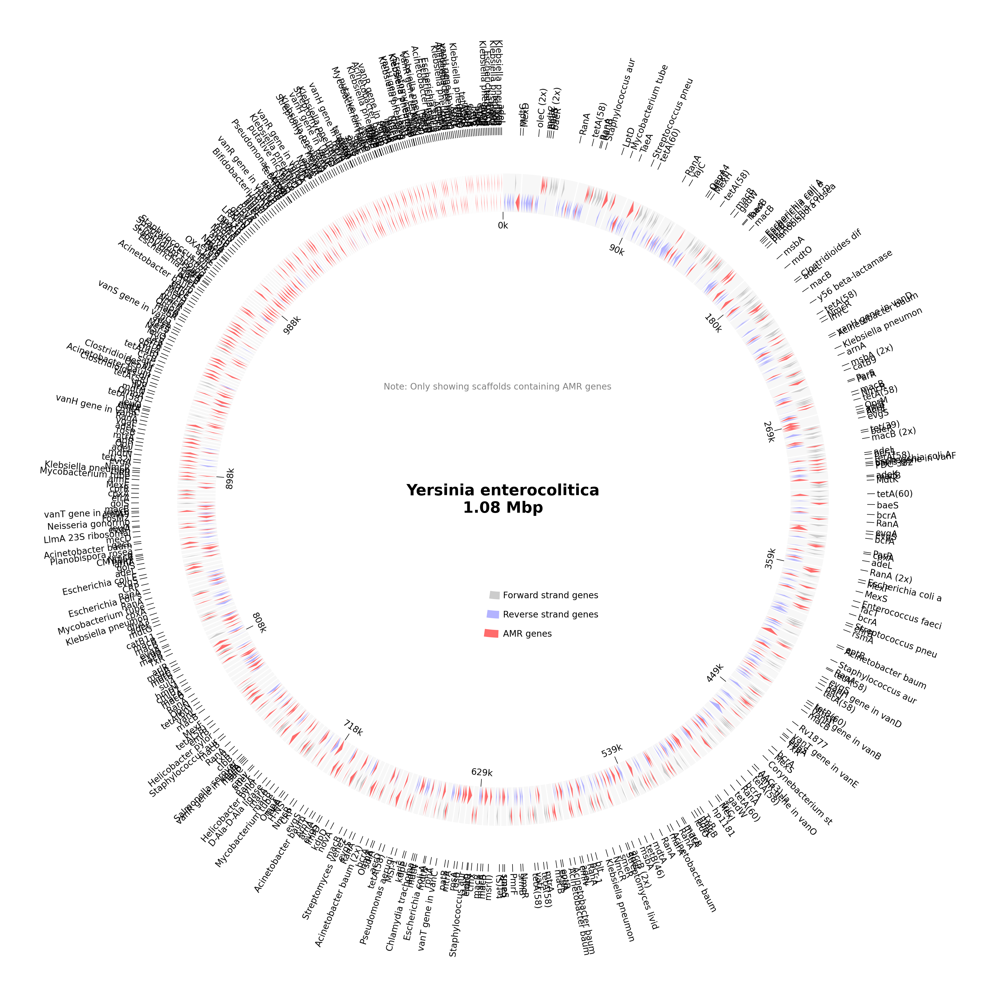

### AAC(3)-Ia
- **Mechanism**: antibiotic inactivation
- **Drug Classes**: aminoglycoside antibiotic
- **AMR Family**: AAC(3)
- **Locations**:
  - gnl|SPADES|EHPDDGNP_1303_3 : position 2346-2648

### ACT-28
- **Mechanism**: antibiotic inactivation
- **Drug Classes**: carbapenem; cephalosporin; cephamycin; penam
- **AMR Family**: ACT beta-lactamase
- **Locations**:
  - gnl|SPADES|EHPDDGNP_12783_1 : position 1-402

### Acinetobacter baumannii AbaF (found in 4 locations)
- **Mechanism**: antibiotic efflux
- **Drug Classes**: phosphonic acid antibiotic
- **AMR Family**: major facilitator superfamily (MFS) antibiotic efflux pump
- **Locations**:
  - gnl|SPADES|EHPDDGNP_1551_3 : position 1541-3043
  - gnl|SPADES|EHPDDGNP_1931_3 : position 1040-1936
  - gnl|SPADES|EHPDDGNP_1931_4 : position 1908-2408
  - gnl|SPADES|EHPDDGNP_2012_2 : position 830-2350

### Acinetobacter baumannii AbaQ (found in 8 locations)
- **Mechanism**: antibiotic efflux
- **Drug Classes**: fluoroquinolone antibiotic
- **AMR Family**: major facilitator superfamily (MFS) antibiotic efflux pump
- **Locations**:
  - gnl|SPADES|EHPDDGNP_11328_2 : position 228-449
  - gnl|SPADES|EHPDDGNP_1177_1 : position 2-685
  - gnl|SPADES|EHPDDGNP_1415_1 : position 3-665
  - gnl|SPADES|EHPDDGNP_15441_1 : position 1-342
  - gnl|SPADES|EHPDDGNP_2743_2 : position 1643-2125
  - gnl|SPADES|EHPDDGNP_3682_1 : position 2-601
  - gnl|SPADES|EHPDDGNP_4342_2 : position 432-1301
  - gnl|SPADES|EHPDDGNP_844_6 : position 5333-6583

### Acinetobacter baumannii AmvA (found in 2 locations)
- **Mechanism**: antibiotic efflux
- **Drug Classes**: macrolide antibiotic; disinfecting agents and antiseptics
- **AMR Family**: major facilitator superfamily (MFS) antibiotic efflux pump
- **Locations**:
  - gnl|SPADES|EHPDDGNP_1569_1 : position 2-1045
  - gnl|SPADES|EHPDDGNP_8573_2 : position 274-600

### AcrE
- **Mechanism**: antibiotic efflux
- **Drug Classes**: fluoroquinolone antibiotic; cephalosporin; cephamycin; penam
- **AMR Family**: resistance-nodulation-cell division (RND) antibiotic efflux pump
- **Locations**:
  - gnl|SPADES|EHPDDGNP_927_4 : position 5122-5937

### ArnT
- **Mechanism**: antibiotic target alteration
- **Drug Classes**: peptide antibiotic
- **AMR Family**: pmr phosphoethanolamine transferase
- **Locations**:
  - gnl|SPADES|EHPDDGNP_2000_3: position 1218-2777

### Bifidobacterium bifidum ileS conferring resistance to mupirocin
- **Mechanism**: antibiotic target alteration
- **Drug Classes**: mupirocin-like antibiotic
- **AMR Family**: antibiotic-resistant isoleucyl-tRNA synthetase (ileS)
- **Locations**:
  - gnl|SPADES|EHPDDGNP_5383_1 : position 2-913

### CMY-157
- **Mechanism**: antibiotic inactivation
- **Drug Classes**: cephamycin
- **AMR Family**: CMY beta-lactamase
- **Locations**:
  - gnl|SPADES|EHPDDGNP_2725_1 : position 2-505

### CRP (found in 3 locations)
- **Mechanism**: antibiotic efflux
- **Drug Classes**: macrolide antibiotic; fluoroquinolone antibiotic; penam
- **AMR Family**: resistance-nodulation-cell division (RND) antibiotic efflux pump
- **Locations**:
  - gnl|SPADES|EHPDDGNP_2039_2 : position 2312-2860
  - gnl|SPADES|EHPDDGNP_2641_1 : position 98-853
  - gnl|SPADES|EHPDDGNP_6393_1 : position 1-72

### Chlamydia trachomatis intrinsic murA conferring resistance to fosfomycin
- **Mechanism**: antibiotic target alteration
- **Drug Classes**: phosphonic acid antibiotic
- **AMR Family**: antibiotic-resistant murA transferase
- **Locations**:
  - gnl|SPADES|EHPDDGNP_1825_1 : position 1-399

### Clostridioides difficile gyrA conferring resistance to fluoroquinolones
- **Mechanism**: antibiotic target alteration
- **Drug Classes**: fluoroquinolone antibiotic
- **AMR Family**: fluoroquinolone resistant gyrA
- **Locations**:
  - gnl|SPADES|EHPDDGNP_3755_1 : position 3-650

### Clostridioides difficile gyrB conferring resistance to fluoroquinolones (found in 2 locations)
- **Mechanism**: antibiotic target alteration
- **Drug Classes**: fluoroquinolone antibiotic
- **AMR Family**: fluoroquinolone resistant gyrB
- **Locations**:
  - gnl|SPADES|EHPDDGNP_3585_1 : position 2-1600
  - gnl|SPADES|EHPDDGNP_780_5 : position 3019-4914

### Clostridium sporogenes cplR
- **Mechanism**: antibiotic target protection
- **Drug Classes**: lincosamide antibiotic; pleuromutilin antibiotic
- **AMR Family**: Miscellaneous ABC-F subfamily ATP-binding cassette ribosomal protection proteins
- **Locations**:
  - gnl|SPADES|EHPDDGNP_4472_1 : position 2-301

### Corynebacterium striatum tetA
- **Mechanism**: antibiotic efflux
- **Drug Classes**: penam; tetracycline antibiotic
- **AMR Family**: major facilitator superfamily (MFS) antibiotic efflux pump
- **Locations**:
  - gnl|SPADES|EHPDDGNP_1300_1 : position 2-331

### CrcB (found in 2 locations)
- **Mechanism**: antibiotic efflux
- **Drug Classes**: aminoglycoside antibiotic
- **AMR Family**: multidrug and toxic compound extrusion (MATE) transporter
- **Locations**:
  - gnl|SPADES|EHPDDGNP_3824_1 : position 269-652
  - gnl|SPADES|EHPDDGNP_5596_2 : position 530-934

### D-Ala-D-Ala ligase
- **Mechanism**: antibiotic target alteration
- **Drug Classes**: glycopeptide antibiotic
- **AMR Family**: Van ligase
- **Locations**:
  - gnl|SPADES|EHPDDGNP_2149_2 : position 155-1075

### DHA-6
- **Mechanism**: antibiotic inactivation
- **Drug Classes**: cephalosporin; cephamycin
- **AMR Family**: DHA beta-lactamase
- **Locations**:
  - gnl|SPADES|EHPDDGNP_4897_1 : position 144-1142

### Enterococcus faecium cls conferring resistance to daptomycin
- **Mechanism**: antibiotic target alteration
- **Drug Classes**: peptide antibiotic
- **AMR Family**: daptomycin resistant cls
- **Locations**:
  - gnl|SPADES|EHPDDGNP_1133_6 : position 3476-4876

### Escherichia coli AcrAB-TolC with AcrR mutation conferring resistance to ciprofloxacin, tetracycline, and ceftazidime (found in 2 locations)
- **Mechanism**: antibiotic target alteration; antibiotic efflux
- **Drug Classes**: fluoroquinolone antibiotic; cephalosporin; glycylcycline; penam; tetracycline antibiotic; rifamycin antibiotic; phenicol antibiotic; disinfecting agents and antiseptics
- **AMR Family**: resistance-nodulation-cell division (RND) antibiotic efflux pump
- **Locations**:
  - gnl|SPADES|EHPDDGNP_741_5 : position 4427-5083
  - gnl|SPADES|EHPDDGNP_990_5 : position 2585-3169

### Escherichia coli AcrAB-TolC with MarR mutations conferring resistance to ciprofloxacin and tetracycline
- **Mechanism**: antibiotic target alteration; antibiotic efflux
- **Drug Classes**: fluoroquinolone antibiotic; cephalosporin; glycylcycline; penam; tetracycline antibiotic; rifamycin antibiotic; phenicol antibiotic; disinfecting agents and antiseptics
- **AMR Family**: resistance-nodulation-cell division (RND) antibiotic efflux pump
- **Locations**:
  - gnl|SPADES|EHPDDGNP_1807_3 : position 772-1203

### Escherichia coli EF-Tu mutants conferring resistance to Pulvomycin
- **Mechanism**: antibiotic target alteration
- **Drug Classes**: elfamycin antibiotic
- **AMR Family**: elfamycin resistant EF-Tu
- **Locations**:
  - gnl|SPADES|EHPDDGNP_2667_1 : position 2-778

### Escherichia coli acrA (found in 2 locations)
- **Mechanism**: antibiotic efflux
- **Drug Classes**: fluoroquinolone antibiotic; cephalosporin; glycylcycline; penam; tetracycline antibiotic; rifamycin antibiotic; phenicol antibiotic; disinfecting agents and antiseptics
- **AMR Family**: resistance-nodulation-cell division (RND) antibiotic efflux pump
- **Locations**:
  - gnl|SPADES|EHPDDGNP_1130_2 : position 1657-2859
  - gnl|SPADES|EHPDDGNP_741_6 : position 5228-6415

### Escherichia coli mdfA
- **Mechanism**: antibiotic efflux
- **Drug Classes**: tetracycline antibiotic; phenicol antibiotic; disinfecting agents and antiseptics
- **AMR Family**: major facilitator superfamily (MFS) antibiotic efflux pump
- **Locations**:
  - gnl|SPADES|EHPDDGNP_753_1 : position 263-1492

### Escherichia coli soxS with mutation conferring antibiotic resistance (found in 5 locations)
- **Mechanism**: antibiotic target alteration; antibiotic efflux; reduced permeability to antibiotic
- **Drug Classes**: fluoroquinolone antibiotic; monobactam; carbapenem; cephalosporin; glycylcycline; cephamycin; penam; tetracycline antibiotic; rifamycin antibiotic; phenicol antibiotic; penem; disinfecting agents and antiseptics
- **AMR Family**: ATP-binding cassette (ABC) antibiotic efflux pump; major facilitator superfamily (MFS) antibiotic efflux pump; resistance-nodulation-cell division (RND) antibiotic efflux pump; General Bacterial Porin with reduced permeability to beta-lactams
- **Locations**:
  - gnl|SPADES|EHPDDGNP_12124_1 : position 3-422
  - gnl|SPADES|EHPDDGNP_12130_1 : position 3-422
  - gnl|SPADES|EHPDDGNP_2634_4 : position 656-1363
  - gnl|SPADES|EHPDDGNP_32489_1 : position 22-234
  - gnl|SPADES|EHPDDGNP_4394_1 : position 3-836

### EstT
- **Mechanism**: antibiotic inactivation
- **Drug Classes**: macrolide antibiotic
- **AMR Family**: macrolide esterase
- **Locations**:
  - gnl|SPADES|EHPDDGNP_9908_1 : position 1-516

### FosM2
- **Mechanism**: antibiotic inactivation
- **Drug Classes**: phosphonic acid antibiotic
- **AMR Family**: fosfomycin thiol transferase
- **Locations**:
  - gnl|SPADES|EHPDDGNP_2875_3 : position 965-1372

### H-NS
- **Mechanism**: antibiotic efflux
- **Drug Classes**: macrolide antibiotic; fluoroquinolone antibiotic; cephalosporin; cephamycin; penam; tetracycline antibiotic
- **AMR Family**: major facilitator superfamily (MFS) antibiotic efflux pump; resistance-nodulation-cell division (RND) antibiotic efflux pump
- **Locations**:
  - gnl|SPADES|EHPDDGNP_2084_2 : position 1809-2219

### Helicobacter pylori pbp1 mutants conferring resistance to amoxicillin
- **Mechanism**: antibiotic target alteration
- **Drug Classes**: cephalosporin; cephamycin; penam
- **AMR Family**: Penicillin-binding protein mutations conferring resistance to beta-lactam antibiotics
- **Locations**:
  - gnl|SPADES|EHPDDGNP_2167_1 : position 129-2465

### Helicobacter pylori pbp2 mutants conferring resistance to amoxicillin
- **Mechanism**: antibiotic target alteration
- **Drug Classes**: cephalosporin; cephamycin; penam
- **AMR Family**: Penicillin-binding protein mutations conferring resistance to beta-lactam antibiotics
- **Locations**:
  - gnl|SPADES|EHPDDGNP_2229_2 : position 360-2255

### Klebsiella pneumoniae KpnE
- **Mechanism**: antibiotic efflux
- **Drug Classes**: macrolide antibiotic; aminoglycoside antibiotic; cephalosporin; tetracycline antibiotic; peptide antibiotic; rifamycin antibiotic; disinfecting agents and antiseptics
- **AMR Family**: small multidrug resistance (SMR) antibiotic efflux pump
- **Locations**:
  - gnl|SPADES|EHPDDGNP_10214_2 : position 184-501

### Klebsiella pneumoniae KpnF (found in 2 locations)
- **Mechanism**: antibiotic efflux
- **Drug Classes**: macrolide antibiotic; aminoglycoside antibiotic; cephalosporin; tetracycline antibiotic; peptide antibiotic; rifamycin antibiotic; disinfecting agents and antiseptics
- **AMR Family**: small multidrug resistance (SMR) antibiotic efflux pump
- **Locations**:
  - gnl|SPADES|EHPDDGNP_10214_1 : position 3-206
  - gnl|SPADES|EHPDDGNP_2526_1 : position 1-141

### Klebsiella pneumoniae KpnG
- **Mechanism**: antibiotic efflux
- **Drug Classes**: macrolide antibiotic; fluoroquinolone antibiotic; aminoglycoside antibiotic; carbapenem; cephalosporin; penam; peptide antibiotic; penem
- **AMR Family**: major facilitator superfamily (MFS) antibiotic efflux pump
- **Locations**:
  - gnl|SPADES|EHPDDGNP_8279_1 : position 2-298

### Klebsiella pneumoniae KpnH
- **Mechanism**: antibiotic efflux
- **Drug Classes**: macrolide antibiotic; fluoroquinolone antibiotic; aminoglycoside antibiotic; carbapenem; cephalosporin; penam; peptide antibiotic; penem
- **AMR Family**: major facilitator superfamily (MFS) antibiotic efflux pump
- **Locations**:
  - gnl|SPADES|EHPDDGNP_3046_2 : position 1292-1900

### Klebsiella pneumoniae OmpK37 (found in 13 locations)
- **Mechanism**: reduced permeability to antibiotic
- **Drug Classes**: monobactam; carbapenem; cephalosporin; cephamycin; penam; penem
- **AMR Family**: General Bacterial Porin with reduced permeability to beta-lactams
- **Locations**:
  - gnl|SPADES|EHPDDGNP_10449_1 : position 2-487
  - gnl|SPADES|EHPDDGNP_14906_1 : position 2-229
  - gnl|SPADES|EHPDDGNP_1512_1 : position 1-912
  - gnl|SPADES|EHPDDGNP_15646_1 : position 3-152
  - gnl|SPADES|EHPDDGNP_16516_1 : position 195-323
  - gnl|SPADES|EHPDDGNP_31240_1 : position 3-239
  - gnl|SPADES|EHPDDGNP_37946_1 : position 1-216
  - gnl|SPADES|EHPDDGNP_40147_1 : position 3-209
  - gnl|SPADES|EHPDDGNP_6186_1 : position 762-872
  - gnl|SPADES|EHPDDGNP_6669_1 : position 2-637
  - gnl|SPADES|EHPDDGNP_7065_2 : position 501-746
  - gnl|SPADES|EHPDDGNP_846_7 : position 5677-6573
  - gnl|SPADES|EHPDDGNP_9667_1 : position 3-527

### LRA-19
- **Mechanism**: antibiotic inactivation
- **Drug Classes**: cephalosporin; penam
- **AMR Family**: subclass B3 LRA beta-lactamase
- **Locations**:
  - gnl|SPADES|EHPDDGNP_4975_1 : position 2-661

### LlmA 23S ribosomal RNA methyltransferase
- **Mechanism**: antibiotic target alteration
- **Drug Classes**: lincosamide antibiotic
- **AMR Family**: Llm 23S ribosomal RNA methyltransferase
- **Locations**:
  - gnl|SPADES|EHPDDGNP_2784_1 : position 3-1118

### LptD
- **Mechanism**: antibiotic efflux
- **Drug Classes**: carbapenem; peptide antibiotic; aminocoumarin antibiotic; rifamycin antibiotic
- **AMR Family**: ATP-binding cassette (ABC) antibiotic efflux pump
- **Locations**:
  - gnl|SPADES|EHPDDGNP_529_6 : position 7942-10338

### MSI-1 (found in 2 locations)
- **Mechanism**: antibiotic inactivation
- **Drug Classes**: carbapenem
- **AMR Family**: MSI beta-lactamase
- **Locations**:
  - gnl|SPADES|EHPDDGNP_1844_4 : position 2263-3018
  - gnl|SPADES|EHPDDGNP_3912_1 : position 3-1457

### MdtK
- **Mechanism**: antibiotic efflux
- **Drug Classes**: fluoroquinolone antibiotic
- **AMR Family**: multidrug and toxic compound extrusion (MATE) transporter
- **Locations**:
  - gnl|SPADES|EHPDDGNP_995_2 : position 516-1913

### MdtQ
- **Mechanism**: reduced permeability to antibiotic
- **Drug Classes**: monobactam; carbapenem; cephalosporin; cephamycin; penam; penem
- **AMR Family**: Outer Membrane Porin (Opr)
- **Locations**:
  - gnl|SPADES|EHPDDGNP_1718_5 : position 2867-3349

### MexD
- **Mechanism**: antibiotic efflux
- **Drug Classes**: macrolide antibiotic; fluoroquinolone antibiotic; aminoglycoside antibiotic; cephalosporin; penam; tetracycline antibiotic; aminocoumarin antibiotic; diaminopyrimidine antibiotic; phenicol antibiotic
- **AMR Family**: resistance-nodulation-cell division (RND) antibiotic efflux pump
- **Locations**:
  - gnl|SPADES|EHPDDGNP_483_13 : position 12017-12442

### MexE
- **Mechanism**: antibiotic efflux
- **Drug Classes**: fluoroquinolone antibiotic; diaminopyrimidine antibiotic; phenicol antibiotic
- **AMR Family**: resistance-nodulation-cell division (RND) antibiotic efflux pump
- **Locations**:
  - gnl|SPADES|EHPDDGNP_3010_2 : position 267-1526

### MexF (found in 2 locations)
- **Mechanism**: antibiotic efflux
- **Drug Classes**: fluoroquinolone antibiotic; diaminopyrimidine antibiotic; phenicol antibiotic
- **AMR Family**: resistance-nodulation-cell division (RND) antibiotic efflux pump
- **Locations**:
  - gnl|SPADES|EHPDDGNP_1130_3 : position 2872-4929
  - gnl|SPADES|EHPDDGNP_2252_1 : position 3-1154

### MexH
- **Mechanism**: antibiotic efflux
- **Drug Classes**: fluoroquinolone antibiotic; tetracycline antibiotic; disinfecting agents and antiseptics
- **AMR Family**: resistance-nodulation-cell division (RND) antibiotic efflux pump
- **Locations**:
  - gnl|SPADES|EHPDDGNP_686_1 : position 2-1294

### MexJ
- **Mechanism**: antibiotic efflux
- **Drug Classes**: macrolide antibiotic; tetracycline antibiotic; disinfecting agents and antiseptics
- **AMR Family**: resistance-nodulation-cell division (RND) antibiotic efflux pump
- **Locations**:
  - gnl|SPADES|EHPDDGNP_1363_2 : position 1908-2990

### MexK
- **Mechanism**: antibiotic efflux
- **Drug Classes**: macrolide antibiotic; tetracycline antibiotic; disinfecting agents and antiseptics
- **AMR Family**: resistance-nodulation-cell division (RND) antibiotic efflux pump
- **Locations**:
  - gnl|SPADES|EHPDDGNP_10229_1 : position 46-498

### MexS (found in 4 locations)
- **Mechanism**: antibiotic efflux
- **Drug Classes**: fluoroquinolone antibiotic; diaminopyrimidine antibiotic; phenicol antibiotic
- **AMR Family**: resistance-nodulation-cell division (RND) antibiotic efflux pump
- **Locations**:
  - gnl|SPADES|EHPDDGNP_1132_5 : position 3305-4381
  - gnl|SPADES|EHPDDGNP_1299_1 : position 3-800
  - gnl|SPADES|EHPDDGNP_3941_3 : position 830-1444
  - gnl|SPADES|EHPDDGNP_4207_1 : position 251-1285

### MexT
- **Mechanism**: antibiotic efflux
- **Drug Classes**: fluoroquinolone antibiotic; diaminopyrimidine antibiotic; phenicol antibiotic
- **AMR Family**: resistance-nodulation-cell division (RND) antibiotic efflux pump
- **Locations**:
  - gnl|SPADES|EHPDDGNP_682_8 : position 7069-7989

### Mycobacterium tuberculosis gidB mutation conferring resistance to streptomycin
- **Mechanism**: antibiotic target alteration
- **Drug Classes**: aminoglycoside antibiotic
- **AMR Family**: antibiotic resistant gidB
- **Locations**:
  - gnl|SPADES|EHPDDGNP_3039_2 : position 814-1434

### Mycobacterium tuberculosis kasA mutant conferring resistance to isoniazid
- **Mechanism**: antibiotic target alteration
- **Drug Classes**: isoniazid-like antibiotic
- **AMR Family**: antibiotic resistant kasA
- **Locations**:
  - gnl|SPADES|EHPDDGNP_557_4 : position 2147-3421

### Mycobacterium tuberculosis ndh with mutation conferring resistance to isoniazid
- **Mechanism**: antibiotic target alteration
- **Drug Classes**: isoniazid-like antibiotic
- **AMR Family**: antibiotic resistant ndh
- **Locations**:
  - gnl|SPADES|EHPDDGNP_7745_1 : position 2-670

### Mycobacterium tuberculosis pncA mutations conferring resistance to pyrazinamide
- **Mechanism**: antibiotic target alteration
- **Drug Classes**: pyrazine antibiotic
- **AMR Family**: Pyrazinamide resistant pncA
- **Locations**:
  - gnl|SPADES|EHPDDGNP_2630_1 : position 2-433

### Mycobacterium tuberculosis thyA with mutation conferring resistance to para-aminosalicylic acid
- **Mechanism**: antibiotic target alteration
- **Drug Classes**: salicylic acid antibiotic
- **AMR Family**: aminosalicylate resistant thymidylate synthase
- **Locations**:
  - gnl|SPADES|EHPDDGNP_2119_3 : position 1712-2506

### Neisseria gonorrhoeae pilQ gene conferring resistance to beta-lactam
- **Mechanism**: antibiotic target alteration
- **Drug Classes**: cephalosporin; cephamycin; penam
- **AMR Family**: Penicillin-binding protein mutations conferring resistance to beta-lactam antibiotics
- **Locations**:
  - gnl|SPADES|EHPDDGNP_2798_2 : position 399-2072

### NmcR (found in 13 locations)
- **Mechanism**: antibiotic inactivation
- **Drug Classes**: carbapenem; cephalosporin; cephamycin; penam
- **AMR Family**: NmcA beta-lactamase
- **Locations**:
  - gnl|SPADES|EHPDDGNP_1227_1 : position 1-864
  - gnl|SPADES|EHPDDGNP_1504_2 : position 339-1232
  - gnl|SPADES|EHPDDGNP_1633_5 : position 2683-3525
  - gnl|SPADES|EHPDDGNP_2066_2 : position 673-1593
  - gnl|SPADES|EHPDDGNP_2725_2 : position 640-1524
  - gnl|SPADES|EHPDDGNP_3085_1 : position 1-780
  - gnl|SPADES|EHPDDGNP_4134_1 : position 445-1371
  - gnl|SPADES|EHPDDGNP_4646_1 : position 3-797
  - gnl|SPADES|EHPDDGNP_4712_1 : position 2-916
  - gnl|SPADES|EHPDDGNP_6441_1 : position 1-264
  - gnl|SPADES|EHPDDGNP_812_2 : position 481-1374
  - gnl|SPADES|EHPDDGNP_917_1 : position 2-892
  - gnl|SPADES|EHPDDGNP_9408_1 : position 3-254

### OXA-152
- **Mechanism**: antibiotic inactivation
- **Drug Classes**: carbapenem; penam
- **AMR Family**: OXA beta-lactamase; OXA-62-like beta-lactamase
- **Locations**:
  - gnl|SPADES|EHPDDGNP_4531_1 : position 3-701

### OmpA (found in 4 locations)
- **Mechanism**: reduced permeability to antibiotic
- **Drug Classes**: peptide antibiotic
- **AMR Family**: General Bacterial Porin with reduced permeability to peptide antibiotics
- **Locations**:
  - gnl|SPADES|EHPDDGNP_1868_4 : position 2355-2825
  - gnl|SPADES|EHPDDGNP_2105_2 : position 1884-2393
  - gnl|SPADES|EHPDDGNP_3510_2 : position 1052-1633
  - gnl|SPADES|EHPDDGNP_4081_1 : position 2-877

### OprJ
- **Mechanism**: antibiotic efflux
- **Drug Classes**: macrolide antibiotic; fluoroquinolone antibiotic; aminoglycoside antibiotic; cephalosporin; penam; tetracycline antibiotic; aminocoumarin antibiotic; diaminopyrimidine antibiotic; phenicol antibiotic
- **AMR Family**: resistance-nodulation-cell division (RND) antibiotic efflux pump
- **Locations**:
  - gnl|SPADES|EHPDDGNP_3265_2 : position 424-1767

### OprM
- **Mechanism**: antibiotic efflux
- **Drug Classes**: macrolide antibiotic; fluoroquinolone antibiotic; monobactam; aminoglycoside antibiotic; carbapenem; cephalosporin; cephamycin; penam; tetracycline antibiotic; peptide antibiotic; aminocoumarin antibiotic; diaminopyrimidine antibiotic; sulfonamide antibiotic; phenicol antibiotic; penem; disinfecting agents and antiseptics
- **AMR Family**: resistance-nodulation-cell division (RND) antibiotic efflux pump
- **Locations**:
  - gnl|SPADES|EHPDDGNP_927_1 : position 585-1991

### OprN
- **Mechanism**: antibiotic efflux
- **Drug Classes**: fluoroquinolone antibiotic; diaminopyrimidine antibiotic; phenicol antibiotic
- **AMR Family**: resistance-nodulation-cell division (RND) antibiotic efflux pump
- **Locations**:
  - gnl|SPADES|EHPDDGNP_2287_1 : position 2-832

### PDC-382
- **Mechanism**: antibiotic inactivation
- **Drug Classes**: monobactam; carbapenem; cephalosporin
- **AMR Family**: PDC beta-lactamase
- **Locations**:
  - gnl|SPADES|EHPDDGNP_990_7 : position 4402-5505

### ParR (found in 4 locations)
- **Mechanism**: antibiotic efflux; reduced permeability to antibiotic
- **Drug Classes**: macrolide antibiotic; fluoroquinolone antibiotic; monobactam; aminoglycoside antibiotic; carbapenem; cephalosporin; cephamycin; penam; tetracycline antibiotic; phenicol antibiotic; penem; disinfecting agents and antiseptics
- **AMR Family**: resistance-nodulation-cell division (RND) antibiotic efflux pump; Outer Membrane Porin (Opr)
- **Locations**:
  - gnl|SPADES|EHPDDGNP_1089_3 : position 2414-3133
  - gnl|SPADES|EHPDDGNP_24473_1 : position 2-262
  - gnl|SPADES|EHPDDGNP_4552_2 : position 915-1235
  - gnl|SPADES|EHPDDGNP_865_6 : position 6091-6381

### ParS (found in 3 locations)
- **Mechanism**: antibiotic efflux; reduced permeability to antibiotic
- **Drug Classes**: macrolide antibiotic; fluoroquinolone antibiotic; monobactam; aminoglycoside antibiotic; carbapenem; cephalosporin; cephamycin; penam; tetracycline antibiotic; phenicol antibiotic; penem; disinfecting agents and antiseptics
- **AMR Family**: resistance-nodulation-cell division (RND) antibiotic efflux pump; Outer Membrane Porin (Opr)
- **Locations**:
  - gnl|SPADES|EHPDDGNP_4552_1 : position 1-918
  - gnl|SPADES|EHPDDGNP_8023_2 : position 263-643
  - gnl|SPADES|EHPDDGNP_865_5 : position 4720-6075

### Planobispora rosea EF-Tu mutants conferring resistance to inhibitor GE2270A (found in 2 locations)
- **Mechanism**: antibiotic target alteration
- **Drug Classes**: elfamycin antibiotic
- **AMR Family**: elfamycin resistant EF-Tu
- **Locations**:
  - gnl|SPADES|EHPDDGNP_2735_2 : position 448-1947
  - gnl|SPADES|EHPDDGNP_753_2 : position 1558-3450

### PmrF (found in 3 locations)
- **Mechanism**: antibiotic target alteration
- **Drug Classes**: peptide antibiotic
- **AMR Family**: pmr phosphoethanolamine transferase
- **Locations**:
  - gnl|SPADES|EHPDDGNP_1642_2 : position 308-1297
  - gnl|SPADES|EHPDDGNP_2723_2 : position 1690-2139
  - gnl|SPADES|EHPDDGNP_4352_2 : position 918-1298

### Pseudomonas aeruginosa CpxR
- **Mechanism**: antibiotic efflux
- **Drug Classes**: macrolide antibiotic; fluoroquinolone antibiotic; monobactam; aminoglycoside antibiotic; carbapenem; cephalosporin; cephamycin; penam; tetracycline antibiotic; peptide antibiotic; aminocoumarin antibiotic; diaminopyrimidine antibiotic; sulfonamide antibiotic; phenicol antibiotic; penem
- **AMR Family**: resistance-nodulation-cell division (RND) antibiotic efflux pump
- **Locations**:
  - gnl|SPADES|EHPDDGNP_5843_2 : position 76-774

### Pseudomonas aeruginosa ampR with mutation conferring resistance to aztreonam
- **Mechanism**: antibiotic target alteration; antibiotic inactivation
- **Drug Classes**: monobactam; carbapenem; cephalosporin
- **AMR Family**: PDC beta-lactamase; ampR transcriptional regulator with mutation conferring resistance to monobactam antibiotics
- **Locations**:
  - gnl|SPADES|EHPDDGNP_1858_2 : position 740-1681

### QepA4 (found in 2 locations)
- **Mechanism**: antibiotic efflux
- **Drug Classes**: fluoroquinolone antibiotic
- **AMR Family**: major facilitator superfamily (MFS) antibiotic efflux pump
- **Locations**:
  - gnl|SPADES|EHPDDGNP_3699_1 : position 82-1551
  - gnl|SPADES|EHPDDGNP_682_7 : position 5516-6940

### RanA (found in 22 locations)
- **Mechanism**: antibiotic efflux
- **Drug Classes**: aminoglycoside antibiotic
- **AMR Family**: ATP-binding cassette (ABC) antibiotic efflux pump
- **Locations**:
  - gnl|SPADES|EHPDDGNP_1062_3 : position 1717-2916
  - gnl|SPADES|EHPDDGNP_1098_3 : position 1600-2601
  - gnl|SPADES|EHPDDGNP_1098_4 : position 2598-3599
  - gnl|SPADES|EHPDDGNP_1185_4 : position 2781-3659
  - gnl|SPADES|EHPDDGNP_1314_2 : position 810-2318
  - gnl|SPADES|EHPDDGNP_1401_2 : position 463-1278
  - gnl|SPADES|EHPDDGNP_1437_2 : position 1827-3797
  - gnl|SPADES|EHPDDGNP_1530_3 : position 2460-3755
  - gnl|SPADES|EHPDDGNP_1938_4 : position 2395-2997
  - gnl|SPADES|EHPDDGNP_2177_1 : position 2-427
  - gnl|SPADES|EHPDDGNP_2224_2 : position 332-1447
  - gnl|SPADES|EHPDDGNP_2291_1 : position 1-546
  - gnl|SPADES|EHPDDGNP_2631_1 : position 3-1052
  - gnl|SPADES|EHPDDGNP_2638_1 : position 2-145
  - gnl|SPADES|EHPDDGNP_3442_3 : position 1173-1670
  - gnl|SPADES|EHPDDGNP_4859_2 : position 255-1151
  - gnl|SPADES|EHPDDGNP_511_9 : position 7008-7742
  - gnl|SPADES|EHPDDGNP_521_9 : position 6934-7737
  - gnl|SPADES|EHPDDGNP_6689_1 : position 2-670
  - gnl|SPADES|EHPDDGNP_674_9 : position 7348-8154
  - gnl|SPADES|EHPDDGNP_7264_1 : position 2-418
  - gnl|SPADES|EHPDDGNP_9296_1 : position 3-425

### RanB
- **Mechanism**: antibiotic efflux
- **Drug Classes**: aminoglycoside antibiotic
- **AMR Family**: ATP-binding cassette (ABC) antibiotic efflux pump
- **Locations**:
  - gnl|SPADES|EHPDDGNP_521_10 : position 7748-8530

### Rv1877
- **Mechanism**: antibiotic efflux
- **Drug Classes**: fluoroquinolone antibiotic
- **AMR Family**: major facilitator superfamily (MFS) antibiotic efflux pump
- **Locations**:
  - gnl|SPADES|EHPDDGNP_1260_4 : position 3545-4543

### Salmonella serovars soxS with mutation conferring antibiotic resistance
- **Mechanism**: antibiotic target alteration; antibiotic efflux; reduced permeability to antibiotic
- **Drug Classes**: fluoroquinolone antibiotic; monobactam; carbapenem; cephalosporin; glycylcycline; cephamycin; penam; tetracycline antibiotic; rifamycin antibiotic; phenicol antibiotic; penem; disinfecting agents and antiseptics
- **AMR Family**: ATP-binding cassette (ABC) antibiotic efflux pump; major facilitator superfamily (MFS) antibiotic efflux pump; resistance-nodulation-cell division (RND) antibiotic efflux pump; General Bacterial Porin with reduced permeability to beta-lactams
- **Locations**:
  - gnl|SPADES|EHPDDGNP_2214_2 : position 550-936

### SatA
- **Mechanism**: antibiotic inactivation
- **Drug Classes**: nucleoside antibiotic
- **AMR Family**: streptothricin acetyltransferase (SAT)
- **Locations**:
  - gnl|SPADES|EHPDDGNP_10547_1 : position 182-484

### Staphylococcus aureus GlpT with mutation conferring resistance to fosfomycin
- **Mechanism**: antibiotic target alteration
- **Drug Classes**: phosphonic acid antibiotic
- **AMR Family**: antibiotic-resistant GlpT
- **Locations**:
  - gnl|SPADES|EHPDDGNP_4427_1 : position 1-1119

### Staphylococcus aureus fusA with mutation conferring resistance to fusidic acid
- **Mechanism**: antibiotic target alteration
- **Drug Classes**: fusidane antibiotic
- **AMR Family**: antibiotic resistant fusA
- **Locations**:
  - gnl|SPADES|EHPDDGNP_4495_1 : position 1-609

### Staphylococcus aureus mupA conferring resistance to mupirocin
- **Mechanism**: antibiotic target alteration
- **Drug Classes**: mupirocin-like antibiotic
- **AMR Family**: antibiotic-resistant isoleucyl-tRNA synthetase (ileS)
- **Locations**:
  - gnl|SPADES|EHPDDGNP_1182_4 : position 1974-4769

### Staphylococcus aureus mupB conferring resistance to mupirocin
- **Mechanism**: antibiotic target alteration
- **Drug Classes**: mupirocin-like antibiotic
- **AMR Family**: antibiotic-resistant isoleucyl-tRNA synthetase (ileS)
- **Locations**:
  - gnl|SPADES|EHPDDGNP_1723_2 : position 456-3341

### Staphylococcus aureus murA with mutation conferring resistance to fosfomycin
- **Mechanism**: antibiotic target alteration
- **Drug Classes**: phosphonic acid antibiotic
- **AMR Family**: antibiotic-resistant murA transferase
- **Locations**:
  - gnl|SPADES|EHPDDGNP_521_15 : position 10617-11492

### Staphylococcus aureus pgsA mutations conferring resistance to daptomycin
- **Mechanism**: antibiotic target alteration
- **Drug Classes**: peptide antibiotic
- **AMR Family**: daptomycin resistant pgsA
- **Locations**:
  - gnl|SPADES|EHPDDGNP_2228_2 : position 182-730

### Streptococcus pneumoniae PBP2x conferring resistance to amoxicillin (found in 2 locations)
- **Mechanism**: antibiotic target alteration
- **Drug Classes**: cephalosporin; cephamycin; penam
- **AMR Family**: Penicillin-binding protein mutations conferring resistance to beta-lactam antibiotics
- **Locations**:
  - gnl|SPADES|EHPDDGNP_1163_2 : position 399-1982
  - gnl|SPADES|EHPDDGNP_653_6 : position 4131-6686

### Streptomyces lividans cmlR
- **Mechanism**: antibiotic efflux
- **Drug Classes**: phenicol antibiotic
- **AMR Family**: major facilitator superfamily (MFS) antibiotic efflux pump
- **Locations**:
  - gnl|SPADES|EHPDDGNP_1487_2 : position 989-2203

### Streptomyces lividans otr(A)
- **Mechanism**: antibiotic target protection
- **Drug Classes**: tetracycline antibiotic
- **AMR Family**: tetracycline-resistant ribosomal protection protein
- **Locations**:
  - gnl|SPADES|EHPDDGNP_10205_1 : position 3-500

### Streptomyces rimosus otr(A) (found in 2 locations)
- **Mechanism**: antibiotic target protection
- **Drug Classes**: tetracycline antibiotic
- **AMR Family**: tetracycline-resistant ribosomal protection protein
- **Locations**:
  - gnl|SPADES|EHPDDGNP_4496_1 : position 1-1251
  - gnl|SPADES|EHPDDGNP_7037_1 : position 3-749

### Streptomyces venezuelae rox (found in 2 locations)
- **Mechanism**: antibiotic inactivation
- **Drug Classes**: rifamycin antibiotic
- **AMR Family**: rifampin monooxygenase
- **Locations**:
  - gnl|SPADES|EHPDDGNP_1951_2 : position 267-1436
  - gnl|SPADES|EHPDDGNP_6644_1 : position 161-799

### TaeA (found in 4 locations)
- **Mechanism**: antibiotic efflux
- **Drug Classes**: pleuromutilin antibiotic
- **AMR Family**: ATP-binding cassette (ABC) antibiotic efflux pump
- **Locations**:
  - gnl|SPADES|EHPDDGNP_2105_1 : position 2-1594
  - gnl|SPADES|EHPDDGNP_557_9 : position 7548-9461
  - gnl|SPADES|EHPDDGNP_705_9 : position 7827-8060
  - gnl|SPADES|EHPDDGNP_7391_1 : position 3-707

### TolC (found in 2 locations)
- **Mechanism**: antibiotic efflux
- **Drug Classes**: macrolide antibiotic; fluoroquinolone antibiotic; aminoglycoside antibiotic; carbapenem; cephalosporin; glycylcycline; cephamycin; penam; tetracycline antibiotic; peptide antibiotic; aminocoumarin antibiotic; rifamycin antibiotic; phenicol antibiotic; penem; disinfecting agents and antiseptics
- **AMR Family**: ATP-binding cassette (ABC) antibiotic efflux pump; major facilitator superfamily (MFS) antibiotic efflux pump; resistance-nodulation-cell division (RND) antibiotic efflux pump
- **Locations**:
  - gnl|SPADES|EHPDDGNP_4504_1 : position 1-1137
  - gnl|SPADES|EHPDDGNP_7631_2 : position 410-679

### TriC
- **Mechanism**: antibiotic efflux
- **Drug Classes**: disinfecting agents and antiseptics
- **AMR Family**: resistance-nodulation-cell division (RND) antibiotic efflux pump
- **Locations**:
  - gnl|SPADES|EHPDDGNP_1363_1 : position 1-1908

### TxR (found in 11 locations)
- **Mechanism**: antibiotic efflux
- **Drug Classes**: tetracycline antibiotic
- **AMR Family**: ATP-binding cassette (ABC) antibiotic efflux pump
- **Locations**:
  - gnl|SPADES|EHPDDGNP_1290_1 : position 1-573
  - gnl|SPADES|EHPDDGNP_1368_5 : position 3662-4189
  - gnl|SPADES|EHPDDGNP_2223_1 : position 2-1060
  - gnl|SPADES|EHPDDGNP_2396_2 : position 1751-2452
  - gnl|SPADES|EHPDDGNP_25650_1 : position 2-259
  - gnl|SPADES|EHPDDGNP_38674_1 : position 1-216
  - gnl|SPADES|EHPDDGNP_3876_1 : position 1-1164
  - gnl|SPADES|EHPDDGNP_3959_2 : position 349-1359
  - gnl|SPADES|EHPDDGNP_4957_1 : position 3-1127
  - gnl|SPADES|EHPDDGNP_5692_1 : position 2-958
  - gnl|SPADES|EHPDDGNP_8924_1 : position 3-575

### YajC
- **Mechanism**: antibiotic efflux
- **Drug Classes**: fluoroquinolone antibiotic; cephalosporin; glycylcycline; penam; tetracycline antibiotic; oxazolidinone antibiotic; glycopeptide antibiotic; rifamycin antibiotic; phenicol antibiotic; disinfecting agents and antiseptics
- **AMR Family**: resistance-nodulation-cell division (RND) antibiotic efflux pump
- **Locations**:
  - gnl|SPADES|EHPDDGNP_679_3 : position 3143-3475

### acrB (found in 4 locations)
- **Mechanism**: antibiotic efflux
- **Drug Classes**: fluoroquinolone antibiotic; cephalosporin; glycylcycline; penam; tetracycline antibiotic; rifamycin antibiotic; phenicol antibiotic; disinfecting agents and antiseptics
- **AMR Family**: resistance-nodulation-cell division (RND) antibiotic efflux pump
- **Locations**:
  - gnl|SPADES|EHPDDGNP_1486_3 : position 1892-2857
  - gnl|SPADES|EHPDDGNP_1486_4 : position 2824-3867
  - gnl|SPADES|EHPDDGNP_741_7 : position 6432-7559
  - gnl|SPADES|EHPDDGNP_927_2 : position 1993-4053

### acrD (found in 3 locations)
- **Mechanism**: antibiotic efflux
- **Drug Classes**: aminoglycoside antibiotic
- **AMR Family**: resistance-nodulation-cell division (RND) antibiotic efflux pump
- **Locations**:
  - gnl|SPADES|EHPDDGNP_1863_1 : position 3-2138
  - gnl|SPADES|EHPDDGNP_6212_1 : position 3-866
  - gnl|SPADES|EHPDDGNP_6914_1 : position 3-230

### adeJ
- **Mechanism**: antibiotic efflux
- **Drug Classes**: macrolide antibiotic; fluoroquinolone antibiotic; lincosamide antibiotic; carbapenem; cephalosporin; tetracycline antibiotic; rifamycin antibiotic; diaminopyrimidine antibiotic; phenicol antibiotic; penem
- **AMR Family**: resistance-nodulation-cell division (RND) antibiotic efflux pump
- **Locations**:
  - gnl|SPADES|EHPDDGNP_927_3 : position 4090-5118

### adeK
- **Mechanism**: antibiotic efflux
- **Drug Classes**: macrolide antibiotic; fluoroquinolone antibiotic; lincosamide antibiotic; carbapenem; cephalosporin; tetracycline antibiotic; rifamycin antibiotic; diaminopyrimidine antibiotic; phenicol antibiotic; penem
- **AMR Family**: resistance-nodulation-cell division (RND) antibiotic efflux pump
- **Locations**:
  - gnl|SPADES|EHPDDGNP_993_7 : position 3857-5251

### adeL (found in 21 locations)
- **Mechanism**: antibiotic efflux
- **Drug Classes**: fluoroquinolone antibiotic; tetracycline antibiotic
- **AMR Family**: resistance-nodulation-cell division (RND) antibiotic efflux pump
- **Locations**:
  - gnl|SPADES|EHPDDGNP_1091_3 : position 1771-2667
  - gnl|SPADES|EHPDDGNP_1376_5 : position 2613-3530
  - gnl|SPADES|EHPDDGNP_1487_1 : position 3-893
  - gnl|SPADES|EHPDDGNP_1536_3 : position 1489-2385
  - gnl|SPADES|EHPDDGNP_1819_4 : position 2881-3198
  - gnl|SPADES|EHPDDGNP_2176_2 : position 251-1153
  - gnl|SPADES|EHPDDGNP_2507_2 : position 936-1811
  - gnl|SPADES|EHPDDGNP_2687_2 : position 707-1639
  - gnl|SPADES|EHPDDGNP_3245_2 : position 738-1646
  - gnl|SPADES|EHPDDGNP_3400_2 : position 599-1492
  - gnl|SPADES|EHPDDGNP_3966_1 : position 3-383
  - gnl|SPADES|EHPDDGNP_41026_1 : position 3-206
  - gnl|SPADES|EHPDDGNP_4369_1 : position 114-752
  - gnl|SPADES|EHPDDGNP_4518_1 : position 2-772
  - gnl|SPADES|EHPDDGNP_5192_2 : position 499-1062
  - gnl|SPADES|EHPDDGNP_5277_1 : position 112-1023
  - gnl|SPADES|EHPDDGNP_6510_1 : position 2-298
  - gnl|SPADES|EHPDDGNP_7542_1 : position 3-416
  - gnl|SPADES|EHPDDGNP_780_6 : position 4918-5841
  - gnl|SPADES|EHPDDGNP_8315_1 : position 1-618
  - gnl|SPADES|EHPDDGNP_964_5 : position 2812-3750

### adeN
- **Mechanism**: antibiotic efflux
- **Drug Classes**: macrolide antibiotic; fluoroquinolone antibiotic; lincosamide antibiotic; carbapenem; cephalosporin; tetracycline antibiotic; rifamycin antibiotic; diaminopyrimidine antibiotic; phenicol antibiotic; penem
- **AMR Family**: resistance-nodulation-cell division (RND) antibiotic efflux pump
- **Locations**:
  - gnl|SPADES|EHPDDGNP_5011_1 : position 12-722

### almE (found in 2 locations)
- **Mechanism**: antibiotic target alteration
- **Drug Classes**: peptide antibiotic
- **AMR Family**: polymyxin resistance operon; alm glycyltransferase
- **Locations**:
  - gnl|SPADES|EHPDDGNP_3025_2 : position 1255-1914
  - gnl|SPADES|EHPDDGNP_4670_1 : position 3-1199

### arlR (found in 2 locations)
- **Mechanism**: antibiotic efflux
- **Drug Classes**: fluoroquinolone antibiotic; disinfecting agents and antiseptics
- **AMR Family**: major facilitator superfamily (MFS) antibiotic efflux pump
- **Locations**:
  - gnl|SPADES|EHPDDGNP_2389_1 : position 2-649
  - gnl|SPADES|EHPDDGNP_3276_1 : position 368-1084

### arlS (found in 2 locations)
- **Mechanism**: antibiotic efflux
- **Drug Classes**: fluoroquinolone antibiotic; disinfecting agents and antiseptics
- **AMR Family**: major facilitator superfamily (MFS) antibiotic efflux pump
- **Locations**:
  - gnl|SPADES|EHPDDGNP_1842_3 : position 1125-2702
  - gnl|SPADES|EHPDDGNP_35825_1 : position 1-225

### arnA (found in 3 locations)
- **Mechanism**: antibiotic target alteration
- **Drug Classes**: peptide antibiotic
- **AMR Family**: pmr phosphoethanolamine transferase
- **Locations**:
  - gnl|SPADES|EHPDDGNP_2000_1 : position 2-319
  - gnl|SPADES|EHPDDGNP_2723_1 : position 2-1693
  - gnl|SPADES|EHPDDGNP_858_5 : position 2870-3817

### baeR (found in 4 locations)
- **Mechanism**: antibiotic efflux
- **Drug Classes**: aminoglycoside antibiotic; aminocoumarin antibiotic
- **AMR Family**: resistance-nodulation-cell division (RND) antibiotic efflux pump
- **Locations**:
  - gnl|SPADES|EHPDDGNP_1652_3 : position 2042-2731
  - gnl|SPADES|EHPDDGNP_503_7 : position 3299-4021
  - gnl|SPADES|EHPDDGNP_9393_1 : position 2-253
  - gnl|SPADES|EHPDDGNP_952_5 : position 3426-4166

### baeS (found in 3 locations)
- **Mechanism**: antibiotic efflux
- **Drug Classes**: aminoglycoside antibiotic; aminocoumarin antibiotic
- **AMR Family**: resistance-nodulation-cell division (RND) antibiotic efflux pump
- **Locations**:
  - gnl|SPADES|EHPDDGNP_1031_3 : position 2924-4360
  - gnl|SPADES|EHPDDGNP_503_5 : position 1949-2650
  - gnl|SPADES|EHPDDGNP_503_6 : position 2664-3293

### basS (found in 2 locations)
- **Mechanism**: antibiotic target alteration; antibiotic efflux
- **Drug Classes**: peptide antibiotic
- **AMR Family**: pmr phosphoethanolamine transferase
- **Locations**:
  - gnl|SPADES|EHPDDGNP_1285_3 : position 1715-3064
  - gnl|SPADES|EHPDDGNP_5159_2 : position 657-1070

### bcr-1 (found in 2 locations)
- **Mechanism**: antibiotic efflux
- **Drug Classes**: bicyclomycin-like antibiotic
- **AMR Family**: major facilitator superfamily (MFS) antibiotic efflux pump
- **Locations**:
  - gnl|SPADES|EHPDDGNP_1530_1 : position 101-1324
  - gnl|SPADES|EHPDDGNP_964_6 : position 3913-5109

### bcrA (found in 7 locations)
- **Mechanism**: antibiotic efflux
- **Drug Classes**: peptide antibiotic
- **AMR Family**: ATP-binding cassette (ABC) antibiotic efflux pump
- **Locations**:
  - gnl|SPADES|EHPDDGNP_1048_5 : position 3199-4014
  - gnl|SPADES|EHPDDGNP_1086_1 : position 3-521
  - gnl|SPADES|EHPDDGNP_1149_2 : position 396-1916
  - gnl|SPADES|EHPDDGNP_1296_3 : position 2316-3074
  - gnl|SPADES|EHPDDGNP_1310_3 : position 2348-3412
  - gnl|SPADES|EHPDDGNP_1899_2 : position 757-2322
  - gnl|SPADES|EHPDDGNP_5976_2 : position 432-908

### blt
- **Mechanism**: antibiotic efflux
- **Drug Classes**: fluoroquinolone antibiotic; disinfecting agents and antiseptics
- **AMR Family**: major facilitator superfamily (MFS) antibiotic efflux pump
- **Locations**:
  - gnl|SPADES|EHPDDGNP_1528_4 : position 1880-3100

### catB11
- **Mechanism**: antibiotic inactivation
- **Drug Classes**: phenicol antibiotic
- **AMR Family**: chloramphenicol acetyltransferase (CAT)
- **Locations**:
  - gnl|SPADES|EHPDDGNP_2465_1 : position 3-572

### catB9
- **Mechanism**: antibiotic inactivation
- **Drug Classes**: phenicol antibiotic
- **AMR Family**: chloramphenicol acetyltransferase (CAT)
- **Locations**:
  - gnl|SPADES|EHPDDGNP_860_6 : position 5857-6435

### chrB
- **Mechanism**: antibiotic target alteration
- **Drug Classes**: macrolide antibiotic; lincosamide antibiotic
- **AMR Family**: non-erm 23S ribosomal RNA methyltransferase (G748)
- **Locations**:
  - gnl|SPADES|EHPDDGNP_1163_3 : position 2179-3039

### clbB
- **Mechanism**: antibiotic target alteration
- **Drug Classes**: lincosamide antibiotic; streptogramin antibiotic; streptogramin A antibiotic; oxazolidinone antibiotic; phenicol antibiotic; pleuromutilin antibiotic
- **AMR Family**: Cfr 23S ribosomal RNA methyltransferase
- **Locations**:
  - gnl|SPADES|EHPDDGNP_2217_2 : position 442-1638

### cmeC
- **Mechanism**: antibiotic efflux
- **Drug Classes**: macrolide antibiotic; fluoroquinolone antibiotic; cephalosporin; fusidane antibiotic
- **AMR Family**: resistance-nodulation-cell division (RND) antibiotic efflux pump
- **Locations**:
  - gnl|SPADES|EHPDDGNP_3468_1 : position 82-1569

### cmlA9
- **Mechanism**: antibiotic efflux
- **Drug Classes**: phenicol antibiotic
- **AMR Family**: major facilitator superfamily (MFS) antibiotic efflux pump
- **Locations**:
  - gnl|SPADES|EHPDDGNP_2893_1 : position 1-1191

### cmlB1
- **Mechanism**: antibiotic efflux
- **Drug Classes**: phenicol antibiotic
- **AMR Family**: major facilitator superfamily (MFS) antibiotic efflux pump
- **Locations**:
  - gnl|SPADES|EHPDDGNP_2336_2 : position 876-2060

### cmlv (found in 4 locations)
- **Mechanism**: antibiotic inactivation
- **Drug Classes**: phenicol antibiotic
- **AMR Family**: chloramphenicol phosphotransferase
- **Locations**:
  - gnl|SPADES|EHPDDGNP_1536_4 : position 2737-3735
  - gnl|SPADES|EHPDDGNP_15781_1 : position 1-336
  - gnl|SPADES|EHPDDGNP_2176_3 : position 1272-2453
  - gnl|SPADES|EHPDDGNP_7446_1 : position 1-699

### cmrA
- **Mechanism**: antibiotic efflux
- **Drug Classes**: phenicol antibiotic
- **AMR Family**: major facilitator superfamily (MFS) antibiotic efflux pump
- **Locations**:
  - gnl|SPADES|EHPDDGNP_3828_1 : position 1-1254

### cmx
- **Mechanism**: antibiotic efflux
- **Drug Classes**: phenicol antibiotic
- **AMR Family**: major facilitator superfamily (MFS) antibiotic efflux pump
- **Locations**:
  - gnl|SPADES|EHPDDGNP_1718_1 : position 1-822

### cprR (found in 3 locations)
- **Mechanism**: antibiotic target alteration; antibiotic efflux
- **Drug Classes**: peptide antibiotic
- **AMR Family**: pmr phosphoethanolamine transferase
- **Locations**:
  - gnl|SPADES|EHPDDGNP_14063_1 : position 2-370
  - gnl|SPADES|EHPDDGNP_3002_2 : position 1114-1773
  - gnl|SPADES|EHPDDGNP_7152_1 : position 117-737

### cpxA (found in 7 locations)
- **Mechanism**: antibiotic efflux
- **Drug Classes**: aminoglycoside antibiotic; aminocoumarin antibiotic
- **AMR Family**: resistance-nodulation-cell division (RND) antibiotic efflux pump
- **Locations**:
  - gnl|SPADES|EHPDDGNP_1089_4 : position 3130-4482
  - gnl|SPADES|EHPDDGNP_20656_1 : position 3-278
  - gnl|SPADES|EHPDDGNP_2547_1 : position 3-995
  - gnl|SPADES|EHPDDGNP_2985_2 : position 898-1935
  - gnl|SPADES|EHPDDGNP_4645_1 : position 1-759
  - gnl|SPADES|EHPDDGNP_5136_1 : position 3-1004
  - gnl|SPADES|EHPDDGNP_5843_1 : position 2-79

### dfrA3
- **Mechanism**: antibiotic target replacement
- **Drug Classes**: diaminopyrimidine antibiotic
- **AMR Family**: trimethoprim resistant dihydrofolate reductase dfr
- **Locations**:
  - gnl|SPADES|EHPDDGNP_2519_1 : position 3-500

### efrA (found in 3 locations)
- **Mechanism**: antibiotic efflux
- **Drug Classes**: macrolide antibiotic; fluoroquinolone antibiotic; rifamycin antibiotic
- **AMR Family**: ATP-binding cassette (ABC) antibiotic efflux pump
- **Locations**:
  - gnl|SPADES|EHPDDGNP_2913_2 : position 1139-1882
  - gnl|SPADES|EHPDDGNP_3860_1 : position 2-1105
  - gnl|SPADES|EHPDDGNP_9589_1 : position 1-531

### emrA
- **Mechanism**: antibiotic efflux
- **Drug Classes**: fluoroquinolone antibiotic
- **AMR Family**: major facilitator superfamily (MFS) antibiotic efflux pump
- **Locations**:
  - gnl|SPADES|EHPDDGNP_3474_1 : position 2-697

### emrB (found in 4 locations)
- **Mechanism**: antibiotic efflux
- **Drug Classes**: fluoroquinolone antibiotic
- **AMR Family**: major facilitator superfamily (MFS) antibiotic efflux pump
- **Locations**:
  - gnl|SPADES|EHPDDGNP_2230_2 : position 946-2370
  - gnl|SPADES|EHPDDGNP_22785_1 : position 3-269
  - gnl|SPADES|EHPDDGNP_26411_1 : position 3-254
  - gnl|SPADES|EHPDDGNP_8279_2 : position 338-622

### emrR
- **Mechanism**: antibiotic efflux
- **Drug Classes**: fluoroquinolone antibiotic
- **AMR Family**: major facilitator superfamily (MFS) antibiotic efflux pump
- **Locations**:
  - gnl|SPADES|EHPDDGNP_1718_4 : position 2307-2819

### emrY (found in 2 locations)
- **Mechanism**: antibiotic efflux
- **Drug Classes**: tetracycline antibiotic
- **AMR Family**: major facilitator superfamily (MFS) antibiotic efflux pump
- **Locations**:
  - gnl|SPADES|EHPDDGNP_4318_1 : position 3-1076
  - gnl|SPADES|EHPDDGNP_503_4 : position 523-1932

### eptB (found in 2 locations)
- **Mechanism**: antibiotic target alteration
- **Drug Classes**: peptide antibiotic
- **AMR Family**: pmr phosphoethanolamine transferase
- **Locations**:
  - gnl|SPADES|EHPDDGNP_1173_6 : position 4523-4798
  - gnl|SPADES|EHPDDGNP_1571_1 : position 3-1364

### evgA (found in 7 locations)
- **Mechanism**: antibiotic efflux
- **Drug Classes**: macrolide antibiotic; fluoroquinolone antibiotic; penam; tetracycline antibiotic
- **AMR Family**: major facilitator superfamily (MFS) antibiotic efflux pump; resistance-nodulation-cell division (RND) antibiotic efflux pump
- **Locations**:
  - gnl|SPADES|EHPDDGNP_1063_2 : position 1441-2073
  - gnl|SPADES|EHPDDGNP_1285_4 : position 3039-3647
  - gnl|SPADES|EHPDDGNP_1571_2 : position 1476-2066
  - gnl|SPADES|EHPDDGNP_19971_1 : position 3-281
  - gnl|SPADES|EHPDDGNP_2419_2 : position 1469-2101
  - gnl|SPADES|EHPDDGNP_2794_1 : position 1-600
  - gnl|SPADES|EHPDDGNP_3114_2 : position 907-1605

### evgS (found in 11 locations)
- **Mechanism**: antibiotic efflux
- **Drug Classes**: macrolide antibiotic; fluoroquinolone antibiotic; penam; tetracycline antibiotic
- **AMR Family**: major facilitator superfamily (MFS) antibiotic efflux pump; resistance-nodulation-cell division (RND) antibiotic efflux pump
- **Locations**:
  - gnl|SPADES|EHPDDGNP_1063_3 : position 2098-4911
  - gnl|SPADES|EHPDDGNP_1191_4 : position 2951-4726
  - gnl|SPADES|EHPDDGNP_1945_1 : position 2-2002
  - gnl|SPADES|EHPDDGNP_1988_1 : position 1-1182
  - gnl|SPADES|EHPDDGNP_2024_1 : position 3-2450
  - gnl|SPADES|EHPDDGNP_2419_1 : position 1-1494
  - gnl|SPADES|EHPDDGNP_2666_2 : position 425-2185
  - gnl|SPADES|EHPDDGNP_27727_1 : position 1-252
  - gnl|SPADES|EHPDDGNP_29708_1 : position 3-245
  - gnl|SPADES|EHPDDGNP_4548_1 : position 1-1236
  - gnl|SPADES|EHPDDGNP_948_4 : position 1292-1681

### facT
- **Mechanism**: antibiotic efflux
- **Drug Classes**: elfamycin antibiotic
- **AMR Family**: major facilitator superfamily (MFS) antibiotic efflux pump
- **Locations**:
  - gnl|SPADES|EHPDDGNP_1139_2 : position 1140-2444

### fexA
- **Mechanism**: antibiotic efflux
- **Drug Classes**: phenicol antibiotic
- **AMR Family**: major facilitator superfamily (MFS) antibiotic efflux pump
- **Locations**:
  - gnl|SPADES|EHPDDGNP_4394_2 : position 924-1283

### gadW (found in 4 locations)
- **Mechanism**: antibiotic efflux
- **Drug Classes**: macrolide antibiotic; fluoroquinolone antibiotic; penam
- **AMR Family**: resistance-nodulation-cell division (RND) antibiotic efflux pump
- **Locations**:
  - gnl|SPADES|EHPDDGNP_12761_1 : position 2-241
  - gnl|SPADES|EHPDDGNP_1344_2 : position 475-1344
  - gnl|SPADES|EHPDDGNP_5685_1 : position 3-881
  - gnl|SPADES|EHPDDGNP_705_1 : position 194-1177

### golS (found in 2 locations)
- **Mechanism**: antibiotic efflux
- **Drug Classes**: monobactam; carbapenem; cephalosporin; cephamycin; penam; phenicol antibiotic; penem
- **AMR Family**: resistance-nodulation-cell division (RND) antibiotic efflux pump
- **Locations**:
  - gnl|SPADES|EHPDDGNP_2699_4 : position 1040-1465
  - gnl|SPADES|EHPDDGNP_2903_3 : position 889-1308

### hmrM (found in 2 locations)
- **Mechanism**: antibiotic efflux
- **Drug Classes**: fluoroquinolone antibiotic; disinfecting agents and antiseptics
- **AMR Family**: multidrug and toxic compound extrusion (MATE) transporter
- **Locations**:
  - gnl|SPADES|EHPDDGNP_2347_1 : position 3-659
  - gnl|SPADES|EHPDDGNP_6604_1 : position 2-733

### hp1181
- **Mechanism**: antibiotic efflux
- **Drug Classes**: fluoroquinolone antibiotic; tetracycline antibiotic; nitroimidazole antibiotic
- **AMR Family**: major facilitator superfamily (MFS) antibiotic efflux pump
- **Locations**:
  - gnl|SPADES|EHPDDGNP_1366_4 : position 1796-3160

### kdpD
- **Mechanism**: antibiotic efflux
- **Drug Classes**: aminoglycoside antibiotic
- **AMR Family**: kdpDE
- **Locations**:
  - gnl|SPADES|EHPDDGNP_1975_3 : position 861-2957

### kdpE (found in 4 locations)
- **Mechanism**: antibiotic efflux
- **Drug Classes**: aminoglycoside antibiotic
- **AMR Family**: kdpDE
- **Locations**:
  - gnl|SPADES|EHPDDGNP_15809_1 : position 1-336
  - gnl|SPADES|EHPDDGNP_1842_2 : position 417-1103
  - gnl|SPADES|EHPDDGNP_4216_2 : position 549-1220
  - gnl|SPADES|EHPDDGNP_8023_1 : position 3-266

### leuO (found in 5 locations)
- **Mechanism**: antibiotic efflux
- **Drug Classes**: nucleoside antibiotic; disinfecting agents and antiseptics
- **AMR Family**: major facilitator superfamily (MFS) antibiotic efflux pump
- **Locations**:
  - gnl|SPADES|EHPDDGNP_1381_1 : position 1-225
  - gnl|SPADES|EHPDDGNP_24901_1 : position 1-261
  - gnl|SPADES|EHPDDGNP_2794_2 : position 607-1509
  - gnl|SPADES|EHPDDGNP_3478_1 : position 1-540
  - gnl|SPADES|EHPDDGNP_3904_2 : position 542-1459

### lfrA
- **Mechanism**: antibiotic efflux
- **Drug Classes**: fluoroquinolone antibiotic
- **AMR Family**: major facilitator superfamily (MFS) antibiotic efflux pump
- **Locations**:
  - gnl|SPADES|EHPDDGNP_3535_1 : position 3-1349

### lmrC
- **Mechanism**: antibiotic target protection
- **Drug Classes**: lincosamide antibiotic
- **AMR Family**: Miscellaneous ABC-F subfamily ATP-binding cassette ribosomal protection proteins
- **Locations**:
  - gnl|SPADES|EHPDDGNP_812_4 : position 2276-3889

### lmrD
- **Mechanism**: antibiotic efflux
- **Drug Classes**: lincosamide antibiotic
- **AMR Family**: ATP-binding cassette (ABC) antibiotic efflux pump
- **Locations**:
  - gnl|SPADES|EHPDDGNP_1987_4 : position 2661-2945

### lsaC
- **Mechanism**: antibiotic target protection
- **Drug Classes**: lincosamide antibiotic; streptogramin antibiotic; pleuromutilin antibiotic
- **AMR Family**: lsa-type ABC-F protein
- **Locations**:
  - gnl|SPADES|EHPDDGNP_6719_1 : position 3-191

### macA (found in 5 locations)
- **Mechanism**: antibiotic efflux
- **Drug Classes**: macrolide antibiotic
- **AMR Family**: ATP-binding cassette (ABC) antibiotic efflux pump
- **Locations**:
  - gnl|SPADES|EHPDDGNP_1697_4 : position 2912-3382
  - gnl|SPADES|EHPDDGNP_2207_2 : position 819-2027
  - gnl|SPADES|EHPDDGNP_2299_2 : position 1532-2548
  - gnl|SPADES|EHPDDGNP_4178_1 : position 3-566
  - gnl|SPADES|EHPDDGNP_7323_1 : position 3-227

### macB (found in 36 locations)
- **Mechanism**: antibiotic efflux
- **Drug Classes**: macrolide antibiotic
- **AMR Family**: ATP-binding cassette (ABC) antibiotic efflux pump
- **Locations**:
  - gnl|SPADES|EHPDDGNP_10992_1 : position 1-465
  - gnl|SPADES|EHPDDGNP_11621_1 : position 1-438
  - gnl|SPADES|EHPDDGNP_1241_1 : position 1-444
  - gnl|SPADES|EHPDDGNP_1376_2 : position 545-1306
  - gnl|SPADES|EHPDDGNP_1389_2 : position 1064-1723
  - gnl|SPADES|EHPDDGNP_1576_1 : position 3-545
  - gnl|SPADES|EHPDDGNP_1697_3 : position 957-2912
  - gnl|SPADES|EHPDDGNP_1711_2 : position 649-1416
  - gnl|SPADES|EHPDDGNP_19424_1 : position 2-286
  - gnl|SPADES|EHPDDGNP_1957_1 : position 2-367
  - gnl|SPADES|EHPDDGNP_2124_2 : position 1131-2423
  - gnl|SPADES|EHPDDGNP_2207_1 : position 3-815
  - gnl|SPADES|EHPDDGNP_2226_3 : position 1752-2453
  - gnl|SPADES|EHPDDGNP_2253_4 : position 2206-2610
  - gnl|SPADES|EHPDDGNP_2299_1 : position 1-1542
  - gnl|SPADES|EHPDDGNP_2413_3 : position 1228-1956
  - gnl|SPADES|EHPDDGNP_2441_2 : position 1356-2060
  - gnl|SPADES|EHPDDGNP_2446_2 : position 756-1469
  - gnl|SPADES|EHPDDGNP_2894_1 : position 3-1226
  - gnl|SPADES|EHPDDGNP_4014_1 : position 192-1223
  - gnl|SPADES|EHPDDGNP_4375_2 : position 299-1078
  - gnl|SPADES|EHPDDGNP_4936_1 : position 1-471
  - gnl|SPADES|EHPDDGNP_5671_1 : position 52-963
  - gnl|SPADES|EHPDDGNP_702_10 : position 6502-7224
  - gnl|SPADES|EHPDDGNP_705_8 : position 7011-7646
  - gnl|SPADES|EHPDDGNP_7103_1 : position 3-515
  - gnl|SPADES|EHPDDGNP_722_6 : position 3703-4539
  - gnl|SPADES|EHPDDGNP_784_5 : position 4066-5082
  - gnl|SPADES|EHPDDGNP_8238_1 : position 2-628
  - gnl|SPADES|EHPDDGNP_884_9 : position 5218-5982
  - gnl|SPADES|EHPDDGNP_9315_1 : position 2-547
  - gnl|SPADES|EHPDDGNP_9412_1 : position 3-542
  - gnl|SPADES|EHPDDGNP_963_2 : position 633-1526
  - gnl|SPADES|EHPDDGNP_963_3 : position 1507-2181
  - gnl|SPADES|EHPDDGNP_9932_2 : position 192-515
  - gnl|SPADES|EHPDDGNP_993_8 : position 5260-5487

### marA (found in 2 locations)
- **Mechanism**: antibiotic efflux; reduced permeability to antibiotic
- **Drug Classes**: fluoroquinolone antibiotic; monobactam; carbapenem; cephalosporin; glycylcycline; cephamycin; penam; tetracycline antibiotic; rifamycin antibiotic; phenicol antibiotic; penem; disinfecting agents and antiseptics
- **AMR Family**: resistance-nodulation-cell division (RND) antibiotic efflux pump; General Bacterial Porin with reduced permeability to beta-lactams
- **Locations**:
  - gnl|SPADES|EHPDDGNP_1415_3 : position 1843-2718
  - gnl|SPADES|EHPDDGNP_2135_2 : position 944-1831

### mdtA (found in 3 locations)
- **Mechanism**: antibiotic efflux
- **Drug Classes**: aminocoumarin antibiotic
- **AMR Family**: resistance-nodulation-cell division (RND) antibiotic efflux pump
- **Locations**:
  - gnl|SPADES|EHPDDGNP_12408_1 : position 2-412
  - gnl|SPADES|EHPDDGNP_1389_3 : position 1725-2987
  - gnl|SPADES|EHPDDGNP_1455_3 : position 3504-3953

### mdtB (found in 2 locations)
- **Mechanism**: antibiotic efflux
- **Drug Classes**: aminocoumarin antibiotic
- **AMR Family**: resistance-nodulation-cell division (RND) antibiotic efflux pump
- **Locations**:
  - gnl|SPADES|EHPDDGNP_2379_1 : position 3-2261
  - gnl|SPADES|EHPDDGNP_4685_1 : position 2-712

### mdtC (found in 7 locations)
- **Mechanism**: antibiotic efflux
- **Drug Classes**: aminocoumarin antibiotic
- **AMR Family**: resistance-nodulation-cell division (RND) antibiotic efflux pump
- **Locations**:
  - gnl|SPADES|EHPDDGNP_16454_1 : position 1-324
  - gnl|SPADES|EHPDDGNP_2379_2 : position 2258-2461
  - gnl|SPADES|EHPDDGNP_483_12 : position 9307-11928
  - gnl|SPADES|EHPDDGNP_503_1 : position 1-195
  - gnl|SPADES|EHPDDGNP_6385_1 : position 1-840
  - gnl|SPADES|EHPDDGNP_7743_1 : position 1-669
  - gnl|SPADES|EHPDDGNP_7894_1 : position 1-654

### mdtG (found in 4 locations)
- **Mechanism**: antibiotic efflux
- **Drug Classes**: phosphonic acid antibiotic
- **AMR Family**: major facilitator superfamily (MFS) antibiotic efflux pump
- **Locations**:
  - gnl|SPADES|EHPDDGNP_15080_1 : position 1-348
  - gnl|SPADES|EHPDDGNP_2485_2 : position 1988-2356
  - gnl|SPADES|EHPDDGNP_34407_1 : position 2-229
  - gnl|SPADES|EHPDDGNP_5352_1 : position 1-456

### mdtH
- **Mechanism**: antibiotic efflux
- **Drug Classes**: fluoroquinolone antibiotic
- **AMR Family**: major facilitator superfamily (MFS) antibiotic efflux pump
- **Locations**:
  - gnl|SPADES|EHPDDGNP_4198_1 : position 157-1350

### mdtN (found in 6 locations)
- **Mechanism**: antibiotic efflux
- **Drug Classes**: nucleoside antibiotic; disinfecting agents and antiseptics
- **AMR Family**: major facilitator superfamily (MFS) antibiotic efflux pump
- **Locations**:
  - gnl|SPADES|EHPDDGNP_1807_1 : position 1-261
  - gnl|SPADES|EHPDDGNP_1819_2 : position 1422-2357
  - gnl|SPADES|EHPDDGNP_3212_2 : position 287-1342
  - gnl|SPADES|EHPDDGNP_3526_2 : position 1234-1626
  - gnl|SPADES|EHPDDGNP_4766_1 : position 137-1174
  - gnl|SPADES|EHPDDGNP_5455_2 : position 108-1007

### mdtO (found in 2 locations)
- **Mechanism**: antibiotic efflux
- **Drug Classes**: nucleoside antibiotic; disinfecting agents and antiseptics
- **AMR Family**: major facilitator superfamily (MFS) antibiotic efflux pump
- **Locations**:
  - gnl|SPADES|EHPDDGNP_6168_1 : position 1-873
  - gnl|SPADES|EHPDDGNP_774_3 : position 1534-3270

### mdtP
- **Mechanism**: antibiotic efflux
- **Drug Classes**: nucleoside antibiotic; disinfecting agents and antiseptics
- **AMR Family**: major facilitator superfamily (MFS) antibiotic efflux pump
- **Locations**:
  - gnl|SPADES|EHPDDGNP_3474_2 : position 712-1653

### mecD
- **Mechanism**: antibiotic target replacement
- **Drug Classes**: penam
- **AMR Family**: methicillin resistant PBP2
- **Locations**:
  - gnl|SPADES|EHPDDGNP_2762_1 : position 2-682

### mreA
- **Mechanism**: antibiotic efflux
- **Drug Classes**: macrolide antibiotic
- **AMR Family**: major facilitator superfamily (MFS) antibiotic efflux pump
- **Locations**:
  - gnl|SPADES|EHPDDGNP_6293_1 : position 38-853

### msbA (found in 6 locations)
- **Mechanism**: antibiotic efflux
- **Drug Classes**: nitroimidazole antibiotic
- **AMR Family**: ATP-binding cassette (ABC) antibiotic efflux pump
- **Locations**:
  - gnl|SPADES|EHPDDGNP_1480_3 : position 1619-3367
  - gnl|SPADES|EHPDDGNP_2384_2 : position 767-2458
  - gnl|SPADES|EHPDDGNP_4015_3 : position 1103-1414
  - gnl|SPADES|EHPDDGNP_759_3 : position 2126-4252
  - gnl|SPADES|EHPDDGNP_860_4 : position 2206-3972
  - gnl|SPADES|EHPDDGNP_860_5 : position 3975-5699

### msr(I)
- **Mechanism**: antibiotic target protection
- **Drug Classes**: macrolide antibiotic; streptogramin antibiotic; phosphonic acid antibiotic
- **AMR Family**: msr-type ABC-F protein
- **Locations**:
  - gnl|SPADES|EHPDDGNP_1687_2 : position 2100-3401

### mtrA (found in 3 locations)
- **Mechanism**: antibiotic efflux
- **Drug Classes**: macrolide antibiotic; penam
- **AMR Family**: resistance-nodulation-cell division (RND) antibiotic efflux pump
- **Locations**:
  - gnl|SPADES|EHPDDGNP_1588_2 : position 874-2067
  - gnl|SPADES|EHPDDGNP_1752_3 : position 1930-2937
  - gnl|SPADES|EHPDDGNP_3321_1 : position 1-825

### novA (found in 2 locations)
- **Mechanism**: antibiotic efflux
- **Drug Classes**: aminocoumarin antibiotic
- **AMR Family**: ATP-binding cassette (ABC) antibiotic efflux pump
- **Locations**:
  - gnl|SPADES|EHPDDGNP_1970_2 : position 1499-2959
  - gnl|SPADES|EHPDDGNP_5152_1 : position 1-477

### oleC (found in 3 locations)
- **Mechanism**: antibiotic efflux
- **Drug Classes**: macrolide antibiotic
- **AMR Family**: ATP-binding cassette (ABC) antibiotic efflux pump
- **Locations**:
  - gnl|SPADES|EHPDDGNP_484_10 : position 7979-8698
  - gnl|SPADES|EHPDDGNP_484_11 : position 8695-9429
  - gnl|SPADES|EHPDDGNP_7634_1 : position 2-679

### optrA (found in 2 locations)
- **Mechanism**: antibiotic target protection
- **Drug Classes**: oxazolidinone antibiotic; phenicol antibiotic
- **AMR Family**: Miscellaneous ABC-F subfamily ATP-binding cassette ribosomal protection proteins
- **Locations**:
  - gnl|SPADES|EHPDDGNP_3827_2 : position 554-1495
  - gnl|SPADES|EHPDDGNP_9259_2 : position 234-551

### otr(C)
- **Mechanism**: antibiotic efflux
- **Drug Classes**: tetracycline antibiotic
- **AMR Family**: ATP-binding cassette (ABC) antibiotic efflux pump
- **Locations**:
  - gnl|SPADES|EHPDDGNP_5046_1 : position 2-274

### patB (found in 2 locations)
- **Mechanism**: antibiotic efflux
- **Drug Classes**: fluoroquinolone antibiotic
- **AMR Family**: ATP-binding cassette (ABC) antibiotic efflux pump
- **Locations**:
  - gnl|SPADES|EHPDDGNP_17102_1 : position 2-295
  - gnl|SPADES|EHPDDGNP_1766_1 : position 2-361

### putative nickel/cobalt transporter (found in 2 locations)
- **Mechanism**: antibiotic efflux
- **Drug Classes**: fluoroquinolone antibiotic; aminoglycoside antibiotic; isoniazid-like antibiotic
- **AMR Family**: metal transporters with antibiotic efflux
- **Locations**:
  - gnl|SPADES|EHPDDGNP_6000_2 : position 409-906
  - gnl|SPADES|EHPDDGNP_7849_1 : position 1-291

### qacJ
- **Mechanism**: antibiotic efflux
- **Drug Classes**: disinfecting agents and antiseptics
- **AMR Family**: small multidrug resistance (SMR) antibiotic efflux pump
- **Locations**:
  - gnl|SPADES|EHPDDGNP_1195_4: position 2655-2987

### qacL
- **Mechanism**: antibiotic efflux
- **Drug Classes**: disinfecting agents and antiseptics
- **AMR Family**: small multidrug resistance (SMR) antibiotic efflux pump
- **Locations**:
  - gnl|SPADES|EHPDDGNP_2747_1 : position 1-288

### rosA
- **Mechanism**: antibiotic efflux
- **Drug Classes**: peptide antibiotic
- **AMR Family**: major facilitator superfamily (MFS) antibiotic efflux pump
- **Locations**:
  - gnl|SPADES|EHPDDGNP_1724_2 : position 2103-3338

### rosB (found in 2 locations)
- **Mechanism**: antibiotic efflux
- **Drug Classes**: peptide antibiotic
- **AMR Family**: major facilitator superfamily (MFS) antibiotic efflux pump
- **Locations**:
  - gnl|SPADES|EHPDDGNP_1724_1 : position 175-1866
  - gnl|SPADES|EHPDDGNP_3388_1 : position 277-1701

### rphA
- **Mechanism**: antibiotic inactivation
- **Drug Classes**: rifamycin antibiotic
- **AMR Family**: rifampin phosphotransferase
- **Locations**:
  - gnl|SPADES|EHPDDGNP_1800_1 : position 1-1635

### rphB
- **Mechanism**: antibiotic inactivation
- **Drug Classes**: rifamycin antibiotic
- **AMR Family**: rifampin phosphotransferase
- **Locations**:
  - gnl|SPADES|EHPDDGNP_5428_2 : position 152-901

### rsmA
- **Mechanism**: antibiotic efflux
- **Drug Classes**: fluoroquinolone antibiotic; diaminopyrimidine antibiotic; phenicol antibiotic
- **AMR Family**: resistance-nodulation-cell division (RND) antibiotic efflux pump
- **Locations**:
  - gnl|SPADES|EHPDDGNP_1171_1: position 189-374

### salC (found in 2 locations)
- **Mechanism**: antibiotic target protection
- **Drug Classes**: lincosamide antibiotic; streptogramin antibiotic; streptogramin A antibiotic; pleuromutilin antibiotic
- **AMR Family**: sal-type ABC-F protein
- **Locations**:
  - gnl|SPADES|EHPDDGNP_2198_3 : position 2293-2661
  - gnl|SPADES|EHPDDGNP_3773_1 : position 3-260

### sdiA (found in 2 locations)
- **Mechanism**: antibiotic efflux
- **Drug Classes**: fluoroquinolone antibiotic; cephalosporin; glycylcycline; penam; tetracycline antibiotic; rifamycin antibiotic; phenicol antibiotic; disinfecting agents and antiseptics
- **AMR Family**: resistance-nodulation-cell division (RND) antibiotic efflux pump
- **Locations**:
  - gnl|SPADES|EHPDDGNP_1868_2 : position 1128-1730
  - gnl|SPADES|EHPDDGNP_6567_2 : position 638-811

### smeR
- **Mechanism**: antibiotic efflux
- **Drug Classes**: aminoglycoside antibiotic; cephalosporin; cephamycin; penam
- **AMR Family**: resistance-nodulation-cell division (RND) antibiotic efflux pump
- **Locations**:
  - gnl|SPADES|EHPDDGNP_1502_2 : position 655-1353

### smeS
- **Mechanism**: antibiotic efflux
- **Drug Classes**: aminoglycoside antibiotic; cephalosporin; cephamycin; penam
- **AMR Family**: resistance-nodulation-cell division (RND) antibiotic efflux pump
- **Locations**:
  - gnl|SPADES|EHPDDGNP_1652_2 : position 701-2017

### srmB (found in 2 locations)
- **Mechanism**: antibiotic target protection
- **Drug Classes**: macrolide antibiotic
- **AMR Family**: Miscellaneous ABC-F subfamily ATP-binding cassette ribosomal protection proteins
- **Locations**:
  - gnl|SPADES|EHPDDGNP_1634_1 : position 2-178
  - gnl|SPADES|EHPDDGNP_7530_2 : position 543-689

### sul4
- **Mechanism**: antibiotic target replacement
- **Drug Classes**: sulfonamide antibiotic
- **AMR Family**: sulfonamide resistant sul
- **Locations**:
  - gnl|SPADES|EHPDDGNP_2377_1 : position 140-973

### tet(32)
- **Mechanism**: antibiotic target protection
- **Drug Classes**: tetracycline antibiotic
- **AMR Family**: tetracycline-resistant ribosomal protection protein
- **Locations**:
  - gnl|SPADES|EHPDDGNP_3201_1 : position 3-527

### tet(39)
- **Mechanism**: antibiotic efflux
- **Drug Classes**: tetracycline antibiotic
- **AMR Family**: major facilitator superfamily (MFS) antibiotic efflux pump
- **Locations**:
  - gnl|SPADES|EHPDDGNP_952_4 : position 1958-3202

### tet(S)
- **Mechanism**: antibiotic target protection
- **Drug Classes**: tetracycline antibiotic
- **AMR Family**: tetracycline-resistant ribosomal protection protein
- **Locations**:
  - gnl|SPADES|EHPDDGNP_1679_1 : position 1-504

### tet(X1)
- **Mechanism**: antibiotic inactivation
- **Drug Classes**: tetracycline antibiotic
- **AMR Family**: tetracycline inactivation enzyme
- **Locations**:
  - gnl|SPADES|EHPDDGNP_38242_1 : position 1-216

### tetA(46) (found in 2 locations)
- **Mechanism**: antibiotic efflux
- **Drug Classes**: tetracycline antibiotic
- **AMR Family**: ATP-binding cassette (ABC) antibiotic efflux pump
- **Locations**:
  - gnl|SPADES|EHPDDGNP_3825_2 : position 255-1496
  - gnl|SPADES|EHPDDGNP_7323_2 : position 227-715

### tetA(58) (found in 17 locations)
- **Mechanism**: antibiotic efflux
- **Drug Classes**: tetracycline antibiotic
- **AMR Family**: major facilitator superfamily (MFS) antibiotic efflux pump
- **Locations**:
  - gnl|SPADES|EHPDDGNP_10231_1 : position 2-259
  - gnl|SPADES|EHPDDGNP_1185_5 : position 3646-4362
  - gnl|SPADES|EHPDDGNP_1201_1 : position 3-797
  - gnl|SPADES|EHPDDGNP_1304_3 : position 1975-3546
  - gnl|SPADES|EHPDDGNP_1588_4 : position 3241-3621
  - gnl|SPADES|EHPDDGNP_1631_1 : position 1-291
  - gnl|SPADES|EHPDDGNP_17099_1 : position 1-264
  - gnl|SPADES|EHPDDGNP_1861_3 : position 2112-3119
  - gnl|SPADES|EHPDDGNP_2237_2 : position 265-1053
  - gnl|SPADES|EHPDDGNP_3486_4 : position 1412-1648
  - gnl|SPADES|EHPDDGNP_3581_1 : position 1-1215
  - gnl|SPADES|EHPDDGNP_521_3 : position 2210-2935
  - gnl|SPADES|EHPDDGNP_5839_2 : position 508-933
  - gnl|SPADES|EHPDDGNP_686_7 : position 7624-8292
  - gnl|SPADES|EHPDDGNP_805_5 : position 4790-5575
  - gnl|SPADES|EHPDDGNP_917_4 : position 2902-4392
  - gnl|SPADES|EHPDDGNP_990_2 : position 268-1062

### tetA(60) (found in 4 locations)
- **Mechanism**: antibiotic efflux
- **Drug Classes**: tetracycline antibiotic
- **AMR Family**: ATP-binding cassette (ABC) antibiotic efflux pump
- **Locations**:
  - gnl|SPADES|EHPDDGNP_1025_3 : position 2475-4052
  - gnl|SPADES|EHPDDGNP_1340_2 : position 213-2018
  - gnl|SPADES|EHPDDGNP_2267_2 : position 201-1967
  - gnl|SPADES|EHPDDGNP_659_1 : position 1-738

### tetB(46)
- **Mechanism**: antibiotic efflux
- **Drug Classes**: tetracycline antibiotic
- **AMR Family**: ATP-binding cassette (ABC) antibiotic efflux pump
- **Locations**:
  - gnl|SPADES|EHPDDGNP_1466_4 : position 2579-3922

### tetB(60) (found in 2 locations)
- **Mechanism**: antibiotic efflux
- **Drug Classes**: tetracycline antibiotic
- **AMR Family**: ATP-binding cassette (ABC) antibiotic efflux pump
- **Locations**:
  - gnl|SPADES|EHPDDGNP_1209_5 : position 4112-4693
  - gnl|SPADES|EHPDDGNP_31883_1 : position 1-237

### tlrC
- **Mechanism**: antibiotic target protection
- **Drug Classes**: macrolide antibiotic; lincosamide antibiotic
- **AMR Family**: Miscellaneous ABC-F subfamily ATP-binding cassette ribosomal protection proteins
- **Locations**:
  - gnl|SPADES|EHPDDGNP_24359_1 : position 3-263

### tsnR
- **Mechanism**: antibiotic target alteration
- **Drug Classes**: peptide antibiotic
- **AMR Family**: non-erm 23S ribosomal RNA methyltransferase (A1067)
- **Locations**:
  - gnl|SPADES|EHPDDGNP_3046_1 : position 2-1084

### tva(A)
- **Mechanism**: antibiotic target protection
- **Drug Classes**: pleuromutilin antibiotic
- **AMR Family**: Miscellaneous ABC-F subfamily ATP-binding cassette ribosomal protection proteins
- **Locations**:
  - gnl|SPADES|EHPDDGNP_5858_2 : position 666-929

### ugd
- **Mechanism**: antibiotic target alteration
- **Drug Classes**: peptide antibiotic
- **AMR Family**: pmr phosphoethanolamine transferase
- **Locations**:
  - gnl|SPADES|EHPDDGNP_3563_2 : position 730-1611

### vanH gene in vanB cluster (found in 2 locations)
- **Mechanism**: antibiotic target alteration
- **Drug Classes**: glycopeptide antibiotic
- **AMR Family**: vanH; glycopeptide resistance gene cluster
- **Locations**:
  - gnl|SPADES|EHPDDGNP_1227_3 : position 2060-3301
  - gnl|SPADES|EHPDDGNP_9836_1 : position 2-520

### vanH gene in vanD cluster (found in 2 locations)
- **Mechanism**: antibiotic target alteration
- **Drug Classes**: glycopeptide antibiotic
- **AMR Family**: vanH; glycopeptide resistance gene cluster
- **Locations**:
  - gnl|SPADES|EHPDDGNP_1195_1 : position 35-1030
  - gnl|SPADES|EHPDDGNP_844_5 : position 4199-5164

### vanH gene in vanO cluster
- **Mechanism**: antibiotic target alteration
- **Drug Classes**: glycopeptide antibiotic
- **AMR Family**: vanH; glycopeptide resistance gene cluster
- **Locations**:
  - gnl|SPADES|EHPDDGNP_15812_1 : position 2-337

### vanH gene in vanP cluster (found in 3 locations)
- **Mechanism**: antibiotic target alteration
- **Drug Classes**: glycopeptide antibiotic
- **AMR Family**: vanH; glycopeptide resistance gene cluster
- **Locations**:
  - gnl|SPADES|EHPDDGNP_3443_3 : position 1157-1669
  - gnl|SPADES|EHPDDGNP_6761_1 : position 1-579
  - gnl|SPADES|EHPDDGNP_7307_1 : position 96-716

### vanL
- **Mechanism**: antibiotic target alteration
- **Drug Classes**: glycopeptide antibiotic
- **AMR Family**: glycopeptide resistance gene cluster; Van ligase
- **Locations**:
  - gnl|SPADES|EHPDDGNP_2257_3 : position 1282-2382

### vanR gene in vanE cluster (found in 2 locations)
- **Mechanism**: antibiotic target alteration
- **Drug Classes**: glycopeptide antibiotic
- **AMR Family**: glycopeptide resistance gene cluster; vanR
- **Locations**:
  - gnl|SPADES|EHPDDGNP_2207_3 : position 2216-2653
  - gnl|SPADES|EHPDDGNP_9090_1 : position 1-561

### vanR gene in vanF cluster (found in 2 locations)
- **Mechanism**: antibiotic target alteration
- **Drug Classes**: glycopeptide antibiotic
- **AMR Family**: glycopeptide resistance gene cluster; vanR
- **Locations**:
  - gnl|SPADES|EHPDDGNP_10325_1 : position 3-494
  - gnl|SPADES|EHPDDGNP_990_6 : position 3249-4328

### vanR gene in vanM cluster
- **Mechanism**: antibiotic target alteration
- **Drug Classes**: glycopeptide antibiotic
- **AMR Family**: glycopeptide resistance gene cluster; vanR
- **Locations**:
  - gnl|SPADES|EHPDDGNP_5468_3 : position 775-1005

### vanR gene in vanO cluster (found in 2 locations)
- **Mechanism**: antibiotic target alteration
- **Drug Classes**: glycopeptide antibiotic
- **AMR Family**: glycopeptide resistance gene cluster; vanR
- **Locations**:
  - gnl|SPADES|EHPDDGNP_1303_5 : position 3959-4384
  - gnl|SPADES|EHPDDGNP_6303_1 : position 3-296

### vanS gene in vanG cluster
- **Mechanism**: antibiotic target alteration
- **Drug Classes**: glycopeptide antibiotic
- **AMR Family**: vanS; glycopeptide resistance gene cluster
- **Locations**:
  - gnl|SPADES|EHPDDGNP_3997_1 : position 1-948

### vanT gene in vanC cluster
- **Mechanism**: antibiotic target alteration
- **Drug Classes**: glycopeptide antibiotic
- **AMR Family**: glycopeptide resistance gene cluster; vanT
- **Locations**:
  - gnl|SPADES|EHPDDGNP_1789_3 : position 897-1976

### vanT gene in vanE cluster
- **Mechanism**: antibiotic target alteration
- **Drug Classes**: glycopeptide antibiotic
- **AMR Family**: glycopeptide resistance gene cluster; vanT
- **Locations**:
  - gnl|SPADES|EHPDDGNP_1273_4 : position 4220-4495

### vanT gene in vanG cluster
- **Mechanism**: antibiotic target alteration
- **Drug Classes**: glycopeptide antibiotic
- **AMR Family**: glycopeptide resistance gene cluster; vanT
- **Locations**:
  - gnl|SPADES|EHPDDGNP_2893_2 : position 1199-1996

### vatF
- **Mechanism**: antibiotic inactivation
- **Drug Classes**: streptogramin antibiotic; streptogramin A antibiotic
- **AMR Family**: streptogramin vat acetyltransferase
- **Locations**:
  - gnl|SPADES|EHPDDGNP_1622_3: position 2269-2934

### vgaD
- **Mechanism**: antibiotic target protection
- **Drug Classes**: streptogramin antibiotic; streptogramin A antibiotic; pleuromutilin antibiotic
- **AMR Family**: vga-type ABC-F protein
- **Locations**:
  - gnl|SPADES|EHPDDGNP_11013_1 : position 3-464

### vgaE
- **Mechanism**: antibiotic target protection
- **Drug Classes**: lincosamide antibiotic; streptogramin antibiotic; streptogramin A antibiotic; pleuromutilin antibiotic
- **AMR Family**: vga-type ABC-F protein
- **Locations**:
  - gnl|SPADES|EHPDDGNP_3426_3 : position 1399-1677

### vmlR
- **Mechanism**: antibiotic target protection
- **Drug Classes**: lincosamide antibiotic; streptogramin antibiotic; streptogramin A antibiotic; streptogramin B antibiotic; nucleoside antibiotic; pleuromutilin antibiotic
- **AMR Family**: Miscellaneous ABC-F subfamily ATP-binding cassette ribosomal protection proteins
- **Locations**:
  - gnl|SPADES|EHPDDGNP_9259_1 : position 2-103

### y56 beta-lactamase
- **Mechanism**: antibiotic inactivation
- **Drug Classes**: cephalosporin; penam; penem
- **AMR Family**: BlaA beta-lactamase
- **Locations**:
  - gnl|SPADES|EHPDDGNP_792_8: position 4582-5466

## Yersinia enterocolitica (type O:5) str. YE53/03
**Strain Statistics:**
- Total genome length: 86.4 kbp
- Total scaffolds: 75
- Scaffolds with AMR genes: 17
- Total genes annotated: 174
- Total AMR genes: 23
- Unique AMR genes: 18
- Distinct AMR mechanisms: 6
- Distinct AMR families: 10
- Distinct drug classes: 19

**Circos Plot:**

_str._YE53_03.png)

### Acinetobacter baumannii AbaF
- **Mechanism**: antibiotic efflux
- **Drug Classes**: phosphonic acid antibiotic
- **AMR Family**: major facilitator superfamily (MFS) antibiotic efflux pump
- **Locations**:
  - gnl|SPADES|EHPDDGNP_2281_1 : position 189-1592

### Clostridium sporogenes cplR
- **Mechanism**: antibiotic target protection
- **Drug Classes**: lincosamide antibiotic; pleuromutilin antibiotic
- **AMR Family**: Miscellaneous ABC-F subfamily ATP-binding cassette ribosomal protection proteins
- **Locations**:
  - gnl|SPADES|EHPDDGNP_1587_1 : position 2-433

### OmpA
- **Mechanism**: reduced permeability to antibiotic
- **Drug Classes**: peptide antibiotic
- **AMR Family**: General Bacterial Porin with reduced permeability to peptide antibiotics
- **Locations**:
  - gnl|SPADES|EHPDDGNP_1473_4 : position 3562-3903

### ParS
- **Mechanism**: antibiotic efflux; reduced permeability to antibiotic
- **Drug Classes**: macrolide antibiotic; fluoroquinolone antibiotic; monobactam; aminoglycoside antibiotic; carbapenem; cephalosporin; cephamycin; penam; tetracycline antibiotic; phenicol antibiotic; penem; disinfecting agents and antiseptics
- **AMR Family**: resistance-nodulation-cell division (RND) antibiotic efflux pump; Outer Membrane Porin (Opr)
- **Locations**:
  - gnl|SPADES|EHPDDGNP_5237_2 : position 683-1051

### RanA (found in 3 locations)
- **Mechanism**: antibiotic efflux
- **Drug Classes**: aminoglycoside antibiotic
- **AMR Family**: ATP-binding cassette (ABC) antibiotic efflux pump
- **Locations**:
  - gnl|SPADES|EHPDDGNP_1014_3 : position 1953-3068
  - gnl|SPADES|EHPDDGNP_2203_3 : position 1024-1479
  - gnl|SPADES|EHPDDGNP_754_2 : position 809-1912

### Rv1877
- **Mechanism**: antibiotic efflux
- **Drug Classes**: fluoroquinolone antibiotic
- **AMR Family**: major facilitator superfamily (MFS) antibiotic efflux pump
- **Locations**:
  - gnl|SPADES|EHPDDGNP_1473_2 : position 1212-2660

### adeL
- **Mechanism**: antibiotic efflux
- **Drug Classes**: fluoroquinolone antibiotic; tetracycline antibiotic
- **AMR Family**: resistance-nodulation-cell division (RND) antibiotic efflux pump
- **Locations**:
  - gnl|SPADES|EHPDDGNP_2261_2 : position 539-1453

### bacA
- **Mechanism**: antibiotic target alteration
- **Drug Classes**: peptide antibiotic
- **AMR Family**: undecaprenyl pyrophosphate related proteins
- **Locations**:
  - gnl|SPADES|EHPDDGNP_616_2 : position 616-1434

### basS
- **Mechanism**: antibiotic target alteration; antibiotic efflux
- **Drug Classes**: peptide antibiotic
- **AMR Family**: pmr phosphoethanolamine transferase
- **Locations**:
  - gnl|SPADES|EHPDDGNP_1721_1 : position 1-882

### efpA
- **Mechanism**: antibiotic efflux
- **Drug Classes**: rifamycin antibiotic; isoniazid-like antibiotic
- **AMR Family**: major facilitator superfamily (MFS) antibiotic efflux pump
- **Locations**:
  - gnl|SPADES|EHPDDGNP_1897_4 : position 2754-3068

### eptA
- **Mechanism**: antibiotic target alteration
- **Drug Classes**: peptide antibiotic
- **AMR Family**: pmr phosphoethanolamine transferase
- **Locations**:
  - gnl|SPADES|EHPDDGNP_4069_1 : position 179-1393

### gadW
- **Mechanism**: antibiotic efflux
- **Drug Classes**: macrolide antibiotic; fluoroquinolone antibiotic; penam
- **AMR Family**: resistance-nodulation-cell division (RND) antibiotic efflux pump
- **Locations**:
  - gnl|SPADES|EHPDDGNP_4112_1 : position 73-882

### macB
- **Mechanism**: antibiotic efflux
- **Drug Classes**: macrolide antibiotic
- **AMR Family**: ATP-binding cassette (ABC) antibiotic efflux pump
- **Locations**:
  - gnl|SPADES|EHPDDGNP_1274_2 : position 735-1331

### rosB
- **Mechanism**: antibiotic efflux
- **Drug Classes**: peptide antibiotic
- **AMR Family**: major facilitator superfamily (MFS) antibiotic efflux pump
- **Locations**:
  - gnl|SPADES|EHPDDGNP_359_16 : position 12923-14638

### tet(V)
- **Mechanism**: antibiotic efflux
- **Drug Classes**: tetracycline antibiotic
- **AMR Family**: major facilitator superfamily (MFS) antibiotic efflux pump
- **Locations**:
  - gnl|SPADES|EHPDDGNP_1897_1 : position 199-1452

### tet(W)
- **Mechanism**: antibiotic target protection
- **Drug Classes**: tetracycline antibiotic
- **AMR Family**: tetracycline-resistant ribosomal protection protein
- **Locations**:
  - gnl|SPADES|EHPDDGNP_1956_1 : position 1-1575

### tetA(58) (found in 4 locations)
- **Mechanism**: antibiotic efflux
- **Drug Classes**: tetracycline antibiotic
- **AMR Family**: major facilitator superfamily (MFS) antibiotic efflux pump
- **Locations**:
  - gnl|SPADES|EHPDDGNP_1274_3 : position 1520-2326
  - gnl|SPADES|EHPDDGNP_2203_2 : position 561-1031
  - gnl|SPADES|EHPDDGNP_517_4 : position 3792-4559
  - gnl|SPADES|EHPDDGNP_517_5 : position 4604-5305

### vanH gene in vanF cluster
- **Mechanism**: antibiotic target alteration
- **Drug Classes**: glycopeptide antibiotic
- **AMR Family**: vanH; glycopeptide resistance gene cluster
- **Locations**:
  - gnl|SPADES|EHPDDGNP_1473_1 : position 76-1056

## Yersinia enterocolitica subsp. palearctica Y11
**Strain Statistics:**
- Total genome length: 4.2 kbp
- Total scaffolds: 2
- Scaffolds with AMR genes: 1
- Total genes annotated: 6
- Total AMR genes: 1
- Unique AMR genes: 1
- Distinct AMR mechanisms: 1
- Distinct AMR families: 1
- Distinct drug classes: 4

**Circos Plot:**

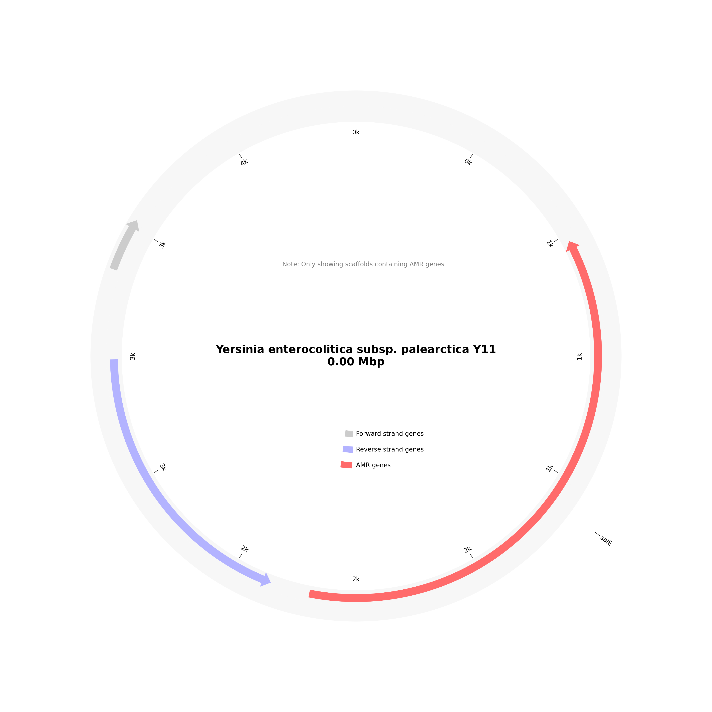

### salE
- **Mechanism**: antibiotic target protection
- **Drug Classes**: lincosamide antibiotic; streptogramin antibiotic; streptogramin A antibiotic; pleuromutilin antibiotic
- **AMR Family**: sal-type ABC-F protein
- **Locations**:
  - gnl|SPADES|EHPDDGNP_1385_2 : position 711-2204

