# AMR Analysis Report for LB01_MacConkey_QG_A2_S10

# Organism Classifications:

## Aeromonas salmonicida
**Strain Statistics:**
- Total genome length: 40.6 kbp
- Total scaffolds: 1135
- Scaffolds with AMR genes: 66
- Total genes annotated: 56
- Total AMR genes: 68
- Unique AMR genes: 50
- Distinct AMR mechanisms: 7
- Distinct AMR families: 22
- Distinct drug classes: 28

**Circos Plot:**

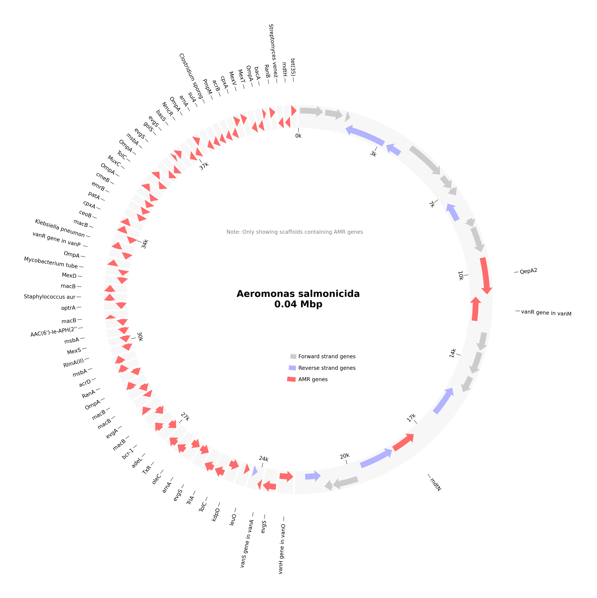

### AAC(6')-Ie-APH(2'')-Ia bifunctional protein
- **Mechanism**: antibiotic inactivation
- **Drug Classes**: aminoglycoside antibiotic
- **AMR Family**: aminoglycoside bifunctional resistance protein
- **Locations**:
  - gnl|SPADES|DLDDEBJH_21590_1 : position 3-275

### Clostridium sporogenes cplR
- **Mechanism**: antibiotic target protection
- **Drug Classes**: lincosamide antibiotic; pleuromutilin antibiotic
- **AMR Family**: Miscellaneous ABC-F subfamily ATP-binding cassette ribosomal protection proteins
- **Locations**:
  - gnl|SPADES|DLDDEBJH_39856_1 : position 1-198

### Klebsiella pneumoniae KpnE
- **Mechanism**: antibiotic efflux
- **Drug Classes**: macrolide antibiotic; aminoglycoside antibiotic; cephalosporin; tetracycline antibiotic; peptide antibiotic; rifamycin antibiotic; disinfecting agents and antiseptics
- **AMR Family**: small multidrug resistance (SMR) antibiotic efflux pump
- **Locations**:
  - gnl|SPADES|DLDDEBJH_24538_1 : position 1-264

### MexD
- **Mechanism**: antibiotic efflux
- **Drug Classes**: macrolide antibiotic; fluoroquinolone antibiotic; aminoglycoside antibiotic; cephalosporin; penam; tetracycline antibiotic; aminocoumarin antibiotic; diaminopyrimidine antibiotic; phenicol antibiotic
- **AMR Family**: resistance-nodulation-cell division (RND) antibiotic efflux pump
- **Locations**:
  - gnl|SPADES|DLDDEBJH_23258_1 : position 3-269

### MexS
- **Mechanism**: antibiotic efflux
- **Drug Classes**: fluoroquinolone antibiotic; diaminopyrimidine antibiotic; phenicol antibiotic
- **AMR Family**: resistance-nodulation-cell division (RND) antibiotic efflux pump
- **Locations**:
  - gnl|SPADES|DLDDEBJH_21307_1 : position 3-275

### MexT
- **Mechanism**: antibiotic efflux
- **Drug Classes**: fluoroquinolone antibiotic; diaminopyrimidine antibiotic; phenicol antibiotic
- **AMR Family**: resistance-nodulation-cell division (RND) antibiotic efflux pump
- **Locations**:
  - gnl|SPADES|DLDDEBJH_41484_1 : position 2-211

### MexV
- **Mechanism**: antibiotic efflux
- **Drug Classes**: macrolide antibiotic; fluoroquinolone antibiotic; tetracycline antibiotic; phenicol antibiotic; disinfecting agents and antiseptics
- **AMR Family**: resistance-nodulation-cell division (RND) antibiotic efflux pump
- **Locations**:
  - gnl|SPADES|DLDDEBJH_41462_1 : position 2-211

### MuxC
- **Mechanism**: antibiotic efflux
- **Drug Classes**: macrolide antibiotic; monobactam; tetracycline antibiotic; aminocoumarin antibiotic
- **AMR Family**: resistance-nodulation-cell division (RND) antibiotic efflux pump
- **Locations**:
  - gnl|SPADES|DLDDEBJH_32581_1 : position 3-239

### Mycobacterium tuberculosis katG mutations conferring resistance to isoniazid
- **Mechanism**: antibiotic target alteration
- **Drug Classes**: isoniazid-like antibiotic
- **AMR Family**: isoniazid resistant katG
- **Locations**:
  - gnl|SPADES|DLDDEBJH_23161_1 : position 3-221

### NmcR
- **Mechanism**: antibiotic inactivation
- **Drug Classes**: carbapenem; cephalosporin; cephamycin; penam
- **AMR Family**: NmcA beta-lactamase
- **Locations**:
  - gnl|SPADES|DLDDEBJH_38540_1 : position 2-220

### OmpA (found in 6 locations)
- **Mechanism**: reduced permeability to antibiotic
- **Drug Classes**: peptide antibiotic
- **AMR Family**: General Bacterial Porin with reduced permeability to peptide antibiotics
- **Locations**:
  - gnl|SPADES|DLDDEBJH_18666_1 : position 2-292
  - gnl|SPADES|DLDDEBJH_23323_1 : position 3-236
  - gnl|SPADES|DLDDEBJH_31187_1 : position 2-244
  - gnl|SPADES|DLDDEBJH_36662_1 : position 1-225
  - gnl|SPADES|DLDDEBJH_38930_1 : position 3-218
  - gnl|SPADES|DLDDEBJH_42136_1 : position 3-209

### PmpM
- **Mechanism**: antibiotic efflux
- **Drug Classes**: fluoroquinolone antibiotic; aminoglycoside antibiotic; disinfecting agents and antiseptics
- **AMR Family**: multidrug and toxic compound extrusion (MATE) transporter
- **Locations**:
  - gnl|SPADES|DLDDEBJH_40761_1 : position 2-214

### QepA2
- **Mechanism**: antibiotic efflux
- **Drug Classes**: fluoroquinolone antibiotic
- **AMR Family**: major facilitator superfamily (MFS) antibiotic efflux pump
- **Locations**:
  - gnl|SPADES|DLDDEBJH_312_11 : position 9598-10995

### RanA
- **Mechanism**: antibiotic efflux
- **Drug Classes**: aminoglycoside antibiotic
- **AMR Family**: ATP-binding cassette (ABC) antibiotic efflux pump
- **Locations**:
  - gnl|SPADES|DLDDEBJH_18691_1 : position 2-292

### RanB
- **Mechanism**: antibiotic efflux
- **Drug Classes**: aminoglycoside antibiotic
- **AMR Family**: ATP-binding cassette (ABC) antibiotic efflux pump
- **Locations**:
  - gnl|SPADES|DLDDEBJH_42786_1 : position 2-208

### RlmA(II)
- **Mechanism**: antibiotic target alteration
- **Drug Classes**: macrolide antibiotic; lincosamide antibiotic
- **AMR Family**: non-erm 23S ribosomal RNA methyltransferase (G748)
- **Locations**:
  - gnl|SPADES|DLDDEBJH_19640_1 : position 3-284

### Staphylococcus aureus mupA conferring resistance to mupirocin
- **Mechanism**: antibiotic target alteration
- **Drug Classes**: mupirocin-like antibiotic
- **AMR Family**: antibiotic-resistant isoleucyl-tRNA synthetase (ileS)
- **Locations**:
  - gnl|SPADES|DLDDEBJH_22352_1 : position 2-271

### Streptomyces venezuelae rox
- **Mechanism**: antibiotic inactivation
- **Drug Classes**: rifamycin antibiotic
- **AMR Family**: rifampin monooxygenase
- **Locations**:
  - gnl|SPADES|DLDDEBJH_42746_1 : position 1-207

### TolC (found in 2 locations)
- **Mechanism**: antibiotic efflux
- **Drug Classes**: macrolide antibiotic; fluoroquinolone antibiotic; aminoglycoside antibiotic; carbapenem; cephalosporin; glycylcycline; cephamycin; penam; tetracycline antibiotic; peptide antibiotic; aminocoumarin antibiotic; rifamycin antibiotic; phenicol antibiotic; penem; disinfecting agents and antiseptics
- **AMR Family**: ATP-binding cassette (ABC) antibiotic efflux pump; major facilitator superfamily (MFS) antibiotic efflux pump; resistance-nodulation-cell division (RND) antibiotic efflux pump
- **Locations**:
  - gnl|SPADES|DLDDEBJH_13598_1 : position 1-381
  - gnl|SPADES|DLDDEBJH_34339_1 : position 1-234

### TriA
- **Mechanism**: antibiotic efflux
- **Drug Classes**: disinfecting agents and antiseptics
- **AMR Family**: resistance-nodulation-cell division (RND) antibiotic efflux pump
- **Locations**:
  - gnl|SPADES|DLDDEBJH_13971_1 : position 2-373

### TxR
- **Mechanism**: antibiotic efflux
- **Drug Classes**: tetracycline antibiotic
- **AMR Family**: ATP-binding cassette (ABC) antibiotic efflux pump
- **Locations**:
  - gnl|SPADES|DLDDEBJH_15743_1 : position 2-337

### acrB
- **Mechanism**: antibiotic efflux
- **Drug Classes**: fluoroquinolone antibiotic; cephalosporin; glycylcycline; penam; tetracycline antibiotic; rifamycin antibiotic; phenicol antibiotic; disinfecting agents and antiseptics
- **AMR Family**: resistance-nodulation-cell division (RND) antibiotic efflux pump
- **Locations**:
  - gnl|SPADES|DLDDEBJH_41176_1 : position 2-211

### acrD
- **Mechanism**: antibiotic efflux
- **Drug Classes**: aminoglycoside antibiotic
- **AMR Family**: resistance-nodulation-cell division (RND) antibiotic efflux pump
- **Locations**:
  - gnl|SPADES|DLDDEBJH_19396_1 : position 3-287

### adeL
- **Mechanism**: antibiotic efflux
- **Drug Classes**: fluoroquinolone antibiotic; tetracycline antibiotic
- **AMR Family**: resistance-nodulation-cell division (RND) antibiotic efflux pump
- **Locations**:
  - gnl|SPADES|DLDDEBJH_15821_1 : position 3-335

### arnA (found in 2 locations)
- **Mechanism**: antibiotic target alteration
- **Drug Classes**: peptide antibiotic
- **AMR Family**: pmr phosphoethanolamine transferase
- **Locations**:
  - gnl|SPADES|DLDDEBJH_15319_1 : position 1-345
  - gnl|SPADES|DLDDEBJH_39341_1 : position 2-217

### bacA
- **Mechanism**: antibiotic target alteration
- **Drug Classes**: peptide antibiotic
- **AMR Family**: undecaprenyl pyrophosphate related proteins
- **Locations**:
  - gnl|SPADES|DLDDEBJH_42602_1 : position 1-126

### basS
- **Mechanism**: antibiotic target alteration; antibiotic efflux
- **Drug Classes**: peptide antibiotic
- **AMR Family**: pmr phosphoethanolamine transferase
- **Locations**:
  - gnl|SPADES|DLDDEBJH_38749_1 : position 3-221

### bcr-1
- **Mechanism**: antibiotic efflux
- **Drug Classes**: bicyclomycin-like antibiotic
- **AMR Family**: major facilitator superfamily (MFS) antibiotic efflux pump
- **Locations**:
  - gnl|SPADES|DLDDEBJH_16700_1 : position 1-321

### ceoB
- **Mechanism**: antibiotic efflux
- **Drug Classes**: fluoroquinolone antibiotic; aminoglycoside antibiotic
- **AMR Family**: resistance-nodulation-cell division (RND) antibiotic efflux pump
- **Locations**:
  - gnl|SPADES|DLDDEBJH_26707_1 : position 2-259

### cmeB
- **Mechanism**: antibiotic efflux
- **Drug Classes**: macrolide antibiotic; fluoroquinolone antibiotic; cephalosporin; fusidane antibiotic
- **AMR Family**: resistance-nodulation-cell division (RND) antibiotic efflux pump
- **Locations**:
  - gnl|SPADES|DLDDEBJH_31017_1 : position 2-244

### cpxA (found in 2 locations)
- **Mechanism**: antibiotic efflux
- **Drug Classes**: aminoglycoside antibiotic; aminocoumarin antibiotic
- **AMR Family**: resistance-nodulation-cell division (RND) antibiotic efflux pump
- **Locations**:
  - gnl|SPADES|DLDDEBJH_27447_1 : position 3-254
  - gnl|SPADES|DLDDEBJH_41426_1 : position 3-212

### emrB
- **Mechanism**: antibiotic efflux
- **Drug Classes**: fluoroquinolone antibiotic
- **AMR Family**: major facilitator superfamily (MFS) antibiotic efflux pump
- **Locations**:
  - gnl|SPADES|DLDDEBJH_30546_1 : position 2-244

### evgA
- **Mechanism**: antibiotic efflux
- **Drug Classes**: macrolide antibiotic; fluoroquinolone antibiotic; penam; tetracycline antibiotic
- **AMR Family**: major facilitator superfamily (MFS) antibiotic efflux pump; resistance-nodulation-cell division (RND) antibiotic efflux pump
- **Locations**:
  - gnl|SPADES|DLDDEBJH_17244_1 : position 60-314

### evgS (found in 4 locations)
- **Mechanism**: antibiotic efflux
- **Drug Classes**: macrolide antibiotic; fluoroquinolone antibiotic; penam; tetracycline antibiotic
- **AMR Family**: major facilitator superfamily (MFS) antibiotic efflux pump; resistance-nodulation-cell division (RND) antibiotic efflux pump
- **Locations**:
  - gnl|SPADES|DLDDEBJH_10055_1 : position 1-504
  - gnl|SPADES|DLDDEBJH_14218_1 : position 3-368
  - gnl|SPADES|DLDDEBJH_37233_1 : position 2-223
  - gnl|SPADES|DLDDEBJH_38220_1 : position 3-221

### golS
- **Mechanism**: antibiotic efflux
- **Drug Classes**: monobactam; carbapenem; cephalosporin; cephamycin; penam; phenicol antibiotic; penem
- **AMR Family**: resistance-nodulation-cell division (RND) antibiotic efflux pump
- **Locations**:
  - gnl|SPADES|DLDDEBJH_38171_2 : position 112-222

### kdpD
- **Mechanism**: antibiotic efflux
- **Drug Classes**: aminoglycoside antibiotic
- **AMR Family**: kdpDE
- **Locations**:
  - gnl|SPADES|DLDDEBJH_13177_1 : position 1-390

### leuO
- **Mechanism**: antibiotic efflux
- **Drug Classes**: nucleoside antibiotic; disinfecting agents and antiseptics
- **AMR Family**: major facilitator superfamily (MFS) antibiotic efflux pump
- **Locations**:
  - gnl|SPADES|DLDDEBJH_13114_1 : position 1-192

### macB (found in 6 locations)
- **Mechanism**: antibiotic efflux
- **Drug Classes**: macrolide antibiotic
- **AMR Family**: ATP-binding cassette (ABC) antibiotic efflux pump
- **Locations**:
  - gnl|SPADES|DLDDEBJH_16931_1 : position 1-318
  - gnl|SPADES|DLDDEBJH_17946_1 : position 83-304
  - gnl|SPADES|DLDDEBJH_18071_1 : position 3-302
  - gnl|SPADES|DLDDEBJH_21787_1 : position 2-148
  - gnl|SPADES|DLDDEBJH_22622_1 : position 1-270
  - gnl|SPADES|DLDDEBJH_25600_1 : position 3-260

### mdtH
- **Mechanism**: antibiotic efflux
- **Drug Classes**: fluoroquinolone antibiotic
- **AMR Family**: major facilitator superfamily (MFS) antibiotic efflux pump
- **Locations**:
  - gnl|SPADES|DLDDEBJH_43005_1 : position 3-206

### mdtN
- **Mechanism**: antibiotic efflux
- **Drug Classes**: nucleoside antibiotic; disinfecting agents and antiseptics
- **AMR Family**: major facilitator superfamily (MFS) antibiotic efflux pump
- **Locations**:
  - gnl|SPADES|DLDDEBJH_312_18 : position 17324-18328

### msbA (found in 3 locations)
- **Mechanism**: antibiotic efflux
- **Drug Classes**: nitroimidazole antibiotic
- **AMR Family**: ATP-binding cassette (ABC) antibiotic efflux pump
- **Locations**:
  - gnl|SPADES|DLDDEBJH_19588_1 : position 2-286
  - gnl|SPADES|DLDDEBJH_21260_1 : position 2-277
  - gnl|SPADES|DLDDEBJH_36796_1 : position 2-226

### oleC
- **Mechanism**: antibiotic efflux
- **Drug Classes**: macrolide antibiotic
- **AMR Family**: ATP-binding cassette (ABC) antibiotic efflux pump
- **Locations**:
  - gnl|SPADES|DLDDEBJH_15652_1 : position 2-340

### optrA
- **Mechanism**: antibiotic target protection
- **Drug Classes**: oxazolidinone antibiotic; phenicol antibiotic
- **AMR Family**: Miscellaneous ABC-F subfamily ATP-binding cassette ribosomal protection proteins
- **Locations**:
  - gnl|SPADES|DLDDEBJH_22039_1 : position 2-274

### patA
- **Mechanism**: antibiotic efflux
- **Drug Classes**: fluoroquinolone antibiotic
- **AMR Family**: ATP-binding cassette (ABC) antibiotic efflux pump
- **Locations**:
  - gnl|SPADES|DLDDEBJH_28724_1 : position 2-250

### sul4
- **Mechanism**: antibiotic target replacement
- **Drug Classes**: sulfonamide antibiotic
- **AMR Family**: sulfonamide resistant sul
- **Locations**:
  - gnl|SPADES|DLDDEBJH_39627_1 : position 3-218

### tet(35)
- **Mechanism**: antibiotic efflux
- **Drug Classes**: tetracycline antibiotic
- **AMR Family**: ATP-binding cassette (ABC) antibiotic efflux pump
- **Locations**:
  - gnl|SPADES|DLDDEBJH_43164_1 : position 3-206

### vanH gene in vanO cluster
- **Mechanism**: antibiotic target alteration
- **Drug Classes**: glycopeptide antibiotic
- **AMR Family**: vanH; glycopeptide resistance gene cluster
- **Locations**:
  - gnl|SPADES|DLDDEBJH_8691_1 : position 1-552

### vanR gene in vanM cluster
- **Mechanism**: antibiotic target alteration
- **Drug Classes**: glycopeptide antibiotic
- **AMR Family**: glycopeptide resistance gene cluster; vanR
- **Locations**:
  - gnl|SPADES|DLDDEBJH_312_12 : position 11070-12041

### vanR gene in vanP cluster
- **Mechanism**: antibiotic target alteration
- **Drug Classes**: glycopeptide antibiotic
- **AMR Family**: glycopeptide resistance gene cluster; vanR
- **Locations**:
  - gnl|SPADES|DLDDEBJH_23989_1 : position 2-265

### vanS gene in vanA cluster
- **Mechanism**: antibiotic target alteration
- **Drug Classes**: glycopeptide antibiotic
- **AMR Family**: vanS; glycopeptide resistance gene cluster
- **Locations**:
  - gnl|SPADES|DLDDEBJH_10127_1 : position 2-145

## Aeromonas salmonicida subsp. masoucida
**Strain Statistics:**
- Total genome length: 1.3 kbp
- Total scaffolds: 28
- Scaffolds with AMR genes: 3
- Total genes annotated: 2
- Total AMR genes: 3
- Unique AMR genes: 3
- Distinct AMR mechanisms: 3
- Distinct AMR families: 3
- Distinct drug classes: 9

**Circos Plot:**

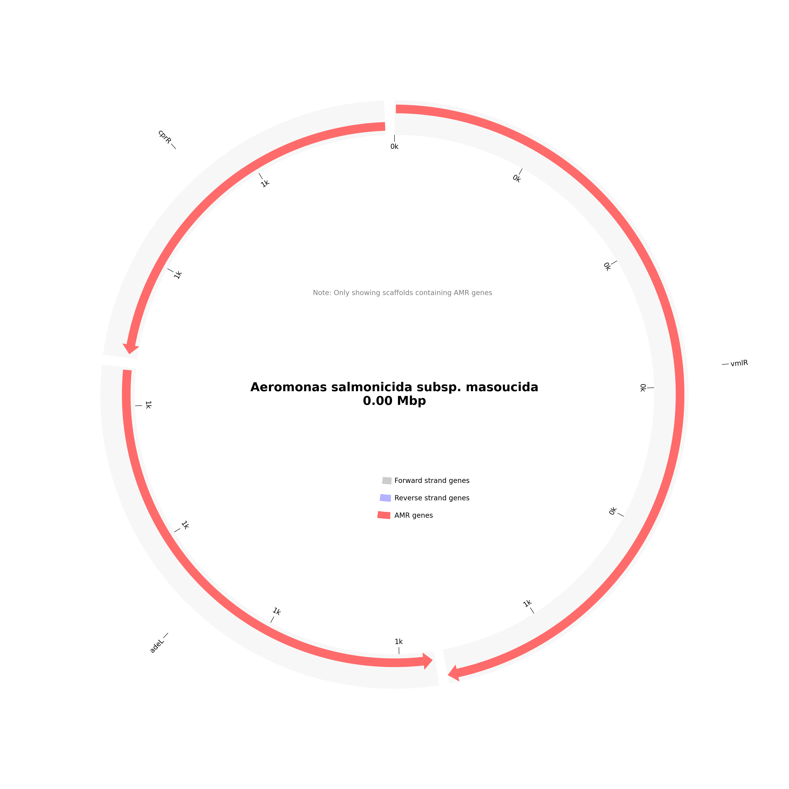

### adeL
- **Mechanism**: antibiotic efflux
- **Drug Classes**: fluoroquinolone antibiotic; tetracycline antibiotic
- **AMR Family**: resistance-nodulation-cell division (RND) antibiotic efflux pump
- **Locations**:
  - gnl|SPADES|DLDDEBJH_13814_1 : position 2-376

### cprR
- **Mechanism**: antibiotic target alteration; antibiotic efflux
- **Drug Classes**: peptide antibiotic
- **AMR Family**: pmr phosphoethanolamine transferase
- **Locations**:
  - gnl|SPADES|DLDDEBJH_19172_1 : position 3-290

### vmlR
- **Mechanism**: antibiotic target protection
- **Drug Classes**: lincosamide antibiotic; streptogramin antibiotic; streptogramin A antibiotic; streptogramin B antibiotic; nucleoside antibiotic; pleuromutilin antibiotic
- **AMR Family**: Miscellaneous ABC-F subfamily ATP-binding cassette ribosomal protection proteins
- **Locations**:
  - gnl|SPADES|DLDDEBJH_8317_1 : position 1-612

## Aeromonas salmonicida subsp. pectinolytica 34mel
**Strain Statistics:**
- Total genome length: 0.7 kbp
- Total scaffolds: 131
- Scaffolds with AMR genes: 3
- Total genes annotated: 0
- Total AMR genes: 3
- Unique AMR genes: 3
- Distinct AMR mechanisms: 2
- Distinct AMR families: 3
- Distinct drug classes: 12

**Circos Plot:**

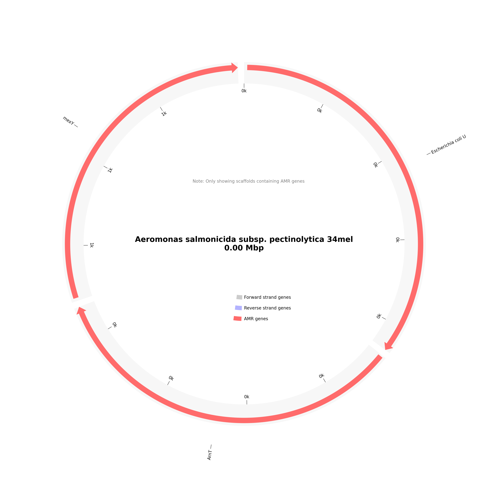

### ArnT
- **Mechanism**: antibiotic target alteration
- **Drug Classes**: peptide antibiotic
- **AMR Family**: pmr phosphoethanolamine transferase
- **Locations**:
  - gnl|SPADES|DLDDEBJH_34361_1 : position 1-234

### Escherichia coli UhpT with mutation conferring resistance to fosfomycin
- **Mechanism**: antibiotic target alteration
- **Drug Classes**: phosphonic acid antibiotic
- **AMR Family**: antibiotic-resistant UhpT
- **Locations**:
  - gnl|SPADES|DLDDEBJH_30081_1 : position 2-247

### mexY
- **Mechanism**: antibiotic efflux
- **Drug Classes**: macrolide antibiotic; fluoroquinolone antibiotic; aminoglycoside antibiotic; carbapenem; cephalosporin; cephamycin; penam; tetracycline antibiotic; phenicol antibiotic; disinfecting agents and antiseptics
- **AMR Family**: resistance-nodulation-cell division (RND) antibiotic efflux pump
- **Locations**:
  - gnl|SPADES|DLDDEBJH_42731_1 : position 2-208

## Buttiauxella agrestis
**Strain Statistics:**
- Total genome length: 2729.9 kbp
- Total scaffolds: 1583
- Scaffolds with AMR genes: 417
- Total genes annotated: 5004
- Total AMR genes: 635
- Unique AMR genes: 216
- Distinct AMR mechanisms: 11
- Distinct AMR families: 74
- Distinct drug classes: 36

**Circos Plot:**

### AIM-1
- **Mechanism**: antibiotic inactivation
- **Drug Classes**: cephalosporin; cephamycin; penam
- **AMR Family**: AIM beta-lactamase
- **Locations**:
  - gnl|SPADES|DLDDEBJH_1714_3 : position 2605-3564

### APH(6)-Ic (found in 2 locations)
- **Mechanism**: antibiotic inactivation
- **Drug Classes**: aminoglycoside antibiotic
- **AMR Family**: APH(6)
- **Locations**:
  - gnl|SPADES|DLDDEBJH_333_11 : position 10970-11815
  - gnl|SPADES|DLDDEBJH_595_2 : position 949-1776

### Acinetobacter baumannii AbaF (found in 9 locations)
- **Mechanism**: antibiotic efflux
- **Drug Classes**: phosphonic acid antibiotic
- **AMR Family**: major facilitator superfamily (MFS) antibiotic efflux pump
- **Locations**:
  - gnl|SPADES|DLDDEBJH_1136_2 : position 1002-2501
  - gnl|SPADES|DLDDEBJH_1292_2 : position 1147-2646
  - gnl|SPADES|DLDDEBJH_1648_1 : position 173-1498
  - gnl|SPADES|DLDDEBJH_1675_1 : position 207-1511
  - gnl|SPADES|DLDDEBJH_1937_3 : position 1856-3190
  - gnl|SPADES|DLDDEBJH_2143_2 : position 414-1739
  - gnl|SPADES|DLDDEBJH_443_1 : position 3-1112
  - gnl|SPADES|DLDDEBJH_547_7 : position 5697-7022
  - gnl|SPADES|DLDDEBJH_642_6 : position 7174-8679

### Acinetobacter baumannii AbaQ (found in 11 locations)
- **Mechanism**: antibiotic efflux
- **Drug Classes**: fluoroquinolone antibiotic
- **AMR Family**: major facilitator superfamily (MFS) antibiotic efflux pump
- **Locations**:
  - gnl|SPADES|DLDDEBJH_1217_1 : position 39-791
  - gnl|SPADES|DLDDEBJH_1640_3 : position 2184-3374
  - gnl|SPADES|DLDDEBJH_1921_2 : position 499-1854
  - gnl|SPADES|DLDDEBJH_2201_2 : position 891-2207
  - gnl|SPADES|DLDDEBJH_2613_2 : position 678-1994
  - gnl|SPADES|DLDDEBJH_30414_1 : position 2-244
  - gnl|SPADES|DLDDEBJH_30419_1 : position 3-245
  - gnl|SPADES|DLDDEBJH_367_12 : position 9035-10435
  - gnl|SPADES|DLDDEBJH_484_6 : position 4040-5446
  - gnl|SPADES|DLDDEBJH_585_4 : position 3253-4566
  - gnl|SPADES|DLDDEBJH_807_8 : position 6277-7575

### AcrE
- **Mechanism**: antibiotic efflux
- **Drug Classes**: fluoroquinolone antibiotic; cephalosporin; cephamycin; penam
- **AMR Family**: resistance-nodulation-cell division (RND) antibiotic efflux pump
- **Locations**:
  - gnl|SPADES|DLDDEBJH_542_6 : position 6895-8049

### AcrF (found in 2 locations)
- **Mechanism**: antibiotic efflux
- **Drug Classes**: fluoroquinolone antibiotic; cephalosporin; cephamycin; penam
- **AMR Family**: resistance-nodulation-cell division (RND) antibiotic efflux pump
- **Locations**:
  - gnl|SPADES|DLDDEBJH_2853_3 : position 1419-2087
  - gnl|SPADES|DLDDEBJH_542_7 : position 8063-11176

### AcrS (found in 2 locations)
- **Mechanism**: antibiotic efflux
- **Drug Classes**: fluoroquinolone antibiotic; cephalosporin; glycylcycline; cephamycin; penam; tetracycline antibiotic; rifamycin antibiotic; phenicol antibiotic; disinfecting agents and antiseptics
- **AMR Family**: resistance-nodulation-cell division (RND) antibiotic efflux pump
- **Locations**:
  - gnl|SPADES|DLDDEBJH_2853_2 : position 694-1311
  - gnl|SPADES|DLDDEBJH_542_4 : position 2805-3422

### ArnT (found in 2 locations)
- **Mechanism**: antibiotic target alteration
- **Drug Classes**: peptide antibiotic
- **AMR Family**: pmr phosphoethanolamine transferase
- **Locations**:
  - gnl|SPADES|DLDDEBJH_215_7: position 7759-9420
  - gnl|SPADES|DLDDEBJH_999_4: position 4026-5687

### Bartonella bacilliformis gyrB conferring resistance to aminocoumarin (found in 3 locations)
- **Mechanism**: antibiotic target alteration
- **Drug Classes**: aminocoumarin antibiotic
- **AMR Family**: aminocoumarin resistant gyrB
- **Locations**:
  - gnl|SPADES|DLDDEBJH_10940_1 : position 3-464
  - gnl|SPADES|DLDDEBJH_14437_1 : position 3-362
  - gnl|SPADES|DLDDEBJH_2611_1 : position 2-631

### Bifidobacterium bifidum ileS conferring resistance to mupirocin
- **Mechanism**: antibiotic target alteration
- **Drug Classes**: mupirocin-like antibiotic
- **AMR Family**: antibiotic-resistant isoleucyl-tRNA synthetase (ileS)
- **Locations**:
  - gnl|SPADES|DLDDEBJH_3477_1 : position 1-1671

### Brucella suis mprF
- **Mechanism**: antibiotic target alteration
- **Drug Classes**: peptide antibiotic
- **AMR Family**: defensin resistant mprF
- **Locations**:
  - gnl|SPADES|DLDDEBJH_1448_2 : position 221-1189

### CDA-1
- **Mechanism**: antibiotic inactivation
- **Drug Classes**: carbapenem; cephalosporin; cephamycin; penem
- **AMR Family**: CDA beta-lactamase
- **Locations**:
  - gnl|SPADES|DLDDEBJH_39955_1 : position 152-217

### CMA-2
- **Mechanism**: antibiotic inactivation
- **Drug Classes**: cephalosporin
- **AMR Family**: CMA beta-lactamase
- **Locations**:
  - gnl|SPADES|DLDDEBJH_2182_1 : position 2-742

### CRP (found in 3 locations)
- **Mechanism**: antibiotic efflux
- **Drug Classes**: macrolide antibiotic; fluoroquinolone antibiotic; penam
- **AMR Family**: resistance-nodulation-cell division (RND) antibiotic efflux pump
- **Locations**:
  - gnl|SPADES|DLDDEBJH_388_10 : position 10483-11175
  - gnl|SPADES|DLDDEBJH_4765_2: position 499-1131
  - gnl|SPADES|DLDDEBJH_483_6 : position 5555-6247

### Clostridioides difficile gyrA conferring resistance to fluoroquinolones
- **Mechanism**: antibiotic target alteration
- **Drug Classes**: fluoroquinolone antibiotic
- **AMR Family**: fluoroquinolone resistant gyrA
- **Locations**:
  - gnl|SPADES|DLDDEBJH_4098_2 : position 393-1373

### Clostridioides difficile gyrB conferring resistance to fluoroquinolones (found in 2 locations)
- **Mechanism**: antibiotic target alteration
- **Drug Classes**: fluoroquinolone antibiotic
- **AMR Family**: fluoroquinolone resistant gyrB
- **Locations**:
  - gnl|SPADES|DLDDEBJH_32360_1 : position 2-238
  - gnl|SPADES|DLDDEBJH_4348_1 : position 3-1280

### Corynebacterium striatum tetA
- **Mechanism**: antibiotic efflux
- **Drug Classes**: penam; tetracycline antibiotic
- **AMR Family**: major facilitator superfamily (MFS) antibiotic efflux pump
- **Locations**:
  - gnl|SPADES|DLDDEBJH_43279_1 : position 2-199

### CrcB
- **Mechanism**: antibiotic efflux
- **Drug Classes**: aminoglycoside antibiotic
- **AMR Family**: multidrug and toxic compound extrusion (MATE) transporter
- **Locations**:
  - gnl|SPADES|DLDDEBJH_847_6 : position 5995-6378

### Enterobacter cloacae acrA
- **Mechanism**: antibiotic efflux
- **Drug Classes**: fluoroquinolone antibiotic; cephalosporin; glycylcycline; penam; tetracycline antibiotic; rifamycin antibiotic; phenicol antibiotic; disinfecting agents and antiseptics
- **AMR Family**: resistance-nodulation-cell division (RND) antibiotic efflux pump
- **Locations**:
  - gnl|SPADES|DLDDEBJH_10568_1 : position 2-478

### Enterococcus faecium cls conferring resistance to daptomycin
- **Mechanism**: antibiotic target alteration
- **Drug Classes**: peptide antibiotic
- **AMR Family**: daptomycin resistant cls
- **Locations**:
  - gnl|SPADES|DLDDEBJH_1722_1 : position 3-1424

### Enterococcus faecium liaR mutant conferring daptomycin resistance
- **Mechanism**: antibiotic target alteration; antibiotic efflux
- **Drug Classes**: peptide antibiotic
- **AMR Family**: daptomycin resistant liaR
- **Locations**:
  - gnl|SPADES|DLDDEBJH_2929_2 : position 250-834

### ErmB (found in 2 locations)
- **Mechanism**: antibiotic target alteration
- **Drug Classes**: macrolide antibiotic; lincosamide antibiotic; streptogramin antibiotic; streptogramin A antibiotic; streptogramin B antibiotic
- **AMR Family**: Erm 23S ribosomal RNA methyltransferase
- **Locations**:
  - gnl|SPADES|DLDDEBJH_696_6 : position 4305-5129
  - gnl|SPADES|DLDDEBJH_912_3 : position 1710-2534

### Escherichia coli AcrAB-TolC with AcrR mutation conferring resistance to ciprofloxacin, tetracycline, and ceftazidime
- **Mechanism**: antibiotic target alteration; antibiotic efflux
- **Drug Classes**: fluoroquinolone antibiotic; cephalosporin; glycylcycline; penam; tetracycline antibiotic; rifamycin antibiotic; phenicol antibiotic; disinfecting agents and antiseptics
- **AMR Family**: resistance-nodulation-cell division (RND) antibiotic efflux pump
- **Locations**:
  - gnl|SPADES|DLDDEBJH_1398_3 : position 1220-1804

### Escherichia coli AcrAB-TolC with MarR mutations conferring resistance to ciprofloxacin and tetracycline (found in 2 locations)
- **Mechanism**: antibiotic target alteration; antibiotic efflux
- **Drug Classes**: fluoroquinolone antibiotic; cephalosporin; glycylcycline; penam; tetracycline antibiotic; rifamycin antibiotic; phenicol antibiotic; disinfecting agents and antiseptics
- **AMR Family**: resistance-nodulation-cell division (RND) antibiotic efflux pump
- **Locations**:
  - gnl|SPADES|DLDDEBJH_296_14 : position 9977-10432
  - gnl|SPADES|DLDDEBJH_3001_3 : position 1646-1972

### Escherichia coli EF-Tu mutants conferring resistance to Pulvomycin
- **Mechanism**: antibiotic target alteration
- **Drug Classes**: elfamycin antibiotic
- **AMR Family**: elfamycin resistant EF-Tu
- **Locations**:
  - gnl|SPADES|DLDDEBJH_1285_2 : position 527-2374

### Escherichia coli EF-Tu mutants conferring resistance to kirromycin
- **Mechanism**: antibiotic target alteration
- **Drug Classes**: elfamycin antibiotic
- **AMR Family**: elfamycin resistant EF-Tu
- **Locations**:
  - gnl|SPADES|DLDDEBJH_1637_3 : position 2257-3813

### Escherichia coli UhpT with mutation conferring resistance to fosfomycin
- **Mechanism**: antibiotic target alteration
- **Drug Classes**: phosphonic acid antibiotic
- **AMR Family**: antibiotic-resistant UhpT
- **Locations**:
  - gnl|SPADES|DLDDEBJH_868_1 : position 3-590

### Escherichia coli fabI mutations conferring resistance to isoniazid and triclosan
- **Mechanism**: antibiotic target alteration
- **Drug Classes**: disinfecting agents and antiseptics; isoniazid-like antibiotic
- **AMR Family**: antibiotic resistant fabI
- **Locations**:
  - gnl|SPADES|DLDDEBJH_972_3 : position 1634-2407

### Escherichia coli mdfA
- **Mechanism**: antibiotic efflux
- **Drug Classes**: tetracycline antibiotic; phenicol antibiotic; disinfecting agents and antiseptics
- **AMR Family**: major facilitator superfamily (MFS) antibiotic efflux pump
- **Locations**:
  - gnl|SPADES|DLDDEBJH_2529_2 : position 1674-2414

### Escherichia coli soxR with mutation conferring antibiotic resistance
- **Mechanism**: antibiotic target alteration; antibiotic efflux
- **Drug Classes**: fluoroquinolone antibiotic; cephalosporin; glycylcycline; penam; tetracycline antibiotic; rifamycin antibiotic; phenicol antibiotic; disinfecting agents and antiseptics
- **AMR Family**: ATP-binding cassette (ABC) antibiotic efflux pump; major facilitator superfamily (MFS) antibiotic efflux pump; resistance-nodulation-cell division (RND) antibiotic efflux pump
- **Locations**:
  - gnl|SPADES|DLDDEBJH_1743_2 : position 555-1013

### Escherichia coli soxS with mutation conferring antibiotic resistance (found in 8 locations)
- **Mechanism**: antibiotic target alteration; antibiotic efflux; reduced permeability to antibiotic
- **Drug Classes**: fluoroquinolone antibiotic; monobactam; carbapenem; cephalosporin; glycylcycline; cephamycin; penam; tetracycline antibiotic; rifamycin antibiotic; phenicol antibiotic; penem; disinfecting agents and antiseptics
- **AMR Family**: ATP-binding cassette (ABC) antibiotic efflux pump; major facilitator superfamily (MFS) antibiotic efflux pump; resistance-nodulation-cell division (RND) antibiotic efflux pump; General Bacterial Porin with reduced permeability to beta-lactams
- **Locations**:
  - gnl|SPADES|DLDDEBJH_1743_1 : position 153-476
  - gnl|SPADES|DLDDEBJH_1967_1 : position 3-473
  - gnl|SPADES|DLDDEBJH_3821_1 : position 121-966
  - gnl|SPADES|DLDDEBJH_395_10 : position 10195-11049
  - gnl|SPADES|DLDDEBJH_467_16 : position 13168-13950
  - gnl|SPADES|DLDDEBJH_542_1 : position 55-501
  - gnl|SPADES|DLDDEBJH_566_6 : position 5967-6866
  - gnl|SPADES|DLDDEBJH_862_5 : position 4367-5236

### FosA
- **Mechanism**: antibiotic inactivation
- **Drug Classes**: phosphonic acid antibiotic
- **AMR Family**: fosfomycin thiol transferase
- **Locations**:
  - gnl|SPADES|DLDDEBJH_1275_3 : position 1753-2142

### FosA8
- **Mechanism**: antibiotic inactivation
- **Drug Classes**: phosphonic acid antibiotic
- **AMR Family**: fosfomycin thiol transferase
- **Locations**:
  - gnl|SPADES|DLDDEBJH_356_11: position 8816-9214

### FosG (found in 2 locations)
- **Mechanism**: antibiotic inactivation
- **Drug Classes**: phosphonic acid antibiotic
- **AMR Family**: fosfomycin thiol transferase
- **Locations**:
  - gnl|SPADES|DLDDEBJH_3381_1 : position 2-373
  - gnl|SPADES|DLDDEBJH_858_1 : position 2-373

### GMB-1
- **Mechanism**: antibiotic inactivation
- **Drug Classes**: carbapenem
- **AMR Family**: GMB beta-lactamase
- **Locations**:
  - gnl|SPADES|DLDDEBJH_753_4 : position 3086-3952

### H-NS
- **Mechanism**: antibiotic efflux
- **Drug Classes**: macrolide antibiotic; fluoroquinolone antibiotic; cephalosporin; cephamycin; penam; tetracycline antibiotic
- **AMR Family**: major facilitator superfamily (MFS) antibiotic efflux pump; resistance-nodulation-cell division (RND) antibiotic efflux pump
- **Locations**:
  - gnl|SPADES|DLDDEBJH_4609_2 : position 726-1136

### HMB-1
- **Mechanism**: antibiotic inactivation
- **Drug Classes**: carbapenem
- **AMR Family**: HMB beta-lactamase
- **Locations**:
  - gnl|SPADES|DLDDEBJH_444_3 : position 1094-3124

### Haemophilus influenzae PBP3 conferring resistance to beta-lactam antibiotics (found in 2 locations)
- **Mechanism**: antibiotic target alteration
- **Drug Classes**: cephalosporin; cephamycin; penam
- **AMR Family**: Penicillin-binding protein mutations conferring resistance to beta-lactam antibiotics
- **Locations**:
  - gnl|SPADES|DLDDEBJH_3103_3 : position 812-1903
  - gnl|SPADES|DLDDEBJH_3104_1 : position 2-1093

### Helicobacter pylori pbp1 mutants conferring resistance to amoxicillin (found in 2 locations)
- **Mechanism**: antibiotic target alteration
- **Drug Classes**: cephalosporin; cephamycin; penam
- **AMR Family**: Penicillin-binding protein mutations conferring resistance to beta-lactam antibiotics
- **Locations**:
  - gnl|SPADES|DLDDEBJH_1703_1 : position 3-1871
  - gnl|SPADES|DLDDEBJH_1891_1 : position 278-2833

### Helicobacter pylori pbp2 mutants conferring resistance to amoxicillin
- **Mechanism**: antibiotic target alteration
- **Drug Classes**: cephalosporin; cephamycin; penam
- **AMR Family**: Penicillin-binding protein mutations conferring resistance to beta-lactam antibiotics
- **Locations**:
  - gnl|SPADES|DLDDEBJH_1193_1 : position 1-1584

### Helicobacter pylori rdxA mutation conferring resistance to metronidazole (found in 2 locations)
- **Mechanism**: antibiotic target alteration
- **Drug Classes**: nitroimidazole antibiotic
- **AMR Family**: Antibiotic resistant Helicobacter pylori nitroreductase
- **Locations**:
  - gnl|SPADES|DLDDEBJH_983_2 : position 747-1400
  - gnl|SPADES|DLDDEBJH_996_4 : position 1598-2251

### Helicobacter pylori rpoB mutation conferring resistance to rifampicin
- **Mechanism**: antibiotic target alteration; antibiotic target replacement
- **Drug Classes**: fluoroquinolone antibiotic; rifamycin antibiotic
- **AMR Family**: rifamycin-resistant beta-subunit of RNA polymerase (rpoB)
- **Locations**:
  - gnl|SPADES|DLDDEBJH_2321_3 : position 770-2680

### Klebsiella pneumoniae KpnE (found in 2 locations)
- **Mechanism**: antibiotic efflux
- **Drug Classes**: macrolide antibiotic; aminoglycoside antibiotic; cephalosporin; tetracycline antibiotic; peptide antibiotic; rifamycin antibiotic; disinfecting agents and antiseptics
- **AMR Family**: small multidrug resistance (SMR) antibiotic efflux pump
- **Locations**:
  - gnl|SPADES|DLDDEBJH_1525_4: position 2037-2411
  - gnl|SPADES|DLDDEBJH_5853_1: position 295-669

### Klebsiella pneumoniae KpnF (found in 3 locations)
- **Mechanism**: antibiotic efflux
- **Drug Classes**: macrolide antibiotic; aminoglycoside antibiotic; cephalosporin; tetracycline antibiotic; peptide antibiotic; rifamycin antibiotic; disinfecting agents and antiseptics
- **AMR Family**: small multidrug resistance (SMR) antibiotic efflux pump
- **Locations**:
  - gnl|SPADES|DLDDEBJH_1525_5: position 2398-2727
  - gnl|SPADES|DLDDEBJH_521_14 : position 12197-12331
  - gnl|SPADES|DLDDEBJH_5853_2 : position 656-901

### Klebsiella pneumoniae KpnG
- **Mechanism**: antibiotic efflux
- **Drug Classes**: macrolide antibiotic; fluoroquinolone antibiotic; aminoglycoside antibiotic; carbapenem; cephalosporin; penam; peptide antibiotic; penem
- **AMR Family**: major facilitator superfamily (MFS) antibiotic efflux pump
- **Locations**:
  - gnl|SPADES|DLDDEBJH_431_10 : position 8522-9694

### Klebsiella pneumoniae KpnH (found in 5 locations)
- **Mechanism**: antibiotic efflux
- **Drug Classes**: macrolide antibiotic; fluoroquinolone antibiotic; aminoglycoside antibiotic; carbapenem; cephalosporin; penam; peptide antibiotic; penem
- **AMR Family**: major facilitator superfamily (MFS) antibiotic efflux pump
- **Locations**:
  - gnl|SPADES|DLDDEBJH_1093_3 : position 2568-3962
  - gnl|SPADES|DLDDEBJH_1134_5 : position 3265-4647
  - gnl|SPADES|DLDDEBJH_1785_1: position 1-1137
  - gnl|SPADES|DLDDEBJH_1953_2 : position 932-2314
  - gnl|SPADES|DLDDEBJH_431_11: position 9710-11248

### Klebsiella pneumoniae OmpK37 (found in 4 locations)
- **Mechanism**: reduced permeability to antibiotic
- **Drug Classes**: monobactam; carbapenem; cephalosporin; cephamycin; penam; penem
- **AMR Family**: General Bacterial Porin with reduced permeability to beta-lactams
- **Locations**:
  - gnl|SPADES|DLDDEBJH_1018_2 : position 907-1977
  - gnl|SPADES|DLDDEBJH_1174_2 : position 367-1467
  - gnl|SPADES|DLDDEBJH_2005_1 : position 879-1997
  - gnl|SPADES|DLDDEBJH_965_3 : position 2035-3165

### Klebsiella pneumoniae acrR with mutation conferring multidrug antibiotic resistance
- **Mechanism**: antibiotic target alteration; antibiotic efflux
- **Drug Classes**: fluoroquinolone antibiotic; cephalosporin; glycylcycline; penam; tetracycline antibiotic; rifamycin antibiotic; phenicol antibiotic; disinfecting agents and antiseptics
- **AMR Family**: resistance-nodulation-cell division (RND) antibiotic efflux pump
- **Locations**:
  - gnl|SPADES|DLDDEBJH_749_2 : position 2918-3559

### LRA-13
- **Mechanism**: antibiotic inactivation
- **Drug Classes**: cephalosporin; penam
- **AMR Family**: class C LRA beta-lactamase; class D LRA beta-lactamase
- **Locations**:
  - gnl|SPADES|DLDDEBJH_416_11 : position 12612-13820

### LlmA 23S ribosomal RNA methyltransferase (found in 3 locations)
- **Mechanism**: antibiotic target alteration
- **Drug Classes**: lincosamide antibiotic
- **AMR Family**: Llm 23S ribosomal RNA methyltransferase
- **Locations**:
  - gnl|SPADES|DLDDEBJH_3978_3 : position 578-1420
  - gnl|SPADES|DLDDEBJH_3979_3 : position 578-1420
  - gnl|SPADES|DLDDEBJH_583_1 : position 1-387

### LptD (found in 2 locations)
- **Mechanism**: antibiotic efflux
- **Drug Classes**: carbapenem; peptide antibiotic; aminocoumarin antibiotic; rifamycin antibiotic
- **AMR Family**: ATP-binding cassette (ABC) antibiotic efflux pump
- **Locations**:
  - gnl|SPADES|DLDDEBJH_4533_1 : position 1-855
  - gnl|SPADES|DLDDEBJH_696_9 : position 7454-9040

### MCR-3.15
- **Mechanism**: antibiotic target alteration
- **Drug Classes**: peptide antibiotic
- **AMR Family**: MCR phosphoethanolamine transferase
- **Locations**:
  - gnl|SPADES|DLDDEBJH_1585_1 : position 2-1546

### MCR-9.1
- **Mechanism**: antibiotic target alteration
- **Drug Classes**: peptide antibiotic
- **AMR Family**: MCR phosphoethanolamine transferase
- **Locations**:
  - gnl|SPADES|DLDDEBJH_215_2 : position 647-2266

### MdtK (found in 4 locations)
- **Mechanism**: antibiotic efflux
- **Drug Classes**: fluoroquinolone antibiotic
- **AMR Family**: multidrug and toxic compound extrusion (MATE) transporter
- **Locations**:
  - gnl|SPADES|DLDDEBJH_1553_1 : position 2-1267
  - gnl|SPADES|DLDDEBJH_8927_1 : position 2-568
  - gnl|SPADES|DLDDEBJH_983_6 : position 5388-6410
  - gnl|SPADES|DLDDEBJH_996_8 : position 6115-6345

### MdtQ (found in 2 locations)
- **Mechanism**: reduced permeability to antibiotic
- **Drug Classes**: monobactam; carbapenem; cephalosporin; cephamycin; penam; penem
- **AMR Family**: Outer Membrane Porin (Opr)
- **Locations**:
  - gnl|SPADES|DLDDEBJH_422_4 : position 2939-4384
  - gnl|SPADES|DLDDEBJH_549_10 : position 8304-9749

### MexH (found in 3 locations)
- **Mechanism**: antibiotic efflux
- **Drug Classes**: fluoroquinolone antibiotic; tetracycline antibiotic; disinfecting agents and antiseptics
- **AMR Family**: resistance-nodulation-cell division (RND) antibiotic efflux pump
- **Locations**:
  - gnl|SPADES|DLDDEBJH_274_16 : position 25399-26226
  - gnl|SPADES|DLDDEBJH_375_3 : position 2548-3450
  - gnl|SPADES|DLDDEBJH_847_1 : position 40-1497

### MexL (found in 2 locations)
- **Mechanism**: antibiotic efflux
- **Drug Classes**: macrolide antibiotic; tetracycline antibiotic; disinfecting agents and antiseptics
- **AMR Family**: resistance-nodulation-cell division (RND) antibiotic efflux pump
- **Locations**:
  - gnl|SPADES|DLDDEBJH_301_15 : position 14357-14989
  - gnl|SPADES|DLDDEBJH_511_11 : position 11311-11901

### MexS (found in 8 locations)
- **Mechanism**: antibiotic efflux
- **Drug Classes**: fluoroquinolone antibiotic; diaminopyrimidine antibiotic; phenicol antibiotic
- **AMR Family**: resistance-nodulation-cell division (RND) antibiotic efflux pump
- **Locations**:
  - gnl|SPADES|DLDDEBJH_2847_1 : position 3-935
  - gnl|SPADES|DLDDEBJH_3279_2 : position 1331-1786
  - gnl|SPADES|DLDDEBJH_498_13 : position 12282-12860
  - gnl|SPADES|DLDDEBJH_5080_1 : position 3-581
  - gnl|SPADES|DLDDEBJH_566_2 : position 418-1440
  - gnl|SPADES|DLDDEBJH_576_9 : position 7324-8373
  - gnl|SPADES|DLDDEBJH_619_3 : position 2910-3893
  - gnl|SPADES|DLDDEBJH_642_4 : position 4232-5263

### MexT (found in 4 locations)
- **Mechanism**: antibiotic efflux
- **Drug Classes**: fluoroquinolone antibiotic; diaminopyrimidine antibiotic; phenicol antibiotic
- **AMR Family**: resistance-nodulation-cell division (RND) antibiotic efflux pump
- **Locations**:
  - gnl|SPADES|DLDDEBJH_1330_2 : position 1553-2482
  - gnl|SPADES|DLDDEBJH_422_8 : position 7584-8498
  - gnl|SPADES|DLDDEBJH_609_1 : position 3-914
  - gnl|SPADES|DLDDEBJH_7799_1 : position 188-655

### MexW
- **Mechanism**: antibiotic efflux
- **Drug Classes**: macrolide antibiotic; fluoroquinolone antibiotic; tetracycline antibiotic; phenicol antibiotic; disinfecting agents and antiseptics
- **AMR Family**: resistance-nodulation-cell division (RND) antibiotic efflux pump
- **Locations**:
  - gnl|SPADES|DLDDEBJH_847_2 : position 1494-4613

### Morganella morganii gyrB conferring resistance to fluoroquinolones (found in 2 locations)
- **Mechanism**: antibiotic target alteration
- **Drug Classes**: fluoroquinolone antibiotic
- **AMR Family**: fluoroquinolone resistant gyrB
- **Locations**:
  - gnl|SPADES|DLDDEBJH_2012_1 : position 3-1430
  - gnl|SPADES|DLDDEBJH_576_11 : position 9390-10817

### Mycobacterium tuberculosis folC with mutation conferring resistance to para-aminosalicylic acid
- **Mechanism**: antibiotic target alteration
- **Drug Classes**: salicylic acid antibiotic
- **AMR Family**: aminosalicylate resistant dihydrofolate synthase
- **Locations**:
  - gnl|SPADES|DLDDEBJH_2377_2 : position 911-2179

### Mycobacterium tuberculosis kasA mutant conferring resistance to isoniazid
- **Mechanism**: antibiotic target alteration
- **Drug Classes**: isoniazid-like antibiotic
- **AMR Family**: antibiotic resistant kasA
- **Locations**:
  - gnl|SPADES|DLDDEBJH_1532_1 : position 3-1061

### Mycobacterium tuberculosis katG mutations conferring resistance to isoniazid (found in 2 locations)
- **Mechanism**: antibiotic target alteration
- **Drug Classes**: isoniazid-like antibiotic
- **AMR Family**: isoniazid resistant katG
- **Locations**:
  - gnl|SPADES|DLDDEBJH_4068_2 : position 268-1383
  - gnl|SPADES|DLDDEBJH_698_3 : position 2272-4452

### Mycobacterium tuberculosis ndh with mutation conferring resistance to isoniazid
- **Mechanism**: antibiotic target alteration
- **Drug Classes**: isoniazid-like antibiotic
- **AMR Family**: antibiotic resistant ndh
- **Locations**:
  - gnl|SPADES|DLDDEBJH_301_8 : position 5789-7093

### Neisseria gonorrhoeae PBP2 conferring resistance to beta-lactam antibiotics
- **Mechanism**: antibiotic target alteration
- **Drug Classes**: cephalosporin; cephamycin; penam
- **AMR Family**: Penicillin-binding protein mutations conferring resistance to beta-lactam antibiotics
- **Locations**:
  - gnl|SPADES|DLDDEBJH_5115_1 : position 1-729

### Neisseria gonorrhoeae pilQ gene conferring resistance to beta-lactam
- **Mechanism**: antibiotic target alteration
- **Drug Classes**: cephalosporin; cephamycin; penam
- **AMR Family**: Penicillin-binding protein mutations conferring resistance to beta-lactam antibiotics
- **Locations**:
  - gnl|SPADES|DLDDEBJH_2078_3 : position 2129-2986

### NmcR (found in 13 locations)
- **Mechanism**: antibiotic inactivation
- **Drug Classes**: carbapenem; cephalosporin; cephamycin; penam
- **AMR Family**: NmcA beta-lactamase
- **Locations**:
  - gnl|SPADES|DLDDEBJH_1179_1 : position 339-1274
  - gnl|SPADES|DLDDEBJH_1227_4 : position 4262-5086
  - gnl|SPADES|DLDDEBJH_2087_2 : position 500-1408
  - gnl|SPADES|DLDDEBJH_215_17 : position 16883-17824
  - gnl|SPADES|DLDDEBJH_2587_3 : position 850-1767
  - gnl|SPADES|DLDDEBJH_3321_2 : position 226-1125
  - gnl|SPADES|DLDDEBJH_3695_1 : position 2-886
  - gnl|SPADES|DLDDEBJH_388_7 : position 7218-8111
  - gnl|SPADES|DLDDEBJH_4271_2 : position 426-1310
  - gnl|SPADES|DLDDEBJH_521_4 : position 2870-3778
  - gnl|SPADES|DLDDEBJH_526_6 : position 6153-7052
  - gnl|SPADES|DLDDEBJH_5362_2 : position 501-998
  - gnl|SPADES|DLDDEBJH_972_2 : position 538-1446

### OmpA (found in 6 locations)
- **Mechanism**: reduced permeability to antibiotic
- **Drug Classes**: peptide antibiotic
- **AMR Family**: General Bacterial Porin with reduced permeability to peptide antibiotics
- **Locations**:
  - gnl|SPADES|DLDDEBJH_2105_2 : position 1027-1548
  - gnl|SPADES|DLDDEBJH_2695_3 : position 1999-2247
  - gnl|SPADES|DLDDEBJH_333_8 : position 9098-9760
  - gnl|SPADES|DLDDEBJH_454_13 : position 13522-14322
  - gnl|SPADES|DLDDEBJH_545_3 : position 2366-3412
  - gnl|SPADES|DLDDEBJH_583_9 : position 8751-9830

### OpmD
- **Mechanism**: antibiotic efflux
- **Drug Classes**: fluoroquinolone antibiotic; tetracycline antibiotic; disinfecting agents and antiseptics
- **AMR Family**: resistance-nodulation-cell division (RND) antibiotic efflux pump
- **Locations**:
  - gnl|SPADES|DLDDEBJH_382_3 : position 14700-16106

### OprN
- **Mechanism**: antibiotic efflux
- **Drug Classes**: fluoroquinolone antibiotic; diaminopyrimidine antibiotic; phenicol antibiotic
- **AMR Family**: resistance-nodulation-cell division (RND) antibiotic efflux pump
- **Locations**:
  - gnl|SPADES|DLDDEBJH_773_8 : position 7209-8147

### OprZ
- **Mechanism**: antibiotic efflux
- **Drug Classes**: macrolide antibiotic; fluoroquinolone antibiotic; aminoglycoside antibiotic; cephalosporin
- **AMR Family**: resistance-nodulation-cell division (RND) antibiotic efflux pump
- **Locations**:
  - gnl|SPADES|DLDDEBJH_355_9 : position 7641-9038

### PEDO-1
- **Mechanism**: antibiotic inactivation
- **Drug Classes**: carbapenem
- **AMR Family**: subclass B3 PEDO beta-lactamase
- **Locations**:
  - gnl|SPADES|DLDDEBJH_2908_2 : position 588-1235

### ParR (found in 4 locations)
- **Mechanism**: antibiotic efflux; reduced permeability to antibiotic
- **Drug Classes**: macrolide antibiotic; fluoroquinolone antibiotic; monobactam; aminoglycoside antibiotic; carbapenem; cephalosporin; cephamycin; penam; tetracycline antibiotic; phenicol antibiotic; penem; disinfecting agents and antiseptics
- **AMR Family**: resistance-nodulation-cell division (RND) antibiotic efflux pump; Outer Membrane Porin (Opr)
- **Locations**:
  - gnl|SPADES|DLDDEBJH_1297_2 : position 1133-1873
  - gnl|SPADES|DLDDEBJH_554_3 : position 1678-2397
  - gnl|SPADES|DLDDEBJH_817_1 : position 3-341
  - gnl|SPADES|DLDDEBJH_880_5 : position 4873-5592

### ParS (found in 2 locations)
- **Mechanism**: antibiotic efflux; reduced permeability to antibiotic
- **Drug Classes**: macrolide antibiotic; fluoroquinolone antibiotic; monobactam; aminoglycoside antibiotic; carbapenem; cephalosporin; cephamycin; penam; tetracycline antibiotic; phenicol antibiotic; penem; disinfecting agents and antiseptics
- **AMR Family**: resistance-nodulation-cell division (RND) antibiotic efflux pump; Outer Membrane Porin (Opr)
- **Locations**:
  - gnl|SPADES|DLDDEBJH_1049_5 : position 5480-6031
  - gnl|SPADES|DLDDEBJH_2215_1 : position 3-650

### PmrF (found in 3 locations)
- **Mechanism**: antibiotic target alteration
- **Drug Classes**: peptide antibiotic
- **AMR Family**: pmr phosphoethanolamine transferase
- **Locations**:
  - gnl|SPADES|DLDDEBJH_215_4 : position 3848-4831
  - gnl|SPADES|DLDDEBJH_573_6 : position 3810-4715
  - gnl|SPADES|DLDDEBJH_999_1 : position 85-1068

### Pseudomonas aeruginosa CpxR (found in 5 locations)
- **Mechanism**: antibiotic efflux
- **Drug Classes**: macrolide antibiotic; fluoroquinolone antibiotic; monobactam; aminoglycoside antibiotic; carbapenem; cephalosporin; cephamycin; penam; tetracycline antibiotic; peptide antibiotic; aminocoumarin antibiotic; diaminopyrimidine antibiotic; sulfonamide antibiotic; phenicol antibiotic; penem
- **AMR Family**: resistance-nodulation-cell division (RND) antibiotic efflux pump
- **Locations**:
  - gnl|SPADES|DLDDEBJH_358_8 : position 7142-7816
  - gnl|SPADES|DLDDEBJH_475_4 : position 2899-3633
  - gnl|SPADES|DLDDEBJH_512_4 : position 3459-4133
  - gnl|SPADES|DLDDEBJH_587_8 : position 6067-6765
  - gnl|SPADES|DLDDEBJH_964_7 : position 5112-5810

### Pseudomonas aeruginosa ampR with mutation conferring resistance to aztreonam (found in 4 locations)
- **Mechanism**: antibiotic target alteration; antibiotic inactivation
- **Drug Classes**: monobactam; carbapenem; cephalosporin
- **AMR Family**: PDC beta-lactamase; ampR transcriptional regulator with mutation conferring resistance to monobactam antibiotics
- **Locations**:
  - gnl|SPADES|DLDDEBJH_1882_2 : position 1127-2050
  - gnl|SPADES|DLDDEBJH_333_14 : position 13825-14748
  - gnl|SPADES|DLDDEBJH_965_2 : position 746-1606
  - gnl|SPADES|DLDDEBJH_981_7 : position 5357-6217

### RanA (found in 31 locations)
- **Mechanism**: antibiotic efflux
- **Drug Classes**: aminoglycoside antibiotic
- **AMR Family**: ATP-binding cassette (ABC) antibiotic efflux pump
- **Locations**:
  - gnl|SPADES|DLDDEBJH_1039_3 : position 1889-3088
  - gnl|SPADES|DLDDEBJH_1240_3 : position 1943-3532
  - gnl|SPADES|DLDDEBJH_1278_3 : position 2017-3030
  - gnl|SPADES|DLDDEBJH_1278_4 : position 3027-4031
  - gnl|SPADES|DLDDEBJH_1375_4 : position 1822-2637
  - gnl|SPADES|DLDDEBJH_1654_1 : position 2-697
  - gnl|SPADES|DLDDEBJH_20715_1 : position 2-277
  - gnl|SPADES|DLDDEBJH_248_7 : position 7262-8389
  - gnl|SPADES|DLDDEBJH_269_20 : position 16518-17282
  - gnl|SPADES|DLDDEBJH_3056_1 : position 8-1012
  - gnl|SPADES|DLDDEBJH_3056_2 : position 1009-1923
  - gnl|SPADES|DLDDEBJH_3442_3 : position 929-1687
  - gnl|SPADES|DLDDEBJH_352_11 : position 9988-11115
  - gnl|SPADES|DLDDEBJH_369_16 : position 16080-16781
  - gnl|SPADES|DLDDEBJH_393_11 : position 8916-9986
  - gnl|SPADES|DLDDEBJH_396_9 : position 5324-6088
  - gnl|SPADES|DLDDEBJH_416_2 : position 656-2506
  - gnl|SPADES|DLDDEBJH_418_13 : position 13746-14750
  - gnl|SPADES|DLDDEBJH_4311_1 : position 3-680
  - gnl|SPADES|DLDDEBJH_431_3 : position 1901-3100
  - gnl|SPADES|DLDDEBJH_441_12 : position 12807-13901
  - gnl|SPADES|DLDDEBJH_443_5 : position 4830-5666
  - gnl|SPADES|DLDDEBJH_452_12 : position 8430-9245
  - gnl|SPADES|DLDDEBJH_455_8 : position 6719-7492
  - gnl|SPADES|DLDDEBJH_541_6 : position 3886-4935
  - gnl|SPADES|DLDDEBJH_598_5 : position 3886-4956
  - gnl|SPADES|DLDDEBJH_6387_1 : position 3-743
  - gnl|SPADES|DLDDEBJH_684_6 : position 4940-6073
  - gnl|SPADES|DLDDEBJH_718_8 : position 6737-7807
  - gnl|SPADES|DLDDEBJH_863_9 : position 6568-7296
  - gnl|SPADES|DLDDEBJH_864_6 : position 6324-7292

### RanB (found in 2 locations)
- **Mechanism**: antibiotic efflux
- **Drug Classes**: aminoglycoside antibiotic
- **AMR Family**: ATP-binding cassette (ABC) antibiotic efflux pump
- **Locations**:
  - gnl|SPADES|DLDDEBJH_1375_3 : position 1032-1814
  - gnl|SPADES|DLDDEBJH_452_13 : position 9253-10035

### Rm3 (found in 3 locations)
- **Mechanism**: antibiotic inactivation
- **Drug Classes**: carbapenem; cephalosporin; penam
- **AMR Family**: Rm3 family beta-lactamase
- **Locations**:
  - gnl|SPADES|DLDDEBJH_2410_1 : position 58-813
  - gnl|SPADES|DLDDEBJH_447_1 : position 57-812
  - gnl|SPADES|DLDDEBJH_5330_2 : position 269-1006

### Rv1877 (found in 3 locations)
- **Mechanism**: antibiotic efflux
- **Drug Classes**: fluoroquinolone antibiotic
- **AMR Family**: major facilitator superfamily (MFS) antibiotic efflux pump
- **Locations**:
  - gnl|SPADES|DLDDEBJH_1330_3 : position 2615-4009
  - gnl|SPADES|DLDDEBJH_269_24 : position 22537-23919
  - gnl|SPADES|DLDDEBJH_396_13 : position 11343-12725

### SST-1 (found in 2 locations)
- **Mechanism**: antibiotic inactivation
- **Drug Classes**: cephalosporin
- **AMR Family**: SST beta-lactamase
- **Locations**:
  - gnl|SPADES|DLDDEBJH_296_21 : position 17020-18177
  - gnl|SPADES|DLDDEBJH_813_5 : position 3591-4748

### Salmonella serovars soxS with mutation conferring antibiotic resistance
- **Mechanism**: antibiotic target alteration; antibiotic efflux; reduced permeability to antibiotic
- **Drug Classes**: fluoroquinolone antibiotic; monobactam; carbapenem; cephalosporin; glycylcycline; cephamycin; penam; tetracycline antibiotic; rifamycin antibiotic; phenicol antibiotic; penem; disinfecting agents and antiseptics
- **AMR Family**: ATP-binding cassette (ABC) antibiotic efflux pump; major facilitator superfamily (MFS) antibiotic efflux pump; resistance-nodulation-cell division (RND) antibiotic efflux pump; General Bacterial Porin with reduced permeability to beta-lactams
- **Locations**:
  - gnl|SPADES|DLDDEBJH_864_4 : position 4272-5129

### SatA
- **Mechanism**: antibiotic inactivation
- **Drug Classes**: nucleoside antibiotic
- **AMR Family**: streptothricin acetyltransferase (SAT)
- **Locations**:
  - gnl|SPADES|DLDDEBJH_356_14 : position 10400-11350

### Shigella flexneri acrA
- **Mechanism**: antibiotic efflux
- **Drug Classes**: fluoroquinolone antibiotic; cephalosporin; glycylcycline; penam; tetracycline antibiotic; rifamycin antibiotic; phenicol antibiotic; disinfecting agents and antiseptics
- **AMR Family**: resistance-nodulation-cell division (RND) antibiotic efflux pump
- **Locations**:
  - gnl|SPADES|DLDDEBJH_749_3: position 3703-4902

### Staphylococcus aureus GlpT with mutation conferring resistance to fosfomycin (found in 2 locations)
- **Mechanism**: antibiotic target alteration
- **Drug Classes**: phosphonic acid antibiotic
- **AMR Family**: antibiotic-resistant GlpT
- **Locations**:
  - gnl|SPADES|DLDDEBJH_15405_1 : position 2-343
  - gnl|SPADES|DLDDEBJH_358_15 : position 15748-17103

### Staphylococcus aureus LmrS
- **Mechanism**: antibiotic efflux
- **Drug Classes**: macrolide antibiotic; aminoglycoside antibiotic; oxazolidinone antibiotic; diaminopyrimidine antibiotic; phenicol antibiotic
- **AMR Family**: major facilitator superfamily (MFS) antibiotic efflux pump
- **Locations**:
  - gnl|SPADES|DLDDEBJH_369_18 : position 17159-18379

### Staphylococcus aureus fusA with mutation conferring resistance to fusidic acid
- **Mechanism**: antibiotic target alteration
- **Drug Classes**: fusidane antibiotic
- **AMR Family**: antibiotic resistant fusA
- **Locations**:
  - gnl|SPADES|DLDDEBJH_1491_4 : position 2856-4226

### Staphylococcus aureus mupA conferring resistance to mupirocin (found in 3 locations)
- **Mechanism**: antibiotic target alteration
- **Drug Classes**: mupirocin-like antibiotic
- **AMR Family**: antibiotic-resistant isoleucyl-tRNA synthetase (ileS)
- **Locations**:
  - gnl|SPADES|DLDDEBJH_367_18 : position 15051-17867
  - gnl|SPADES|DLDDEBJH_484_12 : position 10061-12877
  - gnl|SPADES|DLDDEBJH_8566_1 : position 3-593

### Staphylococcus aureus mupB conferring resistance to mupirocin (found in 3 locations)
- **Mechanism**: antibiotic target alteration
- **Drug Classes**: mupirocin-like antibiotic
- **AMR Family**: antibiotic-resistant isoleucyl-tRNA synthetase (ileS)
- **Locations**:
  - gnl|SPADES|DLDDEBJH_3478_1 : position 3-1670
  - gnl|SPADES|DLDDEBJH_5037_1 : position 2-1072
  - gnl|SPADES|DLDDEBJH_868_4 : position 2602-5457

### Staphylococcus aureus murA with mutation conferring resistance to fosfomycin
- **Mechanism**: antibiotic target alteration
- **Drug Classes**: phosphonic acid antibiotic
- **AMR Family**: antibiotic-resistant murA transferase
- **Locations**:
  - gnl|SPADES|DLDDEBJH_452_18 : position 11975-13243

### Staphylococcus aureus norA
- **Mechanism**: antibiotic efflux
- **Drug Classes**: fluoroquinolone antibiotic
- **AMR Family**: major facilitator superfamily (MFS) antibiotic efflux pump
- **Locations**:
  - gnl|SPADES|DLDDEBJH_864_3 : position 2890-4194

### Staphylococcus aureus pgsA mutations conferring resistance to daptomycin
- **Mechanism**: antibiotic target alteration
- **Drug Classes**: peptide antibiotic
- **AMR Family**: daptomycin resistant pgsA
- **Locations**:
  - gnl|SPADES|DLDDEBJH_3808_2 : position 1320-1499

### Streptococcus pneumoniae PBP2x conferring resistance to amoxicillin
- **Mechanism**: antibiotic target alteration
- **Drug Classes**: cephalosporin; cephamycin; penam
- **AMR Family**: Penicillin-binding protein mutations conferring resistance to beta-lactam antibiotics
- **Locations**:
  - gnl|SPADES|DLDDEBJH_1753_1 : position 2-1396

### Streptomyces rimosus otr(A)
- **Mechanism**: antibiotic target protection
- **Drug Classes**: tetracycline antibiotic
- **AMR Family**: tetracycline-resistant ribosomal protection protein
- **Locations**:
  - gnl|SPADES|DLDDEBJH_2991_2 : position 282-1976

### Streptomyces venezuelae rox (found in 2 locations)
- **Mechanism**: antibiotic inactivation
- **Drug Classes**: rifamycin antibiotic
- **AMR Family**: rifampin monooxygenase
- **Locations**:
  - gnl|SPADES|DLDDEBJH_450_8 : position 5852-7036
  - gnl|SPADES|DLDDEBJH_501_7 : position 5282-6466

### TaeA (found in 6 locations)
- **Mechanism**: antibiotic efflux
- **Drug Classes**: pleuromutilin antibiotic
- **AMR Family**: ATP-binding cassette (ABC) antibiotic efflux pump
- **Locations**:
  - gnl|SPADES|DLDDEBJH_1551_1 : position 3-893
  - gnl|SPADES|DLDDEBJH_2666_1 : position 2-1429
  - gnl|SPADES|DLDDEBJH_4008_2 : position 302-958
  - gnl|SPADES|DLDDEBJH_4376_1 : position 2-1267
  - gnl|SPADES|DLDDEBJH_8299_1 : position 3-323
  - gnl|SPADES|DLDDEBJH_9674_2 : position 231-524

### TolC (found in 6 locations)
- **Mechanism**: antibiotic efflux
- **Drug Classes**: macrolide antibiotic; fluoroquinolone antibiotic; aminoglycoside antibiotic; carbapenem; cephalosporin; glycylcycline; cephamycin; penam; tetracycline antibiotic; peptide antibiotic; aminocoumarin antibiotic; rifamycin antibiotic; phenicol antibiotic; penem; disinfecting agents and antiseptics
- **AMR Family**: ATP-binding cassette (ABC) antibiotic efflux pump; major facilitator superfamily (MFS) antibiotic efflux pump; resistance-nodulation-cell division (RND) antibiotic efflux pump
- **Locations**:
  - gnl|SPADES|DLDDEBJH_1438_2 : position 973-2316
  - gnl|SPADES|DLDDEBJH_1999_1 : position 3-116
  - gnl|SPADES|DLDDEBJH_2378_1 : position 3-1361
  - gnl|SPADES|DLDDEBJH_2389_3 : position 1171-2595
  - gnl|SPADES|DLDDEBJH_2918_2 : position 499-1842
  - gnl|SPADES|DLDDEBJH_5483_1 : position 3-977

### TxR (found in 9 locations)
- **Mechanism**: antibiotic efflux
- **Drug Classes**: tetracycline antibiotic
- **AMR Family**: ATP-binding cassette (ABC) antibiotic efflux pump
- **Locations**:
  - gnl|SPADES|DLDDEBJH_1594_2 : position 890-2452
  - gnl|SPADES|DLDDEBJH_1693_3 : position 2762-3694
  - gnl|SPADES|DLDDEBJH_18826_1 : position 3-290
  - gnl|SPADES|DLDDEBJH_314_12 : position 14645-15982
  - gnl|SPADES|DLDDEBJH_4534_1 : position 3-1217
  - gnl|SPADES|DLDDEBJH_454_6 : position 3991-6075
  - gnl|SPADES|DLDDEBJH_728_9 : position 7486-8715
  - gnl|SPADES|DLDDEBJH_842_2 : position 2326-3306
  - gnl|SPADES|DLDDEBJH_935_3 : position 2851-4260

### YojI (found in 5 locations)
- **Mechanism**: antibiotic efflux
- **Drug Classes**: peptide antibiotic
- **AMR Family**: ATP-binding cassette (ABC) antibiotic efflux pump
- **Locations**:
  - gnl|SPADES|DLDDEBJH_1104_2 : position 1125-2756
  - gnl|SPADES|DLDDEBJH_1338_1 : position 164-1795
  - gnl|SPADES|DLDDEBJH_1480_5 : position 3835-4287
  - gnl|SPADES|DLDDEBJH_1975_4 : position 2714-3166
  - gnl|SPADES|DLDDEBJH_275_3 : position 1909-3420

### acrB (found in 2 locations)
- **Mechanism**: antibiotic efflux
- **Drug Classes**: fluoroquinolone antibiotic; cephalosporin; glycylcycline; penam; tetracycline antibiotic; rifamycin antibiotic; phenicol antibiotic; disinfecting agents and antiseptics
- **AMR Family**: resistance-nodulation-cell division (RND) antibiotic efflux pump
- **Locations**:
  - gnl|SPADES|DLDDEBJH_2461_1 : position 401-2509
  - gnl|SPADES|DLDDEBJH_542_5 : position 3663-6773

### adeF (found in 2 locations)
- **Mechanism**: antibiotic efflux
- **Drug Classes**: fluoroquinolone antibiotic; tetracycline antibiotic
- **AMR Family**: resistance-nodulation-cell division (RND) antibiotic efflux pump
- **Locations**:
  - gnl|SPADES|DLDDEBJH_304_3: position 2292-5468
  - gnl|SPADES|DLDDEBJH_749_4: position 4925-8074

### adeL (found in 30 locations)
- **Mechanism**: antibiotic efflux
- **Drug Classes**: fluoroquinolone antibiotic; tetracycline antibiotic
- **AMR Family**: resistance-nodulation-cell division (RND) antibiotic efflux pump
- **Locations**:
  - gnl|SPADES|DLDDEBJH_1004_4 : position 4462-5373
  - gnl|SPADES|DLDDEBJH_1050_5 : position 4019-4945
  - gnl|SPADES|DLDDEBJH_1209_5 : position 3255-4199
  - gnl|SPADES|DLDDEBJH_1217_2 : position 828-1742
  - gnl|SPADES|DLDDEBJH_1233_2 : position 746-1639
  - gnl|SPADES|DLDDEBJH_1298_4 : position 2622-3563
  - gnl|SPADES|DLDDEBJH_1937_2 : position 750-1685
  - gnl|SPADES|DLDDEBJH_2183_3 : position 1865-2827
  - gnl|SPADES|DLDDEBJH_2310_1 : position 158-1063
  - gnl|SPADES|DLDDEBJH_2885_2 : position 1391-2065
  - gnl|SPADES|DLDDEBJH_2952_1 : position 74-976
  - gnl|SPADES|DLDDEBJH_355_16 : position 16815-17744
  - gnl|SPADES|DLDDEBJH_475_13 : position 13167-13658
  - gnl|SPADES|DLDDEBJH_5000_1 : position 32-931
  - gnl|SPADES|DLDDEBJH_547_9 : position 8417-9316
  - gnl|SPADES|DLDDEBJH_557_8 : position 7504-8397
  - gnl|SPADES|DLDDEBJH_570_6 : position 5146-6012
  - gnl|SPADES|DLDDEBJH_574_7 : position 5386-6282
  - gnl|SPADES|DLDDEBJH_576_10 : position 8486-9388
  - gnl|SPADES|DLDDEBJH_595_9 : position 7686-8585
  - gnl|SPADES|DLDDEBJH_725_7 : position 7548-8414
  - gnl|SPADES|DLDDEBJH_732_3 : position 1568-2482
  - gnl|SPADES|DLDDEBJH_735_5 : position 4717-5622
  - gnl|SPADES|DLDDEBJH_744_7 : position 5942-6847
  - gnl|SPADES|DLDDEBJH_753_2 : position 1497-2426
  - gnl|SPADES|DLDDEBJH_753_5 : position 4058-4966
  - gnl|SPADES|DLDDEBJH_769_6 : position 5815-6732
  - gnl|SPADES|DLDDEBJH_983_4 : position 2546-3457
  - gnl|SPADES|DLDDEBJH_996_2 : position 323-1222
  - gnl|SPADES|DLDDEBJH_996_6 : position 3397-4308

### almE (found in 4 locations)
- **Mechanism**: antibiotic target alteration
- **Drug Classes**: peptide antibiotic
- **AMR Family**: polymyxin resistance operon; alm glycyltransferase
- **Locations**:
  - gnl|SPADES|DLDDEBJH_2851_1 : position 1-444
  - gnl|SPADES|DLDDEBJH_472_14 : position 9641-11077
  - gnl|SPADES|DLDDEBJH_781_5 : position 3962-5578
  - gnl|SPADES|DLDDEBJH_985_3 : position 1510-3261

### apmA
- **Mechanism**: antibiotic inactivation
- **Drug Classes**: aminoglycoside antibiotic
- **AMR Family**: AAC(2')
- **Locations**:
  - gnl|SPADES|DLDDEBJH_587_11 : position 8692-9513

### arnA (found in 5 locations)
- **Mechanism**: antibiotic target alteration
- **Drug Classes**: peptide antibiotic
- **AMR Family**: pmr phosphoethanolamine transferase
- **Locations**:
  - gnl|SPADES|DLDDEBJH_2154_3 : position 1534-2481
  - gnl|SPADES|DLDDEBJH_215_5 : position 4828-6810
  - gnl|SPADES|DLDDEBJH_2390_3 : position 1534-2481
  - gnl|SPADES|DLDDEBJH_6340_2 : position 306-818
  - gnl|SPADES|DLDDEBJH_999_2 : position 1065-3047

### bacA
- **Mechanism**: antibiotic target alteration
- **Drug Classes**: peptide antibiotic
- **AMR Family**: undecaprenyl pyrophosphate related proteins
- **Locations**:
  - gnl|SPADES|DLDDEBJH_1865_2 : position 373-1191

### baeR (found in 4 locations)
- **Mechanism**: antibiotic efflux
- **Drug Classes**: aminoglycoside antibiotic; aminocoumarin antibiotic
- **AMR Family**: resistance-nodulation-cell division (RND) antibiotic efflux pump
- **Locations**:
  - gnl|SPADES|DLDDEBJH_1019_2 : position 827-1558
  - gnl|SPADES|DLDDEBJH_1567_2 : position 866-1588
  - gnl|SPADES|DLDDEBJH_406_5 : position 7805-8527
  - gnl|SPADES|DLDDEBJH_745_1 : position 3-197

### baeS (found in 4 locations)
- **Mechanism**: antibiotic efflux
- **Drug Classes**: aminoglycoside antibiotic; aminocoumarin antibiotic
- **AMR Family**: resistance-nodulation-cell division (RND) antibiotic efflux pump
- **Locations**:
  - gnl|SPADES|DLDDEBJH_1567_3 : position 1585-2979
  - gnl|SPADES|DLDDEBJH_314_14 : position 16702-18084
  - gnl|SPADES|DLDDEBJH_406_4 : position 6414-7808
  - gnl|SPADES|DLDDEBJH_862_2 : position 1553-2980

### basR
- **Mechanism**: antibiotic target alteration; antibiotic efflux
- **Drug Classes**: peptide antibiotic
- **AMR Family**: pmr phosphoethanolamine transferase
- **Locations**:
  - gnl|SPADES|DLDDEBJH_748_6 : position 3937-4599

### basS (found in 9 locations)
- **Mechanism**: antibiotic target alteration; antibiotic efflux
- **Drug Classes**: peptide antibiotic
- **AMR Family**: pmr phosphoethanolamine transferase
- **Locations**:
  - gnl|SPADES|DLDDEBJH_3200_2 : position 118-1176
  - gnl|SPADES|DLDDEBJH_358_9 : position 7803-9209
  - gnl|SPADES|DLDDEBJH_369_5 : position 7371-8771
  - gnl|SPADES|DLDDEBJH_393_15 : position 13921-15552
  - gnl|SPADES|DLDDEBJH_512_3 : position 2066-3472
  - gnl|SPADES|DLDDEBJH_560_11 : position 9544-10899
  - gnl|SPADES|DLDDEBJH_745_2 : position 197-1624
  - gnl|SPADES|DLDDEBJH_748_5 : position 2588-3943
  - gnl|SPADES|DLDDEBJH_992_3 : position 2351-3202

### bcr-1 (found in 6 locations)
- **Mechanism**: antibiotic efflux
- **Drug Classes**: bicyclomycin-like antibiotic
- **AMR Family**: major facilitator superfamily (MFS) antibiotic efflux pump
- **Locations**:
  - gnl|SPADES|DLDDEBJH_11069_1 : position 2-457
  - gnl|SPADES|DLDDEBJH_1240_1 : position 36-1232
  - gnl|SPADES|DLDDEBJH_1654_3 : position 1407-2603
  - gnl|SPADES|DLDDEBJH_2885_1 : position 82-1275
  - gnl|SPADES|DLDDEBJH_333_13 : position 12595-13779
  - gnl|SPADES|DLDDEBJH_566_3 : position 1450-2886

### bcrA (found in 5 locations)
- **Mechanism**: antibiotic efflux
- **Drug Classes**: peptide antibiotic
- **AMR Family**: ATP-binding cassette (ABC) antibiotic efflux pump
- **Locations**:
  - gnl|SPADES|DLDDEBJH_1360_4 : position 3594-4112
  - gnl|SPADES|DLDDEBJH_2741_3 : position 1351-2187
  - gnl|SPADES|DLDDEBJH_359_10 : position 12154-13653
  - gnl|SPADES|DLDDEBJH_441_3 : position 1059-2576
  - gnl|SPADES|DLDDEBJH_443_14 : position 13431-14843

### bmr (found in 2 locations)
- **Mechanism**: antibiotic efflux
- **Drug Classes**: fluoroquinolone antibiotic; nucleoside antibiotic; phenicol antibiotic; disinfecting agents and antiseptics
- **AMR Family**: major facilitator superfamily (MFS) antibiotic efflux pump
- **Locations**:
  - gnl|SPADES|DLDDEBJH_3467_2 : position 384-1676
  - gnl|SPADES|DLDDEBJH_519_7 : position 8131-9426

### carA (found in 2 locations)
- **Mechanism**: antibiotic target protection
- **Drug Classes**: macrolide antibiotic
- **AMR Family**: Miscellaneous ABC-F subfamily ATP-binding cassette ribosomal protection proteins
- **Locations**:
  - gnl|SPADES|DLDDEBJH_1302_3 : position 1439-2047
  - gnl|SPADES|DLDDEBJH_697_8 : position 5431-6039

### catA4 (found in 2 locations)
- **Mechanism**: antibiotic inactivation
- **Drug Classes**: phenicol antibiotic
- **AMR Family**: chloramphenicol acetyltransferase (CAT)
- **Locations**:
  - gnl|SPADES|DLDDEBJH_356_9 : position 7444-8112
  - gnl|SPADES|DLDDEBJH_989_3 : position 3186-3854

### cmlB
- **Mechanism**: antibiotic efflux
- **Drug Classes**: phenicol antibiotic
- **AMR Family**: major facilitator superfamily (MFS) antibiotic efflux pump
- **Locations**:
  - gnl|SPADES|DLDDEBJH_521_5 : position 3881-5131

### cmlv (found in 4 locations)
- **Mechanism**: antibiotic inactivation
- **Drug Classes**: phenicol antibiotic
- **AMR Family**: chloramphenicol phosphotransferase
- **Locations**:
  - gnl|SPADES|DLDDEBJH_1209_4 : position 1975-3150
  - gnl|SPADES|DLDDEBJH_248_13 : position 13445-14611
  - gnl|SPADES|DLDDEBJH_301_10 : position 7913-9067
  - gnl|SPADES|DLDDEBJH_352_17 : position 16174-17340

### cmx (found in 2 locations)
- **Mechanism**: antibiotic efflux
- **Drug Classes**: phenicol antibiotic
- **AMR Family**: major facilitator superfamily (MFS) antibiotic efflux pump
- **Locations**:
  - gnl|SPADES|DLDDEBJH_1039_6 : position 5389-6105
  - gnl|SPADES|DLDDEBJH_431_6 : position 5393-6568

### cprR (found in 3 locations)
- **Mechanism**: antibiotic target alteration; antibiotic efflux
- **Drug Classes**: peptide antibiotic
- **AMR Family**: pmr phosphoethanolamine transferase
- **Locations**:
  - gnl|SPADES|DLDDEBJH_12609_1 : position 2-406
  - gnl|SPADES|DLDDEBJH_369_6 : position 8773-9438
  - gnl|SPADES|DLDDEBJH_560_12 : position 10896-11261

### cpxA (found in 6 locations)
- **Mechanism**: antibiotic efflux
- **Drug Classes**: aminoglycoside antibiotic; aminocoumarin antibiotic
- **AMR Family**: resistance-nodulation-cell division (RND) antibiotic efflux pump
- **Locations**:
  - gnl|SPADES|DLDDEBJH_1084_1 : position 3-2336
  - gnl|SPADES|DLDDEBJH_24813_1 : position 3-263
  - gnl|SPADES|DLDDEBJH_554_2 : position 329-1681
  - gnl|SPADES|DLDDEBJH_587_9 : position 6762-8132
  - gnl|SPADES|DLDDEBJH_880_6 : position 5589-6941
  - gnl|SPADES|DLDDEBJH_964_8 : position 5807-6532

### dfrA3 (found in 2 locations)
- **Mechanism**: antibiotic target replacement
- **Drug Classes**: diaminopyrimidine antibiotic
- **AMR Family**: trimethoprim resistant dihydrofolate reductase dfr
- **Locations**:
  - gnl|SPADES|DLDDEBJH_696_3 : position 2556-3035
  - gnl|SPADES|DLDDEBJH_912_6 : position 3942-4421

### efrA
- **Mechanism**: antibiotic efflux
- **Drug Classes**: macrolide antibiotic; fluoroquinolone antibiotic; rifamycin antibiotic
- **AMR Family**: ATP-binding cassette (ABC) antibiotic efflux pump
- **Locations**:
  - gnl|SPADES|DLDDEBJH_17993_1 : position 1-303

### efrB
- **Mechanism**: antibiotic efflux
- **Drug Classes**: macrolide antibiotic; fluoroquinolone antibiotic; rifamycin antibiotic
- **AMR Family**: ATP-binding cassette (ABC) antibiotic efflux pump
- **Locations**:
  - gnl|SPADES|DLDDEBJH_4526_1 : position 3-1220

### emrA (found in 2 locations)
- **Mechanism**: antibiotic efflux
- **Drug Classes**: fluoroquinolone antibiotic
- **AMR Family**: major facilitator superfamily (MFS) antibiotic efflux pump
- **Locations**:
  - gnl|SPADES|DLDDEBJH_296_15 : position 10453-11634
  - gnl|SPADES|DLDDEBJH_3001_2 : position 447-1625

### emrB (found in 5 locations)
- **Mechanism**: antibiotic efflux
- **Drug Classes**: fluoroquinolone antibiotic
- **AMR Family**: major facilitator superfamily (MFS) antibiotic efflux pump
- **Locations**:
  - gnl|SPADES|DLDDEBJH_11608_1 : position 2-436
  - gnl|SPADES|DLDDEBJH_296_16 : position 11645-13180
  - gnl|SPADES|DLDDEBJH_3001_1 : position 2-436
  - gnl|SPADES|DLDDEBJH_36219_1 : position 3-227
  - gnl|SPADES|DLDDEBJH_7037_2 : position 177-731

### emrR (found in 2 locations)
- **Mechanism**: antibiotic efflux
- **Drug Classes**: fluoroquinolone antibiotic
- **AMR Family**: major facilitator superfamily (MFS) antibiotic efflux pump
- **Locations**:
  - gnl|SPADES|DLDDEBJH_1334_4 : position 2320-2754
  - gnl|SPADES|DLDDEBJH_431_9: position 7857-8387

### emrY (found in 3 locations)
- **Mechanism**: antibiotic efflux
- **Drug Classes**: tetracycline antibiotic
- **AMR Family**: major facilitator superfamily (MFS) antibiotic efflux pump
- **Locations**:
  - gnl|SPADES|DLDDEBJH_1567_4 : position 2976-4019
  - gnl|SPADES|DLDDEBJH_32392_1 : position 2-238
  - gnl|SPADES|DLDDEBJH_406_3 : position 5002-6417

### eptA (found in 3 locations)
- **Mechanism**: antibiotic target alteration
- **Drug Classes**: peptide antibiotic
- **AMR Family**: pmr phosphoethanolamine transferase
- **Locations**:
  - gnl|SPADES|DLDDEBJH_1351_2 : position 681-2318
  - gnl|SPADES|DLDDEBJH_641_6 : position 4564-6114
  - gnl|SPADES|DLDDEBJH_858_4 : position 2333-3970

### eptB (found in 3 locations)
- **Mechanism**: antibiotic target alteration
- **Drug Classes**: peptide antibiotic
- **AMR Family**: pmr phosphoethanolamine transferase
- **Locations**:
  - gnl|SPADES|DLDDEBJH_333_1 : position 676-2361
  - gnl|SPADES|DLDDEBJH_418_7 : position 6309-7994
  - gnl|SPADES|DLDDEBJH_790_4 : position 2587-4137

### evgA (found in 9 locations)
- **Mechanism**: antibiotic efflux
- **Drug Classes**: macrolide antibiotic; fluoroquinolone antibiotic; penam; tetracycline antibiotic
- **AMR Family**: major facilitator superfamily (MFS) antibiotic efflux pump; resistance-nodulation-cell division (RND) antibiotic efflux pump
- **Locations**:
  - gnl|SPADES|DLDDEBJH_1028_4 : position 2283-2948
  - gnl|SPADES|DLDDEBJH_1988_2 : position 2350-2964
  - gnl|SPADES|DLDDEBJH_2226_3 : position 1517-2176
  - gnl|SPADES|DLDDEBJH_2229_2 : position 982-1572
  - gnl|SPADES|DLDDEBJH_541_11 : position 11096-11797
  - gnl|SPADES|DLDDEBJH_586_4 : position 3915-4547
  - gnl|SPADES|DLDDEBJH_683_6 : position 7308-7940
  - gnl|SPADES|DLDDEBJH_776_1 : position 3-275
  - gnl|SPADES|DLDDEBJH_972_4 : position 2751-3365

### evgS (found in 11 locations)
- **Mechanism**: antibiotic efflux
- **Drug Classes**: macrolide antibiotic; fluoroquinolone antibiotic; penam; tetracycline antibiotic
- **AMR Family**: major facilitator superfamily (MFS) antibiotic efflux pump; resistance-nodulation-cell division (RND) antibiotic efflux pump
- **Locations**:
  - gnl|SPADES|DLDDEBJH_1011_3 : position 1960-4719
  - gnl|SPADES|DLDDEBJH_1988_1 : position 3-2345
  - gnl|SPADES|DLDDEBJH_273_23 : position 24308-26452
  - gnl|SPADES|DLDDEBJH_375_6 : position 7216-9780
  - gnl|SPADES|DLDDEBJH_5963_2 : position 553-882
  - gnl|SPADES|DLDDEBJH_754_4 : position 3723-6482
  - gnl|SPADES|DLDDEBJH_759_3 : position 1995-4847
  - gnl|SPADES|DLDDEBJH_759_5 : position 5654-8350
  - gnl|SPADES|DLDDEBJH_844_4 : position 2414-4558
  - gnl|SPADES|DLDDEBJH_853_3 : position 3248-5596
  - gnl|SPADES|DLDDEBJH_972_5 : position 3370-6468

### facT (found in 2 locations)
- **Mechanism**: antibiotic efflux
- **Drug Classes**: elfamycin antibiotic
- **AMR Family**: major facilitator superfamily (MFS) antibiotic efflux pump
- **Locations**:
  - gnl|SPADES|DLDDEBJH_562_2 : position 703-2142
  - gnl|SPADES|DLDDEBJH_595_8 : position 6178-7587

### farA (found in 2 locations)
- **Mechanism**: antibiotic efflux
- **Drug Classes**: antibacterial free fatty acids
- **AMR Family**: major facilitator superfamily (MFS) antibiotic efflux pump
- **Locations**:
  - gnl|SPADES|DLDDEBJH_589_8 : position 7214-8212
  - gnl|SPADES|DLDDEBJH_609_8 : position 8672-9670

### farB (found in 6 locations)
- **Mechanism**: antibiotic efflux
- **Drug Classes**: antibacterial free fatty acids
- **AMR Family**: major facilitator superfamily (MFS) antibiotic efflux pump
- **Locations**:
  - gnl|SPADES|DLDDEBJH_1893_2 : position 927-2198
  - gnl|SPADES|DLDDEBJH_2050_4 : position 1862-3037
  - gnl|SPADES|DLDDEBJH_2061_1 : position 3-1178
  - gnl|SPADES|DLDDEBJH_3434_2 : position 567-1691
  - gnl|SPADES|DLDDEBJH_514_8 : position 10233-11504
  - gnl|SPADES|DLDDEBJH_6246_1 : position 2-832

### fexB (found in 2 locations)
- **Mechanism**: antibiotic efflux
- **Drug Classes**: phenicol antibiotic
- **AMR Family**: major facilitator superfamily (MFS) antibiotic efflux pump
- **Locations**:
  - gnl|SPADES|DLDDEBJH_357_15 : position 11707-12933
  - gnl|SPADES|DLDDEBJH_395_1 : position 35-1261

### floR
- **Mechanism**: antibiotic efflux
- **Drug Classes**: phenicol antibiotic
- **AMR Family**: major facilitator superfamily (MFS) antibiotic efflux pump
- **Locations**:
  - gnl|SPADES|DLDDEBJH_2087_1 : position 2-397

### gadX
- **Mechanism**: antibiotic efflux
- **Drug Classes**: macrolide antibiotic; fluoroquinolone antibiotic; penam
- **AMR Family**: resistance-nodulation-cell division (RND) antibiotic efflux pump
- **Locations**:
  - gnl|SPADES|DLDDEBJH_2311_3 : position 1514-2692

### golS (found in 3 locations)
- **Mechanism**: antibiotic efflux
- **Drug Classes**: monobactam; carbapenem; cephalosporin; cephamycin; penam; phenicol antibiotic; penem
- **AMR Family**: resistance-nodulation-cell division (RND) antibiotic efflux pump
- **Locations**:
  - gnl|SPADES|DLDDEBJH_265_10 : position 12674-13075
  - gnl|SPADES|DLDDEBJH_304_6 : position 9593-10072
  - gnl|SPADES|DLDDEBJH_305_12 : position 10645-11046

### hmrM
- **Mechanism**: antibiotic efflux
- **Drug Classes**: fluoroquinolone antibiotic; disinfecting agents and antiseptics
- **AMR Family**: multidrug and toxic compound extrusion (MATE) transporter
- **Locations**:
  - gnl|SPADES|DLDDEBJH_3350_1 : position 234-1607

### hp1181 (found in 3 locations)
- **Mechanism**: antibiotic efflux
- **Drug Classes**: fluoroquinolone antibiotic; tetracycline antibiotic; nitroimidazole antibiotic
- **AMR Family**: major facilitator superfamily (MFS) antibiotic efflux pump
- **Locations**:
  - gnl|SPADES|DLDDEBJH_351_12 : position 12790-14040
  - gnl|SPADES|DLDDEBJH_4067_1 : position 2-832
  - gnl|SPADES|DLDDEBJH_563_9 : position 8802-10052

### kdpD
- **Mechanism**: antibiotic efflux
- **Drug Classes**: aminoglycoside antibiotic
- **AMR Family**: kdpDE
- **Locations**:
  - gnl|SPADES|DLDDEBJH_2411_3 : position 1645-2562

### kdpE
- **Mechanism**: antibiotic efflux
- **Drug Classes**: aminoglycoside antibiotic
- **AMR Family**: kdpDE
- **Locations**:
  - gnl|SPADES|DLDDEBJH_1073_5 : position 4941-5612

### leuO (found in 6 locations)
- **Mechanism**: antibiotic efflux
- **Drug Classes**: nucleoside antibiotic; disinfecting agents and antiseptics
- **AMR Family**: major facilitator superfamily (MFS) antibiotic efflux pump
- **Locations**:
  - gnl|SPADES|DLDDEBJH_1093_2 : position 1502-2431
  - gnl|SPADES|DLDDEBJH_2441_2 : position 1273-2247
  - gnl|SPADES|DLDDEBJH_248_14 : position 14613-15536
  - gnl|SPADES|DLDDEBJH_2681_1 : position 3-470
  - gnl|SPADES|DLDDEBJH_352_18 : position 17342-18265
  - gnl|SPADES|DLDDEBJH_731_6 : position 4143-5117

### lfrA
- **Mechanism**: antibiotic efflux
- **Drug Classes**: fluoroquinolone antibiotic
- **AMR Family**: major facilitator superfamily (MFS) antibiotic efflux pump
- **Locations**:
  - gnl|SPADES|DLDDEBJH_962_2 : position 1324-2718

### lmrC
- **Mechanism**: antibiotic target protection
- **Drug Classes**: lincosamide antibiotic
- **AMR Family**: Miscellaneous ABC-F subfamily ATP-binding cassette ribosomal protection proteins
- **Locations**:
  - gnl|SPADES|DLDDEBJH_1213_3 : position 1896-3365

### lmrP
- **Mechanism**: antibiotic efflux
- **Drug Classes**: macrolide antibiotic; lincosamide antibiotic; streptogramin antibiotic; streptogramin A antibiotic; tetracycline antibiotic
- **AMR Family**: major facilitator superfamily (MFS) antibiotic efflux pump
- **Locations**:
  - gnl|SPADES|DLDDEBJH_595_6 : position 3742-4848

### lsaC (found in 2 locations)
- **Mechanism**: antibiotic target protection
- **Drug Classes**: lincosamide antibiotic; streptogramin antibiotic; pleuromutilin antibiotic
- **AMR Family**: lsa-type ABC-F protein
- **Locations**:
  - gnl|SPADES|DLDDEBJH_1219_2 : position 882-1637
  - gnl|SPADES|DLDDEBJH_3904_2 : position 679-1434

### macA
- **Mechanism**: antibiotic efflux
- **Drug Classes**: macrolide antibiotic
- **AMR Family**: ATP-binding cassette (ABC) antibiotic efflux pump
- **Locations**:
  - gnl|SPADES|DLDDEBJH_355_11 : position 10977-12140

### macB (found in 44 locations)
- **Mechanism**: antibiotic efflux
- **Drug Classes**: macrolide antibiotic
- **AMR Family**: ATP-binding cassette (ABC) antibiotic efflux pump
- **Locations**:
  - gnl|SPADES|DLDDEBJH_1084_2 : position 2548-4074
  - gnl|SPADES|DLDDEBJH_1211_3 : position 1603-2328
  - gnl|SPADES|DLDDEBJH_1323_6 : position 3854-4606
  - gnl|SPADES|DLDDEBJH_1346_5 : position 3439-4164
  - gnl|SPADES|DLDDEBJH_1365_1 : position 3-2048
  - gnl|SPADES|DLDDEBJH_1370_1 : position 1-477
  - gnl|SPADES|DLDDEBJH_1398_5 : position 2697-3476
  - gnl|SPADES|DLDDEBJH_1480_4 : position 2843-3835
  - gnl|SPADES|DLDDEBJH_1486_4 : position 2267-3049
  - gnl|SPADES|DLDDEBJH_1571_4 : position 2394-3146
  - gnl|SPADES|DLDDEBJH_1638_1 : position 2-331
  - gnl|SPADES|DLDDEBJH_1638_2 : position 328-1311
  - gnl|SPADES|DLDDEBJH_1668_1 : position 3-1052
  - gnl|SPADES|DLDDEBJH_1975_3 : position 1722-2714
  - gnl|SPADES|DLDDEBJH_2438_1 : position 1-948
  - gnl|SPADES|DLDDEBJH_265_16 : position 16932-17618
  - gnl|SPADES|DLDDEBJH_274_5 : position 3269-3970
  - gnl|SPADES|DLDDEBJH_2783_1 : position 1-633
  - gnl|SPADES|DLDDEBJH_2919_1 : position 3-2039
  - gnl|SPADES|DLDDEBJH_301_21 : position 22914-23618
  - gnl|SPADES|DLDDEBJH_305_6 : position 6072-6758
  - gnl|SPADES|DLDDEBJH_3290_1 : position 1-618
  - gnl|SPADES|DLDDEBJH_350_11 : position 12865-13974
  - gnl|SPADES|DLDDEBJH_355_10 : position 9035-10987
  - gnl|SPADES|DLDDEBJH_356_3 : position 1715-2494
  - gnl|SPADES|DLDDEBJH_375_7 : position 10016-11542
  - gnl|SPADES|DLDDEBJH_3898_2 : position 841-1458
  - gnl|SPADES|DLDDEBJH_393_8 : position 5673-6398
  - gnl|SPADES|DLDDEBJH_406_8 : position 11180-11962
  - gnl|SPADES|DLDDEBJH_406_9 : position 11973-12839
  - gnl|SPADES|DLDDEBJH_418_12 : position 12766-13749
  - gnl|SPADES|DLDDEBJH_449_11 : position 11128-11940
  - gnl|SPADES|DLDDEBJH_4518_2 : position 267-935
  - gnl|SPADES|DLDDEBJH_502_10 : position 8463-9329
  - gnl|SPADES|DLDDEBJH_502_9 : position 7670-8452
  - gnl|SPADES|DLDDEBJH_504_2 : position 849-1880
  - gnl|SPADES|DLDDEBJH_536_5 : position 6217-7176
  - gnl|SPADES|DLDDEBJH_568_5 : position 3056-4015
  - gnl|SPADES|DLDDEBJH_661_8 : position 7211-7936
  - gnl|SPADES|DLDDEBJH_723_9 : position 6549-7649
  - gnl|SPADES|DLDDEBJH_7772_1 : position 57-659
  - gnl|SPADES|DLDDEBJH_812_5 : position 2900-3634
  - gnl|SPADES|DLDDEBJH_843_5 : position 3390-4091
  - gnl|SPADES|DLDDEBJH_916_5 : position 3264-4037

### marA (found in 2 locations)
- **Mechanism**: antibiotic efflux; reduced permeability to antibiotic
- **Drug Classes**: fluoroquinolone antibiotic; monobactam; carbapenem; cephalosporin; glycylcycline; cephamycin; penam; tetracycline antibiotic; rifamycin antibiotic; phenicol antibiotic; penem; disinfecting agents and antiseptics
- **AMR Family**: resistance-nodulation-cell division (RND) antibiotic efflux pump; General Bacterial Porin with reduced permeability to beta-lactams
- **Locations**:
  - gnl|SPADES|DLDDEBJH_1217_5 : position 4330-5187
  - gnl|SPADES|DLDDEBJH_422_12 : position 13110-13505

### mdtB
- **Mechanism**: antibiotic efflux
- **Drug Classes**: aminocoumarin antibiotic
- **AMR Family**: resistance-nodulation-cell division (RND) antibiotic efflux pump
- **Locations**:
  - gnl|SPADES|DLDDEBJH_406_1 : position 3-1778

### mdtC
- **Mechanism**: antibiotic efflux
- **Drug Classes**: aminocoumarin antibiotic
- **AMR Family**: resistance-nodulation-cell division (RND) antibiotic efflux pump
- **Locations**:
  - gnl|SPADES|DLDDEBJH_406_2 : position 1775-4855

### mdtG (found in 5 locations)
- **Mechanism**: antibiotic efflux
- **Drug Classes**: phosphonic acid antibiotic
- **AMR Family**: major facilitator superfamily (MFS) antibiotic efflux pump
- **Locations**:
  - gnl|SPADES|DLDDEBJH_1433_1 : position 2-1138
  - gnl|SPADES|DLDDEBJH_2931_2 : position 692-1918
  - gnl|SPADES|DLDDEBJH_296_7 : position 4416-5636
  - gnl|SPADES|DLDDEBJH_549_12 : position 10515-11636
  - gnl|SPADES|DLDDEBJH_5797_1 : position 1-780

### mdtH (found in 3 locations)
- **Mechanism**: antibiotic efflux
- **Drug Classes**: fluoroquinolone antibiotic
- **AMR Family**: major facilitator superfamily (MFS) antibiotic efflux pump
- **Locations**:
  - gnl|SPADES|DLDDEBJH_1140_7 : position 5431-5547
  - gnl|SPADES|DLDDEBJH_3906_1 : position 3-962
  - gnl|SPADES|DLDDEBJH_4583_2 : position 623-1201

### mdtN
- **Mechanism**: antibiotic efflux
- **Drug Classes**: nucleoside antibiotic; disinfecting agents and antiseptics
- **AMR Family**: major facilitator superfamily (MFS) antibiotic efflux pump
- **Locations**:
  - gnl|SPADES|DLDDEBJH_572_5 : position 3307-4443

### mef(E) (found in 2 locations)
- **Mechanism**: antibiotic efflux
- **Drug Classes**: macrolide antibiotic
- **AMR Family**: major facilitator superfamily (MFS) antibiotic efflux pump
- **Locations**:
  - gnl|SPADES|DLDDEBJH_425_3 : position 1915-3147
  - gnl|SPADES|DLDDEBJH_781_2 : position 336-1568

### mepA (found in 2 locations)
- **Mechanism**: antibiotic efflux
- **Drug Classes**: glycylcycline; tetracycline antibiotic
- **AMR Family**: multidrug and toxic compound extrusion (MATE) transporter
- **Locations**:
  - gnl|SPADES|DLDDEBJH_498_7 : position 6587-7918
  - gnl|SPADES|DLDDEBJH_619_9 : position 8252-9583

### mexP
- **Mechanism**: antibiotic efflux
- **Drug Classes**: macrolide antibiotic; carbapenem; tetracycline antibiotic; diaminopyrimidine antibiotic; phenicol antibiotic; disinfecting agents and antiseptics
- **AMR Family**: resistance-nodulation-cell division (RND) antibiotic efflux pump
- **Locations**:
  - gnl|SPADES|DLDDEBJH_304_2 : position 1126-2295

### mreA (found in 3 locations)
- **Mechanism**: antibiotic efflux
- **Drug Classes**: macrolide antibiotic
- **AMR Family**: major facilitator superfamily (MFS) antibiotic efflux pump
- **Locations**:
  - gnl|SPADES|DLDDEBJH_367_19 : position 17896-18420
  - gnl|SPADES|DLDDEBJH_484_13 : position 12906-13430
  - gnl|SPADES|DLDDEBJH_5218_1 : position 3-461

### msbA (found in 8 locations)
- **Mechanism**: antibiotic efflux
- **Drug Classes**: nitroimidazole antibiotic
- **AMR Family**: ATP-binding cassette (ABC) antibiotic efflux pump
- **Locations**:
  - gnl|SPADES|DLDDEBJH_1148_2 : position 778-2526
  - gnl|SPADES|DLDDEBJH_1761_1 : position 3-1574
  - gnl|SPADES|DLDDEBJH_1761_2 : position 1574-3295
  - gnl|SPADES|DLDDEBJH_1906_1 : position 3-1574
  - gnl|SPADES|DLDDEBJH_1906_2 : position 1574-3289
  - gnl|SPADES|DLDDEBJH_467_14 : position 11541-12245
  - gnl|SPADES|DLDDEBJH_513_17 : position 11703-12407
  - gnl|SPADES|DLDDEBJH_866_2: position 2543-4291

### mtrA (found in 5 locations)
- **Mechanism**: antibiotic efflux
- **Drug Classes**: macrolide antibiotic; penam
- **AMR Family**: resistance-nodulation-cell division (RND) antibiotic efflux pump
- **Locations**:
  - gnl|SPADES|DLDDEBJH_215_34 : position 33536-34399
  - gnl|SPADES|DLDDEBJH_2227_2 : position 612-1586
  - gnl|SPADES|DLDDEBJH_269_7 : position 5807-6643
  - gnl|SPADES|DLDDEBJH_557_5 : position 3577-4413
  - gnl|SPADES|DLDDEBJH_682_6 : position 4400-5233

### nalD (found in 2 locations)
- **Mechanism**: antibiotic efflux
- **Drug Classes**: macrolide antibiotic; fluoroquinolone antibiotic; monobactam; carbapenem; cephalosporin; cephamycin; penam; tetracycline antibiotic; peptide antibiotic; aminocoumarin antibiotic; diaminopyrimidine antibiotic; sulfonamide antibiotic; phenicol antibiotic; penem
- **AMR Family**: resistance-nodulation-cell division (RND) antibiotic efflux pump
- **Locations**:
  - gnl|SPADES|DLDDEBJH_450_5 : position 3559-4200
  - gnl|SPADES|DLDDEBJH_501_4 : position 2989-3630

### novA (found in 4 locations)
- **Mechanism**: antibiotic efflux
- **Drug Classes**: aminocoumarin antibiotic
- **AMR Family**: ATP-binding cassette (ABC) antibiotic efflux pump
- **Locations**:
  - gnl|SPADES|DLDDEBJH_1438_3 : position 2411-4426
  - gnl|SPADES|DLDDEBJH_279_3 : position 1650-2396
  - gnl|SPADES|DLDDEBJH_3082_2 : position 273-1331
  - gnl|SPADES|DLDDEBJH_5145_1 : position 3-230

### oleC (found in 5 locations)
- **Mechanism**: antibiotic efflux
- **Drug Classes**: macrolide antibiotic
- **AMR Family**: ATP-binding cassette (ABC) antibiotic efflux pump
- **Locations**:
  - gnl|SPADES|DLDDEBJH_1120_2 : position 2436-3146
  - gnl|SPADES|DLDDEBJH_1422_4 : position 2813-3526
  - gnl|SPADES|DLDDEBJH_3307_1 : position 3-1112
  - gnl|SPADES|DLDDEBJH_598_11 : position 9148-9861
  - gnl|SPADES|DLDDEBJH_609_9 : position 9663-10241

### opmE
- **Mechanism**: antibiotic efflux
- **Drug Classes**: macrolide antibiotic; carbapenem; tetracycline antibiotic; diaminopyrimidine antibiotic; phenicol antibiotic; disinfecting agents and antiseptics
- **AMR Family**: resistance-nodulation-cell division (RND) antibiotic efflux pump
- **Locations**:
  - gnl|SPADES|DLDDEBJH_304_4 : position 5465-6919

### optrA (found in 2 locations)
- **Mechanism**: antibiotic target protection
- **Drug Classes**: oxazolidinone antibiotic; phenicol antibiotic
- **AMR Family**: Miscellaneous ABC-F subfamily ATP-binding cassette ribosomal protection proteins
- **Locations**:
  - gnl|SPADES|DLDDEBJH_1001_1 : position 3-1766
  - gnl|SPADES|DLDDEBJH_969_6 : position 4954-6507

### oqxA (found in 3 locations)
- **Mechanism**: antibiotic efflux
- **Drug Classes**: fluoroquinolone antibiotic; glycylcycline; tetracycline antibiotic; diaminopyrimidine antibiotic; nitrofuran antibiotic
- **AMR Family**: resistance-nodulation-cell division (RND) antibiotic efflux pump
- **Locations**:
  - gnl|SPADES|DLDDEBJH_1298_2 : position 1319-2251
  - gnl|SPADES|DLDDEBJH_1334_6 : position 3262-4032
  - gnl|SPADES|DLDDEBJH_2661_1 : position 3-962

### otr(B) (found in 2 locations)
- **Mechanism**: antibiotic efflux
- **Drug Classes**: tetracycline antibiotic
- **AMR Family**: major facilitator superfamily (MFS) antibiotic efflux pump
- **Locations**:
  - gnl|SPADES|DLDDEBJH_314_6 : position 5130-6569
  - gnl|SPADES|DLDDEBJH_410_8 : position 8621-9976

### putative nickel/cobalt transporter (found in 2 locations)
- **Mechanism**: antibiotic efflux
- **Drug Classes**: fluoroquinolone antibiotic; aminoglycoside antibiotic; isoniazid-like antibiotic
- **AMR Family**: metal transporters with antibiotic efflux
- **Locations**:
  - gnl|SPADES|DLDDEBJH_1746_2 : position 523-1545
  - gnl|SPADES|DLDDEBJH_673_4 : position 5058-6080

### qacJ
- **Mechanism**: antibiotic efflux
- **Drug Classes**: disinfecting agents and antiseptics
- **AMR Family**: small multidrug resistance (SMR) antibiotic efflux pump
- **Locations**:
  - gnl|SPADES|DLDDEBJH_2929_3 : position 1137-1454

### ramA (found in 5 locations)
- **Mechanism**: antibiotic efflux; reduced permeability to antibiotic
- **Drug Classes**: fluoroquinolone antibiotic; monobactam; carbapenem; cephalosporin; glycylcycline; cephamycin; penam; tetracycline antibiotic; rifamycin antibiotic; phenicol antibiotic; penem; disinfecting agents and antiseptics
- **AMR Family**: resistance-nodulation-cell division (RND) antibiotic efflux pump; General Bacterial Porin with reduced permeability to beta-lactams
- **Locations**:
  - gnl|SPADES|DLDDEBJH_1655_1 : position 1-804
  - gnl|SPADES|DLDDEBJH_265_6 : position 7391-8278
  - gnl|SPADES|DLDDEBJH_269_8 : position 6791-7666
  - gnl|SPADES|DLDDEBJH_3062_2 : position 1124-1921
  - gnl|SPADES|DLDDEBJH_5935_2 : position 156-488

### rosA (found in 2 locations)
- **Mechanism**: antibiotic efflux
- **Drug Classes**: peptide antibiotic
- **AMR Family**: major facilitator superfamily (MFS) antibiotic efflux pump
- **Locations**:
  - gnl|SPADES|DLDDEBJH_1070_4 : position 3808-5016
  - gnl|SPADES|DLDDEBJH_265_4 : position 4199-5407

### rosB (found in 6 locations)
- **Mechanism**: antibiotic efflux
- **Drug Classes**: peptide antibiotic
- **AMR Family**: major facilitator superfamily (MFS) antibiotic efflux pump
- **Locations**:
  - gnl|SPADES|DLDDEBJH_1010_3 : position 954-2762
  - gnl|SPADES|DLDDEBJH_1070_3 : position 1916-3592
  - gnl|SPADES|DLDDEBJH_265_3 : position 2301-3977
  - gnl|SPADES|DLDDEBJH_4416_1 : position 3-338
  - gnl|SPADES|DLDDEBJH_696_1 : position 3-1574
  - gnl|SPADES|DLDDEBJH_912_8 : position 5373-6944

### rphB (found in 3 locations)
- **Mechanism**: antibiotic inactivation
- **Drug Classes**: rifamycin antibiotic
- **AMR Family**: rifampin phosphotransferase
- **Locations**:
  - gnl|SPADES|DLDDEBJH_1169_5 : position 3149-4876
  - gnl|SPADES|DLDDEBJH_448_4 : position 5849-8221
  - gnl|SPADES|DLDDEBJH_4847_1 : position 2-1120

### rsmA
- **Mechanism**: antibiotic efflux
- **Drug Classes**: fluoroquinolone antibiotic; diaminopyrimidine antibiotic; phenicol antibiotic
- **AMR Family**: resistance-nodulation-cell division (RND) antibiotic efflux pump
- **Locations**:
  - gnl|SPADES|DLDDEBJH_661_1: position 350-535

### sdiA (found in 2 locations)
- **Mechanism**: antibiotic efflux
- **Drug Classes**: fluoroquinolone antibiotic; cephalosporin; glycylcycline; penam; tetracycline antibiotic; rifamycin antibiotic; phenicol antibiotic; disinfecting agents and antiseptics
- **AMR Family**: resistance-nodulation-cell division (RND) antibiotic efflux pump
- **Locations**:
  - gnl|SPADES|DLDDEBJH_1571_5 : position 3354-4007
  - gnl|SPADES|DLDDEBJH_2226_1 : position 75-797

### smeR (found in 2 locations)
- **Mechanism**: antibiotic efflux
- **Drug Classes**: aminoglycoside antibiotic; cephalosporin; cephamycin; penam
- **AMR Family**: resistance-nodulation-cell division (RND) antibiotic efflux pump
- **Locations**:
  - gnl|SPADES|DLDDEBJH_393_14 : position 13212-13907
  - gnl|SPADES|DLDDEBJH_862_3 : position 2980-3675

### smeS
- **Mechanism**: antibiotic efflux
- **Drug Classes**: aminoglycoside antibiotic; cephalosporin; cephamycin; penam
- **AMR Family**: resistance-nodulation-cell division (RND) antibiotic efflux pump
- **Locations**:
  - gnl|SPADES|DLDDEBJH_1073_4 : position 3478-4938

### srmB
- **Mechanism**: antibiotic target protection
- **Drug Classes**: macrolide antibiotic
- **AMR Family**: Miscellaneous ABC-F subfamily ATP-binding cassette ribosomal protection proteins
- **Locations**:
  - gnl|SPADES|DLDDEBJH_1010_1 : position 2-277

### sta
- **Mechanism**: antibiotic inactivation
- **Drug Classes**: nucleoside antibiotic
- **AMR Family**: streptothricin acetyltransferase (SAT)
- **Locations**:
  - gnl|SPADES|DLDDEBJH_728_5 : position 3376-4194

### sul4
- **Mechanism**: antibiotic target replacement
- **Drug Classes**: sulfonamide antibiotic
- **AMR Family**: sulfonamide resistant sul
- **Locations**:
  - gnl|SPADES|DLDDEBJH_2582_2 : position 1266-2114

### tcr3
- **Mechanism**: antibiotic efflux
- **Drug Classes**: tetracycline antibiotic
- **AMR Family**: major facilitator superfamily (MFS) antibiotic efflux pump
- **Locations**:
  - gnl|SPADES|DLDDEBJH_2614_4 : position 1950-2330

### tet(43) (found in 2 locations)
- **Mechanism**: antibiotic efflux
- **Drug Classes**: tetracycline antibiotic
- **AMR Family**: major facilitator superfamily (MFS) antibiotic efflux pump
- **Locations**:
  - gnl|SPADES|DLDDEBJH_4391_1 : position 3-296
  - gnl|SPADES|DLDDEBJH_996_1 : position 3-215

### tet(47)
- **Mechanism**: antibiotic inactivation
- **Drug Classes**: tetracycline antibiotic
- **AMR Family**: tetracycline inactivation enzyme
- **Locations**:
  - gnl|SPADES|DLDDEBJH_981_1 : position 3-566

### tet(V)
- **Mechanism**: antibiotic efflux
- **Drug Classes**: tetracycline antibiotic
- **AMR Family**: major facilitator superfamily (MFS) antibiotic efflux pump
- **Locations**:
  - gnl|SPADES|DLDDEBJH_395_11 : position 11046-12290

### tet(W/32/O) (found in 2 locations)
- **Mechanism**: antibiotic target protection
- **Drug Classes**: tetracycline antibiotic
- **AMR Family**: tetracycline-resistant ribosomal protection protein
- **Locations**:
  - gnl|SPADES|DLDDEBJH_4415_1 : position 2-484
  - gnl|SPADES|DLDDEBJH_6363_1 : position 3-185

### tet(X1) (found in 2 locations)
- **Mechanism**: antibiotic inactivation
- **Drug Classes**: tetracycline antibiotic
- **AMR Family**: tetracycline inactivation enzyme
- **Locations**:
  - gnl|SPADES|DLDDEBJH_1176_1 : position 2-1195
  - gnl|SPADES|DLDDEBJH_1542_1 : position 117-1292

### tet(X4)
- **Mechanism**: antibiotic inactivation
- **Drug Classes**: glycylcycline; tetracycline antibiotic
- **AMR Family**: tetracycline inactivation enzyme
- **Locations**:
  - gnl|SPADES|DLDDEBJH_4865_1 : position 167-1117

### tetA(46)
- **Mechanism**: antibiotic efflux
- **Drug Classes**: tetracycline antibiotic
- **AMR Family**: ATP-binding cassette (ABC) antibiotic efflux pump
- **Locations**:
  - gnl|SPADES|DLDDEBJH_355_12 : position 12133-14280

### tetA(58) (found in 18 locations)
- **Mechanism**: antibiotic efflux
- **Drug Classes**: tetracycline antibiotic
- **AMR Family**: major facilitator superfamily (MFS) antibiotic efflux pump
- **Locations**:
  - gnl|SPADES|DLDDEBJH_1247_3 : position 1969-3471
  - gnl|SPADES|DLDDEBJH_1422_3 : position 2044-2811
  - gnl|SPADES|DLDDEBJH_1553_3 : position 2180-3055
  - gnl|SPADES|DLDDEBJH_2442_3 : position 1671-2528
  - gnl|SPADES|DLDDEBJH_274_4 : position 2501-3259
  - gnl|SPADES|DLDDEBJH_3046_1 : position 1-591
  - gnl|SPADES|DLDDEBJH_3114_1 : position 2-556
  - gnl|SPADES|DLDDEBJH_425_6 : position 5264-6064
  - gnl|SPADES|DLDDEBJH_452_6 : position 3806-4531
  - gnl|SPADES|DLDDEBJH_4768_1 : position 2-1039
  - gnl|SPADES|DLDDEBJH_4983_1 : position 3-1004
  - gnl|SPADES|DLDDEBJH_589_7 : position 5473-7221
  - gnl|SPADES|DLDDEBJH_5942_1 : position 3-635
  - gnl|SPADES|DLDDEBJH_598_12 : position 9880-10377
  - gnl|SPADES|DLDDEBJH_620_2 : position 268-1194
  - gnl|SPADES|DLDDEBJH_763_1 : position 112-1614
  - gnl|SPADES|DLDDEBJH_843_4 : position 2501-3259
  - gnl|SPADES|DLDDEBJH_8881_1 : position 3-500

### tetA(60) (found in 5 locations)
- **Mechanism**: antibiotic efflux
- **Drug Classes**: tetracycline antibiotic
- **AMR Family**: ATP-binding cassette (ABC) antibiotic efflux pump
- **Locations**:
  - gnl|SPADES|DLDDEBJH_1553_2 : position 1464-2183
  - gnl|SPADES|DLDDEBJH_330_2 : position 2288-3085
  - gnl|SPADES|DLDDEBJH_3882_1 : position 1-966
  - gnl|SPADES|DLDDEBJH_465_2 : position 2240-3037
  - gnl|SPADES|DLDDEBJH_635_8 : position 6236-8014

### tetB(60) (found in 2 locations)
- **Mechanism**: antibiotic efflux
- **Drug Classes**: tetracycline antibiotic
- **AMR Family**: ATP-binding cassette (ABC) antibiotic efflux pump
- **Locations**:
  - gnl|SPADES|DLDDEBJH_443_6 : position 5653-6375
  - gnl|SPADES|DLDDEBJH_635_9 : position 8007-9785

### tetB(P) (found in 3 locations)
- **Mechanism**: antibiotic target protection
- **Drug Classes**: tetracycline antibiotic
- **AMR Family**: tetracycline-resistant ribosomal protection protein
- **Locations**:
  - gnl|SPADES|DLDDEBJH_1957_1 : position 2-1618
  - gnl|SPADES|DLDDEBJH_2660_1 : position 2-703
  - gnl|SPADES|DLDDEBJH_4415_2 : position 558-947

### tlrC
- **Mechanism**: antibiotic target protection
- **Drug Classes**: macrolide antibiotic; lincosamide antibiotic
- **AMR Family**: Miscellaneous ABC-F subfamily ATP-binding cassette ribosomal protection proteins
- **Locations**:
  - gnl|SPADES|DLDDEBJH_1765_5 : position 3261-3563

### tsnR (found in 4 locations)
- **Mechanism**: antibiotic target alteration
- **Drug Classes**: peptide antibiotic
- **AMR Family**: non-erm 23S ribosomal RNA methyltransferase (A1067)
- **Locations**:
  - gnl|SPADES|DLDDEBJH_1454_2 : position 1545-2276
  - gnl|SPADES|DLDDEBJH_3275_2 : position 1023-1787
  - gnl|SPADES|DLDDEBJH_4016_2 : position 1097-1405
  - gnl|SPADES|DLDDEBJH_850_5 : position 5553-6242

### vanA (found in 2 locations)
- **Mechanism**: antibiotic target alteration
- **Drug Classes**: glycopeptide antibiotic
- **AMR Family**: glycopeptide resistance gene cluster; Van ligase
- **Locations**:
  - gnl|SPADES|DLDDEBJH_1646_3 : position 2049-3182
  - gnl|SPADES|DLDDEBJH_660_6 : position 7023-8201

### vanE
- **Mechanism**: antibiotic target alteration
- **Drug Classes**: glycopeptide antibiotic
- **AMR Family**: glycopeptide resistance gene cluster; Van ligase
- **Locations**:
  - gnl|SPADES|DLDDEBJH_2217_1 : position 10-1356

### vanG (found in 3 locations)
- **Mechanism**: antibiotic target alteration
- **Drug Classes**: glycopeptide antibiotic
- **AMR Family**: glycopeptide resistance gene cluster; Van ligase
- **Locations**:
  - gnl|SPADES|DLDDEBJH_1433_4: position 2041-3141
  - gnl|SPADES|DLDDEBJH_1844_2 : position 1315-2235
  - gnl|SPADES|DLDDEBJH_296_10: position 6539-7639

### vanH gene in vanA cluster
- **Mechanism**: antibiotic target alteration
- **Drug Classes**: glycopeptide antibiotic
- **AMR Family**: vanH; glycopeptide resistance gene cluster
- **Locations**:
  - gnl|SPADES|DLDDEBJH_585_5 : position 4623-5615

### vanH gene in vanB cluster
- **Mechanism**: antibiotic target alteration
- **Drug Classes**: glycopeptide antibiotic
- **AMR Family**: vanH; glycopeptide resistance gene cluster
- **Locations**:
  - gnl|SPADES|DLDDEBJH_526_8 : position 8161-9399

### vanH gene in vanF cluster
- **Mechanism**: antibiotic target alteration
- **Drug Classes**: glycopeptide antibiotic
- **AMR Family**: vanH; glycopeptide resistance gene cluster
- **Locations**:
  - gnl|SPADES|DLDDEBJH_1223_5 : position 3170-4144

### vanH gene in vanO cluster
- **Mechanism**: antibiotic target alteration
- **Drug Classes**: glycopeptide antibiotic
- **AMR Family**: vanH; glycopeptide resistance gene cluster
- **Locations**:
  - gnl|SPADES|DLDDEBJH_1305_4 : position 2887-4074

### vanR gene in vanA cluster
- **Mechanism**: antibiotic target alteration
- **Drug Classes**: glycopeptide antibiotic
- **AMR Family**: glycopeptide resistance gene cluster; vanR
- **Locations**:
  - gnl|SPADES|DLDDEBJH_3200_3 : position 1173-1832

### vanR gene in vanE cluster
- **Mechanism**: antibiotic target alteration
- **Drug Classes**: glycopeptide antibiotic
- **AMR Family**: glycopeptide resistance gene cluster; vanR
- **Locations**:
  - gnl|SPADES|DLDDEBJH_745_4 : position 3142-3858

### vanR gene in vanF cluster (found in 2 locations)
- **Mechanism**: antibiotic target alteration
- **Drug Classes**: glycopeptide antibiotic
- **AMR Family**: glycopeptide resistance gene cluster; vanR
- **Locations**:
  - gnl|SPADES|DLDDEBJH_592_7 : position 5879-6589
  - gnl|SPADES|DLDDEBJH_844_2 : position 205-1893

### vanR gene in vanL cluster
- **Mechanism**: antibiotic target alteration
- **Drug Classes**: glycopeptide antibiotic
- **AMR Family**: glycopeptide resistance gene cluster; vanR
- **Locations**:
  - gnl|SPADES|DLDDEBJH_375_13 : position 16881-17615

### vanR gene in vanM cluster
- **Mechanism**: antibiotic target alteration
- **Drug Classes**: glycopeptide antibiotic
- **AMR Family**: glycopeptide resistance gene cluster; vanR
- **Locations**:
  - gnl|SPADES|DLDDEBJH_275_11 : position 10713-11678

### vanR gene in vanP cluster
- **Mechanism**: antibiotic target alteration
- **Drug Classes**: glycopeptide antibiotic
- **AMR Family**: glycopeptide resistance gene cluster; vanR
- **Locations**:
  - gnl|SPADES|DLDDEBJH_844_3 : position 1897-2265

### vanS gene in vanA cluster
- **Mechanism**: antibiotic target alteration
- **Drug Classes**: glycopeptide antibiotic
- **AMR Family**: vanS; glycopeptide resistance gene cluster
- **Locations**:
  - gnl|SPADES|DLDDEBJH_935_4 : position 4269-5318

### vanS gene in vanM cluster (found in 2 locations)
- **Mechanism**: antibiotic target alteration
- **Drug Classes**: glycopeptide antibiotic
- **AMR Family**: vanS; glycopeptide resistance gene cluster
- **Locations**:
  - gnl|SPADES|DLDDEBJH_592_6 : position 4409-5875
  - gnl|SPADES|DLDDEBJH_817_2 : position 345-1811

### vanT gene in vanC cluster
- **Mechanism**: antibiotic target alteration
- **Drug Classes**: glycopeptide antibiotic
- **AMR Family**: glycopeptide resistance gene cluster; vanT
- **Locations**:
  - gnl|SPADES|DLDDEBJH_807_2 : position 691-1686

### vanT gene in vanG cluster (found in 2 locations)
- **Mechanism**: antibiotic target alteration
- **Drug Classes**: glycopeptide antibiotic
- **AMR Family**: glycopeptide resistance gene cluster; vanT
- **Locations**:
  - gnl|SPADES|DLDDEBJH_619_1 : position 180-1259
  - gnl|SPADES|DLDDEBJH_9651_1 : position 2-523

### vatC
- **Mechanism**: antibiotic inactivation
- **Drug Classes**: streptogramin antibiotic; streptogramin A antibiotic
- **AMR Family**: streptogramin vat acetyltransferase
- **Locations**:
  - gnl|SPADES|DLDDEBJH_551_9 : position 6547-6828

### vatF (found in 2 locations)
- **Mechanism**: antibiotic inactivation
- **Drug Classes**: streptogramin antibiotic; streptogramin A antibiotic
- **AMR Family**: streptogramin vat acetyltransferase
- **Locations**:
  - gnl|SPADES|DLDDEBJH_611_4 : position 3289-3828
  - gnl|SPADES|DLDDEBJH_787_7 : position 5661-6203

## Carnobacterium divergens
**Strain Statistics:**
- Total genome length: 32.3 kbp
- Total scaffolds: 1626
- Scaffolds with AMR genes: 91
- Total genes annotated: 8
- Total AMR genes: 92
- Unique AMR genes: 67
- Distinct AMR mechanisms: 8
- Distinct AMR families: 33
- Distinct drug classes: 24

**Circos Plot:**

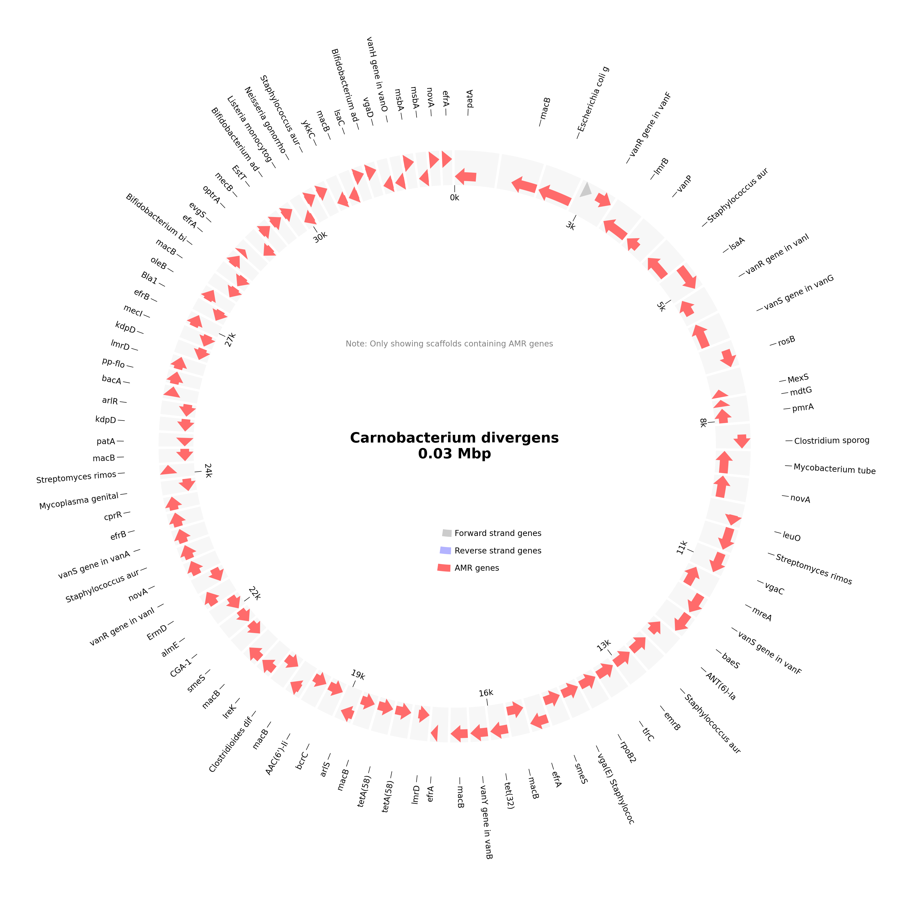

### AAC(6')-Ii
- **Mechanism**: antibiotic inactivation
- **Drug Classes**: aminoglycoside antibiotic
- **AMR Family**: AAC(6')
- **Locations**:
  - gnl|SPADES|DLDDEBJH_16830_1 : position 22-321

### ANT(6)-Ia
- **Mechanism**: antibiotic inactivation
- **Drug Classes**: aminoglycoside antibiotic
- **AMR Family**: ANT(6)
- **Locations**:
  - gnl|SPADES|DLDDEBJH_12244_1 : position 2-304

### Bifidobacterium adolescentis rpoB mutants conferring resistance to rifampicin (found in 2 locations)
- **Mechanism**: antibiotic target alteration; antibiotic target replacement
- **Drug Classes**: rifamycin antibiotic
- **AMR Family**: rifamycin-resistant beta-subunit of RNA polymerase (rpoB)
- **Locations**:
  - gnl|SPADES|DLDDEBJH_34622_1 : position 1-231
  - gnl|SPADES|DLDDEBJH_41281_1 : position 1-213

### Bifidobacterium bifidum ileS conferring resistance to mupirocin
- **Mechanism**: antibiotic target alteration
- **Drug Classes**: mupirocin-like antibiotic
- **AMR Family**: antibiotic-resistant isoleucyl-tRNA synthetase (ileS)
- **Locations**:
  - gnl|SPADES|DLDDEBJH_31887_1 : position 2-241

### Bla1
- **Mechanism**: antibiotic inactivation
- **Drug Classes**: penam
- **AMR Family**: class A Bacillus anthracis Bla beta-lactamase
- **Locations**:
  - gnl|SPADES|DLDDEBJH_30183_1 : position 3-245

### CGA-1
- **Mechanism**: antibiotic inactivation
- **Drug Classes**: penam
- **AMR Family**: CGA beta-lactamase
- **Locations**:
  - gnl|SPADES|DLDDEBJH_17674_1 : position 1-306

### Clostridioides difficile gyrB conferring resistance to fluoroquinolones
- **Mechanism**: antibiotic target alteration
- **Drug Classes**: fluoroquinolone antibiotic
- **AMR Family**: fluoroquinolone resistant gyrB
- **Locations**:
  - gnl|SPADES|DLDDEBJH_17163_1 : position 2-316

### Clostridium sporogenes cplR
- **Mechanism**: antibiotic target protection
- **Drug Classes**: lincosamide antibiotic; pleuromutilin antibiotic
- **AMR Family**: Miscellaneous ABC-F subfamily ATP-binding cassette ribosomal protection proteins
- **Locations**:
  - gnl|SPADES|DLDDEBJH_10169_1 : position 211-498

### ErmD
- **Mechanism**: antibiotic target alteration
- **Drug Classes**: macrolide antibiotic; lincosamide antibiotic; streptogramin antibiotic; streptogramin A antibiotic; streptogramin B antibiotic
- **AMR Family**: Erm 23S ribosomal RNA methyltransferase
- **Locations**:
  - gnl|SPADES|DLDDEBJH_17875_1 : position 3-305

### Escherichia coli gyrA conferring resistance to fluoroquinolones
- **Mechanism**: antibiotic target alteration
- **Drug Classes**: fluoroquinolone antibiotic
- **AMR Family**: fluoroquinolone resistant gyrA
- **Locations**:
  - gnl|SPADES|DLDDEBJH_6966_1 : position 3-740

### EstT
- **Mechanism**: antibiotic inactivation
- **Drug Classes**: macrolide antibiotic
- **AMR Family**: macrolide esterase
- **Locations**:
  - gnl|SPADES|DLDDEBJH_33741_1 : position 2-235

### IreK
- **Mechanism**: reduced permeability to antibiotic
- **Drug Classes**: cephalosporin
- **AMR Family**: Serine/threonine kinases
- **Locations**:
  - gnl|SPADES|DLDDEBJH_17226_1 : position 3-314

### Listeria monocytogenes mprF
- **Mechanism**: antibiotic target alteration
- **Drug Classes**: peptide antibiotic
- **AMR Family**: defensin resistant mprF
- **Locations**:
  - gnl|SPADES|DLDDEBJH_36525_1 : position 2-226

### MexS
- **Mechanism**: antibiotic efflux
- **Drug Classes**: fluoroquinolone antibiotic; diaminopyrimidine antibiotic; phenicol antibiotic
- **AMR Family**: resistance-nodulation-cell division (RND) antibiotic efflux pump
- **Locations**:
  - gnl|SPADES|DLDDEBJH_9788_2 : position 344-517

### Mycobacterium tuberculosis intrinsic murA conferring resistance to fosfomycin
- **Mechanism**: antibiotic target alteration
- **Drug Classes**: phosphonic acid antibiotic
- **AMR Family**: antibiotic-resistant murA transferase
- **Locations**:
  - gnl|SPADES|DLDDEBJH_10379_1 : position 3-488

### Mycoplasma genitalium parC mutations confers resistance to Moxifloxacin
- **Mechanism**: antibiotic target alteration
- **Drug Classes**: fluoroquinolone antibiotic
- **AMR Family**: fluoroquinolone resistant parC
- **Locations**:
  - gnl|SPADES|DLDDEBJH_21709_1 : position 2-274

### Neisseria gonorrhoeae mtrR with mutation conferring resistance
- **Mechanism**: antibiotic efflux
- **Drug Classes**: macrolide antibiotic
- **AMR Family**: resistance-nodulation-cell division (RND) antibiotic efflux pump
- **Locations**:
  - gnl|SPADES|DLDDEBJH_37212_1 : position 2-223

### Staphylococcus aureus mupA conferring resistance to mupirocin (found in 3 locations)
- **Mechanism**: antibiotic target alteration
- **Drug Classes**: mupirocin-like antibiotic
- **AMR Family**: antibiotic-resistant isoleucyl-tRNA synthetase (ileS)
- **Locations**:
  - gnl|SPADES|DLDDEBJH_12236_1 : position 2-418
  - gnl|SPADES|DLDDEBJH_18403_1 : position 2-298
  - gnl|SPADES|DLDDEBJH_37813_1 : position 1-222

### Staphylococcus aureus rpoB mutants conferring resistance to rifampicin
- **Mechanism**: antibiotic target alteration; antibiotic target replacement
- **Drug Classes**: rifamycin antibiotic
- **AMR Family**: rifamycin-resistant beta-subunit of RNA polymerase (rpoB)
- **Locations**:
  - gnl|SPADES|DLDDEBJH_9245_1 : position 2-550

### Streptomyces rimosus otr(A) (found in 2 locations)
- **Mechanism**: antibiotic target protection
- **Drug Classes**: tetracycline antibiotic
- **AMR Family**: tetracycline-resistant ribosomal protection protein
- **Locations**:
  - gnl|SPADES|DLDDEBJH_10787_1 : position 3-470
  - gnl|SPADES|DLDDEBJH_21815_1 : position 88-273

### almE
- **Mechanism**: antibiotic target alteration
- **Drug Classes**: peptide antibiotic
- **AMR Family**: polymyxin resistance operon; alm glycyltransferase
- **Locations**:
  - gnl|SPADES|DLDDEBJH_17723_1 : position 1-306

### arlR
- **Mechanism**: antibiotic efflux
- **Drug Classes**: fluoroquinolone antibiotic; disinfecting agents and antiseptics
- **AMR Family**: major facilitator superfamily (MFS) antibiotic efflux pump
- **Locations**:
  - gnl|SPADES|DLDDEBJH_22875_1 : position 3-269

### arlS
- **Mechanism**: antibiotic efflux
- **Drug Classes**: fluoroquinolone antibiotic; disinfecting agents and antiseptics
- **AMR Family**: major facilitator superfamily (MFS) antibiotic efflux pump
- **Locations**:
  - gnl|SPADES|DLDDEBJH_16039_1 : position 3-272

### bacA
- **Mechanism**: antibiotic target alteration
- **Drug Classes**: peptide antibiotic
- **AMR Family**: undecaprenyl pyrophosphate related proteins
- **Locations**:
  - gnl|SPADES|DLDDEBJH_23358_1 : position 64-267

### baeS
- **Mechanism**: antibiotic efflux
- **Drug Classes**: aminoglycoside antibiotic; aminocoumarin antibiotic
- **AMR Family**: resistance-nodulation-cell division (RND) antibiotic efflux pump
- **Locations**:
  - gnl|SPADES|DLDDEBJH_12099_1 : position 1-423

### bcrC
- **Mechanism**: antibiotic target alteration
- **Drug Classes**: peptide antibiotic
- **AMR Family**: undecaprenyl pyrophosphate related proteins
- **Locations**:
  - gnl|SPADES|DLDDEBJH_16376_1 : position 2-328

### cprR
- **Mechanism**: antibiotic target alteration; antibiotic efflux
- **Drug Classes**: peptide antibiotic
- **AMR Family**: pmr phosphoethanolamine transferase
- **Locations**:
  - gnl|SPADES|DLDDEBJH_20061_1 : position 3-281

### efrA (found in 4 locations)
- **Mechanism**: antibiotic efflux
- **Drug Classes**: macrolide antibiotic; fluoroquinolone antibiotic; rifamycin antibiotic
- **AMR Family**: ATP-binding cassette (ABC) antibiotic efflux pump
- **Locations**:
  - gnl|SPADES|DLDDEBJH_14147_1 : position 2-370
  - gnl|SPADES|DLDDEBJH_14877_1 : position 211-354
  - gnl|SPADES|DLDDEBJH_32189_1 : position 2-241
  - gnl|SPADES|DLDDEBJH_42754_1 : position 2-208

### efrB (found in 2 locations)
- **Mechanism**: antibiotic efflux
- **Drug Classes**: macrolide antibiotic; fluoroquinolone antibiotic; rifamycin antibiotic
- **AMR Family**: ATP-binding cassette (ABC) antibiotic efflux pump
- **Locations**:
  - gnl|SPADES|DLDDEBJH_18581_1 : position 1-294
  - gnl|SPADES|DLDDEBJH_27141_1 : position 2-256

### emrB
- **Mechanism**: antibiotic efflux
- **Drug Classes**: fluoroquinolone antibiotic
- **AMR Family**: major facilitator superfamily (MFS) antibiotic efflux pump
- **Locations**:
  - gnl|SPADES|DLDDEBJH_12407_1 : position 1-414

### evgS
- **Mechanism**: antibiotic efflux
- **Drug Classes**: macrolide antibiotic; fluoroquinolone antibiotic; penam; tetracycline antibiotic
- **AMR Family**: major facilitator superfamily (MFS) antibiotic efflux pump; resistance-nodulation-cell division (RND) antibiotic efflux pump
- **Locations**:
  - gnl|SPADES|DLDDEBJH_32323_1 : position 1-117

### kdpD (found in 2 locations)
- **Mechanism**: antibiotic efflux
- **Drug Classes**: aminoglycoside antibiotic
- **AMR Family**: kdpDE
- **Locations**:
  - gnl|SPADES|DLDDEBJH_22490_1 : position 1-270
  - gnl|SPADES|DLDDEBJH_26373_1 : position 3-260

### leuO
- **Mechanism**: antibiotic efflux
- **Drug Classes**: nucleoside antibiotic; disinfecting agents and antiseptics
- **AMR Family**: major facilitator superfamily (MFS) antibiotic efflux pump
- **Locations**:
  - gnl|SPADES|DLDDEBJH_10677_2 : position 256-474

### lmrB
- **Mechanism**: antibiotic efflux
- **Drug Classes**: lincosamide antibiotic; nucleoside antibiotic
- **AMR Family**: ATP-binding cassette (ABC) antibiotic efflux pump
- **Locations**:
  - gnl|SPADES|DLDDEBJH_8693_1 : position 1-585

### lmrD (found in 2 locations)
- **Mechanism**: antibiotic efflux
- **Drug Classes**: lincosamide antibiotic
- **AMR Family**: ATP-binding cassette (ABC) antibiotic efflux pump
- **Locations**:
  - gnl|SPADES|DLDDEBJH_15062_1 : position 1-243
  - gnl|SPADES|DLDDEBJH_25921_1 : position 1-261

### lsaA
- **Mechanism**: antibiotic target protection
- **Drug Classes**: lincosamide antibiotic; streptogramin antibiotic; streptogramin A antibiotic; streptogramin B antibiotic; pleuromutilin antibiotic
- **AMR Family**: lsa-type ABC-F protein
- **Locations**:
  - gnl|SPADES|DLDDEBJH_9276_1 : position 3-533

### lsaC
- **Mechanism**: antibiotic target protection
- **Drug Classes**: lincosamide antibiotic; streptogramin antibiotic; pleuromutilin antibiotic
- **AMR Family**: lsa-type ABC-F protein
- **Locations**:
  - gnl|SPADES|DLDDEBJH_40256_1 : position 3-215

### macB (found in 9 locations)
- **Mechanism**: antibiotic efflux
- **Drug Classes**: macrolide antibiotic
- **AMR Family**: ATP-binding cassette (ABC) antibiotic efflux pump
- **Locations**:
  - gnl|SPADES|DLDDEBJH_14261_1 : position 1-366
  - gnl|SPADES|DLDDEBJH_14847_1 : position 1-354
  - gnl|SPADES|DLDDEBJH_15975_1 : position 28-333
  - gnl|SPADES|DLDDEBJH_16958_1 : position 80-319
  - gnl|SPADES|DLDDEBJH_17202_1 : position 1-315
  - gnl|SPADES|DLDDEBJH_22411_1 : position 3-272
  - gnl|SPADES|DLDDEBJH_31486_1 : position 2-241
  - gnl|SPADES|DLDDEBJH_39614_1 : position 3-218
  - gnl|SPADES|DLDDEBJH_6113_1 : position 297-854

### mdtG
- **Mechanism**: antibiotic efflux
- **Drug Classes**: phosphonic acid antibiotic
- **AMR Family**: major facilitator superfamily (MFS) antibiotic efflux pump
- **Locations**:
  - gnl|SPADES|DLDDEBJH_9859_1 : position 3-155

### mecB
- **Mechanism**: antibiotic target replacement
- **Drug Classes**: penam
- **AMR Family**: methicillin resistant PBP2
- **Locations**:
  - gnl|SPADES|DLDDEBJH_33440_1 : position 1-237

### mecI
- **Mechanism**: antibiotic target replacement
- **Drug Classes**: penam
- **AMR Family**: methicillin resistant PBP2
- **Locations**:
  - gnl|SPADES|DLDDEBJH_27029_1 : position 2-256

### mreA
- **Mechanism**: antibiotic efflux
- **Drug Classes**: macrolide antibiotic
- **AMR Family**: major facilitator superfamily (MFS) antibiotic efflux pump
- **Locations**:
  - gnl|SPADES|DLDDEBJH_11951_1 : position 3-428

### msbA (found in 2 locations)
- **Mechanism**: antibiotic efflux
- **Drug Classes**: nitroimidazole antibiotic
- **AMR Family**: ATP-binding cassette (ABC) antibiotic efflux pump
- **Locations**:
  - gnl|SPADES|DLDDEBJH_41386_1 : position 1-210
  - gnl|SPADES|DLDDEBJH_42100_1 : position 1-210

### novA (found in 3 locations)
- **Mechanism**: antibiotic efflux
- **Drug Classes**: aminocoumarin antibiotic
- **AMR Family**: ATP-binding cassette (ABC) antibiotic efflux pump
- **Locations**:
  - gnl|SPADES|DLDDEBJH_10606_1 : position 1-477
  - gnl|SPADES|DLDDEBJH_18026_1 : position 1-303
  - gnl|SPADES|DLDDEBJH_42598_1 : position 1-207

### oleB
- **Mechanism**: antibiotic target protection
- **Drug Classes**: macrolide antibiotic
- **AMR Family**: Miscellaneous ABC-F subfamily ATP-binding cassette ribosomal protection proteins
- **Locations**:
  - gnl|SPADES|DLDDEBJH_30969_1 : position 3-245

### optrA
- **Mechanism**: antibiotic target protection
- **Drug Classes**: oxazolidinone antibiotic; phenicol antibiotic
- **AMR Family**: Miscellaneous ABC-F subfamily ATP-binding cassette ribosomal protection proteins
- **Locations**:
  - gnl|SPADES|DLDDEBJH_32498_1 : position 2-238

### patA (found in 2 locations)
- **Mechanism**: antibiotic efflux
- **Drug Classes**: fluoroquinolone antibiotic
- **AMR Family**: ATP-binding cassette (ABC) antibiotic efflux pump
- **Locations**:
  - gnl|SPADES|DLDDEBJH_22475_1 : position 2-187
  - gnl|SPADES|DLDDEBJH_5894_1 : position 3-467

### pmrA
- **Mechanism**: antibiotic efflux
- **Drug Classes**: fluoroquinolone antibiotic
- **AMR Family**: major facilitator superfamily (MFS) antibiotic efflux pump
- **Locations**:
  - gnl|SPADES|DLDDEBJH_9859_2 : position 199-513

### pp-flo
- **Mechanism**: antibiotic efflux
- **Drug Classes**: phenicol antibiotic
- **AMR Family**: major facilitator superfamily (MFS) antibiotic efflux pump
- **Locations**:
  - gnl|SPADES|DLDDEBJH_25992_1 : position 1-261

### rosB
- **Mechanism**: antibiotic efflux
- **Drug Classes**: peptide antibiotic
- **AMR Family**: major facilitator superfamily (MFS) antibiotic efflux pump
- **Locations**:
  - gnl|SPADES|DLDDEBJH_9792_1 : position 154-516

### rpoB2
- **Mechanism**: antibiotic target alteration; antibiotic target replacement
- **Drug Classes**: rifamycin antibiotic
- **AMR Family**: rifamycin-resistant beta-subunit of RNA polymerase (rpoB)
- **Locations**:
  - gnl|SPADES|DLDDEBJH_13480_1 : position 1-384

### smeS (found in 2 locations)
- **Mechanism**: antibiotic efflux
- **Drug Classes**: aminoglycoside antibiotic; cephalosporin; cephamycin; penam
- **AMR Family**: resistance-nodulation-cell division (RND) antibiotic efflux pump
- **Locations**:
  - gnl|SPADES|DLDDEBJH_14141_1 : position 3-368
  - gnl|SPADES|DLDDEBJH_17524_1 : position 3-308

### tet(32)
- **Mechanism**: antibiotic target protection
- **Drug Classes**: tetracycline antibiotic
- **AMR Family**: tetracycline-resistant ribosomal protection protein
- **Locations**:
  - gnl|SPADES|DLDDEBJH_14327_1 : position 2-364

### tetA(58) (found in 2 locations)
- **Mechanism**: antibiotic efflux
- **Drug Classes**: tetracycline antibiotic
- **AMR Family**: major facilitator superfamily (MFS) antibiotic efflux pump
- **Locations**:
  - gnl|SPADES|DLDDEBJH_15245_1 : position 1-348
  - gnl|SPADES|DLDDEBJH_15692_1 : position 3-338

### tlrC
- **Mechanism**: antibiotic target protection
- **Drug Classes**: macrolide antibiotic; lincosamide antibiotic
- **AMR Family**: Miscellaneous ABC-F subfamily ATP-binding cassette ribosomal protection proteins
- **Locations**:
  - gnl|SPADES|DLDDEBJH_12665_1 : position 3-404

### vanH gene in vanO cluster
- **Mechanism**: antibiotic target alteration
- **Drug Classes**: glycopeptide antibiotic
- **AMR Family**: vanH; glycopeptide resistance gene cluster
- **Locations**:
  - gnl|SPADES|DLDDEBJH_41586_1 : position 1-210

### vanP
- **Mechanism**: antibiotic target alteration
- **Drug Classes**: glycopeptide antibiotic
- **AMR Family**: glycopeptide resistance gene cluster; Van ligase
- **Locations**:
  - gnl|SPADES|DLDDEBJH_8938_1 : position 1-306

### vanR gene in vanF cluster
- **Mechanism**: antibiotic target alteration
- **Drug Classes**: glycopeptide antibiotic
- **AMR Family**: glycopeptide resistance gene cluster; vanR
- **Locations**:
  - gnl|SPADES|DLDDEBJH_7030_2 : position 394-732

### vanR gene in vanI cluster (found in 2 locations)
- **Mechanism**: antibiotic target alteration
- **Drug Classes**: glycopeptide antibiotic
- **AMR Family**: glycopeptide resistance gene cluster; vanR
- **Locations**:
  - gnl|SPADES|DLDDEBJH_17979_1 : position 2-304
  - gnl|SPADES|DLDDEBJH_9358_1 : position 1-357

### vanS gene in vanA cluster
- **Mechanism**: antibiotic target alteration
- **Drug Classes**: glycopeptide antibiotic
- **AMR Family**: vanS; glycopeptide resistance gene cluster
- **Locations**:
  - gnl|SPADES|DLDDEBJH_18400_1 : position 3-296

### vanS gene in vanF cluster
- **Mechanism**: antibiotic target alteration
- **Drug Classes**: glycopeptide antibiotic
- **AMR Family**: vanS; glycopeptide resistance gene cluster
- **Locations**:
  - gnl|SPADES|DLDDEBJH_12045_1 : position 1-423

### vanS gene in vanG cluster
- **Mechanism**: antibiotic target alteration
- **Drug Classes**: glycopeptide antibiotic
- **AMR Family**: vanS; glycopeptide resistance gene cluster
- **Locations**:
  - gnl|SPADES|DLDDEBJH_9387_1 : position 2-541

### vanY gene in vanB cluster
- **Mechanism**: antibiotic target alteration
- **Drug Classes**: glycopeptide antibiotic
- **AMR Family**: vanY; glycopeptide resistance gene cluster
- **Locations**:
  - gnl|SPADES|DLDDEBJH_14701_1: position 1-357

### vga(E) Staphylococcus cohnii
- **Mechanism**: antibiotic target protection
- **Drug Classes**: lincosamide antibiotic; streptogramin antibiotic; streptogramin A antibiotic; pleuromutilin antibiotic
- **AMR Family**: vga-type ABC-F protein
- **Locations**:
  - gnl|SPADES|DLDDEBJH_13535_1 : position 1-384

### vgaC
- **Mechanism**: antibiotic target protection
- **Drug Classes**: lincosamide antibiotic; streptogramin antibiotic; streptogramin A antibiotic; pleuromutilin antibiotic
- **AMR Family**: vga-type ABC-F protein
- **Locations**:
  - gnl|SPADES|DLDDEBJH_11355_1 : position 26-448

### vgaD
- **Mechanism**: antibiotic target protection
- **Drug Classes**: streptogramin antibiotic; streptogramin A antibiotic; pleuromutilin antibiotic
- **AMR Family**: vga-type ABC-F protein
- **Locations**:
  - gnl|SPADES|DLDDEBJH_41269_1 : position 1-213

### ykkC
- **Mechanism**: antibiotic efflux
- **Drug Classes**: aminoglycoside antibiotic; tetracycline antibiotic; phenicol antibiotic
- **AMR Family**: small multidrug resistance (SMR) antibiotic efflux pump
- **Locations**:
  - gnl|SPADES|DLDDEBJH_38198_1 : position 1-222

## Carnobacterium maltaromaticum
**Strain Statistics:**
- Total genome length: 408.8 kbp
- Total scaffolds: 2933
- Scaffolds with AMR genes: 297
- Total genes annotated: 621
- Total AMR genes: 333
- Unique AMR genes: 156
- Distinct AMR mechanisms: 10
- Distinct AMR families: 62
- Distinct drug classes: 35

**Circos Plot:**

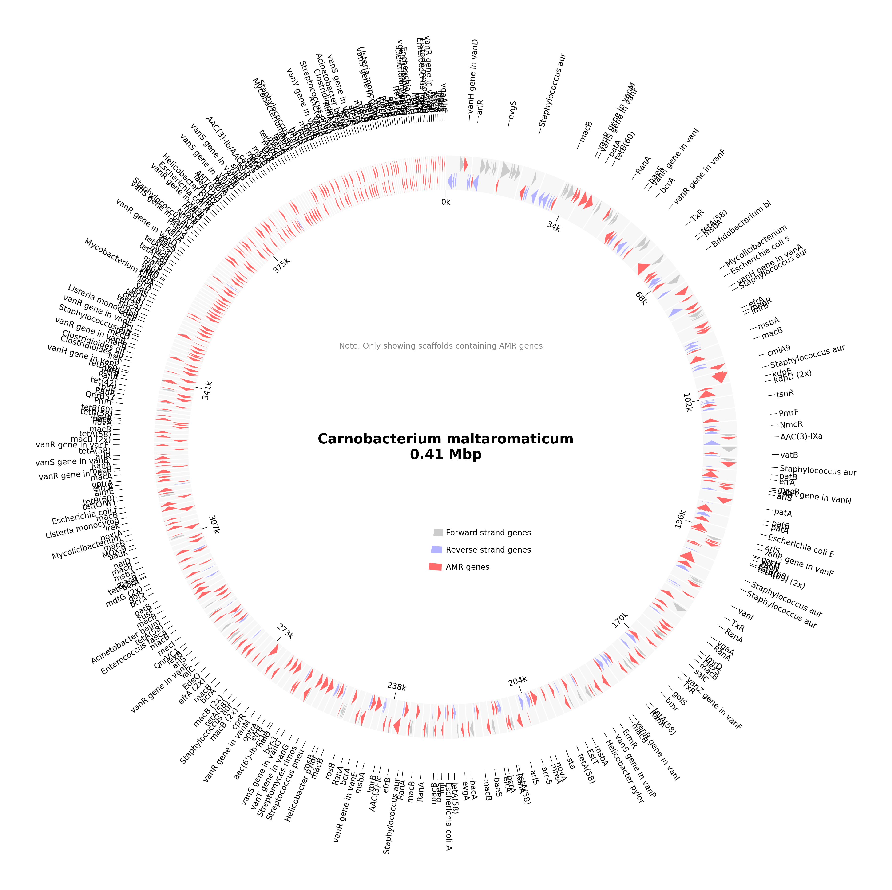

### AAC(3)-IXa
- **Mechanism**: antibiotic inactivation
- **Drug Classes**: aminoglycoside antibiotic
- **AMR Family**: AAC(3)
- **Locations**:
  - gnl|SPADES|DLDDEBJH_2021_2 : position 788-1600

### AAC(3)-Ib/AAC(6')-Ib3 bifunctional protein
- **Mechanism**: antibiotic inactivation
- **Drug Classes**: aminoglycoside antibiotic
- **AMR Family**: aminoglycoside bifunctional resistance protein
- **Locations**:
  - gnl|SPADES|DLDDEBJH_8998_1 : position 3-566

### AAC(3)-Ic
- **Mechanism**: antibiotic inactivation
- **Drug Classes**: aminoglycoside antibiotic
- **AMR Family**: AAC(3)
- **Locations**:
  - gnl|SPADES|DLDDEBJH_3379_2 : position 624-1061

### AAC(6')-34
- **Mechanism**: antibiotic inactivation
- **Drug Classes**: aminoglycoside antibiotic
- **AMR Family**: AAC(6')
- **Locations**:
  - gnl|SPADES|DLDDEBJH_11756_1 : position 2-271

### ANT(6)-Ib
- **Mechanism**: antibiotic inactivation
- **Drug Classes**: aminoglycoside antibiotic
- **AMR Family**: ANT(6)
- **Locations**:
  - gnl|SPADES|DLDDEBJH_8493_1 : position 1-597

### Acinetobacter baumannii AbaQ (found in 2 locations)
- **Mechanism**: antibiotic efflux
- **Drug Classes**: fluoroquinolone antibiotic
- **AMR Family**: major facilitator superfamily (MFS) antibiotic efflux pump
- **Locations**:
  - gnl|SPADES|DLDDEBJH_13304_1 : position 73-387
  - gnl|SPADES|DLDDEBJH_4448_1 : position 2-1081

### BcI
- **Mechanism**: antibiotic inactivation
- **Drug Classes**: cephalosporin; penem
- **AMR Family**: class A Bacillus cereus Bc beta-lactamase
- **Locations**:
  - gnl|SPADES|DLDDEBJH_6400_1 : position 98-811

### Bifidobacterium bifidum ileS conferring resistance to mupirocin
- **Mechanism**: antibiotic target alteration
- **Drug Classes**: mupirocin-like antibiotic
- **AMR Family**: antibiotic-resistant isoleucyl-tRNA synthetase (ileS)
- **Locations**:
  - gnl|SPADES|DLDDEBJH_1699_1 : position 3-902

### CRP
- **Mechanism**: antibiotic efflux
- **Drug Classes**: macrolide antibiotic; fluoroquinolone antibiotic; penam
- **AMR Family**: resistance-nodulation-cell division (RND) antibiotic efflux pump
- **Locations**:
  - gnl|SPADES|DLDDEBJH_7253_1 : position 1-486

### Clostridioides difficile cplR
- **Mechanism**: antibiotic target protection
- **Drug Classes**: lincosamide antibiotic; streptogramin antibiotic; streptogramin A antibiotic; nucleoside antibiotic
- **AMR Family**: Miscellaneous ABC-F subfamily ATP-binding cassette ribosomal protection proteins
- **Locations**:
  - gnl|SPADES|DLDDEBJH_12719_1 : position 1-234

### Clostridioides difficile gyrA conferring resistance to fluoroquinolones
- **Mechanism**: antibiotic target alteration
- **Drug Classes**: fluoroquinolone antibiotic
- **AMR Family**: fluoroquinolone resistant gyrA
- **Locations**:
  - gnl|SPADES|DLDDEBJH_6199_1 : position 3-842

### Clostridioides difficile gyrB conferring resistance to fluoroquinolones
- **Mechanism**: antibiotic target alteration
- **Drug Classes**: fluoroquinolone antibiotic
- **AMR Family**: fluoroquinolone resistant gyrB
- **Locations**:
  - gnl|SPADES|DLDDEBJH_6230_1 : position 2-835

### Clostridium perfringes cplR
- **Mechanism**: antibiotic target protection
- **Drug Classes**: lincosamide antibiotic; streptogramin antibiotic; streptogramin A antibiotic; pleuromutilin antibiotic
- **AMR Family**: Miscellaneous ABC-F subfamily ATP-binding cassette ribosomal protection proteins
- **Locations**:
  - gnl|SPADES|DLDDEBJH_19744_1 : position 1-141

### EdeQ
- **Mechanism**: antibiotic inactivation
- **Drug Classes**: peptide antibiotic; polyamine antibiotic
- **AMR Family**: Edeine acetyltransferase
- **Locations**:
  - gnl|SPADES|DLDDEBJH_4150_2 : position 643-1008

### Enterococcus faecalis cls with mutation conferring resistance to daptomycin (found in 2 locations)
- **Mechanism**: antibiotic target alteration
- **Drug Classes**: peptide antibiotic
- **AMR Family**: daptomycin resistant cls
- **Locations**:
  - gnl|SPADES|DLDDEBJH_29900_1 : position 3-248
  - gnl|SPADES|DLDDEBJH_4386_2 : position 438-1262

### ErmR
- **Mechanism**: antibiotic target alteration
- **Drug Classes**: macrolide antibiotic; lincosamide antibiotic; streptogramin antibiotic; streptogramin A antibiotic; streptogramin B antibiotic
- **AMR Family**: Erm 23S ribosomal RNA methyltransferase
- **Locations**:
  - gnl|SPADES|DLDDEBJH_2761_2 : position 224-1117

### Escherichia coli AcrAB-TolC with AcrR mutation conferring resistance to ciprofloxacin, tetracycline, and ceftazidime
- **Mechanism**: antibiotic target alteration; antibiotic efflux
- **Drug Classes**: fluoroquinolone antibiotic; cephalosporin; glycylcycline; penam; tetracycline antibiotic; rifamycin antibiotic; phenicol antibiotic; disinfecting agents and antiseptics
- **AMR Family**: resistance-nodulation-cell division (RND) antibiotic efflux pump
- **Locations**:
  - gnl|SPADES|DLDDEBJH_8303_2 : position 284-613

### Escherichia coli AcrAB-TolC with MarR mutations conferring resistance to ciprofloxacin and tetracycline
- **Mechanism**: antibiotic target alteration; antibiotic efflux
- **Drug Classes**: fluoroquinolone antibiotic; cephalosporin; glycylcycline; penam; tetracycline antibiotic; rifamycin antibiotic; phenicol antibiotic; disinfecting agents and antiseptics
- **AMR Family**: resistance-nodulation-cell division (RND) antibiotic efflux pump
- **Locations**:
  - gnl|SPADES|DLDDEBJH_3244_2 : position 577-1041

### Escherichia coli EF-Tu mutants conferring resistance to kirromycin
- **Mechanism**: antibiotic target alteration
- **Drug Classes**: elfamycin antibiotic
- **AMR Family**: elfamycin resistant EF-Tu
- **Locations**:
  - gnl|SPADES|DLDDEBJH_2216_3 : position 1388-2575

### Escherichia coli fabI mutations conferring resistance to isoniazid and triclosan
- **Mechanism**: antibiotic target alteration
- **Drug Classes**: disinfecting agents and antiseptics; isoniazid-like antibiotic
- **AMR Family**: antibiotic resistant fabI
- **Locations**:
  - gnl|SPADES|DLDDEBJH_5250_1 : position 1-636

### Escherichia coli gyrA conferring resistance to fluoroquinolones
- **Mechanism**: antibiotic target alteration
- **Drug Classes**: fluoroquinolone antibiotic
- **AMR Family**: fluoroquinolone resistant gyrA
- **Locations**:
  - gnl|SPADES|DLDDEBJH_22271_1 : position 1-273

### Escherichia coli soxS with mutation conferring antibiotic resistance
- **Mechanism**: antibiotic target alteration; antibiotic efflux; reduced permeability to antibiotic
- **Drug Classes**: fluoroquinolone antibiotic; monobactam; carbapenem; cephalosporin; glycylcycline; cephamycin; penam; tetracycline antibiotic; rifamycin antibiotic; phenicol antibiotic; penem; disinfecting agents and antiseptics
- **AMR Family**: ATP-binding cassette (ABC) antibiotic efflux pump; major facilitator superfamily (MFS) antibiotic efflux pump; resistance-nodulation-cell division (RND) antibiotic efflux pump; General Bacterial Porin with reduced permeability to beta-lactams
- **Locations**:
  - gnl|SPADES|DLDDEBJH_1775_1 : position 1-555

### EstT
- **Mechanism**: antibiotic inactivation
- **Drug Classes**: macrolide antibiotic
- **AMR Family**: macrolide esterase
- **Locations**:
  - gnl|SPADES|DLDDEBJH_2880_1 : position 56-835

### FusF
- **Mechanism**: antibiotic target protection
- **Drug Classes**: fusidane antibiotic
- **AMR Family**: Target protecting FusB-type protein conferring resistance to Fusidic acid
- **Locations**:
  - gnl|SPADES|DLDDEBJH_4564_1 : position 25-672

### Helicobacter pylori frxA mutation conferring resistance to metronidazole
- **Mechanism**: antibiotic target alteration
- **Drug Classes**: nitroimidazole antibiotic
- **AMR Family**: Antibiotic resistant Helicobacter pylori nitroreductase
- **Locations**:
  - gnl|SPADES|DLDDEBJH_2794_1 : position 3-338

### Helicobacter pylori pbp1 mutants conferring resistance to amoxicillin (found in 2 locations)
- **Mechanism**: antibiotic target alteration
- **Drug Classes**: cephalosporin; cephamycin; penam
- **AMR Family**: Penicillin-binding protein mutations conferring resistance to beta-lactam antibiotics
- **Locations**:
  - gnl|SPADES|DLDDEBJH_3703_2 : position 578-1558
  - gnl|SPADES|DLDDEBJH_8384_1 : position 1-606

### IreK (found in 4 locations)
- **Mechanism**: reduced permeability to antibiotic
- **Drug Classes**: cephalosporin
- **AMR Family**: Serine/threonine kinases
- **Locations**:
  - gnl|SPADES|DLDDEBJH_10482_1 : position 3-482
  - gnl|SPADES|DLDDEBJH_5017_1 : position 3-1079
  - gnl|SPADES|DLDDEBJH_6174_3 : position 641-847
  - gnl|SPADES|DLDDEBJH_9097_1 : position 3-557

### Listeria monocytogenes mprF (found in 4 locations)
- **Mechanism**: antibiotic target alteration
- **Drug Classes**: peptide antibiotic
- **AMR Family**: defensin resistant mprF
- **Locations**:
  - gnl|SPADES|DLDDEBJH_16727_1 : position 2-322
  - gnl|SPADES|DLDDEBJH_31690_1 : position 1-192
  - gnl|SPADES|DLDDEBJH_5141_1 : position 2-1051
  - gnl|SPADES|DLDDEBJH_6467_1 : position 3-803

### LpeA
- **Mechanism**: antibiotic efflux
- **Drug Classes**: macrolide antibiotic
- **AMR Family**: resistance-nodulation-cell division (RND) antibiotic efflux pump
- **Locations**:
  - gnl|SPADES|DLDDEBJH_5865_2 : position 407-898

### MOX-9
- **Mechanism**: antibiotic inactivation
- **Drug Classes**: cephalosporin; cephamycin; penam
- **AMR Family**: MOX beta-lactamase
- **Locations**:
  - gnl|SPADES|DLDDEBJH_4945_1 : position 1-1011

### MexL
- **Mechanism**: antibiotic efflux
- **Drug Classes**: macrolide antibiotic; tetracycline antibiotic; disinfecting agents and antiseptics
- **AMR Family**: resistance-nodulation-cell division (RND) antibiotic efflux pump
- **Locations**:
  - gnl|SPADES|DLDDEBJH_10373_1 : position 221-487

### MexS (found in 2 locations)
- **Mechanism**: antibiotic efflux
- **Drug Classes**: fluoroquinolone antibiotic; diaminopyrimidine antibiotic; phenicol antibiotic
- **AMR Family**: resistance-nodulation-cell division (RND) antibiotic efflux pump
- **Locations**:
  - gnl|SPADES|DLDDEBJH_2408_2 : position 1392-2372
  - gnl|SPADES|DLDDEBJH_7352_1 : position 1-684

### Mycobacterium tuberculosis intrinsic murA conferring resistance to fosfomycin
- **Mechanism**: antibiotic target alteration
- **Drug Classes**: phosphonic acid antibiotic
- **AMR Family**: antibiotic-resistant murA transferase
- **Locations**:
  - gnl|SPADES|DLDDEBJH_7039_1 : position 2-457

### Mycobacterium tuberculosis pncA mutations conferring resistance to pyrazinamide
- **Mechanism**: antibiotic target alteration
- **Drug Classes**: pyrazine antibiotic
- **AMR Family**: Pyrazinamide resistant pncA
- **Locations**:
  - gnl|SPADES|DLDDEBJH_10391_1 : position 2-487

### Mycolicibacterium smegmatis ndh with mutation conferring resistance to isoniazid (found in 2 locations)
- **Mechanism**: antibiotic target alteration
- **Drug Classes**: isoniazid-like antibiotic
- **AMR Family**: antibiotic resistant ndh
- **Locations**:
  - gnl|SPADES|DLDDEBJH_1737_2 : position 1277-2833
  - gnl|SPADES|DLDDEBJH_4982_1 : position 173-613

### NmcR (found in 4 locations)
- **Mechanism**: antibiotic inactivation
- **Drug Classes**: carbapenem; cephalosporin; cephamycin; penam
- **AMR Family**: NmcA beta-lactamase
- **Locations**:
  - gnl|SPADES|DLDDEBJH_19629_1 : position 3-239
  - gnl|SPADES|DLDDEBJH_1995_3 : position 1363-2247
  - gnl|SPADES|DLDDEBJH_6490_1 : position 1-348
  - gnl|SPADES|DLDDEBJH_7597_1 : position 3-674

### PAM-2
- **Mechanism**: antibiotic inactivation
- **Drug Classes**: carbapenem; cephalosporin
- **AMR Family**: PAM beta-lactamase
- **Locations**:
  - gnl|SPADES|DLDDEBJH_7535_1 : position 1-681

### PmrF (found in 2 locations)
- **Mechanism**: antibiotic target alteration
- **Drug Classes**: peptide antibiotic
- **AMR Family**: pmr phosphoethanolamine transferase
- **Locations**:
  - gnl|SPADES|DLDDEBJH_1980_2 : position 2026-3159
  - gnl|SPADES|DLDDEBJH_5887_3 : position 560-895

### QnrB57
- **Mechanism**: antibiotic target protection
- **Drug Classes**: fluoroquinolone antibiotic
- **AMR Family**: quinolone resistance protein (qnr)
- **Locations**:
  - gnl|SPADES|DLDDEBJH_5898_2 : position 436-891

### QnrVC1
- **Mechanism**: antibiotic target protection
- **Drug Classes**: fluoroquinolone antibiotic
- **AMR Family**: quinolone resistance protein (qnr)
- **Locations**:
  - gnl|SPADES|DLDDEBJH_4321_1 : position 3-503

### RanA (found in 17 locations)
- **Mechanism**: antibiotic efflux
- **Drug Classes**: aminoglycoside antibiotic
- **AMR Family**: ATP-binding cassette (ABC) antibiotic efflux pump
- **Locations**:
  - gnl|SPADES|DLDDEBJH_10347_1 : position 1-489
  - gnl|SPADES|DLDDEBJH_1317_3 : position 3185-3919
  - gnl|SPADES|DLDDEBJH_18523_1 : position 2-295
  - gnl|SPADES|DLDDEBJH_2338_2 : position 1436-2551
  - gnl|SPADES|DLDDEBJH_2386_2 : position 548-1279
  - gnl|SPADES|DLDDEBJH_2729_1 : position 2-643
  - gnl|SPADES|DLDDEBJH_3023_3 : position 1644-1955
  - gnl|SPADES|DLDDEBJH_3295_3 : position 901-1506
  - gnl|SPADES|DLDDEBJH_3330_3 : position 1212-1754
  - gnl|SPADES|DLDDEBJH_3555_1 : position 2-634
  - gnl|SPADES|DLDDEBJH_35595_1 : position 3-230
  - gnl|SPADES|DLDDEBJH_5524_1 : position 207-968
  - gnl|SPADES|DLDDEBJH_5965_2 : position 310-882
  - gnl|SPADES|DLDDEBJH_5997_2 : position 681-875
  - gnl|SPADES|DLDDEBJH_7073_1 : position 3-728
  - gnl|SPADES|DLDDEBJH_7408_1 : position 53-694
  - gnl|SPADES|DLDDEBJH_8504_1 : position 2-598

### RlmA(II)
- **Mechanism**: antibiotic target alteration
- **Drug Classes**: macrolide antibiotic; lincosamide antibiotic
- **AMR Family**: non-erm 23S ribosomal RNA methyltransferase (G748)
- **Locations**:
  - gnl|SPADES|DLDDEBJH_12358_1 : position 3-413

### Rv1877
- **Mechanism**: antibiotic efflux
- **Drug Classes**: fluoroquinolone antibiotic
- **AMR Family**: major facilitator superfamily (MFS) antibiotic efflux pump
- **Locations**:
  - gnl|SPADES|DLDDEBJH_18894_1 : position 1-291

### Staphylococcus aureus LmrS (found in 2 locations)
- **Mechanism**: antibiotic efflux
- **Drug Classes**: macrolide antibiotic; aminoglycoside antibiotic; oxazolidinone antibiotic; diaminopyrimidine antibiotic; phenicol antibiotic
- **AMR Family**: major facilitator superfamily (MFS) antibiotic efflux pump
- **Locations**:
  - gnl|SPADES|DLDDEBJH_2085_2 : position 1047-2471
  - gnl|SPADES|DLDDEBJH_6399_2 : position 392-811

### Staphylococcus aureus fusA with mutation conferring resistance to fusidic acid (found in 2 locations)
- **Mechanism**: antibiotic target alteration
- **Drug Classes**: fusidane antibiotic
- **AMR Family**: antibiotic resistant fusA
- **Locations**:
  - gnl|SPADES|DLDDEBJH_1059_2 : position 851-2068
  - gnl|SPADES|DLDDEBJH_2254_1 : position 1-1374

### Staphylococcus aureus mupA conferring resistance to mupirocin (found in 4 locations)
- **Mechanism**: antibiotic target alteration
- **Drug Classes**: mupirocin-like antibiotic
- **AMR Family**: antibiotic-resistant isoleucyl-tRNA synthetase (ileS)
- **Locations**:
  - gnl|SPADES|DLDDEBJH_10383_1 : position 3-488
  - gnl|SPADES|DLDDEBJH_3358_1 : position 2-1141
  - gnl|SPADES|DLDDEBJH_3881_1 : position 2-1465
  - gnl|SPADES|DLDDEBJH_7573_1 : position 45-677

### Staphylococcus aureus mupB conferring resistance to mupirocin
- **Mechanism**: antibiotic target alteration
- **Drug Classes**: mupirocin-like antibiotic
- **AMR Family**: antibiotic-resistant isoleucyl-tRNA synthetase (ileS)
- **Locations**:
  - gnl|SPADES|DLDDEBJH_2247_1 : position 99-2714

### Staphylococcus aureus murA with mutation conferring resistance to fosfomycin
- **Mechanism**: antibiotic target alteration
- **Drug Classes**: phosphonic acid antibiotic
- **AMR Family**: antibiotic-resistant murA transferase
- **Locations**:
  - gnl|SPADES|DLDDEBJH_1818_1 : position 3-620

### Staphylococcus aureus rpoB mutants conferring resistance to rifampicin
- **Mechanism**: antibiotic target alteration; antibiotic target replacement
- **Drug Classes**: rifamycin antibiotic
- **AMR Family**: rifamycin-resistant beta-subunit of RNA polymerase (rpoB)
- **Locations**:
  - gnl|SPADES|DLDDEBJH_1912_1 : position 141-3284

### Streptococcus pneumoniae PBP2b conferring resistance to amoxicillin
- **Mechanism**: antibiotic target alteration
- **Drug Classes**: cephalosporin; cephamycin; penam
- **AMR Family**: Penicillin-binding protein mutations conferring resistance to beta-lactam antibiotics
- **Locations**:
  - gnl|SPADES|DLDDEBJH_3718_1 : position 1-1545

### Streptococcus pneumoniae PBP2x conferring resistance to amoxicillin
- **Mechanism**: antibiotic target alteration
- **Drug Classes**: cephalosporin; cephamycin; penam
- **AMR Family**: Penicillin-binding protein mutations conferring resistance to beta-lactam antibiotics
- **Locations**:
  - gnl|SPADES|DLDDEBJH_12039_1 : position 2-424

### Streptomyces rimosus otr(A)
- **Mechanism**: antibiotic target protection
- **Drug Classes**: tetracycline antibiotic
- **AMR Family**: tetracycline-resistant ribosomal protection protein
- **Locations**:
  - gnl|SPADES|DLDDEBJH_3716_1 : position 3-1547

### TaeA (found in 4 locations)
- **Mechanism**: antibiotic efflux
- **Drug Classes**: pleuromutilin antibiotic
- **AMR Family**: ATP-binding cassette (ABC) antibiotic efflux pump
- **Locations**:
  - gnl|SPADES|DLDDEBJH_12096_1 : position 39-422
  - gnl|SPADES|DLDDEBJH_13513_1 : position 3-383
  - gnl|SPADES|DLDDEBJH_8464_2 : position 156-344
  - gnl|SPADES|DLDDEBJH_8464_3 : position 311-601

### TxR (found in 3 locations)
- **Mechanism**: antibiotic efflux
- **Drug Classes**: tetracycline antibiotic
- **AMR Family**: ATP-binding cassette (ABC) antibiotic efflux pump
- **Locations**:
  - gnl|SPADES|DLDDEBJH_1549_1 : position 3-2612
  - gnl|SPADES|DLDDEBJH_2323_4 : position 2200-2676
  - gnl|SPADES|DLDDEBJH_2605_1 : position 1-1116

### VatI
- **Mechanism**: antibiotic inactivation
- **Drug Classes**: streptogramin antibiotic; streptogramin A antibiotic
- **AMR Family**: streptogramin vat acetyltransferase
- **Locations**:
  - gnl|SPADES|DLDDEBJH_6847_1 : position 1-381

### YajC
- **Mechanism**: antibiotic efflux
- **Drug Classes**: fluoroquinolone antibiotic; cephalosporin; glycylcycline; penam; tetracycline antibiotic; oxazolidinone antibiotic; glycopeptide antibiotic; rifamycin antibiotic; phenicol antibiotic; disinfecting agents and antiseptics
- **AMR Family**: resistance-nodulation-cell division (RND) antibiotic efflux pump
- **Locations**:
  - gnl|SPADES|DLDDEBJH_4207_2 : position 968-1333

### YojI
- **Mechanism**: antibiotic efflux
- **Drug Classes**: peptide antibiotic
- **AMR Family**: ATP-binding cassette (ABC) antibiotic efflux pump
- **Locations**:
  - gnl|SPADES|DLDDEBJH_3281_1 : position 109-654

### aac(6')-Ib-cr11
- **Mechanism**: antibiotic inactivation
- **Drug Classes**: fluoroquinolone antibiotic; aminoglycoside antibiotic
- **AMR Family**: AAC(6'); AAC(6')-Ib-cr
- **Locations**:
  - gnl|SPADES|DLDDEBJH_3770_3 : position 975-1517

### aadK
- **Mechanism**: antibiotic inactivation
- **Drug Classes**: aminoglycoside antibiotic
- **AMR Family**: ANT(6)
- **Locations**:
  - gnl|SPADES|DLDDEBJH_4934_3 : position 942-1097

### aadT
- **Mechanism**: antibiotic efflux
- **Drug Classes**: macrolide antibiotic; tetracycline antibiotic; disinfecting agents and antiseptics
- **AMR Family**: major facilitator superfamily (MFS) antibiotic efflux pump
- **Locations**:
  - gnl|SPADES|DLDDEBJH_38118_1 : position 3-221

### almE
- **Mechanism**: antibiotic target alteration
- **Drug Classes**: peptide antibiotic
- **AMR Family**: polymyxin resistance operon; alm glycyltransferase
- **Locations**:
  - gnl|SPADES|DLDDEBJH_5300_2 : position 692-1012

### arlR (found in 4 locations)
- **Mechanism**: antibiotic efflux
- **Drug Classes**: fluoroquinolone antibiotic; disinfecting agents and antiseptics
- **AMR Family**: major facilitator superfamily (MFS) antibiotic efflux pump
- **Locations**:
  - gnl|SPADES|DLDDEBJH_10616_1 : position 2-352
  - gnl|SPADES|DLDDEBJH_2118_3 : position 908-1285
  - gnl|SPADES|DLDDEBJH_5599_1 : position 3-203
  - gnl|SPADES|DLDDEBJH_898_1 : position 3-494

### arlS (found in 6 locations)
- **Mechanism**: antibiotic efflux
- **Drug Classes**: fluoroquinolone antibiotic; disinfecting agents and antiseptics
- **AMR Family**: major facilitator superfamily (MFS) antibiotic efflux pump
- **Locations**:
  - gnl|SPADES|DLDDEBJH_2118_4 : position 1434-2276
  - gnl|SPADES|DLDDEBJH_2230_2 : position 490-2319
  - gnl|SPADES|DLDDEBJH_3017_1 : position 3-1175
  - gnl|SPADES|DLDDEBJH_4221_3 : position 842-1327
  - gnl|SPADES|DLDDEBJH_7519_1 : position 329-682
  - gnl|SPADES|DLDDEBJH_8347_1 : position 3-608

### arnA
- **Mechanism**: antibiotic target alteration
- **Drug Classes**: peptide antibiotic
- **AMR Family**: pmr phosphoethanolamine transferase
- **Locations**:
  - gnl|SPADES|DLDDEBJH_6982_1 : position 2-739

### arr-5
- **Mechanism**: antibiotic inactivation
- **Drug Classes**: rifamycin antibiotic
- **AMR Family**: rifampin ADP-ribosyltransferase (Arr)
- **Locations**:
  - gnl|SPADES|DLDDEBJH_2996_1 : position 1-129

### bacA (found in 2 locations)
- **Mechanism**: antibiotic target alteration
- **Drug Classes**: peptide antibiotic
- **AMR Family**: undecaprenyl pyrophosphate related proteins
- **Locations**:
  - gnl|SPADES|DLDDEBJH_3183_2 : position 1338-1841
  - gnl|SPADES|DLDDEBJH_7389_1 : position 3-302

### baeR
- **Mechanism**: antibiotic efflux
- **Drug Classes**: aminoglycoside antibiotic; aminocoumarin antibiotic
- **AMR Family**: resistance-nodulation-cell division (RND) antibiotic efflux pump
- **Locations**:
  - gnl|SPADES|DLDDEBJH_10485_1 : position 3-482

### baeS (found in 3 locations)
- **Mechanism**: antibiotic efflux
- **Drug Classes**: aminoglycoside antibiotic; aminocoumarin antibiotic
- **AMR Family**: resistance-nodulation-cell division (RND) antibiotic efflux pump
- **Locations**:
  - gnl|SPADES|DLDDEBJH_1410_3 : position 1400-2761
  - gnl|SPADES|DLDDEBJH_3064_1 : position 2-859
  - gnl|SPADES|DLDDEBJH_3281_2 : position 769-1788

### bcr-1
- **Mechanism**: antibiotic efflux
- **Drug Classes**: bicyclomycin-like antibiotic
- **AMR Family**: major facilitator superfamily (MFS) antibiotic efflux pump
- **Locations**:
  - gnl|SPADES|DLDDEBJH_3760_1 : position 1-957

### bcrA (found in 12 locations)
- **Mechanism**: antibiotic efflux
- **Drug Classes**: peptide antibiotic
- **AMR Family**: ATP-binding cassette (ABC) antibiotic efflux pump
- **Locations**:
  - gnl|SPADES|DLDDEBJH_13147_1 : position 2-391
  - gnl|SPADES|DLDDEBJH_13498_1 : position 1-384
  - gnl|SPADES|DLDDEBJH_13676_1 : position 3-380
  - gnl|SPADES|DLDDEBJH_13895_1 : position 3-374
  - gnl|SPADES|DLDDEBJH_1445_2 : position 538-1167
  - gnl|SPADES|DLDDEBJH_16103_1 : position 1-333
  - gnl|SPADES|DLDDEBJH_18301_1 : position 3-299
  - gnl|SPADES|DLDDEBJH_3032_4 : position 1294-1947
  - gnl|SPADES|DLDDEBJH_3533_1 : position 140-1066
  - gnl|SPADES|DLDDEBJH_4035_2 : position 512-1288
  - gnl|SPADES|DLDDEBJH_4632_2 : position 519-1184
  - gnl|SPADES|DLDDEBJH_4767_2 : position 618-797

### bmr
- **Mechanism**: antibiotic efflux
- **Drug Classes**: fluoroquinolone antibiotic; nucleoside antibiotic; phenicol antibiotic; disinfecting agents and antiseptics
- **AMR Family**: major facilitator superfamily (MFS) antibiotic efflux pump
- **Locations**:
  - gnl|SPADES|DLDDEBJH_2632_2 : position 322-1410

### catB9
- **Mechanism**: antibiotic inactivation
- **Drug Classes**: phenicol antibiotic
- **AMR Family**: chloramphenicol acetyltransferase (CAT)
- **Locations**:
  - gnl|SPADES|DLDDEBJH_9015_2 : position 99-563

### cmlA9
- **Mechanism**: antibiotic efflux
- **Drug Classes**: phenicol antibiotic
- **AMR Family**: major facilitator superfamily (MFS) antibiotic efflux pump
- **Locations**:
  - gnl|SPADES|DLDDEBJH_1887_3 : position 1816-3018

### cprR (found in 2 locations)
- **Mechanism**: antibiotic target alteration; antibiotic efflux
- **Drug Classes**: peptide antibiotic
- **AMR Family**: pmr phosphoethanolamine transferase
- **Locations**:
  - gnl|SPADES|DLDDEBJH_11150_1 : position 3-326
  - gnl|SPADES|DLDDEBJH_3812_1 : position 91-810

### dfrE (found in 2 locations)
- **Mechanism**: antibiotic target replacement
- **Drug Classes**: diaminopyrimidine antibiotic
- **AMR Family**: trimethoprim resistant dihydrofolate reductase dfr
- **Locations**:
  - gnl|SPADES|DLDDEBJH_29576_2 : position 135-248
  - gnl|SPADES|DLDDEBJH_9041_1 : position 211-561

### efmA (found in 2 locations)
- **Mechanism**: antibiotic efflux
- **Drug Classes**: macrolide antibiotic; fluoroquinolone antibiotic
- **AMR Family**: major facilitator superfamily (MFS) antibiotic efflux pump
- **Locations**:
  - gnl|SPADES|DLDDEBJH_13752_1 : position 33-377
  - gnl|SPADES|DLDDEBJH_5357_2 : position 310-999

### efrA (found in 8 locations)
- **Mechanism**: antibiotic efflux
- **Drug Classes**: macrolide antibiotic; fluoroquinolone antibiotic; rifamycin antibiotic
- **AMR Family**: ATP-binding cassette (ABC) antibiotic efflux pump
- **Locations**:
  - gnl|SPADES|DLDDEBJH_1834_2 : position 736-1842
  - gnl|SPADES|DLDDEBJH_2097_2 : position 664-2385
  - gnl|SPADES|DLDDEBJH_3065_1 : position 1-612
  - gnl|SPADES|DLDDEBJH_4100_1 : position 438-1079
  - gnl|SPADES|DLDDEBJH_4100_2 : position 1084-1374
  - gnl|SPADES|DLDDEBJH_6003_1 : position 2-871
  - gnl|SPADES|DLDDEBJH_6904_1 : position 1-747
  - gnl|SPADES|DLDDEBJH_9117_1 : position 12-557

### efrB (found in 3 locations)
- **Mechanism**: antibiotic efflux
- **Drug Classes**: macrolide antibiotic; fluoroquinolone antibiotic; rifamycin antibiotic
- **AMR Family**: ATP-binding cassette (ABC) antibiotic efflux pump
- **Locations**:
  - gnl|SPADES|DLDDEBJH_18576_1 : position 2-295
  - gnl|SPADES|DLDDEBJH_3371_1 : position 2-1735
  - gnl|SPADES|DLDDEBJH_3783_2 : position 288-1511

### evgA (found in 2 locations)
- **Mechanism**: antibiotic efflux
- **Drug Classes**: macrolide antibiotic; fluoroquinolone antibiotic; penam; tetracycline antibiotic
- **AMR Family**: major facilitator superfamily (MFS) antibiotic efflux pump; resistance-nodulation-cell division (RND) antibiotic efflux pump
- **Locations**:
  - gnl|SPADES|DLDDEBJH_17048_1 : position 1-195
  - gnl|SPADES|DLDDEBJH_3205_2 : position 831-1463

### evgS
- **Mechanism**: antibiotic efflux
- **Drug Classes**: macrolide antibiotic; fluoroquinolone antibiotic; penam; tetracycline antibiotic
- **AMR Family**: major facilitator superfamily (MFS) antibiotic efflux pump; resistance-nodulation-cell division (RND) antibiotic efflux pump
- **Locations**:
  - gnl|SPADES|DLDDEBJH_1031_1 : position 2-574

### fexB
- **Mechanism**: antibiotic efflux
- **Drug Classes**: phenicol antibiotic
- **AMR Family**: major facilitator superfamily (MFS) antibiotic efflux pump
- **Locations**:
  - gnl|SPADES|DLDDEBJH_4227_2 : position 460-1326

### golS (found in 5 locations)
- **Mechanism**: antibiotic efflux
- **Drug Classes**: monobactam; carbapenem; cephalosporin; cephamycin; penam; phenicol antibiotic; penem
- **AMR Family**: resistance-nodulation-cell division (RND) antibiotic efflux pump
- **Locations**:
  - gnl|SPADES|DLDDEBJH_2631_2 : position 724-1482
  - gnl|SPADES|DLDDEBJH_4686_2 : position 483-878
  - gnl|SPADES|DLDDEBJH_6807_1 : position 153-428
  - gnl|SPADES|DLDDEBJH_8496_1 : position 250-597
  - gnl|SPADES|DLDDEBJH_9082_1 : position 3-224

### kdpD (found in 2 locations)
- **Mechanism**: antibiotic efflux
- **Drug Classes**: aminoglycoside antibiotic
- **AMR Family**: kdpDE
- **Locations**:
  - gnl|SPADES|DLDDEBJH_1944_2 : position 578-2662
  - gnl|SPADES|DLDDEBJH_1944_3 : position 2619-3218

### kdpE (found in 2 locations)
- **Mechanism**: antibiotic efflux
- **Drug Classes**: aminoglycoside antibiotic
- **AMR Family**: kdpDE
- **Locations**:
  - gnl|SPADES|DLDDEBJH_1944_1 : position 1-546
  - gnl|SPADES|DLDDEBJH_6460_2 : position 671-805

### lmrB (found in 2 locations)
- **Mechanism**: antibiotic efflux
- **Drug Classes**: lincosamide antibiotic; nucleoside antibiotic
- **AMR Family**: ATP-binding cassette (ABC) antibiotic efflux pump
- **Locations**:
  - gnl|SPADES|DLDDEBJH_1834_4 : position 2502-3422
  - gnl|SPADES|DLDDEBJH_3433_1 : position 3-494

### lmrD
- **Mechanism**: antibiotic efflux
- **Drug Classes**: lincosamide antibiotic
- **AMR Family**: ATP-binding cassette (ABC) antibiotic efflux pump
- **Locations**:
  - gnl|SPADES|DLDDEBJH_2408_1 : position 417-1199

### macA
- **Mechanism**: antibiotic efflux
- **Drug Classes**: macrolide antibiotic
- **AMR Family**: ATP-binding cassette (ABC) antibiotic efflux pump
- **Locations**:
  - gnl|SPADES|DLDDEBJH_5392_1 : position 2-991

### macB (found in 37 locations)
- **Mechanism**: antibiotic efflux
- **Drug Classes**: macrolide antibiotic
- **AMR Family**: ATP-binding cassette (ABC) antibiotic efflux pump
- **Locations**:
  - gnl|SPADES|DLDDEBJH_10155_1 : position 2-499
  - gnl|SPADES|DLDDEBJH_11128_1 : position 68-457
  - gnl|SPADES|DLDDEBJH_1161_6 : position 4651-5319
  - gnl|SPADES|DLDDEBJH_15275_1 : position 3-347
  - gnl|SPADES|DLDDEBJH_17892_1 : position 128-304
  - gnl|SPADES|DLDDEBJH_18117_1 : position 3-302
  - gnl|SPADES|DLDDEBJH_1871_3 : position 996-2705
  - gnl|SPADES|DLDDEBJH_2118_1 : position 1-486
  - gnl|SPADES|DLDDEBJH_2501_1 : position 1-495
  - gnl|SPADES|DLDDEBJH_2753_1 : position 1-1071
  - gnl|SPADES|DLDDEBJH_3125_2 : position 250-936
  - gnl|SPADES|DLDDEBJH_3285_1 : position 1-570
  - gnl|SPADES|DLDDEBJH_3328_2 : position 826-1755
  - gnl|SPADES|DLDDEBJH_3663_4 : position 1412-1576
  - gnl|SPADES|DLDDEBJH_36723_2 : position 94-225
  - gnl|SPADES|DLDDEBJH_3872_2 : position 456-1154
  - gnl|SPADES|DLDDEBJH_3872_3 : position 1138-1470
  - gnl|SPADES|DLDDEBJH_4036_1 : position 3-383
  - gnl|SPADES|DLDDEBJH_4036_2 : position 380-1393
  - gnl|SPADES|DLDDEBJH_4045_2 : position 169-972
  - gnl|SPADES|DLDDEBJH_4365_2 : position 844-1275
  - gnl|SPADES|DLDDEBJH_4503_1 : position 2-1153
  - gnl|SPADES|DLDDEBJH_4781_1 : position 2-649
  - gnl|SPADES|DLDDEBJH_4846_1 : position 1-888
  - gnl|SPADES|DLDDEBJH_4969_1 : position 93-890
  - gnl|SPADES|DLDDEBJH_5207_1 : position 3-944
  - gnl|SPADES|DLDDEBJH_5422_2 : position 662-913
  - gnl|SPADES|DLDDEBJH_5763_1 : position 3-632
  - gnl|SPADES|DLDDEBJH_5763_2 : position 686-919
  - gnl|SPADES|DLDDEBJH_5843_1 : position 1-585
  - gnl|SPADES|DLDDEBJH_5865_1 : position 2-391
  - gnl|SPADES|DLDDEBJH_6262_2 : position 347-832
  - gnl|SPADES|DLDDEBJH_7104_1 : position 227-724
  - gnl|SPADES|DLDDEBJH_7298_1 : position 3-266
  - gnl|SPADES|DLDDEBJH_8130_1 : position 3-533
  - gnl|SPADES|DLDDEBJH_9094_1 : position 161-559
  - gnl|SPADES|DLDDEBJH_9442_1 : position 1-318

### marA
- **Mechanism**: antibiotic efflux; reduced permeability to antibiotic
- **Drug Classes**: fluoroquinolone antibiotic; monobactam; carbapenem; cephalosporin; glycylcycline; cephamycin; penam; tetracycline antibiotic; rifamycin antibiotic; phenicol antibiotic; penem; disinfecting agents and antiseptics
- **AMR Family**: resistance-nodulation-cell division (RND) antibiotic efflux pump; General Bacterial Porin with reduced permeability to beta-lactams
- **Locations**:
  - gnl|SPADES|DLDDEBJH_9085_2 : position 233-559

### mdtG (found in 3 locations)
- **Mechanism**: antibiotic efflux
- **Drug Classes**: phosphonic acid antibiotic
- **AMR Family**: major facilitator superfamily (MFS) antibiotic efflux pump
- **Locations**:
  - gnl|SPADES|DLDDEBJH_25549_1 : position 3-260
  - gnl|SPADES|DLDDEBJH_4754_1 : position 3-545
  - gnl|SPADES|DLDDEBJH_4754_2 : position 561-830

### mecD (found in 2 locations)
- **Mechanism**: antibiotic target replacement
- **Drug Classes**: penam
- **AMR Family**: methicillin resistant PBP2
- **Locations**:
  - gnl|SPADES|DLDDEBJH_6322_1 : position 2-820
  - gnl|SPADES|DLDDEBJH_7880_1 : position 1-648

### mecI
- **Mechanism**: antibiotic target replacement
- **Drug Classes**: penam
- **AMR Family**: methicillin resistant PBP2
- **Locations**:
  - gnl|SPADES|DLDDEBJH_4355_2 : position 405-860

### mepR
- **Mechanism**: antibiotic efflux
- **Drug Classes**: glycylcycline; tetracycline antibiotic
- **AMR Family**: multidrug and toxic compound extrusion (MATE) transporter
- **Locations**:
  - gnl|SPADES|DLDDEBJH_1834_3 : position 2006-2521

### mphO
- **Mechanism**: antibiotic inactivation
- **Drug Classes**: macrolide antibiotic
- **AMR Family**: macrolide phosphotransferase (MPH)
- **Locations**:
  - gnl|SPADES|DLDDEBJH_13993_1 : position 3-371

### mreA (found in 2 locations)
- **Mechanism**: antibiotic efflux
- **Drug Classes**: macrolide antibiotic
- **AMR Family**: major facilitator superfamily (MFS) antibiotic efflux pump
- **Locations**:
  - gnl|SPADES|DLDDEBJH_2967_1 : position 3-374
  - gnl|SPADES|DLDDEBJH_33129_1 : position 3-236

### msbA (found in 6 locations)
- **Mechanism**: antibiotic efflux
- **Drug Classes**: nitroimidazole antibiotic
- **AMR Family**: ATP-binding cassette (ABC) antibiotic efflux pump
- **Locations**:
  - gnl|SPADES|DLDDEBJH_10363_1 : position 2-487
  - gnl|SPADES|DLDDEBJH_1635_2 : position 889-1728
  - gnl|SPADES|DLDDEBJH_1840_5 : position 2959-3414
  - gnl|SPADES|DLDDEBJH_2846_2 : position 496-1278
  - gnl|SPADES|DLDDEBJH_3451_1 : position 87-1685
  - gnl|SPADES|DLDDEBJH_4822_1 : position 2-793

### nalD (found in 2 locations)
- **Mechanism**: antibiotic efflux
- **Drug Classes**: macrolide antibiotic; fluoroquinolone antibiotic; monobactam; carbapenem; cephalosporin; cephamycin; penam; tetracycline antibiotic; peptide antibiotic; aminocoumarin antibiotic; diaminopyrimidine antibiotic; sulfonamide antibiotic; phenicol antibiotic; penem
- **AMR Family**: resistance-nodulation-cell division (RND) antibiotic efflux pump
- **Locations**:
  - gnl|SPADES|DLDDEBJH_3770_2 : position 316-954
  - gnl|SPADES|DLDDEBJH_4885_1 : position 1-606

### novA (found in 3 locations)
- **Mechanism**: antibiotic efflux
- **Drug Classes**: aminocoumarin antibiotic
- **AMR Family**: ATP-binding cassette (ABC) antibiotic efflux pump
- **Locations**:
  - gnl|SPADES|DLDDEBJH_26802_1 : position 2-256
  - gnl|SPADES|DLDDEBJH_2940_2 : position 475-2019
  - gnl|SPADES|DLDDEBJH_5845_2 : position 334-903

### oleB
- **Mechanism**: antibiotic target protection
- **Drug Classes**: macrolide antibiotic
- **AMR Family**: Miscellaneous ABC-F subfamily ATP-binding cassette ribosomal protection proteins
- **Locations**:
  - gnl|SPADES|DLDDEBJH_11152_1 : position 3-455

### oleC
- **Mechanism**: antibiotic efflux
- **Drug Classes**: macrolide antibiotic
- **AMR Family**: ATP-binding cassette (ABC) antibiotic efflux pump
- **Locations**:
  - gnl|SPADES|DLDDEBJH_8797_1 : position 3-281

### optrA (found in 3 locations)
- **Mechanism**: antibiotic target protection
- **Drug Classes**: oxazolidinone antibiotic; phenicol antibiotic
- **AMR Family**: Miscellaneous ABC-F subfamily ATP-binding cassette ribosomal protection proteins
- **Locations**:
  - gnl|SPADES|DLDDEBJH_11734_1 : position 64-432
  - gnl|SPADES|DLDDEBJH_3799_1 : position 1-1005
  - gnl|SPADES|DLDDEBJH_5381_1 : position 1-528

### otr(B)
- **Mechanism**: antibiotic efflux
- **Drug Classes**: tetracycline antibiotic
- **AMR Family**: major facilitator superfamily (MFS) antibiotic efflux pump
- **Locations**:
  - gnl|SPADES|DLDDEBJH_6709_1 : position 56-772

### patA (found in 5 locations)
- **Mechanism**: antibiotic efflux
- **Drug Classes**: fluoroquinolone antibiotic
- **AMR Family**: ATP-binding cassette (ABC) antibiotic efflux pump
- **Locations**:
  - gnl|SPADES|DLDDEBJH_1255_2 : position 466-2232
  - gnl|SPADES|DLDDEBJH_16059_1 : position 54-332
  - gnl|SPADES|DLDDEBJH_2129_2 : position 1359-2912
  - gnl|SPADES|DLDDEBJH_2189_4 : position 2674-2841
  - gnl|SPADES|DLDDEBJH_6030_1 : position 3-131

### patB (found in 3 locations)
- **Mechanism**: antibiotic efflux
- **Drug Classes**: fluoroquinolone antibiotic
- **AMR Family**: ATP-binding cassette (ABC) antibiotic efflux pump
- **Locations**:
  - gnl|SPADES|DLDDEBJH_2097_1 : position 3-662
  - gnl|SPADES|DLDDEBJH_2189_3 : position 902-2674
  - gnl|SPADES|DLDDEBJH_4606_1 : position 1-378

### poxtA
- **Mechanism**: antibiotic target protection
- **Drug Classes**: tetracycline antibiotic; oxazolidinone antibiotic; phenicol antibiotic
- **AMR Family**: Miscellaneous ABC-F subfamily ATP-binding cassette ribosomal protection proteins
- **Locations**:
  - gnl|SPADES|DLDDEBJH_5012_1 : position 2-388

### qacH
- **Mechanism**: antibiotic efflux
- **Drug Classes**: disinfecting agents and antiseptics
- **AMR Family**: small multidrug resistance (SMR) antibiotic efflux pump
- **Locations**:
  - gnl|SPADES|DLDDEBJH_2236_2 : position 1075-1401

### rosB (found in 3 locations)
- **Mechanism**: antibiotic efflux
- **Drug Classes**: peptide antibiotic
- **AMR Family**: major facilitator superfamily (MFS) antibiotic efflux pump
- **Locations**:
  - gnl|SPADES|DLDDEBJH_3627_1 : position 2-940
  - gnl|SPADES|DLDDEBJH_3706_1 : position 19-246
  - gnl|SPADES|DLDDEBJH_8660_1 : position 2-586

### rphB
- **Mechanism**: antibiotic inactivation
- **Drug Classes**: rifamycin antibiotic
- **AMR Family**: rifampin phosphotransferase
- **Locations**:
  - gnl|SPADES|DLDDEBJH_5981_1 : position 3-878

### rpoB2
- **Mechanism**: antibiotic target alteration; antibiotic target replacement
- **Drug Classes**: rifamycin antibiotic
- **AMR Family**: rifamycin-resistant beta-subunit of RNA polymerase (rpoB)
- **Locations**:
  - gnl|SPADES|DLDDEBJH_8443_1 : position 3-317

### salC
- **Mechanism**: antibiotic target protection
- **Drug Classes**: lincosamide antibiotic; streptogramin antibiotic; streptogramin A antibiotic; pleuromutilin antibiotic
- **AMR Family**: sal-type ABC-F protein
- **Locations**:
  - gnl|SPADES|DLDDEBJH_2501_3 : position 1693-2400

### salD
- **Mechanism**: antibiotic target protection
- **Drug Classes**: lincosamide antibiotic; streptogramin antibiotic; streptogramin A antibiotic; pleuromutilin antibiotic
- **AMR Family**: sal-type ABC-F protein
- **Locations**:
  - gnl|SPADES|DLDDEBJH_22871_1 : position 3-269

### srmB
- **Mechanism**: antibiotic target protection
- **Drug Classes**: macrolide antibiotic
- **AMR Family**: Miscellaneous ABC-F subfamily ATP-binding cassette ribosomal protection proteins
- **Locations**:
  - gnl|SPADES|DLDDEBJH_8966_1 : position 3-461

### sta
- **Mechanism**: antibiotic inactivation
- **Drug Classes**: nucleoside antibiotic
- **AMR Family**: streptothricin acetyltransferase (SAT)
- **Locations**:
  - gnl|SPADES|DLDDEBJH_2915_2 : position 475-990

### tcr3
- **Mechanism**: antibiotic efflux
- **Drug Classes**: tetracycline antibiotic
- **AMR Family**: major facilitator superfamily (MFS) antibiotic efflux pump
- **Locations**:
  - gnl|SPADES|DLDDEBJH_6399_1 : position 1-387

### tet(35)
- **Mechanism**: antibiotic efflux
- **Drug Classes**: tetracycline antibiotic
- **AMR Family**: ATP-binding cassette (ABC) antibiotic efflux pump
- **Locations**:
  - gnl|SPADES|DLDDEBJH_6588_1 : position 3-788

### tet(42)
- **Mechanism**: antibiotic efflux
- **Drug Classes**: tetracycline antibiotic
- **AMR Family**: major facilitator superfamily (MFS) antibiotic efflux pump
- **Locations**:
  - gnl|SPADES|DLDDEBJH_5995_1 : position 1-876

### tet(O/W)
- **Mechanism**: antibiotic target protection
- **Drug Classes**: tetracycline antibiotic
- **AMR Family**: tetracycline-resistant ribosomal protection protein
- **Locations**:
  - gnl|SPADES|DLDDEBJH_5249_2 : position 686-1024

### tet(S)
- **Mechanism**: antibiotic target protection
- **Drug Classes**: tetracycline antibiotic
- **AMR Family**: tetracycline-resistant ribosomal protection protein
- **Locations**:
  - gnl|SPADES|DLDDEBJH_34981_1 : position 3-230

### tet(T) (found in 3 locations)
- **Mechanism**: antibiotic target protection
- **Drug Classes**: tetracycline antibiotic
- **AMR Family**: tetracycline-resistant ribosomal protection protein
- **Locations**:
  - gnl|SPADES|DLDDEBJH_17637_1 : position 2-307
  - gnl|SPADES|DLDDEBJH_27329_1 : position 3-257
  - gnl|SPADES|DLDDEBJH_6751_1 : position 1-768

### tetA(46)
- **Mechanism**: antibiotic efflux
- **Drug Classes**: tetracycline antibiotic
- **AMR Family**: ATP-binding cassette (ABC) antibiotic efflux pump
- **Locations**:
  - gnl|SPADES|DLDDEBJH_9703_1 : position 1-522

### tetA(58) (found in 12 locations)
- **Mechanism**: antibiotic efflux
- **Drug Classes**: tetracycline antibiotic
- **AMR Family**: major facilitator superfamily (MFS) antibiotic efflux pump
- **Locations**:
  - gnl|SPADES|DLDDEBJH_1635_1 : position 32-913
  - gnl|SPADES|DLDDEBJH_2688_3 : position 1551-2252
  - gnl|SPADES|DLDDEBJH_2904_1 : position 2-679
  - gnl|SPADES|DLDDEBJH_3023_2 : position 867-1640
  - gnl|SPADES|DLDDEBJH_3242_3 : position 1273-1806
  - gnl|SPADES|DLDDEBJH_3886_1 : position 2-385
  - gnl|SPADES|DLDDEBJH_4433_2 : position 242-1000
  - gnl|SPADES|DLDDEBJH_4767_3 : position 736-1146
  - gnl|SPADES|DLDDEBJH_5717_1 : position 1-480
  - gnl|SPADES|DLDDEBJH_5795_1 : position 3-584
  - gnl|SPADES|DLDDEBJH_7255_1 : position 2-709
  - gnl|SPADES|DLDDEBJH_7319_1 : position 3-701

### tetA(60) (found in 2 locations)
- **Mechanism**: antibiotic efflux
- **Drug Classes**: tetracycline antibiotic
- **AMR Family**: ATP-binding cassette (ABC) antibiotic efflux pump
- **Locations**:
  - gnl|SPADES|DLDDEBJH_2248_2 : position 463-831
  - gnl|SPADES|DLDDEBJH_2248_3 : position 914-2176

### tetB(58)
- **Mechanism**: antibiotic efflux
- **Drug Classes**: tetracycline antibiotic
- **AMR Family**: major facilitator superfamily (MFS) antibiotic efflux pump
- **Locations**:
  - gnl|SPADES|DLDDEBJH_5868_1 : position 3-692

### tetB(60) (found in 5 locations)
- **Mechanism**: antibiotic efflux
- **Drug Classes**: tetracycline antibiotic
- **AMR Family**: ATP-binding cassette (ABC) antibiotic efflux pump
- **Locations**:
  - gnl|SPADES|DLDDEBJH_1255_3 : position 2225-4006
  - gnl|SPADES|DLDDEBJH_2248_1 : position 2-463
  - gnl|SPADES|DLDDEBJH_5290_1 : position 1-1014
  - gnl|SPADES|DLDDEBJH_5881_1 : position 2-265
  - gnl|SPADES|DLDDEBJH_6030_2 : position 133-870

### tetB(P)
- **Mechanism**: antibiotic target protection
- **Drug Classes**: tetracycline antibiotic
- **AMR Family**: tetracycline-resistant ribosomal protection protein
- **Locations**:
  - gnl|SPADES|DLDDEBJH_19081_1 : position 2-289

### tsnR (found in 2 locations)
- **Mechanism**: antibiotic target alteration
- **Drug Classes**: peptide antibiotic
- **AMR Family**: non-erm 23S ribosomal RNA methyltransferase (A1067)
- **Locations**:
  - gnl|SPADES|DLDDEBJH_1958_4 : position 1162-2037
  - gnl|SPADES|DLDDEBJH_8977_2 : position 369-566

### vanD
- **Mechanism**: antibiotic target alteration
- **Drug Classes**: glycopeptide antibiotic
- **AMR Family**: glycopeptide resistance gene cluster; Van ligase
- **Locations**:
  - gnl|SPADES|DLDDEBJH_8627_1 : position 3-587

### vanH gene in vanA cluster
- **Mechanism**: antibiotic target alteration
- **Drug Classes**: glycopeptide antibiotic
- **AMR Family**: vanH; glycopeptide resistance gene cluster
- **Locations**:
  - gnl|SPADES|DLDDEBJH_1775_3 : position 2473-3435

### vanH gene in vanD cluster
- **Mechanism**: antibiotic target alteration
- **Drug Classes**: glycopeptide antibiotic
- **AMR Family**: vanH; glycopeptide resistance gene cluster
- **Locations**:
  - gnl|SPADES|DLDDEBJH_888_6 : position 5064-6077

### vanH gene in vanP cluster
- **Mechanism**: antibiotic target alteration
- **Drug Classes**: glycopeptide antibiotic
- **AMR Family**: vanH; glycopeptide resistance gene cluster
- **Locations**:
  - gnl|SPADES|DLDDEBJH_6169_1 : position 42-845

### vanI
- **Mechanism**: antibiotic target alteration
- **Drug Classes**: glycopeptide antibiotic
- **AMR Family**: glycopeptide resistance gene cluster; Van ligase
- **Locations**:
  - gnl|SPADES|DLDDEBJH_2316_4 : position 1766-2686

### vanN
- **Mechanism**: antibiotic target alteration
- **Drug Classes**: glycopeptide antibiotic
- **AMR Family**: glycopeptide resistance gene cluster; Van ligase
- **Locations**:
  - gnl|SPADES|DLDDEBJH_2236_4 : position 1854-2771

### vanR gene in vanB cluster
- **Mechanism**: antibiotic target alteration
- **Drug Classes**: glycopeptide antibiotic
- **AMR Family**: glycopeptide resistance gene cluster; vanR
- **Locations**:
  - gnl|SPADES|DLDDEBJH_6302_1 : position 1-576

### vanR gene in vanD cluster
- **Mechanism**: antibiotic target alteration
- **Drug Classes**: glycopeptide antibiotic
- **AMR Family**: glycopeptide resistance gene cluster; vanR
- **Locations**:
  - gnl|SPADES|DLDDEBJH_7395_1 : position 2-115

### vanR gene in vanE cluster (found in 3 locations)
- **Mechanism**: antibiotic target alteration
- **Drug Classes**: glycopeptide antibiotic
- **AMR Family**: glycopeptide resistance gene cluster; vanR
- **Locations**:
  - gnl|SPADES|DLDDEBJH_3500_1 : position 3-1082
  - gnl|SPADES|DLDDEBJH_4220_3 : position 696-1328
  - gnl|SPADES|DLDDEBJH_6421_1 : position 116-808

### vanR gene in vanF cluster (found in 3 locations)
- **Mechanism**: antibiotic target alteration
- **Drug Classes**: glycopeptide antibiotic
- **AMR Family**: glycopeptide resistance gene cluster; vanR
- **Locations**:
  - gnl|SPADES|DLDDEBJH_1456_1 : position 1-531
  - gnl|SPADES|DLDDEBJH_2230_3 : position 2326-2781
  - gnl|SPADES|DLDDEBJH_5722_1 : position 2-574

### vanR gene in vanI cluster (found in 4 locations)
- **Mechanism**: antibiotic target alteration
- **Drug Classes**: glycopeptide antibiotic
- **AMR Family**: glycopeptide resistance gene cluster; vanR
- **Locations**:
  - gnl|SPADES|DLDDEBJH_1410_4 : position 2793-3431
  - gnl|SPADES|DLDDEBJH_2749_3 : position 1518-2183
  - gnl|SPADES|DLDDEBJH_5422_1 : position 1-423
  - gnl|SPADES|DLDDEBJH_8253_1 : position 1-195

### vanR gene in vanM cluster (found in 3 locations)
- **Mechanism**: antibiotic target alteration
- **Drug Classes**: glycopeptide antibiotic
- **AMR Family**: glycopeptide resistance gene cluster; vanR
- **Locations**:
  - gnl|SPADES|DLDDEBJH_1229_4 : position 3584-4273
  - gnl|SPADES|DLDDEBJH_32698_1 : position 2-238
  - gnl|SPADES|DLDDEBJH_3813_1 : position 64-783

### vanR gene in vanN cluster
- **Mechanism**: antibiotic target alteration
- **Drug Classes**: glycopeptide antibiotic
- **AMR Family**: glycopeptide resistance gene cluster; vanR
- **Locations**:
  - gnl|SPADES|DLDDEBJH_2118_2 : position 543-890

### vanS gene in vanB cluster
- **Mechanism**: antibiotic target alteration
- **Drug Classes**: glycopeptide antibiotic
- **AMR Family**: vanS; glycopeptide resistance gene cluster
- **Locations**:
  - gnl|SPADES|DLDDEBJH_5556_1 : position 3-962

### vanS gene in vanF cluster (found in 4 locations)
- **Mechanism**: antibiotic target alteration
- **Drug Classes**: glycopeptide antibiotic
- **AMR Family**: vanS; glycopeptide resistance gene cluster
- **Locations**:
  - gnl|SPADES|DLDDEBJH_1229_5 : position 4327-5163
  - gnl|SPADES|DLDDEBJH_13587_1 : position 1-381
  - gnl|SPADES|DLDDEBJH_16617_1 : position 1-324
  - gnl|SPADES|DLDDEBJH_8562_1 : position 1-393

### vanS gene in vanG cluster
- **Mechanism**: antibiotic target alteration
- **Drug Classes**: glycopeptide antibiotic
- **AMR Family**: vanS; glycopeptide resistance gene cluster
- **Locations**:
  - gnl|SPADES|DLDDEBJH_3726_2 : position 365-1504

### vanS gene in vanN cluster (found in 2 locations)
- **Mechanism**: antibiotic target alteration
- **Drug Classes**: glycopeptide antibiotic
- **AMR Family**: vanS; glycopeptide resistance gene cluster
- **Locations**:
  - gnl|SPADES|DLDDEBJH_7544_2 : position 435-680
  - gnl|SPADES|DLDDEBJH_8762_2 : position 235-579

### vanS gene in vanP cluster
- **Mechanism**: antibiotic target alteration
- **Drug Classes**: glycopeptide antibiotic
- **AMR Family**: vanS; glycopeptide resistance gene cluster
- **Locations**:
  - gnl|SPADES|DLDDEBJH_2786_1 : position 2-343

### vanT gene in vanG cluster
- **Mechanism**: antibiotic target alteration
- **Drug Classes**: glycopeptide antibiotic
- **AMR Family**: glycopeptide resistance gene cluster; vanT
- **Locations**:
  - gnl|SPADES|DLDDEBJH_3723_1 : position 139-1293

### vanY gene in vanB cluster
- **Mechanism**: antibiotic target alteration
- **Drug Classes**: glycopeptide antibiotic
- **AMR Family**: vanY; glycopeptide resistance gene cluster
- **Locations**:
  - gnl|SPADES|DLDDEBJH_11552_1: position 2-439

### vanZ gene in vanF cluster
- **Mechanism**: antibiotic target alteration
- **Drug Classes**: glycopeptide antibiotic
- **AMR Family**: vanZ; glycopeptide resistance gene cluster
- **Locations**:
  - gnl|SPADES|DLDDEBJH_2514_2 : position 1548-2198

### vatA
- **Mechanism**: antibiotic inactivation
- **Drug Classes**: streptogramin antibiotic; streptogramin A antibiotic
- **AMR Family**: streptogramin vat acetyltransferase
- **Locations**:
  - gnl|SPADES|DLDDEBJH_15613_2 : position 154-339

### vatB (found in 2 locations)
- **Mechanism**: antibiotic inactivation
- **Drug Classes**: streptogramin antibiotic; streptogramin A antibiotic
- **AMR Family**: streptogramin vat acetyltransferase
- **Locations**:
  - gnl|SPADES|DLDDEBJH_2057_3 : position 1688-2248
  - gnl|SPADES|DLDDEBJH_7849_1 : position 33-602

### vga(E) Staphylococcus cohnii
- **Mechanism**: antibiotic target protection
- **Drug Classes**: lincosamide antibiotic; streptogramin antibiotic; streptogramin A antibiotic; pleuromutilin antibiotic
- **AMR Family**: vga-type ABC-F protein
- **Locations**:
  - gnl|SPADES|DLDDEBJH_21805_1 : position 3-275

### vgaA
- **Mechanism**: antibiotic target protection
- **Drug Classes**: lincosamide antibiotic; streptogramin antibiotic; streptogramin A antibiotic; pleuromutilin antibiotic
- **AMR Family**: vga-type ABC-F protein
- **Locations**:
  - gnl|SPADES|DLDDEBJH_2361_2 : position 1898-2638

### vgaALC
- **Mechanism**: antibiotic target protection
- **Drug Classes**: lincosamide antibiotic; streptogramin antibiotic; streptogramin A antibiotic; pleuromutilin antibiotic
- **AMR Family**: vga-type ABC-F protein
- **Locations**:
  - gnl|SPADES|DLDDEBJH_40793_1 : position 3-212

### vgaD
- **Mechanism**: antibiotic target protection
- **Drug Classes**: streptogramin antibiotic; streptogramin A antibiotic; pleuromutilin antibiotic
- **AMR Family**: vga-type ABC-F protein
- **Locations**:
  - gnl|SPADES|DLDDEBJH_18529_1 : position 2-199

### vmlR (found in 3 locations)
- **Mechanism**: antibiotic target protection
- **Drug Classes**: lincosamide antibiotic; streptogramin antibiotic; streptogramin A antibiotic; streptogramin B antibiotic; nucleoside antibiotic; pleuromutilin antibiotic
- **AMR Family**: Miscellaneous ABC-F subfamily ATP-binding cassette ribosomal protection proteins
- **Locations**:
  - gnl|SPADES|DLDDEBJH_10388_2 : position 374-487
  - gnl|SPADES|DLDDEBJH_11581_1 : position 2-439
  - gnl|SPADES|DLDDEBJH_31408_1 : position 77-241

### ykkC
- **Mechanism**: antibiotic efflux
- **Drug Classes**: aminoglycoside antibiotic; tetracycline antibiotic; phenicol antibiotic
- **AMR Family**: small multidrug resistance (SMR) antibiotic efflux pump
- **Locations**:
  - gnl|SPADES|DLDDEBJH_7060_2 : position 316-651

### ykkD (found in 2 locations)
- **Mechanism**: antibiotic efflux
- **Drug Classes**: aminoglycoside antibiotic; tetracycline antibiotic; phenicol antibiotic
- **AMR Family**: small multidrug resistance (SMR) antibiotic efflux pump
- **Locations**:
  - gnl|SPADES|DLDDEBJH_2236_3 : position 1401-1718
  - gnl|SPADES|DLDDEBJH_7060_1 : position 1-315

## Carnobacterium maltaromaticum LMA28
**Strain Statistics:**
- Total genome length: 84.6 kbp
- Total scaffolds: 355
- Scaffolds with AMR genes: 32
- Total genes annotated: 158
- Total AMR genes: 37
- Unique AMR genes: 34
- Distinct AMR mechanisms: 6
- Distinct AMR families: 21
- Distinct drug classes: 26

**Circos Plot:**

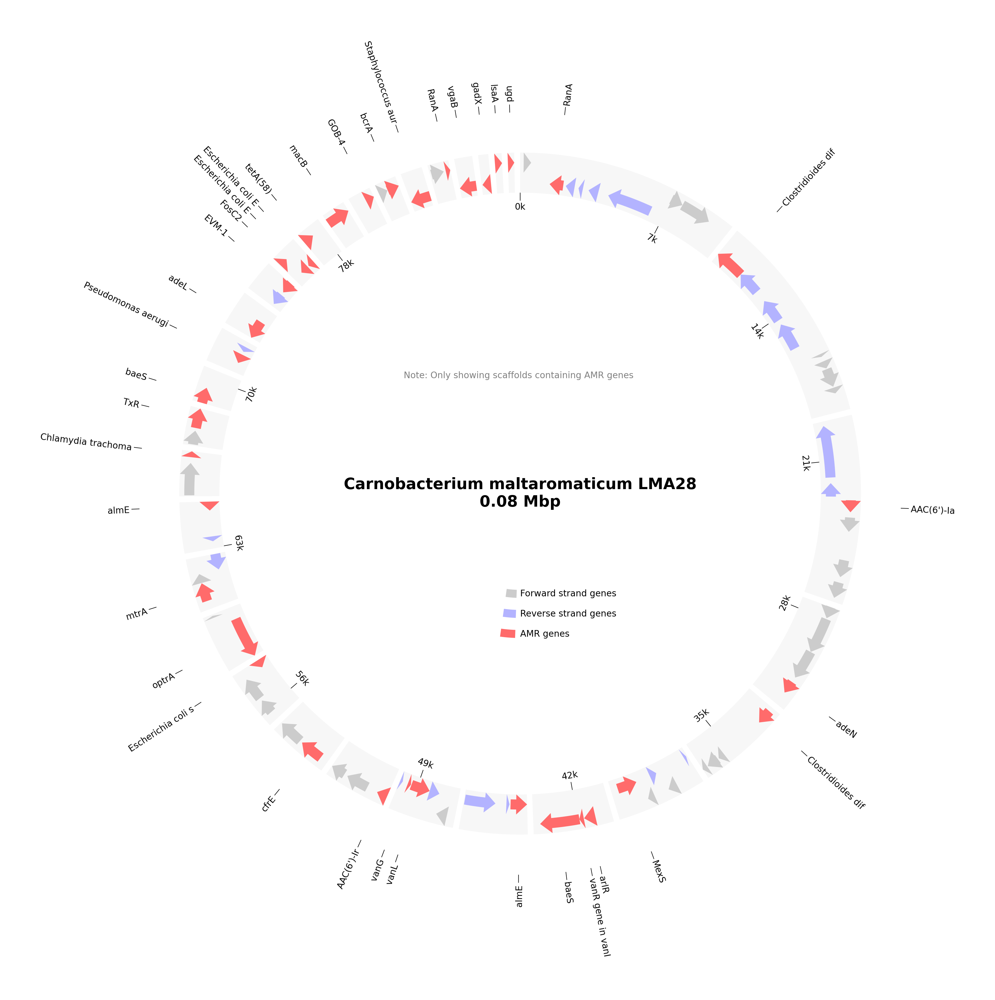

### AAC(6')-Ia
- **Mechanism**: antibiotic inactivation
- **Drug Classes**: aminoglycoside antibiotic
- **AMR Family**: AAC(6')
- **Locations**:
  - gnl|SPADES|DLDDEBJH_758_3 : position 3747-4283

### AAC(6')-Ir
- **Mechanism**: antibiotic inactivation
- **Drug Classes**: aminoglycoside antibiotic
- **AMR Family**: AAC(6')
- **Locations**:
  - gnl|SPADES|DLDDEBJH_2202_1 : position 1-489

### Chlamydia trachomatis intrinsic murA conferring resistance to fosfomycin
- **Mechanism**: antibiotic target alteration
- **Drug Classes**: phosphonic acid antibiotic
- **AMR Family**: antibiotic-resistant murA transferase
- **Locations**:
  - gnl|SPADES|DLDDEBJH_2951_2 : position 1749-2015

### Clostridioides difficile gyrA conferring resistance to fluoroquinolones
- **Mechanism**: antibiotic target alteration
- **Drug Classes**: fluoroquinolone antibiotic
- **AMR Family**: fluoroquinolone resistant gyrA
- **Locations**:
  - gnl|SPADES|DLDDEBJH_1517_1 : position 202-879

### Clostridioides difficile gyrB conferring resistance to fluoroquinolones
- **Mechanism**: antibiotic target alteration
- **Drug Classes**: fluoroquinolone antibiotic
- **AMR Family**: fluoroquinolone resistant gyrB
- **Locations**:
  - gnl|SPADES|DLDDEBJH_678_1 : position 1-1458

### EVM-1
- **Mechanism**: antibiotic inactivation
- **Drug Classes**: carbapenem
- **AMR Family**: EVM beta-lactamase
- **Locations**:
  - gnl|SPADES|DLDDEBJH_4047_3 : position 835-1389

### Escherichia coli EF-Tu mutants conferring resistance to Pulvomycin
- **Mechanism**: antibiotic target alteration
- **Drug Classes**: elfamycin antibiotic
- **AMR Family**: elfamycin resistant EF-Tu
- **Locations**:
  - gnl|SPADES|DLDDEBJH_4465_3 : position 930-1238

### Escherichia coli EF-Tu mutants conferring resistance to kirromycin
- **Mechanism**: antibiotic target alteration
- **Drug Classes**: elfamycin antibiotic
- **AMR Family**: elfamycin resistant EF-Tu
- **Locations**:
  - gnl|SPADES|DLDDEBJH_4465_2 : position 467-871

### Escherichia coli soxS with mutation conferring antibiotic resistance
- **Mechanism**: antibiotic target alteration; antibiotic efflux; reduced permeability to antibiotic
- **Drug Classes**: fluoroquinolone antibiotic; monobactam; carbapenem; cephalosporin; glycylcycline; cephamycin; penam; tetracycline antibiotic; rifamycin antibiotic; phenicol antibiotic; penem; disinfecting agents and antiseptics
- **AMR Family**: ATP-binding cassette (ABC) antibiotic efflux pump; major facilitator superfamily (MFS) antibiotic efflux pump; resistance-nodulation-cell division (RND) antibiotic efflux pump; General Bacterial Porin with reduced permeability to beta-lactams
- **Locations**:
  - gnl|SPADES|DLDDEBJH_2325_3 : position 2275-2673

### FosC2
- **Mechanism**: antibiotic inactivation
- **Drug Classes**: phosphonic acid antibiotic
- **AMR Family**: fosC phosphotransferase family
- **Locations**:
  - gnl|SPADES|DLDDEBJH_4465_1 : position 32-412

### GOB-4
- **Mechanism**: antibiotic inactivation
- **Drug Classes**: carbapenem; cephalosporin; penam
- **AMR Family**: GOB beta-lactamase
- **Locations**:
  - gnl|SPADES|DLDDEBJH_5193_2 : position 643-1038

### MexS
- **Mechanism**: antibiotic efflux
- **Drug Classes**: fluoroquinolone antibiotic; diaminopyrimidine antibiotic; phenicol antibiotic
- **AMR Family**: resistance-nodulation-cell division (RND) antibiotic efflux pump
- **Locations**:
  - gnl|SPADES|DLDDEBJH_1574_5 : position 2725-3669

### Pseudomonas aeruginosa soxR
- **Mechanism**: antibiotic target alteration; antibiotic efflux
- **Drug Classes**: fluoroquinolone antibiotic; cephalosporin; glycylcycline; penam; tetracycline antibiotic; rifamycin antibiotic; phenicol antibiotic; disinfecting agents and antiseptics
- **AMR Family**: ATP-binding cassette (ABC) antibiotic efflux pump; major facilitator superfamily (MFS) antibiotic efflux pump; resistance-nodulation-cell division (RND) antibiotic efflux pump
- **Locations**:
  - gnl|SPADES|DLDDEBJH_3687_2 : position 473-910

### RanA (found in 2 locations)
- **Mechanism**: antibiotic efflux
- **Drug Classes**: aminoglycoside antibiotic
- **AMR Family**: ATP-binding cassette (ABC) antibiotic efflux pump
- **Locations**:
  - gnl|SPADES|DLDDEBJH_5704_2 : position 723-932
  - gnl|SPADES|DLDDEBJH_633_3 : position 1403-2056

### Staphylococcus aureus murA with mutation conferring resistance to fosfomycin
- **Mechanism**: antibiotic target alteration
- **Drug Classes**: phosphonic acid antibiotic
- **AMR Family**: antibiotic-resistant murA transferase
- **Locations**:
  - gnl|SPADES|DLDDEBJH_5585_1 : position 1-957

### TxR
- **Mechanism**: antibiotic efflux
- **Drug Classes**: tetracycline antibiotic
- **AMR Family**: ATP-binding cassette (ABC) antibiotic efflux pump
- **Locations**:
  - gnl|SPADES|DLDDEBJH_3439_2 : position 795-1688

### adeL
- **Mechanism**: antibiotic efflux
- **Drug Classes**: fluoroquinolone antibiotic; tetracycline antibiotic
- **AMR Family**: resistance-nodulation-cell division (RND) antibiotic efflux pump
- **Locations**:
  - gnl|SPADES|DLDDEBJH_3714_1 : position 1-873

### adeN
- **Mechanism**: antibiotic efflux
- **Drug Classes**: macrolide antibiotic; fluoroquinolone antibiotic; lincosamide antibiotic; carbapenem; cephalosporin; tetracycline antibiotic; rifamycin antibiotic; diaminopyrimidine antibiotic; phenicol antibiotic; penem
- **AMR Family**: resistance-nodulation-cell division (RND) antibiotic efflux pump
- **Locations**:
  - gnl|SPADES|DLDDEBJH_1273_4 : position 3780-4355

### almE (found in 2 locations)
- **Mechanism**: antibiotic target alteration
- **Drug Classes**: peptide antibiotic
- **AMR Family**: polymyxin resistance operon; alm glycyltransferase
- **Locations**:
  - gnl|SPADES|DLDDEBJH_2063_1 : position 2-787
  - gnl|SPADES|DLDDEBJH_2706_4 : position 1812-2237

### arlR
- **Mechanism**: antibiotic efflux
- **Drug Classes**: fluoroquinolone antibiotic; disinfecting agents and antiseptics
- **AMR Family**: major facilitator superfamily (MFS) antibiotic efflux pump
- **Locations**:
  - gnl|SPADES|DLDDEBJH_1777_2 : position 742-1251

### baeS (found in 2 locations)
- **Mechanism**: antibiotic efflux
- **Drug Classes**: aminoglycoside antibiotic; aminocoumarin antibiotic
- **AMR Family**: resistance-nodulation-cell division (RND) antibiotic efflux pump
- **Locations**:
  - gnl|SPADES|DLDDEBJH_1777_4 : position 1462-3231
  - gnl|SPADES|DLDDEBJH_3664_1 : position 2-706

### bcrA
- **Mechanism**: antibiotic efflux
- **Drug Classes**: peptide antibiotic
- **AMR Family**: ATP-binding cassette (ABC) antibiotic efflux pump
- **Locations**:
  - gnl|SPADES|DLDDEBJH_5578_2 : position 421-957

### cfrE
- **Mechanism**: antibiotic target alteration
- **Drug Classes**: lincosamide antibiotic; streptogramin antibiotic; oxazolidinone antibiotic; phenicol antibiotic; pleuromutilin antibiotic
- **AMR Family**: Cfr 23S ribosomal RNA methyltransferase
- **Locations**:
  - gnl|SPADES|DLDDEBJH_2288_2 : position 363-1430

### gadX
- **Mechanism**: antibiotic efflux
- **Drug Classes**: macrolide antibiotic; fluoroquinolone antibiotic; penam
- **AMR Family**: resistance-nodulation-cell division (RND) antibiotic efflux pump
- **Locations**:
  - gnl|SPADES|DLDDEBJH_11431_1 : position 38-445

### lsaA
- **Mechanism**: antibiotic target protection
- **Drug Classes**: lincosamide antibiotic; streptogramin antibiotic; streptogramin A antibiotic; streptogramin B antibiotic; pleuromutilin antibiotic
- **AMR Family**: lsa-type ABC-F protein
- **Locations**:
  - gnl|SPADES|DLDDEBJH_16789_1 : position 1-321

### macB
- **Mechanism**: antibiotic efflux
- **Drug Classes**: macrolide antibiotic
- **AMR Family**: ATP-binding cassette (ABC) antibiotic efflux pump
- **Locations**:
  - gnl|SPADES|DLDDEBJH_5069_1 : position 1-1065

### mtrA
- **Mechanism**: antibiotic efflux
- **Drug Classes**: macrolide antibiotic; penam
- **AMR Family**: resistance-nodulation-cell division (RND) antibiotic efflux pump
- **Locations**:
  - gnl|SPADES|DLDDEBJH_2548_2 : position 384-1211

### optrA
- **Mechanism**: antibiotic target protection
- **Drug Classes**: oxazolidinone antibiotic; phenicol antibiotic
- **AMR Family**: Miscellaneous ABC-F subfamily ATP-binding cassette ribosomal protection proteins
- **Locations**:
  - gnl|SPADES|DLDDEBJH_2402_1 : position 2-1969

### tetA(58)
- **Mechanism**: antibiotic efflux
- **Drug Classes**: tetracycline antibiotic
- **AMR Family**: major facilitator superfamily (MFS) antibiotic efflux pump
- **Locations**:
  - gnl|SPADES|DLDDEBJH_4888_1 : position 3-500

### ugd
- **Mechanism**: antibiotic target alteration
- **Drug Classes**: peptide antibiotic
- **AMR Family**: pmr phosphoethanolamine transferase
- **Locations**:
  - gnl|SPADES|DLDDEBJH_19131_1 : position 1-288

### vanG
- **Mechanism**: antibiotic target alteration
- **Drug Classes**: glycopeptide antibiotic
- **AMR Family**: glycopeptide resistance gene cluster; Van ligase
- **Locations**:
  - gnl|SPADES|DLDDEBJH_2125_5 : position 2366-2521

### vanL
- **Mechanism**: antibiotic target alteration
- **Drug Classes**: glycopeptide antibiotic
- **AMR Family**: glycopeptide resistance gene cluster; Van ligase
- **Locations**:
  - gnl|SPADES|DLDDEBJH_2125_4 : position 1428-2342

### vanR gene in vanI cluster
- **Mechanism**: antibiotic target alteration
- **Drug Classes**: glycopeptide antibiotic
- **AMR Family**: glycopeptide resistance gene cluster; vanR
- **Locations**:
  - gnl|SPADES|DLDDEBJH_1777_3 : position 1265-1465

### vgaB
- **Mechanism**: antibiotic target protection
- **Drug Classes**: streptogramin antibiotic; streptogramin A antibiotic; pleuromutilin antibiotic
- **AMR Family**: vga-type ABC-F protein
- **Locations**:
  - gnl|SPADES|DLDDEBJH_6532_1 : position 1-795

## Citrobacter
**Strain Statistics:**
- Total genome length: 4.2 kbp
- Total scaffolds: 144
- Scaffolds with AMR genes: 7
- Total genes annotated: 4
- Total AMR genes: 7
- Unique AMR genes: 7
- Distinct AMR mechanisms: 5
- Distinct AMR families: 5
- Distinct drug classes: 17

**Circos Plot:**

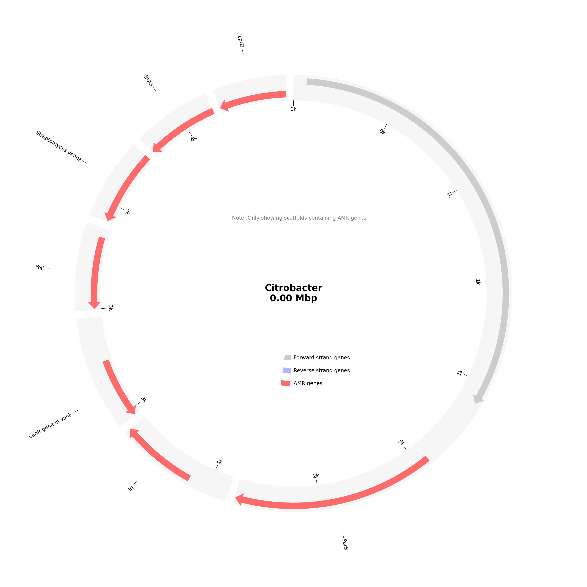

### LptD
- **Mechanism**: antibiotic efflux
- **Drug Classes**: carbapenem; peptide antibiotic; aminocoumarin antibiotic; rifamycin antibiotic
- **AMR Family**: ATP-binding cassette (ABC) antibiotic efflux pump
- **Locations**:
  - gnl|SPADES|DLDDEBJH_33209_1 : position 1-237

### ParS
- **Mechanism**: antibiotic efflux; reduced permeability to antibiotic
- **Drug Classes**: macrolide antibiotic; fluoroquinolone antibiotic; monobactam; aminoglycoside antibiotic; carbapenem; cephalosporin; cephamycin; penam; tetracycline antibiotic; phenicol antibiotic; penem; disinfecting agents and antiseptics
- **AMR Family**: resistance-nodulation-cell division (RND) antibiotic efflux pump; Outer Membrane Porin (Opr)
- **Locations**:
  - gnl|SPADES|DLDDEBJH_2573_2 : position 1700-2365

### Streptomyces venezuelae rox
- **Mechanism**: antibiotic inactivation
- **Drug Classes**: rifamycin antibiotic
- **AMR Family**: rifampin monooxygenase
- **Locations**:
  - gnl|SPADES|DLDDEBJH_24315_1 : position 3-266

### YojI
- **Mechanism**: antibiotic efflux
- **Drug Classes**: peptide antibiotic
- **AMR Family**: ATP-binding cassette (ABC) antibiotic efflux pump
- **Locations**:
  - gnl|SPADES|DLDDEBJH_19501_1 : position 3-254

### dfrA3
- **Mechanism**: antibiotic target replacement
- **Drug Classes**: diaminopyrimidine antibiotic
- **AMR Family**: trimethoprim resistant dihydrofolate reductase dfr
- **Locations**:
  - gnl|SPADES|DLDDEBJH_27370_1 : position 2-256

### iri
- **Mechanism**: antibiotic inactivation
- **Drug Classes**: rifamycin antibiotic
- **AMR Family**: rifampin monooxygenase
- **Locations**:
  - gnl|SPADES|DLDDEBJH_13238_1 : position 136-390

### vanR gene in vanF cluster
- **Mechanism**: antibiotic target alteration
- **Drug Classes**: glycopeptide antibiotic
- **AMR Family**: glycopeptide resistance gene cluster; vanR
- **Locations**:
  - gnl|SPADES|DLDDEBJH_14121_1 : position 3-215

## Citrobacter braakii
**Strain Statistics:**
- Total genome length: 21.4 kbp
- Total scaffolds: 24
- Scaffolds with AMR genes: 1
- Total genes annotated: 48
- Total AMR genes: 2
- Unique AMR genes: 1
- Distinct AMR mechanisms: 1
- Distinct AMR families: 1
- Distinct drug classes: 6

**Circos Plot:**

### H-NS (found in 2 locations)
- **Mechanism**: antibiotic efflux
- **Drug Classes**: macrolide antibiotic; fluoroquinolone antibiotic; cephalosporin; cephamycin; penam; tetracycline antibiotic
- **AMR Family**: major facilitator superfamily (MFS) antibiotic efflux pump; resistance-nodulation-cell division (RND) antibiotic efflux pump
- **Locations**:
  - gnl|SPADES|DLDDEBJH_327_5 : position 2418-2660
  - gnl|SPADES|DLDDEBJH_327_9 : position 4123-4527

## Citrobacter freundii
**Strain Statistics:**
- Total genome length: 10.3 kbp
- Total scaffolds: 62
- Scaffolds with AMR genes: 2
- Total genes annotated: 18
- Total AMR genes: 2
- Unique AMR genes: 2
- Distinct AMR mechanisms: 2
- Distinct AMR families: 2
- Distinct drug classes: 3

**Circos Plot:**

### AAC(6')-Ib8
- **Mechanism**: antibiotic inactivation
- **Drug Classes**: aminoglycoside antibiotic
- **AMR Family**: AAC(6')
- **Locations**:
  - gnl|SPADES|DLDDEBJH_4403_2 : position 342-443

### adeG
- **Mechanism**: antibiotic efflux
- **Drug Classes**: fluoroquinolone antibiotic; tetracycline antibiotic
- **AMR Family**: resistance-nodulation-cell division (RND) antibiotic efflux pump
- **Locations**:
  - gnl|SPADES|DLDDEBJH_699_3 : position 3923-4804

## Citrobacter freundii complex
**Strain Statistics:**
- Total genome length: 3.1 kbp
- Total scaffolds: 12
- Scaffolds with AMR genes: 2
- Total genes annotated: 6
- Total AMR genes: 2
- Unique AMR genes: 2
- Distinct AMR mechanisms: 1
- Distinct AMR families: 2
- Distinct drug classes: 6

**Circos Plot:**

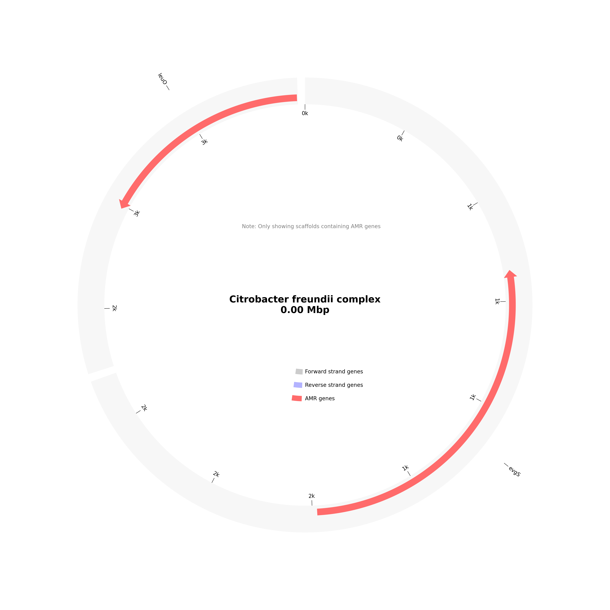

### evgS
- **Mechanism**: antibiotic efflux
- **Drug Classes**: macrolide antibiotic; fluoroquinolone antibiotic; penam; tetracycline antibiotic
- **AMR Family**: major facilitator superfamily (MFS) antibiotic efflux pump; resistance-nodulation-cell division (RND) antibiotic efflux pump
- **Locations**:
  - gnl|SPADES|DLDDEBJH_2735_2 : position 704-1549

### leuO
- **Mechanism**: antibiotic efflux
- **Drug Classes**: nucleoside antibiotic; disinfecting agents and antiseptics
- **AMR Family**: major facilitator superfamily (MFS) antibiotic efflux pump
- **Locations**:
  - gnl|SPADES|DLDDEBJH_5734_2 : position 398-925

## Citrobacter freundii complex sp. CFNIH9
**Strain Statistics:**
- Total genome length: 36.9 kbp
- Total scaffolds: 1
- Scaffolds with AMR genes: 1
- Total genes annotated: 66
- Total AMR genes: 2
- Unique AMR genes: 1
- Distinct AMR mechanisms: 1
- Distinct AMR families: 1
- Distinct drug classes: 6

**Circos Plot:**

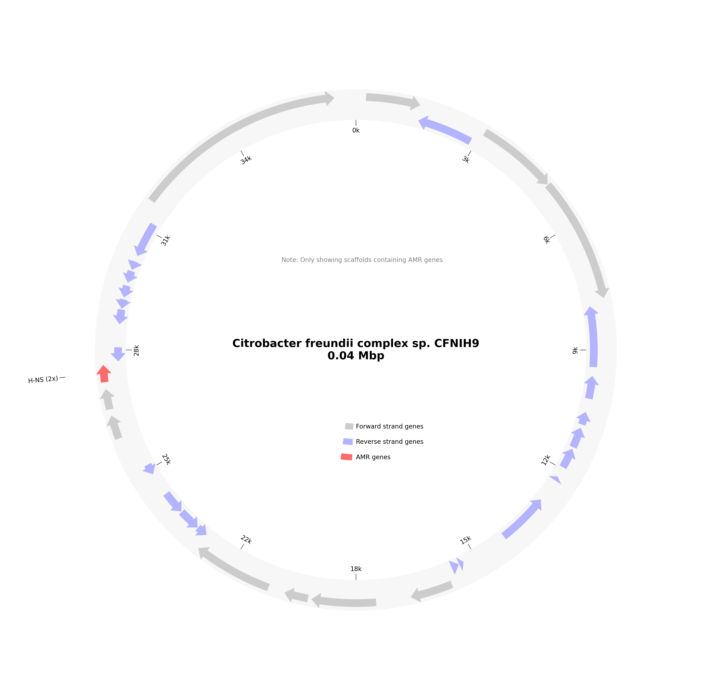

### H-NS (found in 2 locations)
- **Mechanism**: antibiotic efflux
- **Drug Classes**: macrolide antibiotic; fluoroquinolone antibiotic; cephalosporin; cephamycin; penam; tetracycline antibiotic
- **AMR Family**: major facilitator superfamily (MFS) antibiotic efflux pump; resistance-nodulation-cell division (RND) antibiotic efflux pump
- **Locations**:
  - gnl|SPADES|DLDDEBJH_217_25 : position 26911-27315
  - gnl|SPADES|DLDDEBJH_217_27 : position 27994-28236

## Citrobacter portucalensis
**Strain Statistics:**
- Total genome length: 3.3 kbp
- Total scaffolds: 17
- Scaffolds with AMR genes: 1
- Total genes annotated: 6
- Total AMR genes: 1
- Unique AMR genes: 1
- Distinct AMR mechanisms: 1
- Distinct AMR families: 1
- Distinct drug classes: 1

**Circos Plot:**

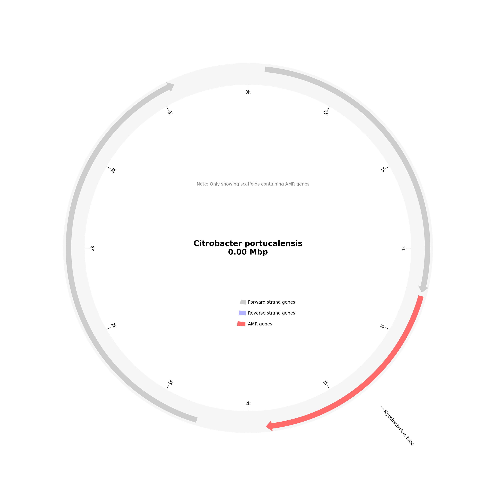

### Mycobacterium tuberculosis pncA mutations conferring resistance to pyrazinamide
- **Mechanism**: antibiotic target alteration
- **Drug Classes**: pyrazine antibiotic
- **AMR Family**: Pyrazinamide resistant pncA
- **Locations**:
  - gnl|SPADES|DLDDEBJH_1908_2 : position 964-1593

## Citrobacter sp. R56
**Strain Statistics:**
- Total genome length: 2.5 kbp
- Total scaffolds: 6
- Scaffolds with AMR genes: 1
- Total genes annotated: 4
- Total AMR genes: 1
- Unique AMR genes: 1
- Distinct AMR mechanisms: 1
- Distinct AMR families: 1
- Distinct drug classes: 1

**Circos Plot:**

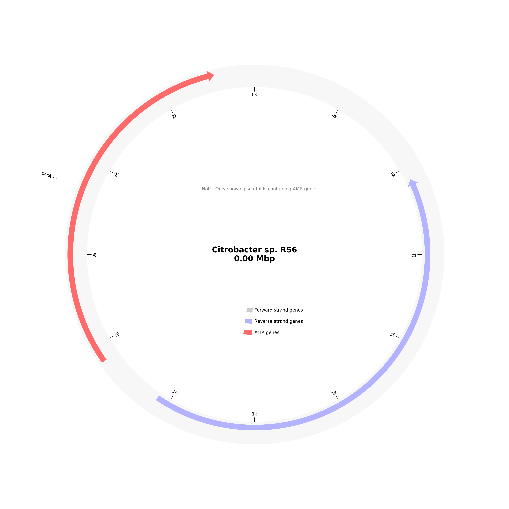

### bcrA
- **Mechanism**: antibiotic efflux
- **Drug Classes**: peptide antibiotic
- **AMR Family**: ATP-binding cassette (ABC) antibiotic efflux pump
- **Locations**:
  - gnl|SPADES|DLDDEBJH_2444_3 : position 1647-2438

## Citrobacter tructae
**Strain Statistics:**
- Total genome length: 1.8 kbp
- Total scaffolds: 4
- Scaffolds with AMR genes: 1
- Total genes annotated: 4
- Total AMR genes: 1
- Unique AMR genes: 1
- Distinct AMR mechanisms: 1
- Distinct AMR families: 1
- Distinct drug classes: 1

**Circos Plot:**

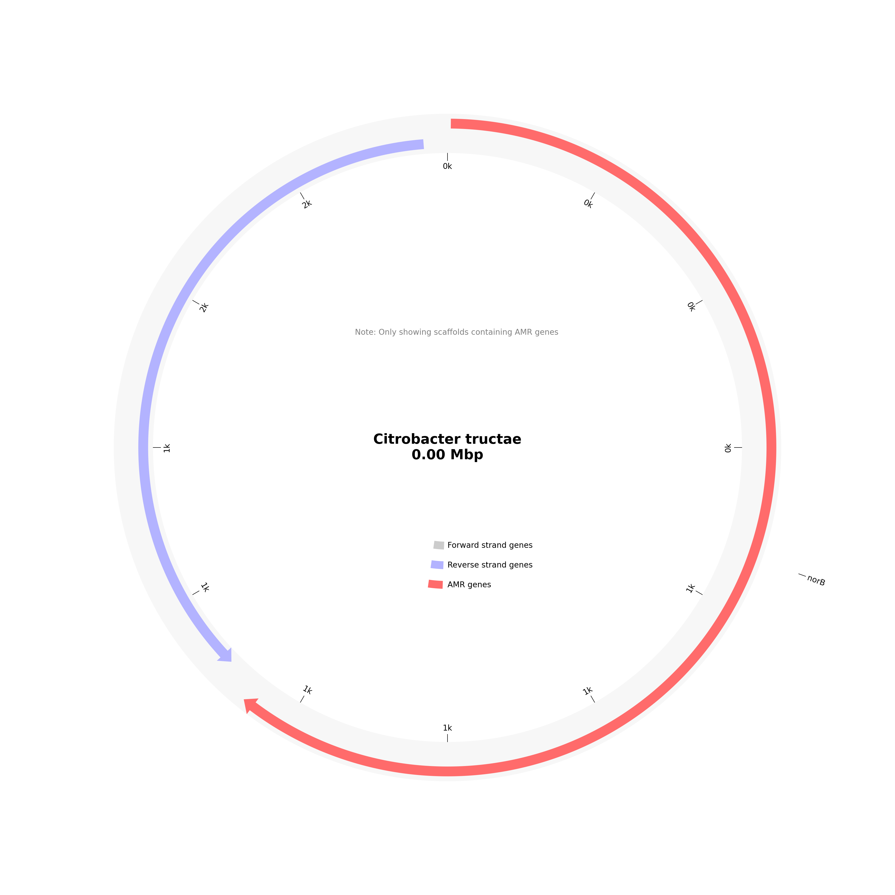

### norB
- **Mechanism**: antibiotic efflux
- **Drug Classes**: fluoroquinolone antibiotic
- **AMR Family**: major facilitator superfamily (MFS) antibiotic efflux pump
- **Locations**:
  - gnl|SPADES|DLDDEBJH_3186_1 : position 3-1118

## Enterobacter hormaechei subsp. steigerwaltii
**Strain Statistics:**
- Total genome length: 12.0 kbp
- Total scaffolds: 2
- Scaffolds with AMR genes: 2
- Total genes annotated: 30
- Total AMR genes: 2
- Unique AMR genes: 2
- Distinct AMR mechanisms: 1
- Distinct AMR families: 1
- Distinct drug classes: 10

**Circos Plot:**

### MexS
- **Mechanism**: antibiotic efflux
- **Drug Classes**: fluoroquinolone antibiotic; diaminopyrimidine antibiotic; phenicol antibiotic
- **AMR Family**: resistance-nodulation-cell division (RND) antibiotic efflux pump
- **Locations**:
  - gnl|SPADES|DLDDEBJH_978_1 : position 597-1607

### adeN
- **Mechanism**: antibiotic efflux
- **Drug Classes**: macrolide antibiotic; fluoroquinolone antibiotic; lincosamide antibiotic; carbapenem; cephalosporin; tetracycline antibiotic; rifamycin antibiotic; diaminopyrimidine antibiotic; phenicol antibiotic; penem
- **AMR Family**: resistance-nodulation-cell division (RND) antibiotic efflux pump
- **Locations**:
  - gnl|SPADES|DLDDEBJH_1129_1 : position 255-875

## Escherichia coli
**Strain Statistics:**
- Total genome length: 56.4 kbp
- Total scaffolds: 85
- Scaffolds with AMR genes: 8
- Total genes annotated: 146
- Total AMR genes: 8
- Unique AMR genes: 8
- Distinct AMR mechanisms: 2
- Distinct AMR families: 5
- Distinct drug classes: 13

**Circos Plot:**

### Erm(44)v
- **Mechanism**: antibiotic target alteration
- **Drug Classes**: macrolide antibiotic; lincosamide antibiotic; streptogramin antibiotic
- **AMR Family**: Erm 23S ribosomal RNA methyltransferase
- **Locations**:
  - gnl|SPADES|DLDDEBJH_181_4 : position 2115-2876

### MuxC
- **Mechanism**: antibiotic efflux
- **Drug Classes**: macrolide antibiotic; monobactam; tetracycline antibiotic; aminocoumarin antibiotic
- **AMR Family**: resistance-nodulation-cell division (RND) antibiotic efflux pump
- **Locations**:
  - gnl|SPADES|DLDDEBJH_1374_1 : position 3-3143

### PmrF
- **Mechanism**: antibiotic target alteration
- **Drug Classes**: peptide antibiotic
- **AMR Family**: pmr phosphoethanolamine transferase
- **Locations**:
  - gnl|SPADES|DLDDEBJH_3937_2 : position 670-1443

### farB
- **Mechanism**: antibiotic efflux
- **Drug Classes**: antibacterial free fatty acids
- **AMR Family**: major facilitator superfamily (MFS) antibiotic efflux pump
- **Locations**:
  - gnl|SPADES|DLDDEBJH_33808_1 : position 3-236

### mdtB
- **Mechanism**: antibiotic efflux
- **Drug Classes**: aminocoumarin antibiotic
- **AMR Family**: resistance-nodulation-cell division (RND) antibiotic efflux pump
- **Locations**:
  - gnl|SPADES|DLDDEBJH_8354_1 : position 2-607

### rosB
- **Mechanism**: antibiotic efflux
- **Drug Classes**: peptide antibiotic
- **AMR Family**: major facilitator superfamily (MFS) antibiotic efflux pump
- **Locations**:
  - gnl|SPADES|DLDDEBJH_31387_1 : position 2-241

### smeS
- **Mechanism**: antibiotic efflux
- **Drug Classes**: aminoglycoside antibiotic; cephalosporin; cephamycin; penam
- **AMR Family**: resistance-nodulation-cell division (RND) antibiotic efflux pump
- **Locations**:
  - gnl|SPADES|DLDDEBJH_35527_1 : position 2-229

### vanH gene in vanB cluster
- **Mechanism**: antibiotic target alteration
- **Drug Classes**: glycopeptide antibiotic
- **AMR Family**: vanH; glycopeptide resistance gene cluster
- **Locations**:
  - gnl|SPADES|DLDDEBJH_11126_1 : position 139-456

## Ewingella americana
**Strain Statistics:**
- Total genome length: 4454.9 kbp
- Total scaffolds: 103
- Scaffolds with AMR genes: 63
- Total genes annotated: 8288
- Total AMR genes: 511
- Unique AMR genes: 214
- Distinct AMR mechanisms: 12
- Distinct AMR families: 75
- Distinct drug classes: 37

**Circos Plot:**

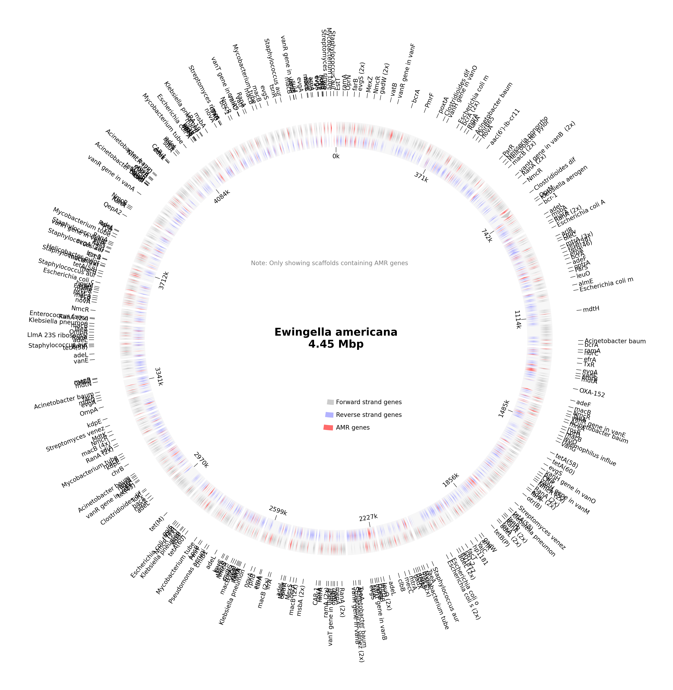

### Acinetobacter baumannii AbaF (found in 7 locations)
- **Mechanism**: antibiotic efflux
- **Drug Classes**: phosphonic acid antibiotic
- **AMR Family**: major facilitator superfamily (MFS) antibiotic efflux pump
- **Locations**:
  - gnl|SPADES|DLDDEBJH_13_105 : position 115519-116841
  - gnl|SPADES|DLDDEBJH_141_43 : position 39944-41446
  - gnl|SPADES|DLDDEBJH_19_184 : position 182323-183669
  - gnl|SPADES|DLDDEBJH_20_61 : position 65927-67276
  - gnl|SPADES|DLDDEBJH_229_5 : position 3789-5027
  - gnl|SPADES|DLDDEBJH_23_17 : position 18561-19877
  - gnl|SPADES|DLDDEBJH_62_72 : position 82596-83927

### Acinetobacter baumannii AbaQ (found in 7 locations)
- **Mechanism**: antibiotic efflux
- **Drug Classes**: fluoroquinolone antibiotic
- **AMR Family**: major facilitator superfamily (MFS) antibiotic efflux pump
- **Locations**:
  - gnl|SPADES|DLDDEBJH_102_84 : position 81389-82729
  - gnl|SPADES|DLDDEBJH_13_10 : position 11476-12792
  - gnl|SPADES|DLDDEBJH_13_17 : position 18604-19872
  - gnl|SPADES|DLDDEBJH_15_134 : position 172001-173356
  - gnl|SPADES|DLDDEBJH_223_5 : position 5237-6433
  - gnl|SPADES|DLDDEBJH_34_28 : position 24103-25332
  - gnl|SPADES|DLDDEBJH_34_37 : position 35295-36650

### ArnT
- **Mechanism**: antibiotic target alteration
- **Drug Classes**: peptide antibiotic
- **AMR Family**: pmr phosphoethanolamine transferase
- **Locations**:
  - gnl|SPADES|DLDDEBJH_81_56: position 64500-66170

### CAR-1 (found in 2 locations)
- **Mechanism**: antibiotic inactivation
- **Drug Classes**: carbapenem
- **AMR Family**: CAR beta-lactamase
- **Locations**:
  - gnl|SPADES|DLDDEBJH_235_24 : position 20866-21621
  - gnl|SPADES|DLDDEBJH_72_89 : position 97335-98060

### CRP (found in 2 locations)
- **Mechanism**: antibiotic efflux
- **Drug Classes**: macrolide antibiotic; fluoroquinolone antibiotic; penam
- **AMR Family**: resistance-nodulation-cell division (RND) antibiotic efflux pump
- **Locations**:
  - gnl|SPADES|DLDDEBJH_223_2: position 2731-3363
  - gnl|SPADES|DLDDEBJH_26_18 : position 22064-22819

### CfiA11
- **Mechanism**: antibiotic inactivation
- **Drug Classes**: carbapenem
- **AMR Family**: CfiA beta-lactamase
- **Locations**:
  - gnl|SPADES|DLDDEBJH_102_65 : position 66005-66856

### Clostridioides difficile gyrA conferring resistance to fluoroquinolones
- **Mechanism**: antibiotic target alteration
- **Drug Classes**: fluoroquinolone antibiotic
- **AMR Family**: fluoroquinolone resistant gyrA
- **Locations**:
  - gnl|SPADES|DLDDEBJH_15_107 : position 120322-122991

### Clostridioides difficile gyrB conferring resistance to fluoroquinolones (found in 2 locations)
- **Mechanism**: antibiotic target alteration
- **Drug Classes**: fluoroquinolone antibiotic
- **AMR Family**: fluoroquinolone resistant gyrB
- **Locations**:
  - gnl|SPADES|DLDDEBJH_102_21 : position 20586-22502
  - gnl|SPADES|DLDDEBJH_13_4 : position 4337-6751

### CrcB
- **Mechanism**: antibiotic efflux
- **Drug Classes**: aminoglycoside antibiotic
- **AMR Family**: multidrug and toxic compound extrusion (MATE) transporter
- **Locations**:
  - gnl|SPADES|DLDDEBJH_192_29 : position 28102-28485

### Enterobacter cloacae acrA
- **Mechanism**: antibiotic efflux
- **Drug Classes**: fluoroquinolone antibiotic; cephalosporin; glycylcycline; penam; tetracycline antibiotic; rifamycin antibiotic; phenicol antibiotic; disinfecting agents and antiseptics
- **AMR Family**: resistance-nodulation-cell division (RND) antibiotic efflux pump
- **Locations**:
  - gnl|SPADES|DLDDEBJH_95_42 : position 43454-44644

### Enterococcus faecalis cls with mutation conferring resistance to daptomycin
- **Mechanism**: antibiotic target alteration
- **Drug Classes**: peptide antibiotic
- **AMR Family**: daptomycin resistant cls
- **Locations**:
  - gnl|SPADES|DLDDEBJH_168_9 : position 10032-11492

### ErmC
- **Mechanism**: antibiotic target alteration
- **Drug Classes**: macrolide antibiotic; lincosamide antibiotic; streptogramin antibiotic; streptogramin A antibiotic; streptogramin B antibiotic
- **AMR Family**: Erm 23S ribosomal RNA methyltransferase
- **Locations**:
  - gnl|SPADES|DLDDEBJH_23_40 : position 47029-47862

### Escherichia coli AcrAB-TolC with AcrR mutation conferring resistance to ciprofloxacin, tetracycline, and ceftazidime (found in 2 locations)
- **Mechanism**: antibiotic target alteration; antibiotic efflux
- **Drug Classes**: fluoroquinolone antibiotic; cephalosporin; glycylcycline; penam; tetracycline antibiotic; rifamycin antibiotic; phenicol antibiotic; disinfecting agents and antiseptics
- **AMR Family**: resistance-nodulation-cell division (RND) antibiotic efflux pump
- **Locations**:
  - gnl|SPADES|DLDDEBJH_18_28 : position 25215-25820
  - gnl|SPADES|DLDDEBJH_249_4 : position 4194-4793

### Escherichia coli cyaA with mutation conferring resistance to fosfomycin
- **Mechanism**: antibiotic target alteration
- **Drug Classes**: phosphonic acid antibiotic
- **AMR Family**: antibiotic-resistant cya adenylate cyclase
- **Locations**:
  - gnl|SPADES|DLDDEBJH_183_5 : position 5216-7774

### Escherichia coli fabI mutations conferring resistance to isoniazid and triclosan (found in 2 locations)
- **Mechanism**: antibiotic target alteration
- **Drug Classes**: disinfecting agents and antiseptics; isoniazid-like antibiotic
- **AMR Family**: antibiotic resistant fabI
- **Locations**:
  - gnl|SPADES|DLDDEBJH_95_61 : position 63691-64467
  - gnl|SPADES|DLDDEBJH_95_66 : position 67962-68708

### Escherichia coli mdfA (found in 2 locations)
- **Mechanism**: antibiotic efflux
- **Drug Classes**: tetracycline antibiotic; phenicol antibiotic; disinfecting agents and antiseptics
- **AMR Family**: major facilitator superfamily (MFS) antibiotic efflux pump
- **Locations**:
  - gnl|SPADES|DLDDEBJH_13_51 : position 54516-55754
  - gnl|SPADES|DLDDEBJH_19_19 : position 21303-22526

### Escherichia coli ompF with mutation conferring resistance to beta-lactam antibiotics
- **Mechanism**: reduced permeability to antibiotic
- **Drug Classes**: monobactam; carbapenem; cephalosporin; cephamycin; penam; penem
- **AMR Family**: General Bacterial Porin with reduced permeability to beta-lactams
- **Locations**:
  - gnl|SPADES|DLDDEBJH_34_59 : position 63949-65088

### Escherichia coli soxS with mutation conferring antibiotic resistance (found in 4 locations)
- **Mechanism**: antibiotic target alteration; antibiotic efflux; reduced permeability to antibiotic
- **Drug Classes**: fluoroquinolone antibiotic; monobactam; carbapenem; cephalosporin; glycylcycline; cephamycin; penam; tetracycline antibiotic; rifamycin antibiotic; phenicol antibiotic; penem; disinfecting agents and antiseptics
- **AMR Family**: ATP-binding cassette (ABC) antibiotic efflux pump; major facilitator superfamily (MFS) antibiotic efflux pump; resistance-nodulation-cell division (RND) antibiotic efflux pump; General Bacterial Porin with reduced permeability to beta-lactams
- **Locations**:
  - gnl|SPADES|DLDDEBJH_18_152 : position 153547-153906
  - gnl|SPADES|DLDDEBJH_23_6 : position 5236-6102
  - gnl|SPADES|DLDDEBJH_34_54 : position 59276-60112
  - gnl|SPADES|DLDDEBJH_34_70 : position 78711-79538

### EstT (found in 2 locations)
- **Mechanism**: antibiotic inactivation
- **Drug Classes**: macrolide antibiotic
- **AMR Family**: macrolide esterase
- **Locations**:
  - gnl|SPADES|DLDDEBJH_193_18 : position 15838-16677
  - gnl|SPADES|DLDDEBJH_4_3 : position 2850-3860

### FosA3
- **Mechanism**: antibiotic inactivation
- **Drug Classes**: phosphonic acid antibiotic
- **AMR Family**: fosfomycin thiol transferase
- **Locations**:
  - gnl|SPADES|DLDDEBJH_89_50 : position 47238-47663

### FosA8
- **Mechanism**: antibiotic inactivation
- **Drug Classes**: phosphonic acid antibiotic
- **AMR Family**: fosfomycin thiol transferase
- **Locations**:
  - gnl|SPADES|DLDDEBJH_32_39: position 43942-44352

### FosM2
- **Mechanism**: antibiotic inactivation
- **Drug Classes**: phosphonic acid antibiotic
- **AMR Family**: fosfomycin thiol transferase
- **Locations**:
  - gnl|SPADES|DLDDEBJH_173_41 : position 40509-40916

### H-NS
- **Mechanism**: antibiotic efflux
- **Drug Classes**: macrolide antibiotic; fluoroquinolone antibiotic; cephalosporin; cephamycin; penam; tetracycline antibiotic
- **AMR Family**: major facilitator superfamily (MFS) antibiotic efflux pump; resistance-nodulation-cell division (RND) antibiotic efflux pump
- **Locations**:
  - gnl|SPADES|DLDDEBJH_724_6 : position 5626-6033

### Haemophilus influenzae PBP3 conferring resistance to beta-lactam antibiotics (found in 2 locations)
- **Mechanism**: antibiotic target alteration
- **Drug Classes**: cephalosporin; cephamycin; penam
- **AMR Family**: Penicillin-binding protein mutations conferring resistance to beta-lactam antibiotics
- **Locations**:
  - gnl|SPADES|DLDDEBJH_15_121 : position 157685-159460
  - gnl|SPADES|DLDDEBJH_23_67 : position 82867-84630

### Helicobacter pylori pbp1 mutants conferring resistance to amoxicillin
- **Mechanism**: antibiotic target alteration
- **Drug Classes**: cephalosporin; cephamycin; penam
- **AMR Family**: Penicillin-binding protein mutations conferring resistance to beta-lactam antibiotics
- **Locations**:
  - gnl|SPADES|DLDDEBJH_15_2 : position 555-2912

### Helicobacter pylori pbp2 mutants conferring resistance to amoxicillin
- **Mechanism**: antibiotic target alteration
- **Drug Classes**: cephalosporin; cephamycin; penam
- **AMR Family**: Penicillin-binding protein mutations conferring resistance to beta-lactam antibiotics
- **Locations**:
  - gnl|SPADES|DLDDEBJH_192_14 : position 12801-14705

### Klebsiella aerogenes Omp36
- **Mechanism**: reduced permeability to antibiotic
- **Drug Classes**: monobactam; carbapenem; cephalosporin; cephamycin; penam; penem
- **AMR Family**: General Bacterial Porin with reduced permeability to beta-lactams
- **Locations**:
  - gnl|SPADES|DLDDEBJH_15_117 : position 154369-155490

### Klebsiella pneumoniae KpnG
- **Mechanism**: antibiotic efflux
- **Drug Classes**: macrolide antibiotic; fluoroquinolone antibiotic; aminoglycoside antibiotic; carbapenem; cephalosporin; penam; peptide antibiotic; penem
- **AMR Family**: major facilitator superfamily (MFS) antibiotic efflux pump
- **Locations**:
  - gnl|SPADES|DLDDEBJH_32_8 : position 9290-10486

### Klebsiella pneumoniae KpnH (found in 2 locations)
- **Mechanism**: antibiotic efflux
- **Drug Classes**: macrolide antibiotic; fluoroquinolone antibiotic; aminoglycoside antibiotic; carbapenem; cephalosporin; penam; peptide antibiotic; penem
- **AMR Family**: major facilitator superfamily (MFS) antibiotic efflux pump
- **Locations**:
  - gnl|SPADES|DLDDEBJH_32_7: position 7728-9272
  - gnl|SPADES|DLDDEBJH_4_30 : position 36713-38281

### Klebsiella pneumoniae OmpK37 (found in 5 locations)
- **Mechanism**: reduced permeability to antibiotic
- **Drug Classes**: monobactam; carbapenem; cephalosporin; cephamycin; penam; penem
- **AMR Family**: General Bacterial Porin with reduced permeability to beta-lactams
- **Locations**:
  - gnl|SPADES|DLDDEBJH_167_48 : position 52959-53090
  - gnl|SPADES|DLDDEBJH_18_64 : position 67359-68519
  - gnl|SPADES|DLDDEBJH_26_146 : position 168967-170070
  - gnl|SPADES|DLDDEBJH_278_1 : position 1-1032
  - gnl|SPADES|DLDDEBJH_89_9 : position 9740-10840

### Klebsiella pneumoniae acrR with mutation conferring multidrug antibiotic resistance
- **Mechanism**: antibiotic target alteration; antibiotic efflux
- **Drug Classes**: fluoroquinolone antibiotic; cephalosporin; glycylcycline; penam; tetracycline antibiotic; rifamycin antibiotic; phenicol antibiotic; disinfecting agents and antiseptics
- **AMR Family**: resistance-nodulation-cell division (RND) antibiotic efflux pump
- **Locations**:
  - gnl|SPADES|DLDDEBJH_95_43 : position 44750-45433

### Klebsiella pneumoniae ramR mutants
- **Mechanism**: antibiotic target alteration; antibiotic efflux
- **Drug Classes**: fluoroquinolone antibiotic; cephalosporin; glycylcycline; penam; tetracycline antibiotic; rifamycin antibiotic; phenicol antibiotic; disinfecting agents and antiseptics
- **AMR Family**: resistance-nodulation-cell division (RND) antibiotic efflux pump
- **Locations**:
  - gnl|SPADES|DLDDEBJH_13_123 : position 134053-134706

### LRA-19
- **Mechanism**: antibiotic inactivation
- **Drug Classes**: cephalosporin; penam
- **AMR Family**: subclass B3 LRA beta-lactamase
- **Locations**:
  - gnl|SPADES|DLDDEBJH_278_3 : position 2548-3195

### LlmA 23S ribosomal RNA methyltransferase
- **Mechanism**: antibiotic target alteration
- **Drug Classes**: lincosamide antibiotic
- **AMR Family**: Llm 23S ribosomal RNA methyltransferase
- **Locations**:
  - gnl|SPADES|DLDDEBJH_167_16 : position 14523-15716

### LpsB
- **Mechanism**: reduced permeability to antibiotic
- **Drug Classes**: peptide antibiotic
- **AMR Family**: Intrinsic peptide antibiotic resistant Lps
- **Locations**:
  - gnl|SPADES|DLDDEBJH_91_65 : position 71404-72504

### LptD
- **Mechanism**: antibiotic efflux
- **Drug Classes**: carbapenem; peptide antibiotic; aminocoumarin antibiotic; rifamycin antibiotic
- **AMR Family**: ATP-binding cassette (ABC) antibiotic efflux pump
- **Locations**:
  - gnl|SPADES|DLDDEBJH_23_43 : position 50242-52617

### MCR-10.4
- **Mechanism**: antibiotic target alteration
- **Drug Classes**: peptide antibiotic
- **AMR Family**: MCR phosphoethanolamine transferase
- **Locations**:
  - gnl|SPADES|DLDDEBJH_4_4 : position 3923-5554

### MdtK
- **Mechanism**: antibiotic efflux
- **Drug Classes**: fluoroquinolone antibiotic
- **AMR Family**: multidrug and toxic compound extrusion (MATE) transporter
- **Locations**:
  - gnl|SPADES|DLDDEBJH_126_52 : position 59148-60539

### MexH
- **Mechanism**: antibiotic efflux
- **Drug Classes**: fluoroquinolone antibiotic; tetracycline antibiotic; disinfecting agents and antiseptics
- **AMR Family**: resistance-nodulation-cell division (RND) antibiotic efflux pump
- **Locations**:
  - gnl|SPADES|DLDDEBJH_77_73 : position 91369-92625

### MexS (found in 3 locations)
- **Mechanism**: antibiotic efflux
- **Drug Classes**: fluoroquinolone antibiotic; diaminopyrimidine antibiotic; phenicol antibiotic
- **AMR Family**: resistance-nodulation-cell division (RND) antibiotic efflux pump
- **Locations**:
  - gnl|SPADES|DLDDEBJH_72_38 : position 47317-48303
  - gnl|SPADES|DLDDEBJH_77_56 : position 70656-71780
  - gnl|SPADES|DLDDEBJH_89_76 : position 73044-74087

### MexT (found in 3 locations)
- **Mechanism**: antibiotic efflux
- **Drug Classes**: fluoroquinolone antibiotic; diaminopyrimidine antibiotic; phenicol antibiotic
- **AMR Family**: resistance-nodulation-cell division (RND) antibiotic efflux pump
- **Locations**:
  - gnl|SPADES|DLDDEBJH_173_22 : position 22417-23364
  - gnl|SPADES|DLDDEBJH_18_123 : position 121928-122857
  - gnl|SPADES|DLDDEBJH_18_18 : position 14922-15839

### MexZ (found in 2 locations)
- **Mechanism**: antibiotic efflux
- **Drug Classes**: macrolide antibiotic; fluoroquinolone antibiotic; aminoglycoside antibiotic; carbapenem; cephalosporin; cephamycin; penam; tetracycline antibiotic; phenicol antibiotic; disinfecting agents and antiseptics
- **AMR Family**: resistance-nodulation-cell division (RND) antibiotic efflux pump
- **Locations**:
  - gnl|SPADES|DLDDEBJH_4_91 : position 99050-99631
  - gnl|SPADES|DLDDEBJH_91_83 : position 88038-88658

### MuxA
- **Mechanism**: antibiotic efflux
- **Drug Classes**: macrolide antibiotic; monobactam; tetracycline antibiotic; aminocoumarin antibiotic
- **AMR Family**: resistance-nodulation-cell division (RND) antibiotic efflux pump
- **Locations**:
  - gnl|SPADES|DLDDEBJH_62_20 : position 27337-28632

### MuxC
- **Mechanism**: antibiotic efflux
- **Drug Classes**: macrolide antibiotic; monobactam; tetracycline antibiotic; aminocoumarin antibiotic
- **AMR Family**: resistance-nodulation-cell division (RND) antibiotic efflux pump
- **Locations**:
  - gnl|SPADES|DLDDEBJH_62_18 : position 20984-24112

### Mycobacterium tuberculosis gidB mutation conferring resistance to streptomycin
- **Mechanism**: antibiotic target alteration
- **Drug Classes**: aminoglycoside antibiotic
- **AMR Family**: antibiotic resistant gidB
- **Locations**:
  - gnl|SPADES|DLDDEBJH_360_15 : position 16577-17197

### Mycobacterium tuberculosis kasA mutant conferring resistance to isoniazid
- **Mechanism**: antibiotic target alteration
- **Drug Classes**: isoniazid-like antibiotic
- **AMR Family**: antibiotic resistant kasA
- **Locations**:
  - gnl|SPADES|DLDDEBJH_91_82 : position 86612-87886

### Mycobacterium tuberculosis katG mutations conferring resistance to isoniazid
- **Mechanism**: antibiotic target alteration
- **Drug Classes**: isoniazid-like antibiotic
- **AMR Family**: isoniazid resistant katG
- **Locations**:
  - gnl|SPADES|DLDDEBJH_4_100 : position 107265-109442

### Mycobacterium tuberculosis ndh with mutation conferring resistance to isoniazid
- **Mechanism**: antibiotic target alteration
- **Drug Classes**: isoniazid-like antibiotic
- **AMR Family**: antibiotic resistant ndh
- **Locations**:
  - gnl|SPADES|DLDDEBJH_112_66 : position 62808-64115

### Mycobacterium tuberculosis pncA mutations conferring resistance to pyrazinamide (found in 2 locations)
- **Mechanism**: antibiotic target alteration
- **Drug Classes**: pyrazine antibiotic
- **AMR Family**: Pyrazinamide resistant pncA
- **Locations**:
  - gnl|SPADES|DLDDEBJH_195_3 : position 1251-1877
  - gnl|SPADES|DLDDEBJH_48_4 : position 4576-5265

### Mycobacterium tuberculosis rpoB mutations conferring resistance to rifampicin
- **Mechanism**: antibiotic target alteration; antibiotic target replacement
- **Drug Classes**: rifamycin antibiotic
- **AMR Family**: rifamycin-resistant beta-subunit of RNA polymerase (rpoB)
- **Locations**:
  - gnl|SPADES|DLDDEBJH_1490_1 : position 26-4054

### Mycobacterium tuberculosis thyA with mutation conferring resistance to para-aminosalicylic acid
- **Mechanism**: antibiotic target alteration
- **Drug Classes**: salicylic acid antibiotic
- **AMR Family**: aminosalicylate resistant thymidylate synthase
- **Locations**:
  - gnl|SPADES|DLDDEBJH_246_11 : position 13596-14390

### Neisseria gonorrhoeae pilQ gene conferring resistance to beta-lactam
- **Mechanism**: antibiotic target alteration
- **Drug Classes**: cephalosporin; cephamycin; penam
- **AMR Family**: Penicillin-binding protein mutations conferring resistance to beta-lactam antibiotics
- **Locations**:
  - gnl|SPADES|DLDDEBJH_13_216 : position 239571-240842

### NmcR (found in 18 locations)
- **Mechanism**: antibiotic inactivation
- **Drug Classes**: carbapenem; cephalosporin; cephamycin; penam
- **AMR Family**: NmcA beta-lactamase
- **Locations**:
  - gnl|SPADES|DLDDEBJH_126_40 : position 47548-48459
  - gnl|SPADES|DLDDEBJH_13_128 : position 140454-141371
  - gnl|SPADES|DLDDEBJH_15_78 : position 85652-86596
  - gnl|SPADES|DLDDEBJH_168_34 : position 34453-35427
  - gnl|SPADES|DLDDEBJH_18_55 : position 58529-59383
  - gnl|SPADES|DLDDEBJH_206_13 : position 9518-10441
  - gnl|SPADES|DLDDEBJH_20_190 : position 198907-199827
  - gnl|SPADES|DLDDEBJH_223_9 : position 9658-10557
  - gnl|SPADES|DLDDEBJH_229_11 : position 11843-12724
  - gnl|SPADES|DLDDEBJH_229_2 : position 576-1403
  - gnl|SPADES|DLDDEBJH_26_144 : position 166713-167612
  - gnl|SPADES|DLDDEBJH_26_43 : position 44741-45613
  - gnl|SPADES|DLDDEBJH_316_17 : position 16267-17187
  - gnl|SPADES|DLDDEBJH_32_12 : position 14414-15295
  - gnl|SPADES|DLDDEBJH_4_117 : position 121508-122389
  - gnl|SPADES|DLDDEBJH_89_72 : position 68905-69867
  - gnl|SPADES|DLDDEBJH_95_53 : position 56357-57229
  - gnl|SPADES|DLDDEBJH_95_62 : position 64668-65594

### OXA-152
- **Mechanism**: antibiotic inactivation
- **Drug Classes**: carbapenem; penam
- **AMR Family**: OXA beta-lactamase; OXA-62-like beta-lactamase
- **Locations**:
  - gnl|SPADES|DLDDEBJH_20_107 : position 125455-126129

### OmpA (found in 3 locations)
- **Mechanism**: reduced permeability to antibiotic
- **Drug Classes**: peptide antibiotic
- **AMR Family**: General Bacterial Porin with reduced permeability to peptide antibiotics
- **Locations**:
  - gnl|SPADES|DLDDEBJH_130_58 : position 66103-66612
  - gnl|SPADES|DLDDEBJH_13_23 : position 23635-24297
  - gnl|SPADES|DLDDEBJH_167_26 : position 24863-25942

### OpmB
- **Mechanism**: antibiotic efflux
- **Drug Classes**: macrolide antibiotic; monobactam; tetracycline antibiotic; aminocoumarin antibiotic
- **AMR Family**: resistance-nodulation-cell division (RND) antibiotic efflux pump
- **Locations**:
  - gnl|SPADES|DLDDEBJH_62_17 : position 19552-20991

### OprM (found in 2 locations)
- **Mechanism**: antibiotic efflux
- **Drug Classes**: macrolide antibiotic; fluoroquinolone antibiotic; monobactam; aminoglycoside antibiotic; carbapenem; cephalosporin; cephamycin; penam; tetracycline antibiotic; peptide antibiotic; aminocoumarin antibiotic; diaminopyrimidine antibiotic; sulfonamide antibiotic; phenicol antibiotic; penem; disinfecting agents and antiseptics
- **AMR Family**: resistance-nodulation-cell division (RND) antibiotic efflux pump
- **Locations**:
  - gnl|SPADES|DLDDEBJH_15_113 : position 146616-148007
  - gnl|SPADES|DLDDEBJH_4_194 : position 208628-209998

### OprN
- **Mechanism**: antibiotic efflux
- **Drug Classes**: fluoroquinolone antibiotic; diaminopyrimidine antibiotic; phenicol antibiotic
- **AMR Family**: resistance-nodulation-cell division (RND) antibiotic efflux pump
- **Locations**:
  - gnl|SPADES|DLDDEBJH_4_29 : position 35136-36707

### PAM-1
- **Mechanism**: antibiotic inactivation
- **Drug Classes**: carbapenem; cephalosporin
- **AMR Family**: PAM beta-lactamase
- **Locations**:
  - gnl|SPADES|DLDDEBJH_173_21 : position 21440-22342

### ParR (found in 2 locations)
- **Mechanism**: antibiotic efflux; reduced permeability to antibiotic
- **Drug Classes**: macrolide antibiotic; fluoroquinolone antibiotic; monobactam; aminoglycoside antibiotic; carbapenem; cephalosporin; cephamycin; penam; tetracycline antibiotic; phenicol antibiotic; penem; disinfecting agents and antiseptics
- **AMR Family**: resistance-nodulation-cell division (RND) antibiotic efflux pump; Outer Membrane Porin (Opr)
- **Locations**:
  - gnl|SPADES|DLDDEBJH_13_204 : position 224457-225176
  - gnl|SPADES|DLDDEBJH_26_12 : position 14832-15566

### ParS (found in 3 locations)
- **Mechanism**: antibiotic efflux; reduced permeability to antibiotic
- **Drug Classes**: macrolide antibiotic; fluoroquinolone antibiotic; monobactam; aminoglycoside antibiotic; carbapenem; cephalosporin; cephamycin; penam; tetracycline antibiotic; phenicol antibiotic; penem; disinfecting agents and antiseptics
- **AMR Family**: resistance-nodulation-cell division (RND) antibiotic efflux pump; Outer Membrane Porin (Opr)
- **Locations**:
  - gnl|SPADES|DLDDEBJH_18_172 : position 175770-177170
  - gnl|SPADES|DLDDEBJH_26_11 : position 13528-14835
  - gnl|SPADES|DLDDEBJH_32_18 : position 21414-23051

### PmrF (found in 3 locations)
- **Mechanism**: antibiotic target alteration
- **Drug Classes**: peptide antibiotic
- **AMR Family**: pmr phosphoethanolamine transferase
- **Locations**:
  - gnl|SPADES|DLDDEBJH_4_275 : position 288592-289524
  - gnl|SPADES|DLDDEBJH_81_53 : position 60626-61606
  - gnl|SPADES|DLDDEBJH_91_60 : position 65924-66913

### Pseudomonas aeruginosa CpxR (found in 3 locations)
- **Mechanism**: antibiotic efflux
- **Drug Classes**: macrolide antibiotic; fluoroquinolone antibiotic; monobactam; aminoglycoside antibiotic; carbapenem; cephalosporin; cephamycin; penam; tetracycline antibiotic; peptide antibiotic; aminocoumarin antibiotic; diaminopyrimidine antibiotic; sulfonamide antibiotic; phenicol antibiotic; penem
- **AMR Family**: resistance-nodulation-cell division (RND) antibiotic efflux pump
- **Locations**:
  - gnl|SPADES|DLDDEBJH_20_179 : position 187079-187762
  - gnl|SPADES|DLDDEBJH_72_78 : position 88065-88823
  - gnl|SPADES|DLDDEBJH_91_42 : position 47838-48539

### Pseudomonas aeruginosa ampR with mutation conferring resistance to aztreonam
- **Mechanism**: antibiotic target alteration; antibiotic inactivation
- **Drug Classes**: monobactam; carbapenem; cephalosporin
- **AMR Family**: PDC beta-lactamase; ampR transcriptional regulator with mutation conferring resistance to monobactam antibiotics
- **Locations**:
  - gnl|SPADES|DLDDEBJH_4_71 : position 79474-80355

### Pseudomonas mutant PhoQ conferring resistance to colistin
- **Mechanism**: antibiotic target alteration; antibiotic efflux; resistance by absence
- **Drug Classes**: macrolide antibiotic; peptide antibiotic
- **AMR Family**: ATP-binding cassette (ABC) antibiotic efflux pump; pmr phosphoethanolamine transferase; transmembrane protein conferring colistin resistance
- **Locations**:
  - gnl|SPADES|DLDDEBJH_112_55 : position 48241-49695

### QepA2 (found in 2 locations)
- **Mechanism**: antibiotic efflux
- **Drug Classes**: fluoroquinolone antibiotic
- **AMR Family**: major facilitator superfamily (MFS) antibiotic efflux pump
- **Locations**:
  - gnl|SPADES|DLDDEBJH_201_26 : position 24387-25781
  - gnl|SPADES|DLDDEBJH_32_11 : position 13085-14329

### QepA4 (found in 2 locations)
- **Mechanism**: antibiotic efflux
- **Drug Classes**: fluoroquinolone antibiotic
- **AMR Family**: major facilitator superfamily (MFS) antibiotic efflux pump
- **Locations**:
  - gnl|SPADES|DLDDEBJH_26_94 : position 105202-106506
  - gnl|SPADES|DLDDEBJH_4_126 : position 131485-132987

### QnrB65
- **Mechanism**: antibiotic target protection
- **Drug Classes**: fluoroquinolone antibiotic
- **AMR Family**: quinolone resistance protein (qnr)
- **Locations**:
  - gnl|SPADES|DLDDEBJH_13_118 : position 127627-128283

### RanA (found in 27 locations)
- **Mechanism**: antibiotic efflux
- **Drug Classes**: aminoglycoside antibiotic
- **AMR Family**: ATP-binding cassette (ABC) antibiotic efflux pump
- **Locations**:
  - gnl|SPADES|DLDDEBJH_126_24 : position 29525-30310
  - gnl|SPADES|DLDDEBJH_126_7 : position 7769-9607
  - gnl|SPADES|DLDDEBJH_13_88 : position 90936-91952
  - gnl|SPADES|DLDDEBJH_151_52 : position 50971-51774
  - gnl|SPADES|DLDDEBJH_15_144 : position 181844-183439
  - gnl|SPADES|DLDDEBJH_15_58 : position 62021-62794
  - gnl|SPADES|DLDDEBJH_167_10 : position 7901-8971
  - gnl|SPADES|DLDDEBJH_168_6 : position 7389-8414
  - gnl|SPADES|DLDDEBJH_168_7 : position 8411-9448
  - gnl|SPADES|DLDDEBJH_18_11 : position 8569-9321
  - gnl|SPADES|DLDDEBJH_18_82 : position 83374-84981
  - gnl|SPADES|DLDDEBJH_193_35 : position 34233-35312
  - gnl|SPADES|DLDDEBJH_195_22 : position 21110-22189
  - gnl|SPADES|DLDDEBJH_206_2 : position 265-1338
  - gnl|SPADES|DLDDEBJH_26_55 : position 62263-63012
  - gnl|SPADES|DLDDEBJH_26_63 : position 71800-72888
  - gnl|SPADES|DLDDEBJH_32_103 : position 106555-107376
  - gnl|SPADES|DLDDEBJH_32_16 : position 18775-19971
  - gnl|SPADES|DLDDEBJH_340_7 : position 7604-8380
  - gnl|SPADES|DLDDEBJH_4_138 : position 145881-147533
  - gnl|SPADES|DLDDEBJH_4_253 : position 269155-270288
  - gnl|SPADES|DLDDEBJH_4_314 : position 331397-332311
  - gnl|SPADES|DLDDEBJH_62_27 : position 32765-33487
  - gnl|SPADES|DLDDEBJH_62_58 : position 69343-70488
  - gnl|SPADES|DLDDEBJH_72_12 : position 15823-16815
  - gnl|SPADES|DLDDEBJH_72_71 : position 81322-82431
  - gnl|SPADES|DLDDEBJH_89_25 : position 22965-23909

### RanB
- **Mechanism**: antibiotic efflux
- **Drug Classes**: aminoglycoside antibiotic
- **AMR Family**: ATP-binding cassette (ABC) antibiotic efflux pump
- **Locations**:
  - gnl|SPADES|DLDDEBJH_151_53 : position 51790-52572

### Rhodococcus fascians cmr
- **Mechanism**: antibiotic efflux
- **Drug Classes**: phenicol antibiotic
- **AMR Family**: major facilitator superfamily (MFS) antibiotic efflux pump
- **Locations**:
  - gnl|SPADES|DLDDEBJH_18_128 : position 126531-126893

### Rv1877 (found in 2 locations)
- **Mechanism**: antibiotic efflux
- **Drug Classes**: fluoroquinolone antibiotic
- **AMR Family**: major facilitator superfamily (MFS) antibiotic efflux pump
- **Locations**:
  - gnl|SPADES|DLDDEBJH_13_124 : position 134855-136393
  - gnl|SPADES|DLDDEBJH_34_35 : position 33068-34351

### SRT-2
- **Mechanism**: antibiotic inactivation
- **Drug Classes**: cephalosporin
- **AMR Family**: SRT beta-lactamase
- **Locations**:
  - gnl|SPADES|DLDDEBJH_34_27 : position 22845-23990

### SST-1
- **Mechanism**: antibiotic inactivation
- **Drug Classes**: cephalosporin
- **AMR Family**: SST beta-lactamase
- **Locations**:
  - gnl|SPADES|DLDDEBJH_4_70 : position 78208-79347

### Salmonella serovars soxS with mutation conferring antibiotic resistance (found in 2 locations)
- **Mechanism**: antibiotic target alteration; antibiotic efflux; reduced permeability to antibiotic
- **Drug Classes**: fluoroquinolone antibiotic; monobactam; carbapenem; cephalosporin; glycylcycline; cephamycin; penam; tetracycline antibiotic; rifamycin antibiotic; phenicol antibiotic; penem; disinfecting agents and antiseptics
- **AMR Family**: ATP-binding cassette (ABC) antibiotic efflux pump; major facilitator superfamily (MFS) antibiotic efflux pump; resistance-nodulation-cell division (RND) antibiotic efflux pump; General Bacterial Porin with reduced permeability to beta-lactams
- **Locations**:
  - gnl|SPADES|DLDDEBJH_15_120 : position 156782-157168
  - gnl|SPADES|DLDDEBJH_18_90 : position 90656-91540

### SatA
- **Mechanism**: antibiotic inactivation
- **Drug Classes**: nucleoside antibiotic
- **AMR Family**: streptothricin acetyltransferase (SAT)
- **Locations**:
  - gnl|SPADES|DLDDEBJH_13_58 : position 61523-61975

### Staphylococcus aureus GlpT with mutation conferring resistance to fosfomycin
- **Mechanism**: antibiotic target alteration
- **Drug Classes**: phosphonic acid antibiotic
- **AMR Family**: antibiotic-resistant GlpT
- **Locations**:
  - gnl|SPADES|DLDDEBJH_183_24 : position 25785-27137

### Staphylococcus aureus fusA with mutation conferring resistance to fusidic acid (found in 3 locations)
- **Mechanism**: antibiotic target alteration
- **Drug Classes**: fusidane antibiotic
- **AMR Family**: antibiotic resistant fusA
- **Locations**:
  - gnl|SPADES|DLDDEBJH_34_141 : position 129261-130850
  - gnl|SPADES|DLDDEBJH_3545_1 : position 2-1309
  - gnl|SPADES|DLDDEBJH_4_60 : position 67384-69486

### Staphylococcus aureus mupA conferring resistance to mupirocin (found in 2 locations)
- **Mechanism**: antibiotic target alteration
- **Drug Classes**: mupirocin-like antibiotic
- **AMR Family**: antibiotic-resistant isoleucyl-tRNA synthetase (ileS)
- **Locations**:
  - gnl|SPADES|DLDDEBJH_192_8 : position 6752-9334
  - gnl|SPADES|DLDDEBJH_23_25 : position 28215-31031

### Staphylococcus aureus mupB conferring resistance to mupirocin
- **Mechanism**: antibiotic target alteration
- **Drug Classes**: mupirocin-like antibiotic
- **AMR Family**: antibiotic-resistant isoleucyl-tRNA synthetase (ileS)
- **Locations**:
  - gnl|SPADES|DLDDEBJH_437_3 : position 2482-5337

### Staphylococcus aureus murA with mutation conferring resistance to fosfomycin
- **Mechanism**: antibiotic target alteration
- **Drug Classes**: phosphonic acid antibiotic
- **AMR Family**: antibiotic-resistant murA transferase
- **Locations**:
  - gnl|SPADES|DLDDEBJH_151_58 : position 54602-55861

### Staphylococcus aureus norA
- **Mechanism**: antibiotic efflux
- **Drug Classes**: fluoroquinolone antibiotic
- **AMR Family**: major facilitator superfamily (MFS) antibiotic efflux pump
- **Locations**:
  - gnl|SPADES|DLDDEBJH_193_32 : position 29523-30833

### Staphylococcus aureus pgsA mutations conferring resistance to daptomycin
- **Mechanism**: antibiotic target alteration
- **Drug Classes**: peptide antibiotic
- **AMR Family**: daptomycin resistant pgsA
- **Locations**:
  - gnl|SPADES|DLDDEBJH_193_2 : position 200-748

### Streptomyces lividans cmlR
- **Mechanism**: antibiotic efflux
- **Drug Classes**: phenicol antibiotic
- **AMR Family**: major facilitator superfamily (MFS) antibiotic efflux pump
- **Locations**:
  - gnl|SPADES|DLDDEBJH_4_98 : position 105739-106926

### Streptomyces rimosus otr(A) (found in 2 locations)
- **Mechanism**: antibiotic target protection
- **Drug Classes**: tetracycline antibiotic
- **AMR Family**: tetracycline-resistant ribosomal protection protein
- **Locations**:
  - gnl|SPADES|DLDDEBJH_1274_1 : position 3-1373
  - gnl|SPADES|DLDDEBJH_306_7 : position 8245-10068

### Streptomyces venezuelae rox (found in 4 locations)
- **Mechanism**: antibiotic inactivation
- **Drug Classes**: rifamycin antibiotic
- **AMR Family**: rifampin monooxygenase
- **Locations**:
  - gnl|SPADES|DLDDEBJH_130_4 : position 3361-4545
  - gnl|SPADES|DLDDEBJH_26_120 : position 138962-140170
  - gnl|SPADES|DLDDEBJH_62_80 : position 92506-93732
  - gnl|SPADES|DLDDEBJH_62_81 : position 93755-94906

### TaeA (found in 4 locations)
- **Mechanism**: antibiotic efflux
- **Drug Classes**: pleuromutilin antibiotic
- **AMR Family**: ATP-binding cassette (ABC) antibiotic efflux pump
- **Locations**:
  - gnl|SPADES|DLDDEBJH_167_34 : position 33291-35195
  - gnl|SPADES|DLDDEBJH_23_1 : position 3-1223
  - gnl|SPADES|DLDDEBJH_34_158 : position 148004-148501
  - gnl|SPADES|DLDDEBJH_62_67 : position 77964-79496

### TolC
- **Mechanism**: antibiotic efflux
- **Drug Classes**: macrolide antibiotic; fluoroquinolone antibiotic; aminoglycoside antibiotic; carbapenem; cephalosporin; glycylcycline; cephamycin; penam; tetracycline antibiotic; peptide antibiotic; aminocoumarin antibiotic; rifamycin antibiotic; phenicol antibiotic; penem; disinfecting agents and antiseptics
- **AMR Family**: ATP-binding cassette (ABC) antibiotic efflux pump; major facilitator superfamily (MFS) antibiotic efflux pump; resistance-nodulation-cell division (RND) antibiotic efflux pump
- **Locations**:
  - gnl|SPADES|DLDDEBJH_102_16 : position 16213-17748

### TxR (found in 6 locations)
- **Mechanism**: antibiotic efflux
- **Drug Classes**: tetracycline antibiotic
- **AMR Family**: ATP-binding cassette (ABC) antibiotic efflux pump
- **Locations**:
  - gnl|SPADES|DLDDEBJH_173_11 : position 8838-9848
  - gnl|SPADES|DLDDEBJH_195_11 : position 9743-11311
  - gnl|SPADES|DLDDEBJH_20_35 : position 42774-43757
  - gnl|SPADES|DLDDEBJH_306_4 : position 3637-5049
  - gnl|SPADES|DLDDEBJH_48_15 : position 18909-20813
  - gnl|SPADES|DLDDEBJH_48_62 : position 72179-73516

### YajC
- **Mechanism**: antibiotic efflux
- **Drug Classes**: fluoroquinolone antibiotic; cephalosporin; glycylcycline; penam; tetracycline antibiotic; oxazolidinone antibiotic; glycopeptide antibiotic; rifamycin antibiotic; phenicol antibiotic; disinfecting agents and antiseptics
- **AMR Family**: resistance-nodulation-cell division (RND) antibiotic efflux pump
- **Locations**:
  - gnl|SPADES|DLDDEBJH_32_122 : position 130494-130826

### YojI
- **Mechanism**: antibiotic efflux
- **Drug Classes**: peptide antibiotic
- **AMR Family**: ATP-binding cassette (ABC) antibiotic efflux pump
- **Locations**:
  - gnl|SPADES|DLDDEBJH_4_25 : position 28204-29979

### aac(6')-Ib-cr11
- **Mechanism**: antibiotic inactivation
- **Drug Classes**: fluoroquinolone antibiotic; aminoglycoside antibiotic
- **AMR Family**: AAC(6'); AAC(6')-Ib-cr
- **Locations**:
  - gnl|SPADES|DLDDEBJH_13_158 : position 171310-171837

### acrB
- **Mechanism**: antibiotic efflux
- **Drug Classes**: fluoroquinolone antibiotic; cephalosporin; glycylcycline; penam; tetracycline antibiotic; rifamycin antibiotic; phenicol antibiotic; disinfecting agents and antiseptics
- **AMR Family**: resistance-nodulation-cell division (RND) antibiotic efflux pump
- **Locations**:
  - gnl|SPADES|DLDDEBJH_95_41 : position 40282-43437

### adeF (found in 2 locations)
- **Mechanism**: antibiotic efflux
- **Drug Classes**: fluoroquinolone antibiotic; tetracycline antibiotic
- **AMR Family**: resistance-nodulation-cell division (RND) antibiotic efflux pump
- **Locations**:
  - gnl|SPADES|DLDDEBJH_18_150: position 148786-151935
  - gnl|SPADES|DLDDEBJH_20_157: position 162016-165198

### adeG
- **Mechanism**: antibiotic efflux
- **Drug Classes**: fluoroquinolone antibiotic; tetracycline antibiotic
- **AMR Family**: resistance-nodulation-cell division (RND) antibiotic efflux pump
- **Locations**:
  - gnl|SPADES|DLDDEBJH_173_35 : position 34080-34937

### adeL (found in 38 locations)
- **Mechanism**: antibiotic efflux
- **Drug Classes**: fluoroquinolone antibiotic; tetracycline antibiotic
- **AMR Family**: resistance-nodulation-cell division (RND) antibiotic efflux pump
- **Locations**:
  - gnl|SPADES|DLDDEBJH_102_52 : position 54939-55826
  - gnl|SPADES|DLDDEBJH_13_107 : position 118242-119183
  - gnl|SPADES|DLDDEBJH_13_153 : position 165184-166101
  - gnl|SPADES|DLDDEBJH_13_181 : position 200227-201132
  - gnl|SPADES|DLDDEBJH_151_20 : position 23056-23988
  - gnl|SPADES|DLDDEBJH_15_163 : position 204427-205299
  - gnl|SPADES|DLDDEBJH_167_2 : position 817-1698
  - gnl|SPADES|DLDDEBJH_168_35 : position 35486-36406
  - gnl|SPADES|DLDDEBJH_173_46 : position 45225-46130
  - gnl|SPADES|DLDDEBJH_18_118 : position 117831-118727
  - gnl|SPADES|DLDDEBJH_18_7 : position 5302-6195
  - gnl|SPADES|DLDDEBJH_195_24 : position 23710-24651
  - gnl|SPADES|DLDDEBJH_20_15 : position 14033-14944
  - gnl|SPADES|DLDDEBJH_20_19 : position 16588-17478
  - gnl|SPADES|DLDDEBJH_235_20 : position 16109-16999
  - gnl|SPADES|DLDDEBJH_245_22 : position 24289-25164
  - gnl|SPADES|DLDDEBJH_249_9 : position 10333-11247
  - gnl|SPADES|DLDDEBJH_26_66 : position 74858-75751
  - gnl|SPADES|DLDDEBJH_26_93 : position 104173-105078
  - gnl|SPADES|DLDDEBJH_32_35 : position 39627-40538
  - gnl|SPADES|DLDDEBJH_32_95 : position 97594-98487
  - gnl|SPADES|DLDDEBJH_34_157 : position 147039-147959
  - gnl|SPADES|DLDDEBJH_34_41 : position 40577-41503
  - gnl|SPADES|DLDDEBJH_48_104 : position 118449-119369
  - gnl|SPADES|DLDDEBJH_4_110 : position 117313-118194
  - gnl|SPADES|DLDDEBJH_4_143 : position 151592-152485
  - gnl|SPADES|DLDDEBJH_4_58 : position 65895-66812
  - gnl|SPADES|DLDDEBJH_4_86 : position 94580-95500
  - gnl|SPADES|DLDDEBJH_532_10 : position 9110-10012
  - gnl|SPADES|DLDDEBJH_62_6 : position 6187-7095
  - gnl|SPADES|DLDDEBJH_72_42 : position 52075-53007
  - gnl|SPADES|DLDDEBJH_72_48 : position 56951-57847
  - gnl|SPADES|DLDDEBJH_72_55 : position 65377-66270
  - gnl|SPADES|DLDDEBJH_72_88 : position 96222-97070
  - gnl|SPADES|DLDDEBJH_77_81 : position 99471-100427
  - gnl|SPADES|DLDDEBJH_91_9 : position 10177-11097
  - gnl|SPADES|DLDDEBJH_95_30 : position 34460-35407
  - gnl|SPADES|DLDDEBJH_97_106 : position 79706-80608

### adeN
- **Mechanism**: antibiotic efflux
- **Drug Classes**: macrolide antibiotic; fluoroquinolone antibiotic; lincosamide antibiotic; carbapenem; cephalosporin; tetracycline antibiotic; rifamycin antibiotic; diaminopyrimidine antibiotic; phenicol antibiotic; penem
- **AMR Family**: resistance-nodulation-cell division (RND) antibiotic efflux pump
- **Locations**:
  - gnl|SPADES|DLDDEBJH_15_118 : position 155593-156180

### adeR (found in 2 locations)
- **Mechanism**: antibiotic efflux
- **Drug Classes**: glycylcycline; tetracycline antibiotic
- **AMR Family**: resistance-nodulation-cell division (RND) antibiotic efflux pump
- **Locations**:
  - gnl|SPADES|DLDDEBJH_20_3 : position 1636-2415
  - gnl|SPADES|DLDDEBJH_724_3 : position 1813-2826

### almE
- **Mechanism**: antibiotic target alteration
- **Drug Classes**: peptide antibiotic
- **AMR Family**: polymyxin resistance operon; alm glycyltransferase
- **Locations**:
  - gnl|SPADES|DLDDEBJH_19_5 : position 3399-5096

### arlR (found in 3 locations)
- **Mechanism**: antibiotic efflux
- **Drug Classes**: fluoroquinolone antibiotic; disinfecting agents and antiseptics
- **AMR Family**: major facilitator superfamily (MFS) antibiotic efflux pump
- **Locations**:
  - gnl|SPADES|DLDDEBJH_18_51 : position 54423-55094
  - gnl|SPADES|DLDDEBJH_249_13 : position 15731-16402
  - gnl|SPADES|DLDDEBJH_32_108 : position 114116-114805

### arnA (found in 2 locations)
- **Mechanism**: antibiotic target alteration
- **Drug Classes**: peptide antibiotic
- **AMR Family**: pmr phosphoethanolamine transferase
- **Locations**:
  - gnl|SPADES|DLDDEBJH_578_8 : position 4757-5692
  - gnl|SPADES|DLDDEBJH_81_54 : position 61606-63588

### bacA
- **Mechanism**: antibiotic target alteration
- **Drug Classes**: peptide antibiotic
- **AMR Family**: undecaprenyl pyrophosphate related proteins
- **Locations**:
  - gnl|SPADES|DLDDEBJH_102_5 : position 2832-3659

### baeR (found in 2 locations)
- **Mechanism**: antibiotic efflux
- **Drug Classes**: aminoglycoside antibiotic; aminocoumarin antibiotic
- **AMR Family**: resistance-nodulation-cell division (RND) antibiotic efflux pump
- **Locations**:
  - gnl|SPADES|DLDDEBJH_20_74 : position 80829-81548
  - gnl|SPADES|DLDDEBJH_245_17 : position 19521-20258

### baeS
- **Mechanism**: antibiotic efflux
- **Drug Classes**: aminoglycoside antibiotic; aminocoumarin antibiotic
- **AMR Family**: resistance-nodulation-cell division (RND) antibiotic efflux pump
- **Locations**:
  - gnl|SPADES|DLDDEBJH_20_75 : position 81549-82934

### basR
- **Mechanism**: antibiotic target alteration; antibiotic efflux
- **Drug Classes**: peptide antibiotic
- **AMR Family**: pmr phosphoethanolamine transferase
- **Locations**:
  - gnl|SPADES|DLDDEBJH_62_38 : position 45761-46480

### basS (found in 3 locations)
- **Mechanism**: antibiotic target alteration; antibiotic efflux
- **Drug Classes**: peptide antibiotic
- **AMR Family**: pmr phosphoethanolamine transferase
- **Locations**:
  - gnl|SPADES|DLDDEBJH_23_117 : position 138862-140229
  - gnl|SPADES|DLDDEBJH_249_12 : position 14286-15734
  - gnl|SPADES|DLDDEBJH_491_4 : position 2422-3489

### bcr-1 (found in 6 locations)
- **Mechanism**: antibiotic efflux
- **Drug Classes**: bicyclomycin-like antibiotic
- **AMR Family**: major facilitator superfamily (MFS) antibiotic efflux pump
- **Locations**:
  - gnl|SPADES|DLDDEBJH_102_79 : position 76240-77439
  - gnl|SPADES|DLDDEBJH_15_133 : position 170740-171948
  - gnl|SPADES|DLDDEBJH_173_47 : position 46290-47504
  - gnl|SPADES|DLDDEBJH_192_32 : position 29613-30806
  - gnl|SPADES|DLDDEBJH_20_62 : position 67354-68643
  - gnl|SPADES|DLDDEBJH_316_10 : position 8777-10015

### bcrA (found in 8 locations)
- **Mechanism**: antibiotic efflux
- **Drug Classes**: peptide antibiotic
- **AMR Family**: ATP-binding cassette (ABC) antibiotic efflux pump
- **Locations**:
  - gnl|SPADES|DLDDEBJH_13_70 : position 67861-68559
  - gnl|SPADES|DLDDEBJH_13_71 : position 68575-69381
  - gnl|SPADES|DLDDEBJH_18_138 : position 134310-135278
  - gnl|SPADES|DLDDEBJH_19_193 : position 194111-195640
  - gnl|SPADES|DLDDEBJH_48_24 : position 30433-31974
  - gnl|SPADES|DLDDEBJH_4_229 : position 244394-245935
  - gnl|SPADES|DLDDEBJH_77_48 : position 60439-61989
  - gnl|SPADES|DLDDEBJH_89_84 : position 82131-83192

### carA
- **Mechanism**: antibiotic target protection
- **Drug Classes**: macrolide antibiotic
- **AMR Family**: Miscellaneous ABC-F subfamily ATP-binding cassette ribosomal protection proteins
- **Locations**:
  - gnl|SPADES|DLDDEBJH_81_51 : position 58349-59116

### catB3
- **Mechanism**: antibiotic inactivation
- **Drug Classes**: phenicol antibiotic
- **AMR Family**: chloramphenicol acetyltransferase (CAT)
- **Locations**:
  - gnl|SPADES|DLDDEBJH_144_15 : position 12560-13195

### ceoB
- **Mechanism**: antibiotic efflux
- **Drug Classes**: fluoroquinolone antibiotic; aminoglycoside antibiotic
- **AMR Family**: resistance-nodulation-cell division (RND) antibiotic efflux pump
- **Locations**:
  - gnl|SPADES|DLDDEBJH_32_123 : position 130887-132701

### chrB
- **Mechanism**: antibiotic target alteration
- **Drug Classes**: macrolide antibiotic; lincosamide antibiotic
- **AMR Family**: non-erm 23S ribosomal RNA methyltransferase (G748)
- **Locations**:
  - gnl|SPADES|DLDDEBJH_112_26 : position 24023-24838

### clbB
- **Mechanism**: antibiotic target alteration
- **Drug Classes**: lincosamide antibiotic; streptogramin antibiotic; streptogramin A antibiotic; oxazolidinone antibiotic; phenicol antibiotic; pleuromutilin antibiotic
- **AMR Family**: Cfr 23S ribosomal RNA methyltransferase
- **Locations**:
  - gnl|SPADES|DLDDEBJH_48_77 : position 88367-89575

### cmeR
- **Mechanism**: antibiotic efflux
- **Drug Classes**: macrolide antibiotic; fluoroquinolone antibiotic; cephalosporin; fusidane antibiotic
- **AMR Family**: resistance-nodulation-cell division (RND) antibiotic efflux pump
- **Locations**:
  - gnl|SPADES|DLDDEBJH_192_31 : position 28910-29560

### cmlA9
- **Mechanism**: antibiotic efflux
- **Drug Classes**: phenicol antibiotic
- **AMR Family**: major facilitator superfamily (MFS) antibiotic efflux pump
- **Locations**:
  - gnl|SPADES|DLDDEBJH_318_13 : position 11864-13063

### cmlB1
- **Mechanism**: antibiotic efflux
- **Drug Classes**: phenicol antibiotic
- **AMR Family**: major facilitator superfamily (MFS) antibiotic efflux pump
- **Locations**:
  - gnl|SPADES|DLDDEBJH_91_34 : position 40002-41186

### cmlv (found in 5 locations)
- **Mechanism**: antibiotic inactivation
- **Drug Classes**: phenicol antibiotic
- **AMR Family**: chloramphenicol phosphotransferase
- **Locations**:
  - gnl|SPADES|DLDDEBJH_18_60 : position 64308-65489
  - gnl|SPADES|DLDDEBJH_206_7 : position 4890-6104
  - gnl|SPADES|DLDDEBJH_235_21 : position 17106-18281
  - gnl|SPADES|DLDDEBJH_62_5 : position 4702-5865
  - gnl|SPADES|DLDDEBJH_97_107 : position 80710-81933

### cmx
- **Mechanism**: antibiotic efflux
- **Drug Classes**: phenicol antibiotic
- **AMR Family**: major facilitator superfamily (MFS) antibiotic efflux pump
- **Locations**:
  - gnl|SPADES|DLDDEBJH_48_105 : position 119677-120825

### cpxA (found in 5 locations)
- **Mechanism**: antibiotic efflux
- **Drug Classes**: aminoglycoside antibiotic; aminocoumarin antibiotic
- **AMR Family**: resistance-nodulation-cell division (RND) antibiotic efflux pump
- **Locations**:
  - gnl|SPADES|DLDDEBJH_13_205 : position 225173-226534
  - gnl|SPADES|DLDDEBJH_20_180 : position 187842-189092
  - gnl|SPADES|DLDDEBJH_306_5 : position 5057-6106
  - gnl|SPADES|DLDDEBJH_72_79 : position 88820-90127
  - gnl|SPADES|DLDDEBJH_91_43 : position 48536-49906

### dfrA3
- **Mechanism**: antibiotic target replacement
- **Drug Classes**: diaminopyrimidine antibiotic
- **AMR Family**: trimethoprim resistant dihydrofolate reductase dfr
- **Locations**:
  - gnl|SPADES|DLDDEBJH_23_37 : position 45156-45644

### efpA
- **Mechanism**: antibiotic efflux
- **Drug Classes**: rifamycin antibiotic; isoniazid-like antibiotic
- **AMR Family**: major facilitator superfamily (MFS) antibiotic efflux pump
- **Locations**:
  - gnl|SPADES|DLDDEBJH_18_124 : position 123001-124434

### efrA
- **Mechanism**: antibiotic efflux
- **Drug Classes**: macrolide antibiotic; fluoroquinolone antibiotic; rifamycin antibiotic
- **AMR Family**: ATP-binding cassette (ABC) antibiotic efflux pump
- **Locations**:
  - gnl|SPADES|DLDDEBJH_20_26 : position 26624-28789

### emrB (found in 3 locations)
- **Mechanism**: antibiotic efflux
- **Drug Classes**: fluoroquinolone antibiotic
- **AMR Family**: major facilitator superfamily (MFS) antibiotic efflux pump
- **Locations**:
  - gnl|SPADES|DLDDEBJH_141_30 : position 30917-32527
  - gnl|SPADES|DLDDEBJH_20_76 : position 82931-84406
  - gnl|SPADES|DLDDEBJH_62_34 : position 40382-41839

### emrK
- **Mechanism**: antibiotic efflux
- **Drug Classes**: tetracycline antibiotic
- **AMR Family**: major facilitator superfamily (MFS) antibiotic efflux pump
- **Locations**:
  - gnl|SPADES|DLDDEBJH_4_31 : position 38278-39555

### emrR
- **Mechanism**: antibiotic efflux
- **Drug Classes**: fluoroquinolone antibiotic
- **AMR Family**: major facilitator superfamily (MFS) antibiotic efflux pump
- **Locations**:
  - gnl|SPADES|DLDDEBJH_32_10 : position 11993-12514

### eptB (found in 2 locations)
- **Mechanism**: antibiotic target alteration
- **Drug Classes**: peptide antibiotic
- **AMR Family**: pmr phosphoethanolamine transferase
- **Locations**:
  - gnl|SPADES|DLDDEBJH_13_83 : position 83553-85238
  - gnl|SPADES|DLDDEBJH_249_11 : position 12378-14045

### evgA (found in 7 locations)
- **Mechanism**: antibiotic efflux
- **Drug Classes**: macrolide antibiotic; fluoroquinolone antibiotic; penam; tetracycline antibiotic
- **AMR Family**: major facilitator superfamily (MFS) antibiotic efflux pump; resistance-nodulation-cell division (RND) antibiotic efflux pump
- **Locations**:
  - gnl|SPADES|DLDDEBJH_141_15 : position 14242-14892
  - gnl|SPADES|DLDDEBJH_193_30 : position 27280-27903
  - gnl|SPADES|DLDDEBJH_193_4 : position 2633-3289
  - gnl|SPADES|DLDDEBJH_20_58 : position 63816-64433
  - gnl|SPADES|DLDDEBJH_4_66 : position 75836-76459
  - gnl|SPADES|DLDDEBJH_506_7 : position 8390-9040
  - gnl|SPADES|DLDDEBJH_688_5 : position 6397-7005

### evgS (found in 8 locations)
- **Mechanism**: antibiotic efflux
- **Drug Classes**: macrolide antibiotic; fluoroquinolone antibiotic; penam; tetracycline antibiotic
- **AMR Family**: major facilitator superfamily (MFS) antibiotic efflux pump; resistance-nodulation-cell division (RND) antibiotic efflux pump
- **Locations**:
  - gnl|SPADES|DLDDEBJH_15_108 : position 123194-125998
  - gnl|SPADES|DLDDEBJH_15_110 : position 126753-129446
  - gnl|SPADES|DLDDEBJH_23_145 : position 175412-178159
  - gnl|SPADES|DLDDEBJH_411_5 : position 3900-6239
  - gnl|SPADES|DLDDEBJH_4_186 : position 199837-200226
  - gnl|SPADES|DLDDEBJH_4_65 : position 72212-75814
  - gnl|SPADES|DLDDEBJH_62_37 : position 44133-45764
  - gnl|SPADES|DLDDEBJH_688_4 : position 3212-6400

### facT
- **Mechanism**: antibiotic efflux
- **Drug Classes**: elfamycin antibiotic
- **AMR Family**: major facilitator superfamily (MFS) antibiotic efflux pump
- **Locations**:
  - gnl|SPADES|DLDDEBJH_34_13 : position 8041-9333

### farA (found in 4 locations)
- **Mechanism**: antibiotic efflux
- **Drug Classes**: antibacterial free fatty acids
- **AMR Family**: major facilitator superfamily (MFS) antibiotic efflux pump
- **Locations**:
  - gnl|SPADES|DLDDEBJH_141_29 : position 29818-30855
  - gnl|SPADES|DLDDEBJH_26_72 : position 80726-81775
  - gnl|SPADES|DLDDEBJH_4_50 : position 58890-60005
  - gnl|SPADES|DLDDEBJH_62_33 : position 39303-40385

### farB (found in 2 locations)
- **Mechanism**: antibiotic efflux
- **Drug Classes**: antibacterial free fatty acids
- **AMR Family**: major facilitator superfamily (MFS) antibiotic efflux pump
- **Locations**:
  - gnl|SPADES|DLDDEBJH_26_32 : position 35972-37408
  - gnl|SPADES|DLDDEBJH_4_49 : position 57247-58809

### fexA
- **Mechanism**: antibiotic efflux
- **Drug Classes**: phenicol antibiotic
- **AMR Family**: major facilitator superfamily (MFS) antibiotic efflux pump
- **Locations**:
  - gnl|SPADES|DLDDEBJH_32_28 : position 33387-34583

### gadW (found in 3 locations)
- **Mechanism**: antibiotic efflux
- **Drug Classes**: macrolide antibiotic; fluoroquinolone antibiotic; penam
- **AMR Family**: resistance-nodulation-cell division (RND) antibiotic efflux pump
- **Locations**:
  - gnl|SPADES|DLDDEBJH_32_102 : position 105453-106577
  - gnl|SPADES|DLDDEBJH_4_134 : position 141444-142349
  - gnl|SPADES|DLDDEBJH_4_287 : position 296170-296991

### gadX
- **Mechanism**: antibiotic efflux
- **Drug Classes**: macrolide antibiotic; fluoroquinolone antibiotic; penam
- **AMR Family**: resistance-nodulation-cell division (RND) antibiotic efflux pump
- **Locations**:
  - gnl|SPADES|DLDDEBJH_48_31 : position 37617-38471

### golS (found in 2 locations)
- **Mechanism**: antibiotic efflux
- **Drug Classes**: monobactam; carbapenem; cephalosporin; cephamycin; penam; phenicol antibiotic; penem
- **AMR Family**: resistance-nodulation-cell division (RND) antibiotic efflux pump
- **Locations**:
  - gnl|SPADES|DLDDEBJH_578_3 : position 722-1138
  - gnl|SPADES|DLDDEBJH_95_73 : position 74767-75174

### hmrM
- **Mechanism**: antibiotic efflux
- **Drug Classes**: fluoroquinolone antibiotic; disinfecting agents and antiseptics
- **AMR Family**: multidrug and toxic compound extrusion (MATE) transporter
- **Locations**:
  - gnl|SPADES|DLDDEBJH_173_50 : position 50114-51487

### hp1181
- **Mechanism**: antibiotic efflux
- **Drug Classes**: fluoroquinolone antibiotic; tetracycline antibiotic; nitroimidazole antibiotic
- **AMR Family**: major facilitator superfamily (MFS) antibiotic efflux pump
- **Locations**:
  - gnl|SPADES|DLDDEBJH_32_140 : position 147489-148853

### kdpD
- **Mechanism**: antibiotic efflux
- **Drug Classes**: aminoglycoside antibiotic
- **AMR Family**: kdpDE
- **Locations**:
  - gnl|SPADES|DLDDEBJH_130_24 : position 27716-30409

### kdpE (found in 2 locations)
- **Mechanism**: antibiotic efflux
- **Drug Classes**: aminoglycoside antibiotic
- **AMR Family**: kdpDE
- **Locations**:
  - gnl|SPADES|DLDDEBJH_112_54 : position 47547-48221
  - gnl|SPADES|DLDDEBJH_130_23 : position 27030-27719

### leuO (found in 7 locations)
- **Mechanism**: antibiotic efflux
- **Drug Classes**: nucleoside antibiotic; disinfecting agents and antiseptics
- **AMR Family**: major facilitator superfamily (MFS) antibiotic efflux pump
- **Locations**:
  - gnl|SPADES|DLDDEBJH_102_78 : position 75285-76265
  - gnl|SPADES|DLDDEBJH_18_193 : position 195156-196043
  - gnl|SPADES|DLDDEBJH_223_4 : position 4139-5044
  - gnl|SPADES|DLDDEBJH_23_59 : position 73342-74283
  - gnl|SPADES|DLDDEBJH_4_37 : position 44490-45434
  - gnl|SPADES|DLDDEBJH_62_3 : position 2788-3723
  - gnl|SPADES|DLDDEBJH_62_90 : position 101889-102791

### lfrA
- **Mechanism**: antibiotic efflux
- **Drug Classes**: fluoroquinolone antibiotic
- **AMR Family**: major facilitator superfamily (MFS) antibiotic efflux pump
- **Locations**:
  - gnl|SPADES|DLDDEBJH_81_19 : position 27532-28926

### lmrB
- **Mechanism**: antibiotic efflux
- **Drug Classes**: lincosamide antibiotic; nucleoside antibiotic
- **AMR Family**: ATP-binding cassette (ABC) antibiotic efflux pump
- **Locations**:
  - gnl|SPADES|DLDDEBJH_18_117 : position 116323-117705

### lmrC (found in 2 locations)
- **Mechanism**: antibiotic target protection
- **Drug Classes**: lincosamide antibiotic
- **AMR Family**: Miscellaneous ABC-F subfamily ATP-binding cassette ribosomal protection proteins
- **Locations**:
  - gnl|SPADES|DLDDEBJH_18_164 : position 169110-170735
  - gnl|SPADES|DLDDEBJH_89_89 : position 86141-87610

### lmrD
- **Mechanism**: antibiotic efflux
- **Drug Classes**: lincosamide antibiotic
- **AMR Family**: ATP-binding cassette (ABC) antibiotic efflux pump
- **Locations**:
  - gnl|SPADES|DLDDEBJH_62_11 : position 10864-12711

### macA
- **Mechanism**: antibiotic efflux
- **Drug Classes**: macrolide antibiotic
- **AMR Family**: ATP-binding cassette (ABC) antibiotic efflux pump
- **Locations**:
  - gnl|SPADES|DLDDEBJH_4_192 : position 205505-206686

### macB (found in 37 locations)
- **Mechanism**: antibiotic efflux
- **Drug Classes**: macrolide antibiotic
- **AMR Family**: ATP-binding cassette (ABC) antibiotic efflux pump
- **Locations**:
  - gnl|SPADES|DLDDEBJH_112_60 : position 54562-55284
  - gnl|SPADES|DLDDEBJH_126_25 : position 30307-32103
  - gnl|SPADES|DLDDEBJH_126_32 : position 39232-40782
  - gnl|SPADES|DLDDEBJH_126_42 : position 49391-50236
  - gnl|SPADES|DLDDEBJH_126_49 : position 56624-57487
  - gnl|SPADES|DLDDEBJH_13_87 : position 89921-90946
  - gnl|SPADES|DLDDEBJH_144_18 : position 14927-15634
  - gnl|SPADES|DLDDEBJH_15_12 : position 16332-16958
  - gnl|SPADES|DLDDEBJH_15_167 : position 209482-210321
  - gnl|SPADES|DLDDEBJH_167_43 : position 44210-44983
  - gnl|SPADES|DLDDEBJH_173_16 : position 15005-15997
  - gnl|SPADES|DLDDEBJH_183_34 : position 35980-36651
  - gnl|SPADES|DLDDEBJH_18_139 : position 135275-136285
  - gnl|SPADES|DLDDEBJH_192_22 : position 21259-22044
  - gnl|SPADES|DLDDEBJH_192_6 : position 5186-5911
  - gnl|SPADES|DLDDEBJH_20_177 : position 184871-185965
  - gnl|SPADES|DLDDEBJH_223_23 : position 23693-24460
  - gnl|SPADES|DLDDEBJH_23_49 : position 61032-61733
  - gnl|SPADES|DLDDEBJH_249_27 : position 27134-27856
  - gnl|SPADES|DLDDEBJH_26_121 : position 140290-140961
  - gnl|SPADES|DLDDEBJH_26_74 : position 82440-83429
  - gnl|SPADES|DLDDEBJH_360_6 : position 4735-6240
  - gnl|SPADES|DLDDEBJH_390_5 : position 4703-5476
  - gnl|SPADES|DLDDEBJH_460_15 : position 12266-13297
  - gnl|SPADES|DLDDEBJH_48_19 : position 25186-26202
  - gnl|SPADES|DLDDEBJH_4_193 : position 206679-208631
  - gnl|SPADES|DLDDEBJH_4_298 : position 306651-307403
  - gnl|SPADES|DLDDEBJH_532_7 : position 7023-7784
  - gnl|SPADES|DLDDEBJH_72_49 : position 57903-60758
  - gnl|SPADES|DLDDEBJH_77_40 : position 52105-52854
  - gnl|SPADES|DLDDEBJH_77_63 : position 79291-81171
  - gnl|SPADES|DLDDEBJH_81_26 : position 33969-34706
  - gnl|SPADES|DLDDEBJH_81_63 : position 71700-72488
  - gnl|SPADES|DLDDEBJH_89_44 : position 40330-41163
  - gnl|SPADES|DLDDEBJH_89_66 : position 62981-63691
  - gnl|SPADES|DLDDEBJH_95_36 : position 37125-37862
  - gnl|SPADES|DLDDEBJH_95_79 : position 79354-80040

### marA (found in 2 locations)
- **Mechanism**: antibiotic efflux; reduced permeability to antibiotic
- **Drug Classes**: fluoroquinolone antibiotic; monobactam; carbapenem; cephalosporin; glycylcycline; cephamycin; penam; tetracycline antibiotic; rifamycin antibiotic; phenicol antibiotic; penem; disinfecting agents and antiseptics
- **AMR Family**: resistance-nodulation-cell division (RND) antibiotic efflux pump; General Bacterial Porin with reduced permeability to beta-lactams
- **Locations**:
  - gnl|SPADES|DLDDEBJH_18_2 : position 1218-2198
  - gnl|SPADES|DLDDEBJH_4_125 : position 130364-131359

### mdtA
- **Mechanism**: antibiotic efflux
- **Drug Classes**: aminocoumarin antibiotic
- **AMR Family**: resistance-nodulation-cell division (RND) antibiotic efflux pump
- **Locations**:
  - gnl|SPADES|DLDDEBJH_20_79 : position 90638-91897

### mdtB (found in 2 locations)
- **Mechanism**: antibiotic efflux
- **Drug Classes**: aminocoumarin antibiotic
- **AMR Family**: resistance-nodulation-cell division (RND) antibiotic efflux pump
- **Locations**:
  - gnl|SPADES|DLDDEBJH_20_78 : position 87516-90638
  - gnl|SPADES|DLDDEBJH_62_19 : position 24113-27340

### mdtC (found in 2 locations)
- **Mechanism**: antibiotic efflux
- **Drug Classes**: aminocoumarin antibiotic
- **AMR Family**: resistance-nodulation-cell division (RND) antibiotic efflux pump
- **Locations**:
  - gnl|SPADES|DLDDEBJH_20_77 : position 84403-87519
  - gnl|SPADES|DLDDEBJH_77_74 : position 92622-95801

### mdtG (found in 3 locations)
- **Mechanism**: antibiotic efflux
- **Drug Classes**: phosphonic acid antibiotic
- **AMR Family**: major facilitator superfamily (MFS) antibiotic efflux pump
- **Locations**:
  - gnl|SPADES|DLDDEBJH_141_22 : position 21775-22902
  - gnl|SPADES|DLDDEBJH_195_23 : position 22397-23614
  - gnl|SPADES|DLDDEBJH_89_55 : position 52864-54003

### mdtH
- **Mechanism**: antibiotic efflux
- **Drug Classes**: fluoroquinolone antibiotic
- **AMR Family**: major facilitator superfamily (MFS) antibiotic efflux pump
- **Locations**:
  - gnl|SPADES|DLDDEBJH_19_104 : position 86010-87215

### mdtN
- **Mechanism**: antibiotic efflux
- **Drug Classes**: nucleoside antibiotic; disinfecting agents and antiseptics
- **AMR Family**: major facilitator superfamily (MFS) antibiotic efflux pump
- **Locations**:
  - gnl|SPADES|DLDDEBJH_144_3 : position 2892-3863

### mdtP
- **Mechanism**: antibiotic efflux
- **Drug Classes**: nucleoside antibiotic; disinfecting agents and antiseptics
- **AMR Family**: major facilitator superfamily (MFS) antibiotic efflux pump
- **Locations**:
  - gnl|SPADES|DLDDEBJH_32_9 : position 10516-11970

### mecC
- **Mechanism**: antibiotic target replacement
- **Drug Classes**: penam
- **AMR Family**: methicillin resistant PBP2
- **Locations**:
  - gnl|SPADES|DLDDEBJH_48_59 : position 67447-69396

### mepA
- **Mechanism**: antibiotic efflux
- **Drug Classes**: glycylcycline; tetracycline antibiotic
- **AMR Family**: multidrug and toxic compound extrusion (MATE) transporter
- **Locations**:
  - gnl|SPADES|DLDDEBJH_72_25 : position 30760-32121

### mepR
- **Mechanism**: antibiotic efflux
- **Drug Classes**: glycylcycline; tetracycline antibiotic
- **AMR Family**: multidrug and toxic compound extrusion (MATE) transporter
- **Locations**:
  - gnl|SPADES|DLDDEBJH_173_33 : position 33219-33656

### mgrA (found in 2 locations)
- **Mechanism**: antibiotic efflux
- **Drug Classes**: fluoroquinolone antibiotic; cephalosporin; penam; tetracycline antibiotic; peptide antibiotic; disinfecting agents and antiseptics
- **AMR Family**: ATP-binding cassette (ABC) antibiotic efflux pump; major facilitator superfamily (MFS) antibiotic efflux pump
- **Locations**:
  - gnl|SPADES|DLDDEBJH_102_72 : position 71577-72047
  - gnl|SPADES|DLDDEBJH_13_81 : position 82346-82750

### mreA
- **Mechanism**: antibiotic efflux
- **Drug Classes**: macrolide antibiotic
- **AMR Family**: major facilitator superfamily (MFS) antibiotic efflux pump
- **Locations**:
  - gnl|SPADES|DLDDEBJH_23_24 : position 27205-28143

### msbA (found in 5 locations)
- **Mechanism**: antibiotic efflux
- **Drug Classes**: nitroimidazole antibiotic
- **AMR Family**: ATP-binding cassette (ABC) antibiotic efflux pump
- **Locations**:
  - gnl|SPADES|DLDDEBJH_15_173 : position 216920-218572
  - gnl|SPADES|DLDDEBJH_278_18 : position 20933-22678
  - gnl|SPADES|DLDDEBJH_48_9 : position 10097-11752
  - gnl|SPADES|DLDDEBJH_77_22 : position 29467-31158
  - gnl|SPADES|DLDDEBJH_77_23 : position 31161-32882

### mtrA (found in 7 locations)
- **Mechanism**: antibiotic efflux
- **Drug Classes**: macrolide antibiotic; penam
- **AMR Family**: resistance-nodulation-cell division (RND) antibiotic efflux pump
- **Locations**:
  - gnl|SPADES|DLDDEBJH_18_121 : position 120009-120836
  - gnl|SPADES|DLDDEBJH_18_89 : position 89711-90622
  - gnl|SPADES|DLDDEBJH_18_97 : position 96762-97658
  - gnl|SPADES|DLDDEBJH_34_71 : position 79627-80496
  - gnl|SPADES|DLDDEBJH_48_43 : position 54127-54957
  - gnl|SPADES|DLDDEBJH_4_231 : position 247305-248483
  - gnl|SPADES|DLDDEBJH_72_74 : position 85005-85841

### nalC (found in 2 locations)
- **Mechanism**: antibiotic efflux
- **Drug Classes**: macrolide antibiotic; fluoroquinolone antibiotic; monobactam; carbapenem; cephalosporin; cephamycin; penam; tetracycline antibiotic; peptide antibiotic; aminocoumarin antibiotic; diaminopyrimidine antibiotic; sulfonamide antibiotic; phenicol antibiotic; penem
- **AMR Family**: resistance-nodulation-cell division (RND) antibiotic efflux pump
- **Locations**:
  - gnl|SPADES|DLDDEBJH_102_64 : position 65268-65894
  - gnl|SPADES|DLDDEBJH_89_31 : position 30616-31275

### nalD
- **Mechanism**: antibiotic efflux
- **Drug Classes**: macrolide antibiotic; fluoroquinolone antibiotic; monobactam; carbapenem; cephalosporin; cephamycin; penam; tetracycline antibiotic; peptide antibiotic; aminocoumarin antibiotic; diaminopyrimidine antibiotic; sulfonamide antibiotic; phenicol antibiotic; penem
- **AMR Family**: resistance-nodulation-cell division (RND) antibiotic efflux pump
- **Locations**:
  - gnl|SPADES|DLDDEBJH_193_14 : position 12519-13163

### norA
- **Mechanism**: antibiotic efflux
- **Drug Classes**: fluoroquinolone antibiotic; disinfecting agents and antiseptics
- **AMR Family**: major facilitator superfamily (MFS) antibiotic efflux pump
- **Locations**:
  - gnl|SPADES|DLDDEBJH_89_28 : position 26446-27924

### norC
- **Mechanism**: antibiotic efflux
- **Drug Classes**: fluoroquinolone antibiotic; disinfecting agents and antiseptics
- **AMR Family**: major facilitator superfamily (MFS) antibiotic efflux pump
- **Locations**:
  - gnl|SPADES|DLDDEBJH_20_10 : position 7579-8742

### novA (found in 7 locations)
- **Mechanism**: antibiotic efflux
- **Drug Classes**: aminocoumarin antibiotic
- **AMR Family**: ATP-binding cassette (ABC) antibiotic efflux pump
- **Locations**:
  - gnl|SPADES|DLDDEBJH_13_126 : position 137450-139282
  - gnl|SPADES|DLDDEBJH_15_114 : position 148056-150272
  - gnl|SPADES|DLDDEBJH_173_2 : position 203-2302
  - gnl|SPADES|DLDDEBJH_26_147 : position 170793-172505
  - gnl|SPADES|DLDDEBJH_281_22 : position 21338-23455
  - gnl|SPADES|DLDDEBJH_48_10 : position 11749-13464
  - gnl|SPADES|DLDDEBJH_81_78 : position 91387-92133

### oleC (found in 3 locations)
- **Mechanism**: antibiotic efflux
- **Drug Classes**: macrolide antibiotic
- **AMR Family**: ATP-binding cassette (ABC) antibiotic efflux pump
- **Locations**:
  - gnl|SPADES|DLDDEBJH_183_42 : position 43980-44681
  - gnl|SPADES|DLDDEBJH_18_69 : position 71683-72480
  - gnl|SPADES|DLDDEBJH_72_31 : position 39069-40610

### optrA (found in 3 locations)
- **Mechanism**: antibiotic target protection
- **Drug Classes**: oxazolidinone antibiotic; phenicol antibiotic
- **AMR Family**: Miscellaneous ABC-F subfamily ATP-binding cassette ribosomal protection proteins
- **Locations**:
  - gnl|SPADES|DLDDEBJH_18_161 : position 164642-166378
  - gnl|SPADES|DLDDEBJH_223_26 : position 26352-28271
  - gnl|SPADES|DLDDEBJH_77_69 : position 86590-88185

### oqxA (found in 2 locations)
- **Mechanism**: antibiotic efflux
- **Drug Classes**: fluoroquinolone antibiotic; glycylcycline; tetracycline antibiotic; diaminopyrimidine antibiotic; nitrofuran antibiotic
- **AMR Family**: resistance-nodulation-cell division (RND) antibiotic efflux pump
- **Locations**:
  - gnl|SPADES|DLDDEBJH_151_22 : position 24495-25430
  - gnl|SPADES|DLDDEBJH_18_151 : position 151959-153164

### otr(B) (found in 3 locations)
- **Mechanism**: antibiotic efflux
- **Drug Classes**: tetracycline antibiotic
- **AMR Family**: major facilitator superfamily (MFS) antibiotic efflux pump
- **Locations**:
  - gnl|SPADES|DLDDEBJH_26_90 : position 100253-101743
  - gnl|SPADES|DLDDEBJH_72_35 : position 43866-45296
  - gnl|SPADES|DLDDEBJH_89_52 : position 48718-50148

### patB
- **Mechanism**: antibiotic efflux
- **Drug Classes**: fluoroquinolone antibiotic
- **AMR Family**: ATP-binding cassette (ABC) antibiotic efflux pump
- **Locations**:
  - gnl|SPADES|DLDDEBJH_4_191 : position 203385-205508

### poxtA
- **Mechanism**: antibiotic target protection
- **Drug Classes**: tetracycline antibiotic; oxazolidinone antibiotic; phenicol antibiotic
- **AMR Family**: Miscellaneous ABC-F subfamily ATP-binding cassette ribosomal protection proteins
- **Locations**:
  - gnl|SPADES|DLDDEBJH_4_315 : position 332308-332985

### qacH
- **Mechanism**: antibiotic efflux
- **Drug Classes**: disinfecting agents and antiseptics
- **AMR Family**: small multidrug resistance (SMR) antibiotic efflux pump
- **Locations**:
  - gnl|SPADES|DLDDEBJH_18_53 : position 56553-56870

### ramA (found in 7 locations)
- **Mechanism**: antibiotic efflux; reduced permeability to antibiotic
- **Drug Classes**: fluoroquinolone antibiotic; monobactam; carbapenem; cephalosporin; glycylcycline; cephamycin; penam; tetracycline antibiotic; rifamycin antibiotic; phenicol antibiotic; penem; disinfecting agents and antiseptics
- **AMR Family**: resistance-nodulation-cell division (RND) antibiotic efflux pump; General Bacterial Porin with reduced permeability to beta-lactams
- **Locations**:
  - gnl|SPADES|DLDDEBJH_20_1 : position 246-689
  - gnl|SPADES|DLDDEBJH_26_35 : position 38716-39702
  - gnl|SPADES|DLDDEBJH_26_46 : position 47475-48533
  - gnl|SPADES|DLDDEBJH_32_30 : position 35134-36021
  - gnl|SPADES|DLDDEBJH_4_20 : position 22135-22986
  - gnl|SPADES|DLDDEBJH_72_54 : position 64417-65373
  - gnl|SPADES|DLDDEBJH_72_58 : position 68418-69296

### rosA
- **Mechanism**: antibiotic efflux
- **Drug Classes**: peptide antibiotic
- **AMR Family**: major facilitator superfamily (MFS) antibiotic efflux pump
- **Locations**:
  - gnl|SPADES|DLDDEBJH_95_69 : position 71295-72512

### rosB (found in 3 locations)
- **Mechanism**: antibiotic efflux
- **Drug Classes**: peptide antibiotic
- **AMR Family**: major facilitator superfamily (MFS) antibiotic efflux pump
- **Locations**:
  - gnl|SPADES|DLDDEBJH_223_28 : position 28957-30765
  - gnl|SPADES|DLDDEBJH_23_35 : position 42184-44037
  - gnl|SPADES|DLDDEBJH_95_68 : position 69373-71064

### rphB (found in 2 locations)
- **Mechanism**: antibiotic inactivation
- **Drug Classes**: rifamycin antibiotic
- **AMR Family**: rifampin phosphotransferase
- **Locations**:
  - gnl|SPADES|DLDDEBJH_20_182 : position 189746-191473
  - gnl|SPADES|DLDDEBJH_81_71 : position 80599-82977

### rsmA
- **Mechanism**: antibiotic efflux
- **Drug Classes**: fluoroquinolone antibiotic; diaminopyrimidine antibiotic; phenicol antibiotic
- **AMR Family**: resistance-nodulation-cell division (RND) antibiotic efflux pump
- **Locations**:
  - gnl|SPADES|DLDDEBJH_97_114: position 89378-89563

### salA
- **Mechanism**: antibiotic target protection
- **Drug Classes**: lincosamide antibiotic; streptogramin antibiotic; streptogramin A antibiotic; pleuromutilin antibiotic
- **AMR Family**: sal-type ABC-F protein
- **Locations**:
  - gnl|SPADES|DLDDEBJH_19_23 : position 26073-26876

### sdiA (found in 2 locations)
- **Mechanism**: antibiotic efflux
- **Drug Classes**: fluoroquinolone antibiotic; cephalosporin; glycylcycline; penam; tetracycline antibiotic; rifamycin antibiotic; phenicol antibiotic; disinfecting agents and antiseptics
- **AMR Family**: resistance-nodulation-cell division (RND) antibiotic efflux pump
- **Locations**:
  - gnl|SPADES|DLDDEBJH_126_12 : position 15324-16040
  - gnl|SPADES|DLDDEBJH_245_6 : position 11590-12165

### smeR (found in 2 locations)
- **Mechanism**: antibiotic efflux
- **Drug Classes**: aminoglycoside antibiotic; cephalosporin; cephamycin; penam
- **AMR Family**: resistance-nodulation-cell division (RND) antibiotic efflux pump
- **Locations**:
  - gnl|SPADES|DLDDEBJH_18_173 : position 177160-177822
  - gnl|SPADES|DLDDEBJH_32_17 : position 20573-21325

### smeS (found in 2 locations)
- **Mechanism**: antibiotic efflux
- **Drug Classes**: aminoglycoside antibiotic; cephalosporin; cephamycin; penam
- **AMR Family**: resistance-nodulation-cell division (RND) antibiotic efflux pump
- **Locations**:
  - gnl|SPADES|DLDDEBJH_20_4 : position 2412-3596
  - gnl|SPADES|DLDDEBJH_32_109 : position 114920-116245

### sul4
- **Mechanism**: antibiotic target replacement
- **Drug Classes**: sulfonamide antibiotic
- **AMR Family**: sulfonamide resistant sul
- **Locations**:
  - gnl|SPADES|DLDDEBJH_491_11 : position 9775-10611

### tet(30)
- **Mechanism**: antibiotic efflux
- **Drug Classes**: tetracycline antibiotic
- **AMR Family**: major facilitator superfamily (MFS) antibiotic efflux pump
- **Locations**:
  - gnl|SPADES|DLDDEBJH_18_95 : position 94546-95712

### tet(43)
- **Mechanism**: antibiotic efflux
- **Drug Classes**: tetracycline antibiotic
- **AMR Family**: major facilitator superfamily (MFS) antibiotic efflux pump
- **Locations**:
  - gnl|SPADES|DLDDEBJH_102_51 : position 53311-54822

### tet(M)
- **Mechanism**: antibiotic target protection
- **Drug Classes**: tetracycline antibiotic
- **AMR Family**: tetracycline-resistant ribosomal protection protein
- **Locations**:
  - gnl|SPADES|DLDDEBJH_97_14 : position 14364-15791

### tet(V)
- **Mechanism**: antibiotic efflux
- **Drug Classes**: tetracycline antibiotic
- **AMR Family**: major facilitator superfamily (MFS) antibiotic efflux pump
- **Locations**:
  - gnl|SPADES|DLDDEBJH_193_36 : position 35578-36843

### tet(X)
- **Mechanism**: antibiotic inactivation
- **Drug Classes**: glycylcycline; tetracycline antibiotic
- **AMR Family**: tetracycline inactivation enzyme
- **Locations**:
  - gnl|SPADES|DLDDEBJH_18_130 : position 127520-128656

### tet(Z)
- **Mechanism**: antibiotic efflux
- **Drug Classes**: tetracycline antibiotic
- **AMR Family**: major facilitator superfamily (MFS) antibiotic efflux pump
- **Locations**:
  - gnl|SPADES|DLDDEBJH_13_122 : position 132731-133930

### tetA(58) (found in 7 locations)
- **Mechanism**: antibiotic efflux
- **Drug Classes**: tetracycline antibiotic
- **AMR Family**: major facilitator superfamily (MFS) antibiotic efflux pump
- **Locations**:
  - gnl|SPADES|DLDDEBJH_144_19 : position 15648-16439
  - gnl|SPADES|DLDDEBJH_151_46 : position 46259-46984
  - gnl|SPADES|DLDDEBJH_183_41 : position 43196-43966
  - gnl|SPADES|DLDDEBJH_18_100 : position 98813-99547
  - gnl|SPADES|DLDDEBJH_223_11 : position 11720-13288
  - gnl|SPADES|DLDDEBJH_23_111 : position 133789-134712
  - gnl|SPADES|DLDDEBJH_26_140 : position 162572-163375

### tetA(60) (found in 2 locations)
- **Mechanism**: antibiotic efflux
- **Drug Classes**: tetracycline antibiotic
- **AMR Family**: ATP-binding cassette (ABC) antibiotic efflux pump
- **Locations**:
  - gnl|SPADES|DLDDEBJH_23_128 : position 155229-156071
  - gnl|SPADES|DLDDEBJH_95_20 : position 22330-24147

### tetB(46)
- **Mechanism**: antibiotic efflux
- **Drug Classes**: tetracycline antibiotic
- **AMR Family**: ATP-binding cassette (ABC) antibiotic efflux pump
- **Locations**:
  - gnl|SPADES|DLDDEBJH_18_111 : position 111650-112432

### tetB(60) (found in 2 locations)
- **Mechanism**: antibiotic efflux
- **Drug Classes**: tetracycline antibiotic
- **AMR Family**: ATP-binding cassette (ABC) antibiotic efflux pump
- **Locations**:
  - gnl|SPADES|DLDDEBJH_173_17 : position 15994-16812
  - gnl|SPADES|DLDDEBJH_95_21 : position 24140-25924

### tetB(P)
- **Mechanism**: antibiotic target protection
- **Drug Classes**: tetracycline antibiotic
- **AMR Family**: tetracycline-resistant ribosomal protection protein
- **Locations**:
  - gnl|SPADES|DLDDEBJH_32_62 : position 63679-65478

### tsnR (found in 2 locations)
- **Mechanism**: antibiotic target alteration
- **Drug Classes**: peptide antibiotic
- **AMR Family**: non-erm 23S ribosomal RNA methyltransferase (A1067)
- **Locations**:
  - gnl|SPADES|DLDDEBJH_32_6 : position 6505-7638
  - gnl|SPADES|DLDDEBJH_433_9 : position 9020-9760

### ugd
- **Mechanism**: antibiotic target alteration
- **Drug Classes**: peptide antibiotic
- **AMR Family**: pmr phosphoethanolamine transferase
- **Locations**:
  - gnl|SPADES|DLDDEBJH_724_4 : position 3047-4390

### vanE
- **Mechanism**: antibiotic target alteration
- **Drug Classes**: glycopeptide antibiotic
- **AMR Family**: glycopeptide resistance gene cluster; Van ligase
- **Locations**:
  - gnl|SPADES|DLDDEBJH_151_6 : position 4716-6065

### vanF
- **Mechanism**: antibiotic target alteration
- **Drug Classes**: glycopeptide antibiotic
- **AMR Family**: glycopeptide resistance gene cluster; Van ligase
- **Locations**:
  - gnl|SPADES|DLDDEBJH_20_68 : position 75439-76605

### vanG
- **Mechanism**: antibiotic target alteration
- **Drug Classes**: glycopeptide antibiotic
- **AMR Family**: glycopeptide resistance gene cluster; Van ligase
- **Locations**:
  - gnl|SPADES|DLDDEBJH_23_75 : position 93670-94590

### vanH gene in vanB cluster (found in 5 locations)
- **Mechanism**: antibiotic target alteration
- **Drug Classes**: glycopeptide antibiotic
- **AMR Family**: vanH; glycopeptide resistance gene cluster
- **Locations**:
  - gnl|SPADES|DLDDEBJH_15_135 : position 173486-174409
  - gnl|SPADES|DLDDEBJH_15_44 : position 49107-50234
  - gnl|SPADES|DLDDEBJH_193_28 : position 24998-25966
  - gnl|SPADES|DLDDEBJH_19_109 : position 90322-91266
  - gnl|SPADES|DLDDEBJH_62_88 : position 99357-100595

### vanH gene in vanM cluster
- **Mechanism**: antibiotic target alteration
- **Drug Classes**: glycopeptide antibiotic
- **AMR Family**: vanH; glycopeptide resistance gene cluster
- **Locations**:
  - gnl|SPADES|DLDDEBJH_26_26 : position 31638-32582

### vanH gene in vanO cluster (found in 2 locations)
- **Mechanism**: antibiotic target alteration
- **Drug Classes**: glycopeptide antibiotic
- **AMR Family**: vanH; glycopeptide resistance gene cluster
- **Locations**:
  - gnl|SPADES|DLDDEBJH_13_16 : position 17538-18515
  - gnl|SPADES|DLDDEBJH_26_1 : position 245-1231

### vanL
- **Mechanism**: antibiotic target alteration
- **Drug Classes**: glycopeptide antibiotic
- **AMR Family**: glycopeptide resistance gene cluster; Van ligase
- **Locations**:
  - gnl|SPADES|DLDDEBJH_89_38 : position 34103-35200

### vanR gene in vanA cluster
- **Mechanism**: antibiotic target alteration
- **Drug Classes**: glycopeptide antibiotic
- **AMR Family**: glycopeptide resistance gene cluster; vanR
- **Locations**:
  - gnl|SPADES|DLDDEBJH_216_10 : position 10648-11568

### vanR gene in vanB cluster (found in 2 locations)
- **Mechanism**: antibiotic target alteration
- **Drug Classes**: glycopeptide antibiotic
- **AMR Family**: glycopeptide resistance gene cluster; vanR
- **Locations**:
  - gnl|SPADES|DLDDEBJH_23_116 : position 138191-138865
  - gnl|SPADES|DLDDEBJH_491_5 : position 3486-4148

### vanR gene in vanE cluster
- **Mechanism**: antibiotic target alteration
- **Drug Classes**: glycopeptide antibiotic
- **AMR Family**: glycopeptide resistance gene cluster; vanR
- **Locations**:
  - gnl|SPADES|DLDDEBJH_23_8 : position 6880-7596

### vanR gene in vanF cluster (found in 2 locations)
- **Mechanism**: antibiotic target alteration
- **Drug Classes**: glycopeptide antibiotic
- **AMR Family**: glycopeptide resistance gene cluster; vanR
- **Locations**:
  - gnl|SPADES|DLDDEBJH_102_54 : position 57293-58015
  - gnl|SPADES|DLDDEBJH_4_185 : position 198736-199785

### vanS gene in vanF cluster
- **Mechanism**: antibiotic target alteration
- **Drug Classes**: glycopeptide antibiotic
- **AMR Family**: vanS; glycopeptide resistance gene cluster
- **Locations**:
  - gnl|SPADES|DLDDEBJH_18_52 : position 55091-56485

### vanS gene in vanL cluster
- **Mechanism**: antibiotic target alteration
- **Drug Classes**: glycopeptide antibiotic
- **AMR Family**: vanS; glycopeptide resistance gene cluster
- **Locations**:
  - gnl|SPADES|DLDDEBJH_48_60 : position 70016-71398

### vanS gene in vanM cluster
- **Mechanism**: antibiotic target alteration
- **Drug Classes**: glycopeptide antibiotic
- **AMR Family**: vanS; glycopeptide resistance gene cluster
- **Locations**:
  - gnl|SPADES|DLDDEBJH_102_53 : position 55823-57289

### vanT gene in vanC cluster (found in 2 locations)
- **Mechanism**: antibiotic target alteration
- **Drug Classes**: glycopeptide antibiotic
- **AMR Family**: glycopeptide resistance gene cluster; vanT
- **Locations**:
  - gnl|SPADES|DLDDEBJH_318_12 : position 10768-11841
  - gnl|SPADES|DLDDEBJH_72_40 : position 50099-51184

### vanY gene in vanB cluster
- **Mechanism**: antibiotic target alteration
- **Drug Classes**: glycopeptide antibiotic
- **AMR Family**: vanY; glycopeptide resistance gene cluster
- **Locations**:
  - gnl|SPADES|DLDDEBJH_62_24: position 30543-31076

### vatB
- **Mechanism**: antibiotic inactivation
- **Drug Classes**: streptogramin antibiotic; streptogramin A antibiotic
- **AMR Family**: streptogramin vat acetyltransferase
- **Locations**:
  - gnl|SPADES|DLDDEBJH_4_163 : position 175239-175772

### vatF
- **Mechanism**: antibiotic inactivation
- **Drug Classes**: streptogramin antibiotic; streptogramin A antibiotic
- **AMR Family**: streptogramin vat acetyltransferase
- **Locations**:
  - gnl|SPADES|DLDDEBJH_340_2 : position 790-2160

## Hafnia alvei
**Strain Statistics:**
- Total genome length: 76.4 kbp
- Total scaffolds: 2578
- Scaffolds with AMR genes: 146
- Total genes annotated: 96
- Total AMR genes: 149
- Unique AMR genes: 92
- Distinct AMR mechanisms: 9
- Distinct AMR families: 33
- Distinct drug classes: 33

**Circos Plot:**

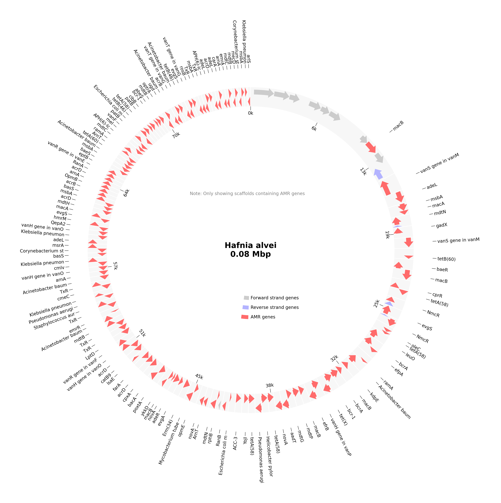

### ACC-3
- **Mechanism**: antibiotic inactivation
- **Drug Classes**: monobactam; cephalosporin; penam
- **AMR Family**: ACC beta-lactamase
- **Locations**:
  - gnl|SPADES|DLDDEBJH_9915_1 : position 80-511

### APH(6)-Ic (found in 2 locations)
- **Mechanism**: antibiotic inactivation
- **Drug Classes**: aminoglycoside antibiotic
- **AMR Family**: APH(6)
- **Locations**:
  - gnl|SPADES|DLDDEBJH_21816_1 : position 2-274
  - gnl|SPADES|DLDDEBJH_32444_1 : position 3-239

### Acinetobacter baumannii AbaF (found in 4 locations)
- **Mechanism**: antibiotic efflux
- **Drug Classes**: phosphonic acid antibiotic
- **AMR Family**: major facilitator superfamily (MFS) antibiotic efflux pump
- **Locations**:
  - gnl|SPADES|DLDDEBJH_12970_1 : position 2-397
  - gnl|SPADES|DLDDEBJH_13966_1 : position 1-372
  - gnl|SPADES|DLDDEBJH_27082_1 : position 2-256
  - gnl|SPADES|DLDDEBJH_7667_1 : position 3-668

### Acinetobacter baumannii AbaQ (found in 2 locations)
- **Mechanism**: antibiotic efflux
- **Drug Classes**: fluoroquinolone antibiotic
- **AMR Family**: major facilitator superfamily (MFS) antibiotic efflux pump
- **Locations**:
  - gnl|SPADES|DLDDEBJH_19727_1 : position 3-284
  - gnl|SPADES|DLDDEBJH_26527_1 : position 1-258

### ArnT (found in 2 locations)
- **Mechanism**: antibiotic target alteration
- **Drug Classes**: peptide antibiotic
- **AMR Family**: pmr phosphoethanolamine transferase
- **Locations**:
  - gnl|SPADES|DLDDEBJH_10459_2 : position 210-485
  - gnl|SPADES|DLDDEBJH_20106_1 : position 1-282

### Corynebacterium striatum tetA (found in 2 locations)
- **Mechanism**: antibiotic efflux
- **Drug Classes**: penam; tetracycline antibiotic
- **AMR Family**: major facilitator superfamily (MFS) antibiotic efflux pump
- **Locations**:
  - gnl|SPADES|DLDDEBJH_15893_1 : position 1-336
  - gnl|SPADES|DLDDEBJH_40862_1 : position 3-212

### Erm(34)
- **Mechanism**: antibiotic target alteration
- **Drug Classes**: macrolide antibiotic; lincosamide antibiotic; streptogramin antibiotic; streptogramin A antibiotic; streptogramin B antibiotic
- **AMR Family**: Erm 23S ribosomal RNA methyltransferase
- **Locations**:
  - gnl|SPADES|DLDDEBJH_10877_1 : position 1-465

### Escherichia coli mdfA (found in 2 locations)
- **Mechanism**: antibiotic efflux
- **Drug Classes**: tetracycline antibiotic; phenicol antibiotic; disinfecting agents and antiseptics
- **AMR Family**: major facilitator superfamily (MFS) antibiotic efflux pump
- **Locations**:
  - gnl|SPADES|DLDDEBJH_23579_1 : position 2-268
  - gnl|SPADES|DLDDEBJH_9983_2 : position 387-506

### Helicobacter pylori pbp1 mutants conferring resistance to amoxicillin
- **Mechanism**: antibiotic target alteration
- **Drug Classes**: cephalosporin; cephamycin; penam
- **AMR Family**: Penicillin-binding protein mutations conferring resistance to beta-lactam antibiotics
- **Locations**:
  - gnl|SPADES|DLDDEBJH_9681_1 : position 2-523

### Klebsiella pneumoniae OmpK37 (found in 3 locations)
- **Mechanism**: reduced permeability to antibiotic
- **Drug Classes**: monobactam; carbapenem; cephalosporin; cephamycin; penam; penem
- **AMR Family**: General Bacterial Porin with reduced permeability to beta-lactams
- **Locations**:
  - gnl|SPADES|DLDDEBJH_15247_1 : position 3-347
  - gnl|SPADES|DLDDEBJH_16278_1 : position 2-328
  - gnl|SPADES|DLDDEBJH_41385_1 : position 39-212

### Klebsiella pneumoniae acrR with mutation conferring multidrug antibiotic resistance
- **Mechanism**: antibiotic target alteration; antibiotic efflux
- **Drug Classes**: fluoroquinolone antibiotic; cephalosporin; glycylcycline; penam; tetracycline antibiotic; rifamycin antibiotic; phenicol antibiotic; disinfecting agents and antiseptics
- **AMR Family**: resistance-nodulation-cell division (RND) antibiotic efflux pump
- **Locations**:
  - gnl|SPADES|DLDDEBJH_13637_1 : position 2-226

### LptD
- **Mechanism**: antibiotic efflux
- **Drug Classes**: carbapenem; peptide antibiotic; aminocoumarin antibiotic; rifamycin antibiotic
- **AMR Family**: ATP-binding cassette (ABC) antibiotic efflux pump
- **Locations**:
  - gnl|SPADES|DLDDEBJH_12069_1 : position 3-422

### Mycobacterium tuberculosis intrinsic murA conferring resistance to fosfomycin
- **Mechanism**: antibiotic target alteration
- **Drug Classes**: phosphonic acid antibiotic
- **AMR Family**: antibiotic-resistant murA transferase
- **Locations**:
  - gnl|SPADES|DLDDEBJH_10747_1 : position 1-471

### NmcR (found in 2 locations)
- **Mechanism**: antibiotic inactivation
- **Drug Classes**: carbapenem; cephalosporin; cephamycin; penam
- **AMR Family**: NmcA beta-lactamase
- **Locations**:
  - gnl|SPADES|DLDDEBJH_6593_1 : position 2-406
  - gnl|SPADES|DLDDEBJH_6909_1 : position 140-748

### OpmB
- **Mechanism**: antibiotic efflux
- **Drug Classes**: macrolide antibiotic; monobactam; tetracycline antibiotic; aminocoumarin antibiotic
- **AMR Family**: resistance-nodulation-cell division (RND) antibiotic efflux pump
- **Locations**:
  - gnl|SPADES|DLDDEBJH_17833_1 : position 2-304

### Pseudomonas aeruginosa CpxR
- **Mechanism**: antibiotic efflux
- **Drug Classes**: macrolide antibiotic; fluoroquinolone antibiotic; monobactam; aminoglycoside antibiotic; carbapenem; cephalosporin; cephamycin; penam; tetracycline antibiotic; peptide antibiotic; aminocoumarin antibiotic; diaminopyrimidine antibiotic; sulfonamide antibiotic; phenicol antibiotic; penem
- **AMR Family**: resistance-nodulation-cell division (RND) antibiotic efflux pump
- **Locations**:
  - gnl|SPADES|DLDDEBJH_13531_1 : position 2-307

### Pseudomonas aeruginosa ampR with mutation conferring resistance to aztreonam
- **Mechanism**: antibiotic target alteration; antibiotic inactivation
- **Drug Classes**: monobactam; carbapenem; cephalosporin
- **AMR Family**: PDC beta-lactamase; ampR transcriptional regulator with mutation conferring resistance to monobactam antibiotics
- **Locations**:
  - gnl|SPADES|DLDDEBJH_9773_1 : position 2-517

### QepA2
- **Mechanism**: antibiotic efflux
- **Drug Classes**: fluoroquinolone antibiotic
- **AMR Family**: major facilitator superfamily (MFS) antibiotic efflux pump
- **Locations**:
  - gnl|SPADES|DLDDEBJH_16414_1 : position 2-325

### RanA
- **Mechanism**: antibiotic efflux
- **Drug Classes**: aminoglycoside antibiotic
- **AMR Family**: ATP-binding cassette (ABC) antibiotic efflux pump
- **Locations**:
  - gnl|SPADES|DLDDEBJH_18660_1 : position 3-293

### RanB
- **Mechanism**: antibiotic efflux
- **Drug Classes**: aminoglycoside antibiotic
- **AMR Family**: ATP-binding cassette (ABC) antibiotic efflux pump
- **Locations**:
  - gnl|SPADES|DLDDEBJH_10122_1 : position 223-501

### Staphylococcus aureus mupA conferring resistance to mupirocin
- **Mechanism**: antibiotic target alteration
- **Drug Classes**: mupirocin-like antibiotic
- **AMR Family**: antibiotic-resistant isoleucyl-tRNA synthetase (ileS)
- **Locations**:
  - gnl|SPADES|DLDDEBJH_13466_1 : position 3-383

### TxR (found in 6 locations)
- **Mechanism**: antibiotic efflux
- **Drug Classes**: tetracycline antibiotic
- **AMR Family**: ATP-binding cassette (ABC) antibiotic efflux pump
- **Locations**:
  - gnl|SPADES|DLDDEBJH_12561_1 : position 1-408
  - gnl|SPADES|DLDDEBJH_12563_1 : position 3-407
  - gnl|SPADES|DLDDEBJH_13306_1 : position 2-388
  - gnl|SPADES|DLDDEBJH_13962_1 : position 3-350
  - gnl|SPADES|DLDDEBJH_31393_1 : position 1-243
  - gnl|SPADES|DLDDEBJH_32091_1 : position 3-239

### YojI
- **Mechanism**: antibiotic efflux
- **Drug Classes**: peptide antibiotic
- **AMR Family**: ATP-binding cassette (ABC) antibiotic efflux pump
- **Locations**:
  - gnl|SPADES|DLDDEBJH_9901_1 : position 1-351

### aadT
- **Mechanism**: antibiotic efflux
- **Drug Classes**: macrolide antibiotic; tetracycline antibiotic; disinfecting agents and antiseptics
- **AMR Family**: major facilitator superfamily (MFS) antibiotic efflux pump
- **Locations**:
  - gnl|SPADES|DLDDEBJH_9561_1 : position 3-530

### abeS
- **Mechanism**: antibiotic efflux
- **Drug Classes**: macrolide antibiotic; aminocoumarin antibiotic
- **AMR Family**: small multidrug resistance (SMR) antibiotic efflux pump
- **Locations**:
  - gnl|SPADES|DLDDEBJH_24924_1 : position 1-264

### acrB (found in 2 locations)
- **Mechanism**: antibiotic efflux
- **Drug Classes**: fluoroquinolone antibiotic; cephalosporin; glycylcycline; penam; tetracycline antibiotic; rifamycin antibiotic; phenicol antibiotic; disinfecting agents and antiseptics
- **AMR Family**: resistance-nodulation-cell division (RND) antibiotic efflux pump
- **Locations**:
  - gnl|SPADES|DLDDEBJH_17584_1 : position 3-308
  - gnl|SPADES|DLDDEBJH_26514_1 : position 3-257

### acrD (found in 5 locations)
- **Mechanism**: antibiotic efflux
- **Drug Classes**: aminoglycoside antibiotic
- **AMR Family**: resistance-nodulation-cell division (RND) antibiotic efflux pump
- **Locations**:
  - gnl|SPADES|DLDDEBJH_11687_1 : position 1-435
  - gnl|SPADES|DLDDEBJH_11941_1 : position 1-426
  - gnl|SPADES|DLDDEBJH_17367_1 : position 1-312
  - gnl|SPADES|DLDDEBJH_18572_1 : position 3-296
  - gnl|SPADES|DLDDEBJH_33370_1 : position 2-235

### adeL (found in 4 locations)
- **Mechanism**: antibiotic efflux
- **Drug Classes**: fluoroquinolone antibiotic; tetracycline antibiotic
- **AMR Family**: resistance-nodulation-cell division (RND) antibiotic efflux pump
- **Locations**:
  - gnl|SPADES|DLDDEBJH_16221_1 : position 3-329
  - gnl|SPADES|DLDDEBJH_32753_1 : position 1-237
  - gnl|SPADES|DLDDEBJH_34150_1 : position 3-233
  - gnl|SPADES|DLDDEBJH_5245_1 : position 28-933

### adeR
- **Mechanism**: antibiotic efflux
- **Drug Classes**: glycylcycline; tetracycline antibiotic
- **AMR Family**: resistance-nodulation-cell division (RND) antibiotic efflux pump
- **Locations**:
  - gnl|SPADES|DLDDEBJH_11187_1 : position 2-454

### arlS
- **Mechanism**: antibiotic efflux
- **Drug Classes**: fluoroquinolone antibiotic; disinfecting agents and antiseptics
- **AMR Family**: major facilitator superfamily (MFS) antibiotic efflux pump
- **Locations**:
  - gnl|SPADES|DLDDEBJH_43149_1 : position 2-205

### arnA (found in 3 locations)
- **Mechanism**: antibiotic target alteration
- **Drug Classes**: peptide antibiotic
- **AMR Family**: pmr phosphoethanolamine transferase
- **Locations**:
  - gnl|SPADES|DLDDEBJH_14208_1 : position 1-366
  - gnl|SPADES|DLDDEBJH_18443_1 : position 1-297
  - gnl|SPADES|DLDDEBJH_38108_1 : position 1-222

### bacA
- **Mechanism**: antibiotic target alteration
- **Drug Classes**: peptide antibiotic
- **AMR Family**: undecaprenyl pyrophosphate related proteins
- **Locations**:
  - gnl|SPADES|DLDDEBJH_11590_1 : position 3-437

### baeR
- **Mechanism**: antibiotic efflux
- **Drug Classes**: aminoglycoside antibiotic; aminocoumarin antibiotic
- **AMR Family**: resistance-nodulation-cell division (RND) antibiotic efflux pump
- **Locations**:
  - gnl|SPADES|DLDDEBJH_6173_1 : position 268-846

### baeS
- **Mechanism**: antibiotic efflux
- **Drug Classes**: aminoglycoside antibiotic; aminocoumarin antibiotic
- **AMR Family**: resistance-nodulation-cell division (RND) antibiotic efflux pump
- **Locations**:
  - gnl|SPADES|DLDDEBJH_19085_1 : position 2-250

### basS (found in 2 locations)
- **Mechanism**: antibiotic target alteration; antibiotic efflux
- **Drug Classes**: peptide antibiotic
- **AMR Family**: pmr phosphoethanolamine transferase
- **Locations**:
  - gnl|SPADES|DLDDEBJH_15342_2 : position 77-346
  - gnl|SPADES|DLDDEBJH_17483_1 : position 3-311

### bcr-1 (found in 2 locations)
- **Mechanism**: antibiotic efflux
- **Drug Classes**: bicyclomycin-like antibiotic
- **AMR Family**: major facilitator superfamily (MFS) antibiotic efflux pump
- **Locations**:
  - gnl|SPADES|DLDDEBJH_24692_1 : position 110-265
  - gnl|SPADES|DLDDEBJH_8329_1 : position 2-610

### bcrA (found in 2 locations)
- **Mechanism**: antibiotic efflux
- **Drug Classes**: peptide antibiotic
- **AMR Family**: ATP-binding cassette (ABC) antibiotic efflux pump
- **Locations**:
  - gnl|SPADES|DLDDEBJH_7381_2 : position 104-697
  - gnl|SPADES|DLDDEBJH_7927_1 : position 1-645

### carA
- **Mechanism**: antibiotic target protection
- **Drug Classes**: macrolide antibiotic
- **AMR Family**: Miscellaneous ABC-F subfamily ATP-binding cassette ribosomal protection proteins
- **Locations**:
  - gnl|SPADES|DLDDEBJH_38064_1 : position 2-223

### catB9
- **Mechanism**: antibiotic inactivation
- **Drug Classes**: phenicol antibiotic
- **AMR Family**: chloramphenicol acetyltransferase (CAT)
- **Locations**:
  - gnl|SPADES|DLDDEBJH_11899_1 : position 3-428

### clbB
- **Mechanism**: antibiotic target alteration
- **Drug Classes**: lincosamide antibiotic; streptogramin antibiotic; streptogramin A antibiotic; oxazolidinone antibiotic; phenicol antibiotic; pleuromutilin antibiotic
- **AMR Family**: Cfr 23S ribosomal RNA methyltransferase
- **Locations**:
  - gnl|SPADES|DLDDEBJH_24001_1 : position 2-265

### cmeC
- **Mechanism**: antibiotic efflux
- **Drug Classes**: macrolide antibiotic; fluoroquinolone antibiotic; cephalosporin; fusidane antibiotic
- **AMR Family**: resistance-nodulation-cell division (RND) antibiotic efflux pump
- **Locations**:
  - gnl|SPADES|DLDDEBJH_13744_1 : position 2-379

### cmlv
- **Mechanism**: antibiotic inactivation
- **Drug Classes**: phenicol antibiotic
- **AMR Family**: chloramphenicol phosphotransferase
- **Locations**:
  - gnl|SPADES|DLDDEBJH_15018_1 : position 2-352

### cprR
- **Mechanism**: antibiotic target alteration; antibiotic efflux
- **Drug Classes**: peptide antibiotic
- **AMR Family**: pmr phosphoethanolamine transferase
- **Locations**:
  - gnl|SPADES|DLDDEBJH_6501_2 : position 370-798

### cpxA
- **Mechanism**: antibiotic efflux
- **Drug Classes**: aminoglycoside antibiotic; aminocoumarin antibiotic
- **AMR Family**: resistance-nodulation-cell division (RND) antibiotic efflux pump
- **Locations**:
  - gnl|SPADES|DLDDEBJH_11591_1 : position 3-437

### efpA
- **Mechanism**: antibiotic efflux
- **Drug Classes**: rifamycin antibiotic; isoniazid-like antibiotic
- **AMR Family**: major facilitator superfamily (MFS) antibiotic efflux pump
- **Locations**:
  - gnl|SPADES|DLDDEBJH_7552_1 : position 3-314

### efrB
- **Mechanism**: antibiotic efflux
- **Drug Classes**: macrolide antibiotic; fluoroquinolone antibiotic; rifamycin antibiotic
- **AMR Family**: ATP-binding cassette (ABC) antibiotic efflux pump
- **Locations**:
  - gnl|SPADES|DLDDEBJH_8636_1 : position 3-587

### emrA
- **Mechanism**: antibiotic efflux
- **Drug Classes**: fluoroquinolone antibiotic
- **AMR Family**: major facilitator superfamily (MFS) antibiotic efflux pump
- **Locations**:
  - gnl|SPADES|DLDDEBJH_38565_1 : position 2-220

### emrR
- **Mechanism**: antibiotic efflux
- **Drug Classes**: fluoroquinolone antibiotic
- **AMR Family**: major facilitator superfamily (MFS) antibiotic efflux pump
- **Locations**:
  - gnl|SPADES|DLDDEBJH_13151_1 : position 2-109

### eptB
- **Mechanism**: antibiotic target alteration
- **Drug Classes**: peptide antibiotic
- **AMR Family**: pmr phosphoethanolamine transferase
- **Locations**:
  - gnl|SPADES|DLDDEBJH_19060_1 : position 2-289

### evgA
- **Mechanism**: antibiotic efflux
- **Drug Classes**: macrolide antibiotic; fluoroquinolone antibiotic; penam; tetracycline antibiotic
- **AMR Family**: major facilitator superfamily (MFS) antibiotic efflux pump; resistance-nodulation-cell division (RND) antibiotic efflux pump
- **Locations**:
  - gnl|SPADES|DLDDEBJH_11080_2 : position 180-458

### evgS (found in 3 locations)
- **Mechanism**: antibiotic efflux
- **Drug Classes**: macrolide antibiotic; fluoroquinolone antibiotic; penam; tetracycline antibiotic
- **AMR Family**: major facilitator superfamily (MFS) antibiotic efflux pump; resistance-nodulation-cell division (RND) antibiotic efflux pump
- **Locations**:
  - gnl|SPADES|DLDDEBJH_16739_1 : position 3-320
  - gnl|SPADES|DLDDEBJH_27948_1 : position 1-255
  - gnl|SPADES|DLDDEBJH_6844_1 : position 2-754

### farA
- **Mechanism**: antibiotic efflux
- **Drug Classes**: antibacterial free fatty acids
- **AMR Family**: major facilitator superfamily (MFS) antibiotic efflux pump
- **Locations**:
  - gnl|SPADES|DLDDEBJH_11762_1 : position 3-431

### gadX
- **Mechanism**: antibiotic efflux
- **Drug Classes**: macrolide antibiotic; fluoroquinolone antibiotic; penam
- **AMR Family**: resistance-nodulation-cell division (RND) antibiotic efflux pump
- **Locations**:
  - gnl|SPADES|DLDDEBJH_5871_1 : position 3-491

### hmrM
- **Mechanism**: antibiotic efflux
- **Drug Classes**: fluoroquinolone antibiotic; disinfecting agents and antiseptics
- **AMR Family**: multidrug and toxic compound extrusion (MATE) transporter
- **Locations**:
  - gnl|SPADES|DLDDEBJH_16454_1 : position 3-326

### kdpE
- **Mechanism**: antibiotic efflux
- **Drug Classes**: aminoglycoside antibiotic
- **AMR Family**: kdpDE
- **Locations**:
  - gnl|SPADES|DLDDEBJH_7805_2 : position 229-657

### leuO
- **Mechanism**: antibiotic efflux
- **Drug Classes**: nucleoside antibiotic; disinfecting agents and antiseptics
- **AMR Family**: major facilitator superfamily (MFS) antibiotic efflux pump
- **Locations**:
  - gnl|SPADES|DLDDEBJH_7144_1 : position 2-718

### lsaE
- **Mechanism**: antibiotic target protection
- **Drug Classes**: lincosamide antibiotic; streptogramin antibiotic; pleuromutilin antibiotic
- **AMR Family**: lsa-type ABC-F protein
- **Locations**:
  - gnl|SPADES|DLDDEBJH_11840_2 : position 252-431

### macA (found in 2 locations)
- **Mechanism**: antibiotic efflux
- **Drug Classes**: macrolide antibiotic
- **AMR Family**: ATP-binding cassette (ABC) antibiotic efflux pump
- **Locations**:
  - gnl|SPADES|DLDDEBJH_16769_1 : position 3-320
  - gnl|SPADES|DLDDEBJH_5699_2 : position 595-933

### macB (found in 5 locations)
- **Mechanism**: antibiotic efflux
- **Drug Classes**: macrolide antibiotic
- **AMR Family**: ATP-binding cassette (ABC) antibiotic efflux pump
- **Locations**:
  - gnl|SPADES|DLDDEBJH_11317_2 : position 206-448
  - gnl|SPADES|DLDDEBJH_456_10 : position 10943-12019
  - gnl|SPADES|DLDDEBJH_6268_1 : position 1-831
  - gnl|SPADES|DLDDEBJH_7812_2 : position 254-655
  - gnl|SPADES|DLDDEBJH_8944_1 : position 132-569

### mdtB (found in 3 locations)
- **Mechanism**: antibiotic efflux
- **Drug Classes**: aminocoumarin antibiotic
- **AMR Family**: resistance-nodulation-cell division (RND) antibiotic efflux pump
- **Locations**:
  - gnl|SPADES|DLDDEBJH_12911_1 : position 2-397
  - gnl|SPADES|DLDDEBJH_24832_1 : position 1-264
  - gnl|SPADES|DLDDEBJH_38904_1 : position 3-218

### mdtC (found in 2 locations)
- **Mechanism**: antibiotic efflux
- **Drug Classes**: aminocoumarin antibiotic
- **AMR Family**: resistance-nodulation-cell division (RND) antibiotic efflux pump
- **Locations**:
  - gnl|SPADES|DLDDEBJH_20143_1 : position 3-281
  - gnl|SPADES|DLDDEBJH_38758_1 : position 3-221

### mdtG
- **Mechanism**: antibiotic efflux
- **Drug Classes**: phosphonic acid antibiotic
- **AMR Family**: major facilitator superfamily (MFS) antibiotic efflux pump
- **Locations**:
  - gnl|SPADES|DLDDEBJH_9510_1 : position 116-532

### mdtH
- **Mechanism**: antibiotic efflux
- **Drug Classes**: fluoroquinolone antibiotic
- **AMR Family**: major facilitator superfamily (MFS) antibiotic efflux pump
- **Locations**:
  - gnl|SPADES|DLDDEBJH_16819_1 : position 1-321

### mdtN (found in 2 locations)
- **Mechanism**: antibiotic efflux
- **Drug Classes**: nucleoside antibiotic; disinfecting agents and antiseptics
- **AMR Family**: major facilitator superfamily (MFS) antibiotic efflux pump
- **Locations**:
  - gnl|SPADES|DLDDEBJH_10478_1 : position 3-425
  - gnl|SPADES|DLDDEBJH_5770_1 : position 1-678

### mdtP
- **Mechanism**: antibiotic efflux
- **Drug Classes**: nucleoside antibiotic; disinfecting agents and antiseptics
- **AMR Family**: major facilitator superfamily (MFS) antibiotic efflux pump
- **Locations**:
  - gnl|SPADES|DLDDEBJH_9424_1 : position 3-536

### mecD
- **Mechanism**: antibiotic target replacement
- **Drug Classes**: penam
- **AMR Family**: methicillin resistant PBP2
- **Locations**:
  - gnl|SPADES|DLDDEBJH_39372_1 : position 1-219

### mel
- **Mechanism**: antibiotic target protection
- **Drug Classes**: macrolide antibiotic; streptogramin antibiotic
- **AMR Family**: msr-type ABC-F protein
- **Locations**:
  - gnl|SPADES|DLDDEBJH_22758_1 : position 31-270

### msbA (found in 5 locations)
- **Mechanism**: antibiotic efflux
- **Drug Classes**: nitroimidazole antibiotic
- **AMR Family**: ATP-binding cassette (ABC) antibiotic efflux pump
- **Locations**:
  - gnl|SPADES|DLDDEBJH_17437_1 : position 1-312
  - gnl|SPADES|DLDDEBJH_19150_1 : position 1-288
  - gnl|SPADES|DLDDEBJH_31835_1 : position 1-240
  - gnl|SPADES|DLDDEBJH_40918_1 : position 2-214
  - gnl|SPADES|DLDDEBJH_5699_1 : position 2-598

### msrA
- **Mechanism**: antibiotic target protection
- **Drug Classes**: macrolide antibiotic; streptogramin antibiotic; streptogramin B antibiotic
- **AMR Family**: msr-type ABC-F protein
- **Locations**:
  - gnl|SPADES|DLDDEBJH_16023_1 : position 3-332

### novA (found in 3 locations)
- **Mechanism**: antibiotic efflux
- **Drug Classes**: aminocoumarin antibiotic
- **AMR Family**: ATP-binding cassette (ABC) antibiotic efflux pump
- **Locations**:
  - gnl|SPADES|DLDDEBJH_10722_1 : position 1-306
  - gnl|SPADES|DLDDEBJH_11317_1 : position 3-152
  - gnl|SPADES|DLDDEBJH_9572_1 : position 1-531

### oleC
- **Mechanism**: antibiotic efflux
- **Drug Classes**: macrolide antibiotic
- **AMR Family**: ATP-binding cassette (ABC) antibiotic efflux pump
- **Locations**:
  - gnl|SPADES|DLDDEBJH_7055_2 : position 257-502

### opmE
- **Mechanism**: antibiotic efflux
- **Drug Classes**: macrolide antibiotic; carbapenem; tetracycline antibiotic; diaminopyrimidine antibiotic; phenicol antibiotic; disinfecting agents and antiseptics
- **AMR Family**: resistance-nodulation-cell division (RND) antibiotic efflux pump
- **Locations**:
  - gnl|SPADES|DLDDEBJH_10745_1 : position 190-471

### optrA
- **Mechanism**: antibiotic target protection
- **Drug Classes**: oxazolidinone antibiotic; phenicol antibiotic
- **AMR Family**: Miscellaneous ABC-F subfamily ATP-binding cassette ribosomal protection proteins
- **Locations**:
  - gnl|SPADES|DLDDEBJH_25488_1 : position 3-260

### patB (found in 2 locations)
- **Mechanism**: antibiotic efflux
- **Drug Classes**: fluoroquinolone antibiotic
- **AMR Family**: ATP-binding cassette (ABC) antibiotic efflux pump
- **Locations**:
  - gnl|SPADES|DLDDEBJH_22987_1 : position 2-271
  - gnl|SPADES|DLDDEBJH_24011_1 : position 80-265

### poxtA
- **Mechanism**: antibiotic target protection
- **Drug Classes**: tetracycline antibiotic; oxazolidinone antibiotic; phenicol antibiotic
- **AMR Family**: Miscellaneous ABC-F subfamily ATP-binding cassette ribosomal protection proteins
- **Locations**:
  - gnl|SPADES|DLDDEBJH_11469_1 : position 3-443

### ramA (found in 2 locations)
- **Mechanism**: antibiotic efflux; reduced permeability to antibiotic
- **Drug Classes**: fluoroquinolone antibiotic; monobactam; carbapenem; cephalosporin; glycylcycline; cephamycin; penam; tetracycline antibiotic; rifamycin antibiotic; phenicol antibiotic; penem; disinfecting agents and antiseptics
- **AMR Family**: resistance-nodulation-cell division (RND) antibiotic efflux pump; General Bacterial Porin with reduced permeability to beta-lactams
- **Locations**:
  - gnl|SPADES|DLDDEBJH_20022_1 : position 1-210
  - gnl|SPADES|DLDDEBJH_7628_2 : position 510-671

### rosB
- **Mechanism**: antibiotic efflux
- **Drug Classes**: peptide antibiotic
- **AMR Family**: major facilitator superfamily (MFS) antibiotic efflux pump
- **Locations**:
  - gnl|SPADES|DLDDEBJH_29331_1 : position 2-250

### rphB
- **Mechanism**: antibiotic inactivation
- **Drug Classes**: rifamycin antibiotic
- **AMR Family**: rifampin phosphotransferase
- **Locations**:
  - gnl|SPADES|DLDDEBJH_10343_2 : position 355-489

### tet(X)
- **Mechanism**: antibiotic inactivation
- **Drug Classes**: glycylcycline; tetracycline antibiotic
- **AMR Family**: tetracycline inactivation enzyme
- **Locations**:
  - gnl|SPADES|DLDDEBJH_8378_1 : position 2-607

### tetA(58) (found in 5 locations)
- **Mechanism**: antibiotic efflux
- **Drug Classes**: tetracycline antibiotic
- **AMR Family**: major facilitator superfamily (MFS) antibiotic efflux pump
- **Locations**:
  - gnl|SPADES|DLDDEBJH_23736_1 : position 3-266
  - gnl|SPADES|DLDDEBJH_6538_1 : position 1-420
  - gnl|SPADES|DLDDEBJH_7055_3 : position 539-730
  - gnl|SPADES|DLDDEBJH_9654_1 : position 3-524
  - gnl|SPADES|DLDDEBJH_9833_1 : position 3-515

### tetA(60)
- **Mechanism**: antibiotic efflux
- **Drug Classes**: tetracycline antibiotic
- **AMR Family**: ATP-binding cassette (ABC) antibiotic efflux pump
- **Locations**:
  - gnl|SPADES|DLDDEBJH_19749_1 : position 3-284

### tetB(46) (found in 2 locations)
- **Mechanism**: antibiotic efflux
- **Drug Classes**: tetracycline antibiotic
- **AMR Family**: ATP-binding cassette (ABC) antibiotic efflux pump
- **Locations**:
  - gnl|SPADES|DLDDEBJH_23659_1 : position 1-267
  - gnl|SPADES|DLDDEBJH_27459_1 : position 1-255

### tetB(60)
- **Mechanism**: antibiotic efflux
- **Drug Classes**: tetracycline antibiotic
- **AMR Family**: ATP-binding cassette (ABC) antibiotic efflux pump
- **Locations**:
  - gnl|SPADES|DLDDEBJH_6146_1 : position 581-850

### ugd
- **Mechanism**: antibiotic target alteration
- **Drug Classes**: peptide antibiotic
- **AMR Family**: pmr phosphoethanolamine transferase
- **Locations**:
  - gnl|SPADES|DLDDEBJH_25674_1 : position 2-262

### vanF
- **Mechanism**: antibiotic target alteration
- **Drug Classes**: glycopeptide antibiotic
- **AMR Family**: glycopeptide resistance gene cluster; Van ligase
- **Locations**:
  - gnl|SPADES|DLDDEBJH_22624_1 : position 3-272

### vanH gene in vanO cluster (found in 3 locations)
- **Mechanism**: antibiotic target alteration
- **Drug Classes**: glycopeptide antibiotic
- **AMR Family**: vanH; glycopeptide resistance gene cluster
- **Locations**:
  - gnl|SPADES|DLDDEBJH_11995_1 : position 3-425
  - gnl|SPADES|DLDDEBJH_14851_1 : position 1-354
  - gnl|SPADES|DLDDEBJH_16377_1 : position 1-327

### vanH gene in vanP cluster
- **Mechanism**: antibiotic target alteration
- **Drug Classes**: glycopeptide antibiotic
- **AMR Family**: vanH; glycopeptide resistance gene cluster
- **Locations**:
  - gnl|SPADES|DLDDEBJH_8470_1 : position 26-598

### vanR gene in vanE cluster
- **Mechanism**: antibiotic target alteration
- **Drug Classes**: glycopeptide antibiotic
- **AMR Family**: glycopeptide resistance gene cluster; vanR
- **Locations**:
  - gnl|SPADES|DLDDEBJH_18765_1 : position 3-293

### vanR gene in vanF cluster
- **Mechanism**: antibiotic target alteration
- **Drug Classes**: glycopeptide antibiotic
- **AMR Family**: glycopeptide resistance gene cluster; vanR
- **Locations**:
  - gnl|SPADES|DLDDEBJH_12074_1 : position 2-424

### vanS gene in vanM cluster (found in 2 locations)
- **Mechanism**: antibiotic target alteration
- **Drug Classes**: glycopeptide antibiotic
- **AMR Family**: vanS; glycopeptide resistance gene cluster
- **Locations**:
  - gnl|SPADES|DLDDEBJH_3963_1 : position 77-1429
  - gnl|SPADES|DLDDEBJH_6035_1 : position 2-793

### vanT gene in vanG cluster (found in 2 locations)
- **Mechanism**: antibiotic target alteration
- **Drug Classes**: glycopeptide antibiotic
- **AMR Family**: glycopeptide resistance gene cluster; vanT
- **Locations**:
  - gnl|SPADES|DLDDEBJH_26869_1 : position 2-256
  - gnl|SPADES|DLDDEBJH_28572_1 : position 1-252

### ykkD
- **Mechanism**: antibiotic efflux
- **Drug Classes**: aminoglycoside antibiotic; tetracycline antibiotic; phenicol antibiotic
- **AMR Family**: small multidrug resistance (SMR) antibiotic efflux pump
- **Locations**:
  - gnl|SPADES|DLDDEBJH_11345_1 : position 3-257

## Hafnia alvei FB1
**Strain Statistics:**
- Total genome length: 2.7 kbp
- Total scaffolds: 111
- Scaffolds with AMR genes: 5
- Total genes annotated: 2
- Total AMR genes: 6
- Unique AMR genes: 6
- Distinct AMR mechanisms: 1
- Distinct AMR families: 3
- Distinct drug classes: 4

**Circos Plot:**

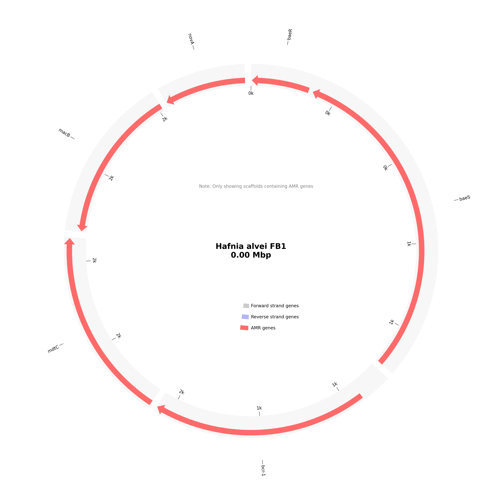

### baeR
- **Mechanism**: antibiotic efflux
- **Drug Classes**: aminoglycoside antibiotic; aminocoumarin antibiotic
- **AMR Family**: resistance-nodulation-cell division (RND) antibiotic efflux pump
- **Locations**:
  - gnl|SPADES|DLDDEBJH_5278_1 : position 2-154

### baeS
- **Mechanism**: antibiotic efflux
- **Drug Classes**: aminoglycoside antibiotic; aminocoumarin antibiotic
- **AMR Family**: resistance-nodulation-cell division (RND) antibiotic efflux pump
- **Locations**:
  - gnl|SPADES|DLDDEBJH_5278_2 : position 165-1019

### bcr-1
- **Mechanism**: antibiotic efflux
- **Drug Classes**: bicyclomycin-like antibiotic
- **AMR Family**: major facilitator superfamily (MFS) antibiotic efflux pump
- **Locations**:
  - gnl|SPADES|DLDDEBJH_8352_1 : position 76-609

### macB
- **Mechanism**: antibiotic efflux
- **Drug Classes**: macrolide antibiotic
- **AMR Family**: ATP-binding cassette (ABC) antibiotic efflux pump
- **Locations**:
  - gnl|SPADES|DLDDEBJH_12764_1 : position 2-403

### mdtC
- **Mechanism**: antibiotic efflux
- **Drug Classes**: aminocoumarin antibiotic
- **AMR Family**: resistance-nodulation-cell division (RND) antibiotic efflux pump
- **Locations**:
  - gnl|SPADES|DLDDEBJH_10666_1 : position 1-474

### novA
- **Mechanism**: antibiotic efflux
- **Drug Classes**: aminocoumarin antibiotic
- **AMR Family**: ATP-binding cassette (ABC) antibiotic efflux pump
- **Locations**:
  - gnl|SPADES|DLDDEBJH_39948_1 : position 2-217

## Hafnia paralvei
**Strain Statistics:**
- Total genome length: 4537.7 kbp
- Total scaffolds: 167
- Scaffolds with AMR genes: 58
- Total genes annotated: 8229
- Total AMR genes: 427
- Unique AMR genes: 209
- Distinct AMR mechanisms: 11
- Distinct AMR families: 73
- Distinct drug classes: 37

**Circos Plot:**

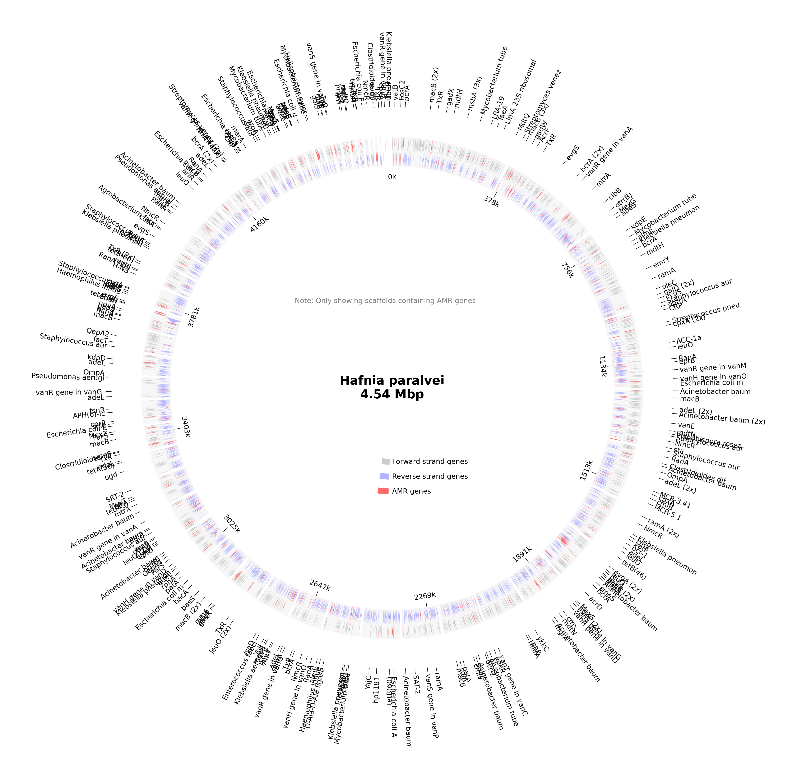

### AAC(6')-32
- **Mechanism**: antibiotic inactivation
- **Drug Classes**: aminoglycoside antibiotic
- **AMR Family**: AAC(6')
- **Locations**:
  - gnl|SPADES|DLDDEBJH_84_81 : position 87615-88217

### AAC(6')-Iu
- **Mechanism**: antibiotic inactivation
- **Drug Classes**: aminoglycoside antibiotic
- **AMR Family**: AAC(6')
- **Locations**:
  - gnl|SPADES|DLDDEBJH_28_54 : position 55611-56069

### ACC-1a
- **Mechanism**: antibiotic inactivation
- **Drug Classes**: monobactam; cephalosporin; cephamycin; penam; oxacephem
- **AMR Family**: ACC beta-lactamase
- **Locations**:
  - gnl|SPADES|DLDDEBJH_12_103: position 113332-114504

### ALI-2
- **Mechanism**: antibiotic inactivation
- **Drug Classes**: carbapenem
- **AMR Family**: ALI beta-lactamase
- **Locations**:
  - gnl|SPADES|DLDDEBJH_45_56 : position 57357-58235

### APH(6)-Ic
- **Mechanism**: antibiotic inactivation
- **Drug Classes**: aminoglycoside antibiotic
- **AMR Family**: APH(6)
- **Locations**:
  - gnl|SPADES|DLDDEBJH_115_42 : position 45268-46071

### Acinetobacter baumannii AbaF (found in 6 locations)
- **Mechanism**: antibiotic efflux
- **Drug Classes**: phosphonic acid antibiotic
- **AMR Family**: major facilitator superfamily (MFS) antibiotic efflux pump
- **Locations**:
  - gnl|SPADES|DLDDEBJH_10_7 : position 3981-5483
  - gnl|SPADES|DLDDEBJH_27_1 : position 347-1648
  - gnl|SPADES|DLDDEBJH_38_51 : position 61895-63220
  - gnl|SPADES|DLDDEBJH_45_48 : position 48341-49882
  - gnl|SPADES|DLDDEBJH_50_103 : position 119517-120746
  - gnl|SPADES|DLDDEBJH_90_55 : position 62714-64048

### Acinetobacter baumannii AbaQ (found in 7 locations)
- **Mechanism**: antibiotic efflux
- **Drug Classes**: fluoroquinolone antibiotic
- **AMR Family**: major facilitator superfamily (MFS) antibiotic efflux pump
- **Locations**:
  - gnl|SPADES|DLDDEBJH_101_16 : position 15915-17252
  - gnl|SPADES|DLDDEBJH_170_39 : position 38789-40084
  - gnl|SPADES|DLDDEBJH_27_127 : position 147226-148449
  - gnl|SPADES|DLDDEBJH_27_48 : position 63369-64715
  - gnl|SPADES|DLDDEBJH_28_34 : position 35576-36868
  - gnl|SPADES|DLDDEBJH_42_85 : position 86730-88106
  - gnl|SPADES|DLDDEBJH_87_75 : position 84077-85405

### AcrE
- **Mechanism**: antibiotic efflux
- **Drug Classes**: fluoroquinolone antibiotic; cephalosporin; cephamycin; penam
- **AMR Family**: resistance-nodulation-cell division (RND) antibiotic efflux pump
- **Locations**:
  - gnl|SPADES|DLDDEBJH_7_45 : position 47699-48862

### AcrF
- **Mechanism**: antibiotic efflux
- **Drug Classes**: fluoroquinolone antibiotic; cephalosporin; cephamycin; penam
- **AMR Family**: resistance-nodulation-cell division (RND) antibiotic efflux pump
- **Locations**:
  - gnl|SPADES|DLDDEBJH_7_44 : position 44538-47660

### Agrobacterium fabrum chloramphenicol acetyltransferase
- **Mechanism**: antibiotic inactivation
- **Drug Classes**: phenicol antibiotic
- **AMR Family**: chloramphenicol acetyltransferase (CAT)
- **Locations**:
  - gnl|SPADES|DLDDEBJH_160_13 : position 14823-15377

### ArnT
- **Mechanism**: antibiotic target alteration
- **Drug Classes**: peptide antibiotic
- **AMR Family**: pmr phosphoethanolamine transferase
- **Locations**:
  - gnl|SPADES|DLDDEBJH_73_7: position 4646-6295

### Bifidobacterium bifidum ileS conferring resistance to mupirocin
- **Mechanism**: antibiotic target alteration
- **Drug Classes**: mupirocin-like antibiotic
- **AMR Family**: antibiotic-resistant isoleucyl-tRNA synthetase (ileS)
- **Locations**:
  - gnl|SPADES|DLDDEBJH_7_15 : position 15662-18244

### CRP (found in 2 locations)
- **Mechanism**: antibiotic efflux
- **Drug Classes**: macrolide antibiotic; fluoroquinolone antibiotic; penam
- **AMR Family**: resistance-nodulation-cell division (RND) antibiotic efflux pump
- **Locations**:
  - gnl|SPADES|DLDDEBJH_12_26: position 21604-22236
  - gnl|SPADES|DLDDEBJH_256_13 : position 13497-14294

### Clostridioides difficile gyrA conferring resistance to fluoroquinolones
- **Mechanism**: antibiotic target alteration
- **Drug Classes**: fluoroquinolone antibiotic
- **AMR Family**: fluoroquinolone resistant gyrA
- **Locations**:
  - gnl|SPADES|DLDDEBJH_885_2 : position 3308-5956

### Clostridioides difficile gyrB conferring resistance to fluoroquinolones (found in 2 locations)
- **Mechanism**: antibiotic target alteration
- **Drug Classes**: fluoroquinolone antibiotic
- **AMR Family**: fluoroquinolone resistant gyrB
- **Locations**:
  - gnl|SPADES|DLDDEBJH_114_13 : position 13569-15464
  - gnl|SPADES|DLDDEBJH_28_26 : position 27563-29977

### D-Ala-D-Ala ligase
- **Mechanism**: antibiotic target alteration
- **Drug Classes**: glycopeptide antibiotic
- **AMR Family**: Van ligase
- **Locations**:
  - gnl|SPADES|DLDDEBJH_60_69 : position 87603-88523

### EVM-1
- **Mechanism**: antibiotic inactivation
- **Drug Classes**: carbapenem
- **AMR Family**: EVM beta-lactamase
- **Locations**:
  - gnl|SPADES|DLDDEBJH_3_163 : position 159300-160121

### Enterobacter cloacae acrA
- **Mechanism**: antibiotic efflux
- **Drug Classes**: fluoroquinolone antibiotic; cephalosporin; glycylcycline; penam; tetracycline antibiotic; rifamycin antibiotic; phenicol antibiotic; disinfecting agents and antiseptics
- **AMR Family**: resistance-nodulation-cell division (RND) antibiotic efflux pump
- **Locations**:
  - gnl|SPADES|DLDDEBJH_51_21 : position 22252-23442

### Enterococcus faecium cls conferring resistance to daptomycin
- **Mechanism**: antibiotic target alteration
- **Drug Classes**: peptide antibiotic
- **AMR Family**: daptomycin resistant cls
- **Locations**:
  - gnl|SPADES|DLDDEBJH_73_48 : position 49907-51367

### ErmX
- **Mechanism**: antibiotic target alteration
- **Drug Classes**: macrolide antibiotic; lincosamide antibiotic; streptogramin antibiotic; streptogramin A antibiotic; streptogramin B antibiotic
- **AMR Family**: Erm 23S ribosomal RNA methyltransferase
- **Locations**:
  - gnl|SPADES|DLDDEBJH_90_13 : position 14956-15768

### Escherichia coli AcrAB-TolC with AcrR mutation conferring resistance to ciprofloxacin, tetracycline, and ceftazidime
- **Mechanism**: antibiotic target alteration; antibiotic efflux
- **Drug Classes**: fluoroquinolone antibiotic; cephalosporin; glycylcycline; penam; tetracycline antibiotic; rifamycin antibiotic; phenicol antibiotic; disinfecting agents and antiseptics
- **AMR Family**: resistance-nodulation-cell division (RND) antibiotic efflux pump
- **Locations**:
  - gnl|SPADES|DLDDEBJH_51_20 : position 21408-22112

### Escherichia coli AcrAB-TolC with MarR mutations conferring resistance to ciprofloxacin and tetracycline (found in 2 locations)
- **Mechanism**: antibiotic target alteration; antibiotic efflux
- **Drug Classes**: fluoroquinolone antibiotic; cephalosporin; glycylcycline; penam; tetracycline antibiotic; rifamycin antibiotic; phenicol antibiotic; disinfecting agents and antiseptics
- **AMR Family**: resistance-nodulation-cell division (RND) antibiotic efflux pump
- **Locations**:
  - gnl|SPADES|DLDDEBJH_256_22 : position 23438-23929
  - gnl|SPADES|DLDDEBJH_33_109 : position 116918-117349

### Escherichia coli EF-Tu mutants conferring resistance to Enacyloxin IIa
- **Mechanism**: antibiotic target alteration
- **Drug Classes**: elfamycin antibiotic
- **AMR Family**: elfamycin resistant EF-Tu
- **Locations**:
  - gnl|SPADES|DLDDEBJH_115_7 : position 6060-8762

### Escherichia coli EF-Tu mutants conferring resistance to Pulvomycin
- **Mechanism**: antibiotic target alteration
- **Drug Classes**: elfamycin antibiotic
- **AMR Family**: elfamycin resistant EF-Tu
- **Locations**:
  - gnl|SPADES|DLDDEBJH_607_6 : position 3018-4202

### Escherichia coli PtsI with mutation conferring resistance to fosfomycin
- **Mechanism**: antibiotic target alteration
- **Drug Classes**: phosphonic acid antibiotic
- **AMR Family**: antibiotic-resistant ptsI phosphotransferase
- **Locations**:
  - gnl|SPADES|DLDDEBJH_208_13 : position 14736-16463

### Escherichia coli acrA
- **Mechanism**: antibiotic efflux
- **Drug Classes**: fluoroquinolone antibiotic; cephalosporin; glycylcycline; penam; tetracycline antibiotic; rifamycin antibiotic; phenicol antibiotic; disinfecting agents and antiseptics
- **AMR Family**: resistance-nodulation-cell division (RND) antibiotic efflux pump
- **Locations**:
  - gnl|SPADES|DLDDEBJH_76_78 : position 90923-92110

### Escherichia coli mdfA (found in 2 locations)
- **Mechanism**: antibiotic efflux
- **Drug Classes**: tetracycline antibiotic; phenicol antibiotic; disinfecting agents and antiseptics
- **AMR Family**: major facilitator superfamily (MFS) antibiotic efflux pump
- **Locations**:
  - gnl|SPADES|DLDDEBJH_12_194 : position 227793-229025
  - gnl|SPADES|DLDDEBJH_84_79 : position 84331-85551

### Escherichia coli soxS with mutation conferring antibiotic resistance (found in 4 locations)
- **Mechanism**: antibiotic target alteration; antibiotic efflux; reduced permeability to antibiotic
- **Drug Classes**: fluoroquinolone antibiotic; monobactam; carbapenem; cephalosporin; glycylcycline; cephamycin; penam; tetracycline antibiotic; rifamycin antibiotic; phenicol antibiotic; penem; disinfecting agents and antiseptics
- **AMR Family**: ATP-binding cassette (ABC) antibiotic efflux pump; major facilitator superfamily (MFS) antibiotic efflux pump; resistance-nodulation-cell division (RND) antibiotic efflux pump; General Bacterial Porin with reduced permeability to beta-lactams
- **Locations**:
  - gnl|SPADES|DLDDEBJH_10_12 : position 8866-9237
  - gnl|SPADES|DLDDEBJH_12_169 : position 194063-194926
  - gnl|SPADES|DLDDEBJH_293_9 : position 7333-8211
  - gnl|SPADES|DLDDEBJH_7_37 : position 37230-38051

### Escherichia coli uhpA with mutation conferring resistance to fosfomycin
- **Mechanism**: antibiotic target alteration
- **Drug Classes**: phosphonic acid antibiotic
- **AMR Family**: antibiotic-resistant UhpT
- **Locations**:
  - gnl|SPADES|DLDDEBJH_300_9 : position 10199-10915

### FosC2
- **Mechanism**: antibiotic inactivation
- **Drug Classes**: phosphonic acid antibiotic
- **AMR Family**: fosC phosphotransferase family
- **Locations**:
  - gnl|SPADES|DLDDEBJH_3_23 : position 23707-24171

### H-NS
- **Mechanism**: antibiotic efflux
- **Drug Classes**: macrolide antibiotic; fluoroquinolone antibiotic; cephalosporin; cephamycin; penam; tetracycline antibiotic
- **AMR Family**: major facilitator superfamily (MFS) antibiotic efflux pump; resistance-nodulation-cell division (RND) antibiotic efflux pump
- **Locations**:
  - gnl|SPADES|DLDDEBJH_147_1 : position 293-700

### Haemophilus influenzae PBP3 conferring resistance to beta-lactam antibiotics (found in 2 locations)
- **Mechanism**: antibiotic target alteration
- **Drug Classes**: cephalosporin; cephamycin; penam
- **AMR Family**: Penicillin-binding protein mutations conferring resistance to beta-lactam antibiotics
- **Locations**:
  - gnl|SPADES|DLDDEBJH_142_12 : position 10077-11849
  - gnl|SPADES|DLDDEBJH_60_77 : position 97664-99427

### Helicobacter pylori pbp1 mutants conferring resistance to amoxicillin (found in 2 locations)
- **Mechanism**: antibiotic target alteration
- **Drug Classes**: cephalosporin; cephamycin; penam
- **AMR Family**: Penicillin-binding protein mutations conferring resistance to beta-lactam antibiotics
- **Locations**:
  - gnl|SPADES|DLDDEBJH_60_25 : position 34057-36636
  - gnl|SPADES|DLDDEBJH_7_273 : position 292113-294386

### Helicobacter pylori pbp2 mutants conferring resistance to amoxicillin
- **Mechanism**: antibiotic target alteration
- **Drug Classes**: cephalosporin; cephamycin; penam
- **AMR Family**: Penicillin-binding protein mutations conferring resistance to beta-lactam antibiotics
- **Locations**:
  - gnl|SPADES|DLDDEBJH_7_21 : position 21733-23628

### Helicobacter pylori rpoB mutation conferring resistance to rifampicin
- **Mechanism**: antibiotic target alteration; antibiotic target replacement
- **Drug Classes**: fluoroquinolone antibiotic; rifamycin antibiotic
- **AMR Family**: rifamycin-resistant beta-subunit of RNA polymerase (rpoB)
- **Locations**:
  - gnl|SPADES|DLDDEBJH_302_4 : position 5302-9522

### Klebsiella aerogenes Omp36
- **Mechanism**: reduced permeability to antibiotic
- **Drug Classes**: monobactam; carbapenem; cephalosporin; cephamycin; penam; penem
- **AMR Family**: General Bacterial Porin with reduced permeability to beta-lactams
- **Locations**:
  - gnl|SPADES|DLDDEBJH_73_22 : position 22150-23298

### Klebsiella pneumoniae KpnE
- **Mechanism**: antibiotic efflux
- **Drug Classes**: macrolide antibiotic; aminoglycoside antibiotic; cephalosporin; tetracycline antibiotic; peptide antibiotic; rifamycin antibiotic; disinfecting agents and antiseptics
- **AMR Family**: small multidrug resistance (SMR) antibiotic efflux pump
- **Locations**:
  - gnl|SPADES|DLDDEBJH_10_103 : position 100371-100802

### Klebsiella pneumoniae KpnF
- **Mechanism**: antibiotic efflux
- **Drug Classes**: macrolide antibiotic; aminoglycoside antibiotic; cephalosporin; tetracycline antibiotic; peptide antibiotic; rifamycin antibiotic; disinfecting agents and antiseptics
- **AMR Family**: small multidrug resistance (SMR) antibiotic efflux pump
- **Locations**:
  - gnl|SPADES|DLDDEBJH_10_102: position 100055-100384

### Klebsiella pneumoniae KpnG
- **Mechanism**: antibiotic efflux
- **Drug Classes**: macrolide antibiotic; fluoroquinolone antibiotic; aminoglycoside antibiotic; carbapenem; cephalosporin; penam; peptide antibiotic; penem
- **AMR Family**: major facilitator superfamily (MFS) antibiotic efflux pump
- **Locations**:
  - gnl|SPADES|DLDDEBJH_7_237 : position 246950-248125

### Klebsiella pneumoniae KpnH (found in 2 locations)
- **Mechanism**: antibiotic efflux
- **Drug Classes**: macrolide antibiotic; fluoroquinolone antibiotic; aminoglycoside antibiotic; carbapenem; cephalosporin; penam; peptide antibiotic; penem
- **AMR Family**: major facilitator superfamily (MFS) antibiotic efflux pump
- **Locations**:
  - gnl|SPADES|DLDDEBJH_289_23 : position 22579-24018
  - gnl|SPADES|DLDDEBJH_7_238: position 248143-249678

### Klebsiella pneumoniae OmpK37 (found in 7 locations)
- **Mechanism**: reduced permeability to antibiotic
- **Drug Classes**: monobactam; carbapenem; cephalosporin; cephamycin; penam; penem
- **AMR Family**: General Bacterial Porin with reduced permeability to beta-lactams
- **Locations**:
  - gnl|SPADES|DLDDEBJH_158_15 : position 12065-13165
  - gnl|SPADES|DLDDEBJH_28114_1 : position 1-252
  - gnl|SPADES|DLDDEBJH_33_60 : position 67790-68902
  - gnl|SPADES|DLDDEBJH_3_267 : position 284300-285415
  - gnl|SPADES|DLDDEBJH_45_25 : position 26356-27459
  - gnl|SPADES|DLDDEBJH_60_24 : position 32736-33875
  - gnl|SPADES|DLDDEBJH_87_32 : position 33205-34347

### Klebsiella pneumoniae acrR with mutation conferring multidrug antibiotic resistance
- **Mechanism**: antibiotic target alteration; antibiotic efflux
- **Drug Classes**: fluoroquinolone antibiotic; cephalosporin; glycylcycline; penam; tetracycline antibiotic; rifamycin antibiotic; phenicol antibiotic; disinfecting agents and antiseptics
- **AMR Family**: resistance-nodulation-cell division (RND) antibiotic efflux pump
- **Locations**:
  - gnl|SPADES|DLDDEBJH_7_46 : position 49455-50069

### LRA-19
- **Mechanism**: antibiotic inactivation
- **Drug Classes**: cephalosporin; penam
- **AMR Family**: subclass B3 LRA beta-lactamase
- **Locations**:
  - gnl|SPADES|DLDDEBJH_3_265 : position 282092-282739

### LlmA 23S ribosomal RNA methyltransferase
- **Mechanism**: antibiotic target alteration
- **Drug Classes**: lincosamide antibiotic
- **AMR Family**: Llm 23S ribosomal RNA methyltransferase
- **Locations**:
  - gnl|SPADES|DLDDEBJH_3_296 : position 320336-321529

### LptD
- **Mechanism**: antibiotic efflux
- **Drug Classes**: carbapenem; peptide antibiotic; aminocoumarin antibiotic; rifamycin antibiotic
- **AMR Family**: ATP-binding cassette (ABC) antibiotic efflux pump
- **Locations**:
  - gnl|SPADES|DLDDEBJH_90_10 : position 10157-12559

### MCR-3.4
- **Mechanism**: antibiotic target alteration
- **Drug Classes**: peptide antibiotic
- **AMR Family**: MCR phosphoethanolamine transferase
- **Locations**:
  - gnl|SPADES|DLDDEBJH_142_13 : position 12214-13821

### MCR-3.41
- **Mechanism**: antibiotic target alteration
- **Drug Classes**: peptide antibiotic
- **AMR Family**: MCR phosphoethanolamine transferase
- **Locations**:
  - gnl|SPADES|DLDDEBJH_28_108 : position 109163-110785

### MCR-5.1
- **Mechanism**: antibiotic target alteration
- **Drug Classes**: peptide antibiotic
- **AMR Family**: MCR phosphoethanolamine transferase
- **Locations**:
  - gnl|SPADES|DLDDEBJH_28_144 : position 146670-148397

### MdtK
- **Mechanism**: antibiotic efflux
- **Drug Classes**: fluoroquinolone antibiotic
- **AMR Family**: multidrug and toxic compound extrusion (MATE) transporter
- **Locations**:
  - gnl|SPADES|DLDDEBJH_7_53 : position 56240-57697

### MdtQ
- **Mechanism**: reduced permeability to antibiotic
- **Drug Classes**: monobactam; carbapenem; cephalosporin; cephamycin; penam; penem
- **AMR Family**: Outer Membrane Porin (Opr)
- **Locations**:
  - gnl|SPADES|DLDDEBJH_3_323 : position 357762-359267

### MexG
- **Mechanism**: antibiotic efflux
- **Drug Classes**: fluoroquinolone antibiotic; tetracycline antibiotic; disinfecting agents and antiseptics
- **AMR Family**: resistance-nodulation-cell division (RND) antibiotic efflux pump
- **Locations**:
  - gnl|SPADES|DLDDEBJH_10_2 : position 895-1311

### MexS (found in 6 locations)
- **Mechanism**: antibiotic efflux
- **Drug Classes**: fluoroquinolone antibiotic; diaminopyrimidine antibiotic; phenicol antibiotic
- **AMR Family**: resistance-nodulation-cell division (RND) antibiotic efflux pump
- **Locations**:
  - gnl|SPADES|DLDDEBJH_27_87 : position 95440-96417
  - gnl|SPADES|DLDDEBJH_293_17 : position 15657-16658
  - gnl|SPADES|DLDDEBJH_38_36 : position 40435-41454
  - gnl|SPADES|DLDDEBJH_3_27 : position 27599-28723
  - gnl|SPADES|DLDDEBJH_42_8 : position 8176-9207
  - gnl|SPADES|DLDDEBJH_43_116 : position 129307-130293

### MexT
- **Mechanism**: antibiotic efflux
- **Drug Classes**: fluoroquinolone antibiotic; diaminopyrimidine antibiotic; phenicol antibiotic
- **AMR Family**: resistance-nodulation-cell division (RND) antibiotic efflux pump
- **Locations**:
  - gnl|SPADES|DLDDEBJH_101_58 : position 62002-62895

### MexV
- **Mechanism**: antibiotic efflux
- **Drug Classes**: macrolide antibiotic; fluoroquinolone antibiotic; tetracycline antibiotic; phenicol antibiotic; disinfecting agents and antiseptics
- **AMR Family**: resistance-nodulation-cell division (RND) antibiotic efflux pump
- **Locations**:
  - gnl|SPADES|DLDDEBJH_391_4 : position 2535-4052

### MexZ
- **Mechanism**: antibiotic efflux
- **Drug Classes**: macrolide antibiotic; fluoroquinolone antibiotic; aminoglycoside antibiotic; carbapenem; cephalosporin; cephamycin; penam; tetracycline antibiotic; phenicol antibiotic; disinfecting agents and antiseptics
- **AMR Family**: resistance-nodulation-cell division (RND) antibiotic efflux pump
- **Locations**:
  - gnl|SPADES|DLDDEBJH_114_61 : position 72910-73515

### Mycobacterium tuberculosis gidB mutation conferring resistance to streptomycin
- **Mechanism**: antibiotic target alteration
- **Drug Classes**: aminoglycoside antibiotic
- **AMR Family**: antibiotic resistant gidB
- **Locations**:
  - gnl|SPADES|DLDDEBJH_289_9 : position 6218-6838

### Mycobacterium tuberculosis ndh with mutation conferring resistance to isoniazid
- **Mechanism**: antibiotic target alteration
- **Drug Classes**: isoniazid-like antibiotic
- **AMR Family**: antibiotic resistant ndh
- **Locations**:
  - gnl|SPADES|DLDDEBJH_10_77 : position 74670-75974

### Mycobacterium tuberculosis pncA mutations conferring resistance to pyrazinamide
- **Mechanism**: antibiotic target alteration
- **Drug Classes**: pyrazine antibiotic
- **AMR Family**: Pyrazinamide resistant pncA
- **Locations**:
  - gnl|SPADES|DLDDEBJH_45_16 : position 15829-16464

### Mycobacterium tuberculosis rpoB mutations conferring resistance to rifampicin
- **Mechanism**: antibiotic target alteration; antibiotic target replacement
- **Drug Classes**: rifamycin antibiotic
- **AMR Family**: rifamycin-resistant beta-subunit of RNA polymerase (rpoB)
- **Locations**:
  - gnl|SPADES|DLDDEBJH_302_3 : position 1131-5159

### Mycobacterium tuberculosis rpsA mutations conferring resistance to pyrazinamide
- **Mechanism**: antibiotic target alteration
- **Drug Classes**: pyrazine antibiotic
- **AMR Family**: pyrazinamide resistant rpsA
- **Locations**:
  - gnl|SPADES|DLDDEBJH_3_240 : position 249838-251517

### Mycobacterium tuberculosis thyA with mutation conferring resistance to para-aminosalicylic acid
- **Mechanism**: antibiotic target alteration
- **Drug Classes**: salicylic acid antibiotic
- **AMR Family**: aminosalicylate resistant thymidylate synthase
- **Locations**:
  - gnl|SPADES|DLDDEBJH_60_11 : position 17357-18151

### NmcR (found in 9 locations)
- **Mechanism**: antibiotic inactivation
- **Drug Classes**: carbapenem; cephalosporin; cephamycin; penam
- **AMR Family**: NmcA beta-lactamase
- **Locations**:
  - gnl|SPADES|DLDDEBJH_160_27 : position 31348-32307
  - gnl|SPADES|DLDDEBJH_251_19 : position 21339-22211
  - gnl|SPADES|DLDDEBJH_251_7 : position 6312-7205
  - gnl|SPADES|DLDDEBJH_27_123 : position 142430-143359
  - gnl|SPADES|DLDDEBJH_33_26 : position 34680-35654
  - gnl|SPADES|DLDDEBJH_50_106 : position 123119-123946
  - gnl|SPADES|DLDDEBJH_68_37 : position 30347-31243
  - gnl|SPADES|DLDDEBJH_720_1 : position 82-987
  - gnl|SPADES|DLDDEBJH_87_60 : position 71141-72046

### OmpA (found in 4 locations)
- **Mechanism**: reduced permeability to antibiotic
- **Drug Classes**: peptide antibiotic
- **AMR Family**: General Bacterial Porin with reduced permeability to peptide antibiotics
- **Locations**:
  - gnl|SPADES|DLDDEBJH_10_8 : position 6056-6547
  - gnl|SPADES|DLDDEBJH_135_2 : position 1312-1827
  - gnl|SPADES|DLDDEBJH_28_50 : position 52561-53220
  - gnl|SPADES|DLDDEBJH_3_286 : position 310219-311277

### OprM
- **Mechanism**: antibiotic efflux
- **Drug Classes**: macrolide antibiotic; fluoroquinolone antibiotic; monobactam; aminoglycoside antibiotic; carbapenem; cephalosporin; cephamycin; penam; tetracycline antibiotic; peptide antibiotic; aminocoumarin antibiotic; diaminopyrimidine antibiotic; sulfonamide antibiotic; phenicol antibiotic; penem; disinfecting agents and antiseptics
- **AMR Family**: resistance-nodulation-cell division (RND) antibiotic efflux pump
- **Locations**:
  - gnl|SPADES|DLDDEBJH_137_35 : position 39883-41244

### ParR (found in 2 locations)
- **Mechanism**: antibiotic efflux; reduced permeability to antibiotic
- **Drug Classes**: macrolide antibiotic; fluoroquinolone antibiotic; monobactam; aminoglycoside antibiotic; carbapenem; cephalosporin; cephamycin; penam; tetracycline antibiotic; phenicol antibiotic; penem; disinfecting agents and antiseptics
- **AMR Family**: resistance-nodulation-cell division (RND) antibiotic efflux pump; Outer Membrane Porin (Opr)
- **Locations**:
  - gnl|SPADES|DLDDEBJH_12_65 : position 66523-67242
  - gnl|SPADES|DLDDEBJH_87_52 : position 60746-61459

### ParS (found in 2 locations)
- **Mechanism**: antibiotic efflux; reduced permeability to antibiotic
- **Drug Classes**: macrolide antibiotic; fluoroquinolone antibiotic; monobactam; aminoglycoside antibiotic; carbapenem; cephalosporin; cephamycin; penam; tetracycline antibiotic; phenicol antibiotic; penem; disinfecting agents and antiseptics
- **AMR Family**: resistance-nodulation-cell division (RND) antibiotic efflux pump; Outer Membrane Porin (Opr)
- **Locations**:
  - gnl|SPADES|DLDDEBJH_114_53 : position 66227-67888
  - gnl|SPADES|DLDDEBJH_87_51 : position 59411-60739

### Planobispora rosea EF-Tu mutants conferring resistance to inhibitor GE2270A
- **Mechanism**: antibiotic target alteration
- **Drug Classes**: elfamycin antibiotic
- **AMR Family**: elfamycin resistant EF-Tu
- **Locations**:
  - gnl|SPADES|DLDDEBJH_27_107 : position 120767-122635

### PmrF
- **Mechanism**: antibiotic target alteration
- **Drug Classes**: peptide antibiotic
- **AMR Family**: pmr phosphoethanolamine transferase
- **Locations**:
  - gnl|SPADES|DLDDEBJH_73_10 : position 9191-10207

### Pseudomonas aeruginosa CpxR
- **Mechanism**: antibiotic efflux
- **Drug Classes**: macrolide antibiotic; fluoroquinolone antibiotic; monobactam; aminoglycoside antibiotic; carbapenem; cephalosporin; cephamycin; penam; tetracycline antibiotic; peptide antibiotic; aminocoumarin antibiotic; diaminopyrimidine antibiotic; sulfonamide antibiotic; phenicol antibiotic; penem
- **AMR Family**: resistance-nodulation-cell division (RND) antibiotic efflux pump
- **Locations**:
  - gnl|SPADES|DLDDEBJH_28_119 : position 120374-121072

### Pseudomonas aeruginosa ampR with mutation conferring resistance to aztreonam (found in 3 locations)
- **Mechanism**: antibiotic target alteration; antibiotic inactivation
- **Drug Classes**: monobactam; carbapenem; cephalosporin
- **AMR Family**: PDC beta-lactamase; ampR transcriptional regulator with mutation conferring resistance to monobactam antibiotics
- **Locations**:
  - gnl|SPADES|DLDDEBJH_12_104 : position 114719-115585
  - gnl|SPADES|DLDDEBJH_132_54 : position 60768-61685
  - gnl|SPADES|DLDDEBJH_170_27 : position 25832-26779

### QepA2
- **Mechanism**: antibiotic efflux
- **Drug Classes**: fluoroquinolone antibiotic
- **AMR Family**: major facilitator superfamily (MFS) antibiotic efflux pump
- **Locations**:
  - gnl|SPADES|DLDDEBJH_136_35 : position 34178-35584

### QepA4
- **Mechanism**: antibiotic efflux
- **Drug Classes**: fluoroquinolone antibiotic
- **AMR Family**: major facilitator superfamily (MFS) antibiotic efflux pump
- **Locations**:
  - gnl|SPADES|DLDDEBJH_87_59 : position 69688-70971

### RanA (found in 13 locations)
- **Mechanism**: antibiotic efflux
- **Drug Classes**: aminoglycoside antibiotic
- **AMR Family**: ATP-binding cassette (ABC) antibiotic efflux pump
- **Locations**:
  - gnl|SPADES|DLDDEBJH_12_139 : position 159932-160939
  - gnl|SPADES|DLDDEBJH_137_16 : position 18936-20549
  - gnl|SPADES|DLDDEBJH_147_21 : position 23013-24152
  - gnl|SPADES|DLDDEBJH_147_8 : position 10740-11726
  - gnl|SPADES|DLDDEBJH_147_9 : position 11723-12727
  - gnl|SPADES|DLDDEBJH_158_27 : position 22095-22925
  - gnl|SPADES|DLDDEBJH_170_2 : position 1162-2238
  - gnl|SPADES|DLDDEBJH_208_31 : position 33575-34510
  - gnl|SPADES|DLDDEBJH_28_8 : position 8388-9164
  - gnl|SPADES|DLDDEBJH_295_10 : position 9882-10907
  - gnl|SPADES|DLDDEBJH_33_92 : position 100869-101495
  - gnl|SPADES|DLDDEBJH_3_184 : position 183109-184242
  - gnl|SPADES|DLDDEBJH_68_1 : position 371-1180

### RanB
- **Mechanism**: antibiotic efflux
- **Drug Classes**: aminoglycoside antibiotic
- **AMR Family**: ATP-binding cassette (ABC) antibiotic efflux pump
- **Locations**:
  - gnl|SPADES|DLDDEBJH_158_28 : position 22930-23712

### RlmA(II)
- **Mechanism**: antibiotic target alteration
- **Drug Classes**: macrolide antibiotic; lincosamide antibiotic
- **AMR Family**: non-erm 23S ribosomal RNA methyltransferase (G748)
- **Locations**:
  - gnl|SPADES|DLDDEBJH_33_30 : position 38397-39209

### SAT-2
- **Mechanism**: antibiotic inactivation
- **Drug Classes**: nucleoside antibiotic
- **AMR Family**: streptothricin acetyltransferase (SAT)
- **Locations**:
  - gnl|SPADES|DLDDEBJH_50_81 : position 93620-94348

### SRT-2
- **Mechanism**: antibiotic inactivation
- **Drug Classes**: cephalosporin
- **AMR Family**: SRT beta-lactamase
- **Locations**:
  - gnl|SPADES|DLDDEBJH_101_76 : position 80938-82077

### SatA
- **Mechanism**: antibiotic inactivation
- **Drug Classes**: nucleoside antibiotic
- **AMR Family**: streptothricin acetyltransferase (SAT)
- **Locations**:
  - gnl|SPADES|DLDDEBJH_10_18 : position 13934-14377

### Staphylococcus aureus GlpT with mutation conferring resistance to fosfomycin
- **Mechanism**: antibiotic target alteration
- **Drug Classes**: phosphonic acid antibiotic
- **AMR Family**: antibiotic-resistant GlpT
- **Locations**:
  - gnl|SPADES|DLDDEBJH_27_112 : position 126852-128207

### Staphylococcus aureus fusA with mutation conferring resistance to fusidic acid (found in 2 locations)
- **Mechanism**: antibiotic target alteration
- **Drug Classes**: fusidane antibiotic
- **AMR Family**: antibiotic resistant fusA
- **Locations**:
  - gnl|SPADES|DLDDEBJH_12_2 : position 193-2307
  - gnl|SPADES|DLDDEBJH_136_4 : position 2549-4138

### Staphylococcus aureus fusE with mutation conferring resistance to fusidic acid
- **Mechanism**: antibiotic target alteration
- **Drug Classes**: fusidane antibiotic
- **AMR Family**: antibiotic resistant fusE
- **Locations**:
  - gnl|SPADES|DLDDEBJH_288_16 : position 6622-7155

### Staphylococcus aureus mupA conferring resistance to mupirocin
- **Mechanism**: antibiotic target alteration
- **Drug Classes**: mupirocin-like antibiotic
- **AMR Family**: antibiotic-resistant isoleucyl-tRNA synthetase (ileS)
- **Locations**:
  - gnl|SPADES|DLDDEBJH_90_44 : position 47395-50244

### Staphylococcus aureus mupB conferring resistance to mupirocin
- **Mechanism**: antibiotic target alteration
- **Drug Classes**: mupirocin-like antibiotic
- **AMR Family**: antibiotic-resistant isoleucyl-tRNA synthetase (ileS)
- **Locations**:
  - gnl|SPADES|DLDDEBJH_27_144 : position 168997-171741

### Staphylococcus aureus murA with mutation conferring resistance to fosfomycin
- **Mechanism**: antibiotic target alteration
- **Drug Classes**: phosphonic acid antibiotic
- **AMR Family**: antibiotic-resistant murA transferase
- **Locations**:
  - gnl|SPADES|DLDDEBJH_158_33 : position 25849-27108

### Staphylococcus aureus pgsA mutations conferring resistance to daptomycin
- **Mechanism**: antibiotic target alteration
- **Drug Classes**: peptide antibiotic
- **AMR Family**: daptomycin resistant pgsA
- **Locations**:
  - gnl|SPADES|DLDDEBJH_142_26 : position 26777-27325

### Staphylococcus aureus walK with mutation conferring resistance to daptomycin
- **Mechanism**: antibiotic target alteration
- **Drug Classes**: peptide antibiotic
- **AMR Family**: daptomycin resistant walK
- **Locations**:
  - gnl|SPADES|DLDDEBJH_27_138 : position 161538-163412

### Streptococcus pneumoniae PBP2x conferring resistance to amoxicillin
- **Mechanism**: antibiotic target alteration
- **Drug Classes**: cephalosporin; cephamycin; penam
- **AMR Family**: Penicillin-binding protein mutations conferring resistance to beta-lactam antibiotics
- **Locations**:
  - gnl|SPADES|DLDDEBJH_12_57 : position 55171-57741

### Streptomyces rimosus otr(A)
- **Mechanism**: antibiotic target protection
- **Drug Classes**: tetracycline antibiotic
- **AMR Family**: tetracycline-resistant ribosomal protection protein
- **Locations**:
  - gnl|SPADES|DLDDEBJH_12_188 : position 220814-222637

### Streptomyces venezuelae rox (found in 3 locations)
- **Mechanism**: antibiotic inactivation
- **Drug Classes**: rifamycin antibiotic
- **AMR Family**: rifampin monooxygenase
- **Locations**:
  - gnl|SPADES|DLDDEBJH_251_14 : position 13618-14796
  - gnl|SPADES|DLDDEBJH_251_15 : position 14883-16088
  - gnl|SPADES|DLDDEBJH_7_1 : position 641-1816

### TaeA (found in 2 locations)
- **Mechanism**: antibiotic efflux
- **Drug Classes**: pleuromutilin antibiotic
- **AMR Family**: ATP-binding cassette (ABC) antibiotic efflux pump
- **Locations**:
  - gnl|SPADES|DLDDEBJH_293_15 : position 12897-14564
  - gnl|SPADES|DLDDEBJH_3_277 : position 299870-301777

### TolC
- **Mechanism**: antibiotic efflux
- **Drug Classes**: macrolide antibiotic; fluoroquinolone antibiotic; aminoglycoside antibiotic; carbapenem; cephalosporin; glycylcycline; cephamycin; penam; tetracycline antibiotic; peptide antibiotic; aminocoumarin antibiotic; rifamycin antibiotic; phenicol antibiotic; penem; disinfecting agents and antiseptics
- **AMR Family**: ATP-binding cassette (ABC) antibiotic efflux pump; major facilitator superfamily (MFS) antibiotic efflux pump; resistance-nodulation-cell division (RND) antibiotic efflux pump
- **Locations**:
  - gnl|SPADES|DLDDEBJH_114_8 : position 9155-10636

### TxR (found in 14 locations)
- **Mechanism**: antibiotic efflux
- **Drug Classes**: tetracycline antibiotic
- **AMR Family**: ATP-binding cassette (ABC) antibiotic efflux pump
- **Locations**:
  - gnl|SPADES|DLDDEBJH_114_7 : position 7039-8994
  - gnl|SPADES|DLDDEBJH_12_185 : position 216234-217655
  - gnl|SPADES|DLDDEBJH_1403_3 : position 1806-4043
  - gnl|SPADES|DLDDEBJH_147_33 : position 37791-38792
  - gnl|SPADES|DLDDEBJH_147_44 : position 48192-49778
  - gnl|SPADES|DLDDEBJH_27_132 : position 153450-154895
  - gnl|SPADES|DLDDEBJH_27_139 : position 163409-164803
  - gnl|SPADES|DLDDEBJH_27_19 : position 23749-25527
  - gnl|SPADES|DLDDEBJH_338_3 : position 3529-4869
  - gnl|SPADES|DLDDEBJH_3_133 : position 126878-129712
  - gnl|SPADES|DLDDEBJH_436_8 : position 9010-10587
  - gnl|SPADES|DLDDEBJH_68_65 : position 58804-60255
  - gnl|SPADES|DLDDEBJH_76_35 : position 38561-40822
  - gnl|SPADES|DLDDEBJH_7_63 : position 67847-69379

### YajC
- **Mechanism**: antibiotic efflux
- **Drug Classes**: fluoroquinolone antibiotic; cephalosporin; glycylcycline; penam; tetracycline antibiotic; oxazolidinone antibiotic; glycopeptide antibiotic; rifamycin antibiotic; phenicol antibiotic; disinfecting agents and antiseptics
- **AMR Family**: resistance-nodulation-cell division (RND) antibiotic efflux pump
- **Locations**:
  - gnl|SPADES|DLDDEBJH_51_82 : position 90345-90677

### YojI
- **Mechanism**: antibiotic efflux
- **Drug Classes**: peptide antibiotic
- **AMR Family**: ATP-binding cassette (ABC) antibiotic efflux pump
- **Locations**:
  - gnl|SPADES|DLDDEBJH_73_32 : position 33117-33710

### aadT
- **Mechanism**: antibiotic efflux
- **Drug Classes**: macrolide antibiotic; tetracycline antibiotic; disinfecting agents and antiseptics
- **AMR Family**: major facilitator superfamily (MFS) antibiotic efflux pump
- **Locations**:
  - gnl|SPADES|DLDDEBJH_10_257 : position 257151-258620

### abeS
- **Mechanism**: antibiotic efflux
- **Drug Classes**: macrolide antibiotic; aminocoumarin antibiotic
- **AMR Family**: small multidrug resistance (SMR) antibiotic efflux pump
- **Locations**:
  - gnl|SPADES|DLDDEBJH_10_15 : position 10543-10887

### acrB
- **Mechanism**: antibiotic efflux
- **Drug Classes**: fluoroquinolone antibiotic; cephalosporin; glycylcycline; penam; tetracycline antibiotic; rifamycin antibiotic; phenicol antibiotic; disinfecting agents and antiseptics
- **AMR Family**: resistance-nodulation-cell division (RND) antibiotic efflux pump
- **Locations**:
  - gnl|SPADES|DLDDEBJH_51_22 : position 23488-26640

### acrD
- **Mechanism**: antibiotic efflux
- **Drug Classes**: aminoglycoside antibiotic
- **AMR Family**: resistance-nodulation-cell division (RND) antibiotic efflux pump
- **Locations**:
  - gnl|SPADES|DLDDEBJH_38_96 : position 118303-121449

### adeF
- **Mechanism**: antibiotic efflux
- **Drug Classes**: fluoroquinolone antibiotic; tetracycline antibiotic
- **AMR Family**: resistance-nodulation-cell division (RND) antibiotic efflux pump
- **Locations**:
  - gnl|SPADES|DLDDEBJH_76_79: position 92177-95287

### adeG
- **Mechanism**: antibiotic efflux
- **Drug Classes**: fluoroquinolone antibiotic; tetracycline antibiotic
- **AMR Family**: resistance-nodulation-cell division (RND) antibiotic efflux pump
- **Locations**:
  - gnl|SPADES|DLDDEBJH_33_107 : position 115639-116499

### adeL (found in 22 locations)
- **Mechanism**: antibiotic efflux
- **Drug Classes**: fluoroquinolone antibiotic; tetracycline antibiotic
- **AMR Family**: resistance-nodulation-cell division (RND) antibiotic efflux pump
- **Locations**:
  - gnl|SPADES|DLDDEBJH_101_60 : position 63870-64796
  - gnl|SPADES|DLDDEBJH_10_20 : position 14732-15637
  - gnl|SPADES|DLDDEBJH_110_66 : position 73654-74517
  - gnl|SPADES|DLDDEBJH_12_117 : position 129932-130825
  - gnl|SPADES|DLDDEBJH_132_6 : position 8802-9701
  - gnl|SPADES|DLDDEBJH_135_27 : position 28318-29253
  - gnl|SPADES|DLDDEBJH_219_8 : position 7814-8707
  - gnl|SPADES|DLDDEBJH_27_36 : position 50624-51538
  - gnl|SPADES|DLDDEBJH_27_98 : position 110757-111677
  - gnl|SPADES|DLDDEBJH_28_153 : position 160109-161035
  - gnl|SPADES|DLDDEBJH_28_66 : position 70112-71044
  - gnl|SPADES|DLDDEBJH_293_16 : position 14632-15534
  - gnl|SPADES|DLDDEBJH_295_7 : position 5918-6832
  - gnl|SPADES|DLDDEBJH_33_104 : position 112387-113289
  - gnl|SPADES|DLDDEBJH_3_215 : position 216687-217586
  - gnl|SPADES|DLDDEBJH_42_15 : position 13782-14675
  - gnl|SPADES|DLDDEBJH_42_56 : position 54142-55038
  - gnl|SPADES|DLDDEBJH_45_55 : position 56332-57228
  - gnl|SPADES|DLDDEBJH_68_88 : position 96011-96916
  - gnl|SPADES|DLDDEBJH_7_196 : position 208881-209762
  - gnl|SPADES|DLDDEBJH_7_49 : position 51339-52232
  - gnl|SPADES|DLDDEBJH_87_26 : position 27904-28812

### adeN
- **Mechanism**: antibiotic efflux
- **Drug Classes**: macrolide antibiotic; fluoroquinolone antibiotic; lincosamide antibiotic; carbapenem; cephalosporin; tetracycline antibiotic; rifamycin antibiotic; diaminopyrimidine antibiotic; phenicol antibiotic; penem
- **AMR Family**: resistance-nodulation-cell division (RND) antibiotic efflux pump
- **Locations**:
  - gnl|SPADES|DLDDEBJH_137_37 : position 55443-56180

### adeR
- **Mechanism**: antibiotic efflux
- **Drug Classes**: glycylcycline; tetracycline antibiotic
- **AMR Family**: resistance-nodulation-cell division (RND) antibiotic efflux pump
- **Locations**:
  - gnl|SPADES|DLDDEBJH_45_2 : position 1741-2757

### almE (found in 2 locations)
- **Mechanism**: antibiotic target alteration
- **Drug Classes**: peptide antibiotic
- **AMR Family**: polymyxin resistance operon; alm glycyltransferase
- **Locations**:
  - gnl|SPADES|DLDDEBJH_10_92 : position 88601-90283
  - gnl|SPADES|DLDDEBJH_60_85 : position 106476-108278

### arlR (found in 2 locations)
- **Mechanism**: antibiotic efflux
- **Drug Classes**: fluoroquinolone antibiotic; disinfecting agents and antiseptics
- **AMR Family**: major facilitator superfamily (MFS) antibiotic efflux pump
- **Locations**:
  - gnl|SPADES|DLDDEBJH_208_2 : position 1482-2198
  - gnl|SPADES|DLDDEBJH_42_25 : position 22009-22689

### arnA (found in 2 locations)
- **Mechanism**: antibiotic target alteration
- **Drug Classes**: peptide antibiotic
- **AMR Family**: pmr phosphoethanolamine transferase
- **Locations**:
  - gnl|SPADES|DLDDEBJH_288_35 : position 19222-20169
  - gnl|SPADES|DLDDEBJH_73_9 : position 7209-9191

### bacA
- **Mechanism**: antibiotic target alteration
- **Drug Classes**: peptide antibiotic
- **AMR Family**: undecaprenyl pyrophosphate related proteins
- **Locations**:
  - gnl|SPADES|DLDDEBJH_84_63 : position 66796-67614

### baeR (found in 4 locations)
- **Mechanism**: antibiotic efflux
- **Drug Classes**: aminoglycoside antibiotic; aminocoumarin antibiotic
- **AMR Family**: resistance-nodulation-cell division (RND) antibiotic efflux pump
- **Locations**:
  - gnl|SPADES|DLDDEBJH_114_14 : position 15630-16340
  - gnl|SPADES|DLDDEBJH_295_21 : position 20806-21507
  - gnl|SPADES|DLDDEBJH_38_41 : position 46673-47398
  - gnl|SPADES|DLDDEBJH_38_63 : position 78016-78705

### baeS
- **Mechanism**: antibiotic efflux
- **Drug Classes**: aminoglycoside antibiotic; aminocoumarin antibiotic
- **AMR Family**: resistance-nodulation-cell division (RND) antibiotic efflux pump
- **Locations**:
  - gnl|SPADES|DLDDEBJH_38_42 : position 47404-48786

### basS (found in 3 locations)
- **Mechanism**: antibiotic target alteration; antibiotic efflux
- **Drug Classes**: peptide antibiotic
- **AMR Family**: pmr phosphoethanolamine transferase
- **Locations**:
  - gnl|SPADES|DLDDEBJH_115_19 : position 20253-21326
  - gnl|SPADES|DLDDEBJH_295_20 : position 19373-20809
  - gnl|SPADES|DLDDEBJH_84_44 : position 40889-42247

### bcr-1 (found in 7 locations)
- **Mechanism**: antibiotic efflux
- **Drug Classes**: bicyclomycin-like antibiotic
- **AMR Family**: major facilitator superfamily (MFS) antibiotic efflux pump
- **Locations**:
  - gnl|SPADES|DLDDEBJH_11100_1 : position 3-458
  - gnl|SPADES|DLDDEBJH_137_18 : position 21941-23149
  - gnl|SPADES|DLDDEBJH_33_90 : position 98592-99818
  - gnl|SPADES|DLDDEBJH_38_35 : position 39055-40338
  - gnl|SPADES|DLDDEBJH_42_27 : position 24157-25359
  - gnl|SPADES|DLDDEBJH_45_30 : position 29701-30900
  - gnl|SPADES|DLDDEBJH_76_21 : position 24162-25343

### bcrA (found in 8 locations)
- **Mechanism**: antibiotic efflux
- **Drug Classes**: peptide antibiotic
- **AMR Family**: ATP-binding cassette (ABC) antibiotic efflux pump
- **Locations**:
  - gnl|SPADES|DLDDEBJH_10_113 : position 113083-113874
  - gnl|SPADES|DLDDEBJH_219_22 : position 25716-26774
  - gnl|SPADES|DLDDEBJH_219_27 : position 29743-31209
  - gnl|SPADES|DLDDEBJH_38_72 : position 90206-91018
  - gnl|SPADES|DLDDEBJH_3_34 : position 35804-37381
  - gnl|SPADES|DLDDEBJH_68_60 : position 52359-52979
  - gnl|SPADES|DLDDEBJH_7_177 : position 183832-185349
  - gnl|SPADES|DLDDEBJH_7_212 : position 225414-226232

### catB9
- **Mechanism**: antibiotic inactivation
- **Drug Classes**: phenicol antibiotic
- **AMR Family**: chloramphenicol acetyltransferase (CAT)
- **Locations**:
  - gnl|SPADES|DLDDEBJH_256_24 : position 25771-26403

### cdeA
- **Mechanism**: antibiotic efflux
- **Drug Classes**: fluoroquinolone antibiotic; disinfecting agents and antiseptics
- **AMR Family**: multidrug and toxic compound extrusion (MATE) transporter
- **Locations**:
  - gnl|SPADES|DLDDEBJH_160_8 : position 10826-12175

### clbB
- **Mechanism**: antibiotic target alteration
- **Drug Classes**: lincosamide antibiotic; streptogramin antibiotic; streptogramin A antibiotic; oxazolidinone antibiotic; phenicol antibiotic; pleuromutilin antibiotic
- **AMR Family**: Cfr 23S ribosomal RNA methyltransferase
- **Locations**:
  - gnl|SPADES|DLDDEBJH_7_271 : position 289836-291095

### cmlB
- **Mechanism**: antibiotic efflux
- **Drug Classes**: phenicol antibiotic
- **AMR Family**: major facilitator superfamily (MFS) antibiotic efflux pump
- **Locations**:
  - gnl|SPADES|DLDDEBJH_28_131 : position 131450-132634

### cmlv (found in 3 locations)
- **Mechanism**: antibiotic inactivation
- **Drug Classes**: phenicol antibiotic
- **AMR Family**: chloramphenicol phosphotransferase
- **Locations**:
  - gnl|SPADES|DLDDEBJH_12_118 : position 130980-132149
  - gnl|SPADES|DLDDEBJH_256_17 : position 17993-19180
  - gnl|SPADES|DLDDEBJH_45_62 : position 62935-64170

### cmx (found in 2 locations)
- **Mechanism**: antibiotic efflux
- **Drug Classes**: phenicol antibiotic
- **AMR Family**: major facilitator superfamily (MFS) antibiotic efflux pump
- **Locations**:
  - gnl|SPADES|DLDDEBJH_33_71 : position 76916-78112
  - gnl|SPADES|DLDDEBJH_42_58 : position 56570-57754

### cprR
- **Mechanism**: antibiotic target alteration; antibiotic efflux
- **Drug Classes**: peptide antibiotic
- **AMR Family**: pmr phosphoethanolamine transferase
- **Locations**:
  - gnl|SPADES|DLDDEBJH_115_18 : position 19594-20256

### cpxA (found in 5 locations)
- **Mechanism**: antibiotic efflux
- **Drug Classes**: aminoglycoside antibiotic; aminocoumarin antibiotic
- **AMR Family**: resistance-nodulation-cell division (RND) antibiotic efflux pump
- **Locations**:
  - gnl|SPADES|DLDDEBJH_10_64 : position 55896-57368
  - gnl|SPADES|DLDDEBJH_12_186 : position 217702-218778
  - gnl|SPADES|DLDDEBJH_12_64 : position 65138-66526
  - gnl|SPADES|DLDDEBJH_28_118 : position 119007-120377
  - gnl|SPADES|DLDDEBJH_6178_2 : position 149-844

### dfrA3
- **Mechanism**: antibiotic target replacement
- **Drug Classes**: diaminopyrimidine antibiotic
- **AMR Family**: trimethoprim resistant dihydrofolate reductase dfr
- **Locations**:
  - gnl|SPADES|DLDDEBJH_90_28 : position 28962-29444

### efpA (found in 2 locations)
- **Mechanism**: antibiotic efflux
- **Drug Classes**: rifamycin antibiotic; isoniazid-like antibiotic
- **AMR Family**: major facilitator superfamily (MFS) antibiotic efflux pump
- **Locations**:
  - gnl|SPADES|DLDDEBJH_27_49 : position 64749-66149
  - gnl|SPADES|DLDDEBJH_90_52 : position 59054-60547

### efrA
- **Mechanism**: antibiotic efflux
- **Drug Classes**: macrolide antibiotic; fluoroquinolone antibiotic; rifamycin antibiotic
- **AMR Family**: ATP-binding cassette (ABC) antibiotic efflux pump
- **Locations**:
  - gnl|SPADES|DLDDEBJH_101_53 : position 56623-57372

### emrK
- **Mechanism**: antibiotic efflux
- **Drug Classes**: tetracycline antibiotic
- **AMR Family**: major facilitator superfamily (MFS) antibiotic efflux pump
- **Locations**:
  - gnl|SPADES|DLDDEBJH_10_169 : position 176749-177900

### emrR
- **Mechanism**: antibiotic efflux
- **Drug Classes**: fluoroquinolone antibiotic
- **AMR Family**: major facilitator superfamily (MFS) antibiotic efflux pump
- **Locations**:
  - gnl|SPADES|DLDDEBJH_7_235 : position 244915-245433

### emrY (found in 2 locations)
- **Mechanism**: antibiotic efflux
- **Drug Classes**: tetracycline antibiotic
- **AMR Family**: major facilitator superfamily (MFS) antibiotic efflux pump
- **Locations**:
  - gnl|SPADES|DLDDEBJH_10_168 : position 175202-176740
  - gnl|SPADES|DLDDEBJH_38_43 : position 48783-50207

### eptB
- **Mechanism**: antibiotic target alteration
- **Drug Classes**: peptide antibiotic
- **AMR Family**: pmr phosphoethanolamine transferase
- **Locations**:
  - gnl|SPADES|DLDDEBJH_12_147 : position 168645-170312

### evgA (found in 3 locations)
- **Mechanism**: antibiotic efflux
- **Drug Classes**: macrolide antibiotic; fluoroquinolone antibiotic; penam; tetracycline antibiotic
- **AMR Family**: major facilitator superfamily (MFS) antibiotic efflux pump; resistance-nodulation-cell division (RND) antibiotic efflux pump
- **Locations**:
  - gnl|SPADES|DLDDEBJH_142_28 : position 29208-29864
  - gnl|SPADES|DLDDEBJH_38_102 : position 127703-128335
  - gnl|SPADES|DLDDEBJH_38_21 : position 20495-21157

### evgS (found in 5 locations)
- **Mechanism**: antibiotic efflux
- **Drug Classes**: macrolide antibiotic; fluoroquinolone antibiotic; penam; tetracycline antibiotic
- **AMR Family**: major facilitator superfamily (MFS) antibiotic efflux pump; resistance-nodulation-cell division (RND) antibiotic efflux pump
- **Locations**:
  - gnl|SPADES|DLDDEBJH_10_266 : position 265411-265800
  - gnl|SPADES|DLDDEBJH_137_42 : position 61297-64002
  - gnl|SPADES|DLDDEBJH_158_50 : position 47858-50200
  - gnl|SPADES|DLDDEBJH_7_122 : position 132662-135403
  - gnl|SPADES|DLDDEBJH_885_1 : position 314-3103

### facT
- **Mechanism**: antibiotic efflux
- **Drug Classes**: elfamycin antibiotic
- **AMR Family**: major facilitator superfamily (MFS) antibiotic efflux pump
- **Locations**:
  - gnl|SPADES|DLDDEBJH_136_15 : position 15235-16530

### farA
- **Mechanism**: antibiotic efflux
- **Drug Classes**: antibacterial free fatty acids
- **AMR Family**: major facilitator superfamily (MFS) antibiotic efflux pump
- **Locations**:
  - gnl|SPADES|DLDDEBJH_137_38 : position 56173-57171

### gadW (found in 3 locations)
- **Mechanism**: antibiotic efflux
- **Drug Classes**: macrolide antibiotic; fluoroquinolone antibiotic; penam
- **AMR Family**: resistance-nodulation-cell division (RND) antibiotic efflux pump
- **Locations**:
  - gnl|SPADES|DLDDEBJH_10_171 : position 178122-178871
  - gnl|SPADES|DLDDEBJH_10_180 : position 187017-187919
  - gnl|SPADES|DLDDEBJH_7_29 : position 29896-30873

### gadX (found in 8 locations)
- **Mechanism**: antibiotic efflux
- **Drug Classes**: macrolide antibiotic; fluoroquinolone antibiotic; penam
- **AMR Family**: resistance-nodulation-cell division (RND) antibiotic efflux pump
- **Locations**:
  - gnl|SPADES|DLDDEBJH_12_153 : position 175126-175674
  - gnl|SPADES|DLDDEBJH_137_29 : position 32550-33305
  - gnl|SPADES|DLDDEBJH_142_19 : position 20421-21167
  - gnl|SPADES|DLDDEBJH_38_54 : position 64759-65640
  - gnl|SPADES|DLDDEBJH_38_73 : position 91123-91920
  - gnl|SPADES|DLDDEBJH_38_74 : position 92435-93271
  - gnl|SPADES|DLDDEBJH_3_156 : position 152157-153038
  - gnl|SPADES|DLDDEBJH_76_77 : position 89871-90632

### golS (found in 2 locations)
- **Mechanism**: antibiotic efflux
- **Drug Classes**: monobactam; carbapenem; cephalosporin; cephamycin; penam; phenicol antibiotic; penem
- **AMR Family**: resistance-nodulation-cell division (RND) antibiotic efflux pump
- **Locations**:
  - gnl|SPADES|DLDDEBJH_288_29 : position 13672-14133
  - gnl|SPADES|DLDDEBJH_326_13 : position 9310-9714

### hmrM
- **Mechanism**: antibiotic efflux
- **Drug Classes**: fluoroquinolone antibiotic; disinfecting agents and antiseptics
- **AMR Family**: multidrug and toxic compound extrusion (MATE) transporter
- **Locations**:
  - gnl|SPADES|DLDDEBJH_343_20 : position 18520-19890

### hp1181
- **Mechanism**: antibiotic efflux
- **Drug Classes**: fluoroquinolone antibiotic; tetracycline antibiotic; nitroimidazole antibiotic
- **AMR Family**: major facilitator superfamily (MFS) antibiotic efflux pump
- **Locations**:
  - gnl|SPADES|DLDDEBJH_51_62 : position 69157-70524

### kdpD
- **Mechanism**: antibiotic efflux
- **Drug Classes**: aminoglycoside antibiotic
- **AMR Family**: kdpDE
- **Locations**:
  - gnl|SPADES|DLDDEBJH_135_38 : position 40180-42870

### kdpE (found in 3 locations)
- **Mechanism**: antibiotic efflux
- **Drug Classes**: aminoglycoside antibiotic
- **AMR Family**: kdpDE
- **Locations**:
  - gnl|SPADES|DLDDEBJH_10_63 : position 55225-55896
  - gnl|SPADES|DLDDEBJH_114_54 : position 67857-68555
  - gnl|SPADES|DLDDEBJH_135_39 : position 42881-43570

### leuO (found in 11 locations)
- **Mechanism**: antibiotic efflux
- **Drug Classes**: nucleoside antibiotic; disinfecting agents and antiseptics
- **AMR Family**: major facilitator superfamily (MFS) antibiotic efflux pump
- **Locations**:
  - gnl|SPADES|DLDDEBJH_10_16 : position 11198-12130
  - gnl|SPADES|DLDDEBJH_12_115 : position 127521-128432
  - gnl|SPADES|DLDDEBJH_199_31 : position 32944-33849
  - gnl|SPADES|DLDDEBJH_33_118 : position 124492-125382
  - gnl|SPADES|DLDDEBJH_38_30 : position 32900-33856
  - gnl|SPADES|DLDDEBJH_3_282 : position 306086-307027
  - gnl|SPADES|DLDDEBJH_60_86 : position 108641-109594
  - gnl|SPADES|DLDDEBJH_76_20 : position 23234-24193
  - gnl|SPADES|DLDDEBJH_76_33 : position 36118-37038
  - gnl|SPADES|DLDDEBJH_90_19 : position 19532-20437
  - gnl|SPADES|DLDDEBJH_90_27 : position 27967-28890

### lfrA
- **Mechanism**: antibiotic efflux
- **Drug Classes**: fluoroquinolone antibiotic
- **AMR Family**: major facilitator superfamily (MFS) antibiotic efflux pump
- **Locations**:
  - gnl|SPADES|DLDDEBJH_343_15 : position 13395-14771

### lmrD
- **Mechanism**: antibiotic efflux
- **Drug Classes**: lincosamide antibiotic
- **AMR Family**: ATP-binding cassette (ABC) antibiotic efflux pump
- **Locations**:
  - gnl|SPADES|DLDDEBJH_45_24 : position 24521-26296

### lsaD
- **Mechanism**: antibiotic target protection
- **Drug Classes**: lincosamide antibiotic; streptogramin antibiotic; streptogramin A antibiotic; pleuromutilin antibiotic
- **AMR Family**: lsa-type ABC-F protein
- **Locations**:
  - gnl|SPADES|DLDDEBJH_73_56 : position 59617-60381

### macB (found in 20 locations)
- **Mechanism**: antibiotic efflux
- **Drug Classes**: macrolide antibiotic
- **AMR Family**: ATP-binding cassette (ABC) antibiotic efflux pump
- **Locations**:
  - gnl|SPADES|DLDDEBJH_10_71 : position 63902-64621
  - gnl|SPADES|DLDDEBJH_114_39 : position 50709-51818
  - gnl|SPADES|DLDDEBJH_12_140 : position 160936-161916
  - gnl|SPADES|DLDDEBJH_137_8 : position 7817-8539
  - gnl|SPADES|DLDDEBJH_147_29 : position 32794-33789
  - gnl|SPADES|DLDDEBJH_170_17 : position 17541-18209
  - gnl|SPADES|DLDDEBJH_208_17 : position 18916-20010
  - gnl|SPADES|DLDDEBJH_27_16 : position 19187-22123
  - gnl|SPADES|DLDDEBJH_293_2 : position 853-1884
  - gnl|SPADES|DLDDEBJH_3_115 : position 106152-107351
  - gnl|SPADES|DLDDEBJH_3_195 : position 191993-192721
  - gnl|SPADES|DLDDEBJH_45_109 : position 112277-113059
  - gnl|SPADES|DLDDEBJH_73_12 : position 11631-12350
  - gnl|SPADES|DLDDEBJH_73_31 : position 32311-33117
  - gnl|SPADES|DLDDEBJH_73_90 : position 94378-95127
  - gnl|SPADES|DLDDEBJH_7_11 : position 11888-12613
  - gnl|SPADES|DLDDEBJH_7_89 : position 95268-95954
  - gnl|SPADES|DLDDEBJH_7_96 : position 103688-104410
  - gnl|SPADES|DLDDEBJH_84_20 : position 17147-17836
  - gnl|SPADES|DLDDEBJH_84_29 : position 24306-25109

### marA (found in 2 locations)
- **Mechanism**: antibiotic efflux; reduced permeability to antibiotic
- **Drug Classes**: fluoroquinolone antibiotic; monobactam; carbapenem; cephalosporin; glycylcycline; cephamycin; penam; tetracycline antibiotic; rifamycin antibiotic; phenicol antibiotic; penem; disinfecting agents and antiseptics
- **AMR Family**: resistance-nodulation-cell division (RND) antibiotic efflux pump; General Bacterial Porin with reduced permeability to beta-lactams
- **Locations**:
  - gnl|SPADES|DLDDEBJH_284_8 : position 6485-7327
  - gnl|SPADES|DLDDEBJH_43_41 : position 41065-41925

### mdtA
- **Mechanism**: antibiotic efflux
- **Drug Classes**: aminocoumarin antibiotic
- **AMR Family**: resistance-nodulation-cell division (RND) antibiotic efflux pump
- **Locations**:
  - gnl|SPADES|DLDDEBJH_38_46 : position 56549-57838

### mdtB
- **Mechanism**: antibiotic efflux
- **Drug Classes**: aminocoumarin antibiotic
- **AMR Family**: resistance-nodulation-cell division (RND) antibiotic efflux pump
- **Locations**:
  - gnl|SPADES|DLDDEBJH_38_45 : position 53400-56549

### mdtC (found in 2 locations)
- **Mechanism**: antibiotic efflux
- **Drug Classes**: aminocoumarin antibiotic
- **AMR Family**: resistance-nodulation-cell division (RND) antibiotic efflux pump
- **Locations**:
  - gnl|SPADES|DLDDEBJH_38_44 : position 50305-53403
  - gnl|SPADES|DLDDEBJH_391_5 : position 4049-7189

### mdtG
- **Mechanism**: antibiotic efflux
- **Drug Classes**: phosphonic acid antibiotic
- **AMR Family**: major facilitator superfamily (MFS) antibiotic efflux pump
- **Locations**:
  - gnl|SPADES|DLDDEBJH_142_16 : position 15586-16770

### mdtH (found in 2 locations)
- **Mechanism**: antibiotic efflux
- **Drug Classes**: fluoroquinolone antibiotic
- **AMR Family**: major facilitator superfamily (MFS) antibiotic efflux pump
- **Locations**:
  - gnl|SPADES|DLDDEBJH_10_135 : position 136161-137366
  - gnl|SPADES|DLDDEBJH_3_174 : position 173779-175023

### mdtN (found in 2 locations)
- **Mechanism**: antibiotic efflux
- **Drug Classes**: nucleoside antibiotic; disinfecting agents and antiseptics
- **AMR Family**: major facilitator superfamily (MFS) antibiotic efflux pump
- **Locations**:
  - gnl|SPADES|DLDDEBJH_27_100 : position 112302-113237
  - gnl|SPADES|DLDDEBJH_42_71 : position 69713-70699

### mdtO
- **Mechanism**: antibiotic efflux
- **Drug Classes**: nucleoside antibiotic; disinfecting agents and antiseptics
- **AMR Family**: major facilitator superfamily (MFS) antibiotic efflux pump
- **Locations**:
  - gnl|SPADES|DLDDEBJH_42_72 : position 70709-72661

### mdtP (found in 2 locations)
- **Mechanism**: antibiotic efflux
- **Drug Classes**: nucleoside antibiotic; disinfecting agents and antiseptics
- **AMR Family**: major facilitator superfamily (MFS) antibiotic efflux pump
- **Locations**:
  - gnl|SPADES|DLDDEBJH_42_73 : position 72658-74103
  - gnl|SPADES|DLDDEBJH_7_236 : position 245468-246925

### mecC
- **Mechanism**: antibiotic target replacement
- **Drug Classes**: penam
- **AMR Family**: methicillin resistant PBP2
- **Locations**:
  - gnl|SPADES|DLDDEBJH_73_26 : position 26074-27987

### mef(B)
- **Mechanism**: antibiotic efflux
- **Drug Classes**: macrolide antibiotic
- **AMR Family**: major facilitator superfamily (MFS) antibiotic efflux pump
- **Locations**:
  - gnl|SPADES|DLDDEBJH_3_162 : position 157698-158894

### mgrA
- **Mechanism**: antibiotic efflux
- **Drug Classes**: fluoroquinolone antibiotic; cephalosporin; penam; tetracycline antibiotic; peptide antibiotic; disinfecting agents and antiseptics
- **AMR Family**: ATP-binding cassette (ABC) antibiotic efflux pump; major facilitator superfamily (MFS) antibiotic efflux pump
- **Locations**:
  - gnl|SPADES|DLDDEBJH_42_94 : position 95907-96347

### mphJ
- **Mechanism**: antibiotic inactivation
- **Drug Classes**: macrolide antibiotic
- **AMR Family**: macrolide phosphotransferase (MPH)
- **Locations**:
  - gnl|SPADES|DLDDEBJH_147_13 : position 14365-15243

### mreA
- **Mechanism**: antibiotic efflux
- **Drug Classes**: macrolide antibiotic
- **AMR Family**: major facilitator superfamily (MFS) antibiotic efflux pump
- **Locations**:
  - gnl|SPADES|DLDDEBJH_90_45 : position 50337-51275

### msbA (found in 4 locations)
- **Mechanism**: antibiotic efflux
- **Drug Classes**: nitroimidazole antibiotic
- **AMR Family**: ATP-binding cassette (ABC) antibiotic efflux pump
- **Locations**:
  - gnl|SPADES|DLDDEBJH_3_213 : position 212961-214682
  - gnl|SPADES|DLDDEBJH_3_214 : position 214685-216376
  - gnl|SPADES|DLDDEBJH_3_243 : position 254446-256194
  - gnl|SPADES|DLDDEBJH_436_3 : position 2280-2975

### mtrA (found in 3 locations)
- **Mechanism**: antibiotic efflux
- **Drug Classes**: macrolide antibiotic; penam
- **AMR Family**: resistance-nodulation-cell division (RND) antibiotic efflux pump
- **Locations**:
  - gnl|SPADES|DLDDEBJH_101_35 : position 37859-38770
  - gnl|SPADES|DLDDEBJH_12_196 : position 230406-231587
  - gnl|SPADES|DLDDEBJH_7_230 : position 240923-241744

### nalD (found in 2 locations)
- **Mechanism**: antibiotic efflux
- **Drug Classes**: macrolide antibiotic; fluoroquinolone antibiotic; monobactam; carbapenem; cephalosporin; cephamycin; penam; tetracycline antibiotic; peptide antibiotic; aminocoumarin antibiotic; diaminopyrimidine antibiotic; sulfonamide antibiotic; phenicol antibiotic; penem
- **AMR Family**: resistance-nodulation-cell division (RND) antibiotic efflux pump
- **Locations**:
  - gnl|SPADES|DLDDEBJH_10_254 : position 254133-254768
  - gnl|SPADES|DLDDEBJH_10_256 : position 256473-257030

### novA
- **Mechanism**: antibiotic efflux
- **Drug Classes**: aminocoumarin antibiotic
- **AMR Family**: ATP-binding cassette (ABC) antibiotic efflux pump
- **Locations**:
  - gnl|SPADES|DLDDEBJH_137_34 : position 37708-39852

### oleC (found in 4 locations)
- **Mechanism**: antibiotic efflux
- **Drug Classes**: macrolide antibiotic
- **AMR Family**: ATP-binding cassette (ABC) antibiotic efflux pump
- **Locations**:
  - gnl|SPADES|DLDDEBJH_10_239 : position 237947-238684
  - gnl|SPADES|DLDDEBJH_170_6 : position 5651-6352
  - gnl|SPADES|DLDDEBJH_289_18 : position 17191-18696
  - gnl|SPADES|DLDDEBJH_295_22 : position 21753-22700

### optrA (found in 2 locations)
- **Mechanism**: antibiotic target protection
- **Drug Classes**: oxazolidinone antibiotic; phenicol antibiotic
- **AMR Family**: Miscellaneous ABC-F subfamily ATP-binding cassette ribosomal protection proteins
- **Locations**:
  - gnl|SPADES|DLDDEBJH_12_15 : position 10317-12245
  - gnl|SPADES|DLDDEBJH_68_83 : position 89774-91342

### otr(B) (found in 2 locations)
- **Mechanism**: antibiotic efflux
- **Drug Classes**: tetracycline antibiotic
- **AMR Family**: major facilitator superfamily (MFS) antibiotic efflux pump
- **Locations**:
  - gnl|SPADES|DLDDEBJH_7_293 : position 317364-318794
  - gnl|SPADES|DLDDEBJH_87_65 : position 77467-78957

### patA (found in 2 locations)
- **Mechanism**: antibiotic efflux
- **Drug Classes**: fluoroquinolone antibiotic
- **AMR Family**: ATP-binding cassette (ABC) antibiotic efflux pump
- **Locations**:
  - gnl|SPADES|DLDDEBJH_45_94 : position 93810-94472
  - gnl|SPADES|DLDDEBJH_87_1 : position 158-979

### pp-flo
- **Mechanism**: antibiotic efflux
- **Drug Classes**: phenicol antibiotic
- **AMR Family**: major facilitator superfamily (MFS) antibiotic efflux pump
- **Locations**:
  - gnl|SPADES|DLDDEBJH_12_197 : position 231701-233176

### qacG
- **Mechanism**: antibiotic efflux
- **Drug Classes**: disinfecting agents and antiseptics
- **AMR Family**: small multidrug resistance (SMR) antibiotic efflux pump
- **Locations**:
  - gnl|SPADES|DLDDEBJH_10_175: position 181299-181667

### ramA (found in 10 locations)
- **Mechanism**: antibiotic efflux; reduced permeability to antibiotic
- **Drug Classes**: fluoroquinolone antibiotic; monobactam; carbapenem; cephalosporin; glycylcycline; cephamycin; penam; tetracycline antibiotic; rifamycin antibiotic; phenicol antibiotic; penem; disinfecting agents and antiseptics
- **AMR Family**: resistance-nodulation-cell division (RND) antibiotic efflux pump; General Bacterial Porin with reduced permeability to beta-lactams
- **Locations**:
  - gnl|SPADES|DLDDEBJH_10_205 : position 207918-208331
  - gnl|SPADES|DLDDEBJH_33_10 : position 12070-12459
  - gnl|SPADES|DLDDEBJH_33_137 : position 146593-147534
  - gnl|SPADES|DLDDEBJH_38_75 : position 93370-94185
  - gnl|SPADES|DLDDEBJH_42_109 : position 107213-108646
  - gnl|SPADES|DLDDEBJH_42_12 : position 12064-12411
  - gnl|SPADES|DLDDEBJH_50_32 : position 34326-35180
  - gnl|SPADES|DLDDEBJH_68_81 : position 88620-88973
  - gnl|SPADES|DLDDEBJH_7_36 : position 36235-37095
  - gnl|SPADES|DLDDEBJH_7_54 : position 58056-58409

### rosA
- **Mechanism**: antibiotic efflux
- **Drug Classes**: peptide antibiotic
- **AMR Family**: major facilitator superfamily (MFS) antibiotic efflux pump
- **Locations**:
  - gnl|SPADES|DLDDEBJH_326_21 : position 17853-19076

### rosB (found in 3 locations)
- **Mechanism**: antibiotic efflux
- **Drug Classes**: peptide antibiotic
- **AMR Family**: major facilitator superfamily (MFS) antibiotic efflux pump
- **Locations**:
  - gnl|SPADES|DLDDEBJH_12_13 : position 7800-9614
  - gnl|SPADES|DLDDEBJH_326_22 : position 19578-21275
  - gnl|SPADES|DLDDEBJH_90_32 : position 31631-33517

### rphA
- **Mechanism**: antibiotic inactivation
- **Drug Classes**: rifamycin antibiotic
- **AMR Family**: rifampin phosphotransferase
- **Locations**:
  - gnl|SPADES|DLDDEBJH_87_14 : position 13609-15984

### rphB
- **Mechanism**: antibiotic inactivation
- **Drug Classes**: rifamycin antibiotic
- **AMR Family**: rifampin phosphotransferase
- **Locations**:
  - gnl|SPADES|DLDDEBJH_43_37 : position 34903-36378

### rsmA
- **Mechanism**: antibiotic efflux
- **Drug Classes**: fluoroquinolone antibiotic; diaminopyrimidine antibiotic; phenicol antibiotic
- **AMR Family**: resistance-nodulation-cell division (RND) antibiotic efflux pump
- **Locations**:
  - gnl|SPADES|DLDDEBJH_76_84: position 100613-100798

### sdiA (found in 2 locations)
- **Mechanism**: antibiotic efflux
- **Drug Classes**: fluoroquinolone antibiotic; cephalosporin; glycylcycline; penam; tetracycline antibiotic; rifamycin antibiotic; phenicol antibiotic; disinfecting agents and antiseptics
- **AMR Family**: resistance-nodulation-cell division (RND) antibiotic efflux pump
- **Locations**:
  - gnl|SPADES|DLDDEBJH_3_301 : position 324537-325277
  - gnl|SPADES|DLDDEBJH_45_103 : position 102450-103097

### smeS (found in 2 locations)
- **Mechanism**: antibiotic efflux
- **Drug Classes**: aminoglycoside antibiotic; cephalosporin; cephamycin; penam
- **AMR Family**: resistance-nodulation-cell division (RND) antibiotic efflux pump
- **Locations**:
  - gnl|SPADES|DLDDEBJH_114_15 : position 16321-17799
  - gnl|SPADES|DLDDEBJH_38_64 : position 78815-80164

### sta
- **Mechanism**: antibiotic inactivation
- **Drug Classes**: nucleoside antibiotic
- **AMR Family**: streptothricin acetyltransferase (SAT)
- **Locations**:
  - gnl|SPADES|DLDDEBJH_27_137 : position 160552-161376

### sul4
- **Mechanism**: antibiotic target replacement
- **Drug Classes**: sulfonamide antibiotic
- **AMR Family**: sulfonamide resistant sul
- **Locations**:
  - gnl|SPADES|DLDDEBJH_115_12 : position 13213-14046

### tet(35)
- **Mechanism**: antibiotic efflux
- **Drug Classes**: tetracycline antibiotic
- **AMR Family**: ATP-binding cassette (ABC) antibiotic efflux pump
- **Locations**:
  - gnl|SPADES|DLDDEBJH_10_100 : position 97366-98820

### tet(42) (found in 2 locations)
- **Mechanism**: antibiotic efflux
- **Drug Classes**: tetracycline antibiotic
- **AMR Family**: major facilitator superfamily (MFS) antibiotic efflux pump
- **Locations**:
  - gnl|SPADES|DLDDEBJH_3_41 : position 43872-45089
  - gnl|SPADES|DLDDEBJH_436_7 : position 7823-9004

### tet(43)
- **Mechanism**: antibiotic efflux
- **Drug Classes**: tetracycline antibiotic
- **AMR Family**: major facilitator superfamily (MFS) antibiotic efflux pump
- **Locations**:
  - gnl|SPADES|DLDDEBJH_101_47 : position 51114-52430

### tet(S)
- **Mechanism**: antibiotic target protection
- **Drug Classes**: tetracycline antibiotic
- **AMR Family**: tetracycline-resistant ribosomal protection protein
- **Locations**:
  - gnl|SPADES|DLDDEBJH_60_16 : position 21081-22520

### tetA(58) (found in 6 locations)
- **Mechanism**: antibiotic efflux
- **Drug Classes**: tetracycline antibiotic
- **AMR Family**: major facilitator superfamily (MFS) antibiotic efflux pump
- **Locations**:
  - gnl|SPADES|DLDDEBJH_110_62 : position 68639-69427
  - gnl|SPADES|DLDDEBJH_12_18 : position 14015-14797
  - gnl|SPADES|DLDDEBJH_137_39 : position 57183-58919
  - gnl|SPADES|DLDDEBJH_158_21 : position 17100-17825
  - gnl|SPADES|DLDDEBJH_170_7 : position 6404-7174
  - gnl|SPADES|DLDDEBJH_84_21 : position 17846-18652

### tetA(60) (found in 2 locations)
- **Mechanism**: antibiotic efflux
- **Drug Classes**: tetracycline antibiotic
- **AMR Family**: ATP-binding cassette (ABC) antibiotic efflux pump
- **Locations**:
  - gnl|SPADES|DLDDEBJH_51_33 : position 35201-36973
  - gnl|SPADES|DLDDEBJH_60_22 : position 28983-29780

### tetB(46)
- **Mechanism**: antibiotic efflux
- **Drug Classes**: tetracycline antibiotic
- **AMR Family**: ATP-binding cassette (ABC) antibiotic efflux pump
- **Locations**:
  - gnl|SPADES|DLDDEBJH_33_135 : position 143878-145398

### tetB(60) (found in 2 locations)
- **Mechanism**: antibiotic efflux
- **Drug Classes**: tetracycline antibiotic
- **AMR Family**: ATP-binding cassette (ABC) antibiotic efflux pump
- **Locations**:
  - gnl|SPADES|DLDDEBJH_147_28 : position 31985-32797
  - gnl|SPADES|DLDDEBJH_51_32 : position 33430-35208

### tetB(P)
- **Mechanism**: antibiotic target protection
- **Drug Classes**: tetracycline antibiotic
- **AMR Family**: tetracycline-resistant ribosomal protection protein
- **Locations**:
  - gnl|SPADES|DLDDEBJH_7_129 : position 140412-142205

### tsnR (found in 2 locations)
- **Mechanism**: antibiotic target alteration
- **Drug Classes**: peptide antibiotic
- **AMR Family**: non-erm 23S ribosomal RNA methyltransferase (A1067)
- **Locations**:
  - gnl|SPADES|DLDDEBJH_115_56 : position 54951-55676
  - gnl|SPADES|DLDDEBJH_90_72 : position 85408-86523

### ugd
- **Mechanism**: antibiotic target alteration
- **Drug Classes**: peptide antibiotic
- **AMR Family**: pmr phosphoethanolamine transferase
- **Locations**:
  - gnl|SPADES|DLDDEBJH_110_40 : position 42398-43564

### vanE
- **Mechanism**: antibiotic target alteration
- **Drug Classes**: glycopeptide antibiotic
- **AMR Family**: glycopeptide resistance gene cluster; Van ligase
- **Locations**:
  - gnl|SPADES|DLDDEBJH_27_82 : position 91029-92378

### vanH gene in vanB cluster
- **Mechanism**: antibiotic target alteration
- **Drug Classes**: glycopeptide antibiotic
- **AMR Family**: vanH; glycopeptide resistance gene cluster
- **Locations**:
  - gnl|SPADES|DLDDEBJH_251_9 : position 8505-9743

### vanH gene in vanD cluster
- **Mechanism**: antibiotic target alteration
- **Drug Classes**: glycopeptide antibiotic
- **AMR Family**: vanH; glycopeptide resistance gene cluster
- **Locations**:
  - gnl|SPADES|DLDDEBJH_87_40 : position 43945-44937

### vanH gene in vanF cluster
- **Mechanism**: antibiotic target alteration
- **Drug Classes**: glycopeptide antibiotic
- **AMR Family**: vanH; glycopeptide resistance gene cluster
- **Locations**:
  - gnl|SPADES|DLDDEBJH_170_40 : position 40085-41062

### vanH gene in vanO cluster (found in 2 locations)
- **Mechanism**: antibiotic target alteration
- **Drug Classes**: glycopeptide antibiotic
- **AMR Family**: vanH; glycopeptide resistance gene cluster
- **Locations**:
  - gnl|SPADES|DLDDEBJH_12_184 : position 214775-215755
  - gnl|SPADES|DLDDEBJH_68_16 : position 13544-14671

### vanH gene in vanP cluster
- **Mechanism**: antibiotic target alteration
- **Drug Classes**: glycopeptide antibiotic
- **AMR Family**: vanH; glycopeptide resistance gene cluster
- **Locations**:
  - gnl|SPADES|DLDDEBJH_10_139 : position 139947-140888

### vanR gene in vanA cluster (found in 2 locations)
- **Mechanism**: antibiotic target alteration
- **Drug Classes**: glycopeptide antibiotic
- **AMR Family**: glycopeptide resistance gene cluster; vanR
- **Locations**:
  - gnl|SPADES|DLDDEBJH_7_189 : position 203238-204110
  - gnl|SPADES|DLDDEBJH_90_71 : position 84551-85267

### vanR gene in vanB cluster (found in 2 locations)
- **Mechanism**: antibiotic target alteration
- **Drug Classes**: glycopeptide antibiotic
- **AMR Family**: glycopeptide resistance gene cluster; vanR
- **Locations**:
  - gnl|SPADES|DLDDEBJH_7803_1 : position 2-316
  - gnl|SPADES|DLDDEBJH_84_45 : position 42244-42906

### vanR gene in vanC cluster
- **Mechanism**: antibiotic target alteration
- **Drug Classes**: glycopeptide antibiotic
- **AMR Family**: glycopeptide resistance gene cluster; vanR
- **Locations**:
  - gnl|SPADES|DLDDEBJH_3_15 : position 14600-15334

### vanR gene in vanD cluster
- **Mechanism**: antibiotic target alteration
- **Drug Classes**: glycopeptide antibiotic
- **AMR Family**: glycopeptide resistance gene cluster; vanR
- **Locations**:
  - gnl|SPADES|DLDDEBJH_42_38 : position 31787-32683

### vanR gene in vanF cluster (found in 2 locations)
- **Mechanism**: antibiotic target alteration
- **Drug Classes**: glycopeptide antibiotic
- **AMR Family**: glycopeptide resistance gene cluster; vanR
- **Locations**:
  - gnl|SPADES|DLDDEBJH_10_267 : position 265835-266887
  - gnl|SPADES|DLDDEBJH_50_52 : position 60147-60863

### vanR gene in vanG cluster (found in 2 locations)
- **Mechanism**: antibiotic target alteration
- **Drug Classes**: glycopeptide antibiotic
- **AMR Family**: glycopeptide resistance gene cluster; vanR
- **Locations**:
  - gnl|SPADES|DLDDEBJH_132_21 : position 22836-24446
  - gnl|SPADES|DLDDEBJH_68_76 : position 81420-82163

### vanR gene in vanM cluster
- **Mechanism**: antibiotic target alteration
- **Drug Classes**: glycopeptide antibiotic
- **AMR Family**: glycopeptide resistance gene cluster; vanR
- **Locations**:
  - gnl|SPADES|DLDDEBJH_12_166 : position 190940-191908

### vanS gene in vanA cluster
- **Mechanism**: antibiotic target alteration
- **Drug Classes**: glycopeptide antibiotic
- **AMR Family**: vanS; glycopeptide resistance gene cluster
- **Locations**:
  - gnl|SPADES|DLDDEBJH_338_1 : position 1254-2690

### vanS gene in vanG cluster
- **Mechanism**: antibiotic target alteration
- **Drug Classes**: glycopeptide antibiotic
- **AMR Family**: vanS; glycopeptide resistance gene cluster
- **Locations**:
  - gnl|SPADES|DLDDEBJH_42_24 : position 20536-21993

### vanS gene in vanP cluster
- **Mechanism**: antibiotic target alteration
- **Drug Classes**: glycopeptide antibiotic
- **AMR Family**: vanS; glycopeptide resistance gene cluster
- **Locations**:
  - gnl|SPADES|DLDDEBJH_50_51 : position 58677-60146

### vanT gene in vanC cluster
- **Mechanism**: antibiotic target alteration
- **Drug Classes**: glycopeptide antibiotic
- **AMR Family**: glycopeptide resistance gene cluster; vanT
- **Locations**:
  - gnl|SPADES|DLDDEBJH_43_114 : position 126638-127717

### vanT gene in vanG cluster
- **Mechanism**: antibiotic target alteration
- **Drug Classes**: glycopeptide antibiotic
- **AMR Family**: glycopeptide resistance gene cluster; vanT
- **Locations**:
  - gnl|SPADES|DLDDEBJH_45_31 : position 30975-32045

### vatB
- **Mechanism**: antibiotic inactivation
- **Drug Classes**: streptogramin antibiotic; streptogramin A antibiotic
- **AMR Family**: streptogramin vat acetyltransferase
- **Locations**:
  - gnl|SPADES|DLDDEBJH_3_7 : position 7016-7582

### vatF
- **Mechanism**: antibiotic inactivation
- **Drug Classes**: streptogramin antibiotic; streptogramin A antibiotic
- **AMR Family**: streptogramin vat acetyltransferase
- **Locations**:
  - gnl|SPADES|DLDDEBJH_33_80 : position 85708-85989

### ykkC
- **Mechanism**: antibiotic efflux
- **Drug Classes**: aminoglycoside antibiotic; tetracycline antibiotic; phenicol antibiotic
- **AMR Family**: small multidrug resistance (SMR) antibiotic efflux pump
- **Locations**:
  - gnl|SPADES|DLDDEBJH_43_11 : position 12509-12826

## Latilactobacillus sakei
**Strain Statistics:**
- Total genome length: 169.1 kbp
- Total scaffolds: 2722
- Scaffolds with AMR genes: 217
- Total genes annotated: 224
- Total AMR genes: 227
- Unique AMR genes: 121
- Distinct AMR mechanisms: 9
- Distinct AMR families: 55
- Distinct drug classes: 31

**Circos Plot:**

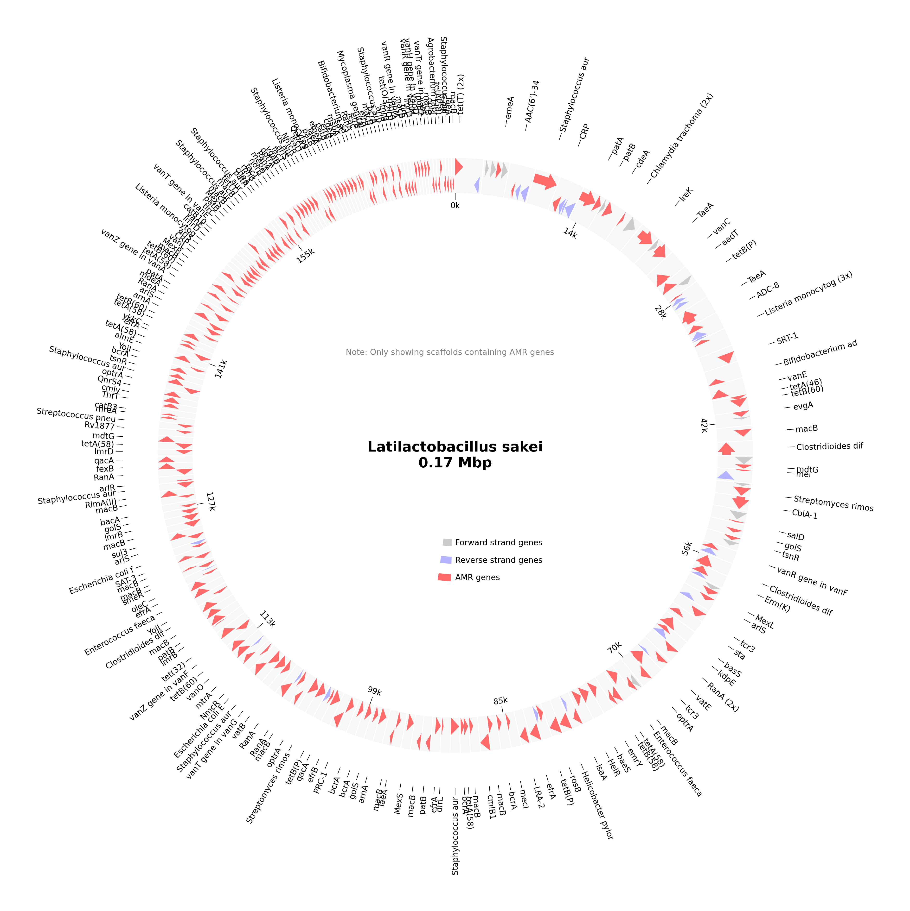

### AAC(6')-34
- **Mechanism**: antibiotic inactivation
- **Drug Classes**: aminoglycoside antibiotic
- **AMR Family**: AAC(6')
- **Locations**:
  - gnl|SPADES|DLDDEBJH_2387_2 : position 660-926

### ADC-8
- **Mechanism**: antibiotic inactivation
- **Drug Classes**: cephalosporin
- **AMR Family**: ADC beta-lactamase without carbapenemase activity
- **Locations**:
  - gnl|SPADES|DLDDEBJH_3331_1 : position 1-684

### Agrobacterium fabrum chloramphenicol acetyltransferase
- **Mechanism**: antibiotic inactivation
- **Drug Classes**: phenicol antibiotic
- **AMR Family**: chloramphenicol acetyltransferase (CAT)
- **Locations**:
  - gnl|SPADES|DLDDEBJH_38934_1 : position 3-218

### Bifidobacterium adolescentis rpoB mutants conferring resistance to rifampicin (found in 2 locations)
- **Mechanism**: antibiotic target alteration; antibiotic target replacement
- **Drug Classes**: rifamycin antibiotic
- **AMR Family**: rifamycin-resistant beta-subunit of RNA polymerase (rpoB)
- **Locations**:
  - gnl|SPADES|DLDDEBJH_20172_1 : position 1-282
  - gnl|SPADES|DLDDEBJH_3517_2 : position 1080-1652

### CRP (found in 2 locations)
- **Mechanism**: antibiotic efflux
- **Drug Classes**: macrolide antibiotic; fluoroquinolone antibiotic; penam
- **AMR Family**: resistance-nodulation-cell division (RND) antibiotic efflux pump
- **Locations**:
  - gnl|SPADES|DLDDEBJH_12482_1 : position 2-409
  - gnl|SPADES|DLDDEBJH_2436_1 : position 136-804

### CblA-1
- **Mechanism**: antibiotic inactivation
- **Drug Classes**: cephalosporin
- **AMR Family**: CblA beta-lactamase
- **Locations**:
  - gnl|SPADES|DLDDEBJH_4209_1 : position 3-1334

### Chlamydia trachomatis intrinsic murA conferring resistance to fosfomycin (found in 2 locations)
- **Mechanism**: antibiotic target alteration
- **Drug Classes**: phosphonic acid antibiotic
- **AMR Family**: antibiotic-resistant murA transferase
- **Locations**:
  - gnl|SPADES|DLDDEBJH_2867_1 : position 2-283
  - gnl|SPADES|DLDDEBJH_2867_2 : position 294-752

### Clostridioides difficile gyrA conferring resistance to fluoroquinolones
- **Mechanism**: antibiotic target alteration
- **Drug Classes**: fluoroquinolone antibiotic
- **AMR Family**: fluoroquinolone resistant gyrA
- **Locations**:
  - gnl|SPADES|DLDDEBJH_7159_1 : position 1-717

### Clostridioides difficile gyrB conferring resistance to fluoroquinolones (found in 2 locations)
- **Mechanism**: antibiotic target alteration
- **Drug Classes**: fluoroquinolone antibiotic
- **AMR Family**: fluoroquinolone resistant gyrB
- **Locations**:
  - gnl|SPADES|DLDDEBJH_4033_1 : position 2-1399
  - gnl|SPADES|DLDDEBJH_4362_1 : position 67-1275

### Enterococcus faecalis cls with mutation conferring resistance to daptomycin (found in 2 locations)
- **Mechanism**: antibiotic target alteration
- **Drug Classes**: peptide antibiotic
- **AMR Family**: daptomycin resistant cls
- **Locations**:
  - gnl|SPADES|DLDDEBJH_4852_1 : position 3-863
  - gnl|SPADES|DLDDEBJH_7175_1 : position 3-716

### Erm(K)
- **Mechanism**: antibiotic target alteration
- **Drug Classes**: macrolide antibiotic; lincosamide antibiotic; streptogramin antibiotic
- **AMR Family**: Erm 23S ribosomal RNA methyltransferase
- **Locations**:
  - gnl|SPADES|DLDDEBJH_4411_1 : position 2-787

### Escherichia coli EF-Tu mutants conferring resistance to Pulvomycin
- **Mechanism**: antibiotic target alteration
- **Drug Classes**: elfamycin antibiotic
- **AMR Family**: elfamycin resistant EF-Tu
- **Locations**:
  - gnl|SPADES|DLDDEBJH_6864_1 : position 2-754

### Escherichia coli fabI mutations conferring resistance to isoniazid and triclosan
- **Mechanism**: antibiotic target alteration
- **Drug Classes**: disinfecting agents and antiseptics; isoniazid-like antibiotic
- **AMR Family**: antibiotic resistant fabI
- **Locations**:
  - gnl|SPADES|DLDDEBJH_7410_1 : position 1-285

### HelR
- **Mechanism**: antibiotic target protection
- **Drug Classes**: rifamycin antibiotic
- **AMR Family**: helicase-like RNA polymerase protection protein
- **Locations**:
  - gnl|SPADES|DLDDEBJH_5007_1 : position 3-734

### Helicobacter pylori pbp1 mutants conferring resistance to amoxicillin
- **Mechanism**: antibiotic target alteration
- **Drug Classes**: cephalosporin; cephamycin; penam
- **AMR Family**: Penicillin-binding protein mutations conferring resistance to beta-lactam antibiotics
- **Locations**:
  - gnl|SPADES|DLDDEBJH_5200_1 : position 1-1026

### IreK
- **Mechanism**: reduced permeability to antibiotic
- **Drug Classes**: cephalosporin
- **AMR Family**: Serine/threonine kinases
- **Locations**:
  - gnl|SPADES|DLDDEBJH_2898_2 : position 364-2058

### LRA-2
- **Mechanism**: antibiotic inactivation
- **Drug Classes**: cephalosporin; penam
- **AMR Family**: subclass B3 LRA beta-lactamase
- **Locations**:
  - gnl|SPADES|DLDDEBJH_5514_2 : position 183-971

### Listeria monocytogenes mprF (found in 5 locations)
- **Mechanism**: antibiotic target alteration
- **Drug Classes**: peptide antibiotic
- **AMR Family**: defensin resistant mprF
- **Locations**:
  - gnl|SPADES|DLDDEBJH_12935_1 : position 1-396
  - gnl|SPADES|DLDDEBJH_17134_1 : position 2-316
  - gnl|SPADES|DLDDEBJH_3334_1 : position 32-421
  - gnl|SPADES|DLDDEBJH_3334_2 : position 402-1040
  - gnl|SPADES|DLDDEBJH_3334_3 : position 985-1752

### MexL
- **Mechanism**: antibiotic efflux
- **Drug Classes**: macrolide antibiotic; tetracycline antibiotic; disinfecting agents and antiseptics
- **AMR Family**: resistance-nodulation-cell division (RND) antibiotic efflux pump
- **Locations**:
  - gnl|SPADES|DLDDEBJH_4453_2 : position 550-1185

### MexR
- **Mechanism**: antibiotic target alteration; antibiotic efflux
- **Drug Classes**: macrolide antibiotic; fluoroquinolone antibiotic; monobactam; carbapenem; cephalosporin; cephamycin; penam; tetracycline antibiotic; peptide antibiotic; aminocoumarin antibiotic; diaminopyrimidine antibiotic; sulfonamide antibiotic; phenicol antibiotic; penem
- **AMR Family**: resistance-nodulation-cell division (RND) antibiotic efflux pump
- **Locations**:
  - gnl|SPADES|DLDDEBJH_12343_1 : position 1-414

### MexS (found in 2 locations)
- **Mechanism**: antibiotic efflux
- **Drug Classes**: fluoroquinolone antibiotic; diaminopyrimidine antibiotic; phenicol antibiotic
- **AMR Family**: resistance-nodulation-cell division (RND) antibiotic efflux pump
- **Locations**:
  - gnl|SPADES|DLDDEBJH_14284_1 : position 3-365
  - gnl|SPADES|DLDDEBJH_5929_1 : position 2-667

### Mycoplasma genitalium parC mutations confers resistance to Moxifloxacin
- **Mechanism**: antibiotic target alteration
- **Drug Classes**: fluoroquinolone antibiotic
- **AMR Family**: fluoroquinolone resistant parC
- **Locations**:
  - gnl|SPADES|DLDDEBJH_21843_1 : position 3-275

### NmcR (found in 2 locations)
- **Mechanism**: antibiotic inactivation
- **Drug Classes**: carbapenem; cephalosporin; cephamycin; penam
- **AMR Family**: NmcA beta-lactamase
- **Locations**:
  - gnl|SPADES|DLDDEBJH_16637_1 : position 1-243
  - gnl|SPADES|DLDDEBJH_6884_1 : position 2-280

### PRC-1
- **Mechanism**: antibiotic inactivation
- **Drug Classes**: cephalosporin; penam
- **AMR Family**: PRC beta-lactamase
- **Locations**:
  - gnl|SPADES|DLDDEBJH_6200_2 : position 213-842

### QepA1
- **Mechanism**: antibiotic efflux
- **Drug Classes**: fluoroquinolone antibiotic
- **AMR Family**: major facilitator superfamily (MFS) antibiotic efflux pump
- **Locations**:
  - gnl|SPADES|DLDDEBJH_17021_1 : position 138-317

### QnrS4
- **Mechanism**: antibiotic target protection
- **Drug Classes**: fluoroquinolone antibiotic
- **AMR Family**: quinolone resistance protein (qnr)
- **Locations**:
  - gnl|SPADES|DLDDEBJH_9075_1 : position 3-506

### RanA (found in 8 locations)
- **Mechanism**: antibiotic efflux
- **Drug Classes**: aminoglycoside antibiotic
- **AMR Family**: ATP-binding cassette (ABC) antibiotic efflux pump
- **Locations**:
  - gnl|SPADES|DLDDEBJH_10082_1 : position 3-500
  - gnl|SPADES|DLDDEBJH_15898_1 : position 1-261
  - gnl|SPADES|DLDDEBJH_20390_1 : position 2-280
  - gnl|SPADES|DLDDEBJH_4626_1 : position 1-681
  - gnl|SPADES|DLDDEBJH_4626_2 : position 710-1186
  - gnl|SPADES|DLDDEBJH_6394_1 : position 2-427
  - gnl|SPADES|DLDDEBJH_6430_1 : position 2-808
  - gnl|SPADES|DLDDEBJH_8227_1 : position 3-617

### RlmA(II)
- **Mechanism**: antibiotic target alteration
- **Drug Classes**: macrolide antibiotic; lincosamide antibiotic
- **AMR Family**: non-erm 23S ribosomal RNA methyltransferase (G748)
- **Locations**:
  - gnl|SPADES|DLDDEBJH_8095_1 : position 3-629

### Rv1877
- **Mechanism**: antibiotic efflux
- **Drug Classes**: fluoroquinolone antibiotic
- **AMR Family**: major facilitator superfamily (MFS) antibiotic efflux pump
- **Locations**:
  - gnl|SPADES|DLDDEBJH_8436_2 : position 287-601

### SAT-3
- **Mechanism**: antibiotic inactivation
- **Drug Classes**: nucleoside antibiotic
- **AMR Family**: streptothricin acetyltransferase (SAT)
- **Locations**:
  - gnl|SPADES|DLDDEBJH_7412_1 : position 2-379

### SRT-1
- **Mechanism**: antibiotic inactivation
- **Drug Classes**: cephalosporin
- **AMR Family**: SRT beta-lactamase
- **Locations**:
  - gnl|SPADES|DLDDEBJH_3493_2 : position 608-1663

### Staphylococcus aureus LmrS (found in 2 locations)
- **Mechanism**: antibiotic efflux
- **Drug Classes**: macrolide antibiotic; aminoglycoside antibiotic; oxazolidinone antibiotic; diaminopyrimidine antibiotic; phenicol antibiotic
- **AMR Family**: major facilitator superfamily (MFS) antibiotic efflux pump
- **Locations**:
  - gnl|SPADES|DLDDEBJH_14590_1 : position 1-360
  - gnl|SPADES|DLDDEBJH_14690_1 : position 2-358

### Staphylococcus aureus mupA conferring resistance to mupirocin (found in 3 locations)
- **Mechanism**: antibiotic target alteration
- **Drug Classes**: mupirocin-like antibiotic
- **AMR Family**: antibiotic-resistant isoleucyl-tRNA synthetase (ileS)
- **Locations**:
  - gnl|SPADES|DLDDEBJH_16619_1 : position 2-322
  - gnl|SPADES|DLDDEBJH_8133_1 : position 2-625
  - gnl|SPADES|DLDDEBJH_9166_1 : position 2-553

### Staphylococcus aureus mupB conferring resistance to mupirocin (found in 3 locations)
- **Mechanism**: antibiotic target alteration
- **Drug Classes**: mupirocin-like antibiotic
- **AMR Family**: antibiotic-resistant isoleucyl-tRNA synthetase (ileS)
- **Locations**:
  - gnl|SPADES|DLDDEBJH_25571_1 : position 2-262
  - gnl|SPADES|DLDDEBJH_41666_1 : position 1-210
  - gnl|SPADES|DLDDEBJH_5683_1 : position 2-937

### Staphylococcus aureus murA with mutation conferring resistance to fosfomycin
- **Mechanism**: antibiotic target alteration
- **Drug Classes**: phosphonic acid antibiotic
- **AMR Family**: antibiotic-resistant murA transferase
- **Locations**:
  - gnl|SPADES|DLDDEBJH_6819_1 : position 2-757

### Staphylococcus aureus rpoB mutants conferring resistance to rifampicin
- **Mechanism**: antibiotic target alteration; antibiotic target replacement
- **Drug Classes**: rifamycin antibiotic
- **AMR Family**: rifamycin-resistant beta-subunit of RNA polymerase (rpoB)
- **Locations**:
  - gnl|SPADES|DLDDEBJH_2401_1 : position 41-2572

### Streptococcus pneumoniae PBP2x conferring resistance to amoxicillin
- **Mechanism**: antibiotic target alteration
- **Drug Classes**: cephalosporin; cephamycin; penam
- **AMR Family**: Penicillin-binding protein mutations conferring resistance to beta-lactam antibiotics
- **Locations**:
  - gnl|SPADES|DLDDEBJH_8589_2 : position 257-592

### Streptomyces rimosus otr(A) (found in 2 locations)
- **Mechanism**: antibiotic target protection
- **Drug Classes**: tetracycline antibiotic
- **AMR Family**: tetracycline-resistant ribosomal protection protein
- **Locations**:
  - gnl|SPADES|DLDDEBJH_4208_2 : position 455-1333
  - gnl|SPADES|DLDDEBJH_6317_1 : position 1-822

### TaeA (found in 5 locations)
- **Mechanism**: antibiotic efflux
- **Drug Classes**: pleuromutilin antibiotic
- **AMR Family**: ATP-binding cassette (ABC) antibiotic efflux pump
- **Locations**:
  - gnl|SPADES|DLDDEBJH_17768_1 : position 132-305
  - gnl|SPADES|DLDDEBJH_3094_2 : position 606-1907
  - gnl|SPADES|DLDDEBJH_3306_1 : position 1-1497
  - gnl|SPADES|DLDDEBJH_42397_1 : position 2-208
  - gnl|SPADES|DLDDEBJH_5928_2 : position 493-888

### ThfT
- **Mechanism**: resistance by host-dependent nutrient acquisition
- **Drug Classes**: sulfonamide antibiotic
- **AMR Family**: ECF transporter S component
- **Locations**:
  - gnl|SPADES|DLDDEBJH_8843_2 : position 152-574

### YojI (found in 2 locations)
- **Mechanism**: antibiotic efflux
- **Drug Classes**: peptide antibiotic
- **AMR Family**: ATP-binding cassette (ABC) antibiotic efflux pump
- **Locations**:
  - gnl|SPADES|DLDDEBJH_7160_1 : position 1-300
  - gnl|SPADES|DLDDEBJH_9374_1 : position 1-261

### aadT
- **Mechanism**: antibiotic efflux
- **Drug Classes**: macrolide antibiotic; tetracycline antibiotic; disinfecting agents and antiseptics
- **AMR Family**: major facilitator superfamily (MFS) antibiotic efflux pump
- **Locations**:
  - gnl|SPADES|DLDDEBJH_3204_1 : position 2-895

### almE
- **Mechanism**: antibiotic target alteration
- **Drug Classes**: peptide antibiotic
- **AMR Family**: polymyxin resistance operon; alm glycyltransferase
- **Locations**:
  - gnl|SPADES|DLDDEBJH_9450_1 : position 2-535

### arlR (found in 2 locations)
- **Mechanism**: antibiotic efflux
- **Drug Classes**: fluoroquinolone antibiotic; disinfecting agents and antiseptics
- **AMR Family**: major facilitator superfamily (MFS) antibiotic efflux pump
- **Locations**:
  - gnl|SPADES|DLDDEBJH_25785_1 : position 2-247
  - gnl|SPADES|DLDDEBJH_8173_1 : position 1-150

### arlS (found in 5 locations)
- **Mechanism**: antibiotic efflux
- **Drug Classes**: fluoroquinolone antibiotic; disinfecting agents and antiseptics
- **AMR Family**: major facilitator superfamily (MFS) antibiotic efflux pump
- **Locations**:
  - gnl|SPADES|DLDDEBJH_10031_1 : position 38-505
  - gnl|SPADES|DLDDEBJH_12756_1 : position 3-401
  - gnl|SPADES|DLDDEBJH_16543_1 : position 1-324
  - gnl|SPADES|DLDDEBJH_4500_1 : position 3-491
  - gnl|SPADES|DLDDEBJH_7514_2 : position 201-683

### arnA (found in 2 locations)
- **Mechanism**: antibiotic target alteration
- **Drug Classes**: peptide antibiotic
- **AMR Family**: pmr phosphoethanolamine transferase
- **Locations**:
  - gnl|SPADES|DLDDEBJH_6032_2 : position 183-869
  - gnl|SPADES|DLDDEBJH_9986_1 : position 1-507

### bacA
- **Mechanism**: antibiotic target alteration
- **Drug Classes**: peptide antibiotic
- **AMR Family**: undecaprenyl pyrophosphate related proteins
- **Locations**:
  - gnl|SPADES|DLDDEBJH_8027_1 : position 1-303

### baeR
- **Mechanism**: antibiotic efflux
- **Drug Classes**: aminoglycoside antibiotic; aminocoumarin antibiotic
- **AMR Family**: resistance-nodulation-cell division (RND) antibiotic efflux pump
- **Locations**:
  - gnl|SPADES|DLDDEBJH_40280_1 : position 3-215

### baeS
- **Mechanism**: antibiotic efflux
- **Drug Classes**: aminoglycoside antibiotic; aminocoumarin antibiotic
- **AMR Family**: resistance-nodulation-cell division (RND) antibiotic efflux pump
- **Locations**:
  - gnl|SPADES|DLDDEBJH_4928_2 : position 213-1097

### basS
- **Mechanism**: antibiotic target alteration; antibiotic efflux
- **Drug Classes**: peptide antibiotic
- **AMR Family**: pmr phosphoethanolamine transferase
- **Locations**:
  - gnl|SPADES|DLDDEBJH_4612_1 : position 97-1164

### bcrA (found in 6 locations)
- **Mechanism**: antibiotic efflux
- **Drug Classes**: peptide antibiotic
- **AMR Family**: ATP-binding cassette (ABC) antibiotic efflux pump
- **Locations**:
  - gnl|SPADES|DLDDEBJH_24249_1 : position 2-265
  - gnl|SPADES|DLDDEBJH_5572_2 : position 506-958
  - gnl|SPADES|DLDDEBJH_5675_2 : position 469-879
  - gnl|SPADES|DLDDEBJH_6154_1 : position 2-556
  - gnl|SPADES|DLDDEBJH_6191_1 : position 1-483
  - gnl|SPADES|DLDDEBJH_9361_1 : position 2-466

### catB10
- **Mechanism**: antibiotic inactivation
- **Drug Classes**: phenicol antibiotic
- **AMR Family**: chloramphenicol acetyltransferase (CAT)
- **Locations**:
  - gnl|SPADES|DLDDEBJH_13439_1 : position 3-110

### catB3
- **Mechanism**: antibiotic inactivation
- **Drug Classes**: phenicol antibiotic
- **AMR Family**: chloramphenicol acetyltransferase (CAT)
- **Locations**:
  - gnl|SPADES|DLDDEBJH_8792_1 : position 2-199

### cdeA (found in 3 locations)
- **Mechanism**: antibiotic efflux
- **Drug Classes**: fluoroquinolone antibiotic; disinfecting agents and antiseptics
- **AMR Family**: multidrug and toxic compound extrusion (MATE) transporter
- **Locations**:
  - gnl|SPADES|DLDDEBJH_15119_1 : position 1-261
  - gnl|SPADES|DLDDEBJH_19093_1 : position 1-288
  - gnl|SPADES|DLDDEBJH_2624_2 : position 497-1291

### cmlB1
- **Mechanism**: antibiotic efflux
- **Drug Classes**: phenicol antibiotic
- **AMR Family**: major facilitator superfamily (MFS) antibiotic efflux pump
- **Locations**:
  - gnl|SPADES|DLDDEBJH_5604_1 : position 1-954

### cmlv
- **Mechanism**: antibiotic inactivation
- **Drug Classes**: phenicol antibiotic
- **AMR Family**: chloramphenicol phosphotransferase
- **Locations**:
  - gnl|SPADES|DLDDEBJH_8918_1 : position 3-569

### dfrL
- **Mechanism**: antibiotic target replacement
- **Drug Classes**: aminoglycoside antibiotic; tetracycline antibiotic; diaminopyrimidine antibiotic
- **AMR Family**: trimethoprim resistant dihydrofolate reductase dfr
- **Locations**:
  - gnl|SPADES|DLDDEBJH_5728_3 : position 730-927

### efrA (found in 4 locations)
- **Mechanism**: antibiotic efflux
- **Drug Classes**: macrolide antibiotic; fluoroquinolone antibiotic; rifamycin antibiotic
- **AMR Family**: ATP-binding cassette (ABC) antibiotic efflux pump
- **Locations**:
  - gnl|SPADES|DLDDEBJH_5487_1 : position 1-975
  - gnl|SPADES|DLDDEBJH_5730_1 : position 3-590
  - gnl|SPADES|DLDDEBJH_7259_1 : position 1-708
  - gnl|SPADES|DLDDEBJH_9568_2 : position 213-530

### efrB (found in 4 locations)
- **Mechanism**: antibiotic efflux
- **Drug Classes**: macrolide antibiotic; fluoroquinolone antibiotic; rifamycin antibiotic
- **AMR Family**: ATP-binding cassette (ABC) antibiotic efflux pump
- **Locations**:
  - gnl|SPADES|DLDDEBJH_18807_1 : position 2-292
  - gnl|SPADES|DLDDEBJH_21072_1 : position 3-278
  - gnl|SPADES|DLDDEBJH_23664_1 : position 3-266
  - gnl|SPADES|DLDDEBJH_6209_1 : position 54-839

### emeA (found in 2 locations)
- **Mechanism**: antibiotic efflux
- **Drug Classes**: disinfecting agents and antiseptics
- **AMR Family**: multidrug and toxic compound extrusion (MATE) transporter
- **Locations**:
  - gnl|SPADES|DLDDEBJH_17883_1 : position 1-303
  - gnl|SPADES|DLDDEBJH_2380_3 : position 1399-1902

### emrY
- **Mechanism**: antibiotic efflux
- **Drug Classes**: tetracycline antibiotic
- **AMR Family**: major facilitator superfamily (MFS) antibiotic efflux pump
- **Locations**:
  - gnl|SPADES|DLDDEBJH_4911_2 : position 389-1102

### evgA
- **Mechanism**: antibiotic efflux
- **Drug Classes**: macrolide antibiotic; fluoroquinolone antibiotic; penam; tetracycline antibiotic
- **AMR Family**: major facilitator superfamily (MFS) antibiotic efflux pump; resistance-nodulation-cell division (RND) antibiotic efflux pump
- **Locations**:
  - gnl|SPADES|DLDDEBJH_3825_1 : position 2-556

### facT (found in 2 locations)
- **Mechanism**: antibiotic efflux
- **Drug Classes**: elfamycin antibiotic
- **AMR Family**: major facilitator superfamily (MFS) antibiotic efflux pump
- **Locations**:
  - gnl|SPADES|DLDDEBJH_15576_1 : position 3-215
  - gnl|SPADES|DLDDEBJH_16519_1 : position 2-325

### fexB
- **Mechanism**: antibiotic efflux
- **Drug Classes**: phenicol antibiotic
- **AMR Family**: major facilitator superfamily (MFS) antibiotic efflux pump
- **Locations**:
  - gnl|SPADES|DLDDEBJH_8276_1 : position 2-613

### golS (found in 4 locations)
- **Mechanism**: antibiotic efflux
- **Drug Classes**: monobactam; carbapenem; cephalosporin; cephamycin; penam; phenicol antibiotic; penem
- **AMR Family**: resistance-nodulation-cell division (RND) antibiotic efflux pump
- **Locations**:
  - gnl|SPADES|DLDDEBJH_38098_1 : position 1-159
  - gnl|SPADES|DLDDEBJH_4263_2 : position 603-1004
  - gnl|SPADES|DLDDEBJH_6125_2 : position 174-593
  - gnl|SPADES|DLDDEBJH_7982_1 : position 1-501

### kdpE
- **Mechanism**: antibiotic efflux
- **Drug Classes**: aminoglycoside antibiotic
- **AMR Family**: kdpDE
- **Locations**:
  - gnl|SPADES|DLDDEBJH_4621_1 : position 1-474

### lmrB (found in 3 locations)
- **Mechanism**: antibiotic efflux
- **Drug Classes**: lincosamide antibiotic; nucleoside antibiotic
- **AMR Family**: ATP-binding cassette (ABC) antibiotic efflux pump
- **Locations**:
  - gnl|SPADES|DLDDEBJH_27917_1 : position 2-253
  - gnl|SPADES|DLDDEBJH_7032_2 : position 651-734
  - gnl|SPADES|DLDDEBJH_7846_1 : position 1-651

### lmrD (found in 3 locations)
- **Mechanism**: antibiotic efflux
- **Drug Classes**: lincosamide antibiotic
- **AMR Family**: ATP-binding cassette (ABC) antibiotic efflux pump
- **Locations**:
  - gnl|SPADES|DLDDEBJH_13091_1 : position 1-393
  - gnl|SPADES|DLDDEBJH_34672_1 : position 1-231
  - gnl|SPADES|DLDDEBJH_8307_1 : position 147-611

### lsaA
- **Mechanism**: antibiotic target protection
- **Drug Classes**: lincosamide antibiotic; streptogramin antibiotic; streptogramin A antibiotic; streptogramin B antibiotic; pleuromutilin antibiotic
- **AMR Family**: lsa-type ABC-F protein
- **Locations**:
  - gnl|SPADES|DLDDEBJH_5039_1 : position 3-650

### lsaC (found in 2 locations)
- **Mechanism**: antibiotic target protection
- **Drug Classes**: lincosamide antibiotic; streptogramin antibiotic; pleuromutilin antibiotic
- **AMR Family**: lsa-type ABC-F protein
- **Locations**:
  - gnl|SPADES|DLDDEBJH_19570_1 : position 149-286
  - gnl|SPADES|DLDDEBJH_20596_1 : position 2-217

### lsaD
- **Mechanism**: antibiotic target protection
- **Drug Classes**: lincosamide antibiotic; streptogramin antibiotic; streptogramin A antibiotic; pleuromutilin antibiotic
- **AMR Family**: lsa-type ABC-F protein
- **Locations**:
  - gnl|SPADES|DLDDEBJH_16682_1 : position 1-321

### macB (found in 19 locations)
- **Mechanism**: antibiotic efflux
- **Drug Classes**: macrolide antibiotic
- **AMR Family**: ATP-binding cassette (ABC) antibiotic efflux pump
- **Locations**:
  - gnl|SPADES|DLDDEBJH_12042_1 : position 1-423
  - gnl|SPADES|DLDDEBJH_14411_1 : position 3-362
  - gnl|SPADES|DLDDEBJH_14671_1 : position 3-359
  - gnl|SPADES|DLDDEBJH_24135_1 : position 3-266
  - gnl|SPADES|DLDDEBJH_31853_1 : position 2-241
  - gnl|SPADES|DLDDEBJH_36977_1 : position 2-226
  - gnl|SPADES|DLDDEBJH_3846_2 : position 325-1065
  - gnl|SPADES|DLDDEBJH_43044_1 : position 3-206
  - gnl|SPADES|DLDDEBJH_4757_2 : position 654-1148
  - gnl|SPADES|DLDDEBJH_5590_2 : position 452-955
  - gnl|SPADES|DLDDEBJH_5658_2 : position 530-943
  - gnl|SPADES|DLDDEBJH_5895_1 : position 2-406
  - gnl|SPADES|DLDDEBJH_5955_1 : position 1-321
  - gnl|SPADES|DLDDEBJH_6346_2 : position 396-818
  - gnl|SPADES|DLDDEBJH_7089_1 : position 2-670
  - gnl|SPADES|DLDDEBJH_7314_2 : position 523-702
  - gnl|SPADES|DLDDEBJH_7398_2 : position 264-695
  - gnl|SPADES|DLDDEBJH_7750_1 : position 2-661
  - gnl|SPADES|DLDDEBJH_8043_2 : position 335-634

### mdeA
- **Mechanism**: antibiotic efflux
- **Drug Classes**: fluoroquinolone antibiotic; aminoglycoside antibiotic; penam; tetracycline antibiotic; disinfecting agents and antiseptics
- **AMR Family**: major facilitator superfamily (MFS) antibiotic efflux pump
- **Locations**:
  - gnl|SPADES|DLDDEBJH_10096_1 : position 2-502

### mdtG (found in 2 locations)
- **Mechanism**: antibiotic efflux
- **Drug Classes**: phosphonic acid antibiotic
- **AMR Family**: major facilitator superfamily (MFS) antibiotic efflux pump
- **Locations**:
  - gnl|SPADES|DLDDEBJH_4124_2 : position 935-1366
  - gnl|SPADES|DLDDEBJH_8351_1 : position 3-608

### mecI
- **Mechanism**: antibiotic target replacement
- **Drug Classes**: penam
- **AMR Family**: methicillin resistant PBP2
- **Locations**:
  - gnl|SPADES|DLDDEBJH_5543_2 : position 591-965

### mel
- **Mechanism**: antibiotic target protection
- **Drug Classes**: macrolide antibiotic; streptogramin antibiotic
- **AMR Family**: msr-type ABC-F protein
- **Locations**:
  - gnl|SPADES|DLDDEBJH_4193_1 : position 1-171

### mepA
- **Mechanism**: antibiotic efflux
- **Drug Classes**: glycylcycline; tetracycline antibiotic
- **AMR Family**: multidrug and toxic compound extrusion (MATE) transporter
- **Locations**:
  - gnl|SPADES|DLDDEBJH_15784_1 : position 3-338

### mgrA
- **Mechanism**: antibiotic efflux
- **Drug Classes**: fluoroquinolone antibiotic; cephalosporin; penam; tetracycline antibiotic; peptide antibiotic; disinfecting agents and antiseptics
- **AMR Family**: ATP-binding cassette (ABC) antibiotic efflux pump; major facilitator superfamily (MFS) antibiotic efflux pump
- **Locations**:
  - gnl|SPADES|DLDDEBJH_29314_1 : position 2-250

### mreA
- **Mechanism**: antibiotic efflux
- **Drug Classes**: macrolide antibiotic
- **AMR Family**: major facilitator superfamily (MFS) antibiotic efflux pump
- **Locations**:
  - gnl|SPADES|DLDDEBJH_8595_2 : position 335-592

### msbA
- **Mechanism**: antibiotic efflux
- **Drug Classes**: nitroimidazole antibiotic
- **AMR Family**: ATP-binding cassette (ABC) antibiotic efflux pump
- **Locations**:
  - gnl|SPADES|DLDDEBJH_19238_1 : position 1-288

### mtrA
- **Mechanism**: antibiotic efflux
- **Drug Classes**: macrolide antibiotic; penam
- **AMR Family**: resistance-nodulation-cell division (RND) antibiotic efflux pump
- **Locations**:
  - gnl|SPADES|DLDDEBJH_6881_1 : position 1-483

### norB
- **Mechanism**: antibiotic efflux
- **Drug Classes**: fluoroquinolone antibiotic
- **AMR Family**: major facilitator superfamily (MFS) antibiotic efflux pump
- **Locations**:
  - gnl|SPADES|DLDDEBJH_15790_1 : position 1-336

### oleC
- **Mechanism**: antibiotic efflux
- **Drug Classes**: macrolide antibiotic
- **AMR Family**: ATP-binding cassette (ABC) antibiotic efflux pump
- **Locations**:
  - gnl|SPADES|DLDDEBJH_7281_1 : position 1-231

### optrA (found in 4 locations)
- **Mechanism**: antibiotic target protection
- **Drug Classes**: oxazolidinone antibiotic; phenicol antibiotic
- **AMR Family**: Miscellaneous ABC-F subfamily ATP-binding cassette ribosomal protection proteins
- **Locations**:
  - gnl|SPADES|DLDDEBJH_16161_1 : position 2-331
  - gnl|SPADES|DLDDEBJH_4742_1 : position 2-706
  - gnl|SPADES|DLDDEBJH_6336_1 : position 3-821
  - gnl|SPADES|DLDDEBJH_9118_1 : position 1-558

### patA (found in 3 locations)
- **Mechanism**: antibiotic efflux
- **Drug Classes**: fluoroquinolone antibiotic
- **AMR Family**: ATP-binding cassette (ABC) antibiotic efflux pump
- **Locations**:
  - gnl|SPADES|DLDDEBJH_10114_1 : position 2-220
  - gnl|SPADES|DLDDEBJH_14784_1 : position 230-355
  - gnl|SPADES|DLDDEBJH_2547_1 : position 3-1763

### patB (found in 6 locations)
- **Mechanism**: antibiotic efflux
- **Drug Classes**: fluoroquinolone antibiotic
- **AMR Family**: ATP-binding cassette (ABC) antibiotic efflux pump
- **Locations**:
  - gnl|SPADES|DLDDEBJH_13794_1 : position 63-377
  - gnl|SPADES|DLDDEBJH_17688_1 : position 2-307
  - gnl|SPADES|DLDDEBJH_18376_1 : position 2-298
  - gnl|SPADES|DLDDEBJH_2547_2 : position 1767-2393
  - gnl|SPADES|DLDDEBJH_5752_1 : position 3-485
  - gnl|SPADES|DLDDEBJH_7065_1 : position 2-730

### qacA (found in 2 locations)
- **Mechanism**: antibiotic efflux
- **Drug Classes**: fluoroquinolone antibiotic
- **AMR Family**: major facilitator superfamily (MFS) antibiotic efflux pump
- **Locations**:
  - gnl|SPADES|DLDDEBJH_6251_1 : position 3-833
  - gnl|SPADES|DLDDEBJH_8283_1 : position 1-615

### rosB
- **Mechanism**: antibiotic efflux
- **Drug Classes**: peptide antibiotic
- **AMR Family**: major facilitator superfamily (MFS) antibiotic efflux pump
- **Locations**:
  - gnl|SPADES|DLDDEBJH_5203_1 : position 1-1026

### rphB
- **Mechanism**: antibiotic inactivation
- **Drug Classes**: rifamycin antibiotic
- **AMR Family**: rifampin phosphotransferase
- **Locations**:
  - gnl|SPADES|DLDDEBJH_15352_1 : position 2-346

### rpoB2
- **Mechanism**: antibiotic target alteration; antibiotic target replacement
- **Drug Classes**: rifamycin antibiotic
- **AMR Family**: rifamycin-resistant beta-subunit of RNA polymerase (rpoB)
- **Locations**:
  - gnl|SPADES|DLDDEBJH_35906_1 : position 2-229

### salD
- **Mechanism**: antibiotic target protection
- **Drug Classes**: lincosamide antibiotic; streptogramin antibiotic; streptogramin A antibiotic; pleuromutilin antibiotic
- **AMR Family**: sal-type ABC-F protein
- **Locations**:
  - gnl|SPADES|DLDDEBJH_4237_3 : position 1176-1322

### smeR
- **Mechanism**: antibiotic efflux
- **Drug Classes**: aminoglycoside antibiotic; cephalosporin; cephamycin; penam
- **AMR Family**: resistance-nodulation-cell division (RND) antibiotic efflux pump
- **Locations**:
  - gnl|SPADES|DLDDEBJH_7314_1 : position 3-383

### sta
- **Mechanism**: antibiotic inactivation
- **Drug Classes**: nucleoside antibiotic
- **AMR Family**: streptothricin acetyltransferase (SAT)
- **Locations**:
  - gnl|SPADES|DLDDEBJH_4601_2 : position 176-757

### sul3
- **Mechanism**: antibiotic target replacement
- **Drug Classes**: sulfonamide antibiotic
- **AMR Family**: sulfonamide resistant sul
- **Locations**:
  - gnl|SPADES|DLDDEBJH_7539_1 : position 1-564

### tcr3 (found in 2 locations)
- **Mechanism**: antibiotic efflux
- **Drug Classes**: tetracycline antibiotic
- **AMR Family**: major facilitator superfamily (MFS) antibiotic efflux pump
- **Locations**:
  - gnl|SPADES|DLDDEBJH_4591_2 : position 409-1197
  - gnl|SPADES|DLDDEBJH_4698_1 : position 1-1167

### tet(32)
- **Mechanism**: antibiotic target protection
- **Drug Classes**: tetracycline antibiotic
- **AMR Family**: tetracycline-resistant ribosomal protection protein
- **Locations**:
  - gnl|SPADES|DLDDEBJH_7007_1 : position 2-736

### tet(O/32/O)
- **Mechanism**: antibiotic target protection
- **Drug Classes**: tetracycline antibiotic
- **AMR Family**: tetracycline-resistant ribosomal protection protein
- **Locations**:
  - gnl|SPADES|DLDDEBJH_29002_1 : position 3-251

### tet(T) (found in 3 locations)
- **Mechanism**: antibiotic target protection
- **Drug Classes**: tetracycline antibiotic
- **AMR Family**: tetracycline-resistant ribosomal protection protein
- **Locations**:
  - gnl|SPADES|DLDDEBJH_14703_1 : position 1-357
  - gnl|SPADES|DLDDEBJH_2136_1 : position 2-847
  - gnl|SPADES|DLDDEBJH_2136_2 : position 840-1565

### tetA(46)
- **Mechanism**: antibiotic efflux
- **Drug Classes**: tetracycline antibiotic
- **AMR Family**: ATP-binding cassette (ABC) antibiotic efflux pump
- **Locations**:
  - gnl|SPADES|DLDDEBJH_3692_1 : position 3-338

### tetA(58) (found in 7 locations)
- **Mechanism**: antibiotic efflux
- **Drug Classes**: tetracycline antibiotic
- **AMR Family**: major facilitator superfamily (MFS) antibiotic efflux pump
- **Locations**:
  - gnl|SPADES|DLDDEBJH_11628_1 : position 133-438
  - gnl|SPADES|DLDDEBJH_39907_1 : position 3-215
  - gnl|SPADES|DLDDEBJH_4891_1 : position 1-672
  - gnl|SPADES|DLDDEBJH_5675_1 : position 48-503
  - gnl|SPADES|DLDDEBJH_8350_1 : position 1-609
  - gnl|SPADES|DLDDEBJH_9546_1 : position 3-530
  - gnl|SPADES|DLDDEBJH_9872_1 : position 2-514

### tetB(58)
- **Mechanism**: antibiotic efflux
- **Drug Classes**: tetracycline antibiotic
- **AMR Family**: major facilitator superfamily (MFS) antibiotic efflux pump
- **Locations**:
  - gnl|SPADES|DLDDEBJH_4891_2 : position 685-1110

### tetB(60) (found in 4 locations)
- **Mechanism**: antibiotic efflux
- **Drug Classes**: tetracycline antibiotic
- **AMR Family**: ATP-binding cassette (ABC) antibiotic efflux pump
- **Locations**:
  - gnl|SPADES|DLDDEBJH_11760_2 : position 260-433
  - gnl|SPADES|DLDDEBJH_3692_2 : position 314-1189
  - gnl|SPADES|DLDDEBJH_6965_1 : position 2-739
  - gnl|SPADES|DLDDEBJH_9883_1 : position 3-266

### tetB(P) (found in 3 locations)
- **Mechanism**: antibiotic target protection
- **Drug Classes**: tetracycline antibiotic
- **AMR Family**: tetracycline-resistant ribosomal protection protein
- **Locations**:
  - gnl|SPADES|DLDDEBJH_3257_1 : position 1-174
  - gnl|SPADES|DLDDEBJH_5402_1 : position 3-536
  - gnl|SPADES|DLDDEBJH_6308_1 : position 3-269

### tlrC (found in 2 locations)
- **Mechanism**: antibiotic target protection
- **Drug Classes**: macrolide antibiotic; lincosamide antibiotic
- **AMR Family**: Miscellaneous ABC-F subfamily ATP-binding cassette ribosomal protection proteins
- **Locations**:
  - gnl|SPADES|DLDDEBJH_13684_1 : position 2-379
  - gnl|SPADES|DLDDEBJH_32478_1 : position 1-195

### tsnR (found in 2 locations)
- **Mechanism**: antibiotic target alteration
- **Drug Classes**: peptide antibiotic
- **AMR Family**: non-erm 23S ribosomal RNA methyltransferase (A1067)
- **Locations**:
  - gnl|SPADES|DLDDEBJH_4337_1 : position 2-409
  - gnl|SPADES|DLDDEBJH_9176_1 : position 2-433

### vanC
- **Mechanism**: antibiotic target alteration
- **Drug Classes**: glycopeptide antibiotic
- **AMR Family**: glycopeptide resistance gene cluster; Van ligase
- **Locations**:
  - gnl|SPADES|DLDDEBJH_3120_2 : position 664-1815

### vanE (found in 2 locations)
- **Mechanism**: antibiotic target alteration
- **Drug Classes**: glycopeptide antibiotic
- **AMR Family**: glycopeptide resistance gene cluster; Van ligase
- **Locations**:
  - gnl|SPADES|DLDDEBJH_13345_1 : position 3-386
  - gnl|SPADES|DLDDEBJH_3621_3 : position 551-1474

### vanH gene in vanD cluster
- **Mechanism**: antibiotic target alteration
- **Drug Classes**: glycopeptide antibiotic
- **AMR Family**: vanH; glycopeptide resistance gene cluster
- **Locations**:
  - gnl|SPADES|DLDDEBJH_35676_1 : position 2-229

### vanL
- **Mechanism**: antibiotic target alteration
- **Drug Classes**: glycopeptide antibiotic
- **AMR Family**: glycopeptide resistance gene cluster; Van ligase
- **Locations**:
  - gnl|SPADES|DLDDEBJH_12449_2 : position 204-410

### vanO
- **Mechanism**: antibiotic target alteration
- **Drug Classes**: glycopeptide antibiotic
- **AMR Family**: glycopeptide resistance gene cluster; Van ligase
- **Locations**:
  - gnl|SPADES|DLDDEBJH_6893_1 : position 3-749

### vanR gene in vanF cluster
- **Mechanism**: antibiotic target alteration
- **Drug Classes**: glycopeptide antibiotic
- **AMR Family**: glycopeptide resistance gene cluster; vanR
- **Locations**:
  - gnl|SPADES|DLDDEBJH_4363_1 : position 1-534

### vanR gene in vanM cluster (found in 2 locations)
- **Mechanism**: antibiotic target alteration
- **Drug Classes**: glycopeptide antibiotic
- **AMR Family**: glycopeptide resistance gene cluster; vanR
- **Locations**:
  - gnl|SPADES|DLDDEBJH_31406_1 : position 3-242
  - gnl|SPADES|DLDDEBJH_34666_1 : position 3-233

### vanT gene in vanE cluster
- **Mechanism**: antibiotic target alteration
- **Drug Classes**: glycopeptide antibiotic
- **AMR Family**: glycopeptide resistance gene cluster; vanT
- **Locations**:
  - gnl|SPADES|DLDDEBJH_13641_1 : position 2-379

### vanT gene in vanG cluster
- **Mechanism**: antibiotic target alteration
- **Drug Classes**: glycopeptide antibiotic
- **AMR Family**: glycopeptide resistance gene cluster; vanT
- **Locations**:
  - gnl|SPADES|DLDDEBJH_6764_1 : position 3-767

### vanTr gene in vanL cluster
- **Mechanism**: antibiotic target alteration
- **Drug Classes**: glycopeptide antibiotic
- **AMR Family**: glycopeptide resistance gene cluster; vanT
- **Locations**:
  - gnl|SPADES|DLDDEBJH_36612_1 : position 1-225

### vanZ gene in vanA cluster
- **Mechanism**: antibiotic target alteration
- **Drug Classes**: glycopeptide antibiotic
- **AMR Family**: vanZ; glycopeptide resistance gene cluster
- **Locations**:
  - gnl|SPADES|DLDDEBJH_10600_1 : position 131-478

### vanZ gene in vanF cluster
- **Mechanism**: antibiotic target alteration
- **Drug Classes**: glycopeptide antibiotic
- **AMR Family**: vanZ; glycopeptide resistance gene cluster
- **Locations**:
  - gnl|SPADES|DLDDEBJH_6968_1 : position 73-681

### vatB
- **Mechanism**: antibiotic inactivation
- **Drug Classes**: streptogramin antibiotic; streptogramin A antibiotic
- **AMR Family**: streptogramin vat acetyltransferase
- **Locations**:
  - gnl|SPADES|DLDDEBJH_6472_2 : position 238-804

### vatE
- **Mechanism**: antibiotic inactivation
- **Drug Classes**: streptogramin antibiotic; streptogramin A antibiotic
- **AMR Family**: streptogramin vat acetyltransferase
- **Locations**:
  - gnl|SPADES|DLDDEBJH_4663_2 : position 287-853

### vgaB
- **Mechanism**: antibiotic target protection
- **Drug Classes**: streptogramin antibiotic; streptogramin A antibiotic; pleuromutilin antibiotic
- **AMR Family**: vga-type ABC-F protein
- **Locations**:
  - gnl|SPADES|DLDDEBJH_16488_1 : position 1-324

### ykkC
- **Mechanism**: antibiotic efflux
- **Drug Classes**: aminoglycoside antibiotic; tetracycline antibiotic; phenicol antibiotic
- **AMR Family**: small multidrug resistance (SMR) antibiotic efflux pump
- **Locations**:
  - gnl|SPADES|DLDDEBJH_9795_1 : position 2-229

## Latilactobacillus sakei subsp. sakei
**Strain Statistics:**
- Total genome length: 2.4 kbp
- Total scaffolds: 25
- Scaffolds with AMR genes: 2
- Total genes annotated: 2
- Total AMR genes: 2
- Unique AMR genes: 2
- Distinct AMR mechanisms: 2
- Distinct AMR families: 2
- Distinct drug classes: 2

**Circos Plot:**

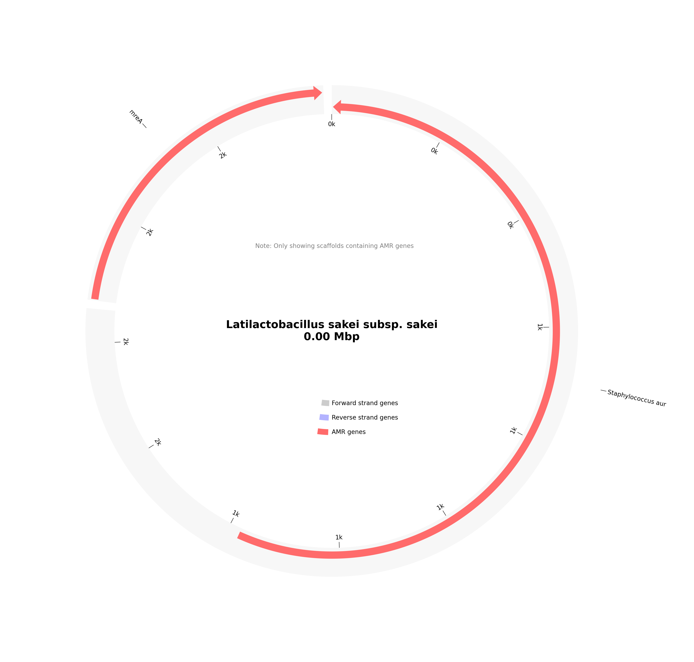

### Staphylococcus aureus mupA conferring resistance to mupirocin
- **Mechanism**: antibiotic target alteration
- **Drug Classes**: mupirocin-like antibiotic
- **AMR Family**: antibiotic-resistant isoleucyl-tRNA synthetase (ileS)
- **Locations**:
  - gnl|SPADES|DLDDEBJH_3222_1 : position 2-1354

### mreA
- **Mechanism**: antibiotic efflux
- **Drug Classes**: macrolide antibiotic
- **AMR Family**: major facilitator superfamily (MFS) antibiotic efflux pump
- **Locations**:
  - gnl|SPADES|DLDDEBJH_9508_1 : position 2-532

## Latilactobacillus sakei subsp. sakei 23K
**Strain Statistics:**
- Total genome length: 5.1 kbp
- Total scaffolds: 19
- Scaffolds with AMR genes: 3
- Total genes annotated: 10
- Total AMR genes: 4
- Unique AMR genes: 4
- Distinct AMR mechanisms: 2
- Distinct AMR families: 4
- Distinct drug classes: 11

**Circos Plot:**

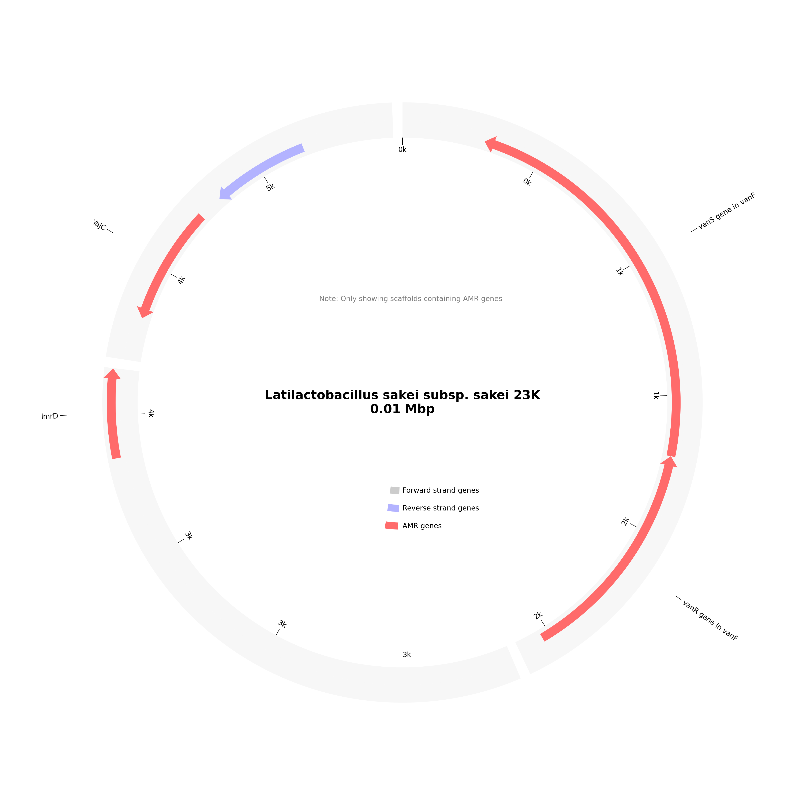

### YajC
- **Mechanism**: antibiotic efflux
- **Drug Classes**: fluoroquinolone antibiotic; cephalosporin; glycylcycline; penam; tetracycline antibiotic; oxazolidinone antibiotic; glycopeptide antibiotic; rifamycin antibiotic; phenicol antibiotic; disinfecting agents and antiseptics
- **AMR Family**: resistance-nodulation-cell division (RND) antibiotic efflux pump
- **Locations**:
  - gnl|SPADES|DLDDEBJH_4816_1 : position 131-487

### lmrD
- **Mechanism**: antibiotic efflux
- **Drug Classes**: lincosamide antibiotic
- **AMR Family**: ATP-binding cassette (ABC) antibiotic efflux pump
- **Locations**:
  - gnl|SPADES|DLDDEBJH_3402_3 : position 1461-1715

### vanR gene in vanF cluster
- **Mechanism**: antibiotic target alteration
- **Drug Classes**: glycopeptide antibiotic
- **AMR Family**: glycopeptide resistance gene cluster; vanR
- **Locations**:
  - gnl|SPADES|DLDDEBJH_2720_3 : position 1449-2135

### vanS gene in vanF cluster
- **Mechanism**: antibiotic target alteration
- **Drug Classes**: glycopeptide antibiotic
- **AMR Family**: vanS; glycopeptide resistance gene cluster
- **Locations**:
  - gnl|SPADES|DLDDEBJH_2720_2 : position 250-1449

## Lelliottia amnigena
**Strain Statistics:**
- Total genome length: 1.9 kbp
- Total scaffolds: 12
- Scaffolds with AMR genes: 2
- Total genes annotated: 0
- Total AMR genes: 2
- Unique AMR genes: 2
- Distinct AMR mechanisms: 1
- Distinct AMR families: 2
- Distinct drug classes: 7

**Circos Plot:**

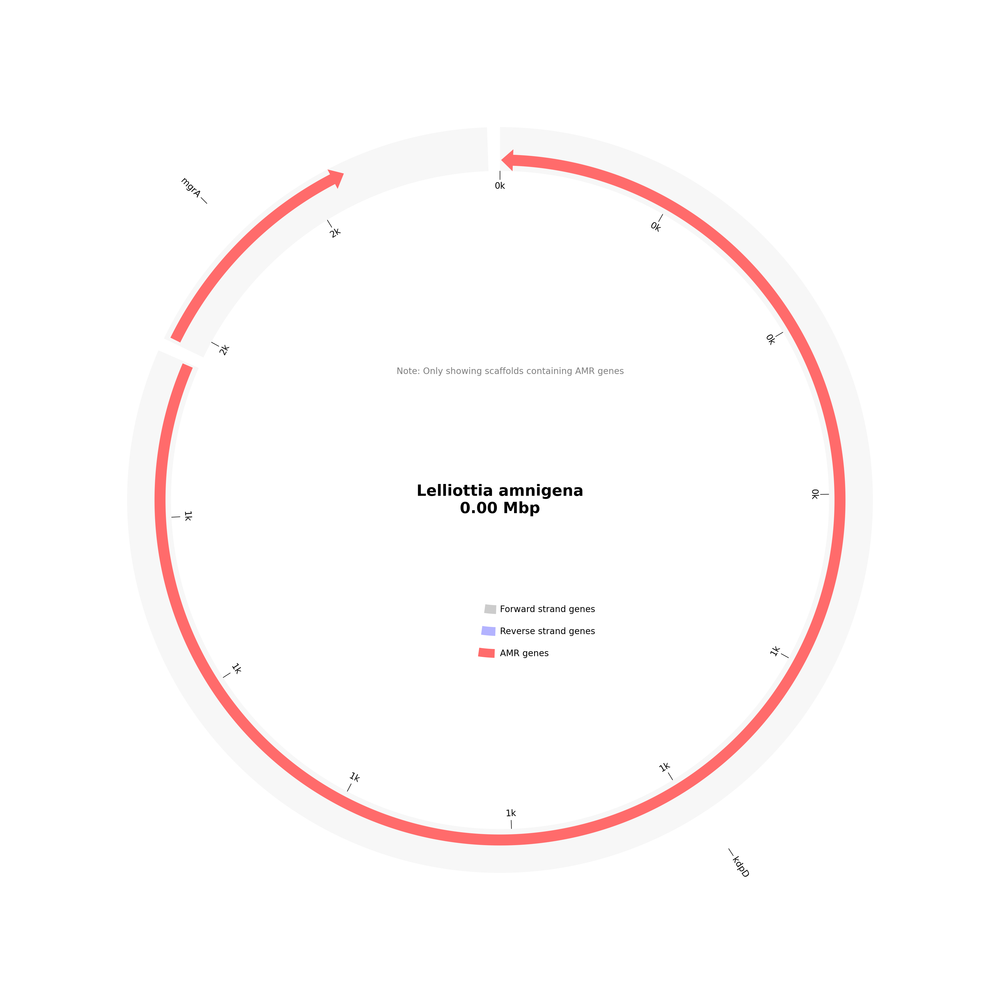

### kdpD
- **Mechanism**: antibiotic efflux
- **Drug Classes**: aminoglycoside antibiotic
- **AMR Family**: kdpDE
- **Locations**:
  - gnl|SPADES|DLDDEBJH_3652_1 : position 1-1581

### mgrA
- **Mechanism**: antibiotic efflux
- **Drug Classes**: fluoroquinolone antibiotic; cephalosporin; penam; tetracycline antibiotic; peptide antibiotic; disinfecting agents and antiseptics
- **AMR Family**: ATP-binding cassette (ABC) antibiotic efflux pump; major facilitator superfamily (MFS) antibiotic efflux pump
- **Locations**:
  - gnl|SPADES|DLDDEBJH_15891_1 : position 3-209

## Lelliottia sp. WB101
**Strain Statistics:**
- Total genome length: 0.3 kbp
- Total scaffolds: 2
- Scaffolds with AMR genes: 1
- Total genes annotated: 0
- Total AMR genes: 1
- Unique AMR genes: 1
- Distinct AMR mechanisms: 1
- Distinct AMR families: 1
- Distinct drug classes: 2

**Circos Plot:**

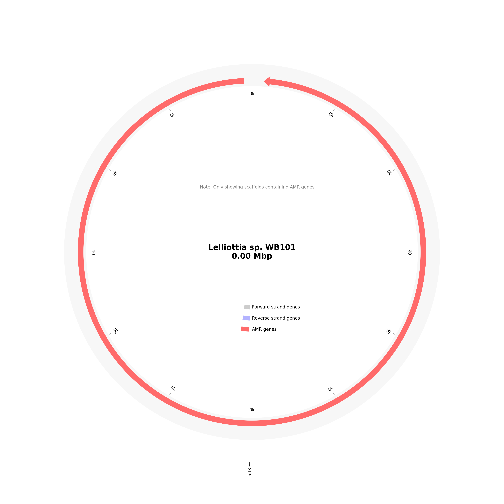

### arlS
- **Mechanism**: antibiotic efflux
- **Drug Classes**: fluoroquinolone antibiotic; disinfecting agents and antiseptics
- **AMR Family**: major facilitator superfamily (MFS) antibiotic efflux pump
- **Locations**:
  - gnl|SPADES|DLDDEBJH_22838_1 : position 3-269

## Raoultella planticola
**Strain Statistics:**
- Total genome length: 1.1 kbp
- Total scaffolds: 2
- Scaffolds with AMR genes: 1
- Total genes annotated: 4
- Total AMR genes: 1
- Unique AMR genes: 1
- Distinct AMR mechanisms: 1
- Distinct AMR families: 1
- Distinct drug classes: 6

**Circos Plot:**

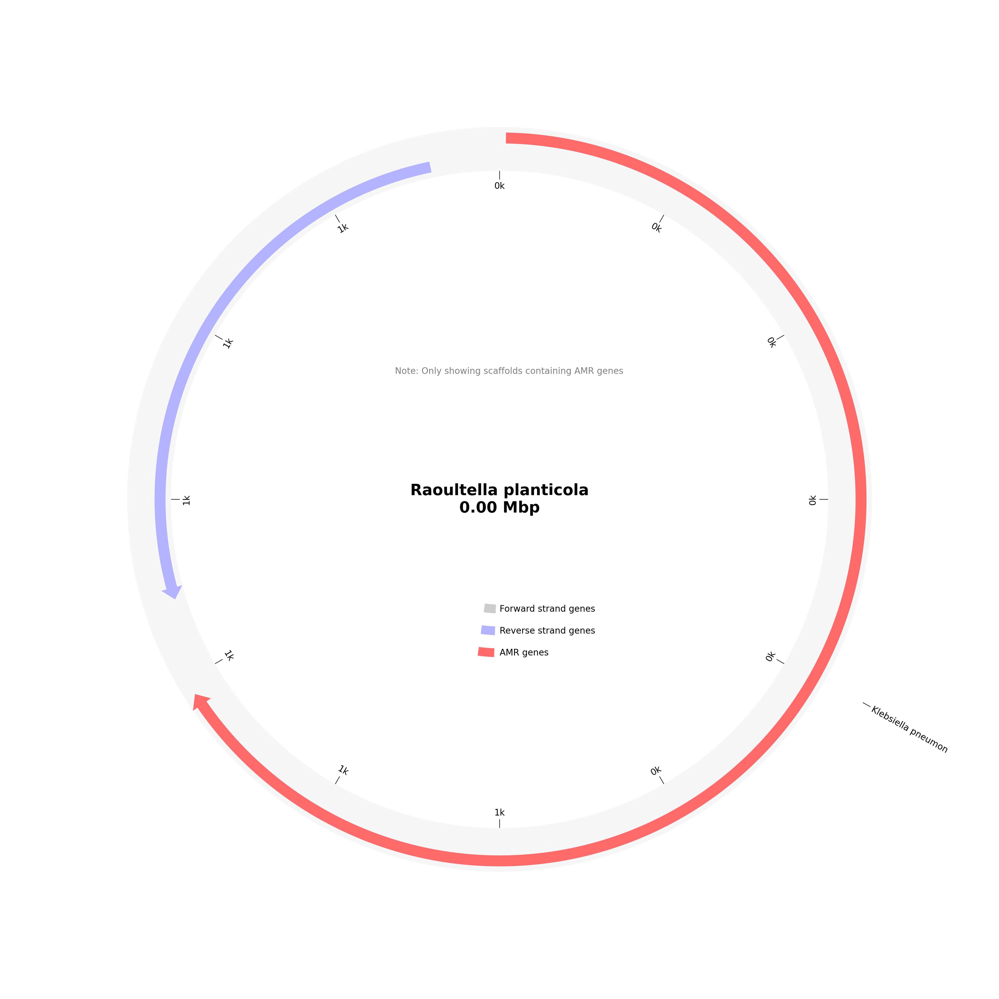

### Klebsiella pneumoniae OmpK37
- **Mechanism**: reduced permeability to antibiotic
- **Drug Classes**: monobactam; carbapenem; cephalosporin; cephamycin; penam; penem
- **AMR Family**: General Bacterial Porin with reduced permeability to beta-lactams
- **Locations**:
  - gnl|SPADES|DLDDEBJH_5047_1 : position 3-707

## Serratia fonticola
**Strain Statistics:**
- Total genome length: 5515.7 kbp
- Total scaffolds: 194
- Scaffolds with AMR genes: 88
- Total genes annotated: 10183
- Total AMR genes: 588
- Unique AMR genes: 234
- Distinct AMR mechanisms: 11
- Distinct AMR families: 82
- Distinct drug classes: 37

**Circos Plot:**

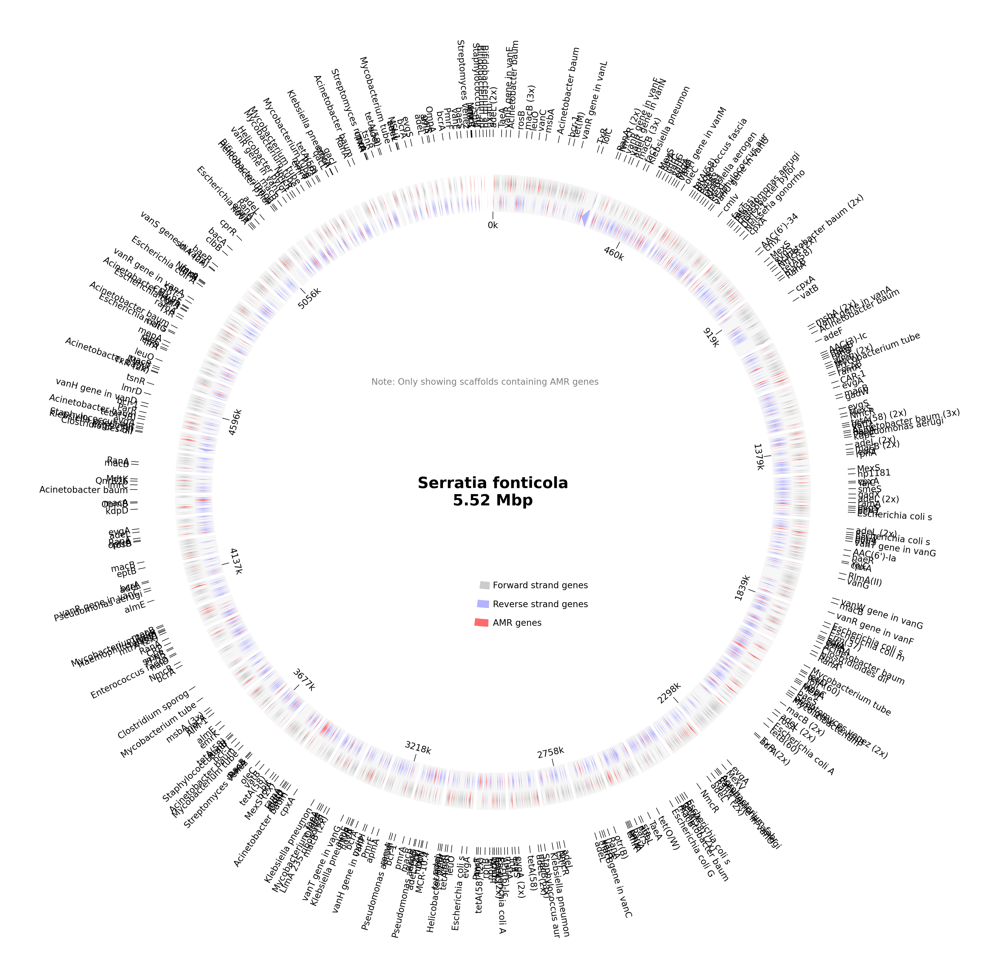

### AAC(3)-Ic
- **Mechanism**: antibiotic inactivation
- **Drug Classes**: aminoglycoside antibiotic
- **AMR Family**: AAC(3)
- **Locations**:
  - gnl|SPADES|DLDDEBJH_36_87 : position 91676-92101

### AAC(6')-34
- **Mechanism**: antibiotic inactivation
- **Drug Classes**: aminoglycoside antibiotic
- **AMR Family**: AAC(6')
- **Locations**:
  - gnl|SPADES|DLDDEBJH_31_56 : position 63726-64223

### AAC(6')-Ia (found in 2 locations)
- **Mechanism**: antibiotic inactivation
- **Drug Classes**: aminoglycoside antibiotic
- **AMR Family**: AAC(6')
- **Locations**:
  - gnl|SPADES|DLDDEBJH_40_55 : position 60181-60699
  - gnl|SPADES|DLDDEBJH_44_69 : position 73474-73992

### AIM-1 (found in 2 locations)
- **Mechanism**: antibiotic inactivation
- **Drug Classes**: cephalosporin; cephamycin; penam
- **AMR Family**: AIM beta-lactamase
- **Locations**:
  - gnl|SPADES|DLDDEBJH_117_4 : position 3269-4261
  - gnl|SPADES|DLDDEBJH_1789_2 : position 359-1201

### APH(6)-Ic
- **Mechanism**: antibiotic inactivation
- **Drug Classes**: aminoglycoside antibiotic
- **AMR Family**: APH(6)
- **Locations**:
  - gnl|SPADES|DLDDEBJH_86_10 : position 8672-9529

### Acinetobacter baumannii AbaF (found in 9 locations)
- **Mechanism**: antibiotic efflux
- **Drug Classes**: phosphonic acid antibiotic
- **AMR Family**: major facilitator superfamily (MFS) antibiotic efflux pump
- **Locations**:
  - gnl|SPADES|DLDDEBJH_104_52 : position 52433-53830
  - gnl|SPADES|DLDDEBJH_113_55 : position 60756-62039
  - gnl|SPADES|DLDDEBJH_174_17 : position 15885-17168
  - gnl|SPADES|DLDDEBJH_185_34 : position 33352-34854
  - gnl|SPADES|DLDDEBJH_31_110 : position 127348-128670
  - gnl|SPADES|DLDDEBJH_31_124 : position 144098-145330
  - gnl|SPADES|DLDDEBJH_36_29 : position 30031-31356
  - gnl|SPADES|DLDDEBJH_377_2 : position 2254-3600
  - gnl|SPADES|DLDDEBJH_6_42 : position 48274-49566

### Acinetobacter baumannii AbaQ (found in 12 locations)
- **Mechanism**: antibiotic efflux
- **Drug Classes**: fluoroquinolone antibiotic
- **AMR Family**: major facilitator superfamily (MFS) antibiotic efflux pump
- **Locations**:
  - gnl|SPADES|DLDDEBJH_116_65 : position 56407-57762
  - gnl|SPADES|DLDDEBJH_162_10 : position 10121-11419
  - gnl|SPADES|DLDDEBJH_196_37 : position 39624-40994
  - gnl|SPADES|DLDDEBJH_39_26 : position 26310-27641
  - gnl|SPADES|DLDDEBJH_39_60 : position 67650-68996
  - gnl|SPADES|DLDDEBJH_39_64 : position 72611-73906
  - gnl|SPADES|DLDDEBJH_57_58 : position 70473-71741
  - gnl|SPADES|DLDDEBJH_59_19 : position 18369-19595
  - gnl|SPADES|DLDDEBJH_59_26 : position 27239-28516
  - gnl|SPADES|DLDDEBJH_59_28 : position 29768-31114
  - gnl|SPADES|DLDDEBJH_67_45 : position 48673-49965
  - gnl|SPADES|DLDDEBJH_6_159 : position 183838-185196

### Acinetobacter baumannii AmvA (found in 2 locations)
- **Mechanism**: antibiotic efflux
- **Drug Classes**: macrolide antibiotic; disinfecting agents and antiseptics
- **AMR Family**: major facilitator superfamily (MFS) antibiotic efflux pump
- **Locations**:
  - gnl|SPADES|DLDDEBJH_131_41 : position 41788-43284
  - gnl|SPADES|DLDDEBJH_153_13 : position 8480-9778

### Agrobacterium fabrum chloramphenicol acetyltransferase
- **Mechanism**: antibiotic inactivation
- **Drug Classes**: phenicol antibiotic
- **AMR Family**: chloramphenicol acetyltransferase (CAT)
- **Locations**:
  - gnl|SPADES|DLDDEBJH_65_20 : position 25507-26136

### ArnT
- **Mechanism**: antibiotic target alteration
- **Drug Classes**: peptide antibiotic
- **AMR Family**: pmr phosphoethanolamine transferase
- **Locations**:
  - gnl|SPADES|DLDDEBJH_86_85: position 81948-83612

### BahA
- **Mechanism**: antibiotic inactivation
- **Drug Classes**: peptide antibiotic
- **AMR Family**: Bah amidohydrolase
- **Locations**:
  - gnl|SPADES|DLDDEBJH_24_22 : position 25718-26731

### Bifidobacterium adolescentis rpoB mutants conferring resistance to rifampicin (found in 2 locations)
- **Mechanism**: antibiotic target alteration; antibiotic target replacement
- **Drug Classes**: rifamycin antibiotic
- **AMR Family**: rifamycin-resistant beta-subunit of RNA polymerase (rpoB)
- **Locations**:
  - gnl|SPADES|DLDDEBJH_13488_1 : position 2-382
  - gnl|SPADES|DLDDEBJH_5374_1 : position 2-808

### Bifidobacterium bifidum ileS conferring resistance to mupirocin
- **Mechanism**: antibiotic target alteration
- **Drug Classes**: mupirocin-like antibiotic
- **AMR Family**: antibiotic-resistant isoleucyl-tRNA synthetase (ileS)
- **Locations**:
  - gnl|SPADES|DLDDEBJH_307_15 : position 12632-15214

### CAR-1
- **Mechanism**: antibiotic inactivation
- **Drug Classes**: carbapenem
- **AMR Family**: CAR beta-lactamase
- **Locations**:
  - gnl|SPADES|DLDDEBJH_37_34 : position 32553-33359

### CMY-95
- **Mechanism**: antibiotic inactivation
- **Drug Classes**: cephamycin
- **AMR Family**: CMY beta-lactamase
- **Locations**:
  - gnl|SPADES|DLDDEBJH_196_39 : position 41985-43127

### CRP (found in 3 locations)
- **Mechanism**: antibiotic efflux
- **Drug Classes**: macrolide antibiotic; fluoroquinolone antibiotic; penam
- **AMR Family**: resistance-nodulation-cell division (RND) antibiotic efflux pump
- **Locations**:
  - gnl|SPADES|DLDDEBJH_133_2 : position 1159-1923
  - gnl|SPADES|DLDDEBJH_145_38: position 32982-33614
  - gnl|SPADES|DLDDEBJH_79_94 : position 93724-94425

### Clostridioides difficile gyrA conferring resistance to fluoroquinolones
- **Mechanism**: antibiotic target alteration
- **Drug Classes**: fluoroquinolone antibiotic
- **AMR Family**: fluoroquinolone resistant gyrA
- **Locations**:
  - gnl|SPADES|DLDDEBJH_157_23 : position 32783-35434

### Clostridioides difficile gyrB conferring resistance to fluoroquinolones
- **Mechanism**: antibiotic target alteration
- **Drug Classes**: fluoroquinolone antibiotic
- **AMR Family**: fluoroquinolone resistant gyrB
- **Locations**:
  - gnl|SPADES|DLDDEBJH_57_71 : position 84152-86566

### Clostridium sporogenes cplR
- **Mechanism**: antibiotic target protection
- **Drug Classes**: lincosamide antibiotic; pleuromutilin antibiotic
- **AMR Family**: Miscellaneous ABC-F subfamily ATP-binding cassette ribosomal protection proteins
- **Locations**:
  - gnl|SPADES|DLDDEBJH_129_19 : position 12461-13504

### DHT2-1
- **Mechanism**: antibiotic inactivation
- **Drug Classes**: carbapenem
- **AMR Family**: DHT2 beta-lactamase
- **Locations**:
  - gnl|SPADES|DLDDEBJH_24_153 : position 178052-178912

### Enterobacter cloacae acrA
- **Mechanism**: antibiotic efflux
- **Drug Classes**: fluoroquinolone antibiotic; cephalosporin; glycylcycline; penam; tetracycline antibiotic; rifamycin antibiotic; phenicol antibiotic; disinfecting agents and antiseptics
- **AMR Family**: resistance-nodulation-cell division (RND) antibiotic efflux pump
- **Locations**:
  - gnl|SPADES|DLDDEBJH_17_173 : position 187001-188119

### Enterococcus faecalis cls with mutation conferring resistance to daptomycin
- **Mechanism**: antibiotic target alteration
- **Drug Classes**: peptide antibiotic
- **AMR Family**: daptomycin resistant cls
- **Locations**:
  - gnl|SPADES|DLDDEBJH_131_43 : position 44478-45938

### Erm(37)
- **Mechanism**: antibiotic target alteration
- **Drug Classes**: macrolide antibiotic; lincosamide antibiotic; streptogramin antibiotic; streptogramin A antibiotic; streptogramin B antibiotic
- **AMR Family**: Erm 23S ribosomal RNA methyltransferase
- **Locations**:
  - gnl|SPADES|DLDDEBJH_57_34 : position 40535-41317

### ErmC
- **Mechanism**: antibiotic target alteration
- **Drug Classes**: macrolide antibiotic; lincosamide antibiotic; streptogramin antibiotic; streptogramin A antibiotic; streptogramin B antibiotic
- **AMR Family**: Erm 23S ribosomal RNA methyltransferase
- **Locations**:
  - gnl|SPADES|DLDDEBJH_6_67 : position 77439-78257

### Escherichia coli AcrAB-TolC with AcrR mutation conferring resistance to ciprofloxacin, tetracycline, and ceftazidime (found in 2 locations)
- **Mechanism**: antibiotic target alteration; antibiotic efflux
- **Drug Classes**: fluoroquinolone antibiotic; cephalosporin; glycylcycline; penam; tetracycline antibiotic; rifamycin antibiotic; phenicol antibiotic; disinfecting agents and antiseptics
- **AMR Family**: resistance-nodulation-cell division (RND) antibiotic efflux pump
- **Locations**:
  - gnl|SPADES|DLDDEBJH_207_7 : position 8450-9067
  - gnl|SPADES|DLDDEBJH_59_66 : position 73236-73883

### Escherichia coli AcrAB-TolC with MarR mutations conferring resistance to ciprofloxacin and tetracycline
- **Mechanism**: antibiotic target alteration; antibiotic efflux
- **Drug Classes**: fluoroquinolone antibiotic; cephalosporin; glycylcycline; penam; tetracycline antibiotic; rifamycin antibiotic; phenicol antibiotic; disinfecting agents and antiseptics
- **AMR Family**: resistance-nodulation-cell division (RND) antibiotic efflux pump
- **Locations**:
  - gnl|SPADES|DLDDEBJH_86_24 : position 18969-19403

### Escherichia coli EF-Tu mutants conferring resistance to Pulvomycin
- **Mechanism**: antibiotic target alteration
- **Drug Classes**: elfamycin antibiotic
- **AMR Family**: elfamycin resistant EF-Tu
- **Locations**:
  - gnl|SPADES|DLDDEBJH_57_22 : position 26263-28104

### Escherichia coli GlpT with mutation conferring resistance to fosfomycin
- **Mechanism**: antibiotic target alteration
- **Drug Classes**: phosphonic acid antibiotic
- **AMR Family**: antibiotic-resistant GlpT
- **Locations**:
  - gnl|SPADES|DLDDEBJH_67_68 : position 73001-74353

### Escherichia coli acrA
- **Mechanism**: antibiotic efflux
- **Drug Classes**: fluoroquinolone antibiotic; cephalosporin; glycylcycline; penam; tetracycline antibiotic; rifamycin antibiotic; phenicol antibiotic; disinfecting agents and antiseptics
- **AMR Family**: resistance-nodulation-cell division (RND) antibiotic efflux pump
- **Locations**:
  - gnl|SPADES|DLDDEBJH_59_67 : position 74026-75207

### Escherichia coli fabI mutations conferring resistance to isoniazid and triclosan (found in 2 locations)
- **Mechanism**: antibiotic target alteration
- **Drug Classes**: disinfecting agents and antiseptics; isoniazid-like antibiotic
- **AMR Family**: antibiotic resistant fabI
- **Locations**:
  - gnl|SPADES|DLDDEBJH_196_26 : position 30527-31309
  - gnl|SPADES|DLDDEBJH_244_11 : position 11195-11950

### Escherichia coli mdfA
- **Mechanism**: antibiotic efflux
- **Drug Classes**: tetracycline antibiotic; phenicol antibiotic; disinfecting agents and antiseptics
- **AMR Family**: major facilitator superfamily (MFS) antibiotic efflux pump
- **Locations**:
  - gnl|SPADES|DLDDEBJH_57_20 : position 23104-24459

### Escherichia coli soxS with mutation conferring antibiotic resistance (found in 11 locations)
- **Mechanism**: antibiotic target alteration; antibiotic efflux; reduced permeability to antibiotic
- **Drug Classes**: fluoroquinolone antibiotic; monobactam; carbapenem; cephalosporin; glycylcycline; cephamycin; penam; tetracycline antibiotic; rifamycin antibiotic; phenicol antibiotic; penem; disinfecting agents and antiseptics
- **AMR Family**: ATP-binding cassette (ABC) antibiotic efflux pump; major facilitator superfamily (MFS) antibiotic efflux pump; resistance-nodulation-cell division (RND) antibiotic efflux pump; General Bacterial Porin with reduced permeability to beta-lactams
- **Locations**:
  - gnl|SPADES|DLDDEBJH_17_18 : position 19068-19511
  - gnl|SPADES|DLDDEBJH_185_19 : position 18800-19600
  - gnl|SPADES|DLDDEBJH_24_11 : position 12923-13840
  - gnl|SPADES|DLDDEBJH_24_133 : position 149071-150045
  - gnl|SPADES|DLDDEBJH_37_126 : position 127058-127885
  - gnl|SPADES|DLDDEBJH_40_101 : position 109743-110627
  - gnl|SPADES|DLDDEBJH_44_23 : position 23546-24430
  - gnl|SPADES|DLDDEBJH_57_11 : position 12211-13389
  - gnl|SPADES|DLDDEBJH_67_25 : position 26302-27189
  - gnl|SPADES|DLDDEBJH_6_31 : position 34921-35790
  - gnl|SPADES|DLDDEBJH_88_26 : position 24362-25252

### EstT
- **Mechanism**: antibiotic inactivation
- **Drug Classes**: macrolide antibiotic
- **AMR Family**: macrolide esterase
- **Locations**:
  - gnl|SPADES|DLDDEBJH_79_74 : position 76577-77446

### FONA-6
- **Mechanism**: antibiotic inactivation
- **Drug Classes**: penam
- **AMR Family**: FONA beta-lactamase
- **Locations**:
  - gnl|SPADES|DLDDEBJH_24_138: position 156066-156953

### FosA8
- **Mechanism**: antibiotic inactivation
- **Drug Classes**: phosphonic acid antibiotic
- **AMR Family**: fosfomycin thiol transferase
- **Locations**:
  - gnl|SPADES|DLDDEBJH_37_6: position 4582-4989

### FosB3
- **Mechanism**: antibiotic inactivation
- **Drug Classes**: phosphonic acid antibiotic
- **AMR Family**: fosfomycin thiol transferase
- **Locations**:
  - gnl|SPADES|DLDDEBJH_24_31 : position 35957-36328

### FosM2
- **Mechanism**: antibiotic inactivation
- **Drug Classes**: phosphonic acid antibiotic
- **AMR Family**: fosfomycin thiol transferase
- **Locations**:
  - gnl|SPADES|DLDDEBJH_86_36 : position 30834-31241

### GMB-1
- **Mechanism**: antibiotic inactivation
- **Drug Classes**: carbapenem
- **AMR Family**: GMB beta-lactamase
- **Locations**:
  - gnl|SPADES|DLDDEBJH_58_26 : position 34980-35864

### GOB-5
- **Mechanism**: antibiotic inactivation
- **Drug Classes**: carbapenem; cephalosporin; penam
- **AMR Family**: GOB beta-lactamase
- **Locations**:
  - gnl|SPADES|DLDDEBJH_103_62 : position 70864-71511

### H-NS
- **Mechanism**: antibiotic efflux
- **Drug Classes**: macrolide antibiotic; fluoroquinolone antibiotic; cephalosporin; cephamycin; penam; tetracycline antibiotic
- **AMR Family**: major facilitator superfamily (MFS) antibiotic efflux pump; resistance-nodulation-cell division (RND) antibiotic efflux pump
- **Locations**:
  - gnl|SPADES|DLDDEBJH_131_55 : position 59877-60284

### Haemophilus influenzae PBP3 conferring resistance to beta-lactam antibiotics (found in 2 locations)
- **Mechanism**: antibiotic target alteration
- **Drug Classes**: cephalosporin; cephamycin; penam
- **AMR Family**: Penicillin-binding protein mutations conferring resistance to beta-lactam antibiotics
- **Locations**:
  - gnl|SPADES|DLDDEBJH_133_43 : position 44052-45770
  - gnl|SPADES|DLDDEBJH_6_99 : position 118554-120320

### Helicobacter pylori frxA mutation conferring resistance to metronidazole
- **Mechanism**: antibiotic target alteration
- **Drug Classes**: nitroimidazole antibiotic
- **AMR Family**: Antibiotic resistant Helicobacter pylori nitroreductase
- **Locations**:
  - gnl|SPADES|DLDDEBJH_24_148 : position 169759-170364

### Helicobacter pylori pbp1 mutants conferring resistance to amoxicillin (found in 2 locations)
- **Mechanism**: antibiotic target alteration
- **Drug Classes**: cephalosporin; cephamycin; penam
- **AMR Family**: Penicillin-binding protein mutations conferring resistance to beta-lactam antibiotics
- **Locations**:
  - gnl|SPADES|DLDDEBJH_310_1 : position 83-2446
  - gnl|SPADES|DLDDEBJH_88_75 : position 80007-82508

### Helicobacter pylori pbp2 mutants conferring resistance to amoxicillin
- **Mechanism**: antibiotic target alteration
- **Drug Classes**: cephalosporin; cephamycin; penam
- **AMR Family**: Penicillin-binding protein mutations conferring resistance to beta-lactam antibiotics
- **Locations**:
  - gnl|SPADES|DLDDEBJH_307_9 : position 7462-9357

### Klebsiella aerogenes Omp36
- **Mechanism**: reduced permeability to antibiotic
- **Drug Classes**: monobactam; carbapenem; cephalosporin; cephamycin; penam; penem
- **AMR Family**: General Bacterial Porin with reduced permeability to beta-lactams
- **Locations**:
  - gnl|SPADES|DLDDEBJH_24_50 : position 53794-54921

### Klebsiella pneumoniae KpnE
- **Mechanism**: antibiotic efflux
- **Drug Classes**: macrolide antibiotic; aminoglycoside antibiotic; cephalosporin; tetracycline antibiotic; peptide antibiotic; rifamycin antibiotic; disinfecting agents and antiseptics
- **AMR Family**: small multidrug resistance (SMR) antibiotic efflux pump
- **Locations**:
  - gnl|SPADES|DLDDEBJH_100_50 : position 50446-50814

### Klebsiella pneumoniae KpnF
- **Mechanism**: antibiotic efflux
- **Drug Classes**: macrolide antibiotic; aminoglycoside antibiotic; cephalosporin; tetracycline antibiotic; peptide antibiotic; rifamycin antibiotic; disinfecting agents and antiseptics
- **AMR Family**: small multidrug resistance (SMR) antibiotic efflux pump
- **Locations**:
  - gnl|SPADES|DLDDEBJH_100_51: position 50801-51130

### Klebsiella pneumoniae KpnH (found in 2 locations)
- **Mechanism**: antibiotic efflux
- **Drug Classes**: macrolide antibiotic; fluoroquinolone antibiotic; aminoglycoside antibiotic; carbapenem; cephalosporin; penam; peptide antibiotic; penem
- **AMR Family**: major facilitator superfamily (MFS) antibiotic efflux pump
- **Locations**:
  - gnl|SPADES|DLDDEBJH_362_17 : position 15017-16543
  - gnl|SPADES|DLDDEBJH_71_89: position 93933-95468

### Klebsiella pneumoniae OmpK37 (found in 6 locations)
- **Mechanism**: reduced permeability to antibiotic
- **Drug Classes**: monobactam; carbapenem; cephalosporin; cephamycin; penam; penem
- **AMR Family**: General Bacterial Porin with reduced permeability to beta-lactams
- **Locations**:
  - gnl|SPADES|DLDDEBJH_103_60 : position 68259-69365
  - gnl|SPADES|DLDDEBJH_113_16 : position 19386-20477
  - gnl|SPADES|DLDDEBJH_157_28 : position 43916-45031
  - gnl|SPADES|DLDDEBJH_17_84 : position 96900-97994
  - gnl|SPADES|DLDDEBJH_37_18 : position 13709-14791
  - gnl|SPADES|DLDDEBJH_79_90 : position 90419-91465

### LlmA 23S ribosomal RNA methyltransferase
- **Mechanism**: antibiotic target alteration
- **Drug Classes**: lincosamide antibiotic
- **AMR Family**: Llm 23S ribosomal RNA methyltransferase
- **Locations**:
  - gnl|SPADES|DLDDEBJH_103_27 : position 28071-29261

### LptD
- **Mechanism**: antibiotic efflux
- **Drug Classes**: carbapenem; peptide antibiotic; aminocoumarin antibiotic; rifamycin antibiotic
- **AMR Family**: ATP-binding cassette (ABC) antibiotic efflux pump
- **Locations**:
  - gnl|SPADES|DLDDEBJH_6_70 : position 80598-82964

### MCR-10.4
- **Mechanism**: antibiotic target alteration
- **Drug Classes**: peptide antibiotic
- **AMR Family**: MCR phosphoethanolamine transferase
- **Locations**:
  - gnl|SPADES|DLDDEBJH_96_24 : position 21013-22647

### MOX-3
- **Mechanism**: antibiotic inactivation
- **Drug Classes**: cephalosporin; cephamycin; penam
- **AMR Family**: MOX beta-lactamase
- **Locations**:
  - gnl|SPADES|DLDDEBJH_24_24 : position 27838-28977

### MSI-1
- **Mechanism**: antibiotic inactivation
- **Drug Classes**: carbapenem
- **AMR Family**: MSI beta-lactamase
- **Locations**:
  - gnl|SPADES|DLDDEBJH_459_12 : position 11196-11951

### MdtK
- **Mechanism**: antibiotic efflux
- **Drug Classes**: fluoroquinolone antibiotic
- **AMR Family**: multidrug and toxic compound extrusion (MATE) transporter
- **Locations**:
  - gnl|SPADES|DLDDEBJH_153_37 : position 38112-39569

### MexF
- **Mechanism**: antibiotic efflux
- **Drug Classes**: fluoroquinolone antibiotic; diaminopyrimidine antibiotic; phenicol antibiotic
- **AMR Family**: resistance-nodulation-cell division (RND) antibiotic efflux pump
- **Locations**:
  - gnl|SPADES|DLDDEBJH_17_171 : position 183888-185441

### MexJ
- **Mechanism**: antibiotic efflux
- **Drug Classes**: macrolide antibiotic; tetracycline antibiotic; disinfecting agents and antiseptics
- **AMR Family**: resistance-nodulation-cell division (RND) antibiotic efflux pump
- **Locations**:
  - gnl|SPADES|DLDDEBJH_58_59 : position 70300-71385

### MexK
- **Mechanism**: antibiotic efflux
- **Drug Classes**: macrolide antibiotic; tetracycline antibiotic; disinfecting agents and antiseptics
- **AMR Family**: resistance-nodulation-cell division (RND) antibiotic efflux pump
- **Locations**:
  - gnl|SPADES|DLDDEBJH_58_60 : position 71385-74465

### MexL
- **Mechanism**: antibiotic efflux
- **Drug Classes**: macrolide antibiotic; tetracycline antibiotic; disinfecting agents and antiseptics
- **AMR Family**: resistance-nodulation-cell division (RND) antibiotic efflux pump
- **Locations**:
  - gnl|SPADES|DLDDEBJH_24_59 : position 63104-63700

### MexS (found in 8 locations)
- **Mechanism**: antibiotic efflux
- **Drug Classes**: fluoroquinolone antibiotic; diaminopyrimidine antibiotic; phenicol antibiotic
- **AMR Family**: resistance-nodulation-cell division (RND) antibiotic efflux pump
- **Locations**:
  - gnl|SPADES|DLDDEBJH_104_53 : position 53935-54948
  - gnl|SPADES|DLDDEBJH_111_2 : position 1067-2191
  - gnl|SPADES|DLDDEBJH_111_33 : position 36318-37385
  - gnl|SPADES|DLDDEBJH_17_116 : position 128511-129536
  - gnl|SPADES|DLDDEBJH_31_89 : position 101195-102244
  - gnl|SPADES|DLDDEBJH_37_122 : position 123440-124471
  - gnl|SPADES|DLDDEBJH_39_122 : position 133609-134616
  - gnl|SPADES|DLDDEBJH_78_43 : position 53357-54346

### MexT
- **Mechanism**: antibiotic efflux
- **Drug Classes**: fluoroquinolone antibiotic; diaminopyrimidine antibiotic; phenicol antibiotic
- **AMR Family**: resistance-nodulation-cell division (RND) antibiotic efflux pump
- **Locations**:
  - gnl|SPADES|DLDDEBJH_174_26 : position 24134-25027

### MexV
- **Mechanism**: antibiotic efflux
- **Drug Classes**: macrolide antibiotic; fluoroquinolone antibiotic; tetracycline antibiotic; phenicol antibiotic; disinfecting agents and antiseptics
- **AMR Family**: resistance-nodulation-cell division (RND) antibiotic efflux pump
- **Locations**:
  - gnl|SPADES|DLDDEBJH_65_7 : position 8016-9458

### MexW
- **Mechanism**: antibiotic efflux
- **Drug Classes**: macrolide antibiotic; fluoroquinolone antibiotic; tetracycline antibiotic; phenicol antibiotic; disinfecting agents and antiseptics
- **AMR Family**: resistance-nodulation-cell division (RND) antibiotic efflux pump
- **Locations**:
  - gnl|SPADES|DLDDEBJH_65_8 : position 9455-12598

### Mycobacterium tuberculosis gidB mutation conferring resistance to streptomycin
- **Mechanism**: antibiotic target alteration
- **Drug Classes**: aminoglycoside antibiotic
- **AMR Family**: antibiotic resistant gidB
- **Locations**:
  - gnl|SPADES|DLDDEBJH_319_18 : position 19327-19947

### Mycobacterium tuberculosis inhA mutations conferring resistance to isoniazid (found in 2 locations)
- **Mechanism**: antibiotic target alteration
- **Drug Classes**: isoniazid-like antibiotic
- **AMR Family**: isoniazid resistant inhA
- **Locations**:
  - gnl|SPADES|DLDDEBJH_24_141 : position 159626-160372
  - gnl|SPADES|DLDDEBJH_36_127 : position 137735-138493

### Mycobacterium tuberculosis kasA mutant conferring resistance to isoniazid (found in 4 locations)
- **Mechanism**: antibiotic target alteration
- **Drug Classes**: isoniazid-like antibiotic
- **AMR Family**: antibiotic resistant kasA
- **Locations**:
  - gnl|SPADES|DLDDEBJH_103_42 : position 43141-44415
  - gnl|SPADES|DLDDEBJH_113_40 : position 47654-48823
  - gnl|SPADES|DLDDEBJH_133_50 : position 51158-53716
  - gnl|SPADES|DLDDEBJH_311_1 : position 3-1220

### Mycobacterium tuberculosis ndh with mutation conferring resistance to isoniazid
- **Mechanism**: antibiotic target alteration
- **Drug Classes**: isoniazid-like antibiotic
- **AMR Family**: antibiotic resistant ndh
- **Locations**:
  - gnl|SPADES|DLDDEBJH_311_17 : position 14187-15515

### Mycobacterium tuberculosis pncA mutations conferring resistance to pyrazinamide
- **Mechanism**: antibiotic target alteration
- **Drug Classes**: pyrazine antibiotic
- **AMR Family**: Pyrazinamide resistant pncA
- **Locations**:
  - gnl|SPADES|DLDDEBJH_446_11 : position 11339-11971

### Mycobacterium tuberculosis rpsA mutations conferring resistance to pyrazinamide
- **Mechanism**: antibiotic target alteration
- **Drug Classes**: pyrazine antibiotic
- **AMR Family**: pyrazinamide resistant rpsA
- **Locations**:
  - gnl|SPADES|DLDDEBJH_117_43 : position 55930-57603

### Mycobacterium tuberculosis thyA with mutation conferring resistance to para-aminosalicylic acid
- **Mechanism**: antibiotic target alteration
- **Drug Classes**: salicylic acid antibiotic
- **AMR Family**: aminosalicylate resistant thymidylate synthase
- **Locations**:
  - gnl|SPADES|DLDDEBJH_58_11 : position 17221-18015

### Mycolicibacterium smegmatis ndh with mutation conferring resistance to isoniazid
- **Mechanism**: antibiotic target alteration
- **Drug Classes**: isoniazid-like antibiotic
- **AMR Family**: antibiotic resistant ndh
- **Locations**:
  - gnl|SPADES|DLDDEBJH_58_99 : position 112563-113762

### Neisseria gonorrhoeae pilQ gene conferring resistance to beta-lactam
- **Mechanism**: antibiotic target alteration
- **Drug Classes**: cephalosporin; cephamycin; penam
- **AMR Family**: Penicillin-binding protein mutations conferring resistance to beta-lactam antibiotics
- **Locations**:
  - gnl|SPADES|DLDDEBJH_31_1 : position 501-1748

### NmcR (found in 14 locations)
- **Mechanism**: antibiotic inactivation
- **Drug Classes**: carbapenem; cephalosporin; cephamycin; penam
- **AMR Family**: NmcA beta-lactamase
- **Locations**:
  - gnl|SPADES|DLDDEBJH_111_3 : position 2231-3133
  - gnl|SPADES|DLDDEBJH_131_16 : position 16774-17748
  - gnl|SPADES|DLDDEBJH_1789_3 : position 1371-2264
  - gnl|SPADES|DLDDEBJH_17_10 : position 12109-12996
  - gnl|SPADES|DLDDEBJH_17_141 : position 153907-154833
  - gnl|SPADES|DLDDEBJH_207_17 : position 19095-20021
  - gnl|SPADES|DLDDEBJH_310_12 : position 16954-17871
  - gnl|SPADES|DLDDEBJH_31_117 : position 135635-136516
  - gnl|SPADES|DLDDEBJH_31_127 : position 147684-148511
  - gnl|SPADES|DLDDEBJH_37_130 : position 132299-133168
  - gnl|SPADES|DLDDEBJH_57_85 : position 100018-100905
  - gnl|SPADES|DLDDEBJH_58_95 : position 109272-110165
  - gnl|SPADES|DLDDEBJH_65_85 : position 96883-97821
  - gnl|SPADES|DLDDEBJH_79_67 : position 70204-71085

### OmpA (found in 5 locations)
- **Mechanism**: reduced permeability to antibiotic
- **Drug Classes**: peptide antibiotic
- **AMR Family**: General Bacterial Porin with reduced permeability to peptide antibiotics
- **Locations**:
  - gnl|SPADES|DLDDEBJH_103_37 : position 38324-39400
  - gnl|SPADES|DLDDEBJH_133_44 : position 45777-46895
  - gnl|SPADES|DLDDEBJH_518_2 : position 1058-1567
  - gnl|SPADES|DLDDEBJH_57_51 : position 61602-62261
  - gnl|SPADES|DLDDEBJH_6_23 : position 25035-25532

### OpmB
- **Mechanism**: antibiotic efflux
- **Drug Classes**: macrolide antibiotic; monobactam; tetracycline antibiotic; aminocoumarin antibiotic
- **AMR Family**: resistance-nodulation-cell division (RND) antibiotic efflux pump
- **Locations**:
  - gnl|SPADES|DLDDEBJH_149_39 : position 41161-42567

### OprJ
- **Mechanism**: antibiotic efflux
- **Drug Classes**: macrolide antibiotic; fluoroquinolone antibiotic; aminoglycoside antibiotic; cephalosporin; penam; tetracycline antibiotic; aminocoumarin antibiotic; diaminopyrimidine antibiotic; phenicol antibiotic
- **AMR Family**: resistance-nodulation-cell division (RND) antibiotic efflux pump
- **Locations**:
  - gnl|SPADES|DLDDEBJH_96_35 : position 32785-34266

### ParR (found in 3 locations)
- **Mechanism**: antibiotic efflux; reduced permeability to antibiotic
- **Drug Classes**: macrolide antibiotic; fluoroquinolone antibiotic; monobactam; aminoglycoside antibiotic; carbapenem; cephalosporin; cephamycin; penam; tetracycline antibiotic; phenicol antibiotic; penem; disinfecting agents and antiseptics
- **AMR Family**: resistance-nodulation-cell division (RND) antibiotic efflux pump; Outer Membrane Porin (Opr)
- **Locations**:
  - gnl|SPADES|DLDDEBJH_104_31 : position 31258-31965
  - gnl|SPADES|DLDDEBJH_162_21 : position 22696-23424
  - gnl|SPADES|DLDDEBJH_31_14 : position 15344-16063

### ParS (found in 2 locations)
- **Mechanism**: antibiotic efflux; reduced permeability to antibiotic
- **Drug Classes**: macrolide antibiotic; fluoroquinolone antibiotic; monobactam; aminoglycoside antibiotic; carbapenem; cephalosporin; cephamycin; penam; tetracycline antibiotic; phenicol antibiotic; penem; disinfecting agents and antiseptics
- **AMR Family**: resistance-nodulation-cell division (RND) antibiotic efflux pump; Outer Membrane Porin (Opr)
- **Locations**:
  - gnl|SPADES|DLDDEBJH_162_22 : position 23421-24725
  - gnl|SPADES|DLDDEBJH_71_70 : position 70180-71772

### PmrF (found in 3 locations)
- **Mechanism**: antibiotic target alteration
- **Drug Classes**: peptide antibiotic
- **AMR Family**: pmr phosphoethanolamine transferase
- **Locations**:
  - gnl|SPADES|DLDDEBJH_602_7 : position 4894-5805
  - gnl|SPADES|DLDDEBJH_86_88 : position 86499-87479
  - gnl|SPADES|DLDDEBJH_99_87 : position 77786-78775

### Pseudomonas aeruginosa CpxR (found in 5 locations)
- **Mechanism**: antibiotic efflux
- **Drug Classes**: macrolide antibiotic; fluoroquinolone antibiotic; monobactam; aminoglycoside antibiotic; carbapenem; cephalosporin; cephamycin; penam; tetracycline antibiotic; peptide antibiotic; aminocoumarin antibiotic; diaminopyrimidine antibiotic; sulfonamide antibiotic; phenicol antibiotic; penem
- **AMR Family**: resistance-nodulation-cell division (RND) antibiotic efflux pump
- **Locations**:
  - gnl|SPADES|DLDDEBJH_36_97 : position 100178-100858
  - gnl|SPADES|DLDDEBJH_39_33 : position 38775-39404
  - gnl|SPADES|DLDDEBJH_65_24 : position 29298-29972
  - gnl|SPADES|DLDDEBJH_71_71 : position 71790-72476
  - gnl|SPADES|DLDDEBJH_99_23 : position 22473-23171

### Pseudomonas aeruginosa ampR with mutation conferring resistance to aztreonam (found in 3 locations)
- **Mechanism**: antibiotic target alteration; antibiotic inactivation
- **Drug Classes**: monobactam; carbapenem; cephalosporin
- **AMR Family**: PDC beta-lactamase; ampR transcriptional regulator with mutation conferring resistance to monobactam antibiotics
- **Locations**:
  - gnl|SPADES|DLDDEBJH_138_8 : position 8999-9889
  - gnl|SPADES|DLDDEBJH_24_139 : position 157086-157961
  - gnl|SPADES|DLDDEBJH_96_52 : position 52840-53781

### QepA2
- **Mechanism**: antibiotic efflux
- **Drug Classes**: fluoroquinolone antibiotic
- **AMR Family**: major facilitator superfamily (MFS) antibiotic efflux pump
- **Locations**:
  - gnl|SPADES|DLDDEBJH_88_27 : position 25307-26701

### QepA4
- **Mechanism**: antibiotic efflux
- **Drug Classes**: fluoroquinolone antibiotic
- **AMR Family**: major facilitator superfamily (MFS) antibiotic efflux pump
- **Locations**:
  - gnl|SPADES|DLDDEBJH_24_33 : position 37502-38788

### QnrB26
- **Mechanism**: antibiotic target protection
- **Drug Classes**: fluoroquinolone antibiotic
- **AMR Family**: quinolone resistance protein (qnr)
- **Locations**:
  - gnl|SPADES|DLDDEBJH_153_30 : position 32255-32908

### RanA (found in 22 locations)
- **Mechanism**: antibiotic efflux
- **Drug Classes**: aminoglycoside antibiotic
- **AMR Family**: ATP-binding cassette (ABC) antibiotic efflux pump
- **Locations**:
  - gnl|SPADES|DLDDEBJH_113_15 : position 17826-18611
  - gnl|SPADES|DLDDEBJH_116_10 : position 7197-8012
  - gnl|SPADES|DLDDEBJH_131_45 : position 46379-47377
  - gnl|SPADES|DLDDEBJH_131_46 : position 47374-48366
  - gnl|SPADES|DLDDEBJH_133_14 : position 14971-16107
  - gnl|SPADES|DLDDEBJH_143_21 : position 19519-20508
  - gnl|SPADES|DLDDEBJH_145_18 : position 14237-15004
  - gnl|SPADES|DLDDEBJH_156_19 : position 17676-18809
  - gnl|SPADES|DLDDEBJH_174_32 : position 30727-31539
  - gnl|SPADES|DLDDEBJH_17_4 : position 3977-5854
  - gnl|SPADES|DLDDEBJH_244_26 : position 29003-30073
  - gnl|SPADES|DLDDEBJH_35_8 : position 6787-7893
  - gnl|SPADES|DLDDEBJH_374_14 : position 15233-16828
  - gnl|SPADES|DLDDEBJH_39_28 : position 31309-32367
  - gnl|SPADES|DLDDEBJH_52_93 : position 75420-76481
  - gnl|SPADES|DLDDEBJH_57_95 : position 109671-110447
  - gnl|SPADES|DLDDEBJH_65_42 : position 47383-48156
  - gnl|SPADES|DLDDEBJH_65_68 : position 76942-78069
  - gnl|SPADES|DLDDEBJH_67_32 : position 33908-34981
  - gnl|SPADES|DLDDEBJH_71_82 : position 85078-86277
  - gnl|SPADES|DLDDEBJH_78_29 : position 39013-40128
  - gnl|SPADES|DLDDEBJH_96_55 : position 55337-56134

### RanB (found in 2 locations)
- **Mechanism**: antibiotic efflux
- **Drug Classes**: aminoglycoside antibiotic
- **AMR Family**: ATP-binding cassette (ABC) antibiotic efflux pump
- **Locations**:
  - gnl|SPADES|DLDDEBJH_116_9 : position 6410-7192
  - gnl|SPADES|DLDDEBJH_96_56 : position 56131-57276

### Rhodococcus fascians cmr
- **Mechanism**: antibiotic efflux
- **Drug Classes**: phenicol antibiotic
- **AMR Family**: major facilitator superfamily (MFS) antibiotic efflux pump
- **Locations**:
  - gnl|SPADES|DLDDEBJH_24_16 : position 17965-19149

### RlmA(II)
- **Mechanism**: antibiotic target alteration
- **Drug Classes**: macrolide antibiotic; lincosamide antibiotic
- **AMR Family**: non-erm 23S ribosomal RNA methyltransferase (G748)
- **Locations**:
  - gnl|SPADES|DLDDEBJH_52_2 : position 967-1806

### SAT-3
- **Mechanism**: antibiotic inactivation
- **Drug Classes**: nucleoside antibiotic
- **AMR Family**: streptothricin acetyltransferase (SAT)
- **Locations**:
  - gnl|SPADES|DLDDEBJH_17_154 : position 167835-168377

### SRT-2
- **Mechanism**: antibiotic inactivation
- **Drug Classes**: cephalosporin
- **AMR Family**: SRT beta-lactamase
- **Locations**:
  - gnl|SPADES|DLDDEBJH_202_4 : position 3360-4895

### SatA (found in 2 locations)
- **Mechanism**: antibiotic inactivation
- **Drug Classes**: nucleoside antibiotic
- **AMR Family**: streptothricin acetyltransferase (SAT)
- **Locations**:
  - gnl|SPADES|DLDDEBJH_17_123 : position 136213-136656
  - gnl|SPADES|DLDDEBJH_57_47 : position 56920-57366

### Staphylococcus aureus FosB
- **Mechanism**: antibiotic inactivation
- **Drug Classes**: phosphonic acid antibiotic
- **AMR Family**: fosfomycin thiol transferase
- **Locations**:
  - gnl|SPADES|DLDDEBJH_157_29 : position 45187-45603

### Staphylococcus aureus GlpT with mutation conferring resistance to fosfomycin
- **Mechanism**: antibiotic target alteration
- **Drug Classes**: phosphonic acid antibiotic
- **AMR Family**: antibiotic-resistant GlpT
- **Locations**:
  - gnl|SPADES|DLDDEBJH_36_102 : position 107111-108493

### Staphylococcus aureus UhpT with mutation conferring resistance to fosfomycin
- **Mechanism**: antibiotic target alteration
- **Drug Classes**: phosphonic acid antibiotic
- **AMR Family**: antibiotic-resistant UhpT
- **Locations**:
  - gnl|SPADES|DLDDEBJH_157_34 : position 48405-49712

### Staphylococcus aureus fusA with mutation conferring resistance to fusidic acid (found in 3 locations)
- **Mechanism**: antibiotic target alteration
- **Drug Classes**: fusidane antibiotic
- **AMR Family**: antibiotic resistant fusA
- **Locations**:
  - gnl|SPADES|DLDDEBJH_24_71 : position 75176-77281
  - gnl|SPADES|DLDDEBJH_4232_1 : position 3-1322
  - gnl|SPADES|DLDDEBJH_6_6 : position 4619-6208

### Staphylococcus aureus mupA conferring resistance to mupirocin
- **Mechanism**: antibiotic target alteration
- **Drug Classes**: mupirocin-like antibiotic
- **AMR Family**: antibiotic-resistant isoleucyl-tRNA synthetase (ileS)
- **Locations**:
  - gnl|SPADES|DLDDEBJH_6_50 : position 57970-60786

### Staphylococcus aureus mupB conferring resistance to mupirocin
- **Mechanism**: antibiotic target alteration
- **Drug Classes**: mupirocin-like antibiotic
- **AMR Family**: antibiotic-resistant isoleucyl-tRNA synthetase (ileS)
- **Locations**:
  - gnl|SPADES|DLDDEBJH_82_4 : position 2452-5328

### Staphylococcus aureus murA with mutation conferring resistance to fosfomycin
- **Mechanism**: antibiotic target alteration
- **Drug Classes**: phosphonic acid antibiotic
- **AMR Family**: antibiotic-resistant murA transferase
- **Locations**:
  - gnl|SPADES|DLDDEBJH_116_4 : position 3188-4447

### Streptococcus pneumoniae PBP2x conferring resistance to amoxicillin
- **Mechanism**: antibiotic target alteration
- **Drug Classes**: cephalosporin; cephamycin; penam
- **AMR Family**: Penicillin-binding protein mutations conferring resistance to beta-lactam antibiotics
- **Locations**:
  - gnl|SPADES|DLDDEBJH_31_6 : position 4100-6658

### Streptomyces rimosus otr(A)
- **Mechanism**: antibiotic target protection
- **Drug Classes**: tetracycline antibiotic
- **AMR Family**: tetracycline-resistant ribosomal protection protein
- **Locations**:
  - gnl|SPADES|DLDDEBJH_383_15 : position 16416-17540

### Streptomyces venezuelae rox (found in 4 locations)
- **Mechanism**: antibiotic inactivation
- **Drug Classes**: rifamycin antibiotic
- **AMR Family**: rifampin monooxygenase
- **Locations**:
  - gnl|SPADES|DLDDEBJH_113_11 : position 12473-14206
  - gnl|SPADES|DLDDEBJH_1262_5 : position 3708-4889
  - gnl|SPADES|DLDDEBJH_58_87 : position 100565-101767
  - gnl|SPADES|DLDDEBJH_58_88 : position 101997-103175

### TaeA (found in 3 locations)
- **Mechanism**: antibiotic efflux
- **Drug Classes**: pleuromutilin antibiotic
- **AMR Family**: ATP-binding cassette (ABC) antibiotic efflux pump
- **Locations**:
  - gnl|SPADES|DLDDEBJH_103_46 : position 48503-50407
  - gnl|SPADES|DLDDEBJH_6_22 : position 23225-24892
  - gnl|SPADES|DLDDEBJH_71_27 : position 29443-30204

### TolC
- **Mechanism**: antibiotic efflux
- **Drug Classes**: macrolide antibiotic; fluoroquinolone antibiotic; aminoglycoside antibiotic; carbapenem; cephalosporin; glycylcycline; cephamycin; penam; tetracycline antibiotic; peptide antibiotic; aminocoumarin antibiotic; rifamycin antibiotic; phenicol antibiotic; penem; disinfecting agents and antiseptics
- **AMR Family**: ATP-binding cassette (ABC) antibiotic efflux pump; major facilitator superfamily (MFS) antibiotic efflux pump; resistance-nodulation-cell division (RND) antibiotic efflux pump
- **Locations**:
  - gnl|SPADES|DLDDEBJH_6_270 : position 308882-310279

### TriA
- **Mechanism**: antibiotic efflux
- **Drug Classes**: disinfecting agents and antiseptics
- **AMR Family**: resistance-nodulation-cell division (RND) antibiotic efflux pump
- **Locations**:
  - gnl|SPADES|DLDDEBJH_82_81 : position 94754-95725

### TxR (found in 9 locations)
- **Mechanism**: antibiotic efflux
- **Drug Classes**: tetracycline antibiotic
- **AMR Family**: ATP-binding cassette (ABC) antibiotic efflux pump
- **Locations**:
  - gnl|SPADES|DLDDEBJH_100_43 : position 42530-45340
  - gnl|SPADES|DLDDEBJH_174_15 : position 13469-15040
  - gnl|SPADES|DLDDEBJH_174_25 : position 23130-24137
  - gnl|SPADES|DLDDEBJH_196_6 : position 5818-7395
  - gnl|SPADES|DLDDEBJH_36_99 : position 102180-103424
  - gnl|SPADES|DLDDEBJH_383_12 : position 11945-13357
  - gnl|SPADES|DLDDEBJH_61_3 : position 1088-3154
  - gnl|SPADES|DLDDEBJH_61_37 : position 45032-46885
  - gnl|SPADES|DLDDEBJH_6_262 : position 297043-298386

### YajC (found in 2 locations)
- **Mechanism**: antibiotic efflux
- **Drug Classes**: fluoroquinolone antibiotic; cephalosporin; glycylcycline; penam; tetracycline antibiotic; oxazolidinone antibiotic; glycopeptide antibiotic; rifamycin antibiotic; phenicol antibiotic; disinfecting agents and antiseptics
- **AMR Family**: resistance-nodulation-cell division (RND) antibiotic efflux pump
- **Locations**:
  - gnl|SPADES|DLDDEBJH_40_27 : position 27919-28251
  - gnl|SPADES|DLDDEBJH_44_97 : position 105922-106254

### YojI
- **Mechanism**: antibiotic efflux
- **Drug Classes**: peptide antibiotic
- **AMR Family**: ATP-binding cassette (ABC) antibiotic efflux pump
- **Locations**:
  - gnl|SPADES|DLDDEBJH_58_38 : position 45508-47160

### Yrc-1
- **Mechanism**: antibiotic inactivation
- **Drug Classes**: cephalosporin; cephamycin; penam
- **AMR Family**: YRC Beta-lactamase
- **Locations**:
  - gnl|SPADES|DLDDEBJH_24_105 : position 115997-117145

### adeF (found in 2 locations)
- **Mechanism**: antibiotic efflux
- **Drug Classes**: fluoroquinolone antibiotic; tetracycline antibiotic
- **AMR Family**: resistance-nodulation-cell division (RND) antibiotic efflux pump
- **Locations**:
  - gnl|SPADES|DLDDEBJH_36_56: position 54830-57955
  - gnl|SPADES|DLDDEBJH_59_68: position 75225-78371

### adeL (found in 39 locations)
- **Mechanism**: antibiotic efflux
- **Drug Classes**: fluoroquinolone antibiotic; tetracycline antibiotic
- **AMR Family**: resistance-nodulation-cell division (RND) antibiotic efflux pump
- **Locations**:
  - gnl|SPADES|DLDDEBJH_113_12 : position 14334-15242
  - gnl|SPADES|DLDDEBJH_116_49 : position 41274-42185
  - gnl|SPADES|DLDDEBJH_138_32 : position 32613-33500
  - gnl|SPADES|DLDDEBJH_145_36 : position 31282-32190
  - gnl|SPADES|DLDDEBJH_17_47 : position 50457-51332
  - gnl|SPADES|DLDDEBJH_24_101 : position 111632-112540
  - gnl|SPADES|DLDDEBJH_24_17 : position 19164-19976
  - gnl|SPADES|DLDDEBJH_24_23 : position 26820-27737
  - gnl|SPADES|DLDDEBJH_24_29 : position 34297-35184
  - gnl|SPADES|DLDDEBJH_24_34 : position 38903-39805
  - gnl|SPADES|DLDDEBJH_24_65 : position 69613-70623
  - gnl|SPADES|DLDDEBJH_24_67 : position 71873-72757
  - gnl|SPADES|DLDDEBJH_261_7 : position 7025-7942
  - gnl|SPADES|DLDDEBJH_39_57 : position 64879-65835
  - gnl|SPADES|DLDDEBJH_39_97 : position 110553-111458
  - gnl|SPADES|DLDDEBJH_40_110 : position 119730-120623
  - gnl|SPADES|DLDDEBJH_40_67 : position 70111-71019
  - gnl|SPADES|DLDDEBJH_442_3 : position 2055-2978
  - gnl|SPADES|DLDDEBJH_44_14 : position 13550-14443
  - gnl|SPADES|DLDDEBJH_44_57 : position 63154-64062
  - gnl|SPADES|DLDDEBJH_459_8 : position 6500-7390
  - gnl|SPADES|DLDDEBJH_481_15 : position 12747-13463
  - gnl|SPADES|DLDDEBJH_58_25 : position 33962-34870
  - gnl|SPADES|DLDDEBJH_59_37 : position 41032-41955
  - gnl|SPADES|DLDDEBJH_59_76 : position 83098-84024
  - gnl|SPADES|DLDDEBJH_65_55 : position 62018-62935
  - gnl|SPADES|DLDDEBJH_67_70 : position 75661-76668
  - gnl|SPADES|DLDDEBJH_6_1 : position 155-1057
  - gnl|SPADES|DLDDEBJH_6_21 : position 22266-23174
  - gnl|SPADES|DLDDEBJH_71_56 : position 57279-58097
  - gnl|SPADES|DLDDEBJH_78_62 : position 76391-77275
  - gnl|SPADES|DLDDEBJH_79_54 : position 57235-58164
  - gnl|SPADES|DLDDEBJH_82_20 : position 21268-22197
  - gnl|SPADES|DLDDEBJH_82_28 : position 35419-36306
  - gnl|SPADES|DLDDEBJH_86_31 : position 25037-25966
  - gnl|SPADES|DLDDEBJH_86_43 : position 35957-36901
  - gnl|SPADES|DLDDEBJH_88_83 : position 90200-91120
  - gnl|SPADES|DLDDEBJH_96_42 : position 42610-43548
  - gnl|SPADES|DLDDEBJH_96_73 : position 75666-76553

### almE (found in 5 locations)
- **Mechanism**: antibiotic target alteration
- **Drug Classes**: peptide antibiotic
- **AMR Family**: polymyxin resistance operon; alm glycyltransferase
- **Locations**:
  - gnl|SPADES|DLDDEBJH_100_56 : position 55243-56964
  - gnl|SPADES|DLDDEBJH_116_64 : position 54727-56268
  - gnl|SPADES|DLDDEBJH_134_49 : position 53015-57370
  - gnl|SPADES|DLDDEBJH_36_116 : position 122324-126313
  - gnl|SPADES|DLDDEBJH_36_125 : position 135249-136877

### apmA
- **Mechanism**: antibiotic inactivation
- **Drug Classes**: aminoglycoside antibiotic
- **AMR Family**: AAC(2')
- **Locations**:
  - gnl|SPADES|DLDDEBJH_99_72 : position 62490-63311

### arnA (found in 4 locations)
- **Mechanism**: antibiotic target alteration
- **Drug Classes**: peptide antibiotic
- **AMR Family**: pmr phosphoethanolamine transferase
- **Locations**:
  - gnl|SPADES|DLDDEBJH_131_56 : position 60444-61454
  - gnl|SPADES|DLDDEBJH_36_9 : position 11193-11831
  - gnl|SPADES|DLDDEBJH_505_8 : position 5019-5963
  - gnl|SPADES|DLDDEBJH_86_87 : position 84517-86502

### bacA
- **Mechanism**: antibiotic target alteration
- **Drug Classes**: peptide antibiotic
- **AMR Family**: undecaprenyl pyrophosphate related proteins
- **Locations**:
  - gnl|SPADES|DLDDEBJH_239_6 : position 5965-6792

### baeR (found in 4 locations)
- **Mechanism**: antibiotic efflux
- **Drug Classes**: aminoglycoside antibiotic; aminocoumarin antibiotic
- **AMR Family**: resistance-nodulation-cell division (RND) antibiotic efflux pump
- **Locations**:
  - gnl|SPADES|DLDDEBJH_104_60 : position 60920-61636
  - gnl|SPADES|DLDDEBJH_227_28 : position 29469-30263
  - gnl|SPADES|DLDDEBJH_40_41 : position 44920-45609
  - gnl|SPADES|DLDDEBJH_44_83 : position 88564-89253

### baeS (found in 4 locations)
- **Mechanism**: antibiotic efflux
- **Drug Classes**: aminoglycoside antibiotic; aminocoumarin antibiotic
- **AMR Family**: resistance-nodulation-cell division (RND) antibiotic efflux pump
- **Locations**:
  - gnl|SPADES|DLDDEBJH_104_61 : position 61649-63019
  - gnl|SPADES|DLDDEBJH_1067_1 : position 2-1168
  - gnl|SPADES|DLDDEBJH_36_100 : position 103418-105421
  - gnl|SPADES|DLDDEBJH_58_75 : position 88097-89515

### basS (found in 3 locations)
- **Mechanism**: antibiotic target alteration; antibiotic efflux
- **Drug Classes**: peptide antibiotic
- **AMR Family**: pmr phosphoethanolamine transferase
- **Locations**:
  - gnl|SPADES|DLDDEBJH_242_5 : position 3324-4388
  - gnl|SPADES|DLDDEBJH_65_25 : position 29959-31371
  - gnl|SPADES|DLDDEBJH_88_67 : position 70926-72311

### bcr-1 (found in 9 locations)
- **Mechanism**: antibiotic efflux
- **Drug Classes**: bicyclomycin-like antibiotic
- **AMR Family**: major facilitator superfamily (MFS) antibiotic efflux pump
- **Locations**:
  - gnl|SPADES|DLDDEBJH_113_68 : position 74783-75979
  - gnl|SPADES|DLDDEBJH_162_37 : position 39210-40346
  - gnl|SPADES|DLDDEBJH_310_5 : position 9747-10937
  - gnl|SPADES|DLDDEBJH_39_10 : position 10044-11246
  - gnl|SPADES|DLDDEBJH_40_96 : position 103740-104975
  - gnl|SPADES|DLDDEBJH_44_28 : position 29198-30433
  - gnl|SPADES|DLDDEBJH_6_180 : position 213678-215015
  - gnl|SPADES|DLDDEBJH_86_44 : position 37027-38232
  - gnl|SPADES|DLDDEBJH_99_13 : position 13133-14317

### bcrA (found in 8 locations)
- **Mechanism**: antibiotic efflux
- **Drug Classes**: peptide antibiotic
- **AMR Family**: ATP-binding cassette (ABC) antibiotic efflux pump
- **Locations**:
  - gnl|SPADES|DLDDEBJH_100_29 : position 27257-28015
  - gnl|SPADES|DLDDEBJH_111_9 : position 9332-10840
  - gnl|SPADES|DLDDEBJH_131_6 : position 5307-6806
  - gnl|SPADES|DLDDEBJH_138_37 : position 36630-37262
  - gnl|SPADES|DLDDEBJH_348_1 : position 321-1424
  - gnl|SPADES|DLDDEBJH_466_10 : position 8799-10292
  - gnl|SPADES|DLDDEBJH_575_5 : position 4518-6086
  - gnl|SPADES|DLDDEBJH_61_6 : position 5653-7158

### blt
- **Mechanism**: antibiotic efflux
- **Drug Classes**: fluoroquinolone antibiotic; disinfecting agents and antiseptics
- **AMR Family**: major facilitator superfamily (MFS) antibiotic efflux pump
- **Locations**:
  - gnl|SPADES|DLDDEBJH_111_16 : position 17191-18414

### clbB
- **Mechanism**: antibiotic target alteration
- **Drug Classes**: lincosamide antibiotic; streptogramin antibiotic; streptogramin A antibiotic; oxazolidinone antibiotic; phenicol antibiotic; pleuromutilin antibiotic
- **AMR Family**: Cfr 23S ribosomal RNA methyltransferase
- **Locations**:
  - gnl|SPADES|DLDDEBJH_234_26 : position 27544-28731

### cmeC (found in 2 locations)
- **Mechanism**: antibiotic efflux
- **Drug Classes**: macrolide antibiotic; fluoroquinolone antibiotic; cephalosporin; fusidane antibiotic
- **AMR Family**: resistance-nodulation-cell division (RND) antibiotic efflux pump
- **Locations**:
  - gnl|SPADES|DLDDEBJH_58_52 : position 60656-62047
  - gnl|SPADES|DLDDEBJH_6_130 : position 153276-154670

### cmlA9
- **Mechanism**: antibiotic efflux
- **Drug Classes**: phenicol antibiotic
- **AMR Family**: major facilitator superfamily (MFS) antibiotic efflux pump
- **Locations**:
  - gnl|SPADES|DLDDEBJH_100_74 : position 73242-74435

### cmlv (found in 3 locations)
- **Mechanism**: antibiotic inactivation
- **Drug Classes**: phenicol antibiotic
- **AMR Family**: chloramphenicol phosphotransferase
- **Locations**:
  - gnl|SPADES|DLDDEBJH_24_100 : position 110319-111512
  - gnl|SPADES|DLDDEBJH_39_7 : position 6677-7864
  - gnl|SPADES|DLDDEBJH_459_9 : position 7496-8671

### cmx (found in 3 locations)
- **Mechanism**: antibiotic efflux
- **Drug Classes**: phenicol antibiotic
- **AMR Family**: major facilitator superfamily (MFS) antibiotic efflux pump
- **Locations**:
  - gnl|SPADES|DLDDEBJH_31_64 : position 74939-76375
  - gnl|SPADES|DLDDEBJH_65_56 : position 63039-64247
  - gnl|SPADES|DLDDEBJH_71_85 : position 89134-90333

### cprR (found in 2 locations)
- **Mechanism**: antibiotic target alteration; antibiotic efflux
- **Drug Classes**: peptide antibiotic
- **AMR Family**: pmr phosphoethanolamine transferase
- **Locations**:
  - gnl|SPADES|DLDDEBJH_242_4 : position 2665-3327
  - gnl|SPADES|DLDDEBJH_88_66 : position 70267-70929

### cpxA (found in 9 locations)
- **Mechanism**: antibiotic efflux
- **Drug Classes**: aminoglycoside antibiotic; aminocoumarin antibiotic
- **AMR Family**: resistance-nodulation-cell division (RND) antibiotic efflux pump
- **Locations**:
  - gnl|SPADES|DLDDEBJH_104_30 : position 29799-31172
  - gnl|SPADES|DLDDEBJH_17_165 : position 177525-178844
  - gnl|SPADES|DLDDEBJH_31_13 : position 13977-15347
  - gnl|SPADES|DLDDEBJH_35_63 : position 50617-52074
  - gnl|SPADES|DLDDEBJH_36_98 : position 100864-102183
  - gnl|SPADES|DLDDEBJH_383_13 : position 13368-14417
  - gnl|SPADES|DLDDEBJH_40_23 : position 22663-24420
  - gnl|SPADES|DLDDEBJH_44_101 : position 109753-111510
  - gnl|SPADES|DLDDEBJH_99_24 : position 23168-24538

### dfrA3
- **Mechanism**: antibiotic target replacement
- **Drug Classes**: diaminopyrimidine antibiotic
- **AMR Family**: trimethoprim resistant dihydrofolate reductase dfr
- **Locations**:
  - gnl|SPADES|DLDDEBJH_6_64 : position 75666-76148

### emeA
- **Mechanism**: antibiotic efflux
- **Drug Classes**: disinfecting agents and antiseptics
- **AMR Family**: multidrug and toxic compound extrusion (MATE) transporter
- **Locations**:
  - gnl|SPADES|DLDDEBJH_17_118 : position 130802-132160

### emrA (found in 2 locations)
- **Mechanism**: antibiotic efflux
- **Drug Classes**: fluoroquinolone antibiotic
- **AMR Family**: major facilitator superfamily (MFS) antibiotic efflux pump
- **Locations**:
  - gnl|SPADES|DLDDEBJH_362_18 : position 16540-17706
  - gnl|SPADES|DLDDEBJH_71_88 : position 92743-93915

### emrB
- **Mechanism**: antibiotic efflux
- **Drug Classes**: fluoroquinolone antibiotic
- **AMR Family**: major facilitator superfamily (MFS) antibiotic efflux pump
- **Locations**:
  - gnl|SPADES|DLDDEBJH_244_15 : position 15095-16357

### emrK (found in 3 locations)
- **Mechanism**: antibiotic efflux
- **Drug Classes**: tetracycline antibiotic
- **AMR Family**: major facilitator superfamily (MFS) antibiotic efflux pump
- **Locations**:
  - gnl|SPADES|DLDDEBJH_116_47 : position 39801-40736
  - gnl|SPADES|DLDDEBJH_40_89 : position 96181-97350
  - gnl|SPADES|DLDDEBJH_44_35 : position 36823-37992

### emrR
- **Mechanism**: antibiotic efflux
- **Drug Classes**: fluoroquinolone antibiotic
- **AMR Family**: major facilitator superfamily (MFS) antibiotic efflux pump
- **Locations**:
  - gnl|SPADES|DLDDEBJH_71_86 : position 90726-91247

### emrY (found in 4 locations)
- **Mechanism**: antibiotic efflux
- **Drug Classes**: tetracycline antibiotic
- **AMR Family**: major facilitator superfamily (MFS) antibiotic efflux pump
- **Locations**:
  - gnl|SPADES|DLDDEBJH_104_62 : position 63016-64461
  - gnl|SPADES|DLDDEBJH_319_2 : position 884-2302
  - gnl|SPADES|DLDDEBJH_40_90 : position 97354-98886
  - gnl|SPADES|DLDDEBJH_44_34 : position 35287-36819

### eptA
- **Mechanism**: antibiotic target alteration
- **Drug Classes**: peptide antibiotic
- **AMR Family**: pmr phosphoethanolamine transferase
- **Locations**:
  - gnl|SPADES|DLDDEBJH_86_33 : position 26858-28492

### eptB
- **Mechanism**: antibiotic target alteration
- **Drug Classes**: peptide antibiotic
- **AMR Family**: pmr phosphoethanolamine transferase
- **Locations**:
  - gnl|SPADES|DLDDEBJH_143_3 : position 1484-3178

### evgA (found in 13 locations)
- **Mechanism**: antibiotic efflux
- **Drug Classes**: macrolide antibiotic; fluoroquinolone antibiotic; penam; tetracycline antibiotic
- **AMR Family**: major facilitator superfamily (MFS) antibiotic efflux pump; resistance-nodulation-cell division (RND) antibiotic efflux pump
- **Locations**:
  - gnl|SPADES|DLDDEBJH_145_45 : position 40461-41186
  - gnl|SPADES|DLDDEBJH_157_42 : position 57423-58067
  - gnl|SPADES|DLDDEBJH_17_164 : position 176902-177525
  - gnl|SPADES|DLDDEBJH_36_58 : position 58547-59173
  - gnl|SPADES|DLDDEBJH_37_44 : position 47672-48322
  - gnl|SPADES|DLDDEBJH_40_24 : position 24395-25015
  - gnl|SPADES|DLDDEBJH_40_88 : position 95057-95689
  - gnl|SPADES|DLDDEBJH_44_100 : position 109158-109778
  - gnl|SPADES|DLDDEBJH_44_36 : position 38484-39116
  - gnl|SPADES|DLDDEBJH_61_92 : position 111871-112527
  - gnl|SPADES|DLDDEBJH_82_65 : position 76673-77302
  - gnl|SPADES|DLDDEBJH_82_72 : position 85151-85804
  - gnl|SPADES|DLDDEBJH_88_15 : position 11117-11749

### evgS (found in 12 locations)
- **Mechanism**: antibiotic efflux
- **Drug Classes**: macrolide antibiotic; fluoroquinolone antibiotic; penam; tetracycline antibiotic
- **AMR Family**: major facilitator superfamily (MFS) antibiotic efflux pump; resistance-nodulation-cell division (RND) antibiotic efflux pump
- **Locations**:
  - gnl|SPADES|DLDDEBJH_157_24 : position 35671-38475
  - gnl|SPADES|DLDDEBJH_157_26 : position 39200-41905
  - gnl|SPADES|DLDDEBJH_31_101 : position 114833-116620
  - gnl|SPADES|DLDDEBJH_37_109 : position 108781-109170
  - gnl|SPADES|DLDDEBJH_40_87 : position 91456-95052
  - gnl|SPADES|DLDDEBJH_44_37 : position 39121-42717
  - gnl|SPADES|DLDDEBJH_480_3 : position 1801-4140
  - gnl|SPADES|DLDDEBJH_52_129 : position 116178-118520
  - gnl|SPADES|DLDDEBJH_6_163 : position 188348-191080
  - gnl|SPADES|DLDDEBJH_6_261 : position 295284-297056
  - gnl|SPADES|DLDDEBJH_82_73 : position 85836-88862
  - gnl|SPADES|DLDDEBJH_88_16 : position 11739-15260

### facT (found in 2 locations)
- **Mechanism**: antibiotic efflux
- **Drug Classes**: elfamycin antibiotic
- **AMR Family**: major facilitator superfamily (MFS) antibiotic efflux pump
- **Locations**:
  - gnl|SPADES|DLDDEBJH_17_77 : position 86867-88285
  - gnl|SPADES|DLDDEBJH_24_130 : position 143424-144845

### farA
- **Mechanism**: antibiotic efflux
- **Drug Classes**: antibacterial free fatty acids
- **AMR Family**: major facilitator superfamily (MFS) antibiotic efflux pump
- **Locations**:
  - gnl|SPADES|DLDDEBJH_86_26 : position 19823-20686

### fexA
- **Mechanism**: antibiotic efflux
- **Drug Classes**: phenicol antibiotic
- **AMR Family**: major facilitator superfamily (MFS) antibiotic efflux pump
- **Locations**:
  - gnl|SPADES|DLDDEBJH_207_19 : position 21363-22607

### gadW
- **Mechanism**: antibiotic efflux
- **Drug Classes**: macrolide antibiotic; fluoroquinolone antibiotic; penam
- **AMR Family**: resistance-nodulation-cell division (RND) antibiotic efflux pump
- **Locations**:
  - gnl|SPADES|DLDDEBJH_37_71 : position 78368-79237

### gadX (found in 2 locations)
- **Mechanism**: antibiotic efflux
- **Drug Classes**: macrolide antibiotic; fluoroquinolone antibiotic; penam
- **AMR Family**: resistance-nodulation-cell division (RND) antibiotic efflux pump
- **Locations**:
  - gnl|SPADES|DLDDEBJH_40_53 : position 58709-59428
  - gnl|SPADES|DLDDEBJH_44_71 : position 74745-75464

### golS (found in 3 locations)
- **Mechanism**: antibiotic efflux
- **Drug Classes**: monobactam; carbapenem; cephalosporin; cephamycin; penam; phenicol antibiotic; penem
- **AMR Family**: resistance-nodulation-cell division (RND) antibiotic efflux pump
- **Locations**:
  - gnl|SPADES|DLDDEBJH_17_157 : position 170353-171378
  - gnl|SPADES|DLDDEBJH_505_13 : position 9666-10100
  - gnl|SPADES|DLDDEBJH_59_43 : position 44806-45207

### hmrM
- **Mechanism**: antibiotic efflux
- **Drug Classes**: fluoroquinolone antibiotic; disinfecting agents and antiseptics
- **AMR Family**: multidrug and toxic compound extrusion (MATE) transporter
- **Locations**:
  - gnl|SPADES|DLDDEBJH_86_48 : position 41023-42399

### hp1181
- **Mechanism**: antibiotic efflux
- **Drug Classes**: fluoroquinolone antibiotic; tetracycline antibiotic; nitroimidazole antibiotic
- **AMR Family**: major facilitator superfamily (MFS) antibiotic efflux pump
- **Locations**:
  - gnl|SPADES|DLDDEBJH_40_4 : position 2098-3462

### kdpD
- **Mechanism**: antibiotic efflux
- **Drug Classes**: aminoglycoside antibiotic
- **AMR Family**: kdpDE
- **Locations**:
  - gnl|SPADES|DLDDEBJH_149_22 : position 23010-25703

### kdpE (found in 3 locations)
- **Mechanism**: antibiotic efflux
- **Drug Classes**: aminoglycoside antibiotic
- **AMR Family**: kdpDE
- **Locations**:
  - gnl|SPADES|DLDDEBJH_149_23 : position 25722-26411
  - gnl|SPADES|DLDDEBJH_35_64 : position 52080-52751
  - gnl|SPADES|DLDDEBJH_39_38 : position 44458-45144

### leuO (found in 6 locations)
- **Mechanism**: antibiotic efflux
- **Drug Classes**: nucleoside antibiotic; disinfecting agents and antiseptics
- **AMR Family**: major facilitator superfamily (MFS) antibiotic efflux pump
- **Locations**:
  - gnl|SPADES|DLDDEBJH_174_49 : position 50052-50981
  - gnl|SPADES|DLDDEBJH_179_26 : position 25771-26679
  - gnl|SPADES|DLDDEBJH_39_74 : position 87216-88139
  - gnl|SPADES|DLDDEBJH_58_24 : position 33042-33965
  - gnl|SPADES|DLDDEBJH_6_90 : position 108194-109141
  - gnl|SPADES|DLDDEBJH_88_48 : position 53461-54381

### lfrA
- **Mechanism**: antibiotic efflux
- **Drug Classes**: fluoroquinolone antibiotic
- **AMR Family**: major facilitator superfamily (MFS) antibiotic efflux pump
- **Locations**:
  - gnl|SPADES|DLDDEBJH_179_22 : position 21403-22794

### lmrB
- **Mechanism**: antibiotic efflux
- **Drug Classes**: lincosamide antibiotic; nucleoside antibiotic
- **AMR Family**: ATP-binding cassette (ABC) antibiotic efflux pump
- **Locations**:
  - gnl|SPADES|DLDDEBJH_71_57 : position 58228-59607

### lmrC (found in 4 locations)
- **Mechanism**: antibiotic target protection
- **Drug Classes**: lincosamide antibiotic
- **AMR Family**: Miscellaneous ABC-F subfamily ATP-binding cassette ribosomal protection proteins
- **Locations**:
  - gnl|SPADES|DLDDEBJH_153_23 : position 21505-23124
  - gnl|SPADES|DLDDEBJH_1789_5 : position 3166-3507
  - gnl|SPADES|DLDDEBJH_17_136 : position 146995-147774
  - gnl|SPADES|DLDDEBJH_96_26 : position 23710-24363

### lmrD
- **Mechanism**: antibiotic efflux
- **Drug Classes**: lincosamide antibiotic
- **AMR Family**: ATP-binding cassette (ABC) antibiotic efflux pump
- **Locations**:
  - gnl|SPADES|DLDDEBJH_172_17 : position 11607-12284

### macA (found in 4 locations)
- **Mechanism**: antibiotic efflux
- **Drug Classes**: macrolide antibiotic
- **AMR Family**: ATP-binding cassette (ABC) antibiotic efflux pump
- **Locations**:
  - gnl|SPADES|DLDDEBJH_117_12 : position 14085-15200
  - gnl|SPADES|DLDDEBJH_149_41 : position 44512-45675
  - gnl|SPADES|DLDDEBJH_58_54 : position 63992-65167
  - gnl|SPADES|DLDDEBJH_6_128 : position 150171-151331

### macB (found in 34 locations)
- **Mechanism**: antibiotic efflux
- **Drug Classes**: macrolide antibiotic
- **AMR Family**: ATP-binding cassette (ABC) antibiotic efflux pump
- **Locations**:
  - gnl|SPADES|DLDDEBJH_103_18 : position 19126-19920
  - gnl|SPADES|DLDDEBJH_103_55 : position 59352-60125
  - gnl|SPADES|DLDDEBJH_113_17 : position 20512-21303
  - gnl|SPADES|DLDDEBJH_117_13 : position 15200-17146
  - gnl|SPADES|DLDDEBJH_133_53 : position 56011-56724
  - gnl|SPADES|DLDDEBJH_143_20 : position 18542-19522
  - gnl|SPADES|DLDDEBJH_149_40 : position 42564-44519
  - gnl|SPADES|DLDDEBJH_156_10 : position 10397-11146
  - gnl|SPADES|DLDDEBJH_174_31 : position 29733-30725
  - gnl|SPADES|DLDDEBJH_17_114 : position 126003-126836
  - gnl|SPADES|DLDDEBJH_17_63 : position 66682-67404
  - gnl|SPADES|DLDDEBJH_17_96 : position 108450-109385
  - gnl|SPADES|DLDDEBJH_307_19 : position 17425-18150
  - gnl|SPADES|DLDDEBJH_308_2 : position 1032-2063
  - gnl|SPADES|DLDDEBJH_319_7 : position 6180-7685
  - gnl|SPADES|DLDDEBJH_35_1 : position 1-747
  - gnl|SPADES|DLDDEBJH_36_95 : position 97931-99019
  - gnl|SPADES|DLDDEBJH_37_61 : position 69400-70152
  - gnl|SPADES|DLDDEBJH_39_68 : position 77549-79192
  - gnl|SPADES|DLDDEBJH_39_83 : position 98456-99235
  - gnl|SPADES|DLDDEBJH_52_103 : position 86043-87527
  - gnl|SPADES|DLDDEBJH_57_13 : position 14603-16144
  - gnl|SPADES|DLDDEBJH_58_53 : position 62044-63999
  - gnl|SPADES|DLDDEBJH_59_15 : position 15288-15974
  - gnl|SPADES|DLDDEBJH_59_72 : position 80811-81668
  - gnl|SPADES|DLDDEBJH_67_51 : position 55427-56098
  - gnl|SPADES|DLDDEBJH_6_129 : position 151324-153279
  - gnl|SPADES|DLDDEBJH_6_195 : position 230322-231044
  - gnl|SPADES|DLDDEBJH_6_79 : position 94191-94895
  - gnl|SPADES|DLDDEBJH_78_51 : position 61487-64315
  - gnl|SPADES|DLDDEBJH_82_13 : position 14315-15151
  - gnl|SPADES|DLDDEBJH_82_14 : position 15138-15854
  - gnl|SPADES|DLDDEBJH_82_40 : position 46266-46970
  - gnl|SPADES|DLDDEBJH_96_69 : position 69055-70695

### marA
- **Mechanism**: antibiotic efflux; reduced permeability to antibiotic
- **Drug Classes**: fluoroquinolone antibiotic; monobactam; carbapenem; cephalosporin; glycylcycline; cephamycin; penam; tetracycline antibiotic; rifamycin antibiotic; phenicol antibiotic; penem; disinfecting agents and antiseptics
- **AMR Family**: resistance-nodulation-cell division (RND) antibiotic efflux pump; General Bacterial Porin with reduced permeability to beta-lactams
- **Locations**:
  - gnl|SPADES|DLDDEBJH_86_2 : position 321-1214

### mdtA
- **Mechanism**: antibiotic efflux
- **Drug Classes**: aminocoumarin antibiotic
- **AMR Family**: resistance-nodulation-cell division (RND) antibiotic efflux pump
- **Locations**:
  - gnl|SPADES|DLDDEBJH_104_65 : position 70687-71757

### mdtB
- **Mechanism**: antibiotic efflux
- **Drug Classes**: aminocoumarin antibiotic
- **AMR Family**: resistance-nodulation-cell division (RND) antibiotic efflux pump
- **Locations**:
  - gnl|SPADES|DLDDEBJH_104_64 : position 67568-70687

### mdtC
- **Mechanism**: antibiotic efflux
- **Drug Classes**: aminocoumarin antibiotic
- **AMR Family**: resistance-nodulation-cell division (RND) antibiotic efflux pump
- **Locations**:
  - gnl|SPADES|DLDDEBJH_104_63 : position 64491-67571

### mdtG
- **Mechanism**: antibiotic efflux
- **Drug Classes**: phosphonic acid antibiotic
- **AMR Family**: major facilitator superfamily (MFS) antibiotic efflux pump
- **Locations**:
  - gnl|SPADES|DLDDEBJH_185_16 : position 14954-16189

### mdtH (found in 2 locations)
- **Mechanism**: antibiotic efflux
- **Drug Classes**: fluoroquinolone antibiotic
- **AMR Family**: major facilitator superfamily (MFS) antibiotic efflux pump
- **Locations**:
  - gnl|SPADES|DLDDEBJH_100_7 : position 5911-7116
  - gnl|SPADES|DLDDEBJH_71_28 : position 30220-31449

### mdtN (found in 2 locations)
- **Mechanism**: antibiotic efflux
- **Drug Classes**: nucleoside antibiotic; disinfecting agents and antiseptics
- **AMR Family**: major facilitator superfamily (MFS) antibiotic efflux pump
- **Locations**:
  - gnl|SPADES|DLDDEBJH_17_180 : position 195190-196176
  - gnl|SPADES|DLDDEBJH_96_37 : position 36124-37173

### mdtO
- **Mechanism**: antibiotic efflux
- **Drug Classes**: nucleoside antibiotic; disinfecting agents and antiseptics
- **AMR Family**: major facilitator superfamily (MFS) antibiotic efflux pump
- **Locations**:
  - gnl|SPADES|DLDDEBJH_96_36 : position 34263-36134

### mdtP
- **Mechanism**: antibiotic efflux
- **Drug Classes**: nucleoside antibiotic; disinfecting agents and antiseptics
- **AMR Family**: major facilitator superfamily (MFS) antibiotic efflux pump
- **Locations**:
  - gnl|SPADES|DLDDEBJH_71_87 : position 91270-92721

### mecC
- **Mechanism**: antibiotic target replacement
- **Drug Classes**: penam
- **AMR Family**: methicillin resistant PBP2
- **Locations**:
  - gnl|SPADES|DLDDEBJH_133_36 : position 37989-39914

### mepA
- **Mechanism**: antibiotic efflux
- **Drug Classes**: glycylcycline; tetracycline antibiotic
- **AMR Family**: multidrug and toxic compound extrusion (MATE) transporter
- **Locations**:
  - gnl|SPADES|DLDDEBJH_179_45 : position 45364-46728

### mexP
- **Mechanism**: antibiotic efflux
- **Drug Classes**: macrolide antibiotic; carbapenem; tetracycline antibiotic; diaminopyrimidine antibiotic; phenicol antibiotic; disinfecting agents and antiseptics
- **AMR Family**: resistance-nodulation-cell division (RND) antibiotic efflux pump
- **Locations**:
  - gnl|SPADES|DLDDEBJH_21995_1 : position 6-275

### mgrA
- **Mechanism**: antibiotic efflux
- **Drug Classes**: fluoroquinolone antibiotic; cephalosporin; penam; tetracycline antibiotic; peptide antibiotic; disinfecting agents and antiseptics
- **AMR Family**: ATP-binding cassette (ABC) antibiotic efflux pump; major facilitator superfamily (MFS) antibiotic efflux pump
- **Locations**:
  - gnl|SPADES|DLDDEBJH_196_29 : position 33074-33517

### mreA
- **Mechanism**: antibiotic efflux
- **Drug Classes**: macrolide antibiotic
- **AMR Family**: major facilitator superfamily (MFS) antibiotic efflux pump
- **Locations**:
  - gnl|SPADES|DLDDEBJH_6_49 : position 57001-57939

### msbA (found in 8 locations)
- **Mechanism**: antibiotic efflux
- **Drug Classes**: nitroimidazole antibiotic
- **AMR Family**: ATP-binding cassette (ABC) antibiotic efflux pump
- **Locations**:
  - gnl|SPADES|DLDDEBJH_117_19 : position 21761-23497
  - gnl|SPADES|DLDDEBJH_117_20 : position 23500-25266
  - gnl|SPADES|DLDDEBJH_117_46 : position 60507-62252
  - gnl|SPADES|DLDDEBJH_36_119 : position 128566-129366
  - gnl|SPADES|DLDDEBJH_36_5 : position 8099-8911
  - gnl|SPADES|DLDDEBJH_39_35 : position 40900-42381
  - gnl|SPADES|DLDDEBJH_58_55 : position 65167-67314
  - gnl|SPADES|DLDDEBJH_6_127 : position 148036-150171

### mtrA (found in 5 locations)
- **Mechanism**: antibiotic efflux
- **Drug Classes**: macrolide antibiotic; penam
- **AMR Family**: resistance-nodulation-cell division (RND) antibiotic efflux pump
- **Locations**:
  - gnl|SPADES|DLDDEBJH_133_30 : position 33046-33819
  - gnl|SPADES|DLDDEBJH_133_33 : position 36014-36883
  - gnl|SPADES|DLDDEBJH_17_130 : position 142919-143734
  - gnl|SPADES|DLDDEBJH_17_88 : position 100167-101012
  - gnl|SPADES|DLDDEBJH_24_64 : position 68723-69547

### nalC (found in 2 locations)
- **Mechanism**: antibiotic efflux
- **Drug Classes**: macrolide antibiotic; fluoroquinolone antibiotic; monobactam; carbapenem; cephalosporin; cephamycin; penam; tetracycline antibiotic; peptide antibiotic; aminocoumarin antibiotic; diaminopyrimidine antibiotic; sulfonamide antibiotic; phenicol antibiotic; penem
- **AMR Family**: resistance-nodulation-cell division (RND) antibiotic efflux pump
- **Locations**:
  - gnl|SPADES|DLDDEBJH_17_124 : position 136703-137350
  - gnl|SPADES|DLDDEBJH_79_56 : position 59295-59933

### nalD
- **Mechanism**: antibiotic efflux
- **Drug Classes**: macrolide antibiotic; fluoroquinolone antibiotic; monobactam; carbapenem; cephalosporin; cephamycin; penam; tetracycline antibiotic; peptide antibiotic; aminocoumarin antibiotic; diaminopyrimidine antibiotic; sulfonamide antibiotic; phenicol antibiotic; penem
- **AMR Family**: resistance-nodulation-cell division (RND) antibiotic efflux pump
- **Locations**:
  - gnl|SPADES|DLDDEBJH_131_40 : position 41109-41666

### novA (found in 4 locations)
- **Mechanism**: antibiotic efflux
- **Drug Classes**: aminocoumarin antibiotic
- **AMR Family**: ATP-binding cassette (ABC) antibiotic efflux pump
- **Locations**:
  - gnl|SPADES|DLDDEBJH_100_41 : position 40062-41084
  - gnl|SPADES|DLDDEBJH_244_5 : position 5014-7176
  - gnl|SPADES|DLDDEBJH_6_269 : position 306717-308855
  - gnl|SPADES|DLDDEBJH_86_56 : position 49944-50690

### oleC (found in 3 locations)
- **Mechanism**: antibiotic efflux
- **Drug Classes**: macrolide antibiotic
- **AMR Family**: ATP-binding cassette (ABC) antibiotic efflux pump
- **Locations**:
  - gnl|SPADES|DLDDEBJH_111_62 : position 68742-70070
  - gnl|SPADES|DLDDEBJH_179_35 : position 34215-35105
  - gnl|SPADES|DLDDEBJH_17_193 : position 208798-209508

### optrA (found in 2 locations)
- **Mechanism**: antibiotic target protection
- **Drug Classes**: oxazolidinone antibiotic; phenicol antibiotic
- **AMR Family**: Miscellaneous ABC-F subfamily ATP-binding cassette ribosomal protection proteins
- **Locations**:
  - gnl|SPADES|DLDDEBJH_145_12 : position 7217-9136
  - gnl|SPADES|DLDDEBJH_17_9 : position 10340-11932

### oqxB
- **Mechanism**: antibiotic efflux
- **Drug Classes**: fluoroquinolone antibiotic; glycylcycline; tetracycline antibiotic; diaminopyrimidine antibiotic; nitrofuran antibiotic
- **AMR Family**: resistance-nodulation-cell division (RND) antibiotic efflux pump
- **Locations**:
  - gnl|SPADES|DLDDEBJH_17_172 : position 185482-186990

### otr(B) (found in 3 locations)
- **Mechanism**: antibiotic efflux
- **Drug Classes**: tetracycline antibiotic
- **AMR Family**: major facilitator superfamily (MFS) antibiotic efflux pump
- **Locations**:
  - gnl|SPADES|DLDDEBJH_24_40 : position 45507-47087
  - gnl|SPADES|DLDDEBJH_57_86 : position 101150-102511
  - gnl|SPADES|DLDDEBJH_78_14 : position 20233-21567

### patA (found in 2 locations)
- **Mechanism**: antibiotic efflux
- **Drug Classes**: fluoroquinolone antibiotic
- **AMR Family**: ATP-binding cassette (ABC) antibiotic efflux pump
- **Locations**:
  - gnl|SPADES|DLDDEBJH_172_18 : position 12278-12955
  - gnl|SPADES|DLDDEBJH_31_67 : position 78072-78749

### patB
- **Mechanism**: antibiotic efflux
- **Drug Classes**: fluoroquinolone antibiotic
- **AMR Family**: ATP-binding cassette (ABC) antibiotic efflux pump
- **Locations**:
  - gnl|SPADES|DLDDEBJH_149_42 : position 45672-47810

### pmrA
- **Mechanism**: antibiotic efflux
- **Drug Classes**: fluoroquinolone antibiotic
- **AMR Family**: major facilitator superfamily (MFS) antibiotic efflux pump
- **Locations**:
  - gnl|SPADES|DLDDEBJH_96_82 : position 87446-88657

### qacG
- **Mechanism**: antibiotic efflux
- **Drug Classes**: disinfecting agents and antiseptics
- **AMR Family**: small multidrug resistance (SMR) antibiotic efflux pump
- **Locations**:
  - gnl|SPADES|DLDDEBJH_162_47: position 50693-51025

### qacJ
- **Mechanism**: antibiotic efflux
- **Drug Classes**: disinfecting agents and antiseptics
- **AMR Family**: small multidrug resistance (SMR) antibiotic efflux pump
- **Locations**:
  - gnl|SPADES|DLDDEBJH_368_4: position 4267-4596

### qacL (found in 2 locations)
- **Mechanism**: antibiotic efflux
- **Drug Classes**: disinfecting agents and antiseptics
- **AMR Family**: small multidrug resistance (SMR) antibiotic efflux pump
- **Locations**:
  - gnl|SPADES|DLDDEBJH_362_6 : position 3197-3514
  - gnl|SPADES|DLDDEBJH_368_5 : position 4608-4967

### ramA (found in 7 locations)
- **Mechanism**: antibiotic efflux; reduced permeability to antibiotic
- **Drug Classes**: fluoroquinolone antibiotic; monobactam; carbapenem; cephalosporin; glycylcycline; cephamycin; penam; tetracycline antibiotic; rifamycin antibiotic; phenicol antibiotic; penem; disinfecting agents and antiseptics
- **AMR Family**: resistance-nodulation-cell division (RND) antibiotic efflux pump; General Bacterial Porin with reduced permeability to beta-lactams
- **Locations**:
  - gnl|SPADES|DLDDEBJH_104_69 : position 75372-76850
  - gnl|SPADES|DLDDEBJH_196_14 : position 14199-15077
  - gnl|SPADES|DLDDEBJH_37_14 : position 11096-11413
  - gnl|SPADES|DLDDEBJH_39_81 : position 96434-97414
  - gnl|SPADES|DLDDEBJH_40_80 : position 82436-83350
  - gnl|SPADES|DLDDEBJH_44_44 : position 50823-51737
  - gnl|SPADES|DLDDEBJH_99_28 : position 27758-28597

### rosA
- **Mechanism**: antibiotic efflux
- **Drug Classes**: peptide antibiotic
- **AMR Family**: major facilitator superfamily (MFS) antibiotic efflux pump
- **Locations**:
  - gnl|SPADES|DLDDEBJH_59_48 : position 51568-52842

### rosB (found in 3 locations)
- **Mechanism**: antibiotic efflux
- **Drug Classes**: peptide antibiotic
- **AMR Family**: major facilitator superfamily (MFS) antibiotic efflux pump
- **Locations**:
  - gnl|SPADES|DLDDEBJH_145_10 : position 4720-6528
  - gnl|SPADES|DLDDEBJH_59_49 : position 53068-54759
  - gnl|SPADES|DLDDEBJH_6_60 : position 71635-73488

### rphA
- **Mechanism**: antibiotic inactivation
- **Drug Classes**: rifamycin antibiotic
- **AMR Family**: rifampin phosphotransferase
- **Locations**:
  - gnl|SPADES|DLDDEBJH_39_78 : position 91971-94475

### rphB (found in 2 locations)
- **Mechanism**: antibiotic inactivation
- **Drug Classes**: rifamycin antibiotic
- **AMR Family**: rifampin phosphotransferase
- **Locations**:
  - gnl|SPADES|DLDDEBJH_36_104 : position 109118-110845
  - gnl|SPADES|DLDDEBJH_86_66 : position 62285-64663

### sdiA (found in 3 locations)
- **Mechanism**: antibiotic efflux
- **Drug Classes**: fluoroquinolone antibiotic; cephalosporin; glycylcycline; penam; tetracycline antibiotic; rifamycin antibiotic; phenicol antibiotic; disinfecting agents and antiseptics
- **AMR Family**: resistance-nodulation-cell division (RND) antibiotic efflux pump
- **Locations**:
  - gnl|SPADES|DLDDEBJH_227_13 : position 14091-14828
  - gnl|SPADES|DLDDEBJH_227_18 : position 19778-20494
  - gnl|SPADES|DLDDEBJH_57_44 : position 52613-53356

### sdrM
- **Mechanism**: antibiotic efflux
- **Drug Classes**: fluoroquinolone antibiotic; disinfecting agents and antiseptics
- **AMR Family**: major facilitator superfamily (MFS) antibiotic efflux pump
- **Locations**:
  - gnl|SPADES|DLDDEBJH_207_14 : position 16198-17565

### smeR (found in 2 locations)
- **Mechanism**: antibiotic efflux
- **Drug Classes**: aminoglycoside antibiotic; cephalosporin; cephamycin; penam
- **AMR Family**: resistance-nodulation-cell division (RND) antibiotic efflux pump
- **Locations**:
  - gnl|SPADES|DLDDEBJH_131_58 : position 63187-64200
  - gnl|SPADES|DLDDEBJH_58_76 : position 89512-90207

### smeS (found in 2 locations)
- **Mechanism**: antibiotic efflux
- **Drug Classes**: aminoglycoside antibiotic; cephalosporin; cephamycin; penam
- **AMR Family**: resistance-nodulation-cell division (RND) antibiotic efflux pump
- **Locations**:
  - gnl|SPADES|DLDDEBJH_40_40 : position 43579-44895
  - gnl|SPADES|DLDDEBJH_44_84 : position 89278-90594

### sta (found in 2 locations)
- **Mechanism**: antibiotic inactivation
- **Drug Classes**: nucleoside antibiotic
- **AMR Family**: streptothricin acetyltransferase (SAT)
- **Locations**:
  - gnl|SPADES|DLDDEBJH_71_47 : position 51674-52153
  - gnl|SPADES|DLDDEBJH_82_5 : position 5486-6004

### sul4
- **Mechanism**: antibiotic target replacement
- **Drug Classes**: sulfonamide antibiotic
- **AMR Family**: sulfonamide resistant sul
- **Locations**:
  - gnl|SPADES|DLDDEBJH_2018_3 : position 1716-2549

### tcr3
- **Mechanism**: antibiotic efflux
- **Drug Classes**: tetracycline antibiotic
- **AMR Family**: major facilitator superfamily (MFS) antibiotic efflux pump
- **Locations**:
  - gnl|SPADES|DLDDEBJH_17_90 : position 102448-103893

### tet(35) (found in 2 locations)
- **Mechanism**: antibiotic efflux
- **Drug Classes**: tetracycline antibiotic
- **AMR Family**: ATP-binding cassette (ABC) antibiotic efflux pump
- **Locations**:
  - gnl|SPADES|DLDDEBJH_17_150 : position 163837-165285
  - gnl|SPADES|DLDDEBJH_24_134 : position 150157-151674

### tet(43)
- **Mechanism**: antibiotic efflux
- **Drug Classes**: tetracycline antibiotic
- **AMR Family**: major facilitator superfamily (MFS) antibiotic efflux pump
- **Locations**:
  - gnl|SPADES|DLDDEBJH_24_47 : position 50867-52309

### tet(65)
- **Mechanism**: antibiotic efflux
- **Drug Classes**: tetracycline antibiotic
- **AMR Family**: major facilitator superfamily (MFS) antibiotic efflux pump
- **Locations**:
  - gnl|SPADES|DLDDEBJH_133_38 : position 41006-42253

### tet(M)
- **Mechanism**: antibiotic target protection
- **Drug Classes**: tetracycline antibiotic
- **AMR Family**: tetracycline-resistant ribosomal protection protein
- **Locations**:
  - gnl|SPADES|DLDDEBJH_6_192 : position 227145-228575

### tet(O/W)
- **Mechanism**: antibiotic target protection
- **Drug Classes**: tetracycline antibiotic
- **AMR Family**: tetracycline-resistant ribosomal protection protein
- **Locations**:
  - gnl|SPADES|DLDDEBJH_71_2 : position 1348-3147

### tet(V)
- **Mechanism**: antibiotic efflux
- **Drug Classes**: tetracycline antibiotic
- **AMR Family**: major facilitator superfamily (MFS) antibiotic efflux pump
- **Locations**:
  - gnl|SPADES|DLDDEBJH_36_122 : position 131623-132891

### tetA(58) (found in 16 locations)
- **Mechanism**: antibiotic efflux
- **Drug Classes**: tetracycline antibiotic
- **AMR Family**: major facilitator superfamily (MFS) antibiotic efflux pump
- **Locations**:
  - gnl|SPADES|DLDDEBJH_111_31 : position 33581-35071
  - gnl|SPADES|DLDDEBJH_116_16 : position 12035-12760
  - gnl|SPADES|DLDDEBJH_162_3 : position 2644-4185
  - gnl|SPADES|DLDDEBJH_17_181 : position 196186-197922
  - gnl|SPADES|DLDDEBJH_24_9 : position 10069-11592
  - gnl|SPADES|DLDDEBJH_31_130 : position 150524-152038
  - gnl|SPADES|DLDDEBJH_348_6 : position 4239-5708
  - gnl|SPADES|DLDDEBJH_39_5 : position 4915-5790
  - gnl|SPADES|DLDDEBJH_39_6 : position 5787-6503
  - gnl|SPADES|DLDDEBJH_442_6 : position 6258-7286
  - gnl|SPADES|DLDDEBJH_67_37 : position 39576-40277
  - gnl|SPADES|DLDDEBJH_67_38 : position 40282-41049
  - gnl|SPADES|DLDDEBJH_82_39 : position 45464-46252
  - gnl|SPADES|DLDDEBJH_86_78 : position 75959-76744
  - gnl|SPADES|DLDDEBJH_86_90 : position 89018-89773
  - gnl|SPADES|DLDDEBJH_88_60 : position 64689-65612

### tetA(60) (found in 3 locations)
- **Mechanism**: antibiotic efflux
- **Drug Classes**: tetracycline antibiotic
- **AMR Family**: ATP-binding cassette (ABC) antibiotic efflux pump
- **Locations**:
  - gnl|SPADES|DLDDEBJH_58_28 : position 36726-38492
  - gnl|SPADES|DLDDEBJH_59_84 : position 92038-93813
  - gnl|SPADES|DLDDEBJH_88_77 : position 85014-85811

### tetB(46)
- **Mechanism**: antibiotic efflux
- **Drug Classes**: tetracycline antibiotic
- **AMR Family**: ATP-binding cassette (ABC) antibiotic efflux pump
- **Locations**:
  - gnl|SPADES|DLDDEBJH_96_27 : position 24357-25169

### tetB(60)
- **Mechanism**: antibiotic efflux
- **Drug Classes**: tetracycline antibiotic
- **AMR Family**: ATP-binding cassette (ABC) antibiotic efflux pump
- **Locations**:
  - gnl|SPADES|DLDDEBJH_59_83 : position 90267-92045

### tetR
- **Mechanism**: antibiotic target alteration; antibiotic efflux
- **Drug Classes**: tetracycline antibiotic
- **AMR Family**: major facilitator superfamily (MFS) antibiotic efflux pump
- **Locations**:
  - gnl|SPADES|DLDDEBJH_17_179 : position 194464-195162

### tsnR (found in 3 locations)
- **Mechanism**: antibiotic target alteration
- **Drug Classes**: peptide antibiotic
- **AMR Family**: non-erm 23S ribosomal RNA methyltransferase (A1067)
- **Locations**:
  - gnl|SPADES|DLDDEBJH_172_48 : position 40975-41640
  - gnl|SPADES|DLDDEBJH_434_7 : position 6715-7446
  - gnl|SPADES|DLDDEBJH_71_92 : position 96496-97587

### ugd
- **Mechanism**: antibiotic target alteration
- **Drug Classes**: peptide antibiotic
- **AMR Family**: pmr phosphoethanolamine transferase
- **Locations**:
  - gnl|SPADES|DLDDEBJH_131_57 : position 61464-62807

### vanC
- **Mechanism**: antibiotic target alteration
- **Drug Classes**: glycopeptide antibiotic
- **AMR Family**: glycopeptide resistance gene cluster; Van ligase
- **Locations**:
  - gnl|SPADES|DLDDEBJH_6_107 : position 129340-130260

### vanE
- **Mechanism**: antibiotic target alteration
- **Drug Classes**: glycopeptide antibiotic
- **AMR Family**: glycopeptide resistance gene cluster; Van ligase
- **Locations**:
  - gnl|SPADES|DLDDEBJH_783_7 : position 6459-7808

### vanG (found in 2 locations)
- **Mechanism**: antibiotic target alteration
- **Drug Classes**: glycopeptide antibiotic
- **AMR Family**: glycopeptide resistance gene cluster; Van ligase
- **Locations**:
  - gnl|SPADES|DLDDEBJH_17_144: position 156996-158102
  - gnl|SPADES|DLDDEBJH_52_17 : position 15804-16982

### vanH gene in vanB cluster
- **Mechanism**: antibiotic target alteration
- **Drug Classes**: glycopeptide antibiotic
- **AMR Family**: vanH; glycopeptide resistance gene cluster
- **Locations**:
  - gnl|SPADES|DLDDEBJH_58_93 : position 106741-107979

### vanH gene in vanD cluster
- **Mechanism**: antibiotic target alteration
- **Drug Classes**: glycopeptide antibiotic
- **AMR Family**: vanH; glycopeptide resistance gene cluster
- **Locations**:
  - gnl|SPADES|DLDDEBJH_162_44 : position 48661-49653

### vanH gene in vanF cluster
- **Mechanism**: antibiotic target alteration
- **Drug Classes**: glycopeptide antibiotic
- **AMR Family**: vanH; glycopeptide resistance gene cluster
- **Locations**:
  - gnl|SPADES|DLDDEBJH_57_59 : position 71823-72797

### vanH gene in vanM cluster
- **Mechanism**: antibiotic target alteration
- **Drug Classes**: glycopeptide antibiotic
- **AMR Family**: vanH; glycopeptide resistance gene cluster
- **Locations**:
  - gnl|SPADES|DLDDEBJH_17_177 : position 191736-192695

### vanH gene in vanO cluster
- **Mechanism**: antibiotic target alteration
- **Drug Classes**: glycopeptide antibiotic
- **AMR Family**: vanH; glycopeptide resistance gene cluster
- **Locations**:
  - gnl|SPADES|DLDDEBJH_65_29 : position 34351-35472

### vanH gene in vanP cluster
- **Mechanism**: antibiotic target alteration
- **Drug Classes**: glycopeptide antibiotic
- **AMR Family**: vanH; glycopeptide resistance gene cluster
- **Locations**:
  - gnl|SPADES|DLDDEBJH_100_1 : position 275-1216

### vanR gene in vanA cluster (found in 2 locations)
- **Mechanism**: antibiotic target alteration
- **Drug Classes**: glycopeptide antibiotic
- **AMR Family**: glycopeptide resistance gene cluster; vanR
- **Locations**:
  - gnl|SPADES|DLDDEBJH_202_15 : position 15829-16476
  - gnl|SPADES|DLDDEBJH_36_15 : position 16843-17607

### vanR gene in vanC cluster (found in 2 locations)
- **Mechanism**: antibiotic target alteration
- **Drug Classes**: glycopeptide antibiotic
- **AMR Family**: glycopeptide resistance gene cluster; vanR
- **Locations**:
  - gnl|SPADES|DLDDEBJH_138_15 : position 15780-16514
  - gnl|SPADES|DLDDEBJH_31_102 : position 116610-117461

### vanR gene in vanE cluster
- **Mechanism**: antibiotic target alteration
- **Drug Classes**: glycopeptide antibiotic
- **AMR Family**: glycopeptide resistance gene cluster; vanR
- **Locations**:
  - gnl|SPADES|DLDDEBJH_6_33 : position 36657-37373

### vanR gene in vanF cluster (found in 4 locations)
- **Mechanism**: antibiotic target alteration
- **Drug Classes**: glycopeptide antibiotic
- **AMR Family**: glycopeptide resistance gene cluster; vanR
- **Locations**:
  - gnl|SPADES|DLDDEBJH_17_29 : position 28853-29566
  - gnl|SPADES|DLDDEBJH_227_14 : position 15106-15789
  - gnl|SPADES|DLDDEBJH_37_110 : position 109220-110269
  - gnl|SPADES|DLDDEBJH_52_126 : position 114032-115303

### vanR gene in vanL cluster (found in 2 locations)
- **Mechanism**: antibiotic target alteration
- **Drug Classes**: glycopeptide antibiotic
- **AMR Family**: glycopeptide resistance gene cluster; vanR
- **Locations**:
  - gnl|SPADES|DLDDEBJH_308_19 : position 17659-19209
  - gnl|SPADES|DLDDEBJH_6_214 : position 251527-252309

### vanR gene in vanN cluster
- **Mechanism**: antibiotic target alteration
- **Drug Classes**: glycopeptide antibiotic
- **AMR Family**: glycopeptide resistance gene cluster; vanR
- **Locations**:
  - gnl|SPADES|DLDDEBJH_17_39 : position 42231-43061

### vanS gene in vanA cluster
- **Mechanism**: antibiotic target alteration
- **Drug Classes**: glycopeptide antibiotic
- **AMR Family**: vanS; glycopeptide resistance gene cluster
- **Locations**:
  - gnl|SPADES|DLDDEBJH_227_15 : position 15935-17452

### vanS gene in vanM cluster
- **Mechanism**: antibiotic target alteration
- **Drug Classes**: glycopeptide antibiotic
- **AMR Family**: vanS; glycopeptide resistance gene cluster
- **Locations**:
  - gnl|SPADES|DLDDEBJH_17_30 : position 29570-31036

### vanT gene in vanC cluster
- **Mechanism**: antibiotic target alteration
- **Drug Classes**: glycopeptide antibiotic
- **AMR Family**: glycopeptide resistance gene cluster; vanT
- **Locations**:
  - gnl|SPADES|DLDDEBJH_78_45 : position 55944-57023

### vanT gene in vanG cluster (found in 3 locations)
- **Mechanism**: antibiotic target alteration
- **Drug Classes**: glycopeptide antibiotic
- **AMR Family**: glycopeptide resistance gene cluster; vanT
- **Locations**:
  - gnl|SPADES|DLDDEBJH_100_73 : position 72163-73239
  - gnl|SPADES|DLDDEBJH_40_83 : position 85388-86617
  - gnl|SPADES|DLDDEBJH_44_41 : position 47556-48785

### vanU gene in vanG cluster
- **Mechanism**: antibiotic target alteration
- **Drug Classes**: glycopeptide antibiotic
- **AMR Family**: glycopeptide resistance gene cluster; vanU
- **Locations**:
  - gnl|SPADES|DLDDEBJH_24_75 : position 83014-83244

### vanW gene in vanG cluster
- **Mechanism**: antibiotic target alteration
- **Drug Classes**: glycopeptide antibiotic
- **AMR Family**: vanW; glycopeptide resistance gene cluster
- **Locations**:
  - gnl|SPADES|DLDDEBJH_52_91: position 73729-74544

### vatB (found in 3 locations)
- **Mechanism**: antibiotic inactivation
- **Drug Classes**: streptogramin antibiotic; streptogramin A antibiotic
- **AMR Family**: streptogramin vat acetyltransferase
- **Locations**:
  - gnl|SPADES|DLDDEBJH_111_46 : position 53877-54422
  - gnl|SPADES|DLDDEBJH_35_81 : position 76084-76695
  - gnl|SPADES|DLDDEBJH_78_40 : position 50946-51518

### vatD
- **Mechanism**: antibiotic inactivation
- **Drug Classes**: streptogramin antibiotic; streptogramin A antibiotic
- **AMR Family**: streptogramin vat acetyltransferase
- **Locations**:
  - gnl|SPADES|DLDDEBJH_39_16 : position 15415-16008

### vatE
- **Mechanism**: antibiotic inactivation
- **Drug Classes**: streptogramin antibiotic; streptogramin A antibiotic
- **AMR Family**: streptogramin vat acetyltransferase
- **Locations**:
  - gnl|SPADES|DLDDEBJH_17_153 : position 167367-167834

### vmlR
- **Mechanism**: antibiotic target protection
- **Drug Classes**: lincosamide antibiotic; streptogramin antibiotic; streptogramin A antibiotic; streptogramin B antibiotic; nucleoside antibiotic; pleuromutilin antibiotic
- **AMR Family**: Miscellaneous ABC-F subfamily ATP-binding cassette ribosomal protection proteins
- **Locations**:
  - gnl|SPADES|DLDDEBJH_24_74 : position 80904-82631

## Serratia liquefaciens
**Strain Statistics:**
- Total genome length: 232.8 kbp
- Total scaffolds: 320
- Scaffolds with AMR genes: 40
- Total genes annotated: 428
- Total AMR genes: 57
- Unique AMR genes: 40
- Distinct AMR mechanisms: 6
- Distinct AMR families: 18
- Distinct drug classes: 25

**Circos Plot:**

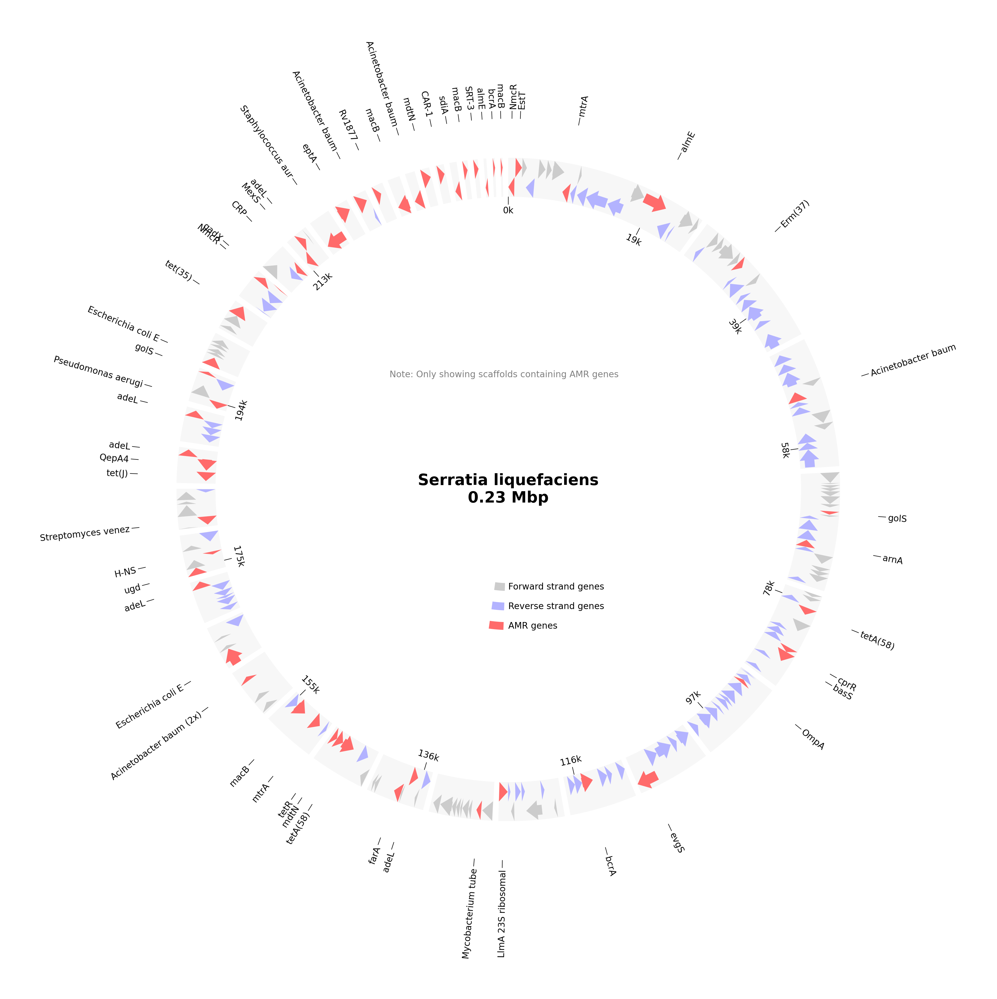

### Acinetobacter baumannii AbaF (found in 3 locations)
- **Mechanism**: antibiotic efflux
- **Drug Classes**: phosphonic acid antibiotic
- **AMR Family**: major facilitator superfamily (MFS) antibiotic efflux pump
- **Locations**:
  - gnl|SPADES|DLDDEBJH_3053_1 : position 241-1551
  - gnl|SPADES|DLDDEBJH_392_6 : position 5979-7286
  - gnl|SPADES|DLDDEBJH_4392_1 : position 117-1262

### Acinetobacter baumannii AbaQ (found in 2 locations)
- **Mechanism**: antibiotic efflux
- **Drug Classes**: fluoroquinolone antibiotic
- **AMR Family**: major facilitator superfamily (MFS) antibiotic efflux pump
- **Locations**:
  - gnl|SPADES|DLDDEBJH_959_5 : position 4592-5161
  - gnl|SPADES|DLDDEBJH_959_6 : position 5234-6526

### CAR-1
- **Mechanism**: antibiotic inactivation
- **Drug Classes**: carbapenem
- **AMR Family**: CAR beta-lactamase
- **Locations**:
  - gnl|SPADES|DLDDEBJH_4764_1 : position 220-1020

### CRP
- **Mechanism**: antibiotic efflux
- **Drug Classes**: macrolide antibiotic; fluoroquinolone antibiotic; penam
- **AMR Family**: resistance-nodulation-cell division (RND) antibiotic efflux pump
- **Locations**:
  - gnl|SPADES|DLDDEBJH_1742_3 : position 2569-3333

### Erm(37)
- **Mechanism**: antibiotic target alteration
- **Drug Classes**: macrolide antibiotic; lincosamide antibiotic; streptogramin antibiotic; streptogramin A antibiotic; streptogramin B antibiotic
- **AMR Family**: Erm 23S ribosomal RNA methyltransferase
- **Locations**:
  - gnl|SPADES|DLDDEBJH_370_7 : position 6267-7046

### Escherichia coli EF-Tu mutants conferring resistance to Enacyloxin IIa
- **Mechanism**: antibiotic target alteration
- **Drug Classes**: elfamycin antibiotic
- **AMR Family**: elfamycin resistant EF-Tu
- **Locations**:
  - gnl|SPADES|DLDDEBJH_1089_1 : position 3-2198

### Escherichia coli EF-Tu mutants conferring resistance to Pulvomycin
- **Mechanism**: antibiotic target alteration
- **Drug Classes**: elfamycin antibiotic
- **AMR Family**: elfamycin resistant EF-Tu
- **Locations**:
  - gnl|SPADES|DLDDEBJH_1540_1 : position 3-1151

### EstT
- **Mechanism**: antibiotic inactivation
- **Drug Classes**: macrolide antibiotic
- **AMR Family**: macrolide esterase
- **Locations**:
  - gnl|SPADES|DLDDEBJH_277_2 : position 936-1778

### H-NS
- **Mechanism**: antibiotic efflux
- **Drug Classes**: macrolide antibiotic; fluoroquinolone antibiotic; cephalosporin; cephamycin; penam; tetracycline antibiotic
- **AMR Family**: major facilitator superfamily (MFS) antibiotic efflux pump; resistance-nodulation-cell division (RND) antibiotic efflux pump
- **Locations**:
  - gnl|SPADES|DLDDEBJH_1183_3 : position 2148-2555

### LlmA 23S ribosomal RNA methyltransferase
- **Mechanism**: antibiotic target alteration
- **Drug Classes**: lincosamide antibiotic
- **AMR Family**: Llm 23S ribosomal RNA methyltransferase
- **Locations**:
  - gnl|SPADES|DLDDEBJH_756_8 : position 7221-8393

### MexS
- **Mechanism**: antibiotic efflux
- **Drug Classes**: fluoroquinolone antibiotic; diaminopyrimidine antibiotic; phenicol antibiotic
- **AMR Family**: resistance-nodulation-cell division (RND) antibiotic efflux pump
- **Locations**:
  - gnl|SPADES|DLDDEBJH_2074_1 : position 157-1092

### Mycobacterium tuberculosis gidB mutation conferring resistance to streptomycin
- **Mechanism**: antibiotic target alteration
- **Drug Classes**: aminoglycoside antibiotic
- **AMR Family**: antibiotic resistant gidB
- **Locations**:
  - gnl|SPADES|DLDDEBJH_778_2 : position 1529-2149

### NmcR (found in 2 locations)
- **Mechanism**: antibiotic inactivation
- **Drug Classes**: carbapenem; cephalosporin; cephamycin; penam
- **AMR Family**: NmcA beta-lactamase
- **Locations**:
  - gnl|SPADES|DLDDEBJH_1579_3 : position 2997-3851
  - gnl|SPADES|DLDDEBJH_277_1 : position 3-827

### OmpA
- **Mechanism**: reduced permeability to antibiotic
- **Drug Classes**: peptide antibiotic
- **AMR Family**: General Bacterial Porin with reduced permeability to peptide antibiotics
- **Locations**:
  - gnl|SPADES|DLDDEBJH_571_2 : position 1212-1721

### Pseudomonas aeruginosa ampR with mutation conferring resistance to aztreonam
- **Mechanism**: antibiotic target alteration; antibiotic inactivation
- **Drug Classes**: monobactam; carbapenem; cephalosporin
- **AMR Family**: PDC beta-lactamase; ampR transcriptional regulator with mutation conferring resistance to monobactam antibiotics
- **Locations**:
  - gnl|SPADES|DLDDEBJH_1439_1 : position 1-918

### QepA4
- **Mechanism**: antibiotic efflux
- **Drug Classes**: fluoroquinolone antibiotic
- **AMR Family**: major facilitator superfamily (MFS) antibiotic efflux pump
- **Locations**:
  - gnl|SPADES|DLDDEBJH_1384_4 : position 1778-3310

### Rv1877
- **Mechanism**: antibiotic efflux
- **Drug Classes**: fluoroquinolone antibiotic
- **AMR Family**: major facilitator superfamily (MFS) antibiotic efflux pump
- **Locations**:
  - gnl|SPADES|DLDDEBJH_3604_1 : position 146-943

### SRT-3
- **Mechanism**: antibiotic inactivation
- **Drug Classes**: cephalosporin
- **AMR Family**: SRT beta-lactamase
- **Locations**:
  - gnl|SPADES|DLDDEBJH_8790_1 : position 3-578

### Staphylococcus aureus mupB conferring resistance to mupirocin
- **Mechanism**: antibiotic target alteration
- **Drug Classes**: mupirocin-like antibiotic
- **AMR Family**: antibiotic-resistant isoleucyl-tRNA synthetase (ileS)
- **Locations**:
  - gnl|SPADES|DLDDEBJH_2212_1 : position 71-2812

### Streptomyces venezuelae rox
- **Mechanism**: antibiotic inactivation
- **Drug Classes**: rifamycin antibiotic
- **AMR Family**: rifampin monooxygenase
- **Locations**:
  - gnl|SPADES|DLDDEBJH_1212_1 : position 255-1388

### adeL (found in 5 locations)
- **Mechanism**: antibiotic efflux
- **Drug Classes**: fluoroquinolone antibiotic; tetracycline antibiotic
- **AMR Family**: resistance-nodulation-cell division (RND) antibiotic efflux pump
- **Locations**:
  - gnl|SPADES|DLDDEBJH_1170_6 : position 4308-5195
  - gnl|SPADES|DLDDEBJH_1384_5 : position 3486-4373
  - gnl|SPADES|DLDDEBJH_1435_5 : position 3313-4206
  - gnl|SPADES|DLDDEBJH_2074_2 : position 1196-2083
  - gnl|SPADES|DLDDEBJH_833_4 : position 1779-2690

### almE (found in 2 locations)
- **Mechanism**: antibiotic target alteration
- **Drug Classes**: peptide antibiotic
- **AMR Family**: polymyxin resistance operon; alm glycyltransferase
- **Locations**:
  - gnl|SPADES|DLDDEBJH_14863_1 : position 2-355
  - gnl|SPADES|DLDDEBJH_277_14 : position 18227-21322

### arnA
- **Mechanism**: antibiotic target alteration
- **Drug Classes**: peptide antibiotic
- **AMR Family**: pmr phosphoethanolamine transferase
- **Locations**:
  - gnl|SPADES|DLDDEBJH_428_14 : position 9197-10141

### basS
- **Mechanism**: antibiotic target alteration; antibiotic efflux
- **Drug Classes**: peptide antibiotic
- **AMR Family**: pmr phosphoethanolamine transferase
- **Locations**:
  - gnl|SPADES|DLDDEBJH_507_11 : position 8308-9666

### bcrA (found in 2 locations)
- **Mechanism**: antibiotic efflux
- **Drug Classes**: peptide antibiotic
- **AMR Family**: ATP-binding cassette (ABC) antibiotic efflux pump
- **Locations**:
  - gnl|SPADES|DLDDEBJH_15687_2 : position 85-339
  - gnl|SPADES|DLDDEBJH_738_6 : position 4665-6197

### cprR
- **Mechanism**: antibiotic target alteration; antibiotic efflux
- **Drug Classes**: peptide antibiotic
- **AMR Family**: pmr phosphoethanolamine transferase
- **Locations**:
  - gnl|SPADES|DLDDEBJH_507_10 : position 7649-8311

### eptA
- **Mechanism**: antibiotic target alteration
- **Drug Classes**: peptide antibiotic
- **AMR Family**: pmr phosphoethanolamine transferase
- **Locations**:
  - gnl|SPADES|DLDDEBJH_3049_1 : position 183-1721

### evgS
- **Mechanism**: antibiotic efflux
- **Drug Classes**: macrolide antibiotic; fluoroquinolone antibiotic; penam; tetracycline antibiotic
- **AMR Family**: major facilitator superfamily (MFS) antibiotic efflux pump; resistance-nodulation-cell division (RND) antibiotic efflux pump
- **Locations**:
  - gnl|SPADES|DLDDEBJH_670_5 : position 6644-9376

### farA
- **Mechanism**: antibiotic efflux
- **Drug Classes**: antibacterial free fatty acids
- **AMR Family**: major facilitator superfamily (MFS) antibiotic efflux pump
- **Locations**:
  - gnl|SPADES|DLDDEBJH_833_6 : position 3342-4277

### gadX
- **Mechanism**: antibiotic efflux
- **Drug Classes**: macrolide antibiotic; fluoroquinolone antibiotic; penam
- **AMR Family**: resistance-nodulation-cell division (RND) antibiotic efflux pump
- **Locations**:
  - gnl|SPADES|DLDDEBJH_1579_4 : position 3886-3990

### golS (found in 2 locations)
- **Mechanism**: antibiotic efflux
- **Drug Classes**: monobactam; carbapenem; cephalosporin; cephamycin; penam; phenicol antibiotic; penem
- **AMR Family**: resistance-nodulation-cell division (RND) antibiotic efflux pump
- **Locations**:
  - gnl|SPADES|DLDDEBJH_1439_4 : position 3920-4318
  - gnl|SPADES|DLDDEBJH_428_9 : position 5038-5469

### macB (found in 4 locations)
- **Mechanism**: antibiotic efflux
- **Drug Classes**: macrolide antibiotic
- **AMR Family**: ATP-binding cassette (ABC) antibiotic efflux pump
- **Locations**:
  - gnl|SPADES|DLDDEBJH_30413_1 : position 3-245
  - gnl|SPADES|DLDDEBJH_3644_1 : position 2-1585
  - gnl|SPADES|DLDDEBJH_7853_1 : position 1-531
  - gnl|SPADES|DLDDEBJH_932_6 : position 3833-5374

### mdtN (found in 2 locations)
- **Mechanism**: antibiotic efflux
- **Drug Classes**: nucleoside antibiotic; disinfecting agents and antiseptics
- **AMR Family**: major facilitator superfamily (MFS) antibiotic efflux pump
- **Locations**:
  - gnl|SPADES|DLDDEBJH_4706_1 : position 2-1084
  - gnl|SPADES|DLDDEBJH_891_5 : position 5013-5999

### mtrA (found in 2 locations)
- **Mechanism**: antibiotic efflux
- **Drug Classes**: macrolide antibiotic; penam
- **AMR Family**: resistance-nodulation-cell division (RND) antibiotic efflux pump
- **Locations**:
  - gnl|SPADES|DLDDEBJH_277_8 : position 7487-8401
  - gnl|SPADES|DLDDEBJH_932_4 : position 1174-2352

### sdiA
- **Mechanism**: antibiotic efflux
- **Drug Classes**: fluoroquinolone antibiotic; cephalosporin; glycylcycline; penam; tetracycline antibiotic; rifamycin antibiotic; phenicol antibiotic; disinfecting agents and antiseptics
- **AMR Family**: resistance-nodulation-cell division (RND) antibiotic efflux pump
- **Locations**:
  - gnl|SPADES|DLDDEBJH_5816_1 : position 127-864

### tet(35)
- **Mechanism**: antibiotic efflux
- **Drug Classes**: tetracycline antibiotic
- **AMR Family**: ATP-binding cassette (ABC) antibiotic efflux pump
- **Locations**:
  - gnl|SPADES|DLDDEBJH_1559_3 : position 2510-3961

### tet(J)
- **Mechanism**: antibiotic efflux
- **Drug Classes**: tetracycline antibiotic
- **AMR Family**: major facilitator superfamily (MFS) antibiotic efflux pump
- **Locations**:
  - gnl|SPADES|DLDDEBJH_1384_2 : position 337-1554

### tetA(58) (found in 2 locations)
- **Mechanism**: antibiotic efflux
- **Drug Classes**: tetracycline antibiotic
- **AMR Family**: major facilitator superfamily (MFS) antibiotic efflux pump
- **Locations**:
  - gnl|SPADES|DLDDEBJH_507_4 : position 1990-2913
  - gnl|SPADES|DLDDEBJH_891_4 : position 3272-5002

### tetR
- **Mechanism**: antibiotic target alteration; antibiotic efflux
- **Drug Classes**: tetracycline antibiotic
- **AMR Family**: major facilitator superfamily (MFS) antibiotic efflux pump
- **Locations**:
  - gnl|SPADES|DLDDEBJH_891_6 : position 6018-6707

### ugd
- **Mechanism**: antibiotic target alteration
- **Drug Classes**: peptide antibiotic
- **AMR Family**: pmr phosphoethanolamine transferase
- **Locations**:
  - gnl|SPADES|DLDDEBJH_1183_1 : position 1-921

## Serratia liquefaciens ATCC 27592
**Strain Statistics:**
- Total genome length: 4554.4 kbp
- Total scaffolds: 175
- Scaffolds with AMR genes: 98
- Total genes annotated: 8495
- Total AMR genes: 590
- Unique AMR genes: 234
- Distinct AMR mechanisms: 10
- Distinct AMR families: 84
- Distinct drug classes: 38

**Circos Plot:**

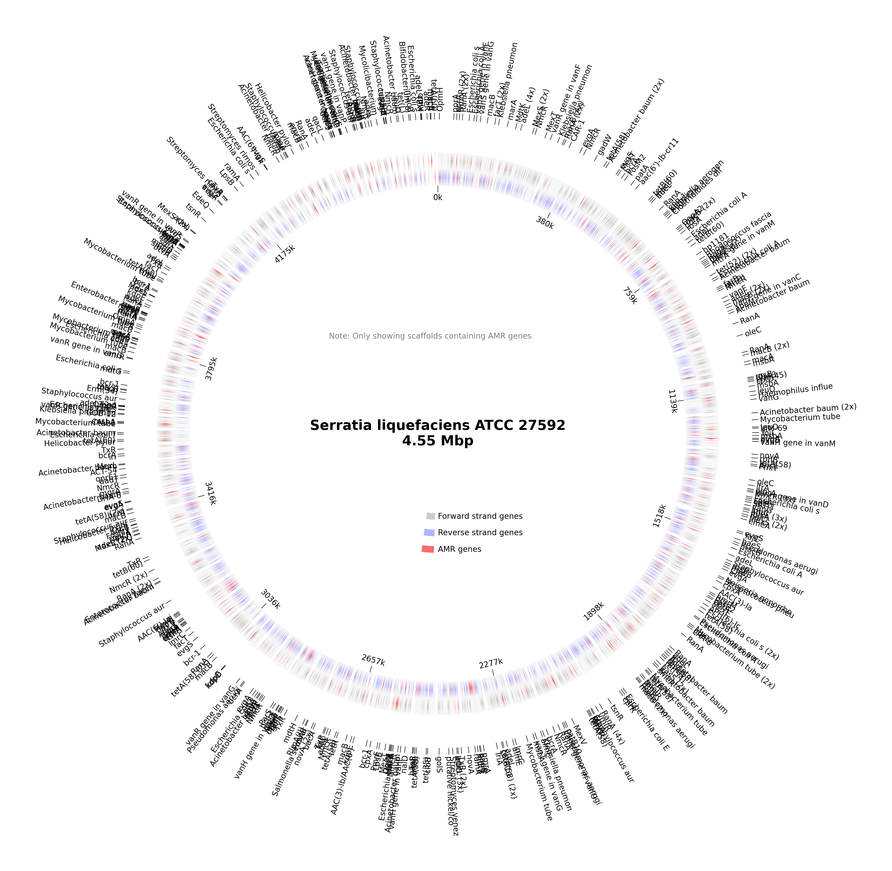

### AAC(3)-Ia
- **Mechanism**: antibiotic inactivation
- **Drug Classes**: aminoglycoside antibiotic
- **AMR Family**: AAC(3)
- **Locations**:
  - gnl|SPADES|DLDDEBJH_98_79 : position 82061-82609

### AAC(3)-Ib/AAC(6')-Ib3 bifunctional protein
- **Mechanism**: antibiotic inactivation
- **Drug Classes**: aminoglycoside antibiotic
- **AMR Family**: aminoglycoside bifunctional resistance protein
- **Locations**:
  - gnl|SPADES|DLDDEBJH_154_9 : position 6512-6964

### AAC(6')-Iai
- **Mechanism**: antibiotic inactivation
- **Drug Classes**: aminoglycoside antibiotic
- **AMR Family**: AAC(6')
- **Locations**:
  - gnl|SPADES|DLDDEBJH_180_47 : position 44362-44814

### AAC(6')-Iak
- **Mechanism**: antibiotic inactivation
- **Drug Classes**: aminoglycoside antibiotic
- **AMR Family**: AAC(6')
- **Locations**:
  - gnl|SPADES|DLDDEBJH_365_2 : position 486-932

### AAC(6')-Isa
- **Mechanism**: antibiotic inactivation
- **Drug Classes**: aminoglycoside antibiotic
- **AMR Family**: AAC(6')
- **Locations**:
  - gnl|SPADES|DLDDEBJH_163_46 : position 36637-37221

### ACT-54
- **Mechanism**: antibiotic inactivation
- **Drug Classes**: carbapenem; cephalosporin; cephamycin; penam
- **AMR Family**: ACT beta-lactamase
- **Locations**:
  - gnl|SPADES|DLDDEBJH_210_27 : position 25524-27059

### AIM-1
- **Mechanism**: antibiotic inactivation
- **Drug Classes**: cephalosporin; cephamycin; penam
- **AMR Family**: AIM beta-lactamase
- **Locations**:
  - gnl|SPADES|DLDDEBJH_180_21 : position 24299-25243

### APH(6)-Ic
- **Mechanism**: antibiotic inactivation
- **Drug Classes**: aminoglycoside antibiotic
- **AMR Family**: APH(6)
- **Locations**:
  - gnl|SPADES|DLDDEBJH_106_39 : position 35982-36836

### AQU-2
- **Mechanism**: antibiotic inactivation
- **Drug Classes**: cephalosporin
- **AMR Family**: AQU beta-lactamase
- **Locations**:
  - gnl|SPADES|DLDDEBJH_106_83 : position 80827-81936

### Acinetobacter baumannii AbaF (found in 7 locations)
- **Mechanism**: antibiotic efflux
- **Drug Classes**: phosphonic acid antibiotic
- **AMR Family**: major facilitator superfamily (MFS) antibiotic efflux pump
- **Locations**:
  - gnl|SPADES|DLDDEBJH_109_55 : position 62242-63567
  - gnl|SPADES|DLDDEBJH_210_36 : position 36397-37707
  - gnl|SPADES|DLDDEBJH_495_3 : position 1941-3443
  - gnl|SPADES|DLDDEBJH_49_22 : position 24966-26288
  - gnl|SPADES|DLDDEBJH_49_8 : position 8019-9251
  - gnl|SPADES|DLDDEBJH_637_2 : position 1820-3160
  - gnl|SPADES|DLDDEBJH_70_55 : position 52381-53763

### Acinetobacter baumannii AbaQ (found in 10 locations)
- **Mechanism**: antibiotic efflux
- **Drug Classes**: fluoroquinolone antibiotic
- **AMR Family**: major facilitator superfamily (MFS) antibiotic efflux pump
- **Locations**:
  - gnl|SPADES|DLDDEBJH_109_21 : position 23942-25237
  - gnl|SPADES|DLDDEBJH_146_23 : position 25293-26600
  - gnl|SPADES|DLDDEBJH_169_30 : position 26727-28040
  - gnl|SPADES|DLDDEBJH_204_15 : position 13840-15210
  - gnl|SPADES|DLDDEBJH_222_23 : position 27862-29124
  - gnl|SPADES|DLDDEBJH_387_2 : position 177-1577
  - gnl|SPADES|DLDDEBJH_438_10 : position 9793-11061
  - gnl|SPADES|DLDDEBJH_69_61 : position 67882-69189
  - gnl|SPADES|DLDDEBJH_85_1 : position 181-1518
  - gnl|SPADES|DLDDEBJH_85_61 : position 75094-76407

### Acinetobacter baumannii AmvA
- **Mechanism**: antibiotic efflux
- **Drug Classes**: macrolide antibiotic; disinfecting agents and antiseptics
- **AMR Family**: major facilitator superfamily (MFS) antibiotic efflux pump
- **Locations**:
  - gnl|SPADES|DLDDEBJH_184_27 : position 25185-26657

### ArnT
- **Mechanism**: antibiotic target alteration
- **Drug Classes**: peptide antibiotic
- **AMR Family**: pmr phosphoethanolamine transferase
- **Locations**:
  - gnl|SPADES|DLDDEBJH_92_31: position 33502-35166

### Bifidobacterium bifidum ileS conferring resistance to mupirocin
- **Mechanism**: antibiotic target alteration
- **Drug Classes**: mupirocin-like antibiotic
- **AMR Family**: antibiotic-resistant isoleucyl-tRNA synthetase (ileS)
- **Locations**:
  - gnl|SPADES|DLDDEBJH_675_1 : position 2-697

### CAR-1
- **Mechanism**: antibiotic inactivation
- **Drug Classes**: carbapenem
- **AMR Family**: CAR beta-lactamase
- **Locations**:
  - gnl|SPADES|DLDDEBJH_46_31 : position 33456-34262

### CAU-1
- **Mechanism**: antibiotic inactivation
- **Drug Classes**: carbapenem; penam
- **AMR Family**: CAU beta-lactamase
- **Locations**:
  - gnl|SPADES|DLDDEBJH_224_12 : position 10699-12822

### CRP
- **Mechanism**: antibiotic efflux
- **Drug Classes**: macrolide antibiotic; fluoroquinolone antibiotic; penam
- **AMR Family**: resistance-nodulation-cell division (RND) antibiotic efflux pump
- **Locations**:
  - gnl|SPADES|DLDDEBJH_98_25: position 19780-20412

### Clostridioides difficile gyrA conferring resistance to fluoroquinolones
- **Mechanism**: antibiotic target alteration
- **Drug Classes**: fluoroquinolone antibiotic
- **AMR Family**: fluoroquinolone resistant gyrA
- **Locations**:
  - gnl|SPADES|DLDDEBJH_64_75 : position 86204-88855

### Clostridioides difficile gyrB conferring resistance to fluoroquinolones
- **Mechanism**: antibiotic target alteration
- **Drug Classes**: fluoroquinolone antibiotic
- **AMR Family**: fluoroquinolone resistant gyrB
- **Locations**:
  - gnl|SPADES|DLDDEBJH_155_12 : position 13482-15377

### CrcB
- **Mechanism**: antibiotic efflux
- **Drug Classes**: aminoglycoside antibiotic
- **AMR Family**: multidrug and toxic compound extrusion (MATE) transporter
- **Locations**:
  - gnl|SPADES|DLDDEBJH_191_34 : position 30419-30802

### DHA-6
- **Mechanism**: antibiotic inactivation
- **Drug Classes**: cephalosporin; cephamycin
- **AMR Family**: DHA beta-lactamase
- **Locations**:
  - gnl|SPADES|DLDDEBJH_204_11 : position 9263-10405

### EdeQ
- **Mechanism**: antibiotic inactivation
- **Drug Classes**: peptide antibiotic; polyamine antibiotic
- **AMR Family**: Edeine acetyltransferase
- **Locations**:
  - gnl|SPADES|DLDDEBJH_320_25 : position 16566-17000

### Enterobacter cloacae acrA (found in 2 locations)
- **Mechanism**: antibiotic efflux
- **Drug Classes**: fluoroquinolone antibiotic; cephalosporin; glycylcycline; penam; tetracycline antibiotic; rifamycin antibiotic; phenicol antibiotic; disinfecting agents and antiseptics
- **AMR Family**: resistance-nodulation-cell division (RND) antibiotic efflux pump
- **Locations**:
  - gnl|SPADES|DLDDEBJH_257_19 : position 23890-25092
  - gnl|SPADES|DLDDEBJH_66_47 : position 49403-50590

### Enterococcus faecalis cls with mutation conferring resistance to daptomycin
- **Mechanism**: antibiotic target alteration
- **Drug Classes**: peptide antibiotic
- **AMR Family**: daptomycin resistant cls
- **Locations**:
  - gnl|SPADES|DLDDEBJH_184_29 : position 27824-29284

### Enterococcus faecium liaS mutant conferring daptomycin resistance
- **Mechanism**: antibiotic target alteration; antibiotic efflux
- **Drug Classes**: peptide antibiotic
- **AMR Family**: daptomycin resistant liaS
- **Locations**:
  - gnl|SPADES|DLDDEBJH_283_22 : position 22163-23698

### Erm(34)
- **Mechanism**: antibiotic target alteration
- **Drug Classes**: macrolide antibiotic; lincosamide antibiotic; streptogramin antibiotic; streptogramin A antibiotic; streptogramin B antibiotic
- **AMR Family**: Erm 23S ribosomal RNA methyltransferase
- **Locations**:
  - gnl|SPADES|DLDDEBJH_226_4 : position 4973-5599

### Escherichia coli AcrAB-TolC with AcrR mutation conferring resistance to ciprofloxacin, tetracycline, and ceftazidime (found in 5 locations)
- **Mechanism**: antibiotic target alteration; antibiotic efflux
- **Drug Classes**: fluoroquinolone antibiotic; cephalosporin; glycylcycline; penam; tetracycline antibiotic; rifamycin antibiotic; phenicol antibiotic; disinfecting agents and antiseptics
- **AMR Family**: resistance-nodulation-cell division (RND) antibiotic efflux pump
- **Locations**:
  - gnl|SPADES|DLDDEBJH_106_81 : position 79033-79635
  - gnl|SPADES|DLDDEBJH_146_36 : position 41626-42330
  - gnl|SPADES|DLDDEBJH_25_80 : position 95571-96152
  - gnl|SPADES|DLDDEBJH_66_46 : position 48571-49260
  - gnl|SPADES|DLDDEBJH_94_56 : position 64344-64931

### Escherichia coli AcrAB-TolC with MarR mutations conferring resistance to ciprofloxacin and tetracycline (found in 2 locations)
- **Mechanism**: antibiotic target alteration; antibiotic efflux
- **Drug Classes**: fluoroquinolone antibiotic; cephalosporin; glycylcycline; penam; tetracycline antibiotic; rifamycin antibiotic; phenicol antibiotic; disinfecting agents and antiseptics
- **AMR Family**: resistance-nodulation-cell division (RND) antibiotic efflux pump
- **Locations**:
  - gnl|SPADES|DLDDEBJH_106_25 : position 25528-25962
  - gnl|SPADES|DLDDEBJH_69_55 : position 62474-62947

### Escherichia coli EF-Tu mutants conferring resistance to Enacyloxin IIa
- **Mechanism**: antibiotic target alteration
- **Drug Classes**: elfamycin antibiotic
- **AMR Family**: elfamycin resistant EF-Tu
- **Locations**:
  - gnl|SPADES|DLDDEBJH_119_5 : position 4341-7028

### Escherichia coli EF-Tu mutants conferring resistance to Pulvomycin
- **Mechanism**: antibiotic target alteration
- **Drug Classes**: elfamycin antibiotic
- **AMR Family**: elfamycin resistant EF-Tu
- **Locations**:
  - gnl|SPADES|DLDDEBJH_445_9 : position 8854-10701

### Escherichia coli fabI mutations conferring resistance to isoniazid and triclosan (found in 2 locations)
- **Mechanism**: antibiotic target alteration
- **Drug Classes**: disinfecting agents and antiseptics; isoniazid-like antibiotic
- **AMR Family**: antibiotic resistant fabI
- **Locations**:
  - gnl|SPADES|DLDDEBJH_222_19 : position 23944-24699
  - gnl|SPADES|DLDDEBJH_252_18 : position 15003-15749

### Escherichia coli mdfA
- **Mechanism**: antibiotic efflux
- **Drug Classes**: tetracycline antibiotic; phenicol antibiotic; disinfecting agents and antiseptics
- **AMR Family**: major facilitator superfamily (MFS) antibiotic efflux pump
- **Locations**:
  - gnl|SPADES|DLDDEBJH_445_7 : position 7130-8377

### Escherichia coli soxS with mutation conferring antibiotic resistance (found in 9 locations)
- **Mechanism**: antibiotic target alteration; antibiotic efflux; reduced permeability to antibiotic
- **Drug Classes**: fluoroquinolone antibiotic; monobactam; carbapenem; cephalosporin; glycylcycline; cephamycin; penam; tetracycline antibiotic; rifamycin antibiotic; phenicol antibiotic; penem; disinfecting agents and antiseptics
- **AMR Family**: ATP-binding cassette (ABC) antibiotic efflux pump; major facilitator superfamily (MFS) antibiotic efflux pump; resistance-nodulation-cell division (RND) antibiotic efflux pump; General Bacterial Porin with reduced permeability to beta-lactams
- **Locations**:
  - gnl|SPADES|DLDDEBJH_106_49 : position 47210-48103
  - gnl|SPADES|DLDDEBJH_106_61 : position 59828-60745
  - gnl|SPADES|DLDDEBJH_169_43 : position 41871-42716
  - gnl|SPADES|DLDDEBJH_225_4 : position 3200-4069
  - gnl|SPADES|DLDDEBJH_236_24 : position 18528-19301
  - gnl|SPADES|DLDDEBJH_25_69 : position 82899-83357
  - gnl|SPADES|DLDDEBJH_336_17 : position 12300-13166
  - gnl|SPADES|DLDDEBJH_896_2 : position 1311-1733
  - gnl|SPADES|DLDDEBJH_93_23 : position 20798-21745

### EstT (found in 2 locations)
- **Mechanism**: antibiotic inactivation
- **Drug Classes**: macrolide antibiotic
- **AMR Family**: macrolide esterase
- **Locations**:
  - gnl|SPADES|DLDDEBJH_127_58 : position 63838-64668
  - gnl|SPADES|DLDDEBJH_169_20 : position 18294-19097

### FosA8
- **Mechanism**: antibiotic inactivation
- **Drug Classes**: phosphonic acid antibiotic
- **AMR Family**: fosfomycin thiol transferase
- **Locations**:
  - gnl|SPADES|DLDDEBJH_163_14: position 6314-6721

### FosC2
- **Mechanism**: antibiotic inactivation
- **Drug Classes**: phosphonic acid antibiotic
- **AMR Family**: fosC phosphotransferase family
- **Locations**:
  - gnl|SPADES|DLDDEBJH_106_12 : position 11508-11915

### FosM1
- **Mechanism**: antibiotic inactivation
- **Drug Classes**: phosphonic acid antibiotic
- **AMR Family**: fosfomycin thiol transferase
- **Locations**:
  - gnl|SPADES|DLDDEBJH_191_23 : position 21217-21726

### FosM2
- **Mechanism**: antibiotic inactivation
- **Drug Classes**: phosphonic acid antibiotic
- **AMR Family**: fosfomycin thiol transferase
- **Locations**:
  - gnl|SPADES|DLDDEBJH_49_54 : position 68268-68678

### GOB-12
- **Mechanism**: antibiotic inactivation
- **Drug Classes**: carbapenem; cephalosporin; penam
- **AMR Family**: GOB beta-lactamase
- **Locations**:
  - gnl|SPADES|DLDDEBJH_224_29 : position 32830-33477

### Haemophilus influenzae PBP3 conferring resistance to beta-lactam antibiotics (found in 2 locations)
- **Mechanism**: antibiotic target alteration
- **Drug Classes**: cephalosporin; cephamycin; penam
- **AMR Family**: Penicillin-binding protein mutations conferring resistance to beta-lactam antibiotics
- **Locations**:
  - gnl|SPADES|DLDDEBJH_69_11 : position 10073-11791
  - gnl|SPADES|DLDDEBJH_83_47 : position 57847-59610

### Helicobacter pylori pbp1 mutants conferring resistance to amoxicillin (found in 2 locations)
- **Mechanism**: antibiotic target alteration
- **Drug Classes**: cephalosporin; cephamycin; penam
- **AMR Family**: Penicillin-binding protein mutations conferring resistance to beta-lactam antibiotics
- **Locations**:
  - gnl|SPADES|DLDDEBJH_222_4 : position 4150-6654
  - gnl|SPADES|DLDDEBJH_405_3 : position 6700-9048

### Helicobacter pylori pbp2 mutants conferring resistance to amoxicillin
- **Mechanism**: antibiotic target alteration
- **Drug Classes**: cephalosporin; cephamycin; penam
- **AMR Family**: Penicillin-binding protein mutations conferring resistance to beta-lactam antibiotics
- **Locations**:
  - gnl|SPADES|DLDDEBJH_191_43 : position 38482-40377

### Klebsiella aerogenes Omp36
- **Mechanism**: reduced permeability to antibiotic
- **Drug Classes**: monobactam; carbapenem; cephalosporin; cephamycin; penam; penem
- **AMR Family**: General Bacterial Porin with reduced permeability to beta-lactams
- **Locations**:
  - gnl|SPADES|DLDDEBJH_64_69 : position 76285-77415

### Klebsiella pneumoniae KpnE
- **Mechanism**: antibiotic efflux
- **Drug Classes**: macrolide antibiotic; aminoglycoside antibiotic; cephalosporin; tetracycline antibiotic; peptide antibiotic; rifamycin antibiotic; disinfecting agents and antiseptics
- **AMR Family**: small multidrug resistance (SMR) antibiotic efflux pump
- **Locations**:
  - gnl|SPADES|DLDDEBJH_123_13 : position 13667-14035

### Klebsiella pneumoniae KpnF
- **Mechanism**: antibiotic efflux
- **Drug Classes**: macrolide antibiotic; aminoglycoside antibiotic; cephalosporin; tetracycline antibiotic; peptide antibiotic; rifamycin antibiotic; disinfecting agents and antiseptics
- **AMR Family**: small multidrug resistance (SMR) antibiotic efflux pump
- **Locations**:
  - gnl|SPADES|DLDDEBJH_123_14: position 14022-14351

### Klebsiella pneumoniae KpnH
- **Mechanism**: antibiotic efflux
- **Drug Classes**: macrolide antibiotic; fluoroquinolone antibiotic; aminoglycoside antibiotic; carbapenem; cephalosporin; penam; peptide antibiotic; penem
- **AMR Family**: major facilitator superfamily (MFS) antibiotic efflux pump
- **Locations**:
  - gnl|SPADES|DLDDEBJH_180_6: position 7024-8559

### Klebsiella pneumoniae OmpK37 (found in 3 locations)
- **Mechanism**: reduced permeability to antibiotic
- **Drug Classes**: monobactam; carbapenem; cephalosporin; cephamycin; penam; penem
- **AMR Family**: General Bacterial Porin with reduced permeability to beta-lactams
- **Locations**:
  - gnl|SPADES|DLDDEBJH_224_31 : position 34984-35916
  - gnl|SPADES|DLDDEBJH_25_146 : position 161808-162905
  - gnl|SPADES|DLDDEBJH_46_1 : position 35-1117

### LRA-8
- **Mechanism**: antibiotic inactivation
- **Drug Classes**: cephalosporin; penam
- **AMR Family**: subclass B3 LRA beta-lactamase
- **Locations**:
  - gnl|SPADES|DLDDEBJH_108_23 : position 20332-21087

### LpsB (found in 2 locations)
- **Mechanism**: reduced permeability to antibiotic
- **Drug Classes**: peptide antibiotic
- **AMR Family**: Intrinsic peptide antibiotic resistant Lps
- **Locations**:
  - gnl|SPADES|DLDDEBJH_150_6 : position 4649-5746
  - gnl|SPADES|DLDDEBJH_331_14 : position 16270-17478

### LptD
- **Mechanism**: antibiotic efflux
- **Drug Classes**: carbapenem; peptide antibiotic; aminocoumarin antibiotic; rifamycin antibiotic
- **AMR Family**: ATP-binding cassette (ABC) antibiotic efflux pump
- **Locations**:
  - gnl|SPADES|DLDDEBJH_83_19 : position 20260-22623

### MdtK
- **Mechanism**: antibiotic efflux
- **Drug Classes**: fluoroquinolone antibiotic
- **AMR Family**: multidrug and toxic compound extrusion (MATE) transporter
- **Locations**:
  - gnl|SPADES|DLDDEBJH_41_22 : position 22728-24191

### MexA
- **Mechanism**: antibiotic efflux
- **Drug Classes**: macrolide antibiotic; fluoroquinolone antibiotic; monobactam; carbapenem; cephalosporin; cephamycin; penam; tetracycline antibiotic; peptide antibiotic; aminocoumarin antibiotic; diaminopyrimidine antibiotic; sulfonamide antibiotic; phenicol antibiotic; penem
- **AMR Family**: resistance-nodulation-cell division (RND) antibiotic efflux pump
- **Locations**:
  - gnl|SPADES|DLDDEBJH_146_38 : position 44040-45182

### MexE
- **Mechanism**: antibiotic efflux
- **Drug Classes**: fluoroquinolone antibiotic; diaminopyrimidine antibiotic; phenicol antibiotic
- **AMR Family**: resistance-nodulation-cell division (RND) antibiotic efflux pump
- **Locations**:
  - gnl|SPADES|DLDDEBJH_106_24 : position 24250-25107

### MexG
- **Mechanism**: antibiotic efflux
- **Drug Classes**: fluoroquinolone antibiotic; tetracycline antibiotic; disinfecting agents and antiseptics
- **AMR Family**: resistance-nodulation-cell division (RND) antibiotic efflux pump
- **Locations**:
  - gnl|SPADES|DLDDEBJH_180_43 : position 41833-42246

### MexL (found in 3 locations)
- **Mechanism**: antibiotic efflux
- **Drug Classes**: macrolide antibiotic; tetracycline antibiotic; disinfecting agents and antiseptics
- **AMR Family**: resistance-nodulation-cell division (RND) antibiotic efflux pump
- **Locations**:
  - gnl|SPADES|DLDDEBJH_121_29 : position 33902-34486
  - gnl|SPADES|DLDDEBJH_169_24 : position 21690-22328
  - gnl|SPADES|DLDDEBJH_210_39 : position 39063-39719

### MexS (found in 12 locations)
- **Mechanism**: antibiotic efflux
- **Drug Classes**: fluoroquinolone antibiotic; diaminopyrimidine antibiotic; phenicol antibiotic
- **AMR Family**: resistance-nodulation-cell division (RND) antibiotic efflux pump
- **Locations**:
  - gnl|SPADES|DLDDEBJH_127_11 : position 13637-14623
  - gnl|SPADES|DLDDEBJH_191_3 : position 1436-2425
  - gnl|SPADES|DLDDEBJH_191_4 : position 2518-3453
  - gnl|SPADES|DLDDEBJH_25_44 : position 57419-58546
  - gnl|SPADES|DLDDEBJH_267_5 : position 3884-4912
  - gnl|SPADES|DLDDEBJH_297_3 : position 2611-3606
  - gnl|SPADES|DLDDEBJH_297_4 : position 3596-4615
  - gnl|SPADES|DLDDEBJH_41_108 : position 106597-107631
  - gnl|SPADES|DLDDEBJH_41_70 : position 69667-70674
  - gnl|SPADES|DLDDEBJH_70_40 : position 38771-39760
  - gnl|SPADES|DLDDEBJH_93_83 : position 74015-74995
  - gnl|SPADES|DLDDEBJH_93_93 : position 84392-85417

### MexT (found in 4 locations)
- **Mechanism**: antibiotic efflux
- **Drug Classes**: fluoroquinolone antibiotic; diaminopyrimidine antibiotic; phenicol antibiotic
- **AMR Family**: resistance-nodulation-cell division (RND) antibiotic efflux pump
- **Locations**:
  - gnl|SPADES|DLDDEBJH_146_50 : position 59197-60093
  - gnl|SPADES|DLDDEBJH_41_106 : position 104877-105806
  - gnl|SPADES|DLDDEBJH_49_36 : position 45647-46597
  - gnl|SPADES|DLDDEBJH_64_65 : position 73654-74556

### MexV
- **Mechanism**: antibiotic efflux
- **Drug Classes**: macrolide antibiotic; fluoroquinolone antibiotic; tetracycline antibiotic; phenicol antibiotic; disinfecting agents and antiseptics
- **AMR Family**: resistance-nodulation-cell division (RND) antibiotic efflux pump
- **Locations**:
  - gnl|SPADES|DLDDEBJH_122_8 : position 6665-8116

### MexZ
- **Mechanism**: antibiotic efflux
- **Drug Classes**: macrolide antibiotic; fluoroquinolone antibiotic; aminoglycoside antibiotic; carbapenem; cephalosporin; cephamycin; penam; tetracycline antibiotic; phenicol antibiotic; disinfecting agents and antiseptics
- **AMR Family**: resistance-nodulation-cell division (RND) antibiotic efflux pump
- **Locations**:
  - gnl|SPADES|DLDDEBJH_25_121 : position 136391-136957

### Mycobacterium tuberculosis inhA mutations conferring resistance to isoniazid
- **Mechanism**: antibiotic target alteration
- **Drug Classes**: isoniazid-like antibiotic
- **AMR Family**: isoniazid resistant inhA
- **Locations**:
  - gnl|SPADES|DLDDEBJH_118_1 : position 523-1281

### Mycobacterium tuberculosis kasA mutant conferring resistance to isoniazid (found in 4 locations)
- **Mechanism**: antibiotic target alteration
- **Drug Classes**: isoniazid-like antibiotic
- **AMR Family**: antibiotic resistant kasA
- **Locations**:
  - gnl|SPADES|DLDDEBJH_108_14 : position 11022-12191
  - gnl|SPADES|DLDDEBJH_108_17 : position 13386-14615
  - gnl|SPADES|DLDDEBJH_252_5 : position 2370-3611
  - gnl|SPADES|DLDDEBJH_253_19 : position 23755-25029

### Mycobacterium tuberculosis katG mutations conferring resistance to isoniazid
- **Mechanism**: antibiotic target alteration
- **Drug Classes**: isoniazid-like antibiotic
- **AMR Family**: isoniazid resistant katG
- **Locations**:
  - gnl|SPADES|DLDDEBJH_270_9 : position 11458-13656

### Mycobacterium tuberculosis ndh with mutation conferring resistance to isoniazid
- **Mechanism**: antibiotic target alteration
- **Drug Classes**: isoniazid-like antibiotic
- **AMR Family**: antibiotic resistant ndh
- **Locations**:
  - gnl|SPADES|DLDDEBJH_252_27 : position 21707-23011

### Mycobacterium tuberculosis pncA mutations conferring resistance to pyrazinamide (found in 3 locations)
- **Mechanism**: antibiotic target alteration
- **Drug Classes**: pyrazine antibiotic
- **AMR Family**: Pyrazinamide resistant pncA
- **Locations**:
  - gnl|SPADES|DLDDEBJH_123_57 : position 58843-59475
  - gnl|SPADES|DLDDEBJH_41_2 : position 1266-1952
  - gnl|SPADES|DLDDEBJH_445_4 : position 4446-4997

### Mycobacterium tuberculosis rpsA mutations conferring resistance to pyrazinamide
- **Mechanism**: antibiotic target alteration
- **Drug Classes**: pyrazine antibiotic
- **AMR Family**: pyrazinamide resistant rpsA
- **Locations**:
  - gnl|SPADES|DLDDEBJH_224_10 : position 8250-9923

### Mycobacterium tuberculosis thyA with mutation conferring resistance to para-aminosalicylic acid
- **Mechanism**: antibiotic target alteration
- **Drug Classes**: salicylic acid antibiotic
- **AMR Family**: aminosalicylate resistant thymidylate synthase
- **Locations**:
  - gnl|SPADES|DLDDEBJH_85_12 : position 18862-19656

### Mycolicibacterium smegmatis ndh with mutation conferring resistance to isoniazid
- **Mechanism**: antibiotic target alteration
- **Drug Classes**: isoniazid-like antibiotic
- **AMR Family**: antibiotic resistant ndh
- **Locations**:
  - gnl|SPADES|DLDDEBJH_528_4 : position 2886-4094

### Neisseria gonorrhoeae pilQ gene conferring resistance to beta-lactam
- **Mechanism**: antibiotic target alteration
- **Drug Classes**: cephalosporin; cephamycin; penam
- **AMR Family**: Penicillin-binding protein mutations conferring resistance to beta-lactam antibiotics
- **Locations**:
  - gnl|SPADES|DLDDEBJH_98_51 : position 48233-49474

### NmcR (found in 25 locations)
- **Mechanism**: antibiotic inactivation
- **Drug Classes**: carbapenem; cephalosporin; cephamycin; penam
- **AMR Family**: NmcA beta-lactamase
- **Locations**:
  - gnl|SPADES|DLDDEBJH_109_31 : position 35083-35976
  - gnl|SPADES|DLDDEBJH_118_22 : position 27844-28764
  - gnl|SPADES|DLDDEBJH_121_32 : position 36857-37765
  - gnl|SPADES|DLDDEBJH_122_59 : position 61782-62723
  - gnl|SPADES|DLDDEBJH_146_33 : position 38234-39100
  - gnl|SPADES|DLDDEBJH_155_5 : position 5347-6180
  - gnl|SPADES|DLDDEBJH_169_14 : position 13287-14210
  - gnl|SPADES|DLDDEBJH_180_13 : position 14447-15325
  - gnl|SPADES|DLDDEBJH_186_27 : position 29525-30379
  - gnl|SPADES|DLDDEBJH_186_7 : position 7485-8459
  - gnl|SPADES|DLDDEBJH_191_14 : position 10877-11866
  - gnl|SPADES|DLDDEBJH_204_38 : position 35252-36181
  - gnl|SPADES|DLDDEBJH_25_107 : position 123261-124148
  - gnl|SPADES|DLDDEBJH_25_43 : position 56473-57390
  - gnl|SPADES|DLDDEBJH_378_12 : position 12527-13423
  - gnl|SPADES|DLDDEBJH_41_79 : position 77102-77974
  - gnl|SPADES|DLDDEBJH_46_65 : position 76680-77633
  - gnl|SPADES|DLDDEBJH_49_15 : position 16812-17711
  - gnl|SPADES|DLDDEBJH_49_5 : position 4841-5668
  - gnl|SPADES|DLDDEBJH_509_2 : position 787-1668
  - gnl|SPADES|DLDDEBJH_621_6 : position 3538-4455
  - gnl|SPADES|DLDDEBJH_69_86 : position 98008-98898
  - gnl|SPADES|DLDDEBJH_93_10 : position 7942-8880
  - gnl|SPADES|DLDDEBJH_93_15 : position 13386-14288
  - gnl|SPADES|DLDDEBJH_93_52 : position 46820-47749

### OmpA (found in 3 locations)
- **Mechanism**: reduced permeability to antibiotic
- **Drug Classes**: peptide antibiotic
- **AMR Family**: General Bacterial Porin with reduced permeability to peptide antibiotics
- **Locations**:
  - gnl|SPADES|DLDDEBJH_225_11 : position 10423-10920
  - gnl|SPADES|DLDDEBJH_253_24 : position 28794-29870
  - gnl|SPADES|DLDDEBJH_438_6 : position 5955-6617

### OpmH
- **Mechanism**: antibiotic efflux
- **Drug Classes**: disinfecting agents and antiseptics
- **AMR Family**: resistance-nodulation-cell division (RND) antibiotic efflux pump
- **Locations**:
  - gnl|SPADES|DLDDEBJH_25_3 : position 3052-4431

### OprM
- **Mechanism**: antibiotic efflux
- **Drug Classes**: macrolide antibiotic; fluoroquinolone antibiotic; monobactam; aminoglycoside antibiotic; carbapenem; cephalosporin; cephamycin; penam; tetracycline antibiotic; peptide antibiotic; aminocoumarin antibiotic; diaminopyrimidine antibiotic; sulfonamide antibiotic; phenicol antibiotic; penem; disinfecting agents and antiseptics
- **AMR Family**: resistance-nodulation-cell division (RND) antibiotic efflux pump
- **Locations**:
  - gnl|SPADES|DLDDEBJH_146_40 : position 48339-49793

### ParR (found in 2 locations)
- **Mechanism**: antibiotic efflux; reduced permeability to antibiotic
- **Drug Classes**: macrolide antibiotic; fluoroquinolone antibiotic; monobactam; aminoglycoside antibiotic; carbapenem; cephalosporin; cephamycin; penam; tetracycline antibiotic; phenicol antibiotic; penem; disinfecting agents and antiseptics
- **AMR Family**: resistance-nodulation-cell division (RND) antibiotic efflux pump; Outer Membrane Porin (Opr)
- **Locations**:
  - gnl|SPADES|DLDDEBJH_166_41 : position 46769-47530
  - gnl|SPADES|DLDDEBJH_98_66 : position 63768-64487

### ParS (found in 3 locations)
- **Mechanism**: antibiotic efflux; reduced permeability to antibiotic
- **Drug Classes**: macrolide antibiotic; fluoroquinolone antibiotic; monobactam; aminoglycoside antibiotic; carbapenem; cephalosporin; cephamycin; penam; tetracycline antibiotic; phenicol antibiotic; penem; disinfecting agents and antiseptics
- **AMR Family**: resistance-nodulation-cell division (RND) antibiotic efflux pump; Outer Membrane Porin (Opr)
- **Locations**:
  - gnl|SPADES|DLDDEBJH_166_40 : position 45468-46772
  - gnl|SPADES|DLDDEBJH_180_19 : position 20884-22482
  - gnl|SPADES|DLDDEBJH_608_4 : position 3048-4829

### PmrF (found in 2 locations)
- **Mechanism**: antibiotic target alteration
- **Drug Classes**: peptide antibiotic
- **AMR Family**: pmr phosphoethanolamine transferase
- **Locations**:
  - gnl|SPADES|DLDDEBJH_150_11 : position 10224-11207
  - gnl|SPADES|DLDDEBJH_92_34 : position 38047-39027

### Pseudomonas aeruginosa CpxR (found in 5 locations)
- **Mechanism**: antibiotic efflux
- **Drug Classes**: macrolide antibiotic; fluoroquinolone antibiotic; monobactam; aminoglycoside antibiotic; carbapenem; cephalosporin; cephamycin; penam; tetracycline antibiotic; peptide antibiotic; aminocoumarin antibiotic; diaminopyrimidine antibiotic; sulfonamide antibiotic; phenicol antibiotic; penem
- **AMR Family**: resistance-nodulation-cell division (RND) antibiotic efflux pump
- **Locations**:
  - gnl|SPADES|DLDDEBJH_118_33 : position 39906-40586
  - gnl|SPADES|DLDDEBJH_122_28 : position 30322-30996
  - gnl|SPADES|DLDDEBJH_150_31 : position 30041-30739
  - gnl|SPADES|DLDDEBJH_180_18 : position 20186-20875
  - gnl|SPADES|DLDDEBJH_94_39 : position 46659-47399

### Pseudomonas aeruginosa ampR with mutation conferring resistance to aztreonam (found in 2 locations)
- **Mechanism**: antibiotic target alteration; antibiotic inactivation
- **Drug Classes**: monobactam; carbapenem; cephalosporin
- **AMR Family**: PDC beta-lactamase; ampR transcriptional regulator with mutation conferring resistance to monobactam antibiotics
- **Locations**:
  - gnl|SPADES|DLDDEBJH_106_78 : position 75540-76415
  - gnl|SPADES|DLDDEBJH_171_24 : position 22172-23101

### QepA2
- **Mechanism**: antibiotic efflux
- **Drug Classes**: fluoroquinolone antibiotic
- **AMR Family**: major facilitator superfamily (MFS) antibiotic efflux pump
- **Locations**:
  - gnl|SPADES|DLDDEBJH_66_13 : position 9112-10518

### QepA4
- **Mechanism**: antibiotic efflux
- **Drug Classes**: fluoroquinolone antibiotic
- **AMR Family**: major facilitator superfamily (MFS) antibiotic efflux pump
- **Locations**:
  - gnl|SPADES|DLDDEBJH_69_87 : position 98998-100293

### RanA (found in 25 locations)
- **Mechanism**: antibiotic efflux
- **Drug Classes**: aminoglycoside antibiotic
- **AMR Family**: ATP-binding cassette (ABC) antibiotic efflux pump
- **Locations**:
  - gnl|SPADES|DLDDEBJH_108_48 : position 45381-46124
  - gnl|SPADES|DLDDEBJH_109_3 : position 3275-4345
  - gnl|SPADES|DLDDEBJH_121_2 : position 1559-2674
  - gnl|SPADES|DLDDEBJH_121_21 : position 23838-24875
  - gnl|SPADES|DLDDEBJH_121_36 : position 40770-41483
  - gnl|SPADES|DLDDEBJH_121_58 : position 63357-64469
  - gnl|SPADES|DLDDEBJH_122_45 : position 47082-47855
  - gnl|SPADES|DLDDEBJH_176_17 : position 17957-19033
  - gnl|SPADES|DLDDEBJH_180_17 : position 18577-19779
  - gnl|SPADES|DLDDEBJH_184_37 : position 36896-37897
  - gnl|SPADES|DLDDEBJH_184_38 : position 37894-38910
  - gnl|SPADES|DLDDEBJH_188_32 : position 43735-44724
  - gnl|SPADES|DLDDEBJH_257_4 : position 4645-5706
  - gnl|SPADES|DLDDEBJH_25_159 : position 172479-173414
  - gnl|SPADES|DLDDEBJH_25_52 : position 63983-65860
  - gnl|SPADES|DLDDEBJH_262_6 : position 5680-7356
  - gnl|SPADES|DLDDEBJH_413_5 : position 5321-6097
  - gnl|SPADES|DLDDEBJH_46_15 : position 17763-18731
  - gnl|SPADES|DLDDEBJH_46_60 : position 71673-72509
  - gnl|SPADES|DLDDEBJH_487_7 : position 3975-4790
  - gnl|SPADES|DLDDEBJH_64_49 : position 55016-56608
  - gnl|SPADES|DLDDEBJH_69_72 : position 83218-84297
  - gnl|SPADES|DLDDEBJH_69_8 : position 8134-8895
  - gnl|SPADES|DLDDEBJH_70_74 : position 81928-82920
  - gnl|SPADES|DLDDEBJH_74_49 : position 50772-51905

### RanB
- **Mechanism**: antibiotic efflux
- **Drug Classes**: aminoglycoside antibiotic
- **AMR Family**: ATP-binding cassette (ABC) antibiotic efflux pump
- **Locations**:
  - gnl|SPADES|DLDDEBJH_487_6 : position 3188-3970

### Rhodococcus fascians cmr (found in 2 locations)
- **Mechanism**: antibiotic efflux
- **Drug Classes**: phenicol antibiotic
- **AMR Family**: major facilitator superfamily (MFS) antibiotic efflux pump
- **Locations**:
  - gnl|SPADES|DLDDEBJH_49_76 : position 92031-93458
  - gnl|SPADES|DLDDEBJH_69_1 : position 34-1212

### RlmA(II)
- **Mechanism**: antibiotic target alteration
- **Drug Classes**: macrolide antibiotic; lincosamide antibiotic
- **AMR Family**: non-erm 23S ribosomal RNA methyltransferase (G748)
- **Locations**:
  - gnl|SPADES|DLDDEBJH_163_22 : position 12762-13583

### Rv1877
- **Mechanism**: antibiotic efflux
- **Drug Classes**: fluoroquinolone antibiotic
- **AMR Family**: major facilitator superfamily (MFS) antibiotic efflux pump
- **Locations**:
  - gnl|SPADES|DLDDEBJH_146_37 : position 42374-43888

### SAT-2
- **Mechanism**: antibiotic inactivation
- **Drug Classes**: nucleoside antibiotic
- **AMR Family**: streptothricin acetyltransferase (SAT)
- **Locations**:
  - gnl|SPADES|DLDDEBJH_25_120 : position 135746-136375

### SAT-3
- **Mechanism**: antibiotic inactivation
- **Drug Classes**: nucleoside antibiotic
- **AMR Family**: streptothricin acetyltransferase (SAT)
- **Locations**:
  - gnl|SPADES|DLDDEBJH_93_39 : position 35205-35747

### SPR-1
- **Mechanism**: antibiotic inactivation
- **Drug Classes**: carbapenem
- **AMR Family**: SPR beta-lactamase
- **Locations**:
  - gnl|SPADES|DLDDEBJH_64_64 : position 72678-73574

### SRT-2
- **Mechanism**: antibiotic inactivation
- **Drug Classes**: cephalosporin
- **AMR Family**: SRT beta-lactamase
- **Locations**:
  - gnl|SPADES|DLDDEBJH_69_2 : position 1212-2381

### SRT-3
- **Mechanism**: antibiotic inactivation
- **Drug Classes**: cephalosporin
- **AMR Family**: SRT beta-lactamase
- **Locations**:
  - gnl|SPADES|DLDDEBJH_106_79 : position 76620-77756

### Salmonella serovars soxS with mutation conferring antibiotic resistance
- **Mechanism**: antibiotic target alteration; antibiotic efflux; reduced permeability to antibiotic
- **Drug Classes**: fluoroquinolone antibiotic; monobactam; carbapenem; cephalosporin; glycylcycline; cephamycin; penam; tetracycline antibiotic; rifamycin antibiotic; phenicol antibiotic; penem; disinfecting agents and antiseptics
- **AMR Family**: ATP-binding cassette (ABC) antibiotic efflux pump; major facilitator superfamily (MFS) antibiotic efflux pump; resistance-nodulation-cell division (RND) antibiotic efflux pump; General Bacterial Porin with reduced permeability to beta-lactams
- **Locations**:
  - gnl|SPADES|DLDDEBJH_163_8 : position 3798-4184

### SatA
- **Mechanism**: antibiotic inactivation
- **Drug Classes**: nucleoside antibiotic
- **AMR Family**: streptothricin acetyltransferase (SAT)
- **Locations**:
  - gnl|SPADES|DLDDEBJH_438_5 : position 5292-5687

### Staphylococcus aureus FosB
- **Mechanism**: antibiotic inactivation
- **Drug Classes**: phosphonic acid antibiotic
- **AMR Family**: fosfomycin thiol transferase
- **Locations**:
  - gnl|SPADES|DLDDEBJH_64_68 : position 75715-76131

### Staphylococcus aureus GlpT with mutation conferring resistance to fosfomycin
- **Mechanism**: antibiotic target alteration
- **Drug Classes**: phosphonic acid antibiotic
- **AMR Family**: antibiotic-resistant GlpT
- **Locations**:
  - gnl|SPADES|DLDDEBJH_182_27 : position 24025-25380

### Staphylococcus aureus fusA with mutation conferring resistance to fusidic acid (found in 3 locations)
- **Mechanism**: antibiotic target alteration
- **Drug Classes**: fusidane antibiotic
- **AMR Family**: antibiotic resistant fusA
- **Locations**:
  - gnl|SPADES|DLDDEBJH_121_22 : position 25148-27253
  - gnl|SPADES|DLDDEBJH_225_30 : position 29555-31144
  - gnl|SPADES|DLDDEBJH_98_1 : position 2-1315

### Staphylococcus aureus mupA conferring resistance to mupirocin (found in 2 locations)
- **Mechanism**: antibiotic target alteration
- **Drug Classes**: mupirocin-like antibiotic
- **AMR Family**: antibiotic-resistant isoleucyl-tRNA synthetase (ileS)
- **Locations**:
  - gnl|SPADES|DLDDEBJH_191_49 : position 43655-45595
  - gnl|SPADES|DLDDEBJH_387_13 : position 11752-14568

### Staphylococcus aureus murA with mutation conferring resistance to fosfomycin
- **Mechanism**: antibiotic target alteration
- **Drug Classes**: phosphonic acid antibiotic
- **AMR Family**: antibiotic-resistant murA transferase
- **Locations**:
  - gnl|SPADES|DLDDEBJH_487_1 : position 3-1235

### Staphylococcus aureus norA (found in 2 locations)
- **Mechanism**: antibiotic efflux
- **Drug Classes**: fluoroquinolone antibiotic
- **AMR Family**: major facilitator superfamily (MFS) antibiotic efflux pump
- **Locations**:
  - gnl|SPADES|DLDDEBJH_283_23 : position 23799-25130
  - gnl|SPADES|DLDDEBJH_608_9 : position 8498-9844

### Staphylococcus aureus pgsA mutations conferring resistance to daptomycin
- **Mechanism**: antibiotic target alteration
- **Drug Classes**: peptide antibiotic
- **AMR Family**: daptomycin resistant pgsA
- **Locations**:
  - gnl|SPADES|DLDDEBJH_495_15 : position 12365-12913

### Streptococcus pneumoniae PBP2x conferring resistance to amoxicillin
- **Mechanism**: antibiotic target alteration
- **Drug Classes**: cephalosporin; cephamycin; penam
- **AMR Family**: Penicillin-binding protein mutations conferring resistance to beta-lactam antibiotics
- **Locations**:
  - gnl|SPADES|DLDDEBJH_98_56 : position 51836-54394

### Streptomyces rimosus otr(A) (found in 2 locations)
- **Mechanism**: antibiotic target protection
- **Drug Classes**: tetracycline antibiotic
- **AMR Family**: tetracycline-resistant ribosomal protection protein
- **Locations**:
  - gnl|SPADES|DLDDEBJH_328_5 : position 3075-4898
  - gnl|SPADES|DLDDEBJH_342_2 : position 1189-2988

### Streptomyces venezuelae rox (found in 2 locations)
- **Mechanism**: antibiotic inactivation
- **Drug Classes**: rifamycin antibiotic
- **AMR Family**: rifampin monooxygenase
- **Locations**:
  - gnl|SPADES|DLDDEBJH_109_39 : position 43180-44382
  - gnl|SPADES|DLDDEBJH_127_22 : position 26496-28208

### TaeA (found in 2 locations)
- **Mechanism**: antibiotic efflux
- **Drug Classes**: pleuromutilin antibiotic
- **AMR Family**: ATP-binding cassette (ABC) antibiotic efflux pump
- **Locations**:
  - gnl|SPADES|DLDDEBJH_225_12 : position 11061-12728
  - gnl|SPADES|DLDDEBJH_253_14 : position 17770-19674

### TolC
- **Mechanism**: antibiotic efflux
- **Drug Classes**: macrolide antibiotic; fluoroquinolone antibiotic; aminoglycoside antibiotic; carbapenem; cephalosporin; glycylcycline; cephamycin; penam; tetracycline antibiotic; peptide antibiotic; aminocoumarin antibiotic; rifamycin antibiotic; phenicol antibiotic; penem; disinfecting agents and antiseptics
- **AMR Family**: ATP-binding cassette (ABC) antibiotic efflux pump; major facilitator superfamily (MFS) antibiotic efflux pump; resistance-nodulation-cell division (RND) antibiotic efflux pump
- **Locations**:
  - gnl|SPADES|DLDDEBJH_155_17 : position 18208-19710

### TriA
- **Mechanism**: antibiotic efflux
- **Drug Classes**: disinfecting agents and antiseptics
- **AMR Family**: resistance-nodulation-cell division (RND) antibiotic efflux pump
- **Locations**:
  - gnl|SPADES|DLDDEBJH_124_59 : position 63149-64120

### TxR (found in 9 locations)
- **Mechanism**: antibiotic efflux
- **Drug Classes**: tetracycline antibiotic
- **AMR Family**: ATP-binding cassette (ABC) antibiotic efflux pump
- **Locations**:
  - gnl|SPADES|DLDDEBJH_127_49 : position 55372-57438
  - gnl|SPADES|DLDDEBJH_127_5 : position 3569-5359
  - gnl|SPADES|DLDDEBJH_140_47 : position 55442-56779
  - gnl|SPADES|DLDDEBJH_155_19 : position 21154-23100
  - gnl|SPADES|DLDDEBJH_166_6 : position 3799-5370
  - gnl|SPADES|DLDDEBJH_186_40 : position 45283-46290
  - gnl|SPADES|DLDDEBJH_212_31 : position 30640-32526
  - gnl|SPADES|DLDDEBJH_271_15 : position 14625-16583
  - gnl|SPADES|DLDDEBJH_328_8 : position 8046-9458

### VIM-69
- **Mechanism**: antibiotic inactivation
- **Drug Classes**: carbapenem; cephalosporin; cephamycin; penam; penem
- **AMR Family**: VIM beta-lactamase
- **Locations**:
  - gnl|SPADES|DLDDEBJH_85_30 : position 41375-42259

### YajC
- **Mechanism**: antibiotic efflux
- **Drug Classes**: fluoroquinolone antibiotic; cephalosporin; glycylcycline; penam; tetracycline antibiotic; oxazolidinone antibiotic; glycopeptide antibiotic; rifamycin antibiotic; phenicol antibiotic; disinfecting agents and antiseptics
- **AMR Family**: resistance-nodulation-cell division (RND) antibiotic efflux pump
- **Locations**:
  - gnl|SPADES|DLDDEBJH_94_20 : position 21089-21421

### YojI
- **Mechanism**: antibiotic efflux
- **Drug Classes**: peptide antibiotic
- **AMR Family**: ATP-binding cassette (ABC) antibiotic efflux pump
- **Locations**:
  - gnl|SPADES|DLDDEBJH_85_42 : position 52588-54240

### aac(6')-Ib-cr11
- **Mechanism**: antibiotic inactivation
- **Drug Classes**: fluoroquinolone antibiotic; aminoglycoside antibiotic
- **AMR Family**: AAC(6'); AAC(6')-Ib-cr
- **Locations**:
  - gnl|SPADES|DLDDEBJH_49_86 : position 106161-106679

### aadT
- **Mechanism**: antibiotic efflux
- **Drug Classes**: macrolide antibiotic; tetracycline antibiotic; disinfecting agents and antiseptics
- **AMR Family**: major facilitator superfamily (MFS) antibiotic efflux pump
- **Locations**:
  - gnl|SPADES|DLDDEBJH_210_3 : position 2193-3404

### abeM
- **Mechanism**: antibiotic efflux
- **Drug Classes**: fluoroquinolone antibiotic; disinfecting agents and antiseptics
- **AMR Family**: multidrug and toxic compound extrusion (MATE) transporter
- **Locations**:
  - gnl|SPADES|DLDDEBJH_70_49 : position 45336-46700

### acrB
- **Mechanism**: antibiotic efflux
- **Drug Classes**: fluoroquinolone antibiotic; cephalosporin; glycylcycline; penam; tetracycline antibiotic; rifamycin antibiotic; phenicol antibiotic; disinfecting agents and antiseptics
- **AMR Family**: resistance-nodulation-cell division (RND) antibiotic efflux pump
- **Locations**:
  - gnl|SPADES|DLDDEBJH_146_39 : position 45185-48337

### adeF (found in 5 locations)
- **Mechanism**: antibiotic efflux
- **Drug Classes**: fluoroquinolone antibiotic; tetracycline antibiotic
- **AMR Family**: resistance-nodulation-cell division (RND) antibiotic efflux pump
- **Locations**:
  - gnl|SPADES|DLDDEBJH_166_23: position 20614-23799
  - gnl|SPADES|DLDDEBJH_252_30: position 24921-28064
  - gnl|SPADES|DLDDEBJH_257_18: position 20724-23897
  - gnl|SPADES|DLDDEBJH_323_14: position 15261-18374
  - gnl|SPADES|DLDDEBJH_66_48: position 50608-53754

### adeH
- **Mechanism**: antibiotic efflux
- **Drug Classes**: fluoroquinolone antibiotic; tetracycline antibiotic
- **AMR Family**: resistance-nodulation-cell division (RND) antibiotic efflux pump
- **Locations**:
  - gnl|SPADES|DLDDEBJH_495_2 : position 169-1533

### adeL (found in 49 locations)
- **Mechanism**: antibiotic efflux
- **Drug Classes**: fluoroquinolone antibiotic; tetracycline antibiotic
- **AMR Family**: resistance-nodulation-cell division (RND) antibiotic efflux pump
- **Locations**:
  - gnl|SPADES|DLDDEBJH_106_18 : position 17343-18272
  - gnl|SPADES|DLDDEBJH_106_5 : position 5887-6795
  - gnl|SPADES|DLDDEBJH_106_82 : position 79796-80725
  - gnl|SPADES|DLDDEBJH_108_19 : position 15605-16492
  - gnl|SPADES|DLDDEBJH_109_9 : position 11180-12151
  - gnl|SPADES|DLDDEBJH_118_17 : position 23308-24393
  - gnl|SPADES|DLDDEBJH_124_30 : position 36345-37253
  - gnl|SPADES|DLDDEBJH_127_10 : position 12617-13504
  - gnl|SPADES|DLDDEBJH_127_14 : position 16970-17857
  - gnl|SPADES|DLDDEBJH_127_20 : position 25374-26300
  - gnl|SPADES|DLDDEBJH_140_44 : position 52027-52950
  - gnl|SPADES|DLDDEBJH_155_11 : position 12505-13401
  - gnl|SPADES|DLDDEBJH_180_22 : position 25249-26142
  - gnl|SPADES|DLDDEBJH_180_36 : position 36513-37409
  - gnl|SPADES|DLDDEBJH_180_50 : position 46753-47688
  - gnl|SPADES|DLDDEBJH_191_18 : position 16611-17504
  - gnl|SPADES|DLDDEBJH_191_5 : position 3538-4437
  - gnl|SPADES|DLDDEBJH_225_13 : position 12759-13670
  - gnl|SPADES|DLDDEBJH_225_35 : position 34652-35596
  - gnl|SPADES|DLDDEBJH_252_16 : position 13361-14272
  - gnl|SPADES|DLDDEBJH_25_139 : position 154633-155547
  - gnl|SPADES|DLDDEBJH_262_12 : position 11960-12910
  - gnl|SPADES|DLDDEBJH_267_4 : position 2855-3775
  - gnl|SPADES|DLDDEBJH_271_20 : position 21102-22001
  - gnl|SPADES|DLDDEBJH_283_12 : position 10723-11586
  - gnl|SPADES|DLDDEBJH_297_5 : position 4643-5542
  - gnl|SPADES|DLDDEBJH_387_9 : position 8607-9530
  - gnl|SPADES|DLDDEBJH_419_7 : position 6932-7849
  - gnl|SPADES|DLDDEBJH_41_35 : position 36992-37891
  - gnl|SPADES|DLDDEBJH_41_62 : position 64185-65087
  - gnl|SPADES|DLDDEBJH_41_67 : position 66342-67274
  - gnl|SPADES|DLDDEBJH_41_88 : position 88276-89193
  - gnl|SPADES|DLDDEBJH_509_10 : position 7938-8870
  - gnl|SPADES|DLDDEBJH_64_26 : position 27040-27912
  - gnl|SPADES|DLDDEBJH_66_57 : position 58589-59521
  - gnl|SPADES|DLDDEBJH_69_3 : position 2505-3392
  - gnl|SPADES|DLDDEBJH_69_40 : position 40407-41327
  - gnl|SPADES|DLDDEBJH_70_21 : position 18724-19626
  - gnl|SPADES|DLDDEBJH_70_27 : position 24861-25778
  - gnl|SPADES|DLDDEBJH_85_29 : position 40358-41266
  - gnl|SPADES|DLDDEBJH_85_43 : position 54394-55314
  - gnl|SPADES|DLDDEBJH_85_46 : position 58447-59391
  - gnl|SPADES|DLDDEBJH_85_51 : position 62915-63811
  - gnl|SPADES|DLDDEBJH_903_1 : position 125-1042
  - gnl|SPADES|DLDDEBJH_903_6 : position 5963-6847
  - gnl|SPADES|DLDDEBJH_93_62 : position 56033-56926
  - gnl|SPADES|DLDDEBJH_93_82 : position 73004-73894
  - gnl|SPADES|DLDDEBJH_93_89 : position 79624-80559
  - gnl|SPADES|DLDDEBJH_94_77 : position 82978-83886

### adeN
- **Mechanism**: antibiotic efflux
- **Drug Classes**: macrolide antibiotic; fluoroquinolone antibiotic; lincosamide antibiotic; carbapenem; cephalosporin; tetracycline antibiotic; rifamycin antibiotic; diaminopyrimidine antibiotic; phenicol antibiotic; penem
- **AMR Family**: resistance-nodulation-cell division (RND) antibiotic efflux pump
- **Locations**:
  - gnl|SPADES|DLDDEBJH_64_67 : position 75143-75721

### adeR
- **Mechanism**: antibiotic efflux
- **Drug Classes**: glycylcycline; tetracycline antibiotic
- **AMR Family**: resistance-nodulation-cell division (RND) antibiotic efflux pump
- **Locations**:
  - gnl|SPADES|DLDDEBJH_1760_4 : position 2791-3570

### almE (found in 5 locations)
- **Mechanism**: antibiotic target alteration
- **Drug Classes**: peptide antibiotic
- **AMR Family**: polymyxin resistance operon; alm glycyltransferase
- **Locations**:
  - gnl|SPADES|DLDDEBJH_118_10 : position 10505-14449
  - gnl|SPADES|DLDDEBJH_118_3 : position 2139-3767
  - gnl|SPADES|DLDDEBJH_123_19 : position 18467-20155
  - gnl|SPADES|DLDDEBJH_124_18 : position 17785-20766
  - gnl|SPADES|DLDDEBJH_83_39 : position 49281-50972

### arlR (found in 2 locations)
- **Mechanism**: antibiotic efflux
- **Drug Classes**: fluoroquinolone antibiotic; disinfecting agents and antiseptics
- **AMR Family**: major facilitator superfamily (MFS) antibiotic efflux pump
- **Locations**:
  - gnl|SPADES|DLDDEBJH_257_20 : position 25381-26088
  - gnl|SPADES|DLDDEBJH_25_96 : position 113672-114343

### arnA (found in 2 locations)
- **Mechanism**: antibiotic target alteration
- **Drug Classes**: peptide antibiotic
- **AMR Family**: pmr phosphoethanolamine transferase
- **Locations**:
  - gnl|SPADES|DLDDEBJH_125_53 : position 63103-63741
  - gnl|SPADES|DLDDEBJH_92_33 : position 36065-38050

### bacA
- **Mechanism**: antibiotic target alteration
- **Drug Classes**: peptide antibiotic
- **AMR Family**: undecaprenyl pyrophosphate related proteins
- **Locations**:
  - gnl|SPADES|DLDDEBJH_155_44 : position 49365-50189

### baeR (found in 2 locations)
- **Mechanism**: antibiotic efflux
- **Drug Classes**: aminoglycoside antibiotic; aminocoumarin antibiotic
- **AMR Family**: resistance-nodulation-cell division (RND) antibiotic efflux pump
- **Locations**:
  - gnl|SPADES|DLDDEBJH_125_33 : position 29230-29946
  - gnl|SPADES|DLDDEBJH_94_34 : position 38781-39470

### baeS (found in 4 locations)
- **Mechanism**: antibiotic efflux
- **Drug Classes**: aminoglycoside antibiotic; aminocoumarin antibiotic
- **AMR Family**: resistance-nodulation-cell division (RND) antibiotic efflux pump
- **Locations**:
  - gnl|SPADES|DLDDEBJH_125_34 : position 29946-31328
  - gnl|SPADES|DLDDEBJH_140_49 : position 57648-59084
  - gnl|SPADES|DLDDEBJH_257_21 : position 26088-27542
  - gnl|SPADES|DLDDEBJH_94_33 : position 37440-38756

### basS (found in 4 locations)
- **Mechanism**: antibiotic target alteration; antibiotic efflux
- **Drug Classes**: peptide antibiotic
- **AMR Family**: pmr phosphoethanolamine transferase
- **Locations**:
  - gnl|SPADES|DLDDEBJH_109_46 : position 54594-56000
  - gnl|SPADES|DLDDEBJH_109_63 : position 68464-69882
  - gnl|SPADES|DLDDEBJH_119_17 : position 18417-19481
  - gnl|SPADES|DLDDEBJH_122_29 : position 30983-32401

### bcr-1 (found in 9 locations)
- **Mechanism**: antibiotic efflux
- **Drug Classes**: bicyclomycin-like antibiotic
- **AMR Family**: major facilitator superfamily (MFS) antibiotic efflux pump
- **Locations**:
  - gnl|SPADES|DLDDEBJH_106_4 : position 4552-5763
  - gnl|SPADES|DLDDEBJH_150_41 : position 38815-39999
  - gnl|SPADES|DLDDEBJH_166_35 : position 40059-41207
  - gnl|SPADES|DLDDEBJH_176_43 : position 45364-46560
  - gnl|SPADES|DLDDEBJH_191_31 : position 28328-29518
  - gnl|SPADES|DLDDEBJH_226_24 : position 24259-25605
  - gnl|SPADES|DLDDEBJH_267_22 : position 20575-21996
  - gnl|SPADES|DLDDEBJH_438_2 : position 1145-2485
  - gnl|SPADES|DLDDEBJH_64_51 : position 57565-58773

### bcrA (found in 10 locations)
- **Mechanism**: antibiotic efflux
- **Drug Classes**: peptide antibiotic
- **AMR Family**: ATP-binding cassette (ABC) antibiotic efflux pump
- **Locations**:
  - gnl|SPADES|DLDDEBJH_123_4 : position 2585-3343
  - gnl|SPADES|DLDDEBJH_171_21 : position 19166-19798
  - gnl|SPADES|DLDDEBJH_197_20 : position 16770-17837
  - gnl|SPADES|DLDDEBJH_212_22 : position 18347-19045
  - gnl|SPADES|DLDDEBJH_257_10 : position 10750-11505
  - gnl|SPADES|DLDDEBJH_25_37 : position 48955-50463
  - gnl|SPADES|DLDDEBJH_267_20 : position 17743-19281
  - gnl|SPADES|DLDDEBJH_282_15 : position 13554-15038
  - gnl|SPADES|DLDDEBJH_49_46 : position 58047-59546
  - gnl|SPADES|DLDDEBJH_69_15 : position 15511-16458

### catB10 (found in 2 locations)
- **Mechanism**: antibiotic inactivation
- **Drug Classes**: phenicol antibiotic
- **AMR Family**: chloramphenicol acetyltransferase (CAT)
- **Locations**:
  - gnl|SPADES|DLDDEBJH_122_23 : position 25856-26485
  - gnl|SPADES|DLDDEBJH_124_45 : position 49216-49818

### clbB
- **Mechanism**: antibiotic target alteration
- **Drug Classes**: lincosamide antibiotic; streptogramin antibiotic; streptogramin A antibiotic; oxazolidinone antibiotic; phenicol antibiotic; pleuromutilin antibiotic
- **AMR Family**: Cfr 23S ribosomal RNA methyltransferase
- **Locations**:
  - gnl|SPADES|DLDDEBJH_140_13 : position 17883-19079

### cmlv (found in 7 locations)
- **Mechanism**: antibiotic inactivation
- **Drug Classes**: phenicol antibiotic
- **AMR Family**: chloramphenicol phosphotransferase
- **Locations**:
  - gnl|SPADES|DLDDEBJH_106_80 : position 77802-78956
  - gnl|SPADES|DLDDEBJH_108_20 : position 16599-17774
  - gnl|SPADES|DLDDEBJH_169_33 : position 29563-30735
  - gnl|SPADES|DLDDEBJH_270_11 : position 15399-16589
  - gnl|SPADES|DLDDEBJH_85_28 : position 38886-40040
  - gnl|SPADES|DLDDEBJH_903_4 : position 3148-4341
  - gnl|SPADES|DLDDEBJH_93_63 : position 57142-58326

### cmx (found in 2 locations)
- **Mechanism**: antibiotic efflux
- **Drug Classes**: phenicol antibiotic
- **AMR Family**: major facilitator superfamily (MFS) antibiotic efflux pump
- **Locations**:
  - gnl|SPADES|DLDDEBJH_180_12 : position 13146-14345
  - gnl|SPADES|DLDDEBJH_903_2 : position 1146-2342

### cprR (found in 2 locations)
- **Mechanism**: antibiotic target alteration; antibiotic efflux
- **Drug Classes**: peptide antibiotic
- **AMR Family**: pmr phosphoethanolamine transferase
- **Locations**:
  - gnl|SPADES|DLDDEBJH_109_47 : position 55997-56665
  - gnl|SPADES|DLDDEBJH_119_16 : position 17758-18420

### cpxA (found in 7 locations)
- **Mechanism**: antibiotic efflux
- **Drug Classes**: aminoglycoside antibiotic; aminocoumarin antibiotic
- **AMR Family**: resistance-nodulation-cell division (RND) antibiotic efflux pump
- **Locations**:
  - gnl|SPADES|DLDDEBJH_118_32 : position 38584-39906
  - gnl|SPADES|DLDDEBJH_150_30 : position 28671-30044
  - gnl|SPADES|DLDDEBJH_154_15 : position 13730-15196
  - gnl|SPADES|DLDDEBJH_328_7 : position 6988-8037
  - gnl|SPADES|DLDDEBJH_93_28 : position 25026-26351
  - gnl|SPADES|DLDDEBJH_94_46 : position 53781-56393
  - gnl|SPADES|DLDDEBJH_98_65 : position 62401-63771

### dfrA3
- **Mechanism**: antibiotic target replacement
- **Drug Classes**: diaminopyrimidine antibiotic
- **AMR Family**: trimethoprim resistant dihydrofolate reductase dfr
- **Locations**:
  - gnl|SPADES|DLDDEBJH_83_12 : position 13256-13738

### efrB
- **Mechanism**: antibiotic efflux
- **Drug Classes**: macrolide antibiotic; fluoroquinolone antibiotic; rifamycin antibiotic
- **AMR Family**: ATP-binding cassette (ABC) antibiotic efflux pump
- **Locations**:
  - gnl|SPADES|DLDDEBJH_25_5 : position 5820-7586

### emeA
- **Mechanism**: antibiotic efflux
- **Drug Classes**: disinfecting agents and antiseptics
- **AMR Family**: multidrug and toxic compound extrusion (MATE) transporter
- **Locations**:
  - gnl|SPADES|DLDDEBJH_93_91 : position 81768-83126

### emrA (found in 2 locations)
- **Mechanism**: antibiotic efflux
- **Drug Classes**: fluoroquinolone antibiotic
- **AMR Family**: major facilitator superfamily (MFS) antibiotic efflux pump
- **Locations**:
  - gnl|SPADES|DLDDEBJH_180_7 : position 8577-9749
  - gnl|SPADES|DLDDEBJH_93_2 : position 207-1235

### emrB
- **Mechanism**: antibiotic efflux
- **Drug Classes**: fluoroquinolone antibiotic
- **AMR Family**: major facilitator superfamily (MFS) antibiotic efflux pump
- **Locations**:
  - gnl|SPADES|DLDDEBJH_409_13 : position 13659-15074

### emrR (found in 2 locations)
- **Mechanism**: antibiotic efflux
- **Drug Classes**: fluoroquinolone antibiotic
- **AMR Family**: major facilitator superfamily (MFS) antibiotic efflux pump
- **Locations**:
  - gnl|SPADES|DLDDEBJH_180_9 : position 11251-11772
  - gnl|SPADES|DLDDEBJH_241_11 : position 13009-13557

### emrY (found in 2 locations)
- **Mechanism**: antibiotic efflux
- **Drug Classes**: tetracycline antibiotic
- **AMR Family**: major facilitator superfamily (MFS) antibiotic efflux pump
- **Locations**:
  - gnl|SPADES|DLDDEBJH_125_35 : position 31328-32758
  - gnl|SPADES|DLDDEBJH_93_3 : position 1238-2842

### eptA
- **Mechanism**: antibiotic target alteration
- **Drug Classes**: peptide antibiotic
- **AMR Family**: pmr phosphoethanolamine transferase
- **Locations**:
  - gnl|SPADES|DLDDEBJH_106_16 : position 14771-16408

### eptB (found in 2 locations)
- **Mechanism**: antibiotic target alteration
- **Drug Classes**: peptide antibiotic
- **AMR Family**: pmr phosphoethanolamine transferase
- **Locations**:
  - gnl|SPADES|DLDDEBJH_283_20 : position 19512-21206
  - gnl|SPADES|DLDDEBJH_495_5 : position 3905-5557

### erm(45)
- **Mechanism**: antibiotic target alteration
- **Drug Classes**: macrolide antibiotic; lincosamide antibiotic; streptogramin antibiotic; streptogramin B antibiotic
- **AMR Family**: Erm 23S ribosomal RNA methyltransferase
- **Locations**:
  - gnl|SPADES|DLDDEBJH_83_16 : position 17106-17924

### evgA (found in 10 locations)
- **Mechanism**: antibiotic efflux
- **Drug Classes**: macrolide antibiotic; fluoroquinolone antibiotic; penam; tetracycline antibiotic
- **AMR Family**: major facilitator superfamily (MFS) antibiotic efflux pump; resistance-nodulation-cell division (RND) antibiotic efflux pump
- **Locations**:
  - gnl|SPADES|DLDDEBJH_169_54 : position 50216-50872
  - gnl|SPADES|DLDDEBJH_197_41 : position 37817-38422
  - gnl|SPADES|DLDDEBJH_283_21 : position 21573-22163
  - gnl|SPADES|DLDDEBJH_323_16 : position 18960-19592
  - gnl|SPADES|DLDDEBJH_46_54 : position 65218-65868
  - gnl|SPADES|DLDDEBJH_608_3 : position 2419-3051
  - gnl|SPADES|DLDDEBJH_85_58 : position 68015-68641
  - gnl|SPADES|DLDDEBJH_93_29 : position 26351-26971
  - gnl|SPADES|DLDDEBJH_94_17 : position 17568-18167
  - gnl|SPADES|DLDDEBJH_98_31 : position 27033-27758

### evgS (found in 10 locations)
- **Mechanism**: antibiotic efflux
- **Drug Classes**: macrolide antibiotic; fluoroquinolone antibiotic; penam; tetracycline antibiotic
- **AMR Family**: major facilitator superfamily (MFS) antibiotic efflux pump; resistance-nodulation-cell division (RND) antibiotic efflux pump
- **Locations**:
  - gnl|SPADES|DLDDEBJH_177_13 : position 15442-17781
  - gnl|SPADES|DLDDEBJH_197_42 : position 38419-41634
  - gnl|SPADES|DLDDEBJH_292_2 : position 3398-6139
  - gnl|SPADES|DLDDEBJH_365_4 : position 1398-2690
  - gnl|SPADES|DLDDEBJH_41_121 : position 121143-121532
  - gnl|SPADES|DLDDEBJH_49_31 : position 40353-42137
  - gnl|SPADES|DLDDEBJH_64_72 : position 79773-82475
  - gnl|SPADES|DLDDEBJH_64_74 : position 83169-85970
  - gnl|SPADES|DLDDEBJH_85_59 : position 69331-73710
  - gnl|SPADES|DLDDEBJH_94_16 : position 15836-17590

### facT (found in 4 locations)
- **Mechanism**: antibiotic efflux
- **Drug Classes**: elfamycin antibiotic
- **AMR Family**: major facilitator superfamily (MFS) antibiotic efflux pump
- **Locations**:
  - gnl|SPADES|DLDDEBJH_177_34 : position 34123-35421
  - gnl|SPADES|DLDDEBJH_25_136 : position 151566-152990
  - gnl|SPADES|DLDDEBJH_25_140 : position 155661-157013
  - gnl|SPADES|DLDDEBJH_271_2 : position 1056-2492

### farB
- **Mechanism**: antibiotic efflux
- **Drug Classes**: antibacterial free fatty acids
- **AMR Family**: major facilitator superfamily (MFS) antibiotic efflux pump
- **Locations**:
  - gnl|SPADES|DLDDEBJH_69_76 : position 88479-89921

### floR
- **Mechanism**: antibiotic efflux
- **Drug Classes**: phenicol antibiotic
- **AMR Family**: major facilitator superfamily (MFS) antibiotic efflux pump
- **Locations**:
  - gnl|SPADES|DLDDEBJH_123_35 : position 35144-36337

### gadW
- **Mechanism**: antibiotic efflux
- **Drug Classes**: macrolide antibiotic; fluoroquinolone antibiotic; penam
- **AMR Family**: resistance-nodulation-cell division (RND) antibiotic efflux pump
- **Locations**:
  - gnl|SPADES|DLDDEBJH_46_92 : position 109917-110783

### golS (found in 4 locations)
- **Mechanism**: antibiotic efflux
- **Drug Classes**: monobactam; carbapenem; cephalosporin; cephamycin; penam; phenicol antibiotic; penem
- **AMR Family**: resistance-nodulation-cell division (RND) antibiotic efflux pump
- **Locations**:
  - gnl|SPADES|DLDDEBJH_127_57 : position 63257-63661
  - gnl|SPADES|DLDDEBJH_166_19 : position 15642-16142
  - gnl|SPADES|DLDDEBJH_66_22 : position 19416-19817
  - gnl|SPADES|DLDDEBJH_93_34 : position 29762-30787

### hmrM
- **Mechanism**: antibiotic efflux
- **Drug Classes**: fluoroquinolone antibiotic; disinfecting agents and antiseptics
- **AMR Family**: multidrug and toxic compound extrusion (MATE) transporter
- **Locations**:
  - gnl|SPADES|DLDDEBJH_106_1 : position 244-1620

### hp1181
- **Mechanism**: antibiotic efflux
- **Drug Classes**: fluoroquinolone antibiotic; tetracycline antibiotic; nitroimidazole antibiotic
- **AMR Family**: major facilitator superfamily (MFS) antibiotic efflux pump
- **Locations**:
  - gnl|SPADES|DLDDEBJH_66_91 : position 97516-98880

### iri
- **Mechanism**: antibiotic inactivation
- **Drug Classes**: rifamycin antibiotic
- **AMR Family**: rifampin monooxygenase
- **Locations**:
  - gnl|SPADES|DLDDEBJH_212_15 : position 12903-14117

### kdpD
- **Mechanism**: antibiotic efflux
- **Drug Classes**: aminoglycoside antibiotic
- **AMR Family**: kdpDE
- **Locations**:
  - gnl|SPADES|DLDDEBJH_175_23 : position 25529-28222

### kdpE (found in 3 locations)
- **Mechanism**: antibiotic efflux
- **Drug Classes**: aminoglycoside antibiotic
- **AMR Family**: kdpDE
- **Locations**:
  - gnl|SPADES|DLDDEBJH_154_14 : position 13062-13733
  - gnl|SPADES|DLDDEBJH_175_24 : position 28241-28930
  - gnl|SPADES|DLDDEBJH_262_24 : position 23870-24556

### leuO (found in 4 locations)
- **Mechanism**: antibiotic efflux
- **Drug Classes**: nucleoside antibiotic; disinfecting agents and antiseptics
- **AMR Family**: major facilitator superfamily (MFS) antibiotic efflux pump
- **Locations**:
  - gnl|SPADES|DLDDEBJH_127_13 : position 15724-16644
  - gnl|SPADES|DLDDEBJH_637_5 : position 6105-7001
  - gnl|SPADES|DLDDEBJH_83_38 : position 47761-48708
  - gnl|SPADES|DLDDEBJH_85_27 : position 37973-38896

### lfrA
- **Mechanism**: antibiotic efflux
- **Drug Classes**: fluoroquinolone antibiotic
- **AMR Family**: major facilitator superfamily (MFS) antibiotic efflux pump
- **Locations**:
  - gnl|SPADES|DLDDEBJH_92_89 : position 89401-90861

### lmrB
- **Mechanism**: antibiotic efflux
- **Drug Classes**: lincosamide antibiotic; nucleoside antibiotic
- **AMR Family**: ATP-binding cassette (ABC) antibiotic efflux pump
- **Locations**:
  - gnl|SPADES|DLDDEBJH_180_35 : position 35024-36406

### lmrC (found in 3 locations)
- **Mechanism**: antibiotic target protection
- **Drug Classes**: lincosamide antibiotic
- **AMR Family**: Miscellaneous ABC-F subfamily ATP-binding cassette ribosomal protection proteins
- **Locations**:
  - gnl|SPADES|DLDDEBJH_124_12 : position 12322-13110
  - gnl|SPADES|DLDDEBJH_177_46 : position 48339-49898
  - gnl|SPADES|DLDDEBJH_93_56 : position 52378-53157

### macA (found in 3 locations)
- **Mechanism**: antibiotic efflux
- **Drug Classes**: macrolide antibiotic
- **AMR Family**: ATP-binding cassette (ABC) antibiotic efflux pump
- **Locations**:
  - gnl|SPADES|DLDDEBJH_118_34 : position 40761-41954
  - gnl|SPADES|DLDDEBJH_1850_1 : position 392-1576
  - gnl|SPADES|DLDDEBJH_74_73 : position 76641-77720

### macB (found in 32 locations)
- **Mechanism**: antibiotic efflux
- **Drug Classes**: macrolide antibiotic
- **AMR Family**: ATP-binding cassette (ABC) antibiotic efflux pump
- **Locations**:
  - gnl|SPADES|DLDDEBJH_118_35 : position 41954-43909
  - gnl|SPADES|DLDDEBJH_118_37 : position 44879-45967
  - gnl|SPADES|DLDDEBJH_123_40 : position 41111-41920
  - gnl|SPADES|DLDDEBJH_154_25 : position 26094-26798
  - gnl|SPADES|DLDDEBJH_176_2 : position 1118-1789
  - gnl|SPADES|DLDDEBJH_1850_2 : position 1573-3402
  - gnl|SPADES|DLDDEBJH_186_33 : position 37720-38712
  - gnl|SPADES|DLDDEBJH_188_33 : position 44721-45701
  - gnl|SPADES|DLDDEBJH_191_24 : position 21757-22584
  - gnl|SPADES|DLDDEBJH_197_10 : position 7868-8578
  - gnl|SPADES|DLDDEBJH_226_12 : position 11125-11847
  - gnl|SPADES|DLDDEBJH_241_30 : position 30451-31482
  - gnl|SPADES|DLDDEBJH_253_5 : position 8122-8898
  - gnl|SPADES|DLDDEBJH_25_117 : position 131639-132361
  - gnl|SPADES|DLDDEBJH_409_8 : position 8278-9783
  - gnl|SPADES|DLDDEBJH_46_11 : position 13312-14448
  - gnl|SPADES|DLDDEBJH_46_16 : position 18721-19707
  - gnl|SPADES|DLDDEBJH_46_59 : position 71005-71676
  - gnl|SPADES|DLDDEBJH_46_82 : position 100921-101673
  - gnl|SPADES|DLDDEBJH_495_1 : position 1-165
  - gnl|SPADES|DLDDEBJH_64_22 : position 21988-22776
  - gnl|SPADES|DLDDEBJH_66_15 : position 13354-14040
  - gnl|SPADES|DLDDEBJH_66_53 : position 56201-56923
  - gnl|SPADES|DLDDEBJH_675_5 : position 3712-4437
  - gnl|SPADES|DLDDEBJH_70_30 : position 27532-30363
  - gnl|SPADES|DLDDEBJH_70_60 : position 58172-59281
  - gnl|SPADES|DLDDEBJH_74_58 : position 58823-59551
  - gnl|SPADES|DLDDEBJH_74_74 : position 77720-79666
  - gnl|SPADES|DLDDEBJH_93_80 : position 71253-72278
  - gnl|SPADES|DLDDEBJH_93_94 : position 85538-86371
  - gnl|SPADES|DLDDEBJH_94_45 : position 52119-53639
  - gnl|SPADES|DLDDEBJH_98_17 : position 13211-13978

### marA (found in 4 locations)
- **Mechanism**: antibiotic efflux; reduced permeability to antibiotic
- **Drug Classes**: fluoroquinolone antibiotic; monobactam; carbapenem; cephalosporin; glycylcycline; cephamycin; penam; tetracycline antibiotic; rifamycin antibiotic; phenicol antibiotic; penem; disinfecting agents and antiseptics
- **AMR Family**: resistance-nodulation-cell division (RND) antibiotic efflux pump; General Bacterial Porin with reduced permeability to beta-lactams
- **Locations**:
  - gnl|SPADES|DLDDEBJH_180_38 : position 38545-39552
  - gnl|SPADES|DLDDEBJH_252_32 : position 29571-29927
  - gnl|SPADES|DLDDEBJH_257_7 : position 7682-8656
  - gnl|SPADES|DLDDEBJH_41_1 : position 141-1103

### mdsC
- **Mechanism**: antibiotic efflux
- **Drug Classes**: monobactam; carbapenem; cephalosporin; cephamycin; penam; phenicol antibiotic; penem
- **AMR Family**: resistance-nodulation-cell division (RND) antibiotic efflux pump
- **Locations**:
  - gnl|SPADES|DLDDEBJH_257_17 : position 19324-20727

### mdtA
- **Mechanism**: antibiotic efflux
- **Drug Classes**: aminocoumarin antibiotic
- **AMR Family**: resistance-nodulation-cell division (RND) antibiotic efflux pump
- **Locations**:
  - gnl|SPADES|DLDDEBJH_125_38 : position 38965-40212

### mdtB
- **Mechanism**: antibiotic efflux
- **Drug Classes**: aminocoumarin antibiotic
- **AMR Family**: resistance-nodulation-cell division (RND) antibiotic efflux pump
- **Locations**:
  - gnl|SPADES|DLDDEBJH_125_37 : position 35846-38965

### mdtC (found in 2 locations)
- **Mechanism**: antibiotic efflux
- **Drug Classes**: aminocoumarin antibiotic
- **AMR Family**: resistance-nodulation-cell division (RND) antibiotic efflux pump
- **Locations**:
  - gnl|SPADES|DLDDEBJH_122_9 : position 8113-11232
  - gnl|SPADES|DLDDEBJH_125_36 : position 32769-35849

### mdtG (found in 2 locations)
- **Mechanism**: antibiotic efflux
- **Drug Classes**: phosphonic acid antibiotic
- **AMR Family**: major facilitator superfamily (MFS) antibiotic efflux pump
- **Locations**:
  - gnl|SPADES|DLDDEBJH_236_18 : position 13522-14760
  - gnl|SPADES|DLDDEBJH_69_23 : position 23807-25003

### mdtH
- **Mechanism**: antibiotic efflux
- **Drug Classes**: fluoroquinolone antibiotic
- **AMR Family**: major facilitator superfamily (MFS) antibiotic efflux pump
- **Locations**:
  - gnl|SPADES|DLDDEBJH_163_45 : position 35086-36291

### mdtP
- **Mechanism**: antibiotic efflux
- **Drug Classes**: nucleoside antibiotic; disinfecting agents and antiseptics
- **AMR Family**: major facilitator superfamily (MFS) antibiotic efflux pump
- **Locations**:
  - gnl|SPADES|DLDDEBJH_180_8 : position 9775-11226

### mecC
- **Mechanism**: antibiotic target replacement
- **Drug Classes**: penam
- **AMR Family**: methicillin resistant PBP2
- **Locations**:
  - gnl|SPADES|DLDDEBJH_69_12 : position 11894-13819

### mexP
- **Mechanism**: antibiotic efflux
- **Drug Classes**: macrolide antibiotic; carbapenem; tetracycline antibiotic; diaminopyrimidine antibiotic; phenicol antibiotic; disinfecting agents and antiseptics
- **AMR Family**: resistance-nodulation-cell division (RND) antibiotic efflux pump
- **Locations**:
  - gnl|SPADES|DLDDEBJH_166_24 : position 23799-24953

### mgrA (found in 2 locations)
- **Mechanism**: antibiotic efflux
- **Drug Classes**: fluoroquinolone antibiotic; cephalosporin; penam; tetracycline antibiotic; peptide antibiotic; disinfecting agents and antiseptics
- **AMR Family**: ATP-binding cassette (ABC) antibiotic efflux pump; major facilitator superfamily (MFS) antibiotic efflux pump
- **Locations**:
  - gnl|SPADES|DLDDEBJH_204_23 : position 21649-22101
  - gnl|SPADES|DLDDEBJH_283_18 : position 18241-18705

### mphH
- **Mechanism**: antibiotic inactivation
- **Drug Classes**: macrolide antibiotic
- **AMR Family**: macrolide phosphotransferase (MPH)
- **Locations**:
  - gnl|SPADES|DLDDEBJH_282_28 : position 24236-25147

### mreA
- **Mechanism**: antibiotic efflux
- **Drug Classes**: macrolide antibiotic
- **AMR Family**: major facilitator superfamily (MFS) antibiotic efflux pump
- **Locations**:
  - gnl|SPADES|DLDDEBJH_387_14 : position 14725-15663

### msbA (found in 6 locations)
- **Mechanism**: antibiotic efflux
- **Drug Classes**: nitroimidazole antibiotic
- **AMR Family**: ATP-binding cassette (ABC) antibiotic efflux pump
- **Locations**:
  - gnl|SPADES|DLDDEBJH_123_39 : position 40315-41106
  - gnl|SPADES|DLDDEBJH_224_13 : position 12858-14606
  - gnl|SPADES|DLDDEBJH_74_80 : position 84238-85974
  - gnl|SPADES|DLDDEBJH_83_27 : position 33400-34161
  - gnl|SPADES|DLDDEBJH_85_48 : position 59972-61738
  - gnl|SPADES|DLDDEBJH_92_36 : position 40569-41324

### mtrA (found in 4 locations)
- **Mechanism**: antibiotic efflux
- **Drug Classes**: macrolide antibiotic; penam
- **AMR Family**: resistance-nodulation-cell division (RND) antibiotic efflux pump
- **Locations**:
  - gnl|SPADES|DLDDEBJH_121_24 : position 28355-29182
  - gnl|SPADES|DLDDEBJH_41_23 : position 24195-25052
  - gnl|SPADES|DLDDEBJH_69_27 : position 26757-27626
  - gnl|SPADES|DLDDEBJH_93_67 : position 61283-62095

### nalC
- **Mechanism**: antibiotic efflux
- **Drug Classes**: macrolide antibiotic; fluoroquinolone antibiotic; monobactam; carbapenem; cephalosporin; cephamycin; penam; tetracycline antibiotic; peptide antibiotic; aminocoumarin antibiotic; diaminopyrimidine antibiotic; sulfonamide antibiotic; phenicol antibiotic; penem
- **AMR Family**: resistance-nodulation-cell division (RND) antibiotic efflux pump
- **Locations**:
  - gnl|SPADES|DLDDEBJH_93_77 : position 69057-69701

### nalD
- **Mechanism**: antibiotic efflux
- **Drug Classes**: macrolide antibiotic; fluoroquinolone antibiotic; monobactam; carbapenem; cephalosporin; cephamycin; penam; tetracycline antibiotic; peptide antibiotic; aminocoumarin antibiotic; diaminopyrimidine antibiotic; sulfonamide antibiotic; phenicol antibiotic; penem
- **AMR Family**: resistance-nodulation-cell division (RND) antibiotic efflux pump
- **Locations**:
  - gnl|SPADES|DLDDEBJH_146_7 : position 6939-7580

### norA
- **Mechanism**: antibiotic efflux
- **Drug Classes**: fluoroquinolone antibiotic; disinfecting agents and antiseptics
- **AMR Family**: major facilitator superfamily (MFS) antibiotic efflux pump
- **Locations**:
  - gnl|SPADES|DLDDEBJH_25_30 : position 41561-42784

### novA (found in 6 locations)
- **Mechanism**: antibiotic efflux
- **Drug Classes**: aminocoumarin antibiotic
- **AMR Family**: ATP-binding cassette (ABC) antibiotic efflux pump
- **Locations**:
  - gnl|SPADES|DLDDEBJH_125_51 : position 61524-62336
  - gnl|SPADES|DLDDEBJH_155_48 : position 54015-55811
  - gnl|SPADES|DLDDEBJH_155_49 : position 55805-57547
  - gnl|SPADES|DLDDEBJH_69_49 : position 52737-54872
  - gnl|SPADES|DLDDEBJH_85_33 : position 43813-45549
  - gnl|SPADES|DLDDEBJH_92_8 : position 7284-8030

### oleC (found in 3 locations)
- **Mechanism**: antibiotic efflux
- **Drug Classes**: macrolide antibiotic
- **AMR Family**: ATP-binding cassette (ABC) antibiotic efflux pump
- **Locations**:
  - gnl|SPADES|DLDDEBJH_212_23 : position 19055-19861
  - gnl|SPADES|DLDDEBJH_74_6 : position 5082-6398
  - gnl|SPADES|DLDDEBJH_92_75 : position 75861-76751

### opmE
- **Mechanism**: antibiotic efflux
- **Drug Classes**: macrolide antibiotic; carbapenem; tetracycline antibiotic; diaminopyrimidine antibiotic; phenicol antibiotic; disinfecting agents and antiseptics
- **AMR Family**: resistance-nodulation-cell division (RND) antibiotic efflux pump
- **Locations**:
  - gnl|SPADES|DLDDEBJH_166_22 : position 19121-20617

### optrA (found in 2 locations)
- **Mechanism**: antibiotic target protection
- **Drug Classes**: oxazolidinone antibiotic; phenicol antibiotic
- **AMR Family**: Miscellaneous ABC-F subfamily ATP-binding cassette ribosomal protection proteins
- **Locations**:
  - gnl|SPADES|DLDDEBJH_25_57 : position 69971-71563
  - gnl|SPADES|DLDDEBJH_98_14 : position 9588-11501

### oqxA
- **Mechanism**: antibiotic efflux
- **Drug Classes**: fluoroquinolone antibiotic; glycylcycline; tetracycline antibiotic; diaminopyrimidine antibiotic; nitrofuran antibiotic
- **AMR Family**: resistance-nodulation-cell division (RND) antibiotic efflux pump
- **Locations**:
  - gnl|SPADES|DLDDEBJH_252_31 : position 28087-29274

### otr(B)
- **Mechanism**: antibiotic efflux
- **Drug Classes**: tetracycline antibiotic
- **AMR Family**: major facilitator superfamily (MFS) antibiotic efflux pump
- **Locations**:
  - gnl|SPADES|DLDDEBJH_69_82 : position 92768-94255

### patA
- **Mechanism**: antibiotic efflux
- **Drug Classes**: fluoroquinolone antibiotic
- **AMR Family**: ATP-binding cassette (ABC) antibiotic efflux pump
- **Locations**:
  - gnl|SPADES|DLDDEBJH_49_73 : position 89642-90319

### pmrA
- **Mechanism**: antibiotic efflux
- **Drug Classes**: fluoroquinolone antibiotic
- **AMR Family**: major facilitator superfamily (MFS) antibiotic efflux pump
- **Locations**:
  - gnl|SPADES|DLDDEBJH_125_25 : position 20859-22148

### putative nickel/cobalt transporter
- **Mechanism**: antibiotic efflux
- **Drug Classes**: fluoroquinolone antibiotic; aminoglycoside antibiotic; isoniazid-like antibiotic
- **AMR Family**: metal transporters with antibiotic efflux
- **Locations**:
  - gnl|SPADES|DLDDEBJH_127_31 : position 37107-38138

### qacA
- **Mechanism**: antibiotic efflux
- **Drug Classes**: fluoroquinolone antibiotic
- **AMR Family**: major facilitator superfamily (MFS) antibiotic efflux pump
- **Locations**:
  - gnl|SPADES|DLDDEBJH_191_16 : position 13561-14925

### qacG
- **Mechanism**: antibiotic efflux
- **Drug Classes**: disinfecting agents and antiseptics
- **AMR Family**: small multidrug resistance (SMR) antibiotic efflux pump
- **Locations**:
  - gnl|SPADES|DLDDEBJH_166_26: position 28965-29285

### qacL
- **Mechanism**: antibiotic efflux
- **Drug Classes**: disinfecting agents and antiseptics
- **AMR Family**: small multidrug resistance (SMR) antibiotic efflux pump
- **Locations**:
  - gnl|SPADES|DLDDEBJH_426_6 : position 3190-3507

### qnrE1
- **Mechanism**: antibiotic target protection
- **Drug Classes**: fluoroquinolone antibiotic
- **AMR Family**: quinolone resistance protein (qnr)
- **Locations**:
  - gnl|SPADES|DLDDEBJH_210_10 : position 9491-10135

### ramA (found in 2 locations)
- **Mechanism**: antibiotic efflux; reduced permeability to antibiotic
- **Drug Classes**: fluoroquinolone antibiotic; monobactam; carbapenem; cephalosporin; glycylcycline; cephamycin; penam; tetracycline antibiotic; rifamycin antibiotic; phenicol antibiotic; penem; disinfecting agents and antiseptics
- **AMR Family**: resistance-nodulation-cell division (RND) antibiotic efflux pump; General Bacterial Porin with reduced permeability to beta-lactams
- **Locations**:
  - gnl|SPADES|DLDDEBJH_125_42 : position 43574-45070
  - gnl|SPADES|DLDDEBJH_334_7 : position 7068-7946

### rosA
- **Mechanism**: antibiotic efflux
- **Drug Classes**: peptide antibiotic
- **AMR Family**: major facilitator superfamily (MFS) antibiotic efflux pump
- **Locations**:
  - gnl|SPADES|DLDDEBJH_66_28 : position 27083-28378

### rosB (found in 3 locations)
- **Mechanism**: antibiotic efflux
- **Drug Classes**: peptide antibiotic
- **AMR Family**: major facilitator superfamily (MFS) antibiotic efflux pump
- **Locations**:
  - gnl|SPADES|DLDDEBJH_66_29 : position 28626-30317
  - gnl|SPADES|DLDDEBJH_83_8 : position 9210-11063
  - gnl|SPADES|DLDDEBJH_98_12 : position 7092-8900

### rphB (found in 2 locations)
- **Mechanism**: antibiotic inactivation
- **Drug Classes**: rifamycin antibiotic
- **AMR Family**: rifampin phosphotransferase
- **Locations**:
  - gnl|SPADES|DLDDEBJH_118_30 : position 36037-37764
  - gnl|SPADES|DLDDEBJH_92_15 : position 16266-18644

### sdiA (found in 2 locations)
- **Mechanism**: antibiotic efflux
- **Drug Classes**: fluoroquinolone antibiotic; cephalosporin; glycylcycline; penam; tetracycline antibiotic; rifamycin antibiotic; phenicol antibiotic; disinfecting agents and antiseptics
- **AMR Family**: resistance-nodulation-cell division (RND) antibiotic efflux pump
- **Locations**:
  - gnl|SPADES|DLDDEBJH_169_37 : position 35055-35771
  - gnl|SPADES|DLDDEBJH_283_1 : position 47-796

### sdrM
- **Mechanism**: antibiotic efflux
- **Drug Classes**: fluoroquinolone antibiotic; disinfecting agents and antiseptics
- **AMR Family**: major facilitator superfamily (MFS) antibiotic efflux pump
- **Locations**:
  - gnl|SPADES|DLDDEBJH_25_151 : position 166133-167629

### smeR (found in 2 locations)
- **Mechanism**: antibiotic efflux
- **Drug Classes**: aminoglycoside antibiotic; cephalosporin; cephamycin; penam
- **AMR Family**: resistance-nodulation-cell division (RND) antibiotic efflux pump
- **Locations**:
  - gnl|SPADES|DLDDEBJH_109_62 : position 67772-68467
  - gnl|SPADES|DLDDEBJH_282_19 : position 19170-19883

### sul4
- **Mechanism**: antibiotic target replacement
- **Drug Classes**: sulfonamide antibiotic
- **AMR Family**: sulfonamide resistant sul
- **Locations**:
  - gnl|SPADES|DLDDEBJH_119_10 : position 11487-12320

### tcr3
- **Mechanism**: antibiotic efflux
- **Drug Classes**: tetracycline antibiotic
- **AMR Family**: major facilitator superfamily (MFS) antibiotic efflux pump
- **Locations**:
  - gnl|SPADES|DLDDEBJH_109_15 : position 17814-19163

### tet(35)
- **Mechanism**: antibiotic efflux
- **Drug Classes**: tetracycline antibiotic
- **AMR Family**: ATP-binding cassette (ABC) antibiotic efflux pump
- **Locations**:
  - gnl|SPADES|DLDDEBJH_140_16 : position 21272-22711

### tet(41)
- **Mechanism**: antibiotic efflux
- **Drug Classes**: tetracycline antibiotic
- **AMR Family**: major facilitator superfamily (MFS) antibiotic efflux pump
- **Locations**:
  - gnl|SPADES|DLDDEBJH_41_25 : position 26797-28053

### tet(52) (found in 2 locations)
- **Mechanism**: antibiotic inactivation
- **Drug Classes**: tetracycline antibiotic
- **AMR Family**: tetracycline inactivation enzyme
- **Locations**:
  - gnl|SPADES|DLDDEBJH_69_48 : position 51547-52704
  - gnl|SPADES|DLDDEBJH_69_57 : position 64402-65553

### tet(54)
- **Mechanism**: antibiotic inactivation
- **Drug Classes**: tetracycline antibiotic
- **AMR Family**: tetracycline inactivation enzyme
- **Locations**:
  - gnl|SPADES|DLDDEBJH_109_38 : position 41915-43093

### tet(55)
- **Mechanism**: antibiotic inactivation
- **Drug Classes**: tetracycline antibiotic
- **AMR Family**: tetracycline inactivation enzyme
- **Locations**:
  - gnl|SPADES|DLDDEBJH_608_8 : position 7321-8457

### tet(L)
- **Mechanism**: antibiotic efflux
- **Drug Classes**: tetracycline antibiotic
- **AMR Family**: major facilitator superfamily (MFS) antibiotic efflux pump
- **Locations**:
  - gnl|SPADES|DLDDEBJH_644_2 : position 1465-2772

### tet(S)
- **Mechanism**: antibiotic target protection
- **Drug Classes**: tetracycline antibiotic
- **AMR Family**: tetracycline-resistant ribosomal protection protein
- **Locations**:
  - gnl|SPADES|DLDDEBJH_226_15 : position 12934-14361

### tet(V)
- **Mechanism**: antibiotic efflux
- **Drug Classes**: tetracycline antibiotic
- **AMR Family**: major facilitator superfamily (MFS) antibiotic efflux pump
- **Locations**:
  - gnl|SPADES|DLDDEBJH_118_6 : position 6129-7397

### tetA(58) (found in 17 locations)
- **Mechanism**: antibiotic efflux
- **Drug Classes**: tetracycline antibiotic
- **AMR Family**: major facilitator superfamily (MFS) antibiotic efflux pump
- **Locations**:
  - gnl|SPADES|DLDDEBJH_106_59 : position 57187-58722
  - gnl|SPADES|DLDDEBJH_109_27 : position 30160-31713
  - gnl|SPADES|DLDDEBJH_118_9 : position 9627-10427
  - gnl|SPADES|DLDDEBJH_121_35 : position 40007-40777
  - gnl|SPADES|DLDDEBJH_124_41 : position 46005-46793
  - gnl|SPADES|DLDDEBJH_124_42 : position 46810-47514
  - gnl|SPADES|DLDDEBJH_140_41 : position 47961-48989
  - gnl|SPADES|DLDDEBJH_154_54 : position 55747-57240
  - gnl|SPADES|DLDDEBJH_176_11 : position 11648-12415
  - gnl|SPADES|DLDDEBJH_176_12 : position 12419-13120
  - gnl|SPADES|DLDDEBJH_197_24 : position 20062-20847
  - gnl|SPADES|DLDDEBJH_197_30 : position 26883-28355
  - gnl|SPADES|DLDDEBJH_270_17 : position 21684-22559
  - gnl|SPADES|DLDDEBJH_487_13 : position 8859-9584
  - gnl|SPADES|DLDDEBJH_49_2 : position 1314-2828
  - gnl|SPADES|DLDDEBJH_69_16 : position 16448-17452
  - gnl|SPADES|DLDDEBJH_92_23 : position 27239-28024

### tetA(60) (found in 4 locations)
- **Mechanism**: antibiotic efflux
- **Drug Classes**: tetracycline antibiotic
- **AMR Family**: ATP-binding cassette (ABC) antibiotic efflux pump
- **Locations**:
  - gnl|SPADES|DLDDEBJH_2033_1 : position 3-1712
  - gnl|SPADES|DLDDEBJH_222_6 : position 9154-9951
  - gnl|SPADES|DLDDEBJH_270_16 : position 20971-21687
  - gnl|SPADES|DLDDEBJH_66_69 : position 71523-73298

### tetB(60) (found in 4 locations)
- **Mechanism**: antibiotic efflux
- **Drug Classes**: tetracycline antibiotic
- **AMR Family**: ATP-binding cassette (ABC) antibiotic efflux pump
- **Locations**:
  - gnl|SPADES|DLDDEBJH_186_32 : position 36906-37718
  - gnl|SPADES|DLDDEBJH_64_18 : position 16187-17698
  - gnl|SPADES|DLDDEBJH_66_68 : position 69752-71530
  - gnl|SPADES|DLDDEBJH_74_81 : position 85977-87845

### tetR
- **Mechanism**: antibiotic target alteration; antibiotic efflux
- **Drug Classes**: tetracycline antibiotic
- **AMR Family**: major facilitator superfamily (MFS) antibiotic efflux pump
- **Locations**:
  - gnl|SPADES|DLDDEBJH_154_48 : position 51111-51674

### tsnR (found in 3 locations)
- **Mechanism**: antibiotic target alteration
- **Drug Classes**: peptide antibiotic
- **AMR Family**: non-erm 23S ribosomal RNA methyltransferase (A1067)
- **Locations**:
  - gnl|SPADES|DLDDEBJH_119_55 : position 54096-54827
  - gnl|SPADES|DLDDEBJH_180_5 : position 5851-6951
  - gnl|SPADES|DLDDEBJH_315_17 : position 14877-15539

### vanE
- **Mechanism**: antibiotic target alteration
- **Drug Classes**: glycopeptide antibiotic
- **AMR Family**: glycopeptide resistance gene cluster; Van ligase
- **Locations**:
  - gnl|SPADES|DLDDEBJH_70_8 : position 7857-9206

### vanG (found in 2 locations)
- **Mechanism**: antibiotic target alteration
- **Drug Classes**: glycopeptide antibiotic
- **AMR Family**: glycopeptide resistance gene cluster; Van ligase
- **Locations**:
  - gnl|SPADES|DLDDEBJH_83_55 : position 68659-69579
  - gnl|SPADES|DLDDEBJH_93_49: position 43438-44541

### vanH gene in vanA cluster
- **Mechanism**: antibiotic target alteration
- **Drug Classes**: glycopeptide antibiotic
- **AMR Family**: vanH; glycopeptide resistance gene cluster
- **Locations**:
  - gnl|SPADES|DLDDEBJH_146_24 : position 26692-27642

### vanH gene in vanB cluster
- **Mechanism**: antibiotic target alteration
- **Drug Classes**: glycopeptide antibiotic
- **AMR Family**: vanH; glycopeptide resistance gene cluster
- **Locations**:
  - gnl|SPADES|DLDDEBJH_109_33 : position 37160-38398

### vanH gene in vanD cluster (found in 2 locations)
- **Mechanism**: antibiotic target alteration
- **Drug Classes**: glycopeptide antibiotic
- **AMR Family**: vanH; glycopeptide resistance gene cluster
- **Locations**:
  - gnl|SPADES|DLDDEBJH_166_29 : position 30509-31501
  - gnl|SPADES|DLDDEBJH_93_6 : position 4270-5229

### vanH gene in vanF cluster
- **Mechanism**: antibiotic target alteration
- **Drug Classes**: glycopeptide antibiotic
- **AMR Family**: vanH; glycopeptide resistance gene cluster
- **Locations**:
  - gnl|SPADES|DLDDEBJH_438_11 : position 11228-12205

### vanH gene in vanM cluster
- **Mechanism**: antibiotic target alteration
- **Drug Classes**: glycopeptide antibiotic
- **AMR Family**: vanH; glycopeptide resistance gene cluster
- **Locations**:
  - gnl|SPADES|DLDDEBJH_85_62 : position 76417-77355

### vanH gene in vanO cluster
- **Mechanism**: antibiotic target alteration
- **Drug Classes**: glycopeptide antibiotic
- **AMR Family**: vanH; glycopeptide resistance gene cluster
- **Locations**:
  - gnl|SPADES|DLDDEBJH_122_32 : position 34369-35490

### vanH gene in vanP cluster (found in 2 locations)
- **Mechanism**: antibiotic target alteration
- **Drug Classes**: glycopeptide antibiotic
- **AMR Family**: vanH; glycopeptide resistance gene cluster
- **Locations**:
  - gnl|SPADES|DLDDEBJH_146_17 : position 18567-19547
  - gnl|SPADES|DLDDEBJH_478_2 : position 2154-3095

### vanR gene in vanE cluster
- **Mechanism**: antibiotic target alteration
- **Drug Classes**: glycopeptide antibiotic
- **AMR Family**: glycopeptide resistance gene cluster; vanR
- **Locations**:
  - gnl|SPADES|DLDDEBJH_225_2 : position 1617-2333

### vanR gene in vanF cluster (found in 2 locations)
- **Mechanism**: antibiotic target alteration
- **Drug Classes**: glycopeptide antibiotic
- **AMR Family**: glycopeptide resistance gene cluster; vanR
- **Locations**:
  - gnl|SPADES|DLDDEBJH_25_86 : position 101149-101862
  - gnl|SPADES|DLDDEBJH_41_120 : position 119808-120857

### vanR gene in vanG cluster (found in 2 locations)
- **Mechanism**: antibiotic target alteration
- **Drug Classes**: glycopeptide antibiotic
- **AMR Family**: glycopeptide resistance gene cluster; vanR
- **Locations**:
  - gnl|SPADES|DLDDEBJH_171_38 : position 35149-35883
  - gnl|SPADES|DLDDEBJH_241_14 : position 14540-16096

### vanR gene in vanP cluster
- **Mechanism**: antibiotic target alteration
- **Drug Classes**: glycopeptide antibiotic
- **AMR Family**: glycopeptide resistance gene cluster; vanR
- **Locations**:
  - gnl|SPADES|DLDDEBJH_292_4 : position 7250-7945

### vanS gene in vanF cluster
- **Mechanism**: antibiotic target alteration
- **Drug Classes**: glycopeptide antibiotic
- **AMR Family**: vanS; glycopeptide resistance gene cluster
- **Locations**:
  - gnl|SPADES|DLDDEBJH_25_87 : position 101866-103332

### vanS gene in vanG cluster
- **Mechanism**: antibiotic target alteration
- **Drug Classes**: glycopeptide antibiotic
- **AMR Family**: vanS; glycopeptide resistance gene cluster
- **Locations**:
  - gnl|SPADES|DLDDEBJH_25_95 : position 112251-113675

### vanT gene in vanC cluster (found in 2 locations)
- **Mechanism**: antibiotic target alteration
- **Drug Classes**: glycopeptide antibiotic
- **AMR Family**: glycopeptide resistance gene cluster; vanT
- **Locations**:
  - gnl|SPADES|DLDDEBJH_445_6 : position 5918-6862
  - gnl|SPADES|DLDDEBJH_70_38 : position 36069-37148

### vanT gene in vanG cluster
- **Mechanism**: antibiotic target alteration
- **Drug Classes**: glycopeptide antibiotic
- **AMR Family**: glycopeptide resistance gene cluster; vanT
- **Locations**:
  - gnl|SPADES|DLDDEBJH_123_34 : position 34067-35140

### vanX gene in vanM cluster
- **Mechanism**: antibiotic target alteration
- **Drug Classes**: glycopeptide antibiotic
- **AMR Family**: vanX; glycopeptide resistance gene cluster
- **Locations**:
  - gnl|SPADES|DLDDEBJH_69_20 : position 20996-21559

### vatC
- **Mechanism**: antibiotic inactivation
- **Drug Classes**: streptogramin antibiotic; streptogramin A antibiotic
- **AMR Family**: streptogramin vat acetyltransferase
- **Locations**:
  - gnl|SPADES|DLDDEBJH_93_40 : position 35744-36214

### vatH
- **Mechanism**: antibiotic inactivation
- **Drug Classes**: streptogramin antibiotic; streptogramin A antibiotic
- **AMR Family**: streptogramin vat acetyltransferase
- **Locations**:
  - gnl|SPADES|DLDDEBJH_70_32 : position 31675-32232

### vmlR
- **Mechanism**: antibiotic target protection
- **Drug Classes**: lincosamide antibiotic; streptogramin antibiotic; streptogramin A antibiotic; streptogramin B antibiotic; nucleoside antibiotic; pleuromutilin antibiotic
- **AMR Family**: Miscellaneous ABC-F subfamily ATP-binding cassette ribosomal protection proteins
- **Locations**:
  - gnl|SPADES|DLDDEBJH_121_12 : position 13643-15166

## Yersinia alsatica
**Strain Statistics:**
- Total genome length: 30.9 kbp
- Total scaffolds: 1484
- Scaffolds with AMR genes: 96
- Total genes annotated: 14
- Total AMR genes: 96
- Unique AMR genes: 71
- Distinct AMR mechanisms: 6
- Distinct AMR families: 22
- Distinct drug classes: 30

**Circos Plot:**

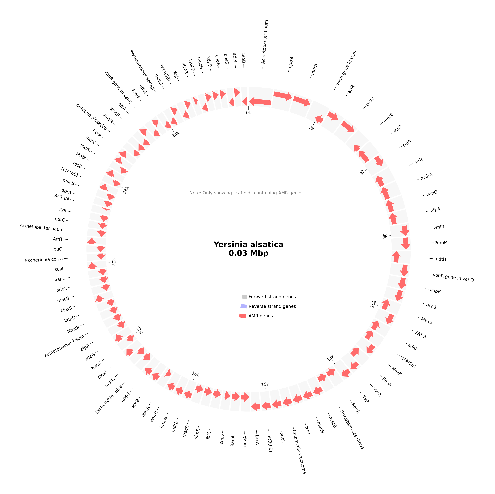

### ACT-84
- **Mechanism**: antibiotic inactivation
- **Drug Classes**: carbapenem; cephalosporin; cephamycin; penam
- **AMR Family**: ACT beta-lactamase
- **Locations**:
  - gnl|SPADES|DLDDEBJH_33452_2 : position 155-235

### AIM-1
- **Mechanism**: antibiotic inactivation
- **Drug Classes**: cephalosporin; cephamycin; penam
- **AMR Family**: AIM beta-lactamase
- **Locations**:
  - gnl|SPADES|DLDDEBJH_20319_1 : position 3-281

### Acinetobacter baumannii AbaF
- **Mechanism**: antibiotic efflux
- **Drug Classes**: phosphonic acid antibiotic
- **AMR Family**: major facilitator superfamily (MFS) antibiotic efflux pump
- **Locations**:
  - gnl|SPADES|DLDDEBJH_6102_1 : position 19-858

### Acinetobacter baumannii AmvA (found in 2 locations)
- **Mechanism**: antibiotic efflux
- **Drug Classes**: macrolide antibiotic; disinfecting agents and antiseptics
- **AMR Family**: major facilitator superfamily (MFS) antibiotic efflux pump
- **Locations**:
  - gnl|SPADES|DLDDEBJH_24282_1 : position 3-266
  - gnl|SPADES|DLDDEBJH_31459_1 : position 2-241

### ArnT
- **Mechanism**: antibiotic target alteration
- **Drug Classes**: peptide antibiotic
- **AMR Family**: pmr phosphoethanolamine transferase
- **Locations**:
  - gnl|SPADES|DLDDEBJH_31716_1 : position 1-243

### Chlamydia trachomatis intrinsic murA conferring resistance to fosfomycin
- **Mechanism**: antibiotic target alteration
- **Drug Classes**: phosphonic acid antibiotic
- **AMR Family**: antibiotic-resistant murA transferase
- **Locations**:
  - gnl|SPADES|DLDDEBJH_15776_1 : position 2-337

### Escherichia coli acrA (found in 2 locations)
- **Mechanism**: antibiotic efflux
- **Drug Classes**: fluoroquinolone antibiotic; cephalosporin; glycylcycline; penam; tetracycline antibiotic; rifamycin antibiotic; phenicol antibiotic; disinfecting agents and antiseptics
- **AMR Family**: resistance-nodulation-cell division (RND) antibiotic efflux pump
- **Locations**:
  - gnl|SPADES|DLDDEBJH_22161_1 : position 1-273
  - gnl|SPADES|DLDDEBJH_30190_1 : position 3-245

### LHK-2
- **Mechanism**: antibiotic inactivation
- **Drug Classes**: carbapenem; cephalosporin
- **AMR Family**: LHK beta-lactamase
- **Locations**:
  - gnl|SPADES|DLDDEBJH_41300_1 : position 2-211

### MdtK
- **Mechanism**: antibiotic efflux
- **Drug Classes**: fluoroquinolone antibiotic
- **AMR Family**: multidrug and toxic compound extrusion (MATE) transporter
- **Locations**:
  - gnl|SPADES|DLDDEBJH_35898_1 : position 2-229

### MexE
- **Mechanism**: antibiotic efflux
- **Drug Classes**: fluoroquinolone antibiotic; diaminopyrimidine antibiotic; phenicol antibiotic
- **AMR Family**: resistance-nodulation-cell division (RND) antibiotic efflux pump
- **Locations**:
  - gnl|SPADES|DLDDEBJH_23068_1 : position 2-268

### MexK
- **Mechanism**: antibiotic efflux
- **Drug Classes**: macrolide antibiotic; tetracycline antibiotic; disinfecting agents and antiseptics
- **AMR Family**: resistance-nodulation-cell division (RND) antibiotic efflux pump
- **Locations**:
  - gnl|SPADES|DLDDEBJH_13832_1 : position 3-377

### MexS (found in 2 locations)
- **Mechanism**: antibiotic efflux
- **Drug Classes**: fluoroquinolone antibiotic; diaminopyrimidine antibiotic; phenicol antibiotic
- **AMR Family**: resistance-nodulation-cell division (RND) antibiotic efflux pump
- **Locations**:
  - gnl|SPADES|DLDDEBJH_12596_1 : position 3-407
  - gnl|SPADES|DLDDEBJH_27441_1 : position 3-254

### NmcR
- **Mechanism**: antibiotic inactivation
- **Drug Classes**: carbapenem; cephalosporin; cephamycin; penam
- **AMR Family**: NmcA beta-lactamase
- **Locations**:
  - gnl|SPADES|DLDDEBJH_24662_1 : position 3-263

### PmpM
- **Mechanism**: antibiotic efflux
- **Drug Classes**: fluoroquinolone antibiotic; aminoglycoside antibiotic; disinfecting agents and antiseptics
- **AMR Family**: multidrug and toxic compound extrusion (MATE) transporter
- **Locations**:
  - gnl|SPADES|DLDDEBJH_11567_1 : position 2-439

### PmrF
- **Mechanism**: antibiotic target alteration
- **Drug Classes**: peptide antibiotic
- **AMR Family**: pmr phosphoethanolamine transferase
- **Locations**:
  - gnl|SPADES|DLDDEBJH_39039_1 : position 2-220

### Pseudomonas aeruginosa CpxR
- **Mechanism**: antibiotic efflux
- **Drug Classes**: macrolide antibiotic; fluoroquinolone antibiotic; monobactam; aminoglycoside antibiotic; carbapenem; cephalosporin; cephamycin; penam; tetracycline antibiotic; peptide antibiotic; aminocoumarin antibiotic; diaminopyrimidine antibiotic; sulfonamide antibiotic; phenicol antibiotic; penem
- **AMR Family**: resistance-nodulation-cell division (RND) antibiotic efflux pump
- **Locations**:
  - gnl|SPADES|DLDDEBJH_39578_1 : position 3-218

### RanA (found in 3 locations)
- **Mechanism**: antibiotic efflux
- **Drug Classes**: aminoglycoside antibiotic
- **AMR Family**: ATP-binding cassette (ABC) antibiotic efflux pump
- **Locations**:
  - gnl|SPADES|DLDDEBJH_14161_1 : position 3-368
  - gnl|SPADES|DLDDEBJH_15051_1 : position 3-350
  - gnl|SPADES|DLDDEBJH_17373_1 : position 3-311

### SAT-3
- **Mechanism**: antibiotic inactivation
- **Drug Classes**: nucleoside antibiotic
- **AMR Family**: streptothricin acetyltransferase (SAT)
- **Locations**:
  - gnl|SPADES|DLDDEBJH_13196_1 : position 2-391

### Streptomyces rimosus otr(A)
- **Mechanism**: antibiotic target protection
- **Drug Classes**: tetracycline antibiotic
- **AMR Family**: tetracycline-resistant ribosomal protection protein
- **Locations**:
  - gnl|SPADES|DLDDEBJH_15207_1 : position 2-346

### TolC
- **Mechanism**: antibiotic efflux
- **Drug Classes**: macrolide antibiotic; fluoroquinolone antibiotic; aminoglycoside antibiotic; carbapenem; cephalosporin; glycylcycline; cephamycin; penam; tetracycline antibiotic; peptide antibiotic; aminocoumarin antibiotic; rifamycin antibiotic; phenicol antibiotic; penem; disinfecting agents and antiseptics
- **AMR Family**: ATP-binding cassette (ABC) antibiotic efflux pump; major facilitator superfamily (MFS) antibiotic efflux pump; resistance-nodulation-cell division (RND) antibiotic efflux pump
- **Locations**:
  - gnl|SPADES|DLDDEBJH_17816_1 : position 3-305

### TxR (found in 2 locations)
- **Mechanism**: antibiotic efflux
- **Drug Classes**: tetracycline antibiotic
- **AMR Family**: ATP-binding cassette (ABC) antibiotic efflux pump
- **Locations**:
  - gnl|SPADES|DLDDEBJH_15047_1 : position 3-350
  - gnl|SPADES|DLDDEBJH_33453_1 : position 1-237

### YojI
- **Mechanism**: antibiotic efflux
- **Drug Classes**: peptide antibiotic
- **AMR Family**: ATP-binding cassette (ABC) antibiotic efflux pump
- **Locations**:
  - gnl|SPADES|DLDDEBJH_40823_1 : position 3-212

### acrD
- **Mechanism**: antibiotic efflux
- **Drug Classes**: aminoglycoside antibiotic
- **AMR Family**: resistance-nodulation-cell division (RND) antibiotic efflux pump
- **Locations**:
  - gnl|SPADES|DLDDEBJH_9809_1 : position 1-516

### adeF
- **Mechanism**: antibiotic efflux
- **Drug Classes**: fluoroquinolone antibiotic; tetracycline antibiotic
- **AMR Family**: resistance-nodulation-cell division (RND) antibiotic efflux pump
- **Locations**:
  - gnl|SPADES|DLDDEBJH_13528_1 : position 2-382

### adeG
- **Mechanism**: antibiotic efflux
- **Drug Classes**: fluoroquinolone antibiotic; tetracycline antibiotic
- **AMR Family**: resistance-nodulation-cell division (RND) antibiotic efflux pump
- **Locations**:
  - gnl|SPADES|DLDDEBJH_23711_1 : position 1-267

### adeL (found in 4 locations)
- **Mechanism**: antibiotic efflux
- **Drug Classes**: fluoroquinolone antibiotic; tetracycline antibiotic
- **AMR Family**: resistance-nodulation-cell division (RND) antibiotic efflux pump
- **Locations**:
  - gnl|SPADES|DLDDEBJH_15892_1 : position 1-336
  - gnl|SPADES|DLDDEBJH_28003_1 : position 3-254
  - gnl|SPADES|DLDDEBJH_39698_1 : position 2-217
  - gnl|SPADES|DLDDEBJH_42783_1 : position 2-208

### almE
- **Mechanism**: antibiotic target alteration
- **Drug Classes**: peptide antibiotic
- **AMR Family**: polymyxin resistance operon; alm glycyltransferase
- **Locations**:
  - gnl|SPADES|DLDDEBJH_18175_1 : position 2-301

### arlR
- **Mechanism**: antibiotic efflux
- **Drug Classes**: fluoroquinolone antibiotic; disinfecting agents and antiseptics
- **AMR Family**: major facilitator superfamily (MFS) antibiotic efflux pump
- **Locations**:
  - gnl|SPADES|DLDDEBJH_9145_1 : position 2-409

### baeS
- **Mechanism**: antibiotic efflux
- **Drug Classes**: aminoglycoside antibiotic; aminocoumarin antibiotic
- **AMR Family**: resistance-nodulation-cell division (RND) antibiotic efflux pump
- **Locations**:
  - gnl|SPADES|DLDDEBJH_23066_1 : position 1-270

### basS
- **Mechanism**: antibiotic target alteration; antibiotic efflux
- **Drug Classes**: peptide antibiotic
- **AMR Family**: pmr phosphoethanolamine transferase
- **Locations**:
  - gnl|SPADES|DLDDEBJH_42394_1 : position 2-208

### bcr-1
- **Mechanism**: antibiotic efflux
- **Drug Classes**: bicyclomycin-like antibiotic
- **AMR Family**: major facilitator superfamily (MFS) antibiotic efflux pump
- **Locations**:
  - gnl|SPADES|DLDDEBJH_12514_1 : position 3-410

### bcrA (found in 2 locations)
- **Mechanism**: antibiotic efflux
- **Drug Classes**: peptide antibiotic
- **AMR Family**: ATP-binding cassette (ABC) antibiotic efflux pump
- **Locations**:
  - gnl|SPADES|DLDDEBJH_16653_1 : position 3-323
  - gnl|SPADES|DLDDEBJH_37060_1 : position 2-226

### ceoA
- **Mechanism**: antibiotic efflux
- **Drug Classes**: fluoroquinolone antibiotic; aminoglycoside antibiotic
- **AMR Family**: resistance-nodulation-cell division (RND) antibiotic efflux pump
- **Locations**:
  - gnl|SPADES|DLDDEBJH_42585_1 : position 2-208

### ceoB
- **Mechanism**: antibiotic efflux
- **Drug Classes**: fluoroquinolone antibiotic; aminoglycoside antibiotic
- **AMR Family**: resistance-nodulation-cell division (RND) antibiotic efflux pump
- **Locations**:
  - gnl|SPADES|DLDDEBJH_43133_1 : position 1-207

### cmlv (found in 2 locations)
- **Mechanism**: antibiotic inactivation
- **Drug Classes**: phenicol antibiotic
- **AMR Family**: chloramphenicol phosphotransferase
- **Locations**:
  - gnl|SPADES|DLDDEBJH_17334_1 : position 3-221
  - gnl|SPADES|DLDDEBJH_9316_1 : position 2-544

### cprR
- **Mechanism**: antibiotic target alteration; antibiotic efflux
- **Drug Classes**: peptide antibiotic
- **AMR Family**: pmr phosphoethanolamine transferase
- **Locations**:
  - gnl|SPADES|DLDDEBJH_10316_2 : position 58-492

### dfrA3
- **Mechanism**: antibiotic target replacement
- **Drug Classes**: diaminopyrimidine antibiotic
- **AMR Family**: trimethoprim resistant dihydrofolate reductase dfr
- **Locations**:
  - gnl|SPADES|DLDDEBJH_41339_1 : position 88-213

### efpA (found in 2 locations)
- **Mechanism**: antibiotic efflux
- **Drug Classes**: rifamycin antibiotic; isoniazid-like antibiotic
- **AMR Family**: major facilitator superfamily (MFS) antibiotic efflux pump
- **Locations**:
  - gnl|SPADES|DLDDEBJH_11432_1 : position 3-443
  - gnl|SPADES|DLDDEBJH_24252_1 : position 2-265

### efrA
- **Mechanism**: antibiotic efflux
- **Drug Classes**: macrolide antibiotic; fluoroquinolone antibiotic; rifamycin antibiotic
- **AMR Family**: ATP-binding cassette (ABC) antibiotic efflux pump
- **Locations**:
  - gnl|SPADES|DLDDEBJH_38375_1 : position 1-222

### emrB
- **Mechanism**: antibiotic efflux
- **Drug Classes**: fluoroquinolone antibiotic
- **AMR Family**: major facilitator superfamily (MFS) antibiotic efflux pump
- **Locations**:
  - gnl|SPADES|DLDDEBJH_19636_1 : position 3-284

### eptA
- **Mechanism**: antibiotic target alteration
- **Drug Classes**: peptide antibiotic
- **AMR Family**: pmr phosphoethanolamine transferase
- **Locations**:
  - gnl|SPADES|DLDDEBJH_33800_1 : position 2-235

### eptB
- **Mechanism**: antibiotic target alteration
- **Drug Classes**: peptide antibiotic
- **AMR Family**: pmr phosphoethanolamine transferase
- **Locations**:
  - gnl|SPADES|DLDDEBJH_20104_1 : position 3-281

### hmrM
- **Mechanism**: antibiotic efflux
- **Drug Classes**: fluoroquinolone antibiotic; disinfecting agents and antiseptics
- **AMR Family**: multidrug and toxic compound extrusion (MATE) transporter
- **Locations**:
  - gnl|SPADES|DLDDEBJH_19661_1 : position 2-286

### kdpD
- **Mechanism**: antibiotic efflux
- **Drug Classes**: aminoglycoside antibiotic
- **AMR Family**: kdpDE
- **Locations**:
  - gnl|SPADES|DLDDEBJH_25484_1 : position 2-262

### kdpE (found in 2 locations)
- **Mechanism**: antibiotic efflux
- **Drug Classes**: aminoglycoside antibiotic
- **AMR Family**: kdpDE
- **Locations**:
  - gnl|SPADES|DLDDEBJH_12371_1 : position 2-415
  - gnl|SPADES|DLDDEBJH_41641_1 : position 1-210

### leuO
- **Mechanism**: antibiotic efflux
- **Drug Classes**: nucleoside antibiotic; disinfecting agents and antiseptics
- **AMR Family**: major facilitator superfamily (MFS) antibiotic efflux pump
- **Locations**:
  - gnl|SPADES|DLDDEBJH_30352_1 : position 3-245

### macB (found in 7 locations)
- **Mechanism**: antibiotic efflux
- **Drug Classes**: macrolide antibiotic
- **AMR Family**: ATP-binding cassette (ABC) antibiotic efflux pump
- **Locations**:
  - gnl|SPADES|DLDDEBJH_15462_1 : position 1-342
  - gnl|SPADES|DLDDEBJH_15625_1 : position 2-340
  - gnl|SPADES|DLDDEBJH_18264_1 : position 3-299
  - gnl|SPADES|DLDDEBJH_27741_1 : position 3-254
  - gnl|SPADES|DLDDEBJH_34518_1 : position 1-231
  - gnl|SPADES|DLDDEBJH_41257_1 : position 1-213
  - gnl|SPADES|DLDDEBJH_9687_2 : position 272-523

### mdtB
- **Mechanism**: antibiotic efflux
- **Drug Classes**: aminocoumarin antibiotic
- **AMR Family**: resistance-nodulation-cell division (RND) antibiotic efflux pump
- **Locations**:
  - gnl|SPADES|DLDDEBJH_7963_1 : position 3-641

### mdtC (found in 3 locations)
- **Mechanism**: antibiotic efflux
- **Drug Classes**: aminocoumarin antibiotic
- **AMR Family**: resistance-nodulation-cell division (RND) antibiotic efflux pump
- **Locations**:
  - gnl|SPADES|DLDDEBJH_32934_1 : position 2-238
  - gnl|SPADES|DLDDEBJH_36253_1 : position 3-227
  - gnl|SPADES|DLDDEBJH_36868_1 : position 2-226

### mdtE
- **Mechanism**: antibiotic efflux
- **Drug Classes**: macrolide antibiotic; fluoroquinolone antibiotic; penam
- **AMR Family**: resistance-nodulation-cell division (RND) antibiotic efflux pump
- **Locations**:
  - gnl|SPADES|DLDDEBJH_18473_1 : position 3-296

### mdtG (found in 2 locations)
- **Mechanism**: antibiotic efflux
- **Drug Classes**: phosphonic acid antibiotic
- **AMR Family**: major facilitator superfamily (MFS) antibiotic efflux pump
- **Locations**:
  - gnl|SPADES|DLDDEBJH_23160_1 : position 2-268
  - gnl|SPADES|DLDDEBJH_40385_1 : position 2-214

### mdtH
- **Mechanism**: antibiotic efflux
- **Drug Classes**: fluoroquinolone antibiotic
- **AMR Family**: major facilitator superfamily (MFS) antibiotic efflux pump
- **Locations**:
  - gnl|SPADES|DLDDEBJH_11614_1 : position 2-436

### msbA
- **Mechanism**: antibiotic efflux
- **Drug Classes**: nitroimidazole antibiotic
- **AMR Family**: ATP-binding cassette (ABC) antibiotic efflux pump
- **Locations**:
  - gnl|SPADES|DLDDEBJH_10353_1 : position 2-490

### novA (found in 2 locations)
- **Mechanism**: antibiotic efflux
- **Drug Classes**: aminocoumarin antibiotic
- **AMR Family**: ATP-binding cassette (ABC) antibiotic efflux pump
- **Locations**:
  - gnl|SPADES|DLDDEBJH_14908_1 : position 2-352
  - gnl|SPADES|DLDDEBJH_17044_1 : position 3-317

### optrA (found in 2 locations)
- **Mechanism**: antibiotic target protection
- **Drug Classes**: oxazolidinone antibiotic; phenicol antibiotic
- **AMR Family**: Miscellaneous ABC-F subfamily ATP-binding cassette ribosomal protection proteins
- **Locations**:
  - gnl|SPADES|DLDDEBJH_19956_1 : position 2-190
  - gnl|SPADES|DLDDEBJH_7472_1 : position 1-687

### putative nickel/cobalt transporter
- **Mechanism**: antibiotic efflux
- **Drug Classes**: fluoroquinolone antibiotic; aminoglycoside antibiotic; isoniazid-like antibiotic
- **AMR Family**: metal transporters with antibiotic efflux
- **Locations**:
  - gnl|SPADES|DLDDEBJH_37680_1 : position 2-223

### rosB
- **Mechanism**: antibiotic efflux
- **Drug Classes**: peptide antibiotic
- **AMR Family**: major facilitator superfamily (MFS) antibiotic efflux pump
- **Locations**:
  - gnl|SPADES|DLDDEBJH_35650_1 : position 1-228

### sdiA
- **Mechanism**: antibiotic efflux
- **Drug Classes**: fluoroquinolone antibiotic; cephalosporin; glycylcycline; penam; tetracycline antibiotic; rifamycin antibiotic; phenicol antibiotic; disinfecting agents and antiseptics
- **AMR Family**: resistance-nodulation-cell division (RND) antibiotic efflux pump
- **Locations**:
  - gnl|SPADES|DLDDEBJH_10034_1 : position 2-397

### smeF
- **Mechanism**: antibiotic efflux
- **Drug Classes**: macrolide antibiotic; fluoroquinolone antibiotic; tetracycline antibiotic; phenicol antibiotic
- **AMR Family**: resistance-nodulation-cell division (RND) antibiotic efflux pump
- **Locations**:
  - gnl|SPADES|DLDDEBJH_37983_1 : position 2-223

### smeR
- **Mechanism**: antibiotic efflux
- **Drug Classes**: aminoglycoside antibiotic; cephalosporin; cephamycin; penam
- **AMR Family**: resistance-nodulation-cell division (RND) antibiotic efflux pump
- **Locations**:
  - gnl|SPADES|DLDDEBJH_37978_1 : position 2-223

### sul4
- **Mechanism**: antibiotic target replacement
- **Drug Classes**: sulfonamide antibiotic
- **AMR Family**: sulfonamide resistant sul
- **Locations**:
  - gnl|SPADES|DLDDEBJH_28821_1 : position 1-252

### tcr3
- **Mechanism**: antibiotic efflux
- **Drug Classes**: tetracycline antibiotic
- **AMR Family**: major facilitator superfamily (MFS) antibiotic efflux pump
- **Locations**:
  - gnl|SPADES|DLDDEBJH_15735_1 : position 1-339

### tetA(58) (found in 2 locations)
- **Mechanism**: antibiotic efflux
- **Drug Classes**: tetracycline antibiotic
- **AMR Family**: major facilitator superfamily (MFS) antibiotic efflux pump
- **Locations**:
  - gnl|SPADES|DLDDEBJH_13616_1 : position 2-382
  - gnl|SPADES|DLDDEBJH_40205_1 : position 1-216

### tetA(60)
- **Mechanism**: antibiotic efflux
- **Drug Classes**: tetracycline antibiotic
- **AMR Family**: ATP-binding cassette (ABC) antibiotic efflux pump
- **Locations**:
  - gnl|SPADES|DLDDEBJH_35396_1 : position 3-230

### tetB(60)
- **Mechanism**: antibiotic efflux
- **Drug Classes**: tetracycline antibiotic
- **AMR Family**: ATP-binding cassette (ABC) antibiotic efflux pump
- **Locations**:
  - gnl|SPADES|DLDDEBJH_16159_1 : position 3-332

### vanG
- **Mechanism**: antibiotic target alteration
- **Drug Classes**: glycopeptide antibiotic
- **AMR Family**: glycopeptide resistance gene cluster; Van ligase
- **Locations**:
  - gnl|SPADES|DLDDEBJH_10995_1 : position 1-462

### vanL
- **Mechanism**: antibiotic target alteration
- **Drug Classes**: glycopeptide antibiotic
- **AMR Family**: glycopeptide resistance gene cluster; Van ligase
- **Locations**:
  - gnl|SPADES|DLDDEBJH_28704_1 : position 2-250

### vanR gene in vanC cluster
- **Mechanism**: antibiotic target alteration
- **Drug Classes**: glycopeptide antibiotic
- **AMR Family**: glycopeptide resistance gene cluster; vanR
- **Locations**:
  - gnl|SPADES|DLDDEBJH_38453_1 : position 2-220

### vanR gene in vanI cluster
- **Mechanism**: antibiotic target alteration
- **Drug Classes**: glycopeptide antibiotic
- **AMR Family**: glycopeptide resistance gene cluster; vanR
- **Locations**:
  - gnl|SPADES|DLDDEBJH_8150_2 : position 306-623

### vanR gene in vanO cluster
- **Mechanism**: antibiotic target alteration
- **Drug Classes**: glycopeptide antibiotic
- **AMR Family**: glycopeptide resistance gene cluster; vanR
- **Locations**:
  - gnl|SPADES|DLDDEBJH_11982_1 : position 2-427

### vmlR
- **Mechanism**: antibiotic target protection
- **Drug Classes**: lincosamide antibiotic; streptogramin antibiotic; streptogramin A antibiotic; streptogramin B antibiotic; nucleoside antibiotic; pleuromutilin antibiotic
- **AMR Family**: Miscellaneous ABC-F subfamily ATP-binding cassette ribosomal protection proteins
- **Locations**:
  - gnl|SPADES|DLDDEBJH_11499_1 : position 65-442

## Yersinia enterocolitica
**Strain Statistics:**
- Total genome length: 1414.1 kbp
- Total scaffolds: 2210
- Scaffolds with AMR genes: 355
- Total genes annotated: 2542
- Total AMR genes: 467
- Unique AMR genes: 212
- Distinct AMR mechanisms: 11
- Distinct AMR families: 73
- Distinct drug classes: 36

**Circos Plot:**

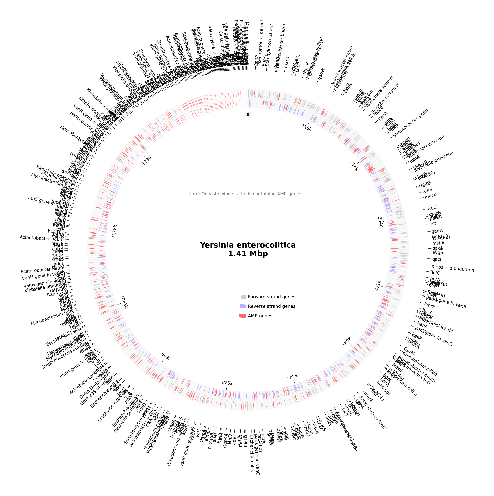

### ACT-75
- **Mechanism**: antibiotic inactivation
- **Drug Classes**: carbapenem; cephalosporin; cephamycin; penam
- **AMR Family**: ACT beta-lactamase
- **Locations**:
  - gnl|SPADES|DLDDEBJH_7712_2 : position 518-664

### Acinetobacter baumannii AbaF (found in 6 locations)
- **Mechanism**: antibiotic efflux
- **Drug Classes**: phosphonic acid antibiotic
- **AMR Family**: major facilitator superfamily (MFS) antibiotic efflux pump
- **Locations**:
  - gnl|SPADES|DLDDEBJH_1290_1 : position 1-414
  - gnl|SPADES|DLDDEBJH_1881_3 : position 1609-3117
  - gnl|SPADES|DLDDEBJH_2037_4 : position 2557-3060
  - gnl|SPADES|DLDDEBJH_5598_1 : position 1-954
  - gnl|SPADES|DLDDEBJH_5790_1 : position 55-915
  - gnl|SPADES|DLDDEBJH_921_5 : position 4256-5659

### Acinetobacter baumannii AbaQ (found in 5 locations)
- **Mechanism**: antibiotic efflux
- **Drug Classes**: fluoroquinolone antibiotic
- **AMR Family**: major facilitator superfamily (MFS) antibiotic efflux pump
- **Locations**:
  - gnl|SPADES|DLDDEBJH_1009_6 : position 4480-5796
  - gnl|SPADES|DLDDEBJH_1457_3 : position 3525-4373
  - gnl|SPADES|DLDDEBJH_4121_1 : position 1-969
  - gnl|SPADES|DLDDEBJH_508_10 : position 7676-9034
  - gnl|SPADES|DLDDEBJH_7452_1 : position 3-350

### Acinetobacter baumannii AmvA
- **Mechanism**: antibiotic efflux
- **Drug Classes**: macrolide antibiotic; disinfecting agents and antiseptics
- **AMR Family**: major facilitator superfamily (MFS) antibiotic efflux pump
- **Locations**:
  - gnl|SPADES|DLDDEBJH_430_12 : position 11482-12975

### ArnT
- **Mechanism**: antibiotic target alteration
- **Drug Classes**: peptide antibiotic
- **AMR Family**: pmr phosphoethanolamine transferase
- **Locations**:
  - gnl|SPADES|DLDDEBJH_1509_2: position 188-1840

### Bifidobacterium adolescentis rpoB mutants conferring resistance to rifampicin
- **Mechanism**: antibiotic target alteration; antibiotic target replacement
- **Drug Classes**: rifamycin antibiotic
- **AMR Family**: rifamycin-resistant beta-subunit of RNA polymerase (rpoB)
- **Locations**:
  - gnl|SPADES|DLDDEBJH_5004_1 : position 2-1081

### Bifidobacterium bifidum ileS conferring resistance to mupirocin (found in 2 locations)
- **Mechanism**: antibiotic target alteration
- **Drug Classes**: mupirocin-like antibiotic
- **AMR Family**: antibiotic-resistant isoleucyl-tRNA synthetase (ileS)
- **Locations**:
  - gnl|SPADES|DLDDEBJH_23037_1 : position 2-268
  - gnl|SPADES|DLDDEBJH_555_6 : position 3250-5832

### CMY-70
- **Mechanism**: antibiotic inactivation
- **Drug Classes**: cephamycin
- **AMR Family**: CMY beta-lactamase
- **Locations**:
  - gnl|SPADES|DLDDEBJH_3021_2 : position 907-1956

### CRP
- **Mechanism**: antibiotic efflux
- **Drug Classes**: macrolide antibiotic; fluoroquinolone antibiotic; penam
- **AMR Family**: resistance-nodulation-cell division (RND) antibiotic efflux pump
- **Locations**:
  - gnl|SPADES|DLDDEBJH_6733_1 : position 46-768

### Clostridioides difficile cplR
- **Mechanism**: antibiotic target protection
- **Drug Classes**: lincosamide antibiotic; streptogramin antibiotic; streptogramin A antibiotic; nucleoside antibiotic
- **AMR Family**: Miscellaneous ABC-F subfamily ATP-binding cassette ribosomal protection proteins
- **Locations**:
  - gnl|SPADES|DLDDEBJH_9912_1 : position 2-511

### Clostridioides difficile gyrB conferring resistance to fluoroquinolones
- **Mechanism**: antibiotic target alteration
- **Drug Classes**: fluoroquinolone antibiotic
- **AMR Family**: fluoroquinolone resistant gyrB
- **Locations**:
  - gnl|SPADES|DLDDEBJH_881_5 : position 2404-4299

### Corynebacterium striatum tetA
- **Mechanism**: antibiotic efflux
- **Drug Classes**: penam; tetracycline antibiotic
- **AMR Family**: major facilitator superfamily (MFS) antibiotic efflux pump
- **Locations**:
  - gnl|SPADES|DLDDEBJH_37497_1 : position 1-222

### CrcB (found in 2 locations)
- **Mechanism**: antibiotic efflux
- **Drug Classes**: aminoglycoside antibiotic
- **AMR Family**: multidrug and toxic compound extrusion (MATE) transporter
- **Locations**:
  - gnl|SPADES|DLDDEBJH_2892_2 : position 379-762
  - gnl|SPADES|DLDDEBJH_5632_1 : position 48-452

### D-Ala-D-Ala ligase
- **Mechanism**: antibiotic target alteration
- **Drug Classes**: glycopeptide antibiotic
- **AMR Family**: Van ligase
- **Locations**:
  - gnl|SPADES|DLDDEBJH_1428_3 : position 1766-2686

### DHA-6
- **Mechanism**: antibiotic inactivation
- **Drug Classes**: cephalosporin; cephamycin
- **AMR Family**: DHA beta-lactamase
- **Locations**:
  - gnl|SPADES|DLDDEBJH_6987_1 : position 1-672

### Enterococcus faecium cls conferring resistance to daptomycin
- **Mechanism**: antibiotic target alteration
- **Drug Classes**: peptide antibiotic
- **AMR Family**: daptomycin resistant cls
- **Locations**:
  - gnl|SPADES|DLDDEBJH_976_10 : position 5512-6450

### Erm(34)
- **Mechanism**: antibiotic target alteration
- **Drug Classes**: macrolide antibiotic; lincosamide antibiotic; streptogramin antibiotic; streptogramin A antibiotic; streptogramin B antibiotic
- **AMR Family**: Erm 23S ribosomal RNA methyltransferase
- **Locations**:
  - gnl|SPADES|DLDDEBJH_2349_2 : position 962-1624

### Escherichia coli AcrAB-TolC with AcrR mutation conferring resistance to ciprofloxacin, tetracycline, and ceftazidime (found in 2 locations)
- **Mechanism**: antibiotic target alteration; antibiotic efflux
- **Drug Classes**: fluoroquinolone antibiotic; cephalosporin; glycylcycline; penam; tetracycline antibiotic; rifamycin antibiotic; phenicol antibiotic; disinfecting agents and antiseptics
- **AMR Family**: resistance-nodulation-cell division (RND) antibiotic efflux pump
- **Locations**:
  - gnl|SPADES|DLDDEBJH_1236_2 : position 1149-1733
  - gnl|SPADES|DLDDEBJH_517_2 : position 96-752

### Escherichia coli AcrAB-TolC with MarR mutations conferring resistance to ciprofloxacin and tetracycline
- **Mechanism**: antibiotic target alteration; antibiotic efflux
- **Drug Classes**: fluoroquinolone antibiotic; cephalosporin; glycylcycline; penam; tetracycline antibiotic; rifamycin antibiotic; phenicol antibiotic; disinfecting agents and antiseptics
- **AMR Family**: resistance-nodulation-cell division (RND) antibiotic efflux pump
- **Locations**:
  - gnl|SPADES|DLDDEBJH_1576_6 : position 3482-3913

### Escherichia coli acrA
- **Mechanism**: antibiotic efflux
- **Drug Classes**: fluoroquinolone antibiotic; cephalosporin; glycylcycline; penam; tetracycline antibiotic; rifamycin antibiotic; phenicol antibiotic; disinfecting agents and antiseptics
- **AMR Family**: resistance-nodulation-cell division (RND) antibiotic efflux pump
- **Locations**:
  - gnl|SPADES|DLDDEBJH_517_3 : position 897-2084

### Escherichia coli mdfA
- **Mechanism**: antibiotic efflux
- **Drug Classes**: tetracycline antibiotic; phenicol antibiotic; disinfecting agents and antiseptics
- **AMR Family**: major facilitator superfamily (MFS) antibiotic efflux pump
- **Locations**:
  - gnl|SPADES|DLDDEBJH_1565_1 : position 252-1481

### Escherichia coli parE conferring resistance to fluoroquinolones
- **Mechanism**: antibiotic target alteration
- **Drug Classes**: fluoroquinolone antibiotic
- **AMR Family**: fluoroquinolone resistant parE
- **Locations**:
  - gnl|SPADES|DLDDEBJH_464_1 : position 3-1145

### Escherichia coli soxS with mutation conferring antibiotic resistance (found in 4 locations)
- **Mechanism**: antibiotic target alteration; antibiotic efflux; reduced permeability to antibiotic
- **Drug Classes**: fluoroquinolone antibiotic; monobactam; carbapenem; cephalosporin; glycylcycline; cephamycin; penam; tetracycline antibiotic; rifamycin antibiotic; phenicol antibiotic; penem; disinfecting agents and antiseptics
- **AMR Family**: ATP-binding cassette (ABC) antibiotic efflux pump; major facilitator superfamily (MFS) antibiotic efflux pump; resistance-nodulation-cell division (RND) antibiotic efflux pump; General Bacterial Porin with reduced permeability to beta-lactams
- **Locations**:
  - gnl|SPADES|DLDDEBJH_1115_2 : position 365-1072
  - gnl|SPADES|DLDDEBJH_1336_3 : position 2679-3611
  - gnl|SPADES|DLDDEBJH_1407_2 : position 471-1337
  - gnl|SPADES|DLDDEBJH_6248_2 : position 568-831

### Escherichia coli uhpA with mutation conferring resistance to fosfomycin
- **Mechanism**: antibiotic target alteration
- **Drug Classes**: phosphonic acid antibiotic
- **AMR Family**: antibiotic-resistant UhpT
- **Locations**:
  - gnl|SPADES|DLDDEBJH_939_2 : position 431-1015

### FosM2
- **Mechanism**: antibiotic inactivation
- **Drug Classes**: phosphonic acid antibiotic
- **AMR Family**: fosfomycin thiol transferase
- **Locations**:
  - gnl|SPADES|DLDDEBJH_9582_1 : position 76-483

### H-NS
- **Mechanism**: antibiotic efflux
- **Drug Classes**: macrolide antibiotic; fluoroquinolone antibiotic; cephalosporin; cephamycin; penam; tetracycline antibiotic
- **AMR Family**: major facilitator superfamily (MFS) antibiotic efflux pump; resistance-nodulation-cell division (RND) antibiotic efflux pump
- **Locations**:
  - gnl|SPADES|DLDDEBJH_924_6 : position 5220-5630

### Haemophilus influenzae PBP3 conferring resistance to beta-lactam antibiotics
- **Mechanism**: antibiotic target alteration
- **Drug Classes**: cephalosporin; cephamycin; penam
- **AMR Family**: Penicillin-binding protein mutations conferring resistance to beta-lactam antibiotics
- **Locations**:
  - gnl|SPADES|DLDDEBJH_918_4 : position 3892-5655

### Helicobacter pylori pbp1 mutants conferring resistance to amoxicillin
- **Mechanism**: antibiotic target alteration
- **Drug Classes**: cephalosporin; cephamycin; penam
- **AMR Family**: Penicillin-binding protein mutations conferring resistance to beta-lactam antibiotics
- **Locations**:
  - gnl|SPADES|DLDDEBJH_2747_2 : position 872-2185

### Helicobacter pylori pbp2 mutants conferring resistance to amoxicillin
- **Mechanism**: antibiotic target alteration
- **Drug Classes**: cephalosporin; cephamycin; penam
- **AMR Family**: Penicillin-binding protein mutations conferring resistance to beta-lactam antibiotics
- **Locations**:
  - gnl|SPADES|DLDDEBJH_1261_2 : position 192-2087

### Helicobacter pylori pbp3 conferring resistance to amoxicillin
- **Mechanism**: antibiotic target alteration
- **Drug Classes**: cephalosporin; cephamycin; penam
- **AMR Family**: Penicillin-binding protein mutations conferring resistance to beta-lactam antibiotics
- **Locations**:
  - gnl|SPADES|DLDDEBJH_2874_1 : position 243-1952

### Klebsiella pneumoniae KpnE
- **Mechanism**: antibiotic efflux
- **Drug Classes**: macrolide antibiotic; aminoglycoside antibiotic; cephalosporin; tetracycline antibiotic; peptide antibiotic; rifamycin antibiotic; disinfecting agents and antiseptics
- **AMR Family**: small multidrug resistance (SMR) antibiotic efflux pump
- **Locations**:
  - gnl|SPADES|DLDDEBJH_1812_2 : position 435-812

### Klebsiella pneumoniae KpnF
- **Mechanism**: antibiotic efflux
- **Drug Classes**: macrolide antibiotic; aminoglycoside antibiotic; cephalosporin; tetracycline antibiotic; peptide antibiotic; rifamycin antibiotic; disinfecting agents and antiseptics
- **AMR Family**: small multidrug resistance (SMR) antibiotic efflux pump
- **Locations**:
  - gnl|SPADES|DLDDEBJH_1812_1: position 119-448

### Klebsiella pneumoniae KpnG
- **Mechanism**: antibiotic efflux
- **Drug Classes**: macrolide antibiotic; fluoroquinolone antibiotic; aminoglycoside antibiotic; carbapenem; cephalosporin; penam; peptide antibiotic; penem
- **AMR Family**: major facilitator superfamily (MFS) antibiotic efflux pump
- **Locations**:
  - gnl|SPADES|DLDDEBJH_3111_2 : position 741-1118

### Klebsiella pneumoniae OmpK37 (found in 6 locations)
- **Mechanism**: reduced permeability to antibiotic
- **Drug Classes**: monobactam; carbapenem; cephalosporin; cephamycin; penam; penem
- **AMR Family**: General Bacterial Porin with reduced permeability to beta-lactams
- **Locations**:
  - gnl|SPADES|DLDDEBJH_2404_1 : position 1-1005
  - gnl|SPADES|DLDDEBJH_3418_2 : position 1570-1701
  - gnl|SPADES|DLDDEBJH_5703_1 : position 75-932
  - gnl|SPADES|DLDDEBJH_617_7 : position 9274-10176
  - gnl|SPADES|DLDDEBJH_7094_1 : position 1-480
  - gnl|SPADES|DLDDEBJH_827_5 : position 5737-6804

### LRA-19
- **Mechanism**: antibiotic inactivation
- **Drug Classes**: cephalosporin; penam
- **AMR Family**: subclass B3 LRA beta-lactamase
- **Locations**:
  - gnl|SPADES|DLDDEBJH_617_4 : position 5095-5742

### LlmA 23S ribosomal RNA methyltransferase
- **Mechanism**: antibiotic target alteration
- **Drug Classes**: lincosamide antibiotic
- **AMR Family**: Llm 23S ribosomal RNA methyltransferase
- **Locations**:
  - gnl|SPADES|DLDDEBJH_1415_3 : position 664-1848

### LptD
- **Mechanism**: antibiotic efflux
- **Drug Classes**: carbapenem; peptide antibiotic; aminocoumarin antibiotic; rifamycin antibiotic
- **AMR Family**: ATP-binding cassette (ABC) antibiotic efflux pump
- **Locations**:
  - gnl|SPADES|DLDDEBJH_451_11 : position 9047-11443

### MOX-3
- **Mechanism**: antibiotic inactivation
- **Drug Classes**: cephalosporin; cephamycin; penam
- **AMR Family**: MOX beta-lactamase
- **Locations**:
  - gnl|SPADES|DLDDEBJH_1236_4 : position 2966-3427

### MSI-1
- **Mechanism**: antibiotic inactivation
- **Drug Classes**: carbapenem
- **AMR Family**: MSI beta-lactamase
- **Locations**:
  - gnl|SPADES|DLDDEBJH_2281_1 : position 206-961

### MdtK (found in 2 locations)
- **Mechanism**: antibiotic efflux
- **Drug Classes**: fluoroquinolone antibiotic
- **AMR Family**: multidrug and toxic compound extrusion (MATE) transporter
- **Locations**:
  - gnl|SPADES|DLDDEBJH_1205_7 : position 4399-5217
  - gnl|SPADES|DLDDEBJH_7038_1 : position 9-731

### MexA
- **Mechanism**: antibiotic efflux
- **Drug Classes**: macrolide antibiotic; fluoroquinolone antibiotic; monobactam; carbapenem; cephalosporin; cephamycin; penam; tetracycline antibiotic; peptide antibiotic; aminocoumarin antibiotic; diaminopyrimidine antibiotic; sulfonamide antibiotic; phenicol antibiotic; penem
- **AMR Family**: resistance-nodulation-cell division (RND) antibiotic efflux pump
- **Locations**:
  - gnl|SPADES|DLDDEBJH_9360_2 : position 293-541

### MexD
- **Mechanism**: antibiotic efflux
- **Drug Classes**: macrolide antibiotic; fluoroquinolone antibiotic; aminoglycoside antibiotic; cephalosporin; penam; tetracycline antibiotic; aminocoumarin antibiotic; diaminopyrimidine antibiotic; phenicol antibiotic
- **AMR Family**: resistance-nodulation-cell division (RND) antibiotic efflux pump
- **Locations**:
  - gnl|SPADES|DLDDEBJH_2157_3 : position 2279-2881

### MexE (found in 2 locations)
- **Mechanism**: antibiotic efflux
- **Drug Classes**: fluoroquinolone antibiotic; diaminopyrimidine antibiotic; phenicol antibiotic
- **AMR Family**: resistance-nodulation-cell division (RND) antibiotic efflux pump
- **Locations**:
  - gnl|SPADES|DLDDEBJH_3221_1 : position 2-637
  - gnl|SPADES|DLDDEBJH_6710_2 : position 374-772

### MexF
- **Mechanism**: antibiotic efflux
- **Drug Classes**: fluoroquinolone antibiotic; diaminopyrimidine antibiotic; phenicol antibiotic
- **AMR Family**: resistance-nodulation-cell division (RND) antibiotic efflux pump
- **Locations**:
  - gnl|SPADES|DLDDEBJH_1503_3 : position 2258-4195

### MexK
- **Mechanism**: antibiotic efflux
- **Drug Classes**: macrolide antibiotic; tetracycline antibiotic; disinfecting agents and antiseptics
- **AMR Family**: resistance-nodulation-cell division (RND) antibiotic efflux pump
- **Locations**:
  - gnl|SPADES|DLDDEBJH_1080_3 : position 2158-5232

### MexS (found in 5 locations)
- **Mechanism**: antibiotic efflux
- **Drug Classes**: fluoroquinolone antibiotic; diaminopyrimidine antibiotic; phenicol antibiotic
- **AMR Family**: resistance-nodulation-cell division (RND) antibiotic efflux pump
- **Locations**:
  - gnl|SPADES|DLDDEBJH_1114_3 : position 2365-3441
  - gnl|SPADES|DLDDEBJH_1732_2 : position 897-1907
  - gnl|SPADES|DLDDEBJH_3417_1 : position 2-667
  - gnl|SPADES|DLDDEBJH_8374_1 : position 1-606
  - gnl|SPADES|DLDDEBJH_933_6 : position 4160-5170

### MexT
- **Mechanism**: antibiotic efflux
- **Drug Classes**: fluoroquinolone antibiotic; diaminopyrimidine antibiotic; phenicol antibiotic
- **AMR Family**: resistance-nodulation-cell division (RND) antibiotic efflux pump
- **Locations**:
  - gnl|SPADES|DLDDEBJH_2491_1 : position 1-654

### MexV (found in 2 locations)
- **Mechanism**: antibiotic efflux
- **Drug Classes**: macrolide antibiotic; fluoroquinolone antibiotic; tetracycline antibiotic; phenicol antibiotic; disinfecting agents and antiseptics
- **AMR Family**: resistance-nodulation-cell division (RND) antibiotic efflux pump
- **Locations**:
  - gnl|SPADES|DLDDEBJH_1080_4 : position 5232-5789
  - gnl|SPADES|DLDDEBJH_2602_2 : position 1258-2340

### Morganella morganii gyrB conferring resistance to fluoroquinolones
- **Mechanism**: antibiotic target alteration
- **Drug Classes**: fluoroquinolone antibiotic
- **AMR Family**: fluoroquinolone resistant gyrB
- **Locations**:
  - gnl|SPADES|DLDDEBJH_42751_1 : position 3-206

### MuxB
- **Mechanism**: antibiotic efflux
- **Drug Classes**: macrolide antibiotic; monobactam; tetracycline antibiotic; aminocoumarin antibiotic
- **AMR Family**: resistance-nodulation-cell division (RND) antibiotic efflux pump
- **Locations**:
  - gnl|SPADES|DLDDEBJH_10943_1 : position 162-464

### Mycobacterium tuberculosis gidB mutation conferring resistance to streptomycin
- **Mechanism**: antibiotic target alteration
- **Drug Classes**: aminoglycoside antibiotic
- **AMR Family**: antibiotic resistant gidB
- **Locations**:
  - gnl|SPADES|DLDDEBJH_3468_2 : position 677-1297

### Mycobacterium tuberculosis kasA mutant conferring resistance to isoniazid
- **Mechanism**: antibiotic target alteration
- **Drug Classes**: isoniazid-like antibiotic
- **AMR Family**: antibiotic resistant kasA
- **Locations**:
  - gnl|SPADES|DLDDEBJH_1558_4 : position 1950-3125

### Mycobacterium tuberculosis ndh with mutation conferring resistance to isoniazid
- **Mechanism**: antibiotic target alteration
- **Drug Classes**: isoniazid-like antibiotic
- **AMR Family**: antibiotic resistant ndh
- **Locations**:
  - gnl|SPADES|DLDDEBJH_2339_1 : position 2-691

### Mycobacterium tuberculosis pncA mutations conferring resistance to pyrazinamide
- **Mechanism**: antibiotic target alteration
- **Drug Classes**: pyrazine antibiotic
- **AMR Family**: Pyrazinamide resistant pncA
- **Locations**:
  - gnl|SPADES|DLDDEBJH_3294_1 : position 1-615

### Mycobacterium tuberculosis thyA with mutation conferring resistance to para-aminosalicylic acid
- **Mechanism**: antibiotic target alteration
- **Drug Classes**: salicylic acid antibiotic
- **AMR Family**: aminosalicylate resistant thymidylate synthase
- **Locations**:
  - gnl|SPADES|DLDDEBJH_1643_1 : position 36-830

### Neisseria gonorrhoeae pilQ gene conferring resistance to beta-lactam
- **Mechanism**: antibiotic target alteration
- **Drug Classes**: cephalosporin; cephamycin; penam
- **AMR Family**: Penicillin-binding protein mutations conferring resistance to beta-lactam antibiotics
- **Locations**:
  - gnl|SPADES|DLDDEBJH_1329_4 : position 1866-3812

### NmcR (found in 8 locations)
- **Mechanism**: antibiotic inactivation
- **Drug Classes**: carbapenem; cephalosporin; cephamycin; penam
- **AMR Family**: NmcA beta-lactamase
- **Locations**:
  - gnl|SPADES|DLDDEBJH_2181_2 : position 758-1669
  - gnl|SPADES|DLDDEBJH_2532_1 : position 2-406
  - gnl|SPADES|DLDDEBJH_3021_1 : position 2-772
  - gnl|SPADES|DLDDEBJH_3951_2 : position 830-1432
  - gnl|SPADES|DLDDEBJH_462_6 : position 6013-6933
  - gnl|SPADES|DLDDEBJH_7023_1 : position 1-732
  - gnl|SPADES|DLDDEBJH_905_3 : position 1621-2514
  - gnl|SPADES|DLDDEBJH_997_6 : position 4346-5233

### OXA-152
- **Mechanism**: antibiotic inactivation
- **Drug Classes**: carbapenem; penam
- **AMR Family**: OXA beta-lactamase; OXA-62-like beta-lactamase
- **Locations**:
  - gnl|SPADES|DLDDEBJH_1283_2 : position 663-1367

### OmpA (found in 3 locations)
- **Mechanism**: reduced permeability to antibiotic
- **Drug Classes**: peptide antibiotic
- **AMR Family**: General Bacterial Porin with reduced permeability to peptide antibiotics
- **Locations**:
  - gnl|SPADES|DLDDEBJH_1186_3 : position 1948-3618
  - gnl|SPADES|DLDDEBJH_1224_2 : position 930-1439
  - gnl|SPADES|DLDDEBJH_4586_2 : position 597-1199

### OprJ
- **Mechanism**: antibiotic efflux
- **Drug Classes**: macrolide antibiotic; fluoroquinolone antibiotic; aminoglycoside antibiotic; cephalosporin; penam; tetracycline antibiotic; aminocoumarin antibiotic; diaminopyrimidine antibiotic; phenicol antibiotic
- **AMR Family**: resistance-nodulation-cell division (RND) antibiotic efflux pump
- **Locations**:
  - gnl|SPADES|DLDDEBJH_873_2 : position 1243-2763

### OprM
- **Mechanism**: antibiotic efflux
- **Drug Classes**: macrolide antibiotic; fluoroquinolone antibiotic; monobactam; aminoglycoside antibiotic; carbapenem; cephalosporin; cephamycin; penam; tetracycline antibiotic; peptide antibiotic; aminocoumarin antibiotic; diaminopyrimidine antibiotic; sulfonamide antibiotic; phenicol antibiotic; penem; disinfecting agents and antiseptics
- **AMR Family**: resistance-nodulation-cell division (RND) antibiotic efflux pump
- **Locations**:
  - gnl|SPADES|DLDDEBJH_910_6 : position 5706-6950

### ParR (found in 3 locations)
- **Mechanism**: antibiotic efflux; reduced permeability to antibiotic
- **Drug Classes**: macrolide antibiotic; fluoroquinolone antibiotic; monobactam; aminoglycoside antibiotic; carbapenem; cephalosporin; cephamycin; penam; tetracycline antibiotic; phenicol antibiotic; penem; disinfecting agents and antiseptics
- **AMR Family**: resistance-nodulation-cell division (RND) antibiotic efflux pump; Outer Membrane Porin (Opr)
- **Locations**:
  - gnl|SPADES|DLDDEBJH_1951_3 : position 2199-2924
  - gnl|SPADES|DLDDEBJH_3377_3 : position 1090-1731
  - gnl|SPADES|DLDDEBJH_820_6 : position 4999-5718

### ParS (found in 2 locations)
- **Mechanism**: antibiotic efflux; reduced permeability to antibiotic
- **Drug Classes**: macrolide antibiotic; fluoroquinolone antibiotic; monobactam; aminoglycoside antibiotic; carbapenem; cephalosporin; cephamycin; penam; tetracycline antibiotic; phenicol antibiotic; penem; disinfecting agents and antiseptics
- **AMR Family**: resistance-nodulation-cell division (RND) antibiotic efflux pump; Outer Membrane Porin (Opr)
- **Locations**:
  - gnl|SPADES|DLDDEBJH_1951_2 : position 828-2183
  - gnl|SPADES|DLDDEBJH_3311_2 : position 365-1678

### Planobispora rosea EF-Tu mutants conferring resistance to inhibitor GE2270A
- **Mechanism**: antibiotic target alteration
- **Drug Classes**: elfamycin antibiotic
- **AMR Family**: elfamycin resistant EF-Tu
- **Locations**:
  - gnl|SPADES|DLDDEBJH_1565_2 : position 1547-3439

### PmrF (found in 3 locations)
- **Mechanism**: antibiotic target alteration
- **Drug Classes**: peptide antibiotic
- **AMR Family**: pmr phosphoethanolamine transferase
- **Locations**:
  - gnl|SPADES|DLDDEBJH_1047_5 : position 2611-3117
  - gnl|SPADES|DLDDEBJH_837_10 : position 6098-7081
  - gnl|SPADES|DLDDEBJH_865_6 : position 4559-5932

### Pseudomonas aeruginosa CpxR (found in 3 locations)
- **Mechanism**: antibiotic efflux
- **Drug Classes**: macrolide antibiotic; fluoroquinolone antibiotic; monobactam; aminoglycoside antibiotic; carbapenem; cephalosporin; cephamycin; penam; tetracycline antibiotic; peptide antibiotic; aminocoumarin antibiotic; diaminopyrimidine antibiotic; sulfonamide antibiotic; phenicol antibiotic; penem
- **AMR Family**: resistance-nodulation-cell division (RND) antibiotic efflux pump
- **Locations**:
  - gnl|SPADES|DLDDEBJH_1210_4 : position 2719-3417
  - gnl|SPADES|DLDDEBJH_22474_1 : position 1-270
  - gnl|SPADES|DLDDEBJH_32739_1 : position 2-238

### Pseudomonas aeruginosa ampR with mutation conferring resistance to aztreonam
- **Mechanism**: antibiotic target alteration; antibiotic inactivation
- **Drug Classes**: monobactam; carbapenem; cephalosporin
- **AMR Family**: PDC beta-lactamase; ampR transcriptional regulator with mutation conferring resistance to monobactam antibiotics
- **Locations**:
  - gnl|SPADES|DLDDEBJH_429_1 : position 264-1205

### QepA4 (found in 2 locations)
- **Mechanism**: antibiotic efflux
- **Drug Classes**: fluoroquinolone antibiotic
- **AMR Family**: major facilitator superfamily (MFS) antibiotic efflux pump
- **Locations**:
  - gnl|SPADES|DLDDEBJH_1157_1 : position 3-1241
  - gnl|SPADES|DLDDEBJH_3602_1 : position 3-1199

### RanA (found in 22 locations)
- **Mechanism**: antibiotic efflux
- **Drug Classes**: aminoglycoside antibiotic
- **AMR Family**: ATP-binding cassette (ABC) antibiotic efflux pump
- **Locations**:
  - gnl|SPADES|DLDDEBJH_1043_4 : position 2228-3004
  - gnl|SPADES|DLDDEBJH_1706_3 : position 807-1589
  - gnl|SPADES|DLDDEBJH_1780_2 : position 1961-2983
  - gnl|SPADES|DLDDEBJH_1780_3 : position 2980-3528
  - gnl|SPADES|DLDDEBJH_2142_1 : position 1-759
  - gnl|SPADES|DLDDEBJH_2274_3 : position 1409-2458
  - gnl|SPADES|DLDDEBJH_2290_1 : position 128-943
  - gnl|SPADES|DLDDEBJH_2583_2 : position 465-1664
  - gnl|SPADES|DLDDEBJH_2755_2 : position 481-1614
  - gnl|SPADES|DLDDEBJH_2766_3 : position 1532-2170
  - gnl|SPADES|DLDDEBJH_3427_1 : position 3-992
  - gnl|SPADES|DLDDEBJH_3427_2 : position 989-1696
  - gnl|SPADES|DLDDEBJH_427_12 : position 10980-12107
  - gnl|SPADES|DLDDEBJH_429_7 : position 6552-7367
  - gnl|SPADES|DLDDEBJH_430_10 : position 9328-10134
  - gnl|SPADES|DLDDEBJH_5626_1 : position 277-948
  - gnl|SPADES|DLDDEBJH_579_9 : position 6066-6884
  - gnl|SPADES|DLDDEBJH_580_6 : position 8519-9610
  - gnl|SPADES|DLDDEBJH_605_7 : position 4729-5532
  - gnl|SPADES|DLDDEBJH_849_4 : position 2311-3189
  - gnl|SPADES|DLDDEBJH_883_3 : position 2654-3769
  - gnl|SPADES|DLDDEBJH_954_3 : position 1284-2876

### RanB (found in 2 locations)
- **Mechanism**: antibiotic efflux
- **Drug Classes**: aminoglycoside antibiotic
- **AMR Family**: ATP-binding cassette (ABC) antibiotic efflux pump
- **Locations**:
  - gnl|SPADES|DLDDEBJH_430_11 : position 10128-11273
  - gnl|SPADES|DLDDEBJH_605_8 : position 5543-6325

### Rv1877
- **Mechanism**: antibiotic efflux
- **Drug Classes**: fluoroquinolone antibiotic
- **AMR Family**: major facilitator superfamily (MFS) antibiotic efflux pump
- **Locations**:
  - gnl|SPADES|DLDDEBJH_1191_4 : position 3822-5210

### SRT-2
- **Mechanism**: antibiotic inactivation
- **Drug Classes**: cephalosporin
- **AMR Family**: SRT beta-lactamase
- **Locations**:
  - gnl|SPADES|DLDDEBJH_2566_2 : position 1901-2371

### Salmonella serovars soxS with mutation conferring antibiotic resistance
- **Mechanism**: antibiotic target alteration; antibiotic efflux; reduced permeability to antibiotic
- **Drug Classes**: fluoroquinolone antibiotic; monobactam; carbapenem; cephalosporin; glycylcycline; cephamycin; penam; tetracycline antibiotic; rifamycin antibiotic; phenicol antibiotic; penem; disinfecting agents and antiseptics
- **AMR Family**: ATP-binding cassette (ABC) antibiotic efflux pump; major facilitator superfamily (MFS) antibiotic efflux pump; resistance-nodulation-cell division (RND) antibiotic efflux pump; General Bacterial Porin with reduced permeability to beta-lactams
- **Locations**:
  - gnl|SPADES|DLDDEBJH_552_5 : position 4760-5146

### SatA
- **Mechanism**: antibiotic inactivation
- **Drug Classes**: nucleoside antibiotic
- **AMR Family**: streptothricin acetyltransferase (SAT)
- **Locations**:
  - gnl|SPADES|DLDDEBJH_924_1 : position 560-988

### Shigella flexneri parC conferring resistance to fluoroquinolones
- **Mechanism**: antibiotic target alteration
- **Drug Classes**: fluoroquinolone antibiotic
- **AMR Family**: fluoroquinolone resistant parC
- **Locations**:
  - gnl|SPADES|DLDDEBJH_2371_1 : position 2-316

### Staphylococcus aureus GlpT with mutation conferring resistance to fosfomycin (found in 2 locations)
- **Mechanism**: antibiotic target alteration
- **Drug Classes**: phosphonic acid antibiotic
- **AMR Family**: antibiotic-resistant GlpT
- **Locations**:
  - gnl|SPADES|DLDDEBJH_3014_2 : position 1129-1962
  - gnl|SPADES|DLDDEBJH_3510_2 : position 165-1307

### Staphylococcus aureus fusA with mutation conferring resistance to fusidic acid
- **Mechanism**: antibiotic target alteration
- **Drug Classes**: fusidane antibiotic
- **AMR Family**: antibiotic resistant fusA
- **Locations**:
  - gnl|SPADES|DLDDEBJH_429_12 : position 11533-13641

### Staphylococcus aureus mupA conferring resistance to mupirocin (found in 3 locations)
- **Mechanism**: antibiotic target alteration
- **Drug Classes**: mupirocin-like antibiotic
- **AMR Family**: antibiotic-resistant isoleucyl-tRNA synthetase (ileS)
- **Locations**:
  - gnl|SPADES|DLDDEBJH_1361_5 : position 3599-4639
  - gnl|SPADES|DLDDEBJH_1547_2 : position 914-2086
  - gnl|SPADES|DLDDEBJH_1547_3 : position 2028-3770

### Staphylococcus aureus mupB conferring resistance to mupirocin (found in 2 locations)
- **Mechanism**: antibiotic target alteration
- **Drug Classes**: mupirocin-like antibiotic
- **AMR Family**: antibiotic-resistant isoleucyl-tRNA synthetase (ileS)
- **Locations**:
  - gnl|SPADES|DLDDEBJH_4401_1 : position 2-1258
  - gnl|SPADES|DLDDEBJH_6572_1 : position 1-639

### Staphylococcus aureus murA with mutation conferring resistance to fosfomycin
- **Mechanism**: antibiotic target alteration
- **Drug Classes**: phosphonic acid antibiotic
- **AMR Family**: antibiotic-resistant murA transferase
- **Locations**:
  - gnl|SPADES|DLDDEBJH_605_13 : position 8521-9705

### Staphylococcus aureus pgsA mutations conferring resistance to daptomycin
- **Mechanism**: antibiotic target alteration
- **Drug Classes**: peptide antibiotic
- **AMR Family**: daptomycin resistant pgsA
- **Locations**:
  - gnl|SPADES|DLDDEBJH_3227_2 : position 1074-1622

### Streptococcus pneumoniae PBP2x conferring resistance to amoxicillin
- **Mechanism**: antibiotic target alteration
- **Drug Classes**: cephalosporin; cephamycin; penam
- **AMR Family**: Penicillin-binding protein mutations conferring resistance to beta-lactam antibiotics
- **Locations**:
  - gnl|SPADES|DLDDEBJH_594_4 : position 3837-6392

### Streptomyces lividans cmlR
- **Mechanism**: antibiotic efflux
- **Drug Classes**: phenicol antibiotic
- **AMR Family**: major facilitator superfamily (MFS) antibiotic efflux pump
- **Locations**:
  - gnl|SPADES|DLDDEBJH_462_12 : position 12880-14094

### Streptomyces rimosus otr(A) (found in 2 locations)
- **Mechanism**: antibiotic target protection
- **Drug Classes**: tetracycline antibiotic
- **AMR Family**: tetracycline-resistant ribosomal protection protein
- **Locations**:
  - gnl|SPADES|DLDDEBJH_5084_1 : position 3-1061
  - gnl|SPADES|DLDDEBJH_5761_1 : position 2-919

### Streptomyces venezuelae rox
- **Mechanism**: antibiotic inactivation
- **Drug Classes**: rifamycin antibiotic
- **AMR Family**: rifampin monooxygenase
- **Locations**:
  - gnl|SPADES|DLDDEBJH_1304_2 : position 1118-2287

### TaeA (found in 5 locations)
- **Mechanism**: antibiotic efflux
- **Drug Classes**: pleuromutilin antibiotic
- **AMR Family**: ATP-binding cassette (ABC) antibiotic efflux pump
- **Locations**:
  - gnl|SPADES|DLDDEBJH_1371_4 : position 3559-4608
  - gnl|SPADES|DLDDEBJH_2703_1 : position 1-708
  - gnl|SPADES|DLDDEBJH_544_12 : position 8657-9322
  - gnl|SPADES|DLDDEBJH_5666_1 : position 2-523
  - gnl|SPADES|DLDDEBJH_9726_1 : position 3-521

### TolC (found in 2 locations)
- **Mechanism**: antibiotic efflux
- **Drug Classes**: macrolide antibiotic; fluoroquinolone antibiotic; aminoglycoside antibiotic; carbapenem; cephalosporin; glycylcycline; cephamycin; penam; tetracycline antibiotic; peptide antibiotic; aminocoumarin antibiotic; rifamycin antibiotic; phenicol antibiotic; penem; disinfecting agents and antiseptics
- **AMR Family**: ATP-binding cassette (ABC) antibiotic efflux pump; major facilitator superfamily (MFS) antibiotic efflux pump; resistance-nodulation-cell division (RND) antibiotic efflux pump
- **Locations**:
  - gnl|SPADES|DLDDEBJH_2842_2 : position 421-1806
  - gnl|SPADES|DLDDEBJH_829_7 : position 5816-7297

### TxR (found in 11 locations)
- **Mechanism**: antibiotic efflux
- **Drug Classes**: tetracycline antibiotic
- **AMR Family**: ATP-binding cassette (ABC) antibiotic efflux pump
- **Locations**:
  - gnl|SPADES|DLDDEBJH_12368_1 : position 1-414
  - gnl|SPADES|DLDDEBJH_1350_3 : position 1144-2727
  - gnl|SPADES|DLDDEBJH_1492_2 : position 252-1589
  - gnl|SPADES|DLDDEBJH_1494_1 : position 1-534
  - gnl|SPADES|DLDDEBJH_21822_1 : position 3-275
  - gnl|SPADES|DLDDEBJH_2414_3 : position 2009-2563
  - gnl|SPADES|DLDDEBJH_34014_1 : position 3-233
  - gnl|SPADES|DLDDEBJH_5562_1 : position 1-960
  - gnl|SPADES|DLDDEBJH_6082_2 : position 282-860
  - gnl|SPADES|DLDDEBJH_8410_1 : position 2-604
  - gnl|SPADES|DLDDEBJH_8522_1 : position 196-597

### YajC
- **Mechanism**: antibiotic efflux
- **Drug Classes**: fluoroquinolone antibiotic; cephalosporin; glycylcycline; penam; tetracycline antibiotic; oxazolidinone antibiotic; glycopeptide antibiotic; rifamycin antibiotic; phenicol antibiotic; disinfecting agents and antiseptics
- **AMR Family**: resistance-nodulation-cell division (RND) antibiotic efflux pump
- **Locations**:
  - gnl|SPADES|DLDDEBJH_9913_1 : position 1-246

### acrB (found in 3 locations)
- **Mechanism**: antibiotic efflux
- **Drug Classes**: fluoroquinolone antibiotic; cephalosporin; glycylcycline; penam; tetracycline antibiotic; rifamycin antibiotic; phenicol antibiotic; disinfecting agents and antiseptics
- **AMR Family**: resistance-nodulation-cell division (RND) antibiotic efflux pump
- **Locations**:
  - gnl|SPADES|DLDDEBJH_2089_1 : position 3-2816
  - gnl|SPADES|DLDDEBJH_517_4 : position 2101-4638
  - gnl|SPADES|DLDDEBJH_517_5 : position 4581-5264

### acrD (found in 2 locations)
- **Mechanism**: antibiotic efflux
- **Drug Classes**: aminoglycoside antibiotic
- **AMR Family**: resistance-nodulation-cell division (RND) antibiotic efflux pump
- **Locations**:
  - gnl|SPADES|DLDDEBJH_534_1 : position 1-2703
  - gnl|SPADES|DLDDEBJH_9459_1 : position 3-416

### adeG
- **Mechanism**: antibiotic efflux
- **Drug Classes**: fluoroquinolone antibiotic; tetracycline antibiotic
- **AMR Family**: resistance-nodulation-cell division (RND) antibiotic efflux pump
- **Locations**:
  - gnl|SPADES|DLDDEBJH_1503_2 : position 1055-1696

### adeK
- **Mechanism**: antibiotic efflux
- **Drug Classes**: macrolide antibiotic; fluoroquinolone antibiotic; lincosamide antibiotic; carbapenem; cephalosporin; tetracycline antibiotic; rifamycin antibiotic; diaminopyrimidine antibiotic; phenicol antibiotic; penem
- **AMR Family**: resistance-nodulation-cell division (RND) antibiotic efflux pump
- **Locations**:
  - gnl|SPADES|DLDDEBJH_2168_2 : position 751-2157

### adeL (found in 20 locations)
- **Mechanism**: antibiotic efflux
- **Drug Classes**: fluoroquinolone antibiotic; tetracycline antibiotic
- **AMR Family**: resistance-nodulation-cell division (RND) antibiotic efflux pump
- **Locations**:
  - gnl|SPADES|DLDDEBJH_1027_1 : position 102-995
  - gnl|SPADES|DLDDEBJH_1061_4 : position 3401-4303
  - gnl|SPADES|DLDDEBJH_1138_1 : position 365-1306
  - gnl|SPADES|DLDDEBJH_1166_5 : position 3224-4105
  - gnl|SPADES|DLDDEBJH_1268_2 : position 1337-2269
  - gnl|SPADES|DLDDEBJH_1379_2 : position 715-1647
  - gnl|SPADES|DLDDEBJH_1566_1 : position 2-283
  - gnl|SPADES|DLDDEBJH_1607_3 : position 1300-2196
  - gnl|SPADES|DLDDEBJH_16955_1 : position 3-293
  - gnl|SPADES|DLDDEBJH_1732_3 : position 2083-2979
  - gnl|SPADES|DLDDEBJH_1890_1 : position 3-500
  - gnl|SPADES|DLDDEBJH_2691_1 : position 1-504
  - gnl|SPADES|DLDDEBJH_2698_3 : position 1686-2246
  - gnl|SPADES|DLDDEBJH_2957_1 : position 1-723
  - gnl|SPADES|DLDDEBJH_3404_1 : position 1-408
  - gnl|SPADES|DLDDEBJH_462_11 : position 11825-12784
  - gnl|SPADES|DLDDEBJH_538_10 : position 10708-11625
  - gnl|SPADES|DLDDEBJH_692_2 : position 1133-2038
  - gnl|SPADES|DLDDEBJH_849_9 : position 5294-6202
  - gnl|SPADES|DLDDEBJH_881_4 : position 1477-2400

### almE (found in 2 locations)
- **Mechanism**: antibiotic target alteration
- **Drug Classes**: peptide antibiotic
- **AMR Family**: polymyxin resistance operon; alm glycyltransferase
- **Locations**:
  - gnl|SPADES|DLDDEBJH_1185_2 : position 1324-3480
  - gnl|SPADES|DLDDEBJH_1758_5 : position 2262-3578

### amrB
- **Mechanism**: antibiotic efflux
- **Drug Classes**: macrolide antibiotic; aminoglycoside antibiotic
- **AMR Family**: resistance-nodulation-cell division (RND) antibiotic efflux pump
- **Locations**:
  - gnl|SPADES|DLDDEBJH_7776_1 : position 1-660

### arlR (found in 3 locations)
- **Mechanism**: antibiotic efflux
- **Drug Classes**: fluoroquinolone antibiotic; disinfecting agents and antiseptics
- **AMR Family**: major facilitator superfamily (MFS) antibiotic efflux pump
- **Locations**:
  - gnl|SPADES|DLDDEBJH_1017_4 : position 2979-3695
  - gnl|SPADES|DLDDEBJH_1164_2 : position 1666-2385
  - gnl|SPADES|DLDDEBJH_25591_1 : position 3-242

### arlS
- **Mechanism**: antibiotic efflux
- **Drug Classes**: fluoroquinolone antibiotic; disinfecting agents and antiseptics
- **AMR Family**: major facilitator superfamily (MFS) antibiotic efflux pump
- **Locations**:
  - gnl|SPADES|DLDDEBJH_591_4 : position 2330-3907

### arnA (found in 3 locations)
- **Mechanism**: antibiotic target alteration
- **Drug Classes**: peptide antibiotic
- **AMR Family**: pmr phosphoethanolamine transferase
- **Locations**:
  - gnl|SPADES|DLDDEBJH_1063_8 : position 4814-5761
  - gnl|SPADES|DLDDEBJH_3038_2 : position 376-1941
  - gnl|SPADES|DLDDEBJH_837_11 : position 7078-7476

### bacA
- **Mechanism**: antibiotic target alteration
- **Drug Classes**: peptide antibiotic
- **AMR Family**: undecaprenyl pyrophosphate related proteins
- **Locations**:
  - gnl|SPADES|DLDDEBJH_871_5 : position 5723-6541

### baeR (found in 2 locations)
- **Mechanism**: antibiotic efflux
- **Drug Classes**: aminoglycoside antibiotic; aminocoumarin antibiotic
- **AMR Family**: resistance-nodulation-cell division (RND) antibiotic efflux pump
- **Locations**:
  - gnl|SPADES|DLDDEBJH_895_6 : position 5351-6073
  - gnl|SPADES|DLDDEBJH_997_2 : position 331-1071

### baeS (found in 4 locations)
- **Mechanism**: antibiotic efflux
- **Drug Classes**: aminoglycoside antibiotic; aminocoumarin antibiotic
- **AMR Family**: resistance-nodulation-cell division (RND) antibiotic efflux pump
- **Locations**:
  - gnl|SPADES|DLDDEBJH_4971_2 : position 775-1089
  - gnl|SPADES|DLDDEBJH_5286_1 : position 2-952
  - gnl|SPADES|DLDDEBJH_599_1 : position 2-421
  - gnl|SPADES|DLDDEBJH_895_7 : position 6079-7047

### basS (found in 4 locations)
- **Mechanism**: antibiotic target alteration; antibiotic efflux
- **Drug Classes**: peptide antibiotic
- **AMR Family**: pmr phosphoethanolamine transferase
- **Locations**:
  - gnl|SPADES|DLDDEBJH_1164_3 : position 2378-4054
  - gnl|SPADES|DLDDEBJH_610_8 : position 5227-6576
  - gnl|SPADES|DLDDEBJH_651_8 : position 8861-9688
  - gnl|SPADES|DLDDEBJH_948_3 : position 1846-2910

### bcr-1 (found in 3 locations)
- **Mechanism**: antibiotic efflux
- **Drug Classes**: bicyclomycin-like antibiotic
- **AMR Family**: major facilitator superfamily (MFS) antibiotic efflux pump
- **Locations**:
  - gnl|SPADES|DLDDEBJH_10742_1 : position 3-470
  - gnl|SPADES|DLDDEBJH_2145_1 : position 2-616
  - gnl|SPADES|DLDDEBJH_2903_1 : position 2-1081

### bcrA (found in 8 locations)
- **Mechanism**: antibiotic efflux
- **Drug Classes**: peptide antibiotic
- **AMR Family**: ATP-binding cassette (ABC) antibiotic efflux pump
- **Locations**:
  - gnl|SPADES|DLDDEBJH_1099_5 : position 3261-3968
  - gnl|SPADES|DLDDEBJH_1449_4 : position 1395-2093
  - gnl|SPADES|DLDDEBJH_1602_3 : position 1319-2884
  - gnl|SPADES|DLDDEBJH_2245_1 : position 8-1528
  - gnl|SPADES|DLDDEBJH_5033_1 : position 2-832
  - gnl|SPADES|DLDDEBJH_834_8 : position 7134-7514
  - gnl|SPADES|DLDDEBJH_841_2 : position 457-1083
  - gnl|SPADES|DLDDEBJH_904_5 : position 4613-5371

### blt
- **Mechanism**: antibiotic efflux
- **Drug Classes**: fluoroquinolone antibiotic; disinfecting agents and antiseptics
- **AMR Family**: major facilitator superfamily (MFS) antibiotic efflux pump
- **Locations**:
  - gnl|SPADES|DLDDEBJH_772_5 : position 3077-4297

### catB11
- **Mechanism**: antibiotic inactivation
- **Drug Classes**: phenicol antibiotic
- **AMR Family**: chloramphenicol acetyltransferase (CAT)
- **Locations**:
  - gnl|SPADES|DLDDEBJH_10766_1 : position 1-471

### ceoB
- **Mechanism**: antibiotic efflux
- **Drug Classes**: fluoroquinolone antibiotic; aminoglycoside antibiotic
- **AMR Family**: resistance-nodulation-cell division (RND) antibiotic efflux pump
- **Locations**:
  - gnl|SPADES|DLDDEBJH_7522_1 : position 3-680

### chrB
- **Mechanism**: antibiotic target alteration
- **Drug Classes**: macrolide antibiotic; lincosamide antibiotic
- **AMR Family**: non-erm 23S ribosomal RNA methyltransferase (G748)
- **Locations**:
  - gnl|SPADES|DLDDEBJH_2858_3 : position 1228-2085

### clbB
- **Mechanism**: antibiotic target alteration
- **Drug Classes**: lincosamide antibiotic; streptogramin antibiotic; streptogramin A antibiotic; oxazolidinone antibiotic; phenicol antibiotic; pleuromutilin antibiotic
- **AMR Family**: Cfr 23S ribosomal RNA methyltransferase
- **Locations**:
  - gnl|SPADES|DLDDEBJH_3775_3 : position 1135-1515

### clbC
- **Mechanism**: antibiotic target alteration
- **Drug Classes**: lincosamide antibiotic; streptogramin antibiotic; streptogramin A antibiotic; oxazolidinone antibiotic; phenicol antibiotic; pleuromutilin antibiotic
- **AMR Family**: Cfr 23S ribosomal RNA methyltransferase
- **Locations**:
  - gnl|SPADES|DLDDEBJH_3775_2 : position 878-1150

### cmeC
- **Mechanism**: antibiotic efflux
- **Drug Classes**: macrolide antibiotic; fluoroquinolone antibiotic; cephalosporin; fusidane antibiotic
- **AMR Family**: resistance-nodulation-cell division (RND) antibiotic efflux pump
- **Locations**:
  - gnl|SPADES|DLDDEBJH_1661_2 : position 1084-2571

### cmlA9
- **Mechanism**: antibiotic efflux
- **Drug Classes**: phenicol antibiotic
- **AMR Family**: major facilitator superfamily (MFS) antibiotic efflux pump
- **Locations**:
  - gnl|SPADES|DLDDEBJH_890_5 : position 3248-4267

### cmlB
- **Mechanism**: antibiotic efflux
- **Drug Classes**: phenicol antibiotic
- **AMR Family**: major facilitator superfamily (MFS) antibiotic efflux pump
- **Locations**:
  - gnl|SPADES|DLDDEBJH_591_8 : position 7114-8445

### cmlB1
- **Mechanism**: antibiotic efflux
- **Drug Classes**: phenicol antibiotic
- **AMR Family**: major facilitator superfamily (MFS) antibiotic efflux pump
- **Locations**:
  - gnl|SPADES|DLDDEBJH_1471_1 : position 3-1082

### cmlv (found in 4 locations)
- **Mechanism**: antibiotic inactivation
- **Drug Classes**: phenicol antibiotic
- **AMR Family**: chloramphenicol phosphotransferase
- **Locations**:
  - gnl|SPADES|DLDDEBJH_1061_3 : position 2101-3282
  - gnl|SPADES|DLDDEBJH_1132_1 : position 3-485
  - gnl|SPADES|DLDDEBJH_1143_1 : position 1-1092
  - gnl|SPADES|DLDDEBJH_4701_2 : position 484-1167

### cmrA
- **Mechanism**: antibiotic efflux
- **Drug Classes**: phenicol antibiotic
- **AMR Family**: major facilitator superfamily (MFS) antibiotic efflux pump
- **Locations**:
  - gnl|SPADES|DLDDEBJH_994_6 : position 4645-5847

### cmx
- **Mechanism**: antibiotic efflux
- **Drug Classes**: phenicol antibiotic
- **AMR Family**: major facilitator superfamily (MFS) antibiotic efflux pump
- **Locations**:
  - gnl|SPADES|DLDDEBJH_1215_1 : position 531-1664

### cprR
- **Mechanism**: antibiotic target alteration; antibiotic efflux
- **Drug Classes**: peptide antibiotic
- **AMR Family**: pmr phosphoethanolamine transferase
- **Locations**:
  - gnl|SPADES|DLDDEBJH_948_4 : position 2907-3566

### cpxA (found in 3 locations)
- **Mechanism**: antibiotic efflux
- **Drug Classes**: aminoglycoside antibiotic; aminocoumarin antibiotic
- **AMR Family**: resistance-nodulation-cell division (RND) antibiotic efflux pump
- **Locations**:
  - gnl|SPADES|DLDDEBJH_1035_1 : position 1-1458
  - gnl|SPADES|DLDDEBJH_1210_5 : position 3414-4745
  - gnl|SPADES|DLDDEBJH_820_5 : position 3650-5002

### dfrA3
- **Mechanism**: antibiotic target replacement
- **Drug Classes**: diaminopyrimidine antibiotic
- **AMR Family**: trimethoprim resistant dihydrofolate reductase dfr
- **Locations**:
  - gnl|SPADES|DLDDEBJH_451_5 : position 4039-4521

### efrA
- **Mechanism**: antibiotic efflux
- **Drug Classes**: macrolide antibiotic; fluoroquinolone antibiotic; rifamycin antibiotic
- **AMR Family**: ATP-binding cassette (ABC) antibiotic efflux pump
- **Locations**:
  - gnl|SPADES|DLDDEBJH_3221_2 : position 650-1822

### emrA
- **Mechanism**: antibiotic efflux
- **Drug Classes**: fluoroquinolone antibiotic
- **AMR Family**: major facilitator superfamily (MFS) antibiotic efflux pump
- **Locations**:
  - gnl|SPADES|DLDDEBJH_3111_1 : position 2-775

### emrB (found in 2 locations)
- **Mechanism**: antibiotic efflux
- **Drug Classes**: fluoroquinolone antibiotic
- **AMR Family**: major facilitator superfamily (MFS) antibiotic efflux pump
- **Locations**:
  - gnl|SPADES|DLDDEBJH_3111_3 : position 1158-1898
  - gnl|SPADES|DLDDEBJH_8983_1 : position 2-565

### emrR
- **Mechanism**: antibiotic efflux
- **Drug Classes**: fluoroquinolone antibiotic
- **AMR Family**: major facilitator superfamily (MFS) antibiotic efflux pump
- **Locations**:
  - gnl|SPADES|DLDDEBJH_1215_4 : position 3236-3748

### emrY (found in 2 locations)
- **Mechanism**: antibiotic efflux
- **Drug Classes**: tetracycline antibiotic
- **AMR Family**: major facilitator superfamily (MFS) antibiotic efflux pump
- **Locations**:
  - gnl|SPADES|DLDDEBJH_3031_2 : position 815-1948
  - gnl|SPADES|DLDDEBJH_599_2 : position 438-1847

### eptA
- **Mechanism**: antibiotic target alteration
- **Drug Classes**: peptide antibiotic
- **AMR Family**: pmr phosphoethanolamine transferase
- **Locations**:
  - gnl|SPADES|DLDDEBJH_1321_4 : position 2902-4542

### eptB
- **Mechanism**: antibiotic target alteration
- **Drug Classes**: peptide antibiotic
- **AMR Family**: pmr phosphoethanolamine transferase
- **Locations**:
  - gnl|SPADES|DLDDEBJH_664_3 : position 1969-3660

### erm(45)
- **Mechanism**: antibiotic target alteration
- **Drug Classes**: macrolide antibiotic; lincosamide antibiotic; streptogramin antibiotic; streptogramin B antibiotic
- **AMR Family**: Erm 23S ribosomal RNA methyltransferase
- **Locations**:
  - gnl|SPADES|DLDDEBJH_451_8 : position 5885-6703

### evgA (found in 8 locations)
- **Mechanism**: antibiotic efflux
- **Drug Classes**: macrolide antibiotic; fluoroquinolone antibiotic; penam; tetracycline antibiotic
- **AMR Family**: major facilitator superfamily (MFS) antibiotic efflux pump; resistance-nodulation-cell division (RND) antibiotic efflux pump
- **Locations**:
  - gnl|SPADES|DLDDEBJH_1012_3 : position 3504-4136
  - gnl|SPADES|DLDDEBJH_1934_4 : position 1945-2601
  - gnl|SPADES|DLDDEBJH_534_3 : position 3440-4069
  - gnl|SPADES|DLDDEBJH_580_5 : position 7028-7660
  - gnl|SPADES|DLDDEBJH_591_6 : position 4817-5446
  - gnl|SPADES|DLDDEBJH_610_7 : position 4644-5252
  - gnl|SPADES|DLDDEBJH_664_2 : position 1267-1857
  - gnl|SPADES|DLDDEBJH_6801_1 : position 2-292

### evgS (found in 8 locations)
- **Mechanism**: antibiotic efflux
- **Drug Classes**: macrolide antibiotic; fluoroquinolone antibiotic; penam; tetracycline antibiotic
- **AMR Family**: major facilitator superfamily (MFS) antibiotic efflux pump; resistance-nodulation-cell division (RND) antibiotic efflux pump
- **Locations**:
  - gnl|SPADES|DLDDEBJH_1012_4 : position 4161-6233
  - gnl|SPADES|DLDDEBJH_1064_1 : position 2-2311
  - gnl|SPADES|DLDDEBJH_2301_3 : position 839-2704
  - gnl|SPADES|DLDDEBJH_2560_3 : position 1760-2149
  - gnl|SPADES|DLDDEBJH_4141_1 : position 1-1275
  - gnl|SPADES|DLDDEBJH_580_4 : position 3238-7053
  - gnl|SPADES|DLDDEBJH_822_2 : position 768-3599
  - gnl|SPADES|DLDDEBJH_939_3 : position 993-2753

### facT
- **Mechanism**: antibiotic efflux
- **Drug Classes**: elfamycin antibiotic
- **AMR Family**: major facilitator superfamily (MFS) antibiotic efflux pump
- **Locations**:
  - gnl|SPADES|DLDDEBJH_1003_2 : position 1030-2334

### farB
- **Mechanism**: antibiotic efflux
- **Drug Classes**: antibacterial free fatty acids
- **AMR Family**: major facilitator superfamily (MFS) antibiotic efflux pump
- **Locations**:
  - gnl|SPADES|DLDDEBJH_2146_1 : position 2-595

### fexA
- **Mechanism**: antibiotic efflux
- **Drug Classes**: phenicol antibiotic
- **AMR Family**: major facilitator superfamily (MFS) antibiotic efflux pump
- **Locations**:
  - gnl|SPADES|DLDDEBJH_6248_1 : position 1-480

### gadW (found in 5 locations)
- **Mechanism**: antibiotic efflux
- **Drug Classes**: macrolide antibiotic; fluoroquinolone antibiotic; penam
- **AMR Family**: resistance-nodulation-cell division (RND) antibiotic efflux pump
- **Locations**:
  - gnl|SPADES|DLDDEBJH_1086_1 : position 1-432
  - gnl|SPADES|DLDDEBJH_492_1 : position 2-313
  - gnl|SPADES|DLDDEBJH_544_3 : position 1024-2007
  - gnl|SPADES|DLDDEBJH_774_7 : position 5656-6525
  - gnl|SPADES|DLDDEBJH_852_4 : position 2747-3535

### golS
- **Mechanism**: antibiotic efflux
- **Drug Classes**: monobactam; carbapenem; cephalosporin; cephamycin; penam; phenicol antibiotic; penem
- **AMR Family**: resistance-nodulation-cell division (RND) antibiotic efflux pump
- **Locations**:
  - gnl|SPADES|DLDDEBJH_1063_3 : position 681-1106

### hmrM
- **Mechanism**: antibiotic efflux
- **Drug Classes**: fluoroquinolone antibiotic; disinfecting agents and antiseptics
- **AMR Family**: multidrug and toxic compound extrusion (MATE) transporter
- **Locations**:
  - gnl|SPADES|DLDDEBJH_2472_3 : position 1183-2493

### hp1181
- **Mechanism**: antibiotic efflux
- **Drug Classes**: fluoroquinolone antibiotic; tetracycline antibiotic; nitroimidazole antibiotic
- **AMR Family**: major facilitator superfamily (MFS) antibiotic efflux pump
- **Locations**:
  - gnl|SPADES|DLDDEBJH_2083_2 : position 372-1730

### kdpD
- **Mechanism**: antibiotic efflux
- **Drug Classes**: aminoglycoside antibiotic
- **AMR Family**: kdpDE
- **Locations**:
  - gnl|SPADES|DLDDEBJH_1311_3 : position 2302-4839

### kdpE (found in 4 locations)
- **Mechanism**: antibiotic efflux
- **Drug Classes**: aminoglycoside antibiotic
- **AMR Family**: kdpDE
- **Locations**:
  - gnl|SPADES|DLDDEBJH_1056_1 : position 2-211
  - gnl|SPADES|DLDDEBJH_2596_3 : position 1807-2343
  - gnl|SPADES|DLDDEBJH_4762_2 : position 116-805
  - gnl|SPADES|DLDDEBJH_591_5 : position 3929-4615

### leuO (found in 5 locations)
- **Mechanism**: antibiotic efflux
- **Drug Classes**: nucleoside antibiotic; disinfecting agents and antiseptics
- **AMR Family**: major facilitator superfamily (MFS) antibiotic efflux pump
- **Locations**:
  - gnl|SPADES|DLDDEBJH_1143_2 : position 1089-2042
  - gnl|SPADES|DLDDEBJH_1367_3 : position 2026-2982
  - gnl|SPADES|DLDDEBJH_1822_1 : position 1-189
  - gnl|SPADES|DLDDEBJH_1934_3 : position 1036-1938
  - gnl|SPADES|DLDDEBJH_3602_2 : position 1328-1609

### lfrA
- **Mechanism**: antibiotic efflux
- **Drug Classes**: fluoroquinolone antibiotic
- **AMR Family**: major facilitator superfamily (MFS) antibiotic efflux pump
- **Locations**:
  - gnl|SPADES|DLDDEBJH_1801_5 : position 1606-2973

### lmrC (found in 2 locations)
- **Mechanism**: antibiotic target protection
- **Drug Classes**: lincosamide antibiotic
- **AMR Family**: Miscellaneous ABC-F subfamily ATP-binding cassette ribosomal protection proteins
- **Locations**:
  - gnl|SPADES|DLDDEBJH_1411_5 : position 3140-4462
  - gnl|SPADES|DLDDEBJH_37836_1 : position 1-222

### lmrD
- **Mechanism**: antibiotic efflux
- **Drug Classes**: lincosamide antibiotic
- **AMR Family**: ATP-binding cassette (ABC) antibiotic efflux pump
- **Locations**:
  - gnl|SPADES|DLDDEBJH_4474_2 : position 979-1236

### lsaC
- **Mechanism**: antibiotic target protection
- **Drug Classes**: lincosamide antibiotic; streptogramin antibiotic; pleuromutilin antibiotic
- **AMR Family**: lsa-type ABC-F protein
- **Locations**:
  - gnl|SPADES|DLDDEBJH_736_9 : position 8439-8615

### lsaE
- **Mechanism**: antibiotic target protection
- **Drug Classes**: lincosamide antibiotic; streptogramin antibiotic; pleuromutilin antibiotic
- **AMR Family**: lsa-type ABC-F protein
- **Locations**:
  - gnl|SPADES|DLDDEBJH_7561_1 : position 1-678

### macA (found in 2 locations)
- **Mechanism**: antibiotic efflux
- **Drug Classes**: macrolide antibiotic
- **AMR Family**: ATP-binding cassette (ABC) antibiotic efflux pump
- **Locations**:
  - gnl|SPADES|DLDDEBJH_1128_4 : position 3382-4410
  - gnl|SPADES|DLDDEBJH_1606_2 : position 1461-2636

### macB (found in 38 locations)
- **Mechanism**: antibiotic efflux
- **Drug Classes**: macrolide antibiotic
- **AMR Family**: ATP-binding cassette (ABC) antibiotic efflux pump
- **Locations**:
  - gnl|SPADES|DLDDEBJH_1030_4 : position 4012-5304
  - gnl|SPADES|DLDDEBJH_1041_2 : position 750-1472
  - gnl|SPADES|DLDDEBJH_1055_4 : position 3017-4549
  - gnl|SPADES|DLDDEBJH_1128_5 : position 4410-5585
  - gnl|SPADES|DLDDEBJH_1228_9 : position 4402-5166
  - gnl|SPADES|DLDDEBJH_1336_1 : position 3-1481
  - gnl|SPADES|DLDDEBJH_1379_6 : position 3504-4217
  - gnl|SPADES|DLDDEBJH_1514_5 : position 3671-4165
  - gnl|SPADES|DLDDEBJH_1522_1 : position 1-312
  - gnl|SPADES|DLDDEBJH_16002_1 : position 3-332
  - gnl|SPADES|DLDDEBJH_1606_3 : position 2626-3903
  - gnl|SPADES|DLDDEBJH_1661_1 : position 3-1091
  - gnl|SPADES|DLDDEBJH_16983_1 : position 1-318
  - gnl|SPADES|DLDDEBJH_1700_3 : position 925-1659
  - gnl|SPADES|DLDDEBJH_2023_1 : position 2-721
  - gnl|SPADES|DLDDEBJH_20322_1 : position 3-281
  - gnl|SPADES|DLDDEBJH_2054_4 : position 2579-3028
  - gnl|SPADES|DLDDEBJH_2092_4 : position 2307-2972
  - gnl|SPADES|DLDDEBJH_2142_3 : position 2048-2890
  - gnl|SPADES|DLDDEBJH_2168_1 : position 2-754
  - gnl|SPADES|DLDDEBJH_2290_2 : position 943-1935
  - gnl|SPADES|DLDDEBJH_2488_1 : position 3-2048
  - gnl|SPADES|DLDDEBJH_2860_1 : position 21-725
  - gnl|SPADES|DLDDEBJH_3045_1 : position 27-1043
  - gnl|SPADES|DLDDEBJH_3132_2 : position 292-951
  - gnl|SPADES|DLDDEBJH_3217_2 : position 1182-1823
  - gnl|SPADES|DLDDEBJH_3424_2 : position 130-1116
  - gnl|SPADES|DLDDEBJH_3874_2 : position 608-1468
  - gnl|SPADES|DLDDEBJH_4657_1 : position 2-505
  - gnl|SPADES|DLDDEBJH_4883_1 : position 2-373
  - gnl|SPADES|DLDDEBJH_538_7 : position 8640-9401
  - gnl|SPADES|DLDDEBJH_555_9 : position 8551-9231
  - gnl|SPADES|DLDDEBJH_596_5 : position 9611-10315
  - gnl|SPADES|DLDDEBJH_6115_1 : position 1-855
  - gnl|SPADES|DLDDEBJH_702_1 : position 3-551
  - gnl|SPADES|DLDDEBJH_750_9 : position 7511-8260
  - gnl|SPADES|DLDDEBJH_7829_1 : position 2-652
  - gnl|SPADES|DLDDEBJH_968_6 : position 4513-5544

### marA (found in 2 locations)
- **Mechanism**: antibiotic efflux; reduced permeability to antibiotic
- **Drug Classes**: fluoroquinolone antibiotic; monobactam; carbapenem; cephalosporin; glycylcycline; cephamycin; penam; tetracycline antibiotic; rifamycin antibiotic; phenicol antibiotic; penem; disinfecting agents and antiseptics
- **AMR Family**: resistance-nodulation-cell division (RND) antibiotic efflux pump; General Bacterial Porin with reduced permeability to beta-lactams
- **Locations**:
  - gnl|SPADES|DLDDEBJH_16747_1 : position 2-322
  - gnl|SPADES|DLDDEBJH_3588_1 : position 3-878

### mdtA
- **Mechanism**: antibiotic efflux
- **Drug Classes**: aminocoumarin antibiotic
- **AMR Family**: resistance-nodulation-cell division (RND) antibiotic efflux pump
- **Locations**:
  - gnl|SPADES|DLDDEBJH_599_5 : position 8489-9823

### mdtB
- **Mechanism**: antibiotic efflux
- **Drug Classes**: aminocoumarin antibiotic
- **AMR Family**: resistance-nodulation-cell division (RND) antibiotic efflux pump
- **Locations**:
  - gnl|SPADES|DLDDEBJH_599_4 : position 5346-8489

### mdtC
- **Mechanism**: antibiotic efflux
- **Drug Classes**: aminocoumarin antibiotic
- **AMR Family**: resistance-nodulation-cell division (RND) antibiotic efflux pump
- **Locations**:
  - gnl|SPADES|DLDDEBJH_599_3 : position 2275-5349

### mdtG
- **Mechanism**: antibiotic efflux
- **Drug Classes**: phosphonic acid antibiotic
- **AMR Family**: major facilitator superfamily (MFS) antibiotic efflux pump
- **Locations**:
  - gnl|SPADES|DLDDEBJH_1924_1 : position 139-1383

### mdtH (found in 3 locations)
- **Mechanism**: antibiotic efflux
- **Drug Classes**: fluoroquinolone antibiotic
- **AMR Family**: major facilitator superfamily (MFS) antibiotic efflux pump
- **Locations**:
  - gnl|SPADES|DLDDEBJH_1504_5 : position 3863-4189
  - gnl|SPADES|DLDDEBJH_4300_1 : position 1-807
  - gnl|SPADES|DLDDEBJH_904_7 : position 6411-7001

### mdtN (found in 4 locations)
- **Mechanism**: antibiotic efflux
- **Drug Classes**: nucleoside antibiotic; disinfecting agents and antiseptics
- **AMR Family**: major facilitator superfamily (MFS) antibiotic efflux pump
- **Locations**:
  - gnl|SPADES|DLDDEBJH_1566_3 : position 807-1742
  - gnl|SPADES|DLDDEBJH_3324_2 : position 298-1068
  - gnl|SPADES|DLDDEBJH_7448_1 : position 2-460
  - gnl|SPADES|DLDDEBJH_873_4 : position 4653-5708

### mdtO (found in 2 locations)
- **Mechanism**: antibiotic efflux
- **Drug Classes**: nucleoside antibiotic; disinfecting agents and antiseptics
- **AMR Family**: major facilitator superfamily (MFS) antibiotic efflux pump
- **Locations**:
  - gnl|SPADES|DLDDEBJH_1917_2 : position 186-2321
  - gnl|SPADES|DLDDEBJH_873_3 : position 2765-4669

### mdtP
- **Mechanism**: antibiotic efflux
- **Drug Classes**: nucleoside antibiotic; disinfecting agents and antiseptics
- **AMR Family**: major facilitator superfamily (MFS) antibiotic efflux pump
- **Locations**:
  - gnl|SPADES|DLDDEBJH_1215_5 : position 3796-5187

### mexP
- **Mechanism**: antibiotic efflux
- **Drug Classes**: macrolide antibiotic; carbapenem; tetracycline antibiotic; diaminopyrimidine antibiotic; phenicol antibiotic; disinfecting agents and antiseptics
- **AMR Family**: resistance-nodulation-cell division (RND) antibiotic efflux pump
- **Locations**:
  - gnl|SPADES|DLDDEBJH_29535_1 : position 1-249

### mexQ
- **Mechanism**: antibiotic efflux
- **Drug Classes**: macrolide antibiotic; carbapenem; tetracycline antibiotic; diaminopyrimidine antibiotic; phenicol antibiotic; disinfecting agents and antiseptics
- **AMR Family**: resistance-nodulation-cell division (RND) antibiotic efflux pump
- **Locations**:
  - gnl|SPADES|DLDDEBJH_5581_1 : position 1-957

### mreA
- **Mechanism**: antibiotic efflux
- **Drug Classes**: macrolide antibiotic
- **AMR Family**: major facilitator superfamily (MFS) antibiotic efflux pump
- **Locations**:
  - gnl|SPADES|DLDDEBJH_1547_1 : position 1-882

### msbA (found in 8 locations)
- **Mechanism**: antibiotic efflux
- **Drug Classes**: nitroimidazole antibiotic
- **AMR Family**: ATP-binding cassette (ABC) antibiotic efflux pump
- **Locations**:
  - gnl|SPADES|DLDDEBJH_1045_1 : position 2-1720
  - gnl|SPADES|DLDDEBJH_1130_4 : position 4359-5171
  - gnl|SPADES|DLDDEBJH_2486_1 : position 1-324
  - gnl|SPADES|DLDDEBJH_3156_1 : position 56-1780
  - gnl|SPADES|DLDDEBJH_3173_2 : position 398-1846
  - gnl|SPADES|DLDDEBJH_6075_1 : position 3-863
  - gnl|SPADES|DLDDEBJH_771_3 : position 3509-3772
  - gnl|SPADES|DLDDEBJH_808_6 : position 5162-5920

### msr(I)
- **Mechanism**: antibiotic target protection
- **Drug Classes**: macrolide antibiotic; streptogramin antibiotic; phosphonic acid antibiotic
- **AMR Family**: msr-type ABC-F protein
- **Locations**:
  - gnl|SPADES|DLDDEBJH_440_7 : position 7349-9094

### mtrA (found in 2 locations)
- **Mechanism**: antibiotic efflux
- **Drug Classes**: macrolide antibiotic; penam
- **AMR Family**: resistance-nodulation-cell division (RND) antibiotic efflux pump
- **Locations**:
  - gnl|SPADES|DLDDEBJH_1055_2 : position 569-1762
  - gnl|SPADES|DLDDEBJH_1829_1 : position 168-1175

### nalC
- **Mechanism**: antibiotic efflux
- **Drug Classes**: macrolide antibiotic; fluoroquinolone antibiotic; monobactam; carbapenem; cephalosporin; cephamycin; penam; tetracycline antibiotic; peptide antibiotic; aminocoumarin antibiotic; diaminopyrimidine antibiotic; sulfonamide antibiotic; phenicol antibiotic; penem
- **AMR Family**: resistance-nodulation-cell division (RND) antibiotic efflux pump
- **Locations**:
  - gnl|SPADES|DLDDEBJH_2854_1 : position 1-321

### novA (found in 2 locations)
- **Mechanism**: antibiotic efflux
- **Drug Classes**: aminocoumarin antibiotic
- **AMR Family**: ATP-binding cassette (ABC) antibiotic efflux pump
- **Locations**:
  - gnl|SPADES|DLDDEBJH_552_1 : position 3-1712
  - gnl|SPADES|DLDDEBJH_771_1 : position 1-2115

### oleC (found in 4 locations)
- **Mechanism**: antibiotic efflux
- **Drug Classes**: macrolide antibiotic
- **AMR Family**: ATP-binding cassette (ABC) antibiotic efflux pump
- **Locations**:
  - gnl|SPADES|DLDDEBJH_3013_2 : position 210-929
  - gnl|SPADES|DLDDEBJH_3013_3 : position 926-1660
  - gnl|SPADES|DLDDEBJH_654_2 : position 370-753
  - gnl|SPADES|DLDDEBJH_963_2 : position 730-1620

### optrA (found in 2 locations)
- **Mechanism**: antibiotic target protection
- **Drug Classes**: oxazolidinone antibiotic; phenicol antibiotic
- **AMR Family**: Miscellaneous ABC-F subfamily ATP-binding cassette ribosomal protection proteins
- **Locations**:
  - gnl|SPADES|DLDDEBJH_1047_6 : position 3159-5075
  - gnl|SPADES|DLDDEBJH_1939_2 : position 547-2253

### patB
- **Mechanism**: antibiotic efflux
- **Drug Classes**: fluoroquinolone antibiotic
- **AMR Family**: ATP-binding cassette (ABC) antibiotic efflux pump
- **Locations**:
  - gnl|SPADES|DLDDEBJH_771_4 : position 3769-5610

### pexA
- **Mechanism**: antibiotic efflux
- **Drug Classes**: phenicol antibiotic
- **AMR Family**: major facilitator superfamily (MFS) antibiotic efflux pump
- **Locations**:
  - gnl|SPADES|DLDDEBJH_2181_1 : position 3-581

### putative nickel/cobalt transporter (found in 2 locations)
- **Mechanism**: antibiotic efflux
- **Drug Classes**: fluoroquinolone antibiotic; aminoglycoside antibiotic; isoniazid-like antibiotic
- **AMR Family**: metal transporters with antibiotic efflux
- **Locations**:
  - gnl|SPADES|DLDDEBJH_21332_1 : position 26-277
  - gnl|SPADES|DLDDEBJH_34657_1 : position 3-233

### qacJ
- **Mechanism**: antibiotic efflux
- **Drug Classes**: disinfecting agents and antiseptics
- **AMR Family**: small multidrug resistance (SMR) antibiotic efflux pump
- **Locations**:
  - gnl|SPADES|DLDDEBJH_1861_2: position 853-1185

### qacL
- **Mechanism**: antibiotic efflux
- **Drug Classes**: disinfecting agents and antiseptics
- **AMR Family**: small multidrug resistance (SMR) antibiotic efflux pump
- **Locations**:
  - gnl|SPADES|DLDDEBJH_825_6 : position 3470-3784

### rosA
- **Mechanism**: antibiotic efflux
- **Drug Classes**: peptide antibiotic
- **AMR Family**: major facilitator superfamily (MFS) antibiotic efflux pump
- **Locations**:
  - gnl|SPADES|DLDDEBJH_1595_2 : position 307-1539

### rosB (found in 2 locations)
- **Mechanism**: antibiotic efflux
- **Drug Classes**: peptide antibiotic
- **AMR Family**: major facilitator superfamily (MFS) antibiotic efflux pump
- **Locations**:
  - gnl|SPADES|DLDDEBJH_1595_3 : position 1937-3628
  - gnl|SPADES|DLDDEBJH_1872_1 : position 1-1737

### rphA
- **Mechanism**: antibiotic inactivation
- **Drug Classes**: rifamycin antibiotic
- **AMR Family**: rifampin phosphotransferase
- **Locations**:
  - gnl|SPADES|DLDDEBJH_2267_2 : position 580-2739

### rsmA
- **Mechanism**: antibiotic efflux
- **Drug Classes**: fluoroquinolone antibiotic; diaminopyrimidine antibiotic; phenicol antibiotic
- **AMR Family**: resistance-nodulation-cell division (RND) antibiotic efflux pump
- **Locations**:
  - gnl|SPADES|DLDDEBJH_2072_2: position 2506-2691

### salC
- **Mechanism**: antibiotic target protection
- **Drug Classes**: lincosamide antibiotic; streptogramin antibiotic; streptogramin A antibiotic; pleuromutilin antibiotic
- **AMR Family**: sal-type ABC-F protein
- **Locations**:
  - gnl|SPADES|DLDDEBJH_995_1 : position 3-413

### sdiA
- **Mechanism**: antibiotic efflux
- **Drug Classes**: fluoroquinolone antibiotic; cephalosporin; glycylcycline; penam; tetracycline antibiotic; rifamycin antibiotic; phenicol antibiotic; disinfecting agents and antiseptics
- **AMR Family**: resistance-nodulation-cell division (RND) antibiotic efflux pump
- **Locations**:
  - gnl|SPADES|DLDDEBJH_1186_1 : position 721-1323

### smeA
- **Mechanism**: antibiotic efflux
- **Drug Classes**: aminoglycoside antibiotic; cephalosporin; cephamycin; penam
- **AMR Family**: resistance-nodulation-cell division (RND) antibiotic efflux pump
- **Locations**:
  - gnl|SPADES|DLDDEBJH_1340_4 : position 3804-4721

### smeE (found in 2 locations)
- **Mechanism**: antibiotic efflux
- **Drug Classes**: macrolide antibiotic; fluoroquinolone antibiotic; tetracycline antibiotic; phenicol antibiotic
- **AMR Family**: resistance-nodulation-cell division (RND) antibiotic efflux pump
- **Locations**:
  - gnl|SPADES|DLDDEBJH_8999_1 : position 1-564
  - gnl|SPADES|DLDDEBJH_9360_1 : position 2-289

### smeR (found in 2 locations)
- **Mechanism**: antibiotic efflux
- **Drug Classes**: aminoglycoside antibiotic; cephalosporin; cephamycin; penam
- **AMR Family**: resistance-nodulation-cell division (RND) antibiotic efflux pump
- **Locations**:
  - gnl|SPADES|DLDDEBJH_5312_3 : position 487-1011
  - gnl|SPADES|DLDDEBJH_7208_1 : position 3-200

### smeS
- **Mechanism**: antibiotic efflux
- **Drug Classes**: aminoglycoside antibiotic; cephalosporin; cephamycin; penam
- **AMR Family**: resistance-nodulation-cell division (RND) antibiotic efflux pump
- **Locations**:
  - gnl|SPADES|DLDDEBJH_1915_3 : position 1962-3272

### srmB (found in 2 locations)
- **Mechanism**: antibiotic target protection
- **Drug Classes**: macrolide antibiotic
- **AMR Family**: Miscellaneous ABC-F subfamily ATP-binding cassette ribosomal protection proteins
- **Locations**:
  - gnl|SPADES|DLDDEBJH_3647_3 : position 1449-1583
  - gnl|SPADES|DLDDEBJH_837_7 : position 3876-4253

### sta
- **Mechanism**: antibiotic inactivation
- **Drug Classes**: nucleoside antibiotic
- **AMR Family**: streptothricin acetyltransferase (SAT)
- **Locations**:
  - gnl|SPADES|DLDDEBJH_1361_4 : position 2961-3464

### sul4
- **Mechanism**: antibiotic target replacement
- **Drug Classes**: sulfonamide antibiotic
- **AMR Family**: sulfonamide resistant sul
- **Locations**:
  - gnl|SPADES|DLDDEBJH_1642_2 : position 1349-2182

### tet(39)
- **Mechanism**: antibiotic efflux
- **Drug Classes**: tetracycline antibiotic
- **AMR Family**: major facilitator superfamily (MFS) antibiotic efflux pump
- **Locations**:
  - gnl|SPADES|DLDDEBJH_997_3 : position 1295-2539

### tet(S) (found in 2 locations)
- **Mechanism**: antibiotic target protection
- **Drug Classes**: tetracycline antibiotic
- **AMR Family**: tetracycline-resistant ribosomal protection protein
- **Locations**:
  - gnl|SPADES|DLDDEBJH_1884_1 : position 2-619
  - gnl|SPADES|DLDDEBJH_5042_2 : position 448-1071

### tet(T)
- **Mechanism**: antibiotic target protection
- **Drug Classes**: tetracycline antibiotic
- **AMR Family**: tetracycline-resistant ribosomal protection protein
- **Locations**:
  - gnl|SPADES|DLDDEBJH_12291_1 : position 3-416

### tet(X1)
- **Mechanism**: antibiotic inactivation
- **Drug Classes**: tetracycline antibiotic
- **AMR Family**: tetracycline inactivation enzyme
- **Locations**:
  - gnl|SPADES|DLDDEBJH_1304_1 : position 2-1030

### tetA(46) (found in 2 locations)
- **Mechanism**: antibiotic efflux
- **Drug Classes**: tetracycline antibiotic
- **AMR Family**: ATP-binding cassette (ABC) antibiotic efflux pump
- **Locations**:
  - gnl|SPADES|DLDDEBJH_1606_1 : position 1-1461
  - gnl|SPADES|DLDDEBJH_936_6 : position 3136-4659

### tetA(58) (found in 15 locations)
- **Mechanism**: antibiotic efflux
- **Drug Classes**: tetracycline antibiotic
- **AMR Family**: major facilitator superfamily (MFS) antibiotic efflux pump
- **Locations**:
  - gnl|SPADES|DLDDEBJH_1175_3 : position 1295-2830
  - gnl|SPADES|DLDDEBJH_1449_5 : position 2221-3057
  - gnl|SPADES|DLDDEBJH_1593_1 : position 2-676
  - gnl|SPADES|DLDDEBJH_1593_2 : position 721-1488
  - gnl|SPADES|DLDDEBJH_1796_4 : position 2335-3492
  - gnl|SPADES|DLDDEBJH_2211_1 : position 1-1206
  - gnl|SPADES|DLDDEBJH_2467_2 : position 595-1362
  - gnl|SPADES|DLDDEBJH_2576_1 : position 1-1332
  - gnl|SPADES|DLDDEBJH_35032_1 : position 2-232
  - gnl|SPADES|DLDDEBJH_605_1 : position 26-751
  - gnl|SPADES|DLDDEBJH_654_3 : position 810-2129
  - gnl|SPADES|DLDDEBJH_837_8 : position 4270-4614
  - gnl|SPADES|DLDDEBJH_849_5 : position 3176-3892
  - gnl|SPADES|DLDDEBJH_955_3 : position 1822-2610
  - gnl|SPADES|DLDDEBJH_961_8 : position 5604-6530

### tetA(60) (found in 4 locations)
- **Mechanism**: antibiotic efflux
- **Drug Classes**: tetracycline antibiotic
- **AMR Family**: ATP-binding cassette (ABC) antibiotic efflux pump
- **Locations**:
  - gnl|SPADES|DLDDEBJH_1108_2 : position 1311-3116
  - gnl|SPADES|DLDDEBJH_2747_1 : position 1-615
  - gnl|SPADES|DLDDEBJH_544_11 : position 7858-8664
  - gnl|SPADES|DLDDEBJH_788_7 : position 6346-7707

### tetB(60) (found in 2 locations)
- **Mechanism**: antibiotic efflux
- **Drug Classes**: tetracycline antibiotic
- **AMR Family**: ATP-binding cassette (ABC) antibiotic efflux pump
- **Locations**:
  - gnl|SPADES|DLDDEBJH_1216_1 : position 3-491
  - gnl|SPADES|DLDDEBJH_788_6 : position 4575-6380

### tlrC
- **Mechanism**: antibiotic target protection
- **Drug Classes**: macrolide antibiotic; lincosamide antibiotic
- **AMR Family**: Miscellaneous ABC-F subfamily ATP-binding cassette ribosomal protection proteins
- **Locations**:
  - gnl|SPADES|DLDDEBJH_1224_1 : position 2-640

### tsnR (found in 2 locations)
- **Mechanism**: antibiotic target alteration
- **Drug Classes**: peptide antibiotic
- **AMR Family**: non-erm 23S ribosomal RNA methyltransferase (A1067)
- **Locations**:
  - gnl|SPADES|DLDDEBJH_4111_1 : position 2-1084
  - gnl|SPADES|DLDDEBJH_5252_2 : position 226-966

### ugd
- **Mechanism**: antibiotic target alteration
- **Drug Classes**: peptide antibiotic
- **AMR Family**: pmr phosphoethanolamine transferase
- **Locations**:
  - gnl|SPADES|DLDDEBJH_924_4 : position 3638-4465

### vanE
- **Mechanism**: antibiotic target alteration
- **Drug Classes**: glycopeptide antibiotic
- **AMR Family**: glycopeptide resistance gene cluster; Van ligase
- **Locations**:
  - gnl|SPADES|DLDDEBJH_1000_4 : position 2112-2783

### vanG
- **Mechanism**: antibiotic target alteration
- **Drug Classes**: glycopeptide antibiotic
- **AMR Family**: glycopeptide resistance gene cluster; Van ligase
- **Locations**:
  - gnl|SPADES|DLDDEBJH_2184_3 : position 1997-2851

### vanH gene in vanB cluster (found in 4 locations)
- **Mechanism**: antibiotic target alteration
- **Drug Classes**: glycopeptide antibiotic
- **AMR Family**: vanH; glycopeptide resistance gene cluster
- **Locations**:
  - gnl|SPADES|DLDDEBJH_1822_3 : position 1385-2626
  - gnl|SPADES|DLDDEBJH_3266_2 : position 244-1260
  - gnl|SPADES|DLDDEBJH_852_3 : position 1568-2701
  - gnl|SPADES|DLDDEBJH_8817_1 : position 2-538

### vanH gene in vanD cluster (found in 2 locations)
- **Mechanism**: antibiotic target alteration
- **Drug Classes**: glycopeptide antibiotic
- **AMR Family**: vanH; glycopeptide resistance gene cluster
- **Locations**:
  - gnl|SPADES|DLDDEBJH_1009_7 : position 5965-6240
  - gnl|SPADES|DLDDEBJH_4936_2 : position 657-1097

### vanH gene in vanO cluster (found in 2 locations)
- **Mechanism**: antibiotic target alteration
- **Drug Classes**: glycopeptide antibiotic
- **AMR Family**: vanH; glycopeptide resistance gene cluster
- **Locations**:
  - gnl|SPADES|DLDDEBJH_1861_5 : position 2810-3379
  - gnl|SPADES|DLDDEBJH_4164_1 : position 1-705

### vanH gene in vanP cluster
- **Mechanism**: antibiotic target alteration
- **Drug Classes**: glycopeptide antibiotic
- **AMR Family**: vanH; glycopeptide resistance gene cluster
- **Locations**:
  - gnl|SPADES|DLDDEBJH_1504_1 : position 611-1552

### vanL
- **Mechanism**: antibiotic target alteration
- **Drug Classes**: glycopeptide antibiotic
- **AMR Family**: glycopeptide resistance gene cluster; Van ligase
- **Locations**:
  - gnl|SPADES|DLDDEBJH_3212_3 : position 866-1825

### vanR gene in vanE cluster
- **Mechanism**: antibiotic target alteration
- **Drug Classes**: glycopeptide antibiotic
- **AMR Family**: glycopeptide resistance gene cluster; vanR
- **Locations**:
  - gnl|SPADES|DLDDEBJH_1203_1 : position 3-695

### vanR gene in vanF cluster (found in 2 locations)
- **Mechanism**: antibiotic target alteration
- **Drug Classes**: glycopeptide antibiotic
- **AMR Family**: glycopeptide resistance gene cluster; vanR
- **Locations**:
  - gnl|SPADES|DLDDEBJH_1236_3 : position 1813-2892
  - gnl|SPADES|DLDDEBJH_2907_3 : position 1212-2048

### vanR gene in vanO cluster (found in 2 locations)
- **Mechanism**: antibiotic target alteration
- **Drug Classes**: glycopeptide antibiotic
- **AMR Family**: glycopeptide resistance gene cluster; vanR
- **Locations**:
  - gnl|SPADES|DLDDEBJH_23180_1 : position 2-268
  - gnl|SPADES|DLDDEBJH_924_3 : position 2300-3316

### vanS gene in vanG cluster
- **Mechanism**: antibiotic target alteration
- **Drug Classes**: glycopeptide antibiotic
- **AMR Family**: vanS; glycopeptide resistance gene cluster
- **Locations**:
  - gnl|SPADES|DLDDEBJH_2200_3 : position 1190-2683

### vanT gene in vanC cluster
- **Mechanism**: antibiotic target alteration
- **Drug Classes**: glycopeptide antibiotic
- **AMR Family**: glycopeptide resistance gene cluster; vanT
- **Locations**:
  - gnl|SPADES|DLDDEBJH_1114_1 : position 1-837

### vanT gene in vanG cluster
- **Mechanism**: antibiotic target alteration
- **Drug Classes**: glycopeptide antibiotic
- **AMR Family**: glycopeptide resistance gene cluster; vanT
- **Locations**:
  - gnl|SPADES|DLDDEBJH_890_3 : position 2040-3116

### vatF
- **Mechanism**: antibiotic inactivation
- **Drug Classes**: streptogramin antibiotic; streptogramin A antibiotic
- **AMR Family**: streptogramin vat acetyltransferase
- **Locations**:
  - gnl|SPADES|DLDDEBJH_1187_3: position 3111-3776

### vgaD
- **Mechanism**: antibiotic target protection
- **Drug Classes**: streptogramin antibiotic; streptogramin A antibiotic; pleuromutilin antibiotic
- **AMR Family**: vga-type ABC-F protein
- **Locations**:
  - gnl|SPADES|DLDDEBJH_2989_1 : position 2-592

### y56 beta-lactamase (found in 3 locations)
- **Mechanism**: antibiotic inactivation
- **Drug Classes**: cephalosporin; penam; penem
- **AMR Family**: BlaA beta-lactamase
- **Locations**:
  - gnl|SPADES|DLDDEBJH_11104_1 : position 2-457
  - gnl|SPADES|DLDDEBJH_11931_1 : position 70-426
  - gnl|SPADES|DLDDEBJH_7041_1 : position 1-267

## Yersinia enterocolitica (type O:5) str. YE53/03
**Strain Statistics:**
- Total genome length: 86.8 kbp
- Total scaffolds: 65
- Scaffolds with AMR genes: 15
- Total genes annotated: 160
- Total AMR genes: 23
- Unique AMR genes: 21
- Distinct AMR mechanisms: 5
- Distinct AMR families: 12
- Distinct drug classes: 20

**Circos Plot:**

_str._YE53_03.png)

### ALG11-1
- **Mechanism**: antibiotic inactivation
- **Drug Classes**: carbapenem
- **AMR Family**: ALG11 beta-lactamase
- **Locations**:
  - gnl|SPADES|DLDDEBJH_1560_4 : position 2078-3070

### Acinetobacter baumannii AbaQ
- **Mechanism**: antibiotic efflux
- **Drug Classes**: fluoroquinolone antibiotic
- **AMR Family**: major facilitator superfamily (MFS) antibiotic efflux pump
- **Locations**:
  - gnl|SPADES|DLDDEBJH_618_10 : position 9943-10155

### Nocardia farcinica rox
- **Mechanism**: antibiotic inactivation
- **Drug Classes**: rifamycin antibiotic
- **AMR Family**: rifampin monooxygenase
- **Locations**:
  - gnl|SPADES|DLDDEBJH_5208_1 : position 335-1033

### OmpA (found in 2 locations)
- **Mechanism**: reduced permeability to antibiotic
- **Drug Classes**: peptide antibiotic
- **AMR Family**: General Bacterial Porin with reduced permeability to peptide antibiotics
- **Locations**:
  - gnl|SPADES|DLDDEBJH_669_5 : position 5538-6197
  - gnl|SPADES|DLDDEBJH_717_7 : position 5699-7072

### Pseudomonas aeruginosa CpxR
- **Mechanism**: antibiotic efflux
- **Drug Classes**: macrolide antibiotic; fluoroquinolone antibiotic; monobactam; aminoglycoside antibiotic; carbapenem; cephalosporin; cephamycin; penam; tetracycline antibiotic; peptide antibiotic; aminocoumarin antibiotic; diaminopyrimidine antibiotic; sulfonamide antibiotic; phenicol antibiotic; penem
- **AMR Family**: resistance-nodulation-cell division (RND) antibiotic efflux pump
- **Locations**:
  - gnl|SPADES|DLDDEBJH_970_3 : position 2549-3232

### Rv1877
- **Mechanism**: antibiotic efflux
- **Drug Classes**: fluoroquinolone antibiotic
- **AMR Family**: major facilitator superfamily (MFS) antibiotic efflux pump
- **Locations**:
  - gnl|SPADES|DLDDEBJH_669_7 : position 7098-8546

### SatA
- **Mechanism**: antibiotic inactivation
- **Drug Classes**: nucleoside antibiotic
- **AMR Family**: streptothricin acetyltransferase (SAT)
- **Locations**:
  - gnl|SPADES|DLDDEBJH_7574_1 : position 2-373

### TxR
- **Mechanism**: antibiotic efflux
- **Drug Classes**: tetracycline antibiotic
- **AMR Family**: ATP-binding cassette (ABC) antibiotic efflux pump
- **Locations**:
  - gnl|SPADES|DLDDEBJH_1560_5 : position 3233-4027

### adeL (found in 2 locations)
- **Mechanism**: antibiotic efflux
- **Drug Classes**: fluoroquinolone antibiotic; tetracycline antibiotic
- **AMR Family**: resistance-nodulation-cell division (RND) antibiotic efflux pump
- **Locations**:
  - gnl|SPADES|DLDDEBJH_3534_2 : position 514-1464
  - gnl|SPADES|DLDDEBJH_4344_2 : position 323-1261

### arlR
- **Mechanism**: antibiotic efflux
- **Drug Classes**: fluoroquinolone antibiotic; disinfecting agents and antiseptics
- **AMR Family**: major facilitator superfamily (MFS) antibiotic efflux pump
- **Locations**:
  - gnl|SPADES|DLDDEBJH_1402_1 : position 1-378

### cpxA
- **Mechanism**: antibiotic efflux
- **Drug Classes**: aminoglycoside antibiotic; aminocoumarin antibiotic
- **AMR Family**: resistance-nodulation-cell division (RND) antibiotic efflux pump
- **Locations**:
  - gnl|SPADES|DLDDEBJH_970_4 : position 3258-4625

### golS
- **Mechanism**: antibiotic efflux
- **Drug Classes**: monobactam; carbapenem; cephalosporin; cephamycin; penam; phenicol antibiotic; penem
- **AMR Family**: resistance-nodulation-cell division (RND) antibiotic efflux pump
- **Locations**:
  - gnl|SPADES|DLDDEBJH_901_6 : position 6731-7024

### macA
- **Mechanism**: antibiotic efflux
- **Drug Classes**: macrolide antibiotic
- **AMR Family**: ATP-binding cassette (ABC) antibiotic efflux pump
- **Locations**:
  - gnl|SPADES|DLDDEBJH_970_2 : position 1152-2360

### macB
- **Mechanism**: antibiotic efflux
- **Drug Classes**: macrolide antibiotic
- **AMR Family**: ATP-binding cassette (ABC) antibiotic efflux pump
- **Locations**:
  - gnl|SPADES|DLDDEBJH_970_1 : position 3-1148

### rosB
- **Mechanism**: antibiotic efflux
- **Drug Classes**: peptide antibiotic
- **AMR Family**: major facilitator superfamily (MFS) antibiotic efflux pump
- **Locations**:
  - gnl|SPADES|DLDDEBJH_354_9 : position 4863-6578

### rphB
- **Mechanism**: antibiotic inactivation
- **Drug Classes**: rifamycin antibiotic
- **AMR Family**: rifampin phosphotransferase
- **Locations**:
  - gnl|SPADES|DLDDEBJH_970_6 : position 5235-6503

### tet(W)
- **Mechanism**: antibiotic target protection
- **Drug Classes**: tetracycline antibiotic
- **AMR Family**: tetracycline-resistant ribosomal protection protein
- **Locations**:
  - gnl|SPADES|DLDDEBJH_2337_2 : position 679-2478

### tetA(58)
- **Mechanism**: antibiotic efflux
- **Drug Classes**: tetracycline antibiotic
- **AMR Family**: major facilitator superfamily (MFS) antibiotic efflux pump
- **Locations**:
  - gnl|SPADES|DLDDEBJH_840_5 : position 4733-5677

### tlrC
- **Mechanism**: antibiotic target protection
- **Drug Classes**: macrolide antibiotic; lincosamide antibiotic
- **AMR Family**: Miscellaneous ABC-F subfamily ATP-binding cassette ribosomal protection proteins
- **Locations**:
  - gnl|SPADES|DLDDEBJH_618_6 : position 5144-5962

### vanH gene in vanO cluster
- **Mechanism**: antibiotic target alteration
- **Drug Classes**: glycopeptide antibiotic
- **AMR Family**: vanH; glycopeptide resistance gene cluster
- **Locations**:
  - gnl|SPADES|DLDDEBJH_669_8 : position 8702-9442

### vanR gene in vanM cluster
- **Mechanism**: antibiotic target alteration
- **Drug Classes**: glycopeptide antibiotic
- **AMR Family**: glycopeptide resistance gene cluster; vanR
- **Locations**:
  - gnl|SPADES|DLDDEBJH_2938_4 : position 1770-2024

## Yersinia enterocolitica subsp. palearctica 105.5R(r)
**Strain Statistics:**
- Total genome length: 6.5 kbp
- Total scaffolds: 1
- Scaffolds with AMR genes: 1
- Total genes annotated: 16
- Total AMR genes: 1
- Unique AMR genes: 1
- Distinct AMR mechanisms: 1
- Distinct AMR families: 1
- Distinct drug classes: 8

**Circos Plot:**

.png)

### sdiA
- **Mechanism**: antibiotic efflux
- **Drug Classes**: fluoroquinolone antibiotic; cephalosporin; glycylcycline; penam; tetracycline antibiotic; rifamycin antibiotic; phenicol antibiotic; disinfecting agents and antiseptics
- **AMR Family**: resistance-nodulation-cell division (RND) antibiotic efflux pump
- **Locations**:
  - gnl|SPADES|DLDDEBJH_974_4 : position 2869-3603

## Yersinia enterocolitica subsp. palearctica Y11
**Strain Statistics:**
- Total genome length: 5.0 kbp
- Total scaffolds: 2
- Scaffolds with AMR genes: 1
- Total genes annotated: 10
- Total AMR genes: 1
- Unique AMR genes: 1
- Distinct AMR mechanisms: 1
- Distinct AMR families: 1
- Distinct drug classes: 1

**Circos Plot:**

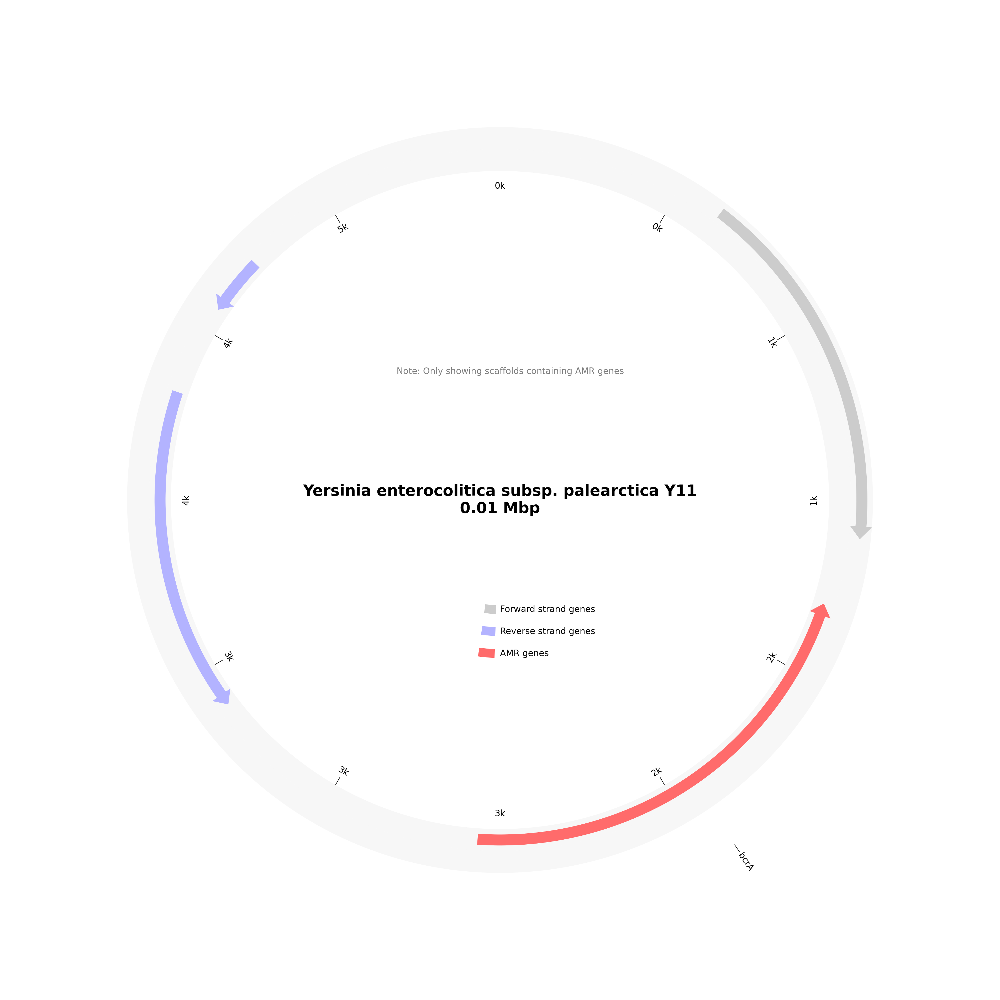

### bcrA
- **Mechanism**: antibiotic efflux
- **Drug Classes**: peptide antibiotic
- **AMR Family**: ATP-binding cassette (ABC) antibiotic efflux pump
- **Locations**:
  - gnl|SPADES|DLDDEBJH_1260_3 : position 1507-2571

