# AMR Analysis Report for LB01_RV_QG_A1_S5

# Organism Classifications:

## Aeromonas salmonicida
**Strain Statistics:**
- Total genome length: 127.1 kbp
- Total scaffolds: 4700
- Scaffolds with AMR genes: 295
- Total genes annotated: 156
- Total AMR genes: 299
- Unique AMR genes: 149
- Distinct AMR mechanisms: 10
- Distinct AMR families: 51
- Distinct drug classes: 32

**Circos Plot:**

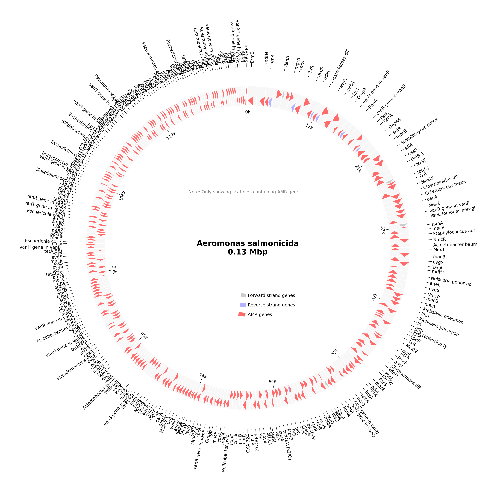

### Acinetobacter baumannii AbaF (found in 2 locations)
- **Mechanism**: antibiotic efflux
- **Drug Classes**: phosphonic acid antibiotic
- **AMR Family**: major facilitator superfamily (MFS) antibiotic efflux pump
- **Locations**:
  - gnl|SPADES|DAOGIJFL_17293_1 : position 3-383
  - gnl|SPADES|DAOGIJFL_8748_1 : position 2-649

### AcrE (found in 2 locations)
- **Mechanism**: antibiotic efflux
- **Drug Classes**: fluoroquinolone antibiotic; cephalosporin; cephamycin; penam
- **AMR Family**: resistance-nodulation-cell division (RND) antibiotic efflux pump
- **Locations**:
  - gnl|SPADES|DAOGIJFL_25126_1 : position 2-286
  - gnl|SPADES|DAOGIJFL_34759_1 : position 2-172

### Bifidobacterium bifidum ileS conferring resistance to mupirocin
- **Mechanism**: antibiotic target alteration
- **Drug Classes**: mupirocin-like antibiotic
- **AMR Family**: antibiotic-resistant isoleucyl-tRNA synthetase (ileS)
- **Locations**:
  - gnl|SPADES|DAOGIJFL_26712_1 : position 2-274

### CRP (found in 3 locations)
- **Mechanism**: antibiotic efflux
- **Drug Classes**: macrolide antibiotic; fluoroquinolone antibiotic; penam
- **AMR Family**: resistance-nodulation-cell division (RND) antibiotic efflux pump
- **Locations**:
  - gnl|SPADES|DAOGIJFL_10306_2 : position 293-571
  - gnl|SPADES|DAOGIJFL_18794_1 : position 1-360
  - gnl|SPADES|DAOGIJFL_20410_1 : position 1-63

### Clostridioides difficile gyrA conferring resistance to fluoroquinolones
- **Mechanism**: antibiotic target alteration
- **Drug Classes**: fluoroquinolone antibiotic
- **AMR Family**: fluoroquinolone resistant gyrA
- **Locations**:
  - gnl|SPADES|DAOGIJFL_5145_1 : position 1-462

### Clostridioides difficile gyrB conferring resistance to fluoroquinolones (found in 2 locations)
- **Mechanism**: antibiotic target alteration
- **Drug Classes**: fluoroquinolone antibiotic
- **AMR Family**: fluoroquinolone resistant gyrB
- **Locations**:
  - gnl|SPADES|DAOGIJFL_11391_1 : position 2-529
  - gnl|SPADES|DAOGIJFL_7923_1 : position 3-701

### Clostridium sporogenes cplR
- **Mechanism**: antibiotic target protection
- **Drug Classes**: lincosamide antibiotic; pleuromutilin antibiotic
- **AMR Family**: Miscellaneous ABC-F subfamily ATP-binding cassette ribosomal protection proteins
- **Locations**:
  - gnl|SPADES|DAOGIJFL_24714_1 : position 3-290

### Enterobacter cloacae acrA
- **Mechanism**: antibiotic efflux
- **Drug Classes**: fluoroquinolone antibiotic; cephalosporin; glycylcycline; penam; tetracycline antibiotic; rifamycin antibiotic; phenicol antibiotic; disinfecting agents and antiseptics
- **AMR Family**: resistance-nodulation-cell division (RND) antibiotic efflux pump
- **Locations**:
  - gnl|SPADES|DAOGIJFL_36631_1 : position 1-228

### Enterococcus faecalis cls with mutation conferring resistance to daptomycin
- **Mechanism**: antibiotic target alteration
- **Drug Classes**: peptide antibiotic
- **AMR Family**: daptomycin resistant cls
- **Locations**:
  - gnl|SPADES|DAOGIJFL_8039_1 : position 1-693

### Enterococcus faecium liaR mutant conferring daptomycin resistance
- **Mechanism**: antibiotic target alteration; antibiotic efflux
- **Drug Classes**: peptide antibiotic
- **AMR Family**: daptomycin resistant liaR
- **Locations**:
  - gnl|SPADES|DAOGIJFL_25634_1 : position 3-281

### ErmE
- **Mechanism**: antibiotic target alteration
- **Drug Classes**: macrolide antibiotic; lincosamide antibiotic; streptogramin antibiotic; streptogramin A antibiotic; streptogramin B antibiotic
- **AMR Family**: Erm 23S ribosomal RNA methyltransferase
- **Locations**:
  - gnl|SPADES|DAOGIJFL_3224_1 : position 72-899

### Escherichia coli AcrAB-TolC with AcrR mutation conferring resistance to ciprofloxacin, tetracycline, and ceftazidime (found in 2 locations)
- **Mechanism**: antibiotic target alteration; antibiotic efflux
- **Drug Classes**: fluoroquinolone antibiotic; cephalosporin; glycylcycline; penam; tetracycline antibiotic; rifamycin antibiotic; phenicol antibiotic; disinfecting agents and antiseptics
- **AMR Family**: resistance-nodulation-cell division (RND) antibiotic efflux pump
- **Locations**:
  - gnl|SPADES|DAOGIJFL_25949_1 : position 116-280
  - gnl|SPADES|DAOGIJFL_26828_1 : position 3-275

### Escherichia coli UhpT with mutation conferring resistance to fosfomycin
- **Mechanism**: antibiotic target alteration
- **Drug Classes**: phosphonic acid antibiotic
- **AMR Family**: antibiotic-resistant UhpT
- **Locations**:
  - gnl|SPADES|DAOGIJFL_22950_1 : position 1-306

### Escherichia coli acrA
- **Mechanism**: antibiotic efflux
- **Drug Classes**: fluoroquinolone antibiotic; cephalosporin; glycylcycline; penam; tetracycline antibiotic; rifamycin antibiotic; phenicol antibiotic; disinfecting agents and antiseptics
- **AMR Family**: resistance-nodulation-cell division (RND) antibiotic efflux pump
- **Locations**:
  - gnl|SPADES|DAOGIJFL_35462_1 : position 2-109

### Escherichia coli soxS with mutation conferring antibiotic resistance
- **Mechanism**: antibiotic target alteration; antibiotic efflux; reduced permeability to antibiotic
- **Drug Classes**: fluoroquinolone antibiotic; monobactam; carbapenem; cephalosporin; glycylcycline; cephamycin; penam; tetracycline antibiotic; rifamycin antibiotic; phenicol antibiotic; penem; disinfecting agents and antiseptics
- **AMR Family**: ATP-binding cassette (ABC) antibiotic efflux pump; major facilitator superfamily (MFS) antibiotic efflux pump; resistance-nodulation-cell division (RND) antibiotic efflux pump; General Bacterial Porin with reduced permeability to beta-lactams
- **Locations**:
  - gnl|SPADES|DAOGIJFL_21962_1 : position 2-139

### FOX-4
- **Mechanism**: antibiotic inactivation
- **Drug Classes**: cephalosporin; cephamycin
- **AMR Family**: FOX beta-lactamase
- **Locations**:
  - gnl|SPADES|DAOGIJFL_24520_1 : position 3-290

### FosC2
- **Mechanism**: antibiotic inactivation
- **Drug Classes**: phosphonic acid antibiotic
- **AMR Family**: fosC phosphotransferase family
- **Locations**:
  - gnl|SPADES|DAOGIJFL_37738_1 : position 1-126

### GMB-1
- **Mechanism**: antibiotic inactivation
- **Drug Classes**: carbapenem
- **AMR Family**: GMB beta-lactamase
- **Locations**:
  - gnl|SPADES|DAOGIJFL_7509_1 : position 2-730

### H-NS
- **Mechanism**: antibiotic efflux
- **Drug Classes**: macrolide antibiotic; fluoroquinolone antibiotic; cephalosporin; cephamycin; penam; tetracycline antibiotic
- **AMR Family**: major facilitator superfamily (MFS) antibiotic efflux pump; resistance-nodulation-cell division (RND) antibiotic efflux pump
- **Locations**:
  - gnl|SPADES|DAOGIJFL_31476_1 : position 1-252

### Helicobacter pylori pbp1 mutants conferring resistance to amoxicillin
- **Mechanism**: antibiotic target alteration
- **Drug Classes**: cephalosporin; cephamycin; penam
- **AMR Family**: Penicillin-binding protein mutations conferring resistance to beta-lactam antibiotics
- **Locations**:
  - gnl|SPADES|DAOGIJFL_14653_1 : position 2-436

### Klebsiella pneumoniae KpnH
- **Mechanism**: antibiotic efflux
- **Drug Classes**: macrolide antibiotic; fluoroquinolone antibiotic; aminoglycoside antibiotic; carbapenem; cephalosporin; penam; peptide antibiotic; penem
- **AMR Family**: major facilitator superfamily (MFS) antibiotic efflux pump
- **Locations**:
  - gnl|SPADES|DAOGIJFL_10084_1 : position 96-581

### Klebsiella pneumoniae OmpK37
- **Mechanism**: reduced permeability to antibiotic
- **Drug Classes**: monobactam; carbapenem; cephalosporin; cephamycin; penam; penem
- **AMR Family**: General Bacterial Porin with reduced permeability to beta-lactams
- **Locations**:
  - gnl|SPADES|DAOGIJFL_9837_1 : position 3-593

### LpeB
- **Mechanism**: antibiotic efflux
- **Drug Classes**: macrolide antibiotic
- **AMR Family**: resistance-nodulation-cell division (RND) antibiotic efflux pump
- **Locations**:
  - gnl|SPADES|DAOGIJFL_10366_1 : position 3-569

### LpsA
- **Mechanism**: reduced permeability to antibiotic
- **Drug Classes**: peptide antibiotic
- **AMR Family**: Intrinsic peptide antibiotic resistant Lps
- **Locations**:
  - gnl|SPADES|DAOGIJFL_12156_1 : position 61-504

### LptD (found in 3 locations)
- **Mechanism**: antibiotic efflux
- **Drug Classes**: carbapenem; peptide antibiotic; aminocoumarin antibiotic; rifamycin antibiotic
- **AMR Family**: ATP-binding cassette (ABC) antibiotic efflux pump
- **Locations**:
  - gnl|SPADES|DAOGIJFL_15549_1 : position 3-416
  - gnl|SPADES|DAOGIJFL_29178_1 : position 3-263
  - gnl|SPADES|DAOGIJFL_36434_1 : position 1-228

### MCR-3.6
- **Mechanism**: antibiotic target alteration
- **Drug Classes**: peptide antibiotic
- **AMR Family**: MCR phosphoethanolamine transferase
- **Locations**:
  - gnl|SPADES|DAOGIJFL_15439_1 : position 1-417

### MCR-7.1
- **Mechanism**: antibiotic target alteration
- **Drug Classes**: peptide antibiotic
- **AMR Family**: MCR phosphoethanolamine transferase
- **Locations**:
  - gnl|SPADES|DAOGIJFL_16100_1 : position 2-406

### MexB
- **Mechanism**: antibiotic efflux
- **Drug Classes**: macrolide antibiotic; fluoroquinolone antibiotic; monobactam; carbapenem; cephalosporin; cephamycin; penam; tetracycline antibiotic; peptide antibiotic; aminocoumarin antibiotic; diaminopyrimidine antibiotic; sulfonamide antibiotic; phenicol antibiotic; penem
- **AMR Family**: resistance-nodulation-cell division (RND) antibiotic efflux pump
- **Locations**:
  - gnl|SPADES|DAOGIJFL_13740_1 : position 2-457

### MexH
- **Mechanism**: antibiotic efflux
- **Drug Classes**: fluoroquinolone antibiotic; tetracycline antibiotic; disinfecting agents and antiseptics
- **AMR Family**: resistance-nodulation-cell division (RND) antibiotic efflux pump
- **Locations**:
  - gnl|SPADES|DAOGIJFL_15798_1 : position 3-269

### MexI
- **Mechanism**: antibiotic efflux
- **Drug Classes**: fluoroquinolone antibiotic; tetracycline antibiotic; disinfecting agents and antiseptics
- **AMR Family**: resistance-nodulation-cell division (RND) antibiotic efflux pump
- **Locations**:
  - gnl|SPADES|DAOGIJFL_34391_1 : position 2-238

### MexK
- **Mechanism**: antibiotic efflux
- **Drug Classes**: macrolide antibiotic; tetracycline antibiotic; disinfecting agents and antiseptics
- **AMR Family**: resistance-nodulation-cell division (RND) antibiotic efflux pump
- **Locations**:
  - gnl|SPADES|DAOGIJFL_31325_1 : position 2-253

### MexL
- **Mechanism**: antibiotic efflux
- **Drug Classes**: macrolide antibiotic; tetracycline antibiotic; disinfecting agents and antiseptics
- **AMR Family**: resistance-nodulation-cell division (RND) antibiotic efflux pump
- **Locations**:
  - gnl|SPADES|DAOGIJFL_17739_1 : position 67-375

### MexS
- **Mechanism**: antibiotic efflux
- **Drug Classes**: fluoroquinolone antibiotic; diaminopyrimidine antibiotic; phenicol antibiotic
- **AMR Family**: resistance-nodulation-cell division (RND) antibiotic efflux pump
- **Locations**:
  - gnl|SPADES|DAOGIJFL_30028_1 : position 3-257

### MexT (found in 2 locations)
- **Mechanism**: antibiotic efflux
- **Drug Classes**: fluoroquinolone antibiotic; diaminopyrimidine antibiotic; phenicol antibiotic
- **AMR Family**: resistance-nodulation-cell division (RND) antibiotic efflux pump
- **Locations**:
  - gnl|SPADES|DAOGIJFL_19007_1 : position 1-357
  - gnl|SPADES|DAOGIJFL_8868_1 : position 2-370

### MexV
- **Mechanism**: antibiotic efflux
- **Drug Classes**: macrolide antibiotic; fluoroquinolone antibiotic; tetracycline antibiotic; phenicol antibiotic; disinfecting agents and antiseptics
- **AMR Family**: resistance-nodulation-cell division (RND) antibiotic efflux pump
- **Locations**:
  - gnl|SPADES|DAOGIJFL_15603_1 : position 75-416

### MexW (found in 7 locations)
- **Mechanism**: antibiotic efflux
- **Drug Classes**: macrolide antibiotic; fluoroquinolone antibiotic; tetracycline antibiotic; phenicol antibiotic; disinfecting agents and antiseptics
- **AMR Family**: resistance-nodulation-cell division (RND) antibiotic efflux pump
- **Locations**:
  - gnl|SPADES|DAOGIJFL_10621_1 : position 1-558
  - gnl|SPADES|DAOGIJFL_11534_1 : position 1-522
  - gnl|SPADES|DAOGIJFL_15798_2 : position 285-410
  - gnl|SPADES|DAOGIJFL_24073_1 : position 1-294
  - gnl|SPADES|DAOGIJFL_35462_2 : position 109-234
  - gnl|SPADES|DAOGIJFL_7510_1 : position 2-730
  - gnl|SPADES|DAOGIJFL_7832_1 : position 2-706

### MexZ
- **Mechanism**: antibiotic efflux
- **Drug Classes**: macrolide antibiotic; fluoroquinolone antibiotic; aminoglycoside antibiotic; carbapenem; cephalosporin; cephamycin; penam; tetracycline antibiotic; phenicol antibiotic; disinfecting agents and antiseptics
- **AMR Family**: resistance-nodulation-cell division (RND) antibiotic efflux pump
- **Locations**:
  - gnl|SPADES|DAOGIJFL_8283_1 : position 142-678

### MuxB
- **Mechanism**: antibiotic efflux
- **Drug Classes**: macrolide antibiotic; monobactam; tetracycline antibiotic; aminocoumarin antibiotic
- **AMR Family**: resistance-nodulation-cell division (RND) antibiotic efflux pump
- **Locations**:
  - gnl|SPADES|DAOGIJFL_16614_1 : position 96-395

### Mycobacterium tuberculosis katG mutations conferring resistance to isoniazid
- **Mechanism**: antibiotic target alteration
- **Drug Classes**: isoniazid-like antibiotic
- **AMR Family**: isoniazid resistant katG
- **Locations**:
  - gnl|SPADES|DAOGIJFL_18955_1 : position 3-356

### Neisseria gonorrhoeae pilQ gene conferring resistance to beta-lactam
- **Mechanism**: antibiotic target alteration
- **Drug Classes**: cephalosporin; cephamycin; penam
- **AMR Family**: Penicillin-binding protein mutations conferring resistance to beta-lactam antibiotics
- **Locations**:
  - gnl|SPADES|DAOGIJFL_9330_1 : position 3-617

### NmcR (found in 4 locations)
- **Mechanism**: antibiotic inactivation
- **Drug Classes**: carbapenem; cephalosporin; cephamycin; penam
- **AMR Family**: NmcA beta-lactamase
- **Locations**:
  - gnl|SPADES|DAOGIJFL_16886_1 : position 65-391
  - gnl|SPADES|DAOGIJFL_33167_1 : position 2-244
  - gnl|SPADES|DAOGIJFL_8596_2 : position 113-658
  - gnl|SPADES|DAOGIJFL_9600_2 : position 207-602

### OXA-724
- **Mechanism**: antibiotic inactivation
- **Drug Classes**: penam
- **AMR Family**: OXA beta-lactamase; OXA-12-like beta-lactamase
- **Locations**:
  - gnl|SPADES|DAOGIJFL_14399_1 : position 1-441

### OmpA (found in 5 locations)
- **Mechanism**: reduced permeability to antibiotic
- **Drug Classes**: peptide antibiotic
- **AMR Family**: General Bacterial Porin with reduced permeability to peptide antibiotics
- **Locations**:
  - gnl|SPADES|DAOGIJFL_15101_1 : position 1-165
  - gnl|SPADES|DAOGIJFL_19416_1 : position 99-350
  - gnl|SPADES|DAOGIJFL_24420_1 : position 2-292
  - gnl|SPADES|DAOGIJFL_35067_1 : position 3-236
  - gnl|SPADES|DAOGIJFL_6043_1 : position 2-337

### OprA
- **Mechanism**: antibiotic efflux
- **Drug Classes**: macrolide antibiotic; fluoroquinolone antibiotic; aminoglycoside antibiotic; carbapenem; tetracycline antibiotic
- **AMR Family**: resistance-nodulation-cell division (RND) antibiotic efflux pump
- **Locations**:
  - gnl|SPADES|DAOGIJFL_24603_1 : position 2-289

### OprM
- **Mechanism**: antibiotic efflux
- **Drug Classes**: macrolide antibiotic; fluoroquinolone antibiotic; monobactam; aminoglycoside antibiotic; carbapenem; cephalosporin; cephamycin; penam; tetracycline antibiotic; peptide antibiotic; aminocoumarin antibiotic; diaminopyrimidine antibiotic; sulfonamide antibiotic; phenicol antibiotic; penem; disinfecting agents and antiseptics
- **AMR Family**: resistance-nodulation-cell division (RND) antibiotic efflux pump
- **Locations**:
  - gnl|SPADES|DAOGIJFL_35507_1 : position 1-234

### ParR (found in 3 locations)
- **Mechanism**: antibiotic efflux; reduced permeability to antibiotic
- **Drug Classes**: macrolide antibiotic; fluoroquinolone antibiotic; monobactam; aminoglycoside antibiotic; carbapenem; cephalosporin; cephamycin; penam; tetracycline antibiotic; phenicol antibiotic; penem; disinfecting agents and antiseptics
- **AMR Family**: resistance-nodulation-cell division (RND) antibiotic efflux pump; Outer Membrane Porin (Opr)
- **Locations**:
  - gnl|SPADES|DAOGIJFL_16949_1 : position 3-350
  - gnl|SPADES|DAOGIJFL_26775_1 : position 2-274
  - gnl|SPADES|DAOGIJFL_6784_1 : position 238-789

### ParS
- **Mechanism**: antibiotic efflux; reduced permeability to antibiotic
- **Drug Classes**: macrolide antibiotic; fluoroquinolone antibiotic; monobactam; aminoglycoside antibiotic; carbapenem; cephalosporin; cephamycin; penam; tetracycline antibiotic; phenicol antibiotic; penem; disinfecting agents and antiseptics
- **AMR Family**: resistance-nodulation-cell division (RND) antibiotic efflux pump; Outer Membrane Porin (Opr)
- **Locations**:
  - gnl|SPADES|DAOGIJFL_11642_1 : position 3-518

### PmrF (found in 2 locations)
- **Mechanism**: antibiotic target alteration
- **Drug Classes**: peptide antibiotic
- **AMR Family**: pmr phosphoethanolamine transferase
- **Locations**:
  - gnl|SPADES|DAOGIJFL_10843_1 : position 1-549
  - gnl|SPADES|DAOGIJFL_18428_2 : position 196-366

### Pseudomonas aeruginosa CpxR (found in 2 locations)
- **Mechanism**: antibiotic efflux
- **Drug Classes**: macrolide antibiotic; fluoroquinolone antibiotic; monobactam; aminoglycoside antibiotic; carbapenem; cephalosporin; cephamycin; penam; tetracycline antibiotic; peptide antibiotic; aminocoumarin antibiotic; diaminopyrimidine antibiotic; sulfonamide antibiotic; phenicol antibiotic; penem
- **AMR Family**: resistance-nodulation-cell division (RND) antibiotic efflux pump
- **Locations**:
  - gnl|SPADES|DAOGIJFL_29634_1 : position 44-259
  - gnl|SPADES|DAOGIJFL_33095_1 : position 3-245

### Pseudomonas aeruginosa ampR with mutation conferring resistance to aztreonam
- **Mechanism**: antibiotic target alteration; antibiotic inactivation
- **Drug Classes**: monobactam; carbapenem; cephalosporin
- **AMR Family**: PDC beta-lactamase; ampR transcriptional regulator with mutation conferring resistance to monobactam antibiotics
- **Locations**:
  - gnl|SPADES|DAOGIJFL_8398_1 : position 2-484

### Pseudomonas aeruginosa soxR
- **Mechanism**: antibiotic target alteration; antibiotic efflux
- **Drug Classes**: fluoroquinolone antibiotic; cephalosporin; glycylcycline; penam; tetracycline antibiotic; rifamycin antibiotic; phenicol antibiotic; disinfecting agents and antiseptics
- **AMR Family**: ATP-binding cassette (ABC) antibiotic efflux pump; major facilitator superfamily (MFS) antibiotic efflux pump; resistance-nodulation-cell division (RND) antibiotic efflux pump
- **Locations**:
  - gnl|SPADES|DAOGIJFL_18289_1 : position 1-366

### QepA4
- **Mechanism**: antibiotic efflux
- **Drug Classes**: fluoroquinolone antibiotic
- **AMR Family**: major facilitator superfamily (MFS) antibiotic efflux pump
- **Locations**:
  - gnl|SPADES|DAOGIJFL_6973_1 : position 3-776

### RanA (found in 7 locations)
- **Mechanism**: antibiotic efflux
- **Drug Classes**: aminoglycoside antibiotic
- **AMR Family**: ATP-binding cassette (ABC) antibiotic efflux pump
- **Locations**:
  - gnl|SPADES|DAOGIJFL_12494_1 : position 2-493
  - gnl|SPADES|DAOGIJFL_18934_1 : position 47-358
  - gnl|SPADES|DAOGIJFL_22222_1 : position 2-313
  - gnl|SPADES|DAOGIJFL_26151_1 : position 1-279
  - gnl|SPADES|DAOGIJFL_3878_2 : position 432-1214
  - gnl|SPADES|DAOGIJFL_6594_1 : position 3-446
  - gnl|SPADES|DAOGIJFL_6788_1 : position 2-382

### Staphylococcus aureus mupA conferring resistance to mupirocin
- **Mechanism**: antibiotic target alteration
- **Drug Classes**: mupirocin-like antibiotic
- **AMR Family**: antibiotic-resistant isoleucyl-tRNA synthetase (ileS)
- **Locations**:
  - gnl|SPADES|DAOGIJFL_8510_1 : position 3-662

### Streptomyces lividans cmlR
- **Mechanism**: antibiotic efflux
- **Drug Classes**: phenicol antibiotic
- **AMR Family**: major facilitator superfamily (MFS) antibiotic efflux pump
- **Locations**:
  - gnl|SPADES|DAOGIJFL_36840_1 : position 3-227

### Streptomyces rimosus otr(A)
- **Mechanism**: antibiotic target protection
- **Drug Classes**: tetracycline antibiotic
- **AMR Family**: tetracycline-resistant ribosomal protection protein
- **Locations**:
  - gnl|SPADES|DAOGIJFL_7134_1 : position 2-760

### TaeA
- **Mechanism**: antibiotic efflux
- **Drug Classes**: pleuromutilin antibiotic
- **AMR Family**: ATP-binding cassette (ABC) antibiotic efflux pump
- **Locations**:
  - gnl|SPADES|DAOGIJFL_9147_1 : position 3-626

### TolC
- **Mechanism**: antibiotic efflux
- **Drug Classes**: macrolide antibiotic; fluoroquinolone antibiotic; aminoglycoside antibiotic; carbapenem; cephalosporin; glycylcycline; cephamycin; penam; tetracycline antibiotic; peptide antibiotic; aminocoumarin antibiotic; rifamycin antibiotic; phenicol antibiotic; penem; disinfecting agents and antiseptics
- **AMR Family**: ATP-binding cassette (ABC) antibiotic efflux pump; major facilitator superfamily (MFS) antibiotic efflux pump; resistance-nodulation-cell division (RND) antibiotic efflux pump
- **Locations**:
  - gnl|SPADES|DAOGIJFL_37266_1 : position 1-225

### TriB
- **Mechanism**: antibiotic efflux
- **Drug Classes**: disinfecting agents and antiseptics
- **AMR Family**: resistance-nodulation-cell division (RND) antibiotic efflux pump
- **Locations**:
  - gnl|SPADES|DAOGIJFL_16044_1 : position 1-375

### TxR (found in 8 locations)
- **Mechanism**: antibiotic efflux
- **Drug Classes**: tetracycline antibiotic
- **AMR Family**: ATP-binding cassette (ABC) antibiotic efflux pump
- **Locations**:
  - gnl|SPADES|DAOGIJFL_10574_1 : position 2-562
  - gnl|SPADES|DAOGIJFL_13732_1 : position 3-458
  - gnl|SPADES|DAOGIJFL_14959_1 : position 2-427
  - gnl|SPADES|DAOGIJFL_16207_1 : position 3-404
  - gnl|SPADES|DAOGIJFL_26666_1 : position 3-275
  - gnl|SPADES|DAOGIJFL_27364_1 : position 2-271
  - gnl|SPADES|DAOGIJFL_4791_1 : position 1-801
  - gnl|SPADES|DAOGIJFL_7767_1 : position 1-711

### YojI (found in 2 locations)
- **Mechanism**: antibiotic efflux
- **Drug Classes**: peptide antibiotic
- **AMR Family**: ATP-binding cassette (ABC) antibiotic efflux pump
- **Locations**:
  - gnl|SPADES|DAOGIJFL_14229_1 : position 1-447
  - gnl|SPADES|DAOGIJFL_36746_1 : position 3-152

### adeB
- **Mechanism**: antibiotic efflux
- **Drug Classes**: glycylcycline; tetracycline antibiotic
- **AMR Family**: resistance-nodulation-cell division (RND) antibiotic efflux pump
- **Locations**:
  - gnl|SPADES|DAOGIJFL_16501_1 : position 2-397

### adeK
- **Mechanism**: antibiotic efflux
- **Drug Classes**: macrolide antibiotic; fluoroquinolone antibiotic; lincosamide antibiotic; carbapenem; cephalosporin; tetracycline antibiotic; rifamycin antibiotic; diaminopyrimidine antibiotic; phenicol antibiotic; penem
- **AMR Family**: resistance-nodulation-cell division (RND) antibiotic efflux pump
- **Locations**:
  - gnl|SPADES|DAOGIJFL_31552_1 : position 2-250

### adeL (found in 11 locations)
- **Mechanism**: antibiotic efflux
- **Drug Classes**: fluoroquinolone antibiotic; tetracycline antibiotic
- **AMR Family**: resistance-nodulation-cell division (RND) antibiotic efflux pump
- **Locations**:
  - gnl|SPADES|DAOGIJFL_10854_1 : position 2-550
  - gnl|SPADES|DAOGIJFL_11747_2 : position 292-516
  - gnl|SPADES|DAOGIJFL_17982_1 : position 1-216
  - gnl|SPADES|DAOGIJFL_18982_1 : position 3-356
  - gnl|SPADES|DAOGIJFL_19540_1 : position 2-349
  - gnl|SPADES|DAOGIJFL_28445_1 : position 3-170
  - gnl|SPADES|DAOGIJFL_31503_1 : position 2-250
  - gnl|SPADES|DAOGIJFL_32549_1 : position 1-246
  - gnl|SPADES|DAOGIJFL_33477_1 : position 1-243
  - gnl|SPADES|DAOGIJFL_5077_1 : position 2-559
  - gnl|SPADES|DAOGIJFL_9327_1 : position 2-616

### almE
- **Mechanism**: antibiotic target alteration
- **Drug Classes**: peptide antibiotic
- **AMR Family**: polymyxin resistance operon; alm glycyltransferase
- **Locations**:
  - gnl|SPADES|DAOGIJFL_15867_1 : position 2-409

### amrA
- **Mechanism**: antibiotic efflux
- **Drug Classes**: macrolide antibiotic; aminoglycoside antibiotic
- **AMR Family**: resistance-nodulation-cell division (RND) antibiotic efflux pump
- **Locations**:
  - gnl|SPADES|DAOGIJFL_20606_1 : position 1-333

### arlR
- **Mechanism**: antibiotic efflux
- **Drug Classes**: fluoroquinolone antibiotic; disinfecting agents and antiseptics
- **AMR Family**: major facilitator superfamily (MFS) antibiotic efflux pump
- **Locations**:
  - gnl|SPADES|DAOGIJFL_17066_1 : position 1-294

### arlS (found in 2 locations)
- **Mechanism**: antibiotic efflux
- **Drug Classes**: fluoroquinolone antibiotic; disinfecting agents and antiseptics
- **AMR Family**: major facilitator superfamily (MFS) antibiotic efflux pump
- **Locations**:
  - gnl|SPADES|DAOGIJFL_10191_1 : position 3-578
  - gnl|SPADES|DAOGIJFL_27931_1 : position 1-252

### arnA (found in 3 locations)
- **Mechanism**: antibiotic target alteration
- **Drug Classes**: peptide antibiotic
- **AMR Family**: pmr phosphoethanolamine transferase
- **Locations**:
  - gnl|SPADES|DAOGIJFL_12327_1 : position 1-498
  - gnl|SPADES|DAOGIJFL_19801_1 : position 3-344
  - gnl|SPADES|DAOGIJFL_3856_1 : position 3-545

### bacA (found in 4 locations)
- **Mechanism**: antibiotic target alteration
- **Drug Classes**: peptide antibiotic
- **AMR Family**: undecaprenyl pyrophosphate related proteins
- **Locations**:
  - gnl|SPADES|DAOGIJFL_12559_2 : position 367-492
  - gnl|SPADES|DAOGIJFL_16157_1 : position 110-403
  - gnl|SPADES|DAOGIJFL_23922_1 : position 1-297
  - gnl|SPADES|DAOGIJFL_8221_1 : position 3-680

### baeR (found in 2 locations)
- **Mechanism**: antibiotic efflux
- **Drug Classes**: aminoglycoside antibiotic; aminocoumarin antibiotic
- **AMR Family**: resistance-nodulation-cell division (RND) antibiotic efflux pump
- **Locations**:
  - gnl|SPADES|DAOGIJFL_35719_1 : position 1-231
  - gnl|SPADES|DAOGIJFL_41656_1 : position 3-206

### basS (found in 3 locations)
- **Mechanism**: antibiotic target alteration; antibiotic efflux
- **Drug Classes**: peptide antibiotic
- **AMR Family**: pmr phosphoethanolamine transferase
- **Locations**:
  - gnl|SPADES|DAOGIJFL_21178_1 : position 3-326
  - gnl|SPADES|DAOGIJFL_38118_1 : position 3-221
  - gnl|SPADES|DAOGIJFL_7362_1 : position 2-742

### bcr-1 (found in 3 locations)
- **Mechanism**: antibiotic efflux
- **Drug Classes**: bicyclomycin-like antibiotic
- **AMR Family**: major facilitator superfamily (MFS) antibiotic efflux pump
- **Locations**:
  - gnl|SPADES|DAOGIJFL_12210_1 : position 253-501
  - gnl|SPADES|DAOGIJFL_20966_1 : position 2-328
  - gnl|SPADES|DAOGIJFL_26108_1 : position 2-277

### bcrA (found in 3 locations)
- **Mechanism**: antibiotic efflux
- **Drug Classes**: peptide antibiotic
- **AMR Family**: ATP-binding cassette (ABC) antibiotic efflux pump
- **Locations**:
  - gnl|SPADES|DAOGIJFL_10725_1 : position 2-403
  - gnl|SPADES|DAOGIJFL_11953_1 : position 1-510
  - gnl|SPADES|DAOGIJFL_19985_1 : position 1-318

### cdeA
- **Mechanism**: antibiotic efflux
- **Drug Classes**: fluoroquinolone antibiotic; disinfecting agents and antiseptics
- **AMR Family**: multidrug and toxic compound extrusion (MATE) transporter
- **Locations**:
  - gnl|SPADES|DAOGIJFL_14568_1 : position 2-439

### ceoB
- **Mechanism**: antibiotic efflux
- **Drug Classes**: fluoroquinolone antibiotic; aminoglycoside antibiotic
- **AMR Family**: resistance-nodulation-cell division (RND) antibiotic efflux pump
- **Locations**:
  - gnl|SPADES|DAOGIJFL_41626_1 : position 2-205

### cfrE
- **Mechanism**: antibiotic target alteration
- **Drug Classes**: lincosamide antibiotic; streptogramin antibiotic; oxazolidinone antibiotic; phenicol antibiotic; pleuromutilin antibiotic
- **AMR Family**: Cfr 23S ribosomal RNA methyltransferase
- **Locations**:
  - gnl|SPADES|DAOGIJFL_32459_1 : position 2-247

### cmlv (found in 2 locations)
- **Mechanism**: antibiotic inactivation
- **Drug Classes**: phenicol antibiotic
- **AMR Family**: chloramphenicol phosphotransferase
- **Locations**:
  - gnl|SPADES|DAOGIJFL_16261_1 : position 2-403
  - gnl|SPADES|DAOGIJFL_21951_1 : position 146-319

### cprR (found in 3 locations)
- **Mechanism**: antibiotic target alteration; antibiotic efflux
- **Drug Classes**: peptide antibiotic
- **AMR Family**: pmr phosphoethanolamine transferase
- **Locations**:
  - gnl|SPADES|DAOGIJFL_13324_1 : position 2-469
  - gnl|SPADES|DAOGIJFL_14535_1 : position 1-438
  - gnl|SPADES|DAOGIJFL_15345_2 : position 186-419

### cprS
- **Mechanism**: antibiotic target alteration; antibiotic efflux
- **Drug Classes**: peptide antibiotic
- **AMR Family**: pmr phosphoethanolamine transferase
- **Locations**:
  - gnl|SPADES|DAOGIJFL_4321_1 : position 1-534

### cpxA (found in 6 locations)
- **Mechanism**: antibiotic efflux
- **Drug Classes**: aminoglycoside antibiotic; aminocoumarin antibiotic
- **AMR Family**: resistance-nodulation-cell division (RND) antibiotic efflux pump
- **Locations**:
  - gnl|SPADES|DAOGIJFL_13864_1 : position 3-455
  - gnl|SPADES|DAOGIJFL_14784_1 : position 2-337
  - gnl|SPADES|DAOGIJFL_18259_1 : position 1-366
  - gnl|SPADES|DAOGIJFL_25597_1 : position 2-280
  - gnl|SPADES|DAOGIJFL_36142_1 : position 1-231
  - gnl|SPADES|DAOGIJFL_41275_1 : position 1-207

### dfrA3
- **Mechanism**: antibiotic target replacement
- **Drug Classes**: diaminopyrimidine antibiotic
- **AMR Family**: trimethoprim resistant dihydrofolate reductase dfr
- **Locations**:
  - gnl|SPADES|DAOGIJFL_30466_1 : position 17-256

### efrA
- **Mechanism**: antibiotic efflux
- **Drug Classes**: macrolide antibiotic; fluoroquinolone antibiotic; rifamycin antibiotic
- **AMR Family**: ATP-binding cassette (ABC) antibiotic efflux pump
- **Locations**:
  - gnl|SPADES|DAOGIJFL_36399_1 : position 1-228

### efrB
- **Mechanism**: antibiotic efflux
- **Drug Classes**: macrolide antibiotic; fluoroquinolone antibiotic; rifamycin antibiotic
- **AMR Family**: ATP-binding cassette (ABC) antibiotic efflux pump
- **Locations**:
  - gnl|SPADES|DAOGIJFL_25121_1 : position 3-287

### emrB
- **Mechanism**: antibiotic efflux
- **Drug Classes**: fluoroquinolone antibiotic
- **AMR Family**: major facilitator superfamily (MFS) antibiotic efflux pump
- **Locations**:
  - gnl|SPADES|DAOGIJFL_22928_1 : position 2-307

### emrY
- **Mechanism**: antibiotic efflux
- **Drug Classes**: tetracycline antibiotic
- **AMR Family**: major facilitator superfamily (MFS) antibiotic efflux pump
- **Locations**:
  - gnl|SPADES|DAOGIJFL_19957_1 : position 1-342

### evgA (found in 4 locations)
- **Mechanism**: antibiotic efflux
- **Drug Classes**: macrolide antibiotic; fluoroquinolone antibiotic; penam; tetracycline antibiotic
- **AMR Family**: major facilitator superfamily (MFS) antibiotic efflux pump; resistance-nodulation-cell division (RND) antibiotic efflux pump
- **Locations**:
  - gnl|SPADES|DAOGIJFL_18164_1 : position 98-370
  - gnl|SPADES|DAOGIJFL_21246_1 : position 3-326
  - gnl|SPADES|DAOGIJFL_25812_1 : position 3-281
  - gnl|SPADES|DAOGIJFL_28863_1 : position 1-264

### evgS (found in 17 locations)
- **Mechanism**: antibiotic efflux
- **Drug Classes**: macrolide antibiotic; fluoroquinolone antibiotic; penam; tetracycline antibiotic
- **AMR Family**: major facilitator superfamily (MFS) antibiotic efflux pump; resistance-nodulation-cell division (RND) antibiotic efflux pump
- **Locations**:
  - gnl|SPADES|DAOGIJFL_13254_1 : position 2-472
  - gnl|SPADES|DAOGIJFL_17121_1 : position 1-387
  - gnl|SPADES|DAOGIJFL_17200_1 : position 1-384
  - gnl|SPADES|DAOGIJFL_17683_1 : position 3-377
  - gnl|SPADES|DAOGIJFL_21151_1 : position 2-328
  - gnl|SPADES|DAOGIJFL_21281_1 : position 2-325
  - gnl|SPADES|DAOGIJFL_22730_1 : position 2-310
  - gnl|SPADES|DAOGIJFL_22907_1 : position 3-308
  - gnl|SPADES|DAOGIJFL_29230_1 : position 3-263
  - gnl|SPADES|DAOGIJFL_30868_1 : position 1-255
  - gnl|SPADES|DAOGIJFL_31783_1 : position 2-250
  - gnl|SPADES|DAOGIJFL_35973_1 : position 1-231
  - gnl|SPADES|DAOGIJFL_37118_1 : position 3-227
  - gnl|SPADES|DAOGIJFL_5022_1 : position 3-923
  - gnl|SPADES|DAOGIJFL_5602_1 : position 2-916
  - gnl|SPADES|DAOGIJFL_8891_1 : position 50-640
  - gnl|SPADES|DAOGIJFL_9509_1 : position 2-607

### facT
- **Mechanism**: antibiotic efflux
- **Drug Classes**: elfamycin antibiotic
- **AMR Family**: major facilitator superfamily (MFS) antibiotic efflux pump
- **Locations**:
  - gnl|SPADES|DAOGIJFL_5755_1 : position 3-899

### golS
- **Mechanism**: antibiotic efflux
- **Drug Classes**: monobactam; carbapenem; cephalosporin; cephamycin; penam; phenicol antibiotic; penem
- **AMR Family**: resistance-nodulation-cell division (RND) antibiotic efflux pump
- **Locations**:
  - gnl|SPADES|DAOGIJFL_26283_1 : position 68-277

### hp1181
- **Mechanism**: antibiotic efflux
- **Drug Classes**: fluoroquinolone antibiotic; tetracycline antibiotic; nitroimidazole antibiotic
- **AMR Family**: major facilitator superfamily (MFS) antibiotic efflux pump
- **Locations**:
  - gnl|SPADES|DAOGIJFL_27019_1 : position 2-274

### iri
- **Mechanism**: antibiotic inactivation
- **Drug Classes**: rifamycin antibiotic
- **AMR Family**: rifampin monooxygenase
- **Locations**:
  - gnl|SPADES|DAOGIJFL_10149_1 : position 1-579

### kdpD (found in 3 locations)
- **Mechanism**: antibiotic efflux
- **Drug Classes**: aminoglycoside antibiotic
- **AMR Family**: kdpDE
- **Locations**:
  - gnl|SPADES|DAOGIJFL_11421_1 : position 1-528
  - gnl|SPADES|DAOGIJFL_14621_1 : position 3-437
  - gnl|SPADES|DAOGIJFL_19944_1 : position 2-343

### kdpE
- **Mechanism**: antibiotic efflux
- **Drug Classes**: aminoglycoside antibiotic
- **AMR Family**: kdpDE
- **Locations**:
  - gnl|SPADES|DAOGIJFL_11497_1 : position 222-524

### leuO (found in 3 locations)
- **Mechanism**: antibiotic efflux
- **Drug Classes**: nucleoside antibiotic; disinfecting agents and antiseptics
- **AMR Family**: major facilitator superfamily (MFS) antibiotic efflux pump
- **Locations**:
  - gnl|SPADES|DAOGIJFL_13020_1 : position 2-478
  - gnl|SPADES|DAOGIJFL_15540_1 : position 1-417
  - gnl|SPADES|DAOGIJFL_29236_1 : position 2-262

### lmrC
- **Mechanism**: antibiotic target protection
- **Drug Classes**: lincosamide antibiotic
- **AMR Family**: Miscellaneous ABC-F subfamily ATP-binding cassette ribosomal protection proteins
- **Locations**:
  - gnl|SPADES|DAOGIJFL_10008_1 : position 1-585

### lsaC
- **Mechanism**: antibiotic target protection
- **Drug Classes**: lincosamide antibiotic; streptogramin antibiotic; pleuromutilin antibiotic
- **AMR Family**: lsa-type ABC-F protein
- **Locations**:
  - gnl|SPADES|DAOGIJFL_25870_1 : position 1-219

### lsaE
- **Mechanism**: antibiotic target protection
- **Drug Classes**: lincosamide antibiotic; streptogramin antibiotic; pleuromutilin antibiotic
- **AMR Family**: lsa-type ABC-F protein
- **Locations**:
  - gnl|SPADES|DAOGIJFL_10642_2 : position 314-559

### macA (found in 2 locations)
- **Mechanism**: antibiotic efflux
- **Drug Classes**: macrolide antibiotic
- **AMR Family**: ATP-binding cassette (ABC) antibiotic efflux pump
- **Locations**:
  - gnl|SPADES|DAOGIJFL_29980_1 : position 2-259
  - gnl|SPADES|DAOGIJFL_34945_1 : position 1-237

### macB (found in 20 locations)
- **Mechanism**: antibiotic efflux
- **Drug Classes**: macrolide antibiotic
- **AMR Family**: ATP-binding cassette (ABC) antibiotic efflux pump
- **Locations**:
  - gnl|SPADES|DAOGIJFL_11669_1 : position 1-516
  - gnl|SPADES|DAOGIJFL_13557_1 : position 3-464
  - gnl|SPADES|DAOGIJFL_14700_1 : position 1-435
  - gnl|SPADES|DAOGIJFL_14897_2 : position 74-430
  - gnl|SPADES|DAOGIJFL_17832_1 : position 1-375
  - gnl|SPADES|DAOGIJFL_17895_1 : position 1-372
  - gnl|SPADES|DAOGIJFL_19092_1 : position 3-353
  - gnl|SPADES|DAOGIJFL_19510_1 : position 3-350
  - gnl|SPADES|DAOGIJFL_21273_1 : position 1-177
  - gnl|SPADES|DAOGIJFL_22052_1 : position 1-318
  - gnl|SPADES|DAOGIJFL_23110_1 : position 3-305
  - gnl|SPADES|DAOGIJFL_29876_1 : position 2-259
  - gnl|SPADES|DAOGIJFL_31397_1 : position 2-253
  - gnl|SPADES|DAOGIJFL_35565_1 : position 2-232
  - gnl|SPADES|DAOGIJFL_37931_1 : position 3-221
  - gnl|SPADES|DAOGIJFL_40445_1 : position 2-211
  - gnl|SPADES|DAOGIJFL_7077_1 : position 1-453
  - gnl|SPADES|DAOGIJFL_8474_2 : position 195-665
  - gnl|SPADES|DAOGIJFL_8881_1 : position 101-640
  - gnl|SPADES|DAOGIJFL_9628_1 : position 3-509

### mdtH
- **Mechanism**: antibiotic efflux
- **Drug Classes**: fluoroquinolone antibiotic
- **AMR Family**: major facilitator superfamily (MFS) antibiotic efflux pump
- **Locations**:
  - gnl|SPADES|DAOGIJFL_9260_1 : position 1-231

### mdtN (found in 3 locations)
- **Mechanism**: antibiotic efflux
- **Drug Classes**: nucleoside antibiotic; disinfecting agents and antiseptics
- **AMR Family**: major facilitator superfamily (MFS) antibiotic efflux pump
- **Locations**:
  - gnl|SPADES|DAOGIJFL_26431_1 : position 2-277
  - gnl|SPADES|DAOGIJFL_3801_2 : position 411-1232
  - gnl|SPADES|DAOGIJFL_38542_1 : position 1-219

### mecC
- **Mechanism**: antibiotic target replacement
- **Drug Classes**: penam
- **AMR Family**: methicillin resistant PBP2
- **Locations**:
  - gnl|SPADES|DAOGIJFL_20577_1 : position 3-335

### mecD
- **Mechanism**: antibiotic target replacement
- **Drug Classes**: penam
- **AMR Family**: methicillin resistant PBP2
- **Locations**:
  - gnl|SPADES|DAOGIJFL_16134_1 : position 2-403

### mgrA
- **Mechanism**: antibiotic efflux
- **Drug Classes**: fluoroquinolone antibiotic; cephalosporin; penam; tetracycline antibiotic; peptide antibiotic; disinfecting agents and antiseptics
- **AMR Family**: ATP-binding cassette (ABC) antibiotic efflux pump; major facilitator superfamily (MFS) antibiotic efflux pump
- **Locations**:
  - gnl|SPADES|DAOGIJFL_4208_2 : position 634-1113

### msbA (found in 9 locations)
- **Mechanism**: antibiotic efflux
- **Drug Classes**: nitroimidazole antibiotic
- **AMR Family**: ATP-binding cassette (ABC) antibiotic efflux pump
- **Locations**:
  - gnl|SPADES|DAOGIJFL_13066_1 : position 2-289
  - gnl|SPADES|DAOGIJFL_14337_1 : position 2-442
  - gnl|SPADES|DAOGIJFL_16987_1 : position 1-387
  - gnl|SPADES|DAOGIJFL_17546_1 : position 1-378
  - gnl|SPADES|DAOGIJFL_18335_2 : position 113-367
  - gnl|SPADES|DAOGIJFL_23805_1 : position 1-297
  - gnl|SPADES|DAOGIJFL_24030_1 : position 3-296
  - gnl|SPADES|DAOGIJFL_25020_1 : position 1-285
  - gnl|SPADES|DAOGIJFL_5718_1 : position 2-904

### msrF
- **Mechanism**: antibiotic target protection
- **Drug Classes**: macrolide antibiotic; streptogramin antibiotic
- **AMR Family**: msr-type ABC-F protein
- **Locations**:
  - gnl|SPADES|DAOGIJFL_13976_2 : position 306-452

### mtrA (found in 2 locations)
- **Mechanism**: antibiotic efflux
- **Drug Classes**: macrolide antibiotic; penam
- **AMR Family**: resistance-nodulation-cell division (RND) antibiotic efflux pump
- **Locations**:
  - gnl|SPADES|DAOGIJFL_11791_1 : position 1-414
  - gnl|SPADES|DAOGIJFL_38363_1 : position 1-198

### novA (found in 4 locations)
- **Mechanism**: antibiotic efflux
- **Drug Classes**: aminocoumarin antibiotic
- **AMR Family**: ATP-binding cassette (ABC) antibiotic efflux pump
- **Locations**:
  - gnl|SPADES|DAOGIJFL_14126_1 : position 1-450
  - gnl|SPADES|DAOGIJFL_17811_1 : position 2-373
  - gnl|SPADES|DAOGIJFL_28909_1 : position 3-263
  - gnl|SPADES|DAOGIJFL_9667_1 : position 1-600

### oleC (found in 4 locations)
- **Mechanism**: antibiotic efflux
- **Drug Classes**: macrolide antibiotic
- **AMR Family**: ATP-binding cassette (ABC) antibiotic efflux pump
- **Locations**:
  - gnl|SPADES|DAOGIJFL_13022_1 : position 1-270
  - gnl|SPADES|DAOGIJFL_13640_1 : position 1-246
  - gnl|SPADES|DAOGIJFL_25773_1 : position 31-279
  - gnl|SPADES|DAOGIJFL_31128_1 : position 2-253

### optrA (found in 2 locations)
- **Mechanism**: antibiotic target protection
- **Drug Classes**: oxazolidinone antibiotic; phenicol antibiotic
- **AMR Family**: Miscellaneous ABC-F subfamily ATP-binding cassette ribosomal protection proteins
- **Locations**:
  - gnl|SPADES|DAOGIJFL_16247_1 : position 2-403
  - gnl|SPADES|DAOGIJFL_20333_1 : position 1-336

### otr(C)
- **Mechanism**: antibiotic efflux
- **Drug Classes**: tetracycline antibiotic
- **AMR Family**: ATP-binding cassette (ABC) antibiotic efflux pump
- **Locations**:
  - gnl|SPADES|DAOGIJFL_14016_1 : position 2-373

### patA
- **Mechanism**: antibiotic efflux
- **Drug Classes**: fluoroquinolone antibiotic
- **AMR Family**: ATP-binding cassette (ABC) antibiotic efflux pump
- **Locations**:
  - gnl|SPADES|DAOGIJFL_36700_1 : position 2-229

### patB (found in 2 locations)
- **Mechanism**: antibiotic efflux
- **Drug Classes**: fluoroquinolone antibiotic
- **AMR Family**: ATP-binding cassette (ABC) antibiotic efflux pump
- **Locations**:
  - gnl|SPADES|DAOGIJFL_14496_1 : position 3-440
  - gnl|SPADES|DAOGIJFL_31734_1 : position 3-251

### poxtA (found in 2 locations)
- **Mechanism**: antibiotic target protection
- **Drug Classes**: tetracycline antibiotic; oxazolidinone antibiotic; phenicol antibiotic
- **AMR Family**: Miscellaneous ABC-F subfamily ATP-binding cassette ribosomal protection proteins
- **Locations**:
  - gnl|SPADES|DAOGIJFL_22035_1 : position 1-318
  - gnl|SPADES|DAOGIJFL_28415_1 : position 1-267

### pp-flo
- **Mechanism**: antibiotic efflux
- **Drug Classes**: phenicol antibiotic
- **AMR Family**: major facilitator superfamily (MFS) antibiotic efflux pump
- **Locations**:
  - gnl|SPADES|DAOGIJFL_31091_1 : position 3-254

### rosB (found in 3 locations)
- **Mechanism**: antibiotic efflux
- **Drug Classes**: peptide antibiotic
- **AMR Family**: major facilitator superfamily (MFS) antibiotic efflux pump
- **Locations**:
  - gnl|SPADES|DAOGIJFL_17006_1 : position 113-388
  - gnl|SPADES|DAOGIJFL_18361_1 : position 1-366
  - gnl|SPADES|DAOGIJFL_18675_1 : position 1-360

### rphB
- **Mechanism**: antibiotic inactivation
- **Drug Classes**: rifamycin antibiotic
- **AMR Family**: rifampin phosphotransferase
- **Locations**:
  - gnl|SPADES|DAOGIJFL_13301_1 : position 1-471

### rsmA
- **Mechanism**: antibiotic efflux
- **Drug Classes**: fluoroquinolone antibiotic; diaminopyrimidine antibiotic; phenicol antibiotic
- **AMR Family**: resistance-nodulation-cell division (RND) antibiotic efflux pump
- **Locations**:
  - gnl|SPADES|DAOGIJFL_8426_2 : position 553-666

### sdiA (found in 3 locations)
- **Mechanism**: antibiotic efflux
- **Drug Classes**: fluoroquinolone antibiotic; cephalosporin; glycylcycline; penam; tetracycline antibiotic; rifamycin antibiotic; phenicol antibiotic; disinfecting agents and antiseptics
- **AMR Family**: resistance-nodulation-cell division (RND) antibiotic efflux pump
- **Locations**:
  - gnl|SPADES|DAOGIJFL_12829_1 : position 3-464
  - gnl|SPADES|DAOGIJFL_7050_1 : position 3-722
  - gnl|SPADES|DAOGIJFL_7221_1 : position 3-755

### sdrM
- **Mechanism**: antibiotic efflux
- **Drug Classes**: fluoroquinolone antibiotic; disinfecting agents and antiseptics
- **AMR Family**: major facilitator superfamily (MFS) antibiotic efflux pump
- **Locations**:
  - gnl|SPADES|DAOGIJFL_13976_1 : position 2-295

### smeS (found in 2 locations)
- **Mechanism**: antibiotic efflux
- **Drug Classes**: aminoglycoside antibiotic; cephalosporin; cephamycin; penam
- **AMR Family**: resistance-nodulation-cell division (RND) antibiotic efflux pump
- **Locations**:
  - gnl|SPADES|DAOGIJFL_22851_1 : position 3-308
  - gnl|SPADES|DAOGIJFL_36817_1 : position 2-226

### sul4 (found in 2 locations)
- **Mechanism**: antibiotic target replacement
- **Drug Classes**: sulfonamide antibiotic
- **AMR Family**: sulfonamide resistant sul
- **Locations**:
  - gnl|SPADES|DAOGIJFL_25940_1 : position 3-278
  - gnl|SPADES|DAOGIJFL_36718_1 : position 1-228

### tet(C)
- **Mechanism**: antibiotic efflux
- **Drug Classes**: tetracycline antibiotic
- **AMR Family**: major facilitator superfamily (MFS) antibiotic efflux pump
- **Locations**:
  - gnl|SPADES|DAOGIJFL_7605_2 : position 427-723

### tet(O/W/32/O)
- **Mechanism**: antibiotic target protection
- **Drug Classes**: tetracycline antibiotic
- **AMR Family**: tetracycline-resistant ribosomal protection protein
- **Locations**:
  - gnl|SPADES|DAOGIJFL_13763_1 : position 3-458

### tetA(46)
- **Mechanism**: antibiotic efflux
- **Drug Classes**: tetracycline antibiotic
- **AMR Family**: ATP-binding cassette (ABC) antibiotic efflux pump
- **Locations**:
  - gnl|SPADES|DAOGIJFL_14254_1 : position 3-446

### tetA(58) (found in 3 locations)
- **Mechanism**: antibiotic efflux
- **Drug Classes**: tetracycline antibiotic
- **AMR Family**: major facilitator superfamily (MFS) antibiotic efflux pump
- **Locations**:
  - gnl|SPADES|DAOGIJFL_13383_1 : position 72-467
  - gnl|SPADES|DAOGIJFL_20830_1 : position 3-332
  - gnl|SPADES|DAOGIJFL_21551_1 : position 3-167

### tetB(46) (found in 2 locations)
- **Mechanism**: antibiotic efflux
- **Drug Classes**: tetracycline antibiotic
- **AMR Family**: ATP-binding cassette (ABC) antibiotic efflux pump
- **Locations**:
  - gnl|SPADES|DAOGIJFL_16962_2 : position 173-388
  - gnl|SPADES|DAOGIJFL_18394_1 : position 128-364

### tetB(60) (found in 4 locations)
- **Mechanism**: antibiotic efflux
- **Drug Classes**: tetracycline antibiotic
- **AMR Family**: ATP-binding cassette (ABC) antibiotic efflux pump
- **Locations**:
  - gnl|SPADES|DAOGIJFL_17214_1 : position 2-385
  - gnl|SPADES|DAOGIJFL_29473_1 : position 97-261
  - gnl|SPADES|DAOGIJFL_35683_1 : position 1-204
  - gnl|SPADES|DAOGIJFL_41577_1 : position 1-207

### tetB(P)
- **Mechanism**: antibiotic target protection
- **Drug Classes**: tetracycline antibiotic
- **AMR Family**: tetracycline-resistant ribosomal protection protein
- **Locations**:
  - gnl|SPADES|DAOGIJFL_23868_1 : position 2-295

### tlrB conferring tylosin resistance
- **Mechanism**: antibiotic target alteration
- **Drug Classes**: macrolide antibiotic; lincosamide antibiotic
- **AMR Family**: non-erm 23S ribosomal RNA methyltransferase (G748)
- **Locations**:
  - gnl|SPADES|DAOGIJFL_10306_1 : position 3-170

### tlrC
- **Mechanism**: antibiotic target protection
- **Drug Classes**: macrolide antibiotic; lincosamide antibiotic
- **AMR Family**: Miscellaneous ABC-F subfamily ATP-binding cassette ribosomal protection proteins
- **Locations**:
  - gnl|SPADES|DAOGIJFL_13728_1 : position 2-460

### vanH gene in vanB cluster
- **Mechanism**: antibiotic target alteration
- **Drug Classes**: glycopeptide antibiotic
- **AMR Family**: vanH; glycopeptide resistance gene cluster
- **Locations**:
  - gnl|SPADES|DAOGIJFL_21524_1 : position 3-323

### vanH gene in vanD cluster
- **Mechanism**: antibiotic target alteration
- **Drug Classes**: glycopeptide antibiotic
- **AMR Family**: vanH; glycopeptide resistance gene cluster
- **Locations**:
  - gnl|SPADES|DAOGIJFL_18646_1 : position 3-362

### vanH gene in vanO cluster
- **Mechanism**: antibiotic target alteration
- **Drug Classes**: glycopeptide antibiotic
- **AMR Family**: vanH; glycopeptide resistance gene cluster
- **Locations**:
  - gnl|SPADES|DAOGIJFL_12276_1 : position 3-500

### vanH gene in vanP cluster
- **Mechanism**: antibiotic target alteration
- **Drug Classes**: glycopeptide antibiotic
- **AMR Family**: vanH; glycopeptide resistance gene cluster
- **Locations**:
  - gnl|SPADES|DAOGIJFL_6438_1 : position 1-351

### vanP
- **Mechanism**: antibiotic target alteration
- **Drug Classes**: glycopeptide antibiotic
- **AMR Family**: glycopeptide resistance gene cluster; Van ligase
- **Locations**:
  - gnl|SPADES|DAOGIJFL_33504_1 : position 3-242

### vanR gene in vanB cluster
- **Mechanism**: antibiotic target alteration
- **Drug Classes**: glycopeptide antibiotic
- **AMR Family**: glycopeptide resistance gene cluster; vanR
- **Locations**:
  - gnl|SPADES|DAOGIJFL_6623_2 : position 455-805

### vanR gene in vanC cluster
- **Mechanism**: antibiotic target alteration
- **Drug Classes**: glycopeptide antibiotic
- **AMR Family**: glycopeptide resistance gene cluster; vanR
- **Locations**:
  - gnl|SPADES|DAOGIJFL_37128_2 : position 112-225

### vanR gene in vanF cluster (found in 4 locations)
- **Mechanism**: antibiotic target alteration
- **Drug Classes**: glycopeptide antibiotic
- **AMR Family**: glycopeptide resistance gene cluster; vanR
- **Locations**:
  - gnl|SPADES|DAOGIJFL_15251_1 : position 1-423
  - gnl|SPADES|DAOGIJFL_19127_1 : position 1-354
  - gnl|SPADES|DAOGIJFL_23803_1 : position 3-296
  - gnl|SPADES|DAOGIJFL_8359_1 : position 43-672

### vanR gene in vanL cluster
- **Mechanism**: antibiotic target alteration
- **Drug Classes**: glycopeptide antibiotic
- **AMR Family**: glycopeptide resistance gene cluster; vanR
- **Locations**:
  - gnl|SPADES|DAOGIJFL_41226_1 : position 3-158

### vanR gene in vanN cluster
- **Mechanism**: antibiotic target alteration
- **Drug Classes**: glycopeptide antibiotic
- **AMR Family**: glycopeptide resistance gene cluster; vanR
- **Locations**:
  - gnl|SPADES|DAOGIJFL_28044_1 : position 3-269

### vanS gene in vanA cluster
- **Mechanism**: antibiotic target alteration
- **Drug Classes**: glycopeptide antibiotic
- **AMR Family**: vanS; glycopeptide resistance gene cluster
- **Locations**:
  - gnl|SPADES|DAOGIJFL_25428_1 : position 3-146

### vanS gene in vanB cluster
- **Mechanism**: antibiotic target alteration
- **Drug Classes**: glycopeptide antibiotic
- **AMR Family**: vanS; glycopeptide resistance gene cluster
- **Locations**:
  - gnl|SPADES|DAOGIJFL_16983_1 : position 1-387

### vanS gene in vanN cluster
- **Mechanism**: antibiotic target alteration
- **Drug Classes**: glycopeptide antibiotic
- **AMR Family**: vanS; glycopeptide resistance gene cluster
- **Locations**:
  - gnl|SPADES|DAOGIJFL_12282_2 : position 173-499

### vanT gene in vanG cluster (found in 2 locations)
- **Mechanism**: antibiotic target alteration
- **Drug Classes**: glycopeptide antibiotic
- **AMR Family**: glycopeptide resistance gene cluster; vanT
- **Locations**:
  - gnl|SPADES|DAOGIJFL_23598_1 : position 1-300
  - gnl|SPADES|DAOGIJFL_29334_1 : position 2-262

### vanXY gene in vanL cluster
- **Mechanism**: antibiotic target alteration
- **Drug Classes**: glycopeptide antibiotic
- **AMR Family**: glycopeptide resistance gene cluster; vanXY
- **Locations**:
  - gnl|SPADES|DAOGIJFL_41339_1 : position 1-207

### vatE
- **Mechanism**: antibiotic inactivation
- **Drug Classes**: streptogramin antibiotic; streptogramin A antibiotic
- **AMR Family**: streptogramin vat acetyltransferase
- **Locations**:
  - gnl|SPADES|DAOGIJFL_13863_1 : position 2-259

### vmlR
- **Mechanism**: antibiotic target protection
- **Drug Classes**: lincosamide antibiotic; streptogramin antibiotic; streptogramin A antibiotic; streptogramin B antibiotic; nucleoside antibiotic; pleuromutilin antibiotic
- **AMR Family**: Miscellaneous ABC-F subfamily ATP-binding cassette ribosomal protection proteins
- **Locations**:
  - gnl|SPADES|DAOGIJFL_15975_1 : position 2-409

## Aeromonas salmonicida subsp. masoucida
**Strain Statistics:**
- Total genome length: 3.6 kbp
- Total scaffolds: 99
- Scaffolds with AMR genes: 7
- Total genes annotated: 6
- Total AMR genes: 7
- Unique AMR genes: 7
- Distinct AMR mechanisms: 3
- Distinct AMR families: 6
- Distinct drug classes: 11

**Circos Plot:**

### Helicobacter pylori pbp1 mutants conferring resistance to amoxicillin
- **Mechanism**: antibiotic target alteration
- **Drug Classes**: cephalosporin; cephamycin; penam
- **AMR Family**: Penicillin-binding protein mutations conferring resistance to beta-lactam antibiotics
- **Locations**:
  - gnl|SPADES|DAOGIJFL_31637_1 : position 3-251

### NmcR
- **Mechanism**: antibiotic inactivation
- **Drug Classes**: carbapenem; cephalosporin; cephamycin; penam
- **AMR Family**: NmcA beta-lactamase
- **Locations**:
  - gnl|SPADES|DAOGIJFL_10932_1 : position 1-546

### cphA5
- **Mechanism**: antibiotic inactivation
- **Drug Classes**: carbapenem
- **AMR Family**: CphA beta-lactamase
- **Locations**:
  - gnl|SPADES|DAOGIJFL_17007_1 : position 1-387

### imiH
- **Mechanism**: antibiotic inactivation
- **Drug Classes**: carbapenem
- **AMR Family**: CphA beta-lactamase
- **Locations**:
  - gnl|SPADES|DAOGIJFL_4672_2 : position 694-1053

### kdpE
- **Mechanism**: antibiotic efflux
- **Drug Classes**: aminoglycoside antibiotic
- **AMR Family**: kdpDE
- **Locations**:
  - gnl|SPADES|DAOGIJFL_16116_1 : position 2-406

### mdtN
- **Mechanism**: antibiotic efflux
- **Drug Classes**: nucleoside antibiotic; disinfecting agents and antiseptics
- **AMR Family**: major facilitator superfamily (MFS) antibiotic efflux pump
- **Locations**:
  - gnl|SPADES|DAOGIJFL_11476_1 : position 1-255

### smeE
- **Mechanism**: antibiotic efflux
- **Drug Classes**: macrolide antibiotic; fluoroquinolone antibiotic; tetracycline antibiotic; phenicol antibiotic
- **AMR Family**: resistance-nodulation-cell division (RND) antibiotic efflux pump
- **Locations**:
  - gnl|SPADES|DAOGIJFL_14167_1 : position 2-448

## Aeromonas salmonicida subsp. pectinolytica 34mel
**Strain Statistics:**
- Total genome length: 14.3 kbp
- Total scaffolds: 248
- Scaffolds with AMR genes: 24
- Total genes annotated: 30
- Total AMR genes: 25
- Unique AMR genes: 24
- Distinct AMR mechanisms: 6
- Distinct AMR families: 15
- Distinct drug classes: 22

**Circos Plot:**

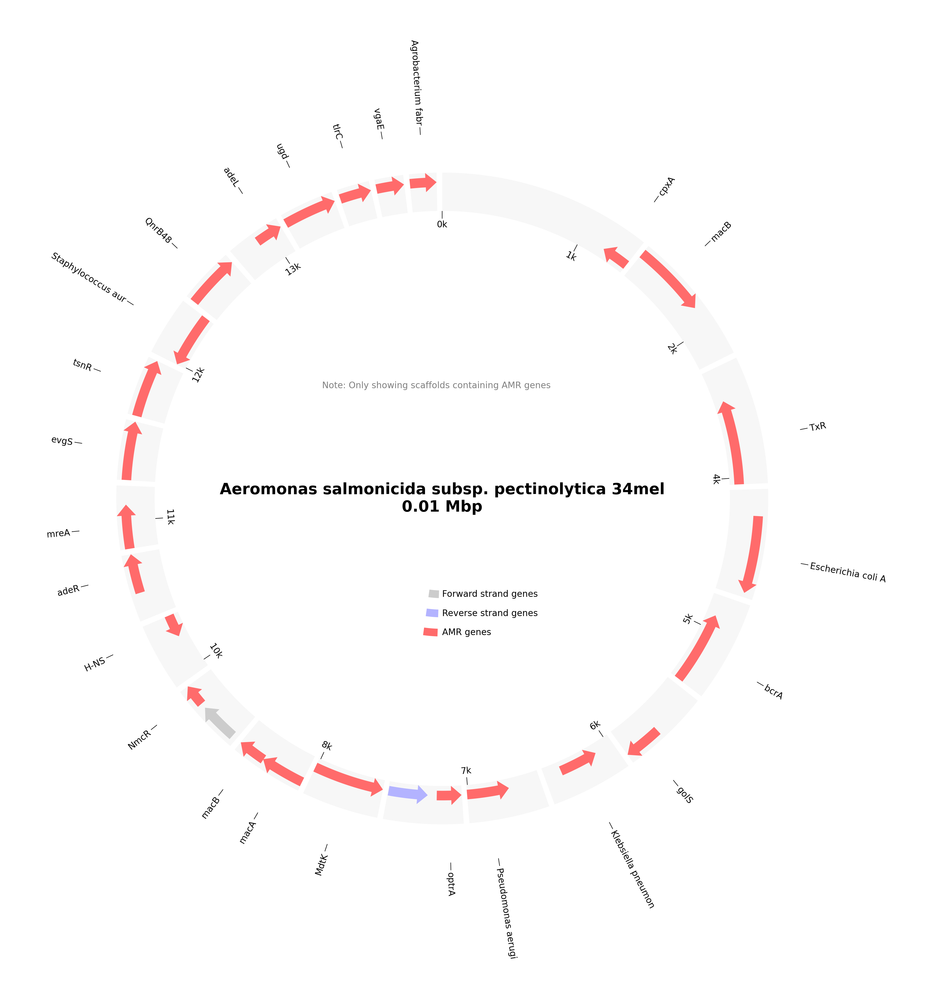

### Agrobacterium fabrum chloramphenicol acetyltransferase
- **Mechanism**: antibiotic inactivation
- **Drug Classes**: phenicol antibiotic
- **AMR Family**: chloramphenicol acetyltransferase (CAT)
- **Locations**:
  - gnl|SPADES|DAOGIJFL_41371_1 : position 1-207

### Escherichia coli AcrAB-TolC with AcrR mutation conferring resistance to ciprofloxacin, tetracycline, and ceftazidime
- **Mechanism**: antibiotic target alteration; antibiotic efflux
- **Drug Classes**: fluoroquinolone antibiotic; cephalosporin; glycylcycline; penam; tetracycline antibiotic; rifamycin antibiotic; phenicol antibiotic; disinfecting agents and antiseptics
- **AMR Family**: resistance-nodulation-cell division (RND) antibiotic efflux pump
- **Locations**:
  - gnl|SPADES|DAOGIJFL_6271_2 : position 208-810

### H-NS
- **Mechanism**: antibiotic efflux
- **Drug Classes**: macrolide antibiotic; fluoroquinolone antibiotic; cephalosporin; cephamycin; penam; tetracycline antibiotic
- **AMR Family**: major facilitator superfamily (MFS) antibiotic efflux pump; resistance-nodulation-cell division (RND) antibiotic efflux pump
- **Locations**:
  - gnl|SPADES|DAOGIJFL_11628_2 : position 332-520

### Klebsiella pneumoniae KpnF
- **Mechanism**: antibiotic efflux
- **Drug Classes**: macrolide antibiotic; aminoglycoside antibiotic; cephalosporin; tetracycline antibiotic; peptide antibiotic; rifamycin antibiotic; disinfecting agents and antiseptics
- **AMR Family**: small multidrug resistance (SMR) antibiotic efflux pump
- **Locations**:
  - gnl|SPADES|DAOGIJFL_9192_1 : position 161-481

### MdtK
- **Mechanism**: antibiotic efflux
- **Drug Classes**: fluoroquinolone antibiotic
- **AMR Family**: multidrug and toxic compound extrusion (MATE) transporter
- **Locations**:
  - gnl|SPADES|DAOGIJFL_10034_1 : position 1-585

### NmcR
- **Mechanism**: antibiotic inactivation
- **Drug Classes**: carbapenem; cephalosporin; cephamycin; penam
- **AMR Family**: NmcA beta-lactamase
- **Locations**:
  - gnl|SPADES|DAOGIJFL_10800_2 : position 381-551

### Pseudomonas aeruginosa ampR with mutation conferring resistance to aztreonam
- **Mechanism**: antibiotic target alteration; antibiotic inactivation
- **Drug Classes**: monobactam; carbapenem; cephalosporin
- **AMR Family**: PDC beta-lactamase; ampR transcriptional regulator with mutation conferring resistance to monobactam antibiotics
- **Locations**:
  - gnl|SPADES|DAOGIJFL_9468_2 : position 263-610

### QnrB48
- **Mechanism**: antibiotic target protection
- **Drug Classes**: fluoroquinolone antibiotic
- **AMR Family**: quinolone resistance protein (qnr)
- **Locations**:
  - gnl|SPADES|DAOGIJFL_15118_1 : position 2-424

### Staphylococcus aureus mupA conferring resistance to mupirocin
- **Mechanism**: antibiotic target alteration
- **Drug Classes**: mupirocin-like antibiotic
- **AMR Family**: antibiotic-resistant isoleucyl-tRNA synthetase (ileS)
- **Locations**:
  - gnl|SPADES|DAOGIJFL_14117_1 : position 3-449

### TxR
- **Mechanism**: antibiotic efflux
- **Drug Classes**: tetracycline antibiotic
- **AMR Family**: ATP-binding cassette (ABC) antibiotic efflux pump
- **Locations**:
  - gnl|SPADES|DAOGIJFL_5205_2 : position 277-972

### adeL
- **Mechanism**: antibiotic efflux
- **Drug Classes**: fluoroquinolone antibiotic; tetracycline antibiotic
- **AMR Family**: resistance-nodulation-cell division (RND) antibiotic efflux pump
- **Locations**:
  - gnl|SPADES|DAOGIJFL_15325_1 : position 208-420

### adeR
- **Mechanism**: antibiotic efflux
- **Drug Classes**: glycylcycline; tetracycline antibiotic
- **AMR Family**: resistance-nodulation-cell division (RND) antibiotic efflux pump
- **Locations**:
  - gnl|SPADES|DAOGIJFL_11914_2 : position 206-511

### bcrA
- **Mechanism**: antibiotic efflux
- **Drug Classes**: peptide antibiotic
- **AMR Family**: ATP-binding cassette (ABC) antibiotic efflux pump
- **Locations**:
  - gnl|SPADES|DAOGIJFL_7010_2 : position 170-772

### cpxA
- **Mechanism**: antibiotic efflux
- **Drug Classes**: aminoglycoside antibiotic; aminocoumarin antibiotic
- **AMR Family**: resistance-nodulation-cell division (RND) antibiotic efflux pump
- **Locations**:
  - gnl|SPADES|DAOGIJFL_2617_2 : position 1397-1624

### evgS
- **Mechanism**: antibiotic efflux
- **Drug Classes**: macrolide antibiotic; fluoroquinolone antibiotic; penam; tetracycline antibiotic
- **AMR Family**: major facilitator superfamily (MFS) antibiotic efflux pump; resistance-nodulation-cell division (RND) antibiotic efflux pump
- **Locations**:
  - gnl|SPADES|DAOGIJFL_13819_1 : position 2-457

### golS
- **Mechanism**: antibiotic efflux
- **Drug Classes**: monobactam; carbapenem; cephalosporin; cephamycin; penam; phenicol antibiotic; penem
- **AMR Family**: resistance-nodulation-cell division (RND) antibiotic efflux pump
- **Locations**:
  - gnl|SPADES|DAOGIJFL_8376_1 : position 374-670

### macA
- **Mechanism**: antibiotic efflux
- **Drug Classes**: macrolide antibiotic
- **AMR Family**: ATP-binding cassette (ABC) antibiotic efflux pump
- **Locations**:
  - gnl|SPADES|DAOGIJFL_10511_1 : position 2-349

### macB (found in 2 locations)
- **Mechanism**: antibiotic efflux
- **Drug Classes**: macrolide antibiotic
- **AMR Family**: ATP-binding cassette (ABC) antibiotic efflux pump
- **Locations**:
  - gnl|SPADES|DAOGIJFL_10511_2 : position 346-564
  - gnl|SPADES|DAOGIJFL_4830_1 : position 1-585

### mreA
- **Mechanism**: antibiotic efflux
- **Drug Classes**: macrolide antibiotic
- **AMR Family**: major facilitator superfamily (MFS) antibiotic efflux pump
- **Locations**:
  - gnl|SPADES|DAOGIJFL_12725_1 : position 1-342

### optrA
- **Mechanism**: antibiotic target protection
- **Drug Classes**: oxazolidinone antibiotic; phenicol antibiotic
- **AMR Family**: Miscellaneous ABC-F subfamily ATP-binding cassette ribosomal protection proteins
- **Locations**:
  - gnl|SPADES|DAOGIJFL_9523_1 : position 3-206

### tlrC
- **Mechanism**: antibiotic target protection
- **Drug Classes**: macrolide antibiotic; lincosamide antibiotic
- **AMR Family**: Miscellaneous ABC-F subfamily ATP-binding cassette ribosomal protection proteins
- **Locations**:
  - gnl|SPADES|DAOGIJFL_32395_1 : position 3-248

### tsnR
- **Mechanism**: antibiotic target alteration
- **Drug Classes**: peptide antibiotic
- **AMR Family**: non-erm 23S ribosomal RNA methyltransferase (A1067)
- **Locations**:
  - gnl|SPADES|DAOGIJFL_13939_1 : position 1-453

### ugd
- **Mechanism**: antibiotic target alteration
- **Drug Classes**: peptide antibiotic
- **AMR Family**: pmr phosphoethanolamine transferase
- **Locations**:
  - gnl|SPADES|DAOGIJFL_15585_1 : position 1-417

### vgaE
- **Mechanism**: antibiotic target protection
- **Drug Classes**: lincosamide antibiotic; streptogramin antibiotic; streptogramin A antibiotic; pleuromutilin antibiotic
- **AMR Family**: vga-type ABC-F protein
- **Locations**:
  - gnl|SPADES|DAOGIJFL_39161_1 : position 1-216

## Buttiauxella agrestis
**Strain Statistics:**
- Total genome length: 117.2 kbp
- Total scaffolds: 1459
- Scaffolds with AMR genes: 147
- Total genes annotated: 206
- Total AMR genes: 152
- Unique AMR genes: 89
- Distinct AMR mechanisms: 9
- Distinct AMR families: 38
- Distinct drug classes: 32

**Circos Plot:**

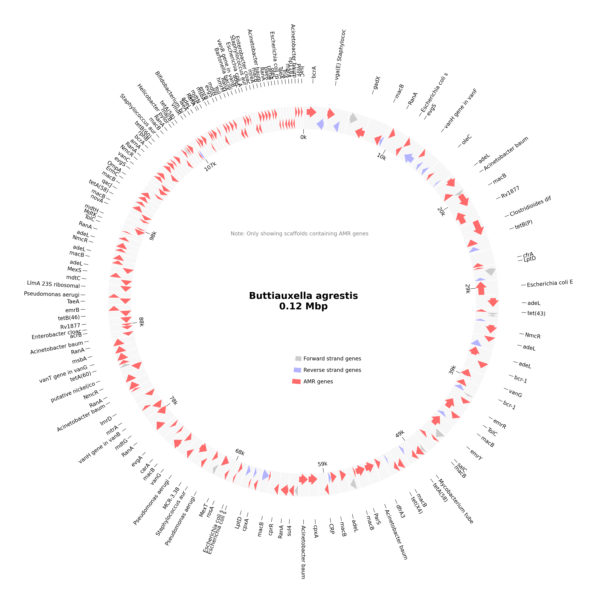

### Acinetobacter baumannii AbaF (found in 4 locations)
- **Mechanism**: antibiotic efflux
- **Drug Classes**: phosphonic acid antibiotic
- **AMR Family**: major facilitator superfamily (MFS) antibiotic efflux pump
- **Locations**:
  - gnl|SPADES|DAOGIJFL_37170_1 : position 3-227
  - gnl|SPADES|DAOGIJFL_4684_1 : position 13-1050
  - gnl|SPADES|DAOGIJFL_4971_1 : position 1-1005
  - gnl|SPADES|DAOGIJFL_8219_1 : position 2-433

### Acinetobacter baumannii AbaQ (found in 3 locations)
- **Mechanism**: antibiotic efflux
- **Drug Classes**: fluoroquinolone antibiotic
- **AMR Family**: major facilitator superfamily (MFS) antibiotic efflux pump
- **Locations**:
  - gnl|SPADES|DAOGIJFL_2259_2 : position 1198-1815
  - gnl|SPADES|DAOGIJFL_28597_1 : position 1-264
  - gnl|SPADES|DAOGIJFL_7153_2 : position 563-760

### Bartonella bacilliformis gyrB conferring resistance to aminocoumarin
- **Mechanism**: antibiotic target alteration
- **Drug Classes**: aminocoumarin antibiotic
- **AMR Family**: aminocoumarin resistant gyrB
- **Locations**:
  - gnl|SPADES|DAOGIJFL_24719_1 : position 1-288

### Bifidobacterium bifidum ileS conferring resistance to mupirocin
- **Mechanism**: antibiotic target alteration
- **Drug Classes**: mupirocin-like antibiotic
- **AMR Family**: antibiotic-resistant isoleucyl-tRNA synthetase (ileS)
- **Locations**:
  - gnl|SPADES|DAOGIJFL_18944_1 : position 1-357

### CRP
- **Mechanism**: antibiotic efflux
- **Drug Classes**: macrolide antibiotic; fluoroquinolone antibiotic; penam
- **AMR Family**: resistance-nodulation-cell division (RND) antibiotic efflux pump
- **Locations**:
  - gnl|SPADES|DAOGIJFL_4838_1 : position 2-409

### Clostridioides difficile gyrB conferring resistance to fluoroquinolones
- **Mechanism**: antibiotic target alteration
- **Drug Classes**: fluoroquinolone antibiotic
- **AMR Family**: fluoroquinolone resistant gyrB
- **Locations**:
  - gnl|SPADES|DAOGIJFL_2632_1 : position 3-1616

### Enterobacter cloacae acrA (found in 2 locations)
- **Mechanism**: antibiotic efflux
- **Drug Classes**: fluoroquinolone antibiotic; cephalosporin; glycylcycline; penam; tetracycline antibiotic; rifamycin antibiotic; phenicol antibiotic; disinfecting agents and antiseptics
- **AMR Family**: resistance-nodulation-cell division (RND) antibiotic efflux pump
- **Locations**:
  - gnl|SPADES|DAOGIJFL_27861_1 : position 2-268
  - gnl|SPADES|DAOGIJFL_8447_2 : position 408-665

### ErmC
- **Mechanism**: antibiotic target alteration
- **Drug Classes**: macrolide antibiotic; lincosamide antibiotic; streptogramin antibiotic; streptogramin A antibiotic; streptogramin B antibiotic
- **AMR Family**: Erm 23S ribosomal RNA methyltransferase
- **Locations**:
  - gnl|SPADES|DAOGIJFL_12653_1 : position 3-488

### Escherichia coli AcrAB-TolC with AcrR mutation conferring resistance to ciprofloxacin, tetracycline, and ceftazidime
- **Mechanism**: antibiotic target alteration; antibiotic efflux
- **Drug Classes**: fluoroquinolone antibiotic; cephalosporin; glycylcycline; penam; tetracycline antibiotic; rifamycin antibiotic; phenicol antibiotic; disinfecting agents and antiseptics
- **AMR Family**: resistance-nodulation-cell division (RND) antibiotic efflux pump
- **Locations**:
  - gnl|SPADES|DAOGIJFL_27322_1 : position 2-97

### Escherichia coli EF-Tu mutants conferring resistance to kirromycin
- **Mechanism**: antibiotic target alteration
- **Drug Classes**: elfamycin antibiotic
- **AMR Family**: elfamycin resistant EF-Tu
- **Locations**:
  - gnl|SPADES|DAOGIJFL_2854_1 : position 2-1525

### Escherichia coli mdfA
- **Mechanism**: antibiotic efflux
- **Drug Classes**: tetracycline antibiotic; phenicol antibiotic; disinfecting agents and antiseptics
- **AMR Family**: major facilitator superfamily (MFS) antibiotic efflux pump
- **Locations**:
  - gnl|SPADES|DAOGIJFL_31808_1 : position 1-156

### Escherichia coli soxR with mutation conferring antibiotic resistance
- **Mechanism**: antibiotic target alteration; antibiotic efflux
- **Drug Classes**: fluoroquinolone antibiotic; cephalosporin; glycylcycline; penam; tetracycline antibiotic; rifamycin antibiotic; phenicol antibiotic; disinfecting agents and antiseptics
- **AMR Family**: ATP-binding cassette (ABC) antibiotic efflux pump; major facilitator superfamily (MFS) antibiotic efflux pump; resistance-nodulation-cell division (RND) antibiotic efflux pump
- **Locations**:
  - gnl|SPADES|DAOGIJFL_5581_3 : position 743-919

### Escherichia coli soxS with mutation conferring antibiotic resistance (found in 2 locations)
- **Mechanism**: antibiotic target alteration; antibiotic efflux; reduced permeability to antibiotic
- **Drug Classes**: fluoroquinolone antibiotic; monobactam; carbapenem; cephalosporin; glycylcycline; cephamycin; penam; tetracycline antibiotic; rifamycin antibiotic; phenicol antibiotic; penem; disinfecting agents and antiseptics
- **AMR Family**: ATP-binding cassette (ABC) antibiotic efflux pump; major facilitator superfamily (MFS) antibiotic efflux pump; resistance-nodulation-cell division (RND) antibiotic efflux pump; General Bacterial Porin with reduced permeability to beta-lactams
- **Locations**:
  - gnl|SPADES|DAOGIJFL_1793_3 : position 1730-2176
  - gnl|SPADES|DAOGIJFL_5581_2 : position 341-664

### Helicobacter pylori rdxA mutation conferring resistance to metronidazole
- **Mechanism**: antibiotic target alteration
- **Drug Classes**: nitroimidazole antibiotic
- **AMR Family**: Antibiotic resistant Helicobacter pylori nitroreductase
- **Locations**:
  - gnl|SPADES|DAOGIJFL_17548_2 : position 235-378

### LlmA 23S ribosomal RNA methyltransferase
- **Mechanism**: antibiotic target alteration
- **Drug Classes**: lincosamide antibiotic
- **AMR Family**: Llm 23S ribosomal RNA methyltransferase
- **Locations**:
  - gnl|SPADES|DAOGIJFL_9187_1 : position 2-622

### LptD (found in 2 locations)
- **Mechanism**: antibiotic efflux
- **Drug Classes**: carbapenem; peptide antibiotic; aminocoumarin antibiotic; rifamycin antibiotic
- **AMR Family**: ATP-binding cassette (ABC) antibiotic efflux pump
- **Locations**:
  - gnl|SPADES|DAOGIJFL_2813_1 : position 2-178
  - gnl|SPADES|DAOGIJFL_5541_1 : position 1-144

### MCR-3.38
- **Mechanism**: antibiotic target alteration
- **Drug Classes**: peptide antibiotic
- **AMR Family**: MCR phosphoethanolamine transferase
- **Locations**:
  - gnl|SPADES|DAOGIJFL_6006_1 : position 3-869

### MdtK
- **Mechanism**: antibiotic efflux
- **Drug Classes**: fluoroquinolone antibiotic
- **AMR Family**: multidrug and toxic compound extrusion (MATE) transporter
- **Locations**:
  - gnl|SPADES|DAOGIJFL_10454_1 : position 3-566

### MexS
- **Mechanism**: antibiotic efflux
- **Drug Classes**: fluoroquinolone antibiotic; diaminopyrimidine antibiotic; phenicol antibiotic
- **AMR Family**: resistance-nodulation-cell division (RND) antibiotic efflux pump
- **Locations**:
  - gnl|SPADES|DAOGIJFL_9563_1 : position 118-603

### MexT
- **Mechanism**: antibiotic efflux
- **Drug Classes**: fluoroquinolone antibiotic; diaminopyrimidine antibiotic; phenicol antibiotic
- **AMR Family**: resistance-nodulation-cell division (RND) antibiotic efflux pump
- **Locations**:
  - gnl|SPADES|DAOGIJFL_5710_1 : position 3-701

### Mycobacterium tuberculosis intrinsic murA conferring resistance to fosfomycin
- **Mechanism**: antibiotic target alteration
- **Drug Classes**: phosphonic acid antibiotic
- **AMR Family**: antibiotic-resistant murA transferase
- **Locations**:
  - gnl|SPADES|DAOGIJFL_4217_2 : position 467-1135

### NmcR (found in 4 locations)
- **Mechanism**: antibiotic inactivation
- **Drug Classes**: carbapenem; cephalosporin; cephamycin; penam
- **AMR Family**: NmcA beta-lactamase
- **Locations**:
  - gnl|SPADES|DAOGIJFL_10156_1 : position 259-579
  - gnl|SPADES|DAOGIJFL_14632_1 : position 76-438
  - gnl|SPADES|DAOGIJFL_3269_1 : position 205-1098
  - gnl|SPADES|DAOGIJFL_7263_1 : position 62-751

### OmpA
- **Mechanism**: reduced permeability to antibiotic
- **Drug Classes**: peptide antibiotic
- **AMR Family**: General Bacterial Porin with reduced permeability to peptide antibiotics
- **Locations**:
  - gnl|SPADES|DAOGIJFL_12740_1 : position 3-245

### ParS
- **Mechanism**: antibiotic efflux; reduced permeability to antibiotic
- **Drug Classes**: macrolide antibiotic; fluoroquinolone antibiotic; monobactam; aminoglycoside antibiotic; carbapenem; cephalosporin; cephamycin; penam; tetracycline antibiotic; phenicol antibiotic; penem; disinfecting agents and antiseptics
- **AMR Family**: resistance-nodulation-cell division (RND) antibiotic efflux pump; Outer Membrane Porin (Opr)
- **Locations**:
  - gnl|SPADES|DAOGIJFL_4697_1 : position 3-1046

### PmrF
- **Mechanism**: antibiotic target alteration
- **Drug Classes**: peptide antibiotic
- **AMR Family**: pmr phosphoethanolamine transferase
- **Locations**:
  - gnl|SPADES|DAOGIJFL_37252_1 : position 1-225

### Pseudomonas aeruginosa CpxR (found in 3 locations)
- **Mechanism**: antibiotic efflux
- **Drug Classes**: macrolide antibiotic; fluoroquinolone antibiotic; monobactam; aminoglycoside antibiotic; carbapenem; cephalosporin; cephamycin; penam; tetracycline antibiotic; peptide antibiotic; aminocoumarin antibiotic; diaminopyrimidine antibiotic; sulfonamide antibiotic; phenicol antibiotic; penem
- **AMR Family**: resistance-nodulation-cell division (RND) antibiotic efflux pump
- **Locations**:
  - gnl|SPADES|DAOGIJFL_5894_2 : position 468-881
  - gnl|SPADES|DAOGIJFL_6058_2 : position 367-864
  - gnl|SPADES|DAOGIJFL_9158_1 : position 1-405

### RanA (found in 11 locations)
- **Mechanism**: antibiotic efflux
- **Drug Classes**: aminoglycoside antibiotic
- **AMR Family**: ATP-binding cassette (ABC) antibiotic efflux pump
- **Locations**:
  - gnl|SPADES|DAOGIJFL_10367_2 : position 230-571
  - gnl|SPADES|DAOGIJFL_14672_1 : position 3-434
  - gnl|SPADES|DAOGIJFL_17437_2 : position 148-381
  - gnl|SPADES|DAOGIJFL_1793_1 : position 336-872
  - gnl|SPADES|DAOGIJFL_19462_1 : position 2-202
  - gnl|SPADES|DAOGIJFL_24424_1 : position 2-292
  - gnl|SPADES|DAOGIJFL_28638_1 : position 1-264
  - gnl|SPADES|DAOGIJFL_5068_1 : position 3-818
  - gnl|SPADES|DAOGIJFL_6558_1 : position 73-813
  - gnl|SPADES|DAOGIJFL_7218_1 : position 2-733
  - gnl|SPADES|DAOGIJFL_7775_1 : position 2-709

### Rv1877 (found in 2 locations)
- **Mechanism**: antibiotic efflux
- **Drug Classes**: fluoroquinolone antibiotic
- **AMR Family**: major facilitator superfamily (MFS) antibiotic efflux pump
- **Locations**:
  - gnl|SPADES|DAOGIJFL_2516_1 : position 33-1415
  - gnl|SPADES|DAOGIJFL_8579_1 : position 1-657

### Staphylococcus aureus GlpT with mutation conferring resistance to fosfomycin
- **Mechanism**: antibiotic target alteration
- **Drug Classes**: phosphonic acid antibiotic
- **AMR Family**: antibiotic-resistant GlpT
- **Locations**:
  - gnl|SPADES|DAOGIJFL_5970_2 : position 475-873

### Staphylococcus aureus LmrS
- **Mechanism**: antibiotic efflux
- **Drug Classes**: macrolide antibiotic; aminoglycoside antibiotic; oxazolidinone antibiotic; diaminopyrimidine antibiotic; phenicol antibiotic
- **AMR Family**: major facilitator superfamily (MFS) antibiotic efflux pump
- **Locations**:
  - gnl|SPADES|DAOGIJFL_27295_1 : position 2-271

### Staphylococcus aureus murA with mutation conferring resistance to fosfomycin
- **Mechanism**: antibiotic target alteration
- **Drug Classes**: phosphonic acid antibiotic
- **AMR Family**: antibiotic-resistant murA transferase
- **Locations**:
  - gnl|SPADES|DAOGIJFL_16957_1 : position 3-389

### TaeA (found in 3 locations)
- **Mechanism**: antibiotic efflux
- **Drug Classes**: pleuromutilin antibiotic
- **AMR Family**: ATP-binding cassette (ABC) antibiotic efflux pump
- **Locations**:
  - gnl|SPADES|DAOGIJFL_18954_1 : position 3-356
  - gnl|SPADES|DAOGIJFL_33760_1 : position 2-241
  - gnl|SPADES|DAOGIJFL_9113_1 : position 2-628

### TolC (found in 2 locations)
- **Mechanism**: antibiotic efflux
- **Drug Classes**: macrolide antibiotic; fluoroquinolone antibiotic; aminoglycoside antibiotic; carbapenem; cephalosporin; glycylcycline; cephamycin; penam; tetracycline antibiotic; peptide antibiotic; aminocoumarin antibiotic; rifamycin antibiotic; phenicol antibiotic; penem; disinfecting agents and antiseptics
- **AMR Family**: ATP-binding cassette (ABC) antibiotic efflux pump; major facilitator superfamily (MFS) antibiotic efflux pump; resistance-nodulation-cell division (RND) antibiotic efflux pump
- **Locations**:
  - gnl|SPADES|DAOGIJFL_10412_2 : position 436-567
  - gnl|SPADES|DAOGIJFL_4047_1 : position 2-1180

### TriA
- **Mechanism**: antibiotic efflux
- **Drug Classes**: disinfecting agents and antiseptics
- **AMR Family**: resistance-nodulation-cell division (RND) antibiotic efflux pump
- **Locations**:
  - gnl|SPADES|DAOGIJFL_35283_1 : position 3-233

### YojI
- **Mechanism**: antibiotic efflux
- **Drug Classes**: peptide antibiotic
- **AMR Family**: ATP-binding cassette (ABC) antibiotic efflux pump
- **Locations**:
  - gnl|SPADES|DAOGIJFL_22811_1 : position 2-307

### acrB
- **Mechanism**: antibiotic efflux
- **Drug Classes**: fluoroquinolone antibiotic; cephalosporin; glycylcycline; penam; tetracycline antibiotic; rifamycin antibiotic; phenicol antibiotic; disinfecting agents and antiseptics
- **AMR Family**: resistance-nodulation-cell division (RND) antibiotic efflux pump
- **Locations**:
  - gnl|SPADES|DAOGIJFL_8447_1 : position 2-385

### adeL (found in 10 locations)
- **Mechanism**: antibiotic efflux
- **Drug Classes**: fluoroquinolone antibiotic; tetracycline antibiotic
- **AMR Family**: resistance-nodulation-cell division (RND) antibiotic efflux pump
- **Locations**:
  - gnl|SPADES|DAOGIJFL_10299_1 : position 3-572
  - gnl|SPADES|DAOGIJFL_19425_1 : position 1-150
  - gnl|SPADES|DAOGIJFL_2259_1 : position 247-1161
  - gnl|SPADES|DAOGIJFL_26201_1 : position 2-277
  - gnl|SPADES|DAOGIJFL_2970_2 : position 325-1266
  - gnl|SPADES|DAOGIJFL_3428_1 : position 2-571
  - gnl|SPADES|DAOGIJFL_3457_1 : position 1-927
  - gnl|SPADES|DAOGIJFL_4758_1 : position 1-639
  - gnl|SPADES|DAOGIJFL_9664_1 : position 1-579
  - gnl|SPADES|DAOGIJFL_9968_1 : position 1-555

### arnA
- **Mechanism**: antibiotic target alteration
- **Drug Classes**: peptide antibiotic
- **AMR Family**: pmr phosphoethanolamine transferase
- **Locations**:
  - gnl|SPADES|DAOGIJFL_15189_1 : position 1-423

### baeR
- **Mechanism**: antibiotic efflux
- **Drug Classes**: aminoglycoside antibiotic; aminocoumarin antibiotic
- **AMR Family**: resistance-nodulation-cell division (RND) antibiotic efflux pump
- **Locations**:
  - gnl|SPADES|DAOGIJFL_28799_1 : position 93-263

### bcr-1 (found in 2 locations)
- **Mechanism**: antibiotic efflux
- **Drug Classes**: bicyclomycin-like antibiotic
- **AMR Family**: major facilitator superfamily (MFS) antibiotic efflux pump
- **Locations**:
  - gnl|SPADES|DAOGIJFL_3800_1 : position 51-725
  - gnl|SPADES|DAOGIJFL_4028_1 : position 1-609

### bcrA (found in 2 locations)
- **Mechanism**: antibiotic efflux
- **Drug Classes**: peptide antibiotic
- **AMR Family**: ATP-binding cassette (ABC) antibiotic efflux pump
- **Locations**:
  - gnl|SPADES|DAOGIJFL_1488_2 : position 347-1405
  - gnl|SPADES|DAOGIJFL_15310_1 : position 2-421

### carA
- **Mechanism**: antibiotic target protection
- **Drug Classes**: macrolide antibiotic
- **AMR Family**: Miscellaneous ABC-F subfamily ATP-binding cassette ribosomal protection proteins
- **Locations**:
  - gnl|SPADES|DAOGIJFL_6345_1 : position 2-235

### cfrA
- **Mechanism**: antibiotic target alteration
- **Drug Classes**: lincosamide antibiotic; streptogramin antibiotic; streptogramin A antibiotic; oxazolidinone antibiotic; phenicol antibiotic; pleuromutilin antibiotic
- **AMR Family**: Cfr 23S ribosomal RNA methyltransferase
- **Locations**:
  - gnl|SPADES|DAOGIJFL_2712_2 : position 1138-1578

### cprR
- **Mechanism**: antibiotic target alteration; antibiotic efflux
- **Drug Classes**: peptide antibiotic
- **AMR Family**: pmr phosphoethanolamine transferase
- **Locations**:
  - gnl|SPADES|DAOGIJFL_5109_1 : position 2-448

### cpxA (found in 2 locations)
- **Mechanism**: antibiotic efflux
- **Drug Classes**: aminoglycoside antibiotic; aminocoumarin antibiotic
- **AMR Family**: resistance-nodulation-cell division (RND) antibiotic efflux pump
- **Locations**:
  - gnl|SPADES|DAOGIJFL_4901_1 : position 1-1014
  - gnl|SPADES|DAOGIJFL_5419_2 : position 273-593

### dfrA3
- **Mechanism**: antibiotic target replacement
- **Drug Classes**: diaminopyrimidine antibiotic
- **AMR Family**: trimethoprim resistant dihydrofolate reductase dfr
- **Locations**:
  - gnl|SPADES|DAOGIJFL_4667_2 : position 335-814

### emrB (found in 2 locations)
- **Mechanism**: antibiotic efflux
- **Drug Classes**: fluoroquinolone antibiotic
- **AMR Family**: major facilitator superfamily (MFS) antibiotic efflux pump
- **Locations**:
  - gnl|SPADES|DAOGIJFL_20555_1 : position 1-270
  - gnl|SPADES|DAOGIJFL_9091_1 : position 2-511

### emrR
- **Mechanism**: antibiotic efflux
- **Drug Classes**: fluoroquinolone antibiotic
- **AMR Family**: major facilitator superfamily (MFS) antibiotic efflux pump
- **Locations**:
  - gnl|SPADES|DAOGIJFL_4040_3: position 624-1154

### emrY
- **Mechanism**: antibiotic efflux
- **Drug Classes**: tetracycline antibiotic
- **AMR Family**: major facilitator superfamily (MFS) antibiotic efflux pump
- **Locations**:
  - gnl|SPADES|DAOGIJFL_4119_1 : position 36-1160

### evgA
- **Mechanism**: antibiotic efflux
- **Drug Classes**: macrolide antibiotic; fluoroquinolone antibiotic; penam; tetracycline antibiotic
- **AMR Family**: major facilitator superfamily (MFS) antibiotic efflux pump; resistance-nodulation-cell division (RND) antibiotic efflux pump
- **Locations**:
  - gnl|SPADES|DAOGIJFL_6457_1 : position 1-309

### evgS (found in 3 locations)
- **Mechanism**: antibiotic efflux
- **Drug Classes**: macrolide antibiotic; fluoroquinolone antibiotic; penam; tetracycline antibiotic
- **AMR Family**: major facilitator superfamily (MFS) antibiotic efflux pump; resistance-nodulation-cell division (RND) antibiotic efflux pump
- **Locations**:
  - gnl|SPADES|DAOGIJFL_13507_1 : position 1-465
  - gnl|SPADES|DAOGIJFL_2048_1 : position 3-521
  - gnl|SPADES|DAOGIJFL_20516_1 : position 102-335

### gadX
- **Mechanism**: antibiotic efflux
- **Drug Classes**: macrolide antibiotic; fluoroquinolone antibiotic; penam
- **AMR Family**: resistance-nodulation-cell division (RND) antibiotic efflux pump
- **Locations**:
  - gnl|SPADES|DAOGIJFL_1781_2 : position 1082-2185

### hmrM
- **Mechanism**: antibiotic efflux
- **Drug Classes**: fluoroquinolone antibiotic; disinfecting agents and antiseptics
- **AMR Family**: multidrug and toxic compound extrusion (MATE) transporter
- **Locations**:
  - gnl|SPADES|DAOGIJFL_24114_1 : position 49-294

### hp1181
- **Mechanism**: antibiotic efflux
- **Drug Classes**: fluoroquinolone antibiotic; tetracycline antibiotic; nitroimidazole antibiotic
- **AMR Family**: major facilitator superfamily (MFS) antibiotic efflux pump
- **Locations**:
  - gnl|SPADES|DAOGIJFL_37137_1 : position 1-195

### lmrD
- **Mechanism**: antibiotic efflux
- **Drug Classes**: lincosamide antibiotic
- **AMR Family**: ATP-binding cassette (ABC) antibiotic efflux pump
- **Locations**:
  - gnl|SPADES|DAOGIJFL_6870_1 : position 2-535

### lsaC (found in 2 locations)
- **Mechanism**: antibiotic target protection
- **Drug Classes**: lincosamide antibiotic; streptogramin antibiotic; pleuromutilin antibiotic
- **AMR Family**: lsa-type ABC-F protein
- **Locations**:
  - gnl|SPADES|DAOGIJFL_19462_2 : position 204-350
  - gnl|SPADES|DAOGIJFL_39685_1 : position 32-214

### macB (found in 15 locations)
- **Mechanism**: antibiotic efflux
- **Drug Classes**: macrolide antibiotic
- **AMR Family**: ATP-binding cassette (ABC) antibiotic efflux pump
- **Locations**:
  - gnl|SPADES|DAOGIJFL_11650_1 : position 3-455
  - gnl|SPADES|DAOGIJFL_12320_1 : position 63-497
  - gnl|SPADES|DAOGIJFL_17245_2 : position 116-385
  - gnl|SPADES|DAOGIJFL_17861_1 : position 3-374
  - gnl|SPADES|DAOGIJFL_1786_2 : position 1166-1834
  - gnl|SPADES|DAOGIJFL_2333_2 : position 379-1767
  - gnl|SPADES|DAOGIJFL_27880_1 : position 3-269
  - gnl|SPADES|DAOGIJFL_4081_1 : position 3-602
  - gnl|SPADES|DAOGIJFL_4173_1 : position 1-345
  - gnl|SPADES|DAOGIJFL_4457_2 : position 535-1092
  - gnl|SPADES|DAOGIJFL_4703_1 : position 2-187
  - gnl|SPADES|DAOGIJFL_4828_1 : position 2-619
  - gnl|SPADES|DAOGIJFL_5400_1 : position 1-159
  - gnl|SPADES|DAOGIJFL_6167_1 : position 44-853
  - gnl|SPADES|DAOGIJFL_9775_2 : position 196-594

### marA
- **Mechanism**: antibiotic efflux; reduced permeability to antibiotic
- **Drug Classes**: fluoroquinolone antibiotic; monobactam; carbapenem; cephalosporin; glycylcycline; cephamycin; penam; tetracycline antibiotic; rifamycin antibiotic; phenicol antibiotic; penem; disinfecting agents and antiseptics
- **AMR Family**: resistance-nodulation-cell division (RND) antibiotic efflux pump; General Bacterial Porin with reduced permeability to beta-lactams
- **Locations**:
  - gnl|SPADES|DAOGIJFL_35528_1 : position 1-234

### mdtC
- **Mechanism**: antibiotic efflux
- **Drug Classes**: aminocoumarin antibiotic
- **AMR Family**: resistance-nodulation-cell division (RND) antibiotic efflux pump
- **Locations**:
  - gnl|SPADES|DAOGIJFL_9384_1 : position 13-612

### mdtG
- **Mechanism**: antibiotic efflux
- **Drug Classes**: phosphonic acid antibiotic
- **AMR Family**: major facilitator superfamily (MFS) antibiotic efflux pump
- **Locations**:
  - gnl|SPADES|DAOGIJFL_6728_1 : position 3-794

### mdtH (found in 2 locations)
- **Mechanism**: antibiotic efflux
- **Drug Classes**: fluoroquinolone antibiotic
- **AMR Family**: major facilitator superfamily (MFS) antibiotic efflux pump
- **Locations**:
  - gnl|SPADES|DAOGIJFL_10546_1 : position 2-154
  - gnl|SPADES|DAOGIJFL_21224_1 : position 2-238

### mdtN
- **Mechanism**: antibiotic efflux
- **Drug Classes**: nucleoside antibiotic; disinfecting agents and antiseptics
- **AMR Family**: major facilitator superfamily (MFS) antibiotic efflux pump
- **Locations**:
  - gnl|SPADES|DAOGIJFL_19642_1 : position 3-347

### mreA
- **Mechanism**: antibiotic efflux
- **Drug Classes**: macrolide antibiotic
- **AMR Family**: major facilitator superfamily (MFS) antibiotic efflux pump
- **Locations**:
  - gnl|SPADES|DAOGIJFL_27797_1 : position 3-269

### msbA (found in 2 locations)
- **Mechanism**: antibiotic efflux
- **Drug Classes**: nitroimidazole antibiotic
- **AMR Family**: ATP-binding cassette (ABC) antibiotic efflux pump
- **Locations**:
  - gnl|SPADES|DAOGIJFL_20331_1 : position 199-336
  - gnl|SPADES|DAOGIJFL_7650_1 : position 1-681

### mtrA
- **Mechanism**: antibiotic efflux
- **Drug Classes**: macrolide antibiotic; penam
- **AMR Family**: resistance-nodulation-cell division (RND) antibiotic efflux pump
- **Locations**:
  - gnl|SPADES|DAOGIJFL_6862_1 : position 3-311

### novA
- **Mechanism**: antibiotic efflux
- **Drug Classes**: aminocoumarin antibiotic
- **AMR Family**: ATP-binding cassette (ABC) antibiotic efflux pump
- **Locations**:
  - gnl|SPADES|DAOGIJFL_11347_2 : position 286-528

### oleC (found in 2 locations)
- **Mechanism**: antibiotic efflux
- **Drug Classes**: macrolide antibiotic
- **AMR Family**: ATP-binding cassette (ABC) antibiotic efflux pump
- **Locations**:
  - gnl|SPADES|DAOGIJFL_2174_1 : position 232-534
  - gnl|SPADES|DAOGIJFL_30324_1 : position 1-168

### putative nickel/cobalt transporter
- **Mechanism**: antibiotic efflux
- **Drug Classes**: fluoroquinolone antibiotic; aminoglycoside antibiotic; isoniazid-like antibiotic
- **AMR Family**: metal transporters with antibiotic efflux
- **Locations**:
  - gnl|SPADES|DAOGIJFL_7327_1 : position 2-745

### qacJ
- **Mechanism**: antibiotic efflux
- **Drug Classes**: disinfecting agents and antiseptics
- **AMR Family**: small multidrug resistance (SMR) antibiotic efflux pump
- **Locations**:
  - gnl|SPADES|DAOGIJFL_12220_1 : position 119-436

### ramA
- **Mechanism**: antibiotic efflux; reduced permeability to antibiotic
- **Drug Classes**: fluoroquinolone antibiotic; monobactam; carbapenem; cephalosporin; glycylcycline; cephamycin; penam; tetracycline antibiotic; rifamycin antibiotic; phenicol antibiotic; penem; disinfecting agents and antiseptics
- **AMR Family**: resistance-nodulation-cell division (RND) antibiotic efflux pump; General Bacterial Porin with reduced permeability to beta-lactams
- **Locations**:
  - gnl|SPADES|DAOGIJFL_29572_1 : position 1-261

### rosA
- **Mechanism**: antibiotic efflux
- **Drug Classes**: peptide antibiotic
- **AMR Family**: major facilitator superfamily (MFS) antibiotic efflux pump
- **Locations**:
  - gnl|SPADES|DAOGIJFL_5671_2 : position 623-910

### rphB
- **Mechanism**: antibiotic inactivation
- **Drug Classes**: rifamycin antibiotic
- **AMR Family**: rifampin phosphotransferase
- **Locations**:
  - gnl|SPADES|DAOGIJFL_16131_1 : position 1-405

### salC
- **Mechanism**: antibiotic target protection
- **Drug Classes**: lincosamide antibiotic; streptogramin antibiotic; streptogramin A antibiotic; pleuromutilin antibiotic
- **AMR Family**: sal-type ABC-F protein
- **Locations**:
  - gnl|SPADES|DAOGIJFL_4137_2 : position 902-1156

### sul4
- **Mechanism**: antibiotic target replacement
- **Drug Classes**: sulfonamide antibiotic
- **AMR Family**: sulfonamide resistant sul
- **Locations**:
  - gnl|SPADES|DAOGIJFL_5039_2 : position 464-997

### tet(43)
- **Mechanism**: antibiotic efflux
- **Drug Classes**: tetracycline antibiotic
- **AMR Family**: major facilitator superfamily (MFS) antibiotic efflux pump
- **Locations**:
  - gnl|SPADES|DAOGIJFL_3209_1 : position 2-286

### tet(X4)
- **Mechanism**: antibiotic inactivation
- **Drug Classes**: glycylcycline; tetracycline antibiotic
- **AMR Family**: tetracycline inactivation enzyme
- **Locations**:
  - gnl|SPADES|DAOGIJFL_4572_1 : position 3-419

### tetA(58) (found in 3 locations)
- **Mechanism**: antibiotic efflux
- **Drug Classes**: tetracycline antibiotic
- **AMR Family**: major facilitator superfamily (MFS) antibiotic efflux pump
- **Locations**:
  - gnl|SPADES|DAOGIJFL_11738_1 : position 3-515
  - gnl|SPADES|DAOGIJFL_17988_1 : position 1-144
  - gnl|SPADES|DAOGIJFL_4452_1 : position 2-436

### tetA(60)
- **Mechanism**: antibiotic efflux
- **Drug Classes**: tetracycline antibiotic
- **AMR Family**: ATP-binding cassette (ABC) antibiotic efflux pump
- **Locations**:
  - gnl|SPADES|DAOGIJFL_7356_2 : position 380-742

### tetB(46)
- **Mechanism**: antibiotic efflux
- **Drug Classes**: tetracycline antibiotic
- **AMR Family**: ATP-binding cassette (ABC) antibiotic efflux pump
- **Locations**:
  - gnl|SPADES|DAOGIJFL_8662_1 : position 23-655

### tetB(60)
- **Mechanism**: antibiotic efflux
- **Drug Classes**: tetracycline antibiotic
- **AMR Family**: ATP-binding cassette (ABC) antibiotic efflux pump
- **Locations**:
  - gnl|SPADES|DAOGIJFL_16331_1 : position 2-178

### tetB(P)
- **Mechanism**: antibiotic target protection
- **Drug Classes**: tetracycline antibiotic
- **AMR Family**: tetracycline-resistant ribosomal protection protein
- **Locations**:
  - gnl|SPADES|DAOGIJFL_2649_1 : position 2-718

### vanC
- **Mechanism**: antibiotic target alteration
- **Drug Classes**: glycopeptide antibiotic
- **AMR Family**: glycopeptide resistance gene cluster; Van ligase
- **Locations**:
  - gnl|SPADES|DAOGIJFL_13741_1 : position 2-457

### vanG (found in 2 locations)
- **Mechanism**: antibiotic target alteration
- **Drug Classes**: glycopeptide antibiotic
- **AMR Family**: glycopeptide resistance gene cluster; Van ligase
- **Locations**:
  - gnl|SPADES|DAOGIJFL_3964_1 : position 3-773
  - gnl|SPADES|DAOGIJFL_6158_2 : position 362-853

### vanH gene in vanB cluster
- **Mechanism**: antibiotic target alteration
- **Drug Classes**: glycopeptide antibiotic
- **AMR Family**: vanH; glycopeptide resistance gene cluster
- **Locations**:
  - gnl|SPADES|DAOGIJFL_6830_1 : position 1-735

### vanH gene in vanF cluster
- **Mechanism**: antibiotic target alteration
- **Drug Classes**: glycopeptide antibiotic
- **AMR Family**: vanH; glycopeptide resistance gene cluster
- **Locations**:
  - gnl|SPADES|DAOGIJFL_2173_1 : position 2-418

### vanR gene in vanB cluster
- **Mechanism**: antibiotic target alteration
- **Drug Classes**: glycopeptide antibiotic
- **AMR Family**: glycopeptide resistance gene cluster; vanR
- **Locations**:
  - gnl|SPADES|DAOGIJFL_25164_1 : position 68-286

### vanT gene in vanG cluster
- **Mechanism**: antibiotic target alteration
- **Drug Classes**: glycopeptide antibiotic
- **AMR Family**: glycopeptide resistance gene cluster; vanT
- **Locations**:
  - gnl|SPADES|DAOGIJFL_7399_1 : position 2-739

### vga(E) Staphylococcus cohnii
- **Mechanism**: antibiotic target protection
- **Drug Classes**: lincosamide antibiotic; streptogramin antibiotic; streptogramin A antibiotic; pleuromutilin antibiotic
- **AMR Family**: vga-type ABC-F protein
- **Locations**:
  - gnl|SPADES|DAOGIJFL_1741_1 : position 2-814

### vmlR
- **Mechanism**: antibiotic target protection
- **Drug Classes**: lincosamide antibiotic; streptogramin antibiotic; streptogramin A antibiotic; streptogramin B antibiotic; nucleoside antibiotic; pleuromutilin antibiotic
- **AMR Family**: Miscellaneous ABC-F subfamily ATP-binding cassette ribosomal protection proteins
- **Locations**:
  - gnl|SPADES|DAOGIJFL_18573_2 : position 210-362

## Carnobacterium divergens
**Strain Statistics:**
- Total genome length: 17.6 kbp
- Total scaffolds: 981
- Scaffolds with AMR genes: 57
- Total genes annotated: 2
- Total AMR genes: 57
- Unique AMR genes: 40
- Distinct AMR mechanisms: 6
- Distinct AMR families: 20
- Distinct drug classes: 23

**Circos Plot:**

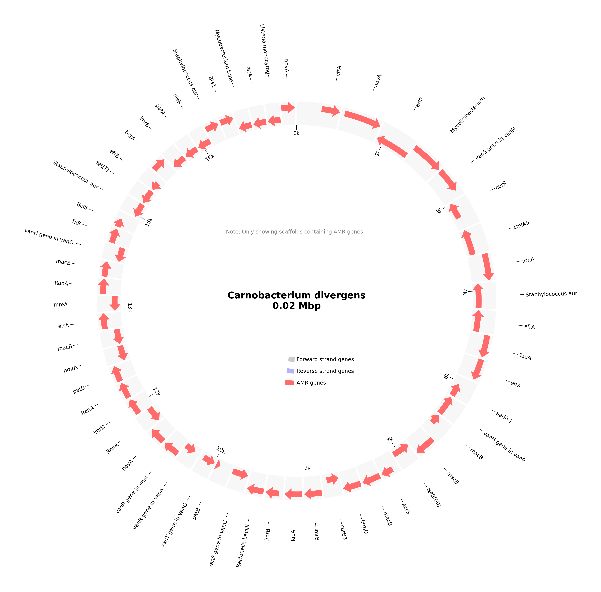

### AcrS
- **Mechanism**: antibiotic efflux
- **Drug Classes**: fluoroquinolone antibiotic; cephalosporin; glycylcycline; cephamycin; penam; tetracycline antibiotic; rifamycin antibiotic; phenicol antibiotic; disinfecting agents and antiseptics
- **AMR Family**: resistance-nodulation-cell division (RND) antibiotic efflux pump
- **Locations**:
  - gnl|SPADES|DAOGIJFL_23604_1 : position 105-299

### Bartonella bacilliformis gyrB conferring resistance to aminocoumarin
- **Mechanism**: antibiotic target alteration
- **Drug Classes**: aminocoumarin antibiotic
- **AMR Family**: aminocoumarin resistant gyrB
- **Locations**:
  - gnl|SPADES|DAOGIJFL_27264_1 : position 2-271

### BcIII
- **Mechanism**: antibiotic inactivation
- **Drug Classes**: cephalosporin; penem
- **AMR Family**: class A Bacillus cereus Bc beta-lactamase
- **Locations**:
  - gnl|SPADES|DAOGIJFL_33872_1 : position 2-145

### Bla1
- **Mechanism**: antibiotic inactivation
- **Drug Classes**: penam
- **AMR Family**: class A Bacillus anthracis Bla beta-lactamase
- **Locations**:
  - gnl|SPADES|DAOGIJFL_38050_1 : position 3-221

### ErmD
- **Mechanism**: antibiotic target alteration
- **Drug Classes**: macrolide antibiotic; lincosamide antibiotic; streptogramin antibiotic; streptogramin A antibiotic; streptogramin B antibiotic
- **AMR Family**: Erm 23S ribosomal RNA methyltransferase
- **Locations**:
  - gnl|SPADES|DAOGIJFL_24787_1 : position 2-289

### Listeria monocytogenes mprF
- **Mechanism**: antibiotic target alteration
- **Drug Classes**: peptide antibiotic
- **AMR Family**: defensin resistant mprF
- **Locations**:
  - gnl|SPADES|DAOGIJFL_39165_1 : position 2-217

### Mycobacterium tuberculosis rpoB mutations conferring resistance to rifampicin
- **Mechanism**: antibiotic target alteration; antibiotic target replacement
- **Drug Classes**: rifamycin antibiotic
- **AMR Family**: rifamycin-resistant beta-subunit of RNA polymerase (rpoB)
- **Locations**:
  - gnl|SPADES|DAOGIJFL_37849_1 : position 3-221

### Mycolicibacterium smegmatis ndh with mutation conferring resistance to isoniazid
- **Mechanism**: antibiotic target alteration
- **Drug Classes**: isoniazid-like antibiotic
- **AMR Family**: antibiotic resistant ndh
- **Locations**:
  - gnl|SPADES|DAOGIJFL_11550_1 : position 2-523

### RanA (found in 3 locations)
- **Mechanism**: antibiotic efflux
- **Drug Classes**: aminoglycoside antibiotic
- **AMR Family**: ATP-binding cassette (ABC) antibiotic efflux pump
- **Locations**:
  - gnl|SPADES|DAOGIJFL_28651_1 : position 3-266
  - gnl|SPADES|DAOGIJFL_28947_1 : position 2-265
  - gnl|SPADES|DAOGIJFL_32502_1 : position 2-247

### Staphylococcus aureus mupA conferring resistance to mupirocin (found in 2 locations)
- **Mechanism**: antibiotic target alteration
- **Drug Classes**: mupirocin-like antibiotic
- **AMR Family**: antibiotic-resistant isoleucyl-tRNA synthetase (ileS)
- **Locations**:
  - gnl|SPADES|DAOGIJFL_15415_1 : position 1-420
  - gnl|SPADES|DAOGIJFL_37906_1 : position 3-221

### Staphylococcus aureus mupB conferring resistance to mupirocin
- **Mechanism**: antibiotic target alteration
- **Drug Classes**: mupirocin-like antibiotic
- **AMR Family**: antibiotic-resistant isoleucyl-tRNA synthetase (ileS)
- **Locations**:
  - gnl|SPADES|DAOGIJFL_33903_1 : position 3-239

### TaeA (found in 2 locations)
- **Mechanism**: antibiotic efflux
- **Drug Classes**: pleuromutilin antibiotic
- **AMR Family**: ATP-binding cassette (ABC) antibiotic efflux pump
- **Locations**:
  - gnl|SPADES|DAOGIJFL_18637_1 : position 2-361
  - gnl|SPADES|DAOGIJFL_26014_1 : position 2-280

### TxR
- **Mechanism**: antibiotic efflux
- **Drug Classes**: tetracycline antibiotic
- **AMR Family**: ATP-binding cassette (ABC) antibiotic efflux pump
- **Locations**:
  - gnl|SPADES|DAOGIJFL_33601_1 : position 2-241

### aad(6)
- **Mechanism**: antibiotic inactivation
- **Drug Classes**: aminoglycoside antibiotic
- **AMR Family**: ANT(6)
- **Locations**:
  - gnl|SPADES|DAOGIJFL_19364_1 : position 133-351

### arlR
- **Mechanism**: antibiotic efflux
- **Drug Classes**: fluoroquinolone antibiotic; disinfecting agents and antiseptics
- **AMR Family**: major facilitator superfamily (MFS) antibiotic efflux pump
- **Locations**:
  - gnl|SPADES|DAOGIJFL_10220_1 : position 2-577

### arnA
- **Mechanism**: antibiotic target alteration
- **Drug Classes**: peptide antibiotic
- **AMR Family**: pmr phosphoethanolamine transferase
- **Locations**:
  - gnl|SPADES|DAOGIJFL_14950_1 : position 2-430

### bcrA
- **Mechanism**: antibiotic efflux
- **Drug Classes**: peptide antibiotic
- **AMR Family**: ATP-binding cassette (ABC) antibiotic efflux pump
- **Locations**:
  - gnl|SPADES|DAOGIJFL_35257_1 : position 1-234

### catB3
- **Mechanism**: antibiotic inactivation
- **Drug Classes**: phenicol antibiotic
- **AMR Family**: chloramphenicol acetyltransferase (CAT)
- **Locations**:
  - gnl|SPADES|DAOGIJFL_25032_1 : position 3-209

### cmlA9
- **Mechanism**: antibiotic efflux
- **Drug Classes**: phenicol antibiotic
- **AMR Family**: major facilitator superfamily (MFS) antibiotic efflux pump
- **Locations**:
  - gnl|SPADES|DAOGIJFL_14583_1 : position 2-439

### cprR
- **Mechanism**: antibiotic target alteration; antibiotic efflux
- **Drug Classes**: peptide antibiotic
- **AMR Family**: pmr phosphoethanolamine transferase
- **Locations**:
  - gnl|SPADES|DAOGIJFL_13321_1 : position 2-280

### efrA (found in 5 locations)
- **Mechanism**: antibiotic efflux
- **Drug Classes**: macrolide antibiotic; fluoroquinolone antibiotic; rifamycin antibiotic
- **AMR Family**: ATP-binding cassette (ABC) antibiotic efflux pump
- **Locations**:
  - gnl|SPADES|DAOGIJFL_18411_1 : position 1-366
  - gnl|SPADES|DAOGIJFL_19121_1 : position 3-344
  - gnl|SPADES|DAOGIJFL_31034_1 : position 3-254
  - gnl|SPADES|DAOGIJFL_38191_1 : position 3-221
  - gnl|SPADES|DAOGIJFL_8120_2 : position 395-688

### efrB
- **Mechanism**: antibiotic efflux
- **Drug Classes**: macrolide antibiotic; fluoroquinolone antibiotic; rifamycin antibiotic
- **AMR Family**: ATP-binding cassette (ABC) antibiotic efflux pump
- **Locations**:
  - gnl|SPADES|DAOGIJFL_34948_1 : position 2-142

### lmrB (found in 3 locations)
- **Mechanism**: antibiotic efflux
- **Drug Classes**: lincosamide antibiotic; nucleoside antibiotic
- **AMR Family**: ATP-binding cassette (ABC) antibiotic efflux pump
- **Locations**:
  - gnl|SPADES|DAOGIJFL_25965_1 : position 2-280
  - gnl|SPADES|DAOGIJFL_26407_1 : position 62-277
  - gnl|SPADES|DAOGIJFL_35548_1 : position 2-232

### lmrD
- **Mechanism**: antibiotic efflux
- **Drug Classes**: lincosamide antibiotic
- **AMR Family**: ATP-binding cassette (ABC) antibiotic efflux pump
- **Locations**:
  - gnl|SPADES|DAOGIJFL_28716_1 : position 2-265

### macB (found in 5 locations)
- **Mechanism**: antibiotic efflux
- **Drug Classes**: macrolide antibiotic
- **AMR Family**: ATP-binding cassette (ABC) antibiotic efflux pump
- **Locations**:
  - gnl|SPADES|DAOGIJFL_20592_1 : position 3-176
  - gnl|SPADES|DAOGIJFL_21022_1 : position 1-330
  - gnl|SPADES|DAOGIJFL_23701_1 : position 3-299
  - gnl|SPADES|DAOGIJFL_30948_1 : position 2-253
  - gnl|SPADES|DAOGIJFL_32562_1 : position 1-246

### mreA
- **Mechanism**: antibiotic efflux
- **Drug Classes**: macrolide antibiotic
- **AMR Family**: major facilitator superfamily (MFS) antibiotic efflux pump
- **Locations**:
  - gnl|SPADES|DAOGIJFL_32531_1 : position 1-246

### novA (found in 3 locations)
- **Mechanism**: antibiotic efflux
- **Drug Classes**: aminocoumarin antibiotic
- **AMR Family**: ATP-binding cassette (ABC) antibiotic efflux pump
- **Locations**:
  - gnl|SPADES|DAOGIJFL_28392_1 : position 3-266
  - gnl|SPADES|DAOGIJFL_39829_1 : position 1-213
  - gnl|SPADES|DAOGIJFL_8801_1 : position 50-646

### oleB
- **Mechanism**: antibiotic target protection
- **Drug Classes**: macrolide antibiotic
- **AMR Family**: Miscellaneous ABC-F subfamily ATP-binding cassette ribosomal protection proteins
- **Locations**:
  - gnl|SPADES|DAOGIJFL_36613_1 : position 1-228

### patA
- **Mechanism**: antibiotic efflux
- **Drug Classes**: fluoroquinolone antibiotic
- **AMR Family**: ATP-binding cassette (ABC) antibiotic efflux pump
- **Locations**:
  - gnl|SPADES|DAOGIJFL_36211_1 : position 3-230

### patB (found in 2 locations)
- **Mechanism**: antibiotic efflux
- **Drug Classes**: fluoroquinolone antibiotic
- **AMR Family**: ATP-binding cassette (ABC) antibiotic efflux pump
- **Locations**:
  - gnl|SPADES|DAOGIJFL_27472_2 : position 196-270
  - gnl|SPADES|DAOGIJFL_29193_1 : position 1-261

### pmrA
- **Mechanism**: antibiotic efflux
- **Drug Classes**: fluoroquinolone antibiotic
- **AMR Family**: major facilitator superfamily (MFS) antibiotic efflux pump
- **Locations**:
  - gnl|SPADES|DAOGIJFL_29807_1 : position 2-259

### tet(T)
- **Mechanism**: antibiotic target protection
- **Drug Classes**: tetracycline antibiotic
- **AMR Family**: tetracycline-resistant ribosomal protection protein
- **Locations**:
  - gnl|SPADES|DAOGIJFL_33931_1 : position 1-240

### tetB(60)
- **Mechanism**: antibiotic efflux
- **Drug Classes**: tetracycline antibiotic
- **AMR Family**: ATP-binding cassette (ABC) antibiotic efflux pump
- **Locations**:
  - gnl|SPADES|DAOGIJFL_23478_1 : position 1-300

### vanH gene in vanO cluster
- **Mechanism**: antibiotic target alteration
- **Drug Classes**: glycopeptide antibiotic
- **AMR Family**: vanH; glycopeptide resistance gene cluster
- **Locations**:
  - gnl|SPADES|DAOGIJFL_33311_1 : position 1-243

### vanH gene in vanP cluster
- **Mechanism**: antibiotic target alteration
- **Drug Classes**: glycopeptide antibiotic
- **AMR Family**: vanH; glycopeptide resistance gene cluster
- **Locations**:
  - gnl|SPADES|DAOGIJFL_20365_1 : position 2-337

### vanR gene in vanA cluster
- **Mechanism**: antibiotic target alteration
- **Drug Classes**: glycopeptide antibiotic
- **AMR Family**: glycopeptide resistance gene cluster; vanR
- **Locations**:
  - gnl|SPADES|DAOGIJFL_27704_1 : position 78-269

### vanR gene in vanI cluster
- **Mechanism**: antibiotic target alteration
- **Drug Classes**: glycopeptide antibiotic
- **AMR Family**: glycopeptide resistance gene cluster; vanR
- **Locations**:
  - gnl|SPADES|DAOGIJFL_28306_1 : position 2-268

### vanS gene in vanG cluster
- **Mechanism**: antibiotic target alteration
- **Drug Classes**: glycopeptide antibiotic
- **AMR Family**: vanS; glycopeptide resistance gene cluster
- **Locations**:
  - gnl|SPADES|DAOGIJFL_27215_1 : position 1-273

### vanS gene in vanN cluster
- **Mechanism**: antibiotic target alteration
- **Drug Classes**: glycopeptide antibiotic
- **AMR Family**: vanS; glycopeptide resistance gene cluster
- **Locations**:
  - gnl|SPADES|DAOGIJFL_12375_1 : position 2-394

### vanT gene in vanG cluster
- **Mechanism**: antibiotic target alteration
- **Drug Classes**: glycopeptide antibiotic
- **AMR Family**: glycopeptide resistance gene cluster; vanT
- **Locations**:
  - gnl|SPADES|DAOGIJFL_27605_1 : position 3-212

## Carnobacterium maltaromaticum
**Strain Statistics:**
- Total genome length: 357.8 kbp
- Total scaffolds: 3370
- Scaffolds with AMR genes: 329
- Total genes annotated: 551
- Total AMR genes: 352
- Unique AMR genes: 162
- Distinct AMR mechanisms: 9
- Distinct AMR families: 63
- Distinct drug classes: 35

**Circos Plot:**

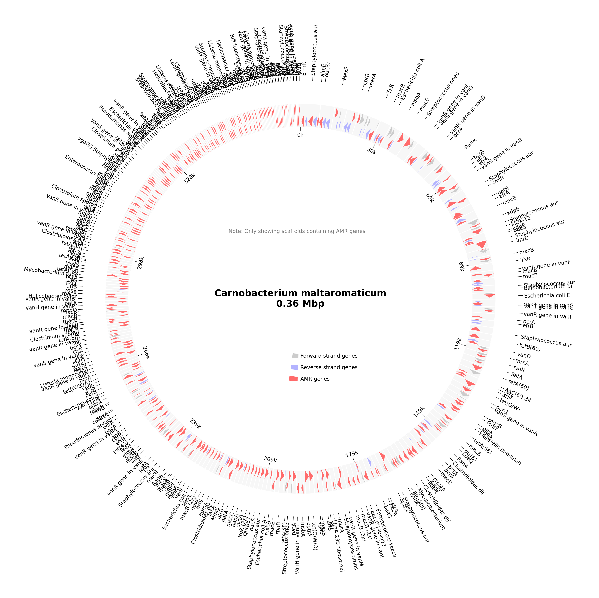

### AAC(3)-IIIa
- **Mechanism**: antibiotic inactivation
- **Drug Classes**: aminoglycoside antibiotic
- **AMR Family**: AAC(3)
- **Locations**:
  - gnl|SPADES|DAOGIJFL_15806_1 : position 2-394

### AAC(3)-Ic
- **Mechanism**: antibiotic inactivation
- **Drug Classes**: aminoglycoside antibiotic
- **AMR Family**: AAC(3)
- **Locations**:
  - gnl|SPADES|DAOGIJFL_5395_2 : position 304-741

### AAC(6')-34
- **Mechanism**: antibiotic inactivation
- **Drug Classes**: aminoglycoside antibiotic
- **AMR Family**: AAC(6')
- **Locations**:
  - gnl|SPADES|DAOGIJFL_1907_2 : position 1548-2060

### ANT(6)-Ib
- **Mechanism**: antibiotic inactivation
- **Drug Classes**: aminoglycoside antibiotic
- **AMR Family**: ANT(6)
- **Locations**:
  - gnl|SPADES|DAOGIJFL_29220_1 : position 3-263

### BcI
- **Mechanism**: antibiotic inactivation
- **Drug Classes**: cephalosporin; penem
- **AMR Family**: class A Bacillus cereus Bc beta-lactamase
- **Locations**:
  - gnl|SPADES|DAOGIJFL_10505_1 : position 2-565

### Bifidobacterium adolescentis rpoB mutants conferring resistance to rifampicin
- **Mechanism**: antibiotic target alteration; antibiotic target replacement
- **Drug Classes**: rifamycin antibiotic
- **AMR Family**: rifamycin-resistant beta-subunit of RNA polymerase (rpoB)
- **Locations**:
  - gnl|SPADES|DAOGIJFL_24563_1 : position 1-213

### Bifidobacterium bifidum ileS conferring resistance to mupirocin
- **Mechanism**: antibiotic target alteration
- **Drug Classes**: mupirocin-like antibiotic
- **AMR Family**: antibiotic-resistant isoleucyl-tRNA synthetase (ileS)
- **Locations**:
  - gnl|SPADES|DAOGIJFL_1543_2 : position 1039-1626

### CRP
- **Mechanism**: antibiotic efflux
- **Drug Classes**: macrolide antibiotic; fluoroquinolone antibiotic; penam
- **AMR Family**: resistance-nodulation-cell division (RND) antibiotic efflux pump
- **Locations**:
  - gnl|SPADES|DAOGIJFL_18001_1 : position 38-370

### Clostridioides difficile cplR
- **Mechanism**: antibiotic target protection
- **Drug Classes**: lincosamide antibiotic; streptogramin antibiotic; streptogramin A antibiotic; nucleoside antibiotic
- **AMR Family**: Miscellaneous ABC-F subfamily ATP-binding cassette ribosomal protection proteins
- **Locations**:
  - gnl|SPADES|DAOGIJFL_4052_1 : position 3-605

### Clostridioides difficile gyrA conferring resistance to fluoroquinolones (found in 2 locations)
- **Mechanism**: antibiotic target alteration
- **Drug Classes**: fluoroquinolone antibiotic
- **AMR Family**: fluoroquinolone resistant gyrA
- **Locations**:
  - gnl|SPADES|DAOGIJFL_17102_1 : position 1-387
  - gnl|SPADES|DAOGIJFL_2504_2 : position 464-1216

### Clostridioides difficile gyrB conferring resistance to fluoroquinolones (found in 3 locations)
- **Mechanism**: antibiotic target alteration
- **Drug Classes**: fluoroquinolone antibiotic
- **AMR Family**: fluoroquinolone resistant gyrB
- **Locations**:
  - gnl|SPADES|DAOGIJFL_2629_2 : position 545-1618
  - gnl|SPADES|DAOGIJFL_30172_1 : position 2-259
  - gnl|SPADES|DAOGIJFL_8364_1 : position 2-670

### Clostridium perfringes cplR
- **Mechanism**: antibiotic target protection
- **Drug Classes**: lincosamide antibiotic; streptogramin antibiotic; streptogramin A antibiotic; pleuromutilin antibiotic
- **AMR Family**: Miscellaneous ABC-F subfamily ATP-binding cassette ribosomal protection proteins
- **Locations**:
  - gnl|SPADES|DAOGIJFL_10639_2 : position 151-312

### Clostridium sporogenes cplR (found in 2 locations)
- **Mechanism**: antibiotic target protection
- **Drug Classes**: lincosamide antibiotic; pleuromutilin antibiotic
- **AMR Family**: Miscellaneous ABC-F subfamily ATP-binding cassette ribosomal protection proteins
- **Locations**:
  - gnl|SPADES|DAOGIJFL_6486_1 : position 3-818
  - gnl|SPADES|DAOGIJFL_9165_2 : position 358-624

### EdeQ (found in 2 locations)
- **Mechanism**: antibiotic inactivation
- **Drug Classes**: peptide antibiotic; polyamine antibiotic
- **AMR Family**: Edeine acetyltransferase
- **Locations**:
  - gnl|SPADES|DAOGIJFL_2453_2 : position 517-969
  - gnl|SPADES|DAOGIJFL_31617_1 : position 3-251

### Enterococcus faecalis cls with mutation conferring resistance to daptomycin (found in 2 locations)
- **Mechanism**: antibiotic target alteration
- **Drug Classes**: peptide antibiotic
- **AMR Family**: daptomycin resistant cls
- **Locations**:
  - gnl|SPADES|DAOGIJFL_10043_1 : position 1-582
  - gnl|SPADES|DAOGIJFL_2820_2 : position 297-1538

### ErmR
- **Mechanism**: antibiotic target alteration
- **Drug Classes**: macrolide antibiotic; lincosamide antibiotic; streptogramin antibiotic; streptogramin A antibiotic; streptogramin B antibiotic
- **AMR Family**: Erm 23S ribosomal RNA methyltransferase
- **Locations**:
  - gnl|SPADES|DAOGIJFL_568_1 : position 390-1283

### Escherichia coli AcrAB-TolC with AcrR mutation conferring resistance to ciprofloxacin, tetracycline, and ceftazidime (found in 3 locations)
- **Mechanism**: antibiotic target alteration; antibiotic efflux
- **Drug Classes**: fluoroquinolone antibiotic; cephalosporin; glycylcycline; penam; tetracycline antibiotic; rifamycin antibiotic; phenicol antibiotic; disinfecting agents and antiseptics
- **AMR Family**: resistance-nodulation-cell division (RND) antibiotic efflux pump
- **Locations**:
  - gnl|SPADES|DAOGIJFL_11963_1 : position 145-510
  - gnl|SPADES|DAOGIJFL_3660_1 : position 2-556
  - gnl|SPADES|DAOGIJFL_928_5 : position 2898-3494

### Escherichia coli EF-Tu mutants conferring resistance to kirromycin
- **Mechanism**: antibiotic target alteration
- **Drug Classes**: elfamycin antibiotic
- **AMR Family**: elfamycin resistant EF-Tu
- **Locations**:
  - gnl|SPADES|DAOGIJFL_1595_2 : position 484-1671

### Escherichia coli fabI mutations conferring resistance to isoniazid and triclosan
- **Mechanism**: antibiotic target alteration
- **Drug Classes**: disinfecting agents and antiseptics; isoniazid-like antibiotic
- **AMR Family**: antibiotic resistant fabI
- **Locations**:
  - gnl|SPADES|DAOGIJFL_4166_1 : position 2-583

### Escherichia coli gyrA conferring resistance to fluoroquinolones
- **Mechanism**: antibiotic target alteration
- **Drug Classes**: fluoroquinolone antibiotic
- **AMR Family**: fluoroquinolone resistant gyrA
- **Locations**:
  - gnl|SPADES|DAOGIJFL_5420_1 : position 1-327

### EstT
- **Mechanism**: antibiotic inactivation
- **Drug Classes**: macrolide antibiotic
- **AMR Family**: macrolide esterase
- **Locations**:
  - gnl|SPADES|DAOGIJFL_7468_1 : position 1-546

### FusF
- **Mechanism**: antibiotic target protection
- **Drug Classes**: fusidane antibiotic
- **AMR Family**: Target protecting FusB-type protein conferring resistance to Fusidic acid
- **Locations**:
  - gnl|SPADES|DAOGIJFL_16826_1 : position 102-392

### Helicobacter pylori pbp1 mutants conferring resistance to amoxicillin (found in 2 locations)
- **Mechanism**: antibiotic target alteration
- **Drug Classes**: cephalosporin; cephamycin; penam
- **AMR Family**: Penicillin-binding protein mutations conferring resistance to beta-lactam antibiotics
- **Locations**:
  - gnl|SPADES|DAOGIJFL_15405_1 : position 3-419
  - gnl|SPADES|DAOGIJFL_7190_1 : position 2-757

### Helicobacter pylori rdxA mutation conferring resistance to metronidazole
- **Mechanism**: antibiotic target alteration
- **Drug Classes**: nitroimidazole antibiotic
- **AMR Family**: Antibiotic resistant Helicobacter pylori nitroreductase
- **Locations**:
  - gnl|SPADES|DAOGIJFL_22479_1 : position 3-185

### IreK (found in 4 locations)
- **Mechanism**: reduced permeability to antibiotic
- **Drug Classes**: cephalosporin
- **AMR Family**: Serine/threonine kinases
- **Locations**:
  - gnl|SPADES|DAOGIJFL_35440_2 : position 138-233
  - gnl|SPADES|DAOGIJFL_3745_2 : position 28-711
  - gnl|SPADES|DAOGIJFL_3745_3 : position 717-1241
  - gnl|SPADES|DAOGIJFL_6104_1 : position 3-839

### Klebsiella pneumoniae KpnH
- **Mechanism**: antibiotic efflux
- **Drug Classes**: macrolide antibiotic; fluoroquinolone antibiotic; aminoglycoside antibiotic; carbapenem; cephalosporin; penam; peptide antibiotic; penem
- **AMR Family**: major facilitator superfamily (MFS) antibiotic efflux pump
- **Locations**:
  - gnl|SPADES|DAOGIJFL_2338_1 : position 2-862

### Listeria monocytogenes mprF (found in 4 locations)
- **Mechanism**: antibiotic target alteration
- **Drug Classes**: peptide antibiotic
- **AMR Family**: defensin resistant mprF
- **Locations**:
  - gnl|SPADES|DAOGIJFL_15592_2 : position 186-416
  - gnl|SPADES|DAOGIJFL_22152_1 : position 3-314
  - gnl|SPADES|DAOGIJFL_26919_1 : position 3-275
  - gnl|SPADES|DAOGIJFL_5876_1 : position 1-885

### LlmA 23S ribosomal RNA methyltransferase
- **Mechanism**: antibiotic target alteration
- **Drug Classes**: lincosamide antibiotic
- **AMR Family**: Llm 23S ribosomal RNA methyltransferase
- **Locations**:
  - gnl|SPADES|DAOGIJFL_3151_2 : position 284-1414

### MOX-12
- **Mechanism**: antibiotic inactivation
- **Drug Classes**: cephalosporin; cephamycin; penam
- **AMR Family**: MOX beta-lactamase
- **Locations**:
  - gnl|SPADES|DAOGIJFL_1451_1 : position 2-580

### MexL
- **Mechanism**: antibiotic efflux
- **Drug Classes**: macrolide antibiotic; tetracycline antibiotic; disinfecting agents and antiseptics
- **AMR Family**: resistance-nodulation-cell division (RND) antibiotic efflux pump
- **Locations**:
  - gnl|SPADES|DAOGIJFL_4112_1 : position 3-590

### MexS (found in 4 locations)
- **Mechanism**: antibiotic efflux
- **Drug Classes**: fluoroquinolone antibiotic; diaminopyrimidine antibiotic; phenicol antibiotic
- **AMR Family**: resistance-nodulation-cell division (RND) antibiotic efflux pump
- **Locations**:
  - gnl|SPADES|DAOGIJFL_4025_2 : position 345-1184
  - gnl|SPADES|DAOGIJFL_5921_1 : position 3-878
  - gnl|SPADES|DAOGIJFL_7771_1 : position 1-711
  - gnl|SPADES|DAOGIJFL_818_2 : position 528-1472

### Mycobacterium tuberculosis pncA mutations conferring resistance to pyrazinamide
- **Mechanism**: antibiotic target alteration
- **Drug Classes**: pyrazine antibiotic
- **AMR Family**: Pyrazinamide resistant pncA
- **Locations**:
  - gnl|SPADES|DAOGIJFL_7592_1 : position 2-520

### Mycolicibacterium smegmatis ndh with mutation conferring resistance to isoniazid
- **Mechanism**: antibiotic target alteration
- **Drug Classes**: isoniazid-like antibiotic
- **AMR Family**: antibiotic resistant ndh
- **Locations**:
  - gnl|SPADES|DAOGIJFL_2634_2 : position 779-1615

### NmcR (found in 2 locations)
- **Mechanism**: antibiotic inactivation
- **Drug Classes**: carbapenem; cephalosporin; cephamycin; penam
- **AMR Family**: NmcA beta-lactamase
- **Locations**:
  - gnl|SPADES|DAOGIJFL_10240_2 : position 252-575
  - gnl|SPADES|DAOGIJFL_5335_1 : position 3-197

### PmrF
- **Mechanism**: antibiotic target alteration
- **Drug Classes**: peptide antibiotic
- **AMR Family**: pmr phosphoethanolamine transferase
- **Locations**:
  - gnl|SPADES|DAOGIJFL_2307_1 : position 3-1022

### Pseudomonas aeruginosa CpxR
- **Mechanism**: antibiotic efflux
- **Drug Classes**: macrolide antibiotic; fluoroquinolone antibiotic; monobactam; aminoglycoside antibiotic; carbapenem; cephalosporin; cephamycin; penam; tetracycline antibiotic; peptide antibiotic; aminocoumarin antibiotic; diaminopyrimidine antibiotic; sulfonamide antibiotic; phenicol antibiotic; penem
- **AMR Family**: resistance-nodulation-cell division (RND) antibiotic efflux pump
- **Locations**:
  - gnl|SPADES|DAOGIJFL_11686_1 : position 2-517

### Pseudomonas aeruginosa soxR
- **Mechanism**: antibiotic target alteration; antibiotic efflux
- **Drug Classes**: fluoroquinolone antibiotic; cephalosporin; glycylcycline; penam; tetracycline antibiotic; rifamycin antibiotic; phenicol antibiotic; disinfecting agents and antiseptics
- **AMR Family**: ATP-binding cassette (ABC) antibiotic efflux pump; major facilitator superfamily (MFS) antibiotic efflux pump; resistance-nodulation-cell division (RND) antibiotic efflux pump
- **Locations**:
  - gnl|SPADES|DAOGIJFL_5240_1 : position 52-489

### QnrB57
- **Mechanism**: antibiotic target protection
- **Drug Classes**: fluoroquinolone antibiotic
- **AMR Family**: quinolone resistance protein (qnr)
- **Locations**:
  - gnl|SPADES|DAOGIJFL_3729_2 : position 342-977

### RanA (found in 9 locations)
- **Mechanism**: antibiotic efflux
- **Drug Classes**: aminoglycoside antibiotic
- **AMR Family**: ATP-binding cassette (ABC) antibiotic efflux pump
- **Locations**:
  - gnl|SPADES|DAOGIJFL_1228_3 : position 1249-2235
  - gnl|SPADES|DAOGIJFL_2491_2 : position 702-1355
  - gnl|SPADES|DAOGIJFL_2654_1 : position 3-695
  - gnl|SPADES|DAOGIJFL_28145_1 : position 2-268
  - gnl|SPADES|DAOGIJFL_3888_1 : position 1-531
  - gnl|SPADES|DAOGIJFL_4358_1 : position 3-143
  - gnl|SPADES|DAOGIJFL_7888_1 : position 1-702
  - gnl|SPADES|DAOGIJFL_8787_1 : position 1-387
  - gnl|SPADES|DAOGIJFL_9371_1 : position 3-566

### RlmA(II)
- **Mechanism**: antibiotic target alteration
- **Drug Classes**: macrolide antibiotic; lincosamide antibiotic
- **AMR Family**: non-erm 23S ribosomal RNA methyltransferase (G748)
- **Locations**:
  - gnl|SPADES|DAOGIJFL_2636_2 : position 1028-1612

### SatA
- **Mechanism**: antibiotic inactivation
- **Drug Classes**: nucleoside antibiotic
- **AMR Family**: streptothricin acetyltransferase (SAT)
- **Locations**:
  - gnl|SPADES|DAOGIJFL_1887_2 : position 1032-1484

### Staphylococcus aureus LmrS (found in 2 locations)
- **Mechanism**: antibiotic efflux
- **Drug Classes**: macrolide antibiotic; aminoglycoside antibiotic; oxazolidinone antibiotic; diaminopyrimidine antibiotic; phenicol antibiotic
- **AMR Family**: major facilitator superfamily (MFS) antibiotic efflux pump
- **Locations**:
  - gnl|SPADES|DAOGIJFL_29606_1 : position 3-260
  - gnl|SPADES|DAOGIJFL_35636_1 : position 44-232

### Staphylococcus aureus fusA with mutation conferring resistance to fusidic acid (found in 2 locations)
- **Mechanism**: antibiotic target alteration
- **Drug Classes**: fusidane antibiotic
- **AMR Family**: antibiotic resistant fusA
- **Locations**:
  - gnl|SPADES|DAOGIJFL_1448_2 : position 1038-2567
  - gnl|SPADES|DAOGIJFL_3670_1 : position 3-1163

### Staphylococcus aureus mupA conferring resistance to mupirocin (found in 6 locations)
- **Mechanism**: antibiotic target alteration
- **Drug Classes**: mupirocin-like antibiotic
- **AMR Family**: antibiotic-resistant isoleucyl-tRNA synthetase (ileS)
- **Locations**:
  - gnl|SPADES|DAOGIJFL_1384_3 : position 1096-2649
  - gnl|SPADES|DAOGIJFL_14228_1 : position 1-447
  - gnl|SPADES|DAOGIJFL_20238_1 : position 1-339
  - gnl|SPADES|DAOGIJFL_2691_1 : position 120-1586
  - gnl|SPADES|DAOGIJFL_4410_1 : position 1-1101
  - gnl|SPADES|DAOGIJFL_568_5 : position 3050-4717

### Staphylococcus aureus mupB conferring resistance to mupirocin (found in 2 locations)
- **Mechanism**: antibiotic target alteration
- **Drug Classes**: mupirocin-like antibiotic
- **AMR Family**: antibiotic-resistant isoleucyl-tRNA synthetase (ileS)
- **Locations**:
  - gnl|SPADES|DAOGIJFL_13716_1 : position 1-459
  - gnl|SPADES|DAOGIJFL_1543_1 : position 2-1042

### Staphylococcus aureus murA with mutation conferring resistance to fosfomycin
- **Mechanism**: antibiotic target alteration
- **Drug Classes**: phosphonic acid antibiotic
- **AMR Family**: antibiotic-resistant murA transferase
- **Locations**:
  - gnl|SPADES|DAOGIJFL_1740_2 : position 584-1891

### Staphylococcus aureus rpoB mutants conferring resistance to rifampicin
- **Mechanism**: antibiotic target alteration; antibiotic target replacement
- **Drug Classes**: rifamycin antibiotic
- **AMR Family**: rifamycin-resistant beta-subunit of RNA polymerase (rpoB)
- **Locations**:
  - gnl|SPADES|DAOGIJFL_1454_1 : position 1-2562

### Streptococcus agalactiae mprF
- **Mechanism**: antibiotic target alteration
- **Drug Classes**: peptide antibiotic
- **AMR Family**: defensin resistant mprF
- **Locations**:
  - gnl|SPADES|DAOGIJFL_37731_1 : position 2-223

### Streptococcus pneumoniae PBP2b conferring resistance to amoxicillin
- **Mechanism**: antibiotic target alteration
- **Drug Classes**: cephalosporin; cephamycin; penam
- **AMR Family**: Penicillin-binding protein mutations conferring resistance to beta-lactam antibiotics
- **Locations**:
  - gnl|SPADES|DAOGIJFL_3357_2 : position 567-1352

### Streptococcus pneumoniae PBP2x conferring resistance to amoxicillin
- **Mechanism**: antibiotic target alteration
- **Drug Classes**: cephalosporin; cephamycin; penam
- **AMR Family**: Penicillin-binding protein mutations conferring resistance to beta-lactam antibiotics
- **Locations**:
  - gnl|SPADES|DAOGIJFL_985_1 : position 1-1908

### Streptomyces rimosus otr(A) (found in 2 locations)
- **Mechanism**: antibiotic target protection
- **Drug Classes**: tetracycline antibiotic
- **AMR Family**: tetracycline-resistant ribosomal protection protein
- **Locations**:
  - gnl|SPADES|DAOGIJFL_14458_1 : position 2-439
  - gnl|SPADES|DAOGIJFL_3002_1 : position 3-1280

### TaeA (found in 5 locations)
- **Mechanism**: antibiotic efflux
- **Drug Classes**: pleuromutilin antibiotic
- **AMR Family**: ATP-binding cassette (ABC) antibiotic efflux pump
- **Locations**:
  - gnl|SPADES|DAOGIJFL_11431_2 : position 300-527
  - gnl|SPADES|DAOGIJFL_14988_1 : position 3-428
  - gnl|SPADES|DAOGIJFL_4033_1 : position 2-1150
  - gnl|SPADES|DAOGIJFL_4894_1 : position 2-712
  - gnl|SPADES|DAOGIJFL_9043_2 : position 69-632

### TxR (found in 4 locations)
- **Mechanism**: antibiotic efflux
- **Drug Classes**: tetracycline antibiotic
- **AMR Family**: ATP-binding cassette (ABC) antibiotic efflux pump
- **Locations**:
  - gnl|SPADES|DAOGIJFL_10175_1 : position 197-577
  - gnl|SPADES|DAOGIJFL_1496_1 : position 3-1469
  - gnl|SPADES|DAOGIJFL_4446_1 : position 2-997
  - gnl|SPADES|DAOGIJFL_895_3 : position 1845-3323

### YajC
- **Mechanism**: antibiotic efflux
- **Drug Classes**: fluoroquinolone antibiotic; cephalosporin; glycylcycline; penam; tetracycline antibiotic; oxazolidinone antibiotic; glycopeptide antibiotic; rifamycin antibiotic; phenicol antibiotic; disinfecting agents and antiseptics
- **AMR Family**: resistance-nodulation-cell division (RND) antibiotic efflux pump
- **Locations**:
  - gnl|SPADES|DAOGIJFL_15594_1 : position 150-416

### YojI (found in 2 locations)
- **Mechanism**: antibiotic efflux
- **Drug Classes**: peptide antibiotic
- **AMR Family**: ATP-binding cassette (ABC) antibiotic efflux pump
- **Locations**:
  - gnl|SPADES|DAOGIJFL_3176_1 : position 1-495
  - gnl|SPADES|DAOGIJFL_6375_2 : position 634-831

### aac(6')-Ib-cr11
- **Mechanism**: antibiotic inactivation
- **Drug Classes**: fluoroquinolone antibiotic; aminoglycoside antibiotic
- **AMR Family**: AAC(6'); AAC(6')-Ib-cr
- **Locations**:
  - gnl|SPADES|DAOGIJFL_2829_2 : position 745-1128

### aadK
- **Mechanism**: antibiotic inactivation
- **Drug Classes**: aminoglycoside antibiotic
- **AMR Family**: ANT(6)
- **Locations**:
  - gnl|SPADES|DAOGIJFL_9970_2 : position 137-586

### aadT
- **Mechanism**: antibiotic efflux
- **Drug Classes**: macrolide antibiotic; tetracycline antibiotic; disinfecting agents and antiseptics
- **AMR Family**: major facilitator superfamily (MFS) antibiotic efflux pump
- **Locations**:
  - gnl|SPADES|DAOGIJFL_9874_1 : position 3-590

### adeL
- **Mechanism**: antibiotic efflux
- **Drug Classes**: fluoroquinolone antibiotic; tetracycline antibiotic
- **AMR Family**: resistance-nodulation-cell division (RND) antibiotic efflux pump
- **Locations**:
  - gnl|SPADES|DAOGIJFL_10270_1 : position 1-573

### adeR (found in 2 locations)
- **Mechanism**: antibiotic efflux
- **Drug Classes**: glycylcycline; tetracycline antibiotic
- **AMR Family**: resistance-nodulation-cell division (RND) antibiotic efflux pump
- **Locations**:
  - gnl|SPADES|DAOGIJFL_2619_2 : position 740-1468
  - gnl|SPADES|DAOGIJFL_4735_2 : position 167-865

### almE
- **Mechanism**: antibiotic target alteration
- **Drug Classes**: peptide antibiotic
- **AMR Family**: polymyxin resistance operon; alm glycyltransferase
- **Locations**:
  - gnl|SPADES|DAOGIJFL_568_7 : position 6368-7126

### apmA
- **Mechanism**: antibiotic inactivation
- **Drug Classes**: aminoglycoside antibiotic
- **AMR Family**: AAC(2')
- **Locations**:
  - gnl|SPADES|DAOGIJFL_4076_1 : position 3-464

### arlR (found in 3 locations)
- **Mechanism**: antibiotic efflux
- **Drug Classes**: fluoroquinolone antibiotic; disinfecting agents and antiseptics
- **AMR Family**: major facilitator superfamily (MFS) antibiotic efflux pump
- **Locations**:
  - gnl|SPADES|DAOGIJFL_2039_2 : position 933-1652
  - gnl|SPADES|DAOGIJFL_5056_1 : position 2-370
  - gnl|SPADES|DAOGIJFL_7428_2 : position 350-736

### arlS (found in 7 locations)
- **Mechanism**: antibiotic efflux
- **Drug Classes**: fluoroquinolone antibiotic; disinfecting agents and antiseptics
- **AMR Family**: major facilitator superfamily (MFS) antibiotic efflux pump
- **Locations**:
  - gnl|SPADES|DAOGIJFL_13190_1 : position 2-472
  - gnl|SPADES|DAOGIJFL_13343_1 : position 1-468
  - gnl|SPADES|DAOGIJFL_2039_1 : position 1-936
  - gnl|SPADES|DAOGIJFL_3176_2 : position 610-1407
  - gnl|SPADES|DAOGIJFL_40658_1 : position 2-211
  - gnl|SPADES|DAOGIJFL_4079_2 : position 388-675
  - gnl|SPADES|DAOGIJFL_9534_1 : position 3-530

### arnA
- **Mechanism**: antibiotic target alteration
- **Drug Classes**: peptide antibiotic
- **AMR Family**: pmr phosphoethanolamine transferase
- **Locations**:
  - gnl|SPADES|DAOGIJFL_22143_1 : position 2-316

### arr-1
- **Mechanism**: antibiotic inactivation
- **Drug Classes**: rifamycin antibiotic
- **AMR Family**: rifampin ADP-ribosyltransferase (Arr)
- **Locations**:
  - gnl|SPADES|DAOGIJFL_8738_1 : position 11-424

### bacA (found in 2 locations)
- **Mechanism**: antibiotic target alteration
- **Drug Classes**: peptide antibiotic
- **AMR Family**: undecaprenyl pyrophosphate related proteins
- **Locations**:
  - gnl|SPADES|DAOGIJFL_2776_1 : position 1-444
  - gnl|SPADES|DAOGIJFL_5105_1 : position 2-367

### baeR
- **Mechanism**: antibiotic efflux
- **Drug Classes**: aminoglycoside antibiotic; aminocoumarin antibiotic
- **AMR Family**: resistance-nodulation-cell division (RND) antibiotic efflux pump
- **Locations**:
  - gnl|SPADES|DAOGIJFL_26521_1 : position 3-275

### baeS (found in 5 locations)
- **Mechanism**: antibiotic efflux
- **Drug Classes**: aminoglycoside antibiotic; aminocoumarin antibiotic
- **AMR Family**: resistance-nodulation-cell division (RND) antibiotic efflux pump
- **Locations**:
  - gnl|SPADES|DAOGIJFL_1451_4 : position 2162-2563
  - gnl|SPADES|DAOGIJFL_17354_1 : position 3-383
  - gnl|SPADES|DAOGIJFL_2793_1 : position 1-411
  - gnl|SPADES|DAOGIJFL_3673_2 : position 251-1258
  - gnl|SPADES|DAOGIJFL_7507_1 : position 3-731

### bcr-1
- **Mechanism**: antibiotic efflux
- **Drug Classes**: bicyclomycin-like antibiotic
- **AMR Family**: major facilitator superfamily (MFS) antibiotic efflux pump
- **Locations**:
  - gnl|SPADES|DAOGIJFL_2097_2 : position 473-1720

### bcrA (found in 16 locations)
- **Mechanism**: antibiotic efflux
- **Drug Classes**: peptide antibiotic
- **AMR Family**: ATP-binding cassette (ABC) antibiotic efflux pump
- **Locations**:
  - gnl|SPADES|DAOGIJFL_1045_1 : position 2-607
  - gnl|SPADES|DAOGIJFL_1227_5 : position 2413-2925
  - gnl|SPADES|DAOGIJFL_13486_1 : position 3-464
  - gnl|SPADES|DAOGIJFL_16516_1 : position 2-397
  - gnl|SPADES|DAOGIJFL_1714_3 : position 1087-1716
  - gnl|SPADES|DAOGIJFL_18878_1 : position 1-357
  - gnl|SPADES|DAOGIJFL_19491_1 : position 3-350
  - gnl|SPADES|DAOGIJFL_22412_1 : position 1-312
  - gnl|SPADES|DAOGIJFL_2531_2 : position 455-1342
  - gnl|SPADES|DAOGIJFL_2532_1 : position 3-908
  - gnl|SPADES|DAOGIJFL_41367_1 : position 3-206
  - gnl|SPADES|DAOGIJFL_5113_1 : position 98-787
  - gnl|SPADES|DAOGIJFL_5680_2 : position 278-907
  - gnl|SPADES|DAOGIJFL_6314_2 : position 323-838
  - gnl|SPADES|DAOGIJFL_7519_1 : position 3-728
  - gnl|SPADES|DAOGIJFL_9188_1 : position 2-442

### blt
- **Mechanism**: antibiotic efflux
- **Drug Classes**: fluoroquinolone antibiotic; disinfecting agents and antiseptics
- **AMR Family**: major facilitator superfamily (MFS) antibiotic efflux pump
- **Locations**:
  - gnl|SPADES|DAOGIJFL_11679_1 : position 3-500

### carA
- **Mechanism**: antibiotic target protection
- **Drug Classes**: macrolide antibiotic
- **AMR Family**: Miscellaneous ABC-F subfamily ATP-binding cassette ribosomal protection proteins
- **Locations**:
  - gnl|SPADES|DAOGIJFL_23796_1 : position 1-297

### catB11
- **Mechanism**: antibiotic inactivation
- **Drug Classes**: phenicol antibiotic
- **AMR Family**: chloramphenicol acetyltransferase (CAT)
- **Locations**:
  - gnl|SPADES|DAOGIJFL_5254_2 : position 769-966

### catB3
- **Mechanism**: antibiotic inactivation
- **Drug Classes**: phenicol antibiotic
- **AMR Family**: chloramphenicol acetyltransferase (CAT)
- **Locations**:
  - gnl|SPADES|DAOGIJFL_37713_1 : position 89-223

### cfrA
- **Mechanism**: antibiotic target alteration
- **Drug Classes**: lincosamide antibiotic; streptogramin antibiotic; streptogramin A antibiotic; oxazolidinone antibiotic; phenicol antibiotic; pleuromutilin antibiotic
- **AMR Family**: Cfr 23S ribosomal RNA methyltransferase
- **Locations**:
  - gnl|SPADES|DAOGIJFL_2733_2 : position 1271-1570

### cfrE
- **Mechanism**: antibiotic target alteration
- **Drug Classes**: lincosamide antibiotic; streptogramin antibiotic; oxazolidinone antibiotic; phenicol antibiotic; pleuromutilin antibiotic
- **AMR Family**: Cfr 23S ribosomal RNA methyltransferase
- **Locations**:
  - gnl|SPADES|DAOGIJFL_6192_1 : position 2-700

### cmlA9
- **Mechanism**: antibiotic efflux
- **Drug Classes**: phenicol antibiotic
- **AMR Family**: major facilitator superfamily (MFS) antibiotic efflux pump
- **Locations**:
  - gnl|SPADES|DAOGIJFL_2553_2 : position 474-1652

### cprR (found in 2 locations)
- **Mechanism**: antibiotic target alteration; antibiotic efflux
- **Drug Classes**: peptide antibiotic
- **AMR Family**: pmr phosphoethanolamine transferase
- **Locations**:
  - gnl|SPADES|DAOGIJFL_5014_2 : position 493-999
  - gnl|SPADES|DAOGIJFL_847_4 : position 2719-3438

### dfrE
- **Mechanism**: antibiotic target replacement
- **Drug Classes**: diaminopyrimidine antibiotic
- **AMR Family**: trimethoprim resistant dihydrofolate reductase dfr
- **Locations**:
  - gnl|SPADES|DAOGIJFL_11860_2 : position 113-511

### efmA (found in 3 locations)
- **Mechanism**: antibiotic efflux
- **Drug Classes**: macrolide antibiotic; fluoroquinolone antibiotic
- **AMR Family**: major facilitator superfamily (MFS) antibiotic efflux pump
- **Locations**:
  - gnl|SPADES|DAOGIJFL_37250_1 : position 3-224
  - gnl|SPADES|DAOGIJFL_4827_1 : position 2-352
  - gnl|SPADES|DAOGIJFL_9834_1 : position 2-448

### efrA (found in 12 locations)
- **Mechanism**: antibiotic efflux
- **Drug Classes**: macrolide antibiotic; fluoroquinolone antibiotic; rifamycin antibiotic
- **AMR Family**: ATP-binding cassette (ABC) antibiotic efflux pump
- **Locations**:
  - gnl|SPADES|DAOGIJFL_10676_1 : position 1-558
  - gnl|SPADES|DAOGIJFL_11117_1 : position 1-537
  - gnl|SPADES|DAOGIJFL_1319_2 : position 1435-2772
  - gnl|SPADES|DAOGIJFL_1419_2 : position 2007-2603
  - gnl|SPADES|DAOGIJFL_21660_1 : position 1-321
  - gnl|SPADES|DAOGIJFL_2332_1 : position 3-1238
  - gnl|SPADES|DAOGIJFL_30294_1 : position 3-257
  - gnl|SPADES|DAOGIJFL_34076_1 : position 3-239
  - gnl|SPADES|DAOGIJFL_7887_1 : position 1-675
  - gnl|SPADES|DAOGIJFL_8176_1 : position 3-683
  - gnl|SPADES|DAOGIJFL_8827_1 : position 2-643
  - gnl|SPADES|DAOGIJFL_9161_1 : position 2-397

### efrB (found in 6 locations)
- **Mechanism**: antibiotic efflux
- **Drug Classes**: macrolide antibiotic; fluoroquinolone antibiotic; rifamycin antibiotic
- **AMR Family**: ATP-binding cassette (ABC) antibiotic efflux pump
- **Locations**:
  - gnl|SPADES|DAOGIJFL_1319_1 : position 2-1438
  - gnl|SPADES|DAOGIJFL_1716_1 : position 3-209
  - gnl|SPADES|DAOGIJFL_29254_1 : position 2-262
  - gnl|SPADES|DAOGIJFL_4023_1 : position 87-1184
  - gnl|SPADES|DAOGIJFL_4994_1 : position 1-1002
  - gnl|SPADES|DAOGIJFL_5297_2 : position 689-958

### evgA (found in 2 locations)
- **Mechanism**: antibiotic efflux
- **Drug Classes**: macrolide antibiotic; fluoroquinolone antibiotic; penam; tetracycline antibiotic
- **AMR Family**: major facilitator superfamily (MFS) antibiotic efflux pump; resistance-nodulation-cell division (RND) antibiotic efflux pump
- **Locations**:
  - gnl|SPADES|DAOGIJFL_13530_1 : position 3-161
  - gnl|SPADES|DAOGIJFL_3788_1 : position 21-653

### fexB
- **Mechanism**: antibiotic efflux
- **Drug Classes**: phenicol antibiotic
- **AMR Family**: major facilitator superfamily (MFS) antibiotic efflux pump
- **Locations**:
  - gnl|SPADES|DAOGIJFL_13518_1 : position 2-463

### fusB
- **Mechanism**: antibiotic target protection
- **Drug Classes**: fusidane antibiotic
- **AMR Family**: Target protecting FusB-type protein conferring resistance to Fusidic acid
- **Locations**:
  - gnl|SPADES|DAOGIJFL_8446_2 : position 316-666

### golS (found in 5 locations)
- **Mechanism**: antibiotic efflux
- **Drug Classes**: monobactam; carbapenem; cephalosporin; cephamycin; penam; phenicol antibiotic; penem
- **AMR Family**: resistance-nodulation-cell division (RND) antibiotic efflux pump
- **Locations**:
  - gnl|SPADES|DAOGIJFL_10182_2 : position 140-568
  - gnl|SPADES|DAOGIJFL_12619_1 : position 1-135
  - gnl|SPADES|DAOGIJFL_4244_1 : position 47-394
  - gnl|SPADES|DAOGIJFL_5573_2 : position 479-829
  - gnl|SPADES|DAOGIJFL_9857_1 : position 436-591

### kdpD (found in 4 locations)
- **Mechanism**: antibiotic efflux
- **Drug Classes**: aminoglycoside antibiotic
- **AMR Family**: kdpDE
- **Locations**:
  - gnl|SPADES|DAOGIJFL_17940_1 : position 3-371
  - gnl|SPADES|DAOGIJFL_23277_1 : position 3-302
  - gnl|SPADES|DAOGIJFL_2619_1 : position 3-743
  - gnl|SPADES|DAOGIJFL_30197_1 : position 3-257

### kdpE (found in 2 locations)
- **Mechanism**: antibiotic efflux
- **Drug Classes**: aminoglycoside antibiotic
- **AMR Family**: kdpDE
- **Locations**:
  - gnl|SPADES|DAOGIJFL_1433_3 : position 1986-2582
  - gnl|SPADES|DAOGIJFL_1451_3 : position 1426-2130

### leuO
- **Mechanism**: antibiotic efflux
- **Drug Classes**: nucleoside antibiotic; disinfecting agents and antiseptics
- **AMR Family**: major facilitator superfamily (MFS) antibiotic efflux pump
- **Locations**:
  - gnl|SPADES|DAOGIJFL_32759_1 : position 3-173

### lmrB (found in 4 locations)
- **Mechanism**: antibiotic efflux
- **Drug Classes**: lincosamide antibiotic; nucleoside antibiotic
- **AMR Family**: ATP-binding cassette (ABC) antibiotic efflux pump
- **Locations**:
  - gnl|SPADES|DAOGIJFL_18330_1 : position 3-365
  - gnl|SPADES|DAOGIJFL_25819_1 : position 2-280
  - gnl|SPADES|DAOGIJFL_4172_1 : position 2-697
  - gnl|SPADES|DAOGIJFL_8820_1 : position 1-303

### lmrD (found in 2 locations)
- **Mechanism**: antibiotic efflux
- **Drug Classes**: lincosamide antibiotic
- **AMR Family**: ATP-binding cassette (ABC) antibiotic efflux pump
- **Locations**:
  - gnl|SPADES|DAOGIJFL_1457_1 : position 2-148
  - gnl|SPADES|DAOGIJFL_6016_1 : position 117-869

### lsaC (found in 2 locations)
- **Mechanism**: antibiotic target protection
- **Drug Classes**: lincosamide antibiotic; streptogramin antibiotic; pleuromutilin antibiotic
- **AMR Family**: lsa-type ABC-F protein
- **Locations**:
  - gnl|SPADES|DAOGIJFL_24354_1 : position 2-292
  - gnl|SPADES|DAOGIJFL_7859_1 : position 3-275

### macA (found in 2 locations)
- **Mechanism**: antibiotic efflux
- **Drug Classes**: macrolide antibiotic
- **AMR Family**: ATP-binding cassette (ABC) antibiotic efflux pump
- **Locations**:
  - gnl|SPADES|DAOGIJFL_22380_1 : position 1-312
  - gnl|SPADES|DAOGIJFL_4324_2 : position 159-1019

### macB (found in 40 locations)
- **Mechanism**: antibiotic efflux
- **Drug Classes**: macrolide antibiotic
- **AMR Family**: ATP-binding cassette (ABC) antibiotic efflux pump
- **Locations**:
  - gnl|SPADES|DAOGIJFL_10088_1 : position 2-583
  - gnl|SPADES|DAOGIJFL_10258_1 : position 106-573
  - gnl|SPADES|DAOGIJFL_12333_1 : position 1-498
  - gnl|SPADES|DAOGIJFL_13517_1 : position 1-465
  - gnl|SPADES|DAOGIJFL_1425_2 : position 1393-2151
  - gnl|SPADES|DAOGIJFL_1482_2 : position 692-1420
  - gnl|SPADES|DAOGIJFL_1524_3 : position 1134-2018
  - gnl|SPADES|DAOGIJFL_1541_1 : position 71-829
  - gnl|SPADES|DAOGIJFL_16082_1 : position 3-173
  - gnl|SPADES|DAOGIJFL_17099_1 : position 1-387
  - gnl|SPADES|DAOGIJFL_18282_1 : position 27-368
  - gnl|SPADES|DAOGIJFL_2239_3 : position 1219-1827
  - gnl|SPADES|DAOGIJFL_2405_3 : position 1319-1729
  - gnl|SPADES|DAOGIJFL_24386_1 : position 1-291
  - gnl|SPADES|DAOGIJFL_2544_1 : position 2-436
  - gnl|SPADES|DAOGIJFL_25566_1 : position 3-281
  - gnl|SPADES|DAOGIJFL_28249_1 : position 2-268
  - gnl|SPADES|DAOGIJFL_2863_1 : position 28-735
  - gnl|SPADES|DAOGIJFL_2863_2 : position 732-1523
  - gnl|SPADES|DAOGIJFL_2948_2 : position 62-760
  - gnl|SPADES|DAOGIJFL_2948_3 : position 744-1493
  - gnl|SPADES|DAOGIJFL_3196_2 : position 1144-1404
  - gnl|SPADES|DAOGIJFL_3467_2 : position 273-1319
  - gnl|SPADES|DAOGIJFL_4106_1 : position 1-483
  - gnl|SPADES|DAOGIJFL_4106_2 : position 499-1164
  - gnl|SPADES|DAOGIJFL_4324_1 : position 3-143
  - gnl|SPADES|DAOGIJFL_4376_1 : position 117-914
  - gnl|SPADES|DAOGIJFL_4584_3 : position 656-1066
  - gnl|SPADES|DAOGIJFL_6591_1 : position 47-808
  - gnl|SPADES|DAOGIJFL_6602_1 : position 1-291
  - gnl|SPADES|DAOGIJFL_6627_1 : position 1-426
  - gnl|SPADES|DAOGIJFL_6660_1 : position 1-441
  - gnl|SPADES|DAOGIJFL_6877_1 : position 75-782
  - gnl|SPADES|DAOGIJFL_6942_2 : position 600-776
  - gnl|SPADES|DAOGIJFL_7325_1 : position 3-425
  - gnl|SPADES|DAOGIJFL_7682_1 : position 1-717
  - gnl|SPADES|DAOGIJFL_8908_1 : position 3-638
  - gnl|SPADES|DAOGIJFL_928_3 : position 1009-1677
  - gnl|SPADES|DAOGIJFL_970_2 : position 984-2624
  - gnl|SPADES|DAOGIJFL_9784_1 : position 1-594

### marA (found in 3 locations)
- **Mechanism**: antibiotic efflux; reduced permeability to antibiotic
- **Drug Classes**: fluoroquinolone antibiotic; monobactam; carbapenem; cephalosporin; glycylcycline; cephamycin; penam; tetracycline antibiotic; rifamycin antibiotic; phenicol antibiotic; penem; disinfecting agents and antiseptics
- **AMR Family**: resistance-nodulation-cell division (RND) antibiotic efflux pump; General Bacterial Porin with reduced permeability to beta-lactams
- **Locations**:
  - gnl|SPADES|DAOGIJFL_3018_2 : position 784-1170
  - gnl|SPADES|DAOGIJFL_31459_1 : position 3-251
  - gnl|SPADES|DAOGIJFL_876_1 : position 286-1122

### mdeA
- **Mechanism**: antibiotic efflux
- **Drug Classes**: fluoroquinolone antibiotic; aminoglycoside antibiotic; penam; tetracycline antibiotic; disinfecting agents and antiseptics
- **AMR Family**: major facilitator superfamily (MFS) antibiotic efflux pump
- **Locations**:
  - gnl|SPADES|DAOGIJFL_9418_1 : position 1-489

### mdtG
- **Mechanism**: antibiotic efflux
- **Drug Classes**: phosphonic acid antibiotic
- **AMR Family**: major facilitator superfamily (MFS) antibiotic efflux pump
- **Locations**:
  - gnl|SPADES|DAOGIJFL_4199_1 : position 1-1140

### mecB
- **Mechanism**: antibiotic target replacement
- **Drug Classes**: penam
- **AMR Family**: methicillin resistant PBP2
- **Locations**:
  - gnl|SPADES|DAOGIJFL_37693_1 : position 1-222

### mecC
- **Mechanism**: antibiotic target replacement
- **Drug Classes**: penam
- **AMR Family**: methicillin resistant PBP2
- **Locations**:
  - gnl|SPADES|DAOGIJFL_4017_1 : position 2-496

### mecD
- **Mechanism**: antibiotic target replacement
- **Drug Classes**: penam
- **AMR Family**: methicillin resistant PBP2
- **Locations**:
  - gnl|SPADES|DAOGIJFL_24430_1 : position 3-290

### mecI
- **Mechanism**: antibiotic target replacement
- **Drug Classes**: penam
- **AMR Family**: methicillin resistant PBP2
- **Locations**:
  - gnl|SPADES|DAOGIJFL_4347_1 : position 191-646

### mepR
- **Mechanism**: antibiotic efflux
- **Drug Classes**: glycylcycline; tetracycline antibiotic
- **AMR Family**: multidrug and toxic compound extrusion (MATE) transporter
- **Locations**:
  - gnl|SPADES|DAOGIJFL_4172_2 : position 678-1148

### mphO
- **Mechanism**: antibiotic inactivation
- **Drug Classes**: macrolide antibiotic
- **AMR Family**: macrolide phosphotransferase (MPH)
- **Locations**:
  - gnl|SPADES|DAOGIJFL_6955_1 : position 1-432

### mreA
- **Mechanism**: antibiotic efflux
- **Drug Classes**: macrolide antibiotic
- **AMR Family**: major facilitator superfamily (MFS) antibiotic efflux pump
- **Locations**:
  - gnl|SPADES|DAOGIJFL_1841_2 : position 986-1930

### msbA (found in 4 locations)
- **Mechanism**: antibiotic efflux
- **Drug Classes**: nitroimidazole antibiotic
- **AMR Family**: ATP-binding cassette (ABC) antibiotic efflux pump
- **Locations**:
  - gnl|SPADES|DAOGIJFL_30960_1 : position 1-255
  - gnl|SPADES|DAOGIJFL_3309_2 : position 548-1330
  - gnl|SPADES|DAOGIJFL_3560_1 : position 269-1042
  - gnl|SPADES|DAOGIJFL_939_4 : position 2372-3157

### nalD
- **Mechanism**: antibiotic efflux
- **Drug Classes**: macrolide antibiotic; fluoroquinolone antibiotic; monobactam; carbapenem; cephalosporin; cephamycin; penam; tetracycline antibiotic; peptide antibiotic; aminocoumarin antibiotic; diaminopyrimidine antibiotic; sulfonamide antibiotic; phenicol antibiotic; penem
- **AMR Family**: resistance-nodulation-cell division (RND) antibiotic efflux pump
- **Locations**:
  - gnl|SPADES|DAOGIJFL_12465_1 : position 1-435

### novA (found in 7 locations)
- **Mechanism**: antibiotic efflux
- **Drug Classes**: aminocoumarin antibiotic
- **AMR Family**: ATP-binding cassette (ABC) antibiotic efflux pump
- **Locations**:
  - gnl|SPADES|DAOGIJFL_12945_1 : position 2-481
  - gnl|SPADES|DAOGIJFL_21349_1 : position 2-325
  - gnl|SPADES|DAOGIJFL_2332_2 : position 1231-1767
  - gnl|SPADES|DAOGIJFL_31522_1 : position 2-250
  - gnl|SPADES|DAOGIJFL_33646_1 : position 1-243
  - gnl|SPADES|DAOGIJFL_4094_1 : position 2-673
  - gnl|SPADES|DAOGIJFL_5266_1 : position 2-145

### oleB
- **Mechanism**: antibiotic target protection
- **Drug Classes**: macrolide antibiotic
- **AMR Family**: Miscellaneous ABC-F subfamily ATP-binding cassette ribosomal protection proteins
- **Locations**:
  - gnl|SPADES|DAOGIJFL_18808_1 : position 2-358

### optrA (found in 3 locations)
- **Mechanism**: antibiotic target protection
- **Drug Classes**: oxazolidinone antibiotic; phenicol antibiotic
- **AMR Family**: Miscellaneous ABC-F subfamily ATP-binding cassette ribosomal protection proteins
- **Locations**:
  - gnl|SPADES|DAOGIJFL_2709_1 : position 3-437
  - gnl|SPADES|DAOGIJFL_3254_1 : position 3-1385
  - gnl|SPADES|DAOGIJFL_5351_1 : position 1-951

### otr(B) (found in 2 locations)
- **Mechanism**: antibiotic efflux
- **Drug Classes**: tetracycline antibiotic
- **AMR Family**: major facilitator superfamily (MFS) antibiotic efflux pump
- **Locations**:
  - gnl|SPADES|DAOGIJFL_2443_2 : position 1415-1705
  - gnl|SPADES|DAOGIJFL_710_1 : position 1-1203

### patA (found in 5 locations)
- **Mechanism**: antibiotic efflux
- **Drug Classes**: fluoroquinolone antibiotic
- **AMR Family**: ATP-binding cassette (ABC) antibiotic efflux pump
- **Locations**:
  - gnl|SPADES|DAOGIJFL_12907_1 : position 3-482
  - gnl|SPADES|DAOGIJFL_3334_1 : position 3-1358
  - gnl|SPADES|DAOGIJFL_4019_1 : position 57-1187
  - gnl|SPADES|DAOGIJFL_4472_1 : position 2-1042
  - gnl|SPADES|DAOGIJFL_7044_1 : position 2-691

### patB (found in 2 locations)
- **Mechanism**: antibiotic efflux
- **Drug Classes**: fluoroquinolone antibiotic
- **AMR Family**: ATP-binding cassette (ABC) antibiotic efflux pump
- **Locations**:
  - gnl|SPADES|DAOGIJFL_1419_1 : position 107-2005
  - gnl|SPADES|DAOGIJFL_5494_1 : position 1-930

### qacH
- **Mechanism**: antibiotic efflux
- **Drug Classes**: disinfecting agents and antiseptics
- **AMR Family**: small multidrug resistance (SMR) antibiotic efflux pump
- **Locations**:
  - gnl|SPADES|DAOGIJFL_7967_2 : position 369-695

### rosB
- **Mechanism**: antibiotic efflux
- **Drug Classes**: peptide antibiotic
- **AMR Family**: major facilitator superfamily (MFS) antibiotic efflux pump
- **Locations**:
  - gnl|SPADES|DAOGIJFL_7430_1 : position 2-292

### rphB
- **Mechanism**: antibiotic inactivation
- **Drug Classes**: rifamycin antibiotic
- **AMR Family**: rifampin phosphotransferase
- **Locations**:
  - gnl|SPADES|DAOGIJFL_3398_1 : position 3-1343

### rpoB2 (found in 2 locations)
- **Mechanism**: antibiotic target alteration; antibiotic target replacement
- **Drug Classes**: rifamycin antibiotic
- **AMR Family**: rifamycin-resistant beta-subunit of RNA polymerase (rpoB)
- **Locations**:
  - gnl|SPADES|DAOGIJFL_10379_1 : position 3-569
  - gnl|SPADES|DAOGIJFL_17691_1 : position 2-238

### sdrM
- **Mechanism**: antibiotic efflux
- **Drug Classes**: fluoroquinolone antibiotic; disinfecting agents and antiseptics
- **AMR Family**: major facilitator superfamily (MFS) antibiotic efflux pump
- **Locations**:
  - gnl|SPADES|DAOGIJFL_41031_1 : position 3-209

### sta
- **Mechanism**: antibiotic inactivation
- **Drug Classes**: nucleoside antibiotic
- **AMR Family**: streptothricin acetyltransferase (SAT)
- **Locations**:
  - gnl|SPADES|DAOGIJFL_7812_2 : position 334-708

### tet(42) (found in 3 locations)
- **Mechanism**: antibiotic efflux
- **Drug Classes**: tetracycline antibiotic
- **AMR Family**: major facilitator superfamily (MFS) antibiotic efflux pump
- **Locations**:
  - gnl|SPADES|DAOGIJFL_15390_1 : position 2-418
  - gnl|SPADES|DAOGIJFL_40238_1 : position 2-211
  - gnl|SPADES|DAOGIJFL_4990_1 : position 2-310

### tet(O/W)
- **Mechanism**: antibiotic target protection
- **Drug Classes**: tetracycline antibiotic
- **AMR Family**: tetracycline-resistant ribosomal protection protein
- **Locations**:
  - gnl|SPADES|DAOGIJFL_2069_1 : position 3-1718

### tet(O/W/O)
- **Mechanism**: antibiotic target protection
- **Drug Classes**: tetracycline antibiotic
- **AMR Family**: tetracycline-resistant ribosomal protection protein
- **Locations**:
  - gnl|SPADES|DAOGIJFL_3242_1 : position 2-1387

### tet(S)
- **Mechanism**: antibiotic target protection
- **Drug Classes**: tetracycline antibiotic
- **AMR Family**: tetracycline-resistant ribosomal protection protein
- **Locations**:
  - gnl|SPADES|DAOGIJFL_5989_1 : position 1-744

### tet(W/32/O)
- **Mechanism**: antibiotic target protection
- **Drug Classes**: tetracycline antibiotic
- **AMR Family**: tetracycline-resistant ribosomal protection protein
- **Locations**:
  - gnl|SPADES|DAOGIJFL_5636_1 : position 1-531

### tetA(46) (found in 3 locations)
- **Mechanism**: antibiotic efflux
- **Drug Classes**: tetracycline antibiotic
- **AMR Family**: ATP-binding cassette (ABC) antibiotic efflux pump
- **Locations**:
  - gnl|SPADES|DAOGIJFL_13007_1 : position 3-272
  - gnl|SPADES|DAOGIJFL_16302_1 : position 170-400
  - gnl|SPADES|DAOGIJFL_24497_1 : position 3-290

### tetA(58) (found in 9 locations)
- **Mechanism**: antibiotic efflux
- **Drug Classes**: tetracycline antibiotic
- **AMR Family**: major facilitator superfamily (MFS) antibiotic efflux pump
- **Locations**:
  - gnl|SPADES|DAOGIJFL_11017_1 : position 1-450
  - gnl|SPADES|DAOGIJFL_14514_1 : position 2-439
  - gnl|SPADES|DAOGIJFL_2340_2 : position 648-1565
  - gnl|SPADES|DAOGIJFL_3366_1 : position 3-407
  - gnl|SPADES|DAOGIJFL_6477_1 : position 3-398
  - gnl|SPADES|DAOGIJFL_7628_1 : position 1-720
  - gnl|SPADES|DAOGIJFL_7859_2 : position 279-704
  - gnl|SPADES|DAOGIJFL_8149_2 : position 113-685
  - gnl|SPADES|DAOGIJFL_8625_1 : position 2-481

### tetA(60)
- **Mechanism**: antibiotic efflux
- **Drug Classes**: tetracycline antibiotic
- **AMR Family**: ATP-binding cassette (ABC) antibiotic efflux pump
- **Locations**:
  - gnl|SPADES|DAOGIJFL_1892_2 : position 372-2072

### tetB(60) (found in 2 locations)
- **Mechanism**: antibiotic efflux
- **Drug Classes**: tetracycline antibiotic
- **AMR Family**: ATP-binding cassette (ABC) antibiotic efflux pump
- **Locations**:
  - gnl|SPADES|DAOGIJFL_17581_1 : position 3-377
  - gnl|SPADES|DAOGIJFL_1771_2 : position 712-2190

### tetB(P)
- **Mechanism**: antibiotic target protection
- **Drug Classes**: tetracycline antibiotic
- **AMR Family**: tetracycline-resistant ribosomal protection protein
- **Locations**:
  - gnl|SPADES|DAOGIJFL_14593_1 : position 2-145

### tsnR
- **Mechanism**: antibiotic target alteration
- **Drug Classes**: peptide antibiotic
- **AMR Family**: non-erm 23S ribosomal RNA methyltransferase (A1067)
- **Locations**:
  - gnl|SPADES|DAOGIJFL_1885_2 : position 882-1646

### vanD
- **Mechanism**: antibiotic target alteration
- **Drug Classes**: glycopeptide antibiotic
- **AMR Family**: glycopeptide resistance gene cluster; Van ligase
- **Locations**:
  - gnl|SPADES|DAOGIJFL_1776_3 : position 1275-2189

### vanG
- **Mechanism**: antibiotic target alteration
- **Drug Classes**: glycopeptide antibiotic
- **AMR Family**: glycopeptide resistance gene cluster; Van ligase
- **Locations**:
  - gnl|SPADES|DAOGIJFL_25998_1 : position 3-278

### vanH gene in vanB cluster
- **Mechanism**: antibiotic target alteration
- **Drug Classes**: glycopeptide antibiotic
- **AMR Family**: vanH; glycopeptide resistance gene cluster
- **Locations**:
  - gnl|SPADES|DAOGIJFL_3316_2 : position 672-1364

### vanH gene in vanD cluster
- **Mechanism**: antibiotic target alteration
- **Drug Classes**: glycopeptide antibiotic
- **AMR Family**: vanH; glycopeptide resistance gene cluster
- **Locations**:
  - gnl|SPADES|DAOGIJFL_1044_2 : position 2012-3025

### vanH gene in vanP cluster
- **Mechanism**: antibiotic target alteration
- **Drug Classes**: glycopeptide antibiotic
- **AMR Family**: vanH; glycopeptide resistance gene cluster
- **Locations**:
  - gnl|SPADES|DAOGIJFL_7005_1 : position 3-749

### vanI
- **Mechanism**: antibiotic target alteration
- **Drug Classes**: glycopeptide antibiotic
- **AMR Family**: glycopeptide resistance gene cluster; Van ligase
- **Locations**:
  - gnl|SPADES|DAOGIJFL_4168_1 : position 3-935

### vanL
- **Mechanism**: antibiotic target alteration
- **Drug Classes**: glycopeptide antibiotic
- **AMR Family**: glycopeptide resistance gene cluster; Van ligase
- **Locations**:
  - gnl|SPADES|DAOGIJFL_5605_1 : position 60-917

### vanR gene in vanB cluster (found in 2 locations)
- **Mechanism**: antibiotic target alteration
- **Drug Classes**: glycopeptide antibiotic
- **AMR Family**: glycopeptide resistance gene cluster; vanR
- **Locations**:
  - gnl|SPADES|DAOGIJFL_30690_2 : position 82-255
  - gnl|SPADES|DAOGIJFL_7059_2 : position 532-768

### vanR gene in vanE cluster
- **Mechanism**: antibiotic target alteration
- **Drug Classes**: glycopeptide antibiotic
- **AMR Family**: glycopeptide resistance gene cluster; vanR
- **Locations**:
  - gnl|SPADES|DAOGIJFL_4506_1 : position 346-1035

### vanR gene in vanF cluster (found in 3 locations)
- **Mechanism**: antibiotic target alteration
- **Drug Classes**: glycopeptide antibiotic
- **AMR Family**: glycopeptide resistance gene cluster; vanR
- **Locations**:
  - gnl|SPADES|DAOGIJFL_1524_2 : position 307-981
  - gnl|SPADES|DAOGIJFL_5692_1 : position 269-907
  - gnl|SPADES|DAOGIJFL_8557_1 : position 1-528

### vanR gene in vanG cluster
- **Mechanism**: antibiotic target alteration
- **Drug Classes**: glycopeptide antibiotic
- **AMR Family**: glycopeptide resistance gene cluster; vanR
- **Locations**:
  - gnl|SPADES|DAOGIJFL_37628_1 : position 2-223

### vanR gene in vanI cluster (found in 6 locations)
- **Mechanism**: antibiotic target alteration
- **Drug Classes**: glycopeptide antibiotic
- **AMR Family**: glycopeptide resistance gene cluster; vanR
- **Locations**:
  - gnl|SPADES|DAOGIJFL_1035_2 : position 680-1375
  - gnl|SPADES|DAOGIJFL_12520_1 : position 2-493
  - gnl|SPADES|DAOGIJFL_16840_1 : position 2-340
  - gnl|SPADES|DAOGIJFL_1710_3 : position 1238-1885
  - gnl|SPADES|DAOGIJFL_2857_1 : position 169-864
  - gnl|SPADES|DAOGIJFL_6602_2 : position 370-807

### vanR gene in vanM cluster (found in 3 locations)
- **Mechanism**: antibiotic target alteration
- **Drug Classes**: glycopeptide antibiotic
- **AMR Family**: glycopeptide resistance gene cluster; vanR
- **Locations**:
  - gnl|SPADES|DAOGIJFL_2956_2 : position 575-1282
  - gnl|SPADES|DAOGIJFL_5088_1 : position 96-785
  - gnl|SPADES|DAOGIJFL_6425_1 : position 2-208

### vanS gene in vanA cluster
- **Mechanism**: antibiotic target alteration
- **Drug Classes**: glycopeptide antibiotic
- **AMR Family**: vanS; glycopeptide resistance gene cluster
- **Locations**:
  - gnl|SPADES|DAOGIJFL_2190_1 : position 1-132

### vanS gene in vanB cluster
- **Mechanism**: antibiotic target alteration
- **Drug Classes**: glycopeptide antibiotic
- **AMR Family**: vanS; glycopeptide resistance gene cluster
- **Locations**:
  - gnl|SPADES|DAOGIJFL_1341_1 : position 3-920

### vanS gene in vanF cluster
- **Mechanism**: antibiotic target alteration
- **Drug Classes**: glycopeptide antibiotic
- **AMR Family**: vanS; glycopeptide resistance gene cluster
- **Locations**:
  - gnl|SPADES|DAOGIJFL_9016_1 : position 3-632

### vanS gene in vanG cluster (found in 2 locations)
- **Mechanism**: antibiotic target alteration
- **Drug Classes**: glycopeptide antibiotic
- **AMR Family**: vanS; glycopeptide resistance gene cluster
- **Locations**:
  - gnl|SPADES|DAOGIJFL_1035_3 : position 1382-2872
  - gnl|SPADES|DAOGIJFL_6140_1 : position 2-619

### vanS gene in vanM cluster
- **Mechanism**: antibiotic target alteration
- **Drug Classes**: glycopeptide antibiotic
- **AMR Family**: vanS; glycopeptide resistance gene cluster
- **Locations**:
  - gnl|SPADES|DAOGIJFL_10808_1 : position 26-550

### vanS gene in vanN cluster
- **Mechanism**: antibiotic target alteration
- **Drug Classes**: glycopeptide antibiotic
- **AMR Family**: vanS; glycopeptide resistance gene cluster
- **Locations**:
  - gnl|SPADES|DAOGIJFL_38067_1 : position 1-222

### vanT gene in vanC cluster
- **Mechanism**: antibiotic target alteration
- **Drug Classes**: glycopeptide antibiotic
- **AMR Family**: glycopeptide resistance gene cluster; vanT
- **Locations**:
  - gnl|SPADES|DAOGIJFL_1706_4 : position 1499-1924

### vanT gene in vanG cluster
- **Mechanism**: antibiotic target alteration
- **Drug Classes**: glycopeptide antibiotic
- **AMR Family**: glycopeptide resistance gene cluster; vanT
- **Locations**:
  - gnl|SPADES|DAOGIJFL_1706_3 : position 849-1469

### vanY gene in vanB cluster
- **Mechanism**: antibiotic target alteration
- **Drug Classes**: glycopeptide antibiotic
- **AMR Family**: vanY; glycopeptide resistance gene cluster
- **Locations**:
  - gnl|SPADES|DAOGIJFL_19024_1: position 1-354

### vanY gene in vanM cluster
- **Mechanism**: antibiotic target alteration
- **Drug Classes**: glycopeptide antibiotic
- **AMR Family**: vanY; glycopeptide resistance gene cluster
- **Locations**:
  - gnl|SPADES|DAOGIJFL_26164_1: position 129-278

### vanZ gene in vanF cluster
- **Mechanism**: antibiotic target alteration
- **Drug Classes**: glycopeptide antibiotic
- **AMR Family**: vanZ; glycopeptide resistance gene cluster
- **Locations**:
  - gnl|SPADES|DAOGIJFL_26679_1 : position 2-211

### vatB
- **Mechanism**: antibiotic inactivation
- **Drug Classes**: streptogramin antibiotic; streptogramin A antibiotic
- **AMR Family**: streptogramin vat acetyltransferase
- **Locations**:
  - gnl|SPADES|DAOGIJFL_10432_1 : position 3-509

### vatF
- **Mechanism**: antibiotic inactivation
- **Drug Classes**: streptogramin antibiotic; streptogramin A antibiotic
- **AMR Family**: streptogramin vat acetyltransferase
- **Locations**:
  - gnl|SPADES|DAOGIJFL_4549_2 : position 917-1072

### vga(E) Staphylococcus cohnii
- **Mechanism**: antibiotic target protection
- **Drug Classes**: lincosamide antibiotic; streptogramin antibiotic; streptogramin A antibiotic; pleuromutilin antibiotic
- **AMR Family**: vga-type ABC-F protein
- **Locations**:
  - gnl|SPADES|DAOGIJFL_10362_1 : position 2-571

### vgaC
- **Mechanism**: antibiotic target protection
- **Drug Classes**: lincosamide antibiotic; streptogramin antibiotic; streptogramin A antibiotic; pleuromutilin antibiotic
- **AMR Family**: vga-type ABC-F protein
- **Locations**:
  - gnl|SPADES|DAOGIJFL_10378_2 : position 211-570

### vgaD
- **Mechanism**: antibiotic target protection
- **Drug Classes**: streptogramin antibiotic; streptogramin A antibiotic; pleuromutilin antibiotic
- **AMR Family**: vga-type ABC-F protein
- **Locations**:
  - gnl|SPADES|DAOGIJFL_21193_1 : position 3-326

### vgaE
- **Mechanism**: antibiotic target protection
- **Drug Classes**: lincosamide antibiotic; streptogramin antibiotic; streptogramin A antibiotic; pleuromutilin antibiotic
- **AMR Family**: vga-type ABC-F protein
- **Locations**:
  - gnl|SPADES|DAOGIJFL_3225_1 : position 3-368

### vmlR
- **Mechanism**: antibiotic target protection
- **Drug Classes**: lincosamide antibiotic; streptogramin antibiotic; streptogramin A antibiotic; streptogramin B antibiotic; nucleoside antibiotic; pleuromutilin antibiotic
- **AMR Family**: Miscellaneous ABC-F subfamily ATP-binding cassette ribosomal protection proteins
- **Locations**:
  - gnl|SPADES|DAOGIJFL_1391_1 : position 1-981

### ykkC
- **Mechanism**: antibiotic efflux
- **Drug Classes**: aminoglycoside antibiotic; tetracycline antibiotic; phenicol antibiotic
- **AMR Family**: small multidrug resistance (SMR) antibiotic efflux pump
- **Locations**:
  - gnl|SPADES|DAOGIJFL_8723_1 : position 165-548

## Carnobacterium maltaromaticum LMA28
**Strain Statistics:**
- Total genome length: 43.9 kbp
- Total scaffolds: 342
- Scaffolds with AMR genes: 29
- Total genes annotated: 92
- Total AMR genes: 32
- Unique AMR genes: 28
- Distinct AMR mechanisms: 6
- Distinct AMR families: 16
- Distinct drug classes: 23

**Circos Plot:**

### AAC(3)-IXa
- **Mechanism**: antibiotic inactivation
- **Drug Classes**: aminoglycoside antibiotic
- **AMR Family**: AAC(3)
- **Locations**:
  - gnl|SPADES|DAOGIJFL_2483_2 : position 1251-1688

### AAC(6')-Ip
- **Mechanism**: antibiotic inactivation
- **Drug Classes**: aminoglycoside antibiotic
- **AMR Family**: AAC(6')
- **Locations**:
  - gnl|SPADES|DAOGIJFL_17722_1 : position 18-377

### AAC(6')-Ir
- **Mechanism**: antibiotic inactivation
- **Drug Classes**: aminoglycoside antibiotic
- **AMR Family**: AAC(6')
- **Locations**:
  - gnl|SPADES|DAOGIJFL_4456_3 : position 570-929

### BCL-1
- **Mechanism**: antibiotic inactivation
- **Drug Classes**: penam
- **AMR Family**: BCL Beta-lactamase
- **Locations**:
  - gnl|SPADES|DAOGIJFL_705_4 : position 3228-4604

### EVM-1
- **Mechanism**: antibiotic inactivation
- **Drug Classes**: carbapenem
- **AMR Family**: EVM beta-lactamase
- **Locations**:
  - gnl|SPADES|DAOGIJFL_1891_2 : position 332-871

### Escherichia coli EF-Tu mutants conferring resistance to kirromycin
- **Mechanism**: antibiotic target alteration
- **Drug Classes**: elfamycin antibiotic
- **AMR Family**: elfamycin resistant EF-Tu
- **Locations**:
  - gnl|SPADES|DAOGIJFL_5445_1 : position 2-637

### Escherichia coli soxS with mutation conferring antibiotic resistance
- **Mechanism**: antibiotic target alteration; antibiotic efflux; reduced permeability to antibiotic
- **Drug Classes**: fluoroquinolone antibiotic; monobactam; carbapenem; cephalosporin; glycylcycline; cephamycin; penam; tetracycline antibiotic; rifamycin antibiotic; phenicol antibiotic; penem; disinfecting agents and antiseptics
- **AMR Family**: ATP-binding cassette (ABC) antibiotic efflux pump; major facilitator superfamily (MFS) antibiotic efflux pump; resistance-nodulation-cell division (RND) antibiotic efflux pump; General Bacterial Porin with reduced permeability to beta-lactams
- **Locations**:
  - gnl|SPADES|DAOGIJFL_6019_1 : position 145-672

### GOB-18
- **Mechanism**: antibiotic inactivation
- **Drug Classes**: carbapenem; cephalosporin; penam
- **AMR Family**: GOB beta-lactamase
- **Locations**:
  - gnl|SPADES|DAOGIJFL_1722_3 : position 1964-2248

### HelR
- **Mechanism**: antibiotic target protection
- **Drug Classes**: rifamycin antibiotic
- **AMR Family**: helicase-like RNA polymerase protection protein
- **Locations**:
  - gnl|SPADES|DAOGIJFL_1050_3 : position 1695-3089

### RanA (found in 2 locations)
- **Mechanism**: antibiotic efflux
- **Drug Classes**: aminoglycoside antibiotic
- **AMR Family**: ATP-binding cassette (ABC) antibiotic efflux pump
- **Locations**:
  - gnl|SPADES|DAOGIJFL_1299_3 : position 967-1773
  - gnl|SPADES|DAOGIJFL_3137_2 : position 441-779

### Staphylococcus aureus murA with mutation conferring resistance to fosfomycin
- **Mechanism**: antibiotic target alteration
- **Drug Classes**: phosphonic acid antibiotic
- **AMR Family**: antibiotic-resistant murA transferase
- **Locations**:
  - gnl|SPADES|DAOGIJFL_1123_2 : position 657-1925

### TaeA (found in 2 locations)
- **Mechanism**: antibiotic efflux
- **Drug Classes**: pleuromutilin antibiotic
- **AMR Family**: ATP-binding cassette (ABC) antibiotic efflux pump
- **Locations**:
  - gnl|SPADES|DAOGIJFL_5015_3 : position 735-998
  - gnl|SPADES|DAOGIJFL_8473_1 : position 1-216

### TxR
- **Mechanism**: antibiotic efflux
- **Drug Classes**: tetracycline antibiotic
- **AMR Family**: ATP-binding cassette (ABC) antibiotic efflux pump
- **Locations**:
  - gnl|SPADES|DAOGIJFL_4369_2 : position 322-1107

### adeN
- **Mechanism**: antibiotic efflux
- **Drug Classes**: macrolide antibiotic; fluoroquinolone antibiotic; lincosamide antibiotic; carbapenem; cephalosporin; tetracycline antibiotic; rifamycin antibiotic; diaminopyrimidine antibiotic; phenicol antibiotic; penem
- **AMR Family**: resistance-nodulation-cell division (RND) antibiotic efflux pump
- **Locations**:
  - gnl|SPADES|DAOGIJFL_21739_1 : position 1-321

### almE (found in 2 locations)
- **Mechanism**: antibiotic target alteration
- **Drug Classes**: peptide antibiotic
- **AMR Family**: polymyxin resistance operon; alm glycyltransferase
- **Locations**:
  - gnl|SPADES|DAOGIJFL_1323_1 : position 1-555
  - gnl|SPADES|DAOGIJFL_1323_2 : position 759-1430

### arlR
- **Mechanism**: antibiotic efflux
- **Drug Classes**: fluoroquinolone antibiotic; disinfecting agents and antiseptics
- **AMR Family**: major facilitator superfamily (MFS) antibiotic efflux pump
- **Locations**:
  - gnl|SPADES|DAOGIJFL_2966_1 : position 3-707

### arlS
- **Mechanism**: antibiotic efflux
- **Drug Classes**: fluoroquinolone antibiotic; disinfecting agents and antiseptics
- **AMR Family**: major facilitator superfamily (MFS) antibiotic efflux pump
- **Locations**:
  - gnl|SPADES|DAOGIJFL_8800_1 : position 140-646

### baeS
- **Mechanism**: antibiotic efflux
- **Drug Classes**: aminoglycoside antibiotic; aminocoumarin antibiotic
- **AMR Family**: resistance-nodulation-cell division (RND) antibiotic efflux pump
- **Locations**:
  - gnl|SPADES|DAOGIJFL_7378_1 : position 2-739

### bcrA (found in 2 locations)
- **Mechanism**: antibiotic efflux
- **Drug Classes**: peptide antibiotic
- **AMR Family**: ATP-binding cassette (ABC) antibiotic efflux pump
- **Locations**:
  - gnl|SPADES|DAOGIJFL_3137_1 : position 1-444
  - gnl|SPADES|DAOGIJFL_5037_2 : position 356-997

### lmrD
- **Mechanism**: antibiotic efflux
- **Drug Classes**: lincosamide antibiotic
- **AMR Family**: ATP-binding cassette (ABC) antibiotic efflux pump
- **Locations**:
  - gnl|SPADES|DAOGIJFL_1090_1 : position 2-283

### macB
- **Mechanism**: antibiotic efflux
- **Drug Classes**: macrolide antibiotic
- **AMR Family**: ATP-binding cassette (ABC) antibiotic efflux pump
- **Locations**:
  - gnl|SPADES|DAOGIJFL_4101_1 : position 1-1167

### marA
- **Mechanism**: antibiotic efflux; reduced permeability to antibiotic
- **Drug Classes**: fluoroquinolone antibiotic; monobactam; carbapenem; cephalosporin; glycylcycline; cephamycin; penam; tetracycline antibiotic; rifamycin antibiotic; phenicol antibiotic; penem; disinfecting agents and antiseptics
- **AMR Family**: resistance-nodulation-cell division (RND) antibiotic efflux pump; General Bacterial Porin with reduced permeability to beta-lactams
- **Locations**:
  - gnl|SPADES|DAOGIJFL_3378_2 : position 335-1108

### mtrA
- **Mechanism**: antibiotic efflux
- **Drug Classes**: macrolide antibiotic; penam
- **AMR Family**: resistance-nodulation-cell division (RND) antibiotic efflux pump
- **Locations**:
  - gnl|SPADES|DAOGIJFL_29737_1 : position 1-261

### nalC
- **Mechanism**: antibiotic efflux
- **Drug Classes**: macrolide antibiotic; fluoroquinolone antibiotic; monobactam; carbapenem; cephalosporin; cephamycin; penam; tetracycline antibiotic; peptide antibiotic; aminocoumarin antibiotic; diaminopyrimidine antibiotic; sulfonamide antibiotic; phenicol antibiotic; penem
- **AMR Family**: resistance-nodulation-cell division (RND) antibiotic efflux pump
- **Locations**:
  - gnl|SPADES|DAOGIJFL_26821_1 : position 102-275

### patB
- **Mechanism**: antibiotic efflux
- **Drug Classes**: fluoroquinolone antibiotic
- **AMR Family**: ATP-binding cassette (ABC) antibiotic efflux pump
- **Locations**:
  - gnl|SPADES|DAOGIJFL_1299_2 : position 191-955

### tetA(58)
- **Mechanism**: antibiotic efflux
- **Drug Classes**: tetracycline antibiotic
- **AMR Family**: major facilitator superfamily (MFS) antibiotic efflux pump
- **Locations**:
  - gnl|SPADES|DAOGIJFL_6209_1 : position 1-465

### tva(A)
- **Mechanism**: antibiotic target protection
- **Drug Classes**: pleuromutilin antibiotic
- **AMR Family**: Miscellaneous ABC-F subfamily ATP-binding cassette ribosomal protection proteins
- **Locations**:
  - gnl|SPADES|DAOGIJFL_10577_1 : position 16-561

### vanL
- **Mechanism**: antibiotic target alteration
- **Drug Classes**: glycopeptide antibiotic
- **AMR Family**: glycopeptide resistance gene cluster; Van ligase
- **Locations**:
  - gnl|SPADES|DAOGIJFL_2988_3 : position 983-1474

## Citrobacter
**Strain Statistics:**
- Total genome length: 1.0 kbp
- Total scaffolds: 53
- Scaffolds with AMR genes: 2
- Total genes annotated: 0
- Total AMR genes: 2
- Unique AMR genes: 2
- Distinct AMR mechanisms: 2
- Distinct AMR families: 2
- Distinct drug classes: 2

**Circos Plot:**

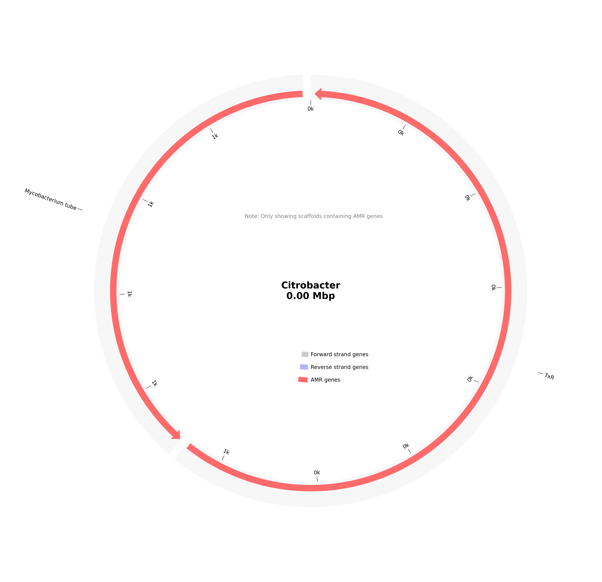

### Mycobacterium tuberculosis katG mutations conferring resistance to isoniazid
- **Mechanism**: antibiotic target alteration
- **Drug Classes**: isoniazid-like antibiotic
- **AMR Family**: isoniazid resistant katG
- **Locations**:
  - gnl|SPADES|DAOGIJFL_17766_1 : position 1-375

### TxR
- **Mechanism**: antibiotic efflux
- **Drug Classes**: tetracycline antibiotic
- **AMR Family**: ATP-binding cassette (ABC) antibiotic efflux pump
- **Locations**:
  - gnl|SPADES|DAOGIJFL_9639_1 : position 3-599

## Citrobacter amalonaticus
**Strain Statistics:**
- Total genome length: 0.9 kbp
- Total scaffolds: 1
- Scaffolds with AMR genes: 1
- Total genes annotated: 0
- Total AMR genes: 1
- Unique AMR genes: 1
- Distinct AMR mechanisms: 1
- Distinct AMR families: 1
- Distinct drug classes: 4

**Circos Plot:**

### LptD
- **Mechanism**: antibiotic efflux
- **Drug Classes**: carbapenem; peptide antibiotic; aminocoumarin antibiotic; rifamycin antibiotic
- **AMR Family**: ATP-binding cassette (ABC) antibiotic efflux pump
- **Locations**:
  - gnl|SPADES|DAOGIJFL_5685_1 : position 3-908

## Citrobacter amalonaticus Y19
**Strain Statistics:**
- Total genome length: 0.7 kbp
- Total scaffolds: 4
- Scaffolds with AMR genes: 1
- Total genes annotated: 0
- Total AMR genes: 1
- Unique AMR genes: 1
- Distinct AMR mechanisms: 1
- Distinct AMR families: 1
- Distinct drug classes: 4

**Circos Plot:**

### LptD
- **Mechanism**: antibiotic efflux
- **Drug Classes**: carbapenem; peptide antibiotic; aminocoumarin antibiotic; rifamycin antibiotic
- **AMR Family**: ATP-binding cassette (ABC) antibiotic efflux pump
- **Locations**:
  - gnl|SPADES|DAOGIJFL_8372_1 : position 2-670

## Citrobacter cronae
**Strain Statistics:**
- Total genome length: 0.5 kbp
- Total scaffolds: 4
- Scaffolds with AMR genes: 1
- Total genes annotated: 0
- Total AMR genes: 1
- Unique AMR genes: 1
- Distinct AMR mechanisms: 1
- Distinct AMR families: 1
- Distinct drug classes: 15

**Circos Plot:**

### Pseudomonas aeruginosa CpxR
- **Mechanism**: antibiotic efflux
- **Drug Classes**: macrolide antibiotic; fluoroquinolone antibiotic; monobactam; aminoglycoside antibiotic; carbapenem; cephalosporin; cephamycin; penam; tetracycline antibiotic; peptide antibiotic; aminocoumarin antibiotic; diaminopyrimidine antibiotic; sulfonamide antibiotic; phenicol antibiotic; penem
- **AMR Family**: resistance-nodulation-cell division (RND) antibiotic efflux pump
- **Locations**:
  - gnl|SPADES|DAOGIJFL_13173_1 : position 2-475

## Citrobacter farmeri
**Strain Statistics:**
- Total genome length: 1.1 kbp
- Total scaffolds: 3
- Scaffolds with AMR genes: 1
- Total genes annotated: 0
- Total AMR genes: 1
- Unique AMR genes: 1
- Distinct AMR mechanisms: 1
- Distinct AMR families: 1
- Distinct drug classes: 1

**Circos Plot:**

### cmlv
- **Mechanism**: antibiotic inactivation
- **Drug Classes**: phenicol antibiotic
- **AMR Family**: chloramphenicol phosphotransferase
- **Locations**:
  - gnl|SPADES|DAOGIJFL_4408_2 : position 338-1102

## Citrobacter freundii complex
**Strain Statistics:**
- Total genome length: 1.4 kbp
- Total scaffolds: 15
- Scaffolds with AMR genes: 1
- Total genes annotated: 2
- Total AMR genes: 1
- Unique AMR genes: 1
- Distinct AMR mechanisms: 1
- Distinct AMR families: 1
- Distinct drug classes: 1

**Circos Plot:**

### vanT gene in vanG cluster
- **Mechanism**: antibiotic target alteration
- **Drug Classes**: glycopeptide antibiotic
- **AMR Family**: glycopeptide resistance gene cluster; vanT
- **Locations**:
  - gnl|SPADES|DAOGIJFL_3257_1 : position 3-158

## Citrobacter freundii complex sp. CFNIH3
**Strain Statistics:**
- Total genome length: 1.2 kbp
- Total scaffolds: 4
- Scaffolds with AMR genes: 2
- Total genes annotated: 2
- Total AMR genes: 2
- Unique AMR genes: 1
- Distinct AMR mechanisms: 1
- Distinct AMR families: 1
- Distinct drug classes: 6

**Circos Plot:**

### H-NS (found in 2 locations)
- **Mechanism**: antibiotic efflux
- **Drug Classes**: macrolide antibiotic; fluoroquinolone antibiotic; cephalosporin; cephamycin; penam; tetracycline antibiotic
- **AMR Family**: major facilitator superfamily (MFS) antibiotic efflux pump; resistance-nodulation-cell division (RND) antibiotic efflux pump
- **Locations**:
  - gnl|SPADES|DAOGIJFL_13526_1 : position 146-388
  - gnl|SPADES|DAOGIJFL_7000_1 : position 2-139

## Citrobacter sedlakii
**Strain Statistics:**
- Total genome length: 0.3 kbp
- Total scaffolds: 1
- Scaffolds with AMR genes: 1
- Total genes annotated: 0
- Total AMR genes: 1
- Unique AMR genes: 1
- Distinct AMR mechanisms: 1
- Distinct AMR families: 1
- Distinct drug classes: 1

**Circos Plot:**

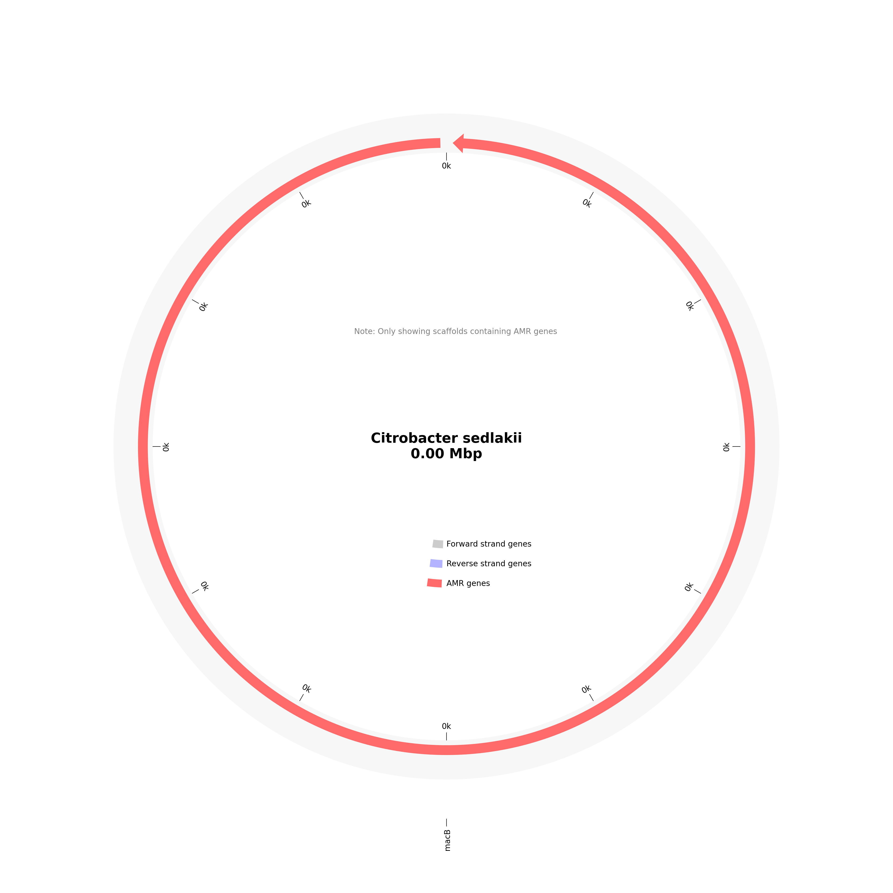

### macB
- **Mechanism**: antibiotic efflux
- **Drug Classes**: macrolide antibiotic
- **AMR Family**: ATP-binding cassette (ABC) antibiotic efflux pump
- **Locations**:
  - gnl|SPADES|DAOGIJFL_22651_1 : position 1-309

## Citrobacter sp. R56
**Strain Statistics:**
- Total genome length: 0.8 kbp
- Total scaffolds: 4
- Scaffolds with AMR genes: 1
- Total genes annotated: 0
- Total AMR genes: 1
- Unique AMR genes: 1
- Distinct AMR mechanisms: 1
- Distinct AMR families: 1
- Distinct drug classes: 1

**Circos Plot:**

### Mycobacterium tuberculosis katG mutations conferring resistance to isoniazid
- **Mechanism**: antibiotic target alteration
- **Drug Classes**: isoniazid-like antibiotic
- **AMR Family**: isoniazid resistant katG
- **Locations**:
  - gnl|SPADES|DAOGIJFL_6609_1 : position 2-808

## Citrobacter sp. RHB25-C09
**Strain Statistics:**
- Total genome length: 0.4 kbp
- Total scaffolds: 3
- Scaffolds with AMR genes: 1
- Total genes annotated: 2
- Total AMR genes: 1
- Unique AMR genes: 1
- Distinct AMR mechanisms: 1
- Distinct AMR families: 1
- Distinct drug classes: 1

**Circos Plot:**

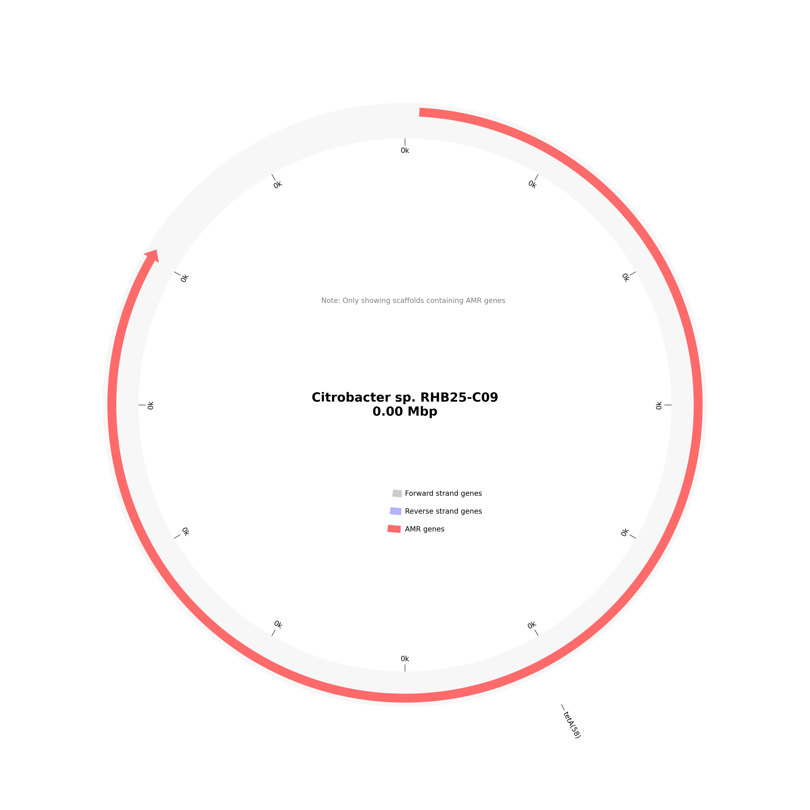

### tetA(58)
- **Mechanism**: antibiotic efflux
- **Drug Classes**: tetracycline antibiotic
- **AMR Family**: major facilitator superfamily (MFS) antibiotic efflux pump
- **Locations**:
  - gnl|SPADES|DAOGIJFL_17256_1 : position 3-323

## Citrobacter tructae
**Strain Statistics:**
- Total genome length: 0.5 kbp
- Total scaffolds: 5
- Scaffolds with AMR genes: 1
- Total genes annotated: 0
- Total AMR genes: 1
- Unique AMR genes: 1
- Distinct AMR mechanisms: 1
- Distinct AMR families: 1
- Distinct drug classes: 1

**Circos Plot:**

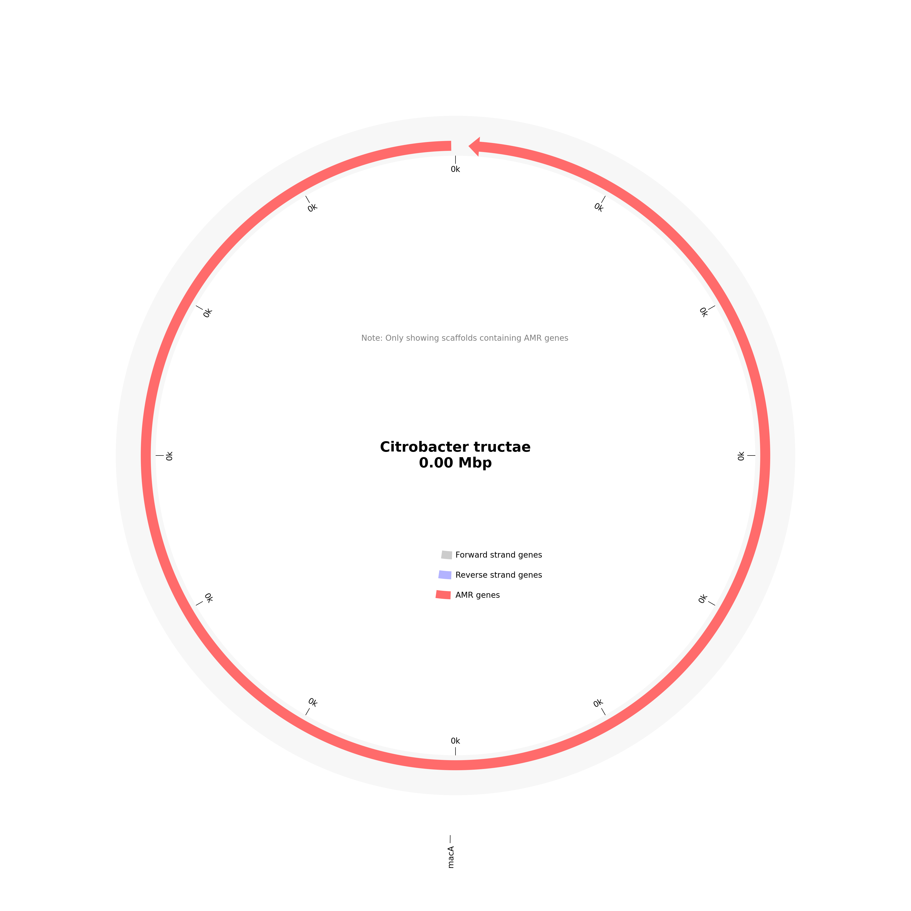

### macA
- **Mechanism**: antibiotic efflux
- **Drug Classes**: macrolide antibiotic
- **AMR Family**: ATP-binding cassette (ABC) antibiotic efflux pump
- **Locations**:
  - gnl|SPADES|DAOGIJFL_13993_1 : position 3-452

## Escherichia coli
**Strain Statistics:**
- Total genome length: 3026.7 kbp
- Total scaffolds: 817
- Scaffolds with AMR genes: 120
- Total genes annotated: 5626
- Total AMR genes: 332
- Unique AMR genes: 168
- Distinct AMR mechanisms: 10
- Distinct AMR families: 64
- Distinct drug classes: 37

**Circos Plot:**

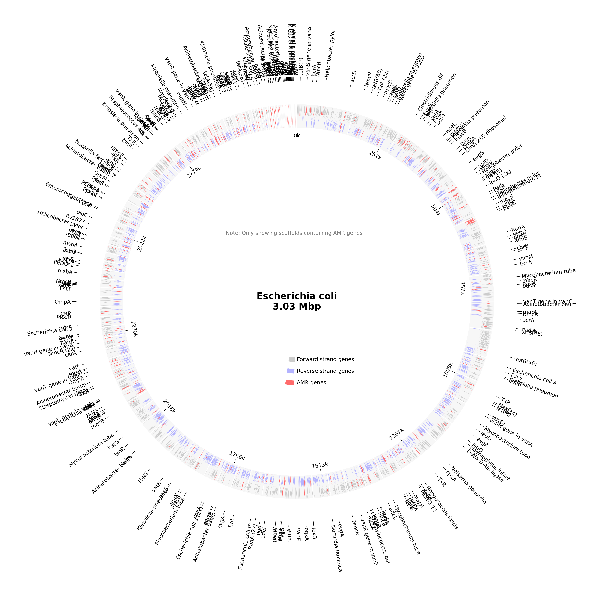

### Acinetobacter baumannii AbaF (found in 5 locations)
- **Mechanism**: antibiotic efflux
- **Drug Classes**: phosphonic acid antibiotic
- **AMR Family**: major facilitator superfamily (MFS) antibiotic efflux pump
- **Locations**:
  - gnl|SPADES|DAOGIJFL_1246_2 : position 1565-2881
  - gnl|SPADES|DAOGIJFL_209_15 : position 23740-25062
  - gnl|SPADES|DAOGIJFL_230_19 : position 20156-21505
  - gnl|SPADES|DAOGIJFL_325_6 : position 9220-10536
  - gnl|SPADES|DAOGIJFL_75_4 : position 2219-3502

### Acinetobacter baumannii AbaQ (found in 2 locations)
- **Mechanism**: antibiotic efflux
- **Drug Classes**: fluoroquinolone antibiotic
- **AMR Family**: major facilitator superfamily (MFS) antibiotic efflux pump
- **Locations**:
  - gnl|SPADES|DAOGIJFL_174_14 : position 16053-17429
  - gnl|SPADES|DAOGIJFL_714_3 : position 2281-3570

### Acinetobacter baumannii AmvA
- **Mechanism**: antibiotic efflux
- **Drug Classes**: macrolide antibiotic; disinfecting agents and antiseptics
- **AMR Family**: major facilitator superfamily (MFS) antibiotic efflux pump
- **Locations**:
  - gnl|SPADES|DAOGIJFL_473_9 : position 5945-7303

### AcrE
- **Mechanism**: antibiotic efflux
- **Drug Classes**: fluoroquinolone antibiotic; cephalosporin; cephamycin; penam
- **AMR Family**: resistance-nodulation-cell division (RND) antibiotic efflux pump
- **Locations**:
  - gnl|SPADES|DAOGIJFL_411_8: position 8224-9381

### AcrF
- **Mechanism**: antibiotic efflux
- **Drug Classes**: fluoroquinolone antibiotic; cephalosporin; cephamycin; penam
- **AMR Family**: resistance-nodulation-cell division (RND) antibiotic efflux pump
- **Locations**:
  - gnl|SPADES|DAOGIJFL_411_7: position 5108-8212

### AcrS
- **Mechanism**: antibiotic efflux
- **Drug Classes**: fluoroquinolone antibiotic; cephalosporin; glycylcycline; cephamycin; penam; tetracycline antibiotic; rifamycin antibiotic; phenicol antibiotic; disinfecting agents and antiseptics
- **AMR Family**: resistance-nodulation-cell division (RND) antibiotic efflux pump
- **Locations**:
  - gnl|SPADES|DAOGIJFL_411_9: position 9780-10442

### Agrobacterium fabrum chloramphenicol acetyltransferase
- **Mechanism**: antibiotic inactivation
- **Drug Classes**: phenicol antibiotic
- **AMR Family**: chloramphenicol acetyltransferase (CAT)
- **Locations**:
  - gnl|SPADES|DAOGIJFL_4647_2 : position 291-911

### Bifidobacterium bifidum ileS conferring resistance to mupirocin
- **Mechanism**: antibiotic target alteration
- **Drug Classes**: mupirocin-like antibiotic
- **AMR Family**: antibiotic-resistant isoleucyl-tRNA synthetase (ileS)
- **Locations**:
  - gnl|SPADES|DAOGIJFL_45_72 : position 73786-76368

### Brucella suis mprF
- **Mechanism**: antibiotic target alteration
- **Drug Classes**: peptide antibiotic
- **AMR Family**: defensin resistant mprF
- **Locations**:
  - gnl|SPADES|DAOGIJFL_1851_1 : position 3-410

### CAR-1
- **Mechanism**: antibiotic inactivation
- **Drug Classes**: carbapenem
- **AMR Family**: CAR beta-lactamase
- **Locations**:
  - gnl|SPADES|DAOGIJFL_519_4 : position 2196-2951

### CRP (found in 2 locations)
- **Mechanism**: antibiotic efflux
- **Drug Classes**: macrolide antibiotic; fluoroquinolone antibiotic; penam
- **AMR Family**: resistance-nodulation-cell division (RND) antibiotic efflux pump
- **Locations**:
  - gnl|SPADES|DAOGIJFL_19_72 : position 72515-73267
  - gnl|SPADES|DAOGIJFL_257_17: position 11855-12487

### Clostridioides difficile gyrA conferring resistance to fluoroquinolones
- **Mechanism**: antibiotic target alteration
- **Drug Classes**: fluoroquinolone antibiotic
- **AMR Family**: fluoroquinolone resistant gyrA
- **Locations**:
  - gnl|SPADES|DAOGIJFL_28_10 : position 10066-12693

### CrcB
- **Mechanism**: antibiotic efflux
- **Drug Classes**: aminoglycoside antibiotic
- **AMR Family**: multidrug and toxic compound extrusion (MATE) transporter
- **Locations**:
  - gnl|SPADES|DAOGIJFL_45_55 : position 59137-59520

### D-Ala-D-Ala ligase
- **Mechanism**: antibiotic target alteration
- **Drug Classes**: glycopeptide antibiotic
- **AMR Family**: Van ligase
- **Locations**:
  - gnl|SPADES|DAOGIJFL_105_20 : position 23158-24078

### EC-14
- **Mechanism**: antibiotic inactivation
- **Drug Classes**: cephalosporin
- **AMR Family**: EC beta-lactamase
- **Locations**:
  - gnl|SPADES|DAOGIJFL_312_11: position 12916-14049

### Enterococcus faecalis cls with mutation conferring resistance to daptomycin
- **Mechanism**: antibiotic target alteration
- **Drug Classes**: peptide antibiotic
- **AMR Family**: daptomycin resistant cls
- **Locations**:
  - gnl|SPADES|DAOGIJFL_311_11 : position 9631-11091

### Erm(34)
- **Mechanism**: antibiotic target alteration
- **Drug Classes**: macrolide antibiotic; lincosamide antibiotic; streptogramin antibiotic; streptogramin A antibiotic; streptogramin B antibiotic
- **AMR Family**: Erm 23S ribosomal RNA methyltransferase
- **Locations**:
  - gnl|SPADES|DAOGIJFL_90_33 : position 29989-30615

### ErmW
- **Mechanism**: antibiotic target alteration
- **Drug Classes**: macrolide antibiotic; lincosamide antibiotic; streptogramin antibiotic
- **AMR Family**: Erm 23S ribosomal RNA methyltransferase
- **Locations**:
  - gnl|SPADES|DAOGIJFL_595_8 : position 4520-5107

### Escherichia coli AcrAB-TolC with AcrR mutation conferring resistance to ciprofloxacin, tetracycline, and ceftazidime
- **Mechanism**: antibiotic target alteration; antibiotic efflux
- **Drug Classes**: fluoroquinolone antibiotic; cephalosporin; glycylcycline; penam; tetracycline antibiotic; rifamycin antibiotic; phenicol antibiotic; disinfecting agents and antiseptics
- **AMR Family**: resistance-nodulation-cell division (RND) antibiotic efflux pump
- **Locations**:
  - gnl|SPADES|DAOGIJFL_86_7 : position 7084-7662

### Escherichia coli AcrAB-TolC with MarR mutations conferring resistance to ciprofloxacin and tetracycline
- **Mechanism**: antibiotic target alteration; antibiotic efflux
- **Drug Classes**: fluoroquinolone antibiotic; cephalosporin; glycylcycline; penam; tetracycline antibiotic; rifamycin antibiotic; phenicol antibiotic; disinfecting agents and antiseptics
- **AMR Family**: resistance-nodulation-cell division (RND) antibiotic efflux pump
- **Locations**:
  - gnl|SPADES|DAOGIJFL_75_23: position 21355-21789

### Escherichia coli EF-Tu mutants conferring resistance to kirromycin
- **Mechanism**: antibiotic target alteration
- **Drug Classes**: elfamycin antibiotic
- **AMR Family**: elfamycin resistant EF-Tu
- **Locations**:
  - gnl|SPADES|DAOGIJFL_660_3 : position 2260-4104

### Escherichia coli mdfA
- **Mechanism**: antibiotic efflux
- **Drug Classes**: tetracycline antibiotic; phenicol antibiotic; disinfecting agents and antiseptics
- **AMR Family**: major facilitator superfamily (MFS) antibiotic efflux pump
- **Locations**:
  - gnl|SPADES|DAOGIJFL_162_18: position 14731-15963

### Escherichia coli soxS with mutation conferring antibiotic resistance (found in 4 locations)
- **Mechanism**: antibiotic target alteration; antibiotic efflux; reduced permeability to antibiotic
- **Drug Classes**: fluoroquinolone antibiotic; monobactam; carbapenem; cephalosporin; glycylcycline; cephamycin; penam; tetracycline antibiotic; rifamycin antibiotic; phenicol antibiotic; penem; disinfecting agents and antiseptics
- **AMR Family**: ATP-binding cassette (ABC) antibiotic efflux pump; major facilitator superfamily (MFS) antibiotic efflux pump; resistance-nodulation-cell division (RND) antibiotic efflux pump; General Bacterial Porin with reduced permeability to beta-lactams
- **Locations**:
  - gnl|SPADES|DAOGIJFL_189_6 : position 5143-5979
  - gnl|SPADES|DAOGIJFL_189_7 : position 5963-6901
  - gnl|SPADES|DAOGIJFL_226_3 : position 1240-2109
  - gnl|SPADES|DAOGIJFL_251_3 : position 5066-5923

### EstT
- **Mechanism**: antibiotic inactivation
- **Drug Classes**: macrolide antibiotic
- **AMR Family**: macrolide esterase
- **Locations**:
  - gnl|SPADES|DAOGIJFL_277_12 : position 14467-15231

### H-NS (found in 2 locations)
- **Mechanism**: antibiotic efflux
- **Drug Classes**: macrolide antibiotic; fluoroquinolone antibiotic; cephalosporin; cephamycin; penam; tetracycline antibiotic
- **AMR Family**: major facilitator superfamily (MFS) antibiotic efflux pump; resistance-nodulation-cell division (RND) antibiotic efflux pump
- **Locations**:
  - gnl|SPADES|DAOGIJFL_203_11 : position 8099-8539
  - gnl|SPADES|DAOGIJFL_217_21 : position 19597-20001

### Haemophilus influenzae PBP3 conferring resistance to beta-lactam antibiotics
- **Mechanism**: antibiotic target alteration
- **Drug Classes**: cephalosporin; cephamycin; penam
- **AMR Family**: Penicillin-binding protein mutations conferring resistance to beta-lactam antibiotics
- **Locations**:
  - gnl|SPADES|DAOGIJFL_105_12 : position 12338-14104

### Helicobacter pylori pbp1 mutants conferring resistance to amoxicillin
- **Mechanism**: antibiotic target alteration
- **Drug Classes**: cephalosporin; cephamycin; penam
- **AMR Family**: Penicillin-binding protein mutations conferring resistance to beta-lactam antibiotics
- **Locations**:
  - gnl|SPADES|DAOGIJFL_14_57 : position 66792-69104

### Helicobacter pylori pbp2 mutants conferring resistance to amoxicillin
- **Mechanism**: antibiotic target alteration
- **Drug Classes**: cephalosporin; cephamycin; penam
- **AMR Family**: Penicillin-binding protein mutations conferring resistance to beta-lactam antibiotics
- **Locations**:
  - gnl|SPADES|DAOGIJFL_45_65 : position 67901-69802

### Helicobacter pylori rdxA mutation conferring resistance to metronidazole
- **Mechanism**: antibiotic target alteration
- **Drug Classes**: nitroimidazole antibiotic
- **AMR Family**: Antibiotic resistant Helicobacter pylori nitroreductase
- **Locations**:
  - gnl|SPADES|DAOGIJFL_45_6 : position 7607-8260

### Helicobacter pylori rpoB mutation conferring resistance to rifampicin
- **Mechanism**: antibiotic target alteration; antibiotic target replacement
- **Drug Classes**: fluoroquinolone antibiotic; rifamycin antibiotic
- **AMR Family**: rifamycin-resistant beta-subunit of RNA polymerase (rpoB)
- **Locations**:
  - gnl|SPADES|DAOGIJFL_296_21 : position 18463-19875

### Klebsiella pneumoniae KpnE
- **Mechanism**: antibiotic efflux
- **Drug Classes**: macrolide antibiotic; aminoglycoside antibiotic; cephalosporin; tetracycline antibiotic; peptide antibiotic; rifamycin antibiotic; disinfecting agents and antiseptics
- **AMR Family**: small multidrug resistance (SMR) antibiotic efflux pump
- **Locations**:
  - gnl|SPADES|DAOGIJFL_86_25: position 30442-30807

### Klebsiella pneumoniae KpnF
- **Mechanism**: antibiotic efflux
- **Drug Classes**: macrolide antibiotic; aminoglycoside antibiotic; cephalosporin; tetracycline antibiotic; peptide antibiotic; rifamycin antibiotic; disinfecting agents and antiseptics
- **AMR Family**: small multidrug resistance (SMR) antibiotic efflux pump
- **Locations**:
  - gnl|SPADES|DAOGIJFL_86_26: position 30794-31123

### Klebsiella pneumoniae OmpK37 (found in 11 locations)
- **Mechanism**: reduced permeability to antibiotic
- **Drug Classes**: monobactam; carbapenem; cephalosporin; cephamycin; penam; penem
- **AMR Family**: General Bacterial Porin with reduced permeability to beta-lactams
- **Locations**:
  - gnl|SPADES|DAOGIJFL_16813_1 : position 173-391
  - gnl|SPADES|DAOGIJFL_18417_1 : position 101-364
  - gnl|SPADES|DAOGIJFL_18927_1 : position 2-358
  - gnl|SPADES|DAOGIJFL_192_27 : position 21435-22493
  - gnl|SPADES|DAOGIJFL_19_85 : position 86440-87573
  - gnl|SPADES|DAOGIJFL_2541_1 : position 3-875
  - gnl|SPADES|DAOGIJFL_28_21 : position 29521-30645
  - gnl|SPADES|DAOGIJFL_361_4 : position 1962-3059
  - gnl|SPADES|DAOGIJFL_39_2 : position 1477-2565
  - gnl|SPADES|DAOGIJFL_420_2 : position 382-672
  - gnl|SPADES|DAOGIJFL_511_6 : position 4469-5524

### LRA-2
- **Mechanism**: antibiotic inactivation
- **Drug Classes**: cephalosporin; penam
- **AMR Family**: subclass B3 LRA beta-lactamase
- **Locations**:
  - gnl|SPADES|DAOGIJFL_1411_1 : position 172-1128

### LlmA 23S ribosomal RNA methyltransferase
- **Mechanism**: antibiotic target alteration
- **Drug Classes**: lincosamide antibiotic
- **AMR Family**: Llm 23S ribosomal RNA methyltransferase
- **Locations**:
  - gnl|SPADES|DAOGIJFL_39_40 : position 44539-45714

### LpsA
- **Mechanism**: reduced permeability to antibiotic
- **Drug Classes**: peptide antibiotic
- **AMR Family**: Intrinsic peptide antibiotic resistant Lps
- **Locations**:
  - gnl|SPADES|DAOGIJFL_16620_1 : position 2-322

### MCR-3.22
- **Mechanism**: antibiotic target alteration
- **Drug Classes**: peptide antibiotic
- **AMR Family**: MCR phosphoethanolamine transferase
- **Locations**:
  - gnl|SPADES|DAOGIJFL_114_41 : position 41870-43363

### MCR-4.2
- **Mechanism**: antibiotic target alteration
- **Drug Classes**: peptide antibiotic
- **AMR Family**: MCR phosphoethanolamine transferase
- **Locations**:
  - gnl|SPADES|DAOGIJFL_413_6 : position 5046-6629

### MCR-8.4
- **Mechanism**: antibiotic target alteration
- **Drug Classes**: peptide antibiotic
- **AMR Family**: MCR phosphoethanolamine transferase
- **Locations**:
  - gnl|SPADES|DAOGIJFL_900_2 : position 1753-3378

### MdtK
- **Mechanism**: antibiotic efflux
- **Drug Classes**: fluoroquinolone antibiotic
- **AMR Family**: multidrug and toxic compound extrusion (MATE) transporter
- **Locations**:
  - gnl|SPADES|DAOGIJFL_325_9 : position 13779-15233

### MdtQ
- **Mechanism**: reduced permeability to antibiotic
- **Drug Classes**: monobactam; carbapenem; cephalosporin; cephamycin; penam; penem
- **AMR Family**: Outer Membrane Porin (Opr)
- **Locations**:
  - gnl|SPADES|DAOGIJFL_70_62 : position 72971-74407

### MexR (found in 2 locations)
- **Mechanism**: antibiotic target alteration; antibiotic efflux
- **Drug Classes**: macrolide antibiotic; fluoroquinolone antibiotic; monobactam; carbapenem; cephalosporin; cephamycin; penam; tetracycline antibiotic; peptide antibiotic; aminocoumarin antibiotic; diaminopyrimidine antibiotic; sulfonamide antibiotic; phenicol antibiotic; penem
- **AMR Family**: resistance-nodulation-cell division (RND) antibiotic efflux pump
- **Locations**:
  - gnl|SPADES|DAOGIJFL_174_21 : position 23532-23978
  - gnl|SPADES|DAOGIJFL_90_30 : position 27127-27534

### MexT
- **Mechanism**: antibiotic efflux
- **Drug Classes**: fluoroquinolone antibiotic; diaminopyrimidine antibiotic; phenicol antibiotic
- **AMR Family**: resistance-nodulation-cell division (RND) antibiotic efflux pump
- **Locations**:
  - gnl|SPADES|DAOGIJFL_1411_2 : position 1210-2154

### MexV
- **Mechanism**: antibiotic efflux
- **Drug Classes**: macrolide antibiotic; fluoroquinolone antibiotic; tetracycline antibiotic; phenicol antibiotic; disinfecting agents and antiseptics
- **AMR Family**: resistance-nodulation-cell division (RND) antibiotic efflux pump
- **Locations**:
  - gnl|SPADES|DAOGIJFL_45_2 : position 328-1551

### MuxC
- **Mechanism**: antibiotic efflux
- **Drug Classes**: macrolide antibiotic; monobactam; tetracycline antibiotic; aminocoumarin antibiotic
- **AMR Family**: resistance-nodulation-cell division (RND) antibiotic efflux pump
- **Locations**:
  - gnl|SPADES|DAOGIJFL_45_3 : position 1563-4706

### Mycobacterium tuberculosis gidB mutation conferring resistance to streptomycin
- **Mechanism**: antibiotic target alteration
- **Drug Classes**: aminoglycoside antibiotic
- **AMR Family**: antibiotic resistant gidB
- **Locations**:
  - gnl|SPADES|DAOGIJFL_190_15 : position 16419-17042

### Mycobacterium tuberculosis inhA mutations conferring resistance to isoniazid
- **Mechanism**: antibiotic target alteration
- **Drug Classes**: isoniazid-like antibiotic
- **AMR Family**: isoniazid resistant inhA
- **Locations**:
  - gnl|SPADES|DAOGIJFL_212_22 : position 20813-21697

### Mycobacterium tuberculosis ndh with mutation conferring resistance to isoniazid
- **Mechanism**: antibiotic target alteration
- **Drug Classes**: isoniazid-like antibiotic
- **AMR Family**: antibiotic resistant ndh
- **Locations**:
  - gnl|SPADES|DAOGIJFL_74_16 : position 14502-15806

### Mycobacterium tuberculosis rpsA mutations conferring resistance to pyrazinamide
- **Mechanism**: antibiotic target alteration
- **Drug Classes**: pyrazine antibiotic
- **AMR Family**: pyrazinamide resistant rpsA
- **Locations**:
  - gnl|SPADES|DAOGIJFL_134_1 : position 2-475

### Mycobacterium tuberculosis thyA with mutation conferring resistance to para-aminosalicylic acid
- **Mechanism**: antibiotic target alteration
- **Drug Classes**: salicylic acid antibiotic
- **AMR Family**: aminosalicylate resistant thymidylate synthase
- **Locations**:
  - gnl|SPADES|DAOGIJFL_97_16 : position 22226-23020

### Neisseria gonorrhoeae pilQ gene conferring resistance to beta-lactam
- **Mechanism**: antibiotic target alteration
- **Drug Classes**: cephalosporin; cephamycin; penam
- **AMR Family**: Penicillin-binding protein mutations conferring resistance to beta-lactam antibiotics
- **Locations**:
  - gnl|SPADES|DAOGIJFL_109_16 : position 14511-15719

### NmcR (found in 14 locations)
- **Mechanism**: antibiotic inactivation
- **Drug Classes**: carbapenem; cephalosporin; cephamycin; penam
- **AMR Family**: NmcA beta-lactamase
- **Locations**:
  - gnl|SPADES|DAOGIJFL_1385_2 : position 263-1141
  - gnl|SPADES|DAOGIJFL_143_5 : position 4805-5731
  - gnl|SPADES|DAOGIJFL_14_39 : position 45623-46513
  - gnl|SPADES|DAOGIJFL_19_8 : position 7235-8209
  - gnl|SPADES|DAOGIJFL_245_19 : position 16247-17143
  - gnl|SPADES|DAOGIJFL_245_24 : position 22774-23667
  - gnl|SPADES|DAOGIJFL_280_8 : position 5741-6640
  - gnl|SPADES|DAOGIJFL_285_3 : position 2782-3735
  - gnl|SPADES|DAOGIJFL_325_10 : position 15540-16490
  - gnl|SPADES|DAOGIJFL_343_3 : position 2678-3583
  - gnl|SPADES|DAOGIJFL_415_1 : position 234-1073
  - gnl|SPADES|DAOGIJFL_415_9 : position 10035-10928
  - gnl|SPADES|DAOGIJFL_75_28 : position 25222-26103
  - gnl|SPADES|DAOGIJFL_86_30 : position 34351-35244

### Nocardia farcinica rox (found in 2 locations)
- **Mechanism**: antibiotic inactivation
- **Drug Classes**: rifamycin antibiotic
- **AMR Family**: rifampin monooxygenase
- **Locations**:
  - gnl|SPADES|DAOGIJFL_150_5 : position 4789-5991
  - gnl|SPADES|DAOGIJFL_326_6 : position 6807-8471

### OmpA (found in 6 locations)
- **Mechanism**: reduced permeability to antibiotic
- **Drug Classes**: peptide antibiotic
- **AMR Family**: General Bacterial Porin with reduced permeability to peptide antibiotics
- **Locations**:
  - gnl|SPADES|DAOGIJFL_231_6 : position 5603-6262
  - gnl|SPADES|DAOGIJFL_265_16 : position 11694-12176
  - gnl|SPADES|DAOGIJFL_315_9 : position 6050-6883
  - gnl|SPADES|DAOGIJFL_39_30 : position 34761-35813
  - gnl|SPADES|DAOGIJFL_4501_1 : position 53-826
  - gnl|SPADES|DAOGIJFL_481_2 : position 1018-1539

### OprM (found in 2 locations)
- **Mechanism**: antibiotic efflux
- **Drug Classes**: macrolide antibiotic; fluoroquinolone antibiotic; monobactam; aminoglycoside antibiotic; carbapenem; cephalosporin; cephamycin; penam; tetracycline antibiotic; peptide antibiotic; aminocoumarin antibiotic; diaminopyrimidine antibiotic; sulfonamide antibiotic; phenicol antibiotic; penem; disinfecting agents and antiseptics
- **AMR Family**: resistance-nodulation-cell division (RND) antibiotic efflux pump
- **Locations**:
  - gnl|SPADES|DAOGIJFL_324_11 : position 15855-17210
  - gnl|SPADES|DAOGIJFL_387_2 : position 234-1607

### PEDO-1 (found in 2 locations)
- **Mechanism**: antibiotic inactivation
- **Drug Classes**: carbapenem
- **AMR Family**: subclass B3 PEDO beta-lactamase
- **Locations**:
  - gnl|SPADES|DAOGIJFL_282_17 : position 21088-21735
  - gnl|SPADES|DAOGIJFL_315_6 : position 4123-4983

### ParR (found in 3 locations)
- **Mechanism**: antibiotic efflux; reduced permeability to antibiotic
- **Drug Classes**: macrolide antibiotic; fluoroquinolone antibiotic; monobactam; aminoglycoside antibiotic; carbapenem; cephalosporin; cephamycin; penam; tetracycline antibiotic; phenicol antibiotic; penem; disinfecting agents and antiseptics
- **AMR Family**: resistance-nodulation-cell division (RND) antibiotic efflux pump; Outer Membrane Porin (Opr)
- **Locations**:
  - gnl|SPADES|DAOGIJFL_109_30 : position 30979-31698
  - gnl|SPADES|DAOGIJFL_464_9 : position 8908-9615
  - gnl|SPADES|DAOGIJFL_86_17 : position 21065-21784

### ParS (found in 3 locations)
- **Mechanism**: antibiotic efflux; reduced permeability to antibiotic
- **Drug Classes**: macrolide antibiotic; fluoroquinolone antibiotic; monobactam; aminoglycoside antibiotic; carbapenem; cephalosporin; cephamycin; penam; tetracycline antibiotic; phenicol antibiotic; penem; disinfecting agents and antiseptics
- **AMR Family**: resistance-nodulation-cell division (RND) antibiotic efflux pump; Outer Membrane Porin (Opr)
- **Locations**:
  - gnl|SPADES|DAOGIJFL_16899_1 : position 3-389
  - gnl|SPADES|DAOGIJFL_45_50 : position 53816-55474
  - gnl|SPADES|DAOGIJFL_86_16 : position 19605-19949

### Pseudomonas aeruginosa CpxR (found in 2 locations)
- **Mechanism**: antibiotic efflux
- **Drug Classes**: macrolide antibiotic; fluoroquinolone antibiotic; monobactam; aminoglycoside antibiotic; carbapenem; cephalosporin; cephamycin; penam; tetracycline antibiotic; peptide antibiotic; aminocoumarin antibiotic; diaminopyrimidine antibiotic; sulfonamide antibiotic; phenicol antibiotic; penem
- **AMR Family**: resistance-nodulation-cell division (RND) antibiotic efflux pump
- **Locations**:
  - gnl|SPADES|DAOGIJFL_189_13 : position 12379-13077
  - gnl|SPADES|DAOGIJFL_45_51 : position 55443-56123

### QnrB22
- **Mechanism**: antibiotic target protection
- **Drug Classes**: fluoroquinolone antibiotic
- **AMR Family**: quinolone resistance protein (qnr)
- **Locations**:
  - gnl|SPADES|DAOGIJFL_3387_2 : position 489-1052

### RanA (found in 13 locations)
- **Mechanism**: antibiotic efflux
- **Drug Classes**: aminoglycoside antibiotic
- **AMR Family**: ATP-binding cassette (ABC) antibiotic efflux pump
- **Locations**:
  - gnl|SPADES|DAOGIJFL_123_21 : position 19238-20044
  - gnl|SPADES|DAOGIJFL_162_31 : position 30245-32116
  - gnl|SPADES|DAOGIJFL_162_5 : position 3512-4645
  - gnl|SPADES|DAOGIJFL_19_28 : position 26015-27007
  - gnl|SPADES|DAOGIJFL_217_13 : position 12075-13277
  - gnl|SPADES|DAOGIJFL_247_5 : position 4951-5718
  - gnl|SPADES|DAOGIJFL_28_56 : position 62701-64290
  - gnl|SPADES|DAOGIJFL_311_8 : position 7200-8213
  - gnl|SPADES|DAOGIJFL_311_9 : position 8210-9214
  - gnl|SPADES|DAOGIJFL_515_1 : position 123-1169
  - gnl|SPADES|DAOGIJFL_553_2 : position 2638-3447
  - gnl|SPADES|DAOGIJFL_70_53 : position 62129-63055
  - gnl|SPADES|DAOGIJFL_74_33 : position 32882-34018

### Rhodococcus fascians cmr
- **Mechanism**: antibiotic efflux
- **Drug Classes**: phenicol antibiotic
- **AMR Family**: major facilitator superfamily (MFS) antibiotic efflux pump
- **Locations**:
  - gnl|SPADES|DAOGIJFL_114_24 : position 25214-26452

### Rv1877
- **Mechanism**: antibiotic efflux
- **Drug Classes**: fluoroquinolone antibiotic
- **AMR Family**: major facilitator superfamily (MFS) antibiotic efflux pump
- **Locations**:
  - gnl|SPADES|DAOGIJFL_304_13 : position 9000-10394

### SST-1
- **Mechanism**: antibiotic inactivation
- **Drug Classes**: cephalosporin
- **AMR Family**: SST beta-lactamase
- **Locations**:
  - gnl|SPADES|DAOGIJFL_247_11 : position 12594-13751

### Staphylococcus aureus fusA with mutation conferring resistance to fusidic acid
- **Mechanism**: antibiotic target alteration
- **Drug Classes**: fusidane antibiotic
- **AMR Family**: antibiotic resistant fusA
- **Locations**:
  - gnl|SPADES|DAOGIJFL_380_5 : position 3062-4651

### Staphylococcus aureus pgsA mutations conferring resistance to daptomycin
- **Mechanism**: antibiotic target alteration
- **Drug Classes**: peptide antibiotic
- **AMR Family**: daptomycin resistant pgsA
- **Locations**:
  - gnl|SPADES|DAOGIJFL_135_11 : position 9086-9634

### Streptomyces rimosus otr(A)
- **Mechanism**: antibiotic target protection
- **Drug Classes**: tetracycline antibiotic
- **AMR Family**: tetracycline-resistant ribosomal protection protein
- **Locations**:
  - gnl|SPADES|DAOGIJFL_230_8 : position 8608-10431

### TaeA
- **Mechanism**: antibiotic efflux
- **Drug Classes**: pleuromutilin antibiotic
- **AMR Family**: ATP-binding cassette (ABC) antibiotic efflux pump
- **Locations**:
  - gnl|SPADES|DAOGIJFL_39_22 : position 25713-27620

### TxR (found in 11 locations)
- **Mechanism**: antibiotic efflux
- **Drug Classes**: tetracycline antibiotic
- **AMR Family**: ATP-binding cassette (ABC) antibiotic efflux pump
- **Locations**:
  - gnl|SPADES|DAOGIJFL_109_46 : position 53608-55206
  - gnl|SPADES|DAOGIJFL_14_23 : position 25695-27029
  - gnl|SPADES|DAOGIJFL_14_86 : position 100205-102217
  - gnl|SPADES|DAOGIJFL_172_11 : position 11091-13010
  - gnl|SPADES|DAOGIJFL_19_40 : position 40314-41291
  - gnl|SPADES|DAOGIJFL_19_60 : position 60098-61639
  - gnl|SPADES|DAOGIJFL_230_5 : position 3915-5324
  - gnl|SPADES|DAOGIJFL_296_3 : position 3412-4737
  - gnl|SPADES|DAOGIJFL_336_5 : position 5971-7557
  - gnl|SPADES|DAOGIJFL_357_6 : position 6936-8714
  - gnl|SPADES|DAOGIJFL_90_16 : position 12391-14469

### YojI
- **Mechanism**: antibiotic efflux
- **Drug Classes**: peptide antibiotic
- **AMR Family**: ATP-binding cassette (ABC) antibiotic efflux pump
- **Locations**:
  - gnl|SPADES|DAOGIJFL_28_25: position 33676-35319

### acrD
- **Mechanism**: antibiotic efflux
- **Drug Classes**: aminoglycoside antibiotic
- **AMR Family**: resistance-nodulation-cell division (RND) antibiotic efflux pump
- **Locations**:
  - gnl|SPADES|DAOGIJFL_14_112: position 124423-127536

### adeL (found in 13 locations)
- **Mechanism**: antibiotic efflux
- **Drug Classes**: fluoroquinolone antibiotic; tetracycline antibiotic
- **AMR Family**: resistance-nodulation-cell division (RND) antibiotic efflux pump
- **Locations**:
  - gnl|SPADES|DAOGIJFL_134_12 : position 12902-13810
  - gnl|SPADES|DAOGIJFL_151_24 : position 21628-22557
  - gnl|SPADES|DAOGIJFL_161_31 : position 26328-27278
  - gnl|SPADES|DAOGIJFL_19_67 : position 66931-67830
  - gnl|SPADES|DAOGIJFL_209_17 : position 26535-27506
  - gnl|SPADES|DAOGIJFL_280_4 : position 2883-3266
  - gnl|SPADES|DAOGIJFL_28_78 : position 90776-91657
  - gnl|SPADES|DAOGIJFL_295_16 : position 15279-16253
  - gnl|SPADES|DAOGIJFL_519_8 : position 6318-7232
  - gnl|SPADES|DAOGIJFL_562_1 : position 231-1121
  - gnl|SPADES|DAOGIJFL_613_3 : position 1643-2536
  - gnl|SPADES|DAOGIJFL_613_4 : position 2737-3663
  - gnl|SPADES|DAOGIJFL_72_4 : position 1505-2428

### almE (found in 2 locations)
- **Mechanism**: antibiotic target alteration
- **Drug Classes**: peptide antibiotic
- **AMR Family**: polymyxin resistance operon; alm glycyltransferase
- **Locations**:
  - gnl|SPADES|DAOGIJFL_45_16 : position 16136-20017
  - gnl|SPADES|DAOGIJFL_72_10 : position 8904-10655

### arlR (found in 2 locations)
- **Mechanism**: antibiotic efflux
- **Drug Classes**: fluoroquinolone antibiotic; disinfecting agents and antiseptics
- **AMR Family**: major facilitator superfamily (MFS) antibiotic efflux pump
- **Locations**:
  - gnl|SPADES|DAOGIJFL_192_30 : position 25402-26184
  - gnl|SPADES|DAOGIJFL_387_3 : position 1764-2447

### baeR (found in 2 locations)
- **Mechanism**: antibiotic efflux
- **Drug Classes**: aminoglycoside antibiotic; aminocoumarin antibiotic
- **AMR Family**: resistance-nodulation-cell division (RND) antibiotic efflux pump
- **Locations**:
  - gnl|SPADES|DAOGIJFL_39_66 : position 72244-72936
  - gnl|SPADES|DAOGIJFL_70_7: position 10749-11471

### baeS
- **Mechanism**: antibiotic efflux
- **Drug Classes**: aminoglycoside antibiotic; aminocoumarin antibiotic
- **AMR Family**: resistance-nodulation-cell division (RND) antibiotic efflux pump
- **Locations**:
  - gnl|SPADES|DAOGIJFL_70_6 : position 9349-10752

### basS (found in 5 locations)
- **Mechanism**: antibiotic target alteration; antibiotic efflux
- **Drug Classes**: peptide antibiotic
- **AMR Family**: pmr phosphoethanolamine transferase
- **Locations**:
  - gnl|SPADES|DAOGIJFL_192_29 : position 24044-25402
  - gnl|SPADES|DAOGIJFL_212_4 : position 1602-2951
  - gnl|SPADES|DAOGIJFL_226_6 : position 3495-4919
  - gnl|SPADES|DAOGIJFL_387_4 : position 2437-3885
  - gnl|SPADES|DAOGIJFL_74_36 : position 36840-38300

### bcr-1 (found in 3 locations)
- **Mechanism**: antibiotic efflux
- **Drug Classes**: bicyclomycin-like antibiotic
- **AMR Family**: major facilitator superfamily (MFS) antibiotic efflux pump
- **Locations**:
  - gnl|SPADES|DAOGIJFL_114_36 : position 38879-40063
  - gnl|SPADES|DAOGIJFL_28_54 : position 60830-62020
  - gnl|SPADES|DAOGIJFL_294_3 : position 3479-4654

### bcrA (found in 7 locations)
- **Mechanism**: antibiotic efflux
- **Drug Classes**: peptide antibiotic
- **AMR Family**: ATP-binding cassette (ABC) antibiotic efflux pump
- **Locations**:
  - gnl|SPADES|DAOGIJFL_123_25 : position 22385-25120
  - gnl|SPADES|DAOGIJFL_14_29 : position 36158-37669
  - gnl|SPADES|DAOGIJFL_285_6 : position 5745-6803
  - gnl|SPADES|DAOGIJFL_28_86 : position 101104-102624
  - gnl|SPADES|DAOGIJFL_336_13 : position 13533-15017
  - gnl|SPADES|DAOGIJFL_72_65 : position 63504-64259
  - gnl|SPADES|DAOGIJFL_75_41 : position 38380-39915

### bcrC
- **Mechanism**: antibiotic target alteration
- **Drug Classes**: peptide antibiotic
- **AMR Family**: undecaprenyl pyrophosphate related proteins
- **Locations**:
  - gnl|SPADES|DAOGIJFL_595_9 : position 5201-5767

### bmr
- **Mechanism**: antibiotic efflux
- **Drug Classes**: fluoroquinolone antibiotic; nucleoside antibiotic; phenicol antibiotic; disinfecting agents and antiseptics
- **AMR Family**: major facilitator superfamily (MFS) antibiotic efflux pump
- **Locations**:
  - gnl|SPADES|DAOGIJFL_1385_3 : position 1261-2496

### carA (found in 2 locations)
- **Mechanism**: antibiotic target protection
- **Drug Classes**: macrolide antibiotic
- **AMR Family**: Miscellaneous ABC-F subfamily ATP-binding cassette ribosomal protection proteins
- **Locations**:
  - gnl|SPADES|DAOGIJFL_245_8 : position 6281-6958
  - gnl|SPADES|DAOGIJFL_28_36 : position 44242-44859

### chrB
- **Mechanism**: antibiotic target alteration
- **Drug Classes**: macrolide antibiotic; lincosamide antibiotic
- **AMR Family**: non-erm 23S ribosomal RNA methyltransferase (G748)
- **Locations**:
  - gnl|SPADES|DAOGIJFL_72_28 : position 27095-27904

### clbB
- **Mechanism**: antibiotic target alteration
- **Drug Classes**: lincosamide antibiotic; streptogramin antibiotic; streptogramin A antibiotic; oxazolidinone antibiotic; phenicol antibiotic; pleuromutilin antibiotic
- **AMR Family**: Cfr 23S ribosomal RNA methyltransferase
- **Locations**:
  - gnl|SPADES|DAOGIJFL_14_59 : position 69834-70988

### cmlB
- **Mechanism**: antibiotic efflux
- **Drug Classes**: phenicol antibiotic
- **AMR Family**: major facilitator superfamily (MFS) antibiotic efflux pump
- **Locations**:
  - gnl|SPADES|DAOGIJFL_86_29 : position 32991-34244

### cmlv
- **Mechanism**: antibiotic inactivation
- **Drug Classes**: phenicol antibiotic
- **AMR Family**: chloramphenicol phosphotransferase
- **Locations**:
  - gnl|SPADES|DAOGIJFL_75_25 : position 22691-23881

### cmx
- **Mechanism**: antibiotic efflux
- **Drug Classes**: phenicol antibiotic
- **AMR Family**: major facilitator superfamily (MFS) antibiotic efflux pump
- **Locations**:
  - gnl|SPADES|DAOGIJFL_280_2 : position 291-1418

### cprR
- **Mechanism**: antibiotic target alteration; antibiotic efflux
- **Drug Classes**: peptide antibiotic
- **AMR Family**: pmr phosphoethanolamine transferase
- **Locations**:
  - gnl|SPADES|DAOGIJFL_212_5 : position 2948-3607

### cpxA (found in 3 locations)
- **Mechanism**: antibiotic efflux
- **Drug Classes**: aminoglycoside antibiotic; aminocoumarin antibiotic
- **AMR Family**: resistance-nodulation-cell division (RND) antibiotic efflux pump
- **Locations**:
  - gnl|SPADES|DAOGIJFL_109_29 : position 29630-30982
  - gnl|SPADES|DAOGIJFL_189_12: position 11009-12382
  - gnl|SPADES|DAOGIJFL_230_6 : position 5336-6385

### efpA
- **Mechanism**: antibiotic efflux
- **Drug Classes**: rifamycin antibiotic; isoniazid-like antibiotic
- **AMR Family**: major facilitator superfamily (MFS) antibiotic efflux pump
- **Locations**:
  - gnl|SPADES|DAOGIJFL_326_12 : position 13408-14619

### efrA
- **Mechanism**: antibiotic efflux
- **Drug Classes**: macrolide antibiotic; fluoroquinolone antibiotic; rifamycin antibiotic
- **AMR Family**: ATP-binding cassette (ABC) antibiotic efflux pump
- **Locations**:
  - gnl|SPADES|DAOGIJFL_245_9 : position 6952-7629

### efrB
- **Mechanism**: antibiotic efflux
- **Drug Classes**: macrolide antibiotic; fluoroquinolone antibiotic; rifamycin antibiotic
- **AMR Family**: ATP-binding cassette (ABC) antibiotic efflux pump
- **Locations**:
  - gnl|SPADES|DAOGIJFL_16579_1 : position 1-396

### emeA
- **Mechanism**: antibiotic efflux
- **Drug Classes**: disinfecting agents and antiseptics
- **AMR Family**: multidrug and toxic compound extrusion (MATE) transporter
- **Locations**:
  - gnl|SPADES|DAOGIJFL_174_23 : position 25819-27180

### emrA
- **Mechanism**: antibiotic efflux
- **Drug Classes**: fluoroquinolone antibiotic
- **AMR Family**: major facilitator superfamily (MFS) antibiotic efflux pump
- **Locations**:
  - gnl|SPADES|DAOGIJFL_217_6: position 5486-6658

### emrB
- **Mechanism**: antibiotic efflux
- **Drug Classes**: fluoroquinolone antibiotic
- **AMR Family**: major facilitator superfamily (MFS) antibiotic efflux pump
- **Locations**:
  - gnl|SPADES|DAOGIJFL_217_5: position 3931-5469

### emrK
- **Mechanism**: antibiotic efflux
- **Drug Classes**: tetracycline antibiotic
- **AMR Family**: major facilitator superfamily (MFS) antibiotic efflux pump
- **Locations**:
  - gnl|SPADES|DAOGIJFL_159_26: position 33516-34679

### emrR (found in 2 locations)
- **Mechanism**: antibiotic efflux
- **Drug Classes**: fluoroquinolone antibiotic
- **AMR Family**: major facilitator superfamily (MFS) antibiotic efflux pump
- **Locations**:
  - gnl|SPADES|DAOGIJFL_13245_1 : position 231-473
  - gnl|SPADES|DAOGIJFL_217_7: position 6785-7315

### emrY (found in 3 locations)
- **Mechanism**: antibiotic efflux
- **Drug Classes**: tetracycline antibiotic
- **AMR Family**: major facilitator superfamily (MFS) antibiotic efflux pump
- **Locations**:
  - gnl|SPADES|DAOGIJFL_159_27: position 34679-36217
  - gnl|SPADES|DAOGIJFL_190_29 : position 32547-33974
  - gnl|SPADES|DAOGIJFL_70_5 : position 7937-9352

### evgA (found in 8 locations)
- **Mechanism**: antibiotic efflux
- **Drug Classes**: macrolide antibiotic; fluoroquinolone antibiotic; penam; tetracycline antibiotic
- **AMR Family**: major facilitator superfamily (MFS) antibiotic efflux pump; resistance-nodulation-cell division (RND) antibiotic efflux pump
- **Locations**:
  - gnl|SPADES|DAOGIJFL_114_31 : position 34800-35390
  - gnl|SPADES|DAOGIJFL_135_9 : position 6544-7200
  - gnl|SPADES|DAOGIJFL_143_35 : position 37371-38003
  - gnl|SPADES|DAOGIJFL_159_25: position 32486-33100
  - gnl|SPADES|DAOGIJFL_172_34 : position 34744-35394
  - gnl|SPADES|DAOGIJFL_28_44 : position 50641-51288
  - gnl|SPADES|DAOGIJFL_515_6 : position 7286-7915
  - gnl|SPADES|DAOGIJFL_97_46 : position 52472-52915

### evgS (found in 6 locations)
- **Mechanism**: antibiotic efflux
- **Drug Classes**: macrolide antibiotic; fluoroquinolone antibiotic; penam; tetracycline antibiotic
- **AMR Family**: major facilitator superfamily (MFS) antibiotic efflux pump; resistance-nodulation-cell division (RND) antibiotic efflux pump
- **Locations**:
  - gnl|SPADES|DAOGIJFL_135_35 : position 33623-34012
  - gnl|SPADES|DAOGIJFL_159_24: position 28888-32481
  - gnl|SPADES|DAOGIJFL_28_18 : position 22394-25243
  - gnl|SPADES|DAOGIJFL_296_4 : position 4734-6110
  - gnl|SPADES|DAOGIJFL_39_64 : position 68416-71115
  - gnl|SPADES|DAOGIJFL_464_2 : position 474-2735

### farA
- **Mechanism**: antibiotic efflux
- **Drug Classes**: antibacterial free fatty acids
- **AMR Family**: major facilitator superfamily (MFS) antibiotic efflux pump
- **Locations**:
  - gnl|SPADES|DAOGIJFL_123_26 : position 25117-26184

### fexB (found in 3 locations)
- **Mechanism**: antibiotic efflux
- **Drug Classes**: phenicol antibiotic
- **AMR Family**: major facilitator superfamily (MFS) antibiotic efflux pump
- **Locations**:
  - gnl|SPADES|DAOGIJFL_123_14 : position 11978-13237
  - gnl|SPADES|DAOGIJFL_151_5 : position 3191-4681
  - gnl|SPADES|DAOGIJFL_217_10 : position 8592-9776

### gadW (found in 7 locations)
- **Mechanism**: antibiotic efflux
- **Drug Classes**: macrolide antibiotic; fluoroquinolone antibiotic; penam
- **AMR Family**: resistance-nodulation-cell division (RND) antibiotic efflux pump
- **Locations**:
  - gnl|SPADES|DAOGIJFL_161_2 : position 958-1872
  - gnl|SPADES|DAOGIJFL_36977_1 : position 3-227
  - gnl|SPADES|DAOGIJFL_434_2 : position 1624-2352
  - gnl|SPADES|DAOGIJFL_5385_1 : position 1-477
  - gnl|SPADES|DAOGIJFL_6341_2 : position 529-834
  - gnl|SPADES|DAOGIJFL_75_56 : position 60975-61736
  - gnl|SPADES|DAOGIJFL_784_2 : position 1465-2052

### gadX (found in 2 locations)
- **Mechanism**: antibiotic efflux
- **Drug Classes**: macrolide antibiotic; fluoroquinolone antibiotic; penam
- **AMR Family**: resistance-nodulation-cell division (RND) antibiotic efflux pump
- **Locations**:
  - gnl|SPADES|DAOGIJFL_143_36 : position 38368-39129
  - gnl|SPADES|DAOGIJFL_434_1: position 432-1256

### golS
- **Mechanism**: antibiotic efflux
- **Drug Classes**: monobactam; carbapenem; cephalosporin; cephamycin; penam; phenicol antibiotic; penem
- **AMR Family**: resistance-nodulation-cell division (RND) antibiotic efflux pump
- **Locations**:
  - gnl|SPADES|DAOGIJFL_324_6 : position 2643-3050

### kdpD
- **Mechanism**: antibiotic efflux
- **Drug Classes**: aminoglycoside antibiotic
- **AMR Family**: kdpDE
- **Locations**:
  - gnl|SPADES|DAOGIJFL_525_2 : position 257-2941

### kdpE (found in 4 locations)
- **Mechanism**: antibiotic efflux
- **Drug Classes**: aminoglycoside antibiotic
- **AMR Family**: kdpDE
- **Locations**:
  - gnl|SPADES|DAOGIJFL_277_18 : position 21887-22357
  - gnl|SPADES|DAOGIJFL_525_1 : position 3-260
  - gnl|SPADES|DAOGIJFL_74_37 : position 38300-38971
  - gnl|SPADES|DAOGIJFL_8014_1 : position 223-693

### leuO (found in 8 locations)
- **Mechanism**: antibiotic efflux
- **Drug Classes**: nucleoside antibiotic; disinfecting agents and antiseptics
- **AMR Family**: major facilitator superfamily (MFS) antibiotic efflux pump
- **Locations**:
  - gnl|SPADES|DAOGIJFL_105_5: position 5293-6237
  - gnl|SPADES|DAOGIJFL_19_77 : position 78482-79390
  - gnl|SPADES|DAOGIJFL_294_4 : position 4629-5588
  - gnl|SPADES|DAOGIJFL_325_11 : position 16592-17509
  - gnl|SPADES|DAOGIJFL_45_34 : position 38257-39159
  - gnl|SPADES|DAOGIJFL_45_59 : position 62008-62961
  - gnl|SPADES|DAOGIJFL_473_10 : position 7430-8338
  - gnl|SPADES|DAOGIJFL_97_29 : position 36887-37822

### lfrA
- **Mechanism**: antibiotic efflux
- **Drug Classes**: fluoroquinolone antibiotic
- **AMR Family**: major facilitator superfamily (MFS) antibiotic efflux pump
- **Locations**:
  - gnl|SPADES|DAOGIJFL_97_31 : position 38630-40048

### lmrD
- **Mechanism**: antibiotic efflux
- **Drug Classes**: lincosamide antibiotic
- **AMR Family**: ATP-binding cassette (ABC) antibiotic efflux pump
- **Locations**:
  - gnl|SPADES|DAOGIJFL_134_26 : position 31622-33388

### macA
- **Mechanism**: antibiotic efflux
- **Drug Classes**: macrolide antibiotic
- **AMR Family**: ATP-binding cassette (ABC) antibiotic efflux pump
- **Locations**:
  - gnl|SPADES|DAOGIJFL_134_34 : position 42234-43349

### macB (found in 15 locations)
- **Mechanism**: antibiotic efflux
- **Drug Classes**: macrolide antibiotic
- **AMR Family**: ATP-binding cassette (ABC) antibiotic efflux pump
- **Locations**:
  - gnl|SPADES|DAOGIJFL_123_4 : position 3541-4209
  - gnl|SPADES|DAOGIJFL_134_33 : position 40291-42237
  - gnl|SPADES|DAOGIJFL_135_6 : position 4090-4842
  - gnl|SPADES|DAOGIJFL_190_24 : position 27140-28645
  - gnl|SPADES|DAOGIJFL_19_55 : position 54199-55281
  - gnl|SPADES|DAOGIJFL_213_21 : position 26367-27074
  - gnl|SPADES|DAOGIJFL_231_21 : position 19856-21397
  - gnl|SPADES|DAOGIJFL_382_2 : position 781-1767
  - gnl|SPADES|DAOGIJFL_39_6 : position 9023-9790
  - gnl|SPADES|DAOGIJFL_408_4 : position 3174-4187
  - gnl|SPADES|DAOGIJFL_411_1 : position 50-808
  - gnl|SPADES|DAOGIJFL_413_12 : position 11180-11902
  - gnl|SPADES|DAOGIJFL_45_82 : position 86115-86840
  - gnl|SPADES|DAOGIJFL_464_3 : position 2849-4369
  - gnl|SPADES|DAOGIJFL_74_24 : position 25054-25755

### marA
- **Mechanism**: antibiotic efflux; reduced permeability to antibiotic
- **Drug Classes**: fluoroquinolone antibiotic; monobactam; carbapenem; cephalosporin; glycylcycline; cephamycin; penam; tetracycline antibiotic; rifamycin antibiotic; phenicol antibiotic; penem; disinfecting agents and antiseptics
- **AMR Family**: resistance-nodulation-cell division (RND) antibiotic efflux pump; General Bacterial Porin with reduced permeability to beta-lactams
- **Locations**:
  - gnl|SPADES|DAOGIJFL_75_22: position 20952-21335

### mdtA
- **Mechanism**: antibiotic efflux
- **Drug Classes**: aminocoumarin antibiotic
- **AMR Family**: resistance-nodulation-cell division (RND) antibiotic efflux pump
- **Locations**:
  - gnl|SPADES|DAOGIJFL_70_2: position 369-1736

### mdtB (found in 2 locations)
- **Mechanism**: antibiotic efflux
- **Drug Classes**: aminocoumarin antibiotic
- **AMR Family**: resistance-nodulation-cell division (RND) antibiotic efflux pump
- **Locations**:
  - gnl|SPADES|DAOGIJFL_70_3: position 1736-4858
  - gnl|SPADES|DAOGIJFL_7889_1 : position 2-703

### mdtC
- **Mechanism**: antibiotic efflux
- **Drug Classes**: aminocoumarin antibiotic
- **AMR Family**: resistance-nodulation-cell division (RND) antibiotic efflux pump
- **Locations**:
  - gnl|SPADES|DAOGIJFL_70_4: position 4859-7936

### mdtE
- **Mechanism**: antibiotic efflux
- **Drug Classes**: macrolide antibiotic; fluoroquinolone antibiotic; penam
- **AMR Family**: resistance-nodulation-cell division (RND) antibiotic efflux pump
- **Locations**:
  - gnl|SPADES|DAOGIJFL_434_5: position 5853-7010

### mdtF
- **Mechanism**: antibiotic efflux
- **Drug Classes**: macrolide antibiotic; fluoroquinolone antibiotic; penam
- **AMR Family**: resistance-nodulation-cell division (RND) antibiotic efflux pump
- **Locations**:
  - gnl|SPADES|DAOGIJFL_434_4: position 2715-5828

### mdtN (found in 2 locations)
- **Mechanism**: antibiotic efflux
- **Drug Classes**: nucleoside antibiotic; disinfecting agents and antiseptics
- **AMR Family**: major facilitator superfamily (MFS) antibiotic efflux pump
- **Locations**:
  - gnl|SPADES|DAOGIJFL_295_17 : position 16250-17386
  - gnl|SPADES|DAOGIJFL_422_3 : position 2673-3809

### mef(E)
- **Mechanism**: antibiotic efflux
- **Drug Classes**: macrolide antibiotic
- **AMR Family**: major facilitator superfamily (MFS) antibiotic efflux pump
- **Locations**:
  - gnl|SPADES|DAOGIJFL_45_21 : position 24279-25529

### msbA (found in 5 locations)
- **Mechanism**: antibiotic efflux
- **Drug Classes**: nitroimidazole antibiotic
- **AMR Family**: ATP-binding cassette (ABC) antibiotic efflux pump
- **Locations**:
  - gnl|SPADES|DAOGIJFL_123_20 : position 18477-19241
  - gnl|SPADES|DAOGIJFL_134_27 : position 33389-35110
  - gnl|SPADES|DAOGIJFL_135_20 : position 16767-18281
  - gnl|SPADES|DAOGIJFL_282_4: position 4059-5807
  - gnl|SPADES|DAOGIJFL_294_18 : position 19463-20236

### mtrA (found in 2 locations)
- **Mechanism**: antibiotic efflux
- **Drug Classes**: macrolide antibiotic; penam
- **AMR Family**: resistance-nodulation-cell division (RND) antibiotic efflux pump
- **Locations**:
  - gnl|SPADES|DAOGIJFL_231_23 : position 22634-23812
  - gnl|SPADES|DAOGIJFL_251_7 : position 9702-10556

### nalC
- **Mechanism**: antibiotic efflux
- **Drug Classes**: macrolide antibiotic; fluoroquinolone antibiotic; monobactam; carbapenem; cephalosporin; cephamycin; penam; tetracycline antibiotic; peptide antibiotic; aminocoumarin antibiotic; diaminopyrimidine antibiotic; sulfonamide antibiotic; phenicol antibiotic; penem
- **AMR Family**: resistance-nodulation-cell division (RND) antibiotic efflux pump
- **Locations**:
  - gnl|SPADES|DAOGIJFL_74_18 : position 16634-17329

### nalD
- **Mechanism**: antibiotic efflux
- **Drug Classes**: macrolide antibiotic; fluoroquinolone antibiotic; monobactam; carbapenem; cephalosporin; cephamycin; penam; tetracycline antibiotic; peptide antibiotic; aminocoumarin antibiotic; diaminopyrimidine antibiotic; sulfonamide antibiotic; phenicol antibiotic; penem
- **AMR Family**: resistance-nodulation-cell division (RND) antibiotic efflux pump
- **Locations**:
  - gnl|SPADES|DAOGIJFL_39_84 : position 89149-89787

### norB
- **Mechanism**: antibiotic efflux
- **Drug Classes**: fluoroquinolone antibiotic
- **AMR Family**: major facilitator superfamily (MFS) antibiotic efflux pump
- **Locations**:
  - gnl|SPADES|DAOGIJFL_515_4 : position 4356-5660

### novA (found in 2 locations)
- **Mechanism**: antibiotic efflux
- **Drug Classes**: aminocoumarin antibiotic
- **AMR Family**: ATP-binding cassette (ABC) antibiotic efflux pump
- **Locations**:
  - gnl|SPADES|DAOGIJFL_324_8 : position 4219-6381
  - gnl|SPADES|DAOGIJFL_6193_3 : position 483-851

### oleC (found in 2 locations)
- **Mechanism**: antibiotic efflux
- **Drug Classes**: macrolide antibiotic
- **AMR Family**: ATP-binding cassette (ABC) antibiotic efflux pump
- **Locations**:
  - gnl|SPADES|DAOGIJFL_309_4 : position 4031-4957
  - gnl|SPADES|DAOGIJFL_45_18 : position 21363-22178

### oleD
- **Mechanism**: antibiotic inactivation
- **Drug Classes**: macrolide antibiotic
- **AMR Family**: ole glycosyltransferase
- **Locations**:
  - gnl|SPADES|DAOGIJFL_7038_1 : position 1-717

### optrA (found in 2 locations)
- **Mechanism**: antibiotic target protection
- **Drug Classes**: oxazolidinone antibiotic; phenicol antibiotic
- **AMR Family**: Miscellaneous ABC-F subfamily ATP-binding cassette ribosomal protection proteins
- **Locations**:
  - gnl|SPADES|DAOGIJFL_257_12 : position 7024-8937
  - gnl|SPADES|DAOGIJFL_413_1 : position 88-1680

### oqxA
- **Mechanism**: antibiotic efflux
- **Drug Classes**: fluoroquinolone antibiotic; glycylcycline; tetracycline antibiotic; diaminopyrimidine antibiotic; nitrofuran antibiotic
- **AMR Family**: resistance-nodulation-cell division (RND) antibiotic efflux pump
- **Locations**:
  - gnl|SPADES|DAOGIJFL_151_22 : position 20302-21234

### otr(B)
- **Mechanism**: antibiotic efflux
- **Drug Classes**: tetracycline antibiotic
- **AMR Family**: major facilitator superfamily (MFS) antibiotic efflux pump
- **Locations**:
  - gnl|SPADES|DAOGIJFL_90_62 : position 58027-59436

### patB
- **Mechanism**: antibiotic efflux
- **Drug Classes**: fluoroquinolone antibiotic
- **AMR Family**: ATP-binding cassette (ABC) antibiotic efflux pump
- **Locations**:
  - gnl|SPADES|DAOGIJFL_8423_1 : position 1-666

### ramA
- **Mechanism**: antibiotic efflux; reduced permeability to antibiotic
- **Drug Classes**: fluoroquinolone antibiotic; monobactam; carbapenem; cephalosporin; glycylcycline; cephamycin; penam; tetracycline antibiotic; rifamycin antibiotic; phenicol antibiotic; penem; disinfecting agents and antiseptics
- **AMR Family**: resistance-nodulation-cell division (RND) antibiotic efflux pump; General Bacterial Porin with reduced permeability to beta-lactams
- **Locations**:
  - gnl|SPADES|DAOGIJFL_159_12 : position 14870-15727

### rosB
- **Mechanism**: antibiotic efflux
- **Drug Classes**: peptide antibiotic
- **AMR Family**: major facilitator superfamily (MFS) antibiotic efflux pump
- **Locations**:
  - gnl|SPADES|DAOGIJFL_257_10 : position 4537-6342

### salD
- **Mechanism**: antibiotic target protection
- **Drug Classes**: lincosamide antibiotic; streptogramin antibiotic; streptogramin A antibiotic; pleuromutilin antibiotic
- **AMR Family**: sal-type ABC-F protein
- **Locations**:
  - gnl|SPADES|DAOGIJFL_285_11 : position 9569-11041

### sdiA
- **Mechanism**: antibiotic efflux
- **Drug Classes**: fluoroquinolone antibiotic; cephalosporin; glycylcycline; penam; tetracycline antibiotic; rifamycin antibiotic; phenicol antibiotic; disinfecting agents and antiseptics
- **AMR Family**: resistance-nodulation-cell division (RND) antibiotic efflux pump
- **Locations**:
  - gnl|SPADES|DAOGIJFL_135_7 : position 5072-5794

### smeR
- **Mechanism**: antibiotic efflux
- **Drug Classes**: aminoglycoside antibiotic; cephalosporin; cephamycin; penam
- **AMR Family**: resistance-nodulation-cell division (RND) antibiotic efflux pump
- **Locations**:
  - gnl|SPADES|DAOGIJFL_226_5 : position 2806-3495

### smeS
- **Mechanism**: antibiotic efflux
- **Drug Classes**: aminoglycoside antibiotic; cephalosporin; cephamycin; penam
- **AMR Family**: resistance-nodulation-cell division (RND) antibiotic efflux pump
- **Locations**:
  - gnl|SPADES|DAOGIJFL_20471_1 : position 206-334

### sta
- **Mechanism**: antibiotic inactivation
- **Drug Classes**: nucleoside antibiotic
- **AMR Family**: streptothricin acetyltransferase (SAT)
- **Locations**:
  - gnl|SPADES|DAOGIJFL_380_3 : position 1833-2279

### sul4
- **Mechanism**: antibiotic target replacement
- **Drug Classes**: sulfonamide antibiotic
- **AMR Family**: sulfonamide resistant sul
- **Locations**:
  - gnl|SPADES|DAOGIJFL_825_2 : position 1304-2152

### tcr3
- **Mechanism**: antibiotic efflux
- **Drug Classes**: tetracycline antibiotic
- **AMR Family**: major facilitator superfamily (MFS) antibiotic efflux pump
- **Locations**:
  - gnl|SPADES|DAOGIJFL_72_33 : position 31118-32491

### tet(51)
- **Mechanism**: antibiotic inactivation
- **Drug Classes**: tetracycline antibiotic
- **AMR Family**: tetracycline inactivation enzyme
- **Locations**:
  - gnl|SPADES|DAOGIJFL_473_5 : position 2327-3520

### tet(M)
- **Mechanism**: antibiotic target protection
- **Drug Classes**: tetracycline antibiotic
- **AMR Family**: tetracycline-resistant ribosomal protection protein
- **Locations**:
  - gnl|SPADES|DAOGIJFL_90_41 : position 35088-36515

### tet(X6) (found in 2 locations)
- **Mechanism**: antibiotic inactivation
- **Drug Classes**: tetracycline antibiotic
- **AMR Family**: tetracycline inactivation enzyme
- **Locations**:
  - gnl|SPADES|DAOGIJFL_14_114 : position 129606-131585
  - gnl|SPADES|DAOGIJFL_28_89 : position 104950-106188

### tetA(58) (found in 4 locations)
- **Mechanism**: antibiotic efflux
- **Drug Classes**: tetracycline antibiotic
- **AMR Family**: major facilitator superfamily (MFS) antibiotic efflux pump
- **Locations**:
  - gnl|SPADES|DAOGIJFL_3387_1 : position 3-485
  - gnl|SPADES|DAOGIJFL_382_1 : position 3-788
  - gnl|SPADES|DAOGIJFL_483_1 : position 102-872
  - gnl|SPADES|DAOGIJFL_574_4 : position 3701-4459

### tetB(46) (found in 2 locations)
- **Mechanism**: antibiotic efflux
- **Drug Classes**: tetracycline antibiotic
- **AMR Family**: ATP-binding cassette (ABC) antibiotic efflux pump
- **Locations**:
  - gnl|SPADES|DAOGIJFL_75_59 : position 65477-67162
  - gnl|SPADES|DAOGIJFL_79_56 : position 53936-56125

### tetB(60)
- **Mechanism**: antibiotic efflux
- **Drug Classes**: tetracycline antibiotic
- **AMR Family**: ATP-binding cassette (ABC) antibiotic efflux pump
- **Locations**:
  - gnl|SPADES|DAOGIJFL_19_27 : position 25207-26013

### tetB(P)
- **Mechanism**: antibiotic target protection
- **Drug Classes**: tetracycline antibiotic
- **AMR Family**: tetracycline-resistant ribosomal protection protein
- **Locations**:
  - gnl|SPADES|DAOGIJFL_14_9 : position 7201-9000

### tsnR (found in 2 locations)
- **Mechanism**: antibiotic target alteration
- **Drug Classes**: peptide antibiotic
- **AMR Family**: non-erm 23S ribosomal RNA methyltransferase (A1067)
- **Locations**:
  - gnl|SPADES|DAOGIJFL_211_20 : position 15131-15862
  - gnl|SPADES|DAOGIJFL_356_14 : position 12909-13565

### ugd (found in 2 locations)
- **Mechanism**: antibiotic target alteration
- **Drug Classes**: peptide antibiotic
- **AMR Family**: pmr phosphoethanolamine transferase
- **Locations**:
  - gnl|SPADES|DAOGIJFL_161_44 : position 37445-38611
  - gnl|SPADES|DAOGIJFL_1777_1 : position 3-896

### vanE
- **Mechanism**: antibiotic target alteration
- **Drug Classes**: glycopeptide antibiotic
- **AMR Family**: glycopeptide resistance gene cluster; Van ligase
- **Locations**:
  - gnl|SPADES|DAOGIJFL_151_36 : position 38655-40004

### vanG
- **Mechanism**: antibiotic target alteration
- **Drug Classes**: glycopeptide antibiotic
- **AMR Family**: glycopeptide resistance gene cluster; Van ligase
- **Locations**:
  - gnl|SPADES|DAOGIJFL_247_17: position 17293-18387

### vanH gene in vanA cluster
- **Mechanism**: antibiotic target alteration
- **Drug Classes**: glycopeptide antibiotic
- **AMR Family**: vanH; glycopeptide resistance gene cluster
- **Locations**:
  - gnl|SPADES|DAOGIJFL_97_1 : position 133-1080

### vanH gene in vanB cluster
- **Mechanism**: antibiotic target alteration
- **Drug Classes**: glycopeptide antibiotic
- **AMR Family**: vanH; glycopeptide resistance gene cluster
- **Locations**:
  - gnl|SPADES|DAOGIJFL_245_27 : position 25010-26242

### vanH gene in vanD cluster
- **Mechanism**: antibiotic target alteration
- **Drug Classes**: glycopeptide antibiotic
- **AMR Family**: vanH; glycopeptide resistance gene cluster
- **Locations**:
  - gnl|SPADES|DAOGIJFL_19_89 : position 92534-93523

### vanH gene in vanO cluster
- **Mechanism**: antibiotic target alteration
- **Drug Classes**: glycopeptide antibiotic
- **AMR Family**: vanH; glycopeptide resistance gene cluster
- **Locations**:
  - gnl|SPADES|DAOGIJFL_231_7 : position 6366-7340

### vanM
- **Mechanism**: antibiotic target alteration
- **Drug Classes**: glycopeptide antibiotic
- **AMR Family**: glycopeptide resistance gene cluster; Van ligase
- **Locations**:
  - gnl|SPADES|DAOGIJFL_72_56 : position 51723-52901

### vanR gene in vanE cluster
- **Mechanism**: antibiotic target alteration
- **Drug Classes**: glycopeptide antibiotic
- **AMR Family**: glycopeptide resistance gene cluster; vanR
- **Locations**:
  - gnl|SPADES|DAOGIJFL_226_8 : position 6389-7105

### vanR gene in vanF cluster
- **Mechanism**: antibiotic target alteration
- **Drug Classes**: glycopeptide antibiotic
- **AMR Family**: glycopeptide resistance gene cluster; vanR
- **Locations**:
  - gnl|SPADES|DAOGIJFL_135_34 : position 32559-33608

### vanR gene in vanG cluster
- **Mechanism**: antibiotic target alteration
- **Drug Classes**: glycopeptide antibiotic
- **AMR Family**: glycopeptide resistance gene cluster; vanR
- **Locations**:
  - gnl|SPADES|DAOGIJFL_159_13 : position 15740-16474

### vanR gene in vanP cluster
- **Mechanism**: antibiotic target alteration
- **Drug Classes**: glycopeptide antibiotic
- **AMR Family**: glycopeptide resistance gene cluster; vanR
- **Locations**:
  - gnl|SPADES|DAOGIJFL_432_2 : position 3241-4938

### vanS gene in vanA cluster
- **Mechanism**: antibiotic target alteration
- **Drug Classes**: glycopeptide antibiotic
- **AMR Family**: vanS; glycopeptide resistance gene cluster
- **Locations**:
  - gnl|SPADES|DAOGIJFL_14_21 : position 23445-24827

### vanT gene in vanC cluster
- **Mechanism**: antibiotic target alteration
- **Drug Classes**: glycopeptide antibiotic
- **AMR Family**: glycopeptide resistance gene cluster; vanT
- **Locations**:
  - gnl|SPADES|DAOGIJFL_74_74 : position 72212-73282

### vanT gene in vanE cluster
- **Mechanism**: antibiotic target alteration
- **Drug Classes**: glycopeptide antibiotic
- **AMR Family**: glycopeptide resistance gene cluster; vanT
- **Locations**:
  - gnl|SPADES|DAOGIJFL_231_15 : position 13542-14537

### vanX gene in vanM cluster
- **Mechanism**: antibiotic target alteration
- **Drug Classes**: glycopeptide antibiotic
- **AMR Family**: vanX; glycopeptide resistance gene cluster
- **Locations**:
  - gnl|SPADES|DAOGIJFL_382_6 : position 5245-5826

### vatB
- **Mechanism**: antibiotic inactivation
- **Drug Classes**: streptogramin antibiotic; streptogramin A antibiotic
- **AMR Family**: streptogramin vat acetyltransferase
- **Locations**:
  - gnl|SPADES|DAOGIJFL_193_6 : position 7583-8404

### vatF
- **Mechanism**: antibiotic inactivation
- **Drug Classes**: streptogramin antibiotic; streptogramin A antibiotic
- **AMR Family**: streptogramin vat acetyltransferase
- **Locations**:
  - gnl|SPADES|DAOGIJFL_241_5 : position 4217-4765

### ykkC
- **Mechanism**: antibiotic efflux
- **Drug Classes**: aminoglycoside antibiotic; tetracycline antibiotic; phenicol antibiotic
- **AMR Family**: small multidrug resistance (SMR) antibiotic efflux pump
- **Locations**:
  - gnl|SPADES|DAOGIJFL_312_13 : position 14668-14985

## Escherichia coli APEC IMT5155
**Strain Statistics:**
- Total genome length: 40.1 kbp
- Total scaffolds: 1
- Scaffolds with AMR genes: 1
- Total genes annotated: 66
- Total AMR genes: 1
- Unique AMR genes: 1
- Distinct AMR mechanisms: 1
- Distinct AMR families: 1
- Distinct drug classes: 1

**Circos Plot:**

### tetA(58)
- **Mechanism**: antibiotic efflux
- **Drug Classes**: tetracycline antibiotic
- **AMR Family**: major facilitator superfamily (MFS) antibiotic efflux pump
- **Locations**:
  - gnl|SPADES|DAOGIJFL_169_21 : position 20688-22190

## Escherichia coli K-12
**Strain Statistics:**
- Total genome length: 148.3 kbp
- Total scaffolds: 1
- Scaffolds with AMR genes: 1
- Total genes annotated: 294
- Total AMR genes: 14
- Unique AMR genes: 13
- Distinct AMR mechanisms: 5
- Distinct AMR families: 10
- Distinct drug classes: 22

**Circos Plot:**

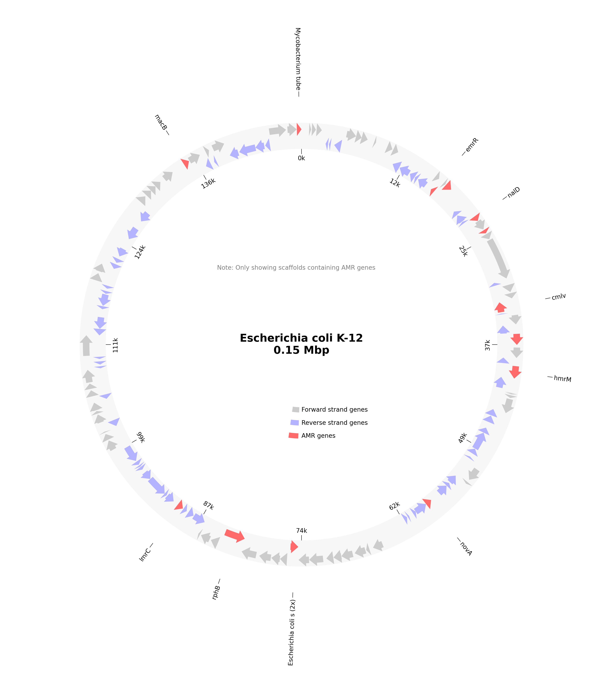

### Escherichia coli soxS with mutation conferring antibiotic resistance (found in 2 locations)
- **Mechanism**: antibiotic target alteration; antibiotic efflux; reduced permeability to antibiotic
- **Drug Classes**: fluoroquinolone antibiotic; monobactam; carbapenem; cephalosporin; glycylcycline; cephamycin; penam; tetracycline antibiotic; rifamycin antibiotic; phenicol antibiotic; penem; disinfecting agents and antiseptics
- **AMR Family**: ATP-binding cassette (ABC) antibiotic efflux pump; major facilitator superfamily (MFS) antibiotic efflux pump; resistance-nodulation-cell division (RND) antibiotic efflux pump; General Bacterial Porin with reduced permeability to beta-lactams
- **Locations**:
  - gnl|SPADES|DAOGIJFL_15_115 : position 114553-115392
  - gnl|SPADES|DAOGIJFL_15_74 : position 74538-75449

### FosC2
- **Mechanism**: antibiotic inactivation
- **Drug Classes**: phosphonic acid antibiotic
- **AMR Family**: fosC phosphotransferase family
- **Locations**:
  - gnl|SPADES|DAOGIJFL_15_30 : position 23844-24251

### Mycobacterium tuberculosis pncA mutations conferring resistance to pyrazinamide
- **Mechanism**: antibiotic target alteration
- **Drug Classes**: pyrazine antibiotic
- **AMR Family**: Pyrazinamide resistant pncA
- **Locations**:
  - gnl|SPADES|DAOGIJFL_15_148 : position 147822-148331

### bcr-1
- **Mechanism**: antibiotic efflux
- **Drug Classes**: bicyclomycin-like antibiotic
- **AMR Family**: major facilitator superfamily (MFS) antibiotic efflux pump
- **Locations**:
  - gnl|SPADES|DAOGIJFL_15_40 : position 35903-37114

### cmlv
- **Mechanism**: antibiotic inactivation
- **Drug Classes**: phenicol antibiotic
- **AMR Family**: chloramphenicol phosphotransferase
- **Locations**:
  - gnl|SPADES|DAOGIJFL_15_36 : position 32113-33282

### emrR
- **Mechanism**: antibiotic efflux
- **Drug Classes**: fluoroquinolone antibiotic
- **AMR Family**: major facilitator superfamily (MFS) antibiotic efflux pump
- **Locations**:
  - gnl|SPADES|DAOGIJFL_15_21 : position 16397-16831

### hmrM
- **Mechanism**: antibiotic efflux
- **Drug Classes**: fluoroquinolone antibiotic; disinfecting agents and antiseptics
- **AMR Family**: multidrug and toxic compound extrusion (MATE) transporter
- **Locations**:
  - gnl|SPADES|DAOGIJFL_15_43 : position 39449-40822

### lmrC
- **Mechanism**: antibiotic target protection
- **Drug Classes**: lincosamide antibiotic
- **AMR Family**: Miscellaneous ABC-F subfamily ATP-binding cassette ribosomal protection proteins
- **Locations**:
  - gnl|SPADES|DAOGIJFL_15_88 : position 88957-89706

### macB
- **Mechanism**: antibiotic efflux
- **Drug Classes**: macrolide antibiotic
- **AMR Family**: ATP-binding cassette (ABC) antibiotic efflux pump
- **Locations**:
  - gnl|SPADES|DAOGIJFL_15_136 : position 134695-135348

### mdtN
- **Mechanism**: antibiotic efflux
- **Drug Classes**: nucleoside antibiotic; disinfecting agents and antiseptics
- **AMR Family**: major facilitator superfamily (MFS) antibiotic efflux pump
- **Locations**:
  - gnl|SPADES|DAOGIJFL_15_23 : position 17358-18128

### nalD
- **Mechanism**: antibiotic efflux
- **Drug Classes**: macrolide antibiotic; fluoroquinolone antibiotic; monobactam; carbapenem; cephalosporin; cephamycin; penam; tetracycline antibiotic; peptide antibiotic; aminocoumarin antibiotic; diaminopyrimidine antibiotic; sulfonamide antibiotic; phenicol antibiotic; penem
- **AMR Family**: resistance-nodulation-cell division (RND) antibiotic efflux pump
- **Locations**:
  - gnl|SPADES|DAOGIJFL_15_28 : position 22030-22629

### novA
- **Mechanism**: antibiotic efflux
- **Drug Classes**: aminocoumarin antibiotic
- **AMR Family**: ATP-binding cassette (ABC) antibiotic efflux pump
- **Locations**:
  - gnl|SPADES|DAOGIJFL_15_60 : position 57759-58505

### rphB
- **Mechanism**: antibiotic inactivation
- **Drug Classes**: rifamycin antibiotic
- **AMR Family**: rifampin phosphotransferase
- **Locations**:
  - gnl|SPADES|DAOGIJFL_15_81 : position 80882-83260

## Escherichia coli O145
**Strain Statistics:**
- Total genome length: 9.9 kbp
- Total scaffolds: 1
- Scaffolds with AMR genes: 1
- Total genes annotated: 12
- Total AMR genes: 1
- Unique AMR genes: 1
- Distinct AMR mechanisms: 1
- Distinct AMR families: 1
- Distinct drug classes: 1

**Circos Plot:**

### msbA
- **Mechanism**: antibiotic efflux
- **Drug Classes**: nitroimidazole antibiotic
- **AMR Family**: ATP-binding cassette (ABC) antibiotic efflux pump
- **Locations**:
  - gnl|SPADES|DAOGIJFL_459_2 : position 344-1117

## Escherichia coli O157
**Strain Statistics:**
- Total genome length: 16.2 kbp
- Total scaffolds: 2
- Scaffolds with AMR genes: 1
- Total genes annotated: 34
- Total AMR genes: 1
- Unique AMR genes: 1
- Distinct AMR mechanisms: 1
- Distinct AMR families: 1
- Distinct drug classes: 1

**Circos Plot:**

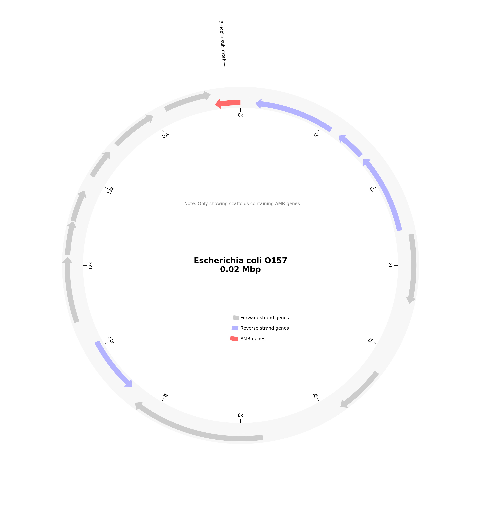

### Brucella suis mprF
- **Mechanism**: antibiotic target alteration
- **Drug Classes**: peptide antibiotic
- **AMR Family**: defensin resistant mprF
- **Locations**:
  - gnl|SPADES|DAOGIJFL_345_17 : position 15779-16186

## Escherichia coli O157:H7
**Strain Statistics:**
- Total genome length: 344.6 kbp
- Total scaffolds: 6
- Scaffolds with AMR genes: 5
- Total genes annotated: 633
- Total AMR genes: 45
- Unique AMR genes: 37
- Distinct AMR mechanisms: 5
- Distinct AMR families: 16
- Distinct drug classes: 23

**Circos Plot:**

### AAC(6')-If
- **Mechanism**: antibiotic inactivation
- **Drug Classes**: aminoglycoside antibiotic
- **AMR Family**: AAC(6')
- **Locations**:
  - gnl|SPADES|DAOGIJFL_132_25 : position 19177-19602

### Acinetobacter baumannii AbaF
- **Mechanism**: antibiotic efflux
- **Drug Classes**: phosphonic acid antibiotic
- **AMR Family**: major facilitator superfamily (MFS) antibiotic efflux pump
- **Locations**:
  - gnl|SPADES|DAOGIJFL_22_85 : position 90809-92311

### Escherichia coli AcrAB-TolC with AcrR mutation conferring resistance to ciprofloxacin, tetracycline, and ceftazidime
- **Mechanism**: antibiotic target alteration; antibiotic efflux
- **Drug Classes**: fluoroquinolone antibiotic; cephalosporin; glycylcycline; penam; tetracycline antibiotic; rifamycin antibiotic; phenicol antibiotic; disinfecting agents and antiseptics
- **AMR Family**: resistance-nodulation-cell division (RND) antibiotic efflux pump
- **Locations**:
  - gnl|SPADES|DAOGIJFL_33_64: position 63893-64540

### Escherichia coli acrA
- **Mechanism**: antibiotic efflux
- **Drug Classes**: fluoroquinolone antibiotic; cephalosporin; glycylcycline; penam; tetracycline antibiotic; rifamycin antibiotic; phenicol antibiotic; disinfecting agents and antiseptics
- **AMR Family**: resistance-nodulation-cell division (RND) antibiotic efflux pump
- **Locations**:
  - gnl|SPADES|DAOGIJFL_33_63: position 62558-63751

### Escherichia coli soxR with mutation conferring antibiotic resistance
- **Mechanism**: antibiotic target alteration; antibiotic efflux
- **Drug Classes**: fluoroquinolone antibiotic; cephalosporin; glycylcycline; penam; tetracycline antibiotic; rifamycin antibiotic; phenicol antibiotic; disinfecting agents and antiseptics
- **AMR Family**: ATP-binding cassette (ABC) antibiotic efflux pump; major facilitator superfamily (MFS) antibiotic efflux pump; resistance-nodulation-cell division (RND) antibiotic efflux pump
- **Locations**:
  - gnl|SPADES|DAOGIJFL_22_42: position 45365-45829

### Escherichia coli soxS with mutation conferring antibiotic resistance
- **Mechanism**: antibiotic target alteration; antibiotic efflux; reduced permeability to antibiotic
- **Drug Classes**: fluoroquinolone antibiotic; monobactam; carbapenem; cephalosporin; glycylcycline; cephamycin; penam; tetracycline antibiotic; rifamycin antibiotic; phenicol antibiotic; penem; disinfecting agents and antiseptics
- **AMR Family**: ATP-binding cassette (ABC) antibiotic efflux pump; major facilitator superfamily (MFS) antibiotic efflux pump; resistance-nodulation-cell division (RND) antibiotic efflux pump; General Bacterial Porin with reduced permeability to beta-lactams
- **Locations**:
  - gnl|SPADES|DAOGIJFL_22_41: position 44956-45279

### Helicobacter pylori pbp1 mutants conferring resistance to amoxicillin
- **Mechanism**: antibiotic target alteration
- **Drug Classes**: cephalosporin; cephamycin; penam
- **AMR Family**: Penicillin-binding protein mutations conferring resistance to beta-lactam antibiotics
- **Locations**:
  - gnl|SPADES|DAOGIJFL_208_8 : position 7207-9741

### MexS
- **Mechanism**: antibiotic efflux
- **Drug Classes**: fluoroquinolone antibiotic; diaminopyrimidine antibiotic; phenicol antibiotic
- **AMR Family**: resistance-nodulation-cell division (RND) antibiotic efflux pump
- **Locations**:
  - gnl|SPADES|DAOGIJFL_22_30 : position 31145-32128

### PDC-456
- **Mechanism**: antibiotic inactivation
- **Drug Classes**: monobactam; carbapenem; cephalosporin
- **AMR Family**: PDC beta-lactamase
- **Locations**:
  - gnl|SPADES|DAOGIJFL_132_29 : position 21727-23031

### RanA
- **Mechanism**: antibiotic efflux
- **Drug Classes**: aminoglycoside antibiotic
- **AMR Family**: ATP-binding cassette (ABC) antibiotic efflux pump
- **Locations**:
  - gnl|SPADES|DAOGIJFL_178_24 : position 28041-29111

### SatA
- **Mechanism**: antibiotic inactivation
- **Drug Classes**: nucleoside antibiotic
- **AMR Family**: streptothricin acetyltransferase (SAT)
- **Locations**:
  - gnl|SPADES|DAOGIJFL_22_68 : position 75805-76239

### YajC
- **Mechanism**: antibiotic efflux
- **Drug Classes**: fluoroquinolone antibiotic; cephalosporin; glycylcycline; penam; tetracycline antibiotic; oxazolidinone antibiotic; glycopeptide antibiotic; rifamycin antibiotic; phenicol antibiotic; disinfecting agents and antiseptics
- **AMR Family**: resistance-nodulation-cell division (RND) antibiotic efflux pump
- **Locations**:
  - gnl|SPADES|DAOGIJFL_33_5 : position 3270-3602

### acrB
- **Mechanism**: antibiotic efflux
- **Drug Classes**: fluoroquinolone antibiotic; cephalosporin; glycylcycline; penam; tetracycline antibiotic; rifamycin antibiotic; phenicol antibiotic; disinfecting agents and antiseptics
- **AMR Family**: resistance-nodulation-cell division (RND) antibiotic efflux pump
- **Locations**:
  - gnl|SPADES|DAOGIJFL_33_62: position 59386-62535

### adeL
- **Mechanism**: antibiotic efflux
- **Drug Classes**: fluoroquinolone antibiotic; tetracycline antibiotic
- **AMR Family**: resistance-nodulation-cell division (RND) antibiotic efflux pump
- **Locations**:
  - gnl|SPADES|DAOGIJFL_132_50 : position 43184-44110

### arlR
- **Mechanism**: antibiotic efflux
- **Drug Classes**: fluoroquinolone antibiotic; disinfecting agents and antiseptics
- **AMR Family**: major facilitator superfamily (MFS) antibiotic efflux pump
- **Locations**:
  - gnl|SPADES|DAOGIJFL_22_88 : position 93589-94257

### basS
- **Mechanism**: antibiotic target alteration; antibiotic efflux
- **Drug Classes**: peptide antibiotic
- **AMR Family**: pmr phosphoethanolamine transferase
- **Locations**:
  - gnl|SPADES|DAOGIJFL_22_87 : position 92488-93588

### eptA
- **Mechanism**: antibiotic target alteration
- **Drug Classes**: peptide antibiotic
- **AMR Family**: pmr phosphoethanolamine transferase
- **Locations**:
  - gnl|SPADES|DAOGIJFL_22_89: position 94254-95897

### evgS
- **Mechanism**: antibiotic efflux
- **Drug Classes**: macrolide antibiotic; fluoroquinolone antibiotic; penam; tetracycline antibiotic
- **AMR Family**: major facilitator superfamily (MFS) antibiotic efflux pump; resistance-nodulation-cell division (RND) antibiotic efflux pump
- **Locations**:
  - gnl|SPADES|DAOGIJFL_22_100 : position 110339-111970

### gadX
- **Mechanism**: antibiotic efflux
- **Drug Classes**: macrolide antibiotic; fluoroquinolone antibiotic; penam
- **AMR Family**: resistance-nodulation-cell division (RND) antibiotic efflux pump
- **Locations**:
  - gnl|SPADES|DAOGIJFL_22_91 : position 97475-98236

### golS
- **Mechanism**: antibiotic efflux
- **Drug Classes**: monobactam; carbapenem; cephalosporin; cephamycin; penam; phenicol antibiotic; penem
- **AMR Family**: resistance-nodulation-cell division (RND) antibiotic efflux pump
- **Locations**:
  - gnl|SPADES|DAOGIJFL_33_87 : position 91923-92330

### hp1181
- **Mechanism**: antibiotic efflux
- **Drug Classes**: fluoroquinolone antibiotic; tetracycline antibiotic; nitroimidazole antibiotic
- **AMR Family**: major facilitator superfamily (MFS) antibiotic efflux pump
- **Locations**:
  - gnl|SPADES|DAOGIJFL_33_25 : position 21160-22524

### macB (found in 6 locations)
- **Mechanism**: antibiotic efflux
- **Drug Classes**: macrolide antibiotic
- **AMR Family**: ATP-binding cassette (ABC) antibiotic efflux pump
- **Locations**:
  - gnl|SPADES|DAOGIJFL_132_37 : position 30186-31283
  - gnl|SPADES|DAOGIJFL_22_13 : position 14526-15641
  - gnl|SPADES|DAOGIJFL_22_37 : position 38945-41767
  - gnl|SPADES|DAOGIJFL_22_71 : position 77916-78596
  - gnl|SPADES|DAOGIJFL_22_80 : position 85026-85814
  - gnl|SPADES|DAOGIJFL_33_95 : position 97663-98349

### mdtN
- **Mechanism**: antibiotic efflux
- **Drug Classes**: nucleoside antibiotic; disinfecting agents and antiseptics
- **AMR Family**: major facilitator superfamily (MFS) antibiotic efflux pump
- **Locations**:
  - gnl|SPADES|DAOGIJFL_22_62: position 70411-71442

### mdtO
- **Mechanism**: antibiotic efflux
- **Drug Classes**: nucleoside antibiotic; disinfecting agents and antiseptics
- **AMR Family**: major facilitator superfamily (MFS) antibiotic efflux pump
- **Locations**:
  - gnl|SPADES|DAOGIJFL_22_61: position 68360-70411

### mdtP
- **Mechanism**: antibiotic efflux
- **Drug Classes**: nucleoside antibiotic; disinfecting agents and antiseptics
- **AMR Family**: major facilitator superfamily (MFS) antibiotic efflux pump
- **Locations**:
  - gnl|SPADES|DAOGIJFL_22_60: position 66897-68363

### mepA
- **Mechanism**: antibiotic efflux
- **Drug Classes**: glycylcycline; tetracycline antibiotic
- **AMR Family**: multidrug and toxic compound extrusion (MATE) transporter
- **Locations**:
  - gnl|SPADES|DAOGIJFL_22_23 : position 25693-27018

### msbA (found in 2 locations)
- **Mechanism**: antibiotic efflux
- **Drug Classes**: nitroimidazole antibiotic
- **AMR Family**: ATP-binding cassette (ABC) antibiotic efflux pump
- **Locations**:
  - gnl|SPADES|DAOGIJFL_208_10 : position 12255-13052
  - gnl|SPADES|DAOGIJFL_33_90 : position 93849-94526

### mtrA
- **Mechanism**: antibiotic efflux
- **Drug Classes**: macrolide antibiotic; penam
- **AMR Family**: resistance-nodulation-cell division (RND) antibiotic efflux pump
- **Locations**:
  - gnl|SPADES|DAOGIJFL_22_93 : position 101027-101935

### rosA
- **Mechanism**: antibiotic efflux
- **Drug Classes**: peptide antibiotic
- **AMR Family**: major facilitator superfamily (MFS) antibiotic efflux pump
- **Locations**:
  - gnl|SPADES|DAOGIJFL_33_79 : position 81608-82828

### rosB
- **Mechanism**: antibiotic efflux
- **Drug Classes**: peptide antibiotic
- **AMR Family**: major facilitator superfamily (MFS) antibiotic efflux pump
- **Locations**:
  - gnl|SPADES|DAOGIJFL_33_78 : position 79694-81370

### rphB
- **Mechanism**: antibiotic inactivation
- **Drug Classes**: rifamycin antibiotic
- **AMR Family**: rifampin phosphotransferase
- **Locations**:
  - gnl|SPADES|DAOGIJFL_132_42 : position 34247-35974

### tetA(58) (found in 3 locations)
- **Mechanism**: antibiotic efflux
- **Drug Classes**: tetracycline antibiotic
- **AMR Family**: major facilitator superfamily (MFS) antibiotic efflux pump
- **Locations**:
  - gnl|SPADES|DAOGIJFL_178_27 : position 32476-33189
  - gnl|SPADES|DAOGIJFL_178_28 : position 33191-33958
  - gnl|SPADES|DAOGIJFL_22_72 : position 78707-79465

### tetA(60)
- **Mechanism**: antibiotic efflux
- **Drug Classes**: tetracycline antibiotic
- **AMR Family**: ATP-binding cassette (ABC) antibiotic efflux pump
- **Locations**:
  - gnl|SPADES|DAOGIJFL_33_49 : position 47003-48775

### tetB(60)
- **Mechanism**: antibiotic efflux
- **Drug Classes**: tetracycline antibiotic
- **AMR Family**: ATP-binding cassette (ABC) antibiotic efflux pump
- **Locations**:
  - gnl|SPADES|DAOGIJFL_33_50 : position 48768-50549

### vanR gene in vanG cluster
- **Mechanism**: antibiotic target alteration
- **Drug Classes**: glycopeptide antibiotic
- **AMR Family**: glycopeptide resistance gene cluster; vanR
- **Locations**:
  - gnl|SPADES|DAOGIJFL_22_109 : position 120704-122242

### vanT gene in vanG cluster
- **Mechanism**: antibiotic target alteration
- **Drug Classes**: glycopeptide antibiotic
- **AMR Family**: glycopeptide resistance gene cluster; vanT
- **Locations**:
  - gnl|SPADES|DAOGIJFL_22_32 : position 33679-34758

### vatB
- **Mechanism**: antibiotic inactivation
- **Drug Classes**: streptogramin antibiotic; streptogramin A antibiotic
- **AMR Family**: streptogramin vat acetyltransferase
- **Locations**:
  - gnl|SPADES|DAOGIJFL_33_59 : position 57499-58050

## Escherichia coli O157:H7 str. EDL933
**Strain Statistics:**
- Total genome length: 201.6 kbp
- Total scaffolds: 3
- Scaffolds with AMR genes: 3
- Total genes annotated: 371
- Total AMR genes: 14
- Unique AMR genes: 13
- Distinct AMR mechanisms: 3
- Distinct AMR families: 8
- Distinct drug classes: 14

**Circos Plot:**

### ArnT
- **Mechanism**: antibiotic target alteration
- **Drug Classes**: peptide antibiotic
- **AMR Family**: pmr phosphoethanolamine transferase
- **Locations**:
  - gnl|SPADES|DAOGIJFL_48_72: position 72164-73816

### Escherichia coli GlpT with mutation conferring resistance to fosfomycin
- **Mechanism**: antibiotic target alteration
- **Drug Classes**: phosphonic acid antibiotic
- **AMR Family**: antibiotic-resistant GlpT
- **Locations**:
  - gnl|SPADES|DAOGIJFL_48_87 : position 88291-89649

### MexS
- **Mechanism**: antibiotic efflux
- **Drug Classes**: fluoroquinolone antibiotic; diaminopyrimidine antibiotic; phenicol antibiotic
- **AMR Family**: resistance-nodulation-cell division (RND) antibiotic efflux pump
- **Locations**:
  - gnl|SPADES|DAOGIJFL_240_7 : position 5447-6490

### NmcR
- **Mechanism**: antibiotic inactivation
- **Drug Classes**: carbapenem; cephalosporin; cephamycin; penam
- **AMR Family**: NmcA beta-lactamase
- **Locations**:
  - gnl|SPADES|DAOGIJFL_48_43 : position 42508-43446

### PmrF
- **Mechanism**: antibiotic target alteration
- **Drug Classes**: peptide antibiotic
- **AMR Family**: pmr phosphoethanolamine transferase
- **Locations**:
  - gnl|SPADES|DAOGIJFL_48_75: position 76685-77653

### Rv1877 (found in 2 locations)
- **Mechanism**: antibiotic efflux
- **Drug Classes**: fluoroquinolone antibiotic
- **AMR Family**: major facilitator superfamily (MFS) antibiotic efflux pump
- **Locations**:
  - gnl|SPADES|DAOGIJFL_240_8 : position 6507-7886
  - gnl|SPADES|DAOGIJFL_59_31 : position 29146-30444

### adeL
- **Mechanism**: antibiotic efflux
- **Drug Classes**: fluoroquinolone antibiotic; tetracycline antibiotic
- **AMR Family**: resistance-nodulation-cell division (RND) antibiotic efflux pump
- **Locations**:
  - gnl|SPADES|DAOGIJFL_59_61 : position 69587-70519

### arnA
- **Mechanism**: antibiotic target alteration
- **Drug Classes**: peptide antibiotic
- **AMR Family**: pmr phosphoethanolamine transferase
- **Locations**:
  - gnl|SPADES|DAOGIJFL_48_74 : position 74703-76685

### bacA
- **Mechanism**: antibiotic target alteration
- **Drug Classes**: peptide antibiotic
- **AMR Family**: undecaprenyl pyrophosphate related proteins
- **Locations**:
  - gnl|SPADES|DAOGIJFL_59_64: position 71712-72533

### leuO
- **Mechanism**: antibiotic efflux
- **Drug Classes**: nucleoside antibiotic; disinfecting agents and antiseptics
- **AMR Family**: major facilitator superfamily (MFS) antibiotic efflux pump
- **Locations**:
  - gnl|SPADES|DAOGIJFL_59_4 : position 3165-4103

### macB
- **Mechanism**: antibiotic efflux
- **Drug Classes**: macrolide antibiotic
- **AMR Family**: ATP-binding cassette (ABC) antibiotic efflux pump
- **Locations**:
  - gnl|SPADES|DAOGIJFL_48_26 : position 24627-25400

### tet(41)
- **Mechanism**: antibiotic efflux
- **Drug Classes**: tetracycline antibiotic
- **AMR Family**: major facilitator superfamily (MFS) antibiotic efflux pump
- **Locations**:
  - gnl|SPADES|DAOGIJFL_48_10 : position 9016-10194

### vanH gene in vanB cluster
- **Mechanism**: antibiotic target alteration
- **Drug Classes**: glycopeptide antibiotic
- **AMR Family**: vanH; glycopeptide resistance gene cluster
- **Locations**:
  - gnl|SPADES|DAOGIJFL_48_12 : position 11285-12421

## Escherichia coli O22:H8
**Strain Statistics:**
- Total genome length: 43.5 kbp
- Total scaffolds: 1
- Scaffolds with AMR genes: 1
- Total genes annotated: 74
- Total AMR genes: 2
- Unique AMR genes: 2
- Distinct AMR mechanisms: 2
- Distinct AMR families: 2
- Distinct drug classes: 9

**Circos Plot:**

### NmcR
- **Mechanism**: antibiotic inactivation
- **Drug Classes**: carbapenem; cephalosporin; cephamycin; penam
- **AMR Family**: NmcA beta-lactamase
- **Locations**:
  - gnl|SPADES|DAOGIJFL_157_21 : position 20604-21515

### mdtM
- **Mechanism**: antibiotic efflux
- **Drug Classes**: fluoroquinolone antibiotic; lincosamide antibiotic; nucleoside antibiotic; phenicol antibiotic; disinfecting agents and antiseptics
- **AMR Family**: major facilitator superfamily (MFS) antibiotic efflux pump
- **Locations**:
  - gnl|SPADES|DAOGIJFL_157_34: position 38904-40136

## Escherichia coli O27:H7
**Strain Statistics:**
- Total genome length: 8.3 kbp
- Total scaffolds: 1
- Scaffolds with AMR genes: 1
- Total genes annotated: 19
- Total AMR genes: 2
- Unique AMR genes: 2
- Distinct AMR mechanisms: 1
- Distinct AMR families: 2
- Distinct drug classes: 7

**Circos Plot:**

### H-NS
- **Mechanism**: antibiotic efflux
- **Drug Classes**: macrolide antibiotic; fluoroquinolone antibiotic; cephalosporin; cephamycin; penam; tetracycline antibiotic
- **AMR Family**: major facilitator superfamily (MFS) antibiotic efflux pump; resistance-nodulation-cell division (RND) antibiotic efflux pump
- **Locations**:
  - gnl|SPADES|DAOGIJFL_516_6: position 5364-5777

### adeR
- **Mechanism**: antibiotic efflux
- **Drug Classes**: glycylcycline; tetracycline antibiotic
- **AMR Family**: resistance-nodulation-cell division (RND) antibiotic efflux pump
- **Locations**:
  - gnl|SPADES|DAOGIJFL_516_4 : position 3097-4110

## Escherichia coli O68:H12
**Strain Statistics:**
- Total genome length: 43.9 kbp
- Total scaffolds: 1
- Scaffolds with AMR genes: 1
- Total genes annotated: 76
- Total AMR genes: 4
- Unique AMR genes: 4
- Distinct AMR mechanisms: 3
- Distinct AMR families: 4
- Distinct drug classes: 8

**Circos Plot:**

### Acinetobacter baumannii AbaQ
- **Mechanism**: antibiotic efflux
- **Drug Classes**: fluoroquinolone antibiotic
- **AMR Family**: major facilitator superfamily (MFS) antibiotic efflux pump
- **Locations**:
  - gnl|SPADES|DAOGIJFL_154_25 : position 25492-26844

### LlmA 23S ribosomal RNA methyltransferase
- **Mechanism**: antibiotic target alteration
- **Drug Classes**: lincosamide antibiotic
- **AMR Family**: Llm 23S ribosomal RNA methyltransferase
- **Locations**:
  - gnl|SPADES|DAOGIJFL_154_29 : position 32592-33893

### NmcR
- **Mechanism**: antibiotic inactivation
- **Drug Classes**: carbapenem; cephalosporin; cephamycin; penam
- **AMR Family**: NmcA beta-lactamase
- **Locations**:
  - gnl|SPADES|DAOGIJFL_154_6 : position 4871-5788

### evgS
- **Mechanism**: antibiotic efflux
- **Drug Classes**: macrolide antibiotic; fluoroquinolone antibiotic; penam; tetracycline antibiotic
- **AMR Family**: major facilitator superfamily (MFS) antibiotic efflux pump; resistance-nodulation-cell division (RND) antibiotic efflux pump
- **Locations**:
  - gnl|SPADES|DAOGIJFL_154_28 : position 29779-32535

## Escherichia coli O6:H16
**Strain Statistics:**
- Total genome length: 49.2 kbp
- Total scaffolds: 1
- Scaffolds with AMR genes: 1
- Total genes annotated: 106
- Total AMR genes: 4
- Unique AMR genes: 4
- Distinct AMR mechanisms: 2
- Distinct AMR families: 3
- Distinct drug classes: 6

**Circos Plot:**

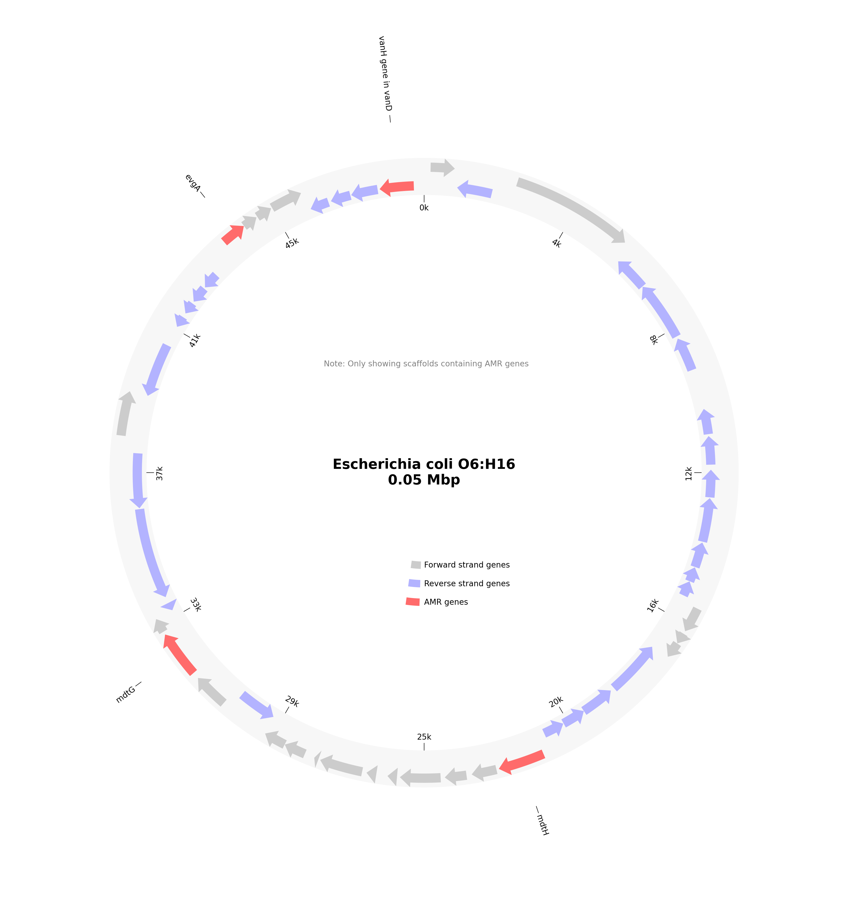

### evgA
- **Mechanism**: antibiotic efflux
- **Drug Classes**: macrolide antibiotic; fluoroquinolone antibiotic; penam; tetracycline antibiotic
- **AMR Family**: major facilitator superfamily (MFS) antibiotic efflux pump; resistance-nodulation-cell division (RND) antibiotic efflux pump
- **Locations**:
  - gnl|SPADES|DAOGIJFL_130_46 : position 43571-44221

### mdtG
- **Mechanism**: antibiotic efflux
- **Drug Classes**: phosphonic acid antibiotic
- **AMR Family**: major facilitator superfamily (MFS) antibiotic efflux pump
- **Locations**:
  - gnl|SPADES|DAOGIJFL_130_34: position 31277-32503

### mdtH
- **Mechanism**: antibiotic efflux
- **Drug Classes**: fluoroquinolone antibiotic
- **AMR Family**: major facilitator superfamily (MFS) antibiotic efflux pump
- **Locations**:
  - gnl|SPADES|DAOGIJFL_130_22: position 21438-22646

### vanH gene in vanD cluster
- **Mechanism**: antibiotic target alteration
- **Drug Classes**: glycopeptide antibiotic
- **AMR Family**: vanH; glycopeptide resistance gene cluster
- **Locations**:
  - gnl|SPADES|DAOGIJFL_130_53 : position 47943-48881

## Escherichia coli O7:H4
**Strain Statistics:**
- Total genome length: 59.0 kbp
- Total scaffolds: 1
- Scaffolds with AMR genes: 1
- Total genes annotated: 98
- Total AMR genes: 9
- Unique AMR genes: 9
- Distinct AMR mechanisms: 3
- Distinct AMR families: 6
- Distinct drug classes: 13

**Circos Plot:**

### Acinetobacter baumannii AbaQ
- **Mechanism**: antibiotic efflux
- **Drug Classes**: fluoroquinolone antibiotic
- **AMR Family**: major facilitator superfamily (MFS) antibiotic efflux pump
- **Locations**:
  - gnl|SPADES|DAOGIJFL_107_26 : position 30487-31818

### Erm(34)
- **Mechanism**: antibiotic target alteration
- **Drug Classes**: macrolide antibiotic; lincosamide antibiotic; streptogramin antibiotic; streptogramin A antibiotic; streptogramin B antibiotic
- **AMR Family**: Erm 23S ribosomal RNA methyltransferase
- **Locations**:
  - gnl|SPADES|DAOGIJFL_107_20 : position 25195-26016

### LptD
- **Mechanism**: antibiotic efflux
- **Drug Classes**: carbapenem; peptide antibiotic; aminocoumarin antibiotic; rifamycin antibiotic
- **AMR Family**: ATP-binding cassette (ABC) antibiotic efflux pump
- **Locations**:
  - gnl|SPADES|DAOGIJFL_107_17 : position 20516-22870

### Staphylococcus aureus mupA conferring resistance to mupirocin
- **Mechanism**: antibiotic target alteration
- **Drug Classes**: mupirocin-like antibiotic
- **AMR Family**: antibiotic-resistant isoleucyl-tRNA synthetase (ileS)
- **Locations**:
  - gnl|SPADES|DAOGIJFL_107_46 : position 52384-55200

### dfrA3
- **Mechanism**: antibiotic target replacement
- **Drug Classes**: diaminopyrimidine antibiotic
- **AMR Family**: trimethoprim resistant dihydrofolate reductase dfr
- **Locations**:
  - gnl|SPADES|DAOGIJFL_107_23 : position 27323-27913

### macB
- **Mechanism**: antibiotic efflux
- **Drug Classes**: macrolide antibiotic
- **AMR Family**: ATP-binding cassette (ABC) antibiotic efflux pump
- **Locations**:
  - gnl|SPADES|DAOGIJFL_107_7 : position 6205-6903

### mreA
- **Mechanism**: antibiotic efflux
- **Drug Classes**: macrolide antibiotic
- **AMR Family**: major facilitator superfamily (MFS) antibiotic efflux pump
- **Locations**:
  - gnl|SPADES|DAOGIJFL_107_47 : position 55243-56184

### mtrA
- **Mechanism**: antibiotic efflux
- **Drug Classes**: macrolide antibiotic; penam
- **AMR Family**: resistance-nodulation-cell division (RND) antibiotic efflux pump
- **Locations**:
  - gnl|SPADES|DAOGIJFL_107_9 : position 7867-8745

### rosB
- **Mechanism**: antibiotic efflux
- **Drug Classes**: peptide antibiotic
- **AMR Family**: major facilitator superfamily (MFS) antibiotic efflux pump
- **Locations**:
  - gnl|SPADES|DAOGIJFL_107_24 : position 27994-29856

## Ewingella americana
**Strain Statistics:**
- Total genome length: 909.9 kbp
- Total scaffolds: 3185
- Scaffolds with AMR genes: 533
- Total genes annotated: 1890
- Total AMR genes: 607
- Unique AMR genes: 234
- Distinct AMR mechanisms: 11
- Distinct AMR families: 73
- Distinct drug classes: 37

**Circos Plot:**

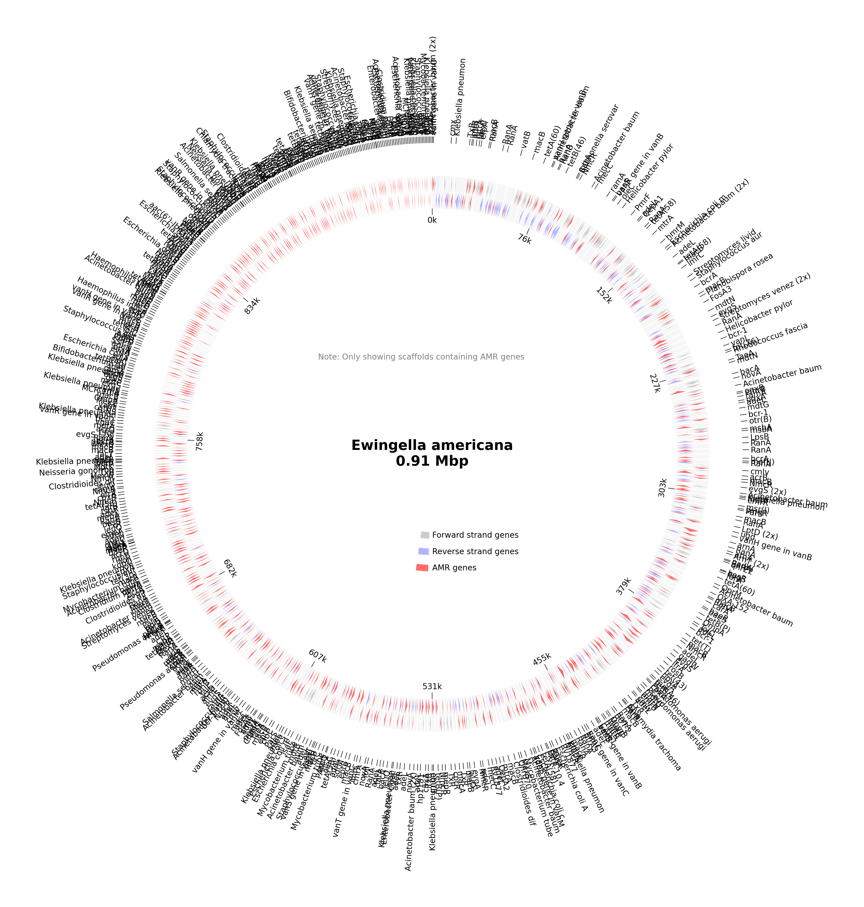

### Acinetobacter baumannii AbaF (found in 9 locations)
- **Mechanism**: antibiotic efflux
- **Drug Classes**: phosphonic acid antibiotic
- **AMR Family**: major facilitator superfamily (MFS) antibiotic efflux pump
- **Locations**:
  - gnl|SPADES|DAOGIJFL_1132_3 : position 1479-2795
  - gnl|SPADES|DAOGIJFL_15394_1 : position 3-419
  - gnl|SPADES|DAOGIJFL_1748_1 : position 2-1102
  - gnl|SPADES|DAOGIJFL_20236_1 : position 2-337
  - gnl|SPADES|DAOGIJFL_2031_1 : position 3-335
  - gnl|SPADES|DAOGIJFL_2031_2 : position 290-685
  - gnl|SPADES|DAOGIJFL_2411_1 : position 3-746
  - gnl|SPADES|DAOGIJFL_2832_1 : position 2-499
  - gnl|SPADES|DAOGIJFL_7635_1 : position 1-720

### Acinetobacter baumannii AbaQ (found in 14 locations)
- **Mechanism**: antibiotic efflux
- **Drug Classes**: fluoroquinolone antibiotic
- **AMR Family**: major facilitator superfamily (MFS) antibiotic efflux pump
- **Locations**:
  - gnl|SPADES|DAOGIJFL_1005_3 : position 2611-3453
  - gnl|SPADES|DAOGIJFL_1295_1 : position 3-653
  - gnl|SPADES|DAOGIJFL_13604_1 : position 2-463
  - gnl|SPADES|DAOGIJFL_24692_1 : position 1-288
  - gnl|SPADES|DAOGIJFL_2690_3 : position 1216-1587
  - gnl|SPADES|DAOGIJFL_3165_2 : position 444-1409
  - gnl|SPADES|DAOGIJFL_3227_1 : position 1-621
  - gnl|SPADES|DAOGIJFL_520_1 : position 2-259
  - gnl|SPADES|DAOGIJFL_520_8 : position 6071-7387
  - gnl|SPADES|DAOGIJFL_5907_2 : position 349-879
  - gnl|SPADES|DAOGIJFL_643_7 : position 5258-5629
  - gnl|SPADES|DAOGIJFL_686_5 : position 3543-4772
  - gnl|SPADES|DAOGIJFL_828_1 : position 1-219
  - gnl|SPADES|DAOGIJFL_828_2 : position 232-489

### ArnT (found in 2 locations)
- **Mechanism**: antibiotic target alteration
- **Drug Classes**: peptide antibiotic
- **AMR Family**: pmr phosphoethanolamine transferase
- **Locations**:
  - gnl|SPADES|DAOGIJFL_1225_3: position 1102-2307
  - gnl|SPADES|DAOGIJFL_1225_4 : position 2280-2765

### BUT-2
- **Mechanism**: antibiotic inactivation
- **Drug Classes**: cephalosporin
- **AMR Family**: BUT beta-lactamase
- **Locations**:
  - gnl|SPADES|DAOGIJFL_1609_1 : position 1-678

### Bifidobacterium adolescentis rpoB mutants conferring resistance to rifampicin
- **Mechanism**: antibiotic target alteration; antibiotic target replacement
- **Drug Classes**: rifamycin antibiotic
- **AMR Family**: rifamycin-resistant beta-subunit of RNA polymerase (rpoB)
- **Locations**:
  - gnl|SPADES|DAOGIJFL_4606_2 : position 264-1061

### Bifidobacterium bifidum ileS conferring resistance to mupirocin
- **Mechanism**: antibiotic target alteration
- **Drug Classes**: mupirocin-like antibiotic
- **AMR Family**: antibiotic-resistant isoleucyl-tRNA synthetase (ileS)
- **Locations**:
  - gnl|SPADES|DAOGIJFL_11976_1 : position 1-507

### CAR-1
- **Mechanism**: antibiotic inactivation
- **Drug Classes**: carbapenem
- **AMR Family**: CAR beta-lactamase
- **Locations**:
  - gnl|SPADES|DAOGIJFL_1624_4 : position 1981-2337

### CRP (found in 2 locations)
- **Mechanism**: antibiotic efflux
- **Drug Classes**: macrolide antibiotic; fluoroquinolone antibiotic; penam
- **AMR Family**: resistance-nodulation-cell division (RND) antibiotic efflux pump
- **Locations**:
  - gnl|SPADES|DAOGIJFL_3062_1 : position 2-97
  - gnl|SPADES|DAOGIJFL_3987_1 : position 2-310

### CfiA11
- **Mechanism**: antibiotic inactivation
- **Drug Classes**: carbapenem
- **AMR Family**: CfiA beta-lactamase
- **Locations**:
  - gnl|SPADES|DAOGIJFL_2582_2 : position 251-1120

### Chlamydia trachomatis intrinsic murA conferring resistance to fosfomycin (found in 2 locations)
- **Mechanism**: antibiotic target alteration
- **Drug Classes**: phosphonic acid antibiotic
- **AMR Family**: antibiotic-resistant murA transferase
- **Locations**:
  - gnl|SPADES|DAOGIJFL_1545_3 : position 2151-2444
  - gnl|SPADES|DAOGIJFL_8390_1 : position 1-255

### Clostridioides difficile gyrA conferring resistance to fluoroquinolones
- **Mechanism**: antibiotic target alteration
- **Drug Classes**: fluoroquinolone antibiotic
- **AMR Family**: fluoroquinolone resistant gyrA
- **Locations**:
  - gnl|SPADES|DAOGIJFL_8648_1 : position 290-655

### Clostridioides difficile gyrB conferring resistance to fluoroquinolones (found in 3 locations)
- **Mechanism**: antibiotic target alteration
- **Drug Classes**: fluoroquinolone antibiotic
- **AMR Family**: fluoroquinolone resistant gyrB
- **Locations**:
  - gnl|SPADES|DAOGIJFL_1783_1 : position 3-701
  - gnl|SPADES|DAOGIJFL_3195_2 : position 233-1402
  - gnl|SPADES|DAOGIJFL_3676_1 : position 3-800

### Clostridium perfringes cplR (found in 2 locations)
- **Mechanism**: antibiotic target protection
- **Drug Classes**: lincosamide antibiotic; streptogramin antibiotic; streptogramin A antibiotic; pleuromutilin antibiotic
- **AMR Family**: Miscellaneous ABC-F subfamily ATP-binding cassette ribosomal protection proteins
- **Locations**:
  - gnl|SPADES|DAOGIJFL_20245_1 : position 3-338
  - gnl|SPADES|DAOGIJFL_3228_1 : position 101-826

### Enterobacter cloacae acrA (found in 2 locations)
- **Mechanism**: antibiotic efflux
- **Drug Classes**: fluoroquinolone antibiotic; cephalosporin; glycylcycline; penam; tetracycline antibiotic; rifamycin antibiotic; phenicol antibiotic; disinfecting agents and antiseptics
- **AMR Family**: resistance-nodulation-cell division (RND) antibiotic efflux pump
- **Locations**:
  - gnl|SPADES|DAOGIJFL_18694_1 : position 1-360
  - gnl|SPADES|DAOGIJFL_2086_1 : position 3-764

### ErmC
- **Mechanism**: antibiotic target alteration
- **Drug Classes**: macrolide antibiotic; lincosamide antibiotic; streptogramin antibiotic; streptogramin A antibiotic; streptogramin B antibiotic
- **AMR Family**: Erm 23S ribosomal RNA methyltransferase
- **Locations**:
  - gnl|SPADES|DAOGIJFL_1637_1 : position 3-638

### ErmX
- **Mechanism**: antibiotic target alteration
- **Drug Classes**: macrolide antibiotic; lincosamide antibiotic; streptogramin antibiotic; streptogramin A antibiotic; streptogramin B antibiotic
- **AMR Family**: Erm 23S ribosomal RNA methyltransferase
- **Locations**:
  - gnl|SPADES|DAOGIJFL_20869_2 : position 136-330

### Escherichia coli AcrAB-TolC with AcrR mutation conferring resistance to ciprofloxacin, tetracycline, and ceftazidime
- **Mechanism**: antibiotic target alteration; antibiotic efflux
- **Drug Classes**: fluoroquinolone antibiotic; cephalosporin; glycylcycline; penam; tetracycline antibiotic; rifamycin antibiotic; phenicol antibiotic; disinfecting agents and antiseptics
- **AMR Family**: resistance-nodulation-cell division (RND) antibiotic efflux pump
- **Locations**:
  - gnl|SPADES|DAOGIJFL_1699_2 : position 233-832

### Escherichia coli EF-Tu mutants conferring resistance to Enacyloxin IIa
- **Mechanism**: antibiotic target alteration
- **Drug Classes**: elfamycin antibiotic
- **AMR Family**: elfamycin resistant EF-Tu
- **Locations**:
  - gnl|SPADES|DAOGIJFL_16420_1 : position 3-398

### Escherichia coli cyaA with mutation conferring resistance to fosfomycin
- **Mechanism**: antibiotic target alteration
- **Drug Classes**: phosphonic acid antibiotic
- **AMR Family**: antibiotic-resistant cya adenylate cyclase
- **Locations**:
  - gnl|SPADES|DAOGIJFL_1730_2 : position 763-2241

### Escherichia coli fabI mutations conferring resistance to isoniazid and triclosan
- **Mechanism**: antibiotic target alteration
- **Drug Classes**: disinfecting agents and antiseptics; isoniazid-like antibiotic
- **AMR Family**: antibiotic resistant fabI
- **Locations**:
  - gnl|SPADES|DAOGIJFL_6692_1 : position 86-799

### Escherichia coli mdfA (found in 4 locations)
- **Mechanism**: antibiotic efflux
- **Drug Classes**: tetracycline antibiotic; phenicol antibiotic; disinfecting agents and antiseptics
- **AMR Family**: major facilitator superfamily (MFS) antibiotic efflux pump
- **Locations**:
  - gnl|SPADES|DAOGIJFL_19715_2 : position 239-346
  - gnl|SPADES|DAOGIJFL_24313_1 : position 3-293
  - gnl|SPADES|DAOGIJFL_2458_2 : position 870-1700
  - gnl|SPADES|DAOGIJFL_827_4 : position 2770-4008

### Escherichia coli ompF with mutation conferring resistance to beta-lactam antibiotics
- **Mechanism**: reduced permeability to antibiotic
- **Drug Classes**: monobactam; carbapenem; cephalosporin; cephamycin; penam; penem
- **AMR Family**: General Bacterial Porin with reduced permeability to beta-lactams
- **Locations**:
  - gnl|SPADES|DAOGIJFL_6485_1 : position 3-818

### Escherichia coli soxS with mutation conferring antibiotic resistance (found in 2 locations)
- **Mechanism**: antibiotic target alteration; antibiotic efflux; reduced permeability to antibiotic
- **Drug Classes**: fluoroquinolone antibiotic; monobactam; carbapenem; cephalosporin; glycylcycline; cephamycin; penam; tetracycline antibiotic; rifamycin antibiotic; phenicol antibiotic; penem; disinfecting agents and antiseptics
- **AMR Family**: ATP-binding cassette (ABC) antibiotic efflux pump; major facilitator superfamily (MFS) antibiotic efflux pump; resistance-nodulation-cell division (RND) antibiotic efflux pump; General Bacterial Porin with reduced permeability to beta-lactams
- **Locations**:
  - gnl|SPADES|DAOGIJFL_2460_3 : position 1211-1570
  - gnl|SPADES|DAOGIJFL_4744_1 : position 3-602

### EstT
- **Mechanism**: antibiotic inactivation
- **Drug Classes**: macrolide antibiotic
- **AMR Family**: macrolide esterase
- **Locations**:
  - gnl|SPADES|DAOGIJFL_1724_2 : position 519-1529

### FosA3
- **Mechanism**: antibiotic inactivation
- **Drug Classes**: phosphonic acid antibiotic
- **AMR Family**: fosfomycin thiol transferase
- **Locations**:
  - gnl|SPADES|DAOGIJFL_925_2 : position 501-926

### FosA8
- **Mechanism**: antibiotic inactivation
- **Drug Classes**: phosphonic acid antibiotic
- **AMR Family**: fosfomycin thiol transferase
- **Locations**:
  - gnl|SPADES|DAOGIJFL_2604_2: position 682-1092

### H-NS
- **Mechanism**: antibiotic efflux
- **Drug Classes**: macrolide antibiotic; fluoroquinolone antibiotic; cephalosporin; cephamycin; penam; tetracycline antibiotic
- **AMR Family**: major facilitator superfamily (MFS) antibiotic efflux pump; resistance-nodulation-cell division (RND) antibiotic efflux pump
- **Locations**:
  - gnl|SPADES|DAOGIJFL_4087_1 : position 211-618

### Haemophilus influenzae PBP3 conferring resistance to beta-lactam antibiotics (found in 2 locations)
- **Mechanism**: antibiotic target alteration
- **Drug Classes**: cephalosporin; cephamycin; penam
- **AMR Family**: Penicillin-binding protein mutations conferring resistance to beta-lactam antibiotics
- **Locations**:
  - gnl|SPADES|DAOGIJFL_5278_1 : position 3-959
  - gnl|SPADES|DAOGIJFL_5966_1 : position 1-873

### Helicobacter pylori pbp1 mutants conferring resistance to amoxicillin
- **Mechanism**: antibiotic target alteration
- **Drug Classes**: cephalosporin; cephamycin; penam
- **AMR Family**: Penicillin-binding protein mutations conferring resistance to beta-lactam antibiotics
- **Locations**:
  - gnl|SPADES|DAOGIJFL_940_1 : position 1-1824

### Helicobacter pylori pbp2 mutants conferring resistance to amoxicillin
- **Mechanism**: antibiotic target alteration
- **Drug Classes**: cephalosporin; cephamycin; penam
- **AMR Family**: Penicillin-binding protein mutations conferring resistance to beta-lactam antibiotics
- **Locations**:
  - gnl|SPADES|DAOGIJFL_756_1 : position 1-705

### Klebsiella aerogenes Omp36
- **Mechanism**: reduced permeability to antibiotic
- **Drug Classes**: monobactam; carbapenem; cephalosporin; cephamycin; penam; penem
- **AMR Family**: General Bacterial Porin with reduced permeability to beta-lactams
- **Locations**:
  - gnl|SPADES|DAOGIJFL_12749_1 : position 1-486

### Klebsiella pneumoniae KpnG (found in 3 locations)
- **Mechanism**: antibiotic efflux
- **Drug Classes**: macrolide antibiotic; fluoroquinolone antibiotic; aminoglycoside antibiotic; carbapenem; cephalosporin; penam; peptide antibiotic; penem
- **AMR Family**: major facilitator superfamily (MFS) antibiotic efflux pump
- **Locations**:
  - gnl|SPADES|DAOGIJFL_1148_1 : position 1-174
  - gnl|SPADES|DAOGIJFL_2001_3 : position 1376-1996
  - gnl|SPADES|DAOGIJFL_3779_1 : position 1-228

### Klebsiella pneumoniae KpnH (found in 3 locations)
- **Mechanism**: antibiotic efflux
- **Drug Classes**: macrolide antibiotic; fluoroquinolone antibiotic; aminoglycoside antibiotic; carbapenem; cephalosporin; penam; peptide antibiotic; penem
- **AMR Family**: major facilitator superfamily (MFS) antibiotic efflux pump
- **Locations**:
  - gnl|SPADES|DAOGIJFL_1680_2 : position 1367-2281
  - gnl|SPADES|DAOGIJFL_4442_2 : position 434-1096
  - gnl|SPADES|DAOGIJFL_7942_1 : position 1-132

### Klebsiella pneumoniae OmpK37 (found in 9 locations)
- **Mechanism**: reduced permeability to antibiotic
- **Drug Classes**: monobactam; carbapenem; cephalosporin; cephamycin; penam; penem
- **AMR Family**: General Bacterial Porin with reduced permeability to beta-lactams
- **Locations**:
  - gnl|SPADES|DAOGIJFL_14756_1 : position 1-291
  - gnl|SPADES|DAOGIJFL_2466_2 : position 796-1695
  - gnl|SPADES|DAOGIJFL_28995_1 : position 1-183
  - gnl|SPADES|DAOGIJFL_32684_1 : position 3-245
  - gnl|SPADES|DAOGIJFL_3360_1 : position 2-475
  - gnl|SPADES|DAOGIJFL_40925_1 : position 3-209
  - gnl|SPADES|DAOGIJFL_4291_1 : position 1-78
  - gnl|SPADES|DAOGIJFL_531_10 : position 6347-7507
  - gnl|SPADES|DAOGIJFL_7055_1 : position 353-769

### Klebsiella pneumoniae acrR with mutation conferring multidrug antibiotic resistance
- **Mechanism**: antibiotic target alteration; antibiotic efflux
- **Drug Classes**: fluoroquinolone antibiotic; cephalosporin; glycylcycline; penam; tetracycline antibiotic; rifamycin antibiotic; phenicol antibiotic; disinfecting agents and antiseptics
- **AMR Family**: resistance-nodulation-cell division (RND) antibiotic efflux pump
- **Locations**:
  - gnl|SPADES|DAOGIJFL_2086_2 : position 870-1553

### Klebsiella pneumoniae ramR mutants
- **Mechanism**: antibiotic target alteration; antibiotic efflux
- **Drug Classes**: fluoroquinolone antibiotic; cephalosporin; glycylcycline; penam; tetracycline antibiotic; rifamycin antibiotic; phenicol antibiotic; disinfecting agents and antiseptics
- **AMR Family**: resistance-nodulation-cell division (RND) antibiotic efflux pump
- **Locations**:
  - gnl|SPADES|DAOGIJFL_4080_2 : position 424-1077

### LpsB
- **Mechanism**: reduced permeability to antibiotic
- **Drug Classes**: peptide antibiotic
- **AMR Family**: Intrinsic peptide antibiotic resistant Lps
- **Locations**:
  - gnl|SPADES|DAOGIJFL_1060_2 : position 111-1211

### LptD (found in 2 locations)
- **Mechanism**: antibiotic efflux
- **Drug Classes**: carbapenem; peptide antibiotic; aminocoumarin antibiotic; rifamycin antibiotic
- **AMR Family**: ATP-binding cassette (ABC) antibiotic efflux pump
- **Locations**:
  - gnl|SPADES|DAOGIJFL_1184_3 : position 1488-2081
  - gnl|SPADES|DAOGIJFL_1184_4 : position 2035-3018

### MCR-10.4 (found in 2 locations)
- **Mechanism**: antibiotic target alteration
- **Drug Classes**: peptide antibiotic
- **AMR Family**: MCR phosphoethanolamine transferase
- **Locations**:
  - gnl|SPADES|DAOGIJFL_1724_3 : position 1592-2245
  - gnl|SPADES|DAOGIJFL_4176_2 : position 763-1146

### MCR-3.11
- **Mechanism**: antibiotic target alteration
- **Drug Classes**: peptide antibiotic
- **AMR Family**: MCR phosphoethanolamine transferase
- **Locations**:
  - gnl|SPADES|DAOGIJFL_27625_1 : position 2-271

### MdtK (found in 2 locations)
- **Mechanism**: antibiotic efflux
- **Drug Classes**: fluoroquinolone antibiotic
- **AMR Family**: multidrug and toxic compound extrusion (MATE) transporter
- **Locations**:
  - gnl|SPADES|DAOGIJFL_3773_1 : position 2-364
  - gnl|SPADES|DAOGIJFL_9400_1 : position 3-611

### MexH
- **Mechanism**: antibiotic efflux
- **Drug Classes**: fluoroquinolone antibiotic; tetracycline antibiotic; disinfecting agents and antiseptics
- **AMR Family**: resistance-nodulation-cell division (RND) antibiotic efflux pump
- **Locations**:
  - gnl|SPADES|DAOGIJFL_9376_1 : position 1-612

### MexS (found in 3 locations)
- **Mechanism**: antibiotic efflux
- **Drug Classes**: fluoroquinolone antibiotic; diaminopyrimidine antibiotic; phenicol antibiotic
- **AMR Family**: resistance-nodulation-cell division (RND) antibiotic efflux pump
- **Locations**:
  - gnl|SPADES|DAOGIJFL_1769_2 : position 1141-2193
  - gnl|SPADES|DAOGIJFL_2979_1 : position 377-1363
  - gnl|SPADES|DAOGIJFL_3945_1 : position 77-1120

### MexT (found in 2 locations)
- **Mechanism**: antibiotic efflux
- **Drug Classes**: fluoroquinolone antibiotic; diaminopyrimidine antibiotic; phenicol antibiotic
- **AMR Family**: resistance-nodulation-cell division (RND) antibiotic efflux pump
- **Locations**:
  - gnl|SPADES|DAOGIJFL_3164_1 : position 2-715
  - gnl|SPADES|DAOGIJFL_554_7 : position 4752-5681

### MexW
- **Mechanism**: antibiotic efflux
- **Drug Classes**: macrolide antibiotic; fluoroquinolone antibiotic; tetracycline antibiotic; phenicol antibiotic; disinfecting agents and antiseptics
- **AMR Family**: resistance-nodulation-cell division (RND) antibiotic efflux pump
- **Locations**:
  - gnl|SPADES|DAOGIJFL_3733_1 : position 1-1245

### MexZ (found in 2 locations)
- **Mechanism**: antibiotic efflux
- **Drug Classes**: macrolide antibiotic; fluoroquinolone antibiotic; aminoglycoside antibiotic; carbapenem; cephalosporin; cephamycin; penam; tetracycline antibiotic; phenicol antibiotic; disinfecting agents and antiseptics
- **AMR Family**: resistance-nodulation-cell division (RND) antibiotic efflux pump
- **Locations**:
  - gnl|SPADES|DAOGIJFL_4109_2 : position 440-1021
  - gnl|SPADES|DAOGIJFL_6060_2 : position 467-865

### MuxA (found in 2 locations)
- **Mechanism**: antibiotic efflux
- **Drug Classes**: macrolide antibiotic; monobactam; tetracycline antibiotic; aminocoumarin antibiotic
- **AMR Family**: resistance-nodulation-cell division (RND) antibiotic efflux pump
- **Locations**:
  - gnl|SPADES|DAOGIJFL_26239_1 : position 1-276
  - gnl|SPADES|DAOGIJFL_7516_1 : position 3-731

### MuxB
- **Mechanism**: antibiotic efflux
- **Drug Classes**: macrolide antibiotic; monobactam; tetracycline antibiotic; aminocoumarin antibiotic
- **AMR Family**: resistance-nodulation-cell division (RND) antibiotic efflux pump
- **Locations**:
  - gnl|SPADES|DAOGIJFL_17867_1 : position 3-233

### MuxC (found in 3 locations)
- **Mechanism**: antibiotic efflux
- **Drug Classes**: macrolide antibiotic; monobactam; tetracycline antibiotic; aminocoumarin antibiotic
- **AMR Family**: resistance-nodulation-cell division (RND) antibiotic efflux pump
- **Locations**:
  - gnl|SPADES|DAOGIJFL_1620_2 : position 1173-2345
  - gnl|SPADES|DAOGIJFL_9918_1 : position 2-589
  - gnl|SPADES|DAOGIJFL_9966_1 : position 1-585

### Mycobacterium tuberculosis gidB mutation conferring resistance to streptomycin
- **Mechanism**: antibiotic target alteration
- **Drug Classes**: aminoglycoside antibiotic
- **AMR Family**: antibiotic resistant gidB
- **Locations**:
  - gnl|SPADES|DAOGIJFL_2285_2 : position 1076-1696

### Mycobacterium tuberculosis katG mutations conferring resistance to isoniazid (found in 2 locations)
- **Mechanism**: antibiotic target alteration
- **Drug Classes**: isoniazid-like antibiotic
- **AMR Family**: isoniazid resistant katG
- **Locations**:
  - gnl|SPADES|DAOGIJFL_2452_1 : position 2-838
  - gnl|SPADES|DAOGIJFL_40153_1 : position 3-212

### Mycobacterium tuberculosis pncA mutations conferring resistance to pyrazinamide
- **Mechanism**: antibiotic target alteration
- **Drug Classes**: pyrazine antibiotic
- **AMR Family**: Pyrazinamide resistant pncA
- **Locations**:
  - gnl|SPADES|DAOGIJFL_1768_3 : position 1251-1877

### Mycobacterium tuberculosis thyA with mutation conferring resistance to para-aminosalicylic acid
- **Mechanism**: antibiotic target alteration
- **Drug Classes**: salicylic acid antibiotic
- **AMR Family**: aminosalicylate resistant thymidylate synthase
- **Locations**:
  - gnl|SPADES|DAOGIJFL_3266_2 : position 212-1006

### Neisseria gonorrhoeae PBP2 conferring resistance to beta-lactam antibiotics
- **Mechanism**: antibiotic target alteration
- **Drug Classes**: cephalosporin; cephamycin; penam
- **AMR Family**: Penicillin-binding protein mutations conferring resistance to beta-lactam antibiotics
- **Locations**:
  - gnl|SPADES|DAOGIJFL_3765_1 : position 2-553

### Neisseria gonorrhoeae pilQ gene conferring resistance to beta-lactam
- **Mechanism**: antibiotic target alteration
- **Drug Classes**: cephalosporin; cephamycin; penam
- **AMR Family**: Penicillin-binding protein mutations conferring resistance to beta-lactam antibiotics
- **Locations**:
  - gnl|SPADES|DAOGIJFL_7835_1 : position 1-414

### NmcR (found in 16 locations)
- **Mechanism**: antibiotic inactivation
- **Drug Classes**: carbapenem; cephalosporin; cephamycin; penam
- **AMR Family**: NmcA beta-lactamase
- **Locations**:
  - gnl|SPADES|DAOGIJFL_1116_4 : position 1996-2907
  - gnl|SPADES|DAOGIJFL_1386_2 : position 312-1193
  - gnl|SPADES|DAOGIJFL_15121_2 : position 200-424
  - gnl|SPADES|DAOGIJFL_1688_2 : position 399-1361
  - gnl|SPADES|DAOGIJFL_1859_1 : position 1-351
  - gnl|SPADES|DAOGIJFL_1988_1 : position 72-887
  - gnl|SPADES|DAOGIJFL_2687_1 : position 3-521
  - gnl|SPADES|DAOGIJFL_3097_1 : position 123-518
  - gnl|SPADES|DAOGIJFL_3610_1 : position 2-715
  - gnl|SPADES|DAOGIJFL_3640_2 : position 1041-1271
  - gnl|SPADES|DAOGIJFL_3705_2 : position 772-1251
  - gnl|SPADES|DAOGIJFL_5073_2 : position 316-993
  - gnl|SPADES|DAOGIJFL_5953_1 : position 2-253
  - gnl|SPADES|DAOGIJFL_6434_1 : position 2-418
  - gnl|SPADES|DAOGIJFL_680_1 : position 154-1035
  - gnl|SPADES|DAOGIJFL_6893_1 : position 44-781

### OXA-152
- **Mechanism**: antibiotic inactivation
- **Drug Classes**: carbapenem; penam
- **AMR Family**: OXA beta-lactamase; OXA-62-like beta-lactamase
- **Locations**:
  - gnl|SPADES|DAOGIJFL_1305_3 : position 690-1364

### OmpA (found in 2 locations)
- **Mechanism**: reduced permeability to antibiotic
- **Drug Classes**: peptide antibiotic
- **AMR Family**: General Bacterial Porin with reduced permeability to peptide antibiotics
- **Locations**:
  - gnl|SPADES|DAOGIJFL_1344_3 : position 2070-2714
  - gnl|SPADES|DAOGIJFL_4130_1 : position 14-676

### OpmB (found in 2 locations)
- **Mechanism**: antibiotic efflux
- **Drug Classes**: macrolide antibiotic; monobactam; tetracycline antibiotic; aminocoumarin antibiotic
- **AMR Family**: resistance-nodulation-cell division (RND) antibiotic efflux pump
- **Locations**:
  - gnl|SPADES|DAOGIJFL_1620_1 : position 2-1180
  - gnl|SPADES|DAOGIJFL_7095_1 : position 3-230

### OprM
- **Mechanism**: antibiotic efflux
- **Drug Classes**: macrolide antibiotic; fluoroquinolone antibiotic; monobactam; aminoglycoside antibiotic; carbapenem; cephalosporin; cephamycin; penam; tetracycline antibiotic; peptide antibiotic; aminocoumarin antibiotic; diaminopyrimidine antibiotic; sulfonamide antibiotic; phenicol antibiotic; penem; disinfecting agents and antiseptics
- **AMR Family**: resistance-nodulation-cell division (RND) antibiotic efflux pump
- **Locations**:
  - gnl|SPADES|DAOGIJFL_1289_2 : position 994-2385

### OprN
- **Mechanism**: antibiotic efflux
- **Drug Classes**: fluoroquinolone antibiotic; diaminopyrimidine antibiotic; phenicol antibiotic
- **AMR Family**: resistance-nodulation-cell division (RND) antibiotic efflux pump
- **Locations**:
  - gnl|SPADES|DAOGIJFL_6535_1 : position 3-815

### PAC-1
- **Mechanism**: antibiotic inactivation
- **Drug Classes**: cephalosporin
- **AMR Family**: PAC beta-lactamase
- **Locations**:
  - gnl|SPADES|DAOGIJFL_3097_3 : position 1141-1431

### PAM-1
- **Mechanism**: antibiotic inactivation
- **Drug Classes**: carbapenem; cephalosporin
- **AMR Family**: PAM beta-lactamase
- **Locations**:
  - gnl|SPADES|DAOGIJFL_2270_2 : position 620-1522

### PJM-1
- **Mechanism**: antibiotic inactivation
- **Drug Classes**: carbapenem; cephalosporin; cephamycin; penam
- **AMR Family**: PJM beta-lactamase
- **Locations**:
  - gnl|SPADES|DAOGIJFL_3426_2 : position 782-1333

### ParR (found in 3 locations)
- **Mechanism**: antibiotic efflux; reduced permeability to antibiotic
- **Drug Classes**: macrolide antibiotic; fluoroquinolone antibiotic; monobactam; aminoglycoside antibiotic; carbapenem; cephalosporin; cephamycin; penam; tetracycline antibiotic; phenicol antibiotic; penem; disinfecting agents and antiseptics
- **AMR Family**: resistance-nodulation-cell division (RND) antibiotic efflux pump; Outer Membrane Porin (Opr)
- **Locations**:
  - gnl|SPADES|DAOGIJFL_1563_2 : position 540-1274
  - gnl|SPADES|DAOGIJFL_3103_2 : position 1243-1431
  - gnl|SPADES|DAOGIJFL_3111_1 : position 63-782

### ParS (found in 5 locations)
- **Mechanism**: antibiotic efflux; reduced permeability to antibiotic
- **Drug Classes**: macrolide antibiotic; fluoroquinolone antibiotic; monobactam; aminoglycoside antibiotic; carbapenem; cephalosporin; cephamycin; penam; tetracycline antibiotic; phenicol antibiotic; penem; disinfecting agents and antiseptics
- **AMR Family**: resistance-nodulation-cell division (RND) antibiotic efflux pump; Outer Membrane Porin (Opr)
- **Locations**:
  - gnl|SPADES|DAOGIJFL_11174_1 : position 1-456
  - gnl|SPADES|DAOGIJFL_1177_3 : position 1058-2458
  - gnl|SPADES|DAOGIJFL_1563_1 : position 1-543
  - gnl|SPADES|DAOGIJFL_2509_1 : position 3-776
  - gnl|SPADES|DAOGIJFL_5299_1 : position 1-957

### Planobispora rosea EF-Tu mutants conferring resistance to inhibitor GE2270A
- **Mechanism**: antibiotic target alteration
- **Drug Classes**: elfamycin antibiotic
- **AMR Family**: elfamycin resistant EF-Tu
- **Locations**:
  - gnl|SPADES|DAOGIJFL_921_1 : position 3-1457

### PmrF (found in 3 locations)
- **Mechanism**: antibiotic target alteration
- **Drug Classes**: peptide antibiotic
- **AMR Family**: pmr phosphoethanolamine transferase
- **Locations**:
  - gnl|SPADES|DAOGIJFL_10383_2 : position 98-568
  - gnl|SPADES|DAOGIJFL_23276_1 : position 3-239
  - gnl|SPADES|DAOGIJFL_767_3 : position 1993-2982

### Pseudomonas aeruginosa CpxR (found in 3 locations)
- **Mechanism**: antibiotic efflux
- **Drug Classes**: macrolide antibiotic; fluoroquinolone antibiotic; monobactam; aminoglycoside antibiotic; carbapenem; cephalosporin; cephamycin; penam; tetracycline antibiotic; peptide antibiotic; aminocoumarin antibiotic; diaminopyrimidine antibiotic; sulfonamide antibiotic; phenicol antibiotic; penem
- **AMR Family**: resistance-nodulation-cell division (RND) antibiotic efflux pump
- **Locations**:
  - gnl|SPADES|DAOGIJFL_1503_2 : position 769-1452
  - gnl|SPADES|DAOGIJFL_1512_3 : position 1638-2396
  - gnl|SPADES|DAOGIJFL_2938_1 : position 3-629

### Pseudomonas aeruginosa ampR with mutation conferring resistance to aztreonam
- **Mechanism**: antibiotic target alteration; antibiotic inactivation
- **Drug Classes**: monobactam; carbapenem; cephalosporin
- **AMR Family**: PDC beta-lactamase; ampR transcriptional regulator with mutation conferring resistance to monobactam antibiotics
- **Locations**:
  - gnl|SPADES|DAOGIJFL_3097_2 : position 520-1014

### QepA1
- **Mechanism**: antibiotic efflux
- **Drug Classes**: fluoroquinolone antibiotic
- **AMR Family**: major facilitator superfamily (MFS) antibiotic efflux pump
- **Locations**:
  - gnl|SPADES|DAOGIJFL_770_5 : position 3300-4163

### QepA2
- **Mechanism**: antibiotic efflux
- **Drug Classes**: fluoroquinolone antibiotic
- **AMR Family**: major facilitator superfamily (MFS) antibiotic efflux pump
- **Locations**:
  - gnl|SPADES|DAOGIJFL_1818_2 : position 1023-2141

### QnrB70
- **Mechanism**: antibiotic target protection
- **Drug Classes**: fluoroquinolone antibiotic
- **AMR Family**: quinolone resistance protein (qnr)
- **Locations**:
  - gnl|SPADES|DAOGIJFL_1774_1 : position 3-266

### RanA (found in 30 locations)
- **Mechanism**: antibiotic efflux
- **Drug Classes**: aminoglycoside antibiotic
- **AMR Family**: ATP-binding cassette (ABC) antibiotic efflux pump
- **Locations**:
  - gnl|SPADES|DAOGIJFL_1073_1 : position 3-539
  - gnl|SPADES|DAOGIJFL_1084_1 : position 3-1619
  - gnl|SPADES|DAOGIJFL_1097_2 : position 874-1953
  - gnl|SPADES|DAOGIJFL_1182_2 : position 812-1534
  - gnl|SPADES|DAOGIJFL_1216_2 : position 488-1576
  - gnl|SPADES|DAOGIJFL_1242_3 : position 2532-2903
  - gnl|SPADES|DAOGIJFL_1311_2 : position 942-1985
  - gnl|SPADES|DAOGIJFL_1605_3 : position 1457-2206
  - gnl|SPADES|DAOGIJFL_1646_4 : position 1525-2313
  - gnl|SPADES|DAOGIJFL_1668_3 : position 1485-2297
  - gnl|SPADES|DAOGIJFL_1711_2 : position 1450-2256
  - gnl|SPADES|DAOGIJFL_2159_2 : position 826-1881
  - gnl|SPADES|DAOGIJFL_27602_1 : position 2-271
  - gnl|SPADES|DAOGIJFL_2896_1 : position 61-1512
  - gnl|SPADES|DAOGIJFL_2978_3 : position 927-1478
  - gnl|SPADES|DAOGIJFL_3021_3 : position 896-1459
  - gnl|SPADES|DAOGIJFL_3184_1 : position 2-592
  - gnl|SPADES|DAOGIJFL_3418_3 : position 974-1336
  - gnl|SPADES|DAOGIJFL_3538_1 : position 1-1065
  - gnl|SPADES|DAOGIJFL_3966_2 : position 211-1197
  - gnl|SPADES|DAOGIJFL_569_5 : position 4161-5177
  - gnl|SPADES|DAOGIJFL_582_6 : position 4858-5634
  - gnl|SPADES|DAOGIJFL_583_2 : position 525-1277
  - gnl|SPADES|DAOGIJFL_654_3 : position 2340-3143
  - gnl|SPADES|DAOGIJFL_6760_2 : position 207-791
  - gnl|SPADES|DAOGIJFL_7548_1 : position 3-728
  - gnl|SPADES|DAOGIJFL_7601_1 : position 1-690
  - gnl|SPADES|DAOGIJFL_778_6 : position 3574-4467
  - gnl|SPADES|DAOGIJFL_8294_1 : position 2-676
  - gnl|SPADES|DAOGIJFL_936_1 : position 1-771

### RanB
- **Mechanism**: antibiotic efflux
- **Drug Classes**: aminoglycoside antibiotic
- **AMR Family**: ATP-binding cassette (ABC) antibiotic efflux pump
- **Locations**:
  - gnl|SPADES|DAOGIJFL_654_4 : position 3159-3941

### Rhodococcus fascians cmr
- **Mechanism**: antibiotic efflux
- **Drug Classes**: phenicol antibiotic
- **AMR Family**: major facilitator superfamily (MFS) antibiotic efflux pump
- **Locations**:
  - gnl|SPADES|DAOGIJFL_958_3 : position 1579-1941

### Rv1877 (found in 2 locations)
- **Mechanism**: antibiotic efflux
- **Drug Classes**: fluoroquinolone antibiotic
- **AMR Family**: major facilitator superfamily (MFS) antibiotic efflux pump
- **Locations**:
  - gnl|SPADES|DAOGIJFL_1697_1 : position 2-1474
  - gnl|SPADES|DAOGIJFL_1821_2 : position 356-1609

### SRT-2
- **Mechanism**: antibiotic inactivation
- **Drug Classes**: cephalosporin
- **AMR Family**: SRT beta-lactamase
- **Locations**:
  - gnl|SPADES|DAOGIJFL_40862_1 : position 1-210

### SST-1 (found in 2 locations)
- **Mechanism**: antibiotic inactivation
- **Drug Classes**: cephalosporin
- **AMR Family**: SST beta-lactamase
- **Locations**:
  - gnl|SPADES|DAOGIJFL_35028_1 : position 1-234
  - gnl|SPADES|DAOGIJFL_4843_1 : position 2-652

### Salmonella serovars soxS with mutation conferring antibiotic resistance (found in 3 locations)
- **Mechanism**: antibiotic target alteration; antibiotic efflux; reduced permeability to antibiotic
- **Drug Classes**: fluoroquinolone antibiotic; monobactam; carbapenem; cephalosporin; glycylcycline; cephamycin; penam; tetracycline antibiotic; rifamycin antibiotic; phenicol antibiotic; penem; disinfecting agents and antiseptics
- **AMR Family**: ATP-binding cassette (ABC) antibiotic efflux pump; major facilitator superfamily (MFS) antibiotic efflux pump; resistance-nodulation-cell division (RND) antibiotic efflux pump; General Bacterial Porin with reduced permeability to beta-lactams
- **Locations**:
  - gnl|SPADES|DAOGIJFL_2843_1 : position 3-248
  - gnl|SPADES|DAOGIJFL_675_8 : position 4434-5165
  - gnl|SPADES|DAOGIJFL_7596_1 : position 301-687

### Staphylococcus aureus GlpT with mutation conferring resistance to fosfomycin
- **Mechanism**: antibiotic target alteration
- **Drug Classes**: phosphonic acid antibiotic
- **AMR Family**: antibiotic-resistant GlpT
- **Locations**:
  - gnl|SPADES|DAOGIJFL_2403_1 : position 3-947

### Staphylococcus aureus LmrS
- **Mechanism**: antibiotic efflux
- **Drug Classes**: macrolide antibiotic; aminoglycoside antibiotic; oxazolidinone antibiotic; diaminopyrimidine antibiotic; phenicol antibiotic
- **AMR Family**: major facilitator superfamily (MFS) antibiotic efflux pump
- **Locations**:
  - gnl|SPADES|DAOGIJFL_14017_1 : position 1-450

### Staphylococcus aureus mupA conferring resistance to mupirocin (found in 4 locations)
- **Mechanism**: antibiotic target alteration
- **Drug Classes**: mupirocin-like antibiotic
- **AMR Family**: antibiotic-resistant isoleucyl-tRNA synthetase (ileS)
- **Locations**:
  - gnl|SPADES|DAOGIJFL_16232_1 : position 1-402
  - gnl|SPADES|DAOGIJFL_2701_1 : position 2-1504
  - gnl|SPADES|DAOGIJFL_7054_1 : position 1-768
  - gnl|SPADES|DAOGIJFL_8392_1 : position 1-669

### Staphylococcus aureus mupB conferring resistance to mupirocin (found in 2 locations)
- **Mechanism**: antibiotic target alteration
- **Drug Classes**: mupirocin-like antibiotic
- **AMR Family**: antibiotic-resistant isoleucyl-tRNA synthetase (ileS)
- **Locations**:
  - gnl|SPADES|DAOGIJFL_3313_2 : position 572-1366
  - gnl|SPADES|DAOGIJFL_4966_1 : position 3-1007

### Staphylococcus aureus murA with mutation conferring resistance to fosfomycin
- **Mechanism**: antibiotic target alteration
- **Drug Classes**: phosphonic acid antibiotic
- **AMR Family**: antibiotic-resistant murA transferase
- **Locations**:
  - gnl|SPADES|DAOGIJFL_7311_1 : position 3-746

### Staphylococcus aureus norA
- **Mechanism**: antibiotic efflux
- **Drug Classes**: fluoroquinolone antibiotic
- **AMR Family**: major facilitator superfamily (MFS) antibiotic efflux pump
- **Locations**:
  - gnl|SPADES|DAOGIJFL_882_2 : position 1426-2736

### Staphylococcus aureus pgsA mutations conferring resistance to daptomycin
- **Mechanism**: antibiotic target alteration
- **Drug Classes**: peptide antibiotic
- **AMR Family**: daptomycin resistant pgsA
- **Locations**:
  - gnl|SPADES|DAOGIJFL_35148_1 : position 49-234

### Streptomyces lividans cmlR
- **Mechanism**: antibiotic efflux
- **Drug Classes**: phenicol antibiotic
- **AMR Family**: major facilitator superfamily (MFS) antibiotic efflux pump
- **Locations**:
  - gnl|SPADES|DAOGIJFL_880_5 : position 3451-3939

### Streptomyces venezuelae rox (found in 4 locations)
- **Mechanism**: antibiotic inactivation
- **Drug Classes**: rifamycin antibiotic
- **AMR Family**: rifampin monooxygenase
- **Locations**:
  - gnl|SPADES|DAOGIJFL_14604_1 : position 183-437
  - gnl|SPADES|DAOGIJFL_3156_1 : position 135-1319
  - gnl|SPADES|DAOGIJFL_933_1 : position 321-1547
  - gnl|SPADES|DAOGIJFL_933_2 : position 1570-2748

### TaeA (found in 4 locations)
- **Mechanism**: antibiotic efflux
- **Drug Classes**: pleuromutilin antibiotic
- **AMR Family**: ATP-binding cassette (ABC) antibiotic efflux pump
- **Locations**:
  - gnl|SPADES|DAOGIJFL_16752_1 : position 1-393
  - gnl|SPADES|DAOGIJFL_2579_1 : position 1-846
  - gnl|SPADES|DAOGIJFL_6070_1 : position 2-862
  - gnl|SPADES|DAOGIJFL_959_3 : position 2024-3556

### TolC (found in 2 locations)
- **Mechanism**: antibiotic efflux
- **Drug Classes**: macrolide antibiotic; fluoroquinolone antibiotic; aminoglycoside antibiotic; carbapenem; cephalosporin; glycylcycline; cephamycin; penam; tetracycline antibiotic; peptide antibiotic; aminocoumarin antibiotic; rifamycin antibiotic; phenicol antibiotic; penem; disinfecting agents and antiseptics
- **AMR Family**: ATP-binding cassette (ABC) antibiotic efflux pump; major facilitator superfamily (MFS) antibiotic efflux pump; resistance-nodulation-cell division (RND) antibiotic efflux pump
- **Locations**:
  - gnl|SPADES|DAOGIJFL_1349_3 : position 2145-2705
  - gnl|SPADES|DAOGIJFL_4981_1 : position 3-1004

### TxR (found in 8 locations)
- **Mechanism**: antibiotic efflux
- **Drug Classes**: tetracycline antibiotic
- **AMR Family**: ATP-binding cassette (ABC) antibiotic efflux pump
- **Locations**:
  - gnl|SPADES|DAOGIJFL_1537_3 : position 2158-2454
  - gnl|SPADES|DAOGIJFL_1878_1 : position 2-796
  - gnl|SPADES|DAOGIJFL_1975_1 : position 3-239
  - gnl|SPADES|DAOGIJFL_2003_2 : position 921-1991
  - gnl|SPADES|DAOGIJFL_2047_2 : position 411-1952
  - gnl|SPADES|DAOGIJFL_3522_1 : position 129-1304
  - gnl|SPADES|DAOGIJFL_3767_1 : position 3-809
  - gnl|SPADES|DAOGIJFL_549_10 : position 6729-7631

### YajC
- **Mechanism**: antibiotic efflux
- **Drug Classes**: fluoroquinolone antibiotic; cephalosporin; glycylcycline; penam; tetracycline antibiotic; oxazolidinone antibiotic; glycopeptide antibiotic; rifamycin antibiotic; phenicol antibiotic; disinfecting agents and antiseptics
- **AMR Family**: resistance-nodulation-cell division (RND) antibiotic efflux pump
- **Locations**:
  - gnl|SPADES|DAOGIJFL_2759_2 : position 138-470

### YojI (found in 3 locations)
- **Mechanism**: antibiotic efflux
- **Drug Classes**: peptide antibiotic
- **AMR Family**: ATP-binding cassette (ABC) antibiotic efflux pump
- **Locations**:
  - gnl|SPADES|DAOGIJFL_18511_1 : position 2-319
  - gnl|SPADES|DAOGIJFL_2181_2 : position 1084-1866
  - gnl|SPADES|DAOGIJFL_3376_1 : position 1-696

### aac(6')-Ib-cr11
- **Mechanism**: antibiotic inactivation
- **Drug Classes**: fluoroquinolone antibiotic; aminoglycoside antibiotic
- **AMR Family**: AAC(6'); AAC(6')-Ib-cr
- **Locations**:
  - gnl|SPADES|DAOGIJFL_6799_1 : position 3-464

### aadT
- **Mechanism**: antibiotic efflux
- **Drug Classes**: macrolide antibiotic; tetracycline antibiotic; disinfecting agents and antiseptics
- **AMR Family**: major facilitator superfamily (MFS) antibiotic efflux pump
- **Locations**:
  - gnl|SPADES|DAOGIJFL_4924_1 : position 2-757

### acrB (found in 3 locations)
- **Mechanism**: antibiotic efflux
- **Drug Classes**: fluoroquinolone antibiotic; cephalosporin; glycylcycline; penam; tetracycline antibiotic; rifamycin antibiotic; phenicol antibiotic; disinfecting agents and antiseptics
- **AMR Family**: resistance-nodulation-cell division (RND) antibiotic efflux pump
- **Locations**:
  - gnl|SPADES|DAOGIJFL_1104_4 : position 1332-3191
  - gnl|SPADES|DAOGIJFL_17716_1 : position 3-377
  - gnl|SPADES|DAOGIJFL_6965_1 : position 58-774

### acrD (found in 4 locations)
- **Mechanism**: antibiotic efflux
- **Drug Classes**: aminoglycoside antibiotic
- **AMR Family**: resistance-nodulation-cell division (RND) antibiotic efflux pump
- **Locations**:
  - gnl|SPADES|DAOGIJFL_2760_1 : position 2-1339
  - gnl|SPADES|DAOGIJFL_3403_2 : position 863-1339
  - gnl|SPADES|DAOGIJFL_3984_1 : position 3-1190
  - gnl|SPADES|DAOGIJFL_40356_1 : position 1-210

### adeF
- **Mechanism**: antibiotic efflux
- **Drug Classes**: fluoroquinolone antibiotic; tetracycline antibiotic
- **AMR Family**: resistance-nodulation-cell division (RND) antibiotic efflux pump
- **Locations**:
  - gnl|SPADES|DAOGIJFL_1630_1: position 2-2332

### adeH
- **Mechanism**: antibiotic efflux
- **Drug Classes**: fluoroquinolone antibiotic; tetracycline antibiotic
- **AMR Family**: resistance-nodulation-cell division (RND) antibiotic efflux pump
- **Locations**:
  - gnl|SPADES|DAOGIJFL_3439_1 : position 3-770

### adeL (found in 34 locations)
- **Mechanism**: antibiotic efflux
- **Drug Classes**: fluoroquinolone antibiotic; tetracycline antibiotic
- **AMR Family**: resistance-nodulation-cell division (RND) antibiotic efflux pump
- **Locations**:
  - gnl|SPADES|DAOGIJFL_1029_4 : position 1839-2771
  - gnl|SPADES|DAOGIJFL_10652_1 : position 3-296
  - gnl|SPADES|DAOGIJFL_11783_1 : position 3-515
  - gnl|SPADES|DAOGIJFL_1362_1 : position 74-967
  - gnl|SPADES|DAOGIJFL_1399_2 : position 845-1726
  - gnl|SPADES|DAOGIJFL_14331_1 : position 1-444
  - gnl|SPADES|DAOGIJFL_1534_3 : position 1649-2455
  - gnl|SPADES|DAOGIJFL_1749_2 : position 1262-2149
  - gnl|SPADES|DAOGIJFL_1823_3 : position 971-1378
  - gnl|SPADES|DAOGIJFL_1852_2 : position 1140-2048
  - gnl|SPADES|DAOGIJFL_2028_1 : position 3-842
  - gnl|SPADES|DAOGIJFL_2042_2 : position 702-1382
  - gnl|SPADES|DAOGIJFL_2062_1 : position 3-923
  - gnl|SPADES|DAOGIJFL_2137_1 : position 74-967
  - gnl|SPADES|DAOGIJFL_2258_2 : position 656-1576
  - gnl|SPADES|DAOGIJFL_2408_1 : position 127-1095
  - gnl|SPADES|DAOGIJFL_2488_1 : position 1-933
  - gnl|SPADES|DAOGIJFL_2591_2 : position 240-1130
  - gnl|SPADES|DAOGIJFL_2606_2 : position 741-1625
  - gnl|SPADES|DAOGIJFL_2641_2 : position 527-1408
  - gnl|SPADES|DAOGIJFL_2644_1 : position 3-461
  - gnl|SPADES|DAOGIJFL_2796_1 : position 3-473
  - gnl|SPADES|DAOGIJFL_2920_1 : position 1-414
  - gnl|SPADES|DAOGIJFL_2935_2 : position 610-1497
  - gnl|SPADES|DAOGIJFL_2961_2 : position 384-1313
  - gnl|SPADES|DAOGIJFL_3071_2 : position 736-1440
  - gnl|SPADES|DAOGIJFL_3426_1 : position 2-517
  - gnl|SPADES|DAOGIJFL_3505_2 : position 626-1309
  - gnl|SPADES|DAOGIJFL_3568_2 : position 205-1116
  - gnl|SPADES|DAOGIJFL_3836_1 : position 2-784
  - gnl|SPADES|DAOGIJFL_4513_2 : position 308-1081
  - gnl|SPADES|DAOGIJFL_554_2 : position 723-1574
  - gnl|SPADES|DAOGIJFL_770_4 : position 2263-3204
  - gnl|SPADES|DAOGIJFL_855_2 : position 1105-2025

### adeN
- **Mechanism**: antibiotic efflux
- **Drug Classes**: macrolide antibiotic; fluoroquinolone antibiotic; lincosamide antibiotic; carbapenem; cephalosporin; tetracycline antibiotic; rifamycin antibiotic; diaminopyrimidine antibiotic; phenicol antibiotic; penem
- **AMR Family**: resistance-nodulation-cell division (RND) antibiotic efflux pump
- **Locations**:
  - gnl|SPADES|DAOGIJFL_4771_1 : position 96-683

### adeR
- **Mechanism**: antibiotic efflux
- **Drug Classes**: glycylcycline; tetracycline antibiotic
- **AMR Family**: resistance-nodulation-cell division (RND) antibiotic efflux pump
- **Locations**:
  - gnl|SPADES|DAOGIJFL_6012_1 : position 3-551

### almE
- **Mechanism**: antibiotic target alteration
- **Drug Classes**: peptide antibiotic
- **AMR Family**: polymyxin resistance operon; alm glycyltransferase
- **Locations**:
  - gnl|SPADES|DAOGIJFL_2756_2 : position 661-1560

### arlR (found in 2 locations)
- **Mechanism**: antibiotic efflux
- **Drug Classes**: fluoroquinolone antibiotic; disinfecting agents and antiseptics
- **AMR Family**: major facilitator superfamily (MFS) antibiotic efflux pump
- **Locations**:
  - gnl|SPADES|DAOGIJFL_13080_1 : position 21-476
  - gnl|SPADES|DAOGIJFL_7240_1 : position 83-751

### arlS
- **Mechanism**: antibiotic efflux
- **Drug Classes**: fluoroquinolone antibiotic; disinfecting agents and antiseptics
- **AMR Family**: major facilitator superfamily (MFS) antibiotic efflux pump
- **Locations**:
  - gnl|SPADES|DAOGIJFL_2971_1 : position 1-240

### arnA (found in 4 locations)
- **Mechanism**: antibiotic target alteration
- **Drug Classes**: peptide antibiotic
- **AMR Family**: pmr phosphoethanolamine transferase
- **Locations**:
  - gnl|SPADES|DAOGIJFL_10383_1 : position 3-98
  - gnl|SPADES|DAOGIJFL_1201_2 : position 278-2473
  - gnl|SPADES|DAOGIJFL_1225_1 : position 2-172
  - gnl|SPADES|DAOGIJFL_17808_1 : position 3-374

### bacA (found in 2 locations)
- **Mechanism**: antibiotic target alteration
- **Drug Classes**: peptide antibiotic
- **AMR Family**: undecaprenyl pyrophosphate related proteins
- **Locations**:
  - gnl|SPADES|DAOGIJFL_2115_3 : position 1414-1905
  - gnl|SPADES|DAOGIJFL_973_4 : position 3447-3569

### baeR (found in 3 locations)
- **Mechanism**: antibiotic efflux
- **Drug Classes**: aminoglycoside antibiotic; aminocoumarin antibiotic
- **AMR Family**: resistance-nodulation-cell division (RND) antibiotic efflux pump
- **Locations**:
  - gnl|SPADES|DAOGIJFL_1326_2 : position 675-1394
  - gnl|SPADES|DAOGIJFL_3405_2 : position 786-1340
  - gnl|SPADES|DAOGIJFL_7021_1 : position 3-659

### baeS (found in 2 locations)
- **Mechanism**: antibiotic efflux
- **Drug Classes**: aminoglycoside antibiotic; aminocoumarin antibiotic
- **AMR Family**: resistance-nodulation-cell division (RND) antibiotic efflux pump
- **Locations**:
  - gnl|SPADES|DAOGIJFL_1326_3 : position 1395-2759
  - gnl|SPADES|DAOGIJFL_5807_1 : position 3-890

### basR
- **Mechanism**: antibiotic target alteration; antibiotic efflux
- **Drug Classes**: peptide antibiotic
- **AMR Family**: pmr phosphoethanolamine transferase
- **Locations**:
  - gnl|SPADES|DAOGIJFL_1278_3 : position 1946-2665

### basS (found in 3 locations)
- **Mechanism**: antibiotic target alteration; antibiotic efflux
- **Drug Classes**: peptide antibiotic
- **AMR Family**: pmr phosphoethanolamine transferase
- **Locations**:
  - gnl|SPADES|DAOGIJFL_1627_2 : position 217-1584
  - gnl|SPADES|DAOGIJFL_3528_1 : position 1-1302
  - gnl|SPADES|DAOGIJFL_724_4 : position 2422-3489

### bcr-1 (found in 7 locations)
- **Mechanism**: antibiotic efflux
- **Drug Classes**: bicyclomycin-like antibiotic
- **AMR Family**: major facilitator superfamily (MFS) antibiotic efflux pump
- **Locations**:
  - gnl|SPADES|DAOGIJFL_1034_4 : position 1492-2730
  - gnl|SPADES|DAOGIJFL_1365_1 : position 1-216
  - gnl|SPADES|DAOGIJFL_2690_1 : position 1-528
  - gnl|SPADES|DAOGIJFL_2690_2 : position 534-1088
  - gnl|SPADES|DAOGIJFL_4031_2 : position 833-1183
  - gnl|SPADES|DAOGIJFL_945_2 : position 323-1600
  - gnl|SPADES|DAOGIJFL_9613_1 : position 1-603

### bcrA (found in 8 locations)
- **Mechanism**: antibiotic efflux
- **Drug Classes**: peptide antibiotic
- **AMR Family**: ATP-binding cassette (ABC) antibiotic efflux pump
- **Locations**:
  - gnl|SPADES|DAOGIJFL_1091_3 : position 1908-2876
  - gnl|SPADES|DAOGIJFL_20429_1 : position 1-336
  - gnl|SPADES|DAOGIJFL_3219_1 : position 3-524
  - gnl|SPADES|DAOGIJFL_3780_1 : position 65-763
  - gnl|SPADES|DAOGIJFL_3958_2 : position 749-1198
  - gnl|SPADES|DAOGIJFL_4764_1 : position 1-153
  - gnl|SPADES|DAOGIJFL_8172_1 : position 3-683
  - gnl|SPADES|DAOGIJFL_893_3 : position 1909-2970

### carA
- **Mechanism**: antibiotic target protection
- **Drug Classes**: macrolide antibiotic
- **AMR Family**: Miscellaneous ABC-F subfamily ATP-binding cassette ribosomal protection proteins
- **Locations**:
  - gnl|SPADES|DAOGIJFL_1317_1 : position 36-803

### catB3
- **Mechanism**: antibiotic inactivation
- **Drug Classes**: phenicol antibiotic
- **AMR Family**: chloramphenicol acetyltransferase (CAT)
- **Locations**:
  - gnl|SPADES|DAOGIJFL_4092_1 : position 56-691

### chrB
- **Mechanism**: antibiotic target alteration
- **Drug Classes**: macrolide antibiotic; lincosamide antibiotic
- **AMR Family**: non-erm 23S ribosomal RNA methyltransferase (G748)
- **Locations**:
  - gnl|SPADES|DAOGIJFL_6450_1 : position 2-820

### clbB
- **Mechanism**: antibiotic target alteration
- **Drug Classes**: lincosamide antibiotic; streptogramin antibiotic; streptogramin A antibiotic; oxazolidinone antibiotic; phenicol antibiotic; pleuromutilin antibiotic
- **AMR Family**: Cfr 23S ribosomal RNA methyltransferase
- **Locations**:
  - gnl|SPADES|DAOGIJFL_13116_2 : position 241-474

### clbC
- **Mechanism**: antibiotic target alteration
- **Drug Classes**: lincosamide antibiotic; streptogramin antibiotic; streptogramin A antibiotic; oxazolidinone antibiotic; phenicol antibiotic; pleuromutilin antibiotic
- **AMR Family**: Cfr 23S ribosomal RNA methyltransferase
- **Locations**:
  - gnl|SPADES|DAOGIJFL_2513_3 : position 1061-1672

### cmeC
- **Mechanism**: antibiotic efflux
- **Drug Classes**: macrolide antibiotic; fluoroquinolone antibiotic; cephalosporin; fusidane antibiotic
- **AMR Family**: resistance-nodulation-cell division (RND) antibiotic efflux pump
- **Locations**:
  - gnl|SPADES|DAOGIJFL_6876_2 : position 373-783

### cmlB (found in 2 locations)
- **Mechanism**: antibiotic efflux
- **Drug Classes**: phenicol antibiotic
- **AMR Family**: major facilitator superfamily (MFS) antibiotic efflux pump
- **Locations**:
  - gnl|SPADES|DAOGIJFL_22076_1 : position 3-317
  - gnl|SPADES|DAOGIJFL_6595_1 : position 1-807

### cmlv (found in 4 locations)
- **Mechanism**: antibiotic inactivation
- **Drug Classes**: phenicol antibiotic
- **AMR Family**: chloramphenicol phosphotransferase
- **Locations**:
  - gnl|SPADES|DAOGIJFL_1099_5 : position 2144-3211
  - gnl|SPADES|DAOGIJFL_1534_2 : position 324-1547
  - gnl|SPADES|DAOGIJFL_2591_3 : position 1237-1632
  - gnl|SPADES|DAOGIJFL_2627_1 : position 2-1114

### cmrA (found in 3 locations)
- **Mechanism**: antibiotic efflux
- **Drug Classes**: phenicol antibiotic
- **AMR Family**: major facilitator superfamily (MFS) antibiotic efflux pump
- **Locations**:
  - gnl|SPADES|DAOGIJFL_18200_1 : position 3-368
  - gnl|SPADES|DAOGIJFL_2186_3 : position 1169-1864
  - gnl|SPADES|DAOGIJFL_34930_1 : position 1-237

### cmx
- **Mechanism**: antibiotic efflux
- **Drug Classes**: phenicol antibiotic
- **AMR Family**: major facilitator superfamily (MFS) antibiotic efflux pump
- **Locations**:
  - gnl|SPADES|DAOGIJFL_531_6 : position 3295-4056

### cprR
- **Mechanism**: antibiotic target alteration; antibiotic efflux
- **Drug Classes**: peptide antibiotic
- **AMR Family**: pmr phosphoethanolamine transferase
- **Locations**:
  - gnl|SPADES|DAOGIJFL_1955_1 : position 2-454

### cpxA (found in 6 locations)
- **Mechanism**: antibiotic efflux
- **Drug Classes**: aminoglycoside antibiotic; aminocoumarin antibiotic
- **AMR Family**: resistance-nodulation-cell division (RND) antibiotic efflux pump
- **Locations**:
  - gnl|SPADES|DAOGIJFL_1503_3 : position 1532-2482
  - gnl|SPADES|DAOGIJFL_2015_1 : position 3-1043
  - gnl|SPADES|DAOGIJFL_2938_2 : position 626-1495
  - gnl|SPADES|DAOGIJFL_3330_1 : position 1-1206
  - gnl|SPADES|DAOGIJFL_3620_2 : position 664-1275
  - gnl|SPADES|DAOGIJFL_41654_1 : position 3-206

### dfrA3
- **Mechanism**: antibiotic target replacement
- **Drug Classes**: diaminopyrimidine antibiotic
- **AMR Family**: trimethoprim resistant dihydrofolate reductase dfr
- **Locations**:
  - gnl|SPADES|DAOGIJFL_1637_5 : position 2042-2326

### efpA
- **Mechanism**: antibiotic efflux
- **Drug Classes**: rifamycin antibiotic; isoniazid-like antibiotic
- **AMR Family**: major facilitator superfamily (MFS) antibiotic efflux pump
- **Locations**:
  - gnl|SPADES|DAOGIJFL_554_8 : position 5825-7258

### efrA (found in 3 locations)
- **Mechanism**: antibiotic efflux
- **Drug Classes**: macrolide antibiotic; fluoroquinolone antibiotic; rifamycin antibiotic
- **AMR Family**: ATP-binding cassette (ABC) antibiotic efflux pump
- **Locations**:
  - gnl|SPADES|DAOGIJFL_21577_1 : position 23-322
  - gnl|SPADES|DAOGIJFL_3639_1 : position 3-1271
  - gnl|SPADES|DAOGIJFL_9974_1 : position 13-585

### efrB
- **Mechanism**: antibiotic efflux
- **Drug Classes**: macrolide antibiotic; fluoroquinolone antibiotic; rifamycin antibiotic
- **AMR Family**: ATP-binding cassette (ABC) antibiotic efflux pump
- **Locations**:
  - gnl|SPADES|DAOGIJFL_10975_1 : position 1-543

### emeA
- **Mechanism**: antibiotic efflux
- **Drug Classes**: disinfecting agents and antiseptics
- **AMR Family**: multidrug and toxic compound extrusion (MATE) transporter
- **Locations**:
  - gnl|SPADES|DAOGIJFL_3515_1 : position 1-432

### emrA
- **Mechanism**: antibiotic efflux
- **Drug Classes**: fluoroquinolone antibiotic
- **AMR Family**: major facilitator superfamily (MFS) antibiotic efflux pump
- **Locations**:
  - gnl|SPADES|DAOGIJFL_7629_1 : position 1-720

### emrB (found in 5 locations)
- **Mechanism**: antibiotic efflux
- **Drug Classes**: fluoroquinolone antibiotic
- **AMR Family**: major facilitator superfamily (MFS) antibiotic efflux pump
- **Locations**:
  - gnl|SPADES|DAOGIJFL_1022_1 : position 2-439
  - gnl|SPADES|DAOGIJFL_1530_2 : position 326-1936
  - gnl|SPADES|DAOGIJFL_15494_1 : position 3-416
  - gnl|SPADES|DAOGIJFL_2001_2 : position 255-1379
  - gnl|SPADES|DAOGIJFL_3779_2 : position 246-1235

### emrK
- **Mechanism**: antibiotic efflux
- **Drug Classes**: tetracycline antibiotic
- **AMR Family**: major facilitator superfamily (MFS) antibiotic efflux pump
- **Locations**:
  - gnl|SPADES|DAOGIJFL_1680_1 : position 93-1370

### emrR
- **Mechanism**: antibiotic efflux
- **Drug Classes**: fluoroquinolone antibiotic
- **AMR Family**: major facilitator superfamily (MFS) antibiotic efflux pump
- **Locations**:
  - gnl|SPADES|DAOGIJFL_1148_3 : position 1681-2202

### emrY
- **Mechanism**: antibiotic efflux
- **Drug Classes**: tetracycline antibiotic
- **AMR Family**: major facilitator superfamily (MFS) antibiotic efflux pump
- **Locations**:
  - gnl|SPADES|DAOGIJFL_37726_1 : position 2-223

### eptB (found in 3 locations)
- **Mechanism**: antibiotic target alteration
- **Drug Classes**: peptide antibiotic
- **AMR Family**: pmr phosphoethanolamine transferase
- **Locations**:
  - gnl|SPADES|DAOGIJFL_2242_1 : position 2-1600
  - gnl|SPADES|DAOGIJFL_2517_1 : position 1-1515
  - gnl|SPADES|DAOGIJFL_5221_1 : position 3-164

### evgA (found in 7 locations)
- **Mechanism**: antibiotic efflux
- **Drug Classes**: macrolide antibiotic; fluoroquinolone antibiotic; penam; tetracycline antibiotic
- **AMR Family**: major facilitator superfamily (MFS) antibiotic efflux pump; resistance-nodulation-cell division (RND) antibiotic efflux pump
- **Locations**:
  - gnl|SPADES|DAOGIJFL_10279_1 : position 2-523
  - gnl|SPADES|DAOGIJFL_1483_2 : position 199-816
  - gnl|SPADES|DAOGIJFL_1860_2 : position 1195-1851
  - gnl|SPADES|DAOGIJFL_4753_2 : position 677-1036
  - gnl|SPADES|DAOGIJFL_5839_1 : position 3-761
  - gnl|SPADES|DAOGIJFL_8536_1 : position 68-661
  - gnl|SPADES|DAOGIJFL_9375_1 : position 2-241

### evgS (found in 16 locations)
- **Mechanism**: antibiotic efflux
- **Drug Classes**: macrolide antibiotic; fluoroquinolone antibiotic; penam; tetracycline antibiotic
- **AMR Family**: major facilitator superfamily (MFS) antibiotic efflux pump; resistance-nodulation-cell division (RND) antibiotic efflux pump
- **Locations**:
  - gnl|SPADES|DAOGIJFL_10825_1 : position 2-550
  - gnl|SPADES|DAOGIJFL_10968_1 : position 1-546
  - gnl|SPADES|DAOGIJFL_1122_3 : position 1710-2432
  - gnl|SPADES|DAOGIJFL_1122_4 : position 2392-3018
  - gnl|SPADES|DAOGIJFL_1278_4 : position 2662-2844
  - gnl|SPADES|DAOGIJFL_1408_2 : position 327-2615
  - gnl|SPADES|DAOGIJFL_2734_1 : position 3-983
  - gnl|SPADES|DAOGIJFL_3198_1 : position 421-1401
  - gnl|SPADES|DAOGIJFL_3983_1 : position 3-866
  - gnl|SPADES|DAOGIJFL_3983_2 : position 860-1153
  - gnl|SPADES|DAOGIJFL_4306_2 : position 523-912
  - gnl|SPADES|DAOGIJFL_4404_1 : position 2-1102
  - gnl|SPADES|DAOGIJFL_6270_2 : position 460-843
  - gnl|SPADES|DAOGIJFL_8668_1 : position 3-653
  - gnl|SPADES|DAOGIJFL_930_3 : position 1415-3697
  - gnl|SPADES|DAOGIJFL_9375_2 : position 238-612

### facT
- **Mechanism**: antibiotic efflux
- **Drug Classes**: elfamycin antibiotic
- **AMR Family**: major facilitator superfamily (MFS) antibiotic efflux pump
- **Locations**:
  - gnl|SPADES|DAOGIJFL_3925_1 : position 1-777

### farA (found in 2 locations)
- **Mechanism**: antibiotic efflux
- **Drug Classes**: antibacterial free fatty acids
- **AMR Family**: major facilitator superfamily (MFS) antibiotic efflux pump
- **Locations**:
  - gnl|SPADES|DAOGIJFL_1284_1 : position 1-723
  - gnl|SPADES|DAOGIJFL_2121_2 : position 548-1663

### farB
- **Mechanism**: antibiotic efflux
- **Drug Classes**: antibacterial free fatty acids
- **AMR Family**: major facilitator superfamily (MFS) antibiotic efflux pump
- **Locations**:
  - gnl|SPADES|DAOGIJFL_3595_1 : position 17-1282

### gadW (found in 2 locations)
- **Mechanism**: antibiotic efflux
- **Drug Classes**: macrolide antibiotic; fluoroquinolone antibiotic; penam
- **AMR Family**: resistance-nodulation-cell division (RND) antibiotic efflux pump
- **Locations**:
  - gnl|SPADES|DAOGIJFL_1242_2 : position 1430-2554
  - gnl|SPADES|DAOGIJFL_1403_3 : position 1296-2201

### gadX
- **Mechanism**: antibiotic efflux
- **Drug Classes**: macrolide antibiotic; fluoroquinolone antibiotic; penam
- **AMR Family**: resistance-nodulation-cell division (RND) antibiotic efflux pump
- **Locations**:
  - gnl|SPADES|DAOGIJFL_7863_1 : position 10-705

### golS (found in 2 locations)
- **Mechanism**: antibiotic efflux
- **Drug Classes**: monobactam; carbapenem; cephalosporin; cephamycin; penam; phenicol antibiotic; penem
- **AMR Family**: resistance-nodulation-cell division (RND) antibiotic efflux pump
- **Locations**:
  - gnl|SPADES|DAOGIJFL_3108_2 : position 451-858
  - gnl|SPADES|DAOGIJFL_4344_3 : position 531-947

### hmrM (found in 2 locations)
- **Mechanism**: antibiotic efflux
- **Drug Classes**: fluoroquinolone antibiotic; disinfecting agents and antiseptics
- **AMR Family**: multidrug and toxic compound extrusion (MATE) transporter
- **Locations**:
  - gnl|SPADES|DAOGIJFL_822_4 : position 3342-4205
  - gnl|SPADES|DAOGIJFL_9269_1 : position 114-617

### hp1181
- **Mechanism**: antibiotic efflux
- **Drug Classes**: fluoroquinolone antibiotic; tetracycline antibiotic; nitroimidazole antibiotic
- **AMR Family**: major facilitator superfamily (MFS) antibiotic efflux pump
- **Locations**:
  - gnl|SPADES|DAOGIJFL_2025_2 : position 560-1924

### kdpD (found in 3 locations)
- **Mechanism**: antibiotic efflux
- **Drug Classes**: aminoglycoside antibiotic
- **AMR Family**: kdpDE
- **Locations**:
  - gnl|SPADES|DAOGIJFL_24146_1 : position 1-294
  - gnl|SPADES|DAOGIJFL_3367_1 : position 1-1347
  - gnl|SPADES|DAOGIJFL_4844_2 : position 796-1023

### kdpE (found in 2 locations)
- **Mechanism**: antibiotic efflux
- **Drug Classes**: aminoglycoside antibiotic
- **AMR Family**: kdpDE
- **Locations**:
  - gnl|SPADES|DAOGIJFL_5635_1 : position 1-621
  - gnl|SPADES|DAOGIJFL_6154_2 : position 106-780

### leuO (found in 6 locations)
- **Mechanism**: antibiotic efflux
- **Drug Classes**: nucleoside antibiotic; disinfecting agents and antiseptics
- **AMR Family**: major facilitator superfamily (MFS) antibiotic efflux pump
- **Locations**:
  - gnl|SPADES|DAOGIJFL_14966_1 : position 3-428
  - gnl|SPADES|DAOGIJFL_1874_3 : position 1404-2087
  - gnl|SPADES|DAOGIJFL_2087_3 : position 1443-1922
  - gnl|SPADES|DAOGIJFL_2270_3 : position 1597-1803
  - gnl|SPADES|DAOGIJFL_3521_1 : position 266-1303
  - gnl|SPADES|DAOGIJFL_3656_1 : position 3-905

### lfrA
- **Mechanism**: antibiotic efflux
- **Drug Classes**: fluoroquinolone antibiotic
- **AMR Family**: major facilitator superfamily (MFS) antibiotic efflux pump
- **Locations**:
  - gnl|SPADES|DAOGIJFL_1421_2 : position 1057-2451

### lmrB
- **Mechanism**: antibiotic efflux
- **Drug Classes**: lincosamide antibiotic; nucleoside antibiotic
- **AMR Family**: ATP-binding cassette (ABC) antibiotic efflux pump
- **Locations**:
  - gnl|SPADES|DAOGIJFL_554_1 : position 1-597

### lmrC (found in 2 locations)
- **Mechanism**: antibiotic target protection
- **Drug Classes**: lincosamide antibiotic
- **AMR Family**: Miscellaneous ABC-F subfamily ATP-binding cassette ribosomal protection proteins
- **Locations**:
  - gnl|SPADES|DAOGIJFL_2197_2 : position 322-1857
  - gnl|SPADES|DAOGIJFL_878_2 : position 547-2016

### lsaC
- **Mechanism**: antibiotic target protection
- **Drug Classes**: lincosamide antibiotic; streptogramin antibiotic; pleuromutilin antibiotic
- **AMR Family**: lsa-type ABC-F protein
- **Locations**:
  - gnl|SPADES|DAOGIJFL_5209_2 : position 476-970

### lsaE
- **Mechanism**: antibiotic target protection
- **Drug Classes**: lincosamide antibiotic; streptogramin antibiotic; pleuromutilin antibiotic
- **AMR Family**: lsa-type ABC-F protein
- **Locations**:
  - gnl|SPADES|DAOGIJFL_2451_3 : position 1523-1702

### macA (found in 2 locations)
- **Mechanism**: antibiotic efflux
- **Drug Classes**: macrolide antibiotic
- **AMR Family**: ATP-binding cassette (ABC) antibiotic efflux pump
- **Locations**:
  - gnl|SPADES|DAOGIJFL_1497_2 : position 93-1274
  - gnl|SPADES|DAOGIJFL_1939_1 : position 3-317

### macB (found in 40 locations)
- **Mechanism**: antibiotic efflux
- **Drug Classes**: macrolide antibiotic
- **AMR Family**: ATP-binding cassette (ABC) antibiotic efflux pump
- **Locations**:
  - gnl|SPADES|DAOGIJFL_1116_2 : position 219-1064
  - gnl|SPADES|DAOGIJFL_1180_4 : position 2069-2818
  - gnl|SPADES|DAOGIJFL_12010_1 : position 1-369
  - gnl|SPADES|DAOGIJFL_12464_1 : position 2-145
  - gnl|SPADES|DAOGIJFL_12470_1 : position 1-492
  - gnl|SPADES|DAOGIJFL_1311_1 : position 1-945
  - gnl|SPADES|DAOGIJFL_1378_4 : position 1682-2431
  - gnl|SPADES|DAOGIJFL_14638_2 : position 258-437
  - gnl|SPADES|DAOGIJFL_1566_2 : position 144-854
  - gnl|SPADES|DAOGIJFL_16422_1 : position 3-164
  - gnl|SPADES|DAOGIJFL_1681_3 : position 1758-2282
  - gnl|SPADES|DAOGIJFL_17444_1 : position 3-143
  - gnl|SPADES|DAOGIJFL_1802_3 : position 977-1993
  - gnl|SPADES|DAOGIJFL_1875_1 : position 2-769
  - gnl|SPADES|DAOGIJFL_2213_2 : position 739-1365
  - gnl|SPADES|DAOGIJFL_2382_3 : position 1100-1741
  - gnl|SPADES|DAOGIJFL_2567_2 : position 889-1647
  - gnl|SPADES|DAOGIJFL_27777_1 : position 3-269
  - gnl|SPADES|DAOGIJFL_2961_1 : position 3-377
  - gnl|SPADES|DAOGIJFL_3122_3 : position 1057-1422
  - gnl|SPADES|DAOGIJFL_3418_2 : position 694-918
  - gnl|SPADES|DAOGIJFL_34993_1 : position 2-235
  - gnl|SPADES|DAOGIJFL_3926_3 : position 970-1206
  - gnl|SPADES|DAOGIJFL_3930_2 : position 490-1206
  - gnl|SPADES|DAOGIJFL_4136_2 : position 477-1157
  - gnl|SPADES|DAOGIJFL_5035_2 : position 532-996
  - gnl|SPADES|DAOGIJFL_5051_1 : position 3-251
  - gnl|SPADES|DAOGIJFL_5548_2 : position 274-924
  - gnl|SPADES|DAOGIJFL_569_4 : position 3146-4171
  - gnl|SPADES|DAOGIJFL_640_6 : position 3560-4297
  - gnl|SPADES|DAOGIJFL_6520_1 : position 130-816
  - gnl|SPADES|DAOGIJFL_6578_1 : position 3-671
  - gnl|SPADES|DAOGIJFL_6876_1 : position 2-376
  - gnl|SPADES|DAOGIJFL_7762_1 : position 61-711
  - gnl|SPADES|DAOGIJFL_8054_1 : position 1-693
  - gnl|SPADES|DAOGIJFL_8409_1 : position 3-668
  - gnl|SPADES|DAOGIJFL_8539_1 : position 2-661
  - gnl|SPADES|DAOGIJFL_867_4 : position 2340-3047
  - gnl|SPADES|DAOGIJFL_8896_1 : position 3-461
  - gnl|SPADES|DAOGIJFL_915_4 : position 2751-3536

### marA
- **Mechanism**: antibiotic efflux; reduced permeability to antibiotic
- **Drug Classes**: fluoroquinolone antibiotic; monobactam; carbapenem; cephalosporin; glycylcycline; cephamycin; penam; tetracycline antibiotic; rifamycin antibiotic; phenicol antibiotic; penem; disinfecting agents and antiseptics
- **AMR Family**: resistance-nodulation-cell division (RND) antibiotic efflux pump; General Bacterial Porin with reduced permeability to beta-lactams
- **Locations**:
  - gnl|SPADES|DAOGIJFL_3289_1 : position 166-1161

### mdsC
- **Mechanism**: antibiotic efflux
- **Drug Classes**: monobactam; carbapenem; cephalosporin; cephamycin; penam; phenicol antibiotic; penem
- **AMR Family**: resistance-nodulation-cell division (RND) antibiotic efflux pump
- **Locations**:
  - gnl|SPADES|DAOGIJFL_2613_1 : position 1-327

### mdtA
- **Mechanism**: antibiotic efflux
- **Drug Classes**: aminocoumarin antibiotic
- **AMR Family**: resistance-nodulation-cell division (RND) antibiotic efflux pump
- **Locations**:
  - gnl|SPADES|DAOGIJFL_3998_1 : position 35-1189

### mdtB (found in 5 locations)
- **Mechanism**: antibiotic efflux
- **Drug Classes**: aminocoumarin antibiotic
- **AMR Family**: resistance-nodulation-cell division (RND) antibiotic efflux pump
- **Locations**:
  - gnl|SPADES|DAOGIJFL_11527_1 : position 1-522
  - gnl|SPADES|DAOGIJFL_1621_2 : position 2072-2341
  - gnl|SPADES|DAOGIJFL_2438_1 : position 1-1707
  - gnl|SPADES|DAOGIJFL_3166_1 : position 97-1410
  - gnl|SPADES|DAOGIJFL_4919_1 : position 25-1014

### mdtC (found in 4 locations)
- **Mechanism**: antibiotic efflux
- **Drug Classes**: aminocoumarin antibiotic
- **AMR Family**: resistance-nodulation-cell division (RND) antibiotic efflux pump
- **Locations**:
  - gnl|SPADES|DAOGIJFL_1621_1 : position 3-2075
  - gnl|SPADES|DAOGIJFL_17867_2 : position 234-374
  - gnl|SPADES|DAOGIJFL_4322_1 : position 2-1051
  - gnl|SPADES|DAOGIJFL_6827_2 : position 73-786

### mdtG (found in 2 locations)
- **Mechanism**: antibiotic efflux
- **Drug Classes**: phosphonic acid antibiotic
- **AMR Family**: major facilitator superfamily (MFS) antibiotic efflux pump
- **Locations**:
  - gnl|SPADES|DAOGIJFL_1030_4 : position 1103-2230
  - gnl|SPADES|DAOGIJFL_1520_1 : position 152-1243

### mdtH (found in 2 locations)
- **Mechanism**: antibiotic efflux
- **Drug Classes**: fluoroquinolone antibiotic
- **AMR Family**: major facilitator superfamily (MFS) antibiotic efflux pump
- **Locations**:
  - gnl|SPADES|DAOGIJFL_2861_1 : position 3-917
  - gnl|SPADES|DAOGIJFL_7630_2 : position 508-720

### mdtN (found in 3 locations)
- **Mechanism**: antibiotic efflux
- **Drug Classes**: nucleoside antibiotic; disinfecting agents and antiseptics
- **AMR Family**: major facilitator superfamily (MFS) antibiotic efflux pump
- **Locations**:
  - gnl|SPADES|DAOGIJFL_1530_1 : position 1-264
  - gnl|SPADES|DAOGIJFL_929_3 : position 2255-3226
  - gnl|SPADES|DAOGIJFL_966_1 : position 3-431

### mdtP
- **Mechanism**: antibiotic efflux
- **Drug Classes**: nucleoside antibiotic; disinfecting agents and antiseptics
- **AMR Family**: major facilitator superfamily (MFS) antibiotic efflux pump
- **Locations**:
  - gnl|SPADES|DAOGIJFL_1148_2 : position 204-1658

### mecC (found in 2 locations)
- **Mechanism**: antibiotic target replacement
- **Drug Classes**: penam
- **AMR Family**: methicillin resistant PBP2
- **Locations**:
  - gnl|SPADES|DAOGIJFL_1828_1 : position 2-1198
  - gnl|SPADES|DAOGIJFL_688_1 : position 3-1202

### mef(J)
- **Mechanism**: antibiotic efflux
- **Drug Classes**: macrolide antibiotic
- **AMR Family**: major facilitator superfamily (MFS) antibiotic efflux pump
- **Locations**:
  - gnl|SPADES|DAOGIJFL_1097_1 : position 1-597

### mepA
- **Mechanism**: antibiotic efflux
- **Drug Classes**: glycylcycline; tetracycline antibiotic
- **AMR Family**: multidrug and toxic compound extrusion (MATE) transporter
- **Locations**:
  - gnl|SPADES|DAOGIJFL_3541_1 : position 133-1296

### mepR
- **Mechanism**: antibiotic efflux
- **Drug Classes**: glycylcycline; tetracycline antibiotic
- **AMR Family**: multidrug and toxic compound extrusion (MATE) transporter
- **Locations**:
  - gnl|SPADES|DAOGIJFL_1976_2 : position 969-1406

### mgrA (found in 2 locations)
- **Mechanism**: antibiotic efflux
- **Drug Classes**: fluoroquinolone antibiotic; cephalosporin; penam; tetracycline antibiotic; peptide antibiotic; disinfecting agents and antiseptics
- **AMR Family**: ATP-binding cassette (ABC) antibiotic efflux pump; major facilitator superfamily (MFS) antibiotic efflux pump
- **Locations**:
  - gnl|SPADES|DAOGIJFL_2767_2 : position 1328-1558
  - gnl|SPADES|DAOGIJFL_2946_2 : position 479-934

### mreA (found in 2 locations)
- **Mechanism**: antibiotic efflux
- **Drug Classes**: macrolide antibiotic
- **AMR Family**: major facilitator superfamily (MFS) antibiotic efflux pump
- **Locations**:
  - gnl|SPADES|DAOGIJFL_16638_1 : position 3-323
  - gnl|SPADES|DAOGIJFL_7452_2 : position 221-733

### msbA (found in 7 locations)
- **Mechanism**: antibiotic efflux
- **Drug Classes**: nitroimidazole antibiotic
- **AMR Family**: ATP-binding cassette (ABC) antibiotic efflux pump
- **Locations**:
  - gnl|SPADES|DAOGIJFL_1051_3 : position 2706-3353
  - gnl|SPADES|DAOGIJFL_1058_1 : position 2-559
  - gnl|SPADES|DAOGIJFL_11817_1 : position 3-512
  - gnl|SPADES|DAOGIJFL_3027_1 : position 3-1223
  - gnl|SPADES|DAOGIJFL_6310_2 : position 571-837
  - gnl|SPADES|DAOGIJFL_6365_1 : position 3-260
  - gnl|SPADES|DAOGIJFL_9697_2 : position 219-599

### msr(I)
- **Mechanism**: antibiotic target protection
- **Drug Classes**: macrolide antibiotic; streptogramin antibiotic; phosphonic acid antibiotic
- **AMR Family**: msr-type ABC-F protein
- **Locations**:
  - gnl|SPADES|DAOGIJFL_1155_5 : position 2439-3065

### mtrA (found in 4 locations)
- **Mechanism**: antibiotic efflux
- **Drug Classes**: macrolide antibiotic; penam
- **AMR Family**: resistance-nodulation-cell division (RND) antibiotic efflux pump
- **Locations**:
  - gnl|SPADES|DAOGIJFL_1809_3 : position 1835-2152
  - gnl|SPADES|DAOGIJFL_554_5 : position 2856-3683
  - gnl|SPADES|DAOGIJFL_675_7 : position 3489-4400
  - gnl|SPADES|DAOGIJFL_812_2 : position 580-1416

### mtrD
- **Mechanism**: antibiotic efflux
- **Drug Classes**: macrolide antibiotic; penam
- **AMR Family**: resistance-nodulation-cell division (RND) antibiotic efflux pump
- **Locations**:
  - gnl|SPADES|DAOGIJFL_5317_1 : position 2-955

### nalC (found in 2 locations)
- **Mechanism**: antibiotic efflux
- **Drug Classes**: macrolide antibiotic; fluoroquinolone antibiotic; monobactam; carbapenem; cephalosporin; cephamycin; penam; tetracycline antibiotic; peptide antibiotic; aminocoumarin antibiotic; diaminopyrimidine antibiotic; sulfonamide antibiotic; phenicol antibiotic; penem
- **AMR Family**: resistance-nodulation-cell division (RND) antibiotic efflux pump
- **Locations**:
  - gnl|SPADES|DAOGIJFL_2582_3 : position 1231-1638
  - gnl|SPADES|DAOGIJFL_3429_2 : position 576-1235

### novA (found in 5 locations)
- **Mechanism**: antibiotic efflux
- **Drug Classes**: aminocoumarin antibiotic
- **AMR Family**: ATP-binding cassette (ABC) antibiotic efflux pump
- **Locations**:
  - gnl|SPADES|DAOGIJFL_1475_2 : position 433-2529
  - gnl|SPADES|DAOGIJFL_2034_1 : position 2-412
  - gnl|SPADES|DAOGIJFL_2185_1 : position 3-980
  - gnl|SPADES|DAOGIJFL_26620_1 : position 3-275
  - gnl|SPADES|DAOGIJFL_993_3 : position 1404-3230

### oleB
- **Mechanism**: antibiotic target protection
- **Drug Classes**: macrolide antibiotic
- **AMR Family**: Miscellaneous ABC-F subfamily ATP-binding cassette ribosomal protection proteins
- **Locations**:
  - gnl|SPADES|DAOGIJFL_10046_1 : position 1-582

### oleC (found in 4 locations)
- **Mechanism**: antibiotic efflux
- **Drug Classes**: macrolide antibiotic
- **AMR Family**: ATP-binding cassette (ABC) antibiotic efflux pump
- **Locations**:
  - gnl|SPADES|DAOGIJFL_2265_1 : position 3-1223
  - gnl|SPADES|DAOGIJFL_3780_2 : position 779-1237
  - gnl|SPADES|DAOGIJFL_4692_1 : position 2-412
  - gnl|SPADES|DAOGIJFL_745_3 : position 1277-2074

### opcM
- **Mechanism**: antibiotic efflux
- **Drug Classes**: fluoroquinolone antibiotic; aminoglycoside antibiotic
- **AMR Family**: resistance-nodulation-cell division (RND) antibiotic efflux pump
- **Locations**:
  - gnl|SPADES|DAOGIJFL_4442_1 : position 3-428

### optrA (found in 2 locations)
- **Mechanism**: antibiotic target protection
- **Drug Classes**: oxazolidinone antibiotic; phenicol antibiotic
- **AMR Family**: Miscellaneous ABC-F subfamily ATP-binding cassette ribosomal protection proteins
- **Locations**:
  - gnl|SPADES|DAOGIJFL_17628_1 : position 1-378
  - gnl|SPADES|DAOGIJFL_3228_2 : position 826-1392

### oqxA (found in 3 locations)
- **Mechanism**: antibiotic efflux
- **Drug Classes**: fluoroquinolone antibiotic; glycylcycline; tetracycline antibiotic; diaminopyrimidine antibiotic; nitrofuran antibiotic
- **AMR Family**: resistance-nodulation-cell division (RND) antibiotic efflux pump
- **Locations**:
  - gnl|SPADES|DAOGIJFL_1029_2 : position 397-1332
  - gnl|SPADES|DAOGIJFL_6959_1 : position 3-776
  - gnl|SPADES|DAOGIJFL_9701_1 : position 3-344

### oqxB (found in 2 locations)
- **Mechanism**: antibiotic efflux
- **Drug Classes**: fluoroquinolone antibiotic; glycylcycline; tetracycline antibiotic; diaminopyrimidine antibiotic; nitrofuran antibiotic
- **AMR Family**: resistance-nodulation-cell division (RND) antibiotic efflux pump
- **Locations**:
  - gnl|SPADES|DAOGIJFL_1011_4 : position 3312-3443
  - gnl|SPADES|DAOGIJFL_13549_1 : position 1-462

### otr(B) (found in 3 locations)
- **Mechanism**: antibiotic efflux
- **Drug Classes**: tetracycline antibiotic
- **AMR Family**: major facilitator superfamily (MFS) antibiotic efflux pump
- **Locations**:
  - gnl|SPADES|DAOGIJFL_1046_4 : position 1536-2969
  - gnl|SPADES|DAOGIJFL_11898_1 : position 2-247
  - gnl|SPADES|DAOGIJFL_6975_1 : position 1-774

### patA (found in 3 locations)
- **Mechanism**: antibiotic efflux
- **Drug Classes**: fluoroquinolone antibiotic
- **AMR Family**: ATP-binding cassette (ABC) antibiotic efflux pump
- **Locations**:
  - gnl|SPADES|DAOGIJFL_14057_1 : position 3-449
  - gnl|SPADES|DAOGIJFL_6017_1 : position 3-374
  - gnl|SPADES|DAOGIJFL_6501_1 : position 3-818

### patB (found in 2 locations)
- **Mechanism**: antibiotic efflux
- **Drug Classes**: fluoroquinolone antibiotic
- **AMR Family**: ATP-binding cassette (ABC) antibiotic efflux pump
- **Locations**:
  - gnl|SPADES|DAOGIJFL_18390_1 : position 3-326
  - gnl|SPADES|DAOGIJFL_9475_2 : position 296-607

### poxtA (found in 2 locations)
- **Mechanism**: antibiotic target protection
- **Drug Classes**: tetracycline antibiotic; oxazolidinone antibiotic; phenicol antibiotic
- **AMR Family**: Miscellaneous ABC-F subfamily ATP-binding cassette ribosomal protection proteins
- **Locations**:
  - gnl|SPADES|DAOGIJFL_2588_1 : position 3-368
  - gnl|SPADES|DAOGIJFL_3958_1 : position 75-752

### pp-flo
- **Mechanism**: antibiotic efflux
- **Drug Classes**: phenicol antibiotic
- **AMR Family**: major facilitator superfamily (MFS) antibiotic efflux pump
- **Locations**:
  - gnl|SPADES|DAOGIJFL_13927_1 : position 193-453

### qacH
- **Mechanism**: antibiotic efflux
- **Drug Classes**: disinfecting agents and antiseptics
- **AMR Family**: small multidrug resistance (SMR) antibiotic efflux pump
- **Locations**:
  - gnl|SPADES|DAOGIJFL_2396_1 : position 3-311

### qnrE2
- **Mechanism**: antibiotic target protection
- **Drug Classes**: fluoroquinolone antibiotic
- **AMR Family**: quinolone resistance protein (qnr)
- **Locations**:
  - gnl|SPADES|DAOGIJFL_1262_1 : position 3-374

### ramA (found in 6 locations)
- **Mechanism**: antibiotic efflux; reduced permeability to antibiotic
- **Drug Classes**: fluoroquinolone antibiotic; monobactam; carbapenem; cephalosporin; glycylcycline; cephamycin; penam; tetracycline antibiotic; rifamycin antibiotic; phenicol antibiotic; penem; disinfecting agents and antiseptics
- **AMR Family**: resistance-nodulation-cell division (RND) antibiotic efflux pump; General Bacterial Porin with reduced permeability to beta-lactams
- **Locations**:
  - gnl|SPADES|DAOGIJFL_1022_4 : position 1747-2733
  - gnl|SPADES|DAOGIJFL_2716_1 : position 2-832
  - gnl|SPADES|DAOGIJFL_3648_1 : position 1-426
  - gnl|SPADES|DAOGIJFL_4271_1 : position 3-563
  - gnl|SPADES|DAOGIJFL_4504_1 : position 246-689
  - gnl|SPADES|DAOGIJFL_699_5 : position 3734-4612

### rosA
- **Mechanism**: antibiotic efflux
- **Drug Classes**: peptide antibiotic
- **AMR Family**: major facilitator superfamily (MFS) antibiotic efflux pump
- **Locations**:
  - gnl|SPADES|DAOGIJFL_2906_1 : position 3-1199

### rosB (found in 5 locations)
- **Mechanism**: antibiotic efflux
- **Drug Classes**: peptide antibiotic
- **AMR Family**: major facilitator superfamily (MFS) antibiotic efflux pump
- **Locations**:
  - gnl|SPADES|DAOGIJFL_10469_1 : position 2-565
  - gnl|SPADES|DAOGIJFL_1446_3 : position 956-2566
  - gnl|SPADES|DAOGIJFL_2906_2 : position 1430-1510
  - gnl|SPADES|DAOGIJFL_3134_1 : position 2-1420
  - gnl|SPADES|DAOGIJFL_9166_2 : position 512-625

### rphB (found in 3 locations)
- **Mechanism**: antibiotic inactivation
- **Drug Classes**: rifamycin antibiotic
- **AMR Family**: rifampin phosphotransferase
- **Locations**:
  - gnl|SPADES|DAOGIJFL_2765_2 : position 791-1558
  - gnl|SPADES|DAOGIJFL_3396_1 : position 2-1342
  - gnl|SPADES|DAOGIJFL_9100_1 : position 2-628

### rpoB2
- **Mechanism**: antibiotic target alteration; antibiotic target replacement
- **Drug Classes**: rifamycin antibiotic
- **AMR Family**: rifamycin-resistant beta-subunit of RNA polymerase (rpoB)
- **Locations**:
  - gnl|SPADES|DAOGIJFL_6402_1 : position 3-827

### salA
- **Mechanism**: antibiotic target protection
- **Drug Classes**: lincosamide antibiotic; streptogramin antibiotic; streptogramin A antibiotic; pleuromutilin antibiotic
- **AMR Family**: sal-type ABC-F protein
- **Locations**:
  - gnl|SPADES|DAOGIJFL_21957_1 : position 2-319

### sdiA (found in 2 locations)
- **Mechanism**: antibiotic efflux
- **Drug Classes**: fluoroquinolone antibiotic; cephalosporin; glycylcycline; penam; tetracycline antibiotic; rifamycin antibiotic; phenicol antibiotic; disinfecting agents and antiseptics
- **AMR Family**: resistance-nodulation-cell division (RND) antibiotic efflux pump
- **Locations**:
  - gnl|SPADES|DAOGIJFL_12249_1 : position 2-310
  - gnl|SPADES|DAOGIJFL_7046_1 : position 144-614

### sdrM
- **Mechanism**: antibiotic efflux
- **Drug Classes**: fluoroquinolone antibiotic; disinfecting agents and antiseptics
- **AMR Family**: major facilitator superfamily (MFS) antibiotic efflux pump
- **Locations**:
  - gnl|SPADES|DAOGIJFL_2247_2 : position 572-1822

### smeR (found in 3 locations)
- **Mechanism**: antibiotic efflux
- **Drug Classes**: aminoglycoside antibiotic; cephalosporin; cephamycin; penam
- **AMR Family**: resistance-nodulation-cell division (RND) antibiotic efflux pump
- **Locations**:
  - gnl|SPADES|DAOGIJFL_1177_2 : position 406-1068
  - gnl|SPADES|DAOGIJFL_1711_1 : position 96-848
  - gnl|SPADES|DAOGIJFL_17198_1 : position 1-261

### smeS (found in 2 locations)
- **Mechanism**: antibiotic efflux
- **Drug Classes**: aminoglycoside antibiotic; cephalosporin; cephamycin; penam
- **AMR Family**: resistance-nodulation-cell division (RND) antibiotic efflux pump
- **Locations**:
  - gnl|SPADES|DAOGIJFL_30144_1 : position 3-257
  - gnl|SPADES|DAOGIJFL_6642_1 : position 1-540

### sul4
- **Mechanism**: antibiotic target replacement
- **Drug Classes**: sulfonamide antibiotic
- **AMR Family**: sulfonamide resistant sul
- **Locations**:
  - gnl|SPADES|DAOGIJFL_4709_1 : position 2-847

### tet(30) (found in 2 locations)
- **Mechanism**: antibiotic efflux
- **Drug Classes**: tetracycline antibiotic
- **AMR Family**: major facilitator superfamily (MFS) antibiotic efflux pump
- **Locations**:
  - gnl|SPADES|DAOGIJFL_10374_2 : position 338-568
  - gnl|SPADES|DAOGIJFL_3307_1 : position 3-548

### tet(43) (found in 2 locations)
- **Mechanism**: antibiotic efflux
- **Drug Classes**: tetracycline antibiotic
- **AMR Family**: major facilitator superfamily (MFS) antibiotic efflux pump
- **Locations**:
  - gnl|SPADES|DAOGIJFL_1473_3 : position 1690-2532
  - gnl|SPADES|DAOGIJFL_5005_1 : position 2-1000

### tet(S)
- **Mechanism**: antibiotic target protection
- **Drug Classes**: tetracycline antibiotic
- **AMR Family**: tetracycline-resistant ribosomal protection protein
- **Locations**:
  - gnl|SPADES|DAOGIJFL_6805_1 : position 3-491

### tet(T)
- **Mechanism**: antibiotic target protection
- **Drug Classes**: tetracycline antibiotic
- **AMR Family**: tetracycline-resistant ribosomal protection protein
- **Locations**:
  - gnl|SPADES|DAOGIJFL_1375_4 : position 860-2662

### tet(X6)
- **Mechanism**: antibiotic inactivation
- **Drug Classes**: tetracycline antibiotic
- **AMR Family**: tetracycline inactivation enzyme
- **Locations**:
  - gnl|SPADES|DAOGIJFL_958_1 : position 2-952

### tetA(46)
- **Mechanism**: antibiotic efflux
- **Drug Classes**: tetracycline antibiotic
- **AMR Family**: ATP-binding cassette (ABC) antibiotic efflux pump
- **Locations**:
  - gnl|SPADES|DAOGIJFL_11800_1 : position 1-405

### tetA(58) (found in 8 locations)
- **Mechanism**: antibiotic efflux
- **Drug Classes**: tetracycline antibiotic
- **AMR Family**: major facilitator superfamily (MFS) antibiotic efflux pump
- **Locations**:
  - gnl|SPADES|DAOGIJFL_10552_1 : position 1-438
  - gnl|SPADES|DAOGIJFL_15994_1 : position 2-271
  - gnl|SPADES|DAOGIJFL_1726_3 : position 2063-2245
  - gnl|SPADES|DAOGIJFL_2262_2 : position 277-1809
  - gnl|SPADES|DAOGIJFL_3021_2 : position 112-882
  - gnl|SPADES|DAOGIJFL_3597_1 : position 3-1007
  - gnl|SPADES|DAOGIJFL_798_1 : position 49-852
  - gnl|SPADES|DAOGIJFL_867_3 : position 1535-2326

### tetA(60) (found in 3 locations)
- **Mechanism**: antibiotic efflux
- **Drug Classes**: tetracycline antibiotic
- **AMR Family**: ATP-binding cassette (ABC) antibiotic efflux pump
- **Locations**:
  - gnl|SPADES|DAOGIJFL_1287_2 : position 280-1131
  - gnl|SPADES|DAOGIJFL_6017_2 : position 443-868
  - gnl|SPADES|DAOGIJFL_641_6 : position 4798-5670

### tetB(46) (found in 3 locations)
- **Mechanism**: antibiotic efflux
- **Drug Classes**: tetracycline antibiotic
- **AMR Family**: ATP-binding cassette (ABC) antibiotic efflux pump
- **Locations**:
  - gnl|SPADES|DAOGIJFL_1497_3 : position 1271-2491
  - gnl|SPADES|DAOGIJFL_4640_1 : position 281-1057
  - gnl|SPADES|DAOGIJFL_658_3 : position 2021-2803

### tetB(60) (found in 4 locations)
- **Mechanism**: antibiotic efflux
- **Drug Classes**: tetracycline antibiotic
- **AMR Family**: ATP-binding cassette (ABC) antibiotic efflux pump
- **Locations**:
  - gnl|SPADES|DAOGIJFL_11435_1 : position 45-527
  - gnl|SPADES|DAOGIJFL_13120_1 : position 2-475
  - gnl|SPADES|DAOGIJFL_6315_1 : position 1-717
  - gnl|SPADES|DAOGIJFL_6580_2 : position 236-808

### tetB(P) (found in 3 locations)
- **Mechanism**: antibiotic target protection
- **Drug Classes**: tetracycline antibiotic
- **AMR Family**: tetracycline-resistant ribosomal protection protein
- **Locations**:
  - gnl|SPADES|DAOGIJFL_1332_4 : position 2301-2747
  - gnl|SPADES|DAOGIJFL_19014_1 : position 86-355
  - gnl|SPADES|DAOGIJFL_1998_1 : position 1-954

### tlrC (found in 3 locations)
- **Mechanism**: antibiotic target protection
- **Drug Classes**: macrolide antibiotic; lincosamide antibiotic
- **AMR Family**: Miscellaneous ABC-F subfamily ATP-binding cassette ribosomal protection proteins
- **Locations**:
  - gnl|SPADES|DAOGIJFL_2327_3 : position 1546-1770
  - gnl|SPADES|DAOGIJFL_3076_2 : position 1274-1435
  - gnl|SPADES|DAOGIJFL_6163_2 : position 343-855

### tsnR (found in 2 locations)
- **Mechanism**: antibiotic target alteration
- **Drug Classes**: peptide antibiotic
- **AMR Family**: non-erm 23S ribosomal RNA methyltransferase (A1067)
- **Locations**:
  - gnl|SPADES|DAOGIJFL_3581_2 : position 221-961
  - gnl|SPADES|DAOGIJFL_7942_2 : position 222-698

### ugd
- **Mechanism**: antibiotic target alteration
- **Drug Classes**: peptide antibiotic
- **AMR Family**: pmr phosphoethanolamine transferase
- **Locations**:
  - gnl|SPADES|DAOGIJFL_1195_2 : position 971-2314

### vanD
- **Mechanism**: antibiotic target alteration
- **Drug Classes**: glycopeptide antibiotic
- **AMR Family**: glycopeptide resistance gene cluster; Van ligase
- **Locations**:
  - gnl|SPADES|DAOGIJFL_6220_2 : position 288-848

### vanF
- **Mechanism**: antibiotic target alteration
- **Drug Classes**: glycopeptide antibiotic
- **AMR Family**: glycopeptide resistance gene cluster; Van ligase
- **Locations**:
  - gnl|SPADES|DAOGIJFL_4105_1 : position 2-817

### vanH gene in vanB cluster (found in 2 locations)
- **Mechanism**: antibiotic target alteration
- **Drug Classes**: glycopeptide antibiotic
- **AMR Family**: vanH; glycopeptide resistance gene cluster
- **Locations**:
  - gnl|SPADES|DAOGIJFL_1198_2 : position 237-1466
  - gnl|SPADES|DAOGIJFL_643_6 : position 4205-5128

### vanH gene in vanD cluster (found in 2 locations)
- **Mechanism**: antibiotic target alteration
- **Drug Classes**: glycopeptide antibiotic
- **AMR Family**: vanH; glycopeptide resistance gene cluster
- **Locations**:
  - gnl|SPADES|DAOGIJFL_13862_1 : position 1-456
  - gnl|SPADES|DAOGIJFL_5193_2 : position 624-974

### vanH gene in vanM cluster
- **Mechanism**: antibiotic target alteration
- **Drug Classes**: glycopeptide antibiotic
- **AMR Family**: vanH; glycopeptide resistance gene cluster
- **Locations**:
  - gnl|SPADES|DAOGIJFL_2625_2 : position 269-1213

### vanH gene in vanO cluster (found in 2 locations)
- **Mechanism**: antibiotic target alteration
- **Drug Classes**: glycopeptide antibiotic
- **AMR Family**: vanH; glycopeptide resistance gene cluster
- **Locations**:
  - gnl|SPADES|DAOGIJFL_31020_1 : position 2-253
  - gnl|SPADES|DAOGIJFL_520_2 : position 348-1325

### vanH gene in vanP cluster
- **Mechanism**: antibiotic target alteration
- **Drug Classes**: glycopeptide antibiotic
- **AMR Family**: vanH; glycopeptide resistance gene cluster
- **Locations**:
  - gnl|SPADES|DAOGIJFL_13241_2 : position 178-471

### vanL
- **Mechanism**: antibiotic target alteration
- **Drug Classes**: glycopeptide antibiotic
- **AMR Family**: glycopeptide resistance gene cluster; Van ligase
- **Locations**:
  - gnl|SPADES|DAOGIJFL_946_3 : position 964-2061

### vanR gene in vanA cluster
- **Mechanism**: antibiotic target alteration
- **Drug Classes**: glycopeptide antibiotic
- **AMR Family**: glycopeptide resistance gene cluster; vanR
- **Locations**:
  - gnl|SPADES|DAOGIJFL_7390_1 : position 482-739

### vanR gene in vanB cluster (found in 2 locations)
- **Mechanism**: antibiotic target alteration
- **Drug Classes**: glycopeptide antibiotic
- **AMR Family**: glycopeptide resistance gene cluster; vanR
- **Locations**:
  - gnl|SPADES|DAOGIJFL_1627_1 : position 2-220
  - gnl|SPADES|DAOGIJFL_724_5 : position 3486-4148

### vanR gene in vanF cluster (found in 2 locations)
- **Mechanism**: antibiotic target alteration
- **Drug Classes**: glycopeptide antibiotic
- **AMR Family**: glycopeptide resistance gene cluster; vanR
- **Locations**:
  - gnl|SPADES|DAOGIJFL_4073_2 : position 816-1172
  - gnl|SPADES|DAOGIJFL_5092_1 : position 1-774

### vanS gene in vanF cluster
- **Mechanism**: antibiotic target alteration
- **Drug Classes**: glycopeptide antibiotic
- **AMR Family**: vanS; glycopeptide resistance gene cluster
- **Locations**:
  - gnl|SPADES|DAOGIJFL_2396_2 : position 379-1734

### vanS gene in vanM cluster
- **Mechanism**: antibiotic target alteration
- **Drug Classes**: glycopeptide antibiotic
- **AMR Family**: vanS; glycopeptide resistance gene cluster
- **Locations**:
  - gnl|SPADES|DAOGIJFL_1749_1 : position 3-1265

### vanT gene in vanC cluster (found in 2 locations)
- **Mechanism**: antibiotic target alteration
- **Drug Classes**: glycopeptide antibiotic
- **AMR Family**: glycopeptide resistance gene cluster; vanT
- **Locations**:
  - gnl|SPADES|DAOGIJFL_1634_2 : position 1444-2325
  - gnl|SPADES|DAOGIJFL_2199_1 : position 3-167

### vatB
- **Mechanism**: antibiotic inactivation
- **Drug Classes**: streptogramin antibiotic; streptogramin A antibiotic
- **AMR Family**: streptogramin vat acetyltransferase
- **Locations**:
  - gnl|SPADES|DAOGIJFL_608_3 : position 2203-2736

### vatF
- **Mechanism**: antibiotic inactivation
- **Drug Classes**: streptogramin antibiotic; streptogramin A antibiotic
- **AMR Family**: streptogramin vat acetyltransferase
- **Locations**:
  - gnl|SPADES|DAOGIJFL_13118_1 : position 197-475

### vgaC
- **Mechanism**: antibiotic target protection
- **Drug Classes**: lincosamide antibiotic; streptogramin antibiotic; streptogramin A antibiotic; pleuromutilin antibiotic
- **AMR Family**: vga-type ABC-F protein
- **Locations**:
  - gnl|SPADES|DAOGIJFL_4002_2 : position 1021-1188

### vmlR
- **Mechanism**: antibiotic target protection
- **Drug Classes**: lincosamide antibiotic; streptogramin antibiotic; streptogramin A antibiotic; streptogramin B antibiotic; nucleoside antibiotic; pleuromutilin antibiotic
- **AMR Family**: Miscellaneous ABC-F subfamily ATP-binding cassette ribosomal protection proteins
- **Locations**:
  - gnl|SPADES|DAOGIJFL_6367_1 : position 3-833

## Hafnia alvei
**Strain Statistics:**
- Total genome length: 14.8 kbp
- Total scaffolds: 859
- Scaffolds with AMR genes: 40
- Total genes annotated: 12
- Total AMR genes: 40
- Unique AMR genes: 34
- Distinct AMR mechanisms: 7
- Distinct AMR families: 17
- Distinct drug classes: 21

**Circos Plot:**

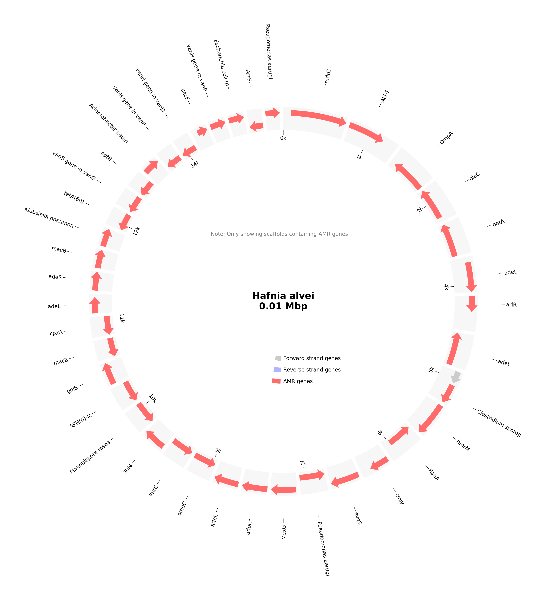

### ALI-1
- **Mechanism**: antibiotic inactivation
- **Drug Classes**: carbapenem
- **AMR Family**: ALI beta-lactamase
- **Locations**:
  - gnl|SPADES|DAOGIJFL_7384_1 : position 2-529

### APH(6)-Ic
- **Mechanism**: antibiotic inactivation
- **Drug Classes**: aminoglycoside antibiotic
- **AMR Family**: APH(6)
- **Locations**:
  - gnl|SPADES|DAOGIJFL_20599_1 : position 12-335

### Acinetobacter baumannii AbaQ
- **Mechanism**: antibiotic efflux
- **Drug Classes**: fluoroquinolone antibiotic
- **AMR Family**: major facilitator superfamily (MFS) antibiotic efflux pump
- **Locations**:
  - gnl|SPADES|DAOGIJFL_33728_1 : position 2-241

### AcrF
- **Mechanism**: antibiotic efflux
- **Drug Classes**: fluoroquinolone antibiotic; cephalosporin; cephamycin; penam
- **AMR Family**: resistance-nodulation-cell division (RND) antibiotic efflux pump
- **Locations**:
  - gnl|SPADES|DAOGIJFL_41140_1 : position 1-207

### Clostridium sporogenes cplR
- **Mechanism**: antibiotic target protection
- **Drug Classes**: lincosamide antibiotic; pleuromutilin antibiotic
- **AMR Family**: Miscellaneous ABC-F subfamily ATP-binding cassette ribosomal protection proteins
- **Locations**:
  - gnl|SPADES|DAOGIJFL_12671_2 : position 209-487

### Escherichia coli mdfA
- **Mechanism**: antibiotic efflux
- **Drug Classes**: tetracycline antibiotic; phenicol antibiotic; disinfecting agents and antiseptics
- **AMR Family**: major facilitator superfamily (MFS) antibiotic efflux pump
- **Locations**:
  - gnl|SPADES|DAOGIJFL_37468_1 : position 2-223

### Klebsiella pneumoniae OmpK37
- **Mechanism**: reduced permeability to antibiotic
- **Drug Classes**: monobactam; carbapenem; cephalosporin; cephamycin; penam; penem
- **AMR Family**: General Bacterial Porin with reduced permeability to beta-lactams
- **Locations**:
  - gnl|SPADES|DAOGIJFL_29083_1 : position 2-262

### MexG
- **Mechanism**: antibiotic efflux
- **Drug Classes**: fluoroquinolone antibiotic; tetracycline antibiotic; disinfecting agents and antiseptics
- **AMR Family**: resistance-nodulation-cell division (RND) antibiotic efflux pump
- **Locations**:
  - gnl|SPADES|DAOGIJFL_17971_1 : position 19-372

### OmpA
- **Mechanism**: reduced permeability to antibiotic
- **Drug Classes**: peptide antibiotic
- **AMR Family**: General Bacterial Porin with reduced permeability to peptide antibiotics
- **Locations**:
  - gnl|SPADES|DAOGIJFL_9690_1 : position 77-598

### Planobispora rosea EF-Tu mutants conferring resistance to inhibitor GE2270A
- **Mechanism**: antibiotic target alteration
- **Drug Classes**: elfamycin antibiotic
- **AMR Family**: elfamycin resistant EF-Tu
- **Locations**:
  - gnl|SPADES|DAOGIJFL_20527_1 : position 1-336

### Pseudomonas aeruginosa CpxR
- **Mechanism**: antibiotic efflux
- **Drug Classes**: macrolide antibiotic; fluoroquinolone antibiotic; monobactam; aminoglycoside antibiotic; carbapenem; cephalosporin; cephamycin; penam; tetracycline antibiotic; peptide antibiotic; aminocoumarin antibiotic; diaminopyrimidine antibiotic; sulfonamide antibiotic; phenicol antibiotic; penem
- **AMR Family**: resistance-nodulation-cell division (RND) antibiotic efflux pump
- **Locations**:
  - gnl|SPADES|DAOGIJFL_41473_1 : position 2-208

### Pseudomonas aeruginosa ampR with mutation conferring resistance to aztreonam
- **Mechanism**: antibiotic target alteration; antibiotic inactivation
- **Drug Classes**: monobactam; carbapenem; cephalosporin
- **AMR Family**: PDC beta-lactamase; ampR transcriptional regulator with mutation conferring resistance to monobactam antibiotics
- **Locations**:
  - gnl|SPADES|DAOGIJFL_17226_1 : position 3-383

### RanA
- **Mechanism**: antibiotic efflux
- **Drug Classes**: aminoglycoside antibiotic
- **AMR Family**: ATP-binding cassette (ABC) antibiotic efflux pump
- **Locations**:
  - gnl|SPADES|DAOGIJFL_12694_1 : position 3-377

### adeL (found in 5 locations)
- **Mechanism**: antibiotic efflux
- **Drug Classes**: fluoroquinolone antibiotic; tetracycline antibiotic
- **AMR Family**: resistance-nodulation-cell division (RND) antibiotic efflux pump
- **Locations**:
  - gnl|SPADES|DAOGIJFL_12116_1 : position 77-505
  - gnl|SPADES|DAOGIJFL_12322_1 : position 1-498
  - gnl|SPADES|DAOGIJFL_18266_1 : position 1-366
  - gnl|SPADES|DAOGIJFL_18933_1 : position 2-358
  - gnl|SPADES|DAOGIJFL_26656_1 : position 3-233

### adeS
- **Mechanism**: antibiotic efflux
- **Drug Classes**: glycylcycline; tetracycline antibiotic
- **AMR Family**: resistance-nodulation-cell division (RND) antibiotic efflux pump
- **Locations**:
  - gnl|SPADES|DAOGIJFL_27461_1 : position 2-271

### arlR
- **Mechanism**: antibiotic efflux
- **Drug Classes**: fluoroquinolone antibiotic; disinfecting agents and antiseptics
- **AMR Family**: major facilitator superfamily (MFS) antibiotic efflux pump
- **Locations**:
  - gnl|SPADES|DAOGIJFL_12165_1 : position 3-230

### cmlv
- **Mechanism**: antibiotic inactivation
- **Drug Classes**: phenicol antibiotic
- **AMR Family**: chloramphenicol phosphotransferase
- **Locations**:
  - gnl|SPADES|DAOGIJFL_15478_1 : position 2-280

### cpxA
- **Mechanism**: antibiotic efflux
- **Drug Classes**: aminoglycoside antibiotic; aminocoumarin antibiotic
- **AMR Family**: resistance-nodulation-cell division (RND) antibiotic efflux pump
- **Locations**:
  - gnl|SPADES|DAOGIJFL_25096_1 : position 1-285

### eptB
- **Mechanism**: antibiotic target alteration
- **Drug Classes**: peptide antibiotic
- **AMR Family**: pmr phosphoethanolamine transferase
- **Locations**:
  - gnl|SPADES|DAOGIJFL_33841_1 : position 2-241

### evgS
- **Mechanism**: antibiotic efflux
- **Drug Classes**: macrolide antibiotic; fluoroquinolone antibiotic; penam; tetracycline antibiotic
- **AMR Family**: major facilitator superfamily (MFS) antibiotic efflux pump; resistance-nodulation-cell division (RND) antibiotic efflux pump
- **Locations**:
  - gnl|SPADES|DAOGIJFL_15584_1 : position 2-415

### golS
- **Mechanism**: antibiotic efflux
- **Drug Classes**: monobactam; carbapenem; cephalosporin; cephamycin; penam; phenicol antibiotic; penem
- **AMR Family**: resistance-nodulation-cell division (RND) antibiotic efflux pump
- **Locations**:
  - gnl|SPADES|DAOGIJFL_21888_1 : position 2-319

### hmrM
- **Mechanism**: antibiotic efflux
- **Drug Classes**: fluoroquinolone antibiotic; disinfecting agents and antiseptics
- **AMR Family**: multidrug and toxic compound extrusion (MATE) transporter
- **Locations**:
  - gnl|SPADES|DAOGIJFL_12644_1 : position 1-489

### lmrC
- **Mechanism**: antibiotic target protection
- **Drug Classes**: lincosamide antibiotic
- **AMR Family**: Miscellaneous ABC-F subfamily ATP-binding cassette ribosomal protection proteins
- **Locations**:
  - gnl|SPADES|DAOGIJFL_20009_1 : position 3-341

### macB (found in 2 locations)
- **Mechanism**: antibiotic efflux
- **Drug Classes**: macrolide antibiotic
- **AMR Family**: ATP-binding cassette (ABC) antibiotic efflux pump
- **Locations**:
  - gnl|SPADES|DAOGIJFL_24982_1 : position 2-286
  - gnl|SPADES|DAOGIJFL_27815_1 : position 3-269

### mdtC
- **Mechanism**: antibiotic efflux
- **Drug Classes**: aminocoumarin antibiotic
- **AMR Family**: resistance-nodulation-cell division (RND) antibiotic efflux pump
- **Locations**:
  - gnl|SPADES|DAOGIJFL_5708_2 : position 112-906

### oleC
- **Mechanism**: antibiotic efflux
- **Drug Classes**: macrolide antibiotic
- **AMR Family**: ATP-binding cassette (ABC) antibiotic efflux pump
- **Locations**:
  - gnl|SPADES|DAOGIJFL_10920_1 : position 1-486

### patA
- **Mechanism**: antibiotic efflux
- **Drug Classes**: fluoroquinolone antibiotic
- **AMR Family**: ATP-binding cassette (ABC) antibiotic efflux pump
- **Locations**:
  - gnl|SPADES|DAOGIJFL_11828_1 : position 2-514

### qacE
- **Mechanism**: antibiotic efflux
- **Drug Classes**: disinfecting agents and antiseptics
- **AMR Family**: major facilitator superfamily (MFS) antibiotic efflux pump
- **Locations**:
  - gnl|SPADES|DAOGIJFL_36943_1 : position 77-226

### smeC
- **Mechanism**: antibiotic efflux
- **Drug Classes**: aminoglycoside antibiotic; cephalosporin; cephamycin; penam
- **AMR Family**: resistance-nodulation-cell division (RND) antibiotic efflux pump
- **Locations**:
  - gnl|SPADES|DAOGIJFL_19945_1 : position 1-342

### sul4
- **Mechanism**: antibiotic target replacement
- **Drug Classes**: sulfonamide antibiotic
- **AMR Family**: sulfonamide resistant sul
- **Locations**:
  - gnl|SPADES|DAOGIJFL_20460_1 : position 13-336

### tetA(60)
- **Mechanism**: antibiotic efflux
- **Drug Classes**: tetracycline antibiotic
- **AMR Family**: ATP-binding cassette (ABC) antibiotic efflux pump
- **Locations**:
  - gnl|SPADES|DAOGIJFL_29490_1 : position 1-261

### vanH gene in vanD cluster
- **Mechanism**: antibiotic target alteration
- **Drug Classes**: glycopeptide antibiotic
- **AMR Family**: vanH; glycopeptide resistance gene cluster
- **Locations**:
  - gnl|SPADES|DAOGIJFL_36195_1 : position 2-229

### vanH gene in vanP cluster (found in 2 locations)
- **Mechanism**: antibiotic target alteration
- **Drug Classes**: glycopeptide antibiotic
- **AMR Family**: vanH; glycopeptide resistance gene cluster
- **Locations**:
  - gnl|SPADES|DAOGIJFL_34909_1 : position 3-236
  - gnl|SPADES|DAOGIJFL_37092_1 : position 2-226

### vanS gene in vanG cluster
- **Mechanism**: antibiotic target alteration
- **Drug Classes**: glycopeptide antibiotic
- **AMR Family**: vanS; glycopeptide resistance gene cluster
- **Locations**:
  - gnl|SPADES|DAOGIJFL_30408_1 : position 1-255

## Hafnia alvei FB1
**Strain Statistics:**
- Total genome length: 2.1 kbp
- Total scaffolds: 73
- Scaffolds with AMR genes: 5
- Total genes annotated: 4
- Total AMR genes: 5
- Unique AMR genes: 5
- Distinct AMR mechanisms: 3
- Distinct AMR families: 4
- Distinct drug classes: 7

**Circos Plot:**

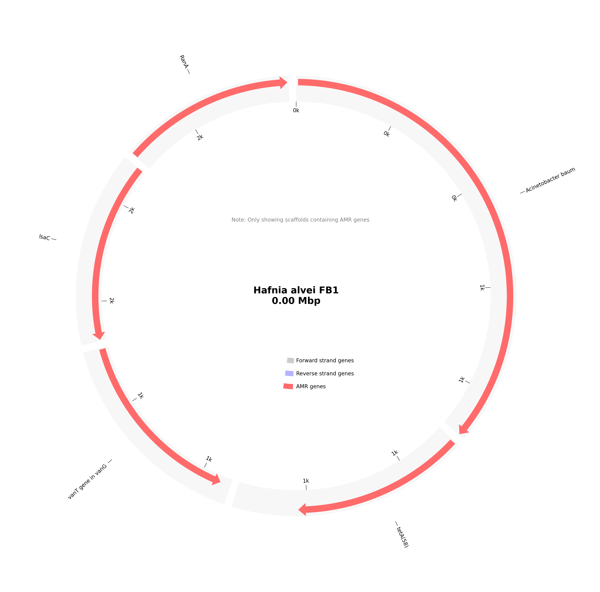

### Acinetobacter baumannii AbaF
- **Mechanism**: antibiotic efflux
- **Drug Classes**: phosphonic acid antibiotic
- **AMR Family**: major facilitator superfamily (MFS) antibiotic efflux pump
- **Locations**:
  - gnl|SPADES|DAOGIJFL_7042_1 : position 3-770

### RanA
- **Mechanism**: antibiotic efflux
- **Drug Classes**: aminoglycoside antibiotic
- **AMR Family**: ATP-binding cassette (ABC) antibiotic efflux pump
- **Locations**:
  - gnl|SPADES|DAOGIJFL_26242_1 : position 1-276

### lsaC
- **Mechanism**: antibiotic target protection
- **Drug Classes**: lincosamide antibiotic; streptogramin antibiotic; pleuromutilin antibiotic
- **AMR Family**: lsa-type ABC-F protein
- **Locations**:
  - gnl|SPADES|DAOGIJFL_22922_1 : position 2-307

### tetA(58)
- **Mechanism**: antibiotic efflux
- **Drug Classes**: tetracycline antibiotic
- **AMR Family**: major facilitator superfamily (MFS) antibiotic efflux pump
- **Locations**:
  - gnl|SPADES|DAOGIJFL_17416_1 : position 3-278

### vanT gene in vanG cluster
- **Mechanism**: antibiotic target alteration
- **Drug Classes**: glycopeptide antibiotic
- **AMR Family**: glycopeptide resistance gene cluster; vanT
- **Locations**:
  - gnl|SPADES|DAOGIJFL_20866_1 : position 18-329

## Hafnia paralvei
**Strain Statistics:**
- Total genome length: 4436.8 kbp
- Total scaffolds: 124
- Scaffolds with AMR genes: 48
- Total genes annotated: 8105
- Total AMR genes: 427
- Unique AMR genes: 212
- Distinct AMR mechanisms: 11
- Distinct AMR families: 73
- Distinct drug classes: 37

**Circos Plot:**

### AAC(6')-32
- **Mechanism**: antibiotic inactivation
- **Drug Classes**: aminoglycoside antibiotic
- **AMR Family**: AAC(6')
- **Locations**:
  - gnl|SPADES|DAOGIJFL_9_150 : position 160967-161569

### AAC(6')-Iu
- **Mechanism**: antibiotic inactivation
- **Drug Classes**: aminoglycoside antibiotic
- **AMR Family**: AAC(6')
- **Locations**:
  - gnl|SPADES|DAOGIJFL_24_36 : position 35997-36455

### ACC-1a
- **Mechanism**: antibiotic inactivation
- **Drug Classes**: monobactam; cephalosporin; cephamycin; penam; oxacephem
- **AMR Family**: ACC beta-lactamase
- **Locations**:
  - gnl|SPADES|DAOGIJFL_7_101: position 127638-128810

### ALI-2
- **Mechanism**: antibiotic inactivation
- **Drug Classes**: carbapenem
- **AMR Family**: ALI beta-lactamase
- **Locations**:
  - gnl|SPADES|DAOGIJFL_62_56 : position 57358-58236

### APH(6)-Ic
- **Mechanism**: antibiotic inactivation
- **Drug Classes**: aminoglycoside antibiotic
- **AMR Family**: APH(6)
- **Locations**:
  - gnl|SPADES|DAOGIJFL_9_29 : position 27412-28215

### Acinetobacter baumannii AbaF (found in 6 locations)
- **Mechanism**: antibiotic efflux
- **Drug Classes**: phosphonic acid antibiotic
- **AMR Family**: major facilitator superfamily (MFS) antibiotic efflux pump
- **Locations**:
  - gnl|SPADES|DAOGIJFL_182_4 : position 3565-4794
  - gnl|SPADES|DAOGIJFL_1_335 : position 329666-331168
  - gnl|SPADES|DAOGIJFL_44_55 : position 62752-64086
  - gnl|SPADES|DAOGIJFL_4_200 : position 207773-209098
  - gnl|SPADES|DAOGIJFL_62_48 : position 48342-49883
  - gnl|SPADES|DAOGIJFL_6_224 : position 257312-258613

### Acinetobacter baumannii AbaQ (found in 7 locations)
- **Mechanism**: antibiotic efflux
- **Drug Classes**: fluoroquinolone antibiotic
- **AMR Family**: major facilitator superfamily (MFS) antibiotic efflux pump
- **Locations**:
  - gnl|SPADES|DAOGIJFL_148_39 : position 38981-40276
  - gnl|SPADES|DAOGIJFL_18_47 : position 44459-45835
  - gnl|SPADES|DAOGIJFL_24_56 : position 55198-56490
  - gnl|SPADES|DAOGIJFL_41_75 : position 84109-85437
  - gnl|SPADES|DAOGIJFL_6_16 : position 15908-17245
  - gnl|SPADES|DAOGIJFL_6_177 : position 194245-195591
  - gnl|SPADES|DAOGIJFL_6_98 : position 110512-111735

### AcrE
- **Mechanism**: antibiotic efflux
- **Drug Classes**: fluoroquinolone antibiotic; cephalosporin; cephamycin; penam
- **AMR Family**: resistance-nodulation-cell division (RND) antibiotic efflux pump
- **Locations**:
  - gnl|SPADES|DAOGIJFL_2_101 : position 113614-114777

### AcrF
- **Mechanism**: antibiotic efflux
- **Drug Classes**: fluoroquinolone antibiotic; cephalosporin; cephamycin; penam
- **AMR Family**: resistance-nodulation-cell division (RND) antibiotic efflux pump
- **Locations**:
  - gnl|SPADES|DAOGIJFL_2_100 : position 110453-113575

### Agrobacterium fabrum chloramphenicol acetyltransferase
- **Mechanism**: antibiotic inactivation
- **Drug Classes**: phenicol antibiotic
- **AMR Family**: chloramphenicol acetyltransferase (CAT)
- **Locations**:
  - gnl|SPADES|DAOGIJFL_111_13 : position 14714-15268

### ArnT
- **Mechanism**: antibiotic target alteration
- **Drug Classes**: peptide antibiotic
- **AMR Family**: pmr phosphoethanolamine transferase
- **Locations**:
  - gnl|SPADES|DAOGIJFL_1_398: position 392416-394065

### Bifidobacterium adolescentis rpoB mutants conferring resistance to rifampicin
- **Mechanism**: antibiotic target alteration; antibiotic target replacement
- **Drug Classes**: rifamycin antibiotic
- **AMR Family**: rifamycin-resistant beta-subunit of RNA polymerase (rpoB)
- **Locations**:
  - gnl|SPADES|DAOGIJFL_1110_1 : position 3-2018

### Bifidobacterium bifidum ileS conferring resistance to mupirocin
- **Mechanism**: antibiotic target alteration
- **Drug Classes**: mupirocin-like antibiotic
- **AMR Family**: antibiotic-resistant isoleucyl-tRNA synthetase (ileS)
- **Locations**:
  - gnl|SPADES|DAOGIJFL_2_71 : position 81577-84159

### CRP (found in 2 locations)
- **Mechanism**: antibiotic efflux
- **Drug Classes**: macrolide antibiotic; fluoroquinolone antibiotic; penam
- **AMR Family**: resistance-nodulation-cell division (RND) antibiotic efflux pump
- **Locations**:
  - gnl|SPADES|DAOGIJFL_227_14 : position 13458-14255
  - gnl|SPADES|DAOGIJFL_7_178: position 219906-220538

### Clostridioides difficile gyrA conferring resistance to fluoroquinolones
- **Mechanism**: antibiotic target alteration
- **Drug Classes**: fluoroquinolone antibiotic
- **AMR Family**: fluoroquinolone resistant gyrA
- **Locations**:
  - gnl|SPADES|DAOGIJFL_563_2 : position 1228-3876

### Clostridioides difficile gyrB conferring resistance to fluoroquinolones (found in 2 locations)
- **Mechanism**: antibiotic target alteration
- **Drug Classes**: fluoroquinolone antibiotic
- **AMR Family**: fluoroquinolone resistant gyrB
- **Locations**:
  - gnl|SPADES|DAOGIJFL_24_64 : position 62089-64503
  - gnl|SPADES|DAOGIJFL_43_67 : position 77744-79639

### D-Ala-D-Ala ligase
- **Mechanism**: antibiotic target alteration
- **Drug Classes**: glycopeptide antibiotic
- **AMR Family**: Van ligase
- **Locations**:
  - gnl|SPADES|DAOGIJFL_25_69 : position 87605-88525

### EVM-1
- **Mechanism**: antibiotic inactivation
- **Drug Classes**: carbapenem
- **AMR Family**: EVM beta-lactamase
- **Locations**:
  - gnl|SPADES|DAOGIJFL_3_174 : position 211667-212488

### Enterobacter cloacae acrA
- **Mechanism**: antibiotic efflux
- **Drug Classes**: fluoroquinolone antibiotic; cephalosporin; glycylcycline; penam; tetracycline antibiotic; rifamycin antibiotic; phenicol antibiotic; disinfecting agents and antiseptics
- **AMR Family**: resistance-nodulation-cell division (RND) antibiotic efflux pump
- **Locations**:
  - gnl|SPADES|DAOGIJFL_4_107 : position 100519-101709

### Enterococcus faecium cls conferring resistance to daptomycin
- **Mechanism**: antibiotic target alteration
- **Drug Classes**: peptide antibiotic
- **AMR Family**: daptomycin resistant cls
- **Locations**:
  - gnl|SPADES|DAOGIJFL_1_355 : position 347245-348705

### ErmX
- **Mechanism**: antibiotic target alteration
- **Drug Classes**: macrolide antibiotic; lincosamide antibiotic; streptogramin antibiotic; streptogramin A antibiotic; streptogramin B antibiotic
- **AMR Family**: Erm 23S ribosomal RNA methyltransferase
- **Locations**:
  - gnl|SPADES|DAOGIJFL_44_13 : position 14994-15806

### Escherichia coli AcrAB-TolC with AcrR mutation conferring resistance to ciprofloxacin, tetracycline, and ceftazidime
- **Mechanism**: antibiotic target alteration; antibiotic efflux
- **Drug Classes**: fluoroquinolone antibiotic; cephalosporin; glycylcycline; penam; tetracycline antibiotic; rifamycin antibiotic; phenicol antibiotic; disinfecting agents and antiseptics
- **AMR Family**: resistance-nodulation-cell division (RND) antibiotic efflux pump
- **Locations**:
  - gnl|SPADES|DAOGIJFL_4_108 : position 101849-102553

### Escherichia coli AcrAB-TolC with MarR mutations conferring resistance to ciprofloxacin and tetracycline (found in 2 locations)
- **Mechanism**: antibiotic target alteration; antibiotic efflux
- **Drug Classes**: fluoroquinolone antibiotic; cephalosporin; glycylcycline; penam; tetracycline antibiotic; rifamycin antibiotic; phenicol antibiotic; disinfecting agents and antiseptics
- **AMR Family**: resistance-nodulation-cell division (RND) antibiotic efflux pump
- **Locations**:
  - gnl|SPADES|DAOGIJFL_13_109 : position 116918-117349
  - gnl|SPADES|DAOGIJFL_227_23 : position 23399-23890

### Escherichia coli EF-Tu mutants conferring resistance to Enacyloxin IIa
- **Mechanism**: antibiotic target alteration
- **Drug Classes**: elfamycin antibiotic
- **AMR Family**: elfamycin resistant EF-Tu
- **Locations**:
  - gnl|SPADES|DAOGIJFL_9_64 : position 64721-67423

### Escherichia coli EF-Tu mutants conferring resistance to Pulvomycin
- **Mechanism**: antibiotic target alteration
- **Drug Classes**: elfamycin antibiotic
- **AMR Family**: elfamycin resistant EF-Tu
- **Locations**:
  - gnl|SPADES|DAOGIJFL_384_7 : position 6063-7247

### Escherichia coli PtsI with mutation conferring resistance to fosfomycin
- **Mechanism**: antibiotic target alteration
- **Drug Classes**: phosphonic acid antibiotic
- **AMR Family**: antibiotic-resistant ptsI phosphotransferase
- **Locations**:
  - gnl|SPADES|DAOGIJFL_166_26 : position 24222-25949

### Escherichia coli acrA
- **Mechanism**: antibiotic efflux
- **Drug Classes**: fluoroquinolone antibiotic; cephalosporin; glycylcycline; penam; tetracycline antibiotic; rifamycin antibiotic; phenicol antibiotic; disinfecting agents and antiseptics
- **AMR Family**: resistance-nodulation-cell division (RND) antibiotic efflux pump
- **Locations**:
  - gnl|SPADES|DAOGIJFL_20_78 : position 90943-92130

### Escherichia coli mdfA (found in 3 locations)
- **Mechanism**: antibiotic efflux
- **Drug Classes**: tetracycline antibiotic; phenicol antibiotic; disinfecting agents and antiseptics
- **AMR Family**: major facilitator superfamily (MFS) antibiotic efflux pump
- **Locations**:
  - gnl|SPADES|DAOGIJFL_34617_1 : position 91-237
  - gnl|SPADES|DAOGIJFL_7_10 : position 13117-14349
  - gnl|SPADES|DAOGIJFL_9_148 : position 157683-158903

### Escherichia coli soxS with mutation conferring antibiotic resistance (found in 4 locations)
- **Mechanism**: antibiotic target alteration; antibiotic efflux; reduced permeability to antibiotic
- **Drug Classes**: fluoroquinolone antibiotic; monobactam; carbapenem; cephalosporin; glycylcycline; cephamycin; penam; tetracycline antibiotic; rifamycin antibiotic; phenicol antibiotic; penem; disinfecting agents and antiseptics
- **AMR Family**: ATP-binding cassette (ABC) antibiotic efflux pump; major facilitator superfamily (MFS) antibiotic efflux pump; resistance-nodulation-cell division (RND) antibiotic efflux pump; General Bacterial Porin with reduced permeability to beta-lactams
- **Locations**:
  - gnl|SPADES|DAOGIJFL_1_330 : position 325912-326283
  - gnl|SPADES|DAOGIJFL_2_93 : position 103145-103966
  - gnl|SPADES|DAOGIJFL_61_9 : position 7333-8211
  - gnl|SPADES|DAOGIJFL_7_35 : position 47216-48079

### Escherichia coli uhpA with mutation conferring resistance to fosfomycin
- **Mechanism**: antibiotic target alteration
- **Drug Classes**: phosphonic acid antibiotic
- **AMR Family**: antibiotic-resistant UhpT
- **Locations**:
  - gnl|SPADES|DAOGIJFL_20_99 : position 114498-115214

### FosC2
- **Mechanism**: antibiotic inactivation
- **Drug Classes**: phosphonic acid antibiotic
- **AMR Family**: fosC phosphotransferase family
- **Locations**:
  - gnl|SPADES|DAOGIJFL_3_314 : position 347617-348081

### H-NS
- **Mechanism**: antibiotic efflux
- **Drug Classes**: macrolide antibiotic; fluoroquinolone antibiotic; cephalosporin; cephamycin; penam; tetracycline antibiotic
- **AMR Family**: major facilitator superfamily (MFS) antibiotic efflux pump; resistance-nodulation-cell division (RND) antibiotic efflux pump
- **Locations**:
  - gnl|SPADES|DAOGIJFL_60_74 : position 81700-82107

### Haemophilus influenzae PBP3 conferring resistance to beta-lactam antibiotics (found in 2 locations)
- **Mechanism**: antibiotic target alteration
- **Drug Classes**: cephalosporin; cephamycin; penam
- **AMR Family**: Penicillin-binding protein mutations conferring resistance to beta-lactam antibiotics
- **Locations**:
  - gnl|SPADES|DAOGIJFL_1_59 : position 51663-53435
  - gnl|SPADES|DAOGIJFL_25_77 : position 97666-99429

### Helicobacter pylori pbp1 mutants conferring resistance to amoxicillin (found in 2 locations)
- **Mechanism**: antibiotic target alteration
- **Drug Classes**: cephalosporin; cephamycin; penam
- **AMR Family**: Penicillin-binding protein mutations conferring resistance to beta-lactam antibiotics
- **Locations**:
  - gnl|SPADES|DAOGIJFL_25_25 : position 34059-36638
  - gnl|SPADES|DAOGIJFL_2_329 : position 358080-360353

### Helicobacter pylori pbp2 mutants conferring resistance to amoxicillin
- **Mechanism**: antibiotic target alteration
- **Drug Classes**: cephalosporin; cephamycin; penam
- **AMR Family**: Penicillin-binding protein mutations conferring resistance to beta-lactam antibiotics
- **Locations**:
  - gnl|SPADES|DAOGIJFL_2_77 : position 87648-89543

### Helicobacter pylori rpoB mutation conferring resistance to rifampicin
- **Mechanism**: antibiotic target alteration; antibiotic target replacement
- **Drug Classes**: fluoroquinolone antibiotic; rifamycin antibiotic
- **AMR Family**: rifamycin-resistant beta-subunit of RNA polymerase (rpoB)
- **Locations**:
  - gnl|SPADES|DAOGIJFL_329_1 : position 1-3258

### Klebsiella aerogenes Omp36
- **Mechanism**: reduced permeability to antibiotic
- **Drug Classes**: monobactam; carbapenem; cephalosporin; cephamycin; penam; penem
- **AMR Family**: General Bacterial Porin with reduced permeability to beta-lactams
- **Locations**:
  - gnl|SPADES|DAOGIJFL_1_383 : position 375413-376561

### Klebsiella pneumoniae KpnE
- **Mechanism**: antibiotic efflux
- **Drug Classes**: macrolide antibiotic; aminoglycoside antibiotic; cephalosporin; tetracycline antibiotic; peptide antibiotic; rifamycin antibiotic; disinfecting agents and antiseptics
- **AMR Family**: small multidrug resistance (SMR) antibiotic efflux pump
- **Locations**:
  - gnl|SPADES|DAOGIJFL_1_239 : position 234347-234778

### Klebsiella pneumoniae KpnF
- **Mechanism**: antibiotic efflux
- **Drug Classes**: macrolide antibiotic; aminoglycoside antibiotic; cephalosporin; tetracycline antibiotic; peptide antibiotic; rifamycin antibiotic; disinfecting agents and antiseptics
- **AMR Family**: small multidrug resistance (SMR) antibiotic efflux pump
- **Locations**:
  - gnl|SPADES|DAOGIJFL_1_240: position 234765-235094

### Klebsiella pneumoniae KpnG
- **Mechanism**: antibiotic efflux
- **Drug Classes**: macrolide antibiotic; fluoroquinolone antibiotic; aminoglycoside antibiotic; carbapenem; cephalosporin; penam; peptide antibiotic; penem
- **AMR Family**: major facilitator superfamily (MFS) antibiotic efflux pump
- **Locations**:
  - gnl|SPADES|DAOGIJFL_2_293 : position 312917-314092

### Klebsiella pneumoniae KpnH (found in 2 locations)
- **Mechanism**: antibiotic efflux
- **Drug Classes**: macrolide antibiotic; fluoroquinolone antibiotic; aminoglycoside antibiotic; carbapenem; cephalosporin; penam; peptide antibiotic; penem
- **AMR Family**: major facilitator superfamily (MFS) antibiotic efflux pump
- **Locations**:
  - gnl|SPADES|DAOGIJFL_24_111 : position 114589-116028
  - gnl|SPADES|DAOGIJFL_2_294: position 314110-315645

### Klebsiella pneumoniae OmpK37 (found in 6 locations)
- **Mechanism**: reduced permeability to antibiotic
- **Drug Classes**: monobactam; carbapenem; cephalosporin; cephamycin; penam; penem
- **AMR Family**: General Bacterial Porin with reduced permeability to beta-lactams
- **Locations**:
  - gnl|SPADES|DAOGIJFL_13_60 : position 67790-68902
  - gnl|SPADES|DAOGIJFL_25_24 : position 32738-33877
  - gnl|SPADES|DAOGIJFL_3_70 : position 86373-87488
  - gnl|SPADES|DAOGIJFL_41_32 : position 33237-34379
  - gnl|SPADES|DAOGIJFL_61_66 : position 68572-69672
  - gnl|SPADES|DAOGIJFL_62_25 : position 26357-27460

### Klebsiella pneumoniae acrR with mutation conferring multidrug antibiotic resistance
- **Mechanism**: antibiotic target alteration; antibiotic efflux
- **Drug Classes**: fluoroquinolone antibiotic; cephalosporin; glycylcycline; penam; tetracycline antibiotic; rifamycin antibiotic; phenicol antibiotic; disinfecting agents and antiseptics
- **AMR Family**: resistance-nodulation-cell division (RND) antibiotic efflux pump
- **Locations**:
  - gnl|SPADES|DAOGIJFL_2_102 : position 115370-115984

### LRA-19
- **Mechanism**: antibiotic inactivation
- **Drug Classes**: cephalosporin; penam
- **AMR Family**: subclass B3 LRA beta-lactamase
- **Locations**:
  - gnl|SPADES|DAOGIJFL_3_72 : position 89049-89696

### LlmA 23S ribosomal RNA methyltransferase
- **Mechanism**: antibiotic target alteration
- **Drug Classes**: lincosamide antibiotic
- **AMR Family**: Llm 23S ribosomal RNA methyltransferase
- **Locations**:
  - gnl|SPADES|DAOGIJFL_3_41 : position 50259-51452

### LptD
- **Mechanism**: antibiotic efflux
- **Drug Classes**: carbapenem; peptide antibiotic; aminocoumarin antibiotic; rifamycin antibiotic
- **AMR Family**: ATP-binding cassette (ABC) antibiotic efflux pump
- **Locations**:
  - gnl|SPADES|DAOGIJFL_44_10 : position 10195-12597

### MCR-10.4
- **Mechanism**: antibiotic target alteration
- **Drug Classes**: peptide antibiotic
- **AMR Family**: MCR phosphoethanolamine transferase
- **Locations**:
  - gnl|SPADES|DAOGIJFL_11_118 : position 148021-149655

### MCR-3.4
- **Mechanism**: antibiotic target alteration
- **Drug Classes**: peptide antibiotic
- **AMR Family**: MCR phosphoethanolamine transferase
- **Locations**:
  - gnl|SPADES|DAOGIJFL_1_58 : position 49691-51298

### MCR-3.41
- **Mechanism**: antibiotic target alteration
- **Drug Classes**: peptide antibiotic
- **AMR Family**: MCR phosphoethanolamine transferase
- **Locations**:
  - gnl|SPADES|DAOGIJFL_69_52 : position 57364-58986

### MCR-5.1
- **Mechanism**: antibiotic target alteration
- **Drug Classes**: peptide antibiotic
- **AMR Family**: MCR phosphoethanolamine transferase
- **Locations**:
  - gnl|SPADES|DAOGIJFL_69_16 : position 19752-21479

### MdtK
- **Mechanism**: antibiotic efflux
- **Drug Classes**: fluoroquinolone antibiotic
- **AMR Family**: multidrug and toxic compound extrusion (MATE) transporter
- **Locations**:
  - gnl|SPADES|DAOGIJFL_2_109 : position 122155-123612

### MdtQ
- **Mechanism**: reduced permeability to antibiotic
- **Drug Classes**: monobactam; carbapenem; cephalosporin; cephamycin; penam; penem
- **AMR Family**: Outer Membrane Porin (Opr)
- **Locations**:
  - gnl|SPADES|DAOGIJFL_3_14 : position 12521-14026

### MexG
- **Mechanism**: antibiotic efflux
- **Drug Classes**: fluoroquinolone antibiotic; tetracycline antibiotic; disinfecting agents and antiseptics
- **AMR Family**: resistance-nodulation-cell division (RND) antibiotic efflux pump
- **Locations**:
  - gnl|SPADES|DAOGIJFL_1_340 : position 333838-334254

### MexS (found in 6 locations)
- **Mechanism**: antibiotic efflux
- **Drug Classes**: fluoroquinolone antibiotic; diaminopyrimidine antibiotic; phenicol antibiotic
- **AMR Family**: resistance-nodulation-cell division (RND) antibiotic efflux pump
- **Locations**:
  - gnl|SPADES|DAOGIJFL_18_124 : position 123358-124389
  - gnl|SPADES|DAOGIJFL_3_310 : position 343065-344189
  - gnl|SPADES|DAOGIJFL_43_15 : position 16397-17383
  - gnl|SPADES|DAOGIJFL_4_185 : position 186313-187332
  - gnl|SPADES|DAOGIJFL_61_17 : position 15657-16658
  - gnl|SPADES|DAOGIJFL_6_138 : position 162544-163521

### MexT
- **Mechanism**: antibiotic efflux
- **Drug Classes**: fluoroquinolone antibiotic; diaminopyrimidine antibiotic; phenicol antibiotic
- **AMR Family**: resistance-nodulation-cell division (RND) antibiotic efflux pump
- **Locations**:
  - gnl|SPADES|DAOGIJFL_6_58 : position 61995-62888

### MexV
- **Mechanism**: antibiotic efflux
- **Drug Classes**: macrolide antibiotic; fluoroquinolone antibiotic; tetracycline antibiotic; phenicol antibiotic; disinfecting agents and antiseptics
- **AMR Family**: resistance-nodulation-cell division (RND) antibiotic efflux pump
- **Locations**:
  - gnl|SPADES|DAOGIJFL_119_36 : position 39179-40696

### MexZ
- **Mechanism**: antibiotic efflux
- **Drug Classes**: macrolide antibiotic; fluoroquinolone antibiotic; aminoglycoside antibiotic; carbapenem; cephalosporin; cephamycin; penam; tetracycline antibiotic; phenicol antibiotic; disinfecting agents and antiseptics
- **AMR Family**: resistance-nodulation-cell division (RND) antibiotic efflux pump
- **Locations**:
  - gnl|SPADES|DAOGIJFL_43_19 : position 19693-20298

### Mycobacterium tuberculosis gidB mutation conferring resistance to streptomycin
- **Mechanism**: antibiotic target alteration
- **Drug Classes**: aminoglycoside antibiotic
- **AMR Family**: antibiotic resistant gidB
- **Locations**:
  - gnl|SPADES|DAOGIJFL_24_97 : position 98228-98848

### Mycobacterium tuberculosis ndh with mutation conferring resistance to isoniazid
- **Mechanism**: antibiotic target alteration
- **Drug Classes**: isoniazid-like antibiotic
- **AMR Family**: antibiotic resistant ndh
- **Locations**:
  - gnl|SPADES|DAOGIJFL_1_265 : position 259175-260479

### Mycobacterium tuberculosis pncA mutations conferring resistance to pyrazinamide
- **Mechanism**: antibiotic target alteration
- **Drug Classes**: pyrazine antibiotic
- **AMR Family**: Pyrazinamide resistant pncA
- **Locations**:
  - gnl|SPADES|DAOGIJFL_62_16 : position 15830-16465

### Mycobacterium tuberculosis rpoB mutations conferring resistance to rifampicin
- **Mechanism**: antibiotic target alteration; antibiotic target replacement
- **Drug Classes**: rifamycin antibiotic
- **AMR Family**: rifamycin-resistant beta-subunit of RNA polymerase (rpoB)
- **Locations**:
  - gnl|SPADES|DAOGIJFL_384_14 : position 11366-13429

### Mycobacterium tuberculosis rpsA mutations conferring resistance to pyrazinamide
- **Mechanism**: antibiotic target alteration
- **Drug Classes**: pyrazine antibiotic
- **AMR Family**: pyrazinamide resistant rpsA
- **Locations**:
  - gnl|SPADES|DAOGIJFL_3_97 : position 120271-121950

### Mycobacterium tuberculosis thyA with mutation conferring resistance to para-aminosalicylic acid
- **Mechanism**: antibiotic target alteration
- **Drug Classes**: salicylic acid antibiotic
- **AMR Family**: aminosalicylate resistant thymidylate synthase
- **Locations**:
  - gnl|SPADES|DAOGIJFL_25_11 : position 17359-18153

### NmcR (found in 8 locations)
- **Mechanism**: antibiotic inactivation
- **Drug Classes**: carbapenem; cephalosporin; cephamycin; penam
- **AMR Family**: NmcA beta-lactamase
- **Locations**:
  - gnl|SPADES|DAOGIJFL_111_27 : position 31239-32198
  - gnl|SPADES|DAOGIJFL_13_26 : position 34680-35654
  - gnl|SPADES|DAOGIJFL_182_1 : position 365-1192
  - gnl|SPADES|DAOGIJFL_31_37 : position 30432-31328
  - gnl|SPADES|DAOGIJFL_40_65 : position 71282-72175
  - gnl|SPADES|DAOGIJFL_40_77 : position 86309-87181
  - gnl|SPADES|DAOGIJFL_41_60 : position 71173-72078
  - gnl|SPADES|DAOGIJFL_6_102 : position 115602-116531

### OmpA (found in 4 locations)
- **Mechanism**: reduced permeability to antibiotic
- **Drug Classes**: peptide antibiotic
- **AMR Family**: General Bacterial Porin with reduced permeability to peptide antibiotics
- **Locations**:
  - gnl|SPADES|DAOGIJFL_1_334 : position 328602-329093
  - gnl|SPADES|DAOGIJFL_24_40 : position 38846-39505
  - gnl|SPADES|DAOGIJFL_2_2 : position 1312-1827
  - gnl|SPADES|DAOGIJFL_3_51 : position 60511-61569

### OprM
- **Mechanism**: antibiotic efflux
- **Drug Classes**: macrolide antibiotic; fluoroquinolone antibiotic; monobactam; aminoglycoside antibiotic; carbapenem; cephalosporin; cephamycin; penam; tetracycline antibiotic; peptide antibiotic; aminocoumarin antibiotic; diaminopyrimidine antibiotic; sulfonamide antibiotic; phenicol antibiotic; penem; disinfecting agents and antiseptics
- **AMR Family**: resistance-nodulation-cell division (RND) antibiotic efflux pump
- **Locations**:
  - gnl|SPADES|DAOGIJFL_11_9 : position 23608-24969

### ParR (found in 2 locations)
- **Mechanism**: antibiotic efflux; reduced permeability to antibiotic
- **Drug Classes**: macrolide antibiotic; fluoroquinolone antibiotic; monobactam; aminoglycoside antibiotic; carbapenem; cephalosporin; cephamycin; penam; tetracycline antibiotic; phenicol antibiotic; penem; disinfecting agents and antiseptics
- **AMR Family**: resistance-nodulation-cell division (RND) antibiotic efflux pump; Outer Membrane Porin (Opr)
- **Locations**:
  - gnl|SPADES|DAOGIJFL_41_52 : position 60778-61491
  - gnl|SPADES|DAOGIJFL_7_139 : position 174900-175619

### ParS (found in 2 locations)
- **Mechanism**: antibiotic efflux; reduced permeability to antibiotic
- **Drug Classes**: macrolide antibiotic; fluoroquinolone antibiotic; monobactam; aminoglycoside antibiotic; carbapenem; cephalosporin; cephamycin; penam; tetracycline antibiotic; phenicol antibiotic; penem; disinfecting agents and antiseptics
- **AMR Family**: resistance-nodulation-cell division (RND) antibiotic efflux pump; Outer Membrane Porin (Opr)
- **Locations**:
  - gnl|SPADES|DAOGIJFL_41_51 : position 59443-60771
  - gnl|SPADES|DAOGIJFL_43_27 : position 25320-26981

### Planobispora rosea EF-Tu mutants conferring resistance to inhibitor GE2270A
- **Mechanism**: antibiotic target alteration
- **Drug Classes**: elfamycin antibiotic
- **AMR Family**: elfamycin resistant EF-Tu
- **Locations**:
  - gnl|SPADES|DAOGIJFL_6_118 : position 136326-138194

### PmrF
- **Mechanism**: antibiotic target alteration
- **Drug Classes**: peptide antibiotic
- **AMR Family**: pmr phosphoethanolamine transferase
- **Locations**:
  - gnl|SPADES|DAOGIJFL_1_395 : position 388504-389520

### Pseudomonas aeruginosa CpxR
- **Mechanism**: antibiotic efflux
- **Drug Classes**: macrolide antibiotic; fluoroquinolone antibiotic; monobactam; aminoglycoside antibiotic; carbapenem; cephalosporin; cephamycin; penam; tetracycline antibiotic; peptide antibiotic; aminocoumarin antibiotic; diaminopyrimidine antibiotic; sulfonamide antibiotic; phenicol antibiotic; penem
- **AMR Family**: resistance-nodulation-cell division (RND) antibiotic efflux pump
- **Locations**:
  - gnl|SPADES|DAOGIJFL_69_41 : position 47077-47775

### Pseudomonas aeruginosa ampR with mutation conferring resistance to aztreonam (found in 3 locations)
- **Mechanism**: antibiotic target alteration; antibiotic inactivation
- **Drug Classes**: monobactam; carbapenem; cephalosporin
- **AMR Family**: PDC beta-lactamase; ampR transcriptional regulator with mutation conferring resistance to monobactam antibiotics
- **Locations**:
  - gnl|SPADES|DAOGIJFL_148_27 : position 26024-26971
  - gnl|SPADES|DAOGIJFL_7_100 : position 126557-127423
  - gnl|SPADES|DAOGIJFL_85_54 : position 60485-61402

### QepA2
- **Mechanism**: antibiotic efflux
- **Drug Classes**: fluoroquinolone antibiotic
- **AMR Family**: major facilitator superfamily (MFS) antibiotic efflux pump
- **Locations**:
  - gnl|SPADES|DAOGIJFL_40_35 : position 34178-35584

### QepA4
- **Mechanism**: antibiotic efflux
- **Drug Classes**: fluoroquinolone antibiotic
- **AMR Family**: major facilitator superfamily (MFS) antibiotic efflux pump
- **Locations**:
  - gnl|SPADES|DAOGIJFL_41_59 : position 69720-71003

### RanA (found in 13 locations)
- **Mechanism**: antibiotic efflux
- **Drug Classes**: aminoglycoside antibiotic
- **AMR Family**: ATP-binding cassette (ABC) antibiotic efflux pump
- **Locations**:
  - gnl|SPADES|DAOGIJFL_11_28 : position 44303-45916
  - gnl|SPADES|DAOGIJFL_13_92 : position 100869-101495
  - gnl|SPADES|DAOGIJFL_148_2 : position 1354-2430
  - gnl|SPADES|DAOGIJFL_166_8 : position 6175-7110
  - gnl|SPADES|DAOGIJFL_24_82 : position 82902-83678
  - gnl|SPADES|DAOGIJFL_262_15 : position 13521-14546
  - gnl|SPADES|DAOGIJFL_31_1 : position 456-1265
  - gnl|SPADES|DAOGIJFL_3_153 : position 187546-188679
  - gnl|SPADES|DAOGIJFL_60_54 : position 58248-59387
  - gnl|SPADES|DAOGIJFL_60_66 : position 69673-70677
  - gnl|SPADES|DAOGIJFL_60_67 : position 70674-71660
  - gnl|SPADES|DAOGIJFL_61_54 : position 58812-59642
  - gnl|SPADES|DAOGIJFL_7_65 : position 81203-82210

### RanB
- **Mechanism**: antibiotic efflux
- **Drug Classes**: aminoglycoside antibiotic
- **AMR Family**: ATP-binding cassette (ABC) antibiotic efflux pump
- **Locations**:
  - gnl|SPADES|DAOGIJFL_61_53 : position 58025-58807

### RlmA(II)
- **Mechanism**: antibiotic target alteration
- **Drug Classes**: macrolide antibiotic; lincosamide antibiotic
- **AMR Family**: non-erm 23S ribosomal RNA methyltransferase (G748)
- **Locations**:
  - gnl|SPADES|DAOGIJFL_13_30 : position 38397-39209

### SAT-2
- **Mechanism**: antibiotic inactivation
- **Drug Classes**: nucleoside antibiotic
- **AMR Family**: streptothricin acetyltransferase (SAT)
- **Locations**:
  - gnl|SPADES|DAOGIJFL_182_26 : position 29963-30691

### SRT-2
- **Mechanism**: antibiotic inactivation
- **Drug Classes**: cephalosporin
- **AMR Family**: SRT beta-lactamase
- **Locations**:
  - gnl|SPADES|DAOGIJFL_6_76 : position 80931-82070

### SatA
- **Mechanism**: antibiotic inactivation
- **Drug Classes**: nucleoside antibiotic
- **AMR Family**: streptothricin acetyltransferase (SAT)
- **Locations**:
  - gnl|SPADES|DAOGIJFL_1_324 : position 320772-321215

### Staphylococcus aureus GlpT with mutation conferring resistance to fosfomycin
- **Mechanism**: antibiotic target alteration
- **Drug Classes**: phosphonic acid antibiotic
- **AMR Family**: antibiotic-resistant GlpT
- **Locations**:
  - gnl|SPADES|DAOGIJFL_6_113 : position 130754-132109

### Staphylococcus aureus fusA with mutation conferring resistance to fusidic acid (found in 2 locations)
- **Mechanism**: antibiotic target alteration
- **Drug Classes**: fusidane antibiotic
- **AMR Family**: antibiotic resistant fusA
- **Locations**:
  - gnl|SPADES|DAOGIJFL_40_4 : position 2549-4138
  - gnl|SPADES|DAOGIJFL_7_202 : position 239835-241949

### Staphylococcus aureus fusE with mutation conferring resistance to fusidic acid
- **Mechanism**: antibiotic target alteration
- **Drug Classes**: fusidane antibiotic
- **AMR Family**: antibiotic resistant fusE
- **Locations**:
  - gnl|SPADES|DAOGIJFL_470_7 : position 3061-3594

### Staphylococcus aureus mupA conferring resistance to mupirocin
- **Mechanism**: antibiotic target alteration
- **Drug Classes**: mupirocin-like antibiotic
- **AMR Family**: antibiotic-resistant isoleucyl-tRNA synthetase (ileS)
- **Locations**:
  - gnl|SPADES|DAOGIJFL_44_44 : position 47433-50282

### Staphylococcus aureus mupB conferring resistance to mupirocin
- **Mechanism**: antibiotic target alteration
- **Drug Classes**: mupirocin-like antibiotic
- **AMR Family**: antibiotic-resistant isoleucyl-tRNA synthetase (ileS)
- **Locations**:
  - gnl|SPADES|DAOGIJFL_6_81 : position 87109-89964

### Staphylococcus aureus murA with mutation conferring resistance to fosfomycin
- **Mechanism**: antibiotic target alteration
- **Drug Classes**: phosphonic acid antibiotic
- **AMR Family**: antibiotic-resistant murA transferase
- **Locations**:
  - gnl|SPADES|DAOGIJFL_61_48 : position 54629-55888

### Staphylococcus aureus pgsA mutations conferring resistance to daptomycin
- **Mechanism**: antibiotic target alteration
- **Drug Classes**: peptide antibiotic
- **AMR Family**: daptomycin resistant pgsA
- **Locations**:
  - gnl|SPADES|DAOGIJFL_1_45 : position 36187-36735

### Staphylococcus aureus walK with mutation conferring resistance to daptomycin
- **Mechanism**: antibiotic target alteration
- **Drug Classes**: peptide antibiotic
- **AMR Family**: daptomycin resistant walK
- **Locations**:
  - gnl|SPADES|DAOGIJFL_6_87 : position 95549-97423

### Streptococcus pneumoniae PBP2x conferring resistance to amoxicillin
- **Mechanism**: antibiotic target alteration
- **Drug Classes**: cephalosporin; cephamycin; penam
- **AMR Family**: Penicillin-binding protein mutations conferring resistance to beta-lactam antibiotics
- **Locations**:
  - gnl|SPADES|DAOGIJFL_7_147 : position 184401-186971

### Streptomyces rimosus otr(A)
- **Mechanism**: antibiotic target protection
- **Drug Classes**: tetracycline antibiotic
- **AMR Family**: tetracycline-resistant ribosomal protection protein
- **Locations**:
  - gnl|SPADES|DAOGIJFL_7_16 : position 19505-21328

### Streptomyces venezuelae rox (found in 3 locations)
- **Mechanism**: antibiotic inactivation
- **Drug Classes**: rifamycin antibiotic
- **AMR Family**: rifampin monooxygenase
- **Locations**:
  - gnl|SPADES|DAOGIJFL_2_57 : position 66556-67731
  - gnl|SPADES|DAOGIJFL_40_72 : position 78588-79766
  - gnl|SPADES|DAOGIJFL_40_73 : position 79853-81058

### TaeA (found in 3 locations)
- **Mechanism**: antibiotic efflux
- **Drug Classes**: pleuromutilin antibiotic
- **AMR Family**: ATP-binding cassette (ABC) antibiotic efflux pump
- **Locations**:
  - gnl|SPADES|DAOGIJFL_14110_2 : position 250-450
  - gnl|SPADES|DAOGIJFL_3_60 : position 70011-71918
  - gnl|SPADES|DAOGIJFL_61_15 : position 12897-14564

### TolC
- **Mechanism**: antibiotic efflux
- **Drug Classes**: macrolide antibiotic; fluoroquinolone antibiotic; aminoglycoside antibiotic; carbapenem; cephalosporin; glycylcycline; cephamycin; penam; tetracycline antibiotic; peptide antibiotic; aminocoumarin antibiotic; rifamycin antibiotic; phenicol antibiotic; penem; disinfecting agents and antiseptics
- **AMR Family**: ATP-binding cassette (ABC) antibiotic efflux pump; major facilitator superfamily (MFS) antibiotic efflux pump; resistance-nodulation-cell division (RND) antibiotic efflux pump
- **Locations**:
  - gnl|SPADES|DAOGIJFL_43_72 : position 82572-84053

### TxR (found in 14 locations)
- **Mechanism**: antibiotic efflux
- **Drug Classes**: tetracycline antibiotic
- **AMR Family**: ATP-binding cassette (ABC) antibiotic efflux pump
- **Locations**:
  - gnl|SPADES|DAOGIJFL_20_35 : position 38581-40842
  - gnl|SPADES|DAOGIJFL_293_3 : position 3529-4869
  - gnl|SPADES|DAOGIJFL_2_119 : position 133762-135294
  - gnl|SPADES|DAOGIJFL_31_65 : position 58889-60340
  - gnl|SPADES|DAOGIJFL_35814_1 : position 2-232
  - gnl|SPADES|DAOGIJFL_359_8 : position 9382-10959
  - gnl|SPADES|DAOGIJFL_3_204 : position 242076-244910
  - gnl|SPADES|DAOGIJFL_43_73 : position 84214-86169
  - gnl|SPADES|DAOGIJFL_60_31 : position 32622-34208
  - gnl|SPADES|DAOGIJFL_60_42 : position 43608-44609
  - gnl|SPADES|DAOGIJFL_6_206 : position 233433-235211
  - gnl|SPADES|DAOGIJFL_6_86 : position 94158-95552
  - gnl|SPADES|DAOGIJFL_6_93 : position 104066-105511
  - gnl|SPADES|DAOGIJFL_7_19 : position 24487-25908

### YajC
- **Mechanism**: antibiotic efflux
- **Drug Classes**: fluoroquinolone antibiotic; cephalosporin; glycylcycline; penam; tetracycline antibiotic; oxazolidinone antibiotic; glycopeptide antibiotic; rifamycin antibiotic; phenicol antibiotic; disinfecting agents and antiseptics
- **AMR Family**: resistance-nodulation-cell division (RND) antibiotic efflux pump
- **Locations**:
  - gnl|SPADES|DAOGIJFL_4_46 : position 33284-33616

### YojI
- **Mechanism**: antibiotic efflux
- **Drug Classes**: peptide antibiotic
- **AMR Family**: ATP-binding cassette (ABC) antibiotic efflux pump
- **Locations**:
  - gnl|SPADES|DAOGIJFL_1_372 : position 365001-365594

### aadT
- **Mechanism**: antibiotic efflux
- **Drug Classes**: macrolide antibiotic; tetracycline antibiotic; disinfecting agents and antiseptics
- **AMR Family**: major facilitator superfamily (MFS) antibiotic efflux pump
- **Locations**:
  - gnl|SPADES|DAOGIJFL_1_85 : position 76865-78334

### abeS
- **Mechanism**: antibiotic efflux
- **Drug Classes**: macrolide antibiotic; aminocoumarin antibiotic
- **AMR Family**: small multidrug resistance (SMR) antibiotic efflux pump
- **Locations**:
  - gnl|SPADES|DAOGIJFL_1_327 : position 324262-324606

### acrB
- **Mechanism**: antibiotic efflux
- **Drug Classes**: fluoroquinolone antibiotic; cephalosporin; glycylcycline; penam; tetracycline antibiotic; rifamycin antibiotic; phenicol antibiotic; disinfecting agents and antiseptics
- **AMR Family**: resistance-nodulation-cell division (RND) antibiotic efflux pump
- **Locations**:
  - gnl|SPADES|DAOGIJFL_4_106 : position 97321-100473

### acrD
- **Mechanism**: antibiotic efflux
- **Drug Classes**: aminoglycoside antibiotic
- **AMR Family**: resistance-nodulation-cell division (RND) antibiotic efflux pump
- **Locations**:
  - gnl|SPADES|DAOGIJFL_4_245 : position 264181-267327

### adeF
- **Mechanism**: antibiotic efflux
- **Drug Classes**: fluoroquinolone antibiotic; tetracycline antibiotic
- **AMR Family**: resistance-nodulation-cell division (RND) antibiotic efflux pump
- **Locations**:
  - gnl|SPADES|DAOGIJFL_20_79: position 92197-95307

### adeG
- **Mechanism**: antibiotic efflux
- **Drug Classes**: fluoroquinolone antibiotic; tetracycline antibiotic
- **AMR Family**: resistance-nodulation-cell division (RND) antibiotic efflux pump
- **Locations**:
  - gnl|SPADES|DAOGIJFL_13_107 : position 115639-116499

### adeL (found in 22 locations)
- **Mechanism**: antibiotic efflux
- **Drug Classes**: fluoroquinolone antibiotic; tetracycline antibiotic
- **AMR Family**: resistance-nodulation-cell division (RND) antibiotic efflux pump
- **Locations**:
  - gnl|SPADES|DAOGIJFL_119_8 : position 7546-8439
  - gnl|SPADES|DAOGIJFL_11_46 : position 67912-68775
  - gnl|SPADES|DAOGIJFL_13_104 : position 112387-113289
  - gnl|SPADES|DAOGIJFL_18_117 : position 117890-118783
  - gnl|SPADES|DAOGIJFL_18_76 : position 77527-78423
  - gnl|SPADES|DAOGIJFL_1_322 : position 319512-320417
  - gnl|SPADES|DAOGIJFL_24_24 : position 21022-21954
  - gnl|SPADES|DAOGIJFL_262_18 : position 17596-18510
  - gnl|SPADES|DAOGIJFL_2_105 : position 117254-118147
  - gnl|SPADES|DAOGIJFL_2_252 : position 274848-275729
  - gnl|SPADES|DAOGIJFL_2_27 : position 28318-29253
  - gnl|SPADES|DAOGIJFL_31_88 : position 96096-97001
  - gnl|SPADES|DAOGIJFL_3_122 : position 154202-155101
  - gnl|SPADES|DAOGIJFL_41_26 : position 27936-28844
  - gnl|SPADES|DAOGIJFL_61_16 : position 14632-15534
  - gnl|SPADES|DAOGIJFL_62_55 : position 56333-57229
  - gnl|SPADES|DAOGIJFL_69_7 : position 7114-8040
  - gnl|SPADES|DAOGIJFL_6_127 : position 147284-148204
  - gnl|SPADES|DAOGIJFL_6_189 : position 207422-208336
  - gnl|SPADES|DAOGIJFL_6_60 : position 63863-64789
  - gnl|SPADES|DAOGIJFL_7_87 : position 111317-112210
  - gnl|SPADES|DAOGIJFL_85_6 : position 8519-9418

### adeN
- **Mechanism**: antibiotic efflux
- **Drug Classes**: macrolide antibiotic; fluoroquinolone antibiotic; lincosamide antibiotic; carbapenem; cephalosporin; tetracycline antibiotic; rifamycin antibiotic; diaminopyrimidine antibiotic; phenicol antibiotic; penem
- **AMR Family**: resistance-nodulation-cell division (RND) antibiotic efflux pump
- **Locations**:
  - gnl|SPADES|DAOGIJFL_11_7 : position 8672-9409

### adeR
- **Mechanism**: antibiotic efflux
- **Drug Classes**: glycylcycline; tetracycline antibiotic
- **AMR Family**: resistance-nodulation-cell division (RND) antibiotic efflux pump
- **Locations**:
  - gnl|SPADES|DAOGIJFL_62_2 : position 1742-2758

### almE (found in 2 locations)
- **Mechanism**: antibiotic target alteration
- **Drug Classes**: peptide antibiotic
- **AMR Family**: polymyxin resistance operon; alm glycyltransferase
- **Locations**:
  - gnl|SPADES|DAOGIJFL_1_250 : position 244866-246548
  - gnl|SPADES|DAOGIJFL_25_85 : position 106478-108280

### arlR (found in 2 locations)
- **Mechanism**: antibiotic efflux
- **Drug Classes**: fluoroquinolone antibiotic; disinfecting agents and antiseptics
- **AMR Family**: major facilitator superfamily (MFS) antibiotic efflux pump
- **Locations**:
  - gnl|SPADES|DAOGIJFL_166_37 : position 38487-39203
  - gnl|SPADES|DAOGIJFL_18_107 : position 109876-110556

### arnA (found in 2 locations)
- **Mechanism**: antibiotic target alteration
- **Drug Classes**: peptide antibiotic
- **AMR Family**: pmr phosphoethanolamine transferase
- **Locations**:
  - gnl|SPADES|DAOGIJFL_1_396 : position 389520-391502
  - gnl|SPADES|DAOGIJFL_363_13 : position 9061-10008

### bacA
- **Mechanism**: antibiotic target alteration
- **Drug Classes**: peptide antibiotic
- **AMR Family**: undecaprenyl pyrophosphate related proteins
- **Locations**:
  - gnl|SPADES|DAOGIJFL_9_132 : position 140148-140966

### baeR (found in 4 locations)
- **Mechanism**: antibiotic efflux
- **Drug Classes**: aminoglycoside antibiotic; aminocoumarin antibiotic
- **AMR Family**: resistance-nodulation-cell division (RND) antibiotic efflux pump
- **Locations**:
  - gnl|SPADES|DAOGIJFL_262_4 : position 2921-3622
  - gnl|SPADES|DAOGIJFL_43_66 : position 76868-77578
  - gnl|SPADES|DAOGIJFL_4_190 : position 192551-193276
  - gnl|SPADES|DAOGIJFL_4_212 : position 223894-224583

### baeS
- **Mechanism**: antibiotic efflux
- **Drug Classes**: aminoglycoside antibiotic; aminocoumarin antibiotic
- **AMR Family**: resistance-nodulation-cell division (RND) antibiotic efflux pump
- **Locations**:
  - gnl|SPADES|DAOGIJFL_4_191 : position 193282-194664

### basS (found in 3 locations)
- **Mechanism**: antibiotic target alteration; antibiotic efflux
- **Drug Classes**: peptide antibiotic
- **AMR Family**: pmr phosphoethanolamine transferase
- **Locations**:
  - gnl|SPADES|DAOGIJFL_262_5 : position 3619-5055
  - gnl|SPADES|DAOGIJFL_9_113 : position 114241-115599
  - gnl|SPADES|DAOGIJFL_9_52 : position 52157-53230

### bcr-1 (found in 6 locations)
- **Mechanism**: antibiotic efflux
- **Drug Classes**: bicyclomycin-like antibiotic
- **AMR Family**: major facilitator superfamily (MFS) antibiotic efflux pump
- **Locations**:
  - gnl|SPADES|DAOGIJFL_11_26 : position 41703-42911
  - gnl|SPADES|DAOGIJFL_13_90 : position 98592-99818
  - gnl|SPADES|DAOGIJFL_18_105 : position 107206-108408
  - gnl|SPADES|DAOGIJFL_20_21 : position 24182-25363
  - gnl|SPADES|DAOGIJFL_4_184 : position 184933-186216
  - gnl|SPADES|DAOGIJFL_62_30 : position 29702-30901

### bcrA (found in 8 locations)
- **Mechanism**: antibiotic efflux
- **Drug Classes**: peptide antibiotic
- **AMR Family**: ATP-binding cassette (ABC) antibiotic efflux pump
- **Locations**:
  - gnl|SPADES|DAOGIJFL_119_22 : position 25448-26506
  - gnl|SPADES|DAOGIJFL_119_27 : position 29475-30941
  - gnl|SPADES|DAOGIJFL_1_229 : position 221275-222066
  - gnl|SPADES|DAOGIJFL_2_233 : position 249747-251264
  - gnl|SPADES|DAOGIJFL_2_268 : position 291381-292199
  - gnl|SPADES|DAOGIJFL_31_60 : position 52444-53064
  - gnl|SPADES|DAOGIJFL_3_303 : position 334407-335984
  - gnl|SPADES|DAOGIJFL_4_221 : position 236084-236896

### catB9
- **Mechanism**: antibiotic inactivation
- **Drug Classes**: phenicol antibiotic
- **AMR Family**: chloramphenicol acetyltransferase (CAT)
- **Locations**:
  - gnl|SPADES|DAOGIJFL_227_25 : position 25732-26364

### cdeA
- **Mechanism**: antibiotic efflux
- **Drug Classes**: fluoroquinolone antibiotic; disinfecting agents and antiseptics
- **AMR Family**: multidrug and toxic compound extrusion (MATE) transporter
- **Locations**:
  - gnl|SPADES|DAOGIJFL_111_8 : position 10717-12066

### clbB
- **Mechanism**: antibiotic target alteration
- **Drug Classes**: lincosamide antibiotic; streptogramin antibiotic; streptogramin A antibiotic; oxazolidinone antibiotic; phenicol antibiotic; pleuromutilin antibiotic
- **AMR Family**: Cfr 23S ribosomal RNA methyltransferase
- **Locations**:
  - gnl|SPADES|DAOGIJFL_2_327 : position 355803-357062

### cmlB
- **Mechanism**: antibiotic efflux
- **Drug Classes**: phenicol antibiotic
- **AMR Family**: major facilitator superfamily (MFS) antibiotic efflux pump
- **Locations**:
  - gnl|SPADES|DAOGIJFL_69_29 : position 35515-36699

### cmlv (found in 3 locations)
- **Mechanism**: antibiotic inactivation
- **Drug Classes**: phenicol antibiotic
- **AMR Family**: chloramphenicol phosphotransferase
- **Locations**:
  - gnl|SPADES|DAOGIJFL_227_18 : position 17954-19141
  - gnl|SPADES|DAOGIJFL_62_62 : position 62936-64171
  - gnl|SPADES|DAOGIJFL_7_86 : position 109993-111162

### cmx (found in 2 locations)
- **Mechanism**: antibiotic efflux
- **Drug Classes**: phenicol antibiotic
- **AMR Family**: major facilitator superfamily (MFS) antibiotic efflux pump
- **Locations**:
  - gnl|SPADES|DAOGIJFL_13_71 : position 76916-78112
  - gnl|SPADES|DAOGIJFL_18_74 : position 74811-75995

### cprR
- **Mechanism**: antibiotic target alteration; antibiotic efflux
- **Drug Classes**: peptide antibiotic
- **AMR Family**: pmr phosphoethanolamine transferase
- **Locations**:
  - gnl|SPADES|DAOGIJFL_9_53 : position 53227-53889

### cpxA (found in 4 locations)
- **Mechanism**: antibiotic efflux
- **Drug Classes**: aminoglycoside antibiotic; aminocoumarin antibiotic
- **AMR Family**: resistance-nodulation-cell division (RND) antibiotic efflux pump
- **Locations**:
  - gnl|SPADES|DAOGIJFL_1_278 : position 277781-279253
  - gnl|SPADES|DAOGIJFL_69_42 : position 47772-49142
  - gnl|SPADES|DAOGIJFL_7_140 : position 175616-177004
  - gnl|SPADES|DAOGIJFL_7_18 : position 23364-24440

### dfrA3
- **Mechanism**: antibiotic target replacement
- **Drug Classes**: diaminopyrimidine antibiotic
- **AMR Family**: trimethoprim resistant dihydrofolate reductase dfr
- **Locations**:
  - gnl|SPADES|DAOGIJFL_44_28 : position 29000-29482

### efpA (found in 2 locations)
- **Mechanism**: antibiotic efflux
- **Drug Classes**: rifamycin antibiotic; isoniazid-like antibiotic
- **AMR Family**: major facilitator superfamily (MFS) antibiotic efflux pump
- **Locations**:
  - gnl|SPADES|DAOGIJFL_44_52 : position 59092-60585
  - gnl|SPADES|DAOGIJFL_6_176 : position 192811-194211

### efrA
- **Mechanism**: antibiotic efflux
- **Drug Classes**: macrolide antibiotic; fluoroquinolone antibiotic; rifamycin antibiotic
- **AMR Family**: ATP-binding cassette (ABC) antibiotic efflux pump
- **Locations**:
  - gnl|SPADES|DAOGIJFL_6_53 : position 56616-57365

### emrK
- **Mechanism**: antibiotic efflux
- **Drug Classes**: tetracycline antibiotic
- **AMR Family**: major facilitator superfamily (MFS) antibiotic efflux pump
- **Locations**:
  - gnl|SPADES|DAOGIJFL_1_173 : position 157249-158400

### emrR
- **Mechanism**: antibiotic efflux
- **Drug Classes**: fluoroquinolone antibiotic
- **AMR Family**: major facilitator superfamily (MFS) antibiotic efflux pump
- **Locations**:
  - gnl|SPADES|DAOGIJFL_2_291 : position 310882-311400

### emrY (found in 2 locations)
- **Mechanism**: antibiotic efflux
- **Drug Classes**: tetracycline antibiotic
- **AMR Family**: major facilitator superfamily (MFS) antibiotic efflux pump
- **Locations**:
  - gnl|SPADES|DAOGIJFL_1_174 : position 158409-159947
  - gnl|SPADES|DAOGIJFL_4_192 : position 194661-196085

### eptB
- **Mechanism**: antibiotic target alteration
- **Drug Classes**: peptide antibiotic
- **AMR Family**: pmr phosphoethanolamine transferase
- **Locations**:
  - gnl|SPADES|DAOGIJFL_7_57 : position 71830-73497

### evgA (found in 3 locations)
- **Mechanism**: antibiotic efflux
- **Drug Classes**: macrolide antibiotic; fluoroquinolone antibiotic; penam; tetracycline antibiotic
- **AMR Family**: major facilitator superfamily (MFS) antibiotic efflux pump; resistance-nodulation-cell division (RND) antibiotic efflux pump
- **Locations**:
  - gnl|SPADES|DAOGIJFL_1_43 : position 33648-34304
  - gnl|SPADES|DAOGIJFL_4_170 : position 166374-167036
  - gnl|SPADES|DAOGIJFL_4_251 : position 273581-274213

### evgS (found in 5 locations)
- **Mechanism**: antibiotic efflux
- **Drug Classes**: macrolide antibiotic; fluoroquinolone antibiotic; penam; tetracycline antibiotic
- **AMR Family**: major facilitator superfamily (MFS) antibiotic efflux pump; resistance-nodulation-cell division (RND) antibiotic efflux pump
- **Locations**:
  - gnl|SPADES|DAOGIJFL_11_2 : position 850-3555
  - gnl|SPADES|DAOGIJFL_1_75 : position 69685-70074
  - gnl|SPADES|DAOGIJFL_2_178 : position 198577-201318
  - gnl|SPADES|DAOGIJFL_563_3 : position 4081-6870
  - gnl|SPADES|DAOGIJFL_61_31 : position 31537-33879

### facT
- **Mechanism**: antibiotic efflux
- **Drug Classes**: elfamycin antibiotic
- **AMR Family**: major facilitator superfamily (MFS) antibiotic efflux pump
- **Locations**:
  - gnl|SPADES|DAOGIJFL_40_15 : position 15235-16530

### farA
- **Mechanism**: antibiotic efflux
- **Drug Classes**: antibacterial free fatty acids
- **AMR Family**: major facilitator superfamily (MFS) antibiotic efflux pump
- **Locations**:
  - gnl|SPADES|DAOGIJFL_11_6 : position 7681-8679

### gadW (found in 3 locations)
- **Mechanism**: antibiotic efflux
- **Drug Classes**: macrolide antibiotic; fluoroquinolone antibiotic; penam
- **AMR Family**: resistance-nodulation-cell division (RND) antibiotic efflux pump
- **Locations**:
  - gnl|SPADES|DAOGIJFL_1_162 : position 147230-148132
  - gnl|SPADES|DAOGIJFL_1_171 : position 156278-157027
  - gnl|SPADES|DAOGIJFL_2_85 : position 95811-96788

### gadX (found in 8 locations)
- **Mechanism**: antibiotic efflux
- **Drug Classes**: macrolide antibiotic; fluoroquinolone antibiotic; penam
- **AMR Family**: resistance-nodulation-cell division (RND) antibiotic efflux pump
- **Locations**:
  - gnl|SPADES|DAOGIJFL_11_15 : position 31547-32302
  - gnl|SPADES|DAOGIJFL_1_52 : position 42345-43091
  - gnl|SPADES|DAOGIJFL_20_77 : position 89891-90652
  - gnl|SPADES|DAOGIJFL_3_181 : position 218750-219631
  - gnl|SPADES|DAOGIJFL_4_203 : position 210637-211518
  - gnl|SPADES|DAOGIJFL_4_222 : position 237001-237798
  - gnl|SPADES|DAOGIJFL_4_223 : position 238313-239149
  - gnl|SPADES|DAOGIJFL_7_51 : position 66468-67016

### golS (found in 2 locations)
- **Mechanism**: antibiotic efflux
- **Drug Classes**: monobactam; carbapenem; cephalosporin; cephamycin; penam; phenicol antibiotic; penem
- **AMR Family**: resistance-nodulation-cell division (RND) antibiotic efflux pump
- **Locations**:
  - gnl|SPADES|DAOGIJFL_363_7 : position 3511-3972
  - gnl|SPADES|DAOGIJFL_4_137 : position 135768-136172

### hmrM
- **Mechanism**: antibiotic efflux
- **Drug Classes**: fluoroquinolone antibiotic; disinfecting agents and antiseptics
- **AMR Family**: multidrug and toxic compound extrusion (MATE) transporter
- **Locations**:
  - gnl|SPADES|DAOGIJFL_60_20 : position 18520-19890

### hp1181
- **Mechanism**: antibiotic efflux
- **Drug Classes**: fluoroquinolone antibiotic; tetracycline antibiotic; nitroimidazole antibiotic
- **AMR Family**: major facilitator superfamily (MFS) antibiotic efflux pump
- **Locations**:
  - gnl|SPADES|DAOGIJFL_4_66 : position 53437-54804

### kdpD
- **Mechanism**: antibiotic efflux
- **Drug Classes**: aminoglycoside antibiotic
- **AMR Family**: kdpDE
- **Locations**:
  - gnl|SPADES|DAOGIJFL_2_38 : position 40180-42870

### kdpE (found in 3 locations)
- **Mechanism**: antibiotic efflux
- **Drug Classes**: aminoglycoside antibiotic
- **AMR Family**: kdpDE
- **Locations**:
  - gnl|SPADES|DAOGIJFL_1_279 : position 279253-279924
  - gnl|SPADES|DAOGIJFL_2_39 : position 42881-43570
  - gnl|SPADES|DAOGIJFL_43_26 : position 24653-25351

### leuO (found in 11 locations)
- **Mechanism**: antibiotic efflux
- **Drug Classes**: nucleoside antibiotic; disinfecting agents and antiseptics
- **AMR Family**: major facilitator superfamily (MFS) antibiotic efflux pump
- **Locations**:
  - gnl|SPADES|DAOGIJFL_13_118 : position 124492-125382
  - gnl|SPADES|DAOGIJFL_156_10 : position 9795-10700
  - gnl|SPADES|DAOGIJFL_1_326 : position 323019-323951
  - gnl|SPADES|DAOGIJFL_20_20 : position 23254-24213
  - gnl|SPADES|DAOGIJFL_20_33 : position 36138-37058
  - gnl|SPADES|DAOGIJFL_25_86 : position 108643-109596
  - gnl|SPADES|DAOGIJFL_3_55 : position 64761-65702
  - gnl|SPADES|DAOGIJFL_44_19 : position 19570-20475
  - gnl|SPADES|DAOGIJFL_44_27 : position 28005-28928
  - gnl|SPADES|DAOGIJFL_4_179 : position 178778-179734
  - gnl|SPADES|DAOGIJFL_7_89 : position 113710-114621

### lfrA
- **Mechanism**: antibiotic efflux
- **Drug Classes**: fluoroquinolone antibiotic
- **AMR Family**: major facilitator superfamily (MFS) antibiotic efflux pump
- **Locations**:
  - gnl|SPADES|DAOGIJFL_60_15 : position 13395-14771

### lmrC
- **Mechanism**: antibiotic target protection
- **Drug Classes**: lincosamide antibiotic
- **AMR Family**: Miscellaneous ABC-F subfamily ATP-binding cassette ribosomal protection proteins
- **Locations**:
  - gnl|SPADES|DAOGIJFL_11_116 : position 146305-146958

### lmrD
- **Mechanism**: antibiotic efflux
- **Drug Classes**: lincosamide antibiotic
- **AMR Family**: ATP-binding cassette (ABC) antibiotic efflux pump
- **Locations**:
  - gnl|SPADES|DAOGIJFL_62_24 : position 24522-26297

### lsaD
- **Mechanism**: antibiotic target protection
- **Drug Classes**: lincosamide antibiotic; streptogramin antibiotic; streptogramin A antibiotic; pleuromutilin antibiotic
- **AMR Family**: lsa-type ABC-F protein
- **Locations**:
  - gnl|SPADES|DAOGIJFL_1_347 : position 338231-338995

### macB (found in 19 locations)
- **Mechanism**: antibiotic efflux
- **Drug Classes**: macrolide antibiotic
- **AMR Family**: ATP-binding cassette (ABC) antibiotic efflux pump
- **Locations**:
  - gnl|SPADES|DAOGIJFL_11_36 : position 56313-57035
  - gnl|SPADES|DAOGIJFL_148_17 : position 17733-18401
  - gnl|SPADES|DAOGIJFL_166_22 : position 20675-21769
  - gnl|SPADES|DAOGIJFL_1_271 : position 270528-271247
  - gnl|SPADES|DAOGIJFL_1_373 : position 365594-366400
  - gnl|SPADES|DAOGIJFL_1_393 : position 386310-387080
  - gnl|SPADES|DAOGIJFL_2_145 : position 161183-161869
  - gnl|SPADES|DAOGIJFL_2_152 : position 169603-170325
  - gnl|SPADES|DAOGIJFL_2_67 : position 77803-78528
  - gnl|SPADES|DAOGIJFL_317_1 : position 438-1220
  - gnl|SPADES|DAOGIJFL_3_142 : position 179067-179795
  - gnl|SPADES|DAOGIJFL_3_222 : position 264437-265636
  - gnl|SPADES|DAOGIJFL_43_41 : position 41390-42499
  - gnl|SPADES|DAOGIJFL_60_46 : position 48611-49606
  - gnl|SPADES|DAOGIJFL_61_2 : position 853-1884
  - gnl|SPADES|DAOGIJFL_6_209 : position 236837-239773
  - gnl|SPADES|DAOGIJFL_7_64 : position 80226-81206
  - gnl|SPADES|DAOGIJFL_9_89 : position 90499-91188
  - gnl|SPADES|DAOGIJFL_9_98 : position 97658-98461

### marA (found in 2 locations)
- **Mechanism**: antibiotic efflux; reduced permeability to antibiotic
- **Drug Classes**: fluoroquinolone antibiotic; monobactam; carbapenem; cephalosporin; glycylcycline; cephamycin; penam; tetracycline antibiotic; rifamycin antibiotic; phenicol antibiotic; penem; disinfecting agents and antiseptics
- **AMR Family**: resistance-nodulation-cell division (RND) antibiotic efflux pump; General Bacterial Porin with reduced permeability to beta-lactams
- **Locations**:
  - gnl|SPADES|DAOGIJFL_117_12 : position 11768-12628
  - gnl|SPADES|DAOGIJFL_256_9 : position 18351-19193

### mdtA
- **Mechanism**: antibiotic efflux
- **Drug Classes**: aminocoumarin antibiotic
- **AMR Family**: resistance-nodulation-cell division (RND) antibiotic efflux pump
- **Locations**:
  - gnl|SPADES|DAOGIJFL_4_195 : position 202427-203716

### mdtB
- **Mechanism**: antibiotic efflux
- **Drug Classes**: aminocoumarin antibiotic
- **AMR Family**: resistance-nodulation-cell division (RND) antibiotic efflux pump
- **Locations**:
  - gnl|SPADES|DAOGIJFL_4_194 : position 199278-202427

### mdtC (found in 2 locations)
- **Mechanism**: antibiotic efflux
- **Drug Classes**: aminocoumarin antibiotic
- **AMR Family**: resistance-nodulation-cell division (RND) antibiotic efflux pump
- **Locations**:
  - gnl|SPADES|DAOGIJFL_119_37 : position 40693-43833
  - gnl|SPADES|DAOGIJFL_4_193 : position 196183-199281

### mdtG
- **Mechanism**: antibiotic efflux
- **Drug Classes**: phosphonic acid antibiotic
- **AMR Family**: major facilitator superfamily (MFS) antibiotic efflux pump
- **Locations**:
  - gnl|SPADES|DAOGIJFL_1_55 : position 46742-47926

### mdtH (found in 2 locations)
- **Mechanism**: antibiotic efflux
- **Drug Classes**: fluoroquinolone antibiotic
- **AMR Family**: major facilitator superfamily (MFS) antibiotic efflux pump
- **Locations**:
  - gnl|SPADES|DAOGIJFL_1_207 : position 197783-198988
  - gnl|SPADES|DAOGIJFL_3_163 : position 196765-198009

### mdtN (found in 2 locations)
- **Mechanism**: antibiotic efflux
- **Drug Classes**: nucleoside antibiotic; disinfecting agents and antiseptics
- **AMR Family**: major facilitator superfamily (MFS) antibiotic efflux pump
- **Locations**:
  - gnl|SPADES|DAOGIJFL_18_61 : position 61866-62852
  - gnl|SPADES|DAOGIJFL_6_125 : position 145724-146659

### mdtO
- **Mechanism**: antibiotic efflux
- **Drug Classes**: nucleoside antibiotic; disinfecting agents and antiseptics
- **AMR Family**: major facilitator superfamily (MFS) antibiotic efflux pump
- **Locations**:
  - gnl|SPADES|DAOGIJFL_18_60 : position 59904-61856

### mdtP (found in 2 locations)
- **Mechanism**: antibiotic efflux
- **Drug Classes**: nucleoside antibiotic; disinfecting agents and antiseptics
- **AMR Family**: major facilitator superfamily (MFS) antibiotic efflux pump
- **Locations**:
  - gnl|SPADES|DAOGIJFL_18_59 : position 58462-59907
  - gnl|SPADES|DAOGIJFL_2_292 : position 311435-312892

### mecC
- **Mechanism**: antibiotic target replacement
- **Drug Classes**: penam
- **AMR Family**: methicillin resistant PBP2
- **Locations**:
  - gnl|SPADES|DAOGIJFL_1_378 : position 370724-372637

### mef(B)
- **Mechanism**: antibiotic efflux
- **Drug Classes**: macrolide antibiotic
- **AMR Family**: major facilitator superfamily (MFS) antibiotic efflux pump
- **Locations**:
  - gnl|SPADES|DAOGIJFL_3_175 : position 212894-214090

### mgrA
- **Mechanism**: antibiotic efflux
- **Drug Classes**: fluoroquinolone antibiotic; cephalosporin; penam; tetracycline antibiotic; peptide antibiotic; disinfecting agents and antiseptics
- **AMR Family**: ATP-binding cassette (ABC) antibiotic efflux pump; major facilitator superfamily (MFS) antibiotic efflux pump
- **Locations**:
  - gnl|SPADES|DAOGIJFL_18_38 : position 36218-36658

### mphJ
- **Mechanism**: antibiotic inactivation
- **Drug Classes**: macrolide antibiotic
- **AMR Family**: macrolide phosphotransferase (MPH)
- **Locations**:
  - gnl|SPADES|DAOGIJFL_60_62 : position 67157-68035

### mreA
- **Mechanism**: antibiotic efflux
- **Drug Classes**: macrolide antibiotic
- **AMR Family**: major facilitator superfamily (MFS) antibiotic efflux pump
- **Locations**:
  - gnl|SPADES|DAOGIJFL_44_45 : position 50375-51313

### msbA (found in 4 locations)
- **Mechanism**: antibiotic efflux
- **Drug Classes**: nitroimidazole antibiotic
- **AMR Family**: ATP-binding cassette (ABC) antibiotic efflux pump
- **Locations**:
  - gnl|SPADES|DAOGIJFL_359_3 : position 2652-3347
  - gnl|SPADES|DAOGIJFL_3_123 : position 155412-157103
  - gnl|SPADES|DAOGIJFL_3_124 : position 157106-158827
  - gnl|SPADES|DAOGIJFL_3_94 : position 115594-117342

### mtrA (found in 3 locations)
- **Mechanism**: antibiotic efflux
- **Drug Classes**: macrolide antibiotic; penam
- **AMR Family**: resistance-nodulation-cell division (RND) antibiotic efflux pump
- **Locations**:
  - gnl|SPADES|DAOGIJFL_2_286 : position 306890-307711
  - gnl|SPADES|DAOGIJFL_6_35 : position 37852-38763
  - gnl|SPADES|DAOGIJFL_7_8 : position 10555-11736

### nalD (found in 2 locations)
- **Mechanism**: antibiotic efflux
- **Drug Classes**: macrolide antibiotic; fluoroquinolone antibiotic; monobactam; carbapenem; cephalosporin; cephamycin; penam; tetracycline antibiotic; peptide antibiotic; aminocoumarin antibiotic; diaminopyrimidine antibiotic; sulfonamide antibiotic; phenicol antibiotic; penem
- **AMR Family**: resistance-nodulation-cell division (RND) antibiotic efflux pump
- **Locations**:
  - gnl|SPADES|DAOGIJFL_1_86 : position 78455-79012
  - gnl|SPADES|DAOGIJFL_1_88 : position 80717-81352

### novA
- **Mechanism**: antibiotic efflux
- **Drug Classes**: aminocoumarin antibiotic
- **AMR Family**: ATP-binding cassette (ABC) antibiotic efflux pump
- **Locations**:
  - gnl|SPADES|DAOGIJFL_11_10 : position 25000-27144

### oleC (found in 4 locations)
- **Mechanism**: antibiotic efflux
- **Drug Classes**: macrolide antibiotic
- **AMR Family**: ATP-binding cassette (ABC) antibiotic efflux pump
- **Locations**:
  - gnl|SPADES|DAOGIJFL_148_6 : position 5843-6544
  - gnl|SPADES|DAOGIJFL_1_103 : position 96465-97202
  - gnl|SPADES|DAOGIJFL_24_106 : position 109201-110706
  - gnl|SPADES|DAOGIJFL_262_3 : position 1728-2675

### optrA (found in 2 locations)
- **Mechanism**: antibiotic target protection
- **Drug Classes**: oxazolidinone antibiotic; phenicol antibiotic
- **AMR Family**: Miscellaneous ABC-F subfamily ATP-binding cassette ribosomal protection proteins
- **Locations**:
  - gnl|SPADES|DAOGIJFL_31_83 : position 89859-91427
  - gnl|SPADES|DAOGIJFL_7_189 : position 229897-231825

### otr(B) (found in 2 locations)
- **Mechanism**: antibiotic efflux
- **Drug Classes**: tetracycline antibiotic
- **AMR Family**: major facilitator superfamily (MFS) antibiotic efflux pump
- **Locations**:
  - gnl|SPADES|DAOGIJFL_41_65 : position 77499-78989
  - gnl|SPADES|DAOGIJFL_423_2 : position 1144-2574

### patA (found in 2 locations)
- **Mechanism**: antibiotic efflux
- **Drug Classes**: fluoroquinolone antibiotic
- **AMR Family**: ATP-binding cassette (ABC) antibiotic efflux pump
- **Locations**:
  - gnl|SPADES|DAOGIJFL_220_13 : position 12409-13071
  - gnl|SPADES|DAOGIJFL_41_1 : position 190-1011

### pp-flo
- **Mechanism**: antibiotic efflux
- **Drug Classes**: phenicol antibiotic
- **AMR Family**: major facilitator superfamily (MFS) antibiotic efflux pump
- **Locations**:
  - gnl|SPADES|DAOGIJFL_7_7 : position 8966-10441

### qacG
- **Mechanism**: antibiotic efflux
- **Drug Classes**: disinfecting agents and antiseptics
- **AMR Family**: small multidrug resistance (SMR) antibiotic efflux pump
- **Locations**:
  - gnl|SPADES|DAOGIJFL_1_167: position 153482-153850

### ramA (found in 10 locations)
- **Mechanism**: antibiotic efflux; reduced permeability to antibiotic
- **Drug Classes**: fluoroquinolone antibiotic; monobactam; carbapenem; cephalosporin; glycylcycline; cephamycin; penam; tetracycline antibiotic; rifamycin antibiotic; phenicol antibiotic; penem; disinfecting agents and antiseptics
- **AMR Family**: resistance-nodulation-cell division (RND) antibiotic efflux pump; General Bacterial Porin with reduced permeability to beta-lactams
- **Locations**:
  - gnl|SPADES|DAOGIJFL_13_10 : position 12070-12459
  - gnl|SPADES|DAOGIJFL_13_137 : position 146593-147534
  - gnl|SPADES|DAOGIJFL_18_120 : position 120154-120501
  - gnl|SPADES|DAOGIJFL_18_23 : position 23919-25352
  - gnl|SPADES|DAOGIJFL_1_137 : position 126818-127231
  - gnl|SPADES|DAOGIJFL_2_110 : position 123971-124324
  - gnl|SPADES|DAOGIJFL_2_92 : position 102150-103010
  - gnl|SPADES|DAOGIJFL_31_81 : position 88705-89058
  - gnl|SPADES|DAOGIJFL_4_224 : position 239248-240063
  - gnl|SPADES|DAOGIJFL_51_32 : position 34326-35180

### rosA
- **Mechanism**: antibiotic efflux
- **Drug Classes**: peptide antibiotic
- **AMR Family**: major facilitator superfamily (MFS) antibiotic efflux pump
- **Locations**:
  - gnl|SPADES|DAOGIJFL_4_129 : position 126406-127629

### rosB (found in 3 locations)
- **Mechanism**: antibiotic efflux
- **Drug Classes**: peptide antibiotic
- **AMR Family**: major facilitator superfamily (MFS) antibiotic efflux pump
- **Locations**:
  - gnl|SPADES|DAOGIJFL_44_32 : position 31669-33555
  - gnl|SPADES|DAOGIJFL_4_128 : position 124207-125904
  - gnl|SPADES|DAOGIJFL_7_191 : position 232528-234342

### rphA
- **Mechanism**: antibiotic inactivation
- **Drug Classes**: rifamycin antibiotic
- **AMR Family**: rifampin phosphotransferase
- **Locations**:
  - gnl|SPADES|DAOGIJFL_41_14 : position 13641-16016

### rphB
- **Mechanism**: antibiotic inactivation
- **Drug Classes**: rifamycin antibiotic
- **AMR Family**: rifampin phosphotransferase
- **Locations**:
  - gnl|SPADES|DAOGIJFL_117_16 : position 17315-18790

### rsmA
- **Mechanism**: antibiotic efflux
- **Drug Classes**: fluoroquinolone antibiotic; diaminopyrimidine antibiotic; phenicol antibiotic
- **AMR Family**: resistance-nodulation-cell division (RND) antibiotic efflux pump
- **Locations**:
  - gnl|SPADES|DAOGIJFL_20_84: position 100633-100818

### sdiA (found in 2 locations)
- **Mechanism**: antibiotic efflux
- **Drug Classes**: fluoroquinolone antibiotic; cephalosporin; glycylcycline; penam; tetracycline antibiotic; rifamycin antibiotic; phenicol antibiotic; disinfecting agents and antiseptics
- **AMR Family**: resistance-nodulation-cell division (RND) antibiotic efflux pump
- **Locations**:
  - gnl|SPADES|DAOGIJFL_220_22 : position 21049-21696
  - gnl|SPADES|DAOGIJFL_3_36 : position 46511-47251

### smeS (found in 2 locations)
- **Mechanism**: antibiotic efflux
- **Drug Classes**: aminoglycoside antibiotic; cephalosporin; cephamycin; penam
- **AMR Family**: resistance-nodulation-cell division (RND) antibiotic efflux pump
- **Locations**:
  - gnl|SPADES|DAOGIJFL_43_65 : position 75409-76887
  - gnl|SPADES|DAOGIJFL_4_213 : position 224693-226042

### sta
- **Mechanism**: antibiotic inactivation
- **Drug Classes**: nucleoside antibiotic
- **AMR Family**: streptothricin acetyltransferase (SAT)
- **Locations**:
  - gnl|SPADES|DAOGIJFL_6_88 : position 97585-98409

### sul4
- **Mechanism**: antibiotic target replacement
- **Drug Classes**: sulfonamide antibiotic
- **AMR Family**: sulfonamide resistant sul
- **Locations**:
  - gnl|SPADES|DAOGIJFL_9_59 : position 59437-60270

### tet(35)
- **Mechanism**: antibiotic efflux
- **Drug Classes**: tetracycline antibiotic
- **AMR Family**: ATP-binding cassette (ABC) antibiotic efflux pump
- **Locations**:
  - gnl|SPADES|DAOGIJFL_1_242 : position 236329-237783

### tet(42) (found in 2 locations)
- **Mechanism**: antibiotic efflux
- **Drug Classes**: tetracycline antibiotic
- **AMR Family**: major facilitator superfamily (MFS) antibiotic efflux pump
- **Locations**:
  - gnl|SPADES|DAOGIJFL_359_7 : position 8195-9376
  - gnl|SPADES|DAOGIJFL_3_296 : position 326699-327916

### tet(43)
- **Mechanism**: antibiotic efflux
- **Drug Classes**: tetracycline antibiotic
- **AMR Family**: major facilitator superfamily (MFS) antibiotic efflux pump
- **Locations**:
  - gnl|SPADES|DAOGIJFL_6_47 : position 51107-52423

### tet(S)
- **Mechanism**: antibiotic target protection
- **Drug Classes**: tetracycline antibiotic
- **AMR Family**: tetracycline-resistant ribosomal protection protein
- **Locations**:
  - gnl|SPADES|DAOGIJFL_25_16 : position 21083-22522

### tetA(58) (found in 6 locations)
- **Mechanism**: antibiotic efflux
- **Drug Classes**: tetracycline antibiotic
- **AMR Family**: major facilitator superfamily (MFS) antibiotic efflux pump
- **Locations**:
  - gnl|SPADES|DAOGIJFL_11_5 : position 5933-7669
  - gnl|SPADES|DAOGIJFL_11_50 : position 73002-73790
  - gnl|SPADES|DAOGIJFL_148_7 : position 6596-7366
  - gnl|SPADES|DAOGIJFL_61_60 : position 63912-64637
  - gnl|SPADES|DAOGIJFL_7_186 : position 227345-228127
  - gnl|SPADES|DAOGIJFL_9_90 : position 91198-92004

### tetA(60) (found in 2 locations)
- **Mechanism**: antibiotic efflux
- **Drug Classes**: tetracycline antibiotic
- **AMR Family**: ATP-binding cassette (ABC) antibiotic efflux pump
- **Locations**:
  - gnl|SPADES|DAOGIJFL_25_22 : position 28985-29782
  - gnl|SPADES|DAOGIJFL_4_95 : position 86988-88760

### tetB(46) (found in 2 locations)
- **Mechanism**: antibiotic efflux
- **Drug Classes**: tetracycline antibiotic
- **AMR Family**: ATP-binding cassette (ABC) antibiotic efflux pump
- **Locations**:
  - gnl|SPADES|DAOGIJFL_11_115 : position 145499-146311
  - gnl|SPADES|DAOGIJFL_13_135 : position 143878-145398

### tetB(60) (found in 2 locations)
- **Mechanism**: antibiotic efflux
- **Drug Classes**: tetracycline antibiotic
- **AMR Family**: ATP-binding cassette (ABC) antibiotic efflux pump
- **Locations**:
  - gnl|SPADES|DAOGIJFL_4_96 : position 88753-90531
  - gnl|SPADES|DAOGIJFL_60_47 : position 49603-50415

### tetB(P)
- **Mechanism**: antibiotic target protection
- **Drug Classes**: tetracycline antibiotic
- **AMR Family**: tetracycline-resistant ribosomal protection protein
- **Locations**:
  - gnl|SPADES|DAOGIJFL_2_185 : position 206327-208120

### tsnR (found in 2 locations)
- **Mechanism**: antibiotic target alteration
- **Drug Classes**: peptide antibiotic
- **AMR Family**: non-erm 23S ribosomal RNA methyltransferase (A1067)
- **Locations**:
  - gnl|SPADES|DAOGIJFL_44_72 : position 85446-86561
  - gnl|SPADES|DAOGIJFL_9_15 : position 17807-18532

### ugd
- **Mechanism**: antibiotic target alteration
- **Drug Classes**: peptide antibiotic
- **AMR Family**: pmr phosphoethanolamine transferase
- **Locations**:
  - gnl|SPADES|DAOGIJFL_11_72 : position 98865-100031

### vanE
- **Mechanism**: antibiotic target alteration
- **Drug Classes**: glycopeptide antibiotic
- **AMR Family**: glycopeptide resistance gene cluster; Van ligase
- **Locations**:
  - gnl|SPADES|DAOGIJFL_6_143 : position 166583-167932

### vanH gene in vanB cluster
- **Mechanism**: antibiotic target alteration
- **Drug Classes**: glycopeptide antibiotic
- **AMR Family**: vanH; glycopeptide resistance gene cluster
- **Locations**:
  - gnl|SPADES|DAOGIJFL_40_67 : position 73475-74713

### vanH gene in vanD cluster
- **Mechanism**: antibiotic target alteration
- **Drug Classes**: glycopeptide antibiotic
- **AMR Family**: vanH; glycopeptide resistance gene cluster
- **Locations**:
  - gnl|SPADES|DAOGIJFL_41_40 : position 43977-44969

### vanH gene in vanF cluster
- **Mechanism**: antibiotic target alteration
- **Drug Classes**: glycopeptide antibiotic
- **AMR Family**: vanH; glycopeptide resistance gene cluster
- **Locations**:
  - gnl|SPADES|DAOGIJFL_148_40 : position 40277-41254

### vanH gene in vanO cluster (found in 2 locations)
- **Mechanism**: antibiotic target alteration
- **Drug Classes**: glycopeptide antibiotic
- **AMR Family**: vanH; glycopeptide resistance gene cluster
- **Locations**:
  - gnl|SPADES|DAOGIJFL_31_16 : position 13629-14756
  - gnl|SPADES|DAOGIJFL_7_20 : position 26387-27367

### vanH gene in vanP cluster
- **Mechanism**: antibiotic target alteration
- **Drug Classes**: glycopeptide antibiotic
- **AMR Family**: vanH; glycopeptide resistance gene cluster
- **Locations**:
  - gnl|SPADES|DAOGIJFL_1_203 : position 194261-195202

### vanR gene in vanA cluster (found in 2 locations)
- **Mechanism**: antibiotic target alteration
- **Drug Classes**: glycopeptide antibiotic
- **AMR Family**: glycopeptide resistance gene cluster; vanR
- **Locations**:
  - gnl|SPADES|DAOGIJFL_2_245 : position 269205-270077
  - gnl|SPADES|DAOGIJFL_44_71 : position 84589-85305

### vanR gene in vanB cluster
- **Mechanism**: antibiotic target alteration
- **Drug Classes**: glycopeptide antibiotic
- **AMR Family**: glycopeptide resistance gene cluster; vanR
- **Locations**:
  - gnl|SPADES|DAOGIJFL_9_114 : position 115596-116258

### vanR gene in vanC cluster
- **Mechanism**: antibiotic target alteration
- **Drug Classes**: glycopeptide antibiotic
- **AMR Family**: glycopeptide resistance gene cluster; vanR
- **Locations**:
  - gnl|SPADES|DAOGIJFL_3_322 : position 356454-357188

### vanR gene in vanD cluster
- **Mechanism**: antibiotic target alteration
- **Drug Classes**: glycopeptide antibiotic
- **AMR Family**: glycopeptide resistance gene cluster; vanR
- **Locations**:
  - gnl|SPADES|DAOGIJFL_18_94 : position 99882-100778

### vanR gene in vanF cluster (found in 2 locations)
- **Mechanism**: antibiotic target alteration
- **Drug Classes**: glycopeptide antibiotic
- **AMR Family**: glycopeptide resistance gene cluster; vanR
- **Locations**:
  - gnl|SPADES|DAOGIJFL_1_74 : position 68598-69650
  - gnl|SPADES|DAOGIJFL_51_52 : position 60147-60863

### vanR gene in vanG cluster (found in 2 locations)
- **Mechanism**: antibiotic target alteration
- **Drug Classes**: glycopeptide antibiotic
- **AMR Family**: glycopeptide resistance gene cluster; vanR
- **Locations**:
  - gnl|SPADES|DAOGIJFL_31_76 : position 81505-82248
  - gnl|SPADES|DAOGIJFL_85_21 : position 22553-24163

### vanR gene in vanM cluster
- **Mechanism**: antibiotic target alteration
- **Drug Classes**: glycopeptide antibiotic
- **AMR Family**: glycopeptide resistance gene cluster; vanR
- **Locations**:
  - gnl|SPADES|DAOGIJFL_7_38 : position 50234-51202

### vanS gene in vanA cluster
- **Mechanism**: antibiotic target alteration
- **Drug Classes**: glycopeptide antibiotic
- **AMR Family**: vanS; glycopeptide resistance gene cluster
- **Locations**:
  - gnl|SPADES|DAOGIJFL_293_1 : position 1254-2690

### vanS gene in vanG cluster
- **Mechanism**: antibiotic target alteration
- **Drug Classes**: glycopeptide antibiotic
- **AMR Family**: vanS; glycopeptide resistance gene cluster
- **Locations**:
  - gnl|SPADES|DAOGIJFL_18_108 : position 110572-112029

### vanS gene in vanP cluster
- **Mechanism**: antibiotic target alteration
- **Drug Classes**: glycopeptide antibiotic
- **AMR Family**: vanS; glycopeptide resistance gene cluster
- **Locations**:
  - gnl|SPADES|DAOGIJFL_51_51 : position 58677-60146

### vanT gene in vanC cluster
- **Mechanism**: antibiotic target alteration
- **Drug Classes**: glycopeptide antibiotic
- **AMR Family**: glycopeptide resistance gene cluster; vanT
- **Locations**:
  - gnl|SPADES|DAOGIJFL_43_13 : position 13728-14807

### vanT gene in vanG cluster
- **Mechanism**: antibiotic target alteration
- **Drug Classes**: glycopeptide antibiotic
- **AMR Family**: glycopeptide resistance gene cluster; vanT
- **Locations**:
  - gnl|SPADES|DAOGIJFL_62_31 : position 30976-32046

### vatB
- **Mechanism**: antibiotic inactivation
- **Drug Classes**: streptogramin antibiotic; streptogramin A antibiotic
- **AMR Family**: streptogramin vat acetyltransferase
- **Locations**:
  - gnl|SPADES|DAOGIJFL_3_330 : position 364206-364772

### vatF
- **Mechanism**: antibiotic inactivation
- **Drug Classes**: streptogramin antibiotic; streptogramin A antibiotic
- **AMR Family**: streptogramin vat acetyltransferase
- **Locations**:
  - gnl|SPADES|DAOGIJFL_13_80 : position 85708-85989

### ykkC
- **Mechanism**: antibiotic efflux
- **Drug Classes**: aminoglycoside antibiotic; tetracycline antibiotic; phenicol antibiotic
- **AMR Family**: small multidrug resistance (SMR) antibiotic efflux pump
- **Locations**:
  - gnl|SPADES|DAOGIJFL_117_42 : position 40867-41184

## Latilactobacillus sakei
**Strain Statistics:**
- Total genome length: 3.0 kbp
- Total scaffolds: 239
- Scaffolds with AMR genes: 10
- Total genes annotated: 2
- Total AMR genes: 10
- Unique AMR genes: 9
- Distinct AMR mechanisms: 3
- Distinct AMR families: 6
- Distinct drug classes: 8

**Circos Plot:**

### arlR
- **Mechanism**: antibiotic efflux
- **Drug Classes**: fluoroquinolone antibiotic; disinfecting agents and antiseptics
- **AMR Family**: major facilitator superfamily (MFS) antibiotic efflux pump
- **Locations**:
  - gnl|SPADES|DAOGIJFL_37644_1 : position 1-222

### evgS
- **Mechanism**: antibiotic efflux
- **Drug Classes**: macrolide antibiotic; fluoroquinolone antibiotic; penam; tetracycline antibiotic
- **AMR Family**: major facilitator superfamily (MFS) antibiotic efflux pump; resistance-nodulation-cell division (RND) antibiotic efflux pump
- **Locations**:
  - gnl|SPADES|DAOGIJFL_39034_1 : position 72-218

### macB
- **Mechanism**: antibiotic efflux
- **Drug Classes**: macrolide antibiotic
- **AMR Family**: ATP-binding cassette (ABC) antibiotic efflux pump
- **Locations**:
  - gnl|SPADES|DAOGIJFL_30322_1 : position 2-181

### optrA (found in 2 locations)
- **Mechanism**: antibiotic target protection
- **Drug Classes**: oxazolidinone antibiotic; phenicol antibiotic
- **AMR Family**: Miscellaneous ABC-F subfamily ATP-binding cassette ribosomal protection proteins
- **Locations**:
  - gnl|SPADES|DAOGIJFL_25840_1 : position 3-281
  - gnl|SPADES|DAOGIJFL_39922_1 : position 2-214

### otr(C)
- **Mechanism**: antibiotic efflux
- **Drug Classes**: tetracycline antibiotic
- **AMR Family**: ATP-binding cassette (ABC) antibiotic efflux pump
- **Locations**:
  - gnl|SPADES|DAOGIJFL_31654_1 : position 1-252

### tetB(46)
- **Mechanism**: antibiotic efflux
- **Drug Classes**: tetracycline antibiotic
- **AMR Family**: ATP-binding cassette (ABC) antibiotic efflux pump
- **Locations**:
  - gnl|SPADES|DAOGIJFL_19259_1 : position 1-351

### vanR gene in vanF cluster
- **Mechanism**: antibiotic target alteration
- **Drug Classes**: glycopeptide antibiotic
- **AMR Family**: glycopeptide resistance gene cluster; vanR
- **Locations**:
  - gnl|SPADES|DAOGIJFL_40916_1 : position 1-210

### vanR gene in vanM cluster
- **Mechanism**: antibiotic target alteration
- **Drug Classes**: glycopeptide antibiotic
- **AMR Family**: glycopeptide resistance gene cluster; vanR
- **Locations**:
  - gnl|SPADES|DAOGIJFL_32768_1 : position 1-246

### vanS gene in vanN cluster
- **Mechanism**: antibiotic target alteration
- **Drug Classes**: glycopeptide antibiotic
- **AMR Family**: vanS; glycopeptide resistance gene cluster
- **Locations**:
  - gnl|SPADES|DAOGIJFL_7128_2 : position 306-761

## Latilactobacillus sakei subsp. sakei 23K
**Strain Statistics:**
- Total genome length: 0.4 kbp
- Total scaffolds: 5
- Scaffolds with AMR genes: 1
- Total genes annotated: 0
- Total AMR genes: 1
- Unique AMR genes: 1
- Distinct AMR mechanisms: 1
- Distinct AMR families: 1
- Distinct drug classes: 4

**Circos Plot:**

### vgaC
- **Mechanism**: antibiotic target protection
- **Drug Classes**: lincosamide antibiotic; streptogramin antibiotic; streptogramin A antibiotic; pleuromutilin antibiotic
- **AMR Family**: vga-type ABC-F protein
- **Locations**:
  - gnl|SPADES|DAOGIJFL_19302_1 : position 2-352

## Lelliottia amnigena
**Strain Statistics:**
- Total genome length: 0.4 kbp
- Total scaffolds: 32
- Scaffolds with AMR genes: 1
- Total genes annotated: 0
- Total AMR genes: 1
- Unique AMR genes: 1
- Distinct AMR mechanisms: 1
- Distinct AMR families: 1
- Distinct drug classes: 1

**Circos Plot:**

### arnA
- **Mechanism**: antibiotic target alteration
- **Drug Classes**: peptide antibiotic
- **AMR Family**: pmr phosphoethanolamine transferase
- **Locations**:
  - gnl|SPADES|DAOGIJFL_14723_1 : position 3-413

## Lelliottia sp. AC1
**Strain Statistics:**
- Total genome length: 0.8 kbp
- Total scaffolds: 4
- Scaffolds with AMR genes: 1
- Total genes annotated: 0
- Total AMR genes: 1
- Unique AMR genes: 1
- Distinct AMR mechanisms: 1
- Distinct AMR families: 1
- Distinct drug classes: 1

**Circos Plot:**

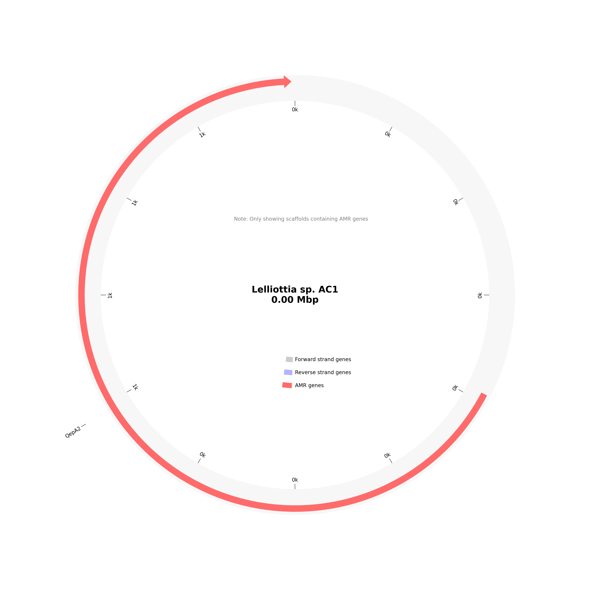

### QepA2
- **Mechanism**: antibiotic efflux
- **Drug Classes**: fluoroquinolone antibiotic
- **AMR Family**: major facilitator superfamily (MFS) antibiotic efflux pump
- **Locations**:
  - gnl|SPADES|DAOGIJFL_7170_2 : position 248-757

## Raoultella planticola
**Strain Statistics:**
- Total genome length: 0.5 kbp
- Total scaffolds: 4
- Scaffolds with AMR genes: 2
- Total genes annotated: 0
- Total AMR genes: 2
- Unique AMR genes: 2
- Distinct AMR mechanisms: 2
- Distinct AMR families: 2
- Distinct drug classes: 7

**Circos Plot:**

### Corynebacterium striatum tetA
- **Mechanism**: antibiotic efflux
- **Drug Classes**: penam; tetracycline antibiotic
- **AMR Family**: major facilitator superfamily (MFS) antibiotic efflux pump
- **Locations**:
  - gnl|SPADES|DAOGIJFL_30284_1 : position 1-258

### Klebsiella pneumoniae OmpK37
- **Mechanism**: reduced permeability to antibiotic
- **Drug Classes**: monobactam; carbapenem; cephalosporin; cephamycin; penam; penem
- **AMR Family**: General Bacterial Porin with reduced permeability to beta-lactams
- **Locations**:
  - gnl|SPADES|DAOGIJFL_28963_1 : position 3-263

## Serratia fonticola
**Strain Statistics:**
- Total genome length: 4825.3 kbp
- Total scaffolds: 251
- Scaffolds with AMR genes: 139
- Total genes annotated: 8929
- Total AMR genes: 569
- Unique AMR genes: 233
- Distinct AMR mechanisms: 11
- Distinct AMR families: 80
- Distinct drug classes: 37

**Circos Plot:**

### AAC(3)-Ic
- **Mechanism**: antibiotic inactivation
- **Drug Classes**: aminoglycoside antibiotic
- **AMR Family**: AAC(3)
- **Locations**:
  - gnl|SPADES|DAOGIJFL_299_4 : position 2650-3075

### AAC(6')-34
- **Mechanism**: antibiotic inactivation
- **Drug Classes**: aminoglycoside antibiotic
- **AMR Family**: AAC(6')
- **Locations**:
  - gnl|SPADES|DAOGIJFL_49_35 : position 39241-39738

### AAC(6')-Ia
- **Mechanism**: antibiotic inactivation
- **Drug Classes**: aminoglycoside antibiotic
- **AMR Family**: AAC(6')
- **Locations**:
  - gnl|SPADES|DAOGIJFL_21_58 : position 62266-62784

### AIM-1
- **Mechanism**: antibiotic inactivation
- **Drug Classes**: cephalosporin; cephamycin; penam
- **AMR Family**: AIM beta-lactamase
- **Locations**:
  - gnl|SPADES|DAOGIJFL_290_4 : position 3269-4261

### APH(6)-Ic
- **Mechanism**: antibiotic inactivation
- **Drug Classes**: aminoglycoside antibiotic
- **AMR Family**: APH(6)
- **Locations**:
  - gnl|SPADES|DAOGIJFL_88_41 : position 35646-36503

### Acinetobacter baumannii AbaF (found in 10 locations)
- **Mechanism**: antibiotic efflux
- **Drug Classes**: phosphonic acid antibiotic
- **AMR Family**: major facilitator superfamily (MFS) antibiotic efflux pump
- **Locations**:
  - gnl|SPADES|DAOGIJFL_128_20 : position 23940-25262
  - gnl|SPADES|DAOGIJFL_128_34 : position 40690-41922
  - gnl|SPADES|DAOGIJFL_160_8 : position 7242-8525
  - gnl|SPADES|DAOGIJFL_215_18 : position 16047-17372
  - gnl|SPADES|DAOGIJFL_238_21 : position 24900-26192
  - gnl|SPADES|DAOGIJFL_335_15 : position 12453-13955
  - gnl|SPADES|DAOGIJFL_540_2 : position 631-1977
  - gnl|SPADES|DAOGIJFL_54_52 : position 51581-52978
  - gnl|SPADES|DAOGIJFL_8422_1 : position 2-652
  - gnl|SPADES|DAOGIJFL_87_55 : position 60756-62039

### Acinetobacter baumannii AbaQ (found in 12 locations)
- **Mechanism**: antibiotic efflux
- **Drug Classes**: fluoroquinolone antibiotic
- **AMR Family**: major facilitator superfamily (MFS) antibiotic efflux pump
- **Locations**:
  - gnl|SPADES|DAOGIJFL_121_31 : position 36119-37387
  - gnl|SPADES|DAOGIJFL_163_28 : position 24485-25840
  - gnl|SPADES|DAOGIJFL_165_26 : position 26249-27607
  - gnl|SPADES|DAOGIJFL_207_4 : position 4853-6184
  - gnl|SPADES|DAOGIJFL_340_10 : position 10121-11419
  - gnl|SPADES|DAOGIJFL_47_49 : position 51925-53217
  - gnl|SPADES|DAOGIJFL_63_5 : position 3998-5368
  - gnl|SPADES|DAOGIJFL_89_28 : position 33277-34572
  - gnl|SPADES|DAOGIJFL_89_32 : position 38187-39533
  - gnl|SPADES|DAOGIJFL_94_17 : position 17317-18543
  - gnl|SPADES|DAOGIJFL_94_24 : position 26183-27460
  - gnl|SPADES|DAOGIJFL_94_26 : position 28712-30058

### Acinetobacter baumannii AmvA (found in 2 locations)
- **Mechanism**: antibiotic efflux
- **Drug Classes**: macrolide antibiotic; disinfecting agents and antiseptics
- **AMR Family**: major facilitator superfamily (MFS) antibiotic efflux pump
- **Locations**:
  - gnl|SPADES|DAOGIJFL_202_11 : position 7537-9033
  - gnl|SPADES|DAOGIJFL_244_13 : position 8480-9778

### Agrobacterium fabrum chloramphenicol acetyltransferase
- **Mechanism**: antibiotic inactivation
- **Drug Classes**: phenicol antibiotic
- **AMR Family**: chloramphenicol acetyltransferase (CAT)
- **Locations**:
  - gnl|SPADES|DAOGIJFL_37_20 : position 24811-25440

### ArnT
- **Mechanism**: antibiotic target alteration
- **Drug Classes**: peptide antibiotic
- **AMR Family**: pmr phosphoethanolamine transferase
- **Locations**:
  - gnl|SPADES|DAOGIJFL_136_10: position 8329-9993

### BahA
- **Mechanism**: antibiotic inactivation
- **Drug Classes**: peptide antibiotic
- **AMR Family**: Bah amidohydrolase
- **Locations**:
  - gnl|SPADES|DAOGIJFL_56_71 : position 76490-77503

### Bifidobacterium adolescentis rpoB mutants conferring resistance to rifampicin (found in 2 locations)
- **Mechanism**: antibiotic target alteration; antibiotic target replacement
- **Drug Classes**: rifamycin antibiotic
- **AMR Family**: rifamycin-resistant beta-subunit of RNA polymerase (rpoB)
- **Locations**:
  - gnl|SPADES|DAOGIJFL_10455_1 : position 2-565
  - gnl|SPADES|DAOGIJFL_5049_1 : position 2-808

### Bifidobacterium bifidum ileS conferring resistance to mupirocin
- **Mechanism**: antibiotic target alteration
- **Drug Classes**: mupirocin-like antibiotic
- **AMR Family**: antibiotic-resistant isoleucyl-tRNA synthetase (ileS)
- **Locations**:
  - gnl|SPADES|DAOGIJFL_273_9 : position 7788-10370

### CAR-1
- **Mechanism**: antibiotic inactivation
- **Drug Classes**: carbapenem
- **AMR Family**: CAR beta-lactamase
- **Locations**:
  - gnl|SPADES|DAOGIJFL_175_34 : position 32694-33500

### CMY-95
- **Mechanism**: antibiotic inactivation
- **Drug Classes**: cephamycin
- **AMR Family**: CMY beta-lactamase
- **Locations**:
  - gnl|SPADES|DAOGIJFL_63_3 : position 1865-3007

### CRP (found in 3 locations)
- **Mechanism**: antibiotic efflux
- **Drug Classes**: macrolide antibiotic; fluoroquinolone antibiotic; penam
- **AMR Family**: resistance-nodulation-cell division (RND) antibiotic efflux pump
- **Locations**:
  - gnl|SPADES|DAOGIJFL_125_48 : position 48520-49284
  - gnl|SPADES|DAOGIJFL_170_8 : position 5716-6417
  - gnl|SPADES|DAOGIJFL_92_28: position 29372-30004

### Clostridioides difficile gyrA conferring resistance to fluoroquinolones
- **Mechanism**: antibiotic target alteration
- **Drug Classes**: fluoroquinolone antibiotic
- **AMR Family**: fluoroquinolone resistant gyrA
- **Locations**:
  - gnl|SPADES|DAOGIJFL_250_1 : position 2-2554

### Clostridioides difficile gyrB conferring resistance to fluoroquinolones
- **Mechanism**: antibiotic target alteration
- **Drug Classes**: fluoroquinolone antibiotic
- **AMR Family**: fluoroquinolone resistant gyrB
- **Locations**:
  - gnl|SPADES|DAOGIJFL_121_44 : position 49798-52137

### Clostridium sporogenes cplR
- **Mechanism**: antibiotic target protection
- **Drug Classes**: lincosamide antibiotic; pleuromutilin antibiotic
- **AMR Family**: Miscellaneous ABC-F subfamily ATP-binding cassette ribosomal protection proteins
- **Locations**:
  - gnl|SPADES|DAOGIJFL_347_3 : position 2603-3646

### Enterobacter cloacae acrA
- **Mechanism**: antibiotic efflux
- **Drug Classes**: fluoroquinolone antibiotic; cephalosporin; glycylcycline; penam; tetracycline antibiotic; rifamycin antibiotic; phenicol antibiotic; disinfecting agents and antiseptics
- **AMR Family**: resistance-nodulation-cell division (RND) antibiotic efflux pump
- **Locations**:
  - gnl|SPADES|DAOGIJFL_38_30 : position 29049-30167

### Enterococcus faecalis cls with mutation conferring resistance to daptomycin
- **Mechanism**: antibiotic target alteration
- **Drug Classes**: peptide antibiotic
- **AMR Family**: daptomycin resistant cls
- **Locations**:
  - gnl|SPADES|DAOGIJFL_202_13 : position 10227-11687

### Erm(37)
- **Mechanism**: antibiotic target alteration
- **Drug Classes**: macrolide antibiotic; lincosamide antibiotic; streptogramin antibiotic; streptogramin A antibiotic; streptogramin B antibiotic
- **AMR Family**: Erm 23S ribosomal RNA methyltransferase
- **Locations**:
  - gnl|SPADES|DAOGIJFL_121_7 : position 6188-6970

### ErmC
- **Mechanism**: antibiotic target alteration
- **Drug Classes**: macrolide antibiotic; lincosamide antibiotic; streptogramin antibiotic; streptogramin A antibiotic; streptogramin B antibiotic
- **AMR Family**: Erm 23S ribosomal RNA methyltransferase
- **Locations**:
  - gnl|SPADES|DAOGIJFL_95_42 : position 52869-53687

### Escherichia coli AcrAB-TolC with AcrR mutation conferring resistance to ciprofloxacin, tetracycline, and ceftazidime (found in 2 locations)
- **Mechanism**: antibiotic target alteration; antibiotic efflux
- **Drug Classes**: fluoroquinolone antibiotic; cephalosporin; glycylcycline; penam; tetracycline antibiotic; rifamycin antibiotic; phenicol antibiotic; disinfecting agents and antiseptics
- **AMR Family**: resistance-nodulation-cell division (RND) antibiotic efflux pump
- **Locations**:
  - gnl|SPADES|DAOGIJFL_199_7 : position 8450-9067
  - gnl|SPADES|DAOGIJFL_218_9 : position 9394-10041

### Escherichia coli AcrAB-TolC with MarR mutations conferring resistance to ciprofloxacin and tetracycline
- **Mechanism**: antibiotic target alteration; antibiotic efflux
- **Drug Classes**: fluoroquinolone antibiotic; cephalosporin; glycylcycline; penam; tetracycline antibiotic; rifamycin antibiotic; phenicol antibiotic; disinfecting agents and antiseptics
- **AMR Family**: resistance-nodulation-cell division (RND) antibiotic efflux pump
- **Locations**:
  - gnl|SPADES|DAOGIJFL_88_27 : position 25772-26206

### Escherichia coli EF-Tu mutants conferring resistance to Pulvomycin
- **Mechanism**: antibiotic target alteration
- **Drug Classes**: elfamycin antibiotic
- **AMR Family**: elfamycin resistant EF-Tu
- **Locations**:
  - gnl|SPADES|DAOGIJFL_195_7 : position 6261-8102

### Escherichia coli EF-Tu mutants conferring resistance to kirromycin
- **Mechanism**: antibiotic target alteration
- **Drug Classes**: elfamycin antibiotic
- **AMR Family**: elfamycin resistant EF-Tu
- **Locations**:
  - gnl|SPADES|DAOGIJFL_2937_1 : position 2-1495

### Escherichia coli GlpT with mutation conferring resistance to fosfomycin
- **Mechanism**: antibiotic target alteration
- **Drug Classes**: phosphonic acid antibiotic
- **AMR Family**: antibiotic-resistant GlpT
- **Locations**:
  - gnl|SPADES|DAOGIJFL_47_72 : position 76253-77605

### Escherichia coli acrA
- **Mechanism**: antibiotic efflux
- **Drug Classes**: fluoroquinolone antibiotic; cephalosporin; glycylcycline; penam; tetracycline antibiotic; rifamycin antibiotic; phenicol antibiotic; disinfecting agents and antiseptics
- **AMR Family**: resistance-nodulation-cell division (RND) antibiotic efflux pump
- **Locations**:
  - gnl|SPADES|DAOGIJFL_218_10 : position 10184-11365

### Escherichia coli fabI mutations conferring resistance to isoniazid and triclosan (found in 2 locations)
- **Mechanism**: antibiotic target alteration
- **Drug Classes**: disinfecting agents and antiseptics; isoniazid-like antibiotic
- **AMR Family**: antibiotic resistant fabI
- **Locations**:
  - gnl|SPADES|DAOGIJFL_53_60 : position 63541-64296
  - gnl|SPADES|DAOGIJFL_63_16 : position 13683-14465

### Escherichia coli mdfA
- **Mechanism**: antibiotic efflux
- **Drug Classes**: tetracycline antibiotic; phenicol antibiotic; disinfecting agents and antiseptics
- **AMR Family**: major facilitator superfamily (MFS) antibiotic efflux pump
- **Locations**:
  - gnl|SPADES|DAOGIJFL_195_9 : position 9906-11261

### Escherichia coli soxS with mutation conferring antibiotic resistance (found in 10 locations)
- **Mechanism**: antibiotic target alteration; antibiotic efflux; reduced permeability to antibiotic
- **Drug Classes**: fluoroquinolone antibiotic; monobactam; carbapenem; cephalosporin; glycylcycline; cephamycin; penam; tetracycline antibiotic; rifamycin antibiotic; phenicol antibiotic; penem; disinfecting agents and antiseptics
- **AMR Family**: ATP-binding cassette (ABC) antibiotic efflux pump; major facilitator superfamily (MFS) antibiotic efflux pump; resistance-nodulation-cell division (RND) antibiotic efflux pump; General Bacterial Porin with reduced permeability to beta-lactams
- **Locations**:
  - gnl|SPADES|DAOGIJFL_153_18 : position 22913-23887
  - gnl|SPADES|DAOGIJFL_195_19 : position 20966-22144
  - gnl|SPADES|DAOGIJFL_200_9 : position 11091-11981
  - gnl|SPADES|DAOGIJFL_21_12 : position 12338-13222
  - gnl|SPADES|DAOGIJFL_238_10 : position 11464-12333
  - gnl|SPADES|DAOGIJFL_26_90 : position 101007-101450
  - gnl|SPADES|DAOGIJFL_281_10 : position 10633-11433
  - gnl|SPADES|DAOGIJFL_46_43 : position 38817-39644
  - gnl|SPADES|DAOGIJFL_47_29 : position 29554-30441
  - gnl|SPADES|DAOGIJFL_88_60 : position 58042-58959

### EstT
- **Mechanism**: antibiotic inactivation
- **Drug Classes**: macrolide antibiotic
- **AMR Family**: macrolide esterase
- **Locations**:
  - gnl|SPADES|DAOGIJFL_170_28 : position 22695-23564

### FONA-6
- **Mechanism**: antibiotic inactivation
- **Drug Classes**: penam
- **AMR Family**: FONA beta-lactamase
- **Locations**:
  - gnl|SPADES|DAOGIJFL_153_13: position 16005-16892

### FosA8
- **Mechanism**: antibiotic inactivation
- **Drug Classes**: phosphonic acid antibiotic
- **AMR Family**: fosfomycin thiol transferase
- **Locations**:
  - gnl|SPADES|DAOGIJFL_175_6: position 4582-4989

### FosB3
- **Mechanism**: antibiotic inactivation
- **Drug Classes**: phosphonic acid antibiotic
- **AMR Family**: fosfomycin thiol transferase
- **Locations**:
  - gnl|SPADES|DAOGIJFL_56_62 : position 66893-67264

### FosM2
- **Mechanism**: antibiotic inactivation
- **Drug Classes**: phosphonic acid antibiotic
- **AMR Family**: fosfomycin thiol transferase
- **Locations**:
  - gnl|SPADES|DAOGIJFL_88_15 : position 13934-14341

### GMB-1
- **Mechanism**: antibiotic inactivation
- **Drug Classes**: carbapenem
- **AMR Family**: GMB beta-lactamase
- **Locations**:
  - gnl|SPADES|DAOGIJFL_23_78 : position 81983-82867

### GOB-5
- **Mechanism**: antibiotic inactivation
- **Drug Classes**: carbapenem; cephalosporin; penam
- **AMR Family**: GOB beta-lactamase
- **Locations**:
  - gnl|SPADES|DAOGIJFL_338_3 : position 2416-3063

### H-NS
- **Mechanism**: antibiotic efflux
- **Drug Classes**: macrolide antibiotic; fluoroquinolone antibiotic; cephalosporin; cephamycin; penam; tetracycline antibiotic
- **AMR Family**: major facilitator superfamily (MFS) antibiotic efflux pump; resistance-nodulation-cell division (RND) antibiotic efflux pump
- **Locations**:
  - gnl|SPADES|DAOGIJFL_202_25 : position 25626-26033

### Haemophilus influenzae PBP3 conferring resistance to beta-lactam antibiotics (found in 2 locations)
- **Mechanism**: antibiotic target alteration
- **Drug Classes**: cephalosporin; cephamycin; penam
- **AMR Family**: Penicillin-binding protein mutations conferring resistance to beta-lactam antibiotics
- **Locations**:
  - gnl|SPADES|DAOGIJFL_125_7 : position 4560-6278
  - gnl|SPADES|DAOGIJFL_95_10 : position 10806-12572

### Helicobacter pylori frxA mutation conferring resistance to metronidazole
- **Mechanism**: antibiotic target alteration
- **Drug Classes**: nitroimidazole antibiotic
- **AMR Family**: Antibiotic resistant Helicobacter pylori nitroreductase
- **Locations**:
  - gnl|SPADES|DAOGIJFL_153_3 : position 2594-3199

### Helicobacter pylori pbp1 mutants conferring resistance to amoxicillin (found in 2 locations)
- **Mechanism**: antibiotic target alteration
- **Drug Classes**: cephalosporin; cephamycin; penam
- **AMR Family**: Penicillin-binding protein mutations conferring resistance to beta-lactam antibiotics
- **Locations**:
  - gnl|SPADES|DAOGIJFL_275_17 : position 20330-22693
  - gnl|SPADES|DAOGIJFL_53_40 : position 38906-41407

### Helicobacter pylori pbp2 mutants conferring resistance to amoxicillin
- **Mechanism**: antibiotic target alteration
- **Drug Classes**: cephalosporin; cephamycin; penam
- **AMR Family**: Penicillin-binding protein mutations conferring resistance to beta-lactam antibiotics
- **Locations**:
  - gnl|SPADES|DAOGIJFL_273_15 : position 13645-15540

### Helicobacter pylori rpoB mutation conferring resistance to rifampicin
- **Mechanism**: antibiotic target alteration; antibiotic target replacement
- **Drug Classes**: fluoroquinolone antibiotic; rifamycin antibiotic
- **AMR Family**: rifamycin-resistant beta-subunit of RNA polymerase (rpoB)
- **Locations**:
  - gnl|SPADES|DAOGIJFL_8865_1 : position 2-640

### Klebsiella aerogenes Omp36
- **Mechanism**: reduced permeability to antibiotic
- **Drug Classes**: monobactam; carbapenem; cephalosporin; cephamycin; penam; penem
- **AMR Family**: General Bacterial Porin with reduced permeability to beta-lactams
- **Locations**:
  - gnl|SPADES|DAOGIJFL_56_43 : position 48300-49427

### Klebsiella pneumoniae KpnE
- **Mechanism**: antibiotic efflux
- **Drug Classes**: macrolide antibiotic; aminoglycoside antibiotic; cephalosporin; tetracycline antibiotic; peptide antibiotic; rifamycin antibiotic; disinfecting agents and antiseptics
- **AMR Family**: small multidrug resistance (SMR) antibiotic efflux pump
- **Locations**:
  - gnl|SPADES|DAOGIJFL_229_30 : position 28147-28515

### Klebsiella pneumoniae KpnF
- **Mechanism**: antibiotic efflux
- **Drug Classes**: macrolide antibiotic; aminoglycoside antibiotic; cephalosporin; tetracycline antibiotic; peptide antibiotic; rifamycin antibiotic; disinfecting agents and antiseptics
- **AMR Family**: small multidrug resistance (SMR) antibiotic efflux pump
- **Locations**:
  - gnl|SPADES|DAOGIJFL_229_29: position 27831-28160

### Klebsiella pneumoniae KpnH (found in 2 locations)
- **Mechanism**: antibiotic efflux
- **Drug Classes**: macrolide antibiotic; fluoroquinolone antibiotic; aminoglycoside antibiotic; carbapenem; cephalosporin; penam; peptide antibiotic; penem
- **AMR Family**: major facilitator superfamily (MFS) antibiotic efflux pump
- **Locations**:
  - gnl|SPADES|DAOGIJFL_300_3 : position 2366-3892
  - gnl|SPADES|DAOGIJFL_58_67: position 73565-75100

### Klebsiella pneumoniae OmpK37 (found in 7 locations)
- **Mechanism**: reduced permeability to antibiotic
- **Drug Classes**: monobactam; carbapenem; cephalosporin; cephamycin; penam; penem
- **AMR Family**: General Bacterial Porin with reduced permeability to beta-lactams
- **Locations**:
  - gnl|SPADES|DAOGIJFL_170_12 : position 8676-9722
  - gnl|SPADES|DAOGIJFL_175_18 : position 13851-14933
  - gnl|SPADES|DAOGIJFL_250_6 : position 11036-12151
  - gnl|SPADES|DAOGIJFL_26_24 : position 22524-23618
  - gnl|SPADES|DAOGIJFL_27289_1 : position 3-272
  - gnl|SPADES|DAOGIJFL_338_1 : position 3-917
  - gnl|SPADES|DAOGIJFL_87_16 : position 19386-20477

### LlmA 23S ribosomal RNA methyltransferase
- **Mechanism**: antibiotic target alteration
- **Drug Classes**: lincosamide antibiotic
- **AMR Family**: Llm 23S ribosomal RNA methyltransferase
- **Locations**:
  - gnl|SPADES|DAOGIJFL_177_10 : position 8918-10108

### LptD
- **Mechanism**: antibiotic efflux
- **Drug Classes**: carbapenem; peptide antibiotic; aminocoumarin antibiotic; rifamycin antibiotic
- **AMR Family**: ATP-binding cassette (ABC) antibiotic efflux pump
- **Locations**:
  - gnl|SPADES|DAOGIJFL_95_39 : position 48162-50528

### MOX-3
- **Mechanism**: antibiotic inactivation
- **Drug Classes**: cephalosporin; cephamycin; penam
- **AMR Family**: MOX beta-lactamase
- **Locations**:
  - gnl|SPADES|DAOGIJFL_56_69 : position 74244-75383

### MSI-1
- **Mechanism**: antibiotic inactivation
- **Drug Classes**: carbapenem
- **AMR Family**: MSI beta-lactamase
- **Locations**:
  - gnl|SPADES|DAOGIJFL_68_12 : position 11196-11951

### MdtK
- **Mechanism**: antibiotic efflux
- **Drug Classes**: fluoroquinolone antibiotic
- **AMR Family**: multidrug and toxic compound extrusion (MATE) transporter
- **Locations**:
  - gnl|SPADES|DAOGIJFL_205_12 : position 11364-12821

### MexF
- **Mechanism**: antibiotic efflux
- **Drug Classes**: fluoroquinolone antibiotic; diaminopyrimidine antibiotic; phenicol antibiotic
- **AMR Family**: resistance-nodulation-cell division (RND) antibiotic efflux pump
- **Locations**:
  - gnl|SPADES|DAOGIJFL_38_32 : position 31727-33280

### MexJ
- **Mechanism**: antibiotic efflux
- **Drug Classes**: macrolide antibiotic; tetracycline antibiotic; disinfecting agents and antiseptics
- **AMR Family**: resistance-nodulation-cell division (RND) antibiotic efflux pump
- **Locations**:
  - gnl|SPADES|DAOGIJFL_23_45 : position 46462-47547

### MexK
- **Mechanism**: antibiotic efflux
- **Drug Classes**: macrolide antibiotic; tetracycline antibiotic; disinfecting agents and antiseptics
- **AMR Family**: resistance-nodulation-cell division (RND) antibiotic efflux pump
- **Locations**:
  - gnl|SPADES|DAOGIJFL_23_44 : position 43382-46462

### MexL
- **Mechanism**: antibiotic efflux
- **Drug Classes**: macrolide antibiotic; tetracycline antibiotic; disinfecting agents and antiseptics
- **AMR Family**: resistance-nodulation-cell division (RND) antibiotic efflux pump
- **Locations**:
  - gnl|SPADES|DAOGIJFL_56_34 : position 39639-40235

### MexS (found in 8 locations)
- **Mechanism**: antibiotic efflux
- **Drug Classes**: fluoroquinolone antibiotic; diaminopyrimidine antibiotic; phenicol antibiotic
- **AMR Family**: resistance-nodulation-cell division (RND) antibiotic efflux pump
- **Locations**:
  - gnl|SPADES|DAOGIJFL_102_2 : position 1067-2191
  - gnl|SPADES|DAOGIJFL_102_33 : position 36318-37385
  - gnl|SPADES|DAOGIJFL_103_50 : position 45991-46980
  - gnl|SPADES|DAOGIJFL_38_87 : position 87632-88657
  - gnl|SPADES|DAOGIJFL_46_30 : position 26452-27459
  - gnl|SPADES|DAOGIJFL_46_47 : position 42231-43262
  - gnl|SPADES|DAOGIJFL_49_3 : position 1220-2269
  - gnl|SPADES|DAOGIJFL_54_53 : position 53083-54096

### MexT
- **Mechanism**: antibiotic efflux
- **Drug Classes**: fluoroquinolone antibiotic; diaminopyrimidine antibiotic; phenicol antibiotic
- **AMR Family**: resistance-nodulation-cell division (RND) antibiotic efflux pump
- **Locations**:
  - gnl|SPADES|DAOGIJFL_160_17 : position 15491-16384

### MexV
- **Mechanism**: antibiotic efflux
- **Drug Classes**: macrolide antibiotic; fluoroquinolone antibiotic; tetracycline antibiotic; phenicol antibiotic; disinfecting agents and antiseptics
- **AMR Family**: resistance-nodulation-cell division (RND) antibiotic efflux pump
- **Locations**:
  - gnl|SPADES|DAOGIJFL_37_7 : position 7621-9063

### MexW
- **Mechanism**: antibiotic efflux
- **Drug Classes**: macrolide antibiotic; fluoroquinolone antibiotic; tetracycline antibiotic; phenicol antibiotic; disinfecting agents and antiseptics
- **AMR Family**: resistance-nodulation-cell division (RND) antibiotic efflux pump
- **Locations**:
  - gnl|SPADES|DAOGIJFL_37_8 : position 9060-12203

### Mycobacterium tuberculosis gidB mutation conferring resistance to streptomycin
- **Mechanism**: antibiotic target alteration
- **Drug Classes**: aminoglycoside antibiotic
- **AMR Family**: antibiotic resistant gidB
- **Locations**:
  - gnl|SPADES|DAOGIJFL_890_2 : position 1596-2216

### Mycobacterium tuberculosis inhA mutations conferring resistance to isoniazid (found in 2 locations)
- **Mechanism**: antibiotic target alteration
- **Drug Classes**: isoniazid-like antibiotic
- **AMR Family**: isoniazid resistant inhA
- **Locations**:
  - gnl|SPADES|DAOGIJFL_153_10 : position 12586-13332
  - gnl|SPADES|DAOGIJFL_221_25 : position 28997-29755

### Mycobacterium tuberculosis kasA mutant conferring resistance to isoniazid (found in 4 locations)
- **Mechanism**: antibiotic target alteration
- **Drug Classes**: isoniazid-like antibiotic
- **AMR Family**: antibiotic resistant kasA
- **Locations**:
  - gnl|SPADES|DAOGIJFL_264_4 : position 2996-4270
  - gnl|SPADES|DAOGIJFL_30_1 : position 3-1220
  - gnl|SPADES|DAOGIJFL_353_14 : position 12468-15026
  - gnl|SPADES|DAOGIJFL_87_40 : position 47654-48823

### Mycobacterium tuberculosis ndh with mutation conferring resistance to isoniazid
- **Mechanism**: antibiotic target alteration
- **Drug Classes**: isoniazid-like antibiotic
- **AMR Family**: antibiotic resistant ndh
- **Locations**:
  - gnl|SPADES|DAOGIJFL_30_17 : position 14187-15515

### Mycobacterium tuberculosis pncA mutations conferring resistance to pyrazinamide
- **Mechanism**: antibiotic target alteration
- **Drug Classes**: pyrazine antibiotic
- **AMR Family**: Pyrazinamide resistant pncA
- **Locations**:
  - gnl|SPADES|DAOGIJFL_372_11 : position 10819-11451

### Mycobacterium tuberculosis thyA with mutation conferring resistance to para-aminosalicylic acid
- **Mechanism**: antibiotic target alteration
- **Drug Classes**: salicylic acid antibiotic
- **AMR Family**: aminosalicylate resistant thymidylate synthase
- **Locations**:
  - gnl|SPADES|DAOGIJFL_23_93 : position 99832-100626

### Mycolicibacterium smegmatis ndh with mutation conferring resistance to isoniazid
- **Mechanism**: antibiotic target alteration
- **Drug Classes**: isoniazid-like antibiotic
- **AMR Family**: antibiotic resistant ndh
- **Locations**:
  - gnl|SPADES|DAOGIJFL_23_5 : position 4126-5325

### Neisseria gonorrhoeae pilQ gene conferring resistance to beta-lactam
- **Mechanism**: antibiotic target alteration
- **Drug Classes**: cephalosporin; cephamycin; penam
- **AMR Family**: Penicillin-binding protein mutations conferring resistance to beta-lactam antibiotics
- **Locations**:
  - gnl|SPADES|DAOGIJFL_400_1 : position 501-1748

### NmcR (found in 12 locations)
- **Mechanism**: antibiotic inactivation
- **Drug Classes**: carbapenem; cephalosporin; cephamycin; penam
- **AMR Family**: NmcA beta-lactamase
- **Locations**:
  - gnl|SPADES|DAOGIJFL_102_3 : position 2231-3133
  - gnl|SPADES|DAOGIJFL_128_27 : position 32227-33108
  - gnl|SPADES|DAOGIJFL_128_37 : position 44276-45103
  - gnl|SPADES|DAOGIJFL_170_35 : position 29056-29937
  - gnl|SPADES|DAOGIJFL_199_17 : position 19095-20021
  - gnl|SPADES|DAOGIJFL_23_9 : position 7723-8616
  - gnl|SPADES|DAOGIJFL_26_98 : position 107522-108409
  - gnl|SPADES|DAOGIJFL_275_6 : position 4905-5822
  - gnl|SPADES|DAOGIJFL_292_2 : position 2888-3862
  - gnl|SPADES|DAOGIJFL_37_86 : position 96198-97136
  - gnl|SPADES|DAOGIJFL_38_62 : position 62335-63261
  - gnl|SPADES|DAOGIJFL_46_39 : position 33534-34403

### OmpA (found in 4 locations)
- **Mechanism**: reduced permeability to antibiotic
- **Drug Classes**: peptide antibiotic
- **AMR Family**: General Bacterial Porin with reduced permeability to peptide antibiotics
- **Locations**:
  - gnl|SPADES|DAOGIJFL_121_24 : position 27248-27907
  - gnl|SPADES|DAOGIJFL_125_6 : position 3435-4553
  - gnl|SPADES|DAOGIJFL_238_2 : position 1578-2075
  - gnl|SPADES|DAOGIJFL_330_16 : position 17051-17509

### OpmB
- **Mechanism**: antibiotic efflux
- **Drug Classes**: macrolide antibiotic; monobactam; tetracycline antibiotic; aminocoumarin antibiotic
- **AMR Family**: resistance-nodulation-cell division (RND) antibiotic efflux pump
- **Locations**:
  - gnl|SPADES|DAOGIJFL_113_13 : position 19015-20421

### OprJ
- **Mechanism**: antibiotic efflux
- **Drug Classes**: macrolide antibiotic; fluoroquinolone antibiotic; aminoglycoside antibiotic; cephalosporin; penam; tetracycline antibiotic; aminocoumarin antibiotic; diaminopyrimidine antibiotic; phenicol antibiotic
- **AMR Family**: resistance-nodulation-cell division (RND) antibiotic efflux pump
- **Locations**:
  - gnl|SPADES|DAOGIJFL_351_5 : position 4902-6383

### ParR (found in 3 locations)
- **Mechanism**: antibiotic efflux; reduced permeability to antibiotic
- **Drug Classes**: macrolide antibiotic; fluoroquinolone antibiotic; monobactam; aminoglycoside antibiotic; carbapenem; cephalosporin; cephamycin; penam; tetracycline antibiotic; phenicol antibiotic; penem; disinfecting agents and antiseptics
- **AMR Family**: resistance-nodulation-cell division (RND) antibiotic efflux pump; Outer Membrane Porin (Opr)
- **Locations**:
  - gnl|SPADES|DAOGIJFL_368_10 : position 7834-8562
  - gnl|SPADES|DAOGIJFL_49_76 : position 87179-87898
  - gnl|SPADES|DAOGIJFL_54_31 : position 30406-31113

### ParS (found in 3 locations)
- **Mechanism**: antibiotic efflux; reduced permeability to antibiotic
- **Drug Classes**: macrolide antibiotic; fluoroquinolone antibiotic; monobactam; aminoglycoside antibiotic; carbapenem; cephalosporin; cephamycin; penam; tetracycline antibiotic; phenicol antibiotic; penem; disinfecting agents and antiseptics
- **AMR Family**: resistance-nodulation-cell division (RND) antibiotic efflux pump; Outer Membrane Porin (Opr)
- **Locations**:
  - gnl|SPADES|DAOGIJFL_368_9 : position 6533-7837
  - gnl|SPADES|DAOGIJFL_49_77 : position 87895-88797
  - gnl|SPADES|DAOGIJFL_58_48 : position 49977-51569

### PmrF (found in 4 locations)
- **Mechanism**: antibiotic target alteration
- **Drug Classes**: peptide antibiotic
- **AMR Family**: pmr phosphoethanolamine transferase
- **Locations**:
  - gnl|SPADES|DAOGIJFL_136_7 : position 4462-5442
  - gnl|SPADES|DAOGIJFL_278_2 : position 1280-2191
  - gnl|SPADES|DAOGIJFL_50_87 : position 77786-78775
  - gnl|SPADES|DAOGIJFL_766_2 : position 822-1754

### Pseudomonas aeruginosa CpxR (found in 5 locations)
- **Mechanism**: antibiotic efflux
- **Drug Classes**: macrolide antibiotic; fluoroquinolone antibiotic; monobactam; aminoglycoside antibiotic; carbapenem; cephalosporin; cephamycin; penam; tetracycline antibiotic; peptide antibiotic; aminocoumarin antibiotic; diaminopyrimidine antibiotic; sulfonamide antibiotic; phenicol antibiotic; penem
- **AMR Family**: resistance-nodulation-cell division (RND) antibiotic efflux pump
- **Locations**:
  - gnl|SPADES|DAOGIJFL_299_14 : position 11152-11832
  - gnl|SPADES|DAOGIJFL_37_24 : position 28602-29276
  - gnl|SPADES|DAOGIJFL_436_5 : position 6278-6907
  - gnl|SPADES|DAOGIJFL_50_23 : position 22473-23171
  - gnl|SPADES|DAOGIJFL_58_49 : position 51587-52273

### Pseudomonas aeruginosa ampR with mutation conferring resistance to aztreonam (found in 3 locations)
- **Mechanism**: antibiotic target alteration; antibiotic inactivation
- **Drug Classes**: monobactam; carbapenem; cephalosporin
- **AMR Family**: PDC beta-lactamase; ampR transcriptional regulator with mutation conferring resistance to monobactam antibiotics
- **Locations**:
  - gnl|SPADES|DAOGIJFL_138_33 : position 36454-37395
  - gnl|SPADES|DAOGIJFL_153_12 : position 14997-15872
  - gnl|SPADES|DAOGIJFL_98_56 : position 53957-54847

### QepA2
- **Mechanism**: antibiotic efflux
- **Drug Classes**: fluoroquinolone antibiotic
- **AMR Family**: major facilitator superfamily (MFS) antibiotic efflux pump
- **Locations**:
  - gnl|SPADES|DAOGIJFL_200_8 : position 9642-11036

### QepA4
- **Mechanism**: antibiotic efflux
- **Drug Classes**: fluoroquinolone antibiotic
- **AMR Family**: major facilitator superfamily (MFS) antibiotic efflux pump
- **Locations**:
  - gnl|SPADES|DAOGIJFL_56_60 : position 64433-65719

### QnrB26
- **Mechanism**: antibiotic target protection
- **Drug Classes**: fluoroquinolone antibiotic
- **AMR Family**: quinolone resistance protein (qnr)
- **Locations**:
  - gnl|SPADES|DAOGIJFL_205_5 : position 5507-6160

### RanA (found in 20 locations)
- **Mechanism**: antibiotic efflux
- **Drug Classes**: aminoglycoside antibiotic
- **AMR Family**: ATP-binding cassette (ABC) antibiotic efflux pump
- **Locations**:
  - gnl|SPADES|DAOGIJFL_104_41 : position 40455-41588
  - gnl|SPADES|DAOGIJFL_125_36 : position 34223-35359
  - gnl|SPADES|DAOGIJFL_138_30 : position 34101-34898
  - gnl|SPADES|DAOGIJFL_155_19 : position 16191-17180
  - gnl|SPADES|DAOGIJFL_160_23 : position 22084-22896
  - gnl|SPADES|DAOGIJFL_201_29 : position 23970-24785
  - gnl|SPADES|DAOGIJFL_202_15 : position 12128-13126
  - gnl|SPADES|DAOGIJFL_202_16 : position 13123-14115
  - gnl|SPADES|DAOGIJFL_207_2 : position 127-1185
  - gnl|SPADES|DAOGIJFL_30_30 : position 30458-31564
  - gnl|SPADES|DAOGIJFL_322_2 : position 1127-2722
  - gnl|SPADES|DAOGIJFL_37_43 : position 46698-47471
  - gnl|SPADES|DAOGIJFL_37_69 : position 76257-77384
  - gnl|SPADES|DAOGIJFL_42_65 : position 49190-50251
  - gnl|SPADES|DAOGIJFL_455_4 : position 3977-5854
  - gnl|SPADES|DAOGIJFL_47_36 : position 37160-38233
  - gnl|SPADES|DAOGIJFL_53_76 : position 81366-82436
  - gnl|SPADES|DAOGIJFL_58_60 : position 64875-66074
  - gnl|SPADES|DAOGIJFL_87_15 : position 17826-18611
  - gnl|SPADES|DAOGIJFL_92_48 : position 47982-48749

### RanB (found in 2 locations)
- **Mechanism**: antibiotic efflux
- **Drug Classes**: aminoglycoside antibiotic
- **AMR Family**: ATP-binding cassette (ABC) antibiotic efflux pump
- **Locations**:
  - gnl|SPADES|DAOGIJFL_138_29 : position 32959-34104
  - gnl|SPADES|DAOGIJFL_201_30 : position 24790-25572

### Rhodococcus fascians cmr
- **Mechanism**: antibiotic efflux
- **Drug Classes**: phenicol antibiotic
- **AMR Family**: major facilitator superfamily (MFS) antibiotic efflux pump
- **Locations**:
  - gnl|SPADES|DAOGIJFL_88_65 : position 63084-64268

### RlmA(II)
- **Mechanism**: antibiotic target alteration
- **Drug Classes**: macrolide antibiotic; lincosamide antibiotic
- **AMR Family**: non-erm 23S ribosomal RNA methyltransferase (G748)
- **Locations**:
  - gnl|SPADES|DAOGIJFL_696_2 : position 967-1806

### SAT-3
- **Mechanism**: antibiotic inactivation
- **Drug Classes**: nucleoside antibiotic
- **AMR Family**: streptothricin acetyltransferase (SAT)
- **Locations**:
  - gnl|SPADES|DAOGIJFL_38_49 : position 48791-49333

### SRT-2
- **Mechanism**: antibiotic inactivation
- **Drug Classes**: cephalosporin
- **AMR Family**: SRT beta-lactamase
- **Locations**:
  - gnl|SPADES|DAOGIJFL_99_36 : position 37988-39523

### SatA (found in 2 locations)
- **Mechanism**: antibiotic inactivation
- **Drug Classes**: nucleoside antibiotic
- **AMR Family**: streptothricin acetyltransferase (SAT)
- **Locations**:
  - gnl|SPADES|DAOGIJFL_121_20 : position 22566-23012
  - gnl|SPADES|DAOGIJFL_38_80 : position 80512-80955

### Staphylococcus aureus FosB
- **Mechanism**: antibiotic inactivation
- **Drug Classes**: phosphonic acid antibiotic
- **AMR Family**: fosfomycin thiol transferase
- **Locations**:
  - gnl|SPADES|DAOGIJFL_250_7 : position 12307-12723

### Staphylococcus aureus GlpT with mutation conferring resistance to fosfomycin
- **Mechanism**: antibiotic target alteration
- **Drug Classes**: phosphonic acid antibiotic
- **AMR Family**: antibiotic-resistant GlpT
- **Locations**:
  - gnl|SPADES|DAOGIJFL_299_19 : position 18085-19467

### Staphylococcus aureus UhpT with mutation conferring resistance to fosfomycin
- **Mechanism**: antibiotic target alteration
- **Drug Classes**: phosphonic acid antibiotic
- **AMR Family**: antibiotic-resistant UhpT
- **Locations**:
  - gnl|SPADES|DAOGIJFL_250_12 : position 15525-16832

### Staphylococcus aureus fusA with mutation conferring resistance to fusidic acid (found in 2 locations)
- **Mechanism**: antibiotic target alteration
- **Drug Classes**: fusidane antibiotic
- **AMR Family**: antibiotic resistant fusA
- **Locations**:
  - gnl|SPADES|DAOGIJFL_367_6 : position 4619-6208
  - gnl|SPADES|DAOGIJFL_56_22 : position 26058-28163

### Staphylococcus aureus mupA conferring resistance to mupirocin
- **Mechanism**: antibiotic target alteration
- **Drug Classes**: mupirocin-like antibiotic
- **AMR Family**: antibiotic-resistant isoleucyl-tRNA synthetase (ileS)
- **Locations**:
  - gnl|SPADES|DAOGIJFL_394_7 : position 6522-9338

### Staphylococcus aureus mupB conferring resistance to mupirocin
- **Mechanism**: antibiotic target alteration
- **Drug Classes**: mupirocin-like antibiotic
- **AMR Family**: antibiotic-resistant isoleucyl-tRNA synthetase (ileS)
- **Locations**:
  - gnl|SPADES|DAOGIJFL_36_81 : position 93448-96324

### Staphylococcus aureus murA with mutation conferring resistance to fosfomycin
- **Mechanism**: antibiotic target alteration
- **Drug Classes**: phosphonic acid antibiotic
- **AMR Family**: antibiotic-resistant murA transferase
- **Locations**:
  - gnl|SPADES|DAOGIJFL_201_35 : position 27535-28794

### Staphylococcus aureus pgsA mutations conferring resistance to daptomycin
- **Mechanism**: antibiotic target alteration
- **Drug Classes**: peptide antibiotic
- **AMR Family**: daptomycin resistant pgsA
- **Locations**:
  - gnl|SPADES|DAOGIJFL_1076_1 : position 186-734

### Streptococcus pneumoniae PBP2x conferring resistance to amoxicillin
- **Mechanism**: antibiotic target alteration
- **Drug Classes**: cephalosporin; cephamycin; penam
- **AMR Family**: Penicillin-binding protein mutations conferring resistance to beta-lactam antibiotics
- **Locations**:
  - gnl|SPADES|DAOGIJFL_400_6 : position 4100-6658

### Streptomyces rimosus otr(A)
- **Mechanism**: antibiotic target protection
- **Drug Classes**: tetracycline antibiotic
- **AMR Family**: tetracycline-resistant ribosomal protection protein
- **Locations**:
  - gnl|SPADES|DAOGIJFL_5272_1 : position 1-960

### Streptomyces venezuelae rox (found in 4 locations)
- **Mechanism**: antibiotic inactivation
- **Drug Classes**: rifamycin antibiotic
- **AMR Family**: rifampin monooxygenase
- **Locations**:
  - gnl|SPADES|DAOGIJFL_23_16 : position 14687-15865
  - gnl|SPADES|DAOGIJFL_23_17 : position 16095-17297
  - gnl|SPADES|DAOGIJFL_753_1 : position 138-1319
  - gnl|SPADES|DAOGIJFL_87_11 : position 12473-14206

### TaeA (found in 4 locations)
- **Mechanism**: antibiotic efflux
- **Drug Classes**: pleuromutilin antibiotic
- **AMR Family**: ATP-binding cassette (ABC) antibiotic efflux pump
- **Locations**:
  - gnl|SPADES|DAOGIJFL_238_1 : position 2-1435
  - gnl|SPADES|DAOGIJFL_264_8 : position 8358-10262
  - gnl|SPADES|DAOGIJFL_482_9 : position 8885-9172
  - gnl|SPADES|DAOGIJFL_58_5 : position 9240-10001

### TolC
- **Mechanism**: antibiotic efflux
- **Drug Classes**: macrolide antibiotic; fluoroquinolone antibiotic; aminoglycoside antibiotic; carbapenem; cephalosporin; glycylcycline; cephamycin; penam; tetracycline antibiotic; peptide antibiotic; aminocoumarin antibiotic; rifamycin antibiotic; phenicol antibiotic; penem; disinfecting agents and antiseptics
- **AMR Family**: ATP-binding cassette (ABC) antibiotic efflux pump; major facilitator superfamily (MFS) antibiotic efflux pump; resistance-nodulation-cell division (RND) antibiotic efflux pump
- **Locations**:
  - gnl|SPADES|DAOGIJFL_27_80 : position 82866-84263

### TriA
- **Mechanism**: antibiotic efflux
- **Drug Classes**: disinfecting agents and antiseptics
- **AMR Family**: resistance-nodulation-cell division (RND) antibiotic efflux pump
- **Locations**:
  - gnl|SPADES|DAOGIJFL_36_4 : position 3051-4022

### TxR (found in 10 locations)
- **Mechanism**: antibiotic efflux
- **Drug Classes**: tetracycline antibiotic
- **AMR Family**: ATP-binding cassette (ABC) antibiotic efflux pump
- **Locations**:
  - gnl|SPADES|DAOGIJFL_112_3 : position 1088-3154
  - gnl|SPADES|DAOGIJFL_112_37 : position 45032-46885
  - gnl|SPADES|DAOGIJFL_160_16 : position 14487-15494
  - gnl|SPADES|DAOGIJFL_160_6 : position 4826-6397
  - gnl|SPADES|DAOGIJFL_184_7 : position 4925-7735
  - gnl|SPADES|DAOGIJFL_278_12 : position 15309-16649
  - gnl|SPADES|DAOGIJFL_27_72 : position 71027-72370
  - gnl|SPADES|DAOGIJFL_299_16 : position 13154-14398
  - gnl|SPADES|DAOGIJFL_504_3 : position 3060-4472
  - gnl|SPADES|DAOGIJFL_63_36 : position 37597-39174

### YajC
- **Mechanism**: antibiotic efflux
- **Drug Classes**: fluoroquinolone antibiotic; cephalosporin; glycylcycline; penam; tetracycline antibiotic; oxazolidinone antibiotic; glycopeptide antibiotic; rifamycin antibiotic; phenicol antibiotic; disinfecting agents and antiseptics
- **AMR Family**: resistance-nodulation-cell division (RND) antibiotic efflux pump
- **Locations**:
  - gnl|SPADES|DAOGIJFL_21_86 : position 94714-95046

### YojI
- **Mechanism**: antibiotic efflux
- **Drug Classes**: peptide antibiotic
- **AMR Family**: ATP-binding cassette (ABC) antibiotic efflux pump
- **Locations**:
  - gnl|SPADES|DAOGIJFL_23_66 : position 70687-72339

### Yrc-1
- **Mechanism**: antibiotic inactivation
- **Drug Classes**: cephalosporin; cephamycin; penam
- **AMR Family**: YRC Beta-lactamase
- **Locations**:
  - gnl|SPADES|DAOGIJFL_254_13 : position 12664-13812

### adeF (found in 2 locations)
- **Mechanism**: antibiotic efflux
- **Drug Classes**: fluoroquinolone antibiotic; tetracycline antibiotic
- **AMR Family**: resistance-nodulation-cell division (RND) antibiotic efflux pump
- **Locations**:
  - gnl|SPADES|DAOGIJFL_168_8: position 6574-9699
  - gnl|SPADES|DAOGIJFL_218_11: position 11383-14529

### adeL (found in 36 locations)
- **Mechanism**: antibiotic efflux
- **Drug Classes**: fluoroquinolone antibiotic; tetracycline antibiotic
- **AMR Family**: resistance-nodulation-cell division (RND) antibiotic efflux pump
- **Locations**:
  - gnl|SPADES|DAOGIJFL_103_31 : position 23062-23946
  - gnl|SPADES|DAOGIJFL_138_12 : position 13682-14569
  - gnl|SPADES|DAOGIJFL_163_12 : position 9355-10266
  - gnl|SPADES|DAOGIJFL_218_19 : position 19256-20182
  - gnl|SPADES|DAOGIJFL_21_3 : position 2342-3235
  - gnl|SPADES|DAOGIJFL_21_46 : position 51946-52854
  - gnl|SPADES|DAOGIJFL_234_7 : position 7025-7942
  - gnl|SPADES|DAOGIJFL_23_79 : position 82977-83885
  - gnl|SPADES|DAOGIJFL_254_9 : position 8299-9207
  - gnl|SPADES|DAOGIJFL_26_61 : position 69186-70061
  - gnl|SPADES|DAOGIJFL_278_15 : position 18913-19836
  - gnl|SPADES|DAOGIJFL_351_12 : position 14727-15665
  - gnl|SPADES|DAOGIJFL_367_1 : position 155-1057
  - gnl|SPADES|DAOGIJFL_36_57 : position 62470-63357
  - gnl|SPADES|DAOGIJFL_36_65 : position 76579-77508
  - gnl|SPADES|DAOGIJFL_37_56 : position 61333-62250
  - gnl|SPADES|DAOGIJFL_46_5 : position 3303-4208
  - gnl|SPADES|DAOGIJFL_47_74 : position 78913-79920
  - gnl|SPADES|DAOGIJFL_482_8 : position 7926-8834
  - gnl|SPADES|DAOGIJFL_521_5 : position 4974-5903
  - gnl|SPADES|DAOGIJFL_53_48 : position 49099-50019
  - gnl|SPADES|DAOGIJFL_56_26 : position 30582-31466
  - gnl|SPADES|DAOGIJFL_56_28 : position 32716-33726
  - gnl|SPADES|DAOGIJFL_56_59 : position 63416-64318
  - gnl|SPADES|DAOGIJFL_56_64 : position 68037-68924
  - gnl|SPADES|DAOGIJFL_56_70 : position 75484-76401
  - gnl|SPADES|DAOGIJFL_56_76 : position 83253-83645
  - gnl|SPADES|DAOGIJFL_58_34 : position 37076-37894
  - gnl|SPADES|DAOGIJFL_68_8 : position 6500-7390
  - gnl|SPADES|DAOGIJFL_87_12 : position 14334-15242
  - gnl|SPADES|DAOGIJFL_88_20 : position 19209-20138
  - gnl|SPADES|DAOGIJFL_88_8 : position 8274-9218
  - gnl|SPADES|DAOGIJFL_89_35 : position 41348-42304
  - gnl|SPADES|DAOGIJFL_92_30 : position 30796-31704
  - gnl|SPADES|DAOGIJFL_94_35 : position 39976-40899
  - gnl|SPADES|DAOGIJFL_98_31 : position 30472-31359

### almE (found in 5 locations)
- **Mechanism**: antibiotic target alteration
- **Drug Classes**: peptide antibiotic
- **AMR Family**: polymyxin resistance operon; alm glycyltransferase
- **Locations**:
  - gnl|SPADES|DAOGIJFL_163_27 : position 22808-24346
  - gnl|SPADES|DAOGIJFL_221_14 : position 13586-17575
  - gnl|SPADES|DAOGIJFL_221_23 : position 26511-28139
  - gnl|SPADES|DAOGIJFL_229_24 : position 21997-23718
  - gnl|SPADES|DAOGIJFL_68_22 : position 22946-27301

### apmA
- **Mechanism**: antibiotic inactivation
- **Drug Classes**: aminoglycoside antibiotic
- **AMR Family**: AAC(2')
- **Locations**:
  - gnl|SPADES|DAOGIJFL_50_72 : position 62490-63311

### arnA (found in 4 locations)
- **Mechanism**: antibiotic target alteration
- **Drug Classes**: peptide antibiotic
- **AMR Family**: pmr phosphoethanolamine transferase
- **Locations**:
  - gnl|SPADES|DAOGIJFL_136_8 : position 5439-7424
  - gnl|SPADES|DAOGIJFL_202_26 : position 26193-27203
  - gnl|SPADES|DAOGIJFL_374_9 : position 11193-11831
  - gnl|SPADES|DAOGIJFL_453_8 : position 5016-5960

### bacA
- **Mechanism**: antibiotic target alteration
- **Drug Classes**: peptide antibiotic
- **AMR Family**: undecaprenyl pyrophosphate related proteins
- **Locations**:
  - gnl|SPADES|DAOGIJFL_339_8 : position 6213-7040

### baeR (found in 4 locations)
- **Mechanism**: antibiotic efflux
- **Drug Classes**: aminoglycoside antibiotic; aminocoumarin antibiotic
- **AMR Family**: resistance-nodulation-cell division (RND) antibiotic efflux pump
- **Locations**:
  - gnl|SPADES|DAOGIJFL_21_72 : position 77356-78045
  - gnl|SPADES|DAOGIJFL_34608_1 : position 2-238
  - gnl|SPADES|DAOGIJFL_54_60 : position 60068-60784
  - gnl|SPADES|DAOGIJFL_63_69 : position 74592-75386

### baeS (found in 4 locations)
- **Mechanism**: antibiotic efflux
- **Drug Classes**: aminoglycoside antibiotic; aminocoumarin antibiotic
- **AMR Family**: resistance-nodulation-cell division (RND) antibiotic efflux pump
- **Locations**:
  - gnl|SPADES|DAOGIJFL_23_29 : position 28332-29750
  - gnl|SPADES|DAOGIJFL_278_10 : position 12991-14427
  - gnl|SPADES|DAOGIJFL_299_17 : position 14392-16395
  - gnl|SPADES|DAOGIJFL_54_61 : position 60797-62167

### basS (found in 4 locations)
- **Mechanism**: antibiotic target alteration; antibiotic efflux
- **Drug Classes**: peptide antibiotic
- **AMR Family**: pmr phosphoethanolamine transferase
- **Locations**:
  - gnl|SPADES|DAOGIJFL_37_25 : position 29263-30141
  - gnl|SPADES|DAOGIJFL_37_26 : position 30138-30686
  - gnl|SPADES|DAOGIJFL_53_31 : position 29780-31165
  - gnl|SPADES|DAOGIJFL_561_3 : position 2386-3450

### bcr-1 (found in 9 locations)
- **Mechanism**: antibiotic efflux
- **Drug Classes**: bicyclomycin-like antibiotic
- **AMR Family**: major facilitator superfamily (MFS) antibiotic efflux pump
- **Locations**:
  - gnl|SPADES|DAOGIJFL_207_20 : position 21248-22030
  - gnl|SPADES|DAOGIJFL_207_21 : position 22053-22628
  - gnl|SPADES|DAOGIJFL_21_17 : position 17990-19225
  - gnl|SPADES|DAOGIJFL_235_14 : position 15375-16712
  - gnl|SPADES|DAOGIJFL_269_13 : position 14926-16062
  - gnl|SPADES|DAOGIJFL_275_13 : position 11839-13029
  - gnl|SPADES|DAOGIJFL_424_11 : position 10109-11305
  - gnl|SPADES|DAOGIJFL_50_13 : position 13133-14317
  - gnl|SPADES|DAOGIJFL_88_7 : position 6943-8148

### bcrA (found in 8 locations)
- **Mechanism**: antibiotic efflux
- **Drug Classes**: peptide antibiotic
- **AMR Family**: ATP-binding cassette (ABC) antibiotic efflux pump
- **Locations**:
  - gnl|SPADES|DAOGIJFL_102_9 : position 9332-10840
  - gnl|SPADES|DAOGIJFL_112_6 : position 5653-7158
  - gnl|SPADES|DAOGIJFL_184_22 : position 22269-23027
  - gnl|SPADES|DAOGIJFL_292_12 : position 13830-15329
  - gnl|SPADES|DAOGIJFL_298_19 : position 18348-19451
  - gnl|SPADES|DAOGIJFL_375_4 : position 3542-5035
  - gnl|SPADES|DAOGIJFL_439_5 : position 4518-6086
  - gnl|SPADES|DAOGIJFL_98_26 : position 26710-27342

### blt
- **Mechanism**: antibiotic efflux
- **Drug Classes**: fluoroquinolone antibiotic; disinfecting agents and antiseptics
- **AMR Family**: major facilitator superfamily (MFS) antibiotic efflux pump
- **Locations**:
  - gnl|SPADES|DAOGIJFL_102_16 : position 17191-18414

### clbB
- **Mechanism**: antibiotic target alteration
- **Drug Classes**: lincosamide antibiotic; streptogramin antibiotic; streptogramin A antibiotic; oxazolidinone antibiotic; phenicol antibiotic; pleuromutilin antibiotic
- **AMR Family**: Cfr 23S ribosomal RNA methyltransferase
- **Locations**:
  - gnl|SPADES|DAOGIJFL_171_29 : position 30412-31599

### cmeC (found in 2 locations)
- **Mechanism**: antibiotic efflux
- **Drug Classes**: macrolide antibiotic; fluoroquinolone antibiotic; cephalosporin; fusidane antibiotic
- **AMR Family**: resistance-nodulation-cell division (RND) antibiotic efflux pump
- **Locations**:
  - gnl|SPADES|DAOGIJFL_23_52 : position 55800-57191
  - gnl|SPADES|DAOGIJFL_263_21 : position 20769-22163

### cmlA9
- **Mechanism**: antibiotic efflux
- **Drug Classes**: phenicol antibiotic
- **AMR Family**: major facilitator superfamily (MFS) antibiotic efflux pump
- **Locations**:
  - gnl|SPADES|DAOGIJFL_229_6 : position 4526-5719

### cmlv (found in 3 locations)
- **Mechanism**: antibiotic inactivation
- **Drug Classes**: phenicol antibiotic
- **AMR Family**: chloramphenicol phosphotransferase
- **Locations**:
  - gnl|SPADES|DAOGIJFL_207_24 : position 24808-25995
  - gnl|SPADES|DAOGIJFL_254_8 : position 6986-8179
  - gnl|SPADES|DAOGIJFL_68_9 : position 7496-8671

### cmx (found in 3 locations)
- **Mechanism**: antibiotic efflux
- **Drug Classes**: phenicol antibiotic
- **AMR Family**: major facilitator superfamily (MFS) antibiotic efflux pump
- **Locations**:
  - gnl|SPADES|DAOGIJFL_37_57 : position 62354-63562
  - gnl|SPADES|DAOGIJFL_49_27 : position 27089-28525
  - gnl|SPADES|DAOGIJFL_58_63 : position 68766-69965

### cprR (found in 2 locations)
- **Mechanism**: antibiotic target alteration; antibiotic efflux
- **Drug Classes**: peptide antibiotic
- **AMR Family**: pmr phosphoethanolamine transferase
- **Locations**:
  - gnl|SPADES|DAOGIJFL_53_30 : position 29121-29783
  - gnl|SPADES|DAOGIJFL_561_4 : position 3447-4109

### cpxA (found in 8 locations)
- **Mechanism**: antibiotic efflux
- **Drug Classes**: aminoglycoside antibiotic; aminocoumarin antibiotic
- **AMR Family**: resistance-nodulation-cell division (RND) antibiotic efflux pump
- **Locations**:
  - gnl|SPADES|DAOGIJFL_21_90 : position 98545-100302
  - gnl|SPADES|DAOGIJFL_299_15 : position 11838-13157
  - gnl|SPADES|DAOGIJFL_30_85 : position 74008-75465
  - gnl|SPADES|DAOGIJFL_38_38 : position 38324-39643
  - gnl|SPADES|DAOGIJFL_49_78 : position 88794-89264
  - gnl|SPADES|DAOGIJFL_504_2 : position 2000-3049
  - gnl|SPADES|DAOGIJFL_50_24 : position 23168-24538
  - gnl|SPADES|DAOGIJFL_54_30 : position 28947-30320

### dfrA3
- **Mechanism**: antibiotic target replacement
- **Drug Classes**: diaminopyrimidine antibiotic
- **AMR Family**: trimethoprim resistant dihydrofolate reductase dfr
- **Locations**:
  - gnl|SPADES|DAOGIJFL_95_45 : position 54978-55460

### emeA
- **Mechanism**: antibiotic efflux
- **Drug Classes**: disinfecting agents and antiseptics
- **AMR Family**: multidrug and toxic compound extrusion (MATE) transporter
- **Locations**:
  - gnl|SPADES|DAOGIJFL_38_85 : position 85008-86366

### emrA (found in 2 locations)
- **Mechanism**: antibiotic efflux
- **Drug Classes**: fluoroquinolone antibiotic
- **AMR Family**: major facilitator superfamily (MFS) antibiotic efflux pump
- **Locations**:
  - gnl|SPADES|DAOGIJFL_300_2 : position 1203-2369
  - gnl|SPADES|DAOGIJFL_58_66 : position 72375-73547

### emrB
- **Mechanism**: antibiotic efflux
- **Drug Classes**: fluoroquinolone antibiotic
- **AMR Family**: major facilitator superfamily (MFS) antibiotic efflux pump
- **Locations**:
  - gnl|SPADES|DAOGIJFL_53_64 : position 67441-68703

### emrK (found in 2 locations)
- **Mechanism**: antibiotic efflux
- **Drug Classes**: tetracycline antibiotic
- **AMR Family**: major facilitator superfamily (MFS) antibiotic efflux pump
- **Locations**:
  - gnl|SPADES|DAOGIJFL_163_10 : position 7882-8817
  - gnl|SPADES|DAOGIJFL_21_24 : position 25615-26784

### emrR
- **Mechanism**: antibiotic efflux
- **Drug Classes**: fluoroquinolone antibiotic
- **AMR Family**: major facilitator superfamily (MFS) antibiotic efflux pump
- **Locations**:
  - gnl|SPADES|DAOGIJFL_58_64 : position 70358-70879

### emrY (found in 3 locations)
- **Mechanism**: antibiotic efflux
- **Drug Classes**: tetracycline antibiotic
- **AMR Family**: major facilitator superfamily (MFS) antibiotic efflux pump
- **Locations**:
  - gnl|SPADES|DAOGIJFL_21_23 : position 24079-25611
  - gnl|SPADES|DAOGIJFL_499_8 : position 6257-7675
  - gnl|SPADES|DAOGIJFL_54_62 : position 62164-63609

### eptA
- **Mechanism**: antibiotic target alteration
- **Drug Classes**: peptide antibiotic
- **AMR Family**: pmr phosphoethanolamine transferase
- **Locations**:
  - gnl|SPADES|DAOGIJFL_88_18 : position 16683-18317

### eptB
- **Mechanism**: antibiotic target alteration
- **Drug Classes**: peptide antibiotic
- **AMR Family**: pmr phosphoethanolamine transferase
- **Locations**:
  - gnl|SPADES|DAOGIJFL_1059_1 : position 156-1850

### evgA (found in 11 locations)
- **Mechanism**: antibiotic efflux
- **Drug Classes**: macrolide antibiotic; fluoroquinolone antibiotic; penam; tetracycline antibiotic
- **AMR Family**: major facilitator superfamily (MFS) antibiotic efflux pump; resistance-nodulation-cell division (RND) antibiotic efflux pump
- **Locations**:
  - gnl|SPADES|DAOGIJFL_1076_3 : position 2616-3278
  - gnl|SPADES|DAOGIJFL_168_10 : position 10291-10917
  - gnl|SPADES|DAOGIJFL_185_6 : position 9510-10160
  - gnl|SPADES|DAOGIJFL_200_20 : position 24594-25226
  - gnl|SPADES|DAOGIJFL_21_25 : position 27276-27908
  - gnl|SPADES|DAOGIJFL_21_89 : position 97950-98570
  - gnl|SPADES|DAOGIJFL_250_20 : position 24543-25187
  - gnl|SPADES|DAOGIJFL_36_13 : position 12972-13625
  - gnl|SPADES|DAOGIJFL_36_20 : position 21474-22103
  - gnl|SPADES|DAOGIJFL_38_39 : position 39643-40266
  - gnl|SPADES|DAOGIJFL_92_21 : position 21800-22525

### evgS (found in 11 locations)
- **Mechanism**: antibiotic efflux
- **Drug Classes**: macrolide antibiotic; fluoroquinolone antibiotic; penam; tetracycline antibiotic
- **AMR Family**: major facilitator superfamily (MFS) antibiotic efflux pump; resistance-nodulation-cell division (RND) antibiotic efflux pump
- **Locations**:
  - gnl|SPADES|DAOGIJFL_128_11 : position 11425-13212
  - gnl|SPADES|DAOGIJFL_165_30 : position 30759-33491
  - gnl|SPADES|DAOGIJFL_200_19 : position 21083-24604
  - gnl|SPADES|DAOGIJFL_21_26 : position 27913-31509
  - gnl|SPADES|DAOGIJFL_250_2 : position 2791-5595
  - gnl|SPADES|DAOGIJFL_250_4 : position 6320-9025
  - gnl|SPADES|DAOGIJFL_27_71 : position 69268-71040
  - gnl|SPADES|DAOGIJFL_36_12 : position 9914-12940
  - gnl|SPADES|DAOGIJFL_391_3 : position 1801-4140
  - gnl|SPADES|DAOGIJFL_42_101 : position 89948-92290
  - gnl|SPADES|DAOGIJFL_46_60 : position 57432-57821

### facT (found in 2 locations)
- **Mechanism**: antibiotic efflux
- **Drug Classes**: elfamycin antibiotic
- **AMR Family**: major facilitator superfamily (MFS) antibiotic efflux pump
- **Locations**:
  - gnl|SPADES|DAOGIJFL_153_21 : position 28113-29534
  - gnl|SPADES|DAOGIJFL_26_31 : position 32233-33651

### farA
- **Mechanism**: antibiotic efflux
- **Drug Classes**: antibacterial free fatty acids
- **AMR Family**: major facilitator superfamily (MFS) antibiotic efflux pump
- **Locations**:
  - gnl|SPADES|DAOGIJFL_88_25 : position 24489-25352

### fexA
- **Mechanism**: antibiotic efflux
- **Drug Classes**: phenicol antibiotic
- **AMR Family**: major facilitator superfamily (MFS) antibiotic efflux pump
- **Locations**:
  - gnl|SPADES|DAOGIJFL_199_19 : position 21363-22607

### gadW
- **Mechanism**: antibiotic efflux
- **Drug Classes**: macrolide antibiotic; fluoroquinolone antibiotic; penam
- **AMR Family**: resistance-nodulation-cell division (RND) antibiotic efflux pump
- **Locations**:
  - gnl|SPADES|DAOGIJFL_46_98 : position 87365-88234

### gadX
- **Mechanism**: antibiotic efflux
- **Drug Classes**: macrolide antibiotic; fluoroquinolone antibiotic; penam
- **AMR Family**: resistance-nodulation-cell division (RND) antibiotic efflux pump
- **Locations**:
  - gnl|SPADES|DAOGIJFL_21_60 : position 63537-64256

### golS (found in 3 locations)
- **Mechanism**: antibiotic efflux
- **Drug Classes**: monobactam; carbapenem; cephalosporin; cephamycin; penam; phenicol antibiotic; penem
- **AMR Family**: resistance-nodulation-cell division (RND) antibiotic efflux pump
- **Locations**:
  - gnl|SPADES|DAOGIJFL_38_46 : position 45790-46815
  - gnl|SPADES|DAOGIJFL_453_13 : position 9663-10097
  - gnl|SPADES|DAOGIJFL_94_41 : position 43750-44151

### hmrM
- **Mechanism**: antibiotic efflux
- **Drug Classes**: fluoroquinolone antibiotic; disinfecting agents and antiseptics
- **AMR Family**: multidrug and toxic compound extrusion (MATE) transporter
- **Locations**:
  - gnl|SPADES|DAOGIJFL_88_3 : position 2776-4152

### hp1181
- **Mechanism**: antibiotic efflux
- **Drug Classes**: fluoroquinolone antibiotic; tetracycline antibiotic; nitroimidazole antibiotic
- **AMR Family**: major facilitator superfamily (MFS) antibiotic efflux pump
- **Locations**:
  - gnl|SPADES|DAOGIJFL_21_109 : position 119504-120868

### kdpD
- **Mechanism**: antibiotic efflux
- **Drug Classes**: aminoglycoside antibiotic
- **AMR Family**: kdpDE
- **Locations**:
  - gnl|SPADES|DAOGIJFL_113_30 : position 35853-38546

### kdpE (found in 3 locations)
- **Mechanism**: antibiotic efflux
- **Drug Classes**: aminoglycoside antibiotic
- **AMR Family**: kdpDE
- **Locations**:
  - gnl|SPADES|DAOGIJFL_113_29 : position 35145-35834
  - gnl|SPADES|DAOGIJFL_30_86 : position 75471-76142
  - gnl|SPADES|DAOGIJFL_89_54 : position 62039-62725

### leuO (found in 6 locations)
- **Mechanism**: antibiotic efflux
- **Drug Classes**: nucleoside antibiotic; disinfecting agents and antiseptics
- **AMR Family**: major facilitator superfamily (MFS) antibiotic efflux pump
- **Locations**:
  - gnl|SPADES|DAOGIJFL_160_40 : position 41409-42338
  - gnl|SPADES|DAOGIJFL_23_80 : position 83882-84805
  - gnl|SPADES|DAOGIJFL_308_8 : position 7680-8588
  - gnl|SPADES|DAOGIJFL_53_12 : position 12315-13235
  - gnl|SPADES|DAOGIJFL_89_19 : position 19133-20056
  - gnl|SPADES|DAOGIJFL_95_19 : position 21985-22932

### lfrA
- **Mechanism**: antibiotic efflux
- **Drug Classes**: fluoroquinolone antibiotic
- **AMR Family**: major facilitator superfamily (MFS) antibiotic efflux pump
- **Locations**:
  - gnl|SPADES|DAOGIJFL_308_4 : position 3312-4703

### lmrB
- **Mechanism**: antibiotic efflux
- **Drug Classes**: lincosamide antibiotic; nucleoside antibiotic
- **AMR Family**: ATP-binding cassette (ABC) antibiotic efflux pump
- **Locations**:
  - gnl|SPADES|DAOGIJFL_58_35 : position 38025-39404

### lmrC (found in 2 locations)
- **Mechanism**: antibiotic target protection
- **Drug Classes**: lincosamide antibiotic
- **AMR Family**: Miscellaneous ABC-F subfamily ATP-binding cassette ribosomal protection proteins
- **Locations**:
  - gnl|SPADES|DAOGIJFL_244_23 : position 21505-23124
  - gnl|SPADES|DAOGIJFL_38_67 : position 69394-70173

### lmrD
- **Mechanism**: antibiotic efflux
- **Drug Classes**: lincosamide antibiotic
- **AMR Family**: ATP-binding cassette (ABC) antibiotic efflux pump
- **Locations**:
  - gnl|SPADES|DAOGIJFL_198_12 : position 7258-7935

### macA (found in 4 locations)
- **Mechanism**: antibiotic efflux
- **Drug Classes**: macrolide antibiotic
- **AMR Family**: ATP-binding cassette (ABC) antibiotic efflux pump
- **Locations**:
  - gnl|SPADES|DAOGIJFL_113_11 : position 15907-17070
  - gnl|SPADES|DAOGIJFL_23_50 : position 52680-53855
  - gnl|SPADES|DAOGIJFL_263_19 : position 17664-18824
  - gnl|SPADES|DAOGIJFL_290_12 : position 14085-15200

### macB (found in 35 locations)
- **Mechanism**: antibiotic efflux
- **Drug Classes**: macrolide antibiotic
- **AMR Family**: ATP-binding cassette (ABC) antibiotic efflux pump
- **Locations**:
  - gnl|SPADES|DAOGIJFL_103_42 : position 36022-38850
  - gnl|SPADES|DAOGIJFL_104_50 : position 48118-48867
  - gnl|SPADES|DAOGIJFL_113_12 : position 17063-19018
  - gnl|SPADES|DAOGIJFL_138_16 : position 19540-21180
  - gnl|SPADES|DAOGIJFL_155_18 : position 15214-16194
  - gnl|SPADES|DAOGIJFL_160_22 : position 21090-22082
  - gnl|SPADES|DAOGIJFL_177_19 : position 18259-19053
  - gnl|SPADES|DAOGIJFL_185_23 : position 31238-31990
  - gnl|SPADES|DAOGIJFL_195_16 : position 18221-19762
  - gnl|SPADES|DAOGIJFL_204_2 : position 874-1905
  - gnl|SPADES|DAOGIJFL_218_15 : position 16969-17826
  - gnl|SPADES|DAOGIJFL_23_51 : position 53848-55803
  - gnl|SPADES|DAOGIJFL_263_20 : position 18817-20772
  - gnl|SPADES|DAOGIJFL_264_17 : position 19207-19980
  - gnl|SPADES|DAOGIJFL_2667_2 : position 539-1597
  - gnl|SPADES|DAOGIJFL_26_12 : position 11133-12068
  - gnl|SPADES|DAOGIJFL_26_45 : position 53114-53836
  - gnl|SPADES|DAOGIJFL_273_6 : position 4852-5577
  - gnl|SPADES|DAOGIJFL_27_5 : position 4353-5075
  - gnl|SPADES|DAOGIJFL_290_13 : position 15200-17146
  - gnl|SPADES|DAOGIJFL_299_12 : position 8905-9993
  - gnl|SPADES|DAOGIJFL_30_23 : position 23714-24418
  - gnl|SPADES|DAOGIJFL_353_11 : position 9460-10173
  - gnl|SPADES|DAOGIJFL_36_45 : position 51806-52510
  - gnl|SPADES|DAOGIJFL_36_71 : position 82922-83638
  - gnl|SPADES|DAOGIJFL_36_72 : position 83625-84461
  - gnl|SPADES|DAOGIJFL_38_89 : position 90332-91165
  - gnl|SPADES|DAOGIJFL_42_75 : position 59813-61297
  - gnl|SPADES|DAOGIJFL_47_55 : position 58679-59350
  - gnl|SPADES|DAOGIJFL_499_3 : position 874-2379
  - gnl|SPADES|DAOGIJFL_87_17 : position 20512-21303
  - gnl|SPADES|DAOGIJFL_89_10 : position 8037-8816
  - gnl|SPADES|DAOGIJFL_89_24 : position 27991-29634
  - gnl|SPADES|DAOGIJFL_94_13 : position 14236-14922
  - gnl|SPADES|DAOGIJFL_95_30 : position 36231-36935

### marA
- **Mechanism**: antibiotic efflux; reduced permeability to antibiotic
- **Drug Classes**: fluoroquinolone antibiotic; monobactam; carbapenem; cephalosporin; glycylcycline; cephamycin; penam; tetracycline antibiotic; rifamycin antibiotic; phenicol antibiotic; penem; disinfecting agents and antiseptics
- **AMR Family**: resistance-nodulation-cell division (RND) antibiotic efflux pump; General Bacterial Porin with reduced permeability to beta-lactams
- **Locations**:
  - gnl|SPADES|DAOGIJFL_88_49 : position 43961-44854

### mdtA
- **Mechanism**: antibiotic efflux
- **Drug Classes**: aminocoumarin antibiotic
- **AMR Family**: resistance-nodulation-cell division (RND) antibiotic efflux pump
- **Locations**:
  - gnl|SPADES|DAOGIJFL_54_65 : position 69835-70905

### mdtB
- **Mechanism**: antibiotic efflux
- **Drug Classes**: aminocoumarin antibiotic
- **AMR Family**: resistance-nodulation-cell division (RND) antibiotic efflux pump
- **Locations**:
  - gnl|SPADES|DAOGIJFL_54_64 : position 66716-69835

### mdtC
- **Mechanism**: antibiotic efflux
- **Drug Classes**: aminocoumarin antibiotic
- **AMR Family**: resistance-nodulation-cell division (RND) antibiotic efflux pump
- **Locations**:
  - gnl|SPADES|DAOGIJFL_54_63 : position 63639-66719

### mdtG
- **Mechanism**: antibiotic efflux
- **Drug Classes**: phosphonic acid antibiotic
- **AMR Family**: major facilitator superfamily (MFS) antibiotic efflux pump
- **Locations**:
  - gnl|SPADES|DAOGIJFL_281_13 : position 14044-15279

### mdtH (found in 2 locations)
- **Mechanism**: antibiotic efflux
- **Drug Classes**: fluoroquinolone antibiotic
- **AMR Family**: major facilitator superfamily (MFS) antibiotic efflux pump
- **Locations**:
  - gnl|SPADES|DAOGIJFL_381_7 : position 5911-7116
  - gnl|SPADES|DAOGIJFL_58_6 : position 10017-11246

### mdtN (found in 2 locations)
- **Mechanism**: antibiotic efflux
- **Drug Classes**: nucleoside antibiotic; disinfecting agents and antiseptics
- **AMR Family**: major facilitator superfamily (MFS) antibiotic efflux pump
- **Locations**:
  - gnl|SPADES|DAOGIJFL_351_7 : position 8241-9290
  - gnl|SPADES|DAOGIJFL_38_23 : position 20992-21978

### mdtO
- **Mechanism**: antibiotic efflux
- **Drug Classes**: nucleoside antibiotic; disinfecting agents and antiseptics
- **AMR Family**: major facilitator superfamily (MFS) antibiotic efflux pump
- **Locations**:
  - gnl|SPADES|DAOGIJFL_351_6 : position 6380-8251

### mdtP
- **Mechanism**: antibiotic efflux
- **Drug Classes**: nucleoside antibiotic; disinfecting agents and antiseptics
- **AMR Family**: major facilitator superfamily (MFS) antibiotic efflux pump
- **Locations**:
  - gnl|SPADES|DAOGIJFL_58_65 : position 70902-72353

### mecC
- **Mechanism**: antibiotic target replacement
- **Drug Classes**: penam
- **AMR Family**: methicillin resistant PBP2
- **Locations**:
  - gnl|SPADES|DAOGIJFL_125_14 : position 10416-12341

### mepA
- **Mechanism**: antibiotic efflux
- **Drug Classes**: glycylcycline; tetracycline antibiotic
- **AMR Family**: multidrug and toxic compound extrusion (MATE) transporter
- **Locations**:
  - gnl|SPADES|DAOGIJFL_440_2 : position 978-2342

### mgrA
- **Mechanism**: antibiotic efflux
- **Drug Classes**: fluoroquinolone antibiotic; cephalosporin; penam; tetracycline antibiotic; peptide antibiotic; disinfecting agents and antiseptics
- **AMR Family**: ATP-binding cassette (ABC) antibiotic efflux pump; major facilitator superfamily (MFS) antibiotic efflux pump
- **Locations**:
  - gnl|SPADES|DAOGIJFL_63_13 : position 11475-11918

### mreA
- **Mechanism**: antibiotic efflux
- **Drug Classes**: macrolide antibiotic
- **AMR Family**: major facilitator superfamily (MFS) antibiotic efflux pump
- **Locations**:
  - gnl|SPADES|DAOGIJFL_394_6 : position 5553-6491

### msbA (found in 8 locations)
- **Mechanism**: antibiotic efflux
- **Drug Classes**: nitroimidazole antibiotic
- **AMR Family**: ATP-binding cassette (ABC) antibiotic efflux pump
- **Locations**:
  - gnl|SPADES|DAOGIJFL_221_17 : position 19828-20628
  - gnl|SPADES|DAOGIJFL_23_49 : position 50533-52680
  - gnl|SPADES|DAOGIJFL_260_17 : position 20504-22270
  - gnl|SPADES|DAOGIJFL_260_18 : position 22273-24009
  - gnl|SPADES|DAOGIJFL_263_18 : position 15529-17664
  - gnl|SPADES|DAOGIJFL_333_4 : position 3175-4920
  - gnl|SPADES|DAOGIJFL_374_5 : position 8099-8911
  - gnl|SPADES|DAOGIJFL_436_7 : position 8403-9884

### mtrA (found in 5 locations)
- **Mechanism**: antibiotic efflux
- **Drug Classes**: macrolide antibiotic; penam
- **AMR Family**: resistance-nodulation-cell division (RND) antibiotic efflux pump
- **Locations**:
  - gnl|SPADES|DAOGIJFL_125_17 : position 13447-14316
  - gnl|SPADES|DAOGIJFL_125_20 : position 16511-17284
  - gnl|SPADES|DAOGIJFL_26_20 : position 19506-20351
  - gnl|SPADES|DAOGIJFL_38_73 : position 73434-74249
  - gnl|SPADES|DAOGIJFL_56_29 : position 33792-34616

### nalC (found in 2 locations)
- **Mechanism**: antibiotic efflux
- **Drug Classes**: macrolide antibiotic; fluoroquinolone antibiotic; monobactam; carbapenem; cephalosporin; cephamycin; penam; tetracycline antibiotic; peptide antibiotic; aminocoumarin antibiotic; diaminopyrimidine antibiotic; sulfonamide antibiotic; phenicol antibiotic; penem
- **AMR Family**: resistance-nodulation-cell division (RND) antibiotic efflux pump
- **Locations**:
  - gnl|SPADES|DAOGIJFL_38_79 : position 79818-80465
  - gnl|SPADES|DAOGIJFL_521_7 : position 7034-7672

### nalD
- **Mechanism**: antibiotic efflux
- **Drug Classes**: macrolide antibiotic; fluoroquinolone antibiotic; monobactam; carbapenem; cephalosporin; cephamycin; penam; tetracycline antibiotic; peptide antibiotic; aminocoumarin antibiotic; diaminopyrimidine antibiotic; sulfonamide antibiotic; phenicol antibiotic; penem
- **AMR Family**: resistance-nodulation-cell division (RND) antibiotic efflux pump
- **Locations**:
  - gnl|SPADES|DAOGIJFL_202_10 : position 6858-7415

### novA (found in 4 locations)
- **Mechanism**: antibiotic efflux
- **Drug Classes**: aminocoumarin antibiotic
- **AMR Family**: ATP-binding cassette (ABC) antibiotic efflux pump
- **Locations**:
  - gnl|SPADES|DAOGIJFL_136_39 : position 41251-41997
  - gnl|SPADES|DAOGIJFL_184_9 : position 9181-10203
  - gnl|SPADES|DAOGIJFL_27_79 : position 80701-82839
  - gnl|SPADES|DAOGIJFL_53_54 : position 57360-59522

### oleC (found in 3 locations)
- **Mechanism**: antibiotic efflux
- **Drug Classes**: macrolide antibiotic
- **AMR Family**: ATP-binding cassette (ABC) antibiotic efflux pump
- **Locations**:
  - gnl|SPADES|DAOGIJFL_308_17 : position 16124-17014
  - gnl|SPADES|DAOGIJFL_352_4 : position 6584-7912
  - gnl|SPADES|DAOGIJFL_38_9 : position 7660-8370

### optrA (found in 2 locations)
- **Mechanism**: antibiotic target protection
- **Drug Classes**: oxazolidinone antibiotic; phenicol antibiotic
- **AMR Family**: Miscellaneous ABC-F subfamily ATP-binding cassette ribosomal protection proteins
- **Locations**:
  - gnl|SPADES|DAOGIJFL_26_99 : position 108586-110178
  - gnl|SPADES|DAOGIJFL_92_54 : position 53850-55769

### oqxB
- **Mechanism**: antibiotic efflux
- **Drug Classes**: fluoroquinolone antibiotic; glycylcycline; tetracycline antibiotic; diaminopyrimidine antibiotic; nitrofuran antibiotic
- **AMR Family**: resistance-nodulation-cell division (RND) antibiotic efflux pump
- **Locations**:
  - gnl|SPADES|DAOGIJFL_38_31 : position 30178-31686

### otr(B) (found in 2 locations)
- **Mechanism**: antibiotic efflux
- **Drug Classes**: tetracycline antibiotic
- **AMR Family**: major facilitator superfamily (MFS) antibiotic efflux pump
- **Locations**:
  - gnl|SPADES|DAOGIJFL_181_14 : position 15620-16954
  - gnl|SPADES|DAOGIJFL_56_53 : position 56134-57714

### patA (found in 2 locations)
- **Mechanism**: antibiotic efflux
- **Drug Classes**: fluoroquinolone antibiotic
- **AMR Family**: ATP-binding cassette (ABC) antibiotic efflux pump
- **Locations**:
  - gnl|SPADES|DAOGIJFL_198_13 : position 7929-8606
  - gnl|SPADES|DAOGIJFL_49_24 : position 24715-25392

### patB
- **Mechanism**: antibiotic efflux
- **Drug Classes**: fluoroquinolone antibiotic
- **AMR Family**: ATP-binding cassette (ABC) antibiotic efflux pump
- **Locations**:
  - gnl|SPADES|DAOGIJFL_113_10 : position 13772-15910

### pmrA
- **Mechanism**: antibiotic efflux
- **Drug Classes**: fluoroquinolone antibiotic
- **AMR Family**: major facilitator superfamily (MFS) antibiotic efflux pump
- **Locations**:
  - gnl|SPADES|DAOGIJFL_138_3 : position 1578-2789

### qacG
- **Mechanism**: antibiotic efflux
- **Drug Classes**: disinfecting agents and antiseptics
- **AMR Family**: small multidrug resistance (SMR) antibiotic efflux pump
- **Locations**:
  - gnl|SPADES|DAOGIJFL_269_3: position 4247-4579

### qacJ
- **Mechanism**: antibiotic efflux
- **Drug Classes**: disinfecting agents and antiseptics
- **AMR Family**: small multidrug resistance (SMR) antibiotic efflux pump
- **Locations**:
  - gnl|SPADES|DAOGIJFL_314_4: position 4267-4596

### qacL (found in 2 locations)
- **Mechanism**: antibiotic efflux
- **Drug Classes**: disinfecting agents and antiseptics
- **AMR Family**: small multidrug resistance (SMR) antibiotic efflux pump
- **Locations**:
  - gnl|SPADES|DAOGIJFL_300_14 : position 15395-15712
  - gnl|SPADES|DAOGIJFL_314_5 : position 4608-4967

### ramA (found in 6 locations)
- **Mechanism**: antibiotic efflux; reduced permeability to antibiotic
- **Drug Classes**: fluoroquinolone antibiotic; monobactam; carbapenem; cephalosporin; glycylcycline; cephamycin; penam; tetracycline antibiotic; rifamycin antibiotic; phenicol antibiotic; penem; disinfecting agents and antiseptics
- **AMR Family**: resistance-nodulation-cell division (RND) antibiotic efflux pump; General Bacterial Porin with reduced permeability to beta-lactams
- **Locations**:
  - gnl|SPADES|DAOGIJFL_175_14 : position 11238-11555
  - gnl|SPADES|DAOGIJFL_21_33 : position 39615-40529
  - gnl|SPADES|DAOGIJFL_50_28 : position 27758-28597
  - gnl|SPADES|DAOGIJFL_54_69 : position 74520-75998
  - gnl|SPADES|DAOGIJFL_63_28 : position 29915-30793
  - gnl|SPADES|DAOGIJFL_89_12 : position 9858-10838

### rosA
- **Mechanism**: antibiotic efflux
- **Drug Classes**: peptide antibiotic
- **AMR Family**: major facilitator superfamily (MFS) antibiotic efflux pump
- **Locations**:
  - gnl|SPADES|DAOGIJFL_94_46 : position 50512-51786

### rosB (found in 3 locations)
- **Mechanism**: antibiotic efflux
- **Drug Classes**: peptide antibiotic
- **AMR Family**: major facilitator superfamily (MFS) antibiotic efflux pump
- **Locations**:
  - gnl|SPADES|DAOGIJFL_92_56 : position 56458-58266
  - gnl|SPADES|DAOGIJFL_94_47 : position 52012-53703
  - gnl|SPADES|DAOGIJFL_95_49 : position 57638-59491

### rphA
- **Mechanism**: antibiotic inactivation
- **Drug Classes**: rifamycin antibiotic
- **AMR Family**: rifampin phosphotransferase
- **Locations**:
  - gnl|SPADES|DAOGIJFL_89_15 : position 12797-15301

### rphB (found in 2 locations)
- **Mechanism**: antibiotic inactivation
- **Drug Classes**: rifamycin antibiotic
- **AMR Family**: rifampin phosphotransferase
- **Locations**:
  - gnl|SPADES|DAOGIJFL_136_29 : position 27278-29656
  - gnl|SPADES|DAOGIJFL_221_2 : position 400-2127

### sdiA (found in 3 locations)
- **Mechanism**: antibiotic efflux
- **Drug Classes**: fluoroquinolone antibiotic; cephalosporin; glycylcycline; penam; tetracycline antibiotic; rifamycin antibiotic; phenicol antibiotic; disinfecting agents and antiseptics
- **AMR Family**: resistance-nodulation-cell division (RND) antibiotic efflux pump
- **Locations**:
  - gnl|SPADES|DAOGIJFL_121_17 : position 18259-19002
  - gnl|SPADES|DAOGIJFL_63_54 : position 59214-59951
  - gnl|SPADES|DAOGIJFL_63_59 : position 64901-65617

### sdrM
- **Mechanism**: antibiotic efflux
- **Drug Classes**: fluoroquinolone antibiotic; disinfecting agents and antiseptics
- **AMR Family**: major facilitator superfamily (MFS) antibiotic efflux pump
- **Locations**:
  - gnl|SPADES|DAOGIJFL_199_14 : position 16198-17565

### smeR (found in 2 locations)
- **Mechanism**: antibiotic efflux
- **Drug Classes**: aminoglycoside antibiotic; cephalosporin; cephamycin; penam
- **AMR Family**: resistance-nodulation-cell division (RND) antibiotic efflux pump
- **Locations**:
  - gnl|SPADES|DAOGIJFL_202_28 : position 28936-29949
  - gnl|SPADES|DAOGIJFL_23_28 : position 27640-28335

### smeS
- **Mechanism**: antibiotic efflux
- **Drug Classes**: aminoglycoside antibiotic; cephalosporin; cephamycin; penam
- **AMR Family**: resistance-nodulation-cell division (RND) antibiotic efflux pump
- **Locations**:
  - gnl|SPADES|DAOGIJFL_21_73 : position 78070-79386

### sta (found in 2 locations)
- **Mechanism**: antibiotic inactivation
- **Drug Classes**: nucleoside antibiotic
- **AMR Family**: streptothricin acetyltransferase (SAT)
- **Locations**:
  - gnl|SPADES|DAOGIJFL_36_80 : position 92772-93290
  - gnl|SPADES|DAOGIJFL_58_25 : position 31471-31950

### sul4
- **Mechanism**: antibiotic target replacement
- **Drug Classes**: sulfonamide antibiotic
- **AMR Family**: sulfonamide resistant sul
- **Locations**:
  - gnl|SPADES|DAOGIJFL_838_2 : position 1248-2081

### tcr3
- **Mechanism**: antibiotic efflux
- **Drug Classes**: tetracycline antibiotic
- **AMR Family**: major facilitator superfamily (MFS) antibiotic efflux pump
- **Locations**:
  - gnl|SPADES|DAOGIJFL_26_18 : position 16625-18070

### tet(35) (found in 2 locations)
- **Mechanism**: antibiotic efflux
- **Drug Classes**: tetracycline antibiotic
- **AMR Family**: ATP-binding cassette (ABC) antibiotic efflux pump
- **Locations**:
  - gnl|SPADES|DAOGIJFL_153_17 : position 21284-22801
  - gnl|SPADES|DAOGIJFL_38_53 : position 51883-53331

### tet(43)
- **Mechanism**: antibiotic efflux
- **Drug Classes**: tetracycline antibiotic
- **AMR Family**: major facilitator superfamily (MFS) antibiotic efflux pump
- **Locations**:
  - gnl|SPADES|DAOGIJFL_56_46 : position 50912-52354

### tet(65)
- **Mechanism**: antibiotic efflux
- **Drug Classes**: tetracycline antibiotic
- **AMR Family**: major facilitator superfamily (MFS) antibiotic efflux pump
- **Locations**:
  - gnl|SPADES|DAOGIJFL_125_12 : position 8077-9324

### tet(M)
- **Mechanism**: antibiotic target protection
- **Drug Classes**: tetracycline antibiotic
- **AMR Family**: tetracycline-resistant ribosomal protection protein
- **Locations**:
  - gnl|SPADES|DAOGIJFL_27_2 : position 930-2360

### tet(O/W)
- **Mechanism**: antibiotic target protection
- **Drug Classes**: tetracycline antibiotic
- **AMR Family**: tetracycline-resistant ribosomal protection protein
- **Locations**:
  - gnl|SPADES|DAOGIJFL_268_21 : position 16664-18463

### tet(V)
- **Mechanism**: antibiotic efflux
- **Drug Classes**: tetracycline antibiotic
- **AMR Family**: major facilitator superfamily (MFS) antibiotic efflux pump
- **Locations**:
  - gnl|SPADES|DAOGIJFL_221_20 : position 22885-24153

### tetA(58) (found in 16 locations)
- **Mechanism**: antibiotic efflux
- **Drug Classes**: tetracycline antibiotic
- **AMR Family**: major facilitator superfamily (MFS) antibiotic efflux pump
- **Locations**:
  - gnl|SPADES|DAOGIJFL_102_31 : position 33581-35071
  - gnl|SPADES|DAOGIJFL_128_40 : position 47116-48630
  - gnl|SPADES|DAOGIJFL_136_17 : position 15197-15982
  - gnl|SPADES|DAOGIJFL_136_5 : position 2168-2923
  - gnl|SPADES|DAOGIJFL_201_23 : position 19222-19947
  - gnl|SPADES|DAOGIJFL_207_25 : position 26169-26885
  - gnl|SPADES|DAOGIJFL_207_26 : position 26882-27757
  - gnl|SPADES|DAOGIJFL_298_14 : position 14064-15533
  - gnl|SPADES|DAOGIJFL_340_3 : position 2644-4185
  - gnl|SPADES|DAOGIJFL_36_46 : position 52524-53312
  - gnl|SPADES|DAOGIJFL_38_22 : position 19246-20982
  - gnl|SPADES|DAOGIJFL_475_8 : position 7573-8601
  - gnl|SPADES|DAOGIJFL_47_41 : position 42828-43529
  - gnl|SPADES|DAOGIJFL_47_42 : position 43534-44301
  - gnl|SPADES|DAOGIJFL_53_24 : position 23543-24466
  - gnl|SPADES|DAOGIJFL_88_58 : position 55188-56711

### tetA(60) (found in 3 locations)
- **Mechanism**: antibiotic efflux
- **Drug Classes**: tetracycline antibiotic
- **AMR Family**: ATP-binding cassette (ABC) antibiotic efflux pump
- **Locations**:
  - gnl|SPADES|DAOGIJFL_218_27 : position 28196-29971
  - gnl|SPADES|DAOGIJFL_23_76 : position 79355-81121
  - gnl|SPADES|DAOGIJFL_53_42 : position 43913-44710

### tetB(60)
- **Mechanism**: antibiotic efflux
- **Drug Classes**: tetracycline antibiotic
- **AMR Family**: ATP-binding cassette (ABC) antibiotic efflux pump
- **Locations**:
  - gnl|SPADES|DAOGIJFL_218_26 : position 26425-28203

### tetB(P)
- **Mechanism**: antibiotic target protection
- **Drug Classes**: tetracycline antibiotic
- **AMR Family**: tetracycline-resistant ribosomal protection protein
- **Locations**:
  - gnl|SPADES|DAOGIJFL_7659_1 : position 2-718

### tetR
- **Mechanism**: antibiotic target alteration; antibiotic efflux
- **Drug Classes**: tetracycline antibiotic
- **AMR Family**: major facilitator superfamily (MFS) antibiotic efflux pump
- **Locations**:
  - gnl|SPADES|DAOGIJFL_38_24 : position 22006-22704

### tsnR (found in 3 locations)
- **Mechanism**: antibiotic target alteration
- **Drug Classes**: peptide antibiotic
- **AMR Family**: non-erm 23S ribosomal RNA methyltransferase (A1067)
- **Locations**:
  - gnl|SPADES|DAOGIJFL_365_7 : position 7239-7970
  - gnl|SPADES|DAOGIJFL_390_10 : position 10189-10854
  - gnl|SPADES|DAOGIJFL_58_70 : position 76128-77219

### ugd
- **Mechanism**: antibiotic target alteration
- **Drug Classes**: peptide antibiotic
- **AMR Family**: pmr phosphoethanolamine transferase
- **Locations**:
  - gnl|SPADES|DAOGIJFL_202_27 : position 27213-28556

### vanC
- **Mechanism**: antibiotic target alteration
- **Drug Classes**: glycopeptide antibiotic
- **AMR Family**: glycopeptide resistance gene cluster; Van ligase
- **Locations**:
  - gnl|SPADES|DAOGIJFL_95_2 : position 866-1786

### vanE
- **Mechanism**: antibiotic target alteration
- **Drug Classes**: glycopeptide antibiotic
- **AMR Family**: glycopeptide resistance gene cluster; Van ligase
- **Locations**:
  - gnl|SPADES|DAOGIJFL_522_7 : position 6457-7806

### vanG (found in 2 locations)
- **Mechanism**: antibiotic target alteration
- **Drug Classes**: glycopeptide antibiotic
- **AMR Family**: glycopeptide resistance gene cluster; Van ligase
- **Locations**:
  - gnl|SPADES|DAOGIJFL_284_14 : position 9455-10501
  - gnl|SPADES|DAOGIJFL_38_59: position 59066-60172

### vanH gene in vanB cluster
- **Mechanism**: antibiotic target alteration
- **Drug Classes**: glycopeptide antibiotic
- **AMR Family**: vanH; glycopeptide resistance gene cluster
- **Locations**:
  - gnl|SPADES|DAOGIJFL_23_11 : position 9909-11147

### vanH gene in vanD cluster
- **Mechanism**: antibiotic target alteration
- **Drug Classes**: glycopeptide antibiotic
- **AMR Family**: vanH; glycopeptide resistance gene cluster
- **Locations**:
  - gnl|SPADES|DAOGIJFL_269_6 : position 5619-6611

### vanH gene in vanF cluster
- **Mechanism**: antibiotic target alteration
- **Drug Classes**: glycopeptide antibiotic
- **AMR Family**: vanH; glycopeptide resistance gene cluster
- **Locations**:
  - gnl|SPADES|DAOGIJFL_121_32 : position 37469-38443

### vanH gene in vanM cluster
- **Mechanism**: antibiotic target alteration
- **Drug Classes**: glycopeptide antibiotic
- **AMR Family**: vanH; glycopeptide resistance gene cluster
- **Locations**:
  - gnl|SPADES|DAOGIJFL_38_26 : position 24473-25432

### vanH gene in vanO cluster
- **Mechanism**: antibiotic target alteration
- **Drug Classes**: glycopeptide antibiotic
- **AMR Family**: vanH; glycopeptide resistance gene cluster
- **Locations**:
  - gnl|SPADES|DAOGIJFL_37_30 : position 33666-34787

### vanH gene in vanP cluster
- **Mechanism**: antibiotic target alteration
- **Drug Classes**: glycopeptide antibiotic
- **AMR Family**: vanH; glycopeptide resistance gene cluster
- **Locations**:
  - gnl|SPADES|DAOGIJFL_381_1 : position 275-1216

### vanR gene in vanA cluster (found in 2 locations)
- **Mechanism**: antibiotic target alteration
- **Drug Classes**: glycopeptide antibiotic
- **AMR Family**: glycopeptide resistance gene cluster; vanR
- **Locations**:
  - gnl|SPADES|DAOGIJFL_215_4 : position 2859-3623
  - gnl|SPADES|DAOGIJFL_99_25 : position 26410-27057

### vanR gene in vanC cluster (found in 2 locations)
- **Mechanism**: antibiotic target alteration
- **Drug Classes**: glycopeptide antibiotic
- **AMR Family**: glycopeptide resistance gene cluster; vanR
- **Locations**:
  - gnl|SPADES|DAOGIJFL_128_12 : position 13202-14053
  - gnl|SPADES|DAOGIJFL_98_49 : position 47332-48066

### vanR gene in vanE cluster
- **Mechanism**: antibiotic target alteration
- **Drug Classes**: glycopeptide antibiotic
- **AMR Family**: glycopeptide resistance gene cluster; vanR
- **Locations**:
  - gnl|SPADES|DAOGIJFL_238_12 : position 13280-13996

### vanR gene in vanF cluster (found in 4 locations)
- **Mechanism**: antibiotic target alteration
- **Drug Classes**: glycopeptide antibiotic
- **AMR Family**: glycopeptide resistance gene cluster; vanR
- **Locations**:
  - gnl|SPADES|DAOGIJFL_26_79 : position 90952-91665
  - gnl|SPADES|DAOGIJFL_42_98 : position 87802-89073
  - gnl|SPADES|DAOGIJFL_46_59 : position 56333-57382
  - gnl|SPADES|DAOGIJFL_63_55 : position 60229-60912

### vanR gene in vanL cluster (found in 2 locations)
- **Mechanism**: antibiotic target alteration
- **Drug Classes**: glycopeptide antibiotic
- **AMR Family**: glycopeptide resistance gene cluster; vanR
- **Locations**:
  - gnl|SPADES|DAOGIJFL_204_19 : position 17305-18855
  - gnl|SPADES|DAOGIJFL_27_24 : position 25558-26340

### vanR gene in vanN cluster
- **Mechanism**: antibiotic target alteration
- **Drug Classes**: glycopeptide antibiotic
- **AMR Family**: glycopeptide resistance gene cluster; vanR
- **Locations**:
  - gnl|SPADES|DAOGIJFL_26_69 : position 77457-78287

### vanS gene in vanA cluster
- **Mechanism**: antibiotic target alteration
- **Drug Classes**: glycopeptide antibiotic
- **AMR Family**: vanS; glycopeptide resistance gene cluster
- **Locations**:
  - gnl|SPADES|DAOGIJFL_63_56 : position 61058-62575

### vanS gene in vanM cluster
- **Mechanism**: antibiotic target alteration
- **Drug Classes**: glycopeptide antibiotic
- **AMR Family**: vanS; glycopeptide resistance gene cluster
- **Locations**:
  - gnl|SPADES|DAOGIJFL_26_78 : position 89482-90948

### vanT gene in vanC cluster
- **Mechanism**: antibiotic target alteration
- **Drug Classes**: glycopeptide antibiotic
- **AMR Family**: glycopeptide resistance gene cluster; vanT
- **Locations**:
  - gnl|SPADES|DAOGIJFL_103_48 : position 43314-44393

### vanT gene in vanG cluster (found in 2 locations)
- **Mechanism**: antibiotic target alteration
- **Drug Classes**: glycopeptide antibiotic
- **AMR Family**: glycopeptide resistance gene cluster; vanT
- **Locations**:
  - gnl|SPADES|DAOGIJFL_21_30 : position 36348-37577
  - gnl|SPADES|DAOGIJFL_229_7 : position 5722-6798

### vanU gene in vanG cluster
- **Mechanism**: antibiotic target alteration
- **Drug Classes**: glycopeptide antibiotic
- **AMR Family**: glycopeptide resistance gene cluster; vanU
- **Locations**:
  - gnl|SPADES|DAOGIJFL_56_18 : position 20095-20325

### vanW gene in vanG cluster
- **Mechanism**: antibiotic target alteration
- **Drug Classes**: glycopeptide antibiotic
- **AMR Family**: vanW; glycopeptide resistance gene cluster
- **Locations**:
  - gnl|SPADES|DAOGIJFL_42_63: position 47499-48314

### vatB (found in 3 locations)
- **Mechanism**: antibiotic inactivation
- **Drug Classes**: streptogramin antibiotic; streptogramin A antibiotic
- **AMR Family**: streptogramin vat acetyltransferase
- **Locations**:
  - gnl|SPADES|DAOGIJFL_102_46 : position 53877-54422
  - gnl|SPADES|DAOGIJFL_103_53 : position 48819-49391
  - gnl|SPADES|DAOGIJFL_30_103 : position 99475-100086

### vatD
- **Mechanism**: antibiotic inactivation
- **Drug Classes**: streptogramin antibiotic; streptogramin A antibiotic
- **AMR Family**: streptogramin vat acetyltransferase
- **Locations**:
  - gnl|SPADES|DAOGIJFL_207_14 : position 16486-17079

### vatE
- **Mechanism**: antibiotic inactivation
- **Drug Classes**: streptogramin antibiotic; streptogramin A antibiotic
- **AMR Family**: streptogramin vat acetyltransferase
- **Locations**:
  - gnl|SPADES|DAOGIJFL_38_50 : position 49334-49801

### vmlR
- **Mechanism**: antibiotic target protection
- **Drug Classes**: lincosamide antibiotic; streptogramin antibiotic; streptogramin A antibiotic; streptogramin B antibiotic; nucleoside antibiotic; pleuromutilin antibiotic
- **AMR Family**: Miscellaneous ABC-F subfamily ATP-binding cassette ribosomal protection proteins
- **Locations**:
  - gnl|SPADES|DAOGIJFL_56_19 : position 20708-22435

## Serratia liquefaciens
**Strain Statistics:**
- Total genome length: 102.7 kbp
- Total scaffolds: 306
- Scaffolds with AMR genes: 29
- Total genes annotated: 178
- Total AMR genes: 38
- Unique AMR genes: 29
- Distinct AMR mechanisms: 7
- Distinct AMR families: 12
- Distinct drug classes: 21

**Circos Plot:**

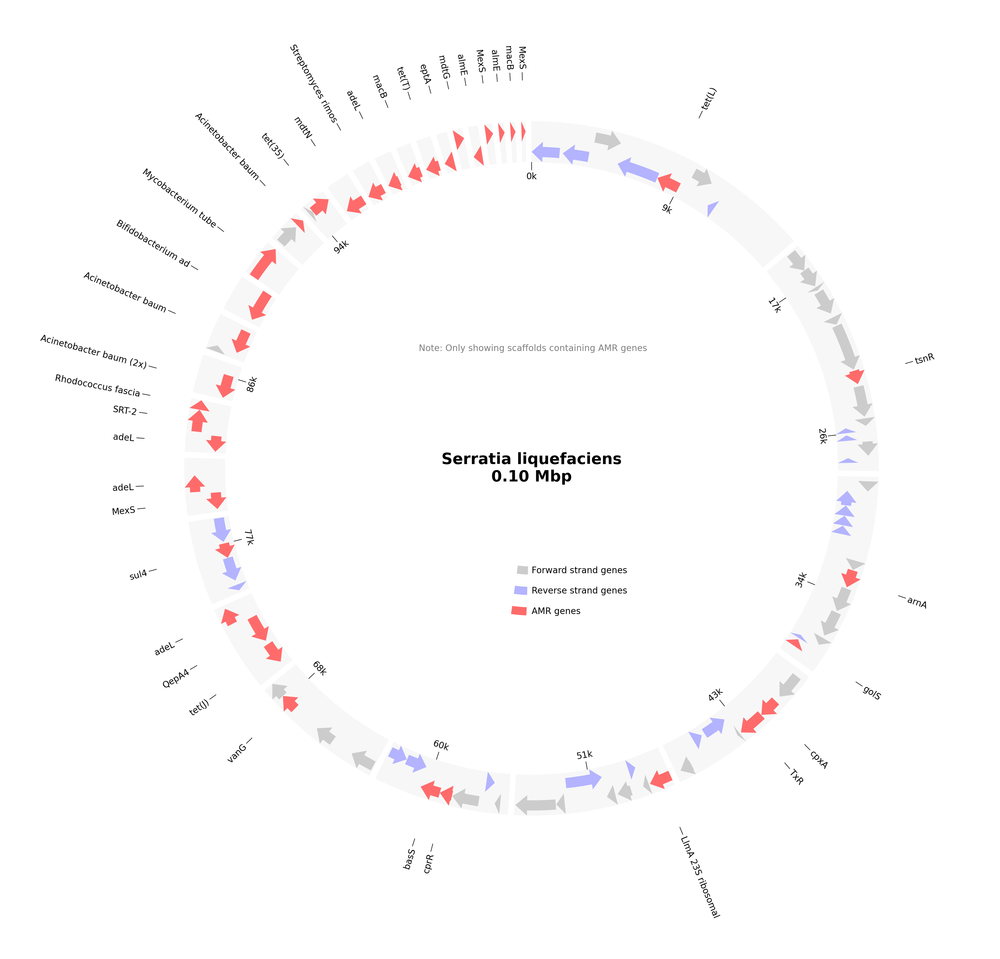

### Acinetobacter baumannii AbaF
- **Mechanism**: antibiotic efflux
- **Drug Classes**: phosphonic acid antibiotic
- **AMR Family**: major facilitator superfamily (MFS) antibiotic efflux pump
- **Locations**:
  - gnl|SPADES|DAOGIJFL_2083_2 : position 378-1688

### Acinetobacter baumannii AbaQ (found in 3 locations)
- **Mechanism**: antibiotic efflux
- **Drug Classes**: fluoroquinolone antibiotic
- **AMR Family**: major facilitator superfamily (MFS) antibiotic efflux pump
- **Locations**:
  - gnl|SPADES|DAOGIJFL_1954_1 : position 71-1363
  - gnl|SPADES|DAOGIJFL_1954_2 : position 1436-2023
  - gnl|SPADES|DAOGIJFL_2310_3 : position 1387-1779

### Bifidobacterium adolescentis rpoB mutants conferring resistance to rifampicin
- **Mechanism**: antibiotic target alteration; antibiotic target replacement
- **Drug Classes**: rifamycin antibiotic
- **AMR Family**: rifamycin-resistant beta-subunit of RNA polymerase (rpoB)
- **Locations**:
  - gnl|SPADES|DAOGIJFL_2108_2 : position 189-1907

### LlmA 23S ribosomal RNA methyltransferase
- **Mechanism**: antibiotic target alteration
- **Drug Classes**: lincosamide antibiotic
- **AMR Family**: Llm 23S ribosomal RNA methyltransferase
- **Locations**:
  - gnl|SPADES|DAOGIJFL_508_1 : position 2-1174

### MexS (found in 3 locations)
- **Mechanism**: antibiotic efflux
- **Drug Classes**: fluoroquinolone antibiotic; diaminopyrimidine antibiotic; phenicol antibiotic
- **AMR Family**: resistance-nodulation-cell division (RND) antibiotic efflux pump
- **Locations**:
  - gnl|SPADES|DAOGIJFL_1193_1 : position 157-1092
  - gnl|SPADES|DAOGIJFL_14906_1 : position 38-430
  - gnl|SPADES|DAOGIJFL_38539_1 : position 3-221

### Mycobacterium tuberculosis rpoB mutations conferring resistance to rifampicin
- **Mechanism**: antibiotic target alteration; antibiotic target replacement
- **Drug Classes**: rifamycin antibiotic
- **AMR Family**: rifamycin-resistant beta-subunit of RNA polymerase (rpoB)
- **Locations**:
  - gnl|SPADES|DAOGIJFL_2158_1 : position 3-1880

### QepA4
- **Mechanism**: antibiotic efflux
- **Drug Classes**: fluoroquinolone antibiotic
- **AMR Family**: major facilitator superfamily (MFS) antibiotic efflux pump
- **Locations**:
  - gnl|SPADES|DAOGIJFL_764_4 : position 1778-3310

### Rhodococcus fascians cmr
- **Mechanism**: antibiotic efflux
- **Drug Classes**: phenicol antibiotic
- **AMR Family**: major facilitator superfamily (MFS) antibiotic efflux pump
- **Locations**:
  - gnl|SPADES|DAOGIJFL_1325_3 : position 2252-2761

### SRT-2
- **Mechanism**: antibiotic inactivation
- **Drug Classes**: cephalosporin
- **AMR Family**: SRT beta-lactamase
- **Locations**:
  - gnl|SPADES|DAOGIJFL_1325_2 : position 1083-2252

### Streptomyces rimosus otr(A)
- **Mechanism**: antibiotic target protection
- **Drug Classes**: tetracycline antibiotic
- **AMR Family**: tetracycline-resistant ribosomal protection protein
- **Locations**:
  - gnl|SPADES|DAOGIJFL_5231_1 : position 3-968

### TxR
- **Mechanism**: antibiotic efflux
- **Drug Classes**: tetracycline antibiotic
- **AMR Family**: ATP-binding cassette (ABC) antibiotic efflux pump
- **Locations**:
  - gnl|SPADES|DAOGIJFL_501_3 : position 3149-4561

### adeL (found in 4 locations)
- **Mechanism**: antibiotic efflux
- **Drug Classes**: fluoroquinolone antibiotic; tetracycline antibiotic
- **AMR Family**: resistance-nodulation-cell division (RND) antibiotic efflux pump
- **Locations**:
  - gnl|SPADES|DAOGIJFL_1193_2 : position 1196-2083
  - gnl|SPADES|DAOGIJFL_1325_1 : position 72-959
  - gnl|SPADES|DAOGIJFL_5688_1 : position 3-689
  - gnl|SPADES|DAOGIJFL_764_5 : position 3486-4373

### almE (found in 2 locations)
- **Mechanism**: antibiotic target alteration
- **Drug Classes**: peptide antibiotic
- **AMR Family**: polymyxin resistance operon; alm glycyltransferase
- **Locations**:
  - gnl|SPADES|DAOGIJFL_12485_1 : position 2-493
  - gnl|SPADES|DAOGIJFL_23443_1 : position 2-301

### arnA
- **Mechanism**: antibiotic target alteration
- **Drug Classes**: peptide antibiotic
- **AMR Family**: pmr phosphoethanolamine transferase
- **Locations**:
  - gnl|SPADES|DAOGIJFL_441_8 : position 5023-5967

### basS
- **Mechanism**: antibiotic target alteration; antibiotic efflux
- **Drug Classes**: peptide antibiotic
- **AMR Family**: pmr phosphoethanolamine transferase
- **Locations**:
  - gnl|SPADES|DAOGIJFL_570_6 : position 3682-4746

### cprR
- **Mechanism**: antibiotic target alteration; antibiotic efflux
- **Drug Classes**: peptide antibiotic
- **AMR Family**: pmr phosphoethanolamine transferase
- **Locations**:
  - gnl|SPADES|DAOGIJFL_570_5 : position 3023-3685

### cpxA
- **Mechanism**: antibiotic efflux
- **Drug Classes**: aminoglycoside antibiotic; aminocoumarin antibiotic
- **AMR Family**: resistance-nodulation-cell division (RND) antibiotic efflux pump
- **Locations**:
  - gnl|SPADES|DAOGIJFL_501_2 : position 2091-3140

### eptA
- **Mechanism**: antibiotic target alteration
- **Drug Classes**: peptide antibiotic
- **AMR Family**: pmr phosphoethanolamine transferase
- **Locations**:
  - gnl|SPADES|DAOGIJFL_10662_1 : position 3-557

### golS
- **Mechanism**: antibiotic efflux
- **Drug Classes**: monobactam; carbapenem; cephalosporin; cephamycin; penam; phenicol antibiotic; penem
- **AMR Family**: resistance-nodulation-cell division (RND) antibiotic efflux pump
- **Locations**:
  - gnl|SPADES|DAOGIJFL_441_13 : position 9695-10126

### macB (found in 2 locations)
- **Mechanism**: antibiotic efflux
- **Drug Classes**: macrolide antibiotic
- **AMR Family**: ATP-binding cassette (ABC) antibiotic efflux pump
- **Locations**:
  - gnl|SPADES|DAOGIJFL_28896_1 : position 2-265
  - gnl|SPADES|DAOGIJFL_6895_1 : position 2-781

### mdtG
- **Mechanism**: antibiotic efflux
- **Drug Classes**: phosphonic acid antibiotic
- **AMR Family**: major facilitator superfamily (MFS) antibiotic efflux pump
- **Locations**:
  - gnl|SPADES|DAOGIJFL_12359_1 : position 1-498

### mdtN
- **Mechanism**: antibiotic efflux
- **Drug Classes**: nucleoside antibiotic; disinfecting agents and antiseptics
- **AMR Family**: major facilitator superfamily (MFS) antibiotic efflux pump
- **Locations**:
  - gnl|SPADES|DAOGIJFL_3752_1 : position 103-1239

### sul4
- **Mechanism**: antibiotic target replacement
- **Drug Classes**: sulfonamide antibiotic
- **AMR Family**: sulfonamide resistant sul
- **Locations**:
  - gnl|SPADES|DAOGIJFL_789_3 : position 2059-2892

### tet(35)
- **Mechanism**: antibiotic efflux
- **Drug Classes**: tetracycline antibiotic
- **AMR Family**: ATP-binding cassette (ABC) antibiotic efflux pump
- **Locations**:
  - gnl|SPADES|DAOGIJFL_3059_2 : position 384-1442

### tet(J)
- **Mechanism**: antibiotic efflux
- **Drug Classes**: tetracycline antibiotic
- **AMR Family**: major facilitator superfamily (MFS) antibiotic efflux pump
- **Locations**:
  - gnl|SPADES|DAOGIJFL_764_2 : position 337-1554

### tet(L)
- **Mechanism**: antibiotic efflux
- **Drug Classes**: tetracycline antibiotic
- **AMR Family**: major facilitator superfamily (MFS) antibiotic efflux pump
- **Locations**:
  - gnl|SPADES|DAOGIJFL_360_5 : position 7276-8583

### tet(T)
- **Mechanism**: antibiotic target protection
- **Drug Classes**: tetracycline antibiotic
- **AMR Family**: tetracycline-resistant ribosomal protection protein
- **Locations**:
  - gnl|SPADES|DAOGIJFL_6918_1 : position 2-778

### tsnR
- **Mechanism**: antibiotic target alteration
- **Drug Classes**: peptide antibiotic
- **AMR Family**: non-erm 23S ribosomal RNA methyltransferase (A1067)
- **Locations**:
  - gnl|SPADES|DAOGIJFL_404_7 : position 7165-7896

### vanG
- **Mechanism**: antibiotic target alteration
- **Drug Classes**: glycopeptide antibiotic
- **AMR Family**: glycopeptide resistance gene cluster; Van ligase
- **Locations**:
  - gnl|SPADES|DAOGIJFL_572_5 : position 5210-6130

## Serratia liquefaciens ATCC 27592
**Strain Statistics:**
- Total genome length: 4735.9 kbp
- Total scaffolds: 184
- Scaffolds with AMR genes: 96
- Total genes annotated: 8782
- Total AMR genes: 606
- Unique AMR genes: 239
- Distinct AMR mechanisms: 10
- Distinct AMR families: 85
- Distinct drug classes: 37

**Circos Plot:**

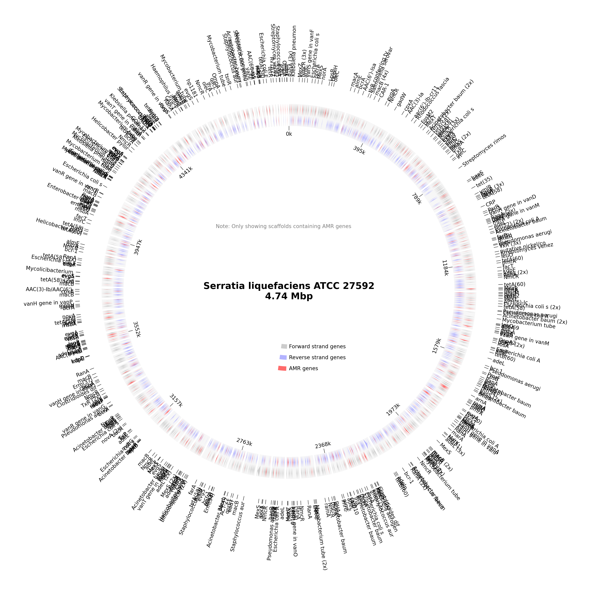

### AAC(3)-Ia
- **Mechanism**: antibiotic inactivation
- **Drug Classes**: aminoglycoside antibiotic
- **AMR Family**: AAC(3)
- **Locations**:
  - gnl|SPADES|DAOGIJFL_12_18 : position 21595-22143

### AAC(3)-Ib/AAC(6')-Ib3 bifunctional protein
- **Mechanism**: antibiotic inactivation
- **Drug Classes**: aminoglycoside antibiotic
- **AMR Family**: aminoglycoside bifunctional resistance protein
- **Locations**:
  - gnl|SPADES|DAOGIJFL_147_33 : position 38210-38662

### AAC(6')-Iai
- **Mechanism**: antibiotic inactivation
- **Drug Classes**: aminoglycoside antibiotic
- **AMR Family**: AAC(6')
- **Locations**:
  - gnl|SPADES|DAOGIJFL_142_2 : position 1057-1509

### AAC(6')-Iak
- **Mechanism**: antibiotic inactivation
- **Drug Classes**: aminoglycoside antibiotic
- **AMR Family**: AAC(6')
- **Locations**:
  - gnl|SPADES|DAOGIJFL_449_2 : position 690-1136

### AAC(6')-Isa
- **Mechanism**: antibiotic inactivation
- **Drug Classes**: aminoglycoside antibiotic
- **AMR Family**: AAC(6')
- **Locations**:
  - gnl|SPADES|DAOGIJFL_8_40 : position 40118-40702

### ACT-22
- **Mechanism**: antibiotic inactivation
- **Drug Classes**: carbapenem; cephalosporin; cephamycin; penam
- **AMR Family**: ACT beta-lactamase
- **Locations**:
  - gnl|SPADES|DAOGIJFL_101_29 : position 25515-27056

### AIM-1
- **Mechanism**: antibiotic inactivation
- **Drug Classes**: cephalosporin; cephamycin; penam
- **AMR Family**: AIM beta-lactamase
- **Locations**:
  - gnl|SPADES|DAOGIJFL_142_28 : position 20627-21571

### APH(6)-Ic
- **Mechanism**: antibiotic inactivation
- **Drug Classes**: aminoglycoside antibiotic
- **AMR Family**: APH(6)
- **Locations**:
  - gnl|SPADES|DAOGIJFL_55_40 : position 35823-36677

### AQU-2
- **Mechanism**: antibiotic inactivation
- **Drug Classes**: cephalosporin
- **AMR Family**: AQU beta-lactamase
- **Locations**:
  - gnl|SPADES|DAOGIJFL_55_85 : position 80611-81759

### Acinetobacter baumannii AbaF (found in 7 locations)
- **Mechanism**: antibiotic efflux
- **Drug Classes**: phosphonic acid antibiotic
- **AMR Family**: major facilitator superfamily (MFS) antibiotic efflux pump
- **Locations**:
  - gnl|SPADES|DAOGIJFL_101_38 : position 36394-37704
  - gnl|SPADES|DAOGIJFL_118_50 : position 48543-49925
  - gnl|SPADES|DAOGIJFL_124_11 : position 8525-10027
  - gnl|SPADES|DAOGIJFL_12_106 : position 129076-130398
  - gnl|SPADES|DAOGIJFL_12_120 : position 146118-147350
  - gnl|SPADES|DAOGIJFL_66_55 : position 62069-63394
  - gnl|SPADES|DAOGIJFL_81_44 : position 44939-46246

### Acinetobacter baumannii AbaQ (found in 10 locations)
- **Mechanism**: antibiotic efflux
- **Drug Classes**: fluoroquinolone antibiotic
- **AMR Family**: major facilitator superfamily (MFS) antibiotic efflux pump
- **Locations**:
  - gnl|SPADES|DAOGIJFL_127_25 : position 22224-23537
  - gnl|SPADES|DAOGIJFL_139_16 : position 18691-19959
  - gnl|SPADES|DAOGIJFL_32_60 : position 65294-66601
  - gnl|SPADES|DAOGIJFL_402_6 : position 4194-5456
  - gnl|SPADES|DAOGIJFL_57_1 : position 182-1519
  - gnl|SPADES|DAOGIJFL_57_62 : position 75402-76715
  - gnl|SPADES|DAOGIJFL_66_21 : position 23973-25268
  - gnl|SPADES|DAOGIJFL_71_31 : position 38782-40089
  - gnl|SPADES|DAOGIJFL_81_63 : position 67521-68921
  - gnl|SPADES|DAOGIJFL_83_15 : position 13797-15167

### Acinetobacter baumannii AmvA
- **Mechanism**: antibiotic efflux
- **Drug Classes**: macrolide antibiotic; disinfecting agents and antiseptics
- **AMR Family**: major facilitator superfamily (MFS) antibiotic efflux pump
- **Locations**:
  - gnl|SPADES|DAOGIJFL_77_50 : position 49541-51013

### ArnT
- **Mechanism**: antibiotic target alteration
- **Drug Classes**: peptide antibiotic
- **AMR Family**: pmr phosphoethanolamine transferase
- **Locations**:
  - gnl|SPADES|DAOGIJFL_145_14: position 13122-14786

### Bifidobacterium bifidum ileS conferring resistance to mupirocin
- **Mechanism**: antibiotic target alteration
- **Drug Classes**: mupirocin-like antibiotic
- **AMR Family**: antibiotic-resistant isoleucyl-tRNA synthetase (ileS)
- **Locations**:
  - gnl|SPADES|DAOGIJFL_116_10 : position 8517-11099

### CAR-1 (found in 2 locations)
- **Mechanism**: antibiotic inactivation
- **Drug Classes**: carbapenem
- **AMR Family**: CAR beta-lactamase
- **Locations**:
  - gnl|SPADES|DAOGIJFL_279_18 : position 17819-18619
  - gnl|SPADES|DAOGIJFL_8_116 : position 110724-111530

### CAU-1
- **Mechanism**: antibiotic inactivation
- **Drug Classes**: carbapenem; penam
- **AMR Family**: CAU beta-lactamase
- **Locations**:
  - gnl|SPADES|DAOGIJFL_249_20 : position 23096-25219

### CRP (found in 2 locations)
- **Mechanism**: antibiotic efflux
- **Drug Classes**: macrolide antibiotic; fluoroquinolone antibiotic; penam
- **AMR Family**: resistance-nodulation-cell division (RND) antibiotic efflux pump
- **Locations**:
  - gnl|SPADES|DAOGIJFL_144_23: position 17609-18241
  - gnl|SPADES|DAOGIJFL_29_58 : position 62272-63036

### Clostridioides difficile gyrA conferring resistance to fluoroquinolones
- **Mechanism**: antibiotic target alteration
- **Drug Classes**: fluoroquinolone antibiotic
- **AMR Family**: fluoroquinolone resistant gyrA
- **Locations**:
  - gnl|SPADES|DAOGIJFL_80_44 : position 51166-53817

### Clostridioides difficile gyrB conferring resistance to fluoroquinolones (found in 2 locations)
- **Mechanism**: antibiotic target alteration
- **Drug Classes**: fluoroquinolone antibiotic
- **AMR Family**: fluoroquinolone resistant gyrB
- **Locations**:
  - gnl|SPADES|DAOGIJFL_126_5 : position 2459-4354
  - gnl|SPADES|DAOGIJFL_139_4 : position 3606-6020

### CrcB
- **Mechanism**: antibiotic efflux
- **Drug Classes**: aminoglycoside antibiotic
- **AMR Family**: multidrug and toxic compound extrusion (MATE) transporter
- **Locations**:
  - gnl|SPADES|DAOGIJFL_116_25 : position 23952-24335

### DHA-6
- **Mechanism**: antibiotic inactivation
- **Drug Classes**: cephalosporin; cephamycin
- **AMR Family**: DHA beta-lactamase
- **Locations**:
  - gnl|SPADES|DAOGIJFL_83_11 : position 9263-10405

### Enterobacter cloacae acrA (found in 2 locations)
- **Mechanism**: antibiotic efflux
- **Drug Classes**: fluoroquinolone antibiotic; cephalosporin; glycylcycline; penam; tetracycline antibiotic; rifamycin antibiotic; phenicol antibiotic; disinfecting agents and antiseptics
- **AMR Family**: resistance-nodulation-cell division (RND) antibiotic efflux pump
- **Locations**:
  - gnl|SPADES|DAOGIJFL_197_4 : position 3746-4948
  - gnl|SPADES|DAOGIJFL_64_45 : position 48187-49374

### Enterococcus faecalis cls with mutation conferring resistance to daptomycin
- **Mechanism**: antibiotic target alteration
- **Drug Classes**: peptide antibiotic
- **AMR Family**: daptomycin resistant cls
- **Locations**:
  - gnl|SPADES|DAOGIJFL_77_52 : position 52180-53640

### Enterococcus faecium liaS mutant conferring daptomycin resistance
- **Mechanism**: antibiotic target alteration; antibiotic efflux
- **Drug Classes**: peptide antibiotic
- **AMR Family**: daptomycin resistant liaS
- **Locations**:
  - gnl|SPADES|DAOGIJFL_252_2 : position 1583-3118

### Erm(34)
- **Mechanism**: antibiotic target alteration
- **Drug Classes**: macrolide antibiotic; lincosamide antibiotic; streptogramin antibiotic; streptogramin A antibiotic; streptogramin B antibiotic
- **AMR Family**: Erm 23S ribosomal RNA methyltransferase
- **Locations**:
  - gnl|SPADES|DAOGIJFL_108_14 : position 17626-18252

### Erm(37)
- **Mechanism**: antibiotic target alteration
- **Drug Classes**: macrolide antibiotic; lincosamide antibiotic; streptogramin antibiotic; streptogramin A antibiotic; streptogramin B antibiotic
- **AMR Family**: Erm 23S ribosomal RNA methyltransferase
- **Locations**:
  - gnl|SPADES|DAOGIJFL_139_35 : position 40920-41699

### Escherichia coli AcrAB-TolC with AcrR mutation conferring resistance to ciprofloxacin, tetracycline, and ceftazidime (found in 5 locations)
- **Mechanism**: antibiotic target alteration; antibiotic efflux
- **Drug Classes**: fluoroquinolone antibiotic; cephalosporin; glycylcycline; penam; tetracycline antibiotic; rifamycin antibiotic; phenicol antibiotic; disinfecting agents and antiseptics
- **AMR Family**: resistance-nodulation-cell division (RND) antibiotic efflux pump
- **Locations**:
  - gnl|SPADES|DAOGIJFL_55_83 : position 78817-79419
  - gnl|SPADES|DAOGIJFL_5_86 : position 82537-83118
  - gnl|SPADES|DAOGIJFL_64_44 : position 47355-48044
  - gnl|SPADES|DAOGIJFL_71_19 : position 23052-23756
  - gnl|SPADES|DAOGIJFL_93_30 : position 25971-26558

### Escherichia coli AcrAB-TolC with MarR mutations conferring resistance to ciprofloxacin and tetracycline (found in 2 locations)
- **Mechanism**: antibiotic target alteration; antibiotic efflux
- **Drug Classes**: fluoroquinolone antibiotic; cephalosporin; glycylcycline; penam; tetracycline antibiotic; rifamycin antibiotic; phenicol antibiotic; disinfecting agents and antiseptics
- **AMR Family**: resistance-nodulation-cell division (RND) antibiotic efflux pump
- **Locations**:
  - gnl|SPADES|DAOGIJFL_32_54 : position 59886-60359
  - gnl|SPADES|DAOGIJFL_55_26 : position 25370-25804

### Escherichia coli EF-Tu mutants conferring resistance to Enacyloxin IIa
- **Mechanism**: antibiotic target alteration
- **Drug Classes**: elfamycin antibiotic
- **AMR Family**: elfamycin resistant EF-Tu
- **Locations**:
  - gnl|SPADES|DAOGIJFL_590_1 : position 3-2198

### Escherichia coli EF-Tu mutants conferring resistance to Pulvomycin
- **Mechanism**: antibiotic target alteration
- **Drug Classes**: elfamycin antibiotic
- **AMR Family**: elfamycin resistant EF-Tu
- **Locations**:
  - gnl|SPADES|DAOGIJFL_232_16 : position 18290-20137

### Escherichia coli fabI mutations conferring resistance to isoniazid and triclosan (found in 2 locations)
- **Mechanism**: antibiotic target alteration
- **Drug Classes**: disinfecting agents and antiseptics; isoniazid-like antibiotic
- **AMR Family**: antibiotic resistant fabI
- **Locations**:
  - gnl|SPADES|DAOGIJFL_236_14 : position 12612-13358
  - gnl|SPADES|DAOGIJFL_402_2 : position 276-1031

### Escherichia coli mdfA
- **Mechanism**: antibiotic efflux
- **Drug Classes**: tetracycline antibiotic; phenicol antibiotic; disinfecting agents and antiseptics
- **AMR Family**: major facilitator superfamily (MFS) antibiotic efflux pump
- **Locations**:
  - gnl|SPADES|DAOGIJFL_232_14 : position 16566-17813

### Escherichia coli soxS with mutation conferring antibiotic resistance (found in 9 locations)
- **Mechanism**: antibiotic target alteration; antibiotic efflux; reduced permeability to antibiotic
- **Drug Classes**: fluoroquinolone antibiotic; monobactam; carbapenem; cephalosporin; glycylcycline; cephamycin; penam; tetracycline antibiotic; rifamycin antibiotic; phenicol antibiotic; penem; disinfecting agents and antiseptics
- **AMR Family**: ATP-binding cassette (ABC) antibiotic efflux pump; major facilitator superfamily (MFS) antibiotic efflux pump; resistance-nodulation-cell division (RND) antibiotic efflux pump; General Bacterial Porin with reduced permeability to beta-lactams
- **Locations**:
  - gnl|SPADES|DAOGIJFL_124_27 : position 28574-29347
  - gnl|SPADES|DAOGIJFL_127_12 : position 7548-8393
  - gnl|SPADES|DAOGIJFL_152_41 : position 42270-42692
  - gnl|SPADES|DAOGIJFL_16_29 : position 29372-30319
  - gnl|SPADES|DAOGIJFL_214_8 : position 9373-10239
  - gnl|SPADES|DAOGIJFL_55_50 : position 47051-47944
  - gnl|SPADES|DAOGIJFL_55_63 : position 59612-60529
  - gnl|SPADES|DAOGIJFL_5_98 : position 95332-95790
  - gnl|SPADES|DAOGIJFL_81_33 : position 31556-32425

### EstT (found in 3 locations)
- **Mechanism**: antibiotic inactivation
- **Drug Classes**: macrolide antibiotic
- **AMR Family**: macrolide esterase
- **Locations**:
  - gnl|SPADES|DAOGIJFL_127_35 : position 31167-31970
  - gnl|SPADES|DAOGIJFL_167_2 : position 964-1806
  - gnl|SPADES|DAOGIJFL_35_7 : position 5889-6719

### FosA8
- **Mechanism**: antibiotic inactivation
- **Drug Classes**: phosphonic acid antibiotic
- **AMR Family**: fosfomycin thiol transferase
- **Locations**:
  - gnl|SPADES|DAOGIJFL_8_72: position 70603-71010

### FosC2
- **Mechanism**: antibiotic inactivation
- **Drug Classes**: phosphonic acid antibiotic
- **AMR Family**: fosC phosphotransferase family
- **Locations**:
  - gnl|SPADES|DAOGIJFL_55_13 : position 11350-11757

### FosM1
- **Mechanism**: antibiotic inactivation
- **Drug Classes**: phosphonic acid antibiotic
- **AMR Family**: fosfomycin thiol transferase
- **Locations**:
  - gnl|SPADES|DAOGIJFL_116_36 : position 33028-33537

### FosM2
- **Mechanism**: antibiotic inactivation
- **Drug Classes**: phosphonic acid antibiotic
- **AMR Family**: fosfomycin thiol transferase
- **Locations**:
  - gnl|SPADES|DAOGIJFL_12_75 : position 87959-88369

### GOB-12
- **Mechanism**: antibiotic inactivation
- **Drug Classes**: carbapenem; cephalosporin; penam
- **AMR Family**: GOB beta-lactamase
- **Locations**:
  - gnl|SPADES|DAOGIJFL_249_3 : position 2442-3089

### H-NS
- **Mechanism**: antibiotic efflux
- **Drug Classes**: macrolide antibiotic; fluoroquinolone antibiotic; cephalosporin; cephamycin; penam; tetracycline antibiotic
- **AMR Family**: major facilitator superfamily (MFS) antibiotic efflux pump; resistance-nodulation-cell division (RND) antibiotic efflux pump
- **Locations**:
  - gnl|SPADES|DAOGIJFL_454_3 : position 2356-2763

### Haemophilus influenzae PBP3 conferring resistance to beta-lactam antibiotics (found in 2 locations)
- **Mechanism**: antibiotic target alteration
- **Drug Classes**: cephalosporin; cephamycin; penam
- **AMR Family**: Penicillin-binding protein mutations conferring resistance to beta-lactam antibiotics
- **Locations**:
  - gnl|SPADES|DAOGIJFL_286_4 : position 3895-5658
  - gnl|SPADES|DAOGIJFL_32_9 : position 6665-8383

### Helicobacter pylori pbp1 mutants conferring resistance to amoxicillin (found in 2 locations)
- **Mechanism**: antibiotic target alteration
- **Drug Classes**: cephalosporin; cephamycin; penam
- **AMR Family**: Penicillin-binding protein mutations conferring resistance to beta-lactam antibiotics
- **Locations**:
  - gnl|SPADES|DAOGIJFL_173_15 : position 16743-19244
  - gnl|SPADES|DAOGIJFL_239_7 : position 6753-9101

### Helicobacter pylori pbp2 mutants conferring resistance to amoxicillin
- **Mechanism**: antibiotic target alteration
- **Drug Classes**: cephalosporin; cephamycin; penam
- **AMR Family**: Penicillin-binding protein mutations conferring resistance to beta-lactam antibiotics
- **Locations**:
  - gnl|SPADES|DAOGIJFL_116_16 : position 14377-16272

### Klebsiella aerogenes Omp36
- **Mechanism**: reduced permeability to antibiotic
- **Drug Classes**: monobactam; carbapenem; cephalosporin; cephamycin; penam; penem
- **AMR Family**: General Bacterial Porin with reduced permeability to beta-lactams
- **Locations**:
  - gnl|SPADES|DAOGIJFL_80_50 : position 62607-63737

### Klebsiella pneumoniae KpnE
- **Mechanism**: antibiotic efflux
- **Drug Classes**: macrolide antibiotic; aminoglycoside antibiotic; cephalosporin; tetracycline antibiotic; peptide antibiotic; rifamycin antibiotic; disinfecting agents and antiseptics
- **AMR Family**: small multidrug resistance (SMR) antibiotic efflux pump
- **Locations**:
  - gnl|SPADES|DAOGIJFL_8_10 : position 8653-9021

### Klebsiella pneumoniae KpnF
- **Mechanism**: antibiotic efflux
- **Drug Classes**: macrolide antibiotic; aminoglycoside antibiotic; cephalosporin; tetracycline antibiotic; peptide antibiotic; rifamycin antibiotic; disinfecting agents and antiseptics
- **AMR Family**: small multidrug resistance (SMR) antibiotic efflux pump
- **Locations**:
  - gnl|SPADES|DAOGIJFL_8_9: position 8337-8666

### Klebsiella pneumoniae KpnH
- **Mechanism**: antibiotic efflux
- **Drug Classes**: macrolide antibiotic; fluoroquinolone antibiotic; aminoglycoside antibiotic; carbapenem; cephalosporin; penam; peptide antibiotic; penem
- **AMR Family**: major facilitator superfamily (MFS) antibiotic efflux pump
- **Locations**:
  - gnl|SPADES|DAOGIJFL_142_43: position 37311-38846

### Klebsiella pneumoniae OmpK37 (found in 4 locations)
- **Mechanism**: reduced permeability to antibiotic
- **Drug Classes**: monobactam; carbapenem; cephalosporin; cephamycin; penam; penem
- **AMR Family**: General Bacterial Porin with reduced permeability to beta-lactams
- **Locations**:
  - gnl|SPADES|DAOGIJFL_233_23 : position 28121-28363
  - gnl|SPADES|DAOGIJFL_249_1 : position 3-935
  - gnl|SPADES|DAOGIJFL_5_20 : position 15907-17004
  - gnl|SPADES|DAOGIJFL_8_86 : position 77303-78385

### LRA-8
- **Mechanism**: antibiotic inactivation
- **Drug Classes**: cephalosporin; penam
- **AMR Family**: subclass B3 LRA beta-lactamase
- **Locations**:
  - gnl|SPADES|DAOGIJFL_84_25 : position 20166-20921

### LpsB (found in 2 locations)
- **Mechanism**: reduced permeability to antibiotic
- **Drug Classes**: peptide antibiotic
- **AMR Family**: Intrinsic peptide antibiotic resistant Lps
- **Locations**:
  - gnl|SPADES|DAOGIJFL_5_159 : position 166313-167521
  - gnl|SPADES|DAOGIJFL_65_69 : position 72890-73987

### LptD
- **Mechanism**: antibiotic efflux
- **Drug Classes**: carbapenem; peptide antibiotic; aminocoumarin antibiotic; rifamycin antibiotic
- **AMR Family**: ATP-binding cassette (ABC) antibiotic efflux pump
- **Locations**:
  - gnl|SPADES|DAOGIJFL_186_16 : position 19733-22096

### MdtK
- **Mechanism**: antibiotic efflux
- **Drug Classes**: fluoroquinolone antibiotic
- **AMR Family**: multidrug and toxic compound extrusion (MATE) transporter
- **Locations**:
  - gnl|SPADES|DAOGIJFL_73_23 : position 23797-25260

### MdtQ
- **Mechanism**: reduced permeability to antibiotic
- **Drug Classes**: monobactam; carbapenem; cephalosporin; cephamycin; penam; penem
- **AMR Family**: Outer Membrane Porin (Opr)
- **Locations**:
  - gnl|SPADES|DAOGIJFL_52_73 : position 75099-76598

### MexA
- **Mechanism**: antibiotic efflux
- **Drug Classes**: macrolide antibiotic; fluoroquinolone antibiotic; monobactam; carbapenem; cephalosporin; cephamycin; penam; tetracycline antibiotic; peptide antibiotic; aminocoumarin antibiotic; diaminopyrimidine antibiotic; sulfonamide antibiotic; phenicol antibiotic; penem
- **AMR Family**: resistance-nodulation-cell division (RND) antibiotic efflux pump
- **Locations**:
  - gnl|SPADES|DAOGIJFL_71_17 : position 20200-21342

### MexE
- **Mechanism**: antibiotic efflux
- **Drug Classes**: fluoroquinolone antibiotic; diaminopyrimidine antibiotic; phenicol antibiotic
- **AMR Family**: resistance-nodulation-cell division (RND) antibiotic efflux pump
- **Locations**:
  - gnl|SPADES|DAOGIJFL_55_25 : position 24092-24949

### MexG
- **Mechanism**: antibiotic efflux
- **Drug Classes**: fluoroquinolone antibiotic; tetracycline antibiotic; disinfecting agents and antiseptics
- **AMR Family**: resistance-nodulation-cell division (RND) antibiotic efflux pump
- **Locations**:
  - gnl|SPADES|DAOGIJFL_142_6 : position 3624-4037

### MexL (found in 4 locations)
- **Mechanism**: antibiotic efflux
- **Drug Classes**: macrolide antibiotic; tetracycline antibiotic; disinfecting agents and antiseptics
- **AMR Family**: resistance-nodulation-cell division (RND) antibiotic efflux pump
- **Locations**:
  - gnl|SPADES|DAOGIJFL_101_41 : position 39060-39716
  - gnl|SPADES|DAOGIJFL_127_31 : position 27936-28574
  - gnl|SPADES|DAOGIJFL_29_19 : position 23601-24185
  - gnl|SPADES|DAOGIJFL_52_72 : position 74239-74952

### MexS (found in 10 locations)
- **Mechanism**: antibiotic efflux
- **Drug Classes**: fluoroquinolone antibiotic; diaminopyrimidine antibiotic; phenicol antibiotic
- **AMR Family**: resistance-nodulation-cell division (RND) antibiotic efflux pump
- **Locations**:
  - gnl|SPADES|DAOGIJFL_116_55 : position 51303-52238
  - gnl|SPADES|DAOGIJFL_116_56 : position 52331-53320
  - gnl|SPADES|DAOGIJFL_118_35 : position 34935-35924
  - gnl|SPADES|DAOGIJFL_120_18 : position 18503-19537
  - gnl|SPADES|DAOGIJFL_16_100 : position 92960-93985
  - gnl|SPADES|DAOGIJFL_16_90 : position 82583-83563
  - gnl|SPADES|DAOGIJFL_35_53 : position 55430-56416
  - gnl|SPADES|DAOGIJFL_5_122 : position 119988-121115
  - gnl|SPADES|DAOGIJFL_73_71 : position 70511-71518
  - gnl|SPADES|DAOGIJFL_96_29 : position 32865-33893

### MexT (found in 4 locations)
- **Mechanism**: antibiotic efflux
- **Drug Classes**: fluoroquinolone antibiotic; diaminopyrimidine antibiotic; phenicol antibiotic
- **AMR Family**: resistance-nodulation-cell division (RND) antibiotic efflux pump
- **Locations**:
  - gnl|SPADES|DAOGIJFL_120_20 : position 20328-21257
  - gnl|SPADES|DAOGIJFL_12_93 : position 110040-110990
  - gnl|SPADES|DAOGIJFL_71_5 : position 5289-6185
  - gnl|SPADES|DAOGIJFL_80_54 : position 65466-66368

### MexV
- **Mechanism**: antibiotic efflux
- **Drug Classes**: macrolide antibiotic; fluoroquinolone antibiotic; tetracycline antibiotic; phenicol antibiotic; disinfecting agents and antiseptics
- **AMR Family**: resistance-nodulation-cell division (RND) antibiotic efflux pump
- **Locations**:
  - gnl|SPADES|DAOGIJFL_91_52 : position 55178-56629

### MexZ
- **Mechanism**: antibiotic efflux
- **Drug Classes**: macrolide antibiotic; fluoroquinolone antibiotic; aminoglycoside antibiotic; carbapenem; cephalosporin; cephamycin; penam; tetracycline antibiotic; phenicol antibiotic; disinfecting agents and antiseptics
- **AMR Family**: resistance-nodulation-cell division (RND) antibiotic efflux pump
- **Locations**:
  - gnl|SPADES|DAOGIJFL_5_44 : position 41794-42426

### Mycobacterium tuberculosis gidB mutation conferring resistance to streptomycin
- **Mechanism**: antibiotic target alteration
- **Drug Classes**: aminoglycoside antibiotic
- **AMR Family**: antibiotic resistant gidB
- **Locations**:
  - gnl|SPADES|DAOGIJFL_287_16 : position 18097-18717

### Mycobacterium tuberculosis inhA mutations conferring resistance to isoniazid
- **Mechanism**: antibiotic target alteration
- **Drug Classes**: isoniazid-like antibiotic
- **AMR Family**: isoniazid resistant inhA
- **Locations**:
  - gnl|SPADES|DAOGIJFL_76_63 : position 71656-72414

### Mycobacterium tuberculosis kasA mutant conferring resistance to isoniazid (found in 4 locations)
- **Mechanism**: antibiotic target alteration
- **Drug Classes**: isoniazid-like antibiotic
- **AMR Family**: antibiotic resistant kasA
- **Locations**:
  - gnl|SPADES|DAOGIJFL_233_4 : position 3020-4300
  - gnl|SPADES|DAOGIJFL_236_1 : position 3-1220
  - gnl|SPADES|DAOGIJFL_84_16 : position 10854-12023
  - gnl|SPADES|DAOGIJFL_84_19 : position 13218-14447

### Mycobacterium tuberculosis katG mutations conferring resistance to isoniazid
- **Mechanism**: antibiotic target alteration
- **Drug Classes**: isoniazid-like antibiotic
- **AMR Family**: isoniazid resistant katG
- **Locations**:
  - gnl|SPADES|DAOGIJFL_242_24 : position 24437-26635

### Mycobacterium tuberculosis ndh with mutation conferring resistance to isoniazid
- **Mechanism**: antibiotic target alteration
- **Drug Classes**: isoniazid-like antibiotic
- **AMR Family**: antibiotic resistant ndh
- **Locations**:
  - gnl|SPADES|DAOGIJFL_236_23 : position 19316-20620

### Mycobacterium tuberculosis pncA mutations conferring resistance to pyrazinamide (found in 3 locations)
- **Mechanism**: antibiotic target alteration
- **Drug Classes**: pyrazine antibiotic
- **AMR Family**: Pyrazinamide resistant pncA
- **Locations**:
  - gnl|SPADES|DAOGIJFL_232_11 : position 13882-14433
  - gnl|SPADES|DAOGIJFL_369_4 : position 2645-3277
  - gnl|SPADES|DAOGIJFL_73_3 : position 2333-3019

### Mycobacterium tuberculosis thyA with mutation conferring resistance to para-aminosalicylic acid
- **Mechanism**: antibiotic target alteration
- **Drug Classes**: salicylic acid antibiotic
- **AMR Family**: aminosalicylate resistant thymidylate synthase
- **Locations**:
  - gnl|SPADES|DAOGIJFL_57_11 : position 18426-19220

### Mycolicibacterium smegmatis ndh with mutation conferring resistance to isoniazid
- **Mechanism**: antibiotic target alteration
- **Drug Classes**: isoniazid-like antibiotic
- **AMR Family**: antibiotic resistant ndh
- **Locations**:
  - gnl|SPADES|DAOGIJFL_152_4 : position 2918-4126

### Neisseria gonorrhoeae pilQ gene conferring resistance to beta-lactam
- **Mechanism**: antibiotic target alteration
- **Drug Classes**: cephalosporin; cephamycin; penam
- **AMR Family**: Penicillin-binding protein mutations conferring resistance to beta-lactam antibiotics
- **Locations**:
  - gnl|SPADES|DAOGIJFL_403_11 : position 11054-12295

### NmcR (found in 28 locations)
- **Mechanism**: antibiotic inactivation
- **Drug Classes**: carbapenem; cephalosporin; cephamycin; penam
- **AMR Family**: NmcA beta-lactamase
- **Locations**:
  - gnl|SPADES|DAOGIJFL_116_45 : position 42890-43879
  - gnl|SPADES|DAOGIJFL_120_47 : position 48159-49031
  - gnl|SPADES|DAOGIJFL_127_41 : position 36054-36977
  - gnl|SPADES|DAOGIJFL_12_113 : position 137658-138557
  - gnl|SPADES|DAOGIJFL_12_123 : position 149701-150528
  - gnl|SPADES|DAOGIJFL_131_40 : position 42694-43548
  - gnl|SPADES|DAOGIJFL_142_36 : position 30545-31423
  - gnl|SPADES|DAOGIJFL_167_1 : position 1-855
  - gnl|SPADES|DAOGIJFL_16_16 : position 16516-17454
  - gnl|SPADES|DAOGIJFL_16_21 : position 21960-22862
  - gnl|SPADES|DAOGIJFL_16_59 : position 55393-56322
  - gnl|SPADES|DAOGIJFL_232_3 : position 2947-3801
  - gnl|SPADES|DAOGIJFL_239_15 : position 21444-22361
  - gnl|SPADES|DAOGIJFL_29_22 : position 26556-27464
  - gnl|SPADES|DAOGIJFL_313_4 : position 4668-5564
  - gnl|SPADES|DAOGIJFL_32_85 : position 95419-96309
  - gnl|SPADES|DAOGIJFL_52_28 : position 30220-31101
  - gnl|SPADES|DAOGIJFL_5_109 : position 105452-106354
  - gnl|SPADES|DAOGIJFL_5_123 : position 121144-122061
  - gnl|SPADES|DAOGIJFL_5_59 : position 54558-55445
  - gnl|SPADES|DAOGIJFL_66_31 : position 34910-35803
  - gnl|SPADES|DAOGIJFL_71_22 : position 26285-27148
  - gnl|SPADES|DAOGIJFL_76_41 : position 44161-45081
  - gnl|SPADES|DAOGIJFL_77_17 : position 15954-16928
  - gnl|SPADES|DAOGIJFL_83_38 : position 35209-36138
  - gnl|SPADES|DAOGIJFL_8_150 : position 153794-154747
  - gnl|SPADES|DAOGIJFL_91_1 : position 566-1507
  - gnl|SPADES|DAOGIJFL_96_4 : position 3969-4802

### OmpA (found in 4 locations)
- **Mechanism**: reduced permeability to antibiotic
- **Drug Classes**: peptide antibiotic
- **AMR Family**: General Bacterial Porin with reduced permeability to peptide antibiotics
- **Locations**:
  - gnl|SPADES|DAOGIJFL_139_20 : position 23138-23797
  - gnl|SPADES|DAOGIJFL_1888_1 : position 201-1277
  - gnl|SPADES|DAOGIJFL_362_1 : position 2-460
  - gnl|SPADES|DAOGIJFL_81_26 : position 24797-25294

### OpmH
- **Mechanism**: antibiotic efflux
- **Drug Classes**: disinfecting agents and antiseptics
- **AMR Family**: resistance-nodulation-cell division (RND) antibiotic efflux pump
- **Locations**:
  - gnl|SPADES|DAOGIJFL_5_166 : position 176288-177667

### OprM
- **Mechanism**: antibiotic efflux
- **Drug Classes**: macrolide antibiotic; fluoroquinolone antibiotic; monobactam; aminoglycoside antibiotic; carbapenem; cephalosporin; cephamycin; penam; tetracycline antibiotic; peptide antibiotic; aminocoumarin antibiotic; diaminopyrimidine antibiotic; sulfonamide antibiotic; phenicol antibiotic; penem; disinfecting agents and antiseptics
- **AMR Family**: resistance-nodulation-cell division (RND) antibiotic efflux pump
- **Locations**:
  - gnl|SPADES|DAOGIJFL_71_15 : position 15589-17043

### ParR (found in 2 locations)
- **Mechanism**: antibiotic efflux; reduced permeability to antibiotic
- **Drug Classes**: macrolide antibiotic; fluoroquinolone antibiotic; monobactam; aminoglycoside antibiotic; carbapenem; cephalosporin; cephamycin; penam; tetracycline antibiotic; phenicol antibiotic; penem; disinfecting agents and antiseptics
- **AMR Family**: resistance-nodulation-cell division (RND) antibiotic efflux pump; Outer Membrane Porin (Opr)
- **Locations**:
  - gnl|SPADES|DAOGIJFL_12_5 : position 3296-4015
  - gnl|SPADES|DAOGIJFL_29_77 : position 84578-85339

### ParS (found in 3 locations)
- **Mechanism**: antibiotic efflux; reduced permeability to antibiotic
- **Drug Classes**: macrolide antibiotic; fluoroquinolone antibiotic; monobactam; aminoglycoside antibiotic; carbapenem; cephalosporin; cephamycin; penam; tetracycline antibiotic; phenicol antibiotic; penem; disinfecting agents and antiseptics
- **AMR Family**: resistance-nodulation-cell division (RND) antibiotic efflux pump; Outer Membrane Porin (Opr)
- **Locations**:
  - gnl|SPADES|DAOGIJFL_142_30 : position 23388-24986
  - gnl|SPADES|DAOGIJFL_29_78 : position 85336-86640
  - gnl|SPADES|DAOGIJFL_67_58 : position 70515-72296

### PmrF (found in 2 locations)
- **Mechanism**: antibiotic target alteration
- **Drug Classes**: peptide antibiotic
- **AMR Family**: pmr phosphoethanolamine transferase
- **Locations**:
  - gnl|SPADES|DAOGIJFL_145_11 : position 9261-10241
  - gnl|SPADES|DAOGIJFL_65_64 : position 67429-68412

### Pseudomonas aeruginosa CpxR (found in 5 locations)
- **Mechanism**: antibiotic efflux
- **Drug Classes**: macrolide antibiotic; fluoroquinolone antibiotic; monobactam; aminoglycoside antibiotic; carbapenem; cephalosporin; cephamycin; penam; tetracycline antibiotic; peptide antibiotic; aminocoumarin antibiotic; diaminopyrimidine antibiotic; sulfonamide antibiotic; phenicol antibiotic; penem
- **AMR Family**: resistance-nodulation-cell division (RND) antibiotic efflux pump
- **Locations**:
  - gnl|SPADES|DAOGIJFL_142_31 : position 24995-25684
  - gnl|SPADES|DAOGIJFL_65_44 : position 47896-48594
  - gnl|SPADES|DAOGIJFL_76_30 : position 32339-33019
  - gnl|SPADES|DAOGIJFL_91_32 : position 32301-32975
  - gnl|SPADES|DAOGIJFL_93_47 : position 43503-44243

### Pseudomonas aeruginosa ampR with mutation conferring resistance to aztreonam (found in 3 locations)
- **Mechanism**: antibiotic target alteration; antibiotic inactivation
- **Drug Classes**: monobactam; carbapenem; cephalosporin
- **AMR Family**: PDC beta-lactamase; ampR transcriptional regulator with mutation conferring resistance to monobactam antibiotics
- **Locations**:
  - gnl|SPADES|DAOGIJFL_129_24 : position 22172-23101
  - gnl|SPADES|DAOGIJFL_35_1 : position 193-1137
  - gnl|SPADES|DAOGIJFL_55_80 : position 75324-76199

### QepA2
- **Mechanism**: antibiotic efflux
- **Drug Classes**: fluoroquinolone antibiotic
- **AMR Family**: major facilitator superfamily (MFS) antibiotic efflux pump
- **Locations**:
  - gnl|SPADES|DAOGIJFL_64_11 : position 7895-9301

### QepA4
- **Mechanism**: antibiotic efflux
- **Drug Classes**: fluoroquinolone antibiotic
- **AMR Family**: major facilitator superfamily (MFS) antibiotic efflux pump
- **Locations**:
  - gnl|SPADES|DAOGIJFL_32_86 : position 96409-97704

### RanA (found in 25 locations)
- **Mechanism**: antibiotic efflux
- **Drug Classes**: aminoglycoside antibiotic
- **AMR Family**: ATP-binding cassette (ABC) antibiotic efflux pump
- **Locations**:
  - gnl|SPADES|DAOGIJFL_110_7 : position 4095-4910
  - gnl|SPADES|DAOGIJFL_122_8 : position 8054-9043
  - gnl|SPADES|DAOGIJFL_140_16 : position 24332-25324
  - gnl|SPADES|DAOGIJFL_142_32 : position 26091-27293
  - gnl|SPADES|DAOGIJFL_164_9 : position 8406-9482
  - gnl|SPADES|DAOGIJFL_197_19 : position 23132-24193
  - gnl|SPADES|DAOGIJFL_279_7 : position 7191-7967
  - gnl|SPADES|DAOGIJFL_29_11 : position 13537-14574
  - gnl|SPADES|DAOGIJFL_29_26 : position 30469-31182
  - gnl|SPADES|DAOGIJFL_29_48 : position 53056-54168
  - gnl|SPADES|DAOGIJFL_32_6 : position 4726-5487
  - gnl|SPADES|DAOGIJFL_32_71 : position 80629-81708
  - gnl|SPADES|DAOGIJFL_52_21 : position 21920-23596
  - gnl|SPADES|DAOGIJFL_5_116 : position 112716-114593
  - gnl|SPADES|DAOGIJFL_5_218 : position 231491-232624
  - gnl|SPADES|DAOGIJFL_5_7 : position 5388-6323
  - gnl|SPADES|DAOGIJFL_66_3 : position 3297-4367
  - gnl|SPADES|DAOGIJFL_71_54 : position 66887-68002
  - gnl|SPADES|DAOGIJFL_77_60 : position 61252-62253
  - gnl|SPADES|DAOGIJFL_77_61 : position 62250-63266
  - gnl|SPADES|DAOGIJFL_78_15 : position 14463-16055
  - gnl|SPADES|DAOGIJFL_84_50 : position 45215-45958
  - gnl|SPADES|DAOGIJFL_8_100 : position 95031-95999
  - gnl|SPADES|DAOGIJFL_8_145 : position 148787-149623
  - gnl|SPADES|DAOGIJFL_91_15 : position 15436-16209

### RanB
- **Mechanism**: antibiotic efflux
- **Drug Classes**: aminoglycoside antibiotic
- **AMR Family**: ATP-binding cassette (ABC) antibiotic efflux pump
- **Locations**:
  - gnl|SPADES|DAOGIJFL_110_6 : position 3308-4090

### Rhodococcus fascians cmr
- **Mechanism**: antibiotic efflux
- **Drug Classes**: phenicol antibiotic
- **AMR Family**: major facilitator superfamily (MFS) antibiotic efflux pump
- **Locations**:
  - gnl|SPADES|DAOGIJFL_12_52 : position 63181-64608

### Rv1877 (found in 2 locations)
- **Mechanism**: antibiotic efflux
- **Drug Classes**: fluoroquinolone antibiotic
- **AMR Family**: major facilitator superfamily (MFS) antibiotic efflux pump
- **Locations**:
  - gnl|SPADES|DAOGIJFL_649_2 : position 667-1464
  - gnl|SPADES|DAOGIJFL_71_18 : position 21494-23008

### SAT-2
- **Mechanism**: antibiotic inactivation
- **Drug Classes**: nucleoside antibiotic
- **AMR Family**: streptothricin acetyltransferase (SAT)
- **Locations**:
  - gnl|SPADES|DAOGIJFL_5_45 : position 42442-43071

### SAT-3
- **Mechanism**: antibiotic inactivation
- **Drug Classes**: nucleoside antibiotic
- **AMR Family**: streptothricin acetyltransferase (SAT)
- **Locations**:
  - gnl|SPADES|DAOGIJFL_16_46 : position 43778-44320

### SPR-1
- **Mechanism**: antibiotic inactivation
- **Drug Classes**: carbapenem
- **AMR Family**: SPR beta-lactamase
- **Locations**:
  - gnl|SPADES|DAOGIJFL_80_55 : position 66448-67344

### SRT-3
- **Mechanism**: antibiotic inactivation
- **Drug Classes**: cephalosporin
- **AMR Family**: SRT beta-lactamase
- **Locations**:
  - gnl|SPADES|DAOGIJFL_55_81 : position 76404-77540

### Salmonella serovars soxS with mutation conferring antibiotic resistance
- **Mechanism**: antibiotic target alteration; antibiotic efflux; reduced permeability to antibiotic
- **Drug Classes**: fluoroquinolone antibiotic; monobactam; carbapenem; cephalosporin; glycylcycline; cephamycin; penam; tetracycline antibiotic; rifamycin antibiotic; phenicol antibiotic; penem; disinfecting agents and antiseptics
- **AMR Family**: ATP-binding cassette (ABC) antibiotic efflux pump; major facilitator superfamily (MFS) antibiotic efflux pump; resistance-nodulation-cell division (RND) antibiotic efflux pump; General Bacterial Porin with reduced permeability to beta-lactams
- **Locations**:
  - gnl|SPADES|DAOGIJFL_8_78 : position 73140-73526

### SatA
- **Mechanism**: antibiotic inactivation
- **Drug Classes**: nucleoside antibiotic
- **AMR Family**: streptothricin acetyltransferase (SAT)
- **Locations**:
  - gnl|SPADES|DAOGIJFL_139_21 : position 24065-24460

### Staphylococcus aureus FosB
- **Mechanism**: antibiotic inactivation
- **Drug Classes**: phosphonic acid antibiotic
- **AMR Family**: fosfomycin thiol transferase
- **Locations**:
  - gnl|SPADES|DAOGIJFL_80_51 : position 63891-64307

### Staphylococcus aureus GlpT with mutation conferring resistance to fosfomycin
- **Mechanism**: antibiotic target alteration
- **Drug Classes**: phosphonic acid antibiotic
- **AMR Family**: antibiotic-resistant GlpT
- **Locations**:
  - gnl|SPADES|DAOGIJFL_100_25 : position 25814-27169

### Staphylococcus aureus LmrS
- **Mechanism**: antibiotic efflux
- **Drug Classes**: macrolide antibiotic; aminoglycoside antibiotic; oxazolidinone antibiotic; diaminopyrimidine antibiotic; phenicol antibiotic
- **AMR Family**: major facilitator superfamily (MFS) antibiotic efflux pump
- **Locations**:
  - gnl|SPADES|DAOGIJFL_142_14 : position 9463-10845

### Staphylococcus aureus fusA with mutation conferring resistance to fusidic acid (found in 2 locations)
- **Mechanism**: antibiotic target alteration
- **Drug Classes**: fusidane antibiotic
- **AMR Family**: antibiotic resistant fusA
- **Locations**:
  - gnl|SPADES|DAOGIJFL_29_12 : position 14847-16952
  - gnl|SPADES|DAOGIJFL_81_6 : position 4574-6163

### Staphylococcus aureus mupA conferring resistance to mupirocin
- **Mechanism**: antibiotic target alteration
- **Drug Classes**: mupirocin-like antibiotic
- **AMR Family**: antibiotic-resistant isoleucyl-tRNA synthetase (ileS)
- **Locations**:
  - gnl|SPADES|DAOGIJFL_81_52 : position 54684-57500

### Staphylococcus aureus mupB conferring resistance to mupirocin
- **Mechanism**: antibiotic target alteration
- **Drug Classes**: mupirocin-like antibiotic
- **AMR Family**: antibiotic-resistant isoleucyl-tRNA synthetase (ileS)
- **Locations**:
  - gnl|SPADES|DAOGIJFL_396_12 : position 9748-12624

### Staphylococcus aureus murA with mutation conferring resistance to fosfomycin
- **Mechanism**: antibiotic target alteration
- **Drug Classes**: phosphonic acid antibiotic
- **AMR Family**: antibiotic-resistant murA transferase
- **Locations**:
  - gnl|SPADES|DAOGIJFL_110_1 : position 96-1355

### Staphylococcus aureus norA (found in 2 locations)
- **Mechanism**: antibiotic efflux
- **Drug Classes**: fluoroquinolone antibiotic
- **AMR Family**: major facilitator superfamily (MFS) antibiotic efflux pump
- **Locations**:
  - gnl|SPADES|DAOGIJFL_252_1 : position 151-1482
  - gnl|SPADES|DAOGIJFL_67_63 : position 75965-77311

### Staphylococcus aureus pgsA mutations conferring resistance to daptomycin
- **Mechanism**: antibiotic target alteration
- **Drug Classes**: peptide antibiotic
- **AMR Family**: daptomycin resistant pgsA
- **Locations**:
  - gnl|SPADES|DAOGIJFL_1085_3 : position 2518-3066

### Streptococcus pneumoniae PBP2x conferring resistance to amoxicillin
- **Mechanism**: antibiotic target alteration
- **Drug Classes**: cephalosporin; cephamycin; penam
- **AMR Family**: Penicillin-binding protein mutations conferring resistance to beta-lactam antibiotics
- **Locations**:
  - gnl|SPADES|DAOGIJFL_403_7 : position 6134-8692

### Streptomyces rimosus otr(A)
- **Mechanism**: antibiotic target protection
- **Drug Classes**: tetracycline antibiotic
- **AMR Family**: tetracycline-resistant ribosomal protection protein
- **Locations**:
  - gnl|SPADES|DAOGIJFL_17_20 : position 16766-18565

### Streptomyces venezuelae rox (found in 3 locations)
- **Mechanism**: antibiotic inactivation
- **Drug Classes**: rifamycin antibiotic
- **AMR Family**: rifampin monooxygenase
- **Locations**:
  - gnl|SPADES|DAOGIJFL_35_42 : position 41846-43558
  - gnl|SPADES|DAOGIJFL_66_39 : position 43007-44209
  - gnl|SPADES|DAOGIJFL_687_1 : position 162-1295

### TaeA (found in 2 locations)
- **Mechanism**: antibiotic efflux
- **Drug Classes**: pleuromutilin antibiotic
- **AMR Family**: ATP-binding cassette (ABC) antibiotic efflux pump
- **Locations**:
  - gnl|SPADES|DAOGIJFL_233_9 : position 8382-10286
  - gnl|SPADES|DAOGIJFL_81_25 : position 22989-24656

### TolC
- **Mechanism**: antibiotic efflux
- **Drug Classes**: macrolide antibiotic; fluoroquinolone antibiotic; aminoglycoside antibiotic; carbapenem; cephalosporin; glycylcycline; cephamycin; penam; tetracycline antibiotic; peptide antibiotic; aminocoumarin antibiotic; rifamycin antibiotic; phenicol antibiotic; penem; disinfecting agents and antiseptics
- **AMR Family**: ATP-binding cassette (ABC) antibiotic efflux pump; major facilitator superfamily (MFS) antibiotic efflux pump; resistance-nodulation-cell division (RND) antibiotic efflux pump
- **Locations**:
  - gnl|SPADES|DAOGIJFL_126_10 : position 7185-8708

### TriA
- **Mechanism**: antibiotic efflux
- **Drug Classes**: disinfecting agents and antiseptics
- **AMR Family**: resistance-nodulation-cell division (RND) antibiotic efflux pump
- **Locations**:
  - gnl|SPADES|DAOGIJFL_82_5 : position 4415-5386

### TxR (found in 8 locations)
- **Mechanism**: antibiotic efflux
- **Drug Classes**: tetracycline antibiotic
- **AMR Family**: ATP-binding cassette (ABC) antibiotic efflux pump
- **Locations**:
  - gnl|SPADES|DAOGIJFL_126_12 : position 10152-12098
  - gnl|SPADES|DAOGIJFL_131_20 : position 20488-22059
  - gnl|SPADES|DAOGIJFL_131_27 : position 26784-27791
  - gnl|SPADES|DAOGIJFL_16_111 : position 107488-109374
  - gnl|SPADES|DAOGIJFL_17_94 : position 81613-82950
  - gnl|SPADES|DAOGIJFL_35_15 : position 12616-14682
  - gnl|SPADES|DAOGIJFL_35_59 : position 64693-66483
  - gnl|SPADES|DAOGIJFL_35_77 : position 83187-85145

### VIM-69
- **Mechanism**: antibiotic inactivation
- **Drug Classes**: carbapenem; cephalosporin; cephamycin; penam; penem
- **AMR Family**: VIM beta-lactamase
- **Locations**:
  - gnl|SPADES|DAOGIJFL_57_31 : position 41716-42600

### YajC
- **Mechanism**: antibiotic efflux
- **Drug Classes**: fluoroquinolone antibiotic; cephalosporin; glycylcycline; penam; tetracycline antibiotic; oxazolidinone antibiotic; glycopeptide antibiotic; rifamycin antibiotic; phenicol antibiotic; disinfecting agents and antiseptics
- **AMR Family**: resistance-nodulation-cell division (RND) antibiotic efflux pump
- **Locations**:
  - gnl|SPADES|DAOGIJFL_237_6 : position 6171-6503

### YojI
- **Mechanism**: antibiotic efflux
- **Drug Classes**: peptide antibiotic
- **AMR Family**: ATP-binding cassette (ABC) antibiotic efflux pump
- **Locations**:
  - gnl|SPADES|DAOGIJFL_57_43 : position 53052-54704

### aac(6')-Ib-cr11
- **Mechanism**: antibiotic inactivation
- **Drug Classes**: fluoroquinolone antibiotic; aminoglycoside antibiotic
- **AMR Family**: AAC(6'); AAC(6')-Ib-cr
- **Locations**:
  - gnl|SPADES|DAOGIJFL_12_42 : position 49838-50356

### aadT
- **Mechanism**: antibiotic efflux
- **Drug Classes**: macrolide antibiotic; tetracycline antibiotic; disinfecting agents and antiseptics
- **AMR Family**: major facilitator superfamily (MFS) antibiotic efflux pump
- **Locations**:
  - gnl|SPADES|DAOGIJFL_101_4 : position 2361-3572

### abeM
- **Mechanism**: antibiotic efflux
- **Drug Classes**: fluoroquinolone antibiotic; disinfecting agents and antiseptics
- **AMR Family**: multidrug and toxic compound extrusion (MATE) transporter
- **Locations**:
  - gnl|SPADES|DAOGIJFL_118_44 : position 41500-42864

### acrB
- **Mechanism**: antibiotic efflux
- **Drug Classes**: fluoroquinolone antibiotic; cephalosporin; glycylcycline; penam; tetracycline antibiotic; rifamycin antibiotic; phenicol antibiotic; disinfecting agents and antiseptics
- **AMR Family**: resistance-nodulation-cell division (RND) antibiotic efflux pump
- **Locations**:
  - gnl|SPADES|DAOGIJFL_71_16 : position 17045-20197

### adeF (found in 5 locations)
- **Mechanism**: antibiotic efflux
- **Drug Classes**: fluoroquinolone antibiotic; tetracycline antibiotic
- **AMR Family**: resistance-nodulation-cell division (RND) antibiotic efflux pump
- **Locations**:
  - gnl|SPADES|DAOGIJFL_131_3: position 2059-5244
  - gnl|SPADES|DAOGIJFL_152_31: position 30565-33678
  - gnl|SPADES|DAOGIJFL_197_5: position 4941-8114
  - gnl|SPADES|DAOGIJFL_236_26: position 22523-25666
  - gnl|SPADES|DAOGIJFL_64_46: position 49392-52538

### adeH
- **Mechanism**: antibiotic efflux
- **Drug Classes**: fluoroquinolone antibiotic; tetracycline antibiotic
- **AMR Family**: resistance-nodulation-cell division (RND) antibiotic efflux pump
- **Locations**:
  - gnl|SPADES|DAOGIJFL_124_12 : position 10435-11799

### adeL (found in 47 locations)
- **Mechanism**: antibiotic efflux
- **Drug Classes**: fluoroquinolone antibiotic; tetracycline antibiotic
- **AMR Family**: resistance-nodulation-cell division (RND) antibiotic efflux pump
- **Locations**:
  - gnl|SPADES|DAOGIJFL_110_40 : position 32116-33027
  - gnl|SPADES|DAOGIJFL_116_41 : position 37252-38145
  - gnl|SPADES|DAOGIJFL_116_54 : position 50319-51218
  - gnl|SPADES|DAOGIJFL_118_16 : position 14742-15644
  - gnl|SPADES|DAOGIJFL_118_22 : position 21025-21942
  - gnl|SPADES|DAOGIJFL_120_38 : position 36940-37857
  - gnl|SPADES|DAOGIJFL_126_4 : position 1482-2378
  - gnl|SPADES|DAOGIJFL_1367_2 : position 763-1698
  - gnl|SPADES|DAOGIJFL_142_13 : position 8460-9404
  - gnl|SPADES|DAOGIJFL_142_27 : position 19728-20621
  - gnl|SPADES|DAOGIJFL_16_69 : position 64606-65499
  - gnl|SPADES|DAOGIJFL_16_89 : position 81572-82462
  - gnl|SPADES|DAOGIJFL_16_96 : position 88192-89127
  - gnl|SPADES|DAOGIJFL_17_97 : position 85442-86365
  - gnl|SPADES|DAOGIJFL_236_12 : position 10970-11881
  - gnl|SPADES|DAOGIJFL_252_12 : position 13695-14558
  - gnl|SPADES|DAOGIJFL_2626_1 : position 3-476
  - gnl|SPADES|DAOGIJFL_32_38 : position 36999-37919
  - gnl|SPADES|DAOGIJFL_35_44 : position 43754-44680
  - gnl|SPADES|DAOGIJFL_35_50 : position 52196-53083
  - gnl|SPADES|DAOGIJFL_35_54 : position 56548-57435
  - gnl|SPADES|DAOGIJFL_35_72 : position 77770-78669
  - gnl|SPADES|DAOGIJFL_52_15 : position 16367-17302
  - gnl|SPADES|DAOGIJFL_52_36 : position 37371-38303
  - gnl|SPADES|DAOGIJFL_55_19 : position 17185-18114
  - gnl|SPADES|DAOGIJFL_55_6 : position 5729-6637
  - gnl|SPADES|DAOGIJFL_55_84 : position 79580-80509
  - gnl|SPADES|DAOGIJFL_57_30 : position 40699-41607
  - gnl|SPADES|DAOGIJFL_57_44 : position 54858-55778
  - gnl|SPADES|DAOGIJFL_57_47 : position 58911-59855
  - gnl|SPADES|DAOGIJFL_57_52 : position 63379-64275
  - gnl|SPADES|DAOGIJFL_5_27 : position 23265-24179
  - gnl|SPADES|DAOGIJFL_64_55 : position 57373-58305
  - gnl|SPADES|DAOGIJFL_65_7 : position 6932-7849
  - gnl|SPADES|DAOGIJFL_66_9 : position 11211-12182
  - gnl|SPADES|DAOGIJFL_73_36 : position 37997-38896
  - gnl|SPADES|DAOGIJFL_73_63 : position 65029-65931
  - gnl|SPADES|DAOGIJFL_73_68 : position 67186-68118
  - gnl|SPADES|DAOGIJFL_76_46 : position 48532-49617
  - gnl|SPADES|DAOGIJFL_78_38 : position 43160-44032
  - gnl|SPADES|DAOGIJFL_81_1 : position 122-1066
  - gnl|SPADES|DAOGIJFL_81_24 : position 22047-22958
  - gnl|SPADES|DAOGIJFL_81_56 : position 59723-60646
  - gnl|SPADES|DAOGIJFL_82_34 : position 31283-32191
  - gnl|SPADES|DAOGIJFL_84_21 : position 15439-16326
  - gnl|SPADES|DAOGIJFL_93_9 : position 7016-7924
  - gnl|SPADES|DAOGIJFL_96_30 : position 34002-34922

### adeN
- **Mechanism**: antibiotic efflux
- **Drug Classes**: macrolide antibiotic; fluoroquinolone antibiotic; lincosamide antibiotic; carbapenem; cephalosporin; tetracycline antibiotic; rifamycin antibiotic; diaminopyrimidine antibiotic; phenicol antibiotic; penem
- **AMR Family**: resistance-nodulation-cell division (RND) antibiotic efflux pump
- **Locations**:
  - gnl|SPADES|DAOGIJFL_80_52 : position 64301-64879

### adeR
- **Mechanism**: antibiotic efflux
- **Drug Classes**: glycylcycline; tetracycline antibiotic
- **AMR Family**: resistance-nodulation-cell division (RND) antibiotic efflux pump
- **Locations**:
  - gnl|SPADES|DAOGIJFL_454_7 : position 6491-7504

### almE (found in 6 locations)
- **Mechanism**: antibiotic target alteration
- **Drug Classes**: peptide antibiotic
- **AMR Family**: polymyxin resistance operon; alm glycyltransferase
- **Locations**:
  - gnl|SPADES|DAOGIJFL_167_14 : position 17945-21040
  - gnl|SPADES|DAOGIJFL_286_12 : position 12533-14224
  - gnl|SPADES|DAOGIJFL_76_54 : position 58488-62432
  - gnl|SPADES|DAOGIJFL_76_61 : position 69170-70798
  - gnl|SPADES|DAOGIJFL_82_46 : position 47786-50767
  - gnl|SPADES|DAOGIJFL_8_4 : position 2533-4221

### arlR (found in 2 locations)
- **Mechanism**: antibiotic efflux
- **Drug Classes**: fluoroquinolone antibiotic; disinfecting agents and antiseptics
- **AMR Family**: major facilitator superfamily (MFS) antibiotic efflux pump
- **Locations**:
  - gnl|SPADES|DAOGIJFL_197_3 : position 2750-3457
  - gnl|SPADES|DAOGIJFL_5_70 : position 64361-65032

### arnA (found in 2 locations)
- **Mechanism**: antibiotic target alteration
- **Drug Classes**: peptide antibiotic
- **AMR Family**: pmr phosphoethanolamine transferase
- **Locations**:
  - gnl|SPADES|DAOGIJFL_145_12 : position 10238-12223
  - gnl|SPADES|DAOGIJFL_67_4 : position 3451-4089

### bacA
- **Mechanism**: antibiotic target alteration
- **Drug Classes**: peptide antibiotic
- **AMR Family**: undecaprenyl pyrophosphate related proteins
- **Locations**:
  - gnl|SPADES|DAOGIJFL_126_37 : position 38363-39187

### baeR (found in 2 locations)
- **Mechanism**: antibiotic efflux
- **Drug Classes**: aminoglycoside antibiotic; aminocoumarin antibiotic
- **AMR Family**: resistance-nodulation-cell division (RND) antibiotic efflux pump
- **Locations**:
  - gnl|SPADES|DAOGIJFL_67_24 : position 37247-37963
  - gnl|SPADES|DAOGIJFL_93_52 : position 51432-52121

### baeS (found in 4 locations)
- **Mechanism**: antibiotic efflux
- **Drug Classes**: aminoglycoside antibiotic; aminocoumarin antibiotic
- **AMR Family**: resistance-nodulation-cell division (RND) antibiotic efflux pump
- **Locations**:
  - gnl|SPADES|DAOGIJFL_17_92 : position 79305-80741
  - gnl|SPADES|DAOGIJFL_197_2 : position 1296-2750
  - gnl|SPADES|DAOGIJFL_67_23 : position 35865-37247
  - gnl|SPADES|DAOGIJFL_93_53 : position 52146-53462

### basS (found in 4 locations)
- **Mechanism**: antibiotic target alteration; antibiotic efflux
- **Drug Classes**: peptide antibiotic
- **AMR Family**: pmr phosphoethanolamine transferase
- **Locations**:
  - gnl|SPADES|DAOGIJFL_173_23 : position 27060-28418
  - gnl|SPADES|DAOGIJFL_66_46 : position 54421-55827
  - gnl|SPADES|DAOGIJFL_66_63 : position 68291-69709
  - gnl|SPADES|DAOGIJFL_91_31 : position 30896-32314

### bcr-1 (found in 9 locations)
- **Mechanism**: antibiotic efflux
- **Drug Classes**: bicyclomycin-like antibiotic
- **AMR Family**: major facilitator superfamily (MFS) antibiotic efflux pump
- **Locations**:
  - gnl|SPADES|DAOGIJFL_108_34 : position 36912-38258
  - gnl|SPADES|DAOGIJFL_116_28 : position 25236-26426
  - gnl|SPADES|DAOGIJFL_139_24 : position 27267-28607
  - gnl|SPADES|DAOGIJFL_164_35 : position 35814-37010
  - gnl|SPADES|DAOGIJFL_29_83 : position 90902-92050
  - gnl|SPADES|DAOGIJFL_55_5 : position 4394-5605
  - gnl|SPADES|DAOGIJFL_65_34 : position 38636-39820
  - gnl|SPADES|DAOGIJFL_78_13 : position 12297-13505
  - gnl|SPADES|DAOGIJFL_96_12 : position 15781-17202

### bcrA (found in 10 locations)
- **Mechanism**: antibiotic efflux
- **Drug Classes**: peptide antibiotic
- **AMR Family**: ATP-binding cassette (ABC) antibiotic efflux pump
- **Locations**:
  - gnl|SPADES|DAOGIJFL_129_21 : position 19167-19799
  - gnl|SPADES|DAOGIJFL_12_83 : position 97091-98590
  - gnl|SPADES|DAOGIJFL_146_21 : position 18903-20387
  - gnl|SPADES|DAOGIJFL_149_20 : position 16882-17949
  - gnl|SPADES|DAOGIJFL_16_120 : position 120814-121512
  - gnl|SPADES|DAOGIJFL_242_7 : position 4917-6449
  - gnl|SPADES|DAOGIJFL_32_13 : position 12103-13050
  - gnl|SPADES|DAOGIJFL_5_129 : position 128071-129579
  - gnl|SPADES|DAOGIJFL_8_19 : position 19345-20103
  - gnl|SPADES|DAOGIJFL_96_14 : position 18496-20034

### catB10 (found in 2 locations)
- **Mechanism**: antibiotic inactivation
- **Drug Classes**: phenicol antibiotic
- **AMR Family**: chloramphenicol acetyltransferase (CAT)
- **Locations**:
  - gnl|SPADES|DAOGIJFL_82_19 : position 18717-19319
  - gnl|SPADES|DAOGIJFL_91_37 : position 36810-37439

### clbB
- **Mechanism**: antibiotic target alteration
- **Drug Classes**: lincosamide antibiotic; streptogramin antibiotic; streptogramin A antibiotic; oxazolidinone antibiotic; phenicol antibiotic; pleuromutilin antibiotic
- **AMR Family**: Cfr 23S ribosomal RNA methyltransferase
- **Locations**:
  - gnl|SPADES|DAOGIJFL_17_128 : position 119469-120665

### cmlv (found in 6 locations)
- **Mechanism**: antibiotic inactivation
- **Drug Classes**: phenicol antibiotic
- **AMR Family**: chloramphenicol phosphotransferase
- **Locations**:
  - gnl|SPADES|DAOGIJFL_127_22 : position 19529-20701
  - gnl|SPADES|DAOGIJFL_16_70 : position 65710-66894
  - gnl|SPADES|DAOGIJFL_242_22 : position 21504-22694
  - gnl|SPADES|DAOGIJFL_55_82 : position 77586-78740
  - gnl|SPADES|DAOGIJFL_57_29 : position 39227-40381
  - gnl|SPADES|DAOGIJFL_84_22 : position 16433-17608

### cmx (found in 2 locations)
- **Mechanism**: antibiotic efflux
- **Drug Classes**: phenicol antibiotic
- **AMR Family**: major facilitator superfamily (MFS) antibiotic efflux pump
- **Locations**:
  - gnl|SPADES|DAOGIJFL_142_37 : position 31525-32724
  - gnl|SPADES|DAOGIJFL_2626_2 : position 580-1620

### cprR (found in 2 locations)
- **Mechanism**: antibiotic target alteration; antibiotic efflux
- **Drug Classes**: peptide antibiotic
- **AMR Family**: pmr phosphoethanolamine transferase
- **Locations**:
  - gnl|SPADES|DAOGIJFL_173_24 : position 28415-29077
  - gnl|SPADES|DAOGIJFL_66_47 : position 55824-56492

### cpxA (found in 6 locations)
- **Mechanism**: antibiotic efflux
- **Drug Classes**: aminoglycoside antibiotic; aminocoumarin antibiotic
- **AMR Family**: resistance-nodulation-cell division (RND) antibiotic efflux pump
- **Locations**:
  - gnl|SPADES|DAOGIJFL_12_4 : position 1929-3299
  - gnl|SPADES|DAOGIJFL_147_27 : position 29978-31444
  - gnl|SPADES|DAOGIJFL_16_34 : position 33600-34799
  - gnl|SPADES|DAOGIJFL_65_45 : position 48591-49964
  - gnl|SPADES|DAOGIJFL_76_31 : position 33019-34341
  - gnl|SPADES|DAOGIJFL_93_40 : position 34509-37121

### dfrA3
- **Mechanism**: antibiotic target replacement
- **Drug Classes**: diaminopyrimidine antibiotic
- **AMR Family**: trimethoprim resistant dihydrofolate reductase dfr
- **Locations**:
  - gnl|SPADES|DAOGIJFL_186_23 : position 28618-29100

### efrB
- **Mechanism**: antibiotic efflux
- **Drug Classes**: macrolide antibiotic; fluoroquinolone antibiotic; rifamycin antibiotic
- **AMR Family**: ATP-binding cassette (ABC) antibiotic efflux pump
- **Locations**:
  - gnl|SPADES|DAOGIJFL_5_164 : position 173244-175010

### emeA
- **Mechanism**: antibiotic efflux
- **Drug Classes**: disinfecting agents and antiseptics
- **AMR Family**: multidrug and toxic compound extrusion (MATE) transporter
- **Locations**:
  - gnl|SPADES|DAOGIJFL_16_98 : position 90336-91694

### emrA (found in 2 locations)
- **Mechanism**: antibiotic efflux
- **Drug Classes**: fluoroquinolone antibiotic
- **AMR Family**: major facilitator superfamily (MFS) antibiotic efflux pump
- **Locations**:
  - gnl|SPADES|DAOGIJFL_142_42 : position 36121-37293
  - gnl|SPADES|DAOGIJFL_16_8 : position 8823-9851

### emrB (found in 2 locations)
- **Mechanism**: antibiotic efflux
- **Drug Classes**: fluoroquinolone antibiotic
- **AMR Family**: major facilitator superfamily (MFS) antibiotic efflux pump
- **Locations**:
  - gnl|SPADES|DAOGIJFL_287_2 : position 887-2302
  - gnl|SPADES|DAOGIJFL_52_75 : position 77801-79333

### emrR (found in 2 locations)
- **Mechanism**: antibiotic efflux
- **Drug Classes**: fluoroquinolone antibiotic
- **AMR Family**: major facilitator superfamily (MFS) antibiotic efflux pump
- **Locations**:
  - gnl|SPADES|DAOGIJFL_142_40 : position 34098-34619
  - gnl|SPADES|DAOGIJFL_206_21 : position 18797-19345

### emrY (found in 2 locations)
- **Mechanism**: antibiotic efflux
- **Drug Classes**: tetracycline antibiotic
- **AMR Family**: major facilitator superfamily (MFS) antibiotic efflux pump
- **Locations**:
  - gnl|SPADES|DAOGIJFL_16_9 : position 9854-11458
  - gnl|SPADES|DAOGIJFL_67_22 : position 34435-35865

### eptA
- **Mechanism**: antibiotic target alteration
- **Drug Classes**: peptide antibiotic
- **AMR Family**: pmr phosphoethanolamine transferase
- **Locations**:
  - gnl|SPADES|DAOGIJFL_55_17 : position 14613-16250

### eptB (found in 2 locations)
- **Mechanism**: antibiotic target alteration
- **Drug Classes**: peptide antibiotic
- **AMR Family**: pmr phosphoethanolamine transferase
- **Locations**:
  - gnl|SPADES|DAOGIJFL_124_9 : position 6410-8062
  - gnl|SPADES|DAOGIJFL_252_4 : position 4075-5769

### erm(45)
- **Mechanism**: antibiotic target alteration
- **Drug Classes**: macrolide antibiotic; lincosamide antibiotic; streptogramin antibiotic; streptogramin B antibiotic
- **AMR Family**: Erm 23S ribosomal RNA methyltransferase
- **Locations**:
  - gnl|SPADES|DAOGIJFL_186_19 : position 24432-25250

### evgA (found in 10 locations)
- **Mechanism**: antibiotic efflux
- **Drug Classes**: macrolide antibiotic; fluoroquinolone antibiotic; penam; tetracycline antibiotic
- **AMR Family**: major facilitator superfamily (MFS) antibiotic efflux pump; resistance-nodulation-cell division (RND) antibiotic efflux pump
- **Locations**:
  - gnl|SPADES|DAOGIJFL_1085_1 : position 2-634
  - gnl|SPADES|DAOGIJFL_144_30 : position 24863-25588
  - gnl|SPADES|DAOGIJFL_149_40 : position 37648-38253
  - gnl|SPADES|DAOGIJFL_152_33 : position 34264-34896
  - gnl|SPADES|DAOGIJFL_16_36 : position 34924-35544
  - gnl|SPADES|DAOGIJFL_237_9 : position 9425-10024
  - gnl|SPADES|DAOGIJFL_252_3 : position 3118-3708
  - gnl|SPADES|DAOGIJFL_57_59 : position 68478-69104
  - gnl|SPADES|DAOGIJFL_67_57 : position 69886-70518
  - gnl|SPADES|DAOGIJFL_8_139 : position 142332-142958

### evgS (found in 11 locations)
- **Mechanism**: antibiotic efflux
- **Drug Classes**: macrolide antibiotic; fluoroquinolone antibiotic; penam; tetracycline antibiotic
- **AMR Family**: major facilitator superfamily (MFS) antibiotic efflux pump; resistance-nodulation-cell division (RND) antibiotic efflux pump
- **Locations**:
  - gnl|SPADES|DAOGIJFL_108_48 : position 56186-58918
  - gnl|SPADES|DAOGIJFL_120_5 : position 4599-4988
  - gnl|SPADES|DAOGIJFL_12_98 : position 114500-116284
  - gnl|SPADES|DAOGIJFL_149_41 : position 38250-41465
  - gnl|SPADES|DAOGIJFL_237_10 : position 10002-11756
  - gnl|SPADES|DAOGIJFL_259_17 : position 18975-21716
  - gnl|SPADES|DAOGIJFL_297_9 : position 8041-10380
  - gnl|SPADES|DAOGIJFL_449_4 : position 1602-2894
  - gnl|SPADES|DAOGIJFL_57_60 : position 69794-74173
  - gnl|SPADES|DAOGIJFL_80_45 : position 54051-56852
  - gnl|SPADES|DAOGIJFL_80_47 : position 57546-60248

### facT (found in 4 locations)
- **Mechanism**: antibiotic efflux
- **Drug Classes**: elfamycin antibiotic
- **AMR Family**: major facilitator superfamily (MFS) antibiotic efflux pump
- **Locations**:
  - gnl|SPADES|DAOGIJFL_180_24 : position 28012-29310
  - gnl|SPADES|DAOGIJFL_35_90 : position 97279-98715
  - gnl|SPADES|DAOGIJFL_5_26 : position 21799-23151
  - gnl|SPADES|DAOGIJFL_5_30 : position 25822-27246

### farA (found in 2 locations)
- **Mechanism**: antibiotic efflux
- **Drug Classes**: antibacterial free fatty acids
- **AMR Family**: major facilitator superfamily (MFS) antibiotic efflux pump
- **Locations**:
  - gnl|SPADES|DAOGIJFL_110_38 : position 30529-31464
  - gnl|SPADES|DAOGIJFL_52_74 : position 76598-77797

### farB
- **Mechanism**: antibiotic efflux
- **Drug Classes**: antibacterial free fatty acids
- **AMR Family**: major facilitator superfamily (MFS) antibiotic efflux pump
- **Locations**:
  - gnl|SPADES|DAOGIJFL_32_75 : position 85890-87332

### floR
- **Mechanism**: antibiotic efflux
- **Drug Classes**: phenicol antibiotic
- **AMR Family**: major facilitator superfamily (MFS) antibiotic efflux pump
- **Locations**:
  - gnl|SPADES|DAOGIJFL_243_12 : position 11675-12868

### gadW
- **Mechanism**: antibiotic efflux
- **Drug Classes**: macrolide antibiotic; fluoroquinolone antibiotic; penam
- **AMR Family**: resistance-nodulation-cell division (RND) antibiotic efflux pump
- **Locations**:
  - gnl|SPADES|DAOGIJFL_8_177 : position 187031-187897

### golS (found in 4 locations)
- **Mechanism**: antibiotic efflux
- **Drug Classes**: monobactam; carbapenem; cephalosporin; cephamycin; penam; phenicol antibiotic; penem
- **AMR Family**: resistance-nodulation-cell division (RND) antibiotic efflux pump
- **Locations**:
  - gnl|SPADES|DAOGIJFL_131_7 : position 9716-10216
  - gnl|SPADES|DAOGIJFL_16_41 : position 38335-39360
  - gnl|SPADES|DAOGIJFL_35_4 : position 4140-4538
  - gnl|SPADES|DAOGIJFL_64_20 : position 18200-18601

### hmrM
- **Mechanism**: antibiotic efflux
- **Drug Classes**: fluoroquinolone antibiotic; disinfecting agents and antiseptics
- **AMR Family**: multidrug and toxic compound extrusion (MATE) transporter
- **Locations**:
  - gnl|SPADES|DAOGIJFL_55_1 : position 241-1617

### hp1181
- **Mechanism**: antibiotic efflux
- **Drug Classes**: fluoroquinolone antibiotic; tetracycline antibiotic; nitroimidazole antibiotic
- **AMR Family**: major facilitator superfamily (MFS) antibiotic efflux pump
- **Locations**:
  - gnl|SPADES|DAOGIJFL_302_4 : position 2313-3677

### iri
- **Mechanism**: antibiotic inactivation
- **Drug Classes**: rifamycin antibiotic
- **AMR Family**: rifampin monooxygenase
- **Locations**:
  - gnl|SPADES|DAOGIJFL_16_127 : position 125742-126956

### kdpD
- **Mechanism**: antibiotic efflux
- **Drug Classes**: aminoglycoside antibiotic
- **AMR Family**: kdpDE
- **Locations**:
  - gnl|SPADES|DAOGIJFL_141_21 : position 25078-27771

### kdpE (found in 3 locations)
- **Mechanism**: antibiotic efflux
- **Drug Classes**: aminoglycoside antibiotic
- **AMR Family**: kdpDE
- **Locations**:
  - gnl|SPADES|DAOGIJFL_141_20 : position 24370-25059
  - gnl|SPADES|DAOGIJFL_147_28 : position 31441-32112
  - gnl|SPADES|DAOGIJFL_52_3 : position 4721-5407

### leuO (found in 3 locations)
- **Mechanism**: antibiotic efflux
- **Drug Classes**: nucleoside antibiotic; disinfecting agents and antiseptics
- **AMR Family**: major facilitator superfamily (MFS) antibiotic efflux pump
- **Locations**:
  - gnl|SPADES|DAOGIJFL_286_13 : position 14797-15744
  - gnl|SPADES|DAOGIJFL_35_51 : position 53409-54329
  - gnl|SPADES|DAOGIJFL_57_28 : position 38314-39237

### lfrA
- **Mechanism**: antibiotic efflux
- **Drug Classes**: fluoroquinolone antibiotic
- **AMR Family**: major facilitator superfamily (MFS) antibiotic efflux pump
- **Locations**:
  - gnl|SPADES|DAOGIJFL_337_18 : position 15443-16903

### lmrC (found in 3 locations)
- **Mechanism**: antibiotic target protection
- **Drug Classes**: lincosamide antibiotic
- **AMR Family**: Miscellaneous ABC-F subfamily ATP-binding cassette ribosomal protection proteins
- **Locations**:
  - gnl|SPADES|DAOGIJFL_16_63 : position 60951-61730
  - gnl|SPADES|DAOGIJFL_180_12 : position 13475-15094
  - gnl|SPADES|DAOGIJFL_82_52 : position 55442-56230

### macA (found in 3 locations)
- **Mechanism**: antibiotic efflux
- **Drug Classes**: macrolide antibiotic
- **AMR Family**: ATP-binding cassette (ABC) antibiotic efflux pump
- **Locations**:
  - gnl|SPADES|DAOGIJFL_124_14 : position 13740-14924
  - gnl|SPADES|DAOGIJFL_5_242 : position 257186-258265
  - gnl|SPADES|DAOGIJFL_76_29 : position 30971-32164

### macB (found in 32 locations)
- **Mechanism**: antibiotic efflux
- **Drug Classes**: macrolide antibiotic
- **AMR Family**: ATP-binding cassette (ABC) antibiotic efflux pump
- **Locations**:
  - gnl|SPADES|DAOGIJFL_100_52 : position 52373-53044
  - gnl|SPADES|DAOGIJFL_108_22 : position 23778-24500
  - gnl|SPADES|DAOGIJFL_116_35 : position 32170-32997
  - gnl|SPADES|DAOGIJFL_116_6 : position 4900-5625
  - gnl|SPADES|DAOGIJFL_118_25 : position 23696-26527
  - gnl|SPADES|DAOGIJFL_122_7 : position 7077-8057
  - gnl|SPADES|DAOGIJFL_124_13 : position 11803-13743
  - gnl|SPADES|DAOGIJFL_131_34 : position 34361-35353
  - gnl|SPADES|DAOGIJFL_140_2 : position 575-1684
  - gnl|SPADES|DAOGIJFL_144_15 : position 11040-11807
  - gnl|SPADES|DAOGIJFL_147_17 : position 18377-19081
  - gnl|SPADES|DAOGIJFL_149_10 : position 7973-8683
  - gnl|SPADES|DAOGIJFL_16_101 : position 94106-94939
  - gnl|SPADES|DAOGIJFL_16_87 : position 79821-80846
  - gnl|SPADES|DAOGIJFL_206_2 : position 875-1906
  - gnl|SPADES|DAOGIJFL_232_6 : position 6495-8036
  - gnl|SPADES|DAOGIJFL_233_18 : position 19158-19934
  - gnl|SPADES|DAOGIJFL_243_17 : position 17643-18452
  - gnl|SPADES|DAOGIJFL_287_7 : position 6178-7683
  - gnl|SPADES|DAOGIJFL_5_227 : position 239524-240252
  - gnl|SPADES|DAOGIJFL_5_243 : position 258265-260211
  - gnl|SPADES|DAOGIJFL_5_48 : position 46456-47178
  - gnl|SPADES|DAOGIJFL_64_13 : position 12138-12824
  - gnl|SPADES|DAOGIJFL_64_51 : position 54985-55707
  - gnl|SPADES|DAOGIJFL_76_26 : position 26958-28046
  - gnl|SPADES|DAOGIJFL_76_28 : position 29016-30971
  - gnl|SPADES|DAOGIJFL_78_42 : position 48296-49084
  - gnl|SPADES|DAOGIJFL_8_101 : position 95989-96975
  - gnl|SPADES|DAOGIJFL_8_144 : position 148119-148790
  - gnl|SPADES|DAOGIJFL_8_167 : position 178035-178787
  - gnl|SPADES|DAOGIJFL_8_96 : position 90580-91716
  - gnl|SPADES|DAOGIJFL_93_41 : position 37263-38783

### marA (found in 4 locations)
- **Mechanism**: antibiotic efflux; reduced permeability to antibiotic
- **Drug Classes**: fluoroquinolone antibiotic; monobactam; carbapenem; cephalosporin; glycylcycline; cephamycin; penam; tetracycline antibiotic; rifamycin antibiotic; phenicol antibiotic; penem; disinfecting agents and antiseptics
- **AMR Family**: resistance-nodulation-cell division (RND) antibiotic efflux pump; General Bacterial Porin with reduced permeability to beta-lactams
- **Locations**:
  - gnl|SPADES|DAOGIJFL_142_11 : position 6317-7324
  - gnl|SPADES|DAOGIJFL_197_16 : position 20182-21156
  - gnl|SPADES|DAOGIJFL_236_28 : position 27173-27529
  - gnl|SPADES|DAOGIJFL_73_2 : position 1208-2170

### mdsC
- **Mechanism**: antibiotic efflux
- **Drug Classes**: monobactam; carbapenem; cephalosporin; cephamycin; penam; phenicol antibiotic; penem
- **AMR Family**: resistance-nodulation-cell division (RND) antibiotic efflux pump
- **Locations**:
  - gnl|SPADES|DAOGIJFL_197_6 : position 8111-9514

### mdtA
- **Mechanism**: antibiotic efflux
- **Drug Classes**: aminocoumarin antibiotic
- **AMR Family**: resistance-nodulation-cell division (RND) antibiotic efflux pump
- **Locations**:
  - gnl|SPADES|DAOGIJFL_67_19 : position 26981-28228

### mdtB
- **Mechanism**: antibiotic efflux
- **Drug Classes**: aminocoumarin antibiotic
- **AMR Family**: resistance-nodulation-cell division (RND) antibiotic efflux pump
- **Locations**:
  - gnl|SPADES|DAOGIJFL_67_20 : position 28228-31347

### mdtC (found in 2 locations)
- **Mechanism**: antibiotic efflux
- **Drug Classes**: aminocoumarin antibiotic
- **AMR Family**: resistance-nodulation-cell division (RND) antibiotic efflux pump
- **Locations**:
  - gnl|SPADES|DAOGIJFL_67_21 : position 31344-34424
  - gnl|SPADES|DAOGIJFL_91_51 : position 52062-55181

### mdtG (found in 2 locations)
- **Mechanism**: antibiotic efflux
- **Drug Classes**: phosphonic acid antibiotic
- **AMR Family**: major facilitator superfamily (MFS) antibiotic efflux pump
- **Locations**:
  - gnl|SPADES|DAOGIJFL_124_33 : position 33115-34353
  - gnl|SPADES|DAOGIJFL_32_21 : position 20399-21595

### mdtH
- **Mechanism**: antibiotic efflux
- **Drug Classes**: fluoroquinolone antibiotic
- **AMR Family**: major facilitator superfamily (MFS) antibiotic efflux pump
- **Locations**:
  - gnl|SPADES|DAOGIJFL_8_41 : position 41048-42253

### mdtN
- **Mechanism**: antibiotic efflux
- **Drug Classes**: nucleoside antibiotic; disinfecting agents and antiseptics
- **AMR Family**: major facilitator superfamily (MFS) antibiotic efflux pump
- **Locations**:
  - gnl|SPADES|DAOGIJFL_16_5 : position 5371-6357

### mdtP
- **Mechanism**: antibiotic efflux
- **Drug Classes**: nucleoside antibiotic; disinfecting agents and antiseptics
- **AMR Family**: major facilitator superfamily (MFS) antibiotic efflux pump
- **Locations**:
  - gnl|SPADES|DAOGIJFL_142_41 : position 34644-36095

### mecC
- **Mechanism**: antibiotic target replacement
- **Drug Classes**: penam
- **AMR Family**: methicillin resistant PBP2
- **Locations**:
  - gnl|SPADES|DAOGIJFL_32_10 : position 8486-10411

### mexP
- **Mechanism**: antibiotic efflux
- **Drug Classes**: macrolide antibiotic; carbapenem; tetracycline antibiotic; diaminopyrimidine antibiotic; phenicol antibiotic; disinfecting agents and antiseptics
- **AMR Family**: resistance-nodulation-cell division (RND) antibiotic efflux pump
- **Locations**:
  - gnl|SPADES|DAOGIJFL_131_2 : position 905-2059

### mgrA (found in 2 locations)
- **Mechanism**: antibiotic efflux
- **Drug Classes**: fluoroquinolone antibiotic; cephalosporin; penam; tetracycline antibiotic; peptide antibiotic; disinfecting agents and antiseptics
- **AMR Family**: ATP-binding cassette (ABC) antibiotic efflux pump; major facilitator superfamily (MFS) antibiotic efflux pump
- **Locations**:
  - gnl|SPADES|DAOGIJFL_252_6 : position 6576-7040
  - gnl|SPADES|DAOGIJFL_83_23 : position 21606-22058

### mphH
- **Mechanism**: antibiotic inactivation
- **Drug Classes**: macrolide antibiotic
- **AMR Family**: macrolide phosphotransferase (MPH)
- **Locations**:
  - gnl|SPADES|DAOGIJFL_146_33 : position 29583-30494

### mreA
- **Mechanism**: antibiotic efflux
- **Drug Classes**: macrolide antibiotic
- **AMR Family**: major facilitator superfamily (MFS) antibiotic efflux pump
- **Locations**:
  - gnl|SPADES|DAOGIJFL_81_51 : position 53589-54527

### msbA (found in 6 locations)
- **Mechanism**: antibiotic efflux
- **Drug Classes**: nitroimidazole antibiotic
- **AMR Family**: ATP-binding cassette (ABC) antibiotic efflux pump
- **Locations**:
  - gnl|SPADES|DAOGIJFL_145_9 : position 6964-7719
  - gnl|SPADES|DAOGIJFL_186_8 : position 8195-8956
  - gnl|SPADES|DAOGIJFL_243_16 : position 16847-17638
  - gnl|SPADES|DAOGIJFL_249_19 : position 21312-23060
  - gnl|SPADES|DAOGIJFL_258_2 : position 846-2582
  - gnl|SPADES|DAOGIJFL_57_49 : position 60436-62202

### mtrA (found in 6 locations)
- **Mechanism**: antibiotic efflux
- **Drug Classes**: macrolide antibiotic; penam
- **AMR Family**: resistance-nodulation-cell division (RND) antibiotic efflux pump
- **Locations**:
  - gnl|SPADES|DAOGIJFL_167_8 : position 7205-8119
  - gnl|SPADES|DAOGIJFL_16_74 : position 69851-70663
  - gnl|SPADES|DAOGIJFL_232_4 : position 3836-5014
  - gnl|SPADES|DAOGIJFL_29_14 : position 18054-18881
  - gnl|SPADES|DAOGIJFL_32_25 : position 23349-24218
  - gnl|SPADES|DAOGIJFL_73_24 : position 25264-26121

### nalC
- **Mechanism**: antibiotic efflux
- **Drug Classes**: macrolide antibiotic; fluoroquinolone antibiotic; monobactam; carbapenem; cephalosporin; cephamycin; penam; tetracycline antibiotic; peptide antibiotic; aminocoumarin antibiotic; diaminopyrimidine antibiotic; sulfonamide antibiotic; phenicol antibiotic; penem
- **AMR Family**: resistance-nodulation-cell division (RND) antibiotic efflux pump
- **Locations**:
  - gnl|SPADES|DAOGIJFL_16_84 : position 77625-78269

### nalD
- **Mechanism**: antibiotic efflux
- **Drug Classes**: macrolide antibiotic; fluoroquinolone antibiotic; monobactam; carbapenem; cephalosporin; cephamycin; penam; tetracycline antibiotic; peptide antibiotic; aminocoumarin antibiotic; diaminopyrimidine antibiotic; sulfonamide antibiotic; phenicol antibiotic; penem
- **AMR Family**: resistance-nodulation-cell division (RND) antibiotic efflux pump
- **Locations**:
  - gnl|SPADES|DAOGIJFL_71_47 : position 57804-58445

### norA
- **Mechanism**: antibiotic efflux
- **Drug Classes**: fluoroquinolone antibiotic; disinfecting agents and antiseptics
- **AMR Family**: major facilitator superfamily (MFS) antibiotic efflux pump
- **Locations**:
  - gnl|SPADES|DAOGIJFL_5_136 : position 135750-136973

### novA (found in 6 locations)
- **Mechanism**: antibiotic efflux
- **Drug Classes**: aminocoumarin antibiotic
- **AMR Family**: ATP-binding cassette (ABC) antibiotic efflux pump
- **Locations**:
  - gnl|SPADES|DAOGIJFL_126_41 : position 43013-44809
  - gnl|SPADES|DAOGIJFL_126_42 : position 44803-46545
  - gnl|SPADES|DAOGIJFL_145_38 : position 40298-41044
  - gnl|SPADES|DAOGIJFL_32_48 : position 49942-52077
  - gnl|SPADES|DAOGIJFL_57_34 : position 44277-46013
  - gnl|SPADES|DAOGIJFL_67_6 : position 4857-5669

### oleC (found in 4 locations)
- **Mechanism**: antibiotic efflux
- **Drug Classes**: macrolide antibiotic
- **AMR Family**: ATP-binding cassette (ABC) antibiotic efflux pump
- **Locations**:
  - gnl|SPADES|DAOGIJFL_16_119 : position 119998-120804
  - gnl|SPADES|DAOGIJFL_197_13 : position 17333-18088
  - gnl|SPADES|DAOGIJFL_337_4 : position 1904-2794
  - gnl|SPADES|DAOGIJFL_5_175 : position 185798-187114

### oleD
- **Mechanism**: antibiotic inactivation
- **Drug Classes**: macrolide antibiotic
- **AMR Family**: ole glycosyltransferase
- **Locations**:
  - gnl|SPADES|DAOGIJFL_81_59 : position 62764-64038

### opmE
- **Mechanism**: antibiotic efflux
- **Drug Classes**: macrolide antibiotic; carbapenem; tetracycline antibiotic; diaminopyrimidine antibiotic; phenicol antibiotic; disinfecting agents and antiseptics
- **AMR Family**: resistance-nodulation-cell division (RND) antibiotic efflux pump
- **Locations**:
  - gnl|SPADES|DAOGIJFL_131_4 : position 5241-6737

### optrA (found in 2 locations)
- **Mechanism**: antibiotic target protection
- **Drug Classes**: oxazolidinone antibiotic; phenicol antibiotic
- **AMR Family**: Miscellaneous ABC-F subfamily ATP-binding cassette ribosomal protection proteins
- **Locations**:
  - gnl|SPADES|DAOGIJFL_144_12 : position 7417-9330
  - gnl|SPADES|DAOGIJFL_5_111 : position 107013-108605

### oqxA
- **Mechanism**: antibiotic efflux
- **Drug Classes**: fluoroquinolone antibiotic; glycylcycline; tetracycline antibiotic; diaminopyrimidine antibiotic; nitrofuran antibiotic
- **AMR Family**: resistance-nodulation-cell division (RND) antibiotic efflux pump
- **Locations**:
  - gnl|SPADES|DAOGIJFL_236_27 : position 25689-26876

### otr(B)
- **Mechanism**: antibiotic efflux
- **Drug Classes**: tetracycline antibiotic
- **AMR Family**: major facilitator superfamily (MFS) antibiotic efflux pump
- **Locations**:
  - gnl|SPADES|DAOGIJFL_32_81 : position 90179-91666

### patA
- **Mechanism**: antibiotic efflux
- **Drug Classes**: fluoroquinolone antibiotic
- **AMR Family**: ATP-binding cassette (ABC) antibiotic efflux pump
- **Locations**:
  - gnl|SPADES|DAOGIJFL_12_55 : position 66320-66997

### pmrA (found in 2 locations)
- **Mechanism**: antibiotic efflux
- **Drug Classes**: fluoroquinolone antibiotic
- **AMR Family**: major facilitator superfamily (MFS) antibiotic efflux pump
- **Locations**:
  - gnl|SPADES|DAOGIJFL_35_73 : position 78805-80031
  - gnl|SPADES|DAOGIJFL_67_32 : position 45045-46334

### putative nickel/cobalt transporter
- **Mechanism**: antibiotic efflux
- **Drug Classes**: fluoroquinolone antibiotic; aminoglycoside antibiotic; isoniazid-like antibiotic
- **AMR Family**: metal transporters with antibiotic efflux
- **Locations**:
  - gnl|SPADES|DAOGIJFL_35_33 : position 31916-32947

### qacA
- **Mechanism**: antibiotic efflux
- **Drug Classes**: fluoroquinolone antibiotic
- **AMR Family**: major facilitator superfamily (MFS) antibiotic efflux pump
- **Locations**:
  - gnl|SPADES|DAOGIJFL_116_43 : position 39831-41195

### qacG
- **Mechanism**: antibiotic efflux
- **Drug Classes**: disinfecting agents and antiseptics
- **AMR Family**: small multidrug resistance (SMR) antibiotic efflux pump
- **Locations**:
  - gnl|SPADES|DAOGIJFL_29_92: position 102824-103144

### qacL
- **Mechanism**: antibiotic efflux
- **Drug Classes**: disinfecting agents and antiseptics
- **AMR Family**: small multidrug resistance (SMR) antibiotic efflux pump
- **Locations**:
  - gnl|SPADES|DAOGIJFL_349_11 : position 11715-12032

### qnrE1
- **Mechanism**: antibiotic target protection
- **Drug Classes**: fluoroquinolone antibiotic
- **AMR Family**: quinolone resistance protein (qnr)
- **Locations**:
  - gnl|SPADES|DAOGIJFL_101_12 : position 9504-10148

### ramA (found in 3 locations)
- **Mechanism**: antibiotic efflux; reduced permeability to antibiotic
- **Drug Classes**: fluoroquinolone antibiotic; monobactam; carbapenem; cephalosporin; glycylcycline; cephamycin; penam; tetracycline antibiotic; rifamycin antibiotic; phenicol antibiotic; penem; disinfecting agents and antiseptics
- **AMR Family**: resistance-nodulation-cell division (RND) antibiotic efflux pump; General Bacterial Porin with reduced permeability to beta-lactams
- **Locations**:
  - gnl|SPADES|DAOGIJFL_52_80 : position 83347-83739
  - gnl|SPADES|DAOGIJFL_67_15 : position 22123-23619
  - gnl|SPADES|DAOGIJFL_83_51 : position 50174-51052

### rosA
- **Mechanism**: antibiotic efflux
- **Drug Classes**: peptide antibiotic
- **AMR Family**: major facilitator superfamily (MFS) antibiotic efflux pump
- **Locations**:
  - gnl|SPADES|DAOGIJFL_64_26 : position 25867-27162

### rosB (found in 3 locations)
- **Mechanism**: antibiotic efflux
- **Drug Classes**: peptide antibiotic
- **AMR Family**: major facilitator superfamily (MFS) antibiotic efflux pump
- **Locations**:
  - gnl|SPADES|DAOGIJFL_144_10 : position 4921-6729
  - gnl|SPADES|DAOGIJFL_186_27 : position 31292-33145
  - gnl|SPADES|DAOGIJFL_64_27 : position 27410-29101

### rphB (found in 2 locations)
- **Mechanism**: antibiotic inactivation
- **Drug Classes**: rifamycin antibiotic
- **AMR Family**: rifampin phosphotransferase
- **Locations**:
  - gnl|SPADES|DAOGIJFL_145_31 : position 29683-32061
  - gnl|SPADES|DAOGIJFL_76_33 : position 35161-36888

### salD
- **Mechanism**: antibiotic target protection
- **Drug Classes**: lincosamide antibiotic; streptogramin antibiotic; streptogramin A antibiotic; pleuromutilin antibiotic
- **AMR Family**: sal-type ABC-F protein
- **Locations**:
  - gnl|SPADES|DAOGIJFL_82_22 : position 21021-21725

### sdiA (found in 2 locations)
- **Mechanism**: antibiotic efflux
- **Drug Classes**: fluoroquinolone antibiotic; cephalosporin; glycylcycline; penam; tetracycline antibiotic; rifamycin antibiotic; phenicol antibiotic; disinfecting agents and antiseptics
- **AMR Family**: resistance-nodulation-cell division (RND) antibiotic efflux pump
- **Locations**:
  - gnl|SPADES|DAOGIJFL_127_18 : position 14493-15209
  - gnl|SPADES|DAOGIJFL_252_22 : position 23559-24296

### sdrM
- **Mechanism**: antibiotic efflux
- **Drug Classes**: fluoroquinolone antibiotic; disinfecting agents and antiseptics
- **AMR Family**: major facilitator superfamily (MFS) antibiotic efflux pump
- **Locations**:
  - gnl|SPADES|DAOGIJFL_5_15 : position 11182-12678

### smeR (found in 2 locations)
- **Mechanism**: antibiotic efflux
- **Drug Classes**: aminoglycoside antibiotic; cephalosporin; cephamycin; penam
- **AMR Family**: resistance-nodulation-cell division (RND) antibiotic efflux pump
- **Locations**:
  - gnl|SPADES|DAOGIJFL_146_25 : position 24519-25232
  - gnl|SPADES|DAOGIJFL_66_62 : position 67599-68294

### tcr3
- **Mechanism**: antibiotic efflux
- **Drug Classes**: tetracycline antibiotic
- **AMR Family**: major facilitator superfamily (MFS) antibiotic efflux pump
- **Locations**:
  - gnl|SPADES|DAOGIJFL_66_15 : position 17845-19194

### tet(31)
- **Mechanism**: antibiotic efflux
- **Drug Classes**: tetracycline antibiotic
- **AMR Family**: major facilitator superfamily (MFS) antibiotic efflux pump
- **Locations**:
  - gnl|SPADES|DAOGIJFL_73_26 : position 27801-29057

### tet(35)
- **Mechanism**: antibiotic efflux
- **Drug Classes**: tetracycline antibiotic
- **AMR Family**: ATP-binding cassette (ABC) antibiotic efflux pump
- **Locations**:
  - gnl|SPADES|DAOGIJFL_17_125 : position 115836-117275

### tet(50)
- **Mechanism**: antibiotic inactivation
- **Drug Classes**: tetracycline antibiotic
- **AMR Family**: tetracycline inactivation enzyme
- **Locations**:
  - gnl|SPADES|DAOGIJFL_67_62 : position 74788-75924

### tet(52) (found in 2 locations)
- **Mechanism**: antibiotic inactivation
- **Drug Classes**: tetracycline antibiotic
- **AMR Family**: tetracycline inactivation enzyme
- **Locations**:
  - gnl|SPADES|DAOGIJFL_32_47 : position 48752-49909
  - gnl|SPADES|DAOGIJFL_32_56 : position 61814-62965

### tet(54)
- **Mechanism**: antibiotic inactivation
- **Drug Classes**: tetracycline antibiotic
- **AMR Family**: tetracycline inactivation enzyme
- **Locations**:
  - gnl|SPADES|DAOGIJFL_66_38 : position 41742-42920

### tet(S)
- **Mechanism**: antibiotic target protection
- **Drug Classes**: tetracycline antibiotic
- **AMR Family**: tetracycline-resistant ribosomal protection protein
- **Locations**:
  - gnl|SPADES|DAOGIJFL_108_25 : position 25587-27014

### tet(V)
- **Mechanism**: antibiotic efflux
- **Drug Classes**: tetracycline antibiotic
- **AMR Family**: major facilitator superfamily (MFS) antibiotic efflux pump
- **Locations**:
  - gnl|SPADES|DAOGIJFL_76_58 : position 65540-66808

### tetA(58) (found in 18 locations)
- **Mechanism**: antibiotic efflux
- **Drug Classes**: tetracycline antibiotic
- **AMR Family**: major facilitator superfamily (MFS) antibiotic efflux pump
- **Locations**:
  - gnl|SPADES|DAOGIJFL_110_13 : position 8979-9704
  - gnl|SPADES|DAOGIJFL_12_126 : position 152541-154055
  - gnl|SPADES|DAOGIJFL_145_22 : position 20264-21049
  - gnl|SPADES|DAOGIJFL_149_24 : position 19892-20677
  - gnl|SPADES|DAOGIJFL_149_30 : position 26713-28185
  - gnl|SPADES|DAOGIJFL_164_3 : position 2099-2866
  - gnl|SPADES|DAOGIJFL_164_4 : position 2870-3571
  - gnl|SPADES|DAOGIJFL_16_4 : position 3630-5360
  - gnl|SPADES|DAOGIJFL_173_30 : position 33813-34736
  - gnl|SPADES|DAOGIJFL_17_100 : position 89403-90431
  - gnl|SPADES|DAOGIJFL_242_16 : position 15534-16409
  - gnl|SPADES|DAOGIJFL_29_25 : position 29706-30476
  - gnl|SPADES|DAOGIJFL_32_14 : position 13040-14044
  - gnl|SPADES|DAOGIJFL_55_61 : position 56971-58506
  - gnl|SPADES|DAOGIJFL_586_3 : position 2478-3971
  - gnl|SPADES|DAOGIJFL_66_27 : position 30191-31744
  - gnl|SPADES|DAOGIJFL_76_55 : position 62510-63310
  - gnl|SPADES|DAOGIJFL_82_23 : position 21742-22530

### tetA(60) (found in 5 locations)
- **Mechanism**: antibiotic efflux
- **Drug Classes**: tetracycline antibiotic
- **AMR Family**: ATP-binding cassette (ABC) antibiotic efflux pump
- **Locations**:
  - gnl|SPADES|DAOGIJFL_173_12 : position 13447-14244
  - gnl|SPADES|DAOGIJFL_242_17 : position 16406-17122
  - gnl|SPADES|DAOGIJFL_35_63 : position 69957-71708
  - gnl|SPADES|DAOGIJFL_52_56 : position 60719-61738
  - gnl|SPADES|DAOGIJFL_64_67 : position 70305-72080

### tetB(60) (found in 4 locations)
- **Mechanism**: antibiotic efflux
- **Drug Classes**: tetracycline antibiotic
- **AMR Family**: ATP-binding cassette (ABC) antibiotic efflux pump
- **Locations**:
  - gnl|SPADES|DAOGIJFL_131_35 : position 35355-36167
  - gnl|SPADES|DAOGIJFL_258_3 : position 2585-4453
  - gnl|SPADES|DAOGIJFL_64_66 : position 68534-70312
  - gnl|SPADES|DAOGIJFL_78_46 : position 53373-54884

### tetR (found in 2 locations)
- **Mechanism**: antibiotic target alteration; antibiotic efflux
- **Drug Classes**: tetracycline antibiotic
- **AMR Family**: major facilitator superfamily (MFS) antibiotic efflux pump
- **Locations**:
  - gnl|SPADES|DAOGIJFL_16_6 : position 6376-7065
  - gnl|SPADES|DAOGIJFL_592_7 : position 5840-6403

### tlrB conferring tylosin resistance
- **Mechanism**: antibiotic target alteration
- **Drug Classes**: macrolide antibiotic; lincosamide antibiotic
- **AMR Family**: non-erm 23S ribosomal RNA methyltransferase (G748)
- **Locations**:
  - gnl|SPADES|DAOGIJFL_8_64 : position 63757-64578

### tsnR (found in 2 locations)
- **Mechanism**: antibiotic target alteration
- **Drug Classes**: peptide antibiotic
- **AMR Family**: non-erm 23S ribosomal RNA methyltransferase (A1067)
- **Locations**:
  - gnl|SPADES|DAOGIJFL_142_44 : position 38919-40019
  - gnl|SPADES|DAOGIJFL_377_3 : position 2423-3085

### ugd
- **Mechanism**: antibiotic target alteration
- **Drug Classes**: peptide antibiotic
- **AMR Family**: pmr phosphoethanolamine transferase
- **Locations**:
  - gnl|SPADES|DAOGIJFL_454_5 : position 3989-5332

### vanE
- **Mechanism**: antibiotic target alteration
- **Drug Classes**: glycopeptide antibiotic
- **AMR Family**: glycopeptide resistance gene cluster; Van ligase
- **Locations**:
  - gnl|SPADES|DAOGIJFL_418_5 : position 3831-5180

### vanG
- **Mechanism**: antibiotic target alteration
- **Drug Classes**: glycopeptide antibiotic
- **AMR Family**: glycopeptide resistance gene cluster; Van ligase
- **Locations**:
  - gnl|SPADES|DAOGIJFL_16_56: position 52011-53114

### vanH gene in vanA cluster
- **Mechanism**: antibiotic target alteration
- **Drug Classes**: glycopeptide antibiotic
- **AMR Family**: vanH; glycopeptide resistance gene cluster
- **Locations**:
  - gnl|SPADES|DAOGIJFL_71_30 : position 37740-38690

### vanH gene in vanB cluster
- **Mechanism**: antibiotic target alteration
- **Drug Classes**: glycopeptide antibiotic
- **AMR Family**: vanH; glycopeptide resistance gene cluster
- **Locations**:
  - gnl|SPADES|DAOGIJFL_66_33 : position 36987-38225

### vanH gene in vanD cluster (found in 2 locations)
- **Mechanism**: antibiotic target alteration
- **Drug Classes**: glycopeptide antibiotic
- **AMR Family**: vanH; glycopeptide resistance gene cluster
- **Locations**:
  - gnl|SPADES|DAOGIJFL_16_12 : position 12886-13845
  - gnl|SPADES|DAOGIJFL_29_89 : position 100608-101600

### vanH gene in vanF cluster
- **Mechanism**: antibiotic target alteration
- **Drug Classes**: glycopeptide antibiotic
- **AMR Family**: vanH; glycopeptide resistance gene cluster
- **Locations**:
  - gnl|SPADES|DAOGIJFL_139_15 : position 17547-18524

### vanH gene in vanM cluster
- **Mechanism**: antibiotic target alteration
- **Drug Classes**: glycopeptide antibiotic
- **AMR Family**: vanH; glycopeptide resistance gene cluster
- **Locations**:
  - gnl|SPADES|DAOGIJFL_57_63 : position 76725-77663

### vanH gene in vanO cluster
- **Mechanism**: antibiotic target alteration
- **Drug Classes**: glycopeptide antibiotic
- **AMR Family**: vanH; glycopeptide resistance gene cluster
- **Locations**:
  - gnl|SPADES|DAOGIJFL_91_28 : position 27807-28928

### vanH gene in vanP cluster (found in 2 locations)
- **Mechanism**: antibiotic target alteration
- **Drug Classes**: glycopeptide antibiotic
- **AMR Family**: vanH; glycopeptide resistance gene cluster
- **Locations**:
  - gnl|SPADES|DAOGIJFL_146_49 : position 42465-43406
  - gnl|SPADES|DAOGIJFL_71_37 : position 45836-46816

### vanR gene in vanE cluster
- **Mechanism**: antibiotic target alteration
- **Drug Classes**: glycopeptide antibiotic
- **AMR Family**: glycopeptide resistance gene cluster; vanR
- **Locations**:
  - gnl|SPADES|DAOGIJFL_81_35 : position 33292-34008

### vanR gene in vanF cluster (found in 2 locations)
- **Mechanism**: antibiotic target alteration
- **Drug Classes**: glycopeptide antibiotic
- **AMR Family**: glycopeptide resistance gene cluster; vanR
- **Locations**:
  - gnl|SPADES|DAOGIJFL_120_6 : position 5277-6326
  - gnl|SPADES|DAOGIJFL_5_80 : position 76842-77555

### vanR gene in vanG cluster (found in 2 locations)
- **Mechanism**: antibiotic target alteration
- **Drug Classes**: glycopeptide antibiotic
- **AMR Family**: glycopeptide resistance gene cluster; vanR
- **Locations**:
  - gnl|SPADES|DAOGIJFL_129_38 : position 35149-35883
  - gnl|SPADES|DAOGIJFL_206_18 : position 16258-17814

### vanR gene in vanP cluster
- **Mechanism**: antibiotic target alteration
- **Drug Classes**: glycopeptide antibiotic
- **AMR Family**: glycopeptide resistance gene cluster; vanR
- **Locations**:
  - gnl|SPADES|DAOGIJFL_259_15 : position 17169-17864

### vanS gene in vanF cluster
- **Mechanism**: antibiotic target alteration
- **Drug Classes**: glycopeptide antibiotic
- **AMR Family**: vanS; glycopeptide resistance gene cluster
- **Locations**:
  - gnl|SPADES|DAOGIJFL_5_79 : position 75372-76838

### vanS gene in vanG cluster
- **Mechanism**: antibiotic target alteration
- **Drug Classes**: glycopeptide antibiotic
- **AMR Family**: vanS; glycopeptide resistance gene cluster
- **Locations**:
  - gnl|SPADES|DAOGIJFL_5_71 : position 65029-66453

### vanT gene in vanC cluster (found in 2 locations)
- **Mechanism**: antibiotic target alteration
- **Drug Classes**: glycopeptide antibiotic
- **AMR Family**: glycopeptide resistance gene cluster; vanT
- **Locations**:
  - gnl|SPADES|DAOGIJFL_118_33 : position 32233-33312
  - gnl|SPADES|DAOGIJFL_232_13 : position 15354-16298

### vanT gene in vanG cluster
- **Mechanism**: antibiotic target alteration
- **Drug Classes**: glycopeptide antibiotic
- **AMR Family**: glycopeptide resistance gene cluster; vanT
- **Locations**:
  - gnl|SPADES|DAOGIJFL_243_11 : position 10598-11671

### vanX gene in vanM cluster
- **Mechanism**: antibiotic target alteration
- **Drug Classes**: glycopeptide antibiotic
- **AMR Family**: vanX; glycopeptide resistance gene cluster
- **Locations**:
  - gnl|SPADES|DAOGIJFL_32_18 : position 17588-18151

### vatC
- **Mechanism**: antibiotic inactivation
- **Drug Classes**: streptogramin antibiotic; streptogramin A antibiotic
- **AMR Family**: streptogramin vat acetyltransferase
- **Locations**:
  - gnl|SPADES|DAOGIJFL_16_47 : position 44317-44787

### vatH
- **Mechanism**: antibiotic inactivation
- **Drug Classes**: streptogramin antibiotic; streptogramin A antibiotic
- **AMR Family**: streptogramin vat acetyltransferase
- **Locations**:
  - gnl|SPADES|DAOGIJFL_118_27 : position 27839-28396

### vmlR
- **Mechanism**: antibiotic target protection
- **Drug Classes**: lincosamide antibiotic; streptogramin antibiotic; streptogramin A antibiotic; streptogramin B antibiotic; nucleoside antibiotic; pleuromutilin antibiotic
- **AMR Family**: Miscellaneous ABC-F subfamily ATP-binding cassette ribosomal protection proteins
- **Locations**:
  - gnl|SPADES|DAOGIJFL_29_2 : position 3342-4865

## Yersinia alsatica
**Strain Statistics:**
- Total genome length: 9.8 kbp
- Total scaffolds: 566
- Scaffolds with AMR genes: 36
- Total genes annotated: 10
- Total AMR genes: 37
- Unique AMR genes: 29
- Distinct AMR mechanisms: 6
- Distinct AMR families: 13
- Distinct drug classes: 25

**Circos Plot:**

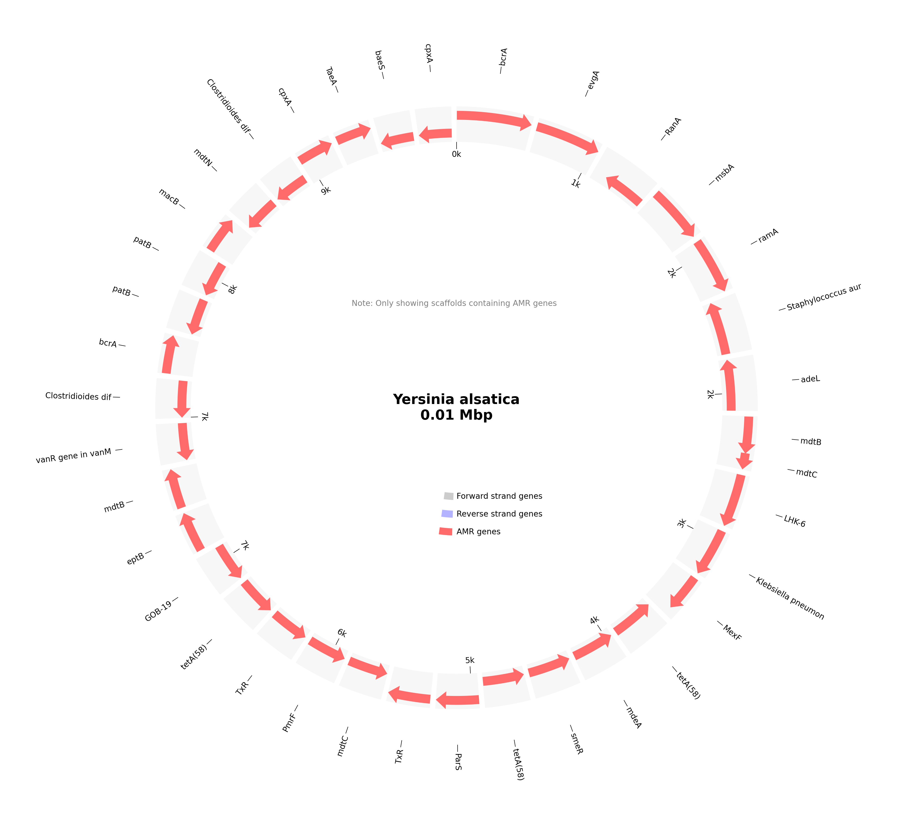

### Clostridioides difficile cplR
- **Mechanism**: antibiotic target protection
- **Drug Classes**: lincosamide antibiotic; streptogramin antibiotic; streptogramin A antibiotic; nucleoside antibiotic
- **AMR Family**: Miscellaneous ABC-F subfamily ATP-binding cassette ribosomal protection proteins
- **Locations**:
  - gnl|SPADES|DAOGIJFL_38595_1 : position 2-220

### Clostridioides difficile gyrB conferring resistance to fluoroquinolones
- **Mechanism**: antibiotic target alteration
- **Drug Classes**: fluoroquinolone antibiotic
- **AMR Family**: fluoroquinolone resistant gyrB
- **Locations**:
  - gnl|SPADES|DAOGIJFL_35151_1 : position 2-235

### GOB-19
- **Mechanism**: antibiotic inactivation
- **Drug Classes**: carbapenem; cephalosporin; penam
- **AMR Family**: GOB beta-lactamase
- **Locations**:
  - gnl|SPADES|DAOGIJFL_32699_1 : position 1-246

### Klebsiella pneumoniae acrR with mutation conferring multidrug antibiotic resistance
- **Mechanism**: antibiotic target alteration; antibiotic efflux
- **Drug Classes**: fluoroquinolone antibiotic; cephalosporin; glycylcycline; penam; tetracycline antibiotic; rifamycin antibiotic; phenicol antibiotic; disinfecting agents and antiseptics
- **AMR Family**: resistance-nodulation-cell division (RND) antibiotic efflux pump
- **Locations**:
  - gnl|SPADES|DAOGIJFL_24326_1 : position 2-292

### LHK-6
- **Mechanism**: antibiotic inactivation
- **Drug Classes**: carbapenem; cephalosporin
- **AMR Family**: LHK beta-lactamase
- **Locations**:
  - gnl|SPADES|DAOGIJFL_21740_1 : position 1-321

### MexF
- **Mechanism**: antibiotic efflux
- **Drug Classes**: fluoroquinolone antibiotic; diaminopyrimidine antibiotic; phenicol antibiotic
- **AMR Family**: resistance-nodulation-cell division (RND) antibiotic efflux pump
- **Locations**:
  - gnl|SPADES|DAOGIJFL_26578_1 : position 1-228

### ParS
- **Mechanism**: antibiotic efflux; reduced permeability to antibiotic
- **Drug Classes**: macrolide antibiotic; fluoroquinolone antibiotic; monobactam; aminoglycoside antibiotic; carbapenem; cephalosporin; cephamycin; penam; tetracycline antibiotic; phenicol antibiotic; penem; disinfecting agents and antiseptics
- **AMR Family**: resistance-nodulation-cell division (RND) antibiotic efflux pump; Outer Membrane Porin (Opr)
- **Locations**:
  - gnl|SPADES|DAOGIJFL_30342_1 : position 1-258

### PmrF
- **Mechanism**: antibiotic target alteration
- **Drug Classes**: peptide antibiotic
- **AMR Family**: pmr phosphoethanolamine transferase
- **Locations**:
  - gnl|SPADES|DAOGIJFL_31778_1 : position 1-249

### RanA
- **Mechanism**: antibiotic efflux
- **Drug Classes**: aminoglycoside antibiotic
- **AMR Family**: ATP-binding cassette (ABC) antibiotic efflux pump
- **Locations**:
  - gnl|SPADES|DAOGIJFL_18848_1 : position 90-359

### Staphylococcus aureus mupB conferring resistance to mupirocin
- **Mechanism**: antibiotic target alteration
- **Drug Classes**: mupirocin-like antibiotic
- **AMR Family**: antibiotic-resistant isoleucyl-tRNA synthetase (ileS)
- **Locations**:
  - gnl|SPADES|DAOGIJFL_20151_1 : position 1-339

### TaeA
- **Mechanism**: antibiotic efflux
- **Drug Classes**: pleuromutilin antibiotic
- **AMR Family**: ATP-binding cassette (ABC) antibiotic efflux pump
- **Locations**:
  - gnl|SPADES|DAOGIJFL_39170_1 : position 3-218

### TxR (found in 2 locations)
- **Mechanism**: antibiotic efflux
- **Drug Classes**: tetracycline antibiotic
- **AMR Family**: ATP-binding cassette (ABC) antibiotic efflux pump
- **Locations**:
  - gnl|SPADES|DAOGIJFL_30505_1 : position 3-257
  - gnl|SPADES|DAOGIJFL_31915_1 : position 3-248

### adeL
- **Mechanism**: antibiotic efflux
- **Drug Classes**: fluoroquinolone antibiotic; tetracycline antibiotic
- **AMR Family**: resistance-nodulation-cell division (RND) antibiotic efflux pump
- **Locations**:
  - gnl|SPADES|DAOGIJFL_21234_1 : position 3-326

### baeS
- **Mechanism**: antibiotic efflux
- **Drug Classes**: aminoglycoside antibiotic; aminocoumarin antibiotic
- **AMR Family**: resistance-nodulation-cell division (RND) antibiotic efflux pump
- **Locations**:
  - gnl|SPADES|DAOGIJFL_40106_1 : position 2-214

### bcrA (found in 2 locations)
- **Mechanism**: antibiotic efflux
- **Drug Classes**: peptide antibiotic
- **AMR Family**: ATP-binding cassette (ABC) antibiotic efflux pump
- **Locations**:
  - gnl|SPADES|DAOGIJFL_13978_1 : position 2-451
  - gnl|SPADES|DAOGIJFL_35370_1 : position 3-233

### cpxA (found in 2 locations)
- **Mechanism**: antibiotic efflux
- **Drug Classes**: aminoglycoside antibiotic; aminocoumarin antibiotic
- **AMR Family**: resistance-nodulation-cell division (RND) antibiotic efflux pump
- **Locations**:
  - gnl|SPADES|DAOGIJFL_38882_1 : position 1-219
  - gnl|SPADES|DAOGIJFL_40526_1 : position 3-212

### eptB
- **Mechanism**: antibiotic target alteration
- **Drug Classes**: peptide antibiotic
- **AMR Family**: pmr phosphoethanolamine transferase
- **Locations**:
  - gnl|SPADES|DAOGIJFL_32891_1 : position 2-244

### evgA
- **Mechanism**: antibiotic efflux
- **Drug Classes**: macrolide antibiotic; fluoroquinolone antibiotic; penam; tetracycline antibiotic
- **AMR Family**: major facilitator superfamily (MFS) antibiotic efflux pump; resistance-nodulation-cell division (RND) antibiotic efflux pump
- **Locations**:
  - gnl|SPADES|DAOGIJFL_16627_1 : position 1-396

### macB
- **Mechanism**: antibiotic efflux
- **Drug Classes**: macrolide antibiotic
- **AMR Family**: ATP-binding cassette (ABC) antibiotic efflux pump
- **Locations**:
  - gnl|SPADES|DAOGIJFL_37737_1 : position 2-223

### mdeA
- **Mechanism**: antibiotic efflux
- **Drug Classes**: fluoroquinolone antibiotic; aminoglycoside antibiotic; penam; tetracycline antibiotic; disinfecting agents and antiseptics
- **AMR Family**: major facilitator superfamily (MFS) antibiotic efflux pump
- **Locations**:
  - gnl|SPADES|DAOGIJFL_27050_1 : position 3-272

### mdtB (found in 2 locations)
- **Mechanism**: antibiotic efflux
- **Drug Classes**: aminocoumarin antibiotic
- **AMR Family**: resistance-nodulation-cell division (RND) antibiotic efflux pump
- **Locations**:
  - gnl|SPADES|DAOGIJFL_21789_1 : position 3-224
  - gnl|SPADES|DAOGIJFL_33723_1 : position 1-240

### mdtC (found in 2 locations)
- **Mechanism**: antibiotic efflux
- **Drug Classes**: aminocoumarin antibiotic
- **AMR Family**: resistance-nodulation-cell division (RND) antibiotic efflux pump
- **Locations**:
  - gnl|SPADES|DAOGIJFL_21789_2 : position 221-319
  - gnl|SPADES|DAOGIJFL_30631_1 : position 2-256

### mdtN
- **Mechanism**: antibiotic efflux
- **Drug Classes**: nucleoside antibiotic; disinfecting agents and antiseptics
- **AMR Family**: major facilitator superfamily (MFS) antibiotic efflux pump
- **Locations**:
  - gnl|SPADES|DAOGIJFL_38297_1 : position 1-222

### msbA
- **Mechanism**: antibiotic efflux
- **Drug Classes**: nitroimidazole antibiotic
- **AMR Family**: ATP-binding cassette (ABC) antibiotic efflux pump
- **Locations**:
  - gnl|SPADES|DAOGIJFL_19825_1 : position 3-344

### patB (found in 2 locations)
- **Mechanism**: antibiotic efflux
- **Drug Classes**: fluoroquinolone antibiotic
- **AMR Family**: ATP-binding cassette (ABC) antibiotic efflux pump
- **Locations**:
  - gnl|SPADES|DAOGIJFL_35782_1 : position 2-232
  - gnl|SPADES|DAOGIJFL_37448_1 : position 2-223

### ramA
- **Mechanism**: antibiotic efflux; reduced permeability to antibiotic
- **Drug Classes**: fluoroquinolone antibiotic; monobactam; carbapenem; cephalosporin; glycylcycline; cephamycin; penam; tetracycline antibiotic; rifamycin antibiotic; phenicol antibiotic; penem; disinfecting agents and antiseptics
- **AMR Family**: resistance-nodulation-cell division (RND) antibiotic efflux pump; General Bacterial Porin with reduced permeability to beta-lactams
- **Locations**:
  - gnl|SPADES|DAOGIJFL_20108_1 : position 3-341

### smeR
- **Mechanism**: antibiotic efflux
- **Drug Classes**: aminoglycoside antibiotic; cephalosporin; cephamycin; penam
- **AMR Family**: resistance-nodulation-cell division (RND) antibiotic efflux pump
- **Locations**:
  - gnl|SPADES|DAOGIJFL_27079_1 : position 2-274

### tetA(58) (found in 3 locations)
- **Mechanism**: antibiotic efflux
- **Drug Classes**: tetracycline antibiotic
- **AMR Family**: major facilitator superfamily (MFS) antibiotic efflux pump
- **Locations**:
  - gnl|SPADES|DAOGIJFL_27151_1 : position 1-273
  - gnl|SPADES|DAOGIJFL_28432_1 : position 2-265
  - gnl|SPADES|DAOGIJFL_32506_1 : position 1-246

### vanR gene in vanM cluster
- **Mechanism**: antibiotic target alteration
- **Drug Classes**: glycopeptide antibiotic
- **AMR Family**: glycopeptide resistance gene cluster; vanR
- **Locations**:
  - gnl|SPADES|DAOGIJFL_34173_1 : position 2-238

## Yersinia enterocolitica
**Strain Statistics:**
- Total genome length: 190.2 kbp
- Total scaffolds: 5488
- Scaffolds with AMR genes: 389
- Total genes annotated: 216
- Total AMR genes: 404
- Unique AMR genes: 175
- Distinct AMR mechanisms: 9
- Distinct AMR families: 56
- Distinct drug classes: 34

**Circos Plot:**

### Acinetobacter baumannii AbaF (found in 2 locations)
- **Mechanism**: antibiotic efflux
- **Drug Classes**: phosphonic acid antibiotic
- **AMR Family**: major facilitator superfamily (MFS) antibiotic efflux pump
- **Locations**:
  - gnl|SPADES|DAOGIJFL_11715_1 : position 1-516
  - gnl|SPADES|DAOGIJFL_29676_1 : position 1-261

### Acinetobacter baumannii AbaQ (found in 3 locations)
- **Mechanism**: antibiotic efflux
- **Drug Classes**: fluoroquinolone antibiotic
- **AMR Family**: major facilitator superfamily (MFS) antibiotic efflux pump
- **Locations**:
  - gnl|SPADES|DAOGIJFL_12025_1 : position 2-508
  - gnl|SPADES|DAOGIJFL_25333_1 : position 122-283
  - gnl|SPADES|DAOGIJFL_26636_1 : position 2-274

### Acinetobacter baumannii AmvA (found in 2 locations)
- **Mechanism**: antibiotic efflux
- **Drug Classes**: macrolide antibiotic; disinfecting agents and antiseptics
- **AMR Family**: major facilitator superfamily (MFS) antibiotic efflux pump
- **Locations**:
  - gnl|SPADES|DAOGIJFL_20086_1 : position 2-340
  - gnl|SPADES|DAOGIJFL_8720_1 : position 2-649

### AcrE
- **Mechanism**: antibiotic efflux
- **Drug Classes**: fluoroquinolone antibiotic; cephalosporin; cephamycin; penam
- **AMR Family**: resistance-nodulation-cell division (RND) antibiotic efflux pump
- **Locations**:
  - gnl|SPADES|DAOGIJFL_22444_1 : position 2-313

### AcrF (found in 2 locations)
- **Mechanism**: antibiotic efflux
- **Drug Classes**: fluoroquinolone antibiotic; cephalosporin; cephamycin; penam
- **AMR Family**: resistance-nodulation-cell division (RND) antibiotic efflux pump
- **Locations**:
  - gnl|SPADES|DAOGIJFL_11732_1 : position 2-514
  - gnl|SPADES|DAOGIJFL_13333_1 : position 3-470

### ArnT (found in 3 locations)
- **Mechanism**: antibiotic target alteration
- **Drug Classes**: peptide antibiotic
- **AMR Family**: pmr phosphoethanolamine transferase
- **Locations**:
  - gnl|SPADES|DAOGIJFL_39470_1 : position 1-216
  - gnl|SPADES|DAOGIJFL_5618_1 : position 3-422
  - gnl|SPADES|DAOGIJFL_5618_2 : position 361-573

### BIL-1
- **Mechanism**: antibiotic inactivation
- **Drug Classes**: cephalosporin
- **AMR Family**: BIL Beta-lactamase
- **Locations**:
  - gnl|SPADES|DAOGIJFL_32389_1 : position 40-246

### CMY-157
- **Mechanism**: antibiotic inactivation
- **Drug Classes**: cephamycin
- **AMR Family**: CMY beta-lactamase
- **Locations**:
  - gnl|SPADES|DAOGIJFL_10080_1 : position 1-261

### CMY-26
- **Mechanism**: antibiotic inactivation
- **Drug Classes**: cephamycin
- **AMR Family**: CMY beta-lactamase
- **Locations**:
  - gnl|SPADES|DAOGIJFL_13729_1 : position 2-445

### Chlamydia trachomatis intrinsic murA conferring resistance to fosfomycin (found in 2 locations)
- **Mechanism**: antibiotic target alteration
- **Drug Classes**: phosphonic acid antibiotic
- **AMR Family**: antibiotic-resistant murA transferase
- **Locations**:
  - gnl|SPADES|DAOGIJFL_14817_1 : position 3-425
  - gnl|SPADES|DAOGIJFL_30186_1 : position 2-157

### Clostridioides difficile gyrB conferring resistance to fluoroquinolones
- **Mechanism**: antibiotic target alteration
- **Drug Classes**: fluoroquinolone antibiotic
- **AMR Family**: fluoroquinolone resistant gyrB
- **Locations**:
  - gnl|SPADES|DAOGIJFL_14775_1 : position 3-434

### Clostridium perfringes cplR
- **Mechanism**: antibiotic target protection
- **Drug Classes**: lincosamide antibiotic; streptogramin antibiotic; streptogramin A antibiotic; pleuromutilin antibiotic
- **AMR Family**: Miscellaneous ABC-F subfamily ATP-binding cassette ribosomal protection proteins
- **Locations**:
  - gnl|SPADES|DAOGIJFL_20318_1 : position 1-336

### CrcB (found in 2 locations)
- **Mechanism**: antibiotic efflux
- **Drug Classes**: aminoglycoside antibiotic
- **AMR Family**: multidrug and toxic compound extrusion (MATE) transporter
- **Locations**:
  - gnl|SPADES|DAOGIJFL_16281_2 : position 187-402
  - gnl|SPADES|DAOGIJFL_19146_1 : position 1-330

### EC-18
- **Mechanism**: antibiotic inactivation
- **Drug Classes**: cephalosporin
- **AMR Family**: EC beta-lactamase
- **Locations**:
  - gnl|SPADES|DAOGIJFL_33034_1 : position 2-244

### Enterococcus faecium cls conferring resistance to daptomycin
- **Mechanism**: antibiotic target alteration
- **Drug Classes**: peptide antibiotic
- **AMR Family**: daptomycin resistant cls
- **Locations**:
  - gnl|SPADES|DAOGIJFL_14849_1 : position 3-431

### Escherichia coli AcrAB-TolC with AcrR mutation conferring resistance to ciprofloxacin, tetracycline, and ceftazidime
- **Mechanism**: antibiotic target alteration; antibiotic efflux
- **Drug Classes**: fluoroquinolone antibiotic; cephalosporin; glycylcycline; penam; tetracycline antibiotic; rifamycin antibiotic; phenicol antibiotic; disinfecting agents and antiseptics
- **AMR Family**: resistance-nodulation-cell division (RND) antibiotic efflux pump
- **Locations**:
  - gnl|SPADES|DAOGIJFL_12628_1 : position 1-228

### Escherichia coli acrA
- **Mechanism**: antibiotic efflux
- **Drug Classes**: fluoroquinolone antibiotic; cephalosporin; glycylcycline; penam; tetracycline antibiotic; rifamycin antibiotic; phenicol antibiotic; disinfecting agents and antiseptics
- **AMR Family**: resistance-nodulation-cell division (RND) antibiotic efflux pump
- **Locations**:
  - gnl|SPADES|DAOGIJFL_41523_1 : position 1-207

### Escherichia coli ampC beta-lactamase
- **Mechanism**: antibiotic inactivation
- **Drug Classes**: cephalosporin; penam
- **AMR Family**: ampC-type beta-lactamase
- **Locations**:
  - gnl|SPADES|DAOGIJFL_35073_1 : position 1-234

### Escherichia coli fabG mutations conferring resistance to triclosan
- **Mechanism**: antibiotic target alteration
- **Drug Classes**: disinfecting agents and antiseptics
- **AMR Family**: antibiotic resistant fabG
- **Locations**:
  - gnl|SPADES|DAOGIJFL_11382_1 : position 1-441

### Escherichia coli mdfA (found in 3 locations)
- **Mechanism**: antibiotic efflux
- **Drug Classes**: tetracycline antibiotic; phenicol antibiotic; disinfecting agents and antiseptics
- **AMR Family**: major facilitator superfamily (MFS) antibiotic efflux pump
- **Locations**:
  - gnl|SPADES|DAOGIJFL_11962_1 : position 280-510
  - gnl|SPADES|DAOGIJFL_19875_1 : position 2-343
  - gnl|SPADES|DAOGIJFL_35902_1 : position 1-231

### Escherichia coli soxS with mutation conferring antibiotic resistance (found in 3 locations)
- **Mechanism**: antibiotic target alteration; antibiotic efflux; reduced permeability to antibiotic
- **Drug Classes**: fluoroquinolone antibiotic; monobactam; carbapenem; cephalosporin; glycylcycline; cephamycin; penam; tetracycline antibiotic; rifamycin antibiotic; phenicol antibiotic; penem; disinfecting agents and antiseptics
- **AMR Family**: ATP-binding cassette (ABC) antibiotic efflux pump; major facilitator superfamily (MFS) antibiotic efflux pump; resistance-nodulation-cell division (RND) antibiotic efflux pump; General Bacterial Porin with reduced permeability to beta-lactams
- **Locations**:
  - gnl|SPADES|DAOGIJFL_22325_1 : position 1-312
  - gnl|SPADES|DAOGIJFL_31141_1 : position 4-252
  - gnl|SPADES|DAOGIJFL_9391_2 : position 376-612

### EstT
- **Mechanism**: antibiotic inactivation
- **Drug Classes**: macrolide antibiotic
- **AMR Family**: macrolide esterase
- **Locations**:
  - gnl|SPADES|DAOGIJFL_35724_1 : position 1-231

### GOB-14
- **Mechanism**: antibiotic inactivation
- **Drug Classes**: carbapenem; cephalosporin; penam
- **AMR Family**: GOB beta-lactamase
- **Locations**:
  - gnl|SPADES|DAOGIJFL_7199_2 : position 346-708

### Haemophilus influenzae PBP3 conferring resistance to beta-lactam antibiotics
- **Mechanism**: antibiotic target alteration
- **Drug Classes**: cephalosporin; cephamycin; penam
- **AMR Family**: Penicillin-binding protein mutations conferring resistance to beta-lactam antibiotics
- **Locations**:
  - gnl|SPADES|DAOGIJFL_4808_1 : position 1-1029

### Helicobacter pylori pbp1 mutants conferring resistance to amoxicillin (found in 2 locations)
- **Mechanism**: antibiotic target alteration
- **Drug Classes**: cephalosporin; cephamycin; penam
- **AMR Family**: Penicillin-binding protein mutations conferring resistance to beta-lactam antibiotics
- **Locations**:
  - gnl|SPADES|DAOGIJFL_21084_1 : position 3-329
  - gnl|SPADES|DAOGIJFL_9825_1 : position 3-593

### Helicobacter pylori pbp2 mutants conferring resistance to amoxicillin
- **Mechanism**: antibiotic target alteration
- **Drug Classes**: cephalosporin; cephamycin; penam
- **AMR Family**: Penicillin-binding protein mutations conferring resistance to beta-lactam antibiotics
- **Locations**:
  - gnl|SPADES|DAOGIJFL_11704_1 : position 1-516

### Klebsiella pneumoniae KpnE
- **Mechanism**: antibiotic efflux
- **Drug Classes**: macrolide antibiotic; aminoglycoside antibiotic; cephalosporin; tetracycline antibiotic; peptide antibiotic; rifamycin antibiotic; disinfecting agents and antiseptics
- **AMR Family**: small multidrug resistance (SMR) antibiotic efflux pump
- **Locations**:
  - gnl|SPADES|DAOGIJFL_9835_2 : position 379-591

### Klebsiella pneumoniae KpnF
- **Mechanism**: antibiotic efflux
- **Drug Classes**: macrolide antibiotic; aminoglycoside antibiotic; cephalosporin; tetracycline antibiotic; peptide antibiotic; rifamycin antibiotic; disinfecting agents and antiseptics
- **AMR Family**: small multidrug resistance (SMR) antibiotic efflux pump
- **Locations**:
  - gnl|SPADES|DAOGIJFL_9835_1: position 63-392

### Klebsiella pneumoniae KpnG
- **Mechanism**: antibiotic efflux
- **Drug Classes**: macrolide antibiotic; fluoroquinolone antibiotic; aminoglycoside antibiotic; carbapenem; cephalosporin; penam; peptide antibiotic; penem
- **AMR Family**: major facilitator superfamily (MFS) antibiotic efflux pump
- **Locations**:
  - gnl|SPADES|DAOGIJFL_16924_1 : position 2-214

### Klebsiella pneumoniae KpnH
- **Mechanism**: antibiotic efflux
- **Drug Classes**: macrolide antibiotic; fluoroquinolone antibiotic; aminoglycoside antibiotic; carbapenem; cephalosporin; penam; peptide antibiotic; penem
- **AMR Family**: major facilitator superfamily (MFS) antibiotic efflux pump
- **Locations**:
  - gnl|SPADES|DAOGIJFL_6974_1 : position 291-776

### Klebsiella pneumoniae OmpK37 (found in 5 locations)
- **Mechanism**: reduced permeability to antibiotic
- **Drug Classes**: monobactam; carbapenem; cephalosporin; cephamycin; penam; penem
- **AMR Family**: General Bacterial Porin with reduced permeability to beta-lactams
- **Locations**:
  - gnl|SPADES|DAOGIJFL_26629_1 : position 3-275
  - gnl|SPADES|DAOGIJFL_28871_1 : position 3-110
  - gnl|SPADES|DAOGIJFL_33331_1 : position 3-242
  - gnl|SPADES|DAOGIJFL_3681_1 : position 3-851
  - gnl|SPADES|DAOGIJFL_9691_1 : position 3-599

### Klebsiella pneumoniae acrA
- **Mechanism**: antibiotic efflux
- **Drug Classes**: fluoroquinolone antibiotic; cephalosporin; glycylcycline; penam; tetracycline antibiotic; rifamycin antibiotic; phenicol antibiotic; disinfecting agents and antiseptics
- **AMR Family**: resistance-nodulation-cell division (RND) antibiotic efflux pump
- **Locations**:
  - gnl|SPADES|DAOGIJFL_12628_2 : position 385-489

### LlmA 23S ribosomal RNA methyltransferase
- **Mechanism**: antibiotic target alteration
- **Drug Classes**: lincosamide antibiotic
- **AMR Family**: Llm 23S ribosomal RNA methyltransferase
- **Locations**:
  - gnl|SPADES|DAOGIJFL_13871_1 : position 2-454

### LptD (found in 4 locations)
- **Mechanism**: antibiotic efflux
- **Drug Classes**: carbapenem; peptide antibiotic; aminocoumarin antibiotic; rifamycin antibiotic
- **AMR Family**: ATP-binding cassette (ABC) antibiotic efflux pump
- **Locations**:
  - gnl|SPADES|DAOGIJFL_27293_1 : position 3-272
  - gnl|SPADES|DAOGIJFL_32263_1 : position 1-249
  - gnl|SPADES|DAOGIJFL_34587_1 : position 2-238
  - gnl|SPADES|DAOGIJFL_36995_1 : position 1-225

### MSI-1
- **Mechanism**: antibiotic inactivation
- **Drug Classes**: carbapenem
- **AMR Family**: MSI beta-lactamase
- **Locations**:
  - gnl|SPADES|DAOGIJFL_26893_1 : position 2-274

### MdtK
- **Mechanism**: antibiotic efflux
- **Drug Classes**: fluoroquinolone antibiotic
- **AMR Family**: multidrug and toxic compound extrusion (MATE) transporter
- **Locations**:
  - gnl|SPADES|DAOGIJFL_6931_1 : position 3-428

### MdtQ
- **Mechanism**: reduced permeability to antibiotic
- **Drug Classes**: monobactam; carbapenem; cephalosporin; cephamycin; penam; penem
- **AMR Family**: Outer Membrane Porin (Opr)
- **Locations**:
  - gnl|SPADES|DAOGIJFL_7855_2 : position 168-704

### MexD
- **Mechanism**: antibiotic efflux
- **Drug Classes**: macrolide antibiotic; fluoroquinolone antibiotic; aminoglycoside antibiotic; cephalosporin; penam; tetracycline antibiotic; aminocoumarin antibiotic; diaminopyrimidine antibiotic; phenicol antibiotic
- **AMR Family**: resistance-nodulation-cell division (RND) antibiotic efflux pump
- **Locations**:
  - gnl|SPADES|DAOGIJFL_13472_1 : position 3-464

### MexE (found in 2 locations)
- **Mechanism**: antibiotic efflux
- **Drug Classes**: fluoroquinolone antibiotic; diaminopyrimidine antibiotic; phenicol antibiotic
- **AMR Family**: resistance-nodulation-cell division (RND) antibiotic efflux pump
- **Locations**:
  - gnl|SPADES|DAOGIJFL_11526_1 : position 2-514
  - gnl|SPADES|DAOGIJFL_6695_1 : position 2-730

### MexF
- **Mechanism**: antibiotic efflux
- **Drug Classes**: fluoroquinolone antibiotic; diaminopyrimidine antibiotic; phenicol antibiotic
- **AMR Family**: resistance-nodulation-cell division (RND) antibiotic efflux pump
- **Locations**:
  - gnl|SPADES|DAOGIJFL_5888_1 : position 1-882

### MexK (found in 2 locations)
- **Mechanism**: antibiotic efflux
- **Drug Classes**: macrolide antibiotic; tetracycline antibiotic; disinfecting agents and antiseptics
- **AMR Family**: resistance-nodulation-cell division (RND) antibiotic efflux pump
- **Locations**:
  - gnl|SPADES|DAOGIJFL_19017_1 : position 2-355
  - gnl|SPADES|DAOGIJFL_3993_1 : position 3-293

### MexS (found in 3 locations)
- **Mechanism**: antibiotic efflux
- **Drug Classes**: fluoroquinolone antibiotic; diaminopyrimidine antibiotic; phenicol antibiotic
- **AMR Family**: resistance-nodulation-cell division (RND) antibiotic efflux pump
- **Locations**:
  - gnl|SPADES|DAOGIJFL_11042_1 : position 2-541
  - gnl|SPADES|DAOGIJFL_17857_1 : position 3-374
  - gnl|SPADES|DAOGIJFL_24691_1 : position 3-251

### Mycobacterium tuberculosis kasA mutant conferring resistance to isoniazid
- **Mechanism**: antibiotic target alteration
- **Drug Classes**: isoniazid-like antibiotic
- **AMR Family**: antibiotic resistant kasA
- **Locations**:
  - gnl|SPADES|DAOGIJFL_19199_1 : position 1-354

### Mycobacterium tuberculosis pncA mutations conferring resistance to pyrazinamide
- **Mechanism**: antibiotic target alteration
- **Drug Classes**: pyrazine antibiotic
- **AMR Family**: Pyrazinamide resistant pncA
- **Locations**:
  - gnl|SPADES|DAOGIJFL_9692_2 : position 366-599

### NmcR (found in 7 locations)
- **Mechanism**: antibiotic inactivation
- **Drug Classes**: carbapenem; cephalosporin; cephamycin; penam
- **AMR Family**: NmcA beta-lactamase
- **Locations**:
  - gnl|SPADES|DAOGIJFL_10080_2 : position 396-581
  - gnl|SPADES|DAOGIJFL_15372_1 : position 3-305
  - gnl|SPADES|DAOGIJFL_17408_2 : position 229-381
  - gnl|SPADES|DAOGIJFL_20582_1 : position 137-334
  - gnl|SPADES|DAOGIJFL_23012_1 : position 3-305
  - gnl|SPADES|DAOGIJFL_24010_1 : position 1-294
  - gnl|SPADES|DAOGIJFL_28710_1 : position 1-264

### OmpA
- **Mechanism**: reduced permeability to antibiotic
- **Drug Classes**: peptide antibiotic
- **AMR Family**: General Bacterial Porin with reduced permeability to peptide antibiotics
- **Locations**:
  - gnl|SPADES|DAOGIJFL_35049_1 : position 3-236

### OprM
- **Mechanism**: antibiotic efflux
- **Drug Classes**: macrolide antibiotic; fluoroquinolone antibiotic; monobactam; aminoglycoside antibiotic; carbapenem; cephalosporin; cephamycin; penam; tetracycline antibiotic; peptide antibiotic; aminocoumarin antibiotic; diaminopyrimidine antibiotic; sulfonamide antibiotic; phenicol antibiotic; penem; disinfecting agents and antiseptics
- **AMR Family**: resistance-nodulation-cell division (RND) antibiotic efflux pump
- **Locations**:
  - gnl|SPADES|DAOGIJFL_10531_1 : position 2-562

### OprZ
- **Mechanism**: antibiotic efflux
- **Drug Classes**: macrolide antibiotic; fluoroquinolone antibiotic; aminoglycoside antibiotic; cephalosporin
- **AMR Family**: resistance-nodulation-cell division (RND) antibiotic efflux pump
- **Locations**:
  - gnl|SPADES|DAOGIJFL_7833_1 : position 1-396

### ParR
- **Mechanism**: antibiotic efflux; reduced permeability to antibiotic
- **Drug Classes**: macrolide antibiotic; fluoroquinolone antibiotic; monobactam; aminoglycoside antibiotic; carbapenem; cephalosporin; cephamycin; penam; tetracycline antibiotic; phenicol antibiotic; penem; disinfecting agents and antiseptics
- **AMR Family**: resistance-nodulation-cell division (RND) antibiotic efflux pump; Outer Membrane Porin (Opr)
- **Locations**:
  - gnl|SPADES|DAOGIJFL_7033_1 : position 92-769

### ParS (found in 4 locations)
- **Mechanism**: antibiotic efflux; reduced permeability to antibiotic
- **Drug Classes**: macrolide antibiotic; fluoroquinolone antibiotic; monobactam; aminoglycoside antibiotic; carbapenem; cephalosporin; cephamycin; penam; tetracycline antibiotic; phenicol antibiotic; penem; disinfecting agents and antiseptics
- **AMR Family**: resistance-nodulation-cell division (RND) antibiotic efflux pump; Outer Membrane Porin (Opr)
- **Locations**:
  - gnl|SPADES|DAOGIJFL_14637_1 : position 2-436
  - gnl|SPADES|DAOGIJFL_18305_1 : position 3-368
  - gnl|SPADES|DAOGIJFL_39991_1 : position 1-213
  - gnl|SPADES|DAOGIJFL_6907_1 : position 3-515

### PmpM (found in 2 locations)
- **Mechanism**: antibiotic efflux
- **Drug Classes**: fluoroquinolone antibiotic; aminoglycoside antibiotic; disinfecting agents and antiseptics
- **AMR Family**: multidrug and toxic compound extrusion (MATE) transporter
- **Locations**:
  - gnl|SPADES|DAOGIJFL_22135_1 : position 2-316
  - gnl|SPADES|DAOGIJFL_6031_1 : position 3-161

### PmrF (found in 5 locations)
- **Mechanism**: antibiotic target alteration
- **Drug Classes**: peptide antibiotic
- **AMR Family**: pmr phosphoethanolamine transferase
- **Locations**:
  - gnl|SPADES|DAOGIJFL_10568_1 : position 1-561
  - gnl|SPADES|DAOGIJFL_16457_1 : position 2-397
  - gnl|SPADES|DAOGIJFL_16522_2 : position 180-398
  - gnl|SPADES|DAOGIJFL_36021_1 : position 2-232
  - gnl|SPADES|DAOGIJFL_6671_2 : position 396-800

### Pseudomonas aeruginosa CpxR (found in 3 locations)
- **Mechanism**: antibiotic efflux
- **Drug Classes**: macrolide antibiotic; fluoroquinolone antibiotic; monobactam; aminoglycoside antibiotic; carbapenem; cephalosporin; cephamycin; penam; tetracycline antibiotic; peptide antibiotic; aminocoumarin antibiotic; diaminopyrimidine antibiotic; sulfonamide antibiotic; phenicol antibiotic; penem
- **AMR Family**: resistance-nodulation-cell division (RND) antibiotic efflux pump
- **Locations**:
  - gnl|SPADES|DAOGIJFL_15237_1 : position 2-424
  - gnl|SPADES|DAOGIJFL_33068_1 : position 1-243
  - gnl|SPADES|DAOGIJFL_4035_2 : position 1034-1183

### QepA4
- **Mechanism**: antibiotic efflux
- **Drug Classes**: fluoroquinolone antibiotic
- **AMR Family**: major facilitator superfamily (MFS) antibiotic efflux pump
- **Locations**:
  - gnl|SPADES|DAOGIJFL_2856_1 : position 1-1524

### RanA (found in 6 locations)
- **Mechanism**: antibiotic efflux
- **Drug Classes**: aminoglycoside antibiotic
- **AMR Family**: ATP-binding cassette (ABC) antibiotic efflux pump
- **Locations**:
  - gnl|SPADES|DAOGIJFL_11252_1 : position 37-534
  - gnl|SPADES|DAOGIJFL_13897_1 : position 2-424
  - gnl|SPADES|DAOGIJFL_14397_1 : position 3-443
  - gnl|SPADES|DAOGIJFL_31000_1 : position 3-254
  - gnl|SPADES|DAOGIJFL_40839_1 : position 66-209
  - gnl|SPADES|DAOGIJFL_7951_1 : position 349-699

### RanB
- **Mechanism**: antibiotic efflux
- **Drug Classes**: aminoglycoside antibiotic
- **AMR Family**: ATP-binding cassette (ABC) antibiotic efflux pump
- **Locations**:
  - gnl|SPADES|DAOGIJFL_6923_1 : position 1-681

### RlmA(II)
- **Mechanism**: antibiotic target alteration
- **Drug Classes**: macrolide antibiotic; lincosamide antibiotic
- **AMR Family**: non-erm 23S ribosomal RNA methyltransferase (G748)
- **Locations**:
  - gnl|SPADES|DAOGIJFL_17891_1 : position 1-126

### Rv1877
- **Mechanism**: antibiotic efflux
- **Drug Classes**: fluoroquinolone antibiotic
- **AMR Family**: major facilitator superfamily (MFS) antibiotic efflux pump
- **Locations**:
  - gnl|SPADES|DAOGIJFL_41300_1 : position 2-208

### Staphylococcus aureus GlpT with mutation conferring resistance to fosfomycin
- **Mechanism**: antibiotic target alteration
- **Drug Classes**: phosphonic acid antibiotic
- **AMR Family**: antibiotic-resistant GlpT
- **Locations**:
  - gnl|SPADES|DAOGIJFL_13792_1 : position 3-458

### Staphylococcus aureus fusA with mutation conferring resistance to fusidic acid
- **Mechanism**: antibiotic target alteration
- **Drug Classes**: fusidane antibiotic
- **AMR Family**: antibiotic resistant fusA
- **Locations**:
  - gnl|SPADES|DAOGIJFL_25377_1 : position 3-284

### Staphylococcus aureus mupA conferring resistance to mupirocin (found in 2 locations)
- **Mechanism**: antibiotic target alteration
- **Drug Classes**: mupirocin-like antibiotic
- **AMR Family**: antibiotic-resistant isoleucyl-tRNA synthetase (ileS)
- **Locations**:
  - gnl|SPADES|DAOGIJFL_14830_1 : position 3-431
  - gnl|SPADES|DAOGIJFL_5273_1 : position 1-960

### Streptomyces lividans otr(A) (found in 2 locations)
- **Mechanism**: antibiotic target protection
- **Drug Classes**: tetracycline antibiotic
- **AMR Family**: tetracycline-resistant ribosomal protection protein
- **Locations**:
  - gnl|SPADES|DAOGIJFL_11916_1 : position 3-509
  - gnl|SPADES|DAOGIJFL_13273_1 : position 2-472

### Streptomyces venezuelae rox
- **Mechanism**: antibiotic inactivation
- **Drug Classes**: rifamycin antibiotic
- **AMR Family**: rifampin monooxygenase
- **Locations**:
  - gnl|SPADES|DAOGIJFL_8215_1 : position 3-611

### TaeA (found in 4 locations)
- **Mechanism**: antibiotic efflux
- **Drug Classes**: pleuromutilin antibiotic
- **AMR Family**: ATP-binding cassette (ABC) antibiotic efflux pump
- **Locations**:
  - gnl|SPADES|DAOGIJFL_17956_1 : position 1-372
  - gnl|SPADES|DAOGIJFL_36462_1 : position 2-229
  - gnl|SPADES|DAOGIJFL_6666_1 : position 3-212
  - gnl|SPADES|DAOGIJFL_8136_1 : position 3-686

### TolC (found in 4 locations)
- **Mechanism**: antibiotic efflux
- **Drug Classes**: macrolide antibiotic; fluoroquinolone antibiotic; aminoglycoside antibiotic; carbapenem; cephalosporin; glycylcycline; cephamycin; penam; tetracycline antibiotic; peptide antibiotic; aminocoumarin antibiotic; rifamycin antibiotic; phenicol antibiotic; penem; disinfecting agents and antiseptics
- **AMR Family**: ATP-binding cassette (ABC) antibiotic efflux pump; major facilitator superfamily (MFS) antibiotic efflux pump; resistance-nodulation-cell division (RND) antibiotic efflux pump
- **Locations**:
  - gnl|SPADES|DAOGIJFL_23879_1 : position 3-296
  - gnl|SPADES|DAOGIJFL_37863_1 : position 3-221
  - gnl|SPADES|DAOGIJFL_4503_1 : position 1-1083
  - gnl|SPADES|DAOGIJFL_6303_2 : position 529-840

### TriC (found in 3 locations)
- **Mechanism**: antibiotic efflux
- **Drug Classes**: disinfecting agents and antiseptics
- **AMR Family**: resistance-nodulation-cell division (RND) antibiotic efflux pump
- **Locations**:
  - gnl|SPADES|DAOGIJFL_10966_1 : position 2-544
  - gnl|SPADES|DAOGIJFL_32794_1 : position 3-245
  - gnl|SPADES|DAOGIJFL_3993_2 : position 305-1192

### TxR (found in 9 locations)
- **Mechanism**: antibiotic efflux
- **Drug Classes**: tetracycline antibiotic
- **AMR Family**: ATP-binding cassette (ABC) antibiotic efflux pump
- **Locations**:
  - gnl|SPADES|DAOGIJFL_10927_1 : position 1-546
  - gnl|SPADES|DAOGIJFL_17593_1 : position 1-378
  - gnl|SPADES|DAOGIJFL_19760_1 : position 3-344
  - gnl|SPADES|DAOGIJFL_21557_1 : position 2-322
  - gnl|SPADES|DAOGIJFL_3397_1 : position 266-724
  - gnl|SPADES|DAOGIJFL_3397_2 : position 687-1343
  - gnl|SPADES|DAOGIJFL_3860_1 : position 3-1124
  - gnl|SPADES|DAOGIJFL_8029_1 : position 2-463
  - gnl|SPADES|DAOGIJFL_9706_1 : position 2-598

### YojI
- **Mechanism**: antibiotic efflux
- **Drug Classes**: peptide antibiotic
- **AMR Family**: ATP-binding cassette (ABC) antibiotic efflux pump
- **Locations**:
  - gnl|SPADES|DAOGIJFL_15451_1 : position 2-418

### acrB (found in 4 locations)
- **Mechanism**: antibiotic efflux
- **Drug Classes**: fluoroquinolone antibiotic; cephalosporin; glycylcycline; penam; tetracycline antibiotic; rifamycin antibiotic; phenicol antibiotic; disinfecting agents and antiseptics
- **AMR Family**: resistance-nodulation-cell division (RND) antibiotic efflux pump
- **Locations**:
  - gnl|SPADES|DAOGIJFL_10021_1 : position 1-585
  - gnl|SPADES|DAOGIJFL_13554_1 : position 1-462
  - gnl|SPADES|DAOGIJFL_5031_1 : position 2-997
  - gnl|SPADES|DAOGIJFL_9607_1 : position 3-602

### acrD (found in 6 locations)
- **Mechanism**: antibiotic efflux
- **Drug Classes**: aminoglycoside antibiotic
- **AMR Family**: resistance-nodulation-cell division (RND) antibiotic efflux pump
- **Locations**:
  - gnl|SPADES|DAOGIJFL_12601_1 : position 2-346
  - gnl|SPADES|DAOGIJFL_13837_1 : position 2-457
  - gnl|SPADES|DAOGIJFL_25720_1 : position 1-279
  - gnl|SPADES|DAOGIJFL_26228_1 : position 2-277
  - gnl|SPADES|DAOGIJFL_37660_1 : position 3-224
  - gnl|SPADES|DAOGIJFL_39090_1 : position 1-216

### adeH
- **Mechanism**: antibiotic efflux
- **Drug Classes**: fluoroquinolone antibiotic; tetracycline antibiotic
- **AMR Family**: resistance-nodulation-cell division (RND) antibiotic efflux pump
- **Locations**:
  - gnl|SPADES|DAOGIJFL_11991_1 : position 1-507

### adeK
- **Mechanism**: antibiotic efflux
- **Drug Classes**: macrolide antibiotic; fluoroquinolone antibiotic; lincosamide antibiotic; carbapenem; cephalosporin; tetracycline antibiotic; rifamycin antibiotic; diaminopyrimidine antibiotic; phenicol antibiotic; penem
- **AMR Family**: resistance-nodulation-cell division (RND) antibiotic efflux pump
- **Locations**:
  - gnl|SPADES|DAOGIJFL_33902_1 : position 3-221

### adeL (found in 17 locations)
- **Mechanism**: antibiotic efflux
- **Drug Classes**: fluoroquinolone antibiotic; tetracycline antibiotic
- **AMR Family**: resistance-nodulation-cell division (RND) antibiotic efflux pump
- **Locations**:
  - gnl|SPADES|DAOGIJFL_12633_1 : position 3-458
  - gnl|SPADES|DAOGIJFL_14403_1 : position 36-443
  - gnl|SPADES|DAOGIJFL_15846_1 : position 2-409
  - gnl|SPADES|DAOGIJFL_17820_1 : position 216-374
  - gnl|SPADES|DAOGIJFL_19802_1 : position 2-346
  - gnl|SPADES|DAOGIJFL_21464_1 : position 1-324
  - gnl|SPADES|DAOGIJFL_23123_1 : position 2-304
  - gnl|SPADES|DAOGIJFL_25055_1 : position 3-287
  - gnl|SPADES|DAOGIJFL_27686_1 : position 2-271
  - gnl|SPADES|DAOGIJFL_30325_1 : position 3-257
  - gnl|SPADES|DAOGIJFL_32677_1 : position 1-246
  - gnl|SPADES|DAOGIJFL_5349_2 : position 227-952
  - gnl|SPADES|DAOGIJFL_5707_1 : position 1-414
  - gnl|SPADES|DAOGIJFL_6649_1 : position 1-801
  - gnl|SPADES|DAOGIJFL_6987_1 : position 3-710
  - gnl|SPADES|DAOGIJFL_7201_1 : position 3-314
  - gnl|SPADES|DAOGIJFL_8659_2 : position 182-655

### adeS
- **Mechanism**: antibiotic efflux
- **Drug Classes**: glycylcycline; tetracycline antibiotic
- **AMR Family**: resistance-nodulation-cell division (RND) antibiotic efflux pump
- **Locations**:
  - gnl|SPADES|DAOGIJFL_31274_1 : position 2-253

### almE
- **Mechanism**: antibiotic target alteration
- **Drug Classes**: peptide antibiotic
- **AMR Family**: polymyxin resistance operon; alm glycyltransferase
- **Locations**:
  - gnl|SPADES|DAOGIJFL_9339_1 : position 2-616

### arlR
- **Mechanism**: antibiotic efflux
- **Drug Classes**: fluoroquinolone antibiotic; disinfecting agents and antiseptics
- **AMR Family**: major facilitator superfamily (MFS) antibiotic efflux pump
- **Locations**:
  - gnl|SPADES|DAOGIJFL_9074_2 : position 243-629

### arlS (found in 2 locations)
- **Mechanism**: antibiotic efflux
- **Drug Classes**: fluoroquinolone antibiotic; disinfecting agents and antiseptics
- **AMR Family**: major facilitator superfamily (MFS) antibiotic efflux pump
- **Locations**:
  - gnl|SPADES|DAOGIJFL_12232_1 : position 1-501
  - gnl|SPADES|DAOGIJFL_9450_2 : position 116-610

### arnA (found in 2 locations)
- **Mechanism**: antibiotic target alteration
- **Drug Classes**: peptide antibiotic
- **AMR Family**: pmr phosphoethanolamine transferase
- **Locations**:
  - gnl|SPADES|DAOGIJFL_16522_1 : position 1-183
  - gnl|SPADES|DAOGIJFL_39132_1 : position 1-216

### bacA (found in 2 locations)
- **Mechanism**: antibiotic target alteration
- **Drug Classes**: peptide antibiotic
- **AMR Family**: undecaprenyl pyrophosphate related proteins
- **Locations**:
  - gnl|SPADES|DAOGIJFL_16404_1 : position 2-400
  - gnl|SPADES|DAOGIJFL_7618_2 : position 457-720

### baeR (found in 3 locations)
- **Mechanism**: antibiotic efflux
- **Drug Classes**: aminoglycoside antibiotic; aminocoumarin antibiotic
- **AMR Family**: resistance-nodulation-cell division (RND) antibiotic efflux pump
- **Locations**:
  - gnl|SPADES|DAOGIJFL_13179_1 : position 160-474
  - gnl|SPADES|DAOGIJFL_15947_1 : position 3-347
  - gnl|SPADES|DAOGIJFL_33040_1 : position 1-243

### baeS (found in 4 locations)
- **Mechanism**: antibiotic efflux
- **Drug Classes**: aminoglycoside antibiotic; aminocoumarin antibiotic
- **AMR Family**: resistance-nodulation-cell division (RND) antibiotic efflux pump
- **Locations**:
  - gnl|SPADES|DAOGIJFL_14501_2 : position 351-440
  - gnl|SPADES|DAOGIJFL_20874_1 : position 1-330
  - gnl|SPADES|DAOGIJFL_6233_1 : position 1-846
  - gnl|SPADES|DAOGIJFL_8975_1 : position 1-174

### bcr-1 (found in 3 locations)
- **Mechanism**: antibiotic efflux
- **Drug Classes**: bicyclomycin-like antibiotic
- **AMR Family**: major facilitator superfamily (MFS) antibiotic efflux pump
- **Locations**:
  - gnl|SPADES|DAOGIJFL_14821_1 : position 1-408
  - gnl|SPADES|DAOGIJFL_18550_1 : position 176-364
  - gnl|SPADES|DAOGIJFL_5742_1 : position 1-630

### bcrA (found in 7 locations)
- **Mechanism**: antibiotic efflux
- **Drug Classes**: peptide antibiotic
- **AMR Family**: ATP-binding cassette (ABC) antibiotic efflux pump
- **Locations**:
  - gnl|SPADES|DAOGIJFL_11389_2 : position 292-528
  - gnl|SPADES|DAOGIJFL_11954_2 : position 181-510
  - gnl|SPADES|DAOGIJFL_28039_1 : position 1-267
  - gnl|SPADES|DAOGIJFL_39338_1 : position 1-216
  - gnl|SPADES|DAOGIJFL_4964_1 : position 2-850
  - gnl|SPADES|DAOGIJFL_5969_2 : position 117-824
  - gnl|SPADES|DAOGIJFL_7838_1 : position 128-706

### carA (found in 2 locations)
- **Mechanism**: antibiotic target protection
- **Drug Classes**: macrolide antibiotic
- **AMR Family**: Miscellaneous ABC-F subfamily ATP-binding cassette ribosomal protection proteins
- **Locations**:
  - gnl|SPADES|DAOGIJFL_20928_1 : position 1-330
  - gnl|SPADES|DAOGIJFL_22577_1 : position 65-310

### catB9
- **Mechanism**: antibiotic inactivation
- **Drug Classes**: phenicol antibiotic
- **AMR Family**: chloramphenicol acetyltransferase (CAT)
- **Locations**:
  - gnl|SPADES|DAOGIJFL_20896_1 : position 2-331

### clbB
- **Mechanism**: antibiotic target alteration
- **Drug Classes**: lincosamide antibiotic; streptogramin antibiotic; streptogramin A antibiotic; oxazolidinone antibiotic; phenicol antibiotic; pleuromutilin antibiotic
- **AMR Family**: Cfr 23S ribosomal RNA methyltransferase
- **Locations**:
  - gnl|SPADES|DAOGIJFL_11561_1 : position 1-522

### cmlA5
- **Mechanism**: antibiotic efflux
- **Drug Classes**: phenicol antibiotic
- **AMR Family**: major facilitator superfamily (MFS) antibiotic efflux pump
- **Locations**:
  - gnl|SPADES|DAOGIJFL_23634_1 : position 2-298

### cmlB
- **Mechanism**: antibiotic efflux
- **Drug Classes**: phenicol antibiotic
- **AMR Family**: major facilitator superfamily (MFS) antibiotic efflux pump
- **Locations**:
  - gnl|SPADES|DAOGIJFL_39521_1 : position 2-214

### cmlv
- **Mechanism**: antibiotic inactivation
- **Drug Classes**: phenicol antibiotic
- **AMR Family**: chloramphenicol phosphotransferase
- **Locations**:
  - gnl|SPADES|DAOGIJFL_32974_1 : position 1-243

### cpxA (found in 4 locations)
- **Mechanism**: antibiotic efflux
- **Drug Classes**: aminoglycoside antibiotic; aminocoumarin antibiotic
- **AMR Family**: resistance-nodulation-cell division (RND) antibiotic efflux pump
- **Locations**:
  - gnl|SPADES|DAOGIJFL_11952_1 : position 1-510
  - gnl|SPADES|DAOGIJFL_13311_1 : position 1-303
  - gnl|SPADES|DAOGIJFL_15646_1 : position 2-415
  - gnl|SPADES|DAOGIJFL_20261_2 : position 194-337

### dfrA3
- **Mechanism**: antibiotic target replacement
- **Drug Classes**: diaminopyrimidine antibiotic
- **AMR Family**: trimethoprim resistant dihydrofolate reductase dfr
- **Locations**:
  - gnl|SPADES|DAOGIJFL_4679_2 : position 576-1052

### efrA (found in 2 locations)
- **Mechanism**: antibiotic efflux
- **Drug Classes**: macrolide antibiotic; fluoroquinolone antibiotic; rifamycin antibiotic
- **AMR Family**: ATP-binding cassette (ABC) antibiotic efflux pump
- **Locations**:
  - gnl|SPADES|DAOGIJFL_29831_1 : position 3-260
  - gnl|SPADES|DAOGIJFL_5444_1 : position 2-940

### efrB (found in 2 locations)
- **Mechanism**: antibiotic efflux
- **Drug Classes**: macrolide antibiotic; fluoroquinolone antibiotic; rifamycin antibiotic
- **AMR Family**: ATP-binding cassette (ABC) antibiotic efflux pump
- **Locations**:
  - gnl|SPADES|DAOGIJFL_19651_1 : position 2-346
  - gnl|SPADES|DAOGIJFL_27666_1 : position 1-270

### emrB (found in 2 locations)
- **Mechanism**: antibiotic efflux
- **Drug Classes**: fluoroquinolone antibiotic
- **AMR Family**: major facilitator superfamily (MFS) antibiotic efflux pump
- **Locations**:
  - gnl|SPADES|DAOGIJFL_16924_2 : position 254-388
  - gnl|SPADES|DAOGIJFL_24914_1 : position 1-288

### emrR
- **Mechanism**: antibiotic efflux
- **Drug Classes**: fluoroquinolone antibiotic
- **AMR Family**: major facilitator superfamily (MFS) antibiotic efflux pump
- **Locations**:
  - gnl|SPADES|DAOGIJFL_7855_1 : position 1-120

### emrY (found in 3 locations)
- **Mechanism**: antibiotic efflux
- **Drug Classes**: tetracycline antibiotic
- **AMR Family**: major facilitator superfamily (MFS) antibiotic efflux pump
- **Locations**:
  - gnl|SPADES|DAOGIJFL_12022_1 : position 2-508
  - gnl|SPADES|DAOGIJFL_18297_1 : position 3-368
  - gnl|SPADES|DAOGIJFL_8754_1 : position 14-472

### eptA (found in 2 locations)
- **Mechanism**: antibiotic target alteration
- **Drug Classes**: peptide antibiotic
- **AMR Family**: pmr phosphoethanolamine transferase
- **Locations**:
  - gnl|SPADES|DAOGIJFL_10009_1 : position 53-586
  - gnl|SPADES|DAOGIJFL_8641_1 : position 1-225

### eptB (found in 2 locations)
- **Mechanism**: antibiotic target alteration
- **Drug Classes**: peptide antibiotic
- **AMR Family**: pmr phosphoethanolamine transferase
- **Locations**:
  - gnl|SPADES|DAOGIJFL_12708_1 : position 2-487
  - gnl|SPADES|DAOGIJFL_2689_3 : position 1076-1588

### evgA (found in 5 locations)
- **Mechanism**: antibiotic efflux
- **Drug Classes**: macrolide antibiotic; fluoroquinolone antibiotic; penam; tetracycline antibiotic
- **AMR Family**: major facilitator superfamily (MFS) antibiotic efflux pump; resistance-nodulation-cell division (RND) antibiotic efflux pump
- **Locations**:
  - gnl|SPADES|DAOGIJFL_10634_1 : position 2-307
  - gnl|SPADES|DAOGIJFL_2689_2 : position 374-964
  - gnl|SPADES|DAOGIJFL_40710_1 : position 3-209
  - gnl|SPADES|DAOGIJFL_6443_2 : position 456-824
  - gnl|SPADES|DAOGIJFL_9324_1 : position 2-220

### evgS (found in 13 locations)
- **Mechanism**: antibiotic efflux
- **Drug Classes**: macrolide antibiotic; fluoroquinolone antibiotic; penam; tetracycline antibiotic
- **AMR Family**: major facilitator superfamily (MFS) antibiotic efflux pump; resistance-nodulation-cell division (RND) antibiotic efflux pump
- **Locations**:
  - gnl|SPADES|DAOGIJFL_10209_1 : position 1-576
  - gnl|SPADES|DAOGIJFL_10414_1 : position 26-568
  - gnl|SPADES|DAOGIJFL_12710_1 : position 3-488
  - gnl|SPADES|DAOGIJFL_12977_1 : position 1-480
  - gnl|SPADES|DAOGIJFL_18917_1 : position 3-356
  - gnl|SPADES|DAOGIJFL_19255_1 : position 1-351
  - gnl|SPADES|DAOGIJFL_20001_1 : position 1-342
  - gnl|SPADES|DAOGIJFL_25755_1 : position 2-280
  - gnl|SPADES|DAOGIJFL_2702_1 : position 2-1582
  - gnl|SPADES|DAOGIJFL_28533_1 : position 1-267
  - gnl|SPADES|DAOGIJFL_39171_1 : position 3-218
  - gnl|SPADES|DAOGIJFL_40023_1 : position 2-214
  - gnl|SPADES|DAOGIJFL_5554_1 : position 144-923

### farA (found in 2 locations)
- **Mechanism**: antibiotic efflux
- **Drug Classes**: antibacterial free fatty acids
- **AMR Family**: major facilitator superfamily (MFS) antibiotic efflux pump
- **Locations**:
  - gnl|SPADES|DAOGIJFL_16822_1 : position 2-391
  - gnl|SPADES|DAOGIJFL_28522_1 : position 2-265

### farB (found in 2 locations)
- **Mechanism**: antibiotic efflux
- **Drug Classes**: antibacterial free fatty acids
- **AMR Family**: major facilitator superfamily (MFS) antibiotic efflux pump
- **Locations**:
  - gnl|SPADES|DAOGIJFL_13260_1 : position 14-472
  - gnl|SPADES|DAOGIJFL_16609_1 : position 1-396

### gadW
- **Mechanism**: antibiotic efflux
- **Drug Classes**: macrolide antibiotic; fluoroquinolone antibiotic; penam
- **AMR Family**: resistance-nodulation-cell division (RND) antibiotic efflux pump
- **Locations**:
  - gnl|SPADES|DAOGIJFL_14790_2 : position 212-433

### golS
- **Mechanism**: antibiotic efflux
- **Drug Classes**: monobactam; carbapenem; cephalosporin; cephamycin; penam; phenicol antibiotic; penem
- **AMR Family**: resistance-nodulation-cell division (RND) antibiotic efflux pump
- **Locations**:
  - gnl|SPADES|DAOGIJFL_7892_1 : position 1-234

### hmrM
- **Mechanism**: antibiotic efflux
- **Drug Classes**: fluoroquinolone antibiotic; disinfecting agents and antiseptics
- **AMR Family**: multidrug and toxic compound extrusion (MATE) transporter
- **Locations**:
  - gnl|SPADES|DAOGIJFL_18445_1 : position 2-364

### hp1181 (found in 2 locations)
- **Mechanism**: antibiotic efflux
- **Drug Classes**: fluoroquinolone antibiotic; tetracycline antibiotic; nitroimidazole antibiotic
- **AMR Family**: major facilitator superfamily (MFS) antibiotic efflux pump
- **Locations**:
  - gnl|SPADES|DAOGIJFL_14064_1 : position 2-451
  - gnl|SPADES|DAOGIJFL_18097_1 : position 1-369

### kdpD (found in 2 locations)
- **Mechanism**: antibiotic efflux
- **Drug Classes**: aminoglycoside antibiotic
- **AMR Family**: kdpDE
- **Locations**:
  - gnl|SPADES|DAOGIJFL_12233_1 : position 3-500
  - gnl|SPADES|DAOGIJFL_17790_1 : position 1-375

### kdpE
- **Mechanism**: antibiotic efflux
- **Drug Classes**: aminoglycoside antibiotic
- **AMR Family**: kdpDE
- **Locations**:
  - gnl|SPADES|DAOGIJFL_19737_1 : position 1-345

### leuO (found in 2 locations)
- **Mechanism**: antibiotic efflux
- **Drug Classes**: nucleoside antibiotic; disinfecting agents and antiseptics
- **AMR Family**: major facilitator superfamily (MFS) antibiotic efflux pump
- **Locations**:
  - gnl|SPADES|DAOGIJFL_24484_1 : position 46-291
  - gnl|SPADES|DAOGIJFL_27490_1 : position 1-189

### lfrA
- **Mechanism**: antibiotic efflux
- **Drug Classes**: fluoroquinolone antibiotic
- **AMR Family**: major facilitator superfamily (MFS) antibiotic efflux pump
- **Locations**:
  - gnl|SPADES|DAOGIJFL_7165_1 : position 268-759

### lin
- **Mechanism**: antibiotic inactivation
- **Drug Classes**: lincosamide antibiotic
- **AMR Family**: lincosamide nucleotidyltransferase (LNU)
- **Locations**:
  - gnl|SPADES|DAOGIJFL_35434_1 : position 1-234

### lmrC (found in 2 locations)
- **Mechanism**: antibiotic target protection
- **Drug Classes**: lincosamide antibiotic
- **AMR Family**: Miscellaneous ABC-F subfamily ATP-binding cassette ribosomal protection proteins
- **Locations**:
  - gnl|SPADES|DAOGIJFL_20176_1 : position 2-340
  - gnl|SPADES|DAOGIJFL_20826_1 : position 1-330

### lsaA
- **Mechanism**: antibiotic target protection
- **Drug Classes**: lincosamide antibiotic; streptogramin antibiotic; streptogramin A antibiotic; streptogramin B antibiotic; pleuromutilin antibiotic
- **AMR Family**: lsa-type ABC-F protein
- **Locations**:
  - gnl|SPADES|DAOGIJFL_10836_1 : position 2-550

### lsaC (found in 2 locations)
- **Mechanism**: antibiotic target protection
- **Drug Classes**: lincosamide antibiotic; streptogramin antibiotic; pleuromutilin antibiotic
- **AMR Family**: lsa-type ABC-F protein
- **Locations**:
  - gnl|SPADES|DAOGIJFL_14260_2 : position 233-445
  - gnl|SPADES|DAOGIJFL_5534_4 : position 783-926

### lsaD
- **Mechanism**: antibiotic target protection
- **Drug Classes**: lincosamide antibiotic; streptogramin antibiotic; streptogramin A antibiotic; pleuromutilin antibiotic
- **AMR Family**: lsa-type ABC-F protein
- **Locations**:
  - gnl|SPADES|DAOGIJFL_36799_1 : position 2-214

### macA (found in 2 locations)
- **Mechanism**: antibiotic efflux
- **Drug Classes**: macrolide antibiotic
- **AMR Family**: ATP-binding cassette (ABC) antibiotic efflux pump
- **Locations**:
  - gnl|SPADES|DAOGIJFL_20083_1 : position 1-342
  - gnl|SPADES|DAOGIJFL_8613_2 : position 380-658

### macB (found in 35 locations)
- **Mechanism**: antibiotic efflux
- **Drug Classes**: macrolide antibiotic
- **AMR Family**: ATP-binding cassette (ABC) antibiotic efflux pump
- **Locations**:
  - gnl|SPADES|DAOGIJFL_10196_1 : position 1-576
  - gnl|SPADES|DAOGIJFL_12265_1 : position 3-422
  - gnl|SPADES|DAOGIJFL_12403_1 : position 21-497
  - gnl|SPADES|DAOGIJFL_13570_1 : position 44-463
  - gnl|SPADES|DAOGIJFL_13791_2 : position 272-457
  - gnl|SPADES|DAOGIJFL_14690_1 : position 3-434
  - gnl|SPADES|DAOGIJFL_16284_1 : position 4-402
  - gnl|SPADES|DAOGIJFL_16832_1 : position 1-390
  - gnl|SPADES|DAOGIJFL_17249_1 : position 2-385
  - gnl|SPADES|DAOGIJFL_18048_1 : position 2-343
  - gnl|SPADES|DAOGIJFL_18358_1 : position 108-365
  - gnl|SPADES|DAOGIJFL_18918_1 : position 3-356
  - gnl|SPADES|DAOGIJFL_19316_1 : position 3-350
  - gnl|SPADES|DAOGIJFL_19722_1 : position 2-346
  - gnl|SPADES|DAOGIJFL_21120_1 : position 2-169
  - gnl|SPADES|DAOGIJFL_22753_1 : position 1-309
  - gnl|SPADES|DAOGIJFL_23268_1 : position 41-301
  - gnl|SPADES|DAOGIJFL_25161_1 : position 2-286
  - gnl|SPADES|DAOGIJFL_25854_1 : position 2-280
  - gnl|SPADES|DAOGIJFL_30215_1 : position 2-256
  - gnl|SPADES|DAOGIJFL_32233_1 : position 1-249
  - gnl|SPADES|DAOGIJFL_4708_2 : position 350-1045
  - gnl|SPADES|DAOGIJFL_5699_1 : position 3-905
  - gnl|SPADES|DAOGIJFL_5790_2 : position 332-892
  - gnl|SPADES|DAOGIJFL_6492_1 : position 3-311
  - gnl|SPADES|DAOGIJFL_6666_2 : position 205-801
  - gnl|SPADES|DAOGIJFL_7377_1 : position 1-741
  - gnl|SPADES|DAOGIJFL_7833_2 : position 393-707
  - gnl|SPADES|DAOGIJFL_7993_2 : position 344-694
  - gnl|SPADES|DAOGIJFL_8347_2 : position 222-671
  - gnl|SPADES|DAOGIJFL_8367_1 : position 2-337
  - gnl|SPADES|DAOGIJFL_8469_1 : position 2-385
  - gnl|SPADES|DAOGIJFL_8469_2 : position 330-665
  - gnl|SPADES|DAOGIJFL_8613_1 : position 2-376
  - gnl|SPADES|DAOGIJFL_9175_2 : position 220-624

### marA (found in 2 locations)
- **Mechanism**: antibiotic efflux; reduced permeability to antibiotic
- **Drug Classes**: fluoroquinolone antibiotic; monobactam; carbapenem; cephalosporin; glycylcycline; cephamycin; penam; tetracycline antibiotic; rifamycin antibiotic; phenicol antibiotic; penem; disinfecting agents and antiseptics
- **AMR Family**: resistance-nodulation-cell division (RND) antibiotic efflux pump; General Bacterial Porin with reduced permeability to beta-lactams
- **Locations**:
  - gnl|SPADES|DAOGIJFL_13460_1 : position 229-465
  - gnl|SPADES|DAOGIJFL_5067_1 : position 3-608

### mdtA (found in 2 locations)
- **Mechanism**: antibiotic efflux
- **Drug Classes**: aminocoumarin antibiotic
- **AMR Family**: resistance-nodulation-cell division (RND) antibiotic efflux pump
- **Locations**:
  - gnl|SPADES|DAOGIJFL_17430_1 : position 2-382
  - gnl|SPADES|DAOGIJFL_8484_1 : position 437-664

### mdtB (found in 4 locations)
- **Mechanism**: antibiotic efflux
- **Drug Classes**: aminocoumarin antibiotic
- **AMR Family**: resistance-nodulation-cell division (RND) antibiotic efflux pump
- **Locations**:
  - gnl|SPADES|DAOGIJFL_16294_1 : position 1-402
  - gnl|SPADES|DAOGIJFL_19541_1 : position 2-349
  - gnl|SPADES|DAOGIJFL_4628_1 : position 3-1058
  - gnl|SPADES|DAOGIJFL_9618_1 : position 2-601

### mdtC (found in 3 locations)
- **Mechanism**: antibiotic efflux
- **Drug Classes**: aminocoumarin antibiotic
- **AMR Family**: resistance-nodulation-cell division (RND) antibiotic efflux pump
- **Locations**:
  - gnl|SPADES|DAOGIJFL_13028_1 : position 3-476
  - gnl|SPADES|DAOGIJFL_24693_1 : position 1-288
  - gnl|SPADES|DAOGIJFL_41302_1 : position 3-206

### mdtG (found in 2 locations)
- **Mechanism**: antibiotic efflux
- **Drug Classes**: phosphonic acid antibiotic
- **AMR Family**: major facilitator superfamily (MFS) antibiotic efflux pump
- **Locations**:
  - gnl|SPADES|DAOGIJFL_19155_1 : position 1-354
  - gnl|SPADES|DAOGIJFL_20129_1 : position 3-341

### mdtH
- **Mechanism**: antibiotic efflux
- **Drug Classes**: fluoroquinolone antibiotic
- **AMR Family**: major facilitator superfamily (MFS) antibiotic efflux pump
- **Locations**:
  - gnl|SPADES|DAOGIJFL_11025_2 : position 406-543

### mdtN (found in 4 locations)
- **Mechanism**: antibiotic efflux
- **Drug Classes**: nucleoside antibiotic; disinfecting agents and antiseptics
- **AMR Family**: major facilitator superfamily (MFS) antibiotic efflux pump
- **Locations**:
  - gnl|SPADES|DAOGIJFL_12522_2 : position 272-493
  - gnl|SPADES|DAOGIJFL_19968_1 : position 3-266
  - gnl|SPADES|DAOGIJFL_4524_1 : position 3-566
  - gnl|SPADES|DAOGIJFL_9466_1 : position 1-213

### mecB
- **Mechanism**: antibiotic target replacement
- **Drug Classes**: penam
- **AMR Family**: methicillin resistant PBP2
- **Locations**:
  - gnl|SPADES|DAOGIJFL_29961_1 : position 3-260

### mexQ
- **Mechanism**: antibiotic efflux
- **Drug Classes**: macrolide antibiotic; carbapenem; tetracycline antibiotic; diaminopyrimidine antibiotic; phenicol antibiotic; disinfecting agents and antiseptics
- **AMR Family**: resistance-nodulation-cell division (RND) antibiotic efflux pump
- **Locations**:
  - gnl|SPADES|DAOGIJFL_27058_1 : position 2-274

### msbA (found in 5 locations)
- **Mechanism**: antibiotic efflux
- **Drug Classes**: nitroimidazole antibiotic
- **AMR Family**: ATP-binding cassette (ABC) antibiotic efflux pump
- **Locations**:
  - gnl|SPADES|DAOGIJFL_16482_1 : position 1-396
  - gnl|SPADES|DAOGIJFL_17680_1 : position 2-376
  - gnl|SPADES|DAOGIJFL_24367_1 : position 1-291
  - gnl|SPADES|DAOGIJFL_25725_1 : position 2-280
  - gnl|SPADES|DAOGIJFL_26212_1 : position 3-278

### mtrA (found in 2 locations)
- **Mechanism**: antibiotic efflux
- **Drug Classes**: macrolide antibiotic; penam
- **AMR Family**: resistance-nodulation-cell division (RND) antibiotic efflux pump
- **Locations**:
  - gnl|SPADES|DAOGIJFL_11511_1 : position 2-523
  - gnl|SPADES|DAOGIJFL_6813_2 : position 440-685

### mtrE
- **Mechanism**: antibiotic efflux
- **Drug Classes**: macrolide antibiotic; penam
- **AMR Family**: resistance-nodulation-cell division (RND) antibiotic efflux pump
- **Locations**:
  - gnl|SPADES|DAOGIJFL_29393_1 : position 1-261

### novA
- **Mechanism**: antibiotic efflux
- **Drug Classes**: aminocoumarin antibiotic
- **AMR Family**: ATP-binding cassette (ABC) antibiotic efflux pump
- **Locations**:
  - gnl|SPADES|DAOGIJFL_6904_1 : position 2-724

### oleB
- **Mechanism**: antibiotic target protection
- **Drug Classes**: macrolide antibiotic
- **AMR Family**: Miscellaneous ABC-F subfamily ATP-binding cassette ribosomal protection proteins
- **Locations**:
  - gnl|SPADES|DAOGIJFL_25115_1 : position 3-287

### oleC (found in 3 locations)
- **Mechanism**: antibiotic efflux
- **Drug Classes**: macrolide antibiotic
- **AMR Family**: ATP-binding cassette (ABC) antibiotic efflux pump
- **Locations**:
  - gnl|SPADES|DAOGIJFL_21087_1 : position 131-328
  - gnl|SPADES|DAOGIJFL_22321_1 : position 2-313
  - gnl|SPADES|DAOGIJFL_36062_1 : position 2-232

### opmE
- **Mechanism**: antibiotic efflux
- **Drug Classes**: macrolide antibiotic; carbapenem; tetracycline antibiotic; diaminopyrimidine antibiotic; phenicol antibiotic; disinfecting agents and antiseptics
- **AMR Family**: resistance-nodulation-cell division (RND) antibiotic efflux pump
- **Locations**:
  - gnl|SPADES|DAOGIJFL_19981_1 : position 3-344

### optrA (found in 3 locations)
- **Mechanism**: antibiotic target protection
- **Drug Classes**: oxazolidinone antibiotic; phenicol antibiotic
- **AMR Family**: Miscellaneous ABC-F subfamily ATP-binding cassette ribosomal protection proteins
- **Locations**:
  - gnl|SPADES|DAOGIJFL_11220_1 : position 2-535
  - gnl|SPADES|DAOGIJFL_18426_1 : position 1-366
  - gnl|SPADES|DAOGIJFL_25261_1 : position 2-283

### otr(C)
- **Mechanism**: antibiotic efflux
- **Drug Classes**: tetracycline antibiotic
- **AMR Family**: ATP-binding cassette (ABC) antibiotic efflux pump
- **Locations**:
  - gnl|SPADES|DAOGIJFL_38603_1 : position 3-218

### patA
- **Mechanism**: antibiotic efflux
- **Drug Classes**: fluoroquinolone antibiotic
- **AMR Family**: ATP-binding cassette (ABC) antibiotic efflux pump
- **Locations**:
  - gnl|SPADES|DAOGIJFL_29511_1 : position 3-260

### patB (found in 2 locations)
- **Mechanism**: antibiotic efflux
- **Drug Classes**: fluoroquinolone antibiotic
- **AMR Family**: ATP-binding cassette (ABC) antibiotic efflux pump
- **Locations**:
  - gnl|SPADES|DAOGIJFL_15651_1 : position 2-301
  - gnl|SPADES|DAOGIJFL_41584_1 : position 3-206

### putative nickel/cobalt transporter
- **Mechanism**: antibiotic efflux
- **Drug Classes**: fluoroquinolone antibiotic; aminoglycoside antibiotic; isoniazid-like antibiotic
- **AMR Family**: metal transporters with antibiotic efflux
- **Locations**:
  - gnl|SPADES|DAOGIJFL_25234_1 : position 3-269

### qacJ
- **Mechanism**: antibiotic efflux
- **Drug Classes**: disinfecting agents and antiseptics
- **AMR Family**: small multidrug resistance (SMR) antibiotic efflux pump
- **Locations**:
  - gnl|SPADES|DAOGIJFL_8563_1: position 2-310

### rosB (found in 2 locations)
- **Mechanism**: antibiotic efflux
- **Drug Classes**: peptide antibiotic
- **AMR Family**: major facilitator superfamily (MFS) antibiotic efflux pump
- **Locations**:
  - gnl|SPADES|DAOGIJFL_25783_1 : position 2-280
  - gnl|SPADES|DAOGIJFL_29518_1 : position 3-260

### rphA (found in 2 locations)
- **Mechanism**: antibiotic inactivation
- **Drug Classes**: rifamycin antibiotic
- **AMR Family**: rifampin phosphotransferase
- **Locations**:
  - gnl|SPADES|DAOGIJFL_6933_1 : position 1-399
  - gnl|SPADES|DAOGIJFL_9220_1 : position 1-621

### salC (found in 2 locations)
- **Mechanism**: antibiotic target protection
- **Drug Classes**: lincosamide antibiotic; streptogramin antibiotic; streptogramin A antibiotic; pleuromutilin antibiotic
- **AMR Family**: sal-type ABC-F protein
- **Locations**:
  - gnl|SPADES|DAOGIJFL_14702_2 : position 218-436
  - gnl|SPADES|DAOGIJFL_35055_1 : position 1-234

### salD
- **Mechanism**: antibiotic target protection
- **Drug Classes**: lincosamide antibiotic; streptogramin antibiotic; streptogramin A antibiotic; pleuromutilin antibiotic
- **AMR Family**: sal-type ABC-F protein
- **Locations**:
  - gnl|SPADES|DAOGIJFL_9548_1 : position 1-606

### sdiA
- **Mechanism**: antibiotic efflux
- **Drug Classes**: fluoroquinolone antibiotic; cephalosporin; glycylcycline; penam; tetracycline antibiotic; rifamycin antibiotic; phenicol antibiotic; disinfecting agents and antiseptics
- **AMR Family**: resistance-nodulation-cell division (RND) antibiotic efflux pump
- **Locations**:
  - gnl|SPADES|DAOGIJFL_10481_1 : position 2-565

### smeA
- **Mechanism**: antibiotic efflux
- **Drug Classes**: aminoglycoside antibiotic; cephalosporin; cephamycin; penam
- **AMR Family**: resistance-nodulation-cell division (RND) antibiotic efflux pump
- **Locations**:
  - gnl|SPADES|DAOGIJFL_10912_1 : position 1-546

### smeC (found in 2 locations)
- **Mechanism**: antibiotic efflux
- **Drug Classes**: aminoglycoside antibiotic; cephalosporin; cephamycin; penam
- **AMR Family**: resistance-nodulation-cell division (RND) antibiotic efflux pump
- **Locations**:
  - gnl|SPADES|DAOGIJFL_11841_1 : position 2-307
  - gnl|SPADES|DAOGIJFL_16095_1 : position 3-404

### smeR (found in 3 locations)
- **Mechanism**: antibiotic efflux
- **Drug Classes**: aminoglycoside antibiotic; cephalosporin; cephamycin; penam
- **AMR Family**: resistance-nodulation-cell division (RND) antibiotic efflux pump
- **Locations**:
  - gnl|SPADES|DAOGIJFL_12528_1 : position 2-493
  - gnl|SPADES|DAOGIJFL_13875_2 : position 287-454
  - gnl|SPADES|DAOGIJFL_22878_1 : position 2-307

### smeS
- **Mechanism**: antibiotic efflux
- **Drug Classes**: aminoglycoside antibiotic; cephalosporin; cephamycin; penam
- **AMR Family**: resistance-nodulation-cell division (RND) antibiotic efflux pump
- **Locations**:
  - gnl|SPADES|DAOGIJFL_11271_1 : position 1-534

### srmB (found in 2 locations)
- **Mechanism**: antibiotic target protection
- **Drug Classes**: macrolide antibiotic
- **AMR Family**: Miscellaneous ABC-F subfamily ATP-binding cassette ribosomal protection proteins
- **Locations**:
  - gnl|SPADES|DAOGIJFL_24705_1 : position 2-289
  - gnl|SPADES|DAOGIJFL_28593_1 : position 1-231

### sul4 (found in 2 locations)
- **Mechanism**: antibiotic target replacement
- **Drug Classes**: sulfonamide antibiotic
- **AMR Family**: sulfonamide resistant sul
- **Locations**:
  - gnl|SPADES|DAOGIJFL_17342_1 : position 2-382
  - gnl|SPADES|DAOGIJFL_40396_1 : position 1-210

### tet(36)
- **Mechanism**: antibiotic target protection
- **Drug Classes**: tetracycline antibiotic
- **AMR Family**: tetracycline-resistant ribosomal protection protein
- **Locations**:
  - gnl|SPADES|DAOGIJFL_30636_1 : position 3-254

### tet(Q)
- **Mechanism**: antibiotic target protection
- **Drug Classes**: tetracycline antibiotic
- **AMR Family**: tetracycline-resistant ribosomal protection protein
- **Locations**:
  - gnl|SPADES|DAOGIJFL_16103_1 : position 2-241

### tet(T)
- **Mechanism**: antibiotic target protection
- **Drug Classes**: tetracycline antibiotic
- **AMR Family**: tetracycline-resistant ribosomal protection protein
- **Locations**:
  - gnl|SPADES|DAOGIJFL_20518_1 : position 2-334

### tet(W)
- **Mechanism**: antibiotic target protection
- **Drug Classes**: tetracycline antibiotic
- **AMR Family**: tetracycline-resistant ribosomal protection protein
- **Locations**:
  - gnl|SPADES|DAOGIJFL_11260_1 : position 1-534

### tet(W/32/O)
- **Mechanism**: antibiotic target protection
- **Drug Classes**: tetracycline antibiotic
- **AMR Family**: tetracycline-resistant ribosomal protection protein
- **Locations**:
  - gnl|SPADES|DAOGIJFL_23155_1 : position 1-303

### tetA(46)
- **Mechanism**: antibiotic efflux
- **Drug Classes**: tetracycline antibiotic
- **AMR Family**: ATP-binding cassette (ABC) antibiotic efflux pump
- **Locations**:
  - gnl|SPADES|DAOGIJFL_11512_1 : position 2-523

### tetA(58) (found in 15 locations)
- **Mechanism**: antibiotic efflux
- **Drug Classes**: tetracycline antibiotic
- **AMR Family**: major facilitator superfamily (MFS) antibiotic efflux pump
- **Locations**:
  - gnl|SPADES|DAOGIJFL_13280_1 : position 1-471
  - gnl|SPADES|DAOGIJFL_18041_1 : position 3-371
  - gnl|SPADES|DAOGIJFL_18068_1 : position 1-369
  - gnl|SPADES|DAOGIJFL_20880_1 : position 2-331
  - gnl|SPADES|DAOGIJFL_22147_1 : position 1-291
  - gnl|SPADES|DAOGIJFL_30099_1 : position 2-259
  - gnl|SPADES|DAOGIJFL_5081_1 : position 3-353
  - gnl|SPADES|DAOGIJFL_6547_1 : position 76-813
  - gnl|SPADES|DAOGIJFL_7122_3 : position 492-761
  - gnl|SPADES|DAOGIJFL_7183_1 : position 1-525
  - gnl|SPADES|DAOGIJFL_7348_1 : position 3-743
  - gnl|SPADES|DAOGIJFL_7527_1 : position 98-730
  - gnl|SPADES|DAOGIJFL_7891_2 : position 431-703
  - gnl|SPADES|DAOGIJFL_8560_1 : position 46-660
  - gnl|SPADES|DAOGIJFL_9764_1 : position 1-597

### tetA(60) (found in 3 locations)
- **Mechanism**: antibiotic efflux
- **Drug Classes**: tetracycline antibiotic
- **AMR Family**: ATP-binding cassette (ABC) antibiotic efflux pump
- **Locations**:
  - gnl|SPADES|DAOGIJFL_26452_1 : position 3-275
  - gnl|SPADES|DAOGIJFL_32719_1 : position 2-247
  - gnl|SPADES|DAOGIJFL_4383_1 : position 3-1103

### tetB(46) (found in 4 locations)
- **Mechanism**: antibiotic efflux
- **Drug Classes**: tetracycline antibiotic
- **AMR Family**: ATP-binding cassette (ABC) antibiotic efflux pump
- **Locations**:
  - gnl|SPADES|DAOGIJFL_15497_1 : position 2-418
  - gnl|SPADES|DAOGIJFL_21053_1 : position 57-329
  - gnl|SPADES|DAOGIJFL_37457_1 : position 3-224
  - gnl|SPADES|DAOGIJFL_8041_1 : position 1-447

### tetB(60) (found in 4 locations)
- **Mechanism**: antibiotic efflux
- **Drug Classes**: tetracycline antibiotic
- **AMR Family**: ATP-binding cassette (ABC) antibiotic efflux pump
- **Locations**:
  - gnl|SPADES|DAOGIJFL_13418_1 : position 1-468
  - gnl|SPADES|DAOGIJFL_26292_1 : position 2-277
  - gnl|SPADES|DAOGIJFL_4766_2 : position 423-1037
  - gnl|SPADES|DAOGIJFL_9742_1 : position 12-596

### tlrC (found in 3 locations)
- **Mechanism**: antibiotic target protection
- **Drug Classes**: macrolide antibiotic; lincosamide antibiotic
- **AMR Family**: Miscellaneous ABC-F subfamily ATP-binding cassette ribosomal protection proteins
- **Locations**:
  - gnl|SPADES|DAOGIJFL_14926_2 : position 171-428
  - gnl|SPADES|DAOGIJFL_18450_1 : position 2-364
  - gnl|SPADES|DAOGIJFL_7947_1 : position 3-698

### tva(A)
- **Mechanism**: antibiotic target protection
- **Drug Classes**: pleuromutilin antibiotic
- **AMR Family**: Miscellaneous ABC-F subfamily ATP-binding cassette ribosomal protection proteins
- **Locations**:
  - gnl|SPADES|DAOGIJFL_14350_1 : position 2-331

### ugd
- **Mechanism**: antibiotic target alteration
- **Drug Classes**: peptide antibiotic
- **AMR Family**: pmr phosphoethanolamine transferase
- **Locations**:
  - gnl|SPADES|DAOGIJFL_9863_1 : position 2-550

### vanH gene in vanB cluster
- **Mechanism**: antibiotic target alteration
- **Drug Classes**: glycopeptide antibiotic
- **AMR Family**: vanH; glycopeptide resistance gene cluster
- **Locations**:
  - gnl|SPADES|DAOGIJFL_12537_1 : position 2-493

### vanH gene in vanD cluster
- **Mechanism**: antibiotic target alteration
- **Drug Classes**: glycopeptide antibiotic
- **AMR Family**: vanH; glycopeptide resistance gene cluster
- **Locations**:
  - gnl|SPADES|DAOGIJFL_9146_1 : position 328-627

### vanH gene in vanO cluster
- **Mechanism**: antibiotic target alteration
- **Drug Classes**: glycopeptide antibiotic
- **AMR Family**: vanH; glycopeptide resistance gene cluster
- **Locations**:
  - gnl|SPADES|DAOGIJFL_14276_1 : position 1-444

### vanH gene in vanP cluster (found in 2 locations)
- **Mechanism**: antibiotic target alteration
- **Drug Classes**: glycopeptide antibiotic
- **AMR Family**: vanH; glycopeptide resistance gene cluster
- **Locations**:
  - gnl|SPADES|DAOGIJFL_31886_1 : position 1-249
  - gnl|SPADES|DAOGIJFL_5138_1 : position 3-473

### vanL
- **Mechanism**: antibiotic target alteration
- **Drug Classes**: glycopeptide antibiotic
- **AMR Family**: glycopeptide resistance gene cluster; Van ligase
- **Locations**:
  - gnl|SPADES|DAOGIJFL_14418_1 : position 3-440

### vanR gene in vanA cluster
- **Mechanism**: antibiotic target alteration
- **Drug Classes**: glycopeptide antibiotic
- **AMR Family**: glycopeptide resistance gene cluster; vanR
- **Locations**:
  - gnl|SPADES|DAOGIJFL_27189_1 : position 3-272

### vanR gene in vanF cluster (found in 2 locations)
- **Mechanism**: antibiotic target alteration
- **Drug Classes**: glycopeptide antibiotic
- **AMR Family**: glycopeptide resistance gene cluster; vanR
- **Locations**:
  - gnl|SPADES|DAOGIJFL_24205_1 : position 1-294
  - gnl|SPADES|DAOGIJFL_9182_1 : position 1-573

### vanR gene in vanL cluster
- **Mechanism**: antibiotic target alteration
- **Drug Classes**: glycopeptide antibiotic
- **AMR Family**: glycopeptide resistance gene cluster; vanR
- **Locations**:
  - gnl|SPADES|DAOGIJFL_13311_2 : position 278-469

### vatB
- **Mechanism**: antibiotic inactivation
- **Drug Classes**: streptogramin antibiotic; streptogramin A antibiotic
- **AMR Family**: streptogramin vat acetyltransferase
- **Locations**:
  - gnl|SPADES|DAOGIJFL_13299_1 : position 246-470

### vatF (found in 2 locations)
- **Mechanism**: antibiotic inactivation
- **Drug Classes**: streptogramin antibiotic; streptogramin A antibiotic
- **AMR Family**: streptogramin vat acetyltransferase
- **Locations**:
  - gnl|SPADES|DAOGIJFL_15695_1 : position 2-412
  - gnl|SPADES|DAOGIJFL_9238_1 : position 3-281

### vmlR
- **Mechanism**: antibiotic target protection
- **Drug Classes**: lincosamide antibiotic; streptogramin antibiotic; streptogramin A antibiotic; streptogramin B antibiotic; nucleoside antibiotic; pleuromutilin antibiotic
- **AMR Family**: Miscellaneous ABC-F subfamily ATP-binding cassette ribosomal protection proteins
- **Locations**:
  - gnl|SPADES|DAOGIJFL_8603_2 : position 508-657

### y56 beta-lactamase
- **Mechanism**: antibiotic inactivation
- **Drug Classes**: cephalosporin; penam; penem
- **AMR Family**: BlaA beta-lactamase
- **Locations**:
  - gnl|SPADES|DAOGIJFL_26486_1 : position 1-276

## Yersinia enterocolitica (type O:5) str. YE53/03
**Strain Statistics:**
- Total genome length: 4.4 kbp
- Total scaffolds: 48
- Scaffolds with AMR genes: 6
- Total genes annotated: 8
- Total AMR genes: 6
- Unique AMR genes: 6
- Distinct AMR mechanisms: 3
- Distinct AMR families: 5
- Distinct drug classes: 6

**Circos Plot:**

_str._YE53_03.png)

### TaeA
- **Mechanism**: antibiotic efflux
- **Drug Classes**: pleuromutilin antibiotic
- **AMR Family**: ATP-binding cassette (ABC) antibiotic efflux pump
- **Locations**:
  - gnl|SPADES|DAOGIJFL_13492_1 : position 2-172

### basS
- **Mechanism**: antibiotic target alteration; antibiotic efflux
- **Drug Classes**: peptide antibiotic
- **AMR Family**: pmr phosphoethanolamine transferase
- **Locations**:
  - gnl|SPADES|DAOGIJFL_4419_2 : position 619-1101

### leuO
- **Mechanism**: antibiotic efflux
- **Drug Classes**: nucleoside antibiotic; disinfecting agents and antiseptics
- **AMR Family**: major facilitator superfamily (MFS) antibiotic efflux pump
- **Locations**:
  - gnl|SPADES|DAOGIJFL_16964_1 : position 146-388

### mexN
- **Mechanism**: antibiotic efflux
- **Drug Classes**: phenicol antibiotic
- **AMR Family**: resistance-nodulation-cell division (RND) antibiotic efflux pump
- **Locations**:
  - gnl|SPADES|DAOGIJFL_8154_1 : position 3-686

### rosA
- **Mechanism**: antibiotic efflux
- **Drug Classes**: peptide antibiotic
- **AMR Family**: major facilitator superfamily (MFS) antibiotic efflux pump
- **Locations**:
  - gnl|SPADES|DAOGIJFL_5938_1 : position 1-522

### vanR gene in vanM cluster
- **Mechanism**: antibiotic target alteration
- **Drug Classes**: glycopeptide antibiotic
- **AMR Family**: glycopeptide resistance gene cluster; vanR
- **Locations**:
  - gnl|SPADES|DAOGIJFL_5851_1 : position 1-273

