# AMR Analysis Report for LB01_RV_QG_A2_S6

# Organism Classifications:

## Aeromonas salmonicida
**Strain Statistics:**
- Total genome length: 132.5 kbp
- Total scaffolds: 4669
- Scaffolds with AMR genes: 314
- Total genes annotated: 205
- Total AMR genes: 316
- Unique AMR genes: 153
- Distinct AMR mechanisms: 8
- Distinct AMR families: 40
- Distinct drug classes: 32

**Circos Plot:**

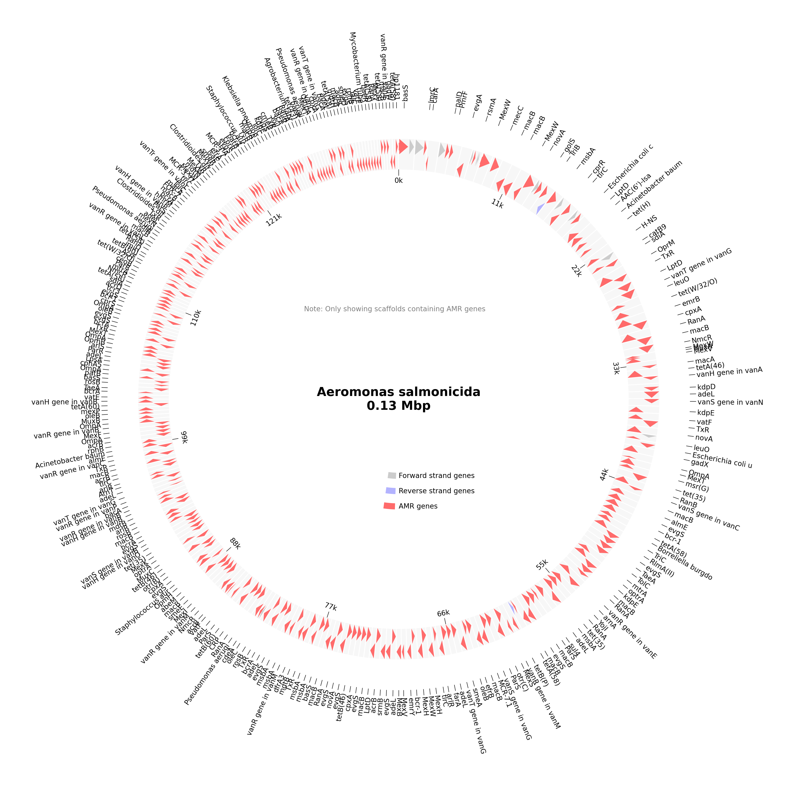

### AAC(6')-Isa
- **Mechanism**: antibiotic inactivation
- **Drug Classes**: aminoglycoside antibiotic
- **AMR Family**: AAC(6')
- **Locations**:
  - gnl|SPADES|NHGFMGEA_6721_1 : position 2-541

### Acinetobacter baumannii AbaF (found in 2 locations)
- **Mechanism**: antibiotic efflux
- **Drug Classes**: phosphonic acid antibiotic
- **AMR Family**: major facilitator superfamily (MFS) antibiotic efflux pump
- **Locations**:
  - gnl|SPADES|NHGFMGEA_22389_1 : position 1-318
  - gnl|SPADES|NHGFMGEA_6741_1 : position 2-349

### AcrF
- **Mechanism**: antibiotic efflux
- **Drug Classes**: fluoroquinolone antibiotic; cephalosporin; cephamycin; penam
- **AMR Family**: resistance-nodulation-cell division (RND) antibiotic efflux pump
- **Locations**:
  - gnl|SPADES|NHGFMGEA_27623_1 : position 2-271

### Agrobacterium fabrum chloramphenicol acetyltransferase
- **Mechanism**: antibiotic inactivation
- **Drug Classes**: phenicol antibiotic
- **AMR Family**: chloramphenicol acetyltransferase (CAT)
- **Locations**:
  - gnl|SPADES|NHGFMGEA_37242_1 : position 2-229

### ArnT
- **Mechanism**: antibiotic target alteration
- **Drug Classes**: peptide antibiotic
- **AMR Family**: pmr phosphoethanolamine transferase
- **Locations**:
  - gnl|SPADES|NHGFMGEA_21831_1 : position 49-324

### Borreliella burgdorferi murA with mutation conferring resistance to fosfomycin
- **Mechanism**: antibiotic target alteration
- **Drug Classes**: phosphonic acid antibiotic
- **AMR Family**: antibiotic-resistant murA transferase
- **Locations**:
  - gnl|SPADES|NHGFMGEA_11076_1 : position 3-428

### CRP
- **Mechanism**: antibiotic efflux
- **Drug Classes**: macrolide antibiotic; fluoroquinolone antibiotic; penam
- **AMR Family**: resistance-nodulation-cell division (RND) antibiotic efflux pump
- **Locations**:
  - gnl|SPADES|NHGFMGEA_17715_1 : position 1-381

### Clostridioides difficile cplR
- **Mechanism**: antibiotic target protection
- **Drug Classes**: lincosamide antibiotic; streptogramin antibiotic; streptogramin A antibiotic; nucleoside antibiotic
- **AMR Family**: Miscellaneous ABC-F subfamily ATP-binding cassette ribosomal protection proteins
- **Locations**:
  - gnl|SPADES|NHGFMGEA_30091_1 : position 111-260

### Clostridioides difficile gyrB conferring resistance to fluoroquinolones
- **Mechanism**: antibiotic target alteration
- **Drug Classes**: fluoroquinolone antibiotic
- **AMR Family**: fluoroquinolone resistant gyrB
- **Locations**:
  - gnl|SPADES|NHGFMGEA_32009_1 : position 1-252

### Escherichia coli cyaA with mutation conferring resistance to fosfomycin
- **Mechanism**: antibiotic target alteration
- **Drug Classes**: phosphonic acid antibiotic
- **AMR Family**: antibiotic-resistant cya adenylate cyclase
- **Locations**:
  - gnl|SPADES|NHGFMGEA_6284_3 : position 461-841

### Escherichia coli uhpA with mutation conferring resistance to fosfomycin
- **Mechanism**: antibiotic target alteration
- **Drug Classes**: phosphonic acid antibiotic
- **AMR Family**: antibiotic-resistant UhpT
- **Locations**:
  - gnl|SPADES|NHGFMGEA_9552_2 : position 214-612

### FOX-7
- **Mechanism**: antibiotic inactivation
- **Drug Classes**: cephalosporin; cephamycin
- **AMR Family**: FOX beta-lactamase
- **Locations**:
  - gnl|SPADES|NHGFMGEA_30534_1 : position 2-259

### H-NS
- **Mechanism**: antibiotic efflux
- **Drug Classes**: macrolide antibiotic; fluoroquinolone antibiotic; cephalosporin; cephamycin; penam; tetracycline antibiotic
- **AMR Family**: major facilitator superfamily (MFS) antibiotic efflux pump; resistance-nodulation-cell division (RND) antibiotic efflux pump
- **Locations**:
  - gnl|SPADES|NHGFMGEA_6814_2 : position 287-697

### Klebsiella pneumoniae KpnE
- **Mechanism**: antibiotic efflux
- **Drug Classes**: macrolide antibiotic; aminoglycoside antibiotic; cephalosporin; tetracycline antibiotic; peptide antibiotic; rifamycin antibiotic; disinfecting agents and antiseptics
- **AMR Family**: small multidrug resistance (SMR) antibiotic efflux pump
- **Locations**:
  - gnl|SPADES|NHGFMGEA_34674_1 : position 3-215

### LpsA
- **Mechanism**: reduced permeability to antibiotic
- **Drug Classes**: peptide antibiotic
- **AMR Family**: Intrinsic peptide antibiotic resistant Lps
- **Locations**:
  - gnl|SPADES|NHGFMGEA_24042_1 : position 2-298

### LptD (found in 3 locations)
- **Mechanism**: antibiotic efflux
- **Drug Classes**: carbapenem; peptide antibiotic; aminocoumarin antibiotic; rifamycin antibiotic
- **AMR Family**: ATP-binding cassette (ABC) antibiotic efflux pump
- **Locations**:
  - gnl|SPADES|NHGFMGEA_14914_1 : position 3-434
  - gnl|SPADES|NHGFMGEA_6574_2 : position 212-811
  - gnl|SPADES|NHGFMGEA_7211_1 : position 73-756

### MCR-3.37
- **Mechanism**: antibiotic target alteration
- **Drug Classes**: peptide antibiotic
- **AMR Family**: MCR phosphoethanolamine transferase
- **Locations**:
  - gnl|SPADES|NHGFMGEA_31061_1 : position 2-256

### MCR-3.7
- **Mechanism**: antibiotic target alteration
- **Drug Classes**: peptide antibiotic
- **AMR Family**: MCR phosphoethanolamine transferase
- **Locations**:
  - gnl|SPADES|NHGFMGEA_33010_1 : position 3-248

### MCR-7.1
- **Mechanism**: antibiotic target alteration
- **Drug Classes**: peptide antibiotic
- **AMR Family**: MCR phosphoethanolamine transferase
- **Locations**:
  - gnl|SPADES|NHGFMGEA_13248_1 : position 2-475

### MexB
- **Mechanism**: antibiotic efflux
- **Drug Classes**: macrolide antibiotic; fluoroquinolone antibiotic; monobactam; carbapenem; cephalosporin; cephamycin; penam; tetracycline antibiotic; peptide antibiotic; aminocoumarin antibiotic; diaminopyrimidine antibiotic; sulfonamide antibiotic; phenicol antibiotic; penem
- **AMR Family**: resistance-nodulation-cell division (RND) antibiotic efflux pump
- **Locations**:
  - gnl|SPADES|NHGFMGEA_14216_1 : position 3-449

### MexF
- **Mechanism**: antibiotic efflux
- **Drug Classes**: fluoroquinolone antibiotic; diaminopyrimidine antibiotic; phenicol antibiotic
- **AMR Family**: resistance-nodulation-cell division (RND) antibiotic efflux pump
- **Locations**:
  - gnl|SPADES|NHGFMGEA_22699_1 : position 2-313

### MexH (found in 2 locations)
- **Mechanism**: antibiotic efflux
- **Drug Classes**: fluoroquinolone antibiotic; tetracycline antibiotic; disinfecting agents and antiseptics
- **AMR Family**: resistance-nodulation-cell division (RND) antibiotic efflux pump
- **Locations**:
  - gnl|SPADES|NHGFMGEA_13985_1 : position 1-456
  - gnl|SPADES|NHGFMGEA_14112_1 : position 2-454

### MexI
- **Mechanism**: antibiotic efflux
- **Drug Classes**: fluoroquinolone antibiotic; tetracycline antibiotic; disinfecting agents and antiseptics
- **AMR Family**: resistance-nodulation-cell division (RND) antibiotic efflux pump
- **Locations**:
  - gnl|SPADES|NHGFMGEA_18985_1 : position 3-359

### MexK
- **Mechanism**: antibiotic efflux
- **Drug Classes**: macrolide antibiotic; tetracycline antibiotic; disinfecting agents and antiseptics
- **AMR Family**: resistance-nodulation-cell division (RND) antibiotic efflux pump
- **Locations**:
  - gnl|SPADES|NHGFMGEA_20425_1 : position 56-340

### MexS
- **Mechanism**: antibiotic efflux
- **Drug Classes**: fluoroquinolone antibiotic; diaminopyrimidine antibiotic; phenicol antibiotic
- **AMR Family**: resistance-nodulation-cell division (RND) antibiotic efflux pump
- **Locations**:
  - gnl|SPADES|NHGFMGEA_12916_1 : position 3-485

### MexT (found in 4 locations)
- **Mechanism**: antibiotic efflux
- **Drug Classes**: fluoroquinolone antibiotic; diaminopyrimidine antibiotic; phenicol antibiotic
- **AMR Family**: resistance-nodulation-cell division (RND) antibiotic efflux pump
- **Locations**:
  - gnl|SPADES|NHGFMGEA_24817_1 : position 3-290
  - gnl|SPADES|NHGFMGEA_37866_1 : position 2-226
  - gnl|SPADES|NHGFMGEA_41192_1 : position 1-210
  - gnl|SPADES|NHGFMGEA_9915_1 : position 1-597

### MexV (found in 2 locations)
- **Mechanism**: antibiotic efflux
- **Drug Classes**: macrolide antibiotic; fluoroquinolone antibiotic; tetracycline antibiotic; phenicol antibiotic; disinfecting agents and antiseptics
- **AMR Family**: resistance-nodulation-cell division (RND) antibiotic efflux pump
- **Locations**:
  - gnl|SPADES|NHGFMGEA_14159_2 : position 234-452
  - gnl|SPADES|NHGFMGEA_8024_3 : position 282-701

### MexW (found in 7 locations)
- **Mechanism**: antibiotic efflux
- **Drug Classes**: macrolide antibiotic; fluoroquinolone antibiotic; tetracycline antibiotic; phenicol antibiotic; disinfecting agents and antiseptics
- **AMR Family**: resistance-nodulation-cell division (RND) antibiotic efflux pump
- **Locations**:
  - gnl|SPADES|NHGFMGEA_14057_1 : position 3-455
  - gnl|SPADES|NHGFMGEA_31734_1 : position 3-146
  - gnl|SPADES|NHGFMGEA_31843_1 : position 3-251
  - gnl|SPADES|NHGFMGEA_32471_1 : position 2-250
  - gnl|SPADES|NHGFMGEA_5417_1 : position 3-944
  - gnl|SPADES|NHGFMGEA_5712_2 : position 417-905
  - gnl|SPADES|NHGFMGEA_8024_1 : position 2-196

### MuxA
- **Mechanism**: antibiotic efflux
- **Drug Classes**: macrolide antibiotic; monobactam; tetracycline antibiotic; aminocoumarin antibiotic
- **AMR Family**: resistance-nodulation-cell division (RND) antibiotic efflux pump
- **Locations**:
  - gnl|SPADES|NHGFMGEA_8024_2 : position 196-339

### MuxB
- **Mechanism**: antibiotic efflux
- **Drug Classes**: macrolide antibiotic; monobactam; tetracycline antibiotic; aminocoumarin antibiotic
- **AMR Family**: resistance-nodulation-cell division (RND) antibiotic efflux pump
- **Locations**:
  - gnl|SPADES|NHGFMGEA_22957_1 : position 3-311

### MuxC
- **Mechanism**: antibiotic efflux
- **Drug Classes**: macrolide antibiotic; monobactam; tetracycline antibiotic; aminocoumarin antibiotic
- **AMR Family**: resistance-nodulation-cell division (RND) antibiotic efflux pump
- **Locations**:
  - gnl|SPADES|NHGFMGEA_20118_1 : position 3-344

### Mycobacterium tuberculosis katG mutations conferring resistance to isoniazid
- **Mechanism**: antibiotic target alteration
- **Drug Classes**: isoniazid-like antibiotic
- **AMR Family**: isoniazid resistant katG
- **Locations**:
  - gnl|SPADES|NHGFMGEA_41013_1 : position 3-212

### NmcR (found in 3 locations)
- **Mechanism**: antibiotic inactivation
- **Drug Classes**: carbapenem; cephalosporin; cephamycin; penam
- **AMR Family**: NmcA beta-lactamase
- **Locations**:
  - gnl|SPADES|NHGFMGEA_18286_1 : position 53-370
  - gnl|SPADES|NHGFMGEA_27298_1 : position 116-274
  - gnl|SPADES|NHGFMGEA_7920_1 : position 34-705

### OmpA (found in 8 locations)
- **Mechanism**: reduced permeability to antibiotic
- **Drug Classes**: peptide antibiotic
- **AMR Family**: General Bacterial Porin with reduced permeability to peptide antibiotics
- **Locations**:
  - gnl|SPADES|NHGFMGEA_22506_1 : position 1-315
  - gnl|SPADES|NHGFMGEA_22778_1 : position 3-314
  - gnl|SPADES|NHGFMGEA_23872_1 : position 3-302
  - gnl|SPADES|NHGFMGEA_24804_1 : position 3-290
  - gnl|SPADES|NHGFMGEA_26145_1 : position 2-280
  - gnl|SPADES|NHGFMGEA_34634_1 : position 3-239
  - gnl|SPADES|NHGFMGEA_38428_1 : position 31-222
  - gnl|SPADES|NHGFMGEA_9732_2 : position 459-605

### OpmB
- **Mechanism**: antibiotic efflux
- **Drug Classes**: macrolide antibiotic; monobactam; tetracycline antibiotic; aminocoumarin antibiotic
- **AMR Family**: resistance-nodulation-cell division (RND) antibiotic efflux pump
- **Locations**:
  - gnl|SPADES|NHGFMGEA_24458_1 : position 1-294

### OpmH
- **Mechanism**: antibiotic efflux
- **Drug Classes**: disinfecting agents and antiseptics
- **AMR Family**: resistance-nodulation-cell division (RND) antibiotic efflux pump
- **Locations**:
  - gnl|SPADES|NHGFMGEA_19568_1 : position 133-351

### OprM
- **Mechanism**: antibiotic efflux
- **Drug Classes**: macrolide antibiotic; fluoroquinolone antibiotic; monobactam; aminoglycoside antibiotic; carbapenem; cephalosporin; cephamycin; penam; tetracycline antibiotic; peptide antibiotic; aminocoumarin antibiotic; diaminopyrimidine antibiotic; sulfonamide antibiotic; phenicol antibiotic; penem; disinfecting agents and antiseptics
- **AMR Family**: resistance-nodulation-cell division (RND) antibiotic efflux pump
- **Locations**:
  - gnl|SPADES|NHGFMGEA_7185_1 : position 2-757

### ParR (found in 2 locations)
- **Mechanism**: antibiotic efflux; reduced permeability to antibiotic
- **Drug Classes**: macrolide antibiotic; fluoroquinolone antibiotic; monobactam; aminoglycoside antibiotic; carbapenem; cephalosporin; cephamycin; penam; tetracycline antibiotic; phenicol antibiotic; penem; disinfecting agents and antiseptics
- **AMR Family**: resistance-nodulation-cell division (RND) antibiotic efflux pump; Outer Membrane Porin (Opr)
- **Locations**:
  - gnl|SPADES|NHGFMGEA_24409_1 : position 1-294
  - gnl|SPADES|NHGFMGEA_27543_1 : position 2-274

### ParS (found in 4 locations)
- **Mechanism**: antibiotic efflux; reduced permeability to antibiotic
- **Drug Classes**: macrolide antibiotic; fluoroquinolone antibiotic; monobactam; aminoglycoside antibiotic; carbapenem; cephalosporin; cephamycin; penam; tetracycline antibiotic; phenicol antibiotic; penem; disinfecting agents and antiseptics
- **AMR Family**: resistance-nodulation-cell division (RND) antibiotic efflux pump; Outer Membrane Porin (Opr)
- **Locations**:
  - gnl|SPADES|NHGFMGEA_12460_1 : position 2-499
  - gnl|SPADES|NHGFMGEA_13168_1 : position 2-478
  - gnl|SPADES|NHGFMGEA_17748_1 : position 48-380
  - gnl|SPADES|NHGFMGEA_30307_1 : position 26-259

### PmrF
- **Mechanism**: antibiotic target alteration
- **Drug Classes**: peptide antibiotic
- **AMR Family**: pmr phosphoethanolamine transferase
- **Locations**:
  - gnl|SPADES|NHGFMGEA_4942_1 : position 3-323

### Pseudomonas aeruginosa CpxR (found in 3 locations)
- **Mechanism**: antibiotic efflux
- **Drug Classes**: macrolide antibiotic; fluoroquinolone antibiotic; monobactam; aminoglycoside antibiotic; carbapenem; cephalosporin; cephamycin; penam; tetracycline antibiotic; peptide antibiotic; aminocoumarin antibiotic; diaminopyrimidine antibiotic; sulfonamide antibiotic; phenicol antibiotic; penem
- **AMR Family**: resistance-nodulation-cell division (RND) antibiotic efflux pump
- **Locations**:
  - gnl|SPADES|NHGFMGEA_17590_1 : position 2-382
  - gnl|SPADES|NHGFMGEA_29524_1 : position 2-262
  - gnl|SPADES|NHGFMGEA_37794_1 : position 25-225

### RanA (found in 8 locations)
- **Mechanism**: antibiotic efflux
- **Drug Classes**: aminoglycoside antibiotic
- **AMR Family**: ATP-binding cassette (ABC) antibiotic efflux pump
- **Locations**:
  - gnl|SPADES|NHGFMGEA_11773_1 : position 1-297
  - gnl|SPADES|NHGFMGEA_12028_1 : position 2-514
  - gnl|SPADES|NHGFMGEA_15737_1 : position 3-416
  - gnl|SPADES|NHGFMGEA_17653_1 : position 3-380
  - gnl|SPADES|NHGFMGEA_28421_1 : position 2-268
  - gnl|SPADES|NHGFMGEA_37318_1 : position 2-229
  - gnl|SPADES|NHGFMGEA_41009_1 : position 2-211
  - gnl|SPADES|NHGFMGEA_7665_1 : position 1-723

### RanB
- **Mechanism**: antibiotic efflux
- **Drug Classes**: aminoglycoside antibiotic
- **AMR Family**: ATP-binding cassette (ABC) antibiotic efflux pump
- **Locations**:
  - gnl|SPADES|NHGFMGEA_10314_1 : position 1-579

### RlmA(II)
- **Mechanism**: antibiotic target alteration
- **Drug Classes**: macrolide antibiotic; lincosamide antibiotic
- **AMR Family**: non-erm 23S ribosomal RNA methyltransferase (G748)
- **Locations**:
  - gnl|SPADES|NHGFMGEA_11392_1 : position 32-535

### Staphylococcus aureus LmrS
- **Mechanism**: antibiotic efflux
- **Drug Classes**: macrolide antibiotic; aminoglycoside antibiotic; oxazolidinone antibiotic; diaminopyrimidine antibiotic; phenicol antibiotic
- **AMR Family**: major facilitator superfamily (MFS) antibiotic efflux pump
- **Locations**:
  - gnl|SPADES|NHGFMGEA_34262_1 : position 3-242

### Staphylococcus aureus mupA conferring resistance to mupirocin
- **Mechanism**: antibiotic target alteration
- **Drug Classes**: mupirocin-like antibiotic
- **AMR Family**: antibiotic-resistant isoleucyl-tRNA synthetase (ileS)
- **Locations**:
  - gnl|SPADES|NHGFMGEA_19665_1 : position 2-349

### TaeA (found in 2 locations)
- **Mechanism**: antibiotic efflux
- **Drug Classes**: pleuromutilin antibiotic
- **AMR Family**: ATP-binding cassette (ABC) antibiotic efflux pump
- **Locations**:
  - gnl|SPADES|NHGFMGEA_11459_1 : position 3-533
  - gnl|SPADES|NHGFMGEA_23434_1 : position 2-304

### TolC (found in 3 locations)
- **Mechanism**: antibiotic efflux
- **Drug Classes**: macrolide antibiotic; fluoroquinolone antibiotic; aminoglycoside antibiotic; carbapenem; cephalosporin; glycylcycline; cephamycin; penam; tetracycline antibiotic; peptide antibiotic; aminocoumarin antibiotic; rifamycin antibiotic; phenicol antibiotic; penem; disinfecting agents and antiseptics
- **AMR Family**: ATP-binding cassette (ABC) antibiotic efflux pump; major facilitator superfamily (MFS) antibiotic efflux pump; resistance-nodulation-cell division (RND) antibiotic efflux pump
- **Locations**:
  - gnl|SPADES|NHGFMGEA_11483_1 : position 3-533
  - gnl|SPADES|NHGFMGEA_30802_1 : position 2-256
  - gnl|SPADES|NHGFMGEA_34989_1 : position 2-238

### TriB
- **Mechanism**: antibiotic efflux
- **Drug Classes**: disinfecting agents and antiseptics
- **AMR Family**: resistance-nodulation-cell division (RND) antibiotic efflux pump
- **Locations**:
  - gnl|SPADES|NHGFMGEA_5886_1 : position 1-420

### TriC
- **Mechanism**: antibiotic efflux
- **Drug Classes**: disinfecting agents and antiseptics
- **AMR Family**: resistance-nodulation-cell division (RND) antibiotic efflux pump
- **Locations**:
  - gnl|SPADES|NHGFMGEA_11127_1 : position 3-545

### TxR (found in 10 locations)
- **Mechanism**: antibiotic efflux
- **Drug Classes**: tetracycline antibiotic
- **AMR Family**: ATP-binding cassette (ABC) antibiotic efflux pump
- **Locations**:
  - gnl|SPADES|NHGFMGEA_16131_1 : position 2-406
  - gnl|SPADES|NHGFMGEA_17224_1 : position 1-318
  - gnl|SPADES|NHGFMGEA_22075_1 : position 3-320
  - gnl|SPADES|NHGFMGEA_25305_1 : position 3-287
  - gnl|SPADES|NHGFMGEA_30239_1 : position 1-261
  - gnl|SPADES|NHGFMGEA_31888_1 : position 3-251
  - gnl|SPADES|NHGFMGEA_34616_1 : position 1-240
  - gnl|SPADES|NHGFMGEA_36530_1 : position 2-232
  - gnl|SPADES|NHGFMGEA_7204_1 : position 2-487
  - gnl|SPADES|NHGFMGEA_9371_1 : position 1-624

### YajC
- **Mechanism**: antibiotic efflux
- **Drug Classes**: fluoroquinolone antibiotic; cephalosporin; glycylcycline; penam; tetracycline antibiotic; oxazolidinone antibiotic; glycopeptide antibiotic; rifamycin antibiotic; phenicol antibiotic; disinfecting agents and antiseptics
- **AMR Family**: resistance-nodulation-cell division (RND) antibiotic efflux pump
- **Locations**:
  - gnl|SPADES|NHGFMGEA_40608_1 : position 13-213

### YojI (found in 2 locations)
- **Mechanism**: antibiotic efflux
- **Drug Classes**: peptide antibiotic
- **AMR Family**: ATP-binding cassette (ABC) antibiotic efflux pump
- **Locations**:
  - gnl|SPADES|NHGFMGEA_12010_1 : position 3-512
  - gnl|SPADES|NHGFMGEA_36547_1 : position 1-231

### abeM
- **Mechanism**: antibiotic efflux
- **Drug Classes**: fluoroquinolone antibiotic; disinfecting agents and antiseptics
- **AMR Family**: multidrug and toxic compound extrusion (MATE) transporter
- **Locations**:
  - gnl|SPADES|NHGFMGEA_19294_1 : position 2-355

### acrB (found in 4 locations)
- **Mechanism**: antibiotic efflux
- **Drug Classes**: fluoroquinolone antibiotic; cephalosporin; glycylcycline; penam; tetracycline antibiotic; rifamycin antibiotic; phenicol antibiotic; disinfecting agents and antiseptics
- **AMR Family**: resistance-nodulation-cell division (RND) antibiotic efflux pump
- **Locations**:
  - gnl|SPADES|NHGFMGEA_14557_1 : position 2-442
  - gnl|SPADES|NHGFMGEA_18248_1 : position 3-371
  - gnl|SPADES|NHGFMGEA_22076_1 : position 3-209
  - gnl|SPADES|NHGFMGEA_22436_1 : position 3-317

### acrD
- **Mechanism**: antibiotic efflux
- **Drug Classes**: aminoglycoside antibiotic
- **AMR Family**: resistance-nodulation-cell division (RND) antibiotic efflux pump
- **Locations**:
  - gnl|SPADES|NHGFMGEA_26928_1 : position 2-277

### adeL (found in 11 locations)
- **Mechanism**: antibiotic efflux
- **Drug Classes**: fluoroquinolone antibiotic; tetracycline antibiotic
- **AMR Family**: resistance-nodulation-cell division (RND) antibiotic efflux pump
- **Locations**:
  - gnl|SPADES|NHGFMGEA_12267_1 : position 3-506
  - gnl|SPADES|NHGFMGEA_13597_1 : position 68-466
  - gnl|SPADES|NHGFMGEA_14318_1 : position 2-385
  - gnl|SPADES|NHGFMGEA_17093_1 : position 2-391
  - gnl|SPADES|NHGFMGEA_18054_2 : position 161-373
  - gnl|SPADES|NHGFMGEA_21636_1 : position 1-324
  - gnl|SPADES|NHGFMGEA_24268_1 : position 1-297
  - gnl|SPADES|NHGFMGEA_29902_1 : position 1-261
  - gnl|SPADES|NHGFMGEA_38935_1 : position 1-222
  - gnl|SPADES|NHGFMGEA_39449_1 : position 3-218
  - gnl|SPADES|NHGFMGEA_8563_1 : position 3-629

### almE (found in 2 locations)
- **Mechanism**: antibiotic target alteration
- **Drug Classes**: peptide antibiotic
- **AMR Family**: polymyxin resistance operon; alm glycyltransferase
- **Locations**:
  - gnl|SPADES|NHGFMGEA_10891_1 : position 3-554
  - gnl|SPADES|NHGFMGEA_22351_1 : position 3-317

### arlR (found in 3 locations)
- **Mechanism**: antibiotic efflux
- **Drug Classes**: fluoroquinolone antibiotic; disinfecting agents and antiseptics
- **AMR Family**: major facilitator superfamily (MFS) antibiotic efflux pump
- **Locations**:
  - gnl|SPADES|NHGFMGEA_13826_1 : position 53-460
  - gnl|SPADES|NHGFMGEA_21088_1 : position 3-332
  - gnl|SPADES|NHGFMGEA_21939_1 : position 3-194

### arlS
- **Mechanism**: antibiotic efflux
- **Drug Classes**: fluoroquinolone antibiotic; disinfecting agents and antiseptics
- **AMR Family**: major facilitator superfamily (MFS) antibiotic efflux pump
- **Locations**:
  - gnl|SPADES|NHGFMGEA_24398_1 : position 3-296

### arnA (found in 2 locations)
- **Mechanism**: antibiotic target alteration
- **Drug Classes**: peptide antibiotic
- **AMR Family**: pmr phosphoethanolamine transferase
- **Locations**:
  - gnl|SPADES|NHGFMGEA_11892_1 : position 3-518
  - gnl|SPADES|NHGFMGEA_33067_1 : position 2-247

### bacA (found in 3 locations)
- **Mechanism**: antibiotic target alteration
- **Drug Classes**: peptide antibiotic
- **AMR Family**: undecaprenyl pyrophosphate related proteins
- **Locations**:
  - gnl|SPADES|NHGFMGEA_21484_1 : position 3-149
  - gnl|SPADES|NHGFMGEA_36834_1 : position 1-231
  - gnl|SPADES|NHGFMGEA_38647_1 : position 1-222

### baeR (found in 3 locations)
- **Mechanism**: antibiotic efflux
- **Drug Classes**: aminoglycoside antibiotic; aminocoumarin antibiotic
- **AMR Family**: resistance-nodulation-cell division (RND) antibiotic efflux pump
- **Locations**:
  - gnl|SPADES|NHGFMGEA_36969_1 : position 1-228
  - gnl|SPADES|NHGFMGEA_37467_1 : position 2-226
  - gnl|SPADES|NHGFMGEA_41135_1 : position 28-210

### basS (found in 3 locations)
- **Mechanism**: antibiotic target alteration; antibiotic efflux
- **Drug Classes**: peptide antibiotic
- **AMR Family**: pmr phosphoethanolamine transferase
- **Locations**:
  - gnl|SPADES|NHGFMGEA_15844_1 : position 3-413
  - gnl|SPADES|NHGFMGEA_23786_1 : position 71-301
  - gnl|SPADES|NHGFMGEA_2647_1 : position 3-950

### bcr-1 (found in 4 locations)
- **Mechanism**: antibiotic efflux
- **Drug Classes**: bicyclomycin-like antibiotic
- **AMR Family**: major facilitator superfamily (MFS) antibiotic efflux pump
- **Locations**:
  - gnl|SPADES|NHGFMGEA_10940_1 : position 1-552
  - gnl|SPADES|NHGFMGEA_14130_1 : position 132-452
  - gnl|SPADES|NHGFMGEA_26698_1 : position 113-277
  - gnl|SPADES|NHGFMGEA_33342_1 : position 2-244

### bcrA (found in 5 locations)
- **Mechanism**: antibiotic efflux
- **Drug Classes**: peptide antibiotic
- **AMR Family**: ATP-binding cassette (ABC) antibiotic efflux pump
- **Locations**:
  - gnl|SPADES|NHGFMGEA_17232_1 : position 3-386
  - gnl|SPADES|NHGFMGEA_21019_1 : position 3-251
  - gnl|SPADES|NHGFMGEA_23501_1 : position 165-305
  - gnl|SPADES|NHGFMGEA_25188_1 : position 3-287
  - gnl|SPADES|NHGFMGEA_30456_1 : position 1-258

### carA
- **Mechanism**: antibiotic target protection
- **Drug Classes**: macrolide antibiotic
- **AMR Family**: Miscellaneous ABC-F subfamily ATP-binding cassette ribosomal protection proteins
- **Locations**:
  - gnl|SPADES|NHGFMGEA_4533_1 : position 1-162

### catB9
- **Mechanism**: antibiotic inactivation
- **Drug Classes**: phenicol antibiotic
- **AMR Family**: chloramphenicol acetyltransferase (CAT)
- **Locations**:
  - gnl|SPADES|NHGFMGEA_6936_2 : position 510-776

### cdeA
- **Mechanism**: antibiotic efflux
- **Drug Classes**: fluoroquinolone antibiotic; disinfecting agents and antiseptics
- **AMR Family**: multidrug and toxic compound extrusion (MATE) transporter
- **Locations**:
  - gnl|SPADES|NHGFMGEA_17466_1 : position 1-384

### ceoB
- **Mechanism**: antibiotic efflux
- **Drug Classes**: fluoroquinolone antibiotic; aminoglycoside antibiotic
- **AMR Family**: resistance-nodulation-cell division (RND) antibiotic efflux pump
- **Locations**:
  - gnl|SPADES|NHGFMGEA_27526_1 : position 2-274

### cmeB
- **Mechanism**: antibiotic efflux
- **Drug Classes**: macrolide antibiotic; fluoroquinolone antibiotic; cephalosporin; fusidane antibiotic
- **AMR Family**: resistance-nodulation-cell division (RND) antibiotic efflux pump
- **Locations**:
  - gnl|SPADES|NHGFMGEA_35967_1 : position 1-234

### cphA5
- **Mechanism**: antibiotic inactivation
- **Drug Classes**: carbapenem
- **AMR Family**: CphA beta-lactamase
- **Locations**:
  - gnl|SPADES|NHGFMGEA_23961_1 : position 16-300

### cprR (found in 2 locations)
- **Mechanism**: antibiotic target alteration; antibiotic efflux
- **Drug Classes**: peptide antibiotic
- **AMR Family**: pmr phosphoethanolamine transferase
- **Locations**:
  - gnl|SPADES|NHGFMGEA_33395_1 : position 3-245
  - gnl|SPADES|NHGFMGEA_6045_2 : position 398-868

### cprS
- **Mechanism**: antibiotic target alteration; antibiotic efflux
- **Drug Classes**: peptide antibiotic
- **AMR Family**: pmr phosphoethanolamine transferase
- **Locations**:
  - gnl|SPADES|NHGFMGEA_26231_1 : position 2-280

### cpxA (found in 4 locations)
- **Mechanism**: antibiotic efflux
- **Drug Classes**: aminoglycoside antibiotic; aminocoumarin antibiotic
- **AMR Family**: resistance-nodulation-cell division (RND) antibiotic efflux pump
- **Locations**:
  - gnl|SPADES|NHGFMGEA_15151_1 : position 2-427
  - gnl|SPADES|NHGFMGEA_19865_1 : position 65-349
  - gnl|SPADES|NHGFMGEA_38465_1 : position 1-222
  - gnl|SPADES|NHGFMGEA_7630_1 : position 2-724

### dfrA3
- **Mechanism**: antibiotic target replacement
- **Drug Classes**: diaminopyrimidine antibiotic
- **AMR Family**: trimethoprim resistant dihydrofolate reductase dfr
- **Locations**:
  - gnl|SPADES|NHGFMGEA_16277_1 : position 3-317

### efrA
- **Mechanism**: antibiotic efflux
- **Drug Classes**: macrolide antibiotic; fluoroquinolone antibiotic; rifamycin antibiotic
- **AMR Family**: ATP-binding cassette (ABC) antibiotic efflux pump
- **Locations**:
  - gnl|SPADES|NHGFMGEA_33028_1 : position 1-246

### efrB
- **Mechanism**: antibiotic efflux
- **Drug Classes**: macrolide antibiotic; fluoroquinolone antibiotic; rifamycin antibiotic
- **AMR Family**: ATP-binding cassette (ABC) antibiotic efflux pump
- **Locations**:
  - gnl|SPADES|NHGFMGEA_13547_1 : position 2-469

### emrB
- **Mechanism**: antibiotic efflux
- **Drug Classes**: fluoroquinolone antibiotic
- **AMR Family**: major facilitator superfamily (MFS) antibiotic efflux pump
- **Locations**:
  - gnl|SPADES|NHGFMGEA_7570_1 : position 1-729

### emrY
- **Mechanism**: antibiotic efflux
- **Drug Classes**: tetracycline antibiotic
- **AMR Family**: major facilitator superfamily (MFS) antibiotic efflux pump
- **Locations**:
  - gnl|SPADES|NHGFMGEA_14125_1 : position 68-451

### evgA
- **Mechanism**: antibiotic efflux
- **Drug Classes**: macrolide antibiotic; fluoroquinolone antibiotic; penam; tetracycline antibiotic
- **AMR Family**: major facilitator superfamily (MFS) antibiotic efflux pump; resistance-nodulation-cell division (RND) antibiotic efflux pump
- **Locations**:
  - gnl|SPADES|NHGFMGEA_5031_1 : position 1-540

### evgS (found in 16 locations)
- **Mechanism**: antibiotic efflux
- **Drug Classes**: macrolide antibiotic; fluoroquinolone antibiotic; penam; tetracycline antibiotic
- **AMR Family**: major facilitator superfamily (MFS) antibiotic efflux pump; resistance-nodulation-cell division (RND) antibiotic efflux pump
- **Locations**:
  - gnl|SPADES|NHGFMGEA_10939_1 : position 1-552
  - gnl|SPADES|NHGFMGEA_11466_1 : position 1-534
  - gnl|SPADES|NHGFMGEA_12536_1 : position 3-497
  - gnl|SPADES|NHGFMGEA_14349_1 : position 3-446
  - gnl|SPADES|NHGFMGEA_15026_1 : position 6-431
  - gnl|SPADES|NHGFMGEA_15351_1 : position 2-424
  - gnl|SPADES|NHGFMGEA_15740_1 : position 3-416
  - gnl|SPADES|NHGFMGEA_16909_1 : position 1-393
  - gnl|SPADES|NHGFMGEA_19795_1 : position 1-348
  - gnl|SPADES|NHGFMGEA_20877_1 : position 2-334
  - gnl|SPADES|NHGFMGEA_25862_1 : position 2-283
  - gnl|SPADES|NHGFMGEA_26015_1 : position 2-283
  - gnl|SPADES|NHGFMGEA_27001_1 : position 1-276
  - gnl|SPADES|NHGFMGEA_33183_1 : position 3-245
  - gnl|SPADES|NHGFMGEA_35371_1 : position 1-237
  - gnl|SPADES|NHGFMGEA_40032_1 : position 2-217

### farA
- **Mechanism**: antibiotic efflux
- **Drug Classes**: antibacterial free fatty acids
- **AMR Family**: major facilitator superfamily (MFS) antibiotic efflux pump
- **Locations**:
  - gnl|SPADES|NHGFMGEA_13699_1 : position 1-465

### gadW
- **Mechanism**: antibiotic efflux
- **Drug Classes**: macrolide antibiotic; fluoroquinolone antibiotic; penam
- **AMR Family**: resistance-nodulation-cell division (RND) antibiotic efflux pump
- **Locations**:
  - gnl|SPADES|NHGFMGEA_41845_1 : position 3-209

### gadX
- **Mechanism**: antibiotic efflux
- **Drug Classes**: macrolide antibiotic; fluoroquinolone antibiotic; penam
- **AMR Family**: resistance-nodulation-cell division (RND) antibiotic efflux pump
- **Locations**:
  - gnl|SPADES|NHGFMGEA_9692_1 : position 2-607

### golS
- **Mechanism**: antibiotic efflux
- **Drug Classes**: monobactam; carbapenem; cephalosporin; cephamycin; penam; phenicol antibiotic; penem
- **AMR Family**: resistance-nodulation-cell division (RND) antibiotic efflux pump
- **Locations**:
  - gnl|SPADES|NHGFMGEA_5744_2 : position 347-736

### hmrM
- **Mechanism**: antibiotic efflux
- **Drug Classes**: fluoroquinolone antibiotic; disinfecting agents and antiseptics
- **AMR Family**: multidrug and toxic compound extrusion (MATE) transporter
- **Locations**:
  - gnl|SPADES|NHGFMGEA_30277_1 : position 1-258

### hp1181
- **Mechanism**: antibiotic efflux
- **Drug Classes**: fluoroquinolone antibiotic; tetracycline antibiotic; nitroimidazole antibiotic
- **AMR Family**: major facilitator superfamily (MFS) antibiotic efflux pump
- **Locations**:
  - gnl|SPADES|NHGFMGEA_42100_1 : position 2-208

### imiH
- **Mechanism**: antibiotic inactivation
- **Drug Classes**: carbapenem
- **AMR Family**: CphA beta-lactamase
- **Locations**:
  - gnl|SPADES|NHGFMGEA_28232_1 : position 2-118

### kdpD
- **Mechanism**: antibiotic efflux
- **Drug Classes**: aminoglycoside antibiotic
- **AMR Family**: kdpDE
- **Locations**:
  - gnl|SPADES|NHGFMGEA_8552_2 : position 290-667

### kdpE (found in 3 locations)
- **Mechanism**: antibiotic efflux
- **Drug Classes**: aminoglycoside antibiotic
- **AMR Family**: kdpDE
- **Locations**:
  - gnl|SPADES|NHGFMGEA_11591_1 : position 1-528
  - gnl|SPADES|NHGFMGEA_34982_1 : position 2-238
  - gnl|SPADES|NHGFMGEA_8938_1 : position 99-644

### leuO (found in 2 locations)
- **Mechanism**: antibiotic efflux
- **Drug Classes**: nucleoside antibiotic; disinfecting agents and antiseptics
- **AMR Family**: major facilitator superfamily (MFS) antibiotic efflux pump
- **Locations**:
  - gnl|SPADES|NHGFMGEA_7308_1 : position 1-333
  - gnl|SPADES|NHGFMGEA_9528_2 : position 394-615

### lmrC
- **Mechanism**: antibiotic target protection
- **Drug Classes**: lincosamide antibiotic
- **AMR Family**: Miscellaneous ABC-F subfamily ATP-binding cassette ribosomal protection proteins
- **Locations**:
  - gnl|SPADES|NHGFMGEA_4052_2 : position 914-1168

### lsaE
- **Mechanism**: antibiotic target protection
- **Drug Classes**: lincosamide antibiotic; streptogramin antibiotic; pleuromutilin antibiotic
- **AMR Family**: lsa-type ABC-F protein
- **Locations**:
  - gnl|SPADES|NHGFMGEA_32565_1 : position 1-249

### macA (found in 2 locations)
- **Mechanism**: antibiotic efflux
- **Drug Classes**: macrolide antibiotic
- **AMR Family**: ATP-binding cassette (ABC) antibiotic efflux pump
- **Locations**:
  - gnl|SPADES|NHGFMGEA_30672_1 : position 2-259
  - gnl|SPADES|NHGFMGEA_8116_2 : position 423-695

### macB (found in 18 locations)
- **Mechanism**: antibiotic efflux
- **Drug Classes**: macrolide antibiotic
- **AMR Family**: ATP-binding cassette (ABC) antibiotic efflux pump
- **Locations**:
  - gnl|SPADES|NHGFMGEA_10612_1 : position 2-469
  - gnl|SPADES|NHGFMGEA_11726_1 : position 2-523
  - gnl|SPADES|NHGFMGEA_12493_1 : position 3-497
  - gnl|SPADES|NHGFMGEA_12564_1 : position 2-496
  - gnl|SPADES|NHGFMGEA_13295_1 : position 1-474
  - gnl|SPADES|NHGFMGEA_14976_1 : position 2-433
  - gnl|SPADES|NHGFMGEA_15845_1 : position 1-414
  - gnl|SPADES|NHGFMGEA_19006_1 : position 3-359
  - gnl|SPADES|NHGFMGEA_20999_1 : position 2-334
  - gnl|SPADES|NHGFMGEA_22056_1 : position 2-319
  - gnl|SPADES|NHGFMGEA_29148_1 : position 1-264
  - gnl|SPADES|NHGFMGEA_30515_1 : position 3-257
  - gnl|SPADES|NHGFMGEA_34790_1 : position 2-238
  - gnl|SPADES|NHGFMGEA_39463_1 : position 2-217
  - gnl|SPADES|NHGFMGEA_41465_1 : position 2-208
  - gnl|SPADES|NHGFMGEA_5577_2 : position 307-924
  - gnl|SPADES|NHGFMGEA_5688_2 : position 146-835
  - gnl|SPADES|NHGFMGEA_7901_1 : position 2-706

### mdtB (found in 2 locations)
- **Mechanism**: antibiotic efflux
- **Drug Classes**: aminocoumarin antibiotic
- **AMR Family**: resistance-nodulation-cell division (RND) antibiotic efflux pump
- **Locations**:
  - gnl|SPADES|NHGFMGEA_16235_1 : position 1-405
  - gnl|SPADES|NHGFMGEA_21282_1 : position 3-329

### mdtH
- **Mechanism**: antibiotic efflux
- **Drug Classes**: fluoroquinolone antibiotic
- **AMR Family**: major facilitator superfamily (MFS) antibiotic efflux pump
- **Locations**:
  - gnl|SPADES|NHGFMGEA_39603_1 : position 1-219

### mdtN
- **Mechanism**: antibiotic efflux
- **Drug Classes**: nucleoside antibiotic; disinfecting agents and antiseptics
- **AMR Family**: major facilitator superfamily (MFS) antibiotic efflux pump
- **Locations**:
  - gnl|SPADES|NHGFMGEA_31648_1 : position 3-254

### mecC
- **Mechanism**: antibiotic target replacement
- **Drug Classes**: penam
- **AMR Family**: methicillin resistant PBP2
- **Locations**:
  - gnl|SPADES|NHGFMGEA_5551_2 : position 216-929

### mexN
- **Mechanism**: antibiotic efflux
- **Drug Classes**: phenicol antibiotic
- **AMR Family**: resistance-nodulation-cell division (RND) antibiotic efflux pump
- **Locations**:
  - gnl|SPADES|NHGFMGEA_29860_1 : position 1-261

### mexP
- **Mechanism**: antibiotic efflux
- **Drug Classes**: macrolide antibiotic; carbapenem; tetracycline antibiotic; diaminopyrimidine antibiotic; phenicol antibiotic; disinfecting agents and antiseptics
- **AMR Family**: resistance-nodulation-cell division (RND) antibiotic efflux pump
- **Locations**:
  - gnl|SPADES|NHGFMGEA_23125_1 : position 3-308

### msbA (found in 6 locations)
- **Mechanism**: antibiotic efflux
- **Drug Classes**: nitroimidazole antibiotic
- **AMR Family**: ATP-binding cassette (ABC) antibiotic efflux pump
- **Locations**:
  - gnl|SPADES|NHGFMGEA_12234_1 : position 1-507
  - gnl|SPADES|NHGFMGEA_15997_1 : position 3-410
  - gnl|SPADES|NHGFMGEA_16076_1 : position 80-409
  - gnl|SPADES|NHGFMGEA_16565_1 : position 2-262
  - gnl|SPADES|NHGFMGEA_16916_1 : position 1-393
  - gnl|SPADES|NHGFMGEA_5933_1 : position 1-663

### msr(G)
- **Mechanism**: antibiotic target protection
- **Drug Classes**: macrolide antibiotic; streptogramin antibiotic
- **AMR Family**: msr-type ABC-F protein
- **Locations**:
  - gnl|SPADES|NHGFMGEA_9940_1 : position 1-321

### mtrA (found in 2 locations)
- **Mechanism**: antibiotic efflux
- **Drug Classes**: macrolide antibiotic; penam
- **AMR Family**: resistance-nodulation-cell division (RND) antibiotic efflux pump
- **Locations**:
  - gnl|SPADES|NHGFMGEA_11502_1 : position 140-532
  - gnl|SPADES|NHGFMGEA_27472_1 : position 1-273

### nalD
- **Mechanism**: antibiotic efflux
- **Drug Classes**: macrolide antibiotic; fluoroquinolone antibiotic; monobactam; carbapenem; cephalosporin; cephamycin; penam; tetracycline antibiotic; peptide antibiotic; aminocoumarin antibiotic; diaminopyrimidine antibiotic; sulfonamide antibiotic; phenicol antibiotic; penem
- **AMR Family**: resistance-nodulation-cell division (RND) antibiotic efflux pump
- **Locations**:
  - gnl|SPADES|NHGFMGEA_4827_2 : position 706-1029

### novA (found in 3 locations)
- **Mechanism**: antibiotic efflux
- **Drug Classes**: aminocoumarin antibiotic
- **AMR Family**: ATP-binding cassette (ABC) antibiotic efflux pump
- **Locations**:
  - gnl|SPADES|NHGFMGEA_15490_1 : position 1-420
  - gnl|SPADES|NHGFMGEA_5732_1 : position 2-901
  - gnl|SPADES|NHGFMGEA_9538_1 : position 1-615

### oleB (found in 3 locations)
- **Mechanism**: antibiotic target protection
- **Drug Classes**: macrolide antibiotic
- **AMR Family**: Miscellaneous ABC-F subfamily ATP-binding cassette ribosomal protection proteins
- **Locations**:
  - gnl|SPADES|NHGFMGEA_13530_1 : position 1-276
  - gnl|SPADES|NHGFMGEA_23036_1 : position 82-309
  - gnl|SPADES|NHGFMGEA_26035_1 : position 89-280

### oleC
- **Mechanism**: antibiotic efflux
- **Drug Classes**: macrolide antibiotic
- **AMR Family**: ATP-binding cassette (ABC) antibiotic efflux pump
- **Locations**:
  - gnl|SPADES|NHGFMGEA_17429_2 : position 190-384

### optrA (found in 2 locations)
- **Mechanism**: antibiotic target protection
- **Drug Classes**: oxazolidinone antibiotic; phenicol antibiotic
- **AMR Family**: Miscellaneous ABC-F subfamily ATP-binding cassette ribosomal protection proteins
- **Locations**:
  - gnl|SPADES|NHGFMGEA_11524_1 : position 2-532
  - gnl|SPADES|NHGFMGEA_20335_1 : position 102-341

### otr(B)
- **Mechanism**: antibiotic efflux
- **Drug Classes**: tetracycline antibiotic
- **AMR Family**: major facilitator superfamily (MFS) antibiotic efflux pump
- **Locations**:
  - gnl|SPADES|NHGFMGEA_20063_1 : position 1-345

### otr(C)
- **Mechanism**: antibiotic efflux
- **Drug Classes**: tetracycline antibiotic
- **AMR Family**: ATP-binding cassette (ABC) antibiotic efflux pump
- **Locations**:
  - gnl|SPADES|NHGFMGEA_13023_1 : position 3-482

### patB (found in 2 locations)
- **Mechanism**: antibiotic efflux
- **Drug Classes**: fluoroquinolone antibiotic
- **AMR Family**: ATP-binding cassette (ABC) antibiotic efflux pump
- **Locations**:
  - gnl|SPADES|NHGFMGEA_23717_1 : position 63-302
  - gnl|SPADES|NHGFMGEA_33372_1 : position 77-244

### rosB (found in 3 locations)
- **Mechanism**: antibiotic efflux
- **Drug Classes**: peptide antibiotic
- **AMR Family**: major facilitator superfamily (MFS) antibiotic efflux pump
- **Locations**:
  - gnl|SPADES|NHGFMGEA_17288_1 : position 3-386
  - gnl|SPADES|NHGFMGEA_21056_1 : position 2-331
  - gnl|SPADES|NHGFMGEA_23742_1 : position 146-301

### rphB (found in 2 locations)
- **Mechanism**: antibiotic inactivation
- **Drug Classes**: rifamycin antibiotic
- **AMR Family**: rifampin phosphotransferase
- **Locations**:
  - gnl|SPADES|NHGFMGEA_22463_1 : position 3-317
  - gnl|SPADES|NHGFMGEA_40517_1 : position 1-213

### rsmA
- **Mechanism**: antibiotic efflux
- **Drug Classes**: fluoroquinolone antibiotic; diaminopyrimidine antibiotic; phenicol antibiotic
- **AMR Family**: resistance-nodulation-cell division (RND) antibiotic efflux pump
- **Locations**:
  - gnl|SPADES|NHGFMGEA_5238_2 : position 266-454

### sdiA (found in 3 locations)
- **Mechanism**: antibiotic efflux
- **Drug Classes**: fluoroquinolone antibiotic; cephalosporin; glycylcycline; penam; tetracycline antibiotic; rifamycin antibiotic; phenicol antibiotic; disinfecting agents and antiseptics
- **AMR Family**: resistance-nodulation-cell division (RND) antibiotic efflux pump
- **Locations**:
  - gnl|SPADES|NHGFMGEA_27284_1 : position 2-274
  - gnl|SPADES|NHGFMGEA_29561_1 : position 59-262
  - gnl|SPADES|NHGFMGEA_7184_1 : position 3-389

### smeA
- **Mechanism**: antibiotic efflux
- **Drug Classes**: aminoglycoside antibiotic; cephalosporin; cephamycin; penam
- **AMR Family**: resistance-nodulation-cell division (RND) antibiotic efflux pump
- **Locations**:
  - gnl|SPADES|NHGFMGEA_13554_1 : position 3-467

### smeD
- **Mechanism**: antibiotic efflux
- **Drug Classes**: macrolide antibiotic; fluoroquinolone antibiotic; tetracycline antibiotic; phenicol antibiotic
- **AMR Family**: resistance-nodulation-cell division (RND) antibiotic efflux pump
- **Locations**:
  - gnl|SPADES|NHGFMGEA_39790_1 : position 2-217

### smeE
- **Mechanism**: antibiotic efflux
- **Drug Classes**: macrolide antibiotic; fluoroquinolone antibiotic; tetracycline antibiotic; phenicol antibiotic
- **AMR Family**: resistance-nodulation-cell division (RND) antibiotic efflux pump
- **Locations**:
  - gnl|SPADES|NHGFMGEA_18983_1 : position 3-359

### smeR
- **Mechanism**: antibiotic efflux
- **Drug Classes**: aminoglycoside antibiotic; cephalosporin; cephamycin; penam
- **AMR Family**: resistance-nodulation-cell division (RND) antibiotic efflux pump
- **Locations**:
  - gnl|SPADES|NHGFMGEA_32432_1 : position 2-250

### srmB
- **Mechanism**: antibiotic target protection
- **Drug Classes**: macrolide antibiotic
- **AMR Family**: Miscellaneous ABC-F subfamily ATP-binding cassette ribosomal protection proteins
- **Locations**:
  - gnl|SPADES|NHGFMGEA_14505_1 : position 2-442

### sul4
- **Mechanism**: antibiotic target replacement
- **Drug Classes**: sulfonamide antibiotic
- **AMR Family**: sulfonamide resistant sul
- **Locations**:
  - gnl|SPADES|NHGFMGEA_12288_2 : position 312-503

### tcr3
- **Mechanism**: antibiotic efflux
- **Drug Classes**: tetracycline antibiotic
- **AMR Family**: major facilitator superfamily (MFS) antibiotic efflux pump
- **Locations**:
  - gnl|SPADES|NHGFMGEA_26944_1 : position 65-277

### tet(35) (found in 3 locations)
- **Mechanism**: antibiotic efflux
- **Drug Classes**: tetracycline antibiotic
- **AMR Family**: ATP-binding cassette (ABC) antibiotic efflux pump
- **Locations**:
  - gnl|SPADES|NHGFMGEA_10011_1 : position 2-592
  - gnl|SPADES|NHGFMGEA_12095_1 : position 3-512
  - gnl|SPADES|NHGFMGEA_20523_1 : position 2-340

### tet(43)
- **Mechanism**: antibiotic efflux
- **Drug Classes**: tetracycline antibiotic
- **AMR Family**: major facilitator superfamily (MFS) antibiotic efflux pump
- **Locations**:
  - gnl|SPADES|NHGFMGEA_37487_1 : position 2-226

### tet(H)
- **Mechanism**: antibiotic efflux
- **Drug Classes**: tetracycline antibiotic
- **AMR Family**: major facilitator superfamily (MFS) antibiotic efflux pump
- **Locations**:
  - gnl|SPADES|NHGFMGEA_6788_1 : position 1-273

### tet(W/32/O) (found in 2 locations)
- **Mechanism**: antibiotic target protection
- **Drug Classes**: tetracycline antibiotic
- **AMR Family**: tetracycline-resistant ribosomal protection protein
- **Locations**:
  - gnl|SPADES|NHGFMGEA_27682_1 : position 153-272
  - gnl|SPADES|NHGFMGEA_7568_1 : position 2-595

### tetA(46)
- **Mechanism**: antibiotic efflux
- **Drug Classes**: tetracycline antibiotic
- **AMR Family**: ATP-binding cassette (ABC) antibiotic efflux pump
- **Locations**:
  - gnl|SPADES|NHGFMGEA_8276_1 : position 2-685

### tetA(58) (found in 8 locations)
- **Mechanism**: antibiotic efflux
- **Drug Classes**: tetracycline antibiotic
- **AMR Family**: major facilitator superfamily (MFS) antibiotic efflux pump
- **Locations**:
  - gnl|SPADES|NHGFMGEA_10966_2 : position 178-552
  - gnl|SPADES|NHGFMGEA_12715_1 : position 3-167
  - gnl|SPADES|NHGFMGEA_27349_1 : position 2-274
  - gnl|SPADES|NHGFMGEA_28817_1 : position 1-267
  - gnl|SPADES|NHGFMGEA_39173_1 : position 2-220
  - gnl|SPADES|NHGFMGEA_41116_1 : position 2-211
  - gnl|SPADES|NHGFMGEA_41318_1 : position 3-209
  - gnl|SPADES|NHGFMGEA_41675_1 : position 3-209

### tetA(60)
- **Mechanism**: antibiotic efflux
- **Drug Classes**: tetracycline antibiotic
- **AMR Family**: ATP-binding cassette (ABC) antibiotic efflux pump
- **Locations**:
  - gnl|SPADES|NHGFMGEA_23115_1 : position 3-308

### tetB(46) (found in 2 locations)
- **Mechanism**: antibiotic efflux
- **Drug Classes**: tetracycline antibiotic
- **AMR Family**: ATP-binding cassette (ABC) antibiotic efflux pump
- **Locations**:
  - gnl|SPADES|NHGFMGEA_15326_1 : position 1-423
  - gnl|SPADES|NHGFMGEA_20177_1 : position 2-343

### tetB(60) (found in 2 locations)
- **Mechanism**: antibiotic efflux
- **Drug Classes**: tetracycline antibiotic
- **AMR Family**: ATP-binding cassette (ABC) antibiotic efflux pump
- **Locations**:
  - gnl|SPADES|NHGFMGEA_17737_1 : position 1-381
  - gnl|SPADES|NHGFMGEA_28112_1 : position 2-271

### tetB(P)
- **Mechanism**: antibiotic target protection
- **Drug Classes**: tetracycline antibiotic
- **AMR Family**: tetracycline-resistant ribosomal protection protein
- **Locations**:
  - gnl|SPADES|NHGFMGEA_12750_2 : position 198-491

### tlrC (found in 4 locations)
- **Mechanism**: antibiotic target protection
- **Drug Classes**: macrolide antibiotic; lincosamide antibiotic
- **AMR Family**: Miscellaneous ABC-F subfamily ATP-binding cassette ribosomal protection proteins
- **Locations**:
  - gnl|SPADES|NHGFMGEA_13989_1 : position 3-263
  - gnl|SPADES|NHGFMGEA_21947_1 : position 2-322
  - gnl|SPADES|NHGFMGEA_30934_1 : position 3-257
  - gnl|SPADES|NHGFMGEA_6265_1 : position 2-469

### vanH gene in vanA cluster
- **Mechanism**: antibiotic target alteration
- **Drug Classes**: glycopeptide antibiotic
- **AMR Family**: vanH; glycopeptide resistance gene cluster
- **Locations**:
  - gnl|SPADES|NHGFMGEA_8526_1 : position 3-323

### vanH gene in vanB cluster (found in 2 locations)
- **Mechanism**: antibiotic target alteration
- **Drug Classes**: glycopeptide antibiotic
- **AMR Family**: vanH; glycopeptide resistance gene cluster
- **Locations**:
  - gnl|SPADES|NHGFMGEA_21278_1 : position 2-331
  - gnl|SPADES|NHGFMGEA_23298_1 : position 1-306

### vanH gene in vanO cluster
- **Mechanism**: antibiotic target alteration
- **Drug Classes**: glycopeptide antibiotic
- **AMR Family**: vanH; glycopeptide resistance gene cluster
- **Locations**:
  - gnl|SPADES|NHGFMGEA_20785_1 : position 108-335

### vanH gene in vanP cluster
- **Mechanism**: antibiotic target alteration
- **Drug Classes**: glycopeptide antibiotic
- **AMR Family**: vanH; glycopeptide resistance gene cluster
- **Locations**:
  - gnl|SPADES|NHGFMGEA_30286_1 : position 1-258

### vanR gene in vanB cluster (found in 2 locations)
- **Mechanism**: antibiotic target alteration
- **Drug Classes**: glycopeptide antibiotic
- **AMR Family**: glycopeptide resistance gene cluster; vanR
- **Locations**:
  - gnl|SPADES|NHGFMGEA_21367_1 : position 2-232
  - gnl|SPADES|NHGFMGEA_22609_1 : position 55-315

### vanR gene in vanC cluster (found in 2 locations)
- **Mechanism**: antibiotic target alteration
- **Drug Classes**: glycopeptide antibiotic
- **AMR Family**: glycopeptide resistance gene cluster; vanR
- **Locations**:
  - gnl|SPADES|NHGFMGEA_22229_1 : position 1-318
  - gnl|SPADES|NHGFMGEA_38478_1 : position 1-222

### vanR gene in vanE cluster (found in 2 locations)
- **Mechanism**: antibiotic target alteration
- **Drug Classes**: glycopeptide antibiotic
- **AMR Family**: glycopeptide resistance gene cluster; vanR
- **Locations**:
  - gnl|SPADES|NHGFMGEA_11777_1 : position 1-522
  - gnl|SPADES|NHGFMGEA_41866_1 : position 2-208

### vanR gene in vanL cluster
- **Mechanism**: antibiotic target alteration
- **Drug Classes**: glycopeptide antibiotic
- **AMR Family**: glycopeptide resistance gene cluster; vanR
- **Locations**:
  - gnl|SPADES|NHGFMGEA_28890_1 : position 1-216

### vanR gene in vanM cluster (found in 3 locations)
- **Mechanism**: antibiotic target alteration
- **Drug Classes**: glycopeptide antibiotic
- **AMR Family**: glycopeptide resistance gene cluster; vanR
- **Locations**:
  - gnl|SPADES|NHGFMGEA_12780_1 : position 255-491
  - gnl|SPADES|NHGFMGEA_16472_1 : position 3-341
  - gnl|SPADES|NHGFMGEA_18766_1 : position 1-363

### vanR gene in vanP cluster
- **Mechanism**: antibiotic target alteration
- **Drug Classes**: glycopeptide antibiotic
- **AMR Family**: glycopeptide resistance gene cluster; vanR
- **Locations**:
  - gnl|SPADES|NHGFMGEA_21559_1 : position 3-101

### vanS gene in vanB cluster
- **Mechanism**: antibiotic target alteration
- **Drug Classes**: glycopeptide antibiotic
- **AMR Family**: vanS; glycopeptide resistance gene cluster
- **Locations**:
  - gnl|SPADES|NHGFMGEA_20799_1 : position 3-335

### vanS gene in vanC cluster
- **Mechanism**: antibiotic target alteration
- **Drug Classes**: glycopeptide antibiotic
- **AMR Family**: vanS; glycopeptide resistance gene cluster
- **Locations**:
  - gnl|SPADES|NHGFMGEA_10432_1 : position 1-261

### vanS gene in vanG cluster
- **Mechanism**: antibiotic target alteration
- **Drug Classes**: glycopeptide antibiotic
- **AMR Family**: vanS; glycopeptide resistance gene cluster
- **Locations**:
  - gnl|SPADES|NHGFMGEA_13167_1 : position 3-479

### vanS gene in vanN cluster
- **Mechanism**: antibiotic target alteration
- **Drug Classes**: glycopeptide antibiotic
- **AMR Family**: vanS; glycopeptide resistance gene cluster
- **Locations**:
  - gnl|SPADES|NHGFMGEA_8759_1 : position 1-420

### vanT gene in vanG cluster (found in 4 locations)
- **Mechanism**: antibiotic target alteration
- **Drug Classes**: glycopeptide antibiotic
- **AMR Family**: glycopeptide resistance gene cluster; vanT
- **Locations**:
  - gnl|SPADES|NHGFMGEA_13625_1 : position 2-466
  - gnl|SPADES|NHGFMGEA_21553_1 : position 1-150
  - gnl|SPADES|NHGFMGEA_38533_1 : position 1-222
  - gnl|SPADES|NHGFMGEA_7260_1 : position 1-753

### vanTr gene in vanL cluster
- **Mechanism**: antibiotic target alteration
- **Drug Classes**: glycopeptide antibiotic
- **AMR Family**: glycopeptide resistance gene cluster; vanT
- **Locations**:
  - gnl|SPADES|NHGFMGEA_30882_1 : position 34-258

### vatE
- **Mechanism**: antibiotic inactivation
- **Drug Classes**: streptogramin antibiotic; streptogramin A antibiotic
- **AMR Family**: streptogramin vat acetyltransferase
- **Locations**:
  - gnl|SPADES|NHGFMGEA_23405_1 : position 3-263

### vatF (found in 3 locations)
- **Mechanism**: antibiotic inactivation
- **Drug Classes**: streptogramin antibiotic; streptogramin A antibiotic
- **AMR Family**: streptogramin vat acetyltransferase
- **Locations**:
  - gnl|SPADES|NHGFMGEA_18194_2 : position 286-372
  - gnl|SPADES|NHGFMGEA_41056_1 : position 1-210
  - gnl|SPADES|NHGFMGEA_9009_2 : position 183-641

## Aeromonas salmonicida subsp. masoucida
**Strain Statistics:**
- Total genome length: 3.2 kbp
- Total scaffolds: 98
- Scaffolds with AMR genes: 6
- Total genes annotated: 2
- Total AMR genes: 6
- Unique AMR genes: 6
- Distinct AMR mechanisms: 3
- Distinct AMR families: 6
- Distinct drug classes: 8

**Circos Plot:**

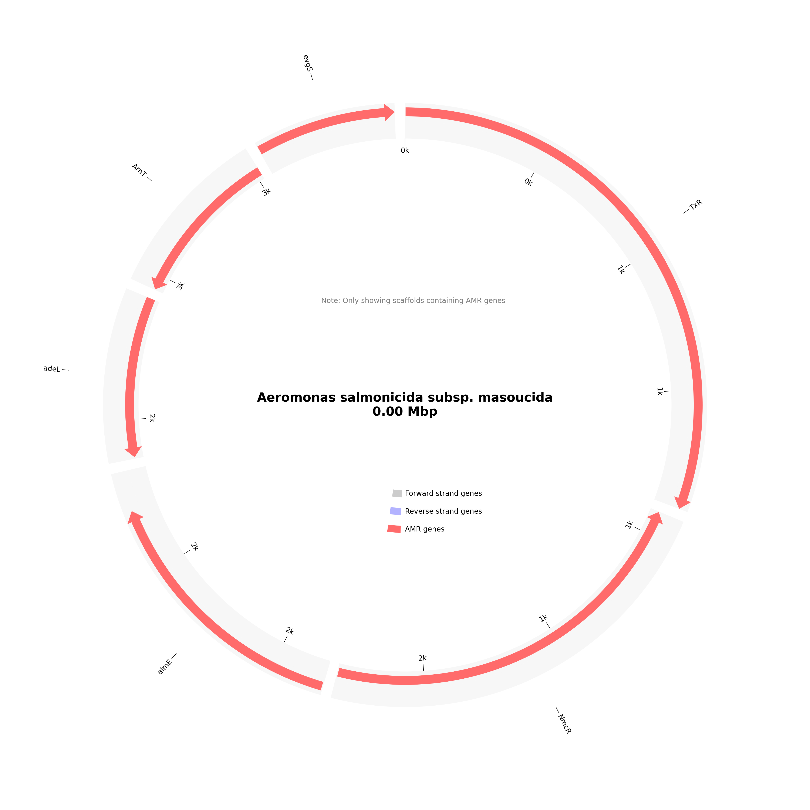

### ArnT
- **Mechanism**: antibiotic target alteration
- **Drug Classes**: peptide antibiotic
- **AMR Family**: pmr phosphoethanolamine transferase
- **Locations**:
  - gnl|SPADES|NHGFMGEA_23503_1 : position 1-306

### NmcR
- **Mechanism**: antibiotic inactivation
- **Drug Classes**: carbapenem; cephalosporin; cephamycin; penam
- **AMR Family**: NmcA beta-lactamase
- **Locations**:
  - gnl|SPADES|NHGFMGEA_7366_1 : position 1-744

### TxR
- **Mechanism**: antibiotic efflux
- **Drug Classes**: tetracycline antibiotic
- **AMR Family**: ATP-binding cassette (ABC) antibiotic efflux pump
- **Locations**:
  - gnl|SPADES|NHGFMGEA_4912_1 : position 1-1014

### adeL
- **Mechanism**: antibiotic efflux
- **Drug Classes**: fluoroquinolone antibiotic; tetracycline antibiotic
- **AMR Family**: resistance-nodulation-cell division (RND) antibiotic efflux pump
- **Locations**:
  - gnl|SPADES|NHGFMGEA_23006_1 : position 3-311

### almE
- **Mechanism**: antibiotic target alteration
- **Drug Classes**: peptide antibiotic
- **AMR Family**: polymyxin resistance operon; alm glycyltransferase
- **Locations**:
  - gnl|SPADES|NHGFMGEA_10914_1 : position 2-481

### evgS
- **Mechanism**: antibiotic efflux
- **Drug Classes**: macrolide antibiotic; fluoroquinolone antibiotic; penam; tetracycline antibiotic
- **AMR Family**: major facilitator superfamily (MFS) antibiotic efflux pump; resistance-nodulation-cell division (RND) antibiotic efflux pump
- **Locations**:
  - gnl|SPADES|NHGFMGEA_31448_1 : position 1-255

## Aeromonas salmonicida subsp. pectinolytica 34mel
**Strain Statistics:**
- Total genome length: 4.4 kbp
- Total scaffolds: 261
- Scaffolds with AMR genes: 9
- Total genes annotated: 4
- Total AMR genes: 9
- Unique AMR genes: 9
- Distinct AMR mechanisms: 4
- Distinct AMR families: 6
- Distinct drug classes: 6

**Circos Plot:**

### OXA-724
- **Mechanism**: antibiotic inactivation
- **Drug Classes**: penam
- **AMR Family**: OXA beta-lactamase; OXA-12-like beta-lactamase
- **Locations**:
  - gnl|SPADES|NHGFMGEA_18738_1 : position 3-362

### QnrAS
- **Mechanism**: antibiotic target protection
- **Drug Classes**: fluoroquinolone antibiotic
- **AMR Family**: quinolone resistance protein (qnr)
- **Locations**:
  - gnl|SPADES|NHGFMGEA_15868_1 : position 2-280

### Staphylococcus aureus mupA conferring resistance to mupirocin
- **Mechanism**: antibiotic target alteration
- **Drug Classes**: mupirocin-like antibiotic
- **AMR Family**: antibiotic-resistant isoleucyl-tRNA synthetase (ileS)
- **Locations**:
  - gnl|SPADES|NHGFMGEA_18073_1 : position 1-375

### adeL
- **Mechanism**: antibiotic efflux
- **Drug Classes**: fluoroquinolone antibiotic; tetracycline antibiotic
- **AMR Family**: resistance-nodulation-cell division (RND) antibiotic efflux pump
- **Locations**:
  - gnl|SPADES|NHGFMGEA_8747_2 : position 138-656

### efrB
- **Mechanism**: antibiotic efflux
- **Drug Classes**: macrolide antibiotic; fluoroquinolone antibiotic; rifamycin antibiotic
- **AMR Family**: ATP-binding cassette (ABC) antibiotic efflux pump
- **Locations**:
  - gnl|SPADES|NHGFMGEA_13608_2 : position 213-467

### macB
- **Mechanism**: antibiotic efflux
- **Drug Classes**: macrolide antibiotic
- **AMR Family**: ATP-binding cassette (ABC) antibiotic efflux pump
- **Locations**:
  - gnl|SPADES|NHGFMGEA_5325_1 : position 2-547

### oleB
- **Mechanism**: antibiotic target protection
- **Drug Classes**: macrolide antibiotic
- **AMR Family**: Miscellaneous ABC-F subfamily ATP-binding cassette ribosomal protection proteins
- **Locations**:
  - gnl|SPADES|NHGFMGEA_9981_1 : position 1-594

### tet(35)
- **Mechanism**: antibiotic efflux
- **Drug Classes**: tetracycline antibiotic
- **AMR Family**: ATP-binding cassette (ABC) antibiotic efflux pump
- **Locations**:
  - gnl|SPADES|NHGFMGEA_29125_1 : position 2-265

### tetB(46)
- **Mechanism**: antibiotic efflux
- **Drug Classes**: tetracycline antibiotic
- **AMR Family**: ATP-binding cassette (ABC) antibiotic efflux pump
- **Locations**:
  - gnl|SPADES|NHGFMGEA_21445_1 : position 2-328

## Buttiauxella agrestis
**Strain Statistics:**
- Total genome length: 128.8 kbp
- Total scaffolds: 1402
- Scaffolds with AMR genes: 142
- Total genes annotated: 228
- Total AMR genes: 150
- Unique AMR genes: 92
- Distinct AMR mechanisms: 9
- Distinct AMR families: 39
- Distinct drug classes: 31

**Circos Plot:**

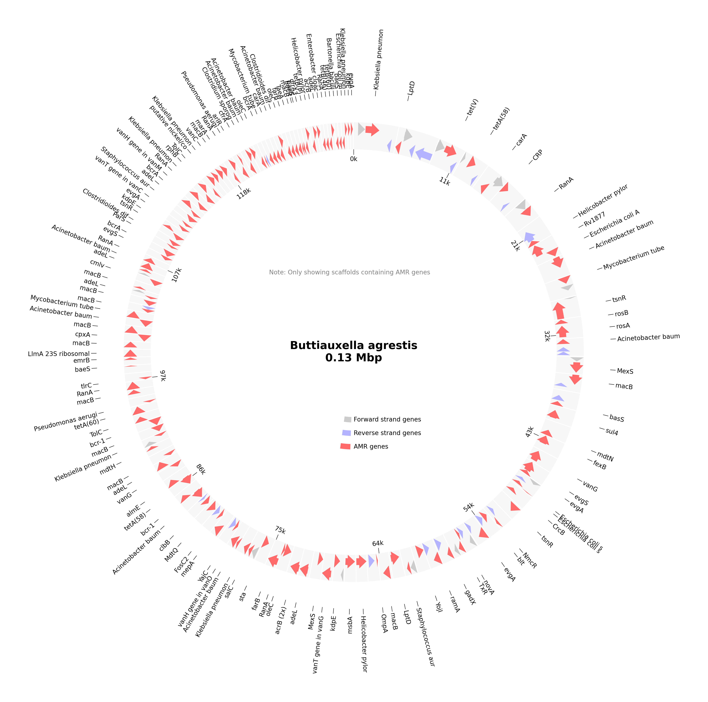

### Acinetobacter baumannii AbaF (found in 4 locations)
- **Mechanism**: antibiotic efflux
- **Drug Classes**: phosphonic acid antibiotic
- **AMR Family**: major facilitator superfamily (MFS) antibiotic efflux pump
- **Locations**:
  - gnl|SPADES|NHGFMGEA_18275_1 : position 2-370
  - gnl|SPADES|NHGFMGEA_18542_1 : position 1-309
  - gnl|SPADES|NHGFMGEA_6078_1 : position 3-863
  - gnl|SPADES|NHGFMGEA_9777_1 : position 2-604

### Acinetobacter baumannii AbaQ (found in 5 locations)
- **Mechanism**: antibiotic efflux
- **Drug Classes**: fluoroquinolone antibiotic
- **AMR Family**: major facilitator superfamily (MFS) antibiotic efflux pump
- **Locations**:
  - gnl|SPADES|NHGFMGEA_1863_1 : position 2-1096
  - gnl|SPADES|NHGFMGEA_20863_1 : position 2-334
  - gnl|SPADES|NHGFMGEA_2280_1 : position 1-513
  - gnl|SPADES|NHGFMGEA_5464_1 : position 1-255
  - gnl|SPADES|NHGFMGEA_8378_1 : position 1-678

### Bartonella bacilliformis gyrB conferring resistance to aminocoumarin
- **Mechanism**: antibiotic target alteration
- **Drug Classes**: aminocoumarin antibiotic
- **AMR Family**: aminocoumarin resistant gyrB
- **Locations**:
  - gnl|SPADES|NHGFMGEA_30367_1 : position 2-259

### CRP
- **Mechanism**: antibiotic efflux
- **Drug Classes**: macrolide antibiotic; fluoroquinolone antibiotic; penam
- **AMR Family**: resistance-nodulation-cell division (RND) antibiotic efflux pump
- **Locations**:
  - gnl|SPADES|NHGFMGEA_1646_1: position 2-616

### Clostridioides difficile gyrB conferring resistance to fluoroquinolones (found in 2 locations)
- **Mechanism**: antibiotic target alteration
- **Drug Classes**: fluoroquinolone antibiotic
- **AMR Family**: fluoroquinolone resistant gyrB
- **Locations**:
  - gnl|SPADES|NHGFMGEA_10697_1 : position 3-416
  - gnl|SPADES|NHGFMGEA_21085_1 : position 1-333

### Clostridium sporogenes cplR
- **Mechanism**: antibiotic target protection
- **Drug Classes**: lincosamide antibiotic; pleuromutilin antibiotic
- **AMR Family**: Miscellaneous ABC-F subfamily ATP-binding cassette ribosomal protection proteins
- **Locations**:
  - gnl|SPADES|NHGFMGEA_18279_1 : position 3-371

### CrcB
- **Mechanism**: antibiotic efflux
- **Drug Classes**: aminoglycoside antibiotic
- **AMR Family**: multidrug and toxic compound extrusion (MATE) transporter
- **Locations**:
  - gnl|SPADES|NHGFMGEA_3196_3 : position 408-791

### Enterobacter cloacae acrA
- **Mechanism**: antibiotic efflux
- **Drug Classes**: fluoroquinolone antibiotic; cephalosporin; glycylcycline; penam; tetracycline antibiotic; rifamycin antibiotic; phenicol antibiotic; disinfecting agents and antiseptics
- **AMR Family**: resistance-nodulation-cell division (RND) antibiotic efflux pump
- **Locations**:
  - gnl|SPADES|NHGFMGEA_26727_1 : position 2-277

### Escherichia coli AcrAB-TolC with AcrR mutation conferring resistance to ciprofloxacin, tetracycline, and ceftazidime
- **Mechanism**: antibiotic target alteration; antibiotic efflux
- **Drug Classes**: fluoroquinolone antibiotic; cephalosporin; glycylcycline; penam; tetracycline antibiotic; rifamycin antibiotic; phenicol antibiotic; disinfecting agents and antiseptics
- **AMR Family**: resistance-nodulation-cell division (RND) antibiotic efflux pump
- **Locations**:
  - gnl|SPADES|NHGFMGEA_1853_2 : position 1283-1978

### Escherichia coli mdfA
- **Mechanism**: antibiotic efflux
- **Drug Classes**: tetracycline antibiotic; phenicol antibiotic; disinfecting agents and antiseptics
- **AMR Family**: major facilitator superfamily (MFS) antibiotic efflux pump
- **Locations**:
  - gnl|SPADES|NHGFMGEA_34177_1 : position 3-242

### Escherichia coli soxR with mutation conferring antibiotic resistance
- **Mechanism**: antibiotic target alteration; antibiotic efflux
- **Drug Classes**: fluoroquinolone antibiotic; cephalosporin; glycylcycline; penam; tetracycline antibiotic; rifamycin antibiotic; phenicol antibiotic; disinfecting agents and antiseptics
- **AMR Family**: ATP-binding cassette (ABC) antibiotic efflux pump; major facilitator superfamily (MFS) antibiotic efflux pump; resistance-nodulation-cell division (RND) antibiotic efflux pump
- **Locations**:
  - gnl|SPADES|NHGFMGEA_3117_4 : position 1344-1409

### Escherichia coli soxS with mutation conferring antibiotic resistance
- **Mechanism**: antibiotic target alteration; antibiotic efflux; reduced permeability to antibiotic
- **Drug Classes**: fluoroquinolone antibiotic; monobactam; carbapenem; cephalosporin; glycylcycline; cephamycin; penam; tetracycline antibiotic; rifamycin antibiotic; phenicol antibiotic; penem; disinfecting agents and antiseptics
- **AMR Family**: ATP-binding cassette (ABC) antibiotic efflux pump; major facilitator superfamily (MFS) antibiotic efflux pump; resistance-nodulation-cell division (RND) antibiotic efflux pump; General Bacterial Porin with reduced permeability to beta-lactams
- **Locations**:
  - gnl|SPADES|NHGFMGEA_3117_3 : position 942-1265

### FosC2
- **Mechanism**: antibiotic inactivation
- **Drug Classes**: phosphonic acid antibiotic
- **AMR Family**: fosC phosphotransferase family
- **Locations**:
  - gnl|SPADES|NHGFMGEA_5614_1 : position 20-316

### Helicobacter pylori pbp1 mutants conferring resistance to amoxicillin (found in 2 locations)
- **Mechanism**: antibiotic target alteration
- **Drug Classes**: cephalosporin; cephamycin; penam
- **AMR Family**: Penicillin-binding protein mutations conferring resistance to beta-lactam antibiotics
- **Locations**:
  - gnl|SPADES|NHGFMGEA_25230_1 : position 2-289
  - gnl|SPADES|NHGFMGEA_4521_1 : position 3-1079

### Helicobacter pylori pbp2 mutants conferring resistance to amoxicillin
- **Mechanism**: antibiotic target alteration
- **Drug Classes**: cephalosporin; cephamycin; penam
- **AMR Family**: Penicillin-binding protein mutations conferring resistance to beta-lactam antibiotics
- **Locations**:
  - gnl|SPADES|NHGFMGEA_1809_3 : position 1593-2087

### Klebsiella pneumoniae KpnG (found in 2 locations)
- **Mechanism**: antibiotic efflux
- **Drug Classes**: macrolide antibiotic; fluoroquinolone antibiotic; aminoglycoside antibiotic; carbapenem; cephalosporin; penam; peptide antibiotic; penem
- **AMR Family**: major facilitator superfamily (MFS) antibiotic efflux pump
- **Locations**:
  - gnl|SPADES|NHGFMGEA_12976_1 : position 1-450
  - gnl|SPADES|NHGFMGEA_14028_1 : position 1-375

### Klebsiella pneumoniae KpnH (found in 2 locations)
- **Mechanism**: antibiotic efflux
- **Drug Classes**: macrolide antibiotic; fluoroquinolone antibiotic; aminoglycoside antibiotic; carbapenem; cephalosporin; penam; peptide antibiotic; penem
- **AMR Family**: major facilitator superfamily (MFS) antibiotic efflux pump
- **Locations**:
  - gnl|SPADES|NHGFMGEA_6793_2 : position 511-789
  - gnl|SPADES|NHGFMGEA_739_2 : position 1185-2567

### Klebsiella pneumoniae OmpK37
- **Mechanism**: reduced permeability to antibiotic
- **Drug Classes**: monobactam; carbapenem; cephalosporin; cephamycin; penam; penem
- **AMR Family**: General Bacterial Porin with reduced permeability to beta-lactams
- **Locations**:
  - gnl|SPADES|NHGFMGEA_5336_1 : position 3-470

### Klebsiella pneumoniae acrA
- **Mechanism**: antibiotic efflux
- **Drug Classes**: fluoroquinolone antibiotic; cephalosporin; glycylcycline; penam; tetracycline antibiotic; rifamycin antibiotic; phenicol antibiotic; disinfecting agents and antiseptics
- **AMR Family**: resistance-nodulation-cell division (RND) antibiotic efflux pump
- **Locations**:
  - gnl|SPADES|NHGFMGEA_37751_1 : position 1-225

### LlmA 23S ribosomal RNA methyltransferase
- **Mechanism**: antibiotic target alteration
- **Drug Classes**: lincosamide antibiotic
- **AMR Family**: Llm 23S ribosomal RNA methyltransferase
- **Locations**:
  - gnl|SPADES|NHGFMGEA_7783_1 : position 2-715

### LptD (found in 2 locations)
- **Mechanism**: antibiotic efflux
- **Drug Classes**: carbapenem; peptide antibiotic; aminocoumarin antibiotic; rifamycin antibiotic
- **AMR Family**: ATP-binding cassette (ABC) antibiotic efflux pump
- **Locations**:
  - gnl|SPADES|NHGFMGEA_4150_2 : position 158-1045
  - gnl|SPADES|NHGFMGEA_805_1 : position 3-512

### MdtQ
- **Mechanism**: reduced permeability to antibiotic
- **Drug Classes**: monobactam; carbapenem; cephalosporin; cephamycin; penam; penem
- **AMR Family**: Outer Membrane Porin (Opr)
- **Locations**:
  - gnl|SPADES|NHGFMGEA_5670_1 : position 2-637

### MexS (found in 2 locations)
- **Mechanism**: antibiotic efflux
- **Drug Classes**: fluoroquinolone antibiotic; diaminopyrimidine antibiotic; phenicol antibiotic
- **AMR Family**: resistance-nodulation-cell division (RND) antibiotic efflux pump
- **Locations**:
  - gnl|SPADES|NHGFMGEA_2313_2 : position 570-1601
  - gnl|SPADES|NHGFMGEA_4656_1 : position 1-495

### Mycobacterium tuberculosis intrinsic murA conferring resistance to fosfomycin
- **Mechanism**: antibiotic target alteration
- **Drug Classes**: phosphonic acid antibiotic
- **AMR Family**: antibiotic-resistant murA transferase
- **Locations**:
  - gnl|SPADES|NHGFMGEA_19855_1 : position 1-348

### Mycobacterium tuberculosis ndh with mutation conferring resistance to isoniazid
- **Mechanism**: antibiotic target alteration
- **Drug Classes**: isoniazid-like antibiotic
- **AMR Family**: antibiotic resistant ndh
- **Locations**:
  - gnl|SPADES|NHGFMGEA_8390_1 : position 2-661

### Mycobacterium tuberculosis thyA with mutation conferring resistance to para-aminosalicylic acid
- **Mechanism**: antibiotic target alteration
- **Drug Classes**: salicylic acid antibiotic
- **AMR Family**: aminosalicylate resistant thymidylate synthase
- **Locations**:
  - gnl|SPADES|NHGFMGEA_1913_1 : position 1-672

### NmcR
- **Mechanism**: antibiotic inactivation
- **Drug Classes**: carbapenem; cephalosporin; cephamycin; penam
- **AMR Family**: NmcA beta-lactamase
- **Locations**:
  - gnl|SPADES|NHGFMGEA_3372_3 : position 1093-1335

### OmpA
- **Mechanism**: reduced permeability to antibiotic
- **Drug Classes**: peptide antibiotic
- **AMR Family**: General Bacterial Porin with reduced permeability to peptide antibiotics
- **Locations**:
  - gnl|SPADES|NHGFMGEA_4263_1 : position 3-131

### ParS
- **Mechanism**: antibiotic efflux; reduced permeability to antibiotic
- **Drug Classes**: macrolide antibiotic; fluoroquinolone antibiotic; monobactam; aminoglycoside antibiotic; carbapenem; cephalosporin; cephamycin; penam; tetracycline antibiotic; phenicol antibiotic; penem; disinfecting agents and antiseptics
- **AMR Family**: resistance-nodulation-cell division (RND) antibiotic efflux pump; Outer Membrane Porin (Opr)
- **Locations**:
  - gnl|SPADES|NHGFMGEA_10389_2 : position 354-575

### Pseudomonas aeruginosa CpxR (found in 2 locations)
- **Mechanism**: antibiotic efflux
- **Drug Classes**: macrolide antibiotic; fluoroquinolone antibiotic; monobactam; aminoglycoside antibiotic; carbapenem; cephalosporin; cephamycin; penam; tetracycline antibiotic; peptide antibiotic; aminocoumarin antibiotic; diaminopyrimidine antibiotic; sulfonamide antibiotic; phenicol antibiotic; penem
- **AMR Family**: resistance-nodulation-cell division (RND) antibiotic efflux pump
- **Locations**:
  - gnl|SPADES|NHGFMGEA_16609_1 : position 3-398
  - gnl|SPADES|NHGFMGEA_7267_1 : position 1-216

### RanA (found in 7 locations)
- **Mechanism**: antibiotic efflux
- **Drug Classes**: aminoglycoside antibiotic
- **AMR Family**: ATP-binding cassette (ABC) antibiotic efflux pump
- **Locations**:
  - gnl|SPADES|NHGFMGEA_12954_1 : position 1-486
  - gnl|SPADES|NHGFMGEA_15795_1 : position 3-413
  - gnl|SPADES|NHGFMGEA_1751_2 : position 832-1623
  - gnl|SPADES|NHGFMGEA_27896_1 : position 2-271
  - gnl|SPADES|NHGFMGEA_4798_2 : position 801-1031
  - gnl|SPADES|NHGFMGEA_7364_1 : position 1-744
  - gnl|SPADES|NHGFMGEA_9988_1 : position 2-454

### Rv1877
- **Mechanism**: antibiotic efflux
- **Drug Classes**: fluoroquinolone antibiotic
- **AMR Family**: major facilitator superfamily (MFS) antibiotic efflux pump
- **Locations**:
  - gnl|SPADES|NHGFMGEA_1853_1 : position 1-1200

### Staphylococcus aureus LmrS
- **Mechanism**: antibiotic efflux
- **Drug Classes**: macrolide antibiotic; aminoglycoside antibiotic; oxazolidinone antibiotic; diaminopyrimidine antibiotic; phenicol antibiotic
- **AMR Family**: major facilitator superfamily (MFS) antibiotic efflux pump
- **Locations**:
  - gnl|SPADES|NHGFMGEA_12320_1 : position 3-503

### Staphylococcus aureus pgsA mutations conferring resistance to daptomycin
- **Mechanism**: antibiotic target alteration
- **Drug Classes**: peptide antibiotic
- **AMR Family**: daptomycin resistant pgsA
- **Locations**:
  - gnl|SPADES|NHGFMGEA_3982_2 : position 597-908

### TaeA
- **Mechanism**: antibiotic efflux
- **Drug Classes**: pleuromutilin antibiotic
- **AMR Family**: ATP-binding cassette (ABC) antibiotic efflux pump
- **Locations**:
  - gnl|SPADES|NHGFMGEA_22599_1 : position 3-314

### TolC (found in 2 locations)
- **Mechanism**: antibiotic efflux
- **Drug Classes**: macrolide antibiotic; fluoroquinolone antibiotic; aminoglycoside antibiotic; carbapenem; cephalosporin; glycylcycline; cephamycin; penam; tetracycline antibiotic; peptide antibiotic; aminocoumarin antibiotic; rifamycin antibiotic; phenicol antibiotic; penem; disinfecting agents and antiseptics
- **AMR Family**: ATP-binding cassette (ABC) antibiotic efflux pump; major facilitator superfamily (MFS) antibiotic efflux pump; resistance-nodulation-cell division (RND) antibiotic efflux pump
- **Locations**:
  - gnl|SPADES|NHGFMGEA_13653_1 : position 1-261
  - gnl|SPADES|NHGFMGEA_7076_1 : position 3-515

### TxR
- **Mechanism**: antibiotic efflux
- **Drug Classes**: tetracycline antibiotic
- **AMR Family**: ATP-binding cassette (ABC) antibiotic efflux pump
- **Locations**:
  - gnl|SPADES|NHGFMGEA_3881_1 : position 3-461

### YajC
- **Mechanism**: antibiotic efflux
- **Drug Classes**: fluoroquinolone antibiotic; cephalosporin; glycylcycline; penam; tetracycline antibiotic; oxazolidinone antibiotic; glycopeptide antibiotic; rifamycin antibiotic; phenicol antibiotic; disinfecting agents and antiseptics
- **AMR Family**: resistance-nodulation-cell division (RND) antibiotic efflux pump
- **Locations**:
  - gnl|SPADES|NHGFMGEA_5461_1 : position 2-271

### YojI
- **Mechanism**: antibiotic efflux
- **Drug Classes**: peptide antibiotic
- **AMR Family**: ATP-binding cassette (ABC) antibiotic efflux pump
- **Locations**:
  - gnl|SPADES|NHGFMGEA_3966_1 : position 2-712

### acrB (found in 3 locations)
- **Mechanism**: antibiotic efflux
- **Drug Classes**: fluoroquinolone antibiotic; cephalosporin; glycylcycline; penam; tetracycline antibiotic; rifamycin antibiotic; phenicol antibiotic; disinfecting agents and antiseptics
- **AMR Family**: resistance-nodulation-cell division (RND) antibiotic efflux pump
- **Locations**:
  - gnl|SPADES|NHGFMGEA_25250_1 : position 1-288
  - gnl|SPADES|NHGFMGEA_4778_1 : position 1-885
  - gnl|SPADES|NHGFMGEA_4778_2 : position 828-1034

### adeL (found in 6 locations)
- **Mechanism**: antibiotic efflux
- **Drug Classes**: fluoroquinolone antibiotic; tetracycline antibiotic
- **AMR Family**: resistance-nodulation-cell division (RND) antibiotic efflux pump
- **Locations**:
  - gnl|SPADES|NHGFMGEA_12532_2 : position 167-496
  - gnl|SPADES|NHGFMGEA_25464_1 : position 1-285
  - gnl|SPADES|NHGFMGEA_4712_2 : position 221-1045
  - gnl|SPADES|NHGFMGEA_6434_1 : position 137-826
  - gnl|SPADES|NHGFMGEA_8865_1 : position 1-228
  - gnl|SPADES|NHGFMGEA_9670_2 : position 375-608

### almE
- **Mechanism**: antibiotic target alteration
- **Drug Classes**: peptide antibiotic
- **AMR Family**: polymyxin resistance operon; alm glycyltransferase
- **Locations**:
  - gnl|SPADES|NHGFMGEA_6138_1 : position 2-586

### arlR
- **Mechanism**: antibiotic efflux
- **Drug Classes**: fluoroquinolone antibiotic; disinfecting agents and antiseptics
- **AMR Family**: major facilitator superfamily (MFS) antibiotic efflux pump
- **Locations**:
  - gnl|SPADES|NHGFMGEA_17309_1 : position 3-173

### baeR
- **Mechanism**: antibiotic efflux
- **Drug Classes**: aminoglycoside antibiotic; aminocoumarin antibiotic
- **AMR Family**: resistance-nodulation-cell division (RND) antibiotic efflux pump
- **Locations**:
  - gnl|SPADES|NHGFMGEA_23452_1 : position 1-123

### baeS (found in 3 locations)
- **Mechanism**: antibiotic efflux
- **Drug Classes**: aminoglycoside antibiotic; aminocoumarin antibiotic
- **AMR Family**: resistance-nodulation-cell division (RND) antibiotic efflux pump
- **Locations**:
  - gnl|SPADES|NHGFMGEA_23452_2 : position 120-305
  - gnl|SPADES|NHGFMGEA_30621_1 : position 2-259
  - gnl|SPADES|NHGFMGEA_7589_2 : position 636-728

### basS
- **Mechanism**: antibiotic target alteration; antibiotic efflux
- **Drug Classes**: peptide antibiotic
- **AMR Family**: pmr phosphoethanolamine transferase
- **Locations**:
  - gnl|SPADES|NHGFMGEA_2473_3 : position 1211-1651

### bcr-1 (found in 2 locations)
- **Mechanism**: antibiotic efflux
- **Drug Classes**: bicyclomycin-like antibiotic
- **AMR Family**: major facilitator superfamily (MFS) antibiotic efflux pump
- **Locations**:
  - gnl|SPADES|NHGFMGEA_6098_1 : position 2-511
  - gnl|SPADES|NHGFMGEA_7045_1 : position 2-730

### bcrA (found in 3 locations)
- **Mechanism**: antibiotic efflux
- **Drug Classes**: peptide antibiotic
- **AMR Family**: ATP-binding cassette (ABC) antibiotic efflux pump
- **Locations**:
  - gnl|SPADES|NHGFMGEA_10243_1 : position 2-580
  - gnl|SPADES|NHGFMGEA_12559_1 : position 2-496
  - gnl|SPADES|NHGFMGEA_19371_1 : position 24-353

### blt
- **Mechanism**: antibiotic efflux
- **Drug Classes**: fluoroquinolone antibiotic; disinfecting agents and antiseptics
- **AMR Family**: major facilitator superfamily (MFS) antibiotic efflux pump
- **Locations**:
  - gnl|SPADES|NHGFMGEA_3533_1 : position 147-626

### carA (found in 2 locations)
- **Mechanism**: antibiotic target protection
- **Drug Classes**: macrolide antibiotic
- **AMR Family**: Miscellaneous ABC-F subfamily ATP-binding cassette ribosomal protection proteins
- **Locations**:
  - gnl|SPADES|NHGFMGEA_1557_2 : position 549-1157
  - gnl|SPADES|NHGFMGEA_20360_1 : position 1-342

### cfrA
- **Mechanism**: antibiotic target alteration
- **Drug Classes**: lincosamide antibiotic; streptogramin antibiotic; streptogramin A antibiotic; oxazolidinone antibiotic; phenicol antibiotic; pleuromutilin antibiotic
- **AMR Family**: Cfr 23S ribosomal RNA methyltransferase
- **Locations**:
  - gnl|SPADES|NHGFMGEA_17891_1 : position 3-377

### clbB
- **Mechanism**: antibiotic target alteration
- **Drug Classes**: lincosamide antibiotic; streptogramin antibiotic; streptogramin A antibiotic; oxazolidinone antibiotic; phenicol antibiotic; pleuromutilin antibiotic
- **AMR Family**: Cfr 23S ribosomal RNA methyltransferase
- **Locations**:
  - gnl|SPADES|NHGFMGEA_5846_1 : position 2-481

### cmlv
- **Mechanism**: antibiotic inactivation
- **Drug Classes**: phenicol antibiotic
- **AMR Family**: chloramphenicol phosphotransferase
- **Locations**:
  - gnl|SPADES|NHGFMGEA_9611_1 : position 3-554

### cpxA
- **Mechanism**: antibiotic efflux
- **Drug Classes**: aminoglycoside antibiotic; aminocoumarin antibiotic
- **AMR Family**: resistance-nodulation-cell division (RND) antibiotic efflux pump
- **Locations**:
  - gnl|SPADES|NHGFMGEA_7896_1 : position 3-707

### dfrA3
- **Mechanism**: antibiotic target replacement
- **Drug Classes**: diaminopyrimidine antibiotic
- **AMR Family**: trimethoprim resistant dihydrofolate reductase dfr
- **Locations**:
  - gnl|SPADES|NHGFMGEA_23635_1 : position 3-251

### emrB
- **Mechanism**: antibiotic efflux
- **Drug Classes**: fluoroquinolone antibiotic
- **AMR Family**: major facilitator superfamily (MFS) antibiotic efflux pump
- **Locations**:
  - gnl|SPADES|NHGFMGEA_7701_2 : position 488-721

### evgA (found in 4 locations)
- **Mechanism**: antibiotic efflux
- **Drug Classes**: macrolide antibiotic; fluoroquinolone antibiotic; penam; tetracycline antibiotic
- **AMR Family**: major facilitator superfamily (MFS) antibiotic efflux pump; resistance-nodulation-cell division (RND) antibiotic efflux pump
- **Locations**:
  - gnl|SPADES|NHGFMGEA_11441_1 : position 2-337
  - gnl|SPADES|NHGFMGEA_3082_2 : position 1040-1423
  - gnl|SPADES|NHGFMGEA_3643_1 : position 2-772
  - gnl|SPADES|NHGFMGEA_42267_1 : position 1-207

### evgS (found in 2 locations)
- **Mechanism**: antibiotic efflux
- **Drug Classes**: macrolide antibiotic; fluoroquinolone antibiotic; penam; tetracycline antibiotic
- **AMR Family**: major facilitator superfamily (MFS) antibiotic efflux pump; resistance-nodulation-cell division (RND) antibiotic efflux pump
- **Locations**:
  - gnl|SPADES|NHGFMGEA_10184_2 : position 234-584
  - gnl|SPADES|NHGFMGEA_3082_1 : position 1-1035

### farB (found in 2 locations)
- **Mechanism**: antibiotic efflux
- **Drug Classes**: antibacterial free fatty acids
- **AMR Family**: major facilitator superfamily (MFS) antibiotic efflux pump
- **Locations**:
  - gnl|SPADES|NHGFMGEA_22106_1 : position 3-320
  - gnl|SPADES|NHGFMGEA_4885_1 : position 3-1016

### fexB
- **Mechanism**: antibiotic efflux
- **Drug Classes**: phenicol antibiotic
- **AMR Family**: major facilitator superfamily (MFS) antibiotic efflux pump
- **Locations**:
  - gnl|SPADES|NHGFMGEA_2660_1 : position 3-869

### gadX
- **Mechanism**: antibiotic efflux
- **Drug Classes**: macrolide antibiotic; fluoroquinolone antibiotic; penam
- **AMR Family**: resistance-nodulation-cell division (RND) antibiotic efflux pump
- **Locations**:
  - gnl|SPADES|NHGFMGEA_3897_1 : position 1-462

### kdpE (found in 3 locations)
- **Mechanism**: antibiotic efflux
- **Drug Classes**: aminoglycoside antibiotic
- **AMR Family**: kdpDE
- **Locations**:
  - gnl|SPADES|NHGFMGEA_11465_1 : position 2-313
  - gnl|SPADES|NHGFMGEA_42210_1 : position 3-206
  - gnl|SPADES|NHGFMGEA_4573_2 : position 489-1073

### macB (found in 12 locations)
- **Mechanism**: antibiotic efflux
- **Drug Classes**: macrolide antibiotic
- **AMR Family**: ATP-binding cassette (ABC) antibiotic efflux pump
- **Locations**:
  - gnl|SPADES|NHGFMGEA_14240_1 : position 3-449
  - gnl|SPADES|NHGFMGEA_22648_1 : position 1-315
  - gnl|SPADES|NHGFMGEA_2366_1 : position 1-996
  - gnl|SPADES|NHGFMGEA_4172_2 : position 173-841
  - gnl|SPADES|NHGFMGEA_6553_1 : position 1-330
  - gnl|SPADES|NHGFMGEA_6857_1 : position 166-783
  - gnl|SPADES|NHGFMGEA_7280_2 : position 340-750
  - gnl|SPADES|NHGFMGEA_7828_2 : position 144-710
  - gnl|SPADES|NHGFMGEA_8023_1 : position 2-700
  - gnl|SPADES|NHGFMGEA_8449_1 : position 3-335
  - gnl|SPADES|NHGFMGEA_8607_1 : position 2-511
  - gnl|SPADES|NHGFMGEA_8986_1 : position 2-205

### marA
- **Mechanism**: antibiotic efflux; reduced permeability to antibiotic
- **Drug Classes**: fluoroquinolone antibiotic; monobactam; carbapenem; cephalosporin; glycylcycline; cephamycin; penam; tetracycline antibiotic; rifamycin antibiotic; phenicol antibiotic; penem; disinfecting agents and antiseptics
- **AMR Family**: resistance-nodulation-cell division (RND) antibiotic efflux pump; General Bacterial Porin with reduced permeability to beta-lactams
- **Locations**:
  - gnl|SPADES|NHGFMGEA_15047_1 : position 2-271

### mdtH
- **Mechanism**: antibiotic efflux
- **Drug Classes**: fluoroquinolone antibiotic
- **AMR Family**: major facilitator superfamily (MFS) antibiotic efflux pump
- **Locations**:
  - gnl|SPADES|NHGFMGEA_6794_2 : position 495-788

### mdtN
- **Mechanism**: antibiotic efflux
- **Drug Classes**: nucleoside antibiotic; disinfecting agents and antiseptics
- **AMR Family**: major facilitator superfamily (MFS) antibiotic efflux pump
- **Locations**:
  - gnl|SPADES|NHGFMGEA_2621_2 : position 1002-1589

### mepA
- **Mechanism**: antibiotic efflux
- **Drug Classes**: glycylcycline; tetracycline antibiotic
- **AMR Family**: multidrug and toxic compound extrusion (MATE) transporter
- **Locations**:
  - gnl|SPADES|NHGFMGEA_5576_2 : position 243-923

### msbA
- **Mechanism**: antibiotic efflux
- **Drug Classes**: nitroimidazole antibiotic
- **AMR Family**: ATP-binding cassette (ABC) antibiotic efflux pump
- **Locations**:
  - gnl|SPADES|NHGFMGEA_4527_2 : position 65-1078

### novA
- **Mechanism**: antibiotic efflux
- **Drug Classes**: aminocoumarin antibiotic
- **AMR Family**: ATP-binding cassette (ABC) antibiotic efflux pump
- **Locations**:
  - gnl|SPADES|NHGFMGEA_3867_3 : position 955-1206

### oleC (found in 3 locations)
- **Mechanism**: antibiotic efflux
- **Drug Classes**: macrolide antibiotic
- **AMR Family**: ATP-binding cassette (ABC) antibiotic efflux pump
- **Locations**:
  - gnl|SPADES|NHGFMGEA_18637_1 : position 3-131
  - gnl|SPADES|NHGFMGEA_22017_1 : position 2-322
  - gnl|SPADES|NHGFMGEA_4798_1 : position 86-799

### putative nickel/cobalt transporter
- **Mechanism**: antibiotic efflux
- **Drug Classes**: fluoroquinolone antibiotic; aminoglycoside antibiotic; isoniazid-like antibiotic
- **AMR Family**: metal transporters with antibiotic efflux
- **Locations**:
  - gnl|SPADES|NHGFMGEA_13886_1 : position 1-459

### ramA
- **Mechanism**: antibiotic efflux; reduced permeability to antibiotic
- **Drug Classes**: fluoroquinolone antibiotic; monobactam; carbapenem; cephalosporin; glycylcycline; cephamycin; penam; tetracycline antibiotic; rifamycin antibiotic; phenicol antibiotic; penem; disinfecting agents and antiseptics
- **AMR Family**: resistance-nodulation-cell division (RND) antibiotic efflux pump; General Bacterial Porin with reduced permeability to beta-lactams
- **Locations**:
  - gnl|SPADES|NHGFMGEA_3899_1 : position 2-652

### rosA
- **Mechanism**: antibiotic efflux
- **Drug Classes**: peptide antibiotic
- **AMR Family**: major facilitator superfamily (MFS) antibiotic efflux pump
- **Locations**:
  - gnl|SPADES|NHGFMGEA_1948_2 : position 651-1859

### rosB
- **Mechanism**: antibiotic efflux
- **Drug Classes**: peptide antibiotic
- **AMR Family**: major facilitator superfamily (MFS) antibiotic efflux pump
- **Locations**:
  - gnl|SPADES|NHGFMGEA_1948_1 : position 1-435

### rphB
- **Mechanism**: antibiotic inactivation
- **Drug Classes**: rifamycin antibiotic
- **AMR Family**: rifampin phosphotransferase
- **Locations**:
  - gnl|SPADES|NHGFMGEA_13184_1 : position 1-477

### salC
- **Mechanism**: antibiotic target protection
- **Drug Classes**: lincosamide antibiotic; streptogramin antibiotic; streptogramin A antibiotic; pleuromutilin antibiotic
- **AMR Family**: sal-type ABC-F protein
- **Locations**:
  - gnl|SPADES|NHGFMGEA_5312_2 : position 613-960

### sta
- **Mechanism**: antibiotic inactivation
- **Drug Classes**: nucleoside antibiotic
- **AMR Family**: streptothricin acetyltransferase (SAT)
- **Locations**:
  - gnl|SPADES|NHGFMGEA_4895_2 : position 428-1015

### sul4
- **Mechanism**: antibiotic target replacement
- **Drug Classes**: sulfonamide antibiotic
- **AMR Family**: sulfonamide resistant sul
- **Locations**:
  - gnl|SPADES|NHGFMGEA_2593_2 : position 456-1304

### tet(V)
- **Mechanism**: antibiotic efflux
- **Drug Classes**: tetracycline antibiotic
- **AMR Family**: major facilitator superfamily (MFS) antibiotic efflux pump
- **Locations**:
  - gnl|SPADES|NHGFMGEA_1252_2 : position 856-2100

### tetA(58) (found in 2 locations)
- **Mechanism**: antibiotic efflux
- **Drug Classes**: tetracycline antibiotic
- **AMR Family**: major facilitator superfamily (MFS) antibiotic efflux pump
- **Locations**:
  - gnl|SPADES|NHGFMGEA_1386_3 : position 811-1503
  - gnl|SPADES|NHGFMGEA_6100_1 : position 3-860

### tetA(60)
- **Mechanism**: antibiotic efflux
- **Drug Classes**: tetracycline antibiotic
- **AMR Family**: ATP-binding cassette (ABC) antibiotic efflux pump
- **Locations**:
  - gnl|SPADES|NHGFMGEA_7093_1 : position 2-724

### tetB(46)
- **Mechanism**: antibiotic efflux
- **Drug Classes**: tetracycline antibiotic
- **AMR Family**: ATP-binding cassette (ABC) antibiotic efflux pump
- **Locations**:
  - gnl|SPADES|NHGFMGEA_28446_1 : position 1-267

### tetB(60)
- **Mechanism**: antibiotic efflux
- **Drug Classes**: tetracycline antibiotic
- **AMR Family**: ATP-binding cassette (ABC) antibiotic efflux pump
- **Locations**:
  - gnl|SPADES|NHGFMGEA_29893_1 : position 2-262

### tetB(P)
- **Mechanism**: antibiotic target protection
- **Drug Classes**: tetracycline antibiotic
- **AMR Family**: tetracycline-resistant ribosomal protection protein
- **Locations**:
  - gnl|SPADES|NHGFMGEA_24926_1 : position 3-290

### tlrC
- **Mechanism**: antibiotic target protection
- **Drug Classes**: macrolide antibiotic; lincosamide antibiotic
- **AMR Family**: Miscellaneous ABC-F subfamily ATP-binding cassette ribosomal protection proteins
- **Locations**:
  - gnl|SPADES|NHGFMGEA_7389_1 : position 1-237

### tsnR (found in 3 locations)
- **Mechanism**: antibiotic target alteration
- **Drug Classes**: peptide antibiotic
- **AMR Family**: non-erm 23S ribosomal RNA methyltransferase (A1067)
- **Locations**:
  - gnl|SPADES|NHGFMGEA_11346_1 : position 70-537
  - gnl|SPADES|NHGFMGEA_1923_2 : position 177-2000
  - gnl|SPADES|NHGFMGEA_3365_1 : position 136-867

### vanC
- **Mechanism**: antibiotic target alteration
- **Drug Classes**: glycopeptide antibiotic
- **AMR Family**: glycopeptide resistance gene cluster; Van ligase
- **Locations**:
  - gnl|SPADES|NHGFMGEA_14163_1 : position 1-450

### vanG (found in 2 locations)
- **Mechanism**: antibiotic target alteration
- **Drug Classes**: glycopeptide antibiotic
- **AMR Family**: glycopeptide resistance gene cluster; Van ligase
- **Locations**:
  - gnl|SPADES|NHGFMGEA_3047_2: position 162-1262
  - gnl|SPADES|NHGFMGEA_6299_2 : position 382-840

### vanH gene in vanM cluster
- **Mechanism**: antibiotic target alteration
- **Drug Classes**: glycopeptide antibiotic
- **AMR Family**: vanH; glycopeptide resistance gene cluster
- **Locations**:
  - gnl|SPADES|NHGFMGEA_12907_1 : position 2-436

### vanH gene in vanO cluster
- **Mechanism**: antibiotic target alteration
- **Drug Classes**: glycopeptide antibiotic
- **AMR Family**: vanH; glycopeptide resistance gene cluster
- **Locations**:
  - gnl|SPADES|NHGFMGEA_5464_2 : position 314-937

### vanT gene in vanC cluster
- **Mechanism**: antibiotic target alteration
- **Drug Classes**: glycopeptide antibiotic
- **AMR Family**: glycopeptide resistance gene cluster; vanT
- **Locations**:
  - gnl|SPADES|NHGFMGEA_11491_1 : position 2-268

### vanT gene in vanG cluster
- **Mechanism**: antibiotic target alteration
- **Drug Classes**: glycopeptide antibiotic
- **AMR Family**: glycopeptide resistance gene cluster; vanT
- **Locations**:
  - gnl|SPADES|NHGFMGEA_4591_2 : position 162-1070

## Carnobacterium divergens
**Strain Statistics:**
- Total genome length: 15.7 kbp
- Total scaffolds: 964
- Scaffolds with AMR genes: 47
- Total genes annotated: 10
- Total AMR genes: 47
- Unique AMR genes: 39
- Distinct AMR mechanisms: 5
- Distinct AMR families: 18
- Distinct drug classes: 22

**Circos Plot:**

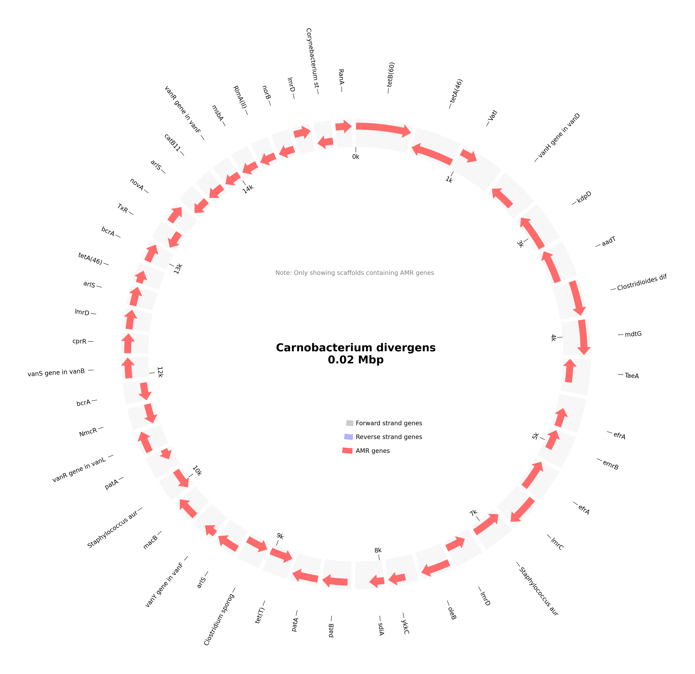

### Clostridioides difficile gyrA conferring resistance to fluoroquinolones
- **Mechanism**: antibiotic target alteration
- **Drug Classes**: fluoroquinolone antibiotic
- **AMR Family**: fluoroquinolone resistant gyrA
- **Locations**:
  - gnl|SPADES|NHGFMGEA_14279_1 : position 1-450

### Clostridium sporogenes cplR
- **Mechanism**: antibiotic target protection
- **Drug Classes**: lincosamide antibiotic; pleuromutilin antibiotic
- **AMR Family**: Miscellaneous ABC-F subfamily ATP-binding cassette ribosomal protection proteins
- **Locations**:
  - gnl|SPADES|NHGFMGEA_24009_1 : position 3-299

### Corynebacterium striatum tetA
- **Mechanism**: antibiotic efflux
- **Drug Classes**: penam; tetracycline antibiotic
- **AMR Family**: major facilitator superfamily (MFS) antibiotic efflux pump
- **Locations**:
  - gnl|SPADES|NHGFMGEA_40505_1 : position 3-215

### NmcR
- **Mechanism**: antibiotic inactivation
- **Drug Classes**: carbapenem; cephalosporin; cephamycin; penam
- **AMR Family**: NmcA beta-lactamase
- **Locations**:
  - gnl|SPADES|NHGFMGEA_27880_1 : position 1-270

### RanA
- **Mechanism**: antibiotic efflux
- **Drug Classes**: aminoglycoside antibiotic
- **AMR Family**: ATP-binding cassette (ABC) antibiotic efflux pump
- **Locations**:
  - gnl|SPADES|NHGFMGEA_42191_1 : position 1-207

### RlmA(II)
- **Mechanism**: antibiotic target alteration
- **Drug Classes**: macrolide antibiotic; lincosamide antibiotic
- **AMR Family**: non-erm 23S ribosomal RNA methyltransferase (G748)
- **Locations**:
  - gnl|SPADES|NHGFMGEA_38664_1 : position 3-221

### Staphylococcus aureus mupA conferring resistance to mupirocin
- **Mechanism**: antibiotic target alteration
- **Drug Classes**: mupirocin-like antibiotic
- **AMR Family**: antibiotic-resistant isoleucyl-tRNA synthetase (ileS)
- **Locations**:
  - gnl|SPADES|NHGFMGEA_16516_1 : position 1-399

### Staphylococcus aureus mupB conferring resistance to mupirocin
- **Mechanism**: antibiotic target alteration
- **Drug Classes**: mupirocin-like antibiotic
- **AMR Family**: antibiotic-resistant isoleucyl-tRNA synthetase (ileS)
- **Locations**:
  - gnl|SPADES|NHGFMGEA_26269_1 : position 3-281

### TaeA
- **Mechanism**: antibiotic efflux
- **Drug Classes**: pleuromutilin antibiotic
- **AMR Family**: ATP-binding cassette (ABC) antibiotic efflux pump
- **Locations**:
  - gnl|SPADES|NHGFMGEA_14510_1 : position 1-318

### TxR
- **Mechanism**: antibiotic efflux
- **Drug Classes**: tetracycline antibiotic
- **AMR Family**: ATP-binding cassette (ABC) antibiotic efflux pump
- **Locations**:
  - gnl|SPADES|NHGFMGEA_35486_1 : position 2-235

### VatI
- **Mechanism**: antibiotic inactivation
- **Drug Classes**: streptogramin antibiotic; streptogramin A antibiotic
- **AMR Family**: streptogramin vat acetyltransferase
- **Locations**:
  - gnl|SPADES|NHGFMGEA_11137_1 : position 1-225

### aadT
- **Mechanism**: antibiotic efflux
- **Drug Classes**: macrolide antibiotic; tetracycline antibiotic; disinfecting agents and antiseptics
- **AMR Family**: major facilitator superfamily (MFS) antibiotic efflux pump
- **Locations**:
  - gnl|SPADES|NHGFMGEA_14026_1 : position 1-456

### arlS (found in 3 locations)
- **Mechanism**: antibiotic efflux
- **Drug Classes**: fluoroquinolone antibiotic; disinfecting agents and antiseptics
- **AMR Family**: major facilitator superfamily (MFS) antibiotic efflux pump
- **Locations**:
  - gnl|SPADES|NHGFMGEA_25147_1 : position 3-290
  - gnl|SPADES|NHGFMGEA_33102_1 : position 2-247
  - gnl|SPADES|NHGFMGEA_36151_1 : position 2-232

### bcrA (found in 2 locations)
- **Mechanism**: antibiotic efflux
- **Drug Classes**: peptide antibiotic
- **AMR Family**: ATP-binding cassette (ABC) antibiotic efflux pump
- **Locations**:
  - gnl|SPADES|NHGFMGEA_28625_1 : position 1-240
  - gnl|SPADES|NHGFMGEA_35021_1 : position 2-238

### catB11
- **Mechanism**: antibiotic inactivation
- **Drug Classes**: phenicol antibiotic
- **AMR Family**: chloramphenicol acetyltransferase (CAT)
- **Locations**:
  - gnl|SPADES|NHGFMGEA_36697_1 : position 3-230

### cprR
- **Mechanism**: antibiotic target alteration; antibiotic efflux
- **Drug Classes**: peptide antibiotic
- **AMR Family**: pmr phosphoethanolamine transferase
- **Locations**:
  - gnl|SPADES|NHGFMGEA_31542_1 : position 3-254

### efrA (found in 2 locations)
- **Mechanism**: antibiotic efflux
- **Drug Classes**: macrolide antibiotic; fluoroquinolone antibiotic; rifamycin antibiotic
- **AMR Family**: ATP-binding cassette (ABC) antibiotic efflux pump
- **Locations**:
  - gnl|SPADES|NHGFMGEA_14938_2 : position 176-433
  - gnl|SPADES|NHGFMGEA_15805_1 : position 3-413

### emrB
- **Mechanism**: antibiotic efflux
- **Drug Classes**: fluoroquinolone antibiotic
- **AMR Family**: major facilitator superfamily (MFS) antibiotic efflux pump
- **Locations**:
  - gnl|SPADES|NHGFMGEA_15494_1 : position 3-272

### kdpD
- **Mechanism**: antibiotic efflux
- **Drug Classes**: aminoglycoside antibiotic
- **AMR Family**: kdpDE
- **Locations**:
  - gnl|SPADES|NHGFMGEA_12504_1 : position 3-497

### lmrC
- **Mechanism**: antibiotic target protection
- **Drug Classes**: lincosamide antibiotic
- **AMR Family**: Miscellaneous ABC-F subfamily ATP-binding cassette ribosomal protection proteins
- **Locations**:
  - gnl|SPADES|NHGFMGEA_16429_1 : position 2-400

### lmrD (found in 3 locations)
- **Mechanism**: antibiotic efflux
- **Drug Classes**: lincosamide antibiotic
- **AMR Family**: ATP-binding cassette (ABC) antibiotic efflux pump
- **Locations**:
  - gnl|SPADES|NHGFMGEA_17664_1 : position 107-382
  - gnl|SPADES|NHGFMGEA_32382_1 : position 2-250
  - gnl|SPADES|NHGFMGEA_39933_1 : position 2-217

### macB
- **Mechanism**: antibiotic efflux
- **Drug Classes**: macrolide antibiotic
- **AMR Family**: ATP-binding cassette (ABC) antibiotic efflux pump
- **Locations**:
  - gnl|SPADES|NHGFMGEA_25686_1 : position 1-285

### mdtG
- **Mechanism**: antibiotic efflux
- **Drug Classes**: phosphonic acid antibiotic
- **AMR Family**: major facilitator superfamily (MFS) antibiotic efflux pump
- **Locations**:
  - gnl|SPADES|NHGFMGEA_14353_1 : position 2-448

### msbA
- **Mechanism**: antibiotic efflux
- **Drug Classes**: nitroimidazole antibiotic
- **AMR Family**: ATP-binding cassette (ABC) antibiotic efflux pump
- **Locations**:
  - gnl|SPADES|NHGFMGEA_38179_1 : position 2-223

### norB
- **Mechanism**: antibiotic efflux
- **Drug Classes**: fluoroquinolone antibiotic
- **AMR Family**: major facilitator superfamily (MFS) antibiotic efflux pump
- **Locations**:
  - gnl|SPADES|NHGFMGEA_39405_1 : position 3-218

### novA
- **Mechanism**: antibiotic efflux
- **Drug Classes**: aminocoumarin antibiotic
- **AMR Family**: ATP-binding cassette (ABC) antibiotic efflux pump
- **Locations**:
  - gnl|SPADES|NHGFMGEA_35790_1 : position 3-236

### oleB
- **Mechanism**: antibiotic target protection
- **Drug Classes**: macrolide antibiotic
- **AMR Family**: Miscellaneous ABC-F subfamily ATP-binding cassette ribosomal protection proteins
- **Locations**:
  - gnl|SPADES|NHGFMGEA_18078_1 : position 2-373

### patA (found in 2 locations)
- **Mechanism**: antibiotic efflux
- **Drug Classes**: fluoroquinolone antibiotic
- **AMR Family**: ATP-binding cassette (ABC) antibiotic efflux pump
- **Locations**:
  - gnl|SPADES|NHGFMGEA_20920_1 : position 3-335
  - gnl|SPADES|NHGFMGEA_26769_2 : position 127-276

### patB
- **Mechanism**: antibiotic efflux
- **Drug Classes**: fluoroquinolone antibiotic
- **AMR Family**: ATP-binding cassette (ABC) antibiotic efflux pump
- **Locations**:
  - gnl|SPADES|NHGFMGEA_18430_1 : position 45-368

### sdiA
- **Mechanism**: antibiotic efflux
- **Drug Classes**: fluoroquinolone antibiotic; cephalosporin; glycylcycline; penam; tetracycline antibiotic; rifamycin antibiotic; phenicol antibiotic; disinfecting agents and antiseptics
- **AMR Family**: resistance-nodulation-cell division (RND) antibiotic efflux pump
- **Locations**:
  - gnl|SPADES|NHGFMGEA_18440_1 : position 2-193

### tet(T)
- **Mechanism**: antibiotic target protection
- **Drug Classes**: tetracycline antibiotic
- **AMR Family**: tetracycline-resistant ribosomal protection protein
- **Locations**:
  - gnl|SPADES|NHGFMGEA_23174_1 : position 1-309

### tetA(46) (found in 2 locations)
- **Mechanism**: antibiotic efflux
- **Drug Classes**: tetracycline antibiotic
- **AMR Family**: ATP-binding cassette (ABC) antibiotic efflux pump
- **Locations**:
  - gnl|SPADES|NHGFMGEA_10335_1 : position 2-577
  - gnl|SPADES|NHGFMGEA_34241_1 : position 2-166

### tetB(60)
- **Mechanism**: antibiotic efflux
- **Drug Classes**: tetracycline antibiotic
- **AMR Family**: ATP-binding cassette (ABC) antibiotic efflux pump
- **Locations**:
  - gnl|SPADES|NHGFMGEA_7959_1 : position 2-703

### vanH gene in vanD cluster
- **Mechanism**: antibiotic target alteration
- **Drug Classes**: glycopeptide antibiotic
- **AMR Family**: vanH; glycopeptide resistance gene cluster
- **Locations**:
  - gnl|SPADES|NHGFMGEA_12479_1 : position 2-346

### vanR gene in vanF cluster
- **Mechanism**: antibiotic target alteration
- **Drug Classes**: glycopeptide antibiotic
- **AMR Family**: glycopeptide resistance gene cluster; vanR
- **Locations**:
  - gnl|SPADES|NHGFMGEA_37448_1 : position 3-227

### vanR gene in vanL cluster
- **Mechanism**: antibiotic target alteration
- **Drug Classes**: glycopeptide antibiotic
- **AMR Family**: glycopeptide resistance gene cluster; vanR
- **Locations**:
  - gnl|SPADES|NHGFMGEA_26826_1 : position 3-278

### vanS gene in vanB cluster
- **Mechanism**: antibiotic target alteration
- **Drug Classes**: glycopeptide antibiotic
- **AMR Family**: vanS; glycopeptide resistance gene cluster
- **Locations**:
  - gnl|SPADES|NHGFMGEA_29381_1 : position 1-264

### vanY gene in vanF cluster
- **Mechanism**: antibiotic target alteration
- **Drug Classes**: glycopeptide antibiotic
- **AMR Family**: vanY; glycopeptide resistance gene cluster
- **Locations**:
  - gnl|SPADES|NHGFMGEA_25223_1: position 2-166

### ykkC
- **Mechanism**: antibiotic efflux
- **Drug Classes**: aminoglycoside antibiotic; tetracycline antibiotic; phenicol antibiotic
- **AMR Family**: small multidrug resistance (SMR) antibiotic efflux pump
- **Locations**:
  - gnl|SPADES|NHGFMGEA_18076_1 : position 157-375

## Carnobacterium maltaromaticum
**Strain Statistics:**
- Total genome length: 343.1 kbp
- Total scaffolds: 3516
- Scaffolds with AMR genes: 326
- Total genes annotated: 532
- Total AMR genes: 351
- Unique AMR genes: 153
- Distinct AMR mechanisms: 10
- Distinct AMR families: 63
- Distinct drug classes: 33

**Circos Plot:**

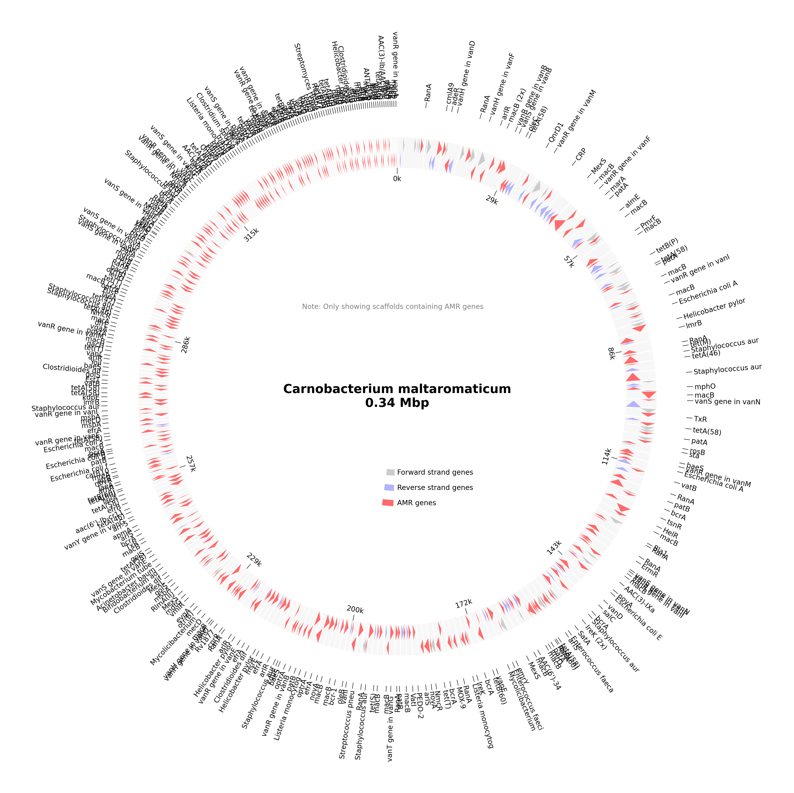

### AAC(3)-IXa
- **Mechanism**: antibiotic inactivation
- **Drug Classes**: aminoglycoside antibiotic
- **AMR Family**: AAC(3)
- **Locations**:
  - gnl|SPADES|NHGFMGEA_2486_2 : position 610-1422

### AAC(3)-Ib/AAC(6')-Ib3 bifunctional protein
- **Mechanism**: antibiotic inactivation
- **Drug Classes**: aminoglycoside antibiotic
- **AMR Family**: aminoglycoside bifunctional resistance protein
- **Locations**:
  - gnl|SPADES|NHGFMGEA_37998_1 : position 3-224

### AAC(3)-Ic
- **Mechanism**: antibiotic inactivation
- **Drug Classes**: aminoglycoside antibiotic
- **AMR Family**: AAC(3)
- **Locations**:
  - gnl|SPADES|NHGFMGEA_13141_1 : position 24-461

### AAC(6')-34
- **Mechanism**: antibiotic inactivation
- **Drug Classes**: aminoglycoside antibiotic
- **AMR Family**: AAC(6')
- **Locations**:
  - gnl|SPADES|NHGFMGEA_2968_2 : position 504-1037

### ANT(6)-Ib
- **Mechanism**: antibiotic inactivation
- **Drug Classes**: aminoglycoside antibiotic
- **AMR Family**: ANT(6)
- **Locations**:
  - gnl|SPADES|NHGFMGEA_34182_1 : position 1-240

### Acinetobacter baumannii AbaQ
- **Mechanism**: antibiotic efflux
- **Drug Classes**: fluoroquinolone antibiotic
- **AMR Family**: major facilitator superfamily (MFS) antibiotic efflux pump
- **Locations**:
  - gnl|SPADES|NHGFMGEA_5467_1 : position 2-691

### Bifidobacterium adolescentis rpoB mutants conferring resistance to rifampicin
- **Mechanism**: antibiotic target alteration; antibiotic target replacement
- **Drug Classes**: rifamycin antibiotic
- **AMR Family**: rifamycin-resistant beta-subunit of RNA polymerase (rpoB)
- **Locations**:
  - gnl|SPADES|NHGFMGEA_5442_1 : position 105-941

### Bla1
- **Mechanism**: antibiotic inactivation
- **Drug Classes**: penam
- **AMR Family**: class A Bacillus anthracis Bla beta-lactamase
- **Locations**:
  - gnl|SPADES|NHGFMGEA_2370_3 : position 1190-1699

### CRP
- **Mechanism**: antibiotic efflux
- **Drug Classes**: macrolide antibiotic; fluoroquinolone antibiotic; penam
- **AMR Family**: resistance-nodulation-cell division (RND) antibiotic efflux pump
- **Locations**:
  - gnl|SPADES|NHGFMGEA_982_3 : position 1339-2010

### Clostridioides difficile gyrA conferring resistance to fluoroquinolones
- **Mechanism**: antibiotic target alteration
- **Drug Classes**: fluoroquinolone antibiotic
- **AMR Family**: fluoroquinolone resistant gyrA
- **Locations**:
  - gnl|SPADES|NHGFMGEA_5441_1 : position 1-588

### Clostridioides difficile gyrB conferring resistance to fluoroquinolones (found in 3 locations)
- **Mechanism**: antibiotic target alteration
- **Drug Classes**: fluoroquinolone antibiotic
- **AMR Family**: fluoroquinolone resistant gyrB
- **Locations**:
  - gnl|SPADES|NHGFMGEA_28850_1 : position 3-266
  - gnl|SPADES|NHGFMGEA_4651_1 : position 1-1008
  - gnl|SPADES|NHGFMGEA_7394_1 : position 1-741

### Clostridium sporogenes cplR
- **Mechanism**: antibiotic target protection
- **Drug Classes**: lincosamide antibiotic; pleuromutilin antibiotic
- **AMR Family**: Miscellaneous ABC-F subfamily ATP-binding cassette ribosomal protection proteins
- **Locations**:
  - gnl|SPADES|NHGFMGEA_15817_1 : position 1-414

### EVM-1
- **Mechanism**: antibiotic inactivation
- **Drug Classes**: carbapenem
- **AMR Family**: EVM beta-lactamase
- **Locations**:
  - gnl|SPADES|NHGFMGEA_15917_1 : position 1-411

### Enterococcus faecalis cls with mutation conferring resistance to daptomycin
- **Mechanism**: antibiotic target alteration
- **Drug Classes**: peptide antibiotic
- **AMR Family**: daptomycin resistant cls
- **Locations**:
  - gnl|SPADES|NHGFMGEA_2842_2 : position 633-1499

### Enterococcus faecium cls conferring resistance to daptomycin
- **Mechanism**: antibiotic target alteration
- **Drug Classes**: peptide antibiotic
- **AMR Family**: daptomycin resistant cls
- **Locations**:
  - gnl|SPADES|NHGFMGEA_3118_1 : position 3-1121

### ErmR
- **Mechanism**: antibiotic target alteration
- **Drug Classes**: macrolide antibiotic; lincosamide antibiotic; streptogramin antibiotic; streptogramin A antibiotic; streptogramin B antibiotic
- **AMR Family**: Erm 23S ribosomal RNA methyltransferase
- **Locations**:
  - gnl|SPADES|NHGFMGEA_2430_1 : position 75-968

### Escherichia coli AcrAB-TolC with AcrR mutation conferring resistance to ciprofloxacin, tetracycline, and ceftazidime
- **Mechanism**: antibiotic target alteration; antibiotic efflux
- **Drug Classes**: fluoroquinolone antibiotic; cephalosporin; glycylcycline; penam; tetracycline antibiotic; rifamycin antibiotic; phenicol antibiotic; disinfecting agents and antiseptics
- **AMR Family**: resistance-nodulation-cell division (RND) antibiotic efflux pump
- **Locations**:
  - gnl|SPADES|NHGFMGEA_1975_1 : position 114-710

### Escherichia coli AcrAB-TolC with MarR mutations conferring resistance to ciprofloxacin and tetracycline
- **Mechanism**: antibiotic target alteration; antibiotic efflux
- **Drug Classes**: fluoroquinolone antibiotic; cephalosporin; glycylcycline; penam; tetracycline antibiotic; rifamycin antibiotic; phenicol antibiotic; disinfecting agents and antiseptics
- **AMR Family**: resistance-nodulation-cell division (RND) antibiotic efflux pump
- **Locations**:
  - gnl|SPADES|NHGFMGEA_1417_2 : position 659-1123

### Escherichia coli EF-Tu mutants conferring resistance to kirromycin
- **Mechanism**: antibiotic target alteration
- **Drug Classes**: elfamycin antibiotic
- **AMR Family**: elfamycin resistant EF-Tu
- **Locations**:
  - gnl|SPADES|NHGFMGEA_2567_1 : position 1-882

### Escherichia coli fabI mutations conferring resistance to isoniazid and triclosan
- **Mechanism**: antibiotic target alteration
- **Drug Classes**: disinfecting agents and antiseptics; isoniazid-like antibiotic
- **AMR Family**: antibiotic resistant fabI
- **Locations**:
  - gnl|SPADES|NHGFMGEA_6519_1 : position 2-406

### Escherichia coli gyrA conferring resistance to fluoroquinolones
- **Mechanism**: antibiotic target alteration
- **Drug Classes**: fluoroquinolone antibiotic
- **AMR Family**: fluoroquinolone resistant gyrA
- **Locations**:
  - gnl|SPADES|NHGFMGEA_6621_2 : position 345-806

### Escherichia coli soxS with mutation conferring antibiotic resistance
- **Mechanism**: antibiotic target alteration; antibiotic efflux; reduced permeability to antibiotic
- **Drug Classes**: fluoroquinolone antibiotic; monobactam; carbapenem; cephalosporin; glycylcycline; cephamycin; penam; tetracycline antibiotic; rifamycin antibiotic; phenicol antibiotic; penem; disinfecting agents and antiseptics
- **AMR Family**: ATP-binding cassette (ABC) antibiotic efflux pump; major facilitator superfamily (MFS) antibiotic efflux pump; resistance-nodulation-cell division (RND) antibiotic efflux pump; General Bacterial Porin with reduced permeability to beta-lactams
- **Locations**:
  - gnl|SPADES|NHGFMGEA_6770_2 : position 448-789

### EstT
- **Mechanism**: antibiotic inactivation
- **Drug Classes**: macrolide antibiotic
- **AMR Family**: macrolide esterase
- **Locations**:
  - gnl|SPADES|NHGFMGEA_7344_1 : position 1-633

### FusF
- **Mechanism**: antibiotic target protection
- **Drug Classes**: fusidane antibiotic
- **AMR Family**: Target protecting FusB-type protein conferring resistance to Fusidic acid
- **Locations**:
  - gnl|SPADES|NHGFMGEA_8916_1 : position 178-645

### HelR
- **Mechanism**: antibiotic target protection
- **Drug Classes**: rifamycin antibiotic
- **AMR Family**: helicase-like RNA polymerase protection protein
- **Locations**:
  - gnl|SPADES|NHGFMGEA_2184_1 : position 132-1811

### Helicobacter pylori pbp1 mutants conferring resistance to amoxicillin (found in 3 locations)
- **Mechanism**: antibiotic target alteration
- **Drug Classes**: cephalosporin; cephamycin; penam
- **AMR Family**: Penicillin-binding protein mutations conferring resistance to beta-lactam antibiotics
- **Locations**:
  - gnl|SPADES|NHGFMGEA_1438_2 : position 967-2478
  - gnl|SPADES|NHGFMGEA_27963_1 : position 2-271
  - gnl|SPADES|NHGFMGEA_4804_1 : position 2-1030

### Helicobacter pylori rdxA mutation conferring resistance to metronidazole
- **Mechanism**: antibiotic target alteration
- **Drug Classes**: nitroimidazole antibiotic
- **AMR Family**: Antibiotic resistant Helicobacter pylori nitroreductase
- **Locations**:
  - gnl|SPADES|NHGFMGEA_4635_1 : position 3-212

### IreK (found in 3 locations)
- **Mechanism**: reduced permeability to antibiotic
- **Drug Classes**: cephalosporin
- **AMR Family**: Serine/threonine kinases
- **Locations**:
  - gnl|SPADES|NHGFMGEA_2748_1 : position 1-1056
  - gnl|SPADES|NHGFMGEA_2748_2 : position 1040-1273
  - gnl|SPADES|NHGFMGEA_3171_3 : position 864-1397

### Listeria monocytogenes mprF (found in 3 locations)
- **Mechanism**: antibiotic target alteration
- **Drug Classes**: peptide antibiotic
- **AMR Family**: defensin resistant mprF
- **Locations**:
  - gnl|SPADES|NHGFMGEA_14795_1 : position 3-437
  - gnl|SPADES|NHGFMGEA_3180_1 : position 3-860
  - gnl|SPADES|NHGFMGEA_4346_1 : position 1-1110

### MOX-9
- **Mechanism**: antibiotic inactivation
- **Drug Classes**: cephalosporin; cephamycin; penam
- **AMR Family**: MOX beta-lactamase
- **Locations**:
  - gnl|SPADES|NHGFMGEA_3324_2 : position 523-1353

### MexL
- **Mechanism**: antibiotic efflux
- **Drug Classes**: macrolide antibiotic; tetracycline antibiotic; disinfecting agents and antiseptics
- **AMR Family**: resistance-nodulation-cell division (RND) antibiotic efflux pump
- **Locations**:
  - gnl|SPADES|NHGFMGEA_5409_1 : position 247-864

### MexS (found in 3 locations)
- **Mechanism**: antibiotic efflux
- **Drug Classes**: fluoroquinolone antibiotic; diaminopyrimidine antibiotic; phenicol antibiotic
- **AMR Family**: resistance-nodulation-cell division (RND) antibiotic efflux pump
- **Locations**:
  - gnl|SPADES|NHGFMGEA_1003_5 : position 2153-3118
  - gnl|SPADES|NHGFMGEA_3054_1 : position 3-629
  - gnl|SPADES|NHGFMGEA_5314_2 : position 217-957

### Mycobacterium tuberculosis intrinsic murA conferring resistance to fosfomycin
- **Mechanism**: antibiotic target alteration
- **Drug Classes**: phosphonic acid antibiotic
- **AMR Family**: antibiotic-resistant murA transferase
- **Locations**:
  - gnl|SPADES|NHGFMGEA_5599_1 : position 179-922

### Mycolicibacterium smegmatis ndh with mutation conferring resistance to isoniazid (found in 2 locations)
- **Mechanism**: antibiotic target alteration
- **Drug Classes**: isoniazid-like antibiotic
- **AMR Family**: antibiotic resistant ndh
- **Locations**:
  - gnl|SPADES|NHGFMGEA_3138_1 : position 2-331
  - gnl|SPADES|NHGFMGEA_5080_1 : position 1-987

### NmcR (found in 4 locations)
- **Mechanism**: antibiotic inactivation
- **Drug Classes**: carbapenem; cephalosporin; cephamycin; penam
- **AMR Family**: NmcA beta-lactamase
- **Locations**:
  - gnl|SPADES|NHGFMGEA_10696_1 : position 1-561
  - gnl|SPADES|NHGFMGEA_11983_1 : position 1-339
  - gnl|SPADES|NHGFMGEA_3386_2 : position 994-1332
  - gnl|SPADES|NHGFMGEA_8454_2 : position 447-674

### PEDO-2
- **Mechanism**: antibiotic inactivation
- **Drug Classes**: carbapenem
- **AMR Family**: subclass B3 PEDO beta-lactamase
- **Locations**:
  - gnl|SPADES|NHGFMGEA_3500_2 : position 308-925

### PmrF
- **Mechanism**: antibiotic target alteration
- **Drug Classes**: peptide antibiotic
- **AMR Family**: pmr phosphoethanolamine transferase
- **Locations**:
  - gnl|SPADES|NHGFMGEA_1169_2 : position 1548-2798

### QnrD1
- **Mechanism**: antibiotic target protection
- **Drug Classes**: fluoroquinolone antibiotic
- **AMR Family**: quinolone resistance protein (qnr)
- **Locations**:
  - gnl|SPADES|NHGFMGEA_915_3 : position 1585-2220

### QnrS7
- **Mechanism**: antibiotic target protection
- **Drug Classes**: fluoroquinolone antibiotic
- **AMR Family**: quinolone resistance protein (qnr)
- **Locations**:
  - gnl|SPADES|NHGFMGEA_13810_1 : position 2-460

### RanA (found in 15 locations)
- **Mechanism**: antibiotic efflux
- **Drug Classes**: aminoglycoside antibiotic
- **AMR Family**: ATP-binding cassette (ABC) antibiotic efflux pump
- **Locations**:
  - gnl|SPADES|NHGFMGEA_10877_2 : position 98-553
  - gnl|SPADES|NHGFMGEA_14211_1 : position 3-449
  - gnl|SPADES|NHGFMGEA_1534_2 : position 1286-2272
  - gnl|SPADES|NHGFMGEA_2041_3 : position 859-1890
  - gnl|SPADES|NHGFMGEA_21901_1 : position 2-322
  - gnl|SPADES|NHGFMGEA_2371_1 : position 1-189
  - gnl|SPADES|NHGFMGEA_2418_2 : position 623-1678
  - gnl|SPADES|NHGFMGEA_2860_3 : position 1212-1493
  - gnl|SPADES|NHGFMGEA_3305_2 : position 665-1357
  - gnl|SPADES|NHGFMGEA_3625_2 : position 568-1266
  - gnl|SPADES|NHGFMGEA_3830_1 : position 1-300
  - gnl|SPADES|NHGFMGEA_4861_3 : position 747-1022
  - gnl|SPADES|NHGFMGEA_517_10 : position 6255-6908
  - gnl|SPADES|NHGFMGEA_769_3 : position 2020-3060
  - gnl|SPADES|NHGFMGEA_9446_2 : position 446-619

### RlmA(II)
- **Mechanism**: antibiotic target alteration
- **Drug Classes**: macrolide antibiotic; lincosamide antibiotic
- **AMR Family**: non-erm 23S ribosomal RNA methyltransferase (G748)
- **Locations**:
  - gnl|SPADES|NHGFMGEA_5339_2 : position 572-955

### Rv1877 (found in 2 locations)
- **Mechanism**: antibiotic efflux
- **Drug Classes**: fluoroquinolone antibiotic
- **AMR Family**: major facilitator superfamily (MFS) antibiotic efflux pump
- **Locations**:
  - gnl|SPADES|NHGFMGEA_23543_1 : position 3-305
  - gnl|SPADES|NHGFMGEA_5014_1 : position 3-998

### SatA
- **Mechanism**: antibiotic inactivation
- **Drug Classes**: nucleoside antibiotic
- **AMR Family**: streptothricin acetyltransferase (SAT)
- **Locations**:
  - gnl|SPADES|NHGFMGEA_2807_2 : position 698-1150

### Staphylococcus aureus LmrS
- **Mechanism**: antibiotic efflux
- **Drug Classes**: macrolide antibiotic; aminoglycoside antibiotic; oxazolidinone antibiotic; diaminopyrimidine antibiotic; phenicol antibiotic
- **AMR Family**: major facilitator superfamily (MFS) antibiotic efflux pump
- **Locations**:
  - gnl|SPADES|NHGFMGEA_11518_2 : position 201-530

### Staphylococcus aureus fusA with mutation conferring resistance to fusidic acid
- **Mechanism**: antibiotic target alteration
- **Drug Classes**: fusidane antibiotic
- **AMR Family**: antibiotic resistant fusA
- **Locations**:
  - gnl|SPADES|NHGFMGEA_1541_2 : position 413-2359

### Staphylococcus aureus mupA conferring resistance to mupirocin (found in 5 locations)
- **Mechanism**: antibiotic target alteration
- **Drug Classes**: mupirocin-like antibiotic
- **AMR Family**: antibiotic-resistant isoleucyl-tRNA synthetase (ileS)
- **Locations**:
  - gnl|SPADES|NHGFMGEA_2737_1 : position 3-764
  - gnl|SPADES|NHGFMGEA_3786_1 : position 11-1228
  - gnl|SPADES|NHGFMGEA_4555_1 : position 1-327
  - gnl|SPADES|NHGFMGEA_8587_1 : position 3-665
  - gnl|SPADES|NHGFMGEA_9712_1 : position 2-607

### Staphylococcus aureus mupB conferring resistance to mupirocin
- **Mechanism**: antibiotic target alteration
- **Drug Classes**: mupirocin-like antibiotic
- **AMR Family**: antibiotic-resistant isoleucyl-tRNA synthetase (ileS)
- **Locations**:
  - gnl|SPADES|NHGFMGEA_8657_1 : position 3-659

### Staphylococcus aureus murA with mutation conferring resistance to fosfomycin
- **Mechanism**: antibiotic target alteration
- **Drug Classes**: phosphonic acid antibiotic
- **AMR Family**: antibiotic-resistant murA transferase
- **Locations**:
  - gnl|SPADES|NHGFMGEA_7123_1 : position 1-762

### Staphylococcus aureus rpoB mutants conferring resistance to rifampicin
- **Mechanism**: antibiotic target alteration; antibiotic target replacement
- **Drug Classes**: rifamycin antibiotic
- **AMR Family**: rifamycin-resistant beta-subunit of RNA polymerase (rpoB)
- **Locations**:
  - gnl|SPADES|NHGFMGEA_1630_1 : position 2-2275

### Streptococcus pneumoniae PBP2x conferring resistance to amoxicillin
- **Mechanism**: antibiotic target alteration
- **Drug Classes**: cephalosporin; cephamycin; penam
- **AMR Family**: Penicillin-binding protein mutations conferring resistance to beta-lactam antibiotics
- **Locations**:
  - gnl|SPADES|NHGFMGEA_3921_1 : position 1-1197

### Streptomyces rimosus otr(A)
- **Mechanism**: antibiotic target protection
- **Drug Classes**: tetracycline antibiotic
- **AMR Family**: tetracycline-resistant ribosomal protection protein
- **Locations**:
  - gnl|SPADES|NHGFMGEA_22603_1 : position 3-314

### TaeA (found in 4 locations)
- **Mechanism**: antibiotic efflux
- **Drug Classes**: pleuromutilin antibiotic
- **AMR Family**: ATP-binding cassette (ABC) antibiotic efflux pump
- **Locations**:
  - gnl|SPADES|NHGFMGEA_19201_1 : position 2-358
  - gnl|SPADES|NHGFMGEA_6102_1 : position 1-669
  - gnl|SPADES|NHGFMGEA_6406_1 : position 2-244
  - gnl|SPADES|NHGFMGEA_8830_1 : position 3-650

### TxR (found in 5 locations)
- **Mechanism**: antibiotic efflux
- **Drug Classes**: tetracycline antibiotic
- **AMR Family**: ATP-binding cassette (ABC) antibiotic efflux pump
- **Locations**:
  - gnl|SPADES|NHGFMGEA_15442_1 : position 1-420
  - gnl|SPADES|NHGFMGEA_1710_2 : position 1156-2181
  - gnl|SPADES|NHGFMGEA_20889_1 : position 3-335
  - gnl|SPADES|NHGFMGEA_5750_1 : position 2-901
  - gnl|SPADES|NHGFMGEA_9449_1 : position 2-619

### VatI
- **Mechanism**: antibiotic inactivation
- **Drug Classes**: streptogramin antibiotic; streptogramin A antibiotic
- **AMR Family**: streptogramin vat acetyltransferase
- **Locations**:
  - gnl|SPADES|NHGFMGEA_3539_1 : position 3-623

### YajC
- **Mechanism**: antibiotic efflux
- **Drug Classes**: fluoroquinolone antibiotic; cephalosporin; glycylcycline; penam; tetracycline antibiotic; oxazolidinone antibiotic; glycopeptide antibiotic; rifamycin antibiotic; phenicol antibiotic; disinfecting agents and antiseptics
- **AMR Family**: resistance-nodulation-cell division (RND) antibiotic efflux pump
- **Locations**:
  - gnl|SPADES|NHGFMGEA_10902_1 : position 2-307

### YojI
- **Mechanism**: antibiotic efflux
- **Drug Classes**: peptide antibiotic
- **AMR Family**: ATP-binding cassette (ABC) antibiotic efflux pump
- **Locations**:
  - gnl|SPADES|NHGFMGEA_7489_1 : position 3-518

### aac(6')-Ib-cr11
- **Mechanism**: antibiotic inactivation
- **Drug Classes**: fluoroquinolone antibiotic; aminoglycoside antibiotic
- **AMR Family**: AAC(6'); AAC(6')-Ib-cr
- **Locations**:
  - gnl|SPADES|NHGFMGEA_5945_1 : position 1-393

### aadK
- **Mechanism**: antibiotic inactivation
- **Drug Classes**: aminoglycoside antibiotic
- **AMR Family**: ANT(6)
- **Locations**:
  - gnl|SPADES|NHGFMGEA_12921_2 : position 151-486

### aadT
- **Mechanism**: antibiotic efflux
- **Drug Classes**: macrolide antibiotic; tetracycline antibiotic; disinfecting agents and antiseptics
- **AMR Family**: major facilitator superfamily (MFS) antibiotic efflux pump
- **Locations**:
  - gnl|SPADES|NHGFMGEA_20958_1 : position 2-334

### adeR
- **Mechanism**: antibiotic efflux
- **Drug Classes**: glycylcycline; tetracycline antibiotic
- **AMR Family**: resistance-nodulation-cell division (RND) antibiotic efflux pump
- **Locations**:
  - gnl|SPADES|NHGFMGEA_743_2 : position 66-794

### almE (found in 2 locations)
- **Mechanism**: antibiotic target alteration
- **Drug Classes**: peptide antibiotic
- **AMR Family**: polymyxin resistance operon; alm glycyltransferase
- **Locations**:
  - gnl|SPADES|NHGFMGEA_1114_4 : position 2538-2984
  - gnl|SPADES|NHGFMGEA_14176_1 : position 2-451

### apmA
- **Mechanism**: antibiotic inactivation
- **Drug Classes**: aminoglycoside antibiotic
- **AMR Family**: AAC(2')
- **Locations**:
  - gnl|SPADES|NHGFMGEA_5821_1 : position 113-622

### arlR (found in 4 locations)
- **Mechanism**: antibiotic efflux
- **Drug Classes**: fluoroquinolone antibiotic; disinfecting agents and antiseptics
- **AMR Family**: major facilitator superfamily (MFS) antibiotic efflux pump
- **Locations**:
  - gnl|SPADES|NHGFMGEA_4575_1 : position 2-526
  - gnl|SPADES|NHGFMGEA_4815_1 : position 2-481
  - gnl|SPADES|NHGFMGEA_7666_1 : position 39-656
  - gnl|SPADES|NHGFMGEA_777_3 : position 2673-3473

### arlS (found in 9 locations)
- **Mechanism**: antibiotic efflux
- **Drug Classes**: fluoroquinolone antibiotic; disinfecting agents and antiseptics
- **AMR Family**: major facilitator superfamily (MFS) antibiotic efflux pump
- **Locations**:
  - gnl|SPADES|NHGFMGEA_11075_1 : position 3-545
  - gnl|SPADES|NHGFMGEA_14545_1 : position 42-443
  - gnl|SPADES|NHGFMGEA_24001_1 : position 132-299
  - gnl|SPADES|NHGFMGEA_25551_1 : position 2-286
  - gnl|SPADES|NHGFMGEA_2857_1 : position 1-285
  - gnl|SPADES|NHGFMGEA_31632_1 : position 1-252
  - gnl|SPADES|NHGFMGEA_3460_1 : position 3-746
  - gnl|SPADES|NHGFMGEA_37850_1 : position 3-224
  - gnl|SPADES|NHGFMGEA_5822_2 : position 136-891

### arnA (found in 2 locations)
- **Mechanism**: antibiotic target alteration
- **Drug Classes**: peptide antibiotic
- **AMR Family**: pmr phosphoethanolamine transferase
- **Locations**:
  - gnl|SPADES|NHGFMGEA_35710_1 : position 3-236
  - gnl|SPADES|NHGFMGEA_6258_2 : position 415-843

### arr-5
- **Mechanism**: antibiotic inactivation
- **Drug Classes**: rifamycin antibiotic
- **AMR Family**: rifampin ADP-ribosyltransferase (Arr)
- **Locations**:
  - gnl|SPADES|NHGFMGEA_5856_2 : position 759-887

### bacA
- **Mechanism**: antibiotic target alteration
- **Drug Classes**: peptide antibiotic
- **AMR Family**: undecaprenyl pyrophosphate related proteins
- **Locations**:
  - gnl|SPADES|NHGFMGEA_9356_1 : position 2-622

### baeS (found in 3 locations)
- **Mechanism**: antibiotic efflux
- **Drug Classes**: aminoglycoside antibiotic; aminocoumarin antibiotic
- **AMR Family**: resistance-nodulation-cell division (RND) antibiotic efflux pump
- **Locations**:
  - gnl|SPADES|NHGFMGEA_1968_1 : position 1-1095
  - gnl|SPADES|NHGFMGEA_4532_1 : position 1-507
  - gnl|SPADES|NHGFMGEA_7411_1 : position 2-739

### bcr-1
- **Mechanism**: antibiotic efflux
- **Drug Classes**: bicyclomycin-like antibiotic
- **AMR Family**: major facilitator superfamily (MFS) antibiotic efflux pump
- **Locations**:
  - gnl|SPADES|NHGFMGEA_4115_1 : position 3-944

### bcrA (found in 12 locations)
- **Mechanism**: antibiotic efflux
- **Drug Classes**: peptide antibiotic
- **AMR Family**: ATP-binding cassette (ABC) antibiotic efflux pump
- **Locations**:
  - gnl|SPADES|NHGFMGEA_11039_1 : position 196-549
  - gnl|SPADES|NHGFMGEA_16260_1 : position 2-403
  - gnl|SPADES|NHGFMGEA_2081_2 : position 615-1193
  - gnl|SPADES|NHGFMGEA_21345_1 : position 1-330
  - gnl|SPADES|NHGFMGEA_2702_2 : position 726-1556
  - gnl|SPADES|NHGFMGEA_28732_1 : position 2-268
  - gnl|SPADES|NHGFMGEA_3170_2 : position 588-1193
  - gnl|SPADES|NHGFMGEA_3354_3 : position 717-1343
  - gnl|SPADES|NHGFMGEA_34321_1 : position 3-242
  - gnl|SPADES|NHGFMGEA_5782_1 : position 104-895
  - gnl|SPADES|NHGFMGEA_6636_2 : position 222-803
  - gnl|SPADES|NHGFMGEA_9955_1 : position 1-285

### carA
- **Mechanism**: antibiotic target protection
- **Drug Classes**: macrolide antibiotic
- **AMR Family**: Miscellaneous ABC-F subfamily ATP-binding cassette ribosomal protection proteins
- **Locations**:
  - gnl|SPADES|NHGFMGEA_22283_1 : position 164-319

### catB10
- **Mechanism**: antibiotic inactivation
- **Drug Classes**: phenicol antibiotic
- **AMR Family**: chloramphenicol acetyltransferase (CAT)
- **Locations**:
  - gnl|SPADES|NHGFMGEA_6438_1 : position 2-334

### cfrE
- **Mechanism**: antibiotic target alteration
- **Drug Classes**: lincosamide antibiotic; streptogramin antibiotic; oxazolidinone antibiotic; phenicol antibiotic; pleuromutilin antibiotic
- **AMR Family**: Cfr 23S ribosomal RNA methyltransferase
- **Locations**:
  - gnl|SPADES|NHGFMGEA_21999_1 : position 3-320

### cmlA9
- **Mechanism**: antibiotic efflux
- **Drug Classes**: phenicol antibiotic
- **AMR Family**: major facilitator superfamily (MFS) antibiotic efflux pump
- **Locations**:
  - gnl|SPADES|NHGFMGEA_731_5 : position 3291-4448

### cprR
- **Mechanism**: antibiotic target alteration; antibiotic efflux
- **Drug Classes**: peptide antibiotic
- **AMR Family**: pmr phosphoethanolamine transferase
- **Locations**:
  - gnl|SPADES|NHGFMGEA_4879_1 : position 3-551

### dfrE
- **Mechanism**: antibiotic target replacement
- **Drug Classes**: diaminopyrimidine antibiotic
- **AMR Family**: trimethoprim resistant dihydrofolate reductase dfr
- **Locations**:
  - gnl|SPADES|NHGFMGEA_8327_2 : position 154-642

### efmA (found in 3 locations)
- **Mechanism**: antibiotic efflux
- **Drug Classes**: macrolide antibiotic; fluoroquinolone antibiotic
- **AMR Family**: major facilitator superfamily (MFS) antibiotic efflux pump
- **Locations**:
  - gnl|SPADES|NHGFMGEA_18663_1 : position 1-366
  - gnl|SPADES|NHGFMGEA_19313_1 : position 2-355
  - gnl|SPADES|NHGFMGEA_19992_1 : position 1-345

### efrA (found in 12 locations)
- **Mechanism**: antibiotic efflux
- **Drug Classes**: macrolide antibiotic; fluoroquinolone antibiotic; rifamycin antibiotic
- **AMR Family**: ATP-binding cassette (ABC) antibiotic efflux pump
- **Locations**:
  - gnl|SPADES|NHGFMGEA_10326_1 : position 1-576
  - gnl|SPADES|NHGFMGEA_12903_1 : position 3-485
  - gnl|SPADES|NHGFMGEA_13178_1 : position 3-479
  - gnl|SPADES|NHGFMGEA_13618_1 : position 2-466
  - gnl|SPADES|NHGFMGEA_19440_1 : position 3-353
  - gnl|SPADES|NHGFMGEA_27824_1 : position 2-271
  - gnl|SPADES|NHGFMGEA_32503_1 : position 1-249
  - gnl|SPADES|NHGFMGEA_32588_1 : position 1-249
  - gnl|SPADES|NHGFMGEA_4225_1 : position 1-1134
  - gnl|SPADES|NHGFMGEA_4596_2 : position 215-1069
  - gnl|SPADES|NHGFMGEA_4698_1 : position 1-876
  - gnl|SPADES|NHGFMGEA_6900_1 : position 3-476

### efrB (found in 6 locations)
- **Mechanism**: antibiotic efflux
- **Drug Classes**: macrolide antibiotic; fluoroquinolone antibiotic; rifamycin antibiotic
- **AMR Family**: ATP-binding cassette (ABC) antibiotic efflux pump
- **Locations**:
  - gnl|SPADES|NHGFMGEA_18686_1 : position 1-363
  - gnl|SPADES|NHGFMGEA_21373_1 : position 2-328
  - gnl|SPADES|NHGFMGEA_24717_1 : position 2-166
  - gnl|SPADES|NHGFMGEA_29075_1 : position 3-266
  - gnl|SPADES|NHGFMGEA_5970_1 : position 1-876
  - gnl|SPADES|NHGFMGEA_6394_2 : position 426-827

### emrY
- **Mechanism**: antibiotic efflux
- **Drug Classes**: tetracycline antibiotic
- **AMR Family**: major facilitator superfamily (MFS) antibiotic efflux pump
- **Locations**:
  - gnl|SPADES|NHGFMGEA_3095_2 : position 1256-1417

### evgA
- **Mechanism**: antibiotic efflux
- **Drug Classes**: macrolide antibiotic; fluoroquinolone antibiotic; penam; tetracycline antibiotic
- **AMR Family**: major facilitator superfamily (MFS) antibiotic efflux pump; resistance-nodulation-cell division (RND) antibiotic efflux pump
- **Locations**:
  - gnl|SPADES|NHGFMGEA_5228_1 : position 1-480

### fusC
- **Mechanism**: antibiotic target protection
- **Drug Classes**: fusidane antibiotic
- **AMR Family**: Target protecting FusB-type protein conferring resistance to Fusidic acid
- **Locations**:
  - gnl|SPADES|NHGFMGEA_12521_2 : position 317-496

### gadX
- **Mechanism**: antibiotic efflux
- **Drug Classes**: macrolide antibiotic; fluoroquinolone antibiotic; penam
- **AMR Family**: resistance-nodulation-cell division (RND) antibiotic efflux pump
- **Locations**:
  - gnl|SPADES|NHGFMGEA_16897_1 : position 3-392

### golS (found in 6 locations)
- **Mechanism**: antibiotic efflux
- **Drug Classes**: monobactam; carbapenem; cephalosporin; cephamycin; penam; phenicol antibiotic; penem
- **AMR Family**: resistance-nodulation-cell division (RND) antibiotic efflux pump
- **Locations**:
  - gnl|SPADES|NHGFMGEA_10070_1 : position 118-546
  - gnl|SPADES|NHGFMGEA_11715_1 : position 2-145
  - gnl|SPADES|NHGFMGEA_20499_1 : position 48-338
  - gnl|SPADES|NHGFMGEA_5388_1 : position 110-949
  - gnl|SPADES|NHGFMGEA_5684_1 : position 2-205
  - gnl|SPADES|NHGFMGEA_7358_2 : position 291-659

### kdpD (found in 3 locations)
- **Mechanism**: antibiotic efflux
- **Drug Classes**: aminoglycoside antibiotic
- **AMR Family**: kdpDE
- **Locations**:
  - gnl|SPADES|NHGFMGEA_13962_1 : position 1-456
  - gnl|SPADES|NHGFMGEA_20907_1 : position 1-333
  - gnl|SPADES|NHGFMGEA_39059_1 : position 1-219

### kdpE (found in 2 locations)
- **Mechanism**: antibiotic efflux
- **Drug Classes**: aminoglycoside antibiotic
- **AMR Family**: kdpDE
- **Locations**:
  - gnl|SPADES|NHGFMGEA_4532_2 : position 539-1078
  - gnl|SPADES|NHGFMGEA_7191_2 : position 135-758

### leuO
- **Mechanism**: antibiotic efflux
- **Drug Classes**: nucleoside antibiotic; disinfecting agents and antiseptics
- **AMR Family**: major facilitator superfamily (MFS) antibiotic efflux pump
- **Locations**:
  - gnl|SPADES|NHGFMGEA_9138_2 : position 410-634

### lmrB (found in 2 locations)
- **Mechanism**: antibiotic efflux
- **Drug Classes**: lincosamide antibiotic; nucleoside antibiotic
- **AMR Family**: ATP-binding cassette (ABC) antibiotic efflux pump
- **Locations**:
  - gnl|SPADES|NHGFMGEA_1462_2 : position 398-1738
  - gnl|SPADES|NHGFMGEA_7165_1 : position 1-759

### lmrD (found in 3 locations)
- **Mechanism**: antibiotic efflux
- **Drug Classes**: lincosamide antibiotic
- **AMR Family**: ATP-binding cassette (ABC) antibiotic efflux pump
- **Locations**:
  - gnl|SPADES|NHGFMGEA_21632_1 : position 130-324
  - gnl|SPADES|NHGFMGEA_2877_2 : position 1329-1487
  - gnl|SPADES|NHGFMGEA_35084_1 : position 3-239

### lsaC
- **Mechanism**: antibiotic target protection
- **Drug Classes**: lincosamide antibiotic; streptogramin antibiotic; pleuromutilin antibiotic
- **AMR Family**: lsa-type ABC-F protein
- **Locations**:
  - gnl|SPADES|NHGFMGEA_10227_2 : position 441-581

### macB (found in 30 locations)
- **Mechanism**: antibiotic efflux
- **Drug Classes**: macrolide antibiotic
- **AMR Family**: ATP-binding cassette (ABC) antibiotic efflux pump
- **Locations**:
  - gnl|SPADES|NHGFMGEA_1005_1 : position 3-2387
  - gnl|SPADES|NHGFMGEA_10828_1 : position 2-556
  - gnl|SPADES|NHGFMGEA_1147_2 : position 1112-1780
  - gnl|SPADES|NHGFMGEA_1245_1 : position 1-375
  - gnl|SPADES|NHGFMGEA_1342_3 : position 2178-2594
  - gnl|SPADES|NHGFMGEA_1412_3 : position 1131-1832
  - gnl|SPADES|NHGFMGEA_15335_1 : position 1-423
  - gnl|SPADES|NHGFMGEA_1658_2 : position 396-2240
  - gnl|SPADES|NHGFMGEA_2327_1 : position 3-740
  - gnl|SPADES|NHGFMGEA_2478_2 : position 675-1442
  - gnl|SPADES|NHGFMGEA_27176_1 : position 2-274
  - gnl|SPADES|NHGFMGEA_2934_1 : position 2-781
  - gnl|SPADES|NHGFMGEA_3043_1 : position 2-202
  - gnl|SPADES|NHGFMGEA_31798_1 : position 1-252
  - gnl|SPADES|NHGFMGEA_33732_1 : position 1-243
  - gnl|SPADES|NHGFMGEA_3586_1 : position 28-471
  - gnl|SPADES|NHGFMGEA_3646_1 : position 34-645
  - gnl|SPADES|NHGFMGEA_3671_2 : position 502-1254
  - gnl|SPADES|NHGFMGEA_39888_1 : position 3-215
  - gnl|SPADES|NHGFMGEA_4154_2 : position 550-1146
  - gnl|SPADES|NHGFMGEA_4155_1 : position 3-638
  - gnl|SPADES|NHGFMGEA_41956_1 : position 3-206
  - gnl|SPADES|NHGFMGEA_5049_1 : position 2-394
  - gnl|SPADES|NHGFMGEA_5700_2 : position 632-907
  - gnl|SPADES|NHGFMGEA_6732_1 : position 301-795
  - gnl|SPADES|NHGFMGEA_796_1 : position 1-717
  - gnl|SPADES|NHGFMGEA_796_2 : position 701-1963
  - gnl|SPADES|NHGFMGEA_8115_1 : position 28-693
  - gnl|SPADES|NHGFMGEA_8962_1 : position 2-460
  - gnl|SPADES|NHGFMGEA_8962_2 : position 476-643

### marA (found in 2 locations)
- **Mechanism**: antibiotic efflux; reduced permeability to antibiotic
- **Drug Classes**: fluoroquinolone antibiotic; monobactam; carbapenem; cephalosporin; glycylcycline; cephamycin; penam; tetracycline antibiotic; rifamycin antibiotic; phenicol antibiotic; penem; disinfecting agents and antiseptics
- **AMR Family**: resistance-nodulation-cell division (RND) antibiotic efflux pump; General Bacterial Porin with reduced permeability to beta-lactams
- **Locations**:
  - gnl|SPADES|NHGFMGEA_1013_2 : position 885-1721
  - gnl|SPADES|NHGFMGEA_8359_2 : position 125-511

### mdtG (found in 2 locations)
- **Mechanism**: antibiotic efflux
- **Drug Classes**: phosphonic acid antibiotic
- **AMR Family**: major facilitator superfamily (MFS) antibiotic efflux pump
- **Locations**:
  - gnl|SPADES|NHGFMGEA_5305_2 : position 476-961
  - gnl|SPADES|NHGFMGEA_9626_1 : position 2-610

### mecD (found in 2 locations)
- **Mechanism**: antibiotic target replacement
- **Drug Classes**: penam
- **AMR Family**: methicillin resistant PBP2
- **Locations**:
  - gnl|SPADES|NHGFMGEA_5060_1 : position 1-900
  - gnl|SPADES|NHGFMGEA_7039_1 : position 1-771

### mecI
- **Mechanism**: antibiotic target replacement
- **Drug Classes**: penam
- **AMR Family**: methicillin resistant PBP2
- **Locations**:
  - gnl|SPADES|NHGFMGEA_10448_2 : position 229-573

### mphO
- **Mechanism**: antibiotic inactivation
- **Drug Classes**: macrolide antibiotic
- **AMR Family**: macrolide phosphotransferase (MPH)
- **Locations**:
  - gnl|SPADES|NHGFMGEA_1632_4 : position 1606-2274

### mreA
- **Mechanism**: antibiotic efflux
- **Drug Classes**: macrolide antibiotic
- **AMR Family**: major facilitator superfamily (MFS) antibiotic efflux pump
- **Locations**:
  - gnl|SPADES|NHGFMGEA_6418_1 : position 93-827

### msbA (found in 6 locations)
- **Mechanism**: antibiotic efflux
- **Drug Classes**: nitroimidazole antibiotic
- **AMR Family**: ATP-binding cassette (ABC) antibiotic efflux pump
- **Locations**:
  - gnl|SPADES|NHGFMGEA_17564_1 : position 2-382
  - gnl|SPADES|NHGFMGEA_23533_1 : position 3-305
  - gnl|SPADES|NHGFMGEA_32006_1 : position 4-252
  - gnl|SPADES|NHGFMGEA_5349_2 : position 554-952
  - gnl|SPADES|NHGFMGEA_6957_2 : position 95-775
  - gnl|SPADES|NHGFMGEA_7109_1 : position 2-202

### msrE
- **Mechanism**: antibiotic target protection
- **Drug Classes**: macrolide antibiotic; streptogramin antibiotic
- **AMR Family**: msr-type ABC-F protein
- **Locations**:
  - gnl|SPADES|NHGFMGEA_4621_1 : position 2-1063

### nalD
- **Mechanism**: antibiotic efflux
- **Drug Classes**: macrolide antibiotic; fluoroquinolone antibiotic; monobactam; carbapenem; cephalosporin; cephamycin; penam; tetracycline antibiotic; peptide antibiotic; aminocoumarin antibiotic; diaminopyrimidine antibiotic; sulfonamide antibiotic; phenicol antibiotic; penem
- **AMR Family**: resistance-nodulation-cell division (RND) antibiotic efflux pump
- **Locations**:
  - gnl|SPADES|NHGFMGEA_27065_1 : position 1-276

### novA (found in 6 locations)
- **Mechanism**: antibiotic efflux
- **Drug Classes**: aminocoumarin antibiotic
- **AMR Family**: ATP-binding cassette (ABC) antibiotic efflux pump
- **Locations**:
  - gnl|SPADES|NHGFMGEA_17103_2 : position 197-391
  - gnl|SPADES|NHGFMGEA_2560_3 : position 1219-1611
  - gnl|SPADES|NHGFMGEA_3427_1 : position 2-1321
  - gnl|SPADES|NHGFMGEA_4159_1 : position 7-1146
  - gnl|SPADES|NHGFMGEA_6394_1 : position 2-469
  - gnl|SPADES|NHGFMGEA_9813_1 : position 1-600

### oleB
- **Mechanism**: antibiotic target protection
- **Drug Classes**: macrolide antibiotic
- **AMR Family**: Miscellaneous ABC-F subfamily ATP-binding cassette ribosomal protection proteins
- **Locations**:
  - gnl|SPADES|NHGFMGEA_3992_1 : position 2-253

### oleC (found in 3 locations)
- **Mechanism**: antibiotic efflux
- **Drug Classes**: macrolide antibiotic
- **AMR Family**: ATP-binding cassette (ABC) antibiotic efflux pump
- **Locations**:
  - gnl|SPADES|NHGFMGEA_16814_1 : position 1-396
  - gnl|SPADES|NHGFMGEA_40879_1 : position 1-213
  - gnl|SPADES|NHGFMGEA_819_2 : position 453-1157

### optrA (found in 3 locations)
- **Mechanism**: antibiotic target protection
- **Drug Classes**: oxazolidinone antibiotic; phenicol antibiotic
- **AMR Family**: Miscellaneous ABC-F subfamily ATP-binding cassette ribosomal protection proteins
- **Locations**:
  - gnl|SPADES|NHGFMGEA_4266_1 : position 3-1127
  - gnl|SPADES|NHGFMGEA_4506_1 : position 1-483
  - gnl|SPADES|NHGFMGEA_8921_1 : position 56-646

### otr(B) (found in 2 locations)
- **Mechanism**: antibiotic efflux
- **Drug Classes**: tetracycline antibiotic
- **AMR Family**: major facilitator superfamily (MFS) antibiotic efflux pump
- **Locations**:
  - gnl|SPADES|NHGFMGEA_5115_1 : position 3-983
  - gnl|SPADES|NHGFMGEA_9186_1 : position 170-631

### patA (found in 6 locations)
- **Mechanism**: antibiotic efflux
- **Drug Classes**: fluoroquinolone antibiotic
- **AMR Family**: ATP-binding cassette (ABC) antibiotic efflux pump
- **Locations**:
  - gnl|SPADES|NHGFMGEA_1013_3 : position 2119-3243
  - gnl|SPADES|NHGFMGEA_1272_4 : position 2263-2691
  - gnl|SPADES|NHGFMGEA_1822_3 : position 1510-2076
  - gnl|SPADES|NHGFMGEA_26703_1 : position 2-277
  - gnl|SPADES|NHGFMGEA_2877_1 : position 1-1329
  - gnl|SPADES|NHGFMGEA_9622_1 : position 455-610

### patB (found in 10 locations)
- **Mechanism**: antibiotic efflux
- **Drug Classes**: fluoroquinolone antibiotic
- **AMR Family**: ATP-binding cassette (ABC) antibiotic efflux pump
- **Locations**:
  - gnl|SPADES|NHGFMGEA_10810_1 : position 1-558
  - gnl|SPADES|NHGFMGEA_11671_1 : position 1-351
  - gnl|SPADES|NHGFMGEA_17444_1 : position 1-384
  - gnl|SPADES|NHGFMGEA_18151_1 : position 3-371
  - gnl|SPADES|NHGFMGEA_2051_2 : position 280-1905
  - gnl|SPADES|NHGFMGEA_3625_1 : position 2-556
  - gnl|SPADES|NHGFMGEA_4367_1 : position 1-702
  - gnl|SPADES|NHGFMGEA_6562_1 : position 286-813
  - gnl|SPADES|NHGFMGEA_9590_1 : position 2-610
  - gnl|SPADES|NHGFMGEA_9881_1 : position 68-598

### poxtA (found in 2 locations)
- **Mechanism**: antibiotic target protection
- **Drug Classes**: tetracycline antibiotic; oxazolidinone antibiotic; phenicol antibiotic
- **AMR Family**: Miscellaneous ABC-F subfamily ATP-binding cassette ribosomal protection proteins
- **Locations**:
  - gnl|SPADES|NHGFMGEA_16576_1 : position 2-259
  - gnl|SPADES|NHGFMGEA_8196_1 : position 2-538

### qacH
- **Mechanism**: antibiotic efflux
- **Drug Classes**: disinfecting agents and antiseptics
- **AMR Family**: small multidrug resistance (SMR) antibiotic efflux pump
- **Locations**:
  - gnl|SPADES|NHGFMGEA_8107_2 : position 145-471

### rosB
- **Mechanism**: antibiotic efflux
- **Drug Classes**: peptide antibiotic
- **AMR Family**: major facilitator superfamily (MFS) antibiotic efflux pump
- **Locations**:
  - gnl|SPADES|NHGFMGEA_1864_3 : position 1364-2041

### salC
- **Mechanism**: antibiotic target protection
- **Drug Classes**: lincosamide antibiotic; streptogramin antibiotic; streptogramin A antibiotic; pleuromutilin antibiotic
- **AMR Family**: sal-type ABC-F protein
- **Locations**:
  - gnl|SPADES|NHGFMGEA_2695_2 : position 443-1150

### srmB
- **Mechanism**: antibiotic target protection
- **Drug Classes**: macrolide antibiotic
- **AMR Family**: Miscellaneous ABC-F subfamily ATP-binding cassette ribosomal protection proteins
- **Locations**:
  - gnl|SPADES|NHGFMGEA_6636_1 : position 2-130

### sta
- **Mechanism**: antibiotic inactivation
- **Drug Classes**: nucleoside antibiotic
- **AMR Family**: streptothricin acetyltransferase (SAT)
- **Locations**:
  - gnl|SPADES|NHGFMGEA_1919_1 : position 81-596

### tet(42) (found in 2 locations)
- **Mechanism**: antibiotic efflux
- **Drug Classes**: tetracycline antibiotic
- **AMR Family**: major facilitator superfamily (MFS) antibiotic efflux pump
- **Locations**:
  - gnl|SPADES|NHGFMGEA_17057_1 : position 2-391
  - gnl|SPADES|NHGFMGEA_8794_1 : position 2-652

### tet(L)
- **Mechanism**: antibiotic efflux
- **Drug Classes**: tetracycline antibiotic
- **AMR Family**: major facilitator superfamily (MFS) antibiotic efflux pump
- **Locations**:
  - gnl|SPADES|NHGFMGEA_22095_1 : position 2-319

### tet(M)
- **Mechanism**: antibiotic target protection
- **Drug Classes**: tetracycline antibiotic
- **AMR Family**: tetracycline-resistant ribosomal protection protein
- **Locations**:
  - gnl|SPADES|NHGFMGEA_1541_1 : position 1-267

### tet(S)
- **Mechanism**: antibiotic target protection
- **Drug Classes**: tetracycline antibiotic
- **AMR Family**: tetracycline-resistant ribosomal protection protein
- **Locations**:
  - gnl|SPADES|NHGFMGEA_3703_1 : position 1-438

### tet(T) (found in 3 locations)
- **Mechanism**: antibiotic target protection
- **Drug Classes**: tetracycline antibiotic
- **AMR Family**: tetracycline-resistant ribosomal protection protein
- **Locations**:
  - gnl|SPADES|NHGFMGEA_3387_2 : position 336-1220
  - gnl|SPADES|NHGFMGEA_7745_1 : position 2-718
  - gnl|SPADES|NHGFMGEA_9123_1 : position 2-634

### tet(Y)
- **Mechanism**: antibiotic efflux
- **Drug Classes**: tetracycline antibiotic
- **AMR Family**: major facilitator superfamily (MFS) antibiotic efflux pump
- **Locations**:
  - gnl|SPADES|NHGFMGEA_11576_1 : position 1-528

### tetA(46) (found in 4 locations)
- **Mechanism**: antibiotic efflux
- **Drug Classes**: tetracycline antibiotic
- **AMR Family**: ATP-binding cassette (ABC) antibiotic efflux pump
- **Locations**:
  - gnl|SPADES|NHGFMGEA_1597_1 : position 3-233
  - gnl|SPADES|NHGFMGEA_38015_1 : position 2-226
  - gnl|SPADES|NHGFMGEA_5874_1 : position 3-884
  - gnl|SPADES|NHGFMGEA_8543_1 : position 53-667

### tetA(58) (found in 11 locations)
- **Mechanism**: antibiotic efflux
- **Drug Classes**: tetracycline antibiotic
- **AMR Family**: major facilitator superfamily (MFS) antibiotic efflux pump
- **Locations**:
  - gnl|SPADES|NHGFMGEA_1272_3 : position 1753-2211
  - gnl|SPADES|NHGFMGEA_13557_1 : position 3-467
  - gnl|SPADES|NHGFMGEA_1718_2 : position 1330-2169
  - gnl|SPADES|NHGFMGEA_24210_1 : position 2-298
  - gnl|SPADES|NHGFMGEA_2860_1 : position 3-827
  - gnl|SPADES|NHGFMGEA_5639_1 : position 37-918
  - gnl|SPADES|NHGFMGEA_6019_1 : position 2-847
  - gnl|SPADES|NHGFMGEA_6809_1 : position 75-788
  - gnl|SPADES|NHGFMGEA_7254_1 : position 2-751
  - gnl|SPADES|NHGFMGEA_7273_2 : position 217-750
  - gnl|SPADES|NHGFMGEA_819_3 : position 1161-1934

### tetA(60) (found in 2 locations)
- **Mechanism**: antibiotic efflux
- **Drug Classes**: tetracycline antibiotic
- **AMR Family**: ATP-binding cassette (ABC) antibiotic efflux pump
- **Locations**:
  - gnl|SPADES|NHGFMGEA_24810_1 : position 1-291
  - gnl|SPADES|NHGFMGEA_6110_1 : position 3-392

### tetB(60) (found in 5 locations)
- **Mechanism**: antibiotic efflux
- **Drug Classes**: tetracycline antibiotic
- **AMR Family**: ATP-binding cassette (ABC) antibiotic efflux pump
- **Locations**:
  - gnl|SPADES|NHGFMGEA_17838_1 : position 3-377
  - gnl|SPADES|NHGFMGEA_20076_1 : position 2-346
  - gnl|SPADES|NHGFMGEA_2860_2 : position 817-1173
  - gnl|SPADES|NHGFMGEA_3161_1 : position 14-1048
  - gnl|SPADES|NHGFMGEA_6110_2 : position 392-859

### tetB(P) (found in 2 locations)
- **Mechanism**: antibiotic target protection
- **Drug Classes**: tetracycline antibiotic
- **AMR Family**: tetracycline-resistant ribosomal protection protein
- **Locations**:
  - gnl|SPADES|NHGFMGEA_1260_4 : position 2561-2713
  - gnl|SPADES|NHGFMGEA_23752_1 : position 2-256

### tsnR
- **Mechanism**: antibiotic target alteration
- **Drug Classes**: peptide antibiotic
- **AMR Family**: non-erm 23S ribosomal RNA methyltransferase (A1067)
- **Locations**:
  - gnl|SPADES|NHGFMGEA_2103_2 : position 588-1352

### vanA
- **Mechanism**: antibiotic target alteration
- **Drug Classes**: glycopeptide antibiotic
- **AMR Family**: glycopeptide resistance gene cluster; Van ligase
- **Locations**:
  - gnl|SPADES|NHGFMGEA_40098_1 : position 54-215

### vanD
- **Mechanism**: antibiotic target alteration
- **Drug Classes**: glycopeptide antibiotic
- **AMR Family**: glycopeptide resistance gene cluster; Van ligase
- **Locations**:
  - gnl|SPADES|NHGFMGEA_2693_2 : position 395-1558

### vanE
- **Mechanism**: antibiotic target alteration
- **Drug Classes**: glycopeptide antibiotic
- **AMR Family**: glycopeptide resistance gene cluster; Van ligase
- **Locations**:
  - gnl|SPADES|NHGFMGEA_3158_2 : position 1192-1401

### vanG
- **Mechanism**: antibiotic target alteration
- **Drug Classes**: glycopeptide antibiotic
- **AMR Family**: glycopeptide resistance gene cluster; Van ligase
- **Locations**:
  - gnl|SPADES|NHGFMGEA_17149_1 : position 137-388

### vanH gene in vanD cluster
- **Mechanism**: antibiotic target alteration
- **Drug Classes**: glycopeptide antibiotic
- **AMR Family**: vanH; glycopeptide resistance gene cluster
- **Locations**:
  - gnl|SPADES|NHGFMGEA_743_4 : position 1271-2284

### vanH gene in vanF cluster
- **Mechanism**: antibiotic target alteration
- **Drug Classes**: glycopeptide antibiotic
- **AMR Family**: vanH; glycopeptide resistance gene cluster
- **Locations**:
  - gnl|SPADES|NHGFMGEA_777_1 : position 3-755

### vanH gene in vanO cluster
- **Mechanism**: antibiotic target alteration
- **Drug Classes**: glycopeptide antibiotic
- **AMR Family**: vanH; glycopeptide resistance gene cluster
- **Locations**:
  - gnl|SPADES|NHGFMGEA_5013_2 : position 94-624

### vanH gene in vanP cluster
- **Mechanism**: antibiotic target alteration
- **Drug Classes**: glycopeptide antibiotic
- **AMR Family**: vanH; glycopeptide resistance gene cluster
- **Locations**:
  - gnl|SPADES|NHGFMGEA_5013_3 : position 599-997

### vanI
- **Mechanism**: antibiotic target alteration
- **Drug Classes**: glycopeptide antibiotic
- **AMR Family**: glycopeptide resistance gene cluster; Van ligase
- **Locations**:
  - gnl|SPADES|NHGFMGEA_3950_2 : position 246-1190

### vanL (found in 2 locations)
- **Mechanism**: antibiotic target alteration
- **Drug Classes**: glycopeptide antibiotic
- **AMR Family**: glycopeptide resistance gene cluster; Van ligase
- **Locations**:
  - gnl|SPADES|NHGFMGEA_12410_1 : position 3-500
  - gnl|SPADES|NHGFMGEA_7716_1 : position 1-480

### vanR gene in vanA cluster
- **Mechanism**: antibiotic target alteration
- **Drug Classes**: glycopeptide antibiotic
- **AMR Family**: glycopeptide resistance gene cluster; vanR
- **Locations**:
  - gnl|SPADES|NHGFMGEA_41936_1 : position 101-208

### vanR gene in vanB cluster (found in 2 locations)
- **Mechanism**: antibiotic target alteration
- **Drug Classes**: glycopeptide antibiotic
- **AMR Family**: glycopeptide resistance gene cluster; vanR
- **Locations**:
  - gnl|SPADES|NHGFMGEA_4380_1 : position 1-570
  - gnl|SPADES|NHGFMGEA_796_3 : position 2042-2713

### vanR gene in vanE cluster (found in 4 locations)
- **Mechanism**: antibiotic target alteration
- **Drug Classes**: glycopeptide antibiotic
- **AMR Family**: glycopeptide resistance gene cluster; vanR
- **Locations**:
  - gnl|SPADES|NHGFMGEA_12318_1 : position 3-446
  - gnl|SPADES|NHGFMGEA_18456_1 : position 1-366
  - gnl|SPADES|NHGFMGEA_4784_1 : position 2-676
  - gnl|SPADES|NHGFMGEA_6892_1 : position 2-163

### vanR gene in vanF cluster (found in 2 locations)
- **Mechanism**: antibiotic target alteration
- **Drug Classes**: glycopeptide antibiotic
- **AMR Family**: glycopeptide resistance gene cluster; vanR
- **Locations**:
  - gnl|SPADES|NHGFMGEA_1005_2 : position 2444-3187
  - gnl|SPADES|NHGFMGEA_18047_1 : position 47-373

### vanR gene in vanI cluster (found in 3 locations)
- **Mechanism**: antibiotic target alteration
- **Drug Classes**: glycopeptide antibiotic
- **AMR Family**: glycopeptide resistance gene cluster; vanR
- **Locations**:
  - gnl|SPADES|NHGFMGEA_1374_2 : position 988-1683
  - gnl|SPADES|NHGFMGEA_2478_1 : position 2-436
  - gnl|SPADES|NHGFMGEA_7126_1 : position 2-457

### vanR gene in vanM cluster (found in 4 locations)
- **Mechanism**: antibiotic target alteration
- **Drug Classes**: glycopeptide antibiotic
- **AMR Family**: glycopeptide resistance gene cluster; vanR
- **Locations**:
  - gnl|SPADES|NHGFMGEA_12190_1 : position 3-506
  - gnl|SPADES|NHGFMGEA_1968_2 : position 1098-1817
  - gnl|SPADES|NHGFMGEA_8169_2 : position 262-690
  - gnl|SPADES|NHGFMGEA_916_1 : position 1-684

### vanS gene in vanB cluster
- **Mechanism**: antibiotic target alteration
- **Drug Classes**: glycopeptide antibiotic
- **AMR Family**: vanS; glycopeptide resistance gene cluster
- **Locations**:
  - gnl|SPADES|NHGFMGEA_796_4 : position 2710-4065

### vanS gene in vanE cluster
- **Mechanism**: antibiotic target alteration
- **Drug Classes**: glycopeptide antibiotic
- **AMR Family**: vanS; glycopeptide resistance gene cluster
- **Locations**:
  - gnl|SPADES|NHGFMGEA_5612_2 : position 301-921

### vanS gene in vanF cluster (found in 4 locations)
- **Mechanism**: antibiotic target alteration
- **Drug Classes**: glycopeptide antibiotic
- **AMR Family**: vanS; glycopeptide resistance gene cluster
- **Locations**:
  - gnl|SPADES|NHGFMGEA_10668_1 : position 1-564
  - gnl|SPADES|NHGFMGEA_16490_1 : position 3-401
  - gnl|SPADES|NHGFMGEA_2457_3 : position 1251-1661
  - gnl|SPADES|NHGFMGEA_9637_1 : position 3-611

### vanS gene in vanG cluster (found in 2 locations)
- **Mechanism**: antibiotic target alteration
- **Drug Classes**: glycopeptide antibiotic
- **AMR Family**: vanS; glycopeptide resistance gene cluster
- **Locations**:
  - gnl|SPADES|NHGFMGEA_12798_1 : position 1-489
  - gnl|SPADES|NHGFMGEA_9859_1 : position 2-598

### vanS gene in vanN cluster (found in 2 locations)
- **Mechanism**: antibiotic target alteration
- **Drug Classes**: glycopeptide antibiotic
- **AMR Family**: vanS; glycopeptide resistance gene cluster
- **Locations**:
  - gnl|SPADES|NHGFMGEA_1692_1 : position 2-340
  - gnl|SPADES|NHGFMGEA_2457_2 : position 712-1254

### vanT gene in vanG cluster
- **Mechanism**: antibiotic target alteration
- **Drug Classes**: glycopeptide antibiotic
- **AMR Family**: glycopeptide resistance gene cluster; vanT
- **Locations**:
  - gnl|SPADES|NHGFMGEA_3640_2 : position 292-1263

### vanY gene in vanG cluster
- **Mechanism**: antibiotic target alteration
- **Drug Classes**: glycopeptide antibiotic
- **AMR Family**: vanY; glycopeptide resistance gene cluster
- **Locations**:
  - gnl|SPADES|NHGFMGEA_5871_1: position 1-786

### vatB (found in 3 locations)
- **Mechanism**: antibiotic inactivation
- **Drug Classes**: streptogramin antibiotic; streptogramin A antibiotic
- **AMR Family**: streptogramin vat acetyltransferase
- **Locations**:
  - gnl|SPADES|NHGFMGEA_1996_2 : position 419-979
  - gnl|SPADES|NHGFMGEA_29134_1 : position 2-265
  - gnl|SPADES|NHGFMGEA_7290_2 : position 301-750

### vgaA
- **Mechanism**: antibiotic target protection
- **Drug Classes**: lincosamide antibiotic; streptogramin antibiotic; streptogramin A antibiotic; pleuromutilin antibiotic
- **AMR Family**: vga-type ABC-F protein
- **Locations**:
  - gnl|SPADES|NHGFMGEA_8229_1 : position 2-688

### vmlR (found in 2 locations)
- **Mechanism**: antibiotic target protection
- **Drug Classes**: lincosamide antibiotic; streptogramin antibiotic; streptogramin A antibiotic; streptogramin B antibiotic; nucleoside antibiotic; pleuromutilin antibiotic
- **AMR Family**: Miscellaneous ABC-F subfamily ATP-binding cassette ribosomal protection proteins
- **Locations**:
  - gnl|SPADES|NHGFMGEA_35630_1 : position 3-236
  - gnl|SPADES|NHGFMGEA_5245_2 : position 841-969

### ykkC
- **Mechanism**: antibiotic efflux
- **Drug Classes**: aminoglycoside antibiotic; tetracycline antibiotic; phenicol antibiotic
- **AMR Family**: small multidrug resistance (SMR) antibiotic efflux pump
- **Locations**:
  - gnl|SPADES|NHGFMGEA_10089_2 : position 425-589

### ykkD
- **Mechanism**: antibiotic efflux
- **Drug Classes**: aminoglycoside antibiotic; tetracycline antibiotic; phenicol antibiotic
- **AMR Family**: small multidrug resistance (SMR) antibiotic efflux pump
- **Locations**:
  - gnl|SPADES|NHGFMGEA_10089_1 : position 91-408

## Carnobacterium maltaromaticum LMA28
**Strain Statistics:**
- Total genome length: 47.9 kbp
- Total scaffolds: 366
- Scaffolds with AMR genes: 27
- Total genes annotated: 96
- Total AMR genes: 28
- Unique AMR genes: 26
- Distinct AMR mechanisms: 6
- Distinct AMR families: 18
- Distinct drug classes: 26

**Circos Plot:**

### AAC(6')-Ia
- **Mechanism**: antibiotic inactivation
- **Drug Classes**: aminoglycoside antibiotic
- **AMR Family**: AAC(6')
- **Locations**:
  - gnl|SPADES|NHGFMGEA_1391_4 : position 1169-1705

### AAC(6')-Ir
- **Mechanism**: antibiotic inactivation
- **Drug Classes**: aminoglycoside antibiotic
- **AMR Family**: AAC(6')
- **Locations**:
  - gnl|SPADES|NHGFMGEA_2379_2 : position 548-1153

### BCL-1
- **Mechanism**: antibiotic inactivation
- **Drug Classes**: penam
- **AMR Family**: BCL Beta-lactamase
- **Locations**:
  - gnl|SPADES|NHGFMGEA_16356_1 : position 3-401

### Chlamydia trachomatis intrinsic murA conferring resistance to fosfomycin
- **Mechanism**: antibiotic target alteration
- **Drug Classes**: phosphonic acid antibiotic
- **AMR Family**: antibiotic-resistant murA transferase
- **Locations**:
  - gnl|SPADES|NHGFMGEA_13669_1 : position 2-430

### Escherichia coli EF-Tu mutants conferring resistance to kirromycin
- **Mechanism**: antibiotic target alteration
- **Drug Classes**: elfamycin antibiotic
- **AMR Family**: elfamycin resistant EF-Tu
- **Locations**:
  - gnl|SPADES|NHGFMGEA_10212_1 : position 2-583

### Escherichia coli soxS with mutation conferring antibiotic resistance
- **Mechanism**: antibiotic target alteration; antibiotic efflux; reduced permeability to antibiotic
- **Drug Classes**: fluoroquinolone antibiotic; monobactam; carbapenem; cephalosporin; glycylcycline; cephamycin; penam; tetracycline antibiotic; rifamycin antibiotic; phenicol antibiotic; penem; disinfecting agents and antiseptics
- **AMR Family**: ATP-binding cassette (ABC) antibiotic efflux pump; major facilitator superfamily (MFS) antibiotic efflux pump; resistance-nodulation-cell division (RND) antibiotic efflux pump; General Bacterial Porin with reduced permeability to beta-lactams
- **Locations**:
  - gnl|SPADES|NHGFMGEA_13418_1 : position 1-192

### MexS
- **Mechanism**: antibiotic efflux
- **Drug Classes**: fluoroquinolone antibiotic; diaminopyrimidine antibiotic; phenicol antibiotic
- **AMR Family**: resistance-nodulation-cell division (RND) antibiotic efflux pump
- **Locations**:
  - gnl|SPADES|NHGFMGEA_1582_2 : position 695-1633

### NmcR
- **Mechanism**: antibiotic inactivation
- **Drug Classes**: carbapenem; cephalosporin; cephamycin; penam
- **AMR Family**: NmcA beta-lactamase
- **Locations**:
  - gnl|SPADES|NHGFMGEA_8424_1 : position 3-230

### RanA (found in 2 locations)
- **Mechanism**: antibiotic efflux
- **Drug Classes**: aminoglycoside antibiotic
- **AMR Family**: ATP-binding cassette (ABC) antibiotic efflux pump
- **Locations**:
  - gnl|SPADES|NHGFMGEA_1430_1 : position 1-594
  - gnl|SPADES|NHGFMGEA_1676_3 : position 514-2031

### adeN
- **Mechanism**: antibiotic efflux
- **Drug Classes**: macrolide antibiotic; fluoroquinolone antibiotic; lincosamide antibiotic; carbapenem; cephalosporin; tetracycline antibiotic; rifamycin antibiotic; diaminopyrimidine antibiotic; phenicol antibiotic; penem
- **AMR Family**: resistance-nodulation-cell division (RND) antibiotic efflux pump
- **Locations**:
  - gnl|SPADES|NHGFMGEA_7284_2 : position 82-669

### almE
- **Mechanism**: antibiotic target alteration
- **Drug Classes**: peptide antibiotic
- **AMR Family**: polymyxin resistance operon; alm glycyltransferase
- **Locations**:
  - gnl|SPADES|NHGFMGEA_3152_1 : position 3-614

### arlR (found in 2 locations)
- **Mechanism**: antibiotic efflux
- **Drug Classes**: fluoroquinolone antibiotic; disinfecting agents and antiseptics
- **AMR Family**: major facilitator superfamily (MFS) antibiotic efflux pump
- **Locations**:
  - gnl|SPADES|NHGFMGEA_1501_4 : position 2227-2397
  - gnl|SPADES|NHGFMGEA_3997_2 : position 495-1181

### arnA
- **Mechanism**: antibiotic target alteration
- **Drug Classes**: peptide antibiotic
- **AMR Family**: pmr phosphoethanolamine transferase
- **Locations**:
  - gnl|SPADES|NHGFMGEA_755_2 : position 1434-2015

### baeR
- **Mechanism**: antibiotic efflux
- **Drug Classes**: aminoglycoside antibiotic; aminocoumarin antibiotic
- **AMR Family**: resistance-nodulation-cell division (RND) antibiotic efflux pump
- **Locations**:
  - gnl|SPADES|NHGFMGEA_1440_3 : position 808-1491

### baeS
- **Mechanism**: antibiotic efflux
- **Drug Classes**: aminoglycoside antibiotic; aminocoumarin antibiotic
- **AMR Family**: resistance-nodulation-cell division (RND) antibiotic efflux pump
- **Locations**:
  - gnl|SPADES|NHGFMGEA_1440_4 : position 1488-2477

### clbB
- **Mechanism**: antibiotic target alteration
- **Drug Classes**: lincosamide antibiotic; streptogramin antibiotic; streptogramin A antibiotic; oxazolidinone antibiotic; phenicol antibiotic; pleuromutilin antibiotic
- **AMR Family**: Cfr 23S ribosomal RNA methyltransferase
- **Locations**:
  - gnl|SPADES|NHGFMGEA_4500_1 : position 2-301

### golS
- **Mechanism**: antibiotic efflux
- **Drug Classes**: monobactam; carbapenem; cephalosporin; cephamycin; penam; phenicol antibiotic; penem
- **AMR Family**: resistance-nodulation-cell division (RND) antibiotic efflux pump
- **Locations**:
  - gnl|SPADES|NHGFMGEA_4620_1 : position 76-906

### leuO
- **Mechanism**: antibiotic efflux
- **Drug Classes**: nucleoside antibiotic; disinfecting agents and antiseptics
- **AMR Family**: major facilitator superfamily (MFS) antibiotic efflux pump
- **Locations**:
  - gnl|SPADES|NHGFMGEA_709_2 : position 995-1276

### lsaC
- **Mechanism**: antibiotic target protection
- **Drug Classes**: lincosamide antibiotic; streptogramin antibiotic; pleuromutilin antibiotic
- **AMR Family**: lsa-type ABC-F protein
- **Locations**:
  - gnl|SPADES|NHGFMGEA_4258_1 : position 2-490

### macB
- **Mechanism**: antibiotic efflux
- **Drug Classes**: macrolide antibiotic
- **AMR Family**: ATP-binding cassette (ABC) antibiotic efflux pump
- **Locations**:
  - gnl|SPADES|NHGFMGEA_672_1 : position 1-294

### marA
- **Mechanism**: antibiotic efflux; reduced permeability to antibiotic
- **Drug Classes**: fluoroquinolone antibiotic; monobactam; carbapenem; cephalosporin; glycylcycline; cephamycin; penam; tetracycline antibiotic; rifamycin antibiotic; phenicol antibiotic; penem; disinfecting agents and antiseptics
- **AMR Family**: resistance-nodulation-cell division (RND) antibiotic efflux pump; General Bacterial Porin with reduced permeability to beta-lactams
- **Locations**:
  - gnl|SPADES|NHGFMGEA_5481_1 : position 2-580

### mtrA
- **Mechanism**: antibiotic efflux
- **Drug Classes**: macrolide antibiotic; penam
- **AMR Family**: resistance-nodulation-cell division (RND) antibiotic efflux pump
- **Locations**:
  - gnl|SPADES|NHGFMGEA_3588_1 : position 3-377

### optrA
- **Mechanism**: antibiotic target protection
- **Drug Classes**: oxazolidinone antibiotic; phenicol antibiotic
- **AMR Family**: Miscellaneous ABC-F subfamily ATP-binding cassette ribosomal protection proteins
- **Locations**:
  - gnl|SPADES|NHGFMGEA_1090_4 : position 2125-3069

### vanG
- **Mechanism**: antibiotic target alteration
- **Drug Classes**: glycopeptide antibiotic
- **AMR Family**: glycopeptide resistance gene cluster; Van ligase
- **Locations**:
  - gnl|SPADES|NHGFMGEA_9963_2 : position 396-593

### vanS gene in vanM cluster
- **Mechanism**: antibiotic target alteration
- **Drug Classes**: glycopeptide antibiotic
- **AMR Family**: vanS; glycopeptide resistance gene cluster
- **Locations**:
  - gnl|SPADES|NHGFMGEA_6034_1 : position 3-869

### vga(E) Staphylococcus cohnii
- **Mechanism**: antibiotic target protection
- **Drug Classes**: lincosamide antibiotic; streptogramin antibiotic; streptogramin A antibiotic; pleuromutilin antibiotic
- **AMR Family**: vga-type ABC-F protein
- **Locations**:
  - gnl|SPADES|NHGFMGEA_1775_1 : position 2-1429

## Citrobacter
**Strain Statistics:**
- Total genome length: 3.4 kbp
- Total scaffolds: 54
- Scaffolds with AMR genes: 4
- Total genes annotated: 8
- Total AMR genes: 4
- Unique AMR genes: 4
- Distinct AMR mechanisms: 2
- Distinct AMR families: 2
- Distinct drug classes: 3

**Circos Plot:**

### Acinetobacter baumannii AbaF
- **Mechanism**: antibiotic efflux
- **Drug Classes**: phosphonic acid antibiotic
- **AMR Family**: major facilitator superfamily (MFS) antibiotic efflux pump
- **Locations**:
  - gnl|SPADES|NHGFMGEA_19618_1 : position 35-352

### Escherichia coli EF-Tu mutants conferring resistance to Pulvomycin
- **Mechanism**: antibiotic target alteration
- **Drug Classes**: elfamycin antibiotic
- **AMR Family**: elfamycin resistant EF-Tu
- **Locations**:
  - gnl|SPADES|NHGFMGEA_2562_1 : position 3-1526

### otr(B)
- **Mechanism**: antibiotic efflux
- **Drug Classes**: tetracycline antibiotic
- **AMR Family**: major facilitator superfamily (MFS) antibiotic efflux pump
- **Locations**:
  - gnl|SPADES|NHGFMGEA_9758_1 : position 1-603

### tetA(58)
- **Mechanism**: antibiotic efflux
- **Drug Classes**: tetracycline antibiotic
- **AMR Family**: major facilitator superfamily (MFS) antibiotic efflux pump
- **Locations**:
  - gnl|SPADES|NHGFMGEA_6192_1 : position 2-370

## Citrobacter amalonaticus Y19
**Strain Statistics:**
- Total genome length: 0.3 kbp
- Total scaffolds: 1
- Scaffolds with AMR genes: 1
- Total genes annotated: 0
- Total AMR genes: 1
- Unique AMR genes: 1
- Distinct AMR mechanisms: 1
- Distinct AMR families: 1
- Distinct drug classes: 4

**Circos Plot:**

### LptD
- **Mechanism**: antibiotic efflux
- **Drug Classes**: carbapenem; peptide antibiotic; aminocoumarin antibiotic; rifamycin antibiotic
- **AMR Family**: ATP-binding cassette (ABC) antibiotic efflux pump
- **Locations**:
  - gnl|SPADES|NHGFMGEA_32187_1 : position 3-251

## Citrobacter braakii
**Strain Statistics:**
- Total genome length: 1.1 kbp
- Total scaffolds: 13
- Scaffolds with AMR genes: 1
- Total genes annotated: 2
- Total AMR genes: 1
- Unique AMR genes: 1
- Distinct AMR mechanisms: 1
- Distinct AMR families: 1
- Distinct drug classes: 6

**Circos Plot:**

### H-NS
- **Mechanism**: antibiotic efflux
- **Drug Classes**: macrolide antibiotic; fluoroquinolone antibiotic; cephalosporin; cephamycin; penam; tetracycline antibiotic
- **AMR Family**: major facilitator superfamily (MFS) antibiotic efflux pump; resistance-nodulation-cell division (RND) antibiotic efflux pump
- **Locations**:
  - gnl|SPADES|NHGFMGEA_4407_2 : position 344-748

## Citrobacter cronae
**Strain Statistics:**
- Total genome length: 0.7 kbp
- Total scaffolds: 3
- Scaffolds with AMR genes: 1
- Total genes annotated: 2
- Total AMR genes: 1
- Unique AMR genes: 1
- Distinct AMR mechanisms: 1
- Distinct AMR families: 1
- Distinct drug classes: 15

**Circos Plot:**

### Pseudomonas aeruginosa CpxR
- **Mechanism**: antibiotic efflux
- **Drug Classes**: macrolide antibiotic; fluoroquinolone antibiotic; monobactam; aminoglycoside antibiotic; carbapenem; cephalosporin; cephamycin; penam; tetracycline antibiotic; peptide antibiotic; aminocoumarin antibiotic; diaminopyrimidine antibiotic; sulfonamide antibiotic; phenicol antibiotic; penem
- **AMR Family**: resistance-nodulation-cell division (RND) antibiotic efflux pump
- **Locations**:
  - gnl|SPADES|NHGFMGEA_8112_2 : position 416-694

## Citrobacter farmeri
**Strain Statistics:**
- Total genome length: 1.4 kbp
- Total scaffolds: 5
- Scaffolds with AMR genes: 1
- Total genes annotated: 0
- Total AMR genes: 1
- Unique AMR genes: 1
- Distinct AMR mechanisms: 1
- Distinct AMR families: 1
- Distinct drug classes: 1

**Circos Plot:**

### cmlv
- **Mechanism**: antibiotic inactivation
- **Drug Classes**: phenicol antibiotic
- **AMR Family**: chloramphenicol phosphotransferase
- **Locations**:
  - gnl|SPADES|NHGFMGEA_3174_1 : position 3-551

## Citrobacter freundii
**Strain Statistics:**
- Total genome length: 0.2 kbp
- Total scaffolds: 60
- Scaffolds with AMR genes: 1
- Total genes annotated: 0
- Total AMR genes: 1
- Unique AMR genes: 1
- Distinct AMR mechanisms: 1
- Distinct AMR families: 1
- Distinct drug classes: 2

**Circos Plot:**

### adeL
- **Mechanism**: antibiotic efflux
- **Drug Classes**: fluoroquinolone antibiotic; tetracycline antibiotic
- **AMR Family**: resistance-nodulation-cell division (RND) antibiotic efflux pump
- **Locations**:
  - gnl|SPADES|NHGFMGEA_40977_1 : position 3-212

## Citrobacter freundii complex
**Strain Statistics:**
- Total genome length: 0.5 kbp
- Total scaffolds: 13
- Scaffolds with AMR genes: 2
- Total genes annotated: 0
- Total AMR genes: 2
- Unique AMR genes: 2
- Distinct AMR mechanisms: 1
- Distinct AMR families: 2
- Distinct drug classes: 8

**Circos Plot:**

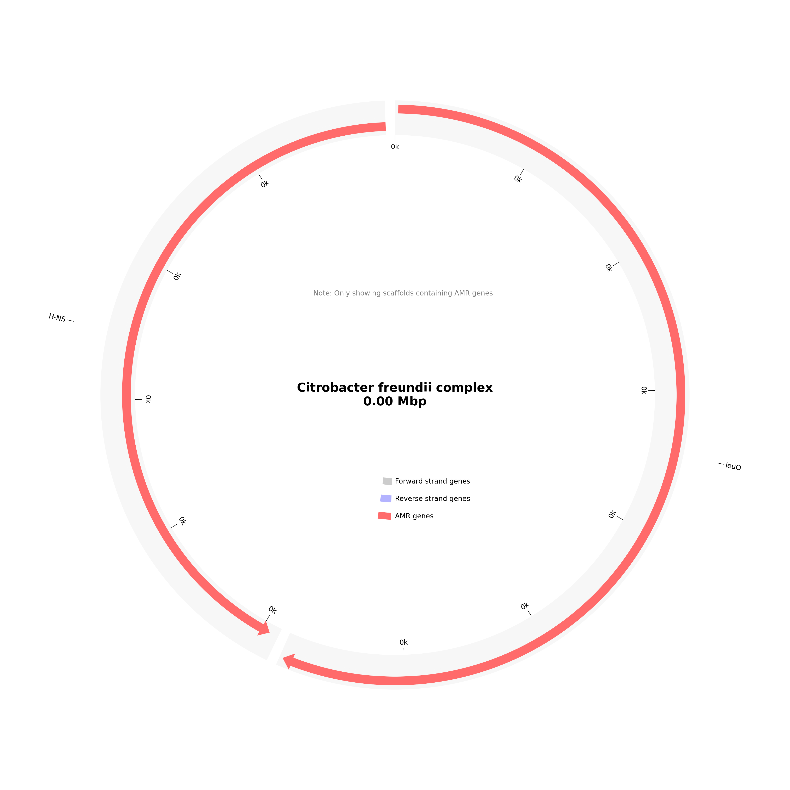

### H-NS
- **Mechanism**: antibiotic efflux
- **Drug Classes**: macrolide antibiotic; fluoroquinolone antibiotic; cephalosporin; cephamycin; penam; tetracycline antibiotic
- **AMR Family**: major facilitator superfamily (MFS) antibiotic efflux pump; resistance-nodulation-cell division (RND) antibiotic efflux pump
- **Locations**:
  - gnl|SPADES|NHGFMGEA_37606_1 : position 3-227

### leuO
- **Mechanism**: antibiotic efflux
- **Drug Classes**: nucleoside antibiotic; disinfecting agents and antiseptics
- **AMR Family**: major facilitator superfamily (MFS) antibiotic efflux pump
- **Locations**:
  - gnl|SPADES|NHGFMGEA_23623_1 : position 1-303

## Citrobacter sedlakii
**Strain Statistics:**
- Total genome length: 0.7 kbp
- Total scaffolds: 1
- Scaffolds with AMR genes: 1
- Total genes annotated: 0
- Total AMR genes: 1
- Unique AMR genes: 1
- Distinct AMR mechanisms: 1
- Distinct AMR families: 1
- Distinct drug classes: 1

**Circos Plot:**

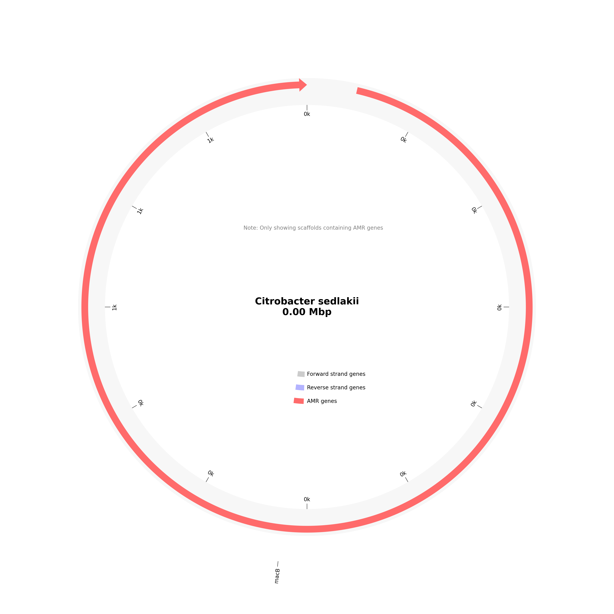

### macB
- **Mechanism**: antibiotic efflux
- **Drug Classes**: macrolide antibiotic
- **AMR Family**: ATP-binding cassette (ABC) antibiotic efflux pump
- **Locations**:
  - gnl|SPADES|NHGFMGEA_7320_1 : position 27-749

## Citrobacter sp. R56
**Strain Statistics:**
- Total genome length: 1.2 kbp
- Total scaffolds: 3
- Scaffolds with AMR genes: 1
- Total genes annotated: 2
- Total AMR genes: 1
- Unique AMR genes: 1
- Distinct AMR mechanisms: 1
- Distinct AMR families: 1
- Distinct drug classes: 1

**Circos Plot:**

### Mycobacterium tuberculosis katG mutations conferring resistance to isoniazid
- **Mechanism**: antibiotic target alteration
- **Drug Classes**: isoniazid-like antibiotic
- **AMR Family**: isoniazid resistant katG
- **Locations**:
  - gnl|SPADES|NHGFMGEA_4037_1 : position 2-1171

## Citrobacter tructae
**Strain Statistics:**
- Total genome length: 0.8 kbp
- Total scaffolds: 11
- Scaffolds with AMR genes: 2
- Total genes annotated: 0
- Total AMR genes: 2
- Unique AMR genes: 2
- Distinct AMR mechanisms: 2
- Distinct AMR families: 2
- Distinct drug classes: 2

**Circos Plot:**

### macB
- **Mechanism**: antibiotic efflux
- **Drug Classes**: macrolide antibiotic
- **AMR Family**: ATP-binding cassette (ABC) antibiotic efflux pump
- **Locations**:
  - gnl|SPADES|NHGFMGEA_22305_1 : position 2-319

### vanH gene in vanD cluster
- **Mechanism**: antibiotic target alteration
- **Drug Classes**: glycopeptide antibiotic
- **AMR Family**: vanH; glycopeptide resistance gene cluster
- **Locations**:
  - gnl|SPADES|NHGFMGEA_13732_1 : position 2-463

## Enterobacter hormaechei
**Strain Statistics:**
- Total genome length: 0.3 kbp
- Total scaffolds: 20
- Scaffolds with AMR genes: 1
- Total genes annotated: 0
- Total AMR genes: 1
- Unique AMR genes: 1
- Distinct AMR mechanisms: 1
- Distinct AMR families: 1
- Distinct drug classes: 6

**Circos Plot:**

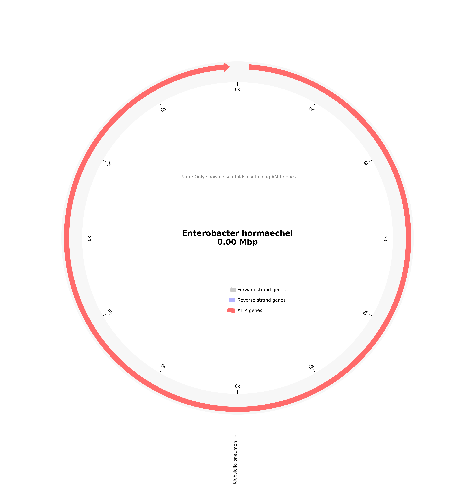

### Klebsiella pneumoniae OmpK37
- **Mechanism**: reduced permeability to antibiotic
- **Drug Classes**: monobactam; carbapenem; cephalosporin; cephamycin; penam; penem
- **AMR Family**: General Bacterial Porin with reduced permeability to beta-lactams
- **Locations**:
  - gnl|SPADES|NHGFMGEA_26375_1 : position 3-278

## Escherichia coli
**Strain Statistics:**
- Total genome length: 3208.0 kbp
- Total scaffolds: 809
- Scaffolds with AMR genes: 126
- Total genes annotated: 5939
- Total AMR genes: 355
- Unique AMR genes: 179
- Distinct AMR mechanisms: 10
- Distinct AMR families: 68
- Distinct drug classes: 35

**Circos Plot:**

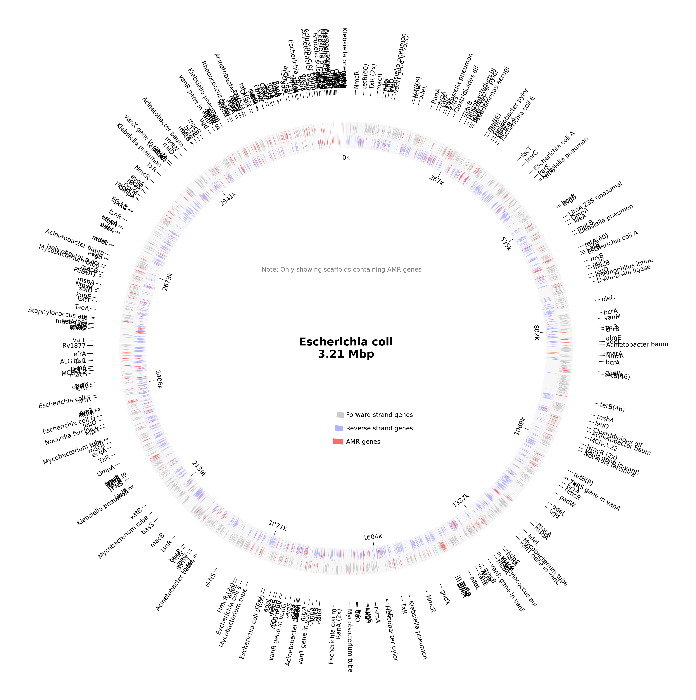

### AAC(6')-If
- **Mechanism**: antibiotic inactivation
- **Drug Classes**: aminoglycoside antibiotic
- **AMR Family**: AAC(6')
- **Locations**:
  - gnl|SPADES|NHGFMGEA_184_8 : position 6383-6808

### ALG11-1
- **Mechanism**: antibiotic inactivation
- **Drug Classes**: carbapenem
- **AMR Family**: ALG11 beta-lactamase
- **Locations**:
  - gnl|SPADES|NHGFMGEA_263_15 : position 14395-15834

### Acinetobacter baumannii AbaF (found in 5 locations)
- **Mechanism**: antibiotic efflux
- **Drug Classes**: phosphonic acid antibiotic
- **AMR Family**: major facilitator superfamily (MFS) antibiotic efflux pump
- **Locations**:
  - gnl|SPADES|NHGFMGEA_1154_1 : position 21-1337
  - gnl|SPADES|NHGFMGEA_183_3 : position 3924-5426
  - gnl|SPADES|NHGFMGEA_203_16 : position 24223-25545
  - gnl|SPADES|NHGFMGEA_383_3 : position 2620-3936
  - gnl|SPADES|NHGFMGEA_78_4 : position 2219-3502

### Acinetobacter baumannii AbaQ (found in 3 locations)
- **Mechanism**: antibiotic efflux
- **Drug Classes**: fluoroquinolone antibiotic
- **AMR Family**: major facilitator superfamily (MFS) antibiotic efflux pump
- **Locations**:
  - gnl|SPADES|NHGFMGEA_307_5 : position 2345-3721
  - gnl|SPADES|NHGFMGEA_806_2 : position 430-1719
  - gnl|SPADES|NHGFMGEA_90_40 : position 44353-45645

### Acinetobacter baumannii AmvA
- **Mechanism**: antibiotic efflux
- **Drug Classes**: macrolide antibiotic; disinfecting agents and antiseptics
- **AMR Family**: major facilitator superfamily (MFS) antibiotic efflux pump
- **Locations**:
  - gnl|SPADES|NHGFMGEA_449_2 : position 2323-3681

### AcrE
- **Mechanism**: antibiotic efflux
- **Drug Classes**: fluoroquinolone antibiotic; cephalosporin; cephamycin; penam
- **AMR Family**: resistance-nodulation-cell division (RND) antibiotic efflux pump
- **Locations**:
  - gnl|SPADES|NHGFMGEA_142_8: position 8454-9611

### AcrF
- **Mechanism**: antibiotic efflux
- **Drug Classes**: fluoroquinolone antibiotic; cephalosporin; cephamycin; penam
- **AMR Family**: resistance-nodulation-cell division (RND) antibiotic efflux pump
- **Locations**:
  - gnl|SPADES|NHGFMGEA_142_7: position 5338-8442

### AcrS
- **Mechanism**: antibiotic efflux
- **Drug Classes**: fluoroquinolone antibiotic; cephalosporin; glycylcycline; cephamycin; penam; tetracycline antibiotic; rifamycin antibiotic; phenicol antibiotic; disinfecting agents and antiseptics
- **AMR Family**: resistance-nodulation-cell division (RND) antibiotic efflux pump
- **Locations**:
  - gnl|SPADES|NHGFMGEA_142_9: position 10010-10672

### Agrobacterium fabrum chloramphenicol acetyltransferase
- **Mechanism**: antibiotic inactivation
- **Drug Classes**: phenicol antibiotic
- **AMR Family**: chloramphenicol acetyltransferase (CAT)
- **Locations**:
  - gnl|SPADES|NHGFMGEA_5141_2 : position 216-836

### ArnT
- **Mechanism**: antibiotic target alteration
- **Drug Classes**: peptide antibiotic
- **AMR Family**: pmr phosphoethanolamine transferase
- **Locations**:
  - gnl|SPADES|NHGFMGEA_246_21: position 19607-21259

### Bifidobacterium bifidum ileS conferring resistance to mupirocin
- **Mechanism**: antibiotic target alteration
- **Drug Classes**: mupirocin-like antibiotic
- **AMR Family**: antibiotic-resistant isoleucyl-tRNA synthetase (ileS)
- **Locations**:
  - gnl|SPADES|NHGFMGEA_50_16 : position 15814-18396

### Brucella suis mprF
- **Mechanism**: antibiotic target alteration
- **Drug Classes**: peptide antibiotic
- **AMR Family**: defensin resistant mprF
- **Locations**:
  - gnl|SPADES|NHGFMGEA_2005_1 : position 3-410

### CAR-1
- **Mechanism**: antibiotic inactivation
- **Drug Classes**: carbapenem
- **AMR Family**: CAR beta-lactamase
- **Locations**:
  - gnl|SPADES|NHGFMGEA_477_6 : position 5273-6028

### CRP (found in 2 locations)
- **Mechanism**: antibiotic efflux
- **Drug Classes**: macrolide antibiotic; fluoroquinolone antibiotic; penam
- **AMR Family**: resistance-nodulation-cell division (RND) antibiotic efflux pump
- **Locations**:
  - gnl|SPADES|NHGFMGEA_21_85 : position 84826-85578
  - gnl|SPADES|NHGFMGEA_254_13: position 12941-13573

### Clostridioides difficile gyrA conferring resistance to fluoroquinolones
- **Mechanism**: antibiotic target alteration
- **Drug Classes**: fluoroquinolone antibiotic
- **AMR Family**: fluoroquinolone resistant gyrA
- **Locations**:
  - gnl|SPADES|NHGFMGEA_36_82 : position 93798-96425

### Clostridioides difficile gyrB conferring resistance to fluoroquinolones
- **Mechanism**: antibiotic target alteration
- **Drug Classes**: fluoroquinolone antibiotic
- **AMR Family**: fluoroquinolone resistant gyrB
- **Locations**:
  - gnl|SPADES|NHGFMGEA_90_32 : position 35965-38379

### CrcB
- **Mechanism**: antibiotic efflux
- **Drug Classes**: aminoglycoside antibiotic
- **AMR Family**: multidrug and toxic compound extrusion (MATE) transporter
- **Locations**:
  - gnl|SPADES|NHGFMGEA_50_33 : position 32662-33045

### D-Ala-D-Ala ligase
- **Mechanism**: antibiotic target alteration
- **Drug Classes**: glycopeptide antibiotic
- **AMR Family**: Van ligase
- **Locations**:
  - gnl|SPADES|NHGFMGEA_71_20 : position 23158-24078

### EC-13
- **Mechanism**: antibiotic inactivation
- **Drug Classes**: cephalosporin
- **AMR Family**: EC beta-lactamase
- **Locations**:
  - gnl|SPADES|NHGFMGEA_315_8: position 4577-5710

### ErmW
- **Mechanism**: antibiotic target alteration
- **Drug Classes**: macrolide antibiotic; lincosamide antibiotic; streptogramin antibiotic
- **AMR Family**: Erm 23S ribosomal RNA methyltransferase
- **Locations**:
  - gnl|SPADES|NHGFMGEA_468_5 : position 3599-4186

### Escherichia coli AcrAB-TolC with AcrR mutation conferring resistance to ciprofloxacin, tetracycline, and ceftazidime (found in 2 locations)
- **Mechanism**: antibiotic target alteration; antibiotic efflux
- **Drug Classes**: fluoroquinolone antibiotic; cephalosporin; glycylcycline; penam; tetracycline antibiotic; rifamycin antibiotic; phenicol antibiotic; disinfecting agents and antiseptics
- **AMR Family**: resistance-nodulation-cell division (RND) antibiotic efflux pump
- **Locations**:
  - gnl|SPADES|NHGFMGEA_56_7 : position 7084-7662
  - gnl|SPADES|NHGFMGEA_69_40: position 41455-42102

### Escherichia coli AcrAB-TolC with MarR mutations conferring resistance to ciprofloxacin and tetracycline
- **Mechanism**: antibiotic target alteration; antibiotic efflux
- **Drug Classes**: fluoroquinolone antibiotic; cephalosporin; glycylcycline; penam; tetracycline antibiotic; rifamycin antibiotic; phenicol antibiotic; disinfecting agents and antiseptics
- **AMR Family**: resistance-nodulation-cell division (RND) antibiotic efflux pump
- **Locations**:
  - gnl|SPADES|NHGFMGEA_78_24: position 21200-21634

### Escherichia coli EF-Tu mutants conferring resistance to kirromycin (found in 2 locations)
- **Mechanism**: antibiotic target alteration
- **Drug Classes**: elfamycin antibiotic
- **AMR Family**: elfamycin resistant EF-Tu
- **Locations**:
  - gnl|SPADES|NHGFMGEA_52_5 : position 6071-8743
  - gnl|SPADES|NHGFMGEA_616_3 : position 2260-4104

### Escherichia coli GlpT with mutation conferring resistance to fosfomycin
- **Mechanism**: antibiotic target alteration
- **Drug Classes**: phosphonic acid antibiotic
- **AMR Family**: antibiotic-resistant GlpT
- **Locations**:
  - gnl|SPADES|NHGFMGEA_246_6 : position 3774-5132

### Escherichia coli acrA
- **Mechanism**: antibiotic efflux
- **Drug Classes**: fluoroquinolone antibiotic; cephalosporin; glycylcycline; penam; tetracycline antibiotic; rifamycin antibiotic; phenicol antibiotic; disinfecting agents and antiseptics
- **AMR Family**: resistance-nodulation-cell division (RND) antibiotic efflux pump
- **Locations**:
  - gnl|SPADES|NHGFMGEA_69_39: position 40120-41313

### Escherichia coli mdfA
- **Mechanism**: antibiotic efflux
- **Drug Classes**: tetracycline antibiotic; phenicol antibiotic; disinfecting agents and antiseptics
- **AMR Family**: major facilitator superfamily (MFS) antibiotic efflux pump
- **Locations**:
  - gnl|SPADES|NHGFMGEA_161_18: position 14731-15963

### Escherichia coli soxS with mutation conferring antibiotic resistance (found in 4 locations)
- **Mechanism**: antibiotic target alteration; antibiotic efflux; reduced permeability to antibiotic
- **Drug Classes**: fluoroquinolone antibiotic; monobactam; carbapenem; cephalosporin; glycylcycline; cephamycin; penam; tetracycline antibiotic; rifamycin antibiotic; phenicol antibiotic; penem; disinfecting agents and antiseptics
- **AMR Family**: ATP-binding cassette (ABC) antibiotic efflux pump; major facilitator superfamily (MFS) antibiotic efflux pump; resistance-nodulation-cell division (RND) antibiotic efflux pump; General Bacterial Porin with reduced permeability to beta-lactams
- **Locations**:
  - gnl|SPADES|NHGFMGEA_185_7 : position 5804-6640
  - gnl|SPADES|NHGFMGEA_185_8 : position 6624-7562
  - gnl|SPADES|NHGFMGEA_187_21 : position 21963-22814
  - gnl|SPADES|NHGFMGEA_251_14 : position 19979-20836

### EstT
- **Mechanism**: antibiotic inactivation
- **Drug Classes**: macrolide antibiotic
- **AMR Family**: macrolide esterase
- **Locations**:
  - gnl|SPADES|NHGFMGEA_279_12 : position 14522-15286

### H-NS (found in 2 locations)
- **Mechanism**: antibiotic efflux
- **Drug Classes**: macrolide antibiotic; fluoroquinolone antibiotic; cephalosporin; cephamycin; penam; tetracycline antibiotic
- **AMR Family**: major facilitator superfamily (MFS) antibiotic efflux pump; resistance-nodulation-cell division (RND) antibiotic efflux pump
- **Locations**:
  - gnl|SPADES|NHGFMGEA_200_11 : position 8099-8539
  - gnl|SPADES|NHGFMGEA_223_13 : position 10556-10960

### Haemophilus influenzae PBP3 conferring resistance to beta-lactam antibiotics
- **Mechanism**: antibiotic target alteration
- **Drug Classes**: cephalosporin; cephamycin; penam
- **AMR Family**: Penicillin-binding protein mutations conferring resistance to beta-lactam antibiotics
- **Locations**:
  - gnl|SPADES|NHGFMGEA_71_12 : position 12338-14104

### Helicobacter pylori pbp1 mutants conferring resistance to amoxicillin
- **Mechanism**: antibiotic target alteration
- **Drug Classes**: cephalosporin; cephamycin; penam
- **AMR Family**: Penicillin-binding protein mutations conferring resistance to beta-lactam antibiotics
- **Locations**:
  - gnl|SPADES|NHGFMGEA_152_34 : position 35494-37806

### Helicobacter pylori pbp2 mutants conferring resistance to amoxicillin
- **Mechanism**: antibiotic target alteration
- **Drug Classes**: cephalosporin; cephamycin; penam
- **AMR Family**: Penicillin-binding protein mutations conferring resistance to beta-lactam antibiotics
- **Locations**:
  - gnl|SPADES|NHGFMGEA_50_23 : position 22380-24281

### Helicobacter pylori rdxA mutation conferring resistance to metronidazole
- **Mechanism**: antibiotic target alteration
- **Drug Classes**: nitroimidazole antibiotic
- **AMR Family**: Antibiotic resistant Helicobacter pylori nitroreductase
- **Locations**:
  - gnl|SPADES|NHGFMGEA_50_82 : position 84314-84967

### Helicobacter pylori rpoB mutation conferring resistance to rifampicin
- **Mechanism**: antibiotic target alteration; antibiotic target replacement
- **Drug Classes**: fluoroquinolone antibiotic; rifamycin antibiotic
- **AMR Family**: rifamycin-resistant beta-subunit of RNA polymerase (rpoB)
- **Locations**:
  - gnl|SPADES|NHGFMGEA_303_1 : position 3-1415

### Klebsiella pneumoniae KpnE
- **Mechanism**: antibiotic efflux
- **Drug Classes**: macrolide antibiotic; aminoglycoside antibiotic; cephalosporin; tetracycline antibiotic; peptide antibiotic; rifamycin antibiotic; disinfecting agents and antiseptics
- **AMR Family**: small multidrug resistance (SMR) antibiotic efflux pump
- **Locations**:
  - gnl|SPADES|NHGFMGEA_56_25: position 30595-30960

### Klebsiella pneumoniae KpnF
- **Mechanism**: antibiotic efflux
- **Drug Classes**: macrolide antibiotic; aminoglycoside antibiotic; cephalosporin; tetracycline antibiotic; peptide antibiotic; rifamycin antibiotic; disinfecting agents and antiseptics
- **AMR Family**: small multidrug resistance (SMR) antibiotic efflux pump
- **Locations**:
  - gnl|SPADES|NHGFMGEA_56_26: position 30947-31276

### Klebsiella pneumoniae OmpK37 (found in 11 locations)
- **Mechanism**: reduced permeability to antibiotic
- **Drug Classes**: monobactam; carbapenem; cephalosporin; cephamycin; penam; penem
- **AMR Family**: General Bacterial Porin with reduced permeability to beta-lactams
- **Locations**:
  - gnl|SPADES|NHGFMGEA_151_33 : position 31906-32961
  - gnl|SPADES|NHGFMGEA_215_27 : position 21280-22338
  - gnl|SPADES|NHGFMGEA_21_98 : position 98751-99884
  - gnl|SPADES|NHGFMGEA_2459_2 : position 786-1658
  - gnl|SPADES|NHGFMGEA_349_4 : position 1962-3059
  - gnl|SPADES|NHGFMGEA_3572_1 : position 1-579
  - gnl|SPADES|NHGFMGEA_36_71 : position 75840-76970
  - gnl|SPADES|NHGFMGEA_38949_1 : position 2-220
  - gnl|SPADES|NHGFMGEA_422_1 : position 3-281
  - gnl|SPADES|NHGFMGEA_4949_1 : position 234-1007
  - gnl|SPADES|NHGFMGEA_61_74 : position 80994-82082

### LRA-2
- **Mechanism**: antibiotic inactivation
- **Drug Classes**: cephalosporin; penam
- **AMR Family**: subclass B3 LRA beta-lactamase
- **Locations**:
  - gnl|SPADES|NHGFMGEA_1328_3 : position 1487-2443

### LlmA 23S ribosomal RNA methyltransferase
- **Mechanism**: antibiotic target alteration
- **Drug Classes**: lincosamide antibiotic
- **AMR Family**: Llm 23S ribosomal RNA methyltransferase
- **Locations**:
  - gnl|SPADES|NHGFMGEA_61_36 : position 37845-39020

### MCR-3.22
- **Mechanism**: antibiotic target alteration
- **Drug Classes**: peptide antibiotic
- **AMR Family**: MCR phosphoethanolamine transferase
- **Locations**:
  - gnl|SPADES|NHGFMGEA_90_53 : position 57680-59173

### MCR-4.2
- **Mechanism**: antibiotic target alteration
- **Drug Classes**: peptide antibiotic
- **AMR Family**: MCR phosphoethanolamine transferase
- **Locations**:
  - gnl|SPADES|NHGFMGEA_256_18 : position 18604-20187

### MCR-8.4
- **Mechanism**: antibiotic target alteration
- **Drug Classes**: peptide antibiotic
- **AMR Family**: MCR phosphoethanolamine transferase
- **Locations**:
  - gnl|SPADES|NHGFMGEA_52_1 : position 472-2097

### MdtK
- **Mechanism**: antibiotic efflux
- **Drug Classes**: fluoroquinolone antibiotic
- **AMR Family**: multidrug and toxic compound extrusion (MATE) transporter
- **Locations**:
  - gnl|SPADES|NHGFMGEA_2125_1 : position 149-1636

### MexR
- **Mechanism**: antibiotic target alteration; antibiotic efflux
- **Drug Classes**: macrolide antibiotic; fluoroquinolone antibiotic; monobactam; carbapenem; cephalosporin; cephamycin; penam; tetracycline antibiotic; peptide antibiotic; aminocoumarin antibiotic; diaminopyrimidine antibiotic; sulfonamide antibiotic; phenicol antibiotic; penem
- **AMR Family**: resistance-nodulation-cell division (RND) antibiotic efflux pump
- **Locations**:
  - gnl|SPADES|NHGFMGEA_312_4 : position 3814-4260

### MexT
- **Mechanism**: antibiotic efflux
- **Drug Classes**: fluoroquinolone antibiotic; diaminopyrimidine antibiotic; phenicol antibiotic
- **AMR Family**: resistance-nodulation-cell division (RND) antibiotic efflux pump
- **Locations**:
  - gnl|SPADES|NHGFMGEA_1328_2 : position 461-1405

### MexV
- **Mechanism**: antibiotic efflux
- **Drug Classes**: macrolide antibiotic; fluoroquinolone antibiotic; tetracycline antibiotic; phenicol antibiotic; disinfecting agents and antiseptics
- **AMR Family**: resistance-nodulation-cell division (RND) antibiotic efflux pump
- **Locations**:
  - gnl|SPADES|NHGFMGEA_50_86 : position 91023-92246

### MuxC
- **Mechanism**: antibiotic efflux
- **Drug Classes**: macrolide antibiotic; monobactam; tetracycline antibiotic; aminocoumarin antibiotic
- **AMR Family**: resistance-nodulation-cell division (RND) antibiotic efflux pump
- **Locations**:
  - gnl|SPADES|NHGFMGEA_50_85 : position 87868-91011

### Mycobacterium tuberculosis gidB mutation conferring resistance to streptomycin
- **Mechanism**: antibiotic target alteration
- **Drug Classes**: aminoglycoside antibiotic
- **AMR Family**: antibiotic resistant gidB
- **Locations**:
  - gnl|SPADES|NHGFMGEA_294_16 : position 18037-18660

### Mycobacterium tuberculosis inhA mutations conferring resistance to isoniazid
- **Mechanism**: antibiotic target alteration
- **Drug Classes**: isoniazid-like antibiotic
- **AMR Family**: isoniazid resistant inhA
- **Locations**:
  - gnl|SPADES|NHGFMGEA_213_22 : position 20511-21395

### Mycobacterium tuberculosis katG mutations conferring resistance to isoniazid
- **Mechanism**: antibiotic target alteration
- **Drug Classes**: isoniazid-like antibiotic
- **AMR Family**: isoniazid resistant katG
- **Locations**:
  - gnl|SPADES|NHGFMGEA_187_10 : position 8331-10511

### Mycobacterium tuberculosis ndh with mutation conferring resistance to isoniazid
- **Mechanism**: antibiotic target alteration
- **Drug Classes**: isoniazid-like antibiotic
- **AMR Family**: antibiotic resistant ndh
- **Locations**:
  - gnl|SPADES|NHGFMGEA_235_12 : position 13216-14520

### Mycobacterium tuberculosis rpsA mutations conferring resistance to pyrazinamide
- **Mechanism**: antibiotic target alteration
- **Drug Classes**: pyrazine antibiotic
- **AMR Family**: pyrazinamide resistant rpsA
- **Locations**:
  - gnl|SPADES|NHGFMGEA_109_46 : position 57563-58003

### Mycobacterium tuberculosis thyA with mutation conferring resistance to para-aminosalicylic acid
- **Mechanism**: antibiotic target alteration
- **Drug Classes**: salicylic acid antibiotic
- **AMR Family**: aminosalicylate resistant thymidylate synthase
- **Locations**:
  - gnl|SPADES|NHGFMGEA_160_25 : position 25023-25817

### NmcR (found in 13 locations)
- **Mechanism**: antibiotic inactivation
- **Drug Classes**: carbapenem; cephalosporin; cephamycin; penam
- **AMR Family**: NmcA beta-lactamase
- **Locations**:
  - gnl|SPADES|NHGFMGEA_102_39 : position 45550-46440
  - gnl|SPADES|NHGFMGEA_1302_3 : position 1510-2388
  - gnl|SPADES|NHGFMGEA_149_36 : position 39967-40893
  - gnl|SPADES|NHGFMGEA_188_1 : position 234-1073
  - gnl|SPADES|NHGFMGEA_188_9 : position 10035-10928
  - gnl|SPADES|NHGFMGEA_21_21 : position 19546-20520
  - gnl|SPADES|NHGFMGEA_288_19 : position 17807-18760
  - gnl|SPADES|NHGFMGEA_339_3 : position 2678-3583
  - gnl|SPADES|NHGFMGEA_559_1 : position 2-616
  - gnl|SPADES|NHGFMGEA_56_30 : position 34504-35397
  - gnl|SPADES|NHGFMGEA_78_29 : position 25067-25948
  - gnl|SPADES|NHGFMGEA_99_12 : position 13233-14126
  - gnl|SPADES|NHGFMGEA_99_7 : position 6706-7602

### Nocardia farcinica rox (found in 2 locations)
- **Mechanism**: antibiotic inactivation
- **Drug Classes**: rifamycin antibiotic
- **AMR Family**: rifampin monooxygenase
- **Locations**:
  - gnl|SPADES|NHGFMGEA_244_15 : position 13167-14831
  - gnl|SPADES|NHGFMGEA_99_21 : position 21954-23156

### OmpA (found in 6 locations)
- **Mechanism**: reduced permeability to antibiotic
- **Drug Classes**: peptide antibiotic
- **AMR Family**: General Bacterial Porin with reduced permeability to peptide antibiotics
- **Locations**:
  - gnl|SPADES|NHGFMGEA_166_13 : position 16445-17104
  - gnl|SPADES|NHGFMGEA_229_20 : position 16795-17277
  - gnl|SPADES|NHGFMGEA_318_10 : position 11480-12313
  - gnl|SPADES|NHGFMGEA_455_10 : position 7649-8170
  - gnl|SPADES|NHGFMGEA_5749_1 : position 3-599
  - gnl|SPADES|NHGFMGEA_61_46 : position 47746-48798

### OprM (found in 2 locations)
- **Mechanism**: antibiotic efflux
- **Drug Classes**: macrolide antibiotic; fluoroquinolone antibiotic; monobactam; aminoglycoside antibiotic; carbapenem; cephalosporin; cephamycin; penam; tetracycline antibiotic; peptide antibiotic; aminocoumarin antibiotic; diaminopyrimidine antibiotic; sulfonamide antibiotic; phenicol antibiotic; penem; disinfecting agents and antiseptics
- **AMR Family**: resistance-nodulation-cell division (RND) antibiotic efflux pump
- **Locations**:
  - gnl|SPADES|NHGFMGEA_325_2 : position 697-2052
  - gnl|SPADES|NHGFMGEA_464_1 : position 189-1562

### PDC-456
- **Mechanism**: antibiotic inactivation
- **Drug Classes**: monobactam; carbapenem; cephalosporin
- **AMR Family**: PDC beta-lactamase
- **Locations**:
  - gnl|SPADES|NHGFMGEA_184_11 : position 9088-10392

### PEDO-1 (found in 2 locations)
- **Mechanism**: antibiotic inactivation
- **Drug Classes**: carbapenem
- **AMR Family**: subclass B3 PEDO beta-lactamase
- **Locations**:
  - gnl|SPADES|NHGFMGEA_289_19 : position 20631-21278
  - gnl|SPADES|NHGFMGEA_318_13 : position 13380-14240

### ParR (found in 2 locations)
- **Mechanism**: antibiotic efflux; reduced permeability to antibiotic
- **Drug Classes**: macrolide antibiotic; fluoroquinolone antibiotic; monobactam; aminoglycoside antibiotic; carbapenem; cephalosporin; cephamycin; penam; tetracycline antibiotic; phenicol antibiotic; penem; disinfecting agents and antiseptics
- **AMR Family**: resistance-nodulation-cell division (RND) antibiotic efflux pump; Outer Membrane Porin (Opr)
- **Locations**:
  - gnl|SPADES|NHGFMGEA_444_1 : position 279-986
  - gnl|SPADES|NHGFMGEA_56_17 : position 21218-21937

### ParS (found in 3 locations)
- **Mechanism**: antibiotic efflux; reduced permeability to antibiotic
- **Drug Classes**: macrolide antibiotic; fluoroquinolone antibiotic; monobactam; aminoglycoside antibiotic; carbapenem; cephalosporin; cephamycin; penam; tetracycline antibiotic; phenicol antibiotic; penem; disinfecting agents and antiseptics
- **AMR Family**: resistance-nodulation-cell division (RND) antibiotic efflux pump; Outer Membrane Porin (Opr)
- **Locations**:
  - gnl|SPADES|NHGFMGEA_17126_1 : position 2-388
  - gnl|SPADES|NHGFMGEA_50_38 : position 36708-38366
  - gnl|SPADES|NHGFMGEA_56_16 : position 19913-21214

### PmrF
- **Mechanism**: antibiotic target alteration
- **Drug Classes**: peptide antibiotic
- **AMR Family**: pmr phosphoethanolamine transferase
- **Locations**:
  - gnl|SPADES|NHGFMGEA_246_18: position 15770-16738

### Pseudomonas aeruginosa CpxR (found in 2 locations)
- **Mechanism**: antibiotic efflux
- **Drug Classes**: macrolide antibiotic; fluoroquinolone antibiotic; monobactam; aminoglycoside antibiotic; carbapenem; cephalosporin; cephamycin; penam; tetracycline antibiotic; peptide antibiotic; aminocoumarin antibiotic; diaminopyrimidine antibiotic; sulfonamide antibiotic; phenicol antibiotic; penem
- **AMR Family**: resistance-nodulation-cell division (RND) antibiotic efflux pump
- **Locations**:
  - gnl|SPADES|NHGFMGEA_185_14 : position 13040-13738
  - gnl|SPADES|NHGFMGEA_50_37 : position 36059-36739

### QnrA6
- **Mechanism**: antibiotic target protection
- **Drug Classes**: fluoroquinolone antibiotic
- **AMR Family**: quinolone resistance protein (qnr)
- **Locations**:
  - gnl|SPADES|NHGFMGEA_423_10 : position 8721-10823

### QnrAS
- **Mechanism**: antibiotic target protection
- **Drug Classes**: fluoroquinolone antibiotic
- **AMR Family**: quinolone resistance protein (qnr)
- **Locations**:
  - gnl|SPADES|NHGFMGEA_15186_1 : position 1-246

### RanA (found in 10 locations)
- **Mechanism**: antibiotic efflux
- **Drug Classes**: aminoglycoside antibiotic
- **AMR Family**: ATP-binding cassette (ABC) antibiotic efflux pump
- **Locations**:
  - gnl|SPADES|NHGFMGEA_126_50 : position 45119-46255
  - gnl|SPADES|NHGFMGEA_161_31 : position 30245-32116
  - gnl|SPADES|NHGFMGEA_161_5 : position 3512-4645
  - gnl|SPADES|NHGFMGEA_166_2 : position 1657-2661
  - gnl|SPADES|NHGFMGEA_21_41 : position 38326-39318
  - gnl|SPADES|NHGFMGEA_223_21 : position 17280-18482
  - gnl|SPADES|NHGFMGEA_36_36 : position 42279-43868
  - gnl|SPADES|NHGFMGEA_479_7 : position 7099-8145
  - gnl|SPADES|NHGFMGEA_511_2 : position 2638-3447
  - gnl|SPADES|NHGFMGEA_641_2 : position 981-1748

### Rhodococcus fascians cmr
- **Mechanism**: antibiotic efflux
- **Drug Classes**: phenicol antibiotic
- **AMR Family**: major facilitator superfamily (MFS) antibiotic efflux pump
- **Locations**:
  - gnl|SPADES|NHGFMGEA_432_1 : position 3-1196

### Rv1877
- **Mechanism**: antibiotic efflux
- **Drug Classes**: fluoroquinolone antibiotic
- **AMR Family**: major facilitator superfamily (MFS) antibiotic efflux pump
- **Locations**:
  - gnl|SPADES|NHGFMGEA_264_20 : position 18793-20187

### SST-1
- **Mechanism**: antibiotic inactivation
- **Drug Classes**: cephalosporin
- **AMR Family**: SST beta-lactamase
- **Locations**:
  - gnl|SPADES|NHGFMGEA_205_3 : position 3566-4723

### SatA
- **Mechanism**: antibiotic inactivation
- **Drug Classes**: nucleoside antibiotic
- **AMR Family**: streptothricin acetyltransferase (SAT)
- **Locations**:
  - gnl|SPADES|NHGFMGEA_273_12 : position 12160-12594

### Staphylococcus aureus fusA with mutation conferring resistance to fusidic acid
- **Mechanism**: antibiotic target alteration
- **Drug Classes**: fusidane antibiotic
- **AMR Family**: antibiotic resistant fusA
- **Locations**:
  - gnl|SPADES|NHGFMGEA_278_5 : position 3062-4651

### Staphylococcus aureus pgsA mutations conferring resistance to daptomycin
- **Mechanism**: antibiotic target alteration
- **Drug Classes**: peptide antibiotic
- **AMR Family**: daptomycin resistant pgsA
- **Locations**:
  - gnl|SPADES|NHGFMGEA_138_11 : position 9086-9634

### TaeA (found in 2 locations)
- **Mechanism**: antibiotic efflux
- **Drug Classes**: pleuromutilin antibiotic
- **AMR Family**: ATP-binding cassette (ABC) antibiotic efflux pump
- **Locations**:
  - gnl|SPADES|NHGFMGEA_278_21 : position 21333-22427
  - gnl|SPADES|NHGFMGEA_61_54 : position 55939-57846

### TxR (found in 9 locations)
- **Mechanism**: antibiotic efflux
- **Drug Classes**: tetracycline antibiotic
- **AMR Family**: ATP-binding cassette (ABC) antibiotic efflux pump
- **Locations**:
  - gnl|SPADES|NHGFMGEA_102_23 : position 25467-26801
  - gnl|SPADES|NHGFMGEA_152_5 : position 2381-4393
  - gnl|SPADES|NHGFMGEA_21_53 : position 52625-53602
  - gnl|SPADES|NHGFMGEA_21_73 : position 72409-73950
  - gnl|SPADES|NHGFMGEA_230_7 : position 6767-8545
  - gnl|SPADES|NHGFMGEA_263_14 : position 12694-14208
  - gnl|SPADES|NHGFMGEA_303_19 : position 15141-16466
  - gnl|SPADES|NHGFMGEA_341_5 : position 5318-7237
  - gnl|SPADES|NHGFMGEA_391_11 : position 9480-11066

### YojI
- **Mechanism**: antibiotic efflux
- **Drug Classes**: peptide antibiotic
- **AMR Family**: ATP-binding cassette (ABC) antibiotic efflux pump
- **Locations**:
  - gnl|SPADES|NHGFMGEA_36_67: position 71166-72809

### acrB
- **Mechanism**: antibiotic efflux
- **Drug Classes**: fluoroquinolone antibiotic; cephalosporin; glycylcycline; penam; tetracycline antibiotic; rifamycin antibiotic; phenicol antibiotic; disinfecting agents and antiseptics
- **AMR Family**: resistance-nodulation-cell division (RND) antibiotic efflux pump
- **Locations**:
  - gnl|SPADES|NHGFMGEA_69_38: position 36948-40097

### adeL (found in 16 locations)
- **Mechanism**: antibiotic efflux
- **Drug Classes**: fluoroquinolone antibiotic; tetracycline antibiotic
- **AMR Family**: resistance-nodulation-cell division (RND) antibiotic efflux pump
- **Locations**:
  - gnl|SPADES|NHGFMGEA_105_31 : position 26328-27278
  - gnl|SPADES|NHGFMGEA_109_35 : position 44228-45136
  - gnl|SPADES|NHGFMGEA_142_29 : position 33656-34585
  - gnl|SPADES|NHGFMGEA_184_32 : position 30545-31471
  - gnl|SPADES|NHGFMGEA_187_28 : position 32985-33902
  - gnl|SPADES|NHGFMGEA_203_18 : position 27018-27989
  - gnl|SPADES|NHGFMGEA_21_80 : position 79242-80141
  - gnl|SPADES|NHGFMGEA_308_6 : position 3829-4803
  - gnl|SPADES|NHGFMGEA_310_12 : position 13524-14456
  - gnl|SPADES|NHGFMGEA_36_12 : position 14732-15613
  - gnl|SPADES|NHGFMGEA_477_2 : position 992-1906
  - gnl|SPADES|NHGFMGEA_518_8 : position 6053-6943
  - gnl|SPADES|NHGFMGEA_551_3 : position 2004-2897
  - gnl|SPADES|NHGFMGEA_551_4 : position 3098-4024
  - gnl|SPADES|NHGFMGEA_559_5 : position 3091-3474
  - gnl|SPADES|NHGFMGEA_74_75 : position 73071-73994

### almE (found in 2 locations)
- **Mechanism**: antibiotic target alteration
- **Drug Classes**: peptide antibiotic
- **AMR Family**: polymyxin resistance operon; alm glycyltransferase
- **Locations**:
  - gnl|SPADES|NHGFMGEA_50_72 : position 72557-76438
  - gnl|SPADES|NHGFMGEA_74_69 : position 64844-66595

### arlR (found in 3 locations)
- **Mechanism**: antibiotic efflux
- **Drug Classes**: fluoroquinolone antibiotic; disinfecting agents and antiseptics
- **AMR Family**: major facilitator superfamily (MFS) antibiotic efflux pump
- **Locations**:
  - gnl|SPADES|NHGFMGEA_183_6 : position 6704-7372
  - gnl|SPADES|NHGFMGEA_215_30 : position 25247-26029
  - gnl|SPADES|NHGFMGEA_464_2 : position 1719-2402

### arnA
- **Mechanism**: antibiotic target alteration
- **Drug Classes**: peptide antibiotic
- **AMR Family**: pmr phosphoethanolamine transferase
- **Locations**:
  - gnl|SPADES|NHGFMGEA_246_19 : position 16738-18720

### bacA
- **Mechanism**: antibiotic target alteration
- **Drug Classes**: peptide antibiotic
- **AMR Family**: undecaprenyl pyrophosphate related proteins
- **Locations**:
  - gnl|SPADES|NHGFMGEA_310_9: position 11510-12331

### baeR (found in 3 locations)
- **Mechanism**: antibiotic efflux
- **Drug Classes**: aminoglycoside antibiotic; aminocoumarin antibiotic
- **AMR Family**: resistance-nodulation-cell division (RND) antibiotic efflux pump
- **Locations**:
  - gnl|SPADES|NHGFMGEA_145_13: position 17654-18376
  - gnl|SPADES|NHGFMGEA_205_25 : position 25628-26317
  - gnl|SPADES|NHGFMGEA_61_11 : position 10313-11005

### baeS
- **Mechanism**: antibiotic efflux
- **Drug Classes**: aminoglycoside antibiotic; aminocoumarin antibiotic
- **AMR Family**: resistance-nodulation-cell division (RND) antibiotic efflux pump
- **Locations**:
  - gnl|SPADES|NHGFMGEA_145_12 : position 16254-17657

### basS (found in 5 locations)
- **Mechanism**: antibiotic target alteration; antibiotic efflux
- **Drug Classes**: peptide antibiotic
- **AMR Family**: pmr phosphoethanolamine transferase
- **Locations**:
  - gnl|SPADES|NHGFMGEA_126_47 : position 40837-42297
  - gnl|SPADES|NHGFMGEA_183_5 : position 5603-6703
  - gnl|SPADES|NHGFMGEA_213_4 : position 1602-2951
  - gnl|SPADES|NHGFMGEA_215_29 : position 23889-25247
  - gnl|SPADES|NHGFMGEA_464_3 : position 2392-3840

### bcr-1 (found in 3 locations)
- **Mechanism**: antibiotic efflux
- **Drug Classes**: bicyclomycin-like antibiotic
- **AMR Family**: major facilitator superfamily (MFS) antibiotic efflux pump
- **Locations**:
  - gnl|SPADES|NHGFMGEA_36_38 : position 44549-45739
  - gnl|SPADES|NHGFMGEA_90_22 : position 23292-24467
  - gnl|SPADES|NHGFMGEA_90_58 : position 60980-62164

### bcrA (found in 6 locations)
- **Mechanism**: antibiotic efflux
- **Drug Classes**: peptide antibiotic
- **AMR Family**: ATP-binding cassette (ABC) antibiotic efflux pump
- **Locations**:
  - gnl|SPADES|NHGFMGEA_102_30 : position 35930-37441
  - gnl|SPADES|NHGFMGEA_288_16 : position 14739-15797
  - gnl|SPADES|NHGFMGEA_36_4 : position 3765-5285
  - gnl|SPADES|NHGFMGEA_391_3 : position 2020-3504
  - gnl|SPADES|NHGFMGEA_74_14 : position 11240-11995
  - gnl|SPADES|NHGFMGEA_78_42 : position 38225-39760

### bcrC
- **Mechanism**: antibiotic target alteration
- **Drug Classes**: peptide antibiotic
- **AMR Family**: undecaprenyl pyrophosphate related proteins
- **Locations**:
  - gnl|SPADES|NHGFMGEA_468_4 : position 2939-3505

### bmr
- **Mechanism**: antibiotic efflux
- **Drug Classes**: fluoroquinolone antibiotic; nucleoside antibiotic; phenicol antibiotic; disinfecting agents and antiseptics
- **AMR Family**: major facilitator superfamily (MFS) antibiotic efflux pump
- **Locations**:
  - gnl|SPADES|NHGFMGEA_1302_2 : position 155-1390

### carA (found in 2 locations)
- **Mechanism**: antibiotic target protection
- **Drug Classes**: macrolide antibiotic
- **AMR Family**: Miscellaneous ABC-F subfamily ATP-binding cassette ribosomal protection proteins
- **Locations**:
  - gnl|SPADES|NHGFMGEA_264_5 : position 2639-3316
  - gnl|SPADES|NHGFMGEA_36_56 : position 61626-62243

### chrB
- **Mechanism**: antibiotic target alteration
- **Drug Classes**: macrolide antibiotic; lincosamide antibiotic
- **AMR Family**: non-erm 23S ribosomal RNA methyltransferase (G748)
- **Locations**:
  - gnl|SPADES|NHGFMGEA_74_51 : position 47595-48404

### clbB
- **Mechanism**: antibiotic target alteration
- **Drug Classes**: lincosamide antibiotic; streptogramin antibiotic; streptogramin A antibiotic; oxazolidinone antibiotic; phenicol antibiotic; pleuromutilin antibiotic
- **AMR Family**: Cfr 23S ribosomal RNA methyltransferase
- **Locations**:
  - gnl|SPADES|NHGFMGEA_152_32 : position 33610-34764

### cmlB
- **Mechanism**: antibiotic efflux
- **Drug Classes**: phenicol antibiotic
- **AMR Family**: major facilitator superfamily (MFS) antibiotic efflux pump
- **Locations**:
  - gnl|SPADES|NHGFMGEA_56_29 : position 33144-34397

### cmlv (found in 2 locations)
- **Mechanism**: antibiotic inactivation
- **Drug Classes**: phenicol antibiotic
- **AMR Family**: chloramphenicol phosphotransferase
- **Locations**:
  - gnl|SPADES|NHGFMGEA_205_22 : position 19786-21054
  - gnl|SPADES|NHGFMGEA_78_26 : position 22536-23726

### cmx
- **Mechanism**: antibiotic efflux
- **Drug Classes**: phenicol antibiotic
- **AMR Family**: major facilitator superfamily (MFS) antibiotic efflux pump
- **Locations**:
  - gnl|SPADES|NHGFMGEA_559_7 : position 4939-6066

### cprR
- **Mechanism**: antibiotic target alteration; antibiotic efflux
- **Drug Classes**: peptide antibiotic
- **AMR Family**: pmr phosphoethanolamine transferase
- **Locations**:
  - gnl|SPADES|NHGFMGEA_213_5 : position 2948-3607

### cpxA
- **Mechanism**: antibiotic efflux
- **Drug Classes**: aminoglycoside antibiotic; aminocoumarin antibiotic
- **AMR Family**: resistance-nodulation-cell division (RND) antibiotic efflux pump
- **Locations**:
  - gnl|SPADES|NHGFMGEA_185_13: position 11670-13043

### efpA
- **Mechanism**: antibiotic efflux
- **Drug Classes**: rifamycin antibiotic; isoniazid-like antibiotic
- **AMR Family**: major facilitator superfamily (MFS) antibiotic efflux pump
- **Locations**:
  - gnl|SPADES|NHGFMGEA_244_9 : position 7174-8385

### efrA (found in 2 locations)
- **Mechanism**: antibiotic efflux
- **Drug Classes**: macrolide antibiotic; fluoroquinolone antibiotic; rifamycin antibiotic
- **AMR Family**: ATP-binding cassette (ABC) antibiotic efflux pump
- **Locations**:
  - gnl|SPADES|NHGFMGEA_264_4 : position 1968-2645
  - gnl|SPADES|NHGFMGEA_27089_1 : position 2-274

### emeA
- **Mechanism**: antibiotic efflux
- **Drug Classes**: disinfecting agents and antiseptics
- **AMR Family**: multidrug and toxic compound extrusion (MATE) transporter
- **Locations**:
  - gnl|SPADES|NHGFMGEA_312_6 : position 6101-7462

### emrA
- **Mechanism**: antibiotic efflux
- **Drug Classes**: fluoroquinolone antibiotic
- **AMR Family**: major facilitator superfamily (MFS) antibiotic efflux pump
- **Locations**:
  - gnl|SPADES|NHGFMGEA_223_28: position 23899-25071

### emrB
- **Mechanism**: antibiotic efflux
- **Drug Classes**: fluoroquinolone antibiotic
- **AMR Family**: major facilitator superfamily (MFS) antibiotic efflux pump
- **Locations**:
  - gnl|SPADES|NHGFMGEA_223_29: position 25088-26626

### emrK
- **Mechanism**: antibiotic efflux
- **Drug Classes**: tetracycline antibiotic
- **AMR Family**: major facilitator superfamily (MFS) antibiotic efflux pump
- **Locations**:
  - gnl|SPADES|NHGFMGEA_157_26: position 33634-34797

### emrR (found in 2 locations)
- **Mechanism**: antibiotic efflux
- **Drug Classes**: fluoroquinolone antibiotic
- **AMR Family**: major facilitator superfamily (MFS) antibiotic efflux pump
- **Locations**:
  - gnl|SPADES|NHGFMGEA_223_27: position 23242-23772
  - gnl|SPADES|NHGFMGEA_25384_1 : position 2-271

### emrY (found in 3 locations)
- **Mechanism**: antibiotic efflux
- **Drug Classes**: tetracycline antibiotic
- **AMR Family**: major facilitator superfamily (MFS) antibiotic efflux pump
- **Locations**:
  - gnl|SPADES|NHGFMGEA_145_11 : position 14842-16257
  - gnl|SPADES|NHGFMGEA_157_27: position 34797-36335
  - gnl|SPADES|NHGFMGEA_294_2 : position 1105-2532

### eptA
- **Mechanism**: antibiotic target alteration
- **Drug Classes**: peptide antibiotic
- **AMR Family**: pmr phosphoethanolamine transferase
- **Locations**:
  - gnl|SPADES|NHGFMGEA_183_7: position 7369-9012

### eptB
- **Mechanism**: antibiotic target alteration
- **Drug Classes**: peptide antibiotic
- **AMR Family**: pmr phosphoethanolamine transferase
- **Locations**:
  - gnl|SPADES|NHGFMGEA_166_7 : position 8682-10373

### evgA (found in 8 locations)
- **Mechanism**: antibiotic efflux
- **Drug Classes**: macrolide antibiotic; fluoroquinolone antibiotic; penam; tetracycline antibiotic
- **AMR Family**: major facilitator superfamily (MFS) antibiotic efflux pump; resistance-nodulation-cell division (RND) antibiotic efflux pump
- **Locations**:
  - gnl|SPADES|NHGFMGEA_138_9 : position 6544-7200
  - gnl|SPADES|NHGFMGEA_149_5 : position 7695-8327
  - gnl|SPADES|NHGFMGEA_157_25: position 32604-33218
  - gnl|SPADES|NHGFMGEA_230_30 : position 24603-25046
  - gnl|SPADES|NHGFMGEA_334_4 : position 3521-4171
  - gnl|SPADES|NHGFMGEA_36_48 : position 55281-55928
  - gnl|SPADES|NHGFMGEA_432_8 : position 9572-10162
  - gnl|SPADES|NHGFMGEA_479_2 : position 353-982

### evgS (found in 7 locations)
- **Mechanism**: antibiotic efflux
- **Drug Classes**: macrolide antibiotic; fluoroquinolone antibiotic; penam; tetracycline antibiotic
- **AMR Family**: major facilitator superfamily (MFS) antibiotic efflux pump; resistance-nodulation-cell division (RND) antibiotic efflux pump
- **Locations**:
  - gnl|SPADES|NHGFMGEA_138_35 : position 33337-33726
  - gnl|SPADES|NHGFMGEA_157_24: position 29006-32599
  - gnl|SPADES|NHGFMGEA_183_18 : position 23454-25085
  - gnl|SPADES|NHGFMGEA_303_18 : position 13768-15144
  - gnl|SPADES|NHGFMGEA_36_74 : position 81248-84097
  - gnl|SPADES|NHGFMGEA_444_8 : position 7159-9420
  - gnl|SPADES|NHGFMGEA_61_13 : position 12134-14833

### facT
- **Mechanism**: antibiotic efflux
- **Drug Classes**: elfamycin antibiotic
- **AMR Family**: major facilitator superfamily (MFS) antibiotic efflux pump
- **Locations**:
  - gnl|SPADES|NHGFMGEA_52_64 : position 62373-63671

### fexB
- **Mechanism**: antibiotic efflux
- **Drug Classes**: phenicol antibiotic
- **AMR Family**: major facilitator superfamily (MFS) antibiotic efflux pump
- **Locations**:
  - gnl|SPADES|NHGFMGEA_223_24 : position 20781-21965

### gadW (found in 5 locations)
- **Mechanism**: antibiotic efflux
- **Drug Classes**: macrolide antibiotic; fluoroquinolone antibiotic; penam
- **AMR Family**: resistance-nodulation-cell division (RND) antibiotic efflux pump
- **Locations**:
  - gnl|SPADES|NHGFMGEA_105_2 : position 958-1872
  - gnl|SPADES|NHGFMGEA_3068_2 : position 1097-1426
  - gnl|SPADES|NHGFMGEA_415_2 : position 1624-2352
  - gnl|SPADES|NHGFMGEA_733_5 : position 2372-2959
  - gnl|SPADES|NHGFMGEA_78_57 : position 60820-61581

### gadX (found in 3 locations)
- **Mechanism**: antibiotic efflux
- **Drug Classes**: macrolide antibiotic; fluoroquinolone antibiotic; penam
- **AMR Family**: resistance-nodulation-cell division (RND) antibiotic efflux pump
- **Locations**:
  - gnl|SPADES|NHGFMGEA_149_4 : position 6569-7330
  - gnl|SPADES|NHGFMGEA_183_9 : position 10590-11351
  - gnl|SPADES|NHGFMGEA_415_1: position 432-1256

### golS (found in 2 locations)
- **Mechanism**: antibiotic efflux
- **Drug Classes**: monobactam; carbapenem; cephalosporin; cephamycin; penam; phenicol antibiotic; penem
- **AMR Family**: resistance-nodulation-cell division (RND) antibiotic efflux pump
- **Locations**:
  - gnl|SPADES|NHGFMGEA_325_7 : position 14857-15264
  - gnl|SPADES|NHGFMGEA_69_63 : position 69485-69892

### kdpD
- **Mechanism**: antibiotic efflux
- **Drug Classes**: aminoglycoside antibiotic
- **AMR Family**: kdpDE
- **Locations**:
  - gnl|SPADES|NHGFMGEA_484_5 : position 5106-7790

### kdpE (found in 4 locations)
- **Mechanism**: antibiotic efflux
- **Drug Classes**: aminoglycoside antibiotic
- **AMR Family**: kdpDE
- **Locations**:
  - gnl|SPADES|NHGFMGEA_126_46 : position 40166-40837
  - gnl|SPADES|NHGFMGEA_279_18 : position 21942-22412
  - gnl|SPADES|NHGFMGEA_484_6 : position 7787-8044
  - gnl|SPADES|NHGFMGEA_8109_1 : position 3-473

### leuO (found in 8 locations)
- **Mechanism**: antibiotic efflux
- **Drug Classes**: nucleoside antibiotic; disinfecting agents and antiseptics
- **AMR Family**: major facilitator superfamily (MFS) antibiotic efflux pump
- **Locations**:
  - gnl|SPADES|NHGFMGEA_160_12 : position 10221-11156
  - gnl|SPADES|NHGFMGEA_21_90 : position 90793-91701
  - gnl|SPADES|NHGFMGEA_244_23 : position 24052-24951
  - gnl|SPADES|NHGFMGEA_449_1 : position 1288-2196
  - gnl|SPADES|NHGFMGEA_50_29 : position 29221-30174
  - gnl|SPADES|NHGFMGEA_50_54 : position 52868-53770
  - gnl|SPADES|NHGFMGEA_71_5: position 5293-6237
  - gnl|SPADES|NHGFMGEA_90_21 : position 22358-23317

### lfrA
- **Mechanism**: antibiotic efflux
- **Drug Classes**: fluoroquinolone antibiotic
- **AMR Family**: major facilitator superfamily (MFS) antibiotic efflux pump
- **Locations**:
  - gnl|SPADES|NHGFMGEA_160_10 : position 7995-9413

### lmrC
- **Mechanism**: antibiotic target protection
- **Drug Classes**: lincosamide antibiotic
- **AMR Family**: Miscellaneous ABC-F subfamily ATP-binding cassette ribosomal protection proteins
- **Locations**:
  - gnl|SPADES|NHGFMGEA_52_76 : position 76589-78208

### lmrD
- **Mechanism**: antibiotic efflux
- **Drug Classes**: lincosamide antibiotic
- **AMR Family**: ATP-binding cassette (ABC) antibiotic efflux pump
- **Locations**:
  - gnl|SPADES|NHGFMGEA_109_21 : position 24650-26416

### macA
- **Mechanism**: antibiotic efflux
- **Drug Classes**: macrolide antibiotic
- **AMR Family**: ATP-binding cassette (ABC) antibiotic efflux pump
- **Locations**:
  - gnl|SPADES|NHGFMGEA_109_13 : position 14689-15804

### macB (found in 20 locations)
- **Mechanism**: antibiotic efflux
- **Drug Classes**: macrolide antibiotic
- **AMR Family**: ATP-binding cassette (ABC) antibiotic efflux pump
- **Locations**:
  - gnl|SPADES|NHGFMGEA_109_14 : position 15801-17747
  - gnl|SPADES|NHGFMGEA_138_6 : position 4090-4842
  - gnl|SPADES|NHGFMGEA_142_1 : position 280-1038
  - gnl|SPADES|NHGFMGEA_166_28 : position 30698-32239
  - gnl|SPADES|NHGFMGEA_166_3 : position 2658-3641
  - gnl|SPADES|NHGFMGEA_184_19 : position 17547-18644
  - gnl|SPADES|NHGFMGEA_212_7 : position 4614-5321
  - gnl|SPADES|NHGFMGEA_21_68 : position 66510-67592
  - gnl|SPADES|NHGFMGEA_235_4 : position 3267-3968
  - gnl|SPADES|NHGFMGEA_256_12 : position 13331-14053
  - gnl|SPADES|NHGFMGEA_273_15 : position 14271-14951
  - gnl|SPADES|NHGFMGEA_273_24 : position 21381-22169
  - gnl|SPADES|NHGFMGEA_294_7 : position 6434-7939
  - gnl|SPADES|NHGFMGEA_368_2 : position 781-1767
  - gnl|SPADES|NHGFMGEA_389_7 : position 6205-6903
  - gnl|SPADES|NHGFMGEA_394_4 : position 3174-4187
  - gnl|SPADES|NHGFMGEA_444_7 : position 5525-7045
  - gnl|SPADES|NHGFMGEA_50_6 : position 5342-6067
  - gnl|SPADES|NHGFMGEA_61_70 : position 73769-74536
  - gnl|SPADES|NHGFMGEA_69_71 : position 75225-75911

### marA
- **Mechanism**: antibiotic efflux; reduced permeability to antibiotic
- **Drug Classes**: fluoroquinolone antibiotic; monobactam; carbapenem; cephalosporin; glycylcycline; cephamycin; penam; tetracycline antibiotic; rifamycin antibiotic; phenicol antibiotic; penem; disinfecting agents and antiseptics
- **AMR Family**: resistance-nodulation-cell division (RND) antibiotic efflux pump; General Bacterial Porin with reduced permeability to beta-lactams
- **Locations**:
  - gnl|SPADES|NHGFMGEA_78_23: position 20797-21180

### mdtA
- **Mechanism**: antibiotic efflux
- **Drug Classes**: aminocoumarin antibiotic
- **AMR Family**: resistance-nodulation-cell division (RND) antibiotic efflux pump
- **Locations**:
  - gnl|SPADES|NHGFMGEA_145_8: position 7394-8641

### mdtB
- **Mechanism**: antibiotic efflux
- **Drug Classes**: aminocoumarin antibiotic
- **AMR Family**: resistance-nodulation-cell division (RND) antibiotic efflux pump
- **Locations**:
  - gnl|SPADES|NHGFMGEA_145_9: position 8641-11763

### mdtC (found in 2 locations)
- **Mechanism**: antibiotic efflux
- **Drug Classes**: aminocoumarin antibiotic
- **AMR Family**: resistance-nodulation-cell division (RND) antibiotic efflux pump
- **Locations**:
  - gnl|SPADES|NHGFMGEA_145_10: position 11764-14841
  - gnl|SPADES|NHGFMGEA_21213_1 : position 2-331

### mdtE
- **Mechanism**: antibiotic efflux
- **Drug Classes**: macrolide antibiotic; fluoroquinolone antibiotic; penam
- **AMR Family**: resistance-nodulation-cell division (RND) antibiotic efflux pump
- **Locations**:
  - gnl|SPADES|NHGFMGEA_415_5: position 5853-7010

### mdtF
- **Mechanism**: antibiotic efflux
- **Drug Classes**: macrolide antibiotic; fluoroquinolone antibiotic; penam
- **AMR Family**: resistance-nodulation-cell division (RND) antibiotic efflux pump
- **Locations**:
  - gnl|SPADES|NHGFMGEA_415_4: position 2715-5828

### mdtM
- **Mechanism**: antibiotic efflux
- **Drug Classes**: fluoroquinolone antibiotic; lincosamide antibiotic; nucleoside antibiotic; phenicol antibiotic; disinfecting agents and antiseptics
- **AMR Family**: major facilitator superfamily (MFS) antibiotic efflux pump
- **Locations**:
  - gnl|SPADES|NHGFMGEA_423_5: position 3554-4786

### mdtN (found in 3 locations)
- **Mechanism**: antibiotic efflux
- **Drug Classes**: nucleoside antibiotic; disinfecting agents and antiseptics
- **AMR Family**: major facilitator superfamily (MFS) antibiotic efflux pump
- **Locations**:
  - gnl|SPADES|NHGFMGEA_273_6: position 6766-7797
  - gnl|SPADES|NHGFMGEA_308_5 : position 2696-3832
  - gnl|SPADES|NHGFMGEA_380_3 : position 2691-3827

### mdtO
- **Mechanism**: antibiotic efflux
- **Drug Classes**: nucleoside antibiotic; disinfecting agents and antiseptics
- **AMR Family**: major facilitator superfamily (MFS) antibiotic efflux pump
- **Locations**:
  - gnl|SPADES|NHGFMGEA_273_5: position 4715-6766

### mdtP
- **Mechanism**: antibiotic efflux
- **Drug Classes**: nucleoside antibiotic; disinfecting agents and antiseptics
- **AMR Family**: major facilitator superfamily (MFS) antibiotic efflux pump
- **Locations**:
  - gnl|SPADES|NHGFMGEA_273_4: position 3252-4718

### mef(E)
- **Mechanism**: antibiotic efflux
- **Drug Classes**: macrolide antibiotic
- **AMR Family**: major facilitator superfamily (MFS) antibiotic efflux pump
- **Locations**:
  - gnl|SPADES|NHGFMGEA_50_67 : position 67245-68495

### msbA (found in 6 locations)
- **Mechanism**: antibiotic efflux
- **Drug Classes**: nitroimidazole antibiotic
- **AMR Family**: ATP-binding cassette (ABC) antibiotic efflux pump
- **Locations**:
  - gnl|SPADES|NHGFMGEA_109_20 : position 22928-24649
  - gnl|SPADES|NHGFMGEA_138_20 : position 16745-18259
  - gnl|SPADES|NHGFMGEA_289_4: position 3863-5611
  - gnl|SPADES|NHGFMGEA_30340_1 : position 3-227
  - gnl|SPADES|NHGFMGEA_69_66 : position 71411-72088
  - gnl|SPADES|NHGFMGEA_90_7 : position 7710-8483

### mtrA (found in 4 locations)
- **Mechanism**: antibiotic efflux
- **Drug Classes**: macrolide antibiotic; penam
- **AMR Family**: resistance-nodulation-cell division (RND) antibiotic efflux pump
- **Locations**:
  - gnl|SPADES|NHGFMGEA_166_30 : position 33476-34654
  - gnl|SPADES|NHGFMGEA_183_11 : position 14142-15050
  - gnl|SPADES|NHGFMGEA_251_10 : position 15346-16200
  - gnl|SPADES|NHGFMGEA_389_9 : position 7867-8745

### nalC
- **Mechanism**: antibiotic efflux
- **Drug Classes**: macrolide antibiotic; fluoroquinolone antibiotic; monobactam; carbapenem; cephalosporin; cephamycin; penam; tetracycline antibiotic; peptide antibiotic; aminocoumarin antibiotic; diaminopyrimidine antibiotic; sulfonamide antibiotic; phenicol antibiotic; penem
- **AMR Family**: resistance-nodulation-cell division (RND) antibiotic efflux pump
- **Locations**:
  - gnl|SPADES|NHGFMGEA_235_10 : position 11693-12388

### nalD
- **Mechanism**: antibiotic efflux
- **Drug Classes**: macrolide antibiotic; fluoroquinolone antibiotic; monobactam; carbapenem; cephalosporin; cephamycin; penam; tetracycline antibiotic; peptide antibiotic; aminocoumarin antibiotic; diaminopyrimidine antibiotic; sulfonamide antibiotic; phenicol antibiotic; penem
- **AMR Family**: resistance-nodulation-cell division (RND) antibiotic efflux pump
- **Locations**:
  - gnl|SPADES|NHGFMGEA_374_3 : position 6576-7214

### norB
- **Mechanism**: antibiotic efflux
- **Drug Classes**: fluoroquinolone antibiotic
- **AMR Family**: major facilitator superfamily (MFS) antibiotic efflux pump
- **Locations**:
  - gnl|SPADES|NHGFMGEA_479_4 : position 2608-3912

### novA (found in 2 locations)
- **Mechanism**: antibiotic efflux
- **Drug Classes**: aminocoumarin antibiotic
- **AMR Family**: ATP-binding cassette (ABC) antibiotic efflux pump
- **Locations**:
  - gnl|SPADES|NHGFMGEA_14498_1 : position 116-406
  - gnl|SPADES|NHGFMGEA_325_5 : position 11526-13688

### oleC (found in 2 locations)
- **Mechanism**: antibiotic efflux
- **Drug Classes**: macrolide antibiotic
- **AMR Family**: ATP-binding cassette (ABC) antibiotic efflux pump
- **Locations**:
  - gnl|SPADES|NHGFMGEA_50_70 : position 70396-71211
  - gnl|SPADES|NHGFMGEA_71_53 : position 63491-64417

### oleD
- **Mechanism**: antibiotic inactivation
- **Drug Classes**: macrolide antibiotic
- **AMR Family**: ole glycosyltransferase
- **Locations**:
  - gnl|SPADES|NHGFMGEA_5247_1 : position 1-423

### optrA (found in 2 locations)
- **Mechanism**: antibiotic target protection
- **Drug Classes**: oxazolidinone antibiotic; phenicol antibiotic
- **AMR Family**: Miscellaneous ABC-F subfamily ATP-binding cassette ribosomal protection proteins
- **Locations**:
  - gnl|SPADES|NHGFMGEA_254_18 : position 16491-18404
  - gnl|SPADES|NHGFMGEA_256_23 : position 23553-25145

### oqxA
- **Mechanism**: antibiotic efflux
- **Drug Classes**: fluoroquinolone antibiotic; glycylcycline; tetracycline antibiotic; diaminopyrimidine antibiotic; nitrofuran antibiotic
- **AMR Family**: resistance-nodulation-cell division (RND) antibiotic efflux pump
- **Locations**:
  - gnl|SPADES|NHGFMGEA_142_31 : position 34979-35911

### patA
- **Mechanism**: antibiotic efflux
- **Drug Classes**: fluoroquinolone antibiotic
- **AMR Family**: ATP-binding cassette (ABC) antibiotic efflux pump
- **Locations**:
  - gnl|SPADES|NHGFMGEA_30333_1 : position 3-260

### ramA
- **Mechanism**: antibiotic efflux; reduced permeability to antibiotic
- **Drug Classes**: fluoroquinolone antibiotic; monobactam; carbapenem; cephalosporin; glycylcycline; cephamycin; penam; tetracycline antibiotic; rifamycin antibiotic; phenicol antibiotic; penem; disinfecting agents and antiseptics
- **AMR Family**: resistance-nodulation-cell division (RND) antibiotic efflux pump; General Bacterial Porin with reduced permeability to beta-lactams
- **Locations**:
  - gnl|SPADES|NHGFMGEA_157_12 : position 14988-15845

### rosA
- **Mechanism**: antibiotic efflux
- **Drug Classes**: peptide antibiotic
- **AMR Family**: major facilitator superfamily (MFS) antibiotic efflux pump
- **Locations**:
  - gnl|SPADES|NHGFMGEA_69_55 : position 59170-60390

### rosB (found in 2 locations)
- **Mechanism**: antibiotic efflux
- **Drug Classes**: peptide antibiotic
- **AMR Family**: major facilitator superfamily (MFS) antibiotic efflux pump
- **Locations**:
  - gnl|SPADES|NHGFMGEA_254_20 : position 19086-20891
  - gnl|SPADES|NHGFMGEA_69_54 : position 57256-58932

### rphB
- **Mechanism**: antibiotic inactivation
- **Drug Classes**: rifamycin antibiotic
- **AMR Family**: rifampin phosphotransferase
- **Locations**:
  - gnl|SPADES|NHGFMGEA_184_24 : position 21608-23335

### rsmA
- **Mechanism**: antibiotic efflux
- **Drug Classes**: fluoroquinolone antibiotic; diaminopyrimidine antibiotic; phenicol antibiotic
- **AMR Family**: resistance-nodulation-cell division (RND) antibiotic efflux pump
- **Locations**:
  - gnl|SPADES|NHGFMGEA_263_1: position 706-891

### salD
- **Mechanism**: antibiotic target protection
- **Drug Classes**: lincosamide antibiotic; streptogramin antibiotic; streptogramin A antibiotic; pleuromutilin antibiotic
- **AMR Family**: sal-type ABC-F protein
- **Locations**:
  - gnl|SPADES|NHGFMGEA_288_11 : position 10501-11973

### sdiA
- **Mechanism**: antibiotic efflux
- **Drug Classes**: fluoroquinolone antibiotic; cephalosporin; glycylcycline; penam; tetracycline antibiotic; rifamycin antibiotic; phenicol antibiotic; disinfecting agents and antiseptics
- **AMR Family**: resistance-nodulation-cell division (RND) antibiotic efflux pump
- **Locations**:
  - gnl|SPADES|NHGFMGEA_138_7 : position 5072-5794

### smeS (found in 2 locations)
- **Mechanism**: antibiotic efflux
- **Drug Classes**: aminoglycoside antibiotic; cephalosporin; cephamycin; penam
- **AMR Family**: resistance-nodulation-cell division (RND) antibiotic efflux pump
- **Locations**:
  - gnl|SPADES|NHGFMGEA_205_26 : position 26375-27670
  - gnl|SPADES|NHGFMGEA_20820_1 : position 206-334

### sta
- **Mechanism**: antibiotic inactivation
- **Drug Classes**: nucleoside antibiotic
- **AMR Family**: streptothricin acetyltransferase (SAT)
- **Locations**:
  - gnl|SPADES|NHGFMGEA_278_3 : position 1833-2279

### sul4
- **Mechanism**: antibiotic target replacement
- **Drug Classes**: sulfonamide antibiotic
- **AMR Family**: sulfonamide resistant sul
- **Locations**:
  - gnl|SPADES|NHGFMGEA_773_2 : position 1304-2152

### tcr3
- **Mechanism**: antibiotic efflux
- **Drug Classes**: tetracycline antibiotic
- **AMR Family**: major facilitator superfamily (MFS) antibiotic efflux pump
- **Locations**:
  - gnl|SPADES|NHGFMGEA_74_46 : position 43008-44381

### tet(51)
- **Mechanism**: antibiotic inactivation
- **Drug Classes**: tetracycline antibiotic
- **AMR Family**: tetracycline inactivation enzyme
- **Locations**:
  - gnl|SPADES|NHGFMGEA_449_6 : position 6106-7299

### tet(X6)
- **Mechanism**: antibiotic inactivation
- **Drug Classes**: tetracycline antibiotic
- **AMR Family**: tetracycline inactivation enzyme
- **Locations**:
  - gnl|SPADES|NHGFMGEA_36_1 : position 46-1284

### tetA(58) (found in 4 locations)
- **Mechanism**: antibiotic efflux
- **Drug Classes**: tetracycline antibiotic
- **AMR Family**: major facilitator superfamily (MFS) antibiotic efflux pump
- **Locations**:
  - gnl|SPADES|NHGFMGEA_273_16 : position 15062-15820
  - gnl|SPADES|NHGFMGEA_368_1 : position 3-788
  - gnl|SPADES|NHGFMGEA_456_1 : position 102-872
  - gnl|SPADES|NHGFMGEA_529_4 : position 2468-3226

### tetA(60)
- **Mechanism**: antibiotic efflux
- **Drug Classes**: tetracycline antibiotic
- **AMR Family**: ATP-binding cassette (ABC) antibiotic efflux pump
- **Locations**:
  - gnl|SPADES|NHGFMGEA_69_25 : position 24565-26337

### tetB(46) (found in 2 locations)
- **Mechanism**: antibiotic efflux
- **Drug Classes**: tetracycline antibiotic
- **AMR Family**: ATP-binding cassette (ABC) antibiotic efflux pump
- **Locations**:
  - gnl|SPADES|NHGFMGEA_78_60 : position 65024-66709
  - gnl|SPADES|NHGFMGEA_79_56 : position 53936-56125

### tetB(60) (found in 2 locations)
- **Mechanism**: antibiotic efflux
- **Drug Classes**: tetracycline antibiotic
- **AMR Family**: ATP-binding cassette (ABC) antibiotic efflux pump
- **Locations**:
  - gnl|SPADES|NHGFMGEA_21_40 : position 37518-38324
  - gnl|SPADES|NHGFMGEA_69_26 : position 26330-28111

### tetB(P)
- **Mechanism**: antibiotic target protection
- **Drug Classes**: tetracycline antibiotic
- **AMR Family**: tetracycline-resistant ribosomal protection protein
- **Locations**:
  - gnl|SPADES|NHGFMGEA_102_8 : position 7128-8927

### tsnR (found in 2 locations)
- **Mechanism**: antibiotic target alteration
- **Drug Classes**: peptide antibiotic
- **AMR Family**: non-erm 23S ribosomal RNA methyltransferase (A1067)
- **Locations**:
  - gnl|SPADES|NHGFMGEA_206_15 : position 16668-17399
  - gnl|SPADES|NHGFMGEA_313_2 : position 2000-2656

### ugd (found in 2 locations)
- **Mechanism**: antibiotic target alteration
- **Drug Classes**: peptide antibiotic
- **AMR Family**: pmr phosphoethanolamine transferase
- **Locations**:
  - gnl|SPADES|NHGFMGEA_105_44 : position 37445-38611
  - gnl|SPADES|NHGFMGEA_409_9 : position 9004-10197

### vanE
- **Mechanism**: antibiotic target alteration
- **Drug Classes**: glycopeptide antibiotic
- **AMR Family**: glycopeptide resistance gene cluster; Van ligase
- **Locations**:
  - gnl|SPADES|NHGFMGEA_142_17 : position 16209-17558

### vanG
- **Mechanism**: antibiotic target alteration
- **Drug Classes**: glycopeptide antibiotic
- **AMR Family**: glycopeptide resistance gene cluster; Van ligase
- **Locations**:
  - gnl|SPADES|NHGFMGEA_205_9: position 8265-9359

### vanH gene in vanB cluster
- **Mechanism**: antibiotic target alteration
- **Drug Classes**: glycopeptide antibiotic
- **AMR Family**: vanH; glycopeptide resistance gene cluster
- **Locations**:
  - gnl|SPADES|NHGFMGEA_99_15 : position 15469-16701

### vanH gene in vanD cluster
- **Mechanism**: antibiotic target alteration
- **Drug Classes**: glycopeptide antibiotic
- **AMR Family**: vanH; glycopeptide resistance gene cluster
- **Locations**:
  - gnl|SPADES|NHGFMGEA_21_102 : position 104845-105834

### vanH gene in vanO cluster
- **Mechanism**: antibiotic target alteration
- **Drug Classes**: glycopeptide antibiotic
- **AMR Family**: vanH; glycopeptide resistance gene cluster
- **Locations**:
  - gnl|SPADES|NHGFMGEA_166_14 : position 17208-18182

### vanM
- **Mechanism**: antibiotic target alteration
- **Drug Classes**: glycopeptide antibiotic
- **AMR Family**: glycopeptide resistance gene cluster; Van ligase
- **Locations**:
  - gnl|SPADES|NHGFMGEA_74_23 : position 22598-23776

### vanR gene in vanF cluster
- **Mechanism**: antibiotic target alteration
- **Drug Classes**: glycopeptide antibiotic
- **AMR Family**: glycopeptide resistance gene cluster; vanR
- **Locations**:
  - gnl|SPADES|NHGFMGEA_138_34 : position 32273-33322

### vanR gene in vanG cluster (found in 2 locations)
- **Mechanism**: antibiotic target alteration
- **Drug Classes**: glycopeptide antibiotic
- **AMR Family**: glycopeptide resistance gene cluster; vanR
- **Locations**:
  - gnl|SPADES|NHGFMGEA_157_13 : position 15858-16592
  - gnl|SPADES|NHGFMGEA_183_27 : position 33819-35357

### vanR gene in vanP cluster
- **Mechanism**: antibiotic target alteration
- **Drug Classes**: glycopeptide antibiotic
- **AMR Family**: glycopeptide resistance gene cluster; vanR
- **Locations**:
  - gnl|SPADES|NHGFMGEA_414_8 : position 6156-7853

### vanS gene in vanA cluster
- **Mechanism**: antibiotic target alteration
- **Drug Classes**: glycopeptide antibiotic
- **AMR Family**: vanS; glycopeptide resistance gene cluster
- **Locations**:
  - gnl|SPADES|NHGFMGEA_102_21 : position 23217-24599

### vanT gene in vanC cluster
- **Mechanism**: antibiotic target alteration
- **Drug Classes**: glycopeptide antibiotic
- **AMR Family**: glycopeptide resistance gene cluster; vanT
- **Locations**:
  - gnl|SPADES|NHGFMGEA_126_9 : position 5855-6925

### vanT gene in vanE cluster
- **Mechanism**: antibiotic target alteration
- **Drug Classes**: glycopeptide antibiotic
- **AMR Family**: glycopeptide resistance gene cluster; vanT
- **Locations**:
  - gnl|SPADES|NHGFMGEA_166_22 : position 24384-25379

### vanX gene in vanM cluster
- **Mechanism**: antibiotic target alteration
- **Drug Classes**: glycopeptide antibiotic
- **AMR Family**: vanX; glycopeptide resistance gene cluster
- **Locations**:
  - gnl|SPADES|NHGFMGEA_368_6 : position 5245-5826

### vatB (found in 2 locations)
- **Mechanism**: antibiotic inactivation
- **Drug Classes**: streptogramin antibiotic; streptogramin A antibiotic
- **AMR Family**: streptogramin vat acetyltransferase
- **Locations**:
  - gnl|SPADES|NHGFMGEA_214_6 : position 7428-8249
  - gnl|SPADES|NHGFMGEA_69_35 : position 35061-35612

### vatF
- **Mechanism**: antibiotic inactivation
- **Drug Classes**: streptogramin antibiotic; streptogramin A antibiotic
- **AMR Family**: streptogramin vat acetyltransferase
- **Locations**:
  - gnl|SPADES|NHGFMGEA_271_6 : position 4415-4963

### ykkC
- **Mechanism**: antibiotic efflux
- **Drug Classes**: aminoglycoside antibiotic; tetracycline antibiotic; phenicol antibiotic
- **AMR Family**: small multidrug resistance (SMR) antibiotic efflux pump
- **Locations**:
  - gnl|SPADES|NHGFMGEA_315_6 : position 3641-3958

## Escherichia coli APEC IMT5155
**Strain Statistics:**
- Total genome length: 40.1 kbp
- Total scaffolds: 1
- Scaffolds with AMR genes: 1
- Total genes annotated: 66
- Total AMR genes: 1
- Unique AMR genes: 1
- Distinct AMR mechanisms: 1
- Distinct AMR families: 1
- Distinct drug classes: 1

**Circos Plot:**

### tetA(58)
- **Mechanism**: antibiotic efflux
- **Drug Classes**: tetracycline antibiotic
- **AMR Family**: major facilitator superfamily (MFS) antibiotic efflux pump
- **Locations**:
  - gnl|SPADES|NHGFMGEA_163_15 : position 17956-19458

## Escherichia coli CFT073
**Strain Statistics:**
- Total genome length: 35.2 kbp
- Total scaffolds: 1
- Scaffolds with AMR genes: 1
- Total genes annotated: 51
- Total AMR genes: 1
- Unique AMR genes: 1
- Distinct AMR mechanisms: 1
- Distinct AMR families: 1
- Distinct drug classes: 1

**Circos Plot:**

### Rv1877
- **Mechanism**: antibiotic efflux
- **Drug Classes**: fluoroquinolone antibiotic
- **AMR Family**: major facilitator superfamily (MFS) antibiotic efflux pump
- **Locations**:
  - gnl|SPADES|NHGFMGEA_189_1 : position 3-1301

## Escherichia coli K-12
**Strain Statistics:**
- Total genome length: 157.2 kbp
- Total scaffolds: 1
- Scaffolds with AMR genes: 1
- Total genes annotated: 314
- Total AMR genes: 16
- Unique AMR genes: 15
- Distinct AMR mechanisms: 5
- Distinct AMR families: 10
- Distinct drug classes: 22

**Circos Plot:**

### Escherichia coli soxS with mutation conferring antibiotic resistance (found in 2 locations)
- **Mechanism**: antibiotic target alteration; antibiotic efflux; reduced permeability to antibiotic
- **Drug Classes**: fluoroquinolone antibiotic; monobactam; carbapenem; cephalosporin; glycylcycline; cephamycin; penam; tetracycline antibiotic; rifamycin antibiotic; phenicol antibiotic; penem; disinfecting agents and antiseptics
- **AMR Family**: ATP-binding cassette (ABC) antibiotic efflux pump; major facilitator superfamily (MFS) antibiotic efflux pump; resistance-nodulation-cell division (RND) antibiotic efflux pump; General Bacterial Porin with reduced permeability to beta-lactams
- **Locations**:
  - gnl|SPADES|NHGFMGEA_16_42 : position 42313-43152
  - gnl|SPADES|NHGFMGEA_16_83 : position 82411-83322

### FosC2
- **Mechanism**: antibiotic inactivation
- **Drug Classes**: phosphonic acid antibiotic
- **AMR Family**: fosC phosphotransferase family
- **Locations**:
  - gnl|SPADES|NHGFMGEA_16_127 : position 133454-133861

### MexS
- **Mechanism**: antibiotic efflux
- **Drug Classes**: fluoroquinolone antibiotic; diaminopyrimidine antibiotic; phenicol antibiotic
- **AMR Family**: resistance-nodulation-cell division (RND) antibiotic efflux pump
- **Locations**:
  - gnl|SPADES|NHGFMGEA_16_3 : position 2937-3980

### Mycobacterium tuberculosis pncA mutations conferring resistance to pyrazinamide
- **Mechanism**: antibiotic target alteration
- **Drug Classes**: pyrazine antibiotic
- **AMR Family**: Pyrazinamide resistant pncA
- **Locations**:
  - gnl|SPADES|NHGFMGEA_16_9 : position 9242-9883

### Rv1877
- **Mechanism**: antibiotic efflux
- **Drug Classes**: fluoroquinolone antibiotic
- **AMR Family**: major facilitator superfamily (MFS) antibiotic efflux pump
- **Locations**:
  - gnl|SPADES|NHGFMGEA_16_2 : position 1541-2920

### bcr-1
- **Mechanism**: antibiotic efflux
- **Drug Classes**: bicyclomycin-like antibiotic
- **AMR Family**: major facilitator superfamily (MFS) antibiotic efflux pump
- **Locations**:
  - gnl|SPADES|NHGFMGEA_16_117 : position 120591-121802

### cmlv
- **Mechanism**: antibiotic inactivation
- **Drug Classes**: phenicol antibiotic
- **AMR Family**: chloramphenicol phosphotransferase
- **Locations**:
  - gnl|SPADES|NHGFMGEA_16_121 : position 124423-125592

### emrR
- **Mechanism**: antibiotic efflux
- **Drug Classes**: fluoroquinolone antibiotic
- **AMR Family**: major facilitator superfamily (MFS) antibiotic efflux pump
- **Locations**:
  - gnl|SPADES|NHGFMGEA_16_136 : position 140874-141308

### hmrM
- **Mechanism**: antibiotic efflux
- **Drug Classes**: fluoroquinolone antibiotic; disinfecting agents and antiseptics
- **AMR Family**: multidrug and toxic compound extrusion (MATE) transporter
- **Locations**:
  - gnl|SPADES|NHGFMGEA_16_114 : position 116883-118256

### lmrC
- **Mechanism**: antibiotic target protection
- **Drug Classes**: lincosamide antibiotic
- **AMR Family**: Miscellaneous ABC-F subfamily ATP-binding cassette ribosomal protection proteins
- **Locations**:
  - gnl|SPADES|NHGFMGEA_16_69 : position 68154-68903

### macB
- **Mechanism**: antibiotic efflux
- **Drug Classes**: macrolide antibiotic
- **AMR Family**: ATP-binding cassette (ABC) antibiotic efflux pump
- **Locations**:
  - gnl|SPADES|NHGFMGEA_16_21 : position 22357-23010

### mdtN
- **Mechanism**: antibiotic efflux
- **Drug Classes**: nucleoside antibiotic; disinfecting agents and antiseptics
- **AMR Family**: major facilitator superfamily (MFS) antibiotic efflux pump
- **Locations**:
  - gnl|SPADES|NHGFMGEA_16_134 : position 139577-140347

### nalD
- **Mechanism**: antibiotic efflux
- **Drug Classes**: macrolide antibiotic; fluoroquinolone antibiotic; monobactam; carbapenem; cephalosporin; cephamycin; penam; tetracycline antibiotic; peptide antibiotic; aminocoumarin antibiotic; diaminopyrimidine antibiotic; sulfonamide antibiotic; phenicol antibiotic; penem
- **AMR Family**: resistance-nodulation-cell division (RND) antibiotic efflux pump
- **Locations**:
  - gnl|SPADES|NHGFMGEA_16_129 : position 135076-135675

### novA
- **Mechanism**: antibiotic efflux
- **Drug Classes**: aminocoumarin antibiotic
- **AMR Family**: ATP-binding cassette (ABC) antibiotic efflux pump
- **Locations**:
  - gnl|SPADES|NHGFMGEA_16_97 : position 99200-99946

### rphB
- **Mechanism**: antibiotic inactivation
- **Drug Classes**: rifamycin antibiotic
- **AMR Family**: rifampin phosphotransferase
- **Locations**:
  - gnl|SPADES|NHGFMGEA_16_76 : position 74600-76978

## Escherichia coli O145
**Strain Statistics:**
- Total genome length: 9.9 kbp
- Total scaffolds: 1
- Scaffolds with AMR genes: 1
- Total genes annotated: 12
- Total AMR genes: 1
- Unique AMR genes: 1
- Distinct AMR mechanisms: 1
- Distinct AMR families: 1
- Distinct drug classes: 1

**Circos Plot:**

### msbA
- **Mechanism**: antibiotic efflux
- **Drug Classes**: nitroimidazole antibiotic
- **AMR Family**: ATP-binding cassette (ABC) antibiotic efflux pump
- **Locations**:
  - gnl|SPADES|NHGFMGEA_438_6 : position 8829-9602

## Escherichia coli O157:H7
**Strain Statistics:**
- Total genome length: 328.9 kbp
- Total scaffolds: 6
- Scaffolds with AMR genes: 5
- Total genes annotated: 608
- Total AMR genes: 25
- Unique AMR genes: 20
- Distinct AMR mechanisms: 6
- Distinct AMR families: 10
- Distinct drug classes: 21

**Circos Plot:**

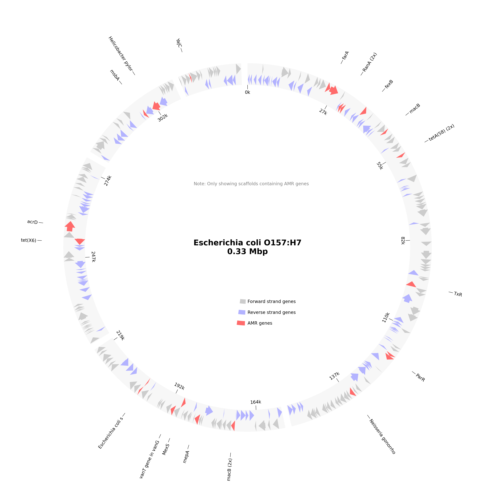

### Escherichia coli soxR with mutation conferring antibiotic resistance
- **Mechanism**: antibiotic target alteration; antibiotic efflux
- **Drug Classes**: fluoroquinolone antibiotic; cephalosporin; glycylcycline; penam; tetracycline antibiotic; rifamycin antibiotic; phenicol antibiotic; disinfecting agents and antiseptics
- **AMR Family**: ATP-binding cassette (ABC) antibiotic efflux pump; major facilitator superfamily (MFS) antibiotic efflux pump; resistance-nodulation-cell division (RND) antibiotic efflux pump
- **Locations**:
  - gnl|SPADES|NHGFMGEA_91_43: position 45696-46160

### Escherichia coli soxS with mutation conferring antibiotic resistance
- **Mechanism**: antibiotic target alteration; antibiotic efflux; reduced permeability to antibiotic
- **Drug Classes**: fluoroquinolone antibiotic; monobactam; carbapenem; cephalosporin; glycylcycline; cephamycin; penam; tetracycline antibiotic; rifamycin antibiotic; phenicol antibiotic; penem; disinfecting agents and antiseptics
- **AMR Family**: ATP-binding cassette (ABC) antibiotic efflux pump; major facilitator superfamily (MFS) antibiotic efflux pump; resistance-nodulation-cell division (RND) antibiotic efflux pump; General Bacterial Porin with reduced permeability to beta-lactams
- **Locations**:
  - gnl|SPADES|NHGFMGEA_91_42: position 45287-45610

### Helicobacter pylori pbp1 mutants conferring resistance to amoxicillin
- **Mechanism**: antibiotic target alteration
- **Drug Classes**: cephalosporin; cephamycin; penam
- **AMR Family**: Penicillin-binding protein mutations conferring resistance to beta-lactam antibiotics
- **Locations**:
  - gnl|SPADES|NHGFMGEA_208_18 : position 22725-25259

### MexS
- **Mechanism**: antibiotic efflux
- **Drug Classes**: fluoroquinolone antibiotic; diaminopyrimidine antibiotic; phenicol antibiotic
- **AMR Family**: resistance-nodulation-cell division (RND) antibiotic efflux pump
- **Locations**:
  - gnl|SPADES|NHGFMGEA_91_31 : position 31476-32459

### Neisseria gonorrhoeae pilQ gene conferring resistance to beta-lactam
- **Mechanism**: antibiotic target alteration
- **Drug Classes**: cephalosporin; cephamycin; penam
- **AMR Family**: Penicillin-binding protein mutations conferring resistance to beta-lactam antibiotics
- **Locations**:
  - gnl|SPADES|NHGFMGEA_17_122 : position 135129-136337

### ParR
- **Mechanism**: antibiotic efflux; reduced permeability to antibiotic
- **Drug Classes**: macrolide antibiotic; fluoroquinolone antibiotic; monobactam; aminoglycoside antibiotic; carbapenem; cephalosporin; cephamycin; penam; tetracycline antibiotic; phenicol antibiotic; penem; disinfecting agents and antiseptics
- **AMR Family**: resistance-nodulation-cell division (RND) antibiotic efflux pump; Outer Membrane Porin (Opr)
- **Locations**:
  - gnl|SPADES|NHGFMGEA_17_108 : position 118991-119710

### RanA (found in 2 locations)
- **Mechanism**: antibiotic efflux
- **Drug Classes**: aminoglycoside antibiotic
- **AMR Family**: ATP-binding cassette (ABC) antibiotic efflux pump
- **Locations**:
  - gnl|SPADES|NHGFMGEA_17_28 : position 30935-31741
  - gnl|SPADES|NHGFMGEA_17_58 : position 60346-61416

### TxR
- **Mechanism**: antibiotic efflux
- **Drug Classes**: tetracycline antibiotic
- **AMR Family**: ATP-binding cassette (ABC) antibiotic efflux pump
- **Locations**:
  - gnl|SPADES|NHGFMGEA_17_89 : position 95483-97081

### YajC
- **Mechanism**: antibiotic efflux
- **Drug Classes**: fluoroquinolone antibiotic; cephalosporin; glycylcycline; penam; tetracycline antibiotic; oxazolidinone antibiotic; glycopeptide antibiotic; rifamycin antibiotic; phenicol antibiotic; disinfecting agents and antiseptics
- **AMR Family**: resistance-nodulation-cell division (RND) antibiotic efflux pump
- **Locations**:
  - gnl|SPADES|NHGFMGEA_311_5 : position 3245-3577

### acrD
- **Mechanism**: antibiotic efflux
- **Drug Classes**: aminoglycoside antibiotic
- **AMR Family**: resistance-nodulation-cell division (RND) antibiotic efflux pump
- **Locations**:
  - gnl|SPADES|NHGFMGEA_110_38: position 34690-37803

### bcrA
- **Mechanism**: antibiotic efflux
- **Drug Classes**: peptide antibiotic
- **AMR Family**: ATP-binding cassette (ABC) antibiotic efflux pump
- **Locations**:
  - gnl|SPADES|NHGFMGEA_17_24 : position 25859-28594

### cpxA
- **Mechanism**: antibiotic efflux
- **Drug Classes**: aminoglycoside antibiotic; aminocoumarin antibiotic
- **AMR Family**: resistance-nodulation-cell division (RND) antibiotic efflux pump
- **Locations**:
  - gnl|SPADES|NHGFMGEA_17_109 : position 119707-121059

### farA
- **Mechanism**: antibiotic efflux
- **Drug Classes**: antibacterial free fatty acids
- **AMR Family**: major facilitator superfamily (MFS) antibiotic efflux pump
- **Locations**:
  - gnl|SPADES|NHGFMGEA_17_23 : position 24795-25862

### fexB
- **Mechanism**: antibiotic efflux
- **Drug Classes**: phenicol antibiotic
- **AMR Family**: major facilitator superfamily (MFS) antibiotic efflux pump
- **Locations**:
  - gnl|SPADES|NHGFMGEA_17_35 : position 37742-39001

### macB (found in 3 locations)
- **Mechanism**: antibiotic efflux
- **Drug Classes**: macrolide antibiotic
- **AMR Family**: ATP-binding cassette (ABC) antibiotic efflux pump
- **Locations**:
  - gnl|SPADES|NHGFMGEA_17_45 : position 46770-47438
  - gnl|SPADES|NHGFMGEA_91_13 : position 15012-16127
  - gnl|SPADES|NHGFMGEA_91_38 : position 39276-42098

### mepA
- **Mechanism**: antibiotic efflux
- **Drug Classes**: glycylcycline; tetracycline antibiotic
- **AMR Family**: multidrug and toxic compound extrusion (MATE) transporter
- **Locations**:
  - gnl|SPADES|NHGFMGEA_91_24 : position 26024-27349

### msbA (found in 2 locations)
- **Mechanism**: antibiotic efflux
- **Drug Classes**: nitroimidazole antibiotic
- **AMR Family**: ATP-binding cassette (ABC) antibiotic efflux pump
- **Locations**:
  - gnl|SPADES|NHGFMGEA_17_29 : position 31738-32502
  - gnl|SPADES|NHGFMGEA_208_16 : position 19414-20211

### tet(X6)
- **Mechanism**: antibiotic inactivation
- **Drug Classes**: tetracycline antibiotic
- **AMR Family**: tetracycline inactivation enzyme
- **Locations**:
  - gnl|SPADES|NHGFMGEA_110_36 : position 30641-32620

### tetA(58) (found in 2 locations)
- **Mechanism**: antibiotic efflux
- **Drug Classes**: tetracycline antibiotic
- **AMR Family**: major facilitator superfamily (MFS) antibiotic efflux pump
- **Locations**:
  - gnl|SPADES|NHGFMGEA_17_53 : position 55322-56089
  - gnl|SPADES|NHGFMGEA_17_54 : position 56091-56804

### vanT gene in vanG cluster
- **Mechanism**: antibiotic target alteration
- **Drug Classes**: glycopeptide antibiotic
- **AMR Family**: glycopeptide resistance gene cluster; vanT
- **Locations**:
  - gnl|SPADES|NHGFMGEA_91_33 : position 34010-35089

## Escherichia coli O157:H7 str. EDL933
**Strain Statistics:**
- Total genome length: 84.6 kbp
- Total scaffolds: 3
- Scaffolds with AMR genes: 2
- Total genes annotated: 164
- Total AMR genes: 4
- Unique AMR genes: 4
- Distinct AMR mechanisms: 3
- Distinct AMR families: 4
- Distinct drug classes: 8

**Circos Plot:**

### NmcR
- **Mechanism**: antibiotic inactivation
- **Drug Classes**: carbapenem; cephalosporin; cephamycin; penam
- **AMR Family**: NmcA beta-lactamase
- **Locations**:
  - gnl|SPADES|NHGFMGEA_113_22 : position 22732-23670

### leuO
- **Mechanism**: antibiotic efflux
- **Drug Classes**: nucleoside antibiotic; disinfecting agents and antiseptics
- **AMR Family**: major facilitator superfamily (MFS) antibiotic efflux pump
- **Locations**:
  - gnl|SPADES|NHGFMGEA_234_27 : position 25096-26034

### macB
- **Mechanism**: antibiotic efflux
- **Drug Classes**: macrolide antibiotic
- **AMR Family**: ATP-binding cassette (ABC) antibiotic efflux pump
- **Locations**:
  - gnl|SPADES|NHGFMGEA_113_39 : position 40778-41551

### vanH gene in vanB cluster
- **Mechanism**: antibiotic target alteration
- **Drug Classes**: glycopeptide antibiotic
- **AMR Family**: vanH; glycopeptide resistance gene cluster
- **Locations**:
  - gnl|SPADES|NHGFMGEA_113_53 : position 53912-55048

## Escherichia coli O22:H8
**Strain Statistics:**
- Total genome length: 32.4 kbp
- Total scaffolds: 1
- Scaffolds with AMR genes: 1
- Total genes annotated: 56
- Total AMR genes: 1
- Unique AMR genes: 1
- Distinct AMR mechanisms: 1
- Distinct AMR families: 1
- Distinct drug classes: 4

**Circos Plot:**

### NmcR
- **Mechanism**: antibiotic inactivation
- **Drug Classes**: carbapenem; cephalosporin; cephamycin; penam
- **AMR Family**: NmcA beta-lactamase
- **Locations**:
  - gnl|SPADES|NHGFMGEA_210_8 : position 11250-12161

## Escherichia coli O68:H12
**Strain Statistics:**
- Total genome length: 109.6 kbp
- Total scaffolds: 1
- Scaffolds with AMR genes: 1
- Total genes annotated: 212
- Total AMR genes: 9
- Unique AMR genes: 9
- Distinct AMR mechanisms: 5
- Distinct AMR families: 8
- Distinct drug classes: 18

**Circos Plot:**

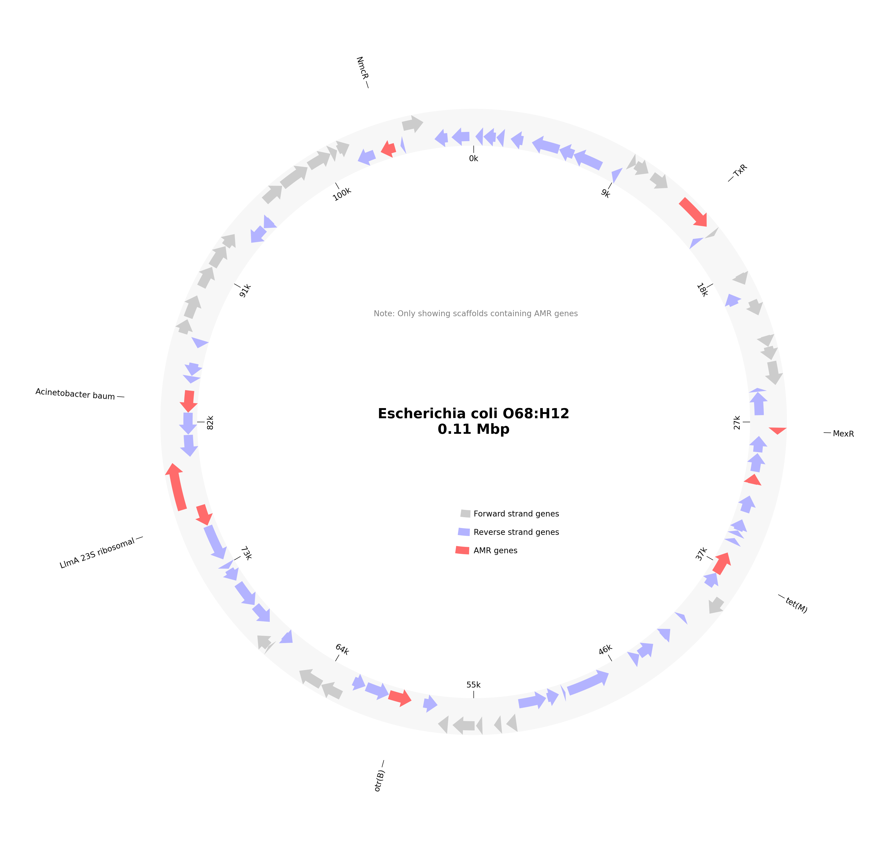

### Acinetobacter baumannii AbaQ
- **Mechanism**: antibiotic efflux
- **Drug Classes**: fluoroquinolone antibiotic
- **AMR Family**: major facilitator superfamily (MFS) antibiotic efflux pump
- **Locations**:
  - gnl|SPADES|NHGFMGEA_31_81 : position 82792-84144

### Erm(34)
- **Mechanism**: antibiotic target alteration
- **Drug Classes**: macrolide antibiotic; lincosamide antibiotic; streptogramin antibiotic; streptogramin A antibiotic; streptogramin B antibiotic
- **AMR Family**: Erm 23S ribosomal RNA methyltransferase
- **Locations**:
  - gnl|SPADES|NHGFMGEA_31_34 : position 30600-31226

### LlmA 23S ribosomal RNA methyltransferase
- **Mechanism**: antibiotic target alteration
- **Drug Classes**: lincosamide antibiotic
- **AMR Family**: Llm 23S ribosomal RNA methyltransferase
- **Locations**:
  - gnl|SPADES|NHGFMGEA_31_77 : position 75743-77044

### MexR
- **Mechanism**: antibiotic target alteration; antibiotic efflux
- **Drug Classes**: macrolide antibiotic; fluoroquinolone antibiotic; monobactam; carbapenem; cephalosporin; cephamycin; penam; tetracycline antibiotic; peptide antibiotic; aminocoumarin antibiotic; diaminopyrimidine antibiotic; sulfonamide antibiotic; phenicol antibiotic; penem
- **AMR Family**: resistance-nodulation-cell division (RND) antibiotic efflux pump
- **Locations**:
  - gnl|SPADES|NHGFMGEA_31_31 : position 27738-28145

### NmcR
- **Mechanism**: antibiotic inactivation
- **Drug Classes**: carbapenem; cephalosporin; cephamycin; penam
- **AMR Family**: NmcA beta-lactamase
- **Locations**:
  - gnl|SPADES|NHGFMGEA_31_100 : position 103848-104765

### TxR
- **Mechanism**: antibiotic efflux
- **Drug Classes**: tetracycline antibiotic
- **AMR Family**: ATP-binding cassette (ABC) antibiotic efflux pump
- **Locations**:
  - gnl|SPADES|NHGFMGEA_31_17 : position 13157-15235

### evgS
- **Mechanism**: antibiotic efflux
- **Drug Classes**: macrolide antibiotic; fluoroquinolone antibiotic; penam; tetracycline antibiotic
- **AMR Family**: major facilitator superfamily (MFS) antibiotic efflux pump; resistance-nodulation-cell division (RND) antibiotic efflux pump
- **Locations**:
  - gnl|SPADES|NHGFMGEA_31_78 : position 77101-79857

### otr(B)
- **Mechanism**: antibiotic efflux
- **Drug Classes**: tetracycline antibiotic
- **AMR Family**: major facilitator superfamily (MFS) antibiotic efflux pump
- **Locations**:
  - gnl|SPADES|NHGFMGEA_31_63 : position 58638-60047

### tet(M)
- **Mechanism**: antibiotic target protection
- **Drug Classes**: tetracycline antibiotic
- **AMR Family**: tetracycline-resistant ribosomal protection protein
- **Locations**:
  - gnl|SPADES|NHGFMGEA_31_42 : position 35699-37126

## Escherichia coli O6:H16
**Strain Statistics:**
- Total genome length: 53.8 kbp
- Total scaffolds: 1
- Scaffolds with AMR genes: 1
- Total genes annotated: 116
- Total AMR genes: 4
- Unique AMR genes: 4
- Distinct AMR mechanisms: 2
- Distinct AMR families: 3
- Distinct drug classes: 6

**Circos Plot:**

### evgA
- **Mechanism**: antibiotic efflux
- **Drug Classes**: macrolide antibiotic; fluoroquinolone antibiotic; penam; tetracycline antibiotic
- **AMR Family**: major facilitator superfamily (MFS) antibiotic efflux pump; resistance-nodulation-cell division (RND) antibiotic efflux pump
- **Locations**:
  - gnl|SPADES|NHGFMGEA_118_51 : position 48233-48883

### mdtG
- **Mechanism**: antibiotic efflux
- **Drug Classes**: phosphonic acid antibiotic
- **AMR Family**: major facilitator superfamily (MFS) antibiotic efflux pump
- **Locations**:
  - gnl|SPADES|NHGFMGEA_118_39: position 35939-37165

### mdtH
- **Mechanism**: antibiotic efflux
- **Drug Classes**: fluoroquinolone antibiotic
- **AMR Family**: major facilitator superfamily (MFS) antibiotic efflux pump
- **Locations**:
  - gnl|SPADES|NHGFMGEA_118_27: position 26100-27308

### vanH gene in vanD cluster
- **Mechanism**: antibiotic target alteration
- **Drug Classes**: glycopeptide antibiotic
- **AMR Family**: vanH; glycopeptide resistance gene cluster
- **Locations**:
  - gnl|SPADES|NHGFMGEA_118_58 : position 52605-53543

## Escherichia coli O7:H4
**Strain Statistics:**
- Total genome length: 75.8 kbp
- Total scaffolds: 1
- Scaffolds with AMR genes: 1
- Total genes annotated: 134
- Total AMR genes: 11
- Unique AMR genes: 11
- Distinct AMR mechanisms: 5
- Distinct AMR families: 9
- Distinct drug classes: 23

**Circos Plot:**

### Acinetobacter baumannii AbaQ
- **Mechanism**: antibiotic efflux
- **Drug Classes**: fluoroquinolone antibiotic
- **AMR Family**: major facilitator superfamily (MFS) antibiotic efflux pump
- **Locations**:
  - gnl|SPADES|NHGFMGEA_73_15 : position 18187-19518

### Erm(34)
- **Mechanism**: antibiotic target alteration
- **Drug Classes**: macrolide antibiotic; lincosamide antibiotic; streptogramin antibiotic; streptogramin A antibiotic; streptogramin B antibiotic
- **AMR Family**: Erm 23S ribosomal RNA methyltransferase
- **Locations**:
  - gnl|SPADES|NHGFMGEA_73_9 : position 12895-13716

### Escherichia coli soxS with mutation conferring antibiotic resistance
- **Mechanism**: antibiotic target alteration; antibiotic efflux; reduced permeability to antibiotic
- **Drug Classes**: fluoroquinolone antibiotic; monobactam; carbapenem; cephalosporin; glycylcycline; cephamycin; penam; tetracycline antibiotic; rifamycin antibiotic; phenicol antibiotic; penem; disinfecting agents and antiseptics
- **AMR Family**: ATP-binding cassette (ABC) antibiotic efflux pump; major facilitator superfamily (MFS) antibiotic efflux pump; resistance-nodulation-cell division (RND) antibiotic efflux pump; General Bacterial Porin with reduced permeability to beta-lactams
- **Locations**:
  - gnl|SPADES|NHGFMGEA_73_66 : position 73736-74605

### LptD
- **Mechanism**: antibiotic efflux
- **Drug Classes**: carbapenem; peptide antibiotic; aminocoumarin antibiotic; rifamycin antibiotic
- **AMR Family**: ATP-binding cassette (ABC) antibiotic efflux pump
- **Locations**:
  - gnl|SPADES|NHGFMGEA_73_6 : position 8216-10570

### Staphylococcus aureus mupA conferring resistance to mupirocin
- **Mechanism**: antibiotic target alteration
- **Drug Classes**: mupirocin-like antibiotic
- **AMR Family**: antibiotic-resistant isoleucyl-tRNA synthetase (ileS)
- **Locations**:
  - gnl|SPADES|NHGFMGEA_73_35 : position 40084-42900

### basS
- **Mechanism**: antibiotic target alteration; antibiotic efflux
- **Drug Classes**: peptide antibiotic
- **AMR Family**: pmr phosphoethanolamine transferase
- **Locations**:
  - gnl|SPADES|NHGFMGEA_73_63 : position 70926-72350

### dfrA3
- **Mechanism**: antibiotic target replacement
- **Drug Classes**: diaminopyrimidine antibiotic
- **AMR Family**: trimethoprim resistant dihydrofolate reductase dfr
- **Locations**:
  - gnl|SPADES|NHGFMGEA_73_12 : position 15023-15613

### mreA
- **Mechanism**: antibiotic efflux
- **Drug Classes**: macrolide antibiotic
- **AMR Family**: major facilitator superfamily (MFS) antibiotic efflux pump
- **Locations**:
  - gnl|SPADES|NHGFMGEA_73_36 : position 42943-43884

### rosB
- **Mechanism**: antibiotic efflux
- **Drug Classes**: peptide antibiotic
- **AMR Family**: major facilitator superfamily (MFS) antibiotic efflux pump
- **Locations**:
  - gnl|SPADES|NHGFMGEA_73_13 : position 15694-17556

### smeR
- **Mechanism**: antibiotic efflux
- **Drug Classes**: aminoglycoside antibiotic; cephalosporin; cephamycin; penam
- **AMR Family**: resistance-nodulation-cell division (RND) antibiotic efflux pump
- **Locations**:
  - gnl|SPADES|NHGFMGEA_73_64 : position 72350-73039

### vanR gene in vanE cluster
- **Mechanism**: antibiotic target alteration
- **Drug Classes**: glycopeptide antibiotic
- **AMR Family**: glycopeptide resistance gene cluster; vanR
- **Locations**:
  - gnl|SPADES|NHGFMGEA_73_61 : position 68740-69456

## Ewingella americana
**Strain Statistics:**
- Total genome length: 842.2 kbp
- Total scaffolds: 3221
- Scaffolds with AMR genes: 510
- Total genes annotated: 1707
- Total AMR genes: 586
- Unique AMR genes: 225
- Distinct AMR mechanisms: 12
- Distinct AMR families: 76
- Distinct drug classes: 37

**Circos Plot:**

### Acinetobacter baumannii AbaF (found in 8 locations)
- **Mechanism**: antibiotic efflux
- **Drug Classes**: phosphonic acid antibiotic
- **AMR Family**: major facilitator superfamily (MFS) antibiotic efflux pump
- **Locations**:
  - gnl|SPADES|NHGFMGEA_1015_2 : position 651-1997
  - gnl|SPADES|NHGFMGEA_1508_1 : position 2-1315
  - gnl|SPADES|NHGFMGEA_2166_1 : position 3-788
  - gnl|SPADES|NHGFMGEA_4080_1 : position 3-956
  - gnl|SPADES|NHGFMGEA_4241_1 : position 2-1132
  - gnl|SPADES|NHGFMGEA_9066_1 : position 3-314
  - gnl|SPADES|NHGFMGEA_9594_1 : position 1-597
  - gnl|SPADES|NHGFMGEA_962_2 : position 451-1782

### Acinetobacter baumannii AbaQ (found in 11 locations)
- **Mechanism**: antibiotic efflux
- **Drug Classes**: fluoroquinolone antibiotic
- **AMR Family**: major facilitator superfamily (MFS) antibiotic efflux pump
- **Locations**:
  - gnl|SPADES|NHGFMGEA_1082_2 : position 1208-2563
  - gnl|SPADES|NHGFMGEA_13240_1 : position 199-477
  - gnl|SPADES|NHGFMGEA_1789_2 : position 1041-2108
  - gnl|SPADES|NHGFMGEA_1804_3 : position 1605-2093
  - gnl|SPADES|NHGFMGEA_1931_3 : position 1785-1997
  - gnl|SPADES|NHGFMGEA_2400_2 : position 982-1686
  - gnl|SPADES|NHGFMGEA_2547_1 : position 2-640
  - gnl|SPADES|NHGFMGEA_28215_1 : position 1-270
  - gnl|SPADES|NHGFMGEA_31161_1 : position 1-255
  - gnl|SPADES|NHGFMGEA_878_5 : position 2601-3662
  - gnl|SPADES|NHGFMGEA_909_4 : position 1676-2872

### ArnT
- **Mechanism**: antibiotic target alteration
- **Drug Classes**: peptide antibiotic
- **AMR Family**: pmr phosphoethanolamine transferase
- **Locations**:
  - gnl|SPADES|NHGFMGEA_2637_1: position 2-991

### Bifidobacterium bifidum ileS conferring resistance to mupirocin
- **Mechanism**: antibiotic target alteration
- **Drug Classes**: mupirocin-like antibiotic
- **AMR Family**: antibiotic-resistant isoleucyl-tRNA synthetase (ileS)
- **Locations**:
  - gnl|SPADES|NHGFMGEA_2634_3 : position 1096-1581

### CAR-1
- **Mechanism**: antibiotic inactivation
- **Drug Classes**: carbapenem
- **AMR Family**: CAR beta-lactamase
- **Locations**:
  - gnl|SPADES|NHGFMGEA_2666_1 : position 136-861

### CRP
- **Mechanism**: antibiotic efflux
- **Drug Classes**: macrolide antibiotic; fluoroquinolone antibiotic; penam
- **AMR Family**: resistance-nodulation-cell division (RND) antibiotic efflux pump
- **Locations**:
  - gnl|SPADES|NHGFMGEA_3204_2: position 631-1263

### CepS
- **Mechanism**: antibiotic inactivation
- **Drug Classes**: cephalosporin
- **AMR Family**: CepS beta-lactamase
- **Locations**:
  - gnl|SPADES|NHGFMGEA_1665_1 : position 1-246

### CfiA11
- **Mechanism**: antibiotic inactivation
- **Drug Classes**: carbapenem
- **AMR Family**: CfiA beta-lactamase
- **Locations**:
  - gnl|SPADES|NHGFMGEA_1425_2 : position 194-1045

### Chlamydia trachomatis intrinsic murA conferring resistance to fosfomycin
- **Mechanism**: antibiotic target alteration
- **Drug Classes**: phosphonic acid antibiotic
- **AMR Family**: antibiotic-resistant murA transferase
- **Locations**:
  - gnl|SPADES|NHGFMGEA_35672_1 : position 7-234

### Clostridioides difficile gyrA conferring resistance to fluoroquinolones
- **Mechanism**: antibiotic target alteration
- **Drug Classes**: fluoroquinolone antibiotic
- **AMR Family**: fluoroquinolone resistant gyrA
- **Locations**:
  - gnl|SPADES|NHGFMGEA_10947_1 : position 2-550

### Clostridioides difficile gyrB conferring resistance to fluoroquinolones
- **Mechanism**: antibiotic target alteration
- **Drug Classes**: fluoroquinolone antibiotic
- **AMR Family**: fluoroquinolone resistant gyrB
- **Locations**:
  - gnl|SPADES|NHGFMGEA_36743_1 : position 2-229

### D-Ala-D-Ala ligase
- **Mechanism**: antibiotic target alteration
- **Drug Classes**: glycopeptide antibiotic
- **AMR Family**: Van ligase
- **Locations**:
  - gnl|SPADES|NHGFMGEA_6024_1 : position 124-870

### Enterobacter cloacae acrA
- **Mechanism**: antibiotic efflux
- **Drug Classes**: fluoroquinolone antibiotic; cephalosporin; glycylcycline; penam; tetracycline antibiotic; rifamycin antibiotic; phenicol antibiotic; disinfecting agents and antiseptics
- **AMR Family**: resistance-nodulation-cell division (RND) antibiotic efflux pump
- **Locations**:
  - gnl|SPADES|NHGFMGEA_2965_2 : position 236-1426

### Enterococcus faecalis cls with mutation conferring resistance to daptomycin
- **Mechanism**: antibiotic target alteration
- **Drug Classes**: peptide antibiotic
- **AMR Family**: daptomycin resistant cls
- **Locations**:
  - gnl|SPADES|NHGFMGEA_7548_1 : position 3-731

### ErmC
- **Mechanism**: antibiotic target alteration
- **Drug Classes**: macrolide antibiotic; lincosamide antibiotic; streptogramin antibiotic; streptogramin A antibiotic; streptogramin B antibiotic
- **AMR Family**: Erm 23S ribosomal RNA methyltransferase
- **Locations**:
  - gnl|SPADES|NHGFMGEA_682_2 : position 181-1014

### Escherichia coli AcrAB-TolC with AcrR mutation conferring resistance to ciprofloxacin, tetracycline, and ceftazidime (found in 2 locations)
- **Mechanism**: antibiotic target alteration; antibiotic efflux
- **Drug Classes**: fluoroquinolone antibiotic; cephalosporin; glycylcycline; penam; tetracycline antibiotic; rifamycin antibiotic; phenicol antibiotic; disinfecting agents and antiseptics
- **AMR Family**: resistance-nodulation-cell division (RND) antibiotic efflux pump
- **Locations**:
  - gnl|SPADES|NHGFMGEA_28414_1 : position 2-268
  - gnl|SPADES|NHGFMGEA_2965_1 : position 2-130

### Escherichia coli fabI mutations conferring resistance to isoniazid and triclosan (found in 2 locations)
- **Mechanism**: antibiotic target alteration
- **Drug Classes**: disinfecting agents and antiseptics; isoniazid-like antibiotic
- **AMR Family**: antibiotic resistant fabI
- **Locations**:
  - gnl|SPADES|NHGFMGEA_3523_1 : position 25-771
  - gnl|SPADES|NHGFMGEA_953_2 : position 286-1062

### Escherichia coli mdfA (found in 4 locations)
- **Mechanism**: antibiotic efflux
- **Drug Classes**: tetracycline antibiotic; phenicol antibiotic; disinfecting agents and antiseptics
- **AMR Family**: major facilitator superfamily (MFS) antibiotic efflux pump
- **Locations**:
  - gnl|SPADES|NHGFMGEA_1564_1 : position 1-465
  - gnl|SPADES|NHGFMGEA_4253_1 : position 3-146
  - gnl|SPADES|NHGFMGEA_8504_2 : position 332-670
  - gnl|SPADES|NHGFMGEA_8821_1 : position 3-650

### Escherichia coli ompF with mutation conferring resistance to beta-lactam antibiotics
- **Mechanism**: reduced permeability to antibiotic
- **Drug Classes**: monobactam; carbapenem; cephalosporin; cephamycin; penam; penem
- **AMR Family**: General Bacterial Porin with reduced permeability to beta-lactams
- **Locations**:
  - gnl|SPADES|NHGFMGEA_4447_1 : position 3-797

### Escherichia coli soxS with mutation conferring antibiotic resistance (found in 5 locations)
- **Mechanism**: antibiotic target alteration; antibiotic efflux; reduced permeability to antibiotic
- **Drug Classes**: fluoroquinolone antibiotic; monobactam; carbapenem; cephalosporin; glycylcycline; cephamycin; penam; tetracycline antibiotic; rifamycin antibiotic; phenicol antibiotic; penem; disinfecting agents and antiseptics
- **AMR Family**: ATP-binding cassette (ABC) antibiotic efflux pump; major facilitator superfamily (MFS) antibiotic efflux pump; resistance-nodulation-cell division (RND) antibiotic efflux pump; General Bacterial Porin with reduced permeability to beta-lactams
- **Locations**:
  - gnl|SPADES|NHGFMGEA_1237_3 : position 2122-2748
  - gnl|SPADES|NHGFMGEA_1310_3 : position 1015-1374
  - gnl|SPADES|NHGFMGEA_1762_1 : position 36-902
  - gnl|SPADES|NHGFMGEA_4297_1 : position 2-604
  - gnl|SPADES|NHGFMGEA_4997_1 : position 2-676

### EstT (found in 2 locations)
- **Mechanism**: antibiotic inactivation
- **Drug Classes**: macrolide antibiotic
- **AMR Family**: macrolide esterase
- **Locations**:
  - gnl|SPADES|NHGFMGEA_1738_2 : position 1589-2149
  - gnl|SPADES|NHGFMGEA_911_3 : position 572-1411

### FosA8
- **Mechanism**: antibiotic inactivation
- **Drug Classes**: phosphonic acid antibiotic
- **AMR Family**: fosfomycin thiol transferase
- **Locations**:
  - gnl|SPADES|NHGFMGEA_9924_1: position 1-333

### H-NS
- **Mechanism**: antibiotic efflux
- **Drug Classes**: macrolide antibiotic; fluoroquinolone antibiotic; cephalosporin; cephamycin; penam; tetracycline antibiotic
- **AMR Family**: major facilitator superfamily (MFS) antibiotic efflux pump; resistance-nodulation-cell division (RND) antibiotic efflux pump
- **Locations**:
  - gnl|SPADES|NHGFMGEA_853_1 : position 353-760

### Haemophilus influenzae PBP3 conferring resistance to beta-lactam antibiotics (found in 2 locations)
- **Mechanism**: antibiotic target alteration
- **Drug Classes**: cephalosporin; cephamycin; penam
- **AMR Family**: Penicillin-binding protein mutations conferring resistance to beta-lactam antibiotics
- **Locations**:
  - gnl|SPADES|NHGFMGEA_3197_1 : position 2-1228
  - gnl|SPADES|NHGFMGEA_956_3 : position 1023-2798

### Helicobacter pylori pbp1 mutants conferring resistance to amoxicillin
- **Mechanism**: antibiotic target alteration
- **Drug Classes**: cephalosporin; cephamycin; penam
- **AMR Family**: Penicillin-binding protein mutations conferring resistance to beta-lactam antibiotics
- **Locations**:
  - gnl|SPADES|NHGFMGEA_858_1 : position 3-1562

### Helicobacter pylori pbp2 mutants conferring resistance to amoxicillin
- **Mechanism**: antibiotic target alteration
- **Drug Classes**: cephalosporin; cephamycin; penam
- **AMR Family**: Penicillin-binding protein mutations conferring resistance to beta-lactam antibiotics
- **Locations**:
  - gnl|SPADES|NHGFMGEA_5857_1 : position 2-886

### Klebsiella aerogenes Omp36
- **Mechanism**: reduced permeability to antibiotic
- **Drug Classes**: monobactam; carbapenem; cephalosporin; cephamycin; penam; penem
- **AMR Family**: General Bacterial Porin with reduced permeability to beta-lactams
- **Locations**:
  - gnl|SPADES|NHGFMGEA_2612_2 : position 749-1591

### Klebsiella pneumoniae KpnG (found in 3 locations)
- **Mechanism**: antibiotic efflux
- **Drug Classes**: macrolide antibiotic; fluoroquinolone antibiotic; aminoglycoside antibiotic; carbapenem; cephalosporin; penam; peptide antibiotic; penem
- **AMR Family**: major facilitator superfamily (MFS) antibiotic efflux pump
- **Locations**:
  - gnl|SPADES|NHGFMGEA_4998_1 : position 49-999
  - gnl|SPADES|NHGFMGEA_6856_1 : position 3-203
  - gnl|SPADES|NHGFMGEA_975_1 : position 3-260

### Klebsiella pneumoniae KpnH (found in 2 locations)
- **Mechanism**: antibiotic efflux
- **Drug Classes**: macrolide antibiotic; fluoroquinolone antibiotic; aminoglycoside antibiotic; carbapenem; cephalosporin; penam; peptide antibiotic; penem
- **AMR Family**: major facilitator superfamily (MFS) antibiotic efflux pump
- **Locations**:
  - gnl|SPADES|NHGFMGEA_1779_1 : position 2-1018
  - gnl|SPADES|NHGFMGEA_4390_2 : position 76-1104

### Klebsiella pneumoniae OmpK37 (found in 7 locations)
- **Mechanism**: reduced permeability to antibiotic
- **Drug Classes**: monobactam; carbapenem; cephalosporin; cephamycin; penam; penem
- **AMR Family**: General Bacterial Porin with reduced permeability to beta-lactams
- **Locations**:
  - gnl|SPADES|NHGFMGEA_10120_1 : position 2-580
  - gnl|SPADES|NHGFMGEA_1980_1 : position 2-910
  - gnl|SPADES|NHGFMGEA_2321_1 : position 3-113
  - gnl|SPADES|NHGFMGEA_3014_1 : position 2-979
  - gnl|SPADES|NHGFMGEA_3396_1 : position 3-371
  - gnl|SPADES|NHGFMGEA_4137_1 : position 1-147
  - gnl|SPADES|NHGFMGEA_558_6 : position 4849-6009

### Klebsiella pneumoniae ramR mutants
- **Mechanism**: antibiotic target alteration; antibiotic efflux
- **Drug Classes**: fluoroquinolone antibiotic; cephalosporin; glycylcycline; penam; tetracycline antibiotic; rifamycin antibiotic; phenicol antibiotic; disinfecting agents and antiseptics
- **AMR Family**: resistance-nodulation-cell division (RND) antibiotic efflux pump
- **Locations**:
  - gnl|SPADES|NHGFMGEA_5379_1 : position 39-692

### LlmA 23S ribosomal RNA methyltransferase
- **Mechanism**: antibiotic target alteration
- **Drug Classes**: lincosamide antibiotic
- **AMR Family**: Llm 23S ribosomal RNA methyltransferase
- **Locations**:
  - gnl|SPADES|NHGFMGEA_1075_3 : position 480-1679

### LpsB
- **Mechanism**: reduced permeability to antibiotic
- **Drug Classes**: peptide antibiotic
- **AMR Family**: Intrinsic peptide antibiotic resistant Lps
- **Locations**:
  - gnl|SPADES|NHGFMGEA_9815_2 : position 215-601

### LptD (found in 3 locations)
- **Mechanism**: antibiotic efflux
- **Drug Classes**: carbapenem; peptide antibiotic; aminocoumarin antibiotic; rifamycin antibiotic
- **AMR Family**: ATP-binding cassette (ABC) antibiotic efflux pump
- **Locations**:
  - gnl|SPADES|NHGFMGEA_25511_1 : position 2-286
  - gnl|SPADES|NHGFMGEA_3223_1 : position 3-1187
  - gnl|SPADES|NHGFMGEA_4857_1 : position 3-926

### MCR-10.4
- **Mechanism**: antibiotic target alteration
- **Drug Classes**: peptide antibiotic
- **AMR Family**: MCR phosphoethanolamine transferase
- **Locations**:
  - gnl|SPADES|NHGFMGEA_1286_2 : position 1053-2672

### MdtK (found in 2 locations)
- **Mechanism**: antibiotic efflux
- **Drug Classes**: fluoroquinolone antibiotic
- **AMR Family**: multidrug and toxic compound extrusion (MATE) transporter
- **Locations**:
  - gnl|SPADES|NHGFMGEA_1205_1 : position 1-810
  - gnl|SPADES|NHGFMGEA_8765_1 : position 66-653

### MexS (found in 3 locations)
- **Mechanism**: antibiotic efflux
- **Drug Classes**: fluoroquinolone antibiotic; diaminopyrimidine antibiotic; phenicol antibiotic
- **AMR Family**: resistance-nodulation-cell division (RND) antibiotic efflux pump
- **Locations**:
  - gnl|SPADES|NHGFMGEA_15939_1 : position 2-412
  - gnl|SPADES|NHGFMGEA_2251_1 : position 2-241
  - gnl|SPADES|NHGFMGEA_4062_1 : position 32-1165

### MexT
- **Mechanism**: antibiotic efflux
- **Drug Classes**: fluoroquinolone antibiotic; diaminopyrimidine antibiotic; phenicol antibiotic
- **AMR Family**: resistance-nodulation-cell division (RND) antibiotic efflux pump
- **Locations**:
  - gnl|SPADES|NHGFMGEA_2014_1 : position 3-842

### MexW
- **Mechanism**: antibiotic efflux
- **Drug Classes**: macrolide antibiotic; fluoroquinolone antibiotic; tetracycline antibiotic; phenicol antibiotic; disinfecting agents and antiseptics
- **AMR Family**: resistance-nodulation-cell division (RND) antibiotic efflux pump
- **Locations**:
  - gnl|SPADES|NHGFMGEA_4384_1 : position 2-1105

### MexZ (found in 2 locations)
- **Mechanism**: antibiotic efflux
- **Drug Classes**: macrolide antibiotic; fluoroquinolone antibiotic; aminoglycoside antibiotic; carbapenem; cephalosporin; cephamycin; penam; tetracycline antibiotic; phenicol antibiotic; disinfecting agents and antiseptics
- **AMR Family**: resistance-nodulation-cell division (RND) antibiotic efflux pump
- **Locations**:
  - gnl|SPADES|NHGFMGEA_1066_2 : position 547-1167
  - gnl|SPADES|NHGFMGEA_2173_1 : position 1-213

### MuxA
- **Mechanism**: antibiotic efflux
- **Drug Classes**: macrolide antibiotic; monobactam; tetracycline antibiotic; aminocoumarin antibiotic
- **AMR Family**: resistance-nodulation-cell division (RND) antibiotic efflux pump
- **Locations**:
  - gnl|SPADES|NHGFMGEA_2645_2 : position 246-1541

### MuxB (found in 2 locations)
- **Mechanism**: antibiotic efflux
- **Drug Classes**: macrolide antibiotic; monobactam; tetracycline antibiotic; aminocoumarin antibiotic
- **AMR Family**: resistance-nodulation-cell division (RND) antibiotic efflux pump
- **Locations**:
  - gnl|SPADES|NHGFMGEA_1816_1 : position 2-343
  - gnl|SPADES|NHGFMGEA_3730_1 : position 3-1238

### MuxC
- **Mechanism**: antibiotic efflux
- **Drug Classes**: macrolide antibiotic; monobactam; tetracycline antibiotic; aminocoumarin antibiotic
- **AMR Family**: resistance-nodulation-cell division (RND) antibiotic efflux pump
- **Locations**:
  - gnl|SPADES|NHGFMGEA_3046_1 : position 2-1432

### Mycobacterium tuberculosis gidB mutation conferring resistance to streptomycin
- **Mechanism**: antibiotic target alteration
- **Drug Classes**: aminoglycoside antibiotic
- **AMR Family**: antibiotic resistant gidB
- **Locations**:
  - gnl|SPADES|NHGFMGEA_3230_2 : position 427-1047

### Mycobacterium tuberculosis kasA mutant conferring resistance to isoniazid
- **Mechanism**: antibiotic target alteration
- **Drug Classes**: isoniazid-like antibiotic
- **AMR Family**: antibiotic resistant kasA
- **Locations**:
  - gnl|SPADES|NHGFMGEA_1066_3 : position 1319-2593

### Mycobacterium tuberculosis katG mutations conferring resistance to isoniazid (found in 2 locations)
- **Mechanism**: antibiotic target alteration
- **Drug Classes**: isoniazid-like antibiotic
- **AMR Family**: isoniazid resistant katG
- **Locations**:
  - gnl|SPADES|NHGFMGEA_3444_1 : position 3-269
  - gnl|SPADES|NHGFMGEA_3444_2 : position 214-1317

### Mycobacterium tuberculosis ndh with mutation conferring resistance to isoniazid
- **Mechanism**: antibiotic target alteration
- **Drug Classes**: isoniazid-like antibiotic
- **AMR Family**: antibiotic resistant ndh
- **Locations**:
  - gnl|SPADES|NHGFMGEA_2767_1 : position 74-1381

### Mycobacterium tuberculosis pncA mutations conferring resistance to pyrazinamide
- **Mechanism**: antibiotic target alteration
- **Drug Classes**: pyrazine antibiotic
- **AMR Family**: Pyrazinamide resistant pncA
- **Locations**:
  - gnl|SPADES|NHGFMGEA_1795_3 : position 1251-1877

### Mycobacterium tuberculosis thyA with mutation conferring resistance to para-aminosalicylic acid
- **Mechanism**: antibiotic target alteration
- **Drug Classes**: salicylic acid antibiotic
- **AMR Family**: aminosalicylate resistant thymidylate synthase
- **Locations**:
  - gnl|SPADES|NHGFMGEA_2606_3 : position 1006-1593

### Neisseria gonorrhoeae pilQ gene conferring resistance to beta-lactam
- **Mechanism**: antibiotic target alteration
- **Drug Classes**: cephalosporin; cephamycin; penam
- **AMR Family**: Penicillin-binding protein mutations conferring resistance to beta-lactam antibiotics
- **Locations**:
  - gnl|SPADES|NHGFMGEA_2165_2 : position 259-1530

### Neisseria meningititis PBP2 conferring resistance to beta-lactam
- **Mechanism**: antibiotic target alteration
- **Drug Classes**: cephalosporin; cephamycin; penam
- **AMR Family**: Penicillin-binding protein mutations conferring resistance to beta-lactam antibiotics
- **Locations**:
  - gnl|SPADES|NHGFMGEA_14115_1 : position 34-453

### NmcR (found in 15 locations)
- **Mechanism**: antibiotic inactivation
- **Drug Classes**: carbapenem; cephalosporin; cephamycin; penam
- **AMR Family**: NmcA beta-lactamase
- **Locations**:
  - gnl|SPADES|NHGFMGEA_1221_2 : position 1022-1903
  - gnl|SPADES|NHGFMGEA_1383_3 : position 890-1813
  - gnl|SPADES|NHGFMGEA_18306_1 : position 3-371
  - gnl|SPADES|NHGFMGEA_2254_2 : position 794-1669
  - gnl|SPADES|NHGFMGEA_2302_3 : position 1466-1741
  - gnl|SPADES|NHGFMGEA_2395_3 : position 1159-1686
  - gnl|SPADES|NHGFMGEA_3088_1 : position 1-789
  - gnl|SPADES|NHGFMGEA_357_1 : position 78-977
  - gnl|SPADES|NHGFMGEA_37691_1 : position 1-225
  - gnl|SPADES|NHGFMGEA_4250_2 : position 230-1129
  - gnl|SPADES|NHGFMGEA_5996_1 : position 3-659
  - gnl|SPADES|NHGFMGEA_651_5 : position 3269-4105
  - gnl|SPADES|NHGFMGEA_6713_1 : position 321-794
  - gnl|SPADES|NHGFMGEA_872_3 : position 2496-3410
  - gnl|SPADES|NHGFMGEA_9381_2 : position 481-621

### OXA-152
- **Mechanism**: antibiotic inactivation
- **Drug Classes**: carbapenem; penam
- **AMR Family**: OXA beta-lactamase; OXA-62-like beta-lactamase
- **Locations**:
  - gnl|SPADES|NHGFMGEA_2878_2 : position 875-1489

### OmpA
- **Mechanism**: reduced permeability to antibiotic
- **Drug Classes**: peptide antibiotic
- **AMR Family**: General Bacterial Porin with reduced permeability to peptide antibiotics
- **Locations**:
  - gnl|SPADES|NHGFMGEA_4999_2 : position 410-1000

### OpmB
- **Mechanism**: antibiotic efflux
- **Drug Classes**: macrolide antibiotic; monobactam; tetracycline antibiotic; aminocoumarin antibiotic
- **AMR Family**: resistance-nodulation-cell division (RND) antibiotic efflux pump
- **Locations**:
  - gnl|SPADES|NHGFMGEA_2535_1 : position 129-1619

### OprM (found in 2 locations)
- **Mechanism**: antibiotic efflux
- **Drug Classes**: macrolide antibiotic; fluoroquinolone antibiotic; monobactam; aminoglycoside antibiotic; carbapenem; cephalosporin; cephamycin; penam; tetracycline antibiotic; peptide antibiotic; aminocoumarin antibiotic; diaminopyrimidine antibiotic; sulfonamide antibiotic; phenicol antibiotic; penem; disinfecting agents and antiseptics
- **AMR Family**: resistance-nodulation-cell division (RND) antibiotic efflux pump
- **Locations**:
  - gnl|SPADES|NHGFMGEA_4383_2 : position 906-1106
  - gnl|SPADES|NHGFMGEA_604_1 : position 2-949

### OprN
- **Mechanism**: antibiotic efflux
- **Drug Classes**: fluoroquinolone antibiotic; diaminopyrimidine antibiotic; phenicol antibiotic
- **AMR Family**: resistance-nodulation-cell division (RND) antibiotic efflux pump
- **Locations**:
  - gnl|SPADES|NHGFMGEA_36001_1 : position 2-232

### OprZ
- **Mechanism**: antibiotic efflux
- **Drug Classes**: macrolide antibiotic; fluoroquinolone antibiotic; aminoglycoside antibiotic; cephalosporin
- **AMR Family**: resistance-nodulation-cell division (RND) antibiotic efflux pump
- **Locations**:
  - gnl|SPADES|NHGFMGEA_12146_1 : position 3-509

### PAM-1
- **Mechanism**: antibiotic inactivation
- **Drug Classes**: carbapenem; cephalosporin
- **AMR Family**: PAM beta-lactamase
- **Locations**:
  - gnl|SPADES|NHGFMGEA_2575_2 : position 165-1067

### ParR (found in 2 locations)
- **Mechanism**: antibiotic efflux; reduced permeability to antibiotic
- **Drug Classes**: macrolide antibiotic; fluoroquinolone antibiotic; monobactam; aminoglycoside antibiotic; carbapenem; cephalosporin; cephamycin; penam; tetracycline antibiotic; phenicol antibiotic; penem; disinfecting agents and antiseptics
- **AMR Family**: resistance-nodulation-cell division (RND) antibiotic efflux pump; Outer Membrane Porin (Opr)
- **Locations**:
  - gnl|SPADES|NHGFMGEA_2868_2 : position 892-1491
  - gnl|SPADES|NHGFMGEA_9835_1 : position 1-147

### ParS (found in 3 locations)
- **Mechanism**: antibiotic efflux; reduced permeability to antibiotic
- **Drug Classes**: macrolide antibiotic; fluoroquinolone antibiotic; monobactam; aminoglycoside antibiotic; carbapenem; cephalosporin; cephamycin; penam; tetracycline antibiotic; phenicol antibiotic; penem; disinfecting agents and antiseptics
- **AMR Family**: resistance-nodulation-cell division (RND) antibiotic efflux pump; Outer Membrane Porin (Opr)
- **Locations**:
  - gnl|SPADES|NHGFMGEA_11182_1 : position 2-541
  - gnl|SPADES|NHGFMGEA_2789_1 : position 3-860
  - gnl|SPADES|NHGFMGEA_3416_1 : position 3-1010

### PmpM
- **Mechanism**: antibiotic efflux
- **Drug Classes**: fluoroquinolone antibiotic; aminoglycoside antibiotic; disinfecting agents and antiseptics
- **AMR Family**: multidrug and toxic compound extrusion (MATE) transporter
- **Locations**:
  - gnl|SPADES|NHGFMGEA_28043_1 : position 1-270

### PmrF (found in 2 locations)
- **Mechanism**: antibiotic target alteration
- **Drug Classes**: peptide antibiotic
- **AMR Family**: pmr phosphoethanolamine transferase
- **Locations**:
  - gnl|SPADES|NHGFMGEA_1723_3 : position 1554-2165
  - gnl|SPADES|NHGFMGEA_5322_1 : position 1-225

### Pseudomonas aeruginosa CpxR (found in 3 locations)
- **Mechanism**: antibiotic efflux
- **Drug Classes**: macrolide antibiotic; fluoroquinolone antibiotic; monobactam; aminoglycoside antibiotic; carbapenem; cephalosporin; cephamycin; penam; tetracycline antibiotic; peptide antibiotic; aminocoumarin antibiotic; diaminopyrimidine antibiotic; sulfonamide antibiotic; phenicol antibiotic; penem
- **AMR Family**: resistance-nodulation-cell division (RND) antibiotic efflux pump
- **Locations**:
  - gnl|SPADES|NHGFMGEA_10100_1 : position 2-205
  - gnl|SPADES|NHGFMGEA_1584_1 : position 3-392
  - gnl|SPADES|NHGFMGEA_1733_3 : position 1505-1897

### Pseudomonas aeruginosa ampR with mutation conferring resistance to aztreonam
- **Mechanism**: antibiotic target alteration; antibiotic inactivation
- **Drug Classes**: monobactam; carbapenem; cephalosporin
- **AMR Family**: PDC beta-lactamase; ampR transcriptional regulator with mutation conferring resistance to monobactam antibiotics
- **Locations**:
  - gnl|SPADES|NHGFMGEA_1186_5 : position 1925-2806

### Pseudomonas mutant PhoQ conferring resistance to colistin
- **Mechanism**: antibiotic target alteration; antibiotic efflux; resistance by absence
- **Drug Classes**: macrolide antibiotic; peptide antibiotic
- **AMR Family**: ATP-binding cassette (ABC) antibiotic efflux pump; pmr phosphoethanolamine transferase; transmembrane protein conferring colistin resistance
- **Locations**:
  - gnl|SPADES|NHGFMGEA_1894_1 : position 3-1502

### QepA2 (found in 2 locations)
- **Mechanism**: antibiotic efflux
- **Drug Classes**: fluoroquinolone antibiotic
- **AMR Family**: major facilitator superfamily (MFS) antibiotic efflux pump
- **Locations**:
  - gnl|SPADES|NHGFMGEA_1614_2 : position 245-1639
  - gnl|SPADES|NHGFMGEA_2254_1 : position 2-709

### QnrB65
- **Mechanism**: antibiotic target protection
- **Drug Classes**: fluoroquinolone antibiotic
- **AMR Family**: quinolone resistance protein (qnr)
- **Locations**:
  - gnl|SPADES|NHGFMGEA_901_1 : position 1-552

### RanA (found in 26 locations)
- **Mechanism**: antibiotic efflux
- **Drug Classes**: aminoglycoside antibiotic
- **AMR Family**: ATP-binding cassette (ABC) antibiotic efflux pump
- **Locations**:
  - gnl|SPADES|NHGFMGEA_1110_1 : position 76-852
  - gnl|SPADES|NHGFMGEA_1133_5 : position 2105-2938
  - gnl|SPADES|NHGFMGEA_12701_1 : position 2-493
  - gnl|SPADES|NHGFMGEA_13100_1 : position 3-479
  - gnl|SPADES|NHGFMGEA_13291_1 : position 2-475
  - gnl|SPADES|NHGFMGEA_1439_3 : position 1366-2217
  - gnl|SPADES|NHGFMGEA_15400_1 : position 3-422
  - gnl|SPADES|NHGFMGEA_1743_2 : position 712-1800
  - gnl|SPADES|NHGFMGEA_1909_1 : position 2-1117
  - gnl|SPADES|NHGFMGEA_19594_1 : position 1-351
  - gnl|SPADES|NHGFMGEA_23755_1 : position 2-301
  - gnl|SPADES|NHGFMGEA_24325_1 : position 1-297
  - gnl|SPADES|NHGFMGEA_2607_3 : position 1274-1594
  - gnl|SPADES|NHGFMGEA_2682_3 : position 976-1563
  - gnl|SPADES|NHGFMGEA_28889_1 : position 75-266
  - gnl|SPADES|NHGFMGEA_3438_2 : position 571-1317
  - gnl|SPADES|NHGFMGEA_3670_2 : position 538-1254
  - gnl|SPADES|NHGFMGEA_3935_1 : position 1-540
  - gnl|SPADES|NHGFMGEA_4990_2 : position 132-1001
  - gnl|SPADES|NHGFMGEA_541_5 : position 2536-3339
  - gnl|SPADES|NHGFMGEA_5591_1 : position 3-923
  - gnl|SPADES|NHGFMGEA_6032_1 : position 1-597
  - gnl|SPADES|NHGFMGEA_7115_1 : position 2-763
  - gnl|SPADES|NHGFMGEA_753_5 : position 2173-3252
  - gnl|SPADES|NHGFMGEA_756_3 : position 2813-3883
  - gnl|SPADES|NHGFMGEA_8062_2 : position 444-698

### RanB
- **Mechanism**: antibiotic efflux
- **Drug Classes**: aminoglycoside antibiotic
- **AMR Family**: ATP-binding cassette (ABC) antibiotic efflux pump
- **Locations**:
  - gnl|SPADES|NHGFMGEA_541_4 : position 1738-2520

### Rhodococcus fascians cmr
- **Mechanism**: antibiotic efflux
- **Drug Classes**: phenicol antibiotic
- **AMR Family**: major facilitator superfamily (MFS) antibiotic efflux pump
- **Locations**:
  - gnl|SPADES|NHGFMGEA_1196_3 : position 963-1340

### Rv1877 (found in 3 locations)
- **Mechanism**: antibiotic efflux
- **Drug Classes**: fluoroquinolone antibiotic
- **AMR Family**: major facilitator superfamily (MFS) antibiotic efflux pump
- **Locations**:
  - gnl|SPADES|NHGFMGEA_1319_1 : position 2-751
  - gnl|SPADES|NHGFMGEA_2342_3 : position 1237-1719
  - gnl|SPADES|NHGFMGEA_707_1 : position 2-1213

### SRT-1
- **Mechanism**: antibiotic inactivation
- **Drug Classes**: cephalosporin
- **AMR Family**: SRT beta-lactamase
- **Locations**:
  - gnl|SPADES|NHGFMGEA_1186_4 : position 1349-1798

### SRT-2
- **Mechanism**: antibiotic inactivation
- **Drug Classes**: cephalosporin
- **AMR Family**: SRT beta-lactamase
- **Locations**:
  - gnl|SPADES|NHGFMGEA_4721_1 : position 2-907

### SST-1
- **Mechanism**: antibiotic inactivation
- **Drug Classes**: cephalosporin
- **AMR Family**: SST beta-lactamase
- **Locations**:
  - gnl|SPADES|NHGFMGEA_1186_3 : position 654-1349

### Salmonella serovars soxS with mutation conferring antibiotic resistance (found in 2 locations)
- **Mechanism**: antibiotic target alteration; antibiotic efflux; reduced permeability to antibiotic
- **Drug Classes**: fluoroquinolone antibiotic; monobactam; carbapenem; cephalosporin; glycylcycline; cephamycin; penam; tetracycline antibiotic; rifamycin antibiotic; phenicol antibiotic; penem; disinfecting agents and antiseptics
- **AMR Family**: ATP-binding cassette (ABC) antibiotic efflux pump; major facilitator superfamily (MFS) antibiotic efflux pump; resistance-nodulation-cell division (RND) antibiotic efflux pump; General Bacterial Porin with reduced permeability to beta-lactams
- **Locations**:
  - gnl|SPADES|NHGFMGEA_579_1 : position 3-263
  - gnl|SPADES|NHGFMGEA_956_2 : position 120-506

### SatA
- **Mechanism**: antibiotic inactivation
- **Drug Classes**: nucleoside antibiotic
- **AMR Family**: streptothricin acetyltransferase (SAT)
- **Locations**:
  - gnl|SPADES|NHGFMGEA_2944_1 : position 3-359

### Staphylococcus aureus GlpT with mutation conferring resistance to fosfomycin
- **Mechanism**: antibiotic target alteration
- **Drug Classes**: phosphonic acid antibiotic
- **AMR Family**: antibiotic-resistant GlpT
- **Locations**:
  - gnl|SPADES|NHGFMGEA_6592_1 : position 3-809

### Staphylococcus aureus fusA with mutation conferring resistance to fusidic acid
- **Mechanism**: antibiotic target alteration
- **Drug Classes**: fusidane antibiotic
- **AMR Family**: antibiotic resistant fusA
- **Locations**:
  - gnl|SPADES|NHGFMGEA_872_1 : position 2-1924

### Staphylococcus aureus mupA conferring resistance to mupirocin (found in 3 locations)
- **Mechanism**: antibiotic target alteration
- **Drug Classes**: mupirocin-like antibiotic
- **AMR Family**: antibiotic-resistant isoleucyl-tRNA synthetase (ileS)
- **Locations**:
  - gnl|SPADES|NHGFMGEA_23675_1 : position 2-304
  - gnl|SPADES|NHGFMGEA_3216_1 : position 1-813
  - gnl|SPADES|NHGFMGEA_3684_1 : position 2-274

### Staphylococcus aureus mupB conferring resistance to mupirocin (found in 2 locations)
- **Mechanism**: antibiotic target alteration
- **Drug Classes**: mupirocin-like antibiotic
- **AMR Family**: antibiotic-resistant isoleucyl-tRNA synthetase (ileS)
- **Locations**:
  - gnl|SPADES|NHGFMGEA_3351_1 : position 2-1345
  - gnl|SPADES|NHGFMGEA_650_6 : position 3897-5036

### Staphylococcus aureus murA with mutation conferring resistance to fosfomycin
- **Mechanism**: antibiotic target alteration
- **Drug Classes**: phosphonic acid antibiotic
- **AMR Family**: antibiotic-resistant murA transferase
- **Locations**:
  - gnl|SPADES|NHGFMGEA_3993_1 : position 2-1012

### Staphylococcus aureus norA
- **Mechanism**: antibiotic efflux
- **Drug Classes**: fluoroquinolone antibiotic
- **AMR Family**: major facilitator superfamily (MFS) antibiotic efflux pump
- **Locations**:
  - gnl|SPADES|NHGFMGEA_1335_2 : position 386-1696

### Streptomyces lividans cmlR
- **Mechanism**: antibiotic efflux
- **Drug Classes**: phenicol antibiotic
- **AMR Family**: major facilitator superfamily (MFS) antibiotic efflux pump
- **Locations**:
  - gnl|SPADES|NHGFMGEA_11202_1 : position 2-541

### Streptomyces venezuelae rox (found in 3 locations)
- **Mechanism**: antibiotic inactivation
- **Drug Classes**: rifamycin antibiotic
- **AMR Family**: rifampin monooxygenase
- **Locations**:
  - gnl|SPADES|NHGFMGEA_18344_1 : position 123-368
  - gnl|SPADES|NHGFMGEA_797_3 : position 1790-2968
  - gnl|SPADES|NHGFMGEA_797_4 : position 2991-4058

### TaeA (found in 4 locations)
- **Mechanism**: antibiotic efflux
- **Drug Classes**: pleuromutilin antibiotic
- **AMR Family**: ATP-binding cassette (ABC) antibiotic efflux pump
- **Locations**:
  - gnl|SPADES|NHGFMGEA_1456_3 : position 1123-1746
  - gnl|SPADES|NHGFMGEA_41295_1 : position 3-209
  - gnl|SPADES|NHGFMGEA_631_3 : position 2539-3930
  - gnl|SPADES|NHGFMGEA_631_4 : position 3953-4435

### TolC
- **Mechanism**: antibiotic efflux
- **Drug Classes**: macrolide antibiotic; fluoroquinolone antibiotic; aminoglycoside antibiotic; carbapenem; cephalosporin; glycylcycline; cephamycin; penam; tetracycline antibiotic; peptide antibiotic; aminocoumarin antibiotic; rifamycin antibiotic; phenicol antibiotic; penem; disinfecting agents and antiseptics
- **AMR Family**: ATP-binding cassette (ABC) antibiotic efflux pump; major facilitator superfamily (MFS) antibiotic efflux pump; resistance-nodulation-cell division (RND) antibiotic efflux pump
- **Locations**:
  - gnl|SPADES|NHGFMGEA_6183_1 : position 2-853

### TxR (found in 7 locations)
- **Mechanism**: antibiotic efflux
- **Drug Classes**: tetracycline antibiotic
- **AMR Family**: ATP-binding cassette (ABC) antibiotic efflux pump
- **Locations**:
  - gnl|SPADES|NHGFMGEA_1039_1 : position 3-932
  - gnl|SPADES|NHGFMGEA_1050_3 : position 1976-3139
  - gnl|SPADES|NHGFMGEA_1227_1 : position 167-2086
  - gnl|SPADES|NHGFMGEA_3090_2 : position 781-1416
  - gnl|SPADES|NHGFMGEA_3969_2 : position 816-1187
  - gnl|SPADES|NHGFMGEA_4641_1 : position 3-1058
  - gnl|SPADES|NHGFMGEA_5509_1 : position 1-789

### YajC
- **Mechanism**: antibiotic efflux
- **Drug Classes**: fluoroquinolone antibiotic; cephalosporin; glycylcycline; penam; tetracycline antibiotic; oxazolidinone antibiotic; glycopeptide antibiotic; rifamycin antibiotic; phenicol antibiotic; disinfecting agents and antiseptics
- **AMR Family**: resistance-nodulation-cell division (RND) antibiotic efflux pump
- **Locations**:
  - gnl|SPADES|NHGFMGEA_2206_2 : position 429-761

### YojI (found in 3 locations)
- **Mechanism**: antibiotic efflux
- **Drug Classes**: peptide antibiotic
- **AMR Family**: ATP-binding cassette (ABC) antibiotic efflux pump
- **Locations**:
  - gnl|SPADES|NHGFMGEA_1213_3 : position 2454-2792
  - gnl|SPADES|NHGFMGEA_19421_1 : position 2-352
  - gnl|SPADES|NHGFMGEA_3394_1 : position 3-1331

### aac(6')-Ib-cr11
- **Mechanism**: antibiotic inactivation
- **Drug Classes**: fluoroquinolone antibiotic; aminoglycoside antibiotic
- **AMR Family**: AAC(6'); AAC(6')-Ib-cr
- **Locations**:
  - gnl|SPADES|NHGFMGEA_847_4 : position 2957-3484

### acrB (found in 4 locations)
- **Mechanism**: antibiotic efflux
- **Drug Classes**: fluoroquinolone antibiotic; cephalosporin; glycylcycline; penam; tetracycline antibiotic; rifamycin antibiotic; phenicol antibiotic; disinfecting agents and antiseptics
- **AMR Family**: resistance-nodulation-cell division (RND) antibiotic efflux pump
- **Locations**:
  - gnl|SPADES|NHGFMGEA_14592_1 : position 1-441
  - gnl|SPADES|NHGFMGEA_1567_1 : position 1-414
  - gnl|SPADES|NHGFMGEA_3072_1 : position 3-1427
  - gnl|SPADES|NHGFMGEA_8421_1 : position 3-674

### acrD (found in 3 locations)
- **Mechanism**: antibiotic efflux
- **Drug Classes**: aminoglycoside antibiotic
- **AMR Family**: resistance-nodulation-cell division (RND) antibiotic efflux pump
- **Locations**:
  - gnl|SPADES|NHGFMGEA_12377_1 : position 3-500
  - gnl|SPADES|NHGFMGEA_3148_1 : position 2-1402
  - gnl|SPADES|NHGFMGEA_4015_1 : position 3-809

### adeB
- **Mechanism**: antibiotic efflux
- **Drug Classes**: glycylcycline; tetracycline antibiotic
- **AMR Family**: resistance-nodulation-cell division (RND) antibiotic efflux pump
- **Locations**:
  - gnl|SPADES|NHGFMGEA_4572_1 : position 2-1072

### adeH
- **Mechanism**: antibiotic efflux
- **Drug Classes**: fluoroquinolone antibiotic; tetracycline antibiotic
- **AMR Family**: resistance-nodulation-cell division (RND) antibiotic efflux pump
- **Locations**:
  - gnl|SPADES|NHGFMGEA_8716_1 : position 1-657

### adeL (found in 35 locations)
- **Mechanism**: antibiotic efflux
- **Drug Classes**: fluoroquinolone antibiotic; tetracycline antibiotic
- **AMR Family**: resistance-nodulation-cell division (RND) antibiotic efflux pump
- **Locations**:
  - gnl|SPADES|NHGFMGEA_1140_2 : position 669-1589
  - gnl|SPADES|NHGFMGEA_1346_2 : position 319-1212
  - gnl|SPADES|NHGFMGEA_1588_2 : position 678-1550
  - gnl|SPADES|NHGFMGEA_1721_2 : position 766-1662
  - gnl|SPADES|NHGFMGEA_2027_2 : position 113-994
  - gnl|SPADES|NHGFMGEA_20431_1 : position 3-341
  - gnl|SPADES|NHGFMGEA_2054_3 : position 1473-1904
  - gnl|SPADES|NHGFMGEA_2347_2 : position 585-1505
  - gnl|SPADES|NHGFMGEA_2365_1 : position 2-295
  - gnl|SPADES|NHGFMGEA_2372_2 : position 1052-1699
  - gnl|SPADES|NHGFMGEA_2666_2 : position 1126-1569
  - gnl|SPADES|NHGFMGEA_28630_1 : position 1-267
  - gnl|SPADES|NHGFMGEA_2863_1 : position 223-1149
  - gnl|SPADES|NHGFMGEA_2883_2 : position 184-1104
  - gnl|SPADES|NHGFMGEA_2949_2 : position 493-1434
  - gnl|SPADES|NHGFMGEA_3004_2 : position 1085-1447
  - gnl|SPADES|NHGFMGEA_3077_3 : position 781-1425
  - gnl|SPADES|NHGFMGEA_3122_1 : position 2-172
  - gnl|SPADES|NHGFMGEA_3398_2 : position 660-1328
  - gnl|SPADES|NHGFMGEA_3812_2 : position 454-1221
  - gnl|SPADES|NHGFMGEA_40384_1 : position 3-215
  - gnl|SPADES|NHGFMGEA_4188_2 : position 269-1141
  - gnl|SPADES|NHGFMGEA_4404_2 : position 455-1099
  - gnl|SPADES|NHGFMGEA_4514_1 : position 1-903
  - gnl|SPADES|NHGFMGEA_4775_2 : position 271-1035
  - gnl|SPADES|NHGFMGEA_581_5 : position 1135-2082
  - gnl|SPADES|NHGFMGEA_620_4 : position 2964-3878
  - gnl|SPADES|NHGFMGEA_6251_2 : position 231-845
  - gnl|SPADES|NHGFMGEA_761_1 : position 52-945
  - gnl|SPADES|NHGFMGEA_8608_1 : position 2-577
  - gnl|SPADES|NHGFMGEA_863_1 : position 2-310
  - gnl|SPADES|NHGFMGEA_874_3 : position 1932-2852
  - gnl|SPADES|NHGFMGEA_8999_1 : position 161-643
  - gnl|SPADES|NHGFMGEA_9659_1 : position 2-514
  - gnl|SPADES|NHGFMGEA_9740_2 : position 210-605

### adeN
- **Mechanism**: antibiotic efflux
- **Drug Classes**: macrolide antibiotic; fluoroquinolone antibiotic; lincosamide antibiotic; carbapenem; cephalosporin; tetracycline antibiotic; rifamycin antibiotic; diaminopyrimidine antibiotic; phenicol antibiotic; penem
- **AMR Family**: resistance-nodulation-cell division (RND) antibiotic efflux pump
- **Locations**:
  - gnl|SPADES|NHGFMGEA_2612_1 : position 59-646

### adeR (found in 2 locations)
- **Mechanism**: antibiotic efflux
- **Drug Classes**: glycylcycline; tetracycline antibiotic
- **AMR Family**: resistance-nodulation-cell division (RND) antibiotic efflux pump
- **Locations**:
  - gnl|SPADES|NHGFMGEA_23417_1 : position 3-305
  - gnl|SPADES|NHGFMGEA_942_2 : position 1031-1810

### almE
- **Mechanism**: antibiotic target alteration
- **Drug Classes**: peptide antibiotic
- **AMR Family**: polymyxin resistance operon; alm glycyltransferase
- **Locations**:
  - gnl|SPADES|NHGFMGEA_3236_1 : position 1-1380

### amrB
- **Mechanism**: antibiotic efflux
- **Drug Classes**: macrolide antibiotic; aminoglycoside antibiotic
- **AMR Family**: resistance-nodulation-cell division (RND) antibiotic efflux pump
- **Locations**:
  - gnl|SPADES|NHGFMGEA_7002_2 : position 286-771

### arlR (found in 4 locations)
- **Mechanism**: antibiotic efflux
- **Drug Classes**: fluoroquinolone antibiotic; disinfecting agents and antiseptics
- **AMR Family**: major facilitator superfamily (MFS) antibiotic efflux pump
- **Locations**:
  - gnl|SPADES|NHGFMGEA_1454_1 : position 3-674
  - gnl|SPADES|NHGFMGEA_21523_1 : position 3-326
  - gnl|SPADES|NHGFMGEA_5529_2 : position 522-929
  - gnl|SPADES|NHGFMGEA_764_3 : position 2702-3373

### arnA (found in 4 locations)
- **Mechanism**: antibiotic target alteration
- **Drug Classes**: peptide antibiotic
- **AMR Family**: pmr phosphoethanolamine transferase
- **Locations**:
  - gnl|SPADES|NHGFMGEA_1723_1 : position 2-487
  - gnl|SPADES|NHGFMGEA_1723_2 : position 592-1554
  - gnl|SPADES|NHGFMGEA_744_1 : position 85-945
  - gnl|SPADES|NHGFMGEA_8930_2 : position 201-647

### bacA
- **Mechanism**: antibiotic target alteration
- **Drug Classes**: peptide antibiotic
- **AMR Family**: undecaprenyl pyrophosphate related proteins
- **Locations**:
  - gnl|SPADES|NHGFMGEA_3524_1 : position 3-740

### baeR (found in 2 locations)
- **Mechanism**: antibiotic efflux
- **Drug Classes**: aminoglycoside antibiotic; aminocoumarin antibiotic
- **AMR Family**: resistance-nodulation-cell division (RND) antibiotic efflux pump
- **Locations**:
  - gnl|SPADES|NHGFMGEA_1004_3 : position 2237-2956
  - gnl|SPADES|NHGFMGEA_2502_2 : position 1015-1635

### baeS (found in 4 locations)
- **Mechanism**: antibiotic efflux
- **Drug Classes**: aminoglycoside antibiotic; aminocoumarin antibiotic
- **AMR Family**: resistance-nodulation-cell division (RND) antibiotic efflux pump
- **Locations**:
  - gnl|SPADES|NHGFMGEA_1004_4 : position 2957-3262
  - gnl|SPADES|NHGFMGEA_18804_1 : position 3-338
  - gnl|SPADES|NHGFMGEA_3435_2 : position 230-667
  - gnl|SPADES|NHGFMGEA_3435_3 : position 640-1317

### basS (found in 4 locations)
- **Mechanism**: antibiotic target alteration; antibiotic efflux
- **Drug Classes**: peptide antibiotic
- **AMR Family**: pmr phosphoethanolamine transferase
- **Locations**:
  - gnl|SPADES|NHGFMGEA_11129_1 : position 3-332
  - gnl|SPADES|NHGFMGEA_3629_2 : position 228-1265
  - gnl|SPADES|NHGFMGEA_764_2 : position 1257-2705
  - gnl|SPADES|NHGFMGEA_949_2 : position 197-1267

### bcr-1 (found in 6 locations)
- **Mechanism**: antibiotic efflux
- **Drug Classes**: bicyclomycin-like antibiotic
- **AMR Family**: major facilitator superfamily (MFS) antibiotic efflux pump
- **Locations**:
  - gnl|SPADES|NHGFMGEA_1082_3 : position 2616-3074
  - gnl|SPADES|NHGFMGEA_3330_2 : position 334-1350
  - gnl|SPADES|NHGFMGEA_3560_2 : position 539-1285
  - gnl|SPADES|NHGFMGEA_4898_1 : position 3-992
  - gnl|SPADES|NHGFMGEA_8711_1 : position 1-657
  - gnl|SPADES|NHGFMGEA_943_3 : position 842-2035

### bcrA (found in 8 locations)
- **Mechanism**: antibiotic efflux
- **Drug Classes**: peptide antibiotic
- **AMR Family**: ATP-binding cassette (ABC) antibiotic efflux pump
- **Locations**:
  - gnl|SPADES|NHGFMGEA_1580_2 : position 595-1563
  - gnl|SPADES|NHGFMGEA_16368_1 : position 1-402
  - gnl|SPADES|NHGFMGEA_1814_2 : position 159-857
  - gnl|SPADES|NHGFMGEA_1814_4 : position 1079-1660
  - gnl|SPADES|NHGFMGEA_6210_1 : position 3-848
  - gnl|SPADES|NHGFMGEA_788_1 : position 3-965
  - gnl|SPADES|NHGFMGEA_8471_1 : position 44-673
  - gnl|SPADES|NHGFMGEA_9377_1 : position 2-622

### carA
- **Mechanism**: antibiotic target protection
- **Drug Classes**: macrolide antibiotic
- **AMR Family**: Miscellaneous ABC-F subfamily ATP-binding cassette ribosomal protection proteins
- **Locations**:
  - gnl|SPADES|NHGFMGEA_2770_2 : position 657-1424

### catB3
- **Mechanism**: antibiotic inactivation
- **Drug Classes**: phenicol antibiotic
- **AMR Family**: chloramphenicol acetyltransferase (CAT)
- **Locations**:
  - gnl|SPADES|NHGFMGEA_2448_1 : position 2-349

### chrB
- **Mechanism**: antibiotic target alteration
- **Drug Classes**: macrolide antibiotic; lincosamide antibiotic
- **AMR Family**: non-erm 23S ribosomal RNA methyltransferase (G748)
- **Locations**:
  - gnl|SPADES|NHGFMGEA_5202_1 : position 58-873

### clbB
- **Mechanism**: antibiotic target alteration
- **Drug Classes**: lincosamide antibiotic; streptogramin antibiotic; streptogramin A antibiotic; oxazolidinone antibiotic; phenicol antibiotic; pleuromutilin antibiotic
- **AMR Family**: Cfr 23S ribosomal RNA methyltransferase
- **Locations**:
  - gnl|SPADES|NHGFMGEA_770_4 : position 2596-3804

### cmeC
- **Mechanism**: antibiotic efflux
- **Drug Classes**: macrolide antibiotic; fluoroquinolone antibiotic; cephalosporin; fusidane antibiotic
- **AMR Family**: resistance-nodulation-cell division (RND) antibiotic efflux pump
- **Locations**:
  - gnl|SPADES|NHGFMGEA_1576_1 : position 1-534

### cmeR
- **Mechanism**: antibiotic efflux
- **Drug Classes**: macrolide antibiotic; fluoroquinolone antibiotic; cephalosporin; fusidane antibiotic
- **AMR Family**: resistance-nodulation-cell division (RND) antibiotic efflux pump
- **Locations**:
  - gnl|SPADES|NHGFMGEA_943_4 : position 2088-2738

### cmlA9
- **Mechanism**: antibiotic efflux
- **Drug Classes**: phenicol antibiotic
- **AMR Family**: major facilitator superfamily (MFS) antibiotic efflux pump
- **Locations**:
  - gnl|SPADES|NHGFMGEA_5775_2 : position 384-896

### cmlB
- **Mechanism**: antibiotic efflux
- **Drug Classes**: phenicol antibiotic
- **AMR Family**: major facilitator superfamily (MFS) antibiotic efflux pump
- **Locations**:
  - gnl|SPADES|NHGFMGEA_3968_1 : position 1-504

### cmlv (found in 5 locations)
- **Mechanism**: antibiotic inactivation
- **Drug Classes**: phenicol antibiotic
- **AMR Family**: chloramphenicol phosphotransferase
- **Locations**:
  - gnl|SPADES|NHGFMGEA_1928_1 : position 1-1119
  - gnl|SPADES|NHGFMGEA_2964_2 : position 133-1347
  - gnl|SPADES|NHGFMGEA_5262_1 : position 3-965
  - gnl|SPADES|NHGFMGEA_558_2 : position 1798-2979
  - gnl|SPADES|NHGFMGEA_863_2 : position 417-1583

### cmrA (found in 2 locations)
- **Mechanism**: antibiotic efflux
- **Drug Classes**: phenicol antibiotic
- **AMR Family**: major facilitator superfamily (MFS) antibiotic efflux pump
- **Locations**:
  - gnl|SPADES|NHGFMGEA_1139_1 : position 3-695
  - gnl|SPADES|NHGFMGEA_4775_1 : position 2-169

### cpxA (found in 5 locations)
- **Mechanism**: antibiotic efflux
- **Drug Classes**: aminoglycoside antibiotic; aminocoumarin antibiotic
- **AMR Family**: resistance-nodulation-cell division (RND) antibiotic efflux pump
- **Locations**:
  - gnl|SPADES|NHGFMGEA_10100_2 : position 202-588
  - gnl|SPADES|NHGFMGEA_1050_2 : position 919-1968
  - gnl|SPADES|NHGFMGEA_1733_2 : position 175-1425
  - gnl|SPADES|NHGFMGEA_4056_1 : position 155-850
  - gnl|SPADES|NHGFMGEA_5453_1 : position 2-478

### dfrA3
- **Mechanism**: antibiotic target replacement
- **Drug Classes**: diaminopyrimidine antibiotic
- **AMR Family**: trimethoprim resistant dihydrofolate reductase dfr
- **Locations**:
  - gnl|SPADES|NHGFMGEA_682_5 : position 2399-2887

### efrA (found in 3 locations)
- **Mechanism**: antibiotic efflux
- **Drug Classes**: macrolide antibiotic; fluoroquinolone antibiotic; rifamycin antibiotic
- **AMR Family**: ATP-binding cassette (ABC) antibiotic efflux pump
- **Locations**:
  - gnl|SPADES|NHGFMGEA_11517_2 : position 222-530
  - gnl|SPADES|NHGFMGEA_16661_1 : position 41-397
  - gnl|SPADES|NHGFMGEA_9722_1 : position 1-543

### emeA
- **Mechanism**: antibiotic efflux
- **Drug Classes**: disinfecting agents and antiseptics
- **AMR Family**: multidrug and toxic compound extrusion (MATE) transporter
- **Locations**:
  - gnl|SPADES|NHGFMGEA_1457_1 : position 2-265

### emrB (found in 3 locations)
- **Mechanism**: antibiotic efflux
- **Drug Classes**: fluoroquinolone antibiotic
- **AMR Family**: major facilitator superfamily (MFS) antibiotic efflux pump
- **Locations**:
  - gnl|SPADES|NHGFMGEA_1648_1 : position 3-1169
  - gnl|SPADES|NHGFMGEA_2831_1 : position 1-312
  - gnl|SPADES|NHGFMGEA_5820_1 : position 2-889

### emrK (found in 2 locations)
- **Mechanism**: antibiotic efflux
- **Drug Classes**: tetracycline antibiotic
- **AMR Family**: major facilitator superfamily (MFS) antibiotic efflux pump
- **Locations**:
  - gnl|SPADES|NHGFMGEA_1608_1 : position 1-357
  - gnl|SPADES|NHGFMGEA_3283_1 : position 2-970

### emrR
- **Mechanism**: antibiotic efflux
- **Drug Classes**: fluoroquinolone antibiotic
- **AMR Family**: major facilitator superfamily (MFS) antibiotic efflux pump
- **Locations**:
  - gnl|SPADES|NHGFMGEA_975_3 : position 1769-2290

### emrY
- **Mechanism**: antibiotic efflux
- **Drug Classes**: tetracycline antibiotic
- **AMR Family**: major facilitator superfamily (MFS) antibiotic efflux pump
- **Locations**:
  - gnl|SPADES|NHGFMGEA_7373_1 : position 1-744

### eptB (found in 4 locations)
- **Mechanism**: antibiotic target alteration
- **Drug Classes**: peptide antibiotic
- **AMR Family**: pmr phosphoethanolamine transferase
- **Locations**:
  - gnl|SPADES|NHGFMGEA_1279_4 : position 1770-2675
  - gnl|SPADES|NHGFMGEA_5518_2 : position 154-930
  - gnl|SPADES|NHGFMGEA_620_6 : position 5009-5350
  - gnl|SPADES|NHGFMGEA_764_1 : position 3-1016

### evgA (found in 7 locations)
- **Mechanism**: antibiotic efflux
- **Drug Classes**: macrolide antibiotic; fluoroquinolone antibiotic; penam; tetracycline antibiotic
- **AMR Family**: major facilitator superfamily (MFS) antibiotic efflux pump; resistance-nodulation-cell division (RND) antibiotic efflux pump
- **Locations**:
  - gnl|SPADES|NHGFMGEA_1972_2 : position 375-1025
  - gnl|SPADES|NHGFMGEA_2803_2 : position 404-1021
  - gnl|SPADES|NHGFMGEA_3476_1 : position 130-633
  - gnl|SPADES|NHGFMGEA_3503_2 : position 1050-1301
  - gnl|SPADES|NHGFMGEA_3620_2 : position 251-874
  - gnl|SPADES|NHGFMGEA_4106_1 : position 1-510
  - gnl|SPADES|NHGFMGEA_8132_2 : position 426-692

### evgS (found in 13 locations)
- **Mechanism**: antibiotic efflux
- **Drug Classes**: macrolide antibiotic; fluoroquinolone antibiotic; penam; tetracycline antibiotic
- **AMR Family**: major facilitator superfamily (MFS) antibiotic efflux pump; resistance-nodulation-cell division (RND) antibiotic efflux pump
- **Locations**:
  - gnl|SPADES|NHGFMGEA_11087_1 : position 2-544
  - gnl|SPADES|NHGFMGEA_1209_1 : position 3-1358
  - gnl|SPADES|NHGFMGEA_2214_2 : position 408-797
  - gnl|SPADES|NHGFMGEA_2835_1 : position 3-1502
  - gnl|SPADES|NHGFMGEA_2846_1 : position 1-351
  - gnl|SPADES|NHGFMGEA_3538_1 : position 2-1291
  - gnl|SPADES|NHGFMGEA_3562_1 : position 1-1284
  - gnl|SPADES|NHGFMGEA_3929_1 : position 3-770
  - gnl|SPADES|NHGFMGEA_4595_1 : position 3-824
  - gnl|SPADES|NHGFMGEA_4947_1 : position 1-1008
  - gnl|SPADES|NHGFMGEA_5435_1 : position 3-941
  - gnl|SPADES|NHGFMGEA_6244_1 : position 1-846
  - gnl|SPADES|NHGFMGEA_9457_1 : position 3-617

### facT (found in 2 locations)
- **Mechanism**: antibiotic efflux
- **Drug Classes**: elfamycin antibiotic
- **AMR Family**: major facilitator superfamily (MFS) antibiotic efflux pump
- **Locations**:
  - gnl|SPADES|NHGFMGEA_2324_1 : position 2-1255
  - gnl|SPADES|NHGFMGEA_4064_1 : position 2-820

### farA (found in 2 locations)
- **Mechanism**: antibiotic efflux
- **Drug Classes**: antibacterial free fatty acids
- **AMR Family**: major facilitator superfamily (MFS) antibiotic efflux pump
- **Locations**:
  - gnl|SPADES|NHGFMGEA_1857_1 : position 125-919
  - gnl|SPADES|NHGFMGEA_2831_2 : position 309-1391

### farB (found in 4 locations)
- **Mechanism**: antibiotic efflux
- **Drug Classes**: antibacterial free fatty acids
- **AMR Family**: major facilitator superfamily (MFS) antibiotic efflux pump
- **Locations**:
  - gnl|SPADES|NHGFMGEA_2998_1 : position 1-921
  - gnl|SPADES|NHGFMGEA_3283_2 : position 967-1365
  - gnl|SPADES|NHGFMGEA_7021_1 : position 3-416
  - gnl|SPADES|NHGFMGEA_902_3 : position 1310-2746

### fexA
- **Mechanism**: antibiotic efflux
- **Drug Classes**: phenicol antibiotic
- **AMR Family**: major facilitator superfamily (MFS) antibiotic efflux pump
- **Locations**:
  - gnl|SPADES|NHGFMGEA_2563_2 : position 1003-1608

### fexB
- **Mechanism**: antibiotic efflux
- **Drug Classes**: phenicol antibiotic
- **AMR Family**: major facilitator superfamily (MFS) antibiotic efflux pump
- **Locations**:
  - gnl|SPADES|NHGFMGEA_11394_1 : position 3-536

### gadW (found in 3 locations)
- **Mechanism**: antibiotic efflux
- **Drug Classes**: macrolide antibiotic; fluoroquinolone antibiotic; penam
- **AMR Family**: resistance-nodulation-cell division (RND) antibiotic efflux pump
- **Locations**:
  - gnl|SPADES|NHGFMGEA_1724_2 : position 385-1290
  - gnl|SPADES|NHGFMGEA_4408_1 : position 3-461
  - gnl|SPADES|NHGFMGEA_4448_1 : position 2-820

### gadX (found in 2 locations)
- **Mechanism**: antibiotic efflux
- **Drug Classes**: macrolide antibiotic; fluoroquinolone antibiotic; penam
- **AMR Family**: resistance-nodulation-cell division (RND) antibiotic efflux pump
- **Locations**:
  - gnl|SPADES|NHGFMGEA_2706_2 : position 1035-1517
  - gnl|SPADES|NHGFMGEA_4408_3 : position 818-1099

### golS (found in 2 locations)
- **Mechanism**: antibiotic efflux
- **Drug Classes**: monobactam; carbapenem; cephalosporin; cephamycin; penam; phenicol antibiotic; penem
- **AMR Family**: resistance-nodulation-cell division (RND) antibiotic efflux pump
- **Locations**:
  - gnl|SPADES|NHGFMGEA_2111_3 : position 816-1223
  - gnl|SPADES|NHGFMGEA_3770_3 : position 678-1094

### hmrM
- **Mechanism**: antibiotic efflux
- **Drug Classes**: fluoroquinolone antibiotic; disinfecting agents and antiseptics
- **AMR Family**: multidrug and toxic compound extrusion (MATE) transporter
- **Locations**:
  - gnl|SPADES|NHGFMGEA_5452_1 : position 1-864

### hp1181 (found in 2 locations)
- **Mechanism**: antibiotic efflux
- **Drug Classes**: fluoroquinolone antibiotic; tetracycline antibiotic; nitroimidazole antibiotic
- **AMR Family**: major facilitator superfamily (MFS) antibiotic efflux pump
- **Locations**:
  - gnl|SPADES|NHGFMGEA_1881_3 : position 1424-2029
  - gnl|SPADES|NHGFMGEA_7340_2 : position 256-747

### kdpD (found in 4 locations)
- **Mechanism**: antibiotic efflux
- **Drug Classes**: aminoglycoside antibiotic
- **AMR Family**: kdpDE
- **Locations**:
  - gnl|SPADES|NHGFMGEA_19589_1 : position 1-351
  - gnl|SPADES|NHGFMGEA_3350_1 : position 2-763
  - gnl|SPADES|NHGFMGEA_4653_1 : position 2-1057
  - gnl|SPADES|NHGFMGEA_5961_1 : position 3-500

### kdpE (found in 2 locations)
- **Mechanism**: antibiotic efflux
- **Drug Classes**: aminoglycoside antibiotic
- **AMR Family**: kdpDE
- **Locations**:
  - gnl|SPADES|NHGFMGEA_3416_2 : position 1000-1323
  - gnl|SPADES|NHGFMGEA_3682_3 : position 919-1251

### leuO (found in 7 locations)
- **Mechanism**: antibiotic efflux
- **Drug Classes**: nucleoside antibiotic; disinfecting agents and antiseptics
- **AMR Family**: major facilitator superfamily (MFS) antibiotic efflux pump
- **Locations**:
  - gnl|SPADES|NHGFMGEA_2247_1 : position 479-1420
  - gnl|SPADES|NHGFMGEA_3967_1 : position 3-254
  - gnl|SPADES|NHGFMGEA_4446_2 : position 517-1092
  - gnl|SPADES|NHGFMGEA_4536_1 : position 1-486
  - gnl|SPADES|NHGFMGEA_5923_1 : position 1-372
  - gnl|SPADES|NHGFMGEA_618_6 : position 4614-5366
  - gnl|SPADES|NHGFMGEA_909_3 : position 579-1484

### lmrB
- **Mechanism**: antibiotic efflux
- **Drug Classes**: lincosamide antibiotic; nucleoside antibiotic
- **AMR Family**: ATP-binding cassette (ABC) antibiotic efflux pump
- **Locations**:
  - gnl|SPADES|NHGFMGEA_1523_1 : position 1-1233

### lmrC (found in 2 locations)
- **Mechanism**: antibiotic target protection
- **Drug Classes**: lincosamide antibiotic
- **AMR Family**: Miscellaneous ABC-F subfamily ATP-binding cassette ribosomal protection proteins
- **Locations**:
  - gnl|SPADES|NHGFMGEA_1465_2 : position 639-2108
  - gnl|SPADES|NHGFMGEA_573_1 : position 2-1462

### lmrD (found in 3 locations)
- **Mechanism**: antibiotic efflux
- **Drug Classes**: lincosamide antibiotic
- **AMR Family**: ATP-binding cassette (ABC) antibiotic efflux pump
- **Locations**:
  - gnl|SPADES|NHGFMGEA_11015_2 : position 291-548
  - gnl|SPADES|NHGFMGEA_12520_2 : position 259-498
  - gnl|SPADES|NHGFMGEA_34347_1 : position 2-241

### lsaC
- **Mechanism**: antibiotic target protection
- **Drug Classes**: lincosamide antibiotic; streptogramin antibiotic; pleuromutilin antibiotic
- **AMR Family**: lsa-type ABC-F protein
- **Locations**:
  - gnl|SPADES|NHGFMGEA_2919_4 : position 1259-1477

### macB (found in 36 locations)
- **Mechanism**: antibiotic efflux
- **Drug Classes**: macrolide antibiotic
- **AMR Family**: ATP-binding cassette (ABC) antibiotic efflux pump
- **Locations**:
  - gnl|SPADES|NHGFMGEA_1394_3 : position 1340-2125
  - gnl|SPADES|NHGFMGEA_1526_3 : position 1453-2298
  - gnl|SPADES|NHGFMGEA_1576_2 : position 531-2324
  - gnl|SPADES|NHGFMGEA_1580_3 : position 1560-2318
  - gnl|SPADES|NHGFMGEA_1587_1 : position 1-576
  - gnl|SPADES|NHGFMGEA_1593_1 : position 70-771
  - gnl|SPADES|NHGFMGEA_16028_1 : position 2-409
  - gnl|SPADES|NHGFMGEA_1721_3 : position 1718-2167
  - gnl|SPADES|NHGFMGEA_17542_2 : position 224-382
  - gnl|SPADES|NHGFMGEA_1920_2 : position 820-1530
  - gnl|SPADES|NHGFMGEA_20204_2 : position 231-344
  - gnl|SPADES|NHGFMGEA_2529_1 : position 1-912
  - gnl|SPADES|NHGFMGEA_3000_2 : position 980-1447
  - gnl|SPADES|NHGFMGEA_3029_2 : position 867-1439
  - gnl|SPADES|NHGFMGEA_3137_1 : position 2-739
  - gnl|SPADES|NHGFMGEA_3235_2 : position 681-917
  - gnl|SPADES|NHGFMGEA_3235_3 : position 922-1380
  - gnl|SPADES|NHGFMGEA_35366_1 : position 3-236
  - gnl|SPADES|NHGFMGEA_3869_2 : position 233-940
  - gnl|SPADES|NHGFMGEA_3961_1 : position 2-232
  - gnl|SPADES|NHGFMGEA_4601_2 : position 379-1068
  - gnl|SPADES|NHGFMGEA_4741_2 : position 479-1042
  - gnl|SPADES|NHGFMGEA_4782_2 : position 643-1035
  - gnl|SPADES|NHGFMGEA_5062_2 : position 215-988
  - gnl|SPADES|NHGFMGEA_5271_1 : position 1-360
  - gnl|SPADES|NHGFMGEA_582_6 : position 5473-5865
  - gnl|SPADES|NHGFMGEA_6360_2 : position 145-831
  - gnl|SPADES|NHGFMGEA_740_1 : position 2-1537
  - gnl|SPADES|NHGFMGEA_7518_2 : position 301-732
  - gnl|SPADES|NHGFMGEA_783_2 : position 788-1903
  - gnl|SPADES|NHGFMGEA_790_6 : position 3598-4095
  - gnl|SPADES|NHGFMGEA_8136_1 : position 2-601
  - gnl|SPADES|NHGFMGEA_8167_1 : position 1-573
  - gnl|SPADES|NHGFMGEA_824_5 : position 3383-3919
  - gnl|SPADES|NHGFMGEA_921_2 : position 604-1377
  - gnl|SPADES|NHGFMGEA_922_1 : position 1-1527

### marA (found in 2 locations)
- **Mechanism**: antibiotic efflux; reduced permeability to antibiotic
- **Drug Classes**: fluoroquinolone antibiotic; monobactam; carbapenem; cephalosporin; glycylcycline; cephamycin; penam; tetracycline antibiotic; rifamycin antibiotic; phenicol antibiotic; penem; disinfecting agents and antiseptics
- **AMR Family**: resistance-nodulation-cell division (RND) antibiotic efflux pump; General Bacterial Porin with reduced permeability to beta-lactams
- **Locations**:
  - gnl|SPADES|NHGFMGEA_3463_1 : position 2-856
  - gnl|SPADES|NHGFMGEA_6765_1 : position 78-791

### mdsC
- **Mechanism**: antibiotic efflux
- **Drug Classes**: monobactam; carbapenem; cephalosporin; cephamycin; penam; phenicol antibiotic; penem
- **AMR Family**: resistance-nodulation-cell division (RND) antibiotic efflux pump
- **Locations**:
  - gnl|SPADES|NHGFMGEA_4991_1 : position 2-544

### mdtA
- **Mechanism**: antibiotic efflux
- **Drug Classes**: aminocoumarin antibiotic
- **AMR Family**: resistance-nodulation-cell division (RND) antibiotic efflux pump
- **Locations**:
  - gnl|SPADES|NHGFMGEA_3634_1 : position 1-1137

### mdtB (found in 4 locations)
- **Mechanism**: antibiotic efflux
- **Drug Classes**: aminocoumarin antibiotic
- **AMR Family**: resistance-nodulation-cell division (RND) antibiotic efflux pump
- **Locations**:
  - gnl|SPADES|NHGFMGEA_1054_1 : position 2-1822
  - gnl|SPADES|NHGFMGEA_1832_1 : position 2-1033
  - gnl|SPADES|NHGFMGEA_2645_1 : position 1-249
  - gnl|SPADES|NHGFMGEA_4473_1 : position 1-1089

### mdtC (found in 4 locations)
- **Mechanism**: antibiotic efflux
- **Drug Classes**: aminocoumarin antibiotic
- **AMR Family**: resistance-nodulation-cell division (RND) antibiotic efflux pump
- **Locations**:
  - gnl|SPADES|NHGFMGEA_1054_2 : position 1819-3132
  - gnl|SPADES|NHGFMGEA_1832_2 : position 1034-2068
  - gnl|SPADES|NHGFMGEA_29340_1 : position 2-265
  - gnl|SPADES|NHGFMGEA_4866_1 : position 3-845

### mdtG (found in 4 locations)
- **Mechanism**: antibiotic efflux
- **Drug Classes**: phosphonic acid antibiotic
- **AMR Family**: major facilitator superfamily (MFS) antibiotic efflux pump
- **Locations**:
  - gnl|SPADES|NHGFMGEA_5742_2 : position 793-900
  - gnl|SPADES|NHGFMGEA_6367_1 : position 3-830
  - gnl|SPADES|NHGFMGEA_6668_1 : position 162-800
  - gnl|SPADES|NHGFMGEA_8064_1 : position 3-179

### mdtH (found in 2 locations)
- **Mechanism**: antibiotic efflux
- **Drug Classes**: fluoroquinolone antibiotic
- **AMR Family**: major facilitator superfamily (MFS) antibiotic efflux pump
- **Locations**:
  - gnl|SPADES|NHGFMGEA_17937_1 : position 1-375
  - gnl|SPADES|NHGFMGEA_4065_2 : position 684-1166

### mdtN (found in 5 locations)
- **Mechanism**: antibiotic efflux
- **Drug Classes**: nucleoside antibiotic; disinfecting agents and antiseptics
- **AMR Family**: major facilitator superfamily (MFS) antibiotic efflux pump
- **Locations**:
  - gnl|SPADES|NHGFMGEA_10167_2 : position 220-585
  - gnl|SPADES|NHGFMGEA_1955_4 : position 1615-1980
  - gnl|SPADES|NHGFMGEA_3122_3 : position 679-1158
  - gnl|SPADES|NHGFMGEA_6711_1 : position 142-795
  - gnl|SPADES|NHGFMGEA_7021_2 : position 497-772

### mdtP
- **Mechanism**: antibiotic efflux
- **Drug Classes**: nucleoside antibiotic; disinfecting agents and antiseptics
- **AMR Family**: major facilitator superfamily (MFS) antibiotic efflux pump
- **Locations**:
  - gnl|SPADES|NHGFMGEA_975_2 : position 292-1746

### mecA
- **Mechanism**: antibiotic target replacement
- **Drug Classes**: penam
- **AMR Family**: methicillin resistant PBP2
- **Locations**:
  - gnl|SPADES|NHGFMGEA_3297_1 : position 1-1359

### mecB
- **Mechanism**: antibiotic target replacement
- **Drug Classes**: penam
- **AMR Family**: methicillin resistant PBP2
- **Locations**:
  - gnl|SPADES|NHGFMGEA_15303_1 : position 1-423

### mepA
- **Mechanism**: antibiotic efflux
- **Drug Classes**: glycylcycline; tetracycline antibiotic
- **AMR Family**: multidrug and toxic compound extrusion (MATE) transporter
- **Locations**:
  - gnl|SPADES|NHGFMGEA_1807_1 : position 247-1608

### mepR
- **Mechanism**: antibiotic efflux
- **Drug Classes**: glycylcycline; tetracycline antibiotic
- **AMR Family**: multidrug and toxic compound extrusion (MATE) transporter
- **Locations**:
  - gnl|SPADES|NHGFMGEA_1955_2 : position 754-1191

### mgrA (found in 2 locations)
- **Mechanism**: antibiotic efflux
- **Drug Classes**: fluoroquinolone antibiotic; cephalosporin; penam; tetracycline antibiotic; peptide antibiotic; disinfecting agents and antiseptics
- **AMR Family**: ATP-binding cassette (ABC) antibiotic efflux pump; major facilitator superfamily (MFS) antibiotic efflux pump
- **Locations**:
  - gnl|SPADES|NHGFMGEA_1279_2 : position 563-967
  - gnl|SPADES|NHGFMGEA_6136_2 : position 450-857

### mreA
- **Mechanism**: antibiotic efflux
- **Drug Classes**: macrolide antibiotic
- **AMR Family**: major facilitator superfamily (MFS) antibiotic efflux pump
- **Locations**:
  - gnl|SPADES|NHGFMGEA_3684_2 : position 346-1251

### msbA (found in 9 locations)
- **Mechanism**: antibiotic efflux
- **Drug Classes**: nitroimidazole antibiotic
- **AMR Family**: ATP-binding cassette (ABC) antibiotic efflux pump
- **Locations**:
  - gnl|SPADES|NHGFMGEA_10361_1 : position 1-576
  - gnl|SPADES|NHGFMGEA_10851_1 : position 278-556
  - gnl|SPADES|NHGFMGEA_1341_3 : position 1816-2595
  - gnl|SPADES|NHGFMGEA_17615_1 : position 33-380
  - gnl|SPADES|NHGFMGEA_1891_2 : position 439-720
  - gnl|SPADES|NHGFMGEA_26073_1 : position 2-280
  - gnl|SPADES|NHGFMGEA_4381_1 : position 2-577
  - gnl|SPADES|NHGFMGEA_673_3 : position 1966-3621
  - gnl|SPADES|NHGFMGEA_832_1 : position 1-399

### mtrA (found in 5 locations)
- **Mechanism**: antibiotic efflux
- **Drug Classes**: macrolide antibiotic; penam
- **AMR Family**: resistance-nodulation-cell division (RND) antibiotic efflux pump
- **Locations**:
  - gnl|SPADES|NHGFMGEA_1237_2 : position 1164-2033
  - gnl|SPADES|NHGFMGEA_17561_1 : position 58-381
  - gnl|SPADES|NHGFMGEA_1974_2 : position 711-1541
  - gnl|SPADES|NHGFMGEA_804_3 : position 2582-3418
  - gnl|SPADES|NHGFMGEA_831_2 : position 310-1221

### nalC
- **Mechanism**: antibiotic efflux
- **Drug Classes**: macrolide antibiotic; fluoroquinolone antibiotic; monobactam; carbapenem; cephalosporin; cephamycin; penam; tetracycline antibiotic; peptide antibiotic; aminocoumarin antibiotic; diaminopyrimidine antibiotic; sulfonamide antibiotic; phenicol antibiotic; penem
- **AMR Family**: resistance-nodulation-cell division (RND) antibiotic efflux pump
- **Locations**:
  - gnl|SPADES|NHGFMGEA_3373_1 : position 2-343

### nalD
- **Mechanism**: antibiotic efflux
- **Drug Classes**: macrolide antibiotic; fluoroquinolone antibiotic; monobactam; carbapenem; cephalosporin; cephamycin; penam; tetracycline antibiotic; peptide antibiotic; aminocoumarin antibiotic; diaminopyrimidine antibiotic; sulfonamide antibiotic; phenicol antibiotic; penem
- **AMR Family**: resistance-nodulation-cell division (RND) antibiotic efflux pump
- **Locations**:
  - gnl|SPADES|NHGFMGEA_1017_2 : position 643-1287

### norC
- **Mechanism**: antibiotic efflux
- **Drug Classes**: fluoroquinolone antibiotic; disinfecting agents and antiseptics
- **AMR Family**: major facilitator superfamily (MFS) antibiotic efflux pump
- **Locations**:
  - gnl|SPADES|NHGFMGEA_10186_1 : position 3-584

### novA (found in 7 locations)
- **Mechanism**: antibiotic efflux
- **Drug Classes**: aminocoumarin antibiotic
- **AMR Family**: ATP-binding cassette (ABC) antibiotic efflux pump
- **Locations**:
  - gnl|SPADES|NHGFMGEA_11681_1 : position 3-317
  - gnl|SPADES|NHGFMGEA_1610_1 : position 1-303
  - gnl|SPADES|NHGFMGEA_1876_1 : position 3-1934
  - gnl|SPADES|NHGFMGEA_3396_3 : position 974-1330
  - gnl|SPADES|NHGFMGEA_673_2 : position 254-1969
  - gnl|SPADES|NHGFMGEA_707_5 : position 3246-4109
  - gnl|SPADES|NHGFMGEA_7692_1 : position 197-721

### oleB
- **Mechanism**: antibiotic target protection
- **Drug Classes**: macrolide antibiotic
- **AMR Family**: Miscellaneous ABC-F subfamily ATP-binding cassette ribosomal protection proteins
- **Locations**:
  - gnl|SPADES|NHGFMGEA_9082_2 : position 319-636

### oleC (found in 5 locations)
- **Mechanism**: antibiotic efflux
- **Drug Classes**: macrolide antibiotic
- **AMR Family**: ATP-binding cassette (ABC) antibiotic efflux pump
- **Locations**:
  - gnl|SPADES|NHGFMGEA_12365_1 : position 2-502
  - gnl|SPADES|NHGFMGEA_16072_1 : position 1-408
  - gnl|SPADES|NHGFMGEA_1638_3 : position 1522-2262
  - gnl|SPADES|NHGFMGEA_2899_1 : position 3-629
  - gnl|SPADES|NHGFMGEA_4379_1 : position 2-637

### optrA (found in 4 locations)
- **Mechanism**: antibiotic target protection
- **Drug Classes**: oxazolidinone antibiotic; phenicol antibiotic
- **AMR Family**: Miscellaneous ABC-F subfamily ATP-binding cassette ribosomal protection proteins
- **Locations**:
  - gnl|SPADES|NHGFMGEA_573_5 : position 4169-5905
  - gnl|SPADES|NHGFMGEA_5794_1 : position 1-894
  - gnl|SPADES|NHGFMGEA_7447_1 : position 1-291
  - gnl|SPADES|NHGFMGEA_9000_1 : position 3-641

### oqxA
- **Mechanism**: antibiotic efflux
- **Drug Classes**: fluoroquinolone antibiotic; glycylcycline; tetracycline antibiotic; diaminopyrimidine antibiotic; nitrofuran antibiotic
- **AMR Family**: resistance-nodulation-cell division (RND) antibiotic efflux pump
- **Locations**:
  - gnl|SPADES|NHGFMGEA_1310_4 : position 1757-2641

### oqxB (found in 2 locations)
- **Mechanism**: antibiotic efflux
- **Drug Classes**: fluoroquinolone antibiotic; glycylcycline; tetracycline antibiotic; diaminopyrimidine antibiotic; nitrofuran antibiotic
- **AMR Family**: resistance-nodulation-cell division (RND) antibiotic efflux pump
- **Locations**:
  - gnl|SPADES|NHGFMGEA_2138_1 : position 3-1763
  - gnl|SPADES|NHGFMGEA_686_1 : position 2-1402

### otr(B) (found in 2 locations)
- **Mechanism**: antibiotic efflux
- **Drug Classes**: tetracycline antibiotic
- **AMR Family**: major facilitator superfamily (MFS) antibiotic efflux pump
- **Locations**:
  - gnl|SPADES|NHGFMGEA_3632_1 : position 3-1208
  - gnl|SPADES|NHGFMGEA_4217_1 : position 3-689

### patA (found in 4 locations)
- **Mechanism**: antibiotic efflux
- **Drug Classes**: fluoroquinolone antibiotic
- **AMR Family**: ATP-binding cassette (ABC) antibiotic efflux pump
- **Locations**:
  - gnl|SPADES|NHGFMGEA_10153_1 : position 3-458
  - gnl|SPADES|NHGFMGEA_22355_1 : position 2-316
  - gnl|SPADES|NHGFMGEA_4359_1 : position 1-585
  - gnl|SPADES|NHGFMGEA_7242_1 : position 2-232

### patB (found in 3 locations)
- **Mechanism**: antibiotic efflux
- **Drug Classes**: fluoroquinolone antibiotic
- **AMR Family**: ATP-binding cassette (ABC) antibiotic efflux pump
- **Locations**:
  - gnl|SPADES|NHGFMGEA_15247_1 : position 2-382
  - gnl|SPADES|NHGFMGEA_1891_3 : position 728-2023
  - gnl|SPADES|NHGFMGEA_2326_1 : position 2-241

### poxtA (found in 2 locations)
- **Mechanism**: antibiotic target protection
- **Drug Classes**: tetracycline antibiotic; oxazolidinone antibiotic; phenicol antibiotic
- **AMR Family**: Miscellaneous ABC-F subfamily ATP-binding cassette ribosomal protection proteins
- **Locations**:
  - gnl|SPADES|NHGFMGEA_3824_2 : position 452-928
  - gnl|SPADES|NHGFMGEA_8593_1 : position 3-431

### qacH
- **Mechanism**: antibiotic efflux
- **Drug Classes**: disinfecting agents and antiseptics
- **AMR Family**: small multidrug resistance (SMR) antibiotic efflux pump
- **Locations**:
  - gnl|SPADES|NHGFMGEA_1524_2 : position 1178-1495

### ramA (found in 5 locations)
- **Mechanism**: antibiotic efflux; reduced permeability to antibiotic
- **Drug Classes**: fluoroquinolone antibiotic; monobactam; carbapenem; cephalosporin; glycylcycline; cephamycin; penam; tetracycline antibiotic; rifamycin antibiotic; phenicol antibiotic; penem; disinfecting agents and antiseptics
- **AMR Family**: resistance-nodulation-cell division (RND) antibiotic efflux pump; General Bacterial Porin with reduced permeability to beta-lactams
- **Locations**:
  - gnl|SPADES|NHGFMGEA_16876_1 : position 3-395
  - gnl|SPADES|NHGFMGEA_1727_2 : position 818-1876
  - gnl|SPADES|NHGFMGEA_761_4 : position 3093-3971
  - gnl|SPADES|NHGFMGEA_9063_1 : position 88-639
  - gnl|SPADES|NHGFMGEA_942_4 : position 2757-3200

### rosA (found in 3 locations)
- **Mechanism**: antibiotic efflux
- **Drug Classes**: peptide antibiotic
- **AMR Family**: major facilitator superfamily (MFS) antibiotic efflux pump
- **Locations**:
  - gnl|SPADES|NHGFMGEA_2927_1 : position 3-764
  - gnl|SPADES|NHGFMGEA_35352_1 : position 1-237
  - gnl|SPADES|NHGFMGEA_4670_2 : position 899-1054

### rosB (found in 5 locations)
- **Mechanism**: antibiotic efflux
- **Drug Classes**: peptide antibiotic
- **AMR Family**: major facilitator superfamily (MFS) antibiotic efflux pump
- **Locations**:
  - gnl|SPADES|NHGFMGEA_13555_1 : position 1-468
  - gnl|SPADES|NHGFMGEA_1940_3 : position 1165-1992
  - gnl|SPADES|NHGFMGEA_2927_2 : position 995-1474
  - gnl|SPADES|NHGFMGEA_3205_1 : position 1-939
  - gnl|SPADES|NHGFMGEA_41073_1 : position 44-211

### rphB
- **Mechanism**: antibiotic inactivation
- **Drug Classes**: rifamycin antibiotic
- **AMR Family**: rifampin phosphotransferase
- **Locations**:
  - gnl|SPADES|NHGFMGEA_905_2 : position 1540-3561

### rpoB2
- **Mechanism**: antibiotic target alteration; antibiotic target replacement
- **Drug Classes**: rifamycin antibiotic
- **AMR Family**: rifamycin-resistant beta-subunit of RNA polymerase (rpoB)
- **Locations**:
  - gnl|SPADES|NHGFMGEA_23069_1 : position 3-125

### salA
- **Mechanism**: antibiotic target protection
- **Drug Classes**: lincosamide antibiotic; streptogramin antibiotic; streptogramin A antibiotic; pleuromutilin antibiotic
- **AMR Family**: sal-type ABC-F protein
- **Locations**:
  - gnl|SPADES|NHGFMGEA_11206_1 : position 3-428

### sdiA (found in 2 locations)
- **Mechanism**: antibiotic efflux
- **Drug Classes**: fluoroquinolone antibiotic; cephalosporin; glycylcycline; penam; tetracycline antibiotic; rifamycin antibiotic; phenicol antibiotic; disinfecting agents and antiseptics
- **AMR Family**: resistance-nodulation-cell division (RND) antibiotic efflux pump
- **Locations**:
  - gnl|SPADES|NHGFMGEA_3821_3 : position 626-1201
  - gnl|SPADES|NHGFMGEA_752_4 : position 3580-4278

### smeR (found in 3 locations)
- **Mechanism**: antibiotic efflux
- **Drug Classes**: aminoglycoside antibiotic; cephalosporin; cephamycin; penam
- **AMR Family**: resistance-nodulation-cell division (RND) antibiotic efflux pump
- **Locations**:
  - gnl|SPADES|NHGFMGEA_2214_3 : position 849-1793
  - gnl|SPADES|NHGFMGEA_3350_2 : position 852-1343
  - gnl|SPADES|NHGFMGEA_9480_1 : position 3-311

### smeS (found in 2 locations)
- **Mechanism**: antibiotic efflux
- **Drug Classes**: aminoglycoside antibiotic; cephalosporin; cephamycin; penam
- **AMR Family**: resistance-nodulation-cell division (RND) antibiotic efflux pump
- **Locations**:
  - gnl|SPADES|NHGFMGEA_2798_2 : position 735-1520
  - gnl|SPADES|NHGFMGEA_942_1 : position 3-1034

### srmB
- **Mechanism**: antibiotic target protection
- **Drug Classes**: macrolide antibiotic
- **AMR Family**: Miscellaneous ABC-F subfamily ATP-binding cassette ribosomal protection proteins
- **Locations**:
  - gnl|SPADES|NHGFMGEA_3291_1 : position 2-298

### sul4
- **Mechanism**: antibiotic target replacement
- **Drug Classes**: sulfonamide antibiotic
- **AMR Family**: sulfonamide resistant sul
- **Locations**:
  - gnl|SPADES|NHGFMGEA_8731_1 : position 24-656

### tcr3
- **Mechanism**: antibiotic efflux
- **Drug Classes**: tetracycline antibiotic
- **AMR Family**: major facilitator superfamily (MFS) antibiotic efflux pump
- **Locations**:
  - gnl|SPADES|NHGFMGEA_7952_1 : position 1-594

### tet(30)
- **Mechanism**: antibiotic efflux
- **Drug Classes**: tetracycline antibiotic
- **AMR Family**: major facilitator superfamily (MFS) antibiotic efflux pump
- **Locations**:
  - gnl|SPADES|NHGFMGEA_579_6 : position 3240-4406

### tet(M) (found in 2 locations)
- **Mechanism**: antibiotic target protection
- **Drug Classes**: tetracycline antibiotic
- **AMR Family**: tetracycline-resistant ribosomal protection protein
- **Locations**:
  - gnl|SPADES|NHGFMGEA_3334_1 : position 1-1350
  - gnl|SPADES|NHGFMGEA_961_2 : position 1077-2504

### tet(T)
- **Mechanism**: antibiotic target protection
- **Drug Classes**: tetracycline antibiotic
- **AMR Family**: tetracycline-resistant ribosomal protection protein
- **Locations**:
  - gnl|SPADES|NHGFMGEA_40938_1 : position 1-213

### tet(V)
- **Mechanism**: antibiotic efflux
- **Drug Classes**: tetracycline antibiotic
- **AMR Family**: major facilitator superfamily (MFS) antibiotic efflux pump
- **Locations**:
  - gnl|SPADES|NHGFMGEA_3269_2 : position 470-1369

### tet(X)
- **Mechanism**: antibiotic inactivation
- **Drug Classes**: glycylcycline; tetracycline antibiotic
- **AMR Family**: tetracycline inactivation enzyme
- **Locations**:
  - gnl|SPADES|NHGFMGEA_583_8 : position 5022-5840

### tet(X6)
- **Mechanism**: antibiotic inactivation
- **Drug Classes**: tetracycline antibiotic
- **AMR Family**: tetracycline inactivation enzyme
- **Locations**:
  - gnl|SPADES|NHGFMGEA_1196_1 : position 1-336

### tet(Z)
- **Mechanism**: antibiotic efflux
- **Drug Classes**: tetracycline antibiotic
- **AMR Family**: major facilitator superfamily (MFS) antibiotic efflux pump
- **Locations**:
  - gnl|SPADES|NHGFMGEA_822_4 : position 2647-3846

### tetA(58) (found in 9 locations)
- **Mechanism**: antibiotic efflux
- **Drug Classes**: tetracycline antibiotic
- **AMR Family**: major facilitator superfamily (MFS) antibiotic efflux pump
- **Locations**:
  - gnl|SPADES|NHGFMGEA_10102_1 : position 2-496
  - gnl|SPADES|NHGFMGEA_10651_1 : position 36-563
  - gnl|SPADES|NHGFMGEA_1606_3 : position 1224-1958
  - gnl|SPADES|NHGFMGEA_1926_1 : position 2-481
  - gnl|SPADES|NHGFMGEA_357_3 : position 2140-3708
  - gnl|SPADES|NHGFMGEA_3935_2 : position 554-1195
  - gnl|SPADES|NHGFMGEA_39440_1 : position 2-217
  - gnl|SPADES|NHGFMGEA_8207_1 : position 22-690
  - gnl|SPADES|NHGFMGEA_988_2 : position 486-1409

### tetA(60) (found in 2 locations)
- **Mechanism**: antibiotic efflux
- **Drug Classes**: tetracycline antibiotic
- **AMR Family**: ATP-binding cassette (ABC) antibiotic efflux pump
- **Locations**:
  - gnl|SPADES|NHGFMGEA_4273_1 : position 3-512
  - gnl|SPADES|NHGFMGEA_869_1 : position 1-1284

### tetB(46) (found in 4 locations)
- **Mechanism**: antibiotic efflux
- **Drug Classes**: tetracycline antibiotic
- **AMR Family**: ATP-binding cassette (ABC) antibiotic efflux pump
- **Locations**:
  - gnl|SPADES|NHGFMGEA_19380_1 : position 3-353
  - gnl|SPADES|NHGFMGEA_2095_1 : position 1-306
  - gnl|SPADES|NHGFMGEA_5111_2 : position 91-984
  - gnl|SPADES|NHGFMGEA_8447_1 : position 1-672

### tetB(60) (found in 3 locations)
- **Mechanism**: antibiotic efflux
- **Drug Classes**: tetracycline antibiotic
- **AMR Family**: ATP-binding cassette (ABC) antibiotic efflux pump
- **Locations**:
  - gnl|SPADES|NHGFMGEA_10808_1 : position 3-248
  - gnl|SPADES|NHGFMGEA_5260_1 : position 3-800
  - gnl|SPADES|NHGFMGEA_869_2 : position 1277-3061

### tlrC (found in 5 locations)
- **Mechanism**: antibiotic target protection
- **Drug Classes**: macrolide antibiotic; lincosamide antibiotic
- **AMR Family**: Miscellaneous ABC-F subfamily ATP-binding cassette ribosomal protection proteins
- **Locations**:
  - gnl|SPADES|NHGFMGEA_10321_1 : position 3-452
  - gnl|SPADES|NHGFMGEA_1940_1 : position 3-479
  - gnl|SPADES|NHGFMGEA_30710_1 : position 1-258
  - gnl|SPADES|NHGFMGEA_3140_3 : position 1213-1404
  - gnl|SPADES|NHGFMGEA_948_1 : position 2-643

### tsnR (found in 2 locations)
- **Mechanism**: antibiotic target alteration
- **Drug Classes**: peptide antibiotic
- **AMR Family**: non-erm 23S ribosomal RNA methyltransferase (A1067)
- **Locations**:
  - gnl|SPADES|NHGFMGEA_1316_2 : position 1865-2605
  - gnl|SPADES|NHGFMGEA_1779_2 : position 1108-2112

### ugd
- **Mechanism**: antibiotic target alteration
- **Drug Classes**: peptide antibiotic
- **AMR Family**: pmr phosphoethanolamine transferase
- **Locations**:
  - gnl|SPADES|NHGFMGEA_853_3 : position 1996-3339

### vanF
- **Mechanism**: antibiotic target alteration
- **Drug Classes**: glycopeptide antibiotic
- **AMR Family**: glycopeptide resistance gene cluster; Van ligase
- **Locations**:
  - gnl|SPADES|NHGFMGEA_3568_1 : position 20-1186

### vanH gene in vanB cluster (found in 3 locations)
- **Mechanism**: antibiotic target alteration
- **Drug Classes**: glycopeptide antibiotic
- **AMR Family**: vanH; glycopeptide resistance gene cluster
- **Locations**:
  - gnl|SPADES|NHGFMGEA_1082_1 : position 155-1078
  - gnl|SPADES|NHGFMGEA_1232_1 : position 1-1092
  - gnl|SPADES|NHGFMGEA_4051_2 : position 407-1168

### vanH gene in vanD cluster (found in 2 locations)
- **Mechanism**: antibiotic target alteration
- **Drug Classes**: glycopeptide antibiotic
- **AMR Family**: vanH; glycopeptide resistance gene cluster
- **Locations**:
  - gnl|SPADES|NHGFMGEA_5061_1 : position 3-806
  - gnl|SPADES|NHGFMGEA_5098_1 : position 43-984

### vanH gene in vanM cluster
- **Mechanism**: antibiotic target alteration
- **Drug Classes**: glycopeptide antibiotic
- **AMR Family**: vanH; glycopeptide resistance gene cluster
- **Locations**:
  - gnl|SPADES|NHGFMGEA_2768_1 : position 36-770

### vanH gene in vanO cluster
- **Mechanism**: antibiotic target alteration
- **Drug Classes**: glycopeptide antibiotic
- **AMR Family**: vanH; glycopeptide resistance gene cluster
- **Locations**:
  - gnl|SPADES|NHGFMGEA_2400_1 : position 3-893

### vanH gene in vanP cluster
- **Mechanism**: antibiotic target alteration
- **Drug Classes**: glycopeptide antibiotic
- **AMR Family**: vanH; glycopeptide resistance gene cluster
- **Locations**:
  - gnl|SPADES|NHGFMGEA_12578_1 : position 1-330

### vanP
- **Mechanism**: antibiotic target alteration
- **Drug Classes**: glycopeptide antibiotic
- **AMR Family**: glycopeptide resistance gene cluster; Van ligase
- **Locations**:
  - gnl|SPADES|NHGFMGEA_11205_2 : position 217-540

### vanR gene in vanB cluster (found in 5 locations)
- **Mechanism**: antibiotic target alteration
- **Drug Classes**: glycopeptide antibiotic
- **AMR Family**: glycopeptide resistance gene cluster; vanR
- **Locations**:
  - gnl|SPADES|NHGFMGEA_1536_3 : position 2160-2363
  - gnl|SPADES|NHGFMGEA_2192_1 : position 1-186
  - gnl|SPADES|NHGFMGEA_32179_1 : position 2-205
  - gnl|SPADES|NHGFMGEA_3629_1 : position 1-231
  - gnl|SPADES|NHGFMGEA_949_3 : position 1264-1479

### vanR gene in vanF cluster (found in 2 locations)
- **Mechanism**: antibiotic target alteration
- **Drug Classes**: glycopeptide antibiotic
- **AMR Family**: glycopeptide resistance gene cluster; vanR
- **Locations**:
  - gnl|SPADES|NHGFMGEA_1827_2 : position 570-1292
  - gnl|SPADES|NHGFMGEA_4708_1 : position 2-202

### vanR gene in vanN cluster
- **Mechanism**: antibiotic target alteration
- **Drug Classes**: glycopeptide antibiotic
- **AMR Family**: glycopeptide resistance gene cluster; vanR
- **Locations**:
  - gnl|SPADES|NHGFMGEA_1401_1 : position 3-821

### vanS gene in vanA cluster
- **Mechanism**: antibiotic target alteration
- **Drug Classes**: glycopeptide antibiotic
- **AMR Family**: vanS; glycopeptide resistance gene cluster
- **Locations**:
  - gnl|SPADES|NHGFMGEA_26904_1 : position 2-202

### vanS gene in vanF cluster (found in 2 locations)
- **Mechanism**: antibiotic target alteration
- **Drug Classes**: glycopeptide antibiotic
- **AMR Family**: vanS; glycopeptide resistance gene cluster
- **Locations**:
  - gnl|SPADES|NHGFMGEA_1524_3 : position 1563-2378
  - gnl|SPADES|NHGFMGEA_29269_1 : position 2-265

### vanS gene in vanG cluster
- **Mechanism**: antibiotic target alteration
- **Drug Classes**: glycopeptide antibiotic
- **AMR Family**: vanS; glycopeptide resistance gene cluster
- **Locations**:
  - gnl|SPADES|NHGFMGEA_9298_1 : position 2-625

### vanS gene in vanM cluster
- **Mechanism**: antibiotic target alteration
- **Drug Classes**: glycopeptide antibiotic
- **AMR Family**: vanS; glycopeptide resistance gene cluster
- **Locations**:
  - gnl|SPADES|NHGFMGEA_7446_1 : position 3-737

### vanT gene in vanE cluster
- **Mechanism**: antibiotic target alteration
- **Drug Classes**: glycopeptide antibiotic
- **AMR Family**: glycopeptide resistance gene cluster; vanT
- **Locations**:
  - gnl|SPADES|NHGFMGEA_13398_2 : position 225-473

### vanT gene in vanN cluster
- **Mechanism**: antibiotic target alteration
- **Drug Classes**: glycopeptide antibiotic
- **AMR Family**: glycopeptide resistance gene cluster; vanT
- **Locations**:
  - gnl|SPADES|NHGFMGEA_1982_2 : position 922-1962

### vanTr gene in vanL cluster
- **Mechanism**: antibiotic target alteration
- **Drug Classes**: glycopeptide antibiotic
- **AMR Family**: glycopeptide resistance gene cluster; vanT
- **Locations**:
  - gnl|SPADES|NHGFMGEA_3968_2 : position 524-1186

### vanY gene in vanB cluster
- **Mechanism**: antibiotic target alteration
- **Drug Classes**: glycopeptide antibiotic
- **AMR Family**: vanY; glycopeptide resistance gene cluster
- **Locations**:
  - gnl|SPADES|NHGFMGEA_2524_1 : position 2-187

### vatB
- **Mechanism**: antibiotic inactivation
- **Drug Classes**: streptogramin antibiotic; streptogramin A antibiotic
- **AMR Family**: streptogramin vat acetyltransferase
- **Locations**:
  - gnl|SPADES|NHGFMGEA_1637_2 : position 1294-1827

### vatF
- **Mechanism**: antibiotic inactivation
- **Drug Classes**: streptogramin antibiotic; streptogramin A antibiotic
- **AMR Family**: streptogramin vat acetyltransferase
- **Locations**:
  - gnl|SPADES|NHGFMGEA_1271_2 : position 790-2160

### vgaB
- **Mechanism**: antibiotic target protection
- **Drug Classes**: streptogramin antibiotic; streptogramin A antibiotic; pleuromutilin antibiotic
- **AMR Family**: vga-type ABC-F protein
- **Locations**:
  - gnl|SPADES|NHGFMGEA_8987_1 : position 3-569

## Hafnia alvei
**Strain Statistics:**
- Total genome length: 15.4 kbp
- Total scaffolds: 889
- Scaffolds with AMR genes: 48
- Total genes annotated: 8
- Total AMR genes: 48
- Unique AMR genes: 39
- Distinct AMR mechanisms: 9
- Distinct AMR families: 18
- Distinct drug classes: 24

**Circos Plot:**

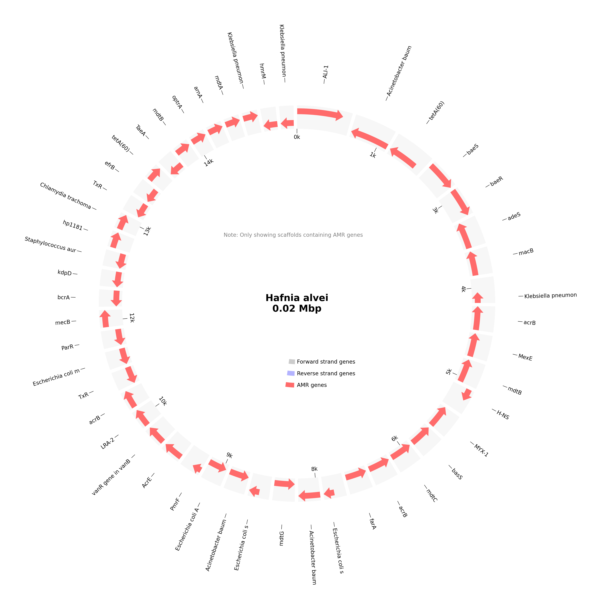

### ALI-1
- **Mechanism**: antibiotic inactivation
- **Drug Classes**: carbapenem
- **AMR Family**: ALI beta-lactamase
- **Locations**:
  - gnl|SPADES|NHGFMGEA_6597_1 : position 3-686

### Acinetobacter baumannii AbaF (found in 2 locations)
- **Mechanism**: antibiotic efflux
- **Drug Classes**: phosphonic acid antibiotic
- **AMR Family**: major facilitator superfamily (MFS) antibiotic efflux pump
- **Locations**:
  - gnl|SPADES|NHGFMGEA_23137_1 : position 1-309
  - gnl|SPADES|NHGFMGEA_9475_1 : position 3-617

### Acinetobacter baumannii AbaQ
- **Mechanism**: antibiotic efflux
- **Drug Classes**: fluoroquinolone antibiotic
- **AMR Family**: major facilitator superfamily (MFS) antibiotic efflux pump
- **Locations**:
  - gnl|SPADES|NHGFMGEA_21753_1 : position 1-324

### AcrE
- **Mechanism**: antibiotic efflux
- **Drug Classes**: fluoroquinolone antibiotic; cephalosporin; cephamycin; penam
- **AMR Family**: resistance-nodulation-cell division (RND) antibiotic efflux pump
- **Locations**:
  - gnl|SPADES|NHGFMGEA_24059_1 : position 2-298

### Chlamydia trachomatis intrinsic murA conferring resistance to fosfomycin
- **Mechanism**: antibiotic target alteration
- **Drug Classes**: phosphonic acid antibiotic
- **AMR Family**: antibiotic-resistant murA transferase
- **Locations**:
  - gnl|SPADES|NHGFMGEA_35918_1 : position 3-233

### Escherichia coli AcrAB-TolC with MarR mutations conferring resistance to ciprofloxacin and tetracycline
- **Mechanism**: antibiotic target alteration; antibiotic efflux
- **Drug Classes**: fluoroquinolone antibiotic; cephalosporin; glycylcycline; penam; tetracycline antibiotic; rifamycin antibiotic; phenicol antibiotic; disinfecting agents and antiseptics
- **AMR Family**: resistance-nodulation-cell division (RND) antibiotic efflux pump
- **Locations**:
  - gnl|SPADES|NHGFMGEA_23420_1 : position 16-306

### Escherichia coli mdfA
- **Mechanism**: antibiotic efflux
- **Drug Classes**: tetracycline antibiotic; phenicol antibiotic; disinfecting agents and antiseptics
- **AMR Family**: major facilitator superfamily (MFS) antibiotic efflux pump
- **Locations**:
  - gnl|SPADES|NHGFMGEA_30382_1 : position 1-258

### Escherichia coli soxS with mutation conferring antibiotic resistance (found in 2 locations)
- **Mechanism**: antibiotic target alteration; antibiotic efflux; reduced permeability to antibiotic
- **Drug Classes**: fluoroquinolone antibiotic; monobactam; carbapenem; cephalosporin; glycylcycline; cephamycin; penam; tetracycline antibiotic; rifamycin antibiotic; phenicol antibiotic; penem; disinfecting agents and antiseptics
- **AMR Family**: ATP-binding cassette (ABC) antibiotic efflux pump; major facilitator superfamily (MFS) antibiotic efflux pump; resistance-nodulation-cell division (RND) antibiotic efflux pump; General Bacterial Porin with reduced permeability to beta-lactams
- **Locations**:
  - gnl|SPADES|NHGFMGEA_21338_1 : position 171-329
  - gnl|SPADES|NHGFMGEA_23092_2 : position 153-308

### H-NS
- **Mechanism**: antibiotic efflux
- **Drug Classes**: macrolide antibiotic; fluoroquinolone antibiotic; cephalosporin; cephamycin; penam; tetracycline antibiotic
- **AMR Family**: major facilitator superfamily (MFS) antibiotic efflux pump; resistance-nodulation-cell division (RND) antibiotic efflux pump
- **Locations**:
  - gnl|SPADES|NHGFMGEA_18644_1 : position 2-184

### Klebsiella pneumoniae OmpK37 (found in 3 locations)
- **Mechanism**: reduced permeability to antibiotic
- **Drug Classes**: monobactam; carbapenem; cephalosporin; cephamycin; penam; penem
- **AMR Family**: General Bacterial Porin with reduced permeability to beta-lactams
- **Locations**:
  - gnl|SPADES|NHGFMGEA_17683_1 : position 214-381
  - gnl|SPADES|NHGFMGEA_38364_1 : position 2-223
  - gnl|SPADES|NHGFMGEA_41870_1 : position 1-207

### LRA-2
- **Mechanism**: antibiotic inactivation
- **Drug Classes**: cephalosporin; penam
- **AMR Family**: subclass B3 LRA beta-lactamase
- **Locations**:
  - gnl|SPADES|NHGFMGEA_27753_1 : position 2-271

### MYX-1
- **Mechanism**: antibiotic inactivation
- **Drug Classes**: carbapenem
- **AMR Family**: MYX beta-lactamase
- **Locations**:
  - gnl|SPADES|NHGFMGEA_19025_1 : position 2-358

### MexE
- **Mechanism**: antibiotic efflux
- **Drug Classes**: fluoroquinolone antibiotic; diaminopyrimidine antibiotic; phenicol antibiotic
- **AMR Family**: resistance-nodulation-cell division (RND) antibiotic efflux pump
- **Locations**:
  - gnl|SPADES|NHGFMGEA_18124_1 : position 1-372

### ParR
- **Mechanism**: antibiotic efflux; reduced permeability to antibiotic
- **Drug Classes**: macrolide antibiotic; fluoroquinolone antibiotic; monobactam; aminoglycoside antibiotic; carbapenem; cephalosporin; cephamycin; penam; tetracycline antibiotic; phenicol antibiotic; penem; disinfecting agents and antiseptics
- **AMR Family**: resistance-nodulation-cell division (RND) antibiotic efflux pump; Outer Membrane Porin (Opr)
- **Locations**:
  - gnl|SPADES|NHGFMGEA_31051_1 : position 2-256

### PmrF
- **Mechanism**: antibiotic target alteration
- **Drug Classes**: peptide antibiotic
- **AMR Family**: pmr phosphoethanolamine transferase
- **Locations**:
  - gnl|SPADES|NHGFMGEA_23950_1 : position 1-141

### Staphylococcus aureus mupB conferring resistance to mupirocin
- **Mechanism**: antibiotic target alteration
- **Drug Classes**: mupirocin-like antibiotic
- **AMR Family**: antibiotic-resistant isoleucyl-tRNA synthetase (ileS)
- **Locations**:
  - gnl|SPADES|NHGFMGEA_35162_1 : position 2-238

### TaeA
- **Mechanism**: antibiotic efflux
- **Drug Classes**: pleuromutilin antibiotic
- **AMR Family**: ATP-binding cassette (ABC) antibiotic efflux pump
- **Locations**:
  - gnl|SPADES|NHGFMGEA_36570_1 : position 2-232

### TxR (found in 2 locations)
- **Mechanism**: antibiotic efflux
- **Drug Classes**: tetracycline antibiotic
- **AMR Family**: ATP-binding cassette (ABC) antibiotic efflux pump
- **Locations**:
  - gnl|SPADES|NHGFMGEA_27835_1 : position 2-271
  - gnl|SPADES|NHGFMGEA_35902_1 : position 3-233

### acrB (found in 3 locations)
- **Mechanism**: antibiotic efflux
- **Drug Classes**: fluoroquinolone antibiotic; cephalosporin; glycylcycline; penam; tetracycline antibiotic; rifamycin antibiotic; phenicol antibiotic; disinfecting agents and antiseptics
- **AMR Family**: resistance-nodulation-cell division (RND) antibiotic efflux pump
- **Locations**:
  - gnl|SPADES|NHGFMGEA_17927_1 : position 1-375
  - gnl|SPADES|NHGFMGEA_19930_1 : position 1-348
  - gnl|SPADES|NHGFMGEA_27949_1 : position 3-272

### adeS
- **Mechanism**: antibiotic efflux
- **Drug Classes**: glycylcycline; tetracycline antibiotic
- **AMR Family**: resistance-nodulation-cell division (RND) antibiotic efflux pump
- **Locations**:
  - gnl|SPADES|NHGFMGEA_15412_1 : position 2-421

### arnA
- **Mechanism**: antibiotic target alteration
- **Drug Classes**: peptide antibiotic
- **AMR Family**: pmr phosphoethanolamine transferase
- **Locations**:
  - gnl|SPADES|NHGFMGEA_37617_1 : position 3-227

### baeR
- **Mechanism**: antibiotic efflux
- **Drug Classes**: aminoglycoside antibiotic; aminocoumarin antibiotic
- **AMR Family**: resistance-nodulation-cell division (RND) antibiotic efflux pump
- **Locations**:
  - gnl|SPADES|NHGFMGEA_15162_1 : position 1-426

### baeS
- **Mechanism**: antibiotic efflux
- **Drug Classes**: aminoglycoside antibiotic; aminocoumarin antibiotic
- **AMR Family**: resistance-nodulation-cell division (RND) antibiotic efflux pump
- **Locations**:
  - gnl|SPADES|NHGFMGEA_14628_1 : position 1-441

### basS
- **Mechanism**: antibiotic target alteration; antibiotic efflux
- **Drug Classes**: peptide antibiotic
- **AMR Family**: pmr phosphoethanolamine transferase
- **Locations**:
  - gnl|SPADES|NHGFMGEA_19407_1 : position 3-353

### bcrA
- **Mechanism**: antibiotic efflux
- **Drug Classes**: peptide antibiotic
- **AMR Family**: ATP-binding cassette (ABC) antibiotic efflux pump
- **Locations**:
  - gnl|SPADES|NHGFMGEA_32362_1 : position 1-249

### efrB
- **Mechanism**: antibiotic efflux
- **Drug Classes**: macrolide antibiotic; fluoroquinolone antibiotic; rifamycin antibiotic
- **AMR Family**: ATP-binding cassette (ABC) antibiotic efflux pump
- **Locations**:
  - gnl|SPADES|NHGFMGEA_36141_1 : position 3-224

### farA
- **Mechanism**: antibiotic efflux
- **Drug Classes**: antibacterial free fatty acids
- **AMR Family**: major facilitator superfamily (MFS) antibiotic efflux pump
- **Locations**:
  - gnl|SPADES|NHGFMGEA_20519_1 : position 3-338

### hmrM
- **Mechanism**: antibiotic efflux
- **Drug Classes**: fluoroquinolone antibiotic; disinfecting agents and antiseptics
- **AMR Family**: multidrug and toxic compound extrusion (MATE) transporter
- **Locations**:
  - gnl|SPADES|NHGFMGEA_38865_1 : position 1-222

### hp1181
- **Mechanism**: antibiotic efflux
- **Drug Classes**: fluoroquinolone antibiotic; tetracycline antibiotic; nitroimidazole antibiotic
- **AMR Family**: major facilitator superfamily (MFS) antibiotic efflux pump
- **Locations**:
  - gnl|SPADES|NHGFMGEA_35528_1 : position 1-237

### kdpD
- **Mechanism**: antibiotic efflux
- **Drug Classes**: aminoglycoside antibiotic
- **AMR Family**: kdpDE
- **Locations**:
  - gnl|SPADES|NHGFMGEA_33784_1 : position 1-243

### macB
- **Mechanism**: antibiotic efflux
- **Drug Classes**: macrolide antibiotic
- **AMR Family**: ATP-binding cassette (ABC) antibiotic efflux pump
- **Locations**:
  - gnl|SPADES|NHGFMGEA_17183_1 : position 1-387

### mdtA
- **Mechanism**: antibiotic efflux
- **Drug Classes**: aminocoumarin antibiotic
- **AMR Family**: resistance-nodulation-cell division (RND) antibiotic efflux pump
- **Locations**:
  - gnl|SPADES|NHGFMGEA_38322_1 : position 2-223

### mdtB (found in 2 locations)
- **Mechanism**: antibiotic efflux
- **Drug Classes**: aminocoumarin antibiotic
- **AMR Family**: resistance-nodulation-cell division (RND) antibiotic efflux pump
- **Locations**:
  - gnl|SPADES|NHGFMGEA_18234_1 : position 2-370
  - gnl|SPADES|NHGFMGEA_37017_1 : position 1-228

### mdtC
- **Mechanism**: antibiotic efflux
- **Drug Classes**: aminocoumarin antibiotic
- **AMR Family**: resistance-nodulation-cell division (RND) antibiotic efflux pump
- **Locations**:
  - gnl|SPADES|NHGFMGEA_19711_1 : position 2-349

### mdtG
- **Mechanism**: antibiotic efflux
- **Drug Classes**: phosphonic acid antibiotic
- **AMR Family**: major facilitator superfamily (MFS) antibiotic efflux pump
- **Locations**:
  - gnl|SPADES|NHGFMGEA_21869_1 : position 2-322

### mecB
- **Mechanism**: antibiotic target replacement
- **Drug Classes**: penam
- **AMR Family**: methicillin resistant PBP2
- **Locations**:
  - gnl|SPADES|NHGFMGEA_31462_1 : position 1-255

### optrA
- **Mechanism**: antibiotic target protection
- **Drug Classes**: oxazolidinone antibiotic; phenicol antibiotic
- **AMR Family**: Miscellaneous ABC-F subfamily ATP-binding cassette ribosomal protection proteins
- **Locations**:
  - gnl|SPADES|NHGFMGEA_37239_1 : position 1-228

### tetA(60) (found in 2 locations)
- **Mechanism**: antibiotic efflux
- **Drug Classes**: tetracycline antibiotic
- **AMR Family**: ATP-binding cassette (ABC) antibiotic efflux pump
- **Locations**:
  - gnl|SPADES|NHGFMGEA_36645_1 : position 1-231
  - gnl|SPADES|NHGFMGEA_9828_1 : position 3-479

### vanR gene in vanB cluster
- **Mechanism**: antibiotic target alteration
- **Drug Classes**: glycopeptide antibiotic
- **AMR Family**: glycopeptide resistance gene cluster; vanR
- **Locations**:
  - gnl|SPADES|NHGFMGEA_25541_1 : position 1-285

## Hafnia alvei FB1
**Strain Statistics:**
- Total genome length: 0.9 kbp
- Total scaffolds: 69
- Scaffolds with AMR genes: 2
- Total genes annotated: 0
- Total AMR genes: 2
- Unique AMR genes: 2
- Distinct AMR mechanisms: 1
- Distinct AMR families: 1
- Distinct drug classes: 1

**Circos Plot:**

### vanH gene in vanO cluster
- **Mechanism**: antibiotic target alteration
- **Drug Classes**: glycopeptide antibiotic
- **AMR Family**: vanH; glycopeptide resistance gene cluster
- **Locations**:
  - gnl|SPADES|NHGFMGEA_13069_1 : position 2-481

### vanH gene in vanP cluster
- **Mechanism**: antibiotic target alteration
- **Drug Classes**: glycopeptide antibiotic
- **AMR Family**: vanH; glycopeptide resistance gene cluster
- **Locations**:
  - gnl|SPADES|NHGFMGEA_16331_1 : position 3-404

## Hafnia paralvei
**Strain Statistics:**
- Total genome length: 4499.4 kbp
- Total scaffolds: 124
- Scaffolds with AMR genes: 47
- Total genes annotated: 8223
- Total AMR genes: 433
- Unique AMR genes: 212
- Distinct AMR mechanisms: 11
- Distinct AMR families: 73
- Distinct drug classes: 37

**Circos Plot:**

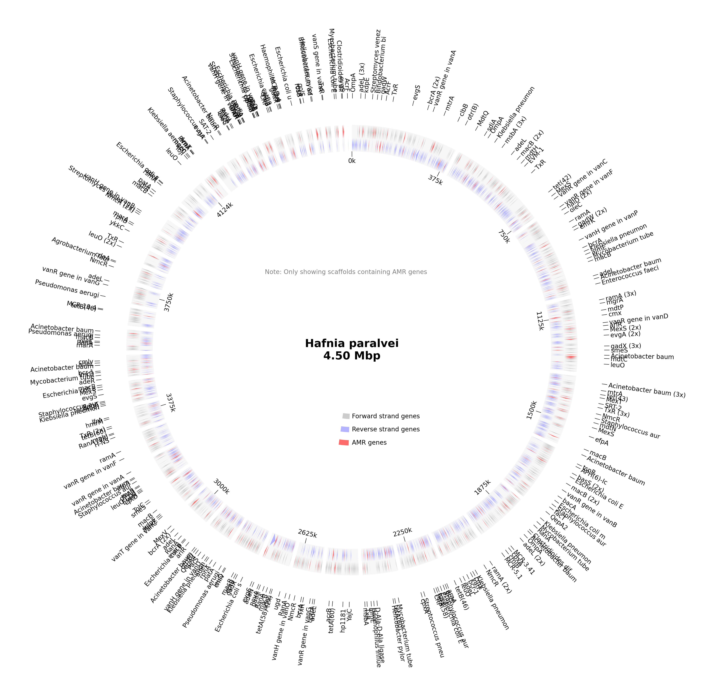

### AAC(6')-32
- **Mechanism**: antibiotic inactivation
- **Drug Classes**: aminoglycoside antibiotic
- **AMR Family**: AAC(6')
- **Locations**:
  - gnl|SPADES|NHGFMGEA_6_150 : position 160967-161569

### AAC(6')-Iu
- **Mechanism**: antibiotic inactivation
- **Drug Classes**: aminoglycoside antibiotic
- **AMR Family**: AAC(6')
- **Locations**:
  - gnl|SPADES|NHGFMGEA_9_77 : position 80680-81138

### ACC-1a
- **Mechanism**: antibiotic inactivation
- **Drug Classes**: monobactam; cephalosporin; cephamycin; penam; oxacephem
- **AMR Family**: ACC beta-lactamase
- **Locations**:
  - gnl|SPADES|NHGFMGEA_38_79: position 96933-98105

### ALI-2
- **Mechanism**: antibiotic inactivation
- **Drug Classes**: carbapenem
- **AMR Family**: ALI beta-lactamase
- **Locations**:
  - gnl|SPADES|NHGFMGEA_67_56 : position 57358-58236

### APH(6)-Ic
- **Mechanism**: antibiotic inactivation
- **Drug Classes**: aminoglycoside antibiotic
- **AMR Family**: APH(6)
- **Locations**:
  - gnl|SPADES|NHGFMGEA_6_29 : position 27412-28215

### Acinetobacter baumannii AbaF (found in 6 locations)
- **Mechanism**: antibiotic efflux
- **Drug Classes**: phosphonic acid antibiotic
- **AMR Family**: major facilitator superfamily (MFS) antibiotic efflux pump
- **Locations**:
  - gnl|SPADES|NHGFMGEA_179_28 : position 32056-33285
  - gnl|SPADES|NHGFMGEA_3_265 : position 265982-267484
  - gnl|SPADES|NHGFMGEA_49_55 : position 62879-64213
  - gnl|SPADES|NHGFMGEA_4_192 : position 206290-207615
  - gnl|SPADES|NHGFMGEA_5_224 : position 257513-258814
  - gnl|SPADES|NHGFMGEA_67_48 : position 48342-49883

### Acinetobacter baumannii AbaQ (found in 7 locations)
- **Mechanism**: antibiotic efflux
- **Drug Classes**: fluoroquinolone antibiotic
- **AMR Family**: major facilitator superfamily (MFS) antibiotic efflux pump
- **Locations**:
  - gnl|SPADES|NHGFMGEA_44_75 : position 84725-86053
  - gnl|SPADES|NHGFMGEA_4_47 : position 44459-45835
  - gnl|SPADES|NHGFMGEA_5_16 : position 16109-17446
  - gnl|SPADES|NHGFMGEA_5_177 : position 194446-195792
  - gnl|SPADES|NHGFMGEA_5_98 : position 110713-111936
  - gnl|SPADES|NHGFMGEA_70_55 : position 64609-65904
  - gnl|SPADES|NHGFMGEA_9_57 : position 60645-61937

### AcrE
- **Mechanism**: antibiotic efflux
- **Drug Classes**: fluoroquinolone antibiotic; cephalosporin; cephamycin; penam
- **AMR Family**: resistance-nodulation-cell division (RND) antibiotic efflux pump
- **Locations**:
  - gnl|SPADES|NHGFMGEA_1_101 : position 113559-114722

### AcrF (found in 2 locations)
- **Mechanism**: antibiotic efflux
- **Drug Classes**: fluoroquinolone antibiotic; cephalosporin; cephamycin; penam
- **AMR Family**: resistance-nodulation-cell division (RND) antibiotic efflux pump
- **Locations**:
  - gnl|SPADES|NHGFMGEA_1_100 : position 110398-113520
  - gnl|SPADES|NHGFMGEA_25670_1 : position 2-286

### Agrobacterium fabrum chloramphenicol acetyltransferase
- **Mechanism**: antibiotic inactivation
- **Drug Classes**: phenicol antibiotic
- **AMR Family**: chloramphenicol acetyltransferase (CAT)
- **Locations**:
  - gnl|SPADES|NHGFMGEA_111_39 : position 41238-41792

### ArnT
- **Mechanism**: antibiotic target alteration
- **Drug Classes**: peptide antibiotic
- **AMR Family**: pmr phosphoethanolamine transferase
- **Locations**:
  - gnl|SPADES|NHGFMGEA_177_29: position 30545-32194

### Bifidobacterium adolescentis rpoB mutants conferring resistance to rifampicin
- **Mechanism**: antibiotic target alteration; antibiotic target replacement
- **Drug Classes**: rifamycin antibiotic
- **AMR Family**: rifamycin-resistant beta-subunit of RNA polymerase (rpoB)
- **Locations**:
  - gnl|SPADES|NHGFMGEA_295_1 : position 3-2018

### Bifidobacterium bifidum ileS conferring resistance to mupirocin
- **Mechanism**: antibiotic target alteration
- **Drug Classes**: mupirocin-like antibiotic
- **AMR Family**: antibiotic-resistant isoleucyl-tRNA synthetase (ileS)
- **Locations**:
  - gnl|SPADES|NHGFMGEA_1_71 : position 81522-84104

### CRP (found in 2 locations)
- **Mechanism**: antibiotic efflux
- **Drug Classes**: macrolide antibiotic; fluoroquinolone antibiotic; penam
- **AMR Family**: resistance-nodulation-cell division (RND) antibiotic efflux pump
- **Locations**:
  - gnl|SPADES|NHGFMGEA_238_14 : position 13537-14334
  - gnl|SPADES|NHGFMGEA_23_73: position 50494-51126

### Clostridioides difficile gyrA conferring resistance to fluoroquinolones
- **Mechanism**: antibiotic target alteration
- **Drug Classes**: fluoroquinolone antibiotic
- **AMR Family**: fluoroquinolone resistant gyrA
- **Locations**:
  - gnl|SPADES|NHGFMGEA_522_2 : position 1181-3829

### Clostridioides difficile gyrB conferring resistance to fluoroquinolones (found in 2 locations)
- **Mechanism**: antibiotic target alteration
- **Drug Classes**: fluoroquinolone antibiotic
- **AMR Family**: fluoroquinolone resistant gyrB
- **Locations**:
  - gnl|SPADES|NHGFMGEA_48_67 : position 77744-79639
  - gnl|SPADES|NHGFMGEA_9_49 : position 52632-55046

### D-Ala-D-Ala ligase
- **Mechanism**: antibiotic target alteration
- **Drug Classes**: glycopeptide antibiotic
- **AMR Family**: Van ligase
- **Locations**:
  - gnl|SPADES|NHGFMGEA_25_69 : position 87479-88399

### EVM-1
- **Mechanism**: antibiotic inactivation
- **Drug Classes**: carbapenem
- **AMR Family**: EVM beta-lactamase
- **Locations**:
  - gnl|SPADES|NHGFMGEA_2_175 : position 211667-212488

### Enterobacter cloacae acrA
- **Mechanism**: antibiotic efflux
- **Drug Classes**: fluoroquinolone antibiotic; cephalosporin; glycylcycline; penam; tetracycline antibiotic; rifamycin antibiotic; phenicol antibiotic; disinfecting agents and antiseptics
- **AMR Family**: resistance-nodulation-cell division (RND) antibiotic efflux pump
- **Locations**:
  - gnl|SPADES|NHGFMGEA_26_107 : position 100519-101709

### Enterococcus faecium cls conferring resistance to daptomycin
- **Mechanism**: antibiotic target alteration
- **Drug Classes**: peptide antibiotic
- **AMR Family**: daptomycin resistant cls
- **Locations**:
  - gnl|SPADES|NHGFMGEA_3_285 : position 283561-285021

### ErmX
- **Mechanism**: antibiotic target alteration
- **Drug Classes**: macrolide antibiotic; lincosamide antibiotic; streptogramin antibiotic; streptogramin A antibiotic; streptogramin B antibiotic
- **AMR Family**: Erm 23S ribosomal RNA methyltransferase
- **Locations**:
  - gnl|SPADES|NHGFMGEA_49_13 : position 15121-15933

### Escherichia coli AcrAB-TolC with AcrR mutation conferring resistance to ciprofloxacin, tetracycline, and ceftazidime
- **Mechanism**: antibiotic target alteration; antibiotic efflux
- **Drug Classes**: fluoroquinolone antibiotic; cephalosporin; glycylcycline; penam; tetracycline antibiotic; rifamycin antibiotic; phenicol antibiotic; disinfecting agents and antiseptics
- **AMR Family**: resistance-nodulation-cell division (RND) antibiotic efflux pump
- **Locations**:
  - gnl|SPADES|NHGFMGEA_26_108 : position 101849-102553

### Escherichia coli AcrAB-TolC with MarR mutations conferring resistance to ciprofloxacin and tetracycline (found in 2 locations)
- **Mechanism**: antibiotic target alteration; antibiotic efflux
- **Drug Classes**: fluoroquinolone antibiotic; cephalosporin; glycylcycline; penam; tetracycline antibiotic; rifamycin antibiotic; phenicol antibiotic; disinfecting agents and antiseptics
- **AMR Family**: resistance-nodulation-cell division (RND) antibiotic efflux pump
- **Locations**:
  - gnl|SPADES|NHGFMGEA_19_109 : position 117024-117455
  - gnl|SPADES|NHGFMGEA_238_23 : position 23478-23969

### Escherichia coli EF-Tu mutants conferring resistance to Enacyloxin IIa
- **Mechanism**: antibiotic target alteration
- **Drug Classes**: elfamycin antibiotic
- **AMR Family**: elfamycin resistant EF-Tu
- **Locations**:
  - gnl|SPADES|NHGFMGEA_6_64 : position 64721-67423

### Escherichia coli EF-Tu mutants conferring resistance to Pulvomycin (found in 2 locations)
- **Mechanism**: antibiotic target alteration
- **Drug Classes**: elfamycin antibiotic
- **AMR Family**: elfamycin resistant EF-Tu
- **Locations**:
  - gnl|SPADES|NHGFMGEA_23_48 : position 27828-29012
  - gnl|SPADES|NHGFMGEA_369_7 : position 6063-7247

### Escherichia coli PtsI with mutation conferring resistance to fosfomycin
- **Mechanism**: antibiotic target alteration
- **Drug Classes**: phosphonic acid antibiotic
- **AMR Family**: antibiotic-resistant ptsI phosphotransferase
- **Locations**:
  - gnl|SPADES|NHGFMGEA_46_13 : position 14736-16463

### Escherichia coli acrA
- **Mechanism**: antibiotic efflux
- **Drug Classes**: fluoroquinolone antibiotic; cephalosporin; glycylcycline; penam; tetracycline antibiotic; rifamycin antibiotic; phenicol antibiotic; disinfecting agents and antiseptics
- **AMR Family**: resistance-nodulation-cell division (RND) antibiotic efflux pump
- **Locations**:
  - gnl|SPADES|NHGFMGEA_137_7 : position 9200-10387

### Escherichia coli mdfA (found in 3 locations)
- **Mechanism**: antibiotic efflux
- **Drug Classes**: tetracycline antibiotic; phenicol antibiotic; disinfecting agents and antiseptics
- **AMR Family**: major facilitator superfamily (MFS) antibiotic efflux pump
- **Locations**:
  - gnl|SPADES|NHGFMGEA_216_13 : position 16114-17346
  - gnl|SPADES|NHGFMGEA_218_10 : position 13117-14349
  - gnl|SPADES|NHGFMGEA_6_148 : position 157683-158903

### Escherichia coli soxS with mutation conferring antibiotic resistance (found in 4 locations)
- **Mechanism**: antibiotic target alteration; antibiotic efflux; reduced permeability to antibiotic
- **Drug Classes**: fluoroquinolone antibiotic; monobactam; carbapenem; cephalosporin; glycylcycline; cephamycin; penam; tetracycline antibiotic; rifamycin antibiotic; phenicol antibiotic; penem; disinfecting agents and antiseptics
- **AMR Family**: ATP-binding cassette (ABC) antibiotic efflux pump; major facilitator superfamily (MFS) antibiotic efflux pump; resistance-nodulation-cell division (RND) antibiotic efflux pump; General Bacterial Porin with reduced permeability to beta-lactams
- **Locations**:
  - gnl|SPADES|NHGFMGEA_1_93 : position 103090-103911
  - gnl|SPADES|NHGFMGEA_38_13 : position 16511-17374
  - gnl|SPADES|NHGFMGEA_3_260 : position 262228-262599
  - gnl|SPADES|NHGFMGEA_66_72 : position 73526-74404

### Escherichia coli uhpA with mutation conferring resistance to fosfomycin
- **Mechanism**: antibiotic target alteration
- **Drug Classes**: phosphonic acid antibiotic
- **AMR Family**: antibiotic-resistant UhpT
- **Locations**:
  - gnl|SPADES|NHGFMGEA_265_9 : position 10199-10915

### FosC2
- **Mechanism**: antibiotic inactivation
- **Drug Classes**: phosphonic acid antibiotic
- **AMR Family**: fosC phosphotransferase family
- **Locations**:
  - gnl|SPADES|NHGFMGEA_2_315 : position 347617-348081

### H-NS
- **Mechanism**: antibiotic efflux
- **Drug Classes**: macrolide antibiotic; fluoroquinolone antibiotic; cephalosporin; cephamycin; penam; tetracycline antibiotic
- **AMR Family**: major facilitator superfamily (MFS) antibiotic efflux pump; resistance-nodulation-cell division (RND) antibiotic efflux pump
- **Locations**:
  - gnl|SPADES|NHGFMGEA_65_1 : position 295-702

### Haemophilus influenzae PBP3 conferring resistance to beta-lactam antibiotics (found in 2 locations)
- **Mechanism**: antibiotic target alteration
- **Drug Classes**: cephalosporin; cephamycin; penam
- **AMR Family**: Penicillin-binding protein mutations conferring resistance to beta-lactam antibiotics
- **Locations**:
  - gnl|SPADES|NHGFMGEA_248_14 : position 14743-16515
  - gnl|SPADES|NHGFMGEA_25_77 : position 97540-99303

### Helicobacter pylori pbp1 mutants conferring resistance to amoxicillin (found in 2 locations)
- **Mechanism**: antibiotic target alteration
- **Drug Classes**: cephalosporin; cephamycin; penam
- **AMR Family**: Penicillin-binding protein mutations conferring resistance to beta-lactam antibiotics
- **Locations**:
  - gnl|SPADES|NHGFMGEA_1_329 : position 357973-360246
  - gnl|SPADES|NHGFMGEA_25_25 : position 33933-36512

### Helicobacter pylori pbp2 mutants conferring resistance to amoxicillin
- **Mechanism**: antibiotic target alteration
- **Drug Classes**: cephalosporin; cephamycin; penam
- **AMR Family**: Penicillin-binding protein mutations conferring resistance to beta-lactam antibiotics
- **Locations**:
  - gnl|SPADES|NHGFMGEA_1_77 : position 87593-89488

### Helicobacter pylori rpoB mutation conferring resistance to rifampicin
- **Mechanism**: antibiotic target alteration; antibiotic target replacement
- **Drug Classes**: fluoroquinolone antibiotic; rifamycin antibiotic
- **AMR Family**: rifamycin-resistant beta-subunit of RNA polymerase (rpoB)
- **Locations**:
  - gnl|SPADES|NHGFMGEA_295_2 : position 2161-6381

### Klebsiella aerogenes Omp36
- **Mechanism**: reduced permeability to antibiotic
- **Drug Classes**: monobactam; carbapenem; cephalosporin; cephamycin; penam; penem
- **AMR Family**: General Bacterial Porin with reduced permeability to beta-lactams
- **Locations**:
  - gnl|SPADES|NHGFMGEA_177_14 : position 13542-14690

### Klebsiella pneumoniae KpnE
- **Mechanism**: antibiotic efflux
- **Drug Classes**: macrolide antibiotic; aminoglycoside antibiotic; cephalosporin; tetracycline antibiotic; peptide antibiotic; rifamycin antibiotic; disinfecting agents and antiseptics
- **AMR Family**: small multidrug resistance (SMR) antibiotic efflux pump
- **Locations**:
  - gnl|SPADES|NHGFMGEA_3_169 : position 170663-171094

### Klebsiella pneumoniae KpnF
- **Mechanism**: antibiotic efflux
- **Drug Classes**: macrolide antibiotic; aminoglycoside antibiotic; cephalosporin; tetracycline antibiotic; peptide antibiotic; rifamycin antibiotic; disinfecting agents and antiseptics
- **AMR Family**: small multidrug resistance (SMR) antibiotic efflux pump
- **Locations**:
  - gnl|SPADES|NHGFMGEA_3_170: position 171081-171410

### Klebsiella pneumoniae KpnG
- **Mechanism**: antibiotic efflux
- **Drug Classes**: macrolide antibiotic; fluoroquinolone antibiotic; aminoglycoside antibiotic; carbapenem; cephalosporin; penam; peptide antibiotic; penem
- **AMR Family**: major facilitator superfamily (MFS) antibiotic efflux pump
- **Locations**:
  - gnl|SPADES|NHGFMGEA_1_293 : position 312810-313985

### Klebsiella pneumoniae KpnH (found in 2 locations)
- **Mechanism**: antibiotic efflux
- **Drug Classes**: macrolide antibiotic; fluoroquinolone antibiotic; aminoglycoside antibiotic; carbapenem; cephalosporin; penam; peptide antibiotic; penem
- **AMR Family**: major facilitator superfamily (MFS) antibiotic efflux pump
- **Locations**:
  - gnl|SPADES|NHGFMGEA_1_294: position 314003-315538
  - gnl|SPADES|NHGFMGEA_9_2 : position 1107-2546

### Klebsiella pneumoniae OmpK37 (found in 6 locations)
- **Mechanism**: reduced permeability to antibiotic
- **Drug Classes**: monobactam; carbapenem; cephalosporin; cephamycin; penam; penem
- **AMR Family**: General Bacterial Porin with reduced permeability to beta-lactams
- **Locations**:
  - gnl|SPADES|NHGFMGEA_19_60 : position 67896-69008
  - gnl|SPADES|NHGFMGEA_25_24 : position 32612-33751
  - gnl|SPADES|NHGFMGEA_2_71 : position 86373-87488
  - gnl|SPADES|NHGFMGEA_44_32 : position 33853-34995
  - gnl|SPADES|NHGFMGEA_66_15 : position 12065-13165
  - gnl|SPADES|NHGFMGEA_67_25 : position 26357-27460

### Klebsiella pneumoniae acrR with mutation conferring multidrug antibiotic resistance
- **Mechanism**: antibiotic target alteration; antibiotic efflux
- **Drug Classes**: fluoroquinolone antibiotic; cephalosporin; glycylcycline; penam; tetracycline antibiotic; rifamycin antibiotic; phenicol antibiotic; disinfecting agents and antiseptics
- **AMR Family**: resistance-nodulation-cell division (RND) antibiotic efflux pump
- **Locations**:
  - gnl|SPADES|NHGFMGEA_1_102 : position 115315-115929

### LRA-19
- **Mechanism**: antibiotic inactivation
- **Drug Classes**: cephalosporin; penam
- **AMR Family**: subclass B3 LRA beta-lactamase
- **Locations**:
  - gnl|SPADES|NHGFMGEA_2_73 : position 89049-89696

### LlmA 23S ribosomal RNA methyltransferase
- **Mechanism**: antibiotic target alteration
- **Drug Classes**: lincosamide antibiotic
- **AMR Family**: Llm 23S ribosomal RNA methyltransferase
- **Locations**:
  - gnl|SPADES|NHGFMGEA_2_42 : position 50259-51452

### LptD
- **Mechanism**: antibiotic efflux
- **Drug Classes**: carbapenem; peptide antibiotic; aminocoumarin antibiotic; rifamycin antibiotic
- **AMR Family**: ATP-binding cassette (ABC) antibiotic efflux pump
- **Locations**:
  - gnl|SPADES|NHGFMGEA_49_10 : position 10322-12724

### MCR-10.4
- **Mechanism**: antibiotic target alteration
- **Drug Classes**: peptide antibiotic
- **AMR Family**: MCR phosphoethanolamine transferase
- **Locations**:
  - gnl|SPADES|NHGFMGEA_86_43 : position 44510-46144

### MCR-3.4
- **Mechanism**: antibiotic target alteration
- **Drug Classes**: peptide antibiotic
- **AMR Family**: MCR phosphoethanolamine transferase
- **Locations**:
  - gnl|SPADES|NHGFMGEA_248_13 : position 12771-14378

### MCR-3.41
- **Mechanism**: antibiotic target alteration
- **Drug Classes**: peptide antibiotic
- **AMR Family**: MCR phosphoethanolamine transferase
- **Locations**:
  - gnl|SPADES|NHGFMGEA_9_131 : position 134232-135854

### MCR-5.1
- **Mechanism**: antibiotic target alteration
- **Drug Classes**: peptide antibiotic
- **AMR Family**: MCR phosphoethanolamine transferase
- **Locations**:
  - gnl|SPADES|NHGFMGEA_9_167 : position 171739-173466

### MdtK
- **Mechanism**: antibiotic efflux
- **Drug Classes**: fluoroquinolone antibiotic
- **AMR Family**: multidrug and toxic compound extrusion (MATE) transporter
- **Locations**:
  - gnl|SPADES|NHGFMGEA_1_109 : position 122100-123557

### MdtQ
- **Mechanism**: reduced permeability to antibiotic
- **Drug Classes**: monobactam; carbapenem; cephalosporin; cephamycin; penam; penem
- **AMR Family**: Outer Membrane Porin (Opr)
- **Locations**:
  - gnl|SPADES|NHGFMGEA_2_14 : position 12521-14026

### MexG
- **Mechanism**: antibiotic efflux
- **Drug Classes**: fluoroquinolone antibiotic; tetracycline antibiotic; disinfecting agents and antiseptics
- **AMR Family**: resistance-nodulation-cell division (RND) antibiotic efflux pump
- **Locations**:
  - gnl|SPADES|NHGFMGEA_3_270 : position 270154-270570

### MexS (found in 6 locations)
- **Mechanism**: antibiotic efflux
- **Drug Classes**: fluoroquinolone antibiotic; diaminopyrimidine antibiotic; phenicol antibiotic
- **AMR Family**: resistance-nodulation-cell division (RND) antibiotic efflux pump
- **Locations**:
  - gnl|SPADES|NHGFMGEA_2_311 : position 343065-344189
  - gnl|SPADES|NHGFMGEA_48_15 : position 16397-17383
  - gnl|SPADES|NHGFMGEA_4_124 : position 123358-124389
  - gnl|SPADES|NHGFMGEA_4_207 : position 228056-229075
  - gnl|SPADES|NHGFMGEA_5_138 : position 162745-163722
  - gnl|SPADES|NHGFMGEA_66_64 : position 65079-66080

### MexT
- **Mechanism**: antibiotic efflux
- **Drug Classes**: fluoroquinolone antibiotic; diaminopyrimidine antibiotic; phenicol antibiotic
- **AMR Family**: resistance-nodulation-cell division (RND) antibiotic efflux pump
- **Locations**:
  - gnl|SPADES|NHGFMGEA_5_58 : position 62196-63089

### MexV
- **Mechanism**: antibiotic efflux
- **Drug Classes**: macrolide antibiotic; fluoroquinolone antibiotic; tetracycline antibiotic; phenicol antibiotic; disinfecting agents and antiseptics
- **AMR Family**: resistance-nodulation-cell division (RND) antibiotic efflux pump
- **Locations**:
  - gnl|SPADES|NHGFMGEA_46_74 : position 80177-81694

### MexZ
- **Mechanism**: antibiotic efflux
- **Drug Classes**: macrolide antibiotic; fluoroquinolone antibiotic; aminoglycoside antibiotic; carbapenem; cephalosporin; cephamycin; penam; tetracycline antibiotic; phenicol antibiotic; disinfecting agents and antiseptics
- **AMR Family**: resistance-nodulation-cell division (RND) antibiotic efflux pump
- **Locations**:
  - gnl|SPADES|NHGFMGEA_48_19 : position 19693-20298

### Mycobacterium tuberculosis gidB mutation conferring resistance to streptomycin
- **Mechanism**: antibiotic target alteration
- **Drug Classes**: aminoglycoside antibiotic
- **AMR Family**: antibiotic resistant gidB
- **Locations**:
  - gnl|SPADES|NHGFMGEA_9_16 : position 18287-18907

### Mycobacterium tuberculosis ndh with mutation conferring resistance to isoniazid
- **Mechanism**: antibiotic target alteration
- **Drug Classes**: isoniazid-like antibiotic
- **AMR Family**: antibiotic resistant ndh
- **Locations**:
  - gnl|SPADES|NHGFMGEA_3_195 : position 195491-196795

### Mycobacterium tuberculosis pncA mutations conferring resistance to pyrazinamide
- **Mechanism**: antibiotic target alteration
- **Drug Classes**: pyrazine antibiotic
- **AMR Family**: Pyrazinamide resistant pncA
- **Locations**:
  - gnl|SPADES|NHGFMGEA_67_16 : position 15830-16465

### Mycobacterium tuberculosis rpoB mutations conferring resistance to rifampicin
- **Mechanism**: antibiotic target alteration; antibiotic target replacement
- **Drug Classes**: rifamycin antibiotic
- **AMR Family**: rifamycin-resistant beta-subunit of RNA polymerase (rpoB)
- **Locations**:
  - gnl|SPADES|NHGFMGEA_369_14 : position 11366-13429

### Mycobacterium tuberculosis rpsA mutations conferring resistance to pyrazinamide
- **Mechanism**: antibiotic target alteration
- **Drug Classes**: pyrazine antibiotic
- **AMR Family**: pyrazinamide resistant rpsA
- **Locations**:
  - gnl|SPADES|NHGFMGEA_2_98 : position 120271-121950

### Mycobacterium tuberculosis thyA with mutation conferring resistance to para-aminosalicylic acid
- **Mechanism**: antibiotic target alteration
- **Drug Classes**: salicylic acid antibiotic
- **AMR Family**: aminosalicylate resistant thymidylate synthase
- **Locations**:
  - gnl|SPADES|NHGFMGEA_25_11 : position 17233-18027

### NmcR (found in 8 locations)
- **Mechanism**: antibiotic inactivation
- **Drug Classes**: carbapenem; cephalosporin; cephamycin; penam
- **AMR Family**: NmcA beta-lactamase
- **Locations**:
  - gnl|SPADES|NHGFMGEA_111_25 : position 24308-25267
  - gnl|SPADES|NHGFMGEA_128_20 : position 23163-24056
  - gnl|SPADES|NHGFMGEA_128_8 : position 8157-9029
  - gnl|SPADES|NHGFMGEA_179_31 : position 35658-36485
  - gnl|SPADES|NHGFMGEA_19_26 : position 34786-35760
  - gnl|SPADES|NHGFMGEA_33_57 : position 73634-74530
  - gnl|SPADES|NHGFMGEA_44_60 : position 71789-72694
  - gnl|SPADES|NHGFMGEA_5_102 : position 115803-116732

### OmpA (found in 4 locations)
- **Mechanism**: reduced permeability to antibiotic
- **Drug Classes**: peptide antibiotic
- **AMR Family**: General Bacterial Porin with reduced permeability to peptide antibiotics
- **Locations**:
  - gnl|SPADES|NHGFMGEA_1_2 : position 1312-1827
  - gnl|SPADES|NHGFMGEA_2_52 : position 60511-61569
  - gnl|SPADES|NHGFMGEA_3_264 : position 264918-265409
  - gnl|SPADES|NHGFMGEA_9_73 : position 77630-78289

### OprM
- **Mechanism**: antibiotic efflux
- **Drug Classes**: macrolide antibiotic; fluoroquinolone antibiotic; monobactam; aminoglycoside antibiotic; carbapenem; cephalosporin; cephamycin; penam; tetracycline antibiotic; peptide antibiotic; aminocoumarin antibiotic; diaminopyrimidine antibiotic; sulfonamide antibiotic; phenicol antibiotic; penem; disinfecting agents and antiseptics
- **AMR Family**: resistance-nodulation-cell division (RND) antibiotic efflux pump
- **Locations**:
  - gnl|SPADES|NHGFMGEA_35_68 : position 79631-80992

### ParR (found in 2 locations)
- **Mechanism**: antibiotic efflux; reduced permeability to antibiotic
- **Drug Classes**: macrolide antibiotic; fluoroquinolone antibiotic; monobactam; aminoglycoside antibiotic; carbapenem; cephalosporin; cephamycin; penam; tetracycline antibiotic; phenicol antibiotic; penem; disinfecting agents and antiseptics
- **AMR Family**: resistance-nodulation-cell division (RND) antibiotic efflux pump; Outer Membrane Porin (Opr)
- **Locations**:
  - gnl|SPADES|NHGFMGEA_23_112 : position 95413-96132
  - gnl|SPADES|NHGFMGEA_44_52 : position 61394-62107

### ParS (found in 2 locations)
- **Mechanism**: antibiotic efflux; reduced permeability to antibiotic
- **Drug Classes**: macrolide antibiotic; fluoroquinolone antibiotic; monobactam; aminoglycoside antibiotic; carbapenem; cephalosporin; cephamycin; penam; tetracycline antibiotic; phenicol antibiotic; penem; disinfecting agents and antiseptics
- **AMR Family**: resistance-nodulation-cell division (RND) antibiotic efflux pump; Outer Membrane Porin (Opr)
- **Locations**:
  - gnl|SPADES|NHGFMGEA_44_51 : position 60059-61387
  - gnl|SPADES|NHGFMGEA_48_27 : position 25320-26981

### Planobispora rosea EF-Tu mutants conferring resistance to inhibitor GE2270A
- **Mechanism**: antibiotic target alteration
- **Drug Classes**: elfamycin antibiotic
- **AMR Family**: elfamycin resistant EF-Tu
- **Locations**:
  - gnl|SPADES|NHGFMGEA_5_118 : position 136527-138395

### PmrF
- **Mechanism**: antibiotic target alteration
- **Drug Classes**: peptide antibiotic
- **AMR Family**: pmr phosphoethanolamine transferase
- **Locations**:
  - gnl|SPADES|NHGFMGEA_177_26 : position 26633-27649

### Pseudomonas aeruginosa CpxR
- **Mechanism**: antibiotic efflux
- **Drug Classes**: macrolide antibiotic; fluoroquinolone antibiotic; monobactam; aminoglycoside antibiotic; carbapenem; cephalosporin; cephamycin; penam; tetracycline antibiotic; peptide antibiotic; aminocoumarin antibiotic; diaminopyrimidine antibiotic; sulfonamide antibiotic; phenicol antibiotic; penem
- **AMR Family**: resistance-nodulation-cell division (RND) antibiotic efflux pump
- **Locations**:
  - gnl|SPADES|NHGFMGEA_9_142 : position 145443-146141

### Pseudomonas aeruginosa ampR with mutation conferring resistance to aztreonam (found in 3 locations)
- **Mechanism**: antibiotic target alteration; antibiotic inactivation
- **Drug Classes**: monobactam; carbapenem; cephalosporin
- **AMR Family**: PDC beta-lactamase; ampR transcriptional regulator with mutation conferring resistance to monobactam antibiotics
- **Locations**:
  - gnl|SPADES|NHGFMGEA_38_78 : position 95852-96718
  - gnl|SPADES|NHGFMGEA_70_43 : position 51652-52599
  - gnl|SPADES|NHGFMGEA_88_6 : position 4757-5674

### QepA2
- **Mechanism**: antibiotic efflux
- **Drug Classes**: fluoroquinolone antibiotic
- **AMR Family**: major facilitator superfamily (MFS) antibiotic efflux pump
- **Locations**:
  - gnl|SPADES|NHGFMGEA_6_192 : position 204124-205530

### QepA4
- **Mechanism**: antibiotic efflux
- **Drug Classes**: fluoroquinolone antibiotic
- **AMR Family**: major facilitator superfamily (MFS) antibiotic efflux pump
- **Locations**:
  - gnl|SPADES|NHGFMGEA_44_59 : position 70336-71619

### RanA (found in 13 locations)
- **Mechanism**: antibiotic efflux
- **Drug Classes**: aminoglycoside antibiotic
- **AMR Family**: ATP-binding cassette (ABC) antibiotic efflux pump
- **Locations**:
  - gnl|SPADES|NHGFMGEA_180_27 : position 25811-26836
  - gnl|SPADES|NHGFMGEA_19_92 : position 100975-101601
  - gnl|SPADES|NHGFMGEA_2_154 : position 187546-188679
  - gnl|SPADES|NHGFMGEA_33_93 : position 103697-104506
  - gnl|SPADES|NHGFMGEA_35_49 : position 58684-60297
  - gnl|SPADES|NHGFMGEA_38_43 : position 50498-51505
  - gnl|SPADES|NHGFMGEA_46_31 : position 33575-34510
  - gnl|SPADES|NHGFMGEA_65_21 : position 23015-24154
  - gnl|SPADES|NHGFMGEA_65_8 : position 10742-11728
  - gnl|SPADES|NHGFMGEA_65_9 : position 11725-12729
  - gnl|SPADES|NHGFMGEA_66_27 : position 22095-22925
  - gnl|SPADES|NHGFMGEA_70_18 : position 26982-28058
  - gnl|SPADES|NHGFMGEA_9_31 : position 33457-34233

### RanB
- **Mechanism**: antibiotic efflux
- **Drug Classes**: aminoglycoside antibiotic
- **AMR Family**: ATP-binding cassette (ABC) antibiotic efflux pump
- **Locations**:
  - gnl|SPADES|NHGFMGEA_66_28 : position 22930-23712

### RlmA(II)
- **Mechanism**: antibiotic target alteration
- **Drug Classes**: macrolide antibiotic; lincosamide antibiotic
- **AMR Family**: non-erm 23S ribosomal RNA methyltransferase (G748)
- **Locations**:
  - gnl|SPADES|NHGFMGEA_19_30 : position 38503-39315

### SAT-2
- **Mechanism**: antibiotic inactivation
- **Drug Classes**: nucleoside antibiotic
- **AMR Family**: streptothricin acetyltransferase (SAT)
- **Locations**:
  - gnl|SPADES|NHGFMGEA_179_6 : position 6159-6887

### SRT-2
- **Mechanism**: antibiotic inactivation
- **Drug Classes**: cephalosporin
- **AMR Family**: SRT beta-lactamase
- **Locations**:
  - gnl|SPADES|NHGFMGEA_5_76 : position 81132-82271

### SatA
- **Mechanism**: antibiotic inactivation
- **Drug Classes**: nucleoside antibiotic
- **AMR Family**: streptothricin acetyltransferase (SAT)
- **Locations**:
  - gnl|SPADES|NHGFMGEA_3_254 : position 257088-257531

### Staphylococcus aureus GlpT with mutation conferring resistance to fosfomycin
- **Mechanism**: antibiotic target alteration
- **Drug Classes**: phosphonic acid antibiotic
- **AMR Family**: antibiotic-resistant GlpT
- **Locations**:
  - gnl|SPADES|NHGFMGEA_5_113 : position 130955-132310

### Staphylococcus aureus fusA with mutation conferring resistance to fusidic acid (found in 2 locations)
- **Mechanism**: antibiotic target alteration
- **Drug Classes**: fusidane antibiotic
- **AMR Family**: antibiotic resistant fusA
- **Locations**:
  - gnl|SPADES|NHGFMGEA_23_49 : position 29083-31197
  - gnl|SPADES|NHGFMGEA_6_161 : position 172495-174084

### Staphylococcus aureus fusE with mutation conferring resistance to fusidic acid
- **Mechanism**: antibiotic target alteration
- **Drug Classes**: fusidane antibiotic
- **AMR Family**: antibiotic resistant fusE
- **Locations**:
  - gnl|SPADES|NHGFMGEA_23_28 : position 18124-18657

### Staphylococcus aureus mupA conferring resistance to mupirocin
- **Mechanism**: antibiotic target alteration
- **Drug Classes**: mupirocin-like antibiotic
- **AMR Family**: antibiotic-resistant isoleucyl-tRNA synthetase (ileS)
- **Locations**:
  - gnl|SPADES|NHGFMGEA_49_44 : position 47560-50409

### Staphylococcus aureus mupB conferring resistance to mupirocin
- **Mechanism**: antibiotic target alteration
- **Drug Classes**: mupirocin-like antibiotic
- **AMR Family**: antibiotic-resistant isoleucyl-tRNA synthetase (ileS)
- **Locations**:
  - gnl|SPADES|NHGFMGEA_5_81 : position 87310-90165

### Staphylococcus aureus murA with mutation conferring resistance to fosfomycin
- **Mechanism**: antibiotic target alteration
- **Drug Classes**: phosphonic acid antibiotic
- **AMR Family**: antibiotic-resistant murA transferase
- **Locations**:
  - gnl|SPADES|NHGFMGEA_66_33 : position 25849-27108

### Staphylococcus aureus pgsA mutations conferring resistance to daptomycin
- **Mechanism**: antibiotic target alteration
- **Drug Classes**: peptide antibiotic
- **AMR Family**: daptomycin resistant pgsA
- **Locations**:
  - gnl|SPADES|NHGFMGEA_178_44 : position 36187-36735

### Staphylococcus aureus walK with mutation conferring resistance to daptomycin
- **Mechanism**: antibiotic target alteration
- **Drug Classes**: peptide antibiotic
- **AMR Family**: daptomycin resistant walK
- **Locations**:
  - gnl|SPADES|NHGFMGEA_5_87 : position 95750-97624

### Streptococcus pneumoniae PBP2x conferring resistance to amoxicillin
- **Mechanism**: antibiotic target alteration
- **Drug Classes**: cephalosporin; cephamycin; penam
- **AMR Family**: Penicillin-binding protein mutations conferring resistance to beta-lactam antibiotics
- **Locations**:
  - gnl|SPADES|NHGFMGEA_23_104 : position 84061-86631

### Streptomyces rimosus otr(A) (found in 2 locations)
- **Mechanism**: antibiotic target protection
- **Drug Classes**: tetracycline antibiotic
- **AMR Family**: tetracycline-resistant ribosomal protection protein
- **Locations**:
  - gnl|SPADES|NHGFMGEA_216_7 : position 9135-10958
  - gnl|SPADES|NHGFMGEA_218_16 : position 19505-21328

### Streptomyces venezuelae rox (found in 3 locations)
- **Mechanism**: antibiotic inactivation
- **Drug Classes**: rifamycin antibiotic
- **AMR Family**: rifampin monooxygenase
- **Locations**:
  - gnl|SPADES|NHGFMGEA_128_12 : position 14280-15485
  - gnl|SPADES|NHGFMGEA_128_13 : position 15572-16750
  - gnl|SPADES|NHGFMGEA_1_57 : position 66501-67676

### TaeA (found in 2 locations)
- **Mechanism**: antibiotic efflux
- **Drug Classes**: pleuromutilin antibiotic
- **AMR Family**: ATP-binding cassette (ABC) antibiotic efflux pump
- **Locations**:
  - gnl|SPADES|NHGFMGEA_2_61 : position 70011-71918
  - gnl|SPADES|NHGFMGEA_66_66 : position 67173-68840

### TolC
- **Mechanism**: antibiotic efflux
- **Drug Classes**: macrolide antibiotic; fluoroquinolone antibiotic; aminoglycoside antibiotic; carbapenem; cephalosporin; glycylcycline; cephamycin; penam; tetracycline antibiotic; peptide antibiotic; aminocoumarin antibiotic; rifamycin antibiotic; phenicol antibiotic; penem; disinfecting agents and antiseptics
- **AMR Family**: ATP-binding cassette (ABC) antibiotic efflux pump; major facilitator superfamily (MFS) antibiotic efflux pump; resistance-nodulation-cell division (RND) antibiotic efflux pump
- **Locations**:
  - gnl|SPADES|NHGFMGEA_48_72 : position 82572-84053

### TxR (found in 14 locations)
- **Mechanism**: antibiotic efflux
- **Drug Classes**: tetracycline antibiotic
- **AMR Family**: ATP-binding cassette (ABC) antibiotic efflux pump
- **Locations**:
  - gnl|SPADES|NHGFMGEA_116_35 : position 38580-40841
  - gnl|SPADES|NHGFMGEA_1_119 : position 133707-135239
  - gnl|SPADES|NHGFMGEA_216_4 : position 4555-5976
  - gnl|SPADES|NHGFMGEA_218_19 : position 24487-25908
  - gnl|SPADES|NHGFMGEA_25_94 : position 119791-121368
  - gnl|SPADES|NHGFMGEA_297_3 : position 3529-4869
  - gnl|SPADES|NHGFMGEA_2_205 : position 242076-244910
  - gnl|SPADES|NHGFMGEA_33_29 : position 44622-46073
  - gnl|SPADES|NHGFMGEA_48_73 : position 84214-86169
  - gnl|SPADES|NHGFMGEA_5_206 : position 233634-235412
  - gnl|SPADES|NHGFMGEA_5_86 : position 94359-95753
  - gnl|SPADES|NHGFMGEA_5_93 : position 104267-105712
  - gnl|SPADES|NHGFMGEA_65_33 : position 37793-38794
  - gnl|SPADES|NHGFMGEA_65_44 : position 48194-49780

### YajC
- **Mechanism**: antibiotic efflux
- **Drug Classes**: fluoroquinolone antibiotic; cephalosporin; glycylcycline; penam; tetracycline antibiotic; oxazolidinone antibiotic; glycopeptide antibiotic; rifamycin antibiotic; phenicol antibiotic; disinfecting agents and antiseptics
- **AMR Family**: resistance-nodulation-cell division (RND) antibiotic efflux pump
- **Locations**:
  - gnl|SPADES|NHGFMGEA_26_46 : position 33284-33616

### YojI
- **Mechanism**: antibiotic efflux
- **Drug Classes**: peptide antibiotic
- **AMR Family**: ATP-binding cassette (ABC) antibiotic efflux pump
- **Locations**:
  - gnl|SPADES|NHGFMGEA_177_3 : position 3130-3723

### aadT
- **Mechanism**: antibiotic efflux
- **Drug Classes**: macrolide antibiotic; tetracycline antibiotic; disinfecting agents and antiseptics
- **AMR Family**: major facilitator superfamily (MFS) antibiotic efflux pump
- **Locations**:
  - gnl|SPADES|NHGFMGEA_3_15 : position 13040-14509

### abeS
- **Mechanism**: antibiotic efflux
- **Drug Classes**: macrolide antibiotic; aminocoumarin antibiotic
- **AMR Family**: small multidrug resistance (SMR) antibiotic efflux pump
- **Locations**:
  - gnl|SPADES|NHGFMGEA_3_257 : position 260578-260922

### acrB
- **Mechanism**: antibiotic efflux
- **Drug Classes**: fluoroquinolone antibiotic; cephalosporin; glycylcycline; penam; tetracycline antibiotic; rifamycin antibiotic; phenicol antibiotic; disinfecting agents and antiseptics
- **AMR Family**: resistance-nodulation-cell division (RND) antibiotic efflux pump
- **Locations**:
  - gnl|SPADES|NHGFMGEA_26_106 : position 97321-100473

### acrD
- **Mechanism**: antibiotic efflux
- **Drug Classes**: aminoglycoside antibiotic
- **AMR Family**: resistance-nodulation-cell division (RND) antibiotic efflux pump
- **Locations**:
  - gnl|SPADES|NHGFMGEA_4_146 : position 148061-151207

### adeF
- **Mechanism**: antibiotic efflux
- **Drug Classes**: fluoroquinolone antibiotic; tetracycline antibiotic
- **AMR Family**: resistance-nodulation-cell division (RND) antibiotic efflux pump
- **Locations**:
  - gnl|SPADES|NHGFMGEA_137_6: position 6023-9133

### adeG
- **Mechanism**: antibiotic efflux
- **Drug Classes**: fluoroquinolone antibiotic; tetracycline antibiotic
- **AMR Family**: resistance-nodulation-cell division (RND) antibiotic efflux pump
- **Locations**:
  - gnl|SPADES|NHGFMGEA_19_107 : position 115745-116605

### adeL (found in 22 locations)
- **Mechanism**: antibiotic efflux
- **Drug Classes**: fluoroquinolone antibiotic; tetracycline antibiotic
- **AMR Family**: resistance-nodulation-cell division (RND) antibiotic efflux pump
- **Locations**:
  - gnl|SPADES|NHGFMGEA_180_30 : position 29886-30800
  - gnl|SPADES|NHGFMGEA_19_104 : position 112493-113395
  - gnl|SPADES|NHGFMGEA_1_105 : position 117199-118092
  - gnl|SPADES|NHGFMGEA_1_252 : position 274741-275622
  - gnl|SPADES|NHGFMGEA_1_27 : position 28318-29253
  - gnl|SPADES|NHGFMGEA_2_123 : position 154202-155101
  - gnl|SPADES|NHGFMGEA_33_7 : position 7961-8866
  - gnl|SPADES|NHGFMGEA_35_31 : position 35825-36688
  - gnl|SPADES|NHGFMGEA_38_65 : position 80612-81505
  - gnl|SPADES|NHGFMGEA_3_252 : position 255828-256733
  - gnl|SPADES|NHGFMGEA_44_26 : position 28552-29460
  - gnl|SPADES|NHGFMGEA_46_46 : position 48544-49437
  - gnl|SPADES|NHGFMGEA_4_117 : position 117890-118783
  - gnl|SPADES|NHGFMGEA_4_76 : position 77527-78423
  - gnl|SPADES|NHGFMGEA_5_127 : position 147485-148405
  - gnl|SPADES|NHGFMGEA_5_189 : position 207623-208537
  - gnl|SPADES|NHGFMGEA_5_60 : position 64064-64990
  - gnl|SPADES|NHGFMGEA_66_65 : position 66203-67105
  - gnl|SPADES|NHGFMGEA_67_55 : position 56333-57229
  - gnl|SPADES|NHGFMGEA_88_54 : position 56741-57640
  - gnl|SPADES|NHGFMGEA_9_176 : position 185178-186104
  - gnl|SPADES|NHGFMGEA_9_89 : position 95181-96113

### adeN
- **Mechanism**: antibiotic efflux
- **Drug Classes**: macrolide antibiotic; fluoroquinolone antibiotic; lincosamide antibiotic; carbapenem; cephalosporin; tetracycline antibiotic; rifamycin antibiotic; diaminopyrimidine antibiotic; phenicol antibiotic; penem
- **AMR Family**: resistance-nodulation-cell division (RND) antibiotic efflux pump
- **Locations**:
  - gnl|SPADES|NHGFMGEA_35_70 : position 95191-95928

### adeR
- **Mechanism**: antibiotic efflux
- **Drug Classes**: glycylcycline; tetracycline antibiotic
- **AMR Family**: resistance-nodulation-cell division (RND) antibiotic efflux pump
- **Locations**:
  - gnl|SPADES|NHGFMGEA_67_2 : position 1742-2758

### almE (found in 2 locations)
- **Mechanism**: antibiotic target alteration
- **Drug Classes**: peptide antibiotic
- **AMR Family**: polymyxin resistance operon; alm glycyltransferase
- **Locations**:
  - gnl|SPADES|NHGFMGEA_25_85 : position 106352-108154
  - gnl|SPADES|NHGFMGEA_3_180 : position 181182-182864

### arlR (found in 2 locations)
- **Mechanism**: antibiotic efflux
- **Drug Classes**: fluoroquinolone antibiotic; disinfecting agents and antiseptics
- **AMR Family**: major facilitator superfamily (MFS) antibiotic efflux pump
- **Locations**:
  - gnl|SPADES|NHGFMGEA_46_2 : position 1482-2198
  - gnl|SPADES|NHGFMGEA_4_107 : position 109876-110556

### arnA (found in 2 locations)
- **Mechanism**: antibiotic target alteration
- **Drug Classes**: peptide antibiotic
- **AMR Family**: pmr phosphoethanolamine transferase
- **Locations**:
  - gnl|SPADES|NHGFMGEA_177_27 : position 27649-29631
  - gnl|SPADES|NHGFMGEA_23_9 : position 5111-6058

### bacA
- **Mechanism**: antibiotic target alteration
- **Drug Classes**: peptide antibiotic
- **AMR Family**: undecaprenyl pyrophosphate related proteins
- **Locations**:
  - gnl|SPADES|NHGFMGEA_6_132 : position 140148-140966

### baeR (found in 4 locations)
- **Mechanism**: antibiotic efflux
- **Drug Classes**: aminoglycoside antibiotic; aminocoumarin antibiotic
- **AMR Family**: resistance-nodulation-cell division (RND) antibiotic efflux pump
- **Locations**:
  - gnl|SPADES|NHGFMGEA_180_16 : position 15211-15912
  - gnl|SPADES|NHGFMGEA_48_66 : position 76868-77578
  - gnl|SPADES|NHGFMGEA_4_180 : position 190805-191494
  - gnl|SPADES|NHGFMGEA_4_202 : position 222112-222837

### baeS
- **Mechanism**: antibiotic efflux
- **Drug Classes**: aminoglycoside antibiotic; aminocoumarin antibiotic
- **AMR Family**: resistance-nodulation-cell division (RND) antibiotic efflux pump
- **Locations**:
  - gnl|SPADES|NHGFMGEA_4_201 : position 220724-222106

### basS (found in 3 locations)
- **Mechanism**: antibiotic target alteration; antibiotic efflux
- **Drug Classes**: peptide antibiotic
- **AMR Family**: pmr phosphoethanolamine transferase
- **Locations**:
  - gnl|SPADES|NHGFMGEA_180_17 : position 15909-17345
  - gnl|SPADES|NHGFMGEA_6_113 : position 114241-115599
  - gnl|SPADES|NHGFMGEA_6_52 : position 52157-53230

### bcr-1 (found in 6 locations)
- **Mechanism**: antibiotic efflux
- **Drug Classes**: bicyclomycin-like antibiotic
- **AMR Family**: major facilitator superfamily (MFS) antibiotic efflux pump
- **Locations**:
  - gnl|SPADES|NHGFMGEA_116_21 : position 24181-25362
  - gnl|SPADES|NHGFMGEA_19_90 : position 98698-99924
  - gnl|SPADES|NHGFMGEA_35_51 : position 61689-62897
  - gnl|SPADES|NHGFMGEA_4_105 : position 107206-108408
  - gnl|SPADES|NHGFMGEA_4_208 : position 229172-230455
  - gnl|SPADES|NHGFMGEA_67_30 : position 29702-30901

### bcrA (found in 8 locations)
- **Mechanism**: antibiotic efflux
- **Drug Classes**: peptide antibiotic
- **AMR Family**: ATP-binding cassette (ABC) antibiotic efflux pump
- **Locations**:
  - gnl|SPADES|NHGFMGEA_1_233 : position 249692-251209
  - gnl|SPADES|NHGFMGEA_1_268 : position 291274-292092
  - gnl|SPADES|NHGFMGEA_2_304 : position 334407-335984
  - gnl|SPADES|NHGFMGEA_33_34 : position 51898-52518
  - gnl|SPADES|NHGFMGEA_3_159 : position 157591-158382
  - gnl|SPADES|NHGFMGEA_46_60 : position 66446-67504
  - gnl|SPADES|NHGFMGEA_46_65 : position 70473-71939
  - gnl|SPADES|NHGFMGEA_4_171 : position 178492-179304

### catB9
- **Mechanism**: antibiotic inactivation
- **Drug Classes**: phenicol antibiotic
- **AMR Family**: chloramphenicol acetyltransferase (CAT)
- **Locations**:
  - gnl|SPADES|NHGFMGEA_238_25 : position 25811-26443

### cdeA
- **Mechanism**: antibiotic efflux
- **Drug Classes**: fluoroquinolone antibiotic; disinfecting agents and antiseptics
- **AMR Family**: multidrug and toxic compound extrusion (MATE) transporter
- **Locations**:
  - gnl|SPADES|NHGFMGEA_111_44 : position 44440-45789

### clbB
- **Mechanism**: antibiotic target alteration
- **Drug Classes**: lincosamide antibiotic; streptogramin antibiotic; streptogramin A antibiotic; oxazolidinone antibiotic; phenicol antibiotic; pleuromutilin antibiotic
- **AMR Family**: Cfr 23S ribosomal RNA methyltransferase
- **Locations**:
  - gnl|SPADES|NHGFMGEA_1_327 : position 355696-356955

### cmlB
- **Mechanism**: antibiotic efflux
- **Drug Classes**: phenicol antibiotic
- **AMR Family**: major facilitator superfamily (MFS) antibiotic efflux pump
- **Locations**:
  - gnl|SPADES|NHGFMGEA_9_154 : position 156519-157703

### cmlv (found in 3 locations)
- **Mechanism**: antibiotic inactivation
- **Drug Classes**: phenicol antibiotic
- **AMR Family**: chloramphenicol phosphotransferase
- **Locations**:
  - gnl|SPADES|NHGFMGEA_238_18 : position 18033-19220
  - gnl|SPADES|NHGFMGEA_38_64 : position 79288-80457
  - gnl|SPADES|NHGFMGEA_67_62 : position 62936-64171

### cmx (found in 2 locations)
- **Mechanism**: antibiotic efflux
- **Drug Classes**: phenicol antibiotic
- **AMR Family**: major facilitator superfamily (MFS) antibiotic efflux pump
- **Locations**:
  - gnl|SPADES|NHGFMGEA_19_71 : position 77022-78218
  - gnl|SPADES|NHGFMGEA_4_74 : position 74811-75995

### cprR
- **Mechanism**: antibiotic target alteration; antibiotic efflux
- **Drug Classes**: peptide antibiotic
- **AMR Family**: pmr phosphoethanolamine transferase
- **Locations**:
  - gnl|SPADES|NHGFMGEA_6_53 : position 53227-53889

### cpxA (found in 5 locations)
- **Mechanism**: antibiotic efflux
- **Drug Classes**: aminoglycoside antibiotic; aminocoumarin antibiotic
- **AMR Family**: resistance-nodulation-cell division (RND) antibiotic efflux pump
- **Locations**:
  - gnl|SPADES|NHGFMGEA_216_5 : position 6023-7099
  - gnl|SPADES|NHGFMGEA_218_18 : position 23364-24440
  - gnl|SPADES|NHGFMGEA_23_111 : position 94028-95416
  - gnl|SPADES|NHGFMGEA_3_208 : position 214097-215569
  - gnl|SPADES|NHGFMGEA_9_141 : position 144076-145446

### dfrA3
- **Mechanism**: antibiotic target replacement
- **Drug Classes**: diaminopyrimidine antibiotic
- **AMR Family**: trimethoprim resistant dihydrofolate reductase dfr
- **Locations**:
  - gnl|SPADES|NHGFMGEA_49_28 : position 29127-29609

### efpA (found in 2 locations)
- **Mechanism**: antibiotic efflux
- **Drug Classes**: rifamycin antibiotic; isoniazid-like antibiotic
- **AMR Family**: major facilitator superfamily (MFS) antibiotic efflux pump
- **Locations**:
  - gnl|SPADES|NHGFMGEA_49_52 : position 59219-60712
  - gnl|SPADES|NHGFMGEA_5_176 : position 193012-194412

### efrA
- **Mechanism**: antibiotic efflux
- **Drug Classes**: macrolide antibiotic; fluoroquinolone antibiotic; rifamycin antibiotic
- **AMR Family**: ATP-binding cassette (ABC) antibiotic efflux pump
- **Locations**:
  - gnl|SPADES|NHGFMGEA_5_53 : position 56817-57566

### emrK
- **Mechanism**: antibiotic efflux
- **Drug Classes**: tetracycline antibiotic
- **AMR Family**: major facilitator superfamily (MFS) antibiotic efflux pump
- **Locations**:
  - gnl|SPADES|NHGFMGEA_3_103 : position 93565-94716

### emrR
- **Mechanism**: antibiotic efflux
- **Drug Classes**: fluoroquinolone antibiotic
- **AMR Family**: major facilitator superfamily (MFS) antibiotic efflux pump
- **Locations**:
  - gnl|SPADES|NHGFMGEA_1_291 : position 310775-311293

### emrY (found in 2 locations)
- **Mechanism**: antibiotic efflux
- **Drug Classes**: tetracycline antibiotic
- **AMR Family**: major facilitator superfamily (MFS) antibiotic efflux pump
- **Locations**:
  - gnl|SPADES|NHGFMGEA_3_104 : position 94725-96263
  - gnl|SPADES|NHGFMGEA_4_200 : position 219303-220727

### eptB
- **Mechanism**: antibiotic target alteration
- **Drug Classes**: peptide antibiotic
- **AMR Family**: pmr phosphoethanolamine transferase
- **Locations**:
  - gnl|SPADES|NHGFMGEA_38_35 : position 41125-42792

### evgA (found in 3 locations)
- **Mechanism**: antibiotic efflux
- **Drug Classes**: macrolide antibiotic; fluoroquinolone antibiotic; penam; tetracycline antibiotic
- **AMR Family**: major facilitator superfamily (MFS) antibiotic efflux pump; resistance-nodulation-cell division (RND) antibiotic efflux pump
- **Locations**:
  - gnl|SPADES|NHGFMGEA_178_42 : position 33648-34304
  - gnl|SPADES|NHGFMGEA_4_140 : position 141175-141807
  - gnl|SPADES|NHGFMGEA_4_222 : position 248352-249014

### evgS (found in 5 locations)
- **Mechanism**: antibiotic efflux
- **Drug Classes**: macrolide antibiotic; fluoroquinolone antibiotic; penam; tetracycline antibiotic
- **AMR Family**: major facilitator superfamily (MFS) antibiotic efflux pump; resistance-nodulation-cell division (RND) antibiotic efflux pump
- **Locations**:
  - gnl|SPADES|NHGFMGEA_1_178 : position 198522-201263
  - gnl|SPADES|NHGFMGEA_35_75 : position 101045-103750
  - gnl|SPADES|NHGFMGEA_3_5 : position 5860-6249
  - gnl|SPADES|NHGFMGEA_522_3 : position 4034-6823
  - gnl|SPADES|NHGFMGEA_66_50 : position 47858-50200

### facT
- **Mechanism**: antibiotic efflux
- **Drug Classes**: elfamycin antibiotic
- **AMR Family**: major facilitator superfamily (MFS) antibiotic efflux pump
- **Locations**:
  - gnl|SPADES|NHGFMGEA_6_172 : position 185181-186476

### farA
- **Mechanism**: antibiotic efflux
- **Drug Classes**: antibacterial free fatty acids
- **AMR Family**: major facilitator superfamily (MFS) antibiotic efflux pump
- **Locations**:
  - gnl|SPADES|NHGFMGEA_35_71 : position 95921-96919

### gadW (found in 3 locations)
- **Mechanism**: antibiotic efflux
- **Drug Classes**: macrolide antibiotic; fluoroquinolone antibiotic; penam
- **AMR Family**: resistance-nodulation-cell division (RND) antibiotic efflux pump
- **Locations**:
  - gnl|SPADES|NHGFMGEA_1_85 : position 95756-96733
  - gnl|SPADES|NHGFMGEA_3_101 : position 92594-93343
  - gnl|SPADES|NHGFMGEA_3_92 : position 83546-84448

### gadX (found in 8 locations)
- **Mechanism**: antibiotic efflux
- **Drug Classes**: macrolide antibiotic; fluoroquinolone antibiotic; penam
- **AMR Family**: resistance-nodulation-cell division (RND) antibiotic efflux pump
- **Locations**:
  - gnl|SPADES|NHGFMGEA_137_8 : position 10678-11439
  - gnl|SPADES|NHGFMGEA_248_7 : position 5425-6171
  - gnl|SPADES|NHGFMGEA_2_182 : position 218750-219631
  - gnl|SPADES|NHGFMGEA_35_62 : position 72298-73053
  - gnl|SPADES|NHGFMGEA_38_29 : position 35763-36311
  - gnl|SPADES|NHGFMGEA_4_168 : position 176239-177075
  - gnl|SPADES|NHGFMGEA_4_170 : position 177590-178387
  - gnl|SPADES|NHGFMGEA_4_189 : position 203870-204751

### golS (found in 2 locations)
- **Mechanism**: antibiotic efflux
- **Drug Classes**: monobactam; carbapenem; cephalosporin; cephamycin; penam; phenicol antibiotic; penem
- **AMR Family**: resistance-nodulation-cell division (RND) antibiotic efflux pump
- **Locations**:
  - gnl|SPADES|NHGFMGEA_23_15 : position 11147-11608
  - gnl|SPADES|NHGFMGEA_286_10 : position 12041-12445

### hmrM
- **Mechanism**: antibiotic efflux
- **Drug Classes**: fluoroquinolone antibiotic; disinfecting agents and antiseptics
- **AMR Family**: multidrug and toxic compound extrusion (MATE) transporter
- **Locations**:
  - gnl|SPADES|NHGFMGEA_65_55 : position 62640-64010

### hp1181
- **Mechanism**: antibiotic efflux
- **Drug Classes**: fluoroquinolone antibiotic; tetracycline antibiotic; nitroimidazole antibiotic
- **AMR Family**: major facilitator superfamily (MFS) antibiotic efflux pump
- **Locations**:
  - gnl|SPADES|NHGFMGEA_26_66 : position 53437-54804

### kdpD
- **Mechanism**: antibiotic efflux
- **Drug Classes**: aminoglycoside antibiotic
- **AMR Family**: kdpDE
- **Locations**:
  - gnl|SPADES|NHGFMGEA_1_38 : position 40180-42870

### kdpE (found in 3 locations)
- **Mechanism**: antibiotic efflux
- **Drug Classes**: aminoglycoside antibiotic
- **AMR Family**: kdpDE
- **Locations**:
  - gnl|SPADES|NHGFMGEA_1_39 : position 42881-43570
  - gnl|SPADES|NHGFMGEA_3_209 : position 215569-216240
  - gnl|SPADES|NHGFMGEA_48_26 : position 24653-25351

### leuO (found in 11 locations)
- **Mechanism**: antibiotic efflux
- **Drug Classes**: nucleoside antibiotic; disinfecting agents and antiseptics
- **AMR Family**: major facilitator superfamily (MFS) antibiotic efflux pump
- **Locations**:
  - gnl|SPADES|NHGFMGEA_116_20 : position 23253-24212
  - gnl|SPADES|NHGFMGEA_116_33 : position 36137-37057
  - gnl|SPADES|NHGFMGEA_153_31 : position 32944-33849
  - gnl|SPADES|NHGFMGEA_19_118 : position 124598-125488
  - gnl|SPADES|NHGFMGEA_25_86 : position 108517-109470
  - gnl|SPADES|NHGFMGEA_2_56 : position 64761-65702
  - gnl|SPADES|NHGFMGEA_38_67 : position 83005-83916
  - gnl|SPADES|NHGFMGEA_3_256 : position 259335-260267
  - gnl|SPADES|NHGFMGEA_49_19 : position 19697-20602
  - gnl|SPADES|NHGFMGEA_49_27 : position 28132-29055
  - gnl|SPADES|NHGFMGEA_4_213 : position 235654-236610

### lfrA
- **Mechanism**: antibiotic efflux
- **Drug Classes**: fluoroquinolone antibiotic
- **AMR Family**: major facilitator superfamily (MFS) antibiotic efflux pump
- **Locations**:
  - gnl|SPADES|NHGFMGEA_65_60 : position 67759-69135

### lmrC
- **Mechanism**: antibiotic target protection
- **Drug Classes**: lincosamide antibiotic
- **AMR Family**: Miscellaneous ABC-F subfamily ATP-binding cassette ribosomal protection proteins
- **Locations**:
  - gnl|SPADES|NHGFMGEA_86_41 : position 42794-43447

### lmrD
- **Mechanism**: antibiotic efflux
- **Drug Classes**: lincosamide antibiotic
- **AMR Family**: ATP-binding cassette (ABC) antibiotic efflux pump
- **Locations**:
  - gnl|SPADES|NHGFMGEA_67_24 : position 24522-26297

### lsaD
- **Mechanism**: antibiotic target protection
- **Drug Classes**: lincosamide antibiotic; streptogramin antibiotic; streptogramin A antibiotic; pleuromutilin antibiotic
- **AMR Family**: lsa-type ABC-F protein
- **Locations**:
  - gnl|SPADES|NHGFMGEA_3_277 : position 274547-275311

### macB (found in 19 locations)
- **Mechanism**: antibiotic efflux
- **Drug Classes**: macrolide antibiotic
- **AMR Family**: ATP-binding cassette (ABC) antibiotic efflux pump
- **Locations**:
  - gnl|SPADES|NHGFMGEA_131_20 : position 17056-17838
  - gnl|SPADES|NHGFMGEA_177_24 : position 24439-25209
  - gnl|SPADES|NHGFMGEA_177_4 : position 3723-4529
  - gnl|SPADES|NHGFMGEA_1_145 : position 161128-161814
  - gnl|SPADES|NHGFMGEA_1_152 : position 169548-170270
  - gnl|SPADES|NHGFMGEA_1_67 : position 77748-78473
  - gnl|SPADES|NHGFMGEA_2_143 : position 179067-179795
  - gnl|SPADES|NHGFMGEA_2_223 : position 264437-265636
  - gnl|SPADES|NHGFMGEA_35_41 : position 47565-48287
  - gnl|SPADES|NHGFMGEA_38_42 : position 49521-50501
  - gnl|SPADES|NHGFMGEA_3_201 : position 206844-207563
  - gnl|SPADES|NHGFMGEA_46_17 : position 18916-20010
  - gnl|SPADES|NHGFMGEA_48_41 : position 41390-42499
  - gnl|SPADES|NHGFMGEA_5_209 : position 237038-239974
  - gnl|SPADES|NHGFMGEA_65_29 : position 32796-33791
  - gnl|SPADES|NHGFMGEA_66_79 : position 79853-80884
  - gnl|SPADES|NHGFMGEA_6_89 : position 90499-91188
  - gnl|SPADES|NHGFMGEA_6_98 : position 97658-98461
  - gnl|SPADES|NHGFMGEA_70_33 : position 43361-44029

### marA (found in 2 locations)
- **Mechanism**: antibiotic efflux; reduced permeability to antibiotic
- **Drug Classes**: fluoroquinolone antibiotic; monobactam; carbapenem; cephalosporin; glycylcycline; cephamycin; penam; tetracycline antibiotic; rifamycin antibiotic; phenicol antibiotic; penem; disinfecting agents and antiseptics
- **AMR Family**: resistance-nodulation-cell division (RND) antibiotic efflux pump; General Bacterial Porin with reduced permeability to beta-lactams
- **Locations**:
  - gnl|SPADES|NHGFMGEA_117_41 : position 41330-42190
  - gnl|SPADES|NHGFMGEA_70_9 : position 18351-19193

### mdtA
- **Mechanism**: antibiotic efflux
- **Drug Classes**: aminocoumarin antibiotic
- **AMR Family**: resistance-nodulation-cell division (RND) antibiotic efflux pump
- **Locations**:
  - gnl|SPADES|NHGFMGEA_4_197 : position 211672-212961

### mdtB
- **Mechanism**: antibiotic efflux
- **Drug Classes**: aminocoumarin antibiotic
- **AMR Family**: resistance-nodulation-cell division (RND) antibiotic efflux pump
- **Locations**:
  - gnl|SPADES|NHGFMGEA_4_198 : position 212961-216110

### mdtC (found in 2 locations)
- **Mechanism**: antibiotic efflux
- **Drug Classes**: aminocoumarin antibiotic
- **AMR Family**: resistance-nodulation-cell division (RND) antibiotic efflux pump
- **Locations**:
  - gnl|SPADES|NHGFMGEA_46_75 : position 81691-84831
  - gnl|SPADES|NHGFMGEA_4_199 : position 216107-219205

### mdtG
- **Mechanism**: antibiotic efflux
- **Drug Classes**: phosphonic acid antibiotic
- **AMR Family**: major facilitator superfamily (MFS) antibiotic efflux pump
- **Locations**:
  - gnl|SPADES|NHGFMGEA_248_10 : position 9822-11006

### mdtH (found in 2 locations)
- **Mechanism**: antibiotic efflux
- **Drug Classes**: fluoroquinolone antibiotic
- **AMR Family**: major facilitator superfamily (MFS) antibiotic efflux pump
- **Locations**:
  - gnl|SPADES|NHGFMGEA_2_164 : position 196765-198009
  - gnl|SPADES|NHGFMGEA_3_137 : position 134099-135304

### mdtN (found in 2 locations)
- **Mechanism**: antibiotic efflux
- **Drug Classes**: nucleoside antibiotic; disinfecting agents and antiseptics
- **AMR Family**: major facilitator superfamily (MFS) antibiotic efflux pump
- **Locations**:
  - gnl|SPADES|NHGFMGEA_4_61 : position 61866-62852
  - gnl|SPADES|NHGFMGEA_5_125 : position 145925-146860

### mdtO
- **Mechanism**: antibiotic efflux
- **Drug Classes**: nucleoside antibiotic; disinfecting agents and antiseptics
- **AMR Family**: major facilitator superfamily (MFS) antibiotic efflux pump
- **Locations**:
  - gnl|SPADES|NHGFMGEA_4_60 : position 59904-61856

### mdtP (found in 2 locations)
- **Mechanism**: antibiotic efflux
- **Drug Classes**: nucleoside antibiotic; disinfecting agents and antiseptics
- **AMR Family**: major facilitator superfamily (MFS) antibiotic efflux pump
- **Locations**:
  - gnl|SPADES|NHGFMGEA_1_292 : position 311328-312785
  - gnl|SPADES|NHGFMGEA_4_59 : position 58462-59907

### mecC
- **Mechanism**: antibiotic target replacement
- **Drug Classes**: penam
- **AMR Family**: methicillin resistant PBP2
- **Locations**:
  - gnl|SPADES|NHGFMGEA_177_9 : position 8853-10766

### mef(B)
- **Mechanism**: antibiotic efflux
- **Drug Classes**: macrolide antibiotic
- **AMR Family**: major facilitator superfamily (MFS) antibiotic efflux pump
- **Locations**:
  - gnl|SPADES|NHGFMGEA_2_176 : position 212894-214090

### mgrA
- **Mechanism**: antibiotic efflux
- **Drug Classes**: fluoroquinolone antibiotic; cephalosporin; penam; tetracycline antibiotic; peptide antibiotic; disinfecting agents and antiseptics
- **AMR Family**: ATP-binding cassette (ABC) antibiotic efflux pump; major facilitator superfamily (MFS) antibiotic efflux pump
- **Locations**:
  - gnl|SPADES|NHGFMGEA_4_38 : position 36218-36658

### mphJ
- **Mechanism**: antibiotic inactivation
- **Drug Classes**: macrolide antibiotic
- **AMR Family**: macrolide phosphotransferase (MPH)
- **Locations**:
  - gnl|SPADES|NHGFMGEA_65_13 : position 14367-15245

### mreA
- **Mechanism**: antibiotic efflux
- **Drug Classes**: macrolide antibiotic
- **AMR Family**: major facilitator superfamily (MFS) antibiotic efflux pump
- **Locations**:
  - gnl|SPADES|NHGFMGEA_49_45 : position 50502-51440

### msbA (found in 4 locations)
- **Mechanism**: antibiotic efflux
- **Drug Classes**: nitroimidazole antibiotic
- **AMR Family**: ATP-binding cassette (ABC) antibiotic efflux pump
- **Locations**:
  - gnl|SPADES|NHGFMGEA_25_99 : position 127403-128098
  - gnl|SPADES|NHGFMGEA_2_124 : position 155412-157103
  - gnl|SPADES|NHGFMGEA_2_125 : position 157106-158827
  - gnl|SPADES|NHGFMGEA_2_95 : position 115594-117342

### mtrA (found in 4 locations)
- **Mechanism**: antibiotic efflux
- **Drug Classes**: macrolide antibiotic; penam
- **AMR Family**: resistance-nodulation-cell division (RND) antibiotic efflux pump
- **Locations**:
  - gnl|SPADES|NHGFMGEA_1_286 : position 306783-307604
  - gnl|SPADES|NHGFMGEA_216_15 : position 18727-19908
  - gnl|SPADES|NHGFMGEA_218_8 : position 10555-11736
  - gnl|SPADES|NHGFMGEA_5_35 : position 38053-38964

### nalD (found in 2 locations)
- **Mechanism**: antibiotic efflux
- **Drug Classes**: macrolide antibiotic; fluoroquinolone antibiotic; monobactam; carbapenem; cephalosporin; cephamycin; penam; tetracycline antibiotic; peptide antibiotic; aminocoumarin antibiotic; diaminopyrimidine antibiotic; sulfonamide antibiotic; phenicol antibiotic; penem
- **AMR Family**: resistance-nodulation-cell division (RND) antibiotic efflux pump
- **Locations**:
  - gnl|SPADES|NHGFMGEA_3_16 : position 14630-15187
  - gnl|SPADES|NHGFMGEA_3_18 : position 16892-17527

### novA
- **Mechanism**: antibiotic efflux
- **Drug Classes**: aminocoumarin antibiotic
- **AMR Family**: ATP-binding cassette (ABC) antibiotic efflux pump
- **Locations**:
  - gnl|SPADES|NHGFMGEA_35_67 : position 77456-79600

### oleC (found in 4 locations)
- **Mechanism**: antibiotic efflux
- **Drug Classes**: macrolide antibiotic
- **AMR Family**: ATP-binding cassette (ABC) antibiotic efflux pump
- **Locations**:
  - gnl|SPADES|NHGFMGEA_180_15 : position 14018-14965
  - gnl|SPADES|NHGFMGEA_3_33 : position 32781-33518
  - gnl|SPADES|NHGFMGEA_70_22 : position 31471-32172
  - gnl|SPADES|NHGFMGEA_9_7 : position 6429-7934

### optrA (found in 2 locations)
- **Mechanism**: antibiotic target protection
- **Drug Classes**: oxazolidinone antibiotic; phenicol antibiotic
- **AMR Family**: Miscellaneous ABC-F subfamily ATP-binding cassette ribosomal protection proteins
- **Locations**:
  - gnl|SPADES|NHGFMGEA_23_62 : position 39207-41135
  - gnl|SPADES|NHGFMGEA_33_12 : position 13535-15103

### otr(B) (found in 2 locations)
- **Mechanism**: antibiotic efflux
- **Drug Classes**: tetracycline antibiotic
- **AMR Family**: major facilitator superfamily (MFS) antibiotic efflux pump
- **Locations**:
  - gnl|SPADES|NHGFMGEA_1_349 : position 383224-384654
  - gnl|SPADES|NHGFMGEA_44_65 : position 78115-79605

### patA (found in 2 locations)
- **Mechanism**: antibiotic efflux
- **Drug Classes**: fluoroquinolone antibiotic
- **AMR Family**: ATP-binding cassette (ABC) antibiotic efflux pump
- **Locations**:
  - gnl|SPADES|NHGFMGEA_131_35 : position 35643-36305
  - gnl|SPADES|NHGFMGEA_44_1 : position 806-1627

### pp-flo (found in 2 locations)
- **Mechanism**: antibiotic efflux
- **Drug Classes**: phenicol antibiotic
- **AMR Family**: major facilitator superfamily (MFS) antibiotic efflux pump
- **Locations**:
  - gnl|SPADES|NHGFMGEA_216_16 : position 20022-21497
  - gnl|SPADES|NHGFMGEA_218_7 : position 8966-10441

### qacG
- **Mechanism**: antibiotic efflux
- **Drug Classes**: disinfecting agents and antiseptics
- **AMR Family**: small multidrug resistance (SMR) antibiotic efflux pump
- **Locations**:
  - gnl|SPADES|NHGFMGEA_3_97: position 89798-90166

### ramA (found in 10 locations)
- **Mechanism**: antibiotic efflux; reduced permeability to antibiotic
- **Drug Classes**: fluoroquinolone antibiotic; monobactam; carbapenem; cephalosporin; glycylcycline; cephamycin; penam; tetracycline antibiotic; rifamycin antibiotic; phenicol antibiotic; penem; disinfecting agents and antiseptics
- **AMR Family**: resistance-nodulation-cell division (RND) antibiotic efflux pump; General Bacterial Porin with reduced permeability to beta-lactams
- **Locations**:
  - gnl|SPADES|NHGFMGEA_19_10 : position 12176-12565
  - gnl|SPADES|NHGFMGEA_19_137 : position 146699-147640
  - gnl|SPADES|NHGFMGEA_1_110 : position 123916-124269
  - gnl|SPADES|NHGFMGEA_1_92 : position 102095-102955
  - gnl|SPADES|NHGFMGEA_33_14 : position 15904-16257
  - gnl|SPADES|NHGFMGEA_3_67 : position 63134-63547
  - gnl|SPADES|NHGFMGEA_4_120 : position 120154-120501
  - gnl|SPADES|NHGFMGEA_4_167 : position 175325-176140
  - gnl|SPADES|NHGFMGEA_4_23 : position 23919-25352
  - gnl|SPADES|NHGFMGEA_57_44 : position 52143-52997

### rosA
- **Mechanism**: antibiotic efflux
- **Drug Classes**: peptide antibiotic
- **AMR Family**: major facilitator superfamily (MFS) antibiotic efflux pump
- **Locations**:
  - gnl|SPADES|NHGFMGEA_286_2 : position 2679-3902

### rosB (found in 3 locations)
- **Mechanism**: antibiotic efflux
- **Drug Classes**: peptide antibiotic
- **AMR Family**: major facilitator superfamily (MFS) antibiotic efflux pump
- **Locations**:
  - gnl|SPADES|NHGFMGEA_23_60 : position 36690-38504
  - gnl|SPADES|NHGFMGEA_286_1 : position 480-2177
  - gnl|SPADES|NHGFMGEA_49_32 : position 31796-33682

### rphA
- **Mechanism**: antibiotic inactivation
- **Drug Classes**: rifamycin antibiotic
- **AMR Family**: rifampin phosphotransferase
- **Locations**:
  - gnl|SPADES|NHGFMGEA_44_14 : position 14257-16632

### rphB
- **Mechanism**: antibiotic inactivation
- **Drug Classes**: rifamycin antibiotic
- **AMR Family**: rifampin phosphotransferase
- **Locations**:
  - gnl|SPADES|NHGFMGEA_117_37 : position 35168-36643

### rsmA
- **Mechanism**: antibiotic efflux
- **Drug Classes**: fluoroquinolone antibiotic; diaminopyrimidine antibiotic; phenicol antibiotic
- **AMR Family**: resistance-nodulation-cell division (RND) antibiotic efflux pump
- **Locations**:
  - gnl|SPADES|NHGFMGEA_137_1: position 512-697

### sdiA (found in 2 locations)
- **Mechanism**: antibiotic efflux
- **Drug Classes**: fluoroquinolone antibiotic; cephalosporin; glycylcycline; penam; tetracycline antibiotic; rifamycin antibiotic; phenicol antibiotic; disinfecting agents and antiseptics
- **AMR Family**: resistance-nodulation-cell division (RND) antibiotic efflux pump
- **Locations**:
  - gnl|SPADES|NHGFMGEA_131_26 : position 27018-27665
  - gnl|SPADES|NHGFMGEA_2_37 : position 46511-47251

### smeS (found in 2 locations)
- **Mechanism**: antibiotic efflux
- **Drug Classes**: aminoglycoside antibiotic; cephalosporin; cephamycin; penam
- **AMR Family**: resistance-nodulation-cell division (RND) antibiotic efflux pump
- **Locations**:
  - gnl|SPADES|NHGFMGEA_48_65 : position 75409-76887
  - gnl|SPADES|NHGFMGEA_4_179 : position 189346-190695

### sta
- **Mechanism**: antibiotic inactivation
- **Drug Classes**: nucleoside antibiotic
- **AMR Family**: streptothricin acetyltransferase (SAT)
- **Locations**:
  - gnl|SPADES|NHGFMGEA_5_88 : position 97786-98610

### sul4
- **Mechanism**: antibiotic target replacement
- **Drug Classes**: sulfonamide antibiotic
- **AMR Family**: sulfonamide resistant sul
- **Locations**:
  - gnl|SPADES|NHGFMGEA_6_59 : position 59437-60270

### tet(35)
- **Mechanism**: antibiotic efflux
- **Drug Classes**: tetracycline antibiotic
- **AMR Family**: ATP-binding cassette (ABC) antibiotic efflux pump
- **Locations**:
  - gnl|SPADES|NHGFMGEA_3_172 : position 172645-174099

### tet(42) (found in 2 locations)
- **Mechanism**: antibiotic efflux
- **Drug Classes**: tetracycline antibiotic
- **AMR Family**: major facilitator superfamily (MFS) antibiotic efflux pump
- **Locations**:
  - gnl|SPADES|NHGFMGEA_25_95 : position 121374-122555
  - gnl|SPADES|NHGFMGEA_2_297 : position 326699-327916

### tet(43)
- **Mechanism**: antibiotic efflux
- **Drug Classes**: tetracycline antibiotic
- **AMR Family**: major facilitator superfamily (MFS) antibiotic efflux pump
- **Locations**:
  - gnl|SPADES|NHGFMGEA_5_47 : position 51308-52624

### tet(S)
- **Mechanism**: antibiotic target protection
- **Drug Classes**: tetracycline antibiotic
- **AMR Family**: tetracycline-resistant ribosomal protection protein
- **Locations**:
  - gnl|SPADES|NHGFMGEA_25_16 : position 20957-22396

### tetA(58) (found in 6 locations)
- **Mechanism**: antibiotic efflux
- **Drug Classes**: tetracycline antibiotic
- **AMR Family**: major facilitator superfamily (MFS) antibiotic efflux pump
- **Locations**:
  - gnl|SPADES|NHGFMGEA_23_65 : position 42905-43687
  - gnl|SPADES|NHGFMGEA_35_27 : position 30810-31598
  - gnl|SPADES|NHGFMGEA_35_72 : position 96931-98667
  - gnl|SPADES|NHGFMGEA_66_21 : position 17100-17825
  - gnl|SPADES|NHGFMGEA_6_90 : position 91198-92004
  - gnl|SPADES|NHGFMGEA_70_23 : position 32224-32994

### tetA(60) (found in 2 locations)
- **Mechanism**: antibiotic efflux
- **Drug Classes**: tetracycline antibiotic
- **AMR Family**: ATP-binding cassette (ABC) antibiotic efflux pump
- **Locations**:
  - gnl|SPADES|NHGFMGEA_25_22 : position 28859-29656
  - gnl|SPADES|NHGFMGEA_26_95 : position 86988-88760

### tetB(46) (found in 2 locations)
- **Mechanism**: antibiotic efflux
- **Drug Classes**: tetracycline antibiotic
- **AMR Family**: ATP-binding cassette (ABC) antibiotic efflux pump
- **Locations**:
  - gnl|SPADES|NHGFMGEA_19_135 : position 143984-145504
  - gnl|SPADES|NHGFMGEA_86_40 : position 41988-42800

### tetB(60) (found in 2 locations)
- **Mechanism**: antibiotic efflux
- **Drug Classes**: tetracycline antibiotic
- **AMR Family**: ATP-binding cassette (ABC) antibiotic efflux pump
- **Locations**:
  - gnl|SPADES|NHGFMGEA_26_96 : position 88753-90531
  - gnl|SPADES|NHGFMGEA_65_28 : position 31987-32799

### tetB(P)
- **Mechanism**: antibiotic target protection
- **Drug Classes**: tetracycline antibiotic
- **AMR Family**: tetracycline-resistant ribosomal protection protein
- **Locations**:
  - gnl|SPADES|NHGFMGEA_1_185 : position 206272-208065

### tsnR (found in 2 locations)
- **Mechanism**: antibiotic target alteration
- **Drug Classes**: peptide antibiotic
- **AMR Family**: non-erm 23S ribosomal RNA methyltransferase (A1067)
- **Locations**:
  - gnl|SPADES|NHGFMGEA_49_72 : position 85573-86688
  - gnl|SPADES|NHGFMGEA_6_15 : position 17807-18532

### ugd
- **Mechanism**: antibiotic target alteration
- **Drug Classes**: peptide antibiotic
- **AMR Family**: pmr phosphoethanolamine transferase
- **Locations**:
  - gnl|SPADES|NHGFMGEA_35_5 : position 4569-5735

### vanE
- **Mechanism**: antibiotic target alteration
- **Drug Classes**: glycopeptide antibiotic
- **AMR Family**: glycopeptide resistance gene cluster; Van ligase
- **Locations**:
  - gnl|SPADES|NHGFMGEA_5_143 : position 166784-168133

### vanH gene in vanB cluster
- **Mechanism**: antibiotic target alteration
- **Drug Classes**: glycopeptide antibiotic
- **AMR Family**: vanH; glycopeptide resistance gene cluster
- **Locations**:
  - gnl|SPADES|NHGFMGEA_128_18 : position 20625-21863

### vanH gene in vanD cluster
- **Mechanism**: antibiotic target alteration
- **Drug Classes**: glycopeptide antibiotic
- **AMR Family**: vanH; glycopeptide resistance gene cluster
- **Locations**:
  - gnl|SPADES|NHGFMGEA_44_40 : position 44593-45585

### vanH gene in vanF cluster
- **Mechanism**: antibiotic target alteration
- **Drug Classes**: glycopeptide antibiotic
- **AMR Family**: vanH; glycopeptide resistance gene cluster
- **Locations**:
  - gnl|SPADES|NHGFMGEA_70_56 : position 65905-66882

### vanH gene in vanO cluster (found in 3 locations)
- **Mechanism**: antibiotic target alteration
- **Drug Classes**: glycopeptide antibiotic
- **AMR Family**: vanH; glycopeptide resistance gene cluster
- **Locations**:
  - gnl|SPADES|NHGFMGEA_216_3 : position 3096-4076
  - gnl|SPADES|NHGFMGEA_218_20 : position 26387-27367
  - gnl|SPADES|NHGFMGEA_33_78 : position 90206-91333

### vanH gene in vanP cluster
- **Mechanism**: antibiotic target alteration
- **Drug Classes**: glycopeptide antibiotic
- **AMR Family**: vanH; glycopeptide resistance gene cluster
- **Locations**:
  - gnl|SPADES|NHGFMGEA_3_133 : position 130577-131518

### vanR gene in vanA cluster (found in 2 locations)
- **Mechanism**: antibiotic target alteration
- **Drug Classes**: glycopeptide antibiotic
- **AMR Family**: glycopeptide resistance gene cluster; vanR
- **Locations**:
  - gnl|SPADES|NHGFMGEA_1_245 : position 269098-269970
  - gnl|SPADES|NHGFMGEA_49_71 : position 84716-85432

### vanR gene in vanB cluster
- **Mechanism**: antibiotic target alteration
- **Drug Classes**: glycopeptide antibiotic
- **AMR Family**: glycopeptide resistance gene cluster; vanR
- **Locations**:
  - gnl|SPADES|NHGFMGEA_6_114 : position 115596-116258

### vanR gene in vanC cluster
- **Mechanism**: antibiotic target alteration
- **Drug Classes**: glycopeptide antibiotic
- **AMR Family**: glycopeptide resistance gene cluster; vanR
- **Locations**:
  - gnl|SPADES|NHGFMGEA_2_323 : position 356454-357188

### vanR gene in vanD cluster
- **Mechanism**: antibiotic target alteration
- **Drug Classes**: glycopeptide antibiotic
- **AMR Family**: glycopeptide resistance gene cluster; vanR
- **Locations**:
  - gnl|SPADES|NHGFMGEA_4_94 : position 99882-100778

### vanR gene in vanF cluster (found in 2 locations)
- **Mechanism**: antibiotic target alteration
- **Drug Classes**: glycopeptide antibiotic
- **AMR Family**: glycopeptide resistance gene cluster; vanR
- **Locations**:
  - gnl|SPADES|NHGFMGEA_3_4 : position 4773-5825
  - gnl|SPADES|NHGFMGEA_57_24 : position 26460-27176

### vanR gene in vanG cluster (found in 2 locations)
- **Mechanism**: antibiotic target alteration
- **Drug Classes**: glycopeptide antibiotic
- **AMR Family**: glycopeptide resistance gene cluster; vanR
- **Locations**:
  - gnl|SPADES|NHGFMGEA_33_19 : position 22714-23457
  - gnl|SPADES|NHGFMGEA_88_39 : position 41996-43606

### vanR gene in vanM cluster
- **Mechanism**: antibiotic target alteration
- **Drug Classes**: glycopeptide antibiotic
- **AMR Family**: glycopeptide resistance gene cluster; vanR
- **Locations**:
  - gnl|SPADES|NHGFMGEA_38_16 : position 19529-20497

### vanS gene in vanA cluster
- **Mechanism**: antibiotic target alteration
- **Drug Classes**: glycopeptide antibiotic
- **AMR Family**: vanS; glycopeptide resistance gene cluster
- **Locations**:
  - gnl|SPADES|NHGFMGEA_297_1 : position 1254-2690

### vanS gene in vanG cluster
- **Mechanism**: antibiotic target alteration
- **Drug Classes**: glycopeptide antibiotic
- **AMR Family**: vanS; glycopeptide resistance gene cluster
- **Locations**:
  - gnl|SPADES|NHGFMGEA_4_108 : position 110572-112029

### vanS gene in vanP cluster
- **Mechanism**: antibiotic target alteration
- **Drug Classes**: glycopeptide antibiotic
- **AMR Family**: vanS; glycopeptide resistance gene cluster
- **Locations**:
  - gnl|SPADES|NHGFMGEA_57_25 : position 27177-28646

### vanT gene in vanC cluster
- **Mechanism**: antibiotic target alteration
- **Drug Classes**: glycopeptide antibiotic
- **AMR Family**: glycopeptide resistance gene cluster; vanT
- **Locations**:
  - gnl|SPADES|NHGFMGEA_48_13 : position 13728-14807

### vanT gene in vanG cluster
- **Mechanism**: antibiotic target alteration
- **Drug Classes**: glycopeptide antibiotic
- **AMR Family**: glycopeptide resistance gene cluster; vanT
- **Locations**:
  - gnl|SPADES|NHGFMGEA_67_31 : position 30976-32046

### vatB
- **Mechanism**: antibiotic inactivation
- **Drug Classes**: streptogramin antibiotic; streptogramin A antibiotic
- **AMR Family**: streptogramin vat acetyltransferase
- **Locations**:
  - gnl|SPADES|NHGFMGEA_2_331 : position 364206-364772

### vatF
- **Mechanism**: antibiotic inactivation
- **Drug Classes**: streptogramin antibiotic; streptogramin A antibiotic
- **AMR Family**: streptogramin vat acetyltransferase
- **Locations**:
  - gnl|SPADES|NHGFMGEA_19_80 : position 85814-86095

### ykkC
- **Mechanism**: antibiotic efflux
- **Drug Classes**: aminoglycoside antibiotic; tetracycline antibiotic; phenicol antibiotic
- **AMR Family**: small multidrug resistance (SMR) antibiotic efflux pump
- **Locations**:
  - gnl|SPADES|NHGFMGEA_117_11 : position 12774-13091

## Latilactobacillus sakei
**Strain Statistics:**
- Total genome length: 3.3 kbp
- Total scaffolds: 287
- Scaffolds with AMR genes: 13
- Total genes annotated: 0
- Total AMR genes: 13
- Unique AMR genes: 12
- Distinct AMR mechanisms: 4
- Distinct AMR families: 9
- Distinct drug classes: 12

**Circos Plot:**

### Chlamydia trachomatis intrinsic murA conferring resistance to fosfomycin
- **Mechanism**: antibiotic target alteration
- **Drug Classes**: phosphonic acid antibiotic
- **AMR Family**: antibiotic-resistant murA transferase
- **Locations**:
  - gnl|SPADES|NHGFMGEA_36206_1 : position 1-234

### Enterococcus faecalis cls with mutation conferring resistance to daptomycin
- **Mechanism**: antibiotic target alteration
- **Drug Classes**: peptide antibiotic
- **AMR Family**: daptomycin resistant cls
- **Locations**:
  - gnl|SPADES|NHGFMGEA_17016_1 : position 2-391

### Listeria monocytogenes mprF (found in 2 locations)
- **Mechanism**: antibiotic target alteration
- **Drug Classes**: peptide antibiotic
- **AMR Family**: defensin resistant mprF
- **Locations**:
  - gnl|SPADES|NHGFMGEA_34548_1 : position 1-231
  - gnl|SPADES|NHGFMGEA_37077_1 : position 1-228

### QepA2
- **Mechanism**: antibiotic efflux
- **Drug Classes**: fluoroquinolone antibiotic
- **AMR Family**: major facilitator superfamily (MFS) antibiotic efflux pump
- **Locations**:
  - gnl|SPADES|NHGFMGEA_30692_1 : position 1-258

### YojI
- **Mechanism**: antibiotic efflux
- **Drug Classes**: peptide antibiotic
- **AMR Family**: ATP-binding cassette (ABC) antibiotic efflux pump
- **Locations**:
  - gnl|SPADES|NHGFMGEA_25506_1 : position 1-285

### cmrA
- **Mechanism**: antibiotic efflux
- **Drug Classes**: phenicol antibiotic
- **AMR Family**: major facilitator superfamily (MFS) antibiotic efflux pump
- **Locations**:
  - gnl|SPADES|NHGFMGEA_35620_1 : position 3-236

### lmrC
- **Mechanism**: antibiotic target protection
- **Drug Classes**: lincosamide antibiotic
- **AMR Family**: Miscellaneous ABC-F subfamily ATP-binding cassette ribosomal protection proteins
- **Locations**:
  - gnl|SPADES|NHGFMGEA_41851_1 : position 3-209

### rpoB2
- **Mechanism**: antibiotic target alteration; antibiotic target replacement
- **Drug Classes**: rifamycin antibiotic
- **AMR Family**: rifamycin-resistant beta-subunit of RNA polymerase (rpoB)
- **Locations**:
  - gnl|SPADES|NHGFMGEA_33910_1 : position 1-243

### sdrM
- **Mechanism**: antibiotic efflux
- **Drug Classes**: fluoroquinolone antibiotic; disinfecting agents and antiseptics
- **AMR Family**: major facilitator superfamily (MFS) antibiotic efflux pump
- **Locations**:
  - gnl|SPADES|NHGFMGEA_39237_1 : position 2-220

### tetA(58)
- **Mechanism**: antibiotic efflux
- **Drug Classes**: tetracycline antibiotic
- **AMR Family**: major facilitator superfamily (MFS) antibiotic efflux pump
- **Locations**:
  - gnl|SPADES|NHGFMGEA_28711_1 : position 1-267

### vanS gene in vanN cluster
- **Mechanism**: antibiotic target alteration
- **Drug Classes**: glycopeptide antibiotic
- **AMR Family**: vanS; glycopeptide resistance gene cluster
- **Locations**:
  - gnl|SPADES|NHGFMGEA_25751_1 : position 1-285

### vgaE
- **Mechanism**: antibiotic target protection
- **Drug Classes**: lincosamide antibiotic; streptogramin antibiotic; streptogramin A antibiotic; pleuromutilin antibiotic
- **AMR Family**: vga-type ABC-F protein
- **Locations**:
  - gnl|SPADES|NHGFMGEA_36764_1 : position 2-229

## Lelliottia amnigena
**Strain Statistics:**
- Total genome length: 0.8 kbp
- Total scaffolds: 35
- Scaffolds with AMR genes: 1
- Total genes annotated: 0
- Total AMR genes: 2
- Unique AMR genes: 2
- Distinct AMR mechanisms: 1
- Distinct AMR families: 1
- Distinct drug classes: 1

**Circos Plot:**

### PmrF
- **Mechanism**: antibiotic target alteration
- **Drug Classes**: peptide antibiotic
- **AMR Family**: pmr phosphoethanolamine transferase
- **Locations**:
  - gnl|SPADES|NHGFMGEA_6309_2 : position 708-839

### arnA
- **Mechanism**: antibiotic target alteration
- **Drug Classes**: peptide antibiotic
- **AMR Family**: pmr phosphoethanolamine transferase
- **Locations**:
  - gnl|SPADES|NHGFMGEA_6309_1 : position 1-711

## Serratia fonticola
**Strain Statistics:**
- Total genome length: 4958.8 kbp
- Total scaffolds: 242
- Scaffolds with AMR genes: 143
- Total genes annotated: 9174
- Total AMR genes: 572
- Unique AMR genes: 236
- Distinct AMR mechanisms: 11
- Distinct AMR families: 82
- Distinct drug classes: 37

**Circos Plot:**

### AAC(3)-Ic
- **Mechanism**: antibiotic inactivation
- **Drug Classes**: aminoglycoside antibiotic
- **AMR Family**: AAC(3)
- **Locations**:
  - gnl|SPADES|NHGFMGEA_103_39 : position 43513-43938

### AAC(6')-34
- **Mechanism**: antibiotic inactivation
- **Drug Classes**: aminoglycoside antibiotic
- **AMR Family**: AAC(6')
- **Locations**:
  - gnl|SPADES|NHGFMGEA_18_75 : position 89110-89607

### AAC(6')-Ia
- **Mechanism**: antibiotic inactivation
- **Drug Classes**: aminoglycoside antibiotic
- **AMR Family**: AAC(6')
- **Locations**:
  - gnl|SPADES|NHGFMGEA_29_58 : position 62220-62738

### AIM-1
- **Mechanism**: antibiotic inactivation
- **Drug Classes**: cephalosporin; cephamycin; penam
- **AMR Family**: AIM beta-lactamase
- **Locations**:
  - gnl|SPADES|NHGFMGEA_320_13 : position 13996-14988

### APH(6)-Ic
- **Mechanism**: antibiotic inactivation
- **Drug Classes**: aminoglycoside antibiotic
- **AMR Family**: APH(6)
- **Locations**:
  - gnl|SPADES|NHGFMGEA_59_6 : position 1847-2704

### Acinetobacter baumannii AbaF (found in 9 locations)
- **Mechanism**: antibiotic efflux
- **Drug Classes**: phosphonic acid antibiotic
- **AMR Family**: major facilitator superfamily (MFS) antibiotic efflux pump
- **Locations**:
  - gnl|SPADES|NHGFMGEA_1181_2 : position 628-1920
  - gnl|SPADES|NHGFMGEA_119_17 : position 18059-19342
  - gnl|SPADES|NHGFMGEA_136_29 : position 29820-31145
  - gnl|SPADES|NHGFMGEA_18_22 : position 24663-25985
  - gnl|SPADES|NHGFMGEA_18_8 : position 8003-9235
  - gnl|SPADES|NHGFMGEA_28_84 : position 87610-89007
  - gnl|SPADES|NHGFMGEA_420_11 : position 9609-10868
  - gnl|SPADES|NHGFMGEA_495_7 : position 5818-7164
  - gnl|SPADES|NHGFMGEA_98_53 : position 57965-59248

### Acinetobacter baumannii AbaQ (found in 13 locations)
- **Mechanism**: antibiotic efflux
- **Drug Classes**: fluoroquinolone antibiotic
- **AMR Family**: major facilitator superfamily (MFS) antibiotic efflux pump
- **Locations**:
  - gnl|SPADES|NHGFMGEA_15_121 : position 118260-119486
  - gnl|SPADES|NHGFMGEA_15_128 : position 127130-128407
  - gnl|SPADES|NHGFMGEA_15_130 : position 129659-131005
  - gnl|SPADES|NHGFMGEA_165_8 : position 10737-12095
  - gnl|SPADES|NHGFMGEA_225_17 : position 18428-19696
  - gnl|SPADES|NHGFMGEA_321_7 : position 6814-8112
  - gnl|SPADES|NHGFMGEA_40_27 : position 26473-27804
  - gnl|SPADES|NHGFMGEA_40_61 : position 67813-69159
  - gnl|SPADES|NHGFMGEA_40_65 : position 72774-74069
  - gnl|SPADES|NHGFMGEA_47_87 : position 93883-94623
  - gnl|SPADES|NHGFMGEA_68_69 : position 75352-76722
  - gnl|SPADES|NHGFMGEA_72_14 : position 16782-18137
  - gnl|SPADES|NHGFMGEA_96_18 : position 17676-18968

### Acinetobacter baumannii AmvA (found in 2 locations)
- **Mechanism**: antibiotic efflux
- **Drug Classes**: macrolide antibiotic; disinfecting agents and antiseptics
- **AMR Family**: major facilitator superfamily (MFS) antibiotic efflux pump
- **Locations**:
  - gnl|SPADES|NHGFMGEA_245_24 : position 21104-22600
  - gnl|SPADES|NHGFMGEA_247_13 : position 8480-9778

### Agrobacterium fabrum chloramphenicol acetyltransferase
- **Mechanism**: antibiotic inactivation
- **Drug Classes**: phenicol antibiotic
- **AMR Family**: chloramphenicol acetyltransferase (CAT)
- **Locations**:
  - gnl|SPADES|NHGFMGEA_236_20 : position 25548-26177

### ArnT
- **Mechanism**: antibiotic target alteration
- **Drug Classes**: peptide antibiotic
- **AMR Family**: pmr phosphoethanolamine transferase
- **Locations**:
  - gnl|SPADES|NHGFMGEA_158_38: position 39214-40878

### BahA
- **Mechanism**: antibiotic inactivation
- **Drug Classes**: peptide antibiotic
- **AMR Family**: Bah amidohydrolase
- **Locations**:
  - gnl|SPADES|NHGFMGEA_59_36 : position 37038-38051

### Bifidobacterium adolescentis rpoB mutants conferring resistance to rifampicin (found in 2 locations)
- **Mechanism**: antibiotic target alteration; antibiotic target replacement
- **Drug Classes**: rifamycin antibiotic
- **AMR Family**: rifamycin-resistant beta-subunit of RNA polymerase (rpoB)
- **Locations**:
  - gnl|SPADES|NHGFMGEA_10598_1 : position 2-565
  - gnl|SPADES|NHGFMGEA_6956_1 : position 2-775

### Bifidobacterium bifidum ileS conferring resistance to mupirocin
- **Mechanism**: antibiotic target alteration
- **Drug Classes**: mupirocin-like antibiotic
- **AMR Family**: antibiotic-resistant isoleucyl-tRNA synthetase (ileS)
- **Locations**:
  - gnl|SPADES|NHGFMGEA_272_15 : position 12632-15214

### CAR-1
- **Mechanism**: antibiotic inactivation
- **Drug Classes**: carbapenem
- **AMR Family**: CAR beta-lactamase
- **Locations**:
  - gnl|SPADES|NHGFMGEA_121_34 : position 32504-33310

### CMY-95
- **Mechanism**: antibiotic inactivation
- **Drug Classes**: cephamycin
- **AMR Family**: CMY beta-lactamase
- **Locations**:
  - gnl|SPADES|NHGFMGEA_68_71 : position 77713-78855

### CRP (found in 3 locations)
- **Mechanism**: antibiotic efflux
- **Drug Classes**: macrolide antibiotic; fluoroquinolone antibiotic; penam
- **AMR Family**: resistance-nodulation-cell division (RND) antibiotic efflux pump
- **Locations**:
  - gnl|SPADES|NHGFMGEA_148_42 : position 42588-43352
  - gnl|SPADES|NHGFMGEA_15_8 : position 5716-6417
  - gnl|SPADES|NHGFMGEA_94_28: position 29372-30004

### Clostridioides difficile gyrA conferring resistance to fluoroquinolones
- **Mechanism**: antibiotic target alteration
- **Drug Classes**: fluoroquinolone antibiotic
- **AMR Family**: fluoroquinolone resistant gyrA
- **Locations**:
  - gnl|SPADES|NHGFMGEA_900_1 : position 3-1442

### Clostridioides difficile gyrB conferring resistance to fluoroquinolones
- **Mechanism**: antibiotic target alteration
- **Drug Classes**: fluoroquinolone antibiotic
- **AMR Family**: fluoroquinolone resistant gyrB
- **Locations**:
  - gnl|SPADES|NHGFMGEA_225_4 : position 3603-6017

### Clostridium sporogenes cplR
- **Mechanism**: antibiotic target protection
- **Drug Classes**: lincosamide antibiotic; pleuromutilin antibiotic
- **AMR Family**: Miscellaneous ABC-F subfamily ATP-binding cassette ribosomal protection proteins
- **Locations**:
  - gnl|SPADES|NHGFMGEA_298_19 : position 12460-13503

### DHT2-1
- **Mechanism**: antibiotic inactivation
- **Drug Classes**: carbapenem
- **AMR Family**: DHT2 beta-lactamase
- **Locations**:
  - gnl|SPADES|NHGFMGEA_92_6 : position 3670-4530

### Enterobacter cloacae acrA
- **Mechanism**: antibiotic efflux
- **Drug Classes**: fluoroquinolone antibiotic; cephalosporin; glycylcycline; penam; tetracycline antibiotic; rifamycin antibiotic; phenicol antibiotic; disinfecting agents and antiseptics
- **AMR Family**: resistance-nodulation-cell division (RND) antibiotic efflux pump
- **Locations**:
  - gnl|SPADES|NHGFMGEA_172_8 : position 7996-9114

### Enterococcus faecalis cls with mutation conferring resistance to daptomycin
- **Mechanism**: antibiotic target alteration
- **Drug Classes**: peptide antibiotic
- **AMR Family**: daptomycin resistant cls
- **Locations**:
  - gnl|SPADES|NHGFMGEA_245_26 : position 23794-25254

### Erm(37)
- **Mechanism**: antibiotic target alteration
- **Drug Classes**: macrolide antibiotic; lincosamide antibiotic; streptogramin antibiotic; streptogramin A antibiotic; streptogramin B antibiotic
- **AMR Family**: Erm 23S ribosomal RNA methyltransferase
- **Locations**:
  - gnl|SPADES|NHGFMGEA_378_7 : position 6238-7020

### ErmC
- **Mechanism**: antibiotic target alteration
- **Drug Classes**: macrolide antibiotic; lincosamide antibiotic; streptogramin antibiotic; streptogramin A antibiotic; streptogramin B antibiotic
- **AMR Family**: Erm 23S ribosomal RNA methyltransferase
- **Locations**:
  - gnl|SPADES|NHGFMGEA_87_13 : position 12832-13650

### Escherichia coli AcrAB-TolC with AcrR mutation conferring resistance to ciprofloxacin, tetracycline, and ceftazidime (found in 2 locations)
- **Mechanism**: antibiotic target alteration; antibiotic efflux
- **Drug Classes**: fluoroquinolone antibiotic; cephalosporin; glycylcycline; penam; tetracycline antibiotic; rifamycin antibiotic; phenicol antibiotic; disinfecting agents and antiseptics
- **AMR Family**: resistance-nodulation-cell division (RND) antibiotic efflux pump
- **Locations**:
  - gnl|SPADES|NHGFMGEA_132_31 : position 34185-34832
  - gnl|SPADES|NHGFMGEA_194_7 : position 8963-9580

### Escherichia coli AcrAB-TolC with MarR mutations conferring resistance to ciprofloxacin and tetracycline
- **Mechanism**: antibiotic target alteration; antibiotic efflux
- **Drug Classes**: fluoroquinolone antibiotic; cephalosporin; glycylcycline; penam; tetracycline antibiotic; rifamycin antibiotic; phenicol antibiotic; disinfecting agents and antiseptics
- **AMR Family**: resistance-nodulation-cell division (RND) antibiotic efflux pump
- **Locations**:
  - gnl|SPADES|NHGFMGEA_382_10 : position 7667-8101

### Escherichia coli EF-Tu mutants conferring resistance to Pulvomycin
- **Mechanism**: antibiotic target alteration
- **Drug Classes**: elfamycin antibiotic
- **AMR Family**: elfamycin resistant EF-Tu
- **Locations**:
  - gnl|SPADES|NHGFMGEA_193_22 : position 26263-28104

### Escherichia coli EF-Tu mutants conferring resistance to kirromycin
- **Mechanism**: antibiotic target alteration
- **Drug Classes**: elfamycin antibiotic
- **AMR Family**: elfamycin resistant EF-Tu
- **Locations**:
  - gnl|SPADES|NHGFMGEA_473_5 : position 4322-7009

### Escherichia coli GlpT with mutation conferring resistance to fosfomycin
- **Mechanism**: antibiotic target alteration
- **Drug Classes**: phosphonic acid antibiotic
- **AMR Family**: antibiotic-resistant GlpT
- **Locations**:
  - gnl|SPADES|NHGFMGEA_96_41 : position 42004-43356

### Escherichia coli acrA
- **Mechanism**: antibiotic efflux
- **Drug Classes**: fluoroquinolone antibiotic; cephalosporin; glycylcycline; penam; tetracycline antibiotic; rifamycin antibiotic; phenicol antibiotic; disinfecting agents and antiseptics
- **AMR Family**: resistance-nodulation-cell division (RND) antibiotic efflux pump
- **Locations**:
  - gnl|SPADES|NHGFMGEA_132_30 : position 32861-34042

### Escherichia coli fabI mutations conferring resistance to isoniazid and triclosan (found in 2 locations)
- **Mechanism**: antibiotic target alteration
- **Drug Classes**: disinfecting agents and antiseptics; isoniazid-like antibiotic
- **AMR Family**: antibiotic resistant fabI
- **Locations**:
  - gnl|SPADES|NHGFMGEA_47_59 : position 62718-63473
  - gnl|SPADES|NHGFMGEA_68_58 : position 66255-67037

### Escherichia coli mdfA
- **Mechanism**: antibiotic efflux
- **Drug Classes**: tetracycline antibiotic; phenicol antibiotic; disinfecting agents and antiseptics
- **AMR Family**: major facilitator superfamily (MFS) antibiotic efflux pump
- **Locations**:
  - gnl|SPADES|NHGFMGEA_193_20 : position 23104-24459

### Escherichia coli soxS with mutation conferring antibiotic resistance (found in 10 locations)
- **Mechanism**: antibiotic target alteration; antibiotic efflux; reduced permeability to antibiotic
- **Drug Classes**: fluoroquinolone antibiotic; monobactam; carbapenem; cephalosporin; glycylcycline; cephamycin; penam; tetracycline antibiotic; rifamycin antibiotic; phenicol antibiotic; penem; disinfecting agents and antiseptics
- **AMR Family**: ATP-binding cassette (ABC) antibiotic efflux pump; major facilitator superfamily (MFS) antibiotic efflux pump; resistance-nodulation-cell division (RND) antibiotic efflux pump; General Bacterial Porin with reduced permeability to beta-lactams
- **Locations**:
  - gnl|SPADES|NHGFMGEA_11_149 : position 159631-160074
  - gnl|SPADES|NHGFMGEA_193_11 : position 12211-13389
  - gnl|SPADES|NHGFMGEA_255_8 : position 10078-10968
  - gnl|SPADES|NHGFMGEA_266_19 : position 18800-19600
  - gnl|SPADES|NHGFMGEA_276_16 : position 17817-18704
  - gnl|SPADES|NHGFMGEA_29_12 : position 12292-13176
  - gnl|SPADES|NHGFMGEA_344_5 : position 4744-5613
  - gnl|SPADES|NHGFMGEA_51_60 : position 52473-53300
  - gnl|SPADES|NHGFMGEA_59_25 : position 24243-25160
  - gnl|SPADES|NHGFMGEA_92_27 : position 32537-33511

### EstT
- **Mechanism**: antibiotic inactivation
- **Drug Classes**: macrolide antibiotic
- **AMR Family**: macrolide esterase
- **Locations**:
  - gnl|SPADES|NHGFMGEA_15_28 : position 22695-23564

### FONA-6
- **Mechanism**: antibiotic inactivation
- **Drug Classes**: penam
- **AMR Family**: FONA beta-lactamase
- **Locations**:
  - gnl|SPADES|NHGFMGEA_92_22: position 25629-26516

### FosA8
- **Mechanism**: antibiotic inactivation
- **Drug Classes**: phosphonic acid antibiotic
- **AMR Family**: fosfomycin thiol transferase
- **Locations**:
  - gnl|SPADES|NHGFMGEA_121_6: position 4582-4989

### FosB3
- **Mechanism**: antibiotic inactivation
- **Drug Classes**: phosphonic acid antibiotic
- **AMR Family**: fosfomycin thiol transferase
- **Locations**:
  - gnl|SPADES|NHGFMGEA_59_45 : position 47277-47648

### FosM2
- **Mechanism**: antibiotic inactivation
- **Drug Classes**: phosphonic acid antibiotic
- **AMR Family**: fosfomycin thiol transferase
- **Locations**:
  - gnl|SPADES|NHGFMGEA_376_8 : position 6773-7180

### GMB-1
- **Mechanism**: antibiotic inactivation
- **Drug Classes**: carbapenem
- **AMR Family**: GMB beta-lactamase
- **Locations**:
  - gnl|SPADES|NHGFMGEA_169_23 : position 21874-22758

### GOB-5
- **Mechanism**: antibiotic inactivation
- **Drug Classes**: carbapenem; cephalosporin; penam
- **AMR Family**: GOB beta-lactamase
- **Locations**:
  - gnl|SPADES|NHGFMGEA_219_4 : position 3330-3977

### H-NS
- **Mechanism**: antibiotic efflux
- **Drug Classes**: macrolide antibiotic; fluoroquinolone antibiotic; cephalosporin; cephamycin; penam; tetracycline antibiotic
- **AMR Family**: major facilitator superfamily (MFS) antibiotic efflux pump; resistance-nodulation-cell division (RND) antibiotic efflux pump
- **Locations**:
  - gnl|SPADES|NHGFMGEA_199_9 : position 11507-11914

### Haemophilus influenzae PBP3 conferring resistance to beta-lactam antibiotics (found in 2 locations)
- **Mechanism**: antibiotic target alteration
- **Drug Classes**: cephalosporin; cephamycin; penam
- **AMR Family**: Penicillin-binding protein mutations conferring resistance to beta-lactam antibiotics
- **Locations**:
  - gnl|SPADES|NHGFMGEA_711_5 : position 3410-4582
  - gnl|SPADES|NHGFMGEA_87_45 : position 53947-55713

### Helicobacter pylori frxA mutation conferring resistance to metronidazole
- **Mechanism**: antibiotic target alteration
- **Drug Classes**: nitroimidazole antibiotic
- **AMR Family**: Antibiotic resistant Helicobacter pylori nitroreductase
- **Locations**:
  - gnl|SPADES|NHGFMGEA_92_12 : position 12218-12823

### Helicobacter pylori pbp1 mutants conferring resistance to amoxicillin (found in 2 locations)
- **Mechanism**: antibiotic target alteration
- **Drug Classes**: cephalosporin; cephamycin; penam
- **AMR Family**: Penicillin-binding protein mutations conferring resistance to beta-lactam antibiotics
- **Locations**:
  - gnl|SPADES|NHGFMGEA_338_10 : position 14112-16475
  - gnl|SPADES|NHGFMGEA_47_39 : position 38083-40584

### Helicobacter pylori pbp2 mutants conferring resistance to amoxicillin
- **Mechanism**: antibiotic target alteration
- **Drug Classes**: cephalosporin; cephamycin; penam
- **AMR Family**: Penicillin-binding protein mutations conferring resistance to beta-lactam antibiotics
- **Locations**:
  - gnl|SPADES|NHGFMGEA_272_9 : position 7462-9357

### Helicobacter pylori rpoB mutation conferring resistance to rifampicin
- **Mechanism**: antibiotic target alteration; antibiotic target replacement
- **Drug Classes**: fluoroquinolone antibiotic; rifamycin antibiotic
- **AMR Family**: rifamycin-resistant beta-subunit of RNA polymerase (rpoB)
- **Locations**:
  - gnl|SPADES|NHGFMGEA_9020_1 : position 2-640

### Klebsiella aerogenes Omp36
- **Mechanism**: reduced permeability to antibiotic
- **Drug Classes**: monobactam; carbapenem; cephalosporin; cephamycin; penam; penem
- **AMR Family**: General Bacterial Porin with reduced permeability to beta-lactams
- **Locations**:
  - gnl|SPADES|NHGFMGEA_59_64 : position 65114-66241

### Klebsiella pneumoniae KpnE
- **Mechanism**: antibiotic efflux
- **Drug Classes**: macrolide antibiotic; aminoglycoside antibiotic; cephalosporin; tetracycline antibiotic; peptide antibiotic; rifamycin antibiotic; disinfecting agents and antiseptics
- **AMR Family**: small multidrug resistance (SMR) antibiotic efflux pump
- **Locations**:
  - gnl|SPADES|NHGFMGEA_115_40 : position 37532-37900

### Klebsiella pneumoniae KpnF
- **Mechanism**: antibiotic efflux
- **Drug Classes**: macrolide antibiotic; aminoglycoside antibiotic; cephalosporin; tetracycline antibiotic; peptide antibiotic; rifamycin antibiotic; disinfecting agents and antiseptics
- **AMR Family**: small multidrug resistance (SMR) antibiotic efflux pump
- **Locations**:
  - gnl|SPADES|NHGFMGEA_115_39: position 37216-37545

### Klebsiella pneumoniae KpnH (found in 2 locations)
- **Mechanism**: antibiotic efflux
- **Drug Classes**: macrolide antibiotic; fluoroquinolone antibiotic; aminoglycoside antibiotic; carbapenem; cephalosporin; penam; peptide antibiotic; penem
- **AMR Family**: major facilitator superfamily (MFS) antibiotic efflux pump
- **Locations**:
  - gnl|SPADES|NHGFMGEA_302_17 : position 15847-17373
  - gnl|SPADES|NHGFMGEA_63_9: position 8330-9865

### Klebsiella pneumoniae OmpK37 (found in 6 locations)
- **Mechanism**: reduced permeability to antibiotic
- **Drug Classes**: monobactam; carbapenem; cephalosporin; cephamycin; penam; penem
- **AMR Family**: General Bacterial Porin with reduced permeability to beta-lactams
- **Locations**:
  - gnl|SPADES|NHGFMGEA_11_83 : position 81018-82112
  - gnl|SPADES|NHGFMGEA_121_18 : position 13660-14742
  - gnl|SPADES|NHGFMGEA_15_12 : position 8676-9722
  - gnl|SPADES|NHGFMGEA_219_6 : position 5616-6590
  - gnl|SPADES|NHGFMGEA_274_5 : position 7700-8815
  - gnl|SPADES|NHGFMGEA_98_13 : position 16587-17678

### LlmA 23S ribosomal RNA methyltransferase
- **Mechanism**: antibiotic target alteration
- **Drug Classes**: lincosamide antibiotic
- **AMR Family**: Llm 23S ribosomal RNA methyltransferase
- **Locations**:
  - gnl|SPADES|NHGFMGEA_171_27 : position 28071-29261

### LptD
- **Mechanism**: antibiotic efflux
- **Drug Classes**: carbapenem; peptide antibiotic; aminocoumarin antibiotic; rifamycin antibiotic
- **AMR Family**: ATP-binding cassette (ABC) antibiotic efflux pump
- **Locations**:
  - gnl|SPADES|NHGFMGEA_87_16 : position 15991-18357

### MOX-3
- **Mechanism**: antibiotic inactivation
- **Drug Classes**: cephalosporin; cephamycin; penam
- **AMR Family**: MOX beta-lactamase
- **Locations**:
  - gnl|SPADES|NHGFMGEA_59_38 : position 39158-40297

### MSI-1
- **Mechanism**: antibiotic inactivation
- **Drug Classes**: carbapenem
- **AMR Family**: MSI beta-lactamase
- **Locations**:
  - gnl|SPADES|NHGFMGEA_355_12 : position 11196-11951

### MdtK
- **Mechanism**: antibiotic efflux
- **Drug Classes**: fluoroquinolone antibiotic
- **AMR Family**: multidrug and toxic compound extrusion (MATE) transporter
- **Locations**:
  - gnl|SPADES|NHGFMGEA_204_21 : position 20223-21680

### MexF
- **Mechanism**: antibiotic efflux
- **Drug Classes**: fluoroquinolone antibiotic; diaminopyrimidine antibiotic; phenicol antibiotic
- **AMR Family**: resistance-nodulation-cell division (RND) antibiotic efflux pump
- **Locations**:
  - gnl|SPADES|NHGFMGEA_172_6 : position 4883-6436

### MexJ
- **Mechanism**: antibiotic efflux
- **Drug Classes**: macrolide antibiotic; tetracycline antibiotic; disinfecting agents and antiseptics
- **AMR Family**: resistance-nodulation-cell division (RND) antibiotic efflux pump
- **Locations**:
  - gnl|SPADES|NHGFMGEA_291_9 : position 8177-9262

### MexK
- **Mechanism**: antibiotic efflux
- **Drug Classes**: macrolide antibiotic; tetracycline antibiotic; disinfecting agents and antiseptics
- **AMR Family**: resistance-nodulation-cell division (RND) antibiotic efflux pump
- **Locations**:
  - gnl|SPADES|NHGFMGEA_291_8 : position 5097-8177

### MexL
- **Mechanism**: antibiotic efflux
- **Drug Classes**: macrolide antibiotic; tetracycline antibiotic; disinfecting agents and antiseptics
- **AMR Family**: resistance-nodulation-cell division (RND) antibiotic efflux pump
- **Locations**:
  - gnl|SPADES|NHGFMGEA_59_73 : position 74306-74902

### MexS (found in 8 locations)
- **Mechanism**: antibiotic efflux
- **Drug Classes**: fluoroquinolone antibiotic; diaminopyrimidine antibiotic; phenicol antibiotic
- **AMR Family**: resistance-nodulation-cell division (RND) antibiotic efflux pump
- **Locations**:
  - gnl|SPADES|NHGFMGEA_11_50 : position 49565-50590
  - gnl|SPADES|NHGFMGEA_164_34 : position 39269-40138
  - gnl|SPADES|NHGFMGEA_186_31 : position 33442-34566
  - gnl|SPADES|NHGFMGEA_18_43 : position 51089-52138
  - gnl|SPADES|NHGFMGEA_28_85 : position 89112-90125
  - gnl|SPADES|NHGFMGEA_39_43 : position 53353-54342
  - gnl|SPADES|NHGFMGEA_51_56 : position 48855-49886
  - gnl|SPADES|NHGFMGEA_51_73 : position 64658-65665

### MexT
- **Mechanism**: antibiotic efflux
- **Drug Classes**: fluoroquinolone antibiotic; diaminopyrimidine antibiotic; phenicol antibiotic
- **AMR Family**: resistance-nodulation-cell division (RND) antibiotic efflux pump
- **Locations**:
  - gnl|SPADES|NHGFMGEA_119_26 : position 26308-27201

### MexV
- **Mechanism**: antibiotic efflux
- **Drug Classes**: macrolide antibiotic; fluoroquinolone antibiotic; tetracycline antibiotic; phenicol antibiotic; disinfecting agents and antiseptics
- **AMR Family**: resistance-nodulation-cell division (RND) antibiotic efflux pump
- **Locations**:
  - gnl|SPADES|NHGFMGEA_236_7 : position 8016-9458

### MexW
- **Mechanism**: antibiotic efflux
- **Drug Classes**: macrolide antibiotic; fluoroquinolone antibiotic; tetracycline antibiotic; phenicol antibiotic; disinfecting agents and antiseptics
- **AMR Family**: resistance-nodulation-cell division (RND) antibiotic efflux pump
- **Locations**:
  - gnl|SPADES|NHGFMGEA_236_8 : position 9455-12598

### Mycobacterium tuberculosis gidB mutation conferring resistance to streptomycin
- **Mechanism**: antibiotic target alteration
- **Drug Classes**: aminoglycoside antibiotic
- **AMR Family**: antibiotic resistant gidB
- **Locations**:
  - gnl|SPADES|NHGFMGEA_285_18 : position 19327-19947

### Mycobacterium tuberculosis inhA mutations conferring resistance to isoniazid (found in 2 locations)
- **Mechanism**: antibiotic target alteration
- **Drug Classes**: isoniazid-like antibiotic
- **AMR Family**: isoniazid resistant inhA
- **Locations**:
  - gnl|SPADES|NHGFMGEA_221_24 : position 28655-29413
  - gnl|SPADES|NHGFMGEA_92_19 : position 22210-22956

### Mycobacterium tuberculosis kasA mutant conferring resistance to isoniazid (found in 4 locations)
- **Mechanism**: antibiotic target alteration
- **Drug Classes**: isoniazid-like antibiotic
- **AMR Family**: antibiotic resistant kasA
- **Locations**:
  - gnl|SPADES|NHGFMGEA_333_4 : position 1974-4532
  - gnl|SPADES|NHGFMGEA_485_2 : position 330-1571
  - gnl|SPADES|NHGFMGEA_738_1 : position 112-1386
  - gnl|SPADES|NHGFMGEA_98_38 : position 44863-46032

### Mycobacterium tuberculosis ndh with mutation conferring resistance to isoniazid
- **Mechanism**: antibiotic target alteration
- **Drug Classes**: isoniazid-like antibiotic
- **AMR Family**: antibiotic resistant ndh
- **Locations**:
  - gnl|SPADES|NHGFMGEA_42_10 : position 6176-7504

### Mycobacterium tuberculosis pncA mutations conferring resistance to pyrazinamide
- **Mechanism**: antibiotic target alteration
- **Drug Classes**: pyrazine antibiotic
- **AMR Family**: Pyrazinamide resistant pncA
- **Locations**:
  - gnl|SPADES|NHGFMGEA_199_27 : position 30129-30761

### Mycobacterium tuberculosis rpsA mutations conferring resistance to pyrazinamide
- **Mechanism**: antibiotic target alteration
- **Drug Classes**: pyrazine antibiotic
- **AMR Family**: pyrazinamide resistant rpsA
- **Locations**:
  - gnl|SPADES|NHGFMGEA_850_4 : position 2830-3789

### Mycobacterium tuberculosis thyA with mutation conferring resistance to para-aminosalicylic acid
- **Mechanism**: antibiotic target alteration
- **Drug Classes**: salicylic acid antibiotic
- **AMR Family**: aminosalicylate resistant thymidylate synthase
- **Locations**:
  - gnl|SPADES|NHGFMGEA_314_11 : position 17221-18015

### Mycolicibacterium smegmatis ndh with mutation conferring resistance to isoniazid
- **Mechanism**: antibiotic target alteration
- **Drug Classes**: isoniazid-like antibiotic
- **AMR Family**: antibiotic resistant ndh
- **Locations**:
  - gnl|SPADES|NHGFMGEA_404_8 : position 6587-7786

### Neisseria gonorrhoeae pilQ gene conferring resistance to beta-lactam
- **Mechanism**: antibiotic target alteration
- **Drug Classes**: cephalosporin; cephamycin; penam
- **AMR Family**: Penicillin-binding protein mutations conferring resistance to beta-lactam antibiotics
- **Locations**:
  - gnl|SPADES|NHGFMGEA_18_129 : position 151585-152832

### NmcR (found in 12 locations)
- **Mechanism**: antibiotic inactivation
- **Drug Classes**: carbapenem; cephalosporin; cephamycin; penam
- **AMR Family**: NmcA beta-lactamase
- **Locations**:
  - gnl|SPADES|NHGFMGEA_11_157 : position 166146-167033
  - gnl|SPADES|NHGFMGEA_11_25 : position 24182-25108
  - gnl|SPADES|NHGFMGEA_15_35 : position 29056-29937
  - gnl|SPADES|NHGFMGEA_186_30 : position 32500-33402
  - gnl|SPADES|NHGFMGEA_18_15 : position 16817-17698
  - gnl|SPADES|NHGFMGEA_18_5 : position 4822-5649
  - gnl|SPADES|NHGFMGEA_194_17 : position 19608-20534
  - gnl|SPADES|NHGFMGEA_404_4 : position 3296-4189
  - gnl|SPADES|NHGFMGEA_51_64 : position 57714-58583
  - gnl|SPADES|NHGFMGEA_538_2 : position 2807-3781
  - gnl|SPADES|NHGFMGEA_589_6 : position 4905-5735
  - gnl|SPADES|NHGFMGEA_83_1 : position 559-1497

### OmpA (found in 3 locations)
- **Mechanism**: reduced permeability to antibiotic
- **Drug Classes**: peptide antibiotic
- **AMR Family**: General Bacterial Porin with reduced permeability to peptide antibiotics
- **Locations**:
  - gnl|SPADES|NHGFMGEA_225_24 : position 27908-28567
  - gnl|SPADES|NHGFMGEA_344_13 : position 15002-15499
  - gnl|SPADES|NHGFMGEA_711_4 : position 2285-3403

### OpmB
- **Mechanism**: antibiotic efflux
- **Drug Classes**: macrolide antibiotic; monobactam; tetracycline antibiotic; aminocoumarin antibiotic
- **AMR Family**: resistance-nodulation-cell division (RND) antibiotic efflux pump
- **Locations**:
  - gnl|SPADES|NHGFMGEA_156_24 : position 25641-27047

### OprJ
- **Mechanism**: antibiotic efflux
- **Drug Classes**: macrolide antibiotic; fluoroquinolone antibiotic; aminoglycoside antibiotic; cephalosporin; penam; tetracycline antibiotic; aminocoumarin antibiotic; diaminopyrimidine antibiotic; phenicol antibiotic
- **AMR Family**: resistance-nodulation-cell division (RND) antibiotic efflux pump
- **Locations**:
  - gnl|SPADES|NHGFMGEA_176_31 : position 30876-32357

### ParR (found in 3 locations)
- **Mechanism**: antibiotic efflux; reduced permeability to antibiotic
- **Drug Classes**: macrolide antibiotic; fluoroquinolone antibiotic; monobactam; aminoglycoside antibiotic; carbapenem; cephalosporin; cephamycin; penam; tetracycline antibiotic; phenicol antibiotic; penem; disinfecting agents and antiseptics
- **AMR Family**: resistance-nodulation-cell division (RND) antibiotic efflux pump; Outer Membrane Porin (Opr)
- **Locations**:
  - gnl|SPADES|NHGFMGEA_18_116 : position 137270-137989
  - gnl|SPADES|NHGFMGEA_28_63 : position 66435-67142
  - gnl|SPADES|NHGFMGEA_306_16 : position 14541-15269

### ParS (found in 2 locations)
- **Mechanism**: antibiotic efflux; reduced permeability to antibiotic
- **Drug Classes**: macrolide antibiotic; fluoroquinolone antibiotic; monobactam; aminoglycoside antibiotic; carbapenem; cephalosporin; cephamycin; penam; tetracycline antibiotic; phenicol antibiotic; penem; disinfecting agents and antiseptics
- **AMR Family**: resistance-nodulation-cell division (RND) antibiotic efflux pump; Outer Membrane Porin (Opr)
- **Locations**:
  - gnl|SPADES|NHGFMGEA_306_15 : position 13240-14544
  - gnl|SPADES|NHGFMGEA_63_28 : position 31743-33335

### PmrF (found in 3 locations)
- **Mechanism**: antibiotic target alteration
- **Drug Classes**: peptide antibiotic
- **AMR Family**: pmr phosphoethanolamine transferase
- **Locations**:
  - gnl|SPADES|NHGFMGEA_135_29 : position 33186-34097
  - gnl|SPADES|NHGFMGEA_231_11 : position 10230-11219
  - gnl|SPADES|NHGFMGEA_674_2 : position 1108-2088

### Pseudomonas aeruginosa CpxR (found in 5 locations)
- **Mechanism**: antibiotic efflux
- **Drug Classes**: macrolide antibiotic; fluoroquinolone antibiotic; monobactam; aminoglycoside antibiotic; carbapenem; cephalosporin; cephamycin; penam; tetracycline antibiotic; peptide antibiotic; aminocoumarin antibiotic; diaminopyrimidine antibiotic; sulfonamide antibiotic; phenicol antibiotic; penem
- **AMR Family**: resistance-nodulation-cell division (RND) antibiotic efflux pump
- **Locations**:
  - gnl|SPADES|NHGFMGEA_103_49 : position 52015-52695
  - gnl|SPADES|NHGFMGEA_106_45 : position 36252-36950
  - gnl|SPADES|NHGFMGEA_40_34 : position 38938-39567
  - gnl|SPADES|NHGFMGEA_63_27 : position 31039-31725
  - gnl|SPADES|NHGFMGEA_83_62 : position 68408-69082

### Pseudomonas aeruginosa ampR with mutation conferring resistance to aztreonam (found in 3 locations)
- **Mechanism**: antibiotic target alteration; antibiotic inactivation
- **Drug Classes**: monobactam; carbapenem; cephalosporin
- **AMR Family**: PDC beta-lactamase; ampR transcriptional regulator with mutation conferring resistance to monobactam antibiotics
- **Locations**:
  - gnl|SPADES|NHGFMGEA_100_6 : position 6110-7000
  - gnl|SPADES|NHGFMGEA_176_14 : position 11361-12302
  - gnl|SPADES|NHGFMGEA_92_21 : position 24621-25496

### QepA2
- **Mechanism**: antibiotic efflux
- **Drug Classes**: fluoroquinolone antibiotic
- **AMR Family**: major facilitator superfamily (MFS) antibiotic efflux pump
- **Locations**:
  - gnl|SPADES|NHGFMGEA_255_7 : position 8629-10023

### QepA4
- **Mechanism**: antibiotic efflux
- **Drug Classes**: fluoroquinolone antibiotic
- **AMR Family**: major facilitator superfamily (MFS) antibiotic efflux pump
- **Locations**:
  - gnl|SPADES|NHGFMGEA_59_47 : position 48822-50108

### QnrAS
- **Mechanism**: antibiotic target protection
- **Drug Classes**: fluoroquinolone antibiotic
- **AMR Family**: quinolone resistance protein (qnr)
- **Locations**:
  - gnl|SPADES|NHGFMGEA_135_2 : position 872-1354

### QnrB26
- **Mechanism**: antibiotic target protection
- **Drug Classes**: fluoroquinolone antibiotic
- **AMR Family**: quinolone resistance protein (qnr)
- **Locations**:
  - gnl|SPADES|NHGFMGEA_204_28 : position 26884-27537

### RanA (found in 21 locations)
- **Mechanism**: antibiotic efflux
- **Drug Classes**: aminoglycoside antibiotic
- **AMR Family**: ATP-binding cassette (ABC) antibiotic efflux pump
- **Locations**:
  - gnl|SPADES|NHGFMGEA_104_19 : position 16191-17180
  - gnl|SPADES|NHGFMGEA_112_67 : position 50466-51527
  - gnl|SPADES|NHGFMGEA_119_32 : position 32901-33713
  - gnl|SPADES|NHGFMGEA_11_163 : position 173312-175189
  - gnl|SPADES|NHGFMGEA_144_40 : position 40455-41588
  - gnl|SPADES|NHGFMGEA_148_30 : position 28404-29540
  - gnl|SPADES|NHGFMGEA_176_11 : position 9008-9805
  - gnl|SPADES|NHGFMGEA_245_28 : position 25695-26693
  - gnl|SPADES|NHGFMGEA_245_29 : position 26690-27682
  - gnl|SPADES|NHGFMGEA_324_14 : position 15233-16828
  - gnl|SPADES|NHGFMGEA_40_29 : position 31472-32530
  - gnl|SPADES|NHGFMGEA_42_23 : position 22447-23553
  - gnl|SPADES|NHGFMGEA_47_74 : position 80526-81596
  - gnl|SPADES|NHGFMGEA_63_16 : position 17238-18437
  - gnl|SPADES|NHGFMGEA_7047_2 : position 118-768
  - gnl|SPADES|NHGFMGEA_72_69 : position 66532-67347
  - gnl|SPADES|NHGFMGEA_83_18 : position 20311-21438
  - gnl|SPADES|NHGFMGEA_83_44 : position 50224-50997
  - gnl|SPADES|NHGFMGEA_94_48 : position 47982-48749
  - gnl|SPADES|NHGFMGEA_96_5 : position 2911-3984
  - gnl|SPADES|NHGFMGEA_98_12 : position 15027-15812

### RanB (found in 2 locations)
- **Mechanism**: antibiotic efflux
- **Drug Classes**: aminoglycoside antibiotic
- **AMR Family**: ATP-binding cassette (ABC) antibiotic efflux pump
- **Locations**:
  - gnl|SPADES|NHGFMGEA_176_10 : position 7866-9011
  - gnl|SPADES|NHGFMGEA_72_70 : position 67352-68134

### Rhodococcus fascians cmr
- **Mechanism**: antibiotic efflux
- **Drug Classes**: phenicol antibiotic
- **AMR Family**: major facilitator superfamily (MFS) antibiotic efflux pump
- **Locations**:
  - gnl|SPADES|NHGFMGEA_59_30 : position 29285-30469

### RlmA(II)
- **Mechanism**: antibiotic target alteration
- **Drug Classes**: macrolide antibiotic; lincosamide antibiotic
- **AMR Family**: non-erm 23S ribosomal RNA methyltransferase (G748)
- **Locations**:
  - gnl|SPADES|NHGFMGEA_259_25 : position 23139-23978

### SAT-3
- **Mechanism**: antibiotic inactivation
- **Drug Classes**: nucleoside antibiotic
- **AMR Family**: streptothricin acetyltransferase (SAT)
- **Locations**:
  - gnl|SPADES|NHGFMGEA_11_12 : position 10638-11180

### SRT-2
- **Mechanism**: antibiotic inactivation
- **Drug Classes**: cephalosporin
- **AMR Family**: SRT beta-lactamase
- **Locations**:
  - gnl|SPADES|NHGFMGEA_101_36 : position 37987-39522

### SatA (found in 2 locations)
- **Mechanism**: antibiotic inactivation
- **Drug Classes**: nucleoside antibiotic
- **AMR Family**: streptothricin acetyltransferase (SAT)
- **Locations**:
  - gnl|SPADES|NHGFMGEA_11_43 : position 42445-42888
  - gnl|SPADES|NHGFMGEA_371_8 : position 9709-10155

### Staphylococcus aureus FosB
- **Mechanism**: antibiotic inactivation
- **Drug Classes**: phosphonic acid antibiotic
- **AMR Family**: fosfomycin thiol transferase
- **Locations**:
  - gnl|SPADES|NHGFMGEA_274_6 : position 8971-9387

### Staphylococcus aureus GlpT with mutation conferring resistance to fosfomycin
- **Mechanism**: antibiotic target alteration
- **Drug Classes**: phosphonic acid antibiotic
- **AMR Family**: antibiotic-resistant GlpT
- **Locations**:
  - gnl|SPADES|NHGFMGEA_103_54 : position 58948-60330

### Staphylococcus aureus UhpT with mutation conferring resistance to fosfomycin
- **Mechanism**: antibiotic target alteration
- **Drug Classes**: phosphonic acid antibiotic
- **AMR Family**: antibiotic-resistant UhpT
- **Locations**:
  - gnl|SPADES|NHGFMGEA_274_11 : position 12189-13496

### Staphylococcus aureus fusA with mutation conferring resistance to fusidic acid (found in 3 locations)
- **Mechanism**: antibiotic target alteration
- **Drug Classes**: fusidane antibiotic
- **AMR Family**: antibiotic resistant fusA
- **Locations**:
  - gnl|SPADES|NHGFMGEA_155_1 : position 3-1895
  - gnl|SPADES|NHGFMGEA_2557_1 : position 2-1315
  - gnl|SPADES|NHGFMGEA_260_6 : position 4619-6208

### Staphylococcus aureus mupA conferring resistance to mupirocin
- **Mechanism**: antibiotic target alteration
- **Drug Classes**: mupirocin-like antibiotic
- **AMR Family**: antibiotic-resistant isoleucyl-tRNA synthetase (ileS)
- **Locations**:
  - gnl|SPADES|NHGFMGEA_399_6 : position 5451-8267

### Staphylococcus aureus mupB conferring resistance to mupirocin
- **Mechanism**: antibiotic target alteration
- **Drug Classes**: mupirocin-like antibiotic
- **AMR Family**: antibiotic-resistant isoleucyl-tRNA synthetase (ileS)
- **Locations**:
  - gnl|SPADES|NHGFMGEA_336_12 : position 11836-14712

### Staphylococcus aureus murA with mutation conferring resistance to fosfomycin
- **Mechanism**: antibiotic target alteration
- **Drug Classes**: phosphonic acid antibiotic
- **AMR Family**: antibiotic-resistant murA transferase
- **Locations**:
  - gnl|SPADES|NHGFMGEA_72_75 : position 70097-71356

### Staphylococcus aureus pgsA mutations conferring resistance to daptomycin
- **Mechanism**: antibiotic target alteration
- **Drug Classes**: peptide antibiotic
- **AMR Family**: daptomycin resistant pgsA
- **Locations**:
  - gnl|SPADES|NHGFMGEA_918_3 : position 2772-3320

### Streptococcus pneumoniae PBP2x conferring resistance to amoxicillin
- **Mechanism**: antibiotic target alteration
- **Drug Classes**: cephalosporin; cephamycin; penam
- **AMR Family**: Penicillin-binding protein mutations conferring resistance to beta-lactam antibiotics
- **Locations**:
  - gnl|SPADES|NHGFMGEA_18_124 : position 146675-149233

### Streptomyces rimosus otr(A)
- **Mechanism**: antibiotic target protection
- **Drug Classes**: tetracycline antibiotic
- **AMR Family**: tetracycline-resistant ribosomal protection protein
- **Locations**:
  - gnl|SPADES|NHGFMGEA_5291_1 : position 1-960

### Streptomyces venezuelae rox (found in 4 locations)
- **Mechanism**: antibiotic inactivation
- **Drug Classes**: rifamycin antibiotic
- **AMR Family**: rifampin monooxygenase
- **Locations**:
  - gnl|SPADES|NHGFMGEA_250_20 : position 21006-22208
  - gnl|SPADES|NHGFMGEA_250_21 : position 22438-23616
  - gnl|SPADES|NHGFMGEA_619_1 : position 463-1644
  - gnl|SPADES|NHGFMGEA_98_8 : position 9674-11407

### TaeA (found in 3 locations)
- **Mechanism**: antibiotic efflux
- **Drug Classes**: pleuromutilin antibiotic
- **AMR Family**: ATP-binding cassette (ABC) antibiotic efflux pump
- **Locations**:
  - gnl|SPADES|NHGFMGEA_219_20 : position 24442-26346
  - gnl|SPADES|NHGFMGEA_260_22 : position 23225-24868
  - gnl|SPADES|NHGFMGEA_63_71 : position 73311-74072

### TolC (found in 2 locations)
- **Mechanism**: antibiotic efflux
- **Drug Classes**: macrolide antibiotic; fluoroquinolone antibiotic; aminoglycoside antibiotic; carbapenem; cephalosporin; glycylcycline; cephamycin; penam; tetracycline antibiotic; peptide antibiotic; aminocoumarin antibiotic; rifamycin antibiotic; phenicol antibiotic; penem; disinfecting agents and antiseptics
- **AMR Family**: ATP-binding cassette (ABC) antibiotic efflux pump; major facilitator superfamily (MFS) antibiotic efflux pump; resistance-nodulation-cell division (RND) antibiotic efflux pump
- **Locations**:
  - gnl|SPADES|NHGFMGEA_381_8 : position 8629-10050
  - gnl|SPADES|NHGFMGEA_43_2 : position 11777-13174

### TriA
- **Mechanism**: antibiotic efflux
- **Drug Classes**: disinfecting agents and antiseptics
- **AMR Family**: resistance-nodulation-cell division (RND) antibiotic efflux pump
- **Locations**:
  - gnl|SPADES|NHGFMGEA_269_4 : position 3051-4022

### TxR (found in 11 locations)
- **Mechanism**: antibiotic efflux
- **Drug Classes**: tetracycline antibiotic
- **AMR Family**: ATP-binding cassette (ABC) antibiotic efflux pump
- **Locations**:
  - gnl|SPADES|NHGFMGEA_103_51 : position 54017-55261
  - gnl|SPADES|NHGFMGEA_115_47 : position 43006-45834
  - gnl|SPADES|NHGFMGEA_119_15 : position 15643-17214
  - gnl|SPADES|NHGFMGEA_119_25 : position 25304-26311
  - gnl|SPADES|NHGFMGEA_135_19 : position 18728-20068
  - gnl|SPADES|NHGFMGEA_30_3 : position 1088-3154
  - gnl|SPADES|NHGFMGEA_30_37 : position 45032-46885
  - gnl|SPADES|NHGFMGEA_381_7 : position 6518-8467
  - gnl|SPADES|NHGFMGEA_43_10 : position 23670-25013
  - gnl|SPADES|NHGFMGEA_474_5 : position 4086-5498
  - gnl|SPADES|NHGFMGEA_68_38 : position 41546-43123

### YajC
- **Mechanism**: antibiotic efflux
- **Drug Classes**: fluoroquinolone antibiotic; cephalosporin; glycylcycline; penam; tetracycline antibiotic; oxazolidinone antibiotic; glycopeptide antibiotic; rifamycin antibiotic; phenicol antibiotic; disinfecting agents and antiseptics
- **AMR Family**: resistance-nodulation-cell division (RND) antibiotic efflux pump
- **Locations**:
  - gnl|SPADES|NHGFMGEA_29_86 : position 94668-95000

### YojI
- **Mechanism**: antibiotic efflux
- **Drug Classes**: peptide antibiotic
- **AMR Family**: ATP-binding cassette (ABC) antibiotic efflux pump
- **Locations**:
  - gnl|SPADES|NHGFMGEA_169_11 : position 10578-12230

### Yrc-1
- **Mechanism**: antibiotic inactivation
- **Drug Classes**: cephalosporin; cephamycin; penam
- **AMR Family**: YRC Beta-lactamase
- **Locations**:
  - gnl|SPADES|NHGFMGEA_155_35 : position 40575-41723

### adeF (found in 2 locations)
- **Mechanism**: antibiotic efflux
- **Drug Classes**: fluoroquinolone antibiotic; tetracycline antibiotic
- **AMR Family**: resistance-nodulation-cell division (RND) antibiotic efflux pump
- **Locations**:
  - gnl|SPADES|NHGFMGEA_103_8: position 6556-9681
  - gnl|SPADES|NHGFMGEA_132_29: position 29697-32843

### adeL (found in 36 locations)
- **Mechanism**: antibiotic efflux
- **Drug Classes**: fluoroquinolone antibiotic; tetracycline antibiotic
- **AMR Family**: resistance-nodulation-cell division (RND) antibiotic efflux pump
- **Locations**:
  - gnl|SPADES|NHGFMGEA_100_30 : position 29724-30611
  - gnl|SPADES|NHGFMGEA_108_13 : position 18284-19171
  - gnl|SPADES|NHGFMGEA_108_5 : position 4136-5062
  - gnl|SPADES|NHGFMGEA_11_120 : position 127680-128555
  - gnl|SPADES|NHGFMGEA_132_21 : position 24044-24970
  - gnl|SPADES|NHGFMGEA_135_16 : position 15541-16464
  - gnl|SPADES|NHGFMGEA_155_31 : position 36210-37118
  - gnl|SPADES|NHGFMGEA_15_139 : position 140923-141846
  - gnl|SPADES|NHGFMGEA_15_48 : position 41956-42885
  - gnl|SPADES|NHGFMGEA_169_24 : position 22868-23776
  - gnl|SPADES|NHGFMGEA_176_24 : position 21594-22532
  - gnl|SPADES|NHGFMGEA_2433_1 : position 53-970
  - gnl|SPADES|NHGFMGEA_257_12 : position 13682-14569
  - gnl|SPADES|NHGFMGEA_260_1 : position 155-1057
  - gnl|SPADES|NHGFMGEA_260_21 : position 22266-23174
  - gnl|SPADES|NHGFMGEA_29_3 : position 2296-3189
  - gnl|SPADES|NHGFMGEA_29_46 : position 51900-52808
  - gnl|SPADES|NHGFMGEA_355_8 : position 6500-7390
  - gnl|SPADES|NHGFMGEA_376_15 : position 11896-12840
  - gnl|SPADES|NHGFMGEA_376_3 : position 1004-1933
  - gnl|SPADES|NHGFMGEA_39_62 : position 76387-77271
  - gnl|SPADES|NHGFMGEA_40_58 : position 65042-65998
  - gnl|SPADES|NHGFMGEA_47_47 : position 48276-49196
  - gnl|SPADES|NHGFMGEA_51_98 : position 87626-88531
  - gnl|SPADES|NHGFMGEA_59_31 : position 30484-31296
  - gnl|SPADES|NHGFMGEA_59_37 : position 38140-39057
  - gnl|SPADES|NHGFMGEA_59_43 : position 45617-46504
  - gnl|SPADES|NHGFMGEA_59_48 : position 50223-51125
  - gnl|SPADES|NHGFMGEA_59_79 : position 80815-81825
  - gnl|SPADES|NHGFMGEA_59_81 : position 83075-83959
  - gnl|SPADES|NHGFMGEA_63_42 : position 45418-46236
  - gnl|SPADES|NHGFMGEA_72_30 : position 32359-33270
  - gnl|SPADES|NHGFMGEA_83_31 : position 35445-36362
  - gnl|SPADES|NHGFMGEA_94_30 : position 30796-31704
  - gnl|SPADES|NHGFMGEA_96_43 : position 44664-45671
  - gnl|SPADES|NHGFMGEA_98_9 : position 11535-12443

### almE (found in 5 locations)
- **Mechanism**: antibiotic target alteration
- **Drug Classes**: peptide antibiotic
- **AMR Family**: polymyxin resistance operon; alm glycyltransferase
- **Locations**:
  - gnl|SPADES|NHGFMGEA_115_34 : position 31382-33103
  - gnl|SPADES|NHGFMGEA_221_13 : position 13244-17233
  - gnl|SPADES|NHGFMGEA_221_22 : position 26169-27797
  - gnl|SPADES|NHGFMGEA_72_15 : position 18276-19817
  - gnl|SPADES|NHGFMGEA_76_58 : position 62007-66362

### apmA
- **Mechanism**: antibiotic inactivation
- **Drug Classes**: aminoglycoside antibiotic
- **AMR Family**: AAC(2')
- **Locations**:
  - gnl|SPADES|NHGFMGEA_231_26 : position 25694-26515

### arnA (found in 5 locations)
- **Mechanism**: antibiotic target alteration
- **Drug Classes**: peptide antibiotic
- **AMR Family**: pmr phosphoethanolamine transferase
- **Locations**:
  - gnl|SPADES|NHGFMGEA_136_9 : position 10982-11620
  - gnl|SPADES|NHGFMGEA_158_40 : position 41783-42673
  - gnl|SPADES|NHGFMGEA_199_10 : position 12074-13084
  - gnl|SPADES|NHGFMGEA_430_6 : position 4323-5267
  - gnl|SPADES|NHGFMGEA_674_1 : position 2-1111

### bacA
- **Mechanism**: antibiotic target alteration
- **Drug Classes**: peptide antibiotic
- **AMR Family**: undecaprenyl pyrophosphate related proteins
- **Locations**:
  - gnl|SPADES|NHGFMGEA_207_7 : position 5992-6819

### baeR (found in 3 locations)
- **Mechanism**: antibiotic efflux
- **Drug Classes**: aminoglycoside antibiotic; aminocoumarin antibiotic
- **AMR Family**: resistance-nodulation-cell division (RND) antibiotic efflux pump
- **Locations**:
  - gnl|SPADES|NHGFMGEA_28_92 : position 96097-96813
  - gnl|SPADES|NHGFMGEA_29_72 : position 77310-77999
  - gnl|SPADES|NHGFMGEA_68_5 : position 5148-5942

### baeS (found in 4 locations)
- **Mechanism**: antibiotic efflux
- **Drug Classes**: aminoglycoside antibiotic; aminocoumarin antibiotic
- **AMR Family**: resistance-nodulation-cell division (RND) antibiotic efflux pump
- **Locations**:
  - gnl|SPADES|NHGFMGEA_103_52 : position 55255-57258
  - gnl|SPADES|NHGFMGEA_135_21 : position 20950-22386
  - gnl|SPADES|NHGFMGEA_250_8 : position 8553-9971
  - gnl|SPADES|NHGFMGEA_28_93 : position 96826-98196

### basS (found in 3 locations)
- **Mechanism**: antibiotic target alteration; antibiotic efflux
- **Drug Classes**: peptide antibiotic
- **AMR Family**: pmr phosphoethanolamine transferase
- **Locations**:
  - gnl|SPADES|NHGFMGEA_47_31 : position 29001-30386
  - gnl|SPADES|NHGFMGEA_533_3 : position 2386-3450
  - gnl|SPADES|NHGFMGEA_83_61 : position 67009-68421

### bcr-1 (found in 9 locations)
- **Mechanism**: antibiotic efflux
- **Drug Classes**: bicyclomycin-like antibiotic
- **AMR Family**: major facilitator superfamily (MFS) antibiotic efflux pump
- **Locations**:
  - gnl|SPADES|NHGFMGEA_106_55 : position 45106-46290
  - gnl|SPADES|NHGFMGEA_233_13 : position 15860-17197
  - gnl|SPADES|NHGFMGEA_29_17 : position 17944-19179
  - gnl|SPADES|NHGFMGEA_331_2 : position 1216-2352
  - gnl|SPADES|NHGFMGEA_338_6 : position 5621-6811
  - gnl|SPADES|NHGFMGEA_40_10 : position 10045-10509
  - gnl|SPADES|NHGFMGEA_40_11 : position 10510-11409
  - gnl|SPADES|NHGFMGEA_590_5 : position 4399-5604
  - gnl|SPADES|NHGFMGEA_593_1 : position 77-1273

### bcrA (found in 8 locations)
- **Mechanism**: antibiotic efflux
- **Drug Classes**: peptide antibiotic
- **AMR Family**: ATP-binding cassette (ABC) antibiotic efflux pump
- **Locations**:
  - gnl|SPADES|NHGFMGEA_100_35 : position 33741-34373
  - gnl|SPADES|NHGFMGEA_186_24 : position 24793-26301
  - gnl|SPADES|NHGFMGEA_197_29 : position 27257-28015
  - gnl|SPADES|NHGFMGEA_301_1 : position 321-1424
  - gnl|SPADES|NHGFMGEA_30_6 : position 5653-7158
  - gnl|SPADES|NHGFMGEA_356_10 : position 8883-10376
  - gnl|SPADES|NHGFMGEA_358_10 : position 7265-8764
  - gnl|SPADES|NHGFMGEA_421_5 : position 4522-6090

### blt
- **Mechanism**: antibiotic efflux
- **Drug Classes**: fluoroquinolone antibiotic; disinfecting agents and antiseptics
- **AMR Family**: major facilitator superfamily (MFS) antibiotic efflux pump
- **Locations**:
  - gnl|SPADES|NHGFMGEA_186_17 : position 17219-18442

### clbB
- **Mechanism**: antibiotic target alteration
- **Drug Classes**: lincosamide antibiotic; streptogramin antibiotic; streptogramin A antibiotic; oxazolidinone antibiotic; phenicol antibiotic; pleuromutilin antibiotic
- **AMR Family**: Cfr 23S ribosomal RNA methyltransferase
- **Locations**:
  - gnl|SPADES|NHGFMGEA_28_26 : position 27544-28731

### cmeC (found in 2 locations)
- **Mechanism**: antibiotic efflux
- **Drug Classes**: macrolide antibiotic; fluoroquinolone antibiotic; cephalosporin; fusidane antibiotic
- **AMR Family**: resistance-nodulation-cell division (RND) antibiotic efflux pump
- **Locations**:
  - gnl|SPADES|NHGFMGEA_283_20 : position 19602-20996
  - gnl|SPADES|NHGFMGEA_291_16 : position 17515-18906

### cmlA9
- **Mechanism**: antibiotic efflux
- **Drug Classes**: phenicol antibiotic
- **AMR Family**: major facilitator superfamily (MFS) antibiotic efflux pump
- **Locations**:
  - gnl|SPADES|NHGFMGEA_115_16 : position 13920-15113

### cmlv (found in 3 locations)
- **Mechanism**: antibiotic inactivation
- **Drug Classes**: phenicol antibiotic
- **AMR Family**: chloramphenicol phosphotransferase
- **Locations**:
  - gnl|SPADES|NHGFMGEA_155_30 : position 34897-36090
  - gnl|SPADES|NHGFMGEA_355_9 : position 7496-8671
  - gnl|SPADES|NHGFMGEA_40_7 : position 6678-7865

### cmx (found in 3 locations)
- **Mechanism**: antibiotic efflux
- **Drug Classes**: phenicol antibiotic
- **AMR Family**: major facilitator superfamily (MFS) antibiotic efflux pump
- **Locations**:
  - gnl|SPADES|NHGFMGEA_18_67 : position 76958-78394
  - gnl|SPADES|NHGFMGEA_63_13 : position 13465-14664
  - gnl|SPADES|NHGFMGEA_83_30 : position 34133-35341

### cprR (found in 2 locations)
- **Mechanism**: antibiotic target alteration; antibiotic efflux
- **Drug Classes**: peptide antibiotic
- **AMR Family**: pmr phosphoethanolamine transferase
- **Locations**:
  - gnl|SPADES|NHGFMGEA_47_30 : position 28342-29004
  - gnl|SPADES|NHGFMGEA_533_4 : position 3447-4109

### cpxA (found in 8 locations)
- **Mechanism**: antibiotic efflux
- **Drug Classes**: aminoglycoside antibiotic; aminocoumarin antibiotic
- **AMR Family**: resistance-nodulation-cell division (RND) antibiotic efflux pump
- **Locations**:
  - gnl|SPADES|NHGFMGEA_103_50 : position 52701-54020
  - gnl|SPADES|NHGFMGEA_106_44 : position 34885-36255
  - gnl|SPADES|NHGFMGEA_11_1 : position 171-1490
  - gnl|SPADES|NHGFMGEA_18_117 : position 137986-139356
  - gnl|SPADES|NHGFMGEA_28_62 : position 64976-66349
  - gnl|SPADES|NHGFMGEA_29_90 : position 98499-100256
  - gnl|SPADES|NHGFMGEA_42_79 : position 66151-67608
  - gnl|SPADES|NHGFMGEA_474_6 : position 5509-6558

### dfrA3
- **Mechanism**: antibiotic target replacement
- **Drug Classes**: diaminopyrimidine antibiotic
- **AMR Family**: trimethoprim resistant dihydrofolate reductase dfr
- **Locations**:
  - gnl|SPADES|NHGFMGEA_87_10 : position 11059-11541

### emeA
- **Mechanism**: antibiotic efflux
- **Drug Classes**: disinfecting agents and antiseptics
- **AMR Family**: multidrug and toxic compound extrusion (MATE) transporter
- **Locations**:
  - gnl|SPADES|NHGFMGEA_11_48 : position 46941-48299

### emrA (found in 2 locations)
- **Mechanism**: antibiotic efflux
- **Drug Classes**: fluoroquinolone antibiotic
- **AMR Family**: major facilitator superfamily (MFS) antibiotic efflux pump
- **Locations**:
  - gnl|SPADES|NHGFMGEA_302_18 : position 17370-18536
  - gnl|SPADES|NHGFMGEA_63_10 : position 9883-11055

### emrB
- **Mechanism**: antibiotic efflux
- **Drug Classes**: fluoroquinolone antibiotic
- **AMR Family**: major facilitator superfamily (MFS) antibiotic efflux pump
- **Locations**:
  - gnl|SPADES|NHGFMGEA_47_63 : position 66618-67880

### emrK (found in 2 locations)
- **Mechanism**: antibiotic efflux
- **Drug Classes**: tetracycline antibiotic
- **AMR Family**: major facilitator superfamily (MFS) antibiotic efflux pump
- **Locations**:
  - gnl|SPADES|NHGFMGEA_29_24 : position 25569-26738
  - gnl|SPADES|NHGFMGEA_72_32 : position 33808-34743

### emrR
- **Mechanism**: antibiotic efflux
- **Drug Classes**: fluoroquinolone antibiotic
- **AMR Family**: major facilitator superfamily (MFS) antibiotic efflux pump
- **Locations**:
  - gnl|SPADES|NHGFMGEA_63_12 : position 12551-13072

### emrY (found in 3 locations)
- **Mechanism**: antibiotic efflux
- **Drug Classes**: tetracycline antibiotic
- **AMR Family**: major facilitator superfamily (MFS) antibiotic efflux pump
- **Locations**:
  - gnl|SPADES|NHGFMGEA_285_2 : position 884-2302
  - gnl|SPADES|NHGFMGEA_28_94 : position 98193-99638
  - gnl|SPADES|NHGFMGEA_29_23 : position 24033-25565

### eptA
- **Mechanism**: antibiotic target alteration
- **Drug Classes**: peptide antibiotic
- **AMR Family**: pmr phosphoethanolamine transferase
- **Locations**:
  - gnl|SPADES|NHGFMGEA_376_5 : position 2797-4431

### eptB
- **Mechanism**: antibiotic target alteration
- **Drug Classes**: peptide antibiotic
- **AMR Family**: pmr phosphoethanolamine transferase
- **Locations**:
  - gnl|SPADES|NHGFMGEA_981_3 : position 1484-3178

### evgA (found in 11 locations)
- **Mechanism**: antibiotic efflux
- **Drug Classes**: macrolide antibiotic; fluoroquinolone antibiotic; penam; tetracycline antibiotic
- **AMR Family**: major facilitator superfamily (MFS) antibiotic efflux pump; resistance-nodulation-cell division (RND) antibiotic efflux pump
- **Locations**:
  - gnl|SPADES|NHGFMGEA_103_10 : position 10273-10899
  - gnl|SPADES|NHGFMGEA_11_2 : position 1490-2113
  - gnl|SPADES|NHGFMGEA_121_44 : position 47623-48273
  - gnl|SPADES|NHGFMGEA_255_19 : position 23581-24213
  - gnl|SPADES|NHGFMGEA_269_13 : position 12972-13625
  - gnl|SPADES|NHGFMGEA_269_20 : position 21474-22103
  - gnl|SPADES|NHGFMGEA_274_19 : position 21207-21851
  - gnl|SPADES|NHGFMGEA_29_25 : position 27230-27862
  - gnl|SPADES|NHGFMGEA_29_89 : position 97904-98524
  - gnl|SPADES|NHGFMGEA_918_1 : position 234-890
  - gnl|SPADES|NHGFMGEA_94_21 : position 21800-22525

### evgS (found in 11 locations)
- **Mechanism**: antibiotic efflux
- **Drug Classes**: macrolide antibiotic; fluoroquinolone antibiotic; penam; tetracycline antibiotic
- **AMR Family**: major facilitator superfamily (MFS) antibiotic efflux pump; resistance-nodulation-cell division (RND) antibiotic efflux pump
- **Locations**:
  - gnl|SPADES|NHGFMGEA_159_7 : position 5263-7605
  - gnl|SPADES|NHGFMGEA_165_4 : position 4853-7585
  - gnl|SPADES|NHGFMGEA_18_31 : position 36713-38500
  - gnl|SPADES|NHGFMGEA_255_18 : position 20070-23591
  - gnl|SPADES|NHGFMGEA_269_12 : position 9914-12940
  - gnl|SPADES|NHGFMGEA_274_1 : position 1-2259
  - gnl|SPADES|NHGFMGEA_274_3 : position 2984-5689
  - gnl|SPADES|NHGFMGEA_29_26 : position 27867-31463
  - gnl|SPADES|NHGFMGEA_372_3 : position 1801-4140
  - gnl|SPADES|NHGFMGEA_43_11 : position 25000-26772
  - gnl|SPADES|NHGFMGEA_51_43 : position 34296-34685

### facT (found in 2 locations)
- **Mechanism**: antibiotic efflux
- **Drug Classes**: elfamycin antibiotic
- **AMR Family**: major facilitator superfamily (MFS) antibiotic efflux pump
- **Locations**:
  - gnl|SPADES|NHGFMGEA_11_90 : position 90727-92145
  - gnl|SPADES|NHGFMGEA_92_30 : position 37737-39158

### farA
- **Mechanism**: antibiotic efflux
- **Drug Classes**: antibacterial free fatty acids
- **AMR Family**: major facilitator superfamily (MFS) antibiotic efflux pump
- **Locations**:
  - gnl|SPADES|NHGFMGEA_382_12 : position 8521-9384

### fexA
- **Mechanism**: antibiotic efflux
- **Drug Classes**: phenicol antibiotic
- **AMR Family**: major facilitator superfamily (MFS) antibiotic efflux pump
- **Locations**:
  - gnl|SPADES|NHGFMGEA_194_19 : position 21876-23120

### gadW
- **Mechanism**: antibiotic efflux
- **Drug Classes**: macrolide antibiotic; fluoroquinolone antibiotic; penam
- **AMR Family**: resistance-nodulation-cell division (RND) antibiotic efflux pump
- **Locations**:
  - gnl|SPADES|NHGFMGEA_51_5 : position 3883-4752

### gadX
- **Mechanism**: antibiotic efflux
- **Drug Classes**: macrolide antibiotic; fluoroquinolone antibiotic; penam
- **AMR Family**: resistance-nodulation-cell division (RND) antibiotic efflux pump
- **Locations**:
  - gnl|SPADES|NHGFMGEA_29_60 : position 63491-64210

### golS (found in 3 locations)
- **Mechanism**: antibiotic efflux
- **Drug Classes**: monobactam; carbapenem; cephalosporin; cephamycin; penam; phenicol antibiotic; penem
- **AMR Family**: resistance-nodulation-cell division (RND) antibiotic efflux pump
- **Locations**:
  - gnl|SPADES|NHGFMGEA_11_9 : position 7637-8662
  - gnl|SPADES|NHGFMGEA_15_145 : position 144697-145098
  - gnl|SPADES|NHGFMGEA_430_1 : position 186-620

### hmrM
- **Mechanism**: antibiotic efflux
- **Drug Classes**: fluoroquinolone antibiotic; disinfecting agents and antiseptics
- **AMR Family**: multidrug and toxic compound extrusion (MATE) transporter
- **Locations**:
  - gnl|SPADES|NHGFMGEA_590_1 : position 232-1608

### hp1181
- **Mechanism**: antibiotic efflux
- **Drug Classes**: fluoroquinolone antibiotic; tetracycline antibiotic; nitroimidazole antibiotic
- **AMR Family**: major facilitator superfamily (MFS) antibiotic efflux pump
- **Locations**:
  - gnl|SPADES|NHGFMGEA_470_4 : position 2098-3462

### kdpD
- **Mechanism**: antibiotic efflux
- **Drug Classes**: aminoglycoside antibiotic
- **AMR Family**: kdpDE
- **Locations**:
  - gnl|SPADES|NHGFMGEA_156_7 : position 7510-10203

### kdpE (found in 3 locations)
- **Mechanism**: antibiotic efflux
- **Drug Classes**: aminoglycoside antibiotic
- **AMR Family**: kdpDE
- **Locations**:
  - gnl|SPADES|NHGFMGEA_156_8 : position 10222-10911
  - gnl|SPADES|NHGFMGEA_40_39 : position 44621-45307
  - gnl|SPADES|NHGFMGEA_42_80 : position 67614-68285

### leuO (found in 6 locations)
- **Mechanism**: antibiotic efflux
- **Drug Classes**: nucleoside antibiotic; disinfecting agents and antiseptics
- **AMR Family**: major facilitator superfamily (MFS) antibiotic efflux pump
- **Locations**:
  - gnl|SPADES|NHGFMGEA_119_49 : position 52226-53155
  - gnl|SPADES|NHGFMGEA_169_25 : position 23773-24696
  - gnl|SPADES|NHGFMGEA_240_22 : position 22820-23728
  - gnl|SPADES|NHGFMGEA_40_75 : position 87201-88124
  - gnl|SPADES|NHGFMGEA_47_12 : position 11536-12456
  - gnl|SPADES|NHGFMGEA_87_36 : position 43587-44534

### lfrA
- **Mechanism**: antibiotic efflux
- **Drug Classes**: fluoroquinolone antibiotic
- **AMR Family**: major facilitator superfamily (MFS) antibiotic efflux pump
- **Locations**:
  - gnl|SPADES|NHGFMGEA_240_26 : position 26705-28096

### lmrB
- **Mechanism**: antibiotic efflux
- **Drug Classes**: lincosamide antibiotic; nucleoside antibiotic
- **AMR Family**: ATP-binding cassette (ABC) antibiotic efflux pump
- **Locations**:
  - gnl|SPADES|NHGFMGEA_63_41 : position 43908-45287

### lmrC (found in 2 locations)
- **Mechanism**: antibiotic target protection
- **Drug Classes**: lincosamide antibiotic
- **AMR Family**: Miscellaneous ABC-F subfamily ATP-binding cassette ribosomal protection proteins
- **Locations**:
  - gnl|SPADES|NHGFMGEA_11_30 : position 31327-32106
  - gnl|SPADES|NHGFMGEA_247_23 : position 21605-23224

### lmrD
- **Mechanism**: antibiotic efflux
- **Drug Classes**: lincosamide antibiotic
- **AMR Family**: ATP-binding cassette (ABC) antibiotic efflux pump
- **Locations**:
  - gnl|SPADES|NHGFMGEA_327_8 : position 4516-5193

### macA (found in 4 locations)
- **Mechanism**: antibiotic efflux
- **Drug Classes**: macrolide antibiotic
- **AMR Family**: ATP-binding cassette (ABC) antibiotic efflux pump
- **Locations**:
  - gnl|SPADES|NHGFMGEA_156_26 : position 28992-30155
  - gnl|SPADES|NHGFMGEA_283_18 : position 16497-17657
  - gnl|SPADES|NHGFMGEA_291_14 : position 14395-15570
  - gnl|SPADES|NHGFMGEA_320_5 : position 3057-4172

### macB (found in 35 locations)
- **Mechanism**: antibiotic efflux
- **Drug Classes**: macrolide antibiotic
- **AMR Family**: ATP-binding cassette (ABC) antibiotic efflux pump
- **Locations**:
  - gnl|SPADES|NHGFMGEA_103_47 : position 49768-50856
  - gnl|SPADES|NHGFMGEA_104_18 : position 15214-16194
  - gnl|SPADES|NHGFMGEA_108_25 : position 29131-29835
  - gnl|SPADES|NHGFMGEA_119_31 : position 31907-32899
  - gnl|SPADES|NHGFMGEA_11_104 : position 111608-112330
  - gnl|SPADES|NHGFMGEA_11_52 : position 52265-53098
  - gnl|SPADES|NHGFMGEA_11_70 : position 69616-70551
  - gnl|SPADES|NHGFMGEA_132_25 : position 26400-27257
  - gnl|SPADES|NHGFMGEA_156_25 : position 27044-28999
  - gnl|SPADES|NHGFMGEA_159_33 : position 36256-37740
  - gnl|SPADES|NHGFMGEA_15_117 : position 115179-115865
  - gnl|SPADES|NHGFMGEA_171_18 : position 19126-19920
  - gnl|SPADES|NHGFMGEA_193_13 : position 14603-16144
  - gnl|SPADES|NHGFMGEA_201_2 : position 874-1905
  - gnl|SPADES|NHGFMGEA_219_11 : position 14724-15497
  - gnl|SPADES|NHGFMGEA_257_16 : position 19540-21180
  - gnl|SPADES|NHGFMGEA_272_19 : position 17425-18150
  - gnl|SPADES|NHGFMGEA_283_19 : position 17650-19605
  - gnl|SPADES|NHGFMGEA_284_14 : position 16764-17516
  - gnl|SPADES|NHGFMGEA_285_7 : position 6180-7685
  - gnl|SPADES|NHGFMGEA_291_15 : position 15563-17518
  - gnl|SPADES|NHGFMGEA_320_4 : position 1111-3057
  - gnl|SPADES|NHGFMGEA_333_7 : position 6827-7540
  - gnl|SPADES|NHGFMGEA_336_2 : position 1310-2026
  - gnl|SPADES|NHGFMGEA_336_3 : position 2013-2849
  - gnl|SPADES|NHGFMGEA_361_5 : position 2791-3540
  - gnl|SPADES|NHGFMGEA_39_29 : position 39015-40124
  - gnl|SPADES|NHGFMGEA_39_51 : position 61483-64311
  - gnl|SPADES|NHGFMGEA_40_69 : position 77712-79355
  - gnl|SPADES|NHGFMGEA_40_84 : position 98441-99220
  - gnl|SPADES|NHGFMGEA_42_16 : position 15703-16407
  - gnl|SPADES|NHGFMGEA_43_77 : position 91012-91734
  - gnl|SPADES|NHGFMGEA_87_25 : position 29584-30288
  - gnl|SPADES|NHGFMGEA_96_24 : position 24430-25101
  - gnl|SPADES|NHGFMGEA_98_14 : position 17713-18504

### marA
- **Mechanism**: antibiotic efflux; reduced permeability to antibiotic
- **Drug Classes**: fluoroquinolone antibiotic; monobactam; carbapenem; cephalosporin; glycylcycline; cephamycin; penam; tetracycline antibiotic; rifamycin antibiotic; phenicol antibiotic; penem; disinfecting agents and antiseptics
- **AMR Family**: resistance-nodulation-cell division (RND) antibiotic efflux pump; General Bacterial Porin with reduced permeability to beta-lactams
- **Locations**:
  - gnl|SPADES|NHGFMGEA_59_14 : position 10162-11055

### mdtA
- **Mechanism**: antibiotic efflux
- **Drug Classes**: aminocoumarin antibiotic
- **AMR Family**: resistance-nodulation-cell division (RND) antibiotic efflux pump
- **Locations**:
  - gnl|SPADES|NHGFMGEA_28_97 : position 105864-106934

### mdtB
- **Mechanism**: antibiotic efflux
- **Drug Classes**: aminocoumarin antibiotic
- **AMR Family**: resistance-nodulation-cell division (RND) antibiotic efflux pump
- **Locations**:
  - gnl|SPADES|NHGFMGEA_28_96 : position 102745-105864

### mdtC
- **Mechanism**: antibiotic efflux
- **Drug Classes**: aminocoumarin antibiotic
- **AMR Family**: resistance-nodulation-cell division (RND) antibiotic efflux pump
- **Locations**:
  - gnl|SPADES|NHGFMGEA_28_95 : position 99668-102748

### mdtG
- **Mechanism**: antibiotic efflux
- **Drug Classes**: phosphonic acid antibiotic
- **AMR Family**: major facilitator superfamily (MFS) antibiotic efflux pump
- **Locations**:
  - gnl|SPADES|NHGFMGEA_266_16 : position 14954-16189

### mdtH (found in 2 locations)
- **Mechanism**: antibiotic efflux
- **Drug Classes**: fluoroquinolone antibiotic
- **AMR Family**: major facilitator superfamily (MFS) antibiotic efflux pump
- **Locations**:
  - gnl|SPADES|NHGFMGEA_197_7 : position 5911-7116
  - gnl|SPADES|NHGFMGEA_63_70 : position 72066-73295

### mdtN (found in 2 locations)
- **Mechanism**: antibiotic efflux
- **Drug Classes**: nucleoside antibiotic; disinfecting agents and antiseptics
- **AMR Family**: major facilitator superfamily (MFS) antibiotic efflux pump
- **Locations**:
  - gnl|SPADES|NHGFMGEA_172_15 : position 16185-17171
  - gnl|SPADES|NHGFMGEA_176_29 : position 27969-29018

### mdtO
- **Mechanism**: antibiotic efflux
- **Drug Classes**: nucleoside antibiotic; disinfecting agents and antiseptics
- **AMR Family**: major facilitator superfamily (MFS) antibiotic efflux pump
- **Locations**:
  - gnl|SPADES|NHGFMGEA_176_30 : position 29008-30879

### mdtP
- **Mechanism**: antibiotic efflux
- **Drug Classes**: nucleoside antibiotic; disinfecting agents and antiseptics
- **AMR Family**: major facilitator superfamily (MFS) antibiotic efflux pump
- **Locations**:
  - gnl|SPADES|NHGFMGEA_63_11 : position 11077-12528

### mecC
- **Mechanism**: antibiotic target replacement
- **Drug Classes**: penam
- **AMR Family**: methicillin resistant PBP2
- **Locations**:
  - gnl|SPADES|NHGFMGEA_148_8 : position 4597-6522

### mepA
- **Mechanism**: antibiotic efflux
- **Drug Classes**: glycylcycline; tetracycline antibiotic
- **AMR Family**: multidrug and toxic compound extrusion (MATE) transporter
- **Locations**:
  - gnl|SPADES|NHGFMGEA_240_3 : position 2771-4135

### mgrA
- **Mechanism**: antibiotic efflux
- **Drug Classes**: fluoroquinolone antibiotic; cephalosporin; penam; tetracycline antibiotic; peptide antibiotic; disinfecting agents and antiseptics
- **AMR Family**: ATP-binding cassette (ABC) antibiotic efflux pump; major facilitator superfamily (MFS) antibiotic efflux pump
- **Locations**:
  - gnl|SPADES|NHGFMGEA_68_61 : position 68802-69245

### mreA
- **Mechanism**: antibiotic efflux
- **Drug Classes**: macrolide antibiotic
- **AMR Family**: major facilitator superfamily (MFS) antibiotic efflux pump
- **Locations**:
  - gnl|SPADES|NHGFMGEA_399_5 : position 4482-5420

### msbA (found in 8 locations)
- **Mechanism**: antibiotic efflux
- **Drug Classes**: nitroimidazole antibiotic
- **AMR Family**: ATP-binding cassette (ABC) antibiotic efflux pump
- **Locations**:
  - gnl|SPADES|NHGFMGEA_136_5 : position 7888-8700
  - gnl|SPADES|NHGFMGEA_211_2 : position 845-2581
  - gnl|SPADES|NHGFMGEA_211_3 : position 2584-4350
  - gnl|SPADES|NHGFMGEA_221_16 : position 19486-20286
  - gnl|SPADES|NHGFMGEA_283_17 : position 14362-16497
  - gnl|SPADES|NHGFMGEA_291_13 : position 12248-14395
  - gnl|SPADES|NHGFMGEA_329_11 : position 12365-14110
  - gnl|SPADES|NHGFMGEA_40_36 : position 41063-42544

### mtrA (found in 5 locations)
- **Mechanism**: antibiotic efflux
- **Drug Classes**: macrolide antibiotic; penam
- **AMR Family**: resistance-nodulation-cell division (RND) antibiotic efflux pump
- **Locations**:
  - gnl|SPADES|NHGFMGEA_11_36 : position 35367-36182
  - gnl|SPADES|NHGFMGEA_11_79 : position 78000-78845
  - gnl|SPADES|NHGFMGEA_148_11 : position 7628-8497
  - gnl|SPADES|NHGFMGEA_148_14 : position 10692-11465
  - gnl|SPADES|NHGFMGEA_59_78 : position 79925-80749

### nalC (found in 2 locations)
- **Mechanism**: antibiotic efflux
- **Drug Classes**: macrolide antibiotic; fluoroquinolone antibiotic; monobactam; carbapenem; cephalosporin; cephamycin; penam; tetracycline antibiotic; peptide antibiotic; aminocoumarin antibiotic; diaminopyrimidine antibiotic; sulfonamide antibiotic; phenicol antibiotic; penem
- **AMR Family**: resistance-nodulation-cell division (RND) antibiotic efflux pump
- **Locations**:
  - gnl|SPADES|NHGFMGEA_11_42 : position 41751-42398
  - gnl|SPADES|NHGFMGEA_15_46 : position 40187-40825

### nalD
- **Mechanism**: antibiotic efflux
- **Drug Classes**: macrolide antibiotic; fluoroquinolone antibiotic; monobactam; carbapenem; cephalosporin; cephamycin; penam; tetracycline antibiotic; peptide antibiotic; aminocoumarin antibiotic; diaminopyrimidine antibiotic; sulfonamide antibiotic; phenicol antibiotic; penem
- **AMR Family**: resistance-nodulation-cell division (RND) antibiotic efflux pump
- **Locations**:
  - gnl|SPADES|NHGFMGEA_245_23 : position 20425-20982

### novA (found in 4 locations)
- **Mechanism**: antibiotic efflux
- **Drug Classes**: aminocoumarin antibiotic
- **AMR Family**: ATP-binding cassette (ABC) antibiotic efflux pump
- **Locations**:
  - gnl|SPADES|NHGFMGEA_115_49 : position 47280-48302
  - gnl|SPADES|NHGFMGEA_158_9 : position 7231-7977
  - gnl|SPADES|NHGFMGEA_43_3 : position 13201-15339
  - gnl|SPADES|NHGFMGEA_47_53 : position 56537-58699

### oleC (found in 3 locations)
- **Mechanism**: antibiotic efflux
- **Drug Classes**: macrolide antibiotic
- **AMR Family**: ATP-binding cassette (ABC) antibiotic efflux pump
- **Locations**:
  - gnl|SPADES|NHGFMGEA_164_4 : position 6584-7912
  - gnl|SPADES|NHGFMGEA_172_28 : position 29787-30497
  - gnl|SPADES|NHGFMGEA_240_13 : position 14394-15284

### optrA (found in 2 locations)
- **Mechanism**: antibiotic target protection
- **Drug Classes**: oxazolidinone antibiotic; phenicol antibiotic
- **AMR Family**: Miscellaneous ABC-F subfamily ATP-binding cassette ribosomal protection proteins
- **Locations**:
  - gnl|SPADES|NHGFMGEA_11_158 : position 167210-168802
  - gnl|SPADES|NHGFMGEA_94_54 : position 53850-55769

### oqxB
- **Mechanism**: antibiotic efflux
- **Drug Classes**: fluoroquinolone antibiotic; glycylcycline; tetracycline antibiotic; diaminopyrimidine antibiotic; nitrofuran antibiotic
- **AMR Family**: resistance-nodulation-cell division (RND) antibiotic efflux pump
- **Locations**:
  - gnl|SPADES|NHGFMGEA_172_7 : position 6477-7985

### otr(B) (found in 2 locations)
- **Mechanism**: antibiotic efflux
- **Drug Classes**: tetracycline antibiotic
- **AMR Family**: major facilitator superfamily (MFS) antibiotic efflux pump
- **Locations**:
  - gnl|SPADES|NHGFMGEA_39_14 : position 20233-21567
  - gnl|SPADES|NHGFMGEA_59_54 : position 56827-58407

### patA (found in 2 locations)
- **Mechanism**: antibiotic efflux
- **Drug Classes**: fluoroquinolone antibiotic
- **AMR Family**: ATP-binding cassette (ABC) antibiotic efflux pump
- **Locations**:
  - gnl|SPADES|NHGFMGEA_18_64 : position 74584-75261
  - gnl|SPADES|NHGFMGEA_327_7 : position 3845-4522

### patB
- **Mechanism**: antibiotic efflux
- **Drug Classes**: fluoroquinolone antibiotic
- **AMR Family**: ATP-binding cassette (ABC) antibiotic efflux pump
- **Locations**:
  - gnl|SPADES|NHGFMGEA_156_27 : position 30152-32290

### pmrA
- **Mechanism**: antibiotic efflux
- **Drug Classes**: fluoroquinolone antibiotic
- **AMR Family**: major facilitator superfamily (MFS) antibiotic efflux pump
- **Locations**:
  - gnl|SPADES|NHGFMGEA_257_3 : position 1578-2789

### qacG
- **Mechanism**: antibiotic efflux
- **Drug Classes**: disinfecting agents and antiseptics
- **AMR Family**: small multidrug resistance (SMR) antibiotic efflux pump
- **Locations**:
  - gnl|SPADES|NHGFMGEA_331_12: position 12699-13031

### qacJ
- **Mechanism**: antibiotic efflux
- **Drug Classes**: disinfecting agents and antiseptics
- **AMR Family**: small multidrug resistance (SMR) antibiotic efflux pump
- **Locations**:
  - gnl|SPADES|NHGFMGEA_317_4: position 4267-4596

### qacL (found in 2 locations)
- **Mechanism**: antibiotic efflux
- **Drug Classes**: disinfecting agents and antiseptics
- **AMR Family**: small multidrug resistance (SMR) antibiotic efflux pump
- **Locations**:
  - gnl|SPADES|NHGFMGEA_302_6 : position 4027-4344
  - gnl|SPADES|NHGFMGEA_317_5 : position 4608-4967

### ramA (found in 6 locations)
- **Mechanism**: antibiotic efflux; reduced permeability to antibiotic
- **Drug Classes**: fluoroquinolone antibiotic; monobactam; carbapenem; cephalosporin; glycylcycline; cephamycin; penam; tetracycline antibiotic; rifamycin antibiotic; phenicol antibiotic; penem; disinfecting agents and antiseptics
- **AMR Family**: resistance-nodulation-cell division (RND) antibiotic efflux pump; General Bacterial Porin with reduced permeability to beta-lactams
- **Locations**:
  - gnl|SPADES|NHGFMGEA_106_40 : position 30826-31665
  - gnl|SPADES|NHGFMGEA_121_14 : position 11047-11364
  - gnl|SPADES|NHGFMGEA_28_101 : position 110549-112027
  - gnl|SPADES|NHGFMGEA_29_33 : position 39569-40483
  - gnl|SPADES|NHGFMGEA_40_82 : position 96419-97399
  - gnl|SPADES|NHGFMGEA_68_46 : position 49927-50805

### rosA
- **Mechanism**: antibiotic efflux
- **Drug Classes**: peptide antibiotic
- **AMR Family**: major facilitator superfamily (MFS) antibiotic efflux pump
- **Locations**:
  - gnl|SPADES|NHGFMGEA_15_150 : position 151459-152733

### rosB (found in 3 locations)
- **Mechanism**: antibiotic efflux
- **Drug Classes**: peptide antibiotic
- **AMR Family**: major facilitator superfamily (MFS) antibiotic efflux pump
- **Locations**:
  - gnl|SPADES|NHGFMGEA_15_151 : position 152959-154650
  - gnl|SPADES|NHGFMGEA_87_6 : position 7028-8881
  - gnl|SPADES|NHGFMGEA_94_56 : position 56458-58266

### rphA
- **Mechanism**: antibiotic inactivation
- **Drug Classes**: rifamycin antibiotic
- **AMR Family**: rifampin phosphotransferase
- **Locations**:
  - gnl|SPADES|NHGFMGEA_40_79 : position 91956-94460

### rphB (found in 2 locations)
- **Mechanism**: antibiotic inactivation
- **Drug Classes**: rifamycin antibiotic
- **AMR Family**: rifampin phosphotransferase
- **Locations**:
  - gnl|SPADES|NHGFMGEA_158_19 : position 19572-21950
  - gnl|SPADES|NHGFMGEA_221_1 : position 58-1785

### rsmA
- **Mechanism**: antibiotic efflux
- **Drug Classes**: fluoroquinolone antibiotic; diaminopyrimidine antibiotic; phenicol antibiotic
- **AMR Family**: resistance-nodulation-cell division (RND) antibiotic efflux pump
- **Locations**:
  - gnl|SPADES|NHGFMGEA_401_8: position 11286-11471

### sdiA (found in 3 locations)
- **Mechanism**: antibiotic efflux
- **Drug Classes**: fluoroquinolone antibiotic; cephalosporin; glycylcycline; penam; tetracycline antibiotic; rifamycin antibiotic; phenicol antibiotic; disinfecting agents and antiseptics
- **AMR Family**: resistance-nodulation-cell division (RND) antibiotic efflux pump
- **Locations**:
  - gnl|SPADES|NHGFMGEA_371_5 : position 5402-6145
  - gnl|SPADES|NHGFMGEA_68_15 : position 14917-15633
  - gnl|SPADES|NHGFMGEA_68_20 : position 20583-21320

### sdrM
- **Mechanism**: antibiotic efflux
- **Drug Classes**: fluoroquinolone antibiotic; disinfecting agents and antiseptics
- **AMR Family**: major facilitator superfamily (MFS) antibiotic efflux pump
- **Locations**:
  - gnl|SPADES|NHGFMGEA_194_14 : position 16711-18078

### smeR (found in 2 locations)
- **Mechanism**: antibiotic efflux
- **Drug Classes**: aminoglycoside antibiotic; cephalosporin; cephamycin; penam
- **AMR Family**: resistance-nodulation-cell division (RND) antibiotic efflux pump
- **Locations**:
  - gnl|SPADES|NHGFMGEA_199_12 : position 14817-15830
  - gnl|SPADES|NHGFMGEA_250_9 : position 9968-10663

### smeS
- **Mechanism**: antibiotic efflux
- **Drug Classes**: aminoglycoside antibiotic; cephalosporin; cephamycin; penam
- **AMR Family**: resistance-nodulation-cell division (RND) antibiotic efflux pump
- **Locations**:
  - gnl|SPADES|NHGFMGEA_29_73 : position 78024-79340

### sta (found in 2 locations)
- **Mechanism**: antibiotic inactivation
- **Drug Classes**: nucleoside antibiotic
- **AMR Family**: streptothricin acetyltransferase (SAT)
- **Locations**:
  - gnl|SPADES|NHGFMGEA_336_11 : position 11160-11678
  - gnl|SPADES|NHGFMGEA_63_51 : position 51362-51841

### sul4 (found in 2 locations)
- **Mechanism**: antibiotic target replacement
- **Drug Classes**: sulfonamide antibiotic
- **AMR Family**: sulfonamide resistant sul
- **Locations**:
  - gnl|SPADES|NHGFMGEA_1278_1 : position 2-631
  - gnl|SPADES|NHGFMGEA_4181_1 : position 1-210

### tcr3 (found in 2 locations)
- **Mechanism**: antibiotic efflux
- **Drug Classes**: tetracycline antibiotic
- **AMR Family**: major facilitator superfamily (MFS) antibiotic efflux pump
- **Locations**:
  - gnl|SPADES|NHGFMGEA_11_77 : position 75119-76564
  - gnl|SPADES|NHGFMGEA_47_81 : position 87755-89104

### tet(35) (found in 2 locations)
- **Mechanism**: antibiotic efflux
- **Drug Classes**: tetracycline antibiotic
- **AMR Family**: ATP-binding cassette (ABC) antibiotic efflux pump
- **Locations**:
  - gnl|SPADES|NHGFMGEA_11_16 : position 13730-15178
  - gnl|SPADES|NHGFMGEA_92_26 : position 30908-32425

### tet(43)
- **Mechanism**: antibiotic efflux
- **Drug Classes**: tetracycline antibiotic
- **AMR Family**: major facilitator superfamily (MFS) antibiotic efflux pump
- **Locations**:
  - gnl|SPADES|NHGFMGEA_59_61 : position 62187-63629

### tet(65)
- **Mechanism**: antibiotic efflux
- **Drug Classes**: tetracycline antibiotic
- **AMR Family**: major facilitator superfamily (MFS) antibiotic efflux pump
- **Locations**:
  - gnl|SPADES|NHGFMGEA_148_6 : position 2258-3505

### tet(M)
- **Mechanism**: antibiotic target protection
- **Drug Classes**: tetracycline antibiotic
- **AMR Family**: tetracycline-resistant ribosomal protection protein
- **Locations**:
  - gnl|SPADES|NHGFMGEA_43_81 : position 93708-95138

### tet(O/W)
- **Mechanism**: antibiotic target protection
- **Drug Classes**: tetracycline antibiotic
- **AMR Family**: tetracycline-resistant ribosomal protection protein
- **Locations**:
  - gnl|SPADES|NHGFMGEA_135_38 : position 41083-42882

### tet(V)
- **Mechanism**: antibiotic efflux
- **Drug Classes**: tetracycline antibiotic
- **AMR Family**: major facilitator superfamily (MFS) antibiotic efflux pump
- **Locations**:
  - gnl|SPADES|NHGFMGEA_221_19 : position 22543-23811

### tetA(58) (found in 16 locations)
- **Mechanism**: antibiotic efflux
- **Drug Classes**: tetracycline antibiotic
- **AMR Family**: major facilitator superfamily (MFS) antibiotic efflux pump
- **Locations**:
  - gnl|SPADES|NHGFMGEA_108_24 : position 28329-29117
  - gnl|SPADES|NHGFMGEA_135_13 : position 11233-12261
  - gnl|SPADES|NHGFMGEA_158_31 : position 33225-34010
  - gnl|SPADES|NHGFMGEA_172_16 : position 17181-18917
  - gnl|SPADES|NHGFMGEA_186_2 : position 562-2052
  - gnl|SPADES|NHGFMGEA_18_2 : position 1295-2809
  - gnl|SPADES|NHGFMGEA_301_6 : position 4239-5708
  - gnl|SPADES|NHGFMGEA_321_14 : position 14048-15589
  - gnl|SPADES|NHGFMGEA_40_5 : position 4916-5791
  - gnl|SPADES|NHGFMGEA_40_6 : position 5788-6504
  - gnl|SPADES|NHGFMGEA_47_24 : position 22764-23687
  - gnl|SPADES|NHGFMGEA_59_23 : position 21389-22912
  - gnl|SPADES|NHGFMGEA_674_4 : position 3627-4382
  - gnl|SPADES|NHGFMGEA_72_63 : position 61784-62509
  - gnl|SPADES|NHGFMGEA_96_10 : position 8579-9280
  - gnl|SPADES|NHGFMGEA_96_11 : position 9285-10052

### tetA(60) (found in 3 locations)
- **Mechanism**: antibiotic efflux
- **Drug Classes**: tetracycline antibiotic
- **AMR Family**: ATP-binding cassette (ABC) antibiotic efflux pump
- **Locations**:
  - gnl|SPADES|NHGFMGEA_132_13 : position 14255-16030
  - gnl|SPADES|NHGFMGEA_169_21 : position 19246-21012
  - gnl|SPADES|NHGFMGEA_47_41 : position 43090-43887

### tetB(60)
- **Mechanism**: antibiotic efflux
- **Drug Classes**: tetracycline antibiotic
- **AMR Family**: ATP-binding cassette (ABC) antibiotic efflux pump
- **Locations**:
  - gnl|SPADES|NHGFMGEA_132_14 : position 16023-17801

### tetR
- **Mechanism**: antibiotic target alteration; antibiotic efflux
- **Drug Classes**: tetracycline antibiotic
- **AMR Family**: major facilitator superfamily (MFS) antibiotic efflux pump
- **Locations**:
  - gnl|SPADES|NHGFMGEA_172_14 : position 15459-16157

### tsnR (found in 3 locations)
- **Mechanism**: antibiotic target alteration
- **Drug Classes**: peptide antibiotic
- **AMR Family**: non-erm 23S ribosomal RNA methyltransferase (A1067)
- **Locations**:
  - gnl|SPADES|NHGFMGEA_350_7 : position 6715-7446
  - gnl|SPADES|NHGFMGEA_367_10 : position 10455-11120
  - gnl|SPADES|NHGFMGEA_63_6 : position 6211-7302

### ugd
- **Mechanism**: antibiotic target alteration
- **Drug Classes**: peptide antibiotic
- **AMR Family**: pmr phosphoethanolamine transferase
- **Locations**:
  - gnl|SPADES|NHGFMGEA_199_11 : position 13094-14437

### vanC
- **Mechanism**: antibiotic target alteration
- **Drug Classes**: glycopeptide antibiotic
- **AMR Family**: glycopeptide resistance gene cluster; Van ligase
- **Locations**:
  - gnl|SPADES|NHGFMGEA_87_53 : position 64733-65653

### vanE
- **Mechanism**: antibiotic target alteration
- **Drug Classes**: glycopeptide antibiotic
- **AMR Family**: glycopeptide resistance gene cluster; Van ligase
- **Locations**:
  - gnl|SPADES|NHGFMGEA_481_7 : position 6456-7805

### vanG (found in 2 locations)
- **Mechanism**: antibiotic target alteration
- **Drug Classes**: glycopeptide antibiotic
- **AMR Family**: glycopeptide resistance gene cluster; Van ligase
- **Locations**:
  - gnl|SPADES|NHGFMGEA_11_22: position 20913-22019
  - gnl|SPADES|NHGFMGEA_259_10 : position 7963-9141

### vanH gene in vanB cluster
- **Mechanism**: antibiotic target alteration
- **Drug Classes**: glycopeptide antibiotic
- **AMR Family**: vanH; glycopeptide resistance gene cluster
- **Locations**:
  - gnl|SPADES|NHGFMGEA_404_2 : position 765-2003

### vanH gene in vanD cluster
- **Mechanism**: antibiotic target alteration
- **Drug Classes**: glycopeptide antibiotic
- **AMR Family**: vanH; glycopeptide resistance gene cluster
- **Locations**:
  - gnl|SPADES|NHGFMGEA_331_9 : position 10667-11659

### vanH gene in vanF cluster
- **Mechanism**: antibiotic target alteration
- **Drug Classes**: glycopeptide antibiotic
- **AMR Family**: vanH; glycopeptide resistance gene cluster
- **Locations**:
  - gnl|SPADES|NHGFMGEA_225_16 : position 17372-18346

### vanH gene in vanM cluster
- **Mechanism**: antibiotic target alteration
- **Drug Classes**: glycopeptide antibiotic
- **AMR Family**: vanH; glycopeptide resistance gene cluster
- **Locations**:
  - gnl|SPADES|NHGFMGEA_172_12 : position 12731-13690

### vanH gene in vanO cluster
- **Mechanism**: antibiotic target alteration
- **Drug Classes**: glycopeptide antibiotic
- **AMR Family**: vanH; glycopeptide resistance gene cluster
- **Locations**:
  - gnl|SPADES|NHGFMGEA_83_57 : position 62908-64029

### vanH gene in vanP cluster
- **Mechanism**: antibiotic target alteration
- **Drug Classes**: glycopeptide antibiotic
- **AMR Family**: vanH; glycopeptide resistance gene cluster
- **Locations**:
  - gnl|SPADES|NHGFMGEA_197_1 : position 275-1216

### vanR gene in vanA cluster (found in 2 locations)
- **Mechanism**: antibiotic target alteration
- **Drug Classes**: glycopeptide antibiotic
- **AMR Family**: glycopeptide resistance gene cluster; vanR
- **Locations**:
  - gnl|SPADES|NHGFMGEA_101_25 : position 26410-27057
  - gnl|SPADES|NHGFMGEA_136_15 : position 16632-17396

### vanR gene in vanC cluster (found in 2 locations)
- **Mechanism**: antibiotic target alteration
- **Drug Classes**: glycopeptide antibiotic
- **AMR Family**: glycopeptide resistance gene cluster; vanR
- **Locations**:
  - gnl|SPADES|NHGFMGEA_100_13 : position 12891-13625
  - gnl|SPADES|NHGFMGEA_18_30 : position 35872-36723

### vanR gene in vanE cluster
- **Mechanism**: antibiotic target alteration
- **Drug Classes**: glycopeptide antibiotic
- **AMR Family**: glycopeptide resistance gene cluster; vanR
- **Locations**:
  - gnl|SPADES|NHGFMGEA_344_3 : position 3161-3877

### vanR gene in vanF cluster (found in 4 locations)
- **Mechanism**: antibiotic target alteration
- **Drug Classes**: glycopeptide antibiotic
- **AMR Family**: glycopeptide resistance gene cluster; vanR
- **Locations**:
  - gnl|SPADES|NHGFMGEA_11_138 : position 149576-150289
  - gnl|SPADES|NHGFMGEA_159_10 : position 8480-9751
  - gnl|SPADES|NHGFMGEA_51_44 : position 34735-35784
  - gnl|SPADES|NHGFMGEA_68_19 : position 19622-20305

### vanR gene in vanL cluster (found in 2 locations)
- **Mechanism**: antibiotic target alteration
- **Drug Classes**: glycopeptide antibiotic
- **AMR Family**: glycopeptide resistance gene cluster; vanR
- **Locations**:
  - gnl|SPADES|NHGFMGEA_201_19 : position 17403-18953
  - gnl|SPADES|NHGFMGEA_43_58 : position 69747-70529

### vanR gene in vanN cluster
- **Mechanism**: antibiotic target alteration
- **Drug Classes**: glycopeptide antibiotic
- **AMR Family**: glycopeptide resistance gene cluster; vanR
- **Locations**:
  - gnl|SPADES|NHGFMGEA_11_128 : position 135951-136781

### vanS gene in vanA cluster
- **Mechanism**: antibiotic target alteration
- **Drug Classes**: glycopeptide antibiotic
- **AMR Family**: vanS; glycopeptide resistance gene cluster
- **Locations**:
  - gnl|SPADES|NHGFMGEA_68_18 : position 17959-19476

### vanS gene in vanM cluster
- **Mechanism**: antibiotic target alteration
- **Drug Classes**: glycopeptide antibiotic
- **AMR Family**: vanS; glycopeptide resistance gene cluster
- **Locations**:
  - gnl|SPADES|NHGFMGEA_11_137 : position 148106-149572

### vanT gene in vanC cluster
- **Mechanism**: antibiotic target alteration
- **Drug Classes**: glycopeptide antibiotic
- **AMR Family**: glycopeptide resistance gene cluster; vanT
- **Locations**:
  - gnl|SPADES|NHGFMGEA_39_45 : position 55940-57019

### vanT gene in vanG cluster (found in 2 locations)
- **Mechanism**: antibiotic target alteration
- **Drug Classes**: glycopeptide antibiotic
- **AMR Family**: glycopeptide resistance gene cluster; vanT
- **Locations**:
  - gnl|SPADES|NHGFMGEA_115_17 : position 15116-16192
  - gnl|SPADES|NHGFMGEA_29_30 : position 36302-37531

### vanU gene in vanG cluster
- **Mechanism**: antibiotic target alteration
- **Drug Classes**: glycopeptide antibiotic
- **AMR Family**: glycopeptide resistance gene cluster; vanU
- **Locations**:
  - gnl|SPADES|NHGFMGEA_155_5 : position 7628-7858

### vanW gene in vanG cluster
- **Mechanism**: antibiotic target alteration
- **Drug Classes**: glycopeptide antibiotic
- **AMR Family**: vanW; glycopeptide resistance gene cluster
- **Locations**:
  - gnl|SPADES|NHGFMGEA_112_65: position 48775-49590

### vatB (found in 3 locations)
- **Mechanism**: antibiotic inactivation
- **Drug Classes**: streptogramin antibiotic; streptogramin A antibiotic
- **AMR Family**: streptogramin vat acetyltransferase
- **Locations**:
  - gnl|SPADES|NHGFMGEA_164_21 : position 22232-22777
  - gnl|SPADES|NHGFMGEA_39_40 : position 50942-51514
  - gnl|SPADES|NHGFMGEA_42_97 : position 91618-92229

### vatD
- **Mechanism**: antibiotic inactivation
- **Drug Classes**: streptogramin antibiotic; streptogramin A antibiotic
- **AMR Family**: streptogramin vat acetyltransferase
- **Locations**:
  - gnl|SPADES|NHGFMGEA_40_17 : position 15578-16171

### vatE
- **Mechanism**: antibiotic inactivation
- **Drug Classes**: streptogramin antibiotic; streptogramin A antibiotic
- **AMR Family**: streptogramin vat acetyltransferase
- **Locations**:
  - gnl|SPADES|NHGFMGEA_11_13 : position 11181-11648

### vmlR
- **Mechanism**: antibiotic target protection
- **Drug Classes**: lincosamide antibiotic; streptogramin antibiotic; streptogramin A antibiotic; streptogramin B antibiotic; nucleoside antibiotic; pleuromutilin antibiotic
- **AMR Family**: Miscellaneous ABC-F subfamily ATP-binding cassette ribosomal protection proteins
- **Locations**:
  - gnl|SPADES|NHGFMGEA_155_4 : position 5518-7245

## Serratia liquefaciens
**Strain Statistics:**
- Total genome length: 93.3 kbp
- Total scaffolds: 300
- Scaffolds with AMR genes: 30
- Total genes annotated: 173
- Total AMR genes: 36
- Unique AMR genes: 26
- Distinct AMR mechanisms: 8
- Distinct AMR families: 12
- Distinct drug classes: 18

**Circos Plot:**

### Acinetobacter baumannii AbaF (found in 2 locations)
- **Mechanism**: antibiotic efflux
- **Drug Classes**: phosphonic acid antibiotic
- **AMR Family**: major facilitator superfamily (MFS) antibiotic efflux pump
- **Locations**:
  - gnl|SPADES|NHGFMGEA_2019_2 : position 378-1688
  - gnl|SPADES|NHGFMGEA_24608_1 : position 3-293

### Acinetobacter baumannii AbaQ (found in 4 locations)
- **Mechanism**: antibiotic efflux
- **Drug Classes**: fluoroquinolone antibiotic
- **AMR Family**: major facilitator superfamily (MFS) antibiotic efflux pump
- **Locations**:
  - gnl|SPADES|NHGFMGEA_13614_1 : position 1-465
  - gnl|SPADES|NHGFMGEA_2262_1 : position 71-1360
  - gnl|SPADES|NHGFMGEA_2262_2 : position 1433-1765
  - gnl|SPADES|NHGFMGEA_9498_1 : position 1-234

### MexS
- **Mechanism**: antibiotic efflux
- **Drug Classes**: fluoroquinolone antibiotic; diaminopyrimidine antibiotic; phenicol antibiotic
- **AMR Family**: resistance-nodulation-cell division (RND) antibiotic efflux pump
- **Locations**:
  - gnl|SPADES|NHGFMGEA_26822_1 : position 139-276

### Mycobacterium tuberculosis rpoB mutations conferring resistance to rifampicin
- **Mechanism**: antibiotic target alteration; antibiotic target replacement
- **Drug Classes**: rifamycin antibiotic
- **AMR Family**: rifamycin-resistant beta-subunit of RNA polymerase (rpoB)
- **Locations**:
  - gnl|SPADES|NHGFMGEA_2296_1 : position 2-1744

### NmcR (found in 2 locations)
- **Mechanism**: antibiotic inactivation
- **Drug Classes**: carbapenem; cephalosporin; cephamycin; penam
- **AMR Family**: NmcA beta-lactamase
- **Locations**:
  - gnl|SPADES|NHGFMGEA_17729_1 : position 3-257
  - gnl|SPADES|NHGFMGEA_720_3 : position 2947-3801

### OmpA
- **Mechanism**: reduced permeability to antibiotic
- **Drug Classes**: peptide antibiotic
- **AMR Family**: General Bacterial Porin with reduced permeability to peptide antibiotics
- **Locations**:
  - gnl|SPADES|NHGFMGEA_2680_2 : position 1043-1564

### Rhodococcus fascians cmr
- **Mechanism**: antibiotic efflux
- **Drug Classes**: phenicol antibiotic
- **AMR Family**: major facilitator superfamily (MFS) antibiotic efflux pump
- **Locations**:
  - gnl|SPADES|NHGFMGEA_1398_3 : position 2150-2515

### SRT-2
- **Mechanism**: antibiotic inactivation
- **Drug Classes**: cephalosporin
- **AMR Family**: SRT beta-lactamase
- **Locations**:
  - gnl|SPADES|NHGFMGEA_1398_2 : position 981-2150

### Streptomyces rimosus otr(A)
- **Mechanism**: antibiotic target protection
- **Drug Classes**: tetracycline antibiotic
- **AMR Family**: tetracycline-resistant ribosomal protection protein
- **Locations**:
  - gnl|SPADES|NHGFMGEA_5236_1 : position 3-968

### adeL (found in 3 locations)
- **Mechanism**: antibiotic efflux
- **Drug Classes**: fluoroquinolone antibiotic; tetracycline antibiotic
- **AMR Family**: resistance-nodulation-cell division (RND) antibiotic efflux pump
- **Locations**:
  - gnl|SPADES|NHGFMGEA_1398_1 : position 3-857
  - gnl|SPADES|NHGFMGEA_2585_1 : position 107-991
  - gnl|SPADES|NHGFMGEA_483_1 : position 199-1116

### arnA
- **Mechanism**: antibiotic target alteration
- **Drug Classes**: peptide antibiotic
- **AMR Family**: pmr phosphoethanolamine transferase
- **Locations**:
  - gnl|SPADES|NHGFMGEA_424_8 : position 4838-5782

### basS
- **Mechanism**: antibiotic target alteration; antibiotic efflux
- **Drug Classes**: peptide antibiotic
- **AMR Family**: pmr phosphoethanolamine transferase
- **Locations**:
  - gnl|SPADES|NHGFMGEA_537_3 : position 2347-3411

### cmx (found in 2 locations)
- **Mechanism**: antibiotic efflux
- **Drug Classes**: phenicol antibiotic
- **AMR Family**: major facilitator superfamily (MFS) antibiotic efflux pump
- **Locations**:
  - gnl|SPADES|NHGFMGEA_3409_1 : position 2-823
  - gnl|SPADES|NHGFMGEA_9954_1 : position 44-595

### cprR
- **Mechanism**: antibiotic target alteration; antibiotic efflux
- **Drug Classes**: peptide antibiotic
- **AMR Family**: pmr phosphoethanolamine transferase
- **Locations**:
  - gnl|SPADES|NHGFMGEA_537_4 : position 3408-4070

### evgS
- **Mechanism**: antibiotic efflux
- **Drug Classes**: macrolide antibiotic; fluoroquinolone antibiotic; penam; tetracycline antibiotic
- **AMR Family**: major facilitator superfamily (MFS) antibiotic efflux pump; resistance-nodulation-cell division (RND) antibiotic efflux pump
- **Locations**:
  - gnl|SPADES|NHGFMGEA_632_1 : position 227-616

### golS
- **Mechanism**: antibiotic efflux
- **Drug Classes**: monobactam; carbapenem; cephalosporin; cephamycin; penam; phenicol antibiotic; penem
- **AMR Family**: resistance-nodulation-cell division (RND) antibiotic efflux pump
- **Locations**:
  - gnl|SPADES|NHGFMGEA_424_3 : position 679-1110

### macB (found in 3 locations)
- **Mechanism**: antibiotic efflux
- **Drug Classes**: macrolide antibiotic
- **AMR Family**: ATP-binding cassette (ABC) antibiotic efflux pump
- **Locations**:
  - gnl|SPADES|NHGFMGEA_17324_1 : position 2-385
  - gnl|SPADES|NHGFMGEA_3736_1 : position 2-1237
  - gnl|SPADES|NHGFMGEA_39737_1 : position 3-218

### mdtN
- **Mechanism**: antibiotic efflux
- **Drug Classes**: nucleoside antibiotic; disinfecting agents and antiseptics
- **AMR Family**: major facilitator superfamily (MFS) antibiotic efflux pump
- **Locations**:
  - gnl|SPADES|NHGFMGEA_512_1 : position 2-1084

### mtrA
- **Mechanism**: antibiotic efflux
- **Drug Classes**: macrolide antibiotic; penam
- **AMR Family**: resistance-nodulation-cell division (RND) antibiotic efflux pump
- **Locations**:
  - gnl|SPADES|NHGFMGEA_720_4 : position 3836-4507

### rpoB2
- **Mechanism**: antibiotic target alteration; antibiotic target replacement
- **Drug Classes**: rifamycin antibiotic
- **AMR Family**: rifamycin-resistant beta-subunit of RNA polymerase (rpoB)
- **Locations**:
  - gnl|SPADES|NHGFMGEA_18454_2 : position 282-368

### sdiA
- **Mechanism**: antibiotic efflux
- **Drug Classes**: fluoroquinolone antibiotic; cephalosporin; glycylcycline; penam; tetracycline antibiotic; rifamycin antibiotic; phenicol antibiotic; disinfecting agents and antiseptics
- **AMR Family**: resistance-nodulation-cell division (RND) antibiotic efflux pump
- **Locations**:
  - gnl|SPADES|NHGFMGEA_2999_2 : position 655-1449

### sul4
- **Mechanism**: antibiotic target replacement
- **Drug Classes**: sulfonamide antibiotic
- **AMR Family**: sulfonamide resistant sul
- **Locations**:
  - gnl|SPADES|NHGFMGEA_736_2 : position 1502-2335

### tet(35)
- **Mechanism**: antibiotic efflux
- **Drug Classes**: tetracycline antibiotic
- **AMR Family**: ATP-binding cassette (ABC) antibiotic efflux pump
- **Locations**:
  - gnl|SPADES|NHGFMGEA_1901_2 : position 404-1855

### tet(L)
- **Mechanism**: antibiotic efflux
- **Drug Classes**: tetracycline antibiotic
- **AMR Family**: major facilitator superfamily (MFS) antibiotic efflux pump
- **Locations**:
  - gnl|SPADES|NHGFMGEA_360_5 : position 7276-8583

### tet(T)
- **Mechanism**: antibiotic target protection
- **Drug Classes**: tetracycline antibiotic
- **AMR Family**: tetracycline-resistant ribosomal protection protein
- **Locations**:
  - gnl|SPADES|NHGFMGEA_9699_1 : position 2-607

### tsnR
- **Mechanism**: antibiotic target alteration
- **Drug Classes**: peptide antibiotic
- **AMR Family**: non-erm 23S ribosomal RNA methyltransferase (A1067)
- **Locations**:
  - gnl|SPADES|NHGFMGEA_440_7 : position 4632-5363

## Serratia liquefaciens ATCC 27592
**Strain Statistics:**
- Total genome length: 4758.4 kbp
- Total scaffolds: 170
- Scaffolds with AMR genes: 87
- Total genes annotated: 8992
- Total AMR genes: 604
- Unique AMR genes: 243
- Distinct AMR mechanisms: 10
- Distinct AMR families: 87
- Distinct drug classes: 37

**Circos Plot:**

### AAC(3)-Ia
- **Mechanism**: antibiotic inactivation
- **Drug Classes**: aminoglycoside antibiotic
- **AMR Family**: AAC(3)
- **Locations**:
  - gnl|SPADES|NHGFMGEA_162_29 : position 34207-34755

### AAC(3)-Ib/AAC(6')-Ib3 bifunctional protein
- **Mechanism**: antibiotic inactivation
- **Drug Classes**: aminoglycoside antibiotic
- **AMR Family**: aminoglycoside bifunctional resistance protein
- **Locations**:
  - gnl|SPADES|NHGFMGEA_34_85 : position 66242-66694

### AAC(6')-Iai
- **Mechanism**: antibiotic inactivation
- **Drug Classes**: aminoglycoside antibiotic
- **AMR Family**: AAC(6')
- **Locations**:
  - gnl|SPADES|NHGFMGEA_141_47 : position 44533-44985

### AAC(6')-Iak
- **Mechanism**: antibiotic inactivation
- **Drug Classes**: aminoglycoside antibiotic
- **AMR Family**: AAC(6')
- **Locations**:
  - gnl|SPADES|NHGFMGEA_427_2 : position 690-1136

### AAC(6')-Isa
- **Mechanism**: antibiotic inactivation
- **Drug Classes**: aminoglycoside antibiotic
- **AMR Family**: AAC(6')
- **Locations**:
  - gnl|SPADES|NHGFMGEA_41_26 : position 24829-25413

### ACT-22
- **Mechanism**: antibiotic inactivation
- **Drug Classes**: carbapenem; cephalosporin; cephamycin; penam
- **AMR Family**: ACT beta-lactamase
- **Locations**:
  - gnl|SPADES|NHGFMGEA_97_34 : position 33731-35272

### AIM-1
- **Mechanism**: antibiotic inactivation
- **Drug Classes**: cephalosporin; cephamycin; penam
- **AMR Family**: AIM beta-lactamase
- **Locations**:
  - gnl|SPADES|NHGFMGEA_141_21 : position 24470-25414

### APH(6)-Ic
- **Mechanism**: antibiotic inactivation
- **Drug Classes**: aminoglycoside antibiotic
- **AMR Family**: APH(6)
- **Locations**:
  - gnl|SPADES|NHGFMGEA_64_40 : position 35823-36677

### AQU-2
- **Mechanism**: antibiotic inactivation
- **Drug Classes**: cephalosporin
- **AMR Family**: AQU beta-lactamase
- **Locations**:
  - gnl|SPADES|NHGFMGEA_64_82 : position 80630-81778

### Acinetobacter baumannii AbaF (found in 7 locations)
- **Mechanism**: antibiotic efflux
- **Drug Classes**: phosphonic acid antibiotic
- **AMR Family**: major facilitator superfamily (MFS) antibiotic efflux pump
- **Locations**:
  - gnl|SPADES|NHGFMGEA_125_40 : position 40902-42404
  - gnl|SPADES|NHGFMGEA_190_22 : position 24875-26197
  - gnl|SPADES|NHGFMGEA_190_8 : position 7923-9155
  - gnl|SPADES|NHGFMGEA_58_24 : position 23311-24636
  - gnl|SPADES|NHGFMGEA_81_23 : position 24286-25593
  - gnl|SPADES|NHGFMGEA_89_17 : position 15068-16450
  - gnl|SPADES|NHGFMGEA_97_25 : position 23083-24393

### Acinetobacter baumannii AbaQ (found in 10 locations)
- **Mechanism**: antibiotic efflux
- **Drug Classes**: fluoroquinolone antibiotic
- **AMR Family**: major facilitator superfamily (MFS) antibiotic efflux pump
- **Locations**:
  - gnl|SPADES|NHGFMGEA_129_38 : position 40849-42111
  - gnl|SPADES|NHGFMGEA_173_9 : position 9774-11042
  - gnl|SPADES|NHGFMGEA_24_84 : position 91553-92860
  - gnl|SPADES|NHGFMGEA_37_28 : position 25450-26763
  - gnl|SPADES|NHGFMGEA_58_58 : position 61592-62887
  - gnl|SPADES|NHGFMGEA_60_10 : position 8719-10032
  - gnl|SPADES|NHGFMGEA_60_72 : position 84051-85388
  - gnl|SPADES|NHGFMGEA_7_93 : position 100856-102163
  - gnl|SPADES|NHGFMGEA_81_4 : position 1610-3010
  - gnl|SPADES|NHGFMGEA_85_15 : position 13797-15167

### Acinetobacter baumannii AmvA
- **Mechanism**: antibiotic efflux
- **Drug Classes**: macrolide antibiotic; disinfecting agents and antiseptics
- **AMR Family**: major facilitator superfamily (MFS) antibiotic efflux pump
- **Locations**:
  - gnl|SPADES|NHGFMGEA_95_33 : position 29783-31255

### ArnT
- **Mechanism**: antibiotic target alteration
- **Drug Classes**: peptide antibiotic
- **AMR Family**: pmr phosphoethanolamine transferase
- **Locations**:
  - gnl|SPADES|NHGFMGEA_147_32: position 33641-35305

### Bifidobacterium bifidum ileS conferring resistance to mupirocin
- **Mechanism**: antibiotic target alteration
- **Drug Classes**: mupirocin-like antibiotic
- **AMR Family**: antibiotic-resistant isoleucyl-tRNA synthetase (ileS)
- **Locations**:
  - gnl|SPADES|NHGFMGEA_139_1 : position 34-2616

### CAR-1 (found in 2 locations)
- **Mechanism**: antibiotic inactivation
- **Drug Classes**: carbapenem
- **AMR Family**: CAR beta-lactamase
- **Locations**:
  - gnl|SPADES|NHGFMGEA_22_83 : position 95559-96365
  - gnl|SPADES|NHGFMGEA_268_18 : position 18187-18987

### CAU-1
- **Mechanism**: antibiotic inactivation
- **Drug Classes**: carbapenem; penam
- **AMR Family**: CAU beta-lactamase
- **Locations**:
  - gnl|SPADES|NHGFMGEA_114_4 : position 1846-3969

### CRP (found in 2 locations)
- **Mechanism**: antibiotic efflux
- **Drug Classes**: macrolide antibiotic; fluoroquinolone antibiotic; penam
- **AMR Family**: resistance-nodulation-cell division (RND) antibiotic efflux pump
- **Locations**:
  - gnl|SPADES|NHGFMGEA_143_23: position 17609-18241
  - gnl|SPADES|NHGFMGEA_7_3 : position 2569-3333

### Clostridioides difficile gyrA conferring resistance to fluoroquinolones
- **Mechanism**: antibiotic target alteration
- **Drug Classes**: fluoroquinolone antibiotic
- **AMR Family**: fluoroquinolone resistant gyrA
- **Locations**:
  - gnl|SPADES|NHGFMGEA_242_11 : position 9012-11663

### Clostridioides difficile gyrB conferring resistance to fluoroquinolones (found in 2 locations)
- **Mechanism**: antibiotic target alteration
- **Drug Classes**: fluoroquinolone antibiotic
- **AMR Family**: fluoroquinolone resistant gyrB
- **Locations**:
  - gnl|SPADES|NHGFMGEA_32_40 : position 43656-45551
  - gnl|SPADES|NHGFMGEA_624_1 : position 3-2342

### CrcB
- **Mechanism**: antibiotic efflux
- **Drug Classes**: aminoglycoside antibiotic
- **AMR Family**: multidrug and toxic compound extrusion (MATE) transporter
- **Locations**:
  - gnl|SPADES|NHGFMGEA_139_16 : position 15469-15852

### DHA-6
- **Mechanism**: antibiotic inactivation
- **Drug Classes**: cephalosporin; cephamycin
- **AMR Family**: DHA beta-lactamase
- **Locations**:
  - gnl|SPADES|NHGFMGEA_85_11 : position 9263-10405

### Enterobacter cloacae acrA (found in 2 locations)
- **Mechanism**: antibiotic efflux
- **Drug Classes**: fluoroquinolone antibiotic; cephalosporin; glycylcycline; penam; tetracycline antibiotic; rifamycin antibiotic; phenicol antibiotic; disinfecting agents and antiseptics
- **AMR Family**: resistance-nodulation-cell division (RND) antibiotic efflux pump
- **Locations**:
  - gnl|SPADES|NHGFMGEA_237_4 : position 3746-4948
  - gnl|SPADES|NHGFMGEA_84_32 : position 35380-36567

### Enterococcus faecalis cls with mutation conferring resistance to daptomycin
- **Mechanism**: antibiotic target alteration
- **Drug Classes**: peptide antibiotic
- **AMR Family**: daptomycin resistant cls
- **Locations**:
  - gnl|SPADES|NHGFMGEA_95_35 : position 32422-33882

### Enterococcus faecium liaS mutant conferring daptomycin resistance
- **Mechanism**: antibiotic target alteration; antibiotic efflux
- **Drug Classes**: peptide antibiotic
- **AMR Family**: daptomycin resistant liaS
- **Locations**:
  - gnl|SPADES|NHGFMGEA_196_2 : position 1583-3118

### Erm(34)
- **Mechanism**: antibiotic target alteration
- **Drug Classes**: macrolide antibiotic; lincosamide antibiotic; streptogramin antibiotic; streptogramin A antibiotic; streptogramin B antibiotic
- **AMR Family**: Erm 23S ribosomal RNA methyltransferase
- **Locations**:
  - gnl|SPADES|NHGFMGEA_127_15 : position 18169-18795

### Erm(37)
- **Mechanism**: antibiotic target alteration
- **Drug Classes**: macrolide antibiotic; lincosamide antibiotic; streptogramin antibiotic; streptogramin A antibiotic; streptogramin B antibiotic
- **AMR Family**: Erm 23S ribosomal RNA methyltransferase
- **Locations**:
  - gnl|SPADES|NHGFMGEA_173_28 : position 32003-32782

### Escherichia coli AcrAB-TolC with AcrR mutation conferring resistance to ciprofloxacin, tetracycline, and ceftazidime (found in 5 locations)
- **Mechanism**: antibiotic target alteration; antibiotic efflux
- **Drug Classes**: fluoroquinolone antibiotic; cephalosporin; glycylcycline; penam; tetracycline antibiotic; rifamycin antibiotic; phenicol antibiotic; disinfecting agents and antiseptics
- **AMR Family**: resistance-nodulation-cell division (RND) antibiotic efflux pump
- **Locations**:
  - gnl|SPADES|NHGFMGEA_12_80 : position 94358-94939
  - gnl|SPADES|NHGFMGEA_64_80 : position 78836-79438
  - gnl|SPADES|NHGFMGEA_7_105 : position 117189-117893
  - gnl|SPADES|NHGFMGEA_84_31 : position 34548-35237
  - gnl|SPADES|NHGFMGEA_8_57 : position 64447-65034

### Escherichia coli AcrAB-TolC with MarR mutations conferring resistance to ciprofloxacin and tetracycline (found in 2 locations)
- **Mechanism**: antibiotic target alteration; antibiotic efflux
- **Drug Classes**: fluoroquinolone antibiotic; cephalosporin; glycylcycline; penam; tetracycline antibiotic; rifamycin antibiotic; phenicol antibiotic; disinfecting agents and antiseptics
- **AMR Family**: resistance-nodulation-cell division (RND) antibiotic efflux pump
- **Locations**:
  - gnl|SPADES|NHGFMGEA_24_78 : position 86145-86618
  - gnl|SPADES|NHGFMGEA_64_26 : position 25370-25804

### Escherichia coli EF-Tu mutants conferring resistance to Enacyloxin IIa
- **Mechanism**: antibiotic target alteration
- **Drug Classes**: elfamycin antibiotic
- **AMR Family**: elfamycin resistant EF-Tu
- **Locations**:
  - gnl|SPADES|NHGFMGEA_472_5 : position 4341-7028

### Escherichia coli EF-Tu mutants conferring resistance to Pulvomycin
- **Mechanism**: antibiotic target alteration
- **Drug Classes**: elfamycin antibiotic
- **AMR Family**: elfamycin resistant EF-Tu
- **Locations**:
  - gnl|SPADES|NHGFMGEA_463_1 : position 95-1942

### Escherichia coli fabI mutations conferring resistance to isoniazid and triclosan (found in 2 locations)
- **Mechanism**: antibiotic target alteration
- **Drug Classes**: disinfecting agents and antiseptics; isoniazid-like antibiotic
- **AMR Family**: antibiotic resistant fabI
- **Locations**:
  - gnl|SPADES|NHGFMGEA_129_34 : position 36931-37686
  - gnl|SPADES|NHGFMGEA_243_15 : position 14187-14933

### Escherichia coli mdfA
- **Mechanism**: antibiotic efflux
- **Drug Classes**: tetracycline antibiotic; phenicol antibiotic; disinfecting agents and antiseptics
- **AMR Family**: major facilitator superfamily (MFS) antibiotic efflux pump
- **Locations**:
  - gnl|SPADES|NHGFMGEA_466_7 : position 7040-8287

### Escherichia coli soxS with mutation conferring antibiotic resistance (found in 9 locations)
- **Mechanism**: antibiotic target alteration; antibiotic efflux; reduced permeability to antibiotic
- **Drug Classes**: fluoroquinolone antibiotic; monobactam; carbapenem; cephalosporin; glycylcycline; cephamycin; penam; tetracycline antibiotic; rifamycin antibiotic; phenicol antibiotic; penem; disinfecting agents and antiseptics
- **AMR Family**: ATP-binding cassette (ABC) antibiotic efflux pump; major facilitator superfamily (MFS) antibiotic efflux pump; resistance-nodulation-cell division (RND) antibiotic efflux pump; General Bacterial Porin with reduced permeability to beta-lactams
- **Locations**:
  - gnl|SPADES|NHGFMGEA_125_24 : position 21582-22355
  - gnl|SPADES|NHGFMGEA_12_69 : position 81686-82144
  - gnl|SPADES|NHGFMGEA_14_23 : position 20849-21796
  - gnl|SPADES|NHGFMGEA_20_2 : position 1333-1755
  - gnl|SPADES|NHGFMGEA_222_25 : position 20936-21802
  - gnl|SPADES|NHGFMGEA_37_15 : position 10774-11619
  - gnl|SPADES|NHGFMGEA_64_50 : position 47051-47944
  - gnl|SPADES|NHGFMGEA_64_60 : position 59631-60548
  - gnl|SPADES|NHGFMGEA_81_34 : position 38107-38976

### EstT (found in 3 locations)
- **Mechanism**: antibiotic inactivation
- **Drug Classes**: macrolide antibiotic
- **AMR Family**: macrolide esterase
- **Locations**:
  - gnl|SPADES|NHGFMGEA_37_38 : position 34393-35196
  - gnl|SPADES|NHGFMGEA_7_129 : position 146559-147389
  - gnl|SPADES|NHGFMGEA_8_88 : position 91913-92755

### FosA8
- **Mechanism**: antibiotic inactivation
- **Drug Classes**: phosphonic acid antibiotic
- **AMR Family**: fosfomycin thiol transferase
- **Locations**:
  - gnl|SPADES|NHGFMGEA_22_127: position 136078-136485

### FosC2
- **Mechanism**: antibiotic inactivation
- **Drug Classes**: phosphonic acid antibiotic
- **AMR Family**: fosC phosphotransferase family
- **Locations**:
  - gnl|SPADES|NHGFMGEA_64_13 : position 11350-11757

### FosM1
- **Mechanism**: antibiotic inactivation
- **Drug Classes**: phosphonic acid antibiotic
- **AMR Family**: fosfomycin thiol transferase
- **Locations**:
  - gnl|SPADES|NHGFMGEA_139_27 : position 24545-25054

### FosM2
- **Mechanism**: antibiotic inactivation
- **Drug Classes**: phosphonic acid antibiotic
- **AMR Family**: fosfomycin thiol transferase
- **Locations**:
  - gnl|SPADES|NHGFMGEA_55_49 : position 59062-59472

### GOB-12
- **Mechanism**: antibiotic inactivation
- **Drug Classes**: carbapenem; cephalosporin; penam
- **AMR Family**: GOB beta-lactamase
- **Locations**:
  - gnl|SPADES|NHGFMGEA_114_21 : position 23977-24624

### H-NS
- **Mechanism**: antibiotic efflux
- **Drug Classes**: macrolide antibiotic; fluoroquinolone antibiotic; cephalosporin; cephamycin; penam; tetracycline antibiotic
- **AMR Family**: major facilitator superfamily (MFS) antibiotic efflux pump; resistance-nodulation-cell division (RND) antibiotic efflux pump
- **Locations**:
  - gnl|SPADES|NHGFMGEA_95_52 : position 54823-55230

### Haemophilus influenzae PBP3 conferring resistance to beta-lactam antibiotics (found in 2 locations)
- **Mechanism**: antibiotic target alteration
- **Drug Classes**: cephalosporin; cephamycin; penam
- **AMR Family**: Penicillin-binding protein mutations conferring resistance to beta-lactam antibiotics
- **Locations**:
  - gnl|SPADES|NHGFMGEA_24_34 : position 33538-35256
  - gnl|SPADES|NHGFMGEA_82_10 : position 10833-12596

### Helicobacter pylori pbp1 mutants conferring resistance to amoxicillin (found in 2 locations)
- **Mechanism**: antibiotic target alteration
- **Drug Classes**: cephalosporin; cephamycin; penam
- **AMR Family**: Penicillin-binding protein mutations conferring resistance to beta-lactam antibiotics
- **Locations**:
  - gnl|SPADES|NHGFMGEA_129_19 : position 17467-19968
  - gnl|SPADES|NHGFMGEA_253_13 : position 16580-18928

### Helicobacter pylori pbp2 mutants conferring resistance to amoxicillin
- **Mechanism**: antibiotic target alteration
- **Drug Classes**: cephalosporin; cephamycin; penam
- **AMR Family**: Penicillin-binding protein mutations conferring resistance to beta-lactam antibiotics
- **Locations**:
  - gnl|SPADES|NHGFMGEA_139_7 : position 5894-7789

### Klebsiella aerogenes Omp36
- **Mechanism**: reduced permeability to antibiotic
- **Drug Classes**: monobactam; carbapenem; cephalosporin; cephamycin; penam; penem
- **AMR Family**: General Bacterial Porin with reduced permeability to beta-lactams
- **Locations**:
  - gnl|SPADES|NHGFMGEA_242_17 : position 20453-21583

### Klebsiella pneumoniae KpnE
- **Mechanism**: antibiotic efflux
- **Drug Classes**: macrolide antibiotic; aminoglycoside antibiotic; cephalosporin; tetracycline antibiotic; peptide antibiotic; rifamycin antibiotic; disinfecting agents and antiseptics
- **AMR Family**: small multidrug resistance (SMR) antibiotic efflux pump
- **Locations**:
  - gnl|SPADES|NHGFMGEA_41_56 : position 56510-56878

### Klebsiella pneumoniae KpnF
- **Mechanism**: antibiotic efflux
- **Drug Classes**: macrolide antibiotic; aminoglycoside antibiotic; cephalosporin; tetracycline antibiotic; peptide antibiotic; rifamycin antibiotic; disinfecting agents and antiseptics
- **AMR Family**: small multidrug resistance (SMR) antibiotic efflux pump
- **Locations**:
  - gnl|SPADES|NHGFMGEA_41_57: position 56865-57194

### Klebsiella pneumoniae KpnH
- **Mechanism**: antibiotic efflux
- **Drug Classes**: macrolide antibiotic; fluoroquinolone antibiotic; aminoglycoside antibiotic; carbapenem; cephalosporin; penam; peptide antibiotic; penem
- **AMR Family**: major facilitator superfamily (MFS) antibiotic efflux pump
- **Locations**:
  - gnl|SPADES|NHGFMGEA_141_6: position 7195-8730

### Klebsiella pneumoniae OmpK37 (found in 3 locations)
- **Mechanism**: reduced permeability to antibiotic
- **Drug Classes**: monobactam; carbapenem; cephalosporin; cephamycin; penam; penem
- **AMR Family**: General Bacterial Porin with reduced permeability to beta-lactams
- **Locations**:
  - gnl|SPADES|NHGFMGEA_114_23 : position 26131-27255
  - gnl|SPADES|NHGFMGEA_12_146 : position 160472-161569
  - gnl|SPADES|NHGFMGEA_22_113 : position 128703-129785

### LRA-8
- **Mechanism**: antibiotic inactivation
- **Drug Classes**: cephalosporin; penam
- **AMR Family**: subclass B3 LRA beta-lactamase
- **Locations**:
  - gnl|SPADES|NHGFMGEA_8_166 : position 177800-178555

### LlmA 23S ribosomal RNA methyltransferase
- **Mechanism**: antibiotic target alteration
- **Drug Classes**: lincosamide antibiotic
- **AMR Family**: Llm 23S ribosomal RNA methyltransferase
- **Locations**:
  - gnl|SPADES|NHGFMGEA_37_104 : position 90062-91246

### LpsB (found in 2 locations)
- **Mechanism**: reduced permeability to antibiotic
- **Drug Classes**: peptide antibiotic
- **AMR Family**: Intrinsic peptide antibiotic resistant Lps
- **Locations**:
  - gnl|SPADES|NHGFMGEA_12_8 : position 10110-11318
  - gnl|SPADES|NHGFMGEA_80_62 : position 65053-66150

### LptD
- **Mechanism**: antibiotic efflux
- **Drug Classes**: carbapenem; peptide antibiotic; aminocoumarin antibiotic; rifamycin antibiotic
- **AMR Family**: ATP-binding cassette (ABC) antibiotic efflux pump
- **Locations**:
  - gnl|SPADES|NHGFMGEA_82_38 : position 47820-50183

### MdtK
- **Mechanism**: antibiotic efflux
- **Drug Classes**: fluoroquinolone antibiotic
- **AMR Family**: multidrug and toxic compound extrusion (MATE) transporter
- **Locations**:
  - gnl|SPADES|NHGFMGEA_27_99 : position 96393-97856

### MdtQ
- **Mechanism**: reduced permeability to antibiotic
- **Drug Classes**: monobactam; carbapenem; cephalosporin; cephamycin; penam; penem
- **AMR Family**: Outer Membrane Porin (Opr)
- **Locations**:
  - gnl|SPADES|NHGFMGEA_10_160 : position 173165-174664

### MexA
- **Mechanism**: antibiotic efflux
- **Drug Classes**: macrolide antibiotic; fluoroquinolone antibiotic; monobactam; carbapenem; cephalosporin; cephamycin; penam; tetracycline antibiotic; peptide antibiotic; aminocoumarin antibiotic; diaminopyrimidine antibiotic; sulfonamide antibiotic; phenicol antibiotic; penem
- **AMR Family**: resistance-nodulation-cell division (RND) antibiotic efflux pump
- **Locations**:
  - gnl|SPADES|NHGFMGEA_7_107 : position 119603-120745

### MexE
- **Mechanism**: antibiotic efflux
- **Drug Classes**: fluoroquinolone antibiotic; diaminopyrimidine antibiotic; phenicol antibiotic
- **AMR Family**: resistance-nodulation-cell division (RND) antibiotic efflux pump
- **Locations**:
  - gnl|SPADES|NHGFMGEA_64_25 : position 24092-24949

### MexG
- **Mechanism**: antibiotic efflux
- **Drug Classes**: fluoroquinolone antibiotic; tetracycline antibiotic; disinfecting agents and antiseptics
- **AMR Family**: resistance-nodulation-cell division (RND) antibiotic efflux pump
- **Locations**:
  - gnl|SPADES|NHGFMGEA_141_43 : position 42005-42418

### MexL (found in 4 locations)
- **Mechanism**: antibiotic efflux
- **Drug Classes**: macrolide antibiotic; tetracycline antibiotic; disinfecting agents and antiseptics
- **AMR Family**: resistance-nodulation-cell division (RND) antibiotic efflux pump
- **Locations**:
  - gnl|SPADES|NHGFMGEA_10_159 : position 172305-173018
  - gnl|SPADES|NHGFMGEA_37_34 : position 31162-31800
  - gnl|SPADES|NHGFMGEA_7_42 : position 41420-42004
  - gnl|SPADES|NHGFMGEA_97_22 : position 21071-21727

### MexS (found in 11 locations)
- **Mechanism**: antibiotic efflux
- **Drug Classes**: fluoroquinolone antibiotic; diaminopyrimidine antibiotic; phenicol antibiotic
- **AMR Family**: resistance-nodulation-cell division (RND) antibiotic efflux pump
- **Locations**:
  - gnl|SPADES|NHGFMGEA_12_45 : position 56516-57643
  - gnl|SPADES|NHGFMGEA_139_46 : position 42820-43755
  - gnl|SPADES|NHGFMGEA_139_47 : position 43848-44837
  - gnl|SPADES|NHGFMGEA_14_84 : position 74060-75040
  - gnl|SPADES|NHGFMGEA_14_94 : position 84437-85462
  - gnl|SPADES|NHGFMGEA_27_13 : position 13332-14366
  - gnl|SPADES|NHGFMGEA_27_51 : position 50290-51297
  - gnl|SPADES|NHGFMGEA_32_72 : position 81749-82777
  - gnl|SPADES|NHGFMGEA_396_1 : position 157-1092
  - gnl|SPADES|NHGFMGEA_7_175 : position 196100-197086
  - gnl|SPADES|NHGFMGEA_89_2 : position 1460-2449

### MexT (found in 4 locations)
- **Mechanism**: antibiotic efflux
- **Drug Classes**: fluoroquinolone antibiotic; diaminopyrimidine antibiotic; phenicol antibiotic
- **AMR Family**: resistance-nodulation-cell division (RND) antibiotic efflux pump
- **Locations**:
  - gnl|SPADES|NHGFMGEA_242_21 : position 23312-24214
  - gnl|SPADES|NHGFMGEA_27_15 : position 15157-16086
  - gnl|SPADES|NHGFMGEA_55_67 : position 81143-82093
  - gnl|SPADES|NHGFMGEA_7_119 : position 134760-135656

### MexV
- **Mechanism**: antibiotic efflux
- **Drug Classes**: macrolide antibiotic; fluoroquinolone antibiotic; tetracycline antibiotic; phenicol antibiotic; disinfecting agents and antiseptics
- **AMR Family**: resistance-nodulation-cell division (RND) antibiotic efflux pump
- **Locations**:
  - gnl|SPADES|NHGFMGEA_93_8 : position 6791-8242

### MexZ
- **Mechanism**: antibiotic efflux
- **Drug Classes**: macrolide antibiotic; fluoroquinolone antibiotic; aminoglycoside antibiotic; carbapenem; cephalosporin; cephamycin; penam; tetracycline antibiotic; phenicol antibiotic; disinfecting agents and antiseptics
- **AMR Family**: resistance-nodulation-cell division (RND) antibiotic efflux pump
- **Locations**:
  - gnl|SPADES|NHGFMGEA_12_122 : position 135050-135682

### Mycobacterium tuberculosis gidB mutation conferring resistance to streptomycin
- **Mechanism**: antibiotic target alteration
- **Drug Classes**: aminoglycoside antibiotic
- **AMR Family**: antibiotic resistant gidB
- **Locations**:
  - gnl|SPADES|NHGFMGEA_296_16 : position 18097-18717

### Mycobacterium tuberculosis inhA mutations conferring resistance to isoniazid
- **Mechanism**: antibiotic target alteration
- **Drug Classes**: isoniazid-like antibiotic
- **AMR Family**: isoniazid resistant inhA
- **Locations**:
  - gnl|SPADES|NHGFMGEA_77_63 : position 71656-72414

### Mycobacterium tuberculosis kasA mutant conferring resistance to isoniazid (found in 4 locations)
- **Mechanism**: antibiotic target alteration
- **Drug Classes**: isoniazid-like antibiotic
- **AMR Family**: antibiotic resistant kasA
- **Locations**:
  - gnl|SPADES|NHGFMGEA_114_42 : position 51076-52356
  - gnl|SPADES|NHGFMGEA_243_28 : position 26325-27566
  - gnl|SPADES|NHGFMGEA_8_172 : position 184274-185503
  - gnl|SPADES|NHGFMGEA_8_175 : position 186698-187867

### Mycobacterium tuberculosis katG mutations conferring resistance to isoniazid
- **Mechanism**: antibiotic target alteration
- **Drug Classes**: isoniazid-like antibiotic
- **AMR Family**: isoniazid resistant katG
- **Locations**:
  - gnl|SPADES|NHGFMGEA_10_87 : position 95967-98165

### Mycobacterium tuberculosis ndh with mutation conferring resistance to isoniazid
- **Mechanism**: antibiotic target alteration
- **Drug Classes**: isoniazid-like antibiotic
- **AMR Family**: antibiotic resistant ndh
- **Locations**:
  - gnl|SPADES|NHGFMGEA_243_6 : position 6925-8229

### Mycobacterium tuberculosis pncA mutations conferring resistance to pyrazinamide (found in 3 locations)
- **Mechanism**: antibiotic target alteration
- **Drug Classes**: pyrazine antibiotic
- **AMR Family**: Pyrazinamide resistant pncA
- **Locations**:
  - gnl|SPADES|NHGFMGEA_27_119 : position 118634-119320
  - gnl|SPADES|NHGFMGEA_363_4 : position 2645-3277
  - gnl|SPADES|NHGFMGEA_466_4 : position 4356-4907

### Mycobacterium tuberculosis rpsA mutations conferring resistance to pyrazinamide
- **Mechanism**: antibiotic target alteration
- **Drug Classes**: pyrazine antibiotic
- **AMR Family**: pyrazinamide resistant rpsA
- **Locations**:
  - gnl|SPADES|NHGFMGEA_195_1 : position 1-525

### Mycobacterium tuberculosis thyA with mutation conferring resistance to para-aminosalicylic acid
- **Mechanism**: antibiotic target alteration
- **Drug Classes**: salicylic acid antibiotic
- **AMR Family**: aminosalicylate resistant thymidylate synthase
- **Locations**:
  - gnl|SPADES|NHGFMGEA_60_61 : position 66059-66853

### Mycolicibacterium smegmatis ndh with mutation conferring resistance to isoniazid
- **Mechanism**: antibiotic target alteration
- **Drug Classes**: isoniazid-like antibiotic
- **AMR Family**: antibiotic resistant ndh
- **Locations**:
  - gnl|SPADES|NHGFMGEA_20_39 : position 39899-41107

### Neisseria gonorrhoeae pilQ gene conferring resistance to beta-lactam
- **Mechanism**: antibiotic target alteration
- **Drug Classes**: cephalosporin; cephamycin; penam
- **AMR Family**: Penicillin-binding protein mutations conferring resistance to beta-lactam antibiotics
- **Locations**:
  - gnl|SPADES|NHGFMGEA_162_2 : position 373-1614

### NmcR (found in 27 locations)
- **Mechanism**: antibiotic inactivation
- **Drug Classes**: carbapenem; cephalosporin; cephamycin; penam
- **AMR Family**: NmcA beta-lactamase
- **Locations**:
  - gnl|SPADES|NHGFMGEA_10_115 : position 128515-129396
  - gnl|SPADES|NHGFMGEA_12_107 : position 122031-122918
  - gnl|SPADES|NHGFMGEA_12_44 : position 55570-56487
  - gnl|SPADES|NHGFMGEA_12_58 : position 71122-72024
  - gnl|SPADES|NHGFMGEA_139_36 : position 34407-35396
  - gnl|SPADES|NHGFMGEA_141_13 : position 14618-15496
  - gnl|SPADES|NHGFMGEA_14_10 : position 7993-8931
  - gnl|SPADES|NHGFMGEA_14_15 : position 13437-14339
  - gnl|SPADES|NHGFMGEA_14_53 : position 46870-47799
  - gnl|SPADES|NHGFMGEA_190_15 : position 16716-17615
  - gnl|SPADES|NHGFMGEA_190_5 : position 4745-5572
  - gnl|SPADES|NHGFMGEA_22_49 : position 52342-53295
  - gnl|SPADES|NHGFMGEA_24_109 : position 121678-122568
  - gnl|SPADES|NHGFMGEA_253_5 : position 3320-4237
  - gnl|SPADES|NHGFMGEA_27_42 : position 42988-43860
  - gnl|SPADES|NHGFMGEA_326_12 : position 12512-13408
  - gnl|SPADES|NHGFMGEA_32_47 : position 52853-53686
  - gnl|SPADES|NHGFMGEA_37_44 : position 39280-40203
  - gnl|SPADES|NHGFMGEA_45_2 : position 2886-3860
  - gnl|SPADES|NHGFMGEA_45_22 : position 24925-25779
  - gnl|SPADES|NHGFMGEA_58_48 : position 50902-51795
  - gnl|SPADES|NHGFMGEA_77_41 : position 44161-45081
  - gnl|SPADES|NHGFMGEA_7_102 : position 113797-114660
  - gnl|SPADES|NHGFMGEA_7_39 : position 38141-39049
  - gnl|SPADES|NHGFMGEA_85_38 : position 35209-36138
  - gnl|SPADES|NHGFMGEA_8_87 : position 90932-91804
  - gnl|SPADES|NHGFMGEA_93_59 : position 61913-62854

### OmpA (found in 3 locations)
- **Mechanism**: reduced permeability to antibiotic
- **Drug Classes**: peptide antibiotic
- **AMR Family**: General Bacterial Porin with reduced permeability to peptide antibiotics
- **Locations**:
  - gnl|SPADES|NHGFMGEA_173_13 : position 14221-14880
  - gnl|SPADES|NHGFMGEA_1821_2 : position 801-1877
  - gnl|SPADES|NHGFMGEA_81_41 : position 45238-45735

### OpmH
- **Mechanism**: antibiotic efflux
- **Drug Classes**: disinfecting agents and antiseptics
- **AMR Family**: resistance-nodulation-cell division (RND) antibiotic efflux pump
- **Locations**:
  - gnl|SPADES|NHGFMGEA_12_1 : position 3-1343

### OprM
- **Mechanism**: antibiotic efflux
- **Drug Classes**: macrolide antibiotic; fluoroquinolone antibiotic; monobactam; aminoglycoside antibiotic; carbapenem; cephalosporin; cephamycin; penam; tetracycline antibiotic; peptide antibiotic; aminocoumarin antibiotic; diaminopyrimidine antibiotic; sulfonamide antibiotic; phenicol antibiotic; penem; disinfecting agents and antiseptics
- **AMR Family**: resistance-nodulation-cell division (RND) antibiotic efflux pump
- **Locations**:
  - gnl|SPADES|NHGFMGEA_7_109 : position 123902-125356

### ParR (found in 2 locations)
- **Mechanism**: antibiotic efflux; reduced permeability to antibiotic
- **Drug Classes**: macrolide antibiotic; fluoroquinolone antibiotic; monobactam; aminoglycoside antibiotic; carbapenem; cephalosporin; cephamycin; penam; tetracycline antibiotic; phenicol antibiotic; penem; disinfecting agents and antiseptics
- **AMR Family**: resistance-nodulation-cell division (RND) antibiotic efflux pump; Outer Membrane Porin (Opr)
- **Locations**:
  - gnl|SPADES|NHGFMGEA_162_16 : position 15908-16627
  - gnl|SPADES|NHGFMGEA_45_77 : position 89385-90146

### ParS (found in 3 locations)
- **Mechanism**: antibiotic efflux; reduced permeability to antibiotic
- **Drug Classes**: macrolide antibiotic; fluoroquinolone antibiotic; monobactam; aminoglycoside antibiotic; carbapenem; cephalosporin; cephamycin; penam; tetracycline antibiotic; phenicol antibiotic; penem; disinfecting agents and antiseptics
- **AMR Family**: resistance-nodulation-cell division (RND) antibiotic efflux pump; Outer Membrane Porin (Opr)
- **Locations**:
  - gnl|SPADES|NHGFMGEA_141_19 : position 21055-22653
  - gnl|SPADES|NHGFMGEA_20_106 : position 117449-119230
  - gnl|SPADES|NHGFMGEA_45_76 : position 88084-89388

### PmrF (found in 2 locations)
- **Mechanism**: antibiotic target alteration
- **Drug Classes**: peptide antibiotic
- **AMR Family**: pmr phosphoethanolamine transferase
- **Locations**:
  - gnl|SPADES|NHGFMGEA_147_35 : position 38186-39166
  - gnl|SPADES|NHGFMGEA_80_57 : position 59592-60575

### Pseudomonas aeruginosa CpxR (found in 5 locations)
- **Mechanism**: antibiotic efflux
- **Drug Classes**: macrolide antibiotic; fluoroquinolone antibiotic; monobactam; aminoglycoside antibiotic; carbapenem; cephalosporin; cephamycin; penam; tetracycline antibiotic; peptide antibiotic; aminocoumarin antibiotic; diaminopyrimidine antibiotic; sulfonamide antibiotic; phenicol antibiotic; penem
- **AMR Family**: resistance-nodulation-cell division (RND) antibiotic efflux pump
- **Locations**:
  - gnl|SPADES|NHGFMGEA_141_18 : position 20357-21046
  - gnl|SPADES|NHGFMGEA_77_30 : position 32339-33019
  - gnl|SPADES|NHGFMGEA_80_37 : position 40059-40757
  - gnl|SPADES|NHGFMGEA_8_40 : position 46762-47502
  - gnl|SPADES|NHGFMGEA_93_28 : position 30445-31119

### Pseudomonas aeruginosa ampR with mutation conferring resistance to aztreonam (found in 3 locations)
- **Mechanism**: antibiotic target alteration; antibiotic inactivation
- **Drug Classes**: monobactam; carbapenem; cephalosporin
- **AMR Family**: PDC beta-lactamase; ampR transcriptional regulator with mutation conferring resistance to monobactam antibiotics
- **Locations**:
  - gnl|SPADES|NHGFMGEA_130_24 : position 22173-23102
  - gnl|SPADES|NHGFMGEA_64_77 : position 75343-76218
  - gnl|SPADES|NHGFMGEA_7_123 : position 140866-141807

### QepA2
- **Mechanism**: antibiotic efflux
- **Drug Classes**: fluoroquinolone antibiotic
- **AMR Family**: major facilitator superfamily (MFS) antibiotic efflux pump
- **Locations**:
  - gnl|SPADES|NHGFMGEA_345_14 : position 10685-12091

### QepA4 (found in 2 locations)
- **Mechanism**: antibiotic efflux
- **Drug Classes**: fluoroquinolone antibiotic
- **AMR Family**: major facilitator superfamily (MFS) antibiotic efflux pump
- **Locations**:
  - gnl|SPADES|NHGFMGEA_133_2 : position 1243-2775
  - gnl|SPADES|NHGFMGEA_24_110 : position 122668-123963

### RanA (found in 26 locations)
- **Mechanism**: antibiotic efflux
- **Drug Classes**: aminoglycoside antibiotic
- **AMR Family**: ATP-binding cassette (ABC) antibiotic efflux pump
- **Locations**:
  - gnl|SPADES|NHGFMGEA_10_108 : position 120273-121949
  - gnl|SPADES|NHGFMGEA_10_15 : position 14463-16055
  - gnl|SPADES|NHGFMGEA_122_33 : position 43246-44235
  - gnl|SPADES|NHGFMGEA_124_23 : position 19587-20402
  - gnl|SPADES|NHGFMGEA_12_159 : position 171153-172088
  - gnl|SPADES|NHGFMGEA_12_51 : position 62883-64760
  - gnl|SPADES|NHGFMGEA_1365_1 : position 1-678
  - gnl|SPADES|NHGFMGEA_141_17 : position 18748-19950
  - gnl|SPADES|NHGFMGEA_22_54 : position 57466-58302
  - gnl|SPADES|NHGFMGEA_22_99 : position 111089-112057
  - gnl|SPADES|NHGFMGEA_237_19 : position 23132-24193
  - gnl|SPADES|NHGFMGEA_24_31 : position 31599-32360
  - gnl|SPADES|NHGFMGEA_24_95 : position 106888-107967
  - gnl|SPADES|NHGFMGEA_268_7 : position 7559-8335
  - gnl|SPADES|NHGFMGEA_53_57 : position 58497-59573
  - gnl|SPADES|NHGFMGEA_58_76 : position 82493-83563
  - gnl|SPADES|NHGFMGEA_62_53 : position 53916-55049
  - gnl|SPADES|NHGFMGEA_7_13 : position 11437-12549
  - gnl|SPADES|NHGFMGEA_7_35 : position 34423-35136
  - gnl|SPADES|NHGFMGEA_7_50 : position 51031-52068
  - gnl|SPADES|NHGFMGEA_7_70 : position 72943-74058
  - gnl|SPADES|NHGFMGEA_89_36 : position 44616-45608
  - gnl|SPADES|NHGFMGEA_8_141 : position 152763-153506
  - gnl|SPADES|NHGFMGEA_93_45 : position 47211-47984
  - gnl|SPADES|NHGFMGEA_95_43 : position 41494-42495
  - gnl|SPADES|NHGFMGEA_95_44 : position 42492-43508

### RanB
- **Mechanism**: antibiotic efflux
- **Drug Classes**: aminoglycoside antibiotic
- **AMR Family**: ATP-binding cassette (ABC) antibiotic efflux pump
- **Locations**:
  - gnl|SPADES|NHGFMGEA_124_22 : position 18800-19582

### Rhodococcus fascians cmr
- **Mechanism**: antibiotic efflux
- **Drug Classes**: phenicol antibiotic
- **AMR Family**: major facilitator superfamily (MFS) antibiotic efflux pump
- **Locations**:
  - gnl|SPADES|NHGFMGEA_55_26 : position 34284-35711

### Rv1877 (found in 2 locations)
- **Mechanism**: antibiotic efflux
- **Drug Classes**: fluoroquinolone antibiotic
- **AMR Family**: major facilitator superfamily (MFS) antibiotic efflux pump
- **Locations**:
  - gnl|SPADES|NHGFMGEA_7_106 : position 117937-119451
  - gnl|SPADES|NHGFMGEA_81_2 : position 146-943

### SAT-2
- **Mechanism**: antibiotic inactivation
- **Drug Classes**: nucleoside antibiotic
- **AMR Family**: streptothricin acetyltransferase (SAT)
- **Locations**:
  - gnl|SPADES|NHGFMGEA_12_121 : position 134405-135034

### SAT-3
- **Mechanism**: antibiotic inactivation
- **Drug Classes**: nucleoside antibiotic
- **AMR Family**: streptothricin acetyltransferase (SAT)
- **Locations**:
  - gnl|SPADES|NHGFMGEA_14_40 : position 35255-35797

### SPR-1
- **Mechanism**: antibiotic inactivation
- **Drug Classes**: carbapenem
- **AMR Family**: SPR beta-lactamase
- **Locations**:
  - gnl|SPADES|NHGFMGEA_242_22 : position 24294-25190

### SRT-3
- **Mechanism**: antibiotic inactivation
- **Drug Classes**: cephalosporin
- **AMR Family**: SRT beta-lactamase
- **Locations**:
  - gnl|SPADES|NHGFMGEA_64_78 : position 76423-77559

### Salmonella serovars soxS with mutation conferring antibiotic resistance
- **Mechanism**: antibiotic target alteration; antibiotic efflux; reduced permeability to antibiotic
- **Drug Classes**: fluoroquinolone antibiotic; monobactam; carbapenem; cephalosporin; glycylcycline; cephamycin; penam; tetracycline antibiotic; rifamycin antibiotic; phenicol antibiotic; penem; disinfecting agents and antiseptics
- **AMR Family**: ATP-binding cassette (ABC) antibiotic efflux pump; major facilitator superfamily (MFS) antibiotic efflux pump; resistance-nodulation-cell division (RND) antibiotic efflux pump; General Bacterial Porin with reduced permeability to beta-lactams
- **Locations**:
  - gnl|SPADES|NHGFMGEA_22_121 : position 133562-133948

### SatA
- **Mechanism**: antibiotic inactivation
- **Drug Classes**: nucleoside antibiotic
- **AMR Family**: streptothricin acetyltransferase (SAT)
- **Locations**:
  - gnl|SPADES|NHGFMGEA_173_14 : position 15148-15543

### Staphylococcus aureus FosB
- **Mechanism**: antibiotic inactivation
- **Drug Classes**: phosphonic acid antibiotic
- **AMR Family**: fosfomycin thiol transferase
- **Locations**:
  - gnl|SPADES|NHGFMGEA_242_18 : position 21737-22153

### Staphylococcus aureus GlpT with mutation conferring resistance to fosfomycin
- **Mechanism**: antibiotic target alteration
- **Drug Classes**: phosphonic acid antibiotic
- **AMR Family**: antibiotic-resistant GlpT
- **Locations**:
  - gnl|SPADES|NHGFMGEA_53_15 : position 14992-16347

### Staphylococcus aureus LmrS
- **Mechanism**: antibiotic efflux
- **Drug Classes**: macrolide antibiotic; aminoglycoside antibiotic; oxazolidinone antibiotic; diaminopyrimidine antibiotic; phenicol antibiotic
- **AMR Family**: major facilitator superfamily (MFS) antibiotic efflux pump
- **Locations**:
  - gnl|SPADES|NHGFMGEA_141_35 : position 35196-36578

### Staphylococcus aureus fusA with mutation conferring resistance to fusidic acid (found in 2 locations)
- **Mechanism**: antibiotic target alteration
- **Drug Classes**: fusidane antibiotic
- **AMR Family**: antibiotic resistant fusA
- **Locations**:
  - gnl|SPADES|NHGFMGEA_7_49 : position 48653-50758
  - gnl|SPADES|NHGFMGEA_81_61 : position 64369-65958

### Staphylococcus aureus mupA conferring resistance to mupirocin
- **Mechanism**: antibiotic target alteration
- **Drug Classes**: mupirocin-like antibiotic
- **AMR Family**: antibiotic-resistant isoleucyl-tRNA synthetase (ileS)
- **Locations**:
  - gnl|SPADES|NHGFMGEA_81_15 : position 13031-15847

### Staphylococcus aureus mupB conferring resistance to mupirocin
- **Mechanism**: antibiotic target alteration
- **Drug Classes**: mupirocin-like antibiotic
- **AMR Family**: antibiotic-resistant isoleucyl-tRNA synthetase (ileS)
- **Locations**:
  - gnl|SPADES|NHGFMGEA_150_32 : position 38931-41807

### Staphylococcus aureus murA with mutation conferring resistance to fosfomycin
- **Mechanism**: antibiotic target alteration
- **Drug Classes**: phosphonic acid antibiotic
- **AMR Family**: antibiotic-resistant murA transferase
- **Locations**:
  - gnl|SPADES|NHGFMGEA_124_17 : position 15588-16847

### Staphylococcus aureus norA (found in 2 locations)
- **Mechanism**: antibiotic efflux
- **Drug Classes**: fluoroquinolone antibiotic
- **AMR Family**: major facilitator superfamily (MFS) antibiotic efflux pump
- **Locations**:
  - gnl|SPADES|NHGFMGEA_196_1 : position 151-1482
  - gnl|SPADES|NHGFMGEA_20_111 : position 122899-124245

### Staphylococcus aureus pgsA mutations conferring resistance to daptomycin
- **Mechanism**: antibiotic target alteration
- **Drug Classes**: peptide antibiotic
- **AMR Family**: daptomycin resistant pgsA
- **Locations**:
  - gnl|SPADES|NHGFMGEA_37_2 : position 187-735

### Streptococcus pneumoniae PBP2x conferring resistance to amoxicillin
- **Mechanism**: antibiotic target alteration
- **Drug Classes**: cephalosporin; cephamycin; penam
- **AMR Family**: Penicillin-binding protein mutations conferring resistance to beta-lactam antibiotics
- **Locations**:
  - gnl|SPADES|NHGFMGEA_162_6 : position 3976-6534

### Streptomyces rimosus otr(A)
- **Mechanism**: antibiotic target protection
- **Drug Classes**: tetracycline antibiotic
- **AMR Family**: tetracycline-resistant ribosomal protection protein
- **Locations**:
  - gnl|SPADES|NHGFMGEA_140_6 : position 4293-6092

### Streptomyces venezuelae rox (found in 3 locations)
- **Mechanism**: antibiotic inactivation
- **Drug Classes**: rifamycin antibiotic
- **AMR Family**: rifampin monooxygenase
- **Locations**:
  - gnl|SPADES|NHGFMGEA_120_41 : position 48384-49517
  - gnl|SPADES|NHGFMGEA_58_40 : position 42496-43698
  - gnl|SPADES|NHGFMGEA_7_164 : position 182516-184228

### TaeA (found in 2 locations)
- **Mechanism**: antibiotic efflux
- **Drug Classes**: pleuromutilin antibiotic
- **AMR Family**: ATP-binding cassette (ABC) antibiotic efflux pump
- **Locations**:
  - gnl|SPADES|NHGFMGEA_114_37 : position 45090-46994
  - gnl|SPADES|NHGFMGEA_81_42 : position 45876-47543

### TolC
- **Mechanism**: antibiotic efflux
- **Drug Classes**: macrolide antibiotic; fluoroquinolone antibiotic; aminoglycoside antibiotic; carbapenem; cephalosporin; glycylcycline; cephamycin; penam; tetracycline antibiotic; peptide antibiotic; aminocoumarin antibiotic; rifamycin antibiotic; phenicol antibiotic; penem; disinfecting agents and antiseptics
- **AMR Family**: ATP-binding cassette (ABC) antibiotic efflux pump; major facilitator superfamily (MFS) antibiotic efflux pump; resistance-nodulation-cell division (RND) antibiotic efflux pump
- **Locations**:
  - gnl|SPADES|NHGFMGEA_32_35 : position 39302-40825

### TriA
- **Mechanism**: antibiotic efflux
- **Drug Classes**: disinfecting agents and antiseptics
- **AMR Family**: resistance-nodulation-cell division (RND) antibiotic efflux pump
- **Locations**:
  - gnl|SPADES|NHGFMGEA_220_5 : position 4885-5856

### TxR (found in 9 locations)
- **Mechanism**: antibiotic efflux
- **Drug Classes**: tetracycline antibiotic
- **AMR Family**: ATP-binding cassette (ABC) antibiotic efflux pump
- **Locations**:
  - gnl|SPADES|NHGFMGEA_14_105 : position 98966-100852
  - gnl|SPADES|NHGFMGEA_24_12 : position 10113-12071
  - gnl|SPADES|NHGFMGEA_32_33 : position 35912-37858
  - gnl|SPADES|NHGFMGEA_45_35 : position 40681-41688
  - gnl|SPADES|NHGFMGEA_45_42 : position 46413-47984
  - gnl|SPADES|NHGFMGEA_471_3 : position 3149-4561
  - gnl|SPADES|NHGFMGEA_75_46 : position 51967-53304
  - gnl|SPADES|NHGFMGEA_7_137 : position 153286-155352
  - gnl|SPADES|NHGFMGEA_7_181 : position 205363-207153

### VIM-69
- **Mechanism**: antibiotic inactivation
- **Drug Classes**: carbapenem; cephalosporin; cephamycin; penam; penem
- **AMR Family**: VIM beta-lactamase
- **Locations**:
  - gnl|SPADES|NHGFMGEA_60_41 : position 42834-43718

### YajC
- **Mechanism**: antibiotic efflux
- **Drug Classes**: fluoroquinolone antibiotic; cephalosporin; glycylcycline; penam; tetracycline antibiotic; oxazolidinone antibiotic; glycopeptide antibiotic; rifamycin antibiotic; phenicol antibiotic; disinfecting agents and antiseptics
- **AMR Family**: resistance-nodulation-cell division (RND) antibiotic efflux pump
- **Locations**:
  - gnl|SPADES|NHGFMGEA_8_21 : position 21191-21523

### YojI
- **Mechanism**: antibiotic efflux
- **Drug Classes**: peptide antibiotic
- **AMR Family**: ATP-binding cassette (ABC) antibiotic efflux pump
- **Locations**:
  - gnl|SPADES|NHGFMGEA_60_29 : position 30730-32382

### aac(6')-Ib-cr11
- **Mechanism**: antibiotic inactivation
- **Drug Classes**: fluoroquinolone antibiotic; aminoglycoside antibiotic
- **AMR Family**: AAC(6'); AAC(6')-Ib-cr
- **Locations**:
  - gnl|SPADES|NHGFMGEA_55_16 : position 20845-21363

### aadT
- **Mechanism**: antibiotic efflux
- **Drug Classes**: macrolide antibiotic; tetracycline antibiotic; disinfecting agents and antiseptics
- **AMR Family**: major facilitator superfamily (MFS) antibiotic efflux pump
- **Locations**:
  - gnl|SPADES|NHGFMGEA_97_59 : position 57215-58426

### abeM
- **Mechanism**: antibiotic efflux
- **Drug Classes**: fluoroquinolone antibiotic; disinfecting agents and antiseptics
- **AMR Family**: multidrug and toxic compound extrusion (MATE) transporter
- **Locations**:
  - gnl|SPADES|NHGFMGEA_89_11 : position 8025-9389

### acrB
- **Mechanism**: antibiotic efflux
- **Drug Classes**: fluoroquinolone antibiotic; cephalosporin; glycylcycline; penam; tetracycline antibiotic; rifamycin antibiotic; phenicol antibiotic; disinfecting agents and antiseptics
- **AMR Family**: resistance-nodulation-cell division (RND) antibiotic efflux pump
- **Locations**:
  - gnl|SPADES|NHGFMGEA_7_108 : position 120748-123900

### adeF (found in 5 locations)
- **Mechanism**: antibiotic efflux
- **Drug Classes**: fluoroquinolone antibiotic; tetracycline antibiotic
- **AMR Family**: resistance-nodulation-cell division (RND) antibiotic efflux pump
- **Locations**:
  - gnl|SPADES|NHGFMGEA_20_12: position 10347-13460
  - gnl|SPADES|NHGFMGEA_237_5: position 4941-8114
  - gnl|SPADES|NHGFMGEA_243_3: position 1879-5022
  - gnl|SPADES|NHGFMGEA_45_59: position 63228-66413
  - gnl|SPADES|NHGFMGEA_84_33: position 36585-39731

### adeH
- **Mechanism**: antibiotic efflux
- **Drug Classes**: fluoroquinolone antibiotic; tetracycline antibiotic
- **AMR Family**: resistance-nodulation-cell division (RND) antibiotic efflux pump
- **Locations**:
  - gnl|SPADES|NHGFMGEA_125_39 : position 39130-40494

### adeL (found in 45 locations)
- **Mechanism**: antibiotic efflux
- **Drug Classes**: fluoroquinolone antibiotic; tetracycline antibiotic
- **AMR Family**: resistance-nodulation-cell division (RND) antibiotic efflux pump
- **Locations**:
  - gnl|SPADES|NHGFMGEA_10_102 : position 114720-115655
  - gnl|SPADES|NHGFMGEA_10_123 : position 135666-136598
  - gnl|SPADES|NHGFMGEA_10_38 : position 43160-44032
  - gnl|SPADES|NHGFMGEA_124_56 : position 47607-48518
  - gnl|SPADES|NHGFMGEA_12_139 : position 153297-154211
  - gnl|SPADES|NHGFMGEA_133_1 : position 180-1079
  - gnl|SPADES|NHGFMGEA_139_32 : position 28769-29662
  - gnl|SPADES|NHGFMGEA_139_45 : position 41836-42735
  - gnl|SPADES|NHGFMGEA_141_22 : position 25420-26313
  - gnl|SPADES|NHGFMGEA_141_36 : position 36637-37581
  - gnl|SPADES|NHGFMGEA_14_63 : position 56083-56976
  - gnl|SPADES|NHGFMGEA_14_83 : position 73049-73939
  - gnl|SPADES|NHGFMGEA_14_90 : position 79669-80604
  - gnl|SPADES|NHGFMGEA_150_2 : position 1434-2342
  - gnl|SPADES|NHGFMGEA_196_12 : position 13695-14558
  - gnl|SPADES|NHGFMGEA_243_17 : position 15664-16575
  - gnl|SPADES|NHGFMGEA_24_63 : position 63872-64792
  - gnl|SPADES|NHGFMGEA_24_7 : position 4696-5595
  - gnl|SPADES|NHGFMGEA_27_33 : position 31769-32686
  - gnl|SPADES|NHGFMGEA_27_54 : position 53690-54622
  - gnl|SPADES|NHGFMGEA_27_59 : position 55877-56779
  - gnl|SPADES|NHGFMGEA_27_86 : position 82912-83811
  - gnl|SPADES|NHGFMGEA_2966_1 : position 190-1107
  - gnl|SPADES|NHGFMGEA_32_41 : position 45632-46528
  - gnl|SPADES|NHGFMGEA_32_73 : position 82886-83806
  - gnl|SPADES|NHGFMGEA_396_2 : position 1196-2083
  - gnl|SPADES|NHGFMGEA_58_70 : position 74678-75649
  - gnl|SPADES|NHGFMGEA_60_20 : position 21159-22055
  - gnl|SPADES|NHGFMGEA_60_25 : position 25579-26523
  - gnl|SPADES|NHGFMGEA_60_28 : position 29656-30576
  - gnl|SPADES|NHGFMGEA_60_42 : position 43827-44735
  - gnl|SPADES|NHGFMGEA_64_19 : position 17185-18114
  - gnl|SPADES|NHGFMGEA_64_6 : position 5729-6637
  - gnl|SPADES|NHGFMGEA_64_81 : position 79599-80528
  - gnl|SPADES|NHGFMGEA_75_43 : position 48552-49475
  - gnl|SPADES|NHGFMGEA_77_46 : position 48532-49617
  - gnl|SPADES|NHGFMGEA_7_166 : position 184424-185350
  - gnl|SPADES|NHGFMGEA_7_172 : position 192866-193753
  - gnl|SPADES|NHGFMGEA_7_176 : position 197218-198105
  - gnl|SPADES|NHGFMGEA_81_11 : position 9885-10808
  - gnl|SPADES|NHGFMGEA_81_43 : position 47574-48485
  - gnl|SPADES|NHGFMGEA_81_66 : position 69466-70410
  - gnl|SPADES|NHGFMGEA_84_42 : position 44566-45498
  - gnl|SPADES|NHGFMGEA_8_170 : position 182395-183282
  - gnl|SPADES|NHGFMGEA_8_78 : position 83081-83989

### adeN
- **Mechanism**: antibiotic efflux
- **Drug Classes**: macrolide antibiotic; fluoroquinolone antibiotic; lincosamide antibiotic; carbapenem; cephalosporin; tetracycline antibiotic; rifamycin antibiotic; diaminopyrimidine antibiotic; phenicol antibiotic; penem
- **AMR Family**: resistance-nodulation-cell division (RND) antibiotic efflux pump
- **Locations**:
  - gnl|SPADES|NHGFMGEA_242_19 : position 22147-22725

### adeR
- **Mechanism**: antibiotic efflux
- **Drug Classes**: glycylcycline; tetracycline antibiotic
- **AMR Family**: resistance-nodulation-cell division (RND) antibiotic efflux pump
- **Locations**:
  - gnl|SPADES|NHGFMGEA_95_56 : position 58958-59971

### almE (found in 6 locations)
- **Mechanism**: antibiotic target alteration
- **Drug Classes**: peptide antibiotic
- **AMR Family**: polymyxin resistance operon; alm glycyltransferase
- **Locations**:
  - gnl|SPADES|NHGFMGEA_150_14 : position 17937-20918
  - gnl|SPADES|NHGFMGEA_41_62 : position 61310-62998
  - gnl|SPADES|NHGFMGEA_77_54 : position 58488-62432
  - gnl|SPADES|NHGFMGEA_77_61 : position 69170-70798
  - gnl|SPADES|NHGFMGEA_82_18 : position 19471-21162
  - gnl|SPADES|NHGFMGEA_8_100 : position 108894-111989

### arlR (found in 2 locations)
- **Mechanism**: antibiotic efflux
- **Drug Classes**: fluoroquinolone antibiotic; disinfecting agents and antiseptics
- **AMR Family**: major facilitator superfamily (MFS) antibiotic efflux pump
- **Locations**:
  - gnl|SPADES|NHGFMGEA_12_96 : position 112444-113115
  - gnl|SPADES|NHGFMGEA_237_3 : position 2750-3457

### arnA (found in 2 locations)
- **Mechanism**: antibiotic target alteration
- **Drug Classes**: peptide antibiotic
- **AMR Family**: pmr phosphoethanolamine transferase
- **Locations**:
  - gnl|SPADES|NHGFMGEA_147_34 : position 36204-38189
  - gnl|SPADES|NHGFMGEA_20_52 : position 50371-51009

### bacA
- **Mechanism**: antibiotic target alteration
- **Drug Classes**: peptide antibiotic
- **AMR Family**: undecaprenyl pyrophosphate related proteins
- **Locations**:
  - gnl|SPADES|NHGFMGEA_32_8 : position 8823-9647

### baeR (found in 2 locations)
- **Mechanism**: antibiotic efflux
- **Drug Classes**: aminoglycoside antibiotic; aminocoumarin antibiotic
- **AMR Family**: resistance-nodulation-cell division (RND) antibiotic efflux pump
- **Locations**:
  - gnl|SPADES|NHGFMGEA_20_72 : position 84167-84883
  - gnl|SPADES|NHGFMGEA_8_35 : position 38884-39573

### baeS (found in 4 locations)
- **Mechanism**: antibiotic efflux
- **Drug Classes**: aminoglycoside antibiotic; aminocoumarin antibiotic
- **AMR Family**: resistance-nodulation-cell division (RND) antibiotic efflux pump
- **Locations**:
  - gnl|SPADES|NHGFMGEA_20_71 : position 82785-84167
  - gnl|SPADES|NHGFMGEA_237_2 : position 1296-2750
  - gnl|SPADES|NHGFMGEA_75_48 : position 54176-55612
  - gnl|SPADES|NHGFMGEA_8_34 : position 37543-38859

### basS (found in 4 locations)
- **Mechanism**: antibiotic target alteration; antibiotic efflux
- **Drug Classes**: peptide antibiotic
- **AMR Family**: pmr phosphoethanolamine transferase
- **Locations**:
  - gnl|SPADES|NHGFMGEA_129_11 : position 8293-9651
  - gnl|SPADES|NHGFMGEA_58_16 : position 16996-18414
  - gnl|SPADES|NHGFMGEA_58_33 : position 30878-32284
  - gnl|SPADES|NHGFMGEA_93_29 : position 31106-32524

### bcr-1 (found in 9 locations)
- **Mechanism**: antibiotic efflux
- **Drug Classes**: bicyclomycin-like antibiotic
- **AMR Family**: major facilitator superfamily (MFS) antibiotic efflux pump
- **Locations**:
  - gnl|SPADES|NHGFMGEA_10_13 : position 12297-13505
  - gnl|SPADES|NHGFMGEA_127_35 : position 37455-38801
  - gnl|SPADES|NHGFMGEA_139_19 : position 16753-17943
  - gnl|SPADES|NHGFMGEA_173_17 : position 18350-19690
  - gnl|SPADES|NHGFMGEA_32_55 : position 64665-66086
  - gnl|SPADES|NHGFMGEA_45_71 : position 82674-83822
  - gnl|SPADES|NHGFMGEA_53_83 : position 85905-87101
  - gnl|SPADES|NHGFMGEA_64_5 : position 4394-5605
  - gnl|SPADES|NHGFMGEA_80_27 : position 30799-31983

### bcrA (found in 10 locations)
- **Mechanism**: antibiotic efflux
- **Drug Classes**: peptide antibiotic
- **AMR Family**: ATP-binding cassette (ABC) antibiotic efflux pump
- **Locations**:
  - gnl|SPADES|NHGFMGEA_10_70 : position 76447-77979
  - gnl|SPADES|NHGFMGEA_123_27 : position 25559-27043
  - gnl|SPADES|NHGFMGEA_12_38 : position 48052-49560
  - gnl|SPADES|NHGFMGEA_130_21 : position 19167-19799
  - gnl|SPADES|NHGFMGEA_146_26 : position 25005-26072
  - gnl|SPADES|NHGFMGEA_14_114 : position 112292-112990
  - gnl|SPADES|NHGFMGEA_24_38 : position 38976-39923
  - gnl|SPADES|NHGFMGEA_32_57 : position 67380-68918
  - gnl|SPADES|NHGFMGEA_41_47 : position 45428-46186
  - gnl|SPADES|NHGFMGEA_55_57 : position 68194-69693

### catB10 (found in 2 locations)
- **Mechanism**: antibiotic inactivation
- **Drug Classes**: phenicol antibiotic
- **AMR Family**: chloramphenicol acetyltransferase (CAT)
- **Locations**:
  - gnl|SPADES|NHGFMGEA_220_19 : position 19187-19789
  - gnl|SPADES|NHGFMGEA_93_23 : position 25981-26610

### clbB
- **Mechanism**: antibiotic target alteration
- **Drug Classes**: lincosamide antibiotic; streptogramin antibiotic; streptogramin A antibiotic; oxazolidinone antibiotic; phenicol antibiotic; pleuromutilin antibiotic
- **AMR Family**: Cfr 23S ribosomal RNA methyltransferase
- **Locations**:
  - gnl|SPADES|NHGFMGEA_75_12 : position 14407-15603

### cmlv (found in 6 locations)
- **Mechanism**: antibiotic inactivation
- **Drug Classes**: phenicol antibiotic
- **AMR Family**: chloramphenicol phosphotransferase
- **Locations**:
  - gnl|SPADES|NHGFMGEA_10_85 : position 93034-94224
  - gnl|SPADES|NHGFMGEA_14_64 : position 57187-58371
  - gnl|SPADES|NHGFMGEA_37_25 : position 22755-23927
  - gnl|SPADES|NHGFMGEA_60_43 : position 45053-46207
  - gnl|SPADES|NHGFMGEA_64_79 : position 77605-78759
  - gnl|SPADES|NHGFMGEA_8_169 : position 181113-182288

### cmx
- **Mechanism**: antibiotic efflux
- **Drug Classes**: phenicol antibiotic
- **AMR Family**: major facilitator superfamily (MFS) antibiotic efflux pump
- **Locations**:
  - gnl|SPADES|NHGFMGEA_141_12 : position 13317-14516

### cprR (found in 2 locations)
- **Mechanism**: antibiotic target alteration; antibiotic efflux
- **Drug Classes**: peptide antibiotic
- **AMR Family**: pmr phosphoethanolamine transferase
- **Locations**:
  - gnl|SPADES|NHGFMGEA_129_10 : position 7634-8296
  - gnl|SPADES|NHGFMGEA_58_32 : position 30213-30881

### cpxA (found in 7 locations)
- **Mechanism**: antibiotic efflux
- **Drug Classes**: aminoglycoside antibiotic; aminocoumarin antibiotic
- **AMR Family**: resistance-nodulation-cell division (RND) antibiotic efflux pump
- **Locations**:
  - gnl|SPADES|NHGFMGEA_14_28 : position 25077-26276
  - gnl|SPADES|NHGFMGEA_162_15 : position 14541-15911
  - gnl|SPADES|NHGFMGEA_34_91 : position 73460-74926
  - gnl|SPADES|NHGFMGEA_471_2 : position 2091-3140
  - gnl|SPADES|NHGFMGEA_77_31 : position 33019-34341
  - gnl|SPADES|NHGFMGEA_80_38 : position 40754-42127
  - gnl|SPADES|NHGFMGEA_8_47 : position 53884-56496

### dfrA3
- **Mechanism**: antibiotic target replacement
- **Drug Classes**: diaminopyrimidine antibiotic
- **AMR Family**: trimethoprim resistant dihydrofolate reductase dfr
- **Locations**:
  - gnl|SPADES|NHGFMGEA_82_45 : position 56705-57187

### efrB
- **Mechanism**: antibiotic efflux
- **Drug Classes**: macrolide antibiotic; fluoroquinolone antibiotic; rifamycin antibiotic
- **AMR Family**: ATP-binding cassette (ABC) antibiotic efflux pump
- **Locations**:
  - gnl|SPADES|NHGFMGEA_12_3 : position 2621-4387

### emeA
- **Mechanism**: antibiotic efflux
- **Drug Classes**: disinfecting agents and antiseptics
- **AMR Family**: multidrug and toxic compound extrusion (MATE) transporter
- **Locations**:
  - gnl|SPADES|NHGFMGEA_14_92 : position 81813-83171

### emrA (found in 2 locations)
- **Mechanism**: antibiotic efflux
- **Drug Classes**: fluoroquinolone antibiotic
- **AMR Family**: major facilitator superfamily (MFS) antibiotic efflux pump
- **Locations**:
  - gnl|SPADES|NHGFMGEA_141_7 : position 8748-9920
  - gnl|SPADES|NHGFMGEA_14_2 : position 300-1328

### emrB (found in 2 locations)
- **Mechanism**: antibiotic efflux
- **Drug Classes**: fluoroquinolone antibiotic
- **AMR Family**: major facilitator superfamily (MFS) antibiotic efflux pump
- **Locations**:
  - gnl|SPADES|NHGFMGEA_10_162 : position 175867-177399
  - gnl|SPADES|NHGFMGEA_296_2 : position 887-2302

### emrR (found in 2 locations)
- **Mechanism**: antibiotic efflux
- **Drug Classes**: fluoroquinolone antibiotic
- **AMR Family**: major facilitator superfamily (MFS) antibiotic efflux pump
- **Locations**:
  - gnl|SPADES|NHGFMGEA_141_9 : position 11422-11943
  - gnl|SPADES|NHGFMGEA_280_3 : position 3011-3559

### emrY (found in 2 locations)
- **Mechanism**: antibiotic efflux
- **Drug Classes**: tetracycline antibiotic
- **AMR Family**: major facilitator superfamily (MFS) antibiotic efflux pump
- **Locations**:
  - gnl|SPADES|NHGFMGEA_14_3 : position 1331-2935
  - gnl|SPADES|NHGFMGEA_20_70 : position 81355-82785

### eptA
- **Mechanism**: antibiotic target alteration
- **Drug Classes**: peptide antibiotic
- **AMR Family**: pmr phosphoethanolamine transferase
- **Locations**:
  - gnl|SPADES|NHGFMGEA_64_17 : position 14613-16250

### eptB (found in 2 locations)
- **Mechanism**: antibiotic target alteration
- **Drug Classes**: peptide antibiotic
- **AMR Family**: pmr phosphoethanolamine transferase
- **Locations**:
  - gnl|SPADES|NHGFMGEA_125_42 : position 42867-44519
  - gnl|SPADES|NHGFMGEA_196_4 : position 4075-5769

### erm(45)
- **Mechanism**: antibiotic target alteration
- **Drug Classes**: macrolide antibiotic; lincosamide antibiotic; streptogramin antibiotic; streptogramin B antibiotic
- **AMR Family**: Erm 23S ribosomal RNA methyltransferase
- **Locations**:
  - gnl|SPADES|NHGFMGEA_82_41 : position 52519-53337

### evgA (found in 10 locations)
- **Mechanism**: antibiotic efflux
- **Drug Classes**: macrolide antibiotic; fluoroquinolone antibiotic; penam; tetracycline antibiotic
- **AMR Family**: major facilitator superfamily (MFS) antibiotic efflux pump; resistance-nodulation-cell division (RND) antibiotic efflux pump
- **Locations**:
  - gnl|SPADES|NHGFMGEA_143_30 : position 24863-25588
  - gnl|SPADES|NHGFMGEA_14_30 : position 26401-27021
  - gnl|SPADES|NHGFMGEA_196_3 : position 3118-3708
  - gnl|SPADES|NHGFMGEA_20_10 : position 9129-9761
  - gnl|SPADES|NHGFMGEA_20_105 : position 116820-117452
  - gnl|SPADES|NHGFMGEA_22_60 : position 64131-64757
  - gnl|SPADES|NHGFMGEA_37_4 : position 2619-3275
  - gnl|SPADES|NHGFMGEA_478_5 : position 6422-7027
  - gnl|SPADES|NHGFMGEA_60_13 : position 16330-16956
  - gnl|SPADES|NHGFMGEA_8_18 : position 17670-18269

### evgS (found in 10 locations)
- **Mechanism**: antibiotic efflux
- **Drug Classes**: macrolide antibiotic; fluoroquinolone antibiotic; penam; tetracycline antibiotic
- **AMR Family**: major facilitator superfamily (MFS) antibiotic efflux pump; resistance-nodulation-cell division (RND) antibiotic efflux pump
- **Locations**:
  - gnl|SPADES|NHGFMGEA_242_12 : position 11897-14698
  - gnl|SPADES|NHGFMGEA_242_14 : position 15392-18094
  - gnl|SPADES|NHGFMGEA_258_2 : position 3511-6252
  - gnl|SPADES|NHGFMGEA_335_9 : position 8041-10380
  - gnl|SPADES|NHGFMGEA_427_4 : position 1602-2894
  - gnl|SPADES|NHGFMGEA_478_4 : position 3210-6425
  - gnl|SPADES|NHGFMGEA_494_4 : position 4968-7700
  - gnl|SPADES|NHGFMGEA_55_72 : position 85603-87387
  - gnl|SPADES|NHGFMGEA_60_12 : position 11261-15640
  - gnl|SPADES|NHGFMGEA_8_17 : position 15938-17692

### facT (found in 3 locations)
- **Mechanism**: antibiotic efflux
- **Drug Classes**: elfamycin antibiotic
- **AMR Family**: major facilitator superfamily (MFS) antibiotic efflux pump
- **Locations**:
  - gnl|SPADES|NHGFMGEA_12_136 : position 150230-151654
  - gnl|SPADES|NHGFMGEA_12_140 : position 154325-155677
  - gnl|SPADES|NHGFMGEA_24_25 : position 24205-25641

### farA (found in 2 locations)
- **Mechanism**: antibiotic efflux
- **Drug Classes**: antibacterial free fatty acids
- **AMR Family**: major facilitator superfamily (MFS) antibiotic efflux pump
- **Locations**:
  - gnl|SPADES|NHGFMGEA_10_161 : position 174664-175863
  - gnl|SPADES|NHGFMGEA_124_54 : position 46021-46956

### farB
- **Mechanism**: antibiotic efflux
- **Drug Classes**: antibacterial free fatty acids
- **AMR Family**: major facilitator superfamily (MFS) antibiotic efflux pump
- **Locations**:
  - gnl|SPADES|NHGFMGEA_24_99 : position 112149-113591

### fexB
- **Mechanism**: antibiotic efflux
- **Drug Classes**: phenicol antibiotic
- **AMR Family**: major facilitator superfamily (MFS) antibiotic efflux pump
- **Locations**:
  - gnl|SPADES|NHGFMGEA_124_5 : position 3191-4681

### floR
- **Mechanism**: antibiotic efflux
- **Drug Classes**: phenicol antibiotic
- **AMR Family**: major facilitator superfamily (MFS) antibiotic efflux pump
- **Locations**:
  - gnl|SPADES|NHGFMGEA_41_78 : position 77989-79182

### gadW
- **Mechanism**: antibiotic efflux
- **Drug Classes**: macrolide antibiotic; fluoroquinolone antibiotic; penam
- **AMR Family**: resistance-nodulation-cell division (RND) antibiotic efflux pump
- **Locations**:
  - gnl|SPADES|NHGFMGEA_22_22 : position 19192-20058

### golS (found in 4 locations)
- **Mechanism**: antibiotic efflux
- **Drug Classes**: monobactam; carbapenem; cephalosporin; cephamycin; penam; phenicol antibiotic; penem
- **AMR Family**: resistance-nodulation-cell division (RND) antibiotic efflux pump
- **Locations**:
  - gnl|SPADES|NHGFMGEA_14_35 : position 29812-30837
  - gnl|SPADES|NHGFMGEA_45_55 : position 58256-58756
  - gnl|SPADES|NHGFMGEA_7_126 : position 144810-145208
  - gnl|SPADES|NHGFMGEA_84_7 : position 5393-5794

### hmrM
- **Mechanism**: antibiotic efflux
- **Drug Classes**: fluoroquinolone antibiotic; disinfecting agents and antiseptics
- **AMR Family**: multidrug and toxic compound extrusion (MATE) transporter
- **Locations**:
  - gnl|SPADES|NHGFMGEA_64_1 : position 241-1617

### hp1181
- **Mechanism**: antibiotic efflux
- **Drug Classes**: fluoroquinolone antibiotic; tetracycline antibiotic; nitroimidazole antibiotic
- **AMR Family**: major facilitator superfamily (MFS) antibiotic efflux pump
- **Locations**:
  - gnl|SPADES|NHGFMGEA_305_4 : position 2313-3677

### iri
- **Mechanism**: antibiotic inactivation
- **Drug Classes**: rifamycin antibiotic
- **AMR Family**: rifampin monooxygenase
- **Locations**:
  - gnl|SPADES|NHGFMGEA_14_121 : position 117220-118434

### kdpD
- **Mechanism**: antibiotic efflux
- **Drug Classes**: aminoglycoside antibiotic
- **AMR Family**: kdpDE
- **Locations**:
  - gnl|SPADES|NHGFMGEA_120_20 : position 20021-22714

### kdpE (found in 3 locations)
- **Mechanism**: antibiotic efflux
- **Drug Classes**: aminoglycoside antibiotic
- **AMR Family**: kdpDE
- **Locations**:
  - gnl|SPADES|NHGFMGEA_10_90 : position 103074-103760
  - gnl|SPADES|NHGFMGEA_120_21 : position 22733-23422
  - gnl|SPADES|NHGFMGEA_34_90 : position 72792-73463

### leuO (found in 3 locations)
- **Mechanism**: antibiotic efflux
- **Drug Classes**: nucleoside antibiotic; disinfecting agents and antiseptics
- **AMR Family**: major facilitator superfamily (MFS) antibiotic efflux pump
- **Locations**:
  - gnl|SPADES|NHGFMGEA_60_44 : position 46197-47120
  - gnl|SPADES|NHGFMGEA_7_173 : position 194079-194999
  - gnl|SPADES|NHGFMGEA_82_19 : position 21735-22682

### lfrA
- **Mechanism**: antibiotic efflux
- **Drug Classes**: fluoroquinolone antibiotic
- **AMR Family**: major facilitator superfamily (MFS) antibiotic efflux pump
- **Locations**:
  - gnl|SPADES|NHGFMGEA_133_5 : position 4510-5970

### lmrC (found in 2 locations)
- **Mechanism**: antibiotic target protection
- **Drug Classes**: lincosamide antibiotic
- **AMR Family**: Miscellaneous ABC-F subfamily ATP-binding cassette ribosomal protection proteins
- **Locations**:
  - gnl|SPADES|NHGFMGEA_14_57 : position 52428-53207
  - gnl|SPADES|NHGFMGEA_150_20 : position 25593-26381

### macA (found in 3 locations)
- **Mechanism**: antibiotic efflux
- **Drug Classes**: macrolide antibiotic
- **AMR Family**: ATP-binding cassette (ABC) antibiotic efflux pump
- **Locations**:
  - gnl|SPADES|NHGFMGEA_125_37 : position 36005-37189
  - gnl|SPADES|NHGFMGEA_62_77 : position 79611-80690
  - gnl|SPADES|NHGFMGEA_77_29 : position 30971-32164

### macB (found in 31 locations)
- **Mechanism**: antibiotic efflux
- **Drug Classes**: macrolide antibiotic
- **AMR Family**: ATP-binding cassette (ABC) antibiotic efflux pump
- **Locations**:
  - gnl|SPADES|NHGFMGEA_10_42 : position 48296-49084
  - gnl|SPADES|NHGFMGEA_114_28 : position 35442-36218
  - gnl|SPADES|NHGFMGEA_122_34 : position 44232-45212
  - gnl|SPADES|NHGFMGEA_125_38 : position 37186-39126
  - gnl|SPADES|NHGFMGEA_127_23 : position 24321-25043
  - gnl|SPADES|NHGFMGEA_12_118 : position 130298-131020
  - gnl|SPADES|NHGFMGEA_139_26 : position 23687-24514
  - gnl|SPADES|NHGFMGEA_143_15 : position 11040-11807
  - gnl|SPADES|NHGFMGEA_146_16 : position 16096-16806
  - gnl|SPADES|NHGFMGEA_14_81 : position 71298-72323
  - gnl|SPADES|NHGFMGEA_14_95 : position 85583-86416
  - gnl|SPADES|NHGFMGEA_22_103 : position 115372-116508
  - gnl|SPADES|NHGFMGEA_22_32 : position 28302-29054
  - gnl|SPADES|NHGFMGEA_22_55 : position 58299-58970
  - gnl|SPADES|NHGFMGEA_22_98 : position 110113-111099
  - gnl|SPADES|NHGFMGEA_280_22 : position 20450-21481
  - gnl|SPADES|NHGFMGEA_296_7 : position 6178-7683
  - gnl|SPADES|NHGFMGEA_345_16 : position 14928-15599
  - gnl|SPADES|NHGFMGEA_34_101 : position 85823-86527
  - gnl|SPADES|NHGFMGEA_41_83 : position 83957-84766
  - gnl|SPADES|NHGFMGEA_45_28 : position 33120-34112
  - gnl|SPADES|NHGFMGEA_475_4 : position 2914-3639
  - gnl|SPADES|NHGFMGEA_53_42 : position 41657-42328
  - gnl|SPADES|NHGFMGEA_62_62 : position 61949-62677
  - gnl|SPADES|NHGFMGEA_62_78 : position 80690-82636
  - gnl|SPADES|NHGFMGEA_639_3 : position 2043-3584
  - gnl|SPADES|NHGFMGEA_77_26 : position 26958-28046
  - gnl|SPADES|NHGFMGEA_77_28 : position 29016-30971
  - gnl|SPADES|NHGFMGEA_84_38 : position 42178-42900
  - gnl|SPADES|NHGFMGEA_89_22 : position 20859-21968
  - gnl|SPADES|NHGFMGEA_8_46 : position 52222-53742

### marA (found in 4 locations)
- **Mechanism**: antibiotic efflux; reduced permeability to antibiotic
- **Drug Classes**: fluoroquinolone antibiotic; monobactam; carbapenem; cephalosporin; glycylcycline; cephamycin; penam; tetracycline antibiotic; rifamycin antibiotic; phenicol antibiotic; penem; disinfecting agents and antiseptics
- **AMR Family**: resistance-nodulation-cell division (RND) antibiotic efflux pump; General Bacterial Porin with reduced permeability to beta-lactams
- **Locations**:
  - gnl|SPADES|NHGFMGEA_141_38 : position 38717-39724
  - gnl|SPADES|NHGFMGEA_237_16 : position 20182-21156
  - gnl|SPADES|NHGFMGEA_243_1 : position 16-372
  - gnl|SPADES|NHGFMGEA_27_120 : position 119483-120445

### mdsC
- **Mechanism**: antibiotic efflux
- **Drug Classes**: monobactam; carbapenem; cephalosporin; cephamycin; penam; phenicol antibiotic; penem
- **AMR Family**: resistance-nodulation-cell division (RND) antibiotic efflux pump
- **Locations**:
  - gnl|SPADES|NHGFMGEA_237_6 : position 8111-9514

### mdtA
- **Mechanism**: antibiotic efflux
- **Drug Classes**: aminocoumarin antibiotic
- **AMR Family**: resistance-nodulation-cell division (RND) antibiotic efflux pump
- **Locations**:
  - gnl|SPADES|NHGFMGEA_20_67 : position 73901-75148

### mdtB
- **Mechanism**: antibiotic efflux
- **Drug Classes**: aminocoumarin antibiotic
- **AMR Family**: resistance-nodulation-cell division (RND) antibiotic efflux pump
- **Locations**:
  - gnl|SPADES|NHGFMGEA_20_68 : position 75148-78267

### mdtC (found in 2 locations)
- **Mechanism**: antibiotic efflux
- **Drug Classes**: aminocoumarin antibiotic
- **AMR Family**: resistance-nodulation-cell division (RND) antibiotic efflux pump
- **Locations**:
  - gnl|SPADES|NHGFMGEA_20_69 : position 78264-81344
  - gnl|SPADES|NHGFMGEA_93_9 : position 8239-11358

### mdtG (found in 2 locations)
- **Mechanism**: antibiotic efflux
- **Drug Classes**: phosphonic acid antibiotic
- **AMR Family**: major facilitator superfamily (MFS) antibiotic efflux pump
- **Locations**:
  - gnl|SPADES|NHGFMGEA_125_18 : position 16576-17814
  - gnl|SPADES|NHGFMGEA_24_46 : position 47272-48468

### mdtH
- **Mechanism**: antibiotic efflux
- **Drug Classes**: fluoroquinolone antibiotic
- **AMR Family**: major facilitator superfamily (MFS) antibiotic efflux pump
- **Locations**:
  - gnl|SPADES|NHGFMGEA_41_25 : position 23278-24483

### mdtN
- **Mechanism**: antibiotic efflux
- **Drug Classes**: nucleoside antibiotic; disinfecting agents and antiseptics
- **AMR Family**: major facilitator superfamily (MFS) antibiotic efflux pump
- **Locations**:
  - gnl|SPADES|NHGFMGEA_146_3 : position 2222-3208

### mdtP
- **Mechanism**: antibiotic efflux
- **Drug Classes**: nucleoside antibiotic; disinfecting agents and antiseptics
- **AMR Family**: major facilitator superfamily (MFS) antibiotic efflux pump
- **Locations**:
  - gnl|SPADES|NHGFMGEA_141_8 : position 9946-11397

### mecC
- **Mechanism**: antibiotic target replacement
- **Drug Classes**: penam
- **AMR Family**: methicillin resistant PBP2
- **Locations**:
  - gnl|SPADES|NHGFMGEA_24_35 : position 35359-37284

### mexP
- **Mechanism**: antibiotic efflux
- **Drug Classes**: macrolide antibiotic; carbapenem; tetracycline antibiotic; diaminopyrimidine antibiotic; phenicol antibiotic; disinfecting agents and antiseptics
- **AMR Family**: resistance-nodulation-cell division (RND) antibiotic efflux pump
- **Locations**:
  - gnl|SPADES|NHGFMGEA_45_60 : position 66413-67567

### mgrA (found in 2 locations)
- **Mechanism**: antibiotic efflux
- **Drug Classes**: fluoroquinolone antibiotic; cephalosporin; penam; tetracycline antibiotic; peptide antibiotic; disinfecting agents and antiseptics
- **AMR Family**: ATP-binding cassette (ABC) antibiotic efflux pump; major facilitator superfamily (MFS) antibiotic efflux pump
- **Locations**:
  - gnl|SPADES|NHGFMGEA_196_6 : position 6576-7040
  - gnl|SPADES|NHGFMGEA_85_23 : position 21606-22058

### mphH
- **Mechanism**: antibiotic inactivation
- **Drug Classes**: macrolide antibiotic
- **AMR Family**: macrolide phosphotransferase (MPH)
- **Locations**:
  - gnl|SPADES|NHGFMGEA_123_39 : position 36239-37150

### mreA
- **Mechanism**: antibiotic efflux
- **Drug Classes**: macrolide antibiotic
- **AMR Family**: major facilitator superfamily (MFS) antibiotic efflux pump
- **Locations**:
  - gnl|SPADES|NHGFMGEA_81_16 : position 16004-16942

### msbA (found in 6 locations)
- **Mechanism**: antibiotic efflux
- **Drug Classes**: nitroimidazole antibiotic
- **AMR Family**: ATP-binding cassette (ABC) antibiotic efflux pump
- **Locations**:
  - gnl|SPADES|NHGFMGEA_114_5 : position 4005-5753
  - gnl|SPADES|NHGFMGEA_147_37 : position 40708-41463
  - gnl|SPADES|NHGFMGEA_195_26 : position 31610-33346
  - gnl|SPADES|NHGFMGEA_41_82 : position 83161-83952
  - gnl|SPADES|NHGFMGEA_60_23 : position 23232-24998
  - gnl|SPADES|NHGFMGEA_82_30 : position 36282-37043

### mtrA (found in 5 locations)
- **Mechanism**: antibiotic efflux
- **Drug Classes**: macrolide antibiotic; penam
- **AMR Family**: resistance-nodulation-cell division (RND) antibiotic efflux pump
- **Locations**:
  - gnl|SPADES|NHGFMGEA_14_68 : position 61328-62140
  - gnl|SPADES|NHGFMGEA_24_50 : position 50222-51091
  - gnl|SPADES|NHGFMGEA_27_98 : position 95532-96389
  - gnl|SPADES|NHGFMGEA_7_47 : position 46724-47551
  - gnl|SPADES|NHGFMGEA_8_94 : position 98154-99068

### nalC
- **Mechanism**: antibiotic efflux
- **Drug Classes**: macrolide antibiotic; fluoroquinolone antibiotic; monobactam; carbapenem; cephalosporin; cephamycin; penam; tetracycline antibiotic; peptide antibiotic; aminocoumarin antibiotic; diaminopyrimidine antibiotic; sulfonamide antibiotic; phenicol antibiotic; penem
- **AMR Family**: resistance-nodulation-cell division (RND) antibiotic efflux pump
- **Locations**:
  - gnl|SPADES|NHGFMGEA_14_78 : position 69102-69746

### nalD
- **Mechanism**: antibiotic efflux
- **Drug Classes**: macrolide antibiotic; fluoroquinolone antibiotic; monobactam; carbapenem; cephalosporin; cephamycin; penam; tetracycline antibiotic; peptide antibiotic; aminocoumarin antibiotic; diaminopyrimidine antibiotic; sulfonamide antibiotic; phenicol antibiotic; penem
- **AMR Family**: resistance-nodulation-cell division (RND) antibiotic efflux pump
- **Locations**:
  - gnl|SPADES|NHGFMGEA_7_77 : position 82500-83141

### norA
- **Mechanism**: antibiotic efflux
- **Drug Classes**: fluoroquinolone antibiotic; disinfecting agents and antiseptics
- **AMR Family**: major facilitator superfamily (MFS) antibiotic efflux pump
- **Locations**:
  - gnl|SPADES|NHGFMGEA_12_31 : position 40658-41881

### novA (found in 6 locations)
- **Mechanism**: antibiotic efflux
- **Drug Classes**: aminocoumarin antibiotic
- **AMR Family**: ATP-binding cassette (ABC) antibiotic efflux pump
- **Locations**:
  - gnl|SPADES|NHGFMGEA_147_8 : position 7383-8129
  - gnl|SPADES|NHGFMGEA_20_54 : position 51777-52589
  - gnl|SPADES|NHGFMGEA_24_72 : position 76201-78336
  - gnl|SPADES|NHGFMGEA_32_3 : position 1465-3207
  - gnl|SPADES|NHGFMGEA_32_4 : position 3201-4997
  - gnl|SPADES|NHGFMGEA_60_38 : position 39421-41157

### oleC (found in 4 locations)
- **Mechanism**: antibiotic efflux
- **Drug Classes**: macrolide antibiotic
- **AMR Family**: ATP-binding cassette (ABC) antibiotic efflux pump
- **Locations**:
  - gnl|SPADES|NHGFMGEA_133_19 : position 18619-19509
  - gnl|SPADES|NHGFMGEA_14_113 : position 111476-112282
  - gnl|SPADES|NHGFMGEA_237_13 : position 17333-18088
  - gnl|SPADES|NHGFMGEA_62_10 : position 8223-9539

### oleD
- **Mechanism**: antibiotic inactivation
- **Drug Classes**: macrolide antibiotic
- **AMR Family**: ole glycosyltransferase
- **Locations**:
  - gnl|SPADES|NHGFMGEA_81_8 : position 6493-7767

### opmE
- **Mechanism**: antibiotic efflux
- **Drug Classes**: macrolide antibiotic; carbapenem; tetracycline antibiotic; diaminopyrimidine antibiotic; phenicol antibiotic; disinfecting agents and antiseptics
- **AMR Family**: resistance-nodulation-cell division (RND) antibiotic efflux pump
- **Locations**:
  - gnl|SPADES|NHGFMGEA_45_58 : position 61735-63231

### optrA (found in 2 locations)
- **Mechanism**: antibiotic target protection
- **Drug Classes**: oxazolidinone antibiotic; phenicol antibiotic
- **AMR Family**: Miscellaneous ABC-F subfamily ATP-binding cassette ribosomal protection proteins
- **Locations**:
  - gnl|SPADES|NHGFMGEA_12_56 : position 68871-70463
  - gnl|SPADES|NHGFMGEA_143_12 : position 7417-9330

### oqxA
- **Mechanism**: antibiotic efflux
- **Drug Classes**: fluoroquinolone antibiotic; glycylcycline; tetracycline antibiotic; diaminopyrimidine antibiotic; nitrofuran antibiotic
- **AMR Family**: resistance-nodulation-cell division (RND) antibiotic efflux pump
- **Locations**:
  - gnl|SPADES|NHGFMGEA_243_2 : position 669-1856

### otr(B)
- **Mechanism**: antibiotic efflux
- **Drug Classes**: tetracycline antibiotic
- **AMR Family**: major facilitator superfamily (MFS) antibiotic efflux pump
- **Locations**:
  - gnl|SPADES|NHGFMGEA_24_105 : position 116438-117925

### patA
- **Mechanism**: antibiotic efflux
- **Drug Classes**: fluoroquinolone antibiotic
- **AMR Family**: ATP-binding cassette (ABC) antibiotic efflux pump
- **Locations**:
  - gnl|SPADES|NHGFMGEA_55_29 : position 37423-38100

### pmrA (found in 2 locations)
- **Mechanism**: antibiotic efflux
- **Drug Classes**: fluoroquinolone antibiotic
- **AMR Family**: major facilitator superfamily (MFS) antibiotic efflux pump
- **Locations**:
  - gnl|SPADES|NHGFMGEA_20_80 : position 91965-93254
  - gnl|SPADES|NHGFMGEA_24_8 : position 5731-6957

### putative nickel/cobalt transporter
- **Mechanism**: antibiotic efflux
- **Drug Classes**: fluoroquinolone antibiotic; aminoglycoside antibiotic; isoniazid-like antibiotic
- **AMR Family**: metal transporters with antibiotic efflux
- **Locations**:
  - gnl|SPADES|NHGFMGEA_7_155 : position 172586-173617

### qacA
- **Mechanism**: antibiotic efflux
- **Drug Classes**: fluoroquinolone antibiotic
- **AMR Family**: major facilitator superfamily (MFS) antibiotic efflux pump
- **Locations**:
  - gnl|SPADES|NHGFMGEA_139_34 : position 31348-32712

### qacG
- **Mechanism**: antibiotic efflux
- **Drug Classes**: disinfecting agents and antiseptics
- **AMR Family**: small multidrug resistance (SMR) antibiotic efflux pump
- **Locations**:
  - gnl|SPADES|NHGFMGEA_45_62: position 71579-71899

### qacL
- **Mechanism**: antibiotic efflux
- **Drug Classes**: disinfecting agents and antiseptics
- **AMR Family**: small multidrug resistance (SMR) antibiotic efflux pump
- **Locations**:
  - gnl|SPADES|NHGFMGEA_343_6 : position 3841-4158

### qnrE1
- **Mechanism**: antibiotic target protection
- **Drug Classes**: fluoroquinolone antibiotic
- **AMR Family**: quinolone resistance protein (qnr)
- **Locations**:
  - gnl|SPADES|NHGFMGEA_97_51 : position 50639-51283

### ramA (found in 3 locations)
- **Mechanism**: antibiotic efflux; reduced permeability to antibiotic
- **Drug Classes**: fluoroquinolone antibiotic; monobactam; carbapenem; cephalosporin; glycylcycline; cephamycin; penam; tetracycline antibiotic; rifamycin antibiotic; phenicol antibiotic; penem; disinfecting agents and antiseptics
- **AMR Family**: resistance-nodulation-cell division (RND) antibiotic efflux pump; General Bacterial Porin with reduced permeability to beta-lactams
- **Locations**:
  - gnl|SPADES|NHGFMGEA_10_167 : position 181413-181805
  - gnl|SPADES|NHGFMGEA_20_63 : position 69043-70539
  - gnl|SPADES|NHGFMGEA_85_51 : position 50175-51053

### rosA
- **Mechanism**: antibiotic efflux
- **Drug Classes**: peptide antibiotic
- **AMR Family**: major facilitator superfamily (MFS) antibiotic efflux pump
- **Locations**:
  - gnl|SPADES|NHGFMGEA_84_13 : position 13060-14355

### rosB (found in 3 locations)
- **Mechanism**: antibiotic efflux
- **Drug Classes**: peptide antibiotic
- **AMR Family**: major facilitator superfamily (MFS) antibiotic efflux pump
- **Locations**:
  - gnl|SPADES|NHGFMGEA_143_10 : position 4921-6729
  - gnl|SPADES|NHGFMGEA_82_49 : position 59379-61232
  - gnl|SPADES|NHGFMGEA_84_14 : position 14603-16294

### rphB (found in 2 locations)
- **Mechanism**: antibiotic inactivation
- **Drug Classes**: rifamycin antibiotic
- **AMR Family**: rifampin phosphotransferase
- **Locations**:
  - gnl|SPADES|NHGFMGEA_147_15 : position 16366-18744
  - gnl|SPADES|NHGFMGEA_77_33 : position 35161-36888

### rsmA
- **Mechanism**: antibiotic efflux
- **Drug Classes**: fluoroquinolone antibiotic; diaminopyrimidine antibiotic; phenicol antibiotic
- **AMR Family**: resistance-nodulation-cell division (RND) antibiotic efflux pump
- **Locations**:
  - gnl|SPADES|NHGFMGEA_127_1: position 365-550

### salD
- **Mechanism**: antibiotic target protection
- **Drug Classes**: lincosamide antibiotic; streptogramin antibiotic; streptogramin A antibiotic; pleuromutilin antibiotic
- **AMR Family**: sal-type ABC-F protein
- **Locations**:
  - gnl|SPADES|NHGFMGEA_220_22 : position 21491-22195

### sdiA (found in 2 locations)
- **Mechanism**: antibiotic efflux
- **Drug Classes**: fluoroquinolone antibiotic; cephalosporin; glycylcycline; penam; tetracycline antibiotic; rifamycin antibiotic; phenicol antibiotic; disinfecting agents and antiseptics
- **AMR Family**: resistance-nodulation-cell division (RND) antibiotic efflux pump
- **Locations**:
  - gnl|SPADES|NHGFMGEA_196_22 : position 23559-24296
  - gnl|SPADES|NHGFMGEA_37_21 : position 17719-18435

### sdrM
- **Mechanism**: antibiotic efflux
- **Drug Classes**: fluoroquinolone antibiotic; disinfecting agents and antiseptics
- **AMR Family**: major facilitator superfamily (MFS) antibiotic efflux pump
- **Locations**:
  - gnl|SPADES|NHGFMGEA_12_151 : position 164798-166294

### smeR (found in 2 locations)
- **Mechanism**: antibiotic efflux
- **Drug Classes**: aminoglycoside antibiotic; cephalosporin; cephamycin; penam
- **AMR Family**: resistance-nodulation-cell division (RND) antibiotic efflux pump
- **Locations**:
  - gnl|SPADES|NHGFMGEA_123_31 : position 31175-31888
  - gnl|SPADES|NHGFMGEA_58_17 : position 18411-19106

### tcr3
- **Mechanism**: antibiotic efflux
- **Drug Classes**: tetracycline antibiotic
- **AMR Family**: major facilitator superfamily (MFS) antibiotic efflux pump
- **Locations**:
  - gnl|SPADES|NHGFMGEA_58_64 : position 67666-69015

### tet(31)
- **Mechanism**: antibiotic efflux
- **Drug Classes**: tetracycline antibiotic
- **AMR Family**: major facilitator superfamily (MFS) antibiotic efflux pump
- **Locations**:
  - gnl|SPADES|NHGFMGEA_27_96 : position 92751-94007

### tet(35)
- **Mechanism**: antibiotic efflux
- **Drug Classes**: tetracycline antibiotic
- **AMR Family**: ATP-binding cassette (ABC) antibiotic efflux pump
- **Locations**:
  - gnl|SPADES|NHGFMGEA_75_15 : position 17797-19236

### tet(50)
- **Mechanism**: antibiotic inactivation
- **Drug Classes**: tetracycline antibiotic
- **AMR Family**: tetracycline inactivation enzyme
- **Locations**:
  - gnl|SPADES|NHGFMGEA_20_110 : position 121722-122858

### tet(52) (found in 2 locations)
- **Mechanism**: antibiotic inactivation
- **Drug Classes**: tetracycline antibiotic
- **AMR Family**: tetracycline inactivation enzyme
- **Locations**:
  - gnl|SPADES|NHGFMGEA_24_71 : position 75011-76168
  - gnl|SPADES|NHGFMGEA_24_80 : position 88073-89224

### tet(54)
- **Mechanism**: antibiotic inactivation
- **Drug Classes**: tetracycline antibiotic
- **AMR Family**: tetracycline inactivation enzyme
- **Locations**:
  - gnl|SPADES|NHGFMGEA_58_41 : position 43785-44963

### tet(J)
- **Mechanism**: antibiotic efflux
- **Drug Classes**: tetracycline antibiotic
- **AMR Family**: major facilitator superfamily (MFS) antibiotic efflux pump
- **Locations**:
  - gnl|SPADES|NHGFMGEA_133_4 : position 2999-4216

### tet(S)
- **Mechanism**: antibiotic target protection
- **Drug Classes**: tetracycline antibiotic
- **AMR Family**: tetracycline-resistant ribosomal protection protein
- **Locations**:
  - gnl|SPADES|NHGFMGEA_127_26 : position 26130-27557

### tet(V)
- **Mechanism**: antibiotic efflux
- **Drug Classes**: tetracycline antibiotic
- **AMR Family**: major facilitator superfamily (MFS) antibiotic efflux pump
- **Locations**:
  - gnl|SPADES|NHGFMGEA_77_58 : position 65540-66808

### tetA(58) (found in 18 locations)
- **Mechanism**: antibiotic efflux
- **Drug Classes**: tetracycline antibiotic
- **AMR Family**: major facilitator superfamily (MFS) antibiotic efflux pump
- **Locations**:
  - gnl|SPADES|NHGFMGEA_10_79 : position 87064-87939
  - gnl|SPADES|NHGFMGEA_123_4 : position 2741-4234
  - gnl|SPADES|NHGFMGEA_124_29 : position 24471-25196
  - gnl|SPADES|NHGFMGEA_129_4 : position 1975-2898
  - gnl|SPADES|NHGFMGEA_146_30 : position 28170-28955
  - gnl|SPADES|NHGFMGEA_146_36 : position 34991-36463
  - gnl|SPADES|NHGFMGEA_146_4 : position 3219-4949
  - gnl|SPADES|NHGFMGEA_147_24 : position 27378-28163
  - gnl|SPADES|NHGFMGEA_190_2 : position 1218-2732
  - gnl|SPADES|NHGFMGEA_220_23 : position 22212-23000
  - gnl|SPADES|NHGFMGEA_24_39 : position 39913-40917
  - gnl|SPADES|NHGFMGEA_53_51 : position 52190-52957
  - gnl|SPADES|NHGFMGEA_53_52 : position 52961-53662
  - gnl|SPADES|NHGFMGEA_58_52 : position 55116-56669
  - gnl|SPADES|NHGFMGEA_64_58 : position 56990-58525
  - gnl|SPADES|NHGFMGEA_75_40 : position 44486-45514
  - gnl|SPADES|NHGFMGEA_77_55 : position 62510-63310
  - gnl|SPADES|NHGFMGEA_7_36 : position 35129-35899

### tetA(60) (found in 5 locations)
- **Mechanism**: antibiotic efflux
- **Drug Classes**: tetracycline antibiotic
- **AMR Family**: ATP-binding cassette (ABC) antibiotic efflux pump
- **Locations**:
  - gnl|SPADES|NHGFMGEA_1045_1 : position 2-1729
  - gnl|SPADES|NHGFMGEA_10_143 : position 158785-159804
  - gnl|SPADES|NHGFMGEA_10_80 : position 87936-88652
  - gnl|SPADES|NHGFMGEA_129_22 : position 22467-23264
  - gnl|SPADES|NHGFMGEA_84_54 : position 57498-59273

### tetB(60) (found in 4 locations)
- **Mechanism**: antibiotic efflux
- **Drug Classes**: tetracycline antibiotic
- **AMR Family**: ATP-binding cassette (ABC) antibiotic efflux pump
- **Locations**:
  - gnl|SPADES|NHGFMGEA_10_46 : position 53373-54884
  - gnl|SPADES|NHGFMGEA_195_25 : position 29739-31607
  - gnl|SPADES|NHGFMGEA_45_27 : position 32306-33118
  - gnl|SPADES|NHGFMGEA_84_53 : position 55727-57505

### tetR (found in 2 locations)
- **Mechanism**: antibiotic target alteration; antibiotic efflux
- **Drug Classes**: tetracycline antibiotic
- **AMR Family**: major facilitator superfamily (MFS) antibiotic efflux pump
- **Locations**:
  - gnl|SPADES|NHGFMGEA_146_2 : position 1514-2203
  - gnl|SPADES|NHGFMGEA_561_7 : position 5840-6322

### tlrB conferring tylosin resistance
- **Mechanism**: antibiotic target alteration
- **Drug Classes**: macrolide antibiotic; lincosamide antibiotic
- **AMR Family**: non-erm 23S ribosomal RNA methyltransferase (G748)
- **Locations**:
  - gnl|SPADES|NHGFMGEA_41_2 : position 953-1774

### tsnR (found in 2 locations)
- **Mechanism**: antibiotic target alteration
- **Drug Classes**: peptide antibiotic
- **AMR Family**: non-erm 23S ribosomal RNA methyltransferase (A1067)
- **Locations**:
  - gnl|SPADES|NHGFMGEA_141_5 : position 6022-7122
  - gnl|SPADES|NHGFMGEA_364_10 : position 10667-11329

### ugd
- **Mechanism**: antibiotic target alteration
- **Drug Classes**: peptide antibiotic
- **AMR Family**: pmr phosphoethanolamine transferase
- **Locations**:
  - gnl|SPADES|NHGFMGEA_95_54 : position 56456-57799

### vanE
- **Mechanism**: antibiotic target alteration
- **Drug Classes**: glycopeptide antibiotic
- **AMR Family**: glycopeptide resistance gene cluster; Van ligase
- **Locations**:
  - gnl|SPADES|NHGFMGEA_397_8 : position 6636-7985

### vanG (found in 2 locations)
- **Mechanism**: antibiotic target alteration
- **Drug Classes**: glycopeptide antibiotic
- **AMR Family**: glycopeptide resistance gene cluster; Van ligase
- **Locations**:
  - gnl|SPADES|NHGFMGEA_14_50: position 43488-44591
  - gnl|SPADES|NHGFMGEA_82_2 : position 864-1784

### vanH gene in vanA cluster
- **Mechanism**: antibiotic target alteration
- **Drug Classes**: glycopeptide antibiotic
- **AMR Family**: vanH; glycopeptide resistance gene cluster
- **Locations**:
  - gnl|SPADES|NHGFMGEA_7_94 : position 102255-103205

### vanH gene in vanB cluster
- **Mechanism**: antibiotic target alteration
- **Drug Classes**: glycopeptide antibiotic
- **AMR Family**: vanH; glycopeptide resistance gene cluster
- **Locations**:
  - gnl|SPADES|NHGFMGEA_58_46 : position 48480-49718

### vanH gene in vanD cluster (found in 2 locations)
- **Mechanism**: antibiotic target alteration
- **Drug Classes**: glycopeptide antibiotic
- **AMR Family**: vanH; glycopeptide resistance gene cluster
- **Locations**:
  - gnl|SPADES|NHGFMGEA_14_6 : position 4363-5322
  - gnl|SPADES|NHGFMGEA_45_65 : position 73123-74115

### vanH gene in vanF cluster
- **Mechanism**: antibiotic target alteration
- **Drug Classes**: glycopeptide antibiotic
- **AMR Family**: vanH; glycopeptide resistance gene cluster
- **Locations**:
  - gnl|SPADES|NHGFMGEA_173_8 : position 8630-9607

### vanH gene in vanM cluster
- **Mechanism**: antibiotic target alteration
- **Drug Classes**: glycopeptide antibiotic
- **AMR Family**: vanH; glycopeptide resistance gene cluster
- **Locations**:
  - gnl|SPADES|NHGFMGEA_60_9 : position 7771-8709

### vanH gene in vanO cluster
- **Mechanism**: antibiotic target alteration
- **Drug Classes**: glycopeptide antibiotic
- **AMR Family**: vanH; glycopeptide resistance gene cluster
- **Locations**:
  - gnl|SPADES|NHGFMGEA_93_32 : position 34492-35613

### vanH gene in vanP cluster (found in 2 locations)
- **Mechanism**: antibiotic target alteration
- **Drug Classes**: glycopeptide antibiotic
- **AMR Family**: vanH; glycopeptide resistance gene cluster
- **Locations**:
  - gnl|SPADES|NHGFMGEA_123_55 : position 49121-50062
  - gnl|SPADES|NHGFMGEA_7_87 : position 94129-95109

### vanR gene in vanE cluster
- **Mechanism**: antibiotic target alteration
- **Drug Classes**: glycopeptide antibiotic
- **AMR Family**: glycopeptide resistance gene cluster; vanR
- **Locations**:
  - gnl|SPADES|NHGFMGEA_81_32 : position 36524-37240

### vanR gene in vanF cluster (found in 2 locations)
- **Mechanism**: antibiotic target alteration
- **Drug Classes**: glycopeptide antibiotic
- **AMR Family**: glycopeptide resistance gene cluster; vanR
- **Locations**:
  - gnl|SPADES|NHGFMGEA_12_86 : position 99921-100634
  - gnl|SPADES|NHGFMGEA_27_1 : position 106-1155

### vanR gene in vanG cluster (found in 2 locations)
- **Mechanism**: antibiotic target alteration
- **Drug Classes**: glycopeptide antibiotic
- **AMR Family**: glycopeptide resistance gene cluster; vanR
- **Locations**:
  - gnl|SPADES|NHGFMGEA_130_38 : position 35150-35884
  - gnl|SPADES|NHGFMGEA_280_6 : position 4542-6098

### vanR gene in vanP cluster
- **Mechanism**: antibiotic target alteration
- **Drug Classes**: glycopeptide antibiotic
- **AMR Family**: glycopeptide resistance gene cluster; vanR
- **Locations**:
  - gnl|SPADES|NHGFMGEA_258_4 : position 7363-8058

### vanS gene in vanF cluster
- **Mechanism**: antibiotic target alteration
- **Drug Classes**: glycopeptide antibiotic
- **AMR Family**: vanS; glycopeptide resistance gene cluster
- **Locations**:
  - gnl|SPADES|NHGFMGEA_12_87 : position 100638-102104

### vanS gene in vanG cluster
- **Mechanism**: antibiotic target alteration
- **Drug Classes**: glycopeptide antibiotic
- **AMR Family**: vanS; glycopeptide resistance gene cluster
- **Locations**:
  - gnl|SPADES|NHGFMGEA_12_95 : position 111023-112447

### vanT gene in vanC cluster
- **Mechanism**: antibiotic target alteration
- **Drug Classes**: glycopeptide antibiotic
- **AMR Family**: glycopeptide resistance gene cluster; vanT
- **Locations**:
  - gnl|SPADES|NHGFMGEA_466_6 : position 5828-6772

### vanT gene in vanG cluster
- **Mechanism**: antibiotic target alteration
- **Drug Classes**: glycopeptide antibiotic
- **AMR Family**: glycopeptide resistance gene cluster; vanT
- **Locations**:
  - gnl|SPADES|NHGFMGEA_41_77 : position 76912-77985

### vanX gene in vanM cluster
- **Mechanism**: antibiotic target alteration
- **Drug Classes**: glycopeptide antibiotic
- **AMR Family**: vanX; glycopeptide resistance gene cluster
- **Locations**:
  - gnl|SPADES|NHGFMGEA_24_43 : position 44461-45024

### vatC
- **Mechanism**: antibiotic inactivation
- **Drug Classes**: streptogramin antibiotic; streptogramin A antibiotic
- **AMR Family**: streptogramin vat acetyltransferase
- **Locations**:
  - gnl|SPADES|NHGFMGEA_14_41 : position 35794-36264

### vmlR
- **Mechanism**: antibiotic target protection
- **Drug Classes**: lincosamide antibiotic; streptogramin antibiotic; streptogramin A antibiotic; streptogramin B antibiotic; nucleoside antibiotic; pleuromutilin antibiotic
- **AMR Family**: Miscellaneous ABC-F subfamily ATP-binding cassette ribosomal protection proteins
- **Locations**:
  - gnl|SPADES|NHGFMGEA_7_59 : position 60740-62467

## Yersinia alsatica
**Strain Statistics:**
- Total genome length: 8.9 kbp
- Total scaffolds: 593
- Scaffolds with AMR genes: 32
- Total genes annotated: 2
- Total AMR genes: 32
- Unique AMR genes: 28
- Distinct AMR mechanisms: 6
- Distinct AMR families: 13
- Distinct drug classes: 25

**Circos Plot:**

### ArnT
- **Mechanism**: antibiotic target alteration
- **Drug Classes**: peptide antibiotic
- **AMR Family**: pmr phosphoethanolamine transferase
- **Locations**:
  - gnl|SPADES|NHGFMGEA_37044_1 : position 1-228

### MexS
- **Mechanism**: antibiotic efflux
- **Drug Classes**: fluoroquinolone antibiotic; diaminopyrimidine antibiotic; phenicol antibiotic
- **AMR Family**: resistance-nodulation-cell division (RND) antibiotic efflux pump
- **Locations**:
  - gnl|SPADES|NHGFMGEA_32966_1 : position 1-246

### OXA-661
- **Mechanism**: antibiotic inactivation
- **Drug Classes**: penam
- **AMR Family**: OXA beta-lactamase; OXA-266-like beta-lactamase
- **Locations**:
  - gnl|SPADES|NHGFMGEA_37306_1 : position 3-227

### ParS
- **Mechanism**: antibiotic efflux; reduced permeability to antibiotic
- **Drug Classes**: macrolide antibiotic; fluoroquinolone antibiotic; monobactam; aminoglycoside antibiotic; carbapenem; cephalosporin; cephamycin; penam; tetracycline antibiotic; phenicol antibiotic; penem; disinfecting agents and antiseptics
- **AMR Family**: resistance-nodulation-cell division (RND) antibiotic efflux pump; Outer Membrane Porin (Opr)
- **Locations**:
  - gnl|SPADES|NHGFMGEA_42006_1 : position 2-208

### Pseudomonas aeruginosa CpxR
- **Mechanism**: antibiotic efflux
- **Drug Classes**: macrolide antibiotic; fluoroquinolone antibiotic; monobactam; aminoglycoside antibiotic; carbapenem; cephalosporin; cephamycin; penam; tetracycline antibiotic; peptide antibiotic; aminocoumarin antibiotic; diaminopyrimidine antibiotic; sulfonamide antibiotic; phenicol antibiotic; penem
- **AMR Family**: resistance-nodulation-cell division (RND) antibiotic efflux pump
- **Locations**:
  - gnl|SPADES|NHGFMGEA_12832_1 : position 3-362

### RanA
- **Mechanism**: antibiotic efflux
- **Drug Classes**: aminoglycoside antibiotic
- **AMR Family**: ATP-binding cassette (ABC) antibiotic efflux pump
- **Locations**:
  - gnl|SPADES|NHGFMGEA_23790_1 : position 1-303

### Staphylococcus aureus mupA conferring resistance to mupirocin
- **Mechanism**: antibiotic target alteration
- **Drug Classes**: mupirocin-like antibiotic
- **AMR Family**: antibiotic-resistant isoleucyl-tRNA synthetase (ileS)
- **Locations**:
  - gnl|SPADES|NHGFMGEA_30980_1 : position 2-256

### TaeA
- **Mechanism**: antibiotic efflux
- **Drug Classes**: pleuromutilin antibiotic
- **AMR Family**: ATP-binding cassette (ABC) antibiotic efflux pump
- **Locations**:
  - gnl|SPADES|NHGFMGEA_30864_1 : position 1-258

### acrB
- **Mechanism**: antibiotic efflux
- **Drug Classes**: fluoroquinolone antibiotic; cephalosporin; glycylcycline; penam; tetracycline antibiotic; rifamycin antibiotic; phenicol antibiotic; disinfecting agents and antiseptics
- **AMR Family**: resistance-nodulation-cell division (RND) antibiotic efflux pump
- **Locations**:
  - gnl|SPADES|NHGFMGEA_34897_1 : position 2-238

### adeL
- **Mechanism**: antibiotic efflux
- **Drug Classes**: fluoroquinolone antibiotic; tetracycline antibiotic
- **AMR Family**: resistance-nodulation-cell division (RND) antibiotic efflux pump
- **Locations**:
  - gnl|SPADES|NHGFMGEA_25858_1 : position 3-284

### arnA
- **Mechanism**: antibiotic target alteration
- **Drug Classes**: peptide antibiotic
- **AMR Family**: pmr phosphoethanolamine transferase
- **Locations**:
  - gnl|SPADES|NHGFMGEA_34815_1 : position 1-240

### cmx
- **Mechanism**: antibiotic efflux
- **Drug Classes**: phenicol antibiotic
- **AMR Family**: major facilitator superfamily (MFS) antibiotic efflux pump
- **Locations**:
  - gnl|SPADES|NHGFMGEA_18960_1 : position 1-360

### evgA
- **Mechanism**: antibiotic efflux
- **Drug Classes**: macrolide antibiotic; fluoroquinolone antibiotic; penam; tetracycline antibiotic
- **AMR Family**: major facilitator superfamily (MFS) antibiotic efflux pump; resistance-nodulation-cell division (RND) antibiotic efflux pump
- **Locations**:
  - gnl|SPADES|NHGFMGEA_22679_1 : position 3-314

### evgS (found in 2 locations)
- **Mechanism**: antibiotic efflux
- **Drug Classes**: macrolide antibiotic; fluoroquinolone antibiotic; penam; tetracycline antibiotic
- **AMR Family**: major facilitator superfamily (MFS) antibiotic efflux pump; resistance-nodulation-cell division (RND) antibiotic efflux pump
- **Locations**:
  - gnl|SPADES|NHGFMGEA_25959_1 : position 3-281
  - gnl|SPADES|NHGFMGEA_27397_1 : position 1-273

### fexA
- **Mechanism**: antibiotic efflux
- **Drug Classes**: phenicol antibiotic
- **AMR Family**: major facilitator superfamily (MFS) antibiotic efflux pump
- **Locations**:
  - gnl|SPADES|NHGFMGEA_18728_1 : position 3-365

### hp1181
- **Mechanism**: antibiotic efflux
- **Drug Classes**: fluoroquinolone antibiotic; tetracycline antibiotic; nitroimidazole antibiotic
- **AMR Family**: major facilitator superfamily (MFS) antibiotic efflux pump
- **Locations**:
  - gnl|SPADES|NHGFMGEA_33236_1 : position 1-246

### lsaC (found in 2 locations)
- **Mechanism**: antibiotic target protection
- **Drug Classes**: lincosamide antibiotic; streptogramin antibiotic; pleuromutilin antibiotic
- **AMR Family**: lsa-type ABC-F protein
- **Locations**:
  - gnl|SPADES|NHGFMGEA_29253_1 : position 1-144
  - gnl|SPADES|NHGFMGEA_41905_1 : position 2-208

### macB (found in 3 locations)
- **Mechanism**: antibiotic efflux
- **Drug Classes**: macrolide antibiotic
- **AMR Family**: ATP-binding cassette (ABC) antibiotic efflux pump
- **Locations**:
  - gnl|SPADES|NHGFMGEA_38013_1 : position 2-226
  - gnl|SPADES|NHGFMGEA_38439_1 : position 1-222
  - gnl|SPADES|NHGFMGEA_38657_1 : position 1-222

### marA
- **Mechanism**: antibiotic efflux; reduced permeability to antibiotic
- **Drug Classes**: fluoroquinolone antibiotic; monobactam; carbapenem; cephalosporin; glycylcycline; cephamycin; penam; tetracycline antibiotic; rifamycin antibiotic; phenicol antibiotic; penem; disinfecting agents and antiseptics
- **AMR Family**: resistance-nodulation-cell division (RND) antibiotic efflux pump; General Bacterial Porin with reduced permeability to beta-lactams
- **Locations**:
  - gnl|SPADES|NHGFMGEA_42150_1 : position 17-205

### mdtB
- **Mechanism**: antibiotic efflux
- **Drug Classes**: aminocoumarin antibiotic
- **AMR Family**: resistance-nodulation-cell division (RND) antibiotic efflux pump
- **Locations**:
  - gnl|SPADES|NHGFMGEA_21181_1 : position 2-331

### mecC
- **Mechanism**: antibiotic target replacement
- **Drug Classes**: penam
- **AMR Family**: methicillin resistant PBP2
- **Locations**:
  - gnl|SPADES|NHGFMGEA_35037_1 : position 2-238

### novA
- **Mechanism**: antibiotic efflux
- **Drug Classes**: aminocoumarin antibiotic
- **AMR Family**: ATP-binding cassette (ABC) antibiotic efflux pump
- **Locations**:
  - gnl|SPADES|NHGFMGEA_26438_1 : position 1-279

### oleC
- **Mechanism**: antibiotic efflux
- **Drug Classes**: macrolide antibiotic
- **AMR Family**: ATP-binding cassette (ABC) antibiotic efflux pump
- **Locations**:
  - gnl|SPADES|NHGFMGEA_30197_1 : position 3-260

### patB
- **Mechanism**: antibiotic efflux
- **Drug Classes**: fluoroquinolone antibiotic
- **AMR Family**: ATP-binding cassette (ABC) antibiotic efflux pump
- **Locations**:
  - gnl|SPADES|NHGFMGEA_33489_1 : position 59-244

### salC
- **Mechanism**: antibiotic target protection
- **Drug Classes**: lincosamide antibiotic; streptogramin antibiotic; streptogramin A antibiotic; pleuromutilin antibiotic
- **AMR Family**: sal-type ABC-F protein
- **Locations**:
  - gnl|SPADES|NHGFMGEA_33593_1 : position 46-243

### tetA(58)
- **Mechanism**: antibiotic efflux
- **Drug Classes**: tetracycline antibiotic
- **AMR Family**: major facilitator superfamily (MFS) antibiotic efflux pump
- **Locations**:
  - gnl|SPADES|NHGFMGEA_15322_1 : position 1-423

### tetA(60)
- **Mechanism**: antibiotic efflux
- **Drug Classes**: tetracycline antibiotic
- **AMR Family**: ATP-binding cassette (ABC) antibiotic efflux pump
- **Locations**:
  - gnl|SPADES|NHGFMGEA_36968_1 : position 2-229

### vanH gene in vanD cluster
- **Mechanism**: antibiotic target alteration
- **Drug Classes**: glycopeptide antibiotic
- **AMR Family**: vanH; glycopeptide resistance gene cluster
- **Locations**:
  - gnl|SPADES|NHGFMGEA_15287_1 : position 1-273

## Yersinia enterocolitica
**Strain Statistics:**
- Total genome length: 189.5 kbp
- Total scaffolds: 5499
- Scaffolds with AMR genes: 425
- Total genes annotated: 218
- Total AMR genes: 433
- Unique AMR genes: 179
- Distinct AMR mechanisms: 10
- Distinct AMR families: 54
- Distinct drug classes: 36

**Circos Plot:**

### Acinetobacter baumannii AbaF (found in 5 locations)
- **Mechanism**: antibiotic efflux
- **Drug Classes**: phosphonic acid antibiotic
- **AMR Family**: major facilitator superfamily (MFS) antibiotic efflux pump
- **Locations**:
  - gnl|SPADES|NHGFMGEA_15625_1 : position 3-416
  - gnl|SPADES|NHGFMGEA_6694_1 : position 2-799
  - gnl|SPADES|NHGFMGEA_8426_1 : position 2-574
  - gnl|SPADES|NHGFMGEA_9107_1 : position 2-637
  - gnl|SPADES|NHGFMGEA_9960_2 : position 231-593

### Acinetobacter baumannii AbaQ (found in 7 locations)
- **Mechanism**: antibiotic efflux
- **Drug Classes**: fluoroquinolone antibiotic
- **AMR Family**: major facilitator superfamily (MFS) antibiotic efflux pump
- **Locations**:
  - gnl|SPADES|NHGFMGEA_11647_1 : position 2-526
  - gnl|SPADES|NHGFMGEA_22175_1 : position 1-318
  - gnl|SPADES|NHGFMGEA_22695_1 : position 1-315
  - gnl|SPADES|NHGFMGEA_22773_1 : position 2-313
  - gnl|SPADES|NHGFMGEA_23134_1 : position 1-309
  - gnl|SPADES|NHGFMGEA_28685_1 : position 1-267
  - gnl|SPADES|NHGFMGEA_39294_1 : position 1-219

### Acinetobacter baumannii AmvA (found in 4 locations)
- **Mechanism**: antibiotic efflux
- **Drug Classes**: macrolide antibiotic; disinfecting agents and antiseptics
- **AMR Family**: major facilitator superfamily (MFS) antibiotic efflux pump
- **Locations**:
  - gnl|SPADES|NHGFMGEA_13181_2 : position 295-477
  - gnl|SPADES|NHGFMGEA_31680_1 : position 1-252
  - gnl|SPADES|NHGFMGEA_32538_1 : position 3-248
  - gnl|SPADES|NHGFMGEA_7916_1 : position 2-469

### AcrF
- **Mechanism**: antibiotic efflux
- **Drug Classes**: fluoroquinolone antibiotic; cephalosporin; cephamycin; penam
- **AMR Family**: resistance-nodulation-cell division (RND) antibiotic efflux pump
- **Locations**:
  - gnl|SPADES|NHGFMGEA_21086_1 : position 3-332

### ArnT (found in 2 locations)
- **Mechanism**: antibiotic target alteration
- **Drug Classes**: peptide antibiotic
- **AMR Family**: pmr phosphoethanolamine transferase
- **Locations**:
  - gnl|SPADES|NHGFMGEA_33221_1 : position 3-245
  - gnl|SPADES|NHGFMGEA_37125_1 : position 1-228

### AxyY
- **Mechanism**: antibiotic efflux
- **Drug Classes**: macrolide antibiotic; fluoroquinolone antibiotic; aminoglycoside antibiotic; cephalosporin
- **AMR Family**: resistance-nodulation-cell division (RND) antibiotic efflux pump
- **Locations**:
  - gnl|SPADES|NHGFMGEA_18671_1 : position 1-363

### Bifidobacterium bifidum ileS conferring resistance to mupirocin
- **Mechanism**: antibiotic target alteration
- **Drug Classes**: mupirocin-like antibiotic
- **AMR Family**: antibiotic-resistant isoleucyl-tRNA synthetase (ileS)
- **Locations**:
  - gnl|SPADES|NHGFMGEA_11644_1 : position 2-526

### CRP
- **Mechanism**: antibiotic efflux
- **Drug Classes**: macrolide antibiotic; fluoroquinolone antibiotic; penam
- **AMR Family**: resistance-nodulation-cell division (RND) antibiotic efflux pump
- **Locations**:
  - gnl|SPADES|NHGFMGEA_35447_1 : position 3-236

### CSA-2
- **Mechanism**: antibiotic inactivation
- **Drug Classes**: cephalosporin
- **AMR Family**: CSA beta-lactamase
- **Locations**:
  - gnl|SPADES|NHGFMGEA_8427_1 : position 1-600

### Clostridioides difficile gyrB conferring resistance to fluoroquinolones (found in 2 locations)
- **Mechanism**: antibiotic target alteration
- **Drug Classes**: fluoroquinolone antibiotic
- **AMR Family**: fluoroquinolone resistant gyrB
- **Locations**:
  - gnl|SPADES|NHGFMGEA_22111_1 : position 1-321
  - gnl|SPADES|NHGFMGEA_40567_1 : position 3-212

### Corynebacterium striatum tetA (found in 3 locations)
- **Mechanism**: antibiotic efflux
- **Drug Classes**: penam; tetracycline antibiotic
- **AMR Family**: major facilitator superfamily (MFS) antibiotic efflux pump
- **Locations**:
  - gnl|SPADES|NHGFMGEA_13335_1 : position 2-472
  - gnl|SPADES|NHGFMGEA_31435_1 : position 1-255
  - gnl|SPADES|NHGFMGEA_35852_1 : position 3-233

### CrcB
- **Mechanism**: antibiotic efflux
- **Drug Classes**: aminoglycoside antibiotic
- **AMR Family**: multidrug and toxic compound extrusion (MATE) transporter
- **Locations**:
  - gnl|SPADES|NHGFMGEA_38732_1 : position 2-223

### EC-18
- **Mechanism**: antibiotic inactivation
- **Drug Classes**: cephalosporin
- **AMR Family**: EC beta-lactamase
- **Locations**:
  - gnl|SPADES|NHGFMGEA_13882_1 : position 2-457

### Enterococcus faecium cls conferring resistance to daptomycin
- **Mechanism**: antibiotic target alteration
- **Drug Classes**: peptide antibiotic
- **AMR Family**: daptomycin resistant cls
- **Locations**:
  - gnl|SPADES|NHGFMGEA_5949_1 : position 2-877

### ErmC
- **Mechanism**: antibiotic target alteration
- **Drug Classes**: macrolide antibiotic; lincosamide antibiotic; streptogramin antibiotic; streptogramin A antibiotic; streptogramin B antibiotic
- **AMR Family**: Erm 23S ribosomal RNA methyltransferase
- **Locations**:
  - gnl|SPADES|NHGFMGEA_19344_1 : position 2-355

### Escherichia coli AcrAB-TolC with AcrR mutation conferring resistance to ciprofloxacin, tetracycline, and ceftazidime (found in 2 locations)
- **Mechanism**: antibiotic target alteration; antibiotic efflux
- **Drug Classes**: fluoroquinolone antibiotic; cephalosporin; glycylcycline; penam; tetracycline antibiotic; rifamycin antibiotic; phenicol antibiotic; disinfecting agents and antiseptics
- **AMR Family**: resistance-nodulation-cell division (RND) antibiotic efflux pump
- **Locations**:
  - gnl|SPADES|NHGFMGEA_13873_1 : position 3-458
  - gnl|SPADES|NHGFMGEA_3943_1 : position 6-590

### Escherichia coli EF-Tu mutants conferring resistance to Pulvomycin
- **Mechanism**: antibiotic target alteration
- **Drug Classes**: elfamycin antibiotic
- **AMR Family**: elfamycin resistant EF-Tu
- **Locations**:
  - gnl|SPADES|NHGFMGEA_16460_1 : position 1-402

### Escherichia coli acrA (found in 3 locations)
- **Mechanism**: antibiotic efflux
- **Drug Classes**: fluoroquinolone antibiotic; cephalosporin; glycylcycline; penam; tetracycline antibiotic; rifamycin antibiotic; phenicol antibiotic; disinfecting agents and antiseptics
- **AMR Family**: resistance-nodulation-cell division (RND) antibiotic efflux pump
- **Locations**:
  - gnl|SPADES|NHGFMGEA_15110_1 : position 3-428
  - gnl|SPADES|NHGFMGEA_18751_1 : position 2-364
  - gnl|SPADES|NHGFMGEA_23602_1 : position 3-305

### Escherichia coli mdfA (found in 3 locations)
- **Mechanism**: antibiotic efflux
- **Drug Classes**: tetracycline antibiotic; phenicol antibiotic; disinfecting agents and antiseptics
- **AMR Family**: major facilitator superfamily (MFS) antibiotic efflux pump
- **Locations**:
  - gnl|SPADES|NHGFMGEA_10913_1 : position 3-224
  - gnl|SPADES|NHGFMGEA_14680_1 : position 3-440
  - gnl|SPADES|NHGFMGEA_30066_1 : position 2-262

### Escherichia coli parE conferring resistance to fluoroquinolones
- **Mechanism**: antibiotic target alteration
- **Drug Classes**: fluoroquinolone antibiotic
- **AMR Family**: fluoroquinolone resistant parE
- **Locations**:
  - gnl|SPADES|NHGFMGEA_39070_1 : position 2-220

### Escherichia coli soxS with mutation conferring antibiotic resistance
- **Mechanism**: antibiotic target alteration; antibiotic efflux; reduced permeability to antibiotic
- **Drug Classes**: fluoroquinolone antibiotic; monobactam; carbapenem; cephalosporin; glycylcycline; cephamycin; penam; tetracycline antibiotic; rifamycin antibiotic; phenicol antibiotic; penem; disinfecting agents and antiseptics
- **AMR Family**: ATP-binding cassette (ABC) antibiotic efflux pump; major facilitator superfamily (MFS) antibiotic efflux pump; resistance-nodulation-cell division (RND) antibiotic efflux pump; General Bacterial Porin with reduced permeability to beta-lactams
- **Locations**:
  - gnl|SPADES|NHGFMGEA_21642_1 : position 36-326

### FosM2
- **Mechanism**: antibiotic inactivation
- **Drug Classes**: phosphonic acid antibiotic
- **AMR Family**: fosfomycin thiol transferase
- **Locations**:
  - gnl|SPADES|NHGFMGEA_4683_2 : position 271-678

### H-NS
- **Mechanism**: antibiotic efflux
- **Drug Classes**: macrolide antibiotic; fluoroquinolone antibiotic; cephalosporin; cephamycin; penam; tetracycline antibiotic
- **AMR Family**: major facilitator superfamily (MFS) antibiotic efflux pump; resistance-nodulation-cell division (RND) antibiotic efflux pump
- **Locations**:
  - gnl|SPADES|NHGFMGEA_22526_1 : position 51-314

### Helicobacter pylori pbp1 mutants conferring resistance to amoxicillin
- **Mechanism**: antibiotic target alteration
- **Drug Classes**: cephalosporin; cephamycin; penam
- **AMR Family**: Penicillin-binding protein mutations conferring resistance to beta-lactam antibiotics
- **Locations**:
  - gnl|SPADES|NHGFMGEA_24880_1 : position 3-290

### Helicobacter pylori rpoB mutation conferring resistance to rifampicin
- **Mechanism**: antibiotic target alteration; antibiotic target replacement
- **Drug Classes**: fluoroquinolone antibiotic; rifamycin antibiotic
- **AMR Family**: rifamycin-resistant beta-subunit of RNA polymerase (rpoB)
- **Locations**:
  - gnl|SPADES|NHGFMGEA_14418_1 : position 1-444

### Klebsiella pneumoniae KpnE
- **Mechanism**: antibiotic efflux
- **Drug Classes**: macrolide antibiotic; aminoglycoside antibiotic; cephalosporin; tetracycline antibiotic; peptide antibiotic; rifamycin antibiotic; disinfecting agents and antiseptics
- **AMR Family**: small multidrug resistance (SMR) antibiotic efflux pump
- **Locations**:
  - gnl|SPADES|NHGFMGEA_25279_1 : position 1-288

### Klebsiella pneumoniae KpnF
- **Mechanism**: antibiotic efflux
- **Drug Classes**: macrolide antibiotic; aminoglycoside antibiotic; cephalosporin; tetracycline antibiotic; peptide antibiotic; rifamycin antibiotic; disinfecting agents and antiseptics
- **AMR Family**: small multidrug resistance (SMR) antibiotic efflux pump
- **Locations**:
  - gnl|SPADES|NHGFMGEA_16196_1 : position 93-407

### Klebsiella pneumoniae KpnH
- **Mechanism**: antibiotic efflux
- **Drug Classes**: macrolide antibiotic; fluoroquinolone antibiotic; aminoglycoside antibiotic; carbapenem; cephalosporin; penam; peptide antibiotic; penem
- **AMR Family**: major facilitator superfamily (MFS) antibiotic efflux pump
- **Locations**:
  - gnl|SPADES|NHGFMGEA_29554_1 : position 3-236

### Klebsiella pneumoniae OmpK37 (found in 6 locations)
- **Mechanism**: reduced permeability to antibiotic
- **Drug Classes**: monobactam; carbapenem; cephalosporin; cephamycin; penam; penem
- **AMR Family**: General Bacterial Porin with reduced permeability to beta-lactams
- **Locations**:
  - gnl|SPADES|NHGFMGEA_14794_1 : position 3-437
  - gnl|SPADES|NHGFMGEA_27205_1 : position 142-276
  - gnl|SPADES|NHGFMGEA_33915_1 : position 3-242
  - gnl|SPADES|NHGFMGEA_34226_1 : position 1-240
  - gnl|SPADES|NHGFMGEA_35733_1 : position 2-235
  - gnl|SPADES|NHGFMGEA_6094_1 : position 2-85

### LRA-19
- **Mechanism**: antibiotic inactivation
- **Drug Classes**: cephalosporin; penam
- **AMR Family**: subclass B3 LRA beta-lactamase
- **Locations**:
  - gnl|SPADES|NHGFMGEA_7950_2 : position 227-703

### LptD (found in 2 locations)
- **Mechanism**: antibiotic efflux
- **Drug Classes**: carbapenem; peptide antibiotic; aminocoumarin antibiotic; rifamycin antibiotic
- **AMR Family**: ATP-binding cassette (ABC) antibiotic efflux pump
- **Locations**:
  - gnl|SPADES|NHGFMGEA_15504_1 : position 3-419
  - gnl|SPADES|NHGFMGEA_21360_1 : position 3-329

### MexA
- **Mechanism**: antibiotic efflux
- **Drug Classes**: macrolide antibiotic; fluoroquinolone antibiotic; monobactam; carbapenem; cephalosporin; cephamycin; penam; tetracycline antibiotic; peptide antibiotic; aminocoumarin antibiotic; diaminopyrimidine antibiotic; sulfonamide antibiotic; phenicol antibiotic; penem
- **AMR Family**: resistance-nodulation-cell division (RND) antibiotic efflux pump
- **Locations**:
  - gnl|SPADES|NHGFMGEA_39640_1 : position 2-217

### MexD
- **Mechanism**: antibiotic efflux
- **Drug Classes**: macrolide antibiotic; fluoroquinolone antibiotic; aminoglycoside antibiotic; cephalosporin; penam; tetracycline antibiotic; aminocoumarin antibiotic; diaminopyrimidine antibiotic; phenicol antibiotic
- **AMR Family**: resistance-nodulation-cell division (RND) antibiotic efflux pump
- **Locations**:
  - gnl|SPADES|NHGFMGEA_9272_1 : position 1-261

### MexE
- **Mechanism**: antibiotic efflux
- **Drug Classes**: fluoroquinolone antibiotic; diaminopyrimidine antibiotic; phenicol antibiotic
- **AMR Family**: resistance-nodulation-cell division (RND) antibiotic efflux pump
- **Locations**:
  - gnl|SPADES|NHGFMGEA_13708_1 : position 1-354

### MexF
- **Mechanism**: antibiotic efflux
- **Drug Classes**: fluoroquinolone antibiotic; diaminopyrimidine antibiotic; phenicol antibiotic
- **AMR Family**: resistance-nodulation-cell division (RND) antibiotic efflux pump
- **Locations**:
  - gnl|SPADES|NHGFMGEA_11232_2 : position 265-540

### MexH
- **Mechanism**: antibiotic efflux
- **Drug Classes**: fluoroquinolone antibiotic; tetracycline antibiotic; disinfecting agents and antiseptics
- **AMR Family**: resistance-nodulation-cell division (RND) antibiotic efflux pump
- **Locations**:
  - gnl|SPADES|NHGFMGEA_10740_1 : position 3-560

### MexK (found in 2 locations)
- **Mechanism**: antibiotic efflux
- **Drug Classes**: macrolide antibiotic; tetracycline antibiotic; disinfecting agents and antiseptics
- **AMR Family**: resistance-nodulation-cell division (RND) antibiotic efflux pump
- **Locations**:
  - gnl|SPADES|NHGFMGEA_7998_2 : position 308-700
  - gnl|SPADES|NHGFMGEA_8052_1 : position 146-697

### MexS (found in 5 locations)
- **Mechanism**: antibiotic efflux
- **Drug Classes**: fluoroquinolone antibiotic; diaminopyrimidine antibiotic; phenicol antibiotic
- **AMR Family**: resistance-nodulation-cell division (RND) antibiotic efflux pump
- **Locations**:
  - gnl|SPADES|NHGFMGEA_11638_1 : position 2-316
  - gnl|SPADES|NHGFMGEA_18938_1 : position 1-360
  - gnl|SPADES|NHGFMGEA_32270_1 : position 2-250
  - gnl|SPADES|NHGFMGEA_32487_1 : position 2-250
  - gnl|SPADES|NHGFMGEA_38348_1 : position 1-222

### MexT
- **Mechanism**: antibiotic efflux
- **Drug Classes**: fluoroquinolone antibiotic; diaminopyrimidine antibiotic; phenicol antibiotic
- **AMR Family**: resistance-nodulation-cell division (RND) antibiotic efflux pump
- **Locations**:
  - gnl|SPADES|NHGFMGEA_3813_2 : position 245-1165

### MexW
- **Mechanism**: antibiotic efflux
- **Drug Classes**: macrolide antibiotic; fluoroquinolone antibiotic; tetracycline antibiotic; phenicol antibiotic; disinfecting agents and antiseptics
- **AMR Family**: resistance-nodulation-cell division (RND) antibiotic efflux pump
- **Locations**:
  - gnl|SPADES|NHGFMGEA_8885_1 : position 3-647

### MuxA
- **Mechanism**: antibiotic efflux
- **Drug Classes**: macrolide antibiotic; monobactam; tetracycline antibiotic; aminocoumarin antibiotic
- **AMR Family**: resistance-nodulation-cell division (RND) antibiotic efflux pump
- **Locations**:
  - gnl|SPADES|NHGFMGEA_15721_2 : position 99-377

### Mycobacterium tuberculosis gidB mutation conferring resistance to streptomycin
- **Mechanism**: antibiotic target alteration
- **Drug Classes**: aminoglycoside antibiotic
- **AMR Family**: antibiotic resistant gidB
- **Locations**:
  - gnl|SPADES|NHGFMGEA_21037_1 : position 3-332

### Mycobacterium tuberculosis intrinsic murA conferring resistance to fosfomycin
- **Mechanism**: antibiotic target alteration
- **Drug Classes**: phosphonic acid antibiotic
- **AMR Family**: antibiotic-resistant murA transferase
- **Locations**:
  - gnl|SPADES|NHGFMGEA_19255_1 : position 2-355

### Mycobacterium tuberculosis kasA mutant conferring resistance to isoniazid
- **Mechanism**: antibiotic target alteration
- **Drug Classes**: isoniazid-like antibiotic
- **AMR Family**: antibiotic resistant kasA
- **Locations**:
  - gnl|SPADES|NHGFMGEA_21966_1 : position 2-223

### Mycobacterium tuberculosis pncA mutations conferring resistance to pyrazinamide
- **Mechanism**: antibiotic target alteration
- **Drug Classes**: pyrazine antibiotic
- **AMR Family**: Pyrazinamide resistant pncA
- **Locations**:
  - gnl|SPADES|NHGFMGEA_6905_2 : position 237-779

### Mycobacterium tuberculosis thyA with mutation conferring resistance to para-aminosalicylic acid
- **Mechanism**: antibiotic target alteration
- **Drug Classes**: salicylic acid antibiotic
- **AMR Family**: aminosalicylate resistant thymidylate synthase
- **Locations**:
  - gnl|SPADES|NHGFMGEA_37398_1 : position 2-226

### Neisseria gonorrhoeae pilQ gene conferring resistance to beta-lactam
- **Mechanism**: antibiotic target alteration
- **Drug Classes**: cephalosporin; cephamycin; penam
- **AMR Family**: Penicillin-binding protein mutations conferring resistance to beta-lactam antibiotics
- **Locations**:
  - gnl|SPADES|NHGFMGEA_8253_1 : position 1-630

### NmcR (found in 14 locations)
- **Mechanism**: antibiotic inactivation
- **Drug Classes**: carbapenem; cephalosporin; cephamycin; penam
- **AMR Family**: NmcA beta-lactamase
- **Locations**:
  - gnl|SPADES|NHGFMGEA_12033_1 : position 3-512
  - gnl|SPADES|NHGFMGEA_12337_1 : position 3-503
  - gnl|SPADES|NHGFMGEA_12932_1 : position 3-485
  - gnl|SPADES|NHGFMGEA_17914_1 : position 1-375
  - gnl|SPADES|NHGFMGEA_18779_1 : position 1-195
  - gnl|SPADES|NHGFMGEA_19671_1 : position 1-189
  - gnl|SPADES|NHGFMGEA_19894_1 : position 85-348
  - gnl|SPADES|NHGFMGEA_24607_1 : position 93-293
  - gnl|SPADES|NHGFMGEA_37330_1 : position 3-227
  - gnl|SPADES|NHGFMGEA_4907_2 : position 121-1014
  - gnl|SPADES|NHGFMGEA_6139_1 : position 1-855
  - gnl|SPADES|NHGFMGEA_7474_1 : position 40-735
  - gnl|SPADES|NHGFMGEA_8143_2 : position 204-692
  - gnl|SPADES|NHGFMGEA_9886_1 : position 1-534

### OmpA (found in 3 locations)
- **Mechanism**: reduced permeability to antibiotic
- **Drug Classes**: peptide antibiotic
- **AMR Family**: General Bacterial Porin with reduced permeability to peptide antibiotics
- **Locations**:
  - gnl|SPADES|NHGFMGEA_19739_1 : position 42-350
  - gnl|SPADES|NHGFMGEA_24843_1 : position 2-292
  - gnl|SPADES|NHGFMGEA_32036_1 : position 3-251

### OprM (found in 2 locations)
- **Mechanism**: antibiotic efflux
- **Drug Classes**: macrolide antibiotic; fluoroquinolone antibiotic; monobactam; aminoglycoside antibiotic; carbapenem; cephalosporin; cephamycin; penam; tetracycline antibiotic; peptide antibiotic; aminocoumarin antibiotic; diaminopyrimidine antibiotic; sulfonamide antibiotic; phenicol antibiotic; penem; disinfecting agents and antiseptics
- **AMR Family**: resistance-nodulation-cell division (RND) antibiotic efflux pump
- **Locations**:
  - gnl|SPADES|NHGFMGEA_3215_2 : position 414-1385
  - gnl|SPADES|NHGFMGEA_37478_1 : position 1-228

### OprN
- **Mechanism**: antibiotic efflux
- **Drug Classes**: fluoroquinolone antibiotic; diaminopyrimidine antibiotic; phenicol antibiotic
- **AMR Family**: resistance-nodulation-cell division (RND) antibiotic efflux pump
- **Locations**:
  - gnl|SPADES|NHGFMGEA_8060_1 : position 3-698

### ParR (found in 2 locations)
- **Mechanism**: antibiotic efflux; reduced permeability to antibiotic
- **Drug Classes**: macrolide antibiotic; fluoroquinolone antibiotic; monobactam; aminoglycoside antibiotic; carbapenem; cephalosporin; cephamycin; penam; tetracycline antibiotic; phenicol antibiotic; penem; disinfecting agents and antiseptics
- **AMR Family**: resistance-nodulation-cell division (RND) antibiotic efflux pump; Outer Membrane Porin (Opr)
- **Locations**:
  - gnl|SPADES|NHGFMGEA_21853_1 : position 1-312
  - gnl|SPADES|NHGFMGEA_34479_1 : position 1-240

### ParS (found in 2 locations)
- **Mechanism**: antibiotic efflux; reduced permeability to antibiotic
- **Drug Classes**: macrolide antibiotic; fluoroquinolone antibiotic; monobactam; aminoglycoside antibiotic; carbapenem; cephalosporin; cephamycin; penam; tetracycline antibiotic; phenicol antibiotic; penem; disinfecting agents and antiseptics
- **AMR Family**: resistance-nodulation-cell division (RND) antibiotic efflux pump; Outer Membrane Porin (Opr)
- **Locations**:
  - gnl|SPADES|NHGFMGEA_13788_1 : position 165-461
  - gnl|SPADES|NHGFMGEA_37694_1 : position 3-227

### PmrF (found in 2 locations)
- **Mechanism**: antibiotic target alteration
- **Drug Classes**: peptide antibiotic
- **AMR Family**: pmr phosphoethanolamine transferase
- **Locations**:
  - gnl|SPADES|NHGFMGEA_30572_1 : position 3-251
  - gnl|SPADES|NHGFMGEA_4644_1 : position 1-465

### Pseudomonas aeruginosa CpxR (found in 3 locations)
- **Mechanism**: antibiotic efflux
- **Drug Classes**: macrolide antibiotic; fluoroquinolone antibiotic; monobactam; aminoglycoside antibiotic; carbapenem; cephalosporin; cephamycin; penam; tetracycline antibiotic; peptide antibiotic; aminocoumarin antibiotic; diaminopyrimidine antibiotic; sulfonamide antibiotic; phenicol antibiotic; penem
- **AMR Family**: resistance-nodulation-cell division (RND) antibiotic efflux pump
- **Locations**:
  - gnl|SPADES|NHGFMGEA_10223_1 : position 2-364
  - gnl|SPADES|NHGFMGEA_35046_1 : position 102-239
  - gnl|SPADES|NHGFMGEA_40666_1 : position 1-213

### RanA (found in 10 locations)
- **Mechanism**: antibiotic efflux
- **Drug Classes**: aminoglycoside antibiotic
- **AMR Family**: ATP-binding cassette (ABC) antibiotic efflux pump
- **Locations**:
  - gnl|SPADES|NHGFMGEA_13730_1 : position 3-464
  - gnl|SPADES|NHGFMGEA_13798_1 : position 2-460
  - gnl|SPADES|NHGFMGEA_15439_1 : position 3-422
  - gnl|SPADES|NHGFMGEA_15689_1 : position 1-408
  - gnl|SPADES|NHGFMGEA_25476_1 : position 1-285
  - gnl|SPADES|NHGFMGEA_26475_1 : position 40-279
  - gnl|SPADES|NHGFMGEA_28866_1 : position 46-267
  - gnl|SPADES|NHGFMGEA_36170_1 : position 1-234
  - gnl|SPADES|NHGFMGEA_5122_2 : position 558-983
  - gnl|SPADES|NHGFMGEA_6867_2 : position 319-783

### RanB (found in 2 locations)
- **Mechanism**: antibiotic efflux
- **Drug Classes**: aminoglycoside antibiotic
- **AMR Family**: ATP-binding cassette (ABC) antibiotic efflux pump
- **Locations**:
  - gnl|SPADES|NHGFMGEA_18931_1 : position 1-360
  - gnl|SPADES|NHGFMGEA_8144_1 : position 1-642

### Rv1877
- **Mechanism**: antibiotic efflux
- **Drug Classes**: fluoroquinolone antibiotic
- **AMR Family**: major facilitator superfamily (MFS) antibiotic efflux pump
- **Locations**:
  - gnl|SPADES|NHGFMGEA_4550_1 : position 175-1074

### SatA
- **Mechanism**: antibiotic inactivation
- **Drug Classes**: nucleoside antibiotic
- **AMR Family**: streptothricin acetyltransferase (SAT)
- **Locations**:
  - gnl|SPADES|NHGFMGEA_14354_1 : position 1-264

### Staphylococcus aureus GlpT with mutation conferring resistance to fosfomycin
- **Mechanism**: antibiotic target alteration
- **Drug Classes**: phosphonic acid antibiotic
- **AMR Family**: antibiotic-resistant GlpT
- **Locations**:
  - gnl|SPADES|NHGFMGEA_36014_1 : position 1-234

### Staphylococcus aureus mupA conferring resistance to mupirocin
- **Mechanism**: antibiotic target alteration
- **Drug Classes**: mupirocin-like antibiotic
- **AMR Family**: antibiotic-resistant isoleucyl-tRNA synthetase (ileS)
- **Locations**:
  - gnl|SPADES|NHGFMGEA_2937_1 : position 3-410

### Staphylococcus aureus mupB conferring resistance to mupirocin (found in 2 locations)
- **Mechanism**: antibiotic target alteration
- **Drug Classes**: mupirocin-like antibiotic
- **AMR Family**: antibiotic-resistant isoleucyl-tRNA synthetase (ileS)
- **Locations**:
  - gnl|SPADES|NHGFMGEA_11872_1 : position 1-519
  - gnl|SPADES|NHGFMGEA_28948_1 : position 2-265

### Streptomyces lividans otr(A)
- **Mechanism**: antibiotic target protection
- **Drug Classes**: tetracycline antibiotic
- **AMR Family**: tetracycline-resistant ribosomal protection protein
- **Locations**:
  - gnl|SPADES|NHGFMGEA_9015_1 : position 77-643

### Streptomyces rimosus otr(A) (found in 2 locations)
- **Mechanism**: antibiotic target protection
- **Drug Classes**: tetracycline antibiotic
- **AMR Family**: tetracycline-resistant ribosomal protection protein
- **Locations**:
  - gnl|SPADES|NHGFMGEA_21010_1 : position 2-217
  - gnl|SPADES|NHGFMGEA_8288_1 : position 1-684

### TaeA (found in 3 locations)
- **Mechanism**: antibiotic efflux
- **Drug Classes**: pleuromutilin antibiotic
- **AMR Family**: ATP-binding cassette (ABC) antibiotic efflux pump
- **Locations**:
  - gnl|SPADES|NHGFMGEA_29721_1 : position 2-262
  - gnl|SPADES|NHGFMGEA_35423_1 : position 3-236
  - gnl|SPADES|NHGFMGEA_39497_1 : position 3-218

### TolC (found in 2 locations)
- **Mechanism**: antibiotic efflux
- **Drug Classes**: macrolide antibiotic; fluoroquinolone antibiotic; aminoglycoside antibiotic; carbapenem; cephalosporin; glycylcycline; cephamycin; penam; tetracycline antibiotic; peptide antibiotic; aminocoumarin antibiotic; rifamycin antibiotic; phenicol antibiotic; penem; disinfecting agents and antiseptics
- **AMR Family**: ATP-binding cassette (ABC) antibiotic efflux pump; major facilitator superfamily (MFS) antibiotic efflux pump; resistance-nodulation-cell division (RND) antibiotic efflux pump
- **Locations**:
  - gnl|SPADES|NHGFMGEA_5382_1 : position 3-224
  - gnl|SPADES|NHGFMGEA_5382_2 : position 253-948

### TriC (found in 2 locations)
- **Mechanism**: antibiotic efflux
- **Drug Classes**: disinfecting agents and antiseptics
- **AMR Family**: resistance-nodulation-cell division (RND) antibiotic efflux pump
- **Locations**:
  - gnl|SPADES|NHGFMGEA_32523_1 : position 2-250
  - gnl|SPADES|NHGFMGEA_6235_1 : position 1-846

### TxR (found in 8 locations)
- **Mechanism**: antibiotic efflux
- **Drug Classes**: tetracycline antibiotic
- **AMR Family**: ATP-binding cassette (ABC) antibiotic efflux pump
- **Locations**:
  - gnl|SPADES|NHGFMGEA_17189_1 : position 2-388
  - gnl|SPADES|NHGFMGEA_19675_1 : position 3-350
  - gnl|SPADES|NHGFMGEA_22030_1 : position 3-320
  - gnl|SPADES|NHGFMGEA_24039_1 : position 2-298
  - gnl|SPADES|NHGFMGEA_34202_1 : position 2-241
  - gnl|SPADES|NHGFMGEA_39886_1 : position 1-216
  - gnl|SPADES|NHGFMGEA_6884_1 : position 3-782
  - gnl|SPADES|NHGFMGEA_9515_1 : position 3-530

### YojI (found in 5 locations)
- **Mechanism**: antibiotic efflux
- **Drug Classes**: peptide antibiotic
- **AMR Family**: ATP-binding cassette (ABC) antibiotic efflux pump
- **Locations**:
  - gnl|SPADES|NHGFMGEA_23227_1 : position 3-308
  - gnl|SPADES|NHGFMGEA_31155_1 : position 1-255
  - gnl|SPADES|NHGFMGEA_37975_1 : position 2-226
  - gnl|SPADES|NHGFMGEA_39989_1 : position 1-216
  - gnl|SPADES|NHGFMGEA_40228_1 : position 1-216

### acrB (found in 7 locations)
- **Mechanism**: antibiotic efflux
- **Drug Classes**: fluoroquinolone antibiotic; cephalosporin; glycylcycline; penam; tetracycline antibiotic; rifamycin antibiotic; phenicol antibiotic; disinfecting agents and antiseptics
- **AMR Family**: resistance-nodulation-cell division (RND) antibiotic efflux pump
- **Locations**:
  - gnl|SPADES|NHGFMGEA_14676_1 : position 39-440
  - gnl|SPADES|NHGFMGEA_17386_1 : position 2-385
  - gnl|SPADES|NHGFMGEA_17847_1 : position 3-377
  - gnl|SPADES|NHGFMGEA_22810_1 : position 3-311
  - gnl|SPADES|NHGFMGEA_24594_1 : position 1-294
  - gnl|SPADES|NHGFMGEA_3215_1 : position 2-412
  - gnl|SPADES|NHGFMGEA_32899_1 : position 3-248

### acrD (found in 4 locations)
- **Mechanism**: antibiotic efflux
- **Drug Classes**: aminoglycoside antibiotic
- **AMR Family**: resistance-nodulation-cell division (RND) antibiotic efflux pump
- **Locations**:
  - gnl|SPADES|NHGFMGEA_10571_1 : position 2-457
  - gnl|SPADES|NHGFMGEA_11044_1 : position 3-548
  - gnl|SPADES|NHGFMGEA_21554_1 : position 1-327
  - gnl|SPADES|NHGFMGEA_35549_1 : position 1-237

### adeJ
- **Mechanism**: antibiotic efflux
- **Drug Classes**: macrolide antibiotic; fluoroquinolone antibiotic; lincosamide antibiotic; carbapenem; cephalosporin; tetracycline antibiotic; rifamycin antibiotic; diaminopyrimidine antibiotic; phenicol antibiotic; penem
- **AMR Family**: resistance-nodulation-cell division (RND) antibiotic efflux pump
- **Locations**:
  - gnl|SPADES|NHGFMGEA_40217_1 : position 1-216

### adeK
- **Mechanism**: antibiotic efflux
- **Drug Classes**: macrolide antibiotic; fluoroquinolone antibiotic; lincosamide antibiotic; carbapenem; cephalosporin; tetracycline antibiotic; rifamycin antibiotic; diaminopyrimidine antibiotic; phenicol antibiotic; penem
- **AMR Family**: resistance-nodulation-cell division (RND) antibiotic efflux pump
- **Locations**:
  - gnl|SPADES|NHGFMGEA_17956_1 : position 2-376

### adeL (found in 14 locations)
- **Mechanism**: antibiotic efflux
- **Drug Classes**: fluoroquinolone antibiotic; tetracycline antibiotic
- **AMR Family**: resistance-nodulation-cell division (RND) antibiotic efflux pump
- **Locations**:
  - gnl|SPADES|NHGFMGEA_11642_1 : position 1-360
  - gnl|SPADES|NHGFMGEA_15576_1 : position 3-410
  - gnl|SPADES|NHGFMGEA_15980_1 : position 1-411
  - gnl|SPADES|NHGFMGEA_18987_1 : position 1-360
  - gnl|SPADES|NHGFMGEA_34140_1 : position 3-242
  - gnl|SPADES|NHGFMGEA_35137_1 : position 3-236
  - gnl|SPADES|NHGFMGEA_35382_1 : position 2-235
  - gnl|SPADES|NHGFMGEA_36209_1 : position 1-234
  - gnl|SPADES|NHGFMGEA_40275_1 : position 3-215
  - gnl|SPADES|NHGFMGEA_4563_2 : position 871-1074
  - gnl|SPADES|NHGFMGEA_6008_2 : position 472-870
  - gnl|SPADES|NHGFMGEA_6513_2 : position 606-815
  - gnl|SPADES|NHGFMGEA_7239_1 : position 1-753
  - gnl|SPADES|NHGFMGEA_8127_1 : position 1-693

### adeR
- **Mechanism**: antibiotic efflux
- **Drug Classes**: glycylcycline; tetracycline antibiotic
- **AMR Family**: resistance-nodulation-cell division (RND) antibiotic efflux pump
- **Locations**:
  - gnl|SPADES|NHGFMGEA_18826_1 : position 1-363

### amrB
- **Mechanism**: antibiotic efflux
- **Drug Classes**: macrolide antibiotic; aminoglycoside antibiotic
- **AMR Family**: resistance-nodulation-cell division (RND) antibiotic efflux pump
- **Locations**:
  - gnl|SPADES|NHGFMGEA_6172_1 : position 1-852

### apmA
- **Mechanism**: antibiotic inactivation
- **Drug Classes**: aminoglycoside antibiotic
- **AMR Family**: AAC(2')
- **Locations**:
  - gnl|SPADES|NHGFMGEA_10411_2 : position 331-573

### arnA (found in 4 locations)
- **Mechanism**: antibiotic target alteration
- **Drug Classes**: peptide antibiotic
- **AMR Family**: pmr phosphoethanolamine transferase
- **Locations**:
  - gnl|SPADES|NHGFMGEA_19660_1 : position 3-350
  - gnl|SPADES|NHGFMGEA_21858_1 : position 2-322
  - gnl|SPADES|NHGFMGEA_25234_1 : position 2-289
  - gnl|SPADES|NHGFMGEA_4644_2 : position 462-1058

### baeR (found in 3 locations)
- **Mechanism**: antibiotic efflux
- **Drug Classes**: aminoglycoside antibiotic; aminocoumarin antibiotic
- **AMR Family**: resistance-nodulation-cell division (RND) antibiotic efflux pump
- **Locations**:
  - gnl|SPADES|NHGFMGEA_10806_1 : position 3-557
  - gnl|SPADES|NHGFMGEA_11764_1 : position 2-193
  - gnl|SPADES|NHGFMGEA_8375_1 : position 1-678

### baeS (found in 4 locations)
- **Mechanism**: antibiotic efflux
- **Drug Classes**: aminoglycoside antibiotic; aminocoumarin antibiotic
- **AMR Family**: resistance-nodulation-cell division (RND) antibiotic efflux pump
- **Locations**:
  - gnl|SPADES|NHGFMGEA_10717_1 : position 1-561
  - gnl|SPADES|NHGFMGEA_16768_1 : position 3-395
  - gnl|SPADES|NHGFMGEA_21879_1 : position 3-323
  - gnl|SPADES|NHGFMGEA_6753_1 : position 1-174

### basS
- **Mechanism**: antibiotic target alteration; antibiotic efflux
- **Drug Classes**: peptide antibiotic
- **AMR Family**: pmr phosphoethanolamine transferase
- **Locations**:
  - gnl|SPADES|NHGFMGEA_17452_1 : position 1-384

### bcr-1 (found in 4 locations)
- **Mechanism**: antibiotic efflux
- **Drug Classes**: bicyclomycin-like antibiotic
- **AMR Family**: major facilitator superfamily (MFS) antibiotic efflux pump
- **Locations**:
  - gnl|SPADES|NHGFMGEA_16497_1 : position 3-401
  - gnl|SPADES|NHGFMGEA_19142_1 : position 1-357
  - gnl|SPADES|NHGFMGEA_23344_1 : position 2-307
  - gnl|SPADES|NHGFMGEA_40295_1 : position 1-216

### bcrA (found in 9 locations)
- **Mechanism**: antibiotic efflux
- **Drug Classes**: peptide antibiotic
- **AMR Family**: ATP-binding cassette (ABC) antibiotic efflux pump
- **Locations**:
  - gnl|SPADES|NHGFMGEA_12441_1 : position 1-501
  - gnl|SPADES|NHGFMGEA_14693_1 : position 2-277
  - gnl|SPADES|NHGFMGEA_26547_1 : position 2-277
  - gnl|SPADES|NHGFMGEA_31756_1 : position 2-253
  - gnl|SPADES|NHGFMGEA_4799_2 : position 801-1031
  - gnl|SPADES|NHGFMGEA_5179_2 : position 622-975
  - gnl|SPADES|NHGFMGEA_7441_1 : position 1-318
  - gnl|SPADES|NHGFMGEA_8349_1 : position 1-681
  - gnl|SPADES|NHGFMGEA_9759_2 : position 318-605

### bcrC
- **Mechanism**: antibiotic target alteration
- **Drug Classes**: peptide antibiotic
- **AMR Family**: undecaprenyl pyrophosphate related proteins
- **Locations**:
  - gnl|SPADES|NHGFMGEA_24086_1 : position 2-298

### ceoA
- **Mechanism**: antibiotic efflux
- **Drug Classes**: fluoroquinolone antibiotic; aminoglycoside antibiotic
- **AMR Family**: resistance-nodulation-cell division (RND) antibiotic efflux pump
- **Locations**:
  - gnl|SPADES|NHGFMGEA_19310_1 : position 2-355

### chrB
- **Mechanism**: antibiotic target alteration
- **Drug Classes**: macrolide antibiotic; lincosamide antibiotic
- **AMR Family**: non-erm 23S ribosomal RNA methyltransferase (G748)
- **Locations**:
  - gnl|SPADES|NHGFMGEA_8861_2 : position 354-650

### clbB
- **Mechanism**: antibiotic target alteration
- **Drug Classes**: lincosamide antibiotic; streptogramin antibiotic; streptogramin A antibiotic; oxazolidinone antibiotic; phenicol antibiotic; pleuromutilin antibiotic
- **AMR Family**: Cfr 23S ribosomal RNA methyltransferase
- **Locations**:
  - gnl|SPADES|NHGFMGEA_24497_1 : position 2-295

### cmeB
- **Mechanism**: antibiotic efflux
- **Drug Classes**: macrolide antibiotic; fluoroquinolone antibiotic; cephalosporin; fusidane antibiotic
- **AMR Family**: resistance-nodulation-cell division (RND) antibiotic efflux pump
- **Locations**:
  - gnl|SPADES|NHGFMGEA_11232_1 : position 2-259

### cmeC
- **Mechanism**: antibiotic efflux
- **Drug Classes**: macrolide antibiotic; fluoroquinolone antibiotic; cephalosporin; fusidane antibiotic
- **AMR Family**: resistance-nodulation-cell division (RND) antibiotic efflux pump
- **Locations**:
  - gnl|SPADES|NHGFMGEA_21134_1 : position 2-331

### cmlA9
- **Mechanism**: antibiotic efflux
- **Drug Classes**: phenicol antibiotic
- **AMR Family**: major facilitator superfamily (MFS) antibiotic efflux pump
- **Locations**:
  - gnl|SPADES|NHGFMGEA_4818_1 : position 3-941

### cmlv (found in 5 locations)
- **Mechanism**: antibiotic inactivation
- **Drug Classes**: phenicol antibiotic
- **AMR Family**: chloramphenicol phosphotransferase
- **Locations**:
  - gnl|SPADES|NHGFMGEA_21534_1 : position 2-325
  - gnl|SPADES|NHGFMGEA_22464_1 : position 3-317
  - gnl|SPADES|NHGFMGEA_26523_1 : position 1-279
  - gnl|SPADES|NHGFMGEA_37139_1 : position 2-196
  - gnl|SPADES|NHGFMGEA_37734_1 : position 1-225

### cmx
- **Mechanism**: antibiotic efflux
- **Drug Classes**: phenicol antibiotic
- **AMR Family**: major facilitator superfamily (MFS) antibiotic efflux pump
- **Locations**:
  - gnl|SPADES|NHGFMGEA_18519_1 : position 2-367

### cprR
- **Mechanism**: antibiotic target alteration; antibiotic efflux
- **Drug Classes**: peptide antibiotic
- **AMR Family**: pmr phosphoethanolamine transferase
- **Locations**:
  - gnl|SPADES|NHGFMGEA_38989_1 : position 3-221

### cpxA (found in 5 locations)
- **Mechanism**: antibiotic efflux
- **Drug Classes**: aminoglycoside antibiotic; aminocoumarin antibiotic
- **AMR Family**: resistance-nodulation-cell division (RND) antibiotic efflux pump
- **Locations**:
  - gnl|SPADES|NHGFMGEA_20594_2 : position 92-337
  - gnl|SPADES|NHGFMGEA_26006_1 : position 2-283
  - gnl|SPADES|NHGFMGEA_38407_1 : position 1-222
  - gnl|SPADES|NHGFMGEA_41144_1 : position 3-212
  - gnl|SPADES|NHGFMGEA_9896_1 : position 3-596

### dfrA3
- **Mechanism**: antibiotic target replacement
- **Drug Classes**: diaminopyrimidine antibiotic
- **AMR Family**: trimethoprim resistant dihydrofolate reductase dfr
- **Locations**:
  - gnl|SPADES|NHGFMGEA_11368_1 : position 120-536

### efrA (found in 3 locations)
- **Mechanism**: antibiotic efflux
- **Drug Classes**: macrolide antibiotic; fluoroquinolone antibiotic; rifamycin antibiotic
- **AMR Family**: ATP-binding cassette (ABC) antibiotic efflux pump
- **Locations**:
  - gnl|SPADES|NHGFMGEA_18173_1 : position 2-373
  - gnl|SPADES|NHGFMGEA_20878_1 : position 2-334
  - gnl|SPADES|NHGFMGEA_34704_1 : position 2-238

### efrB (found in 2 locations)
- **Mechanism**: antibiotic efflux
- **Drug Classes**: macrolide antibiotic; fluoroquinolone antibiotic; rifamycin antibiotic
- **AMR Family**: ATP-binding cassette (ABC) antibiotic efflux pump
- **Locations**:
  - gnl|SPADES|NHGFMGEA_22756_1 : position 2-313
  - gnl|SPADES|NHGFMGEA_25339_1 : position 3-287

### emrA (found in 2 locations)
- **Mechanism**: antibiotic efflux
- **Drug Classes**: fluoroquinolone antibiotic
- **AMR Family**: major facilitator superfamily (MFS) antibiotic efflux pump
- **Locations**:
  - gnl|SPADES|NHGFMGEA_21377_1 : position 2-328
  - gnl|SPADES|NHGFMGEA_37255_1 : position 3-149

### emrB (found in 2 locations)
- **Mechanism**: antibiotic efflux
- **Drug Classes**: fluoroquinolone antibiotic
- **AMR Family**: major facilitator superfamily (MFS) antibiotic efflux pump
- **Locations**:
  - gnl|SPADES|NHGFMGEA_37817_1 : position 2-226
  - gnl|SPADES|NHGFMGEA_41414_1 : position 3-209

### emrR
- **Mechanism**: antibiotic efflux
- **Drug Classes**: fluoroquinolone antibiotic
- **AMR Family**: major facilitator superfamily (MFS) antibiotic efflux pump
- **Locations**:
  - gnl|SPADES|NHGFMGEA_16750_1 : position 1-180

### emrY
- **Mechanism**: antibiotic efflux
- **Drug Classes**: tetracycline antibiotic
- **AMR Family**: major facilitator superfamily (MFS) antibiotic efflux pump
- **Locations**:
  - gnl|SPADES|NHGFMGEA_16648_1 : position 1-399

### eptA (found in 3 locations)
- **Mechanism**: antibiotic target alteration
- **Drug Classes**: peptide antibiotic
- **AMR Family**: pmr phosphoethanolamine transferase
- **Locations**:
  - gnl|SPADES|NHGFMGEA_10638_1 : position 1-312
  - gnl|SPADES|NHGFMGEA_14058_1 : position 1-453
  - gnl|SPADES|NHGFMGEA_25031_1 : position 3-290

### eptB (found in 5 locations)
- **Mechanism**: antibiotic target alteration
- **Drug Classes**: peptide antibiotic
- **AMR Family**: pmr phosphoethanolamine transferase
- **Locations**:
  - gnl|SPADES|NHGFMGEA_20099_1 : position 235-345
  - gnl|SPADES|NHGFMGEA_23973_1 : position 3-299
  - gnl|SPADES|NHGFMGEA_26258_1 : position 3-281
  - gnl|SPADES|NHGFMGEA_31534_1 : position 1-255
  - gnl|SPADES|NHGFMGEA_35606_1 : position 1-234

### evgA (found in 4 locations)
- **Mechanism**: antibiotic efflux
- **Drug Classes**: macrolide antibiotic; fluoroquinolone antibiotic; penam; tetracycline antibiotic
- **AMR Family**: major facilitator superfamily (MFS) antibiotic efflux pump; resistance-nodulation-cell division (RND) antibiotic efflux pump
- **Locations**:
  - gnl|SPADES|NHGFMGEA_13052_2 : position 313-483
  - gnl|SPADES|NHGFMGEA_29750_1 : position 41-262
  - gnl|SPADES|NHGFMGEA_39121_1 : position 2-175
  - gnl|SPADES|NHGFMGEA_8145_1 : position 1-339

### evgS (found in 9 locations)
- **Mechanism**: antibiotic efflux
- **Drug Classes**: macrolide antibiotic; fluoroquinolone antibiotic; penam; tetracycline antibiotic
- **AMR Family**: major facilitator superfamily (MFS) antibiotic efflux pump; resistance-nodulation-cell division (RND) antibiotic efflux pump
- **Locations**:
  - gnl|SPADES|NHGFMGEA_10961_1 : position 1-552
  - gnl|SPADES|NHGFMGEA_11208_1 : position 1-540
  - gnl|SPADES|NHGFMGEA_12154_1 : position 3-509
  - gnl|SPADES|NHGFMGEA_13760_1 : position 2-463
  - gnl|SPADES|NHGFMGEA_15172_1 : position 1-426
  - gnl|SPADES|NHGFMGEA_17382_1 : position 1-384
  - gnl|SPADES|NHGFMGEA_28102_1 : position 3-269
  - gnl|SPADES|NHGFMGEA_34764_1 : position 2-238
  - gnl|SPADES|NHGFMGEA_8443_1 : position 1-675

### farA
- **Mechanism**: antibiotic efflux
- **Drug Classes**: antibacterial free fatty acids
- **AMR Family**: major facilitator superfamily (MFS) antibiotic efflux pump
- **Locations**:
  - gnl|SPADES|NHGFMGEA_29759_1 : position 1-261

### farB
- **Mechanism**: antibiotic efflux
- **Drug Classes**: antibacterial free fatty acids
- **AMR Family**: major facilitator superfamily (MFS) antibiotic efflux pump
- **Locations**:
  - gnl|SPADES|NHGFMGEA_3280_1 : position 2-502

### gadW (found in 4 locations)
- **Mechanism**: antibiotic efflux
- **Drug Classes**: macrolide antibiotic; fluoroquinolone antibiotic; penam
- **AMR Family**: resistance-nodulation-cell division (RND) antibiotic efflux pump
- **Locations**:
  - gnl|SPADES|NHGFMGEA_15144_1 : position 2-199
  - gnl|SPADES|NHGFMGEA_18944_1 : position 3-185
  - gnl|SPADES|NHGFMGEA_29918_1 : position 20-262
  - gnl|SPADES|NHGFMGEA_3424_2 : position 314-1102

### golS (found in 2 locations)
- **Mechanism**: antibiotic efflux
- **Drug Classes**: monobactam; carbapenem; cephalosporin; cephamycin; penam; phenicol antibiotic; penem
- **AMR Family**: resistance-nodulation-cell division (RND) antibiotic efflux pump
- **Locations**:
  - gnl|SPADES|NHGFMGEA_17681_1 : position 1-360
  - gnl|SPADES|NHGFMGEA_22005_1 : position 1-321

### hmrM
- **Mechanism**: antibiotic efflux
- **Drug Classes**: fluoroquinolone antibiotic; disinfecting agents and antiseptics
- **AMR Family**: multidrug and toxic compound extrusion (MATE) transporter
- **Locations**:
  - gnl|SPADES|NHGFMGEA_8151_1 : position 2-691

### hp1181
- **Mechanism**: antibiotic efflux
- **Drug Classes**: fluoroquinolone antibiotic; tetracycline antibiotic; nitroimidazole antibiotic
- **AMR Family**: major facilitator superfamily (MFS) antibiotic efflux pump
- **Locations**:
  - gnl|SPADES|NHGFMGEA_3109_1 : position 2-1237

### kdpD (found in 2 locations)
- **Mechanism**: antibiotic efflux
- **Drug Classes**: aminoglycoside antibiotic
- **AMR Family**: kdpDE
- **Locations**:
  - gnl|SPADES|NHGFMGEA_6174_1 : position 3-854
  - gnl|SPADES|NHGFMGEA_9165_2 : position 241-633

### kdpE
- **Mechanism**: antibiotic efflux
- **Drug Classes**: aminoglycoside antibiotic
- **AMR Family**: kdpDE
- **Locations**:
  - gnl|SPADES|NHGFMGEA_25141_1 : position 2-289

### lmrD
- **Mechanism**: antibiotic efflux
- **Drug Classes**: lincosamide antibiotic
- **AMR Family**: ATP-binding cassette (ABC) antibiotic efflux pump
- **Locations**:
  - gnl|SPADES|NHGFMGEA_30031_1 : position 1-261

### lsaC (found in 3 locations)
- **Mechanism**: antibiotic target protection
- **Drug Classes**: lincosamide antibiotic; streptogramin antibiotic; pleuromutilin antibiotic
- **AMR Family**: lsa-type ABC-F protein
- **Locations**:
  - gnl|SPADES|NHGFMGEA_23432_1 : position 2-304
  - gnl|SPADES|NHGFMGEA_39525_1 : position 63-218
  - gnl|SPADES|NHGFMGEA_4504_1 : position 1-192

### macA (found in 3 locations)
- **Mechanism**: antibiotic efflux
- **Drug Classes**: macrolide antibiotic
- **AMR Family**: ATP-binding cassette (ABC) antibiotic efflux pump
- **Locations**:
  - gnl|SPADES|NHGFMGEA_11505_1 : position 1-531
  - gnl|SPADES|NHGFMGEA_24405_1 : position 1-294
  - gnl|SPADES|NHGFMGEA_31468_1 : position 1-255

### macB (found in 30 locations)
- **Mechanism**: antibiotic efflux
- **Drug Classes**: macrolide antibiotic
- **AMR Family**: ATP-binding cassette (ABC) antibiotic efflux pump
- **Locations**:
  - gnl|SPADES|NHGFMGEA_10781_1 : position 2-268
  - gnl|SPADES|NHGFMGEA_11005_1 : position 2-550
  - gnl|SPADES|NHGFMGEA_12563_1 : position 226-495
  - gnl|SPADES|NHGFMGEA_12813_1 : position 3-488
  - gnl|SPADES|NHGFMGEA_12929_1 : position 1-486
  - gnl|SPADES|NHGFMGEA_14818_1 : position 2-436
  - gnl|SPADES|NHGFMGEA_14934_1 : position 34-432
  - gnl|SPADES|NHGFMGEA_14994_1 : position 1-282
  - gnl|SPADES|NHGFMGEA_15537_1 : position 1-387
  - gnl|SPADES|NHGFMGEA_15814_1 : position 3-413
  - gnl|SPADES|NHGFMGEA_15827_1 : position 236-412
  - gnl|SPADES|NHGFMGEA_15914_1 : position 3-410
  - gnl|SPADES|NHGFMGEA_17094_1 : position 1-390
  - gnl|SPADES|NHGFMGEA_18108_1 : position 142-372
  - gnl|SPADES|NHGFMGEA_19616_1 : position 1-351
  - gnl|SPADES|NHGFMGEA_20075_1 : position 1-345
  - gnl|SPADES|NHGFMGEA_21464_1 : position 3-326
  - gnl|SPADES|NHGFMGEA_22890_1 : position 2-310
  - gnl|SPADES|NHGFMGEA_23435_1 : position 2-304
  - gnl|SPADES|NHGFMGEA_24595_1 : position 2-292
  - gnl|SPADES|NHGFMGEA_25827_1 : position 3-284
  - gnl|SPADES|NHGFMGEA_3168_1 : position 2-730
  - gnl|SPADES|NHGFMGEA_36283_1 : position 2-232
  - gnl|SPADES|NHGFMGEA_38599_1 : position 2-223
  - gnl|SPADES|NHGFMGEA_4800_1 : position 51-1031
  - gnl|SPADES|NHGFMGEA_4926_2 : position 600-1010
  - gnl|SPADES|NHGFMGEA_7029_2 : position 240-770
  - gnl|SPADES|NHGFMGEA_7529_2 : position 368-733
  - gnl|SPADES|NHGFMGEA_9057_2 : position 324-638
  - gnl|SPADES|NHGFMGEA_9490_1 : position 1-618

### marA (found in 2 locations)
- **Mechanism**: antibiotic efflux; reduced permeability to antibiotic
- **Drug Classes**: fluoroquinolone antibiotic; monobactam; carbapenem; cephalosporin; glycylcycline; cephamycin; penam; tetracycline antibiotic; rifamycin antibiotic; phenicol antibiotic; penem; disinfecting agents and antiseptics
- **AMR Family**: resistance-nodulation-cell division (RND) antibiotic efflux pump; General Bacterial Porin with reduced permeability to beta-lactams
- **Locations**:
  - gnl|SPADES|NHGFMGEA_25925_1 : position 2-283
  - gnl|SPADES|NHGFMGEA_26505_1 : position 162-278

### mdeA (found in 2 locations)
- **Mechanism**: antibiotic efflux
- **Drug Classes**: fluoroquinolone antibiotic; aminoglycoside antibiotic; penam; tetracycline antibiotic; disinfecting agents and antiseptics
- **AMR Family**: major facilitator superfamily (MFS) antibiotic efflux pump
- **Locations**:
  - gnl|SPADES|NHGFMGEA_22108_1 : position 1-321
  - gnl|SPADES|NHGFMGEA_5422_3 : position 660-944

### mdtA (found in 2 locations)
- **Mechanism**: antibiotic efflux
- **Drug Classes**: aminocoumarin antibiotic
- **AMR Family**: resistance-nodulation-cell division (RND) antibiotic efflux pump
- **Locations**:
  - gnl|SPADES|NHGFMGEA_11954_2 : position 185-514
  - gnl|SPADES|NHGFMGEA_7083_1 : position 3-506

### mdtB (found in 6 locations)
- **Mechanism**: antibiotic efflux
- **Drug Classes**: aminocoumarin antibiotic
- **AMR Family**: resistance-nodulation-cell division (RND) antibiotic efflux pump
- **Locations**:
  - gnl|SPADES|NHGFMGEA_11954_1 : position 3-185
  - gnl|SPADES|NHGFMGEA_14243_1 : position 3-449
  - gnl|SPADES|NHGFMGEA_18186_1 : position 3-371
  - gnl|SPADES|NHGFMGEA_21921_1 : position 64-321
  - gnl|SPADES|NHGFMGEA_26706_1 : position 1-276
  - gnl|SPADES|NHGFMGEA_37846_1 : position 1-225

### mdtC (found in 5 locations)
- **Mechanism**: antibiotic efflux
- **Drug Classes**: aminocoumarin antibiotic
- **AMR Family**: resistance-nodulation-cell division (RND) antibiotic efflux pump
- **Locations**:
  - gnl|SPADES|NHGFMGEA_12640_1 : position 2-493
  - gnl|SPADES|NHGFMGEA_20087_1 : position 2-346
  - gnl|SPADES|NHGFMGEA_23658_1 : position 1-303
  - gnl|SPADES|NHGFMGEA_35977_1 : position 1-234
  - gnl|SPADES|NHGFMGEA_40024_1 : position 3-215

### mdtF
- **Mechanism**: antibiotic efflux
- **Drug Classes**: macrolide antibiotic; fluoroquinolone antibiotic; penam
- **AMR Family**: resistance-nodulation-cell division (RND) antibiotic efflux pump
- **Locations**:
  - gnl|SPADES|NHGFMGEA_41737_1 : position 3-209

### mdtG (found in 3 locations)
- **Mechanism**: antibiotic efflux
- **Drug Classes**: phosphonic acid antibiotic
- **AMR Family**: major facilitator superfamily (MFS) antibiotic efflux pump
- **Locations**:
  - gnl|SPADES|NHGFMGEA_13540_1 : position 209-469
  - gnl|SPADES|NHGFMGEA_28275_1 : position 3-269
  - gnl|SPADES|NHGFMGEA_40137_1 : position 1-216

### mdtH (found in 2 locations)
- **Mechanism**: antibiotic efflux
- **Drug Classes**: fluoroquinolone antibiotic
- **AMR Family**: major facilitator superfamily (MFS) antibiotic efflux pump
- **Locations**:
  - gnl|SPADES|NHGFMGEA_11037_1 : position 19-549
  - gnl|SPADES|NHGFMGEA_17627_1 : position 2-382

### mdtN (found in 3 locations)
- **Mechanism**: antibiotic efflux
- **Drug Classes**: nucleoside antibiotic; disinfecting agents and antiseptics
- **AMR Family**: major facilitator superfamily (MFS) antibiotic efflux pump
- **Locations**:
  - gnl|SPADES|NHGFMGEA_16452_1 : position 3-401
  - gnl|SPADES|NHGFMGEA_36210_1 : position 3-233
  - gnl|SPADES|NHGFMGEA_9402_1 : position 8-622

### mdtP (found in 2 locations)
- **Mechanism**: antibiotic efflux
- **Drug Classes**: nucleoside antibiotic; disinfecting agents and antiseptics
- **AMR Family**: major facilitator superfamily (MFS) antibiotic efflux pump
- **Locations**:
  - gnl|SPADES|NHGFMGEA_19308_1 : position 1-354
  - gnl|SPADES|NHGFMGEA_30846_1 : position 3-257

### mexN
- **Mechanism**: antibiotic efflux
- **Drug Classes**: phenicol antibiotic
- **AMR Family**: resistance-nodulation-cell division (RND) antibiotic efflux pump
- **Locations**:
  - gnl|SPADES|NHGFMGEA_35872_1 : position 1-234

### mreA
- **Mechanism**: antibiotic efflux
- **Drug Classes**: macrolide antibiotic
- **AMR Family**: major facilitator superfamily (MFS) antibiotic efflux pump
- **Locations**:
  - gnl|SPADES|NHGFMGEA_2937_2 : position 496-1434

### msbA (found in 8 locations)
- **Mechanism**: antibiotic efflux
- **Drug Classes**: nitroimidazole antibiotic
- **AMR Family**: ATP-binding cassette (ABC) antibiotic efflux pump
- **Locations**:
  - gnl|SPADES|NHGFMGEA_12282_1 : position 88-504
  - gnl|SPADES|NHGFMGEA_16682_1 : position 3-398
  - gnl|SPADES|NHGFMGEA_17032_1 : position 3-392
  - gnl|SPADES|NHGFMGEA_20749_1 : position 2-337
  - gnl|SPADES|NHGFMGEA_23669_1 : position 2-304
  - gnl|SPADES|NHGFMGEA_25553_1 : position 1-207
  - gnl|SPADES|NHGFMGEA_33653_1 : position 3-245
  - gnl|SPADES|NHGFMGEA_5516_1 : position 3-356

### mtrA
- **Mechanism**: antibiotic efflux
- **Drug Classes**: macrolide antibiotic; penam
- **AMR Family**: resistance-nodulation-cell division (RND) antibiotic efflux pump
- **Locations**:
  - gnl|SPADES|NHGFMGEA_9745_1 : position 1-510

### novA (found in 6 locations)
- **Mechanism**: antibiotic efflux
- **Drug Classes**: aminocoumarin antibiotic
- **AMR Family**: ATP-binding cassette (ABC) antibiotic efflux pump
- **Locations**:
  - gnl|SPADES|NHGFMGEA_12678_1 : position 4-492
  - gnl|SPADES|NHGFMGEA_13101_1 : position 1-456
  - gnl|SPADES|NHGFMGEA_13704_1 : position 1-465
  - gnl|SPADES|NHGFMGEA_14480_1 : position 2-442
  - gnl|SPADES|NHGFMGEA_23500_1 : position 2-304
  - gnl|SPADES|NHGFMGEA_34962_1 : position 3-239

### oleB
- **Mechanism**: antibiotic target protection
- **Drug Classes**: macrolide antibiotic
- **AMR Family**: Miscellaneous ABC-F subfamily ATP-binding cassette ribosomal protection proteins
- **Locations**:
  - gnl|SPADES|NHGFMGEA_12100_1 : position 3-266

### oleC (found in 4 locations)
- **Mechanism**: antibiotic efflux
- **Drug Classes**: macrolide antibiotic
- **AMR Family**: ATP-binding cassette (ABC) antibiotic efflux pump
- **Locations**:
  - gnl|SPADES|NHGFMGEA_11382_1 : position 2-313
  - gnl|SPADES|NHGFMGEA_12613_2 : position 98-496
  - gnl|SPADES|NHGFMGEA_27069_1 : position 23-274
  - gnl|SPADES|NHGFMGEA_30808_1 : position 2-214

### optrA (found in 4 locations)
- **Mechanism**: antibiotic target protection
- **Drug Classes**: oxazolidinone antibiotic; phenicol antibiotic
- **AMR Family**: Miscellaneous ABC-F subfamily ATP-binding cassette ribosomal protection proteins
- **Locations**:
  - gnl|SPADES|NHGFMGEA_13009_1 : position 3-482
  - gnl|SPADES|NHGFMGEA_21244_1 : position 2-331
  - gnl|SPADES|NHGFMGEA_32002_1 : position 3-251
  - gnl|SPADES|NHGFMGEA_5979_1 : position 1-873

### otr(B)
- **Mechanism**: antibiotic efflux
- **Drug Classes**: tetracycline antibiotic
- **AMR Family**: major facilitator superfamily (MFS) antibiotic efflux pump
- **Locations**:
  - gnl|SPADES|NHGFMGEA_38589_1 : position 3-221

### otr(C) (found in 3 locations)
- **Mechanism**: antibiotic efflux
- **Drug Classes**: tetracycline antibiotic
- **AMR Family**: ATP-binding cassette (ABC) antibiotic efflux pump
- **Locations**:
  - gnl|SPADES|NHGFMGEA_11282_2 : position 300-539
  - gnl|SPADES|NHGFMGEA_23773_1 : position 1-303
  - gnl|SPADES|NHGFMGEA_8416_1 : position 2-415

### patB
- **Mechanism**: antibiotic efflux
- **Drug Classes**: fluoroquinolone antibiotic
- **AMR Family**: ATP-binding cassette (ABC) antibiotic efflux pump
- **Locations**:
  - gnl|SPADES|NHGFMGEA_23213_1 : position 1-309

### pmrA
- **Mechanism**: antibiotic efflux
- **Drug Classes**: fluoroquinolone antibiotic
- **AMR Family**: major facilitator superfamily (MFS) antibiotic efflux pump
- **Locations**:
  - gnl|SPADES|NHGFMGEA_10799_1 : position 1-558

### poxtA (found in 2 locations)
- **Mechanism**: antibiotic target protection
- **Drug Classes**: tetracycline antibiotic; oxazolidinone antibiotic; phenicol antibiotic
- **AMR Family**: Miscellaneous ABC-F subfamily ATP-binding cassette ribosomal protection proteins
- **Locations**:
  - gnl|SPADES|NHGFMGEA_17161_1 : position 1-390
  - gnl|SPADES|NHGFMGEA_36497_1 : position 3-230

### pp-flo
- **Mechanism**: antibiotic efflux
- **Drug Classes**: phenicol antibiotic
- **AMR Family**: major facilitator superfamily (MFS) antibiotic efflux pump
- **Locations**:
  - gnl|SPADES|NHGFMGEA_17397_1 : position 3-386

### qacL
- **Mechanism**: antibiotic efflux
- **Drug Classes**: disinfecting agents and antiseptics
- **AMR Family**: small multidrug resistance (SMR) antibiotic efflux pump
- **Locations**:
  - gnl|SPADES|NHGFMGEA_11457_1 : position 6-290

### rosA (found in 2 locations)
- **Mechanism**: antibiotic efflux
- **Drug Classes**: peptide antibiotic
- **AMR Family**: major facilitator superfamily (MFS) antibiotic efflux pump
- **Locations**:
  - gnl|SPADES|NHGFMGEA_24743_1 : position 3-293
  - gnl|SPADES|NHGFMGEA_8344_1 : position 2-202

### rosB
- **Mechanism**: antibiotic efflux
- **Drug Classes**: peptide antibiotic
- **AMR Family**: major facilitator superfamily (MFS) antibiotic efflux pump
- **Locations**:
  - gnl|SPADES|NHGFMGEA_8344_2 : position 439-681

### rphB (found in 2 locations)
- **Mechanism**: antibiotic inactivation
- **Drug Classes**: rifamycin antibiotic
- **AMR Family**: rifampin phosphotransferase
- **Locations**:
  - gnl|SPADES|NHGFMGEA_17858_1 : position 3-377
  - gnl|SPADES|NHGFMGEA_19736_1 : position 3-350

### salA
- **Mechanism**: antibiotic target protection
- **Drug Classes**: lincosamide antibiotic; streptogramin antibiotic; streptogramin A antibiotic; pleuromutilin antibiotic
- **AMR Family**: sal-type ABC-F protein
- **Locations**:
  - gnl|SPADES|NHGFMGEA_41158_1 : position 2-211

### salC
- **Mechanism**: antibiotic target protection
- **Drug Classes**: lincosamide antibiotic; streptogramin antibiotic; streptogramin A antibiotic; pleuromutilin antibiotic
- **AMR Family**: sal-type ABC-F protein
- **Locations**:
  - gnl|SPADES|NHGFMGEA_23699_1 : position 3-131

### smeA (found in 2 locations)
- **Mechanism**: antibiotic efflux
- **Drug Classes**: aminoglycoside antibiotic; cephalosporin; cephamycin; penam
- **AMR Family**: resistance-nodulation-cell division (RND) antibiotic efflux pump
- **Locations**:
  - gnl|SPADES|NHGFMGEA_33146_1 : position 3-245
  - gnl|SPADES|NHGFMGEA_7998_1 : position 3-308

### smeC
- **Mechanism**: antibiotic efflux
- **Drug Classes**: aminoglycoside antibiotic; cephalosporin; cephamycin; penam
- **AMR Family**: resistance-nodulation-cell division (RND) antibiotic efflux pump
- **Locations**:
  - gnl|SPADES|NHGFMGEA_13836_1 : position 3-458

### smeE
- **Mechanism**: antibiotic efflux
- **Drug Classes**: macrolide antibiotic; fluoroquinolone antibiotic; tetracycline antibiotic; phenicol antibiotic
- **AMR Family**: resistance-nodulation-cell division (RND) antibiotic efflux pump
- **Locations**:
  - gnl|SPADES|NHGFMGEA_41102_1 : position 1-210

### smeF
- **Mechanism**: antibiotic efflux
- **Drug Classes**: macrolide antibiotic; fluoroquinolone antibiotic; tetracycline antibiotic; phenicol antibiotic
- **AMR Family**: resistance-nodulation-cell division (RND) antibiotic efflux pump
- **Locations**:
  - gnl|SPADES|NHGFMGEA_14434_1 : position 1-444

### smeR (found in 2 locations)
- **Mechanism**: antibiotic efflux
- **Drug Classes**: aminoglycoside antibiotic; cephalosporin; cephamycin; penam
- **AMR Family**: resistance-nodulation-cell division (RND) antibiotic efflux pump
- **Locations**:
  - gnl|SPADES|NHGFMGEA_16150_1 : position 46-408
  - gnl|SPADES|NHGFMGEA_29771_1 : position 3-263

### sta
- **Mechanism**: antibiotic inactivation
- **Drug Classes**: nucleoside antibiotic
- **AMR Family**: streptothricin acetyltransferase (SAT)
- **Locations**:
  - gnl|SPADES|NHGFMGEA_18086_1 : position 2-313

### sul4
- **Mechanism**: antibiotic target replacement
- **Drug Classes**: sulfonamide antibiotic
- **AMR Family**: sulfonamide resistant sul
- **Locations**:
  - gnl|SPADES|NHGFMGEA_15032_2 : position 204-431

### tetA(46)
- **Mechanism**: antibiotic efflux
- **Drug Classes**: tetracycline antibiotic
- **AMR Family**: ATP-binding cassette (ABC) antibiotic efflux pump
- **Locations**:
  - gnl|SPADES|NHGFMGEA_7534_2 : position 187-732

### tetA(58) (found in 10 locations)
- **Mechanism**: antibiotic efflux
- **Drug Classes**: tetracycline antibiotic
- **AMR Family**: major facilitator superfamily (MFS) antibiotic efflux pump
- **Locations**:
  - gnl|SPADES|NHGFMGEA_13497_1 : position 56-469
  - gnl|SPADES|NHGFMGEA_15476_1 : position 1-357
  - gnl|SPADES|NHGFMGEA_16824_2 : position 268-396
  - gnl|SPADES|NHGFMGEA_29112_1 : position 3-266
  - gnl|SPADES|NHGFMGEA_30263_2 : position 119-259
  - gnl|SPADES|NHGFMGEA_36013_1 : position 1-234
  - gnl|SPADES|NHGFMGEA_39592_1 : position 2-217
  - gnl|SPADES|NHGFMGEA_6270_1 : position 2-475
  - gnl|SPADES|NHGFMGEA_6395_2 : position 436-597
  - gnl|SPADES|NHGFMGEA_8470_1 : position 3-554

### tetA(60) (found in 3 locations)
- **Mechanism**: antibiotic efflux
- **Drug Classes**: tetracycline antibiotic
- **AMR Family**: ATP-binding cassette (ABC) antibiotic efflux pump
- **Locations**:
  - gnl|SPADES|NHGFMGEA_11172_1 : position 1-309
  - gnl|SPADES|NHGFMGEA_18129_1 : position 3-374
  - gnl|SPADES|NHGFMGEA_24277_1 : position 2-295

### tetB(46) (found in 2 locations)
- **Mechanism**: antibiotic efflux
- **Drug Classes**: tetracycline antibiotic
- **AMR Family**: ATP-binding cassette (ABC) antibiotic efflux pump
- **Locations**:
  - gnl|SPADES|NHGFMGEA_13561_1 : position 2-466
  - gnl|SPADES|NHGFMGEA_16298_1 : position 2-304

### tetB(60) (found in 2 locations)
- **Mechanism**: antibiotic efflux
- **Drug Classes**: tetracycline antibiotic
- **AMR Family**: ATP-binding cassette (ABC) antibiotic efflux pump
- **Locations**:
  - gnl|SPADES|NHGFMGEA_24283_1 : position 3-296
  - gnl|SPADES|NHGFMGEA_35384_1 : position 3-236

### tetB(P)
- **Mechanism**: antibiotic target protection
- **Drug Classes**: tetracycline antibiotic
- **AMR Family**: tetracycline-resistant ribosomal protection protein
- **Locations**:
  - gnl|SPADES|NHGFMGEA_13255_1 : position 2-160

### tlrC (found in 4 locations)
- **Mechanism**: antibiotic target protection
- **Drug Classes**: macrolide antibiotic; lincosamide antibiotic
- **AMR Family**: Miscellaneous ABC-F subfamily ATP-binding cassette ribosomal protection proteins
- **Locations**:
  - gnl|SPADES|NHGFMGEA_10254_2 : position 238-579
  - gnl|SPADES|NHGFMGEA_10762_2 : position 340-558
  - gnl|SPADES|NHGFMGEA_15508_1 : position 3-371
  - gnl|SPADES|NHGFMGEA_3977_2 : position 191-1009

### tva(A)
- **Mechanism**: antibiotic target protection
- **Drug Classes**: pleuromutilin antibiotic
- **AMR Family**: Miscellaneous ABC-F subfamily ATP-binding cassette ribosomal protection proteins
- **Locations**:
  - gnl|SPADES|NHGFMGEA_40845_1 : position 2-211

### ugd
- **Mechanism**: antibiotic target alteration
- **Drug Classes**: peptide antibiotic
- **AMR Family**: pmr phosphoethanolamine transferase
- **Locations**:
  - gnl|SPADES|NHGFMGEA_5414_1 : position 98-943

### vanF
- **Mechanism**: antibiotic target alteration
- **Drug Classes**: glycopeptide antibiotic
- **AMR Family**: glycopeptide resistance gene cluster; Van ligase
- **Locations**:
  - gnl|SPADES|NHGFMGEA_5026_1 : position 266-997

### vanH gene in vanD cluster
- **Mechanism**: antibiotic target alteration
- **Drug Classes**: glycopeptide antibiotic
- **AMR Family**: vanH; glycopeptide resistance gene cluster
- **Locations**:
  - gnl|SPADES|NHGFMGEA_24193_1 : position 1-297

### vanH gene in vanO cluster
- **Mechanism**: antibiotic target alteration
- **Drug Classes**: glycopeptide antibiotic
- **AMR Family**: vanH; glycopeptide resistance gene cluster
- **Locations**:
  - gnl|SPADES|NHGFMGEA_15008_1 : position 2-430

### vanH gene in vanP cluster (found in 3 locations)
- **Mechanism**: antibiotic target alteration
- **Drug Classes**: glycopeptide antibiotic
- **AMR Family**: vanH; glycopeptide resistance gene cluster
- **Locations**:
  - gnl|SPADES|NHGFMGEA_29611_1 : position 2-262
  - gnl|SPADES|NHGFMGEA_37574_1 : position 2-226
  - gnl|SPADES|NHGFMGEA_41299_1 : position 2-211

### vanL
- **Mechanism**: antibiotic target alteration
- **Drug Classes**: glycopeptide antibiotic
- **AMR Family**: glycopeptide resistance gene cluster; Van ligase
- **Locations**:
  - gnl|SPADES|NHGFMGEA_12274_1 : position 2-283

### vanR gene in vanB cluster (found in 2 locations)
- **Mechanism**: antibiotic target alteration
- **Drug Classes**: glycopeptide antibiotic
- **AMR Family**: glycopeptide resistance gene cluster; vanR
- **Locations**:
  - gnl|SPADES|NHGFMGEA_13845_1 : position 3-200
  - gnl|SPADES|NHGFMGEA_20828_1 : position 2-334

### vanR gene in vanN cluster
- **Mechanism**: antibiotic target alteration
- **Drug Classes**: glycopeptide antibiotic
- **AMR Family**: glycopeptide resistance gene cluster; vanR
- **Locations**:
  - gnl|SPADES|NHGFMGEA_31306_1 : position 3-254

### vanR gene in vanO cluster
- **Mechanism**: antibiotic target alteration
- **Drug Classes**: glycopeptide antibiotic
- **AMR Family**: glycopeptide resistance gene cluster; vanR
- **Locations**:
  - gnl|SPADES|NHGFMGEA_36181_1 : position 2-232

### vanS gene in vanG cluster
- **Mechanism**: antibiotic target alteration
- **Drug Classes**: glycopeptide antibiotic
- **AMR Family**: vanS; glycopeptide resistance gene cluster
- **Locations**:
  - gnl|SPADES|NHGFMGEA_15610_1 : position 2-418

### vanT gene in vanE cluster
- **Mechanism**: antibiotic target alteration
- **Drug Classes**: glycopeptide antibiotic
- **AMR Family**: glycopeptide resistance gene cluster; vanT
- **Locations**:
  - gnl|SPADES|NHGFMGEA_29925_1 : position 1-261

### vanTm gene in vanL cluster
- **Mechanism**: antibiotic target alteration
- **Drug Classes**: glycopeptide antibiotic
- **AMR Family**: glycopeptide resistance gene cluster; vanT
- **Locations**:
  - gnl|SPADES|NHGFMGEA_15557_1 : position 1-420

### vatF
- **Mechanism**: antibiotic inactivation
- **Drug Classes**: streptogramin antibiotic; streptogramin A antibiotic
- **AMR Family**: streptogramin vat acetyltransferase
- **Locations**:
  - gnl|SPADES|NHGFMGEA_21503_1 : position 84-326

### vga(E) Staphylococcus cohnii
- **Mechanism**: antibiotic target protection
- **Drug Classes**: lincosamide antibiotic; streptogramin antibiotic; streptogramin A antibiotic; pleuromutilin antibiotic
- **AMR Family**: vga-type ABC-F protein
- **Locations**:
  - gnl|SPADES|NHGFMGEA_40921_1 : position 3-212

### vgaD
- **Mechanism**: antibiotic target protection
- **Drug Classes**: streptogramin antibiotic; streptogramin A antibiotic; pleuromutilin antibiotic
- **AMR Family**: vga-type ABC-F protein
- **Locations**:
  - gnl|SPADES|NHGFMGEA_41982_1 : position 2-208

### vmlR (found in 2 locations)
- **Mechanism**: antibiotic target protection
- **Drug Classes**: lincosamide antibiotic; streptogramin antibiotic; streptogramin A antibiotic; streptogramin B antibiotic; nucleoside antibiotic; pleuromutilin antibiotic
- **AMR Family**: Miscellaneous ABC-F subfamily ATP-binding cassette ribosomal protection proteins
- **Locations**:
  - gnl|SPADES|NHGFMGEA_19433_1 : position 1-264
  - gnl|SPADES|NHGFMGEA_39393_1 : position 79-219

### y56 beta-lactamase (found in 2 locations)
- **Mechanism**: antibiotic inactivation
- **Drug Classes**: cephalosporin; penam; penem
- **AMR Family**: BlaA beta-lactamase
- **Locations**:
  - gnl|SPADES|NHGFMGEA_7850_1 : position 1-636
  - gnl|SPADES|NHGFMGEA_8032_2 : position 569-700

## Yersinia enterocolitica (type O:5) str. YE53/03
**Strain Statistics:**
- Total genome length: 2.4 kbp
- Total scaffolds: 57
- Scaffolds with AMR genes: 4
- Total genes annotated: 2
- Total AMR genes: 4
- Unique AMR genes: 4
- Distinct AMR mechanisms: 2
- Distinct AMR families: 4
- Distinct drug classes: 8

**Circos Plot:**

_str._YE53_03.png)

### acrB
- **Mechanism**: antibiotic efflux
- **Drug Classes**: fluoroquinolone antibiotic; cephalosporin; glycylcycline; penam; tetracycline antibiotic; rifamycin antibiotic; phenicol antibiotic; disinfecting agents and antiseptics
- **AMR Family**: resistance-nodulation-cell division (RND) antibiotic efflux pump
- **Locations**:
  - gnl|SPADES|NHGFMGEA_15953_1 : position 1-411

### lfrA
- **Mechanism**: antibiotic efflux
- **Drug Classes**: fluoroquinolone antibiotic
- **AMR Family**: major facilitator superfamily (MFS) antibiotic efflux pump
- **Locations**:
  - gnl|SPADES|NHGFMGEA_3596_1 : position 3-773

### tet(O/W/32/O)
- **Mechanism**: antibiotic target protection
- **Drug Classes**: tetracycline antibiotic
- **AMR Family**: tetracycline-resistant ribosomal protection protein
- **Locations**:
  - gnl|SPADES|NHGFMGEA_16322_1 : position 2-403

### tetA(60)
- **Mechanism**: antibiotic efflux
- **Drug Classes**: tetracycline antibiotic
- **AMR Family**: ATP-binding cassette (ABC) antibiotic efflux pump
- **Locations**:
  - gnl|SPADES|NHGFMGEA_22257_1 : position 1-318

