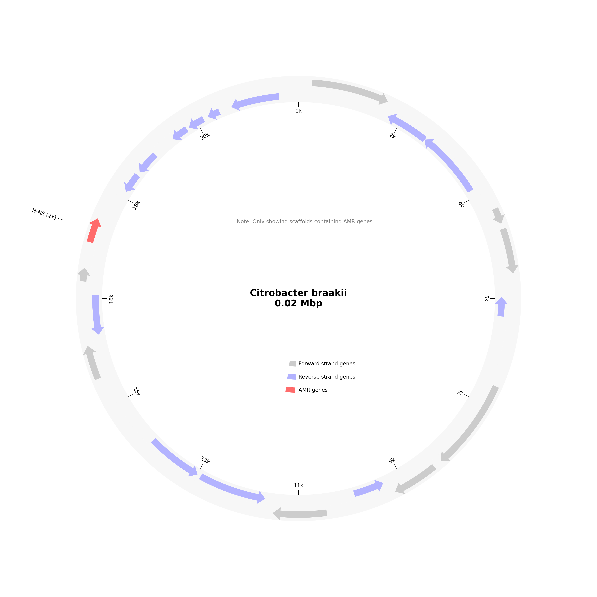
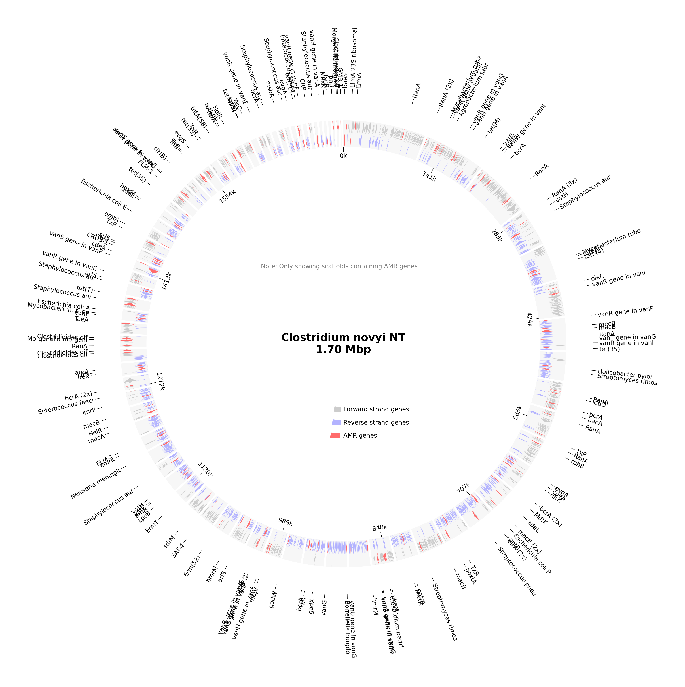
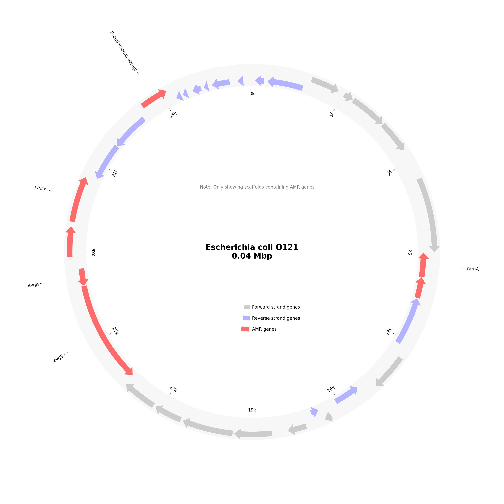
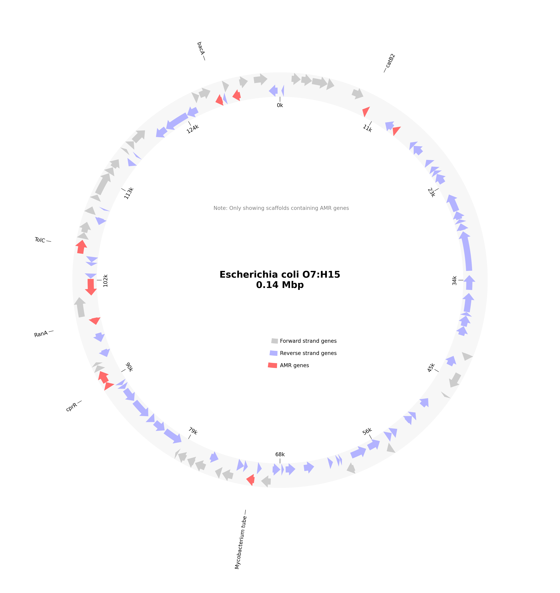
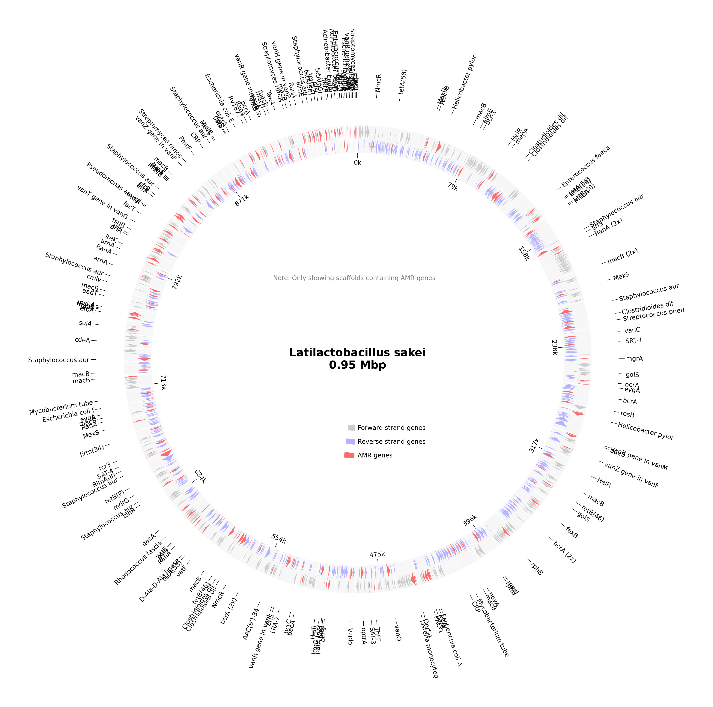
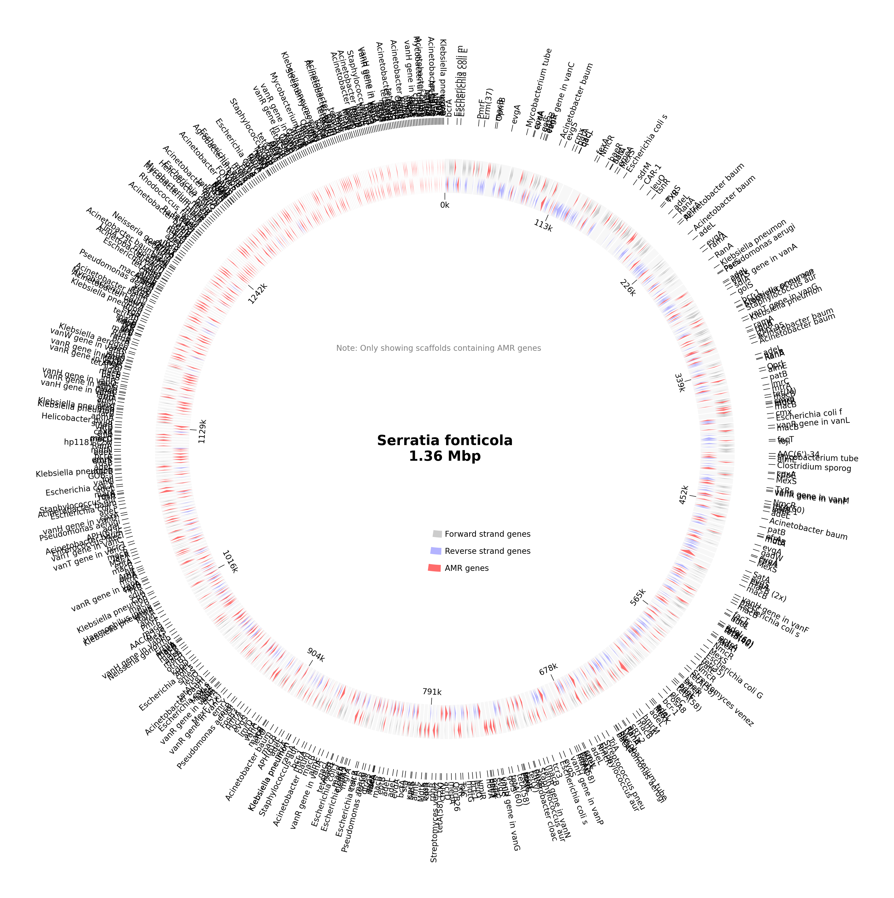

# AMR Analysis Report for LB02_BPW_QG_A1_S13

# Organism Classifications:

## Aeromonas salmonicida
**Strain Statistics:**
- Total genome length: 639.3 kbp
- Total scaffolds: 1229
- Scaffolds with AMR genes: 108
- Total genes annotated: 1201
- Total AMR genes: 152
- Unique AMR genes: 85
- Distinct AMR mechanisms: 8
- Distinct AMR families: 38
- Distinct drug classes: 32

**Circos Plot:**

### Acinetobacter baumannii AmvA
- **Mechanism**: antibiotic efflux
- **Drug Classes**: macrolide antibiotic; disinfecting agents and antiseptics
- **AMR Family**: major facilitator superfamily (MFS) antibiotic efflux pump
- **Locations**:
  - gnl|SPADES|LCCGDDFM_979_10 : position 5628-6866

### CRD3-1
- **Mechanism**: antibiotic inactivation
- **Drug Classes**: carbapenem
- **AMR Family**: CRD3 beta-lactamase
- **Locations**:
  - gnl|SPADES|LCCGDDFM_19065_1 : position 68-382

### CRP
- **Mechanism**: antibiotic efflux
- **Drug Classes**: macrolide antibiotic; fluoroquinolone antibiotic; penam
- **AMR Family**: resistance-nodulation-cell division (RND) antibiotic efflux pump
- **Locations**:
  - gnl|SPADES|LCCGDDFM_1821_6 : position 3253-3891

### Enterococcus faecalis cls with mutation conferring resistance to daptomycin
- **Mechanism**: antibiotic target alteration
- **Drug Classes**: peptide antibiotic
- **AMR Family**: daptomycin resistant cls
- **Locations**:
  - gnl|SPADES|LCCGDDFM_1005_1 : position 397-1650

### Escherichia coli EF-Tu mutants conferring resistance to Pulvomycin
- **Mechanism**: antibiotic target alteration
- **Drug Classes**: elfamycin antibiotic
- **AMR Family**: elfamycin resistant EF-Tu
- **Locations**:
  - gnl|SPADES|LCCGDDFM_1081_1 : position 227-1411

### Escherichia coli cyaA with mutation conferring resistance to fosfomycin
- **Mechanism**: antibiotic target alteration
- **Drug Classes**: phosphonic acid antibiotic
- **AMR Family**: antibiotic-resistant cya adenylate cyclase
- **Locations**:
  - gnl|SPADES|LCCGDDFM_200_19 : position 17749-20280

### FosB
- **Mechanism**: antibiotic inactivation
- **Drug Classes**: phosphonic acid antibiotic
- **AMR Family**: fosfomycin thiol transferase
- **Locations**:
  - gnl|SPADES|LCCGDDFM_1066_3 : position 3510-3878

### FosM2 (found in 2 locations)
- **Mechanism**: antibiotic inactivation
- **Drug Classes**: phosphonic acid antibiotic
- **AMR Family**: fosfomycin thiol transferase
- **Locations**:
  - gnl|SPADES|LCCGDDFM_1313_6 : position 4209-4577
  - gnl|SPADES|LCCGDDFM_979_6 : position 1871-2239

### GMB-1 (found in 2 locations)
- **Mechanism**: antibiotic inactivation
- **Drug Classes**: carbapenem
- **AMR Family**: GMB beta-lactamase
- **Locations**:
  - gnl|SPADES|LCCGDDFM_22008_1 : position 2-343
  - gnl|SPADES|LCCGDDFM_22009_1 : position 2-343

### H-NS
- **Mechanism**: antibiotic efflux
- **Drug Classes**: macrolide antibiotic; fluoroquinolone antibiotic; cephalosporin; cephamycin; penam; tetracycline antibiotic
- **AMR Family**: major facilitator superfamily (MFS) antibiotic efflux pump; resistance-nodulation-cell division (RND) antibiotic efflux pump
- **Locations**:
  - gnl|SPADES|LCCGDDFM_1756_5 : position 1838-2245

### Helicobacter pylori rpoB mutation conferring resistance to rifampicin
- **Mechanism**: antibiotic target alteration; antibiotic target replacement
- **Drug Classes**: fluoroquinolone antibiotic; rifamycin antibiotic
- **AMR Family**: rifamycin-resistant beta-subunit of RNA polymerase (rpoB)
- **Locations**:
  - gnl|SPADES|LCCGDDFM_1243_1 : position 1-2886

### Klebsiella pneumoniae KpnH
- **Mechanism**: antibiotic efflux
- **Drug Classes**: macrolide antibiotic; fluoroquinolone antibiotic; aminoglycoside antibiotic; carbapenem; cephalosporin; penam; peptide antibiotic; penem
- **AMR Family**: major facilitator superfamily (MFS) antibiotic efflux pump
- **Locations**:
  - gnl|SPADES|LCCGDDFM_1005_12 : position 10325-11878

### Klebsiella pneumoniae OmpK37 (found in 2 locations)
- **Mechanism**: reduced permeability to antibiotic
- **Drug Classes**: monobactam; carbapenem; cephalosporin; cephamycin; penam; penem
- **AMR Family**: General Bacterial Porin with reduced permeability to beta-lactams
- **Locations**:
  - gnl|SPADES|LCCGDDFM_200_12 : position 10757-11818
  - gnl|SPADES|LCCGDDFM_6280_1 : position 15-1022

### LpeB
- **Mechanism**: antibiotic efflux
- **Drug Classes**: macrolide antibiotic
- **AMR Family**: resistance-nodulation-cell division (RND) antibiotic efflux pump
- **Locations**:
  - gnl|SPADES|LCCGDDFM_4322_2 : position 360-1595

### LpsA
- **Mechanism**: reduced permeability to antibiotic
- **Drug Classes**: peptide antibiotic
- **AMR Family**: Intrinsic peptide antibiotic resistant Lps
- **Locations**:
  - gnl|SPADES|LCCGDDFM_1773_3 : position 2050-2733

### MexH
- **Mechanism**: antibiotic efflux
- **Drug Classes**: fluoroquinolone antibiotic; tetracycline antibiotic; disinfecting agents and antiseptics
- **AMR Family**: resistance-nodulation-cell division (RND) antibiotic efflux pump
- **Locations**:
  - gnl|SPADES|LCCGDDFM_2146_1 : position 3-1073

### MexZ
- **Mechanism**: antibiotic efflux
- **Drug Classes**: macrolide antibiotic; fluoroquinolone antibiotic; aminoglycoside antibiotic; carbapenem; cephalosporin; cephamycin; penam; tetracycline antibiotic; phenicol antibiotic; disinfecting agents and antiseptics
- **AMR Family**: resistance-nodulation-cell division (RND) antibiotic efflux pump
- **Locations**:
  - gnl|SPADES|LCCGDDFM_1435_4 : position 4585-5238

### MuxB
- **Mechanism**: antibiotic efflux
- **Drug Classes**: macrolide antibiotic; monobactam; tetracycline antibiotic; aminocoumarin antibiotic
- **AMR Family**: resistance-nodulation-cell division (RND) antibiotic efflux pump
- **Locations**:
  - gnl|SPADES|LCCGDDFM_1435_1 : position 1-1884

### Mycobacterium tuberculosis katG mutations conferring resistance to isoniazid
- **Mechanism**: antibiotic target alteration
- **Drug Classes**: isoniazid-like antibiotic
- **AMR Family**: isoniazid resistant katG
- **Locations**:
  - gnl|SPADES|LCCGDDFM_1162_3 : position 1346-3481

### Mycobacterium tuberculosis rpoB mutations conferring resistance to rifampicin
- **Mechanism**: antibiotic target alteration; antibiotic target replacement
- **Drug Classes**: rifamycin antibiotic
- **AMR Family**: rifamycin-resistant beta-subunit of RNA polymerase (rpoB)
- **Locations**:
  - gnl|SPADES|LCCGDDFM_1081_8 : position 5196-9224

### NmcR (found in 3 locations)
- **Mechanism**: antibiotic inactivation
- **Drug Classes**: carbapenem; cephalosporin; cephamycin; penam
- **AMR Family**: NmcA beta-lactamase
- **Locations**:
  - gnl|SPADES|LCCGDDFM_1191_7 : position 6970-7890
  - gnl|SPADES|LCCGDDFM_440_17 : position 16315-17223
  - gnl|SPADES|LCCGDDFM_979_12 : position 7472-8341

### OmpA (found in 3 locations)
- **Mechanism**: reduced permeability to antibiotic
- **Drug Classes**: peptide antibiotic
- **AMR Family**: General Bacterial Porin with reduced permeability to peptide antibiotics
- **Locations**:
  - gnl|SPADES|LCCGDDFM_18696_1 : position 3-365
  - gnl|SPADES|LCCGDDFM_40306_1 : position 3-242
  - gnl|SPADES|LCCGDDFM_469_12 : position 12900-13931

### PAM-1 (found in 2 locations)
- **Mechanism**: antibiotic inactivation
- **Drug Classes**: carbapenem; cephalosporin
- **AMR Family**: PAM beta-lactamase
- **Locations**:
  - gnl|SPADES|LCCGDDFM_703_13 : position 14467-15111
  - gnl|SPADES|LCCGDDFM_722_5 : position 3815-4459

### PNGM-1
- **Mechanism**: antibiotic inactivation
- **Drug Classes**: carbapenem; cephalosporin; penam
- **AMR Family**: PNGM beta-lactamase
- **Locations**:
  - gnl|SPADES|LCCGDDFM_8691_1 : position 3-737

### Pseudomonas aeruginosa CpxR
- **Mechanism**: antibiotic efflux
- **Drug Classes**: macrolide antibiotic; fluoroquinolone antibiotic; monobactam; aminoglycoside antibiotic; carbapenem; cephalosporin; cephamycin; penam; tetracycline antibiotic; peptide antibiotic; aminocoumarin antibiotic; diaminopyrimidine antibiotic; sulfonamide antibiotic; phenicol antibiotic; penem
- **AMR Family**: resistance-nodulation-cell division (RND) antibiotic efflux pump
- **Locations**:
  - gnl|SPADES|LCCGDDFM_1006_2 : position 1271-1951

### Pseudomonas aeruginosa ampR with mutation conferring resistance to aztreonam
- **Mechanism**: antibiotic target alteration; antibiotic inactivation
- **Drug Classes**: monobactam; carbapenem; cephalosporin
- **AMR Family**: PDC beta-lactamase; ampR transcriptional regulator with mutation conferring resistance to monobactam antibiotics
- **Locations**:
  - gnl|SPADES|LCCGDDFM_2498_1 : position 400-1347

### RanA (found in 6 locations)
- **Mechanism**: antibiotic efflux
- **Drug Classes**: aminoglycoside antibiotic
- **AMR Family**: ATP-binding cassette (ABC) antibiotic efflux pump
- **Locations**:
  - gnl|SPADES|LCCGDDFM_21712_1 : position 2-346
  - gnl|SPADES|LCCGDDFM_21714_1 : position 2-346
  - gnl|SPADES|LCCGDDFM_2498_2 : position 1533-2600
  - gnl|SPADES|LCCGDDFM_475_18 : position 25279-26280
  - gnl|SPADES|LCCGDDFM_625_7 : position 8030-9112
  - gnl|SPADES|LCCGDDFM_902_14 : position 11155-11955

### RanB
- **Mechanism**: antibiotic efflux
- **Drug Classes**: aminoglycoside antibiotic
- **AMR Family**: ATP-binding cassette (ABC) antibiotic efflux pump
- **Locations**:
  - gnl|SPADES|LCCGDDFM_902_13 : position 10376-11155

### SatA
- **Mechanism**: antibiotic inactivation
- **Drug Classes**: nucleoside antibiotic
- **AMR Family**: streptothricin acetyltransferase (SAT)
- **Locations**:
  - gnl|SPADES|LCCGDDFM_979_19 : position 11708-12166

### Staphylococcus aureus fusA with mutation conferring resistance to fusidic acid (found in 2 locations)
- **Mechanism**: antibiotic target alteration
- **Drug Classes**: fusidane antibiotic
- **AMR Family**: antibiotic resistant fusA
- **Locations**:
  - gnl|SPADES|LCCGDDFM_1243_9 : position 6533-8638
  - gnl|SPADES|LCCGDDFM_3360_1 : position 319-1905

### Staphylococcus aureus murA with mutation conferring resistance to fosfomycin
- **Mechanism**: antibiotic target alteration
- **Drug Classes**: phosphonic acid antibiotic
- **AMR Family**: antibiotic-resistant murA transferase
- **Locations**:
  - gnl|SPADES|LCCGDDFM_902_8 : position 7437-8693

### Streptomyces lividans cmlR
- **Mechanism**: antibiotic efflux
- **Drug Classes**: phenicol antibiotic
- **AMR Family**: major facilitator superfamily (MFS) antibiotic efflux pump
- **Locations**:
  - gnl|SPADES|LCCGDDFM_1682_1 : position 2-739

### TRU-1 (found in 2 locations)
- **Mechanism**: antibiotic inactivation
- **Drug Classes**: cephalosporin; penam
- **AMR Family**: TRU beta-lactamase
- **Locations**:
  - gnl|SPADES|LCCGDDFM_1173_9: position 6759-7991
  - gnl|SPADES|LCCGDDFM_1656_4: position 2739-3887

### TaeA (found in 2 locations)
- **Mechanism**: antibiotic efflux
- **Drug Classes**: pleuromutilin antibiotic
- **AMR Family**: ATP-binding cassette (ABC) antibiotic efflux pump
- **Locations**:
  - gnl|SPADES|LCCGDDFM_1592_5 : position 4751-5977
  - gnl|SPADES|LCCGDDFM_4489_3 : position 784-1521

### TriB
- **Mechanism**: antibiotic efflux
- **Drug Classes**: disinfecting agents and antiseptics
- **AMR Family**: resistance-nodulation-cell division (RND) antibiotic efflux pump
- **Locations**:
  - gnl|SPADES|LCCGDDFM_464_1 : position 3-758

### TxR (found in 4 locations)
- **Mechanism**: antibiotic efflux
- **Drug Classes**: tetracycline antibiotic
- **AMR Family**: ATP-binding cassette (ABC) antibiotic efflux pump
- **Locations**:
  - gnl|SPADES|LCCGDDFM_15666_1 : position 2-442
  - gnl|SPADES|LCCGDDFM_21449_1 : position 2-349
  - gnl|SPADES|LCCGDDFM_21453_1 : position 3-350
  - gnl|SPADES|LCCGDDFM_8297_1 : position 3-770

### YojI (found in 2 locations)
- **Mechanism**: antibiotic efflux
- **Drug Classes**: peptide antibiotic
- **AMR Family**: ATP-binding cassette (ABC) antibiotic efflux pump
- **Locations**:
  - gnl|SPADES|LCCGDDFM_1262_5 : position 3022-3663
  - gnl|SPADES|LCCGDDFM_8094_1 : position 1-600

### acrD
- **Mechanism**: antibiotic efflux
- **Drug Classes**: aminoglycoside antibiotic
- **AMR Family**: resistance-nodulation-cell division (RND) antibiotic efflux pump
- **Locations**:
  - gnl|SPADES|LCCGDDFM_22567_1 : position 2-337

### adeB
- **Mechanism**: antibiotic efflux
- **Drug Classes**: glycylcycline; tetracycline antibiotic
- **AMR Family**: resistance-nodulation-cell division (RND) antibiotic efflux pump
- **Locations**:
  - gnl|SPADES|LCCGDDFM_2146_2 : position 1147-3834

### adeL (found in 8 locations)
- **Mechanism**: antibiotic efflux
- **Drug Classes**: fluoroquinolone antibiotic; tetracycline antibiotic
- **AMR Family**: resistance-nodulation-cell division (RND) antibiotic efflux pump
- **Locations**:
  - gnl|SPADES|LCCGDDFM_1005_10 : position 8274-9176
  - gnl|SPADES|LCCGDDFM_1223_1 : position 3-914
  - gnl|SPADES|LCCGDDFM_1312_4 : position 2113-3021
  - gnl|SPADES|LCCGDDFM_13702_1 : position 3-491
  - gnl|SPADES|LCCGDDFM_34774_1 : position 3-173
  - gnl|SPADES|LCCGDDFM_3813_1 : position 2-745
  - gnl|SPADES|LCCGDDFM_4801_2 : position 641-1390
  - gnl|SPADES|LCCGDDFM_918_6 : position 2362-3276

### almE (found in 2 locations)
- **Mechanism**: antibiotic target alteration
- **Drug Classes**: peptide antibiotic
- **AMR Family**: polymyxin resistance operon; alm glycyltransferase
- **Locations**:
  - gnl|SPADES|LCCGDDFM_2688_1 : position 3-2861
  - gnl|SPADES|LCCGDDFM_2995_1 : position 3-2510

### arlR
- **Mechanism**: antibiotic efflux
- **Drug Classes**: fluoroquinolone antibiotic; disinfecting agents and antiseptics
- **AMR Family**: major facilitator superfamily (MFS) antibiotic efflux pump
- **Locations**:
  - gnl|SPADES|LCCGDDFM_464_6 : position 6350-7039

### bacA
- **Mechanism**: antibiotic target alteration
- **Drug Classes**: peptide antibiotic
- **AMR Family**: undecaprenyl pyrophosphate related proteins
- **Locations**:
  - gnl|SPADES|LCCGDDFM_1512_2 : position 1233-2030

### bcr-1
- **Mechanism**: antibiotic efflux
- **Drug Classes**: bicyclomycin-like antibiotic
- **AMR Family**: major facilitator superfamily (MFS) antibiotic efflux pump
- **Locations**:
  - gnl|SPADES|LCCGDDFM_1173_8 : position 5285-6457

### bcrA
- **Mechanism**: antibiotic efflux
- **Drug Classes**: peptide antibiotic
- **AMR Family**: ATP-binding cassette (ABC) antibiotic efflux pump
- **Locations**:
  - gnl|SPADES|LCCGDDFM_862_3 : position 2634-4178

### ceoB
- **Mechanism**: antibiotic efflux
- **Drug Classes**: fluoroquinolone antibiotic; aminoglycoside antibiotic
- **AMR Family**: resistance-nodulation-cell division (RND) antibiotic efflux pump
- **Locations**:
  - gnl|SPADES|LCCGDDFM_15641_1 : position 4-444

### cmlA8
- **Mechanism**: antibiotic efflux
- **Drug Classes**: phenicol antibiotic
- **AMR Family**: major facilitator superfamily (MFS) antibiotic efflux pump
- **Locations**:
  - gnl|SPADES|LCCGDDFM_1656_3 : position 1247-2425

### cmlv (found in 2 locations)
- **Mechanism**: antibiotic inactivation
- **Drug Classes**: phenicol antibiotic
- **AMR Family**: chloramphenicol phosphotransferase
- **Locations**:
  - gnl|SPADES|LCCGDDFM_6007_1 : position 2-481
  - gnl|SPADES|LCCGDDFM_6313_2 : position 540-1019

### cpxA (found in 6 locations)
- **Mechanism**: antibiotic efflux
- **Drug Classes**: aminoglycoside antibiotic; aminocoumarin antibiotic
- **AMR Family**: resistance-nodulation-cell division (RND) antibiotic efflux pump
- **Locations**:
  - gnl|SPADES|LCCGDDFM_1006_1 : position 3-1274
  - gnl|SPADES|LCCGDDFM_12762_1 : position 3-521
  - gnl|SPADES|LCCGDDFM_12764_1 : position 3-521
  - gnl|SPADES|LCCGDDFM_464_5 : position 4965-6350
  - gnl|SPADES|LCCGDDFM_5355_1 : position 3-713
  - gnl|SPADES|LCCGDDFM_5356_1 : position 3-713

### efrA
- **Mechanism**: antibiotic efflux
- **Drug Classes**: macrolide antibiotic; fluoroquinolone antibiotic; rifamycin antibiotic
- **AMR Family**: ATP-binding cassette (ABC) antibiotic efflux pump
- **Locations**:
  - gnl|SPADES|LCCGDDFM_3210_2 : position 539-1342

### evgA (found in 4 locations)
- **Mechanism**: antibiotic efflux
- **Drug Classes**: macrolide antibiotic; fluoroquinolone antibiotic; penam; tetracycline antibiotic
- **AMR Family**: major facilitator superfamily (MFS) antibiotic efflux pump; resistance-nodulation-cell division (RND) antibiotic efflux pump
- **Locations**:
  - gnl|SPADES|LCCGDDFM_35256_1 : position 1-258
  - gnl|SPADES|LCCGDDFM_654_2 : position 4007-4630
  - gnl|SPADES|LCCGDDFM_654_4 : position 5222-5845
  - gnl|SPADES|LCCGDDFM_7694_1 : position 617-829

### evgS (found in 6 locations)
- **Mechanism**: antibiotic efflux
- **Drug Classes**: macrolide antibiotic; fluoroquinolone antibiotic; penam; tetracycline antibiotic
- **AMR Family**: major facilitator superfamily (MFS) antibiotic efflux pump; resistance-nodulation-cell division (RND) antibiotic efflux pump
- **Locations**:
  - gnl|SPADES|LCCGDDFM_16071_1 : position 2-433
  - gnl|SPADES|LCCGDDFM_1684_5 : position 3685-5472
  - gnl|SPADES|LCCGDDFM_33916_1 : position 3-260
  - gnl|SPADES|LCCGDDFM_4635_1 : position 2-1459
  - gnl|SPADES|LCCGDDFM_654_1 : position 383-3997
  - gnl|SPADES|LCCGDDFM_654_5 : position 5842-9432

### farA
- **Mechanism**: antibiotic efflux
- **Drug Classes**: antibacterial free fatty acids
- **AMR Family**: major facilitator superfamily (MFS) antibiotic efflux pump
- **Locations**:
  - gnl|SPADES|LCCGDDFM_1005_11 : position 9273-10325

### gadX (found in 2 locations)
- **Mechanism**: antibiotic efflux
- **Drug Classes**: macrolide antibiotic; fluoroquinolone antibiotic; penam
- **AMR Family**: resistance-nodulation-cell division (RND) antibiotic efflux pump
- **Locations**:
  - gnl|SPADES|LCCGDDFM_1049_1 : position 161-1072
  - gnl|SPADES|LCCGDDFM_2629_2 : position 1501-2376

### hp1181
- **Mechanism**: antibiotic efflux
- **Drug Classes**: fluoroquinolone antibiotic; tetracycline antibiotic; nitroimidazole antibiotic
- **AMR Family**: major facilitator superfamily (MFS) antibiotic efflux pump
- **Locations**:
  - gnl|SPADES|LCCGDDFM_5897_1 : position 3-818

### leuO (found in 4 locations)
- **Mechanism**: antibiotic efflux
- **Drug Classes**: nucleoside antibiotic; disinfecting agents and antiseptics
- **AMR Family**: major facilitator superfamily (MFS) antibiotic efflux pump
- **Locations**:
  - gnl|SPADES|LCCGDDFM_1005_5 : position 4300-5268
  - gnl|SPADES|LCCGDDFM_1173_3 : position 1194-2210
  - gnl|SPADES|LCCGDDFM_1173_7 : position 4304-5266
  - gnl|SPADES|LCCGDDFM_1656_2 : position 276-1238

### lmrC (found in 3 locations)
- **Mechanism**: antibiotic target protection
- **Drug Classes**: lincosamide antibiotic
- **AMR Family**: Miscellaneous ABC-F subfamily ATP-binding cassette ribosomal protection proteins
- **Locations**:
  - gnl|SPADES|LCCGDDFM_18353_1 : position 2-391
  - gnl|SPADES|LCCGDDFM_4297_2 : position 398-1093
  - gnl|SPADES|LCCGDDFM_440_15 : position 14642-15406

### lsaC
- **Mechanism**: antibiotic target protection
- **Drug Classes**: lincosamide antibiotic; streptogramin antibiotic; pleuromutilin antibiotic
- **AMR Family**: lsa-type ABC-F protein
- **Locations**:
  - gnl|SPADES|LCCGDDFM_587_16 : position 20347-20997

### macA
- **Mechanism**: antibiotic efflux
- **Drug Classes**: macrolide antibiotic
- **AMR Family**: ATP-binding cassette (ABC) antibiotic efflux pump
- **Locations**:
  - gnl|SPADES|LCCGDDFM_1006_3 : position 2101-3255

### macB (found in 5 locations)
- **Mechanism**: antibiotic efflux
- **Drug Classes**: macrolide antibiotic
- **AMR Family**: ATP-binding cassette (ABC) antibiotic efflux pump
- **Locations**:
  - gnl|SPADES|LCCGDDFM_1006_4 : position 3258-5207
  - gnl|SPADES|LCCGDDFM_1262_6 : position 3778-4566
  - gnl|SPADES|LCCGDDFM_22185_1 : position 3-344
  - gnl|SPADES|LCCGDDFM_475_17 : position 24224-25282
  - gnl|SPADES|LCCGDDFM_525_18 : position 16542-17363

### mdtN (found in 3 locations)
- **Mechanism**: antibiotic efflux
- **Drug Classes**: nucleoside antibiotic; disinfecting agents and antiseptics
- **AMR Family**: major facilitator superfamily (MFS) antibiotic efflux pump
- **Locations**:
  - gnl|SPADES|LCCGDDFM_200_33 : position 33061-34026
  - gnl|SPADES|LCCGDDFM_9456_1 : position 2-676
  - gnl|SPADES|LCCGDDFM_9457_1 : position 2-676

### mexQ
- **Mechanism**: antibiotic efflux
- **Drug Classes**: macrolide antibiotic; carbapenem; tetracycline antibiotic; diaminopyrimidine antibiotic; phenicol antibiotic; disinfecting agents and antiseptics
- **AMR Family**: resistance-nodulation-cell division (RND) antibiotic efflux pump
- **Locations**:
  - gnl|SPADES|LCCGDDFM_2950_1 : position 2-2557

### mgrA
- **Mechanism**: antibiotic efflux
- **Drug Classes**: fluoroquinolone antibiotic; cephalosporin; penam; tetracycline antibiotic; peptide antibiotic; disinfecting agents and antiseptics
- **AMR Family**: ATP-binding cassette (ABC) antibiotic efflux pump; major facilitator superfamily (MFS) antibiotic efflux pump
- **Locations**:
  - gnl|SPADES|LCCGDDFM_440_7 : position 6715-7194

### nalD
- **Mechanism**: antibiotic efflux
- **Drug Classes**: macrolide antibiotic; fluoroquinolone antibiotic; monobactam; carbapenem; cephalosporin; cephamycin; penam; tetracycline antibiotic; peptide antibiotic; aminocoumarin antibiotic; diaminopyrimidine antibiotic; sulfonamide antibiotic; phenicol antibiotic; penem
- **AMR Family**: resistance-nodulation-cell division (RND) antibiotic efflux pump
- **Locations**:
  - gnl|SPADES|LCCGDDFM_1388_3 : position 1294-1938

### novA (found in 2 locations)
- **Mechanism**: antibiotic efflux
- **Drug Classes**: aminocoumarin antibiotic
- **AMR Family**: ATP-binding cassette (ABC) antibiotic efflux pump
- **Locations**:
  - gnl|SPADES|LCCGDDFM_464_7 : position 7154-9331
  - gnl|SPADES|LCCGDDFM_464_9 : position 10695-12782

### oleB
- **Mechanism**: antibiotic target protection
- **Drug Classes**: macrolide antibiotic
- **AMR Family**: Miscellaneous ABC-F subfamily ATP-binding cassette ribosomal protection proteins
- **Locations**:
  - gnl|SPADES|LCCGDDFM_20963_1 : position 2-202

### oleC (found in 2 locations)
- **Mechanism**: antibiotic efflux
- **Drug Classes**: macrolide antibiotic
- **AMR Family**: ATP-binding cassette (ABC) antibiotic efflux pump
- **Locations**:
  - gnl|SPADES|LCCGDDFM_200_34 : position 34019-34948
  - gnl|SPADES|LCCGDDFM_918_13 : position 9278-10285

### optrA
- **Mechanism**: antibiotic target protection
- **Drug Classes**: oxazolidinone antibiotic; phenicol antibiotic
- **AMR Family**: Miscellaneous ABC-F subfamily ATP-binding cassette ribosomal protection proteins
- **Locations**:
  - gnl|SPADES|LCCGDDFM_1682_2 : position 750-2309

### pmrA
- **Mechanism**: antibiotic efflux
- **Drug Classes**: fluoroquinolone antibiotic
- **AMR Family**: major facilitator superfamily (MFS) antibiotic efflux pump
- **Locations**:
  - gnl|SPADES|LCCGDDFM_1191_4 : position 3106-4278

### ramA
- **Mechanism**: antibiotic efflux; reduced permeability to antibiotic
- **Drug Classes**: fluoroquinolone antibiotic; monobactam; carbapenem; cephalosporin; glycylcycline; cephamycin; penam; tetracycline antibiotic; rifamycin antibiotic; phenicol antibiotic; penem; disinfecting agents and antiseptics
- **AMR Family**: resistance-nodulation-cell division (RND) antibiotic efflux pump; General Bacterial Porin with reduced permeability to beta-lactams
- **Locations**:
  - gnl|SPADES|LCCGDDFM_1513_6 : position 5438-6298

### rosB (found in 5 locations)
- **Mechanism**: antibiotic efflux
- **Drug Classes**: peptide antibiotic
- **AMR Family**: major facilitator superfamily (MFS) antibiotic efflux pump
- **Locations**:
  - gnl|SPADES|LCCGDDFM_1110_6 : position 6253-7905
  - gnl|SPADES|LCCGDDFM_1953_3 : position 1673-3334
  - gnl|SPADES|LCCGDDFM_1988_3 : position 1657-3318
  - gnl|SPADES|LCCGDDFM_3886_1 : position 138-1817
  - gnl|SPADES|LCCGDDFM_6896_1 : position 3-641

### sdiA
- **Mechanism**: antibiotic efflux
- **Drug Classes**: fluoroquinolone antibiotic; cephalosporin; glycylcycline; penam; tetracycline antibiotic; rifamycin antibiotic; phenicol antibiotic; disinfecting agents and antiseptics
- **AMR Family**: resistance-nodulation-cell division (RND) antibiotic efflux pump
- **Locations**:
  - gnl|SPADES|LCCGDDFM_1785_4 : position 1347-2117

### srmB
- **Mechanism**: antibiotic target protection
- **Drug Classes**: macrolide antibiotic
- **AMR Family**: Miscellaneous ABC-F subfamily ATP-binding cassette ribosomal protection proteins
- **Locations**:
  - gnl|SPADES|LCCGDDFM_20970_1 : position 2-355

### sta (found in 2 locations)
- **Mechanism**: antibiotic inactivation
- **Drug Classes**: nucleoside antibiotic
- **AMR Family**: streptothricin acetyltransferase (SAT)
- **Locations**:
  - gnl|SPADES|LCCGDDFM_2886_3 : position 541-987
  - gnl|SPADES|LCCGDDFM_7544_1 : position 263-706

### tet(35) (found in 2 locations)
- **Mechanism**: antibiotic efflux
- **Drug Classes**: tetracycline antibiotic
- **AMR Family**: ATP-binding cassette (ABC) antibiotic efflux pump
- **Locations**:
  - gnl|SPADES|LCCGDDFM_1756_6 : position 2824-4404
  - gnl|SPADES|LCCGDDFM_2986_3 : position 978-2351

### tetA(58) (found in 2 locations)
- **Mechanism**: antibiotic efflux
- **Drug Classes**: tetracycline antibiotic
- **AMR Family**: major facilitator superfamily (MFS) antibiotic efflux pump
- **Locations**:
  - gnl|SPADES|LCCGDDFM_1049_3 : position 2277-3776
  - gnl|SPADES|LCCGDDFM_7219_1 : position 1-888

### tlrB conferring tylosin resistance
- **Mechanism**: antibiotic target alteration
- **Drug Classes**: macrolide antibiotic; lincosamide antibiotic
- **AMR Family**: non-erm 23S ribosomal RNA methyltransferase (G748)
- **Locations**:
  - gnl|SPADES|LCCGDDFM_1821_7 : position 4014-4814

### vanE (found in 2 locations)
- **Mechanism**: antibiotic target alteration
- **Drug Classes**: glycopeptide antibiotic
- **AMR Family**: glycopeptide resistance gene cluster; Van ligase
- **Locations**:
  - gnl|SPADES|LCCGDDFM_22301_1 : position 2-340
  - gnl|SPADES|LCCGDDFM_22307_1 : position 2-340

### vanH gene in vanB cluster (found in 2 locations)
- **Mechanism**: antibiotic target alteration
- **Drug Classes**: glycopeptide antibiotic
- **AMR Family**: vanH; glycopeptide resistance gene cluster
- **Locations**:
  - gnl|SPADES|LCCGDDFM_27716_1 : position 1-288
  - gnl|SPADES|LCCGDDFM_440_9 : position 8017-8961

### vanR gene in vanE cluster
- **Mechanism**: antibiotic target alteration
- **Drug Classes**: glycopeptide antibiotic
- **AMR Family**: glycopeptide resistance gene cluster; vanR
- **Locations**:
  - gnl|SPADES|LCCGDDFM_3468_3 : position 1191-2063

### vanT gene in vanG cluster (found in 2 locations)
- **Mechanism**: antibiotic target alteration
- **Drug Classes**: glycopeptide antibiotic
- **AMR Family**: glycopeptide resistance gene cluster; vanT
- **Locations**:
  - gnl|SPADES|LCCGDDFM_3705_2 : position 509-1582
  - gnl|SPADES|LCCGDDFM_4219_2 : position 334-1407

### vanXY gene in vanL cluster
- **Mechanism**: antibiotic target alteration
- **Drug Classes**: glycopeptide antibiotic
- **AMR Family**: glycopeptide resistance gene cluster; vanXY
- **Locations**:
  - gnl|SPADES|LCCGDDFM_5299_2 : position 120-815

### vatC
- **Mechanism**: antibiotic inactivation
- **Drug Classes**: streptogramin antibiotic; streptogramin A antibiotic
- **AMR Family**: streptogramin vat acetyltransferase
- **Locations**:
  - gnl|SPADES|LCCGDDFM_587_6 : position 5848-6471

### vatF (found in 2 locations)
- **Mechanism**: antibiotic inactivation
- **Drug Classes**: streptogramin antibiotic; streptogramin A antibiotic
- **AMR Family**: streptogramin vat acetyltransferase
- **Locations**:
  - gnl|SPADES|LCCGDDFM_2234_1 : position 3-437
  - gnl|SPADES|LCCGDDFM_2812_4 : position 1579-2214

### vgaD
- **Mechanism**: antibiotic target protection
- **Drug Classes**: streptogramin antibiotic; streptogramin A antibiotic; pleuromutilin antibiotic
- **AMR Family**: vga-type ABC-F protein
- **Locations**:
  - gnl|SPADES|LCCGDDFM_5664_1 : position 1-690

## Aeromonas salmonicida subsp. masoucida
**Strain Statistics:**
- Total genome length: 1017.0 kbp
- Total scaffolds: 145
- Scaffolds with AMR genes: 63
- Total genes annotated: 1970
- Total AMR genes: 128
- Unique AMR genes: 73
- Distinct AMR mechanisms: 9
- Distinct AMR families: 36
- Distinct drug classes: 30

**Circos Plot:**

### AAC(3)-IId
- **Mechanism**: antibiotic inactivation
- **Drug Classes**: aminoglycoside antibiotic
- **AMR Family**: AAC(3)
- **Locations**:
  - gnl|SPADES|LCCGDDFM_1644_3 : position 626-1390

### ArnT
- **Mechanism**: antibiotic target alteration
- **Drug Classes**: peptide antibiotic
- **AMR Family**: pmr phosphoethanolamine transferase
- **Locations**:
  - gnl|SPADES|LCCGDDFM_1178_6: position 7256-8899

### CRP
- **Mechanism**: antibiotic efflux
- **Drug Classes**: macrolide antibiotic; fluoroquinolone antibiotic; penam
- **AMR Family**: resistance-nodulation-cell division (RND) antibiotic efflux pump
- **Locations**:
  - gnl|SPADES|LCCGDDFM_246_26 : position 23538-24293

### Clostridioides difficile gyrA conferring resistance to fluoroquinolones
- **Mechanism**: antibiotic target alteration
- **Drug Classes**: fluoroquinolone antibiotic
- **AMR Family**: fluoroquinolone resistant gyrA
- **Locations**:
  - gnl|SPADES|LCCGDDFM_1002_4 : position 2470-5274

### Clostridioides difficile gyrB conferring resistance to fluoroquinolones
- **Mechanism**: antibiotic target alteration
- **Drug Classes**: fluoroquinolone antibiotic
- **AMR Family**: fluoroquinolone resistant gyrB
- **Locations**:
  - gnl|SPADES|LCCGDDFM_1304_5 : position 5330-7225

### Enterococcus faecalis cls with mutation conferring resistance to daptomycin
- **Mechanism**: antibiotic target alteration
- **Drug Classes**: peptide antibiotic
- **AMR Family**: daptomycin resistant cls
- **Locations**:
  - gnl|SPADES|LCCGDDFM_757_8 : position 6560-8041

### Escherichia coli AcrAB-TolC with AcrR mutation conferring resistance to ciprofloxacin, tetracycline, and ceftazidime
- **Mechanism**: antibiotic target alteration; antibiotic efflux
- **Drug Classes**: fluoroquinolone antibiotic; cephalosporin; glycylcycline; penam; tetracycline antibiotic; rifamycin antibiotic; phenicol antibiotic; disinfecting agents and antiseptics
- **AMR Family**: resistance-nodulation-cell division (RND) antibiotic efflux pump
- **Locations**:
  - gnl|SPADES|LCCGDDFM_540_12 : position 8780-9382

### Escherichia coli EF-Tu mutants conferring resistance to Pulvomycin
- **Mechanism**: antibiotic target alteration
- **Drug Classes**: elfamycin antibiotic
- **AMR Family**: elfamycin resistant EF-Tu
- **Locations**:
  - gnl|SPADES|LCCGDDFM_1279_4 : position 3213-5129

### Escherichia coli UhpT with mutation conferring resistance to fosfomycin
- **Mechanism**: antibiotic target alteration
- **Drug Classes**: phosphonic acid antibiotic
- **AMR Family**: antibiotic-resistant UhpT
- **Locations**:
  - gnl|SPADES|LCCGDDFM_1104_1 : position 30-1436

### Escherichia coli fabI mutations conferring resistance to isoniazid and triclosan
- **Mechanism**: antibiotic target alteration
- **Drug Classes**: disinfecting agents and antiseptics; isoniazid-like antibiotic
- **AMR Family**: antibiotic resistant fabI
- **Locations**:
  - gnl|SPADES|LCCGDDFM_2276_3 : position 1541-2317

### Escherichia coli soxS with mutation conferring antibiotic resistance (found in 2 locations)
- **Mechanism**: antibiotic target alteration; antibiotic efflux; reduced permeability to antibiotic
- **Drug Classes**: fluoroquinolone antibiotic; monobactam; carbapenem; cephalosporin; glycylcycline; cephamycin; penam; tetracycline antibiotic; rifamycin antibiotic; phenicol antibiotic; penem; disinfecting agents and antiseptics
- **AMR Family**: ATP-binding cassette (ABC) antibiotic efflux pump; major facilitator superfamily (MFS) antibiotic efflux pump; resistance-nodulation-cell division (RND) antibiotic efflux pump; General Bacterial Porin with reduced permeability to beta-lactams
- **Locations**:
  - gnl|SPADES|LCCGDDFM_567_9 : position 6535-7320
  - gnl|SPADES|LCCGDDFM_919_4 : position 3014-3841

### FosM2
- **Mechanism**: antibiotic inactivation
- **Drug Classes**: phosphonic acid antibiotic
- **AMR Family**: fosfomycin thiol transferase
- **Locations**:
  - gnl|SPADES|LCCGDDFM_634_11 : position 7615-8028

### Helicobacter pylori pbp1 mutants conferring resistance to amoxicillin
- **Mechanism**: antibiotic target alteration
- **Drug Classes**: cephalosporin; cephamycin; penam
- **AMR Family**: Penicillin-binding protein mutations conferring resistance to beta-lactam antibiotics
- **Locations**:
  - gnl|SPADES|LCCGDDFM_999_5 : position 4284-6155

### LlmA 23S ribosomal RNA methyltransferase
- **Mechanism**: antibiotic target alteration
- **Drug Classes**: lincosamide antibiotic
- **AMR Family**: Llm 23S ribosomal RNA methyltransferase
- **Locations**:
  - gnl|SPADES|LCCGDDFM_221_2 : position 1162-2352

### MCR-7.1
- **Mechanism**: antibiotic target alteration
- **Drug Classes**: peptide antibiotic
- **AMR Family**: MCR phosphoethanolamine transferase
- **Locations**:
  - gnl|SPADES|LCCGDDFM_364_1 : position 211-1878

### MdtK
- **Mechanism**: antibiotic efflux
- **Drug Classes**: fluoroquinolone antibiotic
- **AMR Family**: multidrug and toxic compound extrusion (MATE) transporter
- **Locations**:
  - gnl|SPADES|LCCGDDFM_540_4 : position 1330-2676

### MexS
- **Mechanism**: antibiotic efflux
- **Drug Classes**: fluoroquinolone antibiotic; diaminopyrimidine antibiotic; phenicol antibiotic
- **AMR Family**: resistance-nodulation-cell division (RND) antibiotic efflux pump
- **Locations**:
  - gnl|SPADES|LCCGDDFM_835_6 : position 6934-8061

### MexW
- **Mechanism**: antibiotic efflux
- **Drug Classes**: macrolide antibiotic; fluoroquinolone antibiotic; tetracycline antibiotic; phenicol antibiotic; disinfecting agents and antiseptics
- **AMR Family**: resistance-nodulation-cell division (RND) antibiotic efflux pump
- **Locations**:
  - gnl|SPADES|LCCGDDFM_575_3 : position 2057-3724

### MuxA
- **Mechanism**: antibiotic efflux
- **Drug Classes**: macrolide antibiotic; monobactam; tetracycline antibiotic; aminocoumarin antibiotic
- **AMR Family**: resistance-nodulation-cell division (RND) antibiotic efflux pump
- **Locations**:
  - gnl|SPADES|LCCGDDFM_575_6 : position 5331-6380

### Mycobacterium tuberculosis ndh with mutation conferring resistance to isoniazid
- **Mechanism**: antibiotic target alteration
- **Drug Classes**: isoniazid-like antibiotic
- **AMR Family**: antibiotic resistant ndh
- **Locations**:
  - gnl|SPADES|LCCGDDFM_232_16 : position 14076-15368

### NmcR (found in 3 locations)
- **Mechanism**: antibiotic inactivation
- **Drug Classes**: carbapenem; cephalosporin; cephamycin; penam
- **AMR Family**: NmcA beta-lactamase
- **Locations**:
  - gnl|SPADES|LCCGDDFM_1349_5 : position 2103-2945
  - gnl|SPADES|LCCGDDFM_395_30 : position 31128-32006
  - gnl|SPADES|LCCGDDFM_446_4 : position 2677-3651

### OXA-917
- **Mechanism**: antibiotic inactivation
- **Drug Classes**: carbapenem; penam
- **AMR Family**: OXA beta-lactamase; OXA-427-like beta-lactamase
- **Locations**:
  - gnl|SPADES|LCCGDDFM_471_7 : position 6956-7750

### OmpA (found in 4 locations)
- **Mechanism**: reduced permeability to antibiotic
- **Drug Classes**: peptide antibiotic
- **AMR Family**: General Bacterial Porin with reduced permeability to peptide antibiotics
- **Locations**:
  - gnl|SPADES|LCCGDDFM_575_13 : position 12272-13291
  - gnl|SPADES|LCCGDDFM_575_14 : position 13722-14723
  - gnl|SPADES|LCCGDDFM_575_15 : position 15088-16146
  - gnl|SPADES|LCCGDDFM_634_12 : position 8102-8977

### ParR
- **Mechanism**: antibiotic efflux; reduced permeability to antibiotic
- **Drug Classes**: macrolide antibiotic; fluoroquinolone antibiotic; monobactam; aminoglycoside antibiotic; carbapenem; cephalosporin; cephamycin; penam; tetracycline antibiotic; phenicol antibiotic; penem; disinfecting agents and antiseptics
- **AMR Family**: resistance-nodulation-cell division (RND) antibiotic efflux pump; Outer Membrane Porin (Opr)
- **Locations**:
  - gnl|SPADES|LCCGDDFM_465_5 : position 3723-4445

### PmpM
- **Mechanism**: antibiotic efflux
- **Drug Classes**: fluoroquinolone antibiotic; aminoglycoside antibiotic; disinfecting agents and antiseptics
- **AMR Family**: multidrug and toxic compound extrusion (MATE) transporter
- **Locations**:
  - gnl|SPADES|LCCGDDFM_575_18 : position 18972-20351

### PmrF (found in 2 locations)
- **Mechanism**: antibiotic target alteration
- **Drug Classes**: peptide antibiotic
- **AMR Family**: pmr phosphoethanolamine transferase
- **Locations**:
  - gnl|SPADES|LCCGDDFM_1178_3 : position 3330-4307
  - gnl|SPADES|LCCGDDFM_324_29 : position 30417-31451

### Pseudomonas aeruginosa CpxR
- **Mechanism**: antibiotic efflux
- **Drug Classes**: macrolide antibiotic; fluoroquinolone antibiotic; monobactam; aminoglycoside antibiotic; carbapenem; cephalosporin; cephamycin; penam; tetracycline antibiotic; peptide antibiotic; aminocoumarin antibiotic; diaminopyrimidine antibiotic; sulfonamide antibiotic; phenicol antibiotic; penem
- **AMR Family**: resistance-nodulation-cell division (RND) antibiotic efflux pump
- **Locations**:
  - gnl|SPADES|LCCGDDFM_577_7 : position 6619-7314

### QepA2
- **Mechanism**: antibiotic efflux
- **Drug Classes**: fluoroquinolone antibiotic
- **AMR Family**: major facilitator superfamily (MFS) antibiotic efflux pump
- **Locations**:
  - gnl|SPADES|LCCGDDFM_578_9 : position 8086-9483

### QepA4
- **Mechanism**: antibiotic efflux
- **Drug Classes**: fluoroquinolone antibiotic
- **AMR Family**: major facilitator superfamily (MFS) antibiotic efflux pump
- **Locations**:
  - gnl|SPADES|LCCGDDFM_446_6 : position 4694-5902

### RanA (found in 5 locations)
- **Mechanism**: antibiotic efflux
- **Drug Classes**: aminoglycoside antibiotic
- **AMR Family**: ATP-binding cassette (ABC) antibiotic efflux pump
- **Locations**:
  - gnl|SPADES|LCCGDDFM_1692_3 : position 2778-3779
  - gnl|SPADES|LCCGDDFM_471_26 : position 27260-27988
  - gnl|SPADES|LCCGDDFM_560_7 : position 4105-5139
  - gnl|SPADES|LCCGDDFM_601_13 : position 12141-13133
  - gnl|SPADES|LCCGDDFM_675_8 : position 6874-7656

### TaeA
- **Mechanism**: antibiotic efflux
- **Drug Classes**: pleuromutilin antibiotic
- **AMR Family**: ATP-binding cassette (ABC) antibiotic efflux pump
- **Locations**:
  - gnl|SPADES|LCCGDDFM_6485_1 : position 187-990

### TxR (found in 4 locations)
- **Mechanism**: antibiotic efflux
- **Drug Classes**: tetracycline antibiotic
- **AMR Family**: ATP-binding cassette (ABC) antibiotic efflux pump
- **Locations**:
  - gnl|SPADES|LCCGDDFM_1014_7 : position 7811-9925
  - gnl|SPADES|LCCGDDFM_1026_3 : position 3011-4921
  - gnl|SPADES|LCCGDDFM_1259_7 : position 6551-7906
  - gnl|SPADES|LCCGDDFM_2158_1 : position 246-2147

### YojI
- **Mechanism**: antibiotic efflux
- **Drug Classes**: peptide antibiotic
- **AMR Family**: ATP-binding cassette (ABC) antibiotic efflux pump
- **Locations**:
  - gnl|SPADES|LCCGDDFM_471_25 : position 25567-27213

### abeM
- **Mechanism**: antibiotic efflux
- **Drug Classes**: fluoroquinolone antibiotic; disinfecting agents and antiseptics
- **AMR Family**: multidrug and toxic compound extrusion (MATE) transporter
- **Locations**:
  - gnl|SPADES|LCCGDDFM_577_10 : position 9194-10579

### adeL (found in 10 locations)
- **Mechanism**: antibiotic efflux
- **Drug Classes**: fluoroquinolone antibiotic; tetracycline antibiotic
- **AMR Family**: resistance-nodulation-cell division (RND) antibiotic efflux pump
- **Locations**:
  - gnl|SPADES|LCCGDDFM_1213_4 : position 4740-5648
  - gnl|SPADES|LCCGDDFM_2045_3 : position 1779-2687
  - gnl|SPADES|LCCGDDFM_446_12 : position 11305-12243
  - gnl|SPADES|LCCGDDFM_446_5 : position 3725-4600
  - gnl|SPADES|LCCGDDFM_540_17 : position 14835-15743
  - gnl|SPADES|LCCGDDFM_560_14 : position 11331-12266
  - gnl|SPADES|LCCGDDFM_567_17 : position 14809-15684
  - gnl|SPADES|LCCGDDFM_769_1 : position 1-243
  - gnl|SPADES|LCCGDDFM_835_7 : position 8182-9087
  - gnl|SPADES|LCCGDDFM_93_26 : position 23552-24433

### almE (found in 3 locations)
- **Mechanism**: antibiotic target alteration
- **Drug Classes**: peptide antibiotic
- **AMR Family**: polymyxin resistance operon; alm glycyltransferase
- **Locations**:
  - gnl|SPADES|LCCGDDFM_2097_5 : position 3331-3966
  - gnl|SPADES|LCCGDDFM_675_16 : position 17385-19742
  - gnl|SPADES|LCCGDDFM_7839_1 : position 3-638

### arnA
- **Mechanism**: antibiotic target alteration
- **Drug Classes**: peptide antibiotic
- **AMR Family**: pmr phosphoethanolamine transferase
- **Locations**:
  - gnl|SPADES|LCCGDDFM_1178_4 : position 4304-6295

### basS
- **Mechanism**: antibiotic target alteration; antibiotic efflux
- **Drug Classes**: peptide antibiotic
- **AMR Family**: pmr phosphoethanolamine transferase
- **Locations**:
  - gnl|SPADES|LCCGDDFM_471_6 : position 5458-6879

### bcr-1 (found in 2 locations)
- **Mechanism**: antibiotic efflux
- **Drug Classes**: bicyclomycin-like antibiotic
- **AMR Family**: major facilitator superfamily (MFS) antibiotic efflux pump
- **Locations**:
  - gnl|SPADES|LCCGDDFM_873_10 : position 10254-11456
  - gnl|SPADES|LCCGDDFM_93_85 : position 84332-85495

### bcrA
- **Mechanism**: antibiotic efflux
- **Drug Classes**: peptide antibiotic
- **AMR Family**: ATP-binding cassette (ABC) antibiotic efflux pump
- **Locations**:
  - gnl|SPADES|LCCGDDFM_601_14 : position 13145-14164

### catB9
- **Mechanism**: antibiotic inactivation
- **Drug Classes**: phenicol antibiotic
- **AMR Family**: chloramphenicol acetyltransferase (CAT)
- **Locations**:
  - gnl|SPADES|LCCGDDFM_471_9 : position 9281-10642

### cdeA
- **Mechanism**: antibiotic efflux
- **Drug Classes**: fluoroquinolone antibiotic; disinfecting agents and antiseptics
- **AMR Family**: multidrug and toxic compound extrusion (MATE) transporter
- **Locations**:
  - gnl|SPADES|LCCGDDFM_1213_3 : position 3212-4633

### clbB
- **Mechanism**: antibiotic target alteration
- **Drug Classes**: lincosamide antibiotic; streptogramin antibiotic; streptogramin A antibiotic; oxazolidinone antibiotic; phenicol antibiotic; pleuromutilin antibiotic
- **AMR Family**: Cfr 23S ribosomal RNA methyltransferase
- **Locations**:
  - gnl|SPADES|LCCGDDFM_232_33 : position 35397-36500

### cmrA
- **Mechanism**: antibiotic efflux
- **Drug Classes**: phenicol antibiotic
- **AMR Family**: major facilitator superfamily (MFS) antibiotic efflux pump
- **Locations**:
  - gnl|SPADES|LCCGDDFM_2045_4 : position 2790-4019

### cphA3
- **Mechanism**: antibiotic inactivation
- **Drug Classes**: carbapenem
- **AMR Family**: CphA beta-lactamase
- **Locations**:
  - gnl|SPADES|LCCGDDFM_1328_4 : position 3122-3730

### cphA5 (found in 2 locations)
- **Mechanism**: antibiotic inactivation
- **Drug Classes**: carbapenem
- **AMR Family**: CphA beta-lactamase
- **Locations**:
  - gnl|SPADES|LCCGDDFM_1328_5 : position 3941-4150
  - gnl|SPADES|LCCGDDFM_1386_4: position 3134-3895

### cpxA
- **Mechanism**: antibiotic efflux
- **Drug Classes**: aminoglycoside antibiotic; aminocoumarin antibiotic
- **AMR Family**: resistance-nodulation-cell division (RND) antibiotic efflux pump
- **Locations**:
  - gnl|SPADES|LCCGDDFM_577_8 : position 7311-8666

### efrA
- **Mechanism**: antibiotic efflux
- **Drug Classes**: macrolide antibiotic; fluoroquinolone antibiotic; rifamycin antibiotic
- **AMR Family**: ATP-binding cassette (ABC) antibiotic efflux pump
- **Locations**:
  - gnl|SPADES|LCCGDDFM_2097_2 : position 539-1342

### evgS (found in 7 locations)
- **Mechanism**: antibiotic efflux
- **Drug Classes**: macrolide antibiotic; fluoroquinolone antibiotic; penam; tetracycline antibiotic
- **AMR Family**: major facilitator superfamily (MFS) antibiotic efflux pump; resistance-nodulation-cell division (RND) antibiotic efflux pump
- **Locations**:
  - gnl|SPADES|LCCGDDFM_1259_6 : position 4414-6519
  - gnl|SPADES|LCCGDDFM_1983_2 : position 455-3880
  - gnl|SPADES|LCCGDDFM_246_9 : position 7127-7834
  - gnl|SPADES|LCCGDDFM_446_13 : position 12298-13329
  - gnl|SPADES|LCCGDDFM_4634_1 : position 2-1459
  - gnl|SPADES|LCCGDDFM_601_18 : position 18272-21667
  - gnl|SPADES|LCCGDDFM_93_54 : position 48612-51323

### gadW (found in 2 locations)
- **Mechanism**: antibiotic efflux
- **Drug Classes**: macrolide antibiotic; fluoroquinolone antibiotic; penam
- **AMR Family**: resistance-nodulation-cell division (RND) antibiotic efflux pump
- **Locations**:
  - gnl|SPADES|LCCGDDFM_3642_2 : position 826-1629
  - gnl|SPADES|LCCGDDFM_6712_1 : position 3-638

### golS (found in 3 locations)
- **Mechanism**: antibiotic efflux
- **Drug Classes**: monobactam; carbapenem; cephalosporin; cephamycin; penam; phenicol antibiotic; penem
- **AMR Family**: resistance-nodulation-cell division (RND) antibiotic efflux pump
- **Locations**:
  - gnl|SPADES|LCCGDDFM_1144_5 : position 2603-2980
  - gnl|SPADES|LCCGDDFM_522_12 : position 14107-14517
  - gnl|SPADES|LCCGDDFM_93_80 : position 80460-80900

### hmrM
- **Mechanism**: antibiotic efflux
- **Drug Classes**: fluoroquinolone antibiotic; disinfecting agents and antiseptics
- **AMR Family**: multidrug and toxic compound extrusion (MATE) transporter
- **Locations**:
  - gnl|SPADES|LCCGDDFM_769_15 : position 14368-15720

### kdpE (found in 2 locations)
- **Mechanism**: antibiotic efflux
- **Drug Classes**: aminoglycoside antibiotic
- **AMR Family**: kdpDE
- **Locations**:
  - gnl|SPADES|LCCGDDFM_324_4 : position 2744-3436
  - gnl|SPADES|LCCGDDFM_578_10 : position 9559-10530

### macB (found in 10 locations)
- **Mechanism**: antibiotic efflux
- **Drug Classes**: macrolide antibiotic
- **AMR Family**: ATP-binding cassette (ABC) antibiotic efflux pump
- **Locations**:
  - gnl|SPADES|LCCGDDFM_1692_2 : position 1723-2781
  - gnl|SPADES|LCCGDDFM_364_21 : position 20602-21264
  - gnl|SPADES|LCCGDDFM_395_28 : position 28298-29689
  - gnl|SPADES|LCCGDDFM_446_24 : position 22801-23547
  - gnl|SPADES|LCCGDDFM_560_3 : position 1440-2180
  - gnl|SPADES|LCCGDDFM_634_21 : position 14946-15779
  - gnl|SPADES|LCCGDDFM_684_4 : position 5354-6127
  - gnl|SPADES|LCCGDDFM_835_11 : position 12189-13769
  - gnl|SPADES|LCCGDDFM_873_7 : position 7274-7954
  - gnl|SPADES|LCCGDDFM_93_11 : position 9957-10646

### mdtN
- **Mechanism**: antibiotic efflux
- **Drug Classes**: nucleoside antibiotic; disinfecting agents and antiseptics
- **AMR Family**: major facilitator superfamily (MFS) antibiotic efflux pump
- **Locations**:
  - gnl|SPADES|LCCGDDFM_324_10 : position 9431-10486

### mecD
- **Mechanism**: antibiotic target replacement
- **Drug Classes**: penam
- **AMR Family**: methicillin resistant PBP2
- **Locations**:
  - gnl|SPADES|LCCGDDFM_619_4 : position 1866-3620

### mepR
- **Mechanism**: antibiotic efflux
- **Drug Classes**: glycylcycline; tetracycline antibiotic
- **AMR Family**: multidrug and toxic compound extrusion (MATE) transporter
- **Locations**:
  - gnl|SPADES|LCCGDDFM_324_9 : position 8956-9429

### mreA
- **Mechanism**: antibiotic efflux
- **Drug Classes**: macrolide antibiotic
- **AMR Family**: major facilitator superfamily (MFS) antibiotic efflux pump
- **Locations**:
  - gnl|SPADES|LCCGDDFM_1140_8 : position 5300-6274

### msbA (found in 2 locations)
- **Mechanism**: antibiotic efflux
- **Drug Classes**: nitroimidazole antibiotic
- **AMR Family**: ATP-binding cassette (ABC) antibiotic efflux pump
- **Locations**:
  - gnl|SPADES|LCCGDDFM_465_18 : position 16543-17844
  - gnl|SPADES|LCCGDDFM_670_16 : position 13730-15475

### mtrA (found in 4 locations)
- **Mechanism**: antibiotic efflux
- **Drug Classes**: macrolide antibiotic; penam
- **AMR Family**: resistance-nodulation-cell division (RND) antibiotic efflux pump
- **Locations**:
  - gnl|SPADES|LCCGDDFM_1146_8 : position 7380-8204
  - gnl|SPADES|LCCGDDFM_1600_1 : position 213-1049
  - gnl|SPADES|LCCGDDFM_4144_2 : position 425-1447
  - gnl|SPADES|LCCGDDFM_4165_1 : position 262-1239

### novA (found in 3 locations)
- **Mechanism**: antibiotic efflux
- **Drug Classes**: aminocoumarin antibiotic
- **AMR Family**: ATP-binding cassette (ABC) antibiotic efflux pump
- **Locations**:
  - gnl|SPADES|LCCGDDFM_670_17 : position 15468-17237
  - gnl|SPADES|LCCGDDFM_675_11 : position 9541-11310
  - gnl|SPADES|LCCGDDFM_675_12 : position 11304-13127

### optrA
- **Mechanism**: antibiotic target protection
- **Drug Classes**: oxazolidinone antibiotic; phenicol antibiotic
- **AMR Family**: Miscellaneous ABC-F subfamily ATP-binding cassette ribosomal protection proteins
- **Locations**:
  - gnl|SPADES|LCCGDDFM_684_14 : position 17911-19500

### rphB
- **Mechanism**: antibiotic inactivation
- **Drug Classes**: rifamycin antibiotic
- **AMR Family**: rifampin phosphotransferase
- **Locations**:
  - gnl|SPADES|LCCGDDFM_670_6 : position 3945-5672

### sdiA (found in 2 locations)
- **Mechanism**: antibiotic efflux
- **Drug Classes**: fluoroquinolone antibiotic; cephalosporin; glycylcycline; penam; tetracycline antibiotic; rifamycin antibiotic; phenicol antibiotic; disinfecting agents and antiseptics
- **AMR Family**: resistance-nodulation-cell division (RND) antibiotic efflux pump
- **Locations**:
  - gnl|SPADES|LCCGDDFM_465_16 : position 14456-15097
  - gnl|SPADES|LCCGDDFM_471_2 : position 981-1757

### smeR (found in 2 locations)
- **Mechanism**: antibiotic efflux
- **Drug Classes**: aminoglycoside antibiotic; cephalosporin; cephamycin; penam
- **AMR Family**: resistance-nodulation-cell division (RND) antibiotic efflux pump
- **Locations**:
  - gnl|SPADES|LCCGDDFM_246_10 : position 7836-9083
  - gnl|SPADES|LCCGDDFM_471_5 : position 4695-5399

### sta
- **Mechanism**: antibiotic inactivation
- **Drug Classes**: nucleoside antibiotic
- **AMR Family**: streptothricin acetyltransferase (SAT)
- **Locations**:
  - gnl|SPADES|LCCGDDFM_5821_3 : position 541-987

### tet(O/W)
- **Mechanism**: antibiotic target protection
- **Drug Classes**: tetracycline antibiotic
- **AMR Family**: tetracycline-resistant ribosomal protection protein
- **Locations**:
  - gnl|SPADES|LCCGDDFM_93_35 : position 30955-32748

### tetA(58) (found in 2 locations)
- **Mechanism**: antibiotic efflux
- **Drug Classes**: tetracycline antibiotic
- **AMR Family**: major facilitator superfamily (MFS) antibiotic efflux pump
- **Locations**:
  - gnl|SPADES|LCCGDDFM_1355_8 : position 6116-6841
  - gnl|SPADES|LCCGDDFM_246_19 : position 16759-18324

### ugd
- **Mechanism**: antibiotic target alteration
- **Drug Classes**: peptide antibiotic
- **AMR Family**: pmr phosphoethanolamine transferase
- **Locations**:
  - gnl|SPADES|LCCGDDFM_1178_1 : position 560-1906

### vanR gene in vanA cluster
- **Mechanism**: antibiotic target alteration
- **Drug Classes**: glycopeptide antibiotic
- **AMR Family**: glycopeptide resistance gene cluster; vanR
- **Locations**:
  - gnl|SPADES|LCCGDDFM_670_19 : position 17819-18538

### vanS gene in vanC cluster
- **Mechanism**: antibiotic target alteration
- **Drug Classes**: glycopeptide antibiotic
- **AMR Family**: vanS; glycopeptide resistance gene cluster
- **Locations**:
  - gnl|SPADES|LCCGDDFM_578_12 : position 11068-12411

### vanT gene in vanG cluster
- **Mechanism**: antibiotic target alteration
- **Drug Classes**: glycopeptide antibiotic
- **AMR Family**: glycopeptide resistance gene cluster; vanT
- **Locations**:
  - gnl|SPADES|LCCGDDFM_729_1 : position 553-1662

### vanT gene in vanN cluster
- **Mechanism**: antibiotic target alteration
- **Drug Classes**: glycopeptide antibiotic
- **AMR Family**: glycopeptide resistance gene cluster; vanT
- **Locations**:
  - gnl|SPADES|LCCGDDFM_3733_2 : position 746-1783

## Aeromonas salmonicida subsp. pectinolytica 34mel
**Strain Statistics:**
- Total genome length: 2042.6 kbp
- Total scaffolds: 252
- Scaffolds with AMR genes: 96
- Total genes annotated: 3938
- Total AMR genes: 227
- Unique AMR genes: 131
- Distinct AMR mechanisms: 9
- Distinct AMR families: 46
- Distinct drug classes: 35

**Circos Plot:**

### AAC(6')-I-48
- **Mechanism**: antibiotic inactivation
- **Drug Classes**: aminoglycoside antibiotic
- **AMR Family**: AAC(6')
- **Locations**:
  - gnl|SPADES|LCCGDDFM_1025_5 : position 2969-3475

### AAC(6')-Iak
- **Mechanism**: antibiotic inactivation
- **Drug Classes**: aminoglycoside antibiotic
- **AMR Family**: AAC(6')
- **Locations**:
  - gnl|SPADES|LCCGDDFM_388_2 : position 2714-3160

### AAC(6')-Il
- **Mechanism**: antibiotic inactivation
- **Drug Classes**: aminoglycoside antibiotic
- **AMR Family**: AAC(6')
- **Locations**:
  - gnl|SPADES|LCCGDDFM_3882_3 : position 1120-1578

### AAC(6')-Isa
- **Mechanism**: antibiotic inactivation
- **Drug Classes**: aminoglycoside antibiotic
- **AMR Family**: AAC(6')
- **Locations**:
  - gnl|SPADES|LCCGDDFM_763_2 : position 501-1055

### Acinetobacter baumannii AbaF
- **Mechanism**: antibiotic efflux
- **Drug Classes**: phosphonic acid antibiotic
- **AMR Family**: major facilitator superfamily (MFS) antibiotic efflux pump
- **Locations**:
  - gnl|SPADES|LCCGDDFM_332_21 : position 22857-24173

### Agrobacterium fabrum chloramphenicol acetyltransferase (found in 3 locations)
- **Mechanism**: antibiotic inactivation
- **Drug Classes**: phenicol antibiotic
- **AMR Family**: chloramphenicol acetyltransferase (CAT)
- **Locations**:
  - gnl|SPADES|LCCGDDFM_165_55 : position 46596-47174
  - gnl|SPADES|LCCGDDFM_584_1 : position 146-700
  - gnl|SPADES|LCCGDDFM_641_19 : position 14409-15071

### Clostridioides difficile gyrB conferring resistance to fluoroquinolones
- **Mechanism**: antibiotic target alteration
- **Drug Classes**: fluoroquinolone antibiotic
- **AMR Family**: fluoroquinolone resistant gyrB
- **Locations**:
  - gnl|SPADES|LCCGDDFM_498_15 : position 11418-13832

### EdeQ (found in 3 locations)
- **Mechanism**: antibiotic inactivation
- **Drug Classes**: peptide antibiotic; polyamine antibiotic
- **AMR Family**: Edeine acetyltransferase
- **Locations**:
  - gnl|SPADES|LCCGDDFM_495_5 : position 2760-3251
  - gnl|SPADES|LCCGDDFM_556_6 : position 3920-4132
  - gnl|SPADES|LCCGDDFM_556_7 : position 4084-4359

### Enterococcus faecium liaR mutant conferring daptomycin resistance
- **Mechanism**: antibiotic target alteration; antibiotic efflux
- **Drug Classes**: peptide antibiotic
- **AMR Family**: daptomycin resistant liaR
- **Locations**:
  - gnl|SPADES|LCCGDDFM_201_20 : position 16531-17646

### ErmE
- **Mechanism**: antibiotic target alteration
- **Drug Classes**: macrolide antibiotic; lincosamide antibiotic; streptogramin antibiotic; streptogramin A antibiotic; streptogramin B antibiotic
- **AMR Family**: Erm 23S ribosomal RNA methyltransferase
- **Locations**:
  - gnl|SPADES|LCCGDDFM_184_10 : position 9868-10695

### Escherichia coli AcrAB-TolC with AcrR mutation conferring resistance to ciprofloxacin, tetracycline, and ceftazidime
- **Mechanism**: antibiotic target alteration; antibiotic efflux
- **Drug Classes**: fluoroquinolone antibiotic; cephalosporin; glycylcycline; penam; tetracycline antibiotic; rifamycin antibiotic; phenicol antibiotic; disinfecting agents and antiseptics
- **AMR Family**: resistance-nodulation-cell division (RND) antibiotic efflux pump
- **Locations**:
  - gnl|SPADES|LCCGDDFM_809_10 : position 8604-9245

### Escherichia coli EF-Tu mutants conferring resistance to Enacyloxin IIa
- **Mechanism**: antibiotic target alteration
- **Drug Classes**: elfamycin antibiotic
- **AMR Family**: elfamycin resistant EF-Tu
- **Locations**:
  - gnl|SPADES|LCCGDDFM_760_13 : position 12213-14909

### Escherichia coli EF-Tu mutants conferring resistance to Pulvomycin
- **Mechanism**: antibiotic target alteration
- **Drug Classes**: elfamycin antibiotic
- **AMR Family**: elfamycin resistant EF-Tu
- **Locations**:
  - gnl|SPADES|LCCGDDFM_1609_2 : position 767-2656

### Escherichia coli acrA (found in 2 locations)
- **Mechanism**: antibiotic efflux
- **Drug Classes**: fluoroquinolone antibiotic; cephalosporin; glycylcycline; penam; tetracycline antibiotic; rifamycin antibiotic; phenicol antibiotic; disinfecting agents and antiseptics
- **AMR Family**: resistance-nodulation-cell division (RND) antibiotic efflux pump
- **Locations**:
  - gnl|SPADES|LCCGDDFM_1910_3 : position 486-1685
  - gnl|SPADES|LCCGDDFM_809_11 : position 9389-10570

### H-NS
- **Mechanism**: antibiotic efflux
- **Drug Classes**: macrolide antibiotic; fluoroquinolone antibiotic; cephalosporin; cephamycin; penam; tetracycline antibiotic
- **AMR Family**: major facilitator superfamily (MFS) antibiotic efflux pump; resistance-nodulation-cell division (RND) antibiotic efflux pump
- **Locations**:
  - gnl|SPADES|LCCGDDFM_768_18 : position 16501-16911

### Helicobacter pylori pbp1 mutants conferring resistance to amoxicillin
- **Mechanism**: antibiotic target alteration
- **Drug Classes**: cephalosporin; cephamycin; penam
- **AMR Family**: Penicillin-binding protein mutations conferring resistance to beta-lactam antibiotics
- **Locations**:
  - gnl|SPADES|LCCGDDFM_264_14 : position 11759-14074

### Klebsiella pneumoniae KpnE
- **Mechanism**: antibiotic efflux
- **Drug Classes**: macrolide antibiotic; aminoglycoside antibiotic; cephalosporin; tetracycline antibiotic; peptide antibiotic; rifamycin antibiotic; disinfecting agents and antiseptics
- **AMR Family**: small multidrug resistance (SMR) antibiotic efflux pump
- **Locations**:
  - gnl|SPADES|LCCGDDFM_264_11 : position 10510-10914

### Klebsiella pneumoniae KpnF
- **Mechanism**: antibiotic efflux
- **Drug Classes**: macrolide antibiotic; aminoglycoside antibiotic; cephalosporin; tetracycline antibiotic; peptide antibiotic; rifamycin antibiotic; disinfecting agents and antiseptics
- **AMR Family**: small multidrug resistance (SMR) antibiotic efflux pump
- **Locations**:
  - gnl|SPADES|LCCGDDFM_264_12 : position 10911-11231

### Klebsiella pneumoniae OmpK37 (found in 2 locations)
- **Mechanism**: reduced permeability to antibiotic
- **Drug Classes**: monobactam; carbapenem; cephalosporin; cephamycin; penam; penem
- **AMR Family**: General Bacterial Porin with reduced permeability to beta-lactams
- **Locations**:
  - gnl|SPADES|LCCGDDFM_676_3 : position 3418-4491
  - gnl|SPADES|LCCGDDFM_763_6 : position 5430-6515

### LptD
- **Mechanism**: antibiotic efflux
- **Drug Classes**: carbapenem; peptide antibiotic; aminocoumarin antibiotic; rifamycin antibiotic
- **AMR Family**: ATP-binding cassette (ABC) antibiotic efflux pump
- **Locations**:
  - gnl|SPADES|LCCGDDFM_184_7 : position 5122-7554

### MCR-10.2
- **Mechanism**: antibiotic target alteration
- **Drug Classes**: peptide antibiotic
- **AMR Family**: MCR phosphoethanolamine transferase
- **Locations**:
  - gnl|SPADES|LCCGDDFM_393_20 : position 18181-20031

### MexB
- **Mechanism**: antibiotic efflux
- **Drug Classes**: macrolide antibiotic; fluoroquinolone antibiotic; monobactam; carbapenem; cephalosporin; cephamycin; penam; tetracycline antibiotic; peptide antibiotic; aminocoumarin antibiotic; diaminopyrimidine antibiotic; sulfonamide antibiotic; phenicol antibiotic; penem
- **AMR Family**: resistance-nodulation-cell division (RND) antibiotic efflux pump
- **Locations**:
  - gnl|SPADES|LCCGDDFM_690_4 : position 632-892

### MexH
- **Mechanism**: antibiotic efflux
- **Drug Classes**: fluoroquinolone antibiotic; tetracycline antibiotic; disinfecting agents and antiseptics
- **AMR Family**: resistance-nodulation-cell division (RND) antibiotic efflux pump
- **Locations**:
  - gnl|SPADES|LCCGDDFM_690_7 : position 2604-4136

### MexL
- **Mechanism**: antibiotic efflux
- **Drug Classes**: macrolide antibiotic; tetracycline antibiotic; disinfecting agents and antiseptics
- **AMR Family**: resistance-nodulation-cell division (RND) antibiotic efflux pump
- **Locations**:
  - gnl|SPADES|LCCGDDFM_299_14 : position 14037-14591

### MexS
- **Mechanism**: antibiotic efflux
- **Drug Classes**: fluoroquinolone antibiotic; diaminopyrimidine antibiotic; phenicol antibiotic
- **AMR Family**: resistance-nodulation-cell division (RND) antibiotic efflux pump
- **Locations**:
  - gnl|SPADES|LCCGDDFM_584_7 : position 7394-8410

### MexT (found in 4 locations)
- **Mechanism**: antibiotic efflux
- **Drug Classes**: fluoroquinolone antibiotic; diaminopyrimidine antibiotic; phenicol antibiotic
- **AMR Family**: resistance-nodulation-cell division (RND) antibiotic efflux pump
- **Locations**:
  - gnl|SPADES|LCCGDDFM_1212_9 : position 6398-7279
  - gnl|SPADES|LCCGDDFM_389_18 : position 20061-20972
  - gnl|SPADES|LCCGDDFM_662_14 : position 14644-15585
  - gnl|SPADES|LCCGDDFM_723_2 : position 817-1737

### MexV
- **Mechanism**: antibiotic efflux
- **Drug Classes**: macrolide antibiotic; fluoroquinolone antibiotic; tetracycline antibiotic; phenicol antibiotic; disinfecting agents and antiseptics
- **AMR Family**: resistance-nodulation-cell division (RND) antibiotic efflux pump
- **Locations**:
  - gnl|SPADES|LCCGDDFM_1029_5 : position 3780-4886

### MexW
- **Mechanism**: antibiotic efflux
- **Drug Classes**: macrolide antibiotic; fluoroquinolone antibiotic; tetracycline antibiotic; phenicol antibiotic; disinfecting agents and antiseptics
- **AMR Family**: resistance-nodulation-cell division (RND) antibiotic efflux pump
- **Locations**:
  - gnl|SPADES|LCCGDDFM_1029_6 : position 4902-7982

### MexZ
- **Mechanism**: antibiotic efflux
- **Drug Classes**: macrolide antibiotic; fluoroquinolone antibiotic; aminoglycoside antibiotic; carbapenem; cephalosporin; cephamycin; penam; tetracycline antibiotic; phenicol antibiotic; disinfecting agents and antiseptics
- **AMR Family**: resistance-nodulation-cell division (RND) antibiotic efflux pump
- **Locations**:
  - gnl|SPADES|LCCGDDFM_154_36 : position 37386-37979

### Mycobacterium tuberculosis pncA mutations conferring resistance to pyrazinamide
- **Mechanism**: antibiotic target alteration
- **Drug Classes**: pyrazine antibiotic
- **AMR Family**: Pyrazinamide resistant pncA
- **Locations**:
  - gnl|SPADES|LCCGDDFM_299_28 : position 27812-28447

### Neisseria gonorrhoeae pilQ gene conferring resistance to beta-lactam
- **Mechanism**: antibiotic target alteration
- **Drug Classes**: cephalosporin; cephamycin; penam
- **AMR Family**: Penicillin-binding protein mutations conferring resistance to beta-lactam antibiotics
- **Locations**:
  - gnl|SPADES|LCCGDDFM_154_54 : position 55066-57102

### NmcR (found in 7 locations)
- **Mechanism**: antibiotic inactivation
- **Drug Classes**: carbapenem; cephalosporin; cephamycin; penam
- **AMR Family**: NmcA beta-lactamase
- **Locations**:
  - gnl|SPADES|LCCGDDFM_1308_8 : position 5873-6835
  - gnl|SPADES|LCCGDDFM_2179_1 : position 3-824
  - gnl|SPADES|LCCGDDFM_358_15 : position 19426-20346
  - gnl|SPADES|LCCGDDFM_371_9 : position 8656-9564
  - gnl|SPADES|LCCGDDFM_375_27 : position 30940-31851
  - gnl|SPADES|LCCGDDFM_393_28 : position 30195-31070
  - gnl|SPADES|LCCGDDFM_648_1 : position 320-1222

### Nocardia farcinica rox
- **Mechanism**: antibiotic inactivation
- **Drug Classes**: rifamycin antibiotic
- **AMR Family**: rifampin monooxygenase
- **Locations**:
  - gnl|SPADES|LCCGDDFM_495_30 : position 25091-26227

### OmpA (found in 5 locations)
- **Mechanism**: reduced permeability to antibiotic
- **Drug Classes**: peptide antibiotic
- **AMR Family**: General Bacterial Porin with reduced permeability to peptide antibiotics
- **Locations**:
  - gnl|SPADES|LCCGDDFM_1171_4 : position 2213-2869
  - gnl|SPADES|LCCGDDFM_201_22 : position 18389-19306
  - gnl|SPADES|LCCGDDFM_299_16 : position 15177-16316
  - gnl|SPADES|LCCGDDFM_501_17 : position 15724-16212
  - gnl|SPADES|LCCGDDFM_704_19 : position 17012-17536

### OpmH
- **Mechanism**: antibiotic efflux
- **Drug Classes**: disinfecting agents and antiseptics
- **AMR Family**: resistance-nodulation-cell division (RND) antibiotic efflux pump
- **Locations**:
  - gnl|SPADES|LCCGDDFM_593_16 : position 19300-20625

### OprM
- **Mechanism**: antibiotic efflux
- **Drug Classes**: macrolide antibiotic; fluoroquinolone antibiotic; monobactam; aminoglycoside antibiotic; carbapenem; cephalosporin; cephamycin; penam; tetracycline antibiotic; peptide antibiotic; aminocoumarin antibiotic; diaminopyrimidine antibiotic; sulfonamide antibiotic; phenicol antibiotic; penem; disinfecting agents and antiseptics
- **AMR Family**: resistance-nodulation-cell division (RND) antibiotic efflux pump
- **Locations**:
  - gnl|SPADES|LCCGDDFM_809_13 : position 13730-15136

### ParR (found in 2 locations)
- **Mechanism**: antibiotic efflux; reduced permeability to antibiotic
- **Drug Classes**: macrolide antibiotic; fluoroquinolone antibiotic; monobactam; aminoglycoside antibiotic; carbapenem; cephalosporin; cephamycin; penam; tetracycline antibiotic; phenicol antibiotic; penem; disinfecting agents and antiseptics
- **AMR Family**: resistance-nodulation-cell division (RND) antibiotic efflux pump; Outer Membrane Porin (Opr)
- **Locations**:
  - gnl|SPADES|LCCGDDFM_255_28 : position 27509-28228
  - gnl|SPADES|LCCGDDFM_299_5 : position 4641-5348

### ParS
- **Mechanism**: antibiotic efflux; reduced permeability to antibiotic
- **Drug Classes**: macrolide antibiotic; fluoroquinolone antibiotic; monobactam; aminoglycoside antibiotic; carbapenem; cephalosporin; cephamycin; penam; tetracycline antibiotic; phenicol antibiotic; penem; disinfecting agents and antiseptics
- **AMR Family**: resistance-nodulation-cell division (RND) antibiotic efflux pump; Outer Membrane Porin (Opr)
- **Locations**:
  - gnl|SPADES|LCCGDDFM_299_6 : position 5387-6712

### Pseudomonas aeruginosa CpxR
- **Mechanism**: antibiotic efflux
- **Drug Classes**: macrolide antibiotic; fluoroquinolone antibiotic; monobactam; aminoglycoside antibiotic; carbapenem; cephalosporin; cephamycin; penam; tetracycline antibiotic; peptide antibiotic; aminocoumarin antibiotic; diaminopyrimidine antibiotic; sulfonamide antibiotic; phenicol antibiotic; penem
- **AMR Family**: resistance-nodulation-cell division (RND) antibiotic efflux pump
- **Locations**:
  - gnl|SPADES|LCCGDDFM_1024_2 : position 840-1562

### Pseudomonas aeruginosa ampR with mutation conferring resistance to aztreonam (found in 3 locations)
- **Mechanism**: antibiotic target alteration; antibiotic inactivation
- **Drug Classes**: monobactam; carbapenem; cephalosporin
- **AMR Family**: PDC beta-lactamase; ampR transcriptional regulator with mutation conferring resistance to monobactam antibiotics
- **Locations**:
  - gnl|SPADES|LCCGDDFM_191_47 : position 50539-51459
  - gnl|SPADES|LCCGDDFM_1987_1 : position 290-1288
  - gnl|SPADES|LCCGDDFM_506_19 : position 23038-23985

### Pseudomonas aeruginosa soxR
- **Mechanism**: antibiotic target alteration; antibiotic efflux
- **Drug Classes**: fluoroquinolone antibiotic; cephalosporin; glycylcycline; penam; tetracycline antibiotic; rifamycin antibiotic; phenicol antibiotic; disinfecting agents and antiseptics
- **AMR Family**: ATP-binding cassette (ABC) antibiotic efflux pump; major facilitator superfamily (MFS) antibiotic efflux pump; resistance-nodulation-cell division (RND) antibiotic efflux pump
- **Locations**:
  - gnl|SPADES|LCCGDDFM_593_8 : position 6674-7153

### QepA4
- **Mechanism**: antibiotic efflux
- **Drug Classes**: fluoroquinolone antibiotic
- **AMR Family**: major facilitator superfamily (MFS) antibiotic efflux pump
- **Locations**:
  - gnl|SPADES|LCCGDDFM_723_3 : position 1928-3316

### QnrAS
- **Mechanism**: antibiotic target protection
- **Drug Classes**: fluoroquinolone antibiotic
- **AMR Family**: quinolone resistance protein (qnr)
- **Locations**:
  - gnl|SPADES|LCCGDDFM_255_14 : position 14059-14709

### RanA (found in 4 locations)
- **Mechanism**: antibiotic efflux
- **Drug Classes**: aminoglycoside antibiotic
- **AMR Family**: ATP-binding cassette (ABC) antibiotic efflux pump
- **Locations**:
  - gnl|SPADES|LCCGDDFM_286_19 : position 18629-19624
  - gnl|SPADES|LCCGDDFM_393_14 : position 11536-12672
  - gnl|SPADES|LCCGDDFM_501_2 : position 906-1904
  - gnl|SPADES|LCCGDDFM_506_20 : position 24171-25238

### Rv1877
- **Mechanism**: antibiotic efflux
- **Drug Classes**: fluoroquinolone antibiotic
- **AMR Family**: major facilitator superfamily (MFS) antibiotic efflux pump
- **Locations**:
  - gnl|SPADES|LCCGDDFM_161_54 : position 55132-56496

### Staphylococcus aureus fusE with mutation conferring resistance to fusidic acid
- **Mechanism**: antibiotic target alteration
- **Drug Classes**: fusidane antibiotic
- **AMR Family**: antibiotic resistant fusE
- **Locations**:
  - gnl|SPADES|LCCGDDFM_255_47 : position 37947-38480

### Staphylococcus aureus mupB conferring resistance to mupirocin
- **Mechanism**: antibiotic target alteration
- **Drug Classes**: mupirocin-like antibiotic
- **AMR Family**: antibiotic-resistant isoleucyl-tRNA synthetase (ileS)
- **Locations**:
  - gnl|SPADES|LCCGDDFM_653_7 : position 6218-9070

### Streptomyces rimosus otr(A)
- **Mechanism**: antibiotic target protection
- **Drug Classes**: tetracycline antibiotic
- **AMR Family**: tetracycline-resistant ribosomal protection protein
- **Locations**:
  - gnl|SPADES|LCCGDDFM_236_4 : position 1724-3535

### Streptomyces venezuelae rox
- **Mechanism**: antibiotic inactivation
- **Drug Classes**: rifamycin antibiotic
- **AMR Family**: rifampin monooxygenase
- **Locations**:
  - gnl|SPADES|LCCGDDFM_371_14 : position 14110-15333

### TaeA (found in 2 locations)
- **Mechanism**: antibiotic efflux
- **Drug Classes**: pleuromutilin antibiotic
- **AMR Family**: ATP-binding cassette (ABC) antibiotic efflux pump
- **Locations**:
  - gnl|SPADES|LCCGDDFM_184_1 : position 1-1083
  - gnl|SPADES|LCCGDDFM_459_21 : position 22618-23388

### TolC
- **Mechanism**: antibiotic efflux
- **Drug Classes**: macrolide antibiotic; fluoroquinolone antibiotic; aminoglycoside antibiotic; carbapenem; cephalosporin; glycylcycline; cephamycin; penam; tetracycline antibiotic; peptide antibiotic; aminocoumarin antibiotic; rifamycin antibiotic; phenicol antibiotic; penem; disinfecting agents and antiseptics
- **AMR Family**: ATP-binding cassette (ABC) antibiotic efflux pump; major facilitator superfamily (MFS) antibiotic efflux pump; resistance-nodulation-cell division (RND) antibiotic efflux pump
- **Locations**:
  - gnl|SPADES|LCCGDDFM_1755_6 : position 3764-5089

### TxR (found in 4 locations)
- **Mechanism**: antibiotic efflux
- **Drug Classes**: tetracycline antibiotic
- **AMR Family**: ATP-binding cassette (ABC) antibiotic efflux pump
- **Locations**:
  - gnl|SPADES|LCCGDDFM_1643_4 : position 3636-5333
  - gnl|SPADES|LCCGDDFM_229_35 : position 37153-38496
  - gnl|SPADES|LCCGDDFM_229_37 : position 39322-40740
  - gnl|SPADES|LCCGDDFM_236_8 : position 7115-8533

### YajC
- **Mechanism**: antibiotic efflux
- **Drug Classes**: fluoroquinolone antibiotic; cephalosporin; glycylcycline; penam; tetracycline antibiotic; oxazolidinone antibiotic; glycopeptide antibiotic; rifamycin antibiotic; phenicol antibiotic; disinfecting agents and antiseptics
- **AMR Family**: resistance-nodulation-cell division (RND) antibiotic efflux pump
- **Locations**:
  - gnl|SPADES|LCCGDDFM_371_27 : position 29891-30226

### adeB
- **Mechanism**: antibiotic efflux
- **Drug Classes**: glycylcycline; tetracycline antibiotic
- **AMR Family**: resistance-nodulation-cell division (RND) antibiotic efflux pump
- **Locations**:
  - gnl|SPADES|LCCGDDFM_690_8 : position 4210-7338

### adeF (found in 2 locations)
- **Mechanism**: antibiotic efflux
- **Drug Classes**: fluoroquinolone antibiotic; tetracycline antibiotic
- **AMR Family**: resistance-nodulation-cell division (RND) antibiotic efflux pump
- **Locations**:
  - gnl|SPADES|LCCGDDFM_1910_4: position 1695-4544
  - gnl|SPADES|LCCGDDFM_809_12: position 10588-13737

### adeK
- **Mechanism**: antibiotic efflux
- **Drug Classes**: macrolide antibiotic; fluoroquinolone antibiotic; lincosamide antibiotic; carbapenem; cephalosporin; tetracycline antibiotic; rifamycin antibiotic; diaminopyrimidine antibiotic; phenicol antibiotic; penem
- **AMR Family**: resistance-nodulation-cell division (RND) antibiotic efflux pump
- **Locations**:
  - gnl|SPADES|LCCGDDFM_565_16 : position 19158-20525

### adeL (found in 9 locations)
- **Mechanism**: antibiotic efflux
- **Drug Classes**: fluoroquinolone antibiotic; tetracycline antibiotic
- **AMR Family**: resistance-nodulation-cell division (RND) antibiotic efflux pump
- **Locations**:
  - gnl|SPADES|LCCGDDFM_1610_1 : position 3-323
  - gnl|SPADES|LCCGDDFM_161_29 : position 27552-28451
  - gnl|SPADES|LCCGDDFM_161_33 : position 32049-32945
  - gnl|SPADES|LCCGDDFM_340_31 : position 32604-33503
  - gnl|SPADES|LCCGDDFM_358_10 : position 13001-13906
  - gnl|SPADES|LCCGDDFM_375_26 : position 29945-30868
  - gnl|SPADES|LCCGDDFM_4288_3 : position 934-1611
  - gnl|SPADES|LCCGDDFM_584_8 : position 8511-9383
  - gnl|SPADES|LCCGDDFM_631_9 : position 8168-9070

### adeR (found in 2 locations)
- **Mechanism**: antibiotic efflux
- **Drug Classes**: glycylcycline; tetracycline antibiotic
- **AMR Family**: resistance-nodulation-cell division (RND) antibiotic efflux pump
- **Locations**:
  - gnl|SPADES|LCCGDDFM_165_6 : position 2637-3548
  - gnl|SPADES|LCCGDDFM_934_12 : position 10878-11891

### almE (found in 6 locations)
- **Mechanism**: antibiotic target alteration
- **Drug Classes**: peptide antibiotic
- **AMR Family**: polymyxin resistance operon; alm glycyltransferase
- **Locations**:
  - gnl|SPADES|LCCGDDFM_1693_1 : position 2-2731
  - gnl|SPADES|LCCGDDFM_1693_3 : position 3678-5348
  - gnl|SPADES|LCCGDDFM_2064_1 : position 3-1019
  - gnl|SPADES|LCCGDDFM_2236_3 : position 1207-3627
  - gnl|SPADES|LCCGDDFM_3253_1 : position 3-581
  - gnl|SPADES|LCCGDDFM_886_5 : position 3028-4740

### arlR
- **Mechanism**: antibiotic efflux
- **Drug Classes**: fluoroquinolone antibiotic; disinfecting agents and antiseptics
- **AMR Family**: major facilitator superfamily (MFS) antibiotic efflux pump
- **Locations**:
  - gnl|SPADES|LCCGDDFM_718_3 : position 1996-2685

### arnA (found in 2 locations)
- **Mechanism**: antibiotic target alteration
- **Drug Classes**: peptide antibiotic
- **AMR Family**: pmr phosphoethanolamine transferase
- **Locations**:
  - gnl|SPADES|LCCGDDFM_229_33 : position 35246-35920
  - gnl|SPADES|LCCGDDFM_236_25 : position 22829-23773

### bacA
- **Mechanism**: antibiotic target alteration
- **Drug Classes**: peptide antibiotic
- **AMR Family**: undecaprenyl pyrophosphate related proteins
- **Locations**:
  - gnl|SPADES|LCCGDDFM_723_11 : position 10400-11215

### baeS
- **Mechanism**: antibiotic efflux
- **Drug Classes**: aminoglycoside antibiotic; aminocoumarin antibiotic
- **AMR Family**: resistance-nodulation-cell division (RND) antibiotic efflux pump
- **Locations**:
  - gnl|SPADES|LCCGDDFM_247_1 : position 45-1934

### basS (found in 2 locations)
- **Mechanism**: antibiotic target alteration; antibiotic efflux
- **Drug Classes**: peptide antibiotic
- **AMR Family**: pmr phosphoethanolamine transferase
- **Locations**:
  - gnl|SPADES|LCCGDDFM_161_6 : position 4184-5629
  - gnl|SPADES|LCCGDDFM_247_32 : position 32009-33358

### bcr-1 (found in 2 locations)
- **Mechanism**: antibiotic efflux
- **Drug Classes**: bicyclomycin-like antibiotic
- **AMR Family**: major facilitator superfamily (MFS) antibiotic efflux pump
- **Locations**:
  - gnl|SPADES|LCCGDDFM_371_8 : position 7402-8601
  - gnl|SPADES|LCCGDDFM_498_6 : position 4207-5334

### bcrA (found in 3 locations)
- **Mechanism**: antibiotic efflux
- **Drug Classes**: peptide antibiotic
- **AMR Family**: ATP-binding cassette (ABC) antibiotic efflux pump
- **Locations**:
  - gnl|SPADES|LCCGDDFM_201_28 : position 22102-22737
  - gnl|SPADES|LCCGDDFM_4564_1 : position 3-719
  - gnl|SPADES|LCCGDDFM_4565_1 : position 3-719

### cdeA (found in 2 locations)
- **Mechanism**: antibiotic efflux
- **Drug Classes**: fluoroquinolone antibiotic; disinfecting agents and antiseptics
- **AMR Family**: multidrug and toxic compound extrusion (MATE) transporter
- **Locations**:
  - gnl|SPADES|LCCGDDFM_161_25 : position 23467-24942
  - gnl|SPADES|LCCGDDFM_763_10 : position 10557-12008

### ceoB
- **Mechanism**: antibiotic efflux
- **Drug Classes**: fluoroquinolone antibiotic; aminoglycoside antibiotic
- **AMR Family**: resistance-nodulation-cell division (RND) antibiotic efflux pump
- **Locations**:
  - gnl|SPADES|LCCGDDFM_371_28 : position 30245-32098

### cmx
- **Mechanism**: antibiotic efflux
- **Drug Classes**: phenicol antibiotic
- **AMR Family**: major facilitator superfamily (MFS) antibiotic efflux pump
- **Locations**:
  - gnl|SPADES|LCCGDDFM_1352_5 : position 2671-3387

### cprR (found in 2 locations)
- **Mechanism**: antibiotic target alteration; antibiotic efflux
- **Drug Classes**: peptide antibiotic
- **AMR Family**: pmr phosphoethanolamine transferase
- **Locations**:
  - gnl|SPADES|LCCGDDFM_161_7 : position 5706-6395
  - gnl|SPADES|LCCGDDFM_332_5 : position 3528-4196

### cprS
- **Mechanism**: antibiotic target alteration; antibiotic efflux
- **Drug Classes**: peptide antibiotic
- **AMR Family**: pmr phosphoethanolamine transferase
- **Locations**:
  - gnl|SPADES|LCCGDDFM_332_6 : position 4193-5494

### cpxA
- **Mechanism**: antibiotic efflux
- **Drug Classes**: aminoglycoside antibiotic; aminocoumarin antibiotic
- **AMR Family**: resistance-nodulation-cell division (RND) antibiotic efflux pump
- **Locations**:
  - gnl|SPADES|LCCGDDFM_255_29 : position 28225-29535

### emtA
- **Mechanism**: antibiotic target alteration
- **Drug Classes**: macrolide antibiotic; lincosamide antibiotic; orthosomycin antibiotic
- **AMR Family**: non-erm 23S ribosomal RNA methyltransferase (G748)
- **Locations**:
  - gnl|SPADES|LCCGDDFM_389_8 : position 9445-10257

### evgA (found in 5 locations)
- **Mechanism**: antibiotic efflux
- **Drug Classes**: macrolide antibiotic; fluoroquinolone antibiotic; penam; tetracycline antibiotic
- **AMR Family**: major facilitator superfamily (MFS) antibiotic efflux pump; resistance-nodulation-cell division (RND) antibiotic efflux pump
- **Locations**:
  - gnl|SPADES|LCCGDDFM_229_7 : position 7055-7645
  - gnl|SPADES|LCCGDDFM_293_26 : position 26943-27581
  - gnl|SPADES|LCCGDDFM_648_11 : position 12363-12851
  - gnl|SPADES|LCCGDDFM_676_14 : position 16041-16685
  - gnl|SPADES|LCCGDDFM_795_5 : position 4836-5468

### evgS (found in 9 locations)
- **Mechanism**: antibiotic efflux
- **Drug Classes**: macrolide antibiotic; fluoroquinolone antibiotic; penam; tetracycline antibiotic
- **AMR Family**: major facilitator superfamily (MFS) antibiotic efflux pump; resistance-nodulation-cell division (RND) antibiotic efflux pump
- **Locations**:
  - gnl|SPADES|LCCGDDFM_12629_1 : position 1-525
  - gnl|SPADES|LCCGDDFM_184_45 : position 45844-50124
  - gnl|SPADES|LCCGDDFM_201_16 : position 13027-13410
  - gnl|SPADES|LCCGDDFM_293_24 : position 23783-25879
  - gnl|SPADES|LCCGDDFM_332_18 : position 18199-20865
  - gnl|SPADES|LCCGDDFM_607_13 : position 15318-18119
  - gnl|SPADES|LCCGDDFM_648_10 : position 8779-12351
  - gnl|SPADES|LCCGDDFM_795_3 : position 1017-3449
  - gnl|SPADES|LCCGDDFM_795_4 : position 3442-4584

### facT
- **Mechanism**: antibiotic efflux
- **Drug Classes**: elfamycin antibiotic
- **AMR Family**: major facilitator superfamily (MFS) antibiotic efflux pump
- **Locations**:
  - gnl|SPADES|LCCGDDFM_1454_5 : position 2503-3891

### gadW
- **Mechanism**: antibiotic efflux
- **Drug Classes**: macrolide antibiotic; fluoroquinolone antibiotic; penam
- **AMR Family**: resistance-nodulation-cell division (RND) antibiotic efflux pump
- **Locations**:
  - gnl|SPADES|LCCGDDFM_783_4 : position 4593-5606

### golS (found in 3 locations)
- **Mechanism**: antibiotic efflux
- **Drug Classes**: monobactam; carbapenem; cephalosporin; cephamycin; penam; phenicol antibiotic; penem
- **AMR Family**: resistance-nodulation-cell division (RND) antibiotic efflux pump
- **Locations**:
  - gnl|SPADES|LCCGDDFM_299_38 : position 38112-38501
  - gnl|SPADES|LCCGDDFM_316_17 : position 20915-21331
  - gnl|SPADES|LCCGDDFM_556_3 : position 1278-1655

### hp1181
- **Mechanism**: antibiotic efflux
- **Drug Classes**: fluoroquinolone antibiotic; tetracycline antibiotic; nitroimidazole antibiotic
- **AMR Family**: major facilitator superfamily (MFS) antibiotic efflux pump
- **Locations**:
  - gnl|SPADES|LCCGDDFM_2069_2 : position 377-1738

### imiH
- **Mechanism**: antibiotic inactivation
- **Drug Classes**: carbapenem
- **AMR Family**: CphA beta-lactamase
- **Locations**:
  - gnl|SPADES|LCCGDDFM_32159_1 : position 203-268

### iri
- **Mechanism**: antibiotic inactivation
- **Drug Classes**: rifamycin antibiotic
- **AMR Family**: rifampin monooxygenase
- **Locations**:
  - gnl|SPADES|LCCGDDFM_371_15 : position 15436-16671

### kdpD
- **Mechanism**: antibiotic efflux
- **Drug Classes**: aminoglycoside antibiotic
- **AMR Family**: kdpDE
- **Locations**:
  - gnl|SPADES|LCCGDDFM_498_2 : position 660-3248

### kdpE (found in 3 locations)
- **Mechanism**: antibiotic efflux
- **Drug Classes**: aminoglycoside antibiotic
- **AMR Family**: kdpDE
- **Locations**:
  - gnl|SPADES|LCCGDDFM_498_3 : position 3335-4018
  - gnl|SPADES|LCCGDDFM_673_9 : position 10683-11348
  - gnl|SPADES|LCCGDDFM_794_13 : position 12629-14275

### leuO (found in 2 locations)
- **Mechanism**: antibiotic efflux
- **Drug Classes**: nucleoside antibiotic; disinfecting agents and antiseptics
- **AMR Family**: major facilitator superfamily (MFS) antibiotic efflux pump
- **Locations**:
  - gnl|SPADES|LCCGDDFM_154_39 : position 40666-41565
  - gnl|SPADES|LCCGDDFM_687_12 : position 10226-11200

### lmrA
- **Mechanism**: antibiotic target alteration; antibiotic efflux
- **Drug Classes**: lincosamide antibiotic; nucleoside antibiotic
- **AMR Family**: ATP-binding cassette (ABC) antibiotic efflux pump
- **Locations**:
  - gnl|SPADES|LCCGDDFM_1236_2 : position 3055-4209

### lmrP
- **Mechanism**: antibiotic efflux
- **Drug Classes**: macrolide antibiotic; lincosamide antibiotic; streptogramin antibiotic; streptogramin A antibiotic; tetracycline antibiotic
- **AMR Family**: major facilitator superfamily (MFS) antibiotic efflux pump
- **Locations**:
  - gnl|SPADES|LCCGDDFM_760_8 : position 6687-7907

### macA
- **Mechanism**: antibiotic efflux
- **Drug Classes**: macrolide antibiotic
- **AMR Family**: ATP-binding cassette (ABC) antibiotic efflux pump
- **Locations**:
  - gnl|SPADES|LCCGDDFM_565_14 : position 16055-17218

### macB (found in 10 locations)
- **Mechanism**: antibiotic efflux
- **Drug Classes**: macrolide antibiotic
- **AMR Family**: ATP-binding cassette (ABC) antibiotic efflux pump
- **Locations**:
  - gnl|SPADES|LCCGDDFM_1059_7 : position 4806-5474
  - gnl|SPADES|LCCGDDFM_1764_5 : position 4091-4879
  - gnl|SPADES|LCCGDDFM_184_40 : position 38983-40095
  - gnl|SPADES|LCCGDDFM_229_14 : position 13825-14574
  - gnl|SPADES|LCCGDDFM_340_6 : position 6204-6911
  - gnl|SPADES|LCCGDDFM_393_4 : position 2264-3034
  - gnl|SPADES|LCCGDDFM_497_11 : position 7302-9026
  - gnl|SPADES|LCCGDDFM_498_21 : position 19243-19977
  - gnl|SPADES|LCCGDDFM_545_14 : position 17685-18383
  - gnl|SPADES|LCCGDDFM_565_15 : position 17215-19155

### mdtH
- **Mechanism**: antibiotic efflux
- **Drug Classes**: fluoroquinolone antibiotic
- **AMR Family**: major facilitator superfamily (MFS) antibiotic efflux pump
- **Locations**:
  - gnl|SPADES|LCCGDDFM_763_5 : position 4175-5368

### mdtN
- **Mechanism**: antibiotic efflux
- **Drug Classes**: nucleoside antibiotic; disinfecting agents and antiseptics
- **AMR Family**: major facilitator superfamily (MFS) antibiotic efflux pump
- **Locations**:
  - gnl|SPADES|LCCGDDFM_286_36 : position 35012-36049

### mecC
- **Mechanism**: antibiotic target replacement
- **Drug Classes**: penam
- **AMR Family**: methicillin resistant PBP2
- **Locations**:
  - gnl|SPADES|LCCGDDFM_495_14 : position 10258-12174

### mexM
- **Mechanism**: antibiotic efflux
- **Drug Classes**: phenicol antibiotic
- **AMR Family**: resistance-nodulation-cell division (RND) antibiotic efflux pump
- **Locations**:
  - gnl|SPADES|LCCGDDFM_690_13 : position 14844-15500

### mexQ
- **Mechanism**: antibiotic efflux
- **Drug Classes**: macrolide antibiotic; carbapenem; tetracycline antibiotic; diaminopyrimidine antibiotic; phenicol antibiotic; disinfecting agents and antiseptics
- **AMR Family**: resistance-nodulation-cell division (RND) antibiotic efflux pump
- **Locations**:
  - gnl|SPADES|LCCGDDFM_690_12 : position 11687-14851

### mgrA (found in 2 locations)
- **Mechanism**: antibiotic efflux
- **Drug Classes**: fluoroquinolone antibiotic; cephalosporin; penam; tetracycline antibiotic; peptide antibiotic; disinfecting agents and antiseptics
- **AMR Family**: ATP-binding cassette (ABC) antibiotic efflux pump; major facilitator superfamily (MFS) antibiotic efflux pump
- **Locations**:
  - gnl|SPADES|LCCGDDFM_316_32 : position 33776-34246
  - gnl|SPADES|LCCGDDFM_388_7 : position 6559-6984

### msbA (found in 4 locations)
- **Mechanism**: antibiotic efflux
- **Drug Classes**: nitroimidazole antibiotic
- **AMR Family**: ATP-binding cassette (ABC) antibiotic efflux pump
- **Locations**:
  - gnl|SPADES|LCCGDDFM_229_21 : position 21093-21911
  - gnl|SPADES|LCCGDDFM_545_3 : position 2009-5569
  - gnl|SPADES|LCCGDDFM_593_14 : position 15709-17853
  - gnl|SPADES|LCCGDDFM_676_10 : position 11957-13726

### mtrA (found in 3 locations)
- **Mechanism**: antibiotic efflux
- **Drug Classes**: macrolide antibiotic; penam
- **AMR Family**: resistance-nodulation-cell division (RND) antibiotic efflux pump
- **Locations**:
  - gnl|SPADES|LCCGDDFM_236_44 : position 42591-43409
  - gnl|SPADES|LCCGDDFM_4564_2 : position 723-1493
  - gnl|SPADES|LCCGDDFM_846_4 : position 5228-5446

### nalC
- **Mechanism**: antibiotic efflux
- **Drug Classes**: macrolide antibiotic; fluoroquinolone antibiotic; monobactam; carbapenem; cephalosporin; cephamycin; penam; tetracycline antibiotic; peptide antibiotic; aminocoumarin antibiotic; diaminopyrimidine antibiotic; sulfonamide antibiotic; phenicol antibiotic; penem
- **AMR Family**: resistance-nodulation-cell division (RND) antibiotic efflux pump
- **Locations**:
  - gnl|SPADES|LCCGDDFM_704_3 : position 2093-2659

### novA
- **Mechanism**: antibiotic efflux
- **Drug Classes**: aminocoumarin antibiotic
- **AMR Family**: ATP-binding cassette (ABC) antibiotic efflux pump
- **Locations**:
  - gnl|SPADES|LCCGDDFM_438_11 : position 13675-14484

### oleB
- **Mechanism**: antibiotic target protection
- **Drug Classes**: macrolide antibiotic
- **AMR Family**: Miscellaneous ABC-F subfamily ATP-binding cassette ribosomal protection proteins
- **Locations**:
  - gnl|SPADES|LCCGDDFM_484_23 : position 26533-27021

### optrA (found in 2 locations)
- **Mechanism**: antibiotic target protection
- **Drug Classes**: oxazolidinone antibiotic; phenicol antibiotic
- **AMR Family**: Miscellaneous ABC-F subfamily ATP-binding cassette ribosomal protection proteins
- **Locations**:
  - gnl|SPADES|LCCGDDFM_1236_3 : position 4220-5779
  - gnl|SPADES|LCCGDDFM_556_19 : position 12695-14605

### ramA
- **Mechanism**: antibiotic efflux; reduced permeability to antibiotic
- **Drug Classes**: fluoroquinolone antibiotic; monobactam; carbapenem; cephalosporin; glycylcycline; cephamycin; penam; tetracycline antibiotic; rifamycin antibiotic; phenicol antibiotic; penem; disinfecting agents and antiseptics
- **AMR Family**: resistance-nodulation-cell division (RND) antibiotic efflux pump; General Bacterial Porin with reduced permeability to beta-lactams
- **Locations**:
  - gnl|SPADES|LCCGDDFM_358_12 : position 15026-15937

### rosB
- **Mechanism**: antibiotic efflux
- **Drug Classes**: peptide antibiotic
- **AMR Family**: major facilitator superfamily (MFS) antibiotic efflux pump
- **Locations**:
  - gnl|SPADES|LCCGDDFM_971_9 : position 8931-10787

### rphA
- **Mechanism**: antibiotic inactivation
- **Drug Classes**: rifamycin antibiotic
- **AMR Family**: rifampin phosphotransferase
- **Locations**:
  - gnl|SPADES|LCCGDDFM_783_5 : position 5925-8297

### rsmA
- **Mechanism**: antibiotic efflux
- **Drug Classes**: fluoroquinolone antibiotic; diaminopyrimidine antibiotic; phenicol antibiotic
- **AMR Family**: resistance-nodulation-cell division (RND) antibiotic efflux pump
- **Locations**:
  - gnl|SPADES|LCCGDDFM_653_11 : position 13321-13509

### sdiA
- **Mechanism**: antibiotic efflux
- **Drug Classes**: fluoroquinolone antibiotic; cephalosporin; glycylcycline; penam; tetracycline antibiotic; rifamycin antibiotic; phenicol antibiotic; disinfecting agents and antiseptics
- **AMR Family**: resistance-nodulation-cell division (RND) antibiotic efflux pump
- **Locations**:
  - gnl|SPADES|LCCGDDFM_154_41 : position 42517-43299

### smeS (found in 3 locations)
- **Mechanism**: antibiotic efflux
- **Drug Classes**: aminoglycoside antibiotic; cephalosporin; cephamycin; penam
- **AMR Family**: resistance-nodulation-cell division (RND) antibiotic efflux pump
- **Locations**:
  - gnl|SPADES|LCCGDDFM_247_24 : position 24932-26332
  - gnl|SPADES|LCCGDDFM_484_5 : position 7180-10680
  - gnl|SPADES|LCCGDDFM_718_4 : position 2694-3989

### sul4
- **Mechanism**: antibiotic target replacement
- **Drug Classes**: sulfonamide antibiotic
- **AMR Family**: sulfonamide resistant sul
- **Locations**:
  - gnl|SPADES|LCCGDDFM_497_27 : position 22671-23534

### tet(35)
- **Mechanism**: antibiotic efflux
- **Drug Classes**: tetracycline antibiotic
- **AMR Family**: ATP-binding cassette (ABC) antibiotic efflux pump
- **Locations**:
  - gnl|SPADES|LCCGDDFM_438_6 : position 7436-8770

### tet(41)
- **Mechanism**: antibiotic efflux
- **Drug Classes**: tetracycline antibiotic
- **AMR Family**: major facilitator superfamily (MFS) antibiotic efflux pump
- **Locations**:
  - gnl|SPADES|LCCGDDFM_388_12 : position 9526-10764

### tet(Z)
- **Mechanism**: antibiotic efflux
- **Drug Classes**: tetracycline antibiotic
- **AMR Family**: major facilitator superfamily (MFS) antibiotic efflux pump
- **Locations**:
  - gnl|SPADES|LCCGDDFM_459_22 : position 23417-24688

### tetA(58) (found in 7 locations)
- **Mechanism**: antibiotic efflux
- **Drug Classes**: tetracycline antibiotic
- **AMR Family**: major facilitator superfamily (MFS) antibiotic efflux pump
- **Locations**:
  - gnl|SPADES|LCCGDDFM_1344_6 : position 4194-5390
  - gnl|SPADES|LCCGDDFM_264_26 : position 24931-25848
  - gnl|SPADES|LCCGDDFM_371_7 : position 5678-7111
  - gnl|SPADES|LCCGDDFM_484_19 : position 22118-22906
  - gnl|SPADES|LCCGDDFM_718_11 : position 9384-10265
  - gnl|SPADES|LCCGDDFM_727_4 : position 3084-4238
  - gnl|SPADES|LCCGDDFM_815_1 : position 49-825

### tetA(60)
- **Mechanism**: antibiotic efflux
- **Drug Classes**: tetracycline antibiotic
- **AMR Family**: ATP-binding cassette (ABC) antibiotic efflux pump
- **Locations**:
  - gnl|SPADES|LCCGDDFM_607_14 : position 18165-19997

### tetB(46)
- **Mechanism**: antibiotic efflux
- **Drug Classes**: tetracycline antibiotic
- **AMR Family**: ATP-binding cassette (ABC) antibiotic efflux pump
- **Locations**:
  - gnl|SPADES|LCCGDDFM_501_1 : position 86-871

### tetB(60)
- **Mechanism**: antibiotic efflux
- **Drug Classes**: tetracycline antibiotic
- **AMR Family**: ATP-binding cassette (ABC) antibiotic efflux pump
- **Locations**:
  - gnl|SPADES|LCCGDDFM_607_15 : position 20074-21762

### tsnR
- **Mechanism**: antibiotic target alteration
- **Drug Classes**: peptide antibiotic
- **AMR Family**: non-erm 23S ribosomal RNA methyltransferase (A1067)
- **Locations**:
  - gnl|SPADES|LCCGDDFM_477_7 : position 6812-7561

### ugd
- **Mechanism**: antibiotic target alteration
- **Drug Classes**: peptide antibiotic
- **AMR Family**: pmr phosphoethanolamine transferase
- **Locations**:
  - gnl|SPADES|LCCGDDFM_165_48 : position 39022-40188

### vanH gene in vanA cluster
- **Mechanism**: antibiotic target alteration
- **Drug Classes**: glycopeptide antibiotic
- **AMR Family**: vanH; glycopeptide resistance gene cluster
- **Locations**:
  - gnl|SPADES|LCCGDDFM_584_2 : position 850-1824

### vanH gene in vanB cluster
- **Mechanism**: antibiotic target alteration
- **Drug Classes**: glycopeptide antibiotic
- **AMR Family**: vanH; glycopeptide resistance gene cluster
- **Locations**:
  - gnl|SPADES|LCCGDDFM_1308_2 : position 635-1591

### vanH gene in vanD cluster
- **Mechanism**: antibiotic target alteration
- **Drug Classes**: glycopeptide antibiotic
- **AMR Family**: vanH; glycopeptide resistance gene cluster
- **Locations**:
  - gnl|SPADES|LCCGDDFM_438_9 : position 10670-11902

### vanH gene in vanO cluster
- **Mechanism**: antibiotic target alteration
- **Drug Classes**: glycopeptide antibiotic
- **AMR Family**: vanH; glycopeptide resistance gene cluster
- **Locations**:
  - gnl|SPADES|LCCGDDFM_727_13 : position 11973-12962

### vanR gene in vanC cluster
- **Mechanism**: antibiotic target alteration
- **Drug Classes**: glycopeptide antibiotic
- **AMR Family**: glycopeptide resistance gene cluster; vanR
- **Locations**:
  - gnl|SPADES|LCCGDDFM_648_7 : position 5803-6534

### vanR gene in vanE cluster (found in 3 locations)
- **Mechanism**: antibiotic target alteration
- **Drug Classes**: glycopeptide antibiotic
- **AMR Family**: glycopeptide resistance gene cluster; vanR
- **Locations**:
  - gnl|SPADES|LCCGDDFM_332_19 : position 20876-21997
  - gnl|SPADES|LCCGDDFM_459_3 : position 1203-2312
  - gnl|SPADES|LCCGDDFM_662_11 : position 11454-11822

### vanR gene in vanF cluster (found in 2 locations)
- **Mechanism**: antibiotic target alteration
- **Drug Classes**: glycopeptide antibiotic
- **AMR Family**: glycopeptide resistance gene cluster; vanR
- **Locations**:
  - gnl|SPADES|LCCGDDFM_649_10 : position 5605-6852
  - gnl|SPADES|LCCGDDFM_662_3 : position 1688-2749

### vanR gene in vanM cluster (found in 2 locations)
- **Mechanism**: antibiotic target alteration
- **Drug Classes**: glycopeptide antibiotic
- **AMR Family**: glycopeptide resistance gene cluster; vanR
- **Locations**:
  - gnl|SPADES|LCCGDDFM_184_44 : position 44652-45863
  - gnl|SPADES|LCCGDDFM_545_16 : position 19071-20015

### vanR gene in vanO cluster
- **Mechanism**: antibiotic target alteration
- **Drug Classes**: glycopeptide antibiotic
- **AMR Family**: glycopeptide resistance gene cluster; vanR
- **Locations**:
  - gnl|SPADES|LCCGDDFM_247_31 : position 31315-31971

### vanS gene in vanA cluster
- **Mechanism**: antibiotic target alteration
- **Drug Classes**: glycopeptide antibiotic
- **AMR Family**: vanS; glycopeptide resistance gene cluster
- **Locations**:
  - gnl|SPADES|LCCGDDFM_236_7 : position 6050-7105

### vanS gene in vanN cluster
- **Mechanism**: antibiotic target alteration
- **Drug Classes**: glycopeptide antibiotic
- **AMR Family**: vanS; glycopeptide resistance gene cluster
- **Locations**:
  - gnl|SPADES|LCCGDDFM_1029_7 : position 8075-10072

### vanT gene in vanG cluster
- **Mechanism**: antibiotic target alteration
- **Drug Classes**: glycopeptide antibiotic
- **AMR Family**: glycopeptide resistance gene cluster; vanT
- **Locations**:
  - gnl|SPADES|LCCGDDFM_286_17 : position 16095-17321

### vanXY gene in vanN cluster
- **Mechanism**: antibiotic target alteration
- **Drug Classes**: glycopeptide antibiotic
- **AMR Family**: glycopeptide resistance gene cluster; vanXY
- **Locations**:
  - gnl|SPADES|LCCGDDFM_389_21 : position 22837-23526

### vatB
- **Mechanism**: antibiotic inactivation
- **Drug Classes**: streptogramin antibiotic; streptogramin A antibiotic
- **AMR Family**: streptogramin vat acetyltransferase
- **Locations**:
  - gnl|SPADES|LCCGDDFM_1536_1 : position 190-789

### vatF
- **Mechanism**: antibiotic inactivation
- **Drug Classes**: streptogramin antibiotic; streptogramin A antibiotic
- **AMR Family**: streptogramin vat acetyltransferase
- **Locations**:
  - gnl|SPADES|LCCGDDFM_650_6 : position 4929-5519

## Aeromonas salmonicida subsp. salmonicida
**Strain Statistics:**
- Total genome length: 23.7 kbp
- Total scaffolds: 15
- Scaffolds with AMR genes: 1
- Total genes annotated: 56
- Total AMR genes: 1
- Unique AMR genes: 1
- Distinct AMR mechanisms: 1
- Distinct AMR families: 1
- Distinct drug classes: 6

**Circos Plot:**

### H-NS
- **Mechanism**: antibiotic efflux
- **Drug Classes**: macrolide antibiotic; fluoroquinolone antibiotic; cephalosporin; cephamycin; penam; tetracycline antibiotic
- **AMR Family**: major facilitator superfamily (MFS) antibiotic efflux pump; resistance-nodulation-cell division (RND) antibiotic efflux pump
- **Locations**:
  - gnl|SPADES|LCCGDDFM_555_23 : position 19088-19498

## Buttiauxella agrestis
**Strain Statistics:**
- Total genome length: 26.9 kbp
- Total scaffolds: 915
- Scaffolds with AMR genes: 65
- Total genes annotated: 30
- Total AMR genes: 67
- Unique AMR genes: 50
- Distinct AMR mechanisms: 6
- Distinct AMR families: 22
- Distinct drug classes: 28

**Circos Plot:**

### Acinetobacter baumannii AbaF (found in 2 locations)
- **Mechanism**: antibiotic efflux
- **Drug Classes**: phosphonic acid antibiotic
- **AMR Family**: major facilitator superfamily (MFS) antibiotic efflux pump
- **Locations**:
  - gnl|SPADES|LCCGDDFM_11128_1 : position 3-473
  - gnl|SPADES|LCCGDDFM_14978_1 : position 179-457

### Acinetobacter baumannii AbaQ (found in 4 locations)
- **Mechanism**: antibiotic efflux
- **Drug Classes**: fluoroquinolone antibiotic
- **AMR Family**: major facilitator superfamily (MFS) antibiotic efflux pump
- **Locations**:
  - gnl|SPADES|LCCGDDFM_16256_1 : position 2-430
  - gnl|SPADES|LCCGDDFM_34374_1 : position 1-261
  - gnl|SPADES|LCCGDDFM_45347_1 : position 3-227
  - gnl|SPADES|LCCGDDFM_52145_1 : position 2-205

### Bifidobacterium bifidum ileS conferring resistance to mupirocin
- **Mechanism**: antibiotic target alteration
- **Drug Classes**: mupirocin-like antibiotic
- **AMR Family**: antibiotic-resistant isoleucyl-tRNA synthetase (ileS)
- **Locations**:
  - gnl|SPADES|LCCGDDFM_8928_1 : position 3-461

### Chlamydia trachomatis intrinsic murA conferring resistance to fosfomycin
- **Mechanism**: antibiotic target alteration
- **Drug Classes**: phosphonic acid antibiotic
- **AMR Family**: antibiotic-resistant murA transferase
- **Locations**:
  - gnl|SPADES|LCCGDDFM_10600_2 : position 348-611

### Clostridioides difficile gyrB conferring resistance to fluoroquinolones
- **Mechanism**: antibiotic target alteration
- **Drug Classes**: fluoroquinolone antibiotic
- **AMR Family**: fluoroquinolone resistant gyrB
- **Locations**:
  - gnl|SPADES|LCCGDDFM_37638_1 : position 3-248

### Clostridium sporogenes cplR
- **Mechanism**: antibiotic target protection
- **Drug Classes**: lincosamide antibiotic; pleuromutilin antibiotic
- **AMR Family**: Miscellaneous ABC-F subfamily ATP-binding cassette ribosomal protection proteins
- **Locations**:
  - gnl|SPADES|LCCGDDFM_30949_1 : position 2-271

### Enterobacter cloacae acrA
- **Mechanism**: antibiotic efflux
- **Drug Classes**: fluoroquinolone antibiotic; cephalosporin; glycylcycline; penam; tetracycline antibiotic; rifamycin antibiotic; phenicol antibiotic; disinfecting agents and antiseptics
- **AMR Family**: resistance-nodulation-cell division (RND) antibiotic efflux pump
- **Locations**:
  - gnl|SPADES|LCCGDDFM_36967_1 : position 1-252

### Escherichia coli emrE
- **Mechanism**: antibiotic efflux
- **Drug Classes**: macrolide antibiotic
- **AMR Family**: small multidrug resistance (SMR) antibiotic efflux pump
- **Locations**:
  - gnl|SPADES|LCCGDDFM_26391_1 : position 110-301

### Escherichia coli mdfA
- **Mechanism**: antibiotic efflux
- **Drug Classes**: tetracycline antibiotic; phenicol antibiotic; disinfecting agents and antiseptics
- **AMR Family**: major facilitator superfamily (MFS) antibiotic efflux pump
- **Locations**:
  - gnl|SPADES|LCCGDDFM_14331_2 : position 194-475

### LptD
- **Mechanism**: antibiotic efflux
- **Drug Classes**: carbapenem; peptide antibiotic; aminocoumarin antibiotic; rifamycin antibiotic
- **AMR Family**: ATP-binding cassette (ABC) antibiotic efflux pump
- **Locations**:
  - gnl|SPADES|LCCGDDFM_10359_1 : position 1-420

### MexH
- **Mechanism**: antibiotic efflux
- **Drug Classes**: fluoroquinolone antibiotic; tetracycline antibiotic; disinfecting agents and antiseptics
- **AMR Family**: resistance-nodulation-cell division (RND) antibiotic efflux pump
- **Locations**:
  - gnl|SPADES|LCCGDDFM_11732_1 : position 2-430

### MexS
- **Mechanism**: antibiotic efflux
- **Drug Classes**: fluoroquinolone antibiotic; diaminopyrimidine antibiotic; phenicol antibiotic
- **AMR Family**: resistance-nodulation-cell division (RND) antibiotic efflux pump
- **Locations**:
  - gnl|SPADES|LCCGDDFM_23028_1 : position 2-256

### Neisseria gonorrhoeae PBP2 conferring resistance to beta-lactam antibiotics
- **Mechanism**: antibiotic target alteration
- **Drug Classes**: cephalosporin; cephamycin; penam
- **AMR Family**: Penicillin-binding protein mutations conferring resistance to beta-lactam antibiotics
- **Locations**:
  - gnl|SPADES|LCCGDDFM_15237_1 : position 1-453

### NmcR (found in 2 locations)
- **Mechanism**: antibiotic inactivation
- **Drug Classes**: carbapenem; cephalosporin; cephamycin; penam
- **AMR Family**: NmcA beta-lactamase
- **Locations**:
  - gnl|SPADES|LCCGDDFM_17621_2 : position 149-406
  - gnl|SPADES|LCCGDDFM_30329_1 : position 2-154

### OmpA
- **Mechanism**: reduced permeability to antibiotic
- **Drug Classes**: peptide antibiotic
- **AMR Family**: General Bacterial Porin with reduced permeability to peptide antibiotics
- **Locations**:
  - gnl|SPADES|LCCGDDFM_17642_1 : position 1-405

### ParR
- **Mechanism**: antibiotic efflux; reduced permeability to antibiotic
- **Drug Classes**: macrolide antibiotic; fluoroquinolone antibiotic; monobactam; aminoglycoside antibiotic; carbapenem; cephalosporin; cephamycin; penam; tetracycline antibiotic; phenicol antibiotic; penem; disinfecting agents and antiseptics
- **AMR Family**: resistance-nodulation-cell division (RND) antibiotic efflux pump; Outer Membrane Porin (Opr)
- **Locations**:
  - gnl|SPADES|LCCGDDFM_45149_1 : position 11-226

### Pseudomonas aeruginosa CpxR
- **Mechanism**: antibiotic efflux
- **Drug Classes**: macrolide antibiotic; fluoroquinolone antibiotic; monobactam; aminoglycoside antibiotic; carbapenem; cephalosporin; cephamycin; penam; tetracycline antibiotic; peptide antibiotic; aminocoumarin antibiotic; diaminopyrimidine antibiotic; sulfonamide antibiotic; phenicol antibiotic; penem
- **AMR Family**: resistance-nodulation-cell division (RND) antibiotic efflux pump
- **Locations**:
  - gnl|SPADES|LCCGDDFM_27073_1 : position 3-293

### RanA (found in 3 locations)
- **Mechanism**: antibiotic efflux
- **Drug Classes**: aminoglycoside antibiotic
- **AMR Family**: ATP-binding cassette (ABC) antibiotic efflux pump
- **Locations**:
  - gnl|SPADES|LCCGDDFM_23416_1 : position 3-320
  - gnl|SPADES|LCCGDDFM_23759_1 : position 2-325
  - gnl|SPADES|LCCGDDFM_7933_1 : position 26-808

### Staphylococcus aureus murA with mutation conferring resistance to fosfomycin
- **Mechanism**: antibiotic target alteration
- **Drug Classes**: phosphonic acid antibiotic
- **AMR Family**: antibiotic-resistant murA transferase
- **Locations**:
  - gnl|SPADES|LCCGDDFM_49795_1 : position 3-212

### TolC
- **Mechanism**: antibiotic efflux
- **Drug Classes**: macrolide antibiotic; fluoroquinolone antibiotic; aminoglycoside antibiotic; carbapenem; cephalosporin; glycylcycline; cephamycin; penam; tetracycline antibiotic; peptide antibiotic; aminocoumarin antibiotic; rifamycin antibiotic; phenicol antibiotic; penem; disinfecting agents and antiseptics
- **AMR Family**: ATP-binding cassette (ABC) antibiotic efflux pump; major facilitator superfamily (MFS) antibiotic efflux pump; resistance-nodulation-cell division (RND) antibiotic efflux pump
- **Locations**:
  - gnl|SPADES|LCCGDDFM_29732_1 : position 1-276

### TxR
- **Mechanism**: antibiotic efflux
- **Drug Classes**: tetracycline antibiotic
- **AMR Family**: ATP-binding cassette (ABC) antibiotic efflux pump
- **Locations**:
  - gnl|SPADES|LCCGDDFM_19348_1 : position 3-377

### YojI
- **Mechanism**: antibiotic efflux
- **Drug Classes**: peptide antibiotic
- **AMR Family**: ATP-binding cassette (ABC) antibiotic efflux pump
- **Locations**:
  - gnl|SPADES|LCCGDDFM_34912_1 : position 3-257

### adeL
- **Mechanism**: antibiotic efflux
- **Drug Classes**: fluoroquinolone antibiotic; tetracycline antibiotic
- **AMR Family**: resistance-nodulation-cell division (RND) antibiotic efflux pump
- **Locations**:
  - gnl|SPADES|LCCGDDFM_9633_1 : position 2-574

### arnA
- **Mechanism**: antibiotic target alteration
- **Drug Classes**: peptide antibiotic
- **AMR Family**: pmr phosphoethanolamine transferase
- **Locations**:
  - gnl|SPADES|LCCGDDFM_41894_1 : position 1-237

### bcr-1
- **Mechanism**: antibiotic efflux
- **Drug Classes**: bicyclomycin-like antibiotic
- **AMR Family**: major facilitator superfamily (MFS) antibiotic efflux pump
- **Locations**:
  - gnl|SPADES|LCCGDDFM_15953_1 : position 2-436

### bcrA
- **Mechanism**: antibiotic efflux
- **Drug Classes**: peptide antibiotic
- **AMR Family**: ATP-binding cassette (ABC) antibiotic efflux pump
- **Locations**:
  - gnl|SPADES|LCCGDDFM_14615_1 : position 1-324

### cpxA (found in 2 locations)
- **Mechanism**: antibiotic efflux
- **Drug Classes**: aminoglycoside antibiotic; aminocoumarin antibiotic
- **AMR Family**: resistance-nodulation-cell division (RND) antibiotic efflux pump
- **Locations**:
  - gnl|SPADES|LCCGDDFM_31362_1 : position 2-271
  - gnl|SPADES|LCCGDDFM_38910_1 : position 1-246

### evgS
- **Mechanism**: antibiotic efflux
- **Drug Classes**: macrolide antibiotic; fluoroquinolone antibiotic; penam; tetracycline antibiotic
- **AMR Family**: major facilitator superfamily (MFS) antibiotic efflux pump; resistance-nodulation-cell division (RND) antibiotic efflux pump
- **Locations**:
  - gnl|SPADES|LCCGDDFM_18325_1 : position 1-339

### lfrA
- **Mechanism**: antibiotic efflux
- **Drug Classes**: fluoroquinolone antibiotic
- **AMR Family**: major facilitator superfamily (MFS) antibiotic efflux pump
- **Locations**:
  - gnl|SPADES|LCCGDDFM_45727_1 : position 2-223

### lsaC
- **Mechanism**: antibiotic target protection
- **Drug Classes**: lincosamide antibiotic; streptogramin antibiotic; pleuromutilin antibiotic
- **AMR Family**: lsa-type ABC-F protein
- **Locations**:
  - gnl|SPADES|LCCGDDFM_11433_1 : position 3-158

### macB (found in 5 locations)
- **Mechanism**: antibiotic efflux
- **Drug Classes**: macrolide antibiotic
- **AMR Family**: ATP-binding cassette (ABC) antibiotic efflux pump
- **Locations**:
  - gnl|SPADES|LCCGDDFM_14615_2 : position 321-467
  - gnl|SPADES|LCCGDDFM_17862_1 : position 1-399
  - gnl|SPADES|LCCGDDFM_26159_1 : position 1-303
  - gnl|SPADES|LCCGDDFM_43375_1 : position 3-230
  - gnl|SPADES|LCCGDDFM_6355_2 : position 386-1012

### marA
- **Mechanism**: antibiotic efflux; reduced permeability to antibiotic
- **Drug Classes**: fluoroquinolone antibiotic; monobactam; carbapenem; cephalosporin; glycylcycline; cephamycin; penam; tetracycline antibiotic; rifamycin antibiotic; phenicol antibiotic; penem; disinfecting agents and antiseptics
- **AMR Family**: resistance-nodulation-cell division (RND) antibiotic efflux pump; General Bacterial Porin with reduced permeability to beta-lactams
- **Locations**:
  - gnl|SPADES|LCCGDDFM_31640_1 : position 2-268

### mdtH
- **Mechanism**: antibiotic efflux
- **Drug Classes**: fluoroquinolone antibiotic
- **AMR Family**: major facilitator superfamily (MFS) antibiotic efflux pump
- **Locations**:
  - gnl|SPADES|LCCGDDFM_28606_1 : position 2-205

### mreA
- **Mechanism**: antibiotic efflux
- **Drug Classes**: macrolide antibiotic
- **AMR Family**: major facilitator superfamily (MFS) antibiotic efflux pump
- **Locations**:
  - gnl|SPADES|LCCGDDFM_17869_1 : position 211-399

### msbA (found in 2 locations)
- **Mechanism**: antibiotic efflux
- **Drug Classes**: nitroimidazole antibiotic
- **AMR Family**: ATP-binding cassette (ABC) antibiotic efflux pump
- **Locations**:
  - gnl|SPADES|LCCGDDFM_10735_1 : position 2-376
  - gnl|SPADES|LCCGDDFM_24165_1 : position 3-320

### nalD
- **Mechanism**: antibiotic efflux
- **Drug Classes**: macrolide antibiotic; fluoroquinolone antibiotic; monobactam; carbapenem; cephalosporin; cephamycin; penam; tetracycline antibiotic; peptide antibiotic; aminocoumarin antibiotic; diaminopyrimidine antibiotic; sulfonamide antibiotic; phenicol antibiotic; penem
- **AMR Family**: resistance-nodulation-cell division (RND) antibiotic efflux pump
- **Locations**:
  - gnl|SPADES|LCCGDDFM_15084_1 : position 1-456

### novA
- **Mechanism**: antibiotic efflux
- **Drug Classes**: aminocoumarin antibiotic
- **AMR Family**: ATP-binding cassette (ABC) antibiotic efflux pump
- **Locations**:
  - gnl|SPADES|LCCGDDFM_18802_1 : position 3-386

### oleB
- **Mechanism**: antibiotic target protection
- **Drug Classes**: macrolide antibiotic
- **AMR Family**: Miscellaneous ABC-F subfamily ATP-binding cassette ribosomal protection proteins
- **Locations**:
  - gnl|SPADES|LCCGDDFM_39530_1 : position 3-242

### patA
- **Mechanism**: antibiotic efflux
- **Drug Classes**: fluoroquinolone antibiotic
- **AMR Family**: ATP-binding cassette (ABC) antibiotic efflux pump
- **Locations**:
  - gnl|SPADES|LCCGDDFM_10105_1 : position 3-638

### putative nickel/cobalt transporter
- **Mechanism**: antibiotic efflux
- **Drug Classes**: fluoroquinolone antibiotic; aminoglycoside antibiotic; isoniazid-like antibiotic
- **AMR Family**: metal transporters with antibiotic efflux
- **Locations**:
  - gnl|SPADES|LCCGDDFM_40043_1 : position 2-241

### ramA (found in 2 locations)
- **Mechanism**: antibiotic efflux; reduced permeability to antibiotic
- **Drug Classes**: fluoroquinolone antibiotic; monobactam; carbapenem; cephalosporin; glycylcycline; cephamycin; penam; tetracycline antibiotic; rifamycin antibiotic; phenicol antibiotic; penem; disinfecting agents and antiseptics
- **AMR Family**: resistance-nodulation-cell division (RND) antibiotic efflux pump; General Bacterial Porin with reduced permeability to beta-lactams
- **Locations**:
  - gnl|SPADES|LCCGDDFM_11753_1 : position 3-71
  - gnl|SPADES|LCCGDDFM_18798_1 : position 41-373

### rosA
- **Mechanism**: antibiotic efflux
- **Drug Classes**: peptide antibiotic
- **AMR Family**: major facilitator superfamily (MFS) antibiotic efflux pump
- **Locations**:
  - gnl|SPADES|LCCGDDFM_41513_1 : position 3-170

### salE
- **Mechanism**: antibiotic target protection
- **Drug Classes**: lincosamide antibiotic; streptogramin antibiotic; streptogramin A antibiotic; pleuromutilin antibiotic
- **AMR Family**: sal-type ABC-F protein
- **Locations**:
  - gnl|SPADES|LCCGDDFM_20406_1 : position 1-363

### tet(43) (found in 2 locations)
- **Mechanism**: antibiotic efflux
- **Drug Classes**: tetracycline antibiotic
- **AMR Family**: major facilitator superfamily (MFS) antibiotic efflux pump
- **Locations**:
  - gnl|SPADES|LCCGDDFM_10476_2 : position 233-619
  - gnl|SPADES|LCCGDDFM_50243_1 : position 3-200

### tetA(58) (found in 3 locations)
- **Mechanism**: antibiotic efflux
- **Drug Classes**: tetracycline antibiotic
- **AMR Family**: major facilitator superfamily (MFS) antibiotic efflux pump
- **Locations**:
  - gnl|SPADES|LCCGDDFM_11433_2 : position 160-573
  - gnl|SPADES|LCCGDDFM_22202_1 : position 1-342
  - gnl|SPADES|LCCGDDFM_8223_1 : position 1-168

### tetA(60)
- **Mechanism**: antibiotic efflux
- **Drug Classes**: tetracycline antibiotic
- **AMR Family**: ATP-binding cassette (ABC) antibiotic efflux pump
- **Locations**:
  - gnl|SPADES|LCCGDDFM_23724_1 : position 3-326

### tlrC
- **Mechanism**: antibiotic target protection
- **Drug Classes**: macrolide antibiotic; lincosamide antibiotic
- **AMR Family**: Miscellaneous ABC-F subfamily ATP-binding cassette ribosomal protection proteins
- **Locations**:
  - gnl|SPADES|LCCGDDFM_16943_2 : position 159-416

### vanH gene in vanD cluster
- **Mechanism**: antibiotic target alteration
- **Drug Classes**: glycopeptide antibiotic
- **AMR Family**: vanH; glycopeptide resistance gene cluster
- **Locations**:
  - gnl|SPADES|LCCGDDFM_10062_2 : position 174-641

### vanR gene in vanF cluster
- **Mechanism**: antibiotic target alteration
- **Drug Classes**: glycopeptide antibiotic
- **AMR Family**: glycopeptide resistance gene cluster; vanR
- **Locations**:
  - gnl|SPADES|LCCGDDFM_5761_1 : position 2-274

### vanT gene in vanC cluster
- **Mechanism**: antibiotic target alteration
- **Drug Classes**: glycopeptide antibiotic
- **AMR Family**: glycopeptide resistance gene cluster; vanT
- **Locations**:
  - gnl|SPADES|LCCGDDFM_21887_1 : position 1-345

## Carnobacterium divergens
**Strain Statistics:**
- Total genome length: 2588.2 kbp
- Total scaffolds: 310
- Scaffolds with AMR genes: 29
- Total genes annotated: 4912
- Total AMR genes: 258
- Unique AMR genes: 140
- Distinct AMR mechanisms: 10
- Distinct AMR families: 62
- Distinct drug classes: 32

**Circos Plot:**

### AAC(6')-34
- **Mechanism**: antibiotic inactivation
- **Drug Classes**: aminoglycoside antibiotic
- **AMR Family**: AAC(6')
- **Locations**:
  - gnl|SPADES|LCCGDDFM_10_168 : position 177901-178428

### AAC(6')-Ii
- **Mechanism**: antibiotic inactivation
- **Drug Classes**: aminoglycoside antibiotic
- **AMR Family**: AAC(6')
- **Locations**:
  - gnl|SPADES|LCCGDDFM_26_106 : position 110970-111428

### ACC-3
- **Mechanism**: antibiotic inactivation
- **Drug Classes**: monobactam; cephalosporin; penam
- **AMR Family**: ACC beta-lactamase
- **Locations**:
  - gnl|SPADES|LCCGDDFM_26_111 : position 115150-116337

### ANT(6)-Ia
- **Mechanism**: antibiotic inactivation
- **Drug Classes**: aminoglycoside antibiotic
- **AMR Family**: ANT(6)
- **Locations**:
  - gnl|SPADES|LCCGDDFM_10_59 : position 73124-73981

### Acinetobacter baumannii AbaF
- **Mechanism**: antibiotic efflux
- **Drug Classes**: phosphonic acid antibiotic
- **AMR Family**: major facilitator superfamily (MFS) antibiotic efflux pump
- **Locations**:
  - gnl|SPADES|LCCGDDFM_574_4 : position 2425-3660

### Acinetobacter baumannii AbaQ
- **Mechanism**: antibiotic efflux
- **Drug Classes**: fluoroquinolone antibiotic
- **AMR Family**: major facilitator superfamily (MFS) antibiotic efflux pump
- **Locations**:
  - gnl|SPADES|LCCGDDFM_3_167 : position 173074-174327

### AcrE
- **Mechanism**: antibiotic efflux
- **Drug Classes**: fluoroquinolone antibiotic; cephalosporin; cephamycin; penam
- **AMR Family**: resistance-nodulation-cell division (RND) antibiotic efflux pump
- **Locations**:
  - gnl|SPADES|LCCGDDFM_23_154 : position 157274-158443

### AcrS (found in 2 locations)
- **Mechanism**: antibiotic efflux
- **Drug Classes**: fluoroquinolone antibiotic; cephalosporin; glycylcycline; cephamycin; penam; tetracycline antibiotic; rifamycin antibiotic; phenicol antibiotic; disinfecting agents and antiseptics
- **AMR Family**: resistance-nodulation-cell division (RND) antibiotic efflux pump
- **Locations**:
  - gnl|SPADES|LCCGDDFM_10_179 : position 186775-187356
  - gnl|SPADES|LCCGDDFM_1_312 : position 330090-330452

### Agrobacterium fabrum chloramphenicol acetyltransferase
- **Mechanism**: antibiotic inactivation
- **Drug Classes**: phenicol antibiotic
- **AMR Family**: chloramphenicol acetyltransferase (CAT)
- **Locations**:
  - gnl|SPADES|LCCGDDFM_28_70 : position 68892-69452

### BcI
- **Mechanism**: antibiotic inactivation
- **Drug Classes**: cephalosporin; penem
- **AMR Family**: class A Bacillus cereus Bc beta-lactamase
- **Locations**:
  - gnl|SPADES|LCCGDDFM_58_101 : position 100332-101237

### CAR-1
- **Mechanism**: antibiotic inactivation
- **Drug Classes**: carbapenem
- **AMR Family**: CAR beta-lactamase
- **Locations**:
  - gnl|SPADES|LCCGDDFM_31654_1 : position 2-268

### CPS-1
- **Mechanism**: antibiotic inactivation
- **Drug Classes**: carbapenem
- **AMR Family**: CPS beta-lactamase
- **Locations**:
  - gnl|SPADES|LCCGDDFM_26_125 : position 128834-129454

### Clostridioides difficile gyrA conferring resistance to fluoroquinolones (found in 2 locations)
- **Mechanism**: antibiotic target alteration
- **Drug Classes**: fluoroquinolone antibiotic
- **AMR Family**: fluoroquinolone resistant gyrA
- **Locations**:
  - gnl|SPADES|LCCGDDFM_3_115 : position 114399-116867
  - gnl|SPADES|LCCGDDFM_58_61 : position 58645-61131

### Clostridioides difficile gyrB conferring resistance to fluoroquinolones (found in 2 locations)
- **Mechanism**: antibiotic target alteration
- **Drug Classes**: fluoroquinolone antibiotic
- **AMR Family**: fluoroquinolone resistant gyrB
- **Locations**:
  - gnl|SPADES|LCCGDDFM_3_114 : position 112382-114409
  - gnl|SPADES|LCCGDDFM_58_60 : position 56643-58580

### DfrA36 (found in 2 locations)
- **Mechanism**: antibiotic target replacement
- **Drug Classes**: diaminopyrimidine antibiotic
- **AMR Family**: trimethoprim resistant dihydrofolate reductase dfr
- **Locations**:
  - gnl|SPADES|LCCGDDFM_49_103 : position 111295-111819
  - gnl|SPADES|LCCGDDFM_65_18 : position 20006-20392

### Enterococcus faecalis cls with mutation conferring resistance to daptomycin (found in 2 locations)
- **Mechanism**: antibiotic target alteration
- **Drug Classes**: peptide antibiotic
- **AMR Family**: daptomycin resistant cls
- **Locations**:
  - gnl|SPADES|LCCGDDFM_10_24 : position 27675-29192
  - gnl|SPADES|LCCGDDFM_24_118 : position 127332-128780

### Erm(K)
- **Mechanism**: antibiotic target alteration
- **Drug Classes**: macrolide antibiotic; lincosamide antibiotic; streptogramin antibiotic
- **AMR Family**: Erm 23S ribosomal RNA methyltransferase
- **Locations**:
  - gnl|SPADES|LCCGDDFM_65_46 : position 48102-48992

### Escherichia coli AcrAB-TolC with AcrR mutation conferring resistance to ciprofloxacin, tetracycline, and ceftazidime (found in 2 locations)
- **Mechanism**: antibiotic target alteration; antibiotic efflux
- **Drug Classes**: fluoroquinolone antibiotic; cephalosporin; glycylcycline; penam; tetracycline antibiotic; rifamycin antibiotic; phenicol antibiotic; disinfecting agents and antiseptics
- **AMR Family**: resistance-nodulation-cell division (RND) antibiotic efflux pump
- **Locations**:
  - gnl|SPADES|LCCGDDFM_1_177 : position 182489-183115
  - gnl|SPADES|LCCGDDFM_23_38 : position 36287-36895

### Escherichia coli AcrAB-TolC with MarR mutations conferring resistance to ciprofloxacin and tetracycline
- **Mechanism**: antibiotic target alteration; antibiotic efflux
- **Drug Classes**: fluoroquinolone antibiotic; cephalosporin; glycylcycline; penam; tetracycline antibiotic; rifamycin antibiotic; phenicol antibiotic; disinfecting agents and antiseptics
- **AMR Family**: resistance-nodulation-cell division (RND) antibiotic efflux pump
- **Locations**:
  - gnl|SPADES|LCCGDDFM_9_171 : position 186384-186845

### Escherichia coli EF-Tu mutants conferring resistance to kirromycin (found in 2 locations)
- **Mechanism**: antibiotic target alteration
- **Drug Classes**: elfamycin antibiotic
- **AMR Family**: elfamycin resistant EF-Tu
- **Locations**:
  - gnl|SPADES|LCCGDDFM_15_39 : position 23278-24465
  - gnl|SPADES|LCCGDDFM_1_87 : position 95853-97040

### Escherichia coli fabI mutations conferring resistance to isoniazid and triclosan
- **Mechanism**: antibiotic target alteration
- **Drug Classes**: disinfecting agents and antiseptics; isoniazid-like antibiotic
- **AMR Family**: antibiotic resistant fabI
- **Locations**:
  - gnl|SPADES|LCCGDDFM_1125_8 : position 6668-7426

### EstT (found in 2 locations)
- **Mechanism**: antibiotic inactivation
- **Drug Classes**: macrolide antibiotic
- **AMR Family**: macrolide esterase
- **Locations**:
  - gnl|SPADES|LCCGDDFM_28_54 : position 51995-52807
  - gnl|SPADES|LCCGDDFM_49_46 : position 51976-52692

### FosC2
- **Mechanism**: antibiotic inactivation
- **Drug Classes**: phosphonic acid antibiotic
- **AMR Family**: fosC phosphotransferase family
- **Locations**:
  - gnl|SPADES|LCCGDDFM_1_86 : position 95427-95807

### HelR
- **Mechanism**: antibiotic target protection
- **Drug Classes**: rifamycin antibiotic
- **AMR Family**: helicase-like RNA polymerase protection protein
- **Locations**:
  - gnl|SPADES|LCCGDDFM_9_18 : position 17700-19994

### Helicobacter pylori pbp1 mutants conferring resistance to amoxicillin (found in 2 locations)
- **Mechanism**: antibiotic target alteration
- **Drug Classes**: cephalosporin; cephamycin; penam
- **AMR Family**: Penicillin-binding protein mutations conferring resistance to beta-lactam antibiotics
- **Locations**:
  - gnl|SPADES|LCCGDDFM_3_77 : position 75464-78061
  - gnl|SPADES|LCCGDDFM_9_40 : position 43896-46022

### Helicobacter pylori rdxA mutation conferring resistance to metronidazole
- **Mechanism**: antibiotic target alteration
- **Drug Classes**: nitroimidazole antibiotic
- **AMR Family**: Antibiotic resistant Helicobacter pylori nitroreductase
- **Locations**:
  - gnl|SPADES|LCCGDDFM_26_129 : position 131659-132285

### Helicobacter pylori rpoB mutation conferring resistance to rifampicin
- **Mechanism**: antibiotic target alteration; antibiotic target replacement
- **Drug Classes**: fluoroquinolone antibiotic; rifamycin antibiotic
- **AMR Family**: rifamycin-resistant beta-subunit of RNA polymerase (rpoB)
- **Locations**:
  - gnl|SPADES|LCCGDDFM_15_45 : position 30184-33813

### IreK (found in 2 locations)
- **Mechanism**: reduced permeability to antibiotic
- **Drug Classes**: cephalosporin
- **AMR Family**: Serine/threonine kinases
- **Locations**:
  - gnl|SPADES|LCCGDDFM_24_138 : position 147166-149166
  - gnl|SPADES|LCCGDDFM_3_195 : position 205025-205573

### Klebsiella pneumoniae KpnH
- **Mechanism**: antibiotic efflux
- **Drug Classes**: macrolide antibiotic; fluoroquinolone antibiotic; aminoglycoside antibiotic; carbapenem; cephalosporin; penam; peptide antibiotic; penem
- **AMR Family**: major facilitator superfamily (MFS) antibiotic efflux pump
- **Locations**:
  - gnl|SPADES|LCCGDDFM_49_19 : position 25301-26149

### Listeria monocytogenes mprF
- **Mechanism**: antibiotic target alteration
- **Drug Classes**: peptide antibiotic
- **AMR Family**: defensin resistant mprF
- **Locations**:
  - gnl|SPADES|LCCGDDFM_23_114 : position 108495-111044

### LlmA 23S ribosomal RNA methyltransferase
- **Mechanism**: antibiotic target alteration
- **Drug Classes**: lincosamide antibiotic
- **AMR Family**: Llm 23S ribosomal RNA methyltransferase
- **Locations**:
  - gnl|SPADES|LCCGDDFM_49_74 : position 81922-83100

### MexS (found in 2 locations)
- **Mechanism**: antibiotic efflux
- **Drug Classes**: fluoroquinolone antibiotic; diaminopyrimidine antibiotic; phenicol antibiotic
- **AMR Family**: resistance-nodulation-cell division (RND) antibiotic efflux pump
- **Locations**:
  - gnl|SPADES|LCCGDDFM_10_28 : position 30549-31490
  - gnl|SPADES|LCCGDDFM_574_9 : position 6426-7409

### Mycolicibacterium smegmatis ndh with mutation conferring resistance to isoniazid (found in 2 locations)
- **Mechanism**: antibiotic target alteration
- **Drug Classes**: isoniazid-like antibiotic
- **AMR Family**: antibiotic resistant ndh
- **Locations**:
  - gnl|SPADES|LCCGDDFM_15_69 : position 56522-58393
  - gnl|SPADES|LCCGDDFM_1_212 : position 215693-216898

### Neisseria gonorrhoeae mtrR with mutation conferring resistance
- **Mechanism**: antibiotic efflux
- **Drug Classes**: macrolide antibiotic
- **AMR Family**: resistance-nodulation-cell division (RND) antibiotic efflux pump
- **Locations**:
  - gnl|SPADES|LCCGDDFM_49_38 : position 45499-46092

### NmcR
- **Mechanism**: antibiotic inactivation
- **Drug Classes**: carbapenem; cephalosporin; cephamycin; penam
- **AMR Family**: NmcA beta-lactamase
- **Locations**:
  - gnl|SPADES|LCCGDDFM_3_118 : position 120417-121415

### PAM-2
- **Mechanism**: antibiotic inactivation
- **Drug Classes**: carbapenem; cephalosporin
- **AMR Family**: PAM beta-lactamase
- **Locations**:
  - gnl|SPADES|LCCGDDFM_23_105 : position 98769-99482

### PmrF (found in 3 locations)
- **Mechanism**: antibiotic target alteration
- **Drug Classes**: peptide antibiotic
- **AMR Family**: pmr phosphoethanolamine transferase
- **Locations**:
  - gnl|SPADES|LCCGDDFM_1_318 : position 334123-335073
  - gnl|SPADES|LCCGDDFM_28_42 : position 40615-41799
  - gnl|SPADES|LCCGDDFM_65_86 : position 91039-92289

### Pseudomonas mutant PhoP conferring resistance to colistin
- **Mechanism**: antibiotic target alteration; antibiotic efflux; resistance by absence
- **Drug Classes**: macrolide antibiotic; peptide antibiotic
- **AMR Family**: ATP-binding cassette (ABC) antibiotic efflux pump; pmr phosphoethanolamine transferase; transmembrane protein conferring colistin resistance
- **Locations**:
  - gnl|SPADES|LCCGDDFM_10_223 : position 230353-231072

### QnrS15
- **Mechanism**: antibiotic target protection
- **Drug Classes**: fluoroquinolone antibiotic
- **AMR Family**: quinolone resistance protein (qnr)
- **Locations**:
  - gnl|SPADES|LCCGDDFM_1_189 : position 192997-193620

### QnrVC4
- **Mechanism**: antibiotic target protection
- **Drug Classes**: fluoroquinolone antibiotic
- **AMR Family**: quinolone resistance protein (qnr)
- **Locations**:
  - gnl|SPADES|LCCGDDFM_23_98 : position 90929-91564

### RanA (found in 7 locations)
- **Mechanism**: antibiotic efflux
- **Drug Classes**: aminoglycoside antibiotic
- **AMR Family**: ATP-binding cassette (ABC) antibiotic efflux pump
- **Locations**:
  - gnl|SPADES|LCCGDDFM_10_153 : position 160302-161396
  - gnl|SPADES|LCCGDDFM_1_115 : position 120472-121245
  - gnl|SPADES|LCCGDDFM_1_285 : position 297247-298056
  - gnl|SPADES|LCCGDDFM_24_108 : position 115759-116952
  - gnl|SPADES|LCCGDDFM_26_23 : position 19475-20449
  - gnl|SPADES|LCCGDDFM_26_82 : position 85493-86530
  - gnl|SPADES|LCCGDDFM_28_63 : position 61644-62747

### RlmA(II)
- **Mechanism**: antibiotic target alteration
- **Drug Classes**: macrolide antibiotic; lincosamide antibiotic
- **AMR Family**: non-erm 23S ribosomal RNA methyltransferase (G748)
- **Locations**:
  - gnl|SPADES|LCCGDDFM_9_24 : position 24764-25621

### Rv1877
- **Mechanism**: antibiotic efflux
- **Drug Classes**: fluoroquinolone antibiotic
- **AMR Family**: major facilitator superfamily (MFS) antibiotic efflux pump
- **Locations**:
  - gnl|SPADES|LCCGDDFM_800_4 : position 2834-4312

### SAT-2
- **Mechanism**: antibiotic inactivation
- **Drug Classes**: nucleoside antibiotic
- **AMR Family**: streptothricin acetyltransferase (SAT)
- **Locations**:
  - gnl|SPADES|LCCGDDFM_214_19 : position 17198-18043

### SatA
- **Mechanism**: antibiotic inactivation
- **Drug Classes**: nucleoside antibiotic
- **AMR Family**: streptothricin acetyltransferase (SAT)
- **Locations**:
  - gnl|SPADES|LCCGDDFM_49_108 : position 115618-116052

### Staphylococcus aureus fusA with mutation conferring resistance to fusidic acid (found in 2 locations)
- **Mechanism**: antibiotic target alteration
- **Drug Classes**: fusidane antibiotic
- **AMR Family**: antibiotic resistant fusA
- **Locations**:
  - gnl|SPADES|LCCGDDFM_15_40 : position 24611-26695
  - gnl|SPADES|LCCGDDFM_9_128 : position 139425-141002

### Staphylococcus aureus mupA conferring resistance to mupirocin (found in 2 locations)
- **Mechanism**: antibiotic target alteration
- **Drug Classes**: mupirocin-like antibiotic
- **AMR Family**: antibiotic-resistant isoleucyl-tRNA synthetase (ileS)
- **Locations**:
  - gnl|SPADES|LCCGDDFM_23_54 : position 48479-51265
  - gnl|SPADES|LCCGDDFM_65_49 : position 50391-52415

### Staphylococcus aureus mupB conferring resistance to mupirocin (found in 2 locations)
- **Mechanism**: antibiotic target alteration
- **Drug Classes**: mupirocin-like antibiotic
- **AMR Family**: antibiotic-resistant isoleucyl-tRNA synthetase (ileS)
- **Locations**:
  - gnl|SPADES|LCCGDDFM_23_13 : position 10308-12953
  - gnl|SPADES|LCCGDDFM_49_7 : position 8204-10618

### Staphylococcus aureus murA with mutation conferring resistance to fosfomycin (found in 2 locations)
- **Mechanism**: antibiotic target alteration
- **Drug Classes**: phosphonic acid antibiotic
- **AMR Family**: antibiotic-resistant murA transferase
- **Locations**:
  - gnl|SPADES|LCCGDDFM_1_140 : position 145309-146622
  - gnl|SPADES|LCCGDDFM_214_32 : position 29563-30828

### Staphylococcus aureus rpoB mutants conferring resistance to rifampicin
- **Mechanism**: antibiotic target alteration; antibiotic target replacement
- **Drug Classes**: rifamycin antibiotic
- **AMR Family**: rifamycin-resistant beta-subunit of RNA polymerase (rpoB)
- **Locations**:
  - gnl|SPADES|LCCGDDFM_15_46 : position 33931-37506

### Streptococcus pneumoniae PBP2b conferring resistance to amoxicillin
- **Mechanism**: antibiotic target alteration
- **Drug Classes**: cephalosporin; cephamycin; penam
- **AMR Family**: Penicillin-binding protein mutations conferring resistance to beta-lactam antibiotics
- **Locations**:
  - gnl|SPADES|LCCGDDFM_23_96 : position 85915-88035

### Streptococcus pneumoniae PBP2x conferring resistance to amoxicillin
- **Mechanism**: antibiotic target alteration
- **Drug Classes**: cephalosporin; cephamycin; penam
- **AMR Family**: Penicillin-binding protein mutations conferring resistance to beta-lactam antibiotics
- **Locations**:
  - gnl|SPADES|LCCGDDFM_23_67 : position 63368-65533

### TaeA (found in 2 locations)
- **Mechanism**: antibiotic efflux
- **Drug Classes**: pleuromutilin antibiotic
- **AMR Family**: ATP-binding cassette (ABC) antibiotic efflux pump
- **Locations**:
  - gnl|SPADES|LCCGDDFM_3_90 : position 89039-90925
  - gnl|SPADES|LCCGDDFM_65_31 : position 34445-36085

### TxR (found in 3 locations)
- **Mechanism**: antibiotic efflux
- **Drug Classes**: tetracycline antibiotic
- **AMR Family**: ATP-binding cassette (ABC) antibiotic efflux pump
- **Locations**:
  - gnl|SPADES|LCCGDDFM_1_247 : position 255610-258471
  - gnl|SPADES|LCCGDDFM_1_53 : position 54278-56950
  - gnl|SPADES|LCCGDDFM_58_70 : position 69128-71791

### VatI
- **Mechanism**: antibiotic inactivation
- **Drug Classes**: streptogramin antibiotic; streptogramin A antibiotic
- **AMR Family**: streptogramin vat acetyltransferase
- **Locations**:
  - gnl|SPADES|LCCGDDFM_49_65 : position 70149-70850

### YajC
- **Mechanism**: antibiotic efflux
- **Drug Classes**: fluoroquinolone antibiotic; cephalosporin; glycylcycline; penam; tetracycline antibiotic; oxazolidinone antibiotic; glycopeptide antibiotic; rifamycin antibiotic; phenicol antibiotic; disinfecting agents and antiseptics
- **AMR Family**: resistance-nodulation-cell division (RND) antibiotic efflux pump
- **Locations**:
  - gnl|SPADES|LCCGDDFM_23_115 : position 111129-111545

### aac(6')-Ib-cr11
- **Mechanism**: antibiotic inactivation
- **Drug Classes**: fluoroquinolone antibiotic; aminoglycoside antibiotic
- **AMR Family**: AAC(6'); AAC(6')-Ib-cr
- **Locations**:
  - gnl|SPADES|LCCGDDFM_10_178 : position 186184-186756

### adeR
- **Mechanism**: antibiotic efflux
- **Drug Classes**: glycylcycline; tetracycline antibiotic
- **AMR Family**: resistance-nodulation-cell division (RND) antibiotic efflux pump
- **Locations**:
  - gnl|SPADES|LCCGDDFM_26_29 : position 27240-27935

### almE (found in 2 locations)
- **Mechanism**: antibiotic target alteration
- **Drug Classes**: peptide antibiotic
- **AMR Family**: polymyxin resistance operon; alm glycyltransferase
- **Locations**:
  - gnl|SPADES|LCCGDDFM_49_49 : position 55048-56574
  - gnl|SPADES|LCCGDDFM_65_52 : position 54199-55638

### arlR (found in 5 locations)
- **Mechanism**: antibiotic efflux
- **Drug Classes**: fluoroquinolone antibiotic; disinfecting agents and antiseptics
- **AMR Family**: major facilitator superfamily (MFS) antibiotic efflux pump
- **Locations**:
  - gnl|SPADES|LCCGDDFM_1_292 : position 304533-305249
  - gnl|SPADES|LCCGDDFM_23_147 : position 149582-150268
  - gnl|SPADES|LCCGDDFM_24_18 : position 15540-16223
  - gnl|SPADES|LCCGDDFM_78_2 : position 1395-2846
  - gnl|SPADES|LCCGDDFM_9_91 : position 100994-101668

### arlS (found in 5 locations)
- **Mechanism**: antibiotic efflux
- **Drug Classes**: fluoroquinolone antibiotic; disinfecting agents and antiseptics
- **AMR Family**: major facilitator superfamily (MFS) antibiotic efflux pump
- **Locations**:
  - gnl|SPADES|LCCGDDFM_1176_2 : position 1026-2861
  - gnl|SPADES|LCCGDDFM_1_291 : position 302761-304536
  - gnl|SPADES|LCCGDDFM_23_146 : position 148062-149585
  - gnl|SPADES|LCCGDDFM_24_19 : position 16220-17506
  - gnl|SPADES|LCCGDDFM_9_90 : position 99932-100981

### arnA (found in 2 locations)
- **Mechanism**: antibiotic target alteration
- **Drug Classes**: peptide antibiotic
- **AMR Family**: pmr phosphoethanolamine transferase
- **Locations**:
  - gnl|SPADES|LCCGDDFM_1_76 : position 82979-83560
  - gnl|SPADES|LCCGDDFM_24_135 : position 144063-145013

### bacA
- **Mechanism**: antibiotic target alteration
- **Drug Classes**: peptide antibiotic
- **AMR Family**: undecaprenyl pyrophosphate related proteins
- **Locations**:
  - gnl|SPADES|LCCGDDFM_26_98 : position 101324-102142

### baeS (found in 2 locations)
- **Mechanism**: antibiotic efflux
- **Drug Classes**: aminoglycoside antibiotic; aminocoumarin antibiotic
- **AMR Family**: resistance-nodulation-cell division (RND) antibiotic efflux pump
- **Locations**:
  - gnl|SPADES|LCCGDDFM_1_136 : position 141191-142585
  - gnl|SPADES|LCCGDDFM_9_168 : position 183433-184809

### bcrA (found in 9 locations)
- **Mechanism**: antibiotic efflux
- **Drug Classes**: peptide antibiotic
- **AMR Family**: ATP-binding cassette (ABC) antibiotic efflux pump
- **Locations**:
  - gnl|SPADES|LCCGDDFM_10_127 : position 136982-137674
  - gnl|SPADES|LCCGDDFM_10_217 : position 224810-225730
  - gnl|SPADES|LCCGDDFM_26_113 : position 116858-117757
  - gnl|SPADES|LCCGDDFM_27328_1 : position 3-290
  - gnl|SPADES|LCCGDDFM_3_172 : position 178580-180061
  - gnl|SPADES|LCCGDDFM_5146_1 : position 2-598
  - gnl|SPADES|LCCGDDFM_9_108 : position 119667-120608
  - gnl|SPADES|LCCGDDFM_9_217 : position 225088-225975
  - gnl|SPADES|LCCGDDFM_9_49 : position 54814-55548

### bcrC
- **Mechanism**: antibiotic target alteration
- **Drug Classes**: peptide antibiotic
- **AMR Family**: undecaprenyl pyrophosphate related proteins
- **Locations**:
  - gnl|SPADES|LCCGDDFM_800_10 : position 9676-10347

### bmr
- **Mechanism**: antibiotic efflux
- **Drug Classes**: fluoroquinolone antibiotic; nucleoside antibiotic; phenicol antibiotic; disinfecting agents and antiseptics
- **AMR Family**: major facilitator superfamily (MFS) antibiotic efflux pump
- **Locations**:
  - gnl|SPADES|LCCGDDFM_28_121 : position 124274-125497

### carA
- **Mechanism**: antibiotic target protection
- **Drug Classes**: macrolide antibiotic
- **AMR Family**: Miscellaneous ABC-F subfamily ATP-binding cassette ribosomal protection proteins
- **Locations**:
  - gnl|SPADES|LCCGDDFM_65_40 : position 43249-43956

### catB11
- **Mechanism**: antibiotic inactivation
- **Drug Classes**: phenicol antibiotic
- **AMR Family**: chloramphenicol acetyltransferase (CAT)
- **Locations**:
  - gnl|SPADES|LCCGDDFM_15_199 : position 201209-201871

### cfrA
- **Mechanism**: antibiotic target alteration
- **Drug Classes**: lincosamide antibiotic; streptogramin antibiotic; streptogramin A antibiotic; oxazolidinone antibiotic; phenicol antibiotic; pleuromutilin antibiotic
- **AMR Family**: Cfr 23S ribosomal RNA methyltransferase
- **Locations**:
  - gnl|SPADES|LCCGDDFM_228_32 : position 37741-38799

### cprR
- **Mechanism**: antibiotic target alteration; antibiotic efflux
- **Drug Classes**: peptide antibiotic
- **AMR Family**: pmr phosphoethanolamine transferase
- **Locations**:
  - gnl|SPADES|LCCGDDFM_9_60 : position 66655-67383

### dfrE
- **Mechanism**: antibiotic target replacement
- **Drug Classes**: diaminopyrimidine antibiotic
- **AMR Family**: trimethoprim resistant dihydrofolate reductase dfr
- **Locations**:
  - gnl|SPADES|LCCGDDFM_3_92 : position 91930-92418

### efrA (found in 4 locations)
- **Mechanism**: antibiotic efflux
- **Drug Classes**: macrolide antibiotic; fluoroquinolone antibiotic; rifamycin antibiotic
- **AMR Family**: ATP-binding cassette (ABC) antibiotic efflux pump
- **Locations**:
  - gnl|SPADES|LCCGDDFM_10_187 : position 194065-195870
  - gnl|SPADES|LCCGDDFM_1_176 : position 180684-182405
  - gnl|SPADES|LCCGDDFM_24_48 : position 45949-47730
  - gnl|SPADES|LCCGDDFM_9_86 : position 93232-94974

### efrB
- **Mechanism**: antibiotic efflux
- **Drug Classes**: macrolide antibiotic; fluoroquinolone antibiotic; rifamycin antibiotic
- **AMR Family**: ATP-binding cassette (ABC) antibiotic efflux pump
- **Locations**:
  - gnl|SPADES|LCCGDDFM_24_49 : position 47727-49505

### emeA
- **Mechanism**: antibiotic efflux
- **Drug Classes**: disinfecting agents and antiseptics
- **AMR Family**: multidrug and toxic compound extrusion (MATE) transporter
- **Locations**:
  - gnl|SPADES|LCCGDDFM_214_4 : position 4184-5386

### evgA
- **Mechanism**: antibiotic efflux
- **Drug Classes**: macrolide antibiotic; fluoroquinolone antibiotic; penam; tetracycline antibiotic
- **AMR Family**: major facilitator superfamily (MFS) antibiotic efflux pump; resistance-nodulation-cell division (RND) antibiotic efflux pump
- **Locations**:
  - gnl|SPADES|LCCGDDFM_24_41 : position 39549-40181

### floR
- **Mechanism**: antibiotic efflux
- **Drug Classes**: phenicol antibiotic
- **AMR Family**: major facilitator superfamily (MFS) antibiotic efflux pump
- **Locations**:
  - gnl|SPADES|LCCGDDFM_3_142 : position 143149-144336

### golS (found in 2 locations)
- **Mechanism**: antibiotic efflux
- **Drug Classes**: monobactam; carbapenem; cephalosporin; cephamycin; penam; phenicol antibiotic; penem
- **AMR Family**: resistance-nodulation-cell division (RND) antibiotic efflux pump
- **Locations**:
  - gnl|SPADES|LCCGDDFM_10_85 : position 96107-96490
  - gnl|SPADES|LCCGDDFM_228_37 : position 45166-45972

### hmrM
- **Mechanism**: antibiotic efflux
- **Drug Classes**: fluoroquinolone antibiotic; disinfecting agents and antiseptics
- **AMR Family**: multidrug and toxic compound extrusion (MATE) transporter
- **Locations**:
  - gnl|SPADES|LCCGDDFM_1_269 : position 280818-282167

### kdpD (found in 2 locations)
- **Mechanism**: antibiotic efflux
- **Drug Classes**: aminoglycoside antibiotic
- **AMR Family**: kdpDE
- **Locations**:
  - gnl|SPADES|LCCGDDFM_10_224 : position 231069-232718
  - gnl|SPADES|LCCGDDFM_15_124 : position 114962-117679

### kdpE
- **Mechanism**: antibiotic efflux
- **Drug Classes**: aminoglycoside antibiotic
- **AMR Family**: kdpDE
- **Locations**:
  - gnl|SPADES|LCCGDDFM_15_123 : position 114279-114965

### leuO
- **Mechanism**: antibiotic efflux
- **Drug Classes**: nucleoside antibiotic; disinfecting agents and antiseptics
- **AMR Family**: major facilitator superfamily (MFS) antibiotic efflux pump
- **Locations**:
  - gnl|SPADES|LCCGDDFM_49_107 : position 114783-115598

### lin
- **Mechanism**: antibiotic inactivation
- **Drug Classes**: lincosamide antibiotic
- **AMR Family**: lincosamide nucleotidyltransferase (LNU)
- **Locations**:
  - gnl|SPADES|LCCGDDFM_21016_1 : position 1-357

### lmrB (found in 2 locations)
- **Mechanism**: antibiotic efflux
- **Drug Classes**: lincosamide antibiotic; nucleoside antibiotic
- **AMR Family**: ATP-binding cassette (ABC) antibiotic efflux pump
- **Locations**:
  - gnl|SPADES|LCCGDDFM_10_1 : position 402-1799
  - gnl|SPADES|LCCGDDFM_9_54 : position 60607-62061

### lmrD
- **Mechanism**: antibiotic efflux
- **Drug Classes**: lincosamide antibiotic
- **AMR Family**: ATP-binding cassette (ABC) antibiotic efflux pump
- **Locations**:
  - gnl|SPADES|LCCGDDFM_10_74 : position 88266-90347

### lmrP (found in 2 locations)
- **Mechanism**: antibiotic efflux
- **Drug Classes**: macrolide antibiotic; lincosamide antibiotic; streptogramin antibiotic; streptogramin A antibiotic; tetracycline antibiotic
- **AMR Family**: major facilitator superfamily (MFS) antibiotic efflux pump
- **Locations**:
  - gnl|SPADES|LCCGDDFM_15925_1 : position 2-436
  - gnl|SPADES|LCCGDDFM_21899_1 : position 1-345

### macA
- **Mechanism**: antibiotic efflux
- **Drug Classes**: macrolide antibiotic
- **AMR Family**: ATP-binding cassette (ABC) antibiotic efflux pump
- **Locations**:
  - gnl|SPADES|LCCGDDFM_10_7 : position 7479-8339

### macB (found in 28 locations)
- **Mechanism**: antibiotic efflux
- **Drug Classes**: macrolide antibiotic
- **AMR Family**: ATP-binding cassette (ABC) antibiotic efflux pump
- **Locations**:
  - gnl|SPADES|LCCGDDFM_10_157 : position 165392-167101
  - gnl|SPADES|LCCGDDFM_10_181 : position 189024-189752
  - gnl|SPADES|LCCGDDFM_10_8 : position 8355-9047
  - gnl|SPADES|LCCGDDFM_10_9 : position 9063-10289
  - gnl|SPADES|LCCGDDFM_15_111 : position 103099-103794
  - gnl|SPADES|LCCGDDFM_1_129 : position 134354-135055
  - gnl|SPADES|LCCGDDFM_1_166 : position 171544-172773
  - gnl|SPADES|LCCGDDFM_1_167 : position 172766-173455
  - gnl|SPADES|LCCGDDFM_1_278 : position 289453-292296
  - gnl|SPADES|LCCGDDFM_1_296 : position 308776-309462
  - gnl|SPADES|LCCGDDFM_214_13 : position 12323-13396
  - gnl|SPADES|LCCGDDFM_23_1 : position 90-788
  - gnl|SPADES|LCCGDDFM_23_152 : position 155314-156552
  - gnl|SPADES|LCCGDDFM_23_153 : position 156549-157259
  - gnl|SPADES|LCCGDDFM_23_36 : position 34406-35077
  - gnl|SPADES|LCCGDDFM_24_119 : position 128972-130162
  - gnl|SPADES|LCCGDDFM_24_27 : position 26291-27049
  - gnl|SPADES|LCCGDDFM_26_19 : position 16466-17194
  - gnl|SPADES|LCCGDDFM_26_77 : position 80930-82873
  - gnl|SPADES|LCCGDDFM_28_124 : position 126727-127464
  - gnl|SPADES|LCCGDDFM_3_134 : position 135608-136417
  - gnl|SPADES|LCCGDDFM_49_93 : position 102052-102855
  - gnl|SPADES|LCCGDDFM_5424_2 : position 300-944
  - gnl|SPADES|LCCGDDFM_800_8 : position 7611-8267
  - gnl|SPADES|LCCGDDFM_9_107 : position 118547-119674
  - gnl|SPADES|LCCGDDFM_9_166 : position 181558-182232
  - gnl|SPADES|LCCGDDFM_9_211 : position 219347-220072
  - gnl|SPADES|LCCGDDFM_9_92 : position 101885-102652

### marA (found in 2 locations)
- **Mechanism**: antibiotic efflux; reduced permeability to antibiotic
- **Drug Classes**: fluoroquinolone antibiotic; monobactam; carbapenem; cephalosporin; glycylcycline; cephamycin; penam; tetracycline antibiotic; rifamycin antibiotic; phenicol antibiotic; penem; disinfecting agents and antiseptics
- **AMR Family**: resistance-nodulation-cell division (RND) antibiotic efflux pump; General Bacterial Porin with reduced permeability to beta-lactams
- **Locations**:
  - gnl|SPADES|LCCGDDFM_15_102 : position 92775-94685
  - gnl|SPADES|LCCGDDFM_78_43 : position 52357-53193

### mdeA
- **Mechanism**: antibiotic efflux
- **Drug Classes**: fluoroquinolone antibiotic; aminoglycoside antibiotic; penam; tetracycline antibiotic; disinfecting agents and antiseptics
- **AMR Family**: major facilitator superfamily (MFS) antibiotic efflux pump
- **Locations**:
  - gnl|SPADES|LCCGDDFM_15_141 : position 138070-139500

### mdtG
- **Mechanism**: antibiotic efflux
- **Drug Classes**: phosphonic acid antibiotic
- **AMR Family**: major facilitator superfamily (MFS) antibiotic efflux pump
- **Locations**:
  - gnl|SPADES|LCCGDDFM_49_73 : position 80581-81828

### mecA
- **Mechanism**: antibiotic target replacement
- **Drug Classes**: penam
- **AMR Family**: methicillin resistant PBP2
- **Locations**:
  - gnl|SPADES|LCCGDDFM_1_98 : position 106495-108528

### mecI
- **Mechanism**: antibiotic target replacement
- **Drug Classes**: penam
- **AMR Family**: methicillin resistant PBP2
- **Locations**:
  - gnl|SPADES|LCCGDDFM_9_208 : position 216933-217448

### mepR (found in 2 locations)
- **Mechanism**: antibiotic efflux
- **Drug Classes**: glycylcycline; tetracycline antibiotic
- **AMR Family**: multidrug and toxic compound extrusion (MATE) transporter
- **Locations**:
  - gnl|SPADES|LCCGDDFM_10_2 : position 1786-2298
  - gnl|SPADES|LCCGDDFM_10_29 : position 31471-31935

### mgrA
- **Mechanism**: antibiotic efflux
- **Drug Classes**: fluoroquinolone antibiotic; cephalosporin; penam; tetracycline antibiotic; peptide antibiotic; disinfecting agents and antiseptics
- **AMR Family**: ATP-binding cassette (ABC) antibiotic efflux pump; major facilitator superfamily (MFS) antibiotic efflux pump
- **Locations**:
  - gnl|SPADES|LCCGDDFM_1_161 : position 166784-167434

### mreA
- **Mechanism**: antibiotic efflux
- **Drug Classes**: macrolide antibiotic
- **AMR Family**: major facilitator superfamily (MFS) antibiotic efflux pump
- **Locations**:
  - gnl|SPADES|LCCGDDFM_3_250 : position 263012-263956

### msbA (found in 4 locations)
- **Mechanism**: antibiotic efflux
- **Drug Classes**: nitroimidazole antibiotic
- **AMR Family**: ATP-binding cassette (ABC) antibiotic efflux pump
- **Locations**:
  - gnl|SPADES|LCCGDDFM_1_160 : position 165018-166787
  - gnl|SPADES|LCCGDDFM_3_10 : position 8294-11872
  - gnl|SPADES|LCCGDDFM_3_273 : position 291295-292056
  - gnl|SPADES|LCCGDDFM_49_11 : position 14875-16986

### mtrA
- **Mechanism**: antibiotic efflux
- **Drug Classes**: macrolide antibiotic; penam
- **AMR Family**: resistance-nodulation-cell division (RND) antibiotic efflux pump
- **Locations**:
  - gnl|SPADES|LCCGDDFM_1_62 : position 65035-65796

### nalD
- **Mechanism**: antibiotic efflux
- **Drug Classes**: macrolide antibiotic; fluoroquinolone antibiotic; monobactam; carbapenem; cephalosporin; cephamycin; penam; tetracycline antibiotic; peptide antibiotic; aminocoumarin antibiotic; diaminopyrimidine antibiotic; sulfonamide antibiotic; phenicol antibiotic; penem
- **AMR Family**: resistance-nodulation-cell division (RND) antibiotic efflux pump
- **Locations**:
  - gnl|SPADES|LCCGDDFM_26_42 : position 44284-44940

### norB
- **Mechanism**: antibiotic efflux
- **Drug Classes**: fluoroquinolone antibiotic
- **AMR Family**: major facilitator superfamily (MFS) antibiotic efflux pump
- **Locations**:
  - gnl|SPADES|LCCGDDFM_15_99 : position 89571-90944

### novA (found in 3 locations)
- **Mechanism**: antibiotic efflux
- **Drug Classes**: aminocoumarin antibiotic
- **AMR Family**: ATP-binding cassette (ABC) antibiotic efflux pump
- **Locations**:
  - gnl|SPADES|LCCGDDFM_1_216 : position 219853-221625
  - gnl|SPADES|LCCGDDFM_1_217 : position 221618-223360
  - gnl|SPADES|LCCGDDFM_26_70 : position 76187-76960

### oleC (found in 2 locations)
- **Mechanism**: antibiotic efflux
- **Drug Classes**: macrolide antibiotic
- **AMR Family**: ATP-binding cassette (ABC) antibiotic efflux pump
- **Locations**:
  - gnl|SPADES|LCCGDDFM_18786_1 : position 1-324
  - gnl|SPADES|LCCGDDFM_1_114 : position 119766-120470

### optrA (found in 4 locations)
- **Mechanism**: antibiotic target protection
- **Drug Classes**: oxazolidinone antibiotic; phenicol antibiotic
- **AMR Family**: Miscellaneous ABC-F subfamily ATP-binding cassette ribosomal protection proteins
- **Locations**:
  - gnl|SPADES|LCCGDDFM_1_340 : position 358386-360386
  - gnl|SPADES|LCCGDDFM_26_18 : position 14127-15980
  - gnl|SPADES|LCCGDDFM_3_248 : position 259928-261526
  - gnl|SPADES|LCCGDDFM_78_15 : position 16442-18070

### otr(B)
- **Mechanism**: antibiotic efflux
- **Drug Classes**: tetracycline antibiotic
- **AMR Family**: major facilitator superfamily (MFS) antibiotic efflux pump
- **Locations**:
  - gnl|SPADES|LCCGDDFM_49_20 : position 26179-26745

### patA (found in 2 locations)
- **Mechanism**: antibiotic efflux
- **Drug Classes**: fluoroquinolone antibiotic
- **AMR Family**: ATP-binding cassette (ABC) antibiotic efflux pump
- **Locations**:
  - gnl|SPADES|LCCGDDFM_15_5 : position 3139-3993
  - gnl|SPADES|LCCGDDFM_49_67 : position 72279-74006

### patB (found in 7 locations)
- **Mechanism**: antibiotic efflux
- **Drug Classes**: fluoroquinolone antibiotic
- **AMR Family**: ATP-binding cassette (ABC) antibiotic efflux pump
- **Locations**:
  - gnl|SPADES|LCCGDDFM_10_188 : position 195863-197614
  - gnl|SPADES|LCCGDDFM_1_175 : position 178789-180684
  - gnl|SPADES|LCCGDDFM_1_284 : position 296470-297234
  - gnl|SPADES|LCCGDDFM_49_68 : position 73999-75759
  - gnl|SPADES|LCCGDDFM_58_27 : position 23467-25605
  - gnl|SPADES|LCCGDDFM_78_39 : position 46974-48734
  - gnl|SPADES|LCCGDDFM_9_87 : position 94967-96742

### rosB
- **Mechanism**: antibiotic efflux
- **Drug Classes**: peptide antibiotic
- **AMR Family**: major facilitator superfamily (MFS) antibiotic efflux pump
- **Locations**:
  - gnl|SPADES|LCCGDDFM_10_5 : position 5277-6440

### rphB
- **Mechanism**: antibiotic inactivation
- **Drug Classes**: rifamycin antibiotic
- **AMR Family**: rifampin phosphotransferase
- **Locations**:
  - gnl|SPADES|LCCGDDFM_9_136 : position 147433-149154

### sta (found in 3 locations)
- **Mechanism**: antibiotic inactivation
- **Drug Classes**: nucleoside antibiotic
- **AMR Family**: streptothricin acetyltransferase (SAT)
- **Locations**:
  - gnl|SPADES|LCCGDDFM_15_1 : position 129-608
  - gnl|SPADES|LCCGDDFM_23_35 : position 33879-34349
  - gnl|SPADES|LCCGDDFM_574_5 : position 3791-4216

### tet(32)
- **Mechanism**: antibiotic target protection
- **Drug Classes**: tetracycline antibiotic
- **AMR Family**: tetracycline-resistant ribosomal protection protein
- **Locations**:
  - gnl|SPADES|LCCGDDFM_3_242 : position 252274-254109

### tet(O/32/O)
- **Mechanism**: antibiotic target protection
- **Drug Classes**: tetracycline antibiotic
- **AMR Family**: tetracycline-resistant ribosomal protection protein
- **Locations**:
  - gnl|SPADES|LCCGDDFM_3_255 : position 267072-269486

### tet(T)
- **Mechanism**: antibiotic target protection
- **Drug Classes**: tetracycline antibiotic
- **AMR Family**: tetracycline-resistant ribosomal protection protein
- **Locations**:
  - gnl|SPADES|LCCGDDFM_24_68 : position 72540-74384

### tetA(58) (found in 9 locations)
- **Mechanism**: antibiotic efflux
- **Drug Classes**: tetracycline antibiotic
- **AMR Family**: major facilitator superfamily (MFS) antibiotic efflux pump
- **Locations**:
  - gnl|SPADES|LCCGDDFM_15_4 : position 2288-3163
  - gnl|SPADES|LCCGDDFM_23_109 : position 102648-103409
  - gnl|SPADES|LCCGDDFM_23_138 : position 137641-139230
  - gnl|SPADES|LCCGDDFM_23_26 : position 25159-25917
  - gnl|SPADES|LCCGDDFM_23_31 : position 30237-31745
  - gnl|SPADES|LCCGDDFM_26_31 : position 29141-30079
  - gnl|SPADES|LCCGDDFM_35768_1 : position 2-256
  - gnl|SPADES|LCCGDDFM_49_53 : position 59424-60329
  - gnl|SPADES|LCCGDDFM_58_50 : position 47506-48273

### tetA(60)
- **Mechanism**: antibiotic efflux
- **Drug Classes**: tetracycline antibiotic
- **AMR Family**: ATP-binding cassette (ABC) antibiotic efflux pump
- **Locations**:
  - gnl|SPADES|LCCGDDFM_3_286 : position 308856-310607

### tetB(60) (found in 2 locations)
- **Mechanism**: antibiotic efflux
- **Drug Classes**: tetracycline antibiotic
- **AMR Family**: ATP-binding cassette (ABC) antibiotic efflux pump
- **Locations**:
  - gnl|SPADES|LCCGDDFM_3_285 : position 307078-308856
  - gnl|SPADES|LCCGDDFM_78_38 : position 45206-46987

### tetR
- **Mechanism**: antibiotic target alteration; antibiotic efflux
- **Drug Classes**: tetracycline antibiotic
- **AMR Family**: major facilitator superfamily (MFS) antibiotic efflux pump
- **Locations**:
  - gnl|SPADES|LCCGDDFM_23_117 : position 112773-113342

### tsnR (found in 2 locations)
- **Mechanism**: antibiotic target alteration
- **Drug Classes**: peptide antibiotic
- **AMR Family**: non-erm 23S ribosomal RNA methyltransferase (A1067)
- **Locations**:
  - gnl|SPADES|LCCGDDFM_15_75 : position 62010-62879
  - gnl|SPADES|LCCGDDFM_49_31 : position 37315-38070

### vanD
- **Mechanism**: antibiotic target alteration
- **Drug Classes**: glycopeptide antibiotic
- **AMR Family**: glycopeptide resistance gene cluster; Van ligase
- **Locations**:
  - gnl|SPADES|LCCGDDFM_9_180 : position 193089-194459

### vanH gene in vanA cluster
- **Mechanism**: antibiotic target alteration
- **Drug Classes**: glycopeptide antibiotic
- **AMR Family**: vanH; glycopeptide resistance gene cluster
- **Locations**:
  - gnl|SPADES|LCCGDDFM_10_204 : position 211994-212944

### vanH gene in vanD cluster (found in 2 locations)
- **Mechanism**: antibiotic target alteration
- **Drug Classes**: glycopeptide antibiotic
- **AMR Family**: vanH; glycopeptide resistance gene cluster
- **Locations**:
  - gnl|SPADES|LCCGDDFM_10_222 : position 229299-230315
  - gnl|SPADES|LCCGDDFM_1_245 : position 253081-254265

### vanH gene in vanO cluster
- **Mechanism**: antibiotic target alteration
- **Drug Classes**: glycopeptide antibiotic
- **AMR Family**: vanH; glycopeptide resistance gene cluster
- **Locations**:
  - gnl|SPADES|LCCGDDFM_10_176 : position 184430-185419

### vanL
- **Mechanism**: antibiotic target alteration
- **Drug Classes**: glycopeptide antibiotic
- **AMR Family**: glycopeptide resistance gene cluster; Van ligase
- **Locations**:
  - gnl|SPADES|LCCGDDFM_214_44 : position 39289-40380

### vanN
- **Mechanism**: antibiotic target alteration
- **Drug Classes**: glycopeptide antibiotic
- **AMR Family**: glycopeptide resistance gene cluster; Van ligase
- **Locations**:
  - gnl|SPADES|LCCGDDFM_1_90 : position 99544-100671

### vanR gene in vanB cluster
- **Mechanism**: antibiotic target alteration
- **Drug Classes**: glycopeptide antibiotic
- **AMR Family**: glycopeptide resistance gene cluster; vanR
- **Locations**:
  - gnl|SPADES|LCCGDDFM_1_169 : position 174815-175528

### vanR gene in vanE cluster
- **Mechanism**: antibiotic target alteration
- **Drug Classes**: glycopeptide antibiotic
- **AMR Family**: glycopeptide resistance gene cluster; vanR
- **Locations**:
  - gnl|SPADES|LCCGDDFM_3_121 : position 124273-125004

### vanR gene in vanF cluster (found in 2 locations)
- **Mechanism**: antibiotic target alteration
- **Drug Classes**: glycopeptide antibiotic
- **AMR Family**: glycopeptide resistance gene cluster; vanR
- **Locations**:
  - gnl|SPADES|LCCGDDFM_58_6 : position 6078-6767
  - gnl|SPADES|LCCGDDFM_9_169 : position 184806-185477

### vanR gene in vanI cluster (found in 2 locations)
- **Mechanism**: antibiotic target alteration
- **Drug Classes**: glycopeptide antibiotic
- **AMR Family**: glycopeptide resistance gene cluster; vanR
- **Locations**:
  - gnl|SPADES|LCCGDDFM_1176_1 : position 312-1019
  - gnl|SPADES|LCCGDDFM_65_65 : position 63040-63684

### vanR gene in vanM cluster (found in 3 locations)
- **Mechanism**: antibiotic target alteration
- **Drug Classes**: glycopeptide antibiotic
- **AMR Family**: glycopeptide resistance gene cluster; vanR
- **Locations**:
  - gnl|SPADES|LCCGDDFM_1_137 : position 142609-143328
  - gnl|SPADES|LCCGDDFM_3_219 : position 225711-226403
  - gnl|SPADES|LCCGDDFM_3_51 : position 49252-49959

### vanS gene in vanB cluster
- **Mechanism**: antibiotic target alteration
- **Drug Classes**: glycopeptide antibiotic
- **AMR Family**: vanS; glycopeptide resistance gene cluster
- **Locations**:
  - gnl|SPADES|LCCGDDFM_1_164 : position 170104-170844

### vanS gene in vanF cluster (found in 2 locations)
- **Mechanism**: antibiotic target alteration
- **Drug Classes**: glycopeptide antibiotic
- **AMR Family**: vanS; glycopeptide resistance gene cluster
- **Locations**:
  - gnl|SPADES|LCCGDDFM_3_52 : position 49967-51790
  - gnl|SPADES|LCCGDDFM_58_5 : position 4892-6028

### vanS gene in vanN cluster
- **Mechanism**: antibiotic target alteration
- **Drug Classes**: glycopeptide antibiotic
- **AMR Family**: vanS; glycopeptide resistance gene cluster
- **Locations**:
  - gnl|SPADES|LCCGDDFM_65_66 : position 63707-65083

### vanT gene in vanG cluster
- **Mechanism**: antibiotic target alteration
- **Drug Classes**: glycopeptide antibiotic
- **AMR Family**: glycopeptide resistance gene cluster; vanT
- **Locations**:
  - gnl|SPADES|LCCGDDFM_214_49: position 45339-46439

### vanY gene in vanG cluster
- **Mechanism**: antibiotic target alteration
- **Drug Classes**: glycopeptide antibiotic
- **AMR Family**: vanY; glycopeptide resistance gene cluster
- **Locations**:
  - gnl|SPADES|LCCGDDFM_1_102: position 110469-111224

### vanZ gene in vanA cluster
- **Mechanism**: antibiotic target alteration
- **Drug Classes**: glycopeptide antibiotic
- **AMR Family**: vanZ; glycopeptide resistance gene cluster
- **Locations**:
  - gnl|SPADES|LCCGDDFM_49_72 : position 79910-80548

### vatB
- **Mechanism**: antibiotic inactivation
- **Drug Classes**: streptogramin antibiotic; streptogramin A antibiotic
- **AMR Family**: streptogramin vat acetyltransferase
- **Locations**:
  - gnl|SPADES|LCCGDDFM_58_19 : position 18618-19199

### vga(E) Staphylococcus cohnii
- **Mechanism**: antibiotic target protection
- **Drug Classes**: lincosamide antibiotic; streptogramin antibiotic; streptogramin A antibiotic; pleuromutilin antibiotic
- **AMR Family**: vga-type ABC-F protein
- **Locations**:
  - gnl|SPADES|LCCGDDFM_228_33 : position 39152-40717

### vgaALC
- **Mechanism**: antibiotic target protection
- **Drug Classes**: lincosamide antibiotic; streptogramin antibiotic; streptogramin A antibiotic; pleuromutilin antibiotic
- **AMR Family**: vga-type ABC-F protein
- **Locations**:
  - gnl|SPADES|LCCGDDFM_5242_2 : position 960-1253

### vmlR
- **Mechanism**: antibiotic target protection
- **Drug Classes**: lincosamide antibiotic; streptogramin antibiotic; streptogramin A antibiotic; streptogramin B antibiotic; nucleoside antibiotic; pleuromutilin antibiotic
- **AMR Family**: Miscellaneous ABC-F subfamily ATP-binding cassette ribosomal protection proteins
- **Locations**:
  - gnl|SPADES|LCCGDDFM_26_74 : position 79391-79774

### ykkC (found in 3 locations)
- **Mechanism**: antibiotic efflux
- **Drug Classes**: aminoglycoside antibiotic; tetracycline antibiotic; phenicol antibiotic
- **AMR Family**: small multidrug resistance (SMR) antibiotic efflux pump
- **Locations**:
  - gnl|SPADES|LCCGDDFM_214_42 : position 38492-38821
  - gnl|SPADES|LCCGDDFM_214_43 : position 38818-39135
  - gnl|SPADES|LCCGDDFM_26_128 : position 131237-131584

### ykkD
- **Mechanism**: antibiotic efflux
- **Drug Classes**: aminoglycoside antibiotic; tetracycline antibiotic; phenicol antibiotic
- **AMR Family**: small multidrug resistance (SMR) antibiotic efflux pump
- **Locations**:
  - gnl|SPADES|LCCGDDFM_26_127 : position 130912-131259

## Carnobacterium maltaromaticum
**Strain Statistics:**
- Total genome length: 1327.3 kbp
- Total scaffolds: 820
- Scaffolds with AMR genes: 69
- Total genes annotated: 2441
- Total AMR genes: 172
- Unique AMR genes: 98
- Distinct AMR mechanisms: 7
- Distinct AMR families: 45
- Distinct drug classes: 33

**Circos Plot:**

### AAC(6')-34
- **Mechanism**: antibiotic inactivation
- **Drug Classes**: aminoglycoside antibiotic
- **AMR Family**: AAC(6')
- **Locations**:
  - gnl|SPADES|LCCGDDFM_226_41 : position 45145-45678

### Acinetobacter baumannii AbaQ (found in 2 locations)
- **Mechanism**: antibiotic efflux
- **Drug Classes**: fluoroquinolone antibiotic
- **AMR Family**: major facilitator superfamily (MFS) antibiotic efflux pump
- **Locations**:
  - gnl|SPADES|LCCGDDFM_1119_5 : position 5081-6373
  - gnl|SPADES|LCCGDDFM_940_10 : position 11506-12762

### Acinetobacter baumannii AmvA
- **Mechanism**: antibiotic efflux
- **Drug Classes**: macrolide antibiotic; disinfecting agents and antiseptics
- **AMR Family**: major facilitator superfamily (MFS) antibiotic efflux pump
- **Locations**:
  - gnl|SPADES|LCCGDDFM_348_24 : position 31712-33142

### BcI
- **Mechanism**: antibiotic inactivation
- **Drug Classes**: cephalosporin; penem
- **AMR Family**: class A Bacillus cereus Bc beta-lactamase
- **Locations**:
  - gnl|SPADES|LCCGDDFM_153_34 : position 43029-43928

### Clostridioides difficile gyrA conferring resistance to fluoroquinolones
- **Mechanism**: antibiotic target alteration
- **Drug Classes**: fluoroquinolone antibiotic
- **AMR Family**: fluoroquinolone resistant gyrA
- **Locations**:
  - gnl|SPADES|LCCGDDFM_131_7 : position 7006-9477

### Clostridioides difficile gyrB conferring resistance to fluoroquinolones
- **Mechanism**: antibiotic target alteration
- **Drug Classes**: fluoroquinolone antibiotic
- **AMR Family**: fluoroquinolone resistant gyrB
- **Locations**:
  - gnl|SPADES|LCCGDDFM_131_6 : position 5001-7016

### EdeQ (found in 2 locations)
- **Mechanism**: antibiotic inactivation
- **Drug Classes**: peptide antibiotic; polyamine antibiotic
- **AMR Family**: Edeine acetyltransferase
- **Locations**:
  - gnl|SPADES|LCCGDDFM_122_5 : position 3597-4049
  - gnl|SPADES|LCCGDDFM_194_45 : position 45756-46208

### Escherichia coli AcrAB-TolC with AcrR mutation conferring resistance to ciprofloxacin, tetracycline, and ceftazidime
- **Mechanism**: antibiotic target alteration; antibiotic efflux
- **Drug Classes**: fluoroquinolone antibiotic; cephalosporin; glycylcycline; penam; tetracycline antibiotic; rifamycin antibiotic; phenicol antibiotic; disinfecting agents and antiseptics
- **AMR Family**: resistance-nodulation-cell division (RND) antibiotic efflux pump
- **Locations**:
  - gnl|SPADES|LCCGDDFM_921_3 : position 2399-3043

### Escherichia coli AcrAB-TolC with MarR mutations conferring resistance to ciprofloxacin and tetracycline
- **Mechanism**: antibiotic target alteration; antibiotic efflux
- **Drug Classes**: fluoroquinolone antibiotic; cephalosporin; glycylcycline; penam; tetracycline antibiotic; rifamycin antibiotic; phenicol antibiotic; disinfecting agents and antiseptics
- **AMR Family**: resistance-nodulation-cell division (RND) antibiotic efflux pump
- **Locations**:
  - gnl|SPADES|LCCGDDFM_451_6 : position 4783-5247

### Escherichia coli EF-Tu mutants conferring resistance to kirromycin
- **Mechanism**: antibiotic target alteration
- **Drug Classes**: elfamycin antibiotic
- **AMR Family**: elfamycin resistant EF-Tu
- **Locations**:
  - gnl|SPADES|LCCGDDFM_597_8 : position 6820-8007

### Helicobacter pylori frxA mutation conferring resistance to metronidazole
- **Mechanism**: antibiotic target alteration
- **Drug Classes**: nitroimidazole antibiotic
- **AMR Family**: Antibiotic resistant Helicobacter pylori nitroreductase
- **Locations**:
  - gnl|SPADES|LCCGDDFM_226_37 : position 41823-42494

### Helicobacter pylori pbp1 mutants conferring resistance to amoxicillin (found in 2 locations)
- **Mechanism**: antibiotic target alteration
- **Drug Classes**: cephalosporin; cephamycin; penam
- **AMR Family**: Penicillin-binding protein mutations conferring resistance to beta-lactam antibiotics
- **Locations**:
  - gnl|SPADES|LCCGDDFM_287_23 : position 23739-25865
  - gnl|SPADES|LCCGDDFM_431_11 : position 11294-13930

### Listeria monocytogenes mprF
- **Mechanism**: antibiotic target alteration
- **Drug Classes**: peptide antibiotic
- **AMR Family**: defensin resistant mprF
- **Locations**:
  - gnl|SPADES|LCCGDDFM_216_37 : position 39411-41984

### LlmA 23S ribosomal RNA methyltransferase
- **Mechanism**: antibiotic target alteration
- **Drug Classes**: lincosamide antibiotic
- **AMR Family**: Llm 23S ribosomal RNA methyltransferase
- **Locations**:
  - gnl|SPADES|LCCGDDFM_139_31 : position 30518-31684

### MOX-9
- **Mechanism**: antibiotic inactivation
- **Drug Classes**: cephalosporin; cephamycin; penam
- **AMR Family**: MOX beta-lactamase
- **Locations**:
  - gnl|SPADES|LCCGDDFM_1421_4 : position 4328-5584

### MexS
- **Mechanism**: antibiotic efflux
- **Drug Classes**: fluoroquinolone antibiotic; diaminopyrimidine antibiotic; phenicol antibiotic
- **AMR Family**: resistance-nodulation-cell division (RND) antibiotic efflux pump
- **Locations**:
  - gnl|SPADES|LCCGDDFM_2027_6 : position 3172-4137

### Mycolicibacterium smegmatis ndh with mutation conferring resistance to isoniazid
- **Mechanism**: antibiotic target alteration
- **Drug Classes**: isoniazid-like antibiotic
- **AMR Family**: antibiotic resistant ndh
- **Locations**:
  - gnl|SPADES|LCCGDDFM_1500_3 : position 1715-2920

### NmcR (found in 2 locations)
- **Mechanism**: antibiotic inactivation
- **Drug Classes**: carbapenem; cephalosporin; cephamycin; penam
- **AMR Family**: NmcA beta-lactamase
- **Locations**:
  - gnl|SPADES|LCCGDDFM_131_10 : position 13097-14044
  - gnl|SPADES|LCCGDDFM_849_6 : position 4015-4899

### PAM-2
- **Mechanism**: antibiotic inactivation
- **Drug Classes**: carbapenem; cephalosporin
- **AMR Family**: PAM beta-lactamase
- **Locations**:
  - gnl|SPADES|LCCGDDFM_216_32 : position 32594-33274

### Pseudomonas aeruginosa catB6
- **Mechanism**: antibiotic inactivation
- **Drug Classes**: phenicol antibiotic
- **AMR Family**: chloramphenicol acetyltransferase (CAT)
- **Locations**:
  - gnl|SPADES|LCCGDDFM_9549_1 : position 3-542

### QnrB57
- **Mechanism**: antibiotic target protection
- **Drug Classes**: fluoroquinolone antibiotic
- **AMR Family**: quinolone resistance protein (qnr)
- **Locations**:
  - gnl|SPADES|LCCGDDFM_216_23 : position 23026-23661

### QnrVC1
- **Mechanism**: antibiotic target protection
- **Drug Classes**: fluoroquinolone antibiotic
- **AMR Family**: quinolone resistance protein (qnr)
- **Locations**:
  - gnl|SPADES|LCCGDDFM_153_50 : position 59576-60199

### RanA (found in 6 locations)
- **Mechanism**: antibiotic efflux
- **Drug Classes**: aminoglycoside antibiotic
- **AMR Family**: ATP-binding cassette (ABC) antibiotic efflux pump
- **Locations**:
  - gnl|SPADES|LCCGDDFM_1101_6 : position 5517-6503
  - gnl|SPADES|LCCGDDFM_122_60 : position 63579-64304
  - gnl|SPADES|LCCGDDFM_226_35 : position 38882-39997
  - gnl|SPADES|LCCGDDFM_2425_2 : position 972-1625
  - gnl|SPADES|LCCGDDFM_353_9 : position 7789-8520
  - gnl|SPADES|LCCGDDFM_411_30 : position 30085-30762

### Rv1877
- **Mechanism**: antibiotic efflux
- **Drug Classes**: fluoroquinolone antibiotic
- **AMR Family**: major facilitator superfamily (MFS) antibiotic efflux pump
- **Locations**:
  - gnl|SPADES|LCCGDDFM_348_3 : position 2582-4066

### SatA
- **Mechanism**: antibiotic inactivation
- **Drug Classes**: nucleoside antibiotic
- **AMR Family**: streptothricin acetyltransferase (SAT)
- **Locations**:
  - gnl|SPADES|LCCGDDFM_153_21 : position 25299-25751

### Staphylococcus aureus LmrS
- **Mechanism**: antibiotic efflux
- **Drug Classes**: macrolide antibiotic; aminoglycoside antibiotic; oxazolidinone antibiotic; diaminopyrimidine antibiotic; phenicol antibiotic
- **AMR Family**: major facilitator superfamily (MFS) antibiotic efflux pump
- **Locations**:
  - gnl|SPADES|LCCGDDFM_287_11 : position 10305-11729

### Staphylococcus aureus fusA with mutation conferring resistance to fusidic acid
- **Mechanism**: antibiotic target alteration
- **Drug Classes**: fusidane antibiotic
- **AMR Family**: antibiotic resistant fusA
- **Locations**:
  - gnl|SPADES|LCCGDDFM_597_7 : position 4674-6758

### Staphylococcus aureus mupA conferring resistance to mupirocin
- **Mechanism**: antibiotic target alteration
- **Drug Classes**: mupirocin-like antibiotic
- **AMR Family**: antibiotic-resistant isoleucyl-tRNA synthetase (ileS)
- **Locations**:
  - gnl|SPADES|LCCGDDFM_129_10 : position 8876-11659

### Staphylococcus aureus mupB conferring resistance to mupirocin (found in 2 locations)
- **Mechanism**: antibiotic target alteration
- **Drug Classes**: mupirocin-like antibiotic
- **AMR Family**: antibiotic-resistant isoleucyl-tRNA synthetase (ileS)
- **Locations**:
  - gnl|SPADES|LCCGDDFM_348_20 : position 25320-27734
  - gnl|SPADES|LCCGDDFM_411_17 : position 16431-19100

### Staphylococcus aureus murA with mutation conferring resistance to fosfomycin
- **Mechanism**: antibiotic target alteration
- **Drug Classes**: phosphonic acid antibiotic
- **AMR Family**: antibiotic-resistant murA transferase
- **Locations**:
  - gnl|SPADES|LCCGDDFM_139_43 : position 43653-44960

### Streptococcus pneumoniae PBP2b conferring resistance to amoxicillin
- **Mechanism**: antibiotic target alteration
- **Drug Classes**: cephalosporin; cephamycin; penam
- **AMR Family**: Penicillin-binding protein mutations conferring resistance to beta-lactam antibiotics
- **Locations**:
  - gnl|SPADES|LCCGDDFM_216_21 : position 17969-20023

### Streptococcus pneumoniae PBP2x conferring resistance to amoxicillin
- **Mechanism**: antibiotic target alteration
- **Drug Classes**: cephalosporin; cephamycin; penam
- **AMR Family**: Penicillin-binding protein mutations conferring resistance to beta-lactam antibiotics
- **Locations**:
  - gnl|SPADES|LCCGDDFM_129_23 : position 24495-26684

### TaeA
- **Mechanism**: antibiotic efflux
- **Drug Classes**: pleuromutilin antibiotic
- **AMR Family**: ATP-binding cassette (ABC) antibiotic efflux pump
- **Locations**:
  - gnl|SPADES|LCCGDDFM_431_27 : position 26848-28749

### TxR (found in 2 locations)
- **Mechanism**: antibiotic efflux
- **Drug Classes**: tetracycline antibiotic
- **AMR Family**: ATP-binding cassette (ABC) antibiotic efflux pump
- **Locations**:
  - gnl|SPADES|LCCGDDFM_226_29 : position 30863-33526
  - gnl|SPADES|LCCGDDFM_594_25 : position 19309-21828

### YajC
- **Mechanism**: antibiotic efflux
- **Drug Classes**: fluoroquinolone antibiotic; cephalosporin; glycylcycline; penam; tetracycline antibiotic; oxazolidinone antibiotic; glycopeptide antibiotic; rifamycin antibiotic; phenicol antibiotic; disinfecting agents and antiseptics
- **AMR Family**: resistance-nodulation-cell division (RND) antibiotic efflux pump
- **Locations**:
  - gnl|SPADES|LCCGDDFM_216_38 : position 42164-42541

### YojI
- **Mechanism**: antibiotic efflux
- **Drug Classes**: peptide antibiotic
- **AMR Family**: ATP-binding cassette (ABC) antibiotic efflux pump
- **Locations**:
  - gnl|SPADES|LCCGDDFM_139_36 : position 37273-37821

### aac(6')-Ib-cr11
- **Mechanism**: antibiotic inactivation
- **Drug Classes**: fluoroquinolone antibiotic; aminoglycoside antibiotic
- **AMR Family**: AAC(6'); AAC(6')-Ib-cr
- **Locations**:
  - gnl|SPADES|LCCGDDFM_353_6 : position 4909-5472

### aadK
- **Mechanism**: antibiotic inactivation
- **Drug Classes**: aminoglycoside antibiotic
- **AMR Family**: ANT(6)
- **Locations**:
  - gnl|SPADES|LCCGDDFM_131_40 : position 44046-44897

### arlR (found in 2 locations)
- **Mechanism**: antibiotic efflux
- **Drug Classes**: fluoroquinolone antibiotic; disinfecting agents and antiseptics
- **AMR Family**: major facilitator superfamily (MFS) antibiotic efflux pump
- **Locations**:
  - gnl|SPADES|LCCGDDFM_289_15 : position 14867-15553
  - gnl|SPADES|LCCGDDFM_451_4 : position 3104-3775

### arlS (found in 2 locations)
- **Mechanism**: antibiotic efflux
- **Drug Classes**: fluoroquinolone antibiotic; disinfecting agents and antiseptics
- **AMR Family**: major facilitator superfamily (MFS) antibiotic efflux pump
- **Locations**:
  - gnl|SPADES|LCCGDDFM_289_16 : position 15550-17064
  - gnl|SPADES|LCCGDDFM_297_17 : position 13206-14258

### arr-1
- **Mechanism**: antibiotic inactivation
- **Drug Classes**: rifamycin antibiotic
- **AMR Family**: rifampin ADP-ribosyltransferase (Arr)
- **Locations**:
  - gnl|SPADES|LCCGDDFM_1500_7 : position 6006-6419

### bacA
- **Mechanism**: antibiotic target alteration
- **Drug Classes**: peptide antibiotic
- **AMR Family**: undecaprenyl pyrophosphate related proteins
- **Locations**:
  - gnl|SPADES|LCCGDDFM_153_13 : position 13776-14594

### baeS (found in 2 locations)
- **Mechanism**: antibiotic efflux
- **Drug Classes**: aminoglycoside antibiotic; aminocoumarin antibiotic
- **AMR Family**: resistance-nodulation-cell division (RND) antibiotic efflux pump
- **Locations**:
  - gnl|SPADES|LCCGDDFM_139_37 : position 37936-39387
  - gnl|SPADES|LCCGDDFM_451_3 : position 1719-3107

### basS
- **Mechanism**: antibiotic target alteration; antibiotic efflux
- **Drug Classes**: peptide antibiotic
- **AMR Family**: pmr phosphoethanolamine transferase
- **Locations**:
  - gnl|SPADES|LCCGDDFM_129_48 : position 48956-50020

### bcr-1
- **Mechanism**: antibiotic efflux
- **Drug Classes**: bicyclomycin-like antibiotic
- **AMR Family**: major facilitator superfamily (MFS) antibiotic efflux pump
- **Locations**:
  - gnl|SPADES|LCCGDDFM_379_21 : position 24235-25482

### bcrA (found in 9 locations)
- **Mechanism**: antibiotic efflux
- **Drug Classes**: peptide antibiotic
- **AMR Family**: ATP-binding cassette (ABC) antibiotic efflux pump
- **Locations**:
  - gnl|SPADES|LCCGDDFM_122_47 : position 51209-52114
  - gnl|SPADES|LCCGDDFM_122_57 : position 60685-61572
  - gnl|SPADES|LCCGDDFM_1605_6 : position 4685-5314
  - gnl|SPADES|LCCGDDFM_287_14 : position 14106-14855
  - gnl|SPADES|LCCGDDFM_297_8 : position 6370-7146
  - gnl|SPADES|LCCGDDFM_4250_1 : position 2-790
  - gnl|SPADES|LCCGDDFM_553_10 : position 9770-10696
  - gnl|SPADES|LCCGDDFM_553_19 : position 20445-21134
  - gnl|SPADES|LCCGDDFM_594_20 : position 16139-16324

### bcrC
- **Mechanism**: antibiotic target alteration
- **Drug Classes**: peptide antibiotic
- **AMR Family**: undecaprenyl pyrophosphate related proteins
- **Locations**:
  - gnl|SPADES|LCCGDDFM_348_7 : position 7313-7981

### catB11
- **Mechanism**: antibiotic inactivation
- **Drug Classes**: phenicol antibiotic
- **AMR Family**: chloramphenicol acetyltransferase (CAT)
- **Locations**:
  - gnl|SPADES|LCCGDDFM_20041_1 : position 3-164

### cmeR
- **Mechanism**: antibiotic efflux
- **Drug Classes**: macrolide antibiotic; fluoroquinolone antibiotic; cephalosporin; fusidane antibiotic
- **AMR Family**: resistance-nodulation-cell division (RND) antibiotic efflux pump
- **Locations**:
  - gnl|SPADES|LCCGDDFM_1520_7 : position 6127-6321

### cmlA9
- **Mechanism**: antibiotic efflux
- **Drug Classes**: phenicol antibiotic
- **AMR Family**: major facilitator superfamily (MFS) antibiotic efflux pump
- **Locations**:
  - gnl|SPADES|LCCGDDFM_1036_5 : position 6787-7989

### dfrE
- **Mechanism**: antibiotic target replacement
- **Drug Classes**: diaminopyrimidine antibiotic
- **AMR Family**: trimethoprim resistant dihydrofolate reductase dfr
- **Locations**:
  - gnl|SPADES|LCCGDDFM_431_29 : position 29738-30226

### efrA (found in 5 locations)
- **Mechanism**: antibiotic efflux
- **Drug Classes**: macrolide antibiotic; fluoroquinolone antibiotic; rifamycin antibiotic
- **AMR Family**: ATP-binding cassette (ABC) antibiotic efflux pump
- **Locations**:
  - gnl|SPADES|LCCGDDFM_170_49 : position 48164-49918
  - gnl|SPADES|LCCGDDFM_24995_1 : position 1-312
  - gnl|SPADES|LCCGDDFM_31404_1 : position 1-270
  - gnl|SPADES|LCCGDDFM_353_23 : position 22521-24224
  - gnl|SPADES|LCCGDDFM_921_4 : position 3093-4814

### efrB (found in 2 locations)
- **Mechanism**: antibiotic efflux
- **Drug Classes**: macrolide antibiotic; fluoroquinolone antibiotic; rifamycin antibiotic
- **AMR Family**: ATP-binding cassette (ABC) antibiotic efflux pump
- **Locations**:
  - gnl|SPADES|LCCGDDFM_170_50 : position 49915-51693
  - gnl|SPADES|LCCGDDFM_28553_1 : position 2-283

### emrR
- **Mechanism**: antibiotic efflux
- **Drug Classes**: fluoroquinolone antibiotic
- **AMR Family**: major facilitator superfamily (MFS) antibiotic efflux pump
- **Locations**:
  - gnl|SPADES|LCCGDDFM_964_6 : position 5823-6254

### evgA
- **Mechanism**: antibiotic efflux
- **Drug Classes**: macrolide antibiotic; fluoroquinolone antibiotic; penam; tetracycline antibiotic
- **AMR Family**: major facilitator superfamily (MFS) antibiotic efflux pump; resistance-nodulation-cell division (RND) antibiotic efflux pump
- **Locations**:
  - gnl|SPADES|LCCGDDFM_170_44 : position 43365-43997

### golS (found in 5 locations)
- **Mechanism**: antibiotic efflux
- **Drug Classes**: monobactam; carbapenem; cephalosporin; cephamycin; penam; phenicol antibiotic; penem
- **AMR Family**: resistance-nodulation-cell division (RND) antibiotic efflux pump
- **Locations**:
  - gnl|SPADES|LCCGDDFM_122_59 : position 62939-63289
  - gnl|SPADES|LCCGDDFM_353_30 : position 30908-31666
  - gnl|SPADES|LCCGDDFM_5881_2 : position 505-933
  - gnl|SPADES|LCCGDDFM_849_1 : position 140-532
  - gnl|SPADES|LCCGDDFM_849_4 : position 2496-2864

### kdpD
- **Mechanism**: antibiotic efflux
- **Drug Classes**: aminoglycoside antibiotic
- **AMR Family**: kdpDE
- **Locations**:
  - gnl|SPADES|LCCGDDFM_1421_1 : position 68-2761

### kdpE (found in 2 locations)
- **Mechanism**: antibiotic efflux
- **Drug Classes**: aminoglycoside antibiotic
- **AMR Family**: kdpDE
- **Locations**:
  - gnl|SPADES|LCCGDDFM_131_13 : position 16908-17642
  - gnl|SPADES|LCCGDDFM_1421_2 : position 2793-3497

### lsaE
- **Mechanism**: antibiotic target protection
- **Drug Classes**: lincosamide antibiotic; streptogramin antibiotic; pleuromutilin antibiotic
- **AMR Family**: lsa-type ABC-F protein
- **Locations**:
  - gnl|SPADES|LCCGDDFM_4459_2 : position 270-1535

### macA (found in 2 locations)
- **Mechanism**: antibiotic efflux
- **Drug Classes**: macrolide antibiotic
- **AMR Family**: ATP-binding cassette (ABC) antibiotic efflux pump
- **Locations**:
  - gnl|SPADES|LCCGDDFM_289_8 : position 7129-8325
  - gnl|SPADES|LCCGDDFM_406_27 : position 27129-27989

### macB (found in 15 locations)
- **Mechanism**: antibiotic efflux
- **Drug Classes**: macrolide antibiotic
- **AMR Family**: ATP-binding cassette (ABC) antibiotic efflux pump
- **Locations**:
  - gnl|SPADES|LCCGDDFM_1101_10 : position 9091-9819
  - gnl|SPADES|LCCGDDFM_129_46 : position 47148-47915
  - gnl|SPADES|LCCGDDFM_131_50 : position 52331-53149
  - gnl|SPADES|LCCGDDFM_139_20 : position 19664-20365
  - gnl|SPADES|LCCGDDFM_139_29 : position 28168-28827
  - gnl|SPADES|LCCGDDFM_170_32 : position 30225-30983
  - gnl|SPADES|LCCGDDFM_18484_2 : position 221-388
  - gnl|SPADES|LCCGDDFM_2816_3 : position 2541-2708
  - gnl|SPADES|LCCGDDFM_2819_1 : position 29-1105
  - gnl|SPADES|LCCGDDFM_289_10 : position 9046-10290
  - gnl|SPADES|LCCGDDFM_289_9 : position 8342-9049
  - gnl|SPADES|LCCGDDFM_297_19 : position 15082-17448
  - gnl|SPADES|LCCGDDFM_406_28 : position 28005-28697
  - gnl|SPADES|LCCGDDFM_406_29 : position 28713-29939
  - gnl|SPADES|LCCGDDFM_451_1 : position 3-560

### marA (found in 2 locations)
- **Mechanism**: antibiotic efflux; reduced permeability to antibiotic
- **Drug Classes**: fluoroquinolone antibiotic; monobactam; carbapenem; cephalosporin; glycylcycline; cephamycin; penam; tetracycline antibiotic; rifamycin antibiotic; phenicol antibiotic; penem; disinfecting agents and antiseptics
- **AMR Family**: resistance-nodulation-cell division (RND) antibiotic efflux pump; General Bacterial Porin with reduced permeability to beta-lactams
- **Locations**:
  - gnl|SPADES|LCCGDDFM_153_19 : position 23147-24025
  - gnl|SPADES|LCCGDDFM_692_4 : position 2778-3614

### mdtG
- **Mechanism**: antibiotic efflux
- **Drug Classes**: phosphonic acid antibiotic
- **AMR Family**: major facilitator superfamily (MFS) antibiotic efflux pump
- **Locations**:
  - gnl|SPADES|LCCGDDFM_139_32 : position 31732-32940

### mecD
- **Mechanism**: antibiotic target replacement
- **Drug Classes**: penam
- **AMR Family**: methicillin resistant PBP2
- **Locations**:
  - gnl|SPADES|LCCGDDFM_1697_3 : position 1823-3853

### mecI
- **Mechanism**: antibiotic target replacement
- **Drug Classes**: penam
- **AMR Family**: methicillin resistant PBP2
- **Locations**:
  - gnl|SPADES|LCCGDDFM_122_63 : position 66251-66706

### mepR
- **Mechanism**: antibiotic efflux
- **Drug Classes**: glycylcycline; tetracycline antibiotic
- **AMR Family**: multidrug and toxic compound extrusion (MATE) transporter
- **Locations**:
  - gnl|SPADES|LCCGDDFM_3801_2 : position 815-1264

### mphO
- **Mechanism**: antibiotic inactivation
- **Drug Classes**: macrolide antibiotic
- **AMR Family**: macrolide phosphotransferase (MPH)
- **Locations**:
  - gnl|SPADES|LCCGDDFM_297_24 : position 19821-20660

### msbA (found in 8 locations)
- **Mechanism**: antibiotic efflux
- **Drug Classes**: nitroimidazole antibiotic
- **AMR Family**: ATP-binding cassette (ABC) antibiotic efflux pump
- **Locations**:
  - gnl|SPADES|LCCGDDFM_1850_3 : position 1958-4234
  - gnl|SPADES|LCCGDDFM_1921_1 : position 87-1826
  - gnl|SPADES|LCCGDDFM_226_7 : position 6662-7444
  - gnl|SPADES|LCCGDDFM_3326_1 : position 2-2107
  - gnl|SPADES|LCCGDDFM_3653_2 : position 786-1940
  - gnl|SPADES|LCCGDDFM_423_23 : position 22473-23258
  - gnl|SPADES|LCCGDDFM_455_3 : position 3598-5313
  - gnl|SPADES|LCCGDDFM_936_14 : position 8990-9829

### msrE
- **Mechanism**: antibiotic target protection
- **Drug Classes**: macrolide antibiotic; streptogramin antibiotic
- **AMR Family**: msr-type ABC-F protein
- **Locations**:
  - gnl|SPADES|LCCGDDFM_1921_2 : position 2255-4495

### nalD (found in 2 locations)
- **Mechanism**: antibiotic efflux
- **Drug Classes**: macrolide antibiotic; fluoroquinolone antibiotic; monobactam; carbapenem; cephalosporin; cephamycin; penam; tetracycline antibiotic; peptide antibiotic; aminocoumarin antibiotic; diaminopyrimidine antibiotic; sulfonamide antibiotic; phenicol antibiotic; penem
- **AMR Family**: resistance-nodulation-cell division (RND) antibiotic efflux pump
- **Locations**:
  - gnl|SPADES|LCCGDDFM_1101_3 : position 2334-2984
  - gnl|SPADES|LCCGDDFM_353_7 : position 5493-6071

### oleC
- **Mechanism**: antibiotic efflux
- **Drug Classes**: macrolide antibiotic
- **AMR Family**: ATP-binding cassette (ABC) antibiotic efflux pump
- **Locations**:
  - gnl|SPADES|LCCGDDFM_139_8 : position 6329-7033

### optrA (found in 2 locations)
- **Mechanism**: antibiotic target protection
- **Drug Classes**: oxazolidinone antibiotic; phenicol antibiotic
- **AMR Family**: Miscellaneous ABC-F subfamily ATP-binding cassette ribosomal protection proteins
- **Locations**:
  - gnl|SPADES|LCCGDDFM_1731_3 : position 3579-5207
  - gnl|SPADES|LCCGDDFM_803_1 : position 245-2119

### otr(B)
- **Mechanism**: antibiotic efflux
- **Drug Classes**: tetracycline antibiotic
- **AMR Family**: major facilitator superfamily (MFS) antibiotic efflux pump
- **Locations**:
  - gnl|SPADES|LCCGDDFM_944_6 : position 7200-8480

### patA (found in 3 locations)
- **Mechanism**: antibiotic efflux
- **Drug Classes**: fluoroquinolone antibiotic
- **AMR Family**: ATP-binding cassette (ABC) antibiotic efflux pump
- **Locations**:
  - gnl|SPADES|LCCGDDFM_1855_4 : position 3211-4692
  - gnl|SPADES|LCCGDDFM_406_2 : position 1789-3510
  - gnl|SPADES|LCCGDDFM_692_5 : position 4012-5766

### patB (found in 4 locations)
- **Mechanism**: antibiotic efflux
- **Drug Classes**: fluoroquinolone antibiotic
- **AMR Family**: ATP-binding cassette (ABC) antibiotic efflux pump
- **Locations**:
  - gnl|SPADES|LCCGDDFM_353_24 : position 24226-25977
  - gnl|SPADES|LCCGDDFM_406_1 : position 17-1789
  - gnl|SPADES|LCCGDDFM_692_6 : position 5759-7540
  - gnl|SPADES|LCCGDDFM_921_5 : position 4816-6714

### rosB
- **Mechanism**: antibiotic efflux
- **Drug Classes**: peptide antibiotic
- **AMR Family**: major facilitator superfamily (MFS) antibiotic efflux pump
- **Locations**:
  - gnl|SPADES|LCCGDDFM_406_25 : position 24834-25994

### sta (found in 2 locations)
- **Mechanism**: antibiotic inactivation
- **Drug Classes**: nucleoside antibiotic
- **AMR Family**: streptothricin acetyltransferase (SAT)
- **Locations**:
  - gnl|SPADES|LCCGDDFM_131_32 : position 37291-37806
  - gnl|SPADES|LCCGDDFM_915_1 : position 28-930

### tetA(46)
- **Mechanism**: antibiotic efflux
- **Drug Classes**: tetracycline antibiotic
- **AMR Family**: ATP-binding cassette (ABC) antibiotic efflux pump
- **Locations**:
  - gnl|SPADES|LCCGDDFM_1499_1 : position 3-776

### tetA(58) (found in 7 locations)
- **Mechanism**: antibiotic efflux
- **Drug Classes**: tetracycline antibiotic
- **AMR Family**: major facilitator superfamily (MFS) antibiotic efflux pump
- **Locations**:
  - gnl|SPADES|LCCGDDFM_129_7 : position 6704-7621
  - gnl|SPADES|LCCGDDFM_139_9 : position 7037-7810
  - gnl|SPADES|LCCGDDFM_194_47 : position 47072-47989
  - gnl|SPADES|LCCGDDFM_289_25 : position 26427-27995
  - gnl|SPADES|LCCGDDFM_297_6 : position 4744-5706
  - gnl|SPADES|LCCGDDFM_411_3 : position 2094-2852
  - gnl|SPADES|LCCGDDFM_936_15 : position 9805-10686

### tetA(60)
- **Mechanism**: antibiotic efflux
- **Drug Classes**: tetracycline antibiotic
- **AMR Family**: ATP-binding cassette (ABC) antibiotic efflux pump
- **Locations**:
  - gnl|SPADES|LCCGDDFM_122_16 : position 21126-22877

### tetB(58)
- **Mechanism**: antibiotic efflux
- **Drug Classes**: tetracycline antibiotic
- **AMR Family**: major facilitator superfamily (MFS) antibiotic efflux pump
- **Locations**:
  - gnl|SPADES|LCCGDDFM_194_46 : position 46309-47079

### tetB(60)
- **Mechanism**: antibiotic efflux
- **Drug Classes**: tetracycline antibiotic
- **AMR Family**: ATP-binding cassette (ABC) antibiotic efflux pump
- **Locations**:
  - gnl|SPADES|LCCGDDFM_122_15 : position 19336-21126

### tva(A)
- **Mechanism**: antibiotic target protection
- **Drug Classes**: pleuromutilin antibiotic
- **AMR Family**: Miscellaneous ABC-F subfamily ATP-binding cassette ribosomal protection proteins
- **Locations**:
  - gnl|SPADES|LCCGDDFM_406_31 : position 30873-31541

### vanD
- **Mechanism**: antibiotic target alteration
- **Drug Classes**: glycopeptide antibiotic
- **AMR Family**: glycopeptide resistance gene cluster; Van ligase
- **Locations**:
  - gnl|SPADES|LCCGDDFM_451_15 : position 11579-12943

### vanR gene in vanB cluster
- **Mechanism**: antibiotic target alteration
- **Drug Classes**: glycopeptide antibiotic
- **AMR Family**: glycopeptide resistance gene cluster; vanR
- **Locations**:
  - gnl|SPADES|LCCGDDFM_52080_1 : position 2-205

### vanR gene in vanE cluster
- **Mechanism**: antibiotic target alteration
- **Drug Classes**: glycopeptide antibiotic
- **AMR Family**: glycopeptide resistance gene cluster; vanR
- **Locations**:
  - gnl|SPADES|LCCGDDFM_597_1 : position 132-821

### vanR gene in vanF cluster (found in 2 locations)
- **Mechanism**: antibiotic target alteration
- **Drug Classes**: glycopeptide antibiotic
- **AMR Family**: glycopeptide resistance gene cluster; vanR
- **Locations**:
  - gnl|SPADES|LCCGDDFM_194_6 : position 9930-10637
  - gnl|SPADES|LCCGDDFM_297_18 : position 14255-14929

### vanR gene in vanI cluster (found in 2 locations)
- **Mechanism**: antibiotic target alteration
- **Drug Classes**: glycopeptide antibiotic
- **AMR Family**: glycopeptide resistance gene cluster; vanR
- **Locations**:
  - gnl|SPADES|LCCGDDFM_129_47 : position 48154-48828
  - gnl|SPADES|LCCGDDFM_759_4 : position 3625-4320

### vanR gene in vanM cluster (found in 3 locations)
- **Mechanism**: antibiotic target alteration
- **Drug Classes**: glycopeptide antibiotic
- **AMR Family**: glycopeptide resistance gene cluster; vanR
- **Locations**:
  - gnl|SPADES|LCCGDDFM_139_38 : position 39390-40109
  - gnl|SPADES|LCCGDDFM_194_18 : position 20080-20802
  - gnl|SPADES|LCCGDDFM_461_5 : position 9681-10370

### vanS gene in vanF cluster
- **Mechanism**: antibiotic target alteration
- **Drug Classes**: glycopeptide antibiotic
- **AMR Family**: vanS; glycopeptide resistance gene cluster
- **Locations**:
  - gnl|SPADES|LCCGDDFM_461_6 : position 10424-11557

### vanS gene in vanG cluster
- **Mechanism**: antibiotic target alteration
- **Drug Classes**: glycopeptide antibiotic
- **AMR Family**: vanS; glycopeptide resistance gene cluster
- **Locations**:
  - gnl|SPADES|LCCGDDFM_759_3 : position 2128-3618

### vanS gene in vanM cluster
- **Mechanism**: antibiotic target alteration
- **Drug Classes**: glycopeptide antibiotic
- **AMR Family**: vanS; glycopeptide resistance gene cluster
- **Locations**:
  - gnl|SPADES|LCCGDDFM_194_19 : position 20809-22611

### vanY gene in vanG cluster
- **Mechanism**: antibiotic target alteration
- **Drug Classes**: glycopeptide antibiotic
- **AMR Family**: vanY; glycopeptide resistance gene cluster
- **Locations**:
  - gnl|SPADES|LCCGDDFM_139_1: position 142-915

### vanZ gene in vanF cluster
- **Mechanism**: antibiotic target alteration
- **Drug Classes**: glycopeptide antibiotic
- **AMR Family**: vanZ; glycopeptide resistance gene cluster
- **Locations**:
  - gnl|SPADES|LCCGDDFM_139_33 : position 33043-33693

### vatB (found in 2 locations)
- **Mechanism**: antibiotic inactivation
- **Drug Classes**: streptogramin antibiotic; streptogramin A antibiotic
- **AMR Family**: streptogramin vat acetyltransferase
- **Locations**:
  - gnl|SPADES|LCCGDDFM_1240_7 : position 8291-8842
  - gnl|SPADES|LCCGDDFM_5118_1 : position 3-239

### vatH
- **Mechanism**: antibiotic inactivation
- **Drug Classes**: streptogramin antibiotic; streptogramin A antibiotic
- **AMR Family**: streptogramin vat acetyltransferase
- **Locations**:
  - gnl|SPADES|LCCGDDFM_2005_4 : position 2850-3467

### ykkC
- **Mechanism**: antibiotic efflux
- **Drug Classes**: aminoglycoside antibiotic; tetracycline antibiotic; phenicol antibiotic
- **AMR Family**: small multidrug resistance (SMR) antibiotic efflux pump
- **Locations**:
  - gnl|SPADES|LCCGDDFM_2713_2 : position 353-676

### ykkD
- **Mechanism**: antibiotic efflux
- **Drug Classes**: aminoglycoside antibiotic; tetracycline antibiotic; phenicol antibiotic
- **AMR Family**: small multidrug resistance (SMR) antibiotic efflux pump
- **Locations**:
  - gnl|SPADES|LCCGDDFM_2713_1 : position 19-336

## Carnobacterium maltaromaticum LMA28
**Strain Statistics:**
- Total genome length: 1592.5 kbp
- Total scaffolds: 246
- Scaffolds with AMR genes: 48
- Total genes annotated: 2944
- Total AMR genes: 161
- Unique AMR genes: 107
- Distinct AMR mechanisms: 10
- Distinct AMR families: 53
- Distinct drug classes: 32

**Circos Plot:**

### AAC(3)-IXa
- **Mechanism**: antibiotic inactivation
- **Drug Classes**: aminoglycoside antibiotic
- **AMR Family**: AAC(3)
- **Locations**:
  - gnl|SPADES|LCCGDDFM_288_28 : position 32064-32876

### AAC(3)-Ic
- **Mechanism**: antibiotic inactivation
- **Drug Classes**: aminoglycoside antibiotic
- **AMR Family**: AAC(3)
- **Locations**:
  - gnl|SPADES|LCCGDDFM_642_10 : position 6220-6657

### AAC(6')-Ia
- **Mechanism**: antibiotic inactivation
- **Drug Classes**: aminoglycoside antibiotic
- **AMR Family**: AAC(6')
- **Locations**:
  - gnl|SPADES|LCCGDDFM_77_89 : position 88314-88850

### AAC(6')-Ir
- **Mechanism**: antibiotic inactivation
- **Drug Classes**: aminoglycoside antibiotic
- **AMR Family**: AAC(6')
- **Locations**:
  - gnl|SPADES|LCCGDDFM_315_22 : position 25958-26563

### BCL-1
- **Mechanism**: antibiotic inactivation
- **Drug Classes**: penam
- **AMR Family**: BCL Beta-lactamase
- **Locations**:
  - gnl|SPADES|LCCGDDFM_897_8 : position 8732-10108

### CRP
- **Mechanism**: antibiotic efflux
- **Drug Classes**: macrolide antibiotic; fluoroquinolone antibiotic; penam
- **AMR Family**: resistance-nodulation-cell division (RND) antibiotic efflux pump
- **Locations**:
  - gnl|SPADES|LCCGDDFM_642_13 : position 8328-8990

### Clostridioides difficile gyrA conferring resistance to fluoroquinolones
- **Mechanism**: antibiotic target alteration
- **Drug Classes**: fluoroquinolone antibiotic
- **AMR Family**: fluoroquinolone resistant gyrA
- **Locations**:
  - gnl|SPADES|LCCGDDFM_99_11 : position 9908-12457

### Clostridioides difficile gyrB conferring resistance to fluoroquinolones
- **Mechanism**: antibiotic target alteration
- **Drug Classes**: fluoroquinolone antibiotic
- **AMR Family**: fluoroquinolone resistant gyrB
- **Locations**:
  - gnl|SPADES|LCCGDDFM_99_10 : position 7821-9758

### Enterococcus faecalis cls with mutation conferring resistance to daptomycin
- **Mechanism**: antibiotic target alteration
- **Drug Classes**: peptide antibiotic
- **AMR Family**: daptomycin resistant cls
- **Locations**:
  - gnl|SPADES|LCCGDDFM_41_73 : position 86522-87970

### Enterococcus faecium cls conferring resistance to daptomycin
- **Mechanism**: antibiotic target alteration
- **Drug Classes**: peptide antibiotic
- **AMR Family**: daptomycin resistant cls
- **Locations**:
  - gnl|SPADES|LCCGDDFM_538_9 : position 7813-9333

### ErmR
- **Mechanism**: antibiotic target alteration
- **Drug Classes**: macrolide antibiotic; lincosamide antibiotic; streptogramin antibiotic; streptogramin A antibiotic; streptogramin B antibiotic
- **AMR Family**: Erm 23S ribosomal RNA methyltransferase
- **Locations**:
  - gnl|SPADES|LCCGDDFM_126_61 : position 57859-58752

### Escherichia coli AcrAB-TolC with AcrR mutation conferring resistance to ciprofloxacin, tetracycline, and ceftazidime
- **Mechanism**: antibiotic target alteration; antibiotic efflux
- **Drug Classes**: fluoroquinolone antibiotic; cephalosporin; glycylcycline; penam; tetracycline antibiotic; rifamycin antibiotic; phenicol antibiotic; disinfecting agents and antiseptics
- **AMR Family**: resistance-nodulation-cell division (RND) antibiotic efflux pump
- **Locations**:
  - gnl|SPADES|LCCGDDFM_77_58 : position 57021-57617

### Escherichia coli EF-Tu mutants conferring resistance to Pulvomycin
- **Mechanism**: antibiotic target alteration
- **Drug Classes**: elfamycin antibiotic
- **AMR Family**: elfamycin resistant EF-Tu
- **Locations**:
  - gnl|SPADES|LCCGDDFM_46_82 : position 97019-97741

### Escherichia coli EF-Tu mutants conferring resistance to kirromycin (found in 2 locations)
- **Mechanism**: antibiotic target alteration
- **Drug Classes**: elfamycin antibiotic
- **AMR Family**: elfamycin resistant EF-Tu
- **Locations**:
  - gnl|SPADES|LCCGDDFM_46_83 : position 97800-98204
  - gnl|SPADES|LCCGDDFM_77_9 : position 4746-5933

### Escherichia coli fabI mutations conferring resistance to isoniazid and triclosan
- **Mechanism**: antibiotic target alteration
- **Drug Classes**: disinfecting agents and antiseptics; isoniazid-like antibiotic
- **AMR Family**: antibiotic resistant fabI
- **Locations**:
  - gnl|SPADES|LCCGDDFM_288_21 : position 26546-27304

### Escherichia coli soxS with mutation conferring antibiotic resistance
- **Mechanism**: antibiotic target alteration; antibiotic efflux; reduced permeability to antibiotic
- **Drug Classes**: fluoroquinolone antibiotic; monobactam; carbapenem; cephalosporin; glycylcycline; cephamycin; penam; tetracycline antibiotic; rifamycin antibiotic; phenicol antibiotic; penem; disinfecting agents and antiseptics
- **AMR Family**: ATP-binding cassette (ABC) antibiotic efflux pump; major facilitator superfamily (MFS) antibiotic efflux pump; resistance-nodulation-cell division (RND) antibiotic efflux pump; General Bacterial Porin with reduced permeability to beta-lactams
- **Locations**:
  - gnl|SPADES|LCCGDDFM_88_4 : position 4997-5524

### EstT
- **Mechanism**: antibiotic inactivation
- **Drug Classes**: macrolide antibiotic
- **AMR Family**: macrolide esterase
- **Locations**:
  - gnl|SPADES|LCCGDDFM_557_4 : position 2712-3545

### FosA7
- **Mechanism**: antibiotic inactivation
- **Drug Classes**: phosphonic acid antibiotic
- **AMR Family**: fosfomycin thiol transferase
- **Locations**:
  - gnl|SPADES|LCCGDDFM_151_20 : position 21661-22041

### FosC2
- **Mechanism**: antibiotic inactivation
- **Drug Classes**: phosphonic acid antibiotic
- **AMR Family**: fosC phosphotransferase family
- **Locations**:
  - gnl|SPADES|LCCGDDFM_46_84 : position 98259-98639

### FusF
- **Mechanism**: antibiotic target protection
- **Drug Classes**: fusidane antibiotic
- **AMR Family**: Target protecting FusB-type protein conferring resistance to Fusidic acid
- **Locations**:
  - gnl|SPADES|LCCGDDFM_151_30 : position 30596-31243

### HelR
- **Mechanism**: antibiotic target protection
- **Drug Classes**: rifamycin antibiotic
- **AMR Family**: helicase-like RNA polymerase protection protein
- **Locations**:
  - gnl|SPADES|LCCGDDFM_288_9 : position 9055-11346

### Helicobacter pylori rdxA mutation conferring resistance to metronidazole
- **Mechanism**: antibiotic target alteration
- **Drug Classes**: nitroimidazole antibiotic
- **AMR Family**: Antibiotic resistant Helicobacter pylori nitroreductase
- **Locations**:
  - gnl|SPADES|LCCGDDFM_777_9 : position 7735-8364

### IreK (found in 2 locations)
- **Mechanism**: reduced permeability to antibiotic
- **Drug Classes**: cephalosporin
- **AMR Family**: Serine/threonine kinases
- **Locations**:
  - gnl|SPADES|LCCGDDFM_41_65 : position 78316-79512
  - gnl|SPADES|LCCGDDFM_41_91 : position 104425-106449

### MexL
- **Mechanism**: antibiotic efflux
- **Drug Classes**: macrolide antibiotic; tetracycline antibiotic; disinfecting agents and antiseptics
- **AMR Family**: resistance-nodulation-cell division (RND) antibiotic efflux pump
- **Locations**:
  - gnl|SPADES|LCCGDDFM_46_23 : position 28847-29464

### MexS (found in 4 locations)
- **Mechanism**: antibiotic efflux
- **Drug Classes**: fluoroquinolone antibiotic; diaminopyrimidine antibiotic; phenicol antibiotic
- **AMR Family**: resistance-nodulation-cell division (RND) antibiotic efflux pump
- **Locations**:
  - gnl|SPADES|LCCGDDFM_357_16 : position 16286-17224
  - gnl|SPADES|LCCGDDFM_557_5 : position 3565-4653
  - gnl|SPADES|LCCGDDFM_88_81 : position 87127-88239
  - gnl|SPADES|LCCGDDFM_99_61 : position 68604-69548

### Mycobacterium tuberculosis pncA mutations conferring resistance to pyrazinamide
- **Mechanism**: antibiotic target alteration
- **Drug Classes**: pyrazine antibiotic
- **AMR Family**: Pyrazinamide resistant pncA
- **Locations**:
  - gnl|SPADES|LCCGDDFM_422_26 : position 24930-25475

### Mycolicibacterium smegmatis ndh with mutation conferring resistance to isoniazid
- **Mechanism**: antibiotic target alteration
- **Drug Classes**: isoniazid-like antibiotic
- **AMR Family**: antibiotic resistant ndh
- **Locations**:
  - gnl|SPADES|LCCGDDFM_77_37 : position 37204-39066

### NmcR (found in 2 locations)
- **Mechanism**: antibiotic inactivation
- **Drug Classes**: carbapenem; cephalosporin; cephamycin; penam
- **AMR Family**: NmcA beta-lactamase
- **Locations**:
  - gnl|SPADES|LCCGDDFM_151_60 : position 57500-58366
  - gnl|SPADES|LCCGDDFM_642_7 : position 3134-4027

### PEDO-1
- **Mechanism**: antibiotic inactivation
- **Drug Classes**: carbapenem
- **AMR Family**: subclass B3 PEDO beta-lactamase
- **Locations**:
  - gnl|SPADES|LCCGDDFM_288_3 : position 3188-3889

### PEDO-2
- **Mechanism**: antibiotic inactivation
- **Drug Classes**: carbapenem
- **AMR Family**: subclass B3 PEDO beta-lactamase
- **Locations**:
  - gnl|SPADES|LCCGDDFM_357_2 : position 1141-1758

### PmrF (found in 2 locations)
- **Mechanism**: antibiotic target alteration
- **Drug Classes**: peptide antibiotic
- **AMR Family**: pmr phosphoethanolamine transferase
- **Locations**:
  - gnl|SPADES|LCCGDDFM_282_3 : position 3191-4441
  - gnl|SPADES|LCCGDDFM_46_21 : position 25819-26766

### Pseudomonas aeruginosa soxR
- **Mechanism**: antibiotic target alteration; antibiotic efflux
- **Drug Classes**: fluoroquinolone antibiotic; cephalosporin; glycylcycline; penam; tetracycline antibiotic; rifamycin antibiotic; phenicol antibiotic; disinfecting agents and antiseptics
- **AMR Family**: ATP-binding cassette (ABC) antibiotic efflux pump; major facilitator superfamily (MFS) antibiotic efflux pump; resistance-nodulation-cell division (RND) antibiotic efflux pump
- **Locations**:
  - gnl|SPADES|LCCGDDFM_538_22 : position 19762-20199

### RanA (found in 9 locations)
- **Mechanism**: antibiotic efflux
- **Drug Classes**: aminoglycoside antibiotic
- **AMR Family**: ATP-binding cassette (ABC) antibiotic efflux pump
- **Locations**:
  - gnl|SPADES|LCCGDDFM_1111_6 : position 4634-6151
  - gnl|SPADES|LCCGDDFM_151_26 : position 26392-27423
  - gnl|SPADES|LCCGDDFM_176_37 : position 40960-42069
  - gnl|SPADES|LCCGDDFM_41_49 : position 60226-61419
  - gnl|SPADES|LCCGDDFM_46_49 : position 61343-62149
  - gnl|SPADES|LCCGDDFM_77_62 : position 61963-63003
  - gnl|SPADES|LCCGDDFM_88_48 : position 52808-53542
  - gnl|SPADES|LCCGDDFM_88_62 : position 67462-68556
  - gnl|SPADES|LCCGDDFM_908_5 : position 5234-6349

### RlmA(II)
- **Mechanism**: antibiotic target alteration
- **Drug Classes**: macrolide antibiotic; lincosamide antibiotic
- **AMR Family**: non-erm 23S ribosomal RNA methyltransferase (G748)
- **Locations**:
  - gnl|SPADES|LCCGDDFM_647_3 : position 2185-3042

### Staphylococcus aureus fusA with mutation conferring resistance to fusidic acid (found in 2 locations)
- **Mechanism**: antibiotic target alteration
- **Drug Classes**: fusidane antibiotic
- **AMR Family**: antibiotic resistant fusA
- **Locations**:
  - gnl|SPADES|LCCGDDFM_176_3 : position 2489-4066
  - gnl|SPADES|LCCGDDFM_77_10 : position 6079-8163

### Staphylococcus aureus mupA conferring resistance to mupirocin
- **Mechanism**: antibiotic target alteration
- **Drug Classes**: mupirocin-like antibiotic
- **AMR Family**: antibiotic-resistant isoleucyl-tRNA synthetase (ileS)
- **Locations**:
  - gnl|SPADES|LCCGDDFM_126_58 : position 54421-56436

### Staphylococcus aureus murA with mutation conferring resistance to fosfomycin
- **Mechanism**: antibiotic target alteration
- **Drug Classes**: phosphonic acid antibiotic
- **AMR Family**: antibiotic-resistant murA transferase
- **Locations**:
  - gnl|SPADES|LCCGDDFM_357_34 : position 33000-34268

### Staphylococcus aureus rpoB mutants conferring resistance to rifampicin
- **Mechanism**: antibiotic target alteration; antibiotic target replacement
- **Drug Classes**: rifamycin antibiotic
- **AMR Family**: rifamycin-resistant beta-subunit of RNA polymerase (rpoB)
- **Locations**:
  - gnl|SPADES|LCCGDDFM_77_15 : position 14165-17737

### Streptomyces rimosus otr(A)
- **Mechanism**: antibiotic target protection
- **Drug Classes**: tetracycline antibiotic
- **AMR Family**: tetracycline-resistant ribosomal protection protein
- **Locations**:
  - gnl|SPADES|LCCGDDFM_103_66 : position 64853-67360

### TxR (found in 4 locations)
- **Mechanism**: antibiotic efflux
- **Drug Classes**: tetracycline antibiotic
- **AMR Family**: ATP-binding cassette (ABC) antibiotic efflux pump
- **Locations**:
  - gnl|SPADES|LCCGDDFM_1210_2 : position 1831-4527
  - gnl|SPADES|LCCGDDFM_209_7 : position 5708-7069
  - gnl|SPADES|LCCGDDFM_326_21 : position 21052-23862
  - gnl|SPADES|LCCGDDFM_365_34 : position 30850-33546

### VatI
- **Mechanism**: antibiotic inactivation
- **Drug Classes**: streptogramin antibiotic; streptogramin A antibiotic
- **AMR Family**: streptogramin vat acetyltransferase
- **Locations**:
  - gnl|SPADES|LCCGDDFM_356_4 : position 1456-2157

### adeL
- **Mechanism**: antibiotic efflux
- **Drug Classes**: fluoroquinolone antibiotic; tetracycline antibiotic
- **AMR Family**: resistance-nodulation-cell division (RND) antibiotic efflux pump
- **Locations**:
  - gnl|SPADES|LCCGDDFM_486_19 : position 23555-24442

### adeN
- **Mechanism**: antibiotic efflux
- **Drug Classes**: macrolide antibiotic; fluoroquinolone antibiotic; lincosamide antibiotic; carbapenem; cephalosporin; tetracycline antibiotic; rifamycin antibiotic; diaminopyrimidine antibiotic; phenicol antibiotic; penem
- **AMR Family**: resistance-nodulation-cell division (RND) antibiotic efflux pump
- **Locations**:
  - gnl|SPADES|LCCGDDFM_557_8 : position 6476-7051

### adeR (found in 2 locations)
- **Mechanism**: antibiotic efflux
- **Drug Classes**: glycylcycline; tetracycline antibiotic
- **AMR Family**: resistance-nodulation-cell division (RND) antibiotic efflux pump
- **Locations**:
  - gnl|SPADES|LCCGDDFM_99_30 : position 37152-37850
  - gnl|SPADES|LCCGDDFM_99_43 : position 50506-51234

### almE (found in 2 locations)
- **Mechanism**: antibiotic target alteration
- **Drug Classes**: peptide antibiotic
- **AMR Family**: polymyxin resistance operon; alm glycyltransferase
- **Locations**:
  - gnl|SPADES|LCCGDDFM_126_56 : position 51328-52770
  - gnl|SPADES|LCCGDDFM_481_11 : position 11681-13204

### apmA
- **Mechanism**: antibiotic inactivation
- **Drug Classes**: aminoglycoside antibiotic
- **AMR Family**: AAC(2')
- **Locations**:
  - gnl|SPADES|LCCGDDFM_77_48 : position 46578-47087

### arlR (found in 3 locations)
- **Mechanism**: antibiotic efflux
- **Drug Classes**: fluoroquinolone antibiotic; disinfecting agents and antiseptics
- **AMR Family**: major facilitator superfamily (MFS) antibiotic efflux pump
- **Locations**:
  - gnl|SPADES|LCCGDDFM_46_42 : position 53896-54615
  - gnl|SPADES|LCCGDDFM_677_13 : position 9870-10553
  - gnl|SPADES|LCCGDDFM_908_8 : position 9705-10505

### arlS (found in 2 locations)
- **Mechanism**: antibiotic efflux
- **Drug Classes**: fluoroquinolone antibiotic; disinfecting agents and antiseptics
- **AMR Family**: major facilitator superfamily (MFS) antibiotic efflux pump
- **Locations**:
  - gnl|SPADES|LCCGDDFM_677_14 : position 10550-11845
  - gnl|SPADES|LCCGDDFM_99_66 : position 73933-75762

### arnA (found in 2 locations)
- **Mechanism**: antibiotic target alteration
- **Drug Classes**: peptide antibiotic
- **AMR Family**: pmr phosphoethanolamine transferase
- **Locations**:
  - gnl|SPADES|LCCGDDFM_41_88 : position 101311-102264
  - gnl|SPADES|LCCGDDFM_46_91 : position 105278-105859

### baeR
- **Mechanism**: antibiotic efflux
- **Drug Classes**: aminoglycoside antibiotic; aminocoumarin antibiotic
- **AMR Family**: resistance-nodulation-cell division (RND) antibiotic efflux pump
- **Locations**:
  - gnl|SPADES|LCCGDDFM_176_40 : position 43534-44217

### baeS (found in 3 locations)
- **Mechanism**: antibiotic efflux
- **Drug Classes**: aminoglycoside antibiotic; aminocoumarin antibiotic
- **AMR Family**: resistance-nodulation-cell division (RND) antibiotic efflux pump
- **Locations**:
  - gnl|SPADES|LCCGDDFM_176_41 : position 44214-45611
  - gnl|SPADES|LCCGDDFM_282_17 : position 23273-24634
  - gnl|SPADES|LCCGDDFM_46_43 : position 54612-56381

### bcrA (found in 5 locations)
- **Mechanism**: antibiotic efflux
- **Drug Classes**: peptide antibiotic
- **AMR Family**: ATP-binding cassette (ABC) antibiotic efflux pump
- **Locations**:
  - gnl|SPADES|LCCGDDFM_103_1 : position 104-1036
  - gnl|SPADES|LCCGDDFM_1356_3 : position 2589-3314
  - gnl|SPADES|LCCGDDFM_151_23 : position 23718-24704
  - gnl|SPADES|LCCGDDFM_176_38 : position 42059-43000
  - gnl|SPADES|LCCGDDFM_357_8 : position 7329-8912

### bmr
- **Mechanism**: antibiotic efflux
- **Drug Classes**: fluoroquinolone antibiotic; nucleoside antibiotic; phenicol antibiotic; disinfecting agents and antiseptics
- **AMR Family**: major facilitator superfamily (MFS) antibiotic efflux pump
- **Locations**:
  - gnl|SPADES|LCCGDDFM_558_3 : position 1261-2484

### cfrE
- **Mechanism**: antibiotic target alteration
- **Drug Classes**: lincosamide antibiotic; streptogramin antibiotic; oxazolidinone antibiotic; phenicol antibiotic; pleuromutilin antibiotic
- **AMR Family**: Cfr 23S ribosomal RNA methyltransferase
- **Locations**:
  - gnl|SPADES|LCCGDDFM_756_10 : position 13286-14353

### cprR
- **Mechanism**: antibiotic target alteration; antibiotic efflux
- **Drug Classes**: peptide antibiotic
- **AMR Family**: pmr phosphoethanolamine transferase
- **Locations**:
  - gnl|SPADES|LCCGDDFM_209_26 : position 28249-28968

### efmA
- **Mechanism**: antibiotic efflux
- **Drug Classes**: macrolide antibiotic; fluoroquinolone antibiotic
- **AMR Family**: major facilitator superfamily (MFS) antibiotic efflux pump
- **Locations**:
  - gnl|SPADES|LCCGDDFM_452_22 : position 20398-21666

### efrA
- **Mechanism**: antibiotic efflux
- **Drug Classes**: macrolide antibiotic; fluoroquinolone antibiotic; rifamycin antibiotic
- **AMR Family**: ATP-binding cassette (ABC) antibiotic efflux pump
- **Locations**:
  - gnl|SPADES|LCCGDDFM_639_13 : position 14283-15389

### evgS
- **Mechanism**: antibiotic efflux
- **Drug Classes**: macrolide antibiotic; fluoroquinolone antibiotic; penam; tetracycline antibiotic
- **AMR Family**: major facilitator superfamily (MFS) antibiotic efflux pump; resistance-nodulation-cell division (RND) antibiotic efflux pump
- **Locations**:
  - gnl|SPADES|LCCGDDFM_88_21 : position 20609-21181

### golS (found in 3 locations)
- **Mechanism**: antibiotic efflux
- **Drug Classes**: monobactam; carbapenem; cephalosporin; cephamycin; penam; phenicol antibiotic; penem
- **AMR Family**: resistance-nodulation-cell division (RND) antibiotic efflux pump
- **Locations**:
  - gnl|SPADES|LCCGDDFM_151_43 : position 41040-41852
  - gnl|SPADES|LCCGDDFM_151_53 : position 52734-53114
  - gnl|SPADES|LCCGDDFM_46_80 : position 95339-96169

### kdpD
- **Mechanism**: antibiotic efflux
- **Drug Classes**: aminoglycoside antibiotic
- **AMR Family**: kdpDE
- **Locations**:
  - gnl|SPADES|LCCGDDFM_99_42 : position 48863-50509

### leuO
- **Mechanism**: antibiotic efflux
- **Drug Classes**: nucleoside antibiotic; disinfecting agents and antiseptics
- **AMR Family**: major facilitator superfamily (MFS) antibiotic efflux pump
- **Locations**:
  - gnl|SPADES|LCCGDDFM_356_29 : position 28251-29078

### lmrB
- **Mechanism**: antibiotic efflux
- **Drug Classes**: lincosamide antibiotic; nucleoside antibiotic
- **AMR Family**: ATP-binding cassette (ABC) antibiotic efflux pump
- **Locations**:
  - gnl|SPADES|LCCGDDFM_639_15 : position 16049-17449

### lmrD
- **Mechanism**: antibiotic efflux
- **Drug Classes**: lincosamide antibiotic
- **AMR Family**: ATP-binding cassette (ABC) antibiotic efflux pump
- **Locations**:
  - gnl|SPADES|LCCGDDFM_1160_1 : position 145-927

### lsaC
- **Mechanism**: antibiotic target protection
- **Drug Classes**: lincosamide antibiotic; streptogramin antibiotic; pleuromutilin antibiotic
- **AMR Family**: lsa-type ABC-F protein
- **Locations**:
  - gnl|SPADES|LCCGDDFM_689_13 : position 12781-13464

### macB (found in 13 locations)
- **Mechanism**: antibiotic efflux
- **Drug Classes**: macrolide antibiotic
- **AMR Family**: ATP-binding cassette (ABC) antibiotic efflux pump
- **Locations**:
  - gnl|SPADES|LCCGDDFM_1377_4 : position 4057-4872
  - gnl|SPADES|LCCGDDFM_356_16 : position 16054-16857
  - gnl|SPADES|LCCGDDFM_41_74 : position 88239-89435
  - gnl|SPADES|LCCGDDFM_452_13 : position 12408-13889
  - gnl|SPADES|LCCGDDFM_46_38 : position 49612-50298
  - gnl|SPADES|LCCGDDFM_46_54 : position 65484-68333
  - gnl|SPADES|LCCGDDFM_647_12 : position 13839-14582
  - gnl|SPADES|LCCGDDFM_777_2 : position 1526-2323
  - gnl|SPADES|LCCGDDFM_77_56 : position 55132-55800
  - gnl|SPADES|LCCGDDFM_77_67 : position 67261-68523
  - gnl|SPADES|LCCGDDFM_77_68 : position 68507-69205
  - gnl|SPADES|LCCGDDFM_88_27 : position 25562-27202
  - gnl|SPADES|LCCGDDFM_88_68 : position 74131-75840

### marA (found in 2 locations)
- **Mechanism**: antibiotic efflux; reduced permeability to antibiotic
- **Drug Classes**: fluoroquinolone antibiotic; monobactam; carbapenem; cephalosporin; glycylcycline; cephamycin; penam; tetracycline antibiotic; rifamycin antibiotic; phenicol antibiotic; penem; disinfecting agents and antiseptics
- **AMR Family**: resistance-nodulation-cell division (RND) antibiotic efflux pump; General Bacterial Porin with reduced permeability to beta-lactams
- **Locations**:
  - gnl|SPADES|LCCGDDFM_103_15 : position 17512-17898
  - gnl|SPADES|LCCGDDFM_437_5 : position 5726-6499

### mecI
- **Mechanism**: antibiotic target replacement
- **Drug Classes**: penam
- **AMR Family**: methicillin resistant PBP2
- **Locations**:
  - gnl|SPADES|LCCGDDFM_5180_2 : position 322-771

### mepR
- **Mechanism**: antibiotic efflux
- **Drug Classes**: glycylcycline; tetracycline antibiotic
- **AMR Family**: multidrug and toxic compound extrusion (MATE) transporter
- **Locations**:
  - gnl|SPADES|LCCGDDFM_639_14 : position 15553-16068

### mreA
- **Mechanism**: antibiotic efflux
- **Drug Classes**: macrolide antibiotic
- **AMR Family**: major facilitator superfamily (MFS) antibiotic efflux pump
- **Locations**:
  - gnl|SPADES|LCCGDDFM_103_59 : position 59149-60093

### msbA
- **Mechanism**: antibiotic efflux
- **Drug Classes**: nitroimidazole antibiotic
- **AMR Family**: ATP-binding cassette (ABC) antibiotic efflux pump
- **Locations**:
  - gnl|SPADES|LCCGDDFM_151_15 : position 17697-18470

### mtrA
- **Mechanism**: antibiotic efflux
- **Drug Classes**: macrolide antibiotic; penam
- **AMR Family**: resistance-nodulation-cell division (RND) antibiotic efflux pump
- **Locations**:
  - gnl|SPADES|LCCGDDFM_1365_7 : position 3233-4060

### novA (found in 2 locations)
- **Mechanism**: antibiotic efflux
- **Drug Classes**: aminocoumarin antibiotic
- **AMR Family**: ATP-binding cassette (ABC) antibiotic efflux pump
- **Locations**:
  - gnl|SPADES|LCCGDDFM_209_39 : position 42877-44619
  - gnl|SPADES|LCCGDDFM_209_40 : position 44612-46414

### optrA (found in 2 locations)
- **Mechanism**: antibiotic target protection
- **Drug Classes**: oxazolidinone antibiotic; phenicol antibiotic
- **AMR Family**: Miscellaneous ABC-F subfamily ATP-binding cassette ribosomal protection proteins
- **Locations**:
  - gnl|SPADES|LCCGDDFM_151_46 : position 44027-45565
  - gnl|SPADES|LCCGDDFM_315_26 : position 29194-31158

### patB
- **Mechanism**: antibiotic efflux
- **Drug Classes**: fluoroquinolone antibiotic
- **AMR Family**: ATP-binding cassette (ABC) antibiotic efflux pump
- **Locations**:
  - gnl|SPADES|LCCGDDFM_46_50 : position 62161-62925

### qacH
- **Mechanism**: antibiotic efflux
- **Drug Classes**: disinfecting agents and antiseptics
- **AMR Family**: small multidrug resistance (SMR) antibiotic efflux pump
- **Locations**:
  - gnl|SPADES|LCCGDDFM_470_24 : position 19011-19337

### ramA
- **Mechanism**: antibiotic efflux; reduced permeability to antibiotic
- **Drug Classes**: fluoroquinolone antibiotic; monobactam; carbapenem; cephalosporin; glycylcycline; cephamycin; penam; tetracycline antibiotic; rifamycin antibiotic; phenicol antibiotic; penem; disinfecting agents and antiseptics
- **AMR Family**: resistance-nodulation-cell division (RND) antibiotic efflux pump; General Bacterial Porin with reduced permeability to beta-lactams
- **Locations**:
  - gnl|SPADES|LCCGDDFM_41_70 : position 83911-84831

### rosB
- **Mechanism**: antibiotic efflux
- **Drug Classes**: peptide antibiotic
- **AMR Family**: major facilitator superfamily (MFS) antibiotic efflux pump
- **Locations**:
  - gnl|SPADES|LCCGDDFM_282_26 : position 32735-33883

### rphB
- **Mechanism**: antibiotic inactivation
- **Drug Classes**: rifamycin antibiotic
- **AMR Family**: rifampin phosphotransferase
- **Locations**:
  - gnl|SPADES|LCCGDDFM_176_10 : position 10743-12464

### salC (found in 2 locations)
- **Mechanism**: antibiotic target protection
- **Drug Classes**: lincosamide antibiotic; streptogramin antibiotic; streptogramin A antibiotic; pleuromutilin antibiotic
- **AMR Family**: sal-type ABC-F protein
- **Locations**:
  - gnl|SPADES|LCCGDDFM_2523_2 : position 1349-3052
  - gnl|SPADES|LCCGDDFM_88_46 : position 50903-51610

### tet(35)
- **Mechanism**: antibiotic efflux
- **Drug Classes**: tetracycline antibiotic
- **AMR Family**: ATP-binding cassette (ABC) antibiotic efflux pump
- **Locations**:
  - gnl|SPADES|LCCGDDFM_534_6 : position 6285-7682

### tet(42)
- **Mechanism**: antibiotic efflux
- **Drug Classes**: tetracycline antibiotic
- **AMR Family**: major facilitator superfamily (MFS) antibiotic efflux pump
- **Locations**:
  - gnl|SPADES|LCCGDDFM_126_17 : position 11643-12878

### tet(O/W)
- **Mechanism**: antibiotic target protection
- **Drug Classes**: tetracycline antibiotic
- **AMR Family**: tetracycline-resistant ribosomal protection protein
- **Locations**:
  - gnl|SPADES|LCCGDDFM_103_41 : position 39371-41206

### tet(T)
- **Mechanism**: antibiotic target protection
- **Drug Classes**: tetracycline antibiotic
- **AMR Family**: tetracycline-resistant ribosomal protection protein
- **Locations**:
  - gnl|SPADES|LCCGDDFM_41_14 : position 20244-22085

### tetA(46)
- **Mechanism**: antibiotic efflux
- **Drug Classes**: tetracycline antibiotic
- **AMR Family**: ATP-binding cassette (ABC) antibiotic efflux pump
- **Locations**:
  - gnl|SPADES|LCCGDDFM_151_48 : position 46025-47716

### tetA(58)
- **Mechanism**: antibiotic efflux
- **Drug Classes**: tetracycline antibiotic
- **AMR Family**: major facilitator superfamily (MFS) antibiotic efflux pump
- **Locations**:
  - gnl|SPADES|LCCGDDFM_481_15 : position 16194-17126

### tetB(60)
- **Mechanism**: antibiotic efflux
- **Drug Classes**: tetracycline antibiotic
- **AMR Family**: ATP-binding cassette (ABC) antibiotic efflux pump
- **Locations**:
  - gnl|SPADES|LCCGDDFM_756_4 : position 4992-7082

### tsnR (found in 2 locations)
- **Mechanism**: antibiotic target alteration
- **Drug Classes**: peptide antibiotic
- **AMR Family**: non-erm 23S ribosomal RNA methyltransferase (A1067)
- **Locations**:
  - gnl|SPADES|LCCGDDFM_538_14 : position 14606-15370
  - gnl|SPADES|LCCGDDFM_77_45 : position 43729-44604

### ugd
- **Mechanism**: antibiotic target alteration
- **Drug Classes**: peptide antibiotic
- **AMR Family**: pmr phosphoethanolamine transferase
- **Locations**:
  - gnl|SPADES|LCCGDDFM_365_2 : position 803-2095

### vanH gene in vanA cluster
- **Mechanism**: antibiotic target alteration
- **Drug Classes**: glycopeptide antibiotic
- **AMR Family**: vanH; glycopeptide resistance gene cluster
- **Locations**:
  - gnl|SPADES|LCCGDDFM_908_10 : position 12423-13385

### vanH gene in vanD cluster
- **Mechanism**: antibiotic target alteration
- **Drug Classes**: glycopeptide antibiotic
- **AMR Family**: vanH; glycopeptide resistance gene cluster
- **Locations**:
  - gnl|SPADES|LCCGDDFM_99_45 : position 51710-52723

### vanH gene in vanO cluster
- **Mechanism**: antibiotic target alteration
- **Drug Classes**: glycopeptide antibiotic
- **AMR Family**: vanH; glycopeptide resistance gene cluster
- **Locations**:
  - gnl|SPADES|LCCGDDFM_209_17 : position 17591-18784

### vanI
- **Mechanism**: antibiotic target alteration
- **Drug Classes**: glycopeptide antibiotic
- **AMR Family**: glycopeptide resistance gene cluster; Van ligase
- **Locations**:
  - gnl|SPADES|LCCGDDFM_209_4 : position 1537-2664

### vanL
- **Mechanism**: antibiotic target alteration
- **Drug Classes**: glycopeptide antibiotic
- **AMR Family**: glycopeptide resistance gene cluster; Van ligase
- **Locations**:
  - gnl|SPADES|LCCGDDFM_357_28 : position 26334-27425

### vanN
- **Mechanism**: antibiotic target alteration
- **Drug Classes**: glycopeptide antibiotic
- **AMR Family**: glycopeptide resistance gene cluster; Van ligase
- **Locations**:
  - gnl|SPADES|LCCGDDFM_470_26 : position 19790-20869

### vanR gene in vanB cluster
- **Mechanism**: antibiotic target alteration
- **Drug Classes**: glycopeptide antibiotic
- **AMR Family**: glycopeptide resistance gene cluster; vanR
- **Locations**:
  - gnl|SPADES|LCCGDDFM_77_66 : position 66511-67182

### vanR gene in vanE cluster (found in 2 locations)
- **Mechanism**: antibiotic target alteration
- **Drug Classes**: glycopeptide antibiotic
- **AMR Family**: glycopeptide resistance gene cluster; vanR
- **Locations**:
  - gnl|SPADES|LCCGDDFM_11016_1 : position 1-348
  - gnl|SPADES|LCCGDDFM_176_47 : position 51702-53189

### vanR gene in vanF cluster
- **Mechanism**: antibiotic target alteration
- **Drug Classes**: glycopeptide antibiotic
- **AMR Family**: glycopeptide resistance gene cluster; vanR
- **Locations**:
  - gnl|SPADES|LCCGDDFM_558_12 : position 14421-15851

### vanR gene in vanI cluster (found in 2 locations)
- **Mechanism**: antibiotic target alteration
- **Drug Classes**: glycopeptide antibiotic
- **AMR Family**: glycopeptide resistance gene cluster; vanR
- **Locations**:
  - gnl|SPADES|LCCGDDFM_282_18 : position 24666-25304
  - gnl|SPADES|LCCGDDFM_41_52 : position 63466-64161

### vanR gene in vanM cluster (found in 2 locations)
- **Mechanism**: antibiotic target alteration
- **Drug Classes**: glycopeptide antibiotic
- **AMR Family**: glycopeptide resistance gene cluster; vanR
- **Locations**:
  - gnl|SPADES|LCCGDDFM_28877_1 : position 3-281
  - gnl|SPADES|LCCGDDFM_99_65 : position 73219-73926

### vanS gene in vanB cluster
- **Mechanism**: antibiotic target alteration
- **Drug Classes**: glycopeptide antibiotic
- **AMR Family**: vanS; glycopeptide resistance gene cluster
- **Locations**:
  - gnl|SPADES|LCCGDDFM_77_65 : position 65069-66514

### vanS gene in vanF cluster
- **Mechanism**: antibiotic target alteration
- **Drug Classes**: glycopeptide antibiotic
- **AMR Family**: vanS; glycopeptide resistance gene cluster
- **Locations**:
  - gnl|SPADES|LCCGDDFM_103_3 : position 1915-2823

### vanS gene in vanG cluster
- **Mechanism**: antibiotic target alteration
- **Drug Classes**: glycopeptide antibiotic
- **AMR Family**: vanS; glycopeptide resistance gene cluster
- **Locations**:
  - gnl|SPADES|LCCGDDFM_41_53 : position 64187-66352

### vanS gene in vanN cluster
- **Mechanism**: antibiotic target alteration
- **Drug Classes**: glycopeptide antibiotic
- **AMR Family**: vanS; glycopeptide resistance gene cluster
- **Locations**:
  - gnl|SPADES|LCCGDDFM_26604_1 : position 3-299

### vanT gene in vanG cluster
- **Mechanism**: antibiotic target alteration
- **Drug Classes**: glycopeptide antibiotic
- **AMR Family**: glycopeptide resistance gene cluster; vanT
- **Locations**:
  - gnl|SPADES|LCCGDDFM_470_31 : position 26045-27199

### vatB (found in 2 locations)
- **Mechanism**: antibiotic inactivation
- **Drug Classes**: streptogramin antibiotic; streptogramin A antibiotic
- **AMR Family**: streptogramin vat acetyltransferase
- **Locations**:
  - gnl|SPADES|LCCGDDFM_151_59 : position 56804-57373
  - gnl|SPADES|LCCGDDFM_77_75 : position 76000-76560

### vga(E) Staphylococcus cohnii
- **Mechanism**: antibiotic target protection
- **Drug Classes**: lincosamide antibiotic; streptogramin antibiotic; streptogramin A antibiotic; pleuromutilin antibiotic
- **AMR Family**: vga-type ABC-F protein
- **Locations**:
  - gnl|SPADES|LCCGDDFM_2532_2 : position 1262-2833

### ykkD
- **Mechanism**: antibiotic efflux
- **Drug Classes**: aminoglycoside antibiotic; tetracycline antibiotic; phenicol antibiotic
- **AMR Family**: small multidrug resistance (SMR) antibiotic efflux pump
- **Locations**:
  - gnl|SPADES|LCCGDDFM_470_25 : position 19337-19654

## Citrobacter
**Strain Statistics:**
- Total genome length: 2.1 kbp
- Total scaffolds: 46
- Scaffolds with AMR genes: 5
- Total genes annotated: 6
- Total AMR genes: 5
- Unique AMR genes: 4
- Distinct AMR mechanisms: 2
- Distinct AMR families: 4
- Distinct drug classes: 9

**Circos Plot:**

### Klebsiella pneumoniae OmpK37 (found in 2 locations)
- **Mechanism**: reduced permeability to antibiotic
- **Drug Classes**: monobactam; carbapenem; cephalosporin; cephamycin; penam; penem
- **AMR Family**: General Bacterial Porin with reduced permeability to beta-lactams
- **Locations**:
  - gnl|SPADES|LCCGDDFM_15155_2 : position 112-453
  - gnl|SPADES|LCCGDDFM_17202_1 : position 3-296

### macB
- **Mechanism**: antibiotic efflux
- **Drug Classes**: macrolide antibiotic
- **AMR Family**: ATP-binding cassette (ABC) antibiotic efflux pump
- **Locations**:
  - gnl|SPADES|LCCGDDFM_40928_1 : position 2-238

### smeR
- **Mechanism**: antibiotic efflux
- **Drug Classes**: aminoglycoside antibiotic; cephalosporin; cephamycin; penam
- **AMR Family**: resistance-nodulation-cell division (RND) antibiotic efflux pump
- **Locations**:
  - gnl|SPADES|LCCGDDFM_31909_1 : position 2-268

### tetA(58)
- **Mechanism**: antibiotic efflux
- **Drug Classes**: tetracycline antibiotic
- **AMR Family**: major facilitator superfamily (MFS) antibiotic efflux pump
- **Locations**:
  - gnl|SPADES|LCCGDDFM_8485_1 : position 200-739

## Citrobacter amalonaticus
**Strain Statistics:**
- Total genome length: 0.3 kbp
- Total scaffolds: 4
- Scaffolds with AMR genes: 1
- Total genes annotated: 0
- Total AMR genes: 1
- Unique AMR genes: 1
- Distinct AMR mechanisms: 1
- Distinct AMR families: 1
- Distinct drug classes: 4

**Circos Plot:**

### LptD
- **Mechanism**: antibiotic efflux
- **Drug Classes**: carbapenem; peptide antibiotic; aminocoumarin antibiotic; rifamycin antibiotic
- **AMR Family**: ATP-binding cassette (ABC) antibiotic efflux pump
- **Locations**:
  - gnl|SPADES|LCCGDDFM_34163_1 : position 3-260

## Citrobacter braakii
**Strain Statistics:**
- Total genome length: 21.8 kbp
- Total scaffolds: 12
- Scaffolds with AMR genes: 1
- Total genes annotated: 48
- Total AMR genes: 2
- Unique AMR genes: 1
- Distinct AMR mechanisms: 1
- Distinct AMR families: 1
- Distinct drug classes: 6

**Circos Plot:**

### H-NS (found in 2 locations)
- **Mechanism**: antibiotic efflux
- **Drug Classes**: macrolide antibiotic; fluoroquinolone antibiotic; cephalosporin; cephamycin; penam; tetracycline antibiotic
- **AMR Family**: major facilitator superfamily (MFS) antibiotic efflux pump; resistance-nodulation-cell division (RND) antibiotic efflux pump
- **Locations**:
  - gnl|SPADES|LCCGDDFM_608_17 : position 17229-17633
  - gnl|SPADES|LCCGDDFM_608_21 : position 19096-19338

## Citrobacter farmeri
**Strain Statistics:**
- Total genome length: 0.3 kbp
- Total scaffolds: 3
- Scaffolds with AMR genes: 1
- Total genes annotated: 0
- Total AMR genes: 1
- Unique AMR genes: 1
- Distinct AMR mechanisms: 1
- Distinct AMR families: 1
- Distinct drug classes: 1

**Circos Plot:**

### cmlv
- **Mechanism**: antibiotic inactivation
- **Drug Classes**: phenicol antibiotic
- **AMR Family**: chloramphenicol phosphotransferase
- **Locations**:
  - gnl|SPADES|LCCGDDFM_34447_1 : position 2-259

## Citrobacter freundii
**Strain Statistics:**
- Total genome length: 48.3 kbp
- Total scaffolds: 64
- Scaffolds with AMR genes: 2
- Total genes annotated: 88
- Total AMR genes: 7
- Unique AMR genes: 7
- Distinct AMR mechanisms: 2
- Distinct AMR families: 4
- Distinct drug classes: 17

**Circos Plot:**

### AAC(6')-Ib8
- **Mechanism**: antibiotic inactivation
- **Drug Classes**: aminoglycoside antibiotic
- **AMR Family**: AAC(6')
- **Locations**:
  - gnl|SPADES|LCCGDDFM_1430_2 : position 2666-2767

### Klebsiella pneumoniae KpnE
- **Mechanism**: antibiotic efflux
- **Drug Classes**: macrolide antibiotic; aminoglycoside antibiotic; cephalosporin; tetracycline antibiotic; peptide antibiotic; rifamycin antibiotic; disinfecting agents and antiseptics
- **AMR Family**: small multidrug resistance (SMR) antibiotic efflux pump
- **Locations**:
  - gnl|SPADES|LCCGDDFM_292_25 : position 25395-25730

### MexJ
- **Mechanism**: antibiotic efflux
- **Drug Classes**: macrolide antibiotic; tetracycline antibiotic; disinfecting agents and antiseptics
- **AMR Family**: resistance-nodulation-cell division (RND) antibiotic efflux pump
- **Locations**:
  - gnl|SPADES|LCCGDDFM_292_27 : position 29060-30226

### MexK
- **Mechanism**: antibiotic efflux
- **Drug Classes**: macrolide antibiotic; tetracycline antibiotic; disinfecting agents and antiseptics
- **AMR Family**: resistance-nodulation-cell division (RND) antibiotic efflux pump
- **Locations**:
  - gnl|SPADES|LCCGDDFM_292_26 : position 25921-29037

### NmcR
- **Mechanism**: antibiotic inactivation
- **Drug Classes**: carbapenem; cephalosporin; cephamycin; penam
- **AMR Family**: NmcA beta-lactamase
- **Locations**:
  - gnl|SPADES|LCCGDDFM_292_30 : position 32470-33414

### nalD
- **Mechanism**: antibiotic efflux
- **Drug Classes**: macrolide antibiotic; fluoroquinolone antibiotic; monobactam; carbapenem; cephalosporin; cephamycin; penam; tetracycline antibiotic; peptide antibiotic; aminocoumarin antibiotic; diaminopyrimidine antibiotic; sulfonamide antibiotic; phenicol antibiotic; penem
- **AMR Family**: resistance-nodulation-cell division (RND) antibiotic efflux pump
- **Locations**:
  - gnl|SPADES|LCCGDDFM_292_28 : position 30226-30861

### opcM
- **Mechanism**: antibiotic efflux
- **Drug Classes**: fluoroquinolone antibiotic; aminoglycoside antibiotic
- **AMR Family**: resistance-nodulation-cell division (RND) antibiotic efflux pump
- **Locations**:
  - gnl|SPADES|LCCGDDFM_292_29 : position 30971-32395

## Citrobacter freundii complex sp. CFNIH9
**Strain Statistics:**
- Total genome length: 36.9 kbp
- Total scaffolds: 1
- Scaffolds with AMR genes: 1
- Total genes annotated: 68
- Total AMR genes: 2
- Unique AMR genes: 1
- Distinct AMR mechanisms: 1
- Distinct AMR families: 1
- Distinct drug classes: 6

**Circos Plot:**

### H-NS (found in 2 locations)
- **Mechanism**: antibiotic efflux
- **Drug Classes**: macrolide antibiotic; fluoroquinolone antibiotic; cephalosporin; cephamycin; penam; tetracycline antibiotic
- **AMR Family**: major facilitator superfamily (MFS) antibiotic efflux pump; resistance-nodulation-cell division (RND) antibiotic efflux pump
- **Locations**:
  - gnl|SPADES|LCCGDDFM_345_25 : position 26911-27315
  - gnl|SPADES|LCCGDDFM_345_27 : position 27994-28236

## Citrobacter sedlakii
**Strain Statistics:**
- Total genome length: 0.2 kbp
- Total scaffolds: 1
- Scaffolds with AMR genes: 1
- Total genes annotated: 0
- Total AMR genes: 1
- Unique AMR genes: 1
- Distinct AMR mechanisms: 1
- Distinct AMR families: 1
- Distinct drug classes: 1

**Circos Plot:**

### RanA
- **Mechanism**: antibiotic efflux
- **Drug Classes**: aminoglycoside antibiotic
- **AMR Family**: ATP-binding cassette (ABC) antibiotic efflux pump
- **Locations**:
  - gnl|SPADES|LCCGDDFM_51219_1 : position 2-208

## Citrobacter sp. 21OH12SH02A-Citro
**Strain Statistics:**
- Total genome length: 38.0 kbp
- Total scaffolds: 1
- Scaffolds with AMR genes: 1
- Total genes annotated: 78
- Total AMR genes: 3
- Unique AMR genes: 3
- Distinct AMR mechanisms: 1
- Distinct AMR families: 2
- Distinct drug classes: 6

**Circos Plot:**

### H-NS
- **Mechanism**: antibiotic efflux
- **Drug Classes**: macrolide antibiotic; fluoroquinolone antibiotic; cephalosporin; cephamycin; penam; tetracycline antibiotic
- **AMR Family**: major facilitator superfamily (MFS) antibiotic efflux pump; resistance-nodulation-cell division (RND) antibiotic efflux pump
- **Locations**:
  - gnl|SPADES|LCCGDDFM_327_24 : position 20232-20624

### evgS
- **Mechanism**: antibiotic efflux
- **Drug Classes**: macrolide antibiotic; fluoroquinolone antibiotic; penam; tetracycline antibiotic
- **AMR Family**: major facilitator superfamily (MFS) antibiotic efflux pump; resistance-nodulation-cell division (RND) antibiotic efflux pump
- **Locations**:
  - gnl|SPADES|LCCGDDFM_327_2 : position 1849-3567

### tetA(60)
- **Mechanism**: antibiotic efflux
- **Drug Classes**: tetracycline antibiotic
- **AMR Family**: ATP-binding cassette (ABC) antibiotic efflux pump
- **Locations**:
  - gnl|SPADES|LCCGDDFM_327_18 : position 15546-16595

## Clostridium novyi NT
**Strain Statistics:**
- Total genome length: 1695.6 kbp
- Total scaffolds: 172
- Scaffolds with AMR genes: 79
- Total genes annotated: 3126
- Total AMR genes: 176
- Unique AMR genes: 109
- Distinct AMR mechanisms: 8
- Distinct AMR families: 50
- Distinct drug classes: 34

**Circos Plot:**

### Agrobacterium fabrum chloramphenicol acetyltransferase
- **Mechanism**: antibiotic inactivation
- **Drug Classes**: phenicol antibiotic
- **AMR Family**: chloramphenicol acetyltransferase (CAT)
- **Locations**:
  - gnl|SPADES|LCCGDDFM_96_27 : position 26685-27425

### Borreliella burgdorferi murA with mutation conferring resistance to fosfomycin
- **Mechanism**: antibiotic target alteration
- **Drug Classes**: phosphonic acid antibiotic
- **AMR Family**: antibiotic-resistant murA transferase
- **Locations**:
  - gnl|SPADES|LCCGDDFM_449_1 : position 2-649

### CRD3-1
- **Mechanism**: antibiotic inactivation
- **Drug Classes**: carbapenem
- **AMR Family**: CRD3 beta-lactamase
- **Locations**:
  - gnl|SPADES|LCCGDDFM_881_5 : position 3290-4828

### CRP
- **Mechanism**: antibiotic efflux
- **Drug Classes**: macrolide antibiotic; fluoroquinolone antibiotic; penam
- **AMR Family**: resistance-nodulation-cell division (RND) antibiotic efflux pump
- **Locations**:
  - gnl|SPADES|LCCGDDFM_1759_2 : position 441-1121

### Clostridioides difficile gyrA conferring resistance to fluoroquinolones (found in 3 locations)
- **Mechanism**: antibiotic target alteration
- **Drug Classes**: fluoroquinolone antibiotic
- **AMR Family**: fluoroquinolone resistant gyrA
- **Locations**:
  - gnl|SPADES|LCCGDDFM_2807_2 : position 1649-2719
  - gnl|SPADES|LCCGDDFM_779_17 : position 13807-16338
  - gnl|SPADES|LCCGDDFM_792_13 : position 11187-14099

### Clostridioides difficile gyrB conferring resistance to fluoroquinolones
- **Mechanism**: antibiotic target alteration
- **Drug Classes**: fluoroquinolone antibiotic
- **AMR Family**: fluoroquinolone resistant gyrB
- **Locations**:
  - gnl|SPADES|LCCGDDFM_779_15 : position 11856-12617

### Clostridium perfringens mprF
- **Mechanism**: antibiotic target alteration
- **Drug Classes**: peptide antibiotic
- **AMR Family**: defensin resistant mprF
- **Locations**:
  - gnl|SPADES|LCCGDDFM_435_12 : position 11180-13789

### ELM-1 (found in 2 locations)
- **Mechanism**: antibiotic inactivation
- **Drug Classes**: carbapenem
- **AMR Family**: ELM beta-lactamase
- **Locations**:
  - gnl|SPADES|LCCGDDFM_1017_10 : position 8675-9991
  - gnl|SPADES|LCCGDDFM_694_11 : position 13011-13610

### Enterococcus faecalis cls with mutation conferring resistance to daptomycin
- **Mechanism**: antibiotic target alteration
- **Drug Classes**: peptide antibiotic
- **AMR Family**: daptomycin resistant cls
- **Locations**:
  - gnl|SPADES|LCCGDDFM_1719_5 : position 4125-5291

### Enterococcus faecium cls conferring resistance to daptomycin
- **Mechanism**: antibiotic target alteration
- **Drug Classes**: peptide antibiotic
- **AMR Family**: daptomycin resistant cls
- **Locations**:
  - gnl|SPADES|LCCGDDFM_713_22 : position 18556-18696

### Erm(52)
- **Mechanism**: antibiotic target alteration
- **Drug Classes**: macrolide antibiotic; lincosamide antibiotic; streptogramin antibiotic
- **AMR Family**: Erm 23S ribosomal RNA methyltransferase
- **Locations**:
  - gnl|SPADES|LCCGDDFM_582_19 : position 17851-18411

### ErmA
- **Mechanism**: antibiotic target alteration
- **Drug Classes**: macrolide antibiotic; lincosamide antibiotic; streptogramin antibiotic; streptogramin A antibiotic; streptogramin B antibiotic
- **AMR Family**: Erm 23S ribosomal RNA methyltransferase
- **Locations**:
  - gnl|SPADES|LCCGDDFM_52_18 : position 16613-17458

### ErmT
- **Mechanism**: antibiotic target alteration
- **Drug Classes**: macrolide antibiotic; lincosamide antibiotic; streptogramin antibiotic; streptogramin A antibiotic; streptogramin B antibiotic
- **AMR Family**: Erm 23S ribosomal RNA methyltransferase
- **Locations**:
  - gnl|SPADES|LCCGDDFM_658_13 : position 8776-9552

### Escherichia coli AcrAB-TolC with MarR mutations conferring resistance to ciprofloxacin and tetracycline
- **Mechanism**: antibiotic target alteration; antibiotic efflux
- **Drug Classes**: fluoroquinolone antibiotic; cephalosporin; glycylcycline; penam; tetracycline antibiotic; rifamycin antibiotic; phenicol antibiotic; disinfecting agents and antiseptics
- **AMR Family**: resistance-nodulation-cell division (RND) antibiotic efflux pump
- **Locations**:
  - gnl|SPADES|LCCGDDFM_837_13 : position 10243-10713

### Escherichia coli EF-Tu mutants conferring resistance to kirromycin
- **Mechanism**: antibiotic target alteration
- **Drug Classes**: elfamycin antibiotic
- **AMR Family**: elfamycin resistant EF-Tu
- **Locations**:
  - gnl|SPADES|LCCGDDFM_980_3 : position 1410-2591

### Escherichia coli PtsI with mutation conferring resistance to fosfomycin
- **Mechanism**: antibiotic target alteration
- **Drug Classes**: phosphonic acid antibiotic
- **AMR Family**: antibiotic-resistant ptsI phosphotransferase
- **Locations**:
  - gnl|SPADES|LCCGDDFM_336_37 : position 37168-37332

### GMB-1
- **Mechanism**: antibiotic inactivation
- **Drug Classes**: carbapenem
- **AMR Family**: GMB beta-lactamase
- **Locations**:
  - gnl|SPADES|LCCGDDFM_5019_1 : position 61-735

### HelR (found in 2 locations)
- **Mechanism**: antibiotic target protection
- **Drug Classes**: rifamycin antibiotic
- **AMR Family**: helicase-like RNA polymerase protection protein
- **Locations**:
  - gnl|SPADES|LCCGDDFM_1149_4 : position 1354-3639
  - gnl|SPADES|LCCGDDFM_709_3 : position 2390-4519

### Helicobacter pylori pbp1 mutants conferring resistance to amoxicillin
- **Mechanism**: antibiotic target alteration
- **Drug Classes**: cephalosporin; cephamycin; penam
- **AMR Family**: Penicillin-binding protein mutations conferring resistance to beta-lactam antibiotics
- **Locations**:
  - gnl|SPADES|LCCGDDFM_314_19 : position 19551-21236

### IreK
- **Mechanism**: reduced permeability to antibiotic
- **Drug Classes**: cephalosporin
- **AMR Family**: Serine/threonine kinases
- **Locations**:
  - gnl|SPADES|LCCGDDFM_775_7 : position 5018-6946

### LlmA 23S ribosomal RNA methyltransferase
- **Mechanism**: antibiotic target alteration
- **Drug Classes**: lincosamide antibiotic
- **AMR Family**: Llm 23S ribosomal RNA methyltransferase
- **Locations**:
  - gnl|SPADES|LCCGDDFM_52_11 : position 10439-11401

### LpsB
- **Mechanism**: reduced permeability to antibiotic
- **Drug Classes**: peptide antibiotic
- **AMR Family**: Intrinsic peptide antibiotic resistant Lps
- **Locations**:
  - gnl|SPADES|LCCGDDFM_672_2 : position 180-1271

### MdtK
- **Mechanism**: antibiotic efflux
- **Drug Classes**: fluoroquinolone antibiotic
- **AMR Family**: multidrug and toxic compound extrusion (MATE) transporter
- **Locations**:
  - gnl|SPADES|LCCGDDFM_336_3 : position 2478-3824

### MexK
- **Mechanism**: antibiotic efflux
- **Drug Classes**: macrolide antibiotic; tetracycline antibiotic; disinfecting agents and antiseptics
- **AMR Family**: resistance-nodulation-cell division (RND) antibiotic efflux pump
- **Locations**:
  - gnl|SPADES|LCCGDDFM_2200_3 : position 2393-3700

### MexR
- **Mechanism**: antibiotic target alteration; antibiotic efflux
- **Drug Classes**: macrolide antibiotic; fluoroquinolone antibiotic; monobactam; carbapenem; cephalosporin; cephamycin; penam; tetracycline antibiotic; peptide antibiotic; aminocoumarin antibiotic; diaminopyrimidine antibiotic; sulfonamide antibiotic; phenicol antibiotic; penem
- **AMR Family**: resistance-nodulation-cell division (RND) antibiotic efflux pump
- **Locations**:
  - gnl|SPADES|LCCGDDFM_420_16 : position 16007-16441

### Morganella morganii gyrB conferring resistance to fluoroquinolones (found in 2 locations)
- **Mechanism**: antibiotic target alteration
- **Drug Classes**: fluoroquinolone antibiotic
- **AMR Family**: fluoroquinolone resistant gyrB
- **Locations**:
  - gnl|SPADES|LCCGDDFM_2807_1 : position 3-1592
  - gnl|SPADES|LCCGDDFM_792_12 : position 9189-11147

### Mycobacterium tuberculosis intrinsic murA conferring resistance to fosfomycin
- **Mechanism**: antibiotic target alteration
- **Drug Classes**: phosphonic acid antibiotic
- **AMR Family**: antibiotic-resistant murA transferase
- **Locations**:
  - gnl|SPADES|LCCGDDFM_96_17 : position 17116-18372

### Mycobacterium tuberculosis kasA mutant conferring resistance to isoniazid
- **Mechanism**: antibiotic target alteration
- **Drug Classes**: isoniazid-like antibiotic
- **AMR Family**: antibiotic resistant kasA
- **Locations**:
  - gnl|SPADES|LCCGDDFM_837_7 : position 5045-6286

### Mycobacterium tuberculosis rpsA mutations conferring resistance to pyrazinamide
- **Mechanism**: antibiotic target alteration
- **Drug Classes**: pyrazine antibiotic
- **AMR Family**: pyrazinamide resistant rpsA
- **Locations**:
  - gnl|SPADES|LCCGDDFM_218_23 : position 26324-28441

### Neisseria meningititis PBP2 conferring resistance to beta-lactam
- **Mechanism**: antibiotic target alteration
- **Drug Classes**: cephalosporin; cephamycin; penam
- **AMR Family**: Penicillin-binding protein mutations conferring resistance to beta-lactam antibiotics
- **Locations**:
  - gnl|SPADES|LCCGDDFM_691_19 : position 15778-17982

### PJM-1
- **Mechanism**: antibiotic inactivation
- **Drug Classes**: carbapenem; cephalosporin; cephamycin; penam
- **AMR Family**: PJM beta-lactamase
- **Locations**:
  - gnl|SPADES|LCCGDDFM_96_18 : position 18393-19181

### RanA (found in 12 locations)
- **Mechanism**: antibiotic efflux
- **Drug Classes**: aminoglycoside antibiotic
- **AMR Family**: ATP-binding cassette (ABC) antibiotic efflux pump
- **Locations**:
  - gnl|SPADES|LCCGDDFM_112_46 : position 52821-53612
  - gnl|SPADES|LCCGDDFM_190_37 : position 37266-38030
  - gnl|SPADES|LCCGDDFM_190_8 : position 6241-6780
  - gnl|SPADES|LCCGDDFM_190_9 : position 6773-7798
  - gnl|SPADES|LCCGDDFM_260_20 : position 22982-23668
  - gnl|SPADES|LCCGDDFM_317_12 : position 12006-12962
  - gnl|SPADES|LCCGDDFM_325_7 : position 4505-5548
  - gnl|SPADES|LCCGDDFM_330_1 : position 1-666
  - gnl|SPADES|LCCGDDFM_52_73 : position 84269-85405
  - gnl|SPADES|LCCGDDFM_792_4 : position 2156-2776
  - gnl|SPADES|LCCGDDFM_96_2 : position 765-1487
  - gnl|SPADES|LCCGDDFM_96_34 : position 33996-35096

### SAT-4
- **Mechanism**: antibiotic inactivation
- **Drug Classes**: nucleoside antibiotic
- **AMR Family**: streptothricin acetyltransferase (SAT)
- **Locations**:
  - gnl|SPADES|LCCGDDFM_621_14 : position 15305-15760

### Staphylococcus aureus GlpT with mutation conferring resistance to fosfomycin
- **Mechanism**: antibiotic target alteration
- **Drug Classes**: phosphonic acid antibiotic
- **AMR Family**: antibiotic-resistant GlpT
- **Locations**:
  - gnl|SPADES|LCCGDDFM_844_9 : position 10341-11693

### Staphylococcus aureus fusA with mutation conferring resistance to fusidic acid
- **Mechanism**: antibiotic target alteration
- **Drug Classes**: fusidane antibiotic
- **AMR Family**: antibiotic resistant fusA
- **Locations**:
  - gnl|SPADES|LCCGDDFM_686_11 : position 9728-11317

### Staphylococcus aureus fusE with mutation conferring resistance to fusidic acid
- **Mechanism**: antibiotic target alteration
- **Drug Classes**: fusidane antibiotic
- **AMR Family**: antibiotic resistant fusE
- **Locations**:
  - gnl|SPADES|LCCGDDFM_1493_1 : position 2-436

### Staphylococcus aureus mupA conferring resistance to mupirocin (found in 3 locations)
- **Mechanism**: antibiotic target alteration
- **Drug Classes**: mupirocin-like antibiotic
- **AMR Family**: antibiotic-resistant isoleucyl-tRNA synthetase (ileS)
- **Locations**:
  - gnl|SPADES|LCCGDDFM_2036_2 : position 338-2776
  - gnl|SPADES|LCCGDDFM_52_4 : position 3362-5302
  - gnl|SPADES|LCCGDDFM_52_57 : position 62728-65844

### Staphylococcus aureus mupB conferring resistance to mupirocin
- **Mechanism**: antibiotic target alteration
- **Drug Classes**: mupirocin-like antibiotic
- **AMR Family**: antibiotic-resistant isoleucyl-tRNA synthetase (ileS)
- **Locations**:
  - gnl|SPADES|LCCGDDFM_190_24 : position 21565-24204

### Staphylococcus aureus murA with mutation conferring resistance to fosfomycin
- **Mechanism**: antibiotic target alteration
- **Drug Classes**: phosphonic acid antibiotic
- **AMR Family**: antibiotic-resistant murA transferase
- **Locations**:
  - gnl|SPADES|LCCGDDFM_1532_7 : position 5716-6330

### Staphylococcus aureus rpoB mutants conferring resistance to rifampicin
- **Mechanism**: antibiotic target alteration; antibiotic target replacement
- **Drug Classes**: rifamycin antibiotic
- **AMR Family**: rifamycin-resistant beta-subunit of RNA polymerase (rpoB)
- **Locations**:
  - gnl|SPADES|LCCGDDFM_841_7 : position 4019-7744

### Streptococcus pneumoniae PBP1a conferring resistance to amoxicillin
- **Mechanism**: antibiotic target alteration
- **Drug Classes**: cephalosporin; cephamycin; penam
- **AMR Family**: Penicillin-binding protein mutations conferring resistance to beta-lactam antibiotics
- **Locations**:
  - gnl|SPADES|LCCGDDFM_343_21 : position 20052-22652

### Streptomyces rimosus otr(A) (found in 2 locations)
- **Mechanism**: antibiotic target protection
- **Drug Classes**: tetracycline antibiotic
- **AMR Family**: tetracycline-resistant ribosomal protection protein
- **Locations**:
  - gnl|SPADES|LCCGDDFM_314_24 : position 24885-26705
  - gnl|SPADES|LCCGDDFM_370_33 : position 30159-31964

### TaeA
- **Mechanism**: antibiotic efflux
- **Drug Classes**: pleuromutilin antibiotic
- **AMR Family**: ATP-binding cassette (ABC) antibiotic efflux pump
- **Locations**:
  - gnl|SPADES|LCCGDDFM_816_15 : position 13631-15532

### TriB
- **Mechanism**: antibiotic efflux
- **Drug Classes**: disinfecting agents and antiseptics
- **AMR Family**: resistance-nodulation-cell division (RND) antibiotic efflux pump
- **Locations**:
  - gnl|SPADES|LCCGDDFM_1053_9 : position 7900-9363

### TriC
- **Mechanism**: antibiotic efflux
- **Drug Classes**: disinfecting agents and antiseptics
- **AMR Family**: resistance-nodulation-cell division (RND) antibiotic efflux pump
- **Locations**:
  - gnl|SPADES|LCCGDDFM_1053_10 : position 9377-11161

### TxR (found in 5 locations)
- **Mechanism**: antibiotic efflux
- **Drug Classes**: tetracycline antibiotic
- **AMR Family**: ATP-binding cassette (ABC) antibiotic efflux pump
- **Locations**:
  - gnl|SPADES|LCCGDDFM_1064_10 : position 8988-10550
  - gnl|SPADES|LCCGDDFM_325_31 : position 34675-35742
  - gnl|SPADES|LCCGDDFM_355_21 : position 19592-21493
  - gnl|SPADES|LCCGDDFM_450_17 : position 20004-21410
  - gnl|SPADES|LCCGDDFM_896_15 : position 9629-11476

### YajC
- **Mechanism**: antibiotic efflux
- **Drug Classes**: fluoroquinolone antibiotic; cephalosporin; glycylcycline; penam; tetracycline antibiotic; oxazolidinone antibiotic; glycopeptide antibiotic; rifamycin antibiotic; phenicol antibiotic; disinfecting agents and antiseptics
- **AMR Family**: resistance-nodulation-cell division (RND) antibiotic efflux pump
- **Locations**:
  - gnl|SPADES|LCCGDDFM_1323_5 : position 3262-3543

### abeM
- **Mechanism**: antibiotic efflux
- **Drug Classes**: fluoroquinolone antibiotic; disinfecting agents and antiseptics
- **AMR Family**: multidrug and toxic compound extrusion (MATE) transporter
- **Locations**:
  - gnl|SPADES|LCCGDDFM_435_11 : position 9768-11099

### adeL (found in 2 locations)
- **Mechanism**: antibiotic efflux
- **Drug Classes**: fluoroquinolone antibiotic; tetracycline antibiotic
- **AMR Family**: resistance-nodulation-cell division (RND) antibiotic efflux pump
- **Locations**:
  - gnl|SPADES|LCCGDDFM_336_13 : position 14658-15521
  - gnl|SPADES|LCCGDDFM_993_3 : position 3068-3961

### arlS (found in 5 locations)
- **Mechanism**: antibiotic efflux
- **Drug Classes**: fluoroquinolone antibiotic; disinfecting agents and antiseptics
- **AMR Family**: major facilitator superfamily (MFS) antibiotic efflux pump
- **Locations**:
  - gnl|SPADES|LCCGDDFM_334_13 : position 14066-15727
  - gnl|SPADES|LCCGDDFM_571_10 : position 10108-11481
  - gnl|SPADES|LCCGDDFM_581_8 : position 6935-9274
  - gnl|SPADES|LCCGDDFM_844_12 : position 13698-14918
  - gnl|SPADES|LCCGDDFM_881_10 : position 8444-10420

### arnA (found in 2 locations)
- **Mechanism**: antibiotic target alteration
- **Drug Classes**: peptide antibiotic
- **AMR Family**: pmr phosphoethanolamine transferase
- **Locations**:
  - gnl|SPADES|LCCGDDFM_672_7 : position 6593-7588
  - gnl|SPADES|LCCGDDFM_775_12 : position 10837-11766

### bacA
- **Mechanism**: antibiotic target alteration
- **Drug Classes**: peptide antibiotic
- **AMR Family**: undecaprenyl pyrophosphate related proteins
- **Locations**:
  - gnl|SPADES|LCCGDDFM_317_39 : position 36975-37835

### baeS
- **Mechanism**: antibiotic efflux
- **Drug Classes**: aminoglycoside antibiotic; aminocoumarin antibiotic
- **AMR Family**: resistance-nodulation-cell division (RND) antibiotic efflux pump
- **Locations**:
  - gnl|SPADES|LCCGDDFM_52_2 : position 686-2077

### bcrA (found in 8 locations)
- **Mechanism**: antibiotic efflux
- **Drug Classes**: peptide antibiotic
- **AMR Family**: ATP-binding cassette (ABC) antibiotic efflux pump
- **Locations**:
  - gnl|SPADES|LCCGDDFM_112_18 : position 17871-19436
  - gnl|SPADES|LCCGDDFM_1481_4 : position 3465-4106
  - gnl|SPADES|LCCGDDFM_317_33 : position 30121-31617
  - gnl|SPADES|LCCGDDFM_334_30 : position 33342-34037
  - gnl|SPADES|LCCGDDFM_334_32 : position 35044-35883
  - gnl|SPADES|LCCGDDFM_450_21 : position 23582-25114
  - gnl|SPADES|LCCGDDFM_739_7 : position 4628-5521
  - gnl|SPADES|LCCGDDFM_739_9 : position 6675-7583

### cdeA (found in 3 locations)
- **Mechanism**: antibiotic efflux
- **Drug Classes**: fluoroquinolone antibiotic; disinfecting agents and antiseptics
- **AMR Family**: multidrug and toxic compound extrusion (MATE) transporter
- **Locations**:
  - gnl|SPADES|LCCGDDFM_334_7 : position 8274-9641
  - gnl|SPADES|LCCGDDFM_878_11 : position 13309-14109
  - gnl|SPADES|LCCGDDFM_881_8 : position 6631-7971

### cfr(B)
- **Mechanism**: antibiotic target alteration
- **Drug Classes**: lincosamide antibiotic; streptogramin antibiotic; oxazolidinone antibiotic; phenicol antibiotic
- **AMR Family**: Cfr 23S ribosomal RNA methyltransferase
- **Locations**:
  - gnl|SPADES|LCCGDDFM_1032_3 : position 3458-4165

### cfrA
- **Mechanism**: antibiotic target alteration
- **Drug Classes**: lincosamide antibiotic; streptogramin antibiotic; streptogramin A antibiotic; oxazolidinone antibiotic; phenicol antibiotic; pleuromutilin antibiotic
- **AMR Family**: Cfr 23S ribosomal RNA methyltransferase
- **Locations**:
  - gnl|SPADES|LCCGDDFM_775_9 : position 7727-8758

### dfrK
- **Mechanism**: antibiotic target replacement
- **Drug Classes**: diaminopyrimidine antibiotic
- **AMR Family**: trimethoprim resistant dihydrofolate reductase dfr
- **Locations**:
  - gnl|SPADES|LCCGDDFM_334_12 : position 13526-14038

### efrA (found in 2 locations)
- **Mechanism**: antibiotic efflux
- **Drug Classes**: macrolide antibiotic; fluoroquinolone antibiotic; rifamycin antibiotic
- **AMR Family**: ATP-binding cassette (ABC) antibiotic efflux pump
- **Locations**:
  - gnl|SPADES|LCCGDDFM_343_8 : position 6213-7178
  - gnl|SPADES|LCCGDDFM_343_9 : position 7238-7993

### emrK
- **Mechanism**: antibiotic efflux
- **Drug Classes**: tetracycline antibiotic
- **AMR Family**: major facilitator superfamily (MFS) antibiotic efflux pump
- **Locations**:
  - gnl|SPADES|LCCGDDFM_694_8 : position 8497-10278

### emtA
- **Mechanism**: antibiotic target alteration
- **Drug Classes**: macrolide antibiotic; lincosamide antibiotic; orthosomycin antibiotic
- **AMR Family**: non-erm 23S ribosomal RNA methyltransferase (G748)
- **Locations**:
  - gnl|SPADES|LCCGDDFM_941_1 : position 1-750

### evgA (found in 2 locations)
- **Mechanism**: antibiotic efflux
- **Drug Classes**: macrolide antibiotic; fluoroquinolone antibiotic; penam; tetracycline antibiotic
- **AMR Family**: major facilitator superfamily (MFS) antibiotic efflux pump; resistance-nodulation-cell division (RND) antibiotic efflux pump
- **Locations**:
  - gnl|SPADES|LCCGDDFM_1652_3 : position 1629-2690
  - gnl|SPADES|LCCGDDFM_334_3 : position 3378-4436

### evgS (found in 2 locations)
- **Mechanism**: antibiotic efflux
- **Drug Classes**: macrolide antibiotic; fluoroquinolone antibiotic; penam; tetracycline antibiotic
- **AMR Family**: major facilitator superfamily (MFS) antibiotic efflux pump; resistance-nodulation-cell division (RND) antibiotic efflux pump
- **Locations**:
  - gnl|SPADES|LCCGDDFM_1055_4 : position 4435-6654
  - gnl|SPADES|LCCGDDFM_112_6 : position 4118-5974

### gadW
- **Mechanism**: antibiotic efflux
- **Drug Classes**: macrolide antibiotic; fluoroquinolone antibiotic; penam
- **AMR Family**: resistance-nodulation-cell division (RND) antibiotic efflux pump
- **Locations**:
  - gnl|SPADES|LCCGDDFM_512_18 : position 23292-24467

### gadX
- **Mechanism**: antibiotic efflux
- **Drug Classes**: macrolide antibiotic; fluoroquinolone antibiotic; penam
- **AMR Family**: resistance-nodulation-cell division (RND) antibiotic efflux pump
- **Locations**:
  - gnl|SPADES|LCCGDDFM_450_7 : position 10398-11138

### hmrM (found in 3 locations)
- **Mechanism**: antibiotic efflux
- **Drug Classes**: fluoroquinolone antibiotic; disinfecting agents and antiseptics
- **AMR Family**: multidrug and toxic compound extrusion (MATE) transporter
- **Locations**:
  - gnl|SPADES|LCCGDDFM_443_2 : position 457-1788
  - gnl|SPADES|LCCGDDFM_581_20 : position 18987-20339
  - gnl|SPADES|LCCGDDFM_993_5 : position 5195-6568

### leuO
- **Mechanism**: antibiotic efflux
- **Drug Classes**: nucleoside antibiotic; disinfecting agents and antiseptics
- **AMR Family**: major facilitator superfamily (MFS) antibiotic efflux pump
- **Locations**:
  - gnl|SPADES|LCCGDDFM_317_17 : position 15608-16507

### lmrD
- **Mechanism**: antibiotic efflux
- **Drug Classes**: lincosamide antibiotic
- **AMR Family**: ATP-binding cassette (ABC) antibiotic efflux pump
- **Locations**:
  - gnl|SPADES|LCCGDDFM_1221_18 : position 8888-9064

### lmrP
- **Mechanism**: antibiotic efflux
- **Drug Classes**: macrolide antibiotic; lincosamide antibiotic; streptogramin antibiotic; streptogramin A antibiotic; tetracycline antibiotic
- **AMR Family**: major facilitator superfamily (MFS) antibiotic efflux pump
- **Locations**:
  - gnl|SPADES|LCCGDDFM_713_8 : position 6378-7619

### macA
- **Mechanism**: antibiotic efflux
- **Drug Classes**: macrolide antibiotic
- **AMR Family**: ATP-binding cassette (ABC) antibiotic efflux pump
- **Locations**:
  - gnl|SPADES|LCCGDDFM_698_16 : position 17586-18533

### macB (found in 5 locations)
- **Mechanism**: antibiotic efflux
- **Drug Classes**: macrolide antibiotic
- **AMR Family**: ATP-binding cassette (ABC) antibiotic efflux pump
- **Locations**:
  - gnl|SPADES|LCCGDDFM_260_15 : position 14398-17220
  - gnl|SPADES|LCCGDDFM_336_30 : position 29535-30215
  - gnl|SPADES|LCCGDDFM_336_31 : position 30212-31396
  - gnl|SPADES|LCCGDDFM_370_3 : position 1829-2560
  - gnl|SPADES|LCCGDDFM_709_12 : position 12832-13668

### mecB
- **Mechanism**: antibiotic target replacement
- **Drug Classes**: penam
- **AMR Family**: methicillin resistant PBP2
- **Locations**:
  - gnl|SPADES|LCCGDDFM_260_12 : position 11238-12656

### mepA
- **Mechanism**: antibiotic efflux
- **Drug Classes**: glycylcycline; tetracycline antibiotic
- **AMR Family**: multidrug and toxic compound extrusion (MATE) transporter
- **Locations**:
  - gnl|SPADES|LCCGDDFM_569_23 : position 17571-18944

### mgrA
- **Mechanism**: antibiotic efflux
- **Drug Classes**: fluoroquinolone antibiotic; cephalosporin; penam; tetracycline antibiotic; peptide antibiotic; disinfecting agents and antiseptics
- **AMR Family**: ATP-binding cassette (ABC) antibiotic efflux pump; major facilitator superfamily (MFS) antibiotic efflux pump
- **Locations**:
  - gnl|SPADES|LCCGDDFM_334_8 : position 9643-10101

### mreA
- **Mechanism**: antibiotic efflux
- **Drug Classes**: macrolide antibiotic
- **AMR Family**: major facilitator superfamily (MFS) antibiotic efflux pump
- **Locations**:
  - gnl|SPADES|LCCGDDFM_218_25 : position 28964-29890

### msbA (found in 3 locations)
- **Mechanism**: antibiotic efflux
- **Drug Classes**: nitroimidazole antibiotic
- **AMR Family**: ATP-binding cassette (ABC) antibiotic efflux pump
- **Locations**:
  - gnl|SPADES|LCCGDDFM_112_48 : position 54283-56028
  - gnl|SPADES|LCCGDDFM_112_49 : position 56021-57706
  - gnl|SPADES|LCCGDDFM_1528_6 : position 4387-5172

### oleC
- **Mechanism**: antibiotic efflux
- **Drug Classes**: macrolide antibiotic
- **AMR Family**: ATP-binding cassette (ABC) antibiotic efflux pump
- **Locations**:
  - gnl|SPADES|LCCGDDFM_224_9 : position 8076-8846

### optrA (found in 3 locations)
- **Mechanism**: antibiotic target protection
- **Drug Classes**: oxazolidinone antibiotic; phenicol antibiotic
- **AMR Family**: Miscellaneous ABC-F subfamily ATP-binding cassette ribosomal protection proteins
- **Locations**:
  - gnl|SPADES|LCCGDDFM_1076_7 : position 6945-8528
  - gnl|SPADES|LCCGDDFM_355_29 : position 27799-29508
  - gnl|SPADES|LCCGDDFM_420_13 : position 12654-14210

### patB
- **Mechanism**: antibiotic efflux
- **Drug Classes**: fluoroquinolone antibiotic
- **AMR Family**: ATP-binding cassette (ABC) antibiotic efflux pump
- **Locations**:
  - gnl|SPADES|LCCGDDFM_343_7 : position 4426-6270

### poxtA
- **Mechanism**: antibiotic target protection
- **Drug Classes**: tetracycline antibiotic; oxazolidinone antibiotic; phenicol antibiotic
- **AMR Family**: Miscellaneous ABC-F subfamily ATP-binding cassette ribosomal protection proteins
- **Locations**:
  - gnl|SPADES|LCCGDDFM_355_28 : position 27636-27830

### rphB (found in 2 locations)
- **Mechanism**: antibiotic inactivation
- **Drug Classes**: rifamycin antibiotic
- **AMR Family**: rifampin phosphotransferase
- **Locations**:
  - gnl|SPADES|LCCGDDFM_2673_1 : position 2-1537
  - gnl|SPADES|LCCGDDFM_330_9 : position 7000-8616

### sdrM
- **Mechanism**: antibiotic efflux
- **Drug Classes**: fluoroquinolone antibiotic; disinfecting agents and antiseptics
- **AMR Family**: major facilitator superfamily (MFS) antibiotic efflux pump
- **Locations**:
  - gnl|SPADES|LCCGDDFM_645_3 : position 4851-6509

### tet(35) (found in 3 locations)
- **Mechanism**: antibiotic efflux
- **Drug Classes**: tetracycline antibiotic
- **AMR Family**: ATP-binding cassette (ABC) antibiotic efflux pump
- **Locations**:
  - gnl|SPADES|LCCGDDFM_1064_8 : position 5801-7174
  - gnl|SPADES|LCCGDDFM_260_38 : position 40311-41576
  - gnl|SPADES|LCCGDDFM_994_10 : position 10950-12041

### tet(36)
- **Mechanism**: antibiotic target protection
- **Drug Classes**: tetracycline antibiotic
- **AMR Family**: tetracycline-resistant ribosomal protection protein
- **Locations**:
  - gnl|SPADES|LCCGDDFM_1719_1 : position 698-2776

### tet(44)
- **Mechanism**: antibiotic target protection
- **Drug Classes**: tetracycline antibiotic
- **AMR Family**: tetracycline-resistant ribosomal protection protein
- **Locations**:
  - gnl|SPADES|LCCGDDFM_218_29 : position 32096-34138

### tet(M)
- **Mechanism**: antibiotic target protection
- **Drug Classes**: tetracycline antibiotic
- **AMR Family**: tetracycline-resistant ribosomal protection protein
- **Locations**:
  - gnl|SPADES|LCCGDDFM_96_67: position 65399-67318

### tet(T)
- **Mechanism**: antibiotic target protection
- **Drug Classes**: tetracycline antibiotic
- **AMR Family**: tetracycline-resistant ribosomal protection protein
- **Locations**:
  - gnl|SPADES|LCCGDDFM_841_12 : position 12832-14892

### tetA(58) (found in 2 locations)
- **Mechanism**: antibiotic efflux
- **Drug Classes**: tetracycline antibiotic
- **AMR Family**: major facilitator superfamily (MFS) antibiotic efflux pump
- **Locations**:
  - gnl|SPADES|LCCGDDFM_1065_11 : position 8202-8897
  - gnl|SPADES|LCCGDDFM_1221_17 : position 8061-8903

### tetB(P)
- **Mechanism**: antibiotic target protection
- **Drug Classes**: tetracycline antibiotic
- **AMR Family**: tetracycline-resistant ribosomal protection protein
- **Locations**:
  - gnl|SPADES|LCCGDDFM_1076_8: position 8651-10660

### tsnR
- **Mechanism**: antibiotic target alteration
- **Drug Classes**: peptide antibiotic
- **AMR Family**: non-erm 23S ribosomal RNA methyltransferase (A1067)
- **Locations**:
  - gnl|SPADES|LCCGDDFM_2490_2 : position 490-1278

### vanF
- **Mechanism**: antibiotic target alteration
- **Drug Classes**: glycopeptide antibiotic
- **AMR Family**: glycopeptide resistance gene cluster; Van ligase
- **Locations**:
  - gnl|SPADES|LCCGDDFM_837_4 : position 2760-4103

### vanG
- **Mechanism**: antibiotic target alteration
- **Drug Classes**: glycopeptide antibiotic
- **AMR Family**: glycopeptide resistance gene cluster; Van ligase
- **Locations**:
  - gnl|SPADES|LCCGDDFM_449_33: position 27113-28144

### vanH gene in vanA cluster (found in 2 locations)
- **Mechanism**: antibiotic target alteration
- **Drug Classes**: glycopeptide antibiotic
- **AMR Family**: vanH; glycopeptide resistance gene cluster
- **Locations**:
  - gnl|SPADES|LCCGDDFM_2190_4 : position 2526-3479
  - gnl|SPADES|LCCGDDFM_96_47 : position 48877-49836

### vanH gene in vanF cluster
- **Mechanism**: antibiotic target alteration
- **Drug Classes**: glycopeptide antibiotic
- **AMR Family**: vanH; glycopeptide resistance gene cluster
- **Locations**:
  - gnl|SPADES|LCCGDDFM_569_25 : position 20561-22153

### vanR gene in vanE cluster (found in 3 locations)
- **Mechanism**: antibiotic target alteration
- **Drug Classes**: glycopeptide antibiotic
- **AMR Family**: glycopeptide resistance gene cluster; vanR
- **Locations**:
  - gnl|SPADES|LCCGDDFM_1341_3 : position 1842-2201
  - gnl|SPADES|LCCGDDFM_872_6 : position 4221-5033
  - gnl|SPADES|LCCGDDFM_96_21 : position 20433-21314

### vanR gene in vanF cluster (found in 3 locations)
- **Mechanism**: antibiotic target alteration
- **Drug Classes**: glycopeptide antibiotic
- **AMR Family**: glycopeptide resistance gene cluster; vanR
- **Locations**:
  - gnl|SPADES|LCCGDDFM_1725_2 : position 287-1192
  - gnl|SPADES|LCCGDDFM_260_2 : position 175-858
  - gnl|SPADES|LCCGDDFM_571_6 : position 6534-7238

### vanR gene in vanG cluster (found in 5 locations)
- **Mechanism**: antibiotic target alteration
- **Drug Classes**: glycopeptide antibiotic
- **AMR Family**: glycopeptide resistance gene cluster; vanR
- **Locations**:
  - gnl|SPADES|LCCGDDFM_1022_3 : position 1759-2451
  - gnl|SPADES|LCCGDDFM_435_17 : position 20994-21662
  - gnl|SPADES|LCCGDDFM_52_3 : position 2079-2774
  - gnl|SPADES|LCCGDDFM_571_9 : position 9435-10118
  - gnl|SPADES|LCCGDDFM_96_43 : position 44402-45100

### vanR gene in vanI cluster (found in 2 locations)
- **Mechanism**: antibiotic target alteration
- **Drug Classes**: glycopeptide antibiotic
- **AMR Family**: glycopeptide resistance gene cluster; vanR
- **Locations**:
  - gnl|SPADES|LCCGDDFM_224_16 : position 15312-15998
  - gnl|SPADES|LCCGDDFM_260_32 : position 33547-34257

### vanS gene in vanB cluster
- **Mechanism**: antibiotic target alteration
- **Drug Classes**: glycopeptide antibiotic
- **AMR Family**: vanS; glycopeptide resistance gene cluster
- **Locations**:
  - gnl|SPADES|LCCGDDFM_435_18 : position 21666-23186

### vanS gene in vanE cluster
- **Mechanism**: antibiotic target alteration
- **Drug Classes**: glycopeptide antibiotic
- **AMR Family**: vanS; glycopeptide resistance gene cluster
- **Locations**:
  - gnl|SPADES|LCCGDDFM_1022_4 : position 2477-4570

### vanS gene in vanF cluster
- **Mechanism**: antibiotic target alteration
- **Drug Classes**: glycopeptide antibiotic
- **AMR Family**: vanS; glycopeptide resistance gene cluster
- **Locations**:
  - gnl|SPADES|LCCGDDFM_96_44 : position 45120-46565

### vanS gene in vanM cluster
- **Mechanism**: antibiotic target alteration
- **Drug Classes**: glycopeptide antibiotic
- **AMR Family**: vanS; glycopeptide resistance gene cluster
- **Locations**:
  - gnl|SPADES|LCCGDDFM_224_17 : position 15999-17411

### vanS gene in vanP cluster (found in 2 locations)
- **Mechanism**: antibiotic target alteration
- **Drug Classes**: glycopeptide antibiotic
- **AMR Family**: vanS; glycopeptide resistance gene cluster
- **Locations**:
  - gnl|SPADES|LCCGDDFM_571_5 : position 5080-6537
  - gnl|SPADES|LCCGDDFM_878_6 : position 5731-10731

### vanT gene in vanG cluster
- **Mechanism**: antibiotic target alteration
- **Drug Classes**: glycopeptide antibiotic
- **AMR Family**: glycopeptide resistance gene cluster; vanT
- **Locations**:
  - gnl|SPADES|LCCGDDFM_260_26: position 27412-28575

### vanU gene in vanG cluster
- **Mechanism**: antibiotic target alteration
- **Drug Classes**: glycopeptide antibiotic
- **AMR Family**: glycopeptide resistance gene cluster; vanU
- **Locations**:
  - gnl|SPADES|LCCGDDFM_443_24 : position 26476-26691

### vanW gene in vanI cluster
- **Mechanism**: antibiotic target alteration
- **Drug Classes**: glycopeptide antibiotic
- **AMR Family**: vanW; glycopeptide resistance gene cluster
- **Locations**:
  - gnl|SPADES|LCCGDDFM_112_8: position 7323-8699

### vatC
- **Mechanism**: antibiotic inactivation
- **Drug Classes**: streptogramin antibiotic; streptogramin A antibiotic
- **AMR Family**: streptogramin vat acetyltransferase
- **Locations**:
  - gnl|SPADES|LCCGDDFM_672_9 : position 8589-9305

### vatE
- **Mechanism**: antibiotic inactivation
- **Drug Classes**: streptogramin antibiotic; streptogramin A antibiotic
- **AMR Family**: streptogramin vat acetyltransferase
- **Locations**:
  - gnl|SPADES|LCCGDDFM_112_2 : position 1157-1768

### vatH (found in 2 locations)
- **Mechanism**: antibiotic inactivation
- **Drug Classes**: streptogramin antibiotic; streptogramin A antibiotic
- **AMR Family**: streptogramin vat acetyltransferase
- **Locations**:
  - gnl|SPADES|LCCGDDFM_190_14 : position 13305-14015
  - gnl|SPADES|LCCGDDFM_672_13 : position 12442-13182

## Enterobacter hormaechei
**Strain Statistics:**
- Total genome length: 23.1 kbp
- Total scaffolds: 18
- Scaffolds with AMR genes: 1
- Total genes annotated: 46
- Total AMR genes: 1
- Unique AMR genes: 1
- Distinct AMR mechanisms: 1
- Distinct AMR families: 1
- Distinct drug classes: 1

**Circos Plot:**

### tetA(60)
- **Mechanism**: antibiotic efflux
- **Drug Classes**: tetracycline antibiotic
- **AMR Family**: ATP-binding cassette (ABC) antibiotic efflux pump
- **Locations**:
  - gnl|SPADES|LCCGDDFM_576_22 : position 21710-22729

## Escherichia coli
**Strain Statistics:**
- Total genome length: 1518.5 kbp
- Total scaffolds: 488
- Scaffolds with AMR genes: 52
- Total genes annotated: 2889
- Total AMR genes: 166
- Unique AMR genes: 107
- Distinct AMR mechanisms: 10
- Distinct AMR families: 44
- Distinct drug classes: 33

**Circos Plot:**

### ALG11-1
- **Mechanism**: antibiotic inactivation
- **Drug Classes**: carbapenem
- **AMR Family**: ALG11 beta-lactamase
- **Locations**:
  - gnl|SPADES|LCCGDDFM_82_15 : position 13884-15323

### Acinetobacter baumannii AbaF (found in 2 locations)
- **Mechanism**: antibiotic efflux
- **Drug Classes**: phosphonic acid antibiotic
- **AMR Family**: major facilitator superfamily (MFS) antibiotic efflux pump
- **Locations**:
  - gnl|SPADES|LCCGDDFM_543_4 : position 9362-10678
  - gnl|SPADES|LCCGDDFM_786_1 : position 410-1708

### Acinetobacter baumannii AbaQ (found in 2 locations)
- **Mechanism**: antibiotic efflux
- **Drug Classes**: fluoroquinolone antibiotic
- **AMR Family**: major facilitator superfamily (MFS) antibiotic efflux pump
- **Locations**:
  - gnl|SPADES|LCCGDDFM_309_9 : position 12878-14230
  - gnl|SPADES|LCCGDDFM_74_68 : position 80234-81526

### AcrE
- **Mechanism**: antibiotic efflux
- **Drug Classes**: fluoroquinolone antibiotic; cephalosporin; cephamycin; penam
- **AMR Family**: resistance-nodulation-cell division (RND) antibiotic efflux pump
- **Locations**:
  - gnl|SPADES|LCCGDDFM_982_8: position 8293-9450

### AcrF
- **Mechanism**: antibiotic efflux
- **Drug Classes**: fluoroquinolone antibiotic; cephalosporin; cephamycin; penam
- **AMR Family**: resistance-nodulation-cell division (RND) antibiotic efflux pump
- **Locations**:
  - gnl|SPADES|LCCGDDFM_982_7: position 5177-8281

### AcrS
- **Mechanism**: antibiotic efflux
- **Drug Classes**: fluoroquinolone antibiotic; cephalosporin; glycylcycline; cephamycin; penam; tetracycline antibiotic; rifamycin antibiotic; phenicol antibiotic; disinfecting agents and antiseptics
- **AMR Family**: resistance-nodulation-cell division (RND) antibiotic efflux pump
- **Locations**:
  - gnl|SPADES|LCCGDDFM_982_9: position 9849-10511

### Bifidobacterium adolescentis rpoB mutants conferring resistance to rifampicin
- **Mechanism**: antibiotic target alteration; antibiotic target replacement
- **Drug Classes**: rifamycin antibiotic
- **AMR Family**: rifamycin-resistant beta-subunit of RNA polymerase (rpoB)
- **Locations**:
  - gnl|SPADES|LCCGDDFM_4047_2 : position 263-1720

### CAR-1
- **Mechanism**: antibiotic inactivation
- **Drug Classes**: carbapenem
- **AMR Family**: CAR beta-lactamase
- **Locations**:
  - gnl|SPADES|LCCGDDFM_1300_4 : position 2226-2981

### CRP
- **Mechanism**: antibiotic efflux
- **Drug Classes**: macrolide antibiotic; fluoroquinolone antibiotic; penam
- **AMR Family**: resistance-nodulation-cell division (RND) antibiotic efflux pump
- **Locations**:
  - gnl|SPADES|LCCGDDFM_21_60 : position 65594-66346

### Clostridioides difficile gyrB conferring resistance to fluoroquinolones
- **Mechanism**: antibiotic target alteration
- **Drug Classes**: fluoroquinolone antibiotic
- **AMR Family**: fluoroquinolone resistant gyrB
- **Locations**:
  - gnl|SPADES|LCCGDDFM_74_76 : position 87499-89913

### EC-8
- **Mechanism**: antibiotic inactivation
- **Drug Classes**: cephalosporin
- **AMR Family**: EC beta-lactamase
- **Locations**:
  - gnl|SPADES|LCCGDDFM_1132_10: position 6569-7702

### Enterobacter cloacae acrA
- **Mechanism**: antibiotic efflux
- **Drug Classes**: fluoroquinolone antibiotic; cephalosporin; glycylcycline; penam; tetracycline antibiotic; rifamycin antibiotic; phenicol antibiotic; disinfecting agents and antiseptics
- **AMR Family**: resistance-nodulation-cell division (RND) antibiotic efflux pump
- **Locations**:
  - gnl|SPADES|LCCGDDFM_21_108 : position 118406-119527

### Enterococcus faecalis cls with mutation conferring resistance to daptomycin
- **Mechanism**: antibiotic target alteration
- **Drug Classes**: peptide antibiotic
- **AMR Family**: daptomycin resistant cls
- **Locations**:
  - gnl|SPADES|LCCGDDFM_21_154 : position 164619-166079

### Erm(34)
- **Mechanism**: antibiotic target alteration
- **Drug Classes**: macrolide antibiotic; lincosamide antibiotic; streptogramin antibiotic; streptogramin A antibiotic; streptogramin B antibiotic
- **AMR Family**: Erm 23S ribosomal RNA methyltransferase
- **Locations**:
  - gnl|SPADES|LCCGDDFM_82_55 : position 54165-54791

### Escherichia coli EF-Tu mutants conferring resistance to kirromycin (found in 2 locations)
- **Mechanism**: antibiotic target alteration
- **Drug Classes**: elfamycin antibiotic
- **AMR Family**: elfamycin resistant EF-Tu
- **Locations**:
  - gnl|SPADES|LCCGDDFM_254_3 : position 2015-4687
  - gnl|SPADES|LCCGDDFM_87_44 : position 46339-48183

### Escherichia coli soxS with mutation conferring antibiotic resistance
- **Mechanism**: antibiotic target alteration; antibiotic efflux; reduced permeability to antibiotic
- **Drug Classes**: fluoroquinolone antibiotic; monobactam; carbapenem; cephalosporin; glycylcycline; cephamycin; penam; tetracycline antibiotic; rifamycin antibiotic; phenicol antibiotic; penem; disinfecting agents and antiseptics
- **AMR Family**: ATP-binding cassette (ABC) antibiotic efflux pump; major facilitator superfamily (MFS) antibiotic efflux pump; resistance-nodulation-cell division (RND) antibiotic efflux pump; General Bacterial Porin with reduced permeability to beta-lactams
- **Locations**:
  - gnl|SPADES|LCCGDDFM_196_35 : position 32921-33760

### EstT
- **Mechanism**: antibiotic inactivation
- **Drug Classes**: macrolide antibiotic
- **AMR Family**: macrolide esterase
- **Locations**:
  - gnl|SPADES|LCCGDDFM_519_9 : position 10003-10767

### H-NS (found in 2 locations)
- **Mechanism**: antibiotic efflux
- **Drug Classes**: macrolide antibiotic; fluoroquinolone antibiotic; cephalosporin; cephamycin; penam; tetracycline antibiotic
- **AMR Family**: major facilitator superfamily (MFS) antibiotic efflux pump; resistance-nodulation-cell division (RND) antibiotic efflux pump
- **Locations**:
  - gnl|SPADES|LCCGDDFM_1326_3: position 2489-2902
  - gnl|SPADES|LCCGDDFM_134_49 : position 43951-44355

### Helicobacter pylori rdxA mutation conferring resistance to metronidazole
- **Mechanism**: antibiotic target alteration
- **Drug Classes**: nitroimidazole antibiotic
- **AMR Family**: Antibiotic resistant Helicobacter pylori nitroreductase
- **Locations**:
  - gnl|SPADES|LCCGDDFM_831_5 : position 2340-2993

### Helicobacter pylori rpoB mutation conferring resistance to rifampicin
- **Mechanism**: antibiotic target alteration; antibiotic target replacement
- **Drug Classes**: fluoroquinolone antibiotic; rifamycin antibiotic
- **AMR Family**: rifamycin-resistant beta-subunit of RNA polymerase (rpoB)
- **Locations**:
  - gnl|SPADES|LCCGDDFM_1043_12 : position 9871-11283

### Klebsiella pneumoniae KpnH
- **Mechanism**: antibiotic efflux
- **Drug Classes**: macrolide antibiotic; fluoroquinolone antibiotic; aminoglycoside antibiotic; carbapenem; cephalosporin; penam; peptide antibiotic; penem
- **AMR Family**: major facilitator superfamily (MFS) antibiotic efflux pump
- **Locations**:
  - gnl|SPADES|LCCGDDFM_21_52 : position 55847-57358

### Klebsiella pneumoniae OmpK37 (found in 5 locations)
- **Mechanism**: reduced permeability to antibiotic
- **Drug Classes**: monobactam; carbapenem; cephalosporin; cephamycin; penam; penem
- **AMR Family**: General Bacterial Porin with reduced permeability to beta-lactams
- **Locations**:
  - gnl|SPADES|LCCGDDFM_208_10 : position 8567-9625
  - gnl|SPADES|LCCGDDFM_21_44 : position 47799-48932
  - gnl|SPADES|LCCGDDFM_50049_1 : position 1-213
  - gnl|SPADES|LCCGDDFM_580_3 : position 2003-3103
  - gnl|SPADES|LCCGDDFM_89_19 : position 22553-23626

### LlmA 23S ribosomal RNA methyltransferase (found in 2 locations)
- **Mechanism**: antibiotic target alteration
- **Drug Classes**: lincosamide antibiotic
- **AMR Family**: Llm 23S ribosomal RNA methyltransferase
- **Locations**:
  - gnl|SPADES|LCCGDDFM_309_5 : position 5920-7221
  - gnl|SPADES|LCCGDDFM_89_57 : position 65436-66611

### LpsA
- **Mechanism**: reduced permeability to antibiotic
- **Drug Classes**: peptide antibiotic
- **AMR Family**: Intrinsic peptide antibiotic resistant Lps
- **Locations**:
  - gnl|SPADES|LCCGDDFM_87_12 : position 10066-10839

### MCR-3.22
- **Mechanism**: antibiotic target alteration
- **Drug Classes**: peptide antibiotic
- **AMR Family**: MCR phosphoethanolamine transferase
- **Locations**:
  - gnl|SPADES|LCCGDDFM_74_56 : position 66199-67692

### MCR-8.4
- **Mechanism**: antibiotic target alteration
- **Drug Classes**: peptide antibiotic
- **AMR Family**: MCR phosphoethanolamine transferase
- **Locations**:
  - gnl|SPADES|LCCGDDFM_861_11 : position 11253-12773

### MdtK
- **Mechanism**: antibiotic efflux
- **Drug Classes**: fluoroquinolone antibiotic
- **AMR Family**: multidrug and toxic compound extrusion (MATE) transporter
- **Locations**:
  - gnl|SPADES|LCCGDDFM_3825_1 : position 149-1636

### MexL
- **Mechanism**: antibiotic efflux
- **Drug Classes**: macrolide antibiotic; tetracycline antibiotic; disinfecting agents and antiseptics
- **AMR Family**: resistance-nodulation-cell division (RND) antibiotic efflux pump
- **Locations**:
  - gnl|SPADES|LCCGDDFM_21_109 : position 119676-120242

### MexS
- **Mechanism**: antibiotic efflux
- **Drug Classes**: fluoroquinolone antibiotic; diaminopyrimidine antibiotic; phenicol antibiotic
- **AMR Family**: resistance-nodulation-cell division (RND) antibiotic efflux pump
- **Locations**:
  - gnl|SPADES|LCCGDDFM_383_6 : position 7813-8850

### MexV
- **Mechanism**: antibiotic efflux
- **Drug Classes**: macrolide antibiotic; fluoroquinolone antibiotic; tetracycline antibiotic; phenicol antibiotic; disinfecting agents and antiseptics
- **AMR Family**: resistance-nodulation-cell division (RND) antibiotic efflux pump
- **Locations**:
  - gnl|SPADES|LCCGDDFM_831_9 : position 9049-10272

### MuxC
- **Mechanism**: antibiotic efflux
- **Drug Classes**: macrolide antibiotic; monobactam; tetracycline antibiotic; aminocoumarin antibiotic
- **AMR Family**: resistance-nodulation-cell division (RND) antibiotic efflux pump
- **Locations**:
  - gnl|SPADES|LCCGDDFM_831_8 : position 5894-9037

### Mycobacterium tuberculosis gidB mutation conferring resistance to streptomycin
- **Mechanism**: antibiotic target alteration
- **Drug Classes**: aminoglycoside antibiotic
- **AMR Family**: antibiotic resistant gidB
- **Locations**:
  - gnl|SPADES|LCCGDDFM_655_16 : position 17817-18440

### Mycobacterium tuberculosis pncA mutations conferring resistance to pyrazinamide
- **Mechanism**: antibiotic target alteration
- **Drug Classes**: pyrazine antibiotic
- **AMR Family**: Pyrazinamide resistant pncA
- **Locations**:
  - gnl|SPADES|LCCGDDFM_196_3 : position 1224-1865

### Neisseria gonorrhoeae pilQ gene conferring resistance to beta-lactam
- **Mechanism**: antibiotic target alteration
- **Drug Classes**: cephalosporin; cephamycin; penam
- **AMR Family**: Penicillin-binding protein mutations conferring resistance to beta-lactam antibiotics
- **Locations**:
  - gnl|SPADES|LCCGDDFM_766_5 : position 3131-5083

### NmcR (found in 4 locations)
- **Mechanism**: antibiotic inactivation
- **Drug Classes**: carbapenem; cephalosporin; cephamycin; penam
- **AMR Family**: NmcA beta-lactamase
- **Locations**:
  - gnl|SPADES|LCCGDDFM_21_127 : position 136926-137900
  - gnl|SPADES|LCCGDDFM_256_35 : position 39779-40705
  - gnl|SPADES|LCCGDDFM_3078_2 : position 1376-2326
  - gnl|SPADES|LCCGDDFM_309_28 : position 33820-34746

### OmpA (found in 4 locations)
- **Mechanism**: reduced permeability to antibiotic
- **Drug Classes**: peptide antibiotic
- **AMR Family**: General Bacterial Porin with reduced permeability to peptide antibiotics
- **Locations**:
  - gnl|SPADES|LCCGDDFM_4258_2 : position 1017-1538
  - gnl|SPADES|LCCGDDFM_548_12 : position 12192-12674
  - gnl|SPADES|LCCGDDFM_636_14 : position 16586-17245
  - gnl|SPADES|LCCGDDFM_89_47 : position 55658-56710

### OprM (found in 2 locations)
- **Mechanism**: antibiotic efflux
- **Drug Classes**: macrolide antibiotic; fluoroquinolone antibiotic; monobactam; aminoglycoside antibiotic; carbapenem; cephalosporin; cephamycin; penam; tetracycline antibiotic; peptide antibiotic; aminocoumarin antibiotic; diaminopyrimidine antibiotic; sulfonamide antibiotic; phenicol antibiotic; penem; disinfecting agents and antiseptics
- **AMR Family**: resistance-nodulation-cell division (RND) antibiotic efflux pump
- **Locations**:
  - gnl|SPADES|LCCGDDFM_21_106 : position 113922-115295
  - gnl|SPADES|LCCGDDFM_831_11 : position 10644-12026

### PEDO-1
- **Mechanism**: antibiotic inactivation
- **Drug Classes**: carbapenem
- **AMR Family**: subclass B3 PEDO beta-lactamase
- **Locations**:
  - gnl|SPADES|LCCGDDFM_89_17 : position 20480-21127

### PmrF
- **Mechanism**: antibiotic target alteration
- **Drug Classes**: peptide antibiotic
- **AMR Family**: pmr phosphoethanolamine transferase
- **Locations**:
  - gnl|SPADES|LCCGDDFM_2303_1 : position 3-104

### Pseudomonas aeruginosa CpxR
- **Mechanism**: antibiotic efflux
- **Drug Classes**: macrolide antibiotic; fluoroquinolone antibiotic; monobactam; aminoglycoside antibiotic; carbapenem; cephalosporin; cephamycin; penam; tetracycline antibiotic; peptide antibiotic; aminocoumarin antibiotic; diaminopyrimidine antibiotic; sulfonamide antibiotic; phenicol antibiotic; penem
- **AMR Family**: resistance-nodulation-cell division (RND) antibiotic efflux pump
- **Locations**:
  - gnl|SPADES|LCCGDDFM_37864_1 : position 1-249

### RanA (found in 6 locations)
- **Mechanism**: antibiotic efflux
- **Drug Classes**: aminoglycoside antibiotic
- **AMR Family**: ATP-binding cassette (ABC) antibiotic efflux pump
- **Locations**:
  - gnl|SPADES|LCCGDDFM_134_59 : position 52548-53750
  - gnl|SPADES|LCCGDDFM_21_103 : position 110900-111892
  - gnl|SPADES|LCCGDDFM_21_156 : position 166496-167500
  - gnl|SPADES|LCCGDDFM_21_157 : position 167497-168510
  - gnl|SPADES|LCCGDDFM_331_9 : position 5845-6654
  - gnl|SPADES|LCCGDDFM_636_3 : position 2174-3178

### RanB
- **Mechanism**: antibiotic efflux
- **Drug Classes**: aminoglycoside antibiotic
- **AMR Family**: ATP-binding cassette (ABC) antibiotic efflux pump
- **Locations**:
  - gnl|SPADES|LCCGDDFM_331_8 : position 5055-5837

### Rhodococcus fascians cmr
- **Mechanism**: antibiotic efflux
- **Drug Classes**: phenicol antibiotic
- **AMR Family**: major facilitator superfamily (MFS) antibiotic efflux pump
- **Locations**:
  - gnl|SPADES|LCCGDDFM_74_36 : position 45418-46650

### Staphylococcus aureus fusA with mutation conferring resistance to fusidic acid (found in 2 locations)
- **Mechanism**: antibiotic target alteration
- **Drug Classes**: fusidane antibiotic
- **AMR Family**: antibiotic resistant fusA
- **Locations**:
  - gnl|SPADES|LCCGDDFM_3139_2 : position 1326-2168
  - gnl|SPADES|LCCGDDFM_790_9 : position 6834-8420

### Staphylococcus aureus murA with mutation conferring resistance to fosfomycin
- **Mechanism**: antibiotic target alteration
- **Drug Classes**: phosphonic acid antibiotic
- **AMR Family**: antibiotic-resistant murA transferase
- **Locations**:
  - gnl|SPADES|LCCGDDFM_331_3 : position 1824-3083

### Staphylococcus aureus pgsA mutations conferring resistance to daptomycin
- **Mechanism**: antibiotic target alteration
- **Drug Classes**: peptide antibiotic
- **AMR Family**: daptomycin resistant pgsA
- **Locations**:
  - gnl|SPADES|LCCGDDFM_208_58 : position 49844-50392

### Streptomyces rimosus otr(A)
- **Mechanism**: antibiotic target protection
- **Drug Classes**: tetracycline antibiotic
- **AMR Family**: tetracycline-resistant ribosomal protection protein
- **Locations**:
  - gnl|SPADES|LCCGDDFM_241_17 : position 17497-19320

### TaeA
- **Mechanism**: antibiotic efflux
- **Drug Classes**: pleuromutilin antibiotic
- **AMR Family**: ATP-binding cassette (ABC) antibiotic efflux pump
- **Locations**:
  - gnl|SPADES|LCCGDDFM_89_39 : position 46609-48516

### TxR (found in 5 locations)
- **Mechanism**: antibiotic efflux
- **Drug Classes**: tetracycline antibiotic
- **AMR Family**: ATP-binding cassette (ABC) antibiotic efflux pump
- **Locations**:
  - gnl|SPADES|LCCGDDFM_21_71 : position 76325-77866
  - gnl|SPADES|LCCGDDFM_21_91 : position 96616-97593
  - gnl|SPADES|LCCGDDFM_241_14 : position 13071-14480
  - gnl|SPADES|LCCGDDFM_82_14 : position 12183-13697
  - gnl|SPADES|LCCGDDFM_82_37 : position 36256-38334

### acrB
- **Mechanism**: antibiotic efflux
- **Drug Classes**: fluoroquinolone antibiotic; cephalosporin; glycylcycline; penam; tetracycline antibiotic; rifamycin antibiotic; phenicol antibiotic; disinfecting agents and antiseptics
- **AMR Family**: resistance-nodulation-cell division (RND) antibiotic efflux pump
- **Locations**:
  - gnl|SPADES|LCCGDDFM_21_107 : position 115299-118406

### adeL (found in 6 locations)
- **Mechanism**: antibiotic efflux
- **Drug Classes**: fluoroquinolone antibiotic; tetracycline antibiotic
- **AMR Family**: resistance-nodulation-cell division (RND) antibiotic efflux pump
- **Locations**:
  - gnl|SPADES|LCCGDDFM_1300_8 : position 6347-7261
  - gnl|SPADES|LCCGDDFM_21_55 : position 59471-60379
  - gnl|SPADES|LCCGDDFM_21_65 : position 71031-71930
  - gnl|SPADES|LCCGDDFM_403_13 : position 11152-12081
  - gnl|SPADES|LCCGDDFM_786_11 : position 10835-11716
  - gnl|SPADES|LCCGDDFM_87_50 : position 53278-54252

### adeR
- **Mechanism**: antibiotic efflux
- **Drug Classes**: glycylcycline; tetracycline antibiotic
- **AMR Family**: resistance-nodulation-cell division (RND) antibiotic efflux pump
- **Locations**:
  - gnl|SPADES|LCCGDDFM_1326_5 : position 4156-5169

### arlR (found in 2 locations)
- **Mechanism**: antibiotic efflux
- **Drug Classes**: fluoroquinolone antibiotic; disinfecting agents and antiseptics
- **AMR Family**: major facilitator superfamily (MFS) antibiotic efflux pump
- **Locations**:
  - gnl|SPADES|LCCGDDFM_208_6 : position 4877-5659
  - gnl|SPADES|LCCGDDFM_831_12 : position 12183-12866

### arnA
- **Mechanism**: antibiotic target alteration
- **Drug Classes**: peptide antibiotic
- **AMR Family**: pmr phosphoethanolamine transferase
- **Locations**:
  - gnl|SPADES|LCCGDDFM_1072_8 : position 4648-5595

### baeR
- **Mechanism**: antibiotic efflux
- **Drug Classes**: aminoglycoside antibiotic; aminocoumarin antibiotic
- **AMR Family**: resistance-nodulation-cell division (RND) antibiotic efflux pump
- **Locations**:
  - gnl|SPADES|LCCGDDFM_1062_6 : position 5795-6487

### basS (found in 2 locations)
- **Mechanism**: antibiotic target alteration; antibiotic efflux
- **Drug Classes**: peptide antibiotic
- **AMR Family**: pmr phosphoethanolamine transferase
- **Locations**:
  - gnl|SPADES|LCCGDDFM_208_7 : position 5659-7017
  - gnl|SPADES|LCCGDDFM_831_13 : position 12856-14304

### bcr-1 (found in 2 locations)
- **Mechanism**: antibiotic efflux
- **Drug Classes**: bicyclomycin-like antibiotic
- **AMR Family**: major facilitator superfamily (MFS) antibiotic efflux pump
- **Locations**:
  - gnl|SPADES|LCCGDDFM_21_105 : position 112750-113913
  - gnl|SPADES|LCCGDDFM_74_51 : position 63209-64393

### bcrA
- **Mechanism**: antibiotic efflux
- **Drug Classes**: peptide antibiotic
- **AMR Family**: ATP-binding cassette (ABC) antibiotic efflux pump
- **Locations**:
  - gnl|SPADES|LCCGDDFM_192_5 : position 3196-5931

### cpxA
- **Mechanism**: antibiotic efflux
- **Drug Classes**: aminoglycoside antibiotic; aminocoumarin antibiotic
- **AMR Family**: resistance-nodulation-cell division (RND) antibiotic efflux pump
- **Locations**:
  - gnl|SPADES|LCCGDDFM_241_15 : position 14492-15541

### emrA
- **Mechanism**: antibiotic efflux
- **Drug Classes**: fluoroquinolone antibiotic
- **AMR Family**: major facilitator superfamily (MFS) antibiotic efflux pump
- **Locations**:
  - gnl|SPADES|LCCGDDFM_134_66: position 59428-60600

### emrB
- **Mechanism**: antibiotic efflux
- **Drug Classes**: fluoroquinolone antibiotic
- **AMR Family**: major facilitator superfamily (MFS) antibiotic efflux pump
- **Locations**:
  - gnl|SPADES|LCCGDDFM_134_67: position 60617-62155

### emrR (found in 2 locations)
- **Mechanism**: antibiotic efflux
- **Drug Classes**: fluoroquinolone antibiotic
- **AMR Family**: major facilitator superfamily (MFS) antibiotic efflux pump
- **Locations**:
  - gnl|SPADES|LCCGDDFM_134_65: position 58771-59301
  - gnl|SPADES|LCCGDDFM_31781_1 : position 3-251

### emrY
- **Mechanism**: antibiotic efflux
- **Drug Classes**: tetracycline antibiotic
- **AMR Family**: major facilitator superfamily (MFS) antibiotic efflux pump
- **Locations**:
  - gnl|SPADES|LCCGDDFM_655_2 : position 885-2312

### eptB
- **Mechanism**: antibiotic target alteration
- **Drug Classes**: peptide antibiotic
- **AMR Family**: pmr phosphoethanolamine transferase
- **Locations**:
  - gnl|SPADES|LCCGDDFM_636_8 : position 8823-10514

### evgA (found in 5 locations)
- **Mechanism**: antibiotic efflux
- **Drug Classes**: macrolide antibiotic; fluoroquinolone antibiotic; penam; tetracycline antibiotic
- **AMR Family**: major facilitator superfamily (MFS) antibiotic efflux pump; resistance-nodulation-cell division (RND) antibiotic efflux pump
- **Locations**:
  - gnl|SPADES|LCCGDDFM_109_34 : position 31915-32565
  - gnl|SPADES|LCCGDDFM_208_56 : position 47302-47958
  - gnl|SPADES|LCCGDDFM_256_5 : position 7683-8315
  - gnl|SPADES|LCCGDDFM_74_45 : position 56072-56662
  - gnl|SPADES|LCCGDDFM_773_9 : position 10897-11547

### evgS (found in 3 locations)
- **Mechanism**: antibiotic efflux
- **Drug Classes**: macrolide antibiotic; fluoroquinolone antibiotic; penam; tetracycline antibiotic
- **AMR Family**: major facilitator superfamily (MFS) antibiotic efflux pump; resistance-nodulation-cell division (RND) antibiotic efflux pump
- **Locations**:
  - gnl|SPADES|LCCGDDFM_1062_4 : position 1967-4666
  - gnl|SPADES|LCCGDDFM_309_6 : position 7278-10034
  - gnl|SPADES|LCCGDDFM_331_24 : position 17278-19614

### farA (found in 2 locations)
- **Mechanism**: antibiotic efflux
- **Drug Classes**: antibacterial free fatty acids
- **AMR Family**: major facilitator superfamily (MFS) antibiotic efflux pump
- **Locations**:
  - gnl|SPADES|LCCGDDFM_192_6 : position 5928-6995
  - gnl|SPADES|LCCGDDFM_21_53 : position 57358-58386

### fexB (found in 2 locations)
- **Mechanism**: antibiotic efflux
- **Drug Classes**: phenicol antibiotic
- **AMR Family**: major facilitator superfamily (MFS) antibiotic efflux pump
- **Locations**:
  - gnl|SPADES|LCCGDDFM_134_62 : position 56310-57458
  - gnl|SPADES|LCCGDDFM_331_32 : position 30631-32121

### gadW (found in 2 locations)
- **Mechanism**: antibiotic efflux
- **Drug Classes**: macrolide antibiotic; fluoroquinolone antibiotic; penam
- **AMR Family**: resistance-nodulation-cell division (RND) antibiotic efflux pump
- **Locations**:
  - gnl|SPADES|LCCGDDFM_192_45 : position 49396-50124
  - gnl|SPADES|LCCGDDFM_89_87 : position 86055-86642

### gadX (found in 2 locations)
- **Mechanism**: antibiotic efflux
- **Drug Classes**: macrolide antibiotic; fluoroquinolone antibiotic; penam
- **AMR Family**: resistance-nodulation-cell division (RND) antibiotic efflux pump
- **Locations**:
  - gnl|SPADES|LCCGDDFM_192_46: position 50493-51317
  - gnl|SPADES|LCCGDDFM_256_4 : position 6557-7318

### golS
- **Mechanism**: antibiotic efflux
- **Drug Classes**: monobactam; carbapenem; cephalosporin; cephamycin; penam; phenicol antibiotic; penem
- **AMR Family**: resistance-nodulation-cell division (RND) antibiotic efflux pump
- **Locations**:
  - gnl|SPADES|LCCGDDFM_1072_3 : position 679-1104

### kdpD
- **Mechanism**: antibiotic efflux
- **Drug Classes**: aminoglycoside antibiotic
- **AMR Family**: kdpDE
- **Locations**:
  - gnl|SPADES|LCCGDDFM_519_4 : position 3438-6122

### kdpE
- **Mechanism**: antibiotic efflux
- **Drug Classes**: aminoglycoside antibiotic
- **AMR Family**: kdpDE
- **Locations**:
  - gnl|SPADES|LCCGDDFM_519_5: position 6119-6796

### leuO
- **Mechanism**: antibiotic efflux
- **Drug Classes**: nucleoside antibiotic; disinfecting agents and antiseptics
- **AMR Family**: major facilitator superfamily (MFS) antibiotic efflux pump
- **Locations**:
  - gnl|SPADES|LCCGDDFM_3078_1 : position 357-1274

### lmrD
- **Mechanism**: antibiotic efflux
- **Drug Classes**: lincosamide antibiotic
- **AMR Family**: ATP-binding cassette (ABC) antibiotic efflux pump
- **Locations**:
  - gnl|SPADES|LCCGDDFM_535_15 : position 19682-21448

### lsaA
- **Mechanism**: antibiotic target protection
- **Drug Classes**: lincosamide antibiotic; streptogramin antibiotic; streptogramin A antibiotic; streptogramin B antibiotic; pleuromutilin antibiotic
- **AMR Family**: lsa-type ABC-F protein
- **Locations**:
  - gnl|SPADES|LCCGDDFM_24814_1 : position 1-315

### macB (found in 10 locations)
- **Mechanism**: antibiotic efflux
- **Drug Classes**: macrolide antibiotic
- **AMR Family**: ATP-binding cassette (ABC) antibiotic efflux pump
- **Locations**:
  - gnl|SPADES|LCCGDDFM_196_14 : position 13136-13789
  - gnl|SPADES|LCCGDDFM_208_53 : position 44847-45599
  - gnl|SPADES|LCCGDDFM_21_76 : position 82623-83705
  - gnl|SPADES|LCCGDDFM_383_14 : position 14047-15060
  - gnl|SPADES|LCCGDDFM_636_4 : position 3175-4158
  - gnl|SPADES|LCCGDDFM_655_7 : position 6214-7719
  - gnl|SPADES|LCCGDDFM_728_2 : position 875-1906
  - gnl|SPADES|LCCGDDFM_87_71 : position 76541-78082
  - gnl|SPADES|LCCGDDFM_89_23 : position 29921-30688
  - gnl|SPADES|LCCGDDFM_982_1 : position 120-878

### marA
- **Mechanism**: antibiotic efflux; reduced permeability to antibiotic
- **Drug Classes**: fluoroquinolone antibiotic; monobactam; carbapenem; cephalosporin; glycylcycline; cephamycin; penam; tetracycline antibiotic; rifamycin antibiotic; phenicol antibiotic; penem; disinfecting agents and antiseptics
- **AMR Family**: resistance-nodulation-cell division (RND) antibiotic efflux pump; General Bacterial Porin with reduced permeability to beta-lactams
- **Locations**:
  - gnl|SPADES|LCCGDDFM_47327_1 : position 2-157

### mdtE
- **Mechanism**: antibiotic efflux
- **Drug Classes**: macrolide antibiotic; fluoroquinolone antibiotic; penam
- **AMR Family**: resistance-nodulation-cell division (RND) antibiotic efflux pump
- **Locations**:
  - gnl|SPADES|LCCGDDFM_192_42: position 44738-45895

### mdtF
- **Mechanism**: antibiotic efflux
- **Drug Classes**: macrolide antibiotic; fluoroquinolone antibiotic; penam
- **AMR Family**: resistance-nodulation-cell division (RND) antibiotic efflux pump
- **Locations**:
  - gnl|SPADES|LCCGDDFM_192_43: position 45920-49033

### mdtG
- **Mechanism**: antibiotic efflux
- **Drug Classes**: phosphonic acid antibiotic
- **AMR Family**: major facilitator superfamily (MFS) antibiotic efflux pump
- **Locations**:
  - gnl|SPADES|LCCGDDFM_109_46: position 43633-44859

### mdtH
- **Mechanism**: antibiotic efflux
- **Drug Classes**: fluoroquinolone antibiotic
- **AMR Family**: major facilitator superfamily (MFS) antibiotic efflux pump
- **Locations**:
  - gnl|SPADES|LCCGDDFM_109_58: position 53489-54697

### mdtN (found in 2 locations)
- **Mechanism**: antibiotic efflux
- **Drug Classes**: nucleoside antibiotic; disinfecting agents and antiseptics
- **AMR Family**: major facilitator superfamily (MFS) antibiotic efflux pump
- **Locations**:
  - gnl|SPADES|LCCGDDFM_87_41 : position 43038-44174
  - gnl|SPADES|LCCGDDFM_87_49 : position 52145-53281

### mgrA
- **Mechanism**: antibiotic efflux
- **Drug Classes**: fluoroquinolone antibiotic; cephalosporin; penam; tetracycline antibiotic; peptide antibiotic; disinfecting agents and antiseptics
- **AMR Family**: ATP-binding cassette (ABC) antibiotic efflux pump; major facilitator superfamily (MFS) antibiotic efflux pump
- **Locations**:
  - gnl|SPADES|LCCGDDFM_82_52 : position 51303-51710

### msbA (found in 3 locations)
- **Mechanism**: antibiotic efflux
- **Drug Classes**: nitroimidazole antibiotic
- **AMR Family**: ATP-binding cassette (ABC) antibiotic efflux pump
- **Locations**:
  - gnl|SPADES|LCCGDDFM_41161_1 : position 3-239
  - gnl|SPADES|LCCGDDFM_535_16 : position 21449-23170
  - gnl|SPADES|LCCGDDFM_89_4: position 3451-5199

### mtrA
- **Mechanism**: antibiotic efflux
- **Drug Classes**: macrolide antibiotic; penam
- **AMR Family**: resistance-nodulation-cell division (RND) antibiotic efflux pump
- **Locations**:
  - gnl|SPADES|LCCGDDFM_87_69 : position 74126-75304

### nalD
- **Mechanism**: antibiotic efflux
- **Drug Classes**: macrolide antibiotic; fluoroquinolone antibiotic; monobactam; carbapenem; cephalosporin; cephamycin; penam; tetracycline antibiotic; peptide antibiotic; aminocoumarin antibiotic; diaminopyrimidine antibiotic; sulfonamide antibiotic; phenicol antibiotic; penem
- **AMR Family**: resistance-nodulation-cell division (RND) antibiotic efflux pump
- **Locations**:
  - gnl|SPADES|LCCGDDFM_109_16 : position 11652-12290

### oqxA
- **Mechanism**: antibiotic efflux
- **Drug Classes**: fluoroquinolone antibiotic; glycylcycline; tetracycline antibiotic; diaminopyrimidine antibiotic; nitrofuran antibiotic
- **AMR Family**: resistance-nodulation-cell division (RND) antibiotic efflux pump
- **Locations**:
  - gnl|SPADES|LCCGDDFM_403_11 : position 9826-10758

### otr(B)
- **Mechanism**: antibiotic efflux
- **Drug Classes**: tetracycline antibiotic
- **AMR Family**: major facilitator superfamily (MFS) antibiotic efflux pump
- **Locations**:
  - gnl|SPADES|LCCGDDFM_82_84 : position 81651-82988

### rosB
- **Mechanism**: antibiotic efflux
- **Drug Classes**: peptide antibiotic
- **AMR Family**: major facilitator superfamily (MFS) antibiotic efflux pump
- **Locations**:
  - gnl|SPADES|LCCGDDFM_20909_1 : position 1-357

### rsmA
- **Mechanism**: antibiotic efflux
- **Drug Classes**: fluoroquinolone antibiotic; diaminopyrimidine antibiotic; phenicol antibiotic
- **AMR Family**: resistance-nodulation-cell division (RND) antibiotic efflux pump
- **Locations**:
  - gnl|SPADES|LCCGDDFM_82_1: position 368-553

### sdiA
- **Mechanism**: antibiotic efflux
- **Drug Classes**: fluoroquinolone antibiotic; cephalosporin; glycylcycline; penam; tetracycline antibiotic; rifamycin antibiotic; phenicol antibiotic; disinfecting agents and antiseptics
- **AMR Family**: resistance-nodulation-cell division (RND) antibiotic efflux pump
- **Locations**:
  - gnl|SPADES|LCCGDDFM_208_54 : position 45829-46551

### sta (found in 2 locations)
- **Mechanism**: antibiotic inactivation
- **Drug Classes**: nucleoside antibiotic
- **AMR Family**: streptothricin acetyltransferase (SAT)
- **Locations**:
  - gnl|SPADES|LCCGDDFM_322_3 : position 1765-2211
  - gnl|SPADES|LCCGDDFM_383_7 : position 9031-9546

### sul4
- **Mechanism**: antibiotic target replacement
- **Drug Classes**: sulfonamide antibiotic
- **AMR Family**: sulfonamide resistant sul
- **Locations**:
  - gnl|SPADES|LCCGDDFM_861_8 : position 7847-8695

### tet(S)
- **Mechanism**: antibiotic target protection
- **Drug Classes**: tetracycline antibiotic
- **AMR Family**: tetracycline-resistant ribosomal protection protein
- **Locations**:
  - gnl|SPADES|LCCGDDFM_82_63 : position 59264-60691

### tetA(58) (found in 2 locations)
- **Mechanism**: antibiotic efflux
- **Drug Classes**: tetracycline antibiotic
- **AMR Family**: major facilitator superfamily (MFS) antibiotic efflux pump
- **Locations**:
  - gnl|SPADES|LCCGDDFM_192_35 : position 39939-40709
  - gnl|SPADES|LCCGDDFM_331_15 : position 10533-11258

### tetB(60)
- **Mechanism**: antibiotic efflux
- **Drug Classes**: tetracycline antibiotic
- **AMR Family**: ATP-binding cassette (ABC) antibiotic efflux pump
- **Locations**:
  - gnl|SPADES|LCCGDDFM_21_104 : position 111894-112700

### tetB(P)
- **Mechanism**: antibiotic target protection
- **Drug Classes**: tetracycline antibiotic
- **AMR Family**: tetracycline-resistant ribosomal protection protein
- **Locations**:
  - gnl|SPADES|LCCGDDFM_3139_1 : position 62-1345

### tsnR
- **Mechanism**: antibiotic target alteration
- **Drug Classes**: peptide antibiotic
- **AMR Family**: non-erm 23S ribosomal RNA methyltransferase (A1067)
- **Locations**:
  - gnl|SPADES|LCCGDDFM_74_14 : position 12878-13567

### vanE
- **Mechanism**: antibiotic target alteration
- **Drug Classes**: glycopeptide antibiotic
- **AMR Family**: glycopeptide resistance gene cluster; Van ligase
- **Locations**:
  - gnl|SPADES|LCCGDDFM_403_24 : position 27269-28618

### vanH gene in vanD cluster
- **Mechanism**: antibiotic target alteration
- **Drug Classes**: glycopeptide antibiotic
- **AMR Family**: vanH; glycopeptide resistance gene cluster
- **Locations**:
  - gnl|SPADES|LCCGDDFM_21_40 : position 41850-42839

### vanH gene in vanF cluster
- **Mechanism**: antibiotic target alteration
- **Drug Classes**: glycopeptide antibiotic
- **AMR Family**: vanH; glycopeptide resistance gene cluster
- **Locations**:
  - gnl|SPADES|LCCGDDFM_109_27 : position 27254-28192

### vanH gene in vanO cluster
- **Mechanism**: antibiotic target alteration
- **Drug Classes**: glycopeptide antibiotic
- **AMR Family**: vanH; glycopeptide resistance gene cluster
- **Locations**:
  - gnl|SPADES|LCCGDDFM_636_15 : position 17349-18323

### vanR gene in vanP cluster
- **Mechanism**: antibiotic target alteration
- **Drug Classes**: glycopeptide antibiotic
- **AMR Family**: glycopeptide resistance gene cluster; vanR
- **Locations**:
  - gnl|SPADES|LCCGDDFM_74_32 : position 35131-36837

### vanT gene in vanE cluster
- **Mechanism**: antibiotic target alteration
- **Drug Classes**: glycopeptide antibiotic
- **AMR Family**: glycopeptide resistance gene cluster; vanT
- **Locations**:
  - gnl|SPADES|LCCGDDFM_87_77 : position 83400-84395

### vatB
- **Mechanism**: antibiotic inactivation
- **Drug Classes**: streptogramin antibiotic; streptogramin A antibiotic
- **AMR Family**: streptogramin vat acetyltransferase
- **Locations**:
  - gnl|SPADES|LCCGDDFM_87_27 : position 25329-26150

### ykkC
- **Mechanism**: antibiotic efflux
- **Drug Classes**: aminoglycoside antibiotic; tetracycline antibiotic; phenicol antibiotic
- **AMR Family**: small multidrug resistance (SMR) antibiotic efflux pump
- **Locations**:
  - gnl|SPADES|LCCGDDFM_1132_8 : position 5633-5950

## Escherichia coli 042
**Strain Statistics:**
- Total genome length: 454.9 kbp
- Total scaffolds: 6
- Scaffolds with AMR genes: 5
- Total genes annotated: 851
- Total AMR genes: 32
- Unique AMR genes: 25
- Distinct AMR mechanisms: 6
- Distinct AMR families: 15
- Distinct drug classes: 22

**Circos Plot:**

### Acinetobacter baumannii AbaQ
- **Mechanism**: antibiotic efflux
- **Drug Classes**: fluoroquinolone antibiotic
- **AMR Family**: major facilitator superfamily (MFS) antibiotic efflux pump
- **Locations**:
  - gnl|SPADES|LCCGDDFM_90_13 : position 13674-14975

### Escherichia coli mdfA
- **Mechanism**: antibiotic efflux
- **Drug Classes**: tetracycline antibiotic; phenicol antibiotic; disinfecting agents and antiseptics
- **AMR Family**: major facilitator superfamily (MFS) antibiotic efflux pump
- **Locations**:
  - gnl|SPADES|LCCGDDFM_90_38: position 43171-44403

### Escherichia coli soxS with mutation conferring antibiotic resistance (found in 2 locations)
- **Mechanism**: antibiotic target alteration; antibiotic efflux; reduced permeability to antibiotic
- **Drug Classes**: fluoroquinolone antibiotic; monobactam; carbapenem; cephalosporin; glycylcycline; cephamycin; penam; tetracycline antibiotic; rifamycin antibiotic; phenicol antibiotic; penem; disinfecting agents and antiseptics
- **AMR Family**: ATP-binding cassette (ABC) antibiotic efflux pump; major facilitator superfamily (MFS) antibiotic efflux pump; resistance-nodulation-cell division (RND) antibiotic efflux pump; General Bacterial Porin with reduced permeability to beta-lactams
- **Locations**:
  - gnl|SPADES|LCCGDDFM_275_12 : position 12738-13574
  - gnl|SPADES|LCCGDDFM_275_13 : position 13558-14496

### MCR-4.2
- **Mechanism**: antibiotic target alteration
- **Drug Classes**: peptide antibiotic
- **AMR Family**: MCR phosphoethanolamine transferase
- **Locations**:
  - gnl|SPADES|LCCGDDFM_90_6 : position 4573-6156

### Mycobacterium tuberculosis thyA with mutation conferring resistance to para-aminosalicylic acid
- **Mechanism**: antibiotic target alteration
- **Drug Classes**: salicylic acid antibiotic
- **AMR Family**: aminosalicylate resistant thymidylate synthase
- **Locations**:
  - gnl|SPADES|LCCGDDFM_20_11 : position 16731-17525

### NmcR (found in 2 locations)
- **Mechanism**: antibiotic inactivation
- **Drug Classes**: carbapenem; cephalosporin; cephamycin; penam
- **AMR Family**: NmcA beta-lactamase
- **Locations**:
  - gnl|SPADES|LCCGDDFM_20_113 : position 126809-127702
  - gnl|SPADES|LCCGDDFM_20_118 : position 133333-134229

### Nocardia farcinica rox
- **Mechanism**: antibiotic inactivation
- **Drug Classes**: rifamycin antibiotic
- **AMR Family**: rifampin monooxygenase
- **Locations**:
  - gnl|SPADES|LCCGDDFM_20_105 : position 118216-119418

### Pseudomonas aeruginosa CpxR
- **Mechanism**: antibiotic efflux
- **Drug Classes**: macrolide antibiotic; fluoroquinolone antibiotic; monobactam; aminoglycoside antibiotic; carbapenem; cephalosporin; cephamycin; penam; tetracycline antibiotic; peptide antibiotic; aminocoumarin antibiotic; diaminopyrimidine antibiotic; sulfonamide antibiotic; phenicol antibiotic; penem
- **AMR Family**: resistance-nodulation-cell division (RND) antibiotic efflux pump
- **Locations**:
  - gnl|SPADES|LCCGDDFM_275_19 : position 19974-20672

### RanA (found in 3 locations)
- **Mechanism**: antibiotic efflux
- **Drug Classes**: aminoglycoside antibiotic
- **AMR Family**: ATP-binding cassette (ABC) antibiotic efflux pump
- **Locations**:
  - gnl|SPADES|LCCGDDFM_69_17 : position 17057-18193
  - gnl|SPADES|LCCGDDFM_90_23 : position 26064-27935
  - gnl|SPADES|LCCGDDFM_90_51 : position 54489-55622

### Rv1877
- **Mechanism**: antibiotic efflux
- **Drug Classes**: fluoroquinolone antibiotic
- **AMR Family**: major facilitator superfamily (MFS) antibiotic efflux pump
- **Locations**:
  - gnl|SPADES|LCCGDDFM_20_139 : position 156920-158314

### TxR (found in 2 locations)
- **Mechanism**: antibiotic efflux
- **Drug Classes**: tetracycline antibiotic
- **AMR Family**: ATP-binding cassette (ABC) antibiotic efflux pump
- **Locations**:
  - gnl|SPADES|LCCGDDFM_20_69 : position 72311-74089
  - gnl|SPADES|LCCGDDFM_69_77 : position 81010-82929

### basS
- **Mechanism**: antibiotic target alteration; antibiotic efflux
- **Drug Classes**: peptide antibiotic
- **AMR Family**: pmr phosphoethanolamine transferase
- **Locations**:
  - gnl|SPADES|LCCGDDFM_69_20 : position 20915-22375

### cpxA
- **Mechanism**: antibiotic efflux
- **Drug Classes**: aminoglycoside antibiotic; aminocoumarin antibiotic
- **AMR Family**: resistance-nodulation-cell division (RND) antibiotic efflux pump
- **Locations**:
  - gnl|SPADES|LCCGDDFM_275_18: position 18604-19977

### evgA
- **Mechanism**: antibiotic efflux
- **Drug Classes**: macrolide antibiotic; fluoroquinolone antibiotic; penam; tetracycline antibiotic
- **AMR Family**: major facilitator superfamily (MFS) antibiotic efflux pump; resistance-nodulation-cell division (RND) antibiotic efflux pump
- **Locations**:
  - gnl|SPADES|LCCGDDFM_20_42 : position 47073-47705

### kdpE
- **Mechanism**: antibiotic efflux
- **Drug Classes**: aminoglycoside antibiotic
- **AMR Family**: kdpDE
- **Locations**:
  - gnl|SPADES|LCCGDDFM_69_21 : position 22375-23046

### leuO
- **Mechanism**: antibiotic efflux
- **Drug Classes**: nucleoside antibiotic; disinfecting agents and antiseptics
- **AMR Family**: major facilitator superfamily (MFS) antibiotic efflux pump
- **Locations**:
  - gnl|SPADES|LCCGDDFM_20_24 : position 31392-32327

### lfrA
- **Mechanism**: antibiotic efflux
- **Drug Classes**: fluoroquinolone antibiotic
- **AMR Family**: major facilitator superfamily (MFS) antibiotic efflux pump
- **Locations**:
  - gnl|SPADES|LCCGDDFM_20_26 : position 33135-34553

### macA
- **Mechanism**: antibiotic efflux
- **Drug Classes**: macrolide antibiotic
- **AMR Family**: ATP-binding cassette (ABC) antibiotic efflux pump
- **Locations**:
  - gnl|SPADES|LCCGDDFM_90_75 : position 80989-82104

### macB (found in 3 locations)
- **Mechanism**: antibiotic efflux
- **Drug Classes**: macrolide antibiotic
- **AMR Family**: ATP-binding cassette (ABC) antibiotic efflux pump
- **Locations**:
  - gnl|SPADES|LCCGDDFM_69_8 : position 9221-9922
  - gnl|SPADES|LCCGDDFM_90_60 : position 62269-62997
  - gnl|SPADES|LCCGDDFM_90_76 : position 82101-84047

### nalC
- **Mechanism**: antibiotic efflux
- **Drug Classes**: macrolide antibiotic; fluoroquinolone antibiotic; monobactam; carbapenem; cephalosporin; cephamycin; penam; tetracycline antibiotic; peptide antibiotic; aminocoumarin antibiotic; diaminopyrimidine antibiotic; sulfonamide antibiotic; phenicol antibiotic; penem
- **AMR Family**: resistance-nodulation-cell division (RND) antibiotic efflux pump
- **Locations**:
  - gnl|SPADES|LCCGDDFM_69_2 : position 801-1433

### optrA
- **Mechanism**: antibiotic target protection
- **Drug Classes**: oxazolidinone antibiotic; phenicol antibiotic
- **AMR Family**: Miscellaneous ABC-F subfamily ATP-binding cassette ribosomal protection proteins
- **Locations**:
  - gnl|SPADES|LCCGDDFM_90_11 : position 9521-11116

### tetA(58)
- **Mechanism**: antibiotic efflux
- **Drug Classes**: tetracycline antibiotic
- **AMR Family**: major facilitator superfamily (MFS) antibiotic efflux pump
- **Locations**:
  - gnl|SPADES|LCCGDDFM_69_70 : position 72529-73287

### tsnR
- **Mechanism**: antibiotic target alteration
- **Drug Classes**: peptide antibiotic
- **AMR Family**: non-erm 23S ribosomal RNA methyltransferase (A1067)
- **Locations**:
  - gnl|SPADES|LCCGDDFM_269_22 : position 27549-28280

### vanH gene in vanB cluster
- **Mechanism**: antibiotic target alteration
- **Drug Classes**: glycopeptide antibiotic
- **AMR Family**: vanH; glycopeptide resistance gene cluster
- **Locations**:
  - gnl|SPADES|LCCGDDFM_20_111 : position 124279-125511

### vanT gene in vanC cluster
- **Mechanism**: antibiotic target alteration
- **Drug Classes**: glycopeptide antibiotic
- **AMR Family**: glycopeptide resistance gene cluster; vanT
- **Locations**:
  - gnl|SPADES|LCCGDDFM_69_59 : position 60840-61910

## Escherichia coli 1303
**Strain Statistics:**
- Total genome length: 76.6 kbp
- Total scaffolds: 1
- Scaffolds with AMR genes: 1
- Total genes annotated: 144
- Total AMR genes: 12
- Unique AMR genes: 11
- Distinct AMR mechanisms: 4
- Distinct AMR families: 9
- Distinct drug classes: 19

**Circos Plot:**

### Bifidobacterium bifidum ileS conferring resistance to mupirocin
- **Mechanism**: antibiotic target alteration
- **Drug Classes**: mupirocin-like antibiotic
- **AMR Family**: antibiotic-resistant isoleucyl-tRNA synthetase (ileS)
- **Locations**:
  - gnl|SPADES|LCCGDDFM_110_14 : position 12570-15152

### CrcB
- **Mechanism**: antibiotic efflux
- **Drug Classes**: aminoglycoside antibiotic
- **AMR Family**: multidrug and toxic compound extrusion (MATE) transporter
- **Locations**:
  - gnl|SPADES|LCCGDDFM_110_31 : position 29422-29805

### Helicobacter pylori pbp2 mutants conferring resistance to amoxicillin
- **Mechanism**: antibiotic target alteration
- **Drug Classes**: cephalosporin; cephamycin; penam
- **AMR Family**: Penicillin-binding protein mutations conferring resistance to beta-lactam antibiotics
- **Locations**:
  - gnl|SPADES|LCCGDDFM_110_21 : position 19136-21037

### ParS
- **Mechanism**: antibiotic efflux; reduced permeability to antibiotic
- **Drug Classes**: macrolide antibiotic; fluoroquinolone antibiotic; monobactam; aminoglycoside antibiotic; carbapenem; cephalosporin; cephamycin; penam; tetracycline antibiotic; phenicol antibiotic; penem; disinfecting agents and antiseptics
- **AMR Family**: resistance-nodulation-cell division (RND) antibiotic efflux pump; Outer Membrane Porin (Opr)
- **Locations**:
  - gnl|SPADES|LCCGDDFM_110_36 : position 33469-35127

### Pseudomonas aeruginosa CpxR
- **Mechanism**: antibiotic efflux
- **Drug Classes**: macrolide antibiotic; fluoroquinolone antibiotic; monobactam; aminoglycoside antibiotic; carbapenem; cephalosporin; cephamycin; penam; tetracycline antibiotic; peptide antibiotic; aminocoumarin antibiotic; diaminopyrimidine antibiotic; sulfonamide antibiotic; phenicol antibiotic; penem
- **AMR Family**: resistance-nodulation-cell division (RND) antibiotic efflux pump
- **Locations**:
  - gnl|SPADES|LCCGDDFM_110_35 : position 32820-33500

### Streptomyces venezuelae rox
- **Mechanism**: antibiotic inactivation
- **Drug Classes**: rifamycin antibiotic
- **AMR Family**: rifampin monooxygenase
- **Locations**:
  - gnl|SPADES|LCCGDDFM_110_2 : position 208-1383

### almE
- **Mechanism**: antibiotic target alteration
- **Drug Classes**: peptide antibiotic
- **AMR Family**: polymyxin resistance operon; alm glycyltransferase
- **Locations**:
  - gnl|SPADES|LCCGDDFM_110_69 : position 67689-71570

### leuO (found in 2 locations)
- **Mechanism**: antibiotic efflux
- **Drug Classes**: nucleoside antibiotic; disinfecting agents and antiseptics
- **AMR Family**: major facilitator superfamily (MFS) antibiotic efflux pump
- **Locations**:
  - gnl|SPADES|LCCGDDFM_110_27 : position 25977-26930
  - gnl|SPADES|LCCGDDFM_110_51 : position 48336-49238

### macB
- **Mechanism**: antibiotic efflux
- **Drug Classes**: macrolide antibiotic
- **AMR Family**: ATP-binding cassette (ABC) antibiotic efflux pump
- **Locations**:
  - gnl|SPADES|LCCGDDFM_110_11 : position 10030-10755

### mef(E)
- **Mechanism**: antibiotic efflux
- **Drug Classes**: macrolide antibiotic
- **AMR Family**: major facilitator superfamily (MFS) antibiotic efflux pump
- **Locations**:
  - gnl|SPADES|LCCGDDFM_110_64 : position 62177-63427

### oleC
- **Mechanism**: antibiotic efflux
- **Drug Classes**: macrolide antibiotic
- **AMR Family**: ATP-binding cassette (ABC) antibiotic efflux pump
- **Locations**:
  - gnl|SPADES|LCCGDDFM_110_67 : position 65528-66343

## Escherichia coli O10:H32
**Strain Statistics:**
- Total genome length: 32.5 kbp
- Total scaffolds: 1
- Scaffolds with AMR genes: 1
- Total genes annotated: 42
- Total AMR genes: 2
- Unique AMR genes: 2
- Distinct AMR mechanisms: 1
- Distinct AMR families: 2
- Distinct drug classes: 3

**Circos Plot:**

### Acinetobacter baumannii AbaF
- **Mechanism**: antibiotic efflux
- **Drug Classes**: phosphonic acid antibiotic
- **AMR Family**: major facilitator superfamily (MFS) antibiotic efflux pump
- **Locations**:
  - gnl|SPADES|LCCGDDFM_404_7 : position 7387-8709

### adeL
- **Mechanism**: antibiotic efflux
- **Drug Classes**: fluoroquinolone antibiotic; tetracycline antibiotic
- **AMR Family**: resistance-nodulation-cell division (RND) antibiotic efflux pump
- **Locations**:
  - gnl|SPADES|LCCGDDFM_404_5 : position 5034-5933

## Escherichia coli O121
**Strain Statistics:**
- Total genome length: 37.7 kbp
- Total scaffolds: 1
- Scaffolds with AMR genes: 1
- Total genes annotated: 72
- Total AMR genes: 8
- Unique AMR genes: 7
- Distinct AMR mechanisms: 4
- Distinct AMR families: 5
- Distinct drug classes: 14

**Circos Plot:**

### Pseudomonas aeruginosa ampR with mutation conferring resistance to aztreonam
- **Mechanism**: antibiotic target alteration; antibiotic inactivation
- **Drug Classes**: monobactam; carbapenem; cephalosporin
- **AMR Family**: PDC beta-lactamase; ampR transcriptional regulator with mutation conferring resistance to monobactam antibiotics
- **Locations**:
  - gnl|SPADES|LCCGDDFM_333_28 : position 33791-34726

### emrK (found in 2 locations)
- **Mechanism**: antibiotic efflux
- **Drug Classes**: tetracycline antibiotic
- **AMR Family**: major facilitator superfamily (MFS) antibiotic efflux pump
- **Locations**:
  - gnl|SPADES|LCCGDDFM_333_23 : position 28082-29083
  - gnl|SPADES|LCCGDDFM_333_24 : position 29080-29244

### emrY
- **Mechanism**: antibiotic efflux
- **Drug Classes**: tetracycline antibiotic
- **AMR Family**: major facilitator superfamily (MFS) antibiotic efflux pump
- **Locations**:
  - gnl|SPADES|LCCGDDFM_333_25: position 29244-30782

### evgA
- **Mechanism**: antibiotic efflux
- **Drug Classes**: macrolide antibiotic; fluoroquinolone antibiotic; penam; tetracycline antibiotic
- **AMR Family**: major facilitator superfamily (MFS) antibiotic efflux pump; resistance-nodulation-cell division (RND) antibiotic efflux pump
- **Locations**:
  - gnl|SPADES|LCCGDDFM_333_22: position 27052-27666

### evgS
- **Mechanism**: antibiotic efflux
- **Drug Classes**: macrolide antibiotic; fluoroquinolone antibiotic; penam; tetracycline antibiotic
- **AMR Family**: major facilitator superfamily (MFS) antibiotic efflux pump; resistance-nodulation-cell division (RND) antibiotic efflux pump
- **Locations**:
  - gnl|SPADES|LCCGDDFM_333_21: position 23454-27047

### ramA
- **Mechanism**: antibiotic efflux; reduced permeability to antibiotic
- **Drug Classes**: fluoroquinolone antibiotic; monobactam; carbapenem; cephalosporin; glycylcycline; cephamycin; penam; tetracycline antibiotic; rifamycin antibiotic; phenicol antibiotic; penem; disinfecting agents and antiseptics
- **AMR Family**: resistance-nodulation-cell division (RND) antibiotic efflux pump; General Bacterial Porin with reduced permeability to beta-lactams
- **Locations**:
  - gnl|SPADES|LCCGDDFM_333_9 : position 9437-10294

### vanR gene in vanG cluster
- **Mechanism**: antibiotic target alteration
- **Drug Classes**: glycopeptide antibiotic
- **AMR Family**: glycopeptide resistance gene cluster; vanR
- **Locations**:
  - gnl|SPADES|LCCGDDFM_333_10 : position 10307-11041

## Escherichia coli O157
**Strain Statistics:**
- Total genome length: 30.7 kbp
- Total scaffolds: 1
- Scaffolds with AMR genes: 1
- Total genes annotated: 48
- Total AMR genes: 3
- Unique AMR genes: 3
- Distinct AMR mechanisms: 1
- Distinct AMR families: 2
- Distinct drug classes: 4

**Circos Plot:**

### bcr-1
- **Mechanism**: antibiotic efflux
- **Drug Classes**: bicyclomycin-like antibiotic
- **AMR Family**: major facilitator superfamily (MFS) antibiotic efflux pump
- **Locations**:
  - gnl|SPADES|LCCGDDFM_429_19 : position 21973-23148

### leuO
- **Mechanism**: antibiotic efflux
- **Drug Classes**: nucleoside antibiotic; disinfecting agents and antiseptics
- **AMR Family**: major facilitator superfamily (MFS) antibiotic efflux pump
- **Locations**:
  - gnl|SPADES|LCCGDDFM_429_18 : position 21039-21998

### msbA
- **Mechanism**: antibiotic efflux
- **Drug Classes**: nitroimidazole antibiotic
- **AMR Family**: ATP-binding cassette (ABC) antibiotic efflux pump
- **Locations**:
  - gnl|SPADES|LCCGDDFM_429_8 : position 8373-9146

## Escherichia coli O157:H7
**Strain Statistics:**
- Total genome length: 549.3 kbp
- Total scaffolds: 8
- Scaffolds with AMR genes: 7
- Total genes annotated: 951
- Total AMR genes: 55
- Unique AMR genes: 49
- Distinct AMR mechanisms: 5
- Distinct AMR families: 20
- Distinct drug classes: 27

**Circos Plot:**

### Acinetobacter baumannii AbaF
- **Mechanism**: antibiotic efflux
- **Drug Classes**: phosphonic acid antibiotic
- **AMR Family**: major facilitator superfamily (MFS) antibiotic efflux pump
- **Locations**:
  - gnl|SPADES|LCCGDDFM_75_25 : position 30616-32118

### CMY-83
- **Mechanism**: antibiotic inactivation
- **Drug Classes**: cephamycin
- **AMR Family**: CMY beta-lactamase
- **Locations**:
  - gnl|SPADES|LCCGDDFM_19_131 : position 158370-159527

### D-Ala-D-Ala ligase
- **Mechanism**: antibiotic target alteration
- **Drug Classes**: glycopeptide antibiotic
- **AMR Family**: Van ligase
- **Locations**:
  - gnl|SPADES|LCCGDDFM_45_17 : position 19640-20560

### Escherichia coli AcrAB-TolC with AcrR mutation conferring resistance to ciprofloxacin, tetracycline, and ceftazidime
- **Mechanism**: antibiotic target alteration; antibiotic efflux
- **Drug Classes**: fluoroquinolone antibiotic; cephalosporin; glycylcycline; penam; tetracycline antibiotic; rifamycin antibiotic; phenicol antibiotic; disinfecting agents and antiseptics
- **AMR Family**: resistance-nodulation-cell division (RND) antibiotic efflux pump
- **Locations**:
  - gnl|SPADES|LCCGDDFM_19_42: position 65042-65689

### Escherichia coli acrA
- **Mechanism**: antibiotic efflux
- **Drug Classes**: fluoroquinolone antibiotic; cephalosporin; glycylcycline; penam; tetracycline antibiotic; rifamycin antibiotic; phenicol antibiotic; disinfecting agents and antiseptics
- **AMR Family**: resistance-nodulation-cell division (RND) antibiotic efflux pump
- **Locations**:
  - gnl|SPADES|LCCGDDFM_19_43: position 65831-67024

### Escherichia coli soxR with mutation conferring antibiotic resistance
- **Mechanism**: antibiotic target alteration; antibiotic efflux
- **Drug Classes**: fluoroquinolone antibiotic; cephalosporin; glycylcycline; penam; tetracycline antibiotic; rifamycin antibiotic; phenicol antibiotic; disinfecting agents and antiseptics
- **AMR Family**: ATP-binding cassette (ABC) antibiotic efflux pump; major facilitator superfamily (MFS) antibiotic efflux pump; resistance-nodulation-cell division (RND) antibiotic efflux pump
- **Locations**:
  - gnl|SPADES|LCCGDDFM_75_68: position 76887-77351

### Escherichia coli soxS with mutation conferring antibiotic resistance
- **Mechanism**: antibiotic target alteration; antibiotic efflux; reduced permeability to antibiotic
- **Drug Classes**: fluoroquinolone antibiotic; monobactam; carbapenem; cephalosporin; glycylcycline; cephamycin; penam; tetracycline antibiotic; rifamycin antibiotic; phenicol antibiotic; penem; disinfecting agents and antiseptics
- **AMR Family**: ATP-binding cassette (ABC) antibiotic efflux pump; major facilitator superfamily (MFS) antibiotic efflux pump; resistance-nodulation-cell division (RND) antibiotic efflux pump; General Bacterial Porin with reduced permeability to beta-lactams
- **Locations**:
  - gnl|SPADES|LCCGDDFM_75_69: position 77437-77760

### Haemophilus influenzae PBP3 conferring resistance to beta-lactam antibiotics
- **Mechanism**: antibiotic target alteration
- **Drug Classes**: cephalosporin; cephamycin; penam
- **AMR Family**: Penicillin-binding protein mutations conferring resistance to beta-lactam antibiotics
- **Locations**:
  - gnl|SPADES|LCCGDDFM_45_9 : position 8820-10586

### Helicobacter pylori pbp1 mutants conferring resistance to amoxicillin
- **Mechanism**: antibiotic target alteration
- **Drug Classes**: cephalosporin; cephamycin; penam
- **AMR Family**: Penicillin-binding protein mutations conferring resistance to beta-lactam antibiotics
- **Locations**:
  - gnl|SPADES|LCCGDDFM_45_72 : position 81383-83941

### MexS
- **Mechanism**: antibiotic efflux
- **Drug Classes**: fluoroquinolone antibiotic; diaminopyrimidine antibiotic; phenicol antibiotic
- **AMR Family**: resistance-nodulation-cell division (RND) antibiotic efflux pump
- **Locations**:
  - gnl|SPADES|LCCGDDFM_75_81 : position 90609-91592

### Mycobacterium tuberculosis ndh with mutation conferring resistance to isoniazid
- **Mechanism**: antibiotic target alteration
- **Drug Classes**: isoniazid-like antibiotic
- **AMR Family**: antibiotic resistant ndh
- **Locations**:
  - gnl|SPADES|LCCGDDFM_808_16 : position 14305-15609

### NmcR
- **Mechanism**: antibiotic inactivation
- **Drug Classes**: carbapenem; cephalosporin; cephamycin; penam
- **AMR Family**: NmcA beta-lactamase
- **Locations**:
  - gnl|SPADES|LCCGDDFM_382_22 : position 20354-21259

### Nocardia farcinica rox
- **Mechanism**: antibiotic inactivation
- **Drug Classes**: rifamycin antibiotic
- **AMR Family**: rifampin monooxygenase
- **Locations**:
  - gnl|SPADES|LCCGDDFM_19_153 : position 181252-182916

### OprM
- **Mechanism**: antibiotic efflux
- **Drug Classes**: macrolide antibiotic; fluoroquinolone antibiotic; monobactam; aminoglycoside antibiotic; carbapenem; cephalosporin; cephamycin; penam; tetracycline antibiotic; peptide antibiotic; aminocoumarin antibiotic; diaminopyrimidine antibiotic; sulfonamide antibiotic; phenicol antibiotic; penem; disinfecting agents and antiseptics
- **AMR Family**: resistance-nodulation-cell division (RND) antibiotic efflux pump
- **Locations**:
  - gnl|SPADES|LCCGDDFM_19_20 : position 36788-38143

### SatA
- **Mechanism**: antibiotic inactivation
- **Drug Classes**: nucleoside antibiotic
- **AMR Family**: streptothricin acetyltransferase (SAT)
- **Locations**:
  - gnl|SPADES|LCCGDDFM_75_42 : position 46597-47031

### Staphylococcus aureus mupA conferring resistance to mupirocin
- **Mechanism**: antibiotic target alteration
- **Drug Classes**: mupirocin-like antibiotic
- **AMR Family**: antibiotic-resistant isoleucyl-tRNA synthetase (ileS)
- **Locations**:
  - gnl|SPADES|LCCGDDFM_504_16 : position 17298-20114

### Staphylococcus aureus mupB conferring resistance to mupirocin
- **Mechanism**: antibiotic target alteration
- **Drug Classes**: mupirocin-like antibiotic
- **AMR Family**: antibiotic-resistant isoleucyl-tRNA synthetase (ileS)
- **Locations**:
  - gnl|SPADES|LCCGDDFM_127_50 : position 53328-56183

### YajC
- **Mechanism**: antibiotic efflux
- **Drug Classes**: fluoroquinolone antibiotic; cephalosporin; glycylcycline; penam; tetracycline antibiotic; oxazolidinone antibiotic; glycopeptide antibiotic; rifamycin antibiotic; phenicol antibiotic; disinfecting agents and antiseptics
- **AMR Family**: resistance-nodulation-cell division (RND) antibiotic efflux pump
- **Locations**:
  - gnl|SPADES|LCCGDDFM_19_99 : position 125489-125821

### acrB
- **Mechanism**: antibiotic efflux
- **Drug Classes**: fluoroquinolone antibiotic; cephalosporin; glycylcycline; penam; tetracycline antibiotic; rifamycin antibiotic; phenicol antibiotic; disinfecting agents and antiseptics
- **AMR Family**: resistance-nodulation-cell division (RND) antibiotic efflux pump
- **Locations**:
  - gnl|SPADES|LCCGDDFM_19_44: position 67047-70196

### arlR
- **Mechanism**: antibiotic efflux
- **Drug Classes**: fluoroquinolone antibiotic; disinfecting agents and antiseptics
- **AMR Family**: major facilitator superfamily (MFS) antibiotic efflux pump
- **Locations**:
  - gnl|SPADES|LCCGDDFM_75_22 : position 28670-29338

### baeR
- **Mechanism**: antibiotic efflux
- **Drug Classes**: aminoglycoside antibiotic; aminocoumarin antibiotic
- **AMR Family**: resistance-nodulation-cell division (RND) antibiotic efflux pump
- **Locations**:
  - gnl|SPADES|LCCGDDFM_19_108 : position 136938-137627

### basS
- **Mechanism**: antibiotic target alteration; antibiotic efflux
- **Drug Classes**: peptide antibiotic
- **AMR Family**: pmr phosphoethanolamine transferase
- **Locations**:
  - gnl|SPADES|LCCGDDFM_75_23 : position 29339-30439

### cmlv
- **Mechanism**: antibiotic inactivation
- **Drug Classes**: phenicol antibiotic
- **AMR Family**: chloramphenicol phosphotransferase
- **Locations**:
  - gnl|SPADES|LCCGDDFM_19_111 : position 142201-143469

### efpA
- **Mechanism**: antibiotic efflux
- **Drug Classes**: rifamycin antibiotic; isoniazid-like antibiotic
- **AMR Family**: major facilitator superfamily (MFS) antibiotic efflux pump
- **Locations**:
  - gnl|SPADES|LCCGDDFM_19_147 : position 175255-176466

### efrA
- **Mechanism**: antibiotic efflux
- **Drug Classes**: macrolide antibiotic; fluoroquinolone antibiotic; rifamycin antibiotic
- **AMR Family**: ATP-binding cassette (ABC) antibiotic efflux pump
- **Locations**:
  - gnl|SPADES|LCCGDDFM_19_18 : position 13865-16027

### eptA
- **Mechanism**: antibiotic target alteration
- **Drug Classes**: peptide antibiotic
- **AMR Family**: pmr phosphoethanolamine transferase
- **Locations**:
  - gnl|SPADES|LCCGDDFM_75_21: position 27030-28673

### evgS
- **Mechanism**: antibiotic efflux
- **Drug Classes**: macrolide antibiotic; fluoroquinolone antibiotic; penam; tetracycline antibiotic
- **AMR Family**: major facilitator superfamily (MFS) antibiotic efflux pump; resistance-nodulation-cell division (RND) antibiotic efflux pump
- **Locations**:
  - gnl|SPADES|LCCGDDFM_75_10 : position 10946-12577

### gadX
- **Mechanism**: antibiotic efflux
- **Drug Classes**: macrolide antibiotic; fluoroquinolone antibiotic; penam
- **AMR Family**: resistance-nodulation-cell division (RND) antibiotic efflux pump
- **Locations**:
  - gnl|SPADES|LCCGDDFM_75_19 : position 24691-25452

### golS
- **Mechanism**: antibiotic efflux
- **Drug Classes**: monobactam; carbapenem; cephalosporin; cephamycin; penam; phenicol antibiotic; penem
- **AMR Family**: resistance-nodulation-cell division (RND) antibiotic efflux pump
- **Locations**:
  - gnl|SPADES|LCCGDDFM_19_16 : position 12289-12696

### hp1181
- **Mechanism**: antibiotic efflux
- **Drug Classes**: fluoroquinolone antibiotic; tetracycline antibiotic; nitroimidazole antibiotic
- **AMR Family**: major facilitator superfamily (MFS) antibiotic efflux pump
- **Locations**:
  - gnl|SPADES|LCCGDDFM_19_78 : position 104784-106148

### leuO
- **Mechanism**: antibiotic efflux
- **Drug Classes**: nucleoside antibiotic; disinfecting agents and antiseptics
- **AMR Family**: major facilitator superfamily (MFS) antibiotic efflux pump
- **Locations**:
  - gnl|SPADES|LCCGDDFM_45_2: position 1775-2719

### macB (found in 5 locations)
- **Mechanism**: antibiotic efflux
- **Drug Classes**: macrolide antibiotic
- **AMR Family**: ATP-binding cassette (ABC) antibiotic efflux pump
- **Locations**:
  - gnl|SPADES|LCCGDDFM_19_137 : position 166397-167164
  - gnl|SPADES|LCCGDDFM_19_4 : position 3661-4347
  - gnl|SPADES|LCCGDDFM_75_30 : position 36958-37746
  - gnl|SPADES|LCCGDDFM_75_39 : position 44240-44920
  - gnl|SPADES|LCCGDDFM_75_73 : position 80950-83772

### mdtN
- **Mechanism**: antibiotic efflux
- **Drug Classes**: nucleoside antibiotic; disinfecting agents and antiseptics
- **AMR Family**: major facilitator superfamily (MFS) antibiotic efflux pump
- **Locations**:
  - gnl|SPADES|LCCGDDFM_75_48: position 51275-52306

### mdtO
- **Mechanism**: antibiotic efflux
- **Drug Classes**: nucleoside antibiotic; disinfecting agents and antiseptics
- **AMR Family**: major facilitator superfamily (MFS) antibiotic efflux pump
- **Locations**:
  - gnl|SPADES|LCCGDDFM_75_49: position 52306-54357

### mdtP
- **Mechanism**: antibiotic efflux
- **Drug Classes**: nucleoside antibiotic; disinfecting agents and antiseptics
- **AMR Family**: major facilitator superfamily (MFS) antibiotic efflux pump
- **Locations**:
  - gnl|SPADES|LCCGDDFM_75_50: position 54354-55820

### mreA
- **Mechanism**: antibiotic efflux
- **Drug Classes**: macrolide antibiotic
- **AMR Family**: major facilitator superfamily (MFS) antibiotic efflux pump
- **Locations**:
  - gnl|SPADES|LCCGDDFM_504_15 : position 16314-17255

### msbA (found in 2 locations)
- **Mechanism**: antibiotic efflux
- **Drug Classes**: nitroimidazole antibiotic
- **AMR Family**: ATP-binding cassette (ABC) antibiotic efflux pump
- **Locations**:
  - gnl|SPADES|LCCGDDFM_19_9 : position 7484-8161
  - gnl|SPADES|LCCGDDFM_45_74 : position 86401-87198

### mtrA
- **Mechanism**: antibiotic efflux
- **Drug Classes**: macrolide antibiotic; penam
- **AMR Family**: resistance-nodulation-cell division (RND) antibiotic efflux pump
- **Locations**:
  - gnl|SPADES|LCCGDDFM_75_17 : position 20981-21889

### oleC
- **Mechanism**: antibiotic efflux
- **Drug Classes**: macrolide antibiotic
- **AMR Family**: ATP-binding cassette (ABC) antibiotic efflux pump
- **Locations**:
  - gnl|SPADES|LCCGDDFM_45_50 : position 59889-60815

### rosA
- **Mechanism**: antibiotic efflux
- **Drug Classes**: peptide antibiotic
- **AMR Family**: major facilitator superfamily (MFS) antibiotic efflux pump
- **Locations**:
  - gnl|SPADES|LCCGDDFM_19_27 : position 47031-48251

### rosB
- **Mechanism**: antibiotic efflux
- **Drug Classes**: peptide antibiotic
- **AMR Family**: major facilitator superfamily (MFS) antibiotic efflux pump
- **Locations**:
  - gnl|SPADES|LCCGDDFM_19_28 : position 48489-50165

### smeS
- **Mechanism**: antibiotic efflux
- **Drug Classes**: aminoglycoside antibiotic; cephalosporin; cephamycin; penam
- **AMR Family**: resistance-nodulation-cell division (RND) antibiotic efflux pump
- **Locations**:
  - gnl|SPADES|LCCGDDFM_19_107 : position 135585-136880

### tetA(58) (found in 2 locations)
- **Mechanism**: antibiotic efflux
- **Drug Classes**: tetracycline antibiotic
- **AMR Family**: major facilitator superfamily (MFS) antibiotic efflux pump
- **Locations**:
  - gnl|SPADES|LCCGDDFM_127_22 : position 23126-24628
  - gnl|SPADES|LCCGDDFM_75_38 : position 43371-44129

### tetA(60)
- **Mechanism**: antibiotic efflux
- **Drug Classes**: tetracycline antibiotic
- **AMR Family**: ATP-binding cassette (ABC) antibiotic efflux pump
- **Locations**:
  - gnl|SPADES|LCCGDDFM_19_57 : position 80806-82578

### tetB(60)
- **Mechanism**: antibiotic efflux
- **Drug Classes**: tetracycline antibiotic
- **AMR Family**: ATP-binding cassette (ABC) antibiotic efflux pump
- **Locations**:
  - gnl|SPADES|LCCGDDFM_19_56 : position 79032-80813

### vanG
- **Mechanism**: antibiotic target alteration
- **Drug Classes**: glycopeptide antibiotic
- **AMR Family**: glycopeptide resistance gene cluster; Van ligase
- **Locations**:
  - gnl|SPADES|LCCGDDFM_19_125: position 153735-154829

### vanR gene in vanG cluster
- **Mechanism**: antibiotic target alteration
- **Drug Classes**: glycopeptide antibiotic
- **AMR Family**: glycopeptide resistance gene cluster; vanR
- **Locations**:
  - gnl|SPADES|LCCGDDFM_75_1 : position 671-2209

### vanT gene in vanG cluster
- **Mechanism**: antibiotic target alteration
- **Drug Classes**: glycopeptide antibiotic
- **AMR Family**: glycopeptide resistance gene cluster; vanT
- **Locations**:
  - gnl|SPADES|LCCGDDFM_75_79 : position 87979-89058

### vatB
- **Mechanism**: antibiotic inactivation
- **Drug Classes**: streptogramin antibiotic; streptogramin A antibiotic
- **AMR Family**: streptogramin vat acetyltransferase
- **Locations**:
  - gnl|SPADES|LCCGDDFM_19_47 : position 71532-72083

## Escherichia coli O157:H7 str. EDL933
**Strain Statistics:**
- Total genome length: 144.0 kbp
- Total scaffolds: 3
- Scaffolds with AMR genes: 2
- Total genes annotated: 281
- Total AMR genes: 10
- Unique AMR genes: 10
- Distinct AMR mechanisms: 2
- Distinct AMR families: 8
- Distinct drug classes: 10

**Circos Plot:**

### adeL
- **Mechanism**: antibiotic efflux
- **Drug Classes**: fluoroquinolone antibiotic; tetracycline antibiotic
- **AMR Family**: resistance-nodulation-cell division (RND) antibiotic efflux pump
- **Locations**:
  - gnl|SPADES|LCCGDDFM_40_110 : position 110423-111346

### almE
- **Mechanism**: antibiotic target alteration
- **Drug Classes**: peptide antibiotic
- **AMR Family**: polymyxin resistance operon; alm glycyltransferase
- **Locations**:
  - gnl|SPADES|LCCGDDFM_40_104 : position 102202-103953

### bcrA
- **Mechanism**: antibiotic efflux
- **Drug Classes**: peptide antibiotic
- **AMR Family**: ATP-binding cassette (ABC) antibiotic efflux pump
- **Locations**:
  - gnl|SPADES|LCCGDDFM_40_47 : position 46839-47594

### chrB
- **Mechanism**: antibiotic target alteration
- **Drug Classes**: macrolide antibiotic; lincosamide antibiotic
- **AMR Family**: non-erm 23S ribosomal RNA methyltransferase (G748)
- **Locations**:
  - gnl|SPADES|LCCGDDFM_40_86 : position 84957-85766

### evgS
- **Mechanism**: antibiotic efflux
- **Drug Classes**: macrolide antibiotic; fluoroquinolone antibiotic; penam; tetracycline antibiotic
- **AMR Family**: major facilitator superfamily (MFS) antibiotic efflux pump; resistance-nodulation-cell division (RND) antibiotic efflux pump
- **Locations**:
  - gnl|SPADES|LCCGDDFM_40_24 : position 23693-24082

### leuO
- **Mechanism**: antibiotic efflux
- **Drug Classes**: nucleoside antibiotic; disinfecting agents and antiseptics
- **AMR Family**: major facilitator superfamily (MFS) antibiotic efflux pump
- **Locations**:
  - gnl|SPADES|LCCGDDFM_860_4 : position 2716-3654

### msbA
- **Mechanism**: antibiotic efflux
- **Drug Classes**: nitroimidazole antibiotic
- **AMR Family**: ATP-binding cassette (ABC) antibiotic efflux pump
- **Locations**:
  - gnl|SPADES|LCCGDDFM_40_9 : position 6836-8350

### tcr3
- **Mechanism**: antibiotic efflux
- **Drug Classes**: tetracycline antibiotic
- **AMR Family**: major facilitator superfamily (MFS) antibiotic efflux pump
- **Locations**:
  - gnl|SPADES|LCCGDDFM_40_81 : position 80368-81741

### vanM
- **Mechanism**: antibiotic target alteration
- **Drug Classes**: glycopeptide antibiotic
- **AMR Family**: glycopeptide resistance gene cluster; Van ligase
- **Locations**:
  - gnl|SPADES|LCCGDDFM_40_57 : position 58197-59375

### vanR gene in vanF cluster
- **Mechanism**: antibiotic target alteration
- **Drug Classes**: glycopeptide antibiotic
- **AMR Family**: glycopeptide resistance gene cluster; vanR
- **Locations**:
  - gnl|SPADES|LCCGDDFM_40_23 : position 22629-23678

## Escherichia coli O158:H23
**Strain Statistics:**
- Total genome length: 966.7 kbp
- Total scaffolds: 13
- Scaffolds with AMR genes: 13
- Total genes annotated: 1781
- Total AMR genes: 91
- Unique AMR genes: 61
- Distinct AMR mechanisms: 8
- Distinct AMR families: 26
- Distinct drug classes: 29

**Circos Plot:**

### Acinetobacter baumannii AbaQ (found in 3 locations)
- **Mechanism**: antibiotic efflux
- **Drug Classes**: fluoroquinolone antibiotic
- **AMR Family**: major facilitator superfamily (MFS) antibiotic efflux pump
- **Locations**:
  - gnl|SPADES|LCCGDDFM_111_46 : position 53974-55350
  - gnl|SPADES|LCCGDDFM_187_14 : position 14888-16219
  - gnl|SPADES|LCCGDDFM_43_15 : position 15225-16514

### Agrobacterium fabrum chloramphenicol acetyltransferase
- **Mechanism**: antibiotic inactivation
- **Drug Classes**: phenicol antibiotic
- **AMR Family**: chloramphenicol acetyltransferase (CAT)
- **Locations**:
  - gnl|SPADES|LCCGDDFM_34_127 : position 133214-133834

### ArnT
- **Mechanism**: antibiotic target alteration
- **Drug Classes**: peptide antibiotic
- **AMR Family**: pmr phosphoethanolamine transferase
- **Locations**:
  - gnl|SPADES|LCCGDDFM_43_26: position 27270-28922

### Brucella suis mprF
- **Mechanism**: antibiotic target alteration
- **Drug Classes**: peptide antibiotic
- **AMR Family**: defensin resistant mprF
- **Locations**:
  - gnl|SPADES|LCCGDDFM_135_22 : position 25816-26772

### Clostridioides difficile gyrA conferring resistance to fluoroquinolones
- **Mechanism**: antibiotic target alteration
- **Drug Classes**: fluoroquinolone antibiotic
- **AMR Family**: fluoroquinolone resistant gyrA
- **Locations**:
  - gnl|SPADES|LCCGDDFM_4_270 : position 289090-291717

### Erm(34)
- **Mechanism**: antibiotic target alteration
- **Drug Classes**: macrolide antibiotic; lincosamide antibiotic; streptogramin antibiotic; streptogramin A antibiotic; streptogramin B antibiotic
- **AMR Family**: Erm 23S ribosomal RNA methyltransferase
- **Locations**:
  - gnl|SPADES|LCCGDDFM_187_23 : position 21238-22059

### Escherichia coli GlpT with mutation conferring resistance to fosfomycin
- **Mechanism**: antibiotic target alteration
- **Drug Classes**: phosphonic acid antibiotic
- **AMR Family**: antibiotic-resistant GlpT
- **Locations**:
  - gnl|SPADES|LCCGDDFM_43_8 : position 7247-8605

### Escherichia coli soxS with mutation conferring antibiotic resistance (found in 3 locations)
- **Mechanism**: antibiotic target alteration; antibiotic efflux; reduced permeability to antibiotic
- **Drug Classes**: fluoroquinolone antibiotic; monobactam; carbapenem; cephalosporin; glycylcycline; cephamycin; penam; tetracycline antibiotic; rifamycin antibiotic; phenicol antibiotic; penem; disinfecting agents and antiseptics
- **AMR Family**: ATP-binding cassette (ABC) antibiotic efflux pump; major facilitator superfamily (MFS) antibiotic efflux pump; resistance-nodulation-cell division (RND) antibiotic efflux pump; General Bacterial Porin with reduced permeability to beta-lactams
- **Locations**:
  - gnl|SPADES|LCCGDDFM_279_21 : position 20876-21787
  - gnl|SPADES|LCCGDDFM_319_20 : position 18996-19865
  - gnl|SPADES|LCCGDDFM_34_84 : position 83569-84426

### Klebsiella pneumoniae OmpK37 (found in 2 locations)
- **Mechanism**: reduced permeability to antibiotic
- **Drug Classes**: monobactam; carbapenem; cephalosporin; cephamycin; penam; penem
- **AMR Family**: General Bacterial Porin with reduced permeability to beta-lactams
- **Locations**:
  - gnl|SPADES|LCCGDDFM_34_50 : position 42012-43067
  - gnl|SPADES|LCCGDDFM_4_255 : position 264054-265160

### LptD
- **Mechanism**: antibiotic efflux
- **Drug Classes**: carbapenem; peptide antibiotic; aminocoumarin antibiotic; rifamycin antibiotic
- **AMR Family**: ATP-binding cassette (ABC) antibiotic efflux pump
- **Locations**:
  - gnl|SPADES|LCCGDDFM_187_26 : position 24384-26738

### MdtQ
- **Mechanism**: reduced permeability to antibiotic
- **Drug Classes**: monobactam; carbapenem; cephalosporin; cephamycin; penam; penem
- **AMR Family**: Outer Membrane Porin (Opr)
- **Locations**:
  - gnl|SPADES|LCCGDDFM_4_180 : position 181599-183035

### MexR
- **Mechanism**: antibiotic target alteration; antibiotic efflux
- **Drug Classes**: macrolide antibiotic; fluoroquinolone antibiotic; monobactam; carbapenem; cephalosporin; cephamycin; penam; tetracycline antibiotic; peptide antibiotic; aminocoumarin antibiotic; diaminopyrimidine antibiotic; sulfonamide antibiotic; phenicol antibiotic; penem
- **AMR Family**: resistance-nodulation-cell division (RND) antibiotic efflux pump
- **Locations**:
  - gnl|SPADES|LCCGDDFM_111_53 : position 61405-61851

### NmcR (found in 8 locations)
- **Mechanism**: antibiotic inactivation
- **Drug Classes**: carbapenem; cephalosporin; cephamycin; penam
- **AMR Family**: NmcA beta-lactamase
- **Locations**:
  - gnl|SPADES|LCCGDDFM_111_15 : position 14319-15230
  - gnl|SPADES|LCCGDDFM_135_42 : position 47206-48159
  - gnl|SPADES|LCCGDDFM_319_14 : position 12518-13405
  - gnl|SPADES|LCCGDDFM_34_123 : position 129770-130669
  - gnl|SPADES|LCCGDDFM_43_56 : position 58050-58988
  - gnl|SPADES|LCCGDDFM_43_6 : position 5247-6146
  - gnl|SPADES|LCCGDDFM_811_13 : position 14667-15506
  - gnl|SPADES|LCCGDDFM_811_5 : position 4870-5760

### PmrF (found in 2 locations)
- **Mechanism**: antibiotic target alteration
- **Drug Classes**: peptide antibiotic
- **AMR Family**: pmr phosphoethanolamine transferase
- **Locations**:
  - gnl|SPADES|LCCGDDFM_43_117 : position 120758-121678
  - gnl|SPADES|LCCGDDFM_43_23: position 23433-24401

### QnrVC3
- **Mechanism**: antibiotic target protection
- **Drug Classes**: fluoroquinolone antibiotic
- **AMR Family**: quinolone resistance protein (qnr)
- **Locations**:
  - gnl|SPADES|LCCGDDFM_111_24 : position 26774-28453

### RanA (found in 2 locations)
- **Mechanism**: antibiotic efflux
- **Drug Classes**: aminoglycoside antibiotic
- **AMR Family**: ATP-binding cassette (ABC) antibiotic efflux pump
- **Locations**:
  - gnl|SPADES|LCCGDDFM_4_171 : position 170818-171744
  - gnl|SPADES|LCCGDDFM_4_222 : position 230652-232241

### TaeA
- **Mechanism**: antibiotic efflux
- **Drug Classes**: pleuromutilin antibiotic
- **AMR Family**: ATP-binding cassette (ABC) antibiotic efflux pump
- **Locations**:
  - gnl|SPADES|LCCGDDFM_319_15 : position 13560-15227

### TxR (found in 4 locations)
- **Mechanism**: antibiotic efflux
- **Drug Classes**: tetracycline antibiotic
- **AMR Family**: ATP-binding cassette (ABC) antibiotic efflux pump
- **Locations**:
  - gnl|SPADES|LCCGDDFM_1347_5 : position 3159-4484
  - gnl|SPADES|LCCGDDFM_34_116 : position 119621-121207
  - gnl|SPADES|LCCGDDFM_34_8 : position 4954-5940
  - gnl|SPADES|LCCGDDFM_4_260 : position 274163-275548

### YojI
- **Mechanism**: antibiotic efflux
- **Drug Classes**: peptide antibiotic
- **AMR Family**: ATP-binding cassette (ABC) antibiotic efflux pump
- **Locations**:
  - gnl|SPADES|LCCGDDFM_4_251: position 259380-261023

### adeL (found in 6 locations)
- **Mechanism**: antibiotic efflux
- **Drug Classes**: fluoroquinolone antibiotic; tetracycline antibiotic
- **AMR Family**: resistance-nodulation-cell division (RND) antibiotic efflux pump
- **Locations**:
  - gnl|SPADES|LCCGDDFM_34_58 : position 52741-53625
  - gnl|SPADES|LCCGDDFM_34_79 : position 74711-75637
  - gnl|SPADES|LCCGDDFM_34_80 : position 75837-76730
  - gnl|SPADES|LCCGDDFM_34_98 : position 101483-102415
  - gnl|SPADES|LCCGDDFM_4_198 : position 203142-204023
  - gnl|SPADES|LCCGDDFM_4_58 : position 38621-39571

### arnA
- **Mechanism**: antibiotic target alteration
- **Drug Classes**: peptide antibiotic
- **AMR Family**: pmr phosphoethanolamine transferase
- **Locations**:
  - gnl|SPADES|LCCGDDFM_43_24 : position 24401-26383

### baeR
- **Mechanism**: antibiotic efflux
- **Drug Classes**: aminoglycoside antibiotic; aminocoumarin antibiotic
- **AMR Family**: resistance-nodulation-cell division (RND) antibiotic efflux pump
- **Locations**:
  - gnl|SPADES|LCCGDDFM_4_116: position 111164-111886

### baeS
- **Mechanism**: antibiotic efflux
- **Drug Classes**: aminoglycoside antibiotic; aminocoumarin antibiotic
- **AMR Family**: resistance-nodulation-cell division (RND) antibiotic efflux pump
- **Locations**:
  - gnl|SPADES|LCCGDDFM_4_115 : position 109764-111167

### basS
- **Mechanism**: antibiotic target alteration; antibiotic efflux
- **Drug Classes**: peptide antibiotic
- **AMR Family**: pmr phosphoethanolamine transferase
- **Locations**:
  - gnl|SPADES|LCCGDDFM_319_23 : position 21251-22675

### bcr-1
- **Mechanism**: antibiotic efflux
- **Drug Classes**: bicyclomycin-like antibiotic
- **AMR Family**: major facilitator superfamily (MFS) antibiotic efflux pump
- **Locations**:
  - gnl|SPADES|LCCGDDFM_4_224 : position 232922-234112

### bcrA (found in 3 locations)
- **Mechanism**: antibiotic efflux
- **Drug Classes**: peptide antibiotic
- **AMR Family**: ATP-binding cassette (ABC) antibiotic efflux pump
- **Locations**:
  - gnl|SPADES|LCCGDDFM_135_45 : position 50169-51227
  - gnl|SPADES|LCCGDDFM_34_108 : position 112157-113641
  - gnl|SPADES|LCCGDDFM_4_190 : position 192187-193707

### bmr
- **Mechanism**: antibiotic efflux
- **Drug Classes**: fluoroquinolone antibiotic; nucleoside antibiotic; phenicol antibiotic; disinfecting agents and antiseptics
- **AMR Family**: major facilitator superfamily (MFS) antibiotic efflux pump
- **Locations**:
  - gnl|SPADES|LCCGDDFM_43_5 : position 3905-5095

### carA
- **Mechanism**: antibiotic target protection
- **Drug Classes**: macrolide antibiotic
- **AMR Family**: Miscellaneous ABC-F subfamily ATP-binding cassette ribosomal protection proteins
- **Locations**:
  - gnl|SPADES|LCCGDDFM_4_240 : position 249998-250615

### cmx
- **Mechanism**: antibiotic efflux
- **Drug Classes**: phenicol antibiotic
- **AMR Family**: major facilitator superfamily (MFS) antibiotic efflux pump
- **Locations**:
  - gnl|SPADES|LCCGDDFM_34_60 : position 55090-56217

### dfrA3
- **Mechanism**: antibiotic target replacement
- **Drug Classes**: diaminopyrimidine antibiotic
- **AMR Family**: trimethoprim resistant dihydrofolate reductase dfr
- **Locations**:
  - gnl|SPADES|LCCGDDFM_187_17 : position 18793-19383

### emeA
- **Mechanism**: antibiotic efflux
- **Drug Classes**: disinfecting agents and antiseptics
- **AMR Family**: multidrug and toxic compound extrusion (MATE) transporter
- **Locations**:
  - gnl|SPADES|LCCGDDFM_111_55 : position 63683-65044

### emrY
- **Mechanism**: antibiotic efflux
- **Drug Classes**: tetracycline antibiotic
- **AMR Family**: major facilitator superfamily (MFS) antibiotic efflux pump
- **Locations**:
  - gnl|SPADES|LCCGDDFM_4_114 : position 108352-109767

### evgA
- **Mechanism**: antibiotic efflux
- **Drug Classes**: macrolide antibiotic; fluoroquinolone antibiotic; penam; tetracycline antibiotic
- **AMR Family**: major facilitator superfamily (MFS) antibiotic efflux pump; resistance-nodulation-cell division (RND) antibiotic efflux pump
- **Locations**:
  - gnl|SPADES|LCCGDDFM_4_232 : position 243653-244300

### evgS (found in 2 locations)
- **Mechanism**: antibiotic efflux
- **Drug Classes**: macrolide antibiotic; fluoroquinolone antibiotic; penam; tetracycline antibiotic
- **AMR Family**: major facilitator superfamily (MFS) antibiotic efflux pump; resistance-nodulation-cell division (RND) antibiotic efflux pump
- **Locations**:
  - gnl|SPADES|LCCGDDFM_1347_4 : position 1774-3162
  - gnl|SPADES|LCCGDDFM_4_258 : position 269324-272173

### farA
- **Mechanism**: antibiotic efflux
- **Drug Classes**: antibacterial free fatty acids
- **AMR Family**: major facilitator superfamily (MFS) antibiotic efflux pump
- **Locations**:
  - gnl|SPADES|LCCGDDFM_135_15 : position 18345-19340

### gadW
- **Mechanism**: antibiotic efflux
- **Drug Classes**: macrolide antibiotic; fluoroquinolone antibiotic; penam
- **AMR Family**: resistance-nodulation-cell division (RND) antibiotic efflux pump
- **Locations**:
  - gnl|SPADES|LCCGDDFM_503_6 : position 4535-5449

### kdpD
- **Mechanism**: antibiotic efflux
- **Drug Classes**: aminoglycoside antibiotic
- **AMR Family**: kdpDE
- **Locations**:
  - gnl|SPADES|LCCGDDFM_4_259 : position 272340-274166

### lmrC
- **Mechanism**: antibiotic target protection
- **Drug Classes**: lincosamide antibiotic
- **AMR Family**: Miscellaneous ABC-F subfamily ATP-binding cassette ribosomal protection proteins
- **Locations**:
  - gnl|SPADES|LCCGDDFM_279_34 : position 35295-36044

### macB (found in 5 locations)
- **Mechanism**: antibiotic efflux
- **Drug Classes**: macrolide antibiotic
- **AMR Family**: ATP-binding cassette (ABC) antibiotic efflux pump
- **Locations**:
  - gnl|SPADES|LCCGDDFM_135_1 : position 3-749
  - gnl|SPADES|LCCGDDFM_187_37 : position 41724-42422
  - gnl|SPADES|LCCGDDFM_204_32 : position 39112-40227
  - gnl|SPADES|LCCGDDFM_376_13 : position 9995-10981
  - gnl|SPADES|LCCGDDFM_43_73 : position 76081-76854

### mdtA
- **Mechanism**: antibiotic efflux
- **Drug Classes**: aminocoumarin antibiotic
- **AMR Family**: resistance-nodulation-cell division (RND) antibiotic efflux pump
- **Locations**:
  - gnl|SPADES|LCCGDDFM_4_111: position 100910-102151

### mdtB
- **Mechanism**: antibiotic efflux
- **Drug Classes**: aminocoumarin antibiotic
- **AMR Family**: resistance-nodulation-cell division (RND) antibiotic efflux pump
- **Locations**:
  - gnl|SPADES|LCCGDDFM_4_112: position 102151-105273

### mdtC
- **Mechanism**: antibiotic efflux
- **Drug Classes**: aminocoumarin antibiotic
- **AMR Family**: resistance-nodulation-cell division (RND) antibiotic efflux pump
- **Locations**:
  - gnl|SPADES|LCCGDDFM_4_113: position 105274-108351

### mdtM
- **Mechanism**: antibiotic efflux
- **Drug Classes**: fluoroquinolone antibiotic; lincosamide antibiotic; nucleoside antibiotic; phenicol antibiotic; disinfecting agents and antiseptics
- **AMR Family**: major facilitator superfamily (MFS) antibiotic efflux pump
- **Locations**:
  - gnl|SPADES|LCCGDDFM_111_29: position 32393-33625

### mepA
- **Mechanism**: antibiotic efflux
- **Drug Classes**: glycylcycline; tetracycline antibiotic
- **AMR Family**: multidrug and toxic compound extrusion (MATE) transporter
- **Locations**:
  - gnl|SPADES|LCCGDDFM_204_41 : position 50122-50961

### msbA
- **Mechanism**: antibiotic efflux
- **Drug Classes**: nitroimidazole antibiotic
- **AMR Family**: ATP-binding cassette (ABC) antibiotic efflux pump
- **Locations**:
  - gnl|SPADES|LCCGDDFM_376_12 : position 9076-10002

### mtrA (found in 2 locations)
- **Mechanism**: antibiotic efflux
- **Drug Classes**: macrolide antibiotic; penam
- **AMR Family**: resistance-nodulation-cell division (RND) antibiotic efflux pump
- **Locations**:
  - gnl|SPADES|LCCGDDFM_187_35 : position 39882-40760
  - gnl|SPADES|LCCGDDFM_34_88 : position 88205-89059

### norB
- **Mechanism**: antibiotic efflux
- **Drug Classes**: fluoroquinolone antibiotic
- **AMR Family**: major facilitator superfamily (MFS) antibiotic efflux pump
- **Locations**:
  - gnl|SPADES|LCCGDDFM_43_89 : position 91275-92453

### novA
- **Mechanism**: antibiotic efflux
- **Drug Classes**: aminocoumarin antibiotic
- **AMR Family**: ATP-binding cassette (ABC) antibiotic efflux pump
- **Locations**:
  - gnl|SPADES|LCCGDDFM_279_6 : position 4249-4995

### rosB
- **Mechanism**: antibiotic efflux
- **Drug Classes**: peptide antibiotic
- **AMR Family**: major facilitator superfamily (MFS) antibiotic efflux pump
- **Locations**:
  - gnl|SPADES|LCCGDDFM_187_16 : position 16850-18712

### rphB
- **Mechanism**: antibiotic inactivation
- **Drug Classes**: rifamycin antibiotic
- **AMR Family**: rifampin phosphotransferase
- **Locations**:
  - gnl|SPADES|LCCGDDFM_279_27 : position 27220-29598

### salD
- **Mechanism**: antibiotic target protection
- **Drug Classes**: lincosamide antibiotic; streptogramin antibiotic; streptogramin A antibiotic; pleuromutilin antibiotic
- **AMR Family**: sal-type ABC-F protein
- **Locations**:
  - gnl|SPADES|LCCGDDFM_135_50 : position 53992-55464

### smeR
- **Mechanism**: antibiotic efflux
- **Drug Classes**: aminoglycoside antibiotic; cephalosporin; cephamycin; penam
- **AMR Family**: resistance-nodulation-cell division (RND) antibiotic efflux pump
- **Locations**:
  - gnl|SPADES|LCCGDDFM_319_22 : position 20562-21251

### tet(X6)
- **Mechanism**: antibiotic inactivation
- **Drug Classes**: tetracycline antibiotic
- **AMR Family**: tetracycline inactivation enzyme
- **Locations**:
  - gnl|SPADES|LCCGDDFM_4_187 : position 188435-189673

### tetA(58)
- **Mechanism**: antibiotic efflux
- **Drug Classes**: tetracycline antibiotic
- **AMR Family**: major facilitator superfamily (MFS) antibiotic efflux pump
- **Locations**:
  - gnl|SPADES|LCCGDDFM_135_16 : position 19333-21069

### tetB(46)
- **Mechanism**: antibiotic efflux
- **Drug Classes**: tetracycline antibiotic
- **AMR Family**: ATP-binding cassette (ABC) antibiotic efflux pump
- **Locations**:
  - gnl|SPADES|LCCGDDFM_376_25 : position 29635-31320

### ugd
- **Mechanism**: antibiotic target alteration
- **Drug Classes**: peptide antibiotic
- **AMR Family**: pmr phosphoethanolamine transferase
- **Locations**:
  - gnl|SPADES|LCCGDDFM_4_69 : position 49297-50463

### vanH gene in vanB cluster
- **Mechanism**: antibiotic target alteration
- **Drug Classes**: glycopeptide antibiotic
- **AMR Family**: vanH; glycopeptide resistance gene cluster
- **Locations**:
  - gnl|SPADES|LCCGDDFM_43_87 : position 89048-90184

### vanR gene in vanE cluster
- **Mechanism**: antibiotic target alteration
- **Drug Classes**: glycopeptide antibiotic
- **AMR Family**: glycopeptide resistance gene cluster; vanR
- **Locations**:
  - gnl|SPADES|LCCGDDFM_319_25 : position 24145-24861

### vanR gene in vanM cluster
- **Mechanism**: antibiotic target alteration
- **Drug Classes**: glycopeptide antibiotic
- **AMR Family**: glycopeptide resistance gene cluster; vanR
- **Locations**:
  - gnl|SPADES|LCCGDDFM_34_33 : position 27379-28221

### vanX gene in vanM cluster
- **Mechanism**: antibiotic target alteration
- **Drug Classes**: glycopeptide antibiotic
- **AMR Family**: vanX; glycopeptide resistance gene cluster
- **Locations**:
  - gnl|SPADES|LCCGDDFM_376_17 : position 14459-15040

### vatF
- **Mechanism**: antibiotic inactivation
- **Drug Classes**: streptogramin antibiotic; streptogramin A antibiotic
- **AMR Family**: streptogramin vat acetyltransferase
- **Locations**:
  - gnl|SPADES|LCCGDDFM_4_92 : position 75648-76196

## Escherichia coli O78:H4
**Strain Statistics:**
- Total genome length: 206.4 kbp
- Total scaffolds: 1
- Scaffolds with AMR genes: 1
- Total genes annotated: 370
- Total AMR genes: 14
- Unique AMR genes: 13
- Distinct AMR mechanisms: 4
- Distinct AMR families: 10
- Distinct drug classes: 17

**Circos Plot:**

### AAC(6')-If
- **Mechanism**: antibiotic inactivation
- **Drug Classes**: aminoglycoside antibiotic
- **AMR Family**: AAC(6')
- **Locations**:
  - gnl|SPADES|LCCGDDFM_16_156 : position 177941-178366

### Helicobacter pylori pbp1 mutants conferring resistance to amoxicillin
- **Mechanism**: antibiotic target alteration
- **Drug Classes**: cephalosporin; cephamycin; penam
- **AMR Family**: Penicillin-binding protein mutations conferring resistance to beta-lactam antibiotics
- **Locations**:
  - gnl|SPADES|LCCGDDFM_16_55 : position 61949-64261

### NmcR
- **Mechanism**: antibiotic inactivation
- **Drug Classes**: carbapenem; cephalosporin; cephamycin; penam
- **AMR Family**: NmcA beta-lactamase
- **Locations**:
  - gnl|SPADES|LCCGDDFM_16_37 : position 40649-41539

### TxR (found in 2 locations)
- **Mechanism**: antibiotic efflux
- **Drug Classes**: tetracycline antibiotic
- **AMR Family**: ATP-binding cassette (ABC) antibiotic efflux pump
- **Locations**:
  - gnl|SPADES|LCCGDDFM_16_20 : position 20876-22210
  - gnl|SPADES|LCCGDDFM_16_89 : position 110794-112806

### acrD
- **Mechanism**: antibiotic efflux
- **Drug Classes**: aminoglycoside antibiotic
- **AMR Family**: resistance-nodulation-cell division (RND) antibiotic efflux pump
- **Locations**:
  - gnl|SPADES|LCCGDDFM_16_112: position 133963-137076

### adeL
- **Mechanism**: antibiotic efflux
- **Drug Classes**: fluoroquinolone antibiotic; tetracycline antibiotic
- **AMR Family**: resistance-nodulation-cell division (RND) antibiotic efflux pump
- **Locations**:
  - gnl|SPADES|LCCGDDFM_16_180 : position 200773-201699

### bcrA
- **Mechanism**: antibiotic efflux
- **Drug Classes**: peptide antibiotic
- **AMR Family**: ATP-binding cassette (ABC) antibiotic efflux pump
- **Locations**:
  - gnl|SPADES|LCCGDDFM_16_27 : position 31184-32695

### clbB
- **Mechanism**: antibiotic target alteration
- **Drug Classes**: lincosamide antibiotic; streptogramin antibiotic; streptogramin A antibiotic; oxazolidinone antibiotic; phenicol antibiotic; pleuromutilin antibiotic
- **AMR Family**: Cfr 23S ribosomal RNA methyltransferase
- **Locations**:
  - gnl|SPADES|LCCGDDFM_16_57 : position 64991-66145

### macB
- **Mechanism**: antibiotic efflux
- **Drug Classes**: macrolide antibiotic
- **AMR Family**: ATP-binding cassette (ABC) antibiotic efflux pump
- **Locations**:
  - gnl|SPADES|LCCGDDFM_16_167 : position 187761-188858

### rphB
- **Mechanism**: antibiotic inactivation
- **Drug Classes**: rifamycin antibiotic
- **AMR Family**: rifampin phosphotransferase
- **Locations**:
  - gnl|SPADES|LCCGDDFM_16_172 : position 191823-193550

### tet(X6)
- **Mechanism**: antibiotic inactivation
- **Drug Classes**: tetracycline antibiotic
- **AMR Family**: tetracycline inactivation enzyme
- **Locations**:
  - gnl|SPADES|LCCGDDFM_16_114 : position 139146-141125

### tetB(P)
- **Mechanism**: antibiotic target protection
- **Drug Classes**: tetracycline antibiotic
- **AMR Family**: tetracycline-resistant ribosomal protection protein
- **Locations**:
  - gnl|SPADES|LCCGDDFM_16_5 : position 2555-4354

### vanS gene in vanA cluster
- **Mechanism**: antibiotic target alteration
- **Drug Classes**: glycopeptide antibiotic
- **AMR Family**: vanS; glycopeptide resistance gene cluster
- **Locations**:
  - gnl|SPADES|LCCGDDFM_16_18 : position 18626-20008

## Escherichia coli O7:H15
**Strain Statistics:**
- Total genome length: 135.5 kbp
- Total scaffolds: 1
- Scaffolds with AMR genes: 1
- Total genes annotated: 242
- Total AMR genes: 10
- Unique AMR genes: 10
- Distinct AMR mechanisms: 4
- Distinct AMR families: 8
- Distinct drug classes: 16

**Circos Plot:**

### Clostridioides difficile gyrB conferring resistance to fluoroquinolones
- **Mechanism**: antibiotic target alteration
- **Drug Classes**: fluoroquinolone antibiotic
- **AMR Family**: fluoroquinolone resistant gyrB
- **Locations**:
  - gnl|SPADES|LCCGDDFM_33_89 : position 99856-101748

### Mycobacterium tuberculosis inhA mutations conferring resistance to isoniazid
- **Mechanism**: antibiotic target alteration
- **Drug Classes**: isoniazid-like antibiotic
- **AMR Family**: isoniazid resistant inhA
- **Locations**:
  - gnl|SPADES|LCCGDDFM_33_62 : position 70504-71388

### RanA
- **Mechanism**: antibiotic efflux
- **Drug Classes**: aminoglycoside antibiotic
- **AMR Family**: ATP-binding cassette (ABC) antibiotic efflux pump
- **Locations**:
  - gnl|SPADES|LCCGDDFM_33_87 : position 96468-97277

### TolC
- **Mechanism**: antibiotic efflux
- **Drug Classes**: macrolide antibiotic; fluoroquinolone antibiotic; aminoglycoside antibiotic; carbapenem; cephalosporin; glycylcycline; cephamycin; penam; tetracycline antibiotic; peptide antibiotic; aminocoumarin antibiotic; rifamycin antibiotic; phenicol antibiotic; penem; disinfecting agents and antiseptics
- **AMR Family**: ATP-binding cassette (ABC) antibiotic efflux pump; major facilitator superfamily (MFS) antibiotic efflux pump; resistance-nodulation-cell division (RND) antibiotic efflux pump
- **Locations**:
  - gnl|SPADES|LCCGDDFM_33_94: position 104467-105948

### adeL
- **Mechanism**: antibiotic efflux
- **Drug Classes**: fluoroquinolone antibiotic; tetracycline antibiotic
- **AMR Family**: resistance-nodulation-cell division (RND) antibiotic efflux pump
- **Locations**:
  - gnl|SPADES|LCCGDDFM_33_117 : position 129985-130917

### bacA
- **Mechanism**: antibiotic target alteration
- **Drug Classes**: peptide antibiotic
- **AMR Family**: undecaprenyl pyrophosphate related proteins
- **Locations**:
  - gnl|SPADES|LCCGDDFM_33_114: position 127970-128791

### basS
- **Mechanism**: antibiotic target alteration; antibiotic efflux
- **Drug Classes**: peptide antibiotic
- **AMR Family**: pmr phosphoethanolamine transferase
- **Locations**:
  - gnl|SPADES|LCCGDDFM_33_80 : position 90170-91519

### bcrA
- **Mechanism**: antibiotic efflux
- **Drug Classes**: peptide antibiotic
- **AMR Family**: ATP-binding cassette (ABC) antibiotic efflux pump
- **Locations**:
  - gnl|SPADES|LCCGDDFM_33_11 : position 13732-14400

### catB2
- **Mechanism**: antibiotic inactivation
- **Drug Classes**: phenicol antibiotic
- **AMR Family**: chloramphenicol acetyltransferase (CAT)
- **Locations**:
  - gnl|SPADES|LCCGDDFM_33_8 : position 9691-10320

### cprR
- **Mechanism**: antibiotic target alteration; antibiotic efflux
- **Drug Classes**: peptide antibiotic
- **AMR Family**: pmr phosphoethanolamine transferase
- **Locations**:
  - gnl|SPADES|LCCGDDFM_33_79 : position 89514-90173

## Escherichia coli O8:H28
**Strain Statistics:**
- Total genome length: 191.9 kbp
- Total scaffolds: 1
- Scaffolds with AMR genes: 1
- Total genes annotated: 352
- Total AMR genes: 19
- Unique AMR genes: 17
- Distinct AMR mechanisms: 6
- Distinct AMR families: 10
- Distinct drug classes: 19

**Circos Plot:**

### AAC(3)-Ic
- **Mechanism**: antibiotic inactivation
- **Drug Classes**: aminoglycoside antibiotic
- **AMR Family**: AAC(3)
- **Locations**:
  - gnl|SPADES|LCCGDDFM_18_104 : position 110183-110671

### CRP
- **Mechanism**: antibiotic efflux
- **Drug Classes**: macrolide antibiotic; fluoroquinolone antibiotic; penam
- **AMR Family**: resistance-nodulation-cell division (RND) antibiotic efflux pump
- **Locations**:
  - gnl|SPADES|LCCGDDFM_18_18: position 12044-12676

### Escherichia coli soxS with mutation conferring antibiotic resistance
- **Mechanism**: antibiotic target alteration; antibiotic efflux; reduced permeability to antibiotic
- **Drug Classes**: fluoroquinolone antibiotic; monobactam; carbapenem; cephalosporin; glycylcycline; cephamycin; penam; tetracycline antibiotic; rifamycin antibiotic; phenicol antibiotic; penem; disinfecting agents and antiseptics
- **AMR Family**: ATP-binding cassette (ABC) antibiotic efflux pump; major facilitator superfamily (MFS) antibiotic efflux pump; resistance-nodulation-cell division (RND) antibiotic efflux pump; General Bacterial Porin with reduced permeability to beta-lactams
- **Locations**:
  - gnl|SPADES|LCCGDDFM_18_162 : position 173265-174116

### MCR-8.3
- **Mechanism**: antibiotic target alteration
- **Drug Classes**: peptide antibiotic
- **AMR Family**: MCR phosphoethanolamine transferase
- **Locations**:
  - gnl|SPADES|LCCGDDFM_18_163 : position 174265-175998

### Mycobacterium tuberculosis katG mutations conferring resistance to isoniazid
- **Mechanism**: antibiotic target alteration
- **Drug Classes**: isoniazid-like antibiotic
- **AMR Family**: isoniazid resistant katG
- **Locations**:
  - gnl|SPADES|LCCGDDFM_18_151 : position 159577-161757

### Neisseria gonorrhoeae pilQ gene conferring resistance to beta-lactam
- **Mechanism**: antibiotic target alteration
- **Drug Classes**: cephalosporin; cephamycin; penam
- **AMR Family**: Penicillin-binding protein mutations conferring resistance to beta-lactam antibiotics
- **Locations**:
  - gnl|SPADES|LCCGDDFM_18_46 : position 40051-41259

### ParR
- **Mechanism**: antibiotic efflux; reduced permeability to antibiotic
- **Drug Classes**: macrolide antibiotic; fluoroquinolone antibiotic; monobactam; aminoglycoside antibiotic; carbapenem; cephalosporin; cephamycin; penam; tetracycline antibiotic; phenicol antibiotic; penem; disinfecting agents and antiseptics
- **AMR Family**: resistance-nodulation-cell division (RND) antibiotic efflux pump; Outer Membrane Porin (Opr)
- **Locations**:
  - gnl|SPADES|LCCGDDFM_18_62 : position 57198-57917

### RanA (found in 2 locations)
- **Mechanism**: antibiotic efflux
- **Drug Classes**: aminoglycoside antibiotic
- **AMR Family**: ATP-binding cassette (ABC) antibiotic efflux pump
- **Locations**:
  - gnl|SPADES|LCCGDDFM_18_108 : position 113761-114831
  - gnl|SPADES|LCCGDDFM_18_138 : position 143519-144325

### TxR
- **Mechanism**: antibiotic efflux
- **Drug Classes**: tetracycline antibiotic
- **AMR Family**: ATP-binding cassette (ABC) antibiotic efflux pump
- **Locations**:
  - gnl|SPADES|LCCGDDFM_18_80 : position 79735-81333

### adeL
- **Mechanism**: antibiotic efflux
- **Drug Classes**: fluoroquinolone antibiotic; tetracycline antibiotic
- **AMR Family**: resistance-nodulation-cell division (RND) antibiotic efflux pump
- **Locations**:
  - gnl|SPADES|LCCGDDFM_18_169 : position 184038-184955

### cpxA
- **Mechanism**: antibiotic efflux
- **Drug Classes**: aminoglycoside antibiotic; aminocoumarin antibiotic
- **AMR Family**: resistance-nodulation-cell division (RND) antibiotic efflux pump
- **Locations**:
  - gnl|SPADES|LCCGDDFM_18_61 : position 55849-57201

### fexB
- **Mechanism**: antibiotic efflux
- **Drug Classes**: phenicol antibiotic
- **AMR Family**: major facilitator superfamily (MFS) antibiotic efflux pump
- **Locations**:
  - gnl|SPADES|LCCGDDFM_18_131 : position 136259-137509

### macB
- **Mechanism**: antibiotic efflux
- **Drug Classes**: macrolide antibiotic
- **AMR Family**: ATP-binding cassette (ABC) antibiotic efflux pump
- **Locations**:
  - gnl|SPADES|LCCGDDFM_18_121 : position 127819-128487

### msbA
- **Mechanism**: antibiotic efflux
- **Drug Classes**: nitroimidazole antibiotic
- **AMR Family**: ATP-binding cassette (ABC) antibiotic efflux pump
- **Locations**:
  - gnl|SPADES|LCCGDDFM_18_137 : position 142758-143522

### optrA
- **Mechanism**: antibiotic target protection
- **Drug Classes**: oxazolidinone antibiotic; phenicol antibiotic
- **AMR Family**: Miscellaneous ABC-F subfamily ATP-binding cassette ribosomal protection proteins
- **Locations**:
  - gnl|SPADES|LCCGDDFM_18_13 : position 7213-9126

### rosB
- **Mechanism**: antibiotic efflux
- **Drug Classes**: peptide antibiotic
- **AMR Family**: major facilitator superfamily (MFS) antibiotic efflux pump
- **Locations**:
  - gnl|SPADES|LCCGDDFM_18_10 : position 4727-6532

### tetA(58) (found in 2 locations)
- **Mechanism**: antibiotic efflux
- **Drug Classes**: tetracycline antibiotic
- **AMR Family**: major facilitator superfamily (MFS) antibiotic efflux pump
- **Locations**:
  - gnl|SPADES|LCCGDDFM_18_112 : position 118452-119165
  - gnl|SPADES|LCCGDDFM_18_113 : position 119167-119934

## Escherichia coli O99:H6
**Strain Statistics:**
- Total genome length: 181.9 kbp
- Total scaffolds: 2
- Scaffolds with AMR genes: 2
- Total genes annotated: 346
- Total AMR genes: 23
- Unique AMR genes: 21
- Distinct AMR mechanisms: 5
- Distinct AMR families: 11
- Distinct drug classes: 22

**Circos Plot:**

### Acinetobacter baumannii AbaF
- **Mechanism**: antibiotic efflux
- **Drug Classes**: phosphonic acid antibiotic
- **AMR Family**: major facilitator superfamily (MFS) antibiotic efflux pump
- **Locations**:
  - gnl|SPADES|LCCGDDFM_22_100 : position 103295-104662

### Escherichia coli AcrAB-TolC with AcrR mutation conferring resistance to ciprofloxacin, tetracycline, and ceftazidime
- **Mechanism**: antibiotic target alteration; antibiotic efflux
- **Drug Classes**: fluoroquinolone antibiotic; cephalosporin; glycylcycline; penam; tetracycline antibiotic; rifamycin antibiotic; phenicol antibiotic; disinfecting agents and antiseptics
- **AMR Family**: resistance-nodulation-cell division (RND) antibiotic efflux pump
- **Locations**:
  - gnl|SPADES|LCCGDDFM_22_60 : position 59271-59849

### Escherichia coli AcrAB-TolC with MarR mutations conferring resistance to ciprofloxacin and tetracycline
- **Mechanism**: antibiotic target alteration; antibiotic efflux
- **Drug Classes**: fluoroquinolone antibiotic; cephalosporin; glycylcycline; penam; tetracycline antibiotic; rifamycin antibiotic; phenicol antibiotic; disinfecting agents and antiseptics
- **AMR Family**: resistance-nodulation-cell division (RND) antibiotic efflux pump
- **Locations**:
  - gnl|SPADES|LCCGDDFM_22_121: position 122598-123032

### FosC2
- **Mechanism**: antibiotic inactivation
- **Drug Classes**: phosphonic acid antibiotic
- **AMR Family**: fosC phosphotransferase family
- **Locations**:
  - gnl|SPADES|LCCGDDFM_22_25 : position 28167-28574

### Klebsiella pneumoniae KpnE
- **Mechanism**: antibiotic efflux
- **Drug Classes**: macrolide antibiotic; aminoglycoside antibiotic; cephalosporin; tetracycline antibiotic; peptide antibiotic; rifamycin antibiotic; disinfecting agents and antiseptics
- **AMR Family**: small multidrug resistance (SMR) antibiotic efflux pump
- **Locations**:
  - gnl|SPADES|LCCGDDFM_22_78: position 82633-82998

### Klebsiella pneumoniae KpnF
- **Mechanism**: antibiotic efflux
- **Drug Classes**: macrolide antibiotic; aminoglycoside antibiotic; cephalosporin; tetracycline antibiotic; peptide antibiotic; rifamycin antibiotic; disinfecting agents and antiseptics
- **AMR Family**: small multidrug resistance (SMR) antibiotic efflux pump
- **Locations**:
  - gnl|SPADES|LCCGDDFM_22_79: position 82985-83314

### Mycobacterium tuberculosis rpsA mutations conferring resistance to pyrazinamide
- **Mechanism**: antibiotic target alteration
- **Drug Classes**: pyrazine antibiotic
- **AMR Family**: pyrazinamide resistant rpsA
- **Locations**:
  - gnl|SPADES|LCCGDDFM_1086_9 : position 9815-10714

### NmcR (found in 2 locations)
- **Mechanism**: antibiotic inactivation
- **Drug Classes**: carbapenem; cephalosporin; cephamycin; penam
- **AMR Family**: NmcA beta-lactamase
- **Locations**:
  - gnl|SPADES|LCCGDDFM_22_125 : position 126473-127348
  - gnl|SPADES|LCCGDDFM_22_83 : position 86541-87434

### ParR
- **Mechanism**: antibiotic efflux; reduced permeability to antibiotic
- **Drug Classes**: macrolide antibiotic; fluoroquinolone antibiotic; monobactam; aminoglycoside antibiotic; carbapenem; cephalosporin; cephamycin; penam; tetracycline antibiotic; phenicol antibiotic; penem; disinfecting agents and antiseptics
- **AMR Family**: resistance-nodulation-cell division (RND) antibiotic efflux pump; Outer Membrane Porin (Opr)
- **Locations**:
  - gnl|SPADES|LCCGDDFM_22_70 : position 73256-73975

### ParS
- **Mechanism**: antibiotic efflux; reduced permeability to antibiotic
- **Drug Classes**: macrolide antibiotic; fluoroquinolone antibiotic; monobactam; aminoglycoside antibiotic; carbapenem; cephalosporin; cephamycin; penam; tetracycline antibiotic; phenicol antibiotic; penem; disinfecting agents and antiseptics
- **AMR Family**: resistance-nodulation-cell division (RND) antibiotic efflux pump; Outer Membrane Porin (Opr)
- **Locations**:
  - gnl|SPADES|LCCGDDFM_22_69 : position 71951-73252

### adeL
- **Mechanism**: antibiotic efflux
- **Drug Classes**: fluoroquinolone antibiotic; tetracycline antibiotic
- **AMR Family**: resistance-nodulation-cell division (RND) antibiotic efflux pump
- **Locations**:
  - gnl|SPADES|LCCGDDFM_22_145 : position 152008-152907

### bcr-1
- **Mechanism**: antibiotic efflux
- **Drug Classes**: bicyclomycin-like antibiotic
- **AMR Family**: major facilitator superfamily (MFS) antibiotic efflux pump
- **Locations**:
  - gnl|SPADES|LCCGDDFM_22_15 : position 15292-16503

### bcrA
- **Mechanism**: antibiotic efflux
- **Drug Classes**: peptide antibiotic
- **AMR Family**: ATP-binding cassette (ABC) antibiotic efflux pump
- **Locations**:
  - gnl|SPADES|LCCGDDFM_22_138 : position 139614-141149

### cmlA8
- **Mechanism**: antibiotic efflux
- **Drug Classes**: phenicol antibiotic
- **AMR Family**: major facilitator superfamily (MFS) antibiotic efflux pump
- **Locations**:
  - gnl|SPADES|LCCGDDFM_22_82 : position 85181-86434

### cmlv (found in 2 locations)
- **Mechanism**: antibiotic inactivation
- **Drug Classes**: phenicol antibiotic
- **AMR Family**: chloramphenicol phosphotransferase
- **Locations**:
  - gnl|SPADES|LCCGDDFM_22_123 : position 123934-125124
  - gnl|SPADES|LCCGDDFM_22_19 : position 19124-20293

### emrR
- **Mechanism**: antibiotic efflux
- **Drug Classes**: fluoroquinolone antibiotic
- **AMR Family**: major facilitator superfamily (MFS) antibiotic efflux pump
- **Locations**:
  - gnl|SPADES|LCCGDDFM_22_34 : position 35587-36021

### gadW
- **Mechanism**: antibiotic efflux
- **Drug Classes**: macrolide antibiotic; fluoroquinolone antibiotic; penam
- **AMR Family**: resistance-nodulation-cell division (RND) antibiotic efflux pump
- **Locations**:
  - gnl|SPADES|LCCGDDFM_22_162 : position 169849-170610

### hmrM
- **Mechanism**: antibiotic efflux
- **Drug Classes**: fluoroquinolone antibiotic; disinfecting agents and antiseptics
- **AMR Family**: multidrug and toxic compound extrusion (MATE) transporter
- **Locations**:
  - gnl|SPADES|LCCGDDFM_22_12 : position 11584-12957

### marA
- **Mechanism**: antibiotic efflux; reduced permeability to antibiotic
- **Drug Classes**: fluoroquinolone antibiotic; monobactam; carbapenem; cephalosporin; glycylcycline; cephamycin; penam; tetracycline antibiotic; rifamycin antibiotic; phenicol antibiotic; penem; disinfecting agents and antiseptics
- **AMR Family**: resistance-nodulation-cell division (RND) antibiotic efflux pump; General Bacterial Porin with reduced permeability to beta-lactams
- **Locations**:
  - gnl|SPADES|LCCGDDFM_22_120: position 122194-122577

### mdtN
- **Mechanism**: antibiotic efflux
- **Drug Classes**: nucleoside antibiotic; disinfecting agents and antiseptics
- **AMR Family**: major facilitator superfamily (MFS) antibiotic efflux pump
- **Locations**:
  - gnl|SPADES|LCCGDDFM_22_32 : position 34290-35147

### nalD
- **Mechanism**: antibiotic efflux
- **Drug Classes**: macrolide antibiotic; fluoroquinolone antibiotic; monobactam; carbapenem; cephalosporin; cephamycin; penam; tetracycline antibiotic; peptide antibiotic; aminocoumarin antibiotic; diaminopyrimidine antibiotic; sulfonamide antibiotic; phenicol antibiotic; penem
- **AMR Family**: resistance-nodulation-cell division (RND) antibiotic efflux pump
- **Locations**:
  - gnl|SPADES|LCCGDDFM_22_27 : position 29789-30388

## Escherichia coli UM146
**Strain Statistics:**
- Total genome length: 83.1 kbp
- Total scaffolds: 1
- Scaffolds with AMR genes: 1
- Total genes annotated: 194
- Total AMR genes: 3
- Unique AMR genes: 3
- Distinct AMR mechanisms: 2
- Distinct AMR families: 3
- Distinct drug classes: 5

**Circos Plot:**

### ErmW
- **Mechanism**: antibiotic target alteration
- **Drug Classes**: macrolide antibiotic; lincosamide antibiotic; streptogramin antibiotic
- **AMR Family**: Erm 23S ribosomal RNA methyltransferase
- **Locations**:
  - gnl|SPADES|LCCGDDFM_100_78 : position 67645-68232

### bcrC
- **Mechanism**: antibiotic target alteration
- **Drug Classes**: peptide antibiotic
- **AMR Family**: undecaprenyl pyrophosphate related proteins
- **Locations**:
  - gnl|SPADES|LCCGDDFM_100_77 : position 66985-67551

### tet(35)
- **Mechanism**: antibiotic efflux
- **Drug Classes**: tetracycline antibiotic
- **AMR Family**: ATP-binding cassette (ABC) antibiotic efflux pump
- **Locations**:
  - gnl|SPADES|LCCGDDFM_100_72 : position 60899-62317

## Ewingella americana
**Strain Statistics:**
- Total genome length: 3977.4 kbp
- Total scaffolds: 223
- Scaffolds with AMR genes: 124
- Total genes annotated: 7455
- Total AMR genes: 512
- Unique AMR genes: 216
- Distinct AMR mechanisms: 12
- Distinct AMR families: 75
- Distinct drug classes: 37

**Circos Plot:**

### Acinetobacter baumannii AbaF (found in 7 locations)
- **Mechanism**: antibiotic efflux
- **Drug Classes**: phosphonic acid antibiotic
- **AMR Family**: major facilitator superfamily (MFS) antibiotic efflux pump
- **Locations**:
  - gnl|SPADES|LCCGDDFM_11_101 : position 108399-109721
  - gnl|SPADES|LCCGDDFM_171_27 : position 24555-25886
  - gnl|SPADES|LCCGDDFM_1733_1 : position 208-1446
  - gnl|SPADES|LCCGDDFM_360_36 : position 33887-35389
  - gnl|SPADES|LCCGDDFM_702_7 : position 5031-6380
  - gnl|SPADES|LCCGDDFM_749_7 : position 7822-9168
  - gnl|SPADES|LCCGDDFM_95_3 : position 1220-2536

### Acinetobacter baumannii AbaQ (found in 7 locations)
- **Mechanism**: antibiotic efflux
- **Drug Classes**: fluoroquinolone antibiotic
- **AMR Family**: major facilitator superfamily (MFS) antibiotic efflux pump
- **Locations**:
  - gnl|SPADES|LCCGDDFM_108_38 : position 47310-48665
  - gnl|SPADES|LCCGDDFM_108_47 : position 58628-59857
  - gnl|SPADES|LCCGDDFM_11_189 : position 205368-206636
  - gnl|SPADES|LCCGDDFM_11_196 : position 212448-213764
  - gnl|SPADES|LCCGDDFM_303_9 : position 9818-11014
  - gnl|SPADES|LCCGDDFM_54_45 : position 72232-73587
  - gnl|SPADES|LCCGDDFM_845_5 : position 3676-5016

### ArnT
- **Mechanism**: antibiotic target alteration
- **Drug Classes**: peptide antibiotic
- **AMR Family**: pmr phosphoethanolamine transferase
- **Locations**:
  - gnl|SPADES|LCCGDDFM_250_13: position 12629-14299

### CAR-1
- **Mechanism**: antibiotic inactivation
- **Drug Classes**: carbapenem
- **AMR Family**: CAR beta-lactamase
- **Locations**:
  - gnl|SPADES|LCCGDDFM_72_1 : position 258-983

### CRP (found in 2 locations)
- **Mechanism**: antibiotic efflux
- **Drug Classes**: macrolide antibiotic; fluoroquinolone antibiotic; penam
- **AMR Family**: resistance-nodulation-cell division (RND) antibiotic efflux pump
- **Locations**:
  - gnl|SPADES|LCCGDDFM_303_6: position 7312-7944
  - gnl|SPADES|LCCGDDFM_320_3 : position 2316-3071

### CfiA11
- **Mechanism**: antibiotic inactivation
- **Drug Classes**: carbapenem
- **AMR Family**: CfiA beta-lactamase
- **Locations**:
  - gnl|SPADES|LCCGDDFM_124_65 : position 65981-66832

### Clostridioides difficile gyrA conferring resistance to fluoroquinolones
- **Mechanism**: antibiotic target alteration
- **Drug Classes**: fluoroquinolone antibiotic
- **AMR Family**: fluoroquinolone resistant gyrA
- **Locations**:
  - gnl|SPADES|LCCGDDFM_54_18 : position 20539-23208

### Clostridioides difficile gyrB conferring resistance to fluoroquinolones (found in 2 locations)
- **Mechanism**: antibiotic target alteration
- **Drug Classes**: fluoroquinolone antibiotic
- **AMR Family**: fluoroquinolone resistant gyrB
- **Locations**:
  - gnl|SPADES|LCCGDDFM_11_202 : position 218489-220783
  - gnl|SPADES|LCCGDDFM_124_21 : position 20562-22478

### CrcB
- **Mechanism**: antibiotic efflux
- **Drug Classes**: aminoglycoside antibiotic
- **AMR Family**: multidrug and toxic compound extrusion (MATE) transporter
- **Locations**:
  - gnl|SPADES|LCCGDDFM_351_19 : position 16716-17099

### Enterobacter cloacae acrA
- **Mechanism**: antibiotic efflux
- **Drug Classes**: fluoroquinolone antibiotic; cephalosporin; glycylcycline; penam; tetracycline antibiotic; rifamycin antibiotic; phenicol antibiotic; disinfecting agents and antiseptics
- **AMR Family**: resistance-nodulation-cell division (RND) antibiotic efflux pump
- **Locations**:
  - gnl|SPADES|LCCGDDFM_242_7 : position 6644-7834

### Enterococcus faecalis cls with mutation conferring resistance to daptomycin
- **Mechanism**: antibiotic target alteration
- **Drug Classes**: peptide antibiotic
- **AMR Family**: daptomycin resistant cls
- **Locations**:
  - gnl|SPADES|LCCGDDFM_752_17 : position 13202-14662

### ErmC
- **Mechanism**: antibiotic target alteration
- **Drug Classes**: macrolide antibiotic; lincosamide antibiotic; streptogramin antibiotic; streptogramin A antibiotic; streptogramin B antibiotic
- **AMR Family**: Erm 23S ribosomal RNA methyltransferase
- **Locations**:
  - gnl|SPADES|LCCGDDFM_249_8 : position 8636-9469

### Escherichia coli AcrAB-TolC with AcrR mutation conferring resistance to ciprofloxacin, tetracycline, and ceftazidime (found in 2 locations)
- **Mechanism**: antibiotic target alteration; antibiotic efflux
- **Drug Classes**: fluoroquinolone antibiotic; cephalosporin; glycylcycline; penam; tetracycline antibiotic; rifamycin antibiotic; phenicol antibiotic; disinfecting agents and antiseptics
- **AMR Family**: resistance-nodulation-cell division (RND) antibiotic efflux pump
- **Locations**:
  - gnl|SPADES|LCCGDDFM_14_33 : position 28348-28953
  - gnl|SPADES|LCCGDDFM_432_25 : position 25780-26379

### Escherichia coli cyaA with mutation conferring resistance to fosfomycin
- **Mechanism**: antibiotic target alteration
- **Drug Classes**: phosphonic acid antibiotic
- **AMR Family**: antibiotic-resistant cya adenylate cyclase
- **Locations**:
  - gnl|SPADES|LCCGDDFM_361_29 : position 27932-30490

### Escherichia coli fabI mutations conferring resistance to isoniazid and triclosan (found in 2 locations)
- **Mechanism**: antibiotic target alteration
- **Drug Classes**: disinfecting agents and antiseptics; isoniazid-like antibiotic
- **AMR Family**: antibiotic resistant fabI
- **Locations**:
  - gnl|SPADES|LCCGDDFM_318_13 : position 12018-12794
  - gnl|SPADES|LCCGDDFM_318_18 : position 16289-17035

### Escherichia coli mdfA (found in 2 locations)
- **Mechanism**: antibiotic efflux
- **Drug Classes**: tetracycline antibiotic; phenicol antibiotic; disinfecting agents and antiseptics
- **AMR Family**: major facilitator superfamily (MFS) antibiotic efflux pump
- **Locations**:
  - gnl|SPADES|LCCGDDFM_11_155 : position 169486-170724
  - gnl|SPADES|LCCGDDFM_991_6 : position 4884-6107

### Escherichia coli ompF with mutation conferring resistance to beta-lactam antibiotics
- **Mechanism**: reduced permeability to antibiotic
- **Drug Classes**: monobactam; carbapenem; cephalosporin; cephamycin; penam; penem
- **AMR Family**: General Bacterial Porin with reduced permeability to beta-lactams
- **Locations**:
  - gnl|SPADES|LCCGDDFM_108_16 : position 18872-20011

### Escherichia coli soxS with mutation conferring antibiotic resistance (found in 4 locations)
- **Mechanism**: antibiotic target alteration; antibiotic efflux; reduced permeability to antibiotic
- **Drug Classes**: fluoroquinolone antibiotic; monobactam; carbapenem; cephalosporin; glycylcycline; cephamycin; penam; tetracycline antibiotic; rifamycin antibiotic; phenicol antibiotic; penem; disinfecting agents and antiseptics
- **AMR Family**: ATP-binding cassette (ABC) antibiotic efflux pump; major facilitator superfamily (MFS) antibiotic efflux pump; resistance-nodulation-cell division (RND) antibiotic efflux pump; General Bacterial Porin with reduced permeability to beta-lactams
- **Locations**:
  - gnl|SPADES|LCCGDDFM_108_21 : position 23848-24684
  - gnl|SPADES|LCCGDDFM_108_5 : position 4422-5249
  - gnl|SPADES|LCCGDDFM_14_157 : position 156680-157039
  - gnl|SPADES|LCCGDDFM_95_14 : position 14995-15861

### EstT (found in 2 locations)
- **Mechanism**: antibiotic inactivation
- **Drug Classes**: macrolide antibiotic
- **AMR Family**: macrolide esterase
- **Locations**:
  - gnl|SPADES|LCCGDDFM_164_27 : position 25857-26867
  - gnl|SPADES|LCCGDDFM_659_18 : position 15823-16662

### FosA3
- **Mechanism**: antibiotic inactivation
- **Drug Classes**: phosphonic acid antibiotic
- **AMR Family**: fosfomycin thiol transferase
- **Locations**:
  - gnl|SPADES|LCCGDDFM_102_53 : position 54834-55259

### FosA8
- **Mechanism**: antibiotic inactivation
- **Drug Classes**: phosphonic acid antibiotic
- **AMR Family**: fosfomycin thiol transferase
- **Locations**:
  - gnl|SPADES|LCCGDDFM_225_39: position 43942-44352

### FosM2
- **Mechanism**: antibiotic inactivation
- **Drug Classes**: phosphonic acid antibiotic
- **AMR Family**: fosfomycin thiol transferase
- **Locations**:
  - gnl|SPADES|LCCGDDFM_598_14 : position 10938-11345

### H-NS
- **Mechanism**: antibiotic efflux
- **Drug Classes**: macrolide antibiotic; fluoroquinolone antibiotic; cephalosporin; cephamycin; penam; tetracycline antibiotic
- **AMR Family**: major facilitator superfamily (MFS) antibiotic efflux pump; resistance-nodulation-cell division (RND) antibiotic efflux pump
- **Locations**:
  - gnl|SPADES|LCCGDDFM_797_7 : position 10062-10469

### Haemophilus influenzae PBP3 conferring resistance to beta-lactam antibiotics
- **Mechanism**: antibiotic target alteration
- **Drug Classes**: cephalosporin; cephamycin; penam
- **AMR Family**: Penicillin-binding protein mutations conferring resistance to beta-lactam antibiotics
- **Locations**:
  - gnl|SPADES|LCCGDDFM_54_32 : position 57916-59691

### Helicobacter pylori pbp1 mutants conferring resistance to amoxicillin
- **Mechanism**: antibiotic target alteration
- **Drug Classes**: cephalosporin; cephamycin; penam
- **AMR Family**: Penicillin-binding protein mutations conferring resistance to beta-lactam antibiotics
- **Locations**:
  - gnl|SPADES|LCCGDDFM_140_58 : position 60857-63214

### Helicobacter pylori pbp2 mutants conferring resistance to amoxicillin
- **Mechanism**: antibiotic target alteration
- **Drug Classes**: cephalosporin; cephamycin; penam
- **AMR Family**: Penicillin-binding protein mutations conferring resistance to beta-lactam antibiotics
- **Locations**:
  - gnl|SPADES|LCCGDDFM_351_34 : position 30496-32400

### Helicobacter pylori rpoB mutation conferring resistance to rifampicin
- **Mechanism**: antibiotic target alteration; antibiotic target replacement
- **Drug Classes**: fluoroquinolone antibiotic; rifamycin antibiotic
- **AMR Family**: rifamycin-resistant beta-subunit of RNA polymerase (rpoB)
- **Locations**:
  - gnl|SPADES|LCCGDDFM_3938_1 : position 1-1785

### Klebsiella aerogenes Omp36
- **Mechanism**: reduced permeability to antibiotic
- **Drug Classes**: monobactam; carbapenem; cephalosporin; cephamycin; penam; penem
- **AMR Family**: General Bacterial Porin with reduced permeability to beta-lactams
- **Locations**:
  - gnl|SPADES|LCCGDDFM_54_28 : position 54600-55721

### Klebsiella pneumoniae KpnG
- **Mechanism**: antibiotic efflux
- **Drug Classes**: macrolide antibiotic; fluoroquinolone antibiotic; aminoglycoside antibiotic; carbapenem; cephalosporin; penam; peptide antibiotic; penem
- **AMR Family**: major facilitator superfamily (MFS) antibiotic efflux pump
- **Locations**:
  - gnl|SPADES|LCCGDDFM_225_8 : position 9290-10486

### Klebsiella pneumoniae KpnH (found in 2 locations)
- **Mechanism**: antibiotic efflux
- **Drug Classes**: macrolide antibiotic; fluoroquinolone antibiotic; aminoglycoside antibiotic; carbapenem; cephalosporin; penam; peptide antibiotic; penem
- **AMR Family**: major facilitator superfamily (MFS) antibiotic efflux pump
- **Locations**:
  - gnl|SPADES|LCCGDDFM_225_7: position 7728-9272
  - gnl|SPADES|LCCGDDFM_813_3 : position 2697-4265

### Klebsiella pneumoniae OmpK37 (found in 4 locations)
- **Mechanism**: reduced permeability to antibiotic
- **Drug Classes**: monobactam; carbapenem; cephalosporin; cephamycin; penam; penem
- **AMR Family**: General Bacterial Porin with reduced permeability to beta-lactams
- **Locations**:
  - gnl|SPADES|LCCGDDFM_14_69 : position 70492-71652
  - gnl|SPADES|LCCGDDFM_212_7 : position 9082-10191
  - gnl|SPADES|LCCGDDFM_2663_1 : position 1-261
  - gnl|SPADES|LCCGDDFM_644_14 : position 9778-10878

### Klebsiella pneumoniae acrR with mutation conferring multidrug antibiotic resistance
- **Mechanism**: antibiotic target alteration; antibiotic efflux
- **Drug Classes**: fluoroquinolone antibiotic; cephalosporin; glycylcycline; penam; tetracycline antibiotic; rifamycin antibiotic; phenicol antibiotic; disinfecting agents and antiseptics
- **AMR Family**: resistance-nodulation-cell division (RND) antibiotic efflux pump
- **Locations**:
  - gnl|SPADES|LCCGDDFM_242_6 : position 5855-6538

### Klebsiella pneumoniae ramR mutants
- **Mechanism**: antibiotic target alteration; antibiotic efflux
- **Drug Classes**: fluoroquinolone antibiotic; cephalosporin; glycylcycline; penam; tetracycline antibiotic; rifamycin antibiotic; phenicol antibiotic; disinfecting agents and antiseptics
- **AMR Family**: resistance-nodulation-cell division (RND) antibiotic efflux pump
- **Locations**:
  - gnl|SPADES|LCCGDDFM_11_83 : position 90534-91187

### LRA-19
- **Mechanism**: antibiotic inactivation
- **Drug Classes**: cephalosporin; penam
- **AMR Family**: subclass B3 LRA beta-lactamase
- **Locations**:
  - gnl|SPADES|LCCGDDFM_212_5 : position 6919-7566

### LlmA 23S ribosomal RNA methyltransferase
- **Mechanism**: antibiotic target alteration
- **Drug Classes**: lincosamide antibiotic
- **AMR Family**: Llm 23S ribosomal RNA methyltransferase
- **Locations**:
  - gnl|SPADES|LCCGDDFM_212_39 : position 47434-48627

### LpsB
- **Mechanism**: reduced permeability to antibiotic
- **Drug Classes**: peptide antibiotic
- **AMR Family**: Intrinsic peptide antibiotic resistant Lps
- **Locations**:
  - gnl|SPADES|LCCGDDFM_107_6 : position 4705-5805

### LptD
- **Mechanism**: antibiotic efflux
- **Drug Classes**: carbapenem; peptide antibiotic; aminocoumarin antibiotic; rifamycin antibiotic
- **AMR Family**: ATP-binding cassette (ABC) antibiotic efflux pump
- **Locations**:
  - gnl|SPADES|LCCGDDFM_249_11 : position 11849-14224

### MCR-10.4
- **Mechanism**: antibiotic target alteration
- **Drug Classes**: peptide antibiotic
- **AMR Family**: MCR phosphoethanolamine transferase
- **Locations**:
  - gnl|SPADES|LCCGDDFM_164_28 : position 26930-28561

### MdtK
- **Mechanism**: antibiotic efflux
- **Drug Classes**: fluoroquinolone antibiotic
- **AMR Family**: multidrug and toxic compound extrusion (MATE) transporter
- **Locations**:
  - gnl|SPADES|LCCGDDFM_164_16 : position 13644-15035

### MexH
- **Mechanism**: antibiotic efflux
- **Drug Classes**: fluoroquinolone antibiotic; tetracycline antibiotic; disinfecting agents and antiseptics
- **AMR Family**: resistance-nodulation-cell division (RND) antibiotic efflux pump
- **Locations**:
  - gnl|SPADES|LCCGDDFM_925_9 : position 8069-9325

### MexS (found in 3 locations)
- **Mechanism**: antibiotic efflux
- **Drug Classes**: fluoroquinolone antibiotic; diaminopyrimidine antibiotic; phenicol antibiotic
- **AMR Family**: resistance-nodulation-cell division (RND) antibiotic efflux pump
- **Locations**:
  - gnl|SPADES|LCCGDDFM_102_27 : position 28410-29453
  - gnl|SPADES|LCCGDDFM_205_30 : position 33988-35112
  - gnl|SPADES|LCCGDDFM_72_52 : position 50015-51001

### MexT (found in 3 locations)
- **Mechanism**: antibiotic efflux
- **Drug Classes**: fluoroquinolone antibiotic; diaminopyrimidine antibiotic; phenicol antibiotic
- **AMR Family**: resistance-nodulation-cell division (RND) antibiotic efflux pump
- **Locations**:
  - gnl|SPADES|LCCGDDFM_14_128 : position 125061-125990
  - gnl|SPADES|LCCGDDFM_14_23 : position 18055-18972
  - gnl|SPADES|LCCGDDFM_453_7 : position 5586-6533

### MexZ (found in 2 locations)
- **Mechanism**: antibiotic efflux
- **Drug Classes**: macrolide antibiotic; fluoroquinolone antibiotic; aminoglycoside antibiotic; carbapenem; cephalosporin; cephamycin; penam; tetracycline antibiotic; phenicol antibiotic; disinfecting agents and antiseptics
- **AMR Family**: resistance-nodulation-cell division (RND) antibiotic efflux pump
- **Locations**:
  - gnl|SPADES|LCCGDDFM_117_42 : position 40232-40813
  - gnl|SPADES|LCCGDDFM_448_11 : position 10277-10897

### MuxA
- **Mechanism**: antibiotic efflux
- **Drug Classes**: macrolide antibiotic; monobactam; tetracycline antibiotic; aminocoumarin antibiotic
- **AMR Family**: resistance-nodulation-cell division (RND) antibiotic efflux pump
- **Locations**:
  - gnl|SPADES|LCCGDDFM_84_27 : position 29414-30709

### MuxC
- **Mechanism**: antibiotic efflux
- **Drug Classes**: macrolide antibiotic; monobactam; tetracycline antibiotic; aminocoumarin antibiotic
- **AMR Family**: resistance-nodulation-cell division (RND) antibiotic efflux pump
- **Locations**:
  - gnl|SPADES|LCCGDDFM_84_29 : position 33934-37062

### Mycobacterium tuberculosis gidB mutation conferring resistance to streptomycin
- **Mechanism**: antibiotic target alteration
- **Drug Classes**: aminoglycoside antibiotic
- **AMR Family**: antibiotic resistant gidB
- **Locations**:
  - gnl|SPADES|LCCGDDFM_700_15 : position 16577-17197

### Mycobacterium tuberculosis kasA mutant conferring resistance to isoniazid
- **Mechanism**: antibiotic target alteration
- **Drug Classes**: isoniazid-like antibiotic
- **AMR Family**: antibiotic resistant kasA
- **Locations**:
  - gnl|SPADES|LCCGDDFM_448_10 : position 8851-10125

### Mycobacterium tuberculosis katG mutations conferring resistance to isoniazid
- **Mechanism**: antibiotic target alteration
- **Drug Classes**: isoniazid-like antibiotic
- **AMR Family**: isoniazid resistant katG
- **Locations**:
  - gnl|SPADES|LCCGDDFM_117_51 : position 48447-50624

### Mycobacterium tuberculosis ndh with mutation conferring resistance to isoniazid
- **Mechanism**: antibiotic target alteration
- **Drug Classes**: isoniazid-like antibiotic
- **AMR Family**: antibiotic resistant ndh
- **Locations**:
  - gnl|SPADES|LCCGDDFM_419_23 : position 25078-26385

### Mycobacterium tuberculosis pncA mutations conferring resistance to pyrazinamide (found in 2 locations)
- **Mechanism**: antibiotic target alteration
- **Drug Classes**: pyrazine antibiotic
- **AMR Family**: Pyrazinamide resistant pncA
- **Locations**:
  - gnl|SPADES|LCCGDDFM_516_23 : position 23626-24252
  - gnl|SPADES|LCCGDDFM_80_6 : position 6798-7487

### Mycobacterium tuberculosis thyA with mutation conferring resistance to para-aminosalicylic acid
- **Mechanism**: antibiotic target alteration
- **Drug Classes**: salicylic acid antibiotic
- **AMR Family**: aminosalicylate resistant thymidylate synthase
- **Locations**:
  - gnl|SPADES|LCCGDDFM_84_57 : position 71635-72429

### Neisseria gonorrhoeae PBP2 conferring resistance to beta-lactam antibiotics
- **Mechanism**: antibiotic target alteration
- **Drug Classes**: cephalosporin; cephamycin; penam
- **AMR Family**: Penicillin-binding protein mutations conferring resistance to beta-lactam antibiotics
- **Locations**:
  - gnl|SPADES|LCCGDDFM_955_11 : position 12144-12695

### Neisseria gonorrhoeae pilQ gene conferring resistance to beta-lactam
- **Mechanism**: antibiotic target alteration
- **Drug Classes**: cephalosporin; cephamycin; penam
- **AMR Family**: Penicillin-binding protein mutations conferring resistance to beta-lactam antibiotics
- **Locations**:
  - gnl|SPADES|LCCGDDFM_362_11 : position 12781-14052

### NmcR (found in 18 locations)
- **Mechanism**: antibiotic inactivation
- **Drug Classes**: carbapenem; cephalosporin; cephamycin; penam
- **AMR Family**: NmcA beta-lactamase
- **Locations**:
  - gnl|SPADES|LCCGDDFM_102_31 : position 32630-33592
  - gnl|SPADES|LCCGDDFM_1056_6 : position 7211-8092
  - gnl|SPADES|LCCGDDFM_117_68 : position 62690-63571
  - gnl|SPADES|LCCGDDFM_11_78 : position 83869-84786
  - gnl|SPADES|LCCGDDFM_14_60 : position 61662-62516
  - gnl|SPADES|LCCGDDFM_164_4 : position 2044-2955
  - gnl|SPADES|LCCGDDFM_1733_4 : position 3832-4659
  - gnl|SPADES|LCCGDDFM_182_24 : position 21404-22327
  - gnl|SPADES|LCCGDDFM_225_12 : position 14414-15295
  - gnl|SPADES|LCCGDDFM_303_13 : position 14239-15138
  - gnl|SPADES|LCCGDDFM_318_14 : position 12995-13921
  - gnl|SPADES|LCCGDDFM_318_5 : position 4684-5556
  - gnl|SPADES|LCCGDDFM_320_29 : position 24963-25835
  - gnl|SPADES|LCCGDDFM_614_2 : position 2966-3940
  - gnl|SPADES|LCCGDDFM_635_7 : position 5087-6007
  - gnl|SPADES|LCCGDDFM_717_3 : position 1437-2357
  - gnl|SPADES|LCCGDDFM_789_14 : position 14313-14855
  - gnl|SPADES|LCCGDDFM_912_6 : position 4521-5465

### OXA-152
- **Mechanism**: antibiotic inactivation
- **Drug Classes**: carbapenem; penam
- **AMR Family**: OXA beta-lactamase; OXA-62-like beta-lactamase
- **Locations**:
  - gnl|SPADES|LCCGDDFM_71_35 : position 45712-46386

### OmpA (found in 3 locations)
- **Mechanism**: reduced permeability to antibiotic
- **Drug Classes**: peptide antibiotic
- **AMR Family**: General Bacterial Porin with reduced permeability to peptide antibiotics
- **Locations**:
  - gnl|SPADES|LCCGDDFM_11_183 : position 200943-201605
  - gnl|SPADES|LCCGDDFM_212_29 : position 37208-38287
  - gnl|SPADES|LCCGDDFM_4172_1 : position 108-617

### OpmB
- **Mechanism**: antibiotic efflux
- **Drug Classes**: macrolide antibiotic; monobactam; tetracycline antibiotic; aminocoumarin antibiotic
- **AMR Family**: resistance-nodulation-cell division (RND) antibiotic efflux pump
- **Locations**:
  - gnl|SPADES|LCCGDDFM_84_30 : position 37055-38494

### OprM (found in 2 locations)
- **Mechanism**: antibiotic efflux
- **Drug Classes**: macrolide antibiotic; fluoroquinolone antibiotic; monobactam; aminoglycoside antibiotic; carbapenem; cephalosporin; cephamycin; penam; tetracycline antibiotic; peptide antibiotic; aminocoumarin antibiotic; diaminopyrimidine antibiotic; sulfonamide antibiotic; phenicol antibiotic; penem; disinfecting agents and antiseptics
- **AMR Family**: resistance-nodulation-cell division (RND) antibiotic efflux pump
- **Locations**:
  - gnl|SPADES|LCCGDDFM_363_24 : position 21158-22528
  - gnl|SPADES|LCCGDDFM_54_24 : position 46833-48224

### OprN
- **Mechanism**: antibiotic efflux
- **Drug Classes**: fluoroquinolone antibiotic; diaminopyrimidine antibiotic; phenicol antibiotic
- **AMR Family**: resistance-nodulation-cell division (RND) antibiotic efflux pump
- **Locations**:
  - gnl|SPADES|LCCGDDFM_813_2 : position 1120-2691

### PAM-1
- **Mechanism**: antibiotic inactivation
- **Drug Classes**: carbapenem; cephalosporin
- **AMR Family**: PAM beta-lactamase
- **Locations**:
  - gnl|SPADES|LCCGDDFM_453_8 : position 6608-7510

### ParR (found in 2 locations)
- **Mechanism**: antibiotic efflux; reduced permeability to antibiotic
- **Drug Classes**: macrolide antibiotic; fluoroquinolone antibiotic; monobactam; aminoglycoside antibiotic; carbapenem; cephalosporin; cephamycin; penam; tetracycline antibiotic; phenicol antibiotic; penem; disinfecting agents and antiseptics
- **AMR Family**: resistance-nodulation-cell division (RND) antibiotic efflux pump; Outer Membrane Porin (Opr)
- **Locations**:
  - gnl|SPADES|LCCGDDFM_11_1 : position 63-782
  - gnl|SPADES|LCCGDDFM_678_12 : position 14832-15566

### ParS (found in 3 locations)
- **Mechanism**: antibiotic efflux; reduced permeability to antibiotic
- **Drug Classes**: macrolide antibiotic; fluoroquinolone antibiotic; monobactam; aminoglycoside antibiotic; carbapenem; cephalosporin; cephamycin; penam; tetracycline antibiotic; phenicol antibiotic; penem; disinfecting agents and antiseptics
- **AMR Family**: resistance-nodulation-cell division (RND) antibiotic efflux pump; Outer Membrane Porin (Opr)
- **Locations**:
  - gnl|SPADES|LCCGDDFM_14_177 : position 178903-180303
  - gnl|SPADES|LCCGDDFM_225_18 : position 21414-23051
  - gnl|SPADES|LCCGDDFM_678_11 : position 13528-14835

### PmrF (found in 3 locations)
- **Mechanism**: antibiotic target alteration
- **Drug Classes**: peptide antibiotic
- **AMR Family**: pmr phosphoethanolamine transferase
- **Locations**:
  - gnl|SPADES|LCCGDDFM_107_11 : position 10296-11285
  - gnl|SPADES|LCCGDDFM_250_10 : position 8755-9735
  - gnl|SPADES|LCCGDDFM_767_2 : position 1470-2402

### Pseudomonas aeruginosa CpxR (found in 3 locations)
- **Mechanism**: antibiotic efflux
- **Drug Classes**: macrolide antibiotic; fluoroquinolone antibiotic; monobactam; aminoglycoside antibiotic; carbapenem; cephalosporin; cephamycin; penam; tetracycline antibiotic; peptide antibiotic; aminocoumarin antibiotic; diaminopyrimidine antibiotic; sulfonamide antibiotic; phenicol antibiotic; penem
- **AMR Family**: resistance-nodulation-cell division (RND) antibiotic efflux pump
- **Locations**:
  - gnl|SPADES|LCCGDDFM_107_29 : position 28670-29371
  - gnl|SPADES|LCCGDDFM_717_14 : position 13502-14185
  - gnl|SPADES|LCCGDDFM_72_12 : position 9495-10253

### Pseudomonas aeruginosa ampR with mutation conferring resistance to aztreonam
- **Mechanism**: antibiotic target alteration; antibiotic inactivation
- **Drug Classes**: monobactam; carbapenem; cephalosporin
- **AMR Family**: PDC beta-lactamase; ampR transcriptional regulator with mutation conferring resistance to monobactam antibiotics
- **Locations**:
  - gnl|SPADES|LCCGDDFM_117_22 : position 20656-21537

### Pseudomonas mutant PhoQ conferring resistance to colistin
- **Mechanism**: antibiotic target alteration; antibiotic efflux; resistance by absence
- **Drug Classes**: macrolide antibiotic; peptide antibiotic
- **AMR Family**: ATP-binding cassette (ABC) antibiotic efflux pump; pmr phosphoethanolamine transferase; transmembrane protein conferring colistin resistance
- **Locations**:
  - gnl|SPADES|LCCGDDFM_419_12 : position 10511-11965

### QepA2 (found in 2 locations)
- **Mechanism**: antibiotic efflux
- **Drug Classes**: fluoroquinolone antibiotic
- **AMR Family**: major facilitator superfamily (MFS) antibiotic efflux pump
- **Locations**:
  - gnl|SPADES|LCCGDDFM_225_11 : position 13085-14329
  - gnl|SPADES|LCCGDDFM_311_16 : position 17299-18693

### QepA4 (found in 2 locations)
- **Mechanism**: antibiotic efflux
- **Drug Classes**: fluoroquinolone antibiotic
- **AMR Family**: major facilitator superfamily (MFS) antibiotic efflux pump
- **Locations**:
  - gnl|SPADES|LCCGDDFM_117_77 : position 72667-74169
  - gnl|SPADES|LCCGDDFM_1219_3 : position 2284-3588

### QnrB65
- **Mechanism**: antibiotic target protection
- **Drug Classes**: fluoroquinolone antibiotic
- **AMR Family**: quinolone resistance protein (qnr)
- **Locations**:
  - gnl|SPADES|LCCGDDFM_11_88 : position 96957-97613

### RanA (found in 27 locations)
- **Mechanism**: antibiotic efflux
- **Drug Classes**: aminoglycoside antibiotic
- **AMR Family**: ATP-binding cassette (ABC) antibiotic efflux pump
- **Locations**:
  - gnl|SPADES|LCCGDDFM_102_78 : position 78588-79532
  - gnl|SPADES|LCCGDDFM_11_118 : position 133288-134304
  - gnl|SPADES|LCCGDDFM_140_2 : position 975-1748
  - gnl|SPADES|LCCGDDFM_14_16 : position 11702-12454
  - gnl|SPADES|LCCGDDFM_14_87 : position 86507-88114
  - gnl|SPADES|LCCGDDFM_171_13 : position 11302-12447
  - gnl|SPADES|LCCGDDFM_182_13 : position 12151-13224
  - gnl|SPADES|LCCGDDFM_2129_4 : position 2979-3728
  - gnl|SPADES|LCCGDDFM_225_16 : position 18775-19971
  - gnl|SPADES|LCCGDDFM_230_13 : position 9155-9958
  - gnl|SPADES|LCCGDDFM_281_5 : position 2941-4074
  - gnl|SPADES|LCCGDDFM_367_16 : position 23652-24566
  - gnl|SPADES|LCCGDDFM_410_11 : position 14663-15484
  - gnl|SPADES|LCCGDDFM_462_7 : position 7723-9561
  - gnl|SPADES|LCCGDDFM_516_4 : position 3314-4393
  - gnl|SPADES|LCCGDDFM_54_55 : position 82075-83670
  - gnl|SPADES|LCCGDDFM_620_16 : position 14481-15569
  - gnl|SPADES|LCCGDDFM_651_6 : position 5239-6318
  - gnl|SPADES|LCCGDDFM_72_19 : position 15887-16996
  - gnl|SPADES|LCCGDDFM_72_78 : position 81503-82495
  - gnl|SPADES|LCCGDDFM_752_19 : position 15246-16283
  - gnl|SPADES|LCCGDDFM_752_20 : position 16280-17305
  - gnl|SPADES|LCCGDDFM_771_3 : position 950-1735
  - gnl|SPADES|LCCGDDFM_838_2 : position 1334-2986
  - gnl|SPADES|LCCGDDFM_84_20 : position 24559-25281
  - gnl|SPADES|LCCGDDFM_953_3 : position 3752-4822
  - gnl|SPADES|LCCGDDFM_990_10 : position 10070-10846

### RanB
- **Mechanism**: antibiotic efflux
- **Drug Classes**: aminoglycoside antibiotic
- **AMR Family**: ATP-binding cassette (ABC) antibiotic efflux pump
- **Locations**:
  - gnl|SPADES|LCCGDDFM_230_12 : position 8357-9139

### Rhodococcus fascians cmr
- **Mechanism**: antibiotic efflux
- **Drug Classes**: phenicol antibiotic
- **AMR Family**: major facilitator superfamily (MFS) antibiotic efflux pump
- **Locations**:
  - gnl|SPADES|LCCGDDFM_14_133 : position 129664-130026

### Rv1877 (found in 2 locations)
- **Mechanism**: antibiotic efflux
- **Drug Classes**: fluoroquinolone antibiotic
- **AMR Family**: major facilitator superfamily (MFS) antibiotic efflux pump
- **Locations**:
  - gnl|SPADES|LCCGDDFM_108_40 : position 49609-50892
  - gnl|SPADES|LCCGDDFM_11_82 : position 88847-90385

### SRT-2
- **Mechanism**: antibiotic inactivation
- **Drug Classes**: cephalosporin
- **AMR Family**: SRT beta-lactamase
- **Locations**:
  - gnl|SPADES|LCCGDDFM_108_48 : position 59970-61115

### SST-1
- **Mechanism**: antibiotic inactivation
- **Drug Classes**: cephalosporin
- **AMR Family**: SST beta-lactamase
- **Locations**:
  - gnl|SPADES|LCCGDDFM_117_21 : position 19390-20529

### Salmonella serovars soxS with mutation conferring antibiotic resistance (found in 2 locations)
- **Mechanism**: antibiotic target alteration; antibiotic efflux; reduced permeability to antibiotic
- **Drug Classes**: fluoroquinolone antibiotic; monobactam; carbapenem; cephalosporin; glycylcycline; cephamycin; penam; tetracycline antibiotic; rifamycin antibiotic; phenicol antibiotic; penem; disinfecting agents and antiseptics
- **AMR Family**: ATP-binding cassette (ABC) antibiotic efflux pump; major facilitator superfamily (MFS) antibiotic efflux pump; resistance-nodulation-cell division (RND) antibiotic efflux pump; General Bacterial Porin with reduced permeability to beta-lactams
- **Locations**:
  - gnl|SPADES|LCCGDDFM_14_95 : position 93789-94673
  - gnl|SPADES|LCCGDDFM_54_31 : position 57013-57399

### SatA
- **Mechanism**: antibiotic inactivation
- **Drug Classes**: nucleoside antibiotic
- **AMR Family**: streptothricin acetyltransferase (SAT)
- **Locations**:
  - gnl|SPADES|LCCGDDFM_11_148 : position 163265-163717

### Staphylococcus aureus GlpT with mutation conferring resistance to fosfomycin
- **Mechanism**: antibiotic target alteration
- **Drug Classes**: phosphonic acid antibiotic
- **AMR Family**: antibiotic-resistant GlpT
- **Locations**:
  - gnl|SPADES|LCCGDDFM_361_10 : position 8569-9921

### Staphylococcus aureus fusA with mutation conferring resistance to fusidic acid (found in 3 locations)
- **Mechanism**: antibiotic target alteration
- **Drug Classes**: fusidane antibiotic
- **AMR Family**: antibiotic resistant fusA
- **Locations**:
  - gnl|SPADES|LCCGDDFM_117_11 : position 8552-10654
  - gnl|SPADES|LCCGDDFM_17680_1 : position 2-316
  - gnl|SPADES|LCCGDDFM_95_36 : position 38666-40255

### Staphylococcus aureus mupA conferring resistance to mupirocin (found in 2 locations)
- **Mechanism**: antibiotic target alteration
- **Drug Classes**: mupirocin-like antibiotic
- **AMR Family**: antibiotic-resistant isoleucyl-tRNA synthetase (ileS)
- **Locations**:
  - gnl|SPADES|LCCGDDFM_1250_8 : position 6766-8772
  - gnl|SPADES|LCCGDDFM_784_7 : position 6325-9141

### Staphylococcus aureus mupB conferring resistance to mupirocin
- **Mechanism**: antibiotic target alteration
- **Drug Classes**: mupirocin-like antibiotic
- **AMR Family**: antibiotic-resistant isoleucyl-tRNA synthetase (ileS)
- **Locations**:
  - gnl|SPADES|LCCGDDFM_885_10 : position 9603-12458

### Staphylococcus aureus murA with mutation conferring resistance to fosfomycin
- **Mechanism**: antibiotic target alteration
- **Drug Classes**: phosphonic acid antibiotic
- **AMR Family**: antibiotic-resistant murA transferase
- **Locations**:
  - gnl|SPADES|LCCGDDFM_230_7 : position 5068-6327

### Staphylococcus aureus norA
- **Mechanism**: antibiotic efflux
- **Drug Classes**: fluoroquinolone antibiotic
- **AMR Family**: major facilitator superfamily (MFS) antibiotic efflux pump
- **Locations**:
  - gnl|SPADES|LCCGDDFM_651_9 : position 9718-11028

### Staphylococcus aureus pgsA mutations conferring resistance to daptomycin
- **Mechanism**: antibiotic target alteration
- **Drug Classes**: peptide antibiotic
- **AMR Family**: daptomycin resistant pgsA
- **Locations**:
  - gnl|SPADES|LCCGDDFM_659_2 : position 200-748

### Streptomyces lividans cmlR
- **Mechanism**: antibiotic efflux
- **Drug Classes**: phenicol antibiotic
- **AMR Family**: major facilitator superfamily (MFS) antibiotic efflux pump
- **Locations**:
  - gnl|SPADES|LCCGDDFM_117_49 : position 46921-48108

### Streptomyces rimosus otr(A) (found in 2 locations)
- **Mechanism**: antibiotic target protection
- **Drug Classes**: tetracycline antibiotic
- **AMR Family**: tetracycline-resistant ribosomal protection protein
- **Locations**:
  - gnl|SPADES|LCCGDDFM_2914_1 : position 2-2572
  - gnl|SPADES|LCCGDDFM_448_26 : position 27637-29172

### Streptomyces venezuelae rox (found in 4 locations)
- **Mechanism**: antibiotic inactivation
- **Drug Classes**: rifamycin antibiotic
- **AMR Family**: rifampin monooxygenase
- **Locations**:
  - gnl|SPADES|LCCGDDFM_171_35 : position 34465-35691
  - gnl|SPADES|LCCGDDFM_171_36 : position 35714-36865
  - gnl|SPADES|LCCGDDFM_1820_1 : position 341-1525
  - gnl|SPADES|LCCGDDFM_930_11 : position 11610-12818

### TaeA (found in 3 locations)
- **Mechanism**: antibiotic efflux
- **Drug Classes**: pleuromutilin antibiotic
- **AMR Family**: ATP-binding cassette (ABC) antibiotic efflux pump
- **Locations**:
  - gnl|SPADES|LCCGDDFM_171_22 : position 19923-21455
  - gnl|SPADES|LCCGDDFM_212_21 : position 27955-29859
  - gnl|SPADES|LCCGDDFM_95_19 : position 19874-21652

### TolC
- **Mechanism**: antibiotic efflux
- **Drug Classes**: macrolide antibiotic; fluoroquinolone antibiotic; aminoglycoside antibiotic; carbapenem; cephalosporin; glycylcycline; cephamycin; penam; tetracycline antibiotic; peptide antibiotic; aminocoumarin antibiotic; rifamycin antibiotic; phenicol antibiotic; penem; disinfecting agents and antiseptics
- **AMR Family**: ATP-binding cassette (ABC) antibiotic efflux pump; major facilitator superfamily (MFS) antibiotic efflux pump; resistance-nodulation-cell division (RND) antibiotic efflux pump
- **Locations**:
  - gnl|SPADES|LCCGDDFM_124_16 : position 16189-17724

### TxR (found in 6 locations)
- **Mechanism**: antibiotic efflux
- **Drug Classes**: tetracycline antibiotic
- **AMR Family**: ATP-binding cassette (ABC) antibiotic efflux pump
- **Locations**:
  - gnl|SPADES|LCCGDDFM_1429_3 : position 1997-3409
  - gnl|SPADES|LCCGDDFM_152_35 : position 42775-43758
  - gnl|SPADES|LCCGDDFM_453_18 : position 19102-20112
  - gnl|SPADES|LCCGDDFM_516_15 : position 14192-15760
  - gnl|SPADES|LCCGDDFM_80_18 : position 21879-23054
  - gnl|SPADES|LCCGDDFM_80_65 : position 74420-75757

### YajC
- **Mechanism**: antibiotic efflux
- **Drug Classes**: fluoroquinolone antibiotic; cephalosporin; glycylcycline; penam; tetracycline antibiotic; oxazolidinone antibiotic; glycopeptide antibiotic; rifamycin antibiotic; phenicol antibiotic; disinfecting agents and antiseptics
- **AMR Family**: resistance-nodulation-cell division (RND) antibiotic efflux pump
- **Locations**:
  - gnl|SPADES|LCCGDDFM_2880_2 : position 1639-1971

### YojI
- **Mechanism**: antibiotic efflux
- **Drug Classes**: peptide antibiotic
- **AMR Family**: ATP-binding cassette (ABC) antibiotic efflux pump
- **Locations**:
  - gnl|SPADES|LCCGDDFM_164_49 : position 51211-52986

### aac(6')-Ib-cr11
- **Mechanism**: antibiotic inactivation
- **Drug Classes**: fluoroquinolone antibiotic; aminoglycoside antibiotic
- **AMR Family**: AAC(6'); AAC(6')-Ib-cr
- **Locations**:
  - gnl|SPADES|LCCGDDFM_11_48 : position 53403-53930

### acrB
- **Mechanism**: antibiotic efflux
- **Drug Classes**: fluoroquinolone antibiotic; cephalosporin; glycylcycline; penam; tetracycline antibiotic; rifamycin antibiotic; phenicol antibiotic; disinfecting agents and antiseptics
- **AMR Family**: resistance-nodulation-cell division (RND) antibiotic efflux pump
- **Locations**:
  - gnl|SPADES|LCCGDDFM_242_8 : position 7851-11006

### adeF (found in 2 locations)
- **Mechanism**: antibiotic efflux
- **Drug Classes**: fluoroquinolone antibiotic; tetracycline antibiotic
- **AMR Family**: resistance-nodulation-cell division (RND) antibiotic efflux pump
- **Locations**:
  - gnl|SPADES|LCCGDDFM_14_155: position 151919-155068
  - gnl|SPADES|LCCGDDFM_71_85: position 82273-85455

### adeG
- **Mechanism**: antibiotic efflux
- **Drug Classes**: fluoroquinolone antibiotic; tetracycline antibiotic
- **AMR Family**: resistance-nodulation-cell division (RND) antibiotic efflux pump
- **Locations**:
  - gnl|SPADES|LCCGDDFM_598_8 : position 4509-5366

### adeL (found in 38 locations)
- **Mechanism**: antibiotic efflux
- **Drug Classes**: fluoroquinolone antibiotic; tetracycline antibiotic
- **AMR Family**: resistance-nodulation-cell division (RND) antibiotic efflux pump
- **Locations**:
  - gnl|SPADES|LCCGDDFM_107_61 : position 66112-67032
  - gnl|SPADES|LCCGDDFM_1088_5 : position 3240-4115
  - gnl|SPADES|LCCGDDFM_108_34 : position 42457-43383
  - gnl|SPADES|LCCGDDFM_117_37 : position 35762-36682
  - gnl|SPADES|LCCGDDFM_117_61 : position 58495-59376
  - gnl|SPADES|LCCGDDFM_117_9 : position 7063-7980
  - gnl|SPADES|LCCGDDFM_11_25 : position 24108-25013
  - gnl|SPADES|LCCGDDFM_11_53 : position 59139-60056
  - gnl|SPADES|LCCGDDFM_11_99 : position 106057-106998
  - gnl|SPADES|LCCGDDFM_1219_4 : position 3712-4617
  - gnl|SPADES|LCCGDDFM_124_52 : position 54915-55802
  - gnl|SPADES|LCCGDDFM_14_12 : position 8435-9328
  - gnl|SPADES|LCCGDDFM_14_123 : position 120964-121860
  - gnl|SPADES|LCCGDDFM_152_15 : position 14034-14945
  - gnl|SPADES|LCCGDDFM_152_19 : position 16589-17479
  - gnl|SPADES|LCCGDDFM_225_35 : position 39627-40538
  - gnl|SPADES|LCCGDDFM_230_45 : position 36941-37873
  - gnl|SPADES|LCCGDDFM_242_19 : position 15881-16828
  - gnl|SPADES|LCCGDDFM_410_19 : position 23552-24445
  - gnl|SPADES|LCCGDDFM_432_20 : position 19326-20240
  - gnl|SPADES|LCCGDDFM_516_2 : position 852-1793
  - gnl|SPADES|LCCGDDFM_54_74 : position 104658-105530
  - gnl|SPADES|LCCGDDFM_598_19 : position 15654-16559
  - gnl|SPADES|LCCGDDFM_614_3 : position 3999-4919
  - gnl|SPADES|LCCGDDFM_620_13 : position 11618-12511
  - gnl|SPADES|LCCGDDFM_646_4 : position 3438-4328
  - gnl|SPADES|LCCGDDFM_72_2 : position 1248-2096
  - gnl|SPADES|LCCGDDFM_72_35 : position 32048-32941
  - gnl|SPADES|LCCGDDFM_72_42 : position 40471-41367
  - gnl|SPADES|LCCGDDFM_72_48 : position 45311-46243
  - gnl|SPADES|LCCGDDFM_838_7 : position 7045-7938
  - gnl|SPADES|LCCGDDFM_84_41 : position 50951-51859
  - gnl|SPADES|LCCGDDFM_925_1 : position 267-1223
  - gnl|SPADES|LCCGDDFM_953_11 : position 11025-11906
  - gnl|SPADES|LCCGDDFM_95_20 : position 21557-22477
  - gnl|SPADES|LCCGDDFM_968_3 : position 2523-3443
  - gnl|SPADES|LCCGDDFM_97_106 : position 79609-80511
  - gnl|SPADES|LCCGDDFM_983_10 : position 9109-10011

### adeN
- **Mechanism**: antibiotic efflux
- **Drug Classes**: macrolide antibiotic; fluoroquinolone antibiotic; lincosamide antibiotic; carbapenem; cephalosporin; tetracycline antibiotic; rifamycin antibiotic; diaminopyrimidine antibiotic; phenicol antibiotic; penem
- **AMR Family**: resistance-nodulation-cell division (RND) antibiotic efflux pump
- **Locations**:
  - gnl|SPADES|LCCGDDFM_54_29 : position 55824-56411

### adeR (found in 2 locations)
- **Mechanism**: antibiotic efflux
- **Drug Classes**: glycylcycline; tetracycline antibiotic
- **AMR Family**: resistance-nodulation-cell division (RND) antibiotic efflux pump
- **Locations**:
  - gnl|SPADES|LCCGDDFM_152_3 : position 1637-2416
  - gnl|SPADES|LCCGDDFM_797_10 : position 13269-14282

### almE
- **Mechanism**: antibiotic target alteration
- **Drug Classes**: peptide antibiotic
- **AMR Family**: polymyxin resistance operon; alm glycyltransferase
- **Locations**:
  - gnl|SPADES|LCCGDDFM_931_9 : position 8740-10437

### arlR (found in 3 locations)
- **Mechanism**: antibiotic efflux
- **Drug Classes**: fluoroquinolone antibiotic; disinfecting agents and antiseptics
- **AMR Family**: major facilitator superfamily (MFS) antibiotic efflux pump
- **Locations**:
  - gnl|SPADES|LCCGDDFM_14_56 : position 57556-58227
  - gnl|SPADES|LCCGDDFM_410_6 : position 7234-7923
  - gnl|SPADES|LCCGDDFM_432_16 : position 14171-14842

### arnA (found in 2 locations)
- **Mechanism**: antibiotic target alteration
- **Drug Classes**: peptide antibiotic
- **AMR Family**: pmr phosphoethanolamine transferase
- **Locations**:
  - gnl|SPADES|LCCGDDFM_1374_8 : position 4757-5692
  - gnl|SPADES|LCCGDDFM_250_11 : position 9735-11717

### bacA
- **Mechanism**: antibiotic target alteration
- **Drug Classes**: peptide antibiotic
- **AMR Family**: undecaprenyl pyrophosphate related proteins
- **Locations**:
  - gnl|SPADES|LCCGDDFM_124_5 : position 2808-3635

### baeR (found in 2 locations)
- **Mechanism**: antibiotic efflux
- **Drug Classes**: aminoglycoside antibiotic; aminocoumarin antibiotic
- **AMR Family**: resistance-nodulation-cell division (RND) antibiotic efflux pump
- **Locations**:
  - gnl|SPADES|LCCGDDFM_624_2 : position 801-1538
  - gnl|SPADES|LCCGDDFM_71_2 : position 913-1632

### baeS
- **Mechanism**: antibiotic efflux
- **Drug Classes**: aminoglycoside antibiotic; aminocoumarin antibiotic
- **AMR Family**: resistance-nodulation-cell division (RND) antibiotic efflux pump
- **Locations**:
  - gnl|SPADES|LCCGDDFM_71_3 : position 1633-3018

### basR
- **Mechanism**: antibiotic target alteration; antibiotic efflux
- **Drug Classes**: peptide antibiotic
- **AMR Family**: pmr phosphoethanolamine transferase
- **Locations**:
  - gnl|SPADES|LCCGDDFM_84_9 : position 11566-12285

### basS (found in 3 locations)
- **Mechanism**: antibiotic target alteration; antibiotic efflux
- **Drug Classes**: peptide antibiotic
- **AMR Family**: pmr phosphoethanolamine transferase
- **Locations**:
  - gnl|SPADES|LCCGDDFM_1317_5 : position 2895-3962
  - gnl|SPADES|LCCGDDFM_137_19 : position 18903-20270
  - gnl|SPADES|LCCGDDFM_432_17 : position 14839-16287

### bcr-1 (found in 6 locations)
- **Mechanism**: antibiotic efflux
- **Drug Classes**: bicyclomycin-like antibiotic
- **AMR Family**: major facilitator superfamily (MFS) antibiotic efflux pump
- **Locations**:
  - gnl|SPADES|LCCGDDFM_351_16 : position 14395-15588
  - gnl|SPADES|LCCGDDFM_54_44 : position 70971-72179
  - gnl|SPADES|LCCGDDFM_598_20 : position 16719-17933
  - gnl|SPADES|LCCGDDFM_635_15 : position 12813-13481
  - gnl|SPADES|LCCGDDFM_702_8 : position 6458-7747
  - gnl|SPADES|LCCGDDFM_845_10 : position 8966-10165

### bcrA (found in 8 locations)
- **Mechanism**: antibiotic efflux
- **Drug Classes**: peptide antibiotic
- **AMR Family**: ATP-binding cassette (ABC) antibiotic efflux pump
- **Locations**:
  - gnl|SPADES|LCCGDDFM_102_19 : position 19305-20366
  - gnl|SPADES|LCCGDDFM_11_135 : position 155859-156665
  - gnl|SPADES|LCCGDDFM_11_136 : position 156681-157379
  - gnl|SPADES|LCCGDDFM_14_143 : position 137443-138411
  - gnl|SPADES|LCCGDDFM_1613_2 : position 2020-3549
  - gnl|SPADES|LCCGDDFM_205_22 : position 23785-25239
  - gnl|SPADES|LCCGDDFM_281_30 : position 27294-28835
  - gnl|SPADES|LCCGDDFM_80_27 : position 32674-34215

### carA
- **Mechanism**: antibiotic target protection
- **Drug Classes**: macrolide antibiotic
- **AMR Family**: Miscellaneous ABC-F subfamily ATP-binding cassette ribosomal protection proteins
- **Locations**:
  - gnl|SPADES|LCCGDDFM_250_8 : position 6478-7245

### catB3
- **Mechanism**: antibiotic inactivation
- **Drug Classes**: phenicol antibiotic
- **AMR Family**: chloramphenicol acetyltransferase (CAT)
- **Locations**:
  - gnl|SPADES|LCCGDDFM_141_15 : position 12481-13116

### chrB
- **Mechanism**: antibiotic target alteration
- **Drug Classes**: macrolide antibiotic; lincosamide antibiotic
- **AMR Family**: non-erm 23S ribosomal RNA methyltransferase (G748)
- **Locations**:
  - gnl|SPADES|LCCGDDFM_215_41 : position 47489-48304

### clbB
- **Mechanism**: antibiotic target alteration
- **Drug Classes**: lincosamide antibiotic; streptogramin antibiotic; streptogramin A antibiotic; oxazolidinone antibiotic; phenicol antibiotic; pleuromutilin antibiotic
- **AMR Family**: Cfr 23S ribosomal RNA methyltransferase
- **Locations**:
  - gnl|SPADES|LCCGDDFM_80_80 : position 90608-91816

### cmeR
- **Mechanism**: antibiotic efflux
- **Drug Classes**: macrolide antibiotic; fluoroquinolone antibiotic; cephalosporin; fusidane antibiotic
- **AMR Family**: resistance-nodulation-cell division (RND) antibiotic efflux pump
- **Locations**:
  - gnl|SPADES|LCCGDDFM_351_17 : position 15641-16291

### cmlA9
- **Mechanism**: antibiotic efflux
- **Drug Classes**: phenicol antibiotic
- **AMR Family**: major facilitator superfamily (MFS) antibiotic efflux pump
- **Locations**:
  - gnl|SPADES|LCCGDDFM_693_13 : position 11863-13062

### cmlB1
- **Mechanism**: antibiotic efflux
- **Drug Classes**: phenicol antibiotic
- **AMR Family**: major facilitator superfamily (MFS) antibiotic efflux pump
- **Locations**:
  - gnl|SPADES|LCCGDDFM_107_37 : position 36023-37207

### cmlv (found in 5 locations)
- **Mechanism**: antibiotic inactivation
- **Drug Classes**: phenicol antibiotic
- **AMR Family**: chloramphenicol phosphotransferase
- **Locations**:
  - gnl|SPADES|LCCGDDFM_14_65 : position 67441-68622
  - gnl|SPADES|LCCGDDFM_182_18 : position 16776-17990
  - gnl|SPADES|LCCGDDFM_646_3 : position 2156-3331
  - gnl|SPADES|LCCGDDFM_84_42 : position 52181-53344
  - gnl|SPADES|LCCGDDFM_97_107 : position 80613-81836

### cmx
- **Mechanism**: antibiotic efflux
- **Drug Classes**: phenicol antibiotic
- **AMR Family**: major facilitator superfamily (MFS) antibiotic efflux pump
- **Locations**:
  - gnl|SPADES|LCCGDDFM_968_4 : position 3751-4899

### cpxA (found in 5 locations)
- **Mechanism**: antibiotic efflux
- **Drug Classes**: aminoglycoside antibiotic; aminocoumarin antibiotic
- **AMR Family**: resistance-nodulation-cell division (RND) antibiotic efflux pump
- **Locations**:
  - gnl|SPADES|LCCGDDFM_107_28 : position 27303-28673
  - gnl|SPADES|LCCGDDFM_1429_2 : position 940-1989
  - gnl|SPADES|LCCGDDFM_4590_1 : position 2-1339
  - gnl|SPADES|LCCGDDFM_717_13 : position 12172-13422
  - gnl|SPADES|LCCGDDFM_72_11 : position 8191-9498

### dfrA3
- **Mechanism**: antibiotic target replacement
- **Drug Classes**: diaminopyrimidine antibiotic
- **AMR Family**: trimethoprim resistant dihydrofolate reductase dfr
- **Locations**:
  - gnl|SPADES|LCCGDDFM_249_5 : position 6763-7251

### efpA
- **Mechanism**: antibiotic efflux
- **Drug Classes**: rifamycin antibiotic; isoniazid-like antibiotic
- **AMR Family**: major facilitator superfamily (MFS) antibiotic efflux pump
- **Locations**:
  - gnl|SPADES|LCCGDDFM_14_129 : position 126134-127567

### efrA
- **Mechanism**: antibiotic efflux
- **Drug Classes**: macrolide antibiotic; fluoroquinolone antibiotic; rifamycin antibiotic
- **AMR Family**: ATP-binding cassette (ABC) antibiotic efflux pump
- **Locations**:
  - gnl|SPADES|LCCGDDFM_152_26 : position 26625-28790

### emrB (found in 3 locations)
- **Mechanism**: antibiotic efflux
- **Drug Classes**: fluoroquinolone antibiotic
- **AMR Family**: major facilitator superfamily (MFS) antibiotic efflux pump
- **Locations**:
  - gnl|SPADES|LCCGDDFM_360_23 : position 24860-26470
  - gnl|SPADES|LCCGDDFM_71_4 : position 3015-4490
  - gnl|SPADES|LCCGDDFM_84_13 : position 16207-17664

### emrK
- **Mechanism**: antibiotic efflux
- **Drug Classes**: tetracycline antibiotic
- **AMR Family**: major facilitator superfamily (MFS) antibiotic efflux pump
- **Locations**:
  - gnl|SPADES|LCCGDDFM_813_4 : position 4262-5539

### emrR
- **Mechanism**: antibiotic efflux
- **Drug Classes**: fluoroquinolone antibiotic
- **AMR Family**: major facilitator superfamily (MFS) antibiotic efflux pump
- **Locations**:
  - gnl|SPADES|LCCGDDFM_225_10 : position 11993-12514

### eptB (found in 2 locations)
- **Mechanism**: antibiotic target alteration
- **Drug Classes**: peptide antibiotic
- **AMR Family**: pmr phosphoethanolamine transferase
- **Locations**:
  - gnl|SPADES|LCCGDDFM_11_123 : position 140002-141687
  - gnl|SPADES|LCCGDDFM_432_18 : position 16528-18195

### evgA (found in 7 locations)
- **Mechanism**: antibiotic efflux
- **Drug Classes**: macrolide antibiotic; fluoroquinolone antibiotic; penam; tetracycline antibiotic
- **AMR Family**: major facilitator superfamily (MFS) antibiotic efflux pump; resistance-nodulation-cell division (RND) antibiotic efflux pump
- **Locations**:
  - gnl|SPADES|LCCGDDFM_102_5 : position 6480-7088
  - gnl|SPADES|LCCGDDFM_117_17 : position 17018-17641
  - gnl|SPADES|LCCGDDFM_360_8 : position 8185-8835
  - gnl|SPADES|LCCGDDFM_651_11 : position 12648-13388
  - gnl|SPADES|LCCGDDFM_659_4 : position 2633-3289
  - gnl|SPADES|LCCGDDFM_702_4 : position 2920-3537
  - gnl|SPADES|LCCGDDFM_947_7 : position 8527-9177

### evgS (found in 8 locations)
- **Mechanism**: antibiotic efflux
- **Drug Classes**: macrolide antibiotic; fluoroquinolone antibiotic; penam; tetracycline antibiotic
- **AMR Family**: major facilitator superfamily (MFS) antibiotic efflux pump; resistance-nodulation-cell division (RND) antibiotic efflux pump
- **Locations**:
  - gnl|SPADES|LCCGDDFM_102_4 : position 3295-6483
  - gnl|SPADES|LCCGDDFM_117_16 : position 13394-16996
  - gnl|SPADES|LCCGDDFM_137_47 : position 55453-58200
  - gnl|SPADES|LCCGDDFM_363_32 : position 30930-31319
  - gnl|SPADES|LCCGDDFM_54_19 : position 23411-26215
  - gnl|SPADES|LCCGDDFM_54_21 : position 26970-29663
  - gnl|SPADES|LCCGDDFM_788_6 : position 10051-12390
  - gnl|SPADES|LCCGDDFM_84_10 : position 12282-13913

### facT
- **Mechanism**: antibiotic efflux
- **Drug Classes**: elfamycin antibiotic
- **AMR Family**: major facilitator superfamily (MFS) antibiotic efflux pump
- **Locations**:
  - gnl|SPADES|LCCGDDFM_108_62 : position 74627-75919

### farA (found in 4 locations)
- **Mechanism**: antibiotic efflux
- **Drug Classes**: antibacterial free fatty acids
- **AMR Family**: major facilitator superfamily (MFS) antibiotic efflux pump
- **Locations**:
  - gnl|SPADES|LCCGDDFM_117_1 : position 58-1173
  - gnl|SPADES|LCCGDDFM_360_22 : position 23761-24798
  - gnl|SPADES|LCCGDDFM_620_7 : position 5594-6643
  - gnl|SPADES|LCCGDDFM_84_14 : position 17661-18743

### farB (found in 2 locations)
- **Mechanism**: antibiotic efflux
- **Drug Classes**: antibacterial free fatty acids
- **AMR Family**: major facilitator superfamily (MFS) antibiotic efflux pump
- **Locations**:
  - gnl|SPADES|LCCGDDFM_1237_6 : position 7387-8946
  - gnl|SPADES|LCCGDDFM_320_18 : position 16194-17630

### fexA
- **Mechanism**: antibiotic efflux
- **Drug Classes**: phenicol antibiotic
- **AMR Family**: major facilitator superfamily (MFS) antibiotic efflux pump
- **Locations**:
  - gnl|SPADES|LCCGDDFM_225_28 : position 33387-34583

### gadW (found in 3 locations)
- **Mechanism**: antibiotic efflux
- **Drug Classes**: macrolide antibiotic; fluoroquinolone antibiotic; penam
- **AMR Family**: resistance-nodulation-cell division (RND) antibiotic efflux pump
- **Locations**:
  - gnl|SPADES|LCCGDDFM_1040_4 : position 2177-3082
  - gnl|SPADES|LCCGDDFM_410_12 : position 15462-16586
  - gnl|SPADES|LCCGDDFM_767_14 : position 9048-9869

### gadX
- **Mechanism**: antibiotic efflux
- **Drug Classes**: macrolide antibiotic; fluoroquinolone antibiotic; penam
- **AMR Family**: resistance-nodulation-cell division (RND) antibiotic efflux pump
- **Locations**:
  - gnl|SPADES|LCCGDDFM_80_34 : position 39858-40712

### golS (found in 2 locations)
- **Mechanism**: antibiotic efflux
- **Drug Classes**: monobactam; carbapenem; cephalosporin; cephamycin; penam; phenicol antibiotic; penem
- **AMR Family**: resistance-nodulation-cell division (RND) antibiotic efflux pump
- **Locations**:
  - gnl|SPADES|LCCGDDFM_1374_3 : position 722-1138
  - gnl|SPADES|LCCGDDFM_318_25 : position 23094-23501

### hmrM
- **Mechanism**: antibiotic efflux
- **Drug Classes**: fluoroquinolone antibiotic; disinfecting agents and antiseptics
- **AMR Family**: multidrug and toxic compound extrusion (MATE) transporter
- **Locations**:
  - gnl|SPADES|LCCGDDFM_598_23 : position 20543-21916

### hp1181
- **Mechanism**: antibiotic efflux
- **Drug Classes**: fluoroquinolone antibiotic; tetracycline antibiotic; nitroimidazole antibiotic
- **AMR Family**: major facilitator superfamily (MFS) antibiotic efflux pump
- **Locations**:
  - gnl|SPADES|LCCGDDFM_529_9 : position 8861-10225

### kdpD
- **Mechanism**: antibiotic efflux
- **Drug Classes**: aminoglycoside antibiotic
- **AMR Family**: kdpDE
- **Locations**:
  - gnl|SPADES|LCCGDDFM_261_20 : position 19199-21892

### kdpE (found in 2 locations)
- **Mechanism**: antibiotic efflux
- **Drug Classes**: aminoglycoside antibiotic
- **AMR Family**: kdpDE
- **Locations**:
  - gnl|SPADES|LCCGDDFM_261_21 : position 21889-22578
  - gnl|SPADES|LCCGDDFM_419_11 : position 9817-10491

### leuO (found in 7 locations)
- **Mechanism**: antibiotic efflux
- **Drug Classes**: nucleoside antibiotic; disinfecting agents and antiseptics
- **AMR Family**: major facilitator superfamily (MFS) antibiotic efflux pump
- **Locations**:
  - gnl|SPADES|LCCGDDFM_14_198 : position 198289-199176
  - gnl|SPADES|LCCGDDFM_171_45 : position 43814-44716
  - gnl|SPADES|LCCGDDFM_249_27 : position 34949-35890
  - gnl|SPADES|LCCGDDFM_303_8 : position 8720-9625
  - gnl|SPADES|LCCGDDFM_813_10 : position 10474-11418
  - gnl|SPADES|LCCGDDFM_845_11 : position 10140-11120
  - gnl|SPADES|LCCGDDFM_84_44 : position 54323-55258

### lfrA
- **Mechanism**: antibiotic efflux
- **Drug Classes**: fluoroquinolone antibiotic
- **AMR Family**: major facilitator superfamily (MFS) antibiotic efflux pump
- **Locations**:
  - gnl|SPADES|LCCGDDFM_585_20 : position 17485-18879

### lmrB
- **Mechanism**: antibiotic efflux
- **Drug Classes**: lincosamide antibiotic; nucleoside antibiotic
- **AMR Family**: ATP-binding cassette (ABC) antibiotic efflux pump
- **Locations**:
  - gnl|SPADES|LCCGDDFM_14_122 : position 119456-120838

### lmrC (found in 2 locations)
- **Mechanism**: antibiotic target protection
- **Drug Classes**: lincosamide antibiotic
- **AMR Family**: Miscellaneous ABC-F subfamily ATP-binding cassette ribosomal protection proteins
- **Locations**:
  - gnl|SPADES|LCCGDDFM_102_14 : position 14887-16356
  - gnl|SPADES|LCCGDDFM_14_169 : position 172243-173868

### lmrD
- **Mechanism**: antibiotic efflux
- **Drug Classes**: lincosamide antibiotic
- **AMR Family**: ATP-binding cassette (ABC) antibiotic efflux pump
- **Locations**:
  - gnl|SPADES|LCCGDDFM_84_36 : position 45335-47182

### macA
- **Mechanism**: antibiotic efflux
- **Drug Classes**: macrolide antibiotic
- **AMR Family**: ATP-binding cassette (ABC) antibiotic efflux pump
- **Locations**:
  - gnl|SPADES|LCCGDDFM_363_26 : position 24470-25651

### macB (found in 38 locations)
- **Mechanism**: antibiotic efflux
- **Drug Classes**: macrolide antibiotic
- **AMR Family**: ATP-binding cassette (ABC) antibiotic efflux pump
- **Locations**:
  - gnl|SPADES|LCCGDDFM_102_37 : position 38806-39516
  - gnl|SPADES|LCCGDDFM_102_59 : position 61334-62167
  - gnl|SPADES|LCCGDDFM_11_119 : position 134294-135319
  - gnl|SPADES|LCCGDDFM_1250_6 : position 5200-5925
  - gnl|SPADES|LCCGDDFM_140_48 : position 46811-47437
  - gnl|SPADES|LCCGDDFM_141_18 : position 14848-15555
  - gnl|SPADES|LCCGDDFM_14_144 : position 138408-139418
  - gnl|SPADES|LCCGDDFM_164_13 : position 11120-11983
  - gnl|SPADES|LCCGDDFM_164_6 : position 3887-4732
  - gnl|SPADES|LCCGDDFM_182_1 : position 20-691
  - gnl|SPADES|LCCGDDFM_205_14 : position 15451-16200
  - gnl|SPADES|LCCGDDFM_205_37 : position 42623-44503
  - gnl|SPADES|LCCGDDFM_212_12 : position 18167-18940
  - gnl|SPADES|LCCGDDFM_242_13 : position 13426-14163
  - gnl|SPADES|LCCGDDFM_2497_1 : position 1-603
  - gnl|SPADES|LCCGDDFM_249_17 : position 22639-23340
  - gnl|SPADES|LCCGDDFM_250_20 : position 19829-20617
  - gnl|SPADES|LCCGDDFM_303_27 : position 28274-29041
  - gnl|SPADES|LCCGDDFM_318_31 : position 27681-28367
  - gnl|SPADES|LCCGDDFM_346_9 : position 7429-8178
  - gnl|SPADES|LCCGDDFM_351_26 : position 23157-23942
  - gnl|SPADES|LCCGDDFM_363_25 : position 22525-24477
  - gnl|SPADES|LCCGDDFM_419_17 : position 16832-17554
  - gnl|SPADES|LCCGDDFM_432_2 : position 2717-3439
  - gnl|SPADES|LCCGDDFM_453_13 : position 12953-13945
  - gnl|SPADES|LCCGDDFM_54_78 : position 109713-110552
  - gnl|SPADES|LCCGDDFM_585_13 : position 11705-12442
  - gnl|SPADES|LCCGDDFM_620_5 : position 3940-4929
  - gnl|SPADES|LCCGDDFM_700_6 : position 4735-6240
  - gnl|SPADES|LCCGDDFM_717_16 : position 15299-16393
  - gnl|SPADES|LCCGDDFM_72_41 : position 37560-40415
  - gnl|SPADES|LCCGDDFM_771_11 : position 10657-12207
  - gnl|SPADES|LCCGDDFM_771_4 : position 1732-3528
  - gnl|SPADES|LCCGDDFM_787_5 : position 4871-5644
  - gnl|SPADES|LCCGDDFM_80_22 : position 27427-28443
  - gnl|SPADES|LCCGDDFM_875_15 : position 12265-13296
  - gnl|SPADES|LCCGDDFM_930_10 : position 10819-11490
  - gnl|SPADES|LCCGDDFM_983_7 : position 7022-7783

### marA (found in 2 locations)
- **Mechanism**: antibiotic efflux; reduced permeability to antibiotic
- **Drug Classes**: fluoroquinolone antibiotic; monobactam; carbapenem; cephalosporin; glycylcycline; cephamycin; penam; tetracycline antibiotic; rifamycin antibiotic; phenicol antibiotic; penem; disinfecting agents and antiseptics
- **AMR Family**: resistance-nodulation-cell division (RND) antibiotic efflux pump; General Bacterial Porin with reduced permeability to beta-lactams
- **Locations**:
  - gnl|SPADES|LCCGDDFM_117_76 : position 71546-72541
  - gnl|SPADES|LCCGDDFM_14_7 : position 4351-5331

### mdtA
- **Mechanism**: antibiotic efflux
- **Drug Classes**: aminocoumarin antibiotic
- **AMR Family**: resistance-nodulation-cell division (RND) antibiotic efflux pump
- **Locations**:
  - gnl|SPADES|LCCGDDFM_71_7 : position 10722-11981

### mdtB (found in 2 locations)
- **Mechanism**: antibiotic efflux
- **Drug Classes**: aminocoumarin antibiotic
- **AMR Family**: resistance-nodulation-cell division (RND) antibiotic efflux pump
- **Locations**:
  - gnl|SPADES|LCCGDDFM_71_6 : position 7600-10722
  - gnl|SPADES|LCCGDDFM_84_28 : position 30706-33933

### mdtC (found in 2 locations)
- **Mechanism**: antibiotic efflux
- **Drug Classes**: aminocoumarin antibiotic
- **AMR Family**: resistance-nodulation-cell division (RND) antibiotic efflux pump
- **Locations**:
  - gnl|SPADES|LCCGDDFM_71_5 : position 4487-7603
  - gnl|SPADES|LCCGDDFM_925_8 : position 4893-8072

### mdtG (found in 3 locations)
- **Mechanism**: antibiotic efflux
- **Drug Classes**: phosphonic acid antibiotic
- **AMR Family**: major facilitator superfamily (MFS) antibiotic efflux pump
- **Locations**:
  - gnl|SPADES|LCCGDDFM_102_48 : position 48494-49633
  - gnl|SPADES|LCCGDDFM_360_15 : position 15718-16845
  - gnl|SPADES|LCCGDDFM_516_3 : position 1889-3106

### mdtH
- **Mechanism**: antibiotic efflux
- **Drug Classes**: fluoroquinolone antibiotic
- **AMR Family**: major facilitator superfamily (MFS) antibiotic efflux pump
- **Locations**:
  - gnl|SPADES|LCCGDDFM_425_41 : position 25870-27075

### mdtN
- **Mechanism**: antibiotic efflux
- **Drug Classes**: nucleoside antibiotic; disinfecting agents and antiseptics
- **AMR Family**: major facilitator superfamily (MFS) antibiotic efflux pump
- **Locations**:
  - gnl|SPADES|LCCGDDFM_141_3 : position 2813-3784

### mdtP
- **Mechanism**: antibiotic efflux
- **Drug Classes**: nucleoside antibiotic; disinfecting agents and antiseptics
- **AMR Family**: major facilitator superfamily (MFS) antibiotic efflux pump
- **Locations**:
  - gnl|SPADES|LCCGDDFM_225_9 : position 10516-11970

### mecC
- **Mechanism**: antibiotic target replacement
- **Drug Classes**: penam
- **AMR Family**: methicillin resistant PBP2
- **Locations**:
  - gnl|SPADES|LCCGDDFM_80_62 : position 69688-71637

### mecD
- **Mechanism**: antibiotic target replacement
- **Drug Classes**: penam
- **AMR Family**: methicillin resistant PBP2
- **Locations**:
  - gnl|SPADES|LCCGDDFM_249_35 : position 44474-45178

### mepA
- **Mechanism**: antibiotic efflux
- **Drug Classes**: glycylcycline; tetracycline antibiotic
- **AMR Family**: multidrug and toxic compound extrusion (MATE) transporter
- **Locations**:
  - gnl|SPADES|LCCGDDFM_72_65 : position 66197-67558

### mepR
- **Mechanism**: antibiotic efflux
- **Drug Classes**: glycylcycline; tetracycline antibiotic
- **AMR Family**: multidrug and toxic compound extrusion (MATE) transporter
- **Locations**:
  - gnl|SPADES|LCCGDDFM_598_6 : position 3648-4085

### mgrA (found in 2 locations)
- **Mechanism**: antibiotic efflux
- **Drug Classes**: fluoroquinolone antibiotic; cephalosporin; penam; tetracycline antibiotic; peptide antibiotic; disinfecting agents and antiseptics
- **AMR Family**: ATP-binding cassette (ABC) antibiotic efflux pump; major facilitator superfamily (MFS) antibiotic efflux pump
- **Locations**:
  - gnl|SPADES|LCCGDDFM_11_125 : position 142490-142894
  - gnl|SPADES|LCCGDDFM_845_17 : position 14358-14819

### mreA
- **Mechanism**: antibiotic efflux
- **Drug Classes**: macrolide antibiotic
- **AMR Family**: major facilitator superfamily (MFS) antibiotic efflux pump
- **Locations**:
  - gnl|SPADES|LCCGDDFM_784_6 : position 5315-6253

### msbA (found in 5 locations)
- **Mechanism**: antibiotic efflux
- **Drug Classes**: nitroimidazole antibiotic
- **AMR Family**: ATP-binding cassette (ABC) antibiotic efflux pump
- **Locations**:
  - gnl|SPADES|LCCGDDFM_1147_6 : position 4297-5949
  - gnl|SPADES|LCCGDDFM_489_16 : position 20267-21958
  - gnl|SPADES|LCCGDDFM_489_17 : position 21961-23682
  - gnl|SPADES|LCCGDDFM_80_11 : position 12319-13974
  - gnl|SPADES|LCCGDDFM_870_12 : position 10848-12593

### mtrA (found in 7 locations)
- **Mechanism**: antibiotic efflux
- **Drug Classes**: macrolide antibiotic; penam
- **AMR Family**: resistance-nodulation-cell division (RND) antibiotic efflux pump
- **Locations**:
  - gnl|SPADES|LCCGDDFM_108_4 : position 3464-4333
  - gnl|SPADES|LCCGDDFM_14_102 : position 99895-100791
  - gnl|SPADES|LCCGDDFM_14_126 : position 123142-123969
  - gnl|SPADES|LCCGDDFM_14_94 : position 92844-93755
  - gnl|SPADES|LCCGDDFM_281_28 : position 24746-25924
  - gnl|SPADES|LCCGDDFM_72_16 : position 12477-13313
  - gnl|SPADES|LCCGDDFM_80_46 : position 56368-57198

### nalC (found in 2 locations)
- **Mechanism**: antibiotic efflux
- **Drug Classes**: macrolide antibiotic; fluoroquinolone antibiotic; monobactam; carbapenem; cephalosporin; cephamycin; penam; tetracycline antibiotic; peptide antibiotic; aminocoumarin antibiotic; diaminopyrimidine antibiotic; sulfonamide antibiotic; phenicol antibiotic; penem
- **AMR Family**: resistance-nodulation-cell division (RND) antibiotic efflux pump
- **Locations**:
  - gnl|SPADES|LCCGDDFM_102_72 : position 71222-71881
  - gnl|SPADES|LCCGDDFM_124_64 : position 65244-65870

### nalD
- **Mechanism**: antibiotic efflux
- **Drug Classes**: macrolide antibiotic; fluoroquinolone antibiotic; monobactam; carbapenem; cephalosporin; cephamycin; penam; tetracycline antibiotic; peptide antibiotic; aminocoumarin antibiotic; diaminopyrimidine antibiotic; sulfonamide antibiotic; phenicol antibiotic; penem
- **AMR Family**: resistance-nodulation-cell division (RND) antibiotic efflux pump
- **Locations**:
  - gnl|SPADES|LCCGDDFM_659_14 : position 12504-13148

### norA
- **Mechanism**: antibiotic efflux
- **Drug Classes**: fluoroquinolone antibiotic; disinfecting agents and antiseptics
- **AMR Family**: major facilitator superfamily (MFS) antibiotic efflux pump
- **Locations**:
  - gnl|SPADES|LCCGDDFM_102_75 : position 74573-76051

### norC
- **Mechanism**: antibiotic efflux
- **Drug Classes**: fluoroquinolone antibiotic; disinfecting agents and antiseptics
- **AMR Family**: major facilitator superfamily (MFS) antibiotic efflux pump
- **Locations**:
  - gnl|SPADES|LCCGDDFM_152_10 : position 7580-8743

### novA (found in 7 locations)
- **Mechanism**: antibiotic efflux
- **Drug Classes**: aminocoumarin antibiotic
- **AMR Family**: ATP-binding cassette (ABC) antibiotic efflux pump
- **Locations**:
  - gnl|SPADES|LCCGDDFM_11_80 : position 85958-87790
  - gnl|SPADES|LCCGDDFM_250_35 : position 39502-40248
  - gnl|SPADES|LCCGDDFM_2663_2 : position 984-2696
  - gnl|SPADES|LCCGDDFM_303_2 : position 227-2344
  - gnl|SPADES|LCCGDDFM_453_27 : position 26648-28747
  - gnl|SPADES|LCCGDDFM_54_25 : position 48273-50489
  - gnl|SPADES|LCCGDDFM_80_12 : position 13971-15686

### oleC (found in 3 locations)
- **Mechanism**: antibiotic efflux
- **Drug Classes**: macrolide antibiotic
- **AMR Family**: ATP-binding cassette (ABC) antibiotic efflux pump
- **Locations**:
  - gnl|SPADES|LCCGDDFM_14_74 : position 74816-75613
  - gnl|SPADES|LCCGDDFM_182_9 : position 8020-8721
  - gnl|SPADES|LCCGDDFM_72_59 : position 57708-59249

### optrA (found in 3 locations)
- **Mechanism**: antibiotic target protection
- **Drug Classes**: oxazolidinone antibiotic; phenicol antibiotic
- **AMR Family**: Miscellaneous ABC-F subfamily ATP-binding cassette ribosomal protection proteins
- **Locations**:
  - gnl|SPADES|LCCGDDFM_14_166 : position 167775-169511
  - gnl|SPADES|LCCGDDFM_205_43 : position 49922-50905
  - gnl|SPADES|LCCGDDFM_303_30 : position 30933-32852

### oqxA (found in 2 locations)
- **Mechanism**: antibiotic efflux
- **Drug Classes**: fluoroquinolone antibiotic; glycylcycline; tetracycline antibiotic; diaminopyrimidine antibiotic; nitrofuran antibiotic
- **AMR Family**: resistance-nodulation-cell division (RND) antibiotic efflux pump
- **Locations**:
  - gnl|SPADES|LCCGDDFM_14_156 : position 155092-156297
  - gnl|SPADES|LCCGDDFM_230_43 : position 35499-36434

### otr(B) (found in 3 locations)
- **Mechanism**: antibiotic efflux
- **Drug Classes**: tetracycline antibiotic
- **AMR Family**: major facilitator superfamily (MFS) antibiotic efflux pump
- **Locations**:
  - gnl|SPADES|LCCGDDFM_102_51 : position 52349-53779
  - gnl|SPADES|LCCGDDFM_1219_7 : position 7047-8537
  - gnl|SPADES|LCCGDDFM_72_55 : position 53022-54452

### patB
- **Mechanism**: antibiotic efflux
- **Drug Classes**: fluoroquinolone antibiotic
- **AMR Family**: ATP-binding cassette (ABC) antibiotic efflux pump
- **Locations**:
  - gnl|SPADES|LCCGDDFM_363_27 : position 25648-27771

### poxtA
- **Mechanism**: antibiotic target protection
- **Drug Classes**: tetracycline antibiotic; oxazolidinone antibiotic; phenicol antibiotic
- **AMR Family**: Miscellaneous ABC-F subfamily ATP-binding cassette ribosomal protection proteins
- **Locations**:
  - gnl|SPADES|LCCGDDFM_367_17 : position 24563-25240

### qacH
- **Mechanism**: antibiotic efflux
- **Drug Classes**: disinfecting agents and antiseptics
- **AMR Family**: small multidrug resistance (SMR) antibiotic efflux pump
- **Locations**:
  - gnl|SPADES|LCCGDDFM_14_58 : position 59686-60003

### ramA (found in 7 locations)
- **Mechanism**: antibiotic efflux; reduced permeability to antibiotic
- **Drug Classes**: fluoroquinolone antibiotic; monobactam; carbapenem; cephalosporin; glycylcycline; cephamycin; penam; tetracycline antibiotic; rifamycin antibiotic; phenicol antibiotic; penem; disinfecting agents and antiseptics
- **AMR Family**: resistance-nodulation-cell division (RND) antibiotic efflux pump; General Bacterial Porin with reduced permeability to beta-lactams
- **Locations**:
  - gnl|SPADES|LCCGDDFM_152_1 : position 247-690
  - gnl|SPADES|LCCGDDFM_164_44 : position 45142-45993
  - gnl|SPADES|LCCGDDFM_225_30 : position 35134-36021
  - gnl|SPADES|LCCGDDFM_320_21 : position 18938-19924
  - gnl|SPADES|LCCGDDFM_320_32 : position 27697-28755
  - gnl|SPADES|LCCGDDFM_72_32 : position 29022-29900
  - gnl|SPADES|LCCGDDFM_72_36 : position 32945-33901

### rosA
- **Mechanism**: antibiotic efflux
- **Drug Classes**: peptide antibiotic
- **AMR Family**: major facilitator superfamily (MFS) antibiotic efflux pump
- **Locations**:
  - gnl|SPADES|LCCGDDFM_318_21 : position 19622-20839

### rosB (found in 3 locations)
- **Mechanism**: antibiotic efflux
- **Drug Classes**: peptide antibiotic
- **AMR Family**: major facilitator superfamily (MFS) antibiotic efflux pump
- **Locations**:
  - gnl|SPADES|LCCGDDFM_249_3 : position 3791-5644
  - gnl|SPADES|LCCGDDFM_303_32 : position 33538-35346
  - gnl|SPADES|LCCGDDFM_318_20 : position 17700-19391

### rphB (found in 2 locations)
- **Mechanism**: antibiotic inactivation
- **Drug Classes**: rifamycin antibiotic
- **AMR Family**: rifampin phosphotransferase
- **Locations**:
  - gnl|SPADES|LCCGDDFM_250_28 : position 28728-31106
  - gnl|SPADES|LCCGDDFM_717_11 : position 9791-11518

### rpoB2 (found in 3 locations)
- **Mechanism**: antibiotic target alteration; antibiotic target replacement
- **Drug Classes**: rifamycin antibiotic
- **AMR Family**: rifamycin-resistant beta-subunit of RNA polymerase (rpoB)
- **Locations**:
  - gnl|SPADES|LCCGDDFM_12053_2 : position 221-547
  - gnl|SPADES|LCCGDDFM_15430_1 : position 2-448
  - gnl|SPADES|LCCGDDFM_4210_1 : position 3-1643

### salA
- **Mechanism**: antibiotic target protection
- **Drug Classes**: lincosamide antibiotic; streptogramin antibiotic; streptogramin A antibiotic; pleuromutilin antibiotic
- **AMR Family**: sal-type ABC-F protein
- **Locations**:
  - gnl|SPADES|LCCGDDFM_991_2 : position 534-1337

### sdiA (found in 2 locations)
- **Mechanism**: antibiotic efflux
- **Drug Classes**: fluoroquinolone antibiotic; cephalosporin; glycylcycline; penam; tetracycline antibiotic; rifamycin antibiotic; phenicol antibiotic; disinfecting agents and antiseptics
- **AMR Family**: resistance-nodulation-cell division (RND) antibiotic efflux pump
- **Locations**:
  - gnl|SPADES|LCCGDDFM_462_12 : position 15278-15994
  - gnl|SPADES|LCCGDDFM_624_13 : position 8894-9469

### smeR (found in 2 locations)
- **Mechanism**: antibiotic efflux
- **Drug Classes**: aminoglycoside antibiotic; cephalosporin; cephamycin; penam
- **AMR Family**: resistance-nodulation-cell division (RND) antibiotic efflux pump
- **Locations**:
  - gnl|SPADES|LCCGDDFM_14_178 : position 180293-180955
  - gnl|SPADES|LCCGDDFM_225_17 : position 20573-21325

### smeS (found in 2 locations)
- **Mechanism**: antibiotic efflux
- **Drug Classes**: aminoglycoside antibiotic; cephalosporin; cephamycin; penam
- **AMR Family**: resistance-nodulation-cell division (RND) antibiotic efflux pump
- **Locations**:
  - gnl|SPADES|LCCGDDFM_152_4 : position 2413-3597
  - gnl|SPADES|LCCGDDFM_410_5 : position 5794-7119

### sul4
- **Mechanism**: antibiotic target replacement
- **Drug Classes**: sulfonamide antibiotic
- **AMR Family**: sulfonamide resistant sul
- **Locations**:
  - gnl|SPADES|LCCGDDFM_1905_2 : position 2110-2946

### tet(30)
- **Mechanism**: antibiotic efflux
- **Drug Classes**: tetracycline antibiotic
- **AMR Family**: major facilitator superfamily (MFS) antibiotic efflux pump
- **Locations**:
  - gnl|SPADES|LCCGDDFM_14_100 : position 97679-98845

### tet(43)
- **Mechanism**: antibiotic efflux
- **Drug Classes**: tetracycline antibiotic
- **AMR Family**: major facilitator superfamily (MFS) antibiotic efflux pump
- **Locations**:
  - gnl|SPADES|LCCGDDFM_124_51 : position 53287-54798

### tet(M)
- **Mechanism**: antibiotic target protection
- **Drug Classes**: tetracycline antibiotic
- **AMR Family**: tetracycline-resistant ribosomal protection protein
- **Locations**:
  - gnl|SPADES|LCCGDDFM_97_14 : position 14267-15694

### tet(V)
- **Mechanism**: antibiotic efflux
- **Drug Classes**: tetracycline antibiotic
- **AMR Family**: major facilitator superfamily (MFS) antibiotic efflux pump
- **Locations**:
  - gnl|SPADES|LCCGDDFM_651_5 : position 3708-4973

### tet(X)
- **Mechanism**: antibiotic inactivation
- **Drug Classes**: glycylcycline; tetracycline antibiotic
- **AMR Family**: tetracycline inactivation enzyme
- **Locations**:
  - gnl|SPADES|LCCGDDFM_14_135 : position 130653-131789

### tet(X6)
- **Mechanism**: antibiotic inactivation
- **Drug Classes**: tetracycline antibiotic
- **AMR Family**: tetracycline inactivation enzyme
- **Locations**:
  - gnl|SPADES|LCCGDDFM_788_4 : position 3344-4531

### tet(Z)
- **Mechanism**: antibiotic efflux
- **Drug Classes**: tetracycline antibiotic
- **AMR Family**: major facilitator superfamily (MFS) antibiotic efflux pump
- **Locations**:
  - gnl|SPADES|LCCGDDFM_11_84 : position 91310-92509

### tetA(58) (found in 7 locations)
- **Mechanism**: antibiotic efflux
- **Drug Classes**: tetracycline antibiotic
- **AMR Family**: major facilitator superfamily (MFS) antibiotic efflux pump
- **Locations**:
  - gnl|SPADES|LCCGDDFM_137_13 : position 13830-14753
  - gnl|SPADES|LCCGDDFM_141_19 : position 15569-16360
  - gnl|SPADES|LCCGDDFM_14_105 : position 101946-102680
  - gnl|SPADES|LCCGDDFM_182_8 : position 7236-8006
  - gnl|SPADES|LCCGDDFM_230_19 : position 13945-14670
  - gnl|SPADES|LCCGDDFM_303_15 : position 16301-17869
  - gnl|SPADES|LCCGDDFM_789_9 : position 9843-10646

### tetA(60) (found in 2 locations)
- **Mechanism**: antibiotic efflux
- **Drug Classes**: tetracycline antibiotic
- **AMR Family**: ATP-binding cassette (ABC) antibiotic efflux pump
- **Locations**:
  - gnl|SPADES|LCCGDDFM_137_30 : position 35270-36112
  - gnl|SPADES|LCCGDDFM_242_29 : position 27141-28958

### tetB(46)
- **Mechanism**: antibiotic efflux
- **Drug Classes**: tetracycline antibiotic
- **AMR Family**: ATP-binding cassette (ABC) antibiotic efflux pump
- **Locations**:
  - gnl|SPADES|LCCGDDFM_14_116 : position 114783-115565

### tetB(60) (found in 2 locations)
- **Mechanism**: antibiotic efflux
- **Drug Classes**: tetracycline antibiotic
- **AMR Family**: ATP-binding cassette (ABC) antibiotic efflux pump
- **Locations**:
  - gnl|SPADES|LCCGDDFM_242_28 : position 25364-27148
  - gnl|SPADES|LCCGDDFM_453_12 : position 12138-12956

### tetB(P)
- **Mechanism**: antibiotic target protection
- **Drug Classes**: tetracycline antibiotic
- **AMR Family**: tetracycline-resistant ribosomal protection protein
- **Locations**:
  - gnl|SPADES|LCCGDDFM_680_18 : position 15035-16834

### tlrC
- **Mechanism**: antibiotic target protection
- **Drug Classes**: macrolide antibiotic; lincosamide antibiotic
- **AMR Family**: Miscellaneous ABC-F subfamily ATP-binding cassette ribosomal protection proteins
- **Locations**:
  - gnl|SPADES|LCCGDDFM_925_13 : position 12509-13180

### tsnR (found in 2 locations)
- **Mechanism**: antibiotic target alteration
- **Drug Classes**: peptide antibiotic
- **AMR Family**: non-erm 23S ribosomal RNA methyltransferase (A1067)
- **Locations**:
  - gnl|SPADES|LCCGDDFM_225_6 : position 6505-7638
  - gnl|SPADES|LCCGDDFM_563_5 : position 5295-6035

### ugd
- **Mechanism**: antibiotic target alteration
- **Drug Classes**: peptide antibiotic
- **AMR Family**: pmr phosphoethanolamine transferase
- **Locations**:
  - gnl|SPADES|LCCGDDFM_797_9 : position 11705-13048

### vanF
- **Mechanism**: antibiotic target alteration
- **Drug Classes**: glycopeptide antibiotic
- **AMR Family**: glycopeptide resistance gene cluster; Van ligase
- **Locations**:
  - gnl|SPADES|LCCGDDFM_702_14 : position 14543-15709

### vanG
- **Mechanism**: antibiotic target alteration
- **Drug Classes**: glycopeptide antibiotic
- **AMR Family**: glycopeptide resistance gene cluster; Van ligase
- **Locations**:
  - gnl|SPADES|LCCGDDFM_955_3 : position 2184-3104

### vanH gene in vanB cluster (found in 5 locations)
- **Mechanism**: antibiotic target alteration
- **Drug Classes**: glycopeptide antibiotic
- **AMR Family**: vanH; glycopeptide resistance gene cluster
- **Locations**:
  - gnl|SPADES|LCCGDDFM_140_16 : position 13535-14662
  - gnl|SPADES|LCCGDDFM_171_43 : position 41282-42520
  - gnl|SPADES|LCCGDDFM_425_46 : position 30182-30901
  - gnl|SPADES|LCCGDDFM_54_46 : position 73717-74640
  - gnl|SPADES|LCCGDDFM_651_13 : position 14585-15553

### vanH gene in vanM cluster
- **Mechanism**: antibiotic target alteration
- **Drug Classes**: glycopeptide antibiotic
- **AMR Family**: vanH; glycopeptide resistance gene cluster
- **Locations**:
  - gnl|SPADES|LCCGDDFM_320_11 : position 11853-12797

### vanH gene in vanO cluster (found in 2 locations)
- **Mechanism**: antibiotic target alteration
- **Drug Classes**: glycopeptide antibiotic
- **AMR Family**: vanH; glycopeptide resistance gene cluster
- **Locations**:
  - gnl|SPADES|LCCGDDFM_11_190 : position 206725-207702
  - gnl|SPADES|LCCGDDFM_678_1 : position 245-1231

### vanL
- **Mechanism**: antibiotic target alteration
- **Drug Classes**: glycopeptide antibiotic
- **AMR Family**: glycopeptide resistance gene cluster; Van ligase
- **Locations**:
  - gnl|SPADES|LCCGDDFM_102_65 : position 67297-68394

### vanR gene in vanA cluster
- **Mechanism**: antibiotic target alteration
- **Drug Classes**: glycopeptide antibiotic
- **AMR Family**: glycopeptide resistance gene cluster; vanR
- **Locations**:
  - gnl|SPADES|LCCGDDFM_629_10 : position 10648-11568

### vanR gene in vanB cluster (found in 2 locations)
- **Mechanism**: antibiotic target alteration
- **Drug Classes**: glycopeptide antibiotic
- **AMR Family**: glycopeptide resistance gene cluster; vanR
- **Locations**:
  - gnl|SPADES|LCCGDDFM_1317_6 : position 3959-4621
  - gnl|SPADES|LCCGDDFM_137_18 : position 18232-18906

### vanR gene in vanE cluster
- **Mechanism**: antibiotic target alteration
- **Drug Classes**: glycopeptide antibiotic
- **AMR Family**: glycopeptide resistance gene cluster; vanR
- **Locations**:
  - gnl|SPADES|LCCGDDFM_95_12 : position 13501-14217

### vanR gene in vanF cluster (found in 2 locations)
- **Mechanism**: antibiotic target alteration
- **Drug Classes**: glycopeptide antibiotic
- **AMR Family**: glycopeptide resistance gene cluster; vanR
- **Locations**:
  - gnl|SPADES|LCCGDDFM_124_54 : position 57269-57991
  - gnl|SPADES|LCCGDDFM_363_33 : position 31371-32420

### vanS gene in vanF cluster
- **Mechanism**: antibiotic target alteration
- **Drug Classes**: glycopeptide antibiotic
- **AMR Family**: vanS; glycopeptide resistance gene cluster
- **Locations**:
  - gnl|SPADES|LCCGDDFM_14_57 : position 58224-59618

### vanS gene in vanL cluster
- **Mechanism**: antibiotic target alteration
- **Drug Classes**: glycopeptide antibiotic
- **AMR Family**: vanS; glycopeptide resistance gene cluster
- **Locations**:
  - gnl|SPADES|LCCGDDFM_80_63 : position 72257-73639

### vanS gene in vanM cluster
- **Mechanism**: antibiotic target alteration
- **Drug Classes**: glycopeptide antibiotic
- **AMR Family**: vanS; glycopeptide resistance gene cluster
- **Locations**:
  - gnl|SPADES|LCCGDDFM_124_53 : position 55799-57265

### vanT gene in vanC cluster (found in 2 locations)
- **Mechanism**: antibiotic target alteration
- **Drug Classes**: glycopeptide antibiotic
- **AMR Family**: glycopeptide resistance gene cluster; vanT
- **Locations**:
  - gnl|SPADES|LCCGDDFM_693_12 : position 10767-11840
  - gnl|SPADES|LCCGDDFM_72_50 : position 47134-48219

### vanY gene in vanB cluster
- **Mechanism**: antibiotic target alteration
- **Drug Classes**: glycopeptide antibiotic
- **AMR Family**: vanY; glycopeptide resistance gene cluster
- **Locations**:
  - gnl|SPADES|LCCGDDFM_84_23: position 26970-27503

### vatB
- **Mechanism**: antibiotic inactivation
- **Drug Classes**: streptogramin antibiotic; streptogramin A antibiotic
- **AMR Family**: streptogramin vat acetyltransferase
- **Locations**:
  - gnl|SPADES|LCCGDDFM_490_12 : position 10334-10867

### vatF
- **Mechanism**: antibiotic inactivation
- **Drug Classes**: streptogramin antibiotic; streptogramin A antibiotic
- **AMR Family**: streptogramin vat acetyltransferase
- **Locations**:
  - gnl|SPADES|LCCGDDFM_1511_2 : position 790-2160

## Hafnia alvei
**Strain Statistics:**
- Total genome length: 2708.8 kbp
- Total scaffolds: 337
- Scaffolds with AMR genes: 121
- Total genes annotated: 4889
- Total AMR genes: 321
- Unique AMR genes: 166
- Distinct AMR mechanisms: 10
- Distinct AMR families: 64
- Distinct drug classes: 35

**Circos Plot:**

### AAC(6')-32
- **Mechanism**: antibiotic inactivation
- **Drug Classes**: aminoglycoside antibiotic
- **AMR Family**: AAC(6')
- **Locations**:
  - gnl|SPADES|LCCGDDFM_901_6 : position 5545-6147

### AAC(6')-Ib-SK
- **Mechanism**: antibiotic inactivation
- **Drug Classes**: aminoglycoside antibiotic
- **AMR Family**: AAC(6')
- **Locations**:
  - gnl|SPADES|LCCGDDFM_240_15 : position 15141-15641

### AAC(6')-Ib8
- **Mechanism**: antibiotic inactivation
- **Drug Classes**: aminoglycoside antibiotic
- **AMR Family**: AAC(6')
- **Locations**:
  - gnl|SPADES|LCCGDDFM_2685_3 : position 1502-1630

### AAC(6')-Iw
- **Mechanism**: antibiotic inactivation
- **Drug Classes**: aminoglycoside antibiotic
- **AMR Family**: AAC(6')
- **Locations**:
  - gnl|SPADES|LCCGDDFM_120_63 : position 64616-65056

### ACC-3
- **Mechanism**: antibiotic inactivation
- **Drug Classes**: monobactam; cephalosporin; penam
- **AMR Family**: ACC beta-lactamase
- **Locations**:
  - gnl|SPADES|LCCGDDFM_53_16: position 16678-17847

### APH(6)-Ic
- **Mechanism**: antibiotic inactivation
- **Drug Classes**: aminoglycoside antibiotic
- **AMR Family**: APH(6)
- **Locations**:
  - gnl|SPADES|LCCGDDFM_1575_2 : position 2405-3208

### Acinetobacter baumannii AbaF (found in 4 locations)
- **Mechanism**: antibiotic efflux
- **Drug Classes**: phosphonic acid antibiotic
- **AMR Family**: major facilitator superfamily (MFS) antibiotic efflux pump
- **Locations**:
  - gnl|SPADES|LCCGDDFM_1332_5 : position 4858-6192
  - gnl|SPADES|LCCGDDFM_237_27 : position 21291-22793
  - gnl|SPADES|LCCGDDFM_554_19 : position 19255-20484
  - gnl|SPADES|LCCGDDFM_602_16 : position 20431-21732

### Acinetobacter baumannii AbaQ (found in 5 locations)
- **Mechanism**: antibiotic efflux
- **Drug Classes**: fluoroquinolone antibiotic
- **AMR Family**: major facilitator superfamily (MFS) antibiotic efflux pump
- **Locations**:
  - gnl|SPADES|LCCGDDFM_1333_5 : position 4441-5736
  - gnl|SPADES|LCCGDDFM_219_32 : position 40235-41581
  - gnl|SPADES|LCCGDDFM_298_13 : position 12021-13226
  - gnl|SPADES|LCCGDDFM_478_3 : position 3052-4296
  - gnl|SPADES|LCCGDDFM_64_76 : position 89952-91289

### AcrE
- **Mechanism**: antibiotic efflux
- **Drug Classes**: fluoroquinolone antibiotic; cephalosporin; cephamycin; penam
- **AMR Family**: resistance-nodulation-cell division (RND) antibiotic efflux pump
- **Locations**:
  - gnl|SPADES|LCCGDDFM_120_49 : position 49659-50822

### AcrF
- **Mechanism**: antibiotic efflux
- **Drug Classes**: fluoroquinolone antibiotic; cephalosporin; cephamycin; penam
- **AMR Family**: resistance-nodulation-cell division (RND) antibiotic efflux pump
- **Locations**:
  - gnl|SPADES|LCCGDDFM_120_48 : position 46507-49620

### CRP
- **Mechanism**: antibiotic efflux
- **Drug Classes**: macrolide antibiotic; fluoroquinolone antibiotic; penam
- **AMR Family**: resistance-nodulation-cell division (RND) antibiotic efflux pump
- **Locations**:
  - gnl|SPADES|LCCGDDFM_298_16 : position 15036-15491

### Clostridioides difficile gyrA conferring resistance to fluoroquinolones
- **Mechanism**: antibiotic target alteration
- **Drug Classes**: fluoroquinolone antibiotic
- **AMR Family**: fluoroquinolone resistant gyrA
- **Locations**:
  - gnl|SPADES|LCCGDDFM_312_16 : position 36821-39145

### Clostridioides difficile gyrB conferring resistance to fluoroquinolones (found in 2 locations)
- **Mechanism**: antibiotic target alteration
- **Drug Classes**: fluoroquinolone antibiotic
- **AMR Family**: fluoroquinolone resistant gyrB
- **Locations**:
  - gnl|SPADES|LCCGDDFM_12050_1 : position 2-547
  - gnl|SPADES|LCCGDDFM_989_11 : position 9865-11538

### D-Ala-D-Ala ligase
- **Mechanism**: antibiotic target alteration
- **Drug Classes**: glycopeptide antibiotic
- **AMR Family**: Van ligase
- **Locations**:
  - gnl|SPADES|LCCGDDFM_871_12 : position 11939-12859

### EVM-1
- **Mechanism**: antibiotic inactivation
- **Drug Classes**: carbapenem
- **AMR Family**: EVM beta-lactamase
- **Locations**:
  - gnl|SPADES|LCCGDDFM_38_61 : position 63284-63997

### Enterobacter cloacae acrA
- **Mechanism**: antibiotic efflux
- **Drug Classes**: fluoroquinolone antibiotic; cephalosporin; glycylcycline; penam; tetracycline antibiotic; rifamycin antibiotic; phenicol antibiotic; disinfecting agents and antiseptics
- **AMR Family**: resistance-nodulation-cell division (RND) antibiotic efflux pump
- **Locations**:
  - gnl|SPADES|LCCGDDFM_988_1 : position 1-783

### Enterococcus faecium cls conferring resistance to daptomycin
- **Mechanism**: antibiotic target alteration
- **Drug Classes**: peptide antibiotic
- **AMR Family**: daptomycin resistant cls
- **Locations**:
  - gnl|SPADES|LCCGDDFM_237_7 : position 4017-5477

### Erm(34)
- **Mechanism**: antibiotic target alteration
- **Drug Classes**: macrolide antibiotic; lincosamide antibiotic; streptogramin antibiotic; streptogramin A antibiotic; streptogramin B antibiotic
- **AMR Family**: Erm 23S ribosomal RNA methyltransferase
- **Locations**:
  - gnl|SPADES|LCCGDDFM_460_2 : position 888-1481

### ErmX
- **Mechanism**: antibiotic target alteration
- **Drug Classes**: macrolide antibiotic; lincosamide antibiotic; streptogramin antibiotic; streptogramin A antibiotic; streptogramin B antibiotic
- **AMR Family**: Erm 23S ribosomal RNA methyltransferase
- **Locations**:
  - gnl|SPADES|LCCGDDFM_347_11 : position 14776-15588

### Escherichia coli AcrAB-TolC with AcrR mutation conferring resistance to ciprofloxacin, tetracycline, and ceftazidime (found in 2 locations)
- **Mechanism**: antibiotic target alteration; antibiotic efflux
- **Drug Classes**: fluoroquinolone antibiotic; cephalosporin; glycylcycline; penam; tetracycline antibiotic; rifamycin antibiotic; phenicol antibiotic; disinfecting agents and antiseptics
- **AMR Family**: resistance-nodulation-cell division (RND) antibiotic efflux pump
- **Locations**:
  - gnl|SPADES|LCCGDDFM_120_50 : position 51335-52015
  - gnl|SPADES|LCCGDDFM_988_2 : position 875-1579

### Escherichia coli EF-Tu mutants conferring resistance to Enacyloxin IIa
- **Mechanism**: antibiotic target alteration
- **Drug Classes**: elfamycin antibiotic
- **AMR Family**: elfamycin resistant EF-Tu
- **Locations**:
  - gnl|SPADES|LCCGDDFM_4497_1 : position 2-1519

### Escherichia coli mdfA
- **Mechanism**: antibiotic efflux
- **Drug Classes**: tetracycline antibiotic; phenicol antibiotic; disinfecting agents and antiseptics
- **AMR Family**: major facilitator superfamily (MFS) antibiotic efflux pump
- **Locations**:
  - gnl|SPADES|LCCGDDFM_901_4 : position 2321-3535

### Escherichia coli soxS with mutation conferring antibiotic resistance (found in 5 locations)
- **Mechanism**: antibiotic target alteration; antibiotic efflux; reduced permeability to antibiotic
- **Drug Classes**: fluoroquinolone antibiotic; monobactam; carbapenem; cephalosporin; glycylcycline; cephamycin; penam; tetracycline antibiotic; rifamycin antibiotic; phenicol antibiotic; penem; disinfecting agents and antiseptics
- **AMR Family**: ATP-binding cassette (ABC) antibiotic efflux pump; major facilitator superfamily (MFS) antibiotic efflux pump; resistance-nodulation-cell division (RND) antibiotic efflux pump; General Bacterial Porin with reduced permeability to beta-lactams
- **Locations**:
  - gnl|SPADES|LCCGDDFM_1195_6 : position 4458-5336
  - gnl|SPADES|LCCGDDFM_120_37 : position 34280-35101
  - gnl|SPADES|LCCGDDFM_237_31 : position 26039-26410
  - gnl|SPADES|LCCGDDFM_38_15 : position 16947-17315
  - gnl|SPADES|LCCGDDFM_53_76 : position 90594-91430

### Escherichia coli uhpA with mutation conferring resistance to fosfomycin
- **Mechanism**: antibiotic target alteration
- **Drug Classes**: phosphonic acid antibiotic
- **AMR Family**: antibiotic-resistant UhpT
- **Locations**:
  - gnl|SPADES|LCCGDDFM_1254_6 : position 4964-5680

### FosA2
- **Mechanism**: antibiotic inactivation
- **Drug Classes**: phosphonic acid antibiotic
- **AMR Family**: fosfomycin thiol transferase
- **Locations**:
  - gnl|SPADES|LCCGDDFM_1974_2 : position 1108-1524

### FosB4
- **Mechanism**: antibiotic inactivation
- **Drug Classes**: phosphonic acid antibiotic
- **AMR Family**: fosfomycin thiol transferase
- **Locations**:
  - gnl|SPADES|LCCGDDFM_239_25 : position 27268-27654

### H-NS
- **Mechanism**: antibiotic efflux
- **Drug Classes**: macrolide antibiotic; fluoroquinolone antibiotic; cephalosporin; cephamycin; penam; tetracycline antibiotic
- **AMR Family**: major facilitator superfamily (MFS) antibiotic efflux pump; resistance-nodulation-cell division (RND) antibiotic efflux pump
- **Locations**:
  - gnl|SPADES|LCCGDDFM_1217_4 : position 3959-4414

### Haemophilus influenzae PBP3 conferring resistance to beta-lactam antibiotics
- **Mechanism**: antibiotic target alteration
- **Drug Classes**: cephalosporin; cephamycin; penam
- **AMR Family**: Penicillin-binding protein mutations conferring resistance to beta-lactam antibiotics
- **Locations**:
  - gnl|SPADES|LCCGDDFM_871_3 : position 1285-2460

### Helicobacter pylori frxA mutation conferring resistance to metronidazole
- **Mechanism**: antibiotic target alteration
- **Drug Classes**: nitroimidazole antibiotic
- **AMR Family**: Antibiotic resistant Helicobacter pylori nitroreductase
- **Locations**:
  - gnl|SPADES|LCCGDDFM_444_8 : position 8470-9075

### Helicobacter pylori pbp1 mutants conferring resistance to amoxicillin
- **Mechanism**: antibiotic target alteration
- **Drug Classes**: cephalosporin; cephamycin; penam
- **AMR Family**: Penicillin-binding protein mutations conferring resistance to beta-lactam antibiotics
- **Locations**:
  - gnl|SPADES|LCCGDDFM_302_4 : position 4064-6628

### Helicobacter pylori pbp2 mutants conferring resistance to amoxicillin
- **Mechanism**: antibiotic target alteration
- **Drug Classes**: cephalosporin; cephamycin; penam
- **AMR Family**: Penicillin-binding protein mutations conferring resistance to beta-lactam antibiotics
- **Locations**:
  - gnl|SPADES|LCCGDDFM_2205_2 : position 1049-2944

### Klebsiella pneumoniae KpnE
- **Mechanism**: antibiotic efflux
- **Drug Classes**: macrolide antibiotic; aminoglycoside antibiotic; cephalosporin; tetracycline antibiotic; peptide antibiotic; rifamycin antibiotic; disinfecting agents and antiseptics
- **AMR Family**: small multidrug resistance (SMR) antibiotic efflux pump
- **Locations**:
  - gnl|SPADES|LCCGDDFM_1068_1 : position 26-454

### Klebsiella pneumoniae KpnF
- **Mechanism**: antibiotic efflux
- **Drug Classes**: macrolide antibiotic; aminoglycoside antibiotic; cephalosporin; tetracycline antibiotic; peptide antibiotic; rifamycin antibiotic; disinfecting agents and antiseptics
- **AMR Family**: small multidrug resistance (SMR) antibiotic efflux pump
- **Locations**:
  - gnl|SPADES|LCCGDDFM_1068_2: position 441-770

### Klebsiella pneumoniae KpnH
- **Mechanism**: antibiotic efflux
- **Drug Classes**: macrolide antibiotic; fluoroquinolone antibiotic; aminoglycoside antibiotic; carbapenem; cephalosporin; penam; peptide antibiotic; penem
- **AMR Family**: major facilitator superfamily (MFS) antibiotic efflux pump
- **Locations**:
  - gnl|SPADES|LCCGDDFM_681_15 : position 17004-18443

### Klebsiella pneumoniae OmpK37 (found in 3 locations)
- **Mechanism**: reduced permeability to antibiotic
- **Drug Classes**: monobactam; carbapenem; cephalosporin; cephamycin; penam; penem
- **AMR Family**: General Bacterial Porin with reduced permeability to beta-lactams
- **Locations**:
  - gnl|SPADES|LCCGDDFM_222_23 : position 25906-26955
  - gnl|SPADES|LCCGDDFM_302_5 : position 6810-7946
  - gnl|SPADES|LCCGDDFM_839_10 : position 8827-9930

### LRA-19
- **Mechanism**: antibiotic inactivation
- **Drug Classes**: cephalosporin; penam
- **AMR Family**: subclass B3 LRA beta-lactamase
- **Locations**:
  - gnl|SPADES|LCCGDDFM_222_20 : position 23769-24416

### LlmA 23S ribosomal RNA methyltransferase
- **Mechanism**: antibiotic target alteration
- **Drug Classes**: lincosamide antibiotic
- **AMR Family**: Llm 23S ribosomal RNA methyltransferase
- **Locations**:
  - gnl|SPADES|LCCGDDFM_570_10 : position 8782-9981

### LptD
- **Mechanism**: antibiotic efflux
- **Drug Classes**: carbapenem; peptide antibiotic; aminocoumarin antibiotic; rifamycin antibiotic
- **AMR Family**: ATP-binding cassette (ABC) antibiotic efflux pump
- **Locations**:
  - gnl|SPADES|LCCGDDFM_347_8 : position 10112-12373

### MCR-10.4
- **Mechanism**: antibiotic target alteration
- **Drug Classes**: peptide antibiotic
- **AMR Family**: MCR phosphoethanolamine transferase
- **Locations**:
  - gnl|SPADES|LCCGDDFM_342_32 : position 28346-29980

### MCR-8.2
- **Mechanism**: antibiotic target alteration
- **Drug Classes**: peptide antibiotic
- **AMR Family**: MCR phosphoethanolamine transferase
- **Locations**:
  - gnl|SPADES|LCCGDDFM_596_18 : position 16683-18296

### MdtK
- **Mechanism**: antibiotic efflux
- **Drug Classes**: fluoroquinolone antibiotic
- **AMR Family**: multidrug and toxic compound extrusion (MATE) transporter
- **Locations**:
  - gnl|SPADES|LCCGDDFM_120_57 : position 57980-59434

### MdtQ
- **Mechanism**: reduced permeability to antibiotic
- **Drug Classes**: monobactam; carbapenem; cephalosporin; cephamycin; penam; penem
- **AMR Family**: Outer Membrane Porin (Opr)
- **Locations**:
  - gnl|SPADES|LCCGDDFM_335_19 : position 21016-22506

### MexG
- **Mechanism**: antibiotic efflux
- **Drug Classes**: fluoroquinolone antibiotic; tetracycline antibiotic; disinfecting agents and antiseptics
- **AMR Family**: resistance-nodulation-cell division (RND) antibiotic efflux pump
- **Locations**:
  - gnl|SPADES|LCCGDDFM_237_22 : position 18205-18621

### MexS (found in 3 locations)
- **Mechanism**: antibiotic efflux
- **Drug Classes**: fluoroquinolone antibiotic; diaminopyrimidine antibiotic; phenicol antibiotic
- **AMR Family**: resistance-nodulation-cell division (RND) antibiotic efflux pump
- **Locations**:
  - gnl|SPADES|LCCGDDFM_1033_3 : position 3323-4324
  - gnl|SPADES|LCCGDDFM_239_21 : position 22858-23982
  - gnl|SPADES|LCCGDDFM_271_35 : position 35620-36519

### MexT
- **Mechanism**: antibiotic efflux
- **Drug Classes**: fluoroquinolone antibiotic; diaminopyrimidine antibiotic; phenicol antibiotic
- **AMR Family**: resistance-nodulation-cell division (RND) antibiotic efflux pump
- **Locations**:
  - gnl|SPADES|LCCGDDFM_64_29 : position 37058-37984

### MexV
- **Mechanism**: antibiotic efflux
- **Drug Classes**: macrolide antibiotic; fluoroquinolone antibiotic; tetracycline antibiotic; phenicol antibiotic; disinfecting agents and antiseptics
- **AMR Family**: resistance-nodulation-cell division (RND) antibiotic efflux pump
- **Locations**:
  - gnl|SPADES|LCCGDDFM_227_10 : position 11915-13432

### MexZ
- **Mechanism**: antibiotic efflux
- **Drug Classes**: macrolide antibiotic; fluoroquinolone antibiotic; aminoglycoside antibiotic; carbapenem; cephalosporin; cephamycin; penam; tetracycline antibiotic; phenicol antibiotic; disinfecting agents and antiseptics
- **AMR Family**: resistance-nodulation-cell division (RND) antibiotic efflux pump
- **Locations**:
  - gnl|SPADES|LCCGDDFM_271_32 : position 33216-33821

### Mycobacterium tuberculosis gidB mutation conferring resistance to streptomycin
- **Mechanism**: antibiotic target alteration
- **Drug Classes**: aminoglycoside antibiotic
- **AMR Family**: antibiotic resistant gidB
- **Locations**:
  - gnl|SPADES|LCCGDDFM_681_1 : position 603-1223

### Mycobacterium tuberculosis thyA with mutation conferring resistance to para-aminosalicylic acid
- **Mechanism**: antibiotic target alteration
- **Drug Classes**: salicylic acid antibiotic
- **AMR Family**: aminosalicylate resistant thymidylate synthase
- **Locations**:
  - gnl|SPADES|LCCGDDFM_302_18 : position 22121-22876

### Mycolicibacterium smegmatis ndh with mutation conferring resistance to isoniazid
- **Mechanism**: antibiotic target alteration
- **Drug Classes**: isoniazid-like antibiotic
- **AMR Family**: antibiotic resistant ndh
- **Locations**:
  - gnl|SPADES|LCCGDDFM_120_58 : position 59799-61001

### Neisseria gonorrhoeae PBP2 conferring resistance to beta-lactam antibiotics
- **Mechanism**: antibiotic target alteration
- **Drug Classes**: cephalosporin; cephamycin; penam
- **AMR Family**: Penicillin-binding protein mutations conferring resistance to beta-lactam antibiotics
- **Locations**:
  - gnl|SPADES|LCCGDDFM_871_4 : position 2493-2960

### NmcR (found in 11 locations)
- **Mechanism**: antibiotic inactivation
- **Drug Classes**: carbapenem; cephalosporin; cephamycin; penam
- **AMR Family**: NmcA beta-lactamase
- **Locations**:
  - gnl|SPADES|LCCGDDFM_1286_8 : position 6774-7157
  - gnl|SPADES|LCCGDDFM_1357_1 : position 552-1502
  - gnl|SPADES|LCCGDDFM_1581_4 : position 4153-5082
  - gnl|SPADES|LCCGDDFM_1939_2 : position 1351-2325
  - gnl|SPADES|LCCGDDFM_239_37 : position 39937-40806
  - gnl|SPADES|LCCGDDFM_251_24 : position 29190-30095
  - gnl|SPADES|LCCGDDFM_473_9 : position 10405-11328
  - gnl|SPADES|LCCGDDFM_527_12 : position 11499-12395
  - gnl|SPADES|LCCGDDFM_554_12 : position 11585-12466
  - gnl|SPADES|LCCGDDFM_554_23 : position 22812-23660
  - gnl|SPADES|LCCGDDFM_828_8 : position 9781-10653

### OmpA (found in 2 locations)
- **Mechanism**: reduced permeability to antibiotic
- **Drug Classes**: peptide antibiotic
- **AMR Family**: General Bacterial Porin with reduced permeability to peptide antibiotics
- **Locations**:
  - gnl|SPADES|LCCGDDFM_237_28 : position 23210-23695
  - gnl|SPADES|LCCGDDFM_695_17 : position 18696-19157

### OpmB
- **Mechanism**: antibiotic efflux
- **Drug Classes**: macrolide antibiotic; monobactam; tetracycline antibiotic; aminocoumarin antibiotic
- **AMR Family**: resistance-nodulation-cell division (RND) antibiotic efflux pump
- **Locations**:
  - gnl|SPADES|LCCGDDFM_120_20 : position 15548-16945

### OprN
- **Mechanism**: antibiotic efflux
- **Drug Classes**: fluoroquinolone antibiotic; diaminopyrimidine antibiotic; phenicol antibiotic
- **AMR Family**: resistance-nodulation-cell division (RND) antibiotic efflux pump
- **Locations**:
  - gnl|SPADES|LCCGDDFM_312_7 : position 9145-10509

### ParR
- **Mechanism**: antibiotic efflux; reduced permeability to antibiotic
- **Drug Classes**: macrolide antibiotic; fluoroquinolone antibiotic; monobactam; aminoglycoside antibiotic; carbapenem; cephalosporin; cephamycin; penam; tetracycline antibiotic; phenicol antibiotic; penem; disinfecting agents and antiseptics
- **AMR Family**: resistance-nodulation-cell division (RND) antibiotic efflux pump; Outer Membrane Porin (Opr)
- **Locations**:
  - gnl|SPADES|LCCGDDFM_1019_9 : position 11000-11599

### Planobispora rosea EF-Tu mutants conferring resistance to inhibitor GE2270A
- **Mechanism**: antibiotic target alteration
- **Drug Classes**: elfamycin antibiotic
- **AMR Family**: elfamycin resistant EF-Tu
- **Locations**:
  - gnl|SPADES|LCCGDDFM_245_9 : position 10081-11949

### PmrF (found in 2 locations)
- **Mechanism**: antibiotic target alteration
- **Drug Classes**: peptide antibiotic
- **AMR Family**: pmr phosphoethanolamine transferase
- **Locations**:
  - gnl|SPADES|LCCGDDFM_430_7 : position 7353-8264
  - gnl|SPADES|LCCGDDFM_883_7 : position 6447-7748

### Pseudomonas aeruginosa CpxR
- **Mechanism**: antibiotic efflux
- **Drug Classes**: macrolide antibiotic; fluoroquinolone antibiotic; monobactam; aminoglycoside antibiotic; carbapenem; cephalosporin; cephamycin; penam; tetracycline antibiotic; peptide antibiotic; aminocoumarin antibiotic; diaminopyrimidine antibiotic; sulfonamide antibiotic; phenicol antibiotic; penem
- **AMR Family**: resistance-nodulation-cell division (RND) antibiotic efflux pump
- **Locations**:
  - gnl|SPADES|LCCGDDFM_1629_8 : position 5061-5765

### Pseudomonas aeruginosa ampR with mutation conferring resistance to aztreonam (found in 3 locations)
- **Mechanism**: antibiotic target alteration; antibiotic inactivation
- **Drug Classes**: monobactam; carbapenem; cephalosporin
- **AMR Family**: PDC beta-lactamase; ampR transcriptional regulator with mutation conferring resistance to monobactam antibiotics
- **Locations**:
  - gnl|SPADES|LCCGDDFM_1469_1 : position 2-868
  - gnl|SPADES|LCCGDDFM_240_33 : position 36302-37249
  - gnl|SPADES|LCCGDDFM_53_17 : position 18074-18940

### QepA2 (found in 2 locations)
- **Mechanism**: antibiotic efflux
- **Drug Classes**: fluoroquinolone antibiotic
- **AMR Family**: major facilitator superfamily (MFS) antibiotic efflux pump
- **Locations**:
  - gnl|SPADES|LCCGDDFM_2116_3 : position 2343-3749
  - gnl|SPADES|LCCGDDFM_369_24 : position 27954-29552

### RanA (found in 14 locations)
- **Mechanism**: antibiotic efflux
- **Drug Classes**: aminoglycoside antibiotic
- **AMR Family**: ATP-binding cassette (ABC) antibiotic efflux pump
- **Locations**:
  - gnl|SPADES|LCCGDDFM_1278_6 : position 6683-7459
  - gnl|SPADES|LCCGDDFM_227_32 : position 31961-32896
  - gnl|SPADES|LCCGDDFM_252_29 : position 34202-35278
  - gnl|SPADES|LCCGDDFM_342_37 : position 34199-35011
  - gnl|SPADES|LCCGDDFM_38_109 : position 118894-119838
  - gnl|SPADES|LCCGDDFM_38_28 : position 27682-28815
  - gnl|SPADES|LCCGDDFM_439_1 : position 64-1050
  - gnl|SPADES|LCCGDDFM_439_16 : position 14967-16106
  - gnl|SPADES|LCCGDDFM_439_2 : position 1047-2045
  - gnl|SPADES|LCCGDDFM_500_2 : position 223-1842
  - gnl|SPADES|LCCGDDFM_53_44 : position 54372-55379
  - gnl|SPADES|LCCGDDFM_600_15 : position 11931-12704
  - gnl|SPADES|LCCGDDFM_679_10 : position 13851-14876
  - gnl|SPADES|LCCGDDFM_959_4 : position 2836-3666

### RanB
- **Mechanism**: antibiotic efflux
- **Drug Classes**: aminoglycoside antibiotic
- **AMR Family**: ATP-binding cassette (ABC) antibiotic efflux pump
- **Locations**:
  - gnl|SPADES|LCCGDDFM_959_5 : position 3671-4453

### Rv1877
- **Mechanism**: antibiotic efflux
- **Drug Classes**: fluoroquinolone antibiotic
- **AMR Family**: major facilitator superfamily (MFS) antibiotic efflux pump
- **Locations**:
  - gnl|SPADES|LCCGDDFM_219_33 : position 41715-43034

### SAT-2
- **Mechanism**: antibiotic inactivation
- **Drug Classes**: nucleoside antibiotic
- **AMR Family**: streptothricin acetyltransferase (SAT)
- **Locations**:
  - gnl|SPADES|LCCGDDFM_911_7 : position 6895-7620

### SRT-2
- **Mechanism**: antibiotic inactivation
- **Drug Classes**: cephalosporin
- **AMR Family**: SRT beta-lactamase
- **Locations**:
  - gnl|SPADES|LCCGDDFM_64_4 : position 4103-5242

### SatA (found in 2 locations)
- **Mechanism**: antibiotic inactivation
- **Drug Classes**: nucleoside antibiotic
- **AMR Family**: streptothricin acetyltransferase (SAT)
- **Locations**:
  - gnl|SPADES|LCCGDDFM_237_36 : position 31061-31504
  - gnl|SPADES|LCCGDDFM_283_10 : position 6176-6634

### Staphylococcus aureus GlpT with mutation conferring resistance to fosfomycin
- **Mechanism**: antibiotic target alteration
- **Drug Classes**: phosphonic acid antibiotic
- **AMR Family**: antibiotic-resistant GlpT
- **Locations**:
  - gnl|SPADES|LCCGDDFM_245_4 : position 4647-6002

### Staphylococcus aureus fusA with mutation conferring resistance to fusidic acid
- **Mechanism**: antibiotic target alteration
- **Drug Classes**: fusidane antibiotic
- **AMR Family**: antibiotic resistant fusA
- **Locations**:
  - gnl|SPADES|LCCGDDFM_94_8 : position 4504-6606

### Staphylococcus aureus mupA conferring resistance to mupirocin
- **Mechanism**: antibiotic target alteration
- **Drug Classes**: mupirocin-like antibiotic
- **AMR Family**: antibiotic-resistant isoleucyl-tRNA synthetase (ileS)
- **Locations**:
  - gnl|SPADES|LCCGDDFM_347_29 : position 34176-36830

### Staphylococcus aureus mupB conferring resistance to mupirocin (found in 2 locations)
- **Mechanism**: antibiotic target alteration
- **Drug Classes**: mupirocin-like antibiotic
- **AMR Family**: antibiotic-resistant isoleucyl-tRNA synthetase (ileS)
- **Locations**:
  - gnl|SPADES|LCCGDDFM_1877_1 : position 2-2188
  - gnl|SPADES|LCCGDDFM_478_19 : position 22699-25443

### Staphylococcus aureus murA with mutation conferring resistance to fosfomycin
- **Mechanism**: antibiotic target alteration
- **Drug Classes**: phosphonic acid antibiotic
- **AMR Family**: antibiotic-resistant murA transferase
- **Locations**:
  - gnl|SPADES|LCCGDDFM_959_10 : position 6480-7739

### Staphylococcus aureus pgsA mutations conferring resistance to daptomycin
- **Mechanism**: antibiotic target alteration
- **Drug Classes**: peptide antibiotic
- **AMR Family**: daptomycin resistant pgsA
- **Locations**:
  - gnl|SPADES|LCCGDDFM_335_35 : position 37033-37581

### Staphylococcus aureus walK with mutation conferring resistance to daptomycin
- **Mechanism**: antibiotic target alteration
- **Drug Classes**: peptide antibiotic
- **AMR Family**: daptomycin resistant walK
- **Locations**:
  - gnl|SPADES|LCCGDDFM_478_13 : position 15304-17154

### Streptococcus pneumoniae PBP2x conferring resistance to amoxicillin
- **Mechanism**: antibiotic target alteration
- **Drug Classes**: cephalosporin; cephamycin; penam
- **AMR Family**: Penicillin-binding protein mutations conferring resistance to beta-lactam antibiotics
- **Locations**:
  - gnl|SPADES|LCCGDDFM_1019_1 : position 2-2278

### Streptomyces venezuelae rox (found in 2 locations)
- **Mechanism**: antibiotic inactivation
- **Drug Classes**: rifamycin antibiotic
- **AMR Family**: rifampin monooxygenase
- **Locations**:
  - gnl|SPADES|LCCGDDFM_1880_1 : position 109-1284
  - gnl|SPADES|LCCGDDFM_828_3 : position 2107-3285

### TaeA (found in 2 locations)
- **Mechanism**: antibiotic efflux
- **Drug Classes**: pleuromutilin antibiotic
- **AMR Family**: ATP-binding cassette (ABC) antibiotic efflux pump
- **Locations**:
  - gnl|SPADES|LCCGDDFM_1033_1 : position 415-2082
  - gnl|SPADES|LCCGDDFM_695_8 : position 8524-10428

### TolC
- **Mechanism**: antibiotic efflux
- **Drug Classes**: macrolide antibiotic; fluoroquinolone antibiotic; aminoglycoside antibiotic; carbapenem; cephalosporin; glycylcycline; cephamycin; penam; tetracycline antibiotic; peptide antibiotic; aminocoumarin antibiotic; rifamycin antibiotic; phenicol antibiotic; penem; disinfecting agents and antiseptics
- **AMR Family**: ATP-binding cassette (ABC) antibiotic efflux pump; major facilitator superfamily (MFS) antibiotic efflux pump; resistance-nodulation-cell division (RND) antibiotic efflux pump
- **Locations**:
  - gnl|SPADES|LCCGDDFM_987_7 : position 8656-10149

### TxR (found in 10 locations)
- **Mechanism**: antibiotic efflux
- **Drug Classes**: tetracycline antibiotic
- **AMR Family**: ATP-binding cassette (ABC) antibiotic efflux pump
- **Locations**:
  - gnl|SPADES|LCCGDDFM_120_66 : position 68151-69668
  - gnl|SPADES|LCCGDDFM_1319_3 : position 2092-3513
  - gnl|SPADES|LCCGDDFM_143_11 : position 12706-14799
  - gnl|SPADES|LCCGDDFM_219_3 : position 891-2669
  - gnl|SPADES|LCCGDDFM_38_93 : position 97118-99952
  - gnl|SPADES|LCCGDDFM_478_14 : position 17141-18532
  - gnl|SPADES|LCCGDDFM_478_7 : position 7410-8849
  - gnl|SPADES|LCCGDDFM_730_18 : position 16960-17967
  - gnl|SPADES|LCCGDDFM_730_9 : position 9203-10627
  - gnl|SPADES|LCCGDDFM_987_6 : position 6551-8506

### YojI
- **Mechanism**: antibiotic efflux
- **Drug Classes**: peptide antibiotic
- **AMR Family**: ATP-binding cassette (ABC) antibiotic efflux pump
- **Locations**:
  - gnl|SPADES|LCCGDDFM_342_36 : position 33552-34205

### abeS
- **Mechanism**: antibiotic efflux
- **Drug Classes**: macrolide antibiotic; aminocoumarin antibiotic
- **AMR Family**: small multidrug resistance (SMR) antibiotic efflux pump
- **Locations**:
  - gnl|SPADES|LCCGDDFM_237_33 : position 27692-28036

### acrB
- **Mechanism**: antibiotic efflux
- **Drug Classes**: fluoroquinolone antibiotic; cephalosporin; glycylcycline; penam; tetracycline antibiotic; rifamycin antibiotic; phenicol antibiotic; disinfecting agents and antiseptics
- **AMR Family**: resistance-nodulation-cell division (RND) antibiotic efflux pump
- **Locations**:
  - gnl|SPADES|LCCGDDFM_669_20 : position 17015-19861

### adeF
- **Mechanism**: antibiotic efflux
- **Drug Classes**: fluoroquinolone antibiotic; tetracycline antibiotic
- **AMR Family**: resistance-nodulation-cell division (RND) antibiotic efflux pump
- **Locations**:
  - gnl|SPADES|LCCGDDFM_430_15: position 13570-16716

### adeL (found in 12 locations)
- **Mechanism**: antibiotic efflux
- **Drug Classes**: fluoroquinolone antibiotic; tetracycline antibiotic
- **AMR Family**: resistance-nodulation-cell division (RND) antibiotic efflux pump
- **Locations**:
  - gnl|SPADES|LCCGDDFM_1033_2 : position 2300-3205
  - gnl|SPADES|LCCGDDFM_120_53 : position 53199-54092
  - gnl|SPADES|LCCGDDFM_1461_5 : position 3116-4048
  - gnl|SPADES|LCCGDDFM_219_20 : position 27694-28608
  - gnl|SPADES|LCCGDDFM_245_19 : position 20956-21876
  - gnl|SPADES|LCCGDDFM_38_17 : position 18092-19009
  - gnl|SPADES|LCCGDDFM_492_18 : position 18222-19157
  - gnl|SPADES|LCCGDDFM_53_22 : position 24437-25330
  - gnl|SPADES|LCCGDDFM_679_13 : position 17896-18801
  - gnl|SPADES|LCCGDDFM_945_4 : position 2929-3792
  - gnl|SPADES|LCCGDDFM_94_30 : position 45613-46518
  - gnl|SPADES|LCCGDDFM_94_39 : position 56510-57403

### adeN
- **Mechanism**: antibiotic efflux
- **Drug Classes**: macrolide antibiotic; fluoroquinolone antibiotic; lincosamide antibiotic; carbapenem; cephalosporin; tetracycline antibiotic; rifamycin antibiotic; diaminopyrimidine antibiotic; phenicol antibiotic; penem
- **AMR Family**: resistance-nodulation-cell division (RND) antibiotic efflux pump
- **Locations**:
  - gnl|SPADES|LCCGDDFM_312_9 : position 24354-25085

### adeR
- **Mechanism**: antibiotic efflux
- **Drug Classes**: glycylcycline; tetracycline antibiotic
- **AMR Family**: resistance-nodulation-cell division (RND) antibiotic efflux pump
- **Locations**:
  - gnl|SPADES|LCCGDDFM_1217_6 : position 6340-7359

### almE
- **Mechanism**: antibiotic target alteration
- **Drug Classes**: peptide antibiotic
- **AMR Family**: polymyxin resistance operon; alm glycyltransferase
- **Locations**:
  - gnl|SPADES|LCCGDDFM_1068_9 : position 6658-8343

### arlR (found in 2 locations)
- **Mechanism**: antibiotic efflux
- **Drug Classes**: fluoroquinolone antibiotic; disinfecting agents and antiseptics
- **AMR Family**: major facilitator superfamily (MFS) antibiotic efflux pump
- **Locations**:
  - gnl|SPADES|LCCGDDFM_1580_6 : position 4060-4623
  - gnl|SPADES|LCCGDDFM_883_11 : position 12244-12960

### arlS (found in 2 locations)
- **Mechanism**: antibiotic efflux
- **Drug Classes**: fluoroquinolone antibiotic; disinfecting agents and antiseptics
- **AMR Family**: major facilitator superfamily (MFS) antibiotic efflux pump
- **Locations**:
  - gnl|SPADES|LCCGDDFM_1580_5 : position 2587-4044
  - gnl|SPADES|LCCGDDFM_271_24 : position 26536-28197

### arnA
- **Mechanism**: antibiotic target alteration
- **Drug Classes**: peptide antibiotic
- **AMR Family**: pmr phosphoethanolamine transferase
- **Locations**:
  - gnl|SPADES|LCCGDDFM_1073_7 : position 4723-5670

### bacA
- **Mechanism**: antibiotic target alteration
- **Drug Classes**: peptide antibiotic
- **AMR Family**: undecaprenyl pyrophosphate related proteins
- **Locations**:
  - gnl|SPADES|LCCGDDFM_764_4 : position 2330-3148

### basS (found in 2 locations)
- **Mechanism**: antibiotic target alteration; antibiotic efflux
- **Drug Classes**: peptide antibiotic
- **AMR Family**: pmr phosphoethanolamine transferase
- **Locations**:
  - gnl|SPADES|LCCGDDFM_1717_2 : position 1189-2253
  - gnl|SPADES|LCCGDDFM_283_39 : position 32244-33599

### bcr-1 (found in 2 locations)
- **Mechanism**: antibiotic efflux
- **Drug Classes**: bicyclomycin-like antibiotic
- **AMR Family**: major facilitator superfamily (MFS) antibiotic efflux pump
- **Locations**:
  - gnl|SPADES|LCCGDDFM_1502_1 : position 1948-3159
  - gnl|SPADES|LCCGDDFM_839_5 : position 5516-6715

### bcrA (found in 8 locations)
- **Mechanism**: antibiotic efflux
- **Drug Classes**: peptide antibiotic
- **AMR Family**: ATP-binding cassette (ABC) antibiotic efflux pump
- **Locations**:
  - gnl|SPADES|LCCGDDFM_1037_11 : position 8896-9516
  - gnl|SPADES|LCCGDDFM_1710_2 : position 704-1489
  - gnl|SPADES|LCCGDDFM_237_15 : position 13527-14288
  - gnl|SPADES|LCCGDDFM_239_14 : position 14080-15672
  - gnl|SPADES|LCCGDDFM_265_7 : position 7858-8574
  - gnl|SPADES|LCCGDDFM_64_60 : position 72057-74816
  - gnl|SPADES|LCCGDDFM_94_53 : position 74472-75575
  - gnl|SPADES|LCCGDDFM_94_58 : position 78494-79960

### cdeA
- **Mechanism**: antibiotic efflux
- **Drug Classes**: fluoroquinolone antibiotic; disinfecting agents and antiseptics
- **AMR Family**: multidrug and toxic compound extrusion (MATE) transporter
- **Locations**:
  - gnl|SPADES|LCCGDDFM_251_9 : position 10308-11657

### cfrE
- **Mechanism**: antibiotic target alteration
- **Drug Classes**: lincosamide antibiotic; streptogramin antibiotic; oxazolidinone antibiotic; phenicol antibiotic; pleuromutilin antibiotic
- **AMR Family**: Cfr 23S ribosomal RNA methyltransferase
- **Locations**:
  - gnl|SPADES|LCCGDDFM_33296_1 : position 2-262

### cmlv
- **Mechanism**: antibiotic inactivation
- **Drug Classes**: phenicol antibiotic
- **AMR Family**: chloramphenicol phosphotransferase
- **Locations**:
  - gnl|SPADES|LCCGDDFM_53_23 : position 25484-26653

### cprR
- **Mechanism**: antibiotic target alteration; antibiotic efflux
- **Drug Classes**: peptide antibiotic
- **AMR Family**: pmr phosphoethanolamine transferase
- **Locations**:
  - gnl|SPADES|LCCGDDFM_1717_3 : position 2250-2912

### cpxA (found in 4 locations)
- **Mechanism**: antibiotic efflux
- **Drug Classes**: aminoglycoside antibiotic; aminocoumarin antibiotic
- **AMR Family**: resistance-nodulation-cell division (RND) antibiotic efflux pump
- **Locations**:
  - gnl|SPADES|LCCGDDFM_1019_8 : position 9615-11003
  - gnl|SPADES|LCCGDDFM_1319_2 : position 972-2048
  - gnl|SPADES|LCCGDDFM_1629_7 : position 3694-5064
  - gnl|SPADES|LCCGDDFM_989_9 : position 7537-8925

### dfrA3
- **Mechanism**: antibiotic target replacement
- **Drug Classes**: diaminopyrimidine antibiotic
- **AMR Family**: trimethoprim resistant dihydrofolate reductase dfr
- **Locations**:
  - gnl|SPADES|LCCGDDFM_347_14 : position 16970-17452

### efpA
- **Mechanism**: antibiotic efflux
- **Drug Classes**: rifamycin antibiotic; isoniazid-like antibiotic
- **AMR Family**: major facilitator superfamily (MFS) antibiotic efflux pump
- **Locations**:
  - gnl|SPADES|LCCGDDFM_1332_2 : position 1133-2626

### emrB
- **Mechanism**: antibiotic efflux
- **Drug Classes**: fluoroquinolone antibiotic
- **AMR Family**: major facilitator superfamily (MFS) antibiotic efflux pump
- **Locations**:
  - gnl|SPADES|LCCGDDFM_38_74 : position 76682-77953

### emrK
- **Mechanism**: antibiotic efflux
- **Drug Classes**: tetracycline antibiotic
- **AMR Family**: major facilitator superfamily (MFS) antibiotic efflux pump
- **Locations**:
  - gnl|SPADES|LCCGDDFM_245_17 : position 19394-20329

### eptB
- **Mechanism**: antibiotic target alteration
- **Drug Classes**: peptide antibiotic
- **AMR Family**: pmr phosphoethanolamine transferase
- **Locations**:
  - gnl|SPADES|LCCGDDFM_53_51 : position 63011-64678

### evgA (found in 4 locations)
- **Mechanism**: antibiotic efflux
- **Drug Classes**: macrolide antibiotic; fluoroquinolone antibiotic; penam; tetracycline antibiotic
- **AMR Family**: major facilitator superfamily (MFS) antibiotic efflux pump; resistance-nodulation-cell division (RND) antibiotic efflux pump
- **Locations**:
  - gnl|SPADES|LCCGDDFM_335_33 : position 34494-35150
  - gnl|SPADES|LCCGDDFM_344_26 : position 26659-27294
  - gnl|SPADES|LCCGDDFM_354_7 : position 9082-9717
  - gnl|SPADES|LCCGDDFM_430_21 : position 23035-23667

### evgS (found in 6 locations)
- **Mechanism**: antibiotic efflux
- **Drug Classes**: macrolide antibiotic; fluoroquinolone antibiotic; penam; tetracycline antibiotic
- **AMR Family**: major facilitator superfamily (MFS) antibiotic efflux pump; resistance-nodulation-cell division (RND) antibiotic efflux pump
- **Locations**:
  - gnl|SPADES|LCCGDDFM_312_14 : position 30486-33698
  - gnl|SPADES|LCCGDDFM_312_15 : position 33823-36618
  - gnl|SPADES|LCCGDDFM_344_25 : position 23061-26438
  - gnl|SPADES|LCCGDDFM_354_8 : position 9938-13315
  - gnl|SPADES|LCCGDDFM_369_4 : position 2062-4803
  - gnl|SPADES|LCCGDDFM_895_9 : position 11770-13767

### facT (found in 2 locations)
- **Mechanism**: antibiotic efflux
- **Drug Classes**: elfamycin antibiotic
- **AMR Family**: major facilitator superfamily (MFS) antibiotic efflux pump
- **Locations**:
  - gnl|SPADES|LCCGDDFM_369_25 : position 29638-31308
  - gnl|SPADES|LCCGDDFM_799_18 : position 14758-16053

### farA
- **Mechanism**: antibiotic efflux
- **Drug Classes**: antibacterial free fatty acids
- **AMR Family**: major facilitator superfamily (MFS) antibiotic efflux pump
- **Locations**:
  - gnl|SPADES|LCCGDDFM_64_59 : position 70987-72060

### gadW (found in 2 locations)
- **Mechanism**: antibiotic efflux
- **Drug Classes**: macrolide antibiotic; fluoroquinolone antibiotic; penam
- **AMR Family**: resistance-nodulation-cell division (RND) antibiotic efflux pump
- **Locations**:
  - gnl|SPADES|LCCGDDFM_120_7 : position 5021-5998
  - gnl|SPADES|LCCGDDFM_1488_2 : position 1513-2289

### gadX
- **Mechanism**: antibiotic efflux
- **Drug Classes**: macrolide antibiotic; fluoroquinolone antibiotic; penam
- **AMR Family**: resistance-nodulation-cell division (RND) antibiotic efflux pump
- **Locations**:
  - gnl|SPADES|LCCGDDFM_53_57 : position 69371-70132

### golS (found in 2 locations)
- **Mechanism**: antibiotic efflux
- **Drug Classes**: monobactam; carbapenem; cephalosporin; cephamycin; penam; phenicol antibiotic; penem
- **AMR Family**: resistance-nodulation-cell division (RND) antibiotic efflux pump
- **Locations**:
  - gnl|SPADES|LCCGDDFM_1073_2 : position 566-1027
  - gnl|SPADES|LCCGDDFM_408_14 : position 10976-11383

### hp1181
- **Mechanism**: antibiotic efflux
- **Drug Classes**: fluoroquinolone antibiotic; tetracycline antibiotic; nitroimidazole antibiotic
- **AMR Family**: major facilitator superfamily (MFS) antibiotic efflux pump
- **Locations**:
  - gnl|SPADES|LCCGDDFM_776_2 : position 1140-2510

### kdpD
- **Mechanism**: antibiotic efflux
- **Drug Classes**: aminoglycoside antibiotic
- **AMR Family**: kdpDE
- **Locations**:
  - gnl|SPADES|LCCGDDFM_492_6 : position 4581-7286

### kdpE (found in 2 locations)
- **Mechanism**: antibiotic efflux
- **Drug Classes**: aminoglycoside antibiotic
- **AMR Family**: kdpDE
- **Locations**:
  - gnl|SPADES|LCCGDDFM_271_25 : position 28166-28864
  - gnl|SPADES|LCCGDDFM_492_5 : position 3860-4606

### leuO (found in 8 locations)
- **Mechanism**: antibiotic efflux
- **Drug Classes**: nucleoside antibiotic; disinfecting agents and antiseptics
- **AMR Family**: major facilitator superfamily (MFS) antibiotic efflux pump
- **Locations**:
  - gnl|SPADES|LCCGDDFM_143_13 : position 16471-17415
  - gnl|SPADES|LCCGDDFM_227_25 : position 26269-27192
  - gnl|SPADES|LCCGDDFM_237_34 : position 28324-29271
  - gnl|SPADES|LCCGDDFM_251_36 : position 39596-40486
  - gnl|SPADES|LCCGDDFM_298_14 : position 13418-14329
  - gnl|SPADES|LCCGDDFM_53_20 : position 21936-22874
  - gnl|SPADES|LCCGDDFM_573_6 : position 7073-8026
  - gnl|SPADES|LCCGDDFM_695_13 : position 14745-15689

### macA (found in 2 locations)
- **Mechanism**: antibiotic efflux
- **Drug Classes**: macrolide antibiotic
- **AMR Family**: ATP-binding cassette (ABC) antibiotic efflux pump
- **Locations**:
  - gnl|SPADES|LCCGDDFM_120_22 : position 18900-20060
  - gnl|SPADES|LCCGDDFM_312_10 : position 25078-26076

### macB (found in 20 locations)
- **Mechanism**: antibiotic efflux
- **Drug Classes**: macrolide antibiotic
- **AMR Family**: ATP-binding cassette (ABC) antibiotic efflux pump
- **Locations**:
  - gnl|SPADES|LCCGDDFM_1158_8 : position 6050-6751
  - gnl|SPADES|LCCGDDFM_120_21 : position 16942-18903
  - gnl|SPADES|LCCGDDFM_155_55 : position 46879-47565
  - gnl|SPADES|LCCGDDFM_155_65 : position 57278-58000
  - gnl|SPADES|LCCGDDFM_227_46 : position 46126-47220
  - gnl|SPADES|LCCGDDFM_240_42 : position 44629-45210
  - gnl|SPADES|LCCGDDFM_265_6 : position 7020-7871
  - gnl|SPADES|LCCGDDFM_271_9 : position 11105-12214
  - gnl|SPADES|LCCGDDFM_283_13 : position 8373-9062
  - gnl|SPADES|LCCGDDFM_283_14 : position 9072-9878
  - gnl|SPADES|LCCGDDFM_283_22 : position 15541-16341
  - gnl|SPADES|LCCGDDFM_2921_2 : position 679-1818
  - gnl|SPADES|LCCGDDFM_298_5 : position 4253-4804
  - gnl|SPADES|LCCGDDFM_3627_3 : position 993-1775
  - gnl|SPADES|LCCGDDFM_38_18 : position 19220-19948
  - gnl|SPADES|LCCGDDFM_439_25 : position 25223-26218
  - gnl|SPADES|LCCGDDFM_48336_1 : position 2-217
  - gnl|SPADES|LCCGDDFM_500_14 : position 17591-18313
  - gnl|SPADES|LCCGDDFM_53_45 : position 55376-56356
  - gnl|SPADES|LCCGDDFM_602_1 : position 3-2828

### marA (found in 3 locations)
- **Mechanism**: antibiotic efflux; reduced permeability to antibiotic
- **Drug Classes**: fluoroquinolone antibiotic; monobactam; carbapenem; cephalosporin; glycylcycline; cephamycin; penam; tetracycline antibiotic; rifamycin antibiotic; phenicol antibiotic; penem; disinfecting agents and antiseptics
- **AMR Family**: resistance-nodulation-cell division (RND) antibiotic efflux pump; General Bacterial Porin with reduced permeability to beta-lactams
- **Locations**:
  - gnl|SPADES|LCCGDDFM_500_11 : position 12237-14618
  - gnl|SPADES|LCCGDDFM_5201_1 : position 209-1093
  - gnl|SPADES|LCCGDDFM_53_68 : position 83411-84349

### mdtC
- **Mechanism**: antibiotic efflux
- **Drug Classes**: aminocoumarin antibiotic
- **AMR Family**: resistance-nodulation-cell division (RND) antibiotic efflux pump
- **Locations**:
  - gnl|SPADES|LCCGDDFM_227_9 : position 8778-11918

### mdtH (found in 2 locations)
- **Mechanism**: antibiotic efflux
- **Drug Classes**: fluoroquinolone antibiotic
- **AMR Family**: major facilitator superfamily (MFS) antibiotic efflux pump
- **Locations**:
  - gnl|SPADES|LCCGDDFM_277_25 : position 22557-23762
  - gnl|SPADES|LCCGDDFM_38_38 : position 36357-37640

### mdtN (found in 2 locations)
- **Mechanism**: antibiotic efflux
- **Drug Classes**: nucleoside antibiotic; disinfecting agents and antiseptics
- **AMR Family**: major facilitator superfamily (MFS) antibiotic efflux pump
- **Locations**:
  - gnl|SPADES|LCCGDDFM_344_30 : position 32077-33096
  - gnl|SPADES|LCCGDDFM_354_3 : position 3280-4299

### mdtO (found in 2 locations)
- **Mechanism**: antibiotic efflux
- **Drug Classes**: nucleoside antibiotic; disinfecting agents and antiseptics
- **AMR Family**: major facilitator superfamily (MFS) antibiotic efflux pump
- **Locations**:
  - gnl|SPADES|LCCGDDFM_344_31 : position 33108-35075
  - gnl|SPADES|LCCGDDFM_354_2 : position 1301-3268

### mef(B)
- **Mechanism**: antibiotic efflux
- **Drug Classes**: macrolide antibiotic
- **AMR Family**: major facilitator superfamily (MFS) antibiotic efflux pump
- **Locations**:
  - gnl|SPADES|LCCGDDFM_38_62 : position 64509-65705

### mfpA
- **Mechanism**: antibiotic target protection
- **Drug Classes**: fluoroquinolone antibiotic
- **AMR Family**: quinolone resistance protein (qnr)
- **Locations**:
  - gnl|SPADES|LCCGDDFM_12272_1 : position 69-539

### mphJ
- **Mechanism**: antibiotic inactivation
- **Drug Classes**: macrolide antibiotic
- **AMR Family**: macrolide phosphotransferase (MPH)
- **Locations**:
  - gnl|SPADES|LCCGDDFM_439_6 : position 3691-4530

### msbA (found in 4 locations)
- **Mechanism**: antibiotic efflux
- **Drug Classes**: nitroimidazole antibiotic
- **AMR Family**: ATP-binding cassette (ABC) antibiotic efflux pump
- **Locations**:
  - gnl|SPADES|LCCGDDFM_1689_2 : position 1185-2804
  - gnl|SPADES|LCCGDDFM_551_14 : position 17254-19026
  - gnl|SPADES|LCCGDDFM_551_15 : position 19029-20750
  - gnl|SPADES|LCCGDDFM_573_16 : position 21381-22076

### mtrA (found in 2 locations)
- **Mechanism**: antibiotic efflux
- **Drug Classes**: macrolide antibiotic; penam
- **AMR Family**: resistance-nodulation-cell division (RND) antibiotic efflux pump
- **Locations**:
  - gnl|SPADES|LCCGDDFM_570_19 : position 17448-18311
  - gnl|SPADES|LCCGDDFM_64_55 : position 65267-66178

### norB
- **Mechanism**: antibiotic efflux
- **Drug Classes**: fluoroquinolone antibiotic
- **AMR Family**: major facilitator superfamily (MFS) antibiotic efflux pump
- **Locations**:
  - gnl|SPADES|LCCGDDFM_500_13 : position 16084-17490

### novA (found in 2 locations)
- **Mechanism**: antibiotic efflux
- **Drug Classes**: aminocoumarin antibiotic
- **AMR Family**: ATP-binding cassette (ABC) antibiotic efflux pump
- **Locations**:
  - gnl|SPADES|LCCGDDFM_312_6 : position 6970-9114
  - gnl|SPADES|LCCGDDFM_839_11 : position 10010-11785

### oleC (found in 3 locations)
- **Mechanism**: antibiotic efflux
- **Drug Classes**: macrolide antibiotic
- **AMR Family**: ATP-binding cassette (ABC) antibiotic efflux pump
- **Locations**:
  - gnl|SPADES|LCCGDDFM_252_33 : position 38606-39307
  - gnl|SPADES|LCCGDDFM_444_13 : position 12080-13027
  - gnl|SPADES|LCCGDDFM_681_10 : position 11599-13104

### optrA (found in 2 locations)
- **Mechanism**: antibiotic target protection
- **Drug Classes**: oxazolidinone antibiotic; phenicol antibiotic
- **AMR Family**: Miscellaneous ABC-F subfamily ATP-binding cassette ribosomal protection proteins
- **Locations**:
  - gnl|SPADES|LCCGDDFM_298_1 : position 3-1829
  - gnl|SPADES|LCCGDDFM_94_25 : position 39390-40853

### otr(B) (found in 2 locations)
- **Mechanism**: antibiotic efflux
- **Drug Classes**: tetracycline antibiotic
- **AMR Family**: major facilitator superfamily (MFS) antibiotic efflux pump
- **Locations**:
  - gnl|SPADES|LCCGDDFM_38_49 : position 49295-50659
  - gnl|SPADES|LCCGDDFM_679_2 : position 984-2414

### patA
- **Mechanism**: antibiotic efflux
- **Drug Classes**: fluoroquinolone antibiotic
- **AMR Family**: ATP-binding cassette (ABC) antibiotic efflux pump
- **Locations**:
  - gnl|SPADES|LCCGDDFM_562_15 : position 17525-18187

### patB
- **Mechanism**: antibiotic efflux
- **Drug Classes**: fluoroquinolone antibiotic
- **AMR Family**: ATP-binding cassette (ABC) antibiotic efflux pump
- **Locations**:
  - gnl|SPADES|LCCGDDFM_120_23 : position 20057-22201

### ramA (found in 3 locations)
- **Mechanism**: antibiotic efflux; reduced permeability to antibiotic
- **Drug Classes**: fluoroquinolone antibiotic; monobactam; carbapenem; cephalosporin; glycylcycline; cephamycin; penam; tetracycline antibiotic; rifamycin antibiotic; phenicol antibiotic; penem; disinfecting agents and antiseptics
- **AMR Family**: resistance-nodulation-cell division (RND) antibiotic efflux pump; General Bacterial Porin with reduced permeability to beta-lactams
- **Locations**:
  - gnl|SPADES|LCCGDDFM_120_36 : position 33282-34142
  - gnl|SPADES|LCCGDDFM_415_23 : position 21269-21658
  - gnl|SPADES|LCCGDDFM_94_23 : position 38067-38516

### rosA
- **Mechanism**: antibiotic efflux
- **Drug Classes**: peptide antibiotic
- **AMR Family**: major facilitator superfamily (MFS) antibiotic efflux pump
- **Locations**:
  - gnl|SPADES|LCCGDDFM_408_20 : position 19194-20417

### rosB (found in 3 locations)
- **Mechanism**: antibiotic efflux
- **Drug Classes**: peptide antibiotic
- **AMR Family**: major facilitator superfamily (MFS) antibiotic efflux pump
- **Locations**:
  - gnl|SPADES|LCCGDDFM_2958_2 : position 439-2253
  - gnl|SPADES|LCCGDDFM_347_18 : position 19669-21555
  - gnl|SPADES|LCCGDDFM_408_21 : position 20770-22455

### rphB (found in 2 locations)
- **Mechanism**: antibiotic inactivation
- **Drug Classes**: rifamycin antibiotic
- **AMR Family**: rifampin phosphotransferase
- **Locations**:
  - gnl|SPADES|LCCGDDFM_5898_1 : position 2-1096
  - gnl|SPADES|LCCGDDFM_611_2 : position 428-1888

### sdiA (found in 2 locations)
- **Mechanism**: antibiotic efflux
- **Drug Classes**: fluoroquinolone antibiotic; cephalosporin; glycylcycline; penam; tetracycline antibiotic; rifamycin antibiotic; phenicol antibiotic; disinfecting agents and antiseptics
- **AMR Family**: resistance-nodulation-cell division (RND) antibiotic efflux pump
- **Locations**:
  - gnl|SPADES|LCCGDDFM_237_43 : position 35852-36592
  - gnl|SPADES|LCCGDDFM_562_6 : position 8992-9639

### smeR
- **Mechanism**: antibiotic efflux
- **Drug Classes**: aminoglycoside antibiotic; cephalosporin; cephamycin; penam
- **AMR Family**: resistance-nodulation-cell division (RND) antibiotic efflux pump
- **Locations**:
  - gnl|SPADES|LCCGDDFM_120_61 : position 62963-63781

### sul4
- **Mechanism**: antibiotic target replacement
- **Drug Classes**: sulfonamide antibiotic
- **AMR Family**: sulfonamide resistant sul
- **Locations**:
  - gnl|SPADES|LCCGDDFM_2198_3 : position 1444-2307

### tet(42)
- **Mechanism**: antibiotic efflux
- **Drug Classes**: tetracycline antibiotic
- **AMR Family**: major facilitator superfamily (MFS) antibiotic efflux pump
- **Locations**:
  - gnl|SPADES|LCCGDDFM_573_12 : position 15387-16565

### tet(47)
- **Mechanism**: antibiotic inactivation
- **Drug Classes**: tetracycline antibiotic
- **AMR Family**: tetracycline inactivation enzyme
- **Locations**:
  - gnl|SPADES|LCCGDDFM_283_43 : position 37274-39271

### tet(50)
- **Mechanism**: antibiotic inactivation
- **Drug Classes**: tetracycline antibiotic
- **AMR Family**: tetracycline inactivation enzyme
- **Locations**:
  - gnl|SPADES|LCCGDDFM_828_4 : position 3370-4575

### tet(57)
- **Mechanism**: antibiotic efflux
- **Drug Classes**: tetracycline antibiotic
- **AMR Family**: major facilitator superfamily (MFS) antibiotic efflux pump
- **Locations**:
  - gnl|SPADES|LCCGDDFM_239_5 : position 3892-5115

### tet(O/W/32/O)
- **Mechanism**: antibiotic target protection
- **Drug Classes**: tetracycline antibiotic
- **AMR Family**: tetracycline-resistant ribosomal protection protein
- **Locations**:
  - gnl|SPADES|LCCGDDFM_1912_4 : position 2872-4542

### tet(S)
- **Mechanism**: antibiotic target protection
- **Drug Classes**: tetracycline antibiotic
- **AMR Family**: tetracycline-resistant ribosomal protection protein
- **Locations**:
  - gnl|SPADES|LCCGDDFM_302_13 : position 17994-19439

### tet(Y)
- **Mechanism**: antibiotic efflux
- **Drug Classes**: tetracycline antibiotic
- **AMR Family**: major facilitator superfamily (MFS) antibiotic efflux pump
- **Locations**:
  - gnl|SPADES|LCCGDDFM_64_40 : position 48319-49635

### tetA(58) (found in 5 locations)
- **Mechanism**: antibiotic efflux
- **Drug Classes**: tetracycline antibiotic
- **AMR Family**: major facilitator superfamily (MFS) antibiotic efflux pump
- **Locations**:
  - gnl|SPADES|LCCGDDFM_120_46 : position 43515-45020
  - gnl|SPADES|LCCGDDFM_1260_3 : position 1200-1925
  - gnl|SPADES|LCCGDDFM_252_34 : position 39310-40080
  - gnl|SPADES|LCCGDDFM_312_11 : position 26085-27824
  - gnl|SPADES|LCCGDDFM_945_8 : position 7882-8670

### tetA(60) (found in 3 locations)
- **Mechanism**: antibiotic efflux
- **Drug Classes**: tetracycline antibiotic
- **AMR Family**: ATP-binding cassette (ABC) antibiotic efflux pump
- **Locations**:
  - gnl|SPADES|LCCGDDFM_302_7 : position 10955-11752
  - gnl|SPADES|LCCGDDFM_64_35 : position 43449-44198
  - gnl|SPADES|LCCGDDFM_669_8 : position 6554-8326

### tetB(60) (found in 2 locations)
- **Mechanism**: antibiotic efflux
- **Drug Classes**: tetracycline antibiotic
- **AMR Family**: ATP-binding cassette (ABC) antibiotic efflux pump
- **Locations**:
  - gnl|SPADES|LCCGDDFM_439_24 : position 24414-25226
  - gnl|SPADES|LCCGDDFM_669_9 : position 8319-10097

### tsnR (found in 2 locations)
- **Mechanism**: antibiotic target alteration
- **Drug Classes**: peptide antibiotic
- **AMR Family**: non-erm 23S ribosomal RNA methyltransferase (A1067)
- **Locations**:
  - gnl|SPADES|LCCGDDFM_1337_2 : position 688-1287
  - gnl|SPADES|LCCGDDFM_1405_2 : position 2603-3328

### ugd
- **Mechanism**: antibiotic target alteration
- **Drug Classes**: peptide antibiotic
- **AMR Family**: pmr phosphoethanolamine transferase
- **Locations**:
  - gnl|SPADES|LCCGDDFM_640_17 : position 19285-20451

### vanE
- **Mechanism**: antibiotic target alteration
- **Drug Classes**: glycopeptide antibiotic
- **AMR Family**: glycopeptide resistance gene cluster; Van ligase
- **Locations**:
  - gnl|SPADES|LCCGDDFM_245_34 : position 39412-40320

### vanH gene in vanB cluster (found in 2 locations)
- **Mechanism**: antibiotic target alteration
- **Drug Classes**: glycopeptide antibiotic
- **AMR Family**: vanH; glycopeptide resistance gene cluster
- **Locations**:
  - gnl|SPADES|LCCGDDFM_1252_2 : position 818-2056
  - gnl|SPADES|LCCGDDFM_277_21 : position 19212-20153

### vanH gene in vanM cluster
- **Mechanism**: antibiotic target alteration
- **Drug Classes**: glycopeptide antibiotic
- **AMR Family**: vanH; glycopeptide resistance gene cluster
- **Locations**:
  - gnl|SPADES|LCCGDDFM_1333_4 : position 3462-4436

### vanH gene in vanO cluster (found in 2 locations)
- **Mechanism**: antibiotic target alteration
- **Drug Classes**: glycopeptide antibiotic
- **AMR Family**: vanH; glycopeptide resistance gene cluster
- **Locations**:
  - gnl|SPADES|LCCGDDFM_1319_5 : position 3970-4950
  - gnl|SPADES|LCCGDDFM_1488_3 : position 2408-3535

### vanR gene in vanA cluster (found in 2 locations)
- **Mechanism**: antibiotic target alteration
- **Drug Classes**: glycopeptide antibiotic
- **AMR Family**: glycopeptide resistance gene cluster; vanR
- **Locations**:
  - gnl|SPADES|LCCGDDFM_1337_1 : position 2-529
  - gnl|SPADES|LCCGDDFM_94_15 : position 19192-19935

### vanR gene in vanB cluster
- **Mechanism**: antibiotic target alteration
- **Drug Classes**: glycopeptide antibiotic
- **AMR Family**: glycopeptide resistance gene cluster; vanR
- **Locations**:
  - gnl|SPADES|LCCGDDFM_283_40 : position 33596-34258

### vanR gene in vanC cluster (found in 2 locations)
- **Mechanism**: antibiotic target alteration
- **Drug Classes**: glycopeptide antibiotic
- **AMR Family**: glycopeptide resistance gene cluster; vanR
- **Locations**:
  - gnl|SPADES|LCCGDDFM_239_32 : position 35936-36670
  - gnl|SPADES|LCCGDDFM_989_10 : position 8993-9703

### vanR gene in vanM cluster
- **Mechanism**: antibiotic target alteration
- **Drug Classes**: glycopeptide antibiotic
- **AMR Family**: glycopeptide resistance gene cluster; vanR
- **Locations**:
  - gnl|SPADES|LCCGDDFM_53_70 : position 85412-86380

### vanT gene in vanC cluster
- **Mechanism**: antibiotic target alteration
- **Drug Classes**: glycopeptide antibiotic
- **AMR Family**: glycopeptide resistance gene cluster; vanT
- **Locations**:
  - gnl|SPADES|LCCGDDFM_271_37 : position 37928-39007

### vanT gene in vanG cluster
- **Mechanism**: antibiotic target alteration
- **Drug Classes**: glycopeptide antibiotic
- **AMR Family**: glycopeptide resistance gene cluster; vanT
- **Locations**:
  - gnl|SPADES|LCCGDDFM_839_4 : position 4423-5493

### vatB
- **Mechanism**: antibiotic inactivation
- **Drug Classes**: streptogramin antibiotic; streptogramin A antibiotic
- **AMR Family**: streptogramin vat acetyltransferase
- **Locations**:
  - gnl|SPADES|LCCGDDFM_239_40 : position 43704-44270

### vatC (found in 2 locations)
- **Mechanism**: antibiotic inactivation
- **Drug Classes**: streptogramin antibiotic; streptogramin A antibiotic
- **AMR Family**: streptogramin vat acetyltransferase
- **Locations**:
  - gnl|SPADES|LCCGDDFM_1278_1 : position 32-1399
  - gnl|SPADES|LCCGDDFM_21112_1 : position 2-136

### ykkC
- **Mechanism**: antibiotic efflux
- **Drug Classes**: aminoglycoside antibiotic; tetracycline antibiotic; phenicol antibiotic
- **AMR Family**: small multidrug resistance (SMR) antibiotic efflux pump
- **Locations**:
  - gnl|SPADES|LCCGDDFM_1630_7 : position 5421-5762

## Hafnia alvei FB1
**Strain Statistics:**
- Total genome length: 976.8 kbp
- Total scaffolds: 32
- Scaffolds with AMR genes: 17
- Total genes annotated: 1828
- Total AMR genes: 107
- Unique AMR genes: 78
- Distinct AMR mechanisms: 9
- Distinct AMR families: 34
- Distinct drug classes: 29

**Circos Plot:**

### ACT-79
- **Mechanism**: antibiotic inactivation
- **Drug Classes**: carbapenem; cephalosporin; cephamycin; penam
- **AMR Family**: ACT beta-lactamase
- **Locations**:
  - gnl|SPADES|LCCGDDFM_86_57 : position 56754-58067

### ALI-1
- **Mechanism**: antibiotic inactivation
- **Drug Classes**: carbapenem
- **AMR Family**: ALI beta-lactamase
- **Locations**:
  - gnl|SPADES|LCCGDDFM_67_83 : position 87533-88411

### Acinetobacter baumannii AbaF (found in 2 locations)
- **Mechanism**: antibiotic efflux
- **Drug Classes**: phosphonic acid antibiotic
- **AMR Family**: major facilitator superfamily (MFS) antibiotic efflux pump
- **Locations**:
  - gnl|SPADES|LCCGDDFM_145_21 : position 26704-28029
  - gnl|SPADES|LCCGDDFM_67_75 : position 78534-80075

### Acinetobacter baumannii AbaQ (found in 2 locations)
- **Mechanism**: antibiotic efflux
- **Drug Classes**: fluoroquinolone antibiotic
- **AMR Family**: major facilitator superfamily (MFS) antibiotic efflux pump
- **Locations**:
  - gnl|SPADES|LCCGDDFM_238_11 : position 9430-10806
  - gnl|SPADES|LCCGDDFM_329_7 : position 5953-7245

### ArnT
- **Mechanism**: antibiotic target alteration
- **Drug Classes**: peptide antibiotic
- **AMR Family**: pmr phosphoethanolamine transferase
- **Locations**:
  - gnl|SPADES|LCCGDDFM_29_116: position 129116-130771

### CRP (found in 2 locations)
- **Mechanism**: antibiotic efflux
- **Drug Classes**: macrolide antibiotic; fluoroquinolone antibiotic; penam
- **AMR Family**: resistance-nodulation-cell division (RND) antibiotic efflux pump
- **Locations**:
  - gnl|SPADES|LCCGDDFM_29_51 : position 55393-56181
  - gnl|SPADES|LCCGDDFM_29_99 : position 113339-114040

### Escherichia coli AcrAB-TolC with MarR mutations conferring resistance to ciprofloxacin and tetracycline (found in 2 locations)
- **Mechanism**: antibiotic target alteration; antibiotic efflux
- **Drug Classes**: fluoroquinolone antibiotic; cephalosporin; glycylcycline; penam; tetracycline antibiotic; rifamycin antibiotic; phenicol antibiotic; disinfecting agents and antiseptics
- **AMR Family**: resistance-nodulation-cell division (RND) antibiotic efflux pump
- **Locations**:
  - gnl|SPADES|LCCGDDFM_174_22 : position 21341-21772
  - gnl|SPADES|LCCGDDFM_29_27 : position 29736-30227

### Escherichia coli mdfA
- **Mechanism**: antibiotic efflux
- **Drug Classes**: tetracycline antibiotic; phenicol antibiotic; disinfecting agents and antiseptics
- **AMR Family**: major facilitator superfamily (MFS) antibiotic efflux pump
- **Locations**:
  - gnl|SPADES|LCCGDDFM_148_59 : position 56009-57241

### Escherichia coli soxS with mutation conferring antibiotic resistance (found in 2 locations)
- **Mechanism**: antibiotic target alteration; antibiotic efflux; reduced permeability to antibiotic
- **Drug Classes**: fluoroquinolone antibiotic; monobactam; carbapenem; cephalosporin; glycylcycline; cephamycin; penam; tetracycline antibiotic; rifamycin antibiotic; phenicol antibiotic; penem; disinfecting agents and antiseptics
- **AMR Family**: ATP-binding cassette (ABC) antibiotic efflux pump; major facilitator superfamily (MFS) antibiotic efflux pump; resistance-nodulation-cell division (RND) antibiotic efflux pump; General Bacterial Porin with reduced permeability to beta-lactams
- **Locations**:
  - gnl|SPADES|LCCGDDFM_145_12 : position 17451-17804
  - gnl|SPADES|LCCGDDFM_145_19 : position 25026-25892

### Haemophilus influenzae PBP3 conferring resistance to beta-lactam antibiotics
- **Mechanism**: antibiotic target alteration
- **Drug Classes**: cephalosporin; cephamycin; penam
- **AMR Family**: Penicillin-binding protein mutations conferring resistance to beta-lactam antibiotics
- **Locations**:
  - gnl|SPADES|LCCGDDFM_394_7 : position 4184-5956

### Helicobacter pylori pbp1 mutants conferring resistance to amoxicillin
- **Mechanism**: antibiotic target alteration
- **Drug Classes**: cephalosporin; cephamycin; penam
- **AMR Family**: Penicillin-binding protein mutations conferring resistance to beta-lactam antibiotics
- **Locations**:
  - gnl|SPADES|LCCGDDFM_62_7 : position 9849-12170

### Klebsiella aerogenes Omp36
- **Mechanism**: reduced permeability to antibiotic
- **Drug Classes**: monobactam; carbapenem; cephalosporin; cephamycin; penam; penem
- **AMR Family**: General Bacterial Porin with reduced permeability to beta-lactams
- **Locations**:
  - gnl|SPADES|LCCGDDFM_380_2 : position 2018-3166

### Klebsiella pneumoniae KpnG
- **Mechanism**: antibiotic efflux
- **Drug Classes**: macrolide antibiotic; fluoroquinolone antibiotic; aminoglycoside antibiotic; carbapenem; cephalosporin; penam; peptide antibiotic; penem
- **AMR Family**: major facilitator superfamily (MFS) antibiotic efflux pump
- **Locations**:
  - gnl|SPADES|LCCGDDFM_62_38 : position 46776-47951

### Klebsiella pneumoniae KpnH
- **Mechanism**: antibiotic efflux
- **Drug Classes**: macrolide antibiotic; fluoroquinolone antibiotic; aminoglycoside antibiotic; carbapenem; cephalosporin; penam; peptide antibiotic; penem
- **AMR Family**: major facilitator superfamily (MFS) antibiotic efflux pump
- **Locations**:
  - gnl|SPADES|LCCGDDFM_62_37: position 45322-46758

### Klebsiella pneumoniae OmpK37 (found in 2 locations)
- **Mechanism**: reduced permeability to antibiotic
- **Drug Classes**: monobactam; carbapenem; cephalosporin; cephamycin; penam; penem
- **AMR Family**: General Bacterial Porin with reduced permeability to beta-lactams
- **Locations**:
  - gnl|SPADES|LCCGDDFM_29_79 : position 92398-93534
  - gnl|SPADES|LCCGDDFM_400_34 : position 33082-33195

### LRA-2
- **Mechanism**: antibiotic inactivation
- **Drug Classes**: cephalosporin; penam
- **AMR Family**: subclass B3 LRA beta-lactamase
- **Locations**:
  - gnl|SPADES|LCCGDDFM_67_5 : position 3960-4802

### MCR-3.4
- **Mechanism**: antibiotic target alteration
- **Drug Classes**: peptide antibiotic
- **AMR Family**: MCR phosphoethanolamine transferase
- **Locations**:
  - gnl|SPADES|LCCGDDFM_394_8 : position 6320-7927

### MCR-5.1
- **Mechanism**: antibiotic target alteration
- **Drug Classes**: peptide antibiotic
- **AMR Family**: MCR phosphoethanolamine transferase
- **Locations**:
  - gnl|SPADES|LCCGDDFM_253_21 : position 23595-25322

### Mycobacterium tuberculosis ndh with mutation conferring resistance to isoniazid
- **Mechanism**: antibiotic target alteration
- **Drug Classes**: isoniazid-like antibiotic
- **AMR Family**: antibiotic resistant ndh
- **Locations**:
  - gnl|SPADES|LCCGDDFM_67_59 : position 62212-63591

### NmcR (found in 2 locations)
- **Mechanism**: antibiotic inactivation
- **Drug Classes**: carbapenem; cephalosporin; cephamycin; penam
- **AMR Family**: NmcA beta-lactamase
- **Locations**:
  - gnl|SPADES|LCCGDDFM_29_50 : position 53959-54909
  - gnl|SPADES|LCCGDDFM_67_3 : position 2000-2902

### OmpA
- **Mechanism**: reduced permeability to antibiotic
- **Drug Classes**: peptide antibiotic
- **AMR Family**: General Bacterial Porin with reduced permeability to peptide antibiotics
- **Locations**:
  - gnl|SPADES|LCCGDDFM_329_25 : position 24553-25212

### ParR
- **Mechanism**: antibiotic efflux; reduced permeability to antibiotic
- **Drug Classes**: macrolide antibiotic; fluoroquinolone antibiotic; monobactam; aminoglycoside antibiotic; carbapenem; cephalosporin; cephamycin; penam; tetracycline antibiotic; phenicol antibiotic; penem; disinfecting agents and antiseptics
- **AMR Family**: resistance-nodulation-cell division (RND) antibiotic efflux pump; Outer Membrane Porin (Opr)
- **Locations**:
  - gnl|SPADES|LCCGDDFM_29_61 : position 67550-68263

### ParS
- **Mechanism**: antibiotic efflux; reduced permeability to antibiotic
- **Drug Classes**: macrolide antibiotic; fluoroquinolone antibiotic; monobactam; aminoglycoside antibiotic; carbapenem; cephalosporin; cephamycin; penam; tetracycline antibiotic; phenicol antibiotic; penem; disinfecting agents and antiseptics
- **AMR Family**: resistance-nodulation-cell division (RND) antibiotic efflux pump; Outer Membrane Porin (Opr)
- **Locations**:
  - gnl|SPADES|LCCGDDFM_29_62 : position 68270-69589

### PmrF
- **Mechanism**: antibiotic target alteration
- **Drug Classes**: peptide antibiotic
- **AMR Family**: pmr phosphoethanolamine transferase
- **Locations**:
  - gnl|SPADES|LCCGDDFM_29_119 : position 133667-134683

### QepA4
- **Mechanism**: antibiotic efflux
- **Drug Classes**: fluoroquinolone antibiotic
- **AMR Family**: major facilitator superfamily (MFS) antibiotic efflux pump
- **Locations**:
  - gnl|SPADES|LCCGDDFM_29_11 : position 12383-13678

### RanA
- **Mechanism**: antibiotic efflux
- **Drug Classes**: aminoglycoside antibiotic
- **AMR Family**: ATP-binding cassette (ABC) antibiotic efflux pump
- **Locations**:
  - gnl|SPADES|LCCGDDFM_174_6 : position 6864-7490

### RlmA(II)
- **Mechanism**: antibiotic target alteration
- **Drug Classes**: macrolide antibiotic; lincosamide antibiotic
- **AMR Family**: non-erm 23S ribosomal RNA methyltransferase (G748)
- **Locations**:
  - gnl|SPADES|LCCGDDFM_400_2 : position 1002-1814

### Rv1877
- **Mechanism**: antibiotic efflux
- **Drug Classes**: fluoroquinolone antibiotic
- **AMR Family**: major facilitator superfamily (MFS) antibiotic efflux pump
- **Locations**:
  - gnl|SPADES|LCCGDDFM_29_17 : position 20141-21631

### Staphylococcus aureus fusA with mutation conferring resistance to fusidic acid
- **Mechanism**: antibiotic target alteration
- **Drug Classes**: fusidane antibiotic
- **AMR Family**: antibiotic resistant fusA
- **Locations**:
  - gnl|SPADES|LCCGDDFM_782_11 : position 10759-12348

### TxR (found in 4 locations)
- **Mechanism**: antibiotic efflux
- **Drug Classes**: tetracycline antibiotic
- **AMR Family**: ATP-binding cassette (ABC) antibiotic efflux pump
- **Locations**:
  - gnl|SPADES|LCCGDDFM_148_44 : position 38694-39737
  - gnl|SPADES|LCCGDDFM_29_32 : position 33800-35716
  - gnl|SPADES|LCCGDDFM_390_4 : position 6928-8268
  - gnl|SPADES|LCCGDDFM_67_22 : position 21855-23867

### aadT
- **Mechanism**: antibiotic efflux
- **Drug Classes**: macrolide antibiotic; tetracycline antibiotic; disinfecting agents and antiseptics
- **AMR Family**: major facilitator superfamily (MFS) antibiotic efflux pump
- **Locations**:
  - gnl|SPADES|LCCGDDFM_86_64 : position 65121-66587

### adeG
- **Mechanism**: antibiotic efflux
- **Drug Classes**: fluoroquinolone antibiotic; tetracycline antibiotic
- **AMR Family**: resistance-nodulation-cell division (RND) antibiotic efflux pump
- **Locations**:
  - gnl|SPADES|LCCGDDFM_174_20 : position 20062-20835

### adeL (found in 8 locations)
- **Mechanism**: antibiotic efflux
- **Drug Classes**: fluoroquinolone antibiotic; tetracycline antibiotic
- **AMR Family**: resistance-nodulation-cell division (RND) antibiotic efflux pump
- **Locations**:
  - gnl|SPADES|LCCGDDFM_158_37 : position 40614-41498
  - gnl|SPADES|LCCGDDFM_174_17 : position 16812-17720
  - gnl|SPADES|LCCGDDFM_253_30 : position 36819-37745
  - gnl|SPADES|LCCGDDFM_29_12 : position 13847-14743
  - gnl|SPADES|LCCGDDFM_29_58 : position 64550-65443
  - gnl|SPADES|LCCGDDFM_62_92 : position 95446-96327
  - gnl|SPADES|LCCGDDFM_67_1 : position 3-587
  - gnl|SPADES|LCCGDDFM_67_82 : position 86509-87405

### arnA
- **Mechanism**: antibiotic target alteration
- **Drug Classes**: peptide antibiotic
- **AMR Family**: pmr phosphoethanolamine transferase
- **Locations**:
  - gnl|SPADES|LCCGDDFM_29_118 : position 131685-133667

### baeR (found in 2 locations)
- **Mechanism**: antibiotic efflux
- **Drug Classes**: aminoglycoside antibiotic; aminocoumarin antibiotic
- **AMR Family**: resistance-nodulation-cell division (RND) antibiotic efflux pump
- **Locations**:
  - gnl|SPADES|LCCGDDFM_145_31 : position 42381-43112
  - gnl|SPADES|LCCGDDFM_145_8 : position 11350-11991

### baeS (found in 2 locations)
- **Mechanism**: antibiotic efflux
- **Drug Classes**: aminoglycoside antibiotic; aminocoumarin antibiotic
- **AMR Family**: resistance-nodulation-cell division (RND) antibiotic efflux pump
- **Locations**:
  - gnl|SPADES|LCCGDDFM_145_30 : position 40997-42370
  - gnl|SPADES|LCCGDDFM_145_7 : position 9750-11099

### bcr-1 (found in 3 locations)
- **Mechanism**: antibiotic efflux
- **Drug Classes**: bicyclomycin-like antibiotic
- **AMR Family**: major facilitator superfamily (MFS) antibiotic efflux pump
- **Locations**:
  - gnl|SPADES|LCCGDDFM_145_37 : position 49344-50627
  - gnl|SPADES|LCCGDDFM_174_4 : position 4584-5810
  - gnl|SPADES|LCCGDDFM_238_49 : position 45147-46349

### bcrA (found in 2 locations)
- **Mechanism**: antibiotic efflux
- **Drug Classes**: peptide antibiotic
- **AMR Family**: ATP-binding cassette (ABC) antibiotic efflux pump
- **Locations**:
  - gnl|SPADES|LCCGDDFM_145_1 : position 218-1030
  - gnl|SPADES|LCCGDDFM_62_75 : position 79010-79840

### blt
- **Mechanism**: antibiotic efflux
- **Drug Classes**: fluoroquinolone antibiotic; disinfecting agents and antiseptics
- **AMR Family**: major facilitator superfamily (MFS) antibiotic efflux pump
- **Locations**:
  - gnl|SPADES|LCCGDDFM_148_54 : position 50366-51841

### catB9
- **Mechanism**: antibiotic inactivation
- **Drug Classes**: phenicol antibiotic
- **AMR Family**: chloramphenicol acetyltransferase (CAT)
- **Locations**:
  - gnl|SPADES|LCCGDDFM_29_24 : position 27292-27909

### clbB
- **Mechanism**: antibiotic target alteration
- **Drug Classes**: lincosamide antibiotic; streptogramin antibiotic; streptogramin A antibiotic; oxazolidinone antibiotic; phenicol antibiotic; pleuromutilin antibiotic
- **AMR Family**: Cfr 23S ribosomal RNA methyltransferase
- **Locations**:
  - gnl|SPADES|LCCGDDFM_62_9 : position 13181-14452

### cmlB
- **Mechanism**: antibiotic efflux
- **Drug Classes**: phenicol antibiotic
- **AMR Family**: major facilitator superfamily (MFS) antibiotic efflux pump
- **Locations**:
  - gnl|SPADES|LCCGDDFM_253_10 : position 9179-10363

### cmlv
- **Mechanism**: antibiotic inactivation
- **Drug Classes**: phenicol antibiotic
- **AMR Family**: chloramphenicol phosphotransferase
- **Locations**:
  - gnl|SPADES|LCCGDDFM_67_88 : position 92807-94042

### cmx (found in 2 locations)
- **Mechanism**: antibiotic efflux
- **Drug Classes**: phenicol antibiotic
- **AMR Family**: major facilitator superfamily (MFS) antibiotic efflux pump
- **Locations**:
  - gnl|SPADES|LCCGDDFM_29_34 : position 37774-39012
  - gnl|SPADES|LCCGDDFM_67_2 : position 691-1899

### cpxA
- **Mechanism**: antibiotic efflux
- **Drug Classes**: aminoglycoside antibiotic; aminocoumarin antibiotic
- **AMR Family**: resistance-nodulation-cell division (RND) antibiotic efflux pump
- **Locations**:
  - gnl|SPADES|LCCGDDFM_67_47 : position 45151-46623

### emrK
- **Mechanism**: antibiotic efflux
- **Drug Classes**: tetracycline antibiotic
- **AMR Family**: major facilitator superfamily (MFS) antibiotic efflux pump
- **Locations**:
  - gnl|SPADES|LCCGDDFM_86_7 : position 9417-10568

### emrR
- **Mechanism**: antibiotic efflux
- **Drug Classes**: fluoroquinolone antibiotic
- **AMR Family**: major facilitator superfamily (MFS) antibiotic efflux pump
- **Locations**:
  - gnl|SPADES|LCCGDDFM_62_40 : position 49468-49986

### emrY (found in 2 locations)
- **Mechanism**: antibiotic efflux
- **Drug Classes**: tetracycline antibiotic
- **AMR Family**: major facilitator superfamily (MFS) antibiotic efflux pump
- **Locations**:
  - gnl|SPADES|LCCGDDFM_145_29 : position 39576-41000
  - gnl|SPADES|LCCGDDFM_86_6 : position 8022-9251

### evgA
- **Mechanism**: antibiotic efflux
- **Drug Classes**: macrolide antibiotic; fluoroquinolone antibiotic; penam; tetracycline antibiotic
- **AMR Family**: major facilitator superfamily (MFS) antibiotic efflux pump; resistance-nodulation-cell division (RND) antibiotic efflux pump
- **Locations**:
  - gnl|SPADES|LCCGDDFM_637_3 : position 3662-4324

### evgS
- **Mechanism**: antibiotic efflux
- **Drug Classes**: macrolide antibiotic; fluoroquinolone antibiotic; penam; tetracycline antibiotic
- **AMR Family**: major facilitator superfamily (MFS) antibiotic efflux pump; resistance-nodulation-cell division (RND) antibiotic efflux pump
- **Locations**:
  - gnl|SPADES|LCCGDDFM_86_78 : position 77884-78273

### gadW
- **Mechanism**: antibiotic efflux
- **Drug Classes**: macrolide antibiotic; fluoroquinolone antibiotic; penam
- **AMR Family**: resistance-nodulation-cell division (RND) antibiotic efflux pump
- **Locations**:
  - gnl|SPADES|LCCGDDFM_86_9 : position 10802-11557

### hmrM
- **Mechanism**: antibiotic efflux
- **Drug Classes**: fluoroquinolone antibiotic; disinfecting agents and antiseptics
- **AMR Family**: multidrug and toxic compound extrusion (MATE) transporter
- **Locations**:
  - gnl|SPADES|LCCGDDFM_380_36 : position 32720-34090

### kdpE
- **Mechanism**: antibiotic efflux
- **Drug Classes**: aminoglycoside antibiotic
- **AMR Family**: kdpDE
- **Locations**:
  - gnl|SPADES|LCCGDDFM_67_46 : position 44480-45154

### leuO (found in 2 locations)
- **Mechanism**: antibiotic efflux
- **Drug Classes**: nucleoside antibiotic; disinfecting agents and antiseptics
- **AMR Family**: major facilitator superfamily (MFS) antibiotic efflux pump
- **Locations**:
  - gnl|SPADES|LCCGDDFM_145_41 : position 54275-55234
  - gnl|SPADES|LCCGDDFM_174_30 : position 28737-29633

### lmrC
- **Mechanism**: antibiotic target protection
- **Drug Classes**: lincosamide antibiotic
- **AMR Family**: Miscellaneous ABC-F subfamily ATP-binding cassette ribosomal protection proteins
- **Locations**:
  - gnl|SPADES|LCCGDDFM_29_121 : position 136108-136896

### macB (found in 2 locations)
- **Mechanism**: antibiotic efflux
- **Drug Classes**: macrolide antibiotic
- **AMR Family**: ATP-binding cassette (ABC) antibiotic efflux pump
- **Locations**:
  - gnl|SPADES|LCCGDDFM_29_48 : position 52069-53244
  - gnl|SPADES|LCCGDDFM_67_54 : position 53144-54976

### mdtA
- **Mechanism**: antibiotic efflux
- **Drug Classes**: aminocoumarin antibiotic
- **AMR Family**: resistance-nodulation-cell division (RND) antibiotic efflux pump
- **Locations**:
  - gnl|SPADES|LCCGDDFM_145_26 : position 31882-33177

### mdtB
- **Mechanism**: antibiotic efflux
- **Drug Classes**: aminocoumarin antibiotic
- **AMR Family**: resistance-nodulation-cell division (RND) antibiotic efflux pump
- **Locations**:
  - gnl|SPADES|LCCGDDFM_145_27 : position 33177-36326

### mdtC
- **Mechanism**: antibiotic efflux
- **Drug Classes**: aminocoumarin antibiotic
- **AMR Family**: resistance-nodulation-cell division (RND) antibiotic efflux pump
- **Locations**:
  - gnl|SPADES|LCCGDDFM_145_28 : position 36323-39421

### mdtG
- **Mechanism**: antibiotic efflux
- **Drug Classes**: phosphonic acid antibiotic
- **AMR Family**: major facilitator superfamily (MFS) antibiotic efflux pump
- **Locations**:
  - gnl|SPADES|LCCGDDFM_394_12 : position 11439-12623

### mdtP
- **Mechanism**: antibiotic efflux
- **Drug Classes**: nucleoside antibiotic; disinfecting agents and antiseptics
- **AMR Family**: major facilitator superfamily (MFS) antibiotic efflux pump
- **Locations**:
  - gnl|SPADES|LCCGDDFM_62_39 : position 47976-49433

### mecC
- **Mechanism**: antibiotic target replacement
- **Drug Classes**: penam
- **AMR Family**: methicillin resistant PBP2
- **Locations**:
  - gnl|SPADES|LCCGDDFM_380_7 : position 5990-7903

### mgrA
- **Mechanism**: antibiotic efflux
- **Drug Classes**: fluoroquinolone antibiotic; cephalosporin; penam; tetracycline antibiotic; peptide antibiotic; disinfecting agents and antiseptics
- **AMR Family**: ATP-binding cassette (ABC) antibiotic efflux pump; major facilitator superfamily (MFS) antibiotic efflux pump
- **Locations**:
  - gnl|SPADES|LCCGDDFM_238_2 : position 1276-1719

### msbA
- **Mechanism**: antibiotic efflux
- **Drug Classes**: nitroimidazole antibiotic
- **AMR Family**: ATP-binding cassette (ABC) antibiotic efflux pump
- **Locations**:
  - gnl|SPADES|LCCGDDFM_174_47 : position 47949-49469

### msrC
- **Mechanism**: antibiotic target protection
- **Drug Classes**: macrolide antibiotic; streptogramin antibiotic; streptogramin B antibiotic
- **AMR Family**: msr-type ABC-F protein
- **Locations**:
  - gnl|SPADES|LCCGDDFM_380_13 : position 13036-13626

### mtrA (found in 2 locations)
- **Mechanism**: antibiotic efflux
- **Drug Classes**: macrolide antibiotic; penam
- **AMR Family**: resistance-nodulation-cell division (RND) antibiotic efflux pump
- **Locations**:
  - gnl|SPADES|LCCGDDFM_148_55 : position 51963-53144
  - gnl|SPADES|LCCGDDFM_62_55 : position 62691-63512

### patA
- **Mechanism**: antibiotic efflux
- **Drug Classes**: fluoroquinolone antibiotic
- **AMR Family**: ATP-binding cassette (ABC) antibiotic efflux pump
- **Locations**:
  - gnl|SPADES|LCCGDDFM_29_109 : position 123695-124516

### qacG
- **Mechanism**: antibiotic efflux
- **Drug Classes**: disinfecting agents and antiseptics
- **AMR Family**: small multidrug resistance (SMR) antibiotic efflux pump
- **Locations**:
  - gnl|SPADES|LCCGDDFM_86_12: position 15002-15337

### ramA (found in 2 locations)
- **Mechanism**: antibiotic efflux; reduced permeability to antibiotic
- **Drug Classes**: fluoroquinolone antibiotic; monobactam; carbapenem; cephalosporin; glycylcycline; cephamycin; penam; tetracycline antibiotic; rifamycin antibiotic; phenicol antibiotic; penem; disinfecting agents and antiseptics
- **AMR Family**: resistance-nodulation-cell division (RND) antibiotic efflux pump; General Bacterial Porin with reduced permeability to beta-lactams
- **Locations**:
  - gnl|SPADES|LCCGDDFM_158_32 : position 34311-35168
  - gnl|SPADES|LCCGDDFM_174_49 : position 50662-51603

### rphB
- **Mechanism**: antibiotic inactivation
- **Drug Classes**: rifamycin antibiotic
- **AMR Family**: rifampin phosphotransferase
- **Locations**:
  - gnl|SPADES|LCCGDDFM_29_94 : position 107492-109867

### tcr3
- **Mechanism**: antibiotic efflux
- **Drug Classes**: tetracycline antibiotic
- **AMR Family**: major facilitator superfamily (MFS) antibiotic efflux pump
- **Locations**:
  - gnl|SPADES|LCCGDDFM_380_30 : position 28824-29348

### tet(X)
- **Mechanism**: antibiotic inactivation
- **Drug Classes**: glycylcycline; tetracycline antibiotic
- **AMR Family**: tetracycline inactivation enzyme
- **Locations**:
  - gnl|SPADES|LCCGDDFM_29_78 : position 89997-92048

### tetA(60)
- **Mechanism**: antibiotic efflux
- **Drug Classes**: tetracycline antibiotic
- **AMR Family**: ATP-binding cassette (ABC) antibiotic efflux pump
- **Locations**:
  - gnl|SPADES|LCCGDDFM_380_12 : position 12218-13036

### vanH gene in vanD cluster
- **Mechanism**: antibiotic target alteration
- **Drug Classes**: glycopeptide antibiotic
- **AMR Family**: vanH; glycopeptide resistance gene cluster
- **Locations**:
  - gnl|SPADES|LCCGDDFM_29_71 : position 81746-82738

### vanR gene in vanC cluster
- **Mechanism**: antibiotic target alteration
- **Drug Classes**: glycopeptide antibiotic
- **AMR Family**: glycopeptide resistance gene cluster; vanR
- **Locations**:
  - gnl|SPADES|LCCGDDFM_148_13 : position 10709-11674

### vanR gene in vanF cluster (found in 2 locations)
- **Mechanism**: antibiotic target alteration
- **Drug Classes**: glycopeptide antibiotic
- **AMR Family**: glycopeptide resistance gene cluster; vanR
- **Locations**:
  - gnl|SPADES|LCCGDDFM_158_50 : position 56233-56949
  - gnl|SPADES|LCCGDDFM_86_79 : position 78309-79361

### vanS gene in vanA cluster
- **Mechanism**: antibiotic target alteration
- **Drug Classes**: glycopeptide antibiotic
- **AMR Family**: vanS; glycopeptide resistance gene cluster
- **Locations**:
  - gnl|SPADES|LCCGDDFM_390_2 : position 4657-6093

### vanS gene in vanP cluster
- **Mechanism**: antibiotic target alteration
- **Drug Classes**: glycopeptide antibiotic
- **AMR Family**: vanS; glycopeptide resistance gene cluster
- **Locations**:
  - gnl|SPADES|LCCGDDFM_158_49 : position 54763-56232

## Hafnia paralvei
**Strain Statistics:**
- Total genome length: 4642.4 kbp
- Total scaffolds: 226
- Scaffolds with AMR genes: 56
- Total genes annotated: 8477
- Total AMR genes: 446
- Unique AMR genes: 215
- Distinct AMR mechanisms: 11
- Distinct AMR families: 75
- Distinct drug classes: 37

**Circos Plot:**

### AAC(6')-32
- **Mechanism**: antibiotic inactivation
- **Drug Classes**: aminoglycoside antibiotic
- **AMR Family**: AAC(6')
- **Locations**:
  - gnl|SPADES|LCCGDDFM_2_176 : position 205025-205627

### AAC(6')-Iu
- **Mechanism**: antibiotic inactivation
- **Drug Classes**: aminoglycoside antibiotic
- **AMR Family**: AAC(6')
- **Locations**:
  - gnl|SPADES|LCCGDDFM_83_77 : position 80680-81138

### ACC-1a
- **Mechanism**: antibiotic inactivation
- **Drug Classes**: monobactam; cephalosporin; cephamycin; penam; oxacephem
- **AMR Family**: ACC beta-lactamase
- **Locations**:
  - gnl|SPADES|LCCGDDFM_37_3: position 3734-4906

### ALI-2
- **Mechanism**: antibiotic inactivation
- **Drug Classes**: carbapenem
- **AMR Family**: ALI beta-lactamase
- **Locations**:
  - gnl|SPADES|LCCGDDFM_55_53 : position 53532-54410

### APH(6)-Ic
- **Mechanism**: antibiotic inactivation
- **Drug Classes**: aminoglycoside antibiotic
- **AMR Family**: APH(6)
- **Locations**:
  - gnl|SPADES|LCCGDDFM_2_297 : position 338379-339182

### Acinetobacter baumannii AbaF (found in 6 locations)
- **Mechanism**: antibiotic efflux
- **Drug Classes**: phosphonic acid antibiotic
- **AMR Family**: major facilitator superfamily (MFS) antibiotic efflux pump
- **Locations**:
  - gnl|SPADES|LCCGDDFM_30_62 : position 73470-74795
  - gnl|SPADES|LCCGDDFM_44_4 : position 3569-4798
  - gnl|SPADES|LCCGDDFM_55_61 : position 61885-63426
  - gnl|SPADES|LCCGDDFM_5_265 : position 265814-267316
  - gnl|SPADES|LCCGDDFM_6_1 : position 347-1648
  - gnl|SPADES|LCCGDDFM_81_23 : position 28467-29801

### Acinetobacter baumannii AbaQ (found in 7 locations)
- **Mechanism**: antibiotic efflux
- **Drug Classes**: fluoroquinolone antibiotic
- **AMR Family**: major facilitator superfamily (MFS) antibiotic efflux pump
- **Locations**:
  - gnl|SPADES|LCCGDDFM_12_35 : position 38179-39507
  - gnl|SPADES|LCCGDDFM_185_12 : position 12552-13847
  - gnl|SPADES|LCCGDDFM_36_47 : position 44459-45835
  - gnl|SPADES|LCCGDDFM_6_127 : position 147226-148449
  - gnl|SPADES|LCCGDDFM_6_209 : position 241716-243053
  - gnl|SPADES|LCCGDDFM_6_48 : position 63369-64715
  - gnl|SPADES|LCCGDDFM_83_57 : position 60645-61937

### AcrE
- **Mechanism**: antibiotic efflux
- **Drug Classes**: fluoroquinolone antibiotic; cephalosporin; cephamycin; penam
- **AMR Family**: resistance-nodulation-cell division (RND) antibiotic efflux pump
- **Locations**:
  - gnl|SPADES|LCCGDDFM_17_141 : position 144929-146092

### AcrF
- **Mechanism**: antibiotic efflux
- **Drug Classes**: fluoroquinolone antibiotic; cephalosporin; cephamycin; penam
- **AMR Family**: resistance-nodulation-cell division (RND) antibiotic efflux pump
- **Locations**:
  - gnl|SPADES|LCCGDDFM_17_142 : position 146131-149253

### Agrobacterium fabrum chloramphenicol acetyltransferase
- **Mechanism**: antibiotic inactivation
- **Drug Classes**: phenicol antibiotic
- **AMR Family**: chloramphenicol acetyltransferase (CAT)
- **Locations**:
  - gnl|SPADES|LCCGDDFM_166_13 : position 14714-15268

### ArnT
- **Mechanism**: antibiotic target alteration
- **Drug Classes**: peptide antibiotic
- **AMR Family**: pmr phosphoethanolamine transferase
- **Locations**:
  - gnl|SPADES|LCCGDDFM_12_116: position 129067-130716

### Bifidobacterium bifidum ileS conferring resistance to mupirocin
- **Mechanism**: antibiotic target alteration
- **Drug Classes**: mupirocin-like antibiotic
- **AMR Family**: antibiotic-resistant isoleucyl-tRNA synthetase (ileS)
- **Locations**:
  - gnl|SPADES|LCCGDDFM_17_171 : position 175547-178129

### CRP (found in 2 locations)
- **Mechanism**: antibiotic efflux
- **Drug Classes**: macrolide antibiotic; fluoroquinolone antibiotic; penam
- **AMR Family**: resistance-nodulation-cell division (RND) antibiotic efflux pump
- **Locations**:
  - gnl|SPADES|LCCGDDFM_12_13 : position 13497-14294
  - gnl|SPADES|LCCGDDFM_175_29: position 24667-25299

### Clostridioides difficile gyrA conferring resistance to fluoroquinolones (found in 2 locations)
- **Mechanism**: antibiotic target alteration
- **Drug Classes**: fluoroquinolone antibiotic
- **AMR Family**: fluoroquinolone resistant gyrA
- **Locations**:
  - gnl|SPADES|LCCGDDFM_12_187 : position 204188-206839
  - gnl|SPADES|LCCGDDFM_1417_2 : position 1172-3820

### Clostridioides difficile gyrB conferring resistance to fluoroquinolones (found in 2 locations)
- **Mechanism**: antibiotic target alteration
- **Drug Classes**: fluoroquinolone antibiotic
- **AMR Family**: fluoroquinolone resistant gyrB
- **Locations**:
  - gnl|SPADES|LCCGDDFM_116_52 : position 60015-61910
  - gnl|SPADES|LCCGDDFM_83_49 : position 52632-55046

### D-Ala-D-Ala ligase
- **Mechanism**: antibiotic target alteration
- **Drug Classes**: glycopeptide antibiotic
- **AMR Family**: Van ligase
- **Locations**:
  - gnl|SPADES|LCCGDDFM_50_69 : position 87603-88523

### EVM-1
- **Mechanism**: antibiotic inactivation
- **Drug Classes**: carbapenem
- **AMR Family**: EVM beta-lactamase
- **Locations**:
  - gnl|SPADES|LCCGDDFM_8_78 : position 90753-91574

### Enterobacter cloacae acrA
- **Mechanism**: antibiotic efflux
- **Drug Classes**: fluoroquinolone antibiotic; cephalosporin; glycylcycline; penam; tetracycline antibiotic; rifamycin antibiotic; phenicol antibiotic; disinfecting agents and antiseptics
- **AMR Family**: resistance-nodulation-cell division (RND) antibiotic efflux pump
- **Locations**:
  - gnl|SPADES|LCCGDDFM_27_44 : position 43886-45076

### Enterococcus faecium cls conferring resistance to daptomycin
- **Mechanism**: antibiotic target alteration
- **Drug Classes**: peptide antibiotic
- **AMR Family**: daptomycin resistant cls
- **Locations**:
  - gnl|SPADES|LCCGDDFM_12_159 : position 174327-175787

### ErmX
- **Mechanism**: antibiotic target alteration
- **Drug Classes**: macrolide antibiotic; lincosamide antibiotic; streptogramin antibiotic; streptogramin A antibiotic; streptogramin B antibiotic
- **AMR Family**: Erm 23S ribosomal RNA methyltransferase
- **Locations**:
  - gnl|SPADES|LCCGDDFM_81_65 : position 76747-77559

### Escherichia coli AcrAB-TolC with AcrR mutation conferring resistance to ciprofloxacin, tetracycline, and ceftazidime
- **Mechanism**: antibiotic target alteration; antibiotic efflux
- **Drug Classes**: fluoroquinolone antibiotic; cephalosporin; glycylcycline; penam; tetracycline antibiotic; rifamycin antibiotic; phenicol antibiotic; disinfecting agents and antiseptics
- **AMR Family**: resistance-nodulation-cell division (RND) antibiotic efflux pump
- **Locations**:
  - gnl|SPADES|LCCGDDFM_27_43 : position 43042-43746

### Escherichia coli AcrAB-TolC with MarR mutations conferring resistance to ciprofloxacin and tetracycline (found in 2 locations)
- **Mechanism**: antibiotic target alteration; antibiotic efflux
- **Drug Classes**: fluoroquinolone antibiotic; cephalosporin; glycylcycline; penam; tetracycline antibiotic; rifamycin antibiotic; phenicol antibiotic; disinfecting agents and antiseptics
- **AMR Family**: resistance-nodulation-cell division (RND) antibiotic efflux pump
- **Locations**:
  - gnl|SPADES|LCCGDDFM_12_22 : position 23438-23929
  - gnl|SPADES|LCCGDDFM_25_32 : position 33912-34343

### Escherichia coli EF-Tu mutants conferring resistance to Enacyloxin IIa
- **Mechanism**: antibiotic target alteration
- **Drug Classes**: elfamycin antibiotic
- **AMR Family**: elfamycin resistant EF-Tu
- **Locations**:
  - gnl|SPADES|LCCGDDFM_2_262 : position 299171-301873

### Escherichia coli EF-Tu mutants conferring resistance to Pulvomycin (found in 2 locations)
- **Mechanism**: antibiotic target alteration
- **Drug Classes**: elfamycin antibiotic
- **AMR Family**: elfamycin resistant EF-Tu
- **Locations**:
  - gnl|SPADES|LCCGDDFM_1112_6 : position 3018-4202
  - gnl|SPADES|LCCGDDFM_175_4 : position 2001-3185

### Escherichia coli PtsI with mutation conferring resistance to fosfomycin
- **Mechanism**: antibiotic target alteration
- **Drug Classes**: phosphonic acid antibiotic
- **AMR Family**: antibiotic-resistant ptsI phosphotransferase
- **Locations**:
  - gnl|SPADES|LCCGDDFM_295_13 : position 14736-16463

### Escherichia coli acrA
- **Mechanism**: antibiotic efflux
- **Drug Classes**: fluoroquinolone antibiotic; cephalosporin; glycylcycline; penam; tetracycline antibiotic; rifamycin antibiotic; phenicol antibiotic; disinfecting agents and antiseptics
- **AMR Family**: resistance-nodulation-cell division (RND) antibiotic efflux pump
- **Locations**:
  - gnl|SPADES|LCCGDDFM_2_7 : position 9200-10387

### Escherichia coli mdfA (found in 2 locations)
- **Mechanism**: antibiotic efflux
- **Drug Classes**: tetracycline antibiotic; phenicol antibiotic; disinfecting agents and antiseptics
- **AMR Family**: major facilitator superfamily (MFS) antibiotic efflux pump
- **Locations**:
  - gnl|SPADES|LCCGDDFM_2_178 : position 207691-208911
  - gnl|SPADES|LCCGDDFM_37_94 : position 118195-119427

### Escherichia coli soxS with mutation conferring antibiotic resistance (found in 4 locations)
- **Mechanism**: antibiotic target alteration; antibiotic efflux; reduced permeability to antibiotic
- **Drug Classes**: fluoroquinolone antibiotic; monobactam; carbapenem; cephalosporin; glycylcycline; cephamycin; penam; tetracycline antibiotic; rifamycin antibiotic; phenicol antibiotic; penem; disinfecting agents and antiseptics
- **AMR Family**: ATP-binding cassette (ABC) antibiotic efflux pump; major facilitator superfamily (MFS) antibiotic efflux pump; resistance-nodulation-cell division (RND) antibiotic efflux pump; General Bacterial Porin with reduced permeability to beta-lactams
- **Locations**:
  - gnl|SPADES|LCCGDDFM_101_9 : position 7333-8211
  - gnl|SPADES|LCCGDDFM_17_149 : position 155740-156561
  - gnl|SPADES|LCCGDDFM_37_69 : position 84465-85328
  - gnl|SPADES|LCCGDDFM_5_260 : position 262060-262431

### Escherichia coli uhpA with mutation conferring resistance to fosfomycin
- **Mechanism**: antibiotic target alteration
- **Drug Classes**: phosphonic acid antibiotic
- **AMR Family**: antibiotic-resistant UhpT
- **Locations**:
  - gnl|SPADES|LCCGDDFM_688_15 : position 13204-13920

### FosC2
- **Mechanism**: antibiotic inactivation
- **Drug Classes**: phosphonic acid antibiotic
- **AMR Family**: fosC phosphotransferase family
- **Locations**:
  - gnl|SPADES|LCCGDDFM_8_218 : position 226703-227167

### H-NS
- **Mechanism**: antibiotic efflux
- **Drug Classes**: macrolide antibiotic; fluoroquinolone antibiotic; cephalosporin; cephamycin; penam; tetracycline antibiotic
- **AMR Family**: major facilitator superfamily (MFS) antibiotic efflux pump; resistance-nodulation-cell division (RND) antibiotic efflux pump
- **Locations**:
  - gnl|SPADES|LCCGDDFM_150_1 : position 295-702

### Haemophilus influenzae PBP3 conferring resistance to beta-lactam antibiotics (found in 2 locations)
- **Mechanism**: antibiotic target alteration
- **Drug Classes**: cephalosporin; cephamycin; penam
- **AMR Family**: Penicillin-binding protein mutations conferring resistance to beta-lactam antibiotics
- **Locations**:
  - gnl|SPADES|LCCGDDFM_142_59 : position 51663-53435
  - gnl|SPADES|LCCGDDFM_50_77 : position 97664-99427

### Helicobacter pylori pbp1 mutants conferring resistance to amoxicillin (found in 3 locations)
- **Mechanism**: antibiotic target alteration
- **Drug Classes**: cephalosporin; cephamycin; penam
- **AMR Family**: Penicillin-binding protein mutations conferring resistance to beta-lactam antibiotics
- **Locations**:
  - gnl|SPADES|LCCGDDFM_35_25 : position 33240-35513
  - gnl|SPADES|LCCGDDFM_50_25 : position 34057-36636
  - gnl|SPADES|LCCGDDFM_59_2 : position 5150-7486

### Helicobacter pylori pbp2 mutants conferring resistance to amoxicillin
- **Mechanism**: antibiotic target alteration
- **Drug Classes**: cephalosporin; cephamycin; penam
- **AMR Family**: Penicillin-binding protein mutations conferring resistance to beta-lactam antibiotics
- **Locations**:
  - gnl|SPADES|LCCGDDFM_17_165 : position 170163-172058

### Helicobacter pylori rpoB mutation conferring resistance to rifampicin
- **Mechanism**: antibiotic target alteration; antibiotic target replacement
- **Drug Classes**: fluoroquinolone antibiotic; rifamycin antibiotic
- **AMR Family**: rifamycin-resistant beta-subunit of RNA polymerase (rpoB)
- **Locations**:
  - gnl|SPADES|LCCGDDFM_705_16 : position 14357-18577

### Klebsiella aerogenes Omp36 (found in 2 locations)
- **Mechanism**: reduced permeability to antibiotic
- **Drug Classes**: monobactam; carbapenem; cephalosporin; cephamycin; penam; penem
- **AMR Family**: General Bacterial Porin with reduced permeability to beta-lactams
- **Locations**:
  - gnl|SPADES|LCCGDDFM_12_131 : position 146571-147719
  - gnl|SPADES|LCCGDDFM_12_181 : position 194269-195399

### Klebsiella pneumoniae KpnE
- **Mechanism**: antibiotic efflux
- **Drug Classes**: macrolide antibiotic; aminoglycoside antibiotic; cephalosporin; tetracycline antibiotic; peptide antibiotic; rifamycin antibiotic; disinfecting agents and antiseptics
- **AMR Family**: small multidrug resistance (SMR) antibiotic efflux pump
- **Locations**:
  - gnl|SPADES|LCCGDDFM_5_169 : position 170495-170926

### Klebsiella pneumoniae KpnF
- **Mechanism**: antibiotic efflux
- **Drug Classes**: macrolide antibiotic; aminoglycoside antibiotic; cephalosporin; tetracycline antibiotic; peptide antibiotic; rifamycin antibiotic; disinfecting agents and antiseptics
- **AMR Family**: small multidrug resistance (SMR) antibiotic efflux pump
- **Locations**:
  - gnl|SPADES|LCCGDDFM_5_170: position 170913-171242

### Klebsiella pneumoniae KpnG (found in 2 locations)
- **Mechanism**: antibiotic efflux
- **Drug Classes**: macrolide antibiotic; fluoroquinolone antibiotic; aminoglycoside antibiotic; carbapenem; cephalosporin; penam; peptide antibiotic; penem
- **AMR Family**: major facilitator superfamily (MFS) antibiotic efflux pump
- **Locations**:
  - gnl|SPADES|LCCGDDFM_35_61 : position 79501-80676
  - gnl|SPADES|LCCGDDFM_59_39 : position 53874-55049

### Klebsiella pneumoniae KpnH (found in 3 locations)
- **Mechanism**: antibiotic efflux
- **Drug Classes**: macrolide antibiotic; fluoroquinolone antibiotic; aminoglycoside antibiotic; carbapenem; cephalosporin; penam; peptide antibiotic; penem
- **AMR Family**: major facilitator superfamily (MFS) antibiotic efflux pump
- **Locations**:
  - gnl|SPADES|LCCGDDFM_35_60: position 77948-79483
  - gnl|SPADES|LCCGDDFM_59_38: position 52321-53856
  - gnl|SPADES|LCCGDDFM_83_2 : position 1107-2546

### Klebsiella pneumoniae OmpK37 (found in 6 locations)
- **Mechanism**: reduced permeability to antibiotic
- **Drug Classes**: monobactam; carbapenem; cephalosporin; cephamycin; penam; penem
- **AMR Family**: General Bacterial Porin with reduced permeability to beta-lactams
- **Locations**:
  - gnl|SPADES|LCCGDDFM_101_66 : position 68572-69672
  - gnl|SPADES|LCCGDDFM_12_78 : position 89237-90379
  - gnl|SPADES|LCCGDDFM_25_81 : position 82359-83471
  - gnl|SPADES|LCCGDDFM_47_70 : position 86373-87488
  - gnl|SPADES|LCCGDDFM_50_24 : position 32736-33875
  - gnl|SPADES|LCCGDDFM_55_84 : position 84308-85411

### Klebsiella pneumoniae acrR with mutation conferring multidrug antibiotic resistance
- **Mechanism**: antibiotic target alteration; antibiotic efflux
- **Drug Classes**: fluoroquinolone antibiotic; cephalosporin; glycylcycline; penam; tetracycline antibiotic; rifamycin antibiotic; phenicol antibiotic; disinfecting agents and antiseptics
- **AMR Family**: resistance-nodulation-cell division (RND) antibiotic efflux pump
- **Locations**:
  - gnl|SPADES|LCCGDDFM_17_140 : position 143722-144336

### LRA-19
- **Mechanism**: antibiotic inactivation
- **Drug Classes**: cephalosporin; penam
- **AMR Family**: subclass B3 LRA beta-lactamase
- **Locations**:
  - gnl|SPADES|LCCGDDFM_47_72 : position 89049-89696

### LlmA 23S ribosomal RNA methyltransferase
- **Mechanism**: antibiotic target alteration
- **Drug Classes**: lincosamide antibiotic
- **AMR Family**: Llm 23S ribosomal RNA methyltransferase
- **Locations**:
  - gnl|SPADES|LCCGDDFM_47_41 : position 50259-51452

### LptD
- **Mechanism**: antibiotic efflux
- **Drug Classes**: carbapenem; peptide antibiotic; aminocoumarin antibiotic; rifamycin antibiotic
- **AMR Family**: ATP-binding cassette (ABC) antibiotic efflux pump
- **Locations**:
  - gnl|SPADES|LCCGDDFM_81_68 : position 79956-82358

### MCR-10.4
- **Mechanism**: antibiotic target alteration
- **Drug Classes**: peptide antibiotic
- **AMR Family**: MCR phosphoethanolamine transferase
- **Locations**:
  - gnl|SPADES|LCCGDDFM_366_7 : position 4445-6079

### MCR-3.4
- **Mechanism**: antibiotic target alteration
- **Drug Classes**: peptide antibiotic
- **AMR Family**: MCR phosphoethanolamine transferase
- **Locations**:
  - gnl|SPADES|LCCGDDFM_142_58 : position 49691-51298

### MCR-3.41
- **Mechanism**: antibiotic target alteration
- **Drug Classes**: peptide antibiotic
- **AMR Family**: MCR phosphoethanolamine transferase
- **Locations**:
  - gnl|SPADES|LCCGDDFM_278_25 : position 23506-25128

### MCR-5.1
- **Mechanism**: antibiotic target alteration
- **Drug Classes**: peptide antibiotic
- **AMR Family**: MCR phosphoethanolamine transferase
- **Locations**:
  - gnl|SPADES|LCCGDDFM_387_12 : position 12435-14162

### MdtK
- **Mechanism**: antibiotic efflux
- **Drug Classes**: fluoroquinolone antibiotic
- **AMR Family**: multidrug and toxic compound extrusion (MATE) transporter
- **Locations**:
  - gnl|SPADES|LCCGDDFM_17_133 : position 136094-137551

### MdtQ
- **Mechanism**: reduced permeability to antibiotic
- **Drug Classes**: monobactam; carbapenem; cephalosporin; cephamycin; penam; penem
- **AMR Family**: Outer Membrane Porin (Opr)
- **Locations**:
  - gnl|SPADES|LCCGDDFM_47_14 : position 12521-14026

### MexG
- **Mechanism**: antibiotic efflux
- **Drug Classes**: fluoroquinolone antibiotic; tetracycline antibiotic; disinfecting agents and antiseptics
- **AMR Family**: resistance-nodulation-cell division (RND) antibiotic efflux pump
- **Locations**:
  - gnl|SPADES|LCCGDDFM_5_270 : position 269986-270402

### MexS (found in 6 locations)
- **Mechanism**: antibiotic efflux
- **Drug Classes**: fluoroquinolone antibiotic; diaminopyrimidine antibiotic; phenicol antibiotic
- **AMR Family**: resistance-nodulation-cell division (RND) antibiotic efflux pump
- **Locations**:
  - gnl|SPADES|LCCGDDFM_101_17 : position 15657-16658
  - gnl|SPADES|LCCGDDFM_30_77 : position 95236-96255
  - gnl|SPADES|LCCGDDFM_36_124 : position 123358-124389
  - gnl|SPADES|LCCGDDFM_39_116 : position 129307-130293
  - gnl|SPADES|LCCGDDFM_6_87 : position 95440-96417
  - gnl|SPADES|LCCGDDFM_8_214 : position 222151-223275

### MexT (found in 2 locations)
- **Mechanism**: antibiotic efflux
- **Drug Classes**: fluoroquinolone antibiotic; diaminopyrimidine antibiotic; phenicol antibiotic
- **AMR Family**: resistance-nodulation-cell division (RND) antibiotic efflux pump
- **Locations**:
  - gnl|SPADES|LCCGDDFM_12_177 : position 191638-192540
  - gnl|SPADES|LCCGDDFM_6_167 : position 196073-196966

### MexV
- **Mechanism**: antibiotic efflux
- **Drug Classes**: macrolide antibiotic; fluoroquinolone antibiotic; tetracycline antibiotic; phenicol antibiotic; disinfecting agents and antiseptics
- **AMR Family**: resistance-nodulation-cell division (RND) antibiotic efflux pump
- **Locations**:
  - gnl|SPADES|LCCGDDFM_765_4 : position 2695-4212

### MexZ
- **Mechanism**: antibiotic efflux
- **Drug Classes**: macrolide antibiotic; fluoroquinolone antibiotic; aminoglycoside antibiotic; carbapenem; cephalosporin; cephamycin; penam; tetracycline antibiotic; phenicol antibiotic; disinfecting agents and antiseptics
- **AMR Family**: resistance-nodulation-cell division (RND) antibiotic efflux pump
- **Locations**:
  - gnl|SPADES|LCCGDDFM_116_4 : position 1964-2569

### Mycobacterium tuberculosis gidB mutation conferring resistance to streptomycin
- **Mechanism**: antibiotic target alteration
- **Drug Classes**: aminoglycoside antibiotic
- **AMR Family**: antibiotic resistant gidB
- **Locations**:
  - gnl|SPADES|LCCGDDFM_83_16 : position 18287-18907

### Mycobacterium tuberculosis ndh with mutation conferring resistance to isoniazid
- **Mechanism**: antibiotic target alteration
- **Drug Classes**: isoniazid-like antibiotic
- **AMR Family**: antibiotic resistant ndh
- **Locations**:
  - gnl|SPADES|LCCGDDFM_5_195 : position 195323-196627

### Mycobacterium tuberculosis pncA mutations conferring resistance to pyrazinamide
- **Mechanism**: antibiotic target alteration
- **Drug Classes**: pyrazine antibiotic
- **AMR Family**: Pyrazinamide resistant pncA
- **Locations**:
  - gnl|SPADES|LCCGDDFM_55_93 : position 95303-95938

### Mycobacterium tuberculosis rpoB mutations conferring resistance to rifampicin
- **Mechanism**: antibiotic target alteration; antibiotic target replacement
- **Drug Classes**: rifamycin antibiotic
- **AMR Family**: rifamycin-resistant beta-subunit of RNA polymerase (rpoB)
- **Locations**:
  - gnl|SPADES|LCCGDDFM_1767_1 : position 3-3935

### Mycobacterium tuberculosis rpsA mutations conferring resistance to pyrazinamide
- **Mechanism**: antibiotic target alteration
- **Drug Classes**: pyrazine antibiotic
- **AMR Family**: pyrazinamide resistant rpsA
- **Locations**:
  - gnl|SPADES|LCCGDDFM_8_1 : position 2-1036

### Mycobacterium tuberculosis thyA with mutation conferring resistance to para-aminosalicylic acid
- **Mechanism**: antibiotic target alteration
- **Drug Classes**: salicylic acid antibiotic
- **AMR Family**: aminosalicylate resistant thymidylate synthase
- **Locations**:
  - gnl|SPADES|LCCGDDFM_50_11 : position 17357-18151

### NmcR (found in 8 locations)
- **Mechanism**: antibiotic inactivation
- **Drug Classes**: carbapenem; cephalosporin; cephamycin; penam
- **AMR Family**: NmcA beta-lactamase
- **Locations**:
  - gnl|SPADES|LCCGDDFM_12_50 : position 51538-52443
  - gnl|SPADES|LCCGDDFM_166_27 : position 31239-32198
  - gnl|SPADES|LCCGDDFM_25_115 : position 115607-116581
  - gnl|SPADES|LCCGDDFM_2_104 : position 124589-125482
  - gnl|SPADES|LCCGDDFM_2_92 : position 109583-110455
  - gnl|SPADES|LCCGDDFM_44_1 : position 369-1196
  - gnl|SPADES|LCCGDDFM_63_37 : position 30436-31332
  - gnl|SPADES|LCCGDDFM_6_123 : position 142430-143359

### OmpA (found in 4 locations)
- **Mechanism**: reduced permeability to antibiotic
- **Drug Classes**: peptide antibiotic
- **AMR Family**: General Bacterial Porin with reduced permeability to peptide antibiotics
- **Locations**:
  - gnl|SPADES|LCCGDDFM_136_56 : position 63989-64504
  - gnl|SPADES|LCCGDDFM_47_51 : position 60511-61569
  - gnl|SPADES|LCCGDDFM_5_264 : position 264750-265241
  - gnl|SPADES|LCCGDDFM_83_73 : position 77630-78289

### OprM
- **Mechanism**: antibiotic efflux
- **Drug Classes**: macrolide antibiotic; fluoroquinolone antibiotic; monobactam; aminoglycoside antibiotic; carbapenem; cephalosporin; cephamycin; penam; tetracycline antibiotic; peptide antibiotic; aminocoumarin antibiotic; diaminopyrimidine antibiotic; sulfonamide antibiotic; phenicol antibiotic; penem; disinfecting agents and antiseptics
- **AMR Family**: resistance-nodulation-cell division (RND) antibiotic efflux pump
- **Locations**:
  - gnl|SPADES|LCCGDDFM_66_9 : position 23582-24943

### ParR (found in 2 locations)
- **Mechanism**: antibiotic efflux; reduced permeability to antibiotic
- **Drug Classes**: macrolide antibiotic; fluoroquinolone antibiotic; monobactam; aminoglycoside antibiotic; carbapenem; cephalosporin; cephamycin; penam; tetracycline antibiotic; phenicol antibiotic; penem; disinfecting agents and antiseptics
- **AMR Family**: resistance-nodulation-cell division (RND) antibiotic efflux pump; Outer Membrane Porin (Opr)
- **Locations**:
  - gnl|SPADES|LCCGDDFM_12_58 : position 62125-62838
  - gnl|SPADES|LCCGDDFM_159_14 : position 15410-16129

### ParS (found in 2 locations)
- **Mechanism**: antibiotic efflux; reduced permeability to antibiotic
- **Drug Classes**: macrolide antibiotic; fluoroquinolone antibiotic; monobactam; aminoglycoside antibiotic; carbapenem; cephalosporin; cephamycin; penam; tetracycline antibiotic; phenicol antibiotic; penem; disinfecting agents and antiseptics
- **AMR Family**: resistance-nodulation-cell division (RND) antibiotic efflux pump; Outer Membrane Porin (Opr)
- **Locations**:
  - gnl|SPADES|LCCGDDFM_116_12 : position 7591-9252
  - gnl|SPADES|LCCGDDFM_12_59 : position 62845-64173

### Planobispora rosea EF-Tu mutants conferring resistance to inhibitor GE2270A
- **Mechanism**: antibiotic target alteration
- **Drug Classes**: elfamycin antibiotic
- **AMR Family**: elfamycin resistant EF-Tu
- **Locations**:
  - gnl|SPADES|LCCGDDFM_6_107 : position 120767-122635

### PmrF
- **Mechanism**: antibiotic target alteration
- **Drug Classes**: peptide antibiotic
- **AMR Family**: pmr phosphoethanolamine transferase
- **Locations**:
  - gnl|SPADES|LCCGDDFM_12_119 : position 133612-134628

### Pseudomonas aeruginosa CpxR
- **Mechanism**: antibiotic efflux
- **Drug Classes**: macrolide antibiotic; fluoroquinolone antibiotic; monobactam; aminoglycoside antibiotic; carbapenem; cephalosporin; cephamycin; penam; tetracycline antibiotic; peptide antibiotic; aminocoumarin antibiotic; diaminopyrimidine antibiotic; sulfonamide antibiotic; phenicol antibiotic; penem
- **AMR Family**: resistance-nodulation-cell division (RND) antibiotic efflux pump
- **Locations**:
  - gnl|SPADES|LCCGDDFM_278_14 : position 13219-13917

### Pseudomonas aeruginosa ampR with mutation conferring resistance to aztreonam (found in 3 locations)
- **Mechanism**: antibiotic target alteration; antibiotic inactivation
- **Drug Classes**: monobactam; carbapenem; cephalosporin
- **AMR Family**: PDC beta-lactamase; ampR transcriptional regulator with mutation conferring resistance to monobactam antibiotics
- **Locations**:
  - gnl|SPADES|LCCGDDFM_133_6 : position 4734-5651
  - gnl|SPADES|LCCGDDFM_185_24 : position 25857-26804
  - gnl|SPADES|LCCGDDFM_37_4 : position 5121-5987

### QepA2
- **Mechanism**: antibiotic efflux
- **Drug Classes**: fluoroquinolone antibiotic
- **AMR Family**: major facilitator superfamily (MFS) antibiotic efflux pump
- **Locations**:
  - gnl|SPADES|LCCGDDFM_2_134 : position 161180-162586

### QepA4
- **Mechanism**: antibiotic efflux
- **Drug Classes**: fluoroquinolone antibiotic
- **AMR Family**: major facilitator superfamily (MFS) antibiotic efflux pump
- **Locations**:
  - gnl|SPADES|LCCGDDFM_12_51 : position 52613-53896

### RanA (found in 13 locations)
- **Mechanism**: antibiotic efflux
- **Drug Classes**: aminoglycoside antibiotic
- **AMR Family**: ATP-binding cassette (ABC) antibiotic efflux pump
- **Locations**:
  - gnl|SPADES|LCCGDDFM_101_54 : position 58812-59642
  - gnl|SPADES|LCCGDDFM_150_21 : position 23015-24154
  - gnl|SPADES|LCCGDDFM_150_8 : position 10742-11728
  - gnl|SPADES|LCCGDDFM_150_9 : position 11725-12729
  - gnl|SPADES|LCCGDDFM_185_49 : position 50398-51474
  - gnl|SPADES|LCCGDDFM_25_49 : position 49766-50392
  - gnl|SPADES|LCCGDDFM_295_31 : position 33575-34510
  - gnl|SPADES|LCCGDDFM_37_39 : position 50334-51341
  - gnl|SPADES|LCCGDDFM_544_10 : position 9882-10907
  - gnl|SPADES|LCCGDDFM_63_1 : position 460-1269
  - gnl|SPADES|LCCGDDFM_66_28 : position 44277-45890
  - gnl|SPADES|LCCGDDFM_83_31 : position 33457-34233
  - gnl|SPADES|LCCGDDFM_8_57 : position 66632-67765

### RanB
- **Mechanism**: antibiotic efflux
- **Drug Classes**: aminoglycoside antibiotic
- **AMR Family**: ATP-binding cassette (ABC) antibiotic efflux pump
- **Locations**:
  - gnl|SPADES|LCCGDDFM_101_53 : position 58025-58807

### RlmA(II)
- **Mechanism**: antibiotic target alteration
- **Drug Classes**: macrolide antibiotic; lincosamide antibiotic
- **AMR Family**: non-erm 23S ribosomal RNA methyltransferase (G748)
- **Locations**:
  - gnl|SPADES|LCCGDDFM_25_111 : position 112052-112864

### SAT-2
- **Mechanism**: antibiotic inactivation
- **Drug Classes**: nucleoside antibiotic
- **AMR Family**: streptothricin acetyltransferase (SAT)
- **Locations**:
  - gnl|SPADES|LCCGDDFM_44_26 : position 29967-30695

### SPR-1
- **Mechanism**: antibiotic inactivation
- **Drug Classes**: carbapenem
- **AMR Family**: SPR beta-lactamase
- **Locations**:
  - gnl|SPADES|LCCGDDFM_12_176 : position 190662-191558

### SRT-2
- **Mechanism**: antibiotic inactivation
- **Drug Classes**: cephalosporin
- **AMR Family**: SRT beta-lactamase
- **Locations**:
  - gnl|SPADES|LCCGDDFM_6_149 : position 176891-178030

### SatA
- **Mechanism**: antibiotic inactivation
- **Drug Classes**: nucleoside antibiotic
- **AMR Family**: streptothricin acetyltransferase (SAT)
- **Locations**:
  - gnl|SPADES|LCCGDDFM_5_254 : position 256920-257363

### Staphylococcus aureus FosB
- **Mechanism**: antibiotic inactivation
- **Drug Classes**: phosphonic acid antibiotic
- **AMR Family**: fosfomycin thiol transferase
- **Locations**:
  - gnl|SPADES|LCCGDDFM_12_180 : position 193699-194115

### Staphylococcus aureus GlpT with mutation conferring resistance to fosfomycin
- **Mechanism**: antibiotic target alteration
- **Drug Classes**: phosphonic acid antibiotic
- **AMR Family**: antibiotic-resistant GlpT
- **Locations**:
  - gnl|SPADES|LCCGDDFM_6_112 : position 126852-128207

### Staphylococcus aureus fusA with mutation conferring resistance to fusidic acid (found in 2 locations)
- **Mechanism**: antibiotic target alteration
- **Drug Classes**: fusidane antibiotic
- **AMR Family**: antibiotic resistant fusA
- **Locations**:
  - gnl|SPADES|LCCGDDFM_175_5 : position 3256-5370
  - gnl|SPADES|LCCGDDFM_2_165 : position 192626-194215

### Staphylococcus aureus fusE with mutation conferring resistance to fusidic acid
- **Mechanism**: antibiotic target alteration
- **Drug Classes**: fusidane antibiotic
- **AMR Family**: antibiotic resistant fusE
- **Locations**:
  - gnl|SPADES|LCCGDDFM_1042_8 : position 3537-4070

### Staphylococcus aureus mupA conferring resistance to mupirocin
- **Mechanism**: antibiotic target alteration
- **Drug Classes**: mupirocin-like antibiotic
- **AMR Family**: antibiotic-resistant isoleucyl-tRNA synthetase (ileS)
- **Locations**:
  - gnl|SPADES|LCCGDDFM_81_34 : position 42271-45120

### Staphylococcus aureus mupB conferring resistance to mupirocin
- **Mechanism**: antibiotic target alteration
- **Drug Classes**: mupirocin-like antibiotic
- **AMR Family**: antibiotic-resistant isoleucyl-tRNA synthetase (ileS)
- **Locations**:
  - gnl|SPADES|LCCGDDFM_6_144 : position 168997-171852

### Staphylococcus aureus murA with mutation conferring resistance to fosfomycin
- **Mechanism**: antibiotic target alteration
- **Drug Classes**: phosphonic acid antibiotic
- **AMR Family**: antibiotic-resistant murA transferase
- **Locations**:
  - gnl|SPADES|LCCGDDFM_101_48 : position 54629-55888

### Staphylococcus aureus pgsA mutations conferring resistance to daptomycin
- **Mechanism**: antibiotic target alteration
- **Drug Classes**: peptide antibiotic
- **AMR Family**: daptomycin resistant pgsA
- **Locations**:
  - gnl|SPADES|LCCGDDFM_142_45 : position 36187-36735

### Staphylococcus aureus walK with mutation conferring resistance to daptomycin
- **Mechanism**: antibiotic target alteration
- **Drug Classes**: peptide antibiotic
- **AMR Family**: daptomycin resistant walK
- **Locations**:
  - gnl|SPADES|LCCGDDFM_6_138 : position 161538-163412

### Streptococcus pneumoniae PBP2x conferring resistance to amoxicillin
- **Mechanism**: antibiotic target alteration
- **Drug Classes**: cephalosporin; cephamycin; penam
- **AMR Family**: Penicillin-binding protein mutations conferring resistance to beta-lactam antibiotics
- **Locations**:
  - gnl|SPADES|LCCGDDFM_159_6 : position 4058-6628

### Streptomyces rimosus otr(A)
- **Mechanism**: antibiotic target protection
- **Drug Classes**: tetracycline antibiotic
- **AMR Family**: tetracycline-resistant ribosomal protection protein
- **Locations**:
  - gnl|SPADES|LCCGDDFM_37_88 : position 111216-113039

### Streptomyces venezuelae rox (found in 3 locations)
- **Mechanism**: antibiotic inactivation
- **Drug Classes**: rifamycin antibiotic
- **AMR Family**: rifampin monooxygenase
- **Locations**:
  - gnl|SPADES|LCCGDDFM_17_185 : position 191975-193150
  - gnl|SPADES|LCCGDDFM_2_96 : position 115706-116911
  - gnl|SPADES|LCCGDDFM_2_97 : position 116998-118176

### TaeA (found in 2 locations)
- **Mechanism**: antibiotic efflux
- **Drug Classes**: pleuromutilin antibiotic
- **AMR Family**: ATP-binding cassette (ABC) antibiotic efflux pump
- **Locations**:
  - gnl|SPADES|LCCGDDFM_101_15 : position 12897-14564
  - gnl|SPADES|LCCGDDFM_47_60 : position 70011-71918

### TolC
- **Mechanism**: antibiotic efflux
- **Drug Classes**: macrolide antibiotic; fluoroquinolone antibiotic; aminoglycoside antibiotic; carbapenem; cephalosporin; glycylcycline; cephamycin; penam; tetracycline antibiotic; peptide antibiotic; aminocoumarin antibiotic; rifamycin antibiotic; phenicol antibiotic; penem; disinfecting agents and antiseptics
- **AMR Family**: ATP-binding cassette (ABC) antibiotic efflux pump; major facilitator superfamily (MFS) antibiotic efflux pump; resistance-nodulation-cell division (RND) antibiotic efflux pump
- **Locations**:
  - gnl|SPADES|LCCGDDFM_116_57 : position 64843-66324

### TxR (found in 13 locations)
- **Mechanism**: antibiotic efflux
- **Drug Classes**: tetracycline antibiotic
- **AMR Family**: ATP-binding cassette (ABC) antibiotic efflux pump
- **Locations**:
  - gnl|SPADES|LCCGDDFM_116_58 : position 66485-68440
  - gnl|SPADES|LCCGDDFM_150_33 : position 37793-38794
  - gnl|SPADES|LCCGDDFM_150_44 : position 48194-49780
  - gnl|SPADES|LCCGDDFM_17_123 : position 124412-125944
  - gnl|SPADES|LCCGDDFM_2_50 : position 60488-62749
  - gnl|SPADES|LCCGDDFM_37_85 : position 106636-108057
  - gnl|SPADES|LCCGDDFM_638_16 : position 15734-17074
  - gnl|SPADES|LCCGDDFM_63_65 : position 58893-60344
  - gnl|SPADES|LCCGDDFM_6_132 : position 153450-154895
  - gnl|SPADES|LCCGDDFM_6_139 : position 163409-164803
  - gnl|SPADES|LCCGDDFM_6_19 : position 23749-25527
  - gnl|SPADES|LCCGDDFM_843_8 : position 9042-10619
  - gnl|SPADES|LCCGDDFM_8_108 : position 121162-123996

### YajC
- **Mechanism**: antibiotic efflux
- **Drug Classes**: fluoroquinolone antibiotic; cephalosporin; glycylcycline; penam; tetracycline antibiotic; oxazolidinone antibiotic; glycopeptide antibiotic; rifamycin antibiotic; phenicol antibiotic; disinfecting agents and antiseptics
- **AMR Family**: resistance-nodulation-cell division (RND) antibiotic efflux pump
- **Locations**:
  - gnl|SPADES|LCCGDDFM_27_105 : position 111979-112311

### YojI
- **Mechanism**: antibiotic efflux
- **Drug Classes**: peptide antibiotic
- **AMR Family**: ATP-binding cassette (ABC) antibiotic efflux pump
- **Locations**:
  - gnl|SPADES|LCCGDDFM_12_142 : position 157538-158131

### aadT
- **Mechanism**: antibiotic efflux
- **Drug Classes**: macrolide antibiotic; tetracycline antibiotic; disinfecting agents and antiseptics
- **AMR Family**: major facilitator superfamily (MFS) antibiotic efflux pump
- **Locations**:
  - gnl|SPADES|LCCGDDFM_5_15 : position 13040-14509

### abeS
- **Mechanism**: antibiotic efflux
- **Drug Classes**: macrolide antibiotic; aminocoumarin antibiotic
- **AMR Family**: small multidrug resistance (SMR) antibiotic efflux pump
- **Locations**:
  - gnl|SPADES|LCCGDDFM_5_257 : position 260410-260754

### acrB
- **Mechanism**: antibiotic efflux
- **Drug Classes**: fluoroquinolone antibiotic; cephalosporin; glycylcycline; penam; tetracycline antibiotic; rifamycin antibiotic; phenicol antibiotic; disinfecting agents and antiseptics
- **AMR Family**: resistance-nodulation-cell division (RND) antibiotic efflux pump
- **Locations**:
  - gnl|SPADES|LCCGDDFM_27_45 : position 45122-48274

### acrD
- **Mechanism**: antibiotic efflux
- **Drug Classes**: aminoglycoside antibiotic
- **AMR Family**: resistance-nodulation-cell division (RND) antibiotic efflux pump
- **Locations**:
  - gnl|SPADES|LCCGDDFM_30_16 : position 15241-18387

### adeF
- **Mechanism**: antibiotic efflux
- **Drug Classes**: fluoroquinolone antibiotic; tetracycline antibiotic
- **AMR Family**: resistance-nodulation-cell division (RND) antibiotic efflux pump
- **Locations**:
  - gnl|SPADES|LCCGDDFM_2_6: position 6023-9133

### adeG
- **Mechanism**: antibiotic efflux
- **Drug Classes**: fluoroquinolone antibiotic; tetracycline antibiotic
- **AMR Family**: resistance-nodulation-cell division (RND) antibiotic efflux pump
- **Locations**:
  - gnl|SPADES|LCCGDDFM_25_34 : position 34762-35622

### adeL (found in 25 locations)
- **Mechanism**: antibiotic efflux
- **Drug Classes**: fluoroquinolone antibiotic; tetracycline antibiotic
- **AMR Family**: resistance-nodulation-cell division (RND) antibiotic efflux pump
- **Locations**:
  - gnl|SPADES|LCCGDDFM_101_16 : position 14632-15534
  - gnl|SPADES|LCCGDDFM_12_84 : position 94772-95680
  - gnl|SPADES|LCCGDDFM_133_54 : position 56718-57617
  - gnl|SPADES|LCCGDDFM_13623_1 : position 3-494
  - gnl|SPADES|LCCGDDFM_136_31 : position 36563-37498
  - gnl|SPADES|LCCGDDFM_17_137 : position 141559-142452
  - gnl|SPADES|LCCGDDFM_25_37 : position 37972-38874
  - gnl|SPADES|LCCGDDFM_350_8 : position 7569-8462
  - gnl|SPADES|LCCGDDFM_35_102 : position 117864-118745
  - gnl|SPADES|LCCGDDFM_36_117 : position 117890-118783
  - gnl|SPADES|LCCGDDFM_36_76 : position 77527-78423
  - gnl|SPADES|LCCGDDFM_37_17 : position 20334-21227
  - gnl|SPADES|LCCGDDFM_387_21 : position 25874-26800
  - gnl|SPADES|LCCGDDFM_509_25 : position 21243-22175
  - gnl|SPADES|LCCGDDFM_521_5 : position 3508-4440
  - gnl|SPADES|LCCGDDFM_544_7 : position 5918-6832
  - gnl|SPADES|LCCGDDFM_55_54 : position 54539-55435
  - gnl|SPADES|LCCGDDFM_59_80 : position 92237-93118
  - gnl|SPADES|LCCGDDFM_5_252 : position 255660-256565
  - gnl|SPADES|LCCGDDFM_63_88 : position 96100-97005
  - gnl|SPADES|LCCGDDFM_66_46 : position 67886-68749
  - gnl|SPADES|LCCGDDFM_6_165 : position 194172-195098
  - gnl|SPADES|LCCGDDFM_6_36 : position 50624-51538
  - gnl|SPADES|LCCGDDFM_6_98 : position 110757-111677
  - gnl|SPADES|LCCGDDFM_8_26 : position 33288-34187

### adeN (found in 2 locations)
- **Mechanism**: antibiotic efflux
- **Drug Classes**: macrolide antibiotic; fluoroquinolone antibiotic; lincosamide antibiotic; carbapenem; cephalosporin; tetracycline antibiotic; rifamycin antibiotic; diaminopyrimidine antibiotic; phenicol antibiotic; penem
- **AMR Family**: resistance-nodulation-cell division (RND) antibiotic efflux pump
- **Locations**:
  - gnl|SPADES|LCCGDDFM_12_179 : position 193127-193705
  - gnl|SPADES|LCCGDDFM_66_7 : position 8646-9383

### adeR
- **Mechanism**: antibiotic efflux
- **Drug Classes**: glycylcycline; tetracycline antibiotic
- **AMR Family**: resistance-nodulation-cell division (RND) antibiotic efflux pump
- **Locations**:
  - gnl|SPADES|LCCGDDFM_55_107 : position 109010-110026

### almE (found in 2 locations)
- **Mechanism**: antibiotic target alteration
- **Drug Classes**: peptide antibiotic
- **AMR Family**: polymyxin resistance operon; alm glycyltransferase
- **Locations**:
  - gnl|SPADES|LCCGDDFM_50_85 : position 106476-108278
  - gnl|SPADES|LCCGDDFM_5_180 : position 181014-182696

### arlR (found in 2 locations)
- **Mechanism**: antibiotic efflux
- **Drug Classes**: fluoroquinolone antibiotic; disinfecting agents and antiseptics
- **AMR Family**: major facilitator superfamily (MFS) antibiotic efflux pump
- **Locations**:
  - gnl|SPADES|LCCGDDFM_295_2 : position 1482-2198
  - gnl|SPADES|LCCGDDFM_36_107 : position 109876-110556

### arnA (found in 2 locations)
- **Mechanism**: antibiotic target alteration
- **Drug Classes**: peptide antibiotic
- **AMR Family**: pmr phosphoethanolamine transferase
- **Locations**:
  - gnl|SPADES|LCCGDDFM_12_118 : position 131630-133612
  - gnl|SPADES|LCCGDDFM_856_9 : position 5111-6058

### bacA
- **Mechanism**: antibiotic target alteration
- **Drug Classes**: peptide antibiotic
- **AMR Family**: undecaprenyl pyrophosphate related proteins
- **Locations**:
  - gnl|SPADES|LCCGDDFM_2_194 : position 225628-226446

### baeR (found in 4 locations)
- **Mechanism**: antibiotic efflux
- **Drug Classes**: aminoglycoside antibiotic; aminocoumarin antibiotic
- **AMR Family**: resistance-nodulation-cell division (RND) antibiotic efflux pump
- **Locations**:
  - gnl|SPADES|LCCGDDFM_116_51 : position 59139-59849
  - gnl|SPADES|LCCGDDFM_30_50 : position 57985-58674
  - gnl|SPADES|LCCGDDFM_30_72 : position 89292-90017
  - gnl|SPADES|LCCGDDFM_544_21 : position 20806-21507

### baeS
- **Mechanism**: antibiotic efflux
- **Drug Classes**: aminoglycoside antibiotic; aminocoumarin antibiotic
- **AMR Family**: resistance-nodulation-cell division (RND) antibiotic efflux pump
- **Locations**:
  - gnl|SPADES|LCCGDDFM_30_71 : position 87904-89286

### basS (found in 3 locations)
- **Mechanism**: antibiotic target alteration; antibiotic efflux
- **Drug Classes**: peptide antibiotic
- **AMR Family**: pmr phosphoethanolamine transferase
- **Locations**:
  - gnl|SPADES|LCCGDDFM_2_213 : position 250995-252353
  - gnl|SPADES|LCCGDDFM_2_274 : position 313364-314437
  - gnl|SPADES|LCCGDDFM_544_20 : position 19373-20809

### bcr-1 (found in 6 locations)
- **Mechanism**: antibiotic efflux
- **Drug Classes**: bicyclomycin-like antibiotic
- **AMR Family**: major facilitator superfamily (MFS) antibiotic efflux pump
- **Locations**:
  - gnl|SPADES|LCCGDDFM_25_51 : position 51443-52669
  - gnl|SPADES|LCCGDDFM_2_64 : position 75967-77148
  - gnl|SPADES|LCCGDDFM_30_78 : position 96352-97635
  - gnl|SPADES|LCCGDDFM_36_105 : position 107206-108408
  - gnl|SPADES|LCCGDDFM_55_79 : position 80867-82066
  - gnl|SPADES|LCCGDDFM_66_26 : position 41677-42885

### bcrA (found in 9 locations)
- **Mechanism**: antibiotic efflux
- **Drug Classes**: peptide antibiotic
- **AMR Family**: ATP-binding cassette (ABC) antibiotic efflux pump
- **Locations**:
  - gnl|SPADES|LCCGDDFM_17_9 : position 8442-9959
  - gnl|SPADES|LCCGDDFM_30_41 : position 45672-46484
  - gnl|SPADES|LCCGDDFM_350_22 : position 25471-26529
  - gnl|SPADES|LCCGDDFM_350_27 : position 29498-30964
  - gnl|SPADES|LCCGDDFM_35_86 : position 101394-102212
  - gnl|SPADES|LCCGDDFM_59_64 : position 75767-76585
  - gnl|SPADES|LCCGDDFM_5_159 : position 157423-158214
  - gnl|SPADES|LCCGDDFM_63_60 : position 52448-53068
  - gnl|SPADES|LCCGDDFM_8_207 : position 213493-215070

### catB9
- **Mechanism**: antibiotic inactivation
- **Drug Classes**: phenicol antibiotic
- **AMR Family**: chloramphenicol acetyltransferase (CAT)
- **Locations**:
  - gnl|SPADES|LCCGDDFM_12_24 : position 25771-26403

### cdeA
- **Mechanism**: antibiotic efflux
- **Drug Classes**: fluoroquinolone antibiotic; disinfecting agents and antiseptics
- **AMR Family**: multidrug and toxic compound extrusion (MATE) transporter
- **Locations**:
  - gnl|SPADES|LCCGDDFM_166_8 : position 10717-12066

### clbB (found in 2 locations)
- **Mechanism**: antibiotic target alteration
- **Drug Classes**: lincosamide antibiotic; streptogramin antibiotic; streptogramin A antibiotic; oxazolidinone antibiotic; phenicol antibiotic; pleuromutilin antibiotic
- **AMR Family**: Cfr 23S ribosomal RNA methyltransferase
- **Locations**:
  - gnl|SPADES|LCCGDDFM_35_27 : position 36531-37790
  - gnl|SPADES|LCCGDDFM_59_5 : position 10827-12023

### cmlB
- **Mechanism**: antibiotic efflux
- **Drug Classes**: phenicol antibiotic
- **AMR Family**: major facilitator superfamily (MFS) antibiotic efflux pump
- **Locations**:
  - gnl|SPADES|LCCGDDFM_278_2 : position 1657-2841

### cmlv (found in 3 locations)
- **Mechanism**: antibiotic inactivation
- **Drug Classes**: phenicol antibiotic
- **AMR Family**: chloramphenicol phosphotransferase
- **Locations**:
  - gnl|SPADES|LCCGDDFM_12_17 : position 17993-19180
  - gnl|SPADES|LCCGDDFM_37_18 : position 21382-22551
  - gnl|SPADES|LCCGDDFM_55_47 : position 47597-48832

### cmx (found in 2 locations)
- **Mechanism**: antibiotic efflux
- **Drug Classes**: phenicol antibiotic
- **AMR Family**: major facilitator superfamily (MFS) antibiotic efflux pump
- **Locations**:
  - gnl|SPADES|LCCGDDFM_25_70 : position 73149-74345
  - gnl|SPADES|LCCGDDFM_36_74 : position 74811-75995

### cprR
- **Mechanism**: antibiotic target alteration; antibiotic efflux
- **Drug Classes**: peptide antibiotic
- **AMR Family**: pmr phosphoethanolamine transferase
- **Locations**:
  - gnl|SPADES|LCCGDDFM_2_273 : position 312705-313367

### cpxA (found in 4 locations)
- **Mechanism**: antibiotic efflux
- **Drug Classes**: aminoglycoside antibiotic; aminocoumarin antibiotic
- **AMR Family**: resistance-nodulation-cell division (RND) antibiotic efflux pump
- **Locations**:
  - gnl|SPADES|LCCGDDFM_159_13 : position 14025-15413
  - gnl|SPADES|LCCGDDFM_278_15 : position 13914-15284
  - gnl|SPADES|LCCGDDFM_37_86 : position 108104-109180
  - gnl|SPADES|LCCGDDFM_5_208 : position 213929-215401

### dfrA3
- **Mechanism**: antibiotic target replacement
- **Drug Classes**: diaminopyrimidine antibiotic
- **AMR Family**: trimethoprim resistant dihydrofolate reductase dfr
- **Locations**:
  - gnl|SPADES|LCCGDDFM_81_50 : position 63071-63553

### efpA (found in 2 locations)
- **Mechanism**: antibiotic efflux
- **Drug Classes**: rifamycin antibiotic; isoniazid-like antibiotic
- **AMR Family**: major facilitator superfamily (MFS) antibiotic efflux pump
- **Locations**:
  - gnl|SPADES|LCCGDDFM_6_49 : position 64749-66149
  - gnl|SPADES|LCCGDDFM_81_26 : position 31968-33461

### efrA
- **Mechanism**: antibiotic efflux
- **Drug Classes**: macrolide antibiotic; fluoroquinolone antibiotic; rifamycin antibiotic
- **AMR Family**: ATP-binding cassette (ABC) antibiotic efflux pump
- **Locations**:
  - gnl|SPADES|LCCGDDFM_6_172 : position 201596-202345

### emrK
- **Mechanism**: antibiotic efflux
- **Drug Classes**: tetracycline antibiotic
- **AMR Family**: major facilitator superfamily (MFS) antibiotic efflux pump
- **Locations**:
  - gnl|SPADES|LCCGDDFM_5_103 : position 93397-94548

### emrR (found in 2 locations)
- **Mechanism**: antibiotic efflux
- **Drug Classes**: fluoroquinolone antibiotic
- **AMR Family**: major facilitator superfamily (MFS) antibiotic efflux pump
- **Locations**:
  - gnl|SPADES|LCCGDDFM_35_63 : position 82193-82711
  - gnl|SPADES|LCCGDDFM_59_41 : position 56566-57084

### emrY (found in 2 locations)
- **Mechanism**: antibiotic efflux
- **Drug Classes**: tetracycline antibiotic
- **AMR Family**: major facilitator superfamily (MFS) antibiotic efflux pump
- **Locations**:
  - gnl|SPADES|LCCGDDFM_30_70 : position 86483-87907
  - gnl|SPADES|LCCGDDFM_5_104 : position 94557-96095

### eptB
- **Mechanism**: antibiotic target alteration
- **Drug Classes**: peptide antibiotic
- **AMR Family**: pmr phosphoethanolamine transferase
- **Locations**:
  - gnl|SPADES|LCCGDDFM_37_47 : position 59047-60714

### evgA (found in 3 locations)
- **Mechanism**: antibiotic efflux
- **Drug Classes**: macrolide antibiotic; fluoroquinolone antibiotic; penam; tetracycline antibiotic
- **AMR Family**: major facilitator superfamily (MFS) antibiotic efflux pump; resistance-nodulation-cell division (RND) antibiotic efflux pump
- **Locations**:
  - gnl|SPADES|LCCGDDFM_142_43 : position 33648-34304
  - gnl|SPADES|LCCGDDFM_30_10 : position 8355-8987
  - gnl|SPADES|LCCGDDFM_30_92 : position 115532-116194

### evgS (found in 7 locations)
- **Mechanism**: antibiotic efflux
- **Drug Classes**: macrolide antibiotic; fluoroquinolone antibiotic; penam; tetracycline antibiotic
- **AMR Family**: major facilitator superfamily (MFS) antibiotic efflux pump; resistance-nodulation-cell division (RND) antibiotic efflux pump
- **Locations**:
  - gnl|SPADES|LCCGDDFM_101_31 : position 31537-33879
  - gnl|SPADES|LCCGDDFM_12_184 : position 197757-200459
  - gnl|SPADES|LCCGDDFM_12_186 : position 201153-203954
  - gnl|SPADES|LCCGDDFM_1417_3 : position 4025-6814
  - gnl|SPADES|LCCGDDFM_17_64 : position 58388-61129
  - gnl|SPADES|LCCGDDFM_5_5 : position 5860-6249
  - gnl|SPADES|LCCGDDFM_66_2 : position 824-3529

### facT
- **Mechanism**: antibiotic efflux
- **Drug Classes**: elfamycin antibiotic
- **AMR Family**: major facilitator superfamily (MFS) antibiotic efflux pump
- **Locations**:
  - gnl|SPADES|LCCGDDFM_2_154 : position 180234-181529

### farA
- **Mechanism**: antibiotic efflux
- **Drug Classes**: antibacterial free fatty acids
- **AMR Family**: major facilitator superfamily (MFS) antibiotic efflux pump
- **Locations**:
  - gnl|SPADES|LCCGDDFM_66_6 : position 7655-8653

### gadW (found in 3 locations)
- **Mechanism**: antibiotic efflux
- **Drug Classes**: macrolide antibiotic; fluoroquinolone antibiotic; penam
- **AMR Family**: resistance-nodulation-cell division (RND) antibiotic efflux pump
- **Locations**:
  - gnl|SPADES|LCCGDDFM_17_157 : position 162918-163895
  - gnl|SPADES|LCCGDDFM_5_101 : position 92426-93175
  - gnl|SPADES|LCCGDDFM_5_92 : position 83378-84280

### gadX (found in 8 locations)
- **Mechanism**: antibiotic efflux
- **Drug Classes**: macrolide antibiotic; fluoroquinolone antibiotic; penam
- **AMR Family**: resistance-nodulation-cell division (RND) antibiotic efflux pump
- **Locations**:
  - gnl|SPADES|LCCGDDFM_142_52 : position 42345-43091
  - gnl|SPADES|LCCGDDFM_2_8 : position 10678-11439
  - gnl|SPADES|LCCGDDFM_30_38 : position 43419-44255
  - gnl|SPADES|LCCGDDFM_30_40 : position 44770-45567
  - gnl|SPADES|LCCGDDFM_30_59 : position 71050-71931
  - gnl|SPADES|LCCGDDFM_37_53 : position 65528-66076
  - gnl|SPADES|LCCGDDFM_66_15 : position 31521-32276
  - gnl|SPADES|LCCGDDFM_8_85 : position 97836-98717

### golS (found in 2 locations)
- **Mechanism**: antibiotic efflux
- **Drug Classes**: monobactam; carbapenem; cephalosporin; cephamycin; penam; phenicol antibiotic; penem
- **AMR Family**: resistance-nodulation-cell division (RND) antibiotic efflux pump
- **Locations**:
  - gnl|SPADES|LCCGDDFM_27_14 : position 9423-9827
  - gnl|SPADES|LCCGDDFM_856_15 : position 11147-11608

### hmrM
- **Mechanism**: antibiotic efflux
- **Drug Classes**: fluoroquinolone antibiotic; disinfecting agents and antiseptics
- **AMR Family**: multidrug and toxic compound extrusion (MATE) transporter
- **Locations**:
  - gnl|SPADES|LCCGDDFM_660_1 : position 271-1641

### hp1181
- **Mechanism**: antibiotic efflux
- **Drug Classes**: fluoroquinolone antibiotic; tetracycline antibiotic; nitroimidazole antibiotic
- **AMR Family**: major facilitator superfamily (MFS) antibiotic efflux pump
- **Locations**:
  - gnl|SPADES|LCCGDDFM_27_85 : position 90791-92158

### kdpD
- **Mechanism**: antibiotic efflux
- **Drug Classes**: aminoglycoside antibiotic
- **AMR Family**: kdpDE
- **Locations**:
  - gnl|SPADES|LCCGDDFM_136_20 : position 22946-25636

### kdpE (found in 3 locations)
- **Mechanism**: antibiotic efflux
- **Drug Classes**: aminoglycoside antibiotic
- **AMR Family**: kdpDE
- **Locations**:
  - gnl|SPADES|LCCGDDFM_116_11 : position 6924-7622
  - gnl|SPADES|LCCGDDFM_136_19 : position 22246-22935
  - gnl|SPADES|LCCGDDFM_5_209 : position 215401-216072

### leuO (found in 11 locations)
- **Mechanism**: antibiotic efflux
- **Drug Classes**: nucleoside antibiotic; disinfecting agents and antiseptics
- **AMR Family**: major facilitator superfamily (MFS) antibiotic efflux pump
- **Locations**:
  - gnl|SPADES|LCCGDDFM_25_23 : position 25879-26769
  - gnl|SPADES|LCCGDDFM_266_10 : position 9795-10700
  - gnl|SPADES|LCCGDDFM_2_52 : position 64272-65192
  - gnl|SPADES|LCCGDDFM_2_65 : position 77117-78076
  - gnl|SPADES|LCCGDDFM_30_83 : position 102834-103790
  - gnl|SPADES|LCCGDDFM_37_15 : position 17923-18834
  - gnl|SPADES|LCCGDDFM_47_55 : position 64761-65702
  - gnl|SPADES|LCCGDDFM_50_86 : position 108641-109594
  - gnl|SPADES|LCCGDDFM_5_256 : position 259167-260099
  - gnl|SPADES|LCCGDDFM_81_51 : position 63625-64548
  - gnl|SPADES|LCCGDDFM_81_59 : position 72078-72983

### lfrA
- **Mechanism**: antibiotic efflux
- **Drug Classes**: fluoroquinolone antibiotic
- **AMR Family**: major facilitator superfamily (MFS) antibiotic efflux pump
- **Locations**:
  - gnl|SPADES|LCCGDDFM_660_6 : position 5390-6766

### lmrC
- **Mechanism**: antibiotic target protection
- **Drug Classes**: lincosamide antibiotic
- **AMR Family**: Miscellaneous ABC-F subfamily ATP-binding cassette ribosomal protection proteins
- **Locations**:
  - gnl|SPADES|LCCGDDFM_366_5 : position 2729-3382

### lmrD
- **Mechanism**: antibiotic efflux
- **Drug Classes**: lincosamide antibiotic
- **AMR Family**: ATP-binding cassette (ABC) antibiotic efflux pump
- **Locations**:
  - gnl|SPADES|LCCGDDFM_55_85 : position 85471-87246

### lsaD
- **Mechanism**: antibiotic target protection
- **Drug Classes**: lincosamide antibiotic; streptogramin antibiotic; streptogramin A antibiotic; pleuromutilin antibiotic
- **AMR Family**: lsa-type ABC-F protein
- **Locations**:
  - gnl|SPADES|LCCGDDFM_12_167 : position 184037-184801

### macB (found in 19 locations)
- **Mechanism**: antibiotic efflux
- **Drug Classes**: macrolide antibiotic
- **AMR Family**: ATP-binding cassette (ABC) antibiotic efflux pump
- **Locations**:
  - gnl|SPADES|LCCGDDFM_101_2 : position 853-1884
  - gnl|SPADES|LCCGDDFM_116_26 : position 23661-24770
  - gnl|SPADES|LCCGDDFM_12_121 : position 136052-136822
  - gnl|SPADES|LCCGDDFM_12_141 : position 156732-157538
  - gnl|SPADES|LCCGDDFM_150_29 : position 32796-33791
  - gnl|SPADES|LCCGDDFM_17_175 : position 181178-181903
  - gnl|SPADES|LCCGDDFM_17_90 : position 89381-90103
  - gnl|SPADES|LCCGDDFM_17_97 : position 97837-98523
  - gnl|SPADES|LCCGDDFM_185_34 : position 34427-35095
  - gnl|SPADES|LCCGDDFM_295_17 : position 18916-20010
  - gnl|SPADES|LCCGDDFM_2_228 : position 268133-268936
  - gnl|SPADES|LCCGDDFM_2_237 : position 275406-276095
  - gnl|SPADES|LCCGDDFM_37_40 : position 51338-52318
  - gnl|SPADES|LCCGDDFM_5_201 : position 206676-207395
  - gnl|SPADES|LCCGDDFM_66_36 : position 56287-57009
  - gnl|SPADES|LCCGDDFM_6_16 : position 19187-22123
  - gnl|SPADES|LCCGDDFM_726_1 : position 438-1220
  - gnl|SPADES|LCCGDDFM_8_126 : position 143523-144722
  - gnl|SPADES|LCCGDDFM_8_46 : position 58153-58881

### marA (found in 2 locations)
- **Mechanism**: antibiotic efflux; reduced permeability to antibiotic
- **Drug Classes**: fluoroquinolone antibiotic; monobactam; carbapenem; cephalosporin; glycylcycline; cephamycin; penam; tetracycline antibiotic; rifamycin antibiotic; phenicol antibiotic; penem; disinfecting agents and antiseptics
- **AMR Family**: resistance-nodulation-cell division (RND) antibiotic efflux pump; General Bacterial Porin with reduced permeability to beta-lactams
- **Locations**:
  - gnl|SPADES|LCCGDDFM_39_41 : position 41065-41925
  - gnl|SPADES|LCCGDDFM_515_9 : position 18199-19041

### mdtA
- **Mechanism**: antibiotic efflux
- **Drug Classes**: aminocoumarin antibiotic
- **AMR Family**: resistance-nodulation-cell division (RND) antibiotic efflux pump
- **Locations**:
  - gnl|SPADES|LCCGDDFM_30_67 : position 78852-80141

### mdtB
- **Mechanism**: antibiotic efflux
- **Drug Classes**: aminocoumarin antibiotic
- **AMR Family**: resistance-nodulation-cell division (RND) antibiotic efflux pump
- **Locations**:
  - gnl|SPADES|LCCGDDFM_30_68 : position 80141-83290

### mdtC (found in 2 locations)
- **Mechanism**: antibiotic efflux
- **Drug Classes**: aminocoumarin antibiotic
- **AMR Family**: resistance-nodulation-cell division (RND) antibiotic efflux pump
- **Locations**:
  - gnl|SPADES|LCCGDDFM_30_69 : position 83287-86385
  - gnl|SPADES|LCCGDDFM_765_5 : position 4209-7349

### mdtG
- **Mechanism**: antibiotic efflux
- **Drug Classes**: phosphonic acid antibiotic
- **AMR Family**: major facilitator superfamily (MFS) antibiotic efflux pump
- **Locations**:
  - gnl|SPADES|LCCGDDFM_142_55 : position 46742-47926

### mdtH (found in 2 locations)
- **Mechanism**: antibiotic efflux
- **Drug Classes**: fluoroquinolone antibiotic
- **AMR Family**: major facilitator superfamily (MFS) antibiotic efflux pump
- **Locations**:
  - gnl|SPADES|LCCGDDFM_5_137 : position 133931-135136
  - gnl|SPADES|LCCGDDFM_8_67 : position 75851-77095

### mdtN (found in 2 locations)
- **Mechanism**: antibiotic efflux
- **Drug Classes**: nucleoside antibiotic; disinfecting agents and antiseptics
- **AMR Family**: major facilitator superfamily (MFS) antibiotic efflux pump
- **Locations**:
  - gnl|SPADES|LCCGDDFM_36_61 : position 61866-62852
  - gnl|SPADES|LCCGDDFM_6_100 : position 112302-113237

### mdtO
- **Mechanism**: antibiotic efflux
- **Drug Classes**: nucleoside antibiotic; disinfecting agents and antiseptics
- **AMR Family**: major facilitator superfamily (MFS) antibiotic efflux pump
- **Locations**:
  - gnl|SPADES|LCCGDDFM_36_60 : position 59904-61856

### mdtP (found in 3 locations)
- **Mechanism**: antibiotic efflux
- **Drug Classes**: nucleoside antibiotic; disinfecting agents and antiseptics
- **AMR Family**: major facilitator superfamily (MFS) antibiotic efflux pump
- **Locations**:
  - gnl|SPADES|LCCGDDFM_35_62 : position 80701-82158
  - gnl|SPADES|LCCGDDFM_36_59 : position 58462-59907
  - gnl|SPADES|LCCGDDFM_59_40 : position 55074-56531

### mecC
- **Mechanism**: antibiotic target replacement
- **Drug Classes**: penam
- **AMR Family**: methicillin resistant PBP2
- **Locations**:
  - gnl|SPADES|LCCGDDFM_12_136 : position 150495-152408

### mef(B)
- **Mechanism**: antibiotic efflux
- **Drug Classes**: macrolide antibiotic
- **AMR Family**: major facilitator superfamily (MFS) antibiotic efflux pump
- **Locations**:
  - gnl|SPADES|LCCGDDFM_8_79 : position 91980-93176

### mgrA
- **Mechanism**: antibiotic efflux
- **Drug Classes**: fluoroquinolone antibiotic; cephalosporin; penam; tetracycline antibiotic; peptide antibiotic; disinfecting agents and antiseptics
- **AMR Family**: ATP-binding cassette (ABC) antibiotic efflux pump; major facilitator superfamily (MFS) antibiotic efflux pump
- **Locations**:
  - gnl|SPADES|LCCGDDFM_36_38 : position 36218-36658

### mphJ
- **Mechanism**: antibiotic inactivation
- **Drug Classes**: macrolide antibiotic
- **AMR Family**: macrolide phosphotransferase (MPH)
- **Locations**:
  - gnl|SPADES|LCCGDDFM_150_13 : position 14367-15245

### mreA
- **Mechanism**: antibiotic efflux
- **Drug Classes**: macrolide antibiotic
- **AMR Family**: major facilitator superfamily (MFS) antibiotic efflux pump
- **Locations**:
  - gnl|SPADES|LCCGDDFM_81_33 : position 41240-42178

### msbA (found in 4 locations)
- **Mechanism**: antibiotic efflux
- **Drug Classes**: nitroimidazole antibiotic
- **AMR Family**: ATP-binding cassette (ABC) antibiotic efflux pump
- **Locations**:
  - gnl|SPADES|LCCGDDFM_47_94 : position 115594-117342
  - gnl|SPADES|LCCGDDFM_843_3 : position 2312-3007
  - gnl|SPADES|LCCGDDFM_8_27 : position 34498-36189
  - gnl|SPADES|LCCGDDFM_8_28 : position 36192-37913

### mtrA (found in 4 locations)
- **Mechanism**: antibiotic efflux
- **Drug Classes**: macrolide antibiotic; penam
- **AMR Family**: resistance-nodulation-cell division (RND) antibiotic efflux pump
- **Locations**:
  - gnl|SPADES|LCCGDDFM_35_68 : position 85882-86703
  - gnl|SPADES|LCCGDDFM_37_96 : position 120808-121989
  - gnl|SPADES|LCCGDDFM_59_46 : position 60255-61076
  - gnl|SPADES|LCCGDDFM_6_190 : position 220198-221109

### nalD (found in 2 locations)
- **Mechanism**: antibiotic efflux
- **Drug Classes**: macrolide antibiotic; fluoroquinolone antibiotic; monobactam; carbapenem; cephalosporin; cephamycin; penam; tetracycline antibiotic; peptide antibiotic; aminocoumarin antibiotic; diaminopyrimidine antibiotic; sulfonamide antibiotic; phenicol antibiotic; penem
- **AMR Family**: resistance-nodulation-cell division (RND) antibiotic efflux pump
- **Locations**:
  - gnl|SPADES|LCCGDDFM_5_16 : position 14630-15187
  - gnl|SPADES|LCCGDDFM_5_18 : position 16892-17527

### novA
- **Mechanism**: antibiotic efflux
- **Drug Classes**: aminocoumarin antibiotic
- **AMR Family**: ATP-binding cassette (ABC) antibiotic efflux pump
- **Locations**:
  - gnl|SPADES|LCCGDDFM_66_10 : position 24974-27118

### oleC (found in 4 locations)
- **Mechanism**: antibiotic efflux
- **Drug Classes**: macrolide antibiotic
- **AMR Family**: ATP-binding cassette (ABC) antibiotic efflux pump
- **Locations**:
  - gnl|SPADES|LCCGDDFM_185_45 : position 46284-46985
  - gnl|SPADES|LCCGDDFM_544_22 : position 21753-22700
  - gnl|SPADES|LCCGDDFM_5_33 : position 32613-33350
  - gnl|SPADES|LCCGDDFM_83_7 : position 6429-7934

### optrA (found in 2 locations)
- **Mechanism**: antibiotic target protection
- **Drug Classes**: oxazolidinone antibiotic; phenicol antibiotic
- **AMR Family**: Miscellaneous ABC-F subfamily ATP-binding cassette ribosomal protection proteins
- **Locations**:
  - gnl|SPADES|LCCGDDFM_175_18 : position 13380-15308
  - gnl|SPADES|LCCGDDFM_63_83 : position 89863-91431

### otr(B) (found in 2 locations)
- **Mechanism**: antibiotic efflux
- **Drug Classes**: tetracycline antibiotic
- **AMR Family**: major facilitator superfamily (MFS) antibiotic efflux pump
- **Locations**:
  - gnl|SPADES|LCCGDDFM_12_45 : position 44627-46117
  - gnl|SPADES|LCCGDDFM_35_5 : position 8832-10262

### patA (found in 2 locations)
- **Mechanism**: antibiotic efflux
- **Drug Classes**: fluoroquinolone antibiotic
- **AMR Family**: ATP-binding cassette (ABC) antibiotic efflux pump
- **Locations**:
  - gnl|SPADES|LCCGDDFM_12_109 : position 122605-123426
  - gnl|SPADES|LCCGDDFM_55_15 : position 17295-17957

### pp-flo
- **Mechanism**: antibiotic efflux
- **Drug Classes**: phenicol antibiotic
- **AMR Family**: major facilitator superfamily (MFS) antibiotic efflux pump
- **Locations**:
  - gnl|SPADES|LCCGDDFM_37_97 : position 122103-123578

### qacG
- **Mechanism**: antibiotic efflux
- **Drug Classes**: disinfecting agents and antiseptics
- **AMR Family**: small multidrug resistance (SMR) antibiotic efflux pump
- **Locations**:
  - gnl|SPADES|LCCGDDFM_5_97: position 89630-89998

### ramA (found in 10 locations)
- **Mechanism**: antibiotic efflux; reduced permeability to antibiotic
- **Drug Classes**: fluoroquinolone antibiotic; monobactam; carbapenem; cephalosporin; glycylcycline; cephamycin; penam; tetracycline antibiotic; rifamycin antibiotic; phenicol antibiotic; penem; disinfecting agents and antiseptics
- **AMR Family**: resistance-nodulation-cell division (RND) antibiotic efflux pump; General Bacterial Porin with reduced permeability to beta-lactams
- **Locations**:
  - gnl|SPADES|LCCGDDFM_17_132 : position 135382-135735
  - gnl|SPADES|LCCGDDFM_17_150 : position 156696-157556
  - gnl|SPADES|LCCGDDFM_25_131 : position 138802-139191
  - gnl|SPADES|LCCGDDFM_25_4 : position 3727-4668
  - gnl|SPADES|LCCGDDFM_30_37 : position 42505-43320
  - gnl|SPADES|LCCGDDFM_36_120 : position 120154-120501
  - gnl|SPADES|LCCGDDFM_36_23 : position 23919-25352
  - gnl|SPADES|LCCGDDFM_44_75 : position 89135-89989
  - gnl|SPADES|LCCGDDFM_5_67 : position 62966-63379
  - gnl|SPADES|LCCGDDFM_63_81 : position 88709-89062

### rosA
- **Mechanism**: antibiotic efflux
- **Drug Classes**: peptide antibiotic
- **AMR Family**: major facilitator superfamily (MFS) antibiotic efflux pump
- **Locations**:
  - gnl|SPADES|LCCGDDFM_27_22 : position 17966-19189

### rosB (found in 3 locations)
- **Mechanism**: antibiotic efflux
- **Drug Classes**: peptide antibiotic
- **AMR Family**: major facilitator superfamily (MFS) antibiotic efflux pump
- **Locations**:
  - gnl|SPADES|LCCGDDFM_175_16 : position 10863-12677
  - gnl|SPADES|LCCGDDFM_27_23 : position 19691-21388
  - gnl|SPADES|LCCGDDFM_81_46 : position 58998-60884

### rphA
- **Mechanism**: antibiotic inactivation
- **Drug Classes**: rifamycin antibiotic
- **AMR Family**: rifampin phosphotransferase
- **Locations**:
  - gnl|SPADES|LCCGDDFM_12_96 : position 107600-109975

### rphB
- **Mechanism**: antibiotic inactivation
- **Drug Classes**: rifamycin antibiotic
- **AMR Family**: rifampin phosphotransferase
- **Locations**:
  - gnl|SPADES|LCCGDDFM_39_37 : position 34903-36378

### rpoB2
- **Mechanism**: antibiotic target alteration; antibiotic target replacement
- **Drug Classes**: rifamycin antibiotic
- **AMR Family**: rifamycin-resistant beta-subunit of RNA polymerase (rpoB)
- **Locations**:
  - gnl|SPADES|LCCGDDFM_705_17 : position 18720-18866

### rsmA
- **Mechanism**: antibiotic efflux
- **Drug Classes**: fluoroquinolone antibiotic; diaminopyrimidine antibiotic; phenicol antibiotic
- **AMR Family**: resistance-nodulation-cell division (RND) antibiotic efflux pump
- **Locations**:
  - gnl|SPADES|LCCGDDFM_2_1: position 512-697

### sdiA (found in 2 locations)
- **Mechanism**: antibiotic efflux
- **Drug Classes**: fluoroquinolone antibiotic; cephalosporin; glycylcycline; penam; tetracycline antibiotic; rifamycin antibiotic; phenicol antibiotic; disinfecting agents and antiseptics
- **AMR Family**: resistance-nodulation-cell division (RND) antibiotic efflux pump
- **Locations**:
  - gnl|SPADES|LCCGDDFM_47_36 : position 46511-47251
  - gnl|SPADES|LCCGDDFM_55_6 : position 8670-9317

### smeS (found in 2 locations)
- **Mechanism**: antibiotic efflux
- **Drug Classes**: aminoglycoside antibiotic; cephalosporin; cephamycin; penam
- **AMR Family**: resistance-nodulation-cell division (RND) antibiotic efflux pump
- **Locations**:
  - gnl|SPADES|LCCGDDFM_116_50 : position 57680-59158
  - gnl|SPADES|LCCGDDFM_30_49 : position 56526-57875

### sta
- **Mechanism**: antibiotic inactivation
- **Drug Classes**: nucleoside antibiotic
- **AMR Family**: streptothricin acetyltransferase (SAT)
- **Locations**:
  - gnl|SPADES|LCCGDDFM_6_137 : position 160552-161376

### sul4
- **Mechanism**: antibiotic target replacement
- **Drug Classes**: sulfonamide antibiotic
- **AMR Family**: sulfonamide resistant sul
- **Locations**:
  - gnl|SPADES|LCCGDDFM_2_267 : position 306324-307157

### tet(35)
- **Mechanism**: antibiotic efflux
- **Drug Classes**: tetracycline antibiotic
- **AMR Family**: ATP-binding cassette (ABC) antibiotic efflux pump
- **Locations**:
  - gnl|SPADES|LCCGDDFM_5_172 : position 172477-173931

### tet(42) (found in 2 locations)
- **Mechanism**: antibiotic efflux
- **Drug Classes**: tetracycline antibiotic
- **AMR Family**: major facilitator superfamily (MFS) antibiotic efflux pump
- **Locations**:
  - gnl|SPADES|LCCGDDFM_843_7 : position 7855-9036
  - gnl|SPADES|LCCGDDFM_8_200 : position 205785-207002

### tet(43)
- **Mechanism**: antibiotic efflux
- **Drug Classes**: tetracycline antibiotic
- **AMR Family**: major facilitator superfamily (MFS) antibiotic efflux pump
- **Locations**:
  - gnl|SPADES|LCCGDDFM_6_178 : position 206538-207854

### tet(S)
- **Mechanism**: antibiotic target protection
- **Drug Classes**: tetracycline antibiotic
- **AMR Family**: tetracycline-resistant ribosomal protection protein
- **Locations**:
  - gnl|SPADES|LCCGDDFM_50_16 : position 21081-22520

### tetA(58) (found in 6 locations)
- **Mechanism**: antibiotic efflux
- **Drug Classes**: tetracycline antibiotic
- **AMR Family**: major facilitator superfamily (MFS) antibiotic efflux pump
- **Locations**:
  - gnl|SPADES|LCCGDDFM_101_60 : position 63912-64637
  - gnl|SPADES|LCCGDDFM_175_21 : position 17078-17860
  - gnl|SPADES|LCCGDDFM_185_44 : position 45462-46232
  - gnl|SPADES|LCCGDDFM_2_236 : position 274590-275396
  - gnl|SPADES|LCCGDDFM_66_5 : position 5907-7643
  - gnl|SPADES|LCCGDDFM_66_50 : position 72976-73764

### tetA(60) (found in 2 locations)
- **Mechanism**: antibiotic efflux
- **Drug Classes**: tetracycline antibiotic
- **AMR Family**: ATP-binding cassette (ABC) antibiotic efflux pump
- **Locations**:
  - gnl|SPADES|LCCGDDFM_27_56 : position 56835-58607
  - gnl|SPADES|LCCGDDFM_50_22 : position 28983-29780

### tetB(46) (found in 2 locations)
- **Mechanism**: antibiotic efflux
- **Drug Classes**: tetracycline antibiotic
- **AMR Family**: ATP-binding cassette (ABC) antibiotic efflux pump
- **Locations**:
  - gnl|SPADES|LCCGDDFM_25_6 : position 5863-7383
  - gnl|SPADES|LCCGDDFM_366_4 : position 1923-2735

### tetB(60) (found in 2 locations)
- **Mechanism**: antibiotic efflux
- **Drug Classes**: tetracycline antibiotic
- **AMR Family**: ATP-binding cassette (ABC) antibiotic efflux pump
- **Locations**:
  - gnl|SPADES|LCCGDDFM_150_28 : position 31987-32799
  - gnl|SPADES|LCCGDDFM_27_55 : position 55064-56842

### tetB(P)
- **Mechanism**: antibiotic target protection
- **Drug Classes**: tetracycline antibiotic
- **AMR Family**: tetracycline-resistant ribosomal protection protein
- **Locations**:
  - gnl|SPADES|LCCGDDFM_17_57 : position 51586-53379

### tsnR (found in 2 locations)
- **Mechanism**: antibiotic target alteration
- **Drug Classes**: peptide antibiotic
- **AMR Family**: non-erm 23S ribosomal RNA methyltransferase (A1067)
- **Locations**:
  - gnl|SPADES|LCCGDDFM_2_311 : position 348062-348787
  - gnl|SPADES|LCCGDDFM_81_6 : position 5992-7107

### ugd
- **Mechanism**: antibiotic target alteration
- **Drug Classes**: peptide antibiotic
- **AMR Family**: pmr phosphoethanolamine transferase
- **Locations**:
  - gnl|SPADES|LCCGDDFM_66_72 : position 98839-100005

### vanE
- **Mechanism**: antibiotic target alteration
- **Drug Classes**: glycopeptide antibiotic
- **AMR Family**: glycopeptide resistance gene cluster; Van ligase
- **Locations**:
  - gnl|SPADES|LCCGDDFM_6_82 : position 91029-92378

### vanH gene in vanB cluster
- **Mechanism**: antibiotic target alteration
- **Drug Classes**: glycopeptide antibiotic
- **AMR Family**: vanH; glycopeptide resistance gene cluster
- **Locations**:
  - gnl|SPADES|LCCGDDFM_2_102 : position 122051-123289

### vanH gene in vanD cluster
- **Mechanism**: antibiotic target alteration
- **Drug Classes**: glycopeptide antibiotic
- **AMR Family**: vanH; glycopeptide resistance gene cluster
- **Locations**:
  - gnl|SPADES|LCCGDDFM_12_70 : position 78647-79639

### vanH gene in vanF cluster
- **Mechanism**: antibiotic target alteration
- **Drug Classes**: glycopeptide antibiotic
- **AMR Family**: vanH; glycopeptide resistance gene cluster
- **Locations**:
  - gnl|SPADES|LCCGDDFM_185_11 : position 11574-12551

### vanH gene in vanO cluster (found in 2 locations)
- **Mechanism**: antibiotic target alteration
- **Drug Classes**: glycopeptide antibiotic
- **AMR Family**: vanH; glycopeptide resistance gene cluster
- **Locations**:
  - gnl|SPADES|LCCGDDFM_37_84 : position 105177-106157
  - gnl|SPADES|LCCGDDFM_63_16 : position 13633-14760

### vanH gene in vanP cluster
- **Mechanism**: antibiotic target alteration
- **Drug Classes**: glycopeptide antibiotic
- **AMR Family**: vanH; glycopeptide resistance gene cluster
- **Locations**:
  - gnl|SPADES|LCCGDDFM_5_133 : position 130409-131350

### vanR gene in vanA cluster (found in 3 locations)
- **Mechanism**: antibiotic target alteration
- **Drug Classes**: glycopeptide antibiotic
- **AMR Family**: glycopeptide resistance gene cluster; vanR
- **Locations**:
  - gnl|SPADES|LCCGDDFM_35_109 : position 123516-124388
  - gnl|SPADES|LCCGDDFM_59_87 : position 97889-98761
  - gnl|SPADES|LCCGDDFM_81_7 : position 7248-7964

### vanR gene in vanB cluster
- **Mechanism**: antibiotic target alteration
- **Drug Classes**: glycopeptide antibiotic
- **AMR Family**: glycopeptide resistance gene cluster; vanR
- **Locations**:
  - gnl|SPADES|LCCGDDFM_2_212 : position 250336-250998

### vanR gene in vanC cluster
- **Mechanism**: antibiotic target alteration
- **Drug Classes**: glycopeptide antibiotic
- **AMR Family**: glycopeptide resistance gene cluster; vanR
- **Locations**:
  - gnl|SPADES|LCCGDDFM_8_226 : position 235540-236274

### vanR gene in vanD cluster
- **Mechanism**: antibiotic target alteration
- **Drug Classes**: glycopeptide antibiotic
- **AMR Family**: glycopeptide resistance gene cluster; vanR
- **Locations**:
  - gnl|SPADES|LCCGDDFM_36_94 : position 99882-100778

### vanR gene in vanF cluster (found in 2 locations)
- **Mechanism**: antibiotic target alteration
- **Drug Classes**: glycopeptide antibiotic
- **AMR Family**: glycopeptide resistance gene cluster; vanR
- **Locations**:
  - gnl|SPADES|LCCGDDFM_44_55 : position 63452-64168
  - gnl|SPADES|LCCGDDFM_5_4 : position 4773-5825

### vanR gene in vanG cluster (found in 2 locations)
- **Mechanism**: antibiotic target alteration
- **Drug Classes**: glycopeptide antibiotic
- **AMR Family**: glycopeptide resistance gene cluster; vanR
- **Locations**:
  - gnl|SPADES|LCCGDDFM_133_39 : position 41973-43583
  - gnl|SPADES|LCCGDDFM_63_76 : position 81509-82252

### vanR gene in vanM cluster
- **Mechanism**: antibiotic target alteration
- **Drug Classes**: glycopeptide antibiotic
- **AMR Family**: glycopeptide resistance gene cluster; vanR
- **Locations**:
  - gnl|SPADES|LCCGDDFM_37_66 : position 81342-82310

### vanS gene in vanA cluster
- **Mechanism**: antibiotic target alteration
- **Drug Classes**: glycopeptide antibiotic
- **AMR Family**: vanS; glycopeptide resistance gene cluster
- **Locations**:
  - gnl|SPADES|LCCGDDFM_638_18 : position 17913-19349

### vanS gene in vanG cluster
- **Mechanism**: antibiotic target alteration
- **Drug Classes**: glycopeptide antibiotic
- **AMR Family**: vanS; glycopeptide resistance gene cluster
- **Locations**:
  - gnl|SPADES|LCCGDDFM_36_108 : position 110572-112029

### vanS gene in vanN cluster
- **Mechanism**: antibiotic target alteration
- **Drug Classes**: glycopeptide antibiotic
- **AMR Family**: vanS; glycopeptide resistance gene cluster
- **Locations**:
  - gnl|SPADES|LCCGDDFM_50825_1 : position 1-210

### vanS gene in vanP cluster
- **Mechanism**: antibiotic target alteration
- **Drug Classes**: glycopeptide antibiotic
- **AMR Family**: vanS; glycopeptide resistance gene cluster
- **Locations**:
  - gnl|SPADES|LCCGDDFM_44_56 : position 64169-65638

### vanT gene in vanC cluster
- **Mechanism**: antibiotic target alteration
- **Drug Classes**: glycopeptide antibiotic
- **AMR Family**: glycopeptide resistance gene cluster; vanT
- **Locations**:
  - gnl|SPADES|LCCGDDFM_39_114 : position 126638-127717

### vanT gene in vanG cluster
- **Mechanism**: antibiotic target alteration
- **Drug Classes**: glycopeptide antibiotic
- **AMR Family**: glycopeptide resistance gene cluster; vanT
- **Locations**:
  - gnl|SPADES|LCCGDDFM_55_78 : position 79722-80792

### vatB
- **Mechanism**: antibiotic inactivation
- **Drug Classes**: streptogramin antibiotic; streptogramin A antibiotic
- **AMR Family**: streptogramin vat acetyltransferase
- **Locations**:
  - gnl|SPADES|LCCGDDFM_8_234 : position 243292-243858

### vatF
- **Mechanism**: antibiotic inactivation
- **Drug Classes**: streptogramin antibiotic; streptogramin A antibiotic
- **AMR Family**: streptogramin vat acetyltransferase
- **Locations**:
  - gnl|SPADES|LCCGDDFM_25_61 : position 65272-65553

### ykkC
- **Mechanism**: antibiotic efflux
- **Drug Classes**: aminoglycoside antibiotic; tetracycline antibiotic; phenicol antibiotic
- **AMR Family**: small multidrug resistance (SMR) antibiotic efflux pump
- **Locations**:
  - gnl|SPADES|LCCGDDFM_39_11 : position 12509-12826

## Latilactobacillus sakei
**Strain Statistics:**
- Total genome length: 950.4 kbp
- Total scaffolds: 835
- Scaffolds with AMR genes: 107
- Total genes annotated: 1859
- Total AMR genes: 187
- Unique AMR genes: 116
- Distinct AMR mechanisms: 10
- Distinct AMR families: 55
- Distinct drug classes: 33

**Circos Plot:**

### AAC(6')-34
- **Mechanism**: antibiotic inactivation
- **Drug Classes**: aminoglycoside antibiotic
- **AMR Family**: AAC(6')
- **Locations**:
  - gnl|SPADES|LCCGDDFM_928_6 : position 3756-4316

### ADC-8
- **Mechanism**: antibiotic inactivation
- **Drug Classes**: cephalosporin
- **AMR Family**: ADC beta-lactamase without carbapenemase activity
- **Locations**:
  - gnl|SPADES|LCCGDDFM_537_21 : position 19826-20977

### AER-1
- **Mechanism**: antibiotic inactivation
- **Drug Classes**: penam
- **AMR Family**: AER beta-lactamase
- **Locations**:
  - gnl|SPADES|LCCGDDFM_17306_1 : position 3-410

### Acinetobacter baumannii AbaQ
- **Mechanism**: antibiotic efflux
- **Drug Classes**: fluoroquinolone antibiotic
- **AMR Family**: major facilitator superfamily (MFS) antibiotic efflux pump
- **Locations**:
  - gnl|SPADES|LCCGDDFM_5520_1 : position 2-988

### Acinetobacter baumannii AmvA
- **Mechanism**: antibiotic efflux
- **Drug Classes**: macrolide antibiotic; disinfecting agents and antiseptics
- **AMR Family**: major facilitator superfamily (MFS) antibiotic efflux pump
- **Locations**:
  - gnl|SPADES|LCCGDDFM_5330_1 : position 102-1229

### CRP (found in 2 locations)
- **Mechanism**: antibiotic efflux
- **Drug Classes**: macrolide antibiotic; fluoroquinolone antibiotic; penam
- **AMR Family**: resistance-nodulation-cell division (RND) antibiotic efflux pump
- **Locations**:
  - gnl|SPADES|LCCGDDFM_1867_3 : position 2803-3504
  - gnl|SPADES|LCCGDDFM_855_1 : position 459-1127

### Clostridioides difficile gyrA conferring resistance to fluoroquinolones (found in 2 locations)
- **Mechanism**: antibiotic target alteration
- **Drug Classes**: fluoroquinolone antibiotic
- **AMR Family**: fluoroquinolone resistant gyrA
- **Locations**:
  - gnl|SPADES|LCCGDDFM_592_8 : position 7644-10217
  - gnl|SPADES|LCCGDDFM_954_4 : position 3948-6422

### Clostridioides difficile gyrB conferring resistance to fluoroquinolones (found in 2 locations)
- **Mechanism**: antibiotic target alteration
- **Drug Classes**: fluoroquinolone antibiotic
- **AMR Family**: fluoroquinolone resistant gyrB
- **Locations**:
  - gnl|SPADES|LCCGDDFM_592_9 : position 10265-12256
  - gnl|SPADES|LCCGDDFM_954_5 : position 6443-8434

### Clostridioides difficile murG with mutation conferring resistance to vancomycin
- **Mechanism**: antibiotic target alteration
- **Drug Classes**: glycopeptide antibiotic
- **AMR Family**: murG transferase
- **Locations**:
  - gnl|SPADES|LCCGDDFM_682_11 : position 11423-12523

### D-Ala-D-Ala ligase
- **Mechanism**: antibiotic target alteration
- **Drug Classes**: glycopeptide antibiotic
- **AMR Family**: Van ligase
- **Locations**:
  - gnl|SPADES|LCCGDDFM_973_7 : position 5972-7024

### Enterococcus faecalis cls with mutation conferring resistance to daptomycin (found in 2 locations)
- **Mechanism**: antibiotic target alteration
- **Drug Classes**: peptide antibiotic
- **AMR Family**: daptomycin resistant cls
- **Locations**:
  - gnl|SPADES|LCCGDDFM_11277_1 : position 2-580
  - gnl|SPADES|LCCGDDFM_606_14 : position 13069-13953

### Erm(34)
- **Mechanism**: antibiotic target alteration
- **Drug Classes**: macrolide antibiotic; lincosamide antibiotic; streptogramin antibiotic; streptogramin A antibiotic; streptogramin B antibiotic
- **AMR Family**: Erm 23S ribosomal RNA methyltransferase
- **Locations**:
  - gnl|SPADES|LCCGDDFM_1165_10 : position 7360-8253

### Escherichia coli AcrAB-TolC with AcrR mutation conferring resistance to ciprofloxacin, tetracycline, and ceftazidime
- **Mechanism**: antibiotic target alteration; antibiotic efflux
- **Drug Classes**: fluoroquinolone antibiotic; cephalosporin; glycylcycline; penam; tetracycline antibiotic; rifamycin antibiotic; phenicol antibiotic; disinfecting agents and antiseptics
- **AMR Family**: resistance-nodulation-cell division (RND) antibiotic efflux pump
- **Locations**:
  - gnl|SPADES|LCCGDDFM_857_8 : position 4833-5474

### Escherichia coli EF-Tu mutants conferring resistance to Pulvomycin
- **Mechanism**: antibiotic target alteration
- **Drug Classes**: elfamycin antibiotic
- **AMR Family**: elfamycin resistant EF-Tu
- **Locations**:
  - gnl|SPADES|LCCGDDFM_1998_1 : position 189-1379

### Escherichia coli fabI mutations conferring resistance to isoniazid and triclosan
- **Mechanism**: antibiotic target alteration
- **Drug Classes**: disinfecting agents and antiseptics; isoniazid-like antibiotic
- **AMR Family**: antibiotic resistant fabI
- **Locations**:
  - gnl|SPADES|LCCGDDFM_1200_1 : position 3-407

### Escherichia coli soxS with mutation conferring antibiotic resistance
- **Mechanism**: antibiotic target alteration; antibiotic efflux; reduced permeability to antibiotic
- **Drug Classes**: fluoroquinolone antibiotic; monobactam; carbapenem; cephalosporin; glycylcycline; cephamycin; penam; tetracycline antibiotic; rifamycin antibiotic; phenicol antibiotic; penem; disinfecting agents and antiseptics
- **AMR Family**: ATP-binding cassette (ABC) antibiotic efflux pump; major facilitator superfamily (MFS) antibiotic efflux pump; resistance-nodulation-cell division (RND) antibiotic efflux pump; General Bacterial Porin with reduced permeability to beta-lactams
- **Locations**:
  - gnl|SPADES|LCCGDDFM_17800_1 : position 1-360

### HelR (found in 3 locations)
- **Mechanism**: antibiotic target protection
- **Drug Classes**: rifamycin antibiotic
- **AMR Family**: helicase-like RNA polymerase protection protein
- **Locations**:
  - gnl|SPADES|LCCGDDFM_586_19 : position 18618-19832
  - gnl|SPADES|LCCGDDFM_804_4 : position 3209-5011
  - gnl|SPADES|LCCGDDFM_905_10 : position 9438-10883

### Helicobacter pylori pbp1 mutants conferring resistance to amoxicillin (found in 2 locations)
- **Mechanism**: antibiotic target alteration
- **Drug Classes**: cephalosporin; cephamycin; penam
- **AMR Family**: Penicillin-binding protein mutations conferring resistance to beta-lactam antibiotics
- **Locations**:
  - gnl|SPADES|LCCGDDFM_583_3 : position 1904-4459
  - gnl|SPADES|LCCGDDFM_770_4 : position 1589-3886

### IreK
- **Mechanism**: reduced permeability to antibiotic
- **Drug Classes**: cephalosporin
- **AMR Family**: Serine/threonine kinases
- **Locations**:
  - gnl|SPADES|LCCGDDFM_1406_4 : position 2892-4775

### LRA-2
- **Mechanism**: antibiotic inactivation
- **Drug Classes**: cephalosporin; penam
- **AMR Family**: subclass B3 LRA beta-lactamase
- **Locations**:
  - gnl|SPADES|LCCGDDFM_926_5 : position 4479-5285

### Listeria monocytogenes mprF
- **Mechanism**: antibiotic target alteration
- **Drug Classes**: peptide antibiotic
- **AMR Family**: defensin resistant mprF
- **Locations**:
  - gnl|SPADES|LCCGDDFM_865_3 : position 1506-4127

### MexR
- **Mechanism**: antibiotic target alteration; antibiotic efflux
- **Drug Classes**: macrolide antibiotic; fluoroquinolone antibiotic; monobactam; carbapenem; cephalosporin; cephamycin; penam; tetracycline antibiotic; peptide antibiotic; aminocoumarin antibiotic; diaminopyrimidine antibiotic; sulfonamide antibiotic; phenicol antibiotic; penem
- **AMR Family**: resistance-nodulation-cell division (RND) antibiotic efflux pump
- **Locations**:
  - gnl|SPADES|LCCGDDFM_537_19 : position 18677-19159

### MexS (found in 3 locations)
- **Mechanism**: antibiotic efflux
- **Drug Classes**: fluoroquinolone antibiotic; diaminopyrimidine antibiotic; phenicol antibiotic
- **AMR Family**: resistance-nodulation-cell division (RND) antibiotic efflux pump
- **Locations**:
  - gnl|SPADES|LCCGDDFM_1185_10 : position 6158-7111
  - gnl|SPADES|LCCGDDFM_1872_1 : position 236-1243
  - gnl|SPADES|LCCGDDFM_661_12 : position 11138-12091

### Mycobacterium tuberculosis intrinsic murA conferring resistance to fosfomycin
- **Mechanism**: antibiotic target alteration
- **Drug Classes**: phosphonic acid antibiotic
- **AMR Family**: antibiotic-resistant murA transferase
- **Locations**:
  - gnl|SPADES|LCCGDDFM_854_15 : position 11676-12977

### Mycobacterium tuberculosis kasA mutant conferring resistance to isoniazid
- **Mechanism**: antibiotic target alteration
- **Drug Classes**: isoniazid-like antibiotic
- **AMR Family**: antibiotic resistant kasA
- **Locations**:
  - gnl|SPADES|LCCGDDFM_1200_7 : position 4317-5549

### NmcR (found in 3 locations)
- **Mechanism**: antibiotic inactivation
- **Drug Classes**: carbapenem; cephalosporin; cephamycin; penam
- **AMR Family**: NmcA beta-lactamase
- **Locations**:
  - gnl|SPADES|LCCGDDFM_2157_4 : position 3319-3813
  - gnl|SPADES|LCCGDDFM_436_14 : position 11129-12001
  - gnl|SPADES|LCCGDDFM_954_1 : position 2-343

### PRC-1
- **Mechanism**: antibiotic inactivation
- **Drug Classes**: cephalosporin; penam
- **AMR Family**: PRC beta-lactamase
- **Locations**:
  - gnl|SPADES|LCCGDDFM_857_11 : position 9203-10213

### PmrF
- **Mechanism**: antibiotic target alteration
- **Drug Classes**: peptide antibiotic
- **AMR Family**: pmr phosphoethanolamine transferase
- **Locations**:
  - gnl|SPADES|LCCGDDFM_1802_2 : position 1318-2250

### Pseudomonas aeruginosa soxR
- **Mechanism**: antibiotic target alteration; antibiotic efflux
- **Drug Classes**: fluoroquinolone antibiotic; cephalosporin; glycylcycline; penam; tetracycline antibiotic; rifamycin antibiotic; phenicol antibiotic; disinfecting agents and antiseptics
- **AMR Family**: ATP-binding cassette (ABC) antibiotic efflux pump; major facilitator superfamily (MFS) antibiotic efflux pump; resistance-nodulation-cell division (RND) antibiotic efflux pump
- **Locations**:
  - gnl|SPADES|LCCGDDFM_1522_3 : position 1954-2400

### QnrS4
- **Mechanism**: antibiotic target protection
- **Drug Classes**: fluoroquinolone antibiotic
- **AMR Family**: quinolone resistance protein (qnr)
- **Locations**:
  - gnl|SPADES|LCCGDDFM_865_2 : position 781-1419

### RanA (found in 7 locations)
- **Mechanism**: antibiotic efflux
- **Drug Classes**: aminoglycoside antibiotic
- **AMR Family**: ATP-binding cassette (ABC) antibiotic efflux pump
- **Locations**:
  - gnl|SPADES|LCCGDDFM_1028_1 : position 1-732
  - gnl|SPADES|LCCGDDFM_1199_3 : position 1079-2170
  - gnl|SPADES|LCCGDDFM_1396_4 : position 3712-4443
  - gnl|SPADES|LCCGDDFM_2138_4 : position 3521-3841
  - gnl|SPADES|LCCGDDFM_3017_1 : position 1-846
  - gnl|SPADES|LCCGDDFM_628_5 : position 3792-4601
  - gnl|SPADES|LCCGDDFM_628_6 : position 4622-5380

### Rhodococcus fascians cmr
- **Mechanism**: antibiotic efflux
- **Drug Classes**: phenicol antibiotic
- **AMR Family**: major facilitator superfamily (MFS) antibiotic efflux pump
- **Locations**:
  - gnl|SPADES|LCCGDDFM_1028_9 : position 7570-8952

### RlmA(II)
- **Mechanism**: antibiotic target alteration
- **Drug Classes**: macrolide antibiotic; lincosamide antibiotic
- **AMR Family**: non-erm 23S ribosomal RNA methyltransferase (G748)
- **Locations**:
  - gnl|SPADES|LCCGDDFM_1105_1 : position 153-989

### Rv1877
- **Mechanism**: antibiotic efflux
- **Drug Classes**: fluoroquinolone antibiotic
- **AMR Family**: major facilitator superfamily (MFS) antibiotic efflux pump
- **Locations**:
  - gnl|SPADES|LCCGDDFM_2138_2 : position 517-1989

### SAT-3
- **Mechanism**: antibiotic inactivation
- **Drug Classes**: nucleoside antibiotic
- **AMR Family**: streptothricin acetyltransferase (SAT)
- **Locations**:
  - gnl|SPADES|LCCGDDFM_889_6 : position 3616-4161

### SAT-4
- **Mechanism**: antibiotic inactivation
- **Drug Classes**: nucleoside antibiotic
- **AMR Family**: streptothricin acetyltransferase (SAT)
- **Locations**:
  - gnl|SPADES|LCCGDDFM_1105_4 : position 3319-3756

### SRT-1
- **Mechanism**: antibiotic inactivation
- **Drug Classes**: cephalosporin
- **AMR Family**: SRT beta-lactamase
- **Locations**:
  - gnl|SPADES|LCCGDDFM_706_10 : position 8604-9785

### Staphylococcus aureus LmrS
- **Mechanism**: antibiotic efflux
- **Drug Classes**: macrolide antibiotic; aminoglycoside antibiotic; oxazolidinone antibiotic; diaminopyrimidine antibiotic; phenicol antibiotic
- **AMR Family**: major facilitator superfamily (MFS) antibiotic efflux pump
- **Locations**:
  - gnl|SPADES|LCCGDDFM_1596_2 : position 831-2306

### Staphylococcus aureus fusA with mutation conferring resistance to fusidic acid
- **Mechanism**: antibiotic target alteration
- **Drug Classes**: fusidane antibiotic
- **AMR Family**: antibiotic resistant fusA
- **Locations**:
  - gnl|SPADES|LCCGDDFM_622_33 : position 19175-21178

### Staphylococcus aureus mupA conferring resistance to mupirocin (found in 4 locations)
- **Mechanism**: antibiotic target alteration
- **Drug Classes**: mupirocin-like antibiotic
- **AMR Family**: antibiotic-resistant isoleucyl-tRNA synthetase (ileS)
- **Locations**:
  - gnl|SPADES|LCCGDDFM_1225_1 : position 75-2120
  - gnl|SPADES|LCCGDDFM_1334_6 : position 6329-7888
  - gnl|SPADES|LCCGDDFM_1870_3 : position 1809-4457
  - gnl|SPADES|LCCGDDFM_3168_2 : position 1201-2322

### Staphylococcus aureus mupB conferring resistance to mupirocin
- **Mechanism**: antibiotic target alteration
- **Drug Classes**: mupirocin-like antibiotic
- **AMR Family**: antibiotic-resistant isoleucyl-tRNA synthetase (ileS)
- **Locations**:
  - gnl|SPADES|LCCGDDFM_682_3 : position 2434-5220

### Staphylococcus aureus murA with mutation conferring resistance to fosfomycin
- **Mechanism**: antibiotic target alteration
- **Drug Classes**: phosphonic acid antibiotic
- **AMR Family**: antibiotic-resistant murA transferase
- **Locations**:
  - gnl|SPADES|LCCGDDFM_1098_2 : position 595-1854

### Staphylococcus aureus rpoB mutants conferring resistance to rifampicin
- **Mechanism**: antibiotic target alteration; antibiotic target replacement
- **Drug Classes**: rifamycin antibiotic
- **AMR Family**: rifamycin-resistant beta-subunit of RNA polymerase (rpoB)
- **Locations**:
  - gnl|SPADES|LCCGDDFM_1103_7 : position 6673-10266

### Streptococcus pneumoniae PBP2x conferring resistance to amoxicillin
- **Mechanism**: antibiotic target alteration
- **Drug Classes**: cephalosporin; cephamycin; penam
- **AMR Family**: Penicillin-binding protein mutations conferring resistance to beta-lactam antibiotics
- **Locations**:
  - gnl|SPADES|LCCGDDFM_682_14 : position 14914-17052

### Streptomyces rimosus otr(A) (found in 3 locations)
- **Mechanism**: antibiotic target protection
- **Drug Classes**: tetracycline antibiotic
- **AMR Family**: tetracycline-resistant ribosomal protection protein
- **Locations**:
  - gnl|SPADES|LCCGDDFM_1778_1 : position 2-1327
  - gnl|SPADES|LCCGDDFM_2606_4 : position 2386-3003
  - gnl|SPADES|LCCGDDFM_31075_1 : position 3-272

### TaeA
- **Mechanism**: antibiotic efflux
- **Drug Classes**: pleuromutilin antibiotic
- **AMR Family**: ATP-binding cassette (ABC) antibiotic efflux pump
- **Locations**:
  - gnl|SPADES|LCCGDDFM_2563_1 : position 24-1913

### ThfT
- **Mechanism**: resistance by host-dependent nutrient acquisition
- **Drug Classes**: sulfonamide antibiotic
- **AMR Family**: ECF transporter S component
- **Locations**:
  - gnl|SPADES|LCCGDDFM_889_2 : position 477-1085

### aadT
- **Mechanism**: antibiotic efflux
- **Drug Classes**: macrolide antibiotic; tetracycline antibiotic; disinfecting agents and antiseptics
- **AMR Family**: major facilitator superfamily (MFS) antibiotic efflux pump
- **Locations**:
  - gnl|SPADES|LCCGDDFM_1311_4 : position 2495-3703

### almE (found in 2 locations)
- **Mechanism**: antibiotic target alteration
- **Drug Classes**: peptide antibiotic
- **AMR Family**: polymyxin resistance operon; alm glycyltransferase
- **Locations**:
  - gnl|SPADES|LCCGDDFM_3154_4 : position 1386-2333
  - gnl|SPADES|LCCGDDFM_583_23 : position 22255-22947

### arlR
- **Mechanism**: antibiotic efflux
- **Drug Classes**: fluoroquinolone antibiotic; disinfecting agents and antiseptics
- **AMR Family**: major facilitator superfamily (MFS) antibiotic efflux pump
- **Locations**:
  - gnl|SPADES|LCCGDDFM_1475_3 : position 1971-2657

### arlS (found in 3 locations)
- **Mechanism**: antibiotic efflux
- **Drug Classes**: fluoroquinolone antibiotic; disinfecting agents and antiseptics
- **AMR Family**: major facilitator superfamily (MFS) antibiotic efflux pump
- **Locations**:
  - gnl|SPADES|LCCGDDFM_1475_4 : position 2654-4156
  - gnl|SPADES|LCCGDDFM_628_1 : position 2-1012
  - gnl|SPADES|LCCGDDFM_926_8 : position 7467-9365

### arnA (found in 2 locations)
- **Mechanism**: antibiotic target alteration
- **Drug Classes**: peptide antibiotic
- **AMR Family**: pmr phosphoethanolamine transferase
- **Locations**:
  - gnl|SPADES|LCCGDDFM_1364_6 : position 5287-5856
  - gnl|SPADES|LCCGDDFM_1406_1 : position 3-794

### bacA
- **Mechanism**: antibiotic target alteration
- **Drug Classes**: peptide antibiotic
- **AMR Family**: undecaprenyl pyrophosphate related proteins
- **Locations**:
  - gnl|SPADES|LCCGDDFM_924_12 : position 8780-9607

### baeS
- **Mechanism**: antibiotic efflux
- **Drug Classes**: aminoglycoside antibiotic; aminocoumarin antibiotic
- **AMR Family**: resistance-nodulation-cell division (RND) antibiotic efflux pump
- **Locations**:
  - gnl|SPADES|LCCGDDFM_802_2 : position 745-2181

### basS
- **Mechanism**: antibiotic target alteration; antibiotic efflux
- **Drug Classes**: peptide antibiotic
- **AMR Family**: pmr phosphoethanolamine transferase
- **Locations**:
  - gnl|SPADES|LCCGDDFM_1650_4 : position 3301-4368

### bcr-1 (found in 2 locations)
- **Mechanism**: antibiotic efflux
- **Drug Classes**: bicyclomycin-like antibiotic
- **AMR Family**: major facilitator superfamily (MFS) antibiotic efflux pump
- **Locations**:
  - gnl|SPADES|LCCGDDFM_586_2 : position 493-1674
  - gnl|SPADES|LCCGDDFM_905_4 : position 3721-4887

### bcrA (found in 7 locations)
- **Mechanism**: antibiotic efflux
- **Drug Classes**: peptide antibiotic
- **AMR Family**: ATP-binding cassette (ABC) antibiotic efflux pump
- **Locations**:
  - gnl|SPADES|LCCGDDFM_2153_3 : position 1717-2607
  - gnl|SPADES|LCCGDDFM_712_18 : position 15547-15807
  - gnl|SPADES|LCCGDDFM_746_8 : position 5363-6562
  - gnl|SPADES|LCCGDDFM_850_2 : position 968-1438
  - gnl|SPADES|LCCGDDFM_850_3 : position 1527-1829
  - gnl|SPADES|LCCGDDFM_943_10 : position 6984-7856
  - gnl|SPADES|LCCGDDFM_943_7 : position 4415-5302

### bcrC
- **Mechanism**: antibiotic target alteration
- **Drug Classes**: peptide antibiotic
- **AMR Family**: undecaprenyl pyrophosphate related proteins
- **Locations**:
  - gnl|SPADES|LCCGDDFM_924_15 : position 11147-11785

### cdeA
- **Mechanism**: antibiotic efflux
- **Drug Classes**: fluoroquinolone antibiotic; disinfecting agents and antiseptics
- **AMR Family**: multidrug and toxic compound extrusion (MATE) transporter
- **Locations**:
  - gnl|SPADES|LCCGDDFM_1226_4 : position 2423-3739

### cmlv
- **Mechanism**: antibiotic inactivation
- **Drug Classes**: phenicol antibiotic
- **AMR Family**: chloramphenicol phosphotransferase
- **Locations**:
  - gnl|SPADES|LCCGDDFM_1334_3 : position 2511-3689

### dfrL
- **Mechanism**: antibiotic target replacement
- **Drug Classes**: aminoglycoside antibiotic; tetracycline antibiotic; diaminopyrimidine antibiotic
- **AMR Family**: trimethoprim resistant dihydrofolate reductase dfr
- **Locations**:
  - gnl|SPADES|LCCGDDFM_4233_1 : position 71-571

### efpA
- **Mechanism**: antibiotic efflux
- **Drug Classes**: rifamycin antibiotic; isoniazid-like antibiotic
- **AMR Family**: major facilitator superfamily (MFS) antibiotic efflux pump
- **Locations**:
  - gnl|SPADES|LCCGDDFM_1271_3 : position 1408-2763

### efrA (found in 2 locations)
- **Mechanism**: antibiotic efflux
- **Drug Classes**: macrolide antibiotic; fluoroquinolone antibiotic; rifamycin antibiotic
- **AMR Family**: ATP-binding cassette (ABC) antibiotic efflux pump
- **Locations**:
  - gnl|SPADES|LCCGDDFM_1563_4 : position 1451-3190
  - gnl|SPADES|LCCGDDFM_857_9 : position 5498-7228

### efrB
- **Mechanism**: antibiotic efflux
- **Drug Classes**: macrolide antibiotic; fluoroquinolone antibiotic; rifamycin antibiotic
- **AMR Family**: ATP-binding cassette (ABC) antibiotic efflux pump
- **Locations**:
  - gnl|SPADES|LCCGDDFM_1563_5 : position 3177-4940

### emrB
- **Mechanism**: antibiotic efflux
- **Drug Classes**: fluoroquinolone antibiotic
- **AMR Family**: major facilitator superfamily (MFS) antibiotic efflux pump
- **Locations**:
  - gnl|SPADES|LCCGDDFM_14232_1 : position 2-478

### evgA (found in 2 locations)
- **Mechanism**: antibiotic efflux
- **Drug Classes**: macrolide antibiotic; fluoroquinolone antibiotic; penam; tetracycline antibiotic
- **AMR Family**: major facilitator superfamily (MFS) antibiotic efflux pump; resistance-nodulation-cell division (RND) antibiotic efflux pump
- **Locations**:
  - gnl|SPADES|LCCGDDFM_1199_9 : position 5848-6480
  - gnl|SPADES|LCCGDDFM_712_22 : position 18286-18744

### facT (found in 2 locations)
- **Mechanism**: antibiotic efflux
- **Drug Classes**: elfamycin antibiotic
- **AMR Family**: major facilitator superfamily (MFS) antibiotic efflux pump
- **Locations**:
  - gnl|SPADES|LCCGDDFM_1507_4 : position 2535-4094
  - gnl|SPADES|LCCGDDFM_47446_1 : position 2-220

### fexB
- **Mechanism**: antibiotic efflux
- **Drug Classes**: phenicol antibiotic
- **AMR Family**: major facilitator superfamily (MFS) antibiotic efflux pump
- **Locations**:
  - gnl|SPADES|LCCGDDFM_822_8 : position 5523-6713

### golS (found in 5 locations)
- **Mechanism**: antibiotic efflux
- **Drug Classes**: monobactam; carbapenem; cephalosporin; cephamycin; penam; phenicol antibiotic; penem
- **AMR Family**: resistance-nodulation-cell division (RND) antibiotic efflux pump
- **Locations**:
  - gnl|SPADES|LCCGDDFM_1028_3 : position 2322-3086
  - gnl|SPADES|LCCGDDFM_1271_5 : position 3377-3775
  - gnl|SPADES|LCCGDDFM_1920_5 : position 3863-4288
  - gnl|SPADES|LCCGDDFM_712_10 : position 9469-9870
  - gnl|SPADES|LCCGDDFM_820_13 : position 10563-10982

### lmrD (found in 2 locations)
- **Mechanism**: antibiotic efflux
- **Drug Classes**: lincosamide antibiotic
- **AMR Family**: ATP-binding cassette (ABC) antibiotic efflux pump
- **Locations**:
  - gnl|SPADES|LCCGDDFM_905_8 : position 7469-7609
  - gnl|SPADES|LCCGDDFM_905_9 : position 7705-9261

### lsaB
- **Mechanism**: antibiotic target protection
- **Drug Classes**: lincosamide antibiotic; streptogramin antibiotic; pleuromutilin antibiotic
- **AMR Family**: lsa-type ABC-F protein
- **Locations**:
  - gnl|SPADES|LCCGDDFM_18079_1 : position 3-395

### lsaD
- **Mechanism**: antibiotic target protection
- **Drug Classes**: lincosamide antibiotic; streptogramin antibiotic; streptogramin A antibiotic; pleuromutilin antibiotic
- **AMR Family**: lsa-type ABC-F protein
- **Locations**:
  - gnl|SPADES|LCCGDDFM_5392_1 : position 536-1207

### macB (found in 16 locations)
- **Mechanism**: antibiotic efflux
- **Drug Classes**: macrolide antibiotic
- **AMR Family**: ATP-binding cassette (ABC) antibiotic efflux pump
- **Locations**:
  - gnl|SPADES|LCCGDDFM_1199_6 : position 3669-4334
  - gnl|SPADES|LCCGDDFM_1201_8 : position 8139-9164
  - gnl|SPADES|LCCGDDFM_1216_4 : position 2169-2810
  - gnl|SPADES|LCCGDDFM_1311_7 : position 5796-6524
  - gnl|SPADES|LCCGDDFM_1650_2 : position 1701-2477
  - gnl|SPADES|LCCGDDFM_1700_2 : position 472-1215
  - gnl|SPADES|LCCGDDFM_2223_4 : position 2765-3451
  - gnl|SPADES|LCCGDDFM_2261_2 : position 480-1205
  - gnl|SPADES|LCCGDDFM_2677_2 : position 633-1367
  - gnl|SPADES|LCCGDDFM_34222_1 : position 3-260
  - gnl|SPADES|LCCGDDFM_583_18 : position 17452-18240
  - gnl|SPADES|LCCGDDFM_661_2 : position 633-1295
  - gnl|SPADES|LCCGDDFM_661_7 : position 6154-7788
  - gnl|SPADES|LCCGDDFM_804_14 : position 15131-15889
  - gnl|SPADES|LCCGDDFM_854_8 : position 6790-7824
  - gnl|SPADES|LCCGDDFM_961_2 : position 1931-3871

### mdtG
- **Mechanism**: antibiotic efflux
- **Drug Classes**: phosphonic acid antibiotic
- **AMR Family**: major facilitator superfamily (MFS) antibiotic efflux pump
- **Locations**:
  - gnl|SPADES|LCCGDDFM_1098_7 : position 5320-6573

### mecI
- **Mechanism**: antibiotic target replacement
- **Drug Classes**: penam
- **AMR Family**: methicillin resistant PBP2
- **Locations**:
  - gnl|SPADES|LCCGDDFM_852_5 : position 6720-7160

### mepA
- **Mechanism**: antibiotic efflux
- **Drug Classes**: glycylcycline; tetracycline antibiotic
- **AMR Family**: multidrug and toxic compound extrusion (MATE) transporter
- **Locations**:
  - gnl|SPADES|LCCGDDFM_586_21 : position 21359-22726

### mepR
- **Mechanism**: antibiotic efflux
- **Drug Classes**: glycylcycline; tetracycline antibiotic
- **AMR Family**: multidrug and toxic compound extrusion (MATE) transporter
- **Locations**:
  - gnl|SPADES|LCCGDDFM_1271_6 : position 3910-4461

### mgrA
- **Mechanism**: antibiotic efflux
- **Drug Classes**: fluoroquinolone antibiotic; cephalosporin; penam; tetracycline antibiotic; peptide antibiotic; disinfecting agents and antiseptics
- **AMR Family**: ATP-binding cassette (ABC) antibiotic efflux pump; major facilitator superfamily (MFS) antibiotic efflux pump
- **Locations**:
  - gnl|SPADES|LCCGDDFM_712_1 : position 42-497

### msbA (found in 2 locations)
- **Mechanism**: antibiotic efflux
- **Drug Classes**: nitroimidazole antibiotic
- **AMR Family**: ATP-binding cassette (ABC) antibiotic efflux pump
- **Locations**:
  - gnl|SPADES|LCCGDDFM_1271_7 : position 4474-6225
  - gnl|SPADES|LCCGDDFM_622_4 : position 2274-3116

### mtrA (found in 3 locations)
- **Mechanism**: antibiotic efflux
- **Drug Classes**: macrolide antibiotic; penam
- **AMR Family**: resistance-nodulation-cell division (RND) antibiotic efflux pump
- **Locations**:
  - gnl|SPADES|LCCGDDFM_1522_2 : position 1066-1929
  - gnl|SPADES|LCCGDDFM_24098_1 : position 2-235
  - gnl|SPADES|LCCGDDFM_4335_2 : position 1074-1589

### nalC
- **Mechanism**: antibiotic efflux
- **Drug Classes**: macrolide antibiotic; fluoroquinolone antibiotic; monobactam; carbapenem; cephalosporin; cephamycin; penam; tetracycline antibiotic; peptide antibiotic; aminocoumarin antibiotic; diaminopyrimidine antibiotic; sulfonamide antibiotic; phenicol antibiotic; penem
- **AMR Family**: resistance-nodulation-cell division (RND) antibiotic efflux pump
- **Locations**:
  - gnl|SPADES|LCCGDDFM_1872_2 : position 1245-1826

### norB
- **Mechanism**: antibiotic efflux
- **Drug Classes**: fluoroquinolone antibiotic
- **AMR Family**: major facilitator superfamily (MFS) antibiotic efflux pump
- **Locations**:
  - gnl|SPADES|LCCGDDFM_5066_1 : position 2-343

### novA
- **Mechanism**: antibiotic efflux
- **Drug Classes**: aminocoumarin antibiotic
- **AMR Family**: ATP-binding cassette (ABC) antibiotic efflux pump
- **Locations**:
  - gnl|SPADES|LCCGDDFM_854_5 : position 4321-5103

### optrA (found in 3 locations)
- **Mechanism**: antibiotic target protection
- **Drug Classes**: oxazolidinone antibiotic; phenicol antibiotic
- **AMR Family**: Miscellaneous ABC-F subfamily ATP-binding cassette ribosomal protection proteins
- **Locations**:
  - gnl|SPADES|LCCGDDFM_1940_1 : position 241-1866
  - gnl|SPADES|LCCGDDFM_889_11 : position 7887-9908
  - gnl|SPADES|LCCGDDFM_900_2 : position 1818-3362

### otr(C)
- **Mechanism**: antibiotic efflux
- **Drug Classes**: tetracycline antibiotic
- **AMR Family**: ATP-binding cassette (ABC) antibiotic efflux pump
- **Locations**:
  - gnl|SPADES|LCCGDDFM_712_19 : position 15832-16419

### patA (found in 2 locations)
- **Mechanism**: antibiotic efflux
- **Drug Classes**: fluoroquinolone antibiotic
- **AMR Family**: ATP-binding cassette (ABC) antibiotic efflux pump
- **Locations**:
  - gnl|SPADES|LCCGDDFM_905_6 : position 5754-6311
  - gnl|SPADES|LCCGDDFM_905_7 : position 6347-7465

### patB
- **Mechanism**: antibiotic efflux
- **Drug Classes**: fluoroquinolone antibiotic
- **AMR Family**: ATP-binding cassette (ABC) antibiotic efflux pump
- **Locations**:
  - gnl|SPADES|LCCGDDFM_857_10 : position 7228-9105

### qacA
- **Mechanism**: antibiotic efflux
- **Drug Classes**: fluoroquinolone antibiotic
- **AMR Family**: major facilitator superfamily (MFS) antibiotic efflux pump
- **Locations**:
  - gnl|SPADES|LCCGDDFM_1080_2 : position 1458-2681

### rosB
- **Mechanism**: antibiotic efflux
- **Drug Classes**: peptide antibiotic
- **AMR Family**: major facilitator superfamily (MFS) antibiotic efflux pump
- **Locations**:
  - gnl|SPADES|LCCGDDFM_746_15 : position 13194-14354

### rphB (found in 2 locations)
- **Mechanism**: antibiotic inactivation
- **Drug Classes**: rifamycin antibiotic
- **AMR Family**: rifampin phosphotransferase
- **Locations**:
  - gnl|SPADES|LCCGDDFM_851_3 : position 3587-5347
  - gnl|SPADES|LCCGDDFM_852_6 : position 7310-9034

### smeR
- **Mechanism**: antibiotic efflux
- **Drug Classes**: aminoglycoside antibiotic; cephalosporin; cephamycin; penam
- **AMR Family**: resistance-nodulation-cell division (RND) antibiotic efflux pump
- **Locations**:
  - gnl|SPADES|LCCGDDFM_1650_3 : position 2617-3291

### sta
- **Mechanism**: antibiotic inactivation
- **Drug Classes**: nucleoside antibiotic
- **AMR Family**: streptothricin acetyltransferase (SAT)
- **Locations**:
  - gnl|SPADES|LCCGDDFM_1920_4 : position 3290-3808

### sul4
- **Mechanism**: antibiotic target replacement
- **Drug Classes**: sulfonamide antibiotic
- **AMR Family**: sulfonamide resistant sul
- **Locations**:
  - gnl|SPADES|LCCGDDFM_1239_6 : position 2906-3991

### tcr3
- **Mechanism**: antibiotic efflux
- **Drug Classes**: tetracycline antibiotic
- **AMR Family**: major facilitator superfamily (MFS) antibiotic efflux pump
- **Locations**:
  - gnl|SPADES|LCCGDDFM_1105_8 : position 6641-8101

### tet(32)
- **Mechanism**: antibiotic target protection
- **Drug Classes**: tetracycline antibiotic
- **AMR Family**: tetracycline-resistant ribosomal protection protein
- **Locations**:
  - gnl|SPADES|LCCGDDFM_3978_2 : position 172-1761

### tet(47)
- **Mechanism**: antibiotic inactivation
- **Drug Classes**: tetracycline antibiotic
- **AMR Family**: tetracycline inactivation enzyme
- **Locations**:
  - gnl|SPADES|LCCGDDFM_12403_1 : position 1-534

### tetA(58) (found in 4 locations)
- **Mechanism**: antibiotic efflux
- **Drug Classes**: tetracycline antibiotic
- **AMR Family**: major facilitator superfamily (MFS) antibiotic efflux pump
- **Locations**:
  - gnl|SPADES|LCCGDDFM_3363_2 : position 1360-2085
  - gnl|SPADES|LCCGDDFM_436_36 : position 25314-26204
  - gnl|SPADES|LCCGDDFM_606_21 : position 19221-20180
  - gnl|SPADES|LCCGDDFM_973_5 : position 4317-5213

### tetA(60)
- **Mechanism**: antibiotic efflux
- **Drug Classes**: tetracycline antibiotic
- **AMR Family**: ATP-binding cassette (ABC) antibiotic efflux pump
- **Locations**:
  - gnl|SPADES|LCCGDDFM_4279_1 : position 1-1263

### tetB(46) (found in 3 locations)
- **Mechanism**: antibiotic efflux
- **Drug Classes**: tetracycline antibiotic
- **AMR Family**: ATP-binding cassette (ABC) antibiotic efflux pump
- **Locations**:
  - gnl|SPADES|LCCGDDFM_22239_2 : position 205-342
  - gnl|SPADES|LCCGDDFM_820_8 : position 5882-6640
  - gnl|SPADES|LCCGDDFM_954_8 : position 10024-10683

### tetB(58)
- **Mechanism**: antibiotic efflux
- **Drug Classes**: tetracycline antibiotic
- **AMR Family**: major facilitator superfamily (MFS) antibiotic efflux pump
- **Locations**:
  - gnl|SPADES|LCCGDDFM_606_22 : position 20193-20969

### tetB(60)
- **Mechanism**: antibiotic efflux
- **Drug Classes**: tetracycline antibiotic
- **AMR Family**: ATP-binding cassette (ABC) antibiotic efflux pump
- **Locations**:
  - gnl|SPADES|LCCGDDFM_622_3 : position 1423-2298

### tetB(P)
- **Mechanism**: antibiotic target protection
- **Drug Classes**: tetracycline antibiotic
- **AMR Family**: tetracycline-resistant ribosomal protection protein
- **Locations**:
  - gnl|SPADES|LCCGDDFM_1103_1 : position 2-169

### tetR
- **Mechanism**: antibiotic target alteration; antibiotic efflux
- **Drug Classes**: tetracycline antibiotic
- **AMR Family**: major facilitator superfamily (MFS) antibiotic efflux pump
- **Locations**:
  - gnl|SPADES|LCCGDDFM_905_5 : position 4940-5611

### tsnR (found in 2 locations)
- **Mechanism**: antibiotic target alteration
- **Drug Classes**: peptide antibiotic
- **AMR Family**: non-erm 23S ribosomal RNA methyltransferase (A1067)
- **Locations**:
  - gnl|SPADES|LCCGDDFM_1094_12 : position 9634-10521
  - gnl|SPADES|LCCGDDFM_1475_7 : position 5816-6577

### vanC
- **Mechanism**: antibiotic target alteration
- **Drug Classes**: glycopeptide antibiotic
- **AMR Family**: glycopeptide resistance gene cluster; Van ligase
- **Locations**:
  - gnl|SPADES|LCCGDDFM_706_5 : position 2490-3641

### vanH gene in vanP cluster
- **Mechanism**: antibiotic target alteration
- **Drug Classes**: glycopeptide antibiotic
- **AMR Family**: vanH; glycopeptide resistance gene cluster
- **Locations**:
  - gnl|SPADES|LCCGDDFM_2975_1 : position 1-873

### vanO
- **Mechanism**: antibiotic target alteration
- **Drug Classes**: glycopeptide antibiotic
- **AMR Family**: glycopeptide resistance gene cluster; Van ligase
- **Locations**:
  - gnl|SPADES|LCCGDDFM_884_5 : position 2392-4671

### vanR gene in vanF cluster
- **Mechanism**: antibiotic target alteration
- **Drug Classes**: glycopeptide antibiotic
- **AMR Family**: glycopeptide resistance gene cluster; vanR
- **Locations**:
  - gnl|SPADES|LCCGDDFM_2223_1 : position 2-541

### vanR gene in vanI cluster (found in 2 locations)
- **Mechanism**: antibiotic target alteration
- **Drug Classes**: glycopeptide antibiotic
- **AMR Family**: glycopeptide resistance gene cluster; vanR
- **Locations**:
  - gnl|SPADES|LCCGDDFM_21647_1 : position 1-150
  - gnl|SPADES|LCCGDDFM_926_9 : position 9375-10088

### vanR gene in vanM cluster
- **Mechanism**: antibiotic target alteration
- **Drug Classes**: glycopeptide antibiotic
- **AMR Family**: glycopeptide resistance gene cluster; vanR
- **Locations**:
  - gnl|SPADES|LCCGDDFM_802_1 : position 2-745

### vanT gene in vanG cluster
- **Mechanism**: antibiotic target alteration
- **Drug Classes**: glycopeptide antibiotic
- **AMR Family**: glycopeptide resistance gene cluster; vanT
- **Locations**:
  - gnl|SPADES|LCCGDDFM_1505_5 : position 3678-4820

### vanZ gene in vanA cluster
- **Mechanism**: antibiotic target alteration
- **Drug Classes**: glycopeptide antibiotic
- **AMR Family**: vanZ; glycopeptide resistance gene cluster
- **Locations**:
  - gnl|SPADES|LCCGDDFM_537_20 : position 19185-19781

### vanZ gene in vanF cluster (found in 2 locations)
- **Mechanism**: antibiotic target alteration
- **Drug Classes**: glycopeptide antibiotic
- **AMR Family**: vanZ; glycopeptide resistance gene cluster
- **Locations**:
  - gnl|SPADES|LCCGDDFM_1763_3 : position 2286-3434
  - gnl|SPADES|LCCGDDFM_802_10 : position 9941-10549

### vatB
- **Mechanism**: antibiotic inactivation
- **Drug Classes**: streptogramin antibiotic; streptogramin A antibiotic
- **AMR Family**: streptogramin vat acetyltransferase
- **Locations**:
  - gnl|SPADES|LCCGDDFM_2157_3 : position 2621-3196

### vatE
- **Mechanism**: antibiotic inactivation
- **Drug Classes**: streptogramin antibiotic; streptogramin A antibiotic
- **AMR Family**: streptogramin vat acetyltransferase
- **Locations**:
  - gnl|SPADES|LCCGDDFM_1028_4 : position 3119-3685

### vatF
- **Mechanism**: antibiotic inactivation
- **Drug Classes**: streptogramin antibiotic; streptogramin A antibiotic
- **AMR Family**: streptogramin vat acetyltransferase
- **Locations**:
  - gnl|SPADES|LCCGDDFM_973_2 : position 173-790

## Latilactobacillus sakei subsp. sakei
**Strain Statistics:**
- Total genome length: 163.7 kbp
- Total scaffolds: 44
- Scaffolds with AMR genes: 8
- Total genes annotated: 328
- Total AMR genes: 14
- Unique AMR genes: 13
- Distinct AMR mechanisms: 4
- Distinct AMR families: 9
- Distinct drug classes: 11

**Circos Plot:**

### AAC(6')-Ij
- **Mechanism**: antibiotic inactivation
- **Drug Classes**: aminoglycoside antibiotic
- **AMR Family**: AAC(6')
- **Locations**:
  - gnl|SPADES|LCCGDDFM_290_42 : position 40932-41300

### GES-22
- **Mechanism**: antibiotic inactivation
- **Drug Classes**: carbapenem; cephalosporin; penam
- **AMR Family**: GES beta-lactamase
- **Locations**:
  - gnl|SPADES|LCCGDDFM_493_25 : position 23790-24773

### Helicobacter pylori pbp1 mutants conferring resistance to amoxicillin
- **Mechanism**: antibiotic target alteration
- **Drug Classes**: cephalosporin; cephamycin; penam
- **AMR Family**: Penicillin-binding protein mutations conferring resistance to beta-lactam antibiotics
- **Locations**:
  - gnl|SPADES|LCCGDDFM_426_18 : position 18953-21034

### bcrA
- **Mechanism**: antibiotic efflux
- **Drug Classes**: peptide antibiotic
- **AMR Family**: ATP-binding cassette (ABC) antibiotic efflux pump
- **Locations**:
  - gnl|SPADES|LCCGDDFM_426_26 : position 28515-29243

### fexA
- **Mechanism**: antibiotic efflux
- **Drug Classes**: phenicol antibiotic
- **AMR Family**: major facilitator superfamily (MFS) antibiotic efflux pump
- **Locations**:
  - gnl|SPADES|LCCGDDFM_290_8 : position 5489-6685

### macB (found in 2 locations)
- **Mechanism**: antibiotic efflux
- **Drug Classes**: macrolide antibiotic
- **AMR Family**: ATP-binding cassette (ABC) antibiotic efflux pump
- **Locations**:
  - gnl|SPADES|LCCGDDFM_426_13 : position 14340-15491
  - gnl|SPADES|LCCGDDFM_591_3 : position 1407-3932

### qacH
- **Mechanism**: antibiotic efflux
- **Drug Classes**: disinfecting agents and antiseptics
- **AMR Family**: small multidrug resistance (SMR) antibiotic efflux pump
- **Locations**:
  - gnl|SPADES|LCCGDDFM_290_5 : position 3194-3514

### tet(T)
- **Mechanism**: antibiotic target protection
- **Drug Classes**: tetracycline antibiotic
- **AMR Family**: tetracycline-resistant ribosomal protection protein
- **Locations**:
  - gnl|SPADES|LCCGDDFM_526_16 : position 11848-13686

### tetA(46)
- **Mechanism**: antibiotic efflux
- **Drug Classes**: tetracycline antibiotic
- **AMR Family**: ATP-binding cassette (ABC) antibiotic efflux pump
- **Locations**:
  - gnl|SPADES|LCCGDDFM_526_1 : position 1-528

### tetB(60)
- **Mechanism**: antibiotic efflux
- **Drug Classes**: tetracycline antibiotic
- **AMR Family**: ATP-binding cassette (ABC) antibiotic efflux pump
- **Locations**:
  - gnl|SPADES|LCCGDDFM_1438_8 : position 5426-6985

### tetB(P)
- **Mechanism**: antibiotic target protection
- **Drug Classes**: tetracycline antibiotic
- **AMR Family**: tetracycline-resistant ribosomal protection protein
- **Locations**:
  - gnl|SPADES|LCCGDDFM_1154_9 : position 8547-9449

### vanE
- **Mechanism**: antibiotic target alteration
- **Drug Classes**: glycopeptide antibiotic
- **AMR Family**: glycopeptide resistance gene cluster; Van ligase
- **Locations**:
  - gnl|SPADES|LCCGDDFM_290_34 : position 34300-35412

### vanH gene in vanP cluster
- **Mechanism**: antibiotic target alteration
- **Drug Classes**: glycopeptide antibiotic
- **AMR Family**: vanH; glycopeptide resistance gene cluster
- **Locations**:
  - gnl|SPADES|LCCGDDFM_17991_1 : position 3-398

## Latilactobacillus sakei subsp. sakei 23K
**Strain Statistics:**
- Total genome length: 37.8 kbp
- Total scaffolds: 19
- Scaffolds with AMR genes: 8
- Total genes annotated: 68
- Total AMR genes: 11
- Unique AMR genes: 10
- Distinct AMR mechanisms: 4
- Distinct AMR families: 7
- Distinct drug classes: 18

**Circos Plot:**

### YajC
- **Mechanism**: antibiotic efflux
- **Drug Classes**: fluoroquinolone antibiotic; cephalosporin; glycylcycline; penam; tetracycline antibiotic; oxazolidinone antibiotic; glycopeptide antibiotic; rifamycin antibiotic; phenicol antibiotic; disinfecting agents and antiseptics
- **AMR Family**: resistance-nodulation-cell division (RND) antibiotic efflux pump
- **Locations**:
  - gnl|SPADES|LCCGDDFM_11929_1 : position 2-286

### bcrA
- **Mechanism**: antibiotic efflux
- **Drug Classes**: peptide antibiotic
- **AMR Family**: ATP-binding cassette (ABC) antibiotic efflux pump
- **Locations**:
  - gnl|SPADES|LCCGDDFM_893_5 : position 5408-6088

### catB3
- **Mechanism**: antibiotic inactivation
- **Drug Classes**: phenicol antibiotic
- **AMR Family**: chloramphenicol acetyltransferase (CAT)
- **Locations**:
  - gnl|SPADES|LCCGDDFM_1506_5 : position 4152-4799

### lsaA (found in 2 locations)
- **Mechanism**: antibiotic target protection
- **Drug Classes**: lincosamide antibiotic; streptogramin antibiotic; streptogramin A antibiotic; streptogramin B antibiotic; pleuromutilin antibiotic
- **AMR Family**: lsa-type ABC-F protein
- **Locations**:
  - gnl|SPADES|LCCGDDFM_25455_1 : position 2-307
  - gnl|SPADES|LCCGDDFM_6819_1 : position 3-893

### lsaE
- **Mechanism**: antibiotic target protection
- **Drug Classes**: lincosamide antibiotic; streptogramin antibiotic; pleuromutilin antibiotic
- **AMR Family**: lsa-type ABC-F protein
- **Locations**:
  - gnl|SPADES|LCCGDDFM_32406_1 : position 3-218

### macB
- **Mechanism**: antibiotic efflux
- **Drug Classes**: macrolide antibiotic
- **AMR Family**: ATP-binding cassette (ABC) antibiotic efflux pump
- **Locations**:
  - gnl|SPADES|LCCGDDFM_1274_4 : position 3001-3741

### mreA
- **Mechanism**: antibiotic efflux
- **Drug Classes**: macrolide antibiotic
- **AMR Family**: major facilitator superfamily (MFS) antibiotic efflux pump
- **Locations**:
  - gnl|SPADES|LCCGDDFM_1506_3 : position 1758-2711

### msbA
- **Mechanism**: antibiotic efflux
- **Drug Classes**: nitroimidazole antibiotic
- **AMR Family**: ATP-binding cassette (ABC) antibiotic efflux pump
- **Locations**:
  - gnl|SPADES|LCCGDDFM_1442_5 : position 3705-6557

### vanR gene in vanF cluster
- **Mechanism**: antibiotic target alteration
- **Drug Classes**: glycopeptide antibiotic
- **AMR Family**: glycopeptide resistance gene cluster; vanR
- **Locations**:
  - gnl|SPADES|LCCGDDFM_893_11 : position 11983-12669

### vanS gene in vanF cluster
- **Mechanism**: antibiotic target alteration
- **Drug Classes**: glycopeptide antibiotic
- **AMR Family**: vanS; glycopeptide resistance gene cluster
- **Locations**:
  - gnl|SPADES|LCCGDDFM_893_10 : position 10784-11983

## Lelliottia amnigena
**Strain Statistics:**
- Total genome length: 53.2 kbp
- Total scaffolds: 12
- Scaffolds with AMR genes: 2
- Total genes annotated: 58
- Total AMR genes: 2
- Unique AMR genes: 2
- Distinct AMR mechanisms: 1
- Distinct AMR families: 2
- Distinct drug classes: 1

**Circos Plot:**

### MCR-8.3
- **Mechanism**: antibiotic target alteration
- **Drug Classes**: peptide antibiotic
- **AMR Family**: MCR phosphoethanolamine transferase
- **Locations**:
  - gnl|SPADES|LCCGDDFM_180_18 : position 43512-45083

### arnA
- **Mechanism**: antibiotic target alteration
- **Drug Classes**: peptide antibiotic
- **AMR Family**: pmr phosphoethanolamine transferase
- **Locations**:
  - gnl|SPADES|LCCGDDFM_38915_1 : position 2-244

## Lelliottia sp. WB101
**Strain Statistics:**
- Total genome length: 0.4 kbp
- Total scaffolds: 4
- Scaffolds with AMR genes: 1
- Total genes annotated: 0
- Total AMR genes: 1
- Unique AMR genes: 1
- Distinct AMR mechanisms: 1
- Distinct AMR families: 1
- Distinct drug classes: 4

**Circos Plot:**

### evgS
- **Mechanism**: antibiotic efflux
- **Drug Classes**: macrolide antibiotic; fluoroquinolone antibiotic; penam; tetracycline antibiotic
- **AMR Family**: major facilitator superfamily (MFS) antibiotic efflux pump; resistance-nodulation-cell division (RND) antibiotic efflux pump
- **Locations**:
  - gnl|SPADES|LCCGDDFM_18463_1 : position 3-389

## Serratia fonticola
**Strain Statistics:**
- Total genome length: 1355.3 kbp
- Total scaffolds: 2463
- Scaffolds with AMR genes: 478
- Total genes annotated: 2716
- Total AMR genes: 585
- Unique AMR genes: 233
- Distinct AMR mechanisms: 10
- Distinct AMR families: 77
- Distinct drug classes: 36

**Circos Plot:**

### AAC(6')-34
- **Mechanism**: antibiotic inactivation
- **Drug Classes**: aminoglycoside antibiotic
- **AMR Family**: AAC(6')
- **Locations**:
  - gnl|SPADES|LCCGDDFM_1722_4 : position 4555-5052

### AAC(6')-Ia
- **Mechanism**: antibiotic inactivation
- **Drug Classes**: aminoglycoside antibiotic
- **AMR Family**: AAC(6')
- **Locations**:
  - gnl|SPADES|LCCGDDFM_2878_2 : position 266-784

### ACT-64
- **Mechanism**: antibiotic inactivation
- **Drug Classes**: carbapenem; cephalosporin; cephamycin; penam
- **AMR Family**: ACT beta-lactamase
- **Locations**:
  - gnl|SPADES|LCCGDDFM_30125_1 : position 3-275

### AIM-1
- **Mechanism**: antibiotic inactivation
- **Drug Classes**: cephalosporin; cephamycin; penam
- **AMR Family**: AIM beta-lactamase
- **Locations**:
  - gnl|SPADES|LCCGDDFM_4648_2 : position 321-1313

### APH(6)-Ic (found in 3 locations)
- **Mechanism**: antibiotic inactivation
- **Drug Classes**: aminoglycoside antibiotic
- **AMR Family**: APH(6)
- **Locations**:
  - gnl|SPADES|LCCGDDFM_2597_1 : position 2-166
  - gnl|SPADES|LCCGDDFM_3212_1 : position 1-705
  - gnl|SPADES|LCCGDDFM_38416_1 : position 1-246

### Acinetobacter baumannii AbaF (found in 11 locations)
- **Mechanism**: antibiotic efflux
- **Drug Classes**: phosphonic acid antibiotic
- **AMR Family**: major facilitator superfamily (MFS) antibiotic efflux pump
- **Locations**:
  - gnl|SPADES|LCCGDDFM_14134_1 : position 16-480
  - gnl|SPADES|LCCGDDFM_1433_5 : position 3116-4399
  - gnl|SPADES|LCCGDDFM_1615_2 : position 949-2106
  - gnl|SPADES|LCCGDDFM_2614_1 : position 200-1432
  - gnl|SPADES|LCCGDDFM_2789_2 : position 976-2493
  - gnl|SPADES|LCCGDDFM_3203_2 : position 270-1616
  - gnl|SPADES|LCCGDDFM_4158_2 : position 412-1665
  - gnl|SPADES|LCCGDDFM_4175_3 : position 1118-1657
  - gnl|SPADES|LCCGDDFM_5085_2 : position 378-1301
  - gnl|SPADES|LCCGDDFM_5409_1 : position 3-644
  - gnl|SPADES|LCCGDDFM_8141_1 : position 3-785

### Acinetobacter baumannii AbaQ (found in 14 locations)
- **Mechanism**: antibiotic efflux
- **Drug Classes**: fluoroquinolone antibiotic
- **AMR Family**: major facilitator superfamily (MFS) antibiotic efflux pump
- **Locations**:
  - gnl|SPADES|LCCGDDFM_1145_2 : position 2200-3558
  - gnl|SPADES|LCCGDDFM_1400_1 : position 2-220
  - gnl|SPADES|LCCGDDFM_1606_5 : position 3557-4927
  - gnl|SPADES|LCCGDDFM_17694_1 : position 3-404
  - gnl|SPADES|LCCGDDFM_1791_3 : position 1648-2874
  - gnl|SPADES|LCCGDDFM_2564_3 : position 2239-3075
  - gnl|SPADES|LCCGDDFM_3261_2 : position 927-2204
  - gnl|SPADES|LCCGDDFM_4563_1 : position 1-306
  - gnl|SPADES|LCCGDDFM_4563_2 : position 347-1144
  - gnl|SPADES|LCCGDDFM_47017_1 : position 2-220
  - gnl|SPADES|LCCGDDFM_4906_1 : position 3-1001
  - gnl|SPADES|LCCGDDFM_8150_2 : position 267-785
  - gnl|SPADES|LCCGDDFM_9167_1 : position 90-701
  - gnl|SPADES|LCCGDDFM_9981_1 : position 166-645

### Acinetobacter baumannii AmvA (found in 2 locations)
- **Mechanism**: antibiotic efflux
- **Drug Classes**: macrolide antibiotic; disinfecting agents and antiseptics
- **AMR Family**: major facilitator superfamily (MFS) antibiotic efflux pump
- **Locations**:
  - gnl|SPADES|LCCGDDFM_24842_1 : position 3-314
  - gnl|SPADES|LCCGDDFM_4518_2 : position 470-1462

### Agrobacterium fabrum chloramphenicol acetyltransferase
- **Mechanism**: antibiotic inactivation
- **Drug Classes**: phenicol antibiotic
- **AMR Family**: chloramphenicol acetyltransferase (CAT)
- **Locations**:
  - gnl|SPADES|LCCGDDFM_5535_1 : position 77-706

### ArnT (found in 2 locations)
- **Mechanism**: antibiotic target alteration
- **Drug Classes**: peptide antibiotic
- **AMR Family**: pmr phosphoethanolamine transferase
- **Locations**:
  - gnl|SPADES|LCCGDDFM_3074_3: position 1450-2415
  - gnl|SPADES|LCCGDDFM_35160_1 : position 1-258

### CAR-1
- **Mechanism**: antibiotic inactivation
- **Drug Classes**: carbapenem
- **AMR Family**: CAR beta-lactamase
- **Locations**:
  - gnl|SPADES|LCCGDDFM_1321_6 : position 4687-5493

### CMY-95
- **Mechanism**: antibiotic inactivation
- **Drug Classes**: cephamycin
- **AMR Family**: CMY beta-lactamase
- **Locations**:
  - gnl|SPADES|LCCGDDFM_1606_2 : position 1446-2588

### CRP (found in 2 locations)
- **Mechanism**: antibiotic efflux
- **Drug Classes**: macrolide antibiotic; fluoroquinolone antibiotic; penam
- **AMR Family**: resistance-nodulation-cell division (RND) antibiotic efflux pump
- **Locations**:
  - gnl|SPADES|LCCGDDFM_2983_1 : position 2-466
  - gnl|SPADES|LCCGDDFM_6102_2 : position 328-1029

### Clostridium sporogenes cplR
- **Mechanism**: antibiotic target protection
- **Drug Classes**: lincosamide antibiotic; pleuromutilin antibiotic
- **AMR Family**: Miscellaneous ABC-F subfamily ATP-binding cassette ribosomal protection proteins
- **Locations**:
  - gnl|SPADES|LCCGDDFM_1739_3 : position 1557-2600

### Enterobacter cloacae acrA
- **Mechanism**: antibiotic efflux
- **Drug Classes**: fluoroquinolone antibiotic; cephalosporin; glycylcycline; penam; tetracycline antibiotic; rifamycin antibiotic; phenicol antibiotic; disinfecting agents and antiseptics
- **AMR Family**: resistance-nodulation-cell division (RND) antibiotic efflux pump
- **Locations**:
  - gnl|SPADES|LCCGDDFM_2184_2 : position 637-1755

### Enterococcus faecium cls conferring resistance to daptomycin
- **Mechanism**: antibiotic target alteration
- **Drug Classes**: peptide antibiotic
- **AMR Family**: daptomycin resistant cls
- **Locations**:
  - gnl|SPADES|LCCGDDFM_3192_3 : position 1403-2305

### Erm(37)
- **Mechanism**: antibiotic target alteration
- **Drug Classes**: macrolide antibiotic; lincosamide antibiotic; streptogramin antibiotic; streptogramin A antibiotic; streptogramin B antibiotic
- **AMR Family**: Erm 23S ribosomal RNA methyltransferase
- **Locations**:
  - gnl|SPADES|LCCGDDFM_1016_4 : position 3083-3676

### ErmC
- **Mechanism**: antibiotic target alteration
- **Drug Classes**: macrolide antibiotic; lincosamide antibiotic; streptogramin antibiotic; streptogramin A antibiotic; streptogramin B antibiotic
- **AMR Family**: Erm 23S ribosomal RNA methyltransferase
- **Locations**:
  - gnl|SPADES|LCCGDDFM_2866_3 : position 585-1403

### Escherichia coli AcrAB-TolC with AcrR mutation conferring resistance to ciprofloxacin, tetracycline, and ceftazidime (found in 2 locations)
- **Mechanism**: antibiotic target alteration; antibiotic efflux
- **Drug Classes**: fluoroquinolone antibiotic; cephalosporin; glycylcycline; penam; tetracycline antibiotic; rifamycin antibiotic; phenicol antibiotic; disinfecting agents and antiseptics
- **AMR Family**: resistance-nodulation-cell division (RND) antibiotic efflux pump
- **Locations**:
  - gnl|SPADES|LCCGDDFM_2458_3 : position 2501-3148
  - gnl|SPADES|LCCGDDFM_5554_1 : position 2-205

### Escherichia coli AcrAB-TolC with MarR mutations conferring resistance to ciprofloxacin and tetracycline
- **Mechanism**: antibiotic target alteration; antibiotic efflux
- **Drug Classes**: fluoroquinolone antibiotic; cephalosporin; glycylcycline; penam; tetracycline antibiotic; rifamycin antibiotic; phenicol antibiotic; disinfecting agents and antiseptics
- **AMR Family**: resistance-nodulation-cell division (RND) antibiotic efflux pump
- **Locations**:
  - gnl|SPADES|LCCGDDFM_3305_1 : position 1-426

### Escherichia coli EF-Tu mutants conferring resistance to Pulvomycin
- **Mechanism**: antibiotic target alteration
- **Drug Classes**: elfamycin antibiotic
- **AMR Family**: elfamycin resistant EF-Tu
- **Locations**:
  - gnl|SPADES|LCCGDDFM_738_13 : position 13445-15286

### Escherichia coli GlpT with mutation conferring resistance to fosfomycin
- **Mechanism**: antibiotic target alteration
- **Drug Classes**: phosphonic acid antibiotic
- **AMR Family**: antibiotic-resistant GlpT
- **Locations**:
  - gnl|SPADES|LCCGDDFM_1937_2 : position 404-1756

### Escherichia coli fabI mutations conferring resistance to isoniazid and triclosan (found in 2 locations)
- **Mechanism**: antibiotic target alteration
- **Drug Classes**: disinfecting agents and antiseptics; isoniazid-like antibiotic
- **AMR Family**: antibiotic resistant fabI
- **Locations**:
  - gnl|SPADES|LCCGDDFM_1705_5 : position 4329-5084
  - gnl|SPADES|LCCGDDFM_2537_3 : position 894-1676

### Escherichia coli mdfA
- **Mechanism**: antibiotic efflux
- **Drug Classes**: tetracycline antibiotic; phenicol antibiotic; disinfecting agents and antiseptics
- **AMR Family**: major facilitator superfamily (MFS) antibiotic efflux pump
- **Locations**:
  - gnl|SPADES|LCCGDDFM_738_11 : position 10286-11641

### Escherichia coli soxS with mutation conferring antibiotic resistance (found in 10 locations)
- **Mechanism**: antibiotic target alteration; antibiotic efflux; reduced permeability to antibiotic
- **Drug Classes**: fluoroquinolone antibiotic; monobactam; carbapenem; cephalosporin; glycylcycline; cephamycin; penam; tetracycline antibiotic; rifamycin antibiotic; phenicol antibiotic; penem; disinfecting agents and antiseptics
- **AMR Family**: ATP-binding cassette (ABC) antibiotic efflux pump; major facilitator superfamily (MFS) antibiotic efflux pump; resistance-nodulation-cell division (RND) antibiotic efflux pump; General Bacterial Porin with reduced permeability to beta-lactams
- **Locations**:
  - gnl|SPADES|LCCGDDFM_1283_5 : position 5265-5708
  - gnl|SPADES|LCCGDDFM_1866_5 : position 3658-4530
  - gnl|SPADES|LCCGDDFM_2127_1 : position 1-756
  - gnl|SPADES|LCCGDDFM_2493_2 : position 1399-2289
  - gnl|SPADES|LCCGDDFM_2780_1 : position 57-947
  - gnl|SPADES|LCCGDDFM_2824_3 : position 2249-2695
  - gnl|SPADES|LCCGDDFM_3255_2 : position 1562-2245
  - gnl|SPADES|LCCGDDFM_4509_2 : position 655-1515
  - gnl|SPADES|LCCGDDFM_5038_1 : position 227-1144
  - gnl|SPADES|LCCGDDFM_5730_1 : position 207-1034

### EstT
- **Mechanism**: antibiotic inactivation
- **Drug Classes**: macrolide antibiotic
- **AMR Family**: macrolide esterase
- **Locations**:
  - gnl|SPADES|LCCGDDFM_5624_2 : position 420-1154

### FONA-6
- **Mechanism**: antibiotic inactivation
- **Drug Classes**: penam
- **AMR Family**: FONA beta-lactamase
- **Locations**:
  - gnl|SPADES|LCCGDDFM_5445_1 : position 3-494

### FosA8
- **Mechanism**: antibiotic inactivation
- **Drug Classes**: phosphonic acid antibiotic
- **AMR Family**: fosfomycin thiol transferase
- **Locations**:
  - gnl|SPADES|LCCGDDFM_1994_4: position 1782-2189

### FosB3
- **Mechanism**: antibiotic inactivation
- **Drug Classes**: phosphonic acid antibiotic
- **AMR Family**: fosfomycin thiol transferase
- **Locations**:
  - gnl|SPADES|LCCGDDFM_2698_3 : position 1040-1411

### GMB-1
- **Mechanism**: antibiotic inactivation
- **Drug Classes**: carbapenem
- **AMR Family**: GMB beta-lactamase
- **Locations**:
  - gnl|SPADES|LCCGDDFM_1781_3 : position 2720-3604

### GOB-5
- **Mechanism**: antibiotic inactivation
- **Drug Classes**: carbapenem; cephalosporin; penam
- **AMR Family**: GOB beta-lactamase
- **Locations**:
  - gnl|SPADES|LCCGDDFM_3397_2 : position 181-828

### Haemophilus influenzae PBP3 conferring resistance to beta-lactam antibiotics
- **Mechanism**: antibiotic target alteration
- **Drug Classes**: cephalosporin; cephamycin; penam
- **AMR Family**: Penicillin-binding protein mutations conferring resistance to beta-lactam antibiotics
- **Locations**:
  - gnl|SPADES|LCCGDDFM_2941_1 : position 2-1150

### Helicobacter pylori pbp1 mutants conferring resistance to amoxicillin (found in 2 locations)
- **Mechanism**: antibiotic target alteration
- **Drug Classes**: cephalosporin; cephamycin; penam
- **AMR Family**: Penicillin-binding protein mutations conferring resistance to beta-lactam antibiotics
- **Locations**:
  - gnl|SPADES|LCCGDDFM_3602_1 : position 38-1969
  - gnl|SPADES|LCCGDDFM_5014_1 : position 2-1318

### Klebsiella aerogenes Omp36
- **Mechanism**: reduced permeability to antibiotic
- **Drug Classes**: monobactam; carbapenem; cephalosporin; cephamycin; penam; penem
- **AMR Family**: General Bacterial Porin with reduced permeability to beta-lactams
- **Locations**:
  - gnl|SPADES|LCCGDDFM_3896_1 : position 134-1261

### Klebsiella pneumoniae KpnE
- **Mechanism**: antibiotic efflux
- **Drug Classes**: macrolide antibiotic; aminoglycoside antibiotic; cephalosporin; tetracycline antibiotic; peptide antibiotic; rifamycin antibiotic; disinfecting agents and antiseptics
- **AMR Family**: small multidrug resistance (SMR) antibiotic efflux pump
- **Locations**:
  - gnl|SPADES|LCCGDDFM_2590_4 : position 2884-3039

### Klebsiella pneumoniae KpnF
- **Mechanism**: antibiotic efflux
- **Drug Classes**: macrolide antibiotic; aminoglycoside antibiotic; cephalosporin; tetracycline antibiotic; peptide antibiotic; rifamycin antibiotic; disinfecting agents and antiseptics
- **AMR Family**: small multidrug resistance (SMR) antibiotic efflux pump
- **Locations**:
  - gnl|SPADES|LCCGDDFM_2590_3: position 2568-2897

### Klebsiella pneumoniae KpnH (found in 3 locations)
- **Mechanism**: antibiotic efflux
- **Drug Classes**: macrolide antibiotic; fluoroquinolone antibiotic; aminoglycoside antibiotic; carbapenem; cephalosporin; penam; peptide antibiotic; penem
- **AMR Family**: major facilitator superfamily (MFS) antibiotic efflux pump
- **Locations**:
  - gnl|SPADES|LCCGDDFM_2939_3 : position 2115-2564
  - gnl|SPADES|LCCGDDFM_2971_4 : position 1452-2540
  - gnl|SPADES|LCCGDDFM_3623_1: position 2-1417

### Klebsiella pneumoniae OmpK37 (found in 7 locations)
- **Mechanism**: reduced permeability to antibiotic
- **Drug Classes**: monobactam; carbapenem; cephalosporin; cephamycin; penam; penem
- **AMR Family**: General Bacterial Porin with reduced permeability to beta-lactams
- **Locations**:
  - gnl|SPADES|LCCGDDFM_1533_5 : position 3043-4089
  - gnl|SPADES|LCCGDDFM_1591_1 : position 2-955
  - gnl|SPADES|LCCGDDFM_1598_1 : position 112-1206
  - gnl|SPADES|LCCGDDFM_3408_3 : position 1007-2098
  - gnl|SPADES|LCCGDDFM_4105_1 : position 192-1271
  - gnl|SPADES|LCCGDDFM_7675_1 : position 2-175
  - gnl|SPADES|LCCGDDFM_7675_2 : position 425-745

### Klebsiella pneumoniae acrA (found in 2 locations)
- **Mechanism**: antibiotic efflux
- **Drug Classes**: fluoroquinolone antibiotic; cephalosporin; glycylcycline; penam; tetracycline antibiotic; rifamycin antibiotic; phenicol antibiotic; disinfecting agents and antiseptics
- **AMR Family**: resistance-nodulation-cell division (RND) antibiotic efflux pump
- **Locations**:
  - gnl|SPADES|LCCGDDFM_3630_1 : position 1-180
  - gnl|SPADES|LCCGDDFM_50685_1 : position 2-211

### LlmA 23S ribosomal RNA methyltransferase
- **Mechanism**: antibiotic target alteration
- **Drug Classes**: lincosamide antibiotic
- **AMR Family**: Llm 23S ribosomal RNA methyltransferase
- **Locations**:
  - gnl|SPADES|LCCGDDFM_4525_3 : position 1019-1510

### MOX-3
- **Mechanism**: antibiotic inactivation
- **Drug Classes**: cephalosporin; cephamycin; penam
- **AMR Family**: MOX beta-lactamase
- **Locations**:
  - gnl|SPADES|LCCGDDFM_2769_3 : position 1860-2762

### MSI-1
- **Mechanism**: antibiotic inactivation
- **Drug Classes**: carbapenem
- **AMR Family**: MSI beta-lactamase
- **Locations**:
  - gnl|SPADES|LCCGDDFM_3093_3 : position 1247-2002

### MdtK
- **Mechanism**: antibiotic efflux
- **Drug Classes**: fluoroquinolone antibiotic
- **AMR Family**: multidrug and toxic compound extrusion (MATE) transporter
- **Locations**:
  - gnl|SPADES|LCCGDDFM_2344_2 : position 878-2335

### MexE
- **Mechanism**: antibiotic efflux
- **Drug Classes**: fluoroquinolone antibiotic; diaminopyrimidine antibiotic; phenicol antibiotic
- **AMR Family**: resistance-nodulation-cell division (RND) antibiotic efflux pump
- **Locations**:
  - gnl|SPADES|LCCGDDFM_8373_2 : position 249-764

### MexF (found in 2 locations)
- **Mechanism**: antibiotic efflux
- **Drug Classes**: fluoroquinolone antibiotic; diaminopyrimidine antibiotic; phenicol antibiotic
- **AMR Family**: resistance-nodulation-cell division (RND) antibiotic efflux pump
- **Locations**:
  - gnl|SPADES|LCCGDDFM_2726_2 : position 349-1902
  - gnl|SPADES|LCCGDDFM_2726_3 : position 1943-2812

### MexJ
- **Mechanism**: antibiotic efflux
- **Drug Classes**: macrolide antibiotic; tetracycline antibiotic; disinfecting agents and antiseptics
- **AMR Family**: resistance-nodulation-cell division (RND) antibiotic efflux pump
- **Locations**:
  - gnl|SPADES|LCCGDDFM_3697_1 : position 1-477

### MexK
- **Mechanism**: antibiotic efflux
- **Drug Classes**: macrolide antibiotic; tetracycline antibiotic; disinfecting agents and antiseptics
- **AMR Family**: resistance-nodulation-cell division (RND) antibiotic efflux pump
- **Locations**:
  - gnl|SPADES|LCCGDDFM_2015_2 : position 598-3678

### MexL
- **Mechanism**: antibiotic efflux
- **Drug Classes**: macrolide antibiotic; tetracycline antibiotic; disinfecting agents and antiseptics
- **AMR Family**: resistance-nodulation-cell division (RND) antibiotic efflux pump
- **Locations**:
  - gnl|SPADES|LCCGDDFM_6289_1 : position 192-788

### MexS (found in 9 locations)
- **Mechanism**: antibiotic efflux
- **Drug Classes**: fluoroquinolone antibiotic; diaminopyrimidine antibiotic; phenicol antibiotic
- **AMR Family**: resistance-nodulation-cell division (RND) antibiotic efflux pump
- **Locations**:
  - gnl|SPADES|LCCGDDFM_11542_1 : position 111-569
  - gnl|SPADES|LCCGDDFM_1235_11 : position 8030-8965
  - gnl|SPADES|LCCGDDFM_1748_4 : position 2102-3151
  - gnl|SPADES|LCCGDDFM_1830_1 : position 2-589
  - gnl|SPADES|LCCGDDFM_1931_3 : position 1567-2598
  - gnl|SPADES|LCCGDDFM_2113_2 : position 932-1999
  - gnl|SPADES|LCCGDDFM_2209_4 : position 2046-2867
  - gnl|SPADES|LCCGDDFM_2875_2 : position 776-1900
  - gnl|SPADES|LCCGDDFM_7895_1 : position 3-809

### MexT (found in 2 locations)
- **Mechanism**: antibiotic efflux
- **Drug Classes**: fluoroquinolone antibiotic; diaminopyrimidine antibiotic; phenicol antibiotic
- **AMR Family**: resistance-nodulation-cell division (RND) antibiotic efflux pump
- **Locations**:
  - gnl|SPADES|LCCGDDFM_20298_1 : position 2-364
  - gnl|SPADES|LCCGDDFM_6278_2 : position 500-694

### MexV
- **Mechanism**: antibiotic efflux
- **Drug Classes**: macrolide antibiotic; fluoroquinolone antibiotic; tetracycline antibiotic; phenicol antibiotic; disinfecting agents and antiseptics
- **AMR Family**: resistance-nodulation-cell division (RND) antibiotic efflux pump
- **Locations**:
  - gnl|SPADES|LCCGDDFM_8684_1 : position 2-736

### MexW
- **Mechanism**: antibiotic efflux
- **Drug Classes**: macrolide antibiotic; fluoroquinolone antibiotic; tetracycline antibiotic; phenicol antibiotic; disinfecting agents and antiseptics
- **AMR Family**: resistance-nodulation-cell division (RND) antibiotic efflux pump
- **Locations**:
  - gnl|SPADES|LCCGDDFM_3807_1 : position 60-1853

### Mycobacterium tuberculosis gidB mutation conferring resistance to streptomycin
- **Mechanism**: antibiotic target alteration
- **Drug Classes**: aminoglycoside antibiotic
- **AMR Family**: antibiotic resistant gidB
- **Locations**:
  - gnl|SPADES|LCCGDDFM_4997_2 : position 959-1324

### Mycobacterium tuberculosis inhA mutations conferring resistance to isoniazid (found in 2 locations)
- **Mechanism**: antibiotic target alteration
- **Drug Classes**: isoniazid-like antibiotic
- **AMR Family**: isoniazid resistant inhA
- **Locations**:
  - gnl|SPADES|LCCGDDFM_1728_1 : position 663-1421
  - gnl|SPADES|LCCGDDFM_2054_2 : position 492-1238

### Mycobacterium tuberculosis kasA mutant conferring resistance to isoniazid (found in 3 locations)
- **Mechanism**: antibiotic target alteration
- **Drug Classes**: isoniazid-like antibiotic
- **AMR Family**: antibiotic resistant kasA
- **Locations**:
  - gnl|SPADES|LCCGDDFM_1093_7 : position 5411-6580
  - gnl|SPADES|LCCGDDFM_24838_1 : position 119-313
  - gnl|SPADES|LCCGDDFM_7060_1 : position 3-866

### Mycobacterium tuberculosis ndh with mutation conferring resistance to isoniazid
- **Mechanism**: antibiotic target alteration
- **Drug Classes**: isoniazid-like antibiotic
- **AMR Family**: antibiotic resistant ndh
- **Locations**:
  - gnl|SPADES|LCCGDDFM_5000_1 : position 59-1324

### Mycobacterium tuberculosis pncA mutations conferring resistance to pyrazinamide
- **Mechanism**: antibiotic target alteration
- **Drug Classes**: pyrazine antibiotic
- **AMR Family**: Pyrazinamide resistant pncA
- **Locations**:
  - gnl|SPADES|LCCGDDFM_4174_1 : position 3-407

### Neisseria gonorrhoeae PBP2 conferring resistance to beta-lactam antibiotics
- **Mechanism**: antibiotic target alteration
- **Drug Classes**: cephalosporin; cephamycin; penam
- **AMR Family**: Penicillin-binding protein mutations conferring resistance to beta-lactam antibiotics
- **Locations**:
  - gnl|SPADES|LCCGDDFM_4633_1 : position 3-701

### Neisseria gonorrhoeae pilQ gene conferring resistance to beta-lactam
- **Mechanism**: antibiotic target alteration
- **Drug Classes**: cephalosporin; cephamycin; penam
- **AMR Family**: Penicillin-binding protein mutations conferring resistance to beta-lactam antibiotics
- **Locations**:
  - gnl|SPADES|LCCGDDFM_2872_1 : position 479-1726

### NmcR (found in 9 locations)
- **Mechanism**: antibiotic inactivation
- **Drug Classes**: carbapenem; cephalosporin; cephamycin; penam
- **AMR Family**: NmcA beta-lactamase
- **Locations**:
  - gnl|SPADES|LCCGDDFM_10525_1 : position 2-616
  - gnl|SPADES|LCCGDDFM_1194_9 : position 7587-8513
  - gnl|SPADES|LCCGDDFM_1765_6 : position 3893-4762
  - gnl|SPADES|LCCGDDFM_1928_2 : position 1269-2195
  - gnl|SPADES|LCCGDDFM_1944_6 : position 3346-4233
  - gnl|SPADES|LCCGDDFM_2103_1 : position 3-218
  - gnl|SPADES|LCCGDDFM_48174_1 : position 1-216
  - gnl|SPADES|LCCGDDFM_6075_2 : position 548-1060
  - gnl|SPADES|LCCGDDFM_7025_1 : position 2-358

### OmpA (found in 3 locations)
- **Mechanism**: reduced permeability to antibiotic
- **Drug Classes**: peptide antibiotic
- **AMR Family**: General Bacterial Porin with reduced permeability to peptide antibiotics
- **Locations**:
  - gnl|SPADES|LCCGDDFM_16655_1 : position 3-422
  - gnl|SPADES|LCCGDDFM_4633_2 : position 708-1460
  - gnl|SPADES|LCCGDDFM_6789_1 : position 2-454

### OpmB
- **Mechanism**: antibiotic efflux
- **Drug Classes**: macrolide antibiotic; monobactam; tetracycline antibiotic; aminocoumarin antibiotic
- **AMR Family**: resistance-nodulation-cell division (RND) antibiotic efflux pump
- **Locations**:
  - gnl|SPADES|LCCGDDFM_1069_2 : position 1544-2950

### OprJ
- **Mechanism**: antibiotic efflux
- **Drug Classes**: macrolide antibiotic; fluoroquinolone antibiotic; aminoglycoside antibiotic; cephalosporin; penam; tetracycline antibiotic; aminocoumarin antibiotic; diaminopyrimidine antibiotic; phenicol antibiotic
- **AMR Family**: resistance-nodulation-cell division (RND) antibiotic efflux pump
- **Locations**:
  - gnl|SPADES|LCCGDDFM_1648_6 : position 4199-5638

### ParR
- **Mechanism**: antibiotic efflux; reduced permeability to antibiotic
- **Drug Classes**: macrolide antibiotic; fluoroquinolone antibiotic; monobactam; aminoglycoside antibiotic; carbapenem; cephalosporin; cephamycin; penam; tetracycline antibiotic; phenicol antibiotic; penem; disinfecting agents and antiseptics
- **AMR Family**: resistance-nodulation-cell division (RND) antibiotic efflux pump; Outer Membrane Porin (Opr)
- **Locations**:
  - gnl|SPADES|LCCGDDFM_3046_2 : position 517-1224

### ParS
- **Mechanism**: antibiotic efflux; reduced permeability to antibiotic
- **Drug Classes**: macrolide antibiotic; fluoroquinolone antibiotic; monobactam; aminoglycoside antibiotic; carbapenem; cephalosporin; cephamycin; penam; tetracycline antibiotic; phenicol antibiotic; penem; disinfecting agents and antiseptics
- **AMR Family**: resistance-nodulation-cell division (RND) antibiotic efflux pump; Outer Membrane Porin (Opr)
- **Locations**:
  - gnl|SPADES|LCCGDDFM_1537_3 : position 1273-2235

### PmrF (found in 4 locations)
- **Mechanism**: antibiotic target alteration
- **Drug Classes**: peptide antibiotic
- **AMR Family**: pmr phosphoethanolamine transferase
- **Locations**:
  - gnl|SPADES|LCCGDDFM_1970_1 : position 1-78
  - gnl|SPADES|LCCGDDFM_2918_2 : position 1159-2070
  - gnl|SPADES|LCCGDDFM_3702_2 : position 1119-1913
  - gnl|SPADES|LCCGDDFM_956_11 : position 11390-12379

### Pseudomonas aeruginosa CpxR (found in 4 locations)
- **Mechanism**: antibiotic efflux
- **Drug Classes**: macrolide antibiotic; fluoroquinolone antibiotic; monobactam; aminoglycoside antibiotic; carbapenem; cephalosporin; cephamycin; penam; tetracycline antibiotic; peptide antibiotic; aminocoumarin antibiotic; diaminopyrimidine antibiotic; sulfonamide antibiotic; phenicol antibiotic; penem
- **AMR Family**: resistance-nodulation-cell division (RND) antibiotic efflux pump
- **Locations**:
  - gnl|SPADES|LCCGDDFM_1537_4 : position 2253-2939
  - gnl|SPADES|LCCGDDFM_2450_2 : position 75-755
  - gnl|SPADES|LCCGDDFM_2704_3 : position 2108-2806
  - gnl|SPADES|LCCGDDFM_4325_2 : position 211-885

### Pseudomonas aeruginosa ampR with mutation conferring resistance to aztreonam (found in 2 locations)
- **Mechanism**: antibiotic target alteration; antibiotic inactivation
- **Drug Classes**: monobactam; carbapenem; cephalosporin
- **AMR Family**: PDC beta-lactamase; ampR transcriptional regulator with mutation conferring resistance to monobactam antibiotics
- **Locations**:
  - gnl|SPADES|LCCGDDFM_2054_4 : position 2903-3778
  - gnl|SPADES|LCCGDDFM_3224_3 : position 934-1833

### QepA2
- **Mechanism**: antibiotic efflux
- **Drug Classes**: fluoroquinolone antibiotic
- **AMR Family**: major facilitator superfamily (MFS) antibiotic efflux pump
- **Locations**:
  - gnl|SPADES|LCCGDDFM_2493_1 : position 1-1344

### QepA4
- **Mechanism**: antibiotic efflux
- **Drug Classes**: fluoroquinolone antibiotic
- **AMR Family**: major facilitator superfamily (MFS) antibiotic efflux pump
- **Locations**:
  - gnl|SPADES|LCCGDDFM_7477_1 : position 99-857

### QnrB26
- **Mechanism**: antibiotic target protection
- **Drug Classes**: fluoroquinolone antibiotic
- **AMR Family**: quinolone resistance protein (qnr)
- **Locations**:
  - gnl|SPADES|LCCGDDFM_2283_3 : position 2283-2936

### RanA (found in 21 locations)
- **Mechanism**: antibiotic efflux
- **Drug Classes**: aminoglycoside antibiotic
- **AMR Family**: ATP-binding cassette (ABC) antibiotic efflux pump
- **Locations**:
  - gnl|SPADES|LCCGDDFM_13059_1 : position 1-513
  - gnl|SPADES|LCCGDDFM_1372_1 : position 3-599
  - gnl|SPADES|LCCGDDFM_1519_3 : position 1687-2757
  - gnl|SPADES|LCCGDDFM_1636_6 : position 2783-3598
  - gnl|SPADES|LCCGDDFM_2043_2 : position 1418-2215
  - gnl|SPADES|LCCGDDFM_20622_2 : position 242-361
  - gnl|SPADES|LCCGDDFM_28142_1 : position 1-285
  - gnl|SPADES|LCCGDDFM_2938_3 : position 1666-2565
  - gnl|SPADES|LCCGDDFM_3516_1 : position 651-1361
  - gnl|SPADES|LCCGDDFM_3912_2 : position 121-1254
  - gnl|SPADES|LCCGDDFM_4193_1 : position 3-986
  - gnl|SPADES|LCCGDDFM_4567_2 : position 463-1452
  - gnl|SPADES|LCCGDDFM_4825_1 : position 31-1089
  - gnl|SPADES|LCCGDDFM_4908_1 : position 2-673
  - gnl|SPADES|LCCGDDFM_4908_2 : position 670-1353
  - gnl|SPADES|LCCGDDFM_5059_1 : position 3-446
  - gnl|SPADES|LCCGDDFM_5787_1 : position 3-950
  - gnl|SPADES|LCCGDDFM_6694_1 : position 2-958
  - gnl|SPADES|LCCGDDFM_7766_1 : position 3-539
  - gnl|SPADES|LCCGDDFM_8165_2 : position 140-784
  - gnl|SPADES|LCCGDDFM_9523_1 : position 3-575

### RanB (found in 2 locations)
- **Mechanism**: antibiotic efflux
- **Drug Classes**: aminoglycoside antibiotic
- **AMR Family**: ATP-binding cassette (ABC) antibiotic efflux pump
- **Locations**:
  - gnl|SPADES|LCCGDDFM_1636_5 : position 1996-2778
  - gnl|SPADES|LCCGDDFM_2043_1 : position 276-1421

### Rhodococcus fascians cmr
- **Mechanism**: antibiotic efflux
- **Drug Classes**: phenicol antibiotic
- **AMR Family**: major facilitator superfamily (MFS) antibiotic efflux pump
- **Locations**:
  - gnl|SPADES|LCCGDDFM_4982_1 : position 3-998

### RlmA(II)
- **Mechanism**: antibiotic target alteration
- **Drug Classes**: macrolide antibiotic; lincosamide antibiotic
- **AMR Family**: non-erm 23S ribosomal RNA methyltransferase (G748)
- **Locations**:
  - gnl|SPADES|LCCGDDFM_4514_2 : position 759-1514

### SAT-3
- **Mechanism**: antibiotic inactivation
- **Drug Classes**: nucleoside antibiotic
- **AMR Family**: streptothricin acetyltransferase (SAT)
- **Locations**:
  - gnl|SPADES|LCCGDDFM_1100_14 : position 10017-10517

### SFO-1
- **Mechanism**: antibiotic inactivation
- **Drug Classes**: carbapenem
- **AMR Family**: SFO beta-lactamase
- **Locations**:
  - gnl|SPADES|LCCGDDFM_2054_5 : position 3903-4100

### SRT-2
- **Mechanism**: antibiotic inactivation
- **Drug Classes**: cephalosporin
- **AMR Family**: SRT beta-lactamase
- **Locations**:
  - gnl|SPADES|LCCGDDFM_2041_3 : position 1733-3166

### SatA (found in 2 locations)
- **Mechanism**: antibiotic inactivation
- **Drug Classes**: nucleoside antibiotic
- **AMR Family**: streptothricin acetyltransferase (SAT)
- **Locations**:
  - gnl|SPADES|LCCGDDFM_1235_2 : position 928-1371
  - gnl|SPADES|LCCGDDFM_1832_5 : position 4063-4509

### Staphylococcus aureus FosB
- **Mechanism**: antibiotic inactivation
- **Drug Classes**: phosphonic acid antibiotic
- **AMR Family**: fosfomycin thiol transferase
- **Locations**:
  - gnl|SPADES|LCCGDDFM_1591_2 : position 1111-1527

### Staphylococcus aureus GlpT with mutation conferring resistance to fosfomycin
- **Mechanism**: antibiotic target alteration
- **Drug Classes**: phosphonic acid antibiotic
- **AMR Family**: antibiotic-resistant GlpT
- **Locations**:
  - gnl|SPADES|LCCGDDFM_2169_1 : position 1-1365

### Staphylococcus aureus LmrS
- **Mechanism**: antibiotic efflux
- **Drug Classes**: macrolide antibiotic; aminoglycoside antibiotic; oxazolidinone antibiotic; diaminopyrimidine antibiotic; phenicol antibiotic
- **AMR Family**: major facilitator superfamily (MFS) antibiotic efflux pump
- **Locations**:
  - gnl|SPADES|LCCGDDFM_6160_1 : position 2-511

### Staphylococcus aureus UhpT with mutation conferring resistance to fosfomycin
- **Mechanism**: antibiotic target alteration
- **Drug Classes**: phosphonic acid antibiotic
- **AMR Family**: antibiotic-resistant UhpT
- **Locations**:
  - gnl|SPADES|LCCGDDFM_1591_7 : position 4302-5609

### Staphylococcus aureus fusA with mutation conferring resistance to fusidic acid
- **Mechanism**: antibiotic target alteration
- **Drug Classes**: fusidane antibiotic
- **AMR Family**: antibiotic resistant fusA
- **Locations**:
  - gnl|SPADES|LCCGDDFM_2082_2 : position 1212-3317

### Staphylococcus aureus mupA conferring resistance to mupirocin
- **Mechanism**: antibiotic target alteration
- **Drug Classes**: mupirocin-like antibiotic
- **AMR Family**: antibiotic-resistant isoleucyl-tRNA synthetase (ileS)
- **Locations**:
  - gnl|SPADES|LCCGDDFM_3266_1 : position 2-2239

### Staphylococcus aureus murA with mutation conferring resistance to fosfomycin
- **Mechanism**: antibiotic target alteration
- **Drug Classes**: phosphonic acid antibiotic
- **AMR Family**: antibiotic-resistant murA transferase
- **Locations**:
  - gnl|SPADES|LCCGDDFM_2586_3 : position 1775-3034

### Staphylococcus aureus pgsA mutations conferring resistance to daptomycin
- **Mechanism**: antibiotic target alteration
- **Drug Classes**: peptide antibiotic
- **AMR Family**: daptomycin resistant pgsA
- **Locations**:
  - gnl|SPADES|LCCGDDFM_11094_1 : position 25-588

### Streptococcus pneumoniae PBP2x conferring resistance to amoxicillin
- **Mechanism**: antibiotic target alteration
- **Drug Classes**: cephalosporin; cephamycin; penam
- **AMR Family**: Penicillin-binding protein mutations conferring resistance to beta-lactam antibiotics
- **Locations**:
  - gnl|SPADES|LCCGDDFM_2074_2 : position 1398-3956

### Streptomyces rimosus otr(A)
- **Mechanism**: antibiotic target protection
- **Drug Classes**: tetracycline antibiotic
- **AMR Family**: tetracycline-resistant ribosomal protection protein
- **Locations**:
  - gnl|SPADES|LCCGDDFM_7625_1 : position 1-837

### Streptomyces venezuelae rox (found in 2 locations)
- **Mechanism**: antibiotic inactivation
- **Drug Classes**: rifamycin antibiotic
- **AMR Family**: rifampin monooxygenase
- **Locations**:
  - gnl|SPADES|LCCGDDFM_1946_5 : position 3707-4441
  - gnl|SPADES|LCCGDDFM_2325_3 : position 1631-2809

### TaeA (found in 3 locations)
- **Mechanism**: antibiotic efflux
- **Drug Classes**: pleuromutilin antibiotic
- **AMR Family**: ATP-binding cassette (ABC) antibiotic efflux pump
- **Locations**:
  - gnl|SPADES|LCCGDDFM_1925_2 : position 1263-2024
  - gnl|SPADES|LCCGDDFM_2438_1 : position 3-953
  - gnl|SPADES|LCCGDDFM_3116_1 : position 23-1927

### TolC
- **Mechanism**: antibiotic efflux
- **Drug Classes**: macrolide antibiotic; fluoroquinolone antibiotic; aminoglycoside antibiotic; carbapenem; cephalosporin; glycylcycline; cephamycin; penam; tetracycline antibiotic; peptide antibiotic; aminocoumarin antibiotic; rifamycin antibiotic; phenicol antibiotic; penem; disinfecting agents and antiseptics
- **AMR Family**: ATP-binding cassette (ABC) antibiotic efflux pump; major facilitator superfamily (MFS) antibiotic efflux pump; resistance-nodulation-cell division (RND) antibiotic efflux pump
- **Locations**:
  - gnl|SPADES|LCCGDDFM_2282_1 : position 29-1450

### TriA
- **Mechanism**: antibiotic efflux
- **Drug Classes**: disinfecting agents and antiseptics
- **AMR Family**: resistance-nodulation-cell division (RND) antibiotic efflux pump
- **Locations**:
  - gnl|SPADES|LCCGDDFM_2073_4 : position 3019-3990

### TriB
- **Mechanism**: antibiotic efflux
- **Drug Classes**: disinfecting agents and antiseptics
- **AMR Family**: resistance-nodulation-cell division (RND) antibiotic efflux pump
- **Locations**:
  - gnl|SPADES|LCCGDDFM_2015_1 : position 2-598

### TxR (found in 10 locations)
- **Mechanism**: antibiotic efflux
- **Drug Classes**: tetracycline antibiotic
- **AMR Family**: ATP-binding cassette (ABC) antibiotic efflux pump
- **Locations**:
  - gnl|SPADES|LCCGDDFM_1358_5 : position 3104-4447
  - gnl|SPADES|LCCGDDFM_1761_5 : position 4039-5109
  - gnl|SPADES|LCCGDDFM_18887_1 : position 1-384
  - gnl|SPADES|LCCGDDFM_2282_2 : position 1612-3546
  - gnl|SPADES|LCCGDDFM_3015_3 : position 998-2494
  - gnl|SPADES|LCCGDDFM_3545_2 : position 1294-1983
  - gnl|SPADES|LCCGDDFM_3922_1 : position 74-1795
  - gnl|SPADES|LCCGDDFM_4094_1 : position 2-1411
  - gnl|SPADES|LCCGDDFM_4741_2 : position 521-1420
  - gnl|SPADES|LCCGDDFM_5658_2 : position 446-1147

### YojI (found in 5 locations)
- **Mechanism**: antibiotic efflux
- **Drug Classes**: peptide antibiotic
- **AMR Family**: ATP-binding cassette (ABC) antibiotic efflux pump
- **Locations**:
  - gnl|SPADES|LCCGDDFM_1721_1 : position 3-110
  - gnl|SPADES|LCCGDDFM_2628_1 : position 3-440
  - gnl|SPADES|LCCGDDFM_3378_1 : position 2-469
  - gnl|SPADES|LCCGDDFM_3916_2 : position 357-1034
  - gnl|SPADES|LCCGDDFM_7873_1 : position 2-811

### aadT
- **Mechanism**: antibiotic efflux
- **Drug Classes**: macrolide antibiotic; tetracycline antibiotic; disinfecting agents and antiseptics
- **AMR Family**: major facilitator superfamily (MFS) antibiotic efflux pump
- **Locations**:
  - gnl|SPADES|LCCGDDFM_12495_1 : position 2-532

### acrB (found in 2 locations)
- **Mechanism**: antibiotic efflux
- **Drug Classes**: fluoroquinolone antibiotic; cephalosporin; glycylcycline; penam; tetracycline antibiotic; rifamycin antibiotic; phenicol antibiotic; disinfecting agents and antiseptics
- **AMR Family**: resistance-nodulation-cell division (RND) antibiotic efflux pump
- **Locations**:
  - gnl|SPADES|LCCGDDFM_3630_2 : position 198-1955
  - gnl|SPADES|LCCGDDFM_5015_1 : position 1-1212

### acrD (found in 2 locations)
- **Mechanism**: antibiotic efflux
- **Drug Classes**: aminoglycoside antibiotic
- **AMR Family**: resistance-nodulation-cell division (RND) antibiotic efflux pump
- **Locations**:
  - gnl|SPADES|LCCGDDFM_2299_1 : position 2-2767
  - gnl|SPADES|LCCGDDFM_6518_2 : position 561-983

### adeL (found in 35 locations)
- **Mechanism**: antibiotic efflux
- **Drug Classes**: fluoroquinolone antibiotic; tetracycline antibiotic
- **AMR Family**: resistance-nodulation-cell division (RND) antibiotic efflux pump
- **Locations**:
  - gnl|SPADES|LCCGDDFM_1362_3 : position 3192-4121
  - gnl|SPADES|LCCGDDFM_1437_2 : position 1933-2820
  - gnl|SPADES|LCCGDDFM_1541_4 : position 3399-4307
  - gnl|SPADES|LCCGDDFM_1628_7 : position 5166-5771
  - gnl|SPADES|LCCGDDFM_1781_4 : position 3714-4622
  - gnl|SPADES|LCCGDDFM_1790_2 : position 896-1903
  - gnl|SPADES|LCCGDDFM_1895_2 : position 995-1813
  - gnl|SPADES|LCCGDDFM_1897_4 : position 3176-4093
  - gnl|SPADES|LCCGDDFM_1969_5 : position 3276-4181
  - gnl|SPADES|LCCGDDFM_2001_7 : position 4010-4267
  - gnl|SPADES|LCCGDDFM_2018_3 : position 960-1880
  - gnl|SPADES|LCCGDDFM_2105_1 : position 291-1103
  - gnl|SPADES|LCCGDDFM_2107_4 : position 2491-3381
  - gnl|SPADES|LCCGDDFM_2209_2 : position 811-1716
  - gnl|SPADES|LCCGDDFM_2391_2 : position 389-1345
  - gnl|SPADES|LCCGDDFM_2397_2 : position 864-1757
  - gnl|SPADES|LCCGDDFM_2438_3 : position 1158-2066
  - gnl|SPADES|LCCGDDFM_2596_3 : position 1130-2047
  - gnl|SPADES|LCCGDDFM_2769_2 : position 842-1759
  - gnl|SPADES|LCCGDDFM_2829_5 : position 1509-2435
  - gnl|SPADES|LCCGDDFM_2849_2 : position 669-1589
  - gnl|SPADES|LCCGDDFM_2926_2 : position 1360-2283
  - gnl|SPADES|LCCGDDFM_3217_1 : position 155-1057
  - gnl|SPADES|LCCGDDFM_3241_3 : position 1028-1936
  - gnl|SPADES|LCCGDDFM_3306_2 : position 1221-2108
  - gnl|SPADES|LCCGDDFM_3415_2 : position 723-1607
  - gnl|SPADES|LCCGDDFM_3503_3 : position 1258-2043
  - gnl|SPADES|LCCGDDFM_3700_2 : position 309-1232
  - gnl|SPADES|LCCGDDFM_3774_2 : position 215-883
  - gnl|SPADES|LCCGDDFM_4537_2 : position 118-1062
  - gnl|SPADES|LCCGDDFM_4729_2 : position 859-1425
  - gnl|SPADES|LCCGDDFM_4907_2 : position 518-1354
  - gnl|SPADES|LCCGDDFM_4915_1 : position 15-944
  - gnl|SPADES|LCCGDDFM_5241_1 : position 2-886
  - gnl|SPADES|LCCGDDFM_6296_2 : position 98-1000

### almE (found in 6 locations)
- **Mechanism**: antibiotic target alteration
- **Drug Classes**: peptide antibiotic
- **AMR Family**: polymyxin resistance operon; alm glycyltransferase
- **Locations**:
  - gnl|SPADES|LCCGDDFM_1651_1 : position 3-1550
  - gnl|SPADES|LCCGDDFM_1728_3 : position 2279-3907
  - gnl|SPADES|LCCGDDFM_2361_3 : position 1370-3091
  - gnl|SPADES|LCCGDDFM_2543_2 : position 666-3110
  - gnl|SPADES|LCCGDDFM_4471_1 : position 2-1528
  - gnl|SPADES|LCCGDDFM_8410_1 : position 1-759

### apmA
- **Mechanism**: antibiotic inactivation
- **Drug Classes**: aminoglycoside antibiotic
- **AMR Family**: AAC(2')
- **Locations**:
  - gnl|SPADES|LCCGDDFM_3606_2 : position 1086-1907

### arnA (found in 5 locations)
- **Mechanism**: antibiotic target alteration
- **Drug Classes**: peptide antibiotic
- **AMR Family**: pmr phosphoethanolamine transferase
- **Locations**:
  - gnl|SPADES|LCCGDDFM_2654_1 : position 2-637
  - gnl|SPADES|LCCGDDFM_3074_1 : position 3-545
  - gnl|SPADES|LCCGDDFM_3702_1 : position 1-1122
  - gnl|SPADES|LCCGDDFM_3863_2 : position 238-1248
  - gnl|SPADES|LCCGDDFM_5661_2 : position 464-1147

### bacA
- **Mechanism**: antibiotic target alteration
- **Drug Classes**: peptide antibiotic
- **AMR Family**: undecaprenyl pyrophosphate related proteins
- **Locations**:
  - gnl|SPADES|LCCGDDFM_2068_1 : position 1-786

### baeR (found in 3 locations)
- **Mechanism**: antibiotic efflux
- **Drug Classes**: aminoglycoside antibiotic; aminocoumarin antibiotic
- **AMR Family**: resistance-nodulation-cell division (RND) antibiotic efflux pump
- **Locations**:
  - gnl|SPADES|LCCGDDFM_1209_9 : position 6424-7218
  - gnl|SPADES|LCCGDDFM_3877_1 : position 3-446
  - gnl|SPADES|LCCGDDFM_5232_1 : position 2-205

### baeS (found in 4 locations)
- **Mechanism**: antibiotic efflux
- **Drug Classes**: aminoglycoside antibiotic; aminocoumarin antibiotic
- **AMR Family**: resistance-nodulation-cell division (RND) antibiotic efflux pump
- **Locations**:
  - gnl|SPADES|LCCGDDFM_1965_3 : position 2242-3351
  - gnl|SPADES|LCCGDDFM_2242_3 : position 3294-3620
  - gnl|SPADES|LCCGDDFM_3845_2 : position 518-1834
  - gnl|SPADES|LCCGDDFM_5232_2 : position 218-1255

### basS (found in 4 locations)
- **Mechanism**: antibiotic target alteration; antibiotic efflux
- **Drug Classes**: peptide antibiotic
- **AMR Family**: pmr phosphoethanolamine transferase
- **Locations**:
  - gnl|SPADES|LCCGDDFM_16445_1 : position 2-427
  - gnl|SPADES|LCCGDDFM_2337_4 : position 1988-3373
  - gnl|SPADES|LCCGDDFM_2363_2 : position 977-1921
  - gnl|SPADES|LCCGDDFM_3746_2 : position 900-1886

### bcr-1 (found in 9 locations)
- **Mechanism**: antibiotic efflux
- **Drug Classes**: bicyclomycin-like antibiotic
- **AMR Family**: major facilitator superfamily (MFS) antibiotic efflux pump
- **Locations**:
  - gnl|SPADES|LCCGDDFM_1572_4 : position 3198-4388
  - gnl|SPADES|LCCGDDFM_1997_3 : position 1806-2990
  - gnl|SPADES|LCCGDDFM_22315_2 : position 151-342
  - gnl|SPADES|LCCGDDFM_2267_2 : position 622-1758
  - gnl|SPADES|LCCGDDFM_2570_2 : position 1096-1650
  - gnl|SPADES|LCCGDDFM_3174_1 : position 2-1129
  - gnl|SPADES|LCCGDDFM_4537_3 : position 1188-1505
  - gnl|SPADES|LCCGDDFM_49481_1 : position 1-213
  - gnl|SPADES|LCCGDDFM_7393_1 : position 60-866

### bcrA (found in 8 locations)
- **Mechanism**: antibiotic efflux
- **Drug Classes**: peptide antibiotic
- **AMR Family**: ATP-binding cassette (ABC) antibiotic efflux pump
- **Locations**:
  - gnl|SPADES|LCCGDDFM_13401_1 : position 1-501
  - gnl|SPADES|LCCGDDFM_2368_2 : position 684-1352
  - gnl|SPADES|LCCGDDFM_2681_2 : position 483-2051
  - gnl|SPADES|LCCGDDFM_2750_4 : position 2081-2782
  - gnl|SPADES|LCCGDDFM_3485_2 : position 697-2055
  - gnl|SPADES|LCCGDDFM_3898_3 : position 1071-1811
  - gnl|SPADES|LCCGDDFM_5218_1 : position 1-624
  - gnl|SPADES|LCCGDDFM_738_4 : position 2082-3326

### blt
- **Mechanism**: antibiotic efflux
- **Drug Classes**: fluoroquinolone antibiotic; disinfecting agents and antiseptics
- **AMR Family**: major facilitator superfamily (MFS) antibiotic efflux pump
- **Locations**:
  - gnl|SPADES|LCCGDDFM_3088_1 : position 2-1072

### bmr
- **Mechanism**: antibiotic efflux
- **Drug Classes**: fluoroquinolone antibiotic; nucleoside antibiotic; phenicol antibiotic; disinfecting agents and antiseptics
- **AMR Family**: major facilitator superfamily (MFS) antibiotic efflux pump
- **Locations**:
  - gnl|SPADES|LCCGDDFM_8304_1 : position 85-771

### carA
- **Mechanism**: antibiotic target protection
- **Drug Classes**: macrolide antibiotic
- **AMR Family**: Miscellaneous ABC-F subfamily ATP-binding cassette ribosomal protection proteins
- **Locations**:
  - gnl|SPADES|LCCGDDFM_13714_1 : position 2-175

### clbB
- **Mechanism**: antibiotic target alteration
- **Drug Classes**: lincosamide antibiotic; streptogramin antibiotic; streptogramin A antibiotic; oxazolidinone antibiotic; phenicol antibiotic; pleuromutilin antibiotic
- **AMR Family**: Cfr 23S ribosomal RNA methyltransferase
- **Locations**:
  - gnl|SPADES|LCCGDDFM_4895_2 : position 464-1357

### cmeC (found in 2 locations)
- **Mechanism**: antibiotic efflux
- **Drug Classes**: macrolide antibiotic; fluoroquinolone antibiotic; cephalosporin; fusidane antibiotic
- **AMR Family**: resistance-nodulation-cell division (RND) antibiotic efflux pump
- **Locations**:
  - gnl|SPADES|LCCGDDFM_3721_1 : position 2-736
  - gnl|SPADES|LCCGDDFM_4477_1 : position 2-1237

### cmlA5
- **Mechanism**: antibiotic efflux
- **Drug Classes**: phenicol antibiotic
- **AMR Family**: major facilitator superfamily (MFS) antibiotic efflux pump
- **Locations**:
  - gnl|SPADES|LCCGDDFM_24634_1 : position 1-315

### cmlA9
- **Mechanism**: antibiotic efflux
- **Drug Classes**: phenicol antibiotic
- **AMR Family**: major facilitator superfamily (MFS) antibiotic efflux pump
- **Locations**:
  - gnl|SPADES|LCCGDDFM_22065_1 : position 1-345

### cmlv (found in 3 locations)
- **Mechanism**: antibiotic inactivation
- **Drug Classes**: phenicol antibiotic
- **AMR Family**: chloramphenicol phosphotransferase
- **Locations**:
  - gnl|SPADES|LCCGDDFM_1541_5 : position 4515-5600
  - gnl|SPADES|LCCGDDFM_2107_3 : position 1210-2385
  - gnl|SPADES|LCCGDDFM_2322_2 : position 1077-2264

### cmx (found in 3 locations)
- **Mechanism**: antibiotic efflux
- **Drug Classes**: phenicol antibiotic
- **AMR Family**: major facilitator superfamily (MFS) antibiotic efflux pump
- **Locations**:
  - gnl|SPADES|LCCGDDFM_1167_4 : position 3800-5236
  - gnl|SPADES|LCCGDDFM_1694_3 : position 2078-3277
  - gnl|SPADES|LCCGDDFM_1705_1 : position 2-1192

### cprR (found in 2 locations)
- **Mechanism**: antibiotic target alteration; antibiotic efflux
- **Drug Classes**: peptide antibiotic
- **AMR Family**: pmr phosphoethanolamine transferase
- **Locations**:
  - gnl|SPADES|LCCGDDFM_2337_3 : position 1329-1991
  - gnl|SPADES|LCCGDDFM_2363_3 : position 2036-2698

### cpxA (found in 6 locations)
- **Mechanism**: antibiotic efflux
- **Drug Classes**: aminoglycoside antibiotic; aminocoumarin antibiotic
- **AMR Family**: resistance-nodulation-cell division (RND) antibiotic efflux pump
- **Locations**:
  - gnl|SPADES|LCCGDDFM_1100_1 : position 1-864
  - gnl|SPADES|LCCGDDFM_1747_4 : position 2182-3624
  - gnl|SPADES|LCCGDDFM_1823_3 : position 933-2690
  - gnl|SPADES|LCCGDDFM_3046_3 : position 1205-2455
  - gnl|SPADES|LCCGDDFM_3239_1 : position 1-1245
  - gnl|SPADES|LCCGDDFM_3545_1 : position 2-1297

### dfrA3
- **Mechanism**: antibiotic target replacement
- **Drug Classes**: diaminopyrimidine antibiotic
- **AMR Family**: trimethoprim resistant dihydrofolate reductase dfr
- **Locations**:
  - gnl|SPADES|LCCGDDFM_2446_2 : position 663-1145

### efrA
- **Mechanism**: antibiotic efflux
- **Drug Classes**: macrolide antibiotic; fluoroquinolone antibiotic; rifamycin antibiotic
- **AMR Family**: ATP-binding cassette (ABC) antibiotic efflux pump
- **Locations**:
  - gnl|SPADES|LCCGDDFM_1797_4 : position 3848-4954

### emeA
- **Mechanism**: antibiotic efflux
- **Drug Classes**: disinfecting agents and antiseptics
- **AMR Family**: multidrug and toxic compound extrusion (MATE) transporter
- **Locations**:
  - gnl|SPADES|LCCGDDFM_1235_9 : position 5406-6764

### emrA (found in 2 locations)
- **Mechanism**: antibiotic efflux
- **Drug Classes**: fluoroquinolone antibiotic
- **AMR Family**: major facilitator superfamily (MFS) antibiotic efflux pump
- **Locations**:
  - gnl|SPADES|LCCGDDFM_2939_2 : position 952-2118
  - gnl|SPADES|LCCGDDFM_6196_1 : position 3-755

### emrB
- **Mechanism**: antibiotic efflux
- **Drug Classes**: fluoroquinolone antibiotic
- **AMR Family**: major facilitator superfamily (MFS) antibiotic efflux pump
- **Locations**:
  - gnl|SPADES|LCCGDDFM_5532_3 : position 811-1176

### emrK
- **Mechanism**: antibiotic efflux
- **Drug Classes**: tetracycline antibiotic
- **AMR Family**: major facilitator superfamily (MFS) antibiotic efflux pump
- **Locations**:
  - gnl|SPADES|LCCGDDFM_3474_2 : position 1161-2060

### emrR
- **Mechanism**: antibiotic efflux
- **Drug Classes**: fluoroquinolone antibiotic
- **AMR Family**: major facilitator superfamily (MFS) antibiotic efflux pump
- **Locations**:
  - gnl|SPADES|LCCGDDFM_1694_4 : position 3670-4191

### emrY (found in 3 locations)
- **Mechanism**: antibiotic efflux
- **Drug Classes**: tetracycline antibiotic
- **AMR Family**: major facilitator superfamily (MFS) antibiotic efflux pump
- **Locations**:
  - gnl|SPADES|LCCGDDFM_2242_2 : position 1852-3297
  - gnl|SPADES|LCCGDDFM_2718_2 : position 520-1938
  - gnl|SPADES|LCCGDDFM_3474_1 : position 3-1157

### eptA (found in 2 locations)
- **Mechanism**: antibiotic target alteration
- **Drug Classes**: peptide antibiotic
- **AMR Family**: pmr phosphoethanolamine transferase
- **Locations**:
  - gnl|SPADES|LCCGDDFM_16054_1 : position 2-433
  - gnl|SPADES|LCCGDDFM_3091_3 : position 1362-2396

### eptB
- **Mechanism**: antibiotic target alteration
- **Drug Classes**: peptide antibiotic
- **AMR Family**: pmr phosphoethanolamine transferase
- **Locations**:
  - gnl|SPADES|LCCGDDFM_2399_1 : position 155-1849

### evgA (found in 9 locations)
- **Mechanism**: antibiotic efflux
- **Drug Classes**: macrolide antibiotic; fluoroquinolone antibiotic; penam; tetracycline antibiotic
- **AMR Family**: major facilitator superfamily (MFS) antibiotic efflux pump; resistance-nodulation-cell division (RND) antibiotic efflux pump
- **Locations**:
  - gnl|SPADES|LCCGDDFM_1082_4 : position 3562-4191
  - gnl|SPADES|LCCGDDFM_1100_2 : position 864-1487
  - gnl|SPADES|LCCGDDFM_13507_1 : position 3-497
  - gnl|SPADES|LCCGDDFM_1453_4 : position 4384-5034
  - gnl|SPADES|LCCGDDFM_1813_3 : position 2334-3059
  - gnl|SPADES|LCCGDDFM_1823_2 : position 338-958
  - gnl|SPADES|LCCGDDFM_1834_4 : position 4469-4819
  - gnl|SPADES|LCCGDDFM_2376_2 : position 1411-2067
  - gnl|SPADES|LCCGDDFM_6303_1 : position 2-412

### evgS (found in 13 locations)
- **Mechanism**: antibiotic efflux
- **Drug Classes**: macrolide antibiotic; fluoroquinolone antibiotic; penam; tetracycline antibiotic
- **AMR Family**: major facilitator superfamily (MFS) antibiotic efflux pump; resistance-nodulation-cell division (RND) antibiotic efflux pump
- **Locations**:
  - gnl|SPADES|LCCGDDFM_1123_1 : position 1-906
  - gnl|SPADES|LCCGDDFM_1145_6 : position 6660-9392
  - gnl|SPADES|LCCGDDFM_1358_4 : position 1345-3117
  - gnl|SPADES|LCCGDDFM_15646_1 : position 3-443
  - gnl|SPADES|LCCGDDFM_1834_3 : position 940-4479
  - gnl|SPADES|LCCGDDFM_2121_2 : position 194-2998
  - gnl|SPADES|LCCGDDFM_2238_1 : position 2-2332
  - gnl|SPADES|LCCGDDFM_2678_3 : position 862-2877
  - gnl|SPADES|LCCGDDFM_3792_2 : position 335-724
  - gnl|SPADES|LCCGDDFM_4107_1 : position 2-1552
  - gnl|SPADES|LCCGDDFM_4236_1 : position 1-1632
  - gnl|SPADES|LCCGDDFM_5251_1 : position 3-1247
  - gnl|SPADES|LCCGDDFM_7740_1 : position 233-823

### facT (found in 2 locations)
- **Mechanism**: antibiotic efflux
- **Drug Classes**: elfamycin antibiotic
- **AMR Family**: major facilitator superfamily (MFS) antibiotic efflux pump
- **Locations**:
  - gnl|SPADES|LCCGDDFM_1712_4 : position 4405-5313
  - gnl|SPADES|LCCGDDFM_1890_4 : position 2030-3448

### farB
- **Mechanism**: antibiotic efflux
- **Drug Classes**: antibacterial free fatty acids
- **AMR Family**: major facilitator superfamily (MFS) antibiotic efflux pump
- **Locations**:
  - gnl|SPADES|LCCGDDFM_3612_2 : position 918-1964

### fexA
- **Mechanism**: antibiotic efflux
- **Drug Classes**: phenicol antibiotic
- **AMR Family**: major facilitator superfamily (MFS) antibiotic efflux pump
- **Locations**:
  - gnl|SPADES|LCCGDDFM_1194_7 : position 5001-6245

### fexB
- **Mechanism**: antibiotic efflux
- **Drug Classes**: phenicol antibiotic
- **AMR Family**: major facilitator superfamily (MFS) antibiotic efflux pump
- **Locations**:
  - gnl|SPADES|LCCGDDFM_2209_1 : position 1-816

### gadW
- **Mechanism**: antibiotic efflux
- **Drug Classes**: macrolide antibiotic; fluoroquinolone antibiotic; penam
- **AMR Family**: resistance-nodulation-cell division (RND) antibiotic efflux pump
- **Locations**:
  - gnl|SPADES|LCCGDDFM_1815_4 : position 1151-2020

### golS (found in 3 locations)
- **Mechanism**: antibiotic efflux
- **Drug Classes**: monobactam; carbapenem; cephalosporin; cephamycin; penam; phenicol antibiotic; penem
- **AMR Family**: resistance-nodulation-cell division (RND) antibiotic efflux pump
- **Locations**:
  - gnl|SPADES|LCCGDDFM_1100_11 : position 7018-8043
  - gnl|SPADES|LCCGDDFM_1566_6 : position 2561-2962
  - gnl|SPADES|LCCGDDFM_2233_1 : position 198-632

### hmrM (found in 2 locations)
- **Mechanism**: antibiotic efflux
- **Drug Classes**: fluoroquinolone antibiotic; disinfecting agents and antiseptics
- **AMR Family**: multidrug and toxic compound extrusion (MATE) transporter
- **Locations**:
  - gnl|SPADES|LCCGDDFM_19051_1 : position 3-380
  - gnl|SPADES|LCCGDDFM_2020_5 : position 3279-4205

### hp1181 (found in 2 locations)
- **Mechanism**: antibiotic efflux
- **Drug Classes**: fluoroquinolone antibiotic; tetracycline antibiotic; nitroimidazole antibiotic
- **AMR Family**: major facilitator superfamily (MFS) antibiotic efflux pump
- **Locations**:
  - gnl|SPADES|LCCGDDFM_3540_1 : position 408-698
  - gnl|SPADES|LCCGDDFM_3540_2 : position 768-1772

### kdpD (found in 2 locations)
- **Mechanism**: antibiotic efflux
- **Drug Classes**: aminoglycoside antibiotic
- **AMR Family**: kdpDE
- **Locations**:
  - gnl|SPADES|LCCGDDFM_2834_1 : position 3-1910
  - gnl|SPADES|LCCGDDFM_3987_1 : position 1-798

### kdpE (found in 3 locations)
- **Mechanism**: antibiotic efflux
- **Drug Classes**: aminoglycoside antibiotic
- **AMR Family**: kdpDE
- **Locations**:
  - gnl|SPADES|LCCGDDFM_1747_5 : position 3630-4301
  - gnl|SPADES|LCCGDDFM_3987_2 : position 817-1506
  - gnl|SPADES|LCCGDDFM_5453_1 : position 3-470

### leuO (found in 6 locations)
- **Mechanism**: antibiotic efflux
- **Drug Classes**: nucleoside antibiotic; disinfecting agents and antiseptics
- **AMR Family**: major facilitator superfamily (MFS) antibiotic efflux pump
- **Locations**:
  - gnl|SPADES|LCCGDDFM_1335_2 : position 3598-4521
  - gnl|SPADES|LCCGDDFM_2255_2 : position 1857-2804
  - gnl|SPADES|LCCGDDFM_2627_2 : position 1787-2695
  - gnl|SPADES|LCCGDDFM_2806_3 : position 2203-2718
  - gnl|SPADES|LCCGDDFM_5044_1 : position 3-500
  - gnl|SPADES|LCCGDDFM_5868_2 : position 925-1101

### lin
- **Mechanism**: antibiotic inactivation
- **Drug Classes**: lincosamide antibiotic
- **AMR Family**: lincosamide nucleotidyltransferase (LNU)
- **Locations**:
  - gnl|SPADES|LCCGDDFM_8599_2 : position 189-743

### lmrB
- **Mechanism**: antibiotic efflux
- **Drug Classes**: lincosamide antibiotic; nucleoside antibiotic
- **AMR Family**: ATP-binding cassette (ABC) antibiotic efflux pump
- **Locations**:
  - gnl|SPADES|LCCGDDFM_1895_1 : position 1-864

### lmrC (found in 3 locations)
- **Mechanism**: antibiotic target protection
- **Drug Classes**: lincosamide antibiotic
- **AMR Family**: Miscellaneous ABC-F subfamily ATP-binding cassette ribosomal protection proteins
- **Locations**:
  - gnl|SPADES|LCCGDDFM_1663_1 : position 47-826
  - gnl|SPADES|LCCGDDFM_3728_2 : position 1509-1898
  - gnl|SPADES|LCCGDDFM_5737_1 : position 1-1128

### lmrD
- **Mechanism**: antibiotic efflux
- **Drug Classes**: lincosamide antibiotic
- **AMR Family**: ATP-binding cassette (ABC) antibiotic efflux pump
- **Locations**:
  - gnl|SPADES|LCCGDDFM_2674_1 : position 1-603

### macA (found in 7 locations)
- **Mechanism**: antibiotic efflux
- **Drug Classes**: macrolide antibiotic
- **AMR Family**: ATP-binding cassette (ABC) antibiotic efflux pump
- **Locations**:
  - gnl|SPADES|LCCGDDFM_11650_1 : position 1-564
  - gnl|SPADES|LCCGDDFM_2531_1 : position 2-427
  - gnl|SPADES|LCCGDDFM_2854_2 : position 277-1452
  - gnl|SPADES|LCCGDDFM_4437_1 : position 1-1116
  - gnl|SPADES|LCCGDDFM_4466_1 : position 70-654
  - gnl|SPADES|LCCGDDFM_4466_2 : position 656-1201
  - gnl|SPADES|LCCGDDFM_8696_1 : position 2-235

### macB (found in 38 locations)
- **Mechanism**: antibiotic efflux
- **Drug Classes**: macrolide antibiotic
- **AMR Family**: ATP-binding cassette (ABC) antibiotic efflux pump
- **Locations**:
  - gnl|SPADES|LCCGDDFM_1069_1 : position 3-1547
  - gnl|SPADES|LCCGDDFM_13471_1 : position 2-415
  - gnl|SPADES|LCCGDDFM_1691_6 : position 4954-5439
  - gnl|SPADES|LCCGDDFM_1699_2 : position 517-2022
  - gnl|SPADES|LCCGDDFM_1711_2 : position 315-1799
  - gnl|SPADES|LCCGDDFM_17140_1 : position 2-412
  - gnl|SPADES|LCCGDDFM_1837_2 : position 1309-2025
  - gnl|SPADES|LCCGDDFM_1837_3 : position 2012-2848
  - gnl|SPADES|LCCGDDFM_1853_1 : position 174-1007
  - gnl|SPADES|LCCGDDFM_1875_2 : position 531-1310
  - gnl|SPADES|LCCGDDFM_2035_1 : position 2-667
  - gnl|SPADES|LCCGDDFM_2145_3 : position 2363-3157
  - gnl|SPADES|LCCGDDFM_2407_1 : position 3-389
  - gnl|SPADES|LCCGDDFM_2450_4 : position 1914-3002
  - gnl|SPADES|LCCGDDFM_2476_1 : position 3-224
  - gnl|SPADES|LCCGDDFM_2531_2 : position 427-2373
  - gnl|SPADES|LCCGDDFM_2536_3 : position 1204-1908
  - gnl|SPADES|LCCGDDFM_2548_4 : position 2336-3100
  - gnl|SPADES|LCCGDDFM_2599_1 : position 2-673
  - gnl|SPADES|LCCGDDFM_2628_2 : position 442-1434
  - gnl|SPADES|LCCGDDFM_2842_3 : position 2160-2666
  - gnl|SPADES|LCCGDDFM_2853_1 : position 3-746
  - gnl|SPADES|LCCGDDFM_2854_1 : position 3-284
  - gnl|SPADES|LCCGDDFM_2879_1 : position 2-745
  - gnl|SPADES|LCCGDDFM_2951_4 : position 1422-2174
  - gnl|SPADES|LCCGDDFM_3089_2 : position 882-2075
  - gnl|SPADES|LCCGDDFM_3125_1 : position 1-426
  - gnl|SPADES|LCCGDDFM_3408_2 : position 181-972
  - gnl|SPADES|LCCGDDFM_3721_2 : position 733-1899
  - gnl|SPADES|LCCGDDFM_3757_2 : position 155-1879
  - gnl|SPADES|LCCGDDFM_3914_2 : position 1372-1803
  - gnl|SPADES|LCCGDDFM_4078_1 : position 153-857
  - gnl|SPADES|LCCGDDFM_4466_3 : position 1297-1530
  - gnl|SPADES|LCCGDDFM_4991_2 : position 788-1327
  - gnl|SPADES|LCCGDDFM_5187_2 : position 515-1270
  - gnl|SPADES|LCCGDDFM_6658_1 : position 1-780
  - gnl|SPADES|LCCGDDFM_7289_1 : position 2-880
  - gnl|SPADES|LCCGDDFM_9918_1 : position 131-649

### marA
- **Mechanism**: antibiotic efflux; reduced permeability to antibiotic
- **Drug Classes**: fluoroquinolone antibiotic; monobactam; carbapenem; cephalosporin; glycylcycline; cephamycin; penam; tetracycline antibiotic; rifamycin antibiotic; phenicol antibiotic; penem; disinfecting agents and antiseptics
- **AMR Family**: resistance-nodulation-cell division (RND) antibiotic efflux pump; General Bacterial Porin with reduced permeability to beta-lactams
- **Locations**:
  - gnl|SPADES|LCCGDDFM_3295_3 : position 461-1228

### mdsB
- **Mechanism**: antibiotic efflux
- **Drug Classes**: monobactam; carbapenem; cephalosporin; cephamycin; penam; phenicol antibiotic; penem
- **AMR Family**: resistance-nodulation-cell division (RND) antibiotic efflux pump
- **Locations**:
  - gnl|SPADES|LCCGDDFM_5621_1 : position 2-1105

### mdtA
- **Mechanism**: antibiotic efflux
- **Drug Classes**: aminocoumarin antibiotic
- **AMR Family**: resistance-nodulation-cell division (RND) antibiotic efflux pump
- **Locations**:
  - gnl|SPADES|LCCGDDFM_1812_2 : position 441-1511

### mdtB (found in 3 locations)
- **Mechanism**: antibiotic efflux
- **Drug Classes**: aminocoumarin antibiotic
- **AMR Family**: resistance-nodulation-cell division (RND) antibiotic efflux pump
- **Locations**:
  - gnl|SPADES|LCCGDDFM_1812_1 : position 1-441
  - gnl|SPADES|LCCGDDFM_19197_1 : position 3-380
  - gnl|SPADES|LCCGDDFM_50125_1 : position 1-210

### mdtC (found in 3 locations)
- **Mechanism**: antibiotic efflux
- **Drug Classes**: aminocoumarin antibiotic
- **AMR Family**: resistance-nodulation-cell division (RND) antibiotic efflux pump
- **Locations**:
  - gnl|SPADES|LCCGDDFM_17841_1 : position 2-400
  - gnl|SPADES|LCCGDDFM_2242_1 : position 2-1822
  - gnl|SPADES|LCCGDDFM_8848_1 : position 2-724

### mdtG
- **Mechanism**: antibiotic efflux
- **Drug Classes**: phosphonic acid antibiotic
- **AMR Family**: major facilitator superfamily (MFS) antibiotic efflux pump
- **Locations**:
  - gnl|SPADES|LCCGDDFM_2277_1 : position 3-272

### mdtH
- **Mechanism**: antibiotic efflux
- **Drug Classes**: fluoroquinolone antibiotic
- **AMR Family**: major facilitator superfamily (MFS) antibiotic efflux pump
- **Locations**:
  - gnl|SPADES|LCCGDDFM_1925_1 : position 18-1247

### mdtN (found in 4 locations)
- **Mechanism**: antibiotic efflux
- **Drug Classes**: nucleoside antibiotic; disinfecting agents and antiseptics
- **AMR Family**: major facilitator superfamily (MFS) antibiotic efflux pump
- **Locations**:
  - gnl|SPADES|LCCGDDFM_2117_1 : position 1-705
  - gnl|SPADES|LCCGDDFM_3513_1 : position 3-917
  - gnl|SPADES|LCCGDDFM_5888_2 : position 294-1097
  - gnl|SPADES|LCCGDDFM_7493_2 : position 459-854

### mdtO
- **Mechanism**: antibiotic efflux
- **Drug Classes**: nucleoside antibiotic; disinfecting agents and antiseptics
- **AMR Family**: major facilitator superfamily (MFS) antibiotic efflux pump
- **Locations**:
  - gnl|SPADES|LCCGDDFM_7617_1 : position 3-839

### mdtP
- **Mechanism**: antibiotic efflux
- **Drug Classes**: nucleoside antibiotic; disinfecting agents and antiseptics
- **AMR Family**: major facilitator superfamily (MFS) antibiotic efflux pump
- **Locations**:
  - gnl|SPADES|LCCGDDFM_1694_5 : position 4214-5419

### mecC (found in 2 locations)
- **Mechanism**: antibiotic target replacement
- **Drug Classes**: penam
- **AMR Family**: methicillin resistant PBP2
- **Locations**:
  - gnl|SPADES|LCCGDDFM_1866_2 : position 627-2552
  - gnl|SPADES|LCCGDDFM_3542_2 : position 852-1586

### mecD
- **Mechanism**: antibiotic target replacement
- **Drug Classes**: penam
- **AMR Family**: methicillin resistant PBP2
- **Locations**:
  - gnl|SPADES|LCCGDDFM_3542_1 : position 14-868

### mepA
- **Mechanism**: antibiotic efflux
- **Drug Classes**: glycylcycline; tetracycline antibiotic
- **AMR Family**: multidrug and toxic compound extrusion (MATE) transporter
- **Locations**:
  - gnl|SPADES|LCCGDDFM_2289_3 : position 1201-2565

### mgrA
- **Mechanism**: antibiotic efflux
- **Drug Classes**: fluoroquinolone antibiotic; cephalosporin; penam; tetracycline antibiotic; peptide antibiotic; disinfecting agents and antiseptics
- **AMR Family**: ATP-binding cassette (ABC) antibiotic efflux pump; major facilitator superfamily (MFS) antibiotic efflux pump
- **Locations**:
  - gnl|SPADES|LCCGDDFM_2479_4 : position 2264-2707

### mreA
- **Mechanism**: antibiotic efflux
- **Drug Classes**: macrolide antibiotic
- **AMR Family**: major facilitator superfamily (MFS) antibiotic efflux pump
- **Locations**:
  - gnl|SPADES|LCCGDDFM_5002_1 : position 338-1276

### msbA (found in 7 locations)
- **Mechanism**: antibiotic efflux
- **Drug Classes**: nitroimidazole antibiotic
- **AMR Family**: ATP-binding cassette (ABC) antibiotic efflux pump
- **Locations**:
  - gnl|SPADES|LCCGDDFM_2568_3 : position 2835-3071
  - gnl|SPADES|LCCGDDFM_2854_3 : position 1452-2648
  - gnl|SPADES|LCCGDDFM_4437_2 : position 1116-1544
  - gnl|SPADES|LCCGDDFM_4804_1 : position 1-1158
  - gnl|SPADES|LCCGDDFM_4983_2 : position 608-1330
  - gnl|SPADES|LCCGDDFM_5586_2 : position 378-1163
  - gnl|SPADES|LCCGDDFM_6918_1 : position 2-928

### msrA
- **Mechanism**: antibiotic target protection
- **Drug Classes**: macrolide antibiotic; streptogramin antibiotic; streptogramin B antibiotic
- **AMR Family**: msr-type ABC-F protein
- **Locations**:
  - gnl|SPADES|LCCGDDFM_2438_2 : position 922-1107

### mtrA (found in 4 locations)
- **Mechanism**: antibiotic efflux
- **Drug Classes**: macrolide antibiotic; penam
- **AMR Family**: resistance-nodulation-cell division (RND) antibiotic efflux pump
- **Locations**:
  - gnl|SPADES|LCCGDDFM_1663_7 : position 4087-4902
  - gnl|SPADES|LCCGDDFM_2591_2 : position 588-1361
  - gnl|SPADES|LCCGDDFM_3061_2 : position 802-1647
  - gnl|SPADES|LCCGDDFM_5241_2 : position 952-1254

### nalC
- **Mechanism**: antibiotic efflux
- **Drug Classes**: macrolide antibiotic; fluoroquinolone antibiotic; monobactam; carbapenem; cephalosporin; cephamycin; penam; tetracycline antibiotic; peptide antibiotic; aminocoumarin antibiotic; diaminopyrimidine antibiotic; sulfonamide antibiotic; phenicol antibiotic; penem
- **AMR Family**: resistance-nodulation-cell division (RND) antibiotic efflux pump
- **Locations**:
  - gnl|SPADES|LCCGDDFM_1235_1 : position 316-891

### novA (found in 3 locations)
- **Mechanism**: antibiotic efflux
- **Drug Classes**: aminocoumarin antibiotic
- **AMR Family**: ATP-binding cassette (ABC) antibiotic efflux pump
- **Locations**:
  - gnl|SPADES|LCCGDDFM_2245_2 : position 417-2579
  - gnl|SPADES|LCCGDDFM_49095_1 : position 3-215
  - gnl|SPADES|LCCGDDFM_6976_1 : position 1-699

### oleC (found in 5 locations)
- **Mechanism**: antibiotic efflux
- **Drug Classes**: macrolide antibiotic
- **AMR Family**: ATP-binding cassette (ABC) antibiotic efflux pump
- **Locations**:
  - gnl|SPADES|LCCGDDFM_10721_1 : position 3-605
  - gnl|SPADES|LCCGDDFM_1992_5 : position 3167-3877
  - gnl|SPADES|LCCGDDFM_4498_3 : position 986-1519
  - gnl|SPADES|LCCGDDFM_48451_1 : position 3-215
  - gnl|SPADES|LCCGDDFM_5888_1 : position 3-284

### optrA (found in 3 locations)
- **Mechanism**: antibiotic target protection
- **Drug Classes**: oxazolidinone antibiotic; phenicol antibiotic
- **AMR Family**: Miscellaneous ABC-F subfamily ATP-binding cassette ribosomal protection proteins
- **Locations**:
  - gnl|SPADES|LCCGDDFM_1372_7 : position 5700-7481
  - gnl|SPADES|LCCGDDFM_1922_5 : position 3560-4513
  - gnl|SPADES|LCCGDDFM_4134_2 : position 579-1673

### oqxB
- **Mechanism**: antibiotic efflux
- **Drug Classes**: fluoroquinolone antibiotic; glycylcycline; tetracycline antibiotic; diaminopyrimidine antibiotic; nitrofuran antibiotic
- **AMR Family**: resistance-nodulation-cell division (RND) antibiotic efflux pump
- **Locations**:
  - gnl|SPADES|LCCGDDFM_2184_1 : position 3-626

### otr(B)
- **Mechanism**: antibiotic efflux
- **Drug Classes**: tetracycline antibiotic
- **AMR Family**: major facilitator superfamily (MFS) antibiotic efflux pump
- **Locations**:
  - gnl|SPADES|LCCGDDFM_2840_3 : position 859-2439

### patA (found in 2 locations)
- **Mechanism**: antibiotic efflux
- **Drug Classes**: fluoroquinolone antibiotic
- **AMR Family**: ATP-binding cassette (ABC) antibiotic efflux pump
- **Locations**:
  - gnl|SPADES|LCCGDDFM_11193_1 : position 3-584
  - gnl|SPADES|LCCGDDFM_1167_7 : position 6933-7610

### patB (found in 2 locations)
- **Mechanism**: antibiotic efflux
- **Drug Classes**: fluoroquinolone antibiotic
- **AMR Family**: ATP-binding cassette (ABC) antibiotic efflux pump
- **Locations**:
  - gnl|SPADES|LCCGDDFM_1661_1 : position 1-1587
  - gnl|SPADES|LCCGDDFM_1795_4 : position 2894-4966

### pmrA
- **Mechanism**: antibiotic efflux
- **Drug Classes**: fluoroquinolone antibiotic
- **AMR Family**: major facilitator superfamily (MFS) antibiotic efflux pump
- **Locations**:
  - gnl|SPADES|LCCGDDFM_2692_3 : position 1076-2287

### qacG
- **Mechanism**: antibiotic efflux
- **Drug Classes**: disinfecting agents and antiseptics
- **AMR Family**: small multidrug resistance (SMR) antibiotic efflux pump
- **Locations**:
  - gnl|SPADES|LCCGDDFM_3726_1: position 2-367

### qacJ
- **Mechanism**: antibiotic efflux
- **Drug Classes**: disinfecting agents and antiseptics
- **AMR Family**: small multidrug resistance (SMR) antibiotic efflux pump
- **Locations**:
  - gnl|SPADES|LCCGDDFM_1172_1: position 124-453

### qacL (found in 2 locations)
- **Mechanism**: antibiotic efflux
- **Drug Classes**: disinfecting agents and antiseptics
- **AMR Family**: small multidrug resistance (SMR) antibiotic efflux pump
- **Locations**:
  - gnl|SPADES|LCCGDDFM_1172_2 : position 465-824
  - gnl|SPADES|LCCGDDFM_2538_6 : position 2155-2472

### ramA (found in 6 locations)
- **Mechanism**: antibiotic efflux; reduced permeability to antibiotic
- **Drug Classes**: fluoroquinolone antibiotic; monobactam; carbapenem; cephalosporin; glycylcycline; cephamycin; penam; tetracycline antibiotic; rifamycin antibiotic; phenicol antibiotic; penem; disinfecting agents and antiseptics
- **AMR Family**: resistance-nodulation-cell division (RND) antibiotic efflux pump; General Bacterial Porin with reduced permeability to beta-lactams
- **Locations**:
  - gnl|SPADES|LCCGDDFM_1501_1 : position 140-1018
  - gnl|SPADES|LCCGDDFM_1604_1 : position 1-960
  - gnl|SPADES|LCCGDDFM_2031_2 : position 1247-2086
  - gnl|SPADES|LCCGDDFM_2588_3 : position 1374-2288
  - gnl|SPADES|LCCGDDFM_3901_1 : position 2-1372
  - gnl|SPADES|LCCGDDFM_5802_1 : position 88-405

### rosA
- **Mechanism**: antibiotic efflux
- **Drug Classes**: peptide antibiotic
- **AMR Family**: major facilitator superfamily (MFS) antibiotic efflux pump
- **Locations**:
  - gnl|SPADES|LCCGDDFM_3283_2 : position 659-1933

### rosB (found in 4 locations)
- **Mechanism**: antibiotic efflux
- **Drug Classes**: peptide antibiotic
- **AMR Family**: major facilitator superfamily (MFS) antibiotic efflux pump
- **Locations**:
  - gnl|SPADES|LCCGDDFM_2706_1 : position 1-1488
  - gnl|SPADES|LCCGDDFM_3283_3 : position 2159-2221
  - gnl|SPADES|LCCGDDFM_3462_2 : position 563-2068
  - gnl|SPADES|LCCGDDFM_4660_2 : position 141-1451

### rphA
- **Mechanism**: antibiotic inactivation
- **Drug Classes**: rifamycin antibiotic
- **AMR Family**: rifampin phosphotransferase
- **Locations**:
  - gnl|SPADES|LCCGDDFM_1604_5 : position 3838-5442

### rphB (found in 2 locations)
- **Mechanism**: antibiotic inactivation
- **Drug Classes**: rifamycin antibiotic
- **AMR Family**: rifampin phosphotransferase
- **Locations**:
  - gnl|SPADES|LCCGDDFM_1604_4 : position 2919-3884
  - gnl|SPADES|LCCGDDFM_2330_1 : position 2-2317

### sdiA (found in 3 locations)
- **Mechanism**: antibiotic efflux
- **Drug Classes**: fluoroquinolone antibiotic; cephalosporin; glycylcycline; penam; tetracycline antibiotic; rifamycin antibiotic; phenicol antibiotic; disinfecting agents and antiseptics
- **AMR Family**: resistance-nodulation-cell division (RND) antibiotic efflux pump
- **Locations**:
  - gnl|SPADES|LCCGDDFM_1548_4 : position 3790-4506
  - gnl|SPADES|LCCGDDFM_2766_2 : position 1082-1819
  - gnl|SPADES|LCCGDDFM_2989_2 : position 830-1513

### sdrM
- **Mechanism**: antibiotic efflux
- **Drug Classes**: fluoroquinolone antibiotic; disinfecting agents and antiseptics
- **AMR Family**: major facilitator superfamily (MFS) antibiotic efflux pump
- **Locations**:
  - gnl|SPADES|LCCGDDFM_1306_7 : position 6160-7527

### smeR (found in 2 locations)
- **Mechanism**: antibiotic efflux
- **Drug Classes**: aminoglycoside antibiotic; cephalosporin; cephamycin; penam
- **AMR Family**: resistance-nodulation-cell division (RND) antibiotic efflux pump
- **Locations**:
  - gnl|SPADES|LCCGDDFM_1965_5 : position 3643-4338
  - gnl|SPADES|LCCGDDFM_3599_2 : position 757-1770

### smeS
- **Mechanism**: antibiotic efflux
- **Drug Classes**: aminoglycoside antibiotic; cephalosporin; cephamycin; penam
- **AMR Family**: resistance-nodulation-cell division (RND) antibiotic efflux pump
- **Locations**:
  - gnl|SPADES|LCCGDDFM_2805_3 : position 1957-2718

### sta
- **Mechanism**: antibiotic inactivation
- **Drug Classes**: nucleoside antibiotic
- **AMR Family**: streptothricin acetyltransferase (SAT)
- **Locations**:
  - gnl|SPADES|LCCGDDFM_2365_3 : position 2651-3169

### sul4
- **Mechanism**: antibiotic target replacement
- **Drug Classes**: sulfonamide antibiotic
- **AMR Family**: sulfonamide resistant sul
- **Locations**:
  - gnl|SPADES|LCCGDDFM_3546_2 : position 500-1333

### tcr3 (found in 2 locations)
- **Mechanism**: antibiotic efflux
- **Drug Classes**: tetracycline antibiotic
- **AMR Family**: major facilitator superfamily (MFS) antibiotic efflux pump
- **Locations**:
  - gnl|SPADES|LCCGDDFM_2131_3 : position 1824-3269
  - gnl|SPADES|LCCGDDFM_4695_1 : position 1-1161

### tet(35) (found in 2 locations)
- **Mechanism**: antibiotic efflux
- **Drug Classes**: tetracycline antibiotic
- **AMR Family**: ATP-binding cassette (ABC) antibiotic efflux pump
- **Locations**:
  - gnl|SPADES|LCCGDDFM_1943_2 : position 422-1870
  - gnl|SPADES|LCCGDDFM_8286_1 : position 28-771

### tet(43) (found in 2 locations)
- **Mechanism**: antibiotic efflux
- **Drug Classes**: tetracycline antibiotic
- **AMR Family**: major facilitator superfamily (MFS) antibiotic efflux pump
- **Locations**:
  - gnl|SPADES|LCCGDDFM_30372_1 : position 34-273
  - gnl|SPADES|LCCGDDFM_4907_1 : position 2-325

### tet(50)
- **Mechanism**: antibiotic inactivation
- **Drug Classes**: tetracycline antibiotic
- **AMR Family**: tetracycline inactivation enzyme
- **Locations**:
  - gnl|SPADES|LCCGDDFM_4086_2 : position 982-1698

### tet(M)
- **Mechanism**: antibiotic target protection
- **Drug Classes**: tetracycline antibiotic
- **AMR Family**: tetracycline-resistant ribosomal protection protein
- **Locations**:
  - gnl|SPADES|LCCGDDFM_1691_3 : position 2298-3728

### tet(O/W)
- **Mechanism**: antibiotic target protection
- **Drug Classes**: tetracycline antibiotic
- **AMR Family**: tetracycline-resistant ribosomal protection protein
- **Locations**:
  - gnl|SPADES|LCCGDDFM_6232_1 : position 99-1031

### tet(S)
- **Mechanism**: antibiotic target protection
- **Drug Classes**: tetracycline antibiotic
- **AMR Family**: tetracycline-resistant ribosomal protection protein
- **Locations**:
  - gnl|SPADES|LCCGDDFM_4780_1 : position 210-1400

### tet(T)
- **Mechanism**: antibiotic target protection
- **Drug Classes**: tetracycline antibiotic
- **AMR Family**: tetracycline-resistant ribosomal protection protein
- **Locations**:
  - gnl|SPADES|LCCGDDFM_11206_1 : position 1-582

### tet(V)
- **Mechanism**: antibiotic efflux
- **Drug Classes**: tetracycline antibiotic
- **AMR Family**: major facilitator superfamily (MFS) antibiotic efflux pump
- **Locations**:
  - gnl|SPADES|LCCGDDFM_2193_2 : position 187-1455

### tetA(58) (found in 14 locations)
- **Mechanism**: antibiotic efflux
- **Drug Classes**: tetracycline antibiotic
- **AMR Family**: major facilitator superfamily (MFS) antibiotic efflux pump
- **Locations**:
  - gnl|SPADES|LCCGDDFM_14812_1 : position 10-462
  - gnl|SPADES|LCCGDDFM_1956_2 : position 1050-1973
  - gnl|SPADES|LCCGDDFM_1970_3 : position 1617-2372
  - gnl|SPADES|LCCGDDFM_2113_4 : position 3246-3929
  - gnl|SPADES|LCCGDDFM_2213_2 : position 699-2213
  - gnl|SPADES|LCCGDDFM_2322_3 : position 2438-3154
  - gnl|SPADES|LCCGDDFM_2322_4 : position 3151-3474
  - gnl|SPADES|LCCGDDFM_2536_4 : position 1922-2710
  - gnl|SPADES|LCCGDDFM_2791_1 : position 1-1026
  - gnl|SPADES|LCCGDDFM_3783_2 : position 1189-1869
  - gnl|SPADES|LCCGDDFM_4498_2 : position 214-981
  - gnl|SPADES|LCCGDDFM_5088_1 : position 1-1299
  - gnl|SPADES|LCCGDDFM_6319_2 : position 528-1016
  - gnl|SPADES|LCCGDDFM_7959_2 : position 193-804

### tetA(60) (found in 4 locations)
- **Mechanism**: antibiotic efflux
- **Drug Classes**: tetracycline antibiotic
- **AMR Family**: ATP-binding cassette (ABC) antibiotic efflux pump
- **Locations**:
  - gnl|SPADES|LCCGDDFM_1781_1 : position 80-1858
  - gnl|SPADES|LCCGDDFM_1903_1 : position 3-242
  - gnl|SPADES|LCCGDDFM_2227_3 : position 1996-2793
  - gnl|SPADES|LCCGDDFM_4587_1 : position 2-1147

### tetB(46) (found in 2 locations)
- **Mechanism**: antibiotic efflux
- **Drug Classes**: tetracycline antibiotic
- **AMR Family**: ATP-binding cassette (ABC) antibiotic efflux pump
- **Locations**:
  - gnl|SPADES|LCCGDDFM_13682_1 : position 1-492
  - gnl|SPADES|LCCGDDFM_1903_3 : position 1403-2020

### tetB(60) (found in 2 locations)
- **Mechanism**: antibiotic efflux
- **Drug Classes**: tetracycline antibiotic
- **AMR Family**: ATP-binding cassette (ABC) antibiotic efflux pump
- **Locations**:
  - gnl|SPADES|LCCGDDFM_1903_2 : position 235-1395
  - gnl|SPADES|LCCGDDFM_7973_1 : position 1-537

### tetR
- **Mechanism**: antibiotic target alteration; antibiotic efflux
- **Drug Classes**: tetracycline antibiotic
- **AMR Family**: major facilitator superfamily (MFS) antibiotic efflux pump
- **Locations**:
  - gnl|SPADES|LCCGDDFM_5411_1 : position 377-1021

### tlrC (found in 2 locations)
- **Mechanism**: antibiotic target protection
- **Drug Classes**: macrolide antibiotic; lincosamide antibiotic
- **AMR Family**: Miscellaneous ABC-F subfamily ATP-binding cassette ribosomal protection proteins
- **Locations**:
  - gnl|SPADES|LCCGDDFM_21383_1 : position 2-352
  - gnl|SPADES|LCCGDDFM_3916_1 : position 1-354

### tsnR
- **Mechanism**: antibiotic target alteration
- **Drug Classes**: peptide antibiotic
- **AMR Family**: non-erm 23S ribosomal RNA methyltransferase (A1067)
- **Locations**:
  - gnl|SPADES|LCCGDDFM_1343_2 : position 375-1106

### ugd
- **Mechanism**: antibiotic target alteration
- **Drug Classes**: peptide antibiotic
- **AMR Family**: pmr phosphoethanolamine transferase
- **Locations**:
  - gnl|SPADES|LCCGDDFM_49876_1 : position 3-212

### vanC
- **Mechanism**: antibiotic target alteration
- **Drug Classes**: glycopeptide antibiotic
- **AMR Family**: glycopeptide resistance gene cluster; Van ligase
- **Locations**:
  - gnl|SPADES|LCCGDDFM_2633_2 : position 1178-2098

### vanG (found in 2 locations)
- **Mechanism**: antibiotic target alteration
- **Drug Classes**: glycopeptide antibiotic
- **AMR Family**: glycopeptide resistance gene cluster; Van ligase
- **Locations**:
  - gnl|SPADES|LCCGDDFM_10379_1 : position 1-624
  - gnl|SPADES|LCCGDDFM_3330_2: position 341-1447

### vanH gene in vanB cluster
- **Mechanism**: antibiotic target alteration
- **Drug Classes**: glycopeptide antibiotic
- **AMR Family**: vanH; glycopeptide resistance gene cluster
- **Locations**:
  - gnl|SPADES|LCCGDDFM_3711_2 : position 764-1906

### vanH gene in vanD cluster
- **Mechanism**: antibiotic target alteration
- **Drug Classes**: glycopeptide antibiotic
- **AMR Family**: vanH; glycopeptide resistance gene cluster
- **Locations**:
  - gnl|SPADES|LCCGDDFM_3240_3 : position 1819-2265

### vanH gene in vanF cluster
- **Mechanism**: antibiotic target alteration
- **Drug Classes**: glycopeptide antibiotic
- **AMR Family**: vanH; glycopeptide resistance gene cluster
- **Locations**:
  - gnl|SPADES|LCCGDDFM_1861_5 : position 4276-4737

### vanH gene in vanM cluster
- **Mechanism**: antibiotic target alteration
- **Drug Classes**: glycopeptide antibiotic
- **AMR Family**: vanH; glycopeptide resistance gene cluster
- **Locations**:
  - gnl|SPADES|LCCGDDFM_2876_1 : position 130-1089

### vanH gene in vanO cluster (found in 3 locations)
- **Mechanism**: antibiotic target alteration
- **Drug Classes**: glycopeptide antibiotic
- **AMR Family**: vanH; glycopeptide resistance gene cluster
- **Locations**:
  - gnl|SPADES|LCCGDDFM_12486_1 : position 3-530
  - gnl|SPADES|LCCGDDFM_21322_1 : position 1-351
  - gnl|SPADES|LCCGDDFM_3726_4 : position 1407-1898

### vanH gene in vanP cluster
- **Mechanism**: antibiotic target alteration
- **Drug Classes**: glycopeptide antibiotic
- **AMR Family**: vanH; glycopeptide resistance gene cluster
- **Locations**:
  - gnl|SPADES|LCCGDDFM_2118_1 : position 3-743

### vanR gene in vanA cluster (found in 2 locations)
- **Mechanism**: antibiotic target alteration
- **Drug Classes**: glycopeptide antibiotic
- **AMR Family**: glycopeptide resistance gene cluster; vanR
- **Locations**:
  - gnl|SPADES|LCCGDDFM_2540_3 : position 2684-3115
  - gnl|SPADES|LCCGDDFM_6536_2 : position 648-983

### vanR gene in vanC cluster (found in 2 locations)
- **Mechanism**: antibiotic target alteration
- **Drug Classes**: glycopeptide antibiotic
- **AMR Family**: glycopeptide resistance gene cluster; vanR
- **Locations**:
  - gnl|SPADES|LCCGDDFM_1123_2 : position 896-1747
  - gnl|SPADES|LCCGDDFM_2725_3 : position 1984-2718

### vanR gene in vanE cluster
- **Mechanism**: antibiotic target alteration
- **Drug Classes**: glycopeptide antibiotic
- **AMR Family**: glycopeptide resistance gene cluster; vanR
- **Locations**:
  - gnl|SPADES|LCCGDDFM_3845_1 : position 3-524

### vanR gene in vanF cluster (found in 4 locations)
- **Mechanism**: antibiotic target alteration
- **Drug Classes**: glycopeptide antibiotic
- **AMR Family**: glycopeptide resistance gene cluster; vanR
- **Locations**:
  - gnl|SPADES|LCCGDDFM_1762_2 : position 1319-2032
  - gnl|SPADES|LCCGDDFM_2766_1 : position 121-804
  - gnl|SPADES|LCCGDDFM_3725_2 : position 498-1769
  - gnl|SPADES|LCCGDDFM_3792_3 : position 774-1823

### vanR gene in vanG cluster
- **Mechanism**: antibiotic target alteration
- **Drug Classes**: glycopeptide antibiotic
- **AMR Family**: glycopeptide resistance gene cluster; vanR
- **Locations**:
  - gnl|SPADES|LCCGDDFM_12274_1 : position 94-537

### vanR gene in vanI cluster
- **Mechanism**: antibiotic target alteration
- **Drug Classes**: glycopeptide antibiotic
- **AMR Family**: glycopeptide resistance gene cluster; vanR
- **Locations**:
  - gnl|SPADES|LCCGDDFM_3050_1 : position 1-474

### vanR gene in vanL cluster (found in 2 locations)
- **Mechanism**: antibiotic target alteration
- **Drug Classes**: glycopeptide antibiotic
- **AMR Family**: glycopeptide resistance gene cluster; vanR
- **Locations**:
  - gnl|SPADES|LCCGDDFM_1706_5 : position 4483-5265
  - gnl|SPADES|LCCGDDFM_6699_1 : position 3-956

### vanR gene in vanN cluster
- **Mechanism**: antibiotic target alteration
- **Drug Classes**: glycopeptide antibiotic
- **AMR Family**: glycopeptide resistance gene cluster; vanR
- **Locations**:
  - gnl|SPADES|LCCGDDFM_2161_2 : position 873-1703

### vanS gene in vanA cluster
- **Mechanism**: antibiotic target alteration
- **Drug Classes**: glycopeptide antibiotic
- **AMR Family**: vanS; glycopeptide resistance gene cluster
- **Locations**:
  - gnl|SPADES|LCCGDDFM_1548_1 : position 1-1464

### vanS gene in vanM cluster
- **Mechanism**: antibiotic target alteration
- **Drug Classes**: glycopeptide antibiotic
- **AMR Family**: vanS; glycopeptide resistance gene cluster
- **Locations**:
  - gnl|SPADES|LCCGDDFM_1762_1 : position 2-1315

### vanT gene in vanC cluster
- **Mechanism**: antibiotic target alteration
- **Drug Classes**: glycopeptide antibiotic
- **AMR Family**: glycopeptide resistance gene cluster; vanT
- **Locations**:
  - gnl|SPADES|LCCGDDFM_3182_2 : position 1083-2162

### vanT gene in vanG cluster (found in 2 locations)
- **Mechanism**: antibiotic target alteration
- **Drug Classes**: glycopeptide antibiotic
- **AMR Family**: glycopeptide resistance gene cluster; vanT
- **Locations**:
  - gnl|SPADES|LCCGDDFM_1597_4 : position 4306-5535
  - gnl|SPADES|LCCGDDFM_3170_2 : position 1030-2106

### vanU gene in vanG cluster
- **Mechanism**: antibiotic target alteration
- **Drug Classes**: glycopeptide antibiotic
- **AMR Family**: glycopeptide resistance gene cluster; vanU
- **Locations**:
  - gnl|SPADES|LCCGDDFM_2237_3 : position 1151-1381

### vanW gene in vanG cluster
- **Mechanism**: antibiotic target alteration
- **Drug Classes**: glycopeptide antibiotic
- **AMR Family**: vanW; glycopeptide resistance gene cluster
- **Locations**:
  - gnl|SPADES|LCCGDDFM_3873_2: position 1079-1825

### vatB
- **Mechanism**: antibiotic inactivation
- **Drug Classes**: streptogramin antibiotic; streptogramin A antibiotic
- **AMR Family**: streptogramin vat acetyltransferase
- **Locations**:
  - gnl|SPADES|LCCGDDFM_3559_4 : position 1851-1997

### vatD
- **Mechanism**: antibiotic inactivation
- **Drug Classes**: streptogramin antibiotic; streptogramin A antibiotic
- **AMR Family**: streptogramin vat acetyltransferase
- **Locations**:
  - gnl|SPADES|LCCGDDFM_4254_1 : position 2-358

### vatE (found in 2 locations)
- **Mechanism**: antibiotic inactivation
- **Drug Classes**: streptogramin antibiotic; streptogramin A antibiotic
- **AMR Family**: streptogramin vat acetyltransferase
- **Locations**:
  - gnl|SPADES|LCCGDDFM_1943_6 : position 3938-4405
  - gnl|SPADES|LCCGDDFM_26822_1 : position 3-296

### vmlR (found in 2 locations)
- **Mechanism**: antibiotic target protection
- **Drug Classes**: lincosamide antibiotic; streptogramin antibiotic; streptogramin A antibiotic; streptogramin B antibiotic; nucleoside antibiotic; pleuromutilin antibiotic
- **AMR Family**: Miscellaneous ABC-F subfamily ATP-binding cassette ribosomal protection proteins
- **Locations**:
  - gnl|SPADES|LCCGDDFM_2237_4 : position 1764-3491
  - gnl|SPADES|LCCGDDFM_2251_6 : position 3455-3598

## Serratia liquefaciens
**Strain Statistics:**
- Total genome length: 287.3 kbp
- Total scaffolds: 396
- Scaffolds with AMR genes: 43
- Total genes annotated: 535
- Total AMR genes: 68
- Unique AMR genes: 45
- Distinct AMR mechanisms: 6
- Distinct AMR families: 18
- Distinct drug classes: 24

**Circos Plot:**

### Acinetobacter baumannii AbaF (found in 3 locations)
- **Mechanism**: antibiotic efflux
- **Drug Classes**: phosphonic acid antibiotic
- **AMR Family**: major facilitator superfamily (MFS) antibiotic efflux pump
- **Locations**:
  - gnl|SPADES|LCCGDDFM_1183_9 : position 8053-9285
  - gnl|SPADES|LCCGDDFM_3659_2 : position 388-1698
  - gnl|SPADES|LCCGDDFM_5213_1 : position 1-1146

### Acinetobacter baumannii AbaQ (found in 2 locations)
- **Mechanism**: antibiotic efflux
- **Drug Classes**: fluoroquinolone antibiotic
- **AMR Family**: major facilitator superfamily (MFS) antibiotic efflux pump
- **Locations**:
  - gnl|SPADES|LCCGDDFM_1486_5 : position 4592-5161
  - gnl|SPADES|LCCGDDFM_1486_6 : position 5234-6526

### CSA-1
- **Mechanism**: antibiotic inactivation
- **Drug Classes**: cephalosporin
- **AMR Family**: CSA beta-lactamase
- **Locations**:
  - gnl|SPADES|LCCGDDFM_4555_2 : position 171-1352

### Escherichia coli fabI mutations conferring resistance to isoniazid and triclosan
- **Mechanism**: antibiotic target alteration
- **Drug Classes**: disinfecting agents and antiseptics; isoniazid-like antibiotic
- **AMR Family**: antibiotic resistant fabI
- **Locations**:
  - gnl|SPADES|LCCGDDFM_656_15 : position 14368-15114

### LRA-8
- **Mechanism**: antibiotic inactivation
- **Drug Classes**: cephalosporin; penam
- **AMR Family**: subclass B3 LRA beta-lactamase
- **Locations**:
  - gnl|SPADES|LCCGDDFM_2319_4 : position 2251-3006

### LlmA 23S ribosomal RNA methyltransferase
- **Mechanism**: antibiotic target alteration
- **Drug Classes**: lincosamide antibiotic
- **AMR Family**: Llm 23S ribosomal RNA methyltransferase
- **Locations**:
  - gnl|SPADES|LCCGDDFM_1284_8 : position 7221-8393

### MexS (found in 3 locations)
- **Mechanism**: antibiotic efflux
- **Drug Classes**: fluoroquinolone antibiotic; diaminopyrimidine antibiotic; phenicol antibiotic
- **AMR Family**: resistance-nodulation-cell division (RND) antibiotic efflux pump
- **Locations**:
  - gnl|SPADES|LCCGDDFM_2613_1 : position 157-1092
  - gnl|SPADES|LCCGDDFM_8071_1 : position 2-427
  - gnl|SPADES|LCCGDDFM_8071_3 : position 608-793

### Mycobacterium tuberculosis katG mutations conferring resistance to isoniazid
- **Mechanism**: antibiotic target alteration
- **Drug Classes**: isoniazid-like antibiotic
- **AMR Family**: isoniazid resistant katG
- **Locations**:
  - gnl|SPADES|LCCGDDFM_814_1 : position 434-2632

### Mycobacterium tuberculosis ndh with mutation conferring resistance to isoniazid
- **Mechanism**: antibiotic target alteration
- **Drug Classes**: isoniazid-like antibiotic
- **AMR Family**: antibiotic resistant ndh
- **Locations**:
  - gnl|SPADES|LCCGDDFM_656_6 : position 7106-8410

### NmcR (found in 4 locations)
- **Mechanism**: antibiotic inactivation
- **Drug Classes**: carbapenem; cephalosporin; cephamycin; penam
- **AMR Family**: NmcA beta-lactamase
- **Locations**:
  - gnl|SPADES|LCCGDDFM_1122_7 : position 7392-8291
  - gnl|SPADES|LCCGDDFM_1155_5 : position 3493-4410
  - gnl|SPADES|LCCGDDFM_1183_6 : position 4875-5702
  - gnl|SPADES|LCCGDDFM_2174_1 : position 3-821

### Pseudomonas aeruginosa ampR with mutation conferring resistance to aztreonam
- **Mechanism**: antibiotic target alteration; antibiotic inactivation
- **Drug Classes**: monobactam; carbapenem; cephalosporin
- **AMR Family**: PDC beta-lactamase; ampR transcriptional regulator with mutation conferring resistance to monobactam antibiotics
- **Locations**:
  - gnl|SPADES|LCCGDDFM_1952_4 : position 3505-4422

### QepA4
- **Mechanism**: antibiotic efflux
- **Drug Classes**: fluoroquinolone antibiotic
- **AMR Family**: major facilitator superfamily (MFS) antibiotic efflux pump
- **Locations**:
  - gnl|SPADES|LCCGDDFM_1909_4 : position 1778-3310

### RanA
- **Mechanism**: antibiotic efflux
- **Drug Classes**: aminoglycoside antibiotic
- **AMR Family**: ATP-binding cassette (ABC) antibiotic efflux pump
- **Locations**:
  - gnl|SPADES|LCCGDDFM_1156_5 : position 3863-5740

### Rv1877
- **Mechanism**: antibiotic efflux
- **Drug Classes**: fluoroquinolone antibiotic
- **AMR Family**: major facilitator superfamily (MFS) antibiotic efflux pump
- **Locations**:
  - gnl|SPADES|LCCGDDFM_4301_2 : position 667-1464

### Streptomyces rimosus otr(A)
- **Mechanism**: antibiotic target protection
- **Drug Classes**: tetracycline antibiotic
- **AMR Family**: tetracycline-resistant ribosomal protection protein
- **Locations**:
  - gnl|SPADES|LCCGDDFM_616_15 : position 16385-18208

### TxR (found in 3 locations)
- **Mechanism**: antibiotic efflux
- **Drug Classes**: tetracycline antibiotic
- **AMR Family**: ATP-binding cassette (ABC) antibiotic efflux pump
- **Locations**:
  - gnl|SPADES|LCCGDDFM_1361_3 : position 2226-3563
  - gnl|SPADES|LCCGDDFM_616_12 : position 11825-13237
  - gnl|SPADES|LCCGDDFM_938_11 : position 11034-12041

### adeF (found in 2 locations)
- **Mechanism**: antibiotic efflux
- **Drug Classes**: fluoroquinolone antibiotic; tetracycline antibiotic
- **AMR Family**: resistance-nodulation-cell division (RND) antibiotic efflux pump
- **Locations**:
  - gnl|SPADES|LCCGDDFM_612_15: position 15162-18275
  - gnl|SPADES|LCCGDDFM_656_3: position 2060-5203

### adeL (found in 8 locations)
- **Mechanism**: antibiotic efflux
- **Drug Classes**: fluoroquinolone antibiotic; tetracycline antibiotic
- **AMR Family**: resistance-nodulation-cell division (RND) antibiotic efflux pump
- **Locations**:
  - gnl|SPADES|LCCGDDFM_14807_1 : position 1-447
  - gnl|SPADES|LCCGDDFM_1690_1 : position 257-1144
  - gnl|SPADES|LCCGDDFM_1909_5 : position 3486-4373
  - gnl|SPADES|LCCGDDFM_1948_1 : position 229-1122
  - gnl|SPADES|LCCGDDFM_2613_2 : position 1196-2083
  - gnl|SPADES|LCCGDDFM_656_17 : position 15845-16756
  - gnl|SPADES|LCCGDDFM_7980_1 : position 3-722
  - gnl|SPADES|LCCGDDFM_9846_1 : position 353-652

### adeR
- **Mechanism**: antibiotic efflux
- **Drug Classes**: glycylcycline; tetracycline antibiotic
- **AMR Family**: resistance-nodulation-cell division (RND) antibiotic efflux pump
- **Locations**:
  - gnl|SPADES|LCCGDDFM_1626_3 : position 1974-2987

### almE
- **Mechanism**: antibiotic target alteration
- **Drug Classes**: peptide antibiotic
- **AMR Family**: polymyxin resistance operon; alm glycyltransferase
- **Locations**:
  - gnl|SPADES|LCCGDDFM_1845_1 : position 761-4705

### arlR
- **Mechanism**: antibiotic efflux
- **Drug Classes**: fluoroquinolone antibiotic; disinfecting agents and antiseptics
- **AMR Family**: major facilitator superfamily (MFS) antibiotic efflux pump
- **Locations**:
  - gnl|SPADES|LCCGDDFM_7099_1 : position 41-718

### arnA
- **Mechanism**: antibiotic target alteration
- **Drug Classes**: peptide antibiotic
- **AMR Family**: pmr phosphoethanolamine transferase
- **Locations**:
  - gnl|SPADES|LCCGDDFM_904_12 : position 7559-8503

### baeS
- **Mechanism**: antibiotic efflux
- **Drug Classes**: aminoglycoside antibiotic; aminocoumarin antibiotic
- **AMR Family**: resistance-nodulation-cell division (RND) antibiotic efflux pump
- **Locations**:
  - gnl|SPADES|LCCGDDFM_1361_5 : position 4432-5868

### bcrA
- **Mechanism**: antibiotic efflux
- **Drug Classes**: peptide antibiotic
- **AMR Family**: ATP-binding cassette (ABC) antibiotic efflux pump
- **Locations**:
  - gnl|SPADES|LCCGDDFM_1264_6 : position 4682-6214

### cmlv
- **Mechanism**: antibiotic inactivation
- **Drug Classes**: phenicol antibiotic
- **AMR Family**: chloramphenicol phosphotransferase
- **Locations**:
  - gnl|SPADES|LCCGDDFM_814_3 : position 4375-5565

### cpxA
- **Mechanism**: antibiotic efflux
- **Drug Classes**: aminoglycoside antibiotic; aminocoumarin antibiotic
- **AMR Family**: resistance-nodulation-cell division (RND) antibiotic efflux pump
- **Locations**:
  - gnl|SPADES|LCCGDDFM_616_13 : position 13246-14295

### evgA
- **Mechanism**: antibiotic efflux
- **Drug Classes**: macrolide antibiotic; fluoroquinolone antibiotic; penam; tetracycline antibiotic
- **AMR Family**: major facilitator superfamily (MFS) antibiotic efflux pump; resistance-nodulation-cell division (RND) antibiotic efflux pump
- **Locations**:
  - gnl|SPADES|LCCGDDFM_612_17 : position 18861-19493

### evgS
- **Mechanism**: antibiotic efflux
- **Drug Classes**: macrolide antibiotic; fluoroquinolone antibiotic; penam; tetracycline antibiotic
- **AMR Family**: major facilitator superfamily (MFS) antibiotic efflux pump; resistance-nodulation-cell division (RND) antibiotic efflux pump
- **Locations**:
  - gnl|SPADES|LCCGDDFM_1741_2 : position 188-577

### golS (found in 2 locations)
- **Mechanism**: antibiotic efflux
- **Drug Classes**: monobactam; carbapenem; cephalosporin; cephamycin; penam; phenicol antibiotic; penem
- **AMR Family**: resistance-nodulation-cell division (RND) antibiotic efflux pump
- **Locations**:
  - gnl|SPADES|LCCGDDFM_1952_1 : position 104-502
  - gnl|SPADES|LCCGDDFM_904_7 : position 3400-3831

### hp1181
- **Mechanism**: antibiotic efflux
- **Drug Classes**: fluoroquinolone antibiotic; tetracycline antibiotic; nitroimidazole antibiotic
- **AMR Family**: major facilitator superfamily (MFS) antibiotic efflux pump
- **Locations**:
  - gnl|SPADES|LCCGDDFM_2133_4 : position 2313-3677

### macB (found in 3 locations)
- **Mechanism**: antibiotic efflux
- **Drug Classes**: macrolide antibiotic
- **AMR Family**: ATP-binding cassette (ABC) antibiotic efflux pump
- **Locations**:
  - gnl|SPADES|LCCGDDFM_1625_3 : position 1456-2997
  - gnl|SPADES|LCCGDDFM_38762_1 : position 3-245
  - gnl|SPADES|LCCGDDFM_938_4 : position 3472-4464

### marA
- **Mechanism**: antibiotic efflux; reduced permeability to antibiotic
- **Drug Classes**: fluoroquinolone antibiotic; monobactam; carbapenem; cephalosporin; glycylcycline; cephamycin; penam; tetracycline antibiotic; rifamycin antibiotic; phenicol antibiotic; penem; disinfecting agents and antiseptics
- **AMR Family**: resistance-nodulation-cell division (RND) antibiotic efflux pump; General Bacterial Porin with reduced permeability to beta-lactams
- **Locations**:
  - gnl|SPADES|LCCGDDFM_656_1 : position 197-553

### mdtG
- **Mechanism**: antibiotic efflux
- **Drug Classes**: phosphonic acid antibiotic
- **AMR Family**: major facilitator superfamily (MFS) antibiotic efflux pump
- **Locations**:
  - gnl|SPADES|LCCGDDFM_547_1 : position 3-998

### mdtN
- **Mechanism**: antibiotic efflux
- **Drug Classes**: nucleoside antibiotic; disinfecting agents and antiseptics
- **AMR Family**: major facilitator superfamily (MFS) antibiotic efflux pump
- **Locations**:
  - gnl|SPADES|LCCGDDFM_5711_1 : position 51-1133

### mtrA
- **Mechanism**: antibiotic efflux
- **Drug Classes**: macrolide antibiotic; penam
- **AMR Family**: resistance-nodulation-cell division (RND) antibiotic efflux pump
- **Locations**:
  - gnl|SPADES|LCCGDDFM_1625_5 : position 4478-5656

### novA
- **Mechanism**: antibiotic efflux
- **Drug Classes**: aminocoumarin antibiotic
- **AMR Family**: ATP-binding cassette (ABC) antibiotic efflux pump
- **Locations**:
  - gnl|SPADES|LCCGDDFM_1096_4 : position 2517-3263

### oqxA
- **Mechanism**: antibiotic efflux
- **Drug Classes**: fluoroquinolone antibiotic; glycylcycline; tetracycline antibiotic; diaminopyrimidine antibiotic; nitrofuran antibiotic
- **AMR Family**: resistance-nodulation-cell division (RND) antibiotic efflux pump
- **Locations**:
  - gnl|SPADES|LCCGDDFM_656_2 : position 850-2037

### sdiA (found in 2 locations)
- **Mechanism**: antibiotic efflux
- **Drug Classes**: fluoroquinolone antibiotic; cephalosporin; glycylcycline; penam; tetracycline antibiotic; rifamycin antibiotic; phenicol antibiotic; disinfecting agents and antiseptics
- **AMR Family**: resistance-nodulation-cell division (RND) antibiotic efflux pump
- **Locations**:
  - gnl|SPADES|LCCGDDFM_3822_3 : position 1052-1846
  - gnl|SPADES|LCCGDDFM_7064_1 : position 127-864

### tet(35)
- **Mechanism**: antibiotic efflux
- **Drug Classes**: tetracycline antibiotic
- **AMR Family**: ATP-binding cassette (ABC) antibiotic efflux pump
- **Locations**:
  - gnl|SPADES|LCCGDDFM_2313_2 : position 73-1524

### tet(J)
- **Mechanism**: antibiotic efflux
- **Drug Classes**: tetracycline antibiotic
- **AMR Family**: major facilitator superfamily (MFS) antibiotic efflux pump
- **Locations**:
  - gnl|SPADES|LCCGDDFM_1909_2 : position 337-1554

### tetA(58) (found in 2 locations)
- **Mechanism**: antibiotic efflux
- **Drug Classes**: tetracycline antibiotic
- **AMR Family**: major facilitator superfamily (MFS) antibiotic efflux pump
- **Locations**:
  - gnl|SPADES|LCCGDDFM_1183_3 : position 1348-2862
  - gnl|SPADES|LCCGDDFM_814_9 : position 10660-11535

### tetA(60)
- **Mechanism**: antibiotic efflux
- **Drug Classes**: tetracycline antibiotic
- **AMR Family**: ATP-binding cassette (ABC) antibiotic efflux pump
- **Locations**:
  - gnl|SPADES|LCCGDDFM_814_8 : position 9947-10663

### tetB(60)
- **Mechanism**: antibiotic efflux
- **Drug Classes**: tetracycline antibiotic
- **AMR Family**: ATP-binding cassette (ABC) antibiotic efflux pump
- **Locations**:
  - gnl|SPADES|LCCGDDFM_938_3 : position 2658-3470

### ugd
- **Mechanism**: antibiotic target alteration
- **Drug Classes**: peptide antibiotic
- **AMR Family**: pmr phosphoethanolamine transferase
- **Locations**:
  - gnl|SPADES|LCCGDDFM_1626_1 : position 3-815

### vanG
- **Mechanism**: antibiotic target alteration
- **Drug Classes**: glycopeptide antibiotic
- **AMR Family**: glycopeptide resistance gene cluster; Van ligase
- **Locations**:
  - gnl|SPADES|LCCGDDFM_1831_2 : position 860-1780

## Serratia liquefaciens ATCC 27592
**Strain Statistics:**
- Total genome length: 4442.9 kbp
- Total scaffolds: 198
- Scaffolds with AMR genes: 97
- Total genes annotated: 8186
- Total AMR genes: 578
- Unique AMR genes: 233
- Distinct AMR mechanisms: 11
- Distinct AMR families: 82
- Distinct drug classes: 37

**Circos Plot:**

### AAC(3)-Ia
- **Mechanism**: antibiotic inactivation
- **Drug Classes**: aminoglycoside antibiotic
- **AMR Family**: AAC(3)
- **Locations**:
  - gnl|SPADES|LCCGDDFM_291_37 : position 40644-41192

### AAC(3)-Ib/AAC(6')-Ib3 bifunctional protein
- **Mechanism**: antibiotic inactivation
- **Drug Classes**: aminoglycoside antibiotic
- **AMR Family**: aminoglycoside bifunctional resistance protein
- **Locations**:
  - gnl|SPADES|LCCGDDFM_193_40 : position 44630-45082

### AAC(6')-Iai
- **Mechanism**: antibiotic inactivation
- **Drug Classes**: aminoglycoside antibiotic
- **AMR Family**: AAC(6')
- **Locations**:
  - gnl|SPADES|LCCGDDFM_220_47 : position 44362-44814

### AAC(6')-Iak
- **Mechanism**: antibiotic inactivation
- **Drug Classes**: aminoglycoside antibiotic
- **AMR Family**: AAC(6')
- **Locations**:
  - gnl|SPADES|LCCGDDFM_517_20 : position 17675-18121

### AAC(6')-Isa
- **Mechanism**: antibiotic inactivation
- **Drug Classes**: aminoglycoside antibiotic
- **AMR Family**: AAC(6')
- **Locations**:
  - gnl|SPADES|LCCGDDFM_7_159 : position 166449-167033

### ACT-22
- **Mechanism**: antibiotic inactivation
- **Drug Classes**: carbapenem; cephalosporin; cephamycin; penam
- **AMR Family**: ACT beta-lactamase
- **Locations**:
  - gnl|SPADES|LCCGDDFM_305_13 : position 12766-14301

### AIM-1
- **Mechanism**: antibiotic inactivation
- **Drug Classes**: cephalosporin; cephamycin; penam
- **AMR Family**: AIM beta-lactamase
- **Locations**:
  - gnl|SPADES|LCCGDDFM_220_21 : position 24299-25243

### APH(6)-Ic
- **Mechanism**: antibiotic inactivation
- **Drug Classes**: aminoglycoside antibiotic
- **AMR Family**: APH(6)
- **Locations**:
  - gnl|SPADES|LCCGDDFM_231_40 : position 35860-36714

### AQU-2
- **Mechanism**: antibiotic inactivation
- **Drug Classes**: cephalosporin
- **AMR Family**: AQU beta-lactamase
- **Locations**:
  - gnl|SPADES|LCCGDDFM_398_2 : position 218-1366

### Acinetobacter baumannii AbaF (found in 7 locations)
- **Mechanism**: antibiotic efflux
- **Drug Classes**: phosphonic acid antibiotic
- **AMR Family**: major facilitator superfamily (MFS) antibiotic efflux pump
- **Locations**:
  - gnl|SPADES|LCCGDDFM_1148_2 : position 1820-3160
  - gnl|SPADES|LCCGDDFM_163_7 : position 6490-7872
  - gnl|SPADES|LCCGDDFM_195_32 : position 35415-36740
  - gnl|SPADES|LCCGDDFM_305_4 : position 2118-3428
  - gnl|SPADES|LCCGDDFM_386_11 : position 8540-10042
  - gnl|SPADES|LCCGDDFM_541_3 : position 1374-2681
  - gnl|SPADES|LCCGDDFM_61_80 : position 101141-102463

### Acinetobacter baumannii AbaQ (found in 10 locations)
- **Mechanism**: antibiotic efflux
- **Drug Classes**: fluoroquinolone antibiotic
- **AMR Family**: major facilitator superfamily (MFS) antibiotic efflux pump
- **Locations**:
  - gnl|SPADES|LCCGDDFM_144_23 : position 25415-26722
  - gnl|SPADES|LCCGDDFM_178_28 : position 25462-26775
  - gnl|SPADES|LCCGDDFM_213_38 : position 48307-49644
  - gnl|SPADES|LCCGDDFM_280_15 : position 13798-15168
  - gnl|SPADES|LCCGDDFM_328_9 : position 9693-10961
  - gnl|SPADES|LCCGDDFM_32_35 : position 39540-40847
  - gnl|SPADES|LCCGDDFM_399_23 : position 25227-26540
  - gnl|SPADES|LCCGDDFM_485_3 : position 1637-2932
  - gnl|SPADES|LCCGDDFM_541_19 : position 23136-24536
  - gnl|SPADES|LCCGDDFM_76_80 : position 86754-88016

### Acinetobacter baumannii AmvA
- **Mechanism**: antibiotic efflux
- **Drug Classes**: macrolide antibiotic; disinfecting agents and antiseptics
- **AMR Family**: major facilitator superfamily (MFS) antibiotic efflux pump
- **Locations**:
  - gnl|SPADES|LCCGDDFM_189_22 : position 25729-27201

### ArnT
- **Mechanism**: antibiotic target alteration
- **Drug Classes**: peptide antibiotic
- **AMR Family**: pmr phosphoethanolamine transferase
- **Locations**:
  - gnl|SPADES|LCCGDDFM_233_27: position 23327-24991

### Bifidobacterium bifidum ileS conferring resistance to mupirocin
- **Mechanism**: antibiotic target alteration
- **Drug Classes**: mupirocin-like antibiotic
- **AMR Family**: antibiotic-resistant isoleucyl-tRNA synthetase (ileS)
- **Locations**:
  - gnl|SPADES|LCCGDDFM_13_130 : position 132406-134988

### CAR-1 (found in 3 locations)
- **Mechanism**: antibiotic inactivation
- **Drug Classes**: carbapenem
- **AMR Family**: CAR beta-lactamase
- **Locations**:
  - gnl|SPADES|LCCGDDFM_568_23 : position 20338-21093
  - gnl|SPADES|LCCGDDFM_588_18 : position 18195-18995
  - gnl|SPADES|LCCGDDFM_7_83 : position 95604-96410

### CAU-1
- **Mechanism**: antibiotic inactivation
- **Drug Classes**: carbapenem; penam
- **AMR Family**: CAU beta-lactamase
- **Locations**:
  - gnl|SPADES|LCCGDDFM_203_21 : position 24944-27067

### CRP (found in 2 locations)
- **Mechanism**: antibiotic efflux
- **Drug Classes**: macrolide antibiotic; fluoroquinolone antibiotic; penam
- **AMR Family**: resistance-nodulation-cell division (RND) antibiotic efflux pump
- **Locations**:
  - gnl|SPADES|LCCGDDFM_118_3 : position 1467-2231
  - gnl|SPADES|LCCGDDFM_284_25: position 19968-20600

### Clostridioides difficile gyrB conferring resistance to fluoroquinolones (found in 2 locations)
- **Mechanism**: antibiotic target alteration
- **Drug Classes**: fluoroquinolone antibiotic
- **AMR Family**: fluoroquinolone resistant gyrB
- **Locations**:
  - gnl|SPADES|LCCGDDFM_1127_6 : position 4705-7119
  - gnl|SPADES|LCCGDDFM_125_6 : position 3903-5798

### CrcB
- **Mechanism**: antibiotic efflux
- **Drug Classes**: aminoglycoside antibiotic
- **AMR Family**: multidrug and toxic compound extrusion (MATE) transporter
- **Locations**:
  - gnl|SPADES|LCCGDDFM_13_115 : position 119170-119553

### DHA-6
- **Mechanism**: antibiotic inactivation
- **Drug Classes**: cephalosporin; cephamycin
- **AMR Family**: DHA beta-lactamase
- **Locations**:
  - gnl|SPADES|LCCGDDFM_280_11 : position 9264-10406

### EdeQ
- **Mechanism**: antibiotic inactivation
- **Drug Classes**: peptide antibiotic; polyamine antibiotic
- **AMR Family**: Edeine acetyltransferase
- **Locations**:
  - gnl|SPADES|LCCGDDFM_1707_9 : position 3076-3510

### Enterobacter cloacae acrA (found in 2 locations)
- **Mechanism**: antibiotic efflux
- **Drug Classes**: fluoroquinolone antibiotic; cephalosporin; glycylcycline; penam; tetracycline antibiotic; rifamycin antibiotic; phenicol antibiotic; disinfecting agents and antiseptics
- **AMR Family**: resistance-nodulation-cell division (RND) antibiotic efflux pump
- **Locations**:
  - gnl|SPADES|LCCGDDFM_119_43 : position 44824-46026
  - gnl|SPADES|LCCGDDFM_13_35 : position 36599-37786

### Enterococcus faecalis cls with mutation conferring resistance to daptomycin
- **Mechanism**: antibiotic target alteration
- **Drug Classes**: peptide antibiotic
- **AMR Family**: daptomycin resistant cls
- **Locations**:
  - gnl|SPADES|LCCGDDFM_189_20 : position 23102-24562

### Enterococcus faecium liaS mutant conferring daptomycin resistance
- **Mechanism**: antibiotic target alteration; antibiotic efflux
- **Drug Classes**: peptide antibiotic
- **AMR Family**: daptomycin resistant liaS
- **Locations**:
  - gnl|SPADES|LCCGDDFM_561_20 : position 20371-21906

### Erm(34)
- **Mechanism**: antibiotic target alteration
- **Drug Classes**: macrolide antibiotic; lincosamide antibiotic; streptogramin antibiotic; streptogramin A antibiotic; streptogramin B antibiotic
- **AMR Family**: Erm 23S ribosomal RNA methyltransferase
- **Locations**:
  - gnl|SPADES|LCCGDDFM_156_35 : position 40774-41400

### Erm(37)
- **Mechanism**: antibiotic target alteration
- **Drug Classes**: macrolide antibiotic; lincosamide antibiotic; streptogramin antibiotic; streptogramin A antibiotic; streptogramin B antibiotic
- **AMR Family**: Erm 23S ribosomal RNA methyltransferase
- **Locations**:
  - gnl|SPADES|LCCGDDFM_328_28 : position 31923-32702

### Escherichia coli AcrAB-TolC with AcrR mutation conferring resistance to ciprofloxacin, tetracycline, and ceftazidime (found in 5 locations)
- **Mechanism**: antibiotic target alteration; antibiotic efflux
- **Drug Classes**: fluoroquinolone antibiotic; cephalosporin; glycylcycline; penam; tetracycline antibiotic; rifamycin antibiotic; phenicol antibiotic; disinfecting agents and antiseptics
- **AMR Family**: resistance-nodulation-cell division (RND) antibiotic efflux pump
- **Locations**:
  - gnl|SPADES|LCCGDDFM_13_36 : position 37929-38618
  - gnl|SPADES|LCCGDDFM_144_36 : position 41748-42452
  - gnl|SPADES|LCCGDDFM_398_4 : position 2561-3163
  - gnl|SPADES|LCCGDDFM_60_25 : position 25619-26200
  - gnl|SPADES|LCCGDDFM_85_50 : position 52758-53345

### Escherichia coli AcrAB-TolC with MarR mutations conferring resistance to ciprofloxacin and tetracycline (found in 2 locations)
- **Mechanism**: antibiotic target alteration; antibiotic efflux
- **Drug Classes**: fluoroquinolone antibiotic; cephalosporin; glycylcycline; penam; tetracycline antibiotic; rifamycin antibiotic; phenicol antibiotic; disinfecting agents and antiseptics
- **AMR Family**: resistance-nodulation-cell division (RND) antibiotic efflux pump
- **Locations**:
  - gnl|SPADES|LCCGDDFM_231_26 : position 25406-25840
  - gnl|SPADES|LCCGDDFM_32_41 : position 45782-46255

### Escherichia coli EF-Tu mutants conferring resistance to Enacyloxin IIa
- **Mechanism**: antibiotic target alteration
- **Drug Classes**: elfamycin antibiotic
- **AMR Family**: elfamycin resistant EF-Tu
- **Locations**:
  - gnl|SPADES|LCCGDDFM_121_6 : position 4688-7375

### Escherichia coli EF-Tu mutants conferring resistance to Pulvomycin
- **Mechanism**: antibiotic target alteration
- **Drug Classes**: elfamycin antibiotic
- **AMR Family**: elfamycin resistant EF-Tu
- **Locations**:
  - gnl|SPADES|LCCGDDFM_716_8 : position 7885-9732

### Escherichia coli fabI mutations conferring resistance to isoniazid and triclosan
- **Mechanism**: antibiotic target alteration
- **Drug Classes**: disinfecting agents and antiseptics; isoniazid-like antibiotic
- **AMR Family**: antibiotic resistant fabI
- **Locations**:
  - gnl|SPADES|LCCGDDFM_76_76 : position 82836-83591

### Escherichia coli mdfA
- **Mechanism**: antibiotic efflux
- **Drug Classes**: tetracycline antibiotic; phenicol antibiotic; disinfecting agents and antiseptics
- **AMR Family**: major facilitator superfamily (MFS) antibiotic efflux pump
- **Locations**:
  - gnl|SPADES|LCCGDDFM_716_10 : position 10209-11456

### Escherichia coli soxS with mutation conferring antibiotic resistance (found in 9 locations)
- **Mechanism**: antibiotic target alteration; antibiotic efflux; reduced permeability to antibiotic
- **Drug Classes**: fluoroquinolone antibiotic; monobactam; carbapenem; cephalosporin; glycylcycline; cephamycin; penam; tetracycline antibiotic; rifamycin antibiotic; phenicol antibiotic; penem; disinfecting agents and antiseptics
- **AMR Family**: ATP-binding cassette (ABC) antibiotic efflux pump; major facilitator superfamily (MFS) antibiotic efflux pump; resistance-nodulation-cell division (RND) antibiotic efflux pump; General Bacterial Porin with reduced permeability to beta-lactams
- **Locations**:
  - gnl|SPADES|LCCGDDFM_1434_7 : position 5307-5729
  - gnl|SPADES|LCCGDDFM_178_15 : position 10786-11631
  - gnl|SPADES|LCCGDDFM_231_50 : position 47088-47981
  - gnl|SPADES|LCCGDDFM_267_33 : position 31561-32430
  - gnl|SPADES|LCCGDDFM_31_76 : position 70209-71156
  - gnl|SPADES|LCCGDDFM_386_27 : position 28745-29518
  - gnl|SPADES|LCCGDDFM_398_24 : position 21452-22369
  - gnl|SPADES|LCCGDDFM_60_14 : position 12947-13405
  - gnl|SPADES|LCCGDDFM_76_26 : position 21185-22051

### EstT (found in 3 locations)
- **Mechanism**: antibiotic inactivation
- **Drug Classes**: macrolide antibiotic
- **AMR Family**: macrolide esterase
- **Locations**:
  - gnl|SPADES|LCCGDDFM_178_38 : position 34405-35208
  - gnl|SPADES|LCCGDDFM_6684_1 : position 72-902
  - gnl|SPADES|LCCGDDFM_85_18 : position 25039-25881

### FosA8
- **Mechanism**: antibiotic inactivation
- **Drug Classes**: phosphonic acid antibiotic
- **AMR Family**: fosfomycin thiol transferase
- **Locations**:
  - gnl|SPADES|LCCGDDFM_7_127: position 136124-136531

### FosC2
- **Mechanism**: antibiotic inactivation
- **Drug Classes**: phosphonic acid antibiotic
- **AMR Family**: fosC phosphotransferase family
- **Locations**:
  - gnl|SPADES|LCCGDDFM_231_13 : position 11386-11793

### FosM1
- **Mechanism**: antibiotic inactivation
- **Drug Classes**: phosphonic acid antibiotic
- **AMR Family**: fosfomycin thiol transferase
- **Locations**:
  - gnl|SPADES|LCCGDDFM_13_104 : position 109968-110477

### FosM2
- **Mechanism**: antibiotic inactivation
- **Drug Classes**: phosphonic acid antibiotic
- **AMR Family**: fosfomycin thiol transferase
- **Locations**:
  - gnl|SPADES|LCCGDDFM_61_48 : position 58793-59203

### GOB-12
- **Mechanism**: antibiotic inactivation
- **Drug Classes**: carbapenem; cephalosporin; penam
- **AMR Family**: GOB beta-lactamase
- **Locations**:
  - gnl|SPADES|LCCGDDFM_203_4 : position 4290-4937

### H-NS
- **Mechanism**: antibiotic efflux
- **Drug Classes**: macrolide antibiotic; fluoroquinolone antibiotic; cephalosporin; cephamycin; penam; tetracycline antibiotic
- **AMR Family**: major facilitator superfamily (MFS) antibiotic efflux pump; resistance-nodulation-cell division (RND) antibiotic efflux pump
- **Locations**:
  - gnl|SPADES|LCCGDDFM_189_3 : position 1754-2161

### Haemophilus influenzae PBP3 conferring resistance to beta-lactam antibiotics (found in 2 locations)
- **Mechanism**: antibiotic target alteration
- **Drug Classes**: cephalosporin; cephamycin; penam
- **AMR Family**: Penicillin-binding protein mutations conferring resistance to beta-lactam antibiotics
- **Locations**:
  - gnl|SPADES|LCCGDDFM_32_85 : position 97354-99072
  - gnl|SPADES|LCCGDDFM_564_6 : position 6047-7810

### Helicobacter pylori pbp1 mutants conferring resistance to amoxicillin (found in 2 locations)
- **Mechanism**: antibiotic target alteration
- **Drug Classes**: cephalosporin; cephamycin; penam
- **AMR Family**: Penicillin-binding protein mutations conferring resistance to beta-lactam antibiotics
- **Locations**:
  - gnl|SPADES|LCCGDDFM_737_4 : position 6843-9191
  - gnl|SPADES|LCCGDDFM_76_61 : position 62844-65348

### Helicobacter pylori pbp2 mutants conferring resistance to amoxicillin
- **Mechanism**: antibiotic target alteration
- **Drug Classes**: cephalosporin; cephamycin; penam
- **AMR Family**: Penicillin-binding protein mutations conferring resistance to beta-lactam antibiotics
- **Locations**:
  - gnl|SPADES|LCCGDDFM_13_124 : position 127233-129128

### Helicobacter pylori rpoB mutation conferring resistance to rifampicin
- **Mechanism**: antibiotic target alteration; antibiotic target replacement
- **Drug Classes**: fluoroquinolone antibiotic; rifamycin antibiotic
- **AMR Family**: rifamycin-resistant beta-subunit of RNA polymerase (rpoB)
- **Locations**:
  - gnl|SPADES|LCCGDDFM_517_21 : position 18293-22513

### Klebsiella pneumoniae KpnE
- **Mechanism**: antibiotic efflux
- **Drug Classes**: macrolide antibiotic; aminoglycoside antibiotic; cephalosporin; tetracycline antibiotic; peptide antibiotic; rifamycin antibiotic; disinfecting agents and antiseptics
- **AMR Family**: small multidrug resistance (SMR) antibiotic efflux pump
- **Locations**:
  - gnl|SPADES|LCCGDDFM_7_189 : position 198285-198653

### Klebsiella pneumoniae KpnF
- **Mechanism**: antibiotic efflux
- **Drug Classes**: macrolide antibiotic; aminoglycoside antibiotic; cephalosporin; tetracycline antibiotic; peptide antibiotic; rifamycin antibiotic; disinfecting agents and antiseptics
- **AMR Family**: small multidrug resistance (SMR) antibiotic efflux pump
- **Locations**:
  - gnl|SPADES|LCCGDDFM_7_190: position 198640-198969

### Klebsiella pneumoniae KpnH
- **Mechanism**: antibiotic efflux
- **Drug Classes**: macrolide antibiotic; fluoroquinolone antibiotic; aminoglycoside antibiotic; carbapenem; cephalosporin; penam; peptide antibiotic; penem
- **AMR Family**: major facilitator superfamily (MFS) antibiotic efflux pump
- **Locations**:
  - gnl|SPADES|LCCGDDFM_220_6: position 7024-8559

### Klebsiella pneumoniae OmpK37 (found in 3 locations)
- **Mechanism**: reduced permeability to antibiotic
- **Drug Classes**: monobactam; carbapenem; cephalosporin; cephamycin; penam; penem
- **AMR Family**: General Bacterial Porin with reduced permeability to beta-lactams
- **Locations**:
  - gnl|SPADES|LCCGDDFM_203_2 : position 1659-2783
  - gnl|SPADES|LCCGDDFM_60_91 : position 91835-92932
  - gnl|SPADES|LCCGDDFM_7_113 : position 128749-129831

### LpsB (found in 2 locations)
- **Mechanism**: reduced permeability to antibiotic
- **Drug Classes**: peptide antibiotic
- **AMR Family**: Intrinsic peptide antibiotic resistant Lps
- **Locations**:
  - gnl|SPADES|LCCGDDFM_104_8 : position 5258-6355
  - gnl|SPADES|LCCGDDFM_623_14 : position 16270-17478

### LptD
- **Mechanism**: antibiotic efflux
- **Drug Classes**: carbapenem; peptide antibiotic; aminocoumarin antibiotic; rifamycin antibiotic
- **AMR Family**: ATP-binding cassette (ABC) antibiotic efflux pump
- **Locations**:
  - gnl|SPADES|LCCGDDFM_274_19 : position 20383-22746

### MdtK
- **Mechanism**: antibiotic efflux
- **Drug Classes**: fluoroquinolone antibiotic
- **AMR Family**: multidrug and toxic compound extrusion (MATE) transporter
- **Locations**:
  - gnl|SPADES|LCCGDDFM_48_22 : position 22728-24191

### MexA
- **Mechanism**: antibiotic efflux
- **Drug Classes**: macrolide antibiotic; fluoroquinolone antibiotic; monobactam; carbapenem; cephalosporin; cephamycin; penam; tetracycline antibiotic; peptide antibiotic; aminocoumarin antibiotic; diaminopyrimidine antibiotic; sulfonamide antibiotic; phenicol antibiotic; penem
- **AMR Family**: resistance-nodulation-cell division (RND) antibiotic efflux pump
- **Locations**:
  - gnl|SPADES|LCCGDDFM_144_38 : position 44162-45304

### MexE
- **Mechanism**: antibiotic efflux
- **Drug Classes**: fluoroquinolone antibiotic; diaminopyrimidine antibiotic; phenicol antibiotic
- **AMR Family**: resistance-nodulation-cell division (RND) antibiotic efflux pump
- **Locations**:
  - gnl|SPADES|LCCGDDFM_231_25 : position 24128-24985

### MexG
- **Mechanism**: antibiotic efflux
- **Drug Classes**: fluoroquinolone antibiotic; tetracycline antibiotic; disinfecting agents and antiseptics
- **AMR Family**: resistance-nodulation-cell division (RND) antibiotic efflux pump
- **Locations**:
  - gnl|SPADES|LCCGDDFM_220_43 : position 41833-42246

### MexL (found in 3 locations)
- **Mechanism**: antibiotic efflux
- **Drug Classes**: macrolide antibiotic; tetracycline antibiotic; disinfecting agents and antiseptics
- **AMR Family**: resistance-nodulation-cell division (RND) antibiotic efflux pump
- **Locations**:
  - gnl|SPADES|LCCGDDFM_118_40 : position 39490-40074
  - gnl|SPADES|LCCGDDFM_178_34 : position 31174-31812
  - gnl|SPADES|LCCGDDFM_305_1 : position 106-762

### MexS (found in 10 locations)
- **Mechanism**: antibiotic efflux
- **Drug Classes**: fluoroquinolone antibiotic; diaminopyrimidine antibiotic; phenicol antibiotic
- **AMR Family**: resistance-nodulation-cell division (RND) antibiotic efflux pump
- **Locations**:
  - gnl|SPADES|LCCGDDFM_125_38 : position 41996-43024
  - gnl|SPADES|LCCGDDFM_13_84 : position 90185-91174
  - gnl|SPADES|LCCGDDFM_13_85 : position 91267-92202
  - gnl|SPADES|LCCGDDFM_146_11 : position 13637-14623
  - gnl|SPADES|LCCGDDFM_31_16 : position 16993-17973
  - gnl|SPADES|LCCGDDFM_31_6 : position 6571-7596
  - gnl|SPADES|LCCGDDFM_405_26 : position 25350-26339
  - gnl|SPADES|LCCGDDFM_48_108 : position 106441-107475
  - gnl|SPADES|LCCGDDFM_48_70 : position 69509-70516
  - gnl|SPADES|LCCGDDFM_507_2 : position 187-1314

### MexT (found in 3 locations)
- **Mechanism**: antibiotic efflux
- **Drug Classes**: fluoroquinolone antibiotic; diaminopyrimidine antibiotic; phenicol antibiotic
- **AMR Family**: resistance-nodulation-cell division (RND) antibiotic efflux pump
- **Locations**:
  - gnl|SPADES|LCCGDDFM_144_50 : position 59319-60215
  - gnl|SPADES|LCCGDDFM_48_106 : position 104721-105650
  - gnl|SPADES|LCCGDDFM_61_66 : position 80874-81824

### MexV
- **Mechanism**: antibiotic efflux
- **Drug Classes**: macrolide antibiotic; fluoroquinolone antibiotic; tetracycline antibiotic; phenicol antibiotic; disinfecting agents and antiseptics
- **AMR Family**: resistance-nodulation-cell division (RND) antibiotic efflux pump
- **Locations**:
  - gnl|SPADES|LCCGDDFM_130_57 : position 59162-60613

### MexZ
- **Mechanism**: antibiotic efflux
- **Drug Classes**: macrolide antibiotic; fluoroquinolone antibiotic; aminoglycoside antibiotic; carbapenem; cephalosporin; cephamycin; penam; tetracycline antibiotic; phenicol antibiotic; disinfecting agents and antiseptics
- **AMR Family**: resistance-nodulation-cell division (RND) antibiotic efflux pump
- **Locations**:
  - gnl|SPADES|LCCGDDFM_60_66 : position 66419-66985

### Mycobacterium tuberculosis gidB mutation conferring resistance to streptomycin
- **Mechanism**: antibiotic target alteration
- **Drug Classes**: aminoglycoside antibiotic
- **AMR Family**: antibiotic resistant gidB
- **Locations**:
  - gnl|SPADES|LCCGDDFM_531_16 : position 18097-18717

### Mycobacterium tuberculosis inhA mutations conferring resistance to isoniazid
- **Mechanism**: antibiotic target alteration
- **Drug Classes**: isoniazid-like antibiotic
- **AMR Family**: isoniazid resistant inhA
- **Locations**:
  - gnl|SPADES|LCCGDDFM_323_1 : position 523-1281

### Mycobacterium tuberculosis kasA mutant conferring resistance to isoniazid (found in 3 locations)
- **Mechanism**: antibiotic target alteration
- **Drug Classes**: isoniazid-like antibiotic
- **AMR Family**: antibiotic resistant kasA
- **Locations**:
  - gnl|SPADES|LCCGDDFM_536_19 : position 22218-23492
  - gnl|SPADES|LCCGDDFM_568_14 : position 11030-12199
  - gnl|SPADES|LCCGDDFM_568_17 : position 13394-14623

### Mycobacterium tuberculosis pncA mutations conferring resistance to pyrazinamide (found in 3 locations)
- **Mechanism**: antibiotic target alteration
- **Drug Classes**: pyrazine antibiotic
- **AMR Family**: Pyrazinamide resistant pncA
- **Locations**:
  - gnl|SPADES|LCCGDDFM_48_2 : position 1266-1952
  - gnl|SPADES|LCCGDDFM_716_13 : position 13589-14140
  - gnl|SPADES|LCCGDDFM_7_233 : position 243308-243940

### Mycobacterium tuberculosis rpoB mutations conferring resistance to rifampicin
- **Mechanism**: antibiotic target alteration; antibiotic target replacement
- **Drug Classes**: rifamycin antibiotic
- **AMR Family**: rifamycin-resistant beta-subunit of RNA polymerase (rpoB)
- **Locations**:
  - gnl|SPADES|LCCGDDFM_517_22 : position 22632-25487

### Mycobacterium tuberculosis rpsA mutations conferring resistance to pyrazinamide
- **Mechanism**: antibiotic target alteration
- **Drug Classes**: pyrazine antibiotic
- **AMR Family**: pyrazinamide resistant rpsA
- **Locations**:
  - gnl|SPADES|LCCGDDFM_203_23 : position 27843-29516

### Mycobacterium tuberculosis thyA with mutation conferring resistance to para-aminosalicylic acid
- **Mechanism**: antibiotic target alteration
- **Drug Classes**: salicylic acid antibiotic
- **AMR Family**: aminosalicylate resistant thymidylate synthase
- **Locations**:
  - gnl|SPADES|LCCGDDFM_213_28 : position 30169-30963

### Mycolicibacterium smegmatis ndh with mutation conferring resistance to isoniazid
- **Mechanism**: antibiotic target alteration
- **Drug Classes**: isoniazid-like antibiotic
- **AMR Family**: antibiotic resistant ndh
- **Locations**:
  - gnl|SPADES|LCCGDDFM_823_4 : position 2886-4094

### Neisseria gonorrhoeae pilQ gene conferring resistance to beta-lactam
- **Mechanism**: antibiotic target alteration
- **Drug Classes**: cephalosporin; cephamycin; penam
- **AMR Family**: Penicillin-binding protein mutations conferring resistance to beta-lactam antibiotics
- **Locations**:
  - gnl|SPADES|LCCGDDFM_291_9 : position 6816-8057

### NmcR (found in 24 locations)
- **Mechanism**: antibiotic inactivation
- **Drug Classes**: carbapenem; cephalosporin; cephamycin; penam
- **AMR Family**: NmcA beta-lactamase
- **Locations**:
  - gnl|SPADES|LCCGDDFM_118_37 : position 36211-37119
  - gnl|SPADES|LCCGDDFM_119_27 : position 28981-29862
  - gnl|SPADES|LCCGDDFM_125_13 : position 13100-13933
  - gnl|SPADES|LCCGDDFM_130_6 : position 4556-5497
  - gnl|SPADES|LCCGDDFM_13_95 : position 99626-100615
  - gnl|SPADES|LCCGDDFM_144_33 : position 38356-39219
  - gnl|SPADES|LCCGDDFM_178_44 : position 39292-40215
  - gnl|SPADES|LCCGDDFM_195_8 : position 8256-9149
  - gnl|SPADES|LCCGDDFM_220_13 : position 14447-15325
  - gnl|SPADES|LCCGDDFM_280_38 : position 35210-36139
  - gnl|SPADES|LCCGDDFM_31_47 : position 44204-45133
  - gnl|SPADES|LCCGDDFM_31_84 : position 77666-78568
  - gnl|SPADES|LCCGDDFM_31_89 : position 83074-84012
  - gnl|SPADES|LCCGDDFM_323_23 : position 27844-28764
  - gnl|SPADES|LCCGDDFM_32_10 : position 9831-10721
  - gnl|SPADES|LCCGDDFM_378_27 : position 29524-30378
  - gnl|SPADES|LCCGDDFM_378_7 : position 7484-8458
  - gnl|SPADES|LCCGDDFM_48_79 : position 76946-77818
  - gnl|SPADES|LCCGDDFM_507_3 : position 1343-2260
  - gnl|SPADES|LCCGDDFM_60_3 : position 2340-3221
  - gnl|SPADES|LCCGDDFM_60_51 : position 53400-54287
  - gnl|SPADES|LCCGDDFM_731_4 : position 4480-5376
  - gnl|SPADES|LCCGDDFM_7_49 : position 52388-53341
  - gnl|SPADES|LCCGDDFM_85_19 : position 25990-26862

### OmpA (found in 4 locations)
- **Mechanism**: reduced permeability to antibiotic
- **Drug Classes**: peptide antibiotic
- **AMR Family**: General Bacterial Porin with reduced permeability to peptide antibiotics
- **Locations**:
  - gnl|SPADES|LCCGDDFM_13_199 : position 213347-213862
  - gnl|SPADES|LCCGDDFM_1716_3 : position 2518-3594
  - gnl|SPADES|LCCGDDFM_267_26 : position 24802-25299
  - gnl|SPADES|LCCGDDFM_328_13 : position 14140-14799

### OpmH
- **Mechanism**: antibiotic efflux
- **Drug Classes**: disinfecting agents and antiseptics
- **AMR Family**: resistance-nodulation-cell division (RND) antibiotic efflux pump
- **Locations**:
  - gnl|SPADES|LCCGDDFM_1714_4 : position 3957-5297

### OprM
- **Mechanism**: antibiotic efflux
- **Drug Classes**: macrolide antibiotic; fluoroquinolone antibiotic; monobactam; aminoglycoside antibiotic; carbapenem; cephalosporin; cephamycin; penam; tetracycline antibiotic; peptide antibiotic; aminocoumarin antibiotic; diaminopyrimidine antibiotic; sulfonamide antibiotic; phenicol antibiotic; penem; disinfecting agents and antiseptics
- **AMR Family**: resistance-nodulation-cell division (RND) antibiotic efflux pump
- **Locations**:
  - gnl|SPADES|LCCGDDFM_144_40 : position 48461-49915

### ParR (found in 2 locations)
- **Mechanism**: antibiotic efflux; reduced permeability to antibiotic
- **Drug Classes**: macrolide antibiotic; fluoroquinolone antibiotic; monobactam; aminoglycoside antibiotic; carbapenem; cephalosporin; cephamycin; penam; tetracycline antibiotic; phenicol antibiotic; penem; disinfecting agents and antiseptics
- **AMR Family**: resistance-nodulation-cell division (RND) antibiotic efflux pump; Outer Membrane Porin (Opr)
- **Locations**:
  - gnl|SPADES|LCCGDDFM_211_6 : position 5993-6754
  - gnl|SPADES|LCCGDDFM_291_24 : position 22351-23070

### ParS (found in 3 locations)
- **Mechanism**: antibiotic efflux; reduced permeability to antibiotic
- **Drug Classes**: macrolide antibiotic; fluoroquinolone antibiotic; monobactam; aminoglycoside antibiotic; carbapenem; cephalosporin; cephamycin; penam; tetracycline antibiotic; phenicol antibiotic; penem; disinfecting agents and antiseptics
- **AMR Family**: resistance-nodulation-cell division (RND) antibiotic efflux pump; Outer Membrane Porin (Opr)
- **Locations**:
  - gnl|SPADES|LCCGDDFM_106_6 : position 5416-7197
  - gnl|SPADES|LCCGDDFM_211_7 : position 6751-8055
  - gnl|SPADES|LCCGDDFM_220_19 : position 20884-22482

### PmrF (found in 2 locations)
- **Mechanism**: antibiotic target alteration
- **Drug Classes**: peptide antibiotic
- **AMR Family**: pmr phosphoethanolamine transferase
- **Locations**:
  - gnl|SPADES|LCCGDDFM_104_13 : position 10833-11816
  - gnl|SPADES|LCCGDDFM_233_24 : position 19466-20446

### Pseudomonas aeruginosa CpxR (found in 5 locations)
- **Mechanism**: antibiotic efflux
- **Drug Classes**: macrolide antibiotic; fluoroquinolone antibiotic; monobactam; aminoglycoside antibiotic; carbapenem; cephalosporin; cephamycin; penam; tetracycline antibiotic; peptide antibiotic; aminocoumarin antibiotic; diaminopyrimidine antibiotic; sulfonamide antibiotic; phenicol antibiotic; penem
- **AMR Family**: resistance-nodulation-cell division (RND) antibiotic efflux pump
- **Locations**:
  - gnl|SPADES|LCCGDDFM_104_33 : position 30651-31349
  - gnl|SPADES|LCCGDDFM_130_37 : position 36283-36957
  - gnl|SPADES|LCCGDDFM_220_18 : position 20186-20875
  - gnl|SPADES|LCCGDDFM_377_30 : position 32339-33019
  - gnl|SPADES|LCCGDDFM_85_67 : position 70285-71025

### Pseudomonas aeruginosa ampR with mutation conferring resistance to aztreonam (found in 2 locations)
- **Mechanism**: antibiotic target alteration; antibiotic inactivation
- **Drug Classes**: monobactam; carbapenem; cephalosporin
- **AMR Family**: PDC beta-lactamase; ampR transcriptional regulator with mutation conferring resistance to monobactam antibiotics
- **Locations**:
  - gnl|SPADES|LCCGDDFM_183_24 : position 22228-23157
  - gnl|SPADES|LCCGDDFM_398_7 : position 5781-6656

### QepA2
- **Mechanism**: antibiotic efflux
- **Drug Classes**: fluoroquinolone antibiotic
- **AMR Family**: major facilitator superfamily (MFS) antibiotic efflux pump
- **Locations**:
  - gnl|SPADES|LCCGDDFM_13_69 : position 76671-78077

### QepA4
- **Mechanism**: antibiotic efflux
- **Drug Classes**: fluoroquinolone antibiotic
- **AMR Family**: major facilitator superfamily (MFS) antibiotic efflux pump
- **Locations**:
  - gnl|SPADES|LCCGDDFM_32_9 : position 8436-9731

### RanA (found in 24 locations)
- **Mechanism**: antibiotic efflux
- **Drug Classes**: aminoglycoside antibiotic
- **AMR Family**: ATP-binding cassette (ABC) antibiotic efflux pump
- **Locations**:
  - gnl|SPADES|LCCGDDFM_118_11 : position 9507-10619
  - gnl|SPADES|LCCGDDFM_118_33 : position 32493-33206
  - gnl|SPADES|LCCGDDFM_118_48 : position 49101-50138
  - gnl|SPADES|LCCGDDFM_118_68 : position 71013-72128
  - gnl|SPADES|LCCGDDFM_119_20 : position 20682-22358
  - gnl|SPADES|LCCGDDFM_119_58 : position 64210-65271
  - gnl|SPADES|LCCGDDFM_130_20 : position 19424-20197
  - gnl|SPADES|LCCGDDFM_147_32 : position 32120-32935
  - gnl|SPADES|LCCGDDFM_163_26 : position 35608-36600
  - gnl|SPADES|LCCGDDFM_167_21 : position 22229-22972
  - gnl|SPADES|LCCGDDFM_189_11 : position 13476-14492
  - gnl|SPADES|LCCGDDFM_189_12 : position 14489-15490
  - gnl|SPADES|LCCGDDFM_197_38 : position 43429-44562
  - gnl|SPADES|LCCGDDFM_199_32 : position 43006-43995
  - gnl|SPADES|LCCGDDFM_206_17 : position 17930-19006
  - gnl|SPADES|LCCGDDFM_220_17 : position 18577-19779
  - gnl|SPADES|LCCGDDFM_32_24 : position 24432-25511
  - gnl|SPADES|LCCGDDFM_32_88 : position 100250-101011
  - gnl|SPADES|LCCGDDFM_485_21 : position 22529-23599
  - gnl|SPADES|LCCGDDFM_588_7 : position 7567-8343
  - gnl|SPADES|LCCGDDFM_60_102 : position 101723-102658
  - gnl|SPADES|LCCGDDFM_751_6 : position 6791-8383
  - gnl|SPADES|LCCGDDFM_7_54 : position 57512-58348
  - gnl|SPADES|LCCGDDFM_7_99 : position 111135-112103

### RanB
- **Mechanism**: antibiotic efflux
- **Drug Classes**: aminoglycoside antibiotic
- **AMR Family**: ATP-binding cassette (ABC) antibiotic efflux pump
- **Locations**:
  - gnl|SPADES|LCCGDDFM_147_31 : position 31333-32115

### Rhodococcus fascians cmr (found in 2 locations)
- **Mechanism**: antibiotic efflux
- **Drug Classes**: phenicol antibiotic
- **AMR Family**: major facilitator superfamily (MFS) antibiotic efflux pump
- **Locations**:
  - gnl|SPADES|LCCGDDFM_32_95 : position 107932-109122
  - gnl|SPADES|LCCGDDFM_61_26 : position 34188-35615

### RlmA(II)
- **Mechanism**: antibiotic target alteration
- **Drug Classes**: macrolide antibiotic; lincosamide antibiotic
- **AMR Family**: non-erm 23S ribosomal RNA methyltransferase (G748)
- **Locations**:
  - gnl|SPADES|LCCGDDFM_7_135 : position 142572-143393

### Rv1877
- **Mechanism**: antibiotic efflux
- **Drug Classes**: fluoroquinolone antibiotic
- **AMR Family**: major facilitator superfamily (MFS) antibiotic efflux pump
- **Locations**:
  - gnl|SPADES|LCCGDDFM_144_37 : position 42496-44010

### SAT-2
- **Mechanism**: antibiotic inactivation
- **Drug Classes**: nucleoside antibiotic
- **AMR Family**: streptothricin acetyltransferase (SAT)
- **Locations**:
  - gnl|SPADES|LCCGDDFM_60_65 : position 65774-66403

### SAT-3
- **Mechanism**: antibiotic inactivation
- **Drug Classes**: nucleoside antibiotic
- **AMR Family**: streptothricin acetyltransferase (SAT)
- **Locations**:
  - gnl|SPADES|LCCGDDFM_31_60 : position 56206-56748

### SRT-2
- **Mechanism**: antibiotic inactivation
- **Drug Classes**: cephalosporin
- **AMR Family**: SRT beta-lactamase
- **Locations**:
  - gnl|SPADES|LCCGDDFM_32_94 : position 106763-107932

### SRT-3
- **Mechanism**: antibiotic inactivation
- **Drug Classes**: cephalosporin
- **AMR Family**: SRT beta-lactamase
- **Locations**:
  - gnl|SPADES|LCCGDDFM_398_6 : position 4440-5576

### Salmonella serovars soxS with mutation conferring antibiotic resistance
- **Mechanism**: antibiotic target alteration; antibiotic efflux; reduced permeability to antibiotic
- **Drug Classes**: fluoroquinolone antibiotic; monobactam; carbapenem; cephalosporin; glycylcycline; cephamycin; penam; tetracycline antibiotic; rifamycin antibiotic; phenicol antibiotic; penem; disinfecting agents and antiseptics
- **AMR Family**: ATP-binding cassette (ABC) antibiotic efflux pump; major facilitator superfamily (MFS) antibiotic efflux pump; resistance-nodulation-cell division (RND) antibiotic efflux pump; General Bacterial Porin with reduced permeability to beta-lactams
- **Locations**:
  - gnl|SPADES|LCCGDDFM_7_121 : position 133608-133994

### SatA
- **Mechanism**: antibiotic inactivation
- **Drug Classes**: nucleoside antibiotic
- **AMR Family**: streptothricin acetyltransferase (SAT)
- **Locations**:
  - gnl|SPADES|LCCGDDFM_328_14 : position 15067-15462

### Staphylococcus aureus GlpT with mutation conferring resistance to fosfomycin
- **Mechanism**: antibiotic target alteration
- **Drug Classes**: phosphonic acid antibiotic
- **AMR Family**: antibiotic-resistant GlpT
- **Locations**:
  - gnl|SPADES|LCCGDDFM_513_1 : position 47-1402

### Staphylococcus aureus LmrS
- **Mechanism**: antibiotic efflux
- **Drug Classes**: macrolide antibiotic; aminoglycoside antibiotic; oxazolidinone antibiotic; diaminopyrimidine antibiotic; phenicol antibiotic
- **AMR Family**: major facilitator superfamily (MFS) antibiotic efflux pump
- **Locations**:
  - gnl|SPADES|LCCGDDFM_220_35 : position 35024-36406

### Staphylococcus aureus fusA with mutation conferring resistance to fusidic acid (found in 3 locations)
- **Mechanism**: antibiotic target alteration
- **Drug Classes**: fusidane antibiotic
- **AMR Family**: antibiotic resistant fusA
- **Locations**:
  - gnl|SPADES|LCCGDDFM_118_47 : position 46723-48828
  - gnl|SPADES|LCCGDDFM_267_6 : position 4579-6168
  - gnl|SPADES|LCCGDDFM_284_1 : position 2-1504

### Staphylococcus aureus mupA conferring resistance to mupirocin
- **Mechanism**: antibiotic target alteration
- **Drug Classes**: mupirocin-like antibiotic
- **AMR Family**: antibiotic-resistant isoleucyl-tRNA synthetase (ileS)
- **Locations**:
  - gnl|SPADES|LCCGDDFM_541_11 : position 11119-13935

### Staphylococcus aureus mupB conferring resistance to mupirocin
- **Mechanism**: antibiotic target alteration
- **Drug Classes**: mupirocin-like antibiotic
- **AMR Family**: antibiotic-resistant isoleucyl-tRNA synthetase (ileS)
- **Locations**:
  - gnl|SPADES|LCCGDDFM_476_1 : position 1-2697

### Staphylococcus aureus murA with mutation conferring resistance to fosfomycin
- **Mechanism**: antibiotic target alteration
- **Drug Classes**: phosphonic acid antibiotic
- **AMR Family**: antibiotic-resistant murA transferase
- **Locations**:
  - gnl|SPADES|LCCGDDFM_147_26 : position 28121-29380

### Staphylococcus aureus norA (found in 2 locations)
- **Mechanism**: antibiotic efflux
- **Drug Classes**: fluoroquinolone antibiotic
- **AMR Family**: major facilitator superfamily (MFS) antibiotic efflux pump
- **Locations**:
  - gnl|SPADES|LCCGDDFM_106_1 : position 401-1747
  - gnl|SPADES|LCCGDDFM_561_21 : position 22007-23338

### Staphylococcus aureus pgsA mutations conferring resistance to daptomycin
- **Mechanism**: antibiotic target alteration
- **Drug Classes**: peptide antibiotic
- **AMR Family**: daptomycin resistant pgsA
- **Locations**:
  - gnl|SPADES|LCCGDDFM_178_2 : position 198-746

### Streptococcus pneumoniae PBP2x conferring resistance to amoxicillin
- **Mechanism**: antibiotic target alteration
- **Drug Classes**: cephalosporin; cephamycin; penam
- **AMR Family**: Penicillin-binding protein mutations conferring resistance to beta-lactam antibiotics
- **Locations**:
  - gnl|SPADES|LCCGDDFM_291_14 : position 10419-12977

### Streptomyces rimosus otr(A)
- **Mechanism**: antibiotic target protection
- **Drug Classes**: tetracycline antibiotic
- **AMR Family**: tetracycline-resistant ribosomal protection protein
- **Locations**:
  - gnl|SPADES|LCCGDDFM_482_9 : position 6878-8677

### Streptomyces venezuelae rox (found in 3 locations)
- **Mechanism**: antibiotic inactivation
- **Drug Classes**: rifamycin antibiotic
- **AMR Family**: rifampin monooxygenase
- **Locations**:
  - gnl|SPADES|LCCGDDFM_13_144 : position 147921-149054
  - gnl|SPADES|LCCGDDFM_146_22 : position 26496-28208
  - gnl|SPADES|LCCGDDFM_195_16 : position 16353-17555

### TaeA (found in 2 locations)
- **Mechanism**: antibiotic efflux
- **Drug Classes**: pleuromutilin antibiotic
- **AMR Family**: ATP-binding cassette (ABC) antibiotic efflux pump
- **Locations**:
  - gnl|SPADES|LCCGDDFM_267_25 : position 22994-24661
  - gnl|SPADES|LCCGDDFM_536_14 : position 16232-18136

### TolC (found in 2 locations)
- **Mechanism**: antibiotic efflux
- **Drug Classes**: macrolide antibiotic; fluoroquinolone antibiotic; aminoglycoside antibiotic; carbapenem; cephalosporin; glycylcycline; cephamycin; penam; tetracycline antibiotic; peptide antibiotic; aminocoumarin antibiotic; rifamycin antibiotic; phenicol antibiotic; penem; disinfecting agents and antiseptics
- **AMR Family**: ATP-binding cassette (ABC) antibiotic efflux pump; major facilitator superfamily (MFS) antibiotic efflux pump; resistance-nodulation-cell division (RND) antibiotic efflux pump
- **Locations**:
  - gnl|SPADES|LCCGDDFM_125_1 : position 2-1072
  - gnl|SPADES|LCCGDDFM_276_37 : position 41617-42411

### TriA
- **Mechanism**: antibiotic efflux
- **Drug Classes**: disinfecting agents and antiseptics
- **AMR Family**: resistance-nodulation-cell division (RND) antibiotic efflux pump
- **Locations**:
  - gnl|SPADES|LCCGDDFM_296_5 : position 4910-5881

### TxR (found in 7 locations)
- **Mechanism**: antibiotic efflux
- **Drug Classes**: tetracycline antibiotic
- **AMR Family**: ATP-binding cassette (ABC) antibiotic efflux pump
- **Locations**:
  - gnl|SPADES|LCCGDDFM_146_49 : position 55371-57437
  - gnl|SPADES|LCCGDDFM_146_5 : position 3569-5359
  - gnl|SPADES|LCCGDDFM_186_4 : position 4008-5345
  - gnl|SPADES|LCCGDDFM_211_41 : position 48153-49724
  - gnl|SPADES|LCCGDDFM_276_35 : position 38227-40173
  - gnl|SPADES|LCCGDDFM_308_6 : position 6758-8644
  - gnl|SPADES|LCCGDDFM_32_110 : position 123724-125682

### VIM-69
- **Mechanism**: antibiotic inactivation
- **Drug Classes**: carbapenem; cephalosporin; cephamycin; penam; penem
- **AMR Family**: VIM beta-lactamase
- **Locations**:
  - gnl|SPADES|LCCGDDFM_213_10 : position 7633-8517

### YajC
- **Mechanism**: antibiotic efflux
- **Drug Classes**: fluoroquinolone antibiotic; cephalosporin; glycylcycline; penam; tetracycline antibiotic; oxazolidinone antibiotic; glycopeptide antibiotic; rifamycin antibiotic; phenicol antibiotic; disinfecting agents and antiseptics
- **AMR Family**: resistance-nodulation-cell division (RND) antibiotic efflux pump
- **Locations**:
  - gnl|SPADES|LCCGDDFM_147_20 : position 21089-21421

### YojI
- **Mechanism**: antibiotic efflux
- **Drug Classes**: peptide antibiotic
- **AMR Family**: ATP-binding cassette (ABC) antibiotic efflux pump
- **Locations**:
  - gnl|SPADES|LCCGDDFM_399_4 : position 2875-4527

### aac(6')-Ib-cr11
- **Mechanism**: antibiotic inactivation
- **Drug Classes**: fluoroquinolone antibiotic; aminoglycoside antibiotic
- **AMR Family**: AAC(6'); AAC(6')-Ib-cr
- **Locations**:
  - gnl|SPADES|LCCGDDFM_61_16 : position 20845-21363

### aadT
- **Mechanism**: antibiotic efflux
- **Drug Classes**: macrolide antibiotic; tetracycline antibiotic; disinfecting agents and antiseptics
- **AMR Family**: major facilitator superfamily (MFS) antibiotic efflux pump
- **Locations**:
  - gnl|SPADES|LCCGDDFM_305_38 : position 36420-37631

### abeM
- **Mechanism**: antibiotic efflux
- **Drug Classes**: fluoroquinolone antibiotic; disinfecting agents and antiseptics
- **AMR Family**: multidrug and toxic compound extrusion (MATE) transporter
- **Locations**:
  - gnl|SPADES|LCCGDDFM_163_1 : position 3-809

### acrB
- **Mechanism**: antibiotic efflux
- **Drug Classes**: fluoroquinolone antibiotic; cephalosporin; glycylcycline; penam; tetracycline antibiotic; rifamycin antibiotic; phenicol antibiotic; disinfecting agents and antiseptics
- **AMR Family**: resistance-nodulation-cell division (RND) antibiotic efflux pump
- **Locations**:
  - gnl|SPADES|LCCGDDFM_144_39 : position 45307-48459

### adeF (found in 3 locations)
- **Mechanism**: antibiotic efflux
- **Drug Classes**: fluoroquinolone antibiotic; tetracycline antibiotic
- **AMR Family**: resistance-nodulation-cell division (RND) antibiotic efflux pump
- **Locations**:
  - gnl|SPADES|LCCGDDFM_119_44: position 46019-49192
  - gnl|SPADES|LCCGDDFM_13_34: position 33435-36581
  - gnl|SPADES|LCCGDDFM_211_24: position 29725-32910

### adeH
- **Mechanism**: antibiotic efflux
- **Drug Classes**: fluoroquinolone antibiotic; tetracycline antibiotic
- **AMR Family**: resistance-nodulation-cell division (RND) antibiotic efflux pump
- **Locations**:
  - gnl|SPADES|LCCGDDFM_386_12 : position 10450-11814

### adeL (found in 48 locations)
- **Mechanism**: antibiotic efflux
- **Drug Classes**: fluoroquinolone antibiotic; tetracycline antibiotic
- **AMR Family**: resistance-nodulation-cell division (RND) antibiotic efflux pump
- **Locations**:
  - gnl|SPADES|LCCGDDFM_104_68 : position 71153-72070
  - gnl|SPADES|LCCGDDFM_119_14 : position 15128-16063
  - gnl|SPADES|LCCGDDFM_119_35 : position 36132-37064
  - gnl|SPADES|LCCGDDFM_125_39 : position 43133-44053
  - gnl|SPADES|LCCGDDFM_125_7 : position 5879-6775
  - gnl|SPADES|LCCGDDFM_13_25 : position 27668-28600
  - gnl|SPADES|LCCGDDFM_13_86 : position 92287-93186
  - gnl|SPADES|LCCGDDFM_13_99 : position 105360-106253
  - gnl|SPADES|LCCGDDFM_1462_1 : position 125-1042
  - gnl|SPADES|LCCGDDFM_1462_6 : position 5854-6738
  - gnl|SPADES|LCCGDDFM_146_10 : position 12617-13504
  - gnl|SPADES|LCCGDDFM_146_14 : position 16970-17857
  - gnl|SPADES|LCCGDDFM_146_20 : position 25374-26300
  - gnl|SPADES|LCCGDDFM_147_65 : position 60237-61148
  - gnl|SPADES|LCCGDDFM_186_7 : position 8061-8984
  - gnl|SPADES|LCCGDDFM_207_18 : position 20370-21242
  - gnl|SPADES|LCCGDDFM_213_11 : position 8626-9534
  - gnl|SPADES|LCCGDDFM_220_22 : position 25249-26142
  - gnl|SPADES|LCCGDDFM_220_36 : position 36513-37409
  - gnl|SPADES|LCCGDDFM_220_50 : position 46753-47688
  - gnl|SPADES|LCCGDDFM_231_19 : position 17221-18150
  - gnl|SPADES|LCCGDDFM_231_6 : position 5758-6666
  - gnl|SPADES|LCCGDDFM_267_1 : position 127-1071
  - gnl|SPADES|LCCGDDFM_267_24 : position 22052-22963
  - gnl|SPADES|LCCGDDFM_296_33 : position 31933-32841
  - gnl|SPADES|LCCGDDFM_31_10 : position 11429-12364
  - gnl|SPADES|LCCGDDFM_31_17 : position 18094-18984
  - gnl|SPADES|LCCGDDFM_31_37 : position 35027-35920
  - gnl|SPADES|LCCGDDFM_323_18 : position 23308-24393
  - gnl|SPADES|LCCGDDFM_32_115 : position 130201-131100
  - gnl|SPADES|LCCGDDFM_32_56 : position 67815-68735
  - gnl|SPADES|LCCGDDFM_32_93 : position 105753-106640
  - gnl|SPADES|LCCGDDFM_398_3 : position 1468-2397
  - gnl|SPADES|LCCGDDFM_399_13 : position 13202-14098
  - gnl|SPADES|LCCGDDFM_399_5 : position 4681-5601
  - gnl|SPADES|LCCGDDFM_399_8 : position 8734-9678
  - gnl|SPADES|LCCGDDFM_405_13 : position 11440-12357
  - gnl|SPADES|LCCGDDFM_405_7 : position 5002-5904
  - gnl|SPADES|LCCGDDFM_485_15 : position 14723-15694
  - gnl|SPADES|LCCGDDFM_48_35 : position 36993-37892
  - gnl|SPADES|LCCGDDFM_48_62 : position 64027-64929
  - gnl|SPADES|LCCGDDFM_48_67 : position 66184-67116
  - gnl|SPADES|LCCGDDFM_48_88 : position 88120-89037
  - gnl|SPADES|LCCGDDFM_541_15 : position 16157-17080
  - gnl|SPADES|LCCGDDFM_561_10 : position 8931-9794
  - gnl|SPADES|LCCGDDFM_568_19 : position 15615-16502
  - gnl|SPADES|LCCGDDFM_60_84 : position 84661-85575
  - gnl|SPADES|LCCGDDFM_85_29 : position 33805-34713

### almE (found in 6 locations)
- **Mechanism**: antibiotic target alteration
- **Drug Classes**: peptide antibiotic
- **AMR Family**: polymyxin resistance operon; alm glycyltransferase
- **Locations**:
  - gnl|SPADES|LCCGDDFM_323_10 : position 10505-14449
  - gnl|SPADES|LCCGDDFM_323_3 : position 2139-3767
  - gnl|SPADES|LCCGDDFM_476_19 : position 20652-23633
  - gnl|SPADES|LCCGDDFM_564_14 : position 14685-16376
  - gnl|SPADES|LCCGDDFM_7_195 : position 203085-204773
  - gnl|SPADES|LCCGDDFM_85_6 : position 5650-8745

### arlR (found in 2 locations)
- **Mechanism**: antibiotic efflux
- **Drug Classes**: fluoroquinolone antibiotic; disinfecting agents and antiseptics
- **AMR Family**: major facilitator superfamily (MFS) antibiotic efflux pump
- **Locations**:
  - gnl|SPADES|LCCGDDFM_119_42 : position 43828-44535
  - gnl|SPADES|LCCGDDFM_60_40 : position 43812-44483

### arnA (found in 2 locations)
- **Mechanism**: antibiotic target alteration
- **Drug Classes**: peptide antibiotic
- **AMR Family**: pmr phosphoethanolamine transferase
- **Locations**:
  - gnl|SPADES|LCCGDDFM_106_61 : position 73566-74204
  - gnl|SPADES|LCCGDDFM_233_25 : position 20443-22428

### bacA
- **Mechanism**: antibiotic target alteration
- **Drug Classes**: peptide antibiotic
- **AMR Family**: undecaprenyl pyrophosphate related proteins
- **Locations**:
  - gnl|SPADES|LCCGDDFM_276_10 : position 11138-11962

### baeR (found in 2 locations)
- **Mechanism**: antibiotic efflux
- **Drug Classes**: aminoglycoside antibiotic; aminocoumarin antibiotic
- **AMR Family**: resistance-nodulation-cell division (RND) antibiotic efflux pump
- **Locations**:
  - gnl|SPADES|LCCGDDFM_106_41 : position 39692-40408
  - gnl|SPADES|LCCGDDFM_85_72 : position 78215-78904

### baeS (found in 4 locations)
- **Mechanism**: antibiotic efflux
- **Drug Classes**: aminoglycoside antibiotic; aminocoumarin antibiotic
- **AMR Family**: resistance-nodulation-cell division (RND) antibiotic efflux pump
- **Locations**:
  - gnl|SPADES|LCCGDDFM_106_42 : position 40408-41790
  - gnl|SPADES|LCCGDDFM_119_41 : position 42374-43828
  - gnl|SPADES|LCCGDDFM_186_2 : position 1703-3139
  - gnl|SPADES|LCCGDDFM_85_73 : position 78929-80245

### basS (found in 5 locations)
- **Mechanism**: antibiotic target alteration; antibiotic efflux
- **Drug Classes**: peptide antibiotic
- **AMR Family**: pmr phosphoethanolamine transferase
- **Locations**:
  - gnl|SPADES|LCCGDDFM_121_18 : position 18764-19828
  - gnl|SPADES|LCCGDDFM_130_36 : position 34878-36296
  - gnl|SPADES|LCCGDDFM_195_23 : position 27767-29173
  - gnl|SPADES|LCCGDDFM_195_40 : position 41637-43055
  - gnl|SPADES|LCCGDDFM_76_53 : position 53670-55028

### bcr-1 (found in 9 locations)
- **Mechanism**: antibiotic efflux
- **Drug Classes**: bicyclomycin-like antibiotic
- **AMR Family**: major facilitator superfamily (MFS) antibiotic efflux pump
- **Locations**:
  - gnl|SPADES|LCCGDDFM_104_43 : position 39425-40609
  - gnl|SPADES|LCCGDDFM_125_21 : position 24912-26333
  - gnl|SPADES|LCCGDDFM_13_112 : position 117079-118269
  - gnl|SPADES|LCCGDDFM_156_15 : position 20768-22114
  - gnl|SPADES|LCCGDDFM_206_43 : position 45338-46534
  - gnl|SPADES|LCCGDDFM_211_12 : position 12316-13464
  - gnl|SPADES|LCCGDDFM_231_5 : position 4423-5634
  - gnl|SPADES|LCCGDDFM_328_17 : position 18269-19609
  - gnl|SPADES|LCCGDDFM_751_8 : position 9341-10549

### bcrA (found in 9 locations)
- **Mechanism**: antibiotic efflux
- **Drug Classes**: peptide antibiotic
- **AMR Family**: ATP-binding cassette (ABC) antibiotic efflux pump
- **Locations**:
  - gnl|SPADES|LCCGDDFM_125_23 : position 27627-29165
  - gnl|SPADES|LCCGDDFM_177_30 : position 26963-28447
  - gnl|SPADES|LCCGDDFM_183_21 : position 19222-19854
  - gnl|SPADES|LCCGDDFM_308_15 : position 20239-20937
  - gnl|SPADES|LCCGDDFM_31_124 : position 117037-118104
  - gnl|SPADES|LCCGDDFM_32_81 : position 92687-93634
  - gnl|SPADES|LCCGDDFM_507_9 : position 8270-9778
  - gnl|SPADES|LCCGDDFM_61_56 : position 67925-69424
  - gnl|SPADES|LCCGDDFM_7_180 : position 187203-187961

### blt
- **Mechanism**: antibiotic efflux
- **Drug Classes**: fluoroquinolone antibiotic; disinfecting agents and antiseptics
- **AMR Family**: major facilitator superfamily (MFS) antibiotic efflux pump
- **Locations**:
  - gnl|SPADES|LCCGDDFM_507_16 : position 15948-17171

### catB10 (found in 2 locations)
- **Mechanism**: antibiotic inactivation
- **Drug Classes**: phenicol antibiotic
- **AMR Family**: chloramphenicol acetyltransferase (CAT)
- **Locations**:
  - gnl|SPADES|LCCGDDFM_130_42 : position 40794-41423
  - gnl|SPADES|LCCGDDFM_296_19 : position 19212-19814

### clbB
- **Mechanism**: antibiotic target alteration
- **Drug Classes**: lincosamide antibiotic; streptogramin antibiotic; streptogramin A antibiotic; oxazolidinone antibiotic; phenicol antibiotic; pleuromutilin antibiotic
- **AMR Family**: Cfr 23S ribosomal RNA methyltransferase
- **Locations**:
  - gnl|SPADES|LCCGDDFM_186_38 : position 41979-43175

### cmlv (found in 6 locations)
- **Mechanism**: antibiotic inactivation
- **Drug Classes**: phenicol antibiotic
- **AMR Family**: chloramphenicol phosphotransferase
- **Locations**:
  - gnl|SPADES|LCCGDDFM_1462_4 : position 3148-4341
  - gnl|SPADES|LCCGDDFM_178_25 : position 22767-23939
  - gnl|SPADES|LCCGDDFM_213_12 : position 9852-11006
  - gnl|SPADES|LCCGDDFM_31_36 : position 33662-34846
  - gnl|SPADES|LCCGDDFM_398_5 : position 3240-4394
  - gnl|SPADES|LCCGDDFM_568_20 : position 16609-17784

### cmrA
- **Mechanism**: antibiotic efflux
- **Drug Classes**: phenicol antibiotic
- **AMR Family**: major facilitator superfamily (MFS) antibiotic efflux pump
- **Locations**:
  - gnl|SPADES|LCCGDDFM_76_72 : position 79504-80751

### cmx (found in 2 locations)
- **Mechanism**: antibiotic efflux
- **Drug Classes**: phenicol antibiotic
- **AMR Family**: major facilitator superfamily (MFS) antibiotic efflux pump
- **Locations**:
  - gnl|SPADES|LCCGDDFM_1462_2 : position 1146-2342
  - gnl|SPADES|LCCGDDFM_220_12 : position 13146-14345

### cprR (found in 3 locations)
- **Mechanism**: antibiotic target alteration; antibiotic efflux
- **Drug Classes**: peptide antibiotic
- **AMR Family**: pmr phosphoethanolamine transferase
- **Locations**:
  - gnl|SPADES|LCCGDDFM_121_17 : position 18105-18767
  - gnl|SPADES|LCCGDDFM_195_24 : position 29170-29838
  - gnl|SPADES|LCCGDDFM_76_52 : position 53011-53673

### cpxA (found in 6 locations)
- **Mechanism**: antibiotic efflux
- **Drug Classes**: aminoglycoside antibiotic; aminocoumarin antibiotic
- **AMR Family**: resistance-nodulation-cell division (RND) antibiotic efflux pump
- **Locations**:
  - gnl|SPADES|LCCGDDFM_104_32 : position 29281-30654
  - gnl|SPADES|LCCGDDFM_193_34 : position 36398-37864
  - gnl|SPADES|LCCGDDFM_291_23 : position 20984-22354
  - gnl|SPADES|LCCGDDFM_31_71 : position 65603-66928
  - gnl|SPADES|LCCGDDFM_377_31 : position 33019-34341
  - gnl|SPADES|LCCGDDFM_85_60 : position 61291-63903

### dfrA3
- **Mechanism**: antibiotic target replacement
- **Drug Classes**: diaminopyrimidine antibiotic
- **AMR Family**: trimethoprim resistant dihydrofolate reductase dfr
- **Locations**:
  - gnl|SPADES|LCCGDDFM_274_12 : position 13379-13861

### efrB
- **Mechanism**: antibiotic efflux
- **Drug Classes**: macrolide antibiotic; fluoroquinolone antibiotic; rifamycin antibiotic
- **AMR Family**: ATP-binding cassette (ABC) antibiotic efflux pump
- **Locations**:
  - gnl|SPADES|LCCGDDFM_1714_2 : position 804-2570

### emeA
- **Mechanism**: antibiotic efflux
- **Drug Classes**: disinfecting agents and antiseptics
- **AMR Family**: multidrug and toxic compound extrusion (MATE) transporter
- **Locations**:
  - gnl|SPADES|LCCGDDFM_31_8 : position 8862-10220

### emrA (found in 2 locations)
- **Mechanism**: antibiotic efflux
- **Drug Classes**: fluoroquinolone antibiotic
- **AMR Family**: major facilitator superfamily (MFS) antibiotic efflux pump
- **Locations**:
  - gnl|SPADES|LCCGDDFM_220_7 : position 8577-9749
  - gnl|SPADES|LCCGDDFM_31_97 : position 90677-91705

### emrB
- **Mechanism**: antibiotic efflux
- **Drug Classes**: fluoroquinolone antibiotic
- **AMR Family**: major facilitator superfamily (MFS) antibiotic efflux pump
- **Locations**:
  - gnl|SPADES|LCCGDDFM_531_2 : position 887-2302

### emrR (found in 2 locations)
- **Mechanism**: antibiotic efflux
- **Drug Classes**: fluoroquinolone antibiotic
- **AMR Family**: major facilitator superfamily (MFS) antibiotic efflux pump
- **Locations**:
  - gnl|SPADES|LCCGDDFM_220_9 : position 11251-11772
  - gnl|SPADES|LCCGDDFM_307_17 : position 20254-20802

### emrY (found in 2 locations)
- **Mechanism**: antibiotic efflux
- **Drug Classes**: tetracycline antibiotic
- **AMR Family**: major facilitator superfamily (MFS) antibiotic efflux pump
- **Locations**:
  - gnl|SPADES|LCCGDDFM_106_43 : position 41790-43220
  - gnl|SPADES|LCCGDDFM_31_96 : position 89070-90674

### eptA (found in 2 locations)
- **Mechanism**: antibiotic target alteration
- **Drug Classes**: peptide antibiotic
- **AMR Family**: pmr phosphoethanolamine transferase
- **Locations**:
  - gnl|SPADES|LCCGDDFM_231_17 : position 14649-16286
  - gnl|SPADES|LCCGDDFM_482_1 : position 183-1721

### eptB (found in 2 locations)
- **Mechanism**: antibiotic target alteration
- **Drug Classes**: peptide antibiotic
- **AMR Family**: pmr phosphoethanolamine transferase
- **Locations**:
  - gnl|SPADES|LCCGDDFM_386_9 : position 6425-8077
  - gnl|SPADES|LCCGDDFM_561_18 : position 17720-19414

### erm(45)
- **Mechanism**: antibiotic target alteration
- **Drug Classes**: macrolide antibiotic; lincosamide antibiotic; streptogramin antibiotic; streptogramin B antibiotic
- **AMR Family**: Erm 23S ribosomal RNA methyltransferase
- **Locations**:
  - gnl|SPADES|LCCGDDFM_274_16 : position 17229-18047

### evgA (found in 9 locations)
- **Mechanism**: antibiotic efflux
- **Drug Classes**: macrolide antibiotic; fluoroquinolone antibiotic; penam; tetracycline antibiotic
- **AMR Family**: major facilitator superfamily (MFS) antibiotic efflux pump; resistance-nodulation-cell division (RND) antibiotic efflux pump
- **Locations**:
  - gnl|SPADES|LCCGDDFM_106_7 : position 7194-7826
  - gnl|SPADES|LCCGDDFM_1299_5 : position 6419-7024
  - gnl|SPADES|LCCGDDFM_147_17 : position 17568-18167
  - gnl|SPADES|LCCGDDFM_178_4 : position 2630-3286
  - gnl|SPADES|LCCGDDFM_284_32 : position 27221-27946
  - gnl|SPADES|LCCGDDFM_31_70 : position 64983-65603
  - gnl|SPADES|LCCGDDFM_399_20 : position 18302-18928
  - gnl|SPADES|LCCGDDFM_561_19 : position 19781-20371
  - gnl|SPADES|LCCGDDFM_7_60 : position 64153-64803

### evgS (found in 8 locations)
- **Mechanism**: antibiotic efflux
- **Drug Classes**: macrolide antibiotic; fluoroquinolone antibiotic; penam; tetracycline antibiotic
- **AMR Family**: major facilitator superfamily (MFS) antibiotic efflux pump; resistance-nodulation-cell division (RND) antibiotic efflux pump
- **Locations**:
  - gnl|SPADES|LCCGDDFM_1299_4 : position 3207-6422
  - gnl|SPADES|LCCGDDFM_147_16 : position 15836-17590
  - gnl|SPADES|LCCGDDFM_156_1 : position 108-2840
  - gnl|SPADES|LCCGDDFM_162_41 : position 44508-46847
  - gnl|SPADES|LCCGDDFM_399_21 : position 19618-23997
  - gnl|SPADES|LCCGDDFM_496_17 : position 19800-22541
  - gnl|SPADES|LCCGDDFM_517_18 : position 15917-17209
  - gnl|SPADES|LCCGDDFM_61_71 : position 85334-87118

### facT (found in 4 locations)
- **Mechanism**: antibiotic efflux
- **Drug Classes**: elfamycin antibiotic
- **AMR Family**: major facilitator superfamily (MFS) antibiotic efflux pump
- **Locations**:
  - gnl|SPADES|LCCGDDFM_162_21 : position 26713-28011
  - gnl|SPADES|LCCGDDFM_32_97 : position 110154-111590
  - gnl|SPADES|LCCGDDFM_60_81 : position 81594-83018
  - gnl|SPADES|LCCGDDFM_60_85 : position 85688-87040

### farA
- **Mechanism**: antibiotic efflux
- **Drug Classes**: antibacterial free fatty acids
- **AMR Family**: major facilitator superfamily (MFS) antibiotic efflux pump
- **Locations**:
  - gnl|SPADES|LCCGDDFM_147_63 : position 58650-59585

### farB
- **Mechanism**: antibiotic efflux
- **Drug Classes**: antibacterial free fatty acids
- **AMR Family**: major facilitator superfamily (MFS) antibiotic efflux pump
- **Locations**:
  - gnl|SPADES|LCCGDDFM_32_20 : position 18808-20250

### floR
- **Mechanism**: antibiotic efflux
- **Drug Classes**: phenicol antibiotic
- **AMR Family**: major facilitator superfamily (MFS) antibiotic efflux pump
- **Locations**:
  - gnl|SPADES|LCCGDDFM_7_211 : position 219764-220957

### gadW
- **Mechanism**: antibiotic efflux
- **Drug Classes**: macrolide antibiotic; fluoroquinolone antibiotic; penam
- **AMR Family**: resistance-nodulation-cell division (RND) antibiotic efflux pump
- **Locations**:
  - gnl|SPADES|LCCGDDFM_7_22 : position 19239-20105

### golS (found in 4 locations)
- **Mechanism**: antibiotic efflux
- **Drug Classes**: monobactam; carbapenem; cephalosporin; cephamycin; penam; phenicol antibiotic; penem
- **AMR Family**: resistance-nodulation-cell division (RND) antibiotic efflux pump
- **Locations**:
  - gnl|SPADES|LCCGDDFM_11294_1 : position 161-565
  - gnl|SPADES|LCCGDDFM_13_60 : position 67372-67773
  - gnl|SPADES|LCCGDDFM_211_28 : position 37382-37882
  - gnl|SPADES|LCCGDDFM_31_65 : position 61166-62191

### hmrM
- **Mechanism**: antibiotic efflux
- **Drug Classes**: fluoroquinolone antibiotic; disinfecting agents and antiseptics
- **AMR Family**: multidrug and toxic compound extrusion (MATE) transporter
- **Locations**:
  - gnl|SPADES|LCCGDDFM_231_1 : position 270-1646

### iri
- **Mechanism**: antibiotic inactivation
- **Drug Classes**: rifamycin antibiotic
- **AMR Family**: rifampin monooxygenase
- **Locations**:
  - gnl|SPADES|LCCGDDFM_308_20 : position 25324-26538

### kdpD
- **Mechanism**: antibiotic efflux
- **Drug Classes**: aminoglycoside antibiotic
- **AMR Family**: kdpDE
- **Locations**:
  - gnl|SPADES|LCCGDDFM_13_165 : position 174731-177424

### kdpE (found in 3 locations)
- **Mechanism**: antibiotic efflux
- **Drug Classes**: aminoglycoside antibiotic
- **AMR Family**: kdpDE
- **Locations**:
  - gnl|SPADES|LCCGDDFM_119_2 : position 3482-4168
  - gnl|SPADES|LCCGDDFM_13_164 : position 174023-174712
  - gnl|SPADES|LCCGDDFM_193_35 : position 37861-38532

### leuO (found in 4 locations)
- **Mechanism**: antibiotic efflux
- **Drug Classes**: nucleoside antibiotic; disinfecting agents and antiseptics
- **AMR Family**: major facilitator superfamily (MFS) antibiotic efflux pump
- **Locations**:
  - gnl|SPADES|LCCGDDFM_1148_5 : position 6105-7001
  - gnl|SPADES|LCCGDDFM_146_13 : position 15724-16644
  - gnl|SPADES|LCCGDDFM_213_13 : position 10996-11919
  - gnl|SPADES|LCCGDDFM_564_15 : position 16949-17896

### lfrA
- **Mechanism**: antibiotic efflux
- **Drug Classes**: fluoroquinolone antibiotic
- **AMR Family**: major facilitator superfamily (MFS) antibiotic efflux pump
- **Locations**:
  - gnl|SPADES|LCCGDDFM_579_23 : position 21584-23044

### lmrC (found in 3 locations)
- **Mechanism**: antibiotic target protection
- **Drug Classes**: lincosamide antibiotic
- **AMR Family**: Miscellaneous ABC-F subfamily ATP-binding cassette ribosomal protection proteins
- **Locations**:
  - gnl|SPADES|LCCGDDFM_162_9 : position 12176-13795
  - gnl|SPADES|LCCGDDFM_31_43 : position 38796-39575
  - gnl|SPADES|LCCGDDFM_476_13 : position 15189-15977

### macA (found in 3 locations)
- **Mechanism**: antibiotic efflux
- **Drug Classes**: macrolide antibiotic
- **AMR Family**: ATP-binding cassette (ABC) antibiotic efflux pump
- **Locations**:
  - gnl|SPADES|LCCGDDFM_197_14 : position 17790-18869
  - gnl|SPADES|LCCGDDFM_377_29 : position 30971-32164
  - gnl|SPADES|LCCGDDFM_386_14 : position 13910-15094

### macB (found in 31 locations)
- **Mechanism**: antibiotic efflux
- **Drug Classes**: macrolide antibiotic
- **AMR Family**: ATP-binding cassette (ABC) antibiotic efflux pump
- **Locations**:
  - gnl|SPADES|LCCGDDFM_13_105 : position 110508-111335
  - gnl|SPADES|LCCGDDFM_13_134 : position 137880-138605
  - gnl|SPADES|LCCGDDFM_13_29 : position 30266-30988
  - gnl|SPADES|LCCGDDFM_13_67 : position 73149-73835
  - gnl|SPADES|LCCGDDFM_156_27 : position 34526-35248
  - gnl|SPADES|LCCGDDFM_163_12 : position 12281-13390
  - gnl|SPADES|LCCGDDFM_193_24 : position 24796-25500
  - gnl|SPADES|LCCGDDFM_197_13 : position 15844-17790
  - gnl|SPADES|LCCGDDFM_197_29 : position 35804-36532
  - gnl|SPADES|LCCGDDFM_199_33 : position 43992-44972
  - gnl|SPADES|LCCGDDFM_206_2 : position 1093-1764
  - gnl|SPADES|LCCGDDFM_207_22 : position 25506-26294
  - gnl|SPADES|LCCGDDFM_2329_2 : position 828-1685
  - gnl|SPADES|LCCGDDFM_284_17 : position 13399-14166
  - gnl|SPADES|LCCGDDFM_307_36 : position 37693-38724
  - gnl|SPADES|LCCGDDFM_31_114 : position 108136-108846
  - gnl|SPADES|LCCGDDFM_31_19 : position 19710-20735
  - gnl|SPADES|LCCGDDFM_31_5 : position 5617-6450
  - gnl|SPADES|LCCGDDFM_377_26 : position 26958-28046
  - gnl|SPADES|LCCGDDFM_377_28 : position 29016-30971
  - gnl|SPADES|LCCGDDFM_386_13 : position 11818-13377
  - gnl|SPADES|LCCGDDFM_405_16 : position 14111-16942
  - gnl|SPADES|LCCGDDFM_531_7 : position 6178-7683
  - gnl|SPADES|LCCGDDFM_536_5 : position 6584-7360
  - gnl|SPADES|LCCGDDFM_60_62 : position 61667-62389
  - gnl|SPADES|LCCGDDFM_7_103 : position 115418-116554
  - gnl|SPADES|LCCGDDFM_7_216 : position 225731-226540
  - gnl|SPADES|LCCGDDFM_7_32 : position 28349-29101
  - gnl|SPADES|LCCGDDFM_7_55 : position 58345-59016
  - gnl|SPADES|LCCGDDFM_7_98 : position 110159-111145
  - gnl|SPADES|LCCGDDFM_85_61 : position 64045-65565

### marA (found in 3 locations)
- **Mechanism**: antibiotic efflux; reduced permeability to antibiotic
- **Drug Classes**: fluoroquinolone antibiotic; monobactam; carbapenem; cephalosporin; glycylcycline; cephamycin; penam; tetracycline antibiotic; rifamycin antibiotic; phenicol antibiotic; penem; disinfecting agents and antiseptics
- **AMR Family**: resistance-nodulation-cell division (RND) antibiotic efflux pump; General Bacterial Porin with reduced permeability to beta-lactams
- **Locations**:
  - gnl|SPADES|LCCGDDFM_119_55 : position 61260-62234
  - gnl|SPADES|LCCGDDFM_220_38 : position 38545-39552
  - gnl|SPADES|LCCGDDFM_48_1 : position 141-1103

### mdsC
- **Mechanism**: antibiotic efflux
- **Drug Classes**: monobactam; carbapenem; cephalosporin; cephamycin; penam; phenicol antibiotic; penem
- **AMR Family**: resistance-nodulation-cell division (RND) antibiotic efflux pump
- **Locations**:
  - gnl|SPADES|LCCGDDFM_119_45 : position 49189-50592

### mdtA
- **Mechanism**: antibiotic efflux
- **Drug Classes**: aminocoumarin antibiotic
- **AMR Family**: resistance-nodulation-cell division (RND) antibiotic efflux pump
- **Locations**:
  - gnl|SPADES|LCCGDDFM_106_46 : position 49427-50674

### mdtB
- **Mechanism**: antibiotic efflux
- **Drug Classes**: aminocoumarin antibiotic
- **AMR Family**: resistance-nodulation-cell division (RND) antibiotic efflux pump
- **Locations**:
  - gnl|SPADES|LCCGDDFM_106_45 : position 46308-49427

### mdtC (found in 2 locations)
- **Mechanism**: antibiotic efflux
- **Drug Classes**: aminocoumarin antibiotic
- **AMR Family**: resistance-nodulation-cell division (RND) antibiotic efflux pump
- **Locations**:
  - gnl|SPADES|LCCGDDFM_106_44 : position 43231-46311
  - gnl|SPADES|LCCGDDFM_130_56 : position 56046-59165

### mdtG (found in 2 locations)
- **Mechanism**: antibiotic efflux
- **Drug Classes**: phosphonic acid antibiotic
- **AMR Family**: major facilitator superfamily (MFS) antibiotic efflux pump
- **Locations**:
  - gnl|SPADES|LCCGDDFM_32_73 : position 84140-85336
  - gnl|SPADES|LCCGDDFM_386_33 : position 33288-33974

### mdtH
- **Mechanism**: antibiotic efflux
- **Drug Classes**: fluoroquinolone antibiotic
- **AMR Family**: major facilitator superfamily (MFS) antibiotic efflux pump
- **Locations**:
  - gnl|SPADES|LCCGDDFM_7_158 : position 164898-166103

### mdtN
- **Mechanism**: antibiotic efflux
- **Drug Classes**: nucleoside antibiotic; disinfecting agents and antiseptics
- **AMR Family**: major facilitator superfamily (MFS) antibiotic efflux pump
- **Locations**:
  - gnl|SPADES|LCCGDDFM_31_100 : position 94325-95311

### mdtP
- **Mechanism**: antibiotic efflux
- **Drug Classes**: nucleoside antibiotic; disinfecting agents and antiseptics
- **AMR Family**: major facilitator superfamily (MFS) antibiotic efflux pump
- **Locations**:
  - gnl|SPADES|LCCGDDFM_220_8 : position 9775-11226

### mecC
- **Mechanism**: antibiotic target replacement
- **Drug Classes**: penam
- **AMR Family**: methicillin resistant PBP2
- **Locations**:
  - gnl|SPADES|LCCGDDFM_32_84 : position 95326-97251

### mexP
- **Mechanism**: antibiotic efflux
- **Drug Classes**: macrolide antibiotic; carbapenem; tetracycline antibiotic; diaminopyrimidine antibiotic; phenicol antibiotic; disinfecting agents and antiseptics
- **AMR Family**: resistance-nodulation-cell division (RND) antibiotic efflux pump
- **Locations**:
  - gnl|SPADES|LCCGDDFM_211_23 : position 28571-29725

### mgrA (found in 2 locations)
- **Mechanism**: antibiotic efflux
- **Drug Classes**: fluoroquinolone antibiotic; cephalosporin; penam; tetracycline antibiotic; peptide antibiotic; disinfecting agents and antiseptics
- **AMR Family**: ATP-binding cassette (ABC) antibiotic efflux pump; major facilitator superfamily (MFS) antibiotic efflux pump
- **Locations**:
  - gnl|SPADES|LCCGDDFM_280_23 : position 21607-22059
  - gnl|SPADES|LCCGDDFM_561_16 : position 16449-16913

### mphH
- **Mechanism**: antibiotic inactivation
- **Drug Classes**: macrolide antibiotic
- **AMR Family**: macrolide phosphotransferase (MPH)
- **Locations**:
  - gnl|SPADES|LCCGDDFM_177_43 : position 37645-38556

### mreA
- **Mechanism**: antibiotic efflux
- **Drug Classes**: macrolide antibiotic
- **AMR Family**: major facilitator superfamily (MFS) antibiotic efflux pump
- **Locations**:
  - gnl|SPADES|LCCGDDFM_541_10 : position 10024-10962

### msbA (found in 6 locations)
- **Mechanism**: antibiotic efflux
- **Drug Classes**: nitroimidazole antibiotic
- **AMR Family**: ATP-binding cassette (ABC) antibiotic efflux pump
- **Locations**:
  - gnl|SPADES|LCCGDDFM_197_7 : position 9538-11274
  - gnl|SPADES|LCCGDDFM_203_20 : position 23160-24908
  - gnl|SPADES|LCCGDDFM_233_22 : position 17169-17924
  - gnl|SPADES|LCCGDDFM_274_27 : position 33523-34284
  - gnl|SPADES|LCCGDDFM_399_10 : position 10259-12025
  - gnl|SPADES|LCCGDDFM_7_215 : position 224935-225726

### mtrA (found in 5 locations)
- **Mechanism**: antibiotic efflux
- **Drug Classes**: macrolide antibiotic; penam
- **AMR Family**: resistance-nodulation-cell division (RND) antibiotic efflux pump
- **Locations**:
  - gnl|SPADES|LCCGDDFM_118_45 : position 44794-45621
  - gnl|SPADES|LCCGDDFM_31_32 : position 29893-30705
  - gnl|SPADES|LCCGDDFM_32_69 : position 81516-82385
  - gnl|SPADES|LCCGDDFM_48_23 : position 24195-25052
  - gnl|SPADES|LCCGDDFM_85_12 : position 18571-19485

### nalC
- **Mechanism**: antibiotic efflux
- **Drug Classes**: macrolide antibiotic; fluoroquinolone antibiotic; monobactam; carbapenem; cephalosporin; cephamycin; penam; tetracycline antibiotic; peptide antibiotic; aminocoumarin antibiotic; diaminopyrimidine antibiotic; sulfonamide antibiotic; phenicol antibiotic; penem
- **AMR Family**: resistance-nodulation-cell division (RND) antibiotic efflux pump
- **Locations**:
  - gnl|SPADES|LCCGDDFM_31_22 : position 22287-22931

### nalD
- **Mechanism**: antibiotic efflux
- **Drug Classes**: macrolide antibiotic; fluoroquinolone antibiotic; monobactam; carbapenem; cephalosporin; cephamycin; penam; tetracycline antibiotic; peptide antibiotic; aminocoumarin antibiotic; diaminopyrimidine antibiotic; sulfonamide antibiotic; phenicol antibiotic; penem
- **AMR Family**: resistance-nodulation-cell division (RND) antibiotic efflux pump
- **Locations**:
  - gnl|SPADES|LCCGDDFM_144_7 : position 6904-7545

### novA (found in 5 locations)
- **Mechanism**: antibiotic efflux
- **Drug Classes**: aminocoumarin antibiotic
- **AMR Family**: ATP-binding cassette (ABC) antibiotic efflux pump
- **Locations**:
  - gnl|SPADES|LCCGDDFM_106_59 : position 71986-72798
  - gnl|SPADES|LCCGDDFM_213_7 : position 4220-5956
  - gnl|SPADES|LCCGDDFM_276_5 : position 3780-5522
  - gnl|SPADES|LCCGDDFM_276_6 : position 5516-7312
  - gnl|SPADES|LCCGDDFM_32_47 : position 54064-56199

### oleC (found in 4 locations)
- **Mechanism**: antibiotic efflux
- **Drug Classes**: macrolide antibiotic
- **AMR Family**: ATP-binding cassette (ABC) antibiotic efflux pump
- **Locations**:
  - gnl|SPADES|LCCGDDFM_119_52 : position 58411-59166
  - gnl|SPADES|LCCGDDFM_263_36 : position 37598-38914
  - gnl|SPADES|LCCGDDFM_308_14 : position 19423-20229
  - gnl|SPADES|LCCGDDFM_579_9 : position 8044-8934

### opmE
- **Mechanism**: antibiotic efflux
- **Drug Classes**: macrolide antibiotic; carbapenem; tetracycline antibiotic; diaminopyrimidine antibiotic; phenicol antibiotic; disinfecting agents and antiseptics
- **AMR Family**: resistance-nodulation-cell division (RND) antibiotic efflux pump
- **Locations**:
  - gnl|SPADES|LCCGDDFM_211_25 : position 32907-34403

### optrA (found in 2 locations)
- **Mechanism**: antibiotic target protection
- **Drug Classes**: oxazolidinone antibiotic; phenicol antibiotic
- **AMR Family**: Miscellaneous ABC-F subfamily ATP-binding cassette ribosomal protection proteins
- **Locations**:
  - gnl|SPADES|LCCGDDFM_284_14 : position 9776-11689
  - gnl|SPADES|LCCGDDFM_60_1 : position 68-1660

### otr(B)
- **Mechanism**: antibiotic efflux
- **Drug Classes**: tetracycline antibiotic
- **AMR Family**: major facilitator superfamily (MFS) antibiotic efflux pump
- **Locations**:
  - gnl|SPADES|LCCGDDFM_32_14 : position 14474-15961

### patA
- **Mechanism**: antibiotic efflux
- **Drug Classes**: fluoroquinolone antibiotic
- **AMR Family**: ATP-binding cassette (ABC) antibiotic efflux pump
- **Locations**:
  - gnl|SPADES|LCCGDDFM_61_29 : position 37327-38004

### pmrA (found in 2 locations)
- **Mechanism**: antibiotic efflux
- **Drug Classes**: fluoroquinolone antibiotic
- **AMR Family**: major facilitator superfamily (MFS) antibiotic efflux pump
- **Locations**:
  - gnl|SPADES|LCCGDDFM_106_33 : position 31321-32610
  - gnl|SPADES|LCCGDDFM_32_114 : position 128839-130065

### putative nickel/cobalt transporter
- **Mechanism**: antibiotic efflux
- **Drug Classes**: fluoroquinolone antibiotic; aminoglycoside antibiotic; isoniazid-like antibiotic
- **AMR Family**: metal transporters with antibiotic efflux
- **Locations**:
  - gnl|SPADES|LCCGDDFM_146_31 : position 37106-38137

### qacA
- **Mechanism**: antibiotic efflux
- **Drug Classes**: fluoroquinolone antibiotic
- **AMR Family**: major facilitator superfamily (MFS) antibiotic efflux pump
- **Locations**:
  - gnl|SPADES|LCCGDDFM_13_97 : position 102310-103674

### qacG
- **Mechanism**: antibiotic efflux
- **Drug Classes**: disinfecting agents and antiseptics
- **AMR Family**: small multidrug resistance (SMR) antibiotic efflux pump
- **Locations**:
  - gnl|SPADES|LCCGDDFM_211_21: position 24239-24559

### qacL
- **Mechanism**: antibiotic efflux
- **Drug Classes**: disinfecting agents and antiseptics
- **AMR Family**: small multidrug resistance (SMR) antibiotic efflux pump
- **Locations**:
  - gnl|SPADES|LCCGDDFM_819_6 : position 3477-3794

### qnrE1
- **Mechanism**: antibiotic target protection
- **Drug Classes**: fluoroquinolone antibiotic
- **AMR Family**: quinolone resistance protein (qnr)
- **Locations**:
  - gnl|SPADES|LCCGDDFM_305_30 : position 29844-30488

### ramA (found in 2 locations)
- **Mechanism**: antibiotic efflux; reduced permeability to antibiotic
- **Drug Classes**: fluoroquinolone antibiotic; monobactam; carbapenem; cephalosporin; glycylcycline; cephamycin; penam; tetracycline antibiotic; rifamycin antibiotic; phenicol antibiotic; penem; disinfecting agents and antiseptics
- **AMR Family**: resistance-nodulation-cell division (RND) antibiotic efflux pump; General Bacterial Porin with reduced permeability to beta-lactams
- **Locations**:
  - gnl|SPADES|LCCGDDFM_106_50 : position 54036-55532
  - gnl|SPADES|LCCGDDFM_494_8 : position 8321-9199

### rosA
- **Mechanism**: antibiotic efflux
- **Drug Classes**: peptide antibiotic
- **AMR Family**: major facilitator superfamily (MFS) antibiotic efflux pump
- **Locations**:
  - gnl|SPADES|LCCGDDFM_13_54 : position 58811-60106

### rosB (found in 3 locations)
- **Mechanism**: antibiotic efflux
- **Drug Classes**: peptide antibiotic
- **AMR Family**: major facilitator superfamily (MFS) antibiotic efflux pump
- **Locations**:
  - gnl|SPADES|LCCGDDFM_13_53 : position 56872-58563
  - gnl|SPADES|LCCGDDFM_274_8 : position 9333-11186
  - gnl|SPADES|LCCGDDFM_284_12 : position 7280-9088

### rphB (found in 2 locations)
- **Mechanism**: antibiotic inactivation
- **Drug Classes**: rifamycin antibiotic
- **AMR Family**: rifampin phosphotransferase
- **Locations**:
  - gnl|SPADES|LCCGDDFM_233_44 : position 39849-42227
  - gnl|SPADES|LCCGDDFM_323_31 : position 36037-37764

### rsmA
- **Mechanism**: antibiotic efflux
- **Drug Classes**: fluoroquinolone antibiotic; diaminopyrimidine antibiotic; phenicol antibiotic
- **AMR Family**: resistance-nodulation-cell division (RND) antibiotic efflux pump
- **Locations**:
  - gnl|SPADES|LCCGDDFM_156_49: position 59019-59204

### sdiA
- **Mechanism**: antibiotic efflux
- **Drug Classes**: fluoroquinolone antibiotic; cephalosporin; glycylcycline; penam; tetracycline antibiotic; rifamycin antibiotic; phenicol antibiotic; disinfecting agents and antiseptics
- **AMR Family**: resistance-nodulation-cell division (RND) antibiotic efflux pump
- **Locations**:
  - gnl|SPADES|LCCGDDFM_178_21 : position 17731-18447

### sdrM
- **Mechanism**: antibiotic efflux
- **Drug Classes**: fluoroquinolone antibiotic; disinfecting agents and antiseptics
- **AMR Family**: major facilitator superfamily (MFS) antibiotic efflux pump
- **Locations**:
  - gnl|SPADES|LCCGDDFM_60_96 : position 96160-97656

### smeR (found in 2 locations)
- **Mechanism**: antibiotic efflux
- **Drug Classes**: aminoglycoside antibiotic; cephalosporin; cephamycin; penam
- **AMR Family**: resistance-nodulation-cell division (RND) antibiotic efflux pump
- **Locations**:
  - gnl|SPADES|LCCGDDFM_177_34 : position 32579-33292
  - gnl|SPADES|LCCGDDFM_195_39 : position 40945-41640

### sul4
- **Mechanism**: antibiotic target replacement
- **Drug Classes**: sulfonamide antibiotic
- **AMR Family**: sulfonamide resistant sul
- **Locations**:
  - gnl|SPADES|LCCGDDFM_121_11 : position 11834-12667

### tcr3
- **Mechanism**: antibiotic efflux
- **Drug Classes**: tetracycline antibiotic
- **AMR Family**: major facilitator superfamily (MFS) antibiotic efflux pump
- **Locations**:
  - gnl|SPADES|LCCGDDFM_485_9 : position 7711-9060

### tet(31)
- **Mechanism**: antibiotic efflux
- **Drug Classes**: tetracycline antibiotic
- **AMR Family**: major facilitator superfamily (MFS) antibiotic efflux pump
- **Locations**:
  - gnl|SPADES|LCCGDDFM_48_25 : position 26797-28053

### tet(35)
- **Mechanism**: antibiotic efflux
- **Drug Classes**: tetracycline antibiotic
- **AMR Family**: ATP-binding cassette (ABC) antibiotic efflux pump
- **Locations**:
  - gnl|SPADES|LCCGDDFM_186_35 : position 38347-39786

### tet(50)
- **Mechanism**: antibiotic inactivation
- **Drug Classes**: tetracycline antibiotic
- **AMR Family**: tetracycline inactivation enzyme
- **Locations**:
  - gnl|SPADES|LCCGDDFM_106_2 : position 1788-2924

### tet(52) (found in 2 locations)
- **Mechanism**: antibiotic inactivation
- **Drug Classes**: tetracycline antibiotic
- **AMR Family**: tetracycline inactivation enzyme
- **Locations**:
  - gnl|SPADES|LCCGDDFM_32_39 : position 43176-44327
  - gnl|SPADES|LCCGDDFM_32_48 : position 56232-57389

### tet(54)
- **Mechanism**: antibiotic inactivation
- **Drug Classes**: tetracycline antibiotic
- **AMR Family**: tetracycline inactivation enzyme
- **Locations**:
  - gnl|SPADES|LCCGDDFM_195_15 : position 15088-16266

### tet(L)
- **Mechanism**: antibiotic efflux
- **Drug Classes**: tetracycline antibiotic
- **AMR Family**: major facilitator superfamily (MFS) antibiotic efflux pump
- **Locations**:
  - gnl|SPADES|LCCGDDFM_1131_6 : position 7246-8553

### tet(S)
- **Mechanism**: antibiotic target protection
- **Drug Classes**: tetracycline antibiotic
- **AMR Family**: tetracycline-resistant ribosomal protection protein
- **Locations**:
  - gnl|SPADES|LCCGDDFM_156_24 : position 32012-33439

### tet(V)
- **Mechanism**: antibiotic efflux
- **Drug Classes**: tetracycline antibiotic
- **AMR Family**: major facilitator superfamily (MFS) antibiotic efflux pump
- **Locations**:
  - gnl|SPADES|LCCGDDFM_323_6 : position 6129-7397

### tetA(58) (found in 17 locations)
- **Mechanism**: antibiotic efflux
- **Drug Classes**: tetracycline antibiotic
- **AMR Family**: major facilitator superfamily (MFS) antibiotic efflux pump
- **Locations**:
  - gnl|SPADES|LCCGDDFM_118_34 : position 33199-33969
  - gnl|SPADES|LCCGDDFM_147_38 : position 37004-37729
  - gnl|SPADES|LCCGDDFM_177_7 : position 4144-5637
  - gnl|SPADES|LCCGDDFM_186_10 : position 12022-13050
  - gnl|SPADES|LCCGDDFM_195_4 : position 3333-4886
  - gnl|SPADES|LCCGDDFM_206_11 : position 11623-12390
  - gnl|SPADES|LCCGDDFM_206_12 : position 12394-13095
  - gnl|SPADES|LCCGDDFM_233_35 : position 30469-31254
  - gnl|SPADES|LCCGDDFM_296_22 : position 21516-22220
  - gnl|SPADES|LCCGDDFM_296_23 : position 22237-23025
  - gnl|SPADES|LCCGDDFM_31_101 : position 95322-97052
  - gnl|SPADES|LCCGDDFM_31_128 : position 120047-120832
  - gnl|SPADES|LCCGDDFM_31_134 : position 126868-128340
  - gnl|SPADES|LCCGDDFM_323_9 : position 9627-10427
  - gnl|SPADES|LCCGDDFM_32_80 : position 91693-92697
  - gnl|SPADES|LCCGDDFM_398_26 : position 23475-25010
  - gnl|SPADES|LCCGDDFM_76_46 : position 47197-48120

### tetA(60) (found in 3 locations)
- **Mechanism**: antibiotic efflux
- **Drug Classes**: tetracycline antibiotic
- **AMR Family**: ATP-binding cassette (ABC) antibiotic efflux pump
- **Locations**:
  - gnl|SPADES|LCCGDDFM_13_13 : position 13738-15513
  - gnl|SPADES|LCCGDDFM_2660_3 : position 1192-2901
  - gnl|SPADES|LCCGDDFM_76_63 : position 67848-68645

### tetB(60) (found in 3 locations)
- **Mechanism**: antibiotic efflux
- **Drug Classes**: tetracycline antibiotic
- **AMR Family**: ATP-binding cassette (ABC) antibiotic efflux pump
- **Locations**:
  - gnl|SPADES|LCCGDDFM_13_14 : position 15506-17284
  - gnl|SPADES|LCCGDDFM_197_6 : position 7667-9535
  - gnl|SPADES|LCCGDDFM_207_26 : position 30584-32095

### tetR (found in 2 locations)
- **Mechanism**: antibiotic target alteration; antibiotic efflux
- **Drug Classes**: tetracycline antibiotic
- **AMR Family**: major facilitator superfamily (MFS) antibiotic efflux pump
- **Locations**:
  - gnl|SPADES|LCCGDDFM_193_1 : position 1-483
  - gnl|SPADES|LCCGDDFM_31_99 : position 93617-94306

### tsnR (found in 3 locations)
- **Mechanism**: antibiotic target alteration
- **Drug Classes**: peptide antibiotic
- **AMR Family**: non-erm 23S ribosomal RNA methyltransferase (A1067)
- **Locations**:
  - gnl|SPADES|LCCGDDFM_121_57 : position 54598-55329
  - gnl|SPADES|LCCGDDFM_220_5 : position 5851-6951
  - gnl|SPADES|LCCGDDFM_552_7 : position 8437-9099

### vanE
- **Mechanism**: antibiotic target alteration
- **Drug Classes**: glycopeptide antibiotic
- **AMR Family**: glycopeptide resistance gene cluster; Van ligase
- **Locations**:
  - gnl|SPADES|LCCGDDFM_796_13 : position 10268-11617

### vanG
- **Mechanism**: antibiotic target alteration
- **Drug Classes**: glycopeptide antibiotic
- **AMR Family**: glycopeptide resistance gene cluster; Van ligase
- **Locations**:
  - gnl|SPADES|LCCGDDFM_31_50: position 47412-48515

### vanH gene in vanA cluster
- **Mechanism**: antibiotic target alteration
- **Drug Classes**: glycopeptide antibiotic
- **AMR Family**: vanH; glycopeptide resistance gene cluster
- **Locations**:
  - gnl|SPADES|LCCGDDFM_144_24 : position 26814-27764

### vanH gene in vanB cluster
- **Mechanism**: antibiotic target alteration
- **Drug Classes**: glycopeptide antibiotic
- **AMR Family**: vanH; glycopeptide resistance gene cluster
- **Locations**:
  - gnl|SPADES|LCCGDDFM_195_10 : position 10333-11571

### vanH gene in vanD cluster (found in 2 locations)
- **Mechanism**: antibiotic target alteration
- **Drug Classes**: glycopeptide antibiotic
- **AMR Family**: vanH; glycopeptide resistance gene cluster
- **Locations**:
  - gnl|SPADES|LCCGDDFM_211_18 : position 22023-23015
  - gnl|SPADES|LCCGDDFM_31_93 : position 86683-87642

### vanH gene in vanF cluster
- **Mechanism**: antibiotic target alteration
- **Drug Classes**: glycopeptide antibiotic
- **AMR Family**: vanH; glycopeptide resistance gene cluster
- **Locations**:
  - gnl|SPADES|LCCGDDFM_328_8 : position 8549-9526

### vanH gene in vanM cluster
- **Mechanism**: antibiotic target alteration
- **Drug Classes**: glycopeptide antibiotic
- **AMR Family**: vanH; glycopeptide resistance gene cluster
- **Locations**:
  - gnl|SPADES|LCCGDDFM_399_24 : position 26550-27488

### vanH gene in vanO cluster
- **Mechanism**: antibiotic target alteration
- **Drug Classes**: glycopeptide antibiotic
- **AMR Family**: vanH; glycopeptide resistance gene cluster
- **Locations**:
  - gnl|SPADES|LCCGDDFM_130_33 : position 31789-32910

### vanH gene in vanP cluster (found in 2 locations)
- **Mechanism**: antibiotic target alteration
- **Drug Classes**: glycopeptide antibiotic
- **AMR Family**: vanH; glycopeptide resistance gene cluster
- **Locations**:
  - gnl|SPADES|LCCGDDFM_144_17 : position 18533-19513
  - gnl|SPADES|LCCGDDFM_177_59 : position 50527-51468

### vanR gene in vanE cluster
- **Mechanism**: antibiotic target alteration
- **Drug Classes**: glycopeptide antibiotic
- **AMR Family**: glycopeptide resistance gene cluster; vanR
- **Locations**:
  - gnl|SPADES|LCCGDDFM_267_35 : position 33297-34013

### vanR gene in vanF cluster (found in 2 locations)
- **Mechanism**: antibiotic target alteration
- **Drug Classes**: glycopeptide antibiotic
- **AMR Family**: glycopeptide resistance gene cluster; vanR
- **Locations**:
  - gnl|SPADES|LCCGDDFM_48_120 : position 119652-120701
  - gnl|SPADES|LCCGDDFM_60_30 : position 31289-32002

### vanR gene in vanG cluster (found in 2 locations)
- **Mechanism**: antibiotic target alteration
- **Drug Classes**: glycopeptide antibiotic
- **AMR Family**: glycopeptide resistance gene cluster; vanR
- **Locations**:
  - gnl|SPADES|LCCGDDFM_183_38 : position 35205-35939
  - gnl|SPADES|LCCGDDFM_307_20 : position 21785-23341

### vanR gene in vanP cluster
- **Mechanism**: antibiotic target alteration
- **Drug Classes**: glycopeptide antibiotic
- **AMR Family**: glycopeptide resistance gene cluster; vanR
- **Locations**:
  - gnl|SPADES|LCCGDDFM_496_15 : position 17994-18689

### vanS gene in vanF cluster
- **Mechanism**: antibiotic target alteration
- **Drug Classes**: glycopeptide antibiotic
- **AMR Family**: vanS; glycopeptide resistance gene cluster
- **Locations**:
  - gnl|SPADES|LCCGDDFM_60_31 : position 32006-33472

### vanS gene in vanG cluster
- **Mechanism**: antibiotic target alteration
- **Drug Classes**: glycopeptide antibiotic
- **AMR Family**: vanS; glycopeptide resistance gene cluster
- **Locations**:
  - gnl|SPADES|LCCGDDFM_60_39 : position 42391-43815

### vanT gene in vanC cluster (found in 2 locations)
- **Mechanism**: antibiotic target alteration
- **Drug Classes**: glycopeptide antibiotic
- **AMR Family**: glycopeptide resistance gene cluster; vanT
- **Locations**:
  - gnl|SPADES|LCCGDDFM_405_24 : position 22648-23727
  - gnl|SPADES|LCCGDDFM_716_11 : position 11724-12668

### vanT gene in vanG cluster
- **Mechanism**: antibiotic target alteration
- **Drug Classes**: glycopeptide antibiotic
- **AMR Family**: glycopeptide resistance gene cluster; vanT
- **Locations**:
  - gnl|SPADES|LCCGDDFM_7_210 : position 218687-219760

### vanX gene in vanM cluster
- **Mechanism**: antibiotic target alteration
- **Drug Classes**: glycopeptide antibiotic
- **AMR Family**: vanX; glycopeptide resistance gene cluster
- **Locations**:
  - gnl|SPADES|LCCGDDFM_32_76 : position 87586-88149

### vatC
- **Mechanism**: antibiotic inactivation
- **Drug Classes**: streptogramin antibiotic; streptogramin A antibiotic
- **AMR Family**: streptogramin vat acetyltransferase
- **Locations**:
  - gnl|SPADES|LCCGDDFM_31_59 : position 55739-56209

### vatH
- **Mechanism**: antibiotic inactivation
- **Drug Classes**: streptogramin antibiotic; streptogramin A antibiotic
- **AMR Family**: streptogramin vat acetyltransferase
- **Locations**:
  - gnl|SPADES|LCCGDDFM_405_18 : position 18254-18811

### vmlR
- **Mechanism**: antibiotic target protection
- **Drug Classes**: lincosamide antibiotic; streptogramin antibiotic; streptogramin A antibiotic; streptogramin B antibiotic; nucleoside antibiotic; pleuromutilin antibiotic
- **AMR Family**: Miscellaneous ABC-F subfamily ATP-binding cassette ribosomal protection proteins
- **Locations**:
  - gnl|SPADES|LCCGDDFM_118_57 : position 58810-60537

## Yersinia alsatica
**Strain Statistics:**
- Total genome length: 74.9 kbp
- Total scaffolds: 3346
- Scaffolds with AMR genes: 203
- Total genes annotated: 66
- Total AMR genes: 205
- Unique AMR genes: 113
- Distinct AMR mechanisms: 9
- Distinct AMR families: 37
- Distinct drug classes: 31

**Circos Plot:**

### ACT-68
- **Mechanism**: antibiotic inactivation
- **Drug Classes**: carbapenem; cephalosporin; cephamycin; penam
- **AMR Family**: ACT beta-lactamase
- **Locations**:
  - gnl|SPADES|LCCGDDFM_14151_2 : position 252-479

### Acinetobacter baumannii AbaF (found in 3 locations)
- **Mechanism**: antibiotic efflux
- **Drug Classes**: phosphonic acid antibiotic
- **AMR Family**: major facilitator superfamily (MFS) antibiotic efflux pump
- **Locations**:
  - gnl|SPADES|LCCGDDFM_20505_1 : position 1-363
  - gnl|SPADES|LCCGDDFM_42815_1 : position 3-233
  - gnl|SPADES|LCCGDDFM_5894_1 : position 3-1097

### Acinetobacter baumannii AmvA (found in 2 locations)
- **Mechanism**: antibiotic efflux
- **Drug Classes**: macrolide antibiotic; disinfecting agents and antiseptics
- **AMR Family**: major facilitator superfamily (MFS) antibiotic efflux pump
- **Locations**:
  - gnl|SPADES|LCCGDDFM_32578_1 : position 2-265
  - gnl|SPADES|LCCGDDFM_9824_1 : position 2-448

### AcrF
- **Mechanism**: antibiotic efflux
- **Drug Classes**: fluoroquinolone antibiotic; cephalosporin; cephamycin; penam
- **AMR Family**: resistance-nodulation-cell division (RND) antibiotic efflux pump
- **Locations**:
  - gnl|SPADES|LCCGDDFM_30843_1 : position 3-272

### DHA-12 (found in 2 locations)
- **Mechanism**: antibiotic inactivation
- **Drug Classes**: cephalosporin; cephamycin
- **AMR Family**: DHA beta-lactamase
- **Locations**:
  - gnl|SPADES|LCCGDDFM_23164_1 : position 3-332
  - gnl|SPADES|LCCGDDFM_49862_1 : position 1-213

### Escherichia coli GlpT with mutation conferring resistance to fosfomycin
- **Mechanism**: antibiotic target alteration
- **Drug Classes**: phosphonic acid antibiotic
- **AMR Family**: antibiotic-resistant GlpT
- **Locations**:
  - gnl|SPADES|LCCGDDFM_24903_1 : position 39-314

### Escherichia coli acrA (found in 2 locations)
- **Mechanism**: antibiotic efflux
- **Drug Classes**: fluoroquinolone antibiotic; cephalosporin; glycylcycline; penam; tetracycline antibiotic; rifamycin antibiotic; phenicol antibiotic; disinfecting agents and antiseptics
- **AMR Family**: resistance-nodulation-cell division (RND) antibiotic efflux pump
- **Locations**:
  - gnl|SPADES|LCCGDDFM_20799_1 : position 2-358
  - gnl|SPADES|LCCGDDFM_30859_1 : position 2-271

### Escherichia coli mdfA (found in 2 locations)
- **Mechanism**: antibiotic efflux
- **Drug Classes**: tetracycline antibiotic; phenicol antibiotic; disinfecting agents and antiseptics
- **AMR Family**: major facilitator superfamily (MFS) antibiotic efflux pump
- **Locations**:
  - gnl|SPADES|LCCGDDFM_19413_1 : position 1-375
  - gnl|SPADES|LCCGDDFM_37135_1 : position 1-252

### Escherichia coli soxS with mutation conferring antibiotic resistance (found in 2 locations)
- **Mechanism**: antibiotic target alteration; antibiotic efflux; reduced permeability to antibiotic
- **Drug Classes**: fluoroquinolone antibiotic; monobactam; carbapenem; cephalosporin; glycylcycline; cephamycin; penam; tetracycline antibiotic; rifamycin antibiotic; phenicol antibiotic; penem; disinfecting agents and antiseptics
- **AMR Family**: ATP-binding cassette (ABC) antibiotic efflux pump; major facilitator superfamily (MFS) antibiotic efflux pump; resistance-nodulation-cell division (RND) antibiotic efflux pump; General Bacterial Porin with reduced permeability to beta-lactams
- **Locations**:
  - gnl|SPADES|LCCGDDFM_12547_1 : position 2-430
  - gnl|SPADES|LCCGDDFM_13129_1 : position 65-511

### Helicobacter pylori pbp2 mutants conferring resistance to amoxicillin
- **Mechanism**: antibiotic target alteration
- **Drug Classes**: cephalosporin; cephamycin; penam
- **AMR Family**: Penicillin-binding protein mutations conferring resistance to beta-lactam antibiotics
- **Locations**:
  - gnl|SPADES|LCCGDDFM_7823_1 : position 2-529

### Klebsiella pneumoniae KpnF
- **Mechanism**: antibiotic efflux
- **Drug Classes**: macrolide antibiotic; aminoglycoside antibiotic; cephalosporin; tetracycline antibiotic; peptide antibiotic; rifamycin antibiotic; disinfecting agents and antiseptics
- **AMR Family**: small multidrug resistance (SMR) antibiotic efflux pump
- **Locations**:
  - gnl|SPADES|LCCGDDFM_45508_1 : position 82-225

### Klebsiella pneumoniae OmpK37 (found in 2 locations)
- **Mechanism**: reduced permeability to antibiotic
- **Drug Classes**: monobactam; carbapenem; cephalosporin; cephamycin; penam; penem
- **AMR Family**: General Bacterial Porin with reduced permeability to beta-lactams
- **Locations**:
  - gnl|SPADES|LCCGDDFM_22622_1 : position 2-337
  - gnl|SPADES|LCCGDDFM_9714_1 : position 3-662

### LptD (found in 2 locations)
- **Mechanism**: antibiotic efflux
- **Drug Classes**: carbapenem; peptide antibiotic; aminocoumarin antibiotic; rifamycin antibiotic
- **AMR Family**: ATP-binding cassette (ABC) antibiotic efflux pump
- **Locations**:
  - gnl|SPADES|LCCGDDFM_24150_1 : position 3-320
  - gnl|SPADES|LCCGDDFM_32551_1 : position 3-266

### MdtK
- **Mechanism**: antibiotic efflux
- **Drug Classes**: fluoroquinolone antibiotic
- **AMR Family**: multidrug and toxic compound extrusion (MATE) transporter
- **Locations**:
  - gnl|SPADES|LCCGDDFM_40988_1 : position 2-238

### MexF (found in 2 locations)
- **Mechanism**: antibiotic efflux
- **Drug Classes**: fluoroquinolone antibiotic; diaminopyrimidine antibiotic; phenicol antibiotic
- **AMR Family**: resistance-nodulation-cell division (RND) antibiotic efflux pump
- **Locations**:
  - gnl|SPADES|LCCGDDFM_13541_1 : position 3-497
  - gnl|SPADES|LCCGDDFM_42873_1 : position 2-232

### MexJ
- **Mechanism**: antibiotic efflux
- **Drug Classes**: macrolide antibiotic; tetracycline antibiotic; disinfecting agents and antiseptics
- **AMR Family**: resistance-nodulation-cell division (RND) antibiotic efflux pump
- **Locations**:
  - gnl|SPADES|LCCGDDFM_16322_1 : position 3-428

### MexS
- **Mechanism**: antibiotic efflux
- **Drug Classes**: fluoroquinolone antibiotic; diaminopyrimidine antibiotic; phenicol antibiotic
- **AMR Family**: resistance-nodulation-cell division (RND) antibiotic efflux pump
- **Locations**:
  - gnl|SPADES|LCCGDDFM_14436_1 : position 1-471

### NmcR (found in 5 locations)
- **Mechanism**: antibiotic inactivation
- **Drug Classes**: carbapenem; cephalosporin; cephamycin; penam
- **AMR Family**: NmcA beta-lactamase
- **Locations**:
  - gnl|SPADES|LCCGDDFM_11375_1 : position 2-337
  - gnl|SPADES|LCCGDDFM_14587_1 : position 1-330
  - gnl|SPADES|LCCGDDFM_15522_1 : position 113-445
  - gnl|SPADES|LCCGDDFM_27044_1 : position 1-294
  - gnl|SPADES|LCCGDDFM_48200_1 : position 1-216

### Nocardia farcinica rox
- **Mechanism**: antibiotic inactivation
- **Drug Classes**: rifamycin antibiotic
- **AMR Family**: rifampin monooxygenase
- **Locations**:
  - gnl|SPADES|LCCGDDFM_36439_1 : position 3-254

### OmpA
- **Mechanism**: reduced permeability to antibiotic
- **Drug Classes**: peptide antibiotic
- **AMR Family**: General Bacterial Porin with reduced permeability to peptide antibiotics
- **Locations**:
  - gnl|SPADES|LCCGDDFM_46588_1 : position 1-222

### PJM-1
- **Mechanism**: antibiotic inactivation
- **Drug Classes**: carbapenem; cephalosporin; cephamycin; penam
- **AMR Family**: PJM beta-lactamase
- **Locations**:
  - gnl|SPADES|LCCGDDFM_24379_1 : position 1-318

### ParR (found in 2 locations)
- **Mechanism**: antibiotic efflux; reduced permeability to antibiotic
- **Drug Classes**: macrolide antibiotic; fluoroquinolone antibiotic; monobactam; aminoglycoside antibiotic; carbapenem; cephalosporin; cephamycin; penam; tetracycline antibiotic; phenicol antibiotic; penem; disinfecting agents and antiseptics
- **AMR Family**: resistance-nodulation-cell division (RND) antibiotic efflux pump; Outer Membrane Porin (Opr)
- **Locations**:
  - gnl|SPADES|LCCGDDFM_37905_1 : position 3-209
  - gnl|SPADES|LCCGDDFM_48253_1 : position 2-217

### PmrF
- **Mechanism**: antibiotic target alteration
- **Drug Classes**: peptide antibiotic
- **AMR Family**: pmr phosphoethanolamine transferase
- **Locations**:
  - gnl|SPADES|LCCGDDFM_36351_1 : position 2-253

### Pseudomonas aeruginosa CpxR
- **Mechanism**: antibiotic efflux
- **Drug Classes**: macrolide antibiotic; fluoroquinolone antibiotic; monobactam; aminoglycoside antibiotic; carbapenem; cephalosporin; cephamycin; penam; tetracycline antibiotic; peptide antibiotic; aminocoumarin antibiotic; diaminopyrimidine antibiotic; sulfonamide antibiotic; phenicol antibiotic; penem
- **AMR Family**: resistance-nodulation-cell division (RND) antibiotic efflux pump
- **Locations**:
  - gnl|SPADES|LCCGDDFM_13298_1 : position 1-435

### QepA4
- **Mechanism**: antibiotic efflux
- **Drug Classes**: fluoroquinolone antibiotic
- **AMR Family**: major facilitator superfamily (MFS) antibiotic efflux pump
- **Locations**:
  - gnl|SPADES|LCCGDDFM_29496_1 : position 1-279

### RanA (found in 11 locations)
- **Mechanism**: antibiotic efflux
- **Drug Classes**: aminoglycoside antibiotic
- **AMR Family**: ATP-binding cassette (ABC) antibiotic efflux pump
- **Locations**:
  - gnl|SPADES|LCCGDDFM_15694_1 : position 3-443
  - gnl|SPADES|LCCGDDFM_17442_1 : position 2-409
  - gnl|SPADES|LCCGDDFM_21407_1 : position 2-352
  - gnl|SPADES|LCCGDDFM_22740_1 : position 2-337
  - gnl|SPADES|LCCGDDFM_24474_1 : position 3-317
  - gnl|SPADES|LCCGDDFM_25052_1 : position 1-312
  - gnl|SPADES|LCCGDDFM_26241_1 : position 2-301
  - gnl|SPADES|LCCGDDFM_27659_1 : position 2-289
  - gnl|SPADES|LCCGDDFM_44990_1 : position 1-228
  - gnl|SPADES|LCCGDDFM_45090_1 : position 2-226
  - gnl|SPADES|LCCGDDFM_47614_1 : position 1-219

### RanB
- **Mechanism**: antibiotic efflux
- **Drug Classes**: aminoglycoside antibiotic
- **AMR Family**: ATP-binding cassette (ABC) antibiotic efflux pump
- **Locations**:
  - gnl|SPADES|LCCGDDFM_44299_1 : position 3-230

### RlmA(II)
- **Mechanism**: antibiotic target alteration
- **Drug Classes**: macrolide antibiotic; lincosamide antibiotic
- **AMR Family**: non-erm 23S ribosomal RNA methyltransferase (G748)
- **Locations**:
  - gnl|SPADES|LCCGDDFM_19228_1 : position 2-379

### Staphylococcus aureus GlpT with mutation conferring resistance to fosfomycin
- **Mechanism**: antibiotic target alteration
- **Drug Classes**: phosphonic acid antibiotic
- **AMR Family**: antibiotic-resistant GlpT
- **Locations**:
  - gnl|SPADES|LCCGDDFM_25557_1 : position 1-306

### TaeA
- **Mechanism**: antibiotic efflux
- **Drug Classes**: pleuromutilin antibiotic
- **AMR Family**: ATP-binding cassette (ABC) antibiotic efflux pump
- **Locations**:
  - gnl|SPADES|LCCGDDFM_13047_1 : position 3-512

### TolC
- **Mechanism**: antibiotic efflux
- **Drug Classes**: macrolide antibiotic; fluoroquinolone antibiotic; aminoglycoside antibiotic; carbapenem; cephalosporin; glycylcycline; cephamycin; penam; tetracycline antibiotic; peptide antibiotic; aminocoumarin antibiotic; rifamycin antibiotic; phenicol antibiotic; penem; disinfecting agents and antiseptics
- **AMR Family**: ATP-binding cassette (ABC) antibiotic efflux pump; major facilitator superfamily (MFS) antibiotic efflux pump; resistance-nodulation-cell division (RND) antibiotic efflux pump
- **Locations**:
  - gnl|SPADES|LCCGDDFM_44523_1 : position 2-229

### TxR (found in 2 locations)
- **Mechanism**: antibiotic efflux
- **Drug Classes**: tetracycline antibiotic
- **AMR Family**: ATP-binding cassette (ABC) antibiotic efflux pump
- **Locations**:
  - gnl|SPADES|LCCGDDFM_10198_1 : position 2-406
  - gnl|SPADES|LCCGDDFM_35542_1 : position 3-257

### YojI
- **Mechanism**: antibiotic efflux
- **Drug Classes**: peptide antibiotic
- **AMR Family**: ATP-binding cassette (ABC) antibiotic efflux pump
- **Locations**:
  - gnl|SPADES|LCCGDDFM_17025_2 : position 129-416

### acrB
- **Mechanism**: antibiotic efflux
- **Drug Classes**: fluoroquinolone antibiotic; cephalosporin; glycylcycline; penam; tetracycline antibiotic; rifamycin antibiotic; phenicol antibiotic; disinfecting agents and antiseptics
- **AMR Family**: resistance-nodulation-cell division (RND) antibiotic efflux pump
- **Locations**:
  - gnl|SPADES|LCCGDDFM_39315_1 : position 2-244

### acrD (found in 2 locations)
- **Mechanism**: antibiotic efflux
- **Drug Classes**: aminoglycoside antibiotic
- **AMR Family**: resistance-nodulation-cell division (RND) antibiotic efflux pump
- **Locations**:
  - gnl|SPADES|LCCGDDFM_19275_1 : position 2-379
  - gnl|SPADES|LCCGDDFM_8281_1 : position 1-771

### adeA
- **Mechanism**: antibiotic efflux
- **Drug Classes**: glycylcycline; tetracycline antibiotic
- **AMR Family**: resistance-nodulation-cell division (RND) antibiotic efflux pump
- **Locations**:
  - gnl|SPADES|LCCGDDFM_28923_1 : position 2-280

### adeF
- **Mechanism**: antibiotic efflux
- **Drug Classes**: fluoroquinolone antibiotic; tetracycline antibiotic
- **AMR Family**: resistance-nodulation-cell division (RND) antibiotic efflux pump
- **Locations**:
  - gnl|SPADES|LCCGDDFM_23332_1 : position 1-330

### adeL (found in 5 locations)
- **Mechanism**: antibiotic efflux
- **Drug Classes**: fluoroquinolone antibiotic; tetracycline antibiotic
- **AMR Family**: resistance-nodulation-cell division (RND) antibiotic efflux pump
- **Locations**:
  - gnl|SPADES|LCCGDDFM_11108_1 : position 3-587
  - gnl|SPADES|LCCGDDFM_21314_1 : position 2-352
  - gnl|SPADES|LCCGDDFM_33994_1 : position 3-260
  - gnl|SPADES|LCCGDDFM_8706_1 : position 91-321
  - gnl|SPADES|LCCGDDFM_8706_2 : position 344-733

### adeS
- **Mechanism**: antibiotic efflux
- **Drug Classes**: glycylcycline; tetracycline antibiotic
- **AMR Family**: resistance-nodulation-cell division (RND) antibiotic efflux pump
- **Locations**:
  - gnl|SPADES|LCCGDDFM_26183_1 : position 1-303

### almE (found in 3 locations)
- **Mechanism**: antibiotic target alteration
- **Drug Classes**: peptide antibiotic
- **AMR Family**: polymyxin resistance operon; alm glycyltransferase
- **Locations**:
  - gnl|SPADES|LCCGDDFM_14996_1 : position 1-459
  - gnl|SPADES|LCCGDDFM_21929_1 : position 2-346
  - gnl|SPADES|LCCGDDFM_26633_1 : position 1-297

### arnA (found in 3 locations)
- **Mechanism**: antibiotic target alteration
- **Drug Classes**: peptide antibiotic
- **AMR Family**: pmr phosphoethanolamine transferase
- **Locations**:
  - gnl|SPADES|LCCGDDFM_18052_1 : position 2-397
  - gnl|SPADES|LCCGDDFM_48408_1 : position 3-215
  - gnl|SPADES|LCCGDDFM_50294_1 : position 3-212

### baeR (found in 3 locations)
- **Mechanism**: antibiotic efflux
- **Drug Classes**: aminoglycoside antibiotic; aminocoumarin antibiotic
- **AMR Family**: resistance-nodulation-cell division (RND) antibiotic efflux pump
- **Locations**:
  - gnl|SPADES|LCCGDDFM_18377_1 : position 3-392
  - gnl|SPADES|LCCGDDFM_28311_1 : position 1-285
  - gnl|SPADES|LCCGDDFM_9493_2 : position 328-675

### baeS (found in 2 locations)
- **Mechanism**: antibiotic efflux
- **Drug Classes**: aminoglycoside antibiotic; aminocoumarin antibiotic
- **AMR Family**: resistance-nodulation-cell division (RND) antibiotic efflux pump
- **Locations**:
  - gnl|SPADES|LCCGDDFM_26611_1 : position 1-297
  - gnl|SPADES|LCCGDDFM_9493_1 : position 1-318

### bcr-1 (found in 3 locations)
- **Mechanism**: antibiotic efflux
- **Drug Classes**: bicyclomycin-like antibiotic
- **AMR Family**: major facilitator superfamily (MFS) antibiotic efflux pump
- **Locations**:
  - gnl|SPADES|LCCGDDFM_12070_1 : position 1-546
  - gnl|SPADES|LCCGDDFM_23550_1 : position 2-262
  - gnl|SPADES|LCCGDDFM_41523_1 : position 3-236

### bcrA (found in 3 locations)
- **Mechanism**: antibiotic efflux
- **Drug Classes**: peptide antibiotic
- **AMR Family**: ATP-binding cassette (ABC) antibiotic efflux pump
- **Locations**:
  - gnl|SPADES|LCCGDDFM_12526_1 : position 250-531
  - gnl|SPADES|LCCGDDFM_13448_1 : position 2-481
  - gnl|SPADES|LCCGDDFM_49558_1 : position 2-214

### blt
- **Mechanism**: antibiotic efflux
- **Drug Classes**: fluoroquinolone antibiotic; disinfecting agents and antiseptics
- **AMR Family**: major facilitator superfamily (MFS) antibiotic efflux pump
- **Locations**:
  - gnl|SPADES|LCCGDDFM_37342_1 : position 3-251

### carA
- **Mechanism**: antibiotic target protection
- **Drug Classes**: macrolide antibiotic
- **AMR Family**: Miscellaneous ABC-F subfamily ATP-binding cassette ribosomal protection proteins
- **Locations**:
  - gnl|SPADES|LCCGDDFM_14216_1 : position 3-461

### ceoA
- **Mechanism**: antibiotic efflux
- **Drug Classes**: fluoroquinolone antibiotic; aminoglycoside antibiotic
- **AMR Family**: resistance-nodulation-cell division (RND) antibiotic efflux pump
- **Locations**:
  - gnl|SPADES|LCCGDDFM_22661_1 : position 3-338

### cfrC
- **Mechanism**: antibiotic target alteration
- **Drug Classes**: lincosamide antibiotic; streptogramin antibiotic; oxazolidinone antibiotic; phenicol antibiotic
- **AMR Family**: Cfr 23S ribosomal RNA methyltransferase
- **Locations**:
  - gnl|SPADES|LCCGDDFM_51235_1 : position 1-207

### chrB
- **Mechanism**: antibiotic target alteration
- **Drug Classes**: macrolide antibiotic; lincosamide antibiotic
- **AMR Family**: non-erm 23S ribosomal RNA methyltransferase (G748)
- **Locations**:
  - gnl|SPADES|LCCGDDFM_42372_1 : position 1-213

### cmeC
- **Mechanism**: antibiotic efflux
- **Drug Classes**: macrolide antibiotic; fluoroquinolone antibiotic; cephalosporin; fusidane antibiotic
- **AMR Family**: resistance-nodulation-cell division (RND) antibiotic efflux pump
- **Locations**:
  - gnl|SPADES|LCCGDDFM_19425_1 : position 3-377

### cmlv
- **Mechanism**: antibiotic inactivation
- **Drug Classes**: phenicol antibiotic
- **AMR Family**: chloramphenicol phosphotransferase
- **Locations**:
  - gnl|SPADES|LCCGDDFM_25646_1 : position 3-305

### cprS
- **Mechanism**: antibiotic target alteration; antibiotic efflux
- **Drug Classes**: peptide antibiotic
- **AMR Family**: pmr phosphoethanolamine transferase
- **Locations**:
  - gnl|SPADES|LCCGDDFM_24987_1 : position 2-313

### cpxA (found in 4 locations)
- **Mechanism**: antibiotic efflux
- **Drug Classes**: aminoglycoside antibiotic; aminocoumarin antibiotic
- **AMR Family**: resistance-nodulation-cell division (RND) antibiotic efflux pump
- **Locations**:
  - gnl|SPADES|LCCGDDFM_13028_1 : position 1-513
  - gnl|SPADES|LCCGDDFM_16960_1 : position 1-417
  - gnl|SPADES|LCCGDDFM_30333_1 : position 2-274
  - gnl|SPADES|LCCGDDFM_47340_1 : position 3-218

### dfrA3
- **Mechanism**: antibiotic target replacement
- **Drug Classes**: diaminopyrimidine antibiotic
- **AMR Family**: trimethoprim resistant dihydrofolate reductase dfr
- **Locations**:
  - gnl|SPADES|LCCGDDFM_46398_1 : position 1-222

### efrA (found in 3 locations)
- **Mechanism**: antibiotic efflux
- **Drug Classes**: macrolide antibiotic; fluoroquinolone antibiotic; rifamycin antibiotic
- **AMR Family**: ATP-binding cassette (ABC) antibiotic efflux pump
- **Locations**:
  - gnl|SPADES|LCCGDDFM_20555_1 : position 3-362
  - gnl|SPADES|LCCGDDFM_27311_1 : position 12-290
  - gnl|SPADES|LCCGDDFM_27457_1 : position 1-291

### emrA (found in 2 locations)
- **Mechanism**: antibiotic efflux
- **Drug Classes**: fluoroquinolone antibiotic
- **AMR Family**: major facilitator superfamily (MFS) antibiotic efflux pump
- **Locations**:
  - gnl|SPADES|LCCGDDFM_26373_1 : position 2-298
  - gnl|SPADES|LCCGDDFM_28431_1 : position 2-283

### emrR
- **Mechanism**: antibiotic efflux
- **Drug Classes**: fluoroquinolone antibiotic
- **AMR Family**: major facilitator superfamily (MFS) antibiotic efflux pump
- **Locations**:
  - gnl|SPADES|LCCGDDFM_38119_1 : position 1-246

### emrY
- **Mechanism**: antibiotic efflux
- **Drug Classes**: tetracycline antibiotic
- **AMR Family**: major facilitator superfamily (MFS) antibiotic efflux pump
- **Locations**:
  - gnl|SPADES|LCCGDDFM_27734_1 : position 1-288

### eptA
- **Mechanism**: antibiotic target alteration
- **Drug Classes**: peptide antibiotic
- **AMR Family**: pmr phosphoethanolamine transferase
- **Locations**:
  - gnl|SPADES|LCCGDDFM_44626_1 : position 2-229

### eptB
- **Mechanism**: antibiotic target alteration
- **Drug Classes**: peptide antibiotic
- **AMR Family**: pmr phosphoethanolamine transferase
- **Locations**:
  - gnl|SPADES|LCCGDDFM_20146_1 : position 1-366

### evgA (found in 2 locations)
- **Mechanism**: antibiotic efflux
- **Drug Classes**: macrolide antibiotic; fluoroquinolone antibiotic; penam; tetracycline antibiotic
- **AMR Family**: major facilitator superfamily (MFS) antibiotic efflux pump; resistance-nodulation-cell division (RND) antibiotic efflux pump
- **Locations**:
  - gnl|SPADES|LCCGDDFM_22446_1 : position 141-341
  - gnl|SPADES|LCCGDDFM_23242_2 : position 91-330

### evgS (found in 7 locations)
- **Mechanism**: antibiotic efflux
- **Drug Classes**: macrolide antibiotic; fluoroquinolone antibiotic; penam; tetracycline antibiotic
- **AMR Family**: major facilitator superfamily (MFS) antibiotic efflux pump; resistance-nodulation-cell division (RND) antibiotic efflux pump
- **Locations**:
  - gnl|SPADES|LCCGDDFM_16068_1 : position 3-434
  - gnl|SPADES|LCCGDDFM_17061_1 : position 159-416
  - gnl|SPADES|LCCGDDFM_19256_1 : position 3-377
  - gnl|SPADES|LCCGDDFM_29729_1 : position 1-276
  - gnl|SPADES|LCCGDDFM_32645_1 : position 3-266
  - gnl|SPADES|LCCGDDFM_44846_1 : position 1-228
  - gnl|SPADES|LCCGDDFM_45814_1 : position 1-225

### farA
- **Mechanism**: antibiotic efflux
- **Drug Classes**: antibacterial free fatty acids
- **AMR Family**: major facilitator superfamily (MFS) antibiotic efflux pump
- **Locations**:
  - gnl|SPADES|LCCGDDFM_19860_1 : position 2-370

### gadW (found in 2 locations)
- **Mechanism**: antibiotic efflux
- **Drug Classes**: macrolide antibiotic; fluoroquinolone antibiotic; penam
- **AMR Family**: resistance-nodulation-cell division (RND) antibiotic efflux pump
- **Locations**:
  - gnl|SPADES|LCCGDDFM_21872_1 : position 2-340
  - gnl|SPADES|LCCGDDFM_36601_1 : position 3-251

### hp1181
- **Mechanism**: antibiotic efflux
- **Drug Classes**: fluoroquinolone antibiotic; tetracycline antibiotic; nitroimidazole antibiotic
- **AMR Family**: major facilitator superfamily (MFS) antibiotic efflux pump
- **Locations**:
  - gnl|SPADES|LCCGDDFM_15828_1 : position 3-440

### kdpE
- **Mechanism**: antibiotic efflux
- **Drug Classes**: aminoglycoside antibiotic
- **AMR Family**: kdpDE
- **Locations**:
  - gnl|SPADES|LCCGDDFM_20168_1 : position 3-365

### leuO
- **Mechanism**: antibiotic efflux
- **Drug Classes**: nucleoside antibiotic; disinfecting agents and antiseptics
- **AMR Family**: major facilitator superfamily (MFS) antibiotic efflux pump
- **Locations**:
  - gnl|SPADES|LCCGDDFM_19539_1 : position 1-375

### lmrC
- **Mechanism**: antibiotic target protection
- **Drug Classes**: lincosamide antibiotic
- **AMR Family**: Miscellaneous ABC-F subfamily ATP-binding cassette ribosomal protection proteins
- **Locations**:
  - gnl|SPADES|LCCGDDFM_7727_1 : position 3-827

### lmrD
- **Mechanism**: antibiotic efflux
- **Drug Classes**: lincosamide antibiotic
- **AMR Family**: ATP-binding cassette (ABC) antibiotic efflux pump
- **Locations**:
  - gnl|SPADES|LCCGDDFM_38205_1 : position 2-247

### macA
- **Mechanism**: antibiotic efflux
- **Drug Classes**: macrolide antibiotic
- **AMR Family**: ATP-binding cassette (ABC) antibiotic efflux pump
- **Locations**:
  - gnl|SPADES|LCCGDDFM_40652_1 : position 3-239

### macB (found in 17 locations)
- **Mechanism**: antibiotic efflux
- **Drug Classes**: macrolide antibiotic
- **AMR Family**: ATP-binding cassette (ABC) antibiotic efflux pump
- **Locations**:
  - gnl|SPADES|LCCGDDFM_10639_1 : position 1-474
  - gnl|SPADES|LCCGDDFM_13686_2 : position 290-493
  - gnl|SPADES|LCCGDDFM_18669_1 : position 3-386
  - gnl|SPADES|LCCGDDFM_21371_1 : position 3-350
  - gnl|SPADES|LCCGDDFM_24900_1 : position 1-315
  - gnl|SPADES|LCCGDDFM_28660_1 : position 2-283
  - gnl|SPADES|LCCGDDFM_28983_1 : position 2-280
  - gnl|SPADES|LCCGDDFM_33964_1 : position 42-260
  - gnl|SPADES|LCCGDDFM_40142_1 : position 3-242
  - gnl|SPADES|LCCGDDFM_41834_1 : position 2-235
  - gnl|SPADES|LCCGDDFM_41910_1 : position 2-235
  - gnl|SPADES|LCCGDDFM_42191_1 : position 2-235
  - gnl|SPADES|LCCGDDFM_43121_1 : position 3-233
  - gnl|SPADES|LCCGDDFM_46008_1 : position 2-223
  - gnl|SPADES|LCCGDDFM_49456_1 : position 1-213
  - gnl|SPADES|LCCGDDFM_7637_1 : position 3-836
  - gnl|SPADES|LCCGDDFM_7807_2 : position 411-818

### mdtA (found in 3 locations)
- **Mechanism**: antibiotic efflux
- **Drug Classes**: aminocoumarin antibiotic
- **AMR Family**: resistance-nodulation-cell division (RND) antibiotic efflux pump
- **Locations**:
  - gnl|SPADES|LCCGDDFM_32700_1 : position 3-266
  - gnl|SPADES|LCCGDDFM_41882_1 : position 2-235
  - gnl|SPADES|LCCGDDFM_9674_1 : position 2-664

### mdtB
- **Mechanism**: antibiotic efflux
- **Drug Classes**: aminocoumarin antibiotic
- **AMR Family**: resistance-nodulation-cell division (RND) antibiotic efflux pump
- **Locations**:
  - gnl|SPADES|LCCGDDFM_12166_1 : position 3-542

### mdtC (found in 3 locations)
- **Mechanism**: antibiotic efflux
- **Drug Classes**: aminocoumarin antibiotic
- **AMR Family**: resistance-nodulation-cell division (RND) antibiotic efflux pump
- **Locations**:
  - gnl|SPADES|LCCGDDFM_14636_1 : position 1-465
  - gnl|SPADES|LCCGDDFM_24040_2 : position 73-285
  - gnl|SPADES|LCCGDDFM_26330_1 : position 2-301

### mdtN (found in 2 locations)
- **Mechanism**: antibiotic efflux
- **Drug Classes**: nucleoside antibiotic; disinfecting agents and antiseptics
- **AMR Family**: major facilitator superfamily (MFS) antibiotic efflux pump
- **Locations**:
  - gnl|SPADES|LCCGDDFM_13154_1 : position 55-510
  - gnl|SPADES|LCCGDDFM_25596_1 : position 1-279

### mdtO
- **Mechanism**: antibiotic efflux
- **Drug Classes**: nucleoside antibiotic; disinfecting agents and antiseptics
- **AMR Family**: major facilitator superfamily (MFS) antibiotic efflux pump
- **Locations**:
  - gnl|SPADES|LCCGDDFM_18549_1 : position 1-390

### mecC
- **Mechanism**: antibiotic target replacement
- **Drug Classes**: penam
- **AMR Family**: methicillin resistant PBP2
- **Locations**:
  - gnl|SPADES|LCCGDDFM_13417_1 : position 2-499

### mexP
- **Mechanism**: antibiotic efflux
- **Drug Classes**: macrolide antibiotic; carbapenem; tetracycline antibiotic; diaminopyrimidine antibiotic; phenicol antibiotic; disinfecting agents and antiseptics
- **AMR Family**: resistance-nodulation-cell division (RND) antibiotic efflux pump
- **Locations**:
  - gnl|SPADES|LCCGDDFM_33684_1 : position 3-263

### mexQ (found in 2 locations)
- **Mechanism**: antibiotic efflux
- **Drug Classes**: macrolide antibiotic; carbapenem; tetracycline antibiotic; diaminopyrimidine antibiotic; phenicol antibiotic; disinfecting agents and antiseptics
- **AMR Family**: resistance-nodulation-cell division (RND) antibiotic efflux pump
- **Locations**:
  - gnl|SPADES|LCCGDDFM_21510_1 : position 3-350
  - gnl|SPADES|LCCGDDFM_39168_1 : position 3-245

### mgrA
- **Mechanism**: antibiotic efflux
- **Drug Classes**: fluoroquinolone antibiotic; cephalosporin; penam; tetracycline antibiotic; peptide antibiotic; disinfecting agents and antiseptics
- **AMR Family**: ATP-binding cassette (ABC) antibiotic efflux pump; major facilitator superfamily (MFS) antibiotic efflux pump
- **Locations**:
  - gnl|SPADES|LCCGDDFM_36822_1 : position 3-251

### msbA (found in 9 locations)
- **Mechanism**: antibiotic efflux
- **Drug Classes**: nitroimidazole antibiotic
- **AMR Family**: ATP-binding cassette (ABC) antibiotic efflux pump
- **Locations**:
  - gnl|SPADES|LCCGDDFM_14560_1 : position 1-423
  - gnl|SPADES|LCCGDDFM_21917_1 : position 1-345
  - gnl|SPADES|LCCGDDFM_22130_1 : position 3-230
  - gnl|SPADES|LCCGDDFM_23576_1 : position 3-326
  - gnl|SPADES|LCCGDDFM_26564_1 : position 3-299
  - gnl|SPADES|LCCGDDFM_27046_1 : position 3-266
  - gnl|SPADES|LCCGDDFM_27421_1 : position 3-290
  - gnl|SPADES|LCCGDDFM_33072_1 : position 2-265
  - gnl|SPADES|LCCGDDFM_42633_1 : position 1-234

### mtrD
- **Mechanism**: antibiotic efflux
- **Drug Classes**: macrolide antibiotic; penam
- **AMR Family**: resistance-nodulation-cell division (RND) antibiotic efflux pump
- **Locations**:
  - gnl|SPADES|LCCGDDFM_13119_1 : position 1-510

### norB
- **Mechanism**: antibiotic efflux
- **Drug Classes**: fluoroquinolone antibiotic
- **AMR Family**: major facilitator superfamily (MFS) antibiotic efflux pump
- **Locations**:
  - gnl|SPADES|LCCGDDFM_14756_2 : position 154-462

### novA
- **Mechanism**: antibiotic efflux
- **Drug Classes**: aminocoumarin antibiotic
- **AMR Family**: ATP-binding cassette (ABC) antibiotic efflux pump
- **Locations**:
  - gnl|SPADES|LCCGDDFM_36305_1 : position 49-252

### oleC
- **Mechanism**: antibiotic efflux
- **Drug Classes**: macrolide antibiotic
- **AMR Family**: ATP-binding cassette (ABC) antibiotic efflux pump
- **Locations**:
  - gnl|SPADES|LCCGDDFM_14686_1 : position 3-260

### otr(B)
- **Mechanism**: antibiotic efflux
- **Drug Classes**: tetracycline antibiotic
- **AMR Family**: major facilitator superfamily (MFS) antibiotic efflux pump
- **Locations**:
  - gnl|SPADES|LCCGDDFM_20916_1 : position 1-357

### patA
- **Mechanism**: antibiotic efflux
- **Drug Classes**: fluoroquinolone antibiotic
- **AMR Family**: ATP-binding cassette (ABC) antibiotic efflux pump
- **Locations**:
  - gnl|SPADES|LCCGDDFM_14449_1 : position 3-470

### rosA (found in 2 locations)
- **Mechanism**: antibiotic efflux
- **Drug Classes**: peptide antibiotic
- **AMR Family**: major facilitator superfamily (MFS) antibiotic efflux pump
- **Locations**:
  - gnl|SPADES|LCCGDDFM_21924_1 : position 158-346
  - gnl|SPADES|LCCGDDFM_44275_1 : position 3-230

### rosB (found in 2 locations)
- **Mechanism**: antibiotic efflux
- **Drug Classes**: peptide antibiotic
- **AMR Family**: major facilitator superfamily (MFS) antibiotic efflux pump
- **Locations**:
  - gnl|SPADES|LCCGDDFM_14435_1 : position 2-472
  - gnl|SPADES|LCCGDDFM_5477_1 : position 3-830

### sdiA
- **Mechanism**: antibiotic efflux
- **Drug Classes**: fluoroquinolone antibiotic; cephalosporin; glycylcycline; penam; tetracycline antibiotic; rifamycin antibiotic; phenicol antibiotic; disinfecting agents and antiseptics
- **AMR Family**: resistance-nodulation-cell division (RND) antibiotic efflux pump
- **Locations**:
  - gnl|SPADES|LCCGDDFM_46845_1 : position 2-205

### sdrM
- **Mechanism**: antibiotic efflux
- **Drug Classes**: fluoroquinolone antibiotic; disinfecting agents and antiseptics
- **AMR Family**: major facilitator superfamily (MFS) antibiotic efflux pump
- **Locations**:
  - gnl|SPADES|LCCGDDFM_31188_1 : position 1-270

### smeA
- **Mechanism**: antibiotic efflux
- **Drug Classes**: aminoglycoside antibiotic; cephalosporin; cephamycin; penam
- **AMR Family**: resistance-nodulation-cell division (RND) antibiotic efflux pump
- **Locations**:
  - gnl|SPADES|LCCGDDFM_46330_1 : position 2-223

### smeS
- **Mechanism**: antibiotic efflux
- **Drug Classes**: aminoglycoside antibiotic; cephalosporin; cephamycin; penam
- **AMR Family**: resistance-nodulation-cell division (RND) antibiotic efflux pump
- **Locations**:
  - gnl|SPADES|LCCGDDFM_22786_1 : position 1-336

### sta
- **Mechanism**: antibiotic inactivation
- **Drug Classes**: nucleoside antibiotic
- **AMR Family**: streptothricin acetyltransferase (SAT)
- **Locations**:
  - gnl|SPADES|LCCGDDFM_30443_1 : position 2-274

### sul4
- **Mechanism**: antibiotic target replacement
- **Drug Classes**: sulfonamide antibiotic
- **AMR Family**: sulfonamide resistant sul
- **Locations**:
  - gnl|SPADES|LCCGDDFM_30191_1 : position 3-275

### tcr3
- **Mechanism**: antibiotic efflux
- **Drug Classes**: tetracycline antibiotic
- **AMR Family**: major facilitator superfamily (MFS) antibiotic efflux pump
- **Locations**:
  - gnl|SPADES|LCCGDDFM_19705_1 : position 2-373

### tet(32)
- **Mechanism**: antibiotic target protection
- **Drug Classes**: tetracycline antibiotic
- **AMR Family**: tetracycline-resistant ribosomal protection protein
- **Locations**:
  - gnl|SPADES|LCCGDDFM_31354_1 : position 3-269

### tetA(58) (found in 4 locations)
- **Mechanism**: antibiotic efflux
- **Drug Classes**: tetracycline antibiotic
- **AMR Family**: major facilitator superfamily (MFS) antibiotic efflux pump
- **Locations**:
  - gnl|SPADES|LCCGDDFM_19696_1 : position 2-373
  - gnl|SPADES|LCCGDDFM_28151_1 : position 3-287
  - gnl|SPADES|LCCGDDFM_6786_1 : position 3-944
  - gnl|SPADES|LCCGDDFM_8535_2 : position 181-750

### tetA(60)
- **Mechanism**: antibiotic efflux
- **Drug Classes**: tetracycline antibiotic
- **AMR Family**: ATP-binding cassette (ABC) antibiotic efflux pump
- **Locations**:
  - gnl|SPADES|LCCGDDFM_17312_1 : position 3-410

### tetB(46) (found in 2 locations)
- **Mechanism**: antibiotic efflux
- **Drug Classes**: tetracycline antibiotic
- **AMR Family**: ATP-binding cassette (ABC) antibiotic efflux pump
- **Locations**:
  - gnl|SPADES|LCCGDDFM_32250_1 : position 3-266
  - gnl|SPADES|LCCGDDFM_32815_1 : position 3-266

### tetB(60)
- **Mechanism**: antibiotic efflux
- **Drug Classes**: tetracycline antibiotic
- **AMR Family**: ATP-binding cassette (ABC) antibiotic efflux pump
- **Locations**:
  - gnl|SPADES|LCCGDDFM_8831_1 : position 1-726

### tva(A)
- **Mechanism**: antibiotic target protection
- **Drug Classes**: pleuromutilin antibiotic
- **AMR Family**: Miscellaneous ABC-F subfamily ATP-binding cassette ribosomal protection proteins
- **Locations**:
  - gnl|SPADES|LCCGDDFM_13299_1 : position 1-504

### vanH gene in vanF cluster
- **Mechanism**: antibiotic target alteration
- **Drug Classes**: glycopeptide antibiotic
- **AMR Family**: vanH; glycopeptide resistance gene cluster
- **Locations**:
  - gnl|SPADES|LCCGDDFM_10706_1 : position 2-400

### vanH gene in vanO cluster
- **Mechanism**: antibiotic target alteration
- **Drug Classes**: glycopeptide antibiotic
- **AMR Family**: vanH; glycopeptide resistance gene cluster
- **Locations**:
  - gnl|SPADES|LCCGDDFM_12405_1 : position 3-515

### vanP
- **Mechanism**: antibiotic target alteration
- **Drug Classes**: glycopeptide antibiotic
- **AMR Family**: glycopeptide resistance gene cluster; Van ligase
- **Locations**:
  - gnl|SPADES|LCCGDDFM_40529_1 : position 3-239

### vanR gene in vanI cluster
- **Mechanism**: antibiotic target alteration
- **Drug Classes**: glycopeptide antibiotic
- **AMR Family**: glycopeptide resistance gene cluster; vanR
- **Locations**:
  - gnl|SPADES|LCCGDDFM_20634_1 : position 2-361

### vanS gene in vanG cluster
- **Mechanism**: antibiotic target alteration
- **Drug Classes**: glycopeptide antibiotic
- **AMR Family**: vanS; glycopeptide resistance gene cluster
- **Locations**:
  - gnl|SPADES|LCCGDDFM_44722_1 : position 1-228

### vanT gene in vanC cluster
- **Mechanism**: antibiotic target alteration
- **Drug Classes**: glycopeptide antibiotic
- **AMR Family**: glycopeptide resistance gene cluster; vanT
- **Locations**:
  - gnl|SPADES|LCCGDDFM_40545_1 : position 1-240

### vanT gene in vanG cluster
- **Mechanism**: antibiotic target alteration
- **Drug Classes**: glycopeptide antibiotic
- **AMR Family**: glycopeptide resistance gene cluster; vanT
- **Locations**:
  - gnl|SPADES|LCCGDDFM_35888_1 : position 2-256

### vgaD
- **Mechanism**: antibiotic target protection
- **Drug Classes**: streptogramin antibiotic; streptogramin A antibiotic; pleuromutilin antibiotic
- **AMR Family**: vga-type ABC-F protein
- **Locations**:
  - gnl|SPADES|LCCGDDFM_25898_1 : position 1-303

### vgaE
- **Mechanism**: antibiotic target protection
- **Drug Classes**: lincosamide antibiotic; streptogramin antibiotic; streptogramin A antibiotic; pleuromutilin antibiotic
- **AMR Family**: vga-type ABC-F protein
- **Locations**:
  - gnl|SPADES|LCCGDDFM_46454_1 : position 1-222

### vmlR
- **Mechanism**: antibiotic target protection
- **Drug Classes**: lincosamide antibiotic; streptogramin antibiotic; streptogramin A antibiotic; streptogramin B antibiotic; nucleoside antibiotic; pleuromutilin antibiotic
- **AMR Family**: Miscellaneous ABC-F subfamily ATP-binding cassette ribosomal protection proteins
- **Locations**:
  - gnl|SPADES|LCCGDDFM_14170_1 : position 2-172

## Yersinia enterocolitica
**Strain Statistics:**
- Total genome length: 3515.0 kbp
- Total scaffolds: 592
- Scaffolds with AMR genes: 125
- Total genes annotated: 6150
- Total AMR genes: 381
- Unique AMR genes: 183
- Distinct AMR mechanisms: 11
- Distinct AMR families: 68
- Distinct drug classes: 35

**Circos Plot:**

### ALI-1
- **Mechanism**: antibiotic inactivation
- **Drug Classes**: carbapenem
- **AMR Family**: ALI beta-lactamase
- **Locations**:
  - gnl|SPADES|LCCGDDFM_479_3 : position 1609-3789

### Acinetobacter baumannii AbaF (found in 3 locations)
- **Mechanism**: antibiotic efflux
- **Drug Classes**: phosphonic acid antibiotic
- **AMR Family**: major facilitator superfamily (MFS) antibiotic efflux pump
- **Locations**:
  - gnl|SPADES|LCCGDDFM_244_20 : position 20063-21535
  - gnl|SPADES|LCCGDDFM_384_22 : position 25703-27205
  - gnl|SPADES|LCCGDDFM_427_23 : position 27670-29037

### Acinetobacter baumannii AbaQ (found in 4 locations)
- **Mechanism**: antibiotic efflux
- **Drug Classes**: fluoroquinolone antibiotic
- **AMR Family**: major facilitator superfamily (MFS) antibiotic efflux pump
- **Locations**:
  - gnl|SPADES|LCCGDDFM_128_15 : position 16353-17669
  - gnl|SPADES|LCCGDDFM_1463_2 : position 1522-2838
  - gnl|SPADES|LCCGDDFM_56_44 : position 38332-39642
  - gnl|SPADES|LCCGDDFM_57_85 : position 87946-89304

### Acinetobacter baumannii AmvA
- **Mechanism**: antibiotic efflux
- **Drug Classes**: macrolide antibiotic; disinfecting agents and antiseptics
- **AMR Family**: major facilitator superfamily (MFS) antibiotic efflux pump
- **Locations**:
  - gnl|SPADES|LCCGDDFM_210_19 : position 15218-16711

### Bifidobacterium adolescentis rpoB mutants conferring resistance to rifampicin
- **Mechanism**: antibiotic target alteration; antibiotic target replacement
- **Drug Classes**: rifamycin antibiotic
- **AMR Family**: rifamycin-resistant beta-subunit of RNA polymerase (rpoB)
- **Locations**:
  - gnl|SPADES|LCCGDDFM_1670_1 : position 2-532

### Bifidobacterium bifidum ileS conferring resistance to mupirocin
- **Mechanism**: antibiotic target alteration
- **Drug Classes**: mupirocin-like antibiotic
- **AMR Family**: antibiotic-resistant isoleucyl-tRNA synthetase (ileS)
- **Locations**:
  - gnl|SPADES|LCCGDDFM_262_35 : position 31593-34175

### CMY-70
- **Mechanism**: antibiotic inactivation
- **Drug Classes**: cephamycin
- **AMR Family**: CMY beta-lactamase
- **Locations**:
  - gnl|SPADES|LCCGDDFM_1229_1 : position 42-1208

### CRP (found in 2 locations)
- **Mechanism**: antibiotic efflux
- **Drug Classes**: macrolide antibiotic; fluoroquinolone antibiotic; penam
- **AMR Family**: resistance-nodulation-cell division (RND) antibiotic efflux pump
- **Locations**:
  - gnl|SPADES|LCCGDDFM_258_25: position 19832-20464
  - gnl|SPADES|LCCGDDFM_79_22 : position 29327-30082

### Clostridioides difficile gyrA conferring resistance to fluoroquinolones
- **Mechanism**: antibiotic target alteration
- **Drug Classes**: fluoroquinolone antibiotic
- **AMR Family**: fluoroquinolone resistant gyrA
- **Locations**:
  - gnl|SPADES|LCCGDDFM_272_8 : position 12331-14985

### Clostridioides difficile gyrB conferring resistance to fluoroquinolones (found in 2 locations)
- **Mechanism**: antibiotic target alteration
- **Drug Classes**: fluoroquinolone antibiotic
- **AMR Family**: fluoroquinolone resistant gyrB
- **Locations**:
  - gnl|SPADES|LCCGDDFM_542_1 : position 3-2297
  - gnl|SPADES|LCCGDDFM_56_85 : position 85084-86979

### CrcB (found in 2 locations)
- **Mechanism**: antibiotic efflux
- **Drug Classes**: aminoglycoside antibiotic
- **AMR Family**: multidrug and toxic compound extrusion (MATE) transporter
- **Locations**:
  - gnl|SPADES|LCCGDDFM_262_20 : position 18131-18514
  - gnl|SPADES|LCCGDDFM_412_10 : position 9198-9602

### D-Ala-D-Ala ligase
- **Mechanism**: antibiotic target alteration
- **Drug Classes**: glycopeptide antibiotic
- **AMR Family**: Van ligase
- **Locations**:
  - gnl|SPADES|LCCGDDFM_92_5 : position 3585-4505

### DHA-6
- **Mechanism**: antibiotic inactivation
- **Drug Classes**: cephalosporin; cephamycin
- **AMR Family**: DHA beta-lactamase
- **Locations**:
  - gnl|SPADES|LCCGDDFM_1197_1 : position 396-1538

### Enterobacter cloacae acrA
- **Mechanism**: antibiotic efflux
- **Drug Classes**: fluoroquinolone antibiotic; cephalosporin; glycylcycline; penam; tetracycline antibiotic; rifamycin antibiotic; phenicol antibiotic; disinfecting agents and antiseptics
- **AMR Family**: resistance-nodulation-cell division (RND) antibiotic efflux pump
- **Locations**:
  - gnl|SPADES|LCCGDDFM_42_4 : position 4470-5630

### Enterococcus faecalis cls with mutation conferring resistance to daptomycin
- **Mechanism**: antibiotic target alteration
- **Drug Classes**: peptide antibiotic
- **AMR Family**: daptomycin resistant cls
- **Locations**:
  - gnl|SPADES|LCCGDDFM_441_32 : position 27595-29055

### Erm(34)
- **Mechanism**: antibiotic target alteration
- **Drug Classes**: macrolide antibiotic; lincosamide antibiotic; streptogramin antibiotic; streptogramin A antibiotic; streptogramin B antibiotic
- **AMR Family**: Erm 23S ribosomal RNA methyltransferase
- **Locations**:
  - gnl|SPADES|LCCGDDFM_869_1 : position 209-835

### Escherichia coli AcrAB-TolC with AcrR mutation conferring resistance to ciprofloxacin, tetracycline, and ceftazidime
- **Mechanism**: antibiotic target alteration; antibiotic efflux
- **Drug Classes**: fluoroquinolone antibiotic; cephalosporin; glycylcycline; penam; tetracycline antibiotic; rifamycin antibiotic; phenicol antibiotic; disinfecting agents and antiseptics
- **AMR Family**: resistance-nodulation-cell division (RND) antibiotic efflux pump
- **Locations**:
  - gnl|SPADES|LCCGDDFM_859_2 : position 983-1567

### Escherichia coli EF-Tu mutants conferring resistance to Pulvomycin (found in 2 locations)
- **Mechanism**: antibiotic target alteration
- **Drug Classes**: elfamycin antibiotic
- **AMR Family**: elfamycin resistant EF-Tu
- **Locations**:
  - gnl|SPADES|LCCGDDFM_14484_1 : position 2-469
  - gnl|SPADES|LCCGDDFM_1670_8 : position 4668-5513

### Escherichia coli EF-Tu mutants conferring resistance to kirromycin
- **Mechanism**: antibiotic target alteration
- **Drug Classes**: elfamycin antibiotic
- **AMR Family**: elfamycin resistant EF-Tu
- **Locations**:
  - gnl|SPADES|LCCGDDFM_1379_1 : position 25-2703

### Escherichia coli acrA
- **Mechanism**: antibiotic efflux
- **Drug Classes**: fluoroquinolone antibiotic; cephalosporin; glycylcycline; penam; tetracycline antibiotic; rifamycin antibiotic; phenicol antibiotic; disinfecting agents and antiseptics
- **AMR Family**: resistance-nodulation-cell division (RND) antibiotic efflux pump
- **Locations**:
  - gnl|SPADES|LCCGDDFM_384_18 : position 19118-20320

### Escherichia coli mdfA
- **Mechanism**: antibiotic efflux
- **Drug Classes**: tetracycline antibiotic; phenicol antibiotic; disinfecting agents and antiseptics
- **AMR Family**: major facilitator superfamily (MFS) antibiotic efflux pump
- **Locations**:
  - gnl|SPADES|LCCGDDFM_511_7 : position 8382-9611

### Escherichia coli soxS with mutation conferring antibiotic resistance (found in 4 locations)
- **Mechanism**: antibiotic target alteration; antibiotic efflux; reduced permeability to antibiotic
- **Drug Classes**: fluoroquinolone antibiotic; monobactam; carbapenem; cephalosporin; glycylcycline; cephamycin; penam; tetracycline antibiotic; rifamycin antibiotic; phenicol antibiotic; penem; disinfecting agents and antiseptics
- **AMR Family**: ATP-binding cassette (ABC) antibiotic efflux pump; major facilitator superfamily (MFS) antibiotic efflux pump; resistance-nodulation-cell division (RND) antibiotic efflux pump; General Bacterial Porin with reduced permeability to beta-lactams
- **Locations**:
  - gnl|SPADES|LCCGDDFM_105_50 : position 56976-57683
  - gnl|SPADES|LCCGDDFM_181_41 : position 37862-38869
  - gnl|SPADES|LCCGDDFM_306_30 : position 37713-38645
  - gnl|SPADES|LCCGDDFM_427_14 : position 16162-17028

### Escherichia coli uhpA with mutation conferring resistance to fosfomycin
- **Mechanism**: antibiotic target alteration
- **Drug Classes**: phosphonic acid antibiotic
- **AMR Family**: antibiotic-resistant UhpT
- **Locations**:
  - gnl|SPADES|LCCGDDFM_874_5 : position 5202-5786

### EstT
- **Mechanism**: antibiotic inactivation
- **Drug Classes**: macrolide antibiotic
- **AMR Family**: macrolide esterase
- **Locations**:
  - gnl|SPADES|LCCGDDFM_132_34 : position 45757-46551

### H-NS
- **Mechanism**: antibiotic efflux
- **Drug Classes**: macrolide antibiotic; fluoroquinolone antibiotic; cephalosporin; cephamycin; penam; tetracycline antibiotic
- **AMR Family**: major facilitator superfamily (MFS) antibiotic efflux pump; resistance-nodulation-cell division (RND) antibiotic efflux pump
- **Locations**:
  - gnl|SPADES|LCCGDDFM_613_11 : position 14117-14527

### Haemophilus influenzae PBP3 conferring resistance to beta-lactam antibiotics
- **Mechanism**: antibiotic target alteration
- **Drug Classes**: cephalosporin; cephamycin; penam
- **AMR Family**: Penicillin-binding protein mutations conferring resistance to beta-lactam antibiotics
- **Locations**:
  - gnl|SPADES|LCCGDDFM_92_13 : position 13580-15343

### Helicobacter pylori pbp2 mutants conferring resistance to amoxicillin
- **Mechanism**: antibiotic target alteration
- **Drug Classes**: cephalosporin; cephamycin; penam
- **AMR Family**: Penicillin-binding protein mutations conferring resistance to beta-lactam antibiotics
- **Locations**:
  - gnl|SPADES|LCCGDDFM_262_29 : position 26294-28189

### Helicobacter pylori pbp3 conferring resistance to amoxicillin
- **Mechanism**: antibiotic target alteration
- **Drug Classes**: cephalosporin; cephamycin; penam
- **AMR Family**: Penicillin-binding protein mutations conferring resistance to beta-lactam antibiotics
- **Locations**:
  - gnl|SPADES|LCCGDDFM_391_30 : position 30787-32496

### Helicobacter pylori rpoB mutation conferring resistance to rifampicin
- **Mechanism**: antibiotic target alteration; antibiotic target replacement
- **Drug Classes**: fluoroquinolone antibiotic; rifamycin antibiotic
- **AMR Family**: rifamycin-resistant beta-subunit of RNA polymerase (rpoB)
- **Locations**:
  - gnl|SPADES|LCCGDDFM_899_1 : position 2-2734

### Klebsiella pneumoniae KpnE
- **Mechanism**: antibiotic efflux
- **Drug Classes**: macrolide antibiotic; aminoglycoside antibiotic; cephalosporin; tetracycline antibiotic; peptide antibiotic; rifamycin antibiotic; disinfecting agents and antiseptics
- **AMR Family**: small multidrug resistance (SMR) antibiotic efflux pump
- **Locations**:
  - gnl|SPADES|LCCGDDFM_508_10 : position 10773-11150

### Klebsiella pneumoniae KpnF
- **Mechanism**: antibiotic efflux
- **Drug Classes**: macrolide antibiotic; aminoglycoside antibiotic; cephalosporin; tetracycline antibiotic; peptide antibiotic; rifamycin antibiotic; disinfecting agents and antiseptics
- **AMR Family**: small multidrug resistance (SMR) antibiotic efflux pump
- **Locations**:
  - gnl|SPADES|LCCGDDFM_508_11: position 11137-11466

### Klebsiella pneumoniae KpnH
- **Mechanism**: antibiotic efflux
- **Drug Classes**: macrolide antibiotic; fluoroquinolone antibiotic; aminoglycoside antibiotic; carbapenem; cephalosporin; penam; peptide antibiotic; penem
- **AMR Family**: major facilitator superfamily (MFS) antibiotic efflux pump
- **Locations**:
  - gnl|SPADES|LCCGDDFM_805_7: position 6637-8169

### Klebsiella pneumoniae OmpK37 (found in 6 locations)
- **Mechanism**: reduced permeability to antibiotic
- **Drug Classes**: monobactam; carbapenem; cephalosporin; cephamycin; penam; penem
- **AMR Family**: General Bacterial Porin with reduced permeability to beta-lactams
- **Locations**:
  - gnl|SPADES|LCCGDDFM_14262_1 : position 3-302
  - gnl|SPADES|LCCGDDFM_14300_1 : position 175-474
  - gnl|SPADES|LCCGDDFM_272_18 : position 41846-42697
  - gnl|SPADES|LCCGDDFM_41880_1 : position 1-237
  - gnl|SPADES|LCCGDDFM_479_22 : position 26498-27406
  - gnl|SPADES|LCCGDDFM_5473_1 : position 1-261

### LRA-19
- **Mechanism**: antibiotic inactivation
- **Drug Classes**: cephalosporin; penam
- **AMR Family**: subclass B3 LRA beta-lactamase
- **Locations**:
  - gnl|SPADES|LCCGDDFM_479_19 : position 22777-23424

### LpsB
- **Mechanism**: reduced permeability to antibiotic
- **Drug Classes**: peptide antibiotic
- **AMR Family**: Intrinsic peptide antibiotic resistant Lps
- **Locations**:
  - gnl|SPADES|LCCGDDFM_966_1 : position 3-1055

### LptD
- **Mechanism**: antibiotic efflux
- **Drug Classes**: carbapenem; peptide antibiotic; aminocoumarin antibiotic; rifamycin antibiotic
- **AMR Family**: ATP-binding cassette (ABC) antibiotic efflux pump
- **Locations**:
  - gnl|SPADES|LCCGDDFM_92_45 : position 59062-61458

### MSI-1
- **Mechanism**: antibiotic inactivation
- **Drug Classes**: carbapenem
- **AMR Family**: MSI beta-lactamase
- **Locations**:
  - gnl|SPADES|LCCGDDFM_181_24 : position 21928-22683

### MdtK
- **Mechanism**: antibiotic efflux
- **Drug Classes**: fluoroquinolone antibiotic
- **AMR Family**: multidrug and toxic compound extrusion (MATE) transporter
- **Locations**:
  - gnl|SPADES|LCCGDDFM_859_10 : position 8767-10164

### MexE
- **Mechanism**: antibiotic efflux
- **Drug Classes**: fluoroquinolone antibiotic; diaminopyrimidine antibiotic; phenicol antibiotic
- **AMR Family**: resistance-nodulation-cell division (RND) antibiotic efflux pump
- **Locations**:
  - gnl|SPADES|LCCGDDFM_68_32 : position 39104-40396

### MexF
- **Mechanism**: antibiotic efflux
- **Drug Classes**: fluoroquinolone antibiotic; diaminopyrimidine antibiotic; phenicol antibiotic
- **AMR Family**: resistance-nodulation-cell division (RND) antibiotic efflux pump
- **Locations**:
  - gnl|SPADES|LCCGDDFM_384_19 : position 20333-23458

### MexH
- **Mechanism**: antibiotic efflux
- **Drug Classes**: fluoroquinolone antibiotic; tetracycline antibiotic; disinfecting agents and antiseptics
- **AMR Family**: resistance-nodulation-cell division (RND) antibiotic efflux pump
- **Locations**:
  - gnl|SPADES|LCCGDDFM_56_54 : position 50771-52300

### MexJ
- **Mechanism**: antibiotic efflux
- **Drug Classes**: macrolide antibiotic; tetracycline antibiotic; disinfecting agents and antiseptics
- **AMR Family**: resistance-nodulation-cell division (RND) antibiotic efflux pump
- **Locations**:
  - gnl|SPADES|LCCGDDFM_42_79 : position 94377-95459

### MexS (found in 4 locations)
- **Mechanism**: antibiotic efflux
- **Drug Classes**: fluoroquinolone antibiotic; diaminopyrimidine antibiotic; phenicol antibiotic
- **AMR Family**: resistance-nodulation-cell division (RND) antibiotic efflux pump
- **Locations**:
  - gnl|SPADES|LCCGDDFM_1408_4 : position 3828-4904
  - gnl|SPADES|LCCGDDFM_2742_2 : position 1265-2275
  - gnl|SPADES|LCCGDDFM_68_60 : position 69010-70020
  - gnl|SPADES|LCCGDDFM_68_70 : position 83799-84833

### MexT
- **Mechanism**: antibiotic efflux
- **Drug Classes**: fluoroquinolone antibiotic; diaminopyrimidine antibiotic; phenicol antibiotic
- **AMR Family**: resistance-nodulation-cell division (RND) antibiotic efflux pump
- **Locations**:
  - gnl|SPADES|LCCGDDFM_965_4 : position 2597-3517

### MuxB
- **Mechanism**: antibiotic efflux
- **Drug Classes**: macrolide antibiotic; monobactam; tetracycline antibiotic; aminocoumarin antibiotic
- **AMR Family**: resistance-nodulation-cell division (RND) antibiotic efflux pump
- **Locations**:
  - gnl|SPADES|LCCGDDFM_56_55 : position 52297-55428

### Mycobacterium tuberculosis gidB mutation conferring resistance to streptomycin
- **Mechanism**: antibiotic target alteration
- **Drug Classes**: aminoglycoside antibiotic
- **AMR Family**: antibiotic resistant gidB
- **Locations**:
  - gnl|SPADES|LCCGDDFM_483_9 : position 7314-7934

### Mycobacterium tuberculosis kasA mutant conferring resistance to isoniazid
- **Mechanism**: antibiotic target alteration
- **Drug Classes**: isoniazid-like antibiotic
- **AMR Family**: antibiotic resistant kasA
- **Locations**:
  - gnl|SPADES|LCCGDDFM_181_15 : position 12509-13684

### Mycobacterium tuberculosis ndh with mutation conferring resistance to isoniazid
- **Mechanism**: antibiotic target alteration
- **Drug Classes**: isoniazid-like antibiotic
- **AMR Family**: antibiotic resistant ndh
- **Locations**:
  - gnl|SPADES|LCCGDDFM_57_34 : position 32293-33597

### Mycobacterium tuberculosis pncA mutations conferring resistance to pyrazinamide
- **Mechanism**: antibiotic target alteration
- **Drug Classes**: pyrazine antibiotic
- **AMR Family**: Pyrazinamide resistant pncA
- **Locations**:
  - gnl|SPADES|LCCGDDFM_1007_1 : position 179-832

### Mycobacterium tuberculosis rpoB mutations conferring resistance to rifampicin
- **Mechanism**: antibiotic target alteration; antibiotic target replacement
- **Drug Classes**: rifamycin antibiotic
- **AMR Family**: rifamycin-resistant beta-subunit of RNA polymerase (rpoB)
- **Locations**:
  - gnl|SPADES|LCCGDDFM_2419_1 : position 1-3294

### Mycobacterium tuberculosis thyA with mutation conferring resistance to para-aminosalicylic acid
- **Mechanism**: antibiotic target alteration
- **Drug Classes**: salicylic acid antibiotic
- **AMR Family**: aminosalicylate resistant thymidylate synthase
- **Locations**:
  - gnl|SPADES|LCCGDDFM_341_15 : position 18642-19436

### Neisseria gonorrhoeae pilQ gene conferring resistance to beta-lactam
- **Mechanism**: antibiotic target alteration
- **Drug Classes**: cephalosporin; cephamycin; penam
- **AMR Family**: Penicillin-binding protein mutations conferring resistance to beta-lactam antibiotics
- **Locations**:
  - gnl|SPADES|LCCGDDFM_373_21 : position 18779-20725

### NmcR (found in 13 locations)
- **Mechanism**: antibiotic inactivation
- **Drug Classes**: carbapenem; cephalosporin; cephamycin; penam
- **AMR Family**: NmcA beta-lactamase
- **Locations**:
  - gnl|SPADES|LCCGDDFM_114_47 : position 39927-40820
  - gnl|SPADES|LCCGDDFM_1202_2 : position 2971-3945
  - gnl|SPADES|LCCGDDFM_1229_2 : position 1343-2227
  - gnl|SPADES|LCCGDDFM_128_38 : position 42081-43013
  - gnl|SPADES|LCCGDDFM_169_15 : position 16545-17426
  - gnl|SPADES|LCCGDDFM_169_6 : position 5110-5991
  - gnl|SPADES|LCCGDDFM_173_14 : position 17693-18613
  - gnl|SPADES|LCCGDDFM_179_6 : position 4935-5852
  - gnl|SPADES|LCCGDDFM_210_42 : position 43124-44011
  - gnl|SPADES|LCCGDDFM_301_26 : position 38920-39786
  - gnl|SPADES|LCCGDDFM_463_15 : position 17457-18368
  - gnl|SPADES|LCCGDDFM_643_4 : position 1747-2640
  - gnl|SPADES|LCCGDDFM_697_19 : position 18906-19106

### OXA-152
- **Mechanism**: antibiotic inactivation
- **Drug Classes**: carbapenem; penam
- **AMR Family**: OXA beta-lactamase; OXA-62-like beta-lactamase
- **Locations**:
  - gnl|SPADES|LCCGDDFM_1503_6 : position 4613-5317

### OmpA (found in 5 locations)
- **Mechanism**: reduced permeability to antibiotic
- **Drug Classes**: peptide antibiotic
- **AMR Family**: General Bacterial Porin with reduced permeability to peptide antibiotics
- **Locations**:
  - gnl|SPADES|LCCGDDFM_1010_11 : position 10073-10588
  - gnl|SPADES|LCCGDDFM_114_53 : position 46328-47998
  - gnl|SPADES|LCCGDDFM_114_70 : position 68619-69995
  - gnl|SPADES|LCCGDDFM_427_6 : position 6360-6869
  - gnl|SPADES|LCCGDDFM_542_16 : position 18607-19266

### OprM
- **Mechanism**: antibiotic efflux
- **Drug Classes**: macrolide antibiotic; fluoroquinolone antibiotic; monobactam; aminoglycoside antibiotic; carbapenem; cephalosporin; cephamycin; penam; tetracycline antibiotic; peptide antibiotic; aminocoumarin antibiotic; diaminopyrimidine antibiotic; sulfonamide antibiotic; phenicol antibiotic; penem; disinfecting agents and antiseptics
- **AMR Family**: resistance-nodulation-cell division (RND) antibiotic efflux pump
- **Locations**:
  - gnl|SPADES|LCCGDDFM_42_6 : position 8761-10167

### PDC-103
- **Mechanism**: antibiotic inactivation
- **Drug Classes**: monobactam; carbapenem; cephalosporin
- **AMR Family**: PDC beta-lactamase
- **Locations**:
  - gnl|SPADES|LCCGDDFM_859_4 : position 2800-3261

### ParR (found in 2 locations)
- **Mechanism**: antibiotic efflux; reduced permeability to antibiotic
- **Drug Classes**: macrolide antibiotic; fluoroquinolone antibiotic; monobactam; aminoglycoside antibiotic; carbapenem; cephalosporin; cephamycin; penam; tetracycline antibiotic; phenicol antibiotic; penem; disinfecting agents and antiseptics
- **AMR Family**: resistance-nodulation-cell division (RND) antibiotic efflux pump; Outer Membrane Porin (Opr)
- **Locations**:
  - gnl|SPADES|LCCGDDFM_338_14 : position 15782-16501
  - gnl|SPADES|LCCGDDFM_79_29 : position 38298-39026

### ParS
- **Mechanism**: antibiotic efflux; reduced permeability to antibiotic
- **Drug Classes**: macrolide antibiotic; fluoroquinolone antibiotic; monobactam; aminoglycoside antibiotic; carbapenem; cephalosporin; cephamycin; penam; tetracycline antibiotic; phenicol antibiotic; penem; disinfecting agents and antiseptics
- **AMR Family**: resistance-nodulation-cell division (RND) antibiotic efflux pump; Outer Membrane Porin (Opr)
- **Locations**:
  - gnl|SPADES|LCCGDDFM_79_30 : position 39023-40336

### Planobispora rosea EF-Tu mutants conferring resistance to inhibitor GE2270A (found in 2 locations)
- **Mechanism**: antibiotic target alteration
- **Drug Classes**: elfamycin antibiotic
- **AMR Family**: elfamycin resistant EF-Tu
- **Locations**:
  - gnl|SPADES|LCCGDDFM_511_6 : position 6424-8316
  - gnl|SPADES|LCCGDDFM_869_12 : position 8146-9645

### PmrF (found in 2 locations)
- **Mechanism**: antibiotic target alteration
- **Drug Classes**: peptide antibiotic
- **AMR Family**: pmr phosphoethanolamine transferase
- **Locations**:
  - gnl|SPADES|LCCGDDFM_258_13 : position 9418-10407
  - gnl|SPADES|LCCGDDFM_468_13 : position 10387-11346

### Pseudomonas aeruginosa CpxR (found in 2 locations)
- **Mechanism**: antibiotic efflux
- **Drug Classes**: macrolide antibiotic; fluoroquinolone antibiotic; monobactam; aminoglycoside antibiotic; carbapenem; cephalosporin; cephamycin; penam; tetracycline antibiotic; peptide antibiotic; aminocoumarin antibiotic; diaminopyrimidine antibiotic; sulfonamide antibiotic; phenicol antibiotic; penem
- **AMR Family**: resistance-nodulation-cell division (RND) antibiotic efflux pump
- **Locations**:
  - gnl|SPADES|LCCGDDFM_244_12 : position 10783-11466
  - gnl|SPADES|LCCGDDFM_417_21 : position 20636-21334

### Pseudomonas aeruginosa ampR with mutation conferring resistance to aztreonam
- **Mechanism**: antibiotic target alteration; antibiotic inactivation
- **Drug Classes**: monobactam; carbapenem; cephalosporin
- **AMR Family**: PDC beta-lactamase; ampR transcriptional regulator with mutation conferring resistance to monobactam antibiotics
- **Locations**:
  - gnl|SPADES|LCCGDDFM_70_65 : position 72147-73088

### QepA4 (found in 2 locations)
- **Mechanism**: antibiotic efflux
- **Drug Classes**: fluoroquinolone antibiotic
- **AMR Family**: major facilitator superfamily (MFS) antibiotic efflux pump
- **Locations**:
  - gnl|SPADES|LCCGDDFM_463_14 : position 15988-17280
  - gnl|SPADES|LCCGDDFM_965_3 : position 1044-2468

### RanA (found in 21 locations)
- **Mechanism**: antibiotic efflux
- **Drug Classes**: aminoglycoside antibiotic
- **AMR Family**: ATP-binding cassette (ABC) antibiotic efflux pump
- **Locations**:
  - gnl|SPADES|LCCGDDFM_115_29 : position 31855-32958
  - gnl|SPADES|LCCGDDFM_128_58 : position 63348-64166
  - gnl|SPADES|LCCGDDFM_181_31 : position 27558-28757
  - gnl|SPADES|LCCGDDFM_210_17 : position 13064-13870
  - gnl|SPADES|LCCGDDFM_210_26 : position 25046-26095
  - gnl|SPADES|LCCGDDFM_259_23 : position 17067-18659
  - gnl|SPADES|LCCGDDFM_359_5 : position 5041-6168
  - gnl|SPADES|LCCGDDFM_397_16 : position 22488-23510
  - gnl|SPADES|LCCGDDFM_413_3 : position 2211-3326
  - gnl|SPADES|LCCGDDFM_42_21 : position 28427-29542
  - gnl|SPADES|LCCGDDFM_42_45 : position 50817-51695
  - gnl|SPADES|LCCGDDFM_458_7 : position 8210-8986
  - gnl|SPADES|LCCGDDFM_613_1 : position 64-1065
  - gnl|SPADES|LCCGDDFM_613_2 : position 1062-2063
  - gnl|SPADES|LCCGDDFM_666_13 : position 10428-11231
  - gnl|SPADES|LCCGDDFM_68_10 : position 13211-14302
  - gnl|SPADES|LCCGDDFM_70_32 : position 35651-37165
  - gnl|SPADES|LCCGDDFM_70_59 : position 65985-66800
  - gnl|SPADES|LCCGDDFM_79_75 : position 92939-93754
  - gnl|SPADES|LCCGDDFM_91_36 : position 39455-40588
  - gnl|SPADES|LCCGDDFM_98_61 : position 81041-81775

### RanB (found in 2 locations)
- **Mechanism**: antibiotic efflux
- **Drug Classes**: aminoglycoside antibiotic
- **AMR Family**: ATP-binding cassette (ABC) antibiotic efflux pump
- **Locations**:
  - gnl|SPADES|LCCGDDFM_210_18 : position 13864-15009
  - gnl|SPADES|LCCGDDFM_666_12 : position 9635-10417

### Rv1877 (found in 2 locations)
- **Mechanism**: antibiotic efflux
- **Drug Classes**: fluoroquinolone antibiotic
- **AMR Family**: major facilitator superfamily (MFS) antibiotic efflux pump
- **Locations**:
  - gnl|SPADES|LCCGDDFM_542_14 : position 16257-17705
  - gnl|SPADES|LCCGDDFM_68_30 : position 37123-38511

### Salmonella serovars soxS with mutation conferring antibiotic resistance
- **Mechanism**: antibiotic target alteration; antibiotic efflux; reduced permeability to antibiotic
- **Drug Classes**: fluoroquinolone antibiotic; monobactam; carbapenem; cephalosporin; glycylcycline; cephamycin; penam; tetracycline antibiotic; rifamycin antibiotic; phenicol antibiotic; penem; disinfecting agents and antiseptics
- **AMR Family**: ATP-binding cassette (ABC) antibiotic efflux pump; major facilitator superfamily (MFS) antibiotic efflux pump; resistance-nodulation-cell division (RND) antibiotic efflux pump; General Bacterial Porin with reduced permeability to beta-lactams
- **Locations**:
  - gnl|SPADES|LCCGDDFM_57_99 : position 101826-102212

### SatA
- **Mechanism**: antibiotic inactivation
- **Drug Classes**: nucleoside antibiotic
- **AMR Family**: streptothricin acetyltransferase (SAT)
- **Locations**:
  - gnl|SPADES|LCCGDDFM_3696_1 : position 198-656

### Staphylococcus aureus GlpT with mutation conferring resistance to fosfomycin (found in 2 locations)
- **Mechanism**: antibiotic target alteration
- **Drug Classes**: phosphonic acid antibiotic
- **AMR Family**: antibiotic-resistant GlpT
- **Locations**:
  - gnl|SPADES|LCCGDDFM_15429_1 : position 2-232
  - gnl|SPADES|LCCGDDFM_418_26 : position 29838-31202

### Staphylococcus aureus fusA with mutation conferring resistance to fusidic acid (found in 3 locations)
- **Mechanism**: antibiotic target alteration
- **Drug Classes**: fusidane antibiotic
- **AMR Family**: antibiotic resistant fusA
- **Locations**:
  - gnl|SPADES|LCCGDDFM_3316_2 : position 195-2189
  - gnl|SPADES|LCCGDDFM_708_12 : position 12734-14323
  - gnl|SPADES|LCCGDDFM_70_54 : position 59711-61819

### Staphylococcus aureus mupA conferring resistance to mupirocin
- **Mechanism**: antibiotic target alteration
- **Drug Classes**: mupirocin-like antibiotic
- **AMR Family**: antibiotic-resistant isoleucyl-tRNA synthetase (ileS)
- **Locations**:
  - gnl|SPADES|LCCGDDFM_92_61 : position 76970-79786

### Staphylococcus aureus mupB conferring resistance to mupirocin
- **Mechanism**: antibiotic target alteration
- **Drug Classes**: mupirocin-like antibiotic
- **AMR Family**: antibiotic-resistant isoleucyl-tRNA synthetase (ileS)
- **Locations**:
  - gnl|SPADES|LCCGDDFM_42_52 : position 58911-61808

### Staphylococcus aureus murA with mutation conferring resistance to fosfomycin
- **Mechanism**: antibiotic target alteration
- **Drug Classes**: phosphonic acid antibiotic
- **AMR Family**: antibiotic-resistant murA transferase
- **Locations**:
  - gnl|SPADES|LCCGDDFM_666_7 : position 6274-7542

### Staphylococcus aureus pgsA mutations conferring resistance to daptomycin
- **Mechanism**: antibiotic target alteration
- **Drug Classes**: peptide antibiotic
- **AMR Family**: daptomycin resistant pgsA
- **Locations**:
  - gnl|SPADES|LCCGDDFM_664_1 : position 196-744

### Streptococcus pneumoniae PBP2x conferring resistance to amoxicillin
- **Mechanism**: antibiotic target alteration
- **Drug Classes**: cephalosporin; cephamycin; penam
- **AMR Family**: Penicillin-binding protein mutations conferring resistance to beta-lactam antibiotics
- **Locations**:
  - gnl|SPADES|LCCGDDFM_338_6 : position 4131-6686

### Streptomyces lividans cmlR
- **Mechanism**: antibiotic efflux
- **Drug Classes**: phenicol antibiotic
- **AMR Family**: major facilitator superfamily (MFS) antibiotic efflux pump
- **Locations**:
  - gnl|SPADES|LCCGDDFM_173_8 : position 10531-11745

### Streptomyces rimosus otr(A) (found in 2 locations)
- **Mechanism**: antibiotic target protection
- **Drug Classes**: tetracycline antibiotic
- **AMR Family**: tetracycline-resistant ribosomal protection protein
- **Locations**:
  - gnl|SPADES|LCCGDDFM_1616_7 : position 4026-5834
  - gnl|SPADES|LCCGDDFM_16835_2 : position 269-418

### Streptomyces venezuelae rox (found in 2 locations)
- **Mechanism**: antibiotic inactivation
- **Drug Classes**: rifamycin antibiotic
- **AMR Family**: rifampin monooxygenase
- **Locations**:
  - gnl|SPADES|LCCGDDFM_1786_4 : position 3409-4590
  - gnl|SPADES|LCCGDDFM_643_11 : position 8805-9974

### TaeA (found in 2 locations)
- **Mechanism**: antibiotic efflux
- **Drug Classes**: pleuromutilin antibiotic
- **AMR Family**: ATP-binding cassette (ABC) antibiotic efflux pump
- **Locations**:
  - gnl|SPADES|LCCGDDFM_181_56 : position 49853-50518
  - gnl|SPADES|LCCGDDFM_427_5 : position 4403-6070

### TolC (found in 2 locations)
- **Mechanism**: antibiotic efflux
- **Drug Classes**: macrolide antibiotic; fluoroquinolone antibiotic; aminoglycoside antibiotic; carbapenem; cephalosporin; glycylcycline; cephamycin; penam; tetracycline antibiotic; peptide antibiotic; aminocoumarin antibiotic; rifamycin antibiotic; phenicol antibiotic; penem; disinfecting agents and antiseptics
- **AMR Family**: ATP-binding cassette (ABC) antibiotic efflux pump; major facilitator superfamily (MFS) antibiotic efflux pump; resistance-nodulation-cell division (RND) antibiotic efflux pump
- **Locations**:
  - gnl|SPADES|LCCGDDFM_272_15 : position 36301-37686
  - gnl|SPADES|LCCGDDFM_56_90 : position 90108-91589

### TriC
- **Mechanism**: antibiotic efflux
- **Drug Classes**: disinfecting agents and antiseptics
- **AMR Family**: resistance-nodulation-cell division (RND) antibiotic efflux pump
- **Locations**:
  - gnl|SPADES|LCCGDDFM_42_80 : position 95459-98545

### TxR (found in 7 locations)
- **Mechanism**: antibiotic efflux
- **Drug Classes**: tetracycline antibiotic
- **AMR Family**: ATP-binding cassette (ABC) antibiotic efflux pump
- **Locations**:
  - gnl|SPADES|LCCGDDFM_368_30 : position 33514-34851
  - gnl|SPADES|LCCGDDFM_42_92 : position 113204-115123
  - gnl|SPADES|LCCGDDFM_56_33 : position 26073-27185
  - gnl|SPADES|LCCGDDFM_697_8 : position 8473-10014
  - gnl|SPADES|LCCGDDFM_79_60 : position 78155-79738
  - gnl|SPADES|LCCGDDFM_79_68 : position 85616-86626
  - gnl|SPADES|LCCGDDFM_842_10 : position 10891-12303

### YajC
- **Mechanism**: antibiotic efflux
- **Drug Classes**: fluoroquinolone antibiotic; cephalosporin; glycylcycline; penam; tetracycline antibiotic; oxazolidinone antibiotic; glycopeptide antibiotic; rifamycin antibiotic; phenicol antibiotic; disinfecting agents and antiseptics
- **AMR Family**: resistance-nodulation-cell division (RND) antibiotic efflux pump
- **Locations**:
  - gnl|SPADES|LCCGDDFM_832_4 : position 4492-4824

### YojI (found in 2 locations)
- **Mechanism**: antibiotic efflux
- **Drug Classes**: peptide antibiotic
- **AMR Family**: ATP-binding cassette (ABC) antibiotic efflux pump
- **Locations**:
  - gnl|SPADES|LCCGDDFM_22297_1 : position 2-340
  - gnl|SPADES|LCCGDDFM_22303_1 : position 3-341

### acrB
- **Mechanism**: antibiotic efflux
- **Drug Classes**: fluoroquinolone antibiotic; cephalosporin; glycylcycline; penam; tetracycline antibiotic; rifamycin antibiotic; phenicol antibiotic; disinfecting agents and antiseptics
- **AMR Family**: resistance-nodulation-cell division (RND) antibiotic efflux pump
- **Locations**:
  - gnl|SPADES|LCCGDDFM_42_5 : position 5634-8759

### adeF
- **Mechanism**: antibiotic efflux
- **Drug Classes**: fluoroquinolone antibiotic; tetracycline antibiotic
- **AMR Family**: resistance-nodulation-cell division (RND) antibiotic efflux pump
- **Locations**:
  - gnl|SPADES|LCCGDDFM_2059_2: position 481-3612

### adeK
- **Mechanism**: antibiotic efflux
- **Drug Classes**: macrolide antibiotic; fluoroquinolone antibiotic; lincosamide antibiotic; carbapenem; cephalosporin; tetracycline antibiotic; rifamycin antibiotic; diaminopyrimidine antibiotic; phenicol antibiotic; penem
- **AMR Family**: resistance-nodulation-cell division (RND) antibiotic efflux pump
- **Locations**:
  - gnl|SPADES|LCCGDDFM_70_72 : position 79311-80705

### adeL (found in 16 locations)
- **Mechanism**: antibiotic efflux
- **Drug Classes**: fluoroquinolone antibiotic; tetracycline antibiotic
- **AMR Family**: resistance-nodulation-cell division (RND) antibiotic efflux pump
- **Locations**:
  - gnl|SPADES|LCCGDDFM_1375_1 : position 2-910
  - gnl|SPADES|LCCGDDFM_1397_5 : position 3527-4438
  - gnl|SPADES|LCCGDDFM_173_9 : position 11841-12800
  - gnl|SPADES|LCCGDDFM_181_20 : position 17186-18088
  - gnl|SPADES|LCCGDDFM_202_43 : position 50112-51005
  - gnl|SPADES|LCCGDDFM_2742_1 : position 193-1089
  - gnl|SPADES|LCCGDDFM_313_28 : position 35131-36063
  - gnl|SPADES|LCCGDDFM_373_37 : position 33479-34375
  - gnl|SPADES|LCCGDDFM_427_4 : position 3416-4327
  - gnl|SPADES|LCCGDDFM_42_40 : position 47804-48712
  - gnl|SPADES|LCCGDDFM_56_84 : position 84157-85080
  - gnl|SPADES|LCCGDDFM_630_7 : position 8967-9884
  - gnl|SPADES|LCCGDDFM_708_17 : position 17683-18633
  - gnl|SPADES|LCCGDDFM_755_9 : position 13518-14414
  - gnl|SPADES|LCCGDDFM_79_17 : position 25428-26390
  - gnl|SPADES|LCCGDDFM_91_8 : position 8305-9177

### almE (found in 2 locations)
- **Mechanism**: antibiotic target alteration
- **Drug Classes**: peptide antibiotic
- **AMR Family**: polymyxin resistance operon; alm glycyltransferase
- **Locations**:
  - gnl|SPADES|LCCGDDFM_341_7 : position 7864-10020
  - gnl|SPADES|LCCGDDFM_508_16 : position 15802-17496

### arlR (found in 2 locations)
- **Mechanism**: antibiotic efflux
- **Drug Classes**: fluoroquinolone antibiotic; disinfecting agents and antiseptics
- **AMR Family**: major facilitator superfamily (MFS) antibiotic efflux pump
- **Locations**:
  - gnl|SPADES|LCCGDDFM_262_4 : position 2173-2862
  - gnl|SPADES|LCCGDDFM_701_6 : position 5479-6195

### arlS
- **Mechanism**: antibiotic efflux
- **Drug Classes**: fluoroquinolone antibiotic; disinfecting agents and antiseptics
- **AMR Family**: major facilitator superfamily (MFS) antibiotic efflux pump
- **Locations**:
  - gnl|SPADES|LCCGDDFM_68_17 : position 22208-23785

### arnA
- **Mechanism**: antibiotic target alteration
- **Drug Classes**: peptide antibiotic
- **AMR Family**: pmr phosphoethanolamine transferase
- **Locations**:
  - gnl|SPADES|LCCGDDFM_1378_8 : position 4853-5800

### bacA
- **Mechanism**: antibiotic target alteration
- **Drug Classes**: peptide antibiotic
- **AMR Family**: undecaprenyl pyrophosphate related proteins
- **Locations**:
  - gnl|SPADES|LCCGDDFM_56_101 : position 106288-107106

### baeR (found in 3 locations)
- **Mechanism**: antibiotic efflux
- **Drug Classes**: aminoglycoside antibiotic; aminocoumarin antibiotic
- **AMR Family**: resistance-nodulation-cell division (RND) antibiotic efflux pump
- **Locations**:
  - gnl|SPADES|LCCGDDFM_210_38 : position 39109-39849
  - gnl|SPADES|LCCGDDFM_257_20 : position 31069-31791
  - gnl|SPADES|LCCGDDFM_98_5 : position 5523-6212

### baeS (found in 3 locations)
- **Mechanism**: antibiotic efflux
- **Drug Classes**: aminoglycoside antibiotic; aminocoumarin antibiotic
- **AMR Family**: resistance-nodulation-cell division (RND) antibiotic efflux pump
- **Locations**:
  - gnl|SPADES|LCCGDDFM_2240_5 : position 1756-3183
  - gnl|SPADES|LCCGDDFM_257_19 : position 29687-31063
  - gnl|SPADES|LCCGDDFM_707_2 : position 875-2311

### basS (found in 3 locations)
- **Mechanism**: antibiotic target alteration; antibiotic efflux
- **Drug Classes**: peptide antibiotic
- **AMR Family**: pmr phosphoethanolamine transferase
- **Locations**:
  - gnl|SPADES|LCCGDDFM_304_29 : position 29568-30632
  - gnl|SPADES|LCCGDDFM_458_17 : position 16977-18326
  - gnl|SPADES|LCCGDDFM_5080_1 : position 3-866

### bcr-1
- **Mechanism**: antibiotic efflux
- **Drug Classes**: bicyclomycin-like antibiotic
- **AMR Family**: major facilitator superfamily (MFS) antibiotic efflux pump
- **Locations**:
  - gnl|SPADES|LCCGDDFM_259_21 : position 14708-15931

### bcrA (found in 4 locations)
- **Mechanism**: antibiotic efflux
- **Drug Classes**: peptide antibiotic
- **AMR Family**: ATP-binding cassette (ABC) antibiotic efflux pump
- **Locations**:
  - gnl|SPADES|LCCGDDFM_114_41 : position 34369-35184
  - gnl|SPADES|LCCGDDFM_235_2 : position 1413-2039
  - gnl|SPADES|LCCGDDFM_42_72 : position 82402-83967
  - gnl|SPADES|LCCGDDFM_508_2 : position 819-1577

### catB11
- **Mechanism**: antibiotic inactivation
- **Drug Classes**: phenicol antibiotic
- **AMR Family**: chloramphenicol acetyltransferase (CAT)
- **Locations**:
  - gnl|SPADES|LCCGDDFM_1229_10 : position 6781-7425

### chrB
- **Mechanism**: antibiotic target alteration
- **Drug Classes**: macrolide antibiotic; lincosamide antibiotic
- **AMR Family**: non-erm 23S ribosomal RNA methyltransferase (G748)
- **Locations**:
  - gnl|SPADES|LCCGDDFM_391_29 : position 29809-30669

### cmeC
- **Mechanism**: antibiotic efflux
- **Drug Classes**: macrolide antibiotic; fluoroquinolone antibiotic; cephalosporin; fusidane antibiotic
- **AMR Family**: resistance-nodulation-cell division (RND) antibiotic efflux pump
- **Locations**:
  - gnl|SPADES|LCCGDDFM_68_35 : position 42095-43582

### cmlB
- **Mechanism**: antibiotic efflux
- **Drug Classes**: phenicol antibiotic
- **AMR Family**: major facilitator superfamily (MFS) antibiotic efflux pump
- **Locations**:
  - gnl|SPADES|LCCGDDFM_68_13 : position 17670-19001

### cmlB1
- **Mechanism**: antibiotic efflux
- **Drug Classes**: phenicol antibiotic
- **AMR Family**: major facilitator superfamily (MFS) antibiotic efflux pump
- **Locations**:
  - gnl|SPADES|LCCGDDFM_417_30 : position 30271-31422

### cmlv (found in 2 locations)
- **Mechanism**: antibiotic inactivation
- **Drug Classes**: phenicol antibiotic
- **AMR Family**: chloramphenicol phosphotransferase
- **Locations**:
  - gnl|SPADES|LCCGDDFM_181_21 : position 18207-19388
  - gnl|SPADES|LCCGDDFM_341_2 : position 337-1497

### cmrA
- **Mechanism**: antibiotic efflux
- **Drug Classes**: phenicol antibiotic
- **AMR Family**: major facilitator superfamily (MFS) antibiotic efflux pump
- **Locations**:
  - gnl|SPADES|LCCGDDFM_2104_2 : position 1456-2658

### cmx
- **Mechanism**: antibiotic efflux
- **Drug Classes**: phenicol antibiotic
- **AMR Family**: major facilitator superfamily (MFS) antibiotic efflux pump
- **Locations**:
  - gnl|SPADES|LCCGDDFM_805_1 : position 542-1744

### cprR
- **Mechanism**: antibiotic target alteration; antibiotic efflux
- **Drug Classes**: peptide antibiotic
- **AMR Family**: pmr phosphoethanolamine transferase
- **Locations**:
  - gnl|SPADES|LCCGDDFM_304_30 : position 30629-31288

### cpxA (found in 5 locations)
- **Mechanism**: antibiotic efflux
- **Drug Classes**: aminoglycoside antibiotic; aminocoumarin antibiotic
- **AMR Family**: resistance-nodulation-cell division (RND) antibiotic efflux pump
- **Locations**:
  - gnl|SPADES|LCCGDDFM_244_11 : position 9390-10757
  - gnl|SPADES|LCCGDDFM_338_13 : position 14433-15785
  - gnl|SPADES|LCCGDDFM_417_20 : position 19263-20639
  - gnl|SPADES|LCCGDDFM_57_44 : position 46639-48045
  - gnl|SPADES|LCCGDDFM_842_11 : position 12311-13360

### dfrA3
- **Mechanism**: antibiotic target replacement
- **Drug Classes**: diaminopyrimidine antibiotic
- **AMR Family**: trimethoprim resistant dihydrofolate reductase dfr
- **Locations**:
  - gnl|SPADES|LCCGDDFM_92_51 : position 65984-66466

### emrA
- **Mechanism**: antibiotic efflux
- **Drug Classes**: fluoroquinolone antibiotic
- **AMR Family**: major facilitator superfamily (MFS) antibiotic efflux pump
- **Locations**:
  - gnl|SPADES|LCCGDDFM_805_6 : position 5425-6597

### emrB
- **Mechanism**: antibiotic efflux
- **Drug Classes**: fluoroquinolone antibiotic
- **AMR Family**: major facilitator superfamily (MFS) antibiotic efflux pump
- **Locations**:
  - gnl|SPADES|LCCGDDFM_483_24 : position 24752-26176

### emrR
- **Mechanism**: antibiotic efflux
- **Drug Classes**: fluoroquinolone antibiotic
- **AMR Family**: major facilitator superfamily (MFS) antibiotic efflux pump
- **Locations**:
  - gnl|SPADES|LCCGDDFM_805_4 : position 3384-3896

### emrY (found in 2 locations)
- **Mechanism**: antibiotic efflux
- **Drug Classes**: tetracycline antibiotic
- **AMR Family**: major facilitator superfamily (MFS) antibiotic efflux pump
- **Locations**:
  - gnl|SPADES|LCCGDDFM_257_18 : position 28261-29670
  - gnl|SPADES|LCCGDDFM_463_25 : position 26363-27793

### eptB
- **Mechanism**: antibiotic target alteration
- **Drug Classes**: peptide antibiotic
- **AMR Family**: pmr phosphoethanolamine transferase
- **Locations**:
  - gnl|SPADES|LCCGDDFM_418_23 : position 25855-27546

### erm(45)
- **Mechanism**: antibiotic target alteration
- **Drug Classes**: macrolide antibiotic; lincosamide antibiotic; streptogramin antibiotic; streptogramin B antibiotic
- **AMR Family**: Erm 23S ribosomal RNA methyltransferase
- **Locations**:
  - gnl|SPADES|LCCGDDFM_92_48 : position 63802-64620

### evgA (found in 10 locations)
- **Mechanism**: antibiotic efflux
- **Drug Classes**: macrolide antibiotic; fluoroquinolone antibiotic; penam; tetracycline antibiotic
- **AMR Family**: major facilitator superfamily (MFS) antibiotic efflux pump; resistance-nodulation-cell division (RND) antibiotic efflux pump
- **Locations**:
  - gnl|SPADES|LCCGDDFM_105_64 : position 69528-70160
  - gnl|SPADES|LCCGDDFM_1685_2 : position 1229-1933
  - gnl|SPADES|LCCGDDFM_418_24 : position 27658-28248
  - gnl|SPADES|LCCGDDFM_458_16 : position 16394-17002
  - gnl|SPADES|LCCGDDFM_463_10 : position 12434-13153
  - gnl|SPADES|LCCGDDFM_664_3 : position 2628-3284
  - gnl|SPADES|LCCGDDFM_68_15 : position 20669-21298
  - gnl|SPADES|LCCGDDFM_68_9 : position 11721-12353
  - gnl|SPADES|LCCGDDFM_935_10 : position 9488-10132
  - gnl|SPADES|LCCGDDFM_935_2 : position 162-791

### evgS (found in 7 locations)
- **Mechanism**: antibiotic efflux
- **Drug Classes**: macrolide antibiotic; fluoroquinolone antibiotic; penam; tetracycline antibiotic
- **AMR Family**: major facilitator superfamily (MFS) antibiotic efflux pump; resistance-nodulation-cell division (RND) antibiotic efflux pump
- **Locations**:
  - gnl|SPADES|LCCGDDFM_105_63 : position 66690-69503
  - gnl|SPADES|LCCGDDFM_272_11 : position 19010-21703
  - gnl|SPADES|LCCGDDFM_272_9 : position 15056-17977
  - gnl|SPADES|LCCGDDFM_68_8 : position 7922-11746
  - gnl|SPADES|LCCGDDFM_68_83 : position 98181-98570
  - gnl|SPADES|LCCGDDFM_714_8 : position 6728-9064
  - gnl|SPADES|LCCGDDFM_874_6 : position 5764-7524

### facT
- **Mechanism**: antibiotic efflux
- **Drug Classes**: elfamycin antibiotic
- **AMR Family**: major facilitator superfamily (MFS) antibiotic efflux pump
- **Locations**:
  - gnl|SPADES|LCCGDDFM_202_28 : position 37857-39161

### fexA
- **Mechanism**: antibiotic efflux
- **Drug Classes**: phenicol antibiotic
- **AMR Family**: major facilitator superfamily (MFS) antibiotic efflux pump
- **Locations**:
  - gnl|SPADES|LCCGDDFM_181_42 : position 38957-40192

### gadW (found in 5 locations)
- **Mechanism**: antibiotic efflux
- **Drug Classes**: macrolide antibiotic; fluoroquinolone antibiotic; penam
- **AMR Family**: resistance-nodulation-cell division (RND) antibiotic efflux pump
- **Locations**:
  - gnl|SPADES|LCCGDDFM_114_25 : position 20714-21616
  - gnl|SPADES|LCCGDDFM_149_36 : position 36806-37675
  - gnl|SPADES|LCCGDDFM_181_47 : position 42237-43220
  - gnl|SPADES|LCCGDDFM_235_45 : position 46786-47562
  - gnl|SPADES|LCCGDDFM_4262_2 : position 705-1514

### golS
- **Mechanism**: antibiotic efflux
- **Drug Classes**: monobactam; carbapenem; cephalosporin; cephamycin; penam; phenicol antibiotic; penem
- **AMR Family**: resistance-nodulation-cell division (RND) antibiotic efflux pump
- **Locations**:
  - gnl|SPADES|LCCGDDFM_1378_3 : position 720-1145

### hp1181
- **Mechanism**: antibiotic efflux
- **Drug Classes**: fluoroquinolone antibiotic; tetracycline antibiotic; nitroimidazole antibiotic
- **AMR Family**: major facilitator superfamily (MFS) antibiotic efflux pump
- **Locations**:
  - gnl|SPADES|LCCGDDFM_474_15 : position 14677-16041

### kdpD
- **Mechanism**: antibiotic efflux
- **Drug Classes**: aminoglycoside antibiotic
- **AMR Family**: kdpDE
- **Locations**:
  - gnl|SPADES|LCCGDDFM_132_28 : position 37624-40323

### kdpE (found in 3 locations)
- **Mechanism**: antibiotic efflux
- **Drug Classes**: aminoglycoside antibiotic
- **AMR Family**: kdpDE
- **Locations**:
  - gnl|SPADES|LCCGDDFM_132_29 : position 40320-41009
  - gnl|SPADES|LCCGDDFM_57_45 : position 48099-48770
  - gnl|SPADES|LCCGDDFM_68_16 : position 21500-22186

### leuO (found in 4 locations)
- **Mechanism**: antibiotic efflux
- **Drug Classes**: nucleoside antibiotic; disinfecting agents and antiseptics
- **AMR Family**: major facilitator superfamily (MFS) antibiotic efflux pump
- **Locations**:
  - gnl|SPADES|LCCGDDFM_1685_1 : position 54-1001
  - gnl|SPADES|LCCGDDFM_341_3 : position 1494-2447
  - gnl|SPADES|LCCGDDFM_92_22 : position 24597-25553
  - gnl|SPADES|LCCGDDFM_935_11 : position 10139-11041

### lfrA
- **Mechanism**: antibiotic efflux
- **Drug Classes**: fluoroquinolone antibiotic
- **AMR Family**: major facilitator superfamily (MFS) antibiotic efflux pump
- **Locations**:
  - gnl|SPADES|LCCGDDFM_1680_2 : position 449-1816

### macA (found in 3 locations)
- **Mechanism**: antibiotic efflux
- **Drug Classes**: macrolide antibiotic
- **AMR Family**: ATP-binding cassette (ABC) antibiotic efflux pump
- **Locations**:
  - gnl|SPADES|LCCGDDFM_244_13 : position 11655-12863
  - gnl|SPADES|LCCGDDFM_70_74 : position 82680-83855
  - gnl|SPADES|LCCGDDFM_91_57 : position 63782-64810

### macB (found in 28 locations)
- **Mechanism**: antibiotic efflux
- **Drug Classes**: macrolide antibiotic
- **AMR Family**: ATP-binding cassette (ABC) antibiotic efflux pump
- **Locations**:
  - gnl|SPADES|LCCGDDFM_115_47 : position 50985-51653
  - gnl|SPADES|LCCGDDFM_1360_5 : position 5533-7023
  - gnl|SPADES|LCCGDDFM_149_47 : position 47845-48600
  - gnl|SPADES|LCCGDDFM_179_51 : position 51133-52164
  - gnl|SPADES|LCCGDDFM_181_55 : position 49165-49860
  - gnl|SPADES|LCCGDDFM_244_14 : position 12867-14849
  - gnl|SPADES|LCCGDDFM_244_16 : position 15971-17062
  - gnl|SPADES|LCCGDDFM_258_17 : position 13237-14004
  - gnl|SPADES|LCCGDDFM_262_38 : position 36894-37619
  - gnl|SPADES|LCCGDDFM_397_17 : position 23507-24487
  - gnl|SPADES|LCCGDDFM_42_29 : position 36523-37257
  - gnl|SPADES|LCCGDDFM_458_21 : position 21987-23003
  - gnl|SPADES|LCCGDDFM_483_19 : position 19305-20837
  - gnl|SPADES|LCCGDDFM_511_15 : position 18538-20070
  - gnl|SPADES|LCCGDDFM_57_38 : position 39803-40507
  - gnl|SPADES|LCCGDDFM_57_79 : position 79893-80675
  - gnl|SPADES|LCCGDDFM_630_10 : position 11191-11952
  - gnl|SPADES|LCCGDDFM_630_2 : position 706-3537
  - gnl|SPADES|LCCGDDFM_68_36 : position 43575-44789
  - gnl|SPADES|LCCGDDFM_68_37 : position 44782-45483
  - gnl|SPADES|LCCGDDFM_70_73 : position 80714-82690
  - gnl|SPADES|LCCGDDFM_754_9 : position 13102-13830
  - gnl|SPADES|LCCGDDFM_79_74 : position 91947-92939
  - gnl|SPADES|LCCGDDFM_869_9 : position 6273-7007
  - gnl|SPADES|LCCGDDFM_91_18 : position 19309-20295
  - gnl|SPADES|LCCGDDFM_91_45 : position 48093-48872
  - gnl|SPADES|LCCGDDFM_91_58 : position 64810-66759
  - gnl|SPADES|LCCGDDFM_92_38 : position 45774-46478

### marA (found in 2 locations)
- **Mechanism**: antibiotic efflux; reduced permeability to antibiotic
- **Drug Classes**: fluoroquinolone antibiotic; monobactam; carbapenem; cephalosporin; glycylcycline; cephamycin; penam; tetracycline antibiotic; rifamycin antibiotic; phenicol antibiotic; penem; disinfecting agents and antiseptics
- **AMR Family**: resistance-nodulation-cell division (RND) antibiotic efflux pump; General Bacterial Porin with reduced permeability to beta-lactams
- **Locations**:
  - gnl|SPADES|LCCGDDFM_306_15 : position 16893-17780
  - gnl|SPADES|LCCGDDFM_57_87 : position 90482-91357

### mdtA
- **Mechanism**: antibiotic efflux
- **Drug Classes**: aminocoumarin antibiotic
- **AMR Family**: resistance-nodulation-cell division (RND) antibiotic efflux pump
- **Locations**:
  - gnl|SPADES|LCCGDDFM_257_14 : position 20376-21710

### mdtB
- **Mechanism**: antibiotic efflux
- **Drug Classes**: aminocoumarin antibiotic
- **AMR Family**: resistance-nodulation-cell division (RND) antibiotic efflux pump
- **Locations**:
  - gnl|SPADES|LCCGDDFM_257_15 : position 21710-24853

### mdtC
- **Mechanism**: antibiotic efflux
- **Drug Classes**: aminocoumarin antibiotic
- **AMR Family**: resistance-nodulation-cell division (RND) antibiotic efflux pump
- **Locations**:
  - gnl|SPADES|LCCGDDFM_257_16 : position 24850-27924

### mdtG
- **Mechanism**: antibiotic efflux
- **Drug Classes**: phosphonic acid antibiotic
- **AMR Family**: major facilitator superfamily (MFS) antibiotic efflux pump
- **Locations**:
  - gnl|SPADES|LCCGDDFM_874_2 : position 1880-3124

### mdtH (found in 2 locations)
- **Mechanism**: antibiotic efflux
- **Drug Classes**: fluoroquinolone antibiotic
- **AMR Family**: major facilitator superfamily (MFS) antibiotic efflux pump
- **Locations**:
  - gnl|SPADES|LCCGDDFM_270_1 : position 249-1730
  - gnl|SPADES|LCCGDDFM_270_20 : position 21914-23119

### mdtN (found in 2 locations)
- **Mechanism**: antibiotic efflux
- **Drug Classes**: nucleoside antibiotic; disinfecting agents and antiseptics
- **AMR Family**: major facilitator superfamily (MFS) antibiotic efflux pump
- **Locations**:
  - gnl|SPADES|LCCGDDFM_1375_3 : position 1434-2369
  - gnl|SPADES|LCCGDDFM_272_17 : position 40010-41179

### mdtP
- **Mechanism**: antibiotic efflux
- **Drug Classes**: nucleoside antibiotic; disinfecting agents and antiseptics
- **AMR Family**: major facilitator superfamily (MFS) antibiotic efflux pump
- **Locations**:
  - gnl|SPADES|LCCGDDFM_805_5 : position 3944-5410

### mreA
- **Mechanism**: antibiotic efflux
- **Drug Classes**: macrolide antibiotic
- **AMR Family**: major facilitator superfamily (MFS) antibiotic efflux pump
- **Locations**:
  - gnl|SPADES|LCCGDDFM_92_62 : position 79818-80756

### msbA (found in 6 locations)
- **Mechanism**: antibiotic efflux
- **Drug Classes**: nitroimidazole antibiotic
- **AMR Family**: ATP-binding cassette (ABC) antibiotic efflux pump
- **Locations**:
  - gnl|SPADES|LCCGDDFM_257_5 : position 4016-4828
  - gnl|SPADES|LCCGDDFM_262_12 : position 11109-12881
  - gnl|SPADES|LCCGDDFM_306_21 : position 24401-26527
  - gnl|SPADES|LCCGDDFM_479_4 : position 3825-5573
  - gnl|SPADES|LCCGDDFM_91_64 : position 71892-73616
  - gnl|SPADES|LCCGDDFM_91_65 : position 73619-75385

### msr(I)
- **Mechanism**: antibiotic target protection
- **Drug Classes**: macrolide antibiotic; streptogramin antibiotic; phosphonic acid antibiotic
- **AMR Family**: msr-type ABC-F protein
- **Locations**:
  - gnl|SPADES|LCCGDDFM_105_27 : position 35393-37138

### mtrA (found in 2 locations)
- **Mechanism**: antibiotic efflux
- **Drug Classes**: macrolide antibiotic; penam
- **AMR Family**: resistance-nodulation-cell division (RND) antibiotic efflux pump
- **Locations**:
  - gnl|SPADES|LCCGDDFM_2104_3 : position 2721-3743
  - gnl|SPADES|LCCGDDFM_511_17 : position 21325-22518

### novA (found in 3 locations)
- **Mechanism**: antibiotic efflux
- **Drug Classes**: aminocoumarin antibiotic
- **AMR Family**: ATP-binding cassette (ABC) antibiotic efflux pump
- **Locations**:
  - gnl|SPADES|LCCGDDFM_272_16 : position 37862-39997
  - gnl|SPADES|LCCGDDFM_306_23 : position 27921-30053
  - gnl|SPADES|LCCGDDFM_57_95 : position 97060-98778

### oleC (found in 5 locations)
- **Mechanism**: antibiotic efflux
- **Drug Classes**: macrolide antibiotic
- **AMR Family**: ATP-binding cassette (ABC) antibiotic efflux pump
- **Locations**:
  - gnl|SPADES|LCCGDDFM_359_22 : position 23689-24579
  - gnl|SPADES|LCCGDDFM_468_16 : position 16202-17512
  - gnl|SPADES|LCCGDDFM_70_41 : position 47381-48115
  - gnl|SPADES|LCCGDDFM_70_42 : position 48112-48831
  - gnl|SPADES|LCCGDDFM_898_6 : position 6475-7224

### optrA (found in 2 locations)
- **Mechanism**: antibiotic target protection
- **Drug Classes**: oxazolidinone antibiotic; phenicol antibiotic
- **AMR Family**: Miscellaneous ABC-F subfamily ATP-binding cassette ribosomal protection proteins
- **Locations**:
  - gnl|SPADES|LCCGDDFM_1683_7 : position 3931-5475
  - gnl|SPADES|LCCGDDFM_258_12 : position 7460-9376

### poxtA
- **Mechanism**: antibiotic target protection
- **Drug Classes**: tetracycline antibiotic; oxazolidinone antibiotic; phenicol antibiotic
- **AMR Family**: Miscellaneous ABC-F subfamily ATP-binding cassette ribosomal protection proteins
- **Locations**:
  - gnl|SPADES|LCCGDDFM_27435_1 : position 1-291

### putative nickel/cobalt transporter
- **Mechanism**: antibiotic efflux
- **Drug Classes**: fluoroquinolone antibiotic; aminoglycoside antibiotic; isoniazid-like antibiotic
- **AMR Family**: metal transporters with antibiotic efflux
- **Locations**:
  - gnl|SPADES|LCCGDDFM_412_7 : position 6042-7100

### qacJ
- **Mechanism**: antibiotic efflux
- **Drug Classes**: disinfecting agents and antiseptics
- **AMR Family**: small multidrug resistance (SMR) antibiotic efflux pump
- **Locations**:
  - gnl|SPADES|LCCGDDFM_79_48: position 61728-62060

### qacL
- **Mechanism**: antibiotic efflux
- **Drug Classes**: disinfecting agents and antiseptics
- **AMR Family**: small multidrug resistance (SMR) antibiotic efflux pump
- **Locations**:
  - gnl|SPADES|LCCGDDFM_824_7 : position 3444-3758

### rosB
- **Mechanism**: antibiotic efflux
- **Drug Classes**: peptide antibiotic
- **AMR Family**: major facilitator superfamily (MFS) antibiotic efflux pump
- **Locations**:
  - gnl|SPADES|LCCGDDFM_258_10 : position 4808-6616

### rphB
- **Mechanism**: antibiotic inactivation
- **Drug Classes**: rifamycin antibiotic
- **AMR Family**: rifampin phosphotransferase
- **Locations**:
  - gnl|SPADES|LCCGDDFM_244_9 : position 7053-8780

### rpoB2
- **Mechanism**: antibiotic target alteration; antibiotic target replacement
- **Drug Classes**: rifamycin antibiotic
- **AMR Family**: rifamycin-resistant beta-subunit of RNA polymerase (rpoB)
- **Locations**:
  - gnl|SPADES|LCCGDDFM_3996_2 : position 1605-1751

### rsmA
- **Mechanism**: antibiotic efflux
- **Drug Classes**: fluoroquinolone antibiotic; diaminopyrimidine antibiotic; phenicol antibiotic
- **AMR Family**: resistance-nodulation-cell division (RND) antibiotic efflux pump
- **Locations**:
  - gnl|SPADES|LCCGDDFM_70_1: position 385-570

### sdiA (found in 2 locations)
- **Mechanism**: antibiotic efflux
- **Drug Classes**: fluoroquinolone antibiotic; cephalosporin; glycylcycline; penam; tetracycline antibiotic; rifamycin antibiotic; phenicol antibiotic; disinfecting agents and antiseptics
- **AMR Family**: resistance-nodulation-cell division (RND) antibiotic efflux pump
- **Locations**:
  - gnl|SPADES|LCCGDDFM_114_51 : position 45101-45703
  - gnl|SPADES|LCCGDDFM_2436_1 : position 396-1124

### smeR
- **Mechanism**: antibiotic efflux
- **Drug Classes**: aminoglycoside antibiotic; cephalosporin; cephamycin; penam
- **AMR Family**: resistance-nodulation-cell division (RND) antibiotic efflux pump
- **Locations**:
  - gnl|SPADES|LCCGDDFM_2240_4 : position 1047-1745

### smeS
- **Mechanism**: antibiotic efflux
- **Drug Classes**: aminoglycoside antibiotic; cephalosporin; cephamycin; penam
- **AMR Family**: resistance-nodulation-cell division (RND) antibiotic efflux pump
- **Locations**:
  - gnl|SPADES|LCCGDDFM_98_4 : position 4182-5498

### srmB
- **Mechanism**: antibiotic target protection
- **Drug Classes**: macrolide antibiotic
- **AMR Family**: Miscellaneous ABC-F subfamily ATP-binding cassette ribosomal protection proteins
- **Locations**:
  - gnl|SPADES|LCCGDDFM_1229_12 : position 8756-9004

### sta
- **Mechanism**: antibiotic inactivation
- **Drug Classes**: nucleoside antibiotic
- **AMR Family**: streptothricin acetyltransferase (SAT)
- **Locations**:
  - gnl|SPADES|LCCGDDFM_42_51 : position 58273-58776

### sul4
- **Mechanism**: antibiotic target replacement
- **Drug Classes**: sulfonamide antibiotic
- **AMR Family**: sulfonamide resistant sul
- **Locations**:
  - gnl|SPADES|LCCGDDFM_304_36 : position 36982-37815

### tet(39)
- **Mechanism**: antibiotic efflux
- **Drug Classes**: tetracycline antibiotic
- **AMR Family**: major facilitator superfamily (MFS) antibiotic efflux pump
- **Locations**:
  - gnl|SPADES|LCCGDDFM_210_39 : position 40073-41317

### tet(V)
- **Mechanism**: antibiotic efflux
- **Drug Classes**: tetracycline antibiotic
- **AMR Family**: major facilitator superfamily (MFS) antibiotic efflux pump
- **Locations**:
  - gnl|SPADES|LCCGDDFM_697_1 : position 3-1217

### tet(W)
- **Mechanism**: antibiotic target protection
- **Drug Classes**: tetracycline antibiotic
- **AMR Family**: tetracycline-resistant ribosomal protection protein
- **Locations**:
  - gnl|SPADES|LCCGDDFM_618_4 : position 2149-3948

### tet(X1)
- **Mechanism**: antibiotic inactivation
- **Drug Classes**: tetracycline antibiotic
- **AMR Family**: tetracycline inactivation enzyme
- **Locations**:
  - gnl|SPADES|LCCGDDFM_643_12 : position 10062-11276

### tetA(46) (found in 2 locations)
- **Mechanism**: antibiotic efflux
- **Drug Classes**: tetracycline antibiotic
- **AMR Family**: ATP-binding cassette (ABC) antibiotic efflux pump
- **Locations**:
  - gnl|SPADES|LCCGDDFM_70_13 : position 15020-16543
  - gnl|SPADES|LCCGDDFM_70_75 : position 83855-86005

### tetA(58) (found in 11 locations)
- **Mechanism**: antibiotic efflux
- **Drug Classes**: tetracycline antibiotic
- **AMR Family**: major facilitator superfamily (MFS) antibiotic efflux pump
- **Locations**:
  - gnl|SPADES|LCCGDDFM_105_21 : position 24957-25742
  - gnl|SPADES|LCCGDDFM_115_39 : position 42859-43560
  - gnl|SPADES|LCCGDDFM_115_40 : position 43605-44372
  - gnl|SPADES|LCCGDDFM_169_3 : position 1610-3100
  - gnl|SPADES|LCCGDDFM_306_28 : position 36030-36515
  - gnl|SPADES|LCCGDDFM_42_30 : position 37271-38077
  - gnl|SPADES|LCCGDDFM_42_44 : position 50114-50830
  - gnl|SPADES|LCCGDDFM_666_19 : position 15209-15934
  - gnl|SPADES|LCCGDDFM_68_42 : position 49814-51349
  - gnl|SPADES|LCCGDDFM_91_11 : position 12301-13089
  - gnl|SPADES|LCCGDDFM_974_13 : position 8924-9850

### tetA(60)
- **Mechanism**: antibiotic efflux
- **Drug Classes**: tetracycline antibiotic
- **AMR Family**: ATP-binding cassette (ABC) antibiotic efflux pump
- **Locations**:
  - gnl|SPADES|LCCGDDFM_313_23 : position 28574-30379

### tlrC
- **Mechanism**: antibiotic target protection
- **Drug Classes**: macrolide antibiotic; lincosamide antibiotic
- **AMR Family**: Miscellaneous ABC-F subfamily ATP-binding cassette ribosomal protection proteins
- **Locations**:
  - gnl|SPADES|LCCGDDFM_56_48 : position 43623-44441

### tsnR (found in 2 locations)
- **Mechanism**: antibiotic target alteration
- **Drug Classes**: peptide antibiotic
- **AMR Family**: non-erm 23S ribosomal RNA methyltransferase (A1067)
- **Locations**:
  - gnl|SPADES|LCCGDDFM_590_5 : position 4162-4902
  - gnl|SPADES|LCCGDDFM_805_8 : position 8377-9468

### ugd
- **Mechanism**: antibiotic target alteration
- **Drug Classes**: peptide antibiotic
- **AMR Family**: pmr phosphoethanolamine transferase
- **Locations**:
  - gnl|SPADES|LCCGDDFM_613_12 : position 14911-16260

### vanE
- **Mechanism**: antibiotic target alteration
- **Drug Classes**: glycopeptide antibiotic
- **AMR Family**: glycopeptide resistance gene cluster; Van ligase
- **Locations**:
  - gnl|SPADES|LCCGDDFM_301_5 : position 4260-5609

### vanG (found in 2 locations)
- **Mechanism**: antibiotic target alteration
- **Drug Classes**: glycopeptide antibiotic
- **AMR Family**: glycopeptide resistance gene cluster; Van ligase
- **Locations**:
  - gnl|SPADES|LCCGDDFM_391_13 : position 10765-11946
  - gnl|SPADES|LCCGDDFM_98_35 : position 45629-46729

### vanH gene in vanB cluster (found in 3 locations)
- **Mechanism**: antibiotic target alteration
- **Drug Classes**: glycopeptide antibiotic
- **AMR Family**: vanH; glycopeptide resistance gene cluster
- **Locations**:
  - gnl|SPADES|LCCGDDFM_1139_1 : position 113-1246
  - gnl|SPADES|LCCGDDFM_1463_1 : position 562-1512
  - gnl|SPADES|LCCGDDFM_643_6 : position 3836-5077

### vanH gene in vanD cluster (found in 2 locations)
- **Mechanism**: antibiotic target alteration
- **Drug Classes**: glycopeptide antibiotic
- **AMR Family**: vanH; glycopeptide resistance gene cluster
- **Locations**:
  - gnl|SPADES|LCCGDDFM_542_13 : position 15121-16101
  - gnl|SPADES|LCCGDDFM_79_45 : position 59108-60103

### vanH gene in vanP cluster (found in 3 locations)
- **Mechanism**: antibiotic target alteration
- **Drug Classes**: glycopeptide antibiotic
- **AMR Family**: vanH; glycopeptide resistance gene cluster
- **Locations**:
  - gnl|SPADES|LCCGDDFM_128_16 : position 17838-18803
  - gnl|SPADES|LCCGDDFM_270_24 : position 25431-26372
  - gnl|SPADES|LCCGDDFM_68_46 : position 54351-55367

### vanR gene in vanC cluster
- **Mechanism**: antibiotic target alteration
- **Drug Classes**: glycopeptide antibiotic
- **AMR Family**: glycopeptide resistance gene cluster; vanR
- **Locations**:
  - gnl|SPADES|LCCGDDFM_56_10 : position 7288-8322

### vanR gene in vanE cluster
- **Mechanism**: antibiotic target alteration
- **Drug Classes**: glycopeptide antibiotic
- **AMR Family**: glycopeptide resistance gene cluster; vanR
- **Locations**:
  - gnl|SPADES|LCCGDDFM_427_16 : position 17912-18628

### vanR gene in vanF cluster (found in 2 locations)
- **Mechanism**: antibiotic target alteration
- **Drug Classes**: glycopeptide antibiotic
- **AMR Family**: glycopeptide resistance gene cluster; vanR
- **Locations**:
  - gnl|SPADES|LCCGDDFM_68_82 : position 97057-98106
  - gnl|SPADES|LCCGDDFM_859_3 : position 1647-2726

### vanR gene in vanM cluster
- **Mechanism**: antibiotic target alteration
- **Drug Classes**: glycopeptide antibiotic
- **AMR Family**: glycopeptide resistance gene cluster; vanR
- **Locations**:
  - gnl|SPADES|LCCGDDFM_373_32 : position 28866-29564

### vanR gene in vanO cluster
- **Mechanism**: antibiotic target alteration
- **Drug Classes**: glycopeptide antibiotic
- **AMR Family**: glycopeptide resistance gene cluster; vanR
- **Locations**:
  - gnl|SPADES|LCCGDDFM_613_13 : position 16582-17598

### vanS gene in vanG cluster
- **Mechanism**: antibiotic target alteration
- **Drug Classes**: glycopeptide antibiotic
- **AMR Family**: vanS; glycopeptide resistance gene cluster
- **Locations**:
  - gnl|SPADES|LCCGDDFM_262_3 : position 664-2157

### vanT gene in vanC cluster
- **Mechanism**: antibiotic target alteration
- **Drug Classes**: glycopeptide antibiotic
- **AMR Family**: glycopeptide resistance gene cluster; vanT
- **Locations**:
  - gnl|SPADES|LCCGDDFM_1408_2 : position 1221-2300

### vatF
- **Mechanism**: antibiotic inactivation
- **Drug Classes**: streptogramin antibiotic; streptogramin A antibiotic
- **AMR Family**: streptogramin vat acetyltransferase
- **Locations**:
  - gnl|SPADES|LCCGDDFM_463_6: position 6776-7441

### vgaB
- **Mechanism**: antibiotic target protection
- **Drug Classes**: streptogramin antibiotic; streptogramin A antibiotic; pleuromutilin antibiotic
- **AMR Family**: vga-type ABC-F protein
- **Locations**:
  - gnl|SPADES|LCCGDDFM_39784_1 : position 3-242

### y56 beta-lactamase
- **Mechanism**: antibiotic inactivation
- **Drug Classes**: cephalosporin; penam; penem
- **AMR Family**: BlaA beta-lactamase
- **Locations**:
  - gnl|SPADES|LCCGDDFM_463_12: position 14330-15214

## Yersinia enterocolitica (type O:5) str. YE53/03
**Strain Statistics:**
- Total genome length: 347.5 kbp
- Total scaffolds: 40
- Scaffolds with AMR genes: 8
- Total genes annotated: 580
- Total AMR genes: 38
- Unique AMR genes: 32
- Distinct AMR mechanisms: 6
- Distinct AMR families: 11
- Distinct drug classes: 23

**Circos Plot:**

_str._YE53_03.png)

### Acinetobacter baumannii AbaF
- **Mechanism**: antibiotic efflux
- **Drug Classes**: phosphonic acid antibiotic
- **AMR Family**: major facilitator superfamily (MFS) antibiotic efflux pump
- **Locations**:
  - gnl|SPADES|LCCGDDFM_414_25 : position 30127-31530

### Escherichia coli AcrAB-TolC with AcrR mutation conferring resistance to ciprofloxacin, tetracycline, and ceftazidime
- **Mechanism**: antibiotic target alteration; antibiotic efflux
- **Drug Classes**: fluoroquinolone antibiotic; cephalosporin; glycylcycline; penam; tetracycline antibiotic; rifamycin antibiotic; phenicol antibiotic; disinfecting agents and antiseptics
- **AMR Family**: resistance-nodulation-cell division (RND) antibiotic efflux pump
- **Locations**:
  - gnl|SPADES|LCCGDDFM_157_33 : position 33566-34222

### Escherichia coli acrA
- **Mechanism**: antibiotic efflux
- **Drug Classes**: fluoroquinolone antibiotic; cephalosporin; glycylcycline; penam; tetracycline antibiotic; rifamycin antibiotic; phenicol antibiotic; disinfecting agents and antiseptics
- **AMR Family**: resistance-nodulation-cell division (RND) antibiotic efflux pump
- **Locations**:
  - gnl|SPADES|LCCGDDFM_157_32 : position 32234-33421

### Helicobacter pylori pbp1 mutants conferring resistance to amoxicillin
- **Mechanism**: antibiotic target alteration
- **Drug Classes**: cephalosporin; cephamycin; penam
- **AMR Family**: Penicillin-binding protein mutations conferring resistance to beta-lactam antibiotics
- **Locations**:
  - gnl|SPADES|LCCGDDFM_223_11 : position 10153-12639

### Klebsiella pneumoniae OmpK37
- **Mechanism**: reduced permeability to antibiotic
- **Drug Classes**: monobactam; carbapenem; cephalosporin; cephamycin; penam; penem
- **AMR Family**: General Bacterial Porin with reduced permeability to beta-lactams
- **Locations**:
  - gnl|SPADES|LCCGDDFM_528_5 : position 4184-5299

### LpsB
- **Mechanism**: reduced permeability to antibiotic
- **Drug Classes**: peptide antibiotic
- **AMR Family**: Intrinsic peptide antibiotic resistant Lps
- **Locations**:
  - gnl|SPADES|LCCGDDFM_157_50 : position 52361-53464

### MexS
- **Mechanism**: antibiotic efflux
- **Drug Classes**: fluoroquinolone antibiotic; diaminopyrimidine antibiotic; phenicol antibiotic
- **AMR Family**: resistance-nodulation-cell division (RND) antibiotic efflux pump
- **Locations**:
  - gnl|SPADES|LCCGDDFM_51_34 : position 35314-36468

### OprJ
- **Mechanism**: antibiotic efflux
- **Drug Classes**: macrolide antibiotic; fluoroquinolone antibiotic; aminoglycoside antibiotic; cephalosporin; penam; tetracycline antibiotic; aminocoumarin antibiotic; diaminopyrimidine antibiotic; phenicol antibiotic
- **AMR Family**: resistance-nodulation-cell division (RND) antibiotic efflux pump
- **Locations**:
  - gnl|SPADES|LCCGDDFM_414_9 : position 11589-13109

### ParR
- **Mechanism**: antibiotic efflux; reduced permeability to antibiotic
- **Drug Classes**: macrolide antibiotic; fluoroquinolone antibiotic; monobactam; aminoglycoside antibiotic; carbapenem; cephalosporin; cephamycin; penam; tetracycline antibiotic; phenicol antibiotic; penem; disinfecting agents and antiseptics
- **AMR Family**: resistance-nodulation-cell division (RND) antibiotic efflux pump; Outer Membrane Porin (Opr)
- **Locations**:
  - gnl|SPADES|LCCGDDFM_414_1 : position 399-1127

### ParS
- **Mechanism**: antibiotic efflux; reduced permeability to antibiotic
- **Drug Classes**: macrolide antibiotic; fluoroquinolone antibiotic; monobactam; aminoglycoside antibiotic; carbapenem; cephalosporin; cephamycin; penam; tetracycline antibiotic; phenicol antibiotic; penem; disinfecting agents and antiseptics
- **AMR Family**: resistance-nodulation-cell division (RND) antibiotic efflux pump; Outer Membrane Porin (Opr)
- **Locations**:
  - gnl|SPADES|LCCGDDFM_414_2 : position 1143-2498

### TxR
- **Mechanism**: antibiotic efflux
- **Drug Classes**: tetracycline antibiotic
- **AMR Family**: ATP-binding cassette (ABC) antibiotic efflux pump
- **Locations**:
  - gnl|SPADES|LCCGDDFM_51_44 : position 47569-49728

### adeF
- **Mechanism**: antibiotic efflux
- **Drug Classes**: fluoroquinolone antibiotic; tetracycline antibiotic
- **AMR Family**: resistance-nodulation-cell division (RND) antibiotic efflux pump
- **Locations**:
  - gnl|SPADES|LCCGDDFM_157_31: position 29065-32217

### adeL
- **Mechanism**: antibiotic efflux
- **Drug Classes**: fluoroquinolone antibiotic; tetracycline antibiotic
- **AMR Family**: resistance-nodulation-cell division (RND) antibiotic efflux pump
- **Locations**:
  - gnl|SPADES|LCCGDDFM_550_14 : position 15650-16555

### bcrA (found in 2 locations)
- **Mechanism**: antibiotic efflux
- **Drug Classes**: peptide antibiotic
- **AMR Family**: ATP-binding cassette (ABC) antibiotic efflux pump
- **Locations**:
  - gnl|SPADES|LCCGDDFM_51_100 : position 112226-113707
  - gnl|SPADES|LCCGDDFM_51_41 : position 43608-45128

### blt
- **Mechanism**: antibiotic efflux
- **Drug Classes**: fluoroquinolone antibiotic; disinfecting agents and antiseptics
- **AMR Family**: major facilitator superfamily (MFS) antibiotic efflux pump
- **Locations**:
  - gnl|SPADES|LCCGDDFM_51_66 : position 71466-72686

### cmeA
- **Mechanism**: antibiotic efflux
- **Drug Classes**: macrolide antibiotic; fluoroquinolone antibiotic; cephalosporin; fusidane antibiotic
- **AMR Family**: resistance-nodulation-cell division (RND) antibiotic efflux pump
- **Locations**:
  - gnl|SPADES|LCCGDDFM_528_4 : position 2955-3938

### cmlA9
- **Mechanism**: antibiotic efflux
- **Drug Classes**: phenicol antibiotic
- **AMR Family**: major facilitator superfamily (MFS) antibiotic efflux pump
- **Locations**:
  - gnl|SPADES|LCCGDDFM_550_11 : position 10308-11498

### evgS
- **Mechanism**: antibiotic efflux
- **Drug Classes**: macrolide antibiotic; fluoroquinolone antibiotic; penam; tetracycline antibiotic
- **AMR Family**: major facilitator superfamily (MFS) antibiotic efflux pump; resistance-nodulation-cell division (RND) antibiotic efflux pump
- **Locations**:
  - gnl|SPADES|LCCGDDFM_223_24 : position 26767-29616

### golS
- **Mechanism**: antibiotic efflux
- **Drug Classes**: monobactam; carbapenem; cephalosporin; cephamycin; penam; phenicol antibiotic; penem
- **AMR Family**: resistance-nodulation-cell division (RND) antibiotic efflux pump
- **Locations**:
  - gnl|SPADES|LCCGDDFM_514_15 : position 13420-13839

### macB (found in 4 locations)
- **Mechanism**: antibiotic efflux
- **Drug Classes**: macrolide antibiotic
- **AMR Family**: ATP-binding cassette (ABC) antibiotic efflux pump
- **Locations**:
  - gnl|SPADES|LCCGDDFM_157_21 : position 20946-21674
  - gnl|SPADES|LCCGDDFM_514_9 : position 8633-9319
  - gnl|SPADES|LCCGDDFM_51_29 : position 29689-30348
  - gnl|SPADES|LCCGDDFM_51_9 : position 10681-11403

### marA
- **Mechanism**: antibiotic efflux; reduced permeability to antibiotic
- **Drug Classes**: fluoroquinolone antibiotic; monobactam; carbapenem; cephalosporin; glycylcycline; cephamycin; penam; tetracycline antibiotic; rifamycin antibiotic; phenicol antibiotic; penem; disinfecting agents and antiseptics
- **AMR Family**: resistance-nodulation-cell division (RND) antibiotic efflux pump; General Bacterial Porin with reduced permeability to beta-lactams
- **Locations**:
  - gnl|SPADES|LCCGDDFM_528_7 : position 6121-7101

### mdtA
- **Mechanism**: antibiotic efflux
- **Drug Classes**: aminocoumarin antibiotic
- **AMR Family**: resistance-nodulation-cell division (RND) antibiotic efflux pump
- **Locations**:
  - gnl|SPADES|LCCGDDFM_51_30 : position 30350-31612

### mdtN
- **Mechanism**: antibiotic efflux
- **Drug Classes**: nucleoside antibiotic; disinfecting agents and antiseptics
- **AMR Family**: major facilitator superfamily (MFS) antibiotic efflux pump
- **Locations**:
  - gnl|SPADES|LCCGDDFM_414_11 : position 14999-16054

### mdtO
- **Mechanism**: antibiotic efflux
- **Drug Classes**: nucleoside antibiotic; disinfecting agents and antiseptics
- **AMR Family**: major facilitator superfamily (MFS) antibiotic efflux pump
- **Locations**:
  - gnl|SPADES|LCCGDDFM_414_10 : position 13111-15015

### msbA
- **Mechanism**: antibiotic efflux
- **Drug Classes**: nitroimidazole antibiotic
- **AMR Family**: ATP-binding cassette (ABC) antibiotic efflux pump
- **Locations**:
  - gnl|SPADES|LCCGDDFM_414_16 : position 19482-20240

### mtrA
- **Mechanism**: antibiotic efflux
- **Drug Classes**: macrolide antibiotic; penam
- **AMR Family**: resistance-nodulation-cell division (RND) antibiotic efflux pump
- **Locations**:
  - gnl|SPADES|LCCGDDFM_711_7 : position 12384-13391

### optrA
- **Mechanism**: antibiotic target protection
- **Drug Classes**: oxazolidinone antibiotic; phenicol antibiotic
- **AMR Family**: Miscellaneous ABC-F subfamily ATP-binding cassette ribosomal protection proteins
- **Locations**:
  - gnl|SPADES|LCCGDDFM_51_24 : position 23714-25420

### rosA
- **Mechanism**: antibiotic efflux
- **Drug Classes**: peptide antibiotic
- **AMR Family**: major facilitator superfamily (MFS) antibiotic efflux pump
- **Locations**:
  - gnl|SPADES|LCCGDDFM_514_21 : position 20910-22142

### rosB
- **Mechanism**: antibiotic efflux
- **Drug Classes**: peptide antibiotic
- **AMR Family**: major facilitator superfamily (MFS) antibiotic efflux pump
- **Locations**:
  - gnl|SPADES|LCCGDDFM_514_22 : position 22379-24070

### tetA(60) (found in 3 locations)
- **Mechanism**: antibiotic efflux
- **Drug Classes**: tetracycline antibiotic
- **AMR Family**: ATP-binding cassette (ABC) antibiotic efflux pump
- **Locations**:
  - gnl|SPADES|LCCGDDFM_157_11 : position 10333-12099
  - gnl|SPADES|LCCGDDFM_223_12 : position 13176-13970
  - gnl|SPADES|LCCGDDFM_51_90 : position 100734-102311

### tetB(60)
- **Mechanism**: antibiotic efflux
- **Drug Classes**: tetracycline antibiotic
- **AMR Family**: ATP-binding cassette (ABC) antibiotic efflux pump
- **Locations**:
  - gnl|SPADES|LCCGDDFM_157_12 : position 12065-13870

### vanT gene in vanG cluster
- **Mechanism**: antibiotic target alteration
- **Drug Classes**: glycopeptide antibiotic
- **AMR Family**: glycopeptide resistance gene cluster; vanT
- **Locations**:
  - gnl|SPADES|LCCGDDFM_550_10 : position 9224-10300

## Yersinia enterocolitica subsp. enterocolitica
**Strain Statistics:**
- Total genome length: 96.9 kbp
- Total scaffolds: 1
- Scaffolds with AMR genes: 1
- Total genes annotated: 178
- Total AMR genes: 9
- Unique AMR genes: 8
- Distinct AMR mechanisms: 5
- Distinct AMR families: 6
- Distinct drug classes: 12

**Circos Plot:**

### Klebsiella pneumoniae OmpK37
- **Mechanism**: reduced permeability to antibiotic
- **Drug Classes**: monobactam; carbapenem; cephalosporin; cephamycin; penam; penem
- **AMR Family**: General Bacterial Porin with reduced permeability to beta-lactams
- **Locations**:
  - gnl|SPADES|LCCGDDFM_73_37 : position 34267-35349

### PmrF
- **Mechanism**: antibiotic target alteration
- **Drug Classes**: peptide antibiotic
- **AMR Family**: pmr phosphoethanolamine transferase
- **Locations**:
  - gnl|SPADES|LCCGDDFM_73_54 : position 56914-58287

### QepA4
- **Mechanism**: antibiotic efflux
- **Drug Classes**: fluoroquinolone antibiotic
- **AMR Family**: major facilitator superfamily (MFS) antibiotic efflux pump
- **Locations**:
  - gnl|SPADES|LCCGDDFM_73_71 : position 77326-78966

### adeL
- **Mechanism**: antibiotic efflux
- **Drug Classes**: fluoroquinolone antibiotic; tetracycline antibiotic
- **AMR Family**: resistance-nodulation-cell division (RND) antibiotic efflux pump
- **Locations**:
  - gnl|SPADES|LCCGDDFM_73_60 : position 66331-67263

### arlR
- **Mechanism**: antibiotic efflux
- **Drug Classes**: fluoroquinolone antibiotic; disinfecting agents and antiseptics
- **AMR Family**: major facilitator superfamily (MFS) antibiotic efflux pump
- **Locations**:
  - gnl|SPADES|LCCGDDFM_73_78 : position 86235-86954

### basS
- **Mechanism**: antibiotic target alteration; antibiotic efflux
- **Drug Classes**: peptide antibiotic
- **AMR Family**: pmr phosphoethanolamine transferase
- **Locations**:
  - gnl|SPADES|LCCGDDFM_73_77 : position 84566-86242

### cmlv
- **Mechanism**: antibiotic inactivation
- **Drug Classes**: phenicol antibiotic
- **AMR Family**: chloramphenicol phosphotransferase
- **Locations**:
  - gnl|SPADES|LCCGDDFM_73_48 : position 50551-51717

### macB (found in 2 locations)
- **Mechanism**: antibiotic efflux
- **Drug Classes**: macrolide antibiotic
- **AMR Family**: ATP-binding cassette (ABC) antibiotic efflux pump
- **Locations**:
  - gnl|SPADES|LCCGDDFM_73_64 : position 69120-69833
  - gnl|SPADES|LCCGDDFM_73_66 : position 70984-72276

## Yersinia enterocolitica subsp. palearctica
**Strain Statistics:**
- Total genome length: 72.2 kbp
- Total scaffolds: 3
- Scaffolds with AMR genes: 1
- Total genes annotated: 134
- Total AMR genes: 13
- Unique AMR genes: 13
- Distinct AMR mechanisms: 4
- Distinct AMR families: 7
- Distinct drug classes: 13

**Circos Plot:**

### ArnT
- **Mechanism**: antibiotic target alteration
- **Drug Classes**: peptide antibiotic
- **AMR Family**: pmr phosphoethanolamine transferase
- **Locations**:
  - gnl|SPADES|LCCGDDFM_123_56: position 58752-60416

### Escherichia coli AcrAB-TolC with MarR mutations conferring resistance to ciprofloxacin and tetracycline
- **Mechanism**: antibiotic target alteration; antibiotic efflux
- **Drug Classes**: fluoroquinolone antibiotic; cephalosporin; glycylcycline; penam; tetracycline antibiotic; rifamycin antibiotic; phenicol antibiotic; disinfecting agents and antiseptics
- **AMR Family**: resistance-nodulation-cell division (RND) antibiotic efflux pump
- **Locations**:
  - gnl|SPADES|LCCGDDFM_123_11 : position 8118-8549

### FosM2
- **Mechanism**: antibiotic inactivation
- **Drug Classes**: phosphonic acid antibiotic
- **AMR Family**: fosfomycin thiol transferase
- **Locations**:
  - gnl|SPADES|LCCGDDFM_123_20 : position 17154-17561

### PmrF
- **Mechanism**: antibiotic target alteration
- **Drug Classes**: peptide antibiotic
- **AMR Family**: pmr phosphoethanolamine transferase
- **Locations**:
  - gnl|SPADES|LCCGDDFM_123_59 : position 63330-64313

### adeL
- **Mechanism**: antibiotic efflux
- **Drug Classes**: fluoroquinolone antibiotic; tetracycline antibiotic
- **AMR Family**: resistance-nodulation-cell division (RND) antibiotic efflux pump
- **Locations**:
  - gnl|SPADES|LCCGDDFM_123_28 : position 22528-23466

### arnA
- **Mechanism**: antibiotic target alteration
- **Drug Classes**: peptide antibiotic
- **AMR Family**: pmr phosphoethanolamine transferase
- **Locations**:
  - gnl|SPADES|LCCGDDFM_123_58 : position 61315-63333

### bcr-1
- **Mechanism**: antibiotic efflux
- **Drug Classes**: bicyclomycin-like antibiotic
- **AMR Family**: major facilitator superfamily (MFS) antibiotic efflux pump
- **Locations**:
  - gnl|SPADES|LCCGDDFM_123_29 : position 23630-24847

### eptA
- **Mechanism**: antibiotic target alteration
- **Drug Classes**: peptide antibiotic
- **AMR Family**: pmr phosphoethanolamine transferase
- **Locations**:
  - gnl|SPADES|LCCGDDFM_123_17 : position 13436-15076

### hmrM
- **Mechanism**: antibiotic efflux
- **Drug Classes**: fluoroquinolone antibiotic; disinfecting agents and antiseptics
- **AMR Family**: multidrug and toxic compound extrusion (MATE) transporter
- **Locations**:
  - gnl|SPADES|LCCGDDFM_123_32 : position 27282-28694

### mdtN
- **Mechanism**: antibiotic efflux
- **Drug Classes**: nucleoside antibiotic; disinfecting agents and antiseptics
- **AMR Family**: major facilitator superfamily (MFS) antibiotic efflux pump
- **Locations**:
  - gnl|SPADES|LCCGDDFM_123_13 : position 9060-9830

### novA
- **Mechanism**: antibiotic efflux
- **Drug Classes**: aminocoumarin antibiotic
- **AMR Family**: ATP-binding cassette (ABC) antibiotic efflux pump
- **Locations**:
  - gnl|SPADES|LCCGDDFM_123_39 : position 36380-37126

### rphA
- **Mechanism**: antibiotic inactivation
- **Drug Classes**: rifamycin antibiotic
- **AMR Family**: rifampin phosphotransferase
- **Locations**:
  - gnl|SPADES|LCCGDDFM_123_45 : position 45358-47739

### tetA(58)
- **Mechanism**: antibiotic efflux
- **Drug Classes**: tetracycline antibiotic
- **AMR Family**: major facilitator superfamily (MFS) antibiotic efflux pump
- **Locations**:
  - gnl|SPADES|LCCGDDFM_123_61 : position 65797-66555

## Yersinia enterocolitica subsp. palearctica 105.5R(r)
**Strain Statistics:**
- Total genome length: 57.6 kbp
- Total scaffolds: 1
- Scaffolds with AMR genes: 1
- Total genes annotated: 103
- Total AMR genes: 6
- Unique AMR genes: 6
- Distinct AMR mechanisms: 3
- Distinct AMR families: 6
- Distinct drug classes: 13

**Circos Plot:**

.png)

### LlmA 23S ribosomal RNA methyltransferase
- **Mechanism**: antibiotic target alteration
- **Drug Classes**: lincosamide antibiotic
- **AMR Family**: Llm 23S ribosomal RNA methyltransferase
- **Locations**:
  - gnl|SPADES|LCCGDDFM_160_28 : position 31466-32656

### Mycobacterium tuberculosis kasA mutant conferring resistance to isoniazid
- **Mechanism**: antibiotic target alteration
- **Drug Classes**: isoniazid-like antibiotic
- **AMR Family**: antibiotic resistant kasA
- **Locations**:
  - gnl|SPADES|LCCGDDFM_160_13 : position 16029-17303

### OmpA
- **Mechanism**: reduced permeability to antibiotic
- **Drug Classes**: peptide antibiotic
- **AMR Family**: General Bacterial Porin with reduced permeability to peptide antibiotics
- **Locations**:
  - gnl|SPADES|LCCGDDFM_160_18 : position 21162-22235

### TaeA
- **Mechanism**: antibiotic efflux
- **Drug Classes**: pleuromutilin antibiotic
- **AMR Family**: ATP-binding cassette (ABC) antibiotic efflux pump
- **Locations**:
  - gnl|SPADES|LCCGDDFM_160_8 : position 9989-11902

### mdtO
- **Mechanism**: antibiotic efflux
- **Drug Classes**: nucleoside antibiotic; disinfecting agents and antiseptics
- **AMR Family**: major facilitator superfamily (MFS) antibiotic efflux pump
- **Locations**:
  - gnl|SPADES|LCCGDDFM_160_21 : position 24001-26136

### sdiA
- **Mechanism**: antibiotic efflux
- **Drug Classes**: fluoroquinolone antibiotic; cephalosporin; glycylcycline; penam; tetracycline antibiotic; rifamycin antibiotic; phenicol antibiotic; disinfecting agents and antiseptics
- **AMR Family**: resistance-nodulation-cell division (RND) antibiotic efflux pump
- **Locations**:
  - gnl|SPADES|LCCGDDFM_160_43 : position 45471-46205

## Yersinia enterocolitica subsp. palearctica Y11
**Strain Statistics:**
- Total genome length: 88.4 kbp
- Total scaffolds: 2
- Scaffolds with AMR genes: 2
- Total genes annotated: 158
- Total AMR genes: 13
- Unique AMR genes: 9
- Distinct AMR mechanisms: 4
- Distinct AMR families: 6
- Distinct drug classes: 21

**Circos Plot:**

### Klebsiella pneumoniae OmpK37
- **Mechanism**: reduced permeability to antibiotic
- **Drug Classes**: monobactam; carbapenem; cephalosporin; cephamycin; penam; penem
- **AMR Family**: General Bacterial Porin with reduced permeability to beta-lactams
- **Locations**:
  - gnl|SPADES|LCCGDDFM_113_71 : position 74818-75933

### Mycobacterium tuberculosis rpsA mutations conferring resistance to pyrazinamide
- **Mechanism**: antibiotic target alteration
- **Drug Classes**: pyrazine antibiotic
- **AMR Family**: pyrazinamide resistant rpsA
- **Locations**:
  - gnl|SPADES|LCCGDDFM_976_1 : position 1-906

### adeL
- **Mechanism**: antibiotic efflux
- **Drug Classes**: fluoroquinolone antibiotic; tetracycline antibiotic
- **AMR Family**: resistance-nodulation-cell division (RND) antibiotic efflux pump
- **Locations**:
  - gnl|SPADES|LCCGDDFM_113_67 : position 71042-71956

### bcrA (found in 3 locations)
- **Mechanism**: antibiotic efflux
- **Drug Classes**: peptide antibiotic
- **AMR Family**: ATP-binding cassette (ABC) antibiotic efflux pump
- **Locations**:
  - gnl|SPADES|LCCGDDFM_113_17 : position 17667-18731
  - gnl|SPADES|LCCGDDFM_113_25 : position 26245-26952
  - gnl|SPADES|LCCGDDFM_113_57 : position 60433-61131

### macB
- **Mechanism**: antibiotic efflux
- **Drug Classes**: macrolide antibiotic
- **AMR Family**: ATP-binding cassette (ABC) antibiotic efflux pump
- **Locations**:
  - gnl|SPADES|LCCGDDFM_113_48 : position 50746-51582

### mdtN
- **Mechanism**: antibiotic efflux
- **Drug Classes**: nucleoside antibiotic; disinfecting agents and antiseptics
- **AMR Family**: major facilitator superfamily (MFS) antibiotic efflux pump
- **Locations**:
  - gnl|SPADES|LCCGDDFM_113_36 : position 38733-39719

### nalC
- **Mechanism**: antibiotic efflux
- **Drug Classes**: macrolide antibiotic; fluoroquinolone antibiotic; monobactam; carbapenem; cephalosporin; cephamycin; penam; tetracycline antibiotic; peptide antibiotic; aminocoumarin antibiotic; diaminopyrimidine antibiotic; sulfonamide antibiotic; phenicol antibiotic; penem
- **AMR Family**: resistance-nodulation-cell division (RND) antibiotic efflux pump
- **Locations**:
  - gnl|SPADES|LCCGDDFM_113_37 : position 39768-40478

### salE
- **Mechanism**: antibiotic target protection
- **Drug Classes**: lincosamide antibiotic; streptogramin antibiotic; streptogramin A antibiotic; pleuromutilin antibiotic
- **AMR Family**: sal-type ABC-F protein
- **Locations**:
  - gnl|SPADES|LCCGDDFM_113_12 : position 13216-14709

### tetA(58) (found in 3 locations)
- **Mechanism**: antibiotic efflux
- **Drug Classes**: tetracycline antibiotic
- **AMR Family**: major facilitator superfamily (MFS) antibiotic efflux pump
- **Locations**:
  - gnl|SPADES|LCCGDDFM_113_35 : position 36968-38719
  - gnl|SPADES|LCCGDDFM_113_56 : position 59469-60305
  - gnl|SPADES|LCCGDDFM_113_63 : position 67297-68241

