# AMR Analysis Report for LB02_CI_QG_A2_S12

# Organism Classifications:

## Aeromonas salmonicida
**Strain Statistics:**
- Total genome length: 1.5 kbp
- Total scaffolds: 146
- Scaffolds with AMR genes: 6
- Total genes annotated: 0
- Total AMR genes: 6
- Unique AMR genes: 6
- Distinct AMR mechanisms: 2
- Distinct AMR families: 4
- Distinct drug classes: 12

**Circos Plot:**

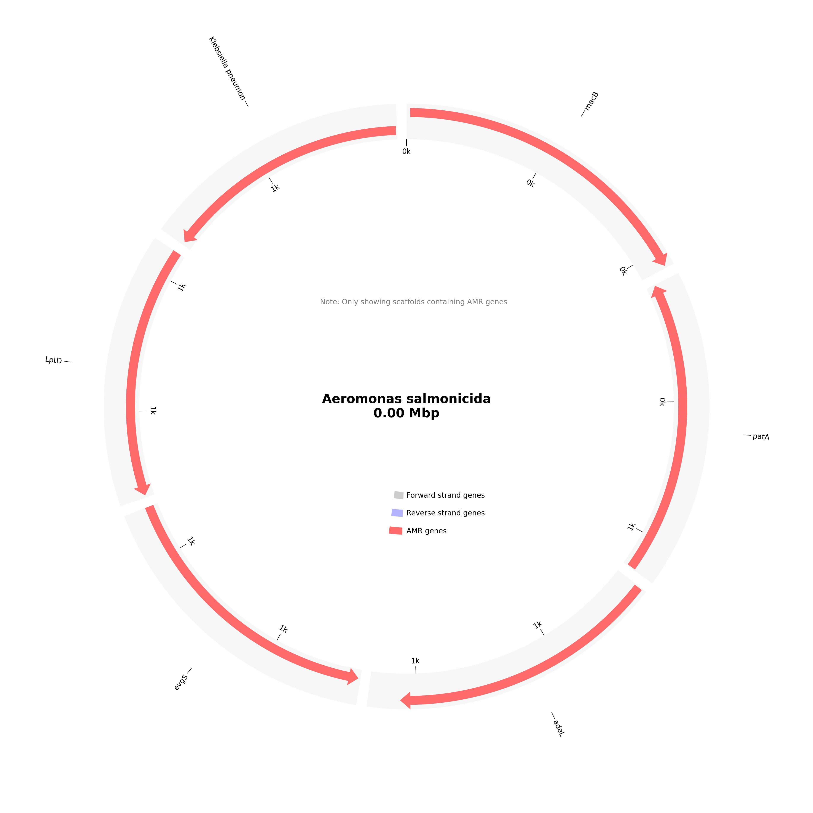

### Klebsiella pneumoniae OmpK37
- **Mechanism**: reduced permeability to antibiotic
- **Drug Classes**: monobactam; carbapenem; cephalosporin; cephamycin; penam; penem
- **AMR Family**: General Bacterial Porin with reduced permeability to beta-lactams
- **Locations**:
  - gnl|SPADES|MOCIJAGE_1920702_1 : position 3-230

### LptD
- **Mechanism**: antibiotic efflux
- **Drug Classes**: carbapenem; peptide antibiotic; aminocoumarin antibiotic; rifamycin antibiotic
- **AMR Family**: ATP-binding cassette (ABC) antibiotic efflux pump
- **Locations**:
  - gnl|SPADES|MOCIJAGE_1861994_1 : position 2-235

### adeL
- **Mechanism**: antibiotic efflux
- **Drug Classes**: fluoroquinolone antibiotic; tetracycline antibiotic
- **AMR Family**: resistance-nodulation-cell division (RND) antibiotic efflux pump
- **Locations**:
  - gnl|SPADES|MOCIJAGE_1475752_1 : position 1-237

### evgS
- **Mechanism**: antibiotic efflux
- **Drug Classes**: macrolide antibiotic; fluoroquinolone antibiotic; penam; tetracycline antibiotic
- **AMR Family**: major facilitator superfamily (MFS) antibiotic efflux pump; resistance-nodulation-cell division (RND) antibiotic efflux pump
- **Locations**:
  - gnl|SPADES|MOCIJAGE_1516793_1 : position 2-262

### macB
- **Mechanism**: antibiotic efflux
- **Drug Classes**: macrolide antibiotic
- **AMR Family**: ATP-binding cassette (ABC) antibiotic efflux pump
- **Locations**:
  - gnl|SPADES|MOCIJAGE_1387614_1 : position 3-272

### patA
- **Mechanism**: antibiotic efflux
- **Drug Classes**: fluoroquinolone antibiotic
- **AMR Family**: ATP-binding cassette (ABC) antibiotic efflux pump
- **Locations**:
  - gnl|SPADES|MOCIJAGE_1388002_1 : position 1-273

## Buttiauxella agrestis
**Strain Statistics:**
- Total genome length: 1.4 kbp
- Total scaffolds: 47
- Scaffolds with AMR genes: 5
- Total genes annotated: 0
- Total AMR genes: 5
- Unique AMR genes: 5
- Distinct AMR mechanisms: 2
- Distinct AMR families: 4
- Distinct drug classes: 6

**Circos Plot:**

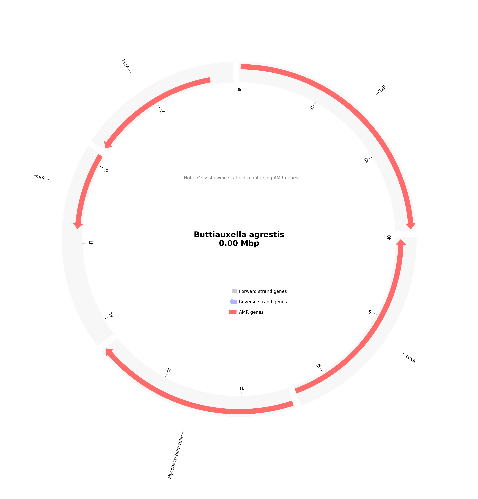

### Mycobacterium tuberculosis intrinsic murA conferring resistance to fosfomycin
- **Mechanism**: antibiotic target alteration
- **Drug Classes**: phosphonic acid antibiotic
- **AMR Family**: antibiotic-resistant murA transferase
- **Locations**:
  - gnl|SPADES|MOCIJAGE_1358451_1 : position 1-276

### TxR
- **Mechanism**: antibiotic efflux
- **Drug Classes**: tetracycline antibiotic
- **AMR Family**: ATP-binding cassette (ABC) antibiotic efflux pump
- **Locations**:
  - gnl|SPADES|MOCIJAGE_880921_1 : position 2-346

### bcrA
- **Mechanism**: antibiotic efflux
- **Drug Classes**: peptide antibiotic
- **AMR Family**: ATP-binding cassette (ABC) antibiotic efflux pump
- **Locations**:
  - gnl|SPADES|MOCIJAGE_2115341_1 : position 2-184

### cpxA
- **Mechanism**: antibiotic efflux
- **Drug Classes**: aminoglycoside antibiotic; aminocoumarin antibiotic
- **AMR Family**: resistance-nodulation-cell division (RND) antibiotic efflux pump
- **Locations**:
  - gnl|SPADES|MOCIJAGE_1318444_1 : position 3-281

### emrR
- **Mechanism**: antibiotic efflux
- **Drug Classes**: fluoroquinolone antibiotic
- **AMR Family**: major facilitator superfamily (MFS) antibiotic efflux pump
- **Locations**:
  - gnl|SPADES|MOCIJAGE_1379292_1 : position 162-272

## Carnobacterium divergens
**Strain Statistics:**
- Total genome length: 2631.4 kbp
- Total scaffolds: 320
- Scaffolds with AMR genes: 32
- Total genes annotated: 5078
- Total AMR genes: 267
- Unique AMR genes: 147
- Distinct AMR mechanisms: 10
- Distinct AMR families: 63
- Distinct drug classes: 32

**Circos Plot:**

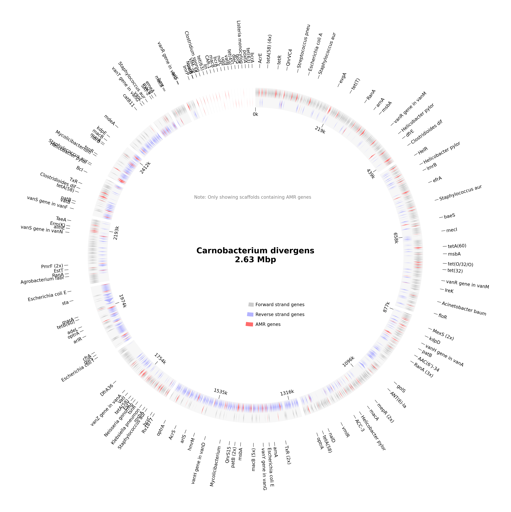

### AAC(6')-34
- **Mechanism**: antibiotic inactivation
- **Drug Classes**: aminoglycoside antibiotic
- **AMR Family**: AAC(6')
- **Locations**:
  - gnl|SPADES|MOCIJAGE_3_94 : position 90477-91004

### AAC(6')-Ii
- **Mechanism**: antibiotic inactivation
- **Drug Classes**: aminoglycoside antibiotic
- **AMR Family**: AAC(6')
- **Locations**:
  - gnl|SPADES|MOCIJAGE_3_304 : position 306057-306515

### ACC-3
- **Mechanism**: antibiotic inactivation
- **Drug Classes**: monobactam; cephalosporin; penam
- **AMR Family**: ACC beta-lactamase
- **Locations**:
  - gnl|SPADES|MOCIJAGE_3_299 : position 301312-302490

### ANT(6)-Ia
- **Mechanism**: antibiotic inactivation
- **Drug Classes**: aminoglycoside antibiotic
- **AMR Family**: ANT(6)
- **Locations**:
  - gnl|SPADES|MOCIJAGE_3_204 : position 195606-196463

### Acinetobacter baumannii AbaF
- **Mechanism**: antibiotic efflux
- **Drug Classes**: phosphonic acid antibiotic
- **AMR Family**: major facilitator superfamily (MFS) antibiotic efflux pump
- **Locations**:
  - gnl|SPADES|MOCIJAGE_3_25 : position 19526-20761

### Acinetobacter baumannii AbaQ
- **Mechanism**: antibiotic efflux
- **Drug Classes**: fluoroquinolone antibiotic
- **AMR Family**: major facilitator superfamily (MFS) antibiotic efflux pump
- **Locations**:
  - gnl|SPADES|MOCIJAGE_2_357 : position 378455-379708

### AcrE
- **Mechanism**: antibiotic efflux
- **Drug Classes**: fluoroquinolone antibiotic; cephalosporin; cephamycin; penam
- **AMR Family**: resistance-nodulation-cell division (RND) antibiotic efflux pump
- **Locations**:
  - gnl|SPADES|MOCIJAGE_1_12 : position 9769-10938

### AcrS (found in 2 locations)
- **Mechanism**: antibiotic efflux
- **Drug Classes**: fluoroquinolone antibiotic; cephalosporin; glycylcycline; cephamycin; penam; tetracycline antibiotic; rifamycin antibiotic; phenicol antibiotic; disinfecting agents and antiseptics
- **AMR Family**: resistance-nodulation-cell division (RND) antibiotic efflux pump
- **Locations**:
  - gnl|SPADES|MOCIJAGE_3_83 : position 81549-82130
  - gnl|SPADES|MOCIJAGE_4_312 : position 330090-330452

### Agrobacterium fabrum chloramphenicol acetyltransferase
- **Mechanism**: antibiotic inactivation
- **Drug Classes**: phenicol antibiotic
- **AMR Family**: chloramphenicol acetyltransferase (CAT)
- **Locations**:
  - gnl|SPADES|MOCIJAGE_7_23 : position 26531-27091

### BcI
- **Mechanism**: antibiotic inactivation
- **Drug Classes**: cephalosporin; penem
- **AMR Family**: class A Bacillus cereus Bc beta-lactamase
- **Locations**:
  - gnl|SPADES|MOCIJAGE_10_101 : position 100332-101237

### CAR-1
- **Mechanism**: antibiotic inactivation
- **Drug Classes**: carbapenem
- **AMR Family**: CAR beta-lactamase
- **Locations**:
  - gnl|SPADES|MOCIJAGE_79065_1 : position 168-785

### CPS-1
- **Mechanism**: antibiotic inactivation
- **Drug Classes**: carbapenem
- **AMR Family**: CPS beta-lactamase
- **Locations**:
  - gnl|SPADES|MOCIJAGE_3_285 : position 288186-288806

### Clostridioides difficile gyrA conferring resistance to fluoroquinolones (found in 2 locations)
- **Mechanism**: antibiotic target alteration
- **Drug Classes**: fluoroquinolone antibiotic
- **AMR Family**: fluoroquinolone resistant gyrA
- **Locations**:
  - gnl|SPADES|MOCIJAGE_10_61 : position 58645-61131
  - gnl|SPADES|MOCIJAGE_1_423 : position 435368-437836

### Clostridioides difficile gyrB conferring resistance to fluoroquinolones (found in 2 locations)
- **Mechanism**: antibiotic target alteration
- **Drug Classes**: fluoroquinolone antibiotic
- **AMR Family**: fluoroquinolone resistant gyrB
- **Locations**:
  - gnl|SPADES|MOCIJAGE_10_60 : position 56643-58580
  - gnl|SPADES|MOCIJAGE_1_422 : position 433351-435378

### Clostridium sporogenes cplR
- **Mechanism**: antibiotic target protection
- **Drug Classes**: lincosamide antibiotic; pleuromutilin antibiotic
- **AMR Family**: Miscellaneous ABC-F subfamily ATP-binding cassette ribosomal protection proteins
- **Locations**:
  - gnl|SPADES|MOCIJAGE_16280_1 : position 3-452

### DfrA36
- **Mechanism**: antibiotic target replacement
- **Drug Classes**: diaminopyrimidine antibiotic
- **AMR Family**: trimethoprim resistant dihydrofolate reductase dfr
- **Locations**:
  - gnl|SPADES|MOCIJAGE_5_119 : position 127183-127707

### Enterococcus faecalis cls with mutation conferring resistance to daptomycin (found in 2 locations)
- **Mechanism**: antibiotic target alteration
- **Drug Classes**: peptide antibiotic
- **AMR Family**: daptomycin resistant cls
- **Locations**:
  - gnl|SPADES|MOCIJAGE_1_285 : position 296275-297723
  - gnl|SPADES|MOCIJAGE_3_239 : position 240395-241912

### Erm(K)
- **Mechanism**: antibiotic target alteration
- **Drug Classes**: macrolide antibiotic; lincosamide antibiotic; streptogramin antibiotic
- **AMR Family**: Erm 23S ribosomal RNA methyltransferase
- **Locations**:
  - gnl|SPADES|MOCIJAGE_7_140 : position 150537-151427

### Escherichia coli AcrAB-TolC with AcrR mutation conferring resistance to ciprofloxacin, tetracycline, and ceftazidime (found in 2 locations)
- **Mechanism**: antibiotic target alteration; antibiotic efflux
- **Drug Classes**: fluoroquinolone antibiotic; cephalosporin; glycylcycline; penam; tetracycline antibiotic; rifamycin antibiotic; phenicol antibiotic; disinfecting agents and antiseptics
- **AMR Family**: resistance-nodulation-cell division (RND) antibiotic efflux pump
- **Locations**:
  - gnl|SPADES|MOCIJAGE_1_128 : position 131317-131925
  - gnl|SPADES|MOCIJAGE_4_177 : position 182489-183115

### Escherichia coli AcrAB-TolC with MarR mutations conferring resistance to ciprofloxacin and tetracycline
- **Mechanism**: antibiotic target alteration; antibiotic efflux
- **Drug Classes**: fluoroquinolone antibiotic; cephalosporin; glycylcycline; penam; tetracycline antibiotic; rifamycin antibiotic; phenicol antibiotic; disinfecting agents and antiseptics
- **AMR Family**: resistance-nodulation-cell division (RND) antibiotic efflux pump
- **Locations**:
  - gnl|SPADES|MOCIJAGE_2_161 : position 174239-174700

### Escherichia coli EF-Tu mutants conferring resistance to kirromycin (found in 2 locations)
- **Mechanism**: antibiotic target alteration
- **Drug Classes**: elfamycin antibiotic
- **AMR Family**: elfamycin resistant EF-Tu
- **Locations**:
  - gnl|SPADES|MOCIJAGE_4_87 : position 95853-97040
  - gnl|SPADES|MOCIJAGE_6_168 : position 182055-183242

### Escherichia coli fabI mutations conferring resistance to isoniazid and triclosan
- **Mechanism**: antibiotic target alteration
- **Drug Classes**: disinfecting agents and antiseptics; isoniazid-like antibiotic
- **AMR Family**: antibiotic resistant fabI
- **Locations**:
  - gnl|SPADES|MOCIJAGE_6_8 : position 6668-7426

### EstT (found in 2 locations)
- **Mechanism**: antibiotic inactivation
- **Drug Classes**: macrolide antibiotic
- **AMR Family**: macrolide esterase
- **Locations**:
  - gnl|SPADES|MOCIJAGE_5_62 : position 67864-68580
  - gnl|SPADES|MOCIJAGE_7_39 : position 43243-44055

### FosC2
- **Mechanism**: antibiotic inactivation
- **Drug Classes**: phosphonic acid antibiotic
- **AMR Family**: fosC phosphotransferase family
- **Locations**:
  - gnl|SPADES|MOCIJAGE_4_86 : position 95427-95807

### HelR
- **Mechanism**: antibiotic target protection
- **Drug Classes**: rifamycin antibiotic
- **AMR Family**: helicase-like RNA polymerase protection protein
- **Locations**:
  - gnl|SPADES|MOCIJAGE_2_8 : position 5558-7852

### Helicobacter pylori pbp1 mutants conferring resistance to amoxicillin (found in 2 locations)
- **Mechanism**: antibiotic target alteration
- **Drug Classes**: cephalosporin; cephamycin; penam
- **AMR Family**: Penicillin-binding protein mutations conferring resistance to beta-lactam antibiotics
- **Locations**:
  - gnl|SPADES|MOCIJAGE_1_385 : position 396433-399030
  - gnl|SPADES|MOCIJAGE_2_30 : position 31754-33880

### Helicobacter pylori rdxA mutation conferring resistance to metronidazole
- **Mechanism**: antibiotic target alteration
- **Drug Classes**: nitroimidazole antibiotic
- **AMR Family**: Antibiotic resistant Helicobacter pylori nitroreductase
- **Locations**:
  - gnl|SPADES|MOCIJAGE_3_281 : position 285343-285981

### Helicobacter pylori rpoB mutation conferring resistance to rifampicin
- **Mechanism**: antibiotic target alteration; antibiotic target replacement
- **Drug Classes**: fluoroquinolone antibiotic; rifamycin antibiotic
- **AMR Family**: rifamycin-resistant beta-subunit of RNA polymerase (rpoB)
- **Locations**:
  - gnl|SPADES|MOCIJAGE_12_4 : position 2944-6573

### IreK (found in 2 locations)
- **Mechanism**: reduced permeability to antibiotic
- **Drug Classes**: cephalosporin
- **AMR Family**: Serine/threonine kinases
- **Locations**:
  - gnl|SPADES|MOCIJAGE_1_305 : position 316109-318109
  - gnl|SPADES|MOCIJAGE_2_329 : position 347209-347757

### Klebsiella pneumoniae KpnH
- **Mechanism**: antibiotic efflux
- **Drug Classes**: macrolide antibiotic; fluoroquinolone antibiotic; aminoglycoside antibiotic; carbapenem; cephalosporin; penam; peptide antibiotic; penem
- **AMR Family**: major facilitator superfamily (MFS) antibiotic efflux pump
- **Locations**:
  - gnl|SPADES|MOCIJAGE_5_35 : position 41189-42037

### Listeria monocytogenes mprF (found in 2 locations)
- **Mechanism**: antibiotic target alteration
- **Drug Classes**: peptide antibiotic
- **AMR Family**: defensin resistant mprF
- **Locations**:
  - gnl|SPADES|MOCIJAGE_1251779_1 : position 2-289
  - gnl|SPADES|MOCIJAGE_1_52 : position 57168-59717

### LlmA 23S ribosomal RNA methyltransferase
- **Mechanism**: antibiotic target alteration
- **Drug Classes**: lincosamide antibiotic
- **AMR Family**: Llm 23S ribosomal RNA methyltransferase
- **Locations**:
  - gnl|SPADES|MOCIJAGE_5_90 : position 97810-98988

### MexS (found in 2 locations)
- **Mechanism**: antibiotic efflux
- **Drug Classes**: fluoroquinolone antibiotic; diaminopyrimidine antibiotic; phenicol antibiotic
- **AMR Family**: resistance-nodulation-cell division (RND) antibiotic efflux pump
- **Locations**:
  - gnl|SPADES|MOCIJAGE_3_20 : position 15777-16760
  - gnl|SPADES|MOCIJAGE_3_235 : position 238097-239038

### Mycolicibacterium smegmatis ndh with mutation conferring resistance to isoniazid (found in 2 locations)
- **Mechanism**: antibiotic target alteration
- **Drug Classes**: isoniazid-like antibiotic
- **AMR Family**: antibiotic resistant ndh
- **Locations**:
  - gnl|SPADES|MOCIJAGE_12_28 : position 29282-31153
  - gnl|SPADES|MOCIJAGE_4_212 : position 215693-216898

### Neisseria gonorrhoeae mtrR with mutation conferring resistance
- **Mechanism**: antibiotic efflux
- **Drug Classes**: macrolide antibiotic
- **AMR Family**: resistance-nodulation-cell division (RND) antibiotic efflux pump
- **Locations**:
  - gnl|SPADES|MOCIJAGE_5_54 : position 61387-61980

### NmcR (found in 2 locations)
- **Mechanism**: antibiotic inactivation
- **Drug Classes**: carbapenem; cephalosporin; cephamycin; penam
- **AMR Family**: NmcA beta-lactamase
- **Locations**:
  - gnl|SPADES|MOCIJAGE_1_426 : position 441431-442384
  - gnl|SPADES|MOCIJAGE_2803_3 : position 1365-1703

### PAM-2
- **Mechanism**: antibiotic inactivation
- **Drug Classes**: carbapenem; cephalosporin
- **AMR Family**: PAM beta-lactamase
- **Locations**:
  - gnl|SPADES|MOCIJAGE_1_61 : position 68730-69443

### PmrF (found in 3 locations)
- **Mechanism**: antibiotic target alteration
- **Drug Classes**: peptide antibiotic
- **AMR Family**: pmr phosphoethanolamine transferase
- **Locations**:
  - gnl|SPADES|MOCIJAGE_4_318 : position 334123-335073
  - gnl|SPADES|MOCIJAGE_7_102 : position 107240-108490
  - gnl|SPADES|MOCIJAGE_7_51 : position 54251-55435

### Pseudomonas mutant PhoP conferring resistance to colistin
- **Mechanism**: antibiotic target alteration; antibiotic efflux; resistance by absence
- **Drug Classes**: macrolide antibiotic; peptide antibiotic
- **AMR Family**: ATP-binding cassette (ABC) antibiotic efflux pump; pmr phosphoethanolamine transferase; transmembrane protein conferring colistin resistance
- **Locations**:
  - gnl|SPADES|MOCIJAGE_3_39 : position 37833-38552

### QnrS15
- **Mechanism**: antibiotic target protection
- **Drug Classes**: fluoroquinolone antibiotic
- **AMR Family**: quinolone resistance protein (qnr)
- **Locations**:
  - gnl|SPADES|MOCIJAGE_4_189 : position 192997-193620

### QnrVC4
- **Mechanism**: antibiotic target protection
- **Drug Classes**: fluoroquinolone antibiotic
- **AMR Family**: quinolone resistance protein (qnr)
- **Locations**:
  - gnl|SPADES|MOCIJAGE_1_68 : position 76648-77283

### RanA (found in 7 locations)
- **Mechanism**: antibiotic efflux
- **Drug Classes**: aminoglycoside antibiotic
- **AMR Family**: ATP-binding cassette (ABC) antibiotic efflux pump
- **Locations**:
  - gnl|SPADES|MOCIJAGE_1_275 : position 284702-285895
  - gnl|SPADES|MOCIJAGE_3_109 : position 107509-108603
  - gnl|SPADES|MOCIJAGE_3_328 : position 330955-331992
  - gnl|SPADES|MOCIJAGE_3_391 : position 397191-398165
  - gnl|SPADES|MOCIJAGE_4_115 : position 120472-121245
  - gnl|SPADES|MOCIJAGE_4_285 : position 297247-298056
  - gnl|SPADES|MOCIJAGE_7_30 : position 33303-34406

### RlmA(II)
- **Mechanism**: antibiotic target alteration
- **Drug Classes**: macrolide antibiotic; lincosamide antibiotic
- **AMR Family**: non-erm 23S ribosomal RNA methyltransferase (G748)
- **Locations**:
  - gnl|SPADES|MOCIJAGE_2_14 : position 12622-13479

### Rv1877
- **Mechanism**: antibiotic efflux
- **Drug Classes**: fluoroquinolone antibiotic
- **AMR Family**: major facilitator superfamily (MFS) antibiotic efflux pump
- **Locations**:
  - gnl|SPADES|MOCIJAGE_5_4 : position 2834-4312

### SAT-2
- **Mechanism**: antibiotic inactivation
- **Drug Classes**: nucleoside antibiotic
- **AMR Family**: streptothricin acetyltransferase (SAT)
- **Locations**:
  - gnl|SPADES|MOCIJAGE_28_36 : position 31612-32457

### SatA
- **Mechanism**: antibiotic inactivation
- **Drug Classes**: nucleoside antibiotic
- **AMR Family**: streptothricin acetyltransferase (SAT)
- **Locations**:
  - gnl|SPADES|MOCIJAGE_5_124 : position 131506-131940

### Staphylococcus aureus fusA with mutation conferring resistance to fusidic acid
- **Mechanism**: antibiotic target alteration
- **Drug Classes**: fusidane antibiotic
- **AMR Family**: antibiotic resistant fusA
- **Locations**:
  - gnl|SPADES|MOCIJAGE_2_118 : position 127283-128860

### Staphylococcus aureus mupA conferring resistance to mupirocin (found in 2 locations)
- **Mechanism**: antibiotic target alteration
- **Drug Classes**: mupirocin-like antibiotic
- **AMR Family**: antibiotic-resistant isoleucyl-tRNA synthetase (ileS)
- **Locations**:
  - gnl|SPADES|MOCIJAGE_1_112 : position 116947-119733
  - gnl|SPADES|MOCIJAGE_7_137 : position 147114-149138

### Staphylococcus aureus mupB conferring resistance to mupirocin (found in 2 locations)
- **Mechanism**: antibiotic target alteration
- **Drug Classes**: mupirocin-like antibiotic
- **AMR Family**: antibiotic-resistant isoleucyl-tRNA synthetase (ileS)
- **Locations**:
  - gnl|SPADES|MOCIJAGE_1_153 : position 155259-157904
  - gnl|SPADES|MOCIJAGE_5_23 : position 24195-26609

### Staphylococcus aureus murA with mutation conferring resistance to fosfomycin (found in 2 locations)
- **Mechanism**: antibiotic target alteration
- **Drug Classes**: phosphonic acid antibiotic
- **AMR Family**: antibiotic-resistant murA transferase
- **Locations**:
  - gnl|SPADES|MOCIJAGE_28_23 : position 18827-20092
  - gnl|SPADES|MOCIJAGE_4_140 : position 145309-146622

### Staphylococcus aureus rpoB mutants conferring resistance to rifampicin
- **Mechanism**: antibiotic target alteration; antibiotic target replacement
- **Drug Classes**: rifamycin antibiotic
- **AMR Family**: rifamycin-resistant beta-subunit of RNA polymerase (rpoB)
- **Locations**:
  - gnl|SPADES|MOCIJAGE_12_5 : position 6691-10266

### Streptococcus pneumoniae PBP2b conferring resistance to amoxicillin
- **Mechanism**: antibiotic target alteration
- **Drug Classes**: cephalosporin; cephamycin; penam
- **AMR Family**: Penicillin-binding protein mutations conferring resistance to beta-lactam antibiotics
- **Locations**:
  - gnl|SPADES|MOCIJAGE_1_70 : position 80177-82297

### Streptococcus pneumoniae PBP2x conferring resistance to amoxicillin
- **Mechanism**: antibiotic target alteration
- **Drug Classes**: cephalosporin; cephamycin; penam
- **AMR Family**: Penicillin-binding protein mutations conferring resistance to beta-lactam antibiotics
- **Locations**:
  - gnl|SPADES|MOCIJAGE_1_99 : position 102679-104844

### TaeA (found in 2 locations)
- **Mechanism**: antibiotic efflux
- **Drug Classes**: pleuromutilin antibiotic
- **AMR Family**: ATP-binding cassette (ABC) antibiotic efflux pump
- **Locations**:
  - gnl|SPADES|MOCIJAGE_1_398 : position 410008-411894
  - gnl|SPADES|MOCIJAGE_7_155 : position 163444-165084

### TxR (found in 3 locations)
- **Mechanism**: antibiotic efflux
- **Drug Classes**: tetracycline antibiotic
- **AMR Family**: ATP-binding cassette (ABC) antibiotic efflux pump
- **Locations**:
  - gnl|SPADES|MOCIJAGE_10_70 : position 69128-71791
  - gnl|SPADES|MOCIJAGE_4_247 : position 255610-258471
  - gnl|SPADES|MOCIJAGE_4_53 : position 54278-56950

### VIM-38
- **Mechanism**: antibiotic inactivation
- **Drug Classes**: carbapenem; cephalosporin; cephamycin; penam; penem
- **AMR Family**: VIM beta-lactamase
- **Locations**:
  - gnl|SPADES|MOCIJAGE_3463_3 : position 750-1409

### VatI
- **Mechanism**: antibiotic inactivation
- **Drug Classes**: streptogramin antibiotic; streptogramin A antibiotic
- **AMR Family**: streptogramin vat acetyltransferase
- **Locations**:
  - gnl|SPADES|MOCIJAGE_5_81 : position 86037-86738

### YajC
- **Mechanism**: antibiotic efflux
- **Drug Classes**: fluoroquinolone antibiotic; cephalosporin; glycylcycline; penam; tetracycline antibiotic; oxazolidinone antibiotic; glycopeptide antibiotic; rifamycin antibiotic; phenicol antibiotic; disinfecting agents and antiseptics
- **AMR Family**: resistance-nodulation-cell division (RND) antibiotic efflux pump
- **Locations**:
  - gnl|SPADES|MOCIJAGE_1_51 : position 56667-57083

### aac(6')-Ib-cr11
- **Mechanism**: antibiotic inactivation
- **Drug Classes**: fluoroquinolone antibiotic; aminoglycoside antibiotic
- **AMR Family**: AAC(6'); AAC(6')-Ib-cr
- **Locations**:
  - gnl|SPADES|MOCIJAGE_3_84 : position 82149-82721

### adeL
- **Mechanism**: antibiotic efflux
- **Drug Classes**: fluoroquinolone antibiotic; tetracycline antibiotic
- **AMR Family**: resistance-nodulation-cell division (RND) antibiotic efflux pump
- **Locations**:
  - gnl|SPADES|MOCIJAGE_6_75 : position 90980-91864

### adeR
- **Mechanism**: antibiotic efflux
- **Drug Classes**: glycylcycline; tetracycline antibiotic
- **AMR Family**: resistance-nodulation-cell division (RND) antibiotic efflux pump
- **Locations**:
  - gnl|SPADES|MOCIJAGE_3_385 : position 389705-390349

### almE (found in 2 locations)
- **Mechanism**: antibiotic target alteration
- **Drug Classes**: peptide antibiotic
- **AMR Family**: polymyxin resistance operon; alm glycyltransferase
- **Locations**:
  - gnl|SPADES|MOCIJAGE_5_65 : position 70936-72462
  - gnl|SPADES|MOCIJAGE_7_134 : position 143891-145330

### arlR (found in 5 locations)
- **Mechanism**: antibiotic efflux
- **Drug Classes**: fluoroquinolone antibiotic; disinfecting agents and antiseptics
- **AMR Family**: major facilitator superfamily (MFS) antibiotic efflux pump
- **Locations**:
  - gnl|SPADES|MOCIJAGE_1_185 : position 184483-185166
  - gnl|SPADES|MOCIJAGE_1_19 : position 17944-18630
  - gnl|SPADES|MOCIJAGE_2_81 : position 88852-89526
  - gnl|SPADES|MOCIJAGE_4_292 : position 304533-305249
  - gnl|SPADES|MOCIJAGE_6_57 : position 65762-67213

### arlS (found in 5 locations)
- **Mechanism**: antibiotic efflux
- **Drug Classes**: fluoroquinolone antibiotic; disinfecting agents and antiseptics
- **AMR Family**: major facilitator superfamily (MFS) antibiotic efflux pump
- **Locations**:
  - gnl|SPADES|MOCIJAGE_118_2 : position 1026-2861
  - gnl|SPADES|MOCIJAGE_1_186 : position 185163-186449
  - gnl|SPADES|MOCIJAGE_1_20 : position 18627-20150
  - gnl|SPADES|MOCIJAGE_2_80 : position 87790-88839
  - gnl|SPADES|MOCIJAGE_4_291 : position 302761-304536

### arnA (found in 2 locations)
- **Mechanism**: antibiotic target alteration
- **Drug Classes**: peptide antibiotic
- **AMR Family**: pmr phosphoethanolamine transferase
- **Locations**:
  - gnl|SPADES|MOCIJAGE_1_302 : position 313006-313956
  - gnl|SPADES|MOCIJAGE_4_76 : position 82979-83560

### bacA
- **Mechanism**: antibiotic target alteration
- **Drug Classes**: peptide antibiotic
- **AMR Family**: undecaprenyl pyrophosphate related proteins
- **Locations**:
  - gnl|SPADES|MOCIJAGE_3_312 : position 315343-316161

### baeS (found in 2 locations)
- **Mechanism**: antibiotic efflux
- **Drug Classes**: aminoglycoside antibiotic; aminocoumarin antibiotic
- **AMR Family**: resistance-nodulation-cell division (RND) antibiotic efflux pump
- **Locations**:
  - gnl|SPADES|MOCIJAGE_2_158 : position 171288-172664
  - gnl|SPADES|MOCIJAGE_4_136 : position 141191-142585

### bcrA (found in 9 locations)
- **Mechanism**: antibiotic efflux
- **Drug Classes**: peptide antibiotic
- **AMR Family**: ATP-binding cassette (ABC) antibiotic efflux pump
- **Locations**:
  - gnl|SPADES|MOCIJAGE_120576_1 : position 3-380
  - gnl|SPADES|MOCIJAGE_2165495_1 : position 1-213
  - gnl|SPADES|MOCIJAGE_2_207 : position 212943-213830
  - gnl|SPADES|MOCIJAGE_2_352 : position 372721-374202
  - gnl|SPADES|MOCIJAGE_2_39 : position 42672-43406
  - gnl|SPADES|MOCIJAGE_2_98 : position 107525-108466
  - gnl|SPADES|MOCIJAGE_3_136 : position 131913-132605
  - gnl|SPADES|MOCIJAGE_3_297 : position 299883-300782
  - gnl|SPADES|MOCIJAGE_3_45 : position 43175-44095

### bcrC
- **Mechanism**: antibiotic target alteration
- **Drug Classes**: peptide antibiotic
- **AMR Family**: undecaprenyl pyrophosphate related proteins
- **Locations**:
  - gnl|SPADES|MOCIJAGE_5_10 : position 9676-10347

### bmr
- **Mechanism**: antibiotic efflux
- **Drug Classes**: fluoroquinolone antibiotic; nucleoside antibiotic; phenicol antibiotic; disinfecting agents and antiseptics
- **AMR Family**: major facilitator superfamily (MFS) antibiotic efflux pump
- **Locations**:
  - gnl|SPADES|MOCIJAGE_40_14 : position 12727-13950

### carA
- **Mechanism**: antibiotic target protection
- **Drug Classes**: macrolide antibiotic
- **AMR Family**: Miscellaneous ABC-F subfamily ATP-binding cassette ribosomal protection proteins
- **Locations**:
  - gnl|SPADES|MOCIJAGE_7_146 : position 155573-156280

### catB11
- **Mechanism**: antibiotic inactivation
- **Drug Classes**: phenicol antibiotic
- **AMR Family**: chloramphenicol acetyltransferase (CAT)
- **Locations**:
  - gnl|SPADES|MOCIJAGE_14_67 : position 75622-76284

### cfrA
- **Mechanism**: antibiotic target alteration
- **Drug Classes**: lincosamide antibiotic; streptogramin antibiotic; streptogramin A antibiotic; oxazolidinone antibiotic; phenicol antibiotic; pleuromutilin antibiotic
- **AMR Family**: Cfr 23S ribosomal RNA methyltransferase
- **Locations**:
  - gnl|SPADES|MOCIJAGE_6_18 : position 20882-21940

### cprR
- **Mechanism**: antibiotic target alteration; antibiotic efflux
- **Drug Classes**: peptide antibiotic
- **AMR Family**: pmr phosphoethanolamine transferase
- **Locations**:
  - gnl|SPADES|MOCIJAGE_2_50 : position 54513-55241

### dfrE
- **Mechanism**: antibiotic target replacement
- **Drug Classes**: diaminopyrimidine antibiotic
- **AMR Family**: trimethoprim resistant dihydrofolate reductase dfr
- **Locations**:
  - gnl|SPADES|MOCIJAGE_1_400 : position 412899-413387

### efrA (found in 4 locations)
- **Mechanism**: antibiotic efflux
- **Drug Classes**: macrolide antibiotic; fluoroquinolone antibiotic; rifamycin antibiotic
- **AMR Family**: ATP-binding cassette (ABC) antibiotic efflux pump
- **Locations**:
  - gnl|SPADES|MOCIJAGE_1_215 : position 214892-216673
  - gnl|SPADES|MOCIJAGE_2_76 : position 81090-82832
  - gnl|SPADES|MOCIJAGE_3_75 : position 73035-74840
  - gnl|SPADES|MOCIJAGE_4_176 : position 180684-182405

### efrB
- **Mechanism**: antibiotic efflux
- **Drug Classes**: macrolide antibiotic; fluoroquinolone antibiotic; rifamycin antibiotic
- **AMR Family**: ATP-binding cassette (ABC) antibiotic efflux pump
- **Locations**:
  - gnl|SPADES|MOCIJAGE_1_216 : position 216670-218448

### emeA
- **Mechanism**: antibiotic efflux
- **Drug Classes**: disinfecting agents and antiseptics
- **AMR Family**: multidrug and toxic compound extrusion (MATE) transporter
- **Locations**:
  - gnl|SPADES|MOCIJAGE_28_51 : position 44269-45471

### evgA
- **Mechanism**: antibiotic efflux
- **Drug Classes**: macrolide antibiotic; fluoroquinolone antibiotic; penam; tetracycline antibiotic
- **AMR Family**: major facilitator superfamily (MFS) antibiotic efflux pump; resistance-nodulation-cell division (RND) antibiotic efflux pump
- **Locations**:
  - gnl|SPADES|MOCIJAGE_1_208 : position 208492-209124

### floR
- **Mechanism**: antibiotic efflux
- **Drug Classes**: phenicol antibiotic
- **AMR Family**: major facilitator superfamily (MFS) antibiotic efflux pump
- **Locations**:
  - gnl|SPADES|MOCIJAGE_2_382 : position 408446-409633

### golS (found in 3 locations)
- **Mechanism**: antibiotic efflux
- **Drug Classes**: monobactam; carbapenem; cephalosporin; cephamycin; penam; phenicol antibiotic; penem
- **AMR Family**: resistance-nodulation-cell division (RND) antibiotic efflux pump
- **Locations**:
  - gnl|SPADES|MOCIJAGE_3_178 : position 173097-173480
  - gnl|SPADES|MOCIJAGE_6_13 : position 13709-14515
  - gnl|SPADES|MOCIJAGE_959240_1 : position 2-331

### hmrM
- **Mechanism**: antibiotic efflux
- **Drug Classes**: fluoroquinolone antibiotic; disinfecting agents and antiseptics
- **AMR Family**: multidrug and toxic compound extrusion (MATE) transporter
- **Locations**:
  - gnl|SPADES|MOCIJAGE_4_269 : position 280818-282167

### kdpD (found in 2 locations)
- **Mechanism**: antibiotic efflux
- **Drug Classes**: aminoglycoside antibiotic
- **AMR Family**: kdpDE
- **Locations**:
  - gnl|SPADES|MOCIJAGE_12_83 : position 87722-90439
  - gnl|SPADES|MOCIJAGE_3_38 : position 36187-37836

### kdpE
- **Mechanism**: antibiotic efflux
- **Drug Classes**: aminoglycoside antibiotic
- **AMR Family**: kdpDE
- **Locations**:
  - gnl|SPADES|MOCIJAGE_12_82 : position 87039-87725

### leuO
- **Mechanism**: antibiotic efflux
- **Drug Classes**: nucleoside antibiotic; disinfecting agents and antiseptics
- **AMR Family**: major facilitator superfamily (MFS) antibiotic efflux pump
- **Locations**:
  - gnl|SPADES|MOCIJAGE_5_123 : position 130671-131486

### lin
- **Mechanism**: antibiotic inactivation
- **Drug Classes**: lincosamide antibiotic
- **AMR Family**: lincosamide nucleotidyltransferase (LNU)
- **Locations**:
  - gnl|SPADES|MOCIJAGE_68031_3 : position 468-815

### lmrB (found in 2 locations)
- **Mechanism**: antibiotic efflux
- **Drug Classes**: lincosamide antibiotic; nucleoside antibiotic
- **AMR Family**: ATP-binding cassette (ABC) antibiotic efflux pump
- **Locations**:
  - gnl|SPADES|MOCIJAGE_2_44 : position 48465-49919
  - gnl|SPADES|MOCIJAGE_3_262 : position 267788-269185

### lmrD
- **Mechanism**: antibiotic efflux
- **Drug Classes**: lincosamide antibiotic
- **AMR Family**: ATP-binding cassette (ABC) antibiotic efflux pump
- **Locations**:
  - gnl|SPADES|MOCIJAGE_3_189 : position 179240-181321

### lmrP
- **Mechanism**: antibiotic efflux
- **Drug Classes**: macrolide antibiotic; lincosamide antibiotic; streptogramin antibiotic; streptogramin A antibiotic; tetracycline antibiotic
- **AMR Family**: major facilitator superfamily (MFS) antibiotic efflux pump
- **Locations**:
  - gnl|SPADES|MOCIJAGE_1935_3 : position 785-1993

### macA
- **Mechanism**: antibiotic efflux
- **Drug Classes**: macrolide antibiotic
- **AMR Family**: ATP-binding cassette (ABC) antibiotic efflux pump
- **Locations**:
  - gnl|SPADES|MOCIJAGE_3_256 : position 261248-262108

### macB (found in 28 locations)
- **Mechanism**: antibiotic efflux
- **Drug Classes**: macrolide antibiotic
- **AMR Family**: ATP-binding cassette (ABC) antibiotic efflux pump
- **Locations**:
  - gnl|SPADES|MOCIJAGE_12_70 : position 75859-76554
  - gnl|SPADES|MOCIJAGE_1_13 : position 10953-11663
  - gnl|SPADES|MOCIJAGE_1_130 : position 133135-133806
  - gnl|SPADES|MOCIJAGE_1_14 : position 11660-12898
  - gnl|SPADES|MOCIJAGE_1_165 : position 167424-168122
  - gnl|SPADES|MOCIJAGE_1_194 : position 195234-195992
  - gnl|SPADES|MOCIJAGE_1_286 : position 297915-299105
  - gnl|SPADES|MOCIJAGE_28_42 : position 36259-37332
  - gnl|SPADES|MOCIJAGE_2_156 : position 169413-170087
  - gnl|SPADES|MOCIJAGE_2_201 : position 207202-207927
  - gnl|SPADES|MOCIJAGE_2_389 : position 416365-417174
  - gnl|SPADES|MOCIJAGE_2_82 : position 89743-90510
  - gnl|SPADES|MOCIJAGE_2_97 : position 106405-107532
  - gnl|SPADES|MOCIJAGE_3_105 : position 101804-103513
  - gnl|SPADES|MOCIJAGE_3_254 : position 259298-260524
  - gnl|SPADES|MOCIJAGE_3_255 : position 260540-261232
  - gnl|SPADES|MOCIJAGE_3_333 : position 334612-336546
  - gnl|SPADES|MOCIJAGE_3_395 : position 400446-401174
  - gnl|SPADES|MOCIJAGE_3_81 : position 79153-79881
  - gnl|SPADES|MOCIJAGE_40_11 : position 10760-11497
  - gnl|SPADES|MOCIJAGE_4_129 : position 134354-135055
  - gnl|SPADES|MOCIJAGE_4_166 : position 171544-172773
  - gnl|SPADES|MOCIJAGE_4_167 : position 172766-173455
  - gnl|SPADES|MOCIJAGE_4_278 : position 289453-292296
  - gnl|SPADES|MOCIJAGE_4_296 : position 308776-309462
  - gnl|SPADES|MOCIJAGE_5_109 : position 117940-118743
  - gnl|SPADES|MOCIJAGE_5_8 : position 7611-8267
  - gnl|SPADES|MOCIJAGE_96997_2 : position 268-744

### marA (found in 2 locations)
- **Mechanism**: antibiotic efflux; reduced permeability to antibiotic
- **Drug Classes**: fluoroquinolone antibiotic; monobactam; carbapenem; cephalosporin; glycylcycline; cephamycin; penam; tetracycline antibiotic; rifamycin antibiotic; phenicol antibiotic; penem; disinfecting agents and antiseptics
- **AMR Family**: resistance-nodulation-cell division (RND) antibiotic efflux pump; General Bacterial Porin with reduced permeability to beta-lactams
- **Locations**:
  - gnl|SPADES|MOCIJAGE_12_61 : position 65535-67445
  - gnl|SPADES|MOCIJAGE_6_97 : position 116569-117405

### mdeA
- **Mechanism**: antibiotic efflux
- **Drug Classes**: fluoroquinolone antibiotic; aminoglycoside antibiotic; penam; tetracycline antibiotic; disinfecting agents and antiseptics
- **AMR Family**: major facilitator superfamily (MFS) antibiotic efflux pump
- **Locations**:
  - gnl|SPADES|MOCIJAGE_14_9 : position 12483-13913

### mdtG
- **Mechanism**: antibiotic efflux
- **Drug Classes**: phosphonic acid antibiotic
- **AMR Family**: major facilitator superfamily (MFS) antibiotic efflux pump
- **Locations**:
  - gnl|SPADES|MOCIJAGE_5_89 : position 96469-97716

### mecA
- **Mechanism**: antibiotic target replacement
- **Drug Classes**: penam
- **AMR Family**: methicillin resistant PBP2
- **Locations**:
  - gnl|SPADES|MOCIJAGE_4_98 : position 106495-108528

### mecI
- **Mechanism**: antibiotic target replacement
- **Drug Classes**: penam
- **AMR Family**: methicillin resistant PBP2
- **Locations**:
  - gnl|SPADES|MOCIJAGE_2_198 : position 204788-205303

### mepR (found in 2 locations)
- **Mechanism**: antibiotic efflux
- **Drug Classes**: glycylcycline; tetracycline antibiotic
- **AMR Family**: multidrug and toxic compound extrusion (MATE) transporter
- **Locations**:
  - gnl|SPADES|MOCIJAGE_3_234 : position 237652-238116
  - gnl|SPADES|MOCIJAGE_3_261 : position 267289-267801

### mgrA
- **Mechanism**: antibiotic efflux
- **Drug Classes**: fluoroquinolone antibiotic; cephalosporin; penam; tetracycline antibiotic; peptide antibiotic; disinfecting agents and antiseptics
- **AMR Family**: ATP-binding cassette (ABC) antibiotic efflux pump; major facilitator superfamily (MFS) antibiotic efflux pump
- **Locations**:
  - gnl|SPADES|MOCIJAGE_4_161 : position 166784-167434

### mreA
- **Mechanism**: antibiotic efflux
- **Drug Classes**: macrolide antibiotic
- **AMR Family**: major facilitator superfamily (MFS) antibiotic efflux pump
- **Locations**:
  - gnl|SPADES|MOCIJAGE_2_274 : position 288714-289658

### msbA (found in 4 locations)
- **Mechanism**: antibiotic efflux
- **Drug Classes**: nitroimidazole antibiotic
- **AMR Family**: ATP-binding cassette (ABC) antibiotic efflux pump
- **Locations**:
  - gnl|SPADES|MOCIJAGE_1_318 : position 329263-332841
  - gnl|SPADES|MOCIJAGE_2_251 : position 260614-261375
  - gnl|SPADES|MOCIJAGE_4_160 : position 165018-166787
  - gnl|SPADES|MOCIJAGE_5_27 : position 30866-32977

### mtrA
- **Mechanism**: antibiotic efflux
- **Drug Classes**: macrolide antibiotic; penam
- **AMR Family**: resistance-nodulation-cell division (RND) antibiotic efflux pump
- **Locations**:
  - gnl|SPADES|MOCIJAGE_4_62 : position 65035-65796

### nalD
- **Mechanism**: antibiotic efflux
- **Drug Classes**: macrolide antibiotic; fluoroquinolone antibiotic; monobactam; carbapenem; cephalosporin; cephamycin; penam; tetracycline antibiotic; peptide antibiotic; aminocoumarin antibiotic; diaminopyrimidine antibiotic; sulfonamide antibiotic; phenicol antibiotic; penem
- **AMR Family**: resistance-nodulation-cell division (RND) antibiotic efflux pump
- **Locations**:
  - gnl|SPADES|MOCIJAGE_3_371 : position 372700-373356

### norB
- **Mechanism**: antibiotic efflux
- **Drug Classes**: fluoroquinolone antibiotic
- **AMR Family**: major facilitator superfamily (MFS) antibiotic efflux pump
- **Locations**:
  - gnl|SPADES|MOCIJAGE_12_58 : position 62331-63704

### norC
- **Mechanism**: antibiotic efflux
- **Drug Classes**: fluoroquinolone antibiotic; disinfecting agents and antiseptics
- **AMR Family**: major facilitator superfamily (MFS) antibiotic efflux pump
- **Locations**:
  - gnl|SPADES|MOCIJAGE_124693_1 : position 3-698

### novA (found in 3 locations)
- **Mechanism**: antibiotic efflux
- **Drug Classes**: aminocoumarin antibiotic
- **AMR Family**: ATP-binding cassette (ABC) antibiotic efflux pump
- **Locations**:
  - gnl|SPADES|MOCIJAGE_3_340 : position 340680-341453
  - gnl|SPADES|MOCIJAGE_4_216 : position 219853-221625
  - gnl|SPADES|MOCIJAGE_4_217 : position 221618-223360

### oleC (found in 2 locations)
- **Mechanism**: antibiotic efflux
- **Drug Classes**: macrolide antibiotic
- **AMR Family**: ATP-binding cassette (ABC) antibiotic efflux pump
- **Locations**:
  - gnl|SPADES|MOCIJAGE_494707_1 : position 3-449
  - gnl|SPADES|MOCIJAGE_4_114 : position 119766-120470

### optrA (found in 4 locations)
- **Mechanism**: antibiotic target protection
- **Drug Classes**: oxazolidinone antibiotic; phenicol antibiotic
- **AMR Family**: Miscellaneous ABC-F subfamily ATP-binding cassette ribosomal protection proteins
- **Locations**:
  - gnl|SPADES|MOCIJAGE_2_276 : position 291144-292742
  - gnl|SPADES|MOCIJAGE_3_397 : position 401681-403513
  - gnl|SPADES|MOCIJAGE_4_340 : position 358386-360386
  - gnl|SPADES|MOCIJAGE_6_70 : position 80809-82437

### otr(B)
- **Mechanism**: antibiotic efflux
- **Drug Classes**: tetracycline antibiotic
- **AMR Family**: major facilitator superfamily (MFS) antibiotic efflux pump
- **Locations**:
  - gnl|SPADES|MOCIJAGE_5_36 : position 42067-42633

### patA (found in 2 locations)
- **Mechanism**: antibiotic efflux
- **Drug Classes**: fluoroquinolone antibiotic
- **AMR Family**: ATP-binding cassette (ABC) antibiotic efflux pump
- **Locations**:
  - gnl|SPADES|MOCIJAGE_5_83 : position 88167-89894
  - gnl|SPADES|MOCIJAGE_6_134 : position 161911-162765

### patB (found in 7 locations)
- **Mechanism**: antibiotic efflux
- **Drug Classes**: fluoroquinolone antibiotic
- **AMR Family**: ATP-binding cassette (ABC) antibiotic efflux pump
- **Locations**:
  - gnl|SPADES|MOCIJAGE_10_27 : position 23467-25605
  - gnl|SPADES|MOCIJAGE_2_77 : position 82825-84600
  - gnl|SPADES|MOCIJAGE_3_74 : position 71291-73042
  - gnl|SPADES|MOCIJAGE_4_175 : position 178789-180684
  - gnl|SPADES|MOCIJAGE_4_284 : position 296470-297234
  - gnl|SPADES|MOCIJAGE_5_84 : position 89887-91647
  - gnl|SPADES|MOCIJAGE_6_93 : position 111186-112946

### poxtA
- **Mechanism**: antibiotic target protection
- **Drug Classes**: tetracycline antibiotic; oxazolidinone antibiotic; phenicol antibiotic
- **AMR Family**: Miscellaneous ABC-F subfamily ATP-binding cassette ribosomal protection proteins
- **Locations**:
  - gnl|SPADES|MOCIJAGE_1665986_1 : position 2-247

### rosB
- **Mechanism**: antibiotic efflux
- **Drug Classes**: peptide antibiotic
- **AMR Family**: major facilitator superfamily (MFS) antibiotic efflux pump
- **Locations**:
  - gnl|SPADES|MOCIJAGE_3_258 : position 263147-264310

### rphB
- **Mechanism**: antibiotic inactivation
- **Drug Classes**: rifamycin antibiotic
- **AMR Family**: rifampin phosphotransferase
- **Locations**:
  - gnl|SPADES|MOCIJAGE_2_126 : position 135288-137009

### sta (found in 3 locations)
- **Mechanism**: antibiotic inactivation
- **Drug Classes**: nucleoside antibiotic
- **AMR Family**: streptothricin acetyltransferase (SAT)
- **Locations**:
  - gnl|SPADES|MOCIJAGE_1_131 : position 133863-134333
  - gnl|SPADES|MOCIJAGE_3_24 : position 18970-19395
  - gnl|SPADES|MOCIJAGE_6_130 : position 158901-159380

### tet(32)
- **Mechanism**: antibiotic target protection
- **Drug Classes**: tetracycline antibiotic
- **AMR Family**: tetracycline-resistant ribosomal protection protein
- **Locations**:
  - gnl|SPADES|MOCIJAGE_2_282 : position 298561-300396

### tet(45)
- **Mechanism**: antibiotic efflux
- **Drug Classes**: tetracycline antibiotic
- **AMR Family**: major facilitator superfamily (MFS) antibiotic efflux pump
- **Locations**:
  - gnl|SPADES|MOCIJAGE_244217_1 : position 2-577

### tet(63) (found in 2 locations)
- **Mechanism**: antibiotic efflux
- **Drug Classes**: tetracycline antibiotic
- **AMR Family**: major facilitator superfamily (MFS) antibiotic efflux pump
- **Locations**:
  - gnl|SPADES|MOCIJAGE_1957934_1 : position 2-226
  - gnl|SPADES|MOCIJAGE_43707_2 : position 605-901

### tet(O/32/O)
- **Mechanism**: antibiotic target protection
- **Drug Classes**: tetracycline antibiotic
- **AMR Family**: tetracycline-resistant ribosomal protection protein
- **Locations**:
  - gnl|SPADES|MOCIJAGE_2_269 : position 283184-285598

### tet(T)
- **Mechanism**: antibiotic target protection
- **Drug Classes**: tetracycline antibiotic
- **AMR Family**: tetracycline-resistant ribosomal protection protein
- **Locations**:
  - gnl|SPADES|MOCIJAGE_1_235 : position 241483-243327

### tetA(58) (found in 8 locations)
- **Mechanism**: antibiotic efflux
- **Drug Classes**: tetracycline antibiotic
- **AMR Family**: major facilitator superfamily (MFS) antibiotic efflux pump
- **Locations**:
  - gnl|SPADES|MOCIJAGE_10_50 : position 47506-48273
  - gnl|SPADES|MOCIJAGE_1_135 : position 136467-137975
  - gnl|SPADES|MOCIJAGE_1_140 : position 142295-143053
  - gnl|SPADES|MOCIJAGE_1_28 : position 28982-30571
  - gnl|SPADES|MOCIJAGE_1_57 : position 64803-65564
  - gnl|SPADES|MOCIJAGE_3_383 : position 387561-388499
  - gnl|SPADES|MOCIJAGE_5_69 : position 75312-76217
  - gnl|SPADES|MOCIJAGE_6_133 : position 161060-161935

### tetA(60)
- **Mechanism**: antibiotic efflux
- **Drug Classes**: tetracycline antibiotic
- **AMR Family**: ATP-binding cassette (ABC) antibiotic efflux pump
- **Locations**:
  - gnl|SPADES|MOCIJAGE_2_238 : position 242063-243814

### tetB(60) (found in 2 locations)
- **Mechanism**: antibiotic efflux
- **Drug Classes**: tetracycline antibiotic
- **AMR Family**: ATP-binding cassette (ABC) antibiotic efflux pump
- **Locations**:
  - gnl|SPADES|MOCIJAGE_2_239 : position 243814-245592
  - gnl|SPADES|MOCIJAGE_6_92 : position 109418-111199

### tetR
- **Mechanism**: antibiotic target alteration; antibiotic efflux
- **Drug Classes**: tetracycline antibiotic
- **AMR Family**: major facilitator superfamily (MFS) antibiotic efflux pump
- **Locations**:
  - gnl|SPADES|MOCIJAGE_1_49 : position 54870-55439

### tsnR (found in 2 locations)
- **Mechanism**: antibiotic target alteration
- **Drug Classes**: peptide antibiotic
- **AMR Family**: non-erm 23S ribosomal RNA methyltransferase (A1067)
- **Locations**:
  - gnl|SPADES|MOCIJAGE_12_34 : position 34770-35639
  - gnl|SPADES|MOCIJAGE_5_47 : position 53203-53958

### ugd
- **Mechanism**: antibiotic target alteration
- **Drug Classes**: peptide antibiotic
- **AMR Family**: pmr phosphoethanolamine transferase
- **Locations**:
  - gnl|SPADES|MOCIJAGE_158428_1 : position 1-654

### vanD
- **Mechanism**: antibiotic target alteration
- **Drug Classes**: glycopeptide antibiotic
- **AMR Family**: glycopeptide resistance gene cluster; Van ligase
- **Locations**:
  - gnl|SPADES|MOCIJAGE_2_170 : position 180944-182314

### vanH gene in vanA cluster
- **Mechanism**: antibiotic target alteration
- **Drug Classes**: glycopeptide antibiotic
- **AMR Family**: vanH; glycopeptide resistance gene cluster
- **Locations**:
  - gnl|SPADES|MOCIJAGE_3_58 : position 55961-56911

### vanH gene in vanD cluster (found in 2 locations)
- **Mechanism**: antibiotic target alteration
- **Drug Classes**: glycopeptide antibiotic
- **AMR Family**: vanH; glycopeptide resistance gene cluster
- **Locations**:
  - gnl|SPADES|MOCIJAGE_3_40 : position 38590-39606
  - gnl|SPADES|MOCIJAGE_4_245 : position 253081-254265

### vanH gene in vanO cluster
- **Mechanism**: antibiotic target alteration
- **Drug Classes**: glycopeptide antibiotic
- **AMR Family**: vanH; glycopeptide resistance gene cluster
- **Locations**:
  - gnl|SPADES|MOCIJAGE_3_86 : position 83486-84475

### vanL
- **Mechanism**: antibiotic target alteration
- **Drug Classes**: glycopeptide antibiotic
- **AMR Family**: glycopeptide resistance gene cluster; Van ligase
- **Locations**:
  - gnl|SPADES|MOCIJAGE_28_11 : position 9275-10366

### vanN
- **Mechanism**: antibiotic target alteration
- **Drug Classes**: glycopeptide antibiotic
- **AMR Family**: glycopeptide resistance gene cluster; Van ligase
- **Locations**:
  - gnl|SPADES|MOCIJAGE_4_90 : position 99544-100671

### vanR gene in vanB cluster
- **Mechanism**: antibiotic target alteration
- **Drug Classes**: glycopeptide antibiotic
- **AMR Family**: glycopeptide resistance gene cluster; vanR
- **Locations**:
  - gnl|SPADES|MOCIJAGE_4_169 : position 174815-175528

### vanR gene in vanE cluster
- **Mechanism**: antibiotic target alteration
- **Drug Classes**: glycopeptide antibiotic
- **AMR Family**: glycopeptide resistance gene cluster; vanR
- **Locations**:
  - gnl|SPADES|MOCIJAGE_1_429 : position 445242-445973

### vanR gene in vanF cluster (found in 2 locations)
- **Mechanism**: antibiotic target alteration
- **Drug Classes**: glycopeptide antibiotic
- **AMR Family**: glycopeptide resistance gene cluster; vanR
- **Locations**:
  - gnl|SPADES|MOCIJAGE_10_6 : position 6078-6767
  - gnl|SPADES|MOCIJAGE_2_159 : position 172661-173332

### vanR gene in vanI cluster (found in 2 locations)
- **Mechanism**: antibiotic target alteration
- **Drug Classes**: glycopeptide antibiotic
- **AMR Family**: glycopeptide resistance gene cluster; vanR
- **Locations**:
  - gnl|SPADES|MOCIJAGE_118_1 : position 312-1019
  - gnl|SPADES|MOCIJAGE_7_122 : position 135845-136489

### vanR gene in vanM cluster (found in 3 locations)
- **Mechanism**: antibiotic target alteration
- **Drug Classes**: glycopeptide antibiotic
- **AMR Family**: glycopeptide resistance gene cluster; vanR
- **Locations**:
  - gnl|SPADES|MOCIJAGE_1_359 : position 370206-370928
  - gnl|SPADES|MOCIJAGE_2_306 : position 326267-326959
  - gnl|SPADES|MOCIJAGE_4_137 : position 142609-143328

### vanS gene in vanB cluster
- **Mechanism**: antibiotic target alteration
- **Drug Classes**: glycopeptide antibiotic
- **AMR Family**: vanS; glycopeptide resistance gene cluster
- **Locations**:
  - gnl|SPADES|MOCIJAGE_4_164 : position 170104-170844

### vanS gene in vanF cluster (found in 2 locations)
- **Mechanism**: antibiotic target alteration
- **Drug Classes**: glycopeptide antibiotic
- **AMR Family**: vanS; glycopeptide resistance gene cluster
- **Locations**:
  - gnl|SPADES|MOCIJAGE_10_5 : position 4892-6028
  - gnl|SPADES|MOCIJAGE_1_360 : position 370936-372759

### vanS gene in vanN cluster
- **Mechanism**: antibiotic target alteration
- **Drug Classes**: glycopeptide antibiotic
- **AMR Family**: vanS; glycopeptide resistance gene cluster
- **Locations**:
  - gnl|SPADES|MOCIJAGE_7_121 : position 134446-135735

### vanT gene in vanG cluster
- **Mechanism**: antibiotic target alteration
- **Drug Classes**: glycopeptide antibiotic
- **AMR Family**: glycopeptide resistance gene cluster; vanT
- **Locations**:
  - gnl|SPADES|MOCIJAGE_28_6: position 3216-4316

### vanY gene in vanG cluster
- **Mechanism**: antibiotic target alteration
- **Drug Classes**: glycopeptide antibiotic
- **AMR Family**: vanY; glycopeptide resistance gene cluster
- **Locations**:
  - gnl|SPADES|MOCIJAGE_4_102: position 110469-111224

### vanZ gene in vanA cluster
- **Mechanism**: antibiotic target alteration
- **Drug Classes**: glycopeptide antibiotic
- **AMR Family**: vanZ; glycopeptide resistance gene cluster
- **Locations**:
  - gnl|SPADES|MOCIJAGE_5_88 : position 95798-96436

### vatB (found in 3 locations)
- **Mechanism**: antibiotic inactivation
- **Drug Classes**: streptogramin antibiotic; streptogramin A antibiotic
- **AMR Family**: streptogramin vat acetyltransferase
- **Locations**:
  - gnl|SPADES|MOCIJAGE_10_19 : position 18618-19199
  - gnl|SPADES|MOCIJAGE_229630_2 : position 403-588
  - gnl|SPADES|MOCIJAGE_2803_2 : position 681-1247

### vga(E) Staphylococcus cohnii
- **Mechanism**: antibiotic target protection
- **Drug Classes**: lincosamide antibiotic; streptogramin antibiotic; streptogramin A antibiotic; pleuromutilin antibiotic
- **AMR Family**: vga-type ABC-F protein
- **Locations**:
  - gnl|SPADES|MOCIJAGE_6_17 : position 18964-20529

### vmlR
- **Mechanism**: antibiotic target protection
- **Drug Classes**: lincosamide antibiotic; streptogramin antibiotic; streptogramin A antibiotic; streptogramin B antibiotic; nucleoside antibiotic; pleuromutilin antibiotic
- **AMR Family**: Miscellaneous ABC-F subfamily ATP-binding cassette ribosomal protection proteins
- **Locations**:
  - gnl|SPADES|MOCIJAGE_3_336 : position 337866-338249

### ykkC (found in 3 locations)
- **Mechanism**: antibiotic efflux
- **Drug Classes**: aminoglycoside antibiotic; tetracycline antibiotic; phenicol antibiotic
- **AMR Family**: small multidrug resistance (SMR) antibiotic efflux pump
- **Locations**:
  - gnl|SPADES|MOCIJAGE_28_12 : position 10520-10837
  - gnl|SPADES|MOCIJAGE_28_13 : position 10834-11163
  - gnl|SPADES|MOCIJAGE_3_282 : position 286077-286403

### ykkD
- **Mechanism**: antibiotic efflux
- **Drug Classes**: aminoglycoside antibiotic; tetracycline antibiotic; phenicol antibiotic
- **AMR Family**: small multidrug resistance (SMR) antibiotic efflux pump
- **Locations**:
  - gnl|SPADES|MOCIJAGE_3_283 : position 286417-286728

## Carnobacterium maltaromaticum
**Strain Statistics:**
- Total genome length: 1548.4 kbp
- Total scaffolds: 913
- Scaffolds with AMR genes: 92
- Total genes annotated: 2885
- Total AMR genes: 203
- Unique AMR genes: 117
- Distinct AMR mechanisms: 10
- Distinct AMR families: 55
- Distinct drug classes: 35

**Circos Plot:**

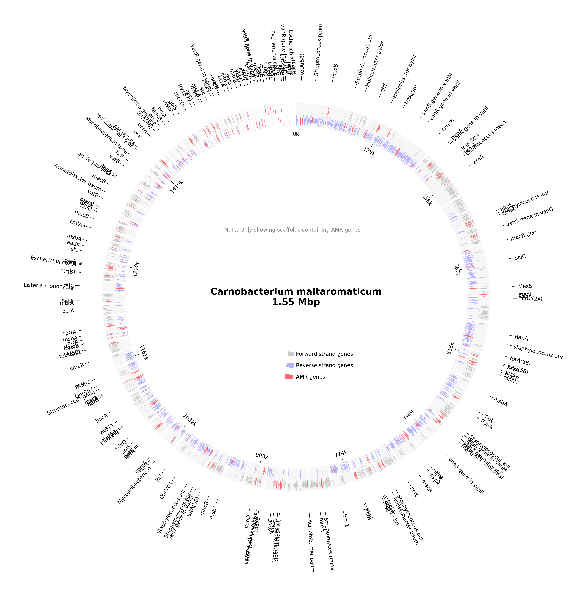

### AAC(6')-34
- **Mechanism**: antibiotic inactivation
- **Drug Classes**: aminoglycoside antibiotic
- **AMR Family**: AAC(6')
- **Locations**:
  - gnl|SPADES|MOCIJAGE_333_6 : position 5008-5541

### Acinetobacter baumannii AbaQ (found in 2 locations)
- **Mechanism**: antibiotic efflux
- **Drug Classes**: fluoroquinolone antibiotic
- **AMR Family**: major facilitator superfamily (MFS) antibiotic efflux pump
- **Locations**:
  - gnl|SPADES|MOCIJAGE_269_5 : position 3874-5166
  - gnl|SPADES|MOCIJAGE_66_1 : position 154-1410

### Acinetobacter baumannii AmvA
- **Mechanism**: antibiotic efflux
- **Drug Classes**: macrolide antibiotic; disinfecting agents and antiseptics
- **AMR Family**: major facilitator superfamily (MFS) antibiotic efflux pump
- **Locations**:
  - gnl|SPADES|MOCIJAGE_58_21 : position 26821-28251

### BcI
- **Mechanism**: antibiotic inactivation
- **Drug Classes**: cephalosporin; penem
- **AMR Family**: class A Bacillus cereus Bc beta-lactamase
- **Locations**:
  - gnl|SPADES|MOCIJAGE_88_17 : position 16847-17746

### Clostridioides difficile gyrA conferring resistance to fluoroquinolones
- **Mechanism**: antibiotic target alteration
- **Drug Classes**: fluoroquinolone antibiotic
- **AMR Family**: fluoroquinolone resistant gyrA
- **Locations**:
  - gnl|SPADES|MOCIJAGE_69_7 : position 7043-9514

### Clostridioides difficile gyrB conferring resistance to fluoroquinolones
- **Mechanism**: antibiotic target alteration
- **Drug Classes**: fluoroquinolone antibiotic
- **AMR Family**: fluoroquinolone resistant gyrB
- **Locations**:
  - gnl|SPADES|MOCIJAGE_69_6 : position 5038-7053

### EdeQ (found in 2 locations)
- **Mechanism**: antibiotic inactivation
- **Drug Classes**: peptide antibiotic; polyamine antibiotic
- **AMR Family**: Edeine acetyltransferase
- **Locations**:
  - gnl|SPADES|MOCIJAGE_11_35 : position 35752-36204
  - gnl|SPADES|MOCIJAGE_96_2 : position 470-922

### Enterococcus faecalis cls with mutation conferring resistance to daptomycin
- **Mechanism**: antibiotic target alteration
- **Drug Classes**: peptide antibiotic
- **AMR Family**: daptomycin resistant cls
- **Locations**:
  - gnl|SPADES|MOCIJAGE_16_32 : position 33800-35248

### ErmR
- **Mechanism**: antibiotic target alteration
- **Drug Classes**: macrolide antibiotic; lincosamide antibiotic; streptogramin antibiotic; streptogramin A antibiotic; streptogramin B antibiotic
- **AMR Family**: Erm 23S ribosomal RNA methyltransferase
- **Locations**:
  - gnl|SPADES|MOCIJAGE_17_44 : position 44798-45691

### Escherichia coli AcrAB-TolC with AcrR mutation conferring resistance to ciprofloxacin, tetracycline, and ceftazidime
- **Mechanism**: antibiotic target alteration; antibiotic efflux
- **Drug Classes**: fluoroquinolone antibiotic; cephalosporin; glycylcycline; penam; tetracycline antibiotic; rifamycin antibiotic; phenicol antibiotic; disinfecting agents and antiseptics
- **AMR Family**: resistance-nodulation-cell division (RND) antibiotic efflux pump
- **Locations**:
  - gnl|SPADES|MOCIJAGE_214_3 : position 2372-3016

### Escherichia coli AcrAB-TolC with MarR mutations conferring resistance to ciprofloxacin and tetracycline
- **Mechanism**: antibiotic target alteration; antibiotic efflux
- **Drug Classes**: fluoroquinolone antibiotic; cephalosporin; glycylcycline; penam; tetracycline antibiotic; rifamycin antibiotic; phenicol antibiotic; disinfecting agents and antiseptics
- **AMR Family**: resistance-nodulation-cell division (RND) antibiotic efflux pump
- **Locations**:
  - gnl|SPADES|MOCIJAGE_73_6 : position 4783-5247

### Escherichia coli EF-Tu mutants conferring resistance to kirromycin
- **Mechanism**: antibiotic target alteration
- **Drug Classes**: elfamycin antibiotic
- **AMR Family**: elfamycin resistant EF-Tu
- **Locations**:
  - gnl|SPADES|MOCIJAGE_443850_1 : position 74-466

### Escherichia coli soxS with mutation conferring antibiotic resistance
- **Mechanism**: antibiotic target alteration; antibiotic efflux; reduced permeability to antibiotic
- **Drug Classes**: fluoroquinolone antibiotic; monobactam; carbapenem; cephalosporin; glycylcycline; cephamycin; penam; tetracycline antibiotic; rifamycin antibiotic; phenicol antibiotic; penem; disinfecting agents and antiseptics
- **AMR Family**: ATP-binding cassette (ABC) antibiotic efflux pump; major facilitator superfamily (MFS) antibiotic efflux pump; resistance-nodulation-cell division (RND) antibiotic efflux pump; General Bacterial Porin with reduced permeability to beta-lactams
- **Locations**:
  - gnl|SPADES|MOCIJAGE_1839954_1 : position 3-236

### Helicobacter pylori frxA mutation conferring resistance to metronidazole
- **Mechanism**: antibiotic target alteration
- **Drug Classes**: nitroimidazole antibiotic
- **AMR Family**: Antibiotic resistant Helicobacter pylori nitroreductase
- **Locations**:
  - gnl|SPADES|MOCIJAGE_333_2 : position 1686-2357

### Helicobacter pylori pbp1 mutants conferring resistance to amoxicillin (found in 2 locations)
- **Mechanism**: antibiotic target alteration
- **Drug Classes**: cephalosporin; cephamycin; penam
- **AMR Family**: Penicillin-binding protein mutations conferring resistance to beta-lactam antibiotics
- **Locations**:
  - gnl|SPADES|MOCIJAGE_11_19 : position 16439-19075
  - gnl|SPADES|MOCIJAGE_9_86 : position 90891-93017

### IreK (found in 3 locations)
- **Mechanism**: reduced permeability to antibiotic
- **Drug Classes**: cephalosporin
- **AMR Family**: Serine/threonine kinases
- **Locations**:
  - gnl|SPADES|MOCIJAGE_16_24 : position 25594-26790
  - gnl|SPADES|MOCIJAGE_16_50 : position 51703-53727
  - gnl|SPADES|MOCIJAGE_377_5 : position 4441-6732

### Listeria monocytogenes mprF
- **Mechanism**: antibiotic target alteration
- **Drug Classes**: peptide antibiotic
- **AMR Family**: defensin resistant mprF
- **Locations**:
  - gnl|SPADES|MOCIJAGE_201_3 : position 3547-6120

### LlmA 23S ribosomal RNA methyltransferase
- **Mechanism**: antibiotic target alteration
- **Drug Classes**: lincosamide antibiotic
- **AMR Family**: Llm 23S ribosomal RNA methyltransferase
- **Locations**:
  - gnl|SPADES|MOCIJAGE_41_33 : position 33590-34756

### MexS (found in 2 locations)
- **Mechanism**: antibiotic efflux
- **Drug Classes**: fluoroquinolone antibiotic; diaminopyrimidine antibiotic; phenicol antibiotic
- **AMR Family**: resistance-nodulation-cell division (RND) antibiotic efflux pump
- **Locations**:
  - gnl|SPADES|MOCIJAGE_20_56 : position 62470-63582
  - gnl|SPADES|MOCIJAGE_687_6 : position 3172-4137

### Mycobacterium tuberculosis pncA mutations conferring resistance to pyrazinamide
- **Mechanism**: antibiotic target alteration
- **Drug Classes**: pyrazine antibiotic
- **AMR Family**: Pyrazinamide resistant pncA
- **Locations**:
  - gnl|SPADES|MOCIJAGE_331_3 : position 2151-2696

### Mycolicibacterium smegmatis ndh with mutation conferring resistance to isoniazid (found in 2 locations)
- **Mechanism**: antibiotic target alteration
- **Drug Classes**: isoniazid-like antibiotic
- **AMR Family**: antibiotic resistant ndh
- **Locations**:
  - gnl|SPADES|MOCIJAGE_430_3 : position 1698-2903
  - gnl|SPADES|MOCIJAGE_90_7 : position 6555-8417

### NmcR (found in 5 locations)
- **Mechanism**: antibiotic inactivation
- **Drug Classes**: carbapenem; cephalosporin; cephamycin; penam
- **AMR Family**: NmcA beta-lactamase
- **Locations**:
  - gnl|SPADES|MOCIJAGE_11_92 : position 91800-92684
  - gnl|SPADES|MOCIJAGE_157_4 : position 2646-3530
  - gnl|SPADES|MOCIJAGE_432_6 : position 3134-4027
  - gnl|SPADES|MOCIJAGE_69_10 : position 13134-14081
  - gnl|SPADES|MOCIJAGE_714_1 : position 2-868

### PAM-2
- **Mechanism**: antibiotic inactivation
- **Drug Classes**: carbapenem; cephalosporin
- **AMR Family**: PAM beta-lactamase
- **Locations**:
  - gnl|SPADES|MOCIJAGE_136_13 : position 15118-15798

### QnrB57
- **Mechanism**: antibiotic target protection
- **Drug Classes**: fluoroquinolone antibiotic
- **AMR Family**: quinolone resistance protein (qnr)
- **Locations**:
  - gnl|SPADES|MOCIJAGE_136_4 : position 5550-6185

### QnrVC1
- **Mechanism**: antibiotic target protection
- **Drug Classes**: fluoroquinolone antibiotic
- **AMR Family**: quinolone resistance protein (qnr)
- **Locations**:
  - gnl|SPADES|MOCIJAGE_88_1 : position 576-1199

### RanA (found in 9 locations)
- **Mechanism**: antibiotic efflux
- **Drug Classes**: aminoglycoside antibiotic
- **AMR Family**: ATP-binding cassette (ABC) antibiotic efflux pump
- **Locations**:
  - gnl|SPADES|MOCIJAGE_16_8 : position 7504-8697
  - gnl|SPADES|MOCIJAGE_20_24 : position 28150-28884
  - gnl|SPADES|MOCIJAGE_20_38 : position 42804-43898
  - gnl|SPADES|MOCIJAGE_259_6 : position 5616-6602
  - gnl|SPADES|MOCIJAGE_281_6 : position 4724-5455
  - gnl|SPADES|MOCIJAGE_32_11 : position 7965-8690
  - gnl|SPADES|MOCIJAGE_36_15 : position 11573-12250
  - gnl|SPADES|MOCIJAGE_39_35 : position 38796-39911
  - gnl|SPADES|MOCIJAGE_908_4 : position 1660-2313

### Rv1877
- **Mechanism**: antibiotic efflux
- **Drug Classes**: fluoroquinolone antibiotic
- **AMR Family**: major facilitator superfamily (MFS) antibiotic efflux pump
- **Locations**:
  - gnl|SPADES|MOCIJAGE_574_4 : position 2953-4437

### SatA
- **Mechanism**: antibiotic inactivation
- **Drug Classes**: nucleoside antibiotic
- **AMR Family**: streptothricin acetyltransferase (SAT)
- **Locations**:
  - gnl|SPADES|MOCIJAGE_178_5 : position 3883-4335

### Staphylococcus aureus LmrS
- **Mechanism**: antibiotic efflux
- **Drug Classes**: macrolide antibiotic; aminoglycoside antibiotic; oxazolidinone antibiotic; diaminopyrimidine antibiotic; phenicol antibiotic
- **AMR Family**: major facilitator superfamily (MFS) antibiotic efflux pump
- **Locations**:
  - gnl|SPADES|MOCIJAGE_9_74 : position 77457-78881

### Staphylococcus aureus fusA with mutation conferring resistance to fusidic acid
- **Mechanism**: antibiotic target alteration
- **Drug Classes**: fusidane antibiotic
- **AMR Family**: antibiotic resistant fusA
- **Locations**:
  - gnl|SPADES|MOCIJAGE_85_2 : position 246-2330

### Staphylococcus aureus mupA conferring resistance to mupirocin (found in 2 locations)
- **Mechanism**: antibiotic target alteration
- **Drug Classes**: mupirocin-like antibiotic
- **AMR Family**: antibiotic-resistant isoleucyl-tRNA synthetase (ileS)
- **Locations**:
  - gnl|SPADES|MOCIJAGE_17_41 : position 41360-43375
  - gnl|SPADES|MOCIJAGE_9_10 : position 8832-11615

### Staphylococcus aureus mupB conferring resistance to mupirocin (found in 2 locations)
- **Mechanism**: antibiotic target alteration
- **Drug Classes**: mupirocin-like antibiotic
- **AMR Family**: antibiotic-resistant isoleucyl-tRNA synthetase (ileS)
- **Locations**:
  - gnl|SPADES|MOCIJAGE_36_28 : position 23235-25904
  - gnl|SPADES|MOCIJAGE_58_17 : position 20429-22843

### Staphylococcus aureus murA with mutation conferring resistance to fosfomycin
- **Mechanism**: antibiotic target alteration
- **Drug Classes**: phosphonic acid antibiotic
- **AMR Family**: antibiotic-resistant murA transferase
- **Locations**:
  - gnl|SPADES|MOCIJAGE_41_21 : position 20314-21621

### Staphylococcus aureus rpoB mutants conferring resistance to rifampicin
- **Mechanism**: antibiotic target alteration; antibiotic target replacement
- **Drug Classes**: rifamycin antibiotic
- **AMR Family**: rifamycin-resistant beta-subunit of RNA polymerase (rpoB)
- **Locations**:
  - gnl|SPADES|MOCIJAGE_85_7 : position 8332-11904

### Streptococcus pneumoniae PBP2b conferring resistance to amoxicillin
- **Mechanism**: antibiotic target alteration
- **Drug Classes**: cephalosporin; cephamycin; penam
- **AMR Family**: Penicillin-binding protein mutations conferring resistance to beta-lactam antibiotics
- **Locations**:
  - gnl|SPADES|MOCIJAGE_136_2 : position 493-2547

### Streptococcus pneumoniae PBP2x conferring resistance to amoxicillin
- **Mechanism**: antibiotic target alteration
- **Drug Classes**: cephalosporin; cephamycin; penam
- **AMR Family**: Penicillin-binding protein mutations conferring resistance to beta-lactam antibiotics
- **Locations**:
  - gnl|SPADES|MOCIJAGE_9_23 : position 24296-26485

### Streptomyces rimosus otr(A)
- **Mechanism**: antibiotic target protection
- **Drug Classes**: tetracycline antibiotic
- **AMR Family**: tetracycline-resistant ribosomal protection protein
- **Locations**:
  - gnl|SPADES|MOCIJAGE_64_10 : position 12890-15397

### TaeA
- **Mechanism**: antibiotic efflux
- **Drug Classes**: pleuromutilin antibiotic
- **AMR Family**: ATP-binding cassette (ABC) antibiotic efflux pump
- **Locations**:
  - gnl|SPADES|MOCIJAGE_11_3 : position 1620-3521

### TxR (found in 2 locations)
- **Mechanism**: antibiotic efflux
- **Drug Classes**: tetracycline antibiotic
- **AMR Family**: ATP-binding cassette (ABC) antibiotic efflux pump
- **Locations**:
  - gnl|SPADES|MOCIJAGE_325_6 : position 4267-7077
  - gnl|SPADES|MOCIJAGE_39_29 : position 30902-33565

### YajC
- **Mechanism**: antibiotic efflux
- **Drug Classes**: fluoroquinolone antibiotic; cephalosporin; glycylcycline; penam; tetracycline antibiotic; oxazolidinone antibiotic; glycopeptide antibiotic; rifamycin antibiotic; phenicol antibiotic; disinfecting agents and antiseptics
- **AMR Family**: resistance-nodulation-cell division (RND) antibiotic efflux pump
- **Locations**:
  - gnl|SPADES|MOCIJAGE_201_4 : position 6300-6677

### YojI
- **Mechanism**: antibiotic efflux
- **Drug Classes**: peptide antibiotic
- **AMR Family**: ATP-binding cassette (ABC) antibiotic efflux pump
- **Locations**:
  - gnl|SPADES|MOCIJAGE_41_28 : position 27453-28001

### aac(6')-Ib-cr11
- **Mechanism**: antibiotic inactivation
- **Drug Classes**: fluoroquinolone antibiotic; aminoglycoside antibiotic
- **AMR Family**: AAC(6'); AAC(6')-Ib-cr
- **Locations**:
  - gnl|SPADES|MOCIJAGE_281_3 : position 1844-2407

### aadK
- **Mechanism**: antibiotic inactivation
- **Drug Classes**: aminoglycoside antibiotic
- **AMR Family**: ANT(6)
- **Locations**:
  - gnl|SPADES|MOCIJAGE_217_14 : position 11718-12569

### almE
- **Mechanism**: antibiotic target alteration
- **Drug Classes**: peptide antibiotic
- **AMR Family**: polymyxin resistance operon; alm glycyltransferase
- **Locations**:
  - gnl|SPADES|MOCIJAGE_17_39 : position 38267-39709

### apmA
- **Mechanism**: antibiotic inactivation
- **Drug Classes**: aminoglycoside antibiotic
- **AMR Family**: AAC(2')
- **Locations**:
  - gnl|SPADES|MOCIJAGE_90_18 : position 15929-16438

### arlS
- **Mechanism**: antibiotic efflux
- **Drug Classes**: fluoroquinolone antibiotic; disinfecting agents and antiseptics
- **AMR Family**: major facilitator superfamily (MFS) antibiotic efflux pump
- **Locations**:
  - gnl|SPADES|MOCIJAGE_38_18 : position 13278-14330

### arnA
- **Mechanism**: antibiotic target alteration
- **Drug Classes**: peptide antibiotic
- **AMR Family**: pmr phosphoethanolamine transferase
- **Locations**:
  - gnl|SPADES|MOCIJAGE_16_47 : position 48589-49542

### arr-1
- **Mechanism**: antibiotic inactivation
- **Drug Classes**: rifamycin antibiotic
- **AMR Family**: rifampin ADP-ribosyltransferase (Arr)
- **Locations**:
  - gnl|SPADES|MOCIJAGE_430_7 : position 5989-6402

### bacA
- **Mechanism**: antibiotic target alteration
- **Drug Classes**: peptide antibiotic
- **AMR Family**: undecaprenyl pyrophosphate related proteins
- **Locations**:
  - gnl|SPADES|MOCIJAGE_99_15 : position 15386-16204

### baeS (found in 2 locations)
- **Mechanism**: antibiotic efflux
- **Drug Classes**: aminoglycoside antibiotic; aminocoumarin antibiotic
- **AMR Family**: resistance-nodulation-cell division (RND) antibiotic efflux pump
- **Locations**:
  - gnl|SPADES|MOCIJAGE_41_27 : position 25887-27338
  - gnl|SPADES|MOCIJAGE_73_3 : position 1719-3107

### basS
- **Mechanism**: antibiotic target alteration; antibiotic efflux
- **Drug Classes**: peptide antibiotic
- **AMR Family**: pmr phosphoethanolamine transferase
- **Locations**:
  - gnl|SPADES|MOCIJAGE_9_48 : position 48757-49821

### bcr-1
- **Mechanism**: antibiotic efflux
- **Drug Classes**: bicyclomycin-like antibiotic
- **AMR Family**: major facilitator superfamily (MFS) antibiotic efflux pump
- **Locations**:
  - gnl|SPADES|MOCIJAGE_62_21 : position 24717-25964

### bcrA (found in 8 locations)
- **Mechanism**: antibiotic efflux
- **Drug Classes**: peptide antibiotic
- **AMR Family**: ATP-binding cassette (ABC) antibiotic efflux pump
- **Locations**:
  - gnl|SPADES|MOCIJAGE_175_10 : position 9206-10132
  - gnl|SPADES|MOCIJAGE_32_14 : position 10697-11584
  - gnl|SPADES|MOCIJAGE_32_24 : position 20155-21060
  - gnl|SPADES|MOCIJAGE_38_9 : position 6442-7218
  - gnl|SPADES|MOCIJAGE_422_9 : position 5807-6553
  - gnl|SPADES|MOCIJAGE_433_2 : position 646-1275
  - gnl|SPADES|MOCIJAGE_864_3 : position 2720-3430
  - gnl|SPADES|MOCIJAGE_9_77 : position 81258-82007

### bcrC
- **Mechanism**: antibiotic target alteration
- **Drug Classes**: peptide antibiotic
- **AMR Family**: undecaprenyl pyrophosphate related proteins
- **Locations**:
  - gnl|SPADES|MOCIJAGE_58_3 : position 2441-3109

### catB11
- **Mechanism**: antibiotic inactivation
- **Drug Classes**: phenicol antibiotic
- **AMR Family**: chloramphenicol acetyltransferase (CAT)
- **Locations**:
  - gnl|SPADES|MOCIJAGE_99_2 : position 768-1424

### cmeR
- **Mechanism**: antibiotic efflux
- **Drug Classes**: macrolide antibiotic; fluoroquinolone antibiotic; cephalosporin; fusidane antibiotic
- **AMR Family**: resistance-nodulation-cell division (RND) antibiotic efflux pump
- **Locations**:
  - gnl|SPADES|MOCIJAGE_145_17 : position 17832-18014

### cmlA9
- **Mechanism**: antibiotic efflux
- **Drug Classes**: phenicol antibiotic
- **AMR Family**: major facilitator superfamily (MFS) antibiotic efflux pump
- **Locations**:
  - gnl|SPADES|MOCIJAGE_241_5 : position 6787-7989

### dfrE
- **Mechanism**: antibiotic target replacement
- **Drug Classes**: diaminopyrimidine antibiotic
- **AMR Family**: trimethoprim resistant dihydrofolate reductase dfr
- **Locations**:
  - gnl|SPADES|MOCIJAGE_11_1 : position 143-631

### efrA (found in 6 locations)
- **Mechanism**: antibiotic efflux
- **Drug Classes**: macrolide antibiotic; fluoroquinolone antibiotic; rifamycin antibiotic
- **AMR Family**: ATP-binding cassette (ABC) antibiotic efflux pump
- **Locations**:
  - gnl|SPADES|MOCIJAGE_147010_2 : position 253-669
  - gnl|SPADES|MOCIJAGE_214_4 : position 3066-4787
  - gnl|SPADES|MOCIJAGE_501558_1 : position 2-445
  - gnl|SPADES|MOCIJAGE_51_4 : position 3583-5337
  - gnl|SPADES|MOCIJAGE_698335_1 : position 1-387
  - gnl|SPADES|MOCIJAGE_94_10 : position 9669-11414

### efrB (found in 2 locations)
- **Mechanism**: antibiotic efflux
- **Drug Classes**: macrolide antibiotic; fluoroquinolone antibiotic; rifamycin antibiotic
- **AMR Family**: ATP-binding cassette (ABC) antibiotic efflux pump
- **Locations**:
  - gnl|SPADES|MOCIJAGE_1643980_1 : position 3-251
  - gnl|SPADES|MOCIJAGE_51_3 : position 1808-3586

### emrR
- **Mechanism**: antibiotic efflux
- **Drug Classes**: fluoroquinolone antibiotic
- **AMR Family**: major facilitator superfamily (MFS) antibiotic efflux pump
- **Locations**:
  - gnl|SPADES|MOCIJAGE_1341_3 : position 2000-2329

### evgA
- **Mechanism**: antibiotic efflux
- **Drug Classes**: macrolide antibiotic; fluoroquinolone antibiotic; penam; tetracycline antibiotic
- **AMR Family**: major facilitator superfamily (MFS) antibiotic efflux pump; resistance-nodulation-cell division (RND) antibiotic efflux pump
- **Locations**:
  - gnl|SPADES|MOCIJAGE_51_9 : position 9349-9981

### golS (found in 6 locations)
- **Mechanism**: antibiotic efflux
- **Drug Classes**: monobactam; carbapenem; cephalosporin; cephamycin; penam; phenicol antibiotic; penem
- **AMR Family**: resistance-nodulation-cell division (RND) antibiotic efflux pump
- **Locations**:
  - gnl|SPADES|MOCIJAGE_1021_2 : position 782-1210
  - gnl|SPADES|MOCIJAGE_11_94 : position 93835-94203
  - gnl|SPADES|MOCIJAGE_11_97 : position 96167-96559
  - gnl|SPADES|MOCIJAGE_32_12 : position 8980-9330
  - gnl|SPADES|MOCIJAGE_533_2 : position 443-823
  - gnl|SPADES|MOCIJAGE_94_17 : position 18102-18860

### kdpE
- **Mechanism**: antibiotic efflux
- **Drug Classes**: aminoglycoside antibiotic
- **AMR Family**: kdpDE
- **Locations**:
  - gnl|SPADES|MOCIJAGE_69_13 : position 16945-17679

### lmrD
- **Mechanism**: antibiotic efflux
- **Drug Classes**: lincosamide antibiotic
- **AMR Family**: ATP-binding cassette (ABC) antibiotic efflux pump
- **Locations**:
  - gnl|SPADES|MOCIJAGE_1447113_2 : position 129-266

### lsaE
- **Mechanism**: antibiotic target protection
- **Drug Classes**: lincosamide antibiotic; streptogramin antibiotic; pleuromutilin antibiotic
- **AMR Family**: lsa-type ABC-F protein
- **Locations**:
  - gnl|SPADES|MOCIJAGE_3703_1 : position 2-1288

### macA
- **Mechanism**: antibiotic efflux
- **Drug Classes**: macrolide antibiotic
- **AMR Family**: ATP-binding cassette (ABC) antibiotic efflux pump
- **Locations**:
  - gnl|SPADES|MOCIJAGE_60_5 : position 4469-5329

### macB (found in 17 locations)
- **Mechanism**: antibiotic efflux
- **Drug Classes**: macrolide antibiotic
- **AMR Family**: ATP-binding cassette (ABC) antibiotic efflux pump
- **Locations**:
  - gnl|SPADES|MOCIJAGE_1036_3 : position 1609-2685
  - gnl|SPADES|MOCIJAGE_16_33 : position 35517-36713
  - gnl|SPADES|MOCIJAGE_1836634_1 : position 3-170
  - gnl|SPADES|MOCIJAGE_20_3 : position 904-2544
  - gnl|SPADES|MOCIJAGE_20_44 : position 49473-51182
  - gnl|SPADES|MOCIJAGE_252_6 : position 5846-6589
  - gnl|SPADES|MOCIJAGE_259_10 : position 9190-9918
  - gnl|SPADES|MOCIJAGE_271_3 : position 2275-3093
  - gnl|SPADES|MOCIJAGE_38_20 : position 15154-17520
  - gnl|SPADES|MOCIJAGE_41_35 : position 36447-37106
  - gnl|SPADES|MOCIJAGE_49820_2 : position 612-875
  - gnl|SPADES|MOCIJAGE_51_21 : position 22363-23121
  - gnl|SPADES|MOCIJAGE_60_3 : position 2519-3745
  - gnl|SPADES|MOCIJAGE_60_4 : position 3761-4453
  - gnl|SPADES|MOCIJAGE_73_1 : position 3-560
  - gnl|SPADES|MOCIJAGE_82_5 : position 5037-5738
  - gnl|SPADES|MOCIJAGE_9_46 : position 46949-47716

### marA (found in 2 locations)
- **Mechanism**: antibiotic efflux; reduced permeability to antibiotic
- **Drug Classes**: fluoroquinolone antibiotic; monobactam; carbapenem; cephalosporin; glycylcycline; cephamycin; penam; tetracycline antibiotic; rifamycin antibiotic; phenicol antibiotic; penem; disinfecting agents and antiseptics
- **AMR Family**: resistance-nodulation-cell division (RND) antibiotic efflux pump; General Bacterial Porin with reduced permeability to beta-lactams
- **Locations**:
  - gnl|SPADES|MOCIJAGE_130_14 : position 15588-16424
  - gnl|SPADES|MOCIJAGE_178_3 : position 1731-2609

### mdtG
- **Mechanism**: antibiotic efflux
- **Drug Classes**: phosphonic acid antibiotic
- **AMR Family**: major facilitator superfamily (MFS) antibiotic efflux pump
- **Locations**:
  - gnl|SPADES|MOCIJAGE_41_32 : position 32334-33542

### mecD
- **Mechanism**: antibiotic target replacement
- **Drug Classes**: penam
- **AMR Family**: methicillin resistant PBP2
- **Locations**:
  - gnl|SPADES|MOCIJAGE_544_3 : position 1823-3853

### mecI
- **Mechanism**: antibiotic target replacement
- **Drug Classes**: penam
- **AMR Family**: methicillin resistant PBP2
- **Locations**:
  - gnl|SPADES|MOCIJAGE_32_8 : position 5563-6018

### mepR
- **Mechanism**: antibiotic efflux
- **Drug Classes**: glycylcycline; tetracycline antibiotic
- **AMR Family**: multidrug and toxic compound extrusion (MATE) transporter
- **Locations**:
  - gnl|SPADES|MOCIJAGE_2251_2 : position 600-1049

### mphO
- **Mechanism**: antibiotic inactivation
- **Drug Classes**: macrolide antibiotic
- **AMR Family**: macrolide phosphotransferase (MPH)
- **Locations**:
  - gnl|SPADES|MOCIJAGE_38_25 : position 19893-20732

### mreA
- **Mechanism**: antibiotic efflux
- **Drug Classes**: macrolide antibiotic
- **AMR Family**: major facilitator superfamily (MFS) antibiotic efflux pump
- **Locations**:
  - gnl|SPADES|MOCIJAGE_64_17 : position 20157-21101

### msbA (found in 7 locations)
- **Mechanism**: antibiotic efflux
- **Drug Classes**: nitroimidazole antibiotic
- **AMR Family**: ATP-binding cassette (ABC) antibiotic efflux pump
- **Locations**:
  - gnl|SPADES|MOCIJAGE_156_24 : position 13045-13884
  - gnl|SPADES|MOCIJAGE_157_13 : position 11937-14087
  - gnl|SPADES|MOCIJAGE_230_5 : position 4128-4913
  - gnl|SPADES|MOCIJAGE_39_7 : position 6701-7483
  - gnl|SPADES|MOCIJAGE_505_3 : position 1521-3671
  - gnl|SPADES|MOCIJAGE_643_2 : position 2689-4428
  - gnl|SPADES|MOCIJAGE_74_20 : position 23561-25276

### msrA
- **Mechanism**: antibiotic target protection
- **Drug Classes**: macrolide antibiotic; streptogramin antibiotic; streptogramin B antibiotic
- **AMR Family**: msr-type ABC-F protein
- **Locations**:
  - gnl|SPADES|MOCIJAGE_5635_1 : position 2-547

### msrE
- **Mechanism**: antibiotic target protection
- **Drug Classes**: macrolide antibiotic; streptogramin antibiotic
- **AMR Family**: msr-type ABC-F protein
- **Locations**:
  - gnl|SPADES|MOCIJAGE_643_1 : position 20-2260

### mtrA
- **Mechanism**: antibiotic efflux
- **Drug Classes**: macrolide antibiotic; penam
- **AMR Family**: resistance-nodulation-cell division (RND) antibiotic efflux pump
- **Locations**:
  - gnl|SPADES|MOCIJAGE_157_8 : position 7257-8111

### nalD (found in 2 locations)
- **Mechanism**: antibiotic efflux
- **Drug Classes**: macrolide antibiotic; fluoroquinolone antibiotic; monobactam; carbapenem; cephalosporin; cephamycin; penam; tetracycline antibiotic; peptide antibiotic; aminocoumarin antibiotic; diaminopyrimidine antibiotic; sulfonamide antibiotic; phenicol antibiotic; penem
- **AMR Family**: resistance-nodulation-cell division (RND) antibiotic efflux pump
- **Locations**:
  - gnl|SPADES|MOCIJAGE_259_3 : position 2433-3083
  - gnl|SPADES|MOCIJAGE_281_4 : position 2428-3006

### oleC
- **Mechanism**: antibiotic efflux
- **Drug Classes**: macrolide antibiotic
- **AMR Family**: ATP-binding cassette (ABC) antibiotic efflux pump
- **Locations**:
  - gnl|SPADES|MOCIJAGE_82_17 : position 18369-19073

### optrA
- **Mechanism**: antibiotic target protection
- **Drug Classes**: oxazolidinone antibiotic; phenicol antibiotic
- **AMR Family**: Miscellaneous ABC-F subfamily ATP-binding cassette ribosomal protection proteins
- **Locations**:
  - gnl|SPADES|MOCIJAGE_168_1 : position 197-2071

### otr(B)
- **Mechanism**: antibiotic efflux
- **Drug Classes**: tetracycline antibiotic
- **AMR Family**: major facilitator superfamily (MFS) antibiotic efflux pump
- **Locations**:
  - gnl|SPADES|MOCIJAGE_213_6 : position 7200-8480

### patA (found in 3 locations)
- **Mechanism**: antibiotic efflux
- **Drug Classes**: fluoroquinolone antibiotic
- **AMR Family**: ATP-binding cassette (ABC) antibiotic efflux pump
- **Locations**:
  - gnl|SPADES|MOCIJAGE_130_13 : position 13436-15190
  - gnl|SPADES|MOCIJAGE_60_30 : position 28946-30667
  - gnl|SPADES|MOCIJAGE_627_1 : position 67-1548

### patB (found in 4 locations)
- **Mechanism**: antibiotic efflux
- **Drug Classes**: fluoroquinolone antibiotic
- **AMR Family**: ATP-binding cassette (ABC) antibiotic efflux pump
- **Locations**:
  - gnl|SPADES|MOCIJAGE_130_12 : position 11662-13443
  - gnl|SPADES|MOCIJAGE_214_5 : position 4789-6687
  - gnl|SPADES|MOCIJAGE_60_31 : position 30667-32439
  - gnl|SPADES|MOCIJAGE_94_11 : position 11416-13167

### ramA
- **Mechanism**: antibiotic efflux; reduced permeability to antibiotic
- **Drug Classes**: fluoroquinolone antibiotic; monobactam; carbapenem; cephalosporin; glycylcycline; cephamycin; penam; tetracycline antibiotic; rifamycin antibiotic; phenicol antibiotic; penem; disinfecting agents and antiseptics
- **AMR Family**: resistance-nodulation-cell division (RND) antibiotic efflux pump; General Bacterial Porin with reduced permeability to beta-lactams
- **Locations**:
  - gnl|SPADES|MOCIJAGE_16_29 : position 31192-32109

### rosB
- **Mechanism**: antibiotic efflux
- **Drug Classes**: peptide antibiotic
- **AMR Family**: major facilitator superfamily (MFS) antibiotic efflux pump
- **Locations**:
  - gnl|SPADES|MOCIJAGE_60_7 : position 6464-7624

### salC
- **Mechanism**: antibiotic target protection
- **Drug Classes**: lincosamide antibiotic; streptogramin antibiotic; streptogramin A antibiotic; pleuromutilin antibiotic
- **AMR Family**: sal-type ABC-F protein
- **Locations**:
  - gnl|SPADES|MOCIJAGE_20_22 : position 26245-26952

### sta (found in 2 locations)
- **Mechanism**: antibiotic inactivation
- **Drug Classes**: nucleoside antibiotic
- **AMR Family**: streptothricin acetyltransferase (SAT)
- **Locations**:
  - gnl|SPADES|MOCIJAGE_217_6 : position 4963-5478
  - gnl|SPADES|MOCIJAGE_671_6 : position 3440-4309

### tet(42)
- **Mechanism**: antibiotic efflux
- **Drug Classes**: tetracycline antibiotic
- **AMR Family**: major facilitator superfamily (MFS) antibiotic efflux pump
- **Locations**:
  - gnl|SPADES|MOCIJAGE_1668_1 : position 239-1474

### tet(S)
- **Mechanism**: antibiotic target protection
- **Drug Classes**: tetracycline antibiotic
- **AMR Family**: tetracycline-resistant ribosomal protection protein
- **Locations**:
  - gnl|SPADES|MOCIJAGE_94396_1 : position 3-602

### tetA(46) (found in 2 locations)
- **Mechanism**: antibiotic efflux
- **Drug Classes**: tetracycline antibiotic
- **AMR Family**: ATP-binding cassette (ABC) antibiotic efflux pump
- **Locations**:
  - gnl|SPADES|MOCIJAGE_428_6 : position 5731-6504
  - gnl|SPADES|MOCIJAGE_878220_1 : position 53-346

### tetA(58) (found in 6 locations)
- **Mechanism**: antibiotic efflux
- **Drug Classes**: tetracycline antibiotic
- **AMR Family**: major facilitator superfamily (MFS) antibiotic efflux pump
- **Locations**:
  - gnl|SPADES|MOCIJAGE_11_33 : position 33971-34888
  - gnl|SPADES|MOCIJAGE_156_25 : position 13860-14741
  - gnl|SPADES|MOCIJAGE_36_42 : position 39483-40241
  - gnl|SPADES|MOCIJAGE_38_7 : position 4816-5778
  - gnl|SPADES|MOCIJAGE_82_16 : position 17592-18365
  - gnl|SPADES|MOCIJAGE_9_7 : position 6505-7422

### tetA(60)
- **Mechanism**: antibiotic efflux
- **Drug Classes**: tetracycline antibiotic
- **AMR Family**: ATP-binding cassette (ABC) antibiotic efflux pump
- **Locations**:
  - gnl|SPADES|MOCIJAGE_96_12 : position 17220-18971

### tetB(58)
- **Mechanism**: antibiotic efflux
- **Drug Classes**: tetracycline antibiotic
- **AMR Family**: major facilitator superfamily (MFS) antibiotic efflux pump
- **Locations**:
  - gnl|SPADES|MOCIJAGE_11_34 : position 34881-35651

### tetB(60)
- **Mechanism**: antibiotic efflux
- **Drug Classes**: tetracycline antibiotic
- **AMR Family**: ATP-binding cassette (ABC) antibiotic efflux pump
- **Locations**:
  - gnl|SPADES|MOCIJAGE_96_11 : position 15430-17220

### tsnR
- **Mechanism**: antibiotic target alteration
- **Drug Classes**: peptide antibiotic
- **AMR Family**: non-erm 23S ribosomal RNA methyltransferase (A1067)
- **Locations**:
  - gnl|SPADES|MOCIJAGE_90_15 : position 13080-13955

### tva(A)
- **Mechanism**: antibiotic target protection
- **Drug Classes**: pleuromutilin antibiotic
- **AMR Family**: Miscellaneous ABC-F subfamily ATP-binding cassette ribosomal protection proteins
- **Locations**:
  - gnl|SPADES|MOCIJAGE_60_1 : position 917-1585

### ugd
- **Mechanism**: antibiotic target alteration
- **Drug Classes**: peptide antibiotic
- **AMR Family**: pmr phosphoethanolamine transferase
- **Locations**:
  - gnl|SPADES|MOCIJAGE_8018_2 : position 205-1287

### vanD
- **Mechanism**: antibiotic target alteration
- **Drug Classes**: glycopeptide antibiotic
- **AMR Family**: glycopeptide resistance gene cluster; Van ligase
- **Locations**:
  - gnl|SPADES|MOCIJAGE_73_15 : position 11579-12943

### vanR gene in vanB cluster
- **Mechanism**: antibiotic target alteration
- **Drug Classes**: glycopeptide antibiotic
- **AMR Family**: glycopeptide resistance gene cluster; vanR
- **Locations**:
  - gnl|SPADES|MOCIJAGE_2095_2 : position 1509-1925

### vanR gene in vanC cluster
- **Mechanism**: antibiotic target alteration
- **Drug Classes**: glycopeptide antibiotic
- **AMR Family**: glycopeptide resistance gene cluster; vanR
- **Locations**:
  - gnl|SPADES|MOCIJAGE_1117974_1 : position 75-305

### vanR gene in vanE cluster
- **Mechanism**: antibiotic target alteration
- **Drug Classes**: glycopeptide antibiotic
- **AMR Family**: glycopeptide resistance gene cluster; vanR
- **Locations**:
  - gnl|SPADES|MOCIJAGE_693_1 : position 175-864

### vanR gene in vanF cluster (found in 2 locations)
- **Mechanism**: antibiotic target alteration
- **Drug Classes**: glycopeptide antibiotic
- **AMR Family**: glycopeptide resistance gene cluster; vanR
- **Locations**:
  - gnl|SPADES|MOCIJAGE_11_74 : position 71323-72030
  - gnl|SPADES|MOCIJAGE_38_19 : position 14327-15001

### vanR gene in vanI cluster (found in 4 locations)
- **Mechanism**: antibiotic target alteration
- **Drug Classes**: glycopeptide antibiotic
- **AMR Family**: glycopeptide resistance gene cluster; vanR
- **Locations**:
  - gnl|SPADES|MOCIJAGE_16_11 : position 10744-11439
  - gnl|SPADES|MOCIJAGE_17_60 : position 61083-61778
  - gnl|SPADES|MOCIJAGE_73_4 : position 3104-3775
  - gnl|SPADES|MOCIJAGE_9_47 : position 47955-48629

### vanR gene in vanM cluster (found in 3 locations)
- **Mechanism**: antibiotic target alteration
- **Drug Classes**: glycopeptide antibiotic
- **AMR Family**: glycopeptide resistance gene cluster; vanR
- **Locations**:
  - gnl|SPADES|MOCIJAGE_11_62 : position 61158-61880
  - gnl|SPADES|MOCIJAGE_41_26 : position 25165-25884
  - gnl|SPADES|MOCIJAGE_48_16 : position 18154-18843

### vanS gene in vanB cluster
- **Mechanism**: antibiotic target alteration
- **Drug Classes**: glycopeptide antibiotic
- **AMR Family**: vanS; glycopeptide resistance gene cluster
- **Locations**:
  - gnl|SPADES|MOCIJAGE_2095_1 : position 2-1033

### vanS gene in vanF cluster
- **Mechanism**: antibiotic target alteration
- **Drug Classes**: glycopeptide antibiotic
- **AMR Family**: vanS; glycopeptide resistance gene cluster
- **Locations**:
  - gnl|SPADES|MOCIJAGE_48_15 : position 16967-18100

### vanS gene in vanG cluster (found in 2 locations)
- **Mechanism**: antibiotic target alteration
- **Drug Classes**: glycopeptide antibiotic
- **AMR Family**: vanS; glycopeptide resistance gene cluster
- **Locations**:
  - gnl|SPADES|MOCIJAGE_16_12 : position 11429-13630
  - gnl|SPADES|MOCIJAGE_17_59 : position 59586-61076

### vanS gene in vanM cluster
- **Mechanism**: antibiotic target alteration
- **Drug Classes**: glycopeptide antibiotic
- **AMR Family**: vanS; glycopeptide resistance gene cluster
- **Locations**:
  - gnl|SPADES|MOCIJAGE_11_61 : position 59349-61151

### vanY gene in vanG cluster
- **Mechanism**: antibiotic target alteration
- **Drug Classes**: glycopeptide antibiotic
- **AMR Family**: vanY; glycopeptide resistance gene cluster
- **Locations**:
  - gnl|SPADES|MOCIJAGE_82_24: position 24487-25260

### vanZ gene in vanF cluster
- **Mechanism**: antibiotic target alteration
- **Drug Classes**: glycopeptide antibiotic
- **AMR Family**: vanZ; glycopeptide resistance gene cluster
- **Locations**:
  - gnl|SPADES|MOCIJAGE_41_31 : position 31581-32231

### vatB (found in 3 locations)
- **Mechanism**: antibiotic inactivation
- **Drug Classes**: streptogramin antibiotic; streptogramin A antibiotic
- **AMR Family**: streptogramin vat acetyltransferase
- **Locations**:
  - gnl|SPADES|MOCIJAGE_157_3 : position 1961-2539
  - gnl|SPADES|MOCIJAGE_308_7 : position 8344-8895
  - gnl|SPADES|MOCIJAGE_714_2 : position 995-1564

### vatE
- **Mechanism**: antibiotic inactivation
- **Drug Classes**: streptogramin antibiotic; streptogramin A antibiotic
- **AMR Family**: streptogramin vat acetyltransferase
- **Locations**:
  - gnl|SPADES|MOCIJAGE_263_11 : position 8292-8903

### vatH
- **Mechanism**: antibiotic inactivation
- **Drug Classes**: streptogramin antibiotic; streptogramin A antibiotic
- **AMR Family**: streptogramin vat acetyltransferase
- **Locations**:
  - gnl|SPADES|MOCIJAGE_1422_2 : position 994-1611

### ykkC
- **Mechanism**: antibiotic efflux
- **Drug Classes**: aminoglycoside antibiotic; tetracycline antibiotic; phenicol antibiotic
- **AMR Family**: small multidrug resistance (SMR) antibiotic efflux pump
- **Locations**:
  - gnl|SPADES|MOCIJAGE_1147_2 : position 2066-2389

### ykkD
- **Mechanism**: antibiotic efflux
- **Drug Classes**: aminoglycoside antibiotic; tetracycline antibiotic; phenicol antibiotic
- **AMR Family**: small multidrug resistance (SMR) antibiotic efflux pump
- **Locations**:
  - gnl|SPADES|MOCIJAGE_1147_3 : position 2406-2723

## Carnobacterium maltaromaticum LMA28
**Strain Statistics:**
- Total genome length: 1245.1 kbp
- Total scaffolds: 284
- Scaffolds with AMR genes: 47
- Total genes annotated: 2283
- Total AMR genes: 136
- Unique AMR genes: 94
- Distinct AMR mechanisms: 8
- Distinct AMR families: 45
- Distinct drug classes: 29

**Circos Plot:**

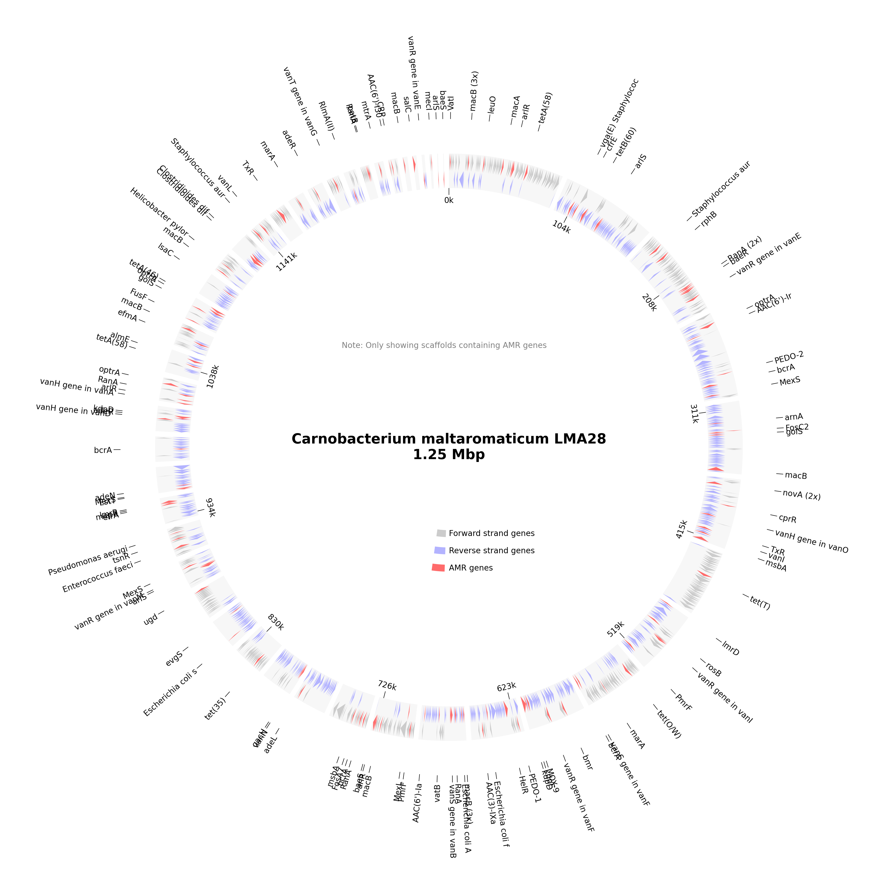

### AAC(3)-IXa
- **Mechanism**: antibiotic inactivation
- **Drug Classes**: aminoglycoside antibiotic
- **AMR Family**: AAC(3)
- **Locations**:
  - gnl|SPADES|MOCIJAGE_37_28 : position 31955-32767

### AAC(6')-I30
- **Mechanism**: antibiotic inactivation
- **Drug Classes**: aminoglycoside antibiotic
- **AMR Family**: AAC(6')
- **Locations**:
  - gnl|SPADES|MOCIJAGE_397_1 : position 3-284

### AAC(6')-Ia
- **Mechanism**: antibiotic inactivation
- **Drug Classes**: aminoglycoside antibiotic
- **AMR Family**: AAC(6')
- **Locations**:
  - gnl|SPADES|MOCIJAGE_43_35 : position 33743-34279

### AAC(6')-Ir
- **Mechanism**: antibiotic inactivation
- **Drug Classes**: aminoglycoside antibiotic
- **AMR Family**: AAC(6')
- **Locations**:
  - gnl|SPADES|MOCIJAGE_19_12 : position 12483-13088

### CRP
- **Mechanism**: antibiotic efflux
- **Drug Classes**: macrolide antibiotic; fluoroquinolone antibiotic; penam
- **AMR Family**: resistance-nodulation-cell division (RND) antibiotic efflux pump
- **Locations**:
  - gnl|SPADES|MOCIJAGE_397_4 : position 1955-2617

### Clostridioides difficile gyrA conferring resistance to fluoroquinolones
- **Mechanism**: antibiotic target alteration
- **Drug Classes**: fluoroquinolone antibiotic
- **AMR Family**: fluoroquinolone resistant gyrA
- **Locations**:
  - gnl|SPADES|MOCIJAGE_165_6 : position 4149-6698

### Clostridioides difficile gyrB conferring resistance to fluoroquinolones
- **Mechanism**: antibiotic target alteration
- **Drug Classes**: fluoroquinolone antibiotic
- **AMR Family**: fluoroquinolone resistant gyrB
- **Locations**:
  - gnl|SPADES|MOCIJAGE_165_7 : position 6848-8785

### Enterococcus faecium cls conferring resistance to daptomycin
- **Mechanism**: antibiotic target alteration
- **Drug Classes**: peptide antibiotic
- **AMR Family**: daptomycin resistant cls
- **Locations**:
  - gnl|SPADES|MOCIJAGE_103_8 : position 5957-7477

### Escherichia coli AcrAB-TolC with AcrR mutation conferring resistance to ciprofloxacin, tetracycline, and ceftazidime
- **Mechanism**: antibiotic target alteration; antibiotic efflux
- **Drug Classes**: fluoroquinolone antibiotic; cephalosporin; glycylcycline; penam; tetracycline antibiotic; rifamycin antibiotic; phenicol antibiotic; disinfecting agents and antiseptics
- **AMR Family**: resistance-nodulation-cell division (RND) antibiotic efflux pump
- **Locations**:
  - gnl|SPADES|MOCIJAGE_43_4 : position 2450-3046

### Escherichia coli EF-Tu mutants conferring resistance to Pulvomycin
- **Mechanism**: antibiotic target alteration
- **Drug Classes**: elfamycin antibiotic
- **AMR Family**: elfamycin resistant EF-Tu
- **Locations**:
  - gnl|SPADES|MOCIJAGE_22_21 : position 23827-24549

### Escherichia coli EF-Tu mutants conferring resistance to kirromycin
- **Mechanism**: antibiotic target alteration
- **Drug Classes**: elfamycin antibiotic
- **AMR Family**: elfamycin resistant EF-Tu
- **Locations**:
  - gnl|SPADES|MOCIJAGE_22_20 : position 23364-23768

### Escherichia coli fabI mutations conferring resistance to isoniazid and triclosan
- **Mechanism**: antibiotic target alteration
- **Drug Classes**: disinfecting agents and antiseptics; isoniazid-like antibiotic
- **AMR Family**: antibiotic resistant fabI
- **Locations**:
  - gnl|SPADES|MOCIJAGE_37_21 : position 26438-27196

### Escherichia coli soxS with mutation conferring antibiotic resistance
- **Mechanism**: antibiotic target alteration; antibiotic efflux; reduced permeability to antibiotic
- **Drug Classes**: fluoroquinolone antibiotic; monobactam; carbapenem; cephalosporin; glycylcycline; cephamycin; penam; tetracycline antibiotic; rifamycin antibiotic; phenicol antibiotic; penem; disinfecting agents and antiseptics
- **AMR Family**: ATP-binding cassette (ABC) antibiotic efflux pump; major facilitator superfamily (MFS) antibiotic efflux pump; resistance-nodulation-cell division (RND) antibiotic efflux pump; General Bacterial Porin with reduced permeability to beta-lactams
- **Locations**:
  - gnl|SPADES|MOCIJAGE_87_4 : position 4997-5524

### EstT
- **Mechanism**: antibiotic inactivation
- **Drug Classes**: macrolide antibiotic
- **AMR Family**: macrolide esterase
- **Locations**:
  - gnl|SPADES|MOCIJAGE_120_1 : position 1-381

### FosA7
- **Mechanism**: antibiotic inactivation
- **Drug Classes**: phosphonic acid antibiotic
- **AMR Family**: fosfomycin thiol transferase
- **Locations**:
  - gnl|SPADES|MOCIJAGE_71_10 : position 8083-8463

### FosC2
- **Mechanism**: antibiotic inactivation
- **Drug Classes**: phosphonic acid antibiotic
- **AMR Family**: fosC phosphotransferase family
- **Locations**:
  - gnl|SPADES|MOCIJAGE_22_19 : position 22929-23309

### FusF
- **Mechanism**: antibiotic target protection
- **Drug Classes**: fusidane antibiotic
- **AMR Family**: Target protecting FusB-type protein conferring resistance to Fusidic acid
- **Locations**:
  - gnl|SPADES|MOCIJAGE_143_1 : position 528-1175

### HelR
- **Mechanism**: antibiotic target protection
- **Drug Classes**: rifamycin antibiotic
- **AMR Family**: helicase-like RNA polymerase protection protein
- **Locations**:
  - gnl|SPADES|MOCIJAGE_37_9 : position 8947-11238

### Helicobacter pylori rdxA mutation conferring resistance to metronidazole
- **Mechanism**: antibiotic target alteration
- **Drug Classes**: nitroimidazole antibiotic
- **AMR Family**: Antibiotic resistant Helicobacter pylori nitroreductase
- **Locations**:
  - gnl|SPADES|MOCIJAGE_163_9 : position 7735-8364

### MOX-9
- **Mechanism**: antibiotic inactivation
- **Drug Classes**: cephalosporin; cephamycin; penam
- **AMR Family**: MOX beta-lactamase
- **Locations**:
  - gnl|SPADES|MOCIJAGE_31_33 : position 39830-41086

### MexL
- **Mechanism**: antibiotic efflux
- **Drug Classes**: macrolide antibiotic; tetracycline antibiotic; disinfecting agents and antiseptics
- **AMR Family**: resistance-nodulation-cell division (RND) antibiotic efflux pump
- **Locations**:
  - gnl|SPADES|MOCIJAGE_54_6 : position 6003-6620

### MexS (found in 3 locations)
- **Mechanism**: antibiotic efflux
- **Drug Classes**: fluoroquinolone antibiotic; diaminopyrimidine antibiotic; phenicol antibiotic
- **AMR Family**: resistance-nodulation-cell division (RND) antibiotic efflux pump
- **Locations**:
  - gnl|SPADES|MOCIJAGE_102_18 : position 15781-16725
  - gnl|SPADES|MOCIJAGE_120_2 : position 401-1489
  - gnl|SPADES|MOCIJAGE_19_58 : position 63767-64705

### PEDO-1
- **Mechanism**: antibiotic inactivation
- **Drug Classes**: carbapenem
- **AMR Family**: subclass B3 PEDO beta-lactamase
- **Locations**:
  - gnl|SPADES|MOCIJAGE_37_3 : position 3080-3781

### PEDO-2
- **Mechanism**: antibiotic inactivation
- **Drug Classes**: carbapenem
- **AMR Family**: subclass B3 PEDO beta-lactamase
- **Locations**:
  - gnl|SPADES|MOCIJAGE_19_44 : position 48622-49239

### PmrF (found in 2 locations)
- **Mechanism**: antibiotic target alteration
- **Drug Classes**: peptide antibiotic
- **AMR Family**: pmr phosphoethanolamine transferase
- **Locations**:
  - gnl|SPADES|MOCIJAGE_26_37 : position 47223-48473
  - gnl|SPADES|MOCIJAGE_54_4 : position 2975-3922

### Pseudomonas aeruginosa soxR
- **Mechanism**: antibiotic target alteration; antibiotic efflux
- **Drug Classes**: fluoroquinolone antibiotic; cephalosporin; glycylcycline; penam; tetracycline antibiotic; rifamycin antibiotic; phenicol antibiotic; disinfecting agents and antiseptics
- **AMR Family**: ATP-binding cassette (ABC) antibiotic efflux pump; major facilitator superfamily (MFS) antibiotic efflux pump; resistance-nodulation-cell division (RND) antibiotic efflux pump
- **Locations**:
  - gnl|SPADES|MOCIJAGE_103_21 : position 17906-18343

### RanA (found in 6 locations)
- **Mechanism**: antibiotic efflux
- **Drug Classes**: aminoglycoside antibiotic
- **AMR Family**: ATP-binding cassette (ABC) antibiotic efflux pump
- **Locations**:
  - gnl|SPADES|MOCIJAGE_135_6 : position 7229-8344
  - gnl|SPADES|MOCIJAGE_18_44 : position 47223-48332
  - gnl|SPADES|MOCIJAGE_18_60 : position 64922-66439
  - gnl|SPADES|MOCIJAGE_380_5 : position 4574-5380
  - gnl|SPADES|MOCIJAGE_43_8 : position 7392-8432
  - gnl|SPADES|MOCIJAGE_71_4 : position 2701-3732

### RlmA(II)
- **Mechanism**: antibiotic target alteration
- **Drug Classes**: macrolide antibiotic; lincosamide antibiotic
- **AMR Family**: non-erm 23S ribosomal RNA methyltransferase (G748)
- **Locations**:
  - gnl|SPADES|MOCIJAGE_286_3 : position 2185-3042

### Staphylococcus aureus fusA with mutation conferring resistance to fusidic acid
- **Mechanism**: antibiotic target alteration
- **Drug Classes**: fusidane antibiotic
- **AMR Family**: antibiotic resistant fusA
- **Locations**:
  - gnl|SPADES|MOCIJAGE_18_9 : position 8752-10329

### Staphylococcus aureus murA with mutation conferring resistance to fosfomycin
- **Mechanism**: antibiotic target alteration
- **Drug Classes**: phosphonic acid antibiotic
- **AMR Family**: antibiotic-resistant murA transferase
- **Locations**:
  - gnl|SPADES|MOCIJAGE_171_2 : position 1845-3113

### TxR (found in 2 locations)
- **Mechanism**: antibiotic efflux
- **Drug Classes**: tetracycline antibiotic
- **AMR Family**: ATP-binding cassette (ABC) antibiotic efflux pump
- **Locations**:
  - gnl|SPADES|MOCIJAGE_198_7 : position 6279-8975
  - gnl|SPADES|MOCIJAGE_23_40 : position 43624-44985

### VatI
- **Mechanism**: antibiotic inactivation
- **Drug Classes**: streptogramin antibiotic; streptogramin A antibiotic
- **AMR Family**: streptogramin vat acetyltransferase
- **Locations**:
  - gnl|SPADES|MOCIJAGE_13_3 : position 759-1460

### adeL
- **Mechanism**: antibiotic efflux
- **Drug Classes**: fluoroquinolone antibiotic; tetracycline antibiotic
- **AMR Family**: resistance-nodulation-cell division (RND) antibiotic efflux pump
- **Locations**:
  - gnl|SPADES|MOCIJAGE_78_19 : position 23556-24443

### adeN
- **Mechanism**: antibiotic efflux
- **Drug Classes**: macrolide antibiotic; fluoroquinolone antibiotic; lincosamide antibiotic; carbapenem; cephalosporin; tetracycline antibiotic; rifamycin antibiotic; diaminopyrimidine antibiotic; phenicol antibiotic; penem
- **AMR Family**: resistance-nodulation-cell division (RND) antibiotic efflux pump
- **Locations**:
  - gnl|SPADES|MOCIJAGE_120_5 : position 3312-3887

### adeR (found in 2 locations)
- **Mechanism**: antibiotic efflux
- **Drug Classes**: glycylcycline; tetracycline antibiotic
- **AMR Family**: resistance-nodulation-cell division (RND) antibiotic efflux pump
- **Locations**:
  - gnl|SPADES|MOCIJAGE_127_10 : position 11265-11993
  - gnl|SPADES|MOCIJAGE_216_5 : position 5027-5725

### almE
- **Mechanism**: antibiotic target alteration
- **Drug Classes**: peptide antibiotic
- **AMR Family**: polymyxin resistance operon; alm glycyltransferase
- **Locations**:
  - gnl|SPADES|MOCIJAGE_141_11 : position 14010-15533

### arlR (found in 4 locations)
- **Mechanism**: antibiotic efflux
- **Drug Classes**: fluoroquinolone antibiotic; disinfecting agents and antiseptics
- **AMR Family**: major facilitator superfamily (MFS) antibiotic efflux pump
- **Locations**:
  - gnl|SPADES|MOCIJAGE_135_3 : position 3073-3873
  - gnl|SPADES|MOCIJAGE_13_54 : position 50350-51036
  - gnl|SPADES|MOCIJAGE_15_31 : position 40034-40717
  - gnl|SPADES|MOCIJAGE_54_25 : position 31052-31771

### arlS (found in 4 locations)
- **Mechanism**: antibiotic efflux
- **Drug Classes**: fluoroquinolone antibiotic; disinfecting agents and antiseptics
- **AMR Family**: major facilitator superfamily (MFS) antibiotic efflux pump
- **Locations**:
  - gnl|SPADES|MOCIJAGE_102_13 : position 9567-11396
  - gnl|SPADES|MOCIJAGE_137861_1 : position 161-502
  - gnl|SPADES|MOCIJAGE_13_55 : position 51033-52547
  - gnl|SPADES|MOCIJAGE_15_30 : position 38742-40037

### arnA
- **Mechanism**: antibiotic target alteration
- **Drug Classes**: peptide antibiotic
- **AMR Family**: pmr phosphoethanolamine transferase
- **Locations**:
  - gnl|SPADES|MOCIJAGE_22_12 : position 15709-16290

### baeR
- **Mechanism**: antibiotic efflux
- **Drug Classes**: aminoglycoside antibiotic; aminocoumarin antibiotic
- **AMR Family**: resistance-nodulation-cell division (RND) antibiotic efflux pump
- **Locations**:
  - gnl|SPADES|MOCIJAGE_18_47 : position 49797-50480

### baeS (found in 4 locations)
- **Mechanism**: antibiotic efflux
- **Drug Classes**: aminoglycoside antibiotic; aminocoumarin antibiotic
- **AMR Family**: resistance-nodulation-cell division (RND) antibiotic efflux pump
- **Locations**:
  - gnl|SPADES|MOCIJAGE_18_48 : position 50477-51874
  - gnl|SPADES|MOCIJAGE_261496_1 : position 3-563
  - gnl|SPADES|MOCIJAGE_26_23 : position 27030-28391
  - gnl|SPADES|MOCIJAGE_54_26 : position 31768-33537

### bcrA (found in 5 locations)
- **Mechanism**: antibiotic efflux
- **Drug Classes**: peptide antibiotic
- **AMR Family**: ATP-binding cassette (ABC) antibiotic efflux pump
- **Locations**:
  - gnl|SPADES|MOCIJAGE_124_12 : position 9449-10174
  - gnl|SPADES|MOCIJAGE_18_45 : position 48322-49263
  - gnl|SPADES|MOCIJAGE_19_50 : position 54810-56393
  - gnl|SPADES|MOCIJAGE_29_48 : position 47370-48302
  - gnl|SPADES|MOCIJAGE_71_7 : position 5420-6406

### bmr
- **Mechanism**: antibiotic efflux
- **Drug Classes**: fluoroquinolone antibiotic; nucleoside antibiotic; phenicol antibiotic; disinfecting agents and antiseptics
- **AMR Family**: major facilitator superfamily (MFS) antibiotic efflux pump
- **Locations**:
  - gnl|SPADES|MOCIJAGE_31_15 : position 14095-15318

### cfrE
- **Mechanism**: antibiotic target alteration
- **Drug Classes**: lincosamide antibiotic; streptogramin antibiotic; oxazolidinone antibiotic; phenicol antibiotic; pleuromutilin antibiotic
- **AMR Family**: Cfr 23S ribosomal RNA methyltransferase
- **Locations**:
  - gnl|SPADES|MOCIJAGE_15_13 : position 16410-17477

### cprR
- **Mechanism**: antibiotic target alteration; antibiotic efflux
- **Drug Classes**: peptide antibiotic
- **AMR Family**: pmr phosphoethanolamine transferase
- **Locations**:
  - gnl|SPADES|MOCIJAGE_23_21 : position 21725-22444

### efmA
- **Mechanism**: antibiotic efflux
- **Drug Classes**: macrolide antibiotic; fluoroquinolone antibiotic
- **AMR Family**: major facilitator superfamily (MFS) antibiotic efflux pump
- **Locations**:
  - gnl|SPADES|MOCIJAGE_142_9 : position 7065-8333

### efrA
- **Mechanism**: antibiotic efflux
- **Drug Classes**: macrolide antibiotic; fluoroquinolone antibiotic; rifamycin antibiotic
- **AMR Family**: ATP-binding cassette (ABC) antibiotic efflux pump
- **Locations**:
  - gnl|SPADES|MOCIJAGE_119_13 : position 14344-15450

### evgS
- **Mechanism**: antibiotic efflux
- **Drug Classes**: macrolide antibiotic; fluoroquinolone antibiotic; penam; tetracycline antibiotic
- **AMR Family**: major facilitator superfamily (MFS) antibiotic efflux pump; resistance-nodulation-cell division (RND) antibiotic efflux pump
- **Locations**:
  - gnl|SPADES|MOCIJAGE_87_21 : position 20153-20725

### golS (found in 2 locations)
- **Mechanism**: antibiotic efflux
- **Drug Classes**: monobactam; carbapenem; cephalosporin; cephamycin; penam; phenicol antibiotic; penem
- **AMR Family**: resistance-nodulation-cell division (RND) antibiotic efflux pump
- **Locations**:
  - gnl|SPADES|MOCIJAGE_143_14 : position 11247-12059
  - gnl|SPADES|MOCIJAGE_22_23 : position 25399-26229

### kdpD (found in 2 locations)
- **Mechanism**: antibiotic efflux
- **Drug Classes**: aminoglycoside antibiotic
- **AMR Family**: kdpDE
- **Locations**:
  - gnl|SPADES|MOCIJAGE_127_11 : position 11990-13636
  - gnl|SPADES|MOCIJAGE_31_36 : position 42653-45346

### kdpE
- **Mechanism**: antibiotic efflux
- **Drug Classes**: aminoglycoside antibiotic
- **AMR Family**: kdpDE
- **Locations**:
  - gnl|SPADES|MOCIJAGE_31_35 : position 41917-42621

### leuO
- **Mechanism**: antibiotic efflux
- **Drug Classes**: nucleoside antibiotic; disinfecting agents and antiseptics
- **AMR Family**: major facilitator superfamily (MFS) antibiotic efflux pump
- **Locations**:
  - gnl|SPADES|MOCIJAGE_13_28 : position 27553-28380

### lmrB
- **Mechanism**: antibiotic efflux
- **Drug Classes**: lincosamide antibiotic; nucleoside antibiotic
- **AMR Family**: ATP-binding cassette (ABC) antibiotic efflux pump
- **Locations**:
  - gnl|SPADES|MOCIJAGE_119_15 : position 16110-17510

### lmrD
- **Mechanism**: antibiotic efflux
- **Drug Classes**: lincosamide antibiotic
- **AMR Family**: ATP-binding cassette (ABC) antibiotic efflux pump
- **Locations**:
  - gnl|SPADES|MOCIJAGE_26_1 : position 145-927

### lsaC
- **Mechanism**: antibiotic target protection
- **Drug Classes**: lincosamide antibiotic; streptogramin antibiotic; pleuromutilin antibiotic
- **AMR Family**: lsa-type ABC-F protein
- **Locations**:
  - gnl|SPADES|MOCIJAGE_146_13 : position 12781-13464

### macA
- **Mechanism**: antibiotic efflux
- **Drug Classes**: macrolide antibiotic
- **AMR Family**: ATP-binding cassette (ABC) antibiotic efflux pump
- **Locations**:
  - gnl|SPADES|MOCIJAGE_13_47 : position 42675-43871

### macB (found in 11 locations)
- **Mechanism**: antibiotic efflux
- **Drug Classes**: macrolide antibiotic
- **AMR Family**: ATP-binding cassette (ABC) antibiotic efflux pump
- **Locations**:
  - gnl|SPADES|MOCIJAGE_13_15 : position 15357-16160
  - gnl|SPADES|MOCIJAGE_13_48 : position 43888-44595
  - gnl|SPADES|MOCIJAGE_13_49 : position 44592-45836
  - gnl|SPADES|MOCIJAGE_142_18 : position 14842-16323
  - gnl|SPADES|MOCIJAGE_163_2 : position 1526-2323
  - gnl|SPADES|MOCIJAGE_22_49 : position 53235-56084
  - gnl|SPADES|MOCIJAGE_43_13 : position 12690-13952
  - gnl|SPADES|MOCIJAGE_43_14 : position 13936-14634
  - gnl|SPADES|MOCIJAGE_43_2 : position 561-1229
  - gnl|SPADES|MOCIJAGE_54_21 : position 26768-27454
  - gnl|SPADES|MOCIJAGE_751_2 : position 554-1327

### marA (found in 2 locations)
- **Mechanism**: antibiotic efflux; reduced permeability to antibiotic
- **Drug Classes**: fluoroquinolone antibiotic; monobactam; carbapenem; cephalosporin; glycylcycline; cephamycin; penam; tetracycline antibiotic; rifamycin antibiotic; phenicol antibiotic; penem; disinfecting agents and antiseptics
- **AMR Family**: resistance-nodulation-cell division (RND) antibiotic efflux pump; General Bacterial Porin with reduced permeability to beta-lactams
- **Locations**:
  - gnl|SPADES|MOCIJAGE_200_7 : position 6690-7463
  - gnl|SPADES|MOCIJAGE_29_34 : position 30508-30894

### mecI
- **Mechanism**: antibiotic target replacement
- **Drug Classes**: penam
- **AMR Family**: methicillin resistant PBP2
- **Locations**:
  - gnl|SPADES|MOCIJAGE_2239_3 : position 1046-1495

### mepR
- **Mechanism**: antibiotic efflux
- **Drug Classes**: glycylcycline; tetracycline antibiotic
- **AMR Family**: multidrug and toxic compound extrusion (MATE) transporter
- **Locations**:
  - gnl|SPADES|MOCIJAGE_119_14 : position 15614-16129

### msbA (found in 2 locations)
- **Mechanism**: antibiotic efflux
- **Drug Classes**: nitroimidazole antibiotic
- **AMR Family**: ATP-binding cassette (ABC) antibiotic efflux pump
- **Locations**:
  - gnl|SPADES|MOCIJAGE_23_49 : position 52595-54871
  - gnl|SPADES|MOCIJAGE_71_15 : position 11654-12427

### mtrA
- **Mechanism**: antibiotic efflux
- **Drug Classes**: macrolide antibiotic; penam
- **AMR Family**: resistance-nodulation-cell division (RND) antibiotic efflux pump
- **Locations**:
  - gnl|SPADES|MOCIJAGE_386_7 : position 3233-4060

### novA (found in 2 locations)
- **Mechanism**: antibiotic efflux
- **Drug Classes**: aminocoumarin antibiotic
- **AMR Family**: ATP-binding cassette (ABC) antibiotic efflux pump
- **Locations**:
  - gnl|SPADES|MOCIJAGE_23_7 : position 4279-6081
  - gnl|SPADES|MOCIJAGE_23_8 : position 6074-7816

### optrA (found in 3 locations)
- **Mechanism**: antibiotic target protection
- **Drug Classes**: oxazolidinone antibiotic; phenicol antibiotic
- **AMR Family**: Miscellaneous ABC-F subfamily ATP-binding cassette ribosomal protection proteins
- **Locations**:
  - gnl|SPADES|MOCIJAGE_135_11 : position 13598-15226
  - gnl|SPADES|MOCIJAGE_143_17 : position 14234-15772
  - gnl|SPADES|MOCIJAGE_19_8 : position 7888-9852

### patB
- **Mechanism**: antibiotic efflux
- **Drug Classes**: fluoroquinolone antibiotic
- **AMR Family**: ATP-binding cassette (ABC) antibiotic efflux pump
- **Locations**:
  - gnl|SPADES|MOCIJAGE_380_6 : position 5392-6156

### qacH
- **Mechanism**: antibiotic efflux
- **Drug Classes**: disinfecting agents and antiseptics
- **AMR Family**: small multidrug resistance (SMR) antibiotic efflux pump
- **Locations**:
  - gnl|SPADES|MOCIJAGE_83_3 : position 1626-1952

### rosB
- **Mechanism**: antibiotic efflux
- **Drug Classes**: peptide antibiotic
- **AMR Family**: major facilitator superfamily (MFS) antibiotic efflux pump
- **Locations**:
  - gnl|SPADES|MOCIJAGE_26_15 : position 17781-18929

### rphB
- **Mechanism**: antibiotic inactivation
- **Drug Classes**: rifamycin antibiotic
- **AMR Family**: rifampin phosphotransferase
- **Locations**:
  - gnl|SPADES|MOCIJAGE_18_16 : position 17006-18727

### salC
- **Mechanism**: antibiotic target protection
- **Drug Classes**: lincosamide antibiotic; streptogramin antibiotic; streptogramin A antibiotic; pleuromutilin antibiotic
- **AMR Family**: sal-type ABC-F protein
- **Locations**:
  - gnl|SPADES|MOCIJAGE_925_1 : position 74-1777

### tet(35)
- **Mechanism**: antibiotic efflux
- **Drug Classes**: tetracycline antibiotic
- **AMR Family**: ATP-binding cassette (ABC) antibiotic efflux pump
- **Locations**:
  - gnl|SPADES|MOCIJAGE_84_6 : position 6285-7682

### tet(O/W)
- **Mechanism**: antibiotic target protection
- **Drug Classes**: tetracycline antibiotic
- **AMR Family**: tetracycline-resistant ribosomal protection protein
- **Locations**:
  - gnl|SPADES|MOCIJAGE_29_8 : position 7356-9191

### tet(T)
- **Mechanism**: antibiotic target protection
- **Drug Classes**: tetracycline antibiotic
- **AMR Family**: tetracycline-resistant ribosomal protection protein
- **Locations**:
  - gnl|SPADES|MOCIJAGE_25_14 : position 20268-22109

### tetA(46)
- **Mechanism**: antibiotic efflux
- **Drug Classes**: tetracycline antibiotic
- **AMR Family**: ATP-binding cassette (ABC) antibiotic efflux pump
- **Locations**:
  - gnl|SPADES|MOCIJAGE_143_19 : position 16232-17923

### tetA(58) (found in 2 locations)
- **Mechanism**: antibiotic efflux
- **Drug Classes**: tetracycline antibiotic
- **AMR Family**: major facilitator superfamily (MFS) antibiotic efflux pump
- **Locations**:
  - gnl|SPADES|MOCIJAGE_13_64 : position 61910-63478
  - gnl|SPADES|MOCIJAGE_141_7 : position 10088-11020

### tetB(60)
- **Mechanism**: antibiotic efflux
- **Drug Classes**: tetracycline antibiotic
- **AMR Family**: ATP-binding cassette (ABC) antibiotic efflux pump
- **Locations**:
  - gnl|SPADES|MOCIJAGE_15_19 : position 23681-25771

### tsnR
- **Mechanism**: antibiotic target alteration
- **Drug Classes**: peptide antibiotic
- **AMR Family**: non-erm 23S ribosomal RNA methyltransferase (A1067)
- **Locations**:
  - gnl|SPADES|MOCIJAGE_103_13 : position 12750-13514

### ugd
- **Mechanism**: antibiotic target alteration
- **Drug Classes**: peptide antibiotic
- **AMR Family**: pmr phosphoethanolamine transferase
- **Locations**:
  - gnl|SPADES|MOCIJAGE_98_22 : position 21759-23051

### vanH gene in vanA cluster
- **Mechanism**: antibiotic target alteration
- **Drug Classes**: glycopeptide antibiotic
- **AMR Family**: vanH; glycopeptide resistance gene cluster
- **Locations**:
  - gnl|SPADES|MOCIJAGE_135_1 : position 193-1155

### vanH gene in vanD cluster
- **Mechanism**: antibiotic target alteration
- **Drug Classes**: glycopeptide antibiotic
- **AMR Family**: vanH; glycopeptide resistance gene cluster
- **Locations**:
  - gnl|SPADES|MOCIJAGE_127_8 : position 9775-10788

### vanH gene in vanO cluster
- **Mechanism**: antibiotic target alteration
- **Drug Classes**: glycopeptide antibiotic
- **AMR Family**: vanH; glycopeptide resistance gene cluster
- **Locations**:
  - gnl|SPADES|MOCIJAGE_23_30 : position 31909-33102

### vanI
- **Mechanism**: antibiotic target alteration
- **Drug Classes**: glycopeptide antibiotic
- **AMR Family**: glycopeptide resistance gene cluster; Van ligase
- **Locations**:
  - gnl|SPADES|MOCIJAGE_23_43 : position 48029-49156

### vanL
- **Mechanism**: antibiotic target alteration
- **Drug Classes**: glycopeptide antibiotic
- **AMR Family**: glycopeptide resistance gene cluster; Van ligase
- **Locations**:
  - gnl|SPADES|MOCIJAGE_171_8 : position 8491-9582

### vanN
- **Mechanism**: antibiotic target alteration
- **Drug Classes**: glycopeptide antibiotic
- **AMR Family**: glycopeptide resistance gene cluster; Van ligase
- **Locations**:
  - gnl|SPADES|MOCIJAGE_83_1 : position 94-1173

### vanR gene in vanB cluster
- **Mechanism**: antibiotic target alteration
- **Drug Classes**: glycopeptide antibiotic
- **AMR Family**: glycopeptide resistance gene cluster; vanR
- **Locations**:
  - gnl|SPADES|MOCIJAGE_43_12 : position 11940-12611

### vanR gene in vanE cluster (found in 2 locations)
- **Mechanism**: antibiotic target alteration
- **Drug Classes**: glycopeptide antibiotic
- **AMR Family**: glycopeptide resistance gene cluster; vanR
- **Locations**:
  - gnl|SPADES|MOCIJAGE_1548_1 : position 32-676
  - gnl|SPADES|MOCIJAGE_18_54 : position 57965-59452

### vanR gene in vanF cluster
- **Mechanism**: antibiotic target alteration
- **Drug Classes**: glycopeptide antibiotic
- **AMR Family**: glycopeptide resistance gene cluster; vanR
- **Locations**:
  - gnl|SPADES|MOCIJAGE_31_24 : position 27255-28685

### vanR gene in vanI cluster
- **Mechanism**: antibiotic target alteration
- **Drug Classes**: glycopeptide antibiotic
- **AMR Family**: glycopeptide resistance gene cluster; vanR
- **Locations**:
  - gnl|SPADES|MOCIJAGE_26_22 : position 26360-26998

### vanR gene in vanM cluster
- **Mechanism**: antibiotic target alteration
- **Drug Classes**: glycopeptide antibiotic
- **AMR Family**: glycopeptide resistance gene cluster; vanR
- **Locations**:
  - gnl|SPADES|MOCIJAGE_102_14 : position 11403-12110

### vanS gene in vanB cluster
- **Mechanism**: antibiotic target alteration
- **Drug Classes**: glycopeptide antibiotic
- **AMR Family**: vanS; glycopeptide resistance gene cluster
- **Locations**:
  - gnl|SPADES|MOCIJAGE_43_11 : position 10498-11943

### vanS gene in vanF cluster
- **Mechanism**: antibiotic target alteration
- **Drug Classes**: glycopeptide antibiotic
- **AMR Family**: vanS; glycopeptide resistance gene cluster
- **Locations**:
  - gnl|SPADES|MOCIJAGE_29_46 : position 45583-46491

### vanT gene in vanG cluster
- **Mechanism**: antibiotic target alteration
- **Drug Classes**: glycopeptide antibiotic
- **AMR Family**: glycopeptide resistance gene cluster; vanT
- **Locations**:
  - gnl|SPADES|MOCIJAGE_274_5 : position 4895-6049

### vatB
- **Mechanism**: antibiotic inactivation
- **Drug Classes**: streptogramin antibiotic; streptogramin A antibiotic
- **AMR Family**: streptogramin vat acetyltransferase
- **Locations**:
  - gnl|SPADES|MOCIJAGE_43_21 : position 21429-21989

### vga(E) Staphylococcus cohnii
- **Mechanism**: antibiotic target protection
- **Drug Classes**: lincosamide antibiotic; streptogramin antibiotic; streptogramin A antibiotic; pleuromutilin antibiotic
- **AMR Family**: vga-type ABC-F protein
- **Locations**:
  - gnl|SPADES|MOCIJAGE_15_10 : position 11716-13287

### ykkD
- **Mechanism**: antibiotic efflux
- **Drug Classes**: aminoglycoside antibiotic; tetracycline antibiotic; phenicol antibiotic
- **AMR Family**: small multidrug resistance (SMR) antibiotic efflux pump
- **Locations**:
  - gnl|SPADES|MOCIJAGE_83_2 : position 1309-1626

## Citrobacter
**Strain Statistics:**
- Total genome length: 1.4 kbp
- Total scaffolds: 12
- Scaffolds with AMR genes: 2
- Total genes annotated: 2
- Total AMR genes: 2
- Unique AMR genes: 2
- Distinct AMR mechanisms: 2
- Distinct AMR families: 2
- Distinct drug classes: 7

**Circos Plot:**

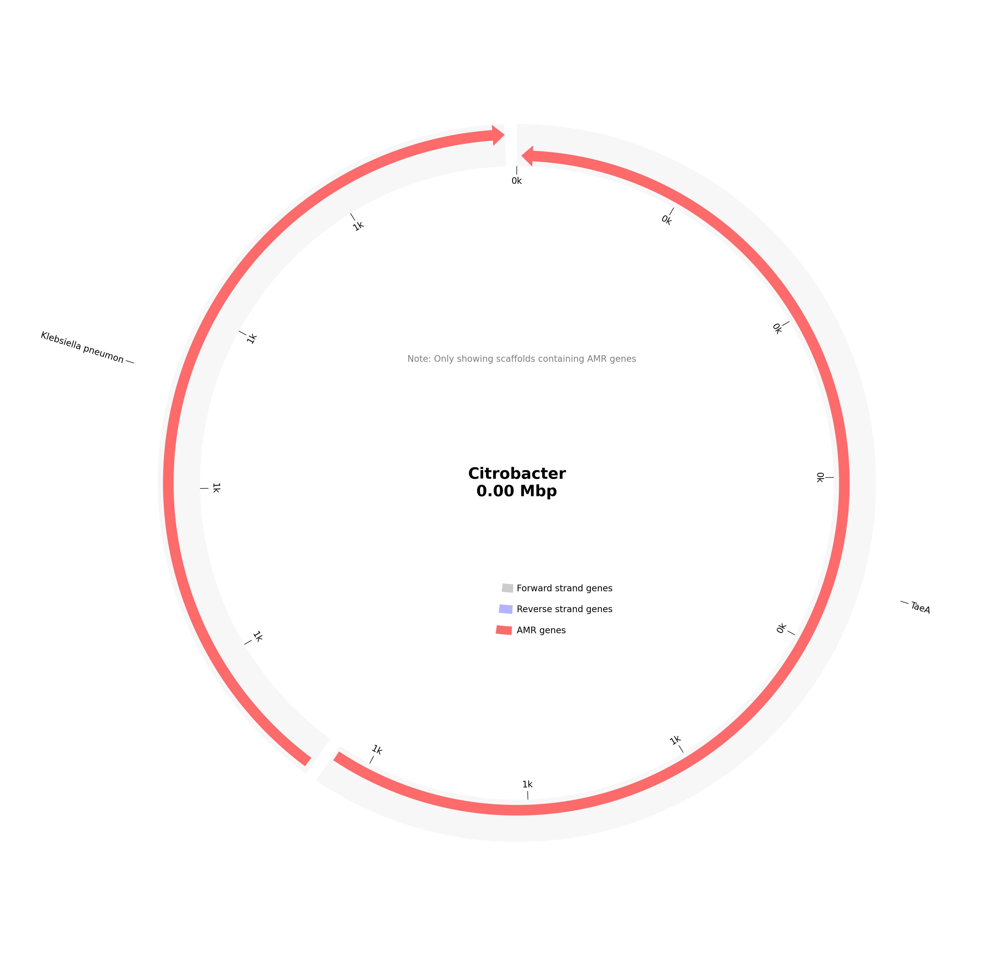

### Klebsiella pneumoniae OmpK37
- **Mechanism**: reduced permeability to antibiotic
- **Drug Classes**: monobactam; carbapenem; cephalosporin; cephamycin; penam; penem
- **AMR Family**: General Bacterial Porin with reduced permeability to beta-lactams
- **Locations**:
  - gnl|SPADES|MOCIJAGE_276824_1 : position 3-554

### TaeA
- **Mechanism**: antibiotic efflux
- **Drug Classes**: pleuromutilin antibiotic
- **AMR Family**: ATP-binding cassette (ABC) antibiotic efflux pump
- **Locations**:
  - gnl|SPADES|MOCIJAGE_61252_1 : position 3-833

## Citrobacter koseri
**Strain Statistics:**
- Total genome length: 0.3 kbp
- Total scaffolds: 4
- Scaffolds with AMR genes: 1
- Total genes annotated: 0
- Total AMR genes: 1
- Unique AMR genes: 1
- Distinct AMR mechanisms: 1
- Distinct AMR families: 1
- Distinct drug classes: 1

**Circos Plot:**

### bcr-1
- **Mechanism**: antibiotic efflux
- **Drug Classes**: bicyclomycin-like antibiotic
- **AMR Family**: major facilitator superfamily (MFS) antibiotic efflux pump
- **Locations**:
  - gnl|SPADES|MOCIJAGE_1132741_1 : position 1-303

## Citrobacter portucalensis
**Strain Statistics:**
- Total genome length: 14.7 kbp
- Total scaffolds: 3
- Scaffolds with AMR genes: 1
- Total genes annotated: 36
- Total AMR genes: 2
- Unique AMR genes: 2
- Distinct AMR mechanisms: 1
- Distinct AMR families: 2
- Distinct drug classes: 6

**Circos Plot:**

### H-NS
- **Mechanism**: antibiotic efflux
- **Drug Classes**: macrolide antibiotic; fluoroquinolone antibiotic; cephalosporin; cephamycin; penam; tetracycline antibiotic
- **AMR Family**: major facilitator superfamily (MFS) antibiotic efflux pump; resistance-nodulation-cell division (RND) antibiotic efflux pump
- **Locations**:
  - gnl|SPADES|MOCIJAGE_177_15 : position 9881-10273

### tetA(60)
- **Mechanism**: antibiotic efflux
- **Drug Classes**: tetracycline antibiotic
- **AMR Family**: ATP-binding cassette (ABC) antibiotic efflux pump
- **Locations**:
  - gnl|SPADES|MOCIJAGE_177_9 : position 5195-6244

## Citrobacter sp. 21OH12SH02A-Citro
**Strain Statistics:**
- Total genome length: 10.4 kbp
- Total scaffolds: 1
- Scaffolds with AMR genes: 1
- Total genes annotated: 22
- Total AMR genes: 1
- Unique AMR genes: 1
- Distinct AMR mechanisms: 1
- Distinct AMR families: 1
- Distinct drug classes: 4

**Circos Plot:**

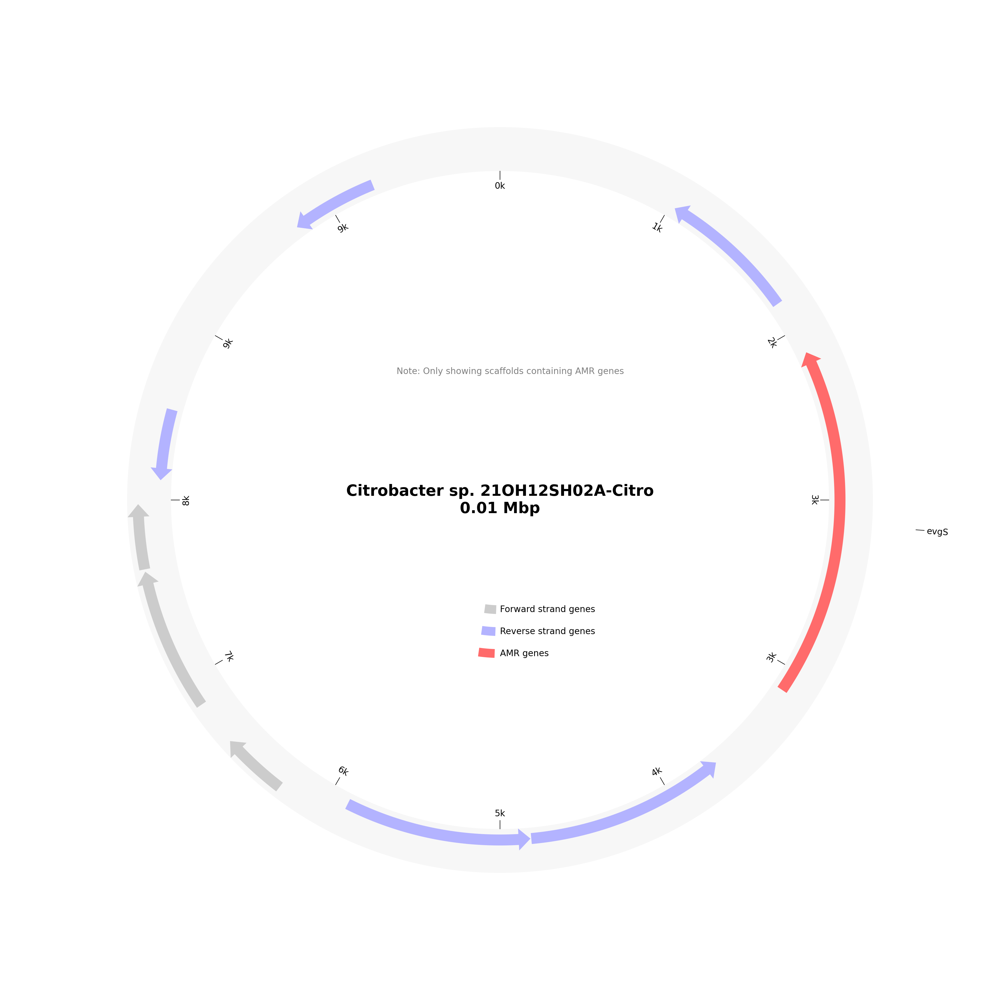

### evgS
- **Mechanism**: antibiotic efflux
- **Drug Classes**: macrolide antibiotic; fluoroquinolone antibiotic; penam; tetracycline antibiotic
- **AMR Family**: major facilitator superfamily (MFS) antibiotic efflux pump; resistance-nodulation-cell division (RND) antibiotic efflux pump
- **Locations**:
  - gnl|SPADES|MOCIJAGE_265_2 : position 1849-3567

## Ewingella americana
**Strain Statistics:**
- Total genome length: 483.4 kbp
- Total scaffolds: 4098
- Scaffolds with AMR genes: 505
- Total genes annotated: 880
- Total AMR genes: 551
- Unique AMR genes: 221
- Distinct AMR mechanisms: 10
- Distinct AMR families: 69
- Distinct drug classes: 36

**Circos Plot:**

### Acinetobacter baumannii AbaF (found in 8 locations)
- **Mechanism**: antibiotic efflux
- **Drug Classes**: phosphonic acid antibiotic
- **AMR Family**: major facilitator superfamily (MFS) antibiotic efflux pump
- **Locations**:
  - gnl|SPADES|MOCIJAGE_1386_2 : position 110-1441
  - gnl|SPADES|MOCIJAGE_2397_2 : position 1428-1814
  - gnl|SPADES|MOCIJAGE_5408_2 : position 466-1407
  - gnl|SPADES|MOCIJAGE_766725_1 : position 3-371
  - gnl|SPADES|MOCIJAGE_835776_1 : position 1-354
  - gnl|SPADES|MOCIJAGE_90091_2 : position 408-758
  - gnl|SPADES|MOCIJAGE_948987_1 : position 1-333
  - gnl|SPADES|MOCIJAGE_98073_1 : position 2-742

### Acinetobacter baumannii AbaQ (found in 10 locations)
- **Mechanism**: antibiotic efflux
- **Drug Classes**: fluoroquinolone antibiotic
- **AMR Family**: major facilitator superfamily (MFS) antibiotic efflux pump
- **Locations**:
  - gnl|SPADES|MOCIJAGE_1445_1 : position 1-621
  - gnl|SPADES|MOCIJAGE_149406_1 : position 239-664
  - gnl|SPADES|MOCIJAGE_1516361_1 : position 3-260
  - gnl|SPADES|MOCIJAGE_1519424_1 : position 3-260
  - gnl|SPADES|MOCIJAGE_1845_1 : position 1-189
  - gnl|SPADES|MOCIJAGE_200314_2 : position 353-613
  - gnl|SPADES|MOCIJAGE_2744_2 : position 483-1718
  - gnl|SPADES|MOCIJAGE_36780_1 : position 2-700
  - gnl|SPADES|MOCIJAGE_7111_2 : position 694-1320
  - gnl|SPADES|MOCIJAGE_735189_1 : position 1-378

### AcrF
- **Mechanism**: antibiotic efflux
- **Drug Classes**: fluoroquinolone antibiotic; cephalosporin; cephamycin; penam
- **AMR Family**: resistance-nodulation-cell division (RND) antibiotic efflux pump
- **Locations**:
  - gnl|SPADES|MOCIJAGE_932184_1 : position 1-336

### ArnT (found in 2 locations)
- **Mechanism**: antibiotic target alteration
- **Drug Classes**: peptide antibiotic
- **AMR Family**: pmr phosphoethanolamine transferase
- **Locations**:
  - gnl|SPADES|MOCIJAGE_1143915_1 : position 1-303
  - gnl|SPADES|MOCIJAGE_860129_1 : position 2-352

### Bifidobacterium adolescentis rpoB mutants conferring resistance to rifampicin (found in 2 locations)
- **Mechanism**: antibiotic target alteration; antibiotic target replacement
- **Drug Classes**: rifamycin antibiotic
- **AMR Family**: rifamycin-resistant beta-subunit of RNA polymerase (rpoB)
- **Locations**:
  - gnl|SPADES|MOCIJAGE_6768_1 : position 3-1337
  - gnl|SPADES|MOCIJAGE_998981_1 : position 3-326

### CAR-1 (found in 2 locations)
- **Mechanism**: antibiotic inactivation
- **Drug Classes**: carbapenem
- **AMR Family**: CAR beta-lactamase
- **Locations**:
  - gnl|SPADES|MOCIJAGE_109226_1 : position 2-640
  - gnl|SPADES|MOCIJAGE_4208_1 : position 1-642

### CRP (found in 2 locations)
- **Mechanism**: antibiotic efflux
- **Drug Classes**: macrolide antibiotic; fluoroquinolone antibiotic; penam
- **AMR Family**: resistance-nodulation-cell division (RND) antibiotic efflux pump
- **Locations**:
  - gnl|SPADES|MOCIJAGE_145503_1 : position 2-583
  - gnl|SPADES|MOCIJAGE_2019_1 : position 3-551

### Clostridioides difficile cplR
- **Mechanism**: antibiotic target protection
- **Drug Classes**: lincosamide antibiotic; streptogramin antibiotic; streptogramin A antibiotic; nucleoside antibiotic
- **AMR Family**: Miscellaneous ABC-F subfamily ATP-binding cassette ribosomal protection proteins
- **Locations**:
  - gnl|SPADES|MOCIJAGE_139785_1 : position 2-289

### Clostridioides difficile gyrA conferring resistance to fluoroquinolones
- **Mechanism**: antibiotic target alteration
- **Drug Classes**: fluoroquinolone antibiotic
- **AMR Family**: fluoroquinolone resistant gyrA
- **Locations**:
  - gnl|SPADES|MOCIJAGE_266296_1 : position 59-559

### Clostridioides difficile gyrB conferring resistance to fluoroquinolones (found in 2 locations)
- **Mechanism**: antibiotic target alteration
- **Drug Classes**: fluoroquinolone antibiotic
- **AMR Family**: fluoroquinolone resistant gyrB
- **Locations**:
  - gnl|SPADES|MOCIJAGE_3330_2 : position 1048-1608
  - gnl|SPADES|MOCIJAGE_38884_1 : position 1-924

### CrcB
- **Mechanism**: antibiotic efflux
- **Drug Classes**: aminoglycoside antibiotic
- **AMR Family**: multidrug and toxic compound extrusion (MATE) transporter
- **Locations**:
  - gnl|SPADES|MOCIJAGE_1286_4 : position 1386-1769

### ErmX
- **Mechanism**: antibiotic target alteration
- **Drug Classes**: macrolide antibiotic; lincosamide antibiotic; streptogramin antibiotic; streptogramin A antibiotic; streptogramin B antibiotic
- **AMR Family**: Erm 23S ribosomal RNA methyltransferase
- **Locations**:
  - gnl|SPADES|MOCIJAGE_1313_3 : position 2232-2513

### Escherichia coli AcrAB-TolC with AcrR mutation conferring resistance to ciprofloxacin, tetracycline, and ceftazidime (found in 4 locations)
- **Mechanism**: antibiotic target alteration; antibiotic efflux
- **Drug Classes**: fluoroquinolone antibiotic; cephalosporin; glycylcycline; penam; tetracycline antibiotic; rifamycin antibiotic; phenicol antibiotic; disinfecting agents and antiseptics
- **AMR Family**: resistance-nodulation-cell division (RND) antibiotic efflux pump
- **Locations**:
  - gnl|SPADES|MOCIJAGE_1480_3 : position 1669-2268
  - gnl|SPADES|MOCIJAGE_1568075_1 : position 2-256
  - gnl|SPADES|MOCIJAGE_378227_1 : position 1-498
  - gnl|SPADES|MOCIJAGE_788_5 : position 3511-3687

### Escherichia coli EF-Tu mutants conferring resistance to Pulvomycin
- **Mechanism**: antibiotic target alteration
- **Drug Classes**: elfamycin antibiotic
- **AMR Family**: elfamycin resistant EF-Tu
- **Locations**:
  - gnl|SPADES|MOCIJAGE_1187_2 : position 1422-2606

### Escherichia coli acrA
- **Mechanism**: antibiotic efflux
- **Drug Classes**: fluoroquinolone antibiotic; cephalosporin; glycylcycline; penam; tetracycline antibiotic; rifamycin antibiotic; phenicol antibiotic; disinfecting agents and antiseptics
- **AMR Family**: resistance-nodulation-cell division (RND) antibiotic efflux pump
- **Locations**:
  - gnl|SPADES|MOCIJAGE_439365_1 : position 2-469

### Escherichia coli cyaA with mutation conferring resistance to fosfomycin
- **Mechanism**: antibiotic target alteration
- **Drug Classes**: phosphonic acid antibiotic
- **AMR Family**: antibiotic-resistant cya adenylate cyclase
- **Locations**:
  - gnl|SPADES|MOCIJAGE_121221_1 : position 2-703

### Escherichia coli fabI mutations conferring resistance to isoniazid and triclosan
- **Mechanism**: antibiotic target alteration
- **Drug Classes**: disinfecting agents and antiseptics; isoniazid-like antibiotic
- **AMR Family**: antibiotic resistant fabI
- **Locations**:
  - gnl|SPADES|MOCIJAGE_39921_1 : position 146-892

### Escherichia coli mdfA (found in 3 locations)
- **Mechanism**: antibiotic efflux
- **Drug Classes**: tetracycline antibiotic; phenicol antibiotic; disinfecting agents and antiseptics
- **AMR Family**: major facilitator superfamily (MFS) antibiotic efflux pump
- **Locations**:
  - gnl|SPADES|MOCIJAGE_3880_2 : position 870-1538
  - gnl|SPADES|MOCIJAGE_589964_1 : position 2-415
  - gnl|SPADES|MOCIJAGE_878_2 : position 191-1429

### Escherichia coli ompF with mutation conferring resistance to beta-lactam antibiotics
- **Mechanism**: reduced permeability to antibiotic
- **Drug Classes**: monobactam; carbapenem; cephalosporin; cephamycin; penam; penem
- **AMR Family**: General Bacterial Porin with reduced permeability to beta-lactams
- **Locations**:
  - gnl|SPADES|MOCIJAGE_6065_1 : position 305-1369

### Escherichia coli parE conferring resistance to fluoroquinolones
- **Mechanism**: antibiotic target alteration
- **Drug Classes**: fluoroquinolone antibiotic
- **AMR Family**: fluoroquinolone resistant parE
- **Locations**:
  - gnl|SPADES|MOCIJAGE_3330_1 : position 1-993

### Escherichia coli soxS with mutation conferring antibiotic resistance (found in 3 locations)
- **Mechanism**: antibiotic target alteration; antibiotic efflux; reduced permeability to antibiotic
- **Drug Classes**: fluoroquinolone antibiotic; monobactam; carbapenem; cephalosporin; glycylcycline; cephamycin; penam; tetracycline antibiotic; rifamycin antibiotic; phenicol antibiotic; penem; disinfecting agents and antiseptics
- **AMR Family**: ATP-binding cassette (ABC) antibiotic efflux pump; major facilitator superfamily (MFS) antibiotic efflux pump; resistance-nodulation-cell division (RND) antibiotic efflux pump; General Bacterial Porin with reduced permeability to beta-lactams
- **Locations**:
  - gnl|SPADES|MOCIJAGE_21742_1 : position 2-130
  - gnl|SPADES|MOCIJAGE_37763_2 : position 222-932
  - gnl|SPADES|MOCIJAGE_50375_1 : position 3-698

### EstT (found in 2 locations)
- **Mechanism**: antibiotic inactivation
- **Drug Classes**: macrolide antibiotic
- **AMR Family**: macrolide esterase
- **Locations**:
  - gnl|SPADES|MOCIJAGE_114438_1 : position 3-650
  - gnl|SPADES|MOCIJAGE_678756_1 : position 2-391

### FosA8
- **Mechanism**: antibiotic inactivation
- **Drug Classes**: phosphonic acid antibiotic
- **AMR Family**: fosfomycin thiol transferase
- **Locations**:
  - gnl|SPADES|MOCIJAGE_10973_2: position 317-727

### H-NS
- **Mechanism**: antibiotic efflux
- **Drug Classes**: macrolide antibiotic; fluoroquinolone antibiotic; cephalosporin; cephamycin; penam; tetracycline antibiotic
- **AMR Family**: major facilitator superfamily (MFS) antibiotic efflux pump; resistance-nodulation-cell division (RND) antibiotic efflux pump
- **Locations**:
  - gnl|SPADES|MOCIJAGE_260015_1 : position 1-414

### Haemophilus influenzae PBP3 conferring resistance to beta-lactam antibiotics
- **Mechanism**: antibiotic target alteration
- **Drug Classes**: cephalosporin; cephamycin; penam
- **AMR Family**: Penicillin-binding protein mutations conferring resistance to beta-lactam antibiotics
- **Locations**:
  - gnl|SPADES|MOCIJAGE_848718_2 : position 179-352

### Helicobacter pylori pbp1 mutants conferring resistance to amoxicillin
- **Mechanism**: antibiotic target alteration
- **Drug Classes**: cephalosporin; cephamycin; penam
- **AMR Family**: Penicillin-binding protein mutations conferring resistance to beta-lactam antibiotics
- **Locations**:
  - gnl|SPADES|MOCIJAGE_602606_1 : position 3-413

### Helicobacter pylori rpoB mutation conferring resistance to rifampicin
- **Mechanism**: antibiotic target alteration; antibiotic target replacement
- **Drug Classes**: fluoroquinolone antibiotic; rifamycin antibiotic
- **AMR Family**: rifamycin-resistant beta-subunit of RNA polymerase (rpoB)
- **Locations**:
  - gnl|SPADES|MOCIJAGE_288730_1 : position 2-544

### Klebsiella aerogenes Omp36
- **Mechanism**: reduced permeability to antibiotic
- **Drug Classes**: monobactam; carbapenem; cephalosporin; cephamycin; penam; penem
- **AMR Family**: General Bacterial Porin with reduced permeability to beta-lactams
- **Locations**:
  - gnl|SPADES|MOCIJAGE_75934_1 : position 2-793

### Klebsiella pneumoniae KpnG (found in 2 locations)
- **Mechanism**: antibiotic efflux
- **Drug Classes**: macrolide antibiotic; fluoroquinolone antibiotic; aminoglycoside antibiotic; carbapenem; cephalosporin; penam; peptide antibiotic; penem
- **AMR Family**: major facilitator superfamily (MFS) antibiotic efflux pump
- **Locations**:
  - gnl|SPADES|MOCIJAGE_109635_1 : position 3-722
  - gnl|SPADES|MOCIJAGE_1554791_1 : position 31-258

### Klebsiella pneumoniae OmpK37 (found in 5 locations)
- **Mechanism**: reduced permeability to antibiotic
- **Drug Classes**: monobactam; carbapenem; cephalosporin; cephamycin; penam; penem
- **AMR Family**: General Bacterial Porin with reduced permeability to beta-lactams
- **Locations**:
  - gnl|SPADES|MOCIJAGE_19040_1 : position 3-473
  - gnl|SPADES|MOCIJAGE_409083_1 : position 379-483
  - gnl|SPADES|MOCIJAGE_554423_2 : position 245-427
  - gnl|SPADES|MOCIJAGE_763334_1 : position 1-270
  - gnl|SPADES|MOCIJAGE_9818_1 : position 127-1227

### Klebsiella pneumoniae acrA
- **Mechanism**: antibiotic efflux
- **Drug Classes**: fluoroquinolone antibiotic; cephalosporin; glycylcycline; penam; tetracycline antibiotic; rifamycin antibiotic; phenicol antibiotic; disinfecting agents and antiseptics
- **AMR Family**: resistance-nodulation-cell division (RND) antibiotic efflux pump
- **Locations**:
  - gnl|SPADES|MOCIJAGE_391455_1 : position 3-365

### LpsB
- **Mechanism**: reduced permeability to antibiotic
- **Drug Classes**: peptide antibiotic
- **AMR Family**: Intrinsic peptide antibiotic resistant Lps
- **Locations**:
  - gnl|SPADES|MOCIJAGE_1119_3 : position 1926-2789

### LptD (found in 3 locations)
- **Mechanism**: antibiotic efflux
- **Drug Classes**: carbapenem; peptide antibiotic; aminocoumarin antibiotic; rifamycin antibiotic
- **AMR Family**: ATP-binding cassette (ABC) antibiotic efflux pump
- **Locations**:
  - gnl|SPADES|MOCIJAGE_214217_1 : position 1-600
  - gnl|SPADES|MOCIJAGE_55268_1 : position 93-854
  - gnl|SPADES|MOCIJAGE_96756_1 : position 2-745

### MCR-10.2
- **Mechanism**: antibiotic target alteration
- **Drug Classes**: peptide antibiotic
- **AMR Family**: MCR phosphoethanolamine transferase
- **Locations**:
  - gnl|SPADES|MOCIJAGE_888529_1 : position 1-345

### MCR-3.5
- **Mechanism**: antibiotic target alteration
- **Drug Classes**: peptide antibiotic
- **AMR Family**: MCR phosphoethanolamine transferase
- **Locations**:
  - gnl|SPADES|MOCIJAGE_1423133_1 : position 1-270

### MCR-9.1
- **Mechanism**: antibiotic target alteration
- **Drug Classes**: peptide antibiotic
- **AMR Family**: MCR phosphoethanolamine transferase
- **Locations**:
  - gnl|SPADES|MOCIJAGE_1842304_1 : position 1-234

### MdtK (found in 3 locations)
- **Mechanism**: antibiotic efflux
- **Drug Classes**: fluoroquinolone antibiotic
- **AMR Family**: multidrug and toxic compound extrusion (MATE) transporter
- **Locations**:
  - gnl|SPADES|MOCIJAGE_16056_1 : position 84-506
  - gnl|SPADES|MOCIJAGE_16056_2 : position 484-1113
  - gnl|SPADES|MOCIJAGE_43073_2 : position 653-904

### MdtQ
- **Mechanism**: reduced permeability to antibiotic
- **Drug Classes**: monobactam; carbapenem; cephalosporin; cephamycin; penam; penem
- **AMR Family**: Outer Membrane Porin (Opr)
- **Locations**:
  - gnl|SPADES|MOCIJAGE_464817_1 : position 2-460

### MexH
- **Mechanism**: antibiotic efflux
- **Drug Classes**: fluoroquinolone antibiotic; tetracycline antibiotic; disinfecting agents and antiseptics
- **AMR Family**: resistance-nodulation-cell division (RND) antibiotic efflux pump
- **Locations**:
  - gnl|SPADES|MOCIJAGE_20596_1 : position 2-850

### MexL
- **Mechanism**: antibiotic efflux
- **Drug Classes**: macrolide antibiotic; tetracycline antibiotic; disinfecting agents and antiseptics
- **AMR Family**: resistance-nodulation-cell division (RND) antibiotic efflux pump
- **Locations**:
  - gnl|SPADES|MOCIJAGE_236584_2 : position 360-581

### MexS (found in 2 locations)
- **Mechanism**: antibiotic efflux
- **Drug Classes**: fluoroquinolone antibiotic; diaminopyrimidine antibiotic; phenicol antibiotic
- **AMR Family**: resistance-nodulation-cell division (RND) antibiotic efflux pump
- **Locations**:
  - gnl|SPADES|MOCIJAGE_78656_1 : position 10-786
  - gnl|SPADES|MOCIJAGE_87360_1 : position 2-655

### MexT
- **Mechanism**: antibiotic efflux
- **Drug Classes**: fluoroquinolone antibiotic; diaminopyrimidine antibiotic; phenicol antibiotic
- **AMR Family**: resistance-nodulation-cell division (RND) antibiotic efflux pump
- **Locations**:
  - gnl|SPADES|MOCIJAGE_1640_1 : position 2-907

### Morganella morganii gyrB conferring resistance to fluoroquinolones
- **Mechanism**: antibiotic target alteration
- **Drug Classes**: fluoroquinolone antibiotic
- **AMR Family**: fluoroquinolone resistant gyrB
- **Locations**:
  - gnl|SPADES|MOCIJAGE_22809_2 : position 460-1035

### MuxB
- **Mechanism**: antibiotic efflux
- **Drug Classes**: macrolide antibiotic; monobactam; tetracycline antibiotic; aminocoumarin antibiotic
- **AMR Family**: resistance-nodulation-cell division (RND) antibiotic efflux pump
- **Locations**:
  - gnl|SPADES|MOCIJAGE_1015914_2 : position 207-323

### MuxC
- **Mechanism**: antibiotic efflux
- **Drug Classes**: macrolide antibiotic; monobactam; tetracycline antibiotic; aminocoumarin antibiotic
- **AMR Family**: resistance-nodulation-cell division (RND) antibiotic efflux pump
- **Locations**:
  - gnl|SPADES|MOCIJAGE_55371_1 : position 3-854

### Mycobacterium tuberculosis gidB mutation conferring resistance to streptomycin
- **Mechanism**: antibiotic target alteration
- **Drug Classes**: aminoglycoside antibiotic
- **AMR Family**: antibiotic resistant gidB
- **Locations**:
  - gnl|SPADES|MOCIJAGE_4623_2 : position 584-1204

### Mycobacterium tuberculosis intrinsic murA conferring resistance to fosfomycin
- **Mechanism**: antibiotic target alteration
- **Drug Classes**: phosphonic acid antibiotic
- **AMR Family**: antibiotic-resistant murA transferase
- **Locations**:
  - gnl|SPADES|MOCIJAGE_146476_1 : position 107-670

### Mycobacterium tuberculosis ndh with mutation conferring resistance to isoniazid
- **Mechanism**: antibiotic target alteration
- **Drug Classes**: isoniazid-like antibiotic
- **AMR Family**: antibiotic resistant ndh
- **Locations**:
  - gnl|SPADES|MOCIJAGE_203953_1 : position 3-608

### Mycobacterium tuberculosis thyA with mutation conferring resistance to para-aminosalicylic acid
- **Mechanism**: antibiotic target alteration
- **Drug Classes**: salicylic acid antibiotic
- **AMR Family**: aminosalicylate resistant thymidylate synthase
- **Locations**:
  - gnl|SPADES|MOCIJAGE_31539_2 : position 337-966

### Neisseria gonorrhoeae pilQ gene conferring resistance to beta-lactam
- **Mechanism**: antibiotic target alteration
- **Drug Classes**: cephalosporin; cephamycin; penam
- **AMR Family**: Penicillin-binding protein mutations conferring resistance to beta-lactam antibiotics
- **Locations**:
  - gnl|SPADES|MOCIJAGE_35526_1 : position 3-551

### NmcR (found in 15 locations)
- **Mechanism**: antibiotic inactivation
- **Drug Classes**: carbapenem; cephalosporin; cephamycin; penam
- **AMR Family**: NmcA beta-lactamase
- **Locations**:
  - gnl|SPADES|MOCIJAGE_11198_2 : position 98-577
  - gnl|SPADES|MOCIJAGE_14533_1 : position 2-670
  - gnl|SPADES|MOCIJAGE_1648_3 : position 2016-2201
  - gnl|SPADES|MOCIJAGE_1662043_1 : position 2-247
  - gnl|SPADES|MOCIJAGE_1677_3 : position 1956-2177
  - gnl|SPADES|MOCIJAGE_2917_3 : position 1268-1675
  - gnl|SPADES|MOCIJAGE_297193_1 : position 3-539
  - gnl|SPADES|MOCIJAGE_4062_1 : position 1-486
  - gnl|SPADES|MOCIJAGE_420346_2 : position 230-478
  - gnl|SPADES|MOCIJAGE_4238_1 : position 2-409
  - gnl|SPADES|MOCIJAGE_459819_1 : position 1-462
  - gnl|SPADES|MOCIJAGE_652_2 : position 1345-2226
  - gnl|SPADES|MOCIJAGE_80996_1 : position 3-404
  - gnl|SPADES|MOCIJAGE_86496_1 : position 256-768
  - gnl|SPADES|MOCIJAGE_953_2 : position 237-1160

### OmpA (found in 4 locations)
- **Mechanism**: reduced permeability to antibiotic
- **Drug Classes**: peptide antibiotic
- **AMR Family**: General Bacterial Porin with reduced permeability to peptide antibiotics
- **Locations**:
  - gnl|SPADES|MOCIJAGE_206100_1 : position 189-605
  - gnl|SPADES|MOCIJAGE_387906_1 : position 1-93
  - gnl|SPADES|MOCIJAGE_7897_2 : position 424-1086
  - gnl|SPADES|MOCIJAGE_826277_1 : position 2-358

### OpmB (found in 2 locations)
- **Mechanism**: antibiotic efflux
- **Drug Classes**: macrolide antibiotic; monobactam; tetracycline antibiotic; aminocoumarin antibiotic
- **AMR Family**: resistance-nodulation-cell division (RND) antibiotic efflux pump
- **Locations**:
  - gnl|SPADES|MOCIJAGE_5510_1 : position 3-1316
  - gnl|SPADES|MOCIJAGE_97757_1 : position 1-744

### OprM (found in 2 locations)
- **Mechanism**: antibiotic efflux
- **Drug Classes**: macrolide antibiotic; fluoroquinolone antibiotic; monobactam; aminoglycoside antibiotic; carbapenem; cephalosporin; cephamycin; penam; tetracycline antibiotic; peptide antibiotic; aminocoumarin antibiotic; diaminopyrimidine antibiotic; sulfonamide antibiotic; phenicol antibiotic; penem; disinfecting agents and antiseptics
- **AMR Family**: resistance-nodulation-cell division (RND) antibiotic efflux pump
- **Locations**:
  - gnl|SPADES|MOCIJAGE_2148592_1 : position 1-213
  - gnl|SPADES|MOCIJAGE_8377_1 : position 3-1274

### OprN
- **Mechanism**: antibiotic efflux
- **Drug Classes**: fluoroquinolone antibiotic; diaminopyrimidine antibiotic; phenicol antibiotic
- **AMR Family**: resistance-nodulation-cell division (RND) antibiotic efflux pump
- **Locations**:
  - gnl|SPADES|MOCIJAGE_400724_1 : position 3-485

### ParR (found in 3 locations)
- **Mechanism**: antibiotic efflux; reduced permeability to antibiotic
- **Drug Classes**: macrolide antibiotic; fluoroquinolone antibiotic; monobactam; aminoglycoside antibiotic; carbapenem; cephalosporin; cephamycin; penam; tetracycline antibiotic; phenicol antibiotic; penem; disinfecting agents and antiseptics
- **AMR Family**: resistance-nodulation-cell division (RND) antibiotic efflux pump; Outer Membrane Porin (Opr)
- **Locations**:
  - gnl|SPADES|MOCIJAGE_10882_2 : position 651-1205
  - gnl|SPADES|MOCIJAGE_2046368_1 : position 58-222
  - gnl|SPADES|MOCIJAGE_922_3 : position 1488-2207

### ParS (found in 2 locations)
- **Mechanism**: antibiotic efflux; reduced permeability to antibiotic
- **Drug Classes**: macrolide antibiotic; fluoroquinolone antibiotic; monobactam; aminoglycoside antibiotic; carbapenem; cephalosporin; cephamycin; penam; tetracycline antibiotic; phenicol antibiotic; penem; disinfecting agents and antiseptics
- **AMR Family**: resistance-nodulation-cell division (RND) antibiotic efflux pump; Outer Membrane Porin (Opr)
- **Locations**:
  - gnl|SPADES|MOCIJAGE_67111_1 : position 2-817
  - gnl|SPADES|MOCIJAGE_922_4 : position 2204-3244

### PmpM
- **Mechanism**: antibiotic efflux
- **Drug Classes**: fluoroquinolone antibiotic; aminoglycoside antibiotic; disinfecting agents and antiseptics
- **AMR Family**: multidrug and toxic compound extrusion (MATE) transporter
- **Locations**:
  - gnl|SPADES|MOCIJAGE_1015530_1 : position 2-322

### PmrF (found in 3 locations)
- **Mechanism**: antibiotic target alteration
- **Drug Classes**: peptide antibiotic
- **AMR Family**: pmr phosphoethanolamine transferase
- **Locations**:
  - gnl|SPADES|MOCIJAGE_22267_1 : position 2-97
  - gnl|SPADES|MOCIJAGE_266_9 : position 7139-8128
  - gnl|SPADES|MOCIJAGE_48517_2 : position 178-882

### Pseudomonas aeruginosa CpxR (found in 3 locations)
- **Mechanism**: antibiotic efflux
- **Drug Classes**: macrolide antibiotic; fluoroquinolone antibiotic; monobactam; aminoglycoside antibiotic; carbapenem; cephalosporin; cephamycin; penam; tetracycline antibiotic; peptide antibiotic; aminocoumarin antibiotic; diaminopyrimidine antibiotic; sulfonamide antibiotic; phenicol antibiotic; penem
- **AMR Family**: resistance-nodulation-cell division (RND) antibiotic efflux pump
- **Locations**:
  - gnl|SPADES|MOCIJAGE_1501953_1 : position 96-263
  - gnl|SPADES|MOCIJAGE_248764_1 : position 40-573
  - gnl|SPADES|MOCIJAGE_77885_1 : position 62-763

### QepA2
- **Mechanism**: antibiotic efflux
- **Drug Classes**: fluoroquinolone antibiotic
- **AMR Family**: major facilitator superfamily (MFS) antibiotic efflux pump
- **Locations**:
  - gnl|SPADES|MOCIJAGE_785742_1 : position 3-365

### QepA4 (found in 2 locations)
- **Mechanism**: antibiotic efflux
- **Drug Classes**: fluoroquinolone antibiotic
- **AMR Family**: major facilitator superfamily (MFS) antibiotic efflux pump
- **Locations**:
  - gnl|SPADES|MOCIJAGE_18180_2 : position 453-1085
  - gnl|SPADES|MOCIJAGE_424298_1 : position 2-475

### QnrD2
- **Mechanism**: antibiotic target protection
- **Drug Classes**: fluoroquinolone antibiotic
- **AMR Family**: quinolone resistance protein (qnr)
- **Locations**:
  - gnl|SPADES|MOCIJAGE_1067_1 : position 3-146

### RanA (found in 19 locations)
- **Mechanism**: antibiotic efflux
- **Drug Classes**: aminoglycoside antibiotic
- **AMR Family**: ATP-binding cassette (ABC) antibiotic efflux pump
- **Locations**:
  - gnl|SPADES|MOCIJAGE_10847_1 : position 2-853
  - gnl|SPADES|MOCIJAGE_1375819_1 : position 2-274
  - gnl|SPADES|MOCIJAGE_1521_2 : position 569-1291
  - gnl|SPADES|MOCIJAGE_1604513_1 : position 1-252
  - gnl|SPADES|MOCIJAGE_1943907_1 : position 3-227
  - gnl|SPADES|MOCIJAGE_22342_1 : position 1-1041
  - gnl|SPADES|MOCIJAGE_260166_1 : position 2-565
  - gnl|SPADES|MOCIJAGE_277707_1 : position 3-551
  - gnl|SPADES|MOCIJAGE_32692_1 : position 1-687
  - gnl|SPADES|MOCIJAGE_351679_2 : position 213-509
  - gnl|SPADES|MOCIJAGE_420734_1 : position 3-476
  - gnl|SPADES|MOCIJAGE_428216_1 : position 1-474
  - gnl|SPADES|MOCIJAGE_4438_1 : position 2-523
  - gnl|SPADES|MOCIJAGE_5410_3 : position 469-903
  - gnl|SPADES|MOCIJAGE_6256_1 : position 51-803
  - gnl|SPADES|MOCIJAGE_764_3 : position 1308-2111
  - gnl|SPADES|MOCIJAGE_86008_1 : position 1-723
  - gnl|SPADES|MOCIJAGE_8680_2 : position 143-1135
  - gnl|SPADES|MOCIJAGE_949896_1 : position 3-335

### RanB
- **Mechanism**: antibiotic efflux
- **Drug Classes**: aminoglycoside antibiotic
- **AMR Family**: ATP-binding cassette (ABC) antibiotic efflux pump
- **Locations**:
  - gnl|SPADES|MOCIJAGE_764_2 : position 510-1292

### RlmA(II)
- **Mechanism**: antibiotic target alteration
- **Drug Classes**: macrolide antibiotic; lincosamide antibiotic
- **AMR Family**: non-erm 23S ribosomal RNA methyltransferase (G748)
- **Locations**:
  - gnl|SPADES|MOCIJAGE_1497391_1 : position 2-262

### Rv1877 (found in 4 locations)
- **Mechanism**: antibiotic efflux
- **Drug Classes**: fluoroquinolone antibiotic
- **AMR Family**: major facilitator superfamily (MFS) antibiotic efflux pump
- **Locations**:
  - gnl|SPADES|MOCIJAGE_1458_1 : position 85-975
  - gnl|SPADES|MOCIJAGE_3924_1 : position 3-695
  - gnl|SPADES|MOCIJAGE_460079_1 : position 1-462
  - gnl|SPADES|MOCIJAGE_623261_1 : position 1-405

### SHN-1
- **Mechanism**: antibiotic inactivation
- **Drug Classes**: carbapenem
- **AMR Family**: SHN beta-lactamase
- **Locations**:
  - gnl|SPADES|MOCIJAGE_41132_1 : position 2-394

### SRT-2
- **Mechanism**: antibiotic inactivation
- **Drug Classes**: cephalosporin
- **AMR Family**: SRT beta-lactamase
- **Locations**:
  - gnl|SPADES|MOCIJAGE_22648_1 : position 173-1036

### SST-1
- **Mechanism**: antibiotic inactivation
- **Drug Classes**: cephalosporin
- **AMR Family**: SST beta-lactamase
- **Locations**:
  - gnl|SPADES|MOCIJAGE_705256_1 : position 1-384

### Salmonella serovars soxS with mutation conferring antibiotic resistance
- **Mechanism**: antibiotic target alteration; antibiotic efflux; reduced permeability to antibiotic
- **Drug Classes**: fluoroquinolone antibiotic; monobactam; carbapenem; cephalosporin; glycylcycline; cephamycin; penam; tetracycline antibiotic; rifamycin antibiotic; phenicol antibiotic; penem; disinfecting agents and antiseptics
- **AMR Family**: ATP-binding cassette (ABC) antibiotic efflux pump; major facilitator superfamily (MFS) antibiotic efflux pump; resistance-nodulation-cell division (RND) antibiotic efflux pump; General Bacterial Porin with reduced permeability to beta-lactams
- **Locations**:
  - gnl|SPADES|MOCIJAGE_4544_2 : position 233-1117

### SatA
- **Mechanism**: antibiotic inactivation
- **Drug Classes**: nucleoside antibiotic
- **AMR Family**: streptothricin acetyltransferase (SAT)
- **Locations**:
  - gnl|SPADES|MOCIJAGE_10256_3 : position 713-1165

### Staphylococcus aureus GlpT with mutation conferring resistance to fosfomycin (found in 2 locations)
- **Mechanism**: antibiotic target alteration
- **Drug Classes**: phosphonic acid antibiotic
- **AMR Family**: antibiotic-resistant GlpT
- **Locations**:
  - gnl|SPADES|MOCIJAGE_10884_2 : position 185-1204
  - gnl|SPADES|MOCIJAGE_735574_1 : position 1-324

### Staphylococcus aureus fusA with mutation conferring resistance to fusidic acid
- **Mechanism**: antibiotic target alteration
- **Drug Classes**: fusidane antibiotic
- **AMR Family**: antibiotic resistant fusA
- **Locations**:
  - gnl|SPADES|MOCIJAGE_1205_4 : position 1946-2650

### Staphylococcus aureus mupA conferring resistance to mupirocin
- **Mechanism**: antibiotic target alteration
- **Drug Classes**: mupirocin-like antibiotic
- **AMR Family**: antibiotic-resistant isoleucyl-tRNA synthetase (ileS)
- **Locations**:
  - gnl|SPADES|MOCIJAGE_1268_1 : position 2-919

### Staphylococcus aureus mupB conferring resistance to mupirocin (found in 3 locations)
- **Mechanism**: antibiotic target alteration
- **Drug Classes**: mupirocin-like antibiotic
- **AMR Family**: antibiotic-resistant isoleucyl-tRNA synthetase (ileS)
- **Locations**:
  - gnl|SPADES|MOCIJAGE_2584_2 : position 121-1758
  - gnl|SPADES|MOCIJAGE_7386_2 : position 431-1309
  - gnl|SPADES|MOCIJAGE_7468_1 : position 3-1307

### Staphylococcus aureus murA with mutation conferring resistance to fosfomycin
- **Mechanism**: antibiotic target alteration
- **Drug Classes**: phosphonic acid antibiotic
- **AMR Family**: antibiotic-resistant murA transferase
- **Locations**:
  - gnl|SPADES|MOCIJAGE_24776_2 : position 363-1016

### Staphylococcus aureus pgsA mutations conferring resistance to daptomycin
- **Mechanism**: antibiotic target alteration
- **Drug Classes**: peptide antibiotic
- **AMR Family**: daptomycin resistant pgsA
- **Locations**:
  - gnl|SPADES|MOCIJAGE_1641666_1 : position 3-191

### Streptomyces rimosus otr(A)
- **Mechanism**: antibiotic target protection
- **Drug Classes**: tetracycline antibiotic
- **AMR Family**: tetracycline-resistant ribosomal protection protein
- **Locations**:
  - gnl|SPADES|MOCIJAGE_4318_1 : position 3-1373

### Streptomyces venezuelae rox (found in 2 locations)
- **Mechanism**: antibiotic inactivation
- **Drug Classes**: rifamycin antibiotic
- **AMR Family**: rifampin monooxygenase
- **Locations**:
  - gnl|SPADES|MOCIJAGE_1534_2 : position 543-1727
  - gnl|SPADES|MOCIJAGE_55374_1 : position 2-811

### TaeA (found in 3 locations)
- **Mechanism**: antibiotic efflux
- **Drug Classes**: pleuromutilin antibiotic
- **AMR Family**: ATP-binding cassette (ABC) antibiotic efflux pump
- **Locations**:
  - gnl|SPADES|MOCIJAGE_16531_1 : position 3-533
  - gnl|SPADES|MOCIJAGE_40373_2 : position 233-919
  - gnl|SPADES|MOCIJAGE_735105_1 : position 1-378

### TolC (found in 2 locations)
- **Mechanism**: antibiotic efflux
- **Drug Classes**: macrolide antibiotic; fluoroquinolone antibiotic; aminoglycoside antibiotic; carbapenem; cephalosporin; glycylcycline; cephamycin; penam; tetracycline antibiotic; peptide antibiotic; aminocoumarin antibiotic; rifamycin antibiotic; phenicol antibiotic; penem; disinfecting agents and antiseptics
- **AMR Family**: ATP-binding cassette (ABC) antibiotic efflux pump; major facilitator superfamily (MFS) antibiotic efflux pump; resistance-nodulation-cell division (RND) antibiotic efflux pump
- **Locations**:
  - gnl|SPADES|MOCIJAGE_12470_1 : position 1-852
  - gnl|SPADES|MOCIJAGE_7321_2 : position 528-1313

### TxR (found in 5 locations)
- **Mechanism**: antibiotic efflux
- **Drug Classes**: tetracycline antibiotic
- **AMR Family**: ATP-binding cassette (ABC) antibiotic efflux pump
- **Locations**:
  - gnl|SPADES|MOCIJAGE_1212187_1 : position 2-292
  - gnl|SPADES|MOCIJAGE_29778_1 : position 1-978
  - gnl|SPADES|MOCIJAGE_3442_1 : position 2-580
  - gnl|SPADES|MOCIJAGE_551681_1 : position 1-429
  - gnl|SPADES|MOCIJAGE_7813_1 : position 1-1293

### YajC
- **Mechanism**: antibiotic efflux
- **Drug Classes**: fluoroquinolone antibiotic; cephalosporin; glycylcycline; penam; tetracycline antibiotic; oxazolidinone antibiotic; glycopeptide antibiotic; rifamycin antibiotic; phenicol antibiotic; disinfecting agents and antiseptics
- **AMR Family**: resistance-nodulation-cell division (RND) antibiotic efflux pump
- **Locations**:
  - gnl|SPADES|MOCIJAGE_649118_1 : position 87-398

### YojI (found in 3 locations)
- **Mechanism**: antibiotic efflux
- **Drug Classes**: peptide antibiotic
- **AMR Family**: ATP-binding cassette (ABC) antibiotic efflux pump
- **Locations**:
  - gnl|SPADES|MOCIJAGE_1808653_1 : position 3-236
  - gnl|SPADES|MOCIJAGE_192626_1 : position 2-481
  - gnl|SPADES|MOCIJAGE_225201_1 : position 3-590

### aac(6')-Ib-cr11
- **Mechanism**: antibiotic inactivation
- **Drug Classes**: fluoroquinolone antibiotic; aminoglycoside antibiotic
- **AMR Family**: AAC(6'); AAC(6')-Ib-cr
- **Locations**:
  - gnl|SPADES|MOCIJAGE_1084_3 : position 2538-2852

### aadT
- **Mechanism**: antibiotic efflux
- **Drug Classes**: macrolide antibiotic; tetracycline antibiotic; disinfecting agents and antiseptics
- **AMR Family**: major facilitator superfamily (MFS) antibiotic efflux pump
- **Locations**:
  - gnl|SPADES|MOCIJAGE_1292266_1 : position 2-283

### abeM
- **Mechanism**: antibiotic efflux
- **Drug Classes**: fluoroquinolone antibiotic; disinfecting agents and antiseptics
- **AMR Family**: multidrug and toxic compound extrusion (MATE) transporter
- **Locations**:
  - gnl|SPADES|MOCIJAGE_1429143_1 : position 1-267

### acrB (found in 5 locations)
- **Mechanism**: antibiotic efflux
- **Drug Classes**: fluoroquinolone antibiotic; cephalosporin; glycylcycline; penam; tetracycline antibiotic; rifamycin antibiotic; phenicol antibiotic; disinfecting agents and antiseptics
- **AMR Family**: resistance-nodulation-cell division (RND) antibiotic efflux pump
- **Locations**:
  - gnl|SPADES|MOCIJAGE_167216_1 : position 2-643
  - gnl|SPADES|MOCIJAGE_190736_1 : position 3-620
  - gnl|SPADES|MOCIJAGE_1974864_1 : position 3-227
  - gnl|SPADES|MOCIJAGE_2609_1 : position 1-549
  - gnl|SPADES|MOCIJAGE_391455_2 : position 382-489

### acrD (found in 4 locations)
- **Mechanism**: antibiotic efflux
- **Drug Classes**: aminoglycoside antibiotic
- **AMR Family**: resistance-nodulation-cell division (RND) antibiotic efflux pump
- **Locations**:
  - gnl|SPADES|MOCIJAGE_10078_1 : position 3-1226
  - gnl|SPADES|MOCIJAGE_49356_1 : position 2-877
  - gnl|SPADES|MOCIJAGE_54515_1 : position 406-858
  - gnl|SPADES|MOCIJAGE_94909_2 : position 515-748

### adeB
- **Mechanism**: antibiotic efflux
- **Drug Classes**: glycylcycline; tetracycline antibiotic
- **AMR Family**: resistance-nodulation-cell division (RND) antibiotic efflux pump
- **Locations**:
  - gnl|SPADES|MOCIJAGE_190734_1 : position 2-619

### adeG
- **Mechanism**: antibiotic efflux
- **Drug Classes**: fluoroquinolone antibiotic; tetracycline antibiotic
- **AMR Family**: resistance-nodulation-cell division (RND) antibiotic efflux pump
- **Locations**:
  - gnl|SPADES|MOCIJAGE_1778871_1 : position 1-240

### adeL (found in 33 locations)
- **Mechanism**: antibiotic efflux
- **Drug Classes**: fluoroquinolone antibiotic; tetracycline antibiotic
- **AMR Family**: resistance-nodulation-cell division (RND) antibiotic efflux pump
- **Locations**:
  - gnl|SPADES|MOCIJAGE_1007641_1 : position 2-325
  - gnl|SPADES|MOCIJAGE_10679_1 : position 1-498
  - gnl|SPADES|MOCIJAGE_112660_1 : position 1-717
  - gnl|SPADES|MOCIJAGE_1205_2 : position 457-1374
  - gnl|SPADES|MOCIJAGE_1301_1 : position 1-663
  - gnl|SPADES|MOCIJAGE_13973_2 : position 571-1146
  - gnl|SPADES|MOCIJAGE_1404_2 : position 1312-2220
  - gnl|SPADES|MOCIJAGE_1463660_1 : position 2-265
  - gnl|SPADES|MOCIJAGE_1618_3 : position 1473-2030
  - gnl|SPADES|MOCIJAGE_1654166_1 : position 3-161
  - gnl|SPADES|MOCIJAGE_18551_1 : position 3-179
  - gnl|SPADES|MOCIJAGE_19410_1 : position 31-792
  - gnl|SPADES|MOCIJAGE_20191_1 : position 256-1062
  - gnl|SPADES|MOCIJAGE_2770_1 : position 17-958
  - gnl|SPADES|MOCIJAGE_280794_1 : position 3-551
  - gnl|SPADES|MOCIJAGE_318895_1 : position 1-528
  - gnl|SPADES|MOCIJAGE_332611_1 : position 2-520
  - gnl|SPADES|MOCIJAGE_33808_1 : position 2-610
  - gnl|SPADES|MOCIJAGE_36614_1 : position 1-648
  - gnl|SPADES|MOCIJAGE_3885_1 : position 2-799
  - gnl|SPADES|MOCIJAGE_394612_1 : position 188-490
  - gnl|SPADES|MOCIJAGE_45338_2 : position 199-552
  - gnl|SPADES|MOCIJAGE_45338_3 : position 559-894
  - gnl|SPADES|MOCIJAGE_4674_1 : position 2-760
  - gnl|SPADES|MOCIJAGE_469493_1 : position 2-253
  - gnl|SPADES|MOCIJAGE_469493_2 : position 261-458
  - gnl|SPADES|MOCIJAGE_5593_1 : position 3-233
  - gnl|SPADES|MOCIJAGE_67229_1 : position 2-709
  - gnl|SPADES|MOCIJAGE_70110_1 : position 2-592
  - gnl|SPADES|MOCIJAGE_701609_1 : position 3-386
  - gnl|SPADES|MOCIJAGE_88779_2 : position 173-763
  - gnl|SPADES|MOCIJAGE_90503_2 : position 554-760
  - gnl|SPADES|MOCIJAGE_994091_1 : position 2-325

### adeR
- **Mechanism**: antibiotic efflux
- **Drug Classes**: glycylcycline; tetracycline antibiotic
- **AMR Family**: resistance-nodulation-cell division (RND) antibiotic efflux pump
- **Locations**:
  - gnl|SPADES|MOCIJAGE_875948_1 : position 3-137

### adeS
- **Mechanism**: antibiotic efflux
- **Drug Classes**: glycylcycline; tetracycline antibiotic
- **AMR Family**: resistance-nodulation-cell division (RND) antibiotic efflux pump
- **Locations**:
  - gnl|SPADES|MOCIJAGE_521521_1 : position 3-437

### almE
- **Mechanism**: antibiotic target alteration
- **Drug Classes**: peptide antibiotic
- **AMR Family**: polymyxin resistance operon; alm glycyltransferase
- **Locations**:
  - gnl|SPADES|MOCIJAGE_68420_2 : position 305-814

### arlR (found in 7 locations)
- **Mechanism**: antibiotic efflux
- **Drug Classes**: fluoroquinolone antibiotic; disinfecting agents and antiseptics
- **AMR Family**: major facilitator superfamily (MFS) antibiotic efflux pump
- **Locations**:
  - gnl|SPADES|MOCIJAGE_18132_1 : position 53-724
  - gnl|SPADES|MOCIJAGE_19818_2 : position 930-1064
  - gnl|SPADES|MOCIJAGE_21064_1 : position 500-1051
  - gnl|SPADES|MOCIJAGE_330193_1 : position 116-520
  - gnl|SPADES|MOCIJAGE_5129_1 : position 2-277
  - gnl|SPADES|MOCIJAGE_756932_1 : position 1-372
  - gnl|SPADES|MOCIJAGE_76721_1 : position 55-726

### arlS (found in 2 locations)
- **Mechanism**: antibiotic efflux
- **Drug Classes**: fluoroquinolone antibiotic; disinfecting agents and antiseptics
- **AMR Family**: major facilitator superfamily (MFS) antibiotic efflux pump
- **Locations**:
  - gnl|SPADES|MOCIJAGE_118267_1 : position 1-708
  - gnl|SPADES|MOCIJAGE_3192_2 : position 536-1630

### arnA (found in 3 locations)
- **Mechanism**: antibiotic target alteration
- **Drug Classes**: peptide antibiotic
- **AMR Family**: pmr phosphoethanolamine transferase
- **Locations**:
  - gnl|SPADES|MOCIJAGE_226493_1 : position 1-588
  - gnl|SPADES|MOCIJAGE_2381_3 : position 993-1499
  - gnl|SPADES|MOCIJAGE_48517_1 : position 2-178

### bacA
- **Mechanism**: antibiotic target alteration
- **Drug Classes**: peptide antibiotic
- **AMR Family**: undecaprenyl pyrophosphate related proteins
- **Locations**:
  - gnl|SPADES|MOCIJAGE_98496_1 : position 1-735

### baeR (found in 3 locations)
- **Mechanism**: antibiotic efflux
- **Drug Classes**: aminoglycoside antibiotic; aminocoumarin antibiotic
- **AMR Family**: resistance-nodulation-cell division (RND) antibiotic efflux pump
- **Locations**:
  - gnl|SPADES|MOCIJAGE_146840_1 : position 1-528
  - gnl|SPADES|MOCIJAGE_297110_1 : position 2-541
  - gnl|SPADES|MOCIJAGE_351403_1 : position 3-509

### baeS (found in 4 locations)
- **Mechanism**: antibiotic efflux
- **Drug Classes**: aminoglycoside antibiotic; aminocoumarin antibiotic
- **AMR Family**: resistance-nodulation-cell division (RND) antibiotic efflux pump
- **Locations**:
  - gnl|SPADES|MOCIJAGE_19818_1 : position 3-815
  - gnl|SPADES|MOCIJAGE_29024_2 : position 806-985
  - gnl|SPADES|MOCIJAGE_344608_1 : position 1-165
  - gnl|SPADES|MOCIJAGE_41472_1 : position 3-914

### basR
- **Mechanism**: antibiotic target alteration; antibiotic efflux
- **Drug Classes**: peptide antibiotic
- **AMR Family**: pmr phosphoethanolamine transferase
- **Locations**:
  - gnl|SPADES|MOCIJAGE_19983_2 : position 214-933

### basS (found in 2 locations)
- **Mechanism**: antibiotic target alteration; antibiotic efflux
- **Drug Classes**: peptide antibiotic
- **AMR Family**: pmr phosphoethanolamine transferase
- **Locations**:
  - gnl|SPADES|MOCIJAGE_203003_1 : position 1-567
  - gnl|SPADES|MOCIJAGE_75585_1 : position 69-794

### bcr-1 (found in 3 locations)
- **Mechanism**: antibiotic efflux
- **Drug Classes**: bicyclomycin-like antibiotic
- **AMR Family**: major facilitator superfamily (MFS) antibiotic efflux pump
- **Locations**:
  - gnl|SPADES|MOCIJAGE_182099_1 : position 1-630
  - gnl|SPADES|MOCIJAGE_2397_1 : position 61-1350
  - gnl|SPADES|MOCIJAGE_537797_1 : position 1-432

### bcrA (found in 8 locations)
- **Mechanism**: antibiotic efflux
- **Drug Classes**: peptide antibiotic
- **AMR Family**: ATP-binding cassette (ABC) antibiotic efflux pump
- **Locations**:
  - gnl|SPADES|MOCIJAGE_157931_1 : position 2-655
  - gnl|SPADES|MOCIJAGE_2246543_1 : position 2-175
  - gnl|SPADES|MOCIJAGE_283147_1 : position 20-550
  - gnl|SPADES|MOCIJAGE_29215_1 : position 2-382
  - gnl|SPADES|MOCIJAGE_7238_1 : position 2-922
  - gnl|SPADES|MOCIJAGE_776301_1 : position 1-369
  - gnl|SPADES|MOCIJAGE_969_4 : position 1196-1894
  - gnl|SPADES|MOCIJAGE_969_5 : position 1910-2716

### catB3
- **Mechanism**: antibiotic inactivation
- **Drug Classes**: phenicol antibiotic
- **AMR Family**: chloramphenicol acetyltransferase (CAT)
- **Locations**:
  - gnl|SPADES|MOCIJAGE_1707_2 : position 753-1388

### cfrA
- **Mechanism**: antibiotic target alteration
- **Drug Classes**: lincosamide antibiotic; streptogramin antibiotic; streptogramin A antibiotic; oxazolidinone antibiotic; phenicol antibiotic; pleuromutilin antibiotic
- **AMR Family**: Cfr 23S ribosomal RNA methyltransferase
- **Locations**:
  - gnl|SPADES|MOCIJAGE_1286552_1 : position 2-262

### clbB
- **Mechanism**: antibiotic target alteration
- **Drug Classes**: lincosamide antibiotic; streptogramin antibiotic; streptogramin A antibiotic; oxazolidinone antibiotic; phenicol antibiotic; pleuromutilin antibiotic
- **AMR Family**: Cfr 23S ribosomal RNA methyltransferase
- **Locations**:
  - gnl|SPADES|MOCIJAGE_582636_1 : position 2-217

### cmeR
- **Mechanism**: antibiotic efflux
- **Drug Classes**: macrolide antibiotic; fluoroquinolone antibiotic; cephalosporin; fusidane antibiotic
- **AMR Family**: resistance-nodulation-cell division (RND) antibiotic efflux pump
- **Locations**:
  - gnl|SPADES|MOCIJAGE_1286_2 : position 311-961

### cmlB (found in 3 locations)
- **Mechanism**: antibiotic efflux
- **Drug Classes**: phenicol antibiotic
- **AMR Family**: major facilitator superfamily (MFS) antibiotic efflux pump
- **Locations**:
  - gnl|SPADES|MOCIJAGE_1286_1 : position 1-258
  - gnl|SPADES|MOCIJAGE_37415_1 : position 3-932
  - gnl|SPADES|MOCIJAGE_771220_1 : position 1-369

### cmlB1
- **Mechanism**: antibiotic efflux
- **Drug Classes**: phenicol antibiotic
- **AMR Family**: major facilitator superfamily (MFS) antibiotic efflux pump
- **Locations**:
  - gnl|SPADES|MOCIJAGE_5533_1 : position 224-1399

### cmlv (found in 5 locations)
- **Mechanism**: antibiotic inactivation
- **Drug Classes**: phenicol antibiotic
- **AMR Family**: chloramphenicol phosphotransferase
- **Locations**:
  - gnl|SPADES|MOCIJAGE_1808967_1 : position 124-237
  - gnl|SPADES|MOCIJAGE_259730_1 : position 1-426
  - gnl|SPADES|MOCIJAGE_316524_1 : position 3-530
  - gnl|SPADES|MOCIJAGE_4172_2 : position 499-1506
  - gnl|SPADES|MOCIJAGE_596408_1 : position 2-415

### cmrA (found in 3 locations)
- **Mechanism**: antibiotic efflux
- **Drug Classes**: phenicol antibiotic
- **AMR Family**: major facilitator superfamily (MFS) antibiotic efflux pump
- **Locations**:
  - gnl|SPADES|MOCIJAGE_103394_1 : position 2-733
  - gnl|SPADES|MOCIJAGE_325119_1 : position 3-524
  - gnl|SPADES|MOCIJAGE_878946_1 : position 1-348

### cpxA (found in 4 locations)
- **Mechanism**: antibiotic efflux
- **Drug Classes**: aminoglycoside antibiotic; aminocoumarin antibiotic
- **AMR Family**: resistance-nodulation-cell division (RND) antibiotic efflux pump
- **Locations**:
  - gnl|SPADES|MOCIJAGE_182729_1 : position 3-629
  - gnl|SPADES|MOCIJAGE_20630_1 : position 1-588
  - gnl|SPADES|MOCIJAGE_236741_1 : position 1-120
  - gnl|SPADES|MOCIJAGE_36653_2 : position 300-938

### dfrA3
- **Mechanism**: antibiotic target replacement
- **Drug Classes**: diaminopyrimidine antibiotic
- **AMR Family**: trimethoprim resistant dihydrofolate reductase dfr
- **Locations**:
  - gnl|SPADES|MOCIJAGE_208745_1 : position 2-403

### efrA (found in 3 locations)
- **Mechanism**: antibiotic efflux
- **Drug Classes**: macrolide antibiotic; fluoroquinolone antibiotic; rifamycin antibiotic
- **AMR Family**: ATP-binding cassette (ABC) antibiotic efflux pump
- **Locations**:
  - gnl|SPADES|MOCIJAGE_1301509_1 : position 3-281
  - gnl|SPADES|MOCIJAGE_278326_1 : position 1-261
  - gnl|SPADES|MOCIJAGE_3520_1 : position 3-335

### efrB
- **Mechanism**: antibiotic efflux
- **Drug Classes**: macrolide antibiotic; fluoroquinolone antibiotic; rifamycin antibiotic
- **AMR Family**: ATP-binding cassette (ABC) antibiotic efflux pump
- **Locations**:
  - gnl|SPADES|MOCIJAGE_54448_2 : position 241-858

### emeA
- **Mechanism**: antibiotic efflux
- **Drug Classes**: disinfecting agents and antiseptics
- **AMR Family**: multidrug and toxic compound extrusion (MATE) transporter
- **Locations**:
  - gnl|SPADES|MOCIJAGE_1680853_1 : position 2-247

### emrB (found in 4 locations)
- **Mechanism**: antibiotic efflux
- **Drug Classes**: fluoroquinolone antibiotic
- **AMR Family**: major facilitator superfamily (MFS) antibiotic efflux pump
- **Locations**:
  - gnl|SPADES|MOCIJAGE_2005337_1 : position 1-225
  - gnl|SPADES|MOCIJAGE_41701_1 : position 1-912
  - gnl|SPADES|MOCIJAGE_420462_1 : position 1-477
  - gnl|SPADES|MOCIJAGE_44715_1 : position 1-312

### emrK
- **Mechanism**: antibiotic efflux
- **Drug Classes**: tetracycline antibiotic
- **AMR Family**: major facilitator superfamily (MFS) antibiotic efflux pump
- **Locations**:
  - gnl|SPADES|MOCIJAGE_1489480_1 : position 2-262

### emrR
- **Mechanism**: antibiotic efflux
- **Drug Classes**: fluoroquinolone antibiotic
- **AMR Family**: major facilitator superfamily (MFS) antibiotic efflux pump
- **Locations**:
  - gnl|SPADES|MOCIJAGE_64667_2 : position 304-825

### emrY (found in 2 locations)
- **Mechanism**: antibiotic efflux
- **Drug Classes**: tetracycline antibiotic
- **AMR Family**: major facilitator superfamily (MFS) antibiotic efflux pump
- **Locations**:
  - gnl|SPADES|MOCIJAGE_116474_1 : position 3-710
  - gnl|SPADES|MOCIJAGE_1754427_1 : position 75-242

### eptB (found in 2 locations)
- **Mechanism**: antibiotic target alteration
- **Drug Classes**: peptide antibiotic
- **AMR Family**: pmr phosphoethanolamine transferase
- **Locations**:
  - gnl|SPADES|MOCIJAGE_20225_1 : position 2-124
  - gnl|SPADES|MOCIJAGE_324022_1 : position 2-313

### evgA (found in 7 locations)
- **Mechanism**: antibiotic efflux
- **Drug Classes**: macrolide antibiotic; fluoroquinolone antibiotic; penam; tetracycline antibiotic
- **AMR Family**: major facilitator superfamily (MFS) antibiotic efflux pump; resistance-nodulation-cell division (RND) antibiotic efflux pump
- **Locations**:
  - gnl|SPADES|MOCIJAGE_1937150_1 : position 3-227
  - gnl|SPADES|MOCIJAGE_353767_1 : position 3-440
  - gnl|SPADES|MOCIJAGE_43873_1 : position 44-667
  - gnl|SPADES|MOCIJAGE_50559_2 : position 612-872
  - gnl|SPADES|MOCIJAGE_5486_1 : position 2-364
  - gnl|SPADES|MOCIJAGE_8480_1 : position 3-449
  - gnl|SPADES|MOCIJAGE_889141_1 : position 2-286

### evgS (found in 12 locations)
- **Mechanism**: antibiotic efflux
- **Drug Classes**: macrolide antibiotic; fluoroquinolone antibiotic; penam; tetracycline antibiotic
- **AMR Family**: major facilitator superfamily (MFS) antibiotic efflux pump; resistance-nodulation-cell division (RND) antibiotic efflux pump
- **Locations**:
  - gnl|SPADES|MOCIJAGE_112575_1 : position 1-717
  - gnl|SPADES|MOCIJAGE_18234_2 : position 404-1084
  - gnl|SPADES|MOCIJAGE_19983_1 : position 2-217
  - gnl|SPADES|MOCIJAGE_208854_1 : position 1-603
  - gnl|SPADES|MOCIJAGE_24049_1 : position 1-1023
  - gnl|SPADES|MOCIJAGE_308895_1 : position 2-532
  - gnl|SPADES|MOCIJAGE_32031_1 : position 2-925
  - gnl|SPADES|MOCIJAGE_351062_1 : position 1-471
  - gnl|SPADES|MOCIJAGE_53097_1 : position 2-862
  - gnl|SPADES|MOCIJAGE_72986_1 : position 2-799
  - gnl|SPADES|MOCIJAGE_925930_1 : position 3-338
  - gnl|SPADES|MOCIJAGE_986206_1 : position 3-326

### facT
- **Mechanism**: antibiotic efflux
- **Drug Classes**: elfamycin antibiotic
- **AMR Family**: major facilitator superfamily (MFS) antibiotic efflux pump
- **Locations**:
  - gnl|SPADES|MOCIJAGE_783649_1 : position 2-367

### farA
- **Mechanism**: antibiotic efflux
- **Drug Classes**: antibacterial free fatty acids
- **AMR Family**: major facilitator superfamily (MFS) antibiotic efflux pump
- **Locations**:
  - gnl|SPADES|MOCIJAGE_44715_2 : position 309-896

### farB
- **Mechanism**: antibiotic efflux
- **Drug Classes**: antibacterial free fatty acids
- **AMR Family**: major facilitator superfamily (MFS) antibiotic efflux pump
- **Locations**:
  - gnl|SPADES|MOCIJAGE_12684_1 : position 3-665

### fexA
- **Mechanism**: antibiotic efflux
- **Drug Classes**: phenicol antibiotic
- **AMR Family**: major facilitator superfamily (MFS) antibiotic efflux pump
- **Locations**:
  - gnl|SPADES|MOCIJAGE_4462_1 : position 3-554

### fexB
- **Mechanism**: antibiotic efflux
- **Drug Classes**: phenicol antibiotic
- **AMR Family**: major facilitator superfamily (MFS) antibiotic efflux pump
- **Locations**:
  - gnl|SPADES|MOCIJAGE_678397_1 : position 2-391

### gadW (found in 2 locations)
- **Mechanism**: antibiotic efflux
- **Drug Classes**: macrolide antibiotic; fluoroquinolone antibiotic; penam
- **AMR Family**: resistance-nodulation-cell division (RND) antibiotic efflux pump
- **Locations**:
  - gnl|SPADES|MOCIJAGE_127313_2 : position 206-694
  - gnl|SPADES|MOCIJAGE_153609_1 : position 3-500

### gadX
- **Mechanism**: antibiotic efflux
- **Drug Classes**: macrolide antibiotic; fluoroquinolone antibiotic; penam
- **AMR Family**: resistance-nodulation-cell division (RND) antibiotic efflux pump
- **Locations**:
  - gnl|SPADES|MOCIJAGE_38864_1 : position 1-327

### golS (found in 2 locations)
- **Mechanism**: antibiotic efflux
- **Drug Classes**: monobactam; carbapenem; cephalosporin; cephamycin; penam; phenicol antibiotic; penem
- **AMR Family**: resistance-nodulation-cell division (RND) antibiotic efflux pump
- **Locations**:
  - gnl|SPADES|MOCIJAGE_131824_1 : position 2-256
  - gnl|SPADES|MOCIJAGE_1678_2 : position 220-627

### hmrM
- **Mechanism**: antibiotic efflux
- **Drug Classes**: fluoroquinolone antibiotic; disinfecting agents and antiseptics
- **AMR Family**: multidrug and toxic compound extrusion (MATE) transporter
- **Locations**:
  - gnl|SPADES|MOCIJAGE_130170_1 : position 141-689

### hp1181
- **Mechanism**: antibiotic efflux
- **Drug Classes**: fluoroquinolone antibiotic; tetracycline antibiotic; nitroimidazole antibiotic
- **AMR Family**: major facilitator superfamily (MFS) antibiotic efflux pump
- **Locations**:
  - gnl|SPADES|MOCIJAGE_16088_1 : position 221-1111

### kdpD (found in 3 locations)
- **Mechanism**: antibiotic efflux
- **Drug Classes**: aminoglycoside antibiotic
- **AMR Family**: kdpDE
- **Locations**:
  - gnl|SPADES|MOCIJAGE_1560_1 : position 3-674
  - gnl|SPADES|MOCIJAGE_1560_2 : position 1015-1539
  - gnl|SPADES|MOCIJAGE_1560_3 : position 1496-2275

### kdpE (found in 4 locations)
- **Mechanism**: antibiotic efflux
- **Drug Classes**: aminoglycoside antibiotic
- **AMR Family**: kdpDE
- **Locations**:
  - gnl|SPADES|MOCIJAGE_154709_1 : position 3-317
  - gnl|SPADES|MOCIJAGE_233737_3 : position 511-585
  - gnl|SPADES|MOCIJAGE_344608_2 : position 162-512
  - gnl|SPADES|MOCIJAGE_405403_1 : position 3-485

### leuO (found in 5 locations)
- **Mechanism**: antibiotic efflux
- **Drug Classes**: nucleoside antibiotic; disinfecting agents and antiseptics
- **AMR Family**: major facilitator superfamily (MFS) antibiotic efflux pump
- **Locations**:
  - gnl|SPADES|MOCIJAGE_118822_2 : position 236-706
  - gnl|SPADES|MOCIJAGE_1845_2 : position 382-1287
  - gnl|SPADES|MOCIJAGE_21860_1 : position 3-503
  - gnl|SPADES|MOCIJAGE_239996_1 : position 2-580
  - gnl|SPADES|MOCIJAGE_47702_1 : position 1-330

### lmrB
- **Mechanism**: antibiotic efflux
- **Drug Classes**: lincosamide antibiotic; nucleoside antibiotic
- **AMR Family**: ATP-binding cassette (ABC) antibiotic efflux pump
- **Locations**:
  - gnl|SPADES|MOCIJAGE_383410_1 : position 3-494

### lmrC (found in 2 locations)
- **Mechanism**: antibiotic target protection
- **Drug Classes**: lincosamide antibiotic
- **AMR Family**: Miscellaneous ABC-F subfamily ATP-binding cassette ribosomal protection proteins
- **Locations**:
  - gnl|SPADES|MOCIJAGE_17858_1 : position 1-1089
  - gnl|SPADES|MOCIJAGE_3279_1 : position 2-184

### lmrD
- **Mechanism**: antibiotic efflux
- **Drug Classes**: lincosamide antibiotic
- **AMR Family**: ATP-binding cassette (ABC) antibiotic efflux pump
- **Locations**:
  - gnl|SPADES|MOCIJAGE_235195_2 : position 263-583

### lsaC (found in 2 locations)
- **Mechanism**: antibiotic target protection
- **Drug Classes**: lincosamide antibiotic; streptogramin antibiotic; pleuromutilin antibiotic
- **AMR Family**: lsa-type ABC-F protein
- **Locations**:
  - gnl|SPADES|MOCIJAGE_498679_2 : position 185-448
  - gnl|SPADES|MOCIJAGE_828775_1 : position 2-139

### macB (found in 32 locations)
- **Mechanism**: antibiotic efflux
- **Drug Classes**: macrolide antibiotic
- **AMR Family**: ATP-binding cassette (ABC) antibiotic efflux pump
- **Locations**:
  - gnl|SPADES|MOCIJAGE_102975_1 : position 1-636
  - gnl|SPADES|MOCIJAGE_110659_2 : position 130-720
  - gnl|SPADES|MOCIJAGE_1121_1 : position 2-670
  - gnl|SPADES|MOCIJAGE_1268906_1 : position 68-286
  - gnl|SPADES|MOCIJAGE_1385709_1 : position 2-274
  - gnl|SPADES|MOCIJAGE_162977_1 : position 1-648
  - gnl|SPADES|MOCIJAGE_174149_1 : position 240-617
  - gnl|SPADES|MOCIJAGE_2120230_1 : position 3-215
  - gnl|SPADES|MOCIJAGE_215295_1 : position 2-598
  - gnl|SPADES|MOCIJAGE_2176774_1 : position 3-212
  - gnl|SPADES|MOCIJAGE_2732_2 : position 341-1357
  - gnl|SPADES|MOCIJAGE_280698_1 : position 1-444
  - gnl|SPADES|MOCIJAGE_291487_1 : position 94-543
  - gnl|SPADES|MOCIJAGE_3136_1 : position 3-629
  - gnl|SPADES|MOCIJAGE_334702_1 : position 2-520
  - gnl|SPADES|MOCIJAGE_363124_2 : position 331-504
  - gnl|SPADES|MOCIJAGE_3733_2 : position 566-1351
  - gnl|SPADES|MOCIJAGE_3885_2 : position 855-1535
  - gnl|SPADES|MOCIJAGE_46461_1 : position 1-888
  - gnl|SPADES|MOCIJAGE_4804_3 : position 1042-1452
  - gnl|SPADES|MOCIJAGE_58185_1 : position 3-845
  - gnl|SPADES|MOCIJAGE_591388_1 : position 1-417
  - gnl|SPADES|MOCIJAGE_65992_1 : position 3-629
  - gnl|SPADES|MOCIJAGE_68950_2 : position 481-810
  - gnl|SPADES|MOCIJAGE_73355_2 : position 389-799
  - gnl|SPADES|MOCIJAGE_753091_1 : position 1-189
  - gnl|SPADES|MOCIJAGE_793119_1 : position 3-365
  - gnl|SPADES|MOCIJAGE_85049_1 : position 95-772
  - gnl|SPADES|MOCIJAGE_8712_1 : position 1-306
  - gnl|SPADES|MOCIJAGE_9005_2 : position 445-1254
  - gnl|SPADES|MOCIJAGE_9075_1 : position 1-738
  - gnl|SPADES|MOCIJAGE_98805_1 : position 1-519

### marA (found in 2 locations)
- **Mechanism**: antibiotic efflux; reduced permeability to antibiotic
- **Drug Classes**: fluoroquinolone antibiotic; monobactam; carbapenem; cephalosporin; glycylcycline; cephamycin; penam; tetracycline antibiotic; rifamycin antibiotic; phenicol antibiotic; penem; disinfecting agents and antiseptics
- **AMR Family**: resistance-nodulation-cell division (RND) antibiotic efflux pump; General Bacterial Porin with reduced permeability to beta-lactams
- **Locations**:
  - gnl|SPADES|MOCIJAGE_1422572_1 : position 3-218
  - gnl|SPADES|MOCIJAGE_1623_1 : position 86-1066

### mdsC
- **Mechanism**: antibiotic efflux
- **Drug Classes**: monobactam; carbapenem; cephalosporin; cephamycin; penam; phenicol antibiotic; penem
- **AMR Family**: resistance-nodulation-cell division (RND) antibiotic efflux pump
- **Locations**:
  - gnl|SPADES|MOCIJAGE_135789_1 : position 2-334

### mdtA (found in 2 locations)
- **Mechanism**: antibiotic efflux
- **Drug Classes**: aminocoumarin antibiotic
- **AMR Family**: resistance-nodulation-cell division (RND) antibiotic efflux pump
- **Locations**:
  - gnl|SPADES|MOCIJAGE_2784_3 : position 922-1710
  - gnl|SPADES|MOCIJAGE_767116_1 : position 3-371

### mdtB (found in 10 locations)
- **Mechanism**: antibiotic efflux
- **Drug Classes**: aminocoumarin antibiotic
- **AMR Family**: resistance-nodulation-cell division (RND) antibiotic efflux pump
- **Locations**:
  - gnl|SPADES|MOCIJAGE_1216413_1 : position 2-292
  - gnl|SPADES|MOCIJAGE_1451917_1 : position 2-196
  - gnl|SPADES|MOCIJAGE_1495060_1 : position 1-261
  - gnl|SPADES|MOCIJAGE_2040699_1 : position 3-221
  - gnl|SPADES|MOCIJAGE_2784_1 : position 3-644
  - gnl|SPADES|MOCIJAGE_2784_2 : position 660-872
  - gnl|SPADES|MOCIJAGE_40041_1 : position 2-919
  - gnl|SPADES|MOCIJAGE_6293_1 : position 1-1359
  - gnl|SPADES|MOCIJAGE_732255_1 : position 3-377
  - gnl|SPADES|MOCIJAGE_898415_1 : position 3-344

### mdtC (found in 8 locations)
- **Mechanism**: antibiotic efflux
- **Drug Classes**: aminocoumarin antibiotic
- **AMR Family**: resistance-nodulation-cell division (RND) antibiotic efflux pump
- **Locations**:
  - gnl|SPADES|MOCIJAGE_1015914_1 : position 3-206
  - gnl|SPADES|MOCIJAGE_1754546_1 : position 3-242
  - gnl|SPADES|MOCIJAGE_2019589_1 : position 1-222
  - gnl|SPADES|MOCIJAGE_29874_1 : position 2-769
  - gnl|SPADES|MOCIJAGE_29874_2 : position 736-978
  - gnl|SPADES|MOCIJAGE_56284_1 : position 2-850
  - gnl|SPADES|MOCIJAGE_7565_1 : position 2-1303
  - gnl|SPADES|MOCIJAGE_782806_1 : position 2-253

### mdtG (found in 3 locations)
- **Mechanism**: antibiotic efflux
- **Drug Classes**: phosphonic acid antibiotic
- **AMR Family**: major facilitator superfamily (MFS) antibiotic efflux pump
- **Locations**:
  - gnl|SPADES|MOCIJAGE_12273_1 : position 3-734
  - gnl|SPADES|MOCIJAGE_12273_2 : position 767-1042
  - gnl|SPADES|MOCIJAGE_386908_1 : position 293-493

### mdtN (found in 4 locations)
- **Mechanism**: antibiotic efflux
- **Drug Classes**: nucleoside antibiotic; disinfecting agents and antiseptics
- **AMR Family**: major facilitator superfamily (MFS) antibiotic efflux pump
- **Locations**:
  - gnl|SPADES|MOCIJAGE_11356_1 : position 3-824
  - gnl|SPADES|MOCIJAGE_50734_2 : position 276-872
  - gnl|SPADES|MOCIJAGE_85101_2 : position 513-770
  - gnl|SPADES|MOCIJAGE_88799_2 : position 152-763

### mdtP
- **Mechanism**: antibiotic efflux
- **Drug Classes**: nucleoside antibiotic; disinfecting agents and antiseptics
- **AMR Family**: major facilitator superfamily (MFS) antibiotic efflux pump
- **Locations**:
  - gnl|SPADES|MOCIJAGE_64667_1 : position 3-281

### mecC (found in 2 locations)
- **Mechanism**: antibiotic target replacement
- **Drug Classes**: penam
- **AMR Family**: methicillin resistant PBP2
- **Locations**:
  - gnl|SPADES|MOCIJAGE_2677_2 : position 1116-1733
  - gnl|SPADES|MOCIJAGE_2872_1 : position 3-1520

### mecD
- **Mechanism**: antibiotic target replacement
- **Drug Classes**: penam
- **AMR Family**: methicillin resistant PBP2
- **Locations**:
  - gnl|SPADES|MOCIJAGE_30242_1 : position 3-794

### mepA
- **Mechanism**: antibiotic efflux
- **Drug Classes**: glycylcycline; tetracycline antibiotic
- **AMR Family**: multidrug and toxic compound extrusion (MATE) transporter
- **Locations**:
  - gnl|SPADES|MOCIJAGE_5337_2 : position 532-1413

### mgrA (found in 2 locations)
- **Mechanism**: antibiotic efflux
- **Drug Classes**: fluoroquinolone antibiotic; cephalosporin; penam; tetracycline antibiotic; peptide antibiotic; disinfecting agents and antiseptics
- **AMR Family**: ATP-binding cassette (ABC) antibiotic efflux pump; major facilitator superfamily (MFS) antibiotic efflux pump
- **Locations**:
  - gnl|SPADES|MOCIJAGE_2197_1 : position 2-259
  - gnl|SPADES|MOCIJAGE_5115_3 : position 1224-1430

### mreA
- **Mechanism**: antibiotic efflux
- **Drug Classes**: macrolide antibiotic
- **AMR Family**: major facilitator superfamily (MFS) antibiotic efflux pump
- **Locations**:
  - gnl|SPADES|MOCIJAGE_1268_3 : position 1088-2026

### msbA (found in 10 locations)
- **Mechanism**: antibiotic efflux
- **Drug Classes**: nitroimidazole antibiotic
- **AMR Family**: ATP-binding cassette (ABC) antibiotic efflux pump
- **Locations**:
  - gnl|SPADES|MOCIJAGE_1081625_1 : position 3-311
  - gnl|SPADES|MOCIJAGE_1478378_1 : position 3-215
  - gnl|SPADES|MOCIJAGE_194979_1 : position 3-617
  - gnl|SPADES|MOCIJAGE_20574_1 : position 68-1057
  - gnl|SPADES|MOCIJAGE_39830_1 : position 3-920
  - gnl|SPADES|MOCIJAGE_464165_1 : position 1-297
  - gnl|SPADES|MOCIJAGE_5192_1 : position 3-368
  - gnl|SPADES|MOCIJAGE_5192_2 : position 362-610
  - gnl|SPADES|MOCIJAGE_5410_2 : position 137-469
  - gnl|SPADES|MOCIJAGE_595591_1 : position 77-415

### msr(I)
- **Mechanism**: antibiotic target protection
- **Drug Classes**: macrolide antibiotic; streptogramin antibiotic; phosphonic acid antibiotic
- **AMR Family**: msr-type ABC-F protein
- **Locations**:
  - gnl|SPADES|MOCIJAGE_101799_1 : position 3-167

### msrH
- **Mechanism**: antibiotic target protection
- **Drug Classes**: macrolide antibiotic; streptogramin antibiotic
- **AMR Family**: msr-type ABC-F protein
- **Locations**:
  - gnl|SPADES|MOCIJAGE_2263996_1 : position 2-205

### mtrA (found in 5 locations)
- **Mechanism**: antibiotic efflux
- **Drug Classes**: macrolide antibiotic; penam
- **AMR Family**: resistance-nodulation-cell division (RND) antibiotic efflux pump
- **Locations**:
  - gnl|SPADES|MOCIJAGE_135849_1 : position 1-402
  - gnl|SPADES|MOCIJAGE_1932670_1 : position 1-219
  - gnl|SPADES|MOCIJAGE_4544_3 : position 1151-1471
  - gnl|SPADES|MOCIJAGE_4750_3 : position 776-1456
  - gnl|SPADES|MOCIJAGE_6904_1 : position 2-904

### mtrD
- **Mechanism**: antibiotic efflux
- **Drug Classes**: macrolide antibiotic; penam
- **AMR Family**: resistance-nodulation-cell division (RND) antibiotic efflux pump
- **Locations**:
  - gnl|SPADES|MOCIJAGE_20596_2 : position 847-1056

### nalC (found in 2 locations)
- **Mechanism**: antibiotic efflux
- **Drug Classes**: macrolide antibiotic; fluoroquinolone antibiotic; monobactam; carbapenem; cephalosporin; cephamycin; penam; tetracycline antibiotic; peptide antibiotic; aminocoumarin antibiotic; diaminopyrimidine antibiotic; sulfonamide antibiotic; phenicol antibiotic; penem
- **AMR Family**: resistance-nodulation-cell division (RND) antibiotic efflux pump
- **Locations**:
  - gnl|SPADES|MOCIJAGE_1839340_1 : position 2-217
  - gnl|SPADES|MOCIJAGE_41132_2 : position 505-915

### norC
- **Mechanism**: antibiotic efflux
- **Drug Classes**: fluoroquinolone antibiotic; disinfecting agents and antiseptics
- **AMR Family**: major facilitator superfamily (MFS) antibiotic efflux pump
- **Locations**:
  - gnl|SPADES|MOCIJAGE_40392_1 : position 3-614

### novA (found in 4 locations)
- **Mechanism**: antibiotic efflux
- **Drug Classes**: aminocoumarin antibiotic
- **AMR Family**: ATP-binding cassette (ABC) antibiotic efflux pump
- **Locations**:
  - gnl|SPADES|MOCIJAGE_3389_1 : position 1-768
  - gnl|SPADES|MOCIJAGE_441277_1 : position 3-398
  - gnl|SPADES|MOCIJAGE_5789_2 : position 637-1386
  - gnl|SPADES|MOCIJAGE_636_3 : position 2002-2325

### oleB
- **Mechanism**: antibiotic target protection
- **Drug Classes**: macrolide antibiotic
- **AMR Family**: Miscellaneous ABC-F subfamily ATP-binding cassette ribosomal protection proteins
- **Locations**:
  - gnl|SPADES|MOCIJAGE_446471_1 : position 1-465

### oleC (found in 6 locations)
- **Mechanism**: antibiotic efflux
- **Drug Classes**: macrolide antibiotic
- **AMR Family**: ATP-binding cassette (ABC) antibiotic efflux pump
- **Locations**:
  - gnl|SPADES|MOCIJAGE_180748_1 : position 3-629
  - gnl|SPADES|MOCIJAGE_20307_1 : position 3-497
  - gnl|SPADES|MOCIJAGE_3388_3 : position 1117-1599
  - gnl|SPADES|MOCIJAGE_575086_1 : position 3-422
  - gnl|SPADES|MOCIJAGE_793_2 : position 682-2223
  - gnl|SPADES|MOCIJAGE_8827_1 : position 3-278

### opmE (found in 2 locations)
- **Mechanism**: antibiotic efflux
- **Drug Classes**: macrolide antibiotic; carbapenem; tetracycline antibiotic; diaminopyrimidine antibiotic; phenicol antibiotic; disinfecting agents and antiseptics
- **AMR Family**: resistance-nodulation-cell division (RND) antibiotic efflux pump
- **Locations**:
  - gnl|SPADES|MOCIJAGE_333799_1 : position 1-264
  - gnl|SPADES|MOCIJAGE_635920_1 : position 3-404

### optrA
- **Mechanism**: antibiotic target protection
- **Drug Classes**: oxazolidinone antibiotic; phenicol antibiotic
- **AMR Family**: Miscellaneous ABC-F subfamily ATP-binding cassette ribosomal protection proteins
- **Locations**:
  - gnl|SPADES|MOCIJAGE_2002_1 : position 3-1616

### oqxA (found in 3 locations)
- **Mechanism**: antibiotic efflux
- **Drug Classes**: fluoroquinolone antibiotic; glycylcycline; tetracycline antibiotic; diaminopyrimidine antibiotic; nitrofuran antibiotic
- **AMR Family**: resistance-nodulation-cell division (RND) antibiotic efflux pump
- **Locations**:
  - gnl|SPADES|MOCIJAGE_249012_2 : position 328-573
  - gnl|SPADES|MOCIJAGE_2681_1 : position 38-973
  - gnl|SPADES|MOCIJAGE_97751_1 : position 3-701

### oqxB (found in 4 locations)
- **Mechanism**: antibiotic efflux
- **Drug Classes**: fluoroquinolone antibiotic; glycylcycline; tetracycline antibiotic; diaminopyrimidine antibiotic; nitrofuran antibiotic
- **AMR Family**: resistance-nodulation-cell division (RND) antibiotic efflux pump
- **Locations**:
  - gnl|SPADES|MOCIJAGE_1280482_1 : position 1-285
  - gnl|SPADES|MOCIJAGE_1927110_1 : position 2-229
  - gnl|SPADES|MOCIJAGE_249012_1 : position 2-304
  - gnl|SPADES|MOCIJAGE_485103_1 : position 3-452

### otr(B)
- **Mechanism**: antibiotic efflux
- **Drug Classes**: tetracycline antibiotic
- **AMR Family**: major facilitator superfamily (MFS) antibiotic efflux pump
- **Locations**:
  - gnl|SPADES|MOCIJAGE_2886_3 : position 1141-1683

### patA
- **Mechanism**: antibiotic efflux
- **Drug Classes**: fluoroquinolone antibiotic
- **AMR Family**: ATP-binding cassette (ABC) antibiotic efflux pump
- **Locations**:
  - gnl|SPADES|MOCIJAGE_1972462_1 : position 1-225

### patB (found in 3 locations)
- **Mechanism**: antibiotic efflux
- **Drug Classes**: fluoroquinolone antibiotic
- **AMR Family**: ATP-binding cassette (ABC) antibiotic efflux pump
- **Locations**:
  - gnl|SPADES|MOCIJAGE_20957_2 : position 474-1052
  - gnl|SPADES|MOCIJAGE_228105_2 : position 308-589
  - gnl|SPADES|MOCIJAGE_636_2 : position 227-2002

### qacJ
- **Mechanism**: antibiotic efflux
- **Drug Classes**: disinfecting agents and antiseptics
- **AMR Family**: small multidrug resistance (SMR) antibiotic efflux pump
- **Locations**:
  - gnl|SPADES|MOCIJAGE_431609_1 : position 2-262

### ramA (found in 3 locations)
- **Mechanism**: antibiotic efflux; reduced permeability to antibiotic
- **Drug Classes**: fluoroquinolone antibiotic; monobactam; carbapenem; cephalosporin; glycylcycline; cephamycin; penam; tetracycline antibiotic; rifamycin antibiotic; phenicol antibiotic; penem; disinfecting agents and antiseptics
- **AMR Family**: resistance-nodulation-cell division (RND) antibiotic efflux pump; General Bacterial Porin with reduced permeability to beta-lactams
- **Locations**:
  - gnl|SPADES|MOCIJAGE_1387730_1 : position 1-204
  - gnl|SPADES|MOCIJAGE_33335_1 : position 2-847
  - gnl|SPADES|MOCIJAGE_5595_1 : position 3-947

### rosA (found in 4 locations)
- **Mechanism**: antibiotic efflux
- **Drug Classes**: peptide antibiotic
- **AMR Family**: major facilitator superfamily (MFS) antibiotic efflux pump
- **Locations**:
  - gnl|SPADES|MOCIJAGE_20405_1 : position 3-125
  - gnl|SPADES|MOCIJAGE_2264824_1 : position 3-206
  - gnl|SPADES|MOCIJAGE_343026_1 : position 1-399
  - gnl|SPADES|MOCIJAGE_97985_1 : position 1-321

### rosB (found in 5 locations)
- **Mechanism**: antibiotic efflux
- **Drug Classes**: peptide antibiotic
- **AMR Family**: major facilitator superfamily (MFS) antibiotic efflux pump
- **Locations**:
  - gnl|SPADES|MOCIJAGE_1130336_1 : position 2-226
  - gnl|SPADES|MOCIJAGE_1355176_1 : position 1-276
  - gnl|SPADES|MOCIJAGE_1362_2 : position 701-2461
  - gnl|SPADES|MOCIJAGE_20405_2 : position 356-1060
  - gnl|SPADES|MOCIJAGE_670143_1 : position 2-394

### rphB
- **Mechanism**: antibiotic inactivation
- **Drug Classes**: rifamycin antibiotic
- **AMR Family**: rifampin phosphotransferase
- **Locations**:
  - gnl|SPADES|MOCIJAGE_709733_1 : position 3-383

### rpoB2 (found in 2 locations)
- **Mechanism**: antibiotic target alteration; antibiotic target replacement
- **Drug Classes**: rifamycin antibiotic
- **AMR Family**: rifamycin-resistant beta-subunit of RNA polymerase (rpoB)
- **Locations**:
  - gnl|SPADES|MOCIJAGE_373906_1 : position 1-324
  - gnl|SPADES|MOCIJAGE_727687_1 : position 2-379

### rsmA
- **Mechanism**: antibiotic efflux
- **Drug Classes**: fluoroquinolone antibiotic; diaminopyrimidine antibiotic; phenicol antibiotic
- **AMR Family**: resistance-nodulation-cell division (RND) antibiotic efflux pump
- **Locations**:
  - gnl|SPADES|MOCIJAGE_19727_2: position 530-715

### salA
- **Mechanism**: antibiotic target protection
- **Drug Classes**: lincosamide antibiotic; streptogramin antibiotic; streptogramin A antibiotic; pleuromutilin antibiotic
- **AMR Family**: sal-type ABC-F protein
- **Locations**:
  - gnl|SPADES|MOCIJAGE_1444138_1 : position 1-267

### salC
- **Mechanism**: antibiotic target protection
- **Drug Classes**: lincosamide antibiotic; streptogramin antibiotic; streptogramin A antibiotic; pleuromutilin antibiotic
- **AMR Family**: sal-type ABC-F protein
- **Locations**:
  - gnl|SPADES|MOCIJAGE_5966_2 : position 1035-1376

### sdiA (found in 2 locations)
- **Mechanism**: antibiotic efflux
- **Drug Classes**: fluoroquinolone antibiotic; cephalosporin; glycylcycline; penam; tetracycline antibiotic; rifamycin antibiotic; phenicol antibiotic; disinfecting agents and antiseptics
- **AMR Family**: resistance-nodulation-cell division (RND) antibiotic efflux pump
- **Locations**:
  - gnl|SPADES|MOCIJAGE_313457_1 : position 1-222
  - gnl|SPADES|MOCIJAGE_53697_1 : position 1-237

### sdrM
- **Mechanism**: antibiotic efflux
- **Drug Classes**: fluoroquinolone antibiotic; disinfecting agents and antiseptics
- **AMR Family**: major facilitator superfamily (MFS) antibiotic efflux pump
- **Locations**:
  - gnl|SPADES|MOCIJAGE_1705502_1 : position 2-244

### smeR
- **Mechanism**: antibiotic efflux
- **Drug Classes**: aminoglycoside antibiotic; cephalosporin; cephamycin; penam
- **AMR Family**: resistance-nodulation-cell division (RND) antibiotic efflux pump
- **Locations**:
  - gnl|SPADES|MOCIJAGE_273280_1 : position 1-555

### srmB (found in 3 locations)
- **Mechanism**: antibiotic target protection
- **Drug Classes**: macrolide antibiotic
- **AMR Family**: Miscellaneous ABC-F subfamily ATP-binding cassette ribosomal protection proteins
- **Locations**:
  - gnl|SPADES|MOCIJAGE_106296_1 : position 3-149
  - gnl|SPADES|MOCIJAGE_139785_2 : position 328-678
  - gnl|SPADES|MOCIJAGE_2066688_1 : position 3-218

### sul4
- **Mechanism**: antibiotic target replacement
- **Drug Classes**: sulfonamide antibiotic
- **AMR Family**: sulfonamide resistant sul
- **Locations**:
  - gnl|SPADES|MOCIJAGE_1322_2 : position 608-1441

### tcr3 (found in 2 locations)
- **Mechanism**: antibiotic efflux
- **Drug Classes**: tetracycline antibiotic
- **AMR Family**: major facilitator superfamily (MFS) antibiotic efflux pump
- **Locations**:
  - gnl|SPADES|MOCIJAGE_1093591_1 : position 3-311
  - gnl|SPADES|MOCIJAGE_1300310_1 : position 3-281

### tet(30)
- **Mechanism**: antibiotic efflux
- **Drug Classes**: tetracycline antibiotic
- **AMR Family**: major facilitator superfamily (MFS) antibiotic efflux pump
- **Locations**:
  - gnl|SPADES|MOCIJAGE_37981_1 : position 1-930

### tet(43)
- **Mechanism**: antibiotic efflux
- **Drug Classes**: tetracycline antibiotic
- **AMR Family**: major facilitator superfamily (MFS) antibiotic efflux pump
- **Locations**:
  - gnl|SPADES|MOCIJAGE_5593_2 : position 350-1396

### tet(M)
- **Mechanism**: antibiotic target protection
- **Drug Classes**: tetracycline antibiotic
- **AMR Family**: tetracycline-resistant ribosomal protection protein
- **Locations**:
  - gnl|SPADES|MOCIJAGE_91987_1 : position 2-754

### tet(T)
- **Mechanism**: antibiotic target protection
- **Drug Classes**: tetracycline antibiotic
- **AMR Family**: tetracycline-resistant ribosomal protection protein
- **Locations**:
  - gnl|SPADES|MOCIJAGE_1187_1 : position 1-1350

### tet(V)
- **Mechanism**: antibiotic efflux
- **Drug Classes**: tetracycline antibiotic
- **AMR Family**: major facilitator superfamily (MFS) antibiotic efflux pump
- **Locations**:
  - gnl|SPADES|MOCIJAGE_11391_1 : position 1-1008

### tet(X1)
- **Mechanism**: antibiotic inactivation
- **Drug Classes**: tetracycline antibiotic
- **AMR Family**: tetracycline inactivation enzyme
- **Locations**:
  - gnl|SPADES|MOCIJAGE_81164_1 : position 1-453

### tet(X6)
- **Mechanism**: antibiotic inactivation
- **Drug Classes**: tetracycline antibiotic
- **AMR Family**: tetracycline inactivation enzyme
- **Locations**:
  - gnl|SPADES|MOCIJAGE_33805_1 : position 1-954

### tet(Z)
- **Mechanism**: antibiotic efflux
- **Drug Classes**: tetracycline antibiotic
- **AMR Family**: major facilitator superfamily (MFS) antibiotic efflux pump
- **Locations**:
  - gnl|SPADES|MOCIJAGE_788_3 : position 1712-2911

### tetA(58) (found in 9 locations)
- **Mechanism**: antibiotic efflux
- **Drug Classes**: tetracycline antibiotic
- **AMR Family**: major facilitator superfamily (MFS) antibiotic efflux pump
- **Locations**:
  - gnl|SPADES|MOCIJAGE_1677_1 : position 2-793
  - gnl|SPADES|MOCIJAGE_221772_2 : position 106-579
  - gnl|SPADES|MOCIJAGE_2467_1 : position 2-703
  - gnl|SPADES|MOCIJAGE_2554_3 : position 1084-1770
  - gnl|SPADES|MOCIJAGE_4307_4 : position 1175-1495
  - gnl|SPADES|MOCIJAGE_73355_1 : position 1-375
  - gnl|SPADES|MOCIJAGE_791_2 : position 699-1424
  - gnl|SPADES|MOCIJAGE_9005_1 : position 2-448
  - gnl|SPADES|MOCIJAGE_965390_1 : position 3-332

### tetA(60) (found in 2 locations)
- **Mechanism**: antibiotic efflux
- **Drug Classes**: tetracycline antibiotic
- **AMR Family**: ATP-binding cassette (ABC) antibiotic efflux pump
- **Locations**:
  - gnl|SPADES|MOCIJAGE_17776_1 : position 1-933
  - gnl|SPADES|MOCIJAGE_986320_1 : position 2-328

### tetB(46) (found in 2 locations)
- **Mechanism**: antibiotic efflux
- **Drug Classes**: tetracycline antibiotic
- **AMR Family**: ATP-binding cassette (ABC) antibiotic efflux pump
- **Locations**:
  - gnl|SPADES|MOCIJAGE_171929_1 : position 2-640
  - gnl|SPADES|MOCIJAGE_179292_1 : position 2-184

### tetB(60) (found in 2 locations)
- **Mechanism**: antibiotic efflux
- **Drug Classes**: tetracycline antibiotic
- **AMR Family**: ATP-binding cassette (ABC) antibiotic efflux pump
- **Locations**:
  - gnl|SPADES|MOCIJAGE_1040236_1 : position 1-318
  - gnl|SPADES|MOCIJAGE_84776_2 : position 499-771

### tetB(P)
- **Mechanism**: antibiotic target protection
- **Drug Classes**: tetracycline antibiotic
- **AMR Family**: tetracycline-resistant ribosomal protection protein
- **Locations**:
  - gnl|SPADES|MOCIJAGE_1696_2 : position 869-2161

### tlrC
- **Mechanism**: antibiotic target protection
- **Drug Classes**: macrolide antibiotic; lincosamide antibiotic
- **AMR Family**: Miscellaneous ABC-F subfamily ATP-binding cassette ribosomal protection proteins
- **Locations**:
  - gnl|SPADES|MOCIJAGE_67948_1 : position 273-815

### tsnR
- **Mechanism**: antibiotic target alteration
- **Drug Classes**: peptide antibiotic
- **AMR Family**: non-erm 23S ribosomal RNA methyltransferase (A1067)
- **Locations**:
  - gnl|SPADES|MOCIJAGE_2005_2 : position 1270-1968

### vanE
- **Mechanism**: antibiotic target alteration
- **Drug Classes**: glycopeptide antibiotic
- **AMR Family**: glycopeptide resistance gene cluster; Van ligase
- **Locations**:
  - gnl|SPADES|MOCIJAGE_1414_4 : position 1736-2407

### vanF
- **Mechanism**: antibiotic target alteration
- **Drug Classes**: glycopeptide antibiotic
- **AMR Family**: glycopeptide resistance gene cluster; Van ligase
- **Locations**:
  - gnl|SPADES|MOCIJAGE_1848_3 : position 892-2061

### vanG (found in 2 locations)
- **Mechanism**: antibiotic target alteration
- **Drug Classes**: glycopeptide antibiotic
- **AMR Family**: glycopeptide resistance gene cluster; Van ligase
- **Locations**:
  - gnl|SPADES|MOCIJAGE_183477_1 : position 3-629
  - gnl|SPADES|MOCIJAGE_767049_2 : position 214-369

### vanH gene in vanB cluster (found in 4 locations)
- **Mechanism**: antibiotic target alteration
- **Drug Classes**: glycopeptide antibiotic
- **AMR Family**: vanH; glycopeptide resistance gene cluster
- **Locations**:
  - gnl|SPADES|MOCIJAGE_1658_2 : position 977-2188
  - gnl|SPADES|MOCIJAGE_200314_1 : position 2-223
  - gnl|SPADES|MOCIJAGE_2041607_1 : position 2-220
  - gnl|SPADES|MOCIJAGE_982841_1 : position 2-328

### vanH gene in vanO cluster
- **Mechanism**: antibiotic target alteration
- **Drug Classes**: glycopeptide antibiotic
- **AMR Family**: vanH; glycopeptide resistance gene cluster
- **Locations**:
  - gnl|SPADES|MOCIJAGE_1445_2 : position 710-1687

### vanO
- **Mechanism**: antibiotic target alteration
- **Drug Classes**: glycopeptide antibiotic
- **AMR Family**: glycopeptide resistance gene cluster; Van ligase
- **Locations**:
  - gnl|SPADES|MOCIJAGE_9735_2 : position 555-1235

### vanR gene in vanA cluster (found in 2 locations)
- **Mechanism**: antibiotic target alteration
- **Drug Classes**: glycopeptide antibiotic
- **AMR Family**: glycopeptide resistance gene cluster; vanR
- **Locations**:
  - gnl|SPADES|MOCIJAGE_12557_2 : position 554-1171
  - gnl|SPADES|MOCIJAGE_689389_1 : position 2-388

### vanR gene in vanB cluster (found in 2 locations)
- **Mechanism**: antibiotic target alteration
- **Drug Classes**: glycopeptide antibiotic
- **AMR Family**: glycopeptide resistance gene cluster; vanR
- **Locations**:
  - gnl|SPADES|MOCIJAGE_14919_1 : position 3-644
  - gnl|SPADES|MOCIJAGE_302981_1 : position 3-308

### vanR gene in vanF cluster
- **Mechanism**: antibiotic target alteration
- **Drug Classes**: glycopeptide antibiotic
- **AMR Family**: glycopeptide resistance gene cluster; vanR
- **Locations**:
  - gnl|SPADES|MOCIJAGE_198351_1 : position 3-614

### vanR gene in vanM cluster
- **Mechanism**: antibiotic target alteration
- **Drug Classes**: glycopeptide antibiotic
- **AMR Family**: glycopeptide resistance gene cluster; vanR
- **Locations**:
  - gnl|SPADES|MOCIJAGE_582653_1 : position 166-417

### vanR gene in vanO cluster
- **Mechanism**: antibiotic target alteration
- **Drug Classes**: glycopeptide antibiotic
- **AMR Family**: glycopeptide resistance gene cluster; vanR
- **Locations**:
  - gnl|SPADES|MOCIJAGE_474554_1 : position 2-397

### vanS gene in vanM cluster
- **Mechanism**: antibiotic target alteration
- **Drug Classes**: glycopeptide antibiotic
- **AMR Family**: vanS; glycopeptide resistance gene cluster
- **Locations**:
  - gnl|SPADES|MOCIJAGE_10679_2 : position 495-1211

### vanS gene in vanN cluster
- **Mechanism**: antibiotic target alteration
- **Drug Classes**: glycopeptide antibiotic
- **AMR Family**: vanS; glycopeptide resistance gene cluster
- **Locations**:
  - gnl|SPADES|MOCIJAGE_758751_2 : position 56-373

### vanT gene in vanC cluster
- **Mechanism**: antibiotic target alteration
- **Drug Classes**: glycopeptide antibiotic
- **AMR Family**: glycopeptide resistance gene cluster; vanT
- **Locations**:
  - gnl|SPADES|MOCIJAGE_13316_1 : position 3-1070

### vanTr gene in vanL cluster
- **Mechanism**: antibiotic target alteration
- **Drug Classes**: glycopeptide antibiotic
- **AMR Family**: glycopeptide resistance gene cluster; vanT
- **Locations**:
  - gnl|SPADES|MOCIJAGE_158954_2 : position 332-655

### vgaB
- **Mechanism**: antibiotic target protection
- **Drug Classes**: streptogramin antibiotic; streptogramin A antibiotic; pleuromutilin antibiotic
- **AMR Family**: vga-type ABC-F protein
- **Locations**:
  - gnl|SPADES|MOCIJAGE_2162_3 : position 1676-1891

### vmlR (found in 3 locations)
- **Mechanism**: antibiotic target protection
- **Drug Classes**: lincosamide antibiotic; streptogramin antibiotic; streptogramin A antibiotic; streptogramin B antibiotic; nucleoside antibiotic; pleuromutilin antibiotic
- **AMR Family**: Miscellaneous ABC-F subfamily ATP-binding cassette ribosomal protection proteins
- **Locations**:
  - gnl|SPADES|MOCIJAGE_14855_2 : position 1003-1131
  - gnl|SPADES|MOCIJAGE_41429_2 : position 719-913
  - gnl|SPADES|MOCIJAGE_71034_2 : position 467-805

## Hafnia alvei
**Strain Statistics:**
- Total genome length: 3.5 kbp
- Total scaffolds: 239
- Scaffolds with AMR genes: 12
- Total genes annotated: 4
- Total AMR genes: 12
- Unique AMR genes: 11
- Distinct AMR mechanisms: 6
- Distinct AMR families: 7
- Distinct drug classes: 17

**Circos Plot:**

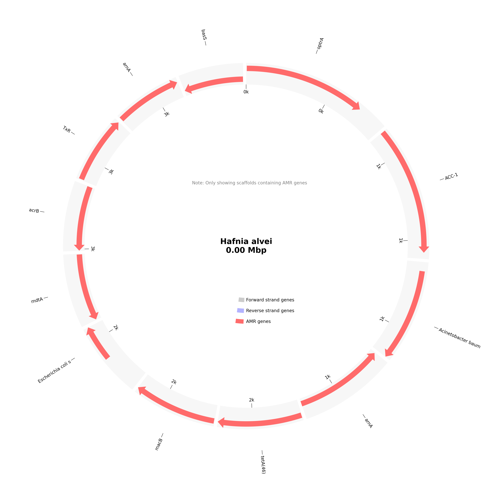

### ACC-1
- **Mechanism**: antibiotic inactivation
- **Drug Classes**: monobactam; cephalosporin; cephamycin; penam; oxacephem
- **AMR Family**: ACC beta-lactamase
- **Locations**:
  - gnl|SPADES|MOCIJAGE_512879_1 : position 1-423

### Acinetobacter baumannii AbaQ
- **Mechanism**: antibiotic efflux
- **Drug Classes**: fluoroquinolone antibiotic
- **AMR Family**: major facilitator superfamily (MFS) antibiotic efflux pump
- **Locations**:
  - gnl|SPADES|MOCIJAGE_943261_1 : position 30-335

### Escherichia coli soxS with mutation conferring antibiotic resistance
- **Mechanism**: antibiotic target alteration; antibiotic efflux; reduced permeability to antibiotic
- **Drug Classes**: fluoroquinolone antibiotic; monobactam; carbapenem; cephalosporin; glycylcycline; cephamycin; penam; tetracycline antibiotic; rifamycin antibiotic; phenicol antibiotic; penem; disinfecting agents and antiseptics
- **AMR Family**: ATP-binding cassette (ABC) antibiotic efflux pump; major facilitator superfamily (MFS) antibiotic efflux pump; resistance-nodulation-cell division (RND) antibiotic efflux pump; General Bacterial Porin with reduced permeability to beta-lactams
- **Locations**:
  - gnl|SPADES|MOCIJAGE_1723539_2 : position 126-245

### TxR
- **Mechanism**: antibiotic efflux
- **Drug Classes**: tetracycline antibiotic
- **AMR Family**: ATP-binding cassette (ABC) antibiotic efflux pump
- **Locations**:
  - gnl|SPADES|MOCIJAGE_1988146_1 : position 3-224

### acrB
- **Mechanism**: antibiotic efflux
- **Drug Classes**: fluoroquinolone antibiotic; cephalosporin; glycylcycline; penam; tetracycline antibiotic; rifamycin antibiotic; phenicol antibiotic; disinfecting agents and antiseptics
- **AMR Family**: resistance-nodulation-cell division (RND) antibiotic efflux pump
- **Locations**:
  - gnl|SPADES|MOCIJAGE_1989631_1 : position 1-225

### arnA (found in 2 locations)
- **Mechanism**: antibiotic target alteration
- **Drug Classes**: peptide antibiotic
- **AMR Family**: pmr phosphoethanolamine transferase
- **Locations**:
  - gnl|SPADES|MOCIJAGE_1077192_1 : position 3-314
  - gnl|SPADES|MOCIJAGE_2046048_1 : position 2-220

### basS
- **Mechanism**: antibiotic target alteration; antibiotic efflux
- **Drug Classes**: peptide antibiotic
- **AMR Family**: pmr phosphoethanolamine transferase
- **Locations**:
  - gnl|SPADES|MOCIJAGE_2254169_1 : position 1-207

### macB
- **Mechanism**: antibiotic efflux
- **Drug Classes**: macrolide antibiotic
- **AMR Family**: ATP-binding cassette (ABC) antibiotic efflux pump
- **Locations**:
  - gnl|SPADES|MOCIJAGE_1383236_1 : position 2-274

### mdtA
- **Mechanism**: antibiotic efflux
- **Drug Classes**: aminocoumarin antibiotic
- **AMR Family**: resistance-nodulation-cell division (RND) antibiotic efflux pump
- **Locations**:
  - gnl|SPADES|MOCIJAGE_1831492_1 : position 2-235

### optrA
- **Mechanism**: antibiotic target protection
- **Drug Classes**: oxazolidinone antibiotic; phenicol antibiotic
- **AMR Family**: Miscellaneous ABC-F subfamily ATP-binding cassette ribosomal protection proteins
- **Locations**:
  - gnl|SPADES|MOCIJAGE_386523_1 : position 2-400

### tetA(46)
- **Mechanism**: antibiotic efflux
- **Drug Classes**: tetracycline antibiotic
- **AMR Family**: ATP-binding cassette (ABC) antibiotic efflux pump
- **Locations**:
  - gnl|SPADES|MOCIJAGE_1359104_1 : position 2-277

## Hafnia paralvei
**Strain Statistics:**
- Total genome length: 55.8 kbp
- Total scaffolds: 2619
- Scaffolds with AMR genes: 153
- Total genes annotated: 30
- Total AMR genes: 153
- Unique AMR genes: 93
- Distinct AMR mechanisms: 11
- Distinct AMR families: 33
- Distinct drug classes: 31

**Circos Plot:**

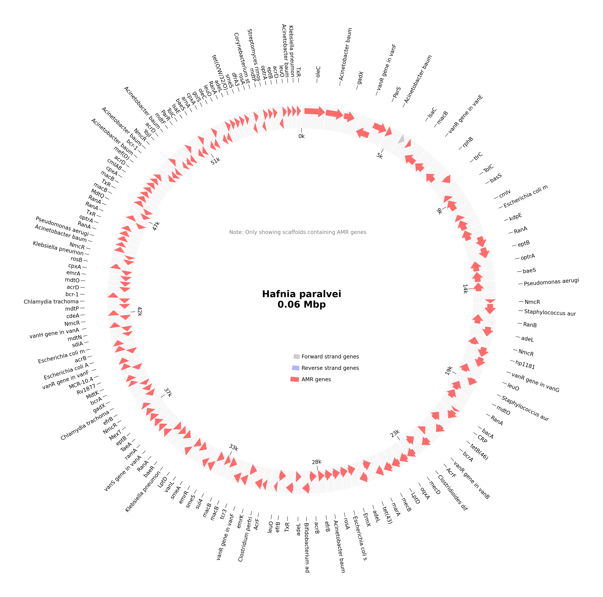

### Acinetobacter baumannii AbaF (found in 3 locations)
- **Mechanism**: antibiotic efflux
- **Drug Classes**: phosphonic acid antibiotic
- **AMR Family**: major facilitator superfamily (MFS) antibiotic efflux pump
- **Locations**:
  - gnl|SPADES|MOCIJAGE_1512740_1 : position 3-260
  - gnl|SPADES|MOCIJAGE_1762021_1 : position 1-240
  - gnl|SPADES|MOCIJAGE_41243_1 : position 2-913

### Acinetobacter baumannii AbaQ (found in 5 locations)
- **Mechanism**: antibiotic efflux
- **Drug Classes**: fluoroquinolone antibiotic
- **AMR Family**: major facilitator superfamily (MFS) antibiotic efflux pump
- **Locations**:
  - gnl|SPADES|MOCIJAGE_109185_1 : position 1-294
  - gnl|SPADES|MOCIJAGE_1793580_1 : position 1-240
  - gnl|SPADES|MOCIJAGE_1898408_1 : position 3-230
  - gnl|SPADES|MOCIJAGE_2219004_1 : position 3-209
  - gnl|SPADES|MOCIJAGE_675692_1 : position 1-393

### AcrF (found in 2 locations)
- **Mechanism**: antibiotic efflux
- **Drug Classes**: fluoroquinolone antibiotic; cephalosporin; cephamycin; penam
- **AMR Family**: resistance-nodulation-cell division (RND) antibiotic efflux pump
- **Locations**:
  - gnl|SPADES|MOCIJAGE_517433_1 : position 1-441
  - gnl|SPADES|MOCIJAGE_775750_1 : position 160-369

### Bifidobacterium adolescentis rpoB mutants conferring resistance to rifampicin
- **Mechanism**: antibiotic target alteration; antibiotic target replacement
- **Drug Classes**: rifamycin antibiotic
- **AMR Family**: rifamycin-resistant beta-subunit of RNA polymerase (rpoB)
- **Locations**:
  - gnl|SPADES|MOCIJAGE_691729_1 : position 1-387

### CRP
- **Mechanism**: antibiotic efflux
- **Drug Classes**: macrolide antibiotic; fluoroquinolone antibiotic; penam
- **AMR Family**: resistance-nodulation-cell division (RND) antibiotic efflux pump
- **Locations**:
  - gnl|SPADES|MOCIJAGE_471085_1 : position 1-456

### Chlamydia trachomatis intrinsic murA conferring resistance to fosfomycin (found in 2 locations)
- **Mechanism**: antibiotic target alteration
- **Drug Classes**: phosphonic acid antibiotic
- **AMR Family**: antibiotic-resistant murA transferase
- **Locations**:
  - gnl|SPADES|MOCIJAGE_1253577_1 : position 4-288
  - gnl|SPADES|MOCIJAGE_1424640_1 : position 2-268

### Clostridioides difficile gyrB conferring resistance to fluoroquinolones
- **Mechanism**: antibiotic target alteration
- **Drug Classes**: fluoroquinolone antibiotic
- **AMR Family**: fluoroquinolone resistant gyrB
- **Locations**:
  - gnl|SPADES|MOCIJAGE_520361_1 : position 2-439

### Clostridium perfringes cplR
- **Mechanism**: antibiotic target protection
- **Drug Classes**: lincosamide antibiotic; streptogramin antibiotic; streptogramin A antibiotic; pleuromutilin antibiotic
- **AMR Family**: Miscellaneous ABC-F subfamily ATP-binding cassette ribosomal protection proteins
- **Locations**:
  - gnl|SPADES|MOCIJAGE_795508_1 : position 3-365

### Corynebacterium striatum tetA
- **Mechanism**: antibiotic efflux
- **Drug Classes**: penam; tetracycline antibiotic
- **AMR Family**: major facilitator superfamily (MFS) antibiotic efflux pump
- **Locations**:
  - gnl|SPADES|MOCIJAGE_2147442_1 : position 2-214

### ErmX
- **Mechanism**: antibiotic target alteration
- **Drug Classes**: macrolide antibiotic; lincosamide antibiotic; streptogramin antibiotic; streptogramin A antibiotic; streptogramin B antibiotic
- **AMR Family**: Erm 23S ribosomal RNA methyltransferase
- **Locations**:
  - gnl|SPADES|MOCIJAGE_628414_1 : position 2-406

### Escherichia coli AcrAB-TolC with MarR mutations conferring resistance to ciprofloxacin and tetracycline
- **Mechanism**: antibiotic target alteration; antibiotic efflux
- **Drug Classes**: fluoroquinolone antibiotic; cephalosporin; glycylcycline; penam; tetracycline antibiotic; rifamycin antibiotic; phenicol antibiotic; disinfecting agents and antiseptics
- **AMR Family**: resistance-nodulation-cell division (RND) antibiotic efflux pump
- **Locations**:
  - gnl|SPADES|MOCIJAGE_1339861_1 : position 3-278

### Escherichia coli mdfA (found in 2 locations)
- **Mechanism**: antibiotic efflux
- **Drug Classes**: tetracycline antibiotic; phenicol antibiotic; disinfecting agents and antiseptics
- **AMR Family**: major facilitator superfamily (MFS) antibiotic efflux pump
- **Locations**:
  - gnl|SPADES|MOCIJAGE_1339564_1 : position 1-279
  - gnl|SPADES|MOCIJAGE_246288_1 : position 1-573

### Escherichia coli soxS with mutation conferring antibiotic resistance
- **Mechanism**: antibiotic target alteration; antibiotic efflux; reduced permeability to antibiotic
- **Drug Classes**: fluoroquinolone antibiotic; monobactam; carbapenem; cephalosporin; glycylcycline; cephamycin; penam; tetracycline antibiotic; rifamycin antibiotic; phenicol antibiotic; penem; disinfecting agents and antiseptics
- **AMR Family**: ATP-binding cassette (ABC) antibiotic efflux pump; major facilitator superfamily (MFS) antibiotic efflux pump; resistance-nodulation-cell division (RND) antibiotic efflux pump; General Bacterial Porin with reduced permeability to beta-lactams
- **Locations**:
  - gnl|SPADES|MOCIJAGE_649143_1 : position 3-398

### Klebsiella pneumoniae OmpK37 (found in 3 locations)
- **Mechanism**: reduced permeability to antibiotic
- **Drug Classes**: monobactam; carbapenem; cephalosporin; cephamycin; penam; penem
- **AMR Family**: General Bacterial Porin with reduced permeability to beta-lactams
- **Locations**:
  - gnl|SPADES|MOCIJAGE_1027400_1 : position 2-322
  - gnl|SPADES|MOCIJAGE_1497265_1 : position 1-261
  - gnl|SPADES|MOCIJAGE_2272655_1 : position 1-207

### LptD (found in 2 locations)
- **Mechanism**: antibiotic efflux
- **Drug Classes**: carbapenem; peptide antibiotic; aminocoumarin antibiotic; rifamycin antibiotic
- **AMR Family**: ATP-binding cassette (ABC) antibiotic efflux pump
- **Locations**:
  - gnl|SPADES|MOCIJAGE_1013599_1 : position 3-293
  - gnl|SPADES|MOCIJAGE_544724_1 : position 2-430

### MCR-10.4
- **Mechanism**: antibiotic target alteration
- **Drug Classes**: peptide antibiotic
- **AMR Family**: MCR phosphoethanolamine transferase
- **Locations**:
  - gnl|SPADES|MOCIJAGE_1291310_1 : position 2-283

### MdtK
- **Mechanism**: antibiotic efflux
- **Drug Classes**: fluoroquinolone antibiotic
- **AMR Family**: multidrug and toxic compound extrusion (MATE) transporter
- **Locations**:
  - gnl|SPADES|MOCIJAGE_1280326_1 : position 1-285

### MdtQ
- **Mechanism**: reduced permeability to antibiotic
- **Drug Classes**: monobactam; carbapenem; cephalosporin; cephamycin; penam; penem
- **AMR Family**: Outer Membrane Porin (Opr)
- **Locations**:
  - gnl|SPADES|MOCIJAGE_1610435_1 : position 3-254

### MexT
- **Mechanism**: antibiotic efflux
- **Drug Classes**: fluoroquinolone antibiotic; diaminopyrimidine antibiotic; phenicol antibiotic
- **AMR Family**: resistance-nodulation-cell division (RND) antibiotic efflux pump
- **Locations**:
  - gnl|SPADES|MOCIJAGE_1136786_1 : position 2-304

### NmcR (found in 6 locations)
- **Mechanism**: antibiotic inactivation
- **Drug Classes**: carbapenem; cephalosporin; cephamycin; penam
- **AMR Family**: NmcA beta-lactamase
- **Locations**:
  - gnl|SPADES|MOCIJAGE_1173605_1 : position 50-298
  - gnl|SPADES|MOCIJAGE_1363965_1 : position 2-274
  - gnl|SPADES|MOCIJAGE_1498045_1 : position 1-186
  - gnl|SPADES|MOCIJAGE_1851753_1 : position 2-202
  - gnl|SPADES|MOCIJAGE_295150_1 : position 342-542
  - gnl|SPADES|MOCIJAGE_347415_1 : position 107-511

### ParR
- **Mechanism**: antibiotic efflux; reduced permeability to antibiotic
- **Drug Classes**: macrolide antibiotic; fluoroquinolone antibiotic; monobactam; aminoglycoside antibiotic; carbapenem; cephalosporin; cephamycin; penam; tetracycline antibiotic; phenicol antibiotic; penem; disinfecting agents and antiseptics
- **AMR Family**: resistance-nodulation-cell division (RND) antibiotic efflux pump; Outer Membrane Porin (Opr)
- **Locations**:
  - gnl|SPADES|MOCIJAGE_1932677_1 : position 1-228

### ParS
- **Mechanism**: antibiotic efflux; reduced permeability to antibiotic
- **Drug Classes**: macrolide antibiotic; fluoroquinolone antibiotic; monobactam; aminoglycoside antibiotic; carbapenem; cephalosporin; cephamycin; penam; tetracycline antibiotic; phenicol antibiotic; penem; disinfecting agents and antiseptics
- **AMR Family**: resistance-nodulation-cell division (RND) antibiotic efflux pump; Outer Membrane Porin (Opr)
- **Locations**:
  - gnl|SPADES|MOCIJAGE_104050_1 : position 3-731

### Pseudomonas aeruginosa CpxR
- **Mechanism**: antibiotic efflux
- **Drug Classes**: macrolide antibiotic; fluoroquinolone antibiotic; monobactam; aminoglycoside antibiotic; carbapenem; cephalosporin; cephamycin; penam; tetracycline antibiotic; peptide antibiotic; aminocoumarin antibiotic; diaminopyrimidine antibiotic; sulfonamide antibiotic; phenicol antibiotic; penem
- **AMR Family**: resistance-nodulation-cell division (RND) antibiotic efflux pump
- **Locations**:
  - gnl|SPADES|MOCIJAGE_1518129_1 : position 3-224

### Pseudomonas aeruginosa ampR with mutation conferring resistance to aztreonam
- **Mechanism**: antibiotic target alteration; antibiotic inactivation
- **Drug Classes**: monobactam; carbapenem; cephalosporin
- **AMR Family**: PDC beta-lactamase; ampR transcriptional regulator with mutation conferring resistance to monobactam antibiotics
- **Locations**:
  - gnl|SPADES|MOCIJAGE_286565_1 : position 2-475

### RanA (found in 7 locations)
- **Mechanism**: antibiotic efflux
- **Drug Classes**: aminoglycoside antibiotic
- **AMR Family**: ATP-binding cassette (ABC) antibiotic efflux pump
- **Locations**:
  - gnl|SPADES|MOCIJAGE_1036588_1 : position 2-319
  - gnl|SPADES|MOCIJAGE_1554681_1 : position 1-258
  - gnl|SPADES|MOCIJAGE_1583867_1 : position 3-254
  - gnl|SPADES|MOCIJAGE_1611148_1 : position 15-254
  - gnl|SPADES|MOCIJAGE_2067945_1 : position 1-219
  - gnl|SPADES|MOCIJAGE_261364_1 : position 2-562
  - gnl|SPADES|MOCIJAGE_433838_1 : position 3-473

### RanB
- **Mechanism**: antibiotic efflux
- **Drug Classes**: aminoglycoside antibiotic
- **AMR Family**: ATP-binding cassette (ABC) antibiotic efflux pump
- **Locations**:
  - gnl|SPADES|MOCIJAGE_298856_1 : position 3-512

### Rv1877
- **Mechanism**: antibiotic efflux
- **Drug Classes**: fluoroquinolone antibiotic
- **AMR Family**: major facilitator superfamily (MFS) antibiotic efflux pump
- **Locations**:
  - gnl|SPADES|MOCIJAGE_1282241_1 : position 3-284

### Staphylococcus aureus mupA conferring resistance to mupirocin
- **Mechanism**: antibiotic target alteration
- **Drug Classes**: mupirocin-like antibiotic
- **AMR Family**: antibiotic-resistant isoleucyl-tRNA synthetase (ileS)
- **Locations**:
  - gnl|SPADES|MOCIJAGE_398072_1 : position 90-488

### Staphylococcus aureus mupB conferring resistance to mupirocin
- **Mechanism**: antibiotic target alteration
- **Drug Classes**: mupirocin-like antibiotic
- **AMR Family**: antibiotic-resistant isoleucyl-tRNA synthetase (ileS)
- **Locations**:
  - gnl|SPADES|MOCIJAGE_298235_1 : position 2-541

### Streptomyces rimosus otr(A)
- **Mechanism**: antibiotic target protection
- **Drug Classes**: tetracycline antibiotic
- **AMR Family**: tetracycline-resistant ribosomal protection protein
- **Locations**:
  - gnl|SPADES|MOCIJAGE_2184198_1 : position 1-210

### TaeA
- **Mechanism**: antibiotic efflux
- **Drug Classes**: pleuromutilin antibiotic
- **AMR Family**: ATP-binding cassette (ABC) antibiotic efflux pump
- **Locations**:
  - gnl|SPADES|MOCIJAGE_1083605_1 : position 1-312

### TolC (found in 2 locations)
- **Mechanism**: antibiotic efflux
- **Drug Classes**: macrolide antibiotic; fluoroquinolone antibiotic; aminoglycoside antibiotic; carbapenem; cephalosporin; glycylcycline; cephamycin; penam; tetracycline antibiotic; peptide antibiotic; aminocoumarin antibiotic; rifamycin antibiotic; phenicol antibiotic; penem; disinfecting agents and antiseptics
- **AMR Family**: ATP-binding cassette (ABC) antibiotic efflux pump; major facilitator superfamily (MFS) antibiotic efflux pump; resistance-nodulation-cell division (RND) antibiotic efflux pump
- **Locations**:
  - gnl|SPADES|MOCIJAGE_191514_1 : position 325-621
  - gnl|SPADES|MOCIJAGE_1956260_1 : position 1-228

### TxR (found in 4 locations)
- **Mechanism**: antibiotic efflux
- **Drug Classes**: tetracycline antibiotic
- **AMR Family**: ATP-binding cassette (ABC) antibiotic efflux pump
- **Locations**:
  - gnl|SPADES|MOCIJAGE_1586712_1 : position 1-255
  - gnl|SPADES|MOCIJAGE_1634822_1 : position 1-252
  - gnl|SPADES|MOCIJAGE_2262453_1 : position 1-207
  - gnl|SPADES|MOCIJAGE_734375_1 : position 1-378

### YojI
- **Mechanism**: antibiotic efflux
- **Drug Classes**: peptide antibiotic
- **AMR Family**: ATP-binding cassette (ABC) antibiotic efflux pump
- **Locations**:
  - gnl|SPADES|MOCIJAGE_1858576_1 : position 1-234

### acrB (found in 2 locations)
- **Mechanism**: antibiotic efflux
- **Drug Classes**: fluoroquinolone antibiotic; cephalosporin; glycylcycline; penam; tetracycline antibiotic; rifamycin antibiotic; phenicol antibiotic; disinfecting agents and antiseptics
- **AMR Family**: resistance-nodulation-cell division (RND) antibiotic efflux pump
- **Locations**:
  - gnl|SPADES|MOCIJAGE_1333904_1 : position 1-279
  - gnl|SPADES|MOCIJAGE_684484_1 : position 3-389

### acrD (found in 4 locations)
- **Mechanism**: antibiotic efflux
- **Drug Classes**: aminoglycoside antibiotic
- **AMR Family**: resistance-nodulation-cell division (RND) antibiotic efflux pump
- **Locations**:
  - gnl|SPADES|MOCIJAGE_1434621_1 : position 1-267
  - gnl|SPADES|MOCIJAGE_1745485_1 : position 1-243
  - gnl|SPADES|MOCIJAGE_1888340_1 : position 3-197
  - gnl|SPADES|MOCIJAGE_2190669_1 : position 3-212

### adeL (found in 4 locations)
- **Mechanism**: antibiotic efflux
- **Drug Classes**: fluoroquinolone antibiotic; tetracycline antibiotic
- **AMR Family**: resistance-nodulation-cell division (RND) antibiotic efflux pump
- **Locations**:
  - gnl|SPADES|MOCIJAGE_2074832_1 : position 2-220
  - gnl|SPADES|MOCIJAGE_302865_1 : position 41-538
  - gnl|SPADES|MOCIJAGE_616901_1 : position 1-408
  - gnl|SPADES|MOCIJAGE_704253_1 : position 2-292

### arnA
- **Mechanism**: antibiotic target alteration
- **Drug Classes**: peptide antibiotic
- **AMR Family**: pmr phosphoethanolamine transferase
- **Locations**:
  - gnl|SPADES|MOCIJAGE_2014288_1 : position 2-223

### bacA
- **Mechanism**: antibiotic target alteration
- **Drug Classes**: peptide antibiotic
- **AMR Family**: undecaprenyl pyrophosphate related proteins
- **Locations**:
  - gnl|SPADES|MOCIJAGE_433216_2 : position 330-473

### baeR
- **Mechanism**: antibiotic efflux
- **Drug Classes**: aminoglycoside antibiotic; aminocoumarin antibiotic
- **AMR Family**: resistance-nodulation-cell division (RND) antibiotic efflux pump
- **Locations**:
  - gnl|SPADES|MOCIJAGE_1030578_1 : position 3-320

### baeS (found in 2 locations)
- **Mechanism**: antibiotic efflux
- **Drug Classes**: aminoglycoside antibiotic; aminocoumarin antibiotic
- **AMR Family**: resistance-nodulation-cell division (RND) antibiotic efflux pump
- **Locations**:
  - gnl|SPADES|MOCIJAGE_1981883_1 : position 1-225
  - gnl|SPADES|MOCIJAGE_283696_1 : position 1-549

### basS
- **Mechanism**: antibiotic target alteration; antibiotic efflux
- **Drug Classes**: peptide antibiotic
- **AMR Family**: pmr phosphoethanolamine transferase
- **Locations**:
  - gnl|SPADES|MOCIJAGE_195547_1 : position 3-617

### bcr-1 (found in 2 locations)
- **Mechanism**: antibiotic efflux
- **Drug Classes**: bicyclomycin-like antibiotic
- **AMR Family**: major facilitator superfamily (MFS) antibiotic efflux pump
- **Locations**:
  - gnl|SPADES|MOCIJAGE_1438111_1 : position 3-269
  - gnl|SPADES|MOCIJAGE_1775546_1 : position 1-240

### bcrA (found in 2 locations)
- **Mechanism**: antibiotic efflux
- **Drug Classes**: peptide antibiotic
- **AMR Family**: ATP-binding cassette (ABC) antibiotic efflux pump
- **Locations**:
  - gnl|SPADES|MOCIJAGE_1277399_1 : position 55-285
  - gnl|SPADES|MOCIJAGE_486713_1 : position 3-416

### cdeA
- **Mechanism**: antibiotic efflux
- **Drug Classes**: fluoroquinolone antibiotic; disinfecting agents and antiseptics
- **AMR Family**: multidrug and toxic compound extrusion (MATE) transporter
- **Locations**:
  - gnl|SPADES|MOCIJAGE_1378623_1 : position 3-275

### cmlA8
- **Mechanism**: antibiotic efflux
- **Drug Classes**: phenicol antibiotic
- **AMR Family**: major facilitator superfamily (MFS) antibiotic efflux pump
- **Locations**:
  - gnl|SPADES|MOCIJAGE_1720600_1 : position 2-244

### cmlv
- **Mechanism**: antibiotic inactivation
- **Drug Classes**: phenicol antibiotic
- **AMR Family**: chloramphenicol phosphotransferase
- **Locations**:
  - gnl|SPADES|MOCIJAGE_235817_2 : position 279-581

### cpxA (found in 3 locations)
- **Mechanism**: antibiotic efflux
- **Drug Classes**: aminoglycoside antibiotic; aminocoumarin antibiotic
- **AMR Family**: resistance-nodulation-cell division (RND) antibiotic efflux pump
- **Locations**:
  - gnl|SPADES|MOCIJAGE_1505914_1 : position 3-263
  - gnl|SPADES|MOCIJAGE_1655834_1 : position 3-248
  - gnl|SPADES|MOCIJAGE_2017457_1 : position 1-222

### dfrA3
- **Mechanism**: antibiotic target replacement
- **Drug Classes**: diaminopyrimidine antibiotic
- **AMR Family**: trimethoprim resistant dihydrofolate reductase dfr
- **Locations**:
  - gnl|SPADES|MOCIJAGE_2092611_1 : position 28-219

### efrB (found in 3 locations)
- **Mechanism**: antibiotic efflux
- **Drug Classes**: macrolide antibiotic; fluoroquinolone antibiotic; rifamycin antibiotic
- **AMR Family**: ATP-binding cassette (ABC) antibiotic efflux pump
- **Locations**:
  - gnl|SPADES|MOCIJAGE_1199093_1 : position 1-294
  - gnl|SPADES|MOCIJAGE_683667_1 : position 1-333
  - gnl|SPADES|MOCIJAGE_744850_1 : position 1-375

### emrA
- **Mechanism**: antibiotic efflux
- **Drug Classes**: fluoroquinolone antibiotic
- **AMR Family**: major facilitator superfamily (MFS) antibiotic efflux pump
- **Locations**:
  - gnl|SPADES|MOCIJAGE_1489096_1 : position 3-263

### emrK
- **Mechanism**: antibiotic efflux
- **Drug Classes**: tetracycline antibiotic
- **AMR Family**: major facilitator superfamily (MFS) antibiotic efflux pump
- **Locations**:
  - gnl|SPADES|MOCIJAGE_820181_1 : position 2-358

### emrR
- **Mechanism**: antibiotic efflux
- **Drug Classes**: fluoroquinolone antibiotic
- **AMR Family**: major facilitator superfamily (MFS) antibiotic efflux pump
- **Locations**:
  - gnl|SPADES|MOCIJAGE_973223_1 : position 3-275

### eptB (found in 3 locations)
- **Mechanism**: antibiotic target alteration
- **Drug Classes**: peptide antibiotic
- **AMR Family**: pmr phosphoethanolamine transferase
- **Locations**:
  - gnl|SPADES|MOCIJAGE_1103990_1 : position 2-307
  - gnl|SPADES|MOCIJAGE_2194111_1 : position 1-210
  - gnl|SPADES|MOCIJAGE_276788_1 : position 1-552

### gadX (found in 2 locations)
- **Mechanism**: antibiotic efflux
- **Drug Classes**: macrolide antibiotic; fluoroquinolone antibiotic; penam
- **AMR Family**: resistance-nodulation-cell division (RND) antibiotic efflux pump
- **Locations**:
  - gnl|SPADES|MOCIJAGE_1267538_1 : position 41-286
  - gnl|SPADES|MOCIJAGE_76653_1 : position 2-565

### golS
- **Mechanism**: antibiotic efflux
- **Drug Classes**: monobactam; carbapenem; cephalosporin; cephamycin; penam; phenicol antibiotic; penem
- **AMR Family**: resistance-nodulation-cell division (RND) antibiotic efflux pump
- **Locations**:
  - gnl|SPADES|MOCIJAGE_2011631_1 : position 2-223

### hp1181
- **Mechanism**: antibiotic efflux
- **Drug Classes**: fluoroquinolone antibiotic; tetracycline antibiotic; nitroimidazole antibiotic
- **AMR Family**: major facilitator superfamily (MFS) antibiotic efflux pump
- **Locations**:
  - gnl|SPADES|MOCIJAGE_346481_1 : position 1-513

### kdpE
- **Mechanism**: antibiotic efflux
- **Drug Classes**: aminoglycoside antibiotic
- **AMR Family**: kdpDE
- **Locations**:
  - gnl|SPADES|MOCIJAGE_259021_1 : position 2-565

### leuO (found in 4 locations)
- **Mechanism**: antibiotic efflux
- **Drug Classes**: nucleoside antibiotic; disinfecting agents and antiseptics
- **AMR Family**: major facilitator superfamily (MFS) antibiotic efflux pump
- **Locations**:
  - gnl|SPADES|MOCIJAGE_2061683_1 : position 1-219
  - gnl|SPADES|MOCIJAGE_2197787_1 : position 2-211
  - gnl|SPADES|MOCIJAGE_383391_1 : position 1-441
  - gnl|SPADES|MOCIJAGE_761627_1 : position 3-179

### lsaC
- **Mechanism**: antibiotic target protection
- **Drug Classes**: lincosamide antibiotic; streptogramin antibiotic; pleuromutilin antibiotic
- **AMR Family**: lsa-type ABC-F protein
- **Locations**:
  - gnl|SPADES|MOCIJAGE_133478_2 : position 464-685

### lsaE
- **Mechanism**: antibiotic target protection
- **Drug Classes**: lincosamide antibiotic; streptogramin antibiotic; pleuromutilin antibiotic
- **AMR Family**: lsa-type ABC-F protein
- **Locations**:
  - gnl|SPADES|MOCIJAGE_1969062_1 : position 1-225

### macB (found in 5 locations)
- **Mechanism**: antibiotic efflux
- **Drug Classes**: macrolide antibiotic
- **AMR Family**: ATP-binding cassette (ABC) antibiotic efflux pump
- **Locations**:
  - gnl|SPADES|MOCIJAGE_139222_1 : position 3-656
  - gnl|SPADES|MOCIJAGE_1623170_1 : position 2-253
  - gnl|SPADES|MOCIJAGE_1645922_1 : position 3-251
  - gnl|SPADES|MOCIJAGE_901559_1 : position 2-343
  - gnl|SPADES|MOCIJAGE_905443_1 : position 3-278

### marA
- **Mechanism**: antibiotic efflux; reduced permeability to antibiotic
- **Drug Classes**: fluoroquinolone antibiotic; monobactam; carbapenem; cephalosporin; glycylcycline; cephamycin; penam; tetracycline antibiotic; rifamycin antibiotic; phenicol antibiotic; penem; disinfecting agents and antiseptics
- **AMR Family**: resistance-nodulation-cell division (RND) antibiotic efflux pump; General Bacterial Porin with reduced permeability to beta-lactams
- **Locations**:
  - gnl|SPADES|MOCIJAGE_575556_1 : position 54-422

### mdtF
- **Mechanism**: antibiotic efflux
- **Drug Classes**: macrolide antibiotic; fluoroquinolone antibiotic; penam
- **AMR Family**: resistance-nodulation-cell division (RND) antibiotic efflux pump
- **Locations**:
  - gnl|SPADES|MOCIJAGE_1902363_1 : position 3-230

### mdtN
- **Mechanism**: antibiotic efflux
- **Drug Classes**: nucleoside antibiotic; disinfecting agents and antiseptics
- **AMR Family**: major facilitator superfamily (MFS) antibiotic efflux pump
- **Locations**:
  - gnl|SPADES|MOCIJAGE_1344610_1 : position 1-276

### mdtO (found in 2 locations)
- **Mechanism**: antibiotic efflux
- **Drug Classes**: nucleoside antibiotic; disinfecting agents and antiseptics
- **AMR Family**: major facilitator superfamily (MFS) antibiotic efflux pump
- **Locations**:
  - gnl|SPADES|MOCIJAGE_1494015_1 : position 3-263
  - gnl|SPADES|MOCIJAGE_403794_1 : position 2-484

### mdtP (found in 2 locations)
- **Mechanism**: antibiotic efflux
- **Drug Classes**: nucleoside antibiotic; disinfecting agents and antiseptics
- **AMR Family**: major facilitator superfamily (MFS) antibiotic efflux pump
- **Locations**:
  - gnl|SPADES|MOCIJAGE_1401672_1 : position 2-271
  - gnl|SPADES|MOCIJAGE_2145106_1 : position 34-213

### mecB
- **Mechanism**: antibiotic target replacement
- **Drug Classes**: penam
- **AMR Family**: methicillin resistant PBP2
- **Locations**:
  - gnl|SPADES|MOCIJAGE_564177_1 : position 1-423

### mecD
- **Mechanism**: antibiotic target replacement
- **Drug Classes**: penam
- **AMR Family**: methicillin resistant PBP2
- **Locations**:
  - gnl|SPADES|MOCIJAGE_533411_1 : position 3-434

### mef(D)
- **Mechanism**: antibiotic efflux
- **Drug Classes**: macrolide antibiotic
- **AMR Family**: major facilitator superfamily (MFS) antibiotic efflux pump
- **Locations**:
  - gnl|SPADES|MOCIJAGE_1750501_1 : position 3-242

### oleC (found in 2 locations)
- **Mechanism**: antibiotic efflux
- **Drug Classes**: macrolide antibiotic
- **AMR Family**: ATP-binding cassette (ABC) antibiotic efflux pump
- **Locations**:
  - gnl|SPADES|MOCIJAGE_10482_2 : position 144-1214
  - gnl|SPADES|MOCIJAGE_2033869_1 : position 2-223

### optrA (found in 3 locations)
- **Mechanism**: antibiotic target protection
- **Drug Classes**: oxazolidinone antibiotic; phenicol antibiotic
- **AMR Family**: Miscellaneous ABC-F subfamily ATP-binding cassette ribosomal protection proteins
- **Locations**:
  - gnl|SPADES|MOCIJAGE_1569357_1 : position 3-257
  - gnl|SPADES|MOCIJAGE_2187635_1 : position 3-212
  - gnl|SPADES|MOCIJAGE_279473_1 : position 1-552

### oqxA
- **Mechanism**: antibiotic efflux
- **Drug Classes**: fluoroquinolone antibiotic; glycylcycline; tetracycline antibiotic; diaminopyrimidine antibiotic; nitrofuran antibiotic
- **AMR Family**: resistance-nodulation-cell division (RND) antibiotic efflux pump
- **Locations**:
  - gnl|SPADES|MOCIJAGE_541715_1 : position 1-432

### ramA
- **Mechanism**: antibiotic efflux; reduced permeability to antibiotic
- **Drug Classes**: fluoroquinolone antibiotic; monobactam; carbapenem; cephalosporin; glycylcycline; cephamycin; penam; tetracycline antibiotic; rifamycin antibiotic; phenicol antibiotic; penem; disinfecting agents and antiseptics
- **AMR Family**: resistance-nodulation-cell division (RND) antibiotic efflux pump; General Bacterial Porin with reduced permeability to beta-lactams
- **Locations**:
  - gnl|SPADES|MOCIJAGE_1063652_1 : position 23-316

### rosA (found in 2 locations)
- **Mechanism**: antibiotic efflux
- **Drug Classes**: peptide antibiotic
- **AMR Family**: major facilitator superfamily (MFS) antibiotic efflux pump
- **Locations**:
  - gnl|SPADES|MOCIJAGE_2113628_1 : position 30-215
  - gnl|SPADES|MOCIJAGE_648316_1 : position 2-400

### rosB
- **Mechanism**: antibiotic efflux
- **Drug Classes**: peptide antibiotic
- **AMR Family**: major facilitator superfamily (MFS) antibiotic efflux pump
- **Locations**:
  - gnl|SPADES|MOCIJAGE_1505126_1 : position 2-262

### rphB
- **Mechanism**: antibiotic inactivation
- **Drug Classes**: rifamycin antibiotic
- **AMR Family**: rifampin phosphotransferase
- **Locations**:
  - gnl|SPADES|MOCIJAGE_143922_1 : position 121-672

### sdiA
- **Mechanism**: antibiotic efflux
- **Drug Classes**: fluoroquinolone antibiotic; cephalosporin; glycylcycline; penam; tetracycline antibiotic; rifamycin antibiotic; phenicol antibiotic; disinfecting agents and antiseptics
- **AMR Family**: resistance-nodulation-cell division (RND) antibiotic efflux pump
- **Locations**:
  - gnl|SPADES|MOCIJAGE_1343022_1 : position 49-276

### smeA
- **Mechanism**: antibiotic efflux
- **Drug Classes**: aminoglycoside antibiotic; cephalosporin; cephamycin; penam
- **AMR Family**: resistance-nodulation-cell division (RND) antibiotic efflux pump
- **Locations**:
  - gnl|SPADES|MOCIJAGE_974813_1 : position 3-329

### smeS (found in 2 locations)
- **Mechanism**: antibiotic efflux
- **Drug Classes**: aminoglycoside antibiotic; cephalosporin; cephamycin; penam
- **AMR Family**: resistance-nodulation-cell division (RND) antibiotic efflux pump
- **Locations**:
  - gnl|SPADES|MOCIJAGE_2087250_1 : position 2-217
  - gnl|SPADES|MOCIJAGE_958575_1 : position 2-331

### sul4
- **Mechanism**: antibiotic target replacement
- **Drug Classes**: sulfonamide antibiotic
- **AMR Family**: sulfonamide resistant sul
- **Locations**:
  - gnl|SPADES|MOCIJAGE_922413_1 : position 2-340

### tcr3
- **Mechanism**: antibiotic efflux
- **Drug Classes**: tetracycline antibiotic
- **AMR Family**: major facilitator superfamily (MFS) antibiotic efflux pump
- **Locations**:
  - gnl|SPADES|MOCIJAGE_895833_1 : position 2-343

### tet(43)
- **Mechanism**: antibiotic efflux
- **Drug Classes**: tetracycline antibiotic
- **AMR Family**: major facilitator superfamily (MFS) antibiotic efflux pump
- **Locations**:
  - gnl|SPADES|MOCIJAGE_598228_1 : position 2-415

### tet(O/W/32/O)
- **Mechanism**: antibiotic target protection
- **Drug Classes**: tetracycline antibiotic
- **AMR Family**: tetracycline-resistant ribosomal protection protein
- **Locations**:
  - gnl|SPADES|MOCIJAGE_2084671_1 : position 2-217

### tetB(46)
- **Mechanism**: antibiotic efflux
- **Drug Classes**: tetracycline antibiotic
- **AMR Family**: ATP-binding cassette (ABC) antibiotic efflux pump
- **Locations**:
  - gnl|SPADES|MOCIJAGE_472866_1 : position 2-457

### tlrC
- **Mechanism**: antibiotic target protection
- **Drug Classes**: macrolide antibiotic; lincosamide antibiotic
- **AMR Family**: Miscellaneous ABC-F subfamily ATP-binding cassette ribosomal protection proteins
- **Locations**:
  - gnl|SPADES|MOCIJAGE_179196_2 : position 263-631

### vanH gene in vanA cluster
- **Mechanism**: antibiotic target alteration
- **Drug Classes**: glycopeptide antibiotic
- **AMR Family**: vanH; glycopeptide resistance gene cluster
- **Locations**:
  - gnl|SPADES|MOCIJAGE_1359154_1 : position 1-276

### vanL
- **Mechanism**: antibiotic target alteration
- **Drug Classes**: glycopeptide antibiotic
- **AMR Family**: glycopeptide resistance gene cluster; Van ligase
- **Locations**:
  - gnl|SPADES|MOCIJAGE_988334_1 : position 3-326

### vanR gene in vanB cluster
- **Mechanism**: antibiotic target alteration
- **Drug Classes**: glycopeptide antibiotic
- **AMR Family**: glycopeptide resistance gene cluster; vanR
- **Locations**:
  - gnl|SPADES|MOCIJAGE_501329_2 : position 124-447

### vanR gene in vanE cluster
- **Mechanism**: antibiotic target alteration
- **Drug Classes**: glycopeptide antibiotic
- **AMR Family**: glycopeptide resistance gene cluster; vanR
- **Locations**:
  - gnl|SPADES|MOCIJAGE_142056_1 : position 1-531

### vanR gene in vanF cluster (found in 3 locations)
- **Mechanism**: antibiotic target alteration
- **Drug Classes**: glycopeptide antibiotic
- **AMR Family**: glycopeptide resistance gene cluster; vanR
- **Locations**:
  - gnl|SPADES|MOCIJAGE_103734_1 : position 2-733
  - gnl|SPADES|MOCIJAGE_1291126_1 : position 3-284
  - gnl|SPADES|MOCIJAGE_893757_1 : position 1-345

### vanR gene in vanG cluster
- **Mechanism**: antibiotic target alteration
- **Drug Classes**: glycopeptide antibiotic
- **AMR Family**: glycopeptide resistance gene cluster; vanR
- **Locations**:
  - gnl|SPADES|MOCIJAGE_365887_1 : position 2-502

### vanS gene in vanA cluster
- **Mechanism**: antibiotic target alteration
- **Drug Classes**: glycopeptide antibiotic
- **AMR Family**: vanS; glycopeptide resistance gene cluster
- **Locations**:
  - gnl|SPADES|MOCIJAGE_1054946_1 : position 2-316

## Latilactobacillus sakei
**Strain Statistics:**
- Total genome length: 1033.5 kbp
- Total scaffolds: 933
- Scaffolds with AMR genes: 110
- Total genes annotated: 2039
- Total AMR genes: 178
- Unique AMR genes: 110
- Distinct AMR mechanisms: 9
- Distinct AMR families: 51
- Distinct drug classes: 34

**Circos Plot:**

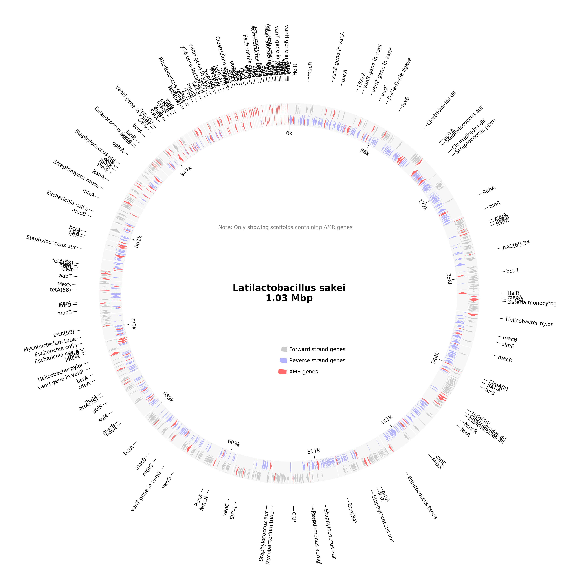

### AAC(6')-34
- **Mechanism**: antibiotic inactivation
- **Drug Classes**: aminoglycoside antibiotic
- **AMR Family**: AAC(6')
- **Locations**:
  - gnl|SPADES|MOCIJAGE_24_40 : position 36369-36929

### ADC-8
- **Mechanism**: antibiotic inactivation
- **Drug Classes**: cephalosporin
- **AMR Family**: ADC beta-lactamase without carbapenemase activity
- **Locations**:
  - gnl|SPADES|MOCIJAGE_8_33 : position 35610-36761

### Acinetobacter baumannii AbaQ (found in 2 locations)
- **Mechanism**: antibiotic efflux
- **Drug Classes**: fluoroquinolone antibiotic
- **AMR Family**: major facilitator superfamily (MFS) antibiotic efflux pump
- **Locations**:
  - gnl|SPADES|MOCIJAGE_240652_1 : position 1-579
  - gnl|SPADES|MOCIJAGE_71394_1 : position 111-803

### CRP
- **Mechanism**: antibiotic efflux
- **Drug Classes**: macrolide antibiotic; fluoroquinolone antibiotic; penam
- **AMR Family**: resistance-nodulation-cell division (RND) antibiotic efflux pump
- **Locations**:
  - gnl|SPADES|MOCIJAGE_128_17 : position 18646-19314

### Clostridioides difficile gyrA conferring resistance to fluoroquinolones (found in 2 locations)
- **Mechanism**: antibiotic target alteration
- **Drug Classes**: fluoroquinolone antibiotic
- **AMR Family**: fluoroquinolone resistant gyrA
- **Locations**:
  - gnl|SPADES|MOCIJAGE_65_21 : position 21523-23997
  - gnl|SPADES|MOCIJAGE_8_116 : position 118941-121514

### Clostridioides difficile gyrB conferring resistance to fluoroquinolones (found in 2 locations)
- **Mechanism**: antibiotic target alteration
- **Drug Classes**: fluoroquinolone antibiotic
- **AMR Family**: fluoroquinolone resistant gyrB
- **Locations**:
  - gnl|SPADES|MOCIJAGE_65_20 : position 19511-21502
  - gnl|SPADES|MOCIJAGE_8_117 : position 121562-123553

### Clostridioides difficile murG with mutation conferring resistance to vancomycin
- **Mechanism**: antibiotic target alteration
- **Drug Classes**: glycopeptide antibiotic
- **AMR Family**: murG transferase
- **Locations**:
  - gnl|SPADES|MOCIJAGE_21_9 : position 8680-9780

### Clostridium sporogenes cplR
- **Mechanism**: antibiotic target protection
- **Drug Classes**: lincosamide antibiotic; pleuromutilin antibiotic
- **AMR Family**: Miscellaneous ABC-F subfamily ATP-binding cassette ribosomal protection proteins
- **Locations**:
  - gnl|SPADES|MOCIJAGE_10103_2 : position 1038-1223

### D-Ala-D-Ala ligase
- **Mechanism**: antibiotic target alteration
- **Drug Classes**: glycopeptide antibiotic
- **AMR Family**: Van ligase
- **Locations**:
  - gnl|SPADES|MOCIJAGE_8_73 : position 82445-83497

### Enterococcus faecalis cls with mutation conferring resistance to daptomycin (found in 3 locations)
- **Mechanism**: antibiotic target alteration
- **Drug Classes**: peptide antibiotic
- **AMR Family**: daptomycin resistant cls
- **Locations**:
  - gnl|SPADES|MOCIJAGE_438_9 : position 5743-6411
  - gnl|SPADES|MOCIJAGE_72_26 : position 25837-27294
  - gnl|SPADES|MOCIJAGE_77823_1 : position 1-786

### Erm(34)
- **Mechanism**: antibiotic target alteration
- **Drug Classes**: macrolide antibiotic; lincosamide antibiotic; streptogramin antibiotic; streptogramin A antibiotic; streptogramin B antibiotic
- **AMR Family**: Erm 23S ribosomal RNA methyltransferase
- **Locations**:
  - gnl|SPADES|MOCIJAGE_92_24 : position 21299-22192

### Escherichia coli AcrAB-TolC with AcrR mutation conferring resistance to ciprofloxacin, tetracycline, and ceftazidime
- **Mechanism**: antibiotic target alteration; antibiotic efflux
- **Drug Classes**: fluoroquinolone antibiotic; cephalosporin; glycylcycline; penam; tetracycline antibiotic; rifamycin antibiotic; phenicol antibiotic; disinfecting agents and antiseptics
- **AMR Family**: resistance-nodulation-cell division (RND) antibiotic efflux pump
- **Locations**:
  - gnl|SPADES|MOCIJAGE_236_10 : position 9876-10517

### Escherichia coli fabI mutations conferring resistance to isoniazid and triclosan
- **Mechanism**: antibiotic target alteration
- **Drug Classes**: disinfecting agents and antiseptics; isoniazid-like antibiotic
- **AMR Family**: antibiotic resistant fabI
- **Locations**:
  - gnl|SPADES|MOCIJAGE_237_4 : position 2009-2758

### Escherichia coli soxS with mutation conferring antibiotic resistance (found in 2 locations)
- **Mechanism**: antibiotic target alteration; antibiotic efflux; reduced permeability to antibiotic
- **Drug Classes**: fluoroquinolone antibiotic; monobactam; carbapenem; cephalosporin; glycylcycline; cephamycin; penam; tetracycline antibiotic; rifamycin antibiotic; phenicol antibiotic; penem; disinfecting agents and antiseptics
- **AMR Family**: ATP-binding cassette (ABC) antibiotic efflux pump; major facilitator superfamily (MFS) antibiotic efflux pump; resistance-nodulation-cell division (RND) antibiotic efflux pump; General Bacterial Porin with reduced permeability to beta-lactams
- **Locations**:
  - gnl|SPADES|MOCIJAGE_360_2 : position 1267-2250
  - gnl|SPADES|MOCIJAGE_42959_1 : position 1-834

### HelR (found in 3 locations)
- **Mechanism**: antibiotic target protection
- **Drug Classes**: rifamycin antibiotic
- **AMR Family**: helicase-like RNA polymerase protection protein
- **Locations**:
  - gnl|SPADES|MOCIJAGE_267736_1 : position 3-560
  - gnl|SPADES|MOCIJAGE_45_17 : position 17250-19547
  - gnl|SPADES|MOCIJAGE_8_3 : position 2786-5077

### Helicobacter pylori pbp1 mutants conferring resistance to amoxicillin (found in 2 locations)
- **Mechanism**: antibiotic target alteration
- **Drug Classes**: cephalosporin; cephamycin; penam
- **AMR Family**: Penicillin-binding protein mutations conferring resistance to beta-lactam antibiotics
- **Locations**:
  - gnl|SPADES|MOCIJAGE_229_14 : position 9837-12125
  - gnl|SPADES|MOCIJAGE_61_2 : position 1173-3728

### IreK
- **Mechanism**: reduced permeability to antibiotic
- **Drug Classes**: cephalosporin
- **AMR Family**: Serine/threonine kinases
- **Locations**:
  - gnl|SPADES|MOCIJAGE_79_28 : position 22375-24258

### LRA-2
- **Mechanism**: antibiotic inactivation
- **Drug Classes**: cephalosporin; penam
- **AMR Family**: subclass B3 LRA beta-lactamase
- **Locations**:
  - gnl|SPADES|MOCIJAGE_8_50 : position 56179-56985

### Listeria monocytogenes mprF
- **Mechanism**: antibiotic target alteration
- **Drug Classes**: peptide antibiotic
- **AMR Family**: defensin resistant mprF
- **Locations**:
  - gnl|SPADES|MOCIJAGE_45_22 : position 24018-26639

### MexL
- **Mechanism**: antibiotic efflux
- **Drug Classes**: macrolide antibiotic; tetracycline antibiotic; disinfecting agents and antiseptics
- **AMR Family**: resistance-nodulation-cell division (RND) antibiotic efflux pump
- **Locations**:
  - gnl|SPADES|MOCIJAGE_307_1 : position 44-679

### MexS (found in 3 locations)
- **Mechanism**: antibiotic efflux
- **Drug Classes**: fluoroquinolone antibiotic; diaminopyrimidine antibiotic; phenicol antibiotic
- **AMR Family**: resistance-nodulation-cell division (RND) antibiotic efflux pump
- **Locations**:
  - gnl|SPADES|MOCIJAGE_154971_1 : position 3-659
  - gnl|SPADES|MOCIJAGE_296_6 : position 3925-4878
  - gnl|SPADES|MOCIJAGE_72_3 : position 2434-3441

### Mycobacterium tuberculosis intrinsic murA conferring resistance to fosfomycin
- **Mechanism**: antibiotic target alteration
- **Drug Classes**: phosphonic acid antibiotic
- **AMR Family**: antibiotic-resistant murA transferase
- **Locations**:
  - gnl|SPADES|MOCIJAGE_137_18 : position 15298-16599

### Mycobacterium tuberculosis kasA mutant conferring resistance to isoniazid
- **Mechanism**: antibiotic target alteration
- **Drug Classes**: isoniazid-like antibiotic
- **AMR Family**: antibiotic resistant kasA
- **Locations**:
  - gnl|SPADES|MOCIJAGE_237_10 : position 6668-7900

### NmcR (found in 2 locations)
- **Mechanism**: antibiotic inactivation
- **Drug Classes**: carbapenem; cephalosporin; cephamycin; penam
- **AMR Family**: NmcA beta-lactamase
- **Locations**:
  - gnl|SPADES|MOCIJAGE_152_17 : position 13462-14334
  - gnl|SPADES|MOCIJAGE_65_24 : position 27602-28567

### PRC-1
- **Mechanism**: antibiotic inactivation
- **Drug Classes**: cephalosporin; penam
- **AMR Family**: PRC beta-lactamase
- **Locations**:
  - gnl|SPADES|MOCIJAGE_236_7 : position 5137-6147

### PmrF
- **Mechanism**: antibiotic target alteration
- **Drug Classes**: peptide antibiotic
- **AMR Family**: pmr phosphoethanolamine transferase
- **Locations**:
  - gnl|SPADES|MOCIJAGE_423_6 : position 4456-5388

### Pseudomonas aeruginosa soxR
- **Mechanism**: antibiotic target alteration; antibiotic efflux
- **Drug Classes**: fluoroquinolone antibiotic; cephalosporin; glycylcycline; penam; tetracycline antibiotic; rifamycin antibiotic; phenicol antibiotic; disinfecting agents and antiseptics
- **AMR Family**: ATP-binding cassette (ABC) antibiotic efflux pump; major facilitator superfamily (MFS) antibiotic efflux pump; resistance-nodulation-cell division (RND) antibiotic efflux pump
- **Locations**:
  - gnl|SPADES|MOCIJAGE_128_4 : position 2707-3153

### QepA1
- **Mechanism**: antibiotic efflux
- **Drug Classes**: fluoroquinolone antibiotic
- **AMR Family**: major facilitator superfamily (MFS) antibiotic efflux pump
- **Locations**:
  - gnl|SPADES|MOCIJAGE_6619_1 : position 102-353

### QnrS4
- **Mechanism**: antibiotic target protection
- **Drug Classes**: fluoroquinolone antibiotic
- **AMR Family**: quinolone resistance protein (qnr)
- **Locations**:
  - gnl|SPADES|MOCIJAGE_45_21 : position 23293-23931

### RanA (found in 6 locations)
- **Mechanism**: antibiotic efflux
- **Drug Classes**: aminoglycoside antibiotic
- **AMR Family**: ATP-binding cassette (ABC) antibiotic efflux pump
- **Locations**:
  - gnl|SPADES|MOCIJAGE_153_1 : position 3-1091
  - gnl|SPADES|MOCIJAGE_2027692_1 : position 2-223
  - gnl|SPADES|MOCIJAGE_21_59 : position 51609-52571
  - gnl|SPADES|MOCIJAGE_24_19 : position 16322-17413
  - gnl|SPADES|MOCIJAGE_420_7 : position 5680-6411
  - gnl|SPADES|MOCIJAGE_424_2 : position 783-1721

### Rhodococcus fascians cmr
- **Mechanism**: antibiotic efflux
- **Drug Classes**: phenicol antibiotic
- **AMR Family**: major facilitator superfamily (MFS) antibiotic efflux pump
- **Locations**:
  - gnl|SPADES|MOCIJAGE_985_2 : position 1581-2963

### RlmA(II)
- **Mechanism**: antibiotic target alteration
- **Drug Classes**: macrolide antibiotic; lincosamide antibiotic
- **AMR Family**: non-erm 23S ribosomal RNA methyltransferase (G748)
- **Locations**:
  - gnl|SPADES|MOCIJAGE_63_19 : position 21147-21983

### Rv1877
- **Mechanism**: antibiotic efflux
- **Drug Classes**: fluoroquinolone antibiotic
- **AMR Family**: major facilitator superfamily (MFS) antibiotic efflux pump
- **Locations**:
  - gnl|SPADES|MOCIJAGE_2581_1 : position 237-1709

### SAT-3
- **Mechanism**: antibiotic inactivation
- **Drug Classes**: nucleoside antibiotic
- **AMR Family**: streptothricin acetyltransferase (SAT)
- **Locations**:
  - gnl|SPADES|MOCIJAGE_1335_2 : position 1176-1721

### SAT-4
- **Mechanism**: antibiotic inactivation
- **Drug Classes**: nucleoside antibiotic
- **AMR Family**: streptothricin acetyltransferase (SAT)
- **Locations**:
  - gnl|SPADES|MOCIJAGE_63_22 : position 24313-24750

### SRT-1
- **Mechanism**: antibiotic inactivation
- **Drug Classes**: cephalosporin
- **AMR Family**: SRT beta-lactamase
- **Locations**:
  - gnl|SPADES|MOCIJAGE_147_6 : position 7436-8617

### SatA
- **Mechanism**: antibiotic inactivation
- **Drug Classes**: nucleoside antibiotic
- **AMR Family**: streptothricin acetyltransferase (SAT)
- **Locations**:
  - gnl|SPADES|MOCIJAGE_723_4 : position 3376-3837

### Staphylococcus aureus LmrS
- **Mechanism**: antibiotic efflux
- **Drug Classes**: macrolide antibiotic; aminoglycoside antibiotic; oxazolidinone antibiotic; diaminopyrimidine antibiotic; phenicol antibiotic
- **AMR Family**: major facilitator superfamily (MFS) antibiotic efflux pump
- **Locations**:
  - gnl|SPADES|MOCIJAGE_138_2 : position 781-2256

### Staphylococcus aureus fusA with mutation conferring resistance to fusidic acid
- **Mechanism**: antibiotic target alteration
- **Drug Classes**: fusidane antibiotic
- **AMR Family**: antibiotic resistant fusA
- **Locations**:
  - gnl|SPADES|MOCIJAGE_97_30 : position 15537-17624

### Staphylococcus aureus mupA conferring resistance to mupirocin (found in 3 locations)
- **Mechanism**: antibiotic target alteration
- **Drug Classes**: mupirocin-like antibiotic
- **AMR Family**: antibiotic-resistant isoleucyl-tRNA synthetase (ileS)
- **Locations**:
  - gnl|SPADES|MOCIJAGE_204301_1 : position 1-390
  - gnl|SPADES|MOCIJAGE_314_5 : position 3902-6550
  - gnl|SPADES|MOCIJAGE_425_1 : position 3-1364

### Staphylococcus aureus mupB conferring resistance to mupirocin
- **Mechanism**: antibiotic target alteration
- **Drug Classes**: mupirocin-like antibiotic
- **AMR Family**: antibiotic-resistant isoleucyl-tRNA synthetase (ileS)
- **Locations**:
  - gnl|SPADES|MOCIJAGE_21_1 : position 3-2477

### Staphylococcus aureus murA with mutation conferring resistance to fosfomycin
- **Mechanism**: antibiotic target alteration
- **Drug Classes**: phosphonic acid antibiotic
- **AMR Family**: antibiotic-resistant murA transferase
- **Locations**:
  - gnl|SPADES|MOCIJAGE_92_2 : position 427-1686

### Streptococcus pneumoniae PBP2x conferring resistance to amoxicillin
- **Mechanism**: antibiotic target alteration
- **Drug Classes**: cephalosporin; cephamycin; penam
- **AMR Family**: Penicillin-binding protein mutations conferring resistance to beta-lactam antibiotics
- **Locations**:
  - gnl|SPADES|MOCIJAGE_21_12 : position 12171-14309

### Streptomyces rimosus otr(A)
- **Mechanism**: antibiotic target protection
- **Drug Classes**: tetracycline antibiotic
- **AMR Family**: tetracycline-resistant ribosomal protection protein
- **Locations**:
  - gnl|SPADES|MOCIJAGE_415_5 : position 4473-6308

### TaeA
- **Mechanism**: antibiotic efflux
- **Drug Classes**: pleuromutilin antibiotic
- **AMR Family**: ATP-binding cassette (ABC) antibiotic efflux pump
- **Locations**:
  - gnl|SPADES|MOCIJAGE_305_7 : position 5540-7429

### ThfT
- **Mechanism**: resistance by host-dependent nutrient acquisition
- **Drug Classes**: sulfonamide antibiotic
- **AMR Family**: ECF transporter S component
- **Locations**:
  - gnl|SPADES|MOCIJAGE_2534_1 : position 3-596

### aadT
- **Mechanism**: antibiotic efflux
- **Drug Classes**: macrolide antibiotic; tetracycline antibiotic; disinfecting agents and antiseptics
- **AMR Family**: major facilitator superfamily (MFS) antibiotic efflux pump
- **Locations**:
  - gnl|SPADES|MOCIJAGE_305_2 : position 603-1811

### almE
- **Mechanism**: antibiotic target alteration
- **Drug Classes**: peptide antibiotic
- **AMR Family**: polymyxin resistance operon; alm glycyltransferase
- **Locations**:
  - gnl|SPADES|MOCIJAGE_61_23 : position 21647-23173

### arlS
- **Mechanism**: antibiotic efflux
- **Drug Classes**: fluoroquinolone antibiotic; disinfecting agents and antiseptics
- **AMR Family**: major facilitator superfamily (MFS) antibiotic efflux pump
- **Locations**:
  - gnl|SPADES|MOCIJAGE_8_53 : position 59167-61065

### arnA (found in 4 locations)
- **Mechanism**: antibiotic target alteration
- **Drug Classes**: peptide antibiotic
- **AMR Family**: pmr phosphoethanolamine transferase
- **Locations**:
  - gnl|SPADES|MOCIJAGE_5807_2 : position 935-1384
  - gnl|SPADES|MOCIJAGE_68221_2 : position 471-812
  - gnl|SPADES|MOCIJAGE_68223_1 : position 3-344
  - gnl|SPADES|MOCIJAGE_79_25 : position 19321-20277

### bcr-1 (found in 2 locations)
- **Mechanism**: antibiotic efflux
- **Drug Classes**: bicyclomycin-like antibiotic
- **AMR Family**: major facilitator superfamily (MFS) antibiotic efflux pump
- **Locations**:
  - gnl|SPADES|MOCIJAGE_170020_1 : position 3-641
  - gnl|SPADES|MOCIJAGE_45_2 : position 492-1673

### bcrA (found in 5 locations)
- **Mechanism**: antibiotic efflux
- **Drug Classes**: peptide antibiotic
- **AMR Family**: ATP-binding cassette (ABC) antibiotic efflux pump
- **Locations**:
  - gnl|SPADES|MOCIJAGE_199_4 : position 1875-2603
  - gnl|SPADES|MOCIJAGE_229_1 : position 1-549
  - gnl|SPADES|MOCIJAGE_324335_1 : position 3-524
  - gnl|SPADES|MOCIJAGE_349_2 : position 439-1308
  - gnl|SPADES|MOCIJAGE_515_5 : position 2674-3561

### carA
- **Mechanism**: antibiotic target protection
- **Drug Classes**: macrolide antibiotic
- **AMR Family**: Miscellaneous ABC-F subfamily ATP-binding cassette ribosomal protection proteins
- **Locations**:
  - gnl|SPADES|MOCIJAGE_275_1 : position 2-544

### cdeA (found in 2 locations)
- **Mechanism**: antibiotic efflux
- **Drug Classes**: fluoroquinolone antibiotic; disinfecting agents and antiseptics
- **AMR Family**: multidrug and toxic compound extrusion (MATE) transporter
- **Locations**:
  - gnl|SPADES|MOCIJAGE_222_10 : position 7684-9000
  - gnl|SPADES|MOCIJAGE_626515_1 : position 3-404

### cmlB1
- **Mechanism**: antibiotic efflux
- **Drug Classes**: phenicol antibiotic
- **AMR Family**: major facilitator superfamily (MFS) antibiotic efflux pump
- **Locations**:
  - gnl|SPADES|MOCIJAGE_1193324_1 : position 3-296

### cmlv
- **Mechanism**: antibiotic inactivation
- **Drug Classes**: phenicol antibiotic
- **AMR Family**: chloramphenicol phosphotransferase
- **Locations**:
  - gnl|SPADES|MOCIJAGE_599_3 : position 2371-3549

### dfrL
- **Mechanism**: antibiotic target replacement
- **Drug Classes**: aminoglycoside antibiotic; tetracycline antibiotic; diaminopyrimidine antibiotic
- **AMR Family**: trimethoprim resistant dihydrofolate reductase dfr
- **Locations**:
  - gnl|SPADES|MOCIJAGE_305_9 : position 8528-9028

### efpA
- **Mechanism**: antibiotic efflux
- **Drug Classes**: rifamycin antibiotic; isoniazid-like antibiotic
- **AMR Family**: major facilitator superfamily (MFS) antibiotic efflux pump
- **Locations**:
  - gnl|SPADES|MOCIJAGE_10184_1 : position 3-1154

### efrA (found in 2 locations)
- **Mechanism**: antibiotic efflux
- **Drug Classes**: macrolide antibiotic; fluoroquinolone antibiotic; rifamycin antibiotic
- **AMR Family**: ATP-binding cassette (ABC) antibiotic efflux pump
- **Locations**:
  - gnl|SPADES|MOCIJAGE_236_9 : position 8122-9852
  - gnl|SPADES|MOCIJAGE_329_6 : position 5994-7733

### efrB
- **Mechanism**: antibiotic efflux
- **Drug Classes**: macrolide antibiotic; fluoroquinolone antibiotic; rifamycin antibiotic
- **AMR Family**: ATP-binding cassette (ABC) antibiotic efflux pump
- **Locations**:
  - gnl|SPADES|MOCIJAGE_329_5 : position 4244-6007

### emrB
- **Mechanism**: antibiotic efflux
- **Drug Classes**: fluoroquinolone antibiotic
- **AMR Family**: major facilitator superfamily (MFS) antibiotic efflux pump
- **Locations**:
  - gnl|SPADES|MOCIJAGE_25046_2 : position 538-1014

### emrY
- **Mechanism**: antibiotic efflux
- **Drug Classes**: tetracycline antibiotic
- **AMR Family**: major facilitator superfamily (MFS) antibiotic efflux pump
- **Locations**:
  - gnl|SPADES|MOCIJAGE_10871_1 : position 3-647

### evgA (found in 2 locations)
- **Mechanism**: antibiotic efflux
- **Drug Classes**: macrolide antibiotic; fluoroquinolone antibiotic; penam; tetracycline antibiotic
- **AMR Family**: major facilitator superfamily (MFS) antibiotic efflux pump; resistance-nodulation-cell division (RND) antibiotic efflux pump
- **Locations**:
  - gnl|SPADES|MOCIJAGE_210_13 : position 9697-10302
  - gnl|SPADES|MOCIJAGE_24_13 : position 12012-12644

### facT (found in 3 locations)
- **Mechanism**: antibiotic efflux
- **Drug Classes**: elfamycin antibiotic
- **AMR Family**: major facilitator superfamily (MFS) antibiotic efflux pump
- **Locations**:
  - gnl|SPADES|MOCIJAGE_1040_1 : position 2-601
  - gnl|SPADES|MOCIJAGE_15512_2 : position 521-1120
  - gnl|SPADES|MOCIJAGE_18428_1 : position 3-641

### farB
- **Mechanism**: antibiotic efflux
- **Drug Classes**: antibacterial free fatty acids
- **AMR Family**: major facilitator superfamily (MFS) antibiotic efflux pump
- **Locations**:
  - gnl|SPADES|MOCIJAGE_17905_1 : position 64-1089

### fexA
- **Mechanism**: antibiotic efflux
- **Drug Classes**: phenicol antibiotic
- **AMR Family**: major facilitator superfamily (MFS) antibiotic efflux pump
- **Locations**:
  - gnl|SPADES|MOCIJAGE_68_1 : position 127-1323

### fexB (found in 2 locations)
- **Mechanism**: antibiotic efflux
- **Drug Classes**: phenicol antibiotic
- **AMR Family**: major facilitator superfamily (MFS) antibiotic efflux pump
- **Locations**:
  - gnl|SPADES|MOCIJAGE_6619_2 : position 466-1341
  - gnl|SPADES|MOCIJAGE_8_88 : position 94532-95722

### golS (found in 5 locations)
- **Mechanism**: antibiotic efflux
- **Drug Classes**: monobactam; carbapenem; cephalosporin; cephamycin; penam; phenicol antibiotic; penem
- **AMR Family**: resistance-nodulation-cell division (RND) antibiotic efflux pump
- **Locations**:
  - gnl|SPADES|MOCIJAGE_117379_1 : position 58-483
  - gnl|SPADES|MOCIJAGE_117380_1 : position 58-483
  - gnl|SPADES|MOCIJAGE_210_2 : position 881-1282
  - gnl|SPADES|MOCIJAGE_424_4 : position 3311-4075
  - gnl|SPADES|MOCIJAGE_765_4 : position 2842-3240

### leuO (found in 2 locations)
- **Mechanism**: antibiotic efflux
- **Drug Classes**: nucleoside antibiotic; disinfecting agents and antiseptics
- **AMR Family**: major facilitator superfamily (MFS) antibiotic efflux pump
- **Locations**:
  - gnl|SPADES|MOCIJAGE_18098_2 : position 357-1085
  - gnl|SPADES|MOCIJAGE_733_4 : position 3245-3973

### lfrA
- **Mechanism**: antibiotic efflux
- **Drug Classes**: fluoroquinolone antibiotic
- **AMR Family**: major facilitator superfamily (MFS) antibiotic efflux pump
- **Locations**:
  - gnl|SPADES|MOCIJAGE_66162_1 : position 3-245

### lmrB
- **Mechanism**: antibiotic efflux
- **Drug Classes**: lincosamide antibiotic; nucleoside antibiotic
- **AMR Family**: ATP-binding cassette (ABC) antibiotic efflux pump
- **Locations**:
  - gnl|SPADES|MOCIJAGE_19622_1 : position 1-1014

### lmrD
- **Mechanism**: antibiotic efflux
- **Drug Classes**: lincosamide antibiotic
- **AMR Family**: ATP-binding cassette (ABC) antibiotic efflux pump
- **Locations**:
  - gnl|SPADES|MOCIJAGE_245_11 : position 10011-11123

### lsaA
- **Mechanism**: antibiotic target protection
- **Drug Classes**: lincosamide antibiotic; streptogramin antibiotic; streptogramin A antibiotic; streptogramin B antibiotic; pleuromutilin antibiotic
- **AMR Family**: lsa-type ABC-F protein
- **Locations**:
  - gnl|SPADES|MOCIJAGE_134344_1 : position 1-636

### lsaB
- **Mechanism**: antibiotic target protection
- **Drug Classes**: lincosamide antibiotic; streptogramin antibiotic; pleuromutilin antibiotic
- **AMR Family**: lsa-type ABC-F protein
- **Locations**:
  - gnl|SPADES|MOCIJAGE_1084378_1 : position 2-310

### macB (found in 14 locations)
- **Mechanism**: antibiotic efflux
- **Drug Classes**: macrolide antibiotic
- **AMR Family**: ATP-binding cassette (ABC) antibiotic efflux pump
- **Locations**:
  - gnl|SPADES|MOCIJAGE_1326_2 : position 231-959
  - gnl|SPADES|MOCIJAGE_1643511_1 : position 2-250
  - gnl|SPADES|MOCIJAGE_190_2 : position 1969-3909
  - gnl|SPADES|MOCIJAGE_205_10 : position 10131-11165
  - gnl|SPADES|MOCIJAGE_21_60 : position 52600-53625
  - gnl|SPADES|MOCIJAGE_245_6 : position 4490-5152
  - gnl|SPADES|MOCIJAGE_24_16 : position 14158-14823
  - gnl|SPADES|MOCIJAGE_354_5 : position 5005-5748
  - gnl|SPADES|MOCIJAGE_438_7 : position 4289-4930
  - gnl|SPADES|MOCIJAGE_616116_1 : position 3-407
  - gnl|SPADES|MOCIJAGE_61_18 : position 16844-17632
  - gnl|SPADES|MOCIJAGE_63_1 : position 1-540
  - gnl|SPADES|MOCIJAGE_738_5 : position 2357-3082
  - gnl|SPADES|MOCIJAGE_8_13 : position 15197-15955

### mdtG
- **Mechanism**: antibiotic efflux
- **Drug Classes**: phosphonic acid antibiotic
- **AMR Family**: major facilitator superfamily (MFS) antibiotic efflux pump
- **Locations**:
  - gnl|SPADES|MOCIJAGE_179_13 : position 10263-11516

### mepA
- **Mechanism**: antibiotic efflux
- **Drug Classes**: glycylcycline; tetracycline antibiotic
- **AMR Family**: multidrug and toxic compound extrusion (MATE) transporter
- **Locations**:
  - gnl|SPADES|MOCIJAGE_45_19 : position 21074-22441

### msbA (found in 2 locations)
- **Mechanism**: antibiotic efflux
- **Drug Classes**: nitroimidazole antibiotic
- **AMR Family**: ATP-binding cassette (ABC) antibiotic efflux pump
- **Locations**:
  - gnl|SPADES|MOCIJAGE_11110_1 : position 1-834
  - gnl|SPADES|MOCIJAGE_765_2 : position 671-1555

### msr(G)
- **Mechanism**: antibiotic target protection
- **Drug Classes**: macrolide antibiotic; streptogramin antibiotic
- **AMR Family**: msr-type ABC-F protein
- **Locations**:
  - gnl|SPADES|MOCIJAGE_690_3 : position 1794-4061

### mtrA (found in 2 locations)
- **Mechanism**: antibiotic efflux
- **Drug Classes**: macrolide antibiotic; penam
- **AMR Family**: resistance-nodulation-cell division (RND) antibiotic efflux pump
- **Locations**:
  - gnl|SPADES|MOCIJAGE_128_5 : position 3178-4041
  - gnl|SPADES|MOCIJAGE_368_6 : position 4801-5619

### nalC
- **Mechanism**: antibiotic efflux
- **Drug Classes**: macrolide antibiotic; fluoroquinolone antibiotic; monobactam; carbapenem; cephalosporin; cephamycin; penam; tetracycline antibiotic; peptide antibiotic; aminocoumarin antibiotic; diaminopyrimidine antibiotic; sulfonamide antibiotic; phenicol antibiotic; penem
- **AMR Family**: resistance-nodulation-cell division (RND) antibiotic efflux pump
- **Locations**:
  - gnl|SPADES|MOCIJAGE_72_4 : position 3443-4024

### novA
- **Mechanism**: antibiotic efflux
- **Drug Classes**: aminocoumarin antibiotic
- **AMR Family**: ATP-binding cassette (ABC) antibiotic efflux pump
- **Locations**:
  - gnl|SPADES|MOCIJAGE_205_7 : position 7662-8444

### optrA (found in 3 locations)
- **Mechanism**: antibiotic target protection
- **Drug Classes**: oxazolidinone antibiotic; phenicol antibiotic
- **AMR Family**: Miscellaneous ABC-F subfamily ATP-binding cassette ribosomal protection proteins
- **Locations**:
  - gnl|SPADES|MOCIJAGE_39490_1 : position 1-921
  - gnl|SPADES|MOCIJAGE_427_4 : position 2422-4443
  - gnl|SPADES|MOCIJAGE_8_130 : position 136594-138219

### patB
- **Mechanism**: antibiotic efflux
- **Drug Classes**: fluoroquinolone antibiotic
- **AMR Family**: ATP-binding cassette (ABC) antibiotic efflux pump
- **Locations**:
  - gnl|SPADES|MOCIJAGE_236_8 : position 6245-8122

### qacA
- **Mechanism**: antibiotic efflux
- **Drug Classes**: fluoroquinolone antibiotic
- **AMR Family**: major facilitator superfamily (MFS) antibiotic efflux pump
- **Locations**:
  - gnl|SPADES|MOCIJAGE_8_40 : position 42449-43672

### qacH (found in 2 locations)
- **Mechanism**: antibiotic efflux
- **Drug Classes**: disinfecting agents and antiseptics
- **AMR Family**: small multidrug resistance (SMR) antibiotic efflux pump
- **Locations**:
  - gnl|SPADES|MOCIJAGE_734940_1 : position 102-377
  - gnl|SPADES|MOCIJAGE_741079_1 : position 101-376

### rphB
- **Mechanism**: antibiotic inactivation
- **Drug Classes**: rifamycin antibiotic
- **AMR Family**: rifampin phosphotransferase
- **Locations**:
  - gnl|SPADES|MOCIJAGE_1093_1 : position 3-1805

### sul4
- **Mechanism**: antibiotic target replacement
- **Drug Classes**: sulfonamide antibiotic
- **AMR Family**: sulfonamide resistant sul
- **Locations**:
  - gnl|SPADES|MOCIJAGE_207_8 : position 5582-6667

### tcr3
- **Mechanism**: antibiotic efflux
- **Drug Classes**: tetracycline antibiotic
- **AMR Family**: major facilitator superfamily (MFS) antibiotic efflux pump
- **Locations**:
  - gnl|SPADES|MOCIJAGE_63_26 : position 27635-29095

### tet(T)
- **Mechanism**: antibiotic target protection
- **Drug Classes**: tetracycline antibiotic
- **AMR Family**: tetracycline-resistant ribosomal protection protein
- **Locations**:
  - gnl|SPADES|MOCIJAGE_1583_3 : position 846-2255

### tetA(58) (found in 8 locations)
- **Mechanism**: antibiotic efflux
- **Drug Classes**: tetracycline antibiotic
- **AMR Family**: major facilitator superfamily (MFS) antibiotic efflux pump
- **Locations**:
  - gnl|SPADES|MOCIJAGE_210_10 : position 6958-7830
  - gnl|SPADES|MOCIJAGE_2126_3 : position 1370-1906
  - gnl|SPADES|MOCIJAGE_240_2 : position 577-1467
  - gnl|SPADES|MOCIJAGE_296_1 : position 3-575
  - gnl|SPADES|MOCIJAGE_307_3 : position 1813-2538
  - gnl|SPADES|MOCIJAGE_3460_1 : position 3-539
  - gnl|SPADES|MOCIJAGE_786_4 : position 2078-3019
  - gnl|SPADES|MOCIJAGE_8_71 : position 80790-81686

### tetB(46) (found in 2 locations)
- **Mechanism**: antibiotic efflux
- **Drug Classes**: tetracycline antibiotic
- **AMR Family**: ATP-binding cassette (ABC) antibiotic efflux pump
- **Locations**:
  - gnl|SPADES|MOCIJAGE_4124_1 : position 1-1170
  - gnl|SPADES|MOCIJAGE_65_17 : position 17262-17921

### tetB(58)
- **Mechanism**: antibiotic efflux
- **Drug Classes**: tetracycline antibiotic
- **AMR Family**: major facilitator superfamily (MFS) antibiotic efflux pump
- **Locations**:
  - gnl|SPADES|MOCIJAGE_786_5 : position 3032-3754

### tetB(60)
- **Mechanism**: antibiotic efflux
- **Drug Classes**: tetracycline antibiotic
- **AMR Family**: ATP-binding cassette (ABC) antibiotic efflux pump
- **Locations**:
  - gnl|SPADES|MOCIJAGE_11110_2 : position 810-1199

### tsnR (found in 2 locations)
- **Mechanism**: antibiotic target alteration
- **Drug Classes**: peptide antibiotic
- **AMR Family**: non-erm 23S ribosomal RNA methyltransferase (A1067)
- **Locations**:
  - gnl|SPADES|MOCIJAGE_24_3 : position 1653-2414
  - gnl|SPADES|MOCIJAGE_487_3 : position 2352-3239

### tva(A)
- **Mechanism**: antibiotic target protection
- **Drug Classes**: pleuromutilin antibiotic
- **AMR Family**: Miscellaneous ABC-F subfamily ATP-binding cassette ribosomal protection proteins
- **Locations**:
  - gnl|SPADES|MOCIJAGE_1338186_1 : position 2-277

### vanC
- **Mechanism**: antibiotic target alteration
- **Drug Classes**: glycopeptide antibiotic
- **AMR Family**: glycopeptide resistance gene cluster; Van ligase
- **Locations**:
  - gnl|SPADES|MOCIJAGE_147_11 : position 13580-14731

### vanE
- **Mechanism**: antibiotic target alteration
- **Drug Classes**: glycopeptide antibiotic
- **AMR Family**: glycopeptide resistance gene cluster; Van ligase
- **Locations**:
  - gnl|SPADES|MOCIJAGE_68_27 : position 29427-30539

### vanH gene in vanM cluster
- **Mechanism**: antibiotic target alteration
- **Drug Classes**: glycopeptide antibiotic
- **AMR Family**: vanH; glycopeptide resistance gene cluster
- **Locations**:
  - gnl|SPADES|MOCIJAGE_690_1 : position 136-579

### vanH gene in vanP cluster (found in 3 locations)
- **Mechanism**: antibiotic target alteration
- **Drug Classes**: glycopeptide antibiotic
- **AMR Family**: vanH; glycopeptide resistance gene cluster
- **Locations**:
  - gnl|SPADES|MOCIJAGE_1653_2 : position 1118-2128
  - gnl|SPADES|MOCIJAGE_1816436_1 : position 2-238
  - gnl|SPADES|MOCIJAGE_229_9 : position 5405-6358

### vanO
- **Mechanism**: antibiotic target alteration
- **Drug Classes**: glycopeptide antibiotic
- **AMR Family**: glycopeptide resistance gene cluster; Van ligase
- **Locations**:
  - gnl|SPADES|MOCIJAGE_159_12 : position 9349-11628

### vanR gene in vanI cluster
- **Mechanism**: antibiotic target alteration
- **Drug Classes**: glycopeptide antibiotic
- **AMR Family**: glycopeptide resistance gene cluster; vanR
- **Locations**:
  - gnl|SPADES|MOCIJAGE_8_54 : position 61075-61788

### vanT gene in vanE cluster
- **Mechanism**: antibiotic target alteration
- **Drug Classes**: glycopeptide antibiotic
- **AMR Family**: glycopeptide resistance gene cluster; vanT
- **Locations**:
  - gnl|SPADES|MOCIJAGE_734929_1 : position 1-378

### vanT gene in vanG cluster
- **Mechanism**: antibiotic target alteration
- **Drug Classes**: glycopeptide antibiotic
- **AMR Family**: glycopeptide resistance gene cluster; vanT
- **Locations**:
  - gnl|SPADES|MOCIJAGE_179_4 : position 1467-2609

### vanZ gene in vanA cluster
- **Mechanism**: antibiotic target alteration
- **Drug Classes**: glycopeptide antibiotic
- **AMR Family**: vanZ; glycopeptide resistance gene cluster
- **Locations**:
  - gnl|SPADES|MOCIJAGE_8_32 : position 34969-35565

### vanZ gene in vanF cluster
- **Mechanism**: antibiotic target alteration
- **Drug Classes**: glycopeptide antibiotic
- **AMR Family**: vanZ; glycopeptide resistance gene cluster
- **Locations**:
  - gnl|SPADES|MOCIJAGE_8_61 : position 68266-69414

### vatB (found in 2 locations)
- **Mechanism**: antibiotic inactivation
- **Drug Classes**: streptogramin antibiotic; streptogramin A antibiotic
- **AMR Family**: streptogramin vat acetyltransferase
- **Locations**:
  - gnl|SPADES|MOCIJAGE_733_3 : position 2548-3123
  - gnl|SPADES|MOCIJAGE_780_1 : position 173-715

### vatE
- **Mechanism**: antibiotic inactivation
- **Drug Classes**: streptogramin antibiotic; streptogramin A antibiotic
- **AMR Family**: streptogramin vat acetyltransferase
- **Locations**:
  - gnl|SPADES|MOCIJAGE_424_5 : position 4108-4674

### vatF
- **Mechanism**: antibiotic inactivation
- **Drug Classes**: streptogramin antibiotic; streptogramin A antibiotic
- **AMR Family**: streptogramin vat acetyltransferase
- **Locations**:
  - gnl|SPADES|MOCIJAGE_8_68 : position 76370-76987

### y56 beta-lactamase
- **Mechanism**: antibiotic inactivation
- **Drug Classes**: cephalosporin; penam; penem
- **AMR Family**: BlaA beta-lactamase
- **Locations**:
  - gnl|SPADES|MOCIJAGE_1515_3 : position 1864-2319

## Latilactobacillus sakei subsp. sakei
**Strain Statistics:**
- Total genome length: 191.2 kbp
- Total scaffolds: 51
- Scaffolds with AMR genes: 11
- Total genes annotated: 348
- Total AMR genes: 23
- Unique AMR genes: 20
- Distinct AMR mechanisms: 7
- Distinct AMR families: 15
- Distinct drug classes: 12

**Circos Plot:**

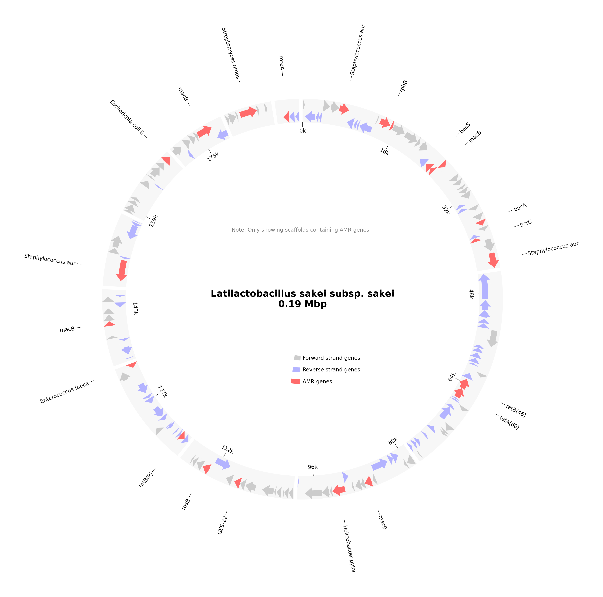

### Enterococcus faecalis cls with mutation conferring resistance to daptomycin
- **Mechanism**: antibiotic target alteration
- **Drug Classes**: peptide antibiotic
- **AMR Family**: daptomycin resistant cls
- **Locations**:
  - gnl|SPADES|MOCIJAGE_160_18 : position 16053-16871

### Escherichia coli EF-Tu mutants conferring resistance to Pulvomycin
- **Mechanism**: antibiotic target alteration
- **Drug Classes**: elfamycin antibiotic
- **AMR Family**: elfamycin resistant EF-Tu
- **Locations**:
  - gnl|SPADES|MOCIJAGE_239_11 : position 10208-11398

### GES-22
- **Mechanism**: antibiotic inactivation
- **Drug Classes**: carbapenem; cephalosporin; penam
- **AMR Family**: GES beta-lactamase
- **Locations**:
  - gnl|SPADES|MOCIJAGE_131_10 : position 8881-9864

### Helicobacter pylori pbp1 mutants conferring resistance to amoxicillin
- **Mechanism**: antibiotic target alteration
- **Drug Classes**: cephalosporin; cephamycin; penam
- **AMR Family**: Penicillin-binding protein mutations conferring resistance to beta-lactam antibiotics
- **Locations**:
  - gnl|SPADES|MOCIJAGE_125_13 : position 12176-14257

### Staphylococcus aureus fusA with mutation conferring resistance to fusidic acid
- **Mechanism**: antibiotic target alteration
- **Drug Classes**: fusidane antibiotic
- **AMR Family**: antibiotic resistant fusA
- **Locations**:
  - gnl|SPADES|MOCIJAGE_34_7 : position 6009-7586

### Staphylococcus aureus mupA conferring resistance to mupirocin
- **Mechanism**: antibiotic target alteration
- **Drug Classes**: mupirocin-like antibiotic
- **AMR Family**: antibiotic-resistant isoleucyl-tRNA synthetase (ileS)
- **Locations**:
  - gnl|SPADES|MOCIJAGE_34_40 : position 41784-44207

### Staphylococcus aureus rpoB mutants conferring resistance to rifampicin
- **Mechanism**: antibiotic target alteration; antibiotic target replacement
- **Drug Classes**: rifamycin antibiotic
- **AMR Family**: rifamycin-resistant beta-subunit of RNA polymerase (rpoB)
- **Locations**:
  - gnl|SPADES|MOCIJAGE_234_2 : position 990-4583

### Streptomyces rimosus otr(A)
- **Mechanism**: antibiotic target protection
- **Drug Classes**: tetracycline antibiotic
- **AMR Family**: tetracycline-resistant ribosomal protection protein
- **Locations**:
  - gnl|SPADES|MOCIJAGE_359_5 : position 2475-5288

### bacA
- **Mechanism**: antibiotic target alteration
- **Drug Classes**: peptide antibiotic
- **AMR Family**: undecaprenyl pyrophosphate related proteins
- **Locations**:
  - gnl|SPADES|MOCIJAGE_34_35 : position 36281-37108

### basS
- **Mechanism**: antibiotic target alteration; antibiotic efflux
- **Drug Classes**: peptide antibiotic
- **AMR Family**: pmr phosphoethanolamine transferase
- **Locations**:
  - gnl|SPADES|MOCIJAGE_34_21 : position 23205-24272

### bcrC
- **Mechanism**: antibiotic target alteration
- **Drug Classes**: peptide antibiotic
- **AMR Family**: undecaprenyl pyrophosphate related proteins
- **Locations**:
  - gnl|SPADES|MOCIJAGE_34_38 : position 38643-39281

### macB (found in 4 locations)
- **Mechanism**: antibiotic efflux
- **Drug Classes**: macrolide antibiotic
- **AMR Family**: ATP-binding cassette (ABC) antibiotic efflux pump
- **Locations**:
  - gnl|SPADES|MOCIJAGE_125_8 : position 7711-8862
  - gnl|SPADES|MOCIJAGE_226_9 : position 6390-7124
  - gnl|SPADES|MOCIJAGE_292_6 : position 4919-7444
  - gnl|SPADES|MOCIJAGE_34_23 : position 25096-25872

### mecI
- **Mechanism**: antibiotic target replacement
- **Drug Classes**: penam
- **AMR Family**: methicillin resistant PBP2
- **Locations**:
  - gnl|SPADES|MOCIJAGE_34_15 : position 14815-15255

### mreA
- **Mechanism**: antibiotic efflux
- **Drug Classes**: macrolide antibiotic
- **AMR Family**: major facilitator superfamily (MFS) antibiotic efflux pump
- **Locations**:
  - gnl|SPADES|MOCIJAGE_760_2 : position 1143-2096

### rosB
- **Mechanism**: antibiotic efflux
- **Drug Classes**: peptide antibiotic
- **AMR Family**: major facilitator superfamily (MFS) antibiotic efflux pump
- **Locations**:
  - gnl|SPADES|MOCIJAGE_131_14 : position 14358-15518

### rphB
- **Mechanism**: antibiotic inactivation
- **Drug Classes**: rifamycin antibiotic
- **AMR Family**: rifampin phosphotransferase
- **Locations**:
  - gnl|SPADES|MOCIJAGE_34_14 : position 12941-14665

### smeR
- **Mechanism**: antibiotic efflux
- **Drug Classes**: aminoglycoside antibiotic; cephalosporin; cephamycin; penam
- **AMR Family**: resistance-nodulation-cell division (RND) antibiotic efflux pump
- **Locations**:
  - gnl|SPADES|MOCIJAGE_34_22 : position 24282-24956

### tetA(60)
- **Mechanism**: antibiotic efflux
- **Drug Classes**: tetracycline antibiotic
- **AMR Family**: ATP-binding cassette (ABC) antibiotic efflux pump
- **Locations**:
  - gnl|SPADES|MOCIJAGE_53_17 : position 20412-22157

### tetB(46)
- **Mechanism**: antibiotic efflux
- **Drug Classes**: tetracycline antibiotic
- **AMR Family**: ATP-binding cassette (ABC) antibiotic efflux pump
- **Locations**:
  - gnl|SPADES|MOCIJAGE_53_16 : position 18620-20410

### tetB(P)
- **Mechanism**: antibiotic target protection
- **Drug Classes**: tetracycline antibiotic
- **AMR Family**: tetracycline-resistant ribosomal protection protein
- **Locations**:
  - gnl|SPADES|MOCIJAGE_160_2 : position 869-1771

## Latilactobacillus sakei subsp. sakei 23K
**Strain Statistics:**
- Total genome length: 210.0 kbp
- Total scaffolds: 32
- Scaffolds with AMR genes: 14
- Total genes annotated: 378
- Total AMR genes: 33
- Unique AMR genes: 30
- Distinct AMR mechanisms: 5
- Distinct AMR families: 12
- Distinct drug classes: 26

**Circos Plot:**

### CRP
- **Mechanism**: antibiotic efflux
- **Drug Classes**: macrolide antibiotic; fluoroquinolone antibiotic; penam
- **AMR Family**: resistance-nodulation-cell division (RND) antibiotic efflux pump
- **Locations**:
  - gnl|SPADES|MOCIJAGE_47_17 : position 20663-21364

### HelR
- **Mechanism**: antibiotic target protection
- **Drug Classes**: rifamycin antibiotic
- **AMR Family**: helicase-like RNA polymerase protection protein
- **Locations**:
  - gnl|SPADES|MOCIJAGE_109_13 : position 15998-18046

### MexS
- **Mechanism**: antibiotic efflux
- **Drug Classes**: fluoroquinolone antibiotic; diaminopyrimidine antibiotic; phenicol antibiotic
- **AMR Family**: resistance-nodulation-cell division (RND) antibiotic efflux pump
- **Locations**:
  - gnl|SPADES|MOCIJAGE_49_13 : position 10387-11322

### RanA (found in 2 locations)
- **Mechanism**: antibiotic efflux
- **Drug Classes**: aminoglycoside antibiotic
- **AMR Family**: ATP-binding cassette (ABC) antibiotic efflux pump
- **Locations**:
  - gnl|SPADES|MOCIJAGE_44_29 : position 27928-28686
  - gnl|SPADES|MOCIJAGE_44_30 : position 28707-29516

### YajC
- **Mechanism**: antibiotic efflux
- **Drug Classes**: fluoroquinolone antibiotic; cephalosporin; glycylcycline; penam; tetracycline antibiotic; oxazolidinone antibiotic; glycopeptide antibiotic; rifamycin antibiotic; phenicol antibiotic; disinfecting agents and antiseptics
- **AMR Family**: resistance-nodulation-cell division (RND) antibiotic efflux pump
- **Locations**:
  - gnl|SPADES|MOCIJAGE_47_20 : position 24369-24725

### arlR
- **Mechanism**: antibiotic efflux
- **Drug Classes**: fluoroquinolone antibiotic; disinfecting agents and antiseptics
- **AMR Family**: major facilitator superfamily (MFS) antibiotic efflux pump
- **Locations**:
  - gnl|SPADES|MOCIJAGE_49_2 : position 1562-2248

### arlS (found in 2 locations)
- **Mechanism**: antibiotic efflux
- **Drug Classes**: fluoroquinolone antibiotic; disinfecting agents and antiseptics
- **AMR Family**: major facilitator superfamily (MFS) antibiotic efflux pump
- **Locations**:
  - gnl|SPADES|MOCIJAGE_44_34 : position 32296-33957
  - gnl|SPADES|MOCIJAGE_49_1 : position 63-1565

### baeS
- **Mechanism**: antibiotic efflux
- **Drug Classes**: aminoglycoside antibiotic; aminocoumarin antibiotic
- **AMR Family**: resistance-nodulation-cell division (RND) antibiotic efflux pump
- **Locations**:
  - gnl|SPADES|MOCIJAGE_30_10 : position 9585-11021

### bcrA
- **Mechanism**: antibiotic efflux
- **Drug Classes**: peptide antibiotic
- **AMR Family**: ATP-binding cassette (ABC) antibiotic efflux pump
- **Locations**:
  - gnl|SPADES|MOCIJAGE_1199_2 : position 1158-2048

### catB3
- **Mechanism**: antibiotic inactivation
- **Drug Classes**: phenicol antibiotic
- **AMR Family**: chloramphenicol acetyltransferase (CAT)
- **Locations**:
  - gnl|SPADES|MOCIJAGE_30_1 : position 199-846

### golS
- **Mechanism**: antibiotic efflux
- **Drug Classes**: monobactam; carbapenem; cephalosporin; cephamycin; penam; phenicol antibiotic; penem
- **AMR Family**: resistance-nodulation-cell division (RND) antibiotic efflux pump
- **Locations**:
  - gnl|SPADES|MOCIJAGE_30_30 : position 32162-32581

### lmrD
- **Mechanism**: antibiotic efflux
- **Drug Classes**: lincosamide antibiotic
- **AMR Family**: ATP-binding cassette (ABC) antibiotic efflux pump
- **Locations**:
  - gnl|SPADES|MOCIJAGE_109_14 : position 18223-20016

### lsaA
- **Mechanism**: antibiotic target protection
- **Drug Classes**: lincosamide antibiotic; streptogramin antibiotic; streptogramin A antibiotic; streptogramin B antibiotic; pleuromutilin antibiotic
- **AMR Family**: lsa-type ABC-F protein
- **Locations**:
  - gnl|SPADES|MOCIJAGE_35858_1 : position 50-940

### lsaB
- **Mechanism**: antibiotic target protection
- **Drug Classes**: lincosamide antibiotic; streptogramin antibiotic; pleuromutilin antibiotic
- **AMR Family**: lsa-type ABC-F protein
- **Locations**:
  - gnl|SPADES|MOCIJAGE_2083218_1 : position 3-218

### macB
- **Mechanism**: antibiotic efflux
- **Drug Classes**: macrolide antibiotic
- **AMR Family**: ATP-binding cassette (ABC) antibiotic efflux pump
- **Locations**:
  - gnl|SPADES|MOCIJAGE_341_2 : position 684-1424

### mgrA
- **Mechanism**: antibiotic efflux
- **Drug Classes**: fluoroquinolone antibiotic; cephalosporin; penam; tetracycline antibiotic; peptide antibiotic; disinfecting agents and antiseptics
- **AMR Family**: ATP-binding cassette (ABC) antibiotic efflux pump; major facilitator superfamily (MFS) antibiotic efflux pump
- **Locations**:
  - gnl|SPADES|MOCIJAGE_44_6 : position 4846-5301

### msbA
- **Mechanism**: antibiotic efflux
- **Drug Classes**: nitroimidazole antibiotic
- **AMR Family**: ATP-binding cassette (ABC) antibiotic efflux pump
- **Locations**:
  - gnl|SPADES|MOCIJAGE_44_11 : position 9039-11891

### oleC
- **Mechanism**: antibiotic efflux
- **Drug Classes**: macrolide antibiotic
- **AMR Family**: ATP-binding cassette (ABC) antibiotic efflux pump
- **Locations**:
  - gnl|SPADES|MOCIJAGE_324336_1 : position 2-523

### optrA
- **Mechanism**: antibiotic target protection
- **Drug Classes**: oxazolidinone antibiotic; phenicol antibiotic
- **AMR Family**: Miscellaneous ABC-F subfamily ATP-binding cassette ribosomal protection proteins
- **Locations**:
  - gnl|SPADES|MOCIJAGE_248737_1 : position 2-571

### patA (found in 2 locations)
- **Mechanism**: antibiotic efflux
- **Drug Classes**: fluoroquinolone antibiotic
- **AMR Family**: ATP-binding cassette (ABC) antibiotic efflux pump
- **Locations**:
  - gnl|SPADES|MOCIJAGE_109_15 : position 20020-21138
  - gnl|SPADES|MOCIJAGE_109_16 : position 21174-21731

### poxtA
- **Mechanism**: antibiotic target protection
- **Drug Classes**: tetracycline antibiotic; oxazolidinone antibiotic; phenicol antibiotic
- **AMR Family**: Miscellaneous ABC-F subfamily ATP-binding cassette ribosomal protection proteins
- **Locations**:
  - gnl|SPADES|MOCIJAGE_747264_1 : position 3-374

### sta
- **Mechanism**: antibiotic inactivation
- **Drug Classes**: nucleoside antibiotic
- **AMR Family**: streptothricin acetyltransferase (SAT)
- **Locations**:
  - gnl|SPADES|MOCIJAGE_129_20 : position 19129-19647

### tetA(60)
- **Mechanism**: antibiotic efflux
- **Drug Classes**: tetracycline antibiotic
- **AMR Family**: ATP-binding cassette (ABC) antibiotic efflux pump
- **Locations**:
  - gnl|SPADES|MOCIJAGE_1590433_1 : position 6-254

### tetB(46)
- **Mechanism**: antibiotic efflux
- **Drug Classes**: tetracycline antibiotic
- **AMR Family**: ATP-binding cassette (ABC) antibiotic efflux pump
- **Locations**:
  - gnl|SPADES|MOCIJAGE_30_35 : position 36504-37262

### tetR
- **Mechanism**: antibiotic target alteration; antibiotic efflux
- **Drug Classes**: tetracycline antibiotic
- **AMR Family**: major facilitator superfamily (MFS) antibiotic efflux pump
- **Locations**:
  - gnl|SPADES|MOCIJAGE_109_17 : position 21874-22272

### vanR gene in vanF cluster
- **Mechanism**: antibiotic target alteration
- **Drug Classes**: glycopeptide antibiotic
- **AMR Family**: glycopeptide resistance gene cluster; vanR
- **Locations**:
  - gnl|SPADES|MOCIJAGE_109_11 : position 12365-13051

### vanR gene in vanI cluster
- **Mechanism**: antibiotic target alteration
- **Drug Classes**: glycopeptide antibiotic
- **AMR Family**: glycopeptide resistance gene cluster; vanR
- **Locations**:
  - gnl|SPADES|MOCIJAGE_44_35 : position 33944-34657

### vanR gene in vanM cluster
- **Mechanism**: antibiotic target alteration
- **Drug Classes**: glycopeptide antibiotic
- **AMR Family**: glycopeptide resistance gene cluster; vanR
- **Locations**:
  - gnl|SPADES|MOCIJAGE_30_9 : position 8845-9585

### vanS gene in vanF cluster
- **Mechanism**: antibiotic target alteration
- **Drug Classes**: glycopeptide antibiotic
- **AMR Family**: vanS; glycopeptide resistance gene cluster
- **Locations**:
  - gnl|SPADES|MOCIJAGE_109_10 : position 11166-12365

### vanZ gene in vanF cluster
- **Mechanism**: antibiotic target alteration
- **Drug Classes**: glycopeptide antibiotic
- **AMR Family**: vanZ; glycopeptide resistance gene cluster
- **Locations**:
  - gnl|SPADES|MOCIJAGE_30_17 : position 18801-19409

## Serratia fonticola
**Strain Statistics:**
- Total genome length: 1.9 kbp
- Total scaffolds: 126
- Scaffolds with AMR genes: 7
- Total genes annotated: 0
- Total AMR genes: 7
- Unique AMR genes: 6
- Distinct AMR mechanisms: 3
- Distinct AMR families: 4
- Distinct drug classes: 10

**Circos Plot:**

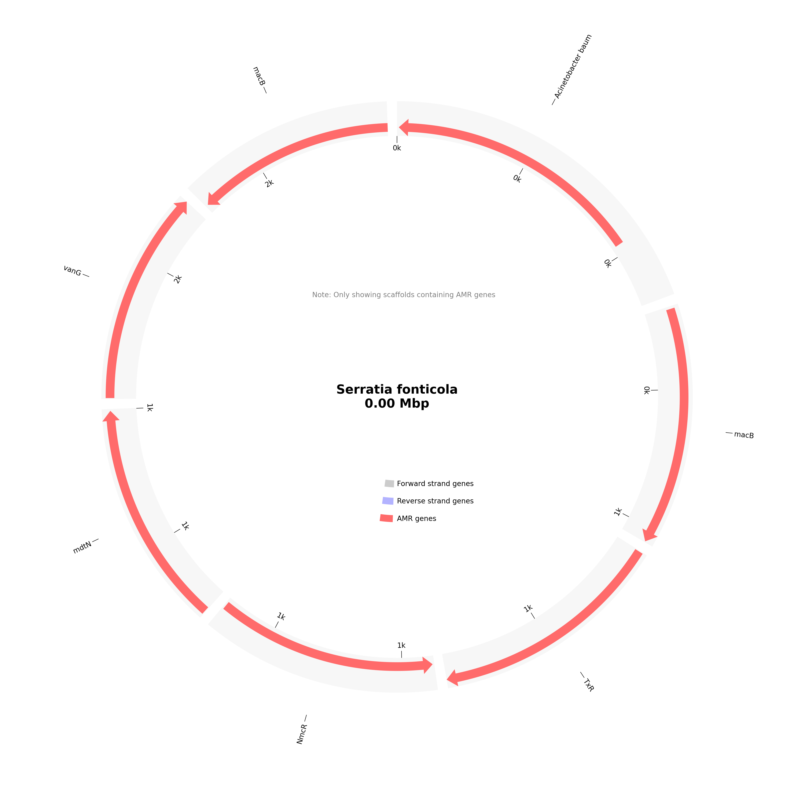

### Acinetobacter baumannii AbaF
- **Mechanism**: antibiotic efflux
- **Drug Classes**: phosphonic acid antibiotic
- **AMR Family**: major facilitator superfamily (MFS) antibiotic efflux pump
- **Locations**:
  - gnl|SPADES|MOCIJAGE_724415_1 : position 2-304

### NmcR
- **Mechanism**: antibiotic inactivation
- **Drug Classes**: carbapenem; cephalosporin; cephamycin; penam
- **AMR Family**: NmcA beta-lactamase
- **Locations**:
  - gnl|SPADES|MOCIJAGE_1529316_1 : position 2-259

### TxR
- **Mechanism**: antibiotic efflux
- **Drug Classes**: tetracycline antibiotic
- **AMR Family**: ATP-binding cassette (ABC) antibiotic efflux pump
- **Locations**:
  - gnl|SPADES|MOCIJAGE_1528755_1 : position 1-261

### macB (found in 2 locations)
- **Mechanism**: antibiotic efflux
- **Drug Classes**: macrolide antibiotic
- **AMR Family**: ATP-binding cassette (ABC) antibiotic efflux pump
- **Locations**:
  - gnl|SPADES|MOCIJAGE_1457310_1 : position 3-266
  - gnl|SPADES|MOCIJAGE_1842442_1 : position 3-236

### mdtN
- **Mechanism**: antibiotic efflux
- **Drug Classes**: nucleoside antibiotic; disinfecting agents and antiseptics
- **AMR Family**: major facilitator superfamily (MFS) antibiotic efflux pump
- **Locations**:
  - gnl|SPADES|MOCIJAGE_1647469_1 : position 1-249

### vanG
- **Mechanism**: antibiotic target alteration
- **Drug Classes**: glycopeptide antibiotic
- **AMR Family**: glycopeptide resistance gene cluster; Van ligase
- **Locations**:
  - gnl|SPADES|MOCIJAGE_1833842_1 : position 1-237

## Serratia liquefaciens
**Strain Statistics:**
- Total genome length: 46.0 kbp
- Total scaffolds: 2121
- Scaffolds with AMR genes: 139
- Total genes annotated: 50
- Total AMR genes: 140
- Unique AMR genes: 80
- Distinct AMR mechanisms: 9
- Distinct AMR families: 30
- Distinct drug classes: 31

**Circos Plot:**

### APH(6)-Ic
- **Mechanism**: antibiotic inactivation
- **Drug Classes**: aminoglycoside antibiotic
- **AMR Family**: APH(6)
- **Locations**:
  - gnl|SPADES|MOCIJAGE_309875_2 : position 281-532

### Acinetobacter baumannii AbaF (found in 3 locations)
- **Mechanism**: antibiotic efflux
- **Drug Classes**: phosphonic acid antibiotic
- **AMR Family**: major facilitator superfamily (MFS) antibiotic efflux pump
- **Locations**:
  - gnl|SPADES|MOCIJAGE_222138_1 : position 3-593
  - gnl|SPADES|MOCIJAGE_2250192_1 : position 2-208
  - gnl|SPADES|MOCIJAGE_431276_1 : position 71-472

### Corynebacterium striatum tetA (found in 2 locations)
- **Mechanism**: antibiotic efflux
- **Drug Classes**: penam; tetracycline antibiotic
- **AMR Family**: major facilitator superfamily (MFS) antibiotic efflux pump
- **Locations**:
  - gnl|SPADES|MOCIJAGE_1493727_1 : position 3-263
  - gnl|SPADES|MOCIJAGE_2260233_1 : position 2-205

### Enterobacter cloacae acrA (found in 2 locations)
- **Mechanism**: antibiotic efflux
- **Drug Classes**: fluoroquinolone antibiotic; cephalosporin; glycylcycline; penam; tetracycline antibiotic; rifamycin antibiotic; phenicol antibiotic; disinfecting agents and antiseptics
- **AMR Family**: resistance-nodulation-cell division (RND) antibiotic efflux pump
- **Locations**:
  - gnl|SPADES|MOCIJAGE_1622201_1 : position 1-252
  - gnl|SPADES|MOCIJAGE_1805661_1 : position 2-238

### Escherichia coli mdfA
- **Mechanism**: antibiotic efflux
- **Drug Classes**: tetracycline antibiotic; phenicol antibiotic; disinfecting agents and antiseptics
- **AMR Family**: major facilitator superfamily (MFS) antibiotic efflux pump
- **Locations**:
  - gnl|SPADES|MOCIJAGE_1579655_1 : position 2-256

### Escherichia coli soxS with mutation conferring antibiotic resistance (found in 2 locations)
- **Mechanism**: antibiotic target alteration; antibiotic efflux; reduced permeability to antibiotic
- **Drug Classes**: fluoroquinolone antibiotic; monobactam; carbapenem; cephalosporin; glycylcycline; cephamycin; penam; tetracycline antibiotic; rifamycin antibiotic; phenicol antibiotic; penem; disinfecting agents and antiseptics
- **AMR Family**: ATP-binding cassette (ABC) antibiotic efflux pump; major facilitator superfamily (MFS) antibiotic efflux pump; resistance-nodulation-cell division (RND) antibiotic efflux pump; General Bacterial Porin with reduced permeability to beta-lactams
- **Locations**:
  - gnl|SPADES|MOCIJAGE_1156957_2 : position 195-302
  - gnl|SPADES|MOCIJAGE_1547672_1 : position 168-257

### H-NS
- **Mechanism**: antibiotic efflux
- **Drug Classes**: macrolide antibiotic; fluoroquinolone antibiotic; cephalosporin; cephamycin; penam; tetracycline antibiotic
- **AMR Family**: major facilitator superfamily (MFS) antibiotic efflux pump; resistance-nodulation-cell division (RND) antibiotic efflux pump
- **Locations**:
  - gnl|SPADES|MOCIJAGE_1465560_1 : position 189-266

### Haemophilus influenzae PBP3 conferring resistance to beta-lactam antibiotics
- **Mechanism**: antibiotic target alteration
- **Drug Classes**: cephalosporin; cephamycin; penam
- **AMR Family**: Penicillin-binding protein mutations conferring resistance to beta-lactam antibiotics
- **Locations**:
  - gnl|SPADES|MOCIJAGE_968582_1 : position 3-332

### Klebsiella pneumoniae OmpK37
- **Mechanism**: reduced permeability to antibiotic
- **Drug Classes**: monobactam; carbapenem; cephalosporin; cephamycin; penam; penem
- **AMR Family**: General Bacterial Porin with reduced permeability to beta-lactams
- **Locations**:
  - gnl|SPADES|MOCIJAGE_2230964_1 : position 1-207

### LptD (found in 2 locations)
- **Mechanism**: antibiotic efflux
- **Drug Classes**: carbapenem; peptide antibiotic; aminocoumarin antibiotic; rifamycin antibiotic
- **AMR Family**: ATP-binding cassette (ABC) antibiotic efflux pump
- **Locations**:
  - gnl|SPADES|MOCIJAGE_1121510_1 : position 2-307
  - gnl|SPADES|MOCIJAGE_855375_1 : position 3-353

### MOX-3
- **Mechanism**: antibiotic inactivation
- **Drug Classes**: cephalosporin; cephamycin; penam
- **AMR Family**: MOX beta-lactamase
- **Locations**:
  - gnl|SPADES|MOCIJAGE_1359760_1 : position 1-276

### MexD
- **Mechanism**: antibiotic efflux
- **Drug Classes**: macrolide antibiotic; fluoroquinolone antibiotic; aminoglycoside antibiotic; cephalosporin; penam; tetracycline antibiotic; aminocoumarin antibiotic; diaminopyrimidine antibiotic; phenicol antibiotic
- **AMR Family**: resistance-nodulation-cell division (RND) antibiotic efflux pump
- **Locations**:
  - gnl|SPADES|MOCIJAGE_888841_1 : position 1-345

### MexS
- **Mechanism**: antibiotic efflux
- **Drug Classes**: fluoroquinolone antibiotic; diaminopyrimidine antibiotic; phenicol antibiotic
- **AMR Family**: resistance-nodulation-cell division (RND) antibiotic efflux pump
- **Locations**:
  - gnl|SPADES|MOCIJAGE_1377327_1 : position 1-273

### MexT
- **Mechanism**: antibiotic efflux
- **Drug Classes**: fluoroquinolone antibiotic; diaminopyrimidine antibiotic; phenicol antibiotic
- **AMR Family**: resistance-nodulation-cell division (RND) antibiotic efflux pump
- **Locations**:
  - gnl|SPADES|MOCIJAGE_520666_1 : position 2-439

### Neisseria gonorrhoeae PBP2 conferring resistance to beta-lactam antibiotics
- **Mechanism**: antibiotic target alteration
- **Drug Classes**: cephalosporin; cephamycin; penam
- **AMR Family**: Penicillin-binding protein mutations conferring resistance to beta-lactam antibiotics
- **Locations**:
  - gnl|SPADES|MOCIJAGE_1279069_1 : position 1-285

### NmcR (found in 4 locations)
- **Mechanism**: antibiotic inactivation
- **Drug Classes**: carbapenem; cephalosporin; cephamycin; penam
- **AMR Family**: NmcA beta-lactamase
- **Locations**:
  - gnl|SPADES|MOCIJAGE_1313062_1 : position 3-281
  - gnl|SPADES|MOCIJAGE_1595989_1 : position 1-255
  - gnl|SPADES|MOCIJAGE_1676610_1 : position 3-248
  - gnl|SPADES|MOCIJAGE_911938_1 : position 35-340

### ParS
- **Mechanism**: antibiotic efflux; reduced permeability to antibiotic
- **Drug Classes**: macrolide antibiotic; fluoroquinolone antibiotic; monobactam; aminoglycoside antibiotic; carbapenem; cephalosporin; cephamycin; penam; tetracycline antibiotic; phenicol antibiotic; penem; disinfecting agents and antiseptics
- **AMR Family**: resistance-nodulation-cell division (RND) antibiotic efflux pump; Outer Membrane Porin (Opr)
- **Locations**:
  - gnl|SPADES|MOCIJAGE_895503_1 : position 2-343

### PmrF
- **Mechanism**: antibiotic target alteration
- **Drug Classes**: peptide antibiotic
- **AMR Family**: pmr phosphoethanolamine transferase
- **Locations**:
  - gnl|SPADES|MOCIJAGE_434764_1 : position 35-472

### Pseudomonas aeruginosa CpxR
- **Mechanism**: antibiotic efflux
- **Drug Classes**: macrolide antibiotic; fluoroquinolone antibiotic; monobactam; aminoglycoside antibiotic; carbapenem; cephalosporin; cephamycin; penam; tetracycline antibiotic; peptide antibiotic; aminocoumarin antibiotic; diaminopyrimidine antibiotic; sulfonamide antibiotic; phenicol antibiotic; penem
- **AMR Family**: resistance-nodulation-cell division (RND) antibiotic efflux pump
- **Locations**:
  - gnl|SPADES|MOCIJAGE_372031_1 : position 1-438

### RanA (found in 5 locations)
- **Mechanism**: antibiotic efflux
- **Drug Classes**: aminoglycoside antibiotic
- **AMR Family**: ATP-binding cassette (ABC) antibiotic efflux pump
- **Locations**:
  - gnl|SPADES|MOCIJAGE_1046756_1 : position 3-317
  - gnl|SPADES|MOCIJAGE_262399_1 : position 1-564
  - gnl|SPADES|MOCIJAGE_560093_1 : position 1-426
  - gnl|SPADES|MOCIJAGE_604611_1 : position 1-411
  - gnl|SPADES|MOCIJAGE_960843_1 : position 1-333

### Rv1877
- **Mechanism**: antibiotic efflux
- **Drug Classes**: fluoroquinolone antibiotic
- **AMR Family**: major facilitator superfamily (MFS) antibiotic efflux pump
- **Locations**:
  - gnl|SPADES|MOCIJAGE_1924006_1 : position 3-230

### SRT-3
- **Mechanism**: antibiotic inactivation
- **Drug Classes**: cephalosporin
- **AMR Family**: SRT beta-lactamase
- **Locations**:
  - gnl|SPADES|MOCIJAGE_1340605_1 : position 1-279

### Staphylococcus aureus mupA conferring resistance to mupirocin (found in 2 locations)
- **Mechanism**: antibiotic target alteration
- **Drug Classes**: mupirocin-like antibiotic
- **AMR Family**: antibiotic-resistant isoleucyl-tRNA synthetase (ileS)
- **Locations**:
  - gnl|SPADES|MOCIJAGE_371247_1 : position 3-500
  - gnl|SPADES|MOCIJAGE_516391_1 : position 1-441

### Staphylococcus aureus mupB conferring resistance to mupirocin
- **Mechanism**: antibiotic target alteration
- **Drug Classes**: mupirocin-like antibiotic
- **AMR Family**: antibiotic-resistant isoleucyl-tRNA synthetase (ileS)
- **Locations**:
  - gnl|SPADES|MOCIJAGE_766496_1 : position 2-370

### TaeA (found in 3 locations)
- **Mechanism**: antibiotic efflux
- **Drug Classes**: pleuromutilin antibiotic
- **AMR Family**: ATP-binding cassette (ABC) antibiotic efflux pump
- **Locations**:
  - gnl|SPADES|MOCIJAGE_1822848_1 : position 1-237
  - gnl|SPADES|MOCIJAGE_512408_1 : position 2-313
  - gnl|SPADES|MOCIJAGE_575771_1 : position 2-421

### TolC (found in 2 locations)
- **Mechanism**: antibiotic efflux
- **Drug Classes**: macrolide antibiotic; fluoroquinolone antibiotic; aminoglycoside antibiotic; carbapenem; cephalosporin; glycylcycline; cephamycin; penam; tetracycline antibiotic; peptide antibiotic; aminocoumarin antibiotic; rifamycin antibiotic; phenicol antibiotic; penem; disinfecting agents and antiseptics
- **AMR Family**: ATP-binding cassette (ABC) antibiotic efflux pump; major facilitator superfamily (MFS) antibiotic efflux pump; resistance-nodulation-cell division (RND) antibiotic efflux pump
- **Locations**:
  - gnl|SPADES|MOCIJAGE_197702_1 : position 3-614
  - gnl|SPADES|MOCIJAGE_666947_1 : position 3-395

### TxR (found in 3 locations)
- **Mechanism**: antibiotic efflux
- **Drug Classes**: tetracycline antibiotic
- **AMR Family**: ATP-binding cassette (ABC) antibiotic efflux pump
- **Locations**:
  - gnl|SPADES|MOCIJAGE_1345297_1 : position 3-278
  - gnl|SPADES|MOCIJAGE_1523072_1 : position 3-236
  - gnl|SPADES|MOCIJAGE_1541638_1 : position 2-259

### YojI (found in 2 locations)
- **Mechanism**: antibiotic efflux
- **Drug Classes**: peptide antibiotic
- **AMR Family**: ATP-binding cassette (ABC) antibiotic efflux pump
- **Locations**:
  - gnl|SPADES|MOCIJAGE_1710303_1 : position 1-246
  - gnl|SPADES|MOCIJAGE_924384_1 : position 101-337

### acrB (found in 3 locations)
- **Mechanism**: antibiotic efflux
- **Drug Classes**: fluoroquinolone antibiotic; cephalosporin; glycylcycline; penam; tetracycline antibiotic; rifamycin antibiotic; phenicol antibiotic; disinfecting agents and antiseptics
- **AMR Family**: resistance-nodulation-cell division (RND) antibiotic efflux pump
- **Locations**:
  - gnl|SPADES|MOCIJAGE_1385105_1 : position 2-274
  - gnl|SPADES|MOCIJAGE_1885521_1 : position 1-231
  - gnl|SPADES|MOCIJAGE_2209252_1 : position 1-210

### adeL (found in 8 locations)
- **Mechanism**: antibiotic efflux
- **Drug Classes**: fluoroquinolone antibiotic; tetracycline antibiotic
- **AMR Family**: resistance-nodulation-cell division (RND) antibiotic efflux pump
- **Locations**:
  - gnl|SPADES|MOCIJAGE_118335_2 : position 137-709
  - gnl|SPADES|MOCIJAGE_1387985_1 : position 39-272
  - gnl|SPADES|MOCIJAGE_1393402_1 : position 2-271
  - gnl|SPADES|MOCIJAGE_1621818_1 : position 2-253
  - gnl|SPADES|MOCIJAGE_2234653_1 : position 2-208
  - gnl|SPADES|MOCIJAGE_468299_1 : position 1-459
  - gnl|SPADES|MOCIJAGE_579974_2 : position 188-418
  - gnl|SPADES|MOCIJAGE_632641_1 : position 115-405

### almE
- **Mechanism**: antibiotic target alteration
- **Drug Classes**: peptide antibiotic
- **AMR Family**: polymyxin resistance operon; alm glycyltransferase
- **Locations**:
  - gnl|SPADES|MOCIJAGE_403967_1 : position 1-486

### arnA (found in 2 locations)
- **Mechanism**: antibiotic target alteration
- **Drug Classes**: peptide antibiotic
- **AMR Family**: pmr phosphoethanolamine transferase
- **Locations**:
  - gnl|SPADES|MOCIJAGE_2137909_1 : position 2-214
  - gnl|SPADES|MOCIJAGE_230728_1 : position 3-587

### bacA
- **Mechanism**: antibiotic target alteration
- **Drug Classes**: peptide antibiotic
- **AMR Family**: undecaprenyl pyrophosphate related proteins
- **Locations**:
  - gnl|SPADES|MOCIJAGE_115754_2 : position 440-712

### baeR
- **Mechanism**: antibiotic efflux
- **Drug Classes**: aminoglycoside antibiotic; aminocoumarin antibiotic
- **AMR Family**: resistance-nodulation-cell division (RND) antibiotic efflux pump
- **Locations**:
  - gnl|SPADES|MOCIJAGE_1558956_1 : position 1-258

### baeS (found in 2 locations)
- **Mechanism**: antibiotic efflux
- **Drug Classes**: aminoglycoside antibiotic; aminocoumarin antibiotic
- **AMR Family**: resistance-nodulation-cell division (RND) antibiotic efflux pump
- **Locations**:
  - gnl|SPADES|MOCIJAGE_1004684_1 : position 1-324
  - gnl|SPADES|MOCIJAGE_2115995_1 : position 2-217

### basS
- **Mechanism**: antibiotic target alteration; antibiotic efflux
- **Drug Classes**: peptide antibiotic
- **AMR Family**: pmr phosphoethanolamine transferase
- **Locations**:
  - gnl|SPADES|MOCIJAGE_1395762_1 : position 2-271

### bcr-1 (found in 2 locations)
- **Mechanism**: antibiotic efflux
- **Drug Classes**: bicyclomycin-like antibiotic
- **AMR Family**: major facilitator superfamily (MFS) antibiotic efflux pump
- **Locations**:
  - gnl|SPADES|MOCIJAGE_1543201_1 : position 1-258
  - gnl|SPADES|MOCIJAGE_691409_1 : position 3-389

### bcrA
- **Mechanism**: antibiotic efflux
- **Drug Classes**: peptide antibiotic
- **AMR Family**: ATP-binding cassette (ABC) antibiotic efflux pump
- **Locations**:
  - gnl|SPADES|MOCIJAGE_1821639_1 : position 3-236

### catB2
- **Mechanism**: antibiotic inactivation
- **Drug Classes**: phenicol antibiotic
- **AMR Family**: chloramphenicol acetyltransferase (CAT)
- **Locations**:
  - gnl|SPADES|MOCIJAGE_111526_2 : position 309-719

### cfr(D)
- **Mechanism**: antibiotic target alteration
- **Drug Classes**: lincosamide antibiotic; streptogramin antibiotic; oxazolidinone antibiotic; glycopeptide antibiotic; phenicol antibiotic
- **AMR Family**: Cfr 23S ribosomal RNA methyltransferase
- **Locations**:
  - gnl|SPADES|MOCIJAGE_1739000_1 : position 3-242

### cpxA (found in 2 locations)
- **Mechanism**: antibiotic efflux
- **Drug Classes**: aminoglycoside antibiotic; aminocoumarin antibiotic
- **AMR Family**: resistance-nodulation-cell division (RND) antibiotic efflux pump
- **Locations**:
  - gnl|SPADES|MOCIJAGE_1966806_1 : position 1-225
  - gnl|SPADES|MOCIJAGE_420540_2 : position 79-477

### efrA
- **Mechanism**: antibiotic efflux
- **Drug Classes**: macrolide antibiotic; fluoroquinolone antibiotic; rifamycin antibiotic
- **AMR Family**: ATP-binding cassette (ABC) antibiotic efflux pump
- **Locations**:
  - gnl|SPADES|MOCIJAGE_1495240_1 : position 3-263

### efrB (found in 2 locations)
- **Mechanism**: antibiotic efflux
- **Drug Classes**: macrolide antibiotic; fluoroquinolone antibiotic; rifamycin antibiotic
- **AMR Family**: ATP-binding cassette (ABC) antibiotic efflux pump
- **Locations**:
  - gnl|SPADES|MOCIJAGE_1944806_2 : position 93-227
  - gnl|SPADES|MOCIJAGE_2120653_1 : position 3-215

### emrA
- **Mechanism**: antibiotic efflux
- **Drug Classes**: fluoroquinolone antibiotic
- **AMR Family**: major facilitator superfamily (MFS) antibiotic efflux pump
- **Locations**:
  - gnl|SPADES|MOCIJAGE_840268_1 : position 3-356

### emrY
- **Mechanism**: antibiotic efflux
- **Drug Classes**: tetracycline antibiotic
- **AMR Family**: major facilitator superfamily (MFS) antibiotic efflux pump
- **Locations**:
  - gnl|SPADES|MOCIJAGE_1288082_1 : position 1-273

### eptB (found in 2 locations)
- **Mechanism**: antibiotic target alteration
- **Drug Classes**: peptide antibiotic
- **AMR Family**: pmr phosphoethanolamine transferase
- **Locations**:
  - gnl|SPADES|MOCIJAGE_153784_1 : position 3-659
  - gnl|SPADES|MOCIJAGE_273515_1 : position 293-556

### evgA (found in 3 locations)
- **Mechanism**: antibiotic efflux
- **Drug Classes**: macrolide antibiotic; fluoroquinolone antibiotic; penam; tetracycline antibiotic
- **AMR Family**: major facilitator superfamily (MFS) antibiotic efflux pump; resistance-nodulation-cell division (RND) antibiotic efflux pump
- **Locations**:
  - gnl|SPADES|MOCIJAGE_1108190_2 : position 125-307
  - gnl|SPADES|MOCIJAGE_349812_1 : position 118-510
  - gnl|SPADES|MOCIJAGE_994152_1 : position 2-145

### evgS (found in 4 locations)
- **Mechanism**: antibiotic efflux
- **Drug Classes**: macrolide antibiotic; fluoroquinolone antibiotic; penam; tetracycline antibiotic
- **AMR Family**: major facilitator superfamily (MFS) antibiotic efflux pump; resistance-nodulation-cell division (RND) antibiotic efflux pump
- **Locations**:
  - gnl|SPADES|MOCIJAGE_1454056_1 : position 2-265
  - gnl|SPADES|MOCIJAGE_1752771_1 : position 3-242
  - gnl|SPADES|MOCIJAGE_679854_1 : position 1-390
  - gnl|SPADES|MOCIJAGE_728796_1 : position 3-380

### kdpE (found in 3 locations)
- **Mechanism**: antibiotic efflux
- **Drug Classes**: aminoglycoside antibiotic
- **AMR Family**: kdpDE
- **Locations**:
  - gnl|SPADES|MOCIJAGE_2029843_1 : position 31-222
  - gnl|SPADES|MOCIJAGE_2137991_1 : position 2-214
  - gnl|SPADES|MOCIJAGE_708774_1 : position 2-217

### lin
- **Mechanism**: antibiotic inactivation
- **Drug Classes**: lincosamide antibiotic
- **AMR Family**: lincosamide nucleotidyltransferase (LNU)
- **Locations**:
  - gnl|SPADES|MOCIJAGE_1507687_1 : position 3-260

### lmrC
- **Mechanism**: antibiotic target protection
- **Drug Classes**: lincosamide antibiotic
- **AMR Family**: Miscellaneous ABC-F subfamily ATP-binding cassette ribosomal protection proteins
- **Locations**:
  - gnl|SPADES|MOCIJAGE_1752926_1 : position 1-240

### macB (found in 4 locations)
- **Mechanism**: antibiotic efflux
- **Drug Classes**: macrolide antibiotic
- **AMR Family**: ATP-binding cassette (ABC) antibiotic efflux pump
- **Locations**:
  - gnl|SPADES|MOCIJAGE_1316183_1 : position 2-280
  - gnl|SPADES|MOCIJAGE_1481314_1 : position 1-264
  - gnl|SPADES|MOCIJAGE_1554613_1 : position 3-257
  - gnl|SPADES|MOCIJAGE_1970194_1 : position 1-225

### mdsC
- **Mechanism**: antibiotic efflux
- **Drug Classes**: monobactam; carbapenem; cephalosporin; cephamycin; penam; phenicol antibiotic; penem
- **AMR Family**: resistance-nodulation-cell division (RND) antibiotic efflux pump
- **Locations**:
  - gnl|SPADES|MOCIJAGE_1340352_1 : position 2-277

### mdtA
- **Mechanism**: antibiotic efflux
- **Drug Classes**: aminocoumarin antibiotic
- **AMR Family**: resistance-nodulation-cell division (RND) antibiotic efflux pump
- **Locations**:
  - gnl|SPADES|MOCIJAGE_126366_1 : position 1-657

### mdtN
- **Mechanism**: antibiotic efflux
- **Drug Classes**: nucleoside antibiotic; disinfecting agents and antiseptics
- **AMR Family**: major facilitator superfamily (MFS) antibiotic efflux pump
- **Locations**:
  - gnl|SPADES|MOCIJAGE_979813_1 : position 90-329

### mecA
- **Mechanism**: antibiotic target replacement
- **Drug Classes**: penam
- **AMR Family**: methicillin resistant PBP2
- **Locations**:
  - gnl|SPADES|MOCIJAGE_1679606_1 : position 3-248

### mexQ (found in 2 locations)
- **Mechanism**: antibiotic efflux
- **Drug Classes**: macrolide antibiotic; carbapenem; tetracycline antibiotic; diaminopyrimidine antibiotic; phenicol antibiotic; disinfecting agents and antiseptics
- **AMR Family**: resistance-nodulation-cell division (RND) antibiotic efflux pump
- **Locations**:
  - gnl|SPADES|MOCIJAGE_1045977_1 : position 3-317
  - gnl|SPADES|MOCIJAGE_1875091_1 : position 2-232

### msbA (found in 3 locations)
- **Mechanism**: antibiotic efflux
- **Drug Classes**: nitroimidazole antibiotic
- **AMR Family**: ATP-binding cassette (ABC) antibiotic efflux pump
- **Locations**:
  - gnl|SPADES|MOCIJAGE_1123656_1 : position 2-307
  - gnl|SPADES|MOCIJAGE_2027198_1 : position 1-222
  - gnl|SPADES|MOCIJAGE_2182191_1 : position 1-213

### novA (found in 3 locations)
- **Mechanism**: antibiotic efflux
- **Drug Classes**: aminocoumarin antibiotic
- **AMR Family**: ATP-binding cassette (ABC) antibiotic efflux pump
- **Locations**:
  - gnl|SPADES|MOCIJAGE_1418006_1 : position 8-271
  - gnl|SPADES|MOCIJAGE_363832_1 : position 2-505
  - gnl|SPADES|MOCIJAGE_697475_1 : position 2-385

### optrA
- **Mechanism**: antibiotic target protection
- **Drug Classes**: oxazolidinone antibiotic; phenicol antibiotic
- **AMR Family**: Miscellaneous ABC-F subfamily ATP-binding cassette ribosomal protection proteins
- **Locations**:
  - gnl|SPADES|MOCIJAGE_1621420_1 : position 1-252

### oqxB (found in 4 locations)
- **Mechanism**: antibiotic efflux
- **Drug Classes**: fluoroquinolone antibiotic; glycylcycline; tetracycline antibiotic; diaminopyrimidine antibiotic; nitrofuran antibiotic
- **AMR Family**: resistance-nodulation-cell division (RND) antibiotic efflux pump
- **Locations**:
  - gnl|SPADES|MOCIJAGE_1497924_1 : position 1-261
  - gnl|SPADES|MOCIJAGE_1966978_1 : position 2-226
  - gnl|SPADES|MOCIJAGE_730025_1 : position 9-380
  - gnl|SPADES|MOCIJAGE_918169_1 : position 3-341

### qacA
- **Mechanism**: antibiotic efflux
- **Drug Classes**: fluoroquinolone antibiotic
- **AMR Family**: major facilitator superfamily (MFS) antibiotic efflux pump
- **Locations**:
  - gnl|SPADES|MOCIJAGE_1636414_1 : position 3-251

### qnrE1
- **Mechanism**: antibiotic target protection
- **Drug Classes**: fluoroquinolone antibiotic
- **AMR Family**: quinolone resistance protein (qnr)
- **Locations**:
  - gnl|SPADES|MOCIJAGE_1572374_1 : position 62-256

### rosA
- **Mechanism**: antibiotic efflux
- **Drug Classes**: peptide antibiotic
- **AMR Family**: major facilitator superfamily (MFS) antibiotic efflux pump
- **Locations**:
  - gnl|SPADES|MOCIJAGE_1448969_1 : position 2-268

### rosB
- **Mechanism**: antibiotic efflux
- **Drug Classes**: peptide antibiotic
- **AMR Family**: major facilitator superfamily (MFS) antibiotic efflux pump
- **Locations**:
  - gnl|SPADES|MOCIJAGE_1116934_2 : position 233-307

### rphA
- **Mechanism**: antibiotic inactivation
- **Drug Classes**: rifamycin antibiotic
- **AMR Family**: rifampin phosphotransferase
- **Locations**:
  - gnl|SPADES|MOCIJAGE_1697880_1 : position 2-247

### salD
- **Mechanism**: antibiotic target protection
- **Drug Classes**: lincosamide antibiotic; streptogramin antibiotic; streptogramin A antibiotic; pleuromutilin antibiotic
- **AMR Family**: sal-type ABC-F protein
- **Locations**:
  - gnl|SPADES|MOCIJAGE_1769803_1 : position 1-240

### smeC
- **Mechanism**: antibiotic efflux
- **Drug Classes**: aminoglycoside antibiotic; cephalosporin; cephamycin; penam
- **AMR Family**: resistance-nodulation-cell division (RND) antibiotic efflux pump
- **Locations**:
  - gnl|SPADES|MOCIJAGE_909174_1 : position 3-341

### tetA(46)
- **Mechanism**: antibiotic efflux
- **Drug Classes**: tetracycline antibiotic
- **AMR Family**: ATP-binding cassette (ABC) antibiotic efflux pump
- **Locations**:
  - gnl|SPADES|MOCIJAGE_1552104_1 : position 2-259

### tetA(58) (found in 3 locations)
- **Mechanism**: antibiotic efflux
- **Drug Classes**: tetracycline antibiotic
- **AMR Family**: major facilitator superfamily (MFS) antibiotic efflux pump
- **Locations**:
  - gnl|SPADES|MOCIJAGE_1373494_1 : position 3-275
  - gnl|SPADES|MOCIJAGE_1983300_1 : position 3-224
  - gnl|SPADES|MOCIJAGE_2020508_1 : position 2-223

### tetB(60)
- **Mechanism**: antibiotic efflux
- **Drug Classes**: tetracycline antibiotic
- **AMR Family**: ATP-binding cassette (ABC) antibiotic efflux pump
- **Locations**:
  - gnl|SPADES|MOCIJAGE_740023_1 : position 2-376

### tlrC (found in 4 locations)
- **Mechanism**: antibiotic target protection
- **Drug Classes**: macrolide antibiotic; lincosamide antibiotic
- **AMR Family**: Miscellaneous ABC-F subfamily ATP-binding cassette ribosomal protection proteins
- **Locations**:
  - gnl|SPADES|MOCIJAGE_1178498_1 : position 3-299
  - gnl|SPADES|MOCIJAGE_1474921_1 : position 3-215
  - gnl|SPADES|MOCIJAGE_1945355_1 : position 81-227
  - gnl|SPADES|MOCIJAGE_2065275_1 : position 3-203

### tva(A)
- **Mechanism**: antibiotic target protection
- **Drug Classes**: pleuromutilin antibiotic
- **AMR Family**: Miscellaneous ABC-F subfamily ATP-binding cassette ribosomal protection proteins
- **Locations**:
  - gnl|SPADES|MOCIJAGE_934880_1 : position 3-338

### vanC
- **Mechanism**: antibiotic target alteration
- **Drug Classes**: glycopeptide antibiotic
- **AMR Family**: glycopeptide resistance gene cluster; Van ligase
- **Locations**:
  - gnl|SPADES|MOCIJAGE_1672180_1 : position 1-249

### vanR gene in vanB cluster (found in 2 locations)
- **Mechanism**: antibiotic target alteration
- **Drug Classes**: glycopeptide antibiotic
- **AMR Family**: glycopeptide resistance gene cluster; vanR
- **Locations**:
  - gnl|SPADES|MOCIJAGE_612422_1 : position 143-409
  - gnl|SPADES|MOCIJAGE_842971_1 : position 3-236

### vanR gene in vanE cluster
- **Mechanism**: antibiotic target alteration
- **Drug Classes**: glycopeptide antibiotic
- **AMR Family**: glycopeptide resistance gene cluster; vanR
- **Locations**:
  - gnl|SPADES|MOCIJAGE_2203366_1 : position 45-209

### vanS gene in vanA cluster
- **Mechanism**: antibiotic target alteration
- **Drug Classes**: glycopeptide antibiotic
- **AMR Family**: vanS; glycopeptide resistance gene cluster
- **Locations**:
  - gnl|SPADES|MOCIJAGE_708774_2 : position 236-385

### vatC
- **Mechanism**: antibiotic inactivation
- **Drug Classes**: streptogramin antibiotic; streptogramin A antibiotic
- **AMR Family**: streptogramin vat acetyltransferase
- **Locations**:
  - gnl|SPADES|MOCIJAGE_479967_2 : position 243-452

### vatH
- **Mechanism**: antibiotic inactivation
- **Drug Classes**: streptogramin antibiotic; streptogramin A antibiotic
- **AMR Family**: streptogramin vat acetyltransferase
- **Locations**:
  - gnl|SPADES|MOCIJAGE_537635_1 : position 73-432

### vmlR (found in 2 locations)
- **Mechanism**: antibiotic target protection
- **Drug Classes**: lincosamide antibiotic; streptogramin antibiotic; streptogramin A antibiotic; streptogramin B antibiotic; nucleoside antibiotic; pleuromutilin antibiotic
- **AMR Family**: Miscellaneous ABC-F subfamily ATP-binding cassette ribosomal protection proteins
- **Locations**:
  - gnl|SPADES|MOCIJAGE_1077407_1 : position 1-312
  - gnl|SPADES|MOCIJAGE_2122351_1 : position 2-217

## Serratia liquefaciens ATCC 27592
**Strain Statistics:**
- Total genome length: 5.1 kbp
- Total scaffolds: 163
- Scaffolds with AMR genes: 16
- Total genes annotated: 0
- Total AMR genes: 16
- Unique AMR genes: 15
- Distinct AMR mechanisms: 6
- Distinct AMR families: 10
- Distinct drug classes: 17

**Circos Plot:**

### Escherichia coli mdfA
- **Mechanism**: antibiotic efflux
- **Drug Classes**: tetracycline antibiotic; phenicol antibiotic; disinfecting agents and antiseptics
- **AMR Family**: major facilitator superfamily (MFS) antibiotic efflux pump
- **Locations**:
  - gnl|SPADES|MOCIJAGE_2193045_1 : position 1-210

### Klebsiella pneumoniae OmpK37
- **Mechanism**: reduced permeability to antibiotic
- **Drug Classes**: monobactam; carbapenem; cephalosporin; cephamycin; penam; penem
- **AMR Family**: General Bacterial Porin with reduced permeability to beta-lactams
- **Locations**:
  - gnl|SPADES|MOCIJAGE_1124640_1 : position 3-119

### MexS
- **Mechanism**: antibiotic efflux
- **Drug Classes**: fluoroquinolone antibiotic; diaminopyrimidine antibiotic; phenicol antibiotic
- **AMR Family**: resistance-nodulation-cell division (RND) antibiotic efflux pump
- **Locations**:
  - gnl|SPADES|MOCIJAGE_1231315_1 : position 3-290

### Mycobacterium tuberculosis katG mutations conferring resistance to isoniazid
- **Mechanism**: antibiotic target alteration
- **Drug Classes**: isoniazid-like antibiotic
- **AMR Family**: isoniazid resistant katG
- **Locations**:
  - gnl|SPADES|MOCIJAGE_403422_1 : position 2-484

### RanA
- **Mechanism**: antibiotic efflux
- **Drug Classes**: aminoglycoside antibiotic
- **AMR Family**: ATP-binding cassette (ABC) antibiotic efflux pump
- **Locations**:
  - gnl|SPADES|MOCIJAGE_1487088_1 : position 3-263

### adeL (found in 2 locations)
- **Mechanism**: antibiotic efflux
- **Drug Classes**: fluoroquinolone antibiotic; tetracycline antibiotic
- **AMR Family**: resistance-nodulation-cell division (RND) antibiotic efflux pump
- **Locations**:
  - gnl|SPADES|MOCIJAGE_1026148_1 : position 1-321
  - gnl|SPADES|MOCIJAGE_516112_1 : position 1-441

### cmlv
- **Mechanism**: antibiotic inactivation
- **Drug Classes**: phenicol antibiotic
- **AMR Family**: chloramphenicol phosphotransferase
- **Locations**:
  - gnl|SPADES|MOCIJAGE_927365_1 : position 1-339

### evgS
- **Mechanism**: antibiotic efflux
- **Drug Classes**: macrolide antibiotic; fluoroquinolone antibiotic; penam; tetracycline antibiotic
- **AMR Family**: major facilitator superfamily (MFS) antibiotic efflux pump; resistance-nodulation-cell division (RND) antibiotic efflux pump
- **Locations**:
  - gnl|SPADES|MOCIJAGE_1312152_1 : position 1-282

### facT
- **Mechanism**: antibiotic efflux
- **Drug Classes**: elfamycin antibiotic
- **AMR Family**: major facilitator superfamily (MFS) antibiotic efflux pump
- **Locations**:
  - gnl|SPADES|MOCIJAGE_981344_1 : position 1-327

### mecD
- **Mechanism**: antibiotic target replacement
- **Drug Classes**: penam
- **AMR Family**: methicillin resistant PBP2
- **Locations**:
  - gnl|SPADES|MOCIJAGE_1409758_1 : position 3-269

### smeS
- **Mechanism**: antibiotic efflux
- **Drug Classes**: aminoglycoside antibiotic; cephalosporin; cephamycin; penam
- **AMR Family**: resistance-nodulation-cell division (RND) antibiotic efflux pump
- **Locations**:
  - gnl|SPADES|MOCIJAGE_1670425_1 : position 1-249

### tetA(58)
- **Mechanism**: antibiotic efflux
- **Drug Classes**: tetracycline antibiotic
- **AMR Family**: major facilitator superfamily (MFS) antibiotic efflux pump
- **Locations**:
  - gnl|SPADES|MOCIJAGE_946042_1 : position 2-334

### tetB(46)
- **Mechanism**: antibiotic efflux
- **Drug Classes**: tetracycline antibiotic
- **AMR Family**: ATP-binding cassette (ABC) antibiotic efflux pump
- **Locations**:
  - gnl|SPADES|MOCIJAGE_507594_1 : position 2-442

### tlrC
- **Mechanism**: antibiotic target protection
- **Drug Classes**: macrolide antibiotic; lincosamide antibiotic
- **AMR Family**: Miscellaneous ABC-F subfamily ATP-binding cassette ribosomal protection proteins
- **Locations**:
  - gnl|SPADES|MOCIJAGE_2034694_1 : position 2-223

### vanH gene in vanM cluster
- **Mechanism**: antibiotic target alteration
- **Drug Classes**: glycopeptide antibiotic
- **AMR Family**: vanH; glycopeptide resistance gene cluster
- **Locations**:
  - gnl|SPADES|MOCIJAGE_1304746_1 : position 1-282

## Yersinia alsatica
**Strain Statistics:**
- Total genome length: 3.8 kbp
- Total scaffolds: 158
- Scaffolds with AMR genes: 12
- Total genes annotated: 6
- Total AMR genes: 13
- Unique AMR genes: 12
- Distinct AMR mechanisms: 3
- Distinct AMR families: 6
- Distinct drug classes: 15

**Circos Plot:**

### MexF
- **Mechanism**: antibiotic efflux
- **Drug Classes**: fluoroquinolone antibiotic; diaminopyrimidine antibiotic; phenicol antibiotic
- **AMR Family**: resistance-nodulation-cell division (RND) antibiotic efflux pump
- **Locations**:
  - gnl|SPADES|MOCIJAGE_1244873_1 : position 1-288

### MuxB
- **Mechanism**: antibiotic efflux
- **Drug Classes**: macrolide antibiotic; monobactam; tetracycline antibiotic; aminocoumarin antibiotic
- **AMR Family**: resistance-nodulation-cell division (RND) antibiotic efflux pump
- **Locations**:
  - gnl|SPADES|MOCIJAGE_1387860_1 : position 1-273

### NmcR
- **Mechanism**: antibiotic inactivation
- **Drug Classes**: carbapenem; cephalosporin; cephamycin; penam
- **AMR Family**: NmcA beta-lactamase
- **Locations**:
  - gnl|SPADES|MOCIJAGE_1465746_1 : position 1-264

### eptA
- **Mechanism**: antibiotic target alteration
- **Drug Classes**: peptide antibiotic
- **AMR Family**: pmr phosphoethanolamine transferase
- **Locations**:
  - gnl|SPADES|MOCIJAGE_1931511_1 : position 1-228

### eptB
- **Mechanism**: antibiotic target alteration
- **Drug Classes**: peptide antibiotic
- **AMR Family**: pmr phosphoethanolamine transferase
- **Locations**:
  - gnl|SPADES|MOCIJAGE_2012382_1 : position 3-224

### lmrD
- **Mechanism**: antibiotic efflux
- **Drug Classes**: lincosamide antibiotic
- **AMR Family**: ATP-binding cassette (ABC) antibiotic efflux pump
- **Locations**:
  - gnl|SPADES|MOCIJAGE_1989110_1 : position 3-224

### macA
- **Mechanism**: antibiotic efflux
- **Drug Classes**: macrolide antibiotic
- **AMR Family**: ATP-binding cassette (ABC) antibiotic efflux pump
- **Locations**:
  - gnl|SPADES|MOCIJAGE_2034201_1 : position 2-223

### macB (found in 2 locations)
- **Mechanism**: antibiotic efflux
- **Drug Classes**: macrolide antibiotic
- **AMR Family**: ATP-binding cassette (ABC) antibiotic efflux pump
- **Locations**:
  - gnl|SPADES|MOCIJAGE_1671368_1 : position 2-247
  - gnl|SPADES|MOCIJAGE_18115_2 : position 380-727

### msbA
- **Mechanism**: antibiotic efflux
- **Drug Classes**: nitroimidazole antibiotic
- **AMR Family**: ATP-binding cassette (ABC) antibiotic efflux pump
- **Locations**:
  - gnl|SPADES|MOCIJAGE_18115_3 : position 717-1070

### novA
- **Mechanism**: antibiotic efflux
- **Drug Classes**: aminocoumarin antibiotic
- **AMR Family**: ATP-binding cassette (ABC) antibiotic efflux pump
- **Locations**:
  - gnl|SPADES|MOCIJAGE_1907734_1 : position 1-231

### tetA(58)
- **Mechanism**: antibiotic efflux
- **Drug Classes**: tetracycline antibiotic
- **AMR Family**: major facilitator superfamily (MFS) antibiotic efflux pump
- **Locations**:
  - gnl|SPADES|MOCIJAGE_2155640_1 : position 2-214

### y56 beta-lactamase
- **Mechanism**: antibiotic inactivation
- **Drug Classes**: cephalosporin; penam; penem
- **AMR Family**: BlaA beta-lactamase
- **Locations**:
  - gnl|SPADES|MOCIJAGE_1398061_1 : position 3-119

## Yersinia enterocolitica
**Strain Statistics:**
- Total genome length: 1919.9 kbp
- Total scaffolds: 2006
- Scaffolds with AMR genes: 358
- Total genes annotated: 3434
- Total AMR genes: 487
- Unique AMR genes: 207
- Distinct AMR mechanisms: 11
- Distinct AMR families: 71
- Distinct drug classes: 36

**Circos Plot:**

### ALG11-1
- **Mechanism**: antibiotic inactivation
- **Drug Classes**: carbapenem
- **AMR Family**: ALG11 beta-lactamase
- **Locations**:
  - gnl|SPADES|MOCIJAGE_1557_1 : position 3-1226

### Acinetobacter baumannii AbaF (found in 4 locations)
- **Mechanism**: antibiotic efflux
- **Drug Classes**: phosphonic acid antibiotic
- **AMR Family**: major facilitator superfamily (MFS) antibiotic efflux pump
- **Locations**:
  - gnl|SPADES|MOCIJAGE_104_7 : position 5546-6949
  - gnl|SPADES|MOCIJAGE_115_1 : position 1-1077
  - gnl|SPADES|MOCIJAGE_122_15 : position 17873-19375
  - gnl|SPADES|MOCIJAGE_770_1 : position 2-1525

### Acinetobacter baumannii AbaQ (found in 6 locations)
- **Mechanism**: antibiotic efflux
- **Drug Classes**: fluoroquinolone antibiotic
- **AMR Family**: major facilitator superfamily (MFS) antibiotic efflux pump
- **Locations**:
  - gnl|SPADES|MOCIJAGE_1865984_1 : position 3-233
  - gnl|SPADES|MOCIJAGE_322_3 : position 1695-3053
  - gnl|SPADES|MOCIJAGE_584844_1 : position 1-417
  - gnl|SPADES|MOCIJAGE_603_3 : position 886-2202
  - gnl|SPADES|MOCIJAGE_754_1 : position 576-1886
  - gnl|SPADES|MOCIJAGE_908500_1 : position 2-340

### Acinetobacter baumannii AmvA
- **Mechanism**: antibiotic efflux
- **Drug Classes**: macrolide antibiotic; disinfecting agents and antiseptics
- **AMR Family**: major facilitator superfamily (MFS) antibiotic efflux pump
- **Locations**:
  - gnl|SPADES|MOCIJAGE_134_5 : position 3482-4975

### ArnT (found in 2 locations)
- **Mechanism**: antibiotic target alteration
- **Drug Classes**: peptide antibiotic
- **AMR Family**: pmr phosphoethanolamine transferase
- **Locations**:
  - gnl|SPADES|MOCIJAGE_1282_1: position 1-1185
  - gnl|SPADES|MOCIJAGE_905_1 : position 2-157

### Bifidobacterium bifidum ileS conferring resistance to mupirocin
- **Mechanism**: antibiotic target alteration
- **Drug Classes**: mupirocin-like antibiotic
- **AMR Family**: antibiotic-resistant isoleucyl-tRNA synthetase (ileS)
- **Locations**:
  - gnl|SPADES|MOCIJAGE_1023_4 : position 2151-2981

### CMY-70
- **Mechanism**: antibiotic inactivation
- **Drug Classes**: cephamycin
- **AMR Family**: CMY beta-lactamase
- **Locations**:
  - gnl|SPADES|MOCIJAGE_616_4 : position 3399-4559

### CRP (found in 2 locations)
- **Mechanism**: antibiotic efflux
- **Drug Classes**: macrolide antibiotic; fluoroquinolone antibiotic; penam
- **AMR Family**: resistance-nodulation-cell division (RND) antibiotic efflux pump
- **Locations**:
  - gnl|SPADES|MOCIJAGE_1185_2 : position 853-1608
  - gnl|SPADES|MOCIJAGE_547_1: position 43-675

### Clostridioides difficile gyrB conferring resistance to fluoroquinolones
- **Mechanism**: antibiotic target alteration
- **Drug Classes**: fluoroquinolone antibiotic
- **AMR Family**: fluoroquinolone resistant gyrB
- **Locations**:
  - gnl|SPADES|MOCIJAGE_181_8 : position 6147-8042

### Clostridium sporogenes cplR
- **Mechanism**: antibiotic target protection
- **Drug Classes**: lincosamide antibiotic; pleuromutilin antibiotic
- **AMR Family**: Miscellaneous ABC-F subfamily ATP-binding cassette ribosomal protection proteins
- **Locations**:
  - gnl|SPADES|MOCIJAGE_82509_1 : position 284-775

### Corynebacterium striatum tetA
- **Mechanism**: antibiotic efflux
- **Drug Classes**: penam; tetracycline antibiotic
- **AMR Family**: major facilitator superfamily (MFS) antibiotic efflux pump
- **Locations**:
  - gnl|SPADES|MOCIJAGE_2182608_1 : position 1-210

### CrcB (found in 3 locations)
- **Mechanism**: antibiotic efflux
- **Drug Classes**: aminoglycoside antibiotic
- **AMR Family**: multidrug and toxic compound extrusion (MATE) transporter
- **Locations**:
  - gnl|SPADES|MOCIJAGE_2356_2 : position 1524-1826
  - gnl|SPADES|MOCIJAGE_50064_1 : position 2-343
  - gnl|SPADES|MOCIJAGE_75171_1 : position 1-108

### D-Ala-D-Ala ligase
- **Mechanism**: antibiotic target alteration
- **Drug Classes**: glycopeptide antibiotic
- **AMR Family**: Van ligase
- **Locations**:
  - gnl|SPADES|MOCIJAGE_1289_2 : position 237-1157

### DHA-6
- **Mechanism**: antibiotic inactivation
- **Drug Classes**: cephalosporin; cephamycin
- **AMR Family**: DHA beta-lactamase
- **Locations**:
  - gnl|SPADES|MOCIJAGE_1166_2 : position 1416-2558

### Enterobacter cloacae acrA
- **Mechanism**: antibiotic efflux
- **Drug Classes**: fluoroquinolone antibiotic; cephalosporin; glycylcycline; penam; tetracycline antibiotic; rifamycin antibiotic; phenicol antibiotic; disinfecting agents and antiseptics
- **AMR Family**: resistance-nodulation-cell division (RND) antibiotic efflux pump
- **Locations**:
  - gnl|SPADES|MOCIJAGE_408_2 : position 1143-2303

### Enterococcus faecium cls conferring resistance to daptomycin
- **Mechanism**: antibiotic target alteration
- **Drug Classes**: peptide antibiotic
- **AMR Family**: daptomycin resistant cls
- **Locations**:
  - gnl|SPADES|MOCIJAGE_3033_1 : position 2-1051

### Erm(34)
- **Mechanism**: antibiotic target alteration
- **Drug Classes**: macrolide antibiotic; lincosamide antibiotic; streptogramin antibiotic; streptogramin A antibiotic; streptogramin B antibiotic
- **AMR Family**: Erm 23S ribosomal RNA methyltransferase
- **Locations**:
  - gnl|SPADES|MOCIJAGE_298_6 : position 3787-4413

### Escherichia coli AcrAB-TolC with AcrR mutation conferring resistance to ciprofloxacin, tetracycline, and ceftazidime (found in 2 locations)
- **Mechanism**: antibiotic target alteration; antibiotic efflux
- **Drug Classes**: fluoroquinolone antibiotic; cephalosporin; glycylcycline; penam; tetracycline antibiotic; rifamycin antibiotic; phenicol antibiotic; disinfecting agents and antiseptics
- **AMR Family**: resistance-nodulation-cell division (RND) antibiotic efflux pump
- **Locations**:
  - gnl|SPADES|MOCIJAGE_2170_3 : position 1099-1683
  - gnl|SPADES|MOCIJAGE_719_1 : position 3-605

### Escherichia coli EF-Tu mutants conferring resistance to Pulvomycin (found in 2 locations)
- **Mechanism**: antibiotic target alteration
- **Drug Classes**: elfamycin antibiotic
- **AMR Family**: elfamycin resistant EF-Tu
- **Locations**:
  - gnl|SPADES|MOCIJAGE_1716_1 : position 3-848
  - gnl|SPADES|MOCIJAGE_289_5 : position 5356-6540

### Escherichia coli EF-Tu mutants conferring resistance to kirromycin
- **Mechanism**: antibiotic target alteration
- **Drug Classes**: elfamycin antibiotic
- **AMR Family**: elfamycin resistant EF-Tu
- **Locations**:
  - gnl|SPADES|MOCIJAGE_389_3 : position 2298-4976

### Escherichia coli acrA (found in 2 locations)
- **Mechanism**: antibiotic efflux
- **Drug Classes**: fluoroquinolone antibiotic; cephalosporin; glycylcycline; penam; tetracycline antibiotic; rifamycin antibiotic; phenicol antibiotic; disinfecting agents and antiseptics
- **AMR Family**: resistance-nodulation-cell division (RND) antibiotic efflux pump
- **Locations**:
  - gnl|SPADES|MOCIJAGE_122_11 : position 11287-12489
  - gnl|SPADES|MOCIJAGE_719_2 : position 750-1922

### Escherichia coli mdfA
- **Mechanism**: antibiotic efflux
- **Drug Classes**: tetracycline antibiotic; phenicol antibiotic; disinfecting agents and antiseptics
- **AMR Family**: major facilitator superfamily (MFS) antibiotic efflux pump
- **Locations**:
  - gnl|SPADES|MOCIJAGE_46_12 : position 12937-14166

### Escherichia coli soxS with mutation conferring antibiotic resistance (found in 5 locations)
- **Mechanism**: antibiotic target alteration; antibiotic efflux; reduced permeability to antibiotic
- **Drug Classes**: fluoroquinolone antibiotic; monobactam; carbapenem; cephalosporin; glycylcycline; cephamycin; penam; tetracycline antibiotic; rifamycin antibiotic; phenicol antibiotic; penem; disinfecting agents and antiseptics
- **AMR Family**: ATP-binding cassette (ABC) antibiotic efflux pump; major facilitator superfamily (MFS) antibiotic efflux pump; resistance-nodulation-cell division (RND) antibiotic efflux pump; General Bacterial Porin with reduced permeability to beta-lactams
- **Locations**:
  - gnl|SPADES|MOCIJAGE_115_11 : position 11711-12577
  - gnl|SPADES|MOCIJAGE_12811_3 : position 975-1166
  - gnl|SPADES|MOCIJAGE_220_17 : position 11753-12460
  - gnl|SPADES|MOCIJAGE_497_5 : position 3121-4128
  - gnl|SPADES|MOCIJAGE_8210_2 : position 522-1280

### Escherichia coli uhpA with mutation conferring resistance to fosfomycin
- **Mechanism**: antibiotic target alteration
- **Drug Classes**: phosphonic acid antibiotic
- **AMR Family**: antibiotic-resistant UhpT
- **Locations**:
  - gnl|SPADES|MOCIJAGE_511_2 : position 777-1361

### EstT
- **Mechanism**: antibiotic inactivation
- **Drug Classes**: macrolide antibiotic
- **AMR Family**: macrolide esterase
- **Locations**:
  - gnl|SPADES|MOCIJAGE_371_8 : position 5480-6274

### FosM2
- **Mechanism**: antibiotic inactivation
- **Drug Classes**: phosphonic acid antibiotic
- **AMR Family**: fosfomycin thiol transferase
- **Locations**:
  - gnl|SPADES|MOCIJAGE_281984_1 : position 20-427

### H-NS
- **Mechanism**: antibiotic efflux
- **Drug Classes**: macrolide antibiotic; fluoroquinolone antibiotic; cephalosporin; cephamycin; penam; tetracycline antibiotic
- **AMR Family**: major facilitator superfamily (MFS) antibiotic efflux pump; resistance-nodulation-cell division (RND) antibiotic efflux pump
- **Locations**:
  - gnl|SPADES|MOCIJAGE_221381_1 : position 3-101

### Haemophilus influenzae PBP3 conferring resistance to beta-lactam antibiotics
- **Mechanism**: antibiotic target alteration
- **Drug Classes**: cephalosporin; cephamycin; penam
- **AMR Family**: Penicillin-binding protein mutations conferring resistance to beta-lactam antibiotics
- **Locations**:
  - gnl|SPADES|MOCIJAGE_477_2 : position 338-2101

### Helicobacter pylori pbp1 mutants conferring resistance to amoxicillin (found in 2 locations)
- **Mechanism**: antibiotic target alteration
- **Drug Classes**: cephalosporin; cephamycin; penam
- **AMR Family**: Penicillin-binding protein mutations conferring resistance to beta-lactam antibiotics
- **Locations**:
  - gnl|SPADES|MOCIJAGE_246_2 : position 4858-7194
  - gnl|SPADES|MOCIJAGE_644_2 : position 1811-4297

### Helicobacter pylori pbp2 mutants conferring resistance to amoxicillin
- **Mechanism**: antibiotic target alteration
- **Drug Classes**: cephalosporin; cephamycin; penam
- **AMR Family**: Penicillin-binding protein mutations conferring resistance to beta-lactam antibiotics
- **Locations**:
  - gnl|SPADES|MOCIJAGE_1150_1 : position 1-930

### Helicobacter pylori pbp3 conferring resistance to amoxicillin
- **Mechanism**: antibiotic target alteration
- **Drug Classes**: cephalosporin; cephamycin; penam
- **AMR Family**: Penicillin-binding protein mutations conferring resistance to beta-lactam antibiotics
- **Locations**:
  - gnl|SPADES|MOCIJAGE_541_4 : position 3994-5433

### Helicobacter pylori rpoB mutation conferring resistance to rifampicin
- **Mechanism**: antibiotic target alteration; antibiotic target replacement
- **Drug Classes**: fluoroquinolone antibiotic; rifamycin antibiotic
- **AMR Family**: rifamycin-resistant beta-subunit of RNA polymerase (rpoB)
- **Locations**:
  - gnl|SPADES|MOCIJAGE_316_7 : position 6110-8851

### Klebsiella pneumoniae KpnE
- **Mechanism**: antibiotic efflux
- **Drug Classes**: macrolide antibiotic; aminoglycoside antibiotic; cephalosporin; tetracycline antibiotic; peptide antibiotic; rifamycin antibiotic; disinfecting agents and antiseptics
- **AMR Family**: small multidrug resistance (SMR) antibiotic efflux pump
- **Locations**:
  - gnl|SPADES|MOCIJAGE_962_4 : position 1711-2088

### Klebsiella pneumoniae KpnF
- **Mechanism**: antibiotic efflux
- **Drug Classes**: macrolide antibiotic; aminoglycoside antibiotic; cephalosporin; tetracycline antibiotic; peptide antibiotic; rifamycin antibiotic; disinfecting agents and antiseptics
- **AMR Family**: small multidrug resistance (SMR) antibiotic efflux pump
- **Locations**:
  - gnl|SPADES|MOCIJAGE_962_3: position 1395-1724

### Klebsiella pneumoniae KpnH (found in 2 locations)
- **Mechanism**: antibiotic efflux
- **Drug Classes**: macrolide antibiotic; fluoroquinolone antibiotic; aminoglycoside antibiotic; carbapenem; cephalosporin; penam; peptide antibiotic; penem
- **AMR Family**: major facilitator superfamily (MFS) antibiotic efflux pump
- **Locations**:
  - gnl|SPADES|MOCIJAGE_168149_1 : position 27-644
  - gnl|SPADES|MOCIJAGE_215468_1 : position 3-599

### Klebsiella pneumoniae OmpK37 (found in 7 locations)
- **Mechanism**: reduced permeability to antibiotic
- **Drug Classes**: monobactam; carbapenem; cephalosporin; cephamycin; penam; penem
- **AMR Family**: General Bacterial Porin with reduced permeability to beta-lactams
- **Locations**:
  - gnl|SPADES|MOCIJAGE_1022_3 : position 1366-2448
  - gnl|SPADES|MOCIJAGE_1481_2 : position 648-1706
  - gnl|SPADES|MOCIJAGE_1524_1 : position 3-113
  - gnl|SPADES|MOCIJAGE_235973_1 : position 1-483
  - gnl|SPADES|MOCIJAGE_36225_1 : position 2-898
  - gnl|SPADES|MOCIJAGE_593_3 : position 1277-2392
  - gnl|SPADES|MOCIJAGE_921_2 : position 1586-2701

### LRA-19
- **Mechanism**: antibiotic inactivation
- **Drug Classes**: cephalosporin; penam
- **AMR Family**: subclass B3 LRA beta-lactamase
- **Locations**:
  - gnl|SPADES|MOCIJAGE_976_2 : position 1426-2073

### LlmA 23S ribosomal RNA methyltransferase
- **Mechanism**: antibiotic target alteration
- **Drug Classes**: lincosamide antibiotic
- **AMR Family**: Llm 23S ribosomal RNA methyltransferase
- **Locations**:
  - gnl|SPADES|MOCIJAGE_2738_1 : position 3-749

### LpsB
- **Mechanism**: reduced permeability to antibiotic
- **Drug Classes**: peptide antibiotic
- **AMR Family**: Intrinsic peptide antibiotic resistant Lps
- **Locations**:
  - gnl|SPADES|MOCIJAGE_1730_1 : position 1-582

### LptD
- **Mechanism**: antibiotic efflux
- **Drug Classes**: carbapenem; peptide antibiotic; aminocoumarin antibiotic; rifamycin antibiotic
- **AMR Family**: ATP-binding cassette (ABC) antibiotic efflux pump
- **Locations**:
  - gnl|SPADES|MOCIJAGE_294_3 : position 1418-3814

### MSI-1 (found in 2 locations)
- **Mechanism**: antibiotic inactivation
- **Drug Classes**: carbapenem
- **AMR Family**: MSI beta-lactamase
- **Locations**:
  - gnl|SPADES|MOCIJAGE_2946_3 : position 744-1670
  - gnl|SPADES|MOCIJAGE_509_4 : position 1399-2154

### MdtK (found in 2 locations)
- **Mechanism**: antibiotic efflux
- **Drug Classes**: fluoroquinolone antibiotic
- **AMR Family**: multidrug and toxic compound extrusion (MATE) transporter
- **Locations**:
  - gnl|SPADES|MOCIJAGE_1734_2 : position 1043-2137
  - gnl|SPADES|MOCIJAGE_4513_3 : position 1209-1475

### MexE
- **Mechanism**: antibiotic efflux
- **Drug Classes**: fluoroquinolone antibiotic; diaminopyrimidine antibiotic; phenicol antibiotic
- **AMR Family**: resistance-nodulation-cell division (RND) antibiotic efflux pump
- **Locations**:
  - gnl|SPADES|MOCIJAGE_464_6 : position 4950-6176

### MexF
- **Mechanism**: antibiotic efflux
- **Drug Classes**: fluoroquinolone antibiotic; diaminopyrimidine antibiotic; phenicol antibiotic
- **AMR Family**: resistance-nodulation-cell division (RND) antibiotic efflux pump
- **Locations**:
  - gnl|SPADES|MOCIJAGE_122_12 : position 12502-15627

### MexJ
- **Mechanism**: antibiotic efflux
- **Drug Classes**: macrolide antibiotic; tetracycline antibiotic; disinfecting agents and antiseptics
- **AMR Family**: resistance-nodulation-cell division (RND) antibiotic efflux pump
- **Locations**:
  - gnl|SPADES|MOCIJAGE_369_3 : position 3467-4549

### MexK
- **Mechanism**: antibiotic efflux
- **Drug Classes**: macrolide antibiotic; tetracycline antibiotic; disinfecting agents and antiseptics
- **AMR Family**: resistance-nodulation-cell division (RND) antibiotic efflux pump
- **Locations**:
  - gnl|SPADES|MOCIJAGE_369_5 : position 5879-7588

### MexS (found in 5 locations)
- **Mechanism**: antibiotic efflux
- **Drug Classes**: fluoroquinolone antibiotic; diaminopyrimidine antibiotic; phenicol antibiotic
- **AMR Family**: resistance-nodulation-cell division (RND) antibiotic efflux pump
- **Locations**:
  - gnl|SPADES|MOCIJAGE_1217_3 : position 2282-2632
  - gnl|SPADES|MOCIJAGE_1351_2 : position 472-1482
  - gnl|SPADES|MOCIJAGE_500553_1 : position 58-447
  - gnl|SPADES|MOCIJAGE_683_2 : position 711-1745
  - gnl|SPADES|MOCIJAGE_76_4 : position 3199-4275

### MexV
- **Mechanism**: antibiotic efflux
- **Drug Classes**: macrolide antibiotic; fluoroquinolone antibiotic; tetracycline antibiotic; phenicol antibiotic; disinfecting agents and antiseptics
- **AMR Family**: resistance-nodulation-cell division (RND) antibiotic efflux pump
- **Locations**:
  - gnl|SPADES|MOCIJAGE_365_1 : position 2-1165

### Mycobacterium tuberculosis gidB mutation conferring resistance to streptomycin
- **Mechanism**: antibiotic target alteration
- **Drug Classes**: aminoglycoside antibiotic
- **AMR Family**: antibiotic resistant gidB
- **Locations**:
  - gnl|SPADES|MOCIJAGE_81_8 : position 5973-6593

### Mycobacterium tuberculosis kasA mutant conferring resistance to isoniazid
- **Mechanism**: antibiotic target alteration
- **Drug Classes**: isoniazid-like antibiotic
- **AMR Family**: antibiotic resistant kasA
- **Locations**:
  - gnl|SPADES|MOCIJAGE_379_8 : position 4726-5901

### Mycobacterium tuberculosis ndh with mutation conferring resistance to isoniazid
- **Mechanism**: antibiotic target alteration
- **Drug Classes**: isoniazid-like antibiotic
- **AMR Family**: antibiotic resistant ndh
- **Locations**:
  - gnl|SPADES|MOCIJAGE_865_2 : position 864-2168

### Mycobacterium tuberculosis pncA mutations conferring resistance to pyrazinamide
- **Mechanism**: antibiotic target alteration
- **Drug Classes**: pyrazine antibiotic
- **AMR Family**: Pyrazinamide resistant pncA
- **Locations**:
  - gnl|SPADES|MOCIJAGE_3534_1 : position 2-496

### Mycobacterium tuberculosis rpoB mutations conferring resistance to rifampicin
- **Mechanism**: antibiotic target alteration; antibiotic target replacement
- **Drug Classes**: rifamycin antibiotic
- **AMR Family**: rifamycin-resistant beta-subunit of RNA polymerase (rpoB)
- **Locations**:
  - gnl|SPADES|MOCIJAGE_516_2 : position 370-4398

### Mycobacterium tuberculosis rpsA mutations conferring resistance to pyrazinamide
- **Mechanism**: antibiotic target alteration
- **Drug Classes**: pyrazine antibiotic
- **AMR Family**: pyrazinamide resistant rpsA
- **Locations**:
  - gnl|SPADES|MOCIJAGE_731_2 : position 859-2493

### Mycobacterium tuberculosis thyA with mutation conferring resistance to para-aminosalicylic acid
- **Mechanism**: antibiotic target alteration
- **Drug Classes**: salicylic acid antibiotic
- **AMR Family**: aminosalicylate resistant thymidylate synthase
- **Locations**:
  - gnl|SPADES|MOCIJAGE_531_4 : position 4198-4992

### Neisseria gonorrhoeae pilQ gene conferring resistance to beta-lactam
- **Mechanism**: antibiotic target alteration
- **Drug Classes**: cephalosporin; cephamycin; penam
- **AMR Family**: Penicillin-binding protein mutations conferring resistance to beta-lactam antibiotics
- **Locations**:
  - gnl|SPADES|MOCIJAGE_460_5 : position 3171-5117

### NmcR (found in 11 locations)
- **Mechanism**: antibiotic inactivation
- **Drug Classes**: carbapenem; cephalosporin; cephamycin; penam
- **AMR Family**: NmcA beta-lactamase
- **Locations**:
  - gnl|SPADES|MOCIJAGE_1139_1 : position 2-724
  - gnl|SPADES|MOCIJAGE_1195067_1 : position 50-295
  - gnl|SPADES|MOCIJAGE_24889_1 : position 3-713
  - gnl|SPADES|MOCIJAGE_260_10 : position 8654-9520
  - gnl|SPADES|MOCIJAGE_27_24 : position 29717-30637
  - gnl|SPADES|MOCIJAGE_300_9 : position 7664-8566
  - gnl|SPADES|MOCIJAGE_33_16 : position 16892-17773
  - gnl|SPADES|MOCIJAGE_33_6 : position 5441-6322
  - gnl|SPADES|MOCIJAGE_514_1 : position 3-500
  - gnl|SPADES|MOCIJAGE_577_6 : position 4366-5082
  - gnl|SPADES|MOCIJAGE_616_3 : position 2380-3264

### OXA-152
- **Mechanism**: antibiotic inactivation
- **Drug Classes**: carbapenem; penam
- **AMR Family**: OXA beta-lactamase; OXA-62-like beta-lactamase
- **Locations**:
  - gnl|SPADES|MOCIJAGE_1006_4 : position 1222-1566

### OmpA (found in 5 locations)
- **Mechanism**: reduced permeability to antibiotic
- **Drug Classes**: peptide antibiotic
- **AMR Family**: General Bacterial Porin with reduced permeability to peptide antibiotics
- **Locations**:
  - gnl|SPADES|MOCIJAGE_1179_2 : position 256-1329
  - gnl|SPADES|MOCIJAGE_1464_3 : position 1744-2250
  - gnl|SPADES|MOCIJAGE_16270_1 : position 1-465
  - gnl|SPADES|MOCIJAGE_335_3 : position 1932-3602
  - gnl|SPADES|MOCIJAGE_4805_1 : position 2-277

### OprM
- **Mechanism**: antibiotic efflux
- **Drug Classes**: macrolide antibiotic; fluoroquinolone antibiotic; monobactam; aminoglycoside antibiotic; carbapenem; cephalosporin; cephamycin; penam; tetracycline antibiotic; peptide antibiotic; aminocoumarin antibiotic; diaminopyrimidine antibiotic; sulfonamide antibiotic; phenicol antibiotic; penem; disinfecting agents and antiseptics
- **AMR Family**: resistance-nodulation-cell division (RND) antibiotic efflux pump
- **Locations**:
  - gnl|SPADES|MOCIJAGE_655_2 : position 1044-2450

### ParR (found in 4 locations)
- **Mechanism**: antibiotic efflux; reduced permeability to antibiotic
- **Drug Classes**: macrolide antibiotic; fluoroquinolone antibiotic; monobactam; aminoglycoside antibiotic; carbapenem; cephalosporin; cephamycin; penam; tetracycline antibiotic; phenicol antibiotic; penem; disinfecting agents and antiseptics
- **AMR Family**: resistance-nodulation-cell division (RND) antibiotic efflux pump; Outer Membrane Porin (Opr)
- **Locations**:
  - gnl|SPADES|MOCIJAGE_1451_1 : position 81-641
  - gnl|SPADES|MOCIJAGE_333272_1 : position 3-107
  - gnl|SPADES|MOCIJAGE_730_4 : position 3063-3806
  - gnl|SPADES|MOCIJAGE_77_6 : position 5464-6183

### ParS (found in 2 locations)
- **Mechanism**: antibiotic efflux; reduced permeability to antibiotic
- **Drug Classes**: macrolide antibiotic; fluoroquinolone antibiotic; monobactam; aminoglycoside antibiotic; carbapenem; cephalosporin; cephamycin; penam; tetracycline antibiotic; phenicol antibiotic; penem; disinfecting agents and antiseptics
- **AMR Family**: resistance-nodulation-cell division (RND) antibiotic efflux pump; Outer Membrane Porin (Opr)
- **Locations**:
  - gnl|SPADES|MOCIJAGE_1451_2 : position 657-2012
  - gnl|SPADES|MOCIJAGE_3842_1 : position 3-1115

### Planobispora rosea EF-Tu mutants conferring resistance to inhibitor GE2270A (found in 2 locations)
- **Mechanism**: antibiotic target alteration
- **Drug Classes**: elfamycin antibiotic
- **AMR Family**: elfamycin resistant EF-Tu
- **Locations**:
  - gnl|SPADES|MOCIJAGE_116_18 : position 15673-17172
  - gnl|SPADES|MOCIJAGE_46_13 : position 14232-16124

### PmrF (found in 4 locations)
- **Mechanism**: antibiotic target alteration
- **Drug Classes**: peptide antibiotic
- **AMR Family**: pmr phosphoethanolamine transferase
- **Locations**:
  - gnl|SPADES|MOCIJAGE_1664_1 : position 3-1100
  - gnl|SPADES|MOCIJAGE_463_6 : position 4719-5708
  - gnl|SPADES|MOCIJAGE_5079_2 : position 660-1433
  - gnl|SPADES|MOCIJAGE_905_4 : position 3071-3289

### Pseudomonas aeruginosa CpxR (found in 2 locations)
- **Mechanism**: antibiotic efflux
- **Drug Classes**: macrolide antibiotic; fluoroquinolone antibiotic; monobactam; aminoglycoside antibiotic; carbapenem; cephalosporin; cephamycin; penam; tetracycline antibiotic; peptide antibiotic; aminocoumarin antibiotic; diaminopyrimidine antibiotic; sulfonamide antibiotic; phenicol antibiotic; penem
- **AMR Family**: resistance-nodulation-cell division (RND) antibiotic efflux pump
- **Locations**:
  - gnl|SPADES|MOCIJAGE_35_5 : position 3933-4631
  - gnl|SPADES|MOCIJAGE_776_1 : position 43-726

### Pseudomonas aeruginosa ampR with mutation conferring resistance to aztreonam
- **Mechanism**: antibiotic target alteration; antibiotic inactivation
- **Drug Classes**: monobactam; carbapenem; cephalosporin
- **AMR Family**: PDC beta-lactamase; ampR transcriptional regulator with mutation conferring resistance to monobactam antibiotics
- **Locations**:
  - gnl|SPADES|MOCIJAGE_169_2 : position 1316-2257

### QepA4 (found in 2 locations)
- **Mechanism**: antibiotic efflux
- **Drug Classes**: fluoroquinolone antibiotic
- **AMR Family**: major facilitator superfamily (MFS) antibiotic efflux pump
- **Locations**:
  - gnl|SPADES|MOCIJAGE_3249_2 : position 357-1619
  - gnl|SPADES|MOCIJAGE_774_2 : position 801-2225

### RanA (found in 22 locations)
- **Mechanism**: antibiotic efflux
- **Drug Classes**: aminoglycoside antibiotic
- **AMR Family**: ATP-binding cassette (ABC) antibiotic efflux pump
- **Locations**:
  - gnl|SPADES|MOCIJAGE_105_8 : position 8257-9279
  - gnl|SPADES|MOCIJAGE_132_10 : position 9542-10645
  - gnl|SPADES|MOCIJAGE_134_12 : position 13465-14337
  - gnl|SPADES|MOCIJAGE_134_3 : position 1328-2134
  - gnl|SPADES|MOCIJAGE_184_2 : position 739-1854
  - gnl|SPADES|MOCIJAGE_194_5 : position 5645-6421
  - gnl|SPADES|MOCIJAGE_218615_1 : position 3-380
  - gnl|SPADES|MOCIJAGE_25496_2 : position 154-1011
  - gnl|SPADES|MOCIJAGE_2627_1 : position 2-769
  - gnl|SPADES|MOCIJAGE_2627_2 : position 766-1746
  - gnl|SPADES|MOCIJAGE_284_6 : position 4031-4846
  - gnl|SPADES|MOCIJAGE_358_9 : position 7130-7792
  - gnl|SPADES|MOCIJAGE_418_4 : position 2442-3956
  - gnl|SPADES|MOCIJAGE_521601_1 : position 2-439
  - gnl|SPADES|MOCIJAGE_556_5 : position 3140-3874
  - gnl|SPADES|MOCIJAGE_5588_2 : position 126-1217
  - gnl|SPADES|MOCIJAGE_558_2 : position 638-1837
  - gnl|SPADES|MOCIJAGE_659_5 : position 2430-3461
  - gnl|SPADES|MOCIJAGE_76_17 : position 16023-17138
  - gnl|SPADES|MOCIJAGE_7847_1 : position 3-254
  - gnl|SPADES|MOCIJAGE_868_1 : position 3-455
  - gnl|SPADES|MOCIJAGE_86_12 : position 8930-9808

### RanB
- **Mechanism**: antibiotic efflux
- **Drug Classes**: aminoglycoside antibiotic
- **AMR Family**: ATP-binding cassette (ABC) antibiotic efflux pump
- **Locations**:
  - gnl|SPADES|MOCIJAGE_134_4 : position 2128-3273

### Rhodobacter sphaeroides ampC beta-lactamase
- **Mechanism**: antibiotic inactivation
- **Drug Classes**: cephalosporin; penam
- **AMR Family**: ampC-type beta-lactamase
- **Locations**:
  - gnl|SPADES|MOCIJAGE_1328_2 : position 680-1855

### Rv1877
- **Mechanism**: antibiotic efflux
- **Drug Classes**: fluoroquinolone antibiotic
- **AMR Family**: major facilitator superfamily (MFS) antibiotic efflux pump
- **Locations**:
  - gnl|SPADES|MOCIJAGE_464_4 : position 2969-4357

### SAT-3
- **Mechanism**: antibiotic inactivation
- **Drug Classes**: nucleoside antibiotic
- **AMR Family**: streptothricin acetyltransferase (SAT)
- **Locations**:
  - gnl|SPADES|MOCIJAGE_62231_1 : position 384-830

### SatA
- **Mechanism**: antibiotic inactivation
- **Drug Classes**: nucleoside antibiotic
- **AMR Family**: streptothricin acetyltransferase (SAT)
- **Locations**:
  - gnl|SPADES|MOCIJAGE_808_1 : position 118-576

### Staphylococcus aureus GlpT with mutation conferring resistance to fosfomycin (found in 2 locations)
- **Mechanism**: antibiotic target alteration
- **Drug Classes**: phosphonic acid antibiotic
- **AMR Family**: antibiotic-resistant GlpT
- **Locations**:
  - gnl|SPADES|MOCIJAGE_42_4 : position 4704-6077
  - gnl|SPADES|MOCIJAGE_50_3 : position 2176-3540

### Staphylococcus aureus fusA with mutation conferring resistance to fusidic acid (found in 3 locations)
- **Mechanism**: antibiotic target alteration
- **Drug Classes**: fusidane antibiotic
- **AMR Family**: antibiotic resistant fusA
- **Locations**:
  - gnl|SPADES|MOCIJAGE_186_1 : position 1-1491
  - gnl|SPADES|MOCIJAGE_189_10 : position 7875-9464
  - gnl|SPADES|MOCIJAGE_981_2 : position 271-2379

### Staphylococcus aureus mupA conferring resistance to mupirocin
- **Mechanism**: antibiotic target alteration
- **Drug Classes**: mupirocin-like antibiotic
- **AMR Family**: antibiotic-resistant isoleucyl-tRNA synthetase (ileS)
- **Locations**:
  - gnl|SPADES|MOCIJAGE_352_2 : position 1344-4160

### Staphylococcus aureus mupB conferring resistance to mupirocin
- **Mechanism**: antibiotic target alteration
- **Drug Classes**: mupirocin-like antibiotic
- **AMR Family**: antibiotic-resistant isoleucyl-tRNA synthetase (ileS)
- **Locations**:
  - gnl|SPADES|MOCIJAGE_86_20 : position 16756-19653

### Staphylococcus aureus pgsA mutations conferring resistance to daptomycin
- **Mechanism**: antibiotic target alteration
- **Drug Classes**: peptide antibiotic
- **AMR Family**: daptomycin resistant pgsA
- **Locations**:
  - gnl|SPADES|MOCIJAGE_17312_2 : position 637-1095

### Streptococcus pneumoniae PBP2x conferring resistance to amoxicillin
- **Mechanism**: antibiotic target alteration
- **Drug Classes**: cephalosporin; cephamycin; penam
- **AMR Family**: Penicillin-binding protein mutations conferring resistance to beta-lactam antibiotics
- **Locations**:
  - gnl|SPADES|MOCIJAGE_52_3 : position 3497-6052

### Streptomyces lividans cmlR
- **Mechanism**: antibiotic efflux
- **Drug Classes**: phenicol antibiotic
- **AMR Family**: major facilitator superfamily (MFS) antibiotic efflux pump
- **Locations**:
  - gnl|SPADES|MOCIJAGE_27_30 : position 36585-37799

### Streptomyces rimosus otr(A)
- **Mechanism**: antibiotic target protection
- **Drug Classes**: tetracycline antibiotic
- **AMR Family**: tetracycline-resistant ribosomal protection protein
- **Locations**:
  - gnl|SPADES|MOCIJAGE_212_6 : position 7040-8863

### Streptomyces venezuelae rox (found in 2 locations)
- **Mechanism**: antibiotic inactivation
- **Drug Classes**: rifamycin antibiotic
- **AMR Family**: rifampin monooxygenase
- **Locations**:
  - gnl|SPADES|MOCIJAGE_486_1 : position 1-645
  - gnl|SPADES|MOCIJAGE_527_4 : position 4576-5529

### TaeA (found in 3 locations)
- **Mechanism**: antibiotic efflux
- **Drug Classes**: pleuromutilin antibiotic
- **AMR Family**: ATP-binding cassette (ABC) antibiotic efflux pump
- **Locations**:
  - gnl|SPADES|MOCIJAGE_1243_1 : position 2-289
  - gnl|SPADES|MOCIJAGE_437_1 : position 344-2011
  - gnl|SPADES|MOCIJAGE_974_2 : position 459-2372

### TolC (found in 2 locations)
- **Mechanism**: antibiotic efflux
- **Drug Classes**: macrolide antibiotic; fluoroquinolone antibiotic; aminoglycoside antibiotic; carbapenem; cephalosporin; glycylcycline; cephamycin; penam; tetracycline antibiotic; peptide antibiotic; aminocoumarin antibiotic; rifamycin antibiotic; phenicol antibiotic; penem; disinfecting agents and antiseptics
- **AMR Family**: ATP-binding cassette (ABC) antibiotic efflux pump; major facilitator superfamily (MFS) antibiotic efflux pump; resistance-nodulation-cell division (RND) antibiotic efflux pump
- **Locations**:
  - gnl|SPADES|MOCIJAGE_181_3 : position 1537-3018
  - gnl|SPADES|MOCIJAGE_932_2 : position 1988-3193

### TriC
- **Mechanism**: antibiotic efflux
- **Drug Classes**: disinfecting agents and antiseptics
- **AMR Family**: resistance-nodulation-cell division (RND) antibiotic efflux pump
- **Locations**:
  - gnl|SPADES|MOCIJAGE_369_4 : position 4549-5934

### TxR (found in 11 locations)
- **Mechanism**: antibiotic efflux
- **Drug Classes**: tetracycline antibiotic
- **AMR Family**: ATP-binding cassette (ABC) antibiotic efflux pump
- **Locations**:
  - gnl|SPADES|MOCIJAGE_1424_1 : position 1-1698
  - gnl|SPADES|MOCIJAGE_1557_2 : position 1505-2278
  - gnl|SPADES|MOCIJAGE_203_3 : position 1760-3679
  - gnl|SPADES|MOCIJAGE_212_3 : position 2562-3974
  - gnl|SPADES|MOCIJAGE_27323_2 : position 656-997
  - gnl|SPADES|MOCIJAGE_313712_1 : position 3-530
  - gnl|SPADES|MOCIJAGE_331526_1 : position 1-519
  - gnl|SPADES|MOCIJAGE_447_2 : position 672-2009
  - gnl|SPADES|MOCIJAGE_524_1 : position 2-1474
  - gnl|SPADES|MOCIJAGE_817_7 : position 3109-3594
  - gnl|SPADES|MOCIJAGE_9943_2 : position 603-1229

### acrB (found in 3 locations)
- **Mechanism**: antibiotic efflux
- **Drug Classes**: fluoroquinolone antibiotic; cephalosporin; glycylcycline; penam; tetracycline antibiotic; rifamycin antibiotic; phenicol antibiotic; disinfecting agents and antiseptics
- **AMR Family**: resistance-nodulation-cell division (RND) antibiotic efflux pump
- **Locations**:
  - gnl|SPADES|MOCIJAGE_337_1 : position 1-1059
  - gnl|SPADES|MOCIJAGE_655_3 : position 2452-4446
  - gnl|SPADES|MOCIJAGE_719_3 : position 1958-4021

### acrD (found in 4 locations)
- **Mechanism**: antibiotic efflux
- **Drug Classes**: aminoglycoside antibiotic
- **AMR Family**: resistance-nodulation-cell division (RND) antibiotic efflux pump
- **Locations**:
  - gnl|SPADES|MOCIJAGE_1566_1 : position 2-2116
  - gnl|SPADES|MOCIJAGE_1845105_1 : position 2-235
  - gnl|SPADES|MOCIJAGE_420077_1 : position 1-477
  - gnl|SPADES|MOCIJAGE_9136_3 : position 1118-1252

### adeK
- **Mechanism**: antibiotic efflux
- **Drug Classes**: macrolide antibiotic; fluoroquinolone antibiotic; lincosamide antibiotic; carbapenem; cephalosporin; tetracycline antibiotic; rifamycin antibiotic; diaminopyrimidine antibiotic; phenicol antibiotic; penem
- **AMR Family**: resistance-nodulation-cell division (RND) antibiotic efflux pump
- **Locations**:
  - gnl|SPADES|MOCIJAGE_169_9 : position 8480-9886

### adeL (found in 23 locations)
- **Mechanism**: antibiotic efflux
- **Drug Classes**: fluoroquinolone antibiotic; tetracycline antibiotic
- **AMR Family**: resistance-nodulation-cell division (RND) antibiotic efflux pump
- **Locations**:
  - gnl|SPADES|MOCIJAGE_1175_2 : position 996-1910
  - gnl|SPADES|MOCIJAGE_1351_1 : position 3-296
  - gnl|SPADES|MOCIJAGE_1544164_1 : position 1-258
  - gnl|SPADES|MOCIJAGE_162_19 : position 15742-16635
  - gnl|SPADES|MOCIJAGE_18102_2 : position 621-1085
  - gnl|SPADES|MOCIJAGE_181_9 : position 8046-8969
  - gnl|SPADES|MOCIJAGE_189_5 : position 3565-4515
  - gnl|SPADES|MOCIJAGE_196_6 : position 4836-5732
  - gnl|SPADES|MOCIJAGE_221_6 : position 8734-9630
  - gnl|SPADES|MOCIJAGE_2260525_1 : position 1-207
  - gnl|SPADES|MOCIJAGE_253019_1 : position 3-560
  - gnl|SPADES|MOCIJAGE_256_3 : position 2549-3481
  - gnl|SPADES|MOCIJAGE_260_9 : position 7489-8400
  - gnl|SPADES|MOCIJAGE_27_29 : position 35530-36489
  - gnl|SPADES|MOCIJAGE_321_6 : position 3838-4755
  - gnl|SPADES|MOCIJAGE_348_5 : position 4017-4928
  - gnl|SPADES|MOCIJAGE_361204_1 : position 3-506
  - gnl|SPADES|MOCIJAGE_379_2 : position 345-1247
  - gnl|SPADES|MOCIJAGE_437_2 : position 2087-2998
  - gnl|SPADES|MOCIJAGE_512897_1 : position 3-416
  - gnl|SPADES|MOCIJAGE_654440_2 : position 197-397
  - gnl|SPADES|MOCIJAGE_715194_1 : position 2-382
  - gnl|SPADES|MOCIJAGE_86_7 : position 5917-6825

### almE (found in 2 locations)
- **Mechanism**: antibiotic target alteration
- **Drug Classes**: peptide antibiotic
- **AMR Family**: polymyxin resistance operon; alm glycyltransferase
- **Locations**:
  - gnl|SPADES|MOCIJAGE_500_2 : position 1070-2764
  - gnl|SPADES|MOCIJAGE_929_2 : position 1428-3203

### apmA
- **Mechanism**: antibiotic inactivation
- **Drug Classes**: aminoglycoside antibiotic
- **AMR Family**: AAC(2')
- **Locations**:
  - gnl|SPADES|MOCIJAGE_35_1 : position 1-522

### arlR (found in 4 locations)
- **Mechanism**: antibiotic efflux
- **Drug Classes**: fluoroquinolone antibiotic; disinfecting agents and antiseptics
- **AMR Family**: major facilitator superfamily (MFS) antibiotic efflux pump
- **Locations**:
  - gnl|SPADES|MOCIJAGE_1637_2 : position 1697-2212
  - gnl|SPADES|MOCIJAGE_1781_1 : position 3-248
  - gnl|SPADES|MOCIJAGE_443_3 : position 2485-3201
  - gnl|SPADES|MOCIJAGE_567_1 : position 3-431

### arlS
- **Mechanism**: antibiotic efflux
- **Drug Classes**: fluoroquinolone antibiotic; disinfecting agents and antiseptics
- **AMR Family**: major facilitator superfamily (MFS) antibiotic efflux pump
- **Locations**:
  - gnl|SPADES|MOCIJAGE_542_4 : position 2446-3897

### arnA (found in 2 locations)
- **Mechanism**: antibiotic target alteration
- **Drug Classes**: peptide antibiotic
- **AMR Family**: pmr phosphoethanolamine transferase
- **Locations**:
  - gnl|SPADES|MOCIJAGE_242_9 : position 5228-6175
  - gnl|SPADES|MOCIJAGE_905_3 : position 1056-3074

### bacA
- **Mechanism**: antibiotic target alteration
- **Drug Classes**: peptide antibiotic
- **AMR Family**: undecaprenyl pyrophosphate related proteins
- **Locations**:
  - gnl|SPADES|MOCIJAGE_227_4 : position 1749-2567

### baeR (found in 4 locations)
- **Mechanism**: antibiotic efflux
- **Drug Classes**: aminoglycoside antibiotic; aminocoumarin antibiotic
- **AMR Family**: resistance-nodulation-cell division (RND) antibiotic efflux pump
- **Locations**:
  - gnl|SPADES|MOCIJAGE_149_3 : position 3544-4233
  - gnl|SPADES|MOCIJAGE_2840_4 : position 1386-1694
  - gnl|SPADES|MOCIJAGE_514_5 : position 3775-4515
  - gnl|SPADES|MOCIJAGE_702_1 : position 3-401

### baeS (found in 4 locations)
- **Mechanism**: antibiotic efflux
- **Drug Classes**: aminoglycoside antibiotic; aminocoumarin antibiotic
- **AMR Family**: resistance-nodulation-cell division (RND) antibiotic efflux pump
- **Locations**:
  - gnl|SPADES|MOCIJAGE_139650_2 : position 193-678
  - gnl|SPADES|MOCIJAGE_391_9 : position 5594-7021
  - gnl|SPADES|MOCIJAGE_447_5 : position 3063-4499
  - gnl|SPADES|MOCIJAGE_702_2 : position 407-1783

### basS (found in 2 locations)
- **Mechanism**: antibiotic target alteration; antibiotic efflux
- **Drug Classes**: peptide antibiotic
- **AMR Family**: pmr phosphoethanolamine transferase
- **Locations**:
  - gnl|SPADES|MOCIJAGE_1637_1 : position 28-1704
  - gnl|SPADES|MOCIJAGE_762_3 : position 2188-3537

### bcr-1 (found in 3 locations)
- **Mechanism**: antibiotic efflux
- **Drug Classes**: bicyclomycin-like antibiotic
- **AMR Family**: major facilitator superfamily (MFS) antibiotic efflux pump
- **Locations**:
  - gnl|SPADES|MOCIJAGE_297256_1 : position 1-354
  - gnl|SPADES|MOCIJAGE_3541_1 : position 94-1293
  - gnl|SPADES|MOCIJAGE_379665_1 : position 23-496

### bcrA (found in 10 locations)
- **Mechanism**: antibiotic efflux
- **Drug Classes**: peptide antibiotic
- **AMR Family**: ATP-binding cassette (ABC) antibiotic efflux pump
- **Locations**:
  - gnl|SPADES|MOCIJAGE_1083_2 : position 1110-1601
  - gnl|SPADES|MOCIJAGE_1512_3 : position 1637-2320
  - gnl|SPADES|MOCIJAGE_1809_1 : position 3-677
  - gnl|SPADES|MOCIJAGE_18467_2 : position 405-1082
  - gnl|SPADES|MOCIJAGE_233_6 : position 3632-4447
  - gnl|SPADES|MOCIJAGE_5205_2 : position 228-926
  - gnl|SPADES|MOCIJAGE_543_6 : position 3758-4516
  - gnl|SPADES|MOCIJAGE_586_4 : position 2561-3187
  - gnl|SPADES|MOCIJAGE_78326_1 : position 3-785
  - gnl|SPADES|MOCIJAGE_91_15 : position 15732-17297

### blt
- **Mechanism**: antibiotic efflux
- **Drug Classes**: fluoroquinolone antibiotic; disinfecting agents and antiseptics
- **AMR Family**: major facilitator superfamily (MFS) antibiotic efflux pump
- **Locations**:
  - gnl|SPADES|MOCIJAGE_27557_1 : position 88-996

### carA
- **Mechanism**: antibiotic target protection
- **Drug Classes**: macrolide antibiotic
- **AMR Family**: Miscellaneous ABC-F subfamily ATP-binding cassette ribosomal protection proteins
- **Locations**:
  - gnl|SPADES|MOCIJAGE_1241_1 : position 3-458

### catB9
- **Mechanism**: antibiotic inactivation
- **Drug Classes**: phenicol antibiotic
- **AMR Family**: chloramphenicol acetyltransferase (CAT)
- **Locations**:
  - gnl|SPADES|MOCIJAGE_857569_1 : position 1-351

### chrB
- **Mechanism**: antibiotic target alteration
- **Drug Classes**: macrolide antibiotic; lincosamide antibiotic
- **AMR Family**: non-erm 23S ribosomal RNA methyltransferase (G748)
- **Locations**:
  - gnl|SPADES|MOCIJAGE_541_3 : position 3016-3876

### clbB
- **Mechanism**: antibiotic target alteration
- **Drug Classes**: lincosamide antibiotic; streptogramin antibiotic; streptogramin A antibiotic; oxazolidinone antibiotic; phenicol antibiotic; pleuromutilin antibiotic
- **AMR Family**: Cfr 23S ribosomal RNA methyltransferase
- **Locations**:
  - gnl|SPADES|MOCIJAGE_3050_1 : position 3-782

### cmeA
- **Mechanism**: antibiotic efflux
- **Drug Classes**: macrolide antibiotic; fluoroquinolone antibiotic; cephalosporin; fusidane antibiotic
- **AMR Family**: resistance-nodulation-cell division (RND) antibiotic efflux pump
- **Locations**:
  - gnl|SPADES|MOCIJAGE_593_4 : position 2638-3621

### cmeC
- **Mechanism**: antibiotic efflux
- **Drug Classes**: macrolide antibiotic; fluoroquinolone antibiotic; cephalosporin; fusidane antibiotic
- **AMR Family**: resistance-nodulation-cell division (RND) antibiotic efflux pump
- **Locations**:
  - gnl|SPADES|MOCIJAGE_1169_1 : position 2-946

### cmlA8
- **Mechanism**: antibiotic efflux
- **Drug Classes**: phenicol antibiotic
- **AMR Family**: major facilitator superfamily (MFS) antibiotic efflux pump
- **Locations**:
  - gnl|SPADES|MOCIJAGE_674117_1 : position 3-392

### cmlB
- **Mechanism**: antibiotic efflux
- **Drug Classes**: phenicol antibiotic
- **AMR Family**: major facilitator superfamily (MFS) antibiotic efflux pump
- **Locations**:
  - gnl|SPADES|MOCIJAGE_1240_2 : position 1683-2603

### cmlB1
- **Mechanism**: antibiotic efflux
- **Drug Classes**: phenicol antibiotic
- **AMR Family**: major facilitator superfamily (MFS) antibiotic efflux pump
- **Locations**:
  - gnl|SPADES|MOCIJAGE_35_15 : position 13413-14564

### cmlv (found in 4 locations)
- **Mechanism**: antibiotic inactivation
- **Drug Classes**: phenicol antibiotic
- **AMR Family**: chloramphenicol phosphotransferase
- **Locations**:
  - gnl|SPADES|MOCIJAGE_196_7 : position 6084-7244
  - gnl|SPADES|MOCIJAGE_379_1 : position 2-226
  - gnl|SPADES|MOCIJAGE_509_7 : position 4701-5696
  - gnl|SPADES|MOCIJAGE_728_1 : position 2-1060

### cmrA
- **Mechanism**: antibiotic efflux
- **Drug Classes**: phenicol antibiotic
- **AMR Family**: major facilitator superfamily (MFS) antibiotic efflux pump
- **Locations**:
  - gnl|SPADES|MOCIJAGE_57070_1 : position 3-848

### cmx
- **Mechanism**: antibiotic efflux
- **Drug Classes**: phenicol antibiotic
- **AMR Family**: major facilitator superfamily (MFS) antibiotic efflux pump
- **Locations**:
  - gnl|SPADES|MOCIJAGE_35509_1 : position 225-944

### cpxA (found in 5 locations)
- **Mechanism**: antibiotic efflux
- **Drug Classes**: aminoglycoside antibiotic; aminocoumarin antibiotic
- **AMR Family**: resistance-nodulation-cell division (RND) antibiotic efflux pump
- **Locations**:
  - gnl|SPADES|MOCIJAGE_1011_3 : position 1922-3004
  - gnl|SPADES|MOCIJAGE_212_4 : position 3982-5031
  - gnl|SPADES|MOCIJAGE_35_4 : position 2560-3936
  - gnl|SPADES|MOCIJAGE_77_5 : position 4115-5467
  - gnl|SPADES|MOCIJAGE_971_3 : position 1604-2971

### dfrA3
- **Mechanism**: antibiotic target replacement
- **Drug Classes**: diaminopyrimidine antibiotic
- **AMR Family**: trimethoprim resistant dihydrofolate reductase dfr
- **Locations**:
  - gnl|SPADES|MOCIJAGE_294_9 : position 8340-8822

### efrA
- **Mechanism**: antibiotic efflux
- **Drug Classes**: macrolide antibiotic; fluoroquinolone antibiotic; rifamycin antibiotic
- **AMR Family**: ATP-binding cassette (ABC) antibiotic efflux pump
- **Locations**:
  - gnl|SPADES|MOCIJAGE_1072_1 : position 2-466

### efrB
- **Mechanism**: antibiotic efflux
- **Drug Classes**: macrolide antibiotic; fluoroquinolone antibiotic; rifamycin antibiotic
- **AMR Family**: ATP-binding cassette (ABC) antibiotic efflux pump
- **Locations**:
  - gnl|SPADES|MOCIJAGE_932_1 : position 1-1770

### emrA
- **Mechanism**: antibiotic efflux
- **Drug Classes**: fluoroquinolone antibiotic
- **AMR Family**: major facilitator superfamily (MFS) antibiotic efflux pump
- **Locations**:
  - gnl|SPADES|MOCIJAGE_526_2 : position 347-1519

### emrB (found in 2 locations)
- **Mechanism**: antibiotic efflux
- **Drug Classes**: fluoroquinolone antibiotic
- **AMR Family**: major facilitator superfamily (MFS) antibiotic efflux pump
- **Locations**:
  - gnl|SPADES|MOCIJAGE_526_1 : position 2-307
  - gnl|SPADES|MOCIJAGE_81_23 : position 23404-24828

### emrR
- **Mechanism**: antibiotic efflux
- **Drug Classes**: fluoroquinolone antibiotic
- **AMR Family**: major facilitator superfamily (MFS) antibiotic efflux pump
- **Locations**:
  - gnl|SPADES|MOCIJAGE_526_4 : position 3048-3560

### emrY
- **Mechanism**: antibiotic efflux
- **Drug Classes**: tetracycline antibiotic
- **AMR Family**: major facilitator superfamily (MFS) antibiotic efflux pump
- **Locations**:
  - gnl|SPADES|MOCIJAGE_702_3 : position 1800-3209

### eptA (found in 3 locations)
- **Mechanism**: antibiotic target alteration
- **Drug Classes**: peptide antibiotic
- **AMR Family**: pmr phosphoethanolamine transferase
- **Locations**:
  - gnl|SPADES|MOCIJAGE_1752_3 : position 1277-2116
  - gnl|SPADES|MOCIJAGE_1825104_1 : position 2-235
  - gnl|SPADES|MOCIJAGE_548069_1 : position 2-367

### eptB
- **Mechanism**: antibiotic target alteration
- **Drug Classes**: peptide antibiotic
- **AMR Family**: pmr phosphoethanolamine transferase
- **Locations**:
  - gnl|SPADES|MOCIJAGE_50_6 : position 5832-7523

### erm(45)
- **Mechanism**: antibiotic target alteration
- **Drug Classes**: macrolide antibiotic; lincosamide antibiotic; streptogramin antibiotic; streptogramin B antibiotic
- **AMR Family**: Erm 23S ribosomal RNA methyltransferase
- **Locations**:
  - gnl|SPADES|MOCIJAGE_294_6 : position 6158-6976

### evgA (found in 8 locations)
- **Mechanism**: antibiotic efflux
- **Drug Classes**: macrolide antibiotic; fluoroquinolone antibiotic; penam; tetracycline antibiotic
- **AMR Family**: major facilitator superfamily (MFS) antibiotic efflux pump; resistance-nodulation-cell division (RND) antibiotic efflux pump
- **Locations**:
  - gnl|SPADES|MOCIJAGE_1120_2 : position 1224-1880
  - gnl|SPADES|MOCIJAGE_117_15 : position 11968-12600
  - gnl|SPADES|MOCIJAGE_1519_1 : position 1-225
  - gnl|SPADES|MOCIJAGE_165338_1 : position 28-462
  - gnl|SPADES|MOCIJAGE_1698_2 : position 768-1406
  - gnl|SPADES|MOCIJAGE_50_5 : position 5130-5720
  - gnl|SPADES|MOCIJAGE_542_6 : position 4807-5430
  - gnl|SPADES|MOCIJAGE_9136_1 : position 1-531

### evgS (found in 9 locations)
- **Mechanism**: antibiotic efflux
- **Drug Classes**: macrolide antibiotic; fluoroquinolone antibiotic; penam; tetracycline antibiotic
- **AMR Family**: major facilitator superfamily (MFS) antibiotic efflux pump; resistance-nodulation-cell division (RND) antibiotic efflux pump
- **Locations**:
  - gnl|SPADES|MOCIJAGE_117_14 : position 9130-11943
  - gnl|SPADES|MOCIJAGE_1996_1 : position 1-969
  - gnl|SPADES|MOCIJAGE_1996_2 : position 989-1969
  - gnl|SPADES|MOCIJAGE_297_3 : position 3307-5643
  - gnl|SPADES|MOCIJAGE_3453_1 : position 1-1590
  - gnl|SPADES|MOCIJAGE_441_3 : position 1421-1810
  - gnl|SPADES|MOCIJAGE_511_3 : position 1339-3111
  - gnl|SPADES|MOCIJAGE_607_3 : position 1305-4832
  - gnl|SPADES|MOCIJAGE_866_1 : position 169-3018

### facT
- **Mechanism**: antibiotic efflux
- **Drug Classes**: elfamycin antibiotic
- **AMR Family**: major facilitator superfamily (MFS) antibiotic efflux pump
- **Locations**:
  - gnl|SPADES|MOCIJAGE_162_4 : position 3638-4942

### farB
- **Mechanism**: antibiotic efflux
- **Drug Classes**: antibacterial free fatty acids
- **AMR Family**: major facilitator superfamily (MFS) antibiotic efflux pump
- **Locations**:
  - gnl|SPADES|MOCIJAGE_166276_1 : position 3-644

### fexA
- **Mechanism**: antibiotic efflux
- **Drug Classes**: phenicol antibiotic
- **AMR Family**: major facilitator superfamily (MFS) antibiotic efflux pump
- **Locations**:
  - gnl|SPADES|MOCIJAGE_497_4 : position 1798-3033

### gadW (found in 3 locations)
- **Mechanism**: antibiotic efflux
- **Drug Classes**: macrolide antibiotic; fluoroquinolone antibiotic; penam
- **AMR Family**: resistance-nodulation-cell division (RND) antibiotic efflux pump
- **Locations**:
  - gnl|SPADES|MOCIJAGE_1841_3 : position 902-1885
  - gnl|SPADES|MOCIJAGE_3461_1 : position 118-987
  - gnl|SPADES|MOCIJAGE_413_4 : position 2670-3572

### golS (found in 2 locations)
- **Mechanism**: antibiotic efflux
- **Drug Classes**: monobactam; carbapenem; cephalosporin; cephamycin; penam; phenicol antibiotic; penem
- **AMR Family**: resistance-nodulation-cell division (RND) antibiotic efflux pump
- **Locations**:
  - gnl|SPADES|MOCIJAGE_242_14 : position 9883-10308
  - gnl|SPADES|MOCIJAGE_6147_2 : position 882-1301

### hmrM (found in 2 locations)
- **Mechanism**: antibiotic efflux
- **Drug Classes**: fluoroquinolone antibiotic; disinfecting agents and antiseptics
- **AMR Family**: multidrug and toxic compound extrusion (MATE) transporter
- **Locations**:
  - gnl|SPADES|MOCIJAGE_27949_1 : position 3-992
  - gnl|SPADES|MOCIJAGE_88224_1 : position 3-380

### hp1181 (found in 2 locations)
- **Mechanism**: antibiotic efflux
- **Drug Classes**: fluoroquinolone antibiotic; tetracycline antibiotic; nitroimidazole antibiotic
- **AMR Family**: major facilitator superfamily (MFS) antibiotic efflux pump
- **Locations**:
  - gnl|SPADES|MOCIJAGE_186704_1 : position 74-448
  - gnl|SPADES|MOCIJAGE_4268_1 : position 3-1016

### kdpD (found in 3 locations)
- **Mechanism**: antibiotic efflux
- **Drug Classes**: aminoglycoside antibiotic
- **AMR Family**: kdpDE
- **Locations**:
  - gnl|SPADES|MOCIJAGE_3645_1 : position 1-774
  - gnl|SPADES|MOCIJAGE_847_1 : position 2-637
  - gnl|SPADES|MOCIJAGE_847_2 : position 667-1941

### kdpE (found in 3 locations)
- **Mechanism**: antibiotic efflux
- **Drug Classes**: aminoglycoside antibiotic
- **AMR Family**: kdpDE
- **Locations**:
  - gnl|SPADES|MOCIJAGE_16878_1 : position 3-326
  - gnl|SPADES|MOCIJAGE_3645_2 : position 771-1460
  - gnl|SPADES|MOCIJAGE_542_5 : position 3919-4605

### leuO (found in 6 locations)
- **Mechanism**: antibiotic efflux
- **Drug Classes**: nucleoside antibiotic; disinfecting agents and antiseptics
- **AMR Family**: major facilitator superfamily (MFS) antibiotic efflux pump
- **Locations**:
  - gnl|SPADES|MOCIJAGE_196_8 : position 7241-8194
  - gnl|SPADES|MOCIJAGE_2201160_1 : position 2-211
  - gnl|SPADES|MOCIJAGE_2214_2 : position 727-1674
  - gnl|SPADES|MOCIJAGE_232_2 : position 1317-2273
  - gnl|SPADES|MOCIJAGE_774_1 : position 1-672
  - gnl|SPADES|MOCIJAGE_871_1 : position 66-968

### lfrA
- **Mechanism**: antibiotic efflux
- **Drug Classes**: fluoroquinolone antibiotic
- **AMR Family**: major facilitator superfamily (MFS) antibiotic efflux pump
- **Locations**:
  - gnl|SPADES|MOCIJAGE_1964_2 : position 739-1983

### lmrC
- **Mechanism**: antibiotic target protection
- **Drug Classes**: lincosamide antibiotic
- **AMR Family**: Miscellaneous ABC-F subfamily ATP-binding cassette ribosomal protection proteins
- **Locations**:
  - gnl|SPADES|MOCIJAGE_960_1 : position 2-502

### macA (found in 3 locations)
- **Mechanism**: antibiotic efflux
- **Drug Classes**: macrolide antibiotic
- **AMR Family**: ATP-binding cassette (ABC) antibiotic efflux pump
- **Locations**:
  - gnl|SPADES|MOCIJAGE_1239_1 : position 99-875
  - gnl|SPADES|MOCIJAGE_169_11 : position 11849-13024
  - gnl|SPADES|MOCIJAGE_776_2 : position 915-2123

### macB (found in 37 locations)
- **Mechanism**: antibiotic efflux
- **Drug Classes**: macrolide antibiotic
- **AMR Family**: ATP-binding cassette (ABC) antibiotic efflux pump
- **Locations**:
  - gnl|SPADES|MOCIJAGE_1034030_1 : position 3-320
  - gnl|SPADES|MOCIJAGE_1056938_1 : position 1-315
  - gnl|SPADES|MOCIJAGE_105_7 : position 7280-8260
  - gnl|SPADES|MOCIJAGE_1061009_2 : position 100-315
  - gnl|SPADES|MOCIJAGE_1072_2 : position 457-885
  - gnl|SPADES|MOCIJAGE_1161_4 : position 1700-2713
  - gnl|SPADES|MOCIJAGE_116_21 : position 18311-19045
  - gnl|SPADES|MOCIJAGE_1177_2 : position 1197-1883
  - gnl|SPADES|MOCIJAGE_1243_2 : position 282-977
  - gnl|SPADES|MOCIJAGE_144_9 : position 10405-11109
  - gnl|SPADES|MOCIJAGE_1489_2 : position 300-1514
  - gnl|SPADES|MOCIJAGE_1489_3 : position 1507-2208
  - gnl|SPADES|MOCIJAGE_1651_3 : position 1649-2194
  - gnl|SPADES|MOCIJAGE_169_10 : position 9883-11859
  - gnl|SPADES|MOCIJAGE_184_10 : position 8818-9414
  - gnl|SPADES|MOCIJAGE_2101_1 : position 1-369
  - gnl|SPADES|MOCIJAGE_251_3 : position 1478-2494
  - gnl|SPADES|MOCIJAGE_2594_3 : position 724-1755
  - gnl|SPADES|MOCIJAGE_321_3 : position 1770-2531
  - gnl|SPADES|MOCIJAGE_343_2 : position 560-1285
  - gnl|SPADES|MOCIJAGE_367662_1 : position 1-501
  - gnl|SPADES|MOCIJAGE_401_5 : position 2935-3771
  - gnl|SPADES|MOCIJAGE_40560_1 : position 2-661
  - gnl|SPADES|MOCIJAGE_463_2 : position 1122-1889
  - gnl|SPADES|MOCIJAGE_466_2 : position 1415-2119
  - gnl|SPADES|MOCIJAGE_46_4 : position 2575-4107
  - gnl|SPADES|MOCIJAGE_579_3 : position 1479-4310
  - gnl|SPADES|MOCIJAGE_584_5 : position 2430-3416
  - gnl|SPADES|MOCIJAGE_611_5 : position 4102-4770
  - gnl|SPADES|MOCIJAGE_708_2 : position 837-1496
  - gnl|SPADES|MOCIJAGE_776_3 : position 2127-3788
  - gnl|SPADES|MOCIJAGE_81125_1 : position 1-780
  - gnl|SPADES|MOCIJAGE_81_18 : position 17957-19489
  - gnl|SPADES|MOCIJAGE_834_2 : position 593-1372
  - gnl|SPADES|MOCIJAGE_837_6 : position 2364-3077
  - gnl|SPADES|MOCIJAGE_883_5 : position 2384-3382
  - gnl|SPADES|MOCIJAGE_914_3 : position 1574-2566

### marA (found in 3 locations)
- **Mechanism**: antibiotic efflux; reduced permeability to antibiotic
- **Drug Classes**: fluoroquinolone antibiotic; monobactam; carbapenem; cephalosporin; glycylcycline; cephamycin; penam; tetracycline antibiotic; rifamycin antibiotic; phenicol antibiotic; penem; disinfecting agents and antiseptics
- **AMR Family**: resistance-nodulation-cell division (RND) antibiotic efflux pump; General Bacterial Porin with reduced permeability to beta-lactams
- **Locations**:
  - gnl|SPADES|MOCIJAGE_1105_1 : position 1-480
  - gnl|SPADES|MOCIJAGE_1725_1 : position 1-528
  - gnl|SPADES|MOCIJAGE_1805_1 : position 2-886

### mdtA (found in 2 locations)
- **Mechanism**: antibiotic efflux
- **Drug Classes**: aminocoumarin antibiotic
- **AMR Family**: resistance-nodulation-cell division (RND) antibiotic efflux pump
- **Locations**:
  - gnl|SPADES|MOCIJAGE_2498_1 : position 481-1785
  - gnl|SPADES|MOCIJAGE_708_3 : position 1498-2760

### mdtB (found in 2 locations)
- **Mechanism**: antibiotic efflux
- **Drug Classes**: aminocoumarin antibiotic
- **AMR Family**: resistance-nodulation-cell division (RND) antibiotic efflux pump
- **Locations**:
  - gnl|SPADES|MOCIJAGE_2144100_1 : position 3-215
  - gnl|SPADES|MOCIJAGE_595_1 : position 1-2955

### mdtC (found in 3 locations)
- **Mechanism**: antibiotic efflux
- **Drug Classes**: aminocoumarin antibiotic
- **AMR Family**: resistance-nodulation-cell division (RND) antibiotic efflux pump
- **Locations**:
  - gnl|SPADES|MOCIJAGE_206_2 : position 390-3521
  - gnl|SPADES|MOCIJAGE_595_2 : position 2952-4988
  - gnl|SPADES|MOCIJAGE_702_4 : position 3391-4095

### mdtG
- **Mechanism**: antibiotic efflux
- **Drug Classes**: phosphonic acid antibiotic
- **AMR Family**: major facilitator superfamily (MFS) antibiotic efflux pump
- **Locations**:
  - gnl|SPADES|MOCIJAGE_768_2 : position 1325-2569

### mdtH (found in 2 locations)
- **Mechanism**: antibiotic efflux
- **Drug Classes**: fluoroquinolone antibiotic
- **AMR Family**: major facilitator superfamily (MFS) antibiotic efflux pump
- **Locations**:
  - gnl|SPADES|MOCIJAGE_2458_1 : position 267-1106
  - gnl|SPADES|MOCIJAGE_2458_2 : position 1136-1438

### mdtN (found in 5 locations)
- **Mechanism**: antibiotic efflux
- **Drug Classes**: nucleoside antibiotic; disinfecting agents and antiseptics
- **AMR Family**: major facilitator superfamily (MFS) antibiotic efflux pump
- **Locations**:
  - gnl|SPADES|MOCIJAGE_104_23 : position 20841-21896
  - gnl|SPADES|MOCIJAGE_1524_2 : position 780-1949
  - gnl|SPADES|MOCIJAGE_260_7 : position 6030-6965
  - gnl|SPADES|MOCIJAGE_3394_3 : position 689-1459
  - gnl|SPADES|MOCIJAGE_743_4 : position 3247-3945

### mdtO
- **Mechanism**: antibiotic efflux
- **Drug Classes**: nucleoside antibiotic; disinfecting agents and antiseptics
- **AMR Family**: major facilitator superfamily (MFS) antibiotic efflux pump
- **Locations**:
  - gnl|SPADES|MOCIJAGE_546_4 : position 3441-5408

### mdtP
- **Mechanism**: antibiotic efflux
- **Drug Classes**: nucleoside antibiotic; disinfecting agents and antiseptics
- **AMR Family**: major facilitator superfamily (MFS) antibiotic efflux pump
- **Locations**:
  - gnl|SPADES|MOCIJAGE_526_3 : position 1534-3000

### mecC
- **Mechanism**: antibiotic target replacement
- **Drug Classes**: penam
- **AMR Family**: methicillin resistant PBP2
- **Locations**:
  - gnl|SPADES|MOCIJAGE_469_7 : position 5164-6108

### mreA
- **Mechanism**: antibiotic efflux
- **Drug Classes**: macrolide antibiotic
- **AMR Family**: major facilitator superfamily (MFS) antibiotic efflux pump
- **Locations**:
  - gnl|SPADES|MOCIJAGE_352_1 : position 374-1312

### msbA (found in 11 locations)
- **Mechanism**: antibiotic efflux
- **Drug Classes**: nitroimidazole antibiotic
- **AMR Family**: ATP-binding cassette (ABC) antibiotic efflux pump
- **Locations**:
  - gnl|SPADES|MOCIJAGE_1012_1 : position 2-1489
  - gnl|SPADES|MOCIJAGE_1012_2 : position 1492-3000
  - gnl|SPADES|MOCIJAGE_104_18 : position 16655-17413
  - gnl|SPADES|MOCIJAGE_1507_4 : position 2083-2325
  - gnl|SPADES|MOCIJAGE_1672546_1 : position 3-248
  - gnl|SPADES|MOCIJAGE_33129_1 : position 3-869
  - gnl|SPADES|MOCIJAGE_461_4 : position 3272-5044
  - gnl|SPADES|MOCIJAGE_594_2 : position 449-1096
  - gnl|SPADES|MOCIJAGE_594_3 : position 1090-1593
  - gnl|SPADES|MOCIJAGE_594_4 : position 1593-2177
  - gnl|SPADES|MOCIJAGE_993_1 : position 3-851

### msr(I)
- **Mechanism**: antibiotic target protection
- **Drug Classes**: macrolide antibiotic; streptogramin antibiotic; phosphonic acid antibiotic
- **AMR Family**: msr-type ABC-F protein
- **Locations**:
  - gnl|SPADES|MOCIJAGE_89_11 : position 14110-15855

### mtrA (found in 2 locations)
- **Mechanism**: antibiotic efflux
- **Drug Classes**: macrolide antibiotic; penam
- **AMR Family**: resistance-nodulation-cell division (RND) antibiotic efflux pump
- **Locations**:
  - gnl|SPADES|MOCIJAGE_388_1 : position 15-1022
  - gnl|SPADES|MOCIJAGE_46_2 : position 127-1320

### nalC
- **Mechanism**: antibiotic efflux
- **Drug Classes**: macrolide antibiotic; fluoroquinolone antibiotic; monobactam; carbapenem; cephalosporin; cephamycin; penam; tetracycline antibiotic; peptide antibiotic; aminocoumarin antibiotic; diaminopyrimidine antibiotic; sulfonamide antibiotic; phenicol antibiotic; penem
- **AMR Family**: resistance-nodulation-cell division (RND) antibiotic efflux pump
- **Locations**:
  - gnl|SPADES|MOCIJAGE_743_3 : position 2488-3198

### novA (found in 3 locations)
- **Mechanism**: antibiotic efflux
- **Drug Classes**: aminocoumarin antibiotic
- **AMR Family**: ATP-binding cassette (ABC) antibiotic efflux pump
- **Locations**:
  - gnl|SPADES|MOCIJAGE_1524_3 : position 1962-2312
  - gnl|SPADES|MOCIJAGE_3642_2 : position 484-1230
  - gnl|SPADES|MOCIJAGE_61236_1 : position 3-548

### oleC (found in 5 locations)
- **Mechanism**: antibiotic efflux
- **Drug Classes**: macrolide antibiotic
- **AMR Family**: ATP-binding cassette (ABC) antibiotic efflux pump
- **Locations**:
  - gnl|SPADES|MOCIJAGE_11584_1 : position 3-887
  - gnl|SPADES|MOCIJAGE_186_13 : position 12371-13090
  - gnl|SPADES|MOCIJAGE_186_14 : position 13087-13821
  - gnl|SPADES|MOCIJAGE_25628_1 : position 3-224
  - gnl|SPADES|MOCIJAGE_7256_1 : position 1-939

### optrA (found in 3 locations)
- **Mechanism**: antibiotic target protection
- **Drug Classes**: oxazolidinone antibiotic; phenicol antibiotic
- **AMR Family**: Miscellaneous ABC-F subfamily ATP-binding cassette ribosomal protection proteins
- **Locations**:
  - gnl|SPADES|MOCIJAGE_1044_2 : position 828-2153
  - gnl|SPADES|MOCIJAGE_309_1 : position 2-1489
  - gnl|SPADES|MOCIJAGE_3281_1 : position 3-1508

### otr(C)
- **Mechanism**: antibiotic efflux
- **Drug Classes**: tetracycline antibiotic
- **AMR Family**: ATP-binding cassette (ABC) antibiotic efflux pump
- **Locations**:
  - gnl|SPADES|MOCIJAGE_74846_1 : position 2-625

### patB (found in 2 locations)
- **Mechanism**: antibiotic efflux
- **Drug Classes**: fluoroquinolone antibiotic
- **AMR Family**: ATP-binding cassette (ABC) antibiotic efflux pump
- **Locations**:
  - gnl|SPADES|MOCIJAGE_1144_3 : position 2093-2743
  - gnl|SPADES|MOCIJAGE_989_2 : position 991-2382

### poxtA
- **Mechanism**: antibiotic target protection
- **Drug Classes**: tetracycline antibiotic; oxazolidinone antibiotic; phenicol antibiotic
- **AMR Family**: Miscellaneous ABC-F subfamily ATP-binding cassette ribosomal protection proteins
- **Locations**:
  - gnl|SPADES|MOCIJAGE_77746_1 : position 1-789

### putative nickel/cobalt transporter
- **Mechanism**: antibiotic efflux
- **Drug Classes**: fluoroquinolone antibiotic; aminoglycoside antibiotic; isoniazid-like antibiotic
- **AMR Family**: metal transporters with antibiotic efflux
- **Locations**:
  - gnl|SPADES|MOCIJAGE_6665_1 : position 2-880

### qacJ
- **Mechanism**: antibiotic efflux
- **Drug Classes**: disinfecting agents and antiseptics
- **AMR Family**: small multidrug resistance (SMR) antibiotic efflux pump
- **Locations**:
  - gnl|SPADES|MOCIJAGE_545_3: position 4449-4769

### qacL
- **Mechanism**: antibiotic efflux
- **Drug Classes**: disinfecting agents and antiseptics
- **AMR Family**: small multidrug resistance (SMR) antibiotic efflux pump
- **Locations**:
  - gnl|SPADES|MOCIJAGE_193_9 : position 9804-10118

### ramA (found in 2 locations)
- **Mechanism**: antibiotic efflux; reduced permeability to antibiotic
- **Drug Classes**: fluoroquinolone antibiotic; monobactam; carbapenem; cephalosporin; glycylcycline; cephamycin; penam; tetracycline antibiotic; rifamycin antibiotic; phenicol antibiotic; penem; disinfecting agents and antiseptics
- **AMR Family**: resistance-nodulation-cell division (RND) antibiotic efflux pump; General Bacterial Porin with reduced permeability to beta-lactams
- **Locations**:
  - gnl|SPADES|MOCIJAGE_1638555_1 : position 58-249
  - gnl|SPADES|MOCIJAGE_887_1 : position 1-426

### rosA
- **Mechanism**: antibiotic efflux
- **Drug Classes**: peptide antibiotic
- **AMR Family**: major facilitator superfamily (MFS) antibiotic efflux pump
- **Locations**:
  - gnl|SPADES|MOCIJAGE_268_3 : position 3446-4678

### rosB (found in 2 locations)
- **Mechanism**: antibiotic efflux
- **Drug Classes**: peptide antibiotic
- **AMR Family**: major facilitator superfamily (MFS) antibiotic efflux pump
- **Locations**:
  - gnl|SPADES|MOCIJAGE_268_2 : position 1518-3209
  - gnl|SPADES|MOCIJAGE_309_4 : position 2509-4095

### rphA (found in 2 locations)
- **Mechanism**: antibiotic inactivation
- **Drug Classes**: rifamycin antibiotic
- **AMR Family**: rifampin phosphotransferase
- **Locations**:
  - gnl|SPADES|MOCIJAGE_1533_1 : position 2-784
  - gnl|SPADES|MOCIJAGE_1544_1 : position 1-1524

### rphB
- **Mechanism**: antibiotic inactivation
- **Drug Classes**: rifamycin antibiotic
- **AMR Family**: rifampin phosphotransferase
- **Locations**:
  - gnl|SPADES|MOCIJAGE_701_1 : position 2-724

### rsmA
- **Mechanism**: antibiotic efflux
- **Drug Classes**: fluoroquinolone antibiotic; diaminopyrimidine antibiotic; phenicol antibiotic
- **AMR Family**: resistance-nodulation-cell division (RND) antibiotic efflux pump
- **Locations**:
  - gnl|SPADES|MOCIJAGE_771_2: position 2992-3177

### sdiA (found in 2 locations)
- **Mechanism**: antibiotic efflux
- **Drug Classes**: fluoroquinolone antibiotic; cephalosporin; glycylcycline; penam; tetracycline antibiotic; rifamycin antibiotic; phenicol antibiotic; disinfecting agents and antiseptics
- **AMR Family**: resistance-nodulation-cell division (RND) antibiotic efflux pump
- **Locations**:
  - gnl|SPADES|MOCIJAGE_2823_2 : position 234-971
  - gnl|SPADES|MOCIJAGE_335_5 : position 4227-4829

### smeE
- **Mechanism**: antibiotic efflux
- **Drug Classes**: macrolide antibiotic; fluoroquinolone antibiotic; tetracycline antibiotic; phenicol antibiotic
- **AMR Family**: resistance-nodulation-cell division (RND) antibiotic efflux pump
- **Locations**:
  - gnl|SPADES|MOCIJAGE_408_1 : position 3-1139

### smeR (found in 2 locations)
- **Mechanism**: antibiotic efflux
- **Drug Classes**: aminoglycoside antibiotic; cephalosporin; cephamycin; penam
- **AMR Family**: resistance-nodulation-cell division (RND) antibiotic efflux pump
- **Locations**:
  - gnl|SPADES|MOCIJAGE_177931_2 : position 386-634
  - gnl|SPADES|MOCIJAGE_391_8 : position 4885-5583

### smeS
- **Mechanism**: antibiotic efflux
- **Drug Classes**: aminoglycoside antibiotic; cephalosporin; cephamycin; penam
- **AMR Family**: resistance-nodulation-cell division (RND) antibiotic efflux pump
- **Locations**:
  - gnl|SPADES|MOCIJAGE_149_4 : position 4258-5574

### sta
- **Mechanism**: antibiotic inactivation
- **Drug Classes**: nucleoside antibiotic
- **AMR Family**: streptothricin acetyltransferase (SAT)
- **Locations**:
  - gnl|SPADES|MOCIJAGE_86_19 : position 16118-16621

### sul4
- **Mechanism**: antibiotic target replacement
- **Drug Classes**: sulfonamide antibiotic
- **AMR Family**: sulfonamide resistant sul
- **Locations**:
  - gnl|SPADES|MOCIJAGE_537_3 : position 2458-3291

### tet(32)
- **Mechanism**: antibiotic target protection
- **Drug Classes**: tetracycline antibiotic
- **AMR Family**: tetracycline-resistant ribosomal protection protein
- **Locations**:
  - gnl|SPADES|MOCIJAGE_284_11 : position 9012-9686

### tet(39)
- **Mechanism**: antibiotic efflux
- **Drug Classes**: tetracycline antibiotic
- **AMR Family**: major facilitator superfamily (MFS) antibiotic efflux pump
- **Locations**:
  - gnl|SPADES|MOCIJAGE_514_4 : position 2307-3551

### tet(M)
- **Mechanism**: antibiotic target protection
- **Drug Classes**: tetracycline antibiotic
- **AMR Family**: tetracycline-resistant ribosomal protection protein
- **Locations**:
  - gnl|SPADES|MOCIJAGE_981_1 : position 2-199

### tet(V)
- **Mechanism**: antibiotic efflux
- **Drug Classes**: tetracycline antibiotic
- **AMR Family**: major facilitator superfamily (MFS) antibiotic efflux pump
- **Locations**:
  - gnl|SPADES|MOCIJAGE_8040_1 : position 1-1134

### tet(W)
- **Mechanism**: antibiotic target protection
- **Drug Classes**: tetracycline antibiotic
- **AMR Family**: tetracycline-resistant ribosomal protection protein
- **Locations**:
  - gnl|SPADES|MOCIJAGE_653_3 : position 1409-3208

### tet(X1)
- **Mechanism**: antibiotic inactivation
- **Drug Classes**: tetracycline antibiotic
- **AMR Family**: tetracycline inactivation enzyme
- **Locations**:
  - gnl|SPADES|MOCIJAGE_486_2 : position 733-1947

### tetA(46)
- **Mechanism**: antibiotic efflux
- **Drug Classes**: tetracycline antibiotic
- **AMR Family**: ATP-binding cassette (ABC) antibiotic efflux pump
- **Locations**:
  - gnl|SPADES|MOCIJAGE_169_12 : position 13024-15174

### tetA(58) (found in 13 locations)
- **Mechanism**: antibiotic efflux
- **Drug Classes**: tetracycline antibiotic
- **AMR Family**: major facilitator superfamily (MFS) antibiotic efflux pump
- **Locations**:
  - gnl|SPADES|MOCIJAGE_1020_4 : position 2476-2985
  - gnl|SPADES|MOCIJAGE_184_11 : position 9736-10542
  - gnl|SPADES|MOCIJAGE_33457_3 : position 534-956
  - gnl|SPADES|MOCIJAGE_33_3 : position 1941-3431
  - gnl|SPADES|MOCIJAGE_413169_1 : position 2-481
  - gnl|SPADES|MOCIJAGE_480_3 : position 2722-3648
  - gnl|SPADES|MOCIJAGE_5205_3 : position 1054-1422
  - gnl|SPADES|MOCIJAGE_651692_1 : position 1-399
  - gnl|SPADES|MOCIJAGE_7847_2 : position 299-1000
  - gnl|SPADES|MOCIJAGE_852_3 : position 1878-2654
  - gnl|SPADES|MOCIJAGE_86_11 : position 8227-8943
  - gnl|SPADES|MOCIJAGE_899_3 : position 1938-3305
  - gnl|SPADES|MOCIJAGE_89_5 : position 3674-4459

### tetA(60) (found in 4 locations)
- **Mechanism**: antibiotic efflux
- **Drug Classes**: tetracycline antibiotic
- **AMR Family**: ATP-binding cassette (ABC) antibiotic efflux pump
- **Locations**:
  - gnl|SPADES|MOCIJAGE_101097_1 : position 156-737
  - gnl|SPADES|MOCIJAGE_264_1 : position 3-1040
  - gnl|SPADES|MOCIJAGE_419_4 : position 3200-4756
  - gnl|SPADES|MOCIJAGE_440_1 : position 3-707

### tetB(60)
- **Mechanism**: antibiotic efflux
- **Drug Classes**: tetracycline antibiotic
- **AMR Family**: ATP-binding cassette (ABC) antibiotic efflux pump
- **Locations**:
  - gnl|SPADES|MOCIJAGE_264_2 : position 1006-2811

### tlrC
- **Mechanism**: antibiotic target protection
- **Drug Classes**: macrolide antibiotic; lincosamide antibiotic
- **AMR Family**: Miscellaneous ABC-F subfamily ATP-binding cassette ribosomal protection proteins
- **Locations**:
  - gnl|SPADES|MOCIJAGE_949_3 : position 2394-3143

### tsnR (found in 2 locations)
- **Mechanism**: antibiotic target alteration
- **Drug Classes**: peptide antibiotic
- **AMR Family**: non-erm 23S ribosomal RNA methyltransferase (A1067)
- **Locations**:
  - gnl|SPADES|MOCIJAGE_176710_1 : position 77-634
  - gnl|SPADES|MOCIJAGE_3656_1 : position 171-1262

### ugd
- **Mechanism**: antibiotic target alteration
- **Drug Classes**: peptide antibiotic
- **AMR Family**: pmr phosphoethanolamine transferase
- **Locations**:
  - gnl|SPADES|MOCIJAGE_1345_2 : position 805-2154

### vanE
- **Mechanism**: antibiotic target alteration
- **Drug Classes**: glycopeptide antibiotic
- **AMR Family**: glycopeptide resistance gene cluster; Van ligase
- **Locations**:
  - gnl|SPADES|MOCIJAGE_55_15 : position 17509-18858

### vanH gene in vanB cluster
- **Mechanism**: antibiotic target alteration
- **Drug Classes**: glycopeptide antibiotic
- **AMR Family**: vanH; glycopeptide resistance gene cluster
- **Locations**:
  - gnl|SPADES|MOCIJAGE_577_4 : position 1929-3170

### vanH gene in vanD cluster (found in 2 locations)
- **Mechanism**: antibiotic target alteration
- **Drug Classes**: glycopeptide antibiotic
- **AMR Family**: vanH; glycopeptide resistance gene cluster
- **Locations**:
  - gnl|SPADES|MOCIJAGE_1373_2 : position 697-1692
  - gnl|SPADES|MOCIJAGE_603_4 : position 2371-3336

### vanH gene in vanO cluster
- **Mechanism**: antibiotic target alteration
- **Drug Classes**: glycopeptide antibiotic
- **AMR Family**: vanH; glycopeptide resistance gene cluster
- **Locations**:
  - gnl|SPADES|MOCIJAGE_141192_1 : position 151-675

### vanH gene in vanP cluster (found in 4 locations)
- **Mechanism**: antibiotic target alteration
- **Drug Classes**: glycopeptide antibiotic
- **AMR Family**: vanH; glycopeptide resistance gene cluster
- **Locations**:
  - gnl|SPADES|MOCIJAGE_1316_1 : position 3-701
  - gnl|SPADES|MOCIJAGE_34784_2 : position 332-946
  - gnl|SPADES|MOCIJAGE_597980_1 : position 2-415
  - gnl|SPADES|MOCIJAGE_888_3 : position 1925-2941

### vanL
- **Mechanism**: antibiotic target alteration
- **Drug Classes**: glycopeptide antibiotic
- **AMR Family**: glycopeptide resistance gene cluster; Van ligase
- **Locations**:
  - gnl|SPADES|MOCIJAGE_262_11 : position 9448-10488

### vanR gene in vanB cluster
- **Mechanism**: antibiotic target alteration
- **Drug Classes**: glycopeptide antibiotic
- **AMR Family**: glycopeptide resistance gene cluster; vanR
- **Locations**:
  - gnl|SPADES|MOCIJAGE_762_4 : position 3512-3868

### vanR gene in vanC cluster
- **Mechanism**: antibiotic target alteration
- **Drug Classes**: glycopeptide antibiotic
- **AMR Family**: glycopeptide resistance gene cluster; vanR
- **Locations**:
  - gnl|SPADES|MOCIJAGE_407_3 : position 3292-4326

### vanR gene in vanE cluster (found in 2 locations)
- **Mechanism**: antibiotic target alteration
- **Drug Classes**: glycopeptide antibiotic
- **AMR Family**: glycopeptide resistance gene cluster; vanR
- **Locations**:
  - gnl|SPADES|MOCIJAGE_115_9 : position 10111-10827
  - gnl|SPADES|MOCIJAGE_265714_1 : position 390-560

### vanR gene in vanM cluster
- **Mechanism**: antibiotic target alteration
- **Drug Classes**: glycopeptide antibiotic
- **AMR Family**: glycopeptide resistance gene cluster; vanR
- **Locations**:
  - gnl|SPADES|MOCIJAGE_196_1 : position 211-921

### vanR gene in vanO cluster
- **Mechanism**: antibiotic target alteration
- **Drug Classes**: glycopeptide antibiotic
- **AMR Family**: glycopeptide resistance gene cluster; vanR
- **Locations**:
  - gnl|SPADES|MOCIJAGE_35863_2 : position 343-942

### vanS gene in vanG cluster
- **Mechanism**: antibiotic target alteration
- **Drug Classes**: glycopeptide antibiotic
- **AMR Family**: vanS; glycopeptide resistance gene cluster
- **Locations**:
  - gnl|SPADES|MOCIJAGE_1781_2 : position 264-1757

### vanT gene in vanC cluster
- **Mechanism**: antibiotic target alteration
- **Drug Classes**: glycopeptide antibiotic
- **AMR Family**: glycopeptide resistance gene cluster; vanT
- **Locations**:
  - gnl|SPADES|MOCIJAGE_76_2 : position 592-1671

### vanT gene in vanG cluster
- **Mechanism**: antibiotic target alteration
- **Drug Classes**: glycopeptide antibiotic
- **AMR Family**: glycopeptide resistance gene cluster; vanT
- **Locations**:
  - gnl|SPADES|MOCIJAGE_4305_2 : position 272-1348

### vatF (found in 2 locations)
- **Mechanism**: antibiotic inactivation
- **Drug Classes**: streptogramin antibiotic; streptogramin A antibiotic
- **AMR Family**: streptogramin vat acetyltransferase
- **Locations**:
  - gnl|SPADES|MOCIJAGE_1532_2: position 656-1321
  - gnl|SPADES|MOCIJAGE_4023_4 : position 1264-1521

### vmlR
- **Mechanism**: antibiotic target protection
- **Drug Classes**: lincosamide antibiotic; streptogramin antibiotic; streptogramin A antibiotic; streptogramin B antibiotic; nucleoside antibiotic; pleuromutilin antibiotic
- **AMR Family**: Miscellaneous ABC-F subfamily ATP-binding cassette ribosomal protection proteins
- **Locations**:
  - gnl|SPADES|MOCIJAGE_72158_1 : position 3-248

### y56 beta-lactamase
- **Mechanism**: antibiotic inactivation
- **Drug Classes**: cephalosporin; penam; penem
- **AMR Family**: BlaA beta-lactamase
- **Locations**:
  - gnl|SPADES|MOCIJAGE_5164_1: position 179-1063

## Yersinia enterocolitica (type O:5) str. YE53/03
**Strain Statistics:**
- Total genome length: 115.0 kbp
- Total scaffolds: 41
- Scaffolds with AMR genes: 10
- Total genes annotated: 226
- Total AMR genes: 18
- Unique AMR genes: 17
- Distinct AMR mechanisms: 4
- Distinct AMR families: 9
- Distinct drug classes: 17

**Circos Plot:**

_str._YE53_03.png)

### Clostridioides difficile gyrA conferring resistance to fluoroquinolones
- **Mechanism**: antibiotic target alteration
- **Drug Classes**: fluoroquinolone antibiotic
- **AMR Family**: fluoroquinolone resistant gyrA
- **Locations**:
  - gnl|SPADES|MOCIJAGE_722_3 : position 3468-4013

### Clostridioides difficile gyrB conferring resistance to fluoroquinolones
- **Mechanism**: antibiotic target alteration
- **Drug Classes**: fluoroquinolone antibiotic
- **AMR Family**: fluoroquinolone resistant gyrB
- **Locations**:
  - gnl|SPADES|MOCIJAGE_106_17 : position 16921-19335

### OmpA
- **Mechanism**: reduced permeability to antibiotic
- **Drug Classes**: peptide antibiotic
- **AMR Family**: General Bacterial Porin with reduced permeability to peptide antibiotics
- **Locations**:
  - gnl|SPADES|MOCIJAGE_106_1 : position 2-598

### OprJ
- **Mechanism**: antibiotic efflux
- **Drug Classes**: macrolide antibiotic; fluoroquinolone antibiotic; aminoglycoside antibiotic; cephalosporin; penam; tetracycline antibiotic; aminocoumarin antibiotic; diaminopyrimidine antibiotic; phenicol antibiotic
- **AMR Family**: resistance-nodulation-cell division (RND) antibiotic efflux pump
- **Locations**:
  - gnl|SPADES|MOCIJAGE_376_2 : position 899-2419

### RanA
- **Mechanism**: antibiotic efflux
- **Drug Classes**: aminoglycoside antibiotic
- **AMR Family**: ATP-binding cassette (ABC) antibiotic efflux pump
- **Locations**:
  - gnl|SPADES|MOCIJAGE_126_12 : position 8669-9472

### RanB
- **Mechanism**: antibiotic efflux
- **Drug Classes**: aminoglycoside antibiotic
- **AMR Family**: ATP-binding cassette (ABC) antibiotic efflux pump
- **Locations**:
  - gnl|SPADES|MOCIJAGE_126_14 : position 9863-10279

### Rv1877
- **Mechanism**: antibiotic efflux
- **Drug Classes**: fluoroquinolone antibiotic
- **AMR Family**: major facilitator superfamily (MFS) antibiotic efflux pump
- **Locations**:
  - gnl|SPADES|MOCIJAGE_106_3 : position 1500-2471

### Staphylococcus aureus murA with mutation conferring resistance to fosfomycin
- **Mechanism**: antibiotic target alteration
- **Drug Classes**: phosphonic acid antibiotic
- **AMR Family**: antibiotic-resistant murA transferase
- **Locations**:
  - gnl|SPADES|MOCIJAGE_126_19 : position 12372-13640

### YajC
- **Mechanism**: antibiotic efflux
- **Drug Classes**: fluoroquinolone antibiotic; cephalosporin; glycylcycline; penam; tetracycline antibiotic; oxazolidinone antibiotic; glycopeptide antibiotic; rifamycin antibiotic; phenicol antibiotic; disinfecting agents and antiseptics
- **AMR Family**: resistance-nodulation-cell division (RND) antibiotic efflux pump
- **Locations**:
  - gnl|SPADES|MOCIJAGE_606_3 : position 2115-2447

### basS
- **Mechanism**: antibiotic target alteration; antibiotic efflux
- **Drug Classes**: peptide antibiotic
- **AMR Family**: pmr phosphoethanolamine transferase
- **Locations**:
  - gnl|SPADES|MOCIJAGE_223_6 : position 3948-5012

### cprR
- **Mechanism**: antibiotic target alteration; antibiotic efflux
- **Drug Classes**: peptide antibiotic
- **AMR Family**: pmr phosphoethanolamine transferase
- **Locations**:
  - gnl|SPADES|MOCIJAGE_223_5 : position 3292-3951

### macB (found in 2 locations)
- **Mechanism**: antibiotic efflux
- **Drug Classes**: macrolide antibiotic
- **AMR Family**: ATP-binding cassette (ABC) antibiotic efflux pump
- **Locations**:
  - gnl|SPADES|MOCIJAGE_521_1 : position 3-695
  - gnl|SPADES|MOCIJAGE_766_4 : position 3223-3849

### mdtO
- **Mechanism**: antibiotic efflux
- **Drug Classes**: nucleoside antibiotic; disinfecting agents and antiseptics
- **AMR Family**: major facilitator superfamily (MFS) antibiotic efflux pump
- **Locations**:
  - gnl|SPADES|MOCIJAGE_376_1 : position 1-897

### tetA(46)
- **Mechanism**: antibiotic efflux
- **Drug Classes**: tetracycline antibiotic
- **AMR Family**: ATP-binding cassette (ABC) antibiotic efflux pump
- **Locations**:
  - gnl|SPADES|MOCIJAGE_114_17 : position 16282-17805

### tetA(58)
- **Mechanism**: antibiotic efflux
- **Drug Classes**: tetracycline antibiotic
- **AMR Family**: major facilitator superfamily (MFS) antibiotic efflux pump
- **Locations**:
  - gnl|SPADES|MOCIJAGE_126_6 : position 3966-4691

### tetA(60)
- **Mechanism**: antibiotic efflux
- **Drug Classes**: tetracycline antibiotic
- **AMR Family**: ATP-binding cassette (ABC) antibiotic efflux pump
- **Locations**:
  - gnl|SPADES|MOCIJAGE_204_1 : position 96-890

### vanH gene in vanF cluster
- **Mechanism**: antibiotic target alteration
- **Drug Classes**: glycopeptide antibiotic
- **AMR Family**: vanH; glycopeptide resistance gene cluster
- **Locations**:
  - gnl|SPADES|MOCIJAGE_106_5 : position 3117-4097

## Yersinia enterocolitica subsp. palearctica Y11
**Strain Statistics:**
- Total genome length: 5.1 kbp
- Total scaffolds: 2
- Scaffolds with AMR genes: 1
- Total genes annotated: 12
- Total AMR genes: 2
- Unique AMR genes: 2
- Distinct AMR mechanisms: 1
- Distinct AMR families: 2
- Distinct drug classes: 2

**Circos Plot:**

### bcrA
- **Mechanism**: antibiotic efflux
- **Drug Classes**: peptide antibiotic
- **AMR Family**: ATP-binding cassette (ABC) antibiotic efflux pump
- **Locations**:
  - gnl|SPADES|MOCIJAGE_582_2 : position 131-1195

### tetA(58)
- **Mechanism**: antibiotic efflux
- **Drug Classes**: tetracycline antibiotic
- **AMR Family**: major facilitator superfamily (MFS) antibiotic efflux pump
- **Locations**:
  - gnl|SPADES|MOCIJAGE_582_7 : position 4153-4917

