# AMR Analysis Report for LB02_MacConkey_QG_A1_S19

# Organism Classifications:

## Aeromonas salmonicida
**Strain Statistics:**
- Total genome length: 70.1 kbp
- Total scaffolds: 2489
- Scaffolds with AMR genes: 170
- Total genes annotated: 94
- Total AMR genes: 172
- Unique AMR genes: 101
- Distinct AMR mechanisms: 8
- Distinct AMR families: 37
- Distinct drug classes: 31

**Circos Plot:**

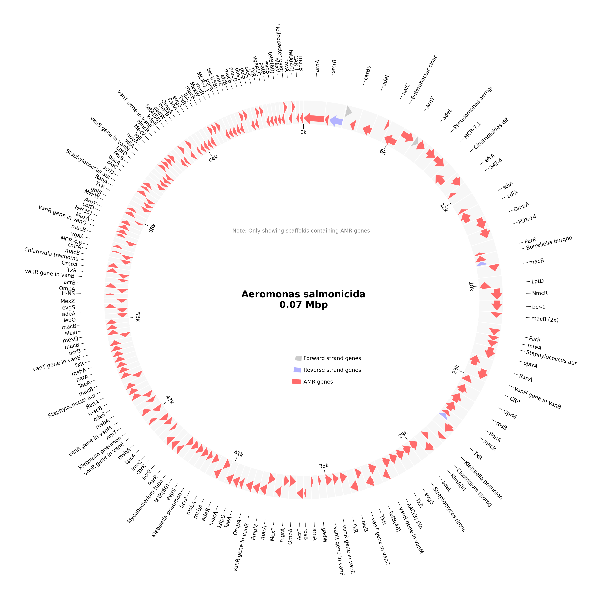

### AAC(3)-IXa
- **Mechanism**: antibiotic inactivation
- **Drug Classes**: aminoglycoside antibiotic
- **AMR Family**: AAC(3)
- **Locations**:
  - gnl|SPADES|PBDHLPBC_12098_1 : position 2-484

### AcrF
- **Mechanism**: antibiotic efflux
- **Drug Classes**: fluoroquinolone antibiotic; cephalosporin; cephamycin; penam
- **AMR Family**: resistance-nodulation-cell division (RND) antibiotic efflux pump
- **Locations**:
  - gnl|SPADES|PBDHLPBC_13656_1 : position 1-438

### ArnT (found in 3 locations)
- **Mechanism**: antibiotic target alteration
- **Drug Classes**: peptide antibiotic
- **AMR Family**: pmr phosphoethanolamine transferase
- **Locations**:
  - gnl|SPADES|PBDHLPBC_18403_1 : position 1-342
  - gnl|SPADES|PBDHLPBC_24795_1 : position 2-130
  - gnl|SPADES|PBDHLPBC_6270_1 : position 3-863

### Borreliella burgdorferi murA with mutation conferring resistance to fosfomycin
- **Mechanism**: antibiotic target alteration
- **Drug Classes**: phosphonic acid antibiotic
- **AMR Family**: antibiotic-resistant murA transferase
- **Locations**:
  - gnl|SPADES|PBDHLPBC_7523_1 : position 2-391

### CAR-1
- **Mechanism**: antibiotic inactivation
- **Drug Classes**: carbapenem
- **AMR Family**: CAR beta-lactamase
- **Locations**:
  - gnl|SPADES|PBDHLPBC_36980_1 : position 3-206

### CRP
- **Mechanism**: antibiotic efflux
- **Drug Classes**: macrolide antibiotic; fluoroquinolone antibiotic; penam
- **AMR Family**: resistance-nodulation-cell division (RND) antibiotic efflux pump
- **Locations**:
  - gnl|SPADES|PBDHLPBC_8512_1 : position 3-431

### Chlamydia trachomatis intrinsic murA conferring resistance to fosfomycin
- **Mechanism**: antibiotic target alteration
- **Drug Classes**: phosphonic acid antibiotic
- **AMR Family**: antibiotic-resistant murA transferase
- **Locations**:
  - gnl|SPADES|PBDHLPBC_23237_1 : position 2-277

### Clostridioides difficile gyrB conferring resistance to fluoroquinolones
- **Mechanism**: antibiotic target alteration
- **Drug Classes**: fluoroquinolone antibiotic
- **AMR Family**: fluoroquinolone resistant gyrB
- **Locations**:
  - gnl|SPADES|PBDHLPBC_7307_1 : position 1-750

### Clostridium sporogenes cplR
- **Mechanism**: antibiotic target protection
- **Drug Classes**: lincosamide antibiotic; pleuromutilin antibiotic
- **AMR Family**: Miscellaneous ABC-F subfamily ATP-binding cassette ribosomal protection proteins
- **Locations**:
  - gnl|SPADES|PBDHLPBC_10716_2 : position 215-538

### Enterobacter cloacae acrA
- **Mechanism**: antibiotic efflux
- **Drug Classes**: fluoroquinolone antibiotic; cephalosporin; glycylcycline; penam; tetracycline antibiotic; rifamycin antibiotic; phenicol antibiotic; disinfecting agents and antiseptics
- **AMR Family**: resistance-nodulation-cell division (RND) antibiotic efflux pump
- **Locations**:
  - gnl|SPADES|PBDHLPBC_6243_1 : position 9-866

### FOX-14
- **Mechanism**: antibiotic inactivation
- **Drug Classes**: cephalosporin; cephamycin
- **AMR Family**: FOX beta-lactamase
- **Locations**:
  - gnl|SPADES|PBDHLPBC_7493_1 : position 1-591

### H-NS
- **Mechanism**: antibiotic efflux
- **Drug Classes**: macrolide antibiotic; fluoroquinolone antibiotic; cephalosporin; cephamycin; penam; tetracycline antibiotic
- **AMR Family**: major facilitator superfamily (MFS) antibiotic efflux pump; resistance-nodulation-cell division (RND) antibiotic efflux pump
- **Locations**:
  - gnl|SPADES|PBDHLPBC_22597_1 : position 178-285

### Helicobacter pylori pbp1 mutants conferring resistance to amoxicillin
- **Mechanism**: antibiotic target alteration
- **Drug Classes**: cephalosporin; cephamycin; penam
- **AMR Family**: Penicillin-binding protein mutations conferring resistance to beta-lactam antibiotics
- **Locations**:
  - gnl|SPADES|PBDHLPBC_36108_1 : position 2-211

### Klebsiella pneumoniae KpnE
- **Mechanism**: antibiotic efflux
- **Drug Classes**: macrolide antibiotic; aminoglycoside antibiotic; cephalosporin; tetracycline antibiotic; peptide antibiotic; rifamycin antibiotic; disinfecting agents and antiseptics
- **AMR Family**: small multidrug resistance (SMR) antibiotic efflux pump
- **Locations**:
  - gnl|SPADES|PBDHLPBC_18200_1 : position 2-343

### Klebsiella pneumoniae OmpK37
- **Mechanism**: reduced permeability to antibiotic
- **Drug Classes**: monobactam; carbapenem; cephalosporin; cephamycin; penam; penem
- **AMR Family**: General Bacterial Porin with reduced permeability to beta-lactams
- **Locations**:
  - gnl|SPADES|PBDHLPBC_16510_1 : position 3-371

### Klebsiella pneumoniae acrA
- **Mechanism**: antibiotic efflux
- **Drug Classes**: fluoroquinolone antibiotic; cephalosporin; glycylcycline; penam; tetracycline antibiotic; rifamycin antibiotic; phenicol antibiotic; disinfecting agents and antiseptics
- **AMR Family**: resistance-nodulation-cell division (RND) antibiotic efflux pump
- **Locations**:
  - gnl|SPADES|PBDHLPBC_10521_1 : position 245-547

### LpsA
- **Mechanism**: reduced permeability to antibiotic
- **Drug Classes**: peptide antibiotic
- **AMR Family**: Intrinsic peptide antibiotic resistant Lps
- **Locations**:
  - gnl|SPADES|PBDHLPBC_17571_1 : position 3-353

### LptD (found in 3 locations)
- **Mechanism**: antibiotic efflux
- **Drug Classes**: carbapenem; peptide antibiotic; aminocoumarin antibiotic; rifamycin antibiotic
- **AMR Family**: ATP-binding cassette (ABC) antibiotic efflux pump
- **Locations**:
  - gnl|SPADES|PBDHLPBC_24539_1 : position 2-271
  - gnl|SPADES|PBDHLPBC_28454_1 : position 2-250
  - gnl|SPADES|PBDHLPBC_7653_2 : position 250-720

### MCR-4.6
- **Mechanism**: antibiotic target alteration
- **Drug Classes**: peptide antibiotic
- **AMR Family**: MCR phosphoethanolamine transferase
- **Locations**:
  - gnl|SPADES|PBDHLPBC_24019_1 : position 2-100

### MCR-7.1 (found in 2 locations)
- **Mechanism**: antibiotic target alteration
- **Drug Classes**: peptide antibiotic
- **AMR Family**: MCR phosphoethanolamine transferase
- **Locations**:
  - gnl|SPADES|PBDHLPBC_32770_1 : position 3-227
  - gnl|SPADES|PBDHLPBC_7298_1 : position 3-752

### MexI
- **Mechanism**: antibiotic efflux
- **Drug Classes**: fluoroquinolone antibiotic; tetracycline antibiotic; disinfecting agents and antiseptics
- **AMR Family**: resistance-nodulation-cell division (RND) antibiotic efflux pump
- **Locations**:
  - gnl|SPADES|PBDHLPBC_21771_1 : position 3-293

### MexT
- **Mechanism**: antibiotic efflux
- **Drug Classes**: fluoroquinolone antibiotic; diaminopyrimidine antibiotic; phenicol antibiotic
- **AMR Family**: resistance-nodulation-cell division (RND) antibiotic efflux pump
- **Locations**:
  - gnl|SPADES|PBDHLPBC_14095_1 : position 2-385

### MexV (found in 2 locations)
- **Mechanism**: antibiotic efflux
- **Drug Classes**: macrolide antibiotic; fluoroquinolone antibiotic; tetracycline antibiotic; phenicol antibiotic; disinfecting agents and antiseptics
- **AMR Family**: resistance-nodulation-cell division (RND) antibiotic efflux pump
- **Locations**:
  - gnl|SPADES|PBDHLPBC_31077_1 : position 3-236
  - gnl|SPADES|PBDHLPBC_36157_1 : position 2-211

### MexW (found in 2 locations)
- **Mechanism**: antibiotic efflux
- **Drug Classes**: macrolide antibiotic; fluoroquinolone antibiotic; tetracycline antibiotic; phenicol antibiotic; disinfecting agents and antiseptics
- **AMR Family**: resistance-nodulation-cell division (RND) antibiotic efflux pump
- **Locations**:
  - gnl|SPADES|PBDHLPBC_25315_1 : position 2-265
  - gnl|SPADES|PBDHLPBC_32583_1 : position 2-229

### MexZ
- **Mechanism**: antibiotic efflux
- **Drug Classes**: macrolide antibiotic; fluoroquinolone antibiotic; aminoglycoside antibiotic; carbapenem; cephalosporin; cephamycin; penam; tetracycline antibiotic; phenicol antibiotic; disinfecting agents and antiseptics
- **AMR Family**: resistance-nodulation-cell division (RND) antibiotic efflux pump
- **Locations**:
  - gnl|SPADES|PBDHLPBC_22586_1 : position 1-285

### MuxA
- **Mechanism**: antibiotic efflux
- **Drug Classes**: macrolide antibiotic; monobactam; tetracycline antibiotic; aminocoumarin antibiotic
- **AMR Family**: resistance-nodulation-cell division (RND) antibiotic efflux pump
- **Locations**:
  - gnl|SPADES|PBDHLPBC_24204_1 : position 2-271

### Mycobacterium tuberculosis pncA mutations conferring resistance to pyrazinamide
- **Mechanism**: antibiotic target alteration
- **Drug Classes**: pyrazine antibiotic
- **AMR Family**: Pyrazinamide resistant pncA
- **Locations**:
  - gnl|SPADES|PBDHLPBC_16941_1 : position 1-363

### NmcR (found in 2 locations)
- **Mechanism**: antibiotic inactivation
- **Drug Classes**: carbapenem; cephalosporin; cephamycin; penam
- **AMR Family**: NmcA beta-lactamase
- **Locations**:
  - gnl|SPADES|PBDHLPBC_31430_1 : position 2-235
  - gnl|SPADES|PBDHLPBC_7659_1 : position 3-719

### OmpA (found in 6 locations)
- **Mechanism**: reduced permeability to antibiotic
- **Drug Classes**: peptide antibiotic
- **AMR Family**: General Bacterial Porin with reduced permeability to peptide antibiotics
- **Locations**:
  - gnl|SPADES|PBDHLPBC_13810_1 : position 3-434
  - gnl|SPADES|PBDHLPBC_14443_1 : position 1-417
  - gnl|SPADES|PBDHLPBC_22769_1 : position 3-284
  - gnl|SPADES|PBDHLPBC_23106_1 : position 1-279
  - gnl|SPADES|PBDHLPBC_32181_1 : position 2-169
  - gnl|SPADES|PBDHLPBC_7459_1 : position 2-736

### OprM
- **Mechanism**: antibiotic efflux
- **Drug Classes**: macrolide antibiotic; fluoroquinolone antibiotic; monobactam; aminoglycoside antibiotic; carbapenem; cephalosporin; cephamycin; penam; tetracycline antibiotic; peptide antibiotic; aminocoumarin antibiotic; diaminopyrimidine antibiotic; sulfonamide antibiotic; phenicol antibiotic; penem; disinfecting agents and antiseptics
- **AMR Family**: resistance-nodulation-cell division (RND) antibiotic efflux pump
- **Locations**:
  - gnl|SPADES|PBDHLPBC_8554_1 : position 3-563

### ParR (found in 3 locations)
- **Mechanism**: antibiotic efflux; reduced permeability to antibiotic
- **Drug Classes**: macrolide antibiotic; fluoroquinolone antibiotic; monobactam; aminoglycoside antibiotic; carbapenem; cephalosporin; cephamycin; penam; tetracycline antibiotic; phenicol antibiotic; penem; disinfecting agents and antiseptics
- **AMR Family**: resistance-nodulation-cell division (RND) antibiotic efflux pump; Outer Membrane Porin (Opr)
- **Locations**:
  - gnl|SPADES|PBDHLPBC_17030_1 : position 2-301
  - gnl|SPADES|PBDHLPBC_7497_2 : position 551-733
  - gnl|SPADES|PBDHLPBC_7821_2 : position 298-708

### ParS
- **Mechanism**: antibiotic efflux; reduced permeability to antibiotic
- **Drug Classes**: macrolide antibiotic; fluoroquinolone antibiotic; monobactam; aminoglycoside antibiotic; carbapenem; cephalosporin; cephamycin; penam; tetracycline antibiotic; phenicol antibiotic; penem; disinfecting agents and antiseptics
- **AMR Family**: resistance-nodulation-cell division (RND) antibiotic efflux pump; Outer Membrane Porin (Opr)
- **Locations**:
  - gnl|SPADES|PBDHLPBC_27297_1 : position 3-254

### PmpM
- **Mechanism**: antibiotic efflux
- **Drug Classes**: fluoroquinolone antibiotic; aminoglycoside antibiotic; disinfecting agents and antiseptics
- **AMR Family**: multidrug and toxic compound extrusion (MATE) transporter
- **Locations**:
  - gnl|SPADES|PBDHLPBC_14250_1 : position 1-420

### Pseudomonas aeruginosa ampR with mutation conferring resistance to aztreonam
- **Mechanism**: antibiotic target alteration; antibiotic inactivation
- **Drug Classes**: monobactam; carbapenem; cephalosporin
- **AMR Family**: PDC beta-lactamase; ampR transcriptional regulator with mutation conferring resistance to monobactam antibiotics
- **Locations**:
  - gnl|SPADES|PBDHLPBC_6686_1 : position 211-813

### RanA (found in 5 locations)
- **Mechanism**: antibiotic efflux
- **Drug Classes**: aminoglycoside antibiotic
- **AMR Family**: ATP-binding cassette (ABC) antibiotic efflux pump
- **Locations**:
  - gnl|SPADES|PBDHLPBC_18753_1 : position 2-337
  - gnl|SPADES|PBDHLPBC_25827_1 : position 3-263
  - gnl|SPADES|PBDHLPBC_32134_1 : position 1-231
  - gnl|SPADES|PBDHLPBC_8099_1 : position 3-686
  - gnl|SPADES|PBDHLPBC_8870_1 : position 1-636

### RlmA(II)
- **Mechanism**: antibiotic target alteration
- **Drug Classes**: macrolide antibiotic; lincosamide antibiotic
- **AMR Family**: non-erm 23S ribosomal RNA methyltransferase (G748)
- **Locations**:
  - gnl|SPADES|PBDHLPBC_10770_1 : position 2-535

### SAT-4
- **Mechanism**: antibiotic inactivation
- **Drug Classes**: nucleoside antibiotic
- **AMR Family**: streptothricin acetyltransferase (SAT)
- **Locations**:
  - gnl|SPADES|PBDHLPBC_7319_1 : position 3-242

### Staphylococcus aureus mupA conferring resistance to mupirocin (found in 2 locations)
- **Mechanism**: antibiotic target alteration
- **Drug Classes**: mupirocin-like antibiotic
- **AMR Family**: antibiotic-resistant isoleucyl-tRNA synthetase (ileS)
- **Locations**:
  - gnl|SPADES|PBDHLPBC_19487_1 : position 3-326
  - gnl|SPADES|PBDHLPBC_7862_2 : position 310-702

### Staphylococcus aureus murA with mutation conferring resistance to fosfomycin
- **Mechanism**: antibiotic target alteration
- **Drug Classes**: phosphonic acid antibiotic
- **AMR Family**: antibiotic-resistant murA transferase
- **Locations**:
  - gnl|SPADES|PBDHLPBC_26279_1 : position 2-262

### Streptomyces rimosus otr(A)
- **Mechanism**: antibiotic target protection
- **Drug Classes**: tetracycline antibiotic
- **AMR Family**: tetracycline-resistant ribosomal protection protein
- **Locations**:
  - gnl|SPADES|PBDHLPBC_11168_1 : position 2-517

### TaeA (found in 2 locations)
- **Mechanism**: antibiotic efflux
- **Drug Classes**: pleuromutilin antibiotic
- **AMR Family**: ATP-binding cassette (ABC) antibiotic efflux pump
- **Locations**:
  - gnl|SPADES|PBDHLPBC_15096_2 : position 139-399
  - gnl|SPADES|PBDHLPBC_19862_1 : position 3-320

### TolC
- **Mechanism**: antibiotic efflux
- **Drug Classes**: macrolide antibiotic; fluoroquinolone antibiotic; aminoglycoside antibiotic; carbapenem; cephalosporin; glycylcycline; cephamycin; penam; tetracycline antibiotic; peptide antibiotic; aminocoumarin antibiotic; rifamycin antibiotic; phenicol antibiotic; penem; disinfecting agents and antiseptics
- **AMR Family**: ATP-binding cassette (ABC) antibiotic efflux pump; major facilitator superfamily (MFS) antibiotic efflux pump; resistance-nodulation-cell division (RND) antibiotic efflux pump
- **Locations**:
  - gnl|SPADES|PBDHLPBC_32326_1 : position 2-229

### TxR (found in 9 locations)
- **Mechanism**: antibiotic efflux
- **Drug Classes**: tetracycline antibiotic
- **AMR Family**: ATP-binding cassette (ABC) antibiotic efflux pump
- **Locations**:
  - gnl|SPADES|PBDHLPBC_11714_1 : position 1-498
  - gnl|SPADES|PBDHLPBC_12158_1 : position 2-481
  - gnl|SPADES|PBDHLPBC_12774_1 : position 3-461
  - gnl|SPADES|PBDHLPBC_20464_1 : position 1-312
  - gnl|SPADES|PBDHLPBC_22889_1 : position 1-282
  - gnl|SPADES|PBDHLPBC_25980_1 : position 3-263
  - gnl|SPADES|PBDHLPBC_32261_1 : position 1-231
  - gnl|SPADES|PBDHLPBC_34756_1 : position 2-217
  - gnl|SPADES|PBDHLPBC_9848_1 : position 66-578

### YojI
- **Mechanism**: antibiotic efflux
- **Drug Classes**: peptide antibiotic
- **AMR Family**: ATP-binding cassette (ABC) antibiotic efflux pump
- **Locations**:
  - gnl|SPADES|PBDHLPBC_30731_1 : position 3-236

### acrB (found in 3 locations)
- **Mechanism**: antibiotic efflux
- **Drug Classes**: fluoroquinolone antibiotic; cephalosporin; glycylcycline; penam; tetracycline antibiotic; rifamycin antibiotic; phenicol antibiotic; disinfecting agents and antiseptics
- **AMR Family**: resistance-nodulation-cell division (RND) antibiotic efflux pump
- **Locations**:
  - gnl|SPADES|PBDHLPBC_17027_1 : position 3-362
  - gnl|SPADES|PBDHLPBC_21012_1 : position 1-303
  - gnl|SPADES|PBDHLPBC_22802_1 : position 1-282

### acrD
- **Mechanism**: antibiotic efflux
- **Drug Classes**: aminoglycoside antibiotic
- **AMR Family**: resistance-nodulation-cell division (RND) antibiotic efflux pump
- **Locations**:
  - gnl|SPADES|PBDHLPBC_26174_1 : position 1-261

### adeA
- **Mechanism**: antibiotic efflux
- **Drug Classes**: glycylcycline; tetracycline antibiotic
- **AMR Family**: resistance-nodulation-cell division (RND) antibiotic efflux pump
- **Locations**:
  - gnl|SPADES|PBDHLPBC_22345_1 : position 3-287

### adeL (found in 3 locations)
- **Mechanism**: antibiotic efflux
- **Drug Classes**: fluoroquinolone antibiotic; tetracycline antibiotic
- **AMR Family**: resistance-nodulation-cell division (RND) antibiotic efflux pump
- **Locations**:
  - gnl|SPADES|PBDHLPBC_11145_1 : position 1-519
  - gnl|SPADES|PBDHLPBC_5719_2 : position 328-936
  - gnl|SPADES|PBDHLPBC_6477_2 : position 349-837

### adeR
- **Mechanism**: antibiotic efflux
- **Drug Classes**: glycylcycline; tetracycline antibiotic
- **AMR Family**: resistance-nodulation-cell division (RND) antibiotic efflux pump
- **Locations**:
  - gnl|SPADES|PBDHLPBC_15374_1 : position 1-393

### adeS
- **Mechanism**: antibiotic efflux
- **Drug Classes**: glycylcycline; tetracycline antibiotic
- **AMR Family**: resistance-nodulation-cell division (RND) antibiotic efflux pump
- **Locations**:
  - gnl|SPADES|PBDHLPBC_18704_1 : position 3-338

### arnA (found in 2 locations)
- **Mechanism**: antibiotic target alteration
- **Drug Classes**: peptide antibiotic
- **AMR Family**: pmr phosphoethanolamine transferase
- **Locations**:
  - gnl|SPADES|PBDHLPBC_13197_2 : position 303-449
  - gnl|SPADES|PBDHLPBC_3800_1 : position 3-1394

### bacA
- **Mechanism**: antibiotic target alteration
- **Drug Classes**: peptide antibiotic
- **AMR Family**: undecaprenyl pyrophosphate related proteins
- **Locations**:
  - gnl|SPADES|PBDHLPBC_26922_1 : position 3-257

### basS
- **Mechanism**: antibiotic target alteration; antibiotic efflux
- **Drug Classes**: peptide antibiotic
- **AMR Family**: pmr phosphoethanolamine transferase
- **Locations**:
  - gnl|SPADES|PBDHLPBC_34280_1 : position 3-221

### bcr-1
- **Mechanism**: antibiotic efflux
- **Drug Classes**: bicyclomycin-like antibiotic
- **AMR Family**: major facilitator superfamily (MFS) antibiotic efflux pump
- **Locations**:
  - gnl|SPADES|PBDHLPBC_7711_1 : position 2-631

### bcrA
- **Mechanism**: antibiotic efflux
- **Drug Classes**: peptide antibiotic
- **AMR Family**: ATP-binding cassette (ABC) antibiotic efflux pump
- **Locations**:
  - gnl|SPADES|PBDHLPBC_16507_2 : position 74-370

### catB9
- **Mechanism**: antibiotic inactivation
- **Drug Classes**: phenicol antibiotic
- **AMR Family**: chloramphenicol acetyltransferase (CAT)
- **Locations**:
  - gnl|SPADES|PBDHLPBC_5312_2 : position 483-815

### cmrA
- **Mechanism**: antibiotic efflux
- **Drug Classes**: phenicol antibiotic
- **AMR Family**: major facilitator superfamily (MFS) antibiotic efflux pump
- **Locations**:
  - gnl|SPADES|PBDHLPBC_23876_1 : position 1-273

### cprR
- **Mechanism**: antibiotic target alteration; antibiotic efflux
- **Drug Classes**: peptide antibiotic
- **AMR Family**: pmr phosphoethanolamine transferase
- **Locations**:
  - gnl|SPADES|PBDHLPBC_17265_1 : position 3-359

### efrA
- **Mechanism**: antibiotic efflux
- **Drug Classes**: macrolide antibiotic; fluoroquinolone antibiotic; rifamycin antibiotic
- **AMR Family**: ATP-binding cassette (ABC) antibiotic efflux pump
- **Locations**:
  - gnl|SPADES|PBDHLPBC_7322_2 : position 213-749

### efrB
- **Mechanism**: antibiotic efflux
- **Drug Classes**: macrolide antibiotic; fluoroquinolone antibiotic; rifamycin antibiotic
- **AMR Family**: ATP-binding cassette (ABC) antibiotic efflux pump
- **Locations**:
  - gnl|SPADES|PBDHLPBC_33786_1 : position 2-223

### emrB
- **Mechanism**: antibiotic efflux
- **Drug Classes**: fluoroquinolone antibiotic
- **AMR Family**: major facilitator superfamily (MFS) antibiotic efflux pump
- **Locations**:
  - gnl|SPADES|PBDHLPBC_4358_1 : position 3-245

### evgS (found in 5 locations)
- **Mechanism**: antibiotic efflux
- **Drug Classes**: macrolide antibiotic; fluoroquinolone antibiotic; penam; tetracycline antibiotic
- **AMR Family**: major facilitator superfamily (MFS) antibiotic efflux pump; resistance-nodulation-cell division (RND) antibiotic efflux pump
- **Locations**:
  - gnl|SPADES|PBDHLPBC_11333_1 : position 2-511
  - gnl|SPADES|PBDHLPBC_16496_1 : position 2-370
  - gnl|SPADES|PBDHLPBC_22455_1 : position 2-286
  - gnl|SPADES|PBDHLPBC_32196_1 : position 2-229
  - gnl|SPADES|PBDHLPBC_35885_1 : position 3-212

### gadW (found in 2 locations)
- **Mechanism**: antibiotic efflux
- **Drug Classes**: macrolide antibiotic; fluoroquinolone antibiotic; penam
- **AMR Family**: resistance-nodulation-cell division (RND) antibiotic efflux pump
- **Locations**:
  - gnl|SPADES|PBDHLPBC_13121_2 : position 274-453
  - gnl|SPADES|PBDHLPBC_31674_1 : position 3-233

### golS (found in 2 locations)
- **Mechanism**: antibiotic efflux
- **Drug Classes**: monobactam; carbapenem; cephalosporin; cephamycin; penam; phenicol antibiotic; penem
- **AMR Family**: resistance-nodulation-cell division (RND) antibiotic efflux pump
- **Locations**:
  - gnl|SPADES|PBDHLPBC_25527_1 : position 2-184
  - gnl|SPADES|PBDHLPBC_34690_1 : position 2-217

### kdpD
- **Mechanism**: antibiotic efflux
- **Drug Classes**: aminoglycoside antibiotic
- **AMR Family**: kdpDE
- **Locations**:
  - gnl|SPADES|PBDHLPBC_15089_1 : position 2-400

### kdpE
- **Mechanism**: antibiotic efflux
- **Drug Classes**: aminoglycoside antibiotic
- **AMR Family**: kdpDE
- **Locations**:
  - gnl|SPADES|PBDHLPBC_31648_1 : position 3-194

### leuO
- **Mechanism**: antibiotic efflux
- **Drug Classes**: nucleoside antibiotic; disinfecting agents and antiseptics
- **AMR Family**: major facilitator superfamily (MFS) antibiotic efflux pump
- **Locations**:
  - gnl|SPADES|PBDHLPBC_22002_1 : position 2-292

### lmrC (found in 2 locations)
- **Mechanism**: antibiotic target protection
- **Drug Classes**: lincosamide antibiotic
- **AMR Family**: Miscellaneous ABC-F subfamily ATP-binding cassette ribosomal protection proteins
- **Locations**:
  - gnl|SPADES|PBDHLPBC_17361_1 : position 3-185
  - gnl|SPADES|PBDHLPBC_33550_1 : position 3-224

### macA
- **Mechanism**: antibiotic efflux
- **Drug Classes**: macrolide antibiotic
- **AMR Family**: ATP-binding cassette (ABC) antibiotic efflux pump
- **Locations**:
  - gnl|SPADES|PBDHLPBC_15346_1 : position 2-394

### macB (found in 15 locations)
- **Mechanism**: antibiotic efflux
- **Drug Classes**: macrolide antibiotic
- **AMR Family**: ATP-binding cassette (ABC) antibiotic efflux pump
- **Locations**:
  - gnl|SPADES|PBDHLPBC_18791_1 : position 2-337
  - gnl|SPADES|PBDHLPBC_19838_1 : position 3-320
  - gnl|SPADES|PBDHLPBC_21481_1 : position 2-298
  - gnl|SPADES|PBDHLPBC_21957_1 : position 1-291
  - gnl|SPADES|PBDHLPBC_23923_1 : position 2-274
  - gnl|SPADES|PBDHLPBC_23948_1 : position 1-273
  - gnl|SPADES|PBDHLPBC_31898_1 : position 3-230
  - gnl|SPADES|PBDHLPBC_32404_1 : position 2-229
  - gnl|SPADES|PBDHLPBC_33898_1 : position 3-221
  - gnl|SPADES|PBDHLPBC_34097_1 : position 2-220
  - gnl|SPADES|PBDHLPBC_36933_1 : position 3-206
  - gnl|SPADES|PBDHLPBC_7617_1 : position 2-439
  - gnl|SPADES|PBDHLPBC_7756_1 : position 2-340
  - gnl|SPADES|PBDHLPBC_7756_2 : position 343-711
  - gnl|SPADES|PBDHLPBC_9787_1 : position 1-282

### marA
- **Mechanism**: antibiotic efflux; reduced permeability to antibiotic
- **Drug Classes**: fluoroquinolone antibiotic; monobactam; carbapenem; cephalosporin; glycylcycline; cephamycin; penam; tetracycline antibiotic; rifamycin antibiotic; phenicol antibiotic; penem; disinfecting agents and antiseptics
- **AMR Family**: resistance-nodulation-cell division (RND) antibiotic efflux pump; General Bacterial Porin with reduced permeability to beta-lactams
- **Locations**:
  - gnl|SPADES|PBDHLPBC_14117_1 : position 1-426

### mexQ
- **Mechanism**: antibiotic efflux
- **Drug Classes**: macrolide antibiotic; carbapenem; tetracycline antibiotic; diaminopyrimidine antibiotic; phenicol antibiotic; disinfecting agents and antiseptics
- **AMR Family**: resistance-nodulation-cell division (RND) antibiotic efflux pump
- **Locations**:
  - gnl|SPADES|PBDHLPBC_21536_1 : position 1-297

### mgrA
- **Mechanism**: antibiotic efflux
- **Drug Classes**: fluoroquinolone antibiotic; cephalosporin; penam; tetracycline antibiotic; peptide antibiotic; disinfecting agents and antiseptics
- **AMR Family**: ATP-binding cassette (ABC) antibiotic efflux pump; major facilitator superfamily (MFS) antibiotic efflux pump
- **Locations**:
  - gnl|SPADES|PBDHLPBC_13841_1 : position 1-345

### mreA
- **Mechanism**: antibiotic efflux
- **Drug Classes**: macrolide antibiotic
- **AMR Family**: major facilitator superfamily (MFS) antibiotic efflux pump
- **Locations**:
  - gnl|SPADES|PBDHLPBC_7862_1 : position 2-310

### msbA (found in 5 locations)
- **Mechanism**: antibiotic efflux
- **Drug Classes**: nitroimidazole antibiotic
- **AMR Family**: ATP-binding cassette (ABC) antibiotic efflux pump
- **Locations**:
  - gnl|SPADES|PBDHLPBC_16193_1 : position 2-376
  - gnl|SPADES|PBDHLPBC_16232_1 : position 2-376
  - gnl|SPADES|PBDHLPBC_17868_1 : position 2-349
  - gnl|SPADES|PBDHLPBC_18566_1 : position 3-338
  - gnl|SPADES|PBDHLPBC_20319_1 : position 1-312

### nalC
- **Mechanism**: antibiotic efflux
- **Drug Classes**: macrolide antibiotic; fluoroquinolone antibiotic; monobactam; carbapenem; cephalosporin; cephamycin; penam; tetracycline antibiotic; peptide antibiotic; aminocoumarin antibiotic; diaminopyrimidine antibiotic; sulfonamide antibiotic; phenicol antibiotic; penem
- **AMR Family**: resistance-nodulation-cell division (RND) antibiotic efflux pump
- **Locations**:
  - gnl|SPADES|PBDHLPBC_5981_2 : position 715-900

### novA (found in 2 locations)
- **Mechanism**: antibiotic efflux
- **Drug Classes**: aminocoumarin antibiotic
- **AMR Family**: ATP-binding cassette (ABC) antibiotic efflux pump
- **Locations**:
  - gnl|SPADES|PBDHLPBC_30662_1 : position 3-239
  - gnl|SPADES|PBDHLPBC_36244_1 : position 3-209

### oleB
- **Mechanism**: antibiotic target protection
- **Drug Classes**: macrolide antibiotic
- **AMR Family**: Miscellaneous ABC-F subfamily ATP-binding cassette ribosomal protection proteins
- **Locations**:
  - gnl|SPADES|PBDHLPBC_12587_1 : position 3-467

### oleC (found in 2 locations)
- **Mechanism**: antibiotic efflux
- **Drug Classes**: macrolide antibiotic
- **AMR Family**: ATP-binding cassette (ABC) antibiotic efflux pump
- **Locations**:
  - gnl|SPADES|PBDHLPBC_26575_1 : position 71-259
  - gnl|SPADES|PBDHLPBC_34781_1 : position 1-216

### optrA
- **Mechanism**: antibiotic target protection
- **Drug Classes**: oxazolidinone antibiotic; phenicol antibiotic
- **AMR Family**: Miscellaneous ABC-F subfamily ATP-binding cassette ribosomal protection proteins
- **Locations**:
  - gnl|SPADES|PBDHLPBC_7901_1 : position 1-702

### patA (found in 2 locations)
- **Mechanism**: antibiotic efflux
- **Drug Classes**: fluoroquinolone antibiotic
- **AMR Family**: ATP-binding cassette (ABC) antibiotic efflux pump
- **Locations**:
  - gnl|SPADES|PBDHLPBC_20260_1 : position 2-313
  - gnl|SPADES|PBDHLPBC_32891_1 : position 2-226

### patB
- **Mechanism**: antibiotic efflux
- **Drug Classes**: fluoroquinolone antibiotic
- **AMR Family**: ATP-binding cassette (ABC) antibiotic efflux pump
- **Locations**:
  - gnl|SPADES|PBDHLPBC_35614_1 : position 2-214

### rosB (found in 2 locations)
- **Mechanism**: antibiotic efflux
- **Drug Classes**: peptide antibiotic
- **AMR Family**: major facilitator superfamily (MFS) antibiotic efflux pump
- **Locations**:
  - gnl|SPADES|PBDHLPBC_13630_1 : position 307-438
  - gnl|SPADES|PBDHLPBC_8582_1 : position 3-653

### sdiA (found in 3 locations)
- **Mechanism**: antibiotic efflux
- **Drug Classes**: fluoroquinolone antibiotic; cephalosporin; glycylcycline; penam; tetracycline antibiotic; rifamycin antibiotic; phenicol antibiotic; disinfecting agents and antiseptics
- **AMR Family**: resistance-nodulation-cell division (RND) antibiotic efflux pump
- **Locations**:
  - gnl|SPADES|PBDHLPBC_29724_1 : position 3-242
  - gnl|SPADES|PBDHLPBC_7328_2 : position 523-750
  - gnl|SPADES|PBDHLPBC_7371_1 : position 3-698

### tet(35)
- **Mechanism**: antibiotic efflux
- **Drug Classes**: tetracycline antibiotic
- **AMR Family**: ATP-binding cassette (ABC) antibiotic efflux pump
- **Locations**:
  - gnl|SPADES|PBDHLPBC_24304_1 : position 2-271

### tetA(46)
- **Mechanism**: antibiotic efflux
- **Drug Classes**: tetracycline antibiotic
- **AMR Family**: ATP-binding cassette (ABC) antibiotic efflux pump
- **Locations**:
  - gnl|SPADES|PBDHLPBC_36816_1 : position 2-208

### tetA(58) (found in 2 locations)
- **Mechanism**: antibiotic efflux
- **Drug Classes**: tetracycline antibiotic
- **AMR Family**: major facilitator superfamily (MFS) antibiotic efflux pump
- **Locations**:
  - gnl|SPADES|PBDHLPBC_31847_1 : position 1-231
  - gnl|SPADES|PBDHLPBC_33645_1 : position 2-223

### tetB(46)
- **Mechanism**: antibiotic efflux
- **Drug Classes**: tetracycline antibiotic
- **AMR Family**: ATP-binding cassette (ABC) antibiotic efflux pump
- **Locations**:
  - gnl|SPADES|PBDHLPBC_12126_1 : position 2-484

### tetB(60) (found in 2 locations)
- **Mechanism**: antibiotic efflux
- **Drug Classes**: tetracycline antibiotic
- **AMR Family**: ATP-binding cassette (ABC) antibiotic efflux pump
- **Locations**:
  - gnl|SPADES|PBDHLPBC_16775_1 : position 3-365
  - gnl|SPADES|PBDHLPBC_35976_1 : position 2-211

### vanH gene in vanB cluster
- **Mechanism**: antibiotic target alteration
- **Drug Classes**: glycopeptide antibiotic
- **AMR Family**: vanH; glycopeptide resistance gene cluster
- **Locations**:
  - gnl|SPADES|PBDHLPBC_8450_1 : position 2-661

### vanR gene in vanB cluster (found in 2 locations)
- **Mechanism**: antibiotic target alteration
- **Drug Classes**: glycopeptide antibiotic
- **AMR Family**: glycopeptide resistance gene cluster; vanR
- **Locations**:
  - gnl|SPADES|PBDHLPBC_14292_1 : position 2-421
  - gnl|SPADES|PBDHLPBC_22930_1 : position 75-281

### vanR gene in vanE cluster (found in 2 locations)
- **Mechanism**: antibiotic target alteration
- **Drug Classes**: glycopeptide antibiotic
- **AMR Family**: glycopeptide resistance gene cluster; vanR
- **Locations**:
  - gnl|SPADES|PBDHLPBC_12880_2 : position 76-444
  - gnl|SPADES|PBDHLPBC_17935_1 : position 107-349

### vanR gene in vanF cluster
- **Mechanism**: antibiotic target alteration
- **Drug Classes**: glycopeptide antibiotic
- **AMR Family**: glycopeptide resistance gene cluster; vanR
- **Locations**:
  - gnl|SPADES|PBDHLPBC_12925_1 : position 2-457

### vanR gene in vanM cluster (found in 2 locations)
- **Mechanism**: antibiotic target alteration
- **Drug Classes**: glycopeptide antibiotic
- **AMR Family**: glycopeptide resistance gene cluster; vanR
- **Locations**:
  - gnl|SPADES|PBDHLPBC_12100_1 : position 2-376
  - gnl|SPADES|PBDHLPBC_18549_1 : position 3-266

### vanR gene in vanO cluster
- **Mechanism**: antibiotic target alteration
- **Drug Classes**: glycopeptide antibiotic
- **AMR Family**: glycopeptide resistance gene cluster; vanR
- **Locations**:
  - gnl|SPADES|PBDHLPBC_24140_1 : position 107-274

### vanS gene in vanN cluster
- **Mechanism**: antibiotic target alteration
- **Drug Classes**: glycopeptide antibiotic
- **AMR Family**: vanS; glycopeptide resistance gene cluster
- **Locations**:
  - gnl|SPADES|PBDHLPBC_28745_1 : position 3-248

### vanT gene in vanC cluster
- **Mechanism**: antibiotic target alteration
- **Drug Classes**: glycopeptide antibiotic
- **AMR Family**: glycopeptide resistance gene cluster; vanT
- **Locations**:
  - gnl|SPADES|PBDHLPBC_12389_1 : position 3-380

### vanT gene in vanE cluster (found in 2 locations)
- **Mechanism**: antibiotic target alteration
- **Drug Classes**: glycopeptide antibiotic
- **AMR Family**: glycopeptide resistance gene cluster; vanT
- **Locations**:
  - gnl|SPADES|PBDHLPBC_20688_1 : position 3-308
  - gnl|SPADES|PBDHLPBC_31267_1 : position 1-234

### vgaA
- **Mechanism**: antibiotic target protection
- **Drug Classes**: lincosamide antibiotic; streptogramin antibiotic; streptogramin A antibiotic; pleuromutilin antibiotic
- **AMR Family**: vga-type ABC-F protein
- **Locations**:
  - gnl|SPADES|PBDHLPBC_23924_1 : position 3-173

### vgaALC
- **Mechanism**: antibiotic target protection
- **Drug Classes**: lincosamide antibiotic; streptogramin antibiotic; streptogramin A antibiotic; pleuromutilin antibiotic
- **AMR Family**: vga-type ABC-F protein
- **Locations**:
  - gnl|SPADES|PBDHLPBC_35114_1 : position 1-216

### vmlR
- **Mechanism**: antibiotic target protection
- **Drug Classes**: lincosamide antibiotic; streptogramin antibiotic; streptogramin A antibiotic; streptogramin B antibiotic; nucleoside antibiotic; pleuromutilin antibiotic
- **AMR Family**: Miscellaneous ABC-F subfamily ATP-binding cassette ribosomal protection proteins
- **Locations**:
  - gnl|SPADES|PBDHLPBC_32585_1 : position 3-227

## Aeromonas salmonicida subsp. masoucida
**Strain Statistics:**
- Total genome length: 3.4 kbp
- Total scaffolds: 55
- Scaffolds with AMR genes: 6
- Total genes annotated: 4
- Total AMR genes: 6
- Unique AMR genes: 5
- Distinct AMR mechanisms: 2
- Distinct AMR families: 5
- Distinct drug classes: 5

**Circos Plot:**

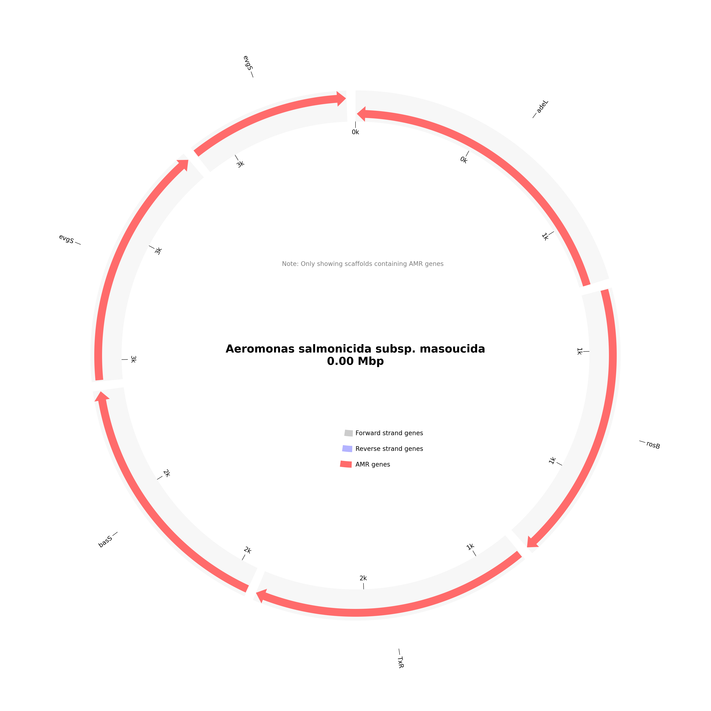

### TxR
- **Mechanism**: antibiotic efflux
- **Drug Classes**: tetracycline antibiotic
- **AMR Family**: ATP-binding cassette (ABC) antibiotic efflux pump
- **Locations**:
  - gnl|SPADES|PBDHLPBC_9310_1 : position 2-610

### adeL
- **Mechanism**: antibiotic efflux
- **Drug Classes**: fluoroquinolone antibiotic; tetracycline antibiotic
- **AMR Family**: resistance-nodulation-cell division (RND) antibiotic efflux pump
- **Locations**:
  - gnl|SPADES|PBDHLPBC_7758_1 : position 3-713

### basS
- **Mechanism**: antibiotic target alteration; antibiotic efflux
- **Drug Classes**: peptide antibiotic
- **AMR Family**: pmr phosphoethanolamine transferase
- **Locations**:
  - gnl|SPADES|PBDHLPBC_10232_1 : position 1-558

### evgS (found in 2 locations)
- **Mechanism**: antibiotic efflux
- **Drug Classes**: macrolide antibiotic; fluoroquinolone antibiotic; penam; tetracycline antibiotic
- **AMR Family**: major facilitator superfamily (MFS) antibiotic efflux pump; resistance-nodulation-cell division (RND) antibiotic efflux pump
- **Locations**:
  - gnl|SPADES|PBDHLPBC_10682_1 : position 3-539
  - gnl|SPADES|PBDHLPBC_17582_1 : position 1-354

### rosB
- **Mechanism**: antibiotic efflux
- **Drug Classes**: peptide antibiotic
- **AMR Family**: major facilitator superfamily (MFS) antibiotic efflux pump
- **Locations**:
  - gnl|SPADES|PBDHLPBC_9236_1 : position 1-615

## Aeromonas salmonicida subsp. pectinolytica 34mel
**Strain Statistics:**
- Total genome length: 6.6 kbp
- Total scaffolds: 112
- Scaffolds with AMR genes: 9
- Total genes annotated: 14
- Total AMR genes: 9
- Unique AMR genes: 8
- Distinct AMR mechanisms: 2
- Distinct AMR families: 7
- Distinct drug classes: 9

**Circos Plot:**

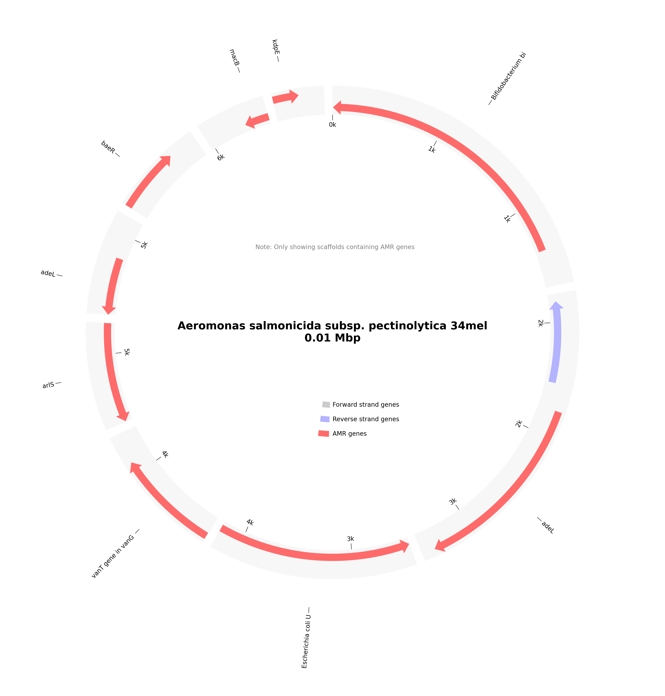

### Bifidobacterium bifidum ileS conferring resistance to mupirocin
- **Mechanism**: antibiotic target alteration
- **Drug Classes**: mupirocin-like antibiotic
- **AMR Family**: antibiotic-resistant isoleucyl-tRNA synthetase (ileS)
- **Locations**:
  - gnl|SPADES|PBDHLPBC_3537_1 : position 2-1327

### Escherichia coli UhpT with mutation conferring resistance to fosfomycin
- **Mechanism**: antibiotic target alteration
- **Drug Classes**: phosphonic acid antibiotic
- **AMR Family**: antibiotic-resistant UhpT
- **Locations**:
  - gnl|SPADES|PBDHLPBC_5573_1 : position 2-958

### adeL (found in 2 locations)
- **Mechanism**: antibiotic efflux
- **Drug Classes**: fluoroquinolone antibiotic; tetracycline antibiotic
- **AMR Family**: resistance-nodulation-cell division (RND) antibiotic efflux pump
- **Locations**:
  - gnl|SPADES|PBDHLPBC_12127_1 : position 1-282
  - gnl|SPADES|PBDHLPBC_3560_2 : position 564-1439

### arlS
- **Mechanism**: antibiotic efflux
- **Drug Classes**: fluoroquinolone antibiotic; disinfecting agents and antiseptics
- **AMR Family**: major facilitator superfamily (MFS) antibiotic efflux pump
- **Locations**:
  - gnl|SPADES|PBDHLPBC_11664_1 : position 3-497

### baeR
- **Mechanism**: antibiotic efflux
- **Drug Classes**: aminoglycoside antibiotic; aminocoumarin antibiotic
- **AMR Family**: resistance-nodulation-cell division (RND) antibiotic efflux pump
- **Locations**:
  - gnl|SPADES|PBDHLPBC_13370_1 : position 2-307

### kdpE
- **Mechanism**: antibiotic efflux
- **Drug Classes**: aminoglycoside antibiotic
- **AMR Family**: kdpDE
- **Locations**:
  - gnl|SPADES|PBDHLPBC_30242_1 : position 1-123

### macB
- **Mechanism**: antibiotic efflux
- **Drug Classes**: macrolide antibiotic
- **AMR Family**: ATP-binding cassette (ABC) antibiotic efflux pump
- **Locations**:
  - gnl|SPADES|PBDHLPBC_19590_2 : position 203-325

### vanT gene in vanG cluster
- **Mechanism**: antibiotic target alteration
- **Drug Classes**: glycopeptide antibiotic
- **AMR Family**: glycopeptide resistance gene cluster; vanT
- **Locations**:
  - gnl|SPADES|PBDHLPBC_8918_1 : position 3-491

## Buttiauxella agrestis
**Strain Statistics:**
- Total genome length: 810.2 kbp
- Total scaffolds: 2269
- Scaffolds with AMR genes: 359
- Total genes annotated: 1506
- Total AMR genes: 402
- Unique AMR genes: 162
- Distinct AMR mechanisms: 11
- Distinct AMR families: 62
- Distinct drug classes: 35

**Circos Plot:**

### AIM-1
- **Mechanism**: antibiotic inactivation
- **Drug Classes**: cephalosporin; cephamycin; penam
- **AMR Family**: AIM beta-lactamase
- **Locations**:
  - gnl|SPADES|PBDHLPBC_3902_2 : position 293-1252

### APH(6)-Ic (found in 2 locations)
- **Mechanism**: antibiotic inactivation
- **Drug Classes**: aminoglycoside antibiotic
- **AMR Family**: APH(6)
- **Locations**:
  - gnl|SPADES|PBDHLPBC_1743_6 : position 2765-3280
  - gnl|SPADES|PBDHLPBC_3309_2 : position 498-1343

### Acinetobacter baumannii AbaF (found in 12 locations)
- **Mechanism**: antibiotic efflux
- **Drug Classes**: phosphonic acid antibiotic
- **AMR Family**: major facilitator superfamily (MFS) antibiotic efflux pump
- **Locations**:
  - gnl|SPADES|PBDHLPBC_1035_3 : position 1341-2666
  - gnl|SPADES|PBDHLPBC_10888_2 : position 263-529
  - gnl|SPADES|PBDHLPBC_12610_1 : position 2-466
  - gnl|SPADES|PBDHLPBC_1362_6 : position 3877-4527
  - gnl|SPADES|PBDHLPBC_1387_1 : position 2-1033
  - gnl|SPADES|PBDHLPBC_1863_1 : position 1-306
  - gnl|SPADES|PBDHLPBC_20357_1 : position 2-313
  - gnl|SPADES|PBDHLPBC_2071_1 : position 2-1174
  - gnl|SPADES|PBDHLPBC_3847_4 : position 1171-1374
  - gnl|SPADES|PBDHLPBC_3980_1 : position 2-1303
  - gnl|SPADES|PBDHLPBC_4021_2 : position 673-1311
  - gnl|SPADES|PBDHLPBC_4872_2 : position 853-1086

### Acinetobacter baumannii AbaQ (found in 7 locations)
- **Mechanism**: antibiotic efflux
- **Drug Classes**: fluoroquinolone antibiotic
- **AMR Family**: major facilitator superfamily (MFS) antibiotic efflux pump
- **Locations**:
  - gnl|SPADES|PBDHLPBC_1372_4 : position 1901-3307
  - gnl|SPADES|PBDHLPBC_2578_1 : position 27-1388
  - gnl|SPADES|PBDHLPBC_3018_3 : position 1306-1788
  - gnl|SPADES|PBDHLPBC_3444_1 : position 1-948
  - gnl|SPADES|PBDHLPBC_3500_3 : position 1199-1522
  - gnl|SPADES|PBDHLPBC_4425_1 : position 126-1196
  - gnl|SPADES|PBDHLPBC_5508_2 : position 663-965

### AcrF (found in 5 locations)
- **Mechanism**: antibiotic efflux
- **Drug Classes**: fluoroquinolone antibiotic; cephalosporin; cephamycin; penam
- **AMR Family**: resistance-nodulation-cell division (RND) antibiotic efflux pump
- **Locations**:
  - gnl|SPADES|PBDHLPBC_2908_3 : position 1098-1859
  - gnl|SPADES|PBDHLPBC_3087_1 : position 1-1041
  - gnl|SPADES|PBDHLPBC_3087_2 : position 1038-1361
  - gnl|SPADES|PBDHLPBC_3087_3 : position 1374-1748
  - gnl|SPADES|PBDHLPBC_3190_1 : position 2-169

### AcrS (found in 3 locations)
- **Mechanism**: antibiotic efflux
- **Drug Classes**: fluoroquinolone antibiotic; cephalosporin; glycylcycline; cephamycin; penam; tetracycline antibiotic; rifamycin antibiotic; phenicol antibiotic; disinfecting agents and antiseptics
- **AMR Family**: resistance-nodulation-cell division (RND) antibiotic efflux pump
- **Locations**:
  - gnl|SPADES|PBDHLPBC_1243_6 : position 4801-5292
  - gnl|SPADES|PBDHLPBC_2908_2 : position 362-853
  - gnl|SPADES|PBDHLPBC_3190_2 : position 410-1027

### Bifidobacterium adolescentis rpoB mutants conferring resistance to rifampicin
- **Mechanism**: antibiotic target alteration; antibiotic target replacement
- **Drug Classes**: rifamycin antibiotic
- **AMR Family**: rifamycin-resistant beta-subunit of RNA polymerase (rpoB)
- **Locations**:
  - gnl|SPADES|PBDHLPBC_2600_3 : position 839-2089

### Bifidobacterium bifidum ileS conferring resistance to mupirocin
- **Mechanism**: antibiotic target alteration
- **Drug Classes**: mupirocin-like antibiotic
- **AMR Family**: antibiotic-resistant isoleucyl-tRNA synthetase (ileS)
- **Locations**:
  - gnl|SPADES|PBDHLPBC_7427_1 : position 1-396

### CDA-1
- **Mechanism**: antibiotic inactivation
- **Drug Classes**: carbapenem; cephalosporin; cephamycin; penem
- **AMR Family**: CDA beta-lactamase
- **Locations**:
  - gnl|SPADES|PBDHLPBC_3259_1 : position 1-354

### CRP (found in 3 locations)
- **Mechanism**: antibiotic efflux
- **Drug Classes**: macrolide antibiotic; fluoroquinolone antibiotic; penam
- **AMR Family**: resistance-nodulation-cell division (RND) antibiotic efflux pump
- **Locations**:
  - gnl|SPADES|PBDHLPBC_2561_3 : position 849-1601
  - gnl|SPADES|PBDHLPBC_3969_2: position 681-1313
  - gnl|SPADES|PBDHLPBC_4427_2 : position 566-1195

### Clostridioides difficile gyrA conferring resistance to fluoroquinolones
- **Mechanism**: antibiotic target alteration
- **Drug Classes**: fluoroquinolone antibiotic
- **AMR Family**: fluoroquinolone resistant gyrA
- **Locations**:
  - gnl|SPADES|PBDHLPBC_2991_1 : position 3-1412

### Clostridioides difficile gyrB conferring resistance to fluoroquinolones
- **Mechanism**: antibiotic target alteration
- **Drug Classes**: fluoroquinolone antibiotic
- **AMR Family**: fluoroquinolone resistant gyrB
- **Locations**:
  - gnl|SPADES|PBDHLPBC_2779_2 : position 585-1940

### CrcB
- **Mechanism**: antibiotic efflux
- **Drug Classes**: aminoglycoside antibiotic
- **AMR Family**: multidrug and toxic compound extrusion (MATE) transporter
- **Locations**:
  - gnl|SPADES|PBDHLPBC_1498_5 : position 2073-2456

### Enterococcus faecalis cls with mutation conferring resistance to daptomycin (found in 2 locations)
- **Mechanism**: antibiotic target alteration
- **Drug Classes**: peptide antibiotic
- **AMR Family**: daptomycin resistant cls
- **Locations**:
  - gnl|SPADES|PBDHLPBC_1221_5 : position 3326-4786
  - gnl|SPADES|PBDHLPBC_1403_2 : position 642-2093

### Enterococcus faecium liaR mutant conferring daptomycin resistance
- **Mechanism**: antibiotic target alteration; antibiotic efflux
- **Drug Classes**: peptide antibiotic
- **AMR Family**: daptomycin resistant liaR
- **Locations**:
  - gnl|SPADES|PBDHLPBC_1659_1 : position 1-585

### ErmX
- **Mechanism**: antibiotic target alteration
- **Drug Classes**: macrolide antibiotic; lincosamide antibiotic; streptogramin antibiotic; streptogramin A antibiotic; streptogramin B antibiotic
- **AMR Family**: Erm 23S ribosomal RNA methyltransferase
- **Locations**:
  - gnl|SPADES|PBDHLPBC_1425_1 : position 3-548

### Escherichia coli AcrAB-TolC with AcrR mutation conferring resistance to ciprofloxacin, tetracycline, and ceftazidime (found in 2 locations)
- **Mechanism**: antibiotic target alteration; antibiotic efflux
- **Drug Classes**: fluoroquinolone antibiotic; cephalosporin; glycylcycline; penam; tetracycline antibiotic; rifamycin antibiotic; phenicol antibiotic; disinfecting agents and antiseptics
- **AMR Family**: resistance-nodulation-cell division (RND) antibiotic efflux pump
- **Locations**:
  - gnl|SPADES|PBDHLPBC_1431_2 : position 427-1011
  - gnl|SPADES|PBDHLPBC_3374_2 : position 579-1274

### Escherichia coli mdfA
- **Mechanism**: antibiotic efflux
- **Drug Classes**: tetracycline antibiotic; phenicol antibiotic; disinfecting agents and antiseptics
- **AMR Family**: major facilitator superfamily (MFS) antibiotic efflux pump
- **Locations**:
  - gnl|SPADES|PBDHLPBC_803_6 : position 3666-4886

### Escherichia coli soxR with mutation conferring antibiotic resistance
- **Mechanism**: antibiotic target alteration; antibiotic efflux
- **Drug Classes**: fluoroquinolone antibiotic; cephalosporin; glycylcycline; penam; tetracycline antibiotic; rifamycin antibiotic; phenicol antibiotic; disinfecting agents and antiseptics
- **AMR Family**: ATP-binding cassette (ABC) antibiotic efflux pump; major facilitator superfamily (MFS) antibiotic efflux pump; resistance-nodulation-cell division (RND) antibiotic efflux pump
- **Locations**:
  - gnl|SPADES|PBDHLPBC_4885_1 : position 60-518

### Escherichia coli soxS with mutation conferring antibiotic resistance (found in 6 locations)
- **Mechanism**: antibiotic target alteration; antibiotic efflux; reduced permeability to antibiotic
- **Drug Classes**: fluoroquinolone antibiotic; monobactam; carbapenem; cephalosporin; glycylcycline; cephamycin; penam; tetracycline antibiotic; rifamycin antibiotic; phenicol antibiotic; penem; disinfecting agents and antiseptics
- **AMR Family**: ATP-binding cassette (ABC) antibiotic efflux pump; major facilitator superfamily (MFS) antibiotic efflux pump; resistance-nodulation-cell division (RND) antibiotic efflux pump; General Bacterial Porin with reduced permeability to beta-lactams
- **Locations**:
  - gnl|SPADES|PBDHLPBC_2937_3 : position 1025-1837
  - gnl|SPADES|PBDHLPBC_4885_2 : position 597-920
  - gnl|SPADES|PBDHLPBC_5090_2 : position 896-1042
  - gnl|SPADES|PBDHLPBC_7920_1 : position 2-700
  - gnl|SPADES|PBDHLPBC_846_4 : position 5192-6064
  - gnl|SPADES|PBDHLPBC_9504_1 : position 3-473

### Escherichia coli uhpA with mutation conferring resistance to fosfomycin
- **Mechanism**: antibiotic target alteration
- **Drug Classes**: phosphonic acid antibiotic
- **AMR Family**: antibiotic-resistant UhpT
- **Locations**:
  - gnl|SPADES|PBDHLPBC_2848_1 : position 32-760

### FosG
- **Mechanism**: antibiotic inactivation
- **Drug Classes**: phosphonic acid antibiotic
- **AMR Family**: fosfomycin thiol transferase
- **Locations**:
  - gnl|SPADES|PBDHLPBC_1057_8 : position 5153-5560

### GMB-1
- **Mechanism**: antibiotic inactivation
- **Drug Classes**: carbapenem
- **AMR Family**: GMB beta-lactamase
- **Locations**:
  - gnl|SPADES|PBDHLPBC_1840_3 : position 1076-1819

### H-NS
- **Mechanism**: antibiotic efflux
- **Drug Classes**: macrolide antibiotic; fluoroquinolone antibiotic; cephalosporin; cephamycin; penam; tetracycline antibiotic
- **AMR Family**: major facilitator superfamily (MFS) antibiotic efflux pump; resistance-nodulation-cell division (RND) antibiotic efflux pump
- **Locations**:
  - gnl|SPADES|PBDHLPBC_2172_2 : position 1052-1462

### Haemophilus influenzae PBP3 conferring resistance to beta-lactam antibiotics
- **Mechanism**: antibiotic target alteration
- **Drug Classes**: cephalosporin; cephamycin; penam
- **AMR Family**: Penicillin-binding protein mutations conferring resistance to beta-lactam antibiotics
- **Locations**:
  - gnl|SPADES|PBDHLPBC_3484_2 : position 328-1527

### Helicobacter pylori pbp1 mutants conferring resistance to amoxicillin (found in 5 locations)
- **Mechanism**: antibiotic target alteration
- **Drug Classes**: cephalosporin; cephamycin; penam
- **AMR Family**: Penicillin-binding protein mutations conferring resistance to beta-lactam antibiotics
- **Locations**:
  - gnl|SPADES|PBDHLPBC_15574_1 : position 2-388
  - gnl|SPADES|PBDHLPBC_15583_1 : position 2-388
  - gnl|SPADES|PBDHLPBC_1780_3 : position 1401-3188
  - gnl|SPADES|PBDHLPBC_3914_2 : position 591-1349
  - gnl|SPADES|PBDHLPBC_4838_1 : position 3-554

### Helicobacter pylori rdxA mutation conferring resistance to metronidazole
- **Mechanism**: antibiotic target alteration
- **Drug Classes**: nitroimidazole antibiotic
- **AMR Family**: Antibiotic resistant Helicobacter pylori nitroreductase
- **Locations**:
  - gnl|SPADES|PBDHLPBC_3193_2 : position 1092-1694

### Helicobacter pylori rpoB mutation conferring resistance to rifampicin
- **Mechanism**: antibiotic target alteration; antibiotic target replacement
- **Drug Classes**: fluoroquinolone antibiotic; rifamycin antibiotic
- **AMR Family**: rifamycin-resistant beta-subunit of RNA polymerase (rpoB)
- **Locations**:
  - gnl|SPADES|PBDHLPBC_2020_1 : position 2-1909

### Klebsiella pneumoniae KpnG (found in 2 locations)
- **Mechanism**: antibiotic efflux
- **Drug Classes**: macrolide antibiotic; fluoroquinolone antibiotic; aminoglycoside antibiotic; carbapenem; cephalosporin; penam; peptide antibiotic; penem
- **AMR Family**: major facilitator superfamily (MFS) antibiotic efflux pump
- **Locations**:
  - gnl|SPADES|PBDHLPBC_2562_3 : position 1920-2135
  - gnl|SPADES|PBDHLPBC_6977_2 : position 357-782

### Klebsiella pneumoniae KpnH (found in 2 locations)
- **Mechanism**: antibiotic efflux
- **Drug Classes**: macrolide antibiotic; fluoroquinolone antibiotic; aminoglycoside antibiotic; carbapenem; cephalosporin; penam; peptide antibiotic; penem
- **AMR Family**: major facilitator superfamily (MFS) antibiotic efflux pump
- **Locations**:
  - gnl|SPADES|PBDHLPBC_2360_1 : position 8-1390
  - gnl|SPADES|PBDHLPBC_3583_1 : position 2-283

### Klebsiella pneumoniae OmpK37 (found in 5 locations)
- **Mechanism**: reduced permeability to antibiotic
- **Drug Classes**: monobactam; carbapenem; cephalosporin; cephamycin; penam; penem
- **AMR Family**: General Bacterial Porin with reduced permeability to beta-lactams
- **Locations**:
  - gnl|SPADES|PBDHLPBC_10388_1 : position 1-552
  - gnl|SPADES|PBDHLPBC_1590_1 : position 1-522
  - gnl|SPADES|PBDHLPBC_2174_3 : position 2120-2551
  - gnl|SPADES|PBDHLPBC_3428_1 : position 2-331
  - gnl|SPADES|PBDHLPBC_4121_2 : position 1145-1279

### Klebsiella pneumoniae acrR with mutation conferring multidrug antibiotic resistance
- **Mechanism**: antibiotic target alteration; antibiotic efflux
- **Drug Classes**: fluoroquinolone antibiotic; cephalosporin; glycylcycline; penam; tetracycline antibiotic; rifamycin antibiotic; phenicol antibiotic; disinfecting agents and antiseptics
- **AMR Family**: resistance-nodulation-cell division (RND) antibiotic efflux pump
- **Locations**:
  - gnl|SPADES|PBDHLPBC_1038_5 : position 5527-6168

### LlmA 23S ribosomal RNA methyltransferase
- **Mechanism**: antibiotic target alteration
- **Drug Classes**: lincosamide antibiotic
- **AMR Family**: Llm 23S ribosomal RNA methyltransferase
- **Locations**:
  - gnl|SPADES|PBDHLPBC_2584_1 : position 1-759

### LpsA
- **Mechanism**: reduced permeability to antibiotic
- **Drug Classes**: peptide antibiotic
- **AMR Family**: Intrinsic peptide antibiotic resistant Lps
- **Locations**:
  - gnl|SPADES|PBDHLPBC_1446_1 : position 1-306

### LptD (found in 2 locations)
- **Mechanism**: antibiotic efflux
- **Drug Classes**: carbapenem; peptide antibiotic; aminocoumarin antibiotic; rifamycin antibiotic
- **AMR Family**: ATP-binding cassette (ABC) antibiotic efflux pump
- **Locations**:
  - gnl|SPADES|PBDHLPBC_1425_4 : position 2873-4282
  - gnl|SPADES|PBDHLPBC_3040_2 : position 921-1775

### MdtK
- **Mechanism**: antibiotic efflux
- **Drug Classes**: fluoroquinolone antibiotic
- **AMR Family**: multidrug and toxic compound extrusion (MATE) transporter
- **Locations**:
  - gnl|SPADES|PBDHLPBC_4382_1 : position 3-1205

### MexH
- **Mechanism**: antibiotic efflux
- **Drug Classes**: fluoroquinolone antibiotic; tetracycline antibiotic; disinfecting agents and antiseptics
- **AMR Family**: resistance-nodulation-cell division (RND) antibiotic efflux pump
- **Locations**:
  - gnl|SPADES|PBDHLPBC_2842_2 : position 203-1030

### MexL
- **Mechanism**: antibiotic efflux
- **Drug Classes**: macrolide antibiotic; tetracycline antibiotic; disinfecting agents and antiseptics
- **AMR Family**: resistance-nodulation-cell division (RND) antibiotic efflux pump
- **Locations**:
  - gnl|SPADES|PBDHLPBC_1010_7 : position 6696-7328

### MexS (found in 4 locations)
- **Mechanism**: antibiotic efflux
- **Drug Classes**: fluoroquinolone antibiotic; diaminopyrimidine antibiotic; phenicol antibiotic
- **AMR Family**: resistance-nodulation-cell division (RND) antibiotic efflux pump
- **Locations**:
  - gnl|SPADES|PBDHLPBC_12396_1 : position 30-473
  - gnl|SPADES|PBDHLPBC_2114_3 : position 904-1926
  - gnl|SPADES|PBDHLPBC_2931_1 : position 3-935
  - gnl|SPADES|PBDHLPBC_6132_1 : position 3-881

### MexT
- **Mechanism**: antibiotic efflux
- **Drug Classes**: fluoroquinolone antibiotic; diaminopyrimidine antibiotic; phenicol antibiotic
- **AMR Family**: resistance-nodulation-cell division (RND) antibiotic efflux pump
- **Locations**:
  - gnl|SPADES|PBDHLPBC_1606_1 : position 3-470

### Morganella morganii gyrB conferring resistance to fluoroquinolones (found in 2 locations)
- **Mechanism**: antibiotic target alteration
- **Drug Classes**: fluoroquinolone antibiotic
- **AMR Family**: fluoroquinolone resistant gyrB
- **Locations**:
  - gnl|SPADES|PBDHLPBC_2557_2 : position 1548-2138
  - gnl|SPADES|PBDHLPBC_3749_1 : position 3-1415

### Mycobacterium tuberculosis folC with mutation conferring resistance to para-aminosalicylic acid
- **Mechanism**: antibiotic target alteration
- **Drug Classes**: salicylic acid antibiotic
- **AMR Family**: aminosalicylate resistant dihydrofolate synthase
- **Locations**:
  - gnl|SPADES|PBDHLPBC_4005_2 : position 709-1317

### Mycobacterium tuberculosis katG mutations conferring resistance to isoniazid
- **Mechanism**: antibiotic target alteration
- **Drug Classes**: isoniazid-like antibiotic
- **AMR Family**: isoniazid resistant katG
- **Locations**:
  - gnl|SPADES|PBDHLPBC_1990_2 : position 443-2623

### Mycobacterium tuberculosis ndh with mutation conferring resistance to isoniazid
- **Mechanism**: antibiotic target alteration
- **Drug Classes**: isoniazid-like antibiotic
- **AMR Family**: antibiotic resistant ndh
- **Locations**:
  - gnl|SPADES|PBDHLPBC_1273_4 : position 3084-4388

### NmcR (found in 7 locations)
- **Mechanism**: antibiotic inactivation
- **Drug Classes**: carbapenem; cephalosporin; cephamycin; penam
- **AMR Family**: NmcA beta-lactamase
- **Locations**:
  - gnl|SPADES|PBDHLPBC_1299_5 : position 3664-4581
  - gnl|SPADES|PBDHLPBC_1658_2 : position 1066-1959
  - gnl|SPADES|PBDHLPBC_2309_3 : position 1319-2218
  - gnl|SPADES|PBDHLPBC_2368_4 : position 1583-2311
  - gnl|SPADES|PBDHLPBC_3802_1 : position 302-1237
  - gnl|SPADES|PBDHLPBC_5863_1 : position 2-886
  - gnl|SPADES|PBDHLPBC_6312_2 : position 746-856

### OmpA (found in 4 locations)
- **Mechanism**: reduced permeability to antibiotic
- **Drug Classes**: peptide antibiotic
- **AMR Family**: General Bacterial Porin with reduced permeability to peptide antibiotics
- **Locations**:
  - gnl|SPADES|PBDHLPBC_2339_2 : position 437-1099
  - gnl|SPADES|PBDHLPBC_4295_1 : position 409-1230
  - gnl|SPADES|PBDHLPBC_7081_1 : position 3-773
  - gnl|SPADES|PBDHLPBC_960_10 : position 6326-6847

### PEDO-1
- **Mechanism**: antibiotic inactivation
- **Drug Classes**: carbapenem
- **AMR Family**: subclass B3 PEDO beta-lactamase
- **Locations**:
  - gnl|SPADES|PBDHLPBC_1590_3 : position 1960-2607

### ParR
- **Mechanism**: antibiotic efflux; reduced permeability to antibiotic
- **Drug Classes**: macrolide antibiotic; fluoroquinolone antibiotic; monobactam; aminoglycoside antibiotic; carbapenem; cephalosporin; cephamycin; penam; tetracycline antibiotic; phenicol antibiotic; penem; disinfecting agents and antiseptics
- **AMR Family**: resistance-nodulation-cell division (RND) antibiotic efflux pump; Outer Membrane Porin (Opr)
- **Locations**:
  - gnl|SPADES|PBDHLPBC_1117_3 : position 1351-2070

### PmrF
- **Mechanism**: antibiotic target alteration
- **Drug Classes**: peptide antibiotic
- **AMR Family**: pmr phosphoethanolamine transferase
- **Locations**:
  - gnl|SPADES|PBDHLPBC_2524_2 : position 298-1281

### Pseudomonas aeruginosa CpxR (found in 2 locations)
- **Mechanism**: antibiotic efflux
- **Drug Classes**: macrolide antibiotic; fluoroquinolone antibiotic; monobactam; aminoglycoside antibiotic; carbapenem; cephalosporin; cephamycin; penam; tetracycline antibiotic; peptide antibiotic; aminocoumarin antibiotic; diaminopyrimidine antibiotic; sulfonamide antibiotic; phenicol antibiotic; penem
- **AMR Family**: resistance-nodulation-cell division (RND) antibiotic efflux pump
- **Locations**:
  - gnl|SPADES|PBDHLPBC_1592_2 : position 185-883
  - gnl|SPADES|PBDHLPBC_2587_2 : position 1021-1695

### Pseudomonas aeruginosa ampR with mutation conferring resistance to aztreonam
- **Mechanism**: antibiotic target alteration; antibiotic inactivation
- **Drug Classes**: monobactam; carbapenem; cephalosporin
- **AMR Family**: PDC beta-lactamase; ampR transcriptional regulator with mutation conferring resistance to monobactam antibiotics
- **Locations**:
  - gnl|SPADES|PBDHLPBC_3428_2 : position 760-1560

### RanA (found in 15 locations)
- **Mechanism**: antibiotic efflux
- **Drug Classes**: aminoglycoside antibiotic
- **AMR Family**: ATP-binding cassette (ABC) antibiotic efflux pump
- **Locations**:
  - gnl|SPADES|PBDHLPBC_10266_1 : position 2-556
  - gnl|SPADES|PBDHLPBC_1221_1 : position 3-863
  - gnl|SPADES|PBDHLPBC_1221_2 : position 860-1864
  - gnl|SPADES|PBDHLPBC_15631_1 : position 1-387
  - gnl|SPADES|PBDHLPBC_1637_4 : position 1371-2420
  - gnl|SPADES|PBDHLPBC_1864_2 : position 567-1700
  - gnl|SPADES|PBDHLPBC_2013_3 : position 901-1692
  - gnl|SPADES|PBDHLPBC_2105_1 : position 3-1142
  - gnl|SPADES|PBDHLPBC_2132_2 : position 106-1695
  - gnl|SPADES|PBDHLPBC_2366_3 : position 1025-2095
  - gnl|SPADES|PBDHLPBC_3224_1 : position 3-680
  - gnl|SPADES|PBDHLPBC_4057_2 : position 130-1296
  - gnl|SPADES|PBDHLPBC_4274_2 : position 351-1139
  - gnl|SPADES|PBDHLPBC_7272_1 : position 2-316
  - gnl|SPADES|PBDHLPBC_803_7 : position 5100-6158

### RanB
- **Mechanism**: antibiotic efflux
- **Drug Classes**: aminoglycoside antibiotic
- **AMR Family**: ATP-binding cassette (ABC) antibiotic efflux pump
- **Locations**:
  - gnl|SPADES|PBDHLPBC_2369_2 : position 569-1087

### Rv1877
- **Mechanism**: antibiotic efflux
- **Drug Classes**: fluoroquinolone antibiotic
- **AMR Family**: major facilitator superfamily (MFS) antibiotic efflux pump
- **Locations**:
  - gnl|SPADES|PBDHLPBC_1886_4 : position 1471-2853

### Shigella flexneri acrA
- **Mechanism**: antibiotic efflux
- **Drug Classes**: fluoroquinolone antibiotic; cephalosporin; glycylcycline; penam; tetracycline antibiotic; rifamycin antibiotic; phenicol antibiotic; disinfecting agents and antiseptics
- **AMR Family**: resistance-nodulation-cell division (RND) antibiotic efflux pump
- **Locations**:
  - gnl|SPADES|PBDHLPBC_1038_4: position 4186-5385

### Staphylococcus aureus GlpT with mutation conferring resistance to fosfomycin
- **Mechanism**: antibiotic target alteration
- **Drug Classes**: phosphonic acid antibiotic
- **AMR Family**: antibiotic-resistant GlpT
- **Locations**:
  - gnl|SPADES|PBDHLPBC_36300_1 : position 2-208

### Staphylococcus aureus LmrS
- **Mechanism**: antibiotic efflux
- **Drug Classes**: macrolide antibiotic; aminoglycoside antibiotic; oxazolidinone antibiotic; diaminopyrimidine antibiotic; phenicol antibiotic
- **AMR Family**: major facilitator superfamily (MFS) antibiotic efflux pump
- **Locations**:
  - gnl|SPADES|PBDHLPBC_1951_1 : position 2-1375

### Staphylococcus aureus mupA conferring resistance to mupirocin (found in 3 locations)
- **Mechanism**: antibiotic target alteration
- **Drug Classes**: mupirocin-like antibiotic
- **AMR Family**: antibiotic-resistant isoleucyl-tRNA synthetase (ileS)
- **Locations**:
  - gnl|SPADES|PBDHLPBC_14422_1 : position 2-415
  - gnl|SPADES|PBDHLPBC_3034_3 : position 1533-1778
  - gnl|SPADES|PBDHLPBC_4162_1 : position 2-1216

### Staphylococcus aureus mupB conferring resistance to mupirocin
- **Mechanism**: antibiotic target alteration
- **Drug Classes**: mupirocin-like antibiotic
- **AMR Family**: antibiotic-resistant isoleucyl-tRNA synthetase (ileS)
- **Locations**:
  - gnl|SPADES|PBDHLPBC_6365_1 : position 2-850

### Staphylococcus aureus murA with mutation conferring resistance to fosfomycin
- **Mechanism**: antibiotic target alteration
- **Drug Classes**: phosphonic acid antibiotic
- **AMR Family**: antibiotic-resistant murA transferase
- **Locations**:
  - gnl|SPADES|PBDHLPBC_1787_4 : position 1922-2530

### Staphylococcus aureus pgsA mutations conferring resistance to daptomycin
- **Mechanism**: antibiotic target alteration
- **Drug Classes**: peptide antibiotic
- **AMR Family**: daptomycin resistant pgsA
- **Locations**:
  - gnl|SPADES|PBDHLPBC_7588_1 : position 3-536

### Streptomyces rimosus otr(A)
- **Mechanism**: antibiotic target protection
- **Drug Classes**: tetracycline antibiotic
- **AMR Family**: tetracycline-resistant ribosomal protection protein
- **Locations**:
  - gnl|SPADES|PBDHLPBC_1710_1 : position 3-416

### TaeA (found in 6 locations)
- **Mechanism**: antibiotic efflux
- **Drug Classes**: pleuromutilin antibiotic
- **AMR Family**: ATP-binding cassette (ABC) antibiotic efflux pump
- **Locations**:
  - gnl|SPADES|PBDHLPBC_11594_1 : position 3-500
  - gnl|SPADES|PBDHLPBC_1788_1 : position 1-1365
  - gnl|SPADES|PBDHLPBC_3156_1 : position 3-1079
  - gnl|SPADES|PBDHLPBC_35354_1 : position 1-213
  - gnl|SPADES|PBDHLPBC_3948_2 : position 456-1337
  - gnl|SPADES|PBDHLPBC_6055_1 : position 1-594

### TolC (found in 4 locations)
- **Mechanism**: antibiotic efflux
- **Drug Classes**: macrolide antibiotic; fluoroquinolone antibiotic; aminoglycoside antibiotic; carbapenem; cephalosporin; glycylcycline; cephamycin; penam; tetracycline antibiotic; peptide antibiotic; aminocoumarin antibiotic; rifamycin antibiotic; phenicol antibiotic; penem; disinfecting agents and antiseptics
- **AMR Family**: ATP-binding cassette (ABC) antibiotic efflux pump; major facilitator superfamily (MFS) antibiotic efflux pump; resistance-nodulation-cell division (RND) antibiotic efflux pump
- **Locations**:
  - gnl|SPADES|PBDHLPBC_1405_1 : position 2-1030
  - gnl|SPADES|PBDHLPBC_3232_3 : position 1113-1673
  - gnl|SPADES|PBDHLPBC_4263_1 : position 3-1136
  - gnl|SPADES|PBDHLPBC_4656_1 : position 3-1031

### TxR (found in 3 locations)
- **Mechanism**: antibiotic efflux
- **Drug Classes**: tetracycline antibiotic
- **AMR Family**: ATP-binding cassette (ABC) antibiotic efflux pump
- **Locations**:
  - gnl|SPADES|PBDHLPBC_1350_2 : position 799-1782
  - gnl|SPADES|PBDHLPBC_1704_3 : position 1030-2592
  - gnl|SPADES|PBDHLPBC_6008_2 : position 206-895

### YojI (found in 5 locations)
- **Mechanism**: antibiotic efflux
- **Drug Classes**: peptide antibiotic
- **AMR Family**: ATP-binding cassette (ABC) antibiotic efflux pump
- **Locations**:
  - gnl|SPADES|PBDHLPBC_10886_1 : position 2-529
  - gnl|SPADES|PBDHLPBC_1104_4 : position 3287-4918
  - gnl|SPADES|PBDHLPBC_21837_1 : position 2-292
  - gnl|SPADES|PBDHLPBC_24911_1 : position 3-269
  - gnl|SPADES|PBDHLPBC_4300_1 : position 1-1170

### acrB (found in 2 locations)
- **Mechanism**: antibiotic efflux
- **Drug Classes**: fluoroquinolone antibiotic; cephalosporin; glycylcycline; penam; tetracycline antibiotic; rifamycin antibiotic; phenicol antibiotic; disinfecting agents and antiseptics
- **AMR Family**: resistance-nodulation-cell division (RND) antibiotic efflux pump
- **Locations**:
  - gnl|SPADES|PBDHLPBC_1038_3 : position 1203-2801
  - gnl|SPADES|PBDHLPBC_15179_1 : position 2-397

### adeJ
- **Mechanism**: antibiotic efflux
- **Drug Classes**: macrolide antibiotic; fluoroquinolone antibiotic; lincosamide antibiotic; carbapenem; cephalosporin; tetracycline antibiotic; rifamycin antibiotic; diaminopyrimidine antibiotic; phenicol antibiotic; penem
- **AMR Family**: resistance-nodulation-cell division (RND) antibiotic efflux pump
- **Locations**:
  - gnl|SPADES|PBDHLPBC_7847_1 : position 3-704

### adeL (found in 18 locations)
- **Mechanism**: antibiotic efflux
- **Drug Classes**: fluoroquinolone antibiotic; tetracycline antibiotic
- **AMR Family**: resistance-nodulation-cell division (RND) antibiotic efflux pump
- **Locations**:
  - gnl|SPADES|PBDHLPBC_1204_2 : position 336-1202
  - gnl|SPADES|PBDHLPBC_14541_1 : position 2-412
  - gnl|SPADES|PBDHLPBC_1533_6 : position 2973-3851
  - gnl|SPADES|PBDHLPBC_1625_4 : position 2541-3485
  - gnl|SPADES|PBDHLPBC_1840_4 : position 1925-2833
  - gnl|SPADES|PBDHLPBC_1951_2 : position 1483-2382
  - gnl|SPADES|PBDHLPBC_2071_3 : position 2553-2675
  - gnl|SPADES|PBDHLPBC_2122_5 : position 2368-2622
  - gnl|SPADES|PBDHLPBC_2171_2 : position 947-1876
  - gnl|SPADES|PBDHLPBC_2198_3 : position 2080-2517
  - gnl|SPADES|PBDHLPBC_2213_2 : position 887-1783
  - gnl|SPADES|PBDHLPBC_3018_2 : position 355-1269
  - gnl|SPADES|PBDHLPBC_3146_2 : position 564-1490
  - gnl|SPADES|PBDHLPBC_3830_2 : position 545-1381
  - gnl|SPADES|PBDHLPBC_3870_1 : position 3-941
  - gnl|SPADES|PBDHLPBC_4379_1 : position 292-1206
  - gnl|SPADES|PBDHLPBC_4871_2 : position 257-1084
  - gnl|SPADES|PBDHLPBC_5858_2 : position 139-915

### almE (found in 5 locations)
- **Mechanism**: antibiotic target alteration
- **Drug Classes**: peptide antibiotic
- **AMR Family**: polymyxin resistance operon; alm glycyltransferase
- **Locations**:
  - gnl|SPADES|PBDHLPBC_1200_5 : position 2670-4421
  - gnl|SPADES|PBDHLPBC_12432_1 : position 3-473
  - gnl|SPADES|PBDHLPBC_2489_2 : position 741-2189
  - gnl|SPADES|PBDHLPBC_4455_2 : position 761-1189
  - gnl|SPADES|PBDHLPBC_6010_1 : position 3-896

### arlR
- **Mechanism**: antibiotic efflux
- **Drug Classes**: fluoroquinolone antibiotic; disinfecting agents and antiseptics
- **AMR Family**: major facilitator superfamily (MFS) antibiotic efflux pump
- **Locations**:
  - gnl|SPADES|PBDHLPBC_5206_2 : position 643-1020

### arnA
- **Mechanism**: antibiotic target alteration
- **Drug Classes**: peptide antibiotic
- **AMR Family**: pmr phosphoethanolamine transferase
- **Locations**:
  - gnl|SPADES|PBDHLPBC_2524_1 : position 2-301

### bacA
- **Mechanism**: antibiotic target alteration
- **Drug Classes**: peptide antibiotic
- **AMR Family**: undecaprenyl pyrophosphate related proteins
- **Locations**:
  - gnl|SPADES|PBDHLPBC_2092_3 : position 917-1735

### baeR (found in 4 locations)
- **Mechanism**: antibiotic efflux
- **Drug Classes**: aminoglycoside antibiotic; aminocoumarin antibiotic
- **AMR Family**: resistance-nodulation-cell division (RND) antibiotic efflux pump
- **Locations**:
  - gnl|SPADES|PBDHLPBC_1009_4 : position 4626-5315
  - gnl|SPADES|PBDHLPBC_2526_2 : position 267-998
  - gnl|SPADES|PBDHLPBC_3041_2 : position 1653-1775
  - gnl|SPADES|PBDHLPBC_3905_2 : position 485-1207

### baeS (found in 6 locations)
- **Mechanism**: antibiotic efflux
- **Drug Classes**: aminoglycoside antibiotic; aminocoumarin antibiotic
- **AMR Family**: resistance-nodulation-cell division (RND) antibiotic efflux pump
- **Locations**:
  - gnl|SPADES|PBDHLPBC_1009_3 : position 3296-4603
  - gnl|SPADES|PBDHLPBC_16380_1 : position 1-372
  - gnl|SPADES|PBDHLPBC_16381_1 : position 1-372
  - gnl|SPADES|PBDHLPBC_2472_3 : position 2059-2208
  - gnl|SPADES|PBDHLPBC_3210_1 : position 2-643
  - gnl|SPADES|PBDHLPBC_3905_1 : position 3-488

### basR
- **Mechanism**: antibiotic target alteration; antibiotic efflux
- **Drug Classes**: peptide antibiotic
- **AMR Family**: pmr phosphoethanolamine transferase
- **Locations**:
  - gnl|SPADES|PBDHLPBC_5130_3 : position 689-1033

### basS (found in 4 locations)
- **Mechanism**: antibiotic target alteration; antibiotic efflux
- **Drug Classes**: peptide antibiotic
- **AMR Family**: pmr phosphoethanolamine transferase
- **Locations**:
  - gnl|SPADES|PBDHLPBC_1664_1 : position 2-943
  - gnl|SPADES|PBDHLPBC_2717_1 : position 1-189
  - gnl|SPADES|PBDHLPBC_4822_1 : position 3-737
  - gnl|SPADES|PBDHLPBC_9660_1 : position 1-588

### bcr-1 (found in 2 locations)
- **Mechanism**: antibiotic efflux
- **Drug Classes**: bicyclomycin-like antibiotic
- **AMR Family**: major facilitator superfamily (MFS) antibiotic efflux pump
- **Locations**:
  - gnl|SPADES|PBDHLPBC_2198_2 : position 771-1964
  - gnl|SPADES|PBDHLPBC_2962_2 : position 756-1820

### bcrA (found in 10 locations)
- **Mechanism**: antibiotic efflux
- **Drug Classes**: peptide antibiotic
- **AMR Family**: ATP-binding cassette (ABC) antibiotic efflux pump
- **Locations**:
  - gnl|SPADES|PBDHLPBC_10591_1 : position 3-509
  - gnl|SPADES|PBDHLPBC_1496_5 : position 3391-3990
  - gnl|SPADES|PBDHLPBC_1593_2 : position 1006-2145
  - gnl|SPADES|PBDHLPBC_1800_4 : position 2073-3152
  - gnl|SPADES|PBDHLPBC_2919_3 : position 1371-1850
  - gnl|SPADES|PBDHLPBC_4181_3 : position 765-1262
  - gnl|SPADES|PBDHLPBC_4587_2 : position 705-1154
  - gnl|SPADES|PBDHLPBC_6442_2 : position 180-842
  - gnl|SPADES|PBDHLPBC_7637_2 : position 146-721
  - gnl|SPADES|PBDHLPBC_8353_2 : position 94-669

### bmr
- **Mechanism**: antibiotic efflux
- **Drug Classes**: fluoroquinolone antibiotic; nucleoside antibiotic; phenicol antibiotic; disinfecting agents and antiseptics
- **AMR Family**: major facilitator superfamily (MFS) antibiotic efflux pump
- **Locations**:
  - gnl|SPADES|PBDHLPBC_1029_4 : position 3608-4903

### carA (found in 3 locations)
- **Mechanism**: antibiotic target protection
- **Drug Classes**: macrolide antibiotic
- **AMR Family**: Miscellaneous ABC-F subfamily ATP-binding cassette ribosomal protection proteins
- **Locations**:
  - gnl|SPADES|PBDHLPBC_14832_1 : position 65-406
  - gnl|SPADES|PBDHLPBC_1911_2 : position 113-721
  - gnl|SPADES|PBDHLPBC_2169_4 : position 2302-2556

### catA4 (found in 2 locations)
- **Mechanism**: antibiotic inactivation
- **Drug Classes**: phenicol antibiotic
- **AMR Family**: chloramphenicol acetyltransferase (CAT)
- **Locations**:
  - gnl|SPADES|PBDHLPBC_10185_2 : position 268-561
  - gnl|SPADES|PBDHLPBC_18741_1 : position 47-337

### catB10
- **Mechanism**: antibiotic inactivation
- **Drug Classes**: phenicol antibiotic
- **AMR Family**: chloramphenicol acetyltransferase (CAT)
- **Locations**:
  - gnl|SPADES|PBDHLPBC_7780_2 : position 247-711

### clbB
- **Mechanism**: antibiotic target alteration
- **Drug Classes**: lincosamide antibiotic; streptogramin antibiotic; streptogramin A antibiotic; oxazolidinone antibiotic; phenicol antibiotic; pleuromutilin antibiotic
- **AMR Family**: Cfr 23S ribosomal RNA methyltransferase
- **Locations**:
  - gnl|SPADES|PBDHLPBC_889_6 : position 6718-7887

### cmlv (found in 6 locations)
- **Mechanism**: antibiotic inactivation
- **Drug Classes**: phenicol antibiotic
- **AMR Family**: chloramphenicol phosphotransferase
- **Locations**:
  - gnl|SPADES|PBDHLPBC_1010_2 : position 252-1406
  - gnl|SPADES|PBDHLPBC_1625_3 : position 1261-2436
  - gnl|SPADES|PBDHLPBC_23554_1 : position 2-277
  - gnl|SPADES|PBDHLPBC_2814_3 : position 1469-1918
  - gnl|SPADES|PBDHLPBC_3524_1 : position 3-1106
  - gnl|SPADES|PBDHLPBC_7543_1 : position 3-728

### cmx
- **Mechanism**: antibiotic efflux
- **Drug Classes**: phenicol antibiotic
- **AMR Family**: major facilitator superfamily (MFS) antibiotic efflux pump
- **Locations**:
  - gnl|SPADES|PBDHLPBC_3115_2 : position 572-1735

### cprR (found in 3 locations)
- **Mechanism**: antibiotic target alteration; antibiotic efflux
- **Drug Classes**: peptide antibiotic
- **AMR Family**: pmr phosphoethanolamine transferase
- **Locations**:
  - gnl|SPADES|PBDHLPBC_14334_1 : position 11-418
  - gnl|SPADES|PBDHLPBC_14339_1 : position 11-418
  - gnl|SPADES|PBDHLPBC_915_1 : position 1-702

### cpxA (found in 3 locations)
- **Mechanism**: antibiotic efflux
- **Drug Classes**: aminoglycoside antibiotic; aminocoumarin antibiotic
- **AMR Family**: resistance-nodulation-cell division (RND) antibiotic efflux pump
- **Locations**:
  - gnl|SPADES|PBDHLPBC_10549_1 : position 2-544
  - gnl|SPADES|PBDHLPBC_1592_1 : position 3-188
  - gnl|SPADES|PBDHLPBC_4905_1 : position 3-1079

### dfrA3 (found in 2 locations)
- **Mechanism**: antibiotic target replacement
- **Drug Classes**: diaminopyrimidine antibiotic
- **AMR Family**: trimethoprim resistant dihydrofolate reductase dfr
- **Locations**:
  - gnl|SPADES|PBDHLPBC_3765_2 : position 484-963
  - gnl|SPADES|PBDHLPBC_5353_1 : position 95-574

### emrB
- **Mechanism**: antibiotic efflux
- **Drug Classes**: fluoroquinolone antibiotic
- **AMR Family**: major facilitator superfamily (MFS) antibiotic efflux pump
- **Locations**:
  - gnl|SPADES|PBDHLPBC_2562_2 : position 374-1909

### emrR (found in 2 locations)
- **Mechanism**: antibiotic efflux
- **Drug Classes**: fluoroquinolone antibiotic
- **AMR Family**: major facilitator superfamily (MFS) antibiotic efflux pump
- **Locations**:
  - gnl|SPADES|PBDHLPBC_1819_5 : position 2570-3004
  - gnl|SPADES|PBDHLPBC_6977_1 : position 1-222

### emrY (found in 3 locations)
- **Mechanism**: antibiotic efflux
- **Drug Classes**: tetracycline antibiotic
- **AMR Family**: major facilitator superfamily (MFS) antibiotic efflux pump
- **Locations**:
  - gnl|SPADES|PBDHLPBC_2486_3 : position 1954-2193
  - gnl|SPADES|PBDHLPBC_3210_2 : position 640-1683
  - gnl|SPADES|PBDHLPBC_4503_1 : position 32-1177

### eptB
- **Mechanism**: antibiotic target alteration
- **Drug Classes**: peptide antibiotic
- **AMR Family**: pmr phosphoethanolamine transferase
- **Locations**:
  - gnl|SPADES|PBDHLPBC_1922_1 : position 152-1837

### evgA (found in 6 locations)
- **Mechanism**: antibiotic efflux
- **Drug Classes**: macrolide antibiotic; fluoroquinolone antibiotic; penam; tetracycline antibiotic
- **AMR Family**: major facilitator superfamily (MFS) antibiotic efflux pump; resistance-nodulation-cell division (RND) antibiotic efflux pump
- **Locations**:
  - gnl|SPADES|PBDHLPBC_1165_4 : position 4138-4770
  - gnl|SPADES|PBDHLPBC_1464_4 : position 1147-1812
  - gnl|SPADES|PBDHLPBC_1949_2 : position 2586-2864
  - gnl|SPADES|PBDHLPBC_2103_1 : position 299-928
  - gnl|SPADES|PBDHLPBC_2655_2 : position 1763-2035
  - gnl|SPADES|PBDHLPBC_30126_1 : position 1-240

### evgS (found in 6 locations)
- **Mechanism**: antibiotic efflux
- **Drug Classes**: macrolide antibiotic; fluoroquinolone antibiotic; penam; tetracycline antibiotic
- **AMR Family**: major facilitator superfamily (MFS) antibiotic efflux pump; resistance-nodulation-cell division (RND) antibiotic efflux pump
- **Locations**:
  - gnl|SPADES|PBDHLPBC_1771_1 : position 3-1211
  - gnl|SPADES|PBDHLPBC_1949_1 : position 2-2581
  - gnl|SPADES|PBDHLPBC_2149_3 : position 1966-2586
  - gnl|SPADES|PBDHLPBC_2389_1 : position 35-2293
  - gnl|SPADES|PBDHLPBC_2398_2 : position 1346-1735
  - gnl|SPADES|PBDHLPBC_7438_1 : position 1-717

### facT
- **Mechanism**: antibiotic efflux
- **Drug Classes**: elfamycin antibiotic
- **AMR Family**: major facilitator superfamily (MFS) antibiotic efflux pump
- **Locations**:
  - gnl|SPADES|PBDHLPBC_1239_3 : position 1547-2986

### farA (found in 2 locations)
- **Mechanism**: antibiotic efflux
- **Drug Classes**: antibacterial free fatty acids
- **AMR Family**: major facilitator superfamily (MFS) antibiotic efflux pump
- **Locations**:
  - gnl|SPADES|PBDHLPBC_1398_3 : position 1652-2650
  - gnl|SPADES|PBDHLPBC_4513_2 : position 370-1173

### farB (found in 3 locations)
- **Mechanism**: antibiotic efflux
- **Drug Classes**: antibacterial free fatty acids
- **AMR Family**: major facilitator superfamily (MFS) antibiotic efflux pump
- **Locations**:
  - gnl|SPADES|PBDHLPBC_1426_7 : position 3476-4270
  - gnl|SPADES|PBDHLPBC_3658_1 : position 1-627
  - gnl|SPADES|PBDHLPBC_4499_2 : position 590-1180

### gadX
- **Mechanism**: antibiotic efflux
- **Drug Classes**: macrolide antibiotic; fluoroquinolone antibiotic; penam
- **AMR Family**: resistance-nodulation-cell division (RND) antibiotic efflux pump
- **Locations**:
  - gnl|SPADES|PBDHLPBC_2620_3 : position 1918-2070

### golS
- **Mechanism**: antibiotic efflux
- **Drug Classes**: monobactam; carbapenem; cephalosporin; cephamycin; penam; phenicol antibiotic; penem
- **AMR Family**: resistance-nodulation-cell division (RND) antibiotic efflux pump
- **Locations**:
  - gnl|SPADES|PBDHLPBC_3776_3 : position 1153-1404

### hmrM
- **Mechanism**: antibiotic efflux
- **Drug Classes**: fluoroquinolone antibiotic; disinfecting agents and antiseptics
- **AMR Family**: multidrug and toxic compound extrusion (MATE) transporter
- **Locations**:
  - gnl|SPADES|PBDHLPBC_3077_3 : position 1476-1754

### hp1181 (found in 2 locations)
- **Mechanism**: antibiotic efflux
- **Drug Classes**: fluoroquinolone antibiotic; tetracycline antibiotic; nitroimidazole antibiotic
- **AMR Family**: major facilitator superfamily (MFS) antibiotic efflux pump
- **Locations**:
  - gnl|SPADES|PBDHLPBC_2125_1 : position 117-1367
  - gnl|SPADES|PBDHLPBC_673_13 : position 12470-13273

### iri
- **Mechanism**: antibiotic inactivation
- **Drug Classes**: rifamycin antibiotic
- **AMR Family**: rifampin monooxygenase
- **Locations**:
  - gnl|SPADES|PBDHLPBC_3805_1 : position 1-1143

### kdpD
- **Mechanism**: antibiotic efflux
- **Drug Classes**: aminoglycoside antibiotic
- **AMR Family**: kdpDE
- **Locations**:
  - gnl|SPADES|PBDHLPBC_6919_2 : position 187-789

### kdpE (found in 2 locations)
- **Mechanism**: antibiotic efflux
- **Drug Classes**: aminoglycoside antibiotic
- **AMR Family**: kdpDE
- **Locations**:
  - gnl|SPADES|PBDHLPBC_2472_2 : position 1385-2062
  - gnl|SPADES|PBDHLPBC_3490_2 : position 667-1338

### leuO (found in 2 locations)
- **Mechanism**: antibiotic efflux
- **Drug Classes**: nucleoside antibiotic; disinfecting agents and antiseptics
- **AMR Family**: major facilitator superfamily (MFS) antibiotic efflux pump
- **Locations**:
  - gnl|SPADES|PBDHLPBC_2081_1 : position 255-1193
  - gnl|SPADES|PBDHLPBC_2380_2 : position 1176-2090

### lfrA
- **Mechanism**: antibiotic efflux
- **Drug Classes**: fluoroquinolone antibiotic
- **AMR Family**: major facilitator superfamily (MFS) antibiotic efflux pump
- **Locations**:
  - gnl|SPADES|PBDHLPBC_6905_1 : position 3-503

### lmrC
- **Mechanism**: antibiotic target protection
- **Drug Classes**: lincosamide antibiotic
- **AMR Family**: Miscellaneous ABC-F subfamily ATP-binding cassette ribosomal protection proteins
- **Locations**:
  - gnl|SPADES|PBDHLPBC_4684_2 : position 695-1129

### lmrD
- **Mechanism**: antibiotic efflux
- **Drug Classes**: lincosamide antibiotic
- **AMR Family**: ATP-binding cassette (ABC) antibiotic efflux pump
- **Locations**:
  - gnl|SPADES|PBDHLPBC_22034_1 : position 2-271

### lsaC
- **Mechanism**: antibiotic target protection
- **Drug Classes**: lincosamide antibiotic; streptogramin antibiotic; pleuromutilin antibiotic
- **AMR Family**: lsa-type ABC-F protein
- **Locations**:
  - gnl|SPADES|PBDHLPBC_1741_1 : position 1-186

### macB (found in 30 locations)
- **Mechanism**: antibiotic efflux
- **Drug Classes**: macrolide antibiotic
- **AMR Family**: ATP-binding cassette (ABC) antibiotic efflux pump
- **Locations**:
  - gnl|SPADES|PBDHLPBC_10159_1 : position 51-563
  - gnl|SPADES|PBDHLPBC_10658_1 : position 2-538
  - gnl|SPADES|PBDHLPBC_11473_1 : position 18-506
  - gnl|SPADES|PBDHLPBC_1155_3 : position 2431-3135
  - gnl|SPADES|PBDHLPBC_1210_5 : position 3896-5488
  - gnl|SPADES|PBDHLPBC_1248_2 : position 220-942
  - gnl|SPADES|PBDHLPBC_1324_2 : position 916-1641
  - gnl|SPADES|PBDHLPBC_1429_4 : position 2300-3046
  - gnl|SPADES|PBDHLPBC_1534_2 : position 828-1562
  - gnl|SPADES|PBDHLPBC_1602_3 : position 2747-3385
  - gnl|SPADES|PBDHLPBC_1708_2 : position 650-1429
  - gnl|SPADES|PBDHLPBC_2385_2 : position 303-1085
  - gnl|SPADES|PBDHLPBC_2468_3 : position 1391-2182
  - gnl|SPADES|PBDHLPBC_2510_1 : position 68-736
  - gnl|SPADES|PBDHLPBC_2537_1 : position 3-713
  - gnl|SPADES|PBDHLPBC_2546_1 : position 44-1153
  - gnl|SPADES|PBDHLPBC_2581_2 : position 629-1729
  - gnl|SPADES|PBDHLPBC_2674_3 : position 1166-1918
  - gnl|SPADES|PBDHLPBC_2869_1 : position 12-1043
  - gnl|SPADES|PBDHLPBC_3308_2 : position 585-1616
  - gnl|SPADES|PBDHLPBC_3390_1 : position 2-163
  - gnl|SPADES|PBDHLPBC_3718_1 : position 1-1047
  - gnl|SPADES|PBDHLPBC_4078_1 : position 11-877
  - gnl|SPADES|PBDHLPBC_4171_1 : position 2-433
  - gnl|SPADES|PBDHLPBC_4205_1 : position 2-1102
  - gnl|SPADES|PBDHLPBC_4209_2 : position 568-1254
  - gnl|SPADES|PBDHLPBC_4249_1 : position 1-360
  - gnl|SPADES|PBDHLPBC_4458_2 : position 663-1187
  - gnl|SPADES|PBDHLPBC_7542_1 : position 14-727
  - gnl|SPADES|PBDHLPBC_823_1 : position 2-148

### mdtB
- **Mechanism**: antibiotic efflux
- **Drug Classes**: aminocoumarin antibiotic
- **AMR Family**: resistance-nodulation-cell division (RND) antibiotic efflux pump
- **Locations**:
  - gnl|SPADES|PBDHLPBC_2080_2 : position 1202-2662

### mdtC (found in 4 locations)
- **Mechanism**: antibiotic efflux
- **Drug Classes**: aminocoumarin antibiotic
- **AMR Family**: resistance-nodulation-cell division (RND) antibiotic efflux pump
- **Locations**:
  - gnl|SPADES|PBDHLPBC_10081_1 : position 2-565
  - gnl|SPADES|PBDHLPBC_2080_1 : position 3-1205
  - gnl|SPADES|PBDHLPBC_3231_1 : position 3-1673
  - gnl|SPADES|PBDHLPBC_8308_1 : position 2-496

### mdtG (found in 3 locations)
- **Mechanism**: antibiotic efflux
- **Drug Classes**: phosphonic acid antibiotic
- **AMR Family**: major facilitator superfamily (MFS) antibiotic efflux pump
- **Locations**:
  - gnl|SPADES|PBDHLPBC_1116_6 : position 6173-6322
  - gnl|SPADES|PBDHLPBC_1454_4 : position 3738-4133
  - gnl|SPADES|PBDHLPBC_2891_3 : position 907-1872

### mdtH
- **Mechanism**: antibiotic efflux
- **Drug Classes**: fluoroquinolone antibiotic
- **AMR Family**: major facilitator superfamily (MFS) antibiotic efflux pump
- **Locations**:
  - gnl|SPADES|PBDHLPBC_11007_1 : position 3-524

### mdtN (found in 3 locations)
- **Mechanism**: antibiotic efflux
- **Drug Classes**: nucleoside antibiotic; disinfecting agents and antiseptics
- **AMR Family**: major facilitator superfamily (MFS) antibiotic efflux pump
- **Locations**:
  - gnl|SPADES|PBDHLPBC_10386_1 : position 1-486
  - gnl|SPADES|PBDHLPBC_13446_1 : position 1-444
  - gnl|SPADES|PBDHLPBC_9722_1 : position 3-272

### mecD (found in 2 locations)
- **Mechanism**: antibiotic target replacement
- **Drug Classes**: penam
- **AMR Family**: methicillin resistant PBP2
- **Locations**:
  - gnl|SPADES|PBDHLPBC_1531_1 : position 1-621
  - gnl|SPADES|PBDHLPBC_2076_1 : position 2-1780

### mepA
- **Mechanism**: antibiotic efflux
- **Drug Classes**: glycylcycline; tetracycline antibiotic
- **AMR Family**: multidrug and toxic compound extrusion (MATE) transporter
- **Locations**:
  - gnl|SPADES|PBDHLPBC_3419_1 : position 1-1314

### mexN
- **Mechanism**: antibiotic efflux
- **Drug Classes**: phenicol antibiotic
- **AMR Family**: resistance-nodulation-cell division (RND) antibiotic efflux pump
- **Locations**:
  - gnl|SPADES|PBDHLPBC_1498_1 : position 3-701

### mreA
- **Mechanism**: antibiotic efflux
- **Drug Classes**: macrolide antibiotic
- **AMR Family**: major facilitator superfamily (MFS) antibiotic efflux pump
- **Locations**:
  - gnl|SPADES|PBDHLPBC_3034_2 : position 572-1504

### msbA (found in 6 locations)
- **Mechanism**: antibiotic efflux
- **Drug Classes**: nitroimidazole antibiotic
- **AMR Family**: ATP-binding cassette (ABC) antibiotic efflux pump
- **Locations**:
  - gnl|SPADES|PBDHLPBC_1212_1 : position 2-496
  - gnl|SPADES|PBDHLPBC_2564_1 : position 1-657
  - gnl|SPADES|PBDHLPBC_3055_1 : position 1-1077
  - gnl|SPADES|PBDHLPBC_4611_2 : position 638-1144
  - gnl|SPADES|PBDHLPBC_6460_1 : position 183-839
  - gnl|SPADES|PBDHLPBC_8307_1 : position 15-671

### mtrA (found in 2 locations)
- **Mechanism**: antibiotic efflux
- **Drug Classes**: macrolide antibiotic; penam
- **AMR Family**: resistance-nodulation-cell division (RND) antibiotic efflux pump
- **Locations**:
  - gnl|SPADES|PBDHLPBC_3242_1 : position 1-627
  - gnl|SPADES|PBDHLPBC_3695_1 : position 3-788

### norB
- **Mechanism**: antibiotic efflux
- **Drug Classes**: fluoroquinolone antibiotic
- **AMR Family**: major facilitator superfamily (MFS) antibiotic efflux pump
- **Locations**:
  - gnl|SPADES|PBDHLPBC_1308_2 : position 342-1523

### novA (found in 3 locations)
- **Mechanism**: antibiotic efflux
- **Drug Classes**: aminocoumarin antibiotic
- **AMR Family**: ATP-binding cassette (ABC) antibiotic efflux pump
- **Locations**:
  - gnl|SPADES|PBDHLPBC_1561_3 : position 2053-2799
  - gnl|SPADES|PBDHLPBC_1905_1 : position 2-2197
  - gnl|SPADES|PBDHLPBC_3377_2 : position 857-1588

### oleB
- **Mechanism**: antibiotic target protection
- **Drug Classes**: macrolide antibiotic
- **AMR Family**: Miscellaneous ABC-F subfamily ATP-binding cassette ribosomal protection proteins
- **Locations**:
  - gnl|SPADES|PBDHLPBC_18811_1 : position 3-335

### oleC (found in 2 locations)
- **Mechanism**: antibiotic efflux
- **Drug Classes**: macrolide antibiotic
- **AMR Family**: ATP-binding cassette (ABC) antibiotic efflux pump
- **Locations**:
  - gnl|SPADES|PBDHLPBC_11418_1 : position 3-506
  - gnl|SPADES|PBDHLPBC_2254_1 : position 847-1557

### optrA
- **Mechanism**: antibiotic target protection
- **Drug Classes**: oxazolidinone antibiotic; phenicol antibiotic
- **AMR Family**: Miscellaneous ABC-F subfamily ATP-binding cassette ribosomal protection proteins
- **Locations**:
  - gnl|SPADES|PBDHLPBC_1705_2 : position 429-2024

### oqxA
- **Mechanism**: antibiotic efflux
- **Drug Classes**: fluoroquinolone antibiotic; glycylcycline; tetracycline antibiotic; diaminopyrimidine antibiotic; nitrofuran antibiotic
- **AMR Family**: resistance-nodulation-cell division (RND) antibiotic efflux pump
- **Locations**:
  - gnl|SPADES|PBDHLPBC_4626_2 : position 427-1140

### otr(B)
- **Mechanism**: antibiotic efflux
- **Drug Classes**: tetracycline antibiotic
- **AMR Family**: major facilitator superfamily (MFS) antibiotic efflux pump
- **Locations**:
  - gnl|SPADES|PBDHLPBC_1810_2 : position 1155-2609

### patA
- **Mechanism**: antibiotic efflux
- **Drug Classes**: fluoroquinolone antibiotic
- **AMR Family**: ATP-binding cassette (ABC) antibiotic efflux pump
- **Locations**:
  - gnl|SPADES|PBDHLPBC_14062_1 : position 3-425

### putative nickel/cobalt transporter
- **Mechanism**: antibiotic efflux
- **Drug Classes**: fluoroquinolone antibiotic; aminoglycoside antibiotic; isoniazid-like antibiotic
- **AMR Family**: metal transporters with antibiotic efflux
- **Locations**:
  - gnl|SPADES|PBDHLPBC_17721_2 : position 72-353

### qacJ
- **Mechanism**: antibiotic efflux
- **Drug Classes**: disinfecting agents and antiseptics
- **AMR Family**: small multidrug resistance (SMR) antibiotic efflux pump
- **Locations**:
  - gnl|SPADES|PBDHLPBC_3259_3 : position 986-1303

### ramA (found in 3 locations)
- **Mechanism**: antibiotic efflux; reduced permeability to antibiotic
- **Drug Classes**: fluoroquinolone antibiotic; monobactam; carbapenem; cephalosporin; glycylcycline; cephamycin; penam; tetracycline antibiotic; rifamycin antibiotic; phenicol antibiotic; penem; disinfecting agents and antiseptics
- **AMR Family**: resistance-nodulation-cell division (RND) antibiotic efflux pump; General Bacterial Porin with reduced permeability to beta-lactams
- **Locations**:
  - gnl|SPADES|PBDHLPBC_2446_1 : position 2-859
  - gnl|SPADES|PBDHLPBC_3242_2 : position 775-1650
  - gnl|SPADES|PBDHLPBC_3939_2 : position 612-944

### rosA (found in 2 locations)
- **Mechanism**: antibiotic efflux
- **Drug Classes**: peptide antibiotic
- **AMR Family**: major facilitator superfamily (MFS) antibiotic efflux pump
- **Locations**:
  - gnl|SPADES|PBDHLPBC_11634_1 : position 3-500
  - gnl|SPADES|PBDHLPBC_3761_2 : position 970-1410

### rosB (found in 3 locations)
- **Mechanism**: antibiotic efflux
- **Drug Classes**: peptide antibiotic
- **AMR Family**: major facilitator superfamily (MFS) antibiotic efflux pump
- **Locations**:
  - gnl|SPADES|PBDHLPBC_3596_1 : position 3-1481
  - gnl|SPADES|PBDHLPBC_3761_1 : position 2-754
  - gnl|SPADES|PBDHLPBC_5781_1 : position 3-926

### rphB
- **Mechanism**: antibiotic inactivation
- **Drug Classes**: rifamycin antibiotic
- **AMR Family**: rifampin phosphotransferase
- **Locations**:
  - gnl|SPADES|PBDHLPBC_22240_1 : position 1-288

### sdiA
- **Mechanism**: antibiotic efflux
- **Drug Classes**: fluoroquinolone antibiotic; cephalosporin; glycylcycline; penam; tetracycline antibiotic; rifamycin antibiotic; phenicol antibiotic; disinfecting agents and antiseptics
- **AMR Family**: resistance-nodulation-cell division (RND) antibiotic efflux pump
- **Locations**:
  - gnl|SPADES|PBDHLPBC_3974_1 : position 2-541

### sta
- **Mechanism**: antibiotic inactivation
- **Drug Classes**: nucleoside antibiotic
- **AMR Family**: streptothricin acetyltransferase (SAT)
- **Locations**:
  - gnl|SPADES|PBDHLPBC_1857_2 : position 514-1332

### sul4
- **Mechanism**: antibiotic target replacement
- **Drug Classes**: sulfonamide antibiotic
- **AMR Family**: sulfonamide resistant sul
- **Locations**:
  - gnl|SPADES|PBDHLPBC_6073_2 : position 100-888

### tcr3 (found in 2 locations)
- **Mechanism**: antibiotic efflux
- **Drug Classes**: tetracycline antibiotic
- **AMR Family**: major facilitator superfamily (MFS) antibiotic efflux pump
- **Locations**:
  - gnl|SPADES|PBDHLPBC_1914_5 : position 2552-2932
  - gnl|SPADES|PBDHLPBC_3374_3 : position 1357-1590

### tetA(58) (found in 18 locations)
- **Mechanism**: antibiotic efflux
- **Drug Classes**: tetracycline antibiotic
- **AMR Family**: major facilitator superfamily (MFS) antibiotic efflux pump
- **Locations**:
  - gnl|SPADES|PBDHLPBC_10806_1 : position 3-533
  - gnl|SPADES|PBDHLPBC_1398_4 : position 2643-4391
  - gnl|SPADES|PBDHLPBC_1555_2 : position 378-1880
  - gnl|SPADES|PBDHLPBC_1806_4 : position 2321-3136
  - gnl|SPADES|PBDHLPBC_2262_1 : position 1-339
  - gnl|SPADES|PBDHLPBC_2267_2 : position 307-1116
  - gnl|SPADES|PBDHLPBC_2489_1 : position 3-641
  - gnl|SPADES|PBDHLPBC_2629_1 : position 3-422
  - gnl|SPADES|PBDHLPBC_3688_1 : position 3-302
  - gnl|SPADES|PBDHLPBC_4171_2 : position 443-1201
  - gnl|SPADES|PBDHLPBC_4181_2 : position 49-768
  - gnl|SPADES|PBDHLPBC_5436_1 : position 37-846
  - gnl|SPADES|PBDHLPBC_6683_2 : position 83-814
  - gnl|SPADES|PBDHLPBC_6756_2 : position 505-804
  - gnl|SPADES|PBDHLPBC_7015_1 : position 3-707
  - gnl|SPADES|PBDHLPBC_717_4 : position 3296-4222
  - gnl|SPADES|PBDHLPBC_7201_1 : position 3-707
  - gnl|SPADES|PBDHLPBC_915_8 : position 5270-5995

### tetA(60) (found in 2 locations)
- **Mechanism**: antibiotic efflux
- **Drug Classes**: tetracycline antibiotic
- **AMR Family**: ATP-binding cassette (ABC) antibiotic efflux pump
- **Locations**:
  - gnl|SPADES|PBDHLPBC_1597_3 : position 2232-3038
  - gnl|SPADES|PBDHLPBC_2914_1 : position 1-366

### tetB(60)
- **Mechanism**: antibiotic efflux
- **Drug Classes**: tetracycline antibiotic
- **AMR Family**: ATP-binding cassette (ABC) antibiotic efflux pump
- **Locations**:
  - gnl|SPADES|PBDHLPBC_1938_1 : position 1-975

### tetB(P) (found in 3 locations)
- **Mechanism**: antibiotic target protection
- **Drug Classes**: tetracycline antibiotic
- **AMR Family**: tetracycline-resistant ribosomal protection protein
- **Locations**:
  - gnl|SPADES|PBDHLPBC_2959_1 : position 2-1672
  - gnl|SPADES|PBDHLPBC_5220_1 : position 3-1016
  - gnl|SPADES|PBDHLPBC_6699_1 : position 1-810

### tlrC
- **Mechanism**: antibiotic target protection
- **Drug Classes**: macrolide antibiotic; lincosamide antibiotic
- **AMR Family**: Miscellaneous ABC-F subfamily ATP-binding cassette ribosomal protection proteins
- **Locations**:
  - gnl|SPADES|PBDHLPBC_2101_3 : position 2453-2644

### tsnR
- **Mechanism**: antibiotic target alteration
- **Drug Classes**: peptide antibiotic
- **AMR Family**: non-erm 23S ribosomal RNA methyltransferase (A1067)
- **Locations**:
  - gnl|SPADES|PBDHLPBC_2901_2 : position 1097-1861

### ugd
- **Mechanism**: antibiotic target alteration
- **Drug Classes**: peptide antibiotic
- **AMR Family**: pmr phosphoethanolamine transferase
- **Locations**:
  - gnl|SPADES|PBDHLPBC_10706_1 : position 3-536

### vanE
- **Mechanism**: antibiotic target alteration
- **Drug Classes**: glycopeptide antibiotic
- **AMR Family**: glycopeptide resistance gene cluster; Van ligase
- **Locations**:
  - gnl|SPADES|PBDHLPBC_2144_1 : position 39-1385

### vanG (found in 4 locations)
- **Mechanism**: antibiotic target alteration
- **Drug Classes**: glycopeptide antibiotic
- **AMR Family**: glycopeptide resistance gene cluster; Van ligase
- **Locations**:
  - gnl|SPADES|PBDHLPBC_2218_1 : position 1-303
  - gnl|SPADES|PBDHLPBC_4012_1 : position 2-673
  - gnl|SPADES|PBDHLPBC_4709_2 : position 452-1123
  - gnl|SPADES|PBDHLPBC_5239_1 : position 1-561

### vanH gene in vanB cluster
- **Mechanism**: antibiotic target alteration
- **Drug Classes**: glycopeptide antibiotic
- **AMR Family**: vanH; glycopeptide resistance gene cluster
- **Locations**:
  - gnl|SPADES|PBDHLPBC_30139_1 : position 1-240

### vanH gene in vanO cluster
- **Mechanism**: antibiotic target alteration
- **Drug Classes**: glycopeptide antibiotic
- **AMR Family**: vanH; glycopeptide resistance gene cluster
- **Locations**:
  - gnl|SPADES|PBDHLPBC_2720_2 : position 427-1614

### vanL
- **Mechanism**: antibiotic target alteration
- **Drug Classes**: glycopeptide antibiotic
- **AMR Family**: glycopeptide resistance gene cluster; Van ligase
- **Locations**:
  - gnl|SPADES|PBDHLPBC_4462_1 : position 2-595

### vanR gene in vanB cluster
- **Mechanism**: antibiotic target alteration
- **Drug Classes**: glycopeptide antibiotic
- **AMR Family**: glycopeptide resistance gene cluster; vanR
- **Locations**:
  - gnl|SPADES|PBDHLPBC_17466_1 : position 3-278

### vanR gene in vanE cluster
- **Mechanism**: antibiotic target alteration
- **Drug Classes**: glycopeptide antibiotic
- **AMR Family**: glycopeptide resistance gene cluster; vanR
- **Locations**:
  - gnl|SPADES|PBDHLPBC_6410_2 : position 683-844

### vanR gene in vanF cluster
- **Mechanism**: antibiotic target alteration
- **Drug Classes**: glycopeptide antibiotic
- **AMR Family**: glycopeptide resistance gene cluster; vanR
- **Locations**:
  - gnl|SPADES|PBDHLPBC_1907_3 : position 1751-2800

### vanR gene in vanG cluster
- **Mechanism**: antibiotic target alteration
- **Drug Classes**: glycopeptide antibiotic
- **AMR Family**: glycopeptide resistance gene cluster; vanR
- **Locations**:
  - gnl|SPADES|PBDHLPBC_2149_1 : position 2-448

### vanR gene in vanM cluster (found in 2 locations)
- **Mechanism**: antibiotic target alteration
- **Drug Classes**: glycopeptide antibiotic
- **AMR Family**: glycopeptide resistance gene cluster; vanR
- **Locations**:
  - gnl|SPADES|PBDHLPBC_1500_4 : position 2994-3959
  - gnl|SPADES|PBDHLPBC_1872_1 : position 1-813

### vanR gene in vanO cluster
- **Mechanism**: antibiotic target alteration
- **Drug Classes**: glycopeptide antibiotic
- **AMR Family**: glycopeptide resistance gene cluster; vanR
- **Locations**:
  - gnl|SPADES|PBDHLPBC_4822_2 : position 734-1099

### vanS gene in vanA cluster
- **Mechanism**: antibiotic target alteration
- **Drug Classes**: glycopeptide antibiotic
- **AMR Family**: vanS; glycopeptide resistance gene cluster
- **Locations**:
  - gnl|SPADES|PBDHLPBC_3337_2 : position 536-1585

### vanT gene in vanC cluster
- **Mechanism**: antibiotic target alteration
- **Drug Classes**: glycopeptide antibiotic
- **AMR Family**: glycopeptide resistance gene cluster; vanT
- **Locations**:
  - gnl|SPADES|PBDHLPBC_9124_2 : position 237-620

### vanT gene in vanG cluster
- **Mechanism**: antibiotic target alteration
- **Drug Classes**: glycopeptide antibiotic
- **AMR Family**: glycopeptide resistance gene cluster; vanT
- **Locations**:
  - gnl|SPADES|PBDHLPBC_2170_2 : position 1157-2236

### vatF (found in 2 locations)
- **Mechanism**: antibiotic inactivation
- **Drug Classes**: streptogramin antibiotic; streptogramin A antibiotic
- **AMR Family**: streptogramin vat acetyltransferase
- **Locations**:
  - gnl|SPADES|PBDHLPBC_1112_4 : position 4690-5271
  - gnl|SPADES|PBDHLPBC_2041_2 : position 878-1417

## Carnobacterium divergens
**Strain Statistics:**
- Total genome length: 20.6 kbp
- Total scaffolds: 1143
- Scaffolds with AMR genes: 58
- Total genes annotated: 12
- Total AMR genes: 61
- Unique AMR genes: 45
- Distinct AMR mechanisms: 8
- Distinct AMR families: 23
- Distinct drug classes: 22

**Circos Plot:**

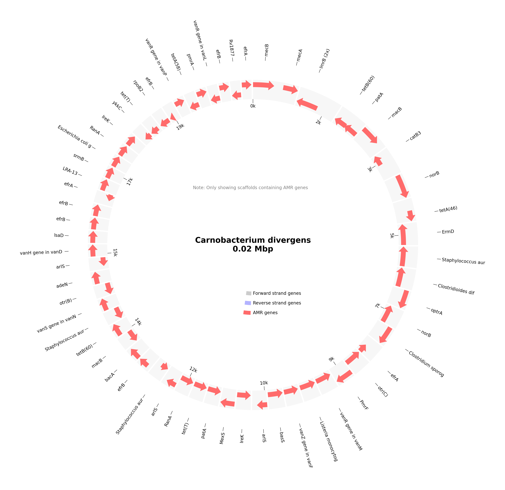

### Clostridioides difficile gyrB conferring resistance to fluoroquinolones
- **Mechanism**: antibiotic target alteration
- **Drug Classes**: fluoroquinolone antibiotic
- **AMR Family**: fluoroquinolone resistant gyrB
- **Locations**:
  - gnl|SPADES|PBDHLPBC_12949_1 : position 1-456

### Clostridium sporogenes cplR
- **Mechanism**: antibiotic target protection
- **Drug Classes**: lincosamide antibiotic; pleuromutilin antibiotic
- **AMR Family**: Miscellaneous ABC-F subfamily ATP-binding cassette ribosomal protection proteins
- **Locations**:
  - gnl|SPADES|PBDHLPBC_14376_1 : position 1-417

### ErmD
- **Mechanism**: antibiotic target alteration
- **Drug Classes**: macrolide antibiotic; lincosamide antibiotic; streptogramin antibiotic; streptogramin A antibiotic; streptogramin B antibiotic
- **AMR Family**: Erm 23S ribosomal RNA methyltransferase
- **Locations**:
  - gnl|SPADES|PBDHLPBC_11709_1 : position 2-496

### Escherichia coli gyrA conferring resistance to fluoroquinolones
- **Mechanism**: antibiotic target alteration
- **Drug Classes**: fluoroquinolone antibiotic
- **AMR Family**: fluoroquinolone resistant gyrA
- **Locations**:
  - gnl|SPADES|PBDHLPBC_27445_1 : position 1-255

### IreK (found in 2 locations)
- **Mechanism**: reduced permeability to antibiotic
- **Drug Classes**: cephalosporin
- **AMR Family**: Serine/threonine kinases
- **Locations**:
  - gnl|SPADES|PBDHLPBC_19382_1 : position 3-326
  - gnl|SPADES|PBDHLPBC_27896_1 : position 3-251

### LRA-13
- **Mechanism**: antibiotic inactivation
- **Drug Classes**: cephalosporin; penam
- **AMR Family**: class C LRA beta-lactamase; class D LRA beta-lactamase
- **Locations**:
  - gnl|SPADES|PBDHLPBC_25660_1 : position 2-265

### Listeria monocytogenes mprF
- **Mechanism**: antibiotic target alteration
- **Drug Classes**: peptide antibiotic
- **AMR Family**: defensin resistant mprF
- **Locations**:
  - gnl|SPADES|PBDHLPBC_16219_1 : position 2-376

### MexS
- **Mechanism**: antibiotic efflux
- **Drug Classes**: fluoroquinolone antibiotic; diaminopyrimidine antibiotic; phenicol antibiotic
- **AMR Family**: resistance-nodulation-cell division (RND) antibiotic efflux pump
- **Locations**:
  - gnl|SPADES|PBDHLPBC_19641_1 : position 3-323

### PmrF
- **Mechanism**: antibiotic target alteration
- **Drug Classes**: peptide antibiotic
- **AMR Family**: pmr phosphoethanolamine transferase
- **Locations**:
  - gnl|SPADES|PBDHLPBC_15472_1 : position 1-393

### RanA (found in 2 locations)
- **Mechanism**: antibiotic efflux
- **Drug Classes**: aminoglycoside antibiotic
- **AMR Family**: ATP-binding cassette (ABC) antibiotic efflux pump
- **Locations**:
  - gnl|SPADES|PBDHLPBC_20622_1 : position 1-309
  - gnl|SPADES|PBDHLPBC_27696_1 : position 1-252

### Rv1877
- **Mechanism**: antibiotic efflux
- **Drug Classes**: fluoroquinolone antibiotic
- **AMR Family**: major facilitator superfamily (MFS) antibiotic efflux pump
- **Locations**:
  - gnl|SPADES|PBDHLPBC_34402_1 : position 2-220

### Staphylococcus aureus LmrS
- **Mechanism**: antibiotic efflux
- **Drug Classes**: macrolide antibiotic; aminoglycoside antibiotic; oxazolidinone antibiotic; diaminopyrimidine antibiotic; phenicol antibiotic
- **AMR Family**: major facilitator superfamily (MFS) antibiotic efflux pump
- **Locations**:
  - gnl|SPADES|PBDHLPBC_20696_1 : position 3-179

### Staphylococcus aureus mupA conferring resistance to mupirocin
- **Mechanism**: antibiotic target alteration
- **Drug Classes**: mupirocin-like antibiotic
- **AMR Family**: antibiotic-resistant isoleucyl-tRNA synthetase (ileS)
- **Locations**:
  - gnl|SPADES|PBDHLPBC_12546_1 : position 2-469

### Staphylococcus aureus rpoB mutants conferring resistance to rifampicin
- **Mechanism**: antibiotic target alteration; antibiotic target replacement
- **Drug Classes**: rifamycin antibiotic
- **AMR Family**: rifamycin-resistant beta-subunit of RNA polymerase (rpoB)
- **Locations**:
  - gnl|SPADES|PBDHLPBC_23067_1 : position 3-281

### adeN
- **Mechanism**: antibiotic efflux
- **Drug Classes**: macrolide antibiotic; fluoroquinolone antibiotic; lincosamide antibiotic; carbapenem; cephalosporin; tetracycline antibiotic; rifamycin antibiotic; diaminopyrimidine antibiotic; phenicol antibiotic; penem
- **AMR Family**: resistance-nodulation-cell division (RND) antibiotic efflux pump
- **Locations**:
  - gnl|SPADES|PBDHLPBC_23564_1 : position 1-276

### arlS (found in 3 locations)
- **Mechanism**: antibiotic efflux
- **Drug Classes**: fluoroquinolone antibiotic; disinfecting agents and antiseptics
- **AMR Family**: major facilitator superfamily (MFS) antibiotic efflux pump
- **Locations**:
  - gnl|SPADES|PBDHLPBC_18715_1 : position 3-233
  - gnl|SPADES|PBDHLPBC_20590_1 : position 3-230
  - gnl|SPADES|PBDHLPBC_23581_1 : position 69-275

### bacA
- **Mechanism**: antibiotic target alteration
- **Drug Classes**: peptide antibiotic
- **AMR Family**: undecaprenyl pyrophosphate related proteins
- **Locations**:
  - gnl|SPADES|PBDHLPBC_21603_1 : position 2-268

### basS
- **Mechanism**: antibiotic target alteration; antibiotic efflux
- **Drug Classes**: peptide antibiotic
- **AMR Family**: pmr phosphoethanolamine transferase
- **Locations**:
  - gnl|SPADES|PBDHLPBC_17452_1 : position 2-355

### catB3
- **Mechanism**: antibiotic inactivation
- **Drug Classes**: phenicol antibiotic
- **AMR Family**: chloramphenicol acetyltransferase (CAT)
- **Locations**:
  - gnl|SPADES|PBDHLPBC_9282_1 : position 1-249

### efrA (found in 3 locations)
- **Mechanism**: antibiotic efflux
- **Drug Classes**: macrolide antibiotic; fluoroquinolone antibiotic; rifamycin antibiotic
- **AMR Family**: ATP-binding cassette (ABC) antibiotic efflux pump
- **Locations**:
  - gnl|SPADES|PBDHLPBC_14980_2 : position 198-404
  - gnl|SPADES|PBDHLPBC_25680_2 : position 110-265
  - gnl|SPADES|PBDHLPBC_34541_1 : position 2-217

### efrB (found in 5 locations)
- **Mechanism**: antibiotic efflux
- **Drug Classes**: macrolide antibiotic; fluoroquinolone antibiotic; rifamycin antibiotic
- **AMR Family**: ATP-binding cassette (ABC) antibiotic efflux pump
- **Locations**:
  - gnl|SPADES|PBDHLPBC_20748_1 : position 78-308
  - gnl|SPADES|PBDHLPBC_25197_1 : position 1-267
  - gnl|SPADES|PBDHLPBC_25518_1 : position 2-265
  - gnl|SPADES|PBDHLPBC_30690_1 : position 3-113
  - gnl|SPADES|PBDHLPBC_33818_1 : position 3-221

### lmrB (found in 2 locations)
- **Mechanism**: antibiotic efflux
- **Drug Classes**: lincosamide antibiotic; nucleoside antibiotic
- **AMR Family**: ATP-binding cassette (ABC) antibiotic efflux pump
- **Locations**:
  - gnl|SPADES|PBDHLPBC_5483_1 : position 2-517
  - gnl|SPADES|PBDHLPBC_5483_2 : position 463-969

### lsaD
- **Mechanism**: antibiotic target protection
- **Drug Classes**: lincosamide antibiotic; streptogramin antibiotic; streptogramin A antibiotic; pleuromutilin antibiotic
- **AMR Family**: lsa-type ABC-F protein
- **Locations**:
  - gnl|SPADES|PBDHLPBC_24886_1 : position 2-268

### macB (found in 2 locations)
- **Mechanism**: antibiotic efflux
- **Drug Classes**: macrolide antibiotic
- **AMR Family**: ATP-binding cassette (ABC) antibiotic efflux pump
- **Locations**:
  - gnl|SPADES|PBDHLPBC_21941_1 : position 2-292
  - gnl|SPADES|PBDHLPBC_9176_1 : position 1-444

### mecA
- **Mechanism**: antibiotic target replacement
- **Drug Classes**: penam
- **AMR Family**: methicillin resistant PBP2
- **Locations**:
  - gnl|SPADES|PBDHLPBC_5245_2 : position 677-1012

### mecB
- **Mechanism**: antibiotic target replacement
- **Drug Classes**: penam
- **AMR Family**: methicillin resistant PBP2
- **Locations**:
  - gnl|SPADES|PBDHLPBC_5245_1 : position 1-474

### norB (found in 2 locations)
- **Mechanism**: antibiotic efflux
- **Drug Classes**: fluoroquinolone antibiotic
- **AMR Family**: major facilitator superfamily (MFS) antibiotic efflux pump
- **Locations**:
  - gnl|SPADES|PBDHLPBC_10737_1 : position 3-536
  - gnl|SPADES|PBDHLPBC_14289_1 : position 2-421

### optrA
- **Mechanism**: antibiotic target protection
- **Drug Classes**: oxazolidinone antibiotic; phenicol antibiotic
- **AMR Family**: Miscellaneous ABC-F subfamily ATP-binding cassette ribosomal protection proteins
- **Locations**:
  - gnl|SPADES|PBDHLPBC_14270_1 : position 2-421

### otr(B)
- **Mechanism**: antibiotic efflux
- **Drug Classes**: tetracycline antibiotic
- **AMR Family**: major facilitator superfamily (MFS) antibiotic efflux pump
- **Locations**:
  - gnl|SPADES|PBDHLPBC_23487_1 : position 2-277

### otr(C)
- **Mechanism**: antibiotic efflux
- **Drug Classes**: tetracycline antibiotic
- **AMR Family**: ATP-binding cassette (ABC) antibiotic efflux pump
- **Locations**:
  - gnl|SPADES|PBDHLPBC_15107_1 : position 1-399

### patA (found in 2 locations)
- **Mechanism**: antibiotic efflux
- **Drug Classes**: fluoroquinolone antibiotic
- **AMR Family**: ATP-binding cassette (ABC) antibiotic efflux pump
- **Locations**:
  - gnl|SPADES|PBDHLPBC_20157_1 : position 2-316
  - gnl|SPADES|PBDHLPBC_8999_2 : position 285-629

### pmrA
- **Mechanism**: antibiotic efflux
- **Drug Classes**: fluoroquinolone antibiotic
- **AMR Family**: major facilitator superfamily (MFS) antibiotic efflux pump
- **Locations**:
  - gnl|SPADES|PBDHLPBC_32354_1 : position 1-228

### rpoB2
- **Mechanism**: antibiotic target alteration; antibiotic target replacement
- **Drug Classes**: rifamycin antibiotic
- **AMR Family**: rifamycin-resistant beta-subunit of RNA polymerase (rpoB)
- **Locations**:
  - gnl|SPADES|PBDHLPBC_29223_1 : position 1-246

### srmB
- **Mechanism**: antibiotic target protection
- **Drug Classes**: macrolide antibiotic
- **AMR Family**: Miscellaneous ABC-F subfamily ATP-binding cassette ribosomal protection proteins
- **Locations**:
  - gnl|SPADES|PBDHLPBC_26867_1 : position 1-258

### tet(T) (found in 2 locations)
- **Mechanism**: antibiotic target protection
- **Drug Classes**: tetracycline antibiotic
- **AMR Family**: tetracycline-resistant ribosomal protection protein
- **Locations**:
  - gnl|SPADES|PBDHLPBC_20443_1 : position 2-310
  - gnl|SPADES|PBDHLPBC_28544_1 : position 1-204

### tetA(46)
- **Mechanism**: antibiotic efflux
- **Drug Classes**: tetracycline antibiotic
- **AMR Family**: ATP-binding cassette (ABC) antibiotic efflux pump
- **Locations**:
  - gnl|SPADES|PBDHLPBC_11548_2 : position 263-502

### tetA(58)
- **Mechanism**: antibiotic efflux
- **Drug Classes**: tetracycline antibiotic
- **AMR Family**: major facilitator superfamily (MFS) antibiotic efflux pump
- **Locations**:
  - gnl|SPADES|PBDHLPBC_31730_1 : position 2-232

### tetB(60) (found in 2 locations)
- **Mechanism**: antibiotic efflux
- **Drug Classes**: tetracycline antibiotic
- **AMR Family**: ATP-binding cassette (ABC) antibiotic efflux pump
- **Locations**:
  - gnl|SPADES|PBDHLPBC_22043_1 : position 2-289
  - gnl|SPADES|PBDHLPBC_8999_1 : position 2-313

### vanH gene in vanD cluster
- **Mechanism**: antibiotic target alteration
- **Drug Classes**: glycopeptide antibiotic
- **AMR Family**: vanH; glycopeptide resistance gene cluster
- **Locations**:
  - gnl|SPADES|PBDHLPBC_24491_1 : position 2-271

### vanR gene in vanL cluster
- **Mechanism**: antibiotic target alteration
- **Drug Classes**: glycopeptide antibiotic
- **AMR Family**: glycopeptide resistance gene cluster; vanR
- **Locations**:
  - gnl|SPADES|PBDHLPBC_32820_1 : position 3-227

### vanR gene in vanM cluster
- **Mechanism**: antibiotic target alteration
- **Drug Classes**: glycopeptide antibiotic
- **AMR Family**: glycopeptide resistance gene cluster; vanR
- **Locations**:
  - gnl|SPADES|PBDHLPBC_15787_1 : position 10-384

### vanR gene in vanP cluster
- **Mechanism**: antibiotic target alteration
- **Drug Classes**: glycopeptide antibiotic
- **AMR Family**: glycopeptide resistance gene cluster; vanR
- **Locations**:
  - gnl|SPADES|PBDHLPBC_31063_1 : position 1-225

### vanS gene in vanN cluster
- **Mechanism**: antibiotic target alteration
- **Drug Classes**: glycopeptide antibiotic
- **AMR Family**: vanS; glycopeptide resistance gene cluster
- **Locations**:
  - gnl|SPADES|PBDHLPBC_23145_1 : position 2-280

### vanZ gene in vanF cluster
- **Mechanism**: antibiotic target alteration
- **Drug Classes**: glycopeptide antibiotic
- **AMR Family**: vanZ; glycopeptide resistance gene cluster
- **Locations**:
  - gnl|SPADES|PBDHLPBC_17187_1 : position 23-361

### ykkC
- **Mechanism**: antibiotic efflux
- **Drug Classes**: aminoglycoside antibiotic; tetracycline antibiotic; phenicol antibiotic
- **AMR Family**: small multidrug resistance (SMR) antibiotic efflux pump
- **Locations**:
  - gnl|SPADES|PBDHLPBC_28333_2 : position 86-250

## Carnobacterium maltaromaticum
**Strain Statistics:**
- Total genome length: 82.6 kbp
- Total scaffolds: 3231
- Scaffolds with AMR genes: 197
- Total genes annotated: 84
- Total AMR genes: 200
- Unique AMR genes: 105
- Distinct AMR mechanisms: 8
- Distinct AMR families: 46
- Distinct drug classes: 33

**Circos Plot:**

### AAC(3)-Ic
- **Mechanism**: antibiotic inactivation
- **Drug Classes**: aminoglycoside antibiotic
- **AMR Family**: AAC(3)
- **Locations**:
  - gnl|SPADES|PBDHLPBC_11019_1 : position 2-415

### AAC(6')-34
- **Mechanism**: antibiotic inactivation
- **Drug Classes**: aminoglycoside antibiotic
- **AMR Family**: AAC(6')
- **Locations**:
  - gnl|SPADES|PBDHLPBC_17285_1 : position 26-358

### Acinetobacter baumannii AbaQ
- **Mechanism**: antibiotic efflux
- **Drug Classes**: fluoroquinolone antibiotic
- **AMR Family**: major facilitator superfamily (MFS) antibiotic efflux pump
- **Locations**:
  - gnl|SPADES|PBDHLPBC_15417_1 : position 3-392

### Bifidobacterium adolescentis rpoB mutants conferring resistance to rifampicin
- **Mechanism**: antibiotic target alteration; antibiotic target replacement
- **Drug Classes**: rifamycin antibiotic
- **AMR Family**: rifamycin-resistant beta-subunit of RNA polymerase (rpoB)
- **Locations**:
  - gnl|SPADES|PBDHLPBC_21397_1 : position 2-298

### Bifidobacterium bifidum ileS conferring resistance to mupirocin
- **Mechanism**: antibiotic target alteration
- **Drug Classes**: mupirocin-like antibiotic
- **AMR Family**: antibiotic-resistant isoleucyl-tRNA synthetase (ileS)
- **Locations**:
  - gnl|SPADES|PBDHLPBC_13766_1 : position 3-434

### Bla1
- **Mechanism**: antibiotic inactivation
- **Drug Classes**: penam
- **AMR Family**: class A Bacillus anthracis Bla beta-lactamase
- **Locations**:
  - gnl|SPADES|PBDHLPBC_25976_1 : position 3-263

### CRP
- **Mechanism**: antibiotic efflux
- **Drug Classes**: macrolide antibiotic; fluoroquinolone antibiotic; penam
- **AMR Family**: resistance-nodulation-cell division (RND) antibiotic efflux pump
- **Locations**:
  - gnl|SPADES|PBDHLPBC_18285_1 : position 1-342

### Chlamydia trachomatis intrinsic murA conferring resistance to fosfomycin
- **Mechanism**: antibiotic target alteration
- **Drug Classes**: phosphonic acid antibiotic
- **AMR Family**: antibiotic-resistant murA transferase
- **Locations**:
  - gnl|SPADES|PBDHLPBC_22384_1 : position 2-286

### Clostridioides difficile gyrB conferring resistance to fluoroquinolones
- **Mechanism**: antibiotic target alteration
- **Drug Classes**: fluoroquinolone antibiotic
- **AMR Family**: fluoroquinolone resistant gyrB
- **Locations**:
  - gnl|SPADES|PBDHLPBC_21901_1 : position 1-291

### Corynebacterium striatum tetA (found in 3 locations)
- **Mechanism**: antibiotic efflux
- **Drug Classes**: penam; tetracycline antibiotic
- **AMR Family**: major facilitator superfamily (MFS) antibiotic efflux pump
- **Locations**:
  - gnl|SPADES|PBDHLPBC_21821_1 : position 2-292
  - gnl|SPADES|PBDHLPBC_26270_1 : position 3-260
  - gnl|SPADES|PBDHLPBC_30384_1 : position 1-240

### EdeQ
- **Mechanism**: antibiotic inactivation
- **Drug Classes**: peptide antibiotic; polyamine antibiotic
- **AMR Family**: Edeine acetyltransferase
- **Locations**:
  - gnl|SPADES|PBDHLPBC_10538_1 : position 69-521

### ErmR
- **Mechanism**: antibiotic target alteration
- **Drug Classes**: macrolide antibiotic; lincosamide antibiotic; streptogramin antibiotic; streptogramin A antibiotic; streptogramin B antibiotic
- **AMR Family**: Erm 23S ribosomal RNA methyltransferase
- **Locations**:
  - gnl|SPADES|PBDHLPBC_5210_1 : position 2-886

### Escherichia coli EF-Tu mutants conferring resistance to Pulvomycin
- **Mechanism**: antibiotic target alteration
- **Drug Classes**: elfamycin antibiotic
- **AMR Family**: elfamycin resistant EF-Tu
- **Locations**:
  - gnl|SPADES|PBDHLPBC_17668_1 : position 2-352

### Escherichia coli EF-Tu mutants conferring resistance to kirromycin
- **Mechanism**: antibiotic target alteration
- **Drug Classes**: elfamycin antibiotic
- **AMR Family**: elfamycin resistant EF-Tu
- **Locations**:
  - gnl|SPADES|PBDHLPBC_16050_1 : position 2-226

### HelR
- **Mechanism**: antibiotic target protection
- **Drug Classes**: rifamycin antibiotic
- **AMR Family**: helicase-like RNA polymerase protection protein
- **Locations**:
  - gnl|SPADES|PBDHLPBC_12087_1 : position 3-485

### Helicobacter pylori pbp1 mutants conferring resistance to amoxicillin
- **Mechanism**: antibiotic target alteration
- **Drug Classes**: cephalosporin; cephamycin; penam
- **AMR Family**: Penicillin-binding protein mutations conferring resistance to beta-lactam antibiotics
- **Locations**:
  - gnl|SPADES|PBDHLPBC_9633_1 : position 3-590

### Helicobacter pylori rdxA mutation conferring resistance to metronidazole (found in 2 locations)
- **Mechanism**: antibiotic target alteration
- **Drug Classes**: nitroimidazole antibiotic
- **AMR Family**: Antibiotic resistant Helicobacter pylori nitroreductase
- **Locations**:
  - gnl|SPADES|PBDHLPBC_15748_2 : position 184-387
  - gnl|SPADES|PBDHLPBC_4631_2 : position 514-1140

### Listeria monocytogenes mprF
- **Mechanism**: antibiotic target alteration
- **Drug Classes**: peptide antibiotic
- **AMR Family**: defensin resistant mprF
- **Locations**:
  - gnl|SPADES|PBDHLPBC_10870_1 : position 3-347

### MexS
- **Mechanism**: antibiotic efflux
- **Drug Classes**: fluoroquinolone antibiotic; diaminopyrimidine antibiotic; phenicol antibiotic
- **AMR Family**: resistance-nodulation-cell division (RND) antibiotic efflux pump
- **Locations**:
  - gnl|SPADES|PBDHLPBC_6419_1 : position 1-843

### Morganella morganii gyrB conferring resistance to fluoroquinolones
- **Mechanism**: antibiotic target alteration
- **Drug Classes**: fluoroquinolone antibiotic
- **AMR Family**: fluoroquinolone resistant gyrB
- **Locations**:
  - gnl|SPADES|PBDHLPBC_23156_1 : position 1-279

### Mycolicibacterium smegmatis ndh with mutation conferring resistance to isoniazid
- **Mechanism**: antibiotic target alteration
- **Drug Classes**: isoniazid-like antibiotic
- **AMR Family**: antibiotic resistant ndh
- **Locations**:
  - gnl|SPADES|PBDHLPBC_2698_2 : position 994-1998

### Pseudomonas aeruginosa CpxR
- **Mechanism**: antibiotic efflux
- **Drug Classes**: macrolide antibiotic; fluoroquinolone antibiotic; monobactam; aminoglycoside antibiotic; carbapenem; cephalosporin; cephamycin; penam; tetracycline antibiotic; peptide antibiotic; aminocoumarin antibiotic; diaminopyrimidine antibiotic; sulfonamide antibiotic; phenicol antibiotic; penem
- **AMR Family**: resistance-nodulation-cell division (RND) antibiotic efflux pump
- **Locations**:
  - gnl|SPADES|PBDHLPBC_35308_1 : position 2-214

### Pseudomonas aeruginosa catB6
- **Mechanism**: antibiotic inactivation
- **Drug Classes**: phenicol antibiotic
- **AMR Family**: chloramphenicol acetyltransferase (CAT)
- **Locations**:
  - gnl|SPADES|PBDHLPBC_26967_1 : position 2-256

### QnrS9
- **Mechanism**: antibiotic target protection
- **Drug Classes**: fluoroquinolone antibiotic
- **AMR Family**: quinolone resistance protein (qnr)
- **Locations**:
  - gnl|SPADES|PBDHLPBC_33148_1 : position 2-226

### RanA (found in 7 locations)
- **Mechanism**: antibiotic efflux
- **Drug Classes**: aminoglycoside antibiotic
- **AMR Family**: ATP-binding cassette (ABC) antibiotic efflux pump
- **Locations**:
  - gnl|SPADES|PBDHLPBC_10717_1 : position 1-537
  - gnl|SPADES|PBDHLPBC_11409_1 : position 1-507
  - gnl|SPADES|PBDHLPBC_15924_1 : position 1-381
  - gnl|SPADES|PBDHLPBC_17626_1 : position 1-354
  - gnl|SPADES|PBDHLPBC_23295_1 : position 1-279
  - gnl|SPADES|PBDHLPBC_32072_1 : position 1-231
  - gnl|SPADES|PBDHLPBC_36167_1 : position 2-211

### Rv1877
- **Mechanism**: antibiotic efflux
- **Drug Classes**: fluoroquinolone antibiotic
- **AMR Family**: major facilitator superfamily (MFS) antibiotic efflux pump
- **Locations**:
  - gnl|SPADES|PBDHLPBC_29407_1 : position 3-245

### Staphylococcus aureus LmrS
- **Mechanism**: antibiotic efflux
- **Drug Classes**: macrolide antibiotic; aminoglycoside antibiotic; oxazolidinone antibiotic; diaminopyrimidine antibiotic; phenicol antibiotic
- **AMR Family**: major facilitator superfamily (MFS) antibiotic efflux pump
- **Locations**:
  - gnl|SPADES|PBDHLPBC_19704_1 : position 3-281

### Staphylococcus aureus mupA conferring resistance to mupirocin (found in 2 locations)
- **Mechanism**: antibiotic target alteration
- **Drug Classes**: mupirocin-like antibiotic
- **AMR Family**: antibiotic-resistant isoleucyl-tRNA synthetase (ileS)
- **Locations**:
  - gnl|SPADES|PBDHLPBC_26432_1 : position 3-260
  - gnl|SPADES|PBDHLPBC_35439_1 : position 1-213

### Staphylococcus aureus mupB conferring resistance to mupirocin
- **Mechanism**: antibiotic target alteration
- **Drug Classes**: mupirocin-like antibiotic
- **AMR Family**: antibiotic-resistant isoleucyl-tRNA synthetase (ileS)
- **Locations**:
  - gnl|SPADES|PBDHLPBC_9091_1 : position 3-623

### Staphylococcus aureus murA with mutation conferring resistance to fosfomycin
- **Mechanism**: antibiotic target alteration
- **Drug Classes**: phosphonic acid antibiotic
- **AMR Family**: antibiotic-resistant murA transferase
- **Locations**:
  - gnl|SPADES|PBDHLPBC_8808_1 : position 2-640

### Staphylococcus aureus rpoB mutants conferring resistance to rifampicin
- **Mechanism**: antibiotic target alteration; antibiotic target replacement
- **Drug Classes**: rifamycin antibiotic
- **AMR Family**: rifamycin-resistant beta-subunit of RNA polymerase (rpoB)
- **Locations**:
  - gnl|SPADES|PBDHLPBC_20094_1 : position 1-315

### Streptomyces rimosus otr(A)
- **Mechanism**: antibiotic target protection
- **Drug Classes**: tetracycline antibiotic
- **AMR Family**: tetracycline-resistant ribosomal protection protein
- **Locations**:
  - gnl|SPADES|PBDHLPBC_13338_2 : position 213-446

### TaeA (found in 5 locations)
- **Mechanism**: antibiotic efflux
- **Drug Classes**: pleuromutilin antibiotic
- **AMR Family**: ATP-binding cassette (ABC) antibiotic efflux pump
- **Locations**:
  - gnl|SPADES|PBDHLPBC_17570_1 : position 1-354
  - gnl|SPADES|PBDHLPBC_18209_1 : position 2-343
  - gnl|SPADES|PBDHLPBC_18522_1 : position 157-339
  - gnl|SPADES|PBDHLPBC_28631_1 : position 3-248
  - gnl|SPADES|PBDHLPBC_32036_1 : position 2-232

### TxR (found in 3 locations)
- **Mechanism**: antibiotic efflux
- **Drug Classes**: tetracycline antibiotic
- **AMR Family**: ATP-binding cassette (ABC) antibiotic efflux pump
- **Locations**:
  - gnl|SPADES|PBDHLPBC_11998_1 : position 3-488
  - gnl|SPADES|PBDHLPBC_12177_1 : position 1-480
  - gnl|SPADES|PBDHLPBC_25146_1 : position 3-266

### VatI
- **Mechanism**: antibiotic inactivation
- **Drug Classes**: streptogramin antibiotic; streptogramin A antibiotic
- **AMR Family**: streptogramin vat acetyltransferase
- **Locations**:
  - gnl|SPADES|PBDHLPBC_10969_1 : position 94-528

### YojI
- **Mechanism**: antibiotic efflux
- **Drug Classes**: peptide antibiotic
- **AMR Family**: ATP-binding cassette (ABC) antibiotic efflux pump
- **Locations**:
  - gnl|SPADES|PBDHLPBC_21020_1 : position 2-304

### aadK
- **Mechanism**: antibiotic inactivation
- **Drug Classes**: aminoglycoside antibiotic
- **AMR Family**: ANT(6)
- **Locations**:
  - gnl|SPADES|PBDHLPBC_34590_1 : position 1-219

### aadT
- **Mechanism**: antibiotic efflux
- **Drug Classes**: macrolide antibiotic; tetracycline antibiotic; disinfecting agents and antiseptics
- **AMR Family**: major facilitator superfamily (MFS) antibiotic efflux pump
- **Locations**:
  - gnl|SPADES|PBDHLPBC_18562_1 : position 1-339

### adeR
- **Mechanism**: antibiotic efflux
- **Drug Classes**: glycylcycline; tetracycline antibiotic
- **AMR Family**: resistance-nodulation-cell division (RND) antibiotic efflux pump
- **Locations**:
  - gnl|SPADES|PBDHLPBC_3294_2 : position 206-904

### arlR (found in 5 locations)
- **Mechanism**: antibiotic efflux
- **Drug Classes**: fluoroquinolone antibiotic; disinfecting agents and antiseptics
- **AMR Family**: major facilitator superfamily (MFS) antibiotic efflux pump
- **Locations**:
  - gnl|SPADES|PBDHLPBC_11962_1 : position 3-209
  - gnl|SPADES|PBDHLPBC_12154_1 : position 1-483
  - gnl|SPADES|PBDHLPBC_12353_1 : position 3-476
  - gnl|SPADES|PBDHLPBC_15413_1 : position 3-242
  - gnl|SPADES|PBDHLPBC_27929_1 : position 2-253

### arlS (found in 6 locations)
- **Mechanism**: antibiotic efflux
- **Drug Classes**: fluoroquinolone antibiotic; disinfecting agents and antiseptics
- **AMR Family**: major facilitator superfamily (MFS) antibiotic efflux pump
- **Locations**:
  - gnl|SPADES|PBDHLPBC_16359_1 : position 3-374
  - gnl|SPADES|PBDHLPBC_18761_1 : position 1-336
  - gnl|SPADES|PBDHLPBC_24506_1 : position 3-272
  - gnl|SPADES|PBDHLPBC_33479_1 : position 5-223
  - gnl|SPADES|PBDHLPBC_35127_1 : position 2-217
  - gnl|SPADES|PBDHLPBC_7986_1 : position 2-394

### bacA
- **Mechanism**: antibiotic target alteration
- **Drug Classes**: peptide antibiotic
- **AMR Family**: undecaprenyl pyrophosphate related proteins
- **Locations**:
  - gnl|SPADES|PBDHLPBC_10872_1 : position 84-530

### baeR
- **Mechanism**: antibiotic efflux
- **Drug Classes**: aminoglycoside antibiotic; aminocoumarin antibiotic
- **AMR Family**: resistance-nodulation-cell division (RND) antibiotic efflux pump
- **Locations**:
  - gnl|SPADES|PBDHLPBC_16077_1 : position 2-379

### baeS (found in 2 locations)
- **Mechanism**: antibiotic efflux
- **Drug Classes**: aminoglycoside antibiotic; aminocoumarin antibiotic
- **AMR Family**: resistance-nodulation-cell division (RND) antibiotic efflux pump
- **Locations**:
  - gnl|SPADES|PBDHLPBC_20054_1 : position 1-318
  - gnl|SPADES|PBDHLPBC_34581_1 : position 2-217

### basS
- **Mechanism**: antibiotic target alteration; antibiotic efflux
- **Drug Classes**: peptide antibiotic
- **AMR Family**: pmr phosphoethanolamine transferase
- **Locations**:
  - gnl|SPADES|PBDHLPBC_20571_1 : position 13-309

### bcrA (found in 8 locations)
- **Mechanism**: antibiotic efflux
- **Drug Classes**: peptide antibiotic
- **AMR Family**: ATP-binding cassette (ABC) antibiotic efflux pump
- **Locations**:
  - gnl|SPADES|PBDHLPBC_12737_1 : position 3-464
  - gnl|SPADES|PBDHLPBC_25665_1 : position 2-265
  - gnl|SPADES|PBDHLPBC_30729_1 : position 1-237
  - gnl|SPADES|PBDHLPBC_31566_1 : position 3-233
  - gnl|SPADES|PBDHLPBC_36243_1 : position 3-209
  - gnl|SPADES|PBDHLPBC_5041_2 : position 388-1017
  - gnl|SPADES|PBDHLPBC_8133_2 : position 262-684
  - gnl|SPADES|PBDHLPBC_8134_2 : position 392-685

### catB11
- **Mechanism**: antibiotic inactivation
- **Drug Classes**: phenicol antibiotic
- **AMR Family**: chloramphenicol acetyltransferase (CAT)
- **Locations**:
  - gnl|SPADES|PBDHLPBC_24381_1 : position 121-273

### clbB
- **Mechanism**: antibiotic target alteration
- **Drug Classes**: lincosamide antibiotic; streptogramin antibiotic; streptogramin A antibiotic; oxazolidinone antibiotic; phenicol antibiotic; pleuromutilin antibiotic
- **AMR Family**: Cfr 23S ribosomal RNA methyltransferase
- **Locations**:
  - gnl|SPADES|PBDHLPBC_9414_1 : position 3-287

### dfrC
- **Mechanism**: antibiotic target replacement
- **Drug Classes**: diaminopyrimidine antibiotic
- **AMR Family**: trimethoprim resistant dihydrofolate reductase dfr
- **Locations**:
  - gnl|SPADES|PBDHLPBC_22598_1 : position 1-99

### efmA (found in 2 locations)
- **Mechanism**: antibiotic efflux
- **Drug Classes**: macrolide antibiotic; fluoroquinolone antibiotic
- **AMR Family**: major facilitator superfamily (MFS) antibiotic efflux pump
- **Locations**:
  - gnl|SPADES|PBDHLPBC_20572_1 : position 210-308
  - gnl|SPADES|PBDHLPBC_24875_1 : position 2-268

### efrA (found in 6 locations)
- **Mechanism**: antibiotic efflux
- **Drug Classes**: macrolide antibiotic; fluoroquinolone antibiotic; rifamycin antibiotic
- **AMR Family**: ATP-binding cassette (ABC) antibiotic efflux pump
- **Locations**:
  - gnl|SPADES|PBDHLPBC_13042_1 : position 2-247
  - gnl|SPADES|PBDHLPBC_19843_1 : position 2-319
  - gnl|SPADES|PBDHLPBC_22897_1 : position 3-281
  - gnl|SPADES|PBDHLPBC_26278_1 : position 62-262
  - gnl|SPADES|PBDHLPBC_5915_1 : position 1-906
  - gnl|SPADES|PBDHLPBC_6928_1 : position 1-570

### efrB (found in 4 locations)
- **Mechanism**: antibiotic efflux
- **Drug Classes**: macrolide antibiotic; fluoroquinolone antibiotic; rifamycin antibiotic
- **AMR Family**: ATP-binding cassette (ABC) antibiotic efflux pump
- **Locations**:
  - gnl|SPADES|PBDHLPBC_10561_1 : position 3-545
  - gnl|SPADES|PBDHLPBC_24512_1 : position 2-271
  - gnl|SPADES|PBDHLPBC_24636_1 : position 2-271
  - gnl|SPADES|PBDHLPBC_33688_1 : position 3-224

### evgS (found in 2 locations)
- **Mechanism**: antibiotic efflux
- **Drug Classes**: macrolide antibiotic; fluoroquinolone antibiotic; penam; tetracycline antibiotic
- **AMR Family**: major facilitator superfamily (MFS) antibiotic efflux pump; resistance-nodulation-cell division (RND) antibiotic efflux pump
- **Locations**:
  - gnl|SPADES|PBDHLPBC_13032_1 : position 1-453
  - gnl|SPADES|PBDHLPBC_28950_1 : position 13-246

### fusB
- **Mechanism**: antibiotic target protection
- **Drug Classes**: fusidane antibiotic
- **AMR Family**: Target protecting FusB-type protein conferring resistance to Fusidic acid
- **Locations**:
  - gnl|SPADES|PBDHLPBC_34983_1 : position 1-216

### fusC
- **Mechanism**: antibiotic target protection
- **Drug Classes**: fusidane antibiotic
- **AMR Family**: Target protecting FusB-type protein conferring resistance to Fusidic acid
- **Locations**:
  - gnl|SPADES|PBDHLPBC_12937_1 : position 1-249

### kdpD (found in 2 locations)
- **Mechanism**: antibiotic efflux
- **Drug Classes**: aminoglycoside antibiotic
- **AMR Family**: kdpDE
- **Locations**:
  - gnl|SPADES|PBDHLPBC_20331_1 : position 2-313
  - gnl|SPADES|PBDHLPBC_28730_2 : position 107-247

### lmrB (found in 3 locations)
- **Mechanism**: antibiotic efflux
- **Drug Classes**: lincosamide antibiotic; nucleoside antibiotic
- **AMR Family**: ATP-binding cassette (ABC) antibiotic efflux pump
- **Locations**:
  - gnl|SPADES|PBDHLPBC_11884_2 : position 305-490
  - gnl|SPADES|PBDHLPBC_18140_1 : position 3-344
  - gnl|SPADES|PBDHLPBC_30535_1 : position 3-239

### lmrD (found in 4 locations)
- **Mechanism**: antibiotic efflux
- **Drug Classes**: lincosamide antibiotic
- **AMR Family**: ATP-binding cassette (ABC) antibiotic efflux pump
- **Locations**:
  - gnl|SPADES|PBDHLPBC_13336_1 : position 2-445
  - gnl|SPADES|PBDHLPBC_26760_1 : position 3-257
  - gnl|SPADES|PBDHLPBC_36376_1 : position 1-210
  - gnl|SPADES|PBDHLPBC_8356_1 : position 3-503

### lsaC
- **Mechanism**: antibiotic target protection
- **Drug Classes**: lincosamide antibiotic; streptogramin antibiotic; pleuromutilin antibiotic
- **AMR Family**: lsa-type ABC-F protein
- **Locations**:
  - gnl|SPADES|PBDHLPBC_11198_1 : position 3-212

### macB (found in 21 locations)
- **Mechanism**: antibiotic efflux
- **Drug Classes**: macrolide antibiotic
- **AMR Family**: ATP-binding cassette (ABC) antibiotic efflux pump
- **Locations**:
  - gnl|SPADES|PBDHLPBC_10054_1 : position 1-567
  - gnl|SPADES|PBDHLPBC_10086_1 : position 1-438
  - gnl|SPADES|PBDHLPBC_10575_1 : position 1-324
  - gnl|SPADES|PBDHLPBC_12905_1 : position 52-459
  - gnl|SPADES|PBDHLPBC_13315_1 : position 2-448
  - gnl|SPADES|PBDHLPBC_15238_1 : position 2-397
  - gnl|SPADES|PBDHLPBC_16396_1 : position 36-374
  - gnl|SPADES|PBDHLPBC_19021_1 : position 3-332
  - gnl|SPADES|PBDHLPBC_19784_1 : position 2-265
  - gnl|SPADES|PBDHLPBC_19968_2 : position 82-318
  - gnl|SPADES|PBDHLPBC_20658_1 : position 3-308
  - gnl|SPADES|PBDHLPBC_20788_1 : position 1-306
  - gnl|SPADES|PBDHLPBC_21804_1 : position 2-292
  - gnl|SPADES|PBDHLPBC_23880_1 : position 2-274
  - gnl|SPADES|PBDHLPBC_32588_1 : position 2-229
  - gnl|SPADES|PBDHLPBC_32683_1 : position 1-198
  - gnl|SPADES|PBDHLPBC_34102_1 : position 2-220
  - gnl|SPADES|PBDHLPBC_35452_1 : position 2-214
  - gnl|SPADES|PBDHLPBC_6195_1 : position 3-485
  - gnl|SPADES|PBDHLPBC_8449_1 : position 161-661
  - gnl|SPADES|PBDHLPBC_9022_2 : position 104-625

### mdtG
- **Mechanism**: antibiotic efflux
- **Drug Classes**: phosphonic acid antibiotic
- **AMR Family**: major facilitator superfamily (MFS) antibiotic efflux pump
- **Locations**:
  - gnl|SPADES|PBDHLPBC_5457_1 : position 3-104

### mecB
- **Mechanism**: antibiotic target replacement
- **Drug Classes**: penam
- **AMR Family**: methicillin resistant PBP2
- **Locations**:
  - gnl|SPADES|PBDHLPBC_16341_1 : position 2-373

### mphO
- **Mechanism**: antibiotic inactivation
- **Drug Classes**: macrolide antibiotic
- **AMR Family**: macrolide phosphotransferase (MPH)
- **Locations**:
  - gnl|SPADES|PBDHLPBC_5446_2 : position 216-974

### mreA
- **Mechanism**: antibiotic efflux
- **Drug Classes**: macrolide antibiotic
- **AMR Family**: major facilitator superfamily (MFS) antibiotic efflux pump
- **Locations**:
  - gnl|SPADES|PBDHLPBC_22202_1 : position 1-198

### msbA (found in 3 locations)
- **Mechanism**: antibiotic efflux
- **Drug Classes**: nitroimidazole antibiotic
- **AMR Family**: ATP-binding cassette (ABC) antibiotic efflux pump
- **Locations**:
  - gnl|SPADES|PBDHLPBC_14799_2 : position 55-408
  - gnl|SPADES|PBDHLPBC_27277_1 : position 2-256
  - gnl|SPADES|PBDHLPBC_9808_1 : position 1-582

### novA (found in 3 locations)
- **Mechanism**: antibiotic efflux
- **Drug Classes**: aminocoumarin antibiotic
- **AMR Family**: ATP-binding cassette (ABC) antibiotic efflux pump
- **Locations**:
  - gnl|SPADES|PBDHLPBC_10460_1 : position 2-262
  - gnl|SPADES|PBDHLPBC_25901_1 : position 3-263
  - gnl|SPADES|PBDHLPBC_9172_1 : position 2-616

### oleC
- **Mechanism**: antibiotic efflux
- **Drug Classes**: macrolide antibiotic
- **AMR Family**: ATP-binding cassette (ABC) antibiotic efflux pump
- **Locations**:
  - gnl|SPADES|PBDHLPBC_30612_1 : position 120-239

### optrA (found in 3 locations)
- **Mechanism**: antibiotic target protection
- **Drug Classes**: oxazolidinone antibiotic; phenicol antibiotic
- **AMR Family**: Miscellaneous ABC-F subfamily ATP-binding cassette ribosomal protection proteins
- **Locations**:
  - gnl|SPADES|PBDHLPBC_10681_1 : position 2-538
  - gnl|SPADES|PBDHLPBC_15154_1 : position 3-398
  - gnl|SPADES|PBDHLPBC_8977_1 : position 61-630

### patA (found in 3 locations)
- **Mechanism**: antibiotic efflux
- **Drug Classes**: fluoroquinolone antibiotic
- **AMR Family**: ATP-binding cassette (ABC) antibiotic efflux pump
- **Locations**:
  - gnl|SPADES|PBDHLPBC_12503_2 : position 240-470
  - gnl|SPADES|PBDHLPBC_13796_1 : position 2-361
  - gnl|SPADES|PBDHLPBC_26118_1 : position 2-247

### patB (found in 4 locations)
- **Mechanism**: antibiotic efflux
- **Drug Classes**: fluoroquinolone antibiotic
- **AMR Family**: ATP-binding cassette (ABC) antibiotic efflux pump
- **Locations**:
  - gnl|SPADES|PBDHLPBC_12760_1 : position 3-461
  - gnl|SPADES|PBDHLPBC_12866_1 : position 3-317
  - gnl|SPADES|PBDHLPBC_17801_1 : position 2-352
  - gnl|SPADES|PBDHLPBC_21596_1 : position 3-296

### ramA
- **Mechanism**: antibiotic efflux; reduced permeability to antibiotic
- **Drug Classes**: fluoroquinolone antibiotic; monobactam; carbapenem; cephalosporin; glycylcycline; cephamycin; penam; tetracycline antibiotic; rifamycin antibiotic; phenicol antibiotic; penem; disinfecting agents and antiseptics
- **AMR Family**: resistance-nodulation-cell division (RND) antibiotic efflux pump; General Bacterial Porin with reduced permeability to beta-lactams
- **Locations**:
  - gnl|SPADES|PBDHLPBC_10484_1 : position 3-530

### rpoB2 (found in 3 locations)
- **Mechanism**: antibiotic target alteration; antibiotic target replacement
- **Drug Classes**: rifamycin antibiotic
- **AMR Family**: rifamycin-resistant beta-subunit of RNA polymerase (rpoB)
- **Locations**:
  - gnl|SPADES|PBDHLPBC_11677_1 : position 3-467
  - gnl|SPADES|PBDHLPBC_28928_1 : position 1-246
  - gnl|SPADES|PBDHLPBC_32101_1 : position 3-230

### salC
- **Mechanism**: antibiotic target protection
- **Drug Classes**: lincosamide antibiotic; streptogramin antibiotic; streptogramin A antibiotic; pleuromutilin antibiotic
- **AMR Family**: sal-type ABC-F protein
- **Locations**:
  - gnl|SPADES|PBDHLPBC_5816_1 : position 3-350

### sta
- **Mechanism**: antibiotic inactivation
- **Drug Classes**: nucleoside antibiotic
- **AMR Family**: streptothricin acetyltransferase (SAT)
- **Locations**:
  - gnl|SPADES|PBDHLPBC_18224_1 : position 1-345

### tet(35)
- **Mechanism**: antibiotic efflux
- **Drug Classes**: tetracycline antibiotic
- **AMR Family**: ATP-binding cassette (ABC) antibiotic efflux pump
- **Locations**:
  - gnl|SPADES|PBDHLPBC_32220_1 : position 2-229

### tet(42) (found in 2 locations)
- **Mechanism**: antibiotic efflux
- **Drug Classes**: tetracycline antibiotic
- **AMR Family**: major facilitator superfamily (MFS) antibiotic efflux pump
- **Locations**:
  - gnl|SPADES|PBDHLPBC_15372_1 : position 1-393
  - gnl|SPADES|PBDHLPBC_28886_1 : position 2-247

### tet(M)
- **Mechanism**: antibiotic target protection
- **Drug Classes**: tetracycline antibiotic
- **AMR Family**: tetracycline-resistant ribosomal protection protein
- **Locations**:
  - gnl|SPADES|PBDHLPBC_26033_1 : position 1-261

### tet(O/32/O)
- **Mechanism**: antibiotic target protection
- **Drug Classes**: tetracycline antibiotic
- **AMR Family**: tetracycline-resistant ribosomal protection protein
- **Locations**:
  - gnl|SPADES|PBDHLPBC_32600_1 : position 2-229

### tet(Q)
- **Mechanism**: antibiotic target protection
- **Drug Classes**: tetracycline antibiotic
- **AMR Family**: tetracycline-resistant ribosomal protection protein
- **Locations**:
  - gnl|SPADES|PBDHLPBC_13338_1 : position 2-256

### tet(W)
- **Mechanism**: antibiotic target protection
- **Drug Classes**: tetracycline antibiotic
- **AMR Family**: tetracycline-resistant ribosomal protection protein
- **Locations**:
  - gnl|SPADES|PBDHLPBC_17862_1 : position 3-350

### tetA(46)
- **Mechanism**: antibiotic efflux
- **Drug Classes**: tetracycline antibiotic
- **AMR Family**: ATP-binding cassette (ABC) antibiotic efflux pump
- **Locations**:
  - gnl|SPADES|PBDHLPBC_5121_1 : position 1-186

### tetA(58) (found in 5 locations)
- **Mechanism**: antibiotic efflux
- **Drug Classes**: tetracycline antibiotic
- **AMR Family**: major facilitator superfamily (MFS) antibiotic efflux pump
- **Locations**:
  - gnl|SPADES|PBDHLPBC_11198_2 : position 216-515
  - gnl|SPADES|PBDHLPBC_19414_1 : position 1-327
  - gnl|SPADES|PBDHLPBC_28628_1 : position 2-247
  - gnl|SPADES|PBDHLPBC_8742_1 : position 2-259
  - gnl|SPADES|PBDHLPBC_9768_1 : position 3-404

### tetA(60)
- **Mechanism**: antibiotic efflux
- **Drug Classes**: tetracycline antibiotic
- **AMR Family**: ATP-binding cassette (ABC) antibiotic efflux pump
- **Locations**:
  - gnl|SPADES|PBDHLPBC_17924_1 : position 98-349

### tetB(46) (found in 3 locations)
- **Mechanism**: antibiotic efflux
- **Drug Classes**: tetracycline antibiotic
- **AMR Family**: ATP-binding cassette (ABC) antibiotic efflux pump
- **Locations**:
  - gnl|SPADES|PBDHLPBC_32994_1 : position 2-193
  - gnl|SPADES|PBDHLPBC_33437_1 : position 2-223
  - gnl|SPADES|PBDHLPBC_35462_1 : position 1-213

### tetB(60) (found in 2 locations)
- **Mechanism**: antibiotic efflux
- **Drug Classes**: tetracycline antibiotic
- **AMR Family**: ATP-binding cassette (ABC) antibiotic efflux pump
- **Locations**:
  - gnl|SPADES|PBDHLPBC_16886_1 : position 2-364
  - gnl|SPADES|PBDHLPBC_23169_1 : position 2-280

### vanH gene in vanP cluster (found in 2 locations)
- **Mechanism**: antibiotic target alteration
- **Drug Classes**: glycopeptide antibiotic
- **AMR Family**: vanH; glycopeptide resistance gene cluster
- **Locations**:
  - gnl|SPADES|PBDHLPBC_31130_1 : position 1-234
  - gnl|SPADES|PBDHLPBC_32166_1 : position 1-231

### vanL (found in 2 locations)
- **Mechanism**: antibiotic target alteration
- **Drug Classes**: glycopeptide antibiotic
- **AMR Family**: glycopeptide resistance gene cluster; Van ligase
- **Locations**:
  - gnl|SPADES|PBDHLPBC_14066_1 : position 3-425
  - gnl|SPADES|PBDHLPBC_22197_1 : position 22-288

### vanP
- **Mechanism**: antibiotic target alteration
- **Drug Classes**: glycopeptide antibiotic
- **AMR Family**: glycopeptide resistance gene cluster; Van ligase
- **Locations**:
  - gnl|SPADES|PBDHLPBC_10598_1 : position 1-486

### vanR gene in vanB cluster (found in 3 locations)
- **Mechanism**: antibiotic target alteration
- **Drug Classes**: glycopeptide antibiotic
- **AMR Family**: glycopeptide resistance gene cluster; vanR
- **Locations**:
  - gnl|SPADES|PBDHLPBC_12733_1 : position 113-463
  - gnl|SPADES|PBDHLPBC_17007_1 : position 43-363
  - gnl|SPADES|PBDHLPBC_6481_2 : position 655-837

### vanR gene in vanE cluster
- **Mechanism**: antibiotic target alteration
- **Drug Classes**: glycopeptide antibiotic
- **AMR Family**: glycopeptide resistance gene cluster; vanR
- **Locations**:
  - gnl|SPADES|PBDHLPBC_23714_1 : position 1-276

### vanR gene in vanI cluster
- **Mechanism**: antibiotic target alteration
- **Drug Classes**: glycopeptide antibiotic
- **AMR Family**: glycopeptide resistance gene cluster; vanR
- **Locations**:
  - gnl|SPADES|PBDHLPBC_16474_1 : position 3-194

### vanR gene in vanL cluster
- **Mechanism**: antibiotic target alteration
- **Drug Classes**: glycopeptide antibiotic
- **AMR Family**: glycopeptide resistance gene cluster; vanR
- **Locations**:
  - gnl|SPADES|PBDHLPBC_28002_1 : position 3-251

### vanR gene in vanN cluster
- **Mechanism**: antibiotic target alteration
- **Drug Classes**: glycopeptide antibiotic
- **AMR Family**: glycopeptide resistance gene cluster; vanR
- **Locations**:
  - gnl|SPADES|PBDHLPBC_19121_1 : position 2-331

### vanS gene in vanC cluster
- **Mechanism**: antibiotic target alteration
- **Drug Classes**: glycopeptide antibiotic
- **AMR Family**: vanS; glycopeptide resistance gene cluster
- **Locations**:
  - gnl|SPADES|PBDHLPBC_24639_1 : position 2-271

### vanS gene in vanD cluster
- **Mechanism**: antibiotic target alteration
- **Drug Classes**: glycopeptide antibiotic
- **AMR Family**: vanS; glycopeptide resistance gene cluster
- **Locations**:
  - gnl|SPADES|PBDHLPBC_18269_1 : position 3-344

### vanS gene in vanL cluster
- **Mechanism**: antibiotic target alteration
- **Drug Classes**: glycopeptide antibiotic
- **AMR Family**: vanS; glycopeptide resistance gene cluster
- **Locations**:
  - gnl|SPADES|PBDHLPBC_33271_1 : position 3-224

### vanS gene in vanM cluster
- **Mechanism**: antibiotic target alteration
- **Drug Classes**: glycopeptide antibiotic
- **AMR Family**: vanS; glycopeptide resistance gene cluster
- **Locations**:
  - gnl|SPADES|PBDHLPBC_27937_1 : position 3-251

### vanXY gene in vanN cluster
- **Mechanism**: antibiotic target alteration
- **Drug Classes**: glycopeptide antibiotic
- **AMR Family**: glycopeptide resistance gene cluster; vanXY
- **Locations**:
  - gnl|SPADES|PBDHLPBC_36525_1 : position 1-102

### vanY gene in vanB cluster
- **Mechanism**: antibiotic target alteration
- **Drug Classes**: glycopeptide antibiotic
- **AMR Family**: vanY; glycopeptide resistance gene cluster
- **Locations**:
  - gnl|SPADES|PBDHLPBC_22793_1: position 2-283

### vanZ gene in vanF cluster
- **Mechanism**: antibiotic target alteration
- **Drug Classes**: glycopeptide antibiotic
- **AMR Family**: vanZ; glycopeptide resistance gene cluster
- **Locations**:
  - gnl|SPADES|PBDHLPBC_5457_2 : position 207-857

### vatB (found in 2 locations)
- **Mechanism**: antibiotic inactivation
- **Drug Classes**: streptogramin antibiotic; streptogramin A antibiotic
- **AMR Family**: streptogramin vat acetyltransferase
- **Locations**:
  - gnl|SPADES|PBDHLPBC_3748_1 : position 2-247
  - gnl|SPADES|PBDHLPBC_8953_1 : position 2-586

### vga(E) Staphylococcus cohnii
- **Mechanism**: antibiotic target protection
- **Drug Classes**: lincosamide antibiotic; streptogramin antibiotic; streptogramin A antibiotic; pleuromutilin antibiotic
- **AMR Family**: vga-type ABC-F protein
- **Locations**:
  - gnl|SPADES|PBDHLPBC_33767_1 : position 1-222

### vgaALC
- **Mechanism**: antibiotic target protection
- **Drug Classes**: lincosamide antibiotic; streptogramin antibiotic; streptogramin A antibiotic; pleuromutilin antibiotic
- **AMR Family**: vga-type ABC-F protein
- **Locations**:
  - gnl|SPADES|PBDHLPBC_16802_1 : position 2-193

### vgaD
- **Mechanism**: antibiotic target protection
- **Drug Classes**: streptogramin antibiotic; streptogramin A antibiotic; pleuromutilin antibiotic
- **AMR Family**: vga-type ABC-F protein
- **Locations**:
  - gnl|SPADES|PBDHLPBC_16739_1 : position 1-366

### ykkD
- **Mechanism**: antibiotic efflux
- **Drug Classes**: aminoglycoside antibiotic; tetracycline antibiotic; phenicol antibiotic
- **AMR Family**: small multidrug resistance (SMR) antibiotic efflux pump
- **Locations**:
  - gnl|SPADES|PBDHLPBC_21595_1 : position 2-289

## Carnobacterium maltaromaticum LMA28
**Strain Statistics:**
- Total genome length: 3.8 kbp
- Total scaffolds: 197
- Scaffolds with AMR genes: 8
- Total genes annotated: 0
- Total AMR genes: 8
- Unique AMR genes: 7
- Distinct AMR mechanisms: 4
- Distinct AMR families: 5
- Distinct drug classes: 11

**Circos Plot:**

### Clostridium sporogenes cplR
- **Mechanism**: antibiotic target protection
- **Drug Classes**: lincosamide antibiotic; pleuromutilin antibiotic
- **AMR Family**: Miscellaneous ABC-F subfamily ATP-binding cassette ribosomal protection proteins
- **Locations**:
  - gnl|SPADES|PBDHLPBC_17808_1 : position 2-352

### MexS
- **Mechanism**: antibiotic efflux
- **Drug Classes**: fluoroquinolone antibiotic; diaminopyrimidine antibiotic; phenicol antibiotic
- **AMR Family**: resistance-nodulation-cell division (RND) antibiotic efflux pump
- **Locations**:
  - gnl|SPADES|PBDHLPBC_10192_1 : position 3-560

### NmcR
- **Mechanism**: antibiotic inactivation
- **Drug Classes**: carbapenem; cephalosporin; cephamycin; penam
- **AMR Family**: NmcA beta-lactamase
- **Locations**:
  - gnl|SPADES|PBDHLPBC_4953_2 : position 868-1071

### bcrA (found in 2 locations)
- **Mechanism**: antibiotic efflux
- **Drug Classes**: peptide antibiotic
- **AMR Family**: ATP-binding cassette (ABC) antibiotic efflux pump
- **Locations**:
  - gnl|SPADES|PBDHLPBC_13571_1 : position 211-441
  - gnl|SPADES|PBDHLPBC_35130_1 : position 1-216

### mtrA
- **Mechanism**: antibiotic efflux
- **Drug Classes**: macrolide antibiotic; penam
- **AMR Family**: resistance-nodulation-cell division (RND) antibiotic efflux pump
- **Locations**:
  - gnl|SPADES|PBDHLPBC_11929_2 : position 280-489

### oleC
- **Mechanism**: antibiotic efflux
- **Drug Classes**: macrolide antibiotic
- **AMR Family**: ATP-binding cassette (ABC) antibiotic efflux pump
- **Locations**:
  - gnl|SPADES|PBDHLPBC_17482_1 : position 1-150

### ugd
- **Mechanism**: antibiotic target alteration
- **Drug Classes**: peptide antibiotic
- **AMR Family**: pmr phosphoethanolamine transferase
- **Locations**:
  - gnl|SPADES|PBDHLPBC_21091_1 : position 3-302

## Citrobacter
**Strain Statistics:**
- Total genome length: 6.2 kbp
- Total scaffolds: 70
- Scaffolds with AMR genes: 7
- Total genes annotated: 10
- Total AMR genes: 8
- Unique AMR genes: 8
- Distinct AMR mechanisms: 4
- Distinct AMR families: 6
- Distinct drug classes: 13

**Circos Plot:**

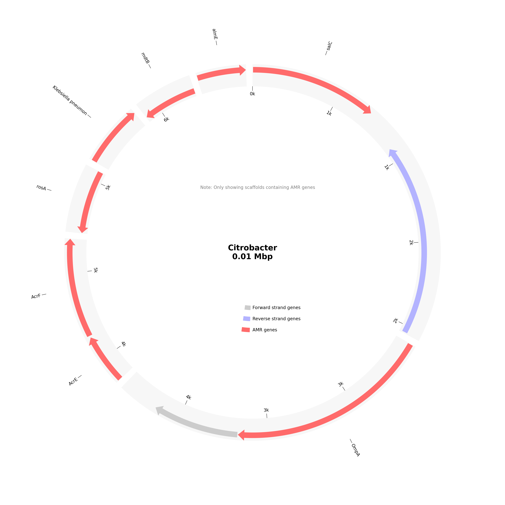

### AcrE
- **Mechanism**: antibiotic efflux
- **Drug Classes**: fluoroquinolone antibiotic; cephalosporin; cephamycin; penam
- **AMR Family**: resistance-nodulation-cell division (RND) antibiotic efflux pump
- **Locations**:
  - gnl|SPADES|PBDHLPBC_6244_1 : position 3-290

### AcrF
- **Mechanism**: antibiotic efflux
- **Drug Classes**: fluoroquinolone antibiotic; cephalosporin; cephamycin; penam
- **AMR Family**: resistance-nodulation-cell division (RND) antibiotic efflux pump
- **Locations**:
  - gnl|SPADES|PBDHLPBC_6244_2 : position 301-867

### Klebsiella pneumoniae OmpK37
- **Mechanism**: reduced permeability to antibiotic
- **Drug Classes**: monobactam; carbapenem; cephalosporin; cephamycin; penam; penem
- **AMR Family**: General Bacterial Porin with reduced permeability to beta-lactams
- **Locations**:
  - gnl|SPADES|PBDHLPBC_17287_1 : position 2-358

### OmpA
- **Mechanism**: reduced permeability to antibiotic
- **Drug Classes**: peptide antibiotic
- **AMR Family**: General Bacterial Porin with reduced permeability to peptide antibiotics
- **Locations**:
  - gnl|SPADES|PBDHLPBC_2889_1 : position 3-1163

### almE
- **Mechanism**: antibiotic target alteration
- **Drug Classes**: peptide antibiotic
- **AMR Family**: polymyxin resistance operon; alm glycyltransferase
- **Locations**:
  - gnl|SPADES|PBDHLPBC_22860_1 : position 3-281

### mdtB
- **Mechanism**: antibiotic efflux
- **Drug Classes**: aminocoumarin antibiotic
- **AMR Family**: resistance-nodulation-cell division (RND) antibiotic efflux pump
- **Locations**:
  - gnl|SPADES|PBDHLPBC_18977_1 : position 3-332

### rosA
- **Mechanism**: antibiotic efflux
- **Drug Classes**: peptide antibiotic
- **AMR Family**: major facilitator superfamily (MFS) antibiotic efflux pump
- **Locations**:
  - gnl|SPADES|PBDHLPBC_15729_1 : position 2-385

### salC
- **Mechanism**: antibiotic target protection
- **Drug Classes**: lincosamide antibiotic; streptogramin antibiotic; streptogramin A antibiotic; pleuromutilin antibiotic
- **AMR Family**: sal-type ABC-F protein
- **Locations**:
  - gnl|SPADES|PBDHLPBC_2572_1 : position 3-728

## Citrobacter amalonaticus Y19
**Strain Statistics:**
- Total genome length: 1.1 kbp
- Total scaffolds: 3
- Scaffolds with AMR genes: 1
- Total genes annotated: 2
- Total AMR genes: 2
- Unique AMR genes: 2
- Distinct AMR mechanisms: 2
- Distinct AMR families: 2
- Distinct drug classes: 4

**Circos Plot:**

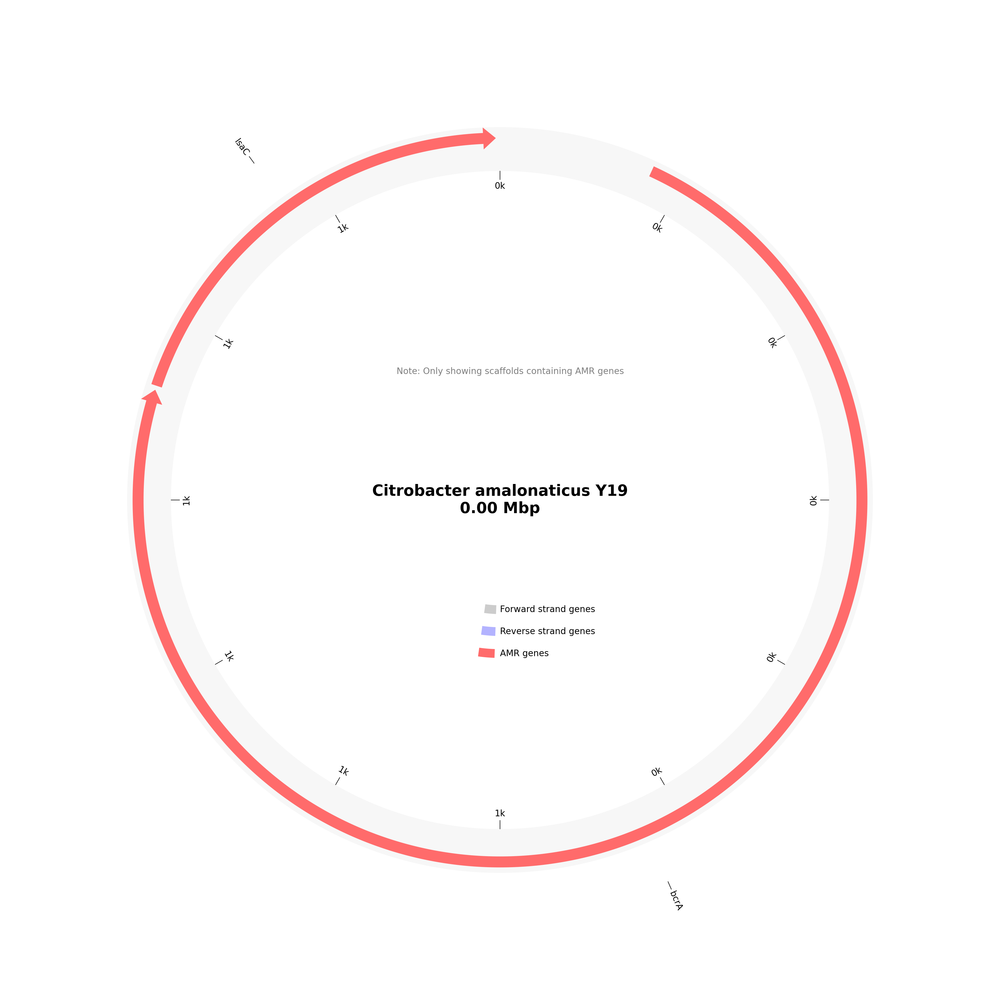

### bcrA
- **Mechanism**: antibiotic efflux
- **Drug Classes**: peptide antibiotic
- **AMR Family**: ATP-binding cassette (ABC) antibiotic efflux pump
- **Locations**:
  - gnl|SPADES|PBDHLPBC_4860_2 : position 75-872

### lsaC
- **Mechanism**: antibiotic target protection
- **Drug Classes**: lincosamide antibiotic; streptogramin antibiotic; pleuromutilin antibiotic
- **AMR Family**: lsa-type ABC-F protein
- **Locations**:
  - gnl|SPADES|PBDHLPBC_4860_3 : position 874-1089

## Citrobacter arsenatis
**Strain Statistics:**
- Total genome length: 0.3 kbp
- Total scaffolds: 2
- Scaffolds with AMR genes: 1
- Total genes annotated: 0
- Total AMR genes: 1
- Unique AMR genes: 1
- Distinct AMR mechanisms: 1
- Distinct AMR families: 1
- Distinct drug classes: 2

**Circos Plot:**

### optrA
- **Mechanism**: antibiotic target protection
- **Drug Classes**: oxazolidinone antibiotic; phenicol antibiotic
- **AMR Family**: Miscellaneous ABC-F subfamily ATP-binding cassette ribosomal protection proteins
- **Locations**:
  - gnl|SPADES|PBDHLPBC_21141_1 : position 2-301

## Citrobacter braakii
**Strain Statistics:**
- Total genome length: 22.9 kbp
- Total scaffolds: 14
- Scaffolds with AMR genes: 2
- Total genes annotated: 52
- Total AMR genes: 4
- Unique AMR genes: 2
- Distinct AMR mechanisms: 1
- Distinct AMR families: 2
- Distinct drug classes: 10

**Circos Plot:**

### H-NS (found in 2 locations)
- **Mechanism**: antibiotic efflux
- **Drug Classes**: macrolide antibiotic; fluoroquinolone antibiotic; cephalosporin; cephamycin; penam; tetracycline antibiotic
- **AMR Family**: major facilitator superfamily (MFS) antibiotic efflux pump; resistance-nodulation-cell division (RND) antibiotic efflux pump
- **Locations**:
  - gnl|SPADES|PBDHLPBC_470_17 : position 17227-17631
  - gnl|SPADES|PBDHLPBC_470_21 : position 19094-19336

### acrB (found in 2 locations)
- **Mechanism**: antibiotic efflux
- **Drug Classes**: fluoroquinolone antibiotic; cephalosporin; glycylcycline; penam; tetracycline antibiotic; rifamycin antibiotic; phenicol antibiotic; disinfecting agents and antiseptics
- **AMR Family**: resistance-nodulation-cell division (RND) antibiotic efflux pump
- **Locations**:
  - gnl|SPADES|PBDHLPBC_4806_1 : position 98-361
  - gnl|SPADES|PBDHLPBC_4806_2 : position 354-1103

## Citrobacter cronae
**Strain Statistics:**
- Total genome length: 2.1 kbp
- Total scaffolds: 4
- Scaffolds with AMR genes: 2
- Total genes annotated: 4
- Total AMR genes: 2
- Unique AMR genes: 2
- Distinct AMR mechanisms: 2
- Distinct AMR families: 2
- Distinct drug classes: 2

**Circos Plot:**

### MCR-9.1
- **Mechanism**: antibiotic target alteration
- **Drug Classes**: peptide antibiotic
- **AMR Family**: MCR phosphoethanolamine transferase
- **Locations**:
  - gnl|SPADES|PBDHLPBC_5387_2 : position 193-984

### TxR
- **Mechanism**: antibiotic efflux
- **Drug Classes**: tetracycline antibiotic
- **AMR Family**: ATP-binding cassette (ABC) antibiotic efflux pump
- **Locations**:
  - gnl|SPADES|PBDHLPBC_4561_1 : position 2-1162

## Citrobacter enshiensis
**Strain Statistics:**
- Total genome length: 2.2 kbp
- Total scaffolds: 9
- Scaffolds with AMR genes: 2
- Total genes annotated: 6
- Total AMR genes: 2
- Unique AMR genes: 2
- Distinct AMR mechanisms: 2
- Distinct AMR families: 2
- Distinct drug classes: 5

**Circos Plot:**

### evgS
- **Mechanism**: antibiotic efflux
- **Drug Classes**: macrolide antibiotic; fluoroquinolone antibiotic; penam; tetracycline antibiotic
- **AMR Family**: major facilitator superfamily (MFS) antibiotic efflux pump; resistance-nodulation-cell division (RND) antibiotic efflux pump
- **Locations**:
  - gnl|SPADES|PBDHLPBC_6682_1 : position 3-539

### vanS gene in vanM cluster
- **Mechanism**: antibiotic target alteration
- **Drug Classes**: glycopeptide antibiotic
- **AMR Family**: vanS; glycopeptide resistance gene cluster
- **Locations**:
  - gnl|SPADES|PBDHLPBC_3740_2 : position 166-1416

## Citrobacter freundii
**Strain Statistics:**
- Total genome length: 7.4 kbp
- Total scaffolds: 64
- Scaffolds with AMR genes: 2
- Total genes annotated: 12
- Total AMR genes: 2
- Unique AMR genes: 2
- Distinct AMR mechanisms: 1
- Distinct AMR families: 2
- Distinct drug classes: 2

**Circos Plot:**

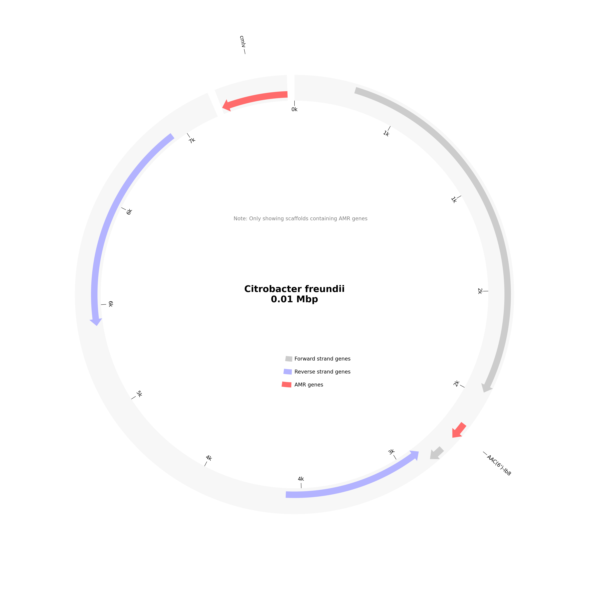

### AAC(6')-Ib8
- **Mechanism**: antibiotic inactivation
- **Drug Classes**: aminoglycoside antibiotic
- **AMR Family**: AAC(6')
- **Locations**:
  - gnl|SPADES|PBDHLPBC_1044_2 : position 2663-2764

### cmlv
- **Mechanism**: antibiotic inactivation
- **Drug Classes**: phenicol antibiotic
- **AMR Family**: chloramphenicol phosphotransferase
- **Locations**:
  - gnl|SPADES|PBDHLPBC_14958_1 : position 3-404

## Citrobacter freundii complex
**Strain Statistics:**
- Total genome length: 1.7 kbp
- Total scaffolds: 13
- Scaffolds with AMR genes: 3
- Total genes annotated: 0
- Total AMR genes: 3
- Unique AMR genes: 3
- Distinct AMR mechanisms: 2
- Distinct AMR families: 3
- Distinct drug classes: 15

**Circos Plot:**

### Klebsiella pneumoniae OmpK37
- **Mechanism**: reduced permeability to antibiotic
- **Drug Classes**: monobactam; carbapenem; cephalosporin; cephamycin; penam; penem
- **AMR Family**: General Bacterial Porin with reduced permeability to beta-lactams
- **Locations**:
  - gnl|SPADES|PBDHLPBC_9383_1 : position 1-603

### MexD
- **Mechanism**: antibiotic efflux
- **Drug Classes**: macrolide antibiotic; fluoroquinolone antibiotic; aminoglycoside antibiotic; cephalosporin; penam; tetracycline antibiotic; aminocoumarin antibiotic; diaminopyrimidine antibiotic; phenicol antibiotic
- **AMR Family**: resistance-nodulation-cell division (RND) antibiotic efflux pump
- **Locations**:
  - gnl|SPADES|PBDHLPBC_11395_1 : position 1-507

### leuO
- **Mechanism**: antibiotic efflux
- **Drug Classes**: nucleoside antibiotic; disinfecting agents and antiseptics
- **AMR Family**: major facilitator superfamily (MFS) antibiotic efflux pump
- **Locations**:
  - gnl|SPADES|PBDHLPBC_9331_1 : position 80-607

## Citrobacter freundii complex sp. CFNIH9
**Strain Statistics:**
- Total genome length: 36.9 kbp
- Total scaffolds: 1
- Scaffolds with AMR genes: 1
- Total genes annotated: 66
- Total AMR genes: 2
- Unique AMR genes: 1
- Distinct AMR mechanisms: 1
- Distinct AMR families: 1
- Distinct drug classes: 6

**Circos Plot:**

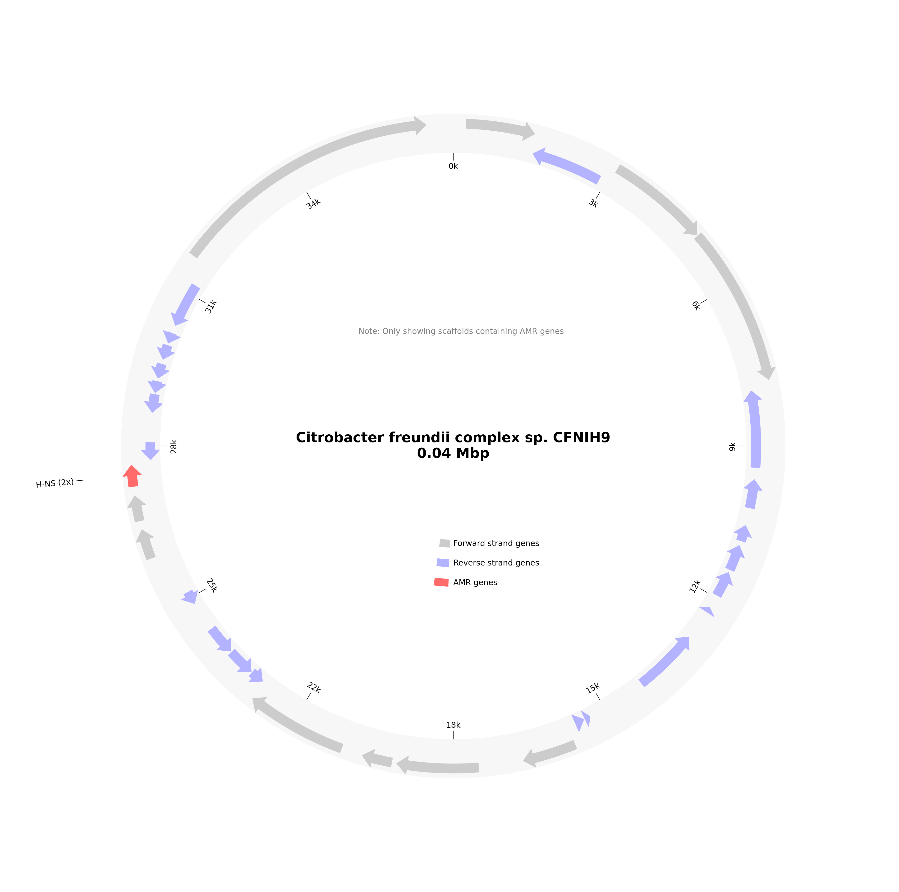

### H-NS (found in 2 locations)
- **Mechanism**: antibiotic efflux
- **Drug Classes**: macrolide antibiotic; fluoroquinolone antibiotic; cephalosporin; cephamycin; penam; tetracycline antibiotic
- **AMR Family**: major facilitator superfamily (MFS) antibiotic efflux pump; resistance-nodulation-cell division (RND) antibiotic efflux pump
- **Locations**:
  - gnl|SPADES|PBDHLPBC_264_25 : position 26914-27318
  - gnl|SPADES|PBDHLPBC_264_27 : position 27997-28239

## Citrobacter koseri
**Strain Statistics:**
- Total genome length: 1.5 kbp
- Total scaffolds: 5
- Scaffolds with AMR genes: 1
- Total genes annotated: 2
- Total AMR genes: 1
- Unique AMR genes: 1
- Distinct AMR mechanisms: 1
- Distinct AMR families: 1
- Distinct drug classes: 2

**Circos Plot:**

### amrB
- **Mechanism**: antibiotic efflux
- **Drug Classes**: macrolide antibiotic; aminoglycoside antibiotic
- **AMR Family**: resistance-nodulation-cell division (RND) antibiotic efflux pump
- **Locations**:
  - gnl|SPADES|PBDHLPBC_3564_1 : position 1-1497

## Citrobacter sp. 21OH12SH02A-Citro
**Strain Statistics:**
- Total genome length: 32.1 kbp
- Total scaffolds: 1
- Scaffolds with AMR genes: 1
- Total genes annotated: 70
- Total AMR genes: 3
- Unique AMR genes: 3
- Distinct AMR mechanisms: 1
- Distinct AMR families: 2
- Distinct drug classes: 6

**Circos Plot:**

### H-NS
- **Mechanism**: antibiotic efflux
- **Drug Classes**: macrolide antibiotic; fluoroquinolone antibiotic; cephalosporin; cephamycin; penam; tetracycline antibiotic
- **AMR Family**: major facilitator superfamily (MFS) antibiotic efflux pump; resistance-nodulation-cell division (RND) antibiotic efflux pump
- **Locations**:
  - gnl|SPADES|PBDHLPBC_309_24 : position 21273-21665

### evgS
- **Mechanism**: antibiotic efflux
- **Drug Classes**: macrolide antibiotic; fluoroquinolone antibiotic; penam; tetracycline antibiotic
- **AMR Family**: major facilitator superfamily (MFS) antibiotic efflux pump; resistance-nodulation-cell division (RND) antibiotic efflux pump
- **Locations**:
  - gnl|SPADES|PBDHLPBC_309_2 : position 2890-4608

### tetA(60)
- **Mechanism**: antibiotic efflux
- **Drug Classes**: tetracycline antibiotic
- **AMR Family**: ATP-binding cassette (ABC) antibiotic efflux pump
- **Locations**:
  - gnl|SPADES|PBDHLPBC_309_18 : position 16587-17636

## Citrobacter tructae
**Strain Statistics:**
- Total genome length: 1.3 kbp
- Total scaffolds: 11
- Scaffolds with AMR genes: 2
- Total genes annotated: 2
- Total AMR genes: 2
- Unique AMR genes: 2
- Distinct AMR mechanisms: 2
- Distinct AMR families: 2
- Distinct drug classes: 2

**Circos Plot:**

### Nocardia farcinica rox
- **Mechanism**: antibiotic inactivation
- **Drug Classes**: rifamycin antibiotic
- **AMR Family**: rifampin monooxygenase
- **Locations**:
  - gnl|SPADES|PBDHLPBC_5808_1 : position 3-821

### macA
- **Mechanism**: antibiotic efflux
- **Drug Classes**: macrolide antibiotic
- **AMR Family**: ATP-binding cassette (ABC) antibiotic efflux pump
- **Locations**:
  - gnl|SPADES|PBDHLPBC_15774_1 : position 2-385

## Enterobacter hormaechei
**Strain Statistics:**
- Total genome length: 0.7 kbp
- Total scaffolds: 23
- Scaffolds with AMR genes: 1
- Total genes annotated: 2
- Total AMR genes: 1
- Unique AMR genes: 1
- Distinct AMR mechanisms: 1
- Distinct AMR families: 1
- Distinct drug classes: 6

**Circos Plot:**

### Klebsiella pneumoniae OmpK37
- **Mechanism**: reduced permeability to antibiotic
- **Drug Classes**: monobactam; carbapenem; cephalosporin; cephamycin; penam; penem
- **AMR Family**: General Bacterial Porin with reduced permeability to beta-lactams
- **Locations**:
  - gnl|SPADES|PBDHLPBC_7787_1 : position 1-708

## Escherichia coli
**Strain Statistics:**
- Total genome length: 2967.6 kbp
- Total scaffolds: 1111
- Scaffolds with AMR genes: 201
- Total genes annotated: 5338
- Total AMR genes: 387
- Unique AMR genes: 202
- Distinct AMR mechanisms: 10
- Distinct AMR families: 71
- Distinct drug classes: 37

**Circos Plot:**

### AAC(3)-Ic
- **Mechanism**: antibiotic inactivation
- **Drug Classes**: aminoglycoside antibiotic
- **AMR Family**: AAC(3)
- **Locations**:
  - gnl|SPADES|PBDHLPBC_8920_1 : position 3-455

### ALG11-1
- **Mechanism**: antibiotic inactivation
- **Drug Classes**: carbapenem
- **AMR Family**: ALG11 beta-lactamase
- **Locations**:
  - gnl|SPADES|PBDHLPBC_521_6 : position 8675-10114

### Acinetobacter baumannii AbaF (found in 5 locations)
- **Mechanism**: antibiotic efflux
- **Drug Classes**: phosphonic acid antibiotic
- **AMR Family**: major facilitator superfamily (MFS) antibiotic efflux pump
- **Locations**:
  - gnl|SPADES|PBDHLPBC_1654_3 : position 3035-3547
  - gnl|SPADES|PBDHLPBC_305_16 : position 23894-25216
  - gnl|SPADES|PBDHLPBC_3728_1 : position 1-690
  - gnl|SPADES|PBDHLPBC_795_11 : position 9241-10539
  - gnl|SPADES|PBDHLPBC_904_1 : position 10-1293

### Acinetobacter baumannii AbaQ (found in 6 locations)
- **Mechanism**: antibiotic efflux
- **Drug Classes**: fluoroquinolone antibiotic
- **AMR Family**: major facilitator superfamily (MFS) antibiotic efflux pump
- **Locations**:
  - gnl|SPADES|PBDHLPBC_1231_2 : position 1433-2734
  - gnl|SPADES|PBDHLPBC_1285_3 : position 2281-3570
  - gnl|SPADES|PBDHLPBC_257_24 : position 19906-21198
  - gnl|SPADES|PBDHLPBC_319_20 : position 20853-22205
  - gnl|SPADES|PBDHLPBC_418_20 : position 20106-21482
  - gnl|SPADES|PBDHLPBC_534_11 : position 11456-12787

### AcrE
- **Mechanism**: antibiotic efflux
- **Drug Classes**: fluoroquinolone antibiotic; cephalosporin; cephamycin; penam
- **AMR Family**: resistance-nodulation-cell division (RND) antibiotic efflux pump
- **Locations**:
  - gnl|SPADES|PBDHLPBC_919_5: position 2600-3757

### AcrF
- **Mechanism**: antibiotic efflux
- **Drug Classes**: fluoroquinolone antibiotic; cephalosporin; cephamycin; penam
- **AMR Family**: resistance-nodulation-cell division (RND) antibiotic efflux pump
- **Locations**:
  - gnl|SPADES|PBDHLPBC_919_6: position 3769-6873

### AcrS
- **Mechanism**: antibiotic efflux
- **Drug Classes**: fluoroquinolone antibiotic; cephalosporin; glycylcycline; cephamycin; penam; tetracycline antibiotic; rifamycin antibiotic; phenicol antibiotic; disinfecting agents and antiseptics
- **AMR Family**: resistance-nodulation-cell division (RND) antibiotic efflux pump
- **Locations**:
  - gnl|SPADES|PBDHLPBC_919_4: position 1539-2201

### ArnT
- **Mechanism**: antibiotic target alteration
- **Drug Classes**: peptide antibiotic
- **AMR Family**: pmr phosphoethanolamine transferase
- **Locations**:
  - gnl|SPADES|PBDHLPBC_16842_1 : position 2-364

### Bifidobacterium bifidum ileS conferring resistance to mupirocin
- **Mechanism**: antibiotic target alteration
- **Drug Classes**: mupirocin-like antibiotic
- **AMR Family**: antibiotic-resistant isoleucyl-tRNA synthetase (ileS)
- **Locations**:
  - gnl|SPADES|PBDHLPBC_210_13 : position 11594-14176

### Brucella suis mprF
- **Mechanism**: antibiotic target alteration
- **Drug Classes**: peptide antibiotic
- **AMR Family**: defensin resistant mprF
- **Locations**:
  - gnl|SPADES|PBDHLPBC_734_10 : position 9042-9998

### CAR-1
- **Mechanism**: antibiotic inactivation
- **Drug Classes**: carbapenem
- **AMR Family**: CAR beta-lactamase
- **Locations**:
  - gnl|SPADES|PBDHLPBC_935_4 : position 2196-2951

### CRP (found in 2 locations)
- **Mechanism**: antibiotic efflux
- **Drug Classes**: macrolide antibiotic; fluoroquinolone antibiotic; penam
- **AMR Family**: resistance-nodulation-cell division (RND) antibiotic efflux pump
- **Locations**:
  - gnl|SPADES|PBDHLPBC_424_6 : position 6093-6845
  - gnl|SPADES|PBDHLPBC_481_16: position 11574-12206

### Clostridioides difficile gyrB conferring resistance to fluoroquinolones
- **Mechanism**: antibiotic target alteration
- **Drug Classes**: fluoroquinolone antibiotic
- **AMR Family**: fluoroquinolone resistant gyrB
- **Locations**:
  - gnl|SPADES|PBDHLPBC_257_32 : position 27173-29587

### Corynebacterium striatum tetA
- **Mechanism**: antibiotic efflux
- **Drug Classes**: penam; tetracycline antibiotic
- **AMR Family**: major facilitator superfamily (MFS) antibiotic efflux pump
- **Locations**:
  - gnl|SPADES|PBDHLPBC_16167_1 : position 2-376

### CrcB
- **Mechanism**: antibiotic efflux
- **Drug Classes**: aminoglycoside antibiotic
- **AMR Family**: multidrug and toxic compound extrusion (MATE) transporter
- **Locations**:
  - gnl|SPADES|PBDHLPBC_210_30 : position 28442-28825

### D-Ala-D-Ala ligase
- **Mechanism**: antibiotic target alteration
- **Drug Classes**: glycopeptide antibiotic
- **AMR Family**: Van ligase
- **Locations**:
  - gnl|SPADES|PBDHLPBC_155_20 : position 22923-23843

### EC-14
- **Mechanism**: antibiotic inactivation
- **Drug Classes**: cephalosporin
- **AMR Family**: EC beta-lactamase
- **Locations**:
  - gnl|SPADES|PBDHLPBC_568_10: position 13071-14204

### Enterobacter cloacae acrA
- **Mechanism**: antibiotic efflux
- **Drug Classes**: fluoroquinolone antibiotic; cephalosporin; glycylcycline; penam; tetracycline antibiotic; rifamycin antibiotic; phenicol antibiotic; disinfecting agents and antiseptics
- **AMR Family**: resistance-nodulation-cell division (RND) antibiotic efflux pump
- **Locations**:
  - gnl|SPADES|PBDHLPBC_1072_3 : position 4466-5587

### Enterococcus faecalis cls with mutation conferring resistance to daptomycin
- **Mechanism**: antibiotic target alteration
- **Drug Classes**: peptide antibiotic
- **AMR Family**: daptomycin resistant cls
- **Locations**:
  - gnl|SPADES|PBDHLPBC_593_11 : position 9095-10555

### Erm(34) (found in 2 locations)
- **Mechanism**: antibiotic target alteration
- **Drug Classes**: macrolide antibiotic; lincosamide antibiotic; streptogramin antibiotic; streptogramin A antibiotic; streptogramin B antibiotic
- **AMR Family**: Erm 23S ribosomal RNA methyltransferase
- **Locations**:
  - gnl|SPADES|PBDHLPBC_276_11 : position 8197-8823
  - gnl|SPADES|PBDHLPBC_534_6 : position 6009-6830

### Erm(44)v
- **Mechanism**: antibiotic target alteration
- **Drug Classes**: macrolide antibiotic; lincosamide antibiotic; streptogramin antibiotic
- **AMR Family**: Erm 23S ribosomal RNA methyltransferase
- **Locations**:
  - gnl|SPADES|PBDHLPBC_308_4 : position 2115-2876

### ErmW
- **Mechanism**: antibiotic target alteration
- **Drug Classes**: macrolide antibiotic; lincosamide antibiotic; streptogramin antibiotic
- **AMR Family**: Erm 23S ribosomal RNA methyltransferase
- **Locations**:
  - gnl|SPADES|PBDHLPBC_1365_2 : position 335-922

### Escherichia coli AcrAB-TolC with AcrR mutation conferring resistance to ciprofloxacin, tetracycline, and ceftazidime (found in 3 locations)
- **Mechanism**: antibiotic target alteration; antibiotic efflux
- **Drug Classes**: fluoroquinolone antibiotic; cephalosporin; glycylcycline; penam; tetracycline antibiotic; rifamycin antibiotic; phenicol antibiotic; disinfecting agents and antiseptics
- **AMR Family**: resistance-nodulation-cell division (RND) antibiotic efflux pump
- **Locations**:
  - gnl|SPADES|PBDHLPBC_141_31: position 33675-34322
  - gnl|SPADES|PBDHLPBC_392_9 : position 9486-10142
  - gnl|SPADES|PBDHLPBC_706_4 : position 4879-5457

### Escherichia coli AcrAB-TolC with MarR mutations conferring resistance to ciprofloxacin and tetracycline
- **Mechanism**: antibiotic target alteration; antibiotic efflux
- **Drug Classes**: fluoroquinolone antibiotic; cephalosporin; glycylcycline; penam; tetracycline antibiotic; rifamycin antibiotic; phenicol antibiotic; disinfecting agents and antiseptics
- **AMR Family**: resistance-nodulation-cell division (RND) antibiotic efflux pump
- **Locations**:
  - gnl|SPADES|PBDHLPBC_197_12: position 9476-9910

### Escherichia coli EF-Tu mutants conferring resistance to kirromycin
- **Mechanism**: antibiotic target alteration
- **Drug Classes**: elfamycin antibiotic
- **AMR Family**: elfamycin resistant EF-Tu
- **Locations**:
  - gnl|SPADES|PBDHLPBC_805_8 : position 6478-8322

### Escherichia coli GlpT with mutation conferring resistance to fosfomycin
- **Mechanism**: antibiotic target alteration
- **Drug Classes**: phosphonic acid antibiotic
- **AMR Family**: antibiotic-resistant GlpT
- **Locations**:
  - gnl|SPADES|PBDHLPBC_958_5 : position 5280-6638

### Escherichia coli acrA
- **Mechanism**: antibiotic efflux
- **Drug Classes**: fluoroquinolone antibiotic; cephalosporin; glycylcycline; penam; tetracycline antibiotic; rifamycin antibiotic; phenicol antibiotic; disinfecting agents and antiseptics
- **AMR Family**: resistance-nodulation-cell division (RND) antibiotic efflux pump
- **Locations**:
  - gnl|SPADES|PBDHLPBC_141_30: position 32340-33533

### Escherichia coli emrE (found in 3 locations)
- **Mechanism**: antibiotic efflux
- **Drug Classes**: macrolide antibiotic
- **AMR Family**: small multidrug resistance (SMR) antibiotic efflux pump
- **Locations**:
  - gnl|SPADES|PBDHLPBC_16113_2 : position 246-377
  - gnl|SPADES|PBDHLPBC_1687_1: position 238-570
  - gnl|SPADES|PBDHLPBC_2047_4 : position 2454-2711

### Escherichia coli mdfA
- **Mechanism**: antibiotic efflux
- **Drug Classes**: tetracycline antibiotic; phenicol antibiotic; disinfecting agents and antiseptics
- **AMR Family**: major facilitator superfamily (MFS) antibiotic efflux pump
- **Locations**:
  - gnl|SPADES|PBDHLPBC_461_17: position 14137-15369

### Escherichia coli soxS with mutation conferring antibiotic resistance (found in 5 locations)
- **Mechanism**: antibiotic target alteration; antibiotic efflux; reduced permeability to antibiotic
- **Drug Classes**: fluoroquinolone antibiotic; monobactam; carbapenem; cephalosporin; glycylcycline; cephamycin; penam; tetracycline antibiotic; rifamycin antibiotic; phenicol antibiotic; penem; disinfecting agents and antiseptics
- **AMR Family**: ATP-binding cassette (ABC) antibiotic efflux pump; major facilitator superfamily (MFS) antibiotic efflux pump; resistance-nodulation-cell division (RND) antibiotic efflux pump; General Bacterial Porin with reduced permeability to beta-lactams
- **Locations**:
  - gnl|SPADES|PBDHLPBC_1023_6 : position 5166-6035
  - gnl|SPADES|PBDHLPBC_1414_3 : position 2212-3048
  - gnl|SPADES|PBDHLPBC_1414_4 : position 3032-3970
  - gnl|SPADES|PBDHLPBC_362_18 : position 19249-20160
  - gnl|SPADES|PBDHLPBC_540_3 : position 3066-3917

### EstT
- **Mechanism**: antibiotic inactivation
- **Drug Classes**: macrolide antibiotic
- **AMR Family**: macrolide esterase
- **Locations**:
  - gnl|SPADES|PBDHLPBC_565_3 : position 2404-3168

### FosC2
- **Mechanism**: antibiotic inactivation
- **Drug Classes**: phosphonic acid antibiotic
- **AMR Family**: fosC phosphotransferase family
- **Locations**:
  - gnl|SPADES|PBDHLPBC_187_28 : position 30098-30505

### H-NS
- **Mechanism**: antibiotic efflux
- **Drug Classes**: macrolide antibiotic; fluoroquinolone antibiotic; cephalosporin; cephamycin; penam; tetracycline antibiotic
- **AMR Family**: major facilitator superfamily (MFS) antibiotic efflux pump; resistance-nodulation-cell division (RND) antibiotic efflux pump
- **Locations**:
  - gnl|SPADES|PBDHLPBC_743_4 : position 1759-2163

### Haemophilus influenzae PBP3 conferring resistance to beta-lactam antibiotics
- **Mechanism**: antibiotic target alteration
- **Drug Classes**: cephalosporin; cephamycin; penam
- **AMR Family**: Penicillin-binding protein mutations conferring resistance to beta-lactam antibiotics
- **Locations**:
  - gnl|SPADES|PBDHLPBC_155_12 : position 12103-13869

### Helicobacter pylori pbp1 mutants conferring resistance to amoxicillin (found in 2 locations)
- **Mechanism**: antibiotic target alteration
- **Drug Classes**: cephalosporin; cephamycin; penam
- **AMR Family**: Penicillin-binding protein mutations conferring resistance to beta-lactam antibiotics
- **Locations**:
  - gnl|SPADES|PBDHLPBC_380_1 : position 1-2475
  - gnl|SPADES|PBDHLPBC_575_9 : position 9099-11411

### Helicobacter pylori pbp2 mutants conferring resistance to amoxicillin
- **Mechanism**: antibiotic target alteration
- **Drug Classes**: cephalosporin; cephamycin; penam
- **AMR Family**: Penicillin-binding protein mutations conferring resistance to beta-lactam antibiotics
- **Locations**:
  - gnl|SPADES|PBDHLPBC_210_20 : position 18160-20061

### Helicobacter pylori rdxA mutation conferring resistance to metronidazole
- **Mechanism**: antibiotic target alteration
- **Drug Classes**: nitroimidazole antibiotic
- **AMR Family**: Antibiotic resistant Helicobacter pylori nitroreductase
- **Locations**:
  - gnl|SPADES|PBDHLPBC_873_3 : position 838-1491

### IreK
- **Mechanism**: reduced permeability to antibiotic
- **Drug Classes**: cephalosporin
- **AMR Family**: Serine/threonine kinases
- **Locations**:
  - gnl|SPADES|PBDHLPBC_729_10 : position 8627-10096

### Klebsiella pneumoniae KpnE
- **Mechanism**: antibiotic efflux
- **Drug Classes**: macrolide antibiotic; aminoglycoside antibiotic; cephalosporin; tetracycline antibiotic; peptide antibiotic; rifamycin antibiotic; disinfecting agents and antiseptics
- **AMR Family**: small multidrug resistance (SMR) antibiotic efflux pump
- **Locations**:
  - gnl|SPADES|PBDHLPBC_238_25: position 22344-22709

### Klebsiella pneumoniae KpnF
- **Mechanism**: antibiotic efflux
- **Drug Classes**: macrolide antibiotic; aminoglycoside antibiotic; cephalosporin; tetracycline antibiotic; peptide antibiotic; rifamycin antibiotic; disinfecting agents and antiseptics
- **AMR Family**: small multidrug resistance (SMR) antibiotic efflux pump
- **Locations**:
  - gnl|SPADES|PBDHLPBC_238_24: position 22028-22357

### Klebsiella pneumoniae KpnH
- **Mechanism**: antibiotic efflux
- **Drug Classes**: macrolide antibiotic; fluoroquinolone antibiotic; aminoglycoside antibiotic; carbapenem; cephalosporin; penam; peptide antibiotic; penem
- **AMR Family**: major facilitator superfamily (MFS) antibiotic efflux pump
- **Locations**:
  - gnl|SPADES|PBDHLPBC_1504_3 : position 2199-3710

### Klebsiella pneumoniae OmpK37 (found in 9 locations)
- **Mechanism**: reduced permeability to antibiotic
- **Drug Classes**: monobactam; carbapenem; cephalosporin; cephamycin; penam; penem
- **AMR Family**: General Bacterial Porin with reduced permeability to beta-lactams
- **Locations**:
  - gnl|SPADES|PBDHLPBC_1099_5 : position 2618-3673
  - gnl|SPADES|PBDHLPBC_1265_5 : position 2815-3255
  - gnl|SPADES|PBDHLPBC_2412_3 : position 1997-2272
  - gnl|SPADES|PBDHLPBC_289_29 : position 31859-32992
  - gnl|SPADES|PBDHLPBC_4039_2 : position 427-1302
  - gnl|SPADES|PBDHLPBC_4343_1 : position 39-1217
  - gnl|SPADES|PBDHLPBC_444_27 : position 23186-23323
  - gnl|SPADES|PBDHLPBC_455_1 : position 108-1166
  - gnl|SPADES|PBDHLPBC_814_6 : position 7771-8859

### LlmA 23S ribosomal RNA methyltransferase (found in 2 locations)
- **Mechanism**: antibiotic target alteration
- **Drug Classes**: lincosamide antibiotic
- **AMR Family**: Llm 23S ribosomal RNA methyltransferase
- **Locations**:
  - gnl|SPADES|PBDHLPBC_172_31 : position 31741-32916
  - gnl|SPADES|PBDHLPBC_319_24 : position 27517-28818

### LpsA
- **Mechanism**: reduced permeability to antibiotic
- **Drug Classes**: peptide antibiotic
- **AMR Family**: Intrinsic peptide antibiotic resistant Lps
- **Locations**:
  - gnl|SPADES|PBDHLPBC_2222_3 : position 1530-2303

### LptD
- **Mechanism**: antibiotic efflux
- **Drug Classes**: carbapenem; peptide antibiotic; aminocoumarin antibiotic; rifamycin antibiotic
- **AMR Family**: ATP-binding cassette (ABC) antibiotic efflux pump
- **Locations**:
  - gnl|SPADES|PBDHLPBC_534_3 : position 1330-3684

### MCR-3.22
- **Mechanism**: antibiotic target alteration
- **Drug Classes**: peptide antibiotic
- **AMR Family**: MCR phosphoethanolamine transferase
- **Locations**:
  - gnl|SPADES|PBDHLPBC_257_11 : position 6378-7871

### MCR-4.2
- **Mechanism**: antibiotic target alteration
- **Drug Classes**: peptide antibiotic
- **AMR Family**: MCR phosphoethanolamine transferase
- **Locations**:
  - gnl|SPADES|PBDHLPBC_564_5 : position 2583-4166

### MCR-8.3
- **Mechanism**: antibiotic target alteration
- **Drug Classes**: peptide antibiotic
- **AMR Family**: MCR phosphoethanolamine transferase
- **Locations**:
  - gnl|SPADES|PBDHLPBC_540_2 : position 1029-2762

### MCR-8.4
- **Mechanism**: antibiotic target alteration
- **Drug Classes**: peptide antibiotic
- **AMR Family**: MCR phosphoethanolamine transferase
- **Locations**:
  - gnl|SPADES|PBDHLPBC_980_3 : position 1612-3237

### MCR-9.1
- **Mechanism**: antibiotic target alteration
- **Drug Classes**: peptide antibiotic
- **AMR Family**: MCR phosphoethanolamine transferase
- **Locations**:
  - gnl|SPADES|PBDHLPBC_1177_1 : position 206-1879

### MdtK
- **Mechanism**: antibiotic efflux
- **Drug Classes**: fluoroquinolone antibiotic
- **AMR Family**: multidrug and toxic compound extrusion (MATE) transporter
- **Locations**:
  - gnl|SPADES|PBDHLPBC_2928_2 : position 211-1698

### MdtQ
- **Mechanism**: reduced permeability to antibiotic
- **Drug Classes**: monobactam; carbapenem; cephalosporin; cephamycin; penam; penem
- **AMR Family**: Outer Membrane Porin (Opr)
- **Locations**:
  - gnl|SPADES|PBDHLPBC_394_8 : position 5783-7219

### MexL
- **Mechanism**: antibiotic efflux
- **Drug Classes**: macrolide antibiotic; tetracycline antibiotic; disinfecting agents and antiseptics
- **AMR Family**: resistance-nodulation-cell division (RND) antibiotic efflux pump
- **Locations**:
  - gnl|SPADES|PBDHLPBC_1072_4 : position 5736-6302

### MexR
- **Mechanism**: antibiotic target alteration; antibiotic efflux
- **Drug Classes**: macrolide antibiotic; fluoroquinolone antibiotic; monobactam; carbapenem; cephalosporin; cephamycin; penam; tetracycline antibiotic; peptide antibiotic; aminocoumarin antibiotic; diaminopyrimidine antibiotic; sulfonamide antibiotic; phenicol antibiotic; penem
- **AMR Family**: resistance-nodulation-cell division (RND) antibiotic efflux pump
- **Locations**:
  - gnl|SPADES|PBDHLPBC_418_13 : position 13306-13752

### MexS (found in 2 locations)
- **Mechanism**: antibiotic efflux
- **Drug Classes**: fluoroquinolone antibiotic; diaminopyrimidine antibiotic; phenicol antibiotic
- **AMR Family**: resistance-nodulation-cell division (RND) antibiotic efflux pump
- **Locations**:
  - gnl|SPADES|PBDHLPBC_10526_1 : position 2-544
  - gnl|SPADES|PBDHLPBC_870_6 : position 5316-6359

### MexV
- **Mechanism**: antibiotic efflux
- **Drug Classes**: macrolide antibiotic; fluoroquinolone antibiotic; tetracycline antibiotic; phenicol antibiotic; disinfecting agents and antiseptics
- **AMR Family**: resistance-nodulation-cell division (RND) antibiotic efflux pump
- **Locations**:
  - gnl|SPADES|PBDHLPBC_873_7 : position 7547-8770

### MuxC
- **Mechanism**: antibiotic efflux
- **Drug Classes**: macrolide antibiotic; monobactam; tetracycline antibiotic; aminocoumarin antibiotic
- **AMR Family**: resistance-nodulation-cell division (RND) antibiotic efflux pump
- **Locations**:
  - gnl|SPADES|PBDHLPBC_873_6 : position 4392-7535

### Mycobacterium tuberculosis gidB mutation conferring resistance to streptomycin
- **Mechanism**: antibiotic target alteration
- **Drug Classes**: aminoglycoside antibiotic
- **AMR Family**: antibiotic resistant gidB
- **Locations**:
  - gnl|SPADES|PBDHLPBC_443_8 : position 4899-5522

### Mycobacterium tuberculosis inhA mutations conferring resistance to isoniazid
- **Mechanism**: antibiotic target alteration
- **Drug Classes**: isoniazid-like antibiotic
- **AMR Family**: isoniazid resistant inhA
- **Locations**:
  - gnl|SPADES|PBDHLPBC_784_13 : position 9956-10783

### Mycobacterium tuberculosis katG mutations conferring resistance to isoniazid
- **Mechanism**: antibiotic target alteration
- **Drug Classes**: isoniazid-like antibiotic
- **AMR Family**: isoniazid resistant katG
- **Locations**:
  - gnl|SPADES|PBDHLPBC_540_14 : position 15524-17704

### Mycobacterium tuberculosis ndh with mutation conferring resistance to isoniazid
- **Mechanism**: antibiotic target alteration
- **Drug Classes**: isoniazid-like antibiotic
- **AMR Family**: antibiotic resistant ndh
- **Locations**:
  - gnl|SPADES|PBDHLPBC_549_1 : position 343-1647

### Mycobacterium tuberculosis pncA mutations conferring resistance to pyrazinamide
- **Mechanism**: antibiotic target alteration
- **Drug Classes**: pyrazine antibiotic
- **AMR Family**: Pyrazinamide resistant pncA
- **Locations**:
  - gnl|SPADES|PBDHLPBC_881_8 : position 8289-8930

### Mycobacterium tuberculosis rpsA mutations conferring resistance to pyrazinamide
- **Mechanism**: antibiotic target alteration
- **Drug Classes**: pyrazine antibiotic
- **AMR Family**: pyrazinamide resistant rpsA
- **Locations**:
  - gnl|SPADES|PBDHLPBC_384_12 : position 13295-14821

### Mycobacterium tuberculosis thyA with mutation conferring resistance to para-aminosalicylic acid
- **Mechanism**: antibiotic target alteration
- **Drug Classes**: salicylic acid antibiotic
- **AMR Family**: aminosalicylate resistant thymidylate synthase
- **Locations**:
  - gnl|SPADES|PBDHLPBC_226_27 : position 27484-28278

### Neisseria gonorrhoeae pilQ gene conferring resistance to beta-lactam (found in 2 locations)
- **Mechanism**: antibiotic target alteration
- **Drug Classes**: cephalosporin; cephamycin; penam
- **AMR Family**: Penicillin-binding protein mutations conferring resistance to beta-lactam antibiotics
- **Locations**:
  - gnl|SPADES|PBDHLPBC_478_12 : position 13560-14768
  - gnl|SPADES|PBDHLPBC_584_14 : position 11862-13814

### NmcR (found in 13 locations)
- **Mechanism**: antibiotic inactivation
- **Drug Classes**: carbapenem; cephalosporin; cephamycin; penam
- **AMR Family**: NmcA beta-lactamase
- **Locations**:
  - gnl|SPADES|PBDHLPBC_1142_6 : position 4965-5804
  - gnl|SPADES|PBDHLPBC_197_17 : position 13343-14224
  - gnl|SPADES|PBDHLPBC_2278_1 : position 88-1038
  - gnl|SPADES|PBDHLPBC_235_34 : position 38692-39618
  - gnl|SPADES|PBDHLPBC_238_20 : position 17907-18800
  - gnl|SPADES|PBDHLPBC_2596_1 : position 1-795
  - gnl|SPADES|PBDHLPBC_319_1 : position 313-1230
  - gnl|SPADES|PBDHLPBC_402_4 : position 2453-3352
  - gnl|SPADES|PBDHLPBC_430_19 : position 20034-20945
  - gnl|SPADES|PBDHLPBC_453_6 : position 6005-6979
  - gnl|SPADES|PBDHLPBC_463_4 : position 3422-4375
  - gnl|SPADES|PBDHLPBC_567_12 : position 13387-14280
  - gnl|SPADES|PBDHLPBC_567_7 : position 6860-7756

### Nocardia farcinica rox
- **Mechanism**: antibiotic inactivation
- **Drug Classes**: rifamycin antibiotic
- **AMR Family**: rifampin monooxygenase
- **Locations**:
  - gnl|SPADES|PBDHLPBC_496_19 : position 17856-19520

### OmpA (found in 4 locations)
- **Mechanism**: reduced permeability to antibiotic
- **Drug Classes**: peptide antibiotic
- **AMR Family**: General Bacterial Porin with reduced permeability to peptide antibiotics
- **Locations**:
  - gnl|SPADES|PBDHLPBC_172_21 : position 21963-23015
  - gnl|SPADES|PBDHLPBC_433_2 : position 1018-1539
  - gnl|SPADES|PBDHLPBC_634_5 : position 2163-2645
  - gnl|SPADES|PBDHLPBC_864_6 : position 5262-5921

### OprM (found in 3 locations)
- **Mechanism**: antibiotic efflux
- **Drug Classes**: macrolide antibiotic; fluoroquinolone antibiotic; monobactam; aminoglycoside antibiotic; carbapenem; cephalosporin; cephamycin; penam; tetracycline antibiotic; peptide antibiotic; aminocoumarin antibiotic; diaminopyrimidine antibiotic; sulfonamide antibiotic; phenicol antibiotic; penem; disinfecting agents and antiseptics
- **AMR Family**: resistance-nodulation-cell division (RND) antibiotic efflux pump
- **Locations**:
  - gnl|SPADES|PBDHLPBC_1072_1 : position 3-1355
  - gnl|SPADES|PBDHLPBC_1395_1 : position 3-1349
  - gnl|SPADES|PBDHLPBC_347_1 : position 391-1746

### ParR
- **Mechanism**: antibiotic efflux; reduced permeability to antibiotic
- **Drug Classes**: macrolide antibiotic; fluoroquinolone antibiotic; monobactam; aminoglycoside antibiotic; carbapenem; cephalosporin; cephamycin; penam; tetracycline antibiotic; phenicol antibiotic; penem; disinfecting agents and antiseptics
- **AMR Family**: resistance-nodulation-cell division (RND) antibiotic efflux pump; Outer Membrane Porin (Opr)
- **Locations**:
  - gnl|SPADES|PBDHLPBC_238_33 : position 31367-32086

### ParS (found in 3 locations)
- **Mechanism**: antibiotic efflux; reduced permeability to antibiotic
- **Drug Classes**: macrolide antibiotic; fluoroquinolone antibiotic; monobactam; aminoglycoside antibiotic; carbapenem; cephalosporin; cephamycin; penam; tetracycline antibiotic; phenicol antibiotic; penem; disinfecting agents and antiseptics
- **AMR Family**: resistance-nodulation-cell division (RND) antibiotic efflux pump; Outer Membrane Porin (Opr)
- **Locations**:
  - gnl|SPADES|PBDHLPBC_16579_1 : position 3-368
  - gnl|SPADES|PBDHLPBC_210_35 : position 32487-34145
  - gnl|SPADES|PBDHLPBC_238_34 : position 32090-33391

### PmrF (found in 4 locations)
- **Mechanism**: antibiotic target alteration
- **Drug Classes**: peptide antibiotic
- **AMR Family**: pmr phosphoethanolamine transferase
- **Locations**:
  - gnl|SPADES|PBDHLPBC_1190_3 : position 1876-2796
  - gnl|SPADES|PBDHLPBC_2030_2 : position 235-1218
  - gnl|SPADES|PBDHLPBC_4087_1 : position 317-1177
  - gnl|SPADES|PBDHLPBC_495_16: position 15027-15995

### Pseudomonas aeruginosa CpxR (found in 2 locations)
- **Mechanism**: antibiotic efflux
- **Drug Classes**: macrolide antibiotic; fluoroquinolone antibiotic; monobactam; aminoglycoside antibiotic; carbapenem; cephalosporin; cephamycin; penam; tetracycline antibiotic; peptide antibiotic; aminocoumarin antibiotic; diaminopyrimidine antibiotic; sulfonamide antibiotic; phenicol antibiotic; penem
- **AMR Family**: resistance-nodulation-cell division (RND) antibiotic efflux pump
- **Locations**:
  - gnl|SPADES|PBDHLPBC_210_34 : position 31838-32518
  - gnl|SPADES|PBDHLPBC_366_24 : position 21770-22468

### QnrA6
- **Mechanism**: antibiotic target protection
- **Drug Classes**: fluoroquinolone antibiotic
- **AMR Family**: quinolone resistance protein (qnr)
- **Locations**:
  - gnl|SPADES|PBDHLPBC_2128_1 : position 392-2536

### RanA (found in 11 locations)
- **Mechanism**: antibiotic efflux
- **Drug Classes**: aminoglycoside antibiotic
- **AMR Family**: ATP-binding cassette (ABC) antibiotic efflux pump
- **Locations**:
  - gnl|SPADES|PBDHLPBC_1004_6 : position 3990-4799
  - gnl|SPADES|PBDHLPBC_207_18 : position 13403-14212
  - gnl|SPADES|PBDHLPBC_234_9 : position 8053-9642
  - gnl|SPADES|PBDHLPBC_394_17 : position 17228-18154
  - gnl|SPADES|PBDHLPBC_412_2 : position 709-1701
  - gnl|SPADES|PBDHLPBC_593_8 : position 6664-7677
  - gnl|SPADES|PBDHLPBC_593_9 : position 7674-8678
  - gnl|SPADES|PBDHLPBC_733_4 : position 1327-2133
  - gnl|SPADES|PBDHLPBC_753_3 : position 2081-3952
  - gnl|SPADES|PBDHLPBC_854_2 : position 1564-2568
  - gnl|SPADES|PBDHLPBC_876_8 : position 7212-8348

### RanB
- **Mechanism**: antibiotic efflux
- **Drug Classes**: aminoglycoside antibiotic
- **AMR Family**: ATP-binding cassette (ABC) antibiotic efflux pump
- **Locations**:
  - gnl|SPADES|PBDHLPBC_207_17 : position 12613-13395

### Rhodococcus fascians cmr
- **Mechanism**: antibiotic efflux
- **Drug Classes**: phenicol antibiotic
- **AMR Family**: major facilitator superfamily (MFS) antibiotic efflux pump
- **Locations**:
  - gnl|SPADES|PBDHLPBC_769_2 : position 606-1844

### Rv1877 (found in 2 locations)
- **Mechanism**: antibiotic efflux
- **Drug Classes**: fluoroquinolone antibiotic
- **AMR Family**: major facilitator superfamily (MFS) antibiotic efflux pump
- **Locations**:
  - gnl|SPADES|PBDHLPBC_870_7 : position 6376-7755
  - gnl|SPADES|PBDHLPBC_939_4 : position 2528-3922

### SST-1
- **Mechanism**: antibiotic inactivation
- **Drug Classes**: cephalosporin
- **AMR Family**: SST beta-lactamase
- **Locations**:
  - gnl|SPADES|PBDHLPBC_299_26 : position 28213-29370

### Staphylococcus aureus fusA with mutation conferring resistance to fusidic acid
- **Mechanism**: antibiotic target alteration
- **Drug Classes**: fusidane antibiotic
- **AMR Family**: antibiotic resistant fusA
- **Locations**:
  - gnl|SPADES|PBDHLPBC_1343_1 : position 1-1539

### Staphylococcus aureus mupA conferring resistance to mupirocin
- **Mechanism**: antibiotic target alteration
- **Drug Classes**: mupirocin-like antibiotic
- **AMR Family**: antibiotic-resistant isoleucyl-tRNA synthetase (ileS)
- **Locations**:
  - gnl|SPADES|PBDHLPBC_696_8 : position 6135-8951

### Staphylococcus aureus mupB conferring resistance to mupirocin
- **Mechanism**: antibiotic target alteration
- **Drug Classes**: mupirocin-like antibiotic
- **AMR Family**: antibiotic-resistant isoleucyl-tRNA synthetase (ileS)
- **Locations**:
  - gnl|SPADES|PBDHLPBC_1141_5 : position 2742-5597

### Staphylococcus aureus murA with mutation conferring resistance to fosfomycin
- **Mechanism**: antibiotic target alteration
- **Drug Classes**: phosphonic acid antibiotic
- **AMR Family**: antibiotic-resistant murA transferase
- **Locations**:
  - gnl|SPADES|PBDHLPBC_207_12 : position 9382-10641

### Staphylococcus aureus pgsA mutations conferring resistance to daptomycin
- **Mechanism**: antibiotic target alteration
- **Drug Classes**: peptide antibiotic
- **AMR Family**: daptomycin resistant pgsA
- **Locations**:
  - gnl|SPADES|PBDHLPBC_837_1 : position 203-751

### Streptomyces rimosus otr(A)
- **Mechanism**: antibiotic target protection
- **Drug Classes**: tetracycline antibiotic
- **AMR Family**: tetracycline-resistant ribosomal protection protein
- **Locations**:
  - gnl|SPADES|PBDHLPBC_513_17 : position 17604-19427

### Streptomyces venezuelae rox
- **Mechanism**: antibiotic inactivation
- **Drug Classes**: rifamycin antibiotic
- **AMR Family**: rifampin monooxygenase
- **Locations**:
  - gnl|SPADES|PBDHLPBC_1075_6 : position 5537-6676

### TaeA
- **Mechanism**: antibiotic efflux
- **Drug Classes**: pleuromutilin antibiotic
- **AMR Family**: ATP-binding cassette (ABC) antibiotic efflux pump
- **Locations**:
  - gnl|SPADES|PBDHLPBC_172_13 : position 12915-14822

### TxR (found in 10 locations)
- **Mechanism**: antibiotic efflux
- **Drug Classes**: tetracycline antibiotic
- **AMR Family**: ATP-binding cassette (ABC) antibiotic efflux pump
- **Locations**:
  - gnl|SPADES|PBDHLPBC_132_17 : position 16928-18940
  - gnl|SPADES|PBDHLPBC_203_5 : position 5005-6783
  - gnl|SPADES|PBDHLPBC_402_11 : position 11915-13501
  - gnl|SPADES|PBDHLPBC_412_14 : position 14615-15592
  - gnl|SPADES|PBDHLPBC_424_16 : position 16176-17717
  - gnl|SPADES|PBDHLPBC_467_11 : position 10971-12890
  - gnl|SPADES|PBDHLPBC_513_14 : position 13060-14469
  - gnl|SPADES|PBDHLPBC_521_7 : position 10301-11815
  - gnl|SPADES|PBDHLPBC_533_14 : position 15162-16496
  - gnl|SPADES|PBDHLPBC_986_6 : position 4232-5617

### YojI
- **Mechanism**: antibiotic efflux
- **Drug Classes**: peptide antibiotic
- **AMR Family**: ATP-binding cassette (ABC) antibiotic efflux pump
- **Locations**:
  - gnl|SPADES|PBDHLPBC_444_22 : position 18725-19165

### acrB (found in 2 locations)
- **Mechanism**: antibiotic efflux
- **Drug Classes**: fluoroquinolone antibiotic; cephalosporin; glycylcycline; penam; tetracycline antibiotic; rifamycin antibiotic; phenicol antibiotic; disinfecting agents and antiseptics
- **AMR Family**: resistance-nodulation-cell division (RND) antibiotic efflux pump
- **Locations**:
  - gnl|SPADES|PBDHLPBC_1072_2 : position 1359-4466
  - gnl|SPADES|PBDHLPBC_141_29: position 29168-32317

### acrD
- **Mechanism**: antibiotic efflux
- **Drug Classes**: aminoglycoside antibiotic
- **AMR Family**: resistance-nodulation-cell division (RND) antibiotic efflux pump
- **Locations**:
  - gnl|SPADES|PBDHLPBC_132_41: position 39887-43000

### adeL (found in 13 locations)
- **Mechanism**: antibiotic efflux
- **Drug Classes**: fluoroquinolone antibiotic; tetracycline antibiotic
- **AMR Family**: resistance-nodulation-cell division (RND) antibiotic efflux pump
- **Locations**:
  - gnl|SPADES|PBDHLPBC_1967_1 : position 3-866
  - gnl|SPADES|PBDHLPBC_197_38 : position 39210-40109
  - gnl|SPADES|PBDHLPBC_234_32 : position 36585-37466
  - gnl|SPADES|PBDHLPBC_305_17 : position 26595-27566
  - gnl|SPADES|PBDHLPBC_384_1 : position 2-868
  - gnl|SPADES|PBDHLPBC_395_10 : position 13828-14757
  - gnl|SPADES|PBDHLPBC_413_21 : position 19575-20501
  - gnl|SPADES|PBDHLPBC_415_21 : position 22725-23648
  - gnl|SPADES|PBDHLPBC_424_11 : position 11530-12429
  - gnl|SPADES|PBDHLPBC_637_8 : position 9256-10188
  - gnl|SPADES|PBDHLPBC_800_6 : position 6879-7763
  - gnl|SPADES|PBDHLPBC_805_2 : position 445-1419
  - gnl|SPADES|PBDHLPBC_935_8 : position 6318-7232

### almE
- **Mechanism**: antibiotic target alteration
- **Drug Classes**: peptide antibiotic
- **AMR Family**: polymyxin resistance operon; alm glycyltransferase
- **Locations**:
  - gnl|SPADES|PBDHLPBC_415_15 : position 14497-16248

### arlR (found in 2 locations)
- **Mechanism**: antibiotic efflux
- **Drug Classes**: fluoroquinolone antibiotic; disinfecting agents and antiseptics
- **AMR Family**: major facilitator superfamily (MFS) antibiotic efflux pump
- **Locations**:
  - gnl|SPADES|PBDHLPBC_1113_3 : position 2507-3289
  - gnl|SPADES|PBDHLPBC_1395_2 : position 1506-2189

### arnA (found in 2 locations)
- **Mechanism**: antibiotic target alteration
- **Drug Classes**: peptide antibiotic
- **AMR Family**: pmr phosphoethanolamine transferase
- **Locations**:
  - gnl|SPADES|PBDHLPBC_495_15 : position 13045-15027
  - gnl|SPADES|PBDHLPBC_778_9 : position 5267-6214

### bacA
- **Mechanism**: antibiotic target alteration
- **Drug Classes**: peptide antibiotic
- **AMR Family**: undecaprenyl pyrophosphate related proteins
- **Locations**:
  - gnl|SPADES|PBDHLPBC_28596_1 : position 140-247

### baeR (found in 2 locations)
- **Mechanism**: antibiotic efflux
- **Drug Classes**: aminoglycoside antibiotic; aminocoumarin antibiotic
- **AMR Family**: resistance-nodulation-cell division (RND) antibiotic efflux pump
- **Locations**:
  - gnl|SPADES|PBDHLPBC_299_5 : position 6464-7153
  - gnl|SPADES|PBDHLPBC_762_9 : position 6166-6858

### baeS
- **Mechanism**: antibiotic efflux
- **Drug Classes**: aminoglycoside antibiotic; aminocoumarin antibiotic
- **AMR Family**: resistance-nodulation-cell division (RND) antibiotic efflux pump
- **Locations**:
  - gnl|SPADES|PBDHLPBC_31462_1 : position 3-233

### basS (found in 4 locations)
- **Mechanism**: antibiotic target alteration; antibiotic efflux
- **Drug Classes**: peptide antibiotic
- **AMR Family**: pmr phosphoethanolamine transferase
- **Locations**:
  - gnl|SPADES|PBDHLPBC_1023_3 : position 2356-3780
  - gnl|SPADES|PBDHLPBC_1113_2 : position 1149-2507
  - gnl|SPADES|PBDHLPBC_1395_3 : position 2179-3627
  - gnl|SPADES|PBDHLPBC_876_5 : position 2956-4416

### bcr-1 (found in 4 locations)
- **Mechanism**: antibiotic efflux
- **Drug Classes**: bicyclomycin-like antibiotic
- **AMR Family**: major facilitator superfamily (MFS) antibiotic efflux pump
- **Locations**:
  - gnl|SPADES|PBDHLPBC_1028_3 : position 3275-4450
  - gnl|SPADES|PBDHLPBC_187_17 : position 17080-18291
  - gnl|SPADES|PBDHLPBC_257_6 : position 3387-4571
  - gnl|SPADES|PBDHLPBC_3826_2 : position 205-1368

### bcrA (found in 7 locations)
- **Mechanism**: antibiotic efflux
- **Drug Classes**: peptide antibiotic
- **AMR Family**: ATP-binding cassette (ABC) antibiotic efflux pump
- **Locations**:
  - gnl|SPADES|PBDHLPBC_197_30 : position 26501-28036
  - gnl|SPADES|PBDHLPBC_402_19 : position 19632-21116
  - gnl|SPADES|PBDHLPBC_405_16 : position 13738-14493
  - gnl|SPADES|PBDHLPBC_463_7 : position 6385-7443
  - gnl|SPADES|PBDHLPBC_533_7 : position 4677-6188
  - gnl|SPADES|PBDHLPBC_806_4 : position 7095-9377
  - gnl|SPADES|PBDHLPBC_820_6 : position 4950-6470

### bcrC
- **Mechanism**: antibiotic target alteration
- **Drug Classes**: peptide antibiotic
- **AMR Family**: undecaprenyl pyrophosphate related proteins
- **Locations**:
  - gnl|SPADES|PBDHLPBC_1365_3 : position 1016-1582

### bmr
- **Mechanism**: antibiotic efflux
- **Drug Classes**: fluoroquinolone antibiotic; nucleoside antibiotic; phenicol antibiotic; disinfecting agents and antiseptics
- **AMR Family**: major facilitator superfamily (MFS) antibiotic efflux pump
- **Locations**:
  - gnl|SPADES|PBDHLPBC_2596_2 : position 947-2098

### carA
- **Mechanism**: antibiotic target protection
- **Drug Classes**: macrolide antibiotic
- **AMR Family**: Miscellaneous ABC-F subfamily ATP-binding cassette ribosomal protection proteins
- **Locations**:
  - gnl|SPADES|PBDHLPBC_444_11 : position 9342-9959

### chrB
- **Mechanism**: antibiotic target alteration
- **Drug Classes**: macrolide antibiotic; lincosamide antibiotic
- **AMR Family**: non-erm 23S ribosomal RNA methyltransferase (G748)
- **Locations**:
  - gnl|SPADES|PBDHLPBC_546_4 : position 1807-2616

### clbB
- **Mechanism**: antibiotic target alteration
- **Drug Classes**: lincosamide antibiotic; streptogramin antibiotic; streptogramin A antibiotic; oxazolidinone antibiotic; phenicol antibiotic; pleuromutilin antibiotic
- **AMR Family**: Cfr 23S ribosomal RNA methyltransferase
- **Locations**:
  - gnl|SPADES|PBDHLPBC_575_7 : position 7215-8369

### cmlB
- **Mechanism**: antibiotic efflux
- **Drug Classes**: phenicol antibiotic
- **AMR Family**: major facilitator superfamily (MFS) antibiotic efflux pump
- **Locations**:
  - gnl|SPADES|PBDHLPBC_238_21 : position 18907-20160

### cmlv (found in 3 locations)
- **Mechanism**: antibiotic inactivation
- **Drug Classes**: phenicol antibiotic
- **AMR Family**: chloramphenicol phosphotransferase
- **Locations**:
  - gnl|SPADES|PBDHLPBC_187_21 : position 20912-22081
  - gnl|SPADES|PBDHLPBC_197_14 : position 10812-12002
  - gnl|SPADES|PBDHLPBC_299_8 : position 11727-12995

### cmx
- **Mechanism**: antibiotic efflux
- **Drug Classes**: phenicol antibiotic
- **AMR Family**: major facilitator superfamily (MFS) antibiotic efflux pump
- **Locations**:
  - gnl|SPADES|PBDHLPBC_800_8 : position 9228-10355

### cpxA (found in 2 locations)
- **Mechanism**: antibiotic efflux
- **Drug Classes**: aminoglycoside antibiotic; aminocoumarin antibiotic
- **AMR Family**: resistance-nodulation-cell division (RND) antibiotic efflux pump
- **Locations**:
  - gnl|SPADES|PBDHLPBC_366_25: position 22465-23838
  - gnl|SPADES|PBDHLPBC_513_15 : position 14481-15530

### efpA
- **Mechanism**: antibiotic efflux
- **Drug Classes**: rifamycin antibiotic; isoniazid-like antibiotic
- **AMR Family**: major facilitator superfamily (MFS) antibiotic efflux pump
- **Locations**:
  - gnl|SPADES|PBDHLPBC_496_13 : position 11992-13056

### efrA
- **Mechanism**: antibiotic efflux
- **Drug Classes**: macrolide antibiotic; fluoroquinolone antibiotic; rifamycin antibiotic
- **AMR Family**: ATP-binding cassette (ABC) antibiotic efflux pump
- **Locations**:
  - gnl|SPADES|PBDHLPBC_347_3 : position 22507-24669

### emeA
- **Mechanism**: antibiotic efflux
- **Drug Classes**: disinfecting agents and antiseptics
- **AMR Family**: multidrug and toxic compound extrusion (MATE) transporter
- **Locations**:
  - gnl|SPADES|PBDHLPBC_418_11 : position 10113-11474

### emrA
- **Mechanism**: antibiotic efflux
- **Drug Classes**: fluoroquinolone antibiotic
- **AMR Family**: major facilitator superfamily (MFS) antibiotic efflux pump
- **Locations**:
  - gnl|SPADES|PBDHLPBC_579_6: position 5220-6392

### emrB
- **Mechanism**: antibiotic efflux
- **Drug Classes**: fluoroquinolone antibiotic
- **AMR Family**: major facilitator superfamily (MFS) antibiotic efflux pump
- **Locations**:
  - gnl|SPADES|PBDHLPBC_579_5: position 3665-5203

### emrK (found in 2 locations)
- **Mechanism**: antibiotic efflux
- **Drug Classes**: tetracycline antibiotic
- **AMR Family**: major facilitator superfamily (MFS) antibiotic efflux pump
- **Locations**:
  - gnl|SPADES|PBDHLPBC_17754_1 : position 132-326
  - gnl|SPADES|PBDHLPBC_259_8 : position 8823-9128

### emrR (found in 2 locations)
- **Mechanism**: antibiotic efflux
- **Drug Classes**: fluoroquinolone antibiotic
- **AMR Family**: major facilitator superfamily (MFS) antibiotic efflux pump
- **Locations**:
  - gnl|SPADES|PBDHLPBC_187_37 : position 37518-37952
  - gnl|SPADES|PBDHLPBC_579_7: position 6519-7049

### emrY (found in 3 locations)
- **Mechanism**: antibiotic efflux
- **Drug Classes**: tetracycline antibiotic
- **AMR Family**: major facilitator superfamily (MFS) antibiotic efflux pump
- **Locations**:
  - gnl|SPADES|PBDHLPBC_259_7: position 7285-8823
  - gnl|SPADES|PBDHLPBC_443_22 : position 21027-22454
  - gnl|SPADES|PBDHLPBC_798_7 : position 9531-10544

### eptA
- **Mechanism**: antibiotic target alteration
- **Drug Classes**: peptide antibiotic
- **AMR Family**: pmr phosphoethanolamine transferase
- **Locations**:
  - gnl|SPADES|PBDHLPBC_14187_1 : position 3-422

### eptB
- **Mechanism**: antibiotic target alteration
- **Drug Classes**: peptide antibiotic
- **AMR Family**: pmr phosphoethanolamine transferase
- **Locations**:
  - gnl|SPADES|PBDHLPBC_854_6 : position 7656-9347

### evgA (found in 8 locations)
- **Mechanism**: antibiotic efflux
- **Drug Classes**: macrolide antibiotic; fluoroquinolone antibiotic; penam; tetracycline antibiotic
- **AMR Family**: major facilitator superfamily (MFS) antibiotic efflux pump; resistance-nodulation-cell division (RND) antibiotic efflux pump
- **Locations**:
  - gnl|SPADES|PBDHLPBC_169_8 : position 4941-5591
  - gnl|SPADES|PBDHLPBC_1751_4 : position 1630-2076
  - gnl|SPADES|PBDHLPBC_1753_4 : position 1627-2073
  - gnl|SPADES|PBDHLPBC_235_6 : position 7914-8546
  - gnl|SPADES|PBDHLPBC_259_9: position 10557-11171
  - gnl|SPADES|PBDHLPBC_444_3 : position 2997-3644
  - gnl|SPADES|PBDHLPBC_769_9 : position 10425-11015
  - gnl|SPADES|PBDHLPBC_837_3 : position 2637-3293

### evgS (found in 6 locations)
- **Mechanism**: antibiotic efflux
- **Drug Classes**: macrolide antibiotic; fluoroquinolone antibiotic; penam; tetracycline antibiotic
- **AMR Family**: major facilitator superfamily (MFS) antibiotic efflux pump; resistance-nodulation-cell division (RND) antibiotic efflux pump
- **Locations**:
  - gnl|SPADES|PBDHLPBC_1021_4 : position 4312-7161
  - gnl|SPADES|PBDHLPBC_12045_1 : position 2-484
  - gnl|SPADES|PBDHLPBC_207_33 : position 24836-27172
  - gnl|SPADES|PBDHLPBC_259_10 : position 12510-14924
  - gnl|SPADES|PBDHLPBC_319_23 : position 24704-27460
  - gnl|SPADES|PBDHLPBC_329_25 : position 23851-24240

### farA (found in 3 locations)
- **Mechanism**: antibiotic efflux
- **Drug Classes**: antibacterial free fatty acids
- **AMR Family**: major facilitator superfamily (MFS) antibiotic efflux pump
- **Locations**:
  - gnl|SPADES|PBDHLPBC_1504_2 : position 1171-2199
  - gnl|SPADES|PBDHLPBC_734_3 : position 1571-2566
  - gnl|SPADES|PBDHLPBC_806_3 : position 5821-6888

### fexB (found in 3 locations)
- **Mechanism**: antibiotic efflux
- **Drug Classes**: phenicol antibiotic
- **AMR Family**: major facilitator superfamily (MFS) antibiotic efflux pump
- **Locations**:
  - gnl|SPADES|PBDHLPBC_207_44 : position 38514-40004
  - gnl|SPADES|PBDHLPBC_579_10 : position 8326-9510
  - gnl|SPADES|PBDHLPBC_733_11 : position 8298-9548

### gadW (found in 4 locations)
- **Mechanism**: antibiotic efflux
- **Drug Classes**: macrolide antibiotic; fluoroquinolone antibiotic; penam
- **AMR Family**: resistance-nodulation-cell division (RND) antibiotic efflux pump
- **Locations**:
  - gnl|SPADES|PBDHLPBC_1354_6 : position 2513-3100
  - gnl|SPADES|PBDHLPBC_4261_1 : position 273-1016
  - gnl|SPADES|PBDHLPBC_490_6 : position 10815-11576
  - gnl|SPADES|PBDHLPBC_776_2 : position 1624-2352

### gadX (found in 2 locations)
- **Mechanism**: antibiotic efflux
- **Drug Classes**: macrolide antibiotic; fluoroquinolone antibiotic; penam
- **AMR Family**: resistance-nodulation-cell division (RND) antibiotic efflux pump
- **Locations**:
  - gnl|SPADES|PBDHLPBC_235_5 : position 7148-7549
  - gnl|SPADES|PBDHLPBC_776_1: position 432-1256

### golS (found in 3 locations)
- **Mechanism**: antibiotic efflux
- **Drug Classes**: monobactam; carbapenem; cephalosporin; cephamycin; penam; phenicol antibiotic; penem
- **AMR Family**: resistance-nodulation-cell division (RND) antibiotic efflux pump
- **Locations**:
  - gnl|SPADES|PBDHLPBC_141_53 : position 62015-62422
  - gnl|SPADES|PBDHLPBC_347_5 : position 25838-26245
  - gnl|SPADES|PBDHLPBC_778_14 : position 9758-10183

### hmrM
- **Mechanism**: antibiotic efflux
- **Drug Classes**: fluoroquinolone antibiotic; disinfecting agents and antiseptics
- **AMR Family**: multidrug and toxic compound extrusion (MATE) transporter
- **Locations**:
  - gnl|SPADES|PBDHLPBC_187_14 : position 13372-14745

### hp1181
- **Mechanism**: antibiotic efflux
- **Drug Classes**: fluoroquinolone antibiotic; tetracycline antibiotic; nitroimidazole antibiotic
- **AMR Family**: major facilitator superfamily (MFS) antibiotic efflux pump
- **Locations**:
  - gnl|SPADES|PBDHLPBC_890_1 : position 1-1278

### kdpD (found in 2 locations)
- **Mechanism**: antibiotic efflux
- **Drug Classes**: aminoglycoside antibiotic
- **AMR Family**: kdpDE
- **Locations**:
  - gnl|SPADES|PBDHLPBC_927_4 : position 5026-7710
  - gnl|SPADES|PBDHLPBC_986_7 : position 5614-7440

### kdpE (found in 4 locations)
- **Mechanism**: antibiotic efflux
- **Drug Classes**: aminoglycoside antibiotic
- **AMR Family**: kdpDE
- **Locations**:
  - gnl|SPADES|PBDHLPBC_1392_1 : position 3-110
  - gnl|SPADES|PBDHLPBC_5491_2 : position 859-966
  - gnl|SPADES|PBDHLPBC_876_4 : position 2285-2956
  - gnl|SPADES|PBDHLPBC_927_5: position 7707-8327

### leuO (found in 7 locations)
- **Mechanism**: antibiotic efflux
- **Drug Classes**: nucleoside antibiotic; disinfecting agents and antiseptics
- **AMR Family**: major facilitator superfamily (MFS) antibiotic efflux pump
- **Locations**:
  - gnl|SPADES|PBDHLPBC_1028_4 : position 4425-5384
  - gnl|SPADES|PBDHLPBC_155_5: position 4903-5847
  - gnl|SPADES|PBDHLPBC_210_26 : position 25001-25954
  - gnl|SPADES|PBDHLPBC_226_14 : position 12682-13617
  - gnl|SPADES|PBDHLPBC_2278_2 : position 1140-2057
  - gnl|SPADES|PBDHLPBC_317_4 : position 4051-4953
  - gnl|SPADES|PBDHLPBC_424_1 : position 3-878

### lfrA
- **Mechanism**: antibiotic efflux
- **Drug Classes**: fluoroquinolone antibiotic
- **AMR Family**: major facilitator superfamily (MFS) antibiotic efflux pump
- **Locations**:
  - gnl|SPADES|PBDHLPBC_226_12 : position 10456-11874

### lmrC
- **Mechanism**: antibiotic target protection
- **Drug Classes**: lincosamide antibiotic
- **AMR Family**: Miscellaneous ABC-F subfamily ATP-binding cassette ribosomal protection proteins
- **Locations**:
  - gnl|SPADES|PBDHLPBC_724_8 : position 5766-6515

### lmrD
- **Mechanism**: antibiotic efflux
- **Drug Classes**: lincosamide antibiotic
- **AMR Family**: ATP-binding cassette (ABC) antibiotic efflux pump
- **Locations**:
  - gnl|SPADES|PBDHLPBC_912_4 : position 3317-5083

### macA
- **Mechanism**: antibiotic efflux
- **Drug Classes**: macrolide antibiotic
- **AMR Family**: ATP-binding cassette (ABC) antibiotic efflux pump
- **Locations**:
  - gnl|SPADES|PBDHLPBC_1005_3 : position 2472-3587

### macB (found in 19 locations)
- **Mechanism**: antibiotic efflux
- **Drug Classes**: macrolide antibiotic
- **AMR Family**: ATP-binding cassette (ABC) antibiotic efflux pump
- **Locations**:
  - gnl|SPADES|PBDHLPBC_1005_2 : position 529-2475
  - gnl|SPADES|PBDHLPBC_1145_2 : position 1133-1786
  - gnl|SPADES|PBDHLPBC_1667_1 : position 286-1044
  - gnl|SPADES|PBDHLPBC_210_3 : position 1123-1848
  - gnl|SPADES|PBDHLPBC_3039_2 : position 1172-1774
  - gnl|SPADES|PBDHLPBC_356_14 : position 12449-13564
  - gnl|SPADES|PBDHLPBC_413_8 : position 6577-7674
  - gnl|SPADES|PBDHLPBC_424_20 : position 22299-23381
  - gnl|SPADES|PBDHLPBC_443_17 : position 15620-17125
  - gnl|SPADES|PBDHLPBC_464_8 : position 9392-10378
  - gnl|SPADES|PBDHLPBC_496_4 : position 3006-3773
  - gnl|SPADES|PBDHLPBC_549_9 : position 10895-11596
  - gnl|SPADES|PBDHLPBC_564_11 : position 8717-9439
  - gnl|SPADES|PBDHLPBC_720_4 : position 3174-4187
  - gnl|SPADES|PBDHLPBC_8140_1 : position 2-664
  - gnl|SPADES|PBDHLPBC_837_6 : position 4995-5747
  - gnl|SPADES|PBDHLPBC_854_3 : position 2565-3548
  - gnl|SPADES|PBDHLPBC_934_8 : position 5131-5817
  - gnl|SPADES|PBDHLPBC_944_4 : position 3509-4177

### marA (found in 3 locations)
- **Mechanism**: antibiotic efflux; reduced permeability to antibiotic
- **Drug Classes**: fluoroquinolone antibiotic; monobactam; carbapenem; cephalosporin; glycylcycline; cephamycin; penam; tetracycline antibiotic; rifamycin antibiotic; phenicol antibiotic; penem; disinfecting agents and antiseptics
- **AMR Family**: resistance-nodulation-cell division (RND) antibiotic efflux pump; General Bacterial Porin with reduced permeability to beta-lactams
- **Locations**:
  - gnl|SPADES|PBDHLPBC_197_11: position 9073-9456
  - gnl|SPADES|PBDHLPBC_491_3 : position 6257-7093
  - gnl|SPADES|PBDHLPBC_6319_1 : position 30-857

### mdtA
- **Mechanism**: antibiotic efflux
- **Drug Classes**: aminocoumarin antibiotic
- **AMR Family**: resistance-nodulation-cell division (RND) antibiotic efflux pump
- **Locations**:
  - gnl|SPADES|PBDHLPBC_798_4: position 2083-3330

### mdtB
- **Mechanism**: antibiotic efflux
- **Drug Classes**: aminocoumarin antibiotic
- **AMR Family**: resistance-nodulation-cell division (RND) antibiotic efflux pump
- **Locations**:
  - gnl|SPADES|PBDHLPBC_798_5: position 3330-6452

### mdtC
- **Mechanism**: antibiotic efflux
- **Drug Classes**: aminocoumarin antibiotic
- **AMR Family**: resistance-nodulation-cell division (RND) antibiotic efflux pump
- **Locations**:
  - gnl|SPADES|PBDHLPBC_798_6: position 6453-9530

### mdtE
- **Mechanism**: antibiotic efflux
- **Drug Classes**: macrolide antibiotic; fluoroquinolone antibiotic; penam
- **AMR Family**: resistance-nodulation-cell division (RND) antibiotic efflux pump
- **Locations**:
  - gnl|SPADES|PBDHLPBC_776_5: position 5853-7010

### mdtF
- **Mechanism**: antibiotic efflux
- **Drug Classes**: macrolide antibiotic; fluoroquinolone antibiotic; penam
- **AMR Family**: resistance-nodulation-cell division (RND) antibiotic efflux pump
- **Locations**:
  - gnl|SPADES|PBDHLPBC_776_4: position 2715-5828

### mdtG
- **Mechanism**: antibiotic efflux
- **Drug Classes**: phosphonic acid antibiotic
- **AMR Family**: major facilitator superfamily (MFS) antibiotic efflux pump
- **Locations**:
  - gnl|SPADES|PBDHLPBC_169_19: position 16452-17678

### mdtH
- **Mechanism**: antibiotic efflux
- **Drug Classes**: fluoroquinolone antibiotic
- **AMR Family**: major facilitator superfamily (MFS) antibiotic efflux pump
- **Locations**:
  - gnl|SPADES|PBDHLPBC_169_31: position 26309-27517

### mdtM
- **Mechanism**: antibiotic efflux
- **Drug Classes**: fluoroquinolone antibiotic; lincosamide antibiotic; nucleoside antibiotic; phenicol antibiotic; disinfecting agents and antiseptics
- **AMR Family**: major facilitator superfamily (MFS) antibiotic efflux pump
- **Locations**:
  - gnl|SPADES|PBDHLPBC_975_3: position 2982-4214

### mdtN (found in 2 locations)
- **Mechanism**: antibiotic efflux
- **Drug Classes**: nucleoside antibiotic; disinfecting agents and antiseptics
- **AMR Family**: major facilitator superfamily (MFS) antibiotic efflux pump
- **Locations**:
  - gnl|SPADES|PBDHLPBC_187_35 : position 36221-36991
  - gnl|SPADES|PBDHLPBC_805_3 : position 1416-2552

### mdtO
- **Mechanism**: antibiotic efflux
- **Drug Classes**: nucleoside antibiotic; disinfecting agents and antiseptics
- **AMR Family**: major facilitator superfamily (MFS) antibiotic efflux pump
- **Locations**:
  - gnl|SPADES|PBDHLPBC_18590_1 : position 2-337

### mef(E)
- **Mechanism**: antibiotic efflux
- **Drug Classes**: macrolide antibiotic
- **AMR Family**: major facilitator superfamily (MFS) antibiotic efflux pump
- **Locations**:
  - gnl|SPADES|PBDHLPBC_317_16 : position 17164-18414

### mepA
- **Mechanism**: antibiotic efflux
- **Drug Classes**: glycylcycline; tetracycline antibiotic
- **AMR Family**: multidrug and toxic compound extrusion (MATE) transporter
- **Locations**:
  - gnl|SPADES|PBDHLPBC_356_3 : position 1072-2397

### mgrA
- **Mechanism**: antibiotic efflux
- **Drug Classes**: fluoroquinolone antibiotic; cephalosporin; penam; tetracycline antibiotic; peptide antibiotic; disinfecting agents and antiseptics
- **AMR Family**: ATP-binding cassette (ABC) antibiotic efflux pump; major facilitator superfamily (MFS) antibiotic efflux pump
- **Locations**:
  - gnl|SPADES|PBDHLPBC_11497_1 : position 3-377

### mreA
- **Mechanism**: antibiotic efflux
- **Drug Classes**: macrolide antibiotic
- **AMR Family**: major facilitator superfamily (MFS) antibiotic efflux pump
- **Locations**:
  - gnl|SPADES|PBDHLPBC_696_9 : position 8994-9935

### msbA (found in 5 locations)
- **Mechanism**: antibiotic efflux
- **Drug Classes**: nitroimidazole antibiotic
- **AMR Family**: ATP-binding cassette (ABC) antibiotic efflux pump
- **Locations**:
  - gnl|SPADES|PBDHLPBC_329_9 : position 6840-8354
  - gnl|SPADES|PBDHLPBC_384_15: position 17773-19521
  - gnl|SPADES|PBDHLPBC_733_5 : position 2130-2894
  - gnl|SPADES|PBDHLPBC_912_3 : position 1595-3316
  - gnl|SPADES|PBDHLPBC_934_3 : position 1317-1994

### nalC
- **Mechanism**: antibiotic efflux
- **Drug Classes**: macrolide antibiotic; fluoroquinolone antibiotic; monobactam; carbapenem; cephalosporin; cephamycin; penam; tetracycline antibiotic; peptide antibiotic; aminocoumarin antibiotic; diaminopyrimidine antibiotic; sulfonamide antibiotic; phenicol antibiotic; penem
- **AMR Family**: resistance-nodulation-cell division (RND) antibiotic efflux pump
- **Locations**:
  - gnl|SPADES|PBDHLPBC_549_3 : position 2475-3170

### nalD (found in 2 locations)
- **Mechanism**: antibiotic efflux
- **Drug Classes**: macrolide antibiotic; fluoroquinolone antibiotic; monobactam; carbapenem; cephalosporin; cephamycin; penam; tetracycline antibiotic; peptide antibiotic; aminocoumarin antibiotic; diaminopyrimidine antibiotic; sulfonamide antibiotic; phenicol antibiotic; penem
- **AMR Family**: resistance-nodulation-cell division (RND) antibiotic efflux pump
- **Locations**:
  - gnl|SPADES|PBDHLPBC_187_30 : position 31720-32319
  - gnl|SPADES|PBDHLPBC_683_2 : position 1810-2448

### novA
- **Mechanism**: antibiotic efflux
- **Drug Classes**: aminocoumarin antibiotic
- **AMR Family**: ATP-binding cassette (ABC) antibiotic efflux pump
- **Locations**:
  - gnl|SPADES|PBDHLPBC_362_4 : position 2624-3370

### oleB
- **Mechanism**: antibiotic target protection
- **Drug Classes**: macrolide antibiotic
- **AMR Family**: Miscellaneous ABC-F subfamily ATP-binding cassette ribosomal protection proteins
- **Locations**:
  - gnl|SPADES|PBDHLPBC_18839_1 : position 3-335

### oleC (found in 3 locations)
- **Mechanism**: antibiotic efflux
- **Drug Classes**: macrolide antibiotic
- **AMR Family**: ATP-binding cassette (ABC) antibiotic efflux pump
- **Locations**:
  - gnl|SPADES|PBDHLPBC_13086_1 : position 2-451
  - gnl|SPADES|PBDHLPBC_380_21 : position 22777-23703
  - gnl|SPADES|PBDHLPBC_728_6 : position 7412-8626

### optrA
- **Mechanism**: antibiotic target protection
- **Drug Classes**: oxazolidinone antibiotic; phenicol antibiotic
- **AMR Family**: Miscellaneous ABC-F subfamily ATP-binding cassette ribosomal protection proteins
- **Locations**:
  - gnl|SPADES|PBDHLPBC_481_11 : position 6743-8656

### oqxA
- **Mechanism**: antibiotic efflux
- **Drug Classes**: fluoroquinolone antibiotic; glycylcycline; tetracycline antibiotic; diaminopyrimidine antibiotic; nitrofuran antibiotic
- **AMR Family**: resistance-nodulation-cell division (RND) antibiotic efflux pump
- **Locations**:
  - gnl|SPADES|PBDHLPBC_395_12 : position 15151-16083

### otr(B)
- **Mechanism**: antibiotic efflux
- **Drug Classes**: tetracycline antibiotic
- **AMR Family**: major facilitator superfamily (MFS) antibiotic efflux pump
- **Locations**:
  - gnl|SPADES|PBDHLPBC_865_4 : position 3600-4937

### ramA
- **Mechanism**: antibiotic efflux; reduced permeability to antibiotic
- **Drug Classes**: fluoroquinolone antibiotic; monobactam; carbapenem; cephalosporin; glycylcycline; cephamycin; penam; tetracycline antibiotic; rifamycin antibiotic; phenicol antibiotic; penem; disinfecting agents and antiseptics
- **AMR Family**: resistance-nodulation-cell division (RND) antibiotic efflux pump; General Bacterial Porin with reduced permeability to beta-lactams
- **Locations**:
  - gnl|SPADES|PBDHLPBC_259_21 : position 28016-28873

### rosA
- **Mechanism**: antibiotic efflux
- **Drug Classes**: peptide antibiotic
- **AMR Family**: major facilitator superfamily (MFS) antibiotic efflux pump
- **Locations**:
  - gnl|SPADES|PBDHLPBC_141_45 : position 51700-52920

### rosB (found in 3 locations)
- **Mechanism**: antibiotic efflux
- **Drug Classes**: peptide antibiotic
- **AMR Family**: major facilitator superfamily (MFS) antibiotic efflux pump
- **Locations**:
  - gnl|SPADES|PBDHLPBC_141_44 : position 49786-51462
  - gnl|SPADES|PBDHLPBC_481_9 : position 4256-6061
  - gnl|SPADES|PBDHLPBC_534_9 : position 8963-10825

### rphB (found in 2 locations)
- **Mechanism**: antibiotic inactivation
- **Drug Classes**: rifamycin antibiotic
- **AMR Family**: rifampin phosphotransferase
- **Locations**:
  - gnl|SPADES|PBDHLPBC_362_25 : position 25593-27956
  - gnl|SPADES|PBDHLPBC_413_13 : position 10638-12365

### rpoB2
- **Mechanism**: antibiotic target alteration; antibiotic target replacement
- **Drug Classes**: rifamycin antibiotic
- **AMR Family**: rifamycin-resistant beta-subunit of RNA polymerase (rpoB)
- **Locations**:
  - gnl|SPADES|PBDHLPBC_30874_1 : position 2-235

### salD
- **Mechanism**: antibiotic target protection
- **Drug Classes**: lincosamide antibiotic; streptogramin antibiotic; streptogramin A antibiotic; pleuromutilin antibiotic
- **AMR Family**: sal-type ABC-F protein
- **Locations**:
  - gnl|SPADES|PBDHLPBC_463_12 : position 10209-11681

### sdiA
- **Mechanism**: antibiotic efflux
- **Drug Classes**: fluoroquinolone antibiotic; cephalosporin; glycylcycline; penam; tetracycline antibiotic; rifamycin antibiotic; phenicol antibiotic; disinfecting agents and antiseptics
- **AMR Family**: resistance-nodulation-cell division (RND) antibiotic efflux pump
- **Locations**:
  - gnl|SPADES|PBDHLPBC_837_5 : position 4043-4765

### smeF
- **Mechanism**: antibiotic efflux
- **Drug Classes**: macrolide antibiotic; fluoroquinolone antibiotic; tetracycline antibiotic; phenicol antibiotic
- **AMR Family**: resistance-nodulation-cell division (RND) antibiotic efflux pump
- **Locations**:
  - gnl|SPADES|PBDHLPBC_873_9 : position 9142-9228

### smeR
- **Mechanism**: antibiotic efflux
- **Drug Classes**: aminoglycoside antibiotic; cephalosporin; cephamycin; penam
- **AMR Family**: resistance-nodulation-cell division (RND) antibiotic efflux pump
- **Locations**:
  - gnl|SPADES|PBDHLPBC_1023_4 : position 3780-4469

### smeS
- **Mechanism**: antibiotic efflux
- **Drug Classes**: aminoglycoside antibiotic; cephalosporin; cephamycin; penam
- **AMR Family**: resistance-nodulation-cell division (RND) antibiotic efflux pump
- **Locations**:
  - gnl|SPADES|PBDHLPBC_299_4 : position 5111-6406

### sta
- **Mechanism**: antibiotic inactivation
- **Drug Classes**: nucleoside antibiotic
- **AMR Family**: streptothricin acetyltransferase (SAT)
- **Locations**:
  - gnl|SPADES|PBDHLPBC_941_6 : position 6300-6818

### sul4
- **Mechanism**: antibiotic target replacement
- **Drug Classes**: sulfonamide antibiotic
- **AMR Family**: sulfonamide resistant sul
- **Locations**:
  - gnl|SPADES|PBDHLPBC_980_6 : position 5687-6535

### tcr3
- **Mechanism**: antibiotic efflux
- **Drug Classes**: tetracycline antibiotic
- **AMR Family**: major facilitator superfamily (MFS) antibiotic efflux pump
- **Locations**:
  - gnl|SPADES|PBDHLPBC_546_9 : position 5831-7204

### tet(M)
- **Mechanism**: antibiotic target protection
- **Drug Classes**: tetracycline antibiotic
- **AMR Family**: tetracycline-resistant ribosomal protection protein
- **Locations**:
  - gnl|SPADES|PBDHLPBC_276_3 : position 2297-3724

### tet(X1)
- **Mechanism**: antibiotic inactivation
- **Drug Classes**: tetracycline antibiotic
- **AMR Family**: tetracycline inactivation enzyme
- **Locations**:
  - gnl|SPADES|PBDHLPBC_15162_1 : position 2-364

### tet(X5)
- **Mechanism**: antibiotic inactivation
- **Drug Classes**: tetracycline antibiotic
- **AMR Family**: tetracycline inactivation enzyme
- **Locations**:
  - gnl|SPADES|PBDHLPBC_11609_1 : position 2-499

### tet(X6) (found in 2 locations)
- **Mechanism**: antibiotic inactivation
- **Drug Classes**: tetracycline antibiotic
- **AMR Family**: tetracycline inactivation enzyme
- **Locations**:
  - gnl|SPADES|PBDHLPBC_132_43 : position 45070-47049
  - gnl|SPADES|PBDHLPBC_820_9 : position 9139-10047

### tetA(58) (found in 7 locations)
- **Mechanism**: antibiotic efflux
- **Drug Classes**: tetracycline antibiotic
- **AMR Family**: major facilitator superfamily (MFS) antibiotic efflux pump
- **Locations**:
  - gnl|SPADES|PBDHLPBC_1020_5 : position 5117-5884
  - gnl|SPADES|PBDHLPBC_1050_4 : position 2473-3231
  - gnl|SPADES|PBDHLPBC_1474_2 : position 1330-2157
  - gnl|SPADES|PBDHLPBC_207_24 : position 18091-18816
  - gnl|SPADES|PBDHLPBC_515_7 : position 6192-7583
  - gnl|SPADES|PBDHLPBC_734_4 : position 2559-4295
  - gnl|SPADES|PBDHLPBC_852_2 : position 162-932

### tetA(60)
- **Mechanism**: antibiotic efflux
- **Drug Classes**: tetracycline antibiotic
- **AMR Family**: ATP-binding cassette (ABC) antibiotic efflux pump
- **Locations**:
  - gnl|SPADES|PBDHLPBC_141_16 : position 16631-18403

### tetB(46) (found in 2 locations)
- **Mechanism**: antibiotic efflux
- **Drug Classes**: tetracycline antibiotic
- **AMR Family**: ATP-binding cassette (ABC) antibiotic efflux pump
- **Locations**:
  - gnl|SPADES|PBDHLPBC_490_3 : position 5546-7231
  - gnl|SPADES|PBDHLPBC_547_7 : position 5772-7961

### tetB(60) (found in 2 locations)
- **Mechanism**: antibiotic efflux
- **Drug Classes**: tetracycline antibiotic
- **AMR Family**: ATP-binding cassette (ABC) antibiotic efflux pump
- **Locations**:
  - gnl|SPADES|PBDHLPBC_141_17 : position 18396-20177
  - gnl|SPADES|PBDHLPBC_412_1 : position 3-707

### tetB(P)
- **Mechanism**: antibiotic target protection
- **Drug Classes**: tetracycline antibiotic
- **AMR Family**: tetracycline-resistant ribosomal protection protein
- **Locations**:
  - gnl|SPADES|PBDHLPBC_446_9 : position 7648-9447

### tsnR (found in 2 locations)
- **Mechanism**: antibiotic target alteration
- **Drug Classes**: peptide antibiotic
- **AMR Family**: non-erm 23S ribosomal RNA methyltransferase (A1067)
- **Locations**:
  - gnl|SPADES|PBDHLPBC_342_14 : position 11560-12291
  - gnl|SPADES|PBDHLPBC_410_8 : position 11779-12435

### ugd
- **Mechanism**: antibiotic target alteration
- **Drug Classes**: peptide antibiotic
- **AMR Family**: pmr phosphoethanolamine transferase
- **Locations**:
  - gnl|SPADES|PBDHLPBC_7843_1 : position 2-520

### vanG
- **Mechanism**: antibiotic target alteration
- **Drug Classes**: glycopeptide antibiotic
- **AMR Family**: glycopeptide resistance gene cluster; Van ligase
- **Locations**:
  - gnl|SPADES|PBDHLPBC_299_20: position 23577-24671

### vanH gene in vanB cluster (found in 2 locations)
- **Mechanism**: antibiotic target alteration
- **Drug Classes**: glycopeptide antibiotic
- **AMR Family**: vanH; glycopeptide resistance gene cluster
- **Locations**:
  - gnl|SPADES|PBDHLPBC_12980_1 : position 138-455
  - gnl|SPADES|PBDHLPBC_567_15 : position 15578-16810

### vanH gene in vanD cluster (found in 2 locations)
- **Mechanism**: antibiotic target alteration
- **Drug Classes**: glycopeptide antibiotic
- **AMR Family**: vanH; glycopeptide resistance gene cluster
- **Locations**:
  - gnl|SPADES|PBDHLPBC_169_1 : position 281-1219
  - gnl|SPADES|PBDHLPBC_289_24 : position 26068-27057

### vanH gene in vanO cluster
- **Mechanism**: antibiotic target alteration
- **Drug Classes**: glycopeptide antibiotic
- **AMR Family**: vanH; glycopeptide resistance gene cluster
- **Locations**:
  - gnl|SPADES|PBDHLPBC_864_7 : position 6025-6999

### vanM
- **Mechanism**: antibiotic target alteration
- **Drug Classes**: glycopeptide antibiotic
- **AMR Family**: glycopeptide resistance gene cluster; Van ligase
- **Locations**:
  - gnl|SPADES|PBDHLPBC_405_6 : position 1957-3135

### vanR gene in vanE cluster
- **Mechanism**: antibiotic target alteration
- **Drug Classes**: glycopeptide antibiotic
- **AMR Family**: glycopeptide resistance gene cluster; vanR
- **Locations**:
  - gnl|SPADES|PBDHLPBC_1023_1 : position 170-886

### vanR gene in vanF cluster
- **Mechanism**: antibiotic target alteration
- **Drug Classes**: glycopeptide antibiotic
- **AMR Family**: glycopeptide resistance gene cluster; vanR
- **Locations**:
  - gnl|SPADES|PBDHLPBC_329_24 : position 22787-23836

### vanR gene in vanG cluster
- **Mechanism**: antibiotic target alteration
- **Drug Classes**: glycopeptide antibiotic
- **AMR Family**: glycopeptide resistance gene cluster; vanR
- **Locations**:
  - gnl|SPADES|PBDHLPBC_259_20 : position 27269-28003

### vanR gene in vanP cluster
- **Mechanism**: antibiotic target alteration
- **Drug Classes**: glycopeptide antibiotic
- **AMR Family**: glycopeptide resistance gene cluster; vanR
- **Locations**:
  - gnl|SPADES|PBDHLPBC_596_7 : position 6140-7846

### vanS gene in vanA cluster
- **Mechanism**: antibiotic target alteration
- **Drug Classes**: glycopeptide antibiotic
- **AMR Family**: vanS; glycopeptide resistance gene cluster
- **Locations**:
  - gnl|SPADES|PBDHLPBC_533_16 : position 17364-18746

### vanT gene in vanC cluster
- **Mechanism**: antibiotic target alteration
- **Drug Classes**: glycopeptide antibiotic
- **AMR Family**: glycopeptide resistance gene cluster; vanT
- **Locations**:
  - gnl|SPADES|PBDHLPBC_611_2 : position 202-1272

### vanX gene in vanM cluster
- **Mechanism**: antibiotic target alteration
- **Drug Classes**: glycopeptide antibiotic
- **AMR Family**: vanX; glycopeptide resistance gene cluster
- **Locations**:
  - gnl|SPADES|PBDHLPBC_464_12 : position 13856-14437

### vatB (found in 2 locations)
- **Mechanism**: antibiotic inactivation
- **Drug Classes**: streptogramin antibiotic; streptogramin A antibiotic
- **AMR Family**: streptogramin vat acetyltransferase
- **Locations**:
  - gnl|SPADES|PBDHLPBC_141_26 : position 27281-27832
  - gnl|SPADES|PBDHLPBC_925_4 : position 4326-5147

### vatD
- **Mechanism**: antibiotic inactivation
- **Drug Classes**: streptogramin antibiotic; streptogramin A antibiotic
- **AMR Family**: streptogramin vat acetyltransferase
- **Locations**:
  - gnl|SPADES|PBDHLPBC_8262_2 : position 104-673

### vatF
- **Mechanism**: antibiotic inactivation
- **Drug Classes**: streptogramin antibiotic; streptogramin A antibiotic
- **AMR Family**: streptogramin vat acetyltransferase
- **Locations**:
  - gnl|SPADES|PBDHLPBC_389_19 : position 20248-20796

### vgaB
- **Mechanism**: antibiotic target protection
- **Drug Classes**: streptogramin antibiotic; streptogramin A antibiotic; pleuromutilin antibiotic
- **AMR Family**: vga-type ABC-F protein
- **Locations**:
  - gnl|SPADES|PBDHLPBC_974_5 : position 5331-6314

### ykkC
- **Mechanism**: antibiotic efflux
- **Drug Classes**: aminoglycoside antibiotic; tetracycline antibiotic; phenicol antibiotic
- **AMR Family**: small multidrug resistance (SMR) antibiotic efflux pump
- **Locations**:
  - gnl|SPADES|PBDHLPBC_568_12 : position 14823-15140

## Escherichia coli K-12
**Strain Statistics:**
- Total genome length: 35.4 kbp
- Total scaffolds: 2
- Scaffolds with AMR genes: 1
- Total genes annotated: 76
- Total AMR genes: 1
- Unique AMR genes: 1
- Distinct AMR mechanisms: 1
- Distinct AMR families: 1
- Distinct drug classes: 12

**Circos Plot:**

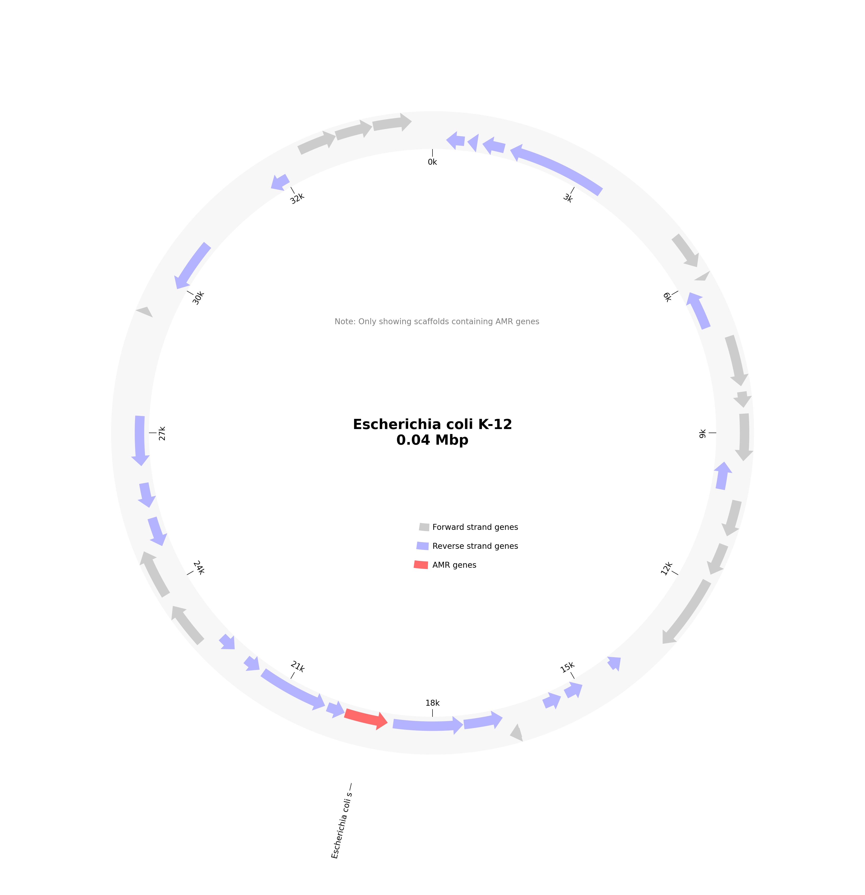

### Escherichia coli soxS with mutation conferring antibiotic resistance
- **Mechanism**: antibiotic target alteration; antibiotic efflux; reduced permeability to antibiotic
- **Drug Classes**: fluoroquinolone antibiotic; monobactam; carbapenem; cephalosporin; glycylcycline; cephamycin; penam; tetracycline antibiotic; rifamycin antibiotic; phenicol antibiotic; penem; disinfecting agents and antiseptics
- **AMR Family**: ATP-binding cassette (ABC) antibiotic efflux pump; major facilitator superfamily (MFS) antibiotic efflux pump; resistance-nodulation-cell division (RND) antibiotic efflux pump; General Bacterial Porin with reduced permeability to beta-lactams
- **Locations**:
  - gnl|SPADES|PBDHLPBC_275_21 : position 18577-19416

## Escherichia coli O121
**Strain Statistics:**
- Total genome length: 5.7 kbp
- Total scaffolds: 1
- Scaffolds with AMR genes: 1
- Total genes annotated: 22
- Total AMR genes: 1
- Unique AMR genes: 1
- Distinct AMR mechanisms: 1
- Distinct AMR families: 1
- Distinct drug classes: 3

**Circos Plot:**

### Pseudomonas aeruginosa ampR with mutation conferring resistance to aztreonam
- **Mechanism**: antibiotic target alteration; antibiotic inactivation
- **Drug Classes**: monobactam; carbapenem; cephalosporin
- **AMR Family**: PDC beta-lactamase; ampR transcriptional regulator with mutation conferring resistance to monobactam antibiotics
- **Locations**:
  - gnl|SPADES|PBDHLPBC_1184_2 : position 1494-2429

## Escherichia coli O157:H7
**Strain Statistics:**
- Total genome length: 191.7 kbp
- Total scaffolds: 9
- Scaffolds with AMR genes: 5
- Total genes annotated: 334
- Total AMR genes: 24
- Unique AMR genes: 22
- Distinct AMR mechanisms: 5
- Distinct AMR families: 11
- Distinct drug classes: 21

**Circos Plot:**

### Acinetobacter baumannii AbaF
- **Mechanism**: antibiotic efflux
- **Drug Classes**: phosphonic acid antibiotic
- **AMR Family**: major facilitator superfamily (MFS) antibiotic efflux pump
- **Locations**:
  - gnl|SPADES|PBDHLPBC_64_28 : position 32295-33797

### Escherichia coli soxR with mutation conferring antibiotic resistance
- **Mechanism**: antibiotic target alteration; antibiotic efflux
- **Drug Classes**: fluoroquinolone antibiotic; cephalosporin; glycylcycline; penam; tetracycline antibiotic; rifamycin antibiotic; phenicol antibiotic; disinfecting agents and antiseptics
- **AMR Family**: ATP-binding cassette (ABC) antibiotic efflux pump; major facilitator superfamily (MFS) antibiotic efflux pump; resistance-nodulation-cell division (RND) antibiotic efflux pump
- **Locations**:
  - gnl|SPADES|PBDHLPBC_64_69: position 78392-78856

### Escherichia coli soxS with mutation conferring antibiotic resistance
- **Mechanism**: antibiotic target alteration; antibiotic efflux; reduced permeability to antibiotic
- **Drug Classes**: fluoroquinolone antibiotic; monobactam; carbapenem; cephalosporin; glycylcycline; cephamycin; penam; tetracycline antibiotic; rifamycin antibiotic; phenicol antibiotic; penem; disinfecting agents and antiseptics
- **AMR Family**: ATP-binding cassette (ABC) antibiotic efflux pump; major facilitator superfamily (MFS) antibiotic efflux pump; resistance-nodulation-cell division (RND) antibiotic efflux pump; General Bacterial Porin with reduced permeability to beta-lactams
- **Locations**:
  - gnl|SPADES|PBDHLPBC_64_70: position 78942-79265

### MexS
- **Mechanism**: antibiotic efflux
- **Drug Classes**: fluoroquinolone antibiotic; diaminopyrimidine antibiotic; phenicol antibiotic
- **AMR Family**: resistance-nodulation-cell division (RND) antibiotic efflux pump
- **Locations**:
  - gnl|SPADES|PBDHLPBC_64_82 : position 92039-93022

### NmcR
- **Mechanism**: antibiotic inactivation
- **Drug Classes**: carbapenem; cephalosporin; cephamycin; penam
- **AMR Family**: NmcA beta-lactamase
- **Locations**:
  - gnl|SPADES|PBDHLPBC_594_3 : position 2689-3594

### RanA
- **Mechanism**: antibiotic efflux
- **Drug Classes**: aminoglycoside antibiotic
- **AMR Family**: ATP-binding cassette (ABC) antibiotic efflux pump
- **Locations**:
  - gnl|SPADES|PBDHLPBC_196_36 : position 44242-45312

### SatA
- **Mechanism**: antibiotic inactivation
- **Drug Classes**: nucleoside antibiotic
- **AMR Family**: streptothricin acetyltransferase (SAT)
- **Locations**:
  - gnl|SPADES|PBDHLPBC_64_45 : position 48555-48989

### TxR
- **Mechanism**: antibiotic efflux
- **Drug Classes**: tetracycline antibiotic
- **AMR Family**: ATP-binding cassette (ABC) antibiotic efflux pump
- **Locations**:
  - gnl|SPADES|PBDHLPBC_196_7 : position 12003-13601

### YajC
- **Mechanism**: antibiotic efflux
- **Drug Classes**: fluoroquinolone antibiotic; cephalosporin; glycylcycline; penam; tetracycline antibiotic; oxazolidinone antibiotic; glycopeptide antibiotic; rifamycin antibiotic; phenicol antibiotic; disinfecting agents and antiseptics
- **AMR Family**: resistance-nodulation-cell division (RND) antibiotic efflux pump
- **Locations**:
  - gnl|SPADES|PBDHLPBC_691_12 : position 9631-9963

### arlR
- **Mechanism**: antibiotic efflux
- **Drug Classes**: fluoroquinolone antibiotic; disinfecting agents and antiseptics
- **AMR Family**: major facilitator superfamily (MFS) antibiotic efflux pump
- **Locations**:
  - gnl|SPADES|PBDHLPBC_64_25 : position 30349-31017

### basS
- **Mechanism**: antibiotic target alteration; antibiotic efflux
- **Drug Classes**: peptide antibiotic
- **AMR Family**: pmr phosphoethanolamine transferase
- **Locations**:
  - gnl|SPADES|PBDHLPBC_64_26 : position 31018-32118

### eptA
- **Mechanism**: antibiotic target alteration
- **Drug Classes**: peptide antibiotic
- **AMR Family**: pmr phosphoethanolamine transferase
- **Locations**:
  - gnl|SPADES|PBDHLPBC_64_24 : position 29105-30352

### evgS
- **Mechanism**: antibiotic efflux
- **Drug Classes**: macrolide antibiotic; fluoroquinolone antibiotic; penam; tetracycline antibiotic
- **AMR Family**: major facilitator superfamily (MFS) antibiotic efflux pump; resistance-nodulation-cell division (RND) antibiotic efflux pump
- **Locations**:
  - gnl|SPADES|PBDHLPBC_64_13 : position 12481-14112

### gadX
- **Mechanism**: antibiotic efflux
- **Drug Classes**: macrolide antibiotic; fluoroquinolone antibiotic; penam
- **AMR Family**: resistance-nodulation-cell division (RND) antibiotic efflux pump
- **Locations**:
  - gnl|SPADES|PBDHLPBC_64_22 : position 26215-26976

### macB (found in 3 locations)
- **Mechanism**: antibiotic efflux
- **Drug Classes**: macrolide antibiotic
- **AMR Family**: ATP-binding cassette (ABC) antibiotic efflux pump
- **Locations**:
  - gnl|SPADES|PBDHLPBC_64_33 : position 38637-39425
  - gnl|SPADES|PBDHLPBC_64_42 : position 46306-46878
  - gnl|SPADES|PBDHLPBC_64_75 : position 83566-85431

### mdtN
- **Mechanism**: antibiotic efflux
- **Drug Classes**: nucleoside antibiotic; disinfecting agents and antiseptics
- **AMR Family**: major facilitator superfamily (MFS) antibiotic efflux pump
- **Locations**:
  - gnl|SPADES|PBDHLPBC_64_50: position 52755-53786

### mdtP
- **Mechanism**: antibiotic efflux
- **Drug Classes**: nucleoside antibiotic; disinfecting agents and antiseptics
- **AMR Family**: major facilitator superfamily (MFS) antibiotic efflux pump
- **Locations**:
  - gnl|SPADES|PBDHLPBC_64_51: position 55705-57171

### msbA
- **Mechanism**: antibiotic efflux
- **Drug Classes**: nitroimidazole antibiotic
- **AMR Family**: ATP-binding cassette (ABC) antibiotic efflux pump
- **Locations**:
  - gnl|SPADES|PBDHLPBC_508_1 : position 3-908

### mtrA
- **Mechanism**: antibiotic efflux
- **Drug Classes**: macrolide antibiotic; penam
- **AMR Family**: resistance-nodulation-cell division (RND) antibiotic efflux pump
- **Locations**:
  - gnl|SPADES|PBDHLPBC_64_20 : position 22516-23424

### tetA(58)
- **Mechanism**: antibiotic efflux
- **Drug Classes**: tetracycline antibiotic
- **AMR Family**: major facilitator superfamily (MFS) antibiotic efflux pump
- **Locations**:
  - gnl|SPADES|PBDHLPBC_64_41 : position 45182-45940

### vanR gene in vanG cluster
- **Mechanism**: antibiotic target alteration
- **Drug Classes**: glycopeptide antibiotic
- **AMR Family**: glycopeptide resistance gene cluster; vanR
- **Locations**:
  - gnl|SPADES|PBDHLPBC_64_4 : position 2208-3746

### vanT gene in vanG cluster
- **Mechanism**: antibiotic target alteration
- **Drug Classes**: glycopeptide antibiotic
- **AMR Family**: glycopeptide resistance gene cluster; vanT
- **Locations**:
  - gnl|SPADES|PBDHLPBC_64_80 : position 89409-90488

## Escherichia coli O157:H7 str. EDL933
**Strain Statistics:**
- Total genome length: 35.0 kbp
- Total scaffolds: 2
- Scaffolds with AMR genes: 1
- Total genes annotated: 68
- Total AMR genes: 2
- Unique AMR genes: 2
- Distinct AMR mechanisms: 1
- Distinct AMR families: 1
- Distinct drug classes: 3

**Circos Plot:**

### Rv1877
- **Mechanism**: antibiotic efflux
- **Drug Classes**: fluoroquinolone antibiotic
- **AMR Family**: major facilitator superfamily (MFS) antibiotic efflux pump
- **Locations**:
  - gnl|SPADES|PBDHLPBC_278_5 : position 5958-7256

### leuO
- **Mechanism**: antibiotic efflux
- **Drug Classes**: nucleoside antibiotic; disinfecting agents and antiseptics
- **AMR Family**: major facilitator superfamily (MFS) antibiotic efflux pump
- **Locations**:
  - gnl|SPADES|PBDHLPBC_278_32 : position 32299-33237

## Escherichia coli O158:H23
**Strain Statistics:**
- Total genome length: 82.3 kbp
- Total scaffolds: 15
- Scaffolds with AMR genes: 5
- Total genes annotated: 176
- Total AMR genes: 7
- Unique AMR genes: 7
- Distinct AMR mechanisms: 4
- Distinct AMR families: 5
- Distinct drug classes: 10

**Circos Plot:**

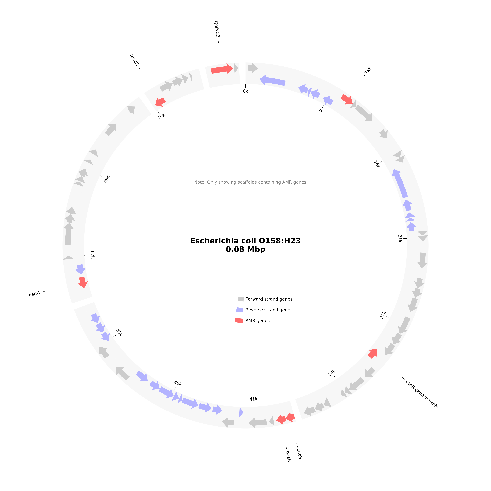

### NmcR
- **Mechanism**: antibiotic inactivation
- **Drug Classes**: carbapenem; cephalosporin; cephamycin; penam
- **AMR Family**: NmcA beta-lactamase
- **Locations**:
  - gnl|SPADES|PBDHLPBC_1391_1 : position 187-1074

### QnrVC3
- **Mechanism**: antibiotic target protection
- **Drug Classes**: fluoroquinolone antibiotic
- **AMR Family**: quinolone resistance protein (qnr)
- **Locations**:
  - gnl|SPADES|PBDHLPBC_2184_1 : position 391-2070

### TxR
- **Mechanism**: antibiotic efflux
- **Drug Classes**: tetracycline antibiotic
- **AMR Family**: ATP-binding cassette (ABC) antibiotic efflux pump
- **Locations**:
  - gnl|SPADES|PBDHLPBC_254_9 : position 7729-8715

### baeR
- **Mechanism**: antibiotic efflux
- **Drug Classes**: aminoglycoside antibiotic; aminocoumarin antibiotic
- **AMR Family**: resistance-nodulation-cell division (RND) antibiotic efflux pump
- **Locations**:
  - gnl|SPADES|PBDHLPBC_512_2: position 702-1424

### baeS
- **Mechanism**: antibiotic efflux
- **Drug Classes**: aminoglycoside antibiotic; aminocoumarin antibiotic
- **AMR Family**: resistance-nodulation-cell division (RND) antibiotic efflux pump
- **Locations**:
  - gnl|SPADES|PBDHLPBC_512_1 : position 1-705

### gadW
- **Mechanism**: antibiotic efflux
- **Drug Classes**: macrolide antibiotic; fluoroquinolone antibiotic; penam
- **AMR Family**: resistance-nodulation-cell division (RND) antibiotic efflux pump
- **Locations**:
  - gnl|SPADES|PBDHLPBC_578_2 : position 867-1781

### vanR gene in vanM cluster
- **Mechanism**: antibiotic target alteration
- **Drug Classes**: glycopeptide antibiotic
- **AMR Family**: glycopeptide resistance gene cluster; vanR
- **Locations**:
  - gnl|SPADES|PBDHLPBC_254_34 : position 30154-30996

## Escherichia coli O18:H1
**Strain Statistics:**
- Total genome length: 16.7 kbp
- Total scaffolds: 1
- Scaffolds with AMR genes: 1
- Total genes annotated: 26
- Total AMR genes: 2
- Unique AMR genes: 2
- Distinct AMR mechanisms: 2
- Distinct AMR families: 2
- Distinct drug classes: 2

**Circos Plot:**

### bcrA
- **Mechanism**: antibiotic efflux
- **Drug Classes**: peptide antibiotic
- **AMR Family**: ATP-binding cassette (ABC) antibiotic efflux pump
- **Locations**:
  - gnl|SPADES|PBDHLPBC_588_3 : position 2355-3023

### catB2
- **Mechanism**: antibiotic inactivation
- **Drug Classes**: phenicol antibiotic
- **AMR Family**: chloramphenicol acetyltransferase (CAT)
- **Locations**:
  - gnl|SPADES|PBDHLPBC_588_6 : position 6435-7064

## Escherichia coli O27:H7
**Strain Statistics:**
- Total genome length: 7.1 kbp
- Total scaffolds: 2
- Scaffolds with AMR genes: 1
- Total genes annotated: 15
- Total AMR genes: 2
- Unique AMR genes: 2
- Distinct AMR mechanisms: 1
- Distinct AMR families: 2
- Distinct drug classes: 7

**Circos Plot:**

### H-NS
- **Mechanism**: antibiotic efflux
- **Drug Classes**: macrolide antibiotic; fluoroquinolone antibiotic; cephalosporin; cephamycin; penam; tetracycline antibiotic
- **AMR Family**: major facilitator superfamily (MFS) antibiotic efflux pump; resistance-nodulation-cell division (RND) antibiotic efflux pump
- **Locations**:
  - gnl|SPADES|PBDHLPBC_1036_2: position 1559-1972

### adeR
- **Mechanism**: antibiotic efflux
- **Drug Classes**: glycylcycline; tetracycline antibiotic
- **AMR Family**: resistance-nodulation-cell division (RND) antibiotic efflux pump
- **Locations**:
  - gnl|SPADES|PBDHLPBC_1036_4 : position 3226-4239

## Escherichia coli O39:NM str. F8704-2
**Strain Statistics:**
- Total genome length: 28.2 kbp
- Total scaffolds: 1
- Scaffolds with AMR genes: 1
- Total genes annotated: 58
- Total AMR genes: 2
- Unique AMR genes: 2
- Distinct AMR mechanisms: 2
- Distinct AMR families: 2
- Distinct drug classes: 5

**Circos Plot:**

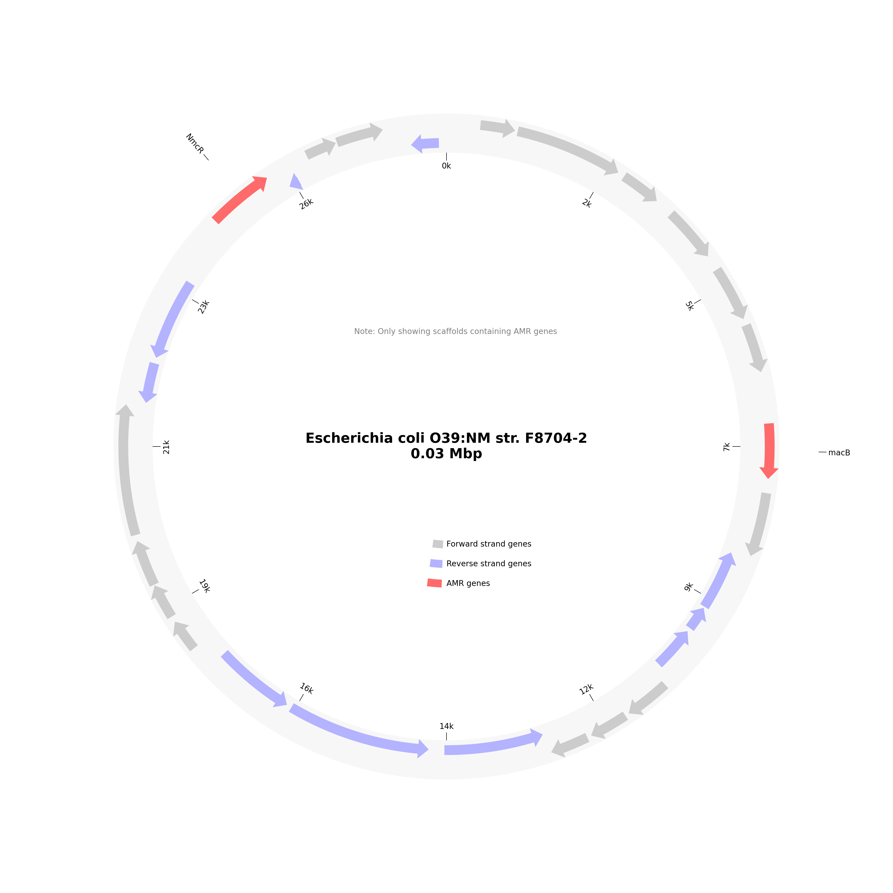

### NmcR
- **Mechanism**: antibiotic inactivation
- **Drug Classes**: carbapenem; cephalosporin; cephamycin; penam
- **AMR Family**: NmcA beta-lactamase
- **Locations**:
  - gnl|SPADES|PBDHLPBC_358_26 : position 24606-25544

### macB
- **Mechanism**: antibiotic efflux
- **Drug Classes**: macrolide antibiotic
- **AMR Family**: ATP-binding cassette (ABC) antibiotic efflux pump
- **Locations**:
  - gnl|SPADES|PBDHLPBC_358_9 : position 6726-7499

## Escherichia coli O84:H7
**Strain Statistics:**
- Total genome length: 3.7 kbp
- Total scaffolds: 1
- Scaffolds with AMR genes: 1
- Total genes annotated: 6
- Total AMR genes: 1
- Unique AMR genes: 1
- Distinct AMR mechanisms: 1
- Distinct AMR families: 1
- Distinct drug classes: 2

**Circos Plot:**

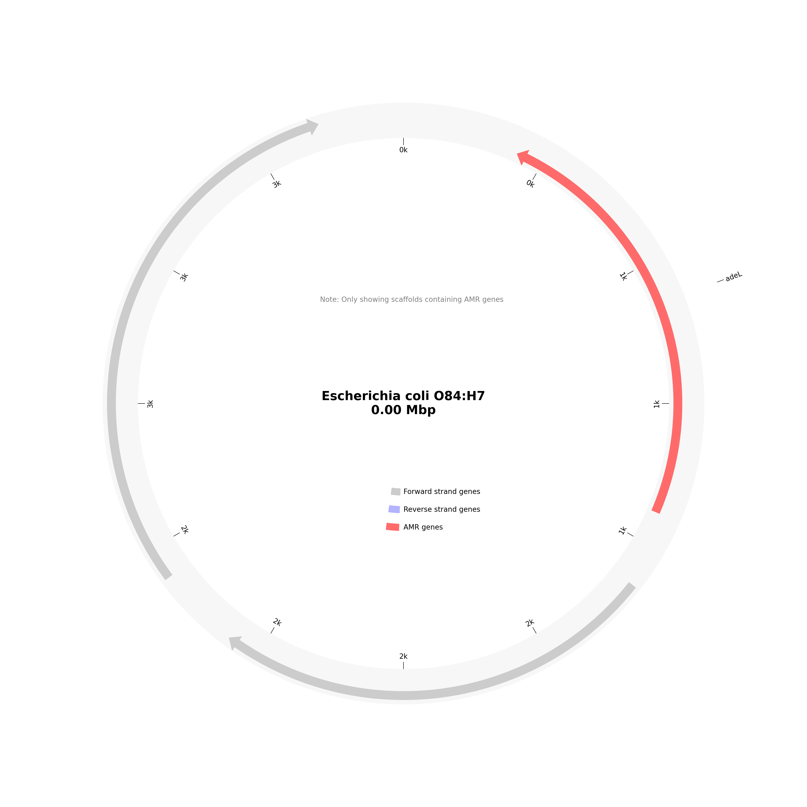

### adeL
- **Mechanism**: antibiotic efflux
- **Drug Classes**: fluoroquinolone antibiotic; tetracycline antibiotic
- **AMR Family**: resistance-nodulation-cell division (RND) antibiotic efflux pump
- **Locations**:
  - gnl|SPADES|PBDHLPBC_1571_1 : position 254-1180

## Ewingella americana
**Strain Statistics:**
- Total genome length: 4695.7 kbp
- Total scaffolds: 62
- Scaffolds with AMR genes: 44
- Total genes annotated: 8849
- Total AMR genes: 517
- Unique AMR genes: 217
- Distinct AMR mechanisms: 12
- Distinct AMR families: 77
- Distinct drug classes: 37

**Circos Plot:**

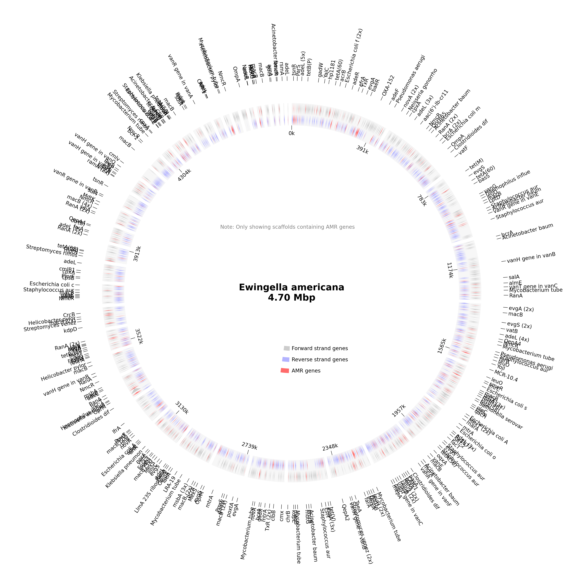

### Acinetobacter baumannii AbaF (found in 7 locations)
- **Mechanism**: antibiotic efflux
- **Drug Classes**: phosphonic acid antibiotic
- **AMR Family**: major facilitator superfamily (MFS) antibiotic efflux pump
- **Locations**:
  - gnl|SPADES|PBDHLPBC_13_93 : position 114299-115630
  - gnl|SPADES|PBDHLPBC_15_96 : position 86758-88260
  - gnl|SPADES|PBDHLPBC_1_297 : position 309454-310803
  - gnl|SPADES|PBDHLPBC_4_138 : position 150250-151572
  - gnl|SPADES|PBDHLPBC_5_208 : position 211583-212899
  - gnl|SPADES|PBDHLPBC_7_18 : position 21296-22642
  - gnl|SPADES|PBDHLPBC_900_5 : position 3789-5027

### Acinetobacter baumannii AbaQ (found in 7 locations)
- **Mechanism**: antibiotic efflux
- **Drug Classes**: fluoroquinolone antibiotic
- **AMR Family**: major facilitator superfamily (MFS) antibiotic efflux pump
- **Locations**:
  - gnl|SPADES|PBDHLPBC_11_38 : position 47556-48911
  - gnl|SPADES|PBDHLPBC_11_47 : position 58874-60103
  - gnl|SPADES|PBDHLPBC_12_5 : position 3453-4793
  - gnl|SPADES|PBDHLPBC_220_42 : position 37318-38514
  - gnl|SPADES|PBDHLPBC_4_226 : position 247219-248487
  - gnl|SPADES|PBDHLPBC_4_233 : position 254299-255615
  - gnl|SPADES|PBDHLPBC_51_33 : position 58546-59901

### ArnT
- **Mechanism**: antibiotic target alteration
- **Drug Classes**: peptide antibiotic
- **AMR Family**: pmr phosphoethanolamine transferase
- **Locations**:
  - gnl|SPADES|PBDHLPBC_43_29: position 31686-33356

### CAR-1 (found in 2 locations)
- **Mechanism**: antibiotic inactivation
- **Drug Classes**: carbapenem
- **AMR Family**: CAR beta-lactamase
- **Locations**:
  - gnl|SPADES|PBDHLPBC_12_92 : position 91273-91998
  - gnl|SPADES|PBDHLPBC_300_11 : position 11015-11770

### CRP (found in 2 locations)
- **Mechanism**: antibiotic efflux
- **Drug Classes**: macrolide antibiotic; fluoroquinolone antibiotic; penam
- **AMR Family**: resistance-nodulation-cell division (RND) antibiotic efflux pump
- **Locations**:
  - gnl|SPADES|PBDHLPBC_147_37 : position 38999-39754
  - gnl|SPADES|PBDHLPBC_220_45: position 40388-41020

### CfiA11
- **Mechanism**: antibiotic inactivation
- **Drug Classes**: carbapenem
- **AMR Family**: CfiA beta-lactamase
- **Locations**:
  - gnl|SPADES|PBDHLPBC_12_24 : position 19370-20221

### Clostridioides difficile gyrA conferring resistance to fluoroquinolones
- **Mechanism**: antibiotic target alteration
- **Drug Classes**: fluoroquinolone antibiotic
- **AMR Family**: fluoroquinolone resistant gyrA
- **Locations**:
  - gnl|SPADES|PBDHLPBC_51_6 : position 6867-9536

### Clostridioides difficile gyrB conferring resistance to fluoroquinolones (found in 2 locations)
- **Mechanism**: antibiotic target alteration
- **Drug Classes**: fluoroquinolone antibiotic
- **AMR Family**: fluoroquinolone resistant gyrB
- **Locations**:
  - gnl|SPADES|PBDHLPBC_12_68 : position 63724-65640
  - gnl|SPADES|PBDHLPBC_4_239 : position 260340-262754

### CrcB
- **Mechanism**: antibiotic efflux
- **Drug Classes**: aminoglycoside antibiotic
- **AMR Family**: multidrug and toxic compound extrusion (MATE) transporter
- **Locations**:
  - gnl|SPADES|PBDHLPBC_71_68 : position 74402-74785

### Enterobacter cloacae acrA
- **Mechanism**: antibiotic efflux
- **Drug Classes**: fluoroquinolone antibiotic; cephalosporin; glycylcycline; penam; tetracycline antibiotic; rifamycin antibiotic; phenicol antibiotic; disinfecting agents and antiseptics
- **AMR Family**: resistance-nodulation-cell division (RND) antibiotic efflux pump
- **Locations**:
  - gnl|SPADES|PBDHLPBC_1_189 : position 196663-197853

### Enterococcus faecalis cls with mutation conferring resistance to daptomycin
- **Mechanism**: antibiotic target alteration
- **Drug Classes**: peptide antibiotic
- **AMR Family**: daptomycin resistant cls
- **Locations**:
  - gnl|SPADES|PBDHLPBC_69_65 : position 70583-72043

### ErmC
- **Mechanism**: antibiotic target alteration
- **Drug Classes**: macrolide antibiotic; lincosamide antibiotic; streptogramin antibiotic; streptogramin A antibiotic; streptogramin B antibiotic
- **AMR Family**: Erm 23S ribosomal RNA methyltransferase
- **Locations**:
  - gnl|SPADES|PBDHLPBC_5_185 : position 183598-184431

### Escherichia coli AcrAB-TolC with AcrR mutation conferring resistance to ciprofloxacin, tetracycline, and ceftazidime (found in 2 locations)
- **Mechanism**: antibiotic target alteration; antibiotic efflux
- **Drug Classes**: fluoroquinolone antibiotic; cephalosporin; glycylcycline; penam; tetracycline antibiotic; rifamycin antibiotic; phenicol antibiotic; disinfecting agents and antiseptics
- **AMR Family**: resistance-nodulation-cell division (RND) antibiotic efflux pump
- **Locations**:
  - gnl|SPADES|PBDHLPBC_30_126 : position 128297-128896
  - gnl|SPADES|PBDHLPBC_9_178 : position 180766-181371

### Escherichia coli EF-Tu mutants conferring resistance to Pulvomycin
- **Mechanism**: antibiotic target alteration
- **Drug Classes**: elfamycin antibiotic
- **AMR Family**: elfamycin resistant EF-Tu
- **Locations**:
  - gnl|SPADES|PBDHLPBC_220_7 : position 3958-5142

### Escherichia coli cyaA with mutation conferring resistance to fosfomycin
- **Mechanism**: antibiotic target alteration
- **Drug Classes**: phosphonic acid antibiotic
- **AMR Family**: antibiotic-resistant cya adenylate cyclase
- **Locations**:
  - gnl|SPADES|PBDHLPBC_74_81 : position 81057-83615

### Escherichia coli fabI mutations conferring resistance to isoniazid and triclosan (found in 2 locations)
- **Mechanism**: antibiotic target alteration
- **Drug Classes**: disinfecting agents and antiseptics; isoniazid-like antibiotic
- **AMR Family**: antibiotic resistant fabI
- **Locations**:
  - gnl|SPADES|PBDHLPBC_1_208 : position 216900-217676
  - gnl|SPADES|PBDHLPBC_1_213 : position 221171-221917

### Escherichia coli mdfA (found in 2 locations)
- **Mechanism**: antibiotic efflux
- **Drug Classes**: tetracycline antibiotic; phenicol antibiotic; disinfecting agents and antiseptics
- **AMR Family**: major facilitator superfamily (MFS) antibiotic efflux pump
- **Locations**:
  - gnl|SPADES|PBDHLPBC_4_192 : position 211337-212575
  - gnl|SPADES|PBDHLPBC_7_183 : position 182439-183662

### Escherichia coli ompF with mutation conferring resistance to beta-lactam antibiotics
- **Mechanism**: reduced permeability to antibiotic
- **Drug Classes**: monobactam; carbapenem; cephalosporin; cephamycin; penam; penem
- **AMR Family**: General Bacterial Porin with reduced permeability to beta-lactams
- **Locations**:
  - gnl|SPADES|PBDHLPBC_11_16 : position 19118-20257

### Escherichia coli soxS with mutation conferring antibiotic resistance (found in 4 locations)
- **Mechanism**: antibiotic target alteration; antibiotic efflux; reduced permeability to antibiotic
- **Drug Classes**: fluoroquinolone antibiotic; monobactam; carbapenem; cephalosporin; glycylcycline; cephamycin; penam; tetracycline antibiotic; rifamycin antibiotic; phenicol antibiotic; penem; disinfecting agents and antiseptics
- **AMR Family**: ATP-binding cassette (ABC) antibiotic efflux pump; major facilitator superfamily (MFS) antibiotic efflux pump; resistance-nodulation-cell division (RND) antibiotic efflux pump; General Bacterial Porin with reduced permeability to beta-lactams
- **Locations**:
  - gnl|SPADES|PBDHLPBC_11_21 : position 24094-24930
  - gnl|SPADES|PBDHLPBC_11_5 : position 4668-5495
  - gnl|SPADES|PBDHLPBC_5_219 : position 225358-226224
  - gnl|SPADES|PBDHLPBC_9_54 : position 52680-53039

### EstT (found in 2 locations)
- **Mechanism**: antibiotic inactivation
- **Drug Classes**: macrolide antibiotic
- **AMR Family**: macrolide esterase
- **Locations**:
  - gnl|SPADES|PBDHLPBC_15_26 : position 28914-29753
  - gnl|SPADES|PBDHLPBC_8_254 : position 266798-267808

### FosA3
- **Mechanism**: antibiotic inactivation
- **Drug Classes**: phosphonic acid antibiotic
- **AMR Family**: fosfomycin thiol transferase
- **Locations**:
  - gnl|SPADES|PBDHLPBC_30_53 : position 54747-55172

### FosA8
- **Mechanism**: antibiotic inactivation
- **Drug Classes**: phosphonic acid antibiotic
- **AMR Family**: fosfomycin thiol transferase
- **Locations**:
  - gnl|SPADES|PBDHLPBC_1_39: position 44163-44573

### FosM2
- **Mechanism**: antibiotic inactivation
- **Drug Classes**: phosphonic acid antibiotic
- **AMR Family**: fosfomycin thiol transferase
- **Locations**:
  - gnl|SPADES|PBDHLPBC_69_10 : position 10937-11344

### H-NS
- **Mechanism**: antibiotic efflux
- **Drug Classes**: macrolide antibiotic; fluoroquinolone antibiotic; cephalosporin; cephamycin; penam; tetracycline antibiotic
- **AMR Family**: major facilitator superfamily (MFS) antibiotic efflux pump; resistance-nodulation-cell division (RND) antibiotic efflux pump
- **Locations**:
  - gnl|SPADES|PBDHLPBC_69_55 : position 57468-57875

### Haemophilus influenzae PBP3 conferring resistance to beta-lactam antibiotics (found in 2 locations)
- **Mechanism**: antibiotic target alteration
- **Drug Classes**: cephalosporin; cephamycin; penam
- **AMR Family**: Penicillin-binding protein mutations conferring resistance to beta-lactam antibiotics
- **Locations**:
  - gnl|SPADES|PBDHLPBC_51_20 : position 44230-46005
  - gnl|SPADES|PBDHLPBC_5_158 : position 146830-148593

### Helicobacter pylori pbp1 mutants conferring resistance to amoxicillin
- **Mechanism**: antibiotic target alteration
- **Drug Classes**: cephalosporin; cephamycin; penam
- **AMR Family**: Penicillin-binding protein mutations conferring resistance to beta-lactam antibiotics
- **Locations**:
  - gnl|SPADES|PBDHLPBC_63_83 : position 90226-92583

### Helicobacter pylori pbp2 mutants conferring resistance to amoxicillin
- **Mechanism**: antibiotic target alteration
- **Drug Classes**: cephalosporin; cephamycin; penam
- **AMR Family**: Penicillin-binding protein mutations conferring resistance to beta-lactam antibiotics
- **Locations**:
  - gnl|SPADES|PBDHLPBC_71_53 : position 59101-61005

### Helicobacter pylori rpoB mutation conferring resistance to rifampicin
- **Mechanism**: antibiotic target alteration; antibiotic target replacement
- **Drug Classes**: fluoroquinolone antibiotic; rifamycin antibiotic
- **AMR Family**: rifamycin-resistant beta-subunit of RNA polymerase (rpoB)
- **Locations**:
  - gnl|SPADES|PBDHLPBC_372_16 : position 14593-18813

### Klebsiella aerogenes Omp36
- **Mechanism**: reduced permeability to antibiotic
- **Drug Classes**: monobactam; carbapenem; cephalosporin; cephamycin; penam; penem
- **AMR Family**: General Bacterial Porin with reduced permeability to beta-lactams
- **Locations**:
  - gnl|SPADES|PBDHLPBC_51_16 : position 40914-42035

### Klebsiella pneumoniae KpnG
- **Mechanism**: antibiotic efflux
- **Drug Classes**: macrolide antibiotic; fluoroquinolone antibiotic; aminoglycoside antibiotic; carbapenem; cephalosporin; penam; peptide antibiotic; penem
- **AMR Family**: major facilitator superfamily (MFS) antibiotic efflux pump
- **Locations**:
  - gnl|SPADES|PBDHLPBC_1_8 : position 9511-10707

### Klebsiella pneumoniae KpnH (found in 2 locations)
- **Mechanism**: antibiotic efflux
- **Drug Classes**: macrolide antibiotic; fluoroquinolone antibiotic; aminoglycoside antibiotic; carbapenem; cephalosporin; penam; peptide antibiotic; penem
- **AMR Family**: major facilitator superfamily (MFS) antibiotic efflux pump
- **Locations**:
  - gnl|SPADES|PBDHLPBC_1_7: position 7949-9493
  - gnl|SPADES|PBDHLPBC_8_227 : position 232377-233945

### Klebsiella pneumoniae OmpK37 (found in 4 locations)
- **Mechanism**: reduced permeability to antibiotic
- **Drug Classes**: monobactam; carbapenem; cephalosporin; cephamycin; penam; penem
- **AMR Family**: General Bacterial Porin with reduced permeability to beta-lactams
- **Locations**:
  - gnl|SPADES|PBDHLPBC_20_79 : position 101365-102474
  - gnl|SPADES|PBDHLPBC_221_3 : position 2668-3771
  - gnl|SPADES|PBDHLPBC_30_94 : position 91570-92670
  - gnl|SPADES|PBDHLPBC_9_142 : position 138067-139227

### Klebsiella pneumoniae acrR with mutation conferring multidrug antibiotic resistance
- **Mechanism**: antibiotic target alteration; antibiotic efflux
- **Drug Classes**: fluoroquinolone antibiotic; cephalosporin; glycylcycline; penam; tetracycline antibiotic; rifamycin antibiotic; phenicol antibiotic; disinfecting agents and antiseptics
- **AMR Family**: resistance-nodulation-cell division (RND) antibiotic efflux pump
- **Locations**:
  - gnl|SPADES|PBDHLPBC_1_190 : position 197959-198642

### Klebsiella pneumoniae ramR mutants
- **Mechanism**: antibiotic target alteration; antibiotic efflux
- **Drug Classes**: fluoroquinolone antibiotic; cephalosporin; glycylcycline; penam; tetracycline antibiotic; rifamycin antibiotic; phenicol antibiotic; disinfecting agents and antiseptics
- **AMR Family**: resistance-nodulation-cell division (RND) antibiotic efflux pump
- **Locations**:
  - gnl|SPADES|PBDHLPBC_4_120 : position 132385-133038

### LRA-19
- **Mechanism**: antibiotic inactivation
- **Drug Classes**: cephalosporin; penam
- **AMR Family**: subclass B3 LRA beta-lactamase
- **Locations**:
  - gnl|SPADES|PBDHLPBC_20_77 : position 99202-99849

### LlmA 23S ribosomal RNA methyltransferase
- **Mechanism**: antibiotic target alteration
- **Drug Classes**: lincosamide antibiotic
- **AMR Family**: Llm 23S ribosomal RNA methyltransferase
- **Locations**:
  - gnl|SPADES|PBDHLPBC_20_111 : position 139717-140910

### LpsB
- **Mechanism**: reduced permeability to antibiotic
- **Drug Classes**: peptide antibiotic
- **AMR Family**: Intrinsic peptide antibiotic resistant Lps
- **Locations**:
  - gnl|SPADES|PBDHLPBC_94_6 : position 4705-5805

### LptD
- **Mechanism**: antibiotic efflux
- **Drug Classes**: carbapenem; peptide antibiotic; aminocoumarin antibiotic; rifamycin antibiotic
- **AMR Family**: ATP-binding cassette (ABC) antibiotic efflux pump
- **Locations**:
  - gnl|SPADES|PBDHLPBC_5_182 : position 178843-181218

### MCR-10.4
- **Mechanism**: antibiotic target alteration
- **Drug Classes**: peptide antibiotic
- **AMR Family**: MCR phosphoethanolamine transferase
- **Locations**:
  - gnl|SPADES|PBDHLPBC_8_253 : position 265104-266735

### MdtK
- **Mechanism**: antibiotic efflux
- **Drug Classes**: fluoroquinolone antibiotic
- **AMR Family**: multidrug and toxic compound extrusion (MATE) transporter
- **Locations**:
  - gnl|SPADES|PBDHLPBC_121_52 : position 59148-60539

### MexH
- **Mechanism**: antibiotic efflux
- **Drug Classes**: fluoroquinolone antibiotic; tetracycline antibiotic; disinfecting agents and antiseptics
- **AMR Family**: resistance-nodulation-cell division (RND) antibiotic efflux pump
- **Locations**:
  - gnl|SPADES|PBDHLPBC_484_4 : position 4164-5420

### MexS (found in 3 locations)
- **Mechanism**: antibiotic efflux
- **Drug Classes**: fluoroquinolone antibiotic; diaminopyrimidine antibiotic; phenicol antibiotic
- **AMR Family**: resistance-nodulation-cell division (RND) antibiotic efflux pump
- **Locations**:
  - gnl|SPADES|PBDHLPBC_12_143 : position 141030-142016
  - gnl|SPADES|PBDHLPBC_20_4 : position 3424-4548
  - gnl|SPADES|PBDHLPBC_30_27 : position 28323-29366

### MexT (found in 3 locations)
- **Mechanism**: antibiotic efflux
- **Drug Classes**: fluoroquinolone antibiotic; diaminopyrimidine antibiotic; phenicol antibiotic
- **AMR Family**: resistance-nodulation-cell division (RND) antibiotic efflux pump
- **Locations**:
  - gnl|SPADES|PBDHLPBC_69_29 : position 28489-29436
  - gnl|SPADES|PBDHLPBC_9_188 : position 190747-191664
  - gnl|SPADES|PBDHLPBC_9_83 : position 83729-84658

### MexZ (found in 2 locations)
- **Mechanism**: antibiotic efflux
- **Drug Classes**: macrolide antibiotic; fluoroquinolone antibiotic; aminoglycoside antibiotic; carbapenem; cephalosporin; cephamycin; penam; tetracycline antibiotic; phenicol antibiotic; disinfecting agents and antiseptics
- **AMR Family**: resistance-nodulation-cell division (RND) antibiotic efflux pump
- **Locations**:
  - gnl|SPADES|PBDHLPBC_213_11 : position 10315-10935
  - gnl|SPADES|PBDHLPBC_8_166 : position 171027-171608

### MuxA
- **Mechanism**: antibiotic efflux
- **Drug Classes**: macrolide antibiotic; monobactam; tetracycline antibiotic; aminocoumarin antibiotic
- **AMR Family**: resistance-nodulation-cell division (RND) antibiotic efflux pump
- **Locations**:
  - gnl|SPADES|PBDHLPBC_13_41 : position 59040-60335

### MuxC
- **Mechanism**: antibiotic efflux
- **Drug Classes**: macrolide antibiotic; monobactam; tetracycline antibiotic; aminocoumarin antibiotic
- **AMR Family**: resistance-nodulation-cell division (RND) antibiotic efflux pump
- **Locations**:
  - gnl|SPADES|PBDHLPBC_13_39 : position 52687-55815

### Mycobacterium tuberculosis gidB mutation conferring resistance to streptomycin
- **Mechanism**: antibiotic target alteration
- **Drug Classes**: aminoglycoside antibiotic
- **AMR Family**: antibiotic resistant gidB
- **Locations**:
  - gnl|SPADES|PBDHLPBC_4_270 : position 294860-295480

### Mycobacterium tuberculosis kasA mutant conferring resistance to isoniazid
- **Mechanism**: antibiotic target alteration
- **Drug Classes**: isoniazid-like antibiotic
- **AMR Family**: antibiotic resistant kasA
- **Locations**:
  - gnl|SPADES|PBDHLPBC_213_10 : position 8889-10163

### Mycobacterium tuberculosis katG mutations conferring resistance to isoniazid
- **Mechanism**: antibiotic target alteration
- **Drug Classes**: isoniazid-like antibiotic
- **AMR Family**: isoniazid resistant katG
- **Locations**:
  - gnl|SPADES|PBDHLPBC_8_157 : position 161216-163393

### Mycobacterium tuberculosis ndh with mutation conferring resistance to isoniazid
- **Mechanism**: antibiotic target alteration
- **Drug Classes**: isoniazid-like antibiotic
- **AMR Family**: antibiotic resistant ndh
- **Locations**:
  - gnl|SPADES|PBDHLPBC_15_153 : position 140534-141841

### Mycobacterium tuberculosis pncA mutations conferring resistance to pyrazinamide (found in 2 locations)
- **Mechanism**: antibiotic target alteration
- **Drug Classes**: pyrazine antibiotic
- **AMR Family**: Pyrazinamide resistant pncA
- **Locations**:
  - gnl|SPADES|PBDHLPBC_18_110 : position 123034-123723
  - gnl|SPADES|PBDHLPBC_7_225 : position 229341-229967

### Mycobacterium tuberculosis rpoB mutations conferring resistance to rifampicin
- **Mechanism**: antibiotic target alteration; antibiotic target replacement
- **Drug Classes**: rifamycin antibiotic
- **AMR Family**: rifamycin-resistant beta-subunit of RNA polymerase (rpoB)
- **Locations**:
  - gnl|SPADES|PBDHLPBC_372_17 : position 18905-22933

### Mycobacterium tuberculosis rpsA mutations conferring resistance to pyrazinamide
- **Mechanism**: antibiotic target alteration
- **Drug Classes**: pyrazine antibiotic
- **AMR Family**: pyrazinamide resistant rpsA
- **Locations**:
  - gnl|SPADES|PBDHLPBC_20_59 : position 75114-76823

### Mycobacterium tuberculosis thyA with mutation conferring resistance to para-aminosalicylic acid
- **Mechanism**: antibiotic target alteration
- **Drug Classes**: salicylic acid antibiotic
- **AMR Family**: aminosalicylate resistant thymidylate synthase
- **Locations**:
  - gnl|SPADES|PBDHLPBC_13_11 : position 17320-18114

### Neisseria gonorrhoeae pilQ gene conferring resistance to beta-lactam
- **Mechanism**: antibiotic target alteration
- **Drug Classes**: cephalosporin; cephamycin; penam
- **AMR Family**: Penicillin-binding protein mutations conferring resistance to beta-lactam antibiotics
- **Locations**:
  - gnl|SPADES|PBDHLPBC_4_27 : position 26249-27520

### NmcR (found in 18 locations)
- **Mechanism**: antibiotic inactivation
- **Drug Classes**: carbapenem; cephalosporin; cephamycin; penam
- **AMR Family**: NmcA beta-lactamase
- **Locations**:
  - gnl|SPADES|PBDHLPBC_121_40 : position 47548-48459
  - gnl|SPADES|PBDHLPBC_147_12 : position 16205-17077
  - gnl|SPADES|PBDHLPBC_168_47 : position 47703-48623
  - gnl|SPADES|PBDHLPBC_1_12 : position 14635-15516
  - gnl|SPADES|PBDHLPBC_1_200 : position 209566-210438
  - gnl|SPADES|PBDHLPBC_1_209 : position 217877-218803
  - gnl|SPADES|PBDHLPBC_1_426 : position 442627-443547
  - gnl|SPADES|PBDHLPBC_220_38 : position 33194-34093
  - gnl|SPADES|PBDHLPBC_221_5 : position 5126-6025
  - gnl|SPADES|PBDHLPBC_30_31 : position 32543-33505
  - gnl|SPADES|PBDHLPBC_385_3 : position 3029-3910
  - gnl|SPADES|PBDHLPBC_480_17 : position 17530-18504
  - gnl|SPADES|PBDHLPBC_4_115 : position 125720-126637
  - gnl|SPADES|PBDHLPBC_63_7 : position 6542-7486
  - gnl|SPADES|PBDHLPBC_74_29 : position 30544-31467
  - gnl|SPADES|PBDHLPBC_8_140 : position 148269-149150
  - gnl|SPADES|PBDHLPBC_900_2 : position 576-1403
  - gnl|SPADES|PBDHLPBC_9_151 : position 147203-148057

### OXA-152
- **Mechanism**: antibiotic inactivation
- **Drug Classes**: carbapenem; penam
- **AMR Family**: OXA beta-lactamase; OXA-62-like beta-lactamase
- **Locations**:
  - gnl|SPADES|PBDHLPBC_1_343 : position 369175-369849

### OmpA (found in 3 locations)
- **Mechanism**: reduced permeability to antibiotic
- **Drug Classes**: peptide antibiotic
- **AMR Family**: General Bacterial Porin with reduced permeability to peptide antibiotics
- **Locations**:
  - gnl|SPADES|PBDHLPBC_20_101 : position 129491-130570
  - gnl|SPADES|PBDHLPBC_468_20 : position 20245-20754
  - gnl|SPADES|PBDHLPBC_4_220 : position 242794-243456

### OpmB
- **Mechanism**: antibiotic efflux
- **Drug Classes**: macrolide antibiotic; monobactam; tetracycline antibiotic; aminocoumarin antibiotic
- **AMR Family**: resistance-nodulation-cell division (RND) antibiotic efflux pump
- **Locations**:
  - gnl|SPADES|PBDHLPBC_13_38 : position 51255-52694

### OprM (found in 2 locations)
- **Mechanism**: antibiotic efflux
- **Drug Classes**: macrolide antibiotic; fluoroquinolone antibiotic; monobactam; aminoglycoside antibiotic; carbapenem; cephalosporin; cephamycin; penam; tetracycline antibiotic; peptide antibiotic; aminocoumarin antibiotic; diaminopyrimidine antibiotic; sulfonamide antibiotic; phenicol antibiotic; penem; disinfecting agents and antiseptics
- **AMR Family**: resistance-nodulation-cell division (RND) antibiotic efflux pump
- **Locations**:
  - gnl|SPADES|PBDHLPBC_19_139 : position 145707-147077
  - gnl|SPADES|PBDHLPBC_51_12 : position 33161-34552

### OprN
- **Mechanism**: antibiotic efflux
- **Drug Classes**: fluoroquinolone antibiotic; diaminopyrimidine antibiotic; phenicol antibiotic
- **AMR Family**: resistance-nodulation-cell division (RND) antibiotic efflux pump
- **Locations**:
  - gnl|SPADES|PBDHLPBC_8_228 : position 233951-235522

### PAM-1
- **Mechanism**: antibiotic inactivation
- **Drug Classes**: carbapenem; cephalosporin
- **AMR Family**: PAM beta-lactamase
- **Locations**:
  - gnl|SPADES|PBDHLPBC_69_30 : position 29511-30413

### ParR (found in 2 locations)
- **Mechanism**: antibiotic efflux; reduced permeability to antibiotic
- **Drug Classes**: macrolide antibiotic; fluoroquinolone antibiotic; monobactam; aminoglycoside antibiotic; carbapenem; cephalosporin; cephamycin; penam; tetracycline antibiotic; phenicol antibiotic; penem; disinfecting agents and antiseptics
- **AMR Family**: resistance-nodulation-cell division (RND) antibiotic efflux pump; Outer Membrane Porin (Opr)
- **Locations**:
  - gnl|SPADES|PBDHLPBC_147_43 : position 46252-46986
  - gnl|SPADES|PBDHLPBC_4_39 : position 41915-42634

### ParS (found in 3 locations)
- **Mechanism**: antibiotic efflux; reduced permeability to antibiotic
- **Drug Classes**: macrolide antibiotic; fluoroquinolone antibiotic; monobactam; aminoglycoside antibiotic; carbapenem; cephalosporin; cephamycin; penam; tetracycline antibiotic; phenicol antibiotic; penem; disinfecting agents and antiseptics
- **AMR Family**: resistance-nodulation-cell division (RND) antibiotic efflux pump; Outer Membrane Porin (Opr)
- **Locations**:
  - gnl|SPADES|PBDHLPBC_147_44 : position 46983-48290
  - gnl|SPADES|PBDHLPBC_1_18 : position 21635-23272
  - gnl|SPADES|PBDHLPBC_9_34 : position 29416-30816

### PmrF (found in 3 locations)
- **Mechanism**: antibiotic target alteration
- **Drug Classes**: peptide antibiotic
- **AMR Family**: pmr phosphoethanolamine transferase
- **Locations**:
  - gnl|SPADES|PBDHLPBC_19_57 : position 66181-67113
  - gnl|SPADES|PBDHLPBC_43_32 : position 36250-37230
  - gnl|SPADES|PBDHLPBC_94_11 : position 10296-11285

### Pseudomonas aeruginosa CpxR (found in 3 locations)
- **Mechanism**: antibiotic efflux
- **Drug Classes**: macrolide antibiotic; fluoroquinolone antibiotic; monobactam; aminoglycoside antibiotic; carbapenem; cephalosporin; cephamycin; penam; tetracycline antibiotic; peptide antibiotic; aminocoumarin antibiotic; diaminopyrimidine antibiotic; sulfonamide antibiotic; phenicol antibiotic; penem
- **AMR Family**: resistance-nodulation-cell division (RND) antibiotic efflux pump
- **Locations**:
  - gnl|SPADES|PBDHLPBC_12_103 : position 100510-101268
  - gnl|SPADES|PBDHLPBC_1_415 : position 430799-431482
  - gnl|SPADES|PBDHLPBC_94_29 : position 28670-29371

### Pseudomonas aeruginosa ampR with mutation conferring resistance to aztreonam
- **Mechanism**: antibiotic target alteration; antibiotic inactivation
- **Drug Classes**: monobactam; carbapenem; cephalosporin
- **AMR Family**: PDC beta-lactamase; ampR transcriptional regulator with mutation conferring resistance to monobactam antibiotics
- **Locations**:
  - gnl|SPADES|PBDHLPBC_8_186 : position 190303-191184

### Pseudomonas mutant PhoQ conferring resistance to colistin
- **Mechanism**: antibiotic target alteration; antibiotic efflux; resistance by absence
- **Drug Classes**: macrolide antibiotic; peptide antibiotic
- **AMR Family**: ATP-binding cassette (ABC) antibiotic efflux pump; pmr phosphoethanolamine transferase; transmembrane protein conferring colistin resistance
- **Locations**:
  - gnl|SPADES|PBDHLPBC_15_164 : position 154954-156408

### QepA2 (found in 2 locations)
- **Mechanism**: antibiotic efflux
- **Drug Classes**: fluoroquinolone antibiotic
- **AMR Family**: major facilitator superfamily (MFS) antibiotic efflux pump
- **Locations**:
  - gnl|SPADES|PBDHLPBC_13_135 : position 162786-164180
  - gnl|SPADES|PBDHLPBC_1_11 : position 13306-14550

### QepA4 (found in 2 locations)
- **Mechanism**: antibiotic efflux
- **Drug Classes**: fluoroquinolone antibiotic
- **AMR Family**: major facilitator superfamily (MFS) antibiotic efflux pump
- **Locations**:
  - gnl|SPADES|PBDHLPBC_117_40 : position 43295-44599
  - gnl|SPADES|PBDHLPBC_8_131 : position 137671-139173

### QnrB65
- **Mechanism**: antibiotic target protection
- **Drug Classes**: fluoroquinolone antibiotic
- **AMR Family**: quinolone resistance protein (qnr)
- **Locations**:
  - gnl|SPADES|PBDHLPBC_4_125 : position 138808-139464

### RanA (found in 27 locations)
- **Mechanism**: antibiotic efflux
- **Drug Classes**: aminoglycoside antibiotic
- **AMR Family**: ATP-binding cassette (ABC) antibiotic efflux pump
- **Locations**:
  - gnl|SPADES|PBDHLPBC_117_1 : position 356-1105
  - gnl|SPADES|PBDHLPBC_117_9 : position 9893-10981
  - gnl|SPADES|PBDHLPBC_11_111 : position 125398-126201
  - gnl|SPADES|PBDHLPBC_121_24 : position 29525-30310
  - gnl|SPADES|PBDHLPBC_121_7 : position 7769-9607
  - gnl|SPADES|PBDHLPBC_12_110 : position 106902-108011
  - gnl|SPADES|PBDHLPBC_12_169 : position 172518-173510
  - gnl|SPADES|PBDHLPBC_13_48 : position 64468-65190
  - gnl|SPADES|PBDHLPBC_13_79 : position 101046-102191
  - gnl|SPADES|PBDHLPBC_15_9 : position 10279-11358
  - gnl|SPADES|PBDHLPBC_19_18 : position 23394-24308
  - gnl|SPADES|PBDHLPBC_19_79 : position 85417-86550
  - gnl|SPADES|PBDHLPBC_1_107 : position 107707-108528
  - gnl|SPADES|PBDHLPBC_1_16 : position 18996-20192
  - gnl|SPADES|PBDHLPBC_20_117 : position 146462-147532
  - gnl|SPADES|PBDHLPBC_30_78 : position 78501-79445
  - gnl|SPADES|PBDHLPBC_4_155 : position 175139-176155
  - gnl|SPADES|PBDHLPBC_4_255 : position 279401-280177
  - gnl|SPADES|PBDHLPBC_51_43 : position 68389-69984
  - gnl|SPADES|PBDHLPBC_63_27 : position 30344-31117
  - gnl|SPADES|PBDHLPBC_69_62 : position 67940-68965
  - gnl|SPADES|PBDHLPBC_69_63 : position 68962-69999
  - gnl|SPADES|PBDHLPBC_74_40 : position 39647-40720
  - gnl|SPADES|PBDHLPBC_7_244 : position 249200-250279
  - gnl|SPADES|PBDHLPBC_8_119 : position 123125-124777
  - gnl|SPADES|PBDHLPBC_9_124 : position 121605-123212
  - gnl|SPADES|PBDHLPBC_9_195 : position 197265-198017

### RanB
- **Mechanism**: antibiotic efflux
- **Drug Classes**: aminoglycoside antibiotic
- **AMR Family**: ATP-binding cassette (ABC) antibiotic efflux pump
- **Locations**:
  - gnl|SPADES|PBDHLPBC_11_110 : position 124600-125382

### Rhodococcus fascians cmr
- **Mechanism**: antibiotic efflux
- **Drug Classes**: phenicol antibiotic
- **AMR Family**: major facilitator superfamily (MFS) antibiotic efflux pump
- **Locations**:
  - gnl|SPADES|PBDHLPBC_9_78 : position 79693-80055

### Rv1877 (found in 2 locations)
- **Mechanism**: antibiotic efflux
- **Drug Classes**: fluoroquinolone antibiotic
- **AMR Family**: major facilitator superfamily (MFS) antibiotic efflux pump
- **Locations**:
  - gnl|SPADES|PBDHLPBC_11_40 : position 49855-51138
  - gnl|SPADES|PBDHLPBC_4_119 : position 130698-132236

### SRT-2
- **Mechanism**: antibiotic inactivation
- **Drug Classes**: cephalosporin
- **AMR Family**: SRT beta-lactamase
- **Locations**:
  - gnl|SPADES|PBDHLPBC_11_48 : position 60216-61361

### SST-1
- **Mechanism**: antibiotic inactivation
- **Drug Classes**: cephalosporin
- **AMR Family**: SST beta-lactamase
- **Locations**:
  - gnl|SPADES|PBDHLPBC_8_187 : position 191311-192450

### Salmonella serovars soxS with mutation conferring antibiotic resistance (found in 2 locations)
- **Mechanism**: antibiotic target alteration; antibiotic efflux; reduced permeability to antibiotic
- **Drug Classes**: fluoroquinolone antibiotic; monobactam; carbapenem; cephalosporin; glycylcycline; cephamycin; penam; tetracycline antibiotic; rifamycin antibiotic; phenicol antibiotic; penem; disinfecting agents and antiseptics
- **AMR Family**: ATP-binding cassette (ABC) antibiotic efflux pump; major facilitator superfamily (MFS) antibiotic efflux pump; resistance-nodulation-cell division (RND) antibiotic efflux pump; General Bacterial Porin with reduced permeability to beta-lactams
- **Locations**:
  - gnl|SPADES|PBDHLPBC_51_19 : position 43327-43713
  - gnl|SPADES|PBDHLPBC_9_116 : position 115046-115930

### SatA
- **Mechanism**: antibiotic inactivation
- **Drug Classes**: nucleoside antibiotic
- **AMR Family**: streptothricin acetyltransferase (SAT)
- **Locations**:
  - gnl|SPADES|PBDHLPBC_4_185 : position 205116-205568

### Staphylococcus aureus GlpT with mutation conferring resistance to fosfomycin
- **Mechanism**: antibiotic target alteration
- **Drug Classes**: phosphonic acid antibiotic
- **AMR Family**: antibiotic-resistant GlpT
- **Locations**:
  - gnl|SPADES|PBDHLPBC_74_62 : position 61694-63046

### Staphylococcus aureus fusA with mutation conferring resistance to fusidic acid (found in 3 locations)
- **Mechanism**: antibiotic target alteration
- **Drug Classes**: fusidane antibiotic
- **AMR Family**: antibiotic resistant fusA
- **Locations**:
  - gnl|SPADES|PBDHLPBC_220_8 : position 5214-7328
  - gnl|SPADES|PBDHLPBC_5_241 : position 249058-250647
  - gnl|SPADES|PBDHLPBC_8_197 : position 201172-203274

### Staphylococcus aureus mupA conferring resistance to mupirocin (found in 2 locations)
- **Mechanism**: antibiotic target alteration
- **Drug Classes**: mupirocin-like antibiotic
- **AMR Family**: antibiotic-resistant isoleucyl-tRNA synthetase (ileS)
- **Locations**:
  - gnl|SPADES|PBDHLPBC_5_200 : position 200429-203245
  - gnl|SPADES|PBDHLPBC_71_47 : position 53052-55634

### Staphylococcus aureus mupB conferring resistance to mupirocin
- **Mechanism**: antibiotic target alteration
- **Drug Classes**: mupirocin-like antibiotic
- **AMR Family**: antibiotic-resistant isoleucyl-tRNA synthetase (ileS)
- **Locations**:
  - gnl|SPADES|PBDHLPBC_11_85 : position 94008-96863

### Staphylococcus aureus murA with mutation conferring resistance to fosfomycin
- **Mechanism**: antibiotic target alteration
- **Drug Classes**: phosphonic acid antibiotic
- **AMR Family**: antibiotic-resistant murA transferase
- **Locations**:
  - gnl|SPADES|PBDHLPBC_11_105 : position 121311-122570

### Staphylococcus aureus norA
- **Mechanism**: antibiotic efflux
- **Drug Classes**: fluoroquinolone antibiotic
- **AMR Family**: major facilitator superfamily (MFS) antibiotic efflux pump
- **Locations**:
  - gnl|SPADES|PBDHLPBC_15_12 : position 14758-16068

### Staphylococcus aureus pgsA mutations conferring resistance to daptomycin
- **Mechanism**: antibiotic target alteration
- **Drug Classes**: peptide antibiotic
- **AMR Family**: daptomycin resistant pgsA
- **Locations**:
  - gnl|SPADES|PBDHLPBC_15_42 : position 44843-45391

### Streptomyces lividans cmlR
- **Mechanism**: antibiotic efflux
- **Drug Classes**: phenicol antibiotic
- **AMR Family**: major facilitator superfamily (MFS) antibiotic efflux pump
- **Locations**:
  - gnl|SPADES|PBDHLPBC_8_159 : position 163732-164919

### Streptomyces rimosus otr(A) (found in 2 locations)
- **Mechanism**: antibiotic target protection
- **Drug Classes**: tetracycline antibiotic
- **AMR Family**: tetracycline-resistant ribosomal protection protein
- **Locations**:
  - gnl|SPADES|PBDHLPBC_103_3 : position 2022-4715
  - gnl|SPADES|PBDHLPBC_213_26 : position 27675-29498

### Streptomyces venezuelae rox (found in 4 locations)
- **Mechanism**: antibiotic inactivation
- **Drug Classes**: rifamycin antibiotic
- **AMR Family**: rifampin monooxygenase
- **Locations**:
  - gnl|SPADES|PBDHLPBC_13_101 : position 124209-125435
  - gnl|SPADES|PBDHLPBC_13_102 : position 125458-126609
  - gnl|SPADES|PBDHLPBC_221_29 : position 32568-33776
  - gnl|SPADES|PBDHLPBC_71_36 : position 41393-42577

### TaeA (found in 3 locations)
- **Mechanism**: antibiotic efflux
- **Drug Classes**: pleuromutilin antibiotic
- **AMR Family**: ATP-binding cassette (ABC) antibiotic efflux pump
- **Locations**:
  - gnl|SPADES|PBDHLPBC_13_88 : position 109667-111199
  - gnl|SPADES|PBDHLPBC_20_93 : position 120238-122142
  - gnl|SPADES|PBDHLPBC_5_224 : position 230237-231904

### TolC
- **Mechanism**: antibiotic efflux
- **Drug Classes**: macrolide antibiotic; fluoroquinolone antibiotic; aminoglycoside antibiotic; carbapenem; cephalosporin; glycylcycline; cephamycin; penam; tetracycline antibiotic; peptide antibiotic; aminocoumarin antibiotic; rifamycin antibiotic; phenicol antibiotic; penem; disinfecting agents and antiseptics
- **AMR Family**: ATP-binding cassette (ABC) antibiotic efflux pump; major facilitator superfamily (MFS) antibiotic efflux pump; resistance-nodulation-cell division (RND) antibiotic efflux pump
- **Locations**:
  - gnl|SPADES|PBDHLPBC_12_73 : position 68478-70013

### TxR (found in 6 locations)
- **Mechanism**: antibiotic efflux
- **Drug Classes**: tetracycline antibiotic
- **AMR Family**: ATP-binding cassette (ABC) antibiotic efflux pump
- **Locations**:
  - gnl|SPADES|PBDHLPBC_18_52 : position 54783-56120
  - gnl|SPADES|PBDHLPBC_18_99 : position 107486-109390
  - gnl|SPADES|PBDHLPBC_1_271 : position 286301-287284
  - gnl|SPADES|PBDHLPBC_213_29 : position 32694-34106
  - gnl|SPADES|PBDHLPBC_69_40 : position 42005-43015
  - gnl|SPADES|PBDHLPBC_7_233 : position 237833-239401

### YajC
- **Mechanism**: antibiotic efflux
- **Drug Classes**: fluoroquinolone antibiotic; cephalosporin; glycylcycline; penam; tetracycline antibiotic; oxazolidinone antibiotic; glycopeptide antibiotic; rifamycin antibiotic; phenicol antibiotic; disinfecting agents and antiseptics
- **AMR Family**: resistance-nodulation-cell division (RND) antibiotic efflux pump
- **Locations**:
  - gnl|SPADES|PBDHLPBC_1_126 : position 131646-131978

### YojI
- **Mechanism**: antibiotic efflux
- **Drug Classes**: peptide antibiotic
- **AMR Family**: ATP-binding cassette (ABC) antibiotic efflux pump
- **Locations**:
  - gnl|SPADES|PBDHLPBC_8_232 : position 240679-242454

### aac(6')-Ib-cr11
- **Mechanism**: antibiotic inactivation
- **Drug Classes**: fluoroquinolone antibiotic; aminoglycoside antibiotic
- **AMR Family**: AAC(6'); AAC(6')-Ib-cr
- **Locations**:
  - gnl|SPADES|PBDHLPBC_4_85 : position 95254-95781

### acrB
- **Mechanism**: antibiotic efflux
- **Drug Classes**: fluoroquinolone antibiotic; cephalosporin; glycylcycline; penam; tetracycline antibiotic; rifamycin antibiotic; phenicol antibiotic; disinfecting agents and antiseptics
- **AMR Family**: resistance-nodulation-cell division (RND) antibiotic efflux pump
- **Locations**:
  - gnl|SPADES|PBDHLPBC_1_188 : position 193491-196646

### adeF (found in 2 locations)
- **Mechanism**: antibiotic efflux
- **Drug Classes**: fluoroquinolone antibiotic; tetracycline antibiotic
- **AMR Family**: resistance-nodulation-cell division (RND) antibiotic efflux pump
- **Locations**:
  - gnl|SPADES|PBDHLPBC_1_393: position 405736-408918
  - gnl|SPADES|PBDHLPBC_9_56: position 54651-57800

### adeG
- **Mechanism**: antibiotic efflux
- **Drug Classes**: fluoroquinolone antibiotic; tetracycline antibiotic
- **AMR Family**: resistance-nodulation-cell division (RND) antibiotic efflux pump
- **Locations**:
  - gnl|SPADES|PBDHLPBC_69_16 : position 16916-17773

### adeL (found in 38 locations)
- **Mechanism**: antibiotic efflux
- **Drug Classes**: fluoroquinolone antibiotic; tetracycline antibiotic
- **AMR Family**: resistance-nodulation-cell division (RND) antibiotic efflux pump
- **Locations**:
  - gnl|SPADES|PBDHLPBC_117_12 : position 12951-13844
  - gnl|SPADES|PBDHLPBC_117_39 : position 42266-43171
  - gnl|SPADES|PBDHLPBC_11_143 : position 153184-154116
  - gnl|SPADES|PBDHLPBC_11_173 : position 186789-187691
  - gnl|SPADES|PBDHLPBC_11_34 : position 42703-43629
  - gnl|SPADES|PBDHLPBC_12_126 : position 123063-123956
  - gnl|SPADES|PBDHLPBC_12_133 : position 131486-132382
  - gnl|SPADES|PBDHLPBC_12_139 : position 136326-137258
  - gnl|SPADES|PBDHLPBC_12_37 : position 30400-31287
  - gnl|SPADES|PBDHLPBC_12_93 : position 92263-93111
  - gnl|SPADES|PBDHLPBC_13_27 : position 37890-38798
  - gnl|SPADES|PBDHLPBC_1503_1 : position 267-1223
  - gnl|SPADES|PBDHLPBC_164_6 : position 4532-5434
  - gnl|SPADES|PBDHLPBC_18_10 : position 8930-9850
  - gnl|SPADES|PBDHLPBC_1_177 : position 187669-188616
  - gnl|SPADES|PBDHLPBC_1_251 : position 257560-258471
  - gnl|SPADES|PBDHLPBC_1_255 : position 260115-261005
  - gnl|SPADES|PBDHLPBC_1_35 : position 39848-40759
  - gnl|SPADES|PBDHLPBC_1_99 : position 98746-99639
  - gnl|SPADES|PBDHLPBC_20_125 : position 153735-154616
  - gnl|SPADES|PBDHLPBC_260_24 : position 26581-27456
  - gnl|SPADES|PBDHLPBC_300_15 : position 15637-16527
  - gnl|SPADES|PBDHLPBC_30_121 : position 121843-122757
  - gnl|SPADES|PBDHLPBC_480_16 : position 16551-17471
  - gnl|SPADES|PBDHLPBC_4_136 : position 147908-148849
  - gnl|SPADES|PBDHLPBC_4_62 : position 65959-66864
  - gnl|SPADES|PBDHLPBC_4_90 : position 100990-101907
  - gnl|SPADES|PBDHLPBC_51_62 : position 90972-91844
  - gnl|SPADES|PBDHLPBC_5_225 : position 231949-232869
  - gnl|SPADES|PBDHLPBC_69_5 : position 5723-6628
  - gnl|SPADES|PBDHLPBC_7_246 : position 251800-252741
  - gnl|SPADES|PBDHLPBC_8_114 : position 118173-119066
  - gnl|SPADES|PBDHLPBC_8_147 : position 152464-153345
  - gnl|SPADES|PBDHLPBC_8_171 : position 175158-176078
  - gnl|SPADES|PBDHLPBC_8_199 : position 203846-204763
  - gnl|SPADES|PBDHLPBC_94_61 : position 66112-67032
  - gnl|SPADES|PBDHLPBC_9_199 : position 200391-201284
  - gnl|SPADES|PBDHLPBC_9_88 : position 87859-88755

### adeN
- **Mechanism**: antibiotic efflux
- **Drug Classes**: macrolide antibiotic; fluoroquinolone antibiotic; lincosamide antibiotic; carbapenem; cephalosporin; tetracycline antibiotic; rifamycin antibiotic; diaminopyrimidine antibiotic; phenicol antibiotic; penem
- **AMR Family**: resistance-nodulation-cell division (RND) antibiotic efflux pump
- **Locations**:
  - gnl|SPADES|PBDHLPBC_51_17 : position 42138-42725

### adeR (found in 2 locations)
- **Mechanism**: antibiotic efflux
- **Drug Classes**: glycylcycline; tetracycline antibiotic
- **AMR Family**: resistance-nodulation-cell division (RND) antibiotic efflux pump
- **Locations**:
  - gnl|SPADES|PBDHLPBC_1_239 : position 245163-245942
  - gnl|SPADES|PBDHLPBC_69_52 : position 53655-54668

### almE
- **Mechanism**: antibiotic target alteration
- **Drug Classes**: peptide antibiotic
- **AMR Family**: polymyxin resistance operon; alm glycyltransferase
- **Locations**:
  - gnl|SPADES|PBDHLPBC_7_197 : position 199869-201566

### arlR (found in 3 locations)
- **Mechanism**: antibiotic efflux
- **Drug Classes**: fluoroquinolone antibiotic; disinfecting agents and antiseptics
- **AMR Family**: major facilitator superfamily (MFS) antibiotic efflux pump
- **Locations**:
  - gnl|SPADES|PBDHLPBC_1_112 : position 115268-115957
  - gnl|SPADES|PBDHLPBC_30_117 : position 116688-117359
  - gnl|SPADES|PBDHLPBC_9_155 : position 151492-152163

### arnA (found in 2 locations)
- **Mechanism**: antibiotic target alteration
- **Drug Classes**: peptide antibiotic
- **AMR Family**: pmr phosphoethanolamine transferase
- **Locations**:
  - gnl|SPADES|PBDHLPBC_43_31 : position 34268-36250
  - gnl|SPADES|PBDHLPBC_680_11 : position 7096-8031

### bacA
- **Mechanism**: antibiotic target alteration
- **Drug Classes**: peptide antibiotic
- **AMR Family**: undecaprenyl pyrophosphate related proteins
- **Locations**:
  - gnl|SPADES|PBDHLPBC_12_84 : position 82567-83394

### baeR (found in 2 locations)
- **Mechanism**: antibiotic efflux
- **Drug Classes**: aminoglycoside antibiotic; aminocoumarin antibiotic
- **AMR Family**: resistance-nodulation-cell division (RND) antibiotic efflux pump
- **Locations**:
  - gnl|SPADES|PBDHLPBC_1_310 : position 324356-325075
  - gnl|SPADES|PBDHLPBC_260_19 : position 21813-22550

### baeS
- **Mechanism**: antibiotic efflux
- **Drug Classes**: aminoglycoside antibiotic; aminocoumarin antibiotic
- **AMR Family**: resistance-nodulation-cell division (RND) antibiotic efflux pump
- **Locations**:
  - gnl|SPADES|PBDHLPBC_1_311 : position 325076-326461

### basR
- **Mechanism**: antibiotic target alteration; antibiotic efflux
- **Drug Classes**: peptide antibiotic
- **AMR Family**: pmr phosphoethanolamine transferase
- **Locations**:
  - gnl|SPADES|PBDHLPBC_13_59 : position 77464-78183

### basS (found in 3 locations)
- **Mechanism**: antibiotic target alteration; antibiotic efflux
- **Drug Classes**: peptide antibiotic
- **AMR Family**: pmr phosphoethanolamine transferase
- **Locations**:
  - gnl|SPADES|PBDHLPBC_126_10 : position 9623-10690
  - gnl|SPADES|PBDHLPBC_30_118 : position 117356-118804
  - gnl|SPADES|PBDHLPBC_5_108 : position 91263-92630

### bcr-1 (found in 6 locations)
- **Mechanism**: antibiotic efflux
- **Drug Classes**: bicyclomycin-like antibiotic
- **AMR Family**: major facilitator superfamily (MFS) antibiotic efflux pump
- **Locations**:
  - gnl|SPADES|PBDHLPBC_12_10 : position 8743-9942
  - gnl|SPADES|PBDHLPBC_168_40 : position 40213-41451
  - gnl|SPADES|PBDHLPBC_1_298 : position 310881-312170
  - gnl|SPADES|PBDHLPBC_51_32 : position 57285-58493
  - gnl|SPADES|PBDHLPBC_69_4 : position 4349-5563
  - gnl|SPADES|PBDHLPBC_71_71 : position 75913-77106

### bcrA (found in 8 locations)
- **Mechanism**: antibiotic efflux
- **Drug Classes**: peptide antibiotic
- **AMR Family**: ATP-binding cassette (ABC) antibiotic efflux pump
- **Locations**:
  - gnl|SPADES|PBDHLPBC_18_90 : position 96325-97866
  - gnl|SPADES|PBDHLPBC_19_104 : position 109770-111311
  - gnl|SPADES|PBDHLPBC_20_12 : position 13215-14765
  - gnl|SPADES|PBDHLPBC_30_19 : position 19218-20279
  - gnl|SPADES|PBDHLPBC_4_172 : position 197710-198516
  - gnl|SPADES|PBDHLPBC_4_173 : position 198532-199230
  - gnl|SPADES|PBDHLPBC_7_9 : position 9325-10854
  - gnl|SPADES|PBDHLPBC_9_68 : position 71308-72276

### carA
- **Mechanism**: antibiotic target protection
- **Drug Classes**: macrolide antibiotic
- **AMR Family**: Miscellaneous ABC-F subfamily ATP-binding cassette ribosomal protection proteins
- **Locations**:
  - gnl|SPADES|PBDHLPBC_43_34 : position 38740-39507

### catB3
- **Mechanism**: antibiotic inactivation
- **Drug Classes**: phenicol antibiotic
- **AMR Family**: chloramphenicol acetyltransferase (CAT)
- **Locations**:
  - gnl|SPADES|PBDHLPBC_103_23 : position 23165-23800

### ceoB
- **Mechanism**: antibiotic efflux
- **Drug Classes**: fluoroquinolone antibiotic; aminoglycoside antibiotic
- **AMR Family**: resistance-nodulation-cell division (RND) antibiotic efflux pump
- **Locations**:
  - gnl|SPADES|PBDHLPBC_1_127 : position 132039-133853

### chrB
- **Mechanism**: antibiotic target alteration
- **Drug Classes**: macrolide antibiotic; lincosamide antibiotic
- **AMR Family**: non-erm 23S ribosomal RNA methyltransferase (G748)
- **Locations**:
  - gnl|SPADES|PBDHLPBC_15_193 : position 179811-180626

### clbB
- **Mechanism**: antibiotic target alteration
- **Drug Classes**: lincosamide antibiotic; streptogramin antibiotic; streptogramin A antibiotic; oxazolidinone antibiotic; phenicol antibiotic; pleuromutilin antibiotic
- **AMR Family**: Cfr 23S ribosomal RNA methyltransferase
- **Locations**:
  - gnl|SPADES|PBDHLPBC_18_37 : position 38724-39932

### cmeR
- **Mechanism**: antibiotic efflux
- **Drug Classes**: macrolide antibiotic; fluoroquinolone antibiotic; cephalosporin; fusidane antibiotic
- **AMR Family**: resistance-nodulation-cell division (RND) antibiotic efflux pump
- **Locations**:
  - gnl|SPADES|PBDHLPBC_71_70 : position 75210-75860

### cmlA9
- **Mechanism**: antibiotic efflux
- **Drug Classes**: phenicol antibiotic
- **AMR Family**: major facilitator superfamily (MFS) antibiotic efflux pump
- **Locations**:
  - gnl|SPADES|PBDHLPBC_7_214 : position 216804-218003

### cmlB1
- **Mechanism**: antibiotic efflux
- **Drug Classes**: phenicol antibiotic
- **AMR Family**: major facilitator superfamily (MFS) antibiotic efflux pump
- **Locations**:
  - gnl|SPADES|PBDHLPBC_94_37 : position 36023-37207

### cmlv (found in 5 locations)
- **Mechanism**: antibiotic inactivation
- **Drug Classes**: phenicol antibiotic
- **AMR Family**: chloramphenicol phosphotransferase
- **Locations**:
  - gnl|SPADES|PBDHLPBC_13_26 : position 36405-37568
  - gnl|SPADES|PBDHLPBC_164_5 : position 3207-4430
  - gnl|SPADES|PBDHLPBC_300_14 : position 14355-15530
  - gnl|SPADES|PBDHLPBC_74_35 : position 34881-36095
  - gnl|SPADES|PBDHLPBC_9_146 : position 141097-142278

### cmx
- **Mechanism**: antibiotic efflux
- **Drug Classes**: phenicol antibiotic
- **AMR Family**: major facilitator superfamily (MFS) antibiotic efflux pump
- **Locations**:
  - gnl|SPADES|PBDHLPBC_18_9 : position 7474-8622

### cpxA (found in 5 locations)
- **Mechanism**: antibiotic efflux
- **Drug Classes**: aminoglycoside antibiotic; aminocoumarin antibiotic
- **AMR Family**: resistance-nodulation-cell division (RND) antibiotic efflux pump
- **Locations**:
  - gnl|SPADES|PBDHLPBC_12_102 : position 99206-100513
  - gnl|SPADES|PBDHLPBC_1_416 : position 431562-432812
  - gnl|SPADES|PBDHLPBC_213_28 : position 31637-32686
  - gnl|SPADES|PBDHLPBC_4_38 : position 40557-41918
  - gnl|SPADES|PBDHLPBC_94_28 : position 27303-28673

### dfrA3
- **Mechanism**: antibiotic target replacement
- **Drug Classes**: diaminopyrimidine antibiotic
- **AMR Family**: trimethoprim resistant dihydrofolate reductase dfr
- **Locations**:
  - gnl|SPADES|PBDHLPBC_5_188 : position 185816-186304

### efpA
- **Mechanism**: antibiotic efflux
- **Drug Classes**: rifamycin antibiotic; isoniazid-like antibiotic
- **AMR Family**: major facilitator superfamily (MFS) antibiotic efflux pump
- **Locations**:
  - gnl|SPADES|PBDHLPBC_9_82 : position 82152-83585

### efrA
- **Mechanism**: antibiotic efflux
- **Drug Classes**: macrolide antibiotic; fluoroquinolone antibiotic; rifamycin antibiotic
- **AMR Family**: ATP-binding cassette (ABC) antibiotic efflux pump
- **Locations**:
  - gnl|SPADES|PBDHLPBC_1_262 : position 270151-272316

### emrB (found in 3 locations)
- **Mechanism**: antibiotic efflux
- **Drug Classes**: fluoroquinolone antibiotic
- **AMR Family**: major facilitator superfamily (MFS) antibiotic efflux pump
- **Locations**:
  - gnl|SPADES|PBDHLPBC_13_55 : position 72085-73542
  - gnl|SPADES|PBDHLPBC_15_109 : position 95677-97287
  - gnl|SPADES|PBDHLPBC_1_312 : position 326458-327933

### emrK
- **Mechanism**: antibiotic efflux
- **Drug Classes**: tetracycline antibiotic
- **AMR Family**: major facilitator superfamily (MFS) antibiotic efflux pump
- **Locations**:
  - gnl|SPADES|PBDHLPBC_8_226 : position 231103-232380

### emrR
- **Mechanism**: antibiotic efflux
- **Drug Classes**: fluoroquinolone antibiotic
- **AMR Family**: major facilitator superfamily (MFS) antibiotic efflux pump
- **Locations**:
  - gnl|SPADES|PBDHLPBC_1_10 : position 12214-12735

### eptB (found in 2 locations)
- **Mechanism**: antibiotic target alteration
- **Drug Classes**: peptide antibiotic
- **AMR Family**: pmr phosphoethanolamine transferase
- **Locations**:
  - gnl|SPADES|PBDHLPBC_30_119 : position 119045-120712
  - gnl|SPADES|PBDHLPBC_4_160 : position 181853-183538

### evgA (found in 8 locations)
- **Mechanism**: antibiotic efflux
- **Drug Classes**: macrolide antibiotic; fluoroquinolone antibiotic; penam; tetracycline antibiotic
- **AMR Family**: major facilitator superfamily (MFS) antibiotic efflux pump; resistance-nodulation-cell division (RND) antibiotic efflux pump
- **Locations**:
  - gnl|SPADES|PBDHLPBC_15_124 : position 113312-113962
  - gnl|SPADES|PBDHLPBC_15_14 : position 17688-18311
  - gnl|SPADES|PBDHLPBC_15_40 : position 42302-42958
  - gnl|SPADES|PBDHLPBC_19_3 : position 3636-4286
  - gnl|SPADES|PBDHLPBC_1_294 : position 307343-307960
  - gnl|SPADES|PBDHLPBC_30_5 : position 6397-7005
  - gnl|SPADES|PBDHLPBC_8_191 : position 194199-194822
  - gnl|SPADES|PBDHLPBC_8_6 : position 9467-10117

### evgS (found in 9 locations)
- **Mechanism**: antibiotic efflux
- **Drug Classes**: macrolide antibiotic; fluoroquinolone antibiotic; penam; tetracycline antibiotic
- **AMR Family**: major facilitator superfamily (MFS) antibiotic efflux pump; resistance-nodulation-cell division (RND) antibiotic efflux pump
- **Locations**:
  - gnl|SPADES|PBDHLPBC_11_92 : position 103199-105538
  - gnl|SPADES|PBDHLPBC_13_58 : position 75836-77467
  - gnl|SPADES|PBDHLPBC_19_147 : position 155479-155868
  - gnl|SPADES|PBDHLPBC_30_4 : position 3212-6400
  - gnl|SPADES|PBDHLPBC_51_7 : position 9739-12543
  - gnl|SPADES|PBDHLPBC_51_9 : position 13298-15991
  - gnl|SPADES|PBDHLPBC_5_80 : position 53333-56080
  - gnl|SPADES|PBDHLPBC_8_192 : position 194844-198446
  - gnl|SPADES|PBDHLPBC_8_71 : position 70434-70823

### facT
- **Mechanism**: antibiotic efflux
- **Drug Classes**: elfamycin antibiotic
- **AMR Family**: major facilitator superfamily (MFS) antibiotic efflux pump
- **Locations**:
  - gnl|SPADES|PBDHLPBC_11_62 : position 74873-76165

### farA (found in 4 locations)
- **Mechanism**: antibiotic efflux
- **Drug Classes**: antibacterial free fatty acids
- **AMR Family**: major facilitator superfamily (MFS) antibiotic efflux pump
- **Locations**:
  - gnl|SPADES|PBDHLPBC_117_18 : position 18819-19868
  - gnl|SPADES|PBDHLPBC_13_54 : position 71006-72088
  - gnl|SPADES|PBDHLPBC_15_110 : position 97349-98386
  - gnl|SPADES|PBDHLPBC_8_207 : position 210653-211768

### farB (found in 2 locations)
- **Mechanism**: antibiotic efflux
- **Drug Classes**: antibacterial free fatty acids
- **AMR Family**: major facilitator superfamily (MFS) antibiotic efflux pump
- **Locations**:
  - gnl|SPADES|PBDHLPBC_147_23 : position 24410-25846
  - gnl|SPADES|PBDHLPBC_8_208 : position 211849-213411

### fexA
- **Mechanism**: antibiotic efflux
- **Drug Classes**: phenicol antibiotic
- **AMR Family**: major facilitator superfamily (MFS) antibiotic efflux pump
- **Locations**:
  - gnl|SPADES|PBDHLPBC_1_28 : position 33608-34804

### gadW (found in 4 locations)
- **Mechanism**: antibiotic efflux
- **Drug Classes**: macrolide antibiotic; fluoroquinolone antibiotic; penam
- **AMR Family**: resistance-nodulation-cell division (RND) antibiotic efflux pump
- **Locations**:
  - gnl|SPADES|PBDHLPBC_19_45 : position 58714-59535
  - gnl|SPADES|PBDHLPBC_1_106 : position 106605-107729
  - gnl|SPADES|PBDHLPBC_8_123 : position 128309-129214
  - gnl|SPADES|PBDHLPBC_8_33 : position 40163-41032

### gadX
- **Mechanism**: antibiotic efflux
- **Drug Classes**: macrolide antibiotic; fluoroquinolone antibiotic; penam
- **AMR Family**: resistance-nodulation-cell division (RND) antibiotic efflux pump
- **Locations**:
  - gnl|SPADES|PBDHLPBC_18_83 : position 89828-90682

### golS (found in 2 locations)
- **Mechanism**: antibiotic efflux
- **Drug Classes**: monobactam; carbapenem; cephalosporin; cephamycin; penam; phenicol antibiotic; penem
- **AMR Family**: resistance-nodulation-cell division (RND) antibiotic efflux pump
- **Locations**:
  - gnl|SPADES|PBDHLPBC_1_220 : position 227976-228383
  - gnl|SPADES|PBDHLPBC_680_6 : position 3061-3477

### hmrM
- **Mechanism**: antibiotic efflux
- **Drug Classes**: fluoroquinolone antibiotic; disinfecting agents and antiseptics
- **AMR Family**: multidrug and toxic compound extrusion (MATE) transporter
- **Locations**:
  - gnl|SPADES|PBDHLPBC_69_1 : position 366-1739

### hp1181
- **Mechanism**: antibiotic efflux
- **Drug Classes**: fluoroquinolone antibiotic; tetracycline antibiotic; nitroimidazole antibiotic
- **AMR Family**: major facilitator superfamily (MFS) antibiotic efflux pump
- **Locations**:
  - gnl|SPADES|PBDHLPBC_1_144 : position 148641-150005

### kdpD
- **Mechanism**: antibiotic efflux
- **Drug Classes**: aminoglycoside antibiotic
- **AMR Family**: kdpDE
- **Locations**:
  - gnl|SPADES|PBDHLPBC_71_16 : position 15505-18198

### kdpE (found in 2 locations)
- **Mechanism**: antibiotic efflux
- **Drug Classes**: aminoglycoside antibiotic
- **AMR Family**: kdpDE
- **Locations**:
  - gnl|SPADES|PBDHLPBC_15_165 : position 156428-157102
  - gnl|SPADES|PBDHLPBC_71_17 : position 18195-18884

### leuO (found in 7 locations)
- **Mechanism**: antibiotic efflux
- **Drug Classes**: nucleoside antibiotic; disinfecting agents and antiseptics
- **AMR Family**: major facilitator superfamily (MFS) antibiotic efflux pump
- **Locations**:
  - gnl|SPADES|PBDHLPBC_12_11 : position 9917-10897
  - gnl|SPADES|PBDHLPBC_13_111 : position 133615-134517
  - gnl|SPADES|PBDHLPBC_13_24 : position 34491-35426
  - gnl|SPADES|PBDHLPBC_220_43 : position 38707-39612
  - gnl|SPADES|PBDHLPBC_5_166 : position 157177-158118
  - gnl|SPADES|PBDHLPBC_8_220 : position 225224-226168
  - gnl|SPADES|PBDHLPBC_9_13 : position 10543-11430

### lfrA
- **Mechanism**: antibiotic efflux
- **Drug Classes**: fluoroquinolone antibiotic
- **AMR Family**: major facilitator superfamily (MFS) antibiotic efflux pump
- **Locations**:
  - gnl|SPADES|PBDHLPBC_43_66 : position 68930-70324

### lmrB
- **Mechanism**: antibiotic efflux
- **Drug Classes**: lincosamide antibiotic; nucleoside antibiotic
- **AMR Family**: ATP-binding cassette (ABC) antibiotic efflux pump
- **Locations**:
  - gnl|SPADES|PBDHLPBC_9_89 : position 88881-90263

### lmrC (found in 2 locations)
- **Mechanism**: antibiotic target protection
- **Drug Classes**: lincosamide antibiotic
- **AMR Family**: Miscellaneous ABC-F subfamily ATP-binding cassette ribosomal protection proteins
- **Locations**:
  - gnl|SPADES|PBDHLPBC_30_14 : position 14800-16269
  - gnl|SPADES|PBDHLPBC_9_42 : position 35851-37476

### lmrD
- **Mechanism**: antibiotic efflux
- **Drug Classes**: lincosamide antibiotic
- **AMR Family**: ATP-binding cassette (ABC) antibiotic efflux pump
- **Locations**:
  - gnl|SPADES|PBDHLPBC_13_32 : position 42567-44414

### macA
- **Mechanism**: antibiotic efflux
- **Drug Classes**: macrolide antibiotic
- **AMR Family**: ATP-binding cassette (ABC) antibiotic efflux pump
- **Locations**:
  - gnl|SPADES|PBDHLPBC_19_141 : position 149019-150200

### macB (found in 39 locations)
- **Mechanism**: antibiotic efflux
- **Drug Classes**: macrolide antibiotic
- **AMR Family**: ATP-binding cassette (ABC) antibiotic efflux pump
- **Locations**:
  - gnl|SPADES|PBDHLPBC_103_26 : position 25532-26239
  - gnl|SPADES|PBDHLPBC_117_20 : position 20533-21522
  - gnl|SPADES|PBDHLPBC_11_170 : position 184702-185463
  - gnl|SPADES|PBDHLPBC_121_25 : position 30307-32103
  - gnl|SPADES|PBDHLPBC_121_32 : position 39232-40782
  - gnl|SPADES|PBDHLPBC_121_42 : position 49391-50236
  - gnl|SPADES|PBDHLPBC_121_49 : position 56624-57487
  - gnl|SPADES|PBDHLPBC_12_132 : position 128575-131430
  - gnl|SPADES|PBDHLPBC_15_159 : position 149365-150087
  - gnl|SPADES|PBDHLPBC_168_2 : position 864-1895
  - gnl|SPADES|PBDHLPBC_18_142 : position 159181-159930
  - gnl|SPADES|PBDHLPBC_18_95 : position 102097-103113
  - gnl|SPADES|PBDHLPBC_19_140 : position 147074-149026
  - gnl|SPADES|PBDHLPBC_19_34 : position 48302-49054
  - gnl|SPADES|PBDHLPBC_1_183 : position 190334-191071
  - gnl|SPADES|PBDHLPBC_1_226 : position 232563-233249
  - gnl|SPADES|PBDHLPBC_1_413 : position 428591-429685
  - gnl|SPADES|PBDHLPBC_20_20 : position 22350-23099
  - gnl|SPADES|PBDHLPBC_20_84 : position 110450-111223
  - gnl|SPADES|PBDHLPBC_220_24 : position 19291-20058
  - gnl|SPADES|PBDHLPBC_221_28 : position 31777-32448
  - gnl|SPADES|PBDHLPBC_30_103 : position 105234-105956
  - gnl|SPADES|PBDHLPBC_30_37 : position 38719-39429
  - gnl|SPADES|PBDHLPBC_30_59 : position 61247-62080
  - gnl|SPADES|PBDHLPBC_43_22 : position 25368-26156
  - gnl|SPADES|PBDHLPBC_43_59 : position 63150-63887
  - gnl|SPADES|PBDHLPBC_484_14 : position 15618-17498
  - gnl|SPADES|PBDHLPBC_4_156 : position 176145-177170
  - gnl|SPADES|PBDHLPBC_4_279 : position 305817-307322
  - gnl|SPADES|PBDHLPBC_51_66 : position 96027-96866
  - gnl|SPADES|PBDHLPBC_573_5 : position 4985-5758
  - gnl|SPADES|PBDHLPBC_5_176 : position 169727-170428
  - gnl|SPADES|PBDHLPBC_63_73 : position 76180-76806
  - gnl|SPADES|PBDHLPBC_69_35 : position 35856-36848
  - gnl|SPADES|PBDHLPBC_71_45 : position 51486-52211
  - gnl|SPADES|PBDHLPBC_71_61 : position 67559-68344
  - gnl|SPADES|PBDHLPBC_74_52 : position 52180-52851
  - gnl|SPADES|PBDHLPBC_8_23 : position 31195-31947
  - gnl|SPADES|PBDHLPBC_9_67 : position 70301-71311

### marA (found in 2 locations)
- **Mechanism**: antibiotic efflux; reduced permeability to antibiotic
- **Drug Classes**: fluoroquinolone antibiotic; monobactam; carbapenem; cephalosporin; glycylcycline; cephamycin; penam; tetracycline antibiotic; rifamycin antibiotic; phenicol antibiotic; penem; disinfecting agents and antiseptics
- **AMR Family**: resistance-nodulation-cell division (RND) antibiotic efflux pump; General Bacterial Porin with reduced permeability to beta-lactams
- **Locations**:
  - gnl|SPADES|PBDHLPBC_8_132 : position 139299-140294
  - gnl|SPADES|PBDHLPBC_9_204 : position 204388-205368

### mdtA
- **Mechanism**: antibiotic efflux
- **Drug Classes**: aminocoumarin antibiotic
- **AMR Family**: resistance-nodulation-cell division (RND) antibiotic efflux pump
- **Locations**:
  - gnl|SPADES|PBDHLPBC_1_315 : position 334165-335424

### mdtB (found in 2 locations)
- **Mechanism**: antibiotic efflux
- **Drug Classes**: aminocoumarin antibiotic
- **AMR Family**: resistance-nodulation-cell division (RND) antibiotic efflux pump
- **Locations**:
  - gnl|SPADES|PBDHLPBC_13_40 : position 55816-59043
  - gnl|SPADES|PBDHLPBC_1_314 : position 331043-334165

### mdtC (found in 2 locations)
- **Mechanism**: antibiotic efflux
- **Drug Classes**: aminocoumarin antibiotic
- **AMR Family**: resistance-nodulation-cell division (RND) antibiotic efflux pump
- **Locations**:
  - gnl|SPADES|PBDHLPBC_1_313 : position 327930-331046
  - gnl|SPADES|PBDHLPBC_484_3 : position 988-4167

### mdtG (found in 3 locations)
- **Mechanism**: antibiotic efflux
- **Drug Classes**: phosphonic acid antibiotic
- **AMR Family**: major facilitator superfamily (MFS) antibiotic efflux pump
- **Locations**:
  - gnl|SPADES|PBDHLPBC_15_117 : position 105302-106429
  - gnl|SPADES|PBDHLPBC_30_48 : position 48407-49546
  - gnl|SPADES|PBDHLPBC_7_245 : position 250487-251704

### mdtH
- **Mechanism**: antibiotic efflux
- **Drug Classes**: fluoroquinolone antibiotic
- **AMR Family**: major facilitator superfamily (MFS) antibiotic efflux pump
- **Locations**:
  - gnl|SPADES|PBDHLPBC_7_98 : position 117750-118955

### mdtN
- **Mechanism**: antibiotic efflux
- **Drug Classes**: nucleoside antibiotic; disinfecting agents and antiseptics
- **AMR Family**: major facilitator superfamily (MFS) antibiotic efflux pump
- **Locations**:
  - gnl|SPADES|PBDHLPBC_103_11 : position 13497-14468

### mdtP
- **Mechanism**: antibiotic efflux
- **Drug Classes**: nucleoside antibiotic; disinfecting agents and antiseptics
- **AMR Family**: major facilitator superfamily (MFS) antibiotic efflux pump
- **Locations**:
  - gnl|SPADES|PBDHLPBC_1_9 : position 10737-12191

### mecC
- **Mechanism**: antibiotic target replacement
- **Drug Classes**: penam
- **AMR Family**: methicillin resistant PBP2
- **Locations**:
  - gnl|SPADES|PBDHLPBC_18_55 : position 58903-60852

### mepA
- **Mechanism**: antibiotic efflux
- **Drug Classes**: glycylcycline; tetracycline antibiotic
- **AMR Family**: multidrug and toxic compound extrusion (MATE) transporter
- **Locations**:
  - gnl|SPADES|PBDHLPBC_12_156 : position 157212-158573

### mepR
- **Mechanism**: antibiotic efflux
- **Drug Classes**: glycylcycline; tetracycline antibiotic
- **AMR Family**: multidrug and toxic compound extrusion (MATE) transporter
- **Locations**:
  - gnl|SPADES|PBDHLPBC_69_18 : position 18197-18634

### mgrA (found in 2 locations)
- **Mechanism**: antibiotic efflux
- **Drug Classes**: fluoroquinolone antibiotic; cephalosporin; penam; tetracycline antibiotic; peptide antibiotic; disinfecting agents and antiseptics
- **AMR Family**: ATP-binding cassette (ABC) antibiotic efflux pump; major facilitator superfamily (MFS) antibiotic efflux pump
- **Locations**:
  - gnl|SPADES|PBDHLPBC_12_17 : position 14135-14674
  - gnl|SPADES|PBDHLPBC_4_162 : position 184341-184745

### mreA
- **Mechanism**: antibiotic efflux
- **Drug Classes**: macrolide antibiotic
- **AMR Family**: major facilitator superfamily (MFS) antibiotic efflux pump
- **Locations**:
  - gnl|SPADES|PBDHLPBC_5_201 : position 203317-204255

### msbA (found in 5 locations)
- **Mechanism**: antibiotic efflux
- **Drug Classes**: nitroimidazole antibiotic
- **AMR Family**: ATP-binding cassette (ABC) antibiotic efflux pump
- **Locations**:
  - gnl|SPADES|PBDHLPBC_18_105 : position 116547-118202
  - gnl|SPADES|PBDHLPBC_20_37 : position 42322-44043
  - gnl|SPADES|PBDHLPBC_20_38 : position 44046-45737
  - gnl|SPADES|PBDHLPBC_20_62 : position 79719-81464
  - gnl|SPADES|PBDHLPBC_51_72 : position 103465-105117

### mtrA (found in 7 locations)
- **Mechanism**: antibiotic efflux
- **Drug Classes**: macrolide antibiotic; penam
- **AMR Family**: resistance-nodulation-cell division (RND) antibiotic efflux pump
- **Locations**:
  - gnl|SPADES|PBDHLPBC_11_4 : position 3710-4579
  - gnl|SPADES|PBDHLPBC_12_107 : position 103492-104328
  - gnl|SPADES|PBDHLPBC_18_71 : position 73342-74172
  - gnl|SPADES|PBDHLPBC_19_102 : position 107222-108400
  - gnl|SPADES|PBDHLPBC_9_109 : position 108928-109824
  - gnl|SPADES|PBDHLPBC_9_117 : position 115964-116875
  - gnl|SPADES|PBDHLPBC_9_85 : position 85750-86577

### nalC (found in 2 locations)
- **Mechanism**: antibiotic efflux
- **Drug Classes**: macrolide antibiotic; fluoroquinolone antibiotic; monobactam; carbapenem; cephalosporin; cephamycin; penam; tetracycline antibiotic; peptide antibiotic; aminocoumarin antibiotic; diaminopyrimidine antibiotic; sulfonamide antibiotic; phenicol antibiotic; penem
- **AMR Family**: resistance-nodulation-cell division (RND) antibiotic efflux pump
- **Locations**:
  - gnl|SPADES|PBDHLPBC_12_25 : position 20332-20958
  - gnl|SPADES|PBDHLPBC_30_72 : position 71135-71794

### nalD
- **Mechanism**: antibiotic efflux
- **Drug Classes**: macrolide antibiotic; fluoroquinolone antibiotic; monobactam; carbapenem; cephalosporin; cephamycin; penam; tetracycline antibiotic; peptide antibiotic; aminocoumarin antibiotic; diaminopyrimidine antibiotic; sulfonamide antibiotic; phenicol antibiotic; penem
- **AMR Family**: resistance-nodulation-cell division (RND) antibiotic efflux pump
- **Locations**:
  - gnl|SPADES|PBDHLPBC_15_30 : position 32428-33072

### norA
- **Mechanism**: antibiotic efflux
- **Drug Classes**: fluoroquinolone antibiotic; disinfecting agents and antiseptics
- **AMR Family**: major facilitator superfamily (MFS) antibiotic efflux pump
- **Locations**:
  - gnl|SPADES|PBDHLPBC_30_75 : position 74486-75964

### norC
- **Mechanism**: antibiotic efflux
- **Drug Classes**: fluoroquinolone antibiotic; disinfecting agents and antiseptics
- **AMR Family**: major facilitator superfamily (MFS) antibiotic efflux pump
- **Locations**:
  - gnl|SPADES|PBDHLPBC_1_246 : position 251106-252269

### novA (found in 7 locations)
- **Mechanism**: antibiotic efflux
- **Drug Classes**: aminocoumarin antibiotic
- **AMR Family**: ATP-binding cassette (ABC) antibiotic efflux pump
- **Locations**:
  - gnl|SPADES|PBDHLPBC_18_104 : position 114835-116550
  - gnl|SPADES|PBDHLPBC_221_2 : position 233-1945
  - gnl|SPADES|PBDHLPBC_43_7 : position 5723-6469
  - gnl|SPADES|PBDHLPBC_4_117 : position 127809-129641
  - gnl|SPADES|PBDHLPBC_4_3 : position 2225-4342
  - gnl|SPADES|PBDHLPBC_51_13 : position 34601-36817
  - gnl|SPADES|PBDHLPBC_69_49 : position 49551-51650

### oleC (found in 3 locations)
- **Mechanism**: antibiotic efflux
- **Drug Classes**: macrolide antibiotic
- **AMR Family**: ATP-binding cassette (ABC) antibiotic efflux pump
- **Locations**:
  - gnl|SPADES|PBDHLPBC_12_150 : position 148723-150264
  - gnl|SPADES|PBDHLPBC_74_44 : position 44150-44851
  - gnl|SPADES|PBDHLPBC_9_137 : position 134106-134903

### optrA (found in 3 locations)
- **Mechanism**: antibiotic target protection
- **Drug Classes**: oxazolidinone antibiotic; phenicol antibiotic
- **AMR Family**: Miscellaneous ABC-F subfamily ATP-binding cassette ribosomal protection proteins
- **Locations**:
  - gnl|SPADES|PBDHLPBC_220_21 : position 15480-17399
  - gnl|SPADES|PBDHLPBC_484_8 : position 8604-10199
  - gnl|SPADES|PBDHLPBC_9_45 : position 40208-41944

### oqxA (found in 2 locations)
- **Mechanism**: antibiotic efflux
- **Drug Classes**: fluoroquinolone antibiotic; glycylcycline; tetracycline antibiotic; diaminopyrimidine antibiotic; nitrofuran antibiotic
- **AMR Family**: resistance-nodulation-cell division (RND) antibiotic efflux pump
- **Locations**:
  - gnl|SPADES|PBDHLPBC_11_141 : position 151742-152677
  - gnl|SPADES|PBDHLPBC_9_55 : position 53422-54627

### otr(B) (found in 3 locations)
- **Mechanism**: antibiotic efflux
- **Drug Classes**: tetracycline antibiotic
- **AMR Family**: major facilitator superfamily (MFS) antibiotic efflux pump
- **Locations**:
  - gnl|SPADES|PBDHLPBC_117_36 : position 38346-39836
  - gnl|SPADES|PBDHLPBC_12_146 : position 144037-145467
  - gnl|SPADES|PBDHLPBC_30_51 : position 52262-53692

### patB
- **Mechanism**: antibiotic efflux
- **Drug Classes**: fluoroquinolone antibiotic
- **AMR Family**: ATP-binding cassette (ABC) antibiotic efflux pump
- **Locations**:
  - gnl|SPADES|PBDHLPBC_19_142 : position 150197-152320

### poxtA
- **Mechanism**: antibiotic target protection
- **Drug Classes**: tetracycline antibiotic; oxazolidinone antibiotic; phenicol antibiotic
- **AMR Family**: Miscellaneous ABC-F subfamily ATP-binding cassette ribosomal protection proteins
- **Locations**:
  - gnl|SPADES|PBDHLPBC_19_17 : position 22720-23397

### qacH
- **Mechanism**: antibiotic efflux
- **Drug Classes**: disinfecting agents and antiseptics
- **AMR Family**: small multidrug resistance (SMR) antibiotic efflux pump
- **Locations**:
  - gnl|SPADES|PBDHLPBC_9_153 : position 149716-150033

### ramA (found in 7 locations)
- **Mechanism**: antibiotic efflux; reduced permeability to antibiotic
- **Drug Classes**: fluoroquinolone antibiotic; monobactam; carbapenem; cephalosporin; glycylcycline; cephamycin; penam; tetracycline antibiotic; rifamycin antibiotic; phenicol antibiotic; penem; disinfecting agents and antiseptics
- **AMR Family**: resistance-nodulation-cell division (RND) antibiotic efflux pump; General Bacterial Porin with reduced permeability to beta-lactams
- **Locations**:
  - gnl|SPADES|PBDHLPBC_12_123 : position 120037-120915
  - gnl|SPADES|PBDHLPBC_12_127 : position 123960-124916
  - gnl|SPADES|PBDHLPBC_147_20 : position 22116-23102
  - gnl|SPADES|PBDHLPBC_147_9 : position 13285-14343
  - gnl|SPADES|PBDHLPBC_1_237 : position 243773-244216
  - gnl|SPADES|PBDHLPBC_1_30 : position 35355-36242
  - gnl|SPADES|PBDHLPBC_8_237 : position 247672-248523

### rosA
- **Mechanism**: antibiotic efflux
- **Drug Classes**: peptide antibiotic
- **AMR Family**: major facilitator superfamily (MFS) antibiotic efflux pump
- **Locations**:
  - gnl|SPADES|PBDHLPBC_1_216 : position 224504-225721

### rosB (found in 3 locations)
- **Mechanism**: antibiotic efflux
- **Drug Classes**: peptide antibiotic
- **AMR Family**: major facilitator superfamily (MFS) antibiotic efflux pump
- **Locations**:
  - gnl|SPADES|PBDHLPBC_1_215 : position 222582-224273
  - gnl|SPADES|PBDHLPBC_220_19 : position 12986-14794
  - gnl|SPADES|PBDHLPBC_5_190 : position 187423-189276

### rphB (found in 2 locations)
- **Mechanism**: antibiotic inactivation
- **Drug Classes**: rifamycin antibiotic
- **AMR Family**: rifampin phosphotransferase
- **Locations**:
  - gnl|SPADES|PBDHLPBC_1_418 : position 433466-435193
  - gnl|SPADES|PBDHLPBC_43_14 : position 14879-17257

### rsmA
- **Mechanism**: antibiotic efflux
- **Drug Classes**: fluoroquinolone antibiotic; diaminopyrimidine antibiotic; phenicol antibiotic
- **AMR Family**: resistance-nodulation-cell division (RND) antibiotic efflux pump
- **Locations**:
  - gnl|SPADES|PBDHLPBC_1316_1: position 309-494

### salA
- **Mechanism**: antibiotic target protection
- **Drug Classes**: lincosamide antibiotic; streptogramin antibiotic; streptogramin A antibiotic; pleuromutilin antibiotic
- **AMR Family**: sal-type ABC-F protein
- **Locations**:
  - gnl|SPADES|PBDHLPBC_7_179 : position 178089-178892

### sdiA (found in 2 locations)
- **Mechanism**: antibiotic efflux
- **Drug Classes**: fluoroquinolone antibiotic; cephalosporin; glycylcycline; penam; tetracycline antibiotic; rifamycin antibiotic; phenicol antibiotic; disinfecting agents and antiseptics
- **AMR Family**: resistance-nodulation-cell division (RND) antibiotic efflux pump
- **Locations**:
  - gnl|SPADES|PBDHLPBC_121_12 : position 15324-16040
  - gnl|SPADES|PBDHLPBC_260_8 : position 13882-14457

### smeR (found in 2 locations)
- **Mechanism**: antibiotic efflux
- **Drug Classes**: aminoglycoside antibiotic; cephalosporin; cephamycin; penam
- **AMR Family**: resistance-nodulation-cell division (RND) antibiotic efflux pump
- **Locations**:
  - gnl|SPADES|PBDHLPBC_1_17 : position 20794-21546
  - gnl|SPADES|PBDHLPBC_9_33 : position 28764-29426

### smeS (found in 2 locations)
- **Mechanism**: antibiotic efflux
- **Drug Classes**: aminoglycoside antibiotic; cephalosporin; cephamycin; penam
- **AMR Family**: resistance-nodulation-cell division (RND) antibiotic efflux pump
- **Locations**:
  - gnl|SPADES|PBDHLPBC_1_113 : position 116072-117397
  - gnl|SPADES|PBDHLPBC_1_240 : position 245939-247123

### sul4
- **Mechanism**: antibiotic target replacement
- **Drug Classes**: sulfonamide antibiotic
- **AMR Family**: sulfonamide resistant sul
- **Locations**:
  - gnl|SPADES|PBDHLPBC_126_3 : position 2501-3337

### tet(30)
- **Mechanism**: antibiotic efflux
- **Drug Classes**: tetracycline antibiotic
- **AMR Family**: major facilitator superfamily (MFS) antibiotic efflux pump
- **Locations**:
  - gnl|SPADES|PBDHLPBC_9_111 : position 110874-112040

### tet(43)
- **Mechanism**: antibiotic efflux
- **Drug Classes**: tetracycline antibiotic
- **AMR Family**: major facilitator superfamily (MFS) antibiotic efflux pump
- **Locations**:
  - gnl|SPADES|PBDHLPBC_12_38 : position 31404-32915

### tet(M)
- **Mechanism**: antibiotic target protection
- **Drug Classes**: tetracycline antibiotic
- **AMR Family**: tetracycline-resistant ribosomal protection protein
- **Locations**:
  - gnl|SPADES|PBDHLPBC_5_62 : position 29782-31209

### tet(V)
- **Mechanism**: antibiotic efflux
- **Drug Classes**: tetracycline antibiotic
- **AMR Family**: major facilitator superfamily (MFS) antibiotic efflux pump
- **Locations**:
  - gnl|SPADES|PBDHLPBC_15_8 : position 8748-10013

### tet(X)
- **Mechanism**: antibiotic inactivation
- **Drug Classes**: glycylcycline; tetracycline antibiotic
- **AMR Family**: tetracycline inactivation enzyme
- **Locations**:
  - gnl|SPADES|PBDHLPBC_9_76 : position 77930-79066

### tet(Z)
- **Mechanism**: antibiotic efflux
- **Drug Classes**: tetracycline antibiotic
- **AMR Family**: major facilitator superfamily (MFS) antibiotic efflux pump
- **Locations**:
  - gnl|SPADES|PBDHLPBC_4_121 : position 133161-134360

### tetA(58) (found in 7 locations)
- **Mechanism**: antibiotic efflux
- **Drug Classes**: tetracycline antibiotic
- **AMR Family**: major facilitator superfamily (MFS) antibiotic efflux pump
- **Locations**:
  - gnl|SPADES|PBDHLPBC_103_27 : position 26253-27044
  - gnl|SPADES|PBDHLPBC_11_117 : position 130188-130913
  - gnl|SPADES|PBDHLPBC_220_36 : position 30463-32031
  - gnl|SPADES|PBDHLPBC_221_9 : position 9363-10166
  - gnl|SPADES|PBDHLPBC_5_114 : position 96780-97703
  - gnl|SPADES|PBDHLPBC_74_45 : position 44865-45635
  - gnl|SPADES|PBDHLPBC_9_106 : position 107039-107773

### tetA(60) (found in 2 locations)
- **Mechanism**: antibiotic efflux
- **Drug Classes**: tetracycline antibiotic
- **AMR Family**: ATP-binding cassette (ABC) antibiotic efflux pump
- **Locations**:
  - gnl|SPADES|PBDHLPBC_1_167 : position 175539-177356
  - gnl|SPADES|PBDHLPBC_5_97 : position 75421-76263

### tetB(46)
- **Mechanism**: antibiotic efflux
- **Drug Classes**: tetracycline antibiotic
- **AMR Family**: ATP-binding cassette (ABC) antibiotic efflux pump
- **Locations**:
  - gnl|SPADES|PBDHLPBC_9_95 : position 94154-94936

### tetB(60) (found in 2 locations)
- **Mechanism**: antibiotic efflux
- **Drug Classes**: tetracycline antibiotic
- **AMR Family**: ATP-binding cassette (ABC) antibiotic efflux pump
- **Locations**:
  - gnl|SPADES|PBDHLPBC_1_168 : position 177349-179133
  - gnl|SPADES|PBDHLPBC_69_34 : position 35041-35859

### tetB(P)
- **Mechanism**: antibiotic target protection
- **Drug Classes**: tetracycline antibiotic
- **AMR Family**: tetracycline-resistant ribosomal protection protein
- **Locations**:
  - gnl|SPADES|PBDHLPBC_1_62 : position 64011-65810

### tsnR (found in 2 locations)
- **Mechanism**: antibiotic target alteration
- **Drug Classes**: peptide antibiotic
- **AMR Family**: non-erm 23S ribosomal RNA methyltransferase (A1067)
- **Locations**:
  - gnl|SPADES|PBDHLPBC_126_47 : position 48090-48830
  - gnl|SPADES|PBDHLPBC_1_6 : position 6726-7859

### ugd
- **Mechanism**: antibiotic target alteration
- **Drug Classes**: peptide antibiotic
- **AMR Family**: pmr phosphoethanolamine transferase
- **Locations**:
  - gnl|SPADES|PBDHLPBC_69_53 : position 54889-56232

### vanE
- **Mechanism**: antibiotic target alteration
- **Drug Classes**: glycopeptide antibiotic
- **AMR Family**: glycopeptide resistance gene cluster; Van ligase
- **Locations**:
  - gnl|SPADES|PBDHLPBC_11_157 : position 171107-172456

### vanF
- **Mechanism**: antibiotic target alteration
- **Drug Classes**: glycopeptide antibiotic
- **AMR Family**: glycopeptide resistance gene cluster; Van ligase
- **Locations**:
  - gnl|SPADES|PBDHLPBC_1_304 : position 318966-320132

### vanG
- **Mechanism**: antibiotic target alteration
- **Drug Classes**: glycopeptide antibiotic
- **AMR Family**: glycopeptide resistance gene cluster; Van ligase
- **Locations**:
  - gnl|SPADES|PBDHLPBC_5_150 : position 136870-137790

### vanH gene in vanB cluster (found in 5 locations)
- **Mechanism**: antibiotic target alteration
- **Drug Classes**: glycopeptide antibiotic
- **AMR Family**: vanH; glycopeptide resistance gene cluster
- **Locations**:
  - gnl|SPADES|PBDHLPBC_13_109 : position 131083-132321
  - gnl|SPADES|PBDHLPBC_15_16 : position 19625-20593
  - gnl|SPADES|PBDHLPBC_51_34 : position 60031-60954
  - gnl|SPADES|PBDHLPBC_63_41 : position 42904-44031
  - gnl|SPADES|PBDHLPBC_7_93 : position 113699-114643

### vanH gene in vanM cluster
- **Mechanism**: antibiotic target alteration
- **Drug Classes**: glycopeptide antibiotic
- **AMR Family**: vanH; glycopeptide resistance gene cluster
- **Locations**:
  - gnl|SPADES|PBDHLPBC_147_29 : position 29236-30180

### vanH gene in vanO cluster (found in 2 locations)
- **Mechanism**: antibiotic target alteration
- **Drug Classes**: glycopeptide antibiotic
- **AMR Family**: vanH; glycopeptide resistance gene cluster
- **Locations**:
  - gnl|SPADES|PBDHLPBC_147_54 : position 60587-61573
  - gnl|SPADES|PBDHLPBC_4_227 : position 248576-249553

### vanL
- **Mechanism**: antibiotic target alteration
- **Drug Classes**: glycopeptide antibiotic
- **AMR Family**: glycopeptide resistance gene cluster; Van ligase
- **Locations**:
  - gnl|SPADES|PBDHLPBC_30_65 : position 67210-68307

### vanR gene in vanA cluster
- **Mechanism**: antibiotic target alteration
- **Drug Classes**: glycopeptide antibiotic
- **AMR Family**: glycopeptide resistance gene cluster; vanR
- **Locations**:
  - gnl|SPADES|PBDHLPBC_262_10 : position 10648-11568

### vanR gene in vanB cluster (found in 2 locations)
- **Mechanism**: antibiotic target alteration
- **Drug Classes**: glycopeptide antibiotic
- **AMR Family**: glycopeptide resistance gene cluster; vanR
- **Locations**:
  - gnl|SPADES|PBDHLPBC_126_9 : position 8964-9626
  - gnl|SPADES|PBDHLPBC_5_109 : position 92627-93301

### vanR gene in vanE cluster
- **Mechanism**: antibiotic target alteration
- **Drug Classes**: glycopeptide antibiotic
- **AMR Family**: glycopeptide resistance gene cluster; vanR
- **Locations**:
  - gnl|SPADES|PBDHLPBC_5_217 : position 223864-224580

### vanR gene in vanF cluster (found in 2 locations)
- **Mechanism**: antibiotic target alteration
- **Drug Classes**: glycopeptide antibiotic
- **AMR Family**: glycopeptide resistance gene cluster; vanR
- **Locations**:
  - gnl|SPADES|PBDHLPBC_12_35 : position 28211-28933
  - gnl|SPADES|PBDHLPBC_8_72 : position 70873-71922

### vanS gene in vanF cluster
- **Mechanism**: antibiotic target alteration
- **Drug Classes**: glycopeptide antibiotic
- **AMR Family**: vanS; glycopeptide resistance gene cluster
- **Locations**:
  - gnl|SPADES|PBDHLPBC_9_154 : position 150101-151495

### vanS gene in vanL cluster
- **Mechanism**: antibiotic target alteration
- **Drug Classes**: glycopeptide antibiotic
- **AMR Family**: vanS; glycopeptide resistance gene cluster
- **Locations**:
  - gnl|SPADES|PBDHLPBC_18_54 : position 56901-58283

### vanS gene in vanM cluster
- **Mechanism**: antibiotic target alteration
- **Drug Classes**: glycopeptide antibiotic
- **AMR Family**: vanS; glycopeptide resistance gene cluster
- **Locations**:
  - gnl|SPADES|PBDHLPBC_12_36 : position 28937-30403

### vanT gene in vanC cluster (found in 2 locations)
- **Mechanism**: antibiotic target alteration
- **Drug Classes**: glycopeptide antibiotic
- **AMR Family**: glycopeptide resistance gene cluster; vanT
- **Locations**:
  - gnl|SPADES|PBDHLPBC_12_141 : position 138149-139234
  - gnl|SPADES|PBDHLPBC_7_213 : position 215708-216781

### vanY gene in vanB cluster
- **Mechanism**: antibiotic target alteration
- **Drug Classes**: glycopeptide antibiotic
- **AMR Family**: vanY; glycopeptide resistance gene cluster
- **Locations**:
  - gnl|SPADES|PBDHLPBC_13_45: position 62246-62779

### vatB
- **Mechanism**: antibiotic inactivation
- **Drug Classes**: streptogramin antibiotic; streptogramin A antibiotic
- **AMR Family**: streptogramin vat acetyltransferase
- **Locations**:
  - gnl|SPADES|PBDHLPBC_8_94 : position 94886-95419

### vatF
- **Mechanism**: antibiotic inactivation
- **Drug Classes**: streptogramin antibiotic; streptogramin A antibiotic
- **AMR Family**: streptogramin vat acetyltransferase
- **Locations**:
  - gnl|SPADES|PBDHLPBC_4_260 : position 285621-286991

## Hafnia alvei
**Strain Statistics:**
- Total genome length: 2691.7 kbp
- Total scaffolds: 289
- Scaffolds with AMR genes: 114
- Total genes annotated: 4777
- Total AMR genes: 321
- Unique AMR genes: 169
- Distinct AMR mechanisms: 11
- Distinct AMR families: 65
- Distinct drug classes: 35

**Circos Plot:**

### AAC(6')-32
- **Mechanism**: antibiotic inactivation
- **Drug Classes**: aminoglycoside antibiotic
- **AMR Family**: AAC(6')
- **Locations**:
  - gnl|SPADES|PBDHLPBC_321_22 : position 22787-23389

### AAC(6')-Ib-SK
- **Mechanism**: antibiotic inactivation
- **Drug Classes**: aminoglycoside antibiotic
- **AMR Family**: AAC(6')
- **Locations**:
  - gnl|SPADES|PBDHLPBC_55_63 : position 74135-74635

### AAC(6')-Iw
- **Mechanism**: antibiotic inactivation
- **Drug Classes**: aminoglycoside antibiotic
- **AMR Family**: AAC(6')
- **Locations**:
  - gnl|SPADES|PBDHLPBC_96_67 : position 68431-68871

### ACC-3
- **Mechanism**: antibiotic inactivation
- **Drug Classes**: monobactam; cephalosporin; penam
- **AMR Family**: ACC beta-lactamase
- **Locations**:
  - gnl|SPADES|PBDHLPBC_55_33: position 41148-42317

### APH(6)-Ic
- **Mechanism**: antibiotic inactivation
- **Drug Classes**: aminoglycoside antibiotic
- **AMR Family**: APH(6)
- **Locations**:
  - gnl|SPADES|PBDHLPBC_1139_2 : position 2405-3208

### Acinetobacter baumannii AbaF (found in 4 locations)
- **Mechanism**: antibiotic efflux
- **Drug Classes**: phosphonic acid antibiotic
- **AMR Family**: major facilitator superfamily (MFS) antibiotic efflux pump
- **Locations**:
  - gnl|SPADES|PBDHLPBC_195_27 : position 21291-22793
  - gnl|SPADES|PBDHLPBC_434_5 : position 3410-4639
  - gnl|SPADES|PBDHLPBC_465_16 : position 20443-21744
  - gnl|SPADES|PBDHLPBC_954_3 : position 1753-3087

### Acinetobacter baumannii AbaQ (found in 5 locations)
- **Mechanism**: antibiotic efflux
- **Drug Classes**: fluoroquinolone antibiotic
- **AMR Family**: major facilitator superfamily (MFS) antibiotic efflux pump
- **Locations**:
  - gnl|SPADES|PBDHLPBC_188_32 : position 40347-41693
  - gnl|SPADES|PBDHLPBC_22_48 : position 59112-60449
  - gnl|SPADES|PBDHLPBC_237_25 : position 27455-28660
  - gnl|SPADES|PBDHLPBC_367_19 : position 23194-26091
  - gnl|SPADES|PBDHLPBC_952_5 : position 4521-5801

### AcrE
- **Mechanism**: antibiotic efflux
- **Drug Classes**: fluoroquinolone antibiotic; cephalosporin; cephamycin; penam
- **AMR Family**: resistance-nodulation-cell division (RND) antibiotic efflux pump
- **Locations**:
  - gnl|SPADES|PBDHLPBC_96_53 : position 53474-54637

### AcrF
- **Mechanism**: antibiotic efflux
- **Drug Classes**: fluoroquinolone antibiotic; cephalosporin; cephamycin; penam
- **AMR Family**: resistance-nodulation-cell division (RND) antibiotic efflux pump
- **Locations**:
  - gnl|SPADES|PBDHLPBC_96_52 : position 50322-53435

### Bifidobacterium adolescentis rpoB mutants conferring resistance to rifampicin
- **Mechanism**: antibiotic target alteration; antibiotic target replacement
- **Drug Classes**: rifamycin antibiotic
- **AMR Family**: rifamycin-resistant beta-subunit of RNA polymerase (rpoB)
- **Locations**:
  - gnl|SPADES|PBDHLPBC_7383_1 : position 1-297

### CRP
- **Mechanism**: antibiotic efflux
- **Drug Classes**: macrolide antibiotic; fluoroquinolone antibiotic; penam
- **AMR Family**: resistance-nodulation-cell division (RND) antibiotic efflux pump
- **Locations**:
  - gnl|SPADES|PBDHLPBC_237_22 : position 25280-25645

### Clostridioides difficile gyrB conferring resistance to fluoroquinolones (found in 2 locations)
- **Mechanism**: antibiotic target alteration
- **Drug Classes**: fluoroquinolone antibiotic
- **AMR Family**: fluoroquinolone resistant gyrB
- **Locations**:
  - gnl|SPADES|PBDHLPBC_274_17 : position 21334-23007
  - gnl|SPADES|PBDHLPBC_4943_1 : position 2-1072

### D-Ala-D-Ala ligase
- **Mechanism**: antibiotic target alteration
- **Drug Classes**: glycopeptide antibiotic
- **AMR Family**: Van ligase
- **Locations**:
  - gnl|SPADES|PBDHLPBC_648_11 : position 11985-12905

### EVM-1
- **Mechanism**: antibiotic inactivation
- **Drug Classes**: carbapenem
- **AMR Family**: EVM beta-lactamase
- **Locations**:
  - gnl|SPADES|PBDHLPBC_33_62 : position 63336-64049

### Enterobacter cloacae acrA
- **Mechanism**: antibiotic efflux
- **Drug Classes**: fluoroquinolone antibiotic; cephalosporin; glycylcycline; penam; tetracycline antibiotic; rifamycin antibiotic; phenicol antibiotic; disinfecting agents and antiseptics
- **AMR Family**: resistance-nodulation-cell division (RND) antibiotic efflux pump
- **Locations**:
  - gnl|SPADES|PBDHLPBC_212_39 : position 43736-44551

### Enterococcus faecium cls conferring resistance to daptomycin
- **Mechanism**: antibiotic target alteration
- **Drug Classes**: peptide antibiotic
- **AMR Family**: daptomycin resistant cls
- **Locations**:
  - gnl|SPADES|PBDHLPBC_195_7 : position 4017-5477

### Erm(34)
- **Mechanism**: antibiotic target alteration
- **Drug Classes**: macrolide antibiotic; lincosamide antibiotic; streptogramin antibiotic; streptogramin A antibiotic; streptogramin B antibiotic
- **AMR Family**: Erm 23S ribosomal RNA methyltransferase
- **Locations**:
  - gnl|SPADES|PBDHLPBC_999_2 : position 888-1505

### ErmX
- **Mechanism**: antibiotic target alteration
- **Drug Classes**: macrolide antibiotic; lincosamide antibiotic; streptogramin antibiotic; streptogramin A antibiotic; streptogramin B antibiotic
- **AMR Family**: Erm 23S ribosomal RNA methyltransferase
- **Locations**:
  - gnl|SPADES|PBDHLPBC_381_11 : position 14663-15475

### Escherichia coli AcrAB-TolC with AcrR mutation conferring resistance to ciprofloxacin, tetracycline, and ceftazidime (found in 2 locations)
- **Mechanism**: antibiotic target alteration; antibiotic efflux
- **Drug Classes**: fluoroquinolone antibiotic; cephalosporin; glycylcycline; penam; tetracycline antibiotic; rifamycin antibiotic; phenicol antibiotic; disinfecting agents and antiseptics
- **AMR Family**: resistance-nodulation-cell division (RND) antibiotic efflux pump
- **Locations**:
  - gnl|SPADES|PBDHLPBC_212_38 : position 42984-43688
  - gnl|SPADES|PBDHLPBC_96_54 : position 55150-55830

### Escherichia coli mdfA
- **Mechanism**: antibiotic efflux
- **Drug Classes**: tetracycline antibiotic; phenicol antibiotic; disinfecting agents and antiseptics
- **AMR Family**: major facilitator superfamily (MFS) antibiotic efflux pump
- **Locations**:
  - gnl|SPADES|PBDHLPBC_321_20 : position 19563-20777

### Escherichia coli soxS with mutation conferring antibiotic resistance (found in 5 locations)
- **Mechanism**: antibiotic target alteration; antibiotic efflux; reduced permeability to antibiotic
- **Drug Classes**: fluoroquinolone antibiotic; monobactam; carbapenem; cephalosporin; glycylcycline; cephamycin; penam; tetracycline antibiotic; rifamycin antibiotic; phenicol antibiotic; penem; disinfecting agents and antiseptics
- **AMR Family**: ATP-binding cassette (ABC) antibiotic efflux pump; major facilitator superfamily (MFS) antibiotic efflux pump; resistance-nodulation-cell division (RND) antibiotic efflux pump; General Bacterial Porin with reduced permeability to beta-lactams
- **Locations**:
  - gnl|SPADES|PBDHLPBC_145_29 : position 31732-32568
  - gnl|SPADES|PBDHLPBC_195_31 : position 26039-26410
  - gnl|SPADES|PBDHLPBC_33_15 : position 16947-17315
  - gnl|SPADES|PBDHLPBC_653_9 : position 7076-7954
  - gnl|SPADES|PBDHLPBC_96_41 : position 38095-38916

### Escherichia coli uhpA with mutation conferring resistance to fosfomycin
- **Mechanism**: antibiotic target alteration
- **Drug Classes**: phosphonic acid antibiotic
- **AMR Family**: antibiotic-resistant UhpT
- **Locations**:
  - gnl|SPADES|PBDHLPBC_908_6 : position 4932-5648

### FosA2
- **Mechanism**: antibiotic inactivation
- **Drug Classes**: phosphonic acid antibiotic
- **AMR Family**: fosfomycin thiol transferase
- **Locations**:
  - gnl|SPADES|PBDHLPBC_1441_2 : position 1061-1477

### FosB4
- **Mechanism**: antibiotic inactivation
- **Drug Classes**: phosphonic acid antibiotic
- **AMR Family**: fosfomycin thiol transferase
- **Locations**:
  - gnl|SPADES|PBDHLPBC_199_25 : position 27454-27840

### H-NS
- **Mechanism**: antibiotic efflux
- **Drug Classes**: macrolide antibiotic; fluoroquinolone antibiotic; cephalosporin; cephamycin; penam; tetracycline antibiotic
- **AMR Family**: major facilitator superfamily (MFS) antibiotic efflux pump; resistance-nodulation-cell division (RND) antibiotic efflux pump
- **Locations**:
  - gnl|SPADES|PBDHLPBC_1012_5 : position 4695-5180

### Haemophilus influenzae PBP3 conferring resistance to beta-lactam antibiotics
- **Mechanism**: antibiotic target alteration
- **Drug Classes**: cephalosporin; cephamycin; penam
- **AMR Family**: Penicillin-binding protein mutations conferring resistance to beta-lactam antibiotics
- **Locations**:
  - gnl|SPADES|PBDHLPBC_648_3 : position 1285-2460

### Helicobacter pylori frxA mutation conferring resistance to metronidazole
- **Mechanism**: antibiotic target alteration
- **Drug Classes**: nitroimidazole antibiotic
- **AMR Family**: Antibiotic resistant Helicobacter pylori nitroreductase
- **Locations**:
  - gnl|SPADES|PBDHLPBC_338_24 : position 20263-20868

### Helicobacter pylori pbp1 mutants conferring resistance to amoxicillin
- **Mechanism**: antibiotic target alteration
- **Drug Classes**: cephalosporin; cephamycin; penam
- **AMR Family**: Penicillin-binding protein mutations conferring resistance to beta-lactam antibiotics
- **Locations**:
  - gnl|SPADES|PBDHLPBC_241_25 : position 33469-36033

### Helicobacter pylori pbp2 mutants conferring resistance to amoxicillin
- **Mechanism**: antibiotic target alteration
- **Drug Classes**: cephalosporin; cephamycin; penam
- **AMR Family**: Penicillin-binding protein mutations conferring resistance to beta-lactam antibiotics
- **Locations**:
  - gnl|SPADES|PBDHLPBC_96_3 : position 746-2641

### Klebsiella pneumoniae KpnE
- **Mechanism**: antibiotic efflux
- **Drug Classes**: macrolide antibiotic; aminoglycoside antibiotic; cephalosporin; tetracycline antibiotic; peptide antibiotic; rifamycin antibiotic; disinfecting agents and antiseptics
- **AMR Family**: small multidrug resistance (SMR) antibiotic efflux pump
- **Locations**:
  - gnl|SPADES|PBDHLPBC_334_24 : position 18552-18980

### Klebsiella pneumoniae KpnF
- **Mechanism**: antibiotic efflux
- **Drug Classes**: macrolide antibiotic; aminoglycoside antibiotic; cephalosporin; tetracycline antibiotic; peptide antibiotic; rifamycin antibiotic; disinfecting agents and antiseptics
- **AMR Family**: small multidrug resistance (SMR) antibiotic efflux pump
- **Locations**:
  - gnl|SPADES|PBDHLPBC_334_23: position 18236-18565

### Klebsiella pneumoniae KpnH
- **Mechanism**: antibiotic efflux
- **Drug Classes**: macrolide antibiotic; fluoroquinolone antibiotic; aminoglycoside antibiotic; carbapenem; cephalosporin; penam; peptide antibiotic; penem
- **AMR Family**: major facilitator superfamily (MFS) antibiotic efflux pump
- **Locations**:
  - gnl|SPADES|PBDHLPBC_529_2 : position 1109-2548

### Klebsiella pneumoniae OmpK37 (found in 3 locations)
- **Mechanism**: reduced permeability to antibiotic
- **Drug Classes**: monobactam; carbapenem; cephalosporin; cephamycin; penam; penem
- **AMR Family**: General Bacterial Porin with reduced permeability to beta-lactams
- **Locations**:
  - gnl|SPADES|PBDHLPBC_241_24 : position 32151-33287
  - gnl|SPADES|PBDHLPBC_629_10 : position 8827-9930
  - gnl|SPADES|PBDHLPBC_708_8 : position 10180-11127

### LRA-19
- **Mechanism**: antibiotic inactivation
- **Drug Classes**: cephalosporin; penam
- **AMR Family**: subclass B3 LRA beta-lactamase
- **Locations**:
  - gnl|SPADES|PBDHLPBC_708_5 : position 8043-8690

### LlmA 23S ribosomal RNA methyltransferase
- **Mechanism**: antibiotic target alteration
- **Drug Classes**: lincosamide antibiotic
- **AMR Family**: Llm 23S ribosomal RNA methyltransferase
- **Locations**:
  - gnl|SPADES|PBDHLPBC_428_10 : position 8782-9981

### LptD
- **Mechanism**: antibiotic efflux
- **Drug Classes**: carbapenem; peptide antibiotic; aminocoumarin antibiotic; rifamycin antibiotic
- **AMR Family**: ATP-binding cassette (ABC) antibiotic efflux pump
- **Locations**:
  - gnl|SPADES|PBDHLPBC_381_8 : position 9999-12260

### MCR-10.4
- **Mechanism**: antibiotic target alteration
- **Drug Classes**: peptide antibiotic
- **AMR Family**: MCR phosphoethanolamine transferase
- **Locations**:
  - gnl|SPADES|PBDHLPBC_263_9 : position 6961-8595

### MCR-8.2
- **Mechanism**: antibiotic target alteration
- **Drug Classes**: peptide antibiotic
- **AMR Family**: MCR phosphoethanolamine transferase
- **Locations**:
  - gnl|SPADES|PBDHLPBC_462_18 : position 16690-18303

### MdtK
- **Mechanism**: antibiotic efflux
- **Drug Classes**: fluoroquinolone antibiotic
- **AMR Family**: multidrug and toxic compound extrusion (MATE) transporter
- **Locations**:
  - gnl|SPADES|PBDHLPBC_96_61 : position 61795-63249

### MdtQ
- **Mechanism**: reduced permeability to antibiotic
- **Drug Classes**: monobactam; carbapenem; cephalosporin; cephamycin; penam; penem
- **AMR Family**: Outer Membrane Porin (Opr)
- **Locations**:
  - gnl|SPADES|PBDHLPBC_320_9 : position 8608-10098

### MexG
- **Mechanism**: antibiotic efflux
- **Drug Classes**: fluoroquinolone antibiotic; tetracycline antibiotic; disinfecting agents and antiseptics
- **AMR Family**: resistance-nodulation-cell division (RND) antibiotic efflux pump
- **Locations**:
  - gnl|SPADES|PBDHLPBC_195_22 : position 18205-18621

### MexS (found in 3 locations)
- **Mechanism**: antibiotic efflux
- **Drug Classes**: fluoroquinolone antibiotic; diaminopyrimidine antibiotic; phenicol antibiotic
- **AMR Family**: resistance-nodulation-cell division (RND) antibiotic efflux pump
- **Locations**:
  - gnl|SPADES|PBDHLPBC_199_21 : position 23044-24168
  - gnl|SPADES|PBDHLPBC_222_34 : position 35605-36591
  - gnl|SPADES|PBDHLPBC_875_2 : position 1133-2134

### MexT
- **Mechanism**: antibiotic efflux
- **Drug Classes**: fluoroquinolone antibiotic; diaminopyrimidine antibiotic; phenicol antibiotic
- **AMR Family**: resistance-nodulation-cell division (RND) antibiotic efflux pump
- **Locations**:
  - gnl|SPADES|PBDHLPBC_22_95 : position 112417-113343

### MexV
- **Mechanism**: antibiotic efflux
- **Drug Classes**: macrolide antibiotic; fluoroquinolone antibiotic; tetracycline antibiotic; phenicol antibiotic; disinfecting agents and antiseptics
- **AMR Family**: resistance-nodulation-cell division (RND) antibiotic efflux pump
- **Locations**:
  - gnl|SPADES|PBDHLPBC_227_11 : position 11892-13409

### MexZ
- **Mechanism**: antibiotic efflux
- **Drug Classes**: macrolide antibiotic; fluoroquinolone antibiotic; aminoglycoside antibiotic; carbapenem; cephalosporin; cephamycin; penam; tetracycline antibiotic; phenicol antibiotic; disinfecting agents and antiseptics
- **AMR Family**: resistance-nodulation-cell division (RND) antibiotic efflux pump
- **Locations**:
  - gnl|SPADES|PBDHLPBC_222_31 : position 33201-33806

### Mycobacterium tuberculosis gidB mutation conferring resistance to streptomycin
- **Mechanism**: antibiotic target alteration
- **Drug Classes**: aminoglycoside antibiotic
- **AMR Family**: antibiotic resistant gidB
- **Locations**:
  - gnl|SPADES|PBDHLPBC_529_16 : position 18340-18960

### Mycobacterium tuberculosis thyA with mutation conferring resistance to para-aminosalicylic acid
- **Mechanism**: antibiotic target alteration
- **Drug Classes**: salicylic acid antibiotic
- **AMR Family**: aminosalicylate resistant thymidylate synthase
- **Locations**:
  - gnl|SPADES|PBDHLPBC_241_11 : position 17218-17976

### Mycolicibacterium smegmatis ndh with mutation conferring resistance to isoniazid
- **Mechanism**: antibiotic target alteration
- **Drug Classes**: isoniazid-like antibiotic
- **AMR Family**: antibiotic resistant ndh
- **Locations**:
  - gnl|SPADES|PBDHLPBC_96_62 : position 63614-64816

### Neisseria gonorrhoeae PBP2 conferring resistance to beta-lactam antibiotics
- **Mechanism**: antibiotic target alteration
- **Drug Classes**: cephalosporin; cephamycin; penam
- **AMR Family**: Penicillin-binding protein mutations conferring resistance to beta-lactam antibiotics
- **Locations**:
  - gnl|SPADES|PBDHLPBC_648_4 : position 2493-2996

### NmcR (found in 10 locations)
- **Mechanism**: antibiotic inactivation
- **Drug Classes**: carbapenem; cephalosporin; cephamycin; penam
- **AMR Family**: NmcA beta-lactamase
- **Locations**:
  - gnl|SPADES|PBDHLPBC_1148_4 : position 4153-5082
  - gnl|SPADES|PBDHLPBC_1379_2 : position 2139-3113
  - gnl|SPADES|PBDHLPBC_199_37 : position 40281-41150
  - gnl|SPADES|PBDHLPBC_361_9 : position 10405-11328
  - gnl|SPADES|PBDHLPBC_400_12 : position 11594-12490
  - gnl|SPADES|PBDHLPBC_434_1 : position 208-1056
  - gnl|SPADES|PBDHLPBC_434_11 : position 11445-12326
  - gnl|SPADES|PBDHLPBC_622_4 : position 4679-5551
  - gnl|SPADES|PBDHLPBC_72_24 : position 29122-30027
  - gnl|SPADES|PBDHLPBC_983_1 : position 552-1502

### OmpA (found in 2 locations)
- **Mechanism**: reduced permeability to antibiotic
- **Drug Classes**: peptide antibiotic
- **AMR Family**: General Bacterial Porin with reduced permeability to peptide antibiotics
- **Locations**:
  - gnl|SPADES|PBDHLPBC_195_28 : position 23210-23695
  - gnl|SPADES|PBDHLPBC_544_1 : position 2-184

### OpmB
- **Mechanism**: antibiotic efflux
- **Drug Classes**: macrolide antibiotic; monobactam; tetracycline antibiotic; aminocoumarin antibiotic
- **AMR Family**: resistance-nodulation-cell division (RND) antibiotic efflux pump
- **Locations**:
  - gnl|SPADES|PBDHLPBC_96_24 : position 19363-20760

### OprN
- **Mechanism**: antibiotic efflux
- **Drug Classes**: fluoroquinolone antibiotic; diaminopyrimidine antibiotic; phenicol antibiotic
- **AMR Family**: resistance-nodulation-cell division (RND) antibiotic efflux pump
- **Locations**:
  - gnl|SPADES|PBDHLPBC_248_7 : position 9157-10521

### ParR
- **Mechanism**: antibiotic efflux; reduced permeability to antibiotic
- **Drug Classes**: macrolide antibiotic; fluoroquinolone antibiotic; monobactam; aminoglycoside antibiotic; carbapenem; cephalosporin; cephamycin; penam; tetracycline antibiotic; phenicol antibiotic; penem; disinfecting agents and antiseptics
- **AMR Family**: resistance-nodulation-cell division (RND) antibiotic efflux pump; Outer Membrane Porin (Opr)
- **Locations**:
  - gnl|SPADES|PBDHLPBC_616_14 : position 14857-15456

### Planobispora rosea EF-Tu mutants conferring resistance to inhibitor GE2270A
- **Mechanism**: antibiotic target alteration
- **Drug Classes**: elfamycin antibiotic
- **AMR Family**: elfamycin resistant EF-Tu
- **Locations**:
  - gnl|SPADES|PBDHLPBC_301_19 : position 20834-22702

### PmrF (found in 2 locations)
- **Mechanism**: antibiotic target alteration
- **Drug Classes**: peptide antibiotic
- **AMR Family**: pmr phosphoethanolamine transferase
- **Locations**:
  - gnl|SPADES|PBDHLPBC_326_20 : position 22297-23208
  - gnl|SPADES|PBDHLPBC_650_7 : position 6465-7766

### Pseudomonas aeruginosa CpxR
- **Mechanism**: antibiotic efflux
- **Drug Classes**: macrolide antibiotic; fluoroquinolone antibiotic; monobactam; aminoglycoside antibiotic; carbapenem; cephalosporin; cephamycin; penam; tetracycline antibiotic; peptide antibiotic; aminocoumarin antibiotic; diaminopyrimidine antibiotic; sulfonamide antibiotic; phenicol antibiotic; penem
- **AMR Family**: resistance-nodulation-cell division (RND) antibiotic efflux pump
- **Locations**:
  - gnl|SPADES|PBDHLPBC_2452_1 : position 60-758

### Pseudomonas aeruginosa ampR with mutation conferring resistance to aztreonam (found in 3 locations)
- **Mechanism**: antibiotic target alteration; antibiotic inactivation
- **Drug Classes**: monobactam; carbapenem; cephalosporin
- **AMR Family**: PDC beta-lactamase; ampR transcriptional regulator with mutation conferring resistance to monobactam antibiotics
- **Locations**:
  - gnl|SPADES|PBDHLPBC_55_32 : position 40055-40921
  - gnl|SPADES|PBDHLPBC_55_82 : position 95381-96328
  - gnl|SPADES|PBDHLPBC_896_1 : position 2-868

### QepA2 (found in 2 locations)
- **Mechanism**: antibiotic efflux
- **Drug Classes**: fluoroquinolone antibiotic
- **AMR Family**: major facilitator superfamily (MFS) antibiotic efflux pump
- **Locations**:
  - gnl|SPADES|PBDHLPBC_230_31 : position 34661-36259
  - gnl|SPADES|PBDHLPBC_390_19 : position 16394-17800

### RanA (found in 14 locations)
- **Mechanism**: antibiotic efflux
- **Drug Classes**: aminoglycoside antibiotic
- **AMR Family**: ATP-binding cassette (ABC) antibiotic efflux pump
- **Locations**:
  - gnl|SPADES|PBDHLPBC_209_29 : position 34186-35262
  - gnl|SPADES|PBDHLPBC_227_33 : position 31923-32858
  - gnl|SPADES|PBDHLPBC_263_4 : position 1930-2742
  - gnl|SPADES|PBDHLPBC_272_21 : position 20999-22138
  - gnl|SPADES|PBDHLPBC_272_6 : position 6096-7082
  - gnl|SPADES|PBDHLPBC_272_7 : position 7079-8077
  - gnl|SPADES|PBDHLPBC_303_20 : position 24315-25934
  - gnl|SPADES|PBDHLPBC_33_111 : position 118970-119914
  - gnl|SPADES|PBDHLPBC_33_28 : position 27682-28815
  - gnl|SPADES|PBDHLPBC_475_8 : position 6681-7706
  - gnl|SPADES|PBDHLPBC_55_5 : position 3584-4591
  - gnl|SPADES|PBDHLPBC_701_11 : position 8968-9798
  - gnl|SPADES|PBDHLPBC_775_2 : position 511-1284
  - gnl|SPADES|PBDHLPBC_921_6 : position 6631-7407

### RanB
- **Mechanism**: antibiotic efflux
- **Drug Classes**: aminoglycoside antibiotic
- **AMR Family**: ATP-binding cassette (ABC) antibiotic efflux pump
- **Locations**:
  - gnl|SPADES|PBDHLPBC_701_10 : position 8181-8963

### RlmA(II)
- **Mechanism**: antibiotic target alteration
- **Drug Classes**: macrolide antibiotic; lincosamide antibiotic
- **AMR Family**: non-erm 23S ribosomal RNA methyltransferase (G748)
- **Locations**:
  - gnl|SPADES|PBDHLPBC_1445_4 : position 2371-3183

### Rv1877
- **Mechanism**: antibiotic efflux
- **Drug Classes**: fluoroquinolone antibiotic
- **AMR Family**: major facilitator superfamily (MFS) antibiotic efflux pump
- **Locations**:
  - gnl|SPADES|PBDHLPBC_188_33 : position 41827-43146

### SAT-2
- **Mechanism**: antibiotic inactivation
- **Drug Classes**: nucleoside antibiotic
- **AMR Family**: streptothricin acetyltransferase (SAT)
- **Locations**:
  - gnl|SPADES|PBDHLPBC_638_6 : position 5792-6517

### SRT-2
- **Mechanism**: antibiotic inactivation
- **Drug Classes**: cephalosporin
- **AMR Family**: SRT beta-lactamase
- **Locations**:
  - gnl|SPADES|PBDHLPBC_22_120 : position 145159-146298

### SatA (found in 2 locations)
- **Mechanism**: antibiotic inactivation
- **Drug Classes**: nucleoside antibiotic
- **AMR Family**: streptothricin acetyltransferase (SAT)
- **Locations**:
  - gnl|SPADES|PBDHLPBC_165_40 : position 39421-39879
  - gnl|SPADES|PBDHLPBC_195_36 : position 31061-31504

### Staphylococcus aureus GlpT with mutation conferring resistance to fosfomycin
- **Mechanism**: antibiotic target alteration
- **Drug Classes**: phosphonic acid antibiotic
- **AMR Family**: antibiotic-resistant GlpT
- **Locations**:
  - gnl|SPADES|PBDHLPBC_301_24 : position 26781-28136

### Staphylococcus aureus fusA with mutation conferring resistance to fusidic acid
- **Mechanism**: antibiotic target alteration
- **Drug Classes**: fusidane antibiotic
- **AMR Family**: antibiotic resistant fusA
- **Locations**:
  - gnl|SPADES|PBDHLPBC_379_8 : position 4504-6606

### Staphylococcus aureus mupA conferring resistance to mupirocin
- **Mechanism**: antibiotic target alteration
- **Drug Classes**: mupirocin-like antibiotic
- **AMR Family**: antibiotic-resistant isoleucyl-tRNA synthetase (ileS)
- **Locations**:
  - gnl|SPADES|PBDHLPBC_821_8 : position 7359-10013

### Staphylococcus aureus mupB conferring resistance to mupirocin (found in 2 locations)
- **Mechanism**: antibiotic target alteration
- **Drug Classes**: mupirocin-like antibiotic
- **AMR Family**: antibiotic-resistant isoleucyl-tRNA synthetase (ileS)
- **Locations**:
  - gnl|SPADES|PBDHLPBC_367_3 : position 2047-4791
  - gnl|SPADES|PBDHLPBC_639_4 : position 2481-4742

### Staphylococcus aureus murA with mutation conferring resistance to fosfomycin
- **Mechanism**: antibiotic target alteration
- **Drug Classes**: phosphonic acid antibiotic
- **AMR Family**: antibiotic-resistant murA transferase
- **Locations**:
  - gnl|SPADES|PBDHLPBC_701_5 : position 4895-6154

### Staphylococcus aureus pgsA mutations conferring resistance to daptomycin
- **Mechanism**: antibiotic target alteration
- **Drug Classes**: peptide antibiotic
- **AMR Family**: daptomycin resistant pgsA
- **Locations**:
  - gnl|SPADES|PBDHLPBC_1082_1 : position 211-759

### Staphylococcus aureus walK with mutation conferring resistance to daptomycin
- **Mechanism**: antibiotic target alteration
- **Drug Classes**: peptide antibiotic
- **AMR Family**: daptomycin resistant walK
- **Locations**:
  - gnl|SPADES|PBDHLPBC_367_9 : position 10336-12186

### Streptococcus pneumoniae PBP2x conferring resistance to amoxicillin
- **Mechanism**: antibiotic target alteration
- **Drug Classes**: cephalosporin; cephamycin; penam
- **AMR Family**: Penicillin-binding protein mutations conferring resistance to beta-lactam antibiotics
- **Locations**:
  - gnl|SPADES|PBDHLPBC_616_6 : position 3883-6135

### Streptomyces rimosus otr(A)
- **Mechanism**: antibiotic target protection
- **Drug Classes**: tetracycline antibiotic
- **AMR Family**: tetracycline-resistant ribosomal protection protein
- **Locations**:
  - gnl|SPADES|PBDHLPBC_763_2 : position 351-2177

### Streptomyces venezuelae rox (found in 2 locations)
- **Mechanism**: antibiotic inactivation
- **Drug Classes**: rifamycin antibiotic
- **AMR Family**: rifampin monooxygenase
- **Locations**:
  - gnl|SPADES|PBDHLPBC_1339_4 : position 3394-4569
  - gnl|SPADES|PBDHLPBC_622_9 : position 12030-13208

### TaeA (found in 2 locations)
- **Mechanism**: antibiotic efflux
- **Drug Classes**: pleuromutilin antibiotic
- **AMR Family**: ATP-binding cassette (ABC) antibiotic efflux pump
- **Locations**:
  - gnl|SPADES|PBDHLPBC_544_10 : position 8452-10356
  - gnl|SPADES|PBDHLPBC_653_14 : position 12361-14028

### TolC
- **Mechanism**: antibiotic efflux
- **Drug Classes**: macrolide antibiotic; fluoroquinolone antibiotic; aminoglycoside antibiotic; carbapenem; cephalosporin; glycylcycline; cephamycin; penam; tetracycline antibiotic; peptide antibiotic; aminocoumarin antibiotic; rifamycin antibiotic; phenicol antibiotic; penem; disinfecting agents and antiseptics
- **AMR Family**: ATP-binding cassette (ABC) antibiotic efflux pump; major facilitator superfamily (MFS) antibiotic efflux pump; resistance-nodulation-cell division (RND) antibiotic efflux pump
- **Locations**:
  - gnl|SPADES|PBDHLPBC_274_22 : position 25648-27183

### TxR (found in 10 locations)
- **Mechanism**: antibiotic efflux
- **Drug Classes**: tetracycline antibiotic
- **AMR Family**: ATP-binding cassette (ABC) antibiotic efflux pump
- **Locations**:
  - gnl|SPADES|PBDHLPBC_152_11 : position 12706-14820
  - gnl|SPADES|PBDHLPBC_188_3 : position 951-2729
  - gnl|SPADES|PBDHLPBC_274_23 : position 27333-29288
  - gnl|SPADES|PBDHLPBC_33_94 : position 97170-100004
  - gnl|SPADES|PBDHLPBC_367_15 : position 18641-20080
  - gnl|SPADES|PBDHLPBC_367_8 : position 8958-10349
  - gnl|SPADES|PBDHLPBC_597_18 : position 15296-16303
  - gnl|SPADES|PBDHLPBC_597_9 : position 7579-9003
  - gnl|SPADES|PBDHLPBC_763_5 : position 5229-6650
  - gnl|SPADES|PBDHLPBC_96_70 : position 71966-73483

### YojI
- **Mechanism**: antibiotic efflux
- **Drug Classes**: peptide antibiotic
- **AMR Family**: ATP-binding cassette (ABC) antibiotic efflux pump
- **Locations**:
  - gnl|SPADES|PBDHLPBC_263_5 : position 2736-3389

### abeS
- **Mechanism**: antibiotic efflux
- **Drug Classes**: macrolide antibiotic; aminocoumarin antibiotic
- **AMR Family**: small multidrug resistance (SMR) antibiotic efflux pump
- **Locations**:
  - gnl|SPADES|PBDHLPBC_195_33 : position 27692-28036

### acrB
- **Mechanism**: antibiotic efflux
- **Drug Classes**: fluoroquinolone antibiotic; cephalosporin; glycylcycline; penam; tetracycline antibiotic; rifamycin antibiotic; phenicol antibiotic; disinfecting agents and antiseptics
- **AMR Family**: resistance-nodulation-cell division (RND) antibiotic efflux pump
- **Locations**:
  - gnl|SPADES|PBDHLPBC_522_20 : position 17015-19801

### adeF
- **Mechanism**: antibiotic efflux
- **Drug Classes**: fluoroquinolone antibiotic; tetracycline antibiotic
- **AMR Family**: resistance-nodulation-cell division (RND) antibiotic efflux pump
- **Locations**:
  - gnl|SPADES|PBDHLPBC_326_12: position 13845-16991

### adeL (found in 13 locations)
- **Mechanism**: antibiotic efflux
- **Drug Classes**: fluoroquinolone antibiotic; tetracycline antibiotic
- **AMR Family**: resistance-nodulation-cell division (RND) antibiotic efflux pump
- **Locations**:
  - gnl|SPADES|PBDHLPBC_156_25 : position 28266-29159
  - gnl|SPADES|PBDHLPBC_156_34 : position 39151-40056
  - gnl|SPADES|PBDHLPBC_188_20 : position 27806-28720
  - gnl|SPADES|PBDHLPBC_298_19 : position 18263-19198
  - gnl|SPADES|PBDHLPBC_301_9 : position 10950-11870
  - gnl|SPADES|PBDHLPBC_33_17 : position 18092-19009
  - gnl|SPADES|PBDHLPBC_475_5 : position 2756-3661
  - gnl|SPADES|PBDHLPBC_55_27 : position 33633-34526
  - gnl|SPADES|PBDHLPBC_697_7 : position 9077-9940
  - gnl|SPADES|PBDHLPBC_731_4 : position 3267-4199
  - gnl|SPADES|PBDHLPBC_81_37 : position 40560-41444
  - gnl|SPADES|PBDHLPBC_875_1 : position 110-1015
  - gnl|SPADES|PBDHLPBC_96_57 : position 57014-57907

### adeN
- **Mechanism**: antibiotic efflux
- **Drug Classes**: macrolide antibiotic; fluoroquinolone antibiotic; lincosamide antibiotic; carbapenem; cephalosporin; tetracycline antibiotic; rifamycin antibiotic; diaminopyrimidine antibiotic; phenicol antibiotic; penem
- **AMR Family**: resistance-nodulation-cell division (RND) antibiotic efflux pump
- **Locations**:
  - gnl|SPADES|PBDHLPBC_248_9 : position 24366-25097

### adeR
- **Mechanism**: antibiotic efflux
- **Drug Classes**: glycylcycline; tetracycline antibiotic
- **AMR Family**: resistance-nodulation-cell division (RND) antibiotic efflux pump
- **Locations**:
  - gnl|SPADES|PBDHLPBC_1012_3 : position 1750-2769

### almE
- **Mechanism**: antibiotic target alteration
- **Drug Classes**: peptide antibiotic
- **AMR Family**: polymyxin resistance operon; alm glycyltransferase
- **Locations**:
  - gnl|SPADES|PBDHLPBC_334_16 : position 10663-12348

### arlR (found in 4 locations)
- **Mechanism**: antibiotic efflux
- **Drug Classes**: fluoroquinolone antibiotic; disinfecting agents and antiseptics
- **AMR Family**: major facilitator superfamily (MFS) antibiotic efflux pump
- **Locations**:
  - gnl|SPADES|PBDHLPBC_1508_5 : position 3377-3937
  - gnl|SPADES|PBDHLPBC_2980_1 : position 3-173
  - gnl|SPADES|PBDHLPBC_650_11 : position 12262-12978
  - gnl|SPADES|PBDHLPBC_770_6 : position 4157-4837

### arlS (found in 2 locations)
- **Mechanism**: antibiotic efflux
- **Drug Classes**: fluoroquinolone antibiotic; disinfecting agents and antiseptics
- **AMR Family**: major facilitator superfamily (MFS) antibiotic efflux pump
- **Locations**:
  - gnl|SPADES|PBDHLPBC_1508_4 : position 1904-3361
  - gnl|SPADES|PBDHLPBC_222_23 : position 26517-28178

### arnA
- **Mechanism**: antibiotic target alteration
- **Drug Classes**: peptide antibiotic
- **AMR Family**: pmr phosphoethanolamine transferase
- **Locations**:
  - gnl|SPADES|PBDHLPBC_782_9 : position 5135-6082

### bacA
- **Mechanism**: antibiotic target alteration
- **Drug Classes**: peptide antibiotic
- **AMR Family**: undecaprenyl pyrophosphate related proteins
- **Locations**:
  - gnl|SPADES|PBDHLPBC_321_4 : position 2330-3148

### basS (found in 2 locations)
- **Mechanism**: antibiotic target alteration; antibiotic efflux
- **Drug Classes**: peptide antibiotic
- **AMR Family**: pmr phosphoethanolamine transferase
- **Locations**:
  - gnl|SPADES|PBDHLPBC_1242_4 : position 3042-4106
  - gnl|SPADES|PBDHLPBC_165_12 : position 12247-13602

### bcr-1 (found in 3 locations)
- **Mechanism**: antibiotic efflux
- **Drug Classes**: bicyclomycin-like antibiotic
- **AMR Family**: major facilitator superfamily (MFS) antibiotic efflux pump
- **Locations**:
  - gnl|SPADES|PBDHLPBC_303_21 : position 28114-29325
  - gnl|SPADES|PBDHLPBC_629_5 : position 5516-6715
  - gnl|SPADES|PBDHLPBC_835_11 : position 7576-8778

### bcrA (found in 8 locations)
- **Mechanism**: antibiotic efflux
- **Drug Classes**: peptide antibiotic
- **AMR Family**: ATP-binding cassette (ABC) antibiotic efflux pump
- **Locations**:
  - gnl|SPADES|PBDHLPBC_1234_6 : position 3832-4617
  - gnl|SPADES|PBDHLPBC_156_11 : position 10094-11197
  - gnl|SPADES|PBDHLPBC_156_6 : position 5709-7175
  - gnl|SPADES|PBDHLPBC_195_15 : position 13527-14288
  - gnl|SPADES|PBDHLPBC_199_14 : position 14266-15858
  - gnl|SPADES|PBDHLPBC_22_64 : position 75585-78344
  - gnl|SPADES|PBDHLPBC_72_71 : position 79936-80652
  - gnl|SPADES|PBDHLPBC_751_2 : position 1825-2445

### cdeA
- **Mechanism**: antibiotic efflux
- **Drug Classes**: fluoroquinolone antibiotic; disinfecting agents and antiseptics
- **AMR Family**: multidrug and toxic compound extrusion (MATE) transporter
- **Locations**:
  - gnl|SPADES|PBDHLPBC_72_9 : position 10340-11689

### cmlB
- **Mechanism**: antibiotic efflux
- **Drug Classes**: phenicol antibiotic
- **AMR Family**: major facilitator superfamily (MFS) antibiotic efflux pump
- **Locations**:
  - gnl|SPADES|PBDHLPBC_722_10 : position 9313-10497

### cmlv
- **Mechanism**: antibiotic inactivation
- **Drug Classes**: phenicol antibiotic
- **AMR Family**: chloramphenicol phosphotransferase
- **Locations**:
  - gnl|SPADES|PBDHLPBC_55_26 : position 32310-33479

### cprR
- **Mechanism**: antibiotic target alteration; antibiotic efflux
- **Drug Classes**: peptide antibiotic
- **AMR Family**: pmr phosphoethanolamine transferase
- **Locations**:
  - gnl|SPADES|PBDHLPBC_1242_3 : position 2383-3045

### cpxA (found in 4 locations)
- **Mechanism**: antibiotic efflux
- **Drug Classes**: aminoglycoside antibiotic; aminocoumarin antibiotic
- **AMR Family**: resistance-nodulation-cell division (RND) antibiotic efflux pump
- **Locations**:
  - gnl|SPADES|PBDHLPBC_2452_2 : position 755-2125
  - gnl|SPADES|PBDHLPBC_274_15 : position 19006-20394
  - gnl|SPADES|PBDHLPBC_616_13 : position 13472-14860
  - gnl|SPADES|PBDHLPBC_763_4 : position 4109-5185

### dfrA3
- **Mechanism**: antibiotic target replacement
- **Drug Classes**: diaminopyrimidine antibiotic
- **AMR Family**: trimethoprim resistant dihydrofolate reductase dfr
- **Locations**:
  - gnl|SPADES|PBDHLPBC_381_14 : position 16857-17339

### efpA
- **Mechanism**: antibiotic efflux
- **Drug Classes**: rifamycin antibiotic; isoniazid-like antibiotic
- **AMR Family**: major facilitator superfamily (MFS) antibiotic efflux pump
- **Locations**:
  - gnl|SPADES|PBDHLPBC_954_6 : position 5319-6812

### emrB
- **Mechanism**: antibiotic efflux
- **Drug Classes**: fluoroquinolone antibiotic
- **AMR Family**: major facilitator superfamily (MFS) antibiotic efflux pump
- **Locations**:
  - gnl|SPADES|PBDHLPBC_33_75 : position 76734-78005

### emrK
- **Mechanism**: antibiotic efflux
- **Drug Classes**: tetracycline antibiotic
- **AMR Family**: major facilitator superfamily (MFS) antibiotic efflux pump
- **Locations**:
  - gnl|SPADES|PBDHLPBC_301_11 : position 12497-13432

### eptB
- **Mechanism**: antibiotic target alteration
- **Drug Classes**: peptide antibiotic
- **AMR Family**: pmr phosphoethanolamine transferase
- **Locations**:
  - gnl|SPADES|PBDHLPBC_145_4 : position 4118-5785

### evgA (found in 3 locations)
- **Mechanism**: antibiotic efflux
- **Drug Classes**: macrolide antibiotic; fluoroquinolone antibiotic; penam; tetracycline antibiotic
- **AMR Family**: major facilitator superfamily (MFS) antibiotic efflux pump; resistance-nodulation-cell division (RND) antibiotic efflux pump
- **Locations**:
  - gnl|SPADES|PBDHLPBC_1082_3 : position 2642-3298
  - gnl|SPADES|PBDHLPBC_22_33 : position 34830-35465
  - gnl|SPADES|PBDHLPBC_326_6 : position 6894-7526

### evgS (found in 5 locations)
- **Mechanism**: antibiotic efflux
- **Drug Classes**: macrolide antibiotic; fluoroquinolone antibiotic; penam; tetracycline antibiotic
- **AMR Family**: major facilitator superfamily (MFS) antibiotic efflux pump; resistance-nodulation-cell division (RND) antibiotic efflux pump
- **Locations**:
  - gnl|SPADES|PBDHLPBC_22_32 : position 31232-34609
  - gnl|SPADES|PBDHLPBC_230_11 : position 8809-11550
  - gnl|SPADES|PBDHLPBC_248_14 : position 30498-33215
  - gnl|SPADES|PBDHLPBC_248_16 : position 33831-36626
  - gnl|SPADES|PBDHLPBC_658_1 : position 1-2031

### facT (found in 2 locations)
- **Mechanism**: antibiotic efflux
- **Drug Classes**: elfamycin antibiotic
- **AMR Family**: major facilitator superfamily (MFS) antibiotic efflux pump
- **Locations**:
  - gnl|SPADES|PBDHLPBC_230_32 : position 36345-38015
  - gnl|SPADES|PBDHLPBC_390_1 : position 5-1300

### farA
- **Mechanism**: antibiotic efflux
- **Drug Classes**: antibacterial free fatty acids
- **AMR Family**: major facilitator superfamily (MFS) antibiotic efflux pump
- **Locations**:
  - gnl|SPADES|PBDHLPBC_22_65 : position 78341-79414

### gadW (found in 2 locations)
- **Mechanism**: antibiotic efflux
- **Drug Classes**: macrolide antibiotic; fluoroquinolone antibiotic; penam
- **AMR Family**: resistance-nodulation-cell division (RND) antibiotic efflux pump
- **Locations**:
  - gnl|SPADES|PBDHLPBC_1091_5 : position 4256-5032
  - gnl|SPADES|PBDHLPBC_96_11 : position 8836-9813

### gadX
- **Mechanism**: antibiotic efflux
- **Drug Classes**: macrolide antibiotic; fluoroquinolone antibiotic; penam
- **AMR Family**: resistance-nodulation-cell division (RND) antibiotic efflux pump
- **Locations**:
  - gnl|SPADES|PBDHLPBC_145_10 : position 10478-11239

### golS (found in 2 locations)
- **Mechanism**: antibiotic efflux
- **Drug Classes**: monobactam; carbapenem; cephalosporin; cephamycin; penam; phenicol antibiotic; penem
- **AMR Family**: resistance-nodulation-cell division (RND) antibiotic efflux pump
- **Locations**:
  - gnl|SPADES|PBDHLPBC_212_14 : position 10976-11383
  - gnl|SPADES|PBDHLPBC_782_14 : position 9778-10239

### hp1181
- **Mechanism**: antibiotic efflux
- **Drug Classes**: fluoroquinolone antibiotic; tetracycline antibiotic; nitroimidazole antibiotic
- **AMR Family**: major facilitator superfamily (MFS) antibiotic efflux pump
- **Locations**:
  - gnl|SPADES|PBDHLPBC_586_14 : position 14238-15608

### kdpD
- **Mechanism**: antibiotic efflux
- **Drug Classes**: aminoglycoside antibiotic
- **AMR Family**: kdpDE
- **Locations**:
  - gnl|SPADES|PBDHLPBC_298_7 : position 4622-7327

### kdpE (found in 2 locations)
- **Mechanism**: antibiotic efflux
- **Drug Classes**: aminoglycoside antibiotic
- **AMR Family**: kdpDE
- **Locations**:
  - gnl|SPADES|PBDHLPBC_222_24 : position 28147-28845
  - gnl|SPADES|PBDHLPBC_298_6 : position 3901-4647

### leuO (found in 8 locations)
- **Mechanism**: antibiotic efflux
- **Drug Classes**: nucleoside antibiotic; disinfecting agents and antiseptics
- **AMR Family**: major facilitator superfamily (MFS) antibiotic efflux pump
- **Locations**:
  - gnl|SPADES|PBDHLPBC_152_13 : position 16493-17437
  - gnl|SPADES|PBDHLPBC_195_34 : position 28324-29271
  - gnl|SPADES|PBDHLPBC_227_26 : position 26246-27169
  - gnl|SPADES|PBDHLPBC_237_24 : position 26352-27263
  - gnl|SPADES|PBDHLPBC_447_12 : position 15191-16144
  - gnl|SPADES|PBDHLPBC_544_5 : position 3191-4135
  - gnl|SPADES|PBDHLPBC_55_29 : position 36089-37027
  - gnl|SPADES|PBDHLPBC_72_36 : position 39528-40418

### macA (found in 2 locations)
- **Mechanism**: antibiotic efflux
- **Drug Classes**: macrolide antibiotic
- **AMR Family**: ATP-binding cassette (ABC) antibiotic efflux pump
- **Locations**:
  - gnl|SPADES|PBDHLPBC_248_10 : position 25090-26088
  - gnl|SPADES|PBDHLPBC_96_26 : position 22715-23875

### macB (found in 18 locations)
- **Mechanism**: antibiotic efflux
- **Drug Classes**: macrolide antibiotic
- **AMR Family**: ATP-binding cassette (ABC) antibiotic efflux pump
- **Locations**:
  - gnl|SPADES|PBDHLPBC_1125_5 : position 3993-5087
  - gnl|SPADES|PBDHLPBC_1376_3 : position 2245-3321
  - gnl|SPADES|PBDHLPBC_165_28 : position 29714-30514
  - gnl|SPADES|PBDHLPBC_165_36 : position 36177-36983
  - gnl|SPADES|PBDHLPBC_165_37 : position 36993-37682
  - gnl|SPADES|PBDHLPBC_222_9 : position 11132-12241
  - gnl|SPADES|PBDHLPBC_237_33 : position 35877-36428
  - gnl|SPADES|PBDHLPBC_2435_3 : position 1251-2033
  - gnl|SPADES|PBDHLPBC_272_30 : position 31258-32253
  - gnl|SPADES|PBDHLPBC_303_8 : position 7844-8566
  - gnl|SPADES|PBDHLPBC_33_18 : position 19220-19948
  - gnl|SPADES|PBDHLPBC_465_1 : position 3-2828
  - gnl|SPADES|PBDHLPBC_55_4 : position 2607-3587
  - gnl|SPADES|PBDHLPBC_55_91 : position 103620-104288
  - gnl|SPADES|PBDHLPBC_639_8 : position 7850-8551
  - gnl|SPADES|PBDHLPBC_653_2 : position 855-1886
  - gnl|SPADES|PBDHLPBC_72_72 : position 80639-81490
  - gnl|SPADES|PBDHLPBC_96_25 : position 20757-22718

### marA (found in 3 locations)
- **Mechanism**: antibiotic efflux; reduced permeability to antibiotic
- **Drug Classes**: fluoroquinolone antibiotic; monobactam; carbapenem; cephalosporin; glycylcycline; cephamycin; penam; tetracycline antibiotic; rifamycin antibiotic; phenicol antibiotic; penem; disinfecting agents and antiseptics
- **AMR Family**: resistance-nodulation-cell division (RND) antibiotic efflux pump; General Bacterial Porin with reduced permeability to beta-lactams
- **Locations**:
  - gnl|SPADES|PBDHLPBC_145_21 : position 24549-25487
  - gnl|SPADES|PBDHLPBC_303_11 : position 11539-13920
  - gnl|SPADES|PBDHLPBC_4166_1 : position 209-1093

### mdtC
- **Mechanism**: antibiotic efflux
- **Drug Classes**: aminocoumarin antibiotic
- **AMR Family**: resistance-nodulation-cell division (RND) antibiotic efflux pump
- **Locations**:
  - gnl|SPADES|PBDHLPBC_227_10 : position 8755-11895

### mdtH (found in 2 locations)
- **Mechanism**: antibiotic efflux
- **Drug Classes**: fluoroquinolone antibiotic
- **AMR Family**: major facilitator superfamily (MFS) antibiotic efflux pump
- **Locations**:
  - gnl|SPADES|PBDHLPBC_33_38 : position 36357-37640
  - gnl|SPADES|PBDHLPBC_370_16 : position 18625-19830

### mdtN
- **Mechanism**: antibiotic efflux
- **Drug Classes**: nucleoside antibiotic; disinfecting agents and antiseptics
- **AMR Family**: major facilitator superfamily (MFS) antibiotic efflux pump
- **Locations**:
  - gnl|SPADES|PBDHLPBC_22_36 : position 40248-41267

### mdtO
- **Mechanism**: antibiotic efflux
- **Drug Classes**: nucleoside antibiotic; disinfecting agents and antiseptics
- **AMR Family**: major facilitator superfamily (MFS) antibiotic efflux pump
- **Locations**:
  - gnl|SPADES|PBDHLPBC_22_37 : position 41279-43246

### mef(B)
- **Mechanism**: antibiotic efflux
- **Drug Classes**: macrolide antibiotic
- **AMR Family**: major facilitator superfamily (MFS) antibiotic efflux pump
- **Locations**:
  - gnl|SPADES|PBDHLPBC_33_63 : position 64561-65757

### mfpA
- **Mechanism**: antibiotic target protection
- **Drug Classes**: fluoroquinolone antibiotic
- **AMR Family**: quinolone resistance protein (qnr)
- **Locations**:
  - gnl|SPADES|PBDHLPBC_10683_1 : position 1-471

### mphJ
- **Mechanism**: antibiotic inactivation
- **Drug Classes**: macrolide antibiotic
- **AMR Family**: macrolide phosphotransferase (MPH)
- **Locations**:
  - gnl|SPADES|PBDHLPBC_272_11 : position 9723-10562

### msbA (found in 4 locations)
- **Mechanism**: antibiotic efflux
- **Drug Classes**: nitroimidazole antibiotic
- **AMR Family**: ATP-binding cassette (ABC) antibiotic efflux pump
- **Locations**:
  - gnl|SPADES|PBDHLPBC_1198_3 : position 2773-4392
  - gnl|SPADES|PBDHLPBC_447_2 : position 1141-1836
  - gnl|SPADES|PBDHLPBC_452_15 : position 18638-20410
  - gnl|SPADES|PBDHLPBC_452_16 : position 20413-22134

### mtrA (found in 2 locations)
- **Mechanism**: antibiotic efflux
- **Drug Classes**: macrolide antibiotic; penam
- **AMR Family**: resistance-nodulation-cell division (RND) antibiotic efflux pump
- **Locations**:
  - gnl|SPADES|PBDHLPBC_22_69 : position 84223-85134
  - gnl|SPADES|PBDHLPBC_428_19 : position 17448-18311

### norB
- **Mechanism**: antibiotic efflux
- **Drug Classes**: fluoroquinolone antibiotic
- **AMR Family**: major facilitator superfamily (MFS) antibiotic efflux pump
- **Locations**:
  - gnl|SPADES|PBDHLPBC_303_9 : position 8667-10073

### novA (found in 2 locations)
- **Mechanism**: antibiotic efflux
- **Drug Classes**: aminocoumarin antibiotic
- **AMR Family**: ATP-binding cassette (ABC) antibiotic efflux pump
- **Locations**:
  - gnl|SPADES|PBDHLPBC_248_6 : position 6982-9126
  - gnl|SPADES|PBDHLPBC_629_11 : position 10010-11785

### oleC (found in 3 locations)
- **Mechanism**: antibiotic efflux
- **Drug Classes**: macrolide antibiotic
- **AMR Family**: ATP-binding cassette (ABC) antibiotic efflux pump
- **Locations**:
  - gnl|SPADES|PBDHLPBC_209_33 : position 38590-39291
  - gnl|SPADES|PBDHLPBC_338_19 : position 16311-17258
  - gnl|SPADES|PBDHLPBC_529_7 : position 6448-7953

### optrA (found in 2 locations)
- **Mechanism**: antibiotic target protection
- **Drug Classes**: oxazolidinone antibiotic; phenicol antibiotic
- **AMR Family**: Miscellaneous ABC-F subfamily ATP-binding cassette ribosomal protection proteins
- **Locations**:
  - gnl|SPADES|PBDHLPBC_156_39 : position 44816-46279
  - gnl|SPADES|PBDHLPBC_237_37 : position 38852-40678

### otr(B) (found in 2 locations)
- **Mechanism**: antibiotic efflux
- **Drug Classes**: tetracycline antibiotic
- **AMR Family**: major facilitator superfamily (MFS) antibiotic efflux pump
- **Locations**:
  - gnl|SPADES|PBDHLPBC_33_50 : position 49347-50711
  - gnl|SPADES|PBDHLPBC_475_16 : position 19143-20573

### patA
- **Mechanism**: antibiotic efflux
- **Drug Classes**: fluoroquinolone antibiotic
- **AMR Family**: ATP-binding cassette (ABC) antibiotic efflux pump
- **Locations**:
  - gnl|SPADES|PBDHLPBC_448_15 : position 17165-17827

### patB
- **Mechanism**: antibiotic efflux
- **Drug Classes**: fluoroquinolone antibiotic
- **AMR Family**: ATP-binding cassette (ABC) antibiotic efflux pump
- **Locations**:
  - gnl|SPADES|PBDHLPBC_96_27 : position 23872-26016

### ramA (found in 4 locations)
- **Mechanism**: antibiotic efflux; reduced permeability to antibiotic
- **Drug Classes**: fluoroquinolone antibiotic; monobactam; carbapenem; cephalosporin; glycylcycline; cephamycin; penam; tetracycline antibiotic; rifamycin antibiotic; phenicol antibiotic; penem; disinfecting agents and antiseptics
- **AMR Family**: resistance-nodulation-cell division (RND) antibiotic efflux pump; General Bacterial Porin with reduced permeability to beta-lactams
- **Locations**:
  - gnl|SPADES|PBDHLPBC_156_41 : position 47153-47602
  - gnl|SPADES|PBDHLPBC_699_12 : position 9005-9394
  - gnl|SPADES|PBDHLPBC_81_32 : position 34257-35114
  - gnl|SPADES|PBDHLPBC_96_40 : position 37097-37957

### rosA
- **Mechanism**: antibiotic efflux
- **Drug Classes**: peptide antibiotic
- **AMR Family**: major facilitator superfamily (MFS) antibiotic efflux pump
- **Locations**:
  - gnl|SPADES|PBDHLPBC_212_20 : position 19170-20393

### rosB (found in 3 locations)
- **Mechanism**: antibiotic efflux
- **Drug Classes**: peptide antibiotic
- **AMR Family**: major facilitator superfamily (MFS) antibiotic efflux pump
- **Locations**:
  - gnl|SPADES|PBDHLPBC_1115_9 : position 4076-5890
  - gnl|SPADES|PBDHLPBC_212_21 : position 20746-22431
  - gnl|SPADES|PBDHLPBC_381_18 : position 19556-21442

### rphB (found in 2 locations)
- **Mechanism**: antibiotic inactivation
- **Drug Classes**: rifamycin antibiotic
- **AMR Family**: rifampin phosphotransferase
- **Locations**:
  - gnl|SPADES|PBDHLPBC_4688_1 : position 1-1128
  - gnl|SPADES|PBDHLPBC_652_12 : position 12244-13704

### sdiA (found in 2 locations)
- **Mechanism**: antibiotic efflux
- **Drug Classes**: fluoroquinolone antibiotic; cephalosporin; glycylcycline; penam; tetracycline antibiotic; rifamycin antibiotic; phenicol antibiotic; disinfecting agents and antiseptics
- **AMR Family**: resistance-nodulation-cell division (RND) antibiotic efflux pump
- **Locations**:
  - gnl|SPADES|PBDHLPBC_195_43 : position 35852-36592
  - gnl|SPADES|PBDHLPBC_448_6 : position 8577-9224

### smeR
- **Mechanism**: antibiotic efflux
- **Drug Classes**: aminoglycoside antibiotic; cephalosporin; cephamycin; penam
- **AMR Family**: resistance-nodulation-cell division (RND) antibiotic efflux pump
- **Locations**:
  - gnl|SPADES|PBDHLPBC_96_65 : position 66778-67596

### sul4
- **Mechanism**: antibiotic target replacement
- **Drug Classes**: sulfonamide antibiotic
- **AMR Family**: sulfonamide resistant sul
- **Locations**:
  - gnl|SPADES|PBDHLPBC_1463_3 : position 1862-2725

### tet(42)
- **Mechanism**: antibiotic efflux
- **Drug Classes**: tetracycline antibiotic
- **AMR Family**: major facilitator superfamily (MFS) antibiotic efflux pump
- **Locations**:
  - gnl|SPADES|PBDHLPBC_447_6 : position 6652-7830

### tet(47)
- **Mechanism**: antibiotic inactivation
- **Drug Classes**: tetracycline antibiotic
- **AMR Family**: tetracycline inactivation enzyme
- **Locations**:
  - gnl|SPADES|PBDHLPBC_165_8 : position 6575-8572

### tet(50)
- **Mechanism**: antibiotic inactivation
- **Drug Classes**: tetracycline antibiotic
- **AMR Family**: tetracycline inactivation enzyme
- **Locations**:
  - gnl|SPADES|PBDHLPBC_622_8 : position 10740-11945

### tet(57)
- **Mechanism**: antibiotic efflux
- **Drug Classes**: tetracycline antibiotic
- **AMR Family**: major facilitator superfamily (MFS) antibiotic efflux pump
- **Locations**:
  - gnl|SPADES|PBDHLPBC_199_5 : position 4078-5301

### tet(O/W/O)
- **Mechanism**: antibiotic target protection
- **Drug Classes**: tetracycline antibiotic
- **AMR Family**: tetracycline-resistant ribosomal protection protein
- **Locations**:
  - gnl|SPADES|PBDHLPBC_230_4 : position 2175-3863

### tet(S)
- **Mechanism**: antibiotic target protection
- **Drug Classes**: tetracycline antibiotic
- **AMR Family**: tetracycline-resistant ribosomal protection protein
- **Locations**:
  - gnl|SPADES|PBDHLPBC_241_16 : position 20658-22103

### tet(Y)
- **Mechanism**: antibiotic efflux
- **Drug Classes**: tetracycline antibiotic
- **AMR Family**: major facilitator superfamily (MFS) antibiotic efflux pump
- **Locations**:
  - gnl|SPADES|PBDHLPBC_22_84 : position 100766-102082

### tetA(58) (found in 5 locations)
- **Mechanism**: antibiotic efflux
- **Drug Classes**: tetracycline antibiotic
- **AMR Family**: major facilitator superfamily (MFS) antibiotic efflux pump
- **Locations**:
  - gnl|SPADES|PBDHLPBC_209_34 : position 39294-40064
  - gnl|SPADES|PBDHLPBC_22_3 : position 725-1450
  - gnl|SPADES|PBDHLPBC_248_11 : position 26097-27836
  - gnl|SPADES|PBDHLPBC_697_3 : position 4199-4987
  - gnl|SPADES|PBDHLPBC_96_50 : position 47330-48835

### tetA(60) (found in 3 locations)
- **Mechanism**: antibiotic efflux
- **Drug Classes**: tetracycline antibiotic
- **AMR Family**: ATP-binding cassette (ABC) antibiotic efflux pump
- **Locations**:
  - gnl|SPADES|PBDHLPBC_22_89 : position 106203-106952
  - gnl|SPADES|PBDHLPBC_241_22 : position 28345-29142
  - gnl|SPADES|PBDHLPBC_522_8 : position 6554-8326

### tetB(60) (found in 2 locations)
- **Mechanism**: antibiotic efflux
- **Drug Classes**: tetracycline antibiotic
- **AMR Family**: ATP-binding cassette (ABC) antibiotic efflux pump
- **Locations**:
  - gnl|SPADES|PBDHLPBC_272_29 : position 30449-31261
  - gnl|SPADES|PBDHLPBC_522_9 : position 8319-10097

### tsnR (found in 2 locations)
- **Mechanism**: antibiotic target alteration
- **Drug Classes**: peptide antibiotic
- **AMR Family**: non-erm 23S ribosomal RNA methyltransferase (A1067)
- **Locations**:
  - gnl|SPADES|PBDHLPBC_1314_1 : position 203-928
  - gnl|SPADES|PBDHLPBC_963_5 : position 6093-7166

### ugd
- **Mechanism**: antibiotic target alteration
- **Drug Classes**: peptide antibiotic
- **AMR Family**: pmr phosphoethanolamine transferase
- **Locations**:
  - gnl|SPADES|PBDHLPBC_501_1 : position 87-1253

### vanE
- **Mechanism**: antibiotic target alteration
- **Drug Classes**: glycopeptide antibiotic
- **AMR Family**: glycopeptide resistance gene cluster; Van ligase
- **Locations**:
  - gnl|SPADES|PBDHLPBC_777_6 : position 3866-5215

### vanH gene in vanB cluster (found in 2 locations)
- **Mechanism**: antibiotic target alteration
- **Drug Classes**: glycopeptide antibiotic
- **AMR Family**: vanH; glycopeptide resistance gene cluster
- **Locations**:
  - gnl|SPADES|PBDHLPBC_370_20 : position 22234-23175
  - gnl|SPADES|PBDHLPBC_936_8 : position 6917-8155

### vanH gene in vanM cluster
- **Mechanism**: antibiotic target alteration
- **Drug Classes**: glycopeptide antibiotic
- **AMR Family**: vanH; glycopeptide resistance gene cluster
- **Locations**:
  - gnl|SPADES|PBDHLPBC_952_4 : position 3542-4516

### vanH gene in vanO cluster (found in 2 locations)
- **Mechanism**: antibiotic target alteration
- **Drug Classes**: glycopeptide antibiotic
- **AMR Family**: vanH; glycopeptide resistance gene cluster
- **Locations**:
  - gnl|SPADES|PBDHLPBC_1091_4 : position 3010-4137
  - gnl|SPADES|PBDHLPBC_763_7 : position 7107-8087

### vanR gene in vanA cluster (found in 2 locations)
- **Mechanism**: antibiotic target alteration
- **Drug Classes**: glycopeptide antibiotic
- **AMR Family**: glycopeptide resistance gene cluster; vanR
- **Locations**:
  - gnl|SPADES|PBDHLPBC_379_15 : position 19192-19935
  - gnl|SPADES|PBDHLPBC_963_6 : position 7325-7852

### vanR gene in vanB cluster
- **Mechanism**: antibiotic target alteration
- **Drug Classes**: glycopeptide antibiotic
- **AMR Family**: glycopeptide resistance gene cluster; vanR
- **Locations**:
  - gnl|SPADES|PBDHLPBC_165_11 : position 11588-12250

### vanR gene in vanC cluster (found in 2 locations)
- **Mechanism**: antibiotic target alteration
- **Drug Classes**: glycopeptide antibiotic
- **AMR Family**: glycopeptide resistance gene cluster; vanR
- **Locations**:
  - gnl|SPADES|PBDHLPBC_199_32 : position 36280-37014
  - gnl|SPADES|PBDHLPBC_274_16 : position 20462-21172

### vanR gene in vanF cluster
- **Mechanism**: antibiotic target alteration
- **Drug Classes**: glycopeptide antibiotic
- **AMR Family**: glycopeptide resistance gene cluster; vanR
- **Locations**:
  - gnl|SPADES|PBDHLPBC_81_50 : position 56179-56895

### vanR gene in vanM cluster
- **Mechanism**: antibiotic target alteration
- **Drug Classes**: glycopeptide antibiotic
- **AMR Family**: glycopeptide resistance gene cluster; vanR
- **Locations**:
  - gnl|SPADES|PBDHLPBC_145_23 : position 26550-27518

### vanS gene in vanM cluster
- **Mechanism**: antibiotic target alteration
- **Drug Classes**: glycopeptide antibiotic
- **AMR Family**: vanS; glycopeptide resistance gene cluster
- **Locations**:
  - gnl|SPADES|PBDHLPBC_770_5 : position 2760-4160

### vanS gene in vanP cluster
- **Mechanism**: antibiotic target alteration
- **Drug Classes**: glycopeptide antibiotic
- **AMR Family**: vanS; glycopeptide resistance gene cluster
- **Locations**:
  - gnl|SPADES|PBDHLPBC_81_49 : position 54709-56178

### vanT gene in vanC cluster
- **Mechanism**: antibiotic target alteration
- **Drug Classes**: glycopeptide antibiotic
- **AMR Family**: glycopeptide resistance gene cluster; vanT
- **Locations**:
  - gnl|SPADES|PBDHLPBC_222_36 : position 38151-39230

### vanT gene in vanG cluster
- **Mechanism**: antibiotic target alteration
- **Drug Classes**: glycopeptide antibiotic
- **AMR Family**: glycopeptide resistance gene cluster; vanT
- **Locations**:
  - gnl|SPADES|PBDHLPBC_629_4 : position 4423-5493

### vatB
- **Mechanism**: antibiotic inactivation
- **Drug Classes**: streptogramin antibiotic; streptogramin A antibiotic
- **AMR Family**: streptogramin vat acetyltransferase
- **Locations**:
  - gnl|SPADES|PBDHLPBC_199_40 : position 44048-44614

### vatC
- **Mechanism**: antibiotic inactivation
- **Drug Classes**: streptogramin antibiotic; streptogramin A antibiotic
- **AMR Family**: streptogramin vat acetyltransferase
- **Locations**:
  - gnl|SPADES|PBDHLPBC_921_1 : position 2-1336

### ykkC
- **Mechanism**: antibiotic efflux
- **Drug Classes**: aminoglycoside antibiotic; tetracycline antibiotic; phenicol antibiotic
- **AMR Family**: small multidrug resistance (SMR) antibiotic efflux pump
- **Locations**:
  - gnl|SPADES|PBDHLPBC_2706_1 : position 2-343

## Hafnia alvei FB1
**Strain Statistics:**
- Total genome length: 927.8 kbp
- Total scaffolds: 27
- Scaffolds with AMR genes: 16
- Total genes annotated: 1740
- Total AMR genes: 103
- Unique AMR genes: 75
- Distinct AMR mechanisms: 9
- Distinct AMR families: 33
- Distinct drug classes: 29

**Circos Plot:**

### ACT-79
- **Mechanism**: antibiotic inactivation
- **Drug Classes**: carbapenem; cephalosporin; cephamycin; penam
- **AMR Family**: ACT beta-lactamase
- **Locations**:
  - gnl|SPADES|PBDHLPBC_40_59 : position 56846-58159

### ALI-1
- **Mechanism**: antibiotic inactivation
- **Drug Classes**: carbapenem
- **AMR Family**: ALI beta-lactamase
- **Locations**:
  - gnl|SPADES|PBDHLPBC_59_84 : position 87405-88283

### Acinetobacter baumannii AbaF (found in 2 locations)
- **Mechanism**: antibiotic efflux
- **Drug Classes**: phosphonic acid antibiotic
- **AMR Family**: major facilitator superfamily (MFS) antibiotic efflux pump
- **Locations**:
  - gnl|SPADES|PBDHLPBC_139_21 : position 26704-28029
  - gnl|SPADES|PBDHLPBC_59_76 : position 78406-79947

### Acinetobacter baumannii AbaQ (found in 2 locations)
- **Mechanism**: antibiotic efflux
- **Drug Classes**: fluoroquinolone antibiotic
- **AMR Family**: major facilitator superfamily (MFS) antibiotic efflux pump
- **Locations**:
  - gnl|SPADES|PBDHLPBC_253_7 : position 5953-7245
  - gnl|SPADES|PBDHLPBC_258_11 : position 9478-10854

### ArnT
- **Mechanism**: antibiotic target alteration
- **Drug Classes**: peptide antibiotic
- **AMR Family**: pmr phosphoethanolamine transferase
- **Locations**:
  - gnl|SPADES|PBDHLPBC_25_116: position 129023-130678

### CRP (found in 2 locations)
- **Mechanism**: antibiotic efflux
- **Drug Classes**: macrolide antibiotic; fluoroquinolone antibiotic; penam
- **AMR Family**: resistance-nodulation-cell division (RND) antibiotic efflux pump
- **Locations**:
  - gnl|SPADES|PBDHLPBC_25_51 : position 55281-56069
  - gnl|SPADES|PBDHLPBC_25_99 : position 113264-113965

### Escherichia coli AcrAB-TolC with MarR mutations conferring resistance to ciprofloxacin and tetracycline (found in 2 locations)
- **Mechanism**: antibiotic target alteration; antibiotic efflux
- **Drug Classes**: fluoroquinolone antibiotic; cephalosporin; glycylcycline; penam; tetracycline antibiotic; rifamycin antibiotic; phenicol antibiotic; disinfecting agents and antiseptics
- **AMR Family**: resistance-nodulation-cell division (RND) antibiotic efflux pump
- **Locations**:
  - gnl|SPADES|PBDHLPBC_167_22 : position 21381-21812
  - gnl|SPADES|PBDHLPBC_25_27 : position 29624-30115

### Escherichia coli mdfA
- **Mechanism**: antibiotic efflux
- **Drug Classes**: tetracycline antibiotic; phenicol antibiotic; disinfecting agents and antiseptics
- **AMR Family**: major facilitator superfamily (MFS) antibiotic efflux pump
- **Locations**:
  - gnl|SPADES|PBDHLPBC_122_7 : position 5313-6545

### Escherichia coli soxS with mutation conferring antibiotic resistance (found in 2 locations)
- **Mechanism**: antibiotic target alteration; antibiotic efflux; reduced permeability to antibiotic
- **Drug Classes**: fluoroquinolone antibiotic; monobactam; carbapenem; cephalosporin; glycylcycline; cephamycin; penam; tetracycline antibiotic; rifamycin antibiotic; phenicol antibiotic; penem; disinfecting agents and antiseptics
- **AMR Family**: ATP-binding cassette (ABC) antibiotic efflux pump; major facilitator superfamily (MFS) antibiotic efflux pump; resistance-nodulation-cell division (RND) antibiotic efflux pump; General Bacterial Porin with reduced permeability to beta-lactams
- **Locations**:
  - gnl|SPADES|PBDHLPBC_139_12 : position 17451-17804
  - gnl|SPADES|PBDHLPBC_139_19 : position 25026-25892

### Haemophilus influenzae PBP3 conferring resistance to beta-lactam antibiotics
- **Mechanism**: antibiotic target alteration
- **Drug Classes**: cephalosporin; cephamycin; penam
- **AMR Family**: Penicillin-binding protein mutations conferring resistance to beta-lactam antibiotics
- **Locations**:
  - gnl|SPADES|PBDHLPBC_40_97 : position 93890-95662

### Helicobacter pylori pbp1 mutants conferring resistance to amoxicillin
- **Mechanism**: antibiotic target alteration
- **Drug Classes**: cephalosporin; cephamycin; penam
- **AMR Family**: Penicillin-binding protein mutations conferring resistance to beta-lactam antibiotics
- **Locations**:
  - gnl|SPADES|PBDHLPBC_52_7 : position 10317-12638

### Klebsiella aerogenes Omp36
- **Mechanism**: reduced permeability to antibiotic
- **Drug Classes**: monobactam; carbapenem; cephalosporin; cephamycin; penam; penem
- **AMR Family**: General Bacterial Porin with reduced permeability to beta-lactams
- **Locations**:
  - gnl|SPADES|PBDHLPBC_295_35 : position 31105-32253

### Klebsiella pneumoniae KpnG
- **Mechanism**: antibiotic efflux
- **Drug Classes**: macrolide antibiotic; fluoroquinolone antibiotic; aminoglycoside antibiotic; carbapenem; cephalosporin; penam; peptide antibiotic; penem
- **AMR Family**: major facilitator superfamily (MFS) antibiotic efflux pump
- **Locations**:
  - gnl|SPADES|PBDHLPBC_52_38 : position 47508-48683

### Klebsiella pneumoniae KpnH
- **Mechanism**: antibiotic efflux
- **Drug Classes**: macrolide antibiotic; fluoroquinolone antibiotic; aminoglycoside antibiotic; carbapenem; cephalosporin; penam; peptide antibiotic; penem
- **AMR Family**: major facilitator superfamily (MFS) antibiotic efflux pump
- **Locations**:
  - gnl|SPADES|PBDHLPBC_52_37: position 46054-47490

### Klebsiella pneumoniae OmpK37 (found in 2 locations)
- **Mechanism**: reduced permeability to antibiotic
- **Drug Classes**: monobactam; carbapenem; cephalosporin; cephamycin; penam; penem
- **AMR Family**: General Bacterial Porin with reduced permeability to beta-lactams
- **Locations**:
  - gnl|SPADES|PBDHLPBC_25_79 : position 92323-93459
  - gnl|SPADES|PBDHLPBC_352_1 : position 2-115

### LRA-2
- **Mechanism**: antibiotic inactivation
- **Drug Classes**: cephalosporin; penam
- **AMR Family**: subclass B3 LRA beta-lactamase
- **Locations**:
  - gnl|SPADES|PBDHLPBC_59_5 : position 3947-4789

### MCR-3.4
- **Mechanism**: antibiotic target alteration
- **Drug Classes**: peptide antibiotic
- **AMR Family**: MCR phosphoethanolamine transferase
- **Locations**:
  - gnl|SPADES|PBDHLPBC_40_98 : position 96026-97633

### MCR-5.1
- **Mechanism**: antibiotic target alteration
- **Drug Classes**: peptide antibiotic
- **AMR Family**: MCR phosphoethanolamine transferase
- **Locations**:
  - gnl|SPADES|PBDHLPBC_337_16 : position 19362-21089

### Mycobacterium tuberculosis ndh with mutation conferring resistance to isoniazid
- **Mechanism**: antibiotic target alteration
- **Drug Classes**: isoniazid-like antibiotic
- **AMR Family**: antibiotic resistant ndh
- **Locations**:
  - gnl|SPADES|PBDHLPBC_59_60 : position 62088-63368

### NmcR (found in 2 locations)
- **Mechanism**: antibiotic inactivation
- **Drug Classes**: carbapenem; cephalosporin; cephamycin; penam
- **AMR Family**: NmcA beta-lactamase
- **Locations**:
  - gnl|SPADES|PBDHLPBC_25_50 : position 53847-54797
  - gnl|SPADES|PBDHLPBC_59_3 : position 1987-2889

### OmpA
- **Mechanism**: reduced permeability to antibiotic
- **Drug Classes**: peptide antibiotic
- **AMR Family**: General Bacterial Porin with reduced permeability to peptide antibiotics
- **Locations**:
  - gnl|SPADES|PBDHLPBC_253_25 : position 24727-25386

### ParR
- **Mechanism**: antibiotic efflux; reduced permeability to antibiotic
- **Drug Classes**: macrolide antibiotic; fluoroquinolone antibiotic; monobactam; aminoglycoside antibiotic; carbapenem; cephalosporin; cephamycin; penam; tetracycline antibiotic; phenicol antibiotic; penem; disinfecting agents and antiseptics
- **AMR Family**: resistance-nodulation-cell division (RND) antibiotic efflux pump; Outer Membrane Porin (Opr)
- **Locations**:
  - gnl|SPADES|PBDHLPBC_25_61 : position 67473-68186

### ParS
- **Mechanism**: antibiotic efflux; reduced permeability to antibiotic
- **Drug Classes**: macrolide antibiotic; fluoroquinolone antibiotic; monobactam; aminoglycoside antibiotic; carbapenem; cephalosporin; cephamycin; penam; tetracycline antibiotic; phenicol antibiotic; penem; disinfecting agents and antiseptics
- **AMR Family**: resistance-nodulation-cell division (RND) antibiotic efflux pump; Outer Membrane Porin (Opr)
- **Locations**:
  - gnl|SPADES|PBDHLPBC_25_62 : position 68193-69512

### PmrF
- **Mechanism**: antibiotic target alteration
- **Drug Classes**: peptide antibiotic
- **AMR Family**: pmr phosphoethanolamine transferase
- **Locations**:
  - gnl|SPADES|PBDHLPBC_25_119 : position 133574-134590

### QepA4
- **Mechanism**: antibiotic efflux
- **Drug Classes**: fluoroquinolone antibiotic
- **AMR Family**: major facilitator superfamily (MFS) antibiotic efflux pump
- **Locations**:
  - gnl|SPADES|PBDHLPBC_25_11 : position 12271-13566

### RanA
- **Mechanism**: antibiotic efflux
- **Drug Classes**: aminoglycoside antibiotic
- **AMR Family**: ATP-binding cassette (ABC) antibiotic efflux pump
- **Locations**:
  - gnl|SPADES|PBDHLPBC_167_6 : position 6864-7490

### Rv1877
- **Mechanism**: antibiotic efflux
- **Drug Classes**: fluoroquinolone antibiotic
- **AMR Family**: major facilitator superfamily (MFS) antibiotic efflux pump
- **Locations**:
  - gnl|SPADES|PBDHLPBC_25_17 : position 20029-21519

### Staphylococcus aureus fusA with mutation conferring resistance to fusidic acid
- **Mechanism**: antibiotic target alteration
- **Drug Classes**: fusidane antibiotic
- **AMR Family**: antibiotic resistant fusA
- **Locations**:
  - gnl|SPADES|PBDHLPBC_592_11 : position 10648-12237

### TxR (found in 4 locations)
- **Mechanism**: antibiotic efflux
- **Drug Classes**: tetracycline antibiotic
- **AMR Family**: ATP-binding cassette (ABC) antibiotic efflux pump
- **Locations**:
  - gnl|SPADES|PBDHLPBC_122_22 : position 22817-23860
  - gnl|SPADES|PBDHLPBC_224_4 : position 6959-8299
  - gnl|SPADES|PBDHLPBC_25_32 : position 33688-35604
  - gnl|SPADES|PBDHLPBC_59_22 : position 21652-23664

### aadT
- **Mechanism**: antibiotic efflux
- **Drug Classes**: macrolide antibiotic; tetracycline antibiotic; disinfecting agents and antiseptics
- **AMR Family**: major facilitator superfamily (MFS) antibiotic efflux pump
- **Locations**:
  - gnl|SPADES|PBDHLPBC_40_66 : position 65213-66679

### adeG
- **Mechanism**: antibiotic efflux
- **Drug Classes**: fluoroquinolone antibiotic; tetracycline antibiotic
- **AMR Family**: resistance-nodulation-cell division (RND) antibiotic efflux pump
- **Locations**:
  - gnl|SPADES|PBDHLPBC_167_20 : position 20102-20875

### adeL (found in 8 locations)
- **Mechanism**: antibiotic efflux
- **Drug Classes**: fluoroquinolone antibiotic; tetracycline antibiotic
- **AMR Family**: resistance-nodulation-cell division (RND) antibiotic efflux pump
- **Locations**:
  - gnl|SPADES|PBDHLPBC_167_17 : position 16852-17760
  - gnl|SPADES|PBDHLPBC_224_35 : position 40846-41424
  - gnl|SPADES|PBDHLPBC_25_12 : position 13735-14631
  - gnl|SPADES|PBDHLPBC_25_58 : position 64473-65366
  - gnl|SPADES|PBDHLPBC_337_7 : position 6947-7873
  - gnl|SPADES|PBDHLPBC_52_92 : position 96178-97059
  - gnl|SPADES|PBDHLPBC_59_1 : position 2-574
  - gnl|SPADES|PBDHLPBC_59_83 : position 86381-87277

### arnA
- **Mechanism**: antibiotic target alteration
- **Drug Classes**: peptide antibiotic
- **AMR Family**: pmr phosphoethanolamine transferase
- **Locations**:
  - gnl|SPADES|PBDHLPBC_25_118 : position 131592-133574

### baeR (found in 2 locations)
- **Mechanism**: antibiotic efflux
- **Drug Classes**: aminoglycoside antibiotic; aminocoumarin antibiotic
- **AMR Family**: resistance-nodulation-cell division (RND) antibiotic efflux pump
- **Locations**:
  - gnl|SPADES|PBDHLPBC_139_31 : position 42381-43112
  - gnl|SPADES|PBDHLPBC_139_8 : position 11350-11991

### baeS (found in 2 locations)
- **Mechanism**: antibiotic efflux
- **Drug Classes**: aminoglycoside antibiotic; aminocoumarin antibiotic
- **AMR Family**: resistance-nodulation-cell division (RND) antibiotic efflux pump
- **Locations**:
  - gnl|SPADES|PBDHLPBC_139_30 : position 40997-42370
  - gnl|SPADES|PBDHLPBC_139_7 : position 9750-11099

### bcr-1 (found in 2 locations)
- **Mechanism**: antibiotic efflux
- **Drug Classes**: bicyclomycin-like antibiotic
- **AMR Family**: major facilitator superfamily (MFS) antibiotic efflux pump
- **Locations**:
  - gnl|SPADES|PBDHLPBC_139_37 : position 49349-50632
  - gnl|SPADES|PBDHLPBC_167_4 : position 4584-5810

### bcrA (found in 2 locations)
- **Mechanism**: antibiotic efflux
- **Drug Classes**: peptide antibiotic
- **AMR Family**: ATP-binding cassette (ABC) antibiotic efflux pump
- **Locations**:
  - gnl|SPADES|PBDHLPBC_139_1 : position 218-1030
  - gnl|SPADES|PBDHLPBC_52_75 : position 79742-80572

### blt
- **Mechanism**: antibiotic efflux
- **Drug Classes**: fluoroquinolone antibiotic; disinfecting agents and antiseptics
- **AMR Family**: major facilitator superfamily (MFS) antibiotic efflux pump
- **Locations**:
  - gnl|SPADES|PBDHLPBC_122_12 : position 10713-12188

### catB9
- **Mechanism**: antibiotic inactivation
- **Drug Classes**: phenicol antibiotic
- **AMR Family**: chloramphenicol acetyltransferase (CAT)
- **Locations**:
  - gnl|SPADES|PBDHLPBC_25_24 : position 27180-27797

### clbB
- **Mechanism**: antibiotic target alteration
- **Drug Classes**: lincosamide antibiotic; streptogramin antibiotic; streptogramin A antibiotic; oxazolidinone antibiotic; phenicol antibiotic; pleuromutilin antibiotic
- **AMR Family**: Cfr 23S ribosomal RNA methyltransferase
- **Locations**:
  - gnl|SPADES|PBDHLPBC_52_9 : position 13649-14920

### cmlv
- **Mechanism**: antibiotic inactivation
- **Drug Classes**: phenicol antibiotic
- **AMR Family**: chloramphenicol phosphotransferase
- **Locations**:
  - gnl|SPADES|PBDHLPBC_59_89 : position 92679-93914

### cmx (found in 2 locations)
- **Mechanism**: antibiotic efflux
- **Drug Classes**: phenicol antibiotic
- **AMR Family**: major facilitator superfamily (MFS) antibiotic efflux pump
- **Locations**:
  - gnl|SPADES|PBDHLPBC_25_34 : position 37662-38900
  - gnl|SPADES|PBDHLPBC_59_2 : position 678-1886

### cpxA
- **Mechanism**: antibiotic efflux
- **Drug Classes**: aminoglycoside antibiotic; aminocoumarin antibiotic
- **AMR Family**: resistance-nodulation-cell division (RND) antibiotic efflux pump
- **Locations**:
  - gnl|SPADES|PBDHLPBC_59_47 : position 44948-46420

### emrK
- **Mechanism**: antibiotic efflux
- **Drug Classes**: tetracycline antibiotic
- **AMR Family**: major facilitator superfamily (MFS) antibiotic efflux pump
- **Locations**:
  - gnl|SPADES|PBDHLPBC_40_8 : position 9569-10720

### emrR
- **Mechanism**: antibiotic efflux
- **Drug Classes**: fluoroquinolone antibiotic
- **AMR Family**: major facilitator superfamily (MFS) antibiotic efflux pump
- **Locations**:
  - gnl|SPADES|PBDHLPBC_52_40 : position 50200-50718

### emrY (found in 2 locations)
- **Mechanism**: antibiotic efflux
- **Drug Classes**: tetracycline antibiotic
- **AMR Family**: major facilitator superfamily (MFS) antibiotic efflux pump
- **Locations**:
  - gnl|SPADES|PBDHLPBC_139_29 : position 39576-41000
  - gnl|SPADES|PBDHLPBC_40_7 : position 8022-9560

### evgA
- **Mechanism**: antibiotic efflux
- **Drug Classes**: macrolide antibiotic; fluoroquinolone antibiotic; penam; tetracycline antibiotic
- **AMR Family**: major facilitator superfamily (MFS) antibiotic efflux pump; resistance-nodulation-cell division (RND) antibiotic efflux pump
- **Locations**:
  - gnl|SPADES|PBDHLPBC_502_3 : position 3662-4324

### evgS
- **Mechanism**: antibiotic efflux
- **Drug Classes**: macrolide antibiotic; fluoroquinolone antibiotic; penam; tetracycline antibiotic
- **AMR Family**: major facilitator superfamily (MFS) antibiotic efflux pump; resistance-nodulation-cell division (RND) antibiotic efflux pump
- **Locations**:
  - gnl|SPADES|PBDHLPBC_40_80 : position 78166-78555

### gadW
- **Mechanism**: antibiotic efflux
- **Drug Classes**: macrolide antibiotic; fluoroquinolone antibiotic; penam
- **AMR Family**: resistance-nodulation-cell division (RND) antibiotic efflux pump
- **Locations**:
  - gnl|SPADES|PBDHLPBC_40_10 : position 10954-11709

### hmrM
- **Mechanism**: antibiotic efflux
- **Drug Classes**: fluoroquinolone antibiotic; disinfecting agents and antiseptics
- **AMR Family**: multidrug and toxic compound extrusion (MATE) transporter
- **Locations**:
  - gnl|SPADES|PBDHLPBC_295_1 : position 77-1447

### kdpE
- **Mechanism**: antibiotic efflux
- **Drug Classes**: aminoglycoside antibiotic
- **AMR Family**: kdpDE
- **Locations**:
  - gnl|SPADES|PBDHLPBC_59_46 : position 44277-44951

### leuO (found in 2 locations)
- **Mechanism**: antibiotic efflux
- **Drug Classes**: nucleoside antibiotic; disinfecting agents and antiseptics
- **AMR Family**: major facilitator superfamily (MFS) antibiotic efflux pump
- **Locations**:
  - gnl|SPADES|PBDHLPBC_139_41 : position 54280-55239
  - gnl|SPADES|PBDHLPBC_167_31 : position 28791-29687

### lmrC
- **Mechanism**: antibiotic target protection
- **Drug Classes**: lincosamide antibiotic
- **AMR Family**: Miscellaneous ABC-F subfamily ATP-binding cassette ribosomal protection proteins
- **Locations**:
  - gnl|SPADES|PBDHLPBC_25_121 : position 136015-136803

### macB (found in 4 locations)
- **Mechanism**: antibiotic efflux
- **Drug Classes**: macrolide antibiotic
- **AMR Family**: ATP-binding cassette (ABC) antibiotic efflux pump
- **Locations**:
  - gnl|SPADES|PBDHLPBC_25_48 : position 51957-53132
  - gnl|SPADES|PBDHLPBC_397_15 : position 13273-13959
  - gnl|SPADES|PBDHLPBC_397_5 : position 2838-3560
  - gnl|SPADES|PBDHLPBC_59_54 : position 52941-53660

### mdtA
- **Mechanism**: antibiotic efflux
- **Drug Classes**: aminocoumarin antibiotic
- **AMR Family**: resistance-nodulation-cell division (RND) antibiotic efflux pump
- **Locations**:
  - gnl|SPADES|PBDHLPBC_139_26 : position 31882-33177

### mdtB
- **Mechanism**: antibiotic efflux
- **Drug Classes**: aminocoumarin antibiotic
- **AMR Family**: resistance-nodulation-cell division (RND) antibiotic efflux pump
- **Locations**:
  - gnl|SPADES|PBDHLPBC_139_27 : position 33177-36326

### mdtC
- **Mechanism**: antibiotic efflux
- **Drug Classes**: aminocoumarin antibiotic
- **AMR Family**: resistance-nodulation-cell division (RND) antibiotic efflux pump
- **Locations**:
  - gnl|SPADES|PBDHLPBC_139_28 : position 36323-39421

### mdtG
- **Mechanism**: antibiotic efflux
- **Drug Classes**: phosphonic acid antibiotic
- **AMR Family**: major facilitator superfamily (MFS) antibiotic efflux pump
- **Locations**:
  - gnl|SPADES|PBDHLPBC_40_102 : position 101145-102329

### mdtP
- **Mechanism**: antibiotic efflux
- **Drug Classes**: nucleoside antibiotic; disinfecting agents and antiseptics
- **AMR Family**: major facilitator superfamily (MFS) antibiotic efflux pump
- **Locations**:
  - gnl|SPADES|PBDHLPBC_52_39 : position 48708-50165

### mecC
- **Mechanism**: antibiotic target replacement
- **Drug Classes**: penam
- **AMR Family**: methicillin resistant PBP2
- **Locations**:
  - gnl|SPADES|PBDHLPBC_295_30 : position 26368-28281

### mgrA
- **Mechanism**: antibiotic efflux
- **Drug Classes**: fluoroquinolone antibiotic; cephalosporin; penam; tetracycline antibiotic; peptide antibiotic; disinfecting agents and antiseptics
- **AMR Family**: ATP-binding cassette (ABC) antibiotic efflux pump; major facilitator superfamily (MFS) antibiotic efflux pump
- **Locations**:
  - gnl|SPADES|PBDHLPBC_258_2 : position 1276-1719

### msbA
- **Mechanism**: antibiotic efflux
- **Drug Classes**: nitroimidazole antibiotic
- **AMR Family**: ATP-binding cassette (ABC) antibiotic efflux pump
- **Locations**:
  - gnl|SPADES|PBDHLPBC_167_48 : position 48003-49523

### msrC
- **Mechanism**: antibiotic target protection
- **Drug Classes**: macrolide antibiotic; streptogramin antibiotic; streptogramin B antibiotic
- **AMR Family**: msr-type ABC-F protein
- **Locations**:
  - gnl|SPADES|PBDHLPBC_295_24 : position 20645-21235

### mtrA (found in 2 locations)
- **Mechanism**: antibiotic efflux
- **Drug Classes**: macrolide antibiotic; penam
- **AMR Family**: resistance-nodulation-cell division (RND) antibiotic efflux pump
- **Locations**:
  - gnl|SPADES|PBDHLPBC_122_11 : position 9410-10591
  - gnl|SPADES|PBDHLPBC_52_55 : position 63423-64244

### patA
- **Mechanism**: antibiotic efflux
- **Drug Classes**: fluoroquinolone antibiotic
- **AMR Family**: ATP-binding cassette (ABC) antibiotic efflux pump
- **Locations**:
  - gnl|SPADES|PBDHLPBC_25_109 : position 123602-124423

### qacG
- **Mechanism**: antibiotic efflux
- **Drug Classes**: disinfecting agents and antiseptics
- **AMR Family**: small multidrug resistance (SMR) antibiotic efflux pump
- **Locations**:
  - gnl|SPADES|PBDHLPBC_40_14: position 15060-15428

### ramA
- **Mechanism**: antibiotic efflux; reduced permeability to antibiotic
- **Drug Classes**: fluoroquinolone antibiotic; monobactam; carbapenem; cephalosporin; glycylcycline; cephamycin; penam; tetracycline antibiotic; rifamycin antibiotic; phenicol antibiotic; penem; disinfecting agents and antiseptics
- **AMR Family**: resistance-nodulation-cell division (RND) antibiotic efflux pump; General Bacterial Porin with reduced permeability to beta-lactams
- **Locations**:
  - gnl|SPADES|PBDHLPBC_167_50 : position 50716-51657

### rphB
- **Mechanism**: antibiotic inactivation
- **Drug Classes**: rifamycin antibiotic
- **AMR Family**: rifampin phosphotransferase
- **Locations**:
  - gnl|SPADES|PBDHLPBC_25_94 : position 107417-109792

### tcr3
- **Mechanism**: antibiotic efflux
- **Drug Classes**: tetracycline antibiotic
- **AMR Family**: major facilitator superfamily (MFS) antibiotic efflux pump
- **Locations**:
  - gnl|SPADES|PBDHLPBC_295_7 : position 4927-5451

### tet(X)
- **Mechanism**: antibiotic inactivation
- **Drug Classes**: glycylcycline; tetracycline antibiotic
- **AMR Family**: tetracycline inactivation enzyme
- **Locations**:
  - gnl|SPADES|PBDHLPBC_25_78 : position 89922-91973

### tetA(60)
- **Mechanism**: antibiotic efflux
- **Drug Classes**: tetracycline antibiotic
- **AMR Family**: ATP-binding cassette (ABC) antibiotic efflux pump
- **Locations**:
  - gnl|SPADES|PBDHLPBC_295_25 : position 21235-22053

### vanH gene in vanD cluster
- **Mechanism**: antibiotic target alteration
- **Drug Classes**: glycopeptide antibiotic
- **AMR Family**: vanH; glycopeptide resistance gene cluster
- **Locations**:
  - gnl|SPADES|PBDHLPBC_25_71 : position 81671-82663

### vanR gene in vanC cluster
- **Mechanism**: antibiotic target alteration
- **Drug Classes**: glycopeptide antibiotic
- **AMR Family**: glycopeptide resistance gene cluster; vanR
- **Locations**:
  - gnl|SPADES|PBDHLPBC_122_53 : position 50880-51845

### vanR gene in vanF cluster
- **Mechanism**: antibiotic target alteration
- **Drug Classes**: glycopeptide antibiotic
- **AMR Family**: glycopeptide resistance gene cluster; vanR
- **Locations**:
  - gnl|SPADES|PBDHLPBC_40_81 : position 78591-79643

### vanS gene in vanA cluster
- **Mechanism**: antibiotic target alteration
- **Drug Classes**: glycopeptide antibiotic
- **AMR Family**: vanS; glycopeptide resistance gene cluster
- **Locations**:
  - gnl|SPADES|PBDHLPBC_224_2 : position 4688-6124

## Hafnia paralvei
**Strain Statistics:**
- Total genome length: 4559.0 kbp
- Total scaffolds: 149
- Scaffolds with AMR genes: 57
- Total genes annotated: 8287
- Total AMR genes: 432
- Unique AMR genes: 212
- Distinct AMR mechanisms: 11
- Distinct AMR families: 73
- Distinct drug classes: 37

**Circos Plot:**

### AAC(6')-32
- **Mechanism**: antibiotic inactivation
- **Drug Classes**: aminoglycoside antibiotic
- **AMR Family**: AAC(6')
- **Locations**:
  - gnl|SPADES|PBDHLPBC_307_8 : position 8021-8623

### AAC(6')-Iu
- **Mechanism**: antibiotic inactivation
- **Drug Classes**: aminoglycoside antibiotic
- **AMR Family**: AAC(6')
- **Locations**:
  - gnl|SPADES|PBDHLPBC_125_54 : position 55485-55943

### ACC-1a
- **Mechanism**: antibiotic inactivation
- **Drug Classes**: monobactam; cephalosporin; cephamycin; penam; oxacephem
- **AMR Family**: ACC beta-lactamase
- **Locations**:
  - gnl|SPADES|PBDHLPBC_32_3: position 3519-4691

### ALI-2
- **Mechanism**: antibiotic inactivation
- **Drug Classes**: carbapenem
- **AMR Family**: ALI beta-lactamase
- **Locations**:
  - gnl|SPADES|PBDHLPBC_49_53 : position 53566-54444

### APH(6)-Ic
- **Mechanism**: antibiotic inactivation
- **Drug Classes**: aminoglycoside antibiotic
- **AMR Family**: APH(6)
- **Locations**:
  - gnl|SPADES|PBDHLPBC_26_29 : position 27547-28350

### Acinetobacter baumannii AbaF (found in 6 locations)
- **Mechanism**: antibiotic efflux
- **Drug Classes**: phosphonic acid antibiotic
- **AMR Family**: major facilitator superfamily (MFS) antibiotic efflux pump
- **Locations**:
  - gnl|SPADES|PBDHLPBC_266_28 : position 31957-33186
  - gnl|SPADES|PBDHLPBC_27_62 : position 73470-74795
  - gnl|SPADES|PBDHLPBC_3_70 : position 67933-69435
  - gnl|SPADES|PBDHLPBC_49_61 : position 61919-63460
  - gnl|SPADES|PBDHLPBC_68_55 : position 62714-64048
  - gnl|SPADES|PBDHLPBC_70_81 : position 90226-91527

### Acinetobacter baumannii AbaQ (found in 7 locations)
- **Mechanism**: antibiotic efflux
- **Drug Classes**: fluoroquinolone antibiotic
- **AMR Family**: major facilitator superfamily (MFS) antibiotic efflux pump
- **Locations**:
  - gnl|SPADES|PBDHLPBC_125_34 : position 35450-36742
  - gnl|SPADES|PBDHLPBC_16_133 : position 154971-156308
  - gnl|SPADES|PBDHLPBC_16_51 : position 60481-61704
  - gnl|SPADES|PBDHLPBC_31_47 : position 44459-45835
  - gnl|SPADES|PBDHLPBC_39_75 : position 84109-85437
  - gnl|SPADES|PBDHLPBC_70_34 : position 27159-28505
  - gnl|SPADES|PBDHLPBC_90_55 : position 64609-65904

### Acinetobacter baumannii AmvA
- **Mechanism**: antibiotic efflux
- **Drug Classes**: macrolide antibiotic; disinfecting agents and antiseptics
- **AMR Family**: major facilitator superfamily (MFS) antibiotic efflux pump
- **Locations**:
  - gnl|SPADES|PBDHLPBC_101_70 : position 65571-66869

### AcrE
- **Mechanism**: antibiotic efflux
- **Drug Classes**: fluoroquinolone antibiotic; cephalosporin; cephamycin; penam
- **AMR Family**: resistance-nodulation-cell division (RND) antibiotic efflux pump
- **Locations**:
  - gnl|SPADES|PBDHLPBC_2_101 : position 113206-114369

### AcrF
- **Mechanism**: antibiotic efflux
- **Drug Classes**: fluoroquinolone antibiotic; cephalosporin; cephamycin; penam
- **AMR Family**: resistance-nodulation-cell division (RND) antibiotic efflux pump
- **Locations**:
  - gnl|SPADES|PBDHLPBC_2_100 : position 110045-113167

### Agrobacterium fabrum chloramphenicol acetyltransferase (found in 2 locations)
- **Mechanism**: antibiotic inactivation
- **Drug Classes**: phenicol antibiotic
- **AMR Family**: chloramphenicol acetyltransferase (CAT)
- **Locations**:
  - gnl|SPADES|PBDHLPBC_161_13 : position 14709-15263
  - gnl|SPADES|PBDHLPBC_163_13 : position 14714-15268

### ArnT
- **Mechanism**: antibiotic target alteration
- **Drug Classes**: peptide antibiotic
- **AMR Family**: pmr phosphoethanolamine transferase
- **Locations**:
  - gnl|SPADES|PBDHLPBC_3_7: position 5136-6785

### Bifidobacterium bifidum ileS conferring resistance to mupirocin
- **Mechanism**: antibiotic target alteration
- **Drug Classes**: mupirocin-like antibiotic
- **AMR Family**: antibiotic-resistant isoleucyl-tRNA synthetase (ileS)
- **Locations**:
  - gnl|SPADES|PBDHLPBC_2_71 : position 81169-83751

### CRP (found in 2 locations)
- **Mechanism**: antibiotic efflux
- **Drug Classes**: macrolide antibiotic; fluoroquinolone antibiotic; penam
- **AMR Family**: resistance-nodulation-cell division (RND) antibiotic efflux pump
- **Locations**:
  - gnl|SPADES|PBDHLPBC_24_75: position 87547-88179
  - gnl|SPADES|PBDHLPBC_39_97 : position 109322-110119

### Clostridioides difficile gyrA conferring resistance to fluoroquinolones
- **Mechanism**: antibiotic target alteration
- **Drug Classes**: fluoroquinolone antibiotic
- **AMR Family**: fluoroquinolone resistant gyrA
- **Locations**:
  - gnl|SPADES|PBDHLPBC_1034_2 : position 3291-5939

### Clostridioides difficile gyrB conferring resistance to fluoroquinolones (found in 2 locations)
- **Mechanism**: antibiotic target alteration
- **Drug Classes**: fluoroquinolone antibiotic
- **AMR Family**: fluoroquinolone resistant gyrB
- **Locations**:
  - gnl|SPADES|PBDHLPBC_100_14 : position 13654-15549
  - gnl|SPADES|PBDHLPBC_125_26 : position 27437-29851

### D-Ala-D-Ala ligase
- **Mechanism**: antibiotic target alteration
- **Drug Classes**: glycopeptide antibiotic
- **AMR Family**: Van ligase
- **Locations**:
  - gnl|SPADES|PBDHLPBC_46_22 : position 26843-27763

### EVM-1
- **Mechanism**: antibiotic inactivation
- **Drug Classes**: carbapenem
- **AMR Family**: EVM beta-lactamase
- **Locations**:
  - gnl|SPADES|PBDHLPBC_6_174 : position 211667-212488

### Enterobacter cloacae acrA
- **Mechanism**: antibiotic efflux
- **Drug Classes**: fluoroquinolone antibiotic; cephalosporin; glycylcycline; penam; tetracycline antibiotic; rifamycin antibiotic; phenicol antibiotic; disinfecting agents and antiseptics
- **AMR Family**: resistance-nodulation-cell division (RND) antibiotic efflux pump
- **Locations**:
  - gnl|SPADES|PBDHLPBC_129_21 : position 20156-21346

### Enterococcus faecium cls conferring resistance to daptomycin
- **Mechanism**: antibiotic target alteration
- **Drug Classes**: peptide antibiotic
- **AMR Family**: daptomycin resistant cls
- **Locations**:
  - gnl|SPADES|PBDHLPBC_3_50 : position 50396-51856

### ErmX
- **Mechanism**: antibiotic target alteration
- **Drug Classes**: macrolide antibiotic; lincosamide antibiotic; streptogramin antibiotic; streptogramin A antibiotic; streptogramin B antibiotic
- **AMR Family**: Erm 23S ribosomal RNA methyltransferase
- **Locations**:
  - gnl|SPADES|PBDHLPBC_68_13 : position 14956-15768

### Escherichia coli AcrAB-TolC with AcrR mutation conferring resistance to ciprofloxacin, tetracycline, and ceftazidime
- **Mechanism**: antibiotic target alteration; antibiotic efflux
- **Drug Classes**: fluoroquinolone antibiotic; cephalosporin; glycylcycline; penam; tetracycline antibiotic; rifamycin antibiotic; phenicol antibiotic; disinfecting agents and antiseptics
- **AMR Family**: resistance-nodulation-cell division (RND) antibiotic efflux pump
- **Locations**:
  - gnl|SPADES|PBDHLPBC_129_22 : position 21486-22190

### Escherichia coli AcrAB-TolC with MarR mutations conferring resistance to ciprofloxacin and tetracycline (found in 2 locations)
- **Mechanism**: antibiotic target alteration; antibiotic efflux
- **Drug Classes**: fluoroquinolone antibiotic; cephalosporin; glycylcycline; penam; tetracycline antibiotic; rifamycin antibiotic; phenicol antibiotic; disinfecting agents and antiseptics
- **AMR Family**: resistance-nodulation-cell division (RND) antibiotic efflux pump
- **Locations**:
  - gnl|SPADES|PBDHLPBC_137_27 : position 28973-29404
  - gnl|SPADES|PBDHLPBC_39_88 : position 99687-100178

### Escherichia coli EF-Tu mutants conferring resistance to Enacyloxin IIa
- **Mechanism**: antibiotic target alteration
- **Drug Classes**: elfamycin antibiotic
- **AMR Family**: elfamycin resistant EF-Tu
- **Locations**:
  - gnl|SPADES|PBDHLPBC_26_64 : position 64856-67558

### Escherichia coli EF-Tu mutants conferring resistance to Pulvomycin (found in 2 locations)
- **Mechanism**: antibiotic target alteration
- **Drug Classes**: elfamycin antibiotic
- **AMR Family**: elfamycin resistant EF-Tu
- **Locations**:
  - gnl|SPADES|PBDHLPBC_24_100 : position 109661-110845
  - gnl|SPADES|PBDHLPBC_285_24 : position 26944-28128

### Escherichia coli PtsI with mutation conferring resistance to fosfomycin
- **Mechanism**: antibiotic target alteration
- **Drug Classes**: phosphonic acid antibiotic
- **AMR Family**: antibiotic-resistant ptsI phosphotransferase
- **Locations**:
  - gnl|SPADES|PBDHLPBC_236_13 : position 14736-16463

### Escherichia coli acrA
- **Mechanism**: antibiotic efflux
- **Drug Classes**: fluoroquinolone antibiotic; cephalosporin; glycylcycline; penam; tetracycline antibiotic; rifamycin antibiotic; phenicol antibiotic; disinfecting agents and antiseptics
- **AMR Family**: resistance-nodulation-cell division (RND) antibiotic efflux pump
- **Locations**:
  - gnl|SPADES|PBDHLPBC_200_32 : position 36513-37700

### Escherichia coli mdfA (found in 2 locations)
- **Mechanism**: antibiotic efflux
- **Drug Classes**: tetracycline antibiotic; phenicol antibiotic; disinfecting agents and antiseptics
- **AMR Family**: major facilitator superfamily (MFS) antibiotic efflux pump
- **Locations**:
  - gnl|SPADES|PBDHLPBC_307_10 : position 10687-11907
  - gnl|SPADES|PBDHLPBC_32_94 : position 117980-119212

### Escherichia coli soxS with mutation conferring antibiotic resistance (found in 4 locations)
- **Mechanism**: antibiotic target alteration; antibiotic efflux; reduced permeability to antibiotic
- **Drug Classes**: fluoroquinolone antibiotic; monobactam; carbapenem; cephalosporin; glycylcycline; cephamycin; penam; tetracycline antibiotic; rifamycin antibiotic; phenicol antibiotic; penem; disinfecting agents and antiseptics
- **AMR Family**: ATP-binding cassette (ABC) antibiotic efflux pump; major facilitator superfamily (MFS) antibiotic efflux pump; resistance-nodulation-cell division (RND) antibiotic efflux pump; General Bacterial Porin with reduced permeability to beta-lactams
- **Locations**:
  - gnl|SPADES|PBDHLPBC_2_93 : position 102737-103558
  - gnl|SPADES|PBDHLPBC_32_69 : position 84250-85113
  - gnl|SPADES|PBDHLPBC_3_75 : position 72818-73189
  - gnl|SPADES|PBDHLPBC_419_15 : position 16577-17455

### Escherichia coli uhpA with mutation conferring resistance to fosfomycin
- **Mechanism**: antibiotic target alteration
- **Drug Classes**: phosphonic acid antibiotic
- **AMR Family**: antibiotic-resistant UhpT
- **Locations**:
  - gnl|SPADES|PBDHLPBC_431_15 : position 13069-13785

### FosC2
- **Mechanism**: antibiotic inactivation
- **Drug Classes**: phosphonic acid antibiotic
- **AMR Family**: fosC phosphotransferase family
- **Locations**:
  - gnl|SPADES|PBDHLPBC_67_84 : position 72530-72994

### H-NS
- **Mechanism**: antibiotic efflux
- **Drug Classes**: macrolide antibiotic; fluoroquinolone antibiotic; cephalosporin; cephamycin; penam; tetracycline antibiotic
- **AMR Family**: major facilitator superfamily (MFS) antibiotic efflux pump; resistance-nodulation-cell division (RND) antibiotic efflux pump
- **Locations**:
  - gnl|SPADES|PBDHLPBC_143_54 : position 61469-61876

### Haemophilus influenzae PBP3 conferring resistance to beta-lactam antibiotics (found in 2 locations)
- **Mechanism**: antibiotic target alteration
- **Drug Classes**: cephalosporin; cephamycin; penam
- **AMR Family**: Penicillin-binding protein mutations conferring resistance to beta-lactam antibiotics
- **Locations**:
  - gnl|SPADES|PBDHLPBC_134_59 : position 51663-53435
  - gnl|SPADES|PBDHLPBC_46_14 : position 15939-17702

### Helicobacter pylori pbp1 mutants conferring resistance to amoxicillin (found in 2 locations)
- **Mechanism**: antibiotic target alteration
- **Drug Classes**: cephalosporin; cephamycin; penam
- **AMR Family**: Penicillin-binding protein mutations conferring resistance to beta-lactam antibiotics
- **Locations**:
  - gnl|SPADES|PBDHLPBC_2_329 : position 357514-359787
  - gnl|SPADES|PBDHLPBC_46_66 : position 78730-81309

### Helicobacter pylori pbp2 mutants conferring resistance to amoxicillin
- **Mechanism**: antibiotic target alteration
- **Drug Classes**: cephalosporin; cephamycin; penam
- **AMR Family**: Penicillin-binding protein mutations conferring resistance to beta-lactam antibiotics
- **Locations**:
  - gnl|SPADES|PBDHLPBC_2_77 : position 87240-89135

### Helicobacter pylori rpoB mutation conferring resistance to rifampicin
- **Mechanism**: antibiotic target alteration; antibiotic target replacement
- **Drug Classes**: fluoroquinolone antibiotic; rifamycin antibiotic
- **AMR Family**: rifamycin-resistant beta-subunit of RNA polymerase (rpoB)
- **Locations**:
  - gnl|SPADES|PBDHLPBC_285_16 : position 14434-18654

### Klebsiella aerogenes Omp36
- **Mechanism**: reduced permeability to antibiotic
- **Drug Classes**: monobactam; carbapenem; cephalosporin; cephamycin; penam; penem
- **AMR Family**: General Bacterial Porin with reduced permeability to beta-lactams
- **Locations**:
  - gnl|SPADES|PBDHLPBC_3_22 : position 22640-23788

### Klebsiella pneumoniae KpnE
- **Mechanism**: antibiotic efflux
- **Drug Classes**: macrolide antibiotic; aminoglycoside antibiotic; cephalosporin; tetracycline antibiotic; peptide antibiotic; rifamycin antibiotic; disinfecting agents and antiseptics
- **AMR Family**: small multidrug resistance (SMR) antibiotic efflux pump
- **Locations**:
  - gnl|SPADES|PBDHLPBC_3_166 : position 164323-164754

### Klebsiella pneumoniae KpnF
- **Mechanism**: antibiotic efflux
- **Drug Classes**: macrolide antibiotic; aminoglycoside antibiotic; cephalosporin; tetracycline antibiotic; peptide antibiotic; rifamycin antibiotic; disinfecting agents and antiseptics
- **AMR Family**: small multidrug resistance (SMR) antibiotic efflux pump
- **Locations**:
  - gnl|SPADES|PBDHLPBC_3_165: position 164007-164336

### Klebsiella pneumoniae KpnG
- **Mechanism**: antibiotic efflux
- **Drug Classes**: macrolide antibiotic; fluoroquinolone antibiotic; aminoglycoside antibiotic; carbapenem; cephalosporin; penam; peptide antibiotic; penem
- **AMR Family**: major facilitator superfamily (MFS) antibiotic efflux pump
- **Locations**:
  - gnl|SPADES|PBDHLPBC_2_293 : position 312351-313526

### Klebsiella pneumoniae KpnH (found in 2 locations)
- **Mechanism**: antibiotic efflux
- **Drug Classes**: macrolide antibiotic; fluoroquinolone antibiotic; aminoglycoside antibiotic; carbapenem; cephalosporin; penam; peptide antibiotic; penem
- **AMR Family**: major facilitator superfamily (MFS) antibiotic efflux pump
- **Locations**:
  - gnl|SPADES|PBDHLPBC_2_294: position 313544-315079
  - gnl|SPADES|PBDHLPBC_436_22 : position 21319-22758

### Klebsiella pneumoniae OmpK37 (found in 6 locations)
- **Mechanism**: reduced permeability to antibiotic
- **Drug Classes**: monobactam; carbapenem; cephalosporin; cephamycin; penam; penem
- **AMR Family**: General Bacterial Porin with reduced permeability to beta-lactams
- **Locations**:
  - gnl|SPADES|PBDHLPBC_101_15 : position 12169-13269
  - gnl|SPADES|PBDHLPBC_39_32 : position 33237-34379
  - gnl|SPADES|PBDHLPBC_46_67 : position 81491-82630
  - gnl|SPADES|PBDHLPBC_49_84 : position 84342-85445
  - gnl|SPADES|PBDHLPBC_6_70 : position 86373-87488
  - gnl|SPADES|PBDHLPBC_75_23 : position 19094-20206

### Klebsiella pneumoniae acrR with mutation conferring multidrug antibiotic resistance
- **Mechanism**: antibiotic target alteration; antibiotic efflux
- **Drug Classes**: fluoroquinolone antibiotic; cephalosporin; glycylcycline; penam; tetracycline antibiotic; rifamycin antibiotic; phenicol antibiotic; disinfecting agents and antiseptics
- **AMR Family**: resistance-nodulation-cell division (RND) antibiotic efflux pump
- **Locations**:
  - gnl|SPADES|PBDHLPBC_2_102 : position 114962-115576

### LRA-19
- **Mechanism**: antibiotic inactivation
- **Drug Classes**: cephalosporin; penam
- **AMR Family**: subclass B3 LRA beta-lactamase
- **Locations**:
  - gnl|SPADES|PBDHLPBC_6_72 : position 89049-89696

### LlmA 23S ribosomal RNA methyltransferase
- **Mechanism**: antibiotic target alteration
- **Drug Classes**: lincosamide antibiotic
- **AMR Family**: Llm 23S ribosomal RNA methyltransferase
- **Locations**:
  - gnl|SPADES|PBDHLPBC_6_41 : position 50259-51452

### LptD
- **Mechanism**: antibiotic efflux
- **Drug Classes**: carbapenem; peptide antibiotic; aminocoumarin antibiotic; rifamycin antibiotic
- **AMR Family**: ATP-binding cassette (ABC) antibiotic efflux pump
- **Locations**:
  - gnl|SPADES|PBDHLPBC_68_10 : position 10157-12559

### MCR-10.4
- **Mechanism**: antibiotic target alteration
- **Drug Classes**: peptide antibiotic
- **AMR Family**: MCR phosphoethanolamine transferase
- **Locations**:
  - gnl|SPADES|PBDHLPBC_365_24 : position 21013-22647

### MCR-3.4
- **Mechanism**: antibiotic target alteration
- **Drug Classes**: peptide antibiotic
- **AMR Family**: MCR phosphoethanolamine transferase
- **Locations**:
  - gnl|SPADES|PBDHLPBC_134_58 : position 49691-51298

### MCR-3.41
- **Mechanism**: antibiotic target alteration
- **Drug Classes**: peptide antibiotic
- **AMR Family**: MCR phosphoethanolamine transferase
- **Locations**:
  - gnl|SPADES|PBDHLPBC_97_19 : position 17159-18781

### MCR-5.1
- **Mechanism**: antibiotic target alteration
- **Drug Classes**: peptide antibiotic
- **AMR Family**: MCR phosphoethanolamine transferase
- **Locations**:
  - gnl|SPADES|PBDHLPBC_97_55 : position 54666-56393

### MdtK
- **Mechanism**: antibiotic efflux
- **Drug Classes**: fluoroquinolone antibiotic
- **AMR Family**: multidrug and toxic compound extrusion (MATE) transporter
- **Locations**:
  - gnl|SPADES|PBDHLPBC_2_109 : position 121747-123204

### MdtQ
- **Mechanism**: reduced permeability to antibiotic
- **Drug Classes**: monobactam; carbapenem; cephalosporin; cephamycin; penam; penem
- **AMR Family**: Outer Membrane Porin (Opr)
- **Locations**:
  - gnl|SPADES|PBDHLPBC_6_14 : position 12521-14026

### MexG
- **Mechanism**: antibiotic efflux
- **Drug Classes**: fluoroquinolone antibiotic; tetracycline antibiotic; disinfecting agents and antiseptics
- **AMR Family**: resistance-nodulation-cell division (RND) antibiotic efflux pump
- **Locations**:
  - gnl|SPADES|PBDHLPBC_3_65 : position 64847-65263

### MexS (found in 6 locations)
- **Mechanism**: antibiotic efflux
- **Drug Classes**: fluoroquinolone antibiotic; diaminopyrimidine antibiotic; phenicol antibiotic
- **AMR Family**: resistance-nodulation-cell division (RND) antibiotic efflux pump
- **Locations**:
  - gnl|SPADES|PBDHLPBC_16_11 : position 8695-9672
  - gnl|SPADES|PBDHLPBC_27_77 : position 95236-96255
  - gnl|SPADES|PBDHLPBC_31_124 : position 123358-124389
  - gnl|SPADES|PBDHLPBC_38_112 : position 122386-123372
  - gnl|SPADES|PBDHLPBC_419_7 : position 8130-9131
  - gnl|SPADES|PBDHLPBC_67_80 : position 67978-69102

### MexT
- **Mechanism**: antibiotic efflux
- **Drug Classes**: fluoroquinolone antibiotic; diaminopyrimidine antibiotic; phenicol antibiotic
- **AMR Family**: resistance-nodulation-cell division (RND) antibiotic efflux pump
- **Locations**:
  - gnl|SPADES|PBDHLPBC_16_91 : position 109328-110221

### MexV
- **Mechanism**: antibiotic efflux
- **Drug Classes**: macrolide antibiotic; fluoroquinolone antibiotic; tetracycline antibiotic; phenicol antibiotic; disinfecting agents and antiseptics
- **AMR Family**: resistance-nodulation-cell division (RND) antibiotic efflux pump
- **Locations**:
  - gnl|SPADES|PBDHLPBC_171_12 : position 12775-14292

### MexZ
- **Mechanism**: antibiotic efflux
- **Drug Classes**: macrolide antibiotic; fluoroquinolone antibiotic; aminoglycoside antibiotic; carbapenem; cephalosporin; cephamycin; penam; tetracycline antibiotic; phenicol antibiotic; disinfecting agents and antiseptics
- **AMR Family**: resistance-nodulation-cell division (RND) antibiotic efflux pump
- **Locations**:
  - gnl|SPADES|PBDHLPBC_100_62 : position 72995-73600

### Mycobacterium tuberculosis gidB mutation conferring resistance to streptomycin
- **Mechanism**: antibiotic target alteration
- **Drug Classes**: aminoglycoside antibiotic
- **AMR Family**: antibiotic resistant gidB
- **Locations**:
  - gnl|SPADES|PBDHLPBC_436_8 : position 4958-5578

### Mycobacterium tuberculosis ndh with mutation conferring resistance to isoniazid
- **Mechanism**: antibiotic target alteration
- **Drug Classes**: isoniazid-like antibiotic
- **AMR Family**: antibiotic resistant ndh
- **Locations**:
  - gnl|SPADES|PBDHLPBC_3_140 : position 138622-139926

### Mycobacterium tuberculosis pncA mutations conferring resistance to pyrazinamide
- **Mechanism**: antibiotic target alteration
- **Drug Classes**: pyrazine antibiotic
- **AMR Family**: Pyrazinamide resistant pncA
- **Locations**:
  - gnl|SPADES|PBDHLPBC_49_93 : position 95337-95972

### Mycobacterium tuberculosis rpoB mutations conferring resistance to rifampicin
- **Mechanism**: antibiotic target alteration; antibiotic target replacement
- **Drug Classes**: rifamycin antibiotic
- **AMR Family**: rifamycin-resistant beta-subunit of RNA polymerase (rpoB)
- **Locations**:
  - gnl|SPADES|PBDHLPBC_285_17 : position 18797-22825

### Mycobacterium tuberculosis rpsA mutations conferring resistance to pyrazinamide
- **Mechanism**: antibiotic target alteration
- **Drug Classes**: pyrazine antibiotic
- **AMR Family**: pyrazinamide resistant rpsA
- **Locations**:
  - gnl|SPADES|PBDHLPBC_6_97 : position 120271-121950

### Mycobacterium tuberculosis thyA with mutation conferring resistance to para-aminosalicylic acid
- **Mechanism**: antibiotic target alteration
- **Drug Classes**: salicylic acid antibiotic
- **AMR Family**: aminosalicylate resistant thymidylate synthase
- **Locations**:
  - gnl|SPADES|PBDHLPBC_46_80 : position 97215-98009

### NmcR (found in 10 locations)
- **Mechanism**: antibiotic inactivation
- **Drug Classes**: carbapenem; cephalosporin; cephamycin; penam
- **AMR Family**: NmcA beta-lactamase
- **Locations**:
  - gnl|SPADES|PBDHLPBC_161_27 : position 31234-32193
  - gnl|SPADES|PBDHLPBC_163_27 : position 31239-32198
  - gnl|SPADES|PBDHLPBC_16_47 : position 55685-56614
  - gnl|SPADES|PBDHLPBC_266_31 : position 35559-36386
  - gnl|SPADES|PBDHLPBC_39_60 : position 71173-72078
  - gnl|SPADES|PBDHLPBC_56_17 : position 18093-18965
  - gnl|SPADES|PBDHLPBC_56_29 : position 33099-33992
  - gnl|SPADES|PBDHLPBC_57_37 : position 30597-31493
  - gnl|SPADES|PBDHLPBC_75_57 : position 52342-53316
  - gnl|SPADES|PBDHLPBC_902_1 : position 82-987

### OmpA (found in 4 locations)
- **Mechanism**: reduced permeability to antibiotic
- **Drug Classes**: peptide antibiotic
- **AMR Family**: General Bacterial Porin with reduced permeability to peptide antibiotics
- **Locations**:
  - gnl|SPADES|PBDHLPBC_125_50 : position 52435-53094
  - gnl|SPADES|PBDHLPBC_2_2 : position 1059-1574
  - gnl|SPADES|PBDHLPBC_3_71 : position 70008-70499
  - gnl|SPADES|PBDHLPBC_6_51 : position 60511-61569

### OprM
- **Mechanism**: antibiotic efflux
- **Drug Classes**: macrolide antibiotic; fluoroquinolone antibiotic; monobactam; aminoglycoside antibiotic; carbapenem; cephalosporin; cephamycin; penam; tetracycline antibiotic; peptide antibiotic; aminocoumarin antibiotic; diaminopyrimidine antibiotic; sulfonamide antibiotic; phenicol antibiotic; penem; disinfecting agents and antiseptics
- **AMR Family**: resistance-nodulation-cell division (RND) antibiotic efflux pump
- **Locations**:
  - gnl|SPADES|PBDHLPBC_130_9 : position 23785-25146

### ParR (found in 2 locations)
- **Mechanism**: antibiotic efflux; reduced permeability to antibiotic
- **Drug Classes**: macrolide antibiotic; fluoroquinolone antibiotic; monobactam; aminoglycoside antibiotic; carbapenem; cephalosporin; cephamycin; penam; tetracycline antibiotic; phenicol antibiotic; penem; disinfecting agents and antiseptics
- **AMR Family**: resistance-nodulation-cell division (RND) antibiotic efflux pump; Outer Membrane Porin (Opr)
- **Locations**:
  - gnl|SPADES|PBDHLPBC_24_36 : position 42541-43260
  - gnl|SPADES|PBDHLPBC_39_52 : position 60778-61491

### ParS (found in 2 locations)
- **Mechanism**: antibiotic efflux; reduced permeability to antibiotic
- **Drug Classes**: macrolide antibiotic; fluoroquinolone antibiotic; monobactam; aminoglycoside antibiotic; carbapenem; cephalosporin; cephamycin; penam; tetracycline antibiotic; phenicol antibiotic; penem; disinfecting agents and antiseptics
- **AMR Family**: resistance-nodulation-cell division (RND) antibiotic efflux pump; Outer Membrane Porin (Opr)
- **Locations**:
  - gnl|SPADES|PBDHLPBC_100_54 : position 66312-67973
  - gnl|SPADES|PBDHLPBC_39_51 : position 59443-60771

### Planobispora rosea EF-Tu mutants conferring resistance to inhibitor GE2270A
- **Mechanism**: antibiotic target alteration
- **Drug Classes**: elfamycin antibiotic
- **AMR Family**: elfamycin resistant EF-Tu
- **Locations**:
  - gnl|SPADES|PBDHLPBC_16_31 : position 34022-35890

### PmrF
- **Mechanism**: antibiotic target alteration
- **Drug Classes**: peptide antibiotic
- **AMR Family**: pmr phosphoethanolamine transferase
- **Locations**:
  - gnl|SPADES|PBDHLPBC_3_10 : position 9681-10697

### Pseudomonas aeruginosa CpxR
- **Mechanism**: antibiotic efflux
- **Drug Classes**: macrolide antibiotic; fluoroquinolone antibiotic; monobactam; aminoglycoside antibiotic; carbapenem; cephalosporin; cephamycin; penam; tetracycline antibiotic; peptide antibiotic; aminocoumarin antibiotic; diaminopyrimidine antibiotic; sulfonamide antibiotic; phenicol antibiotic; penem
- **AMR Family**: resistance-nodulation-cell division (RND) antibiotic efflux pump
- **Locations**:
  - gnl|SPADES|PBDHLPBC_97_30 : position 28370-29068

### Pseudomonas aeruginosa ampR with mutation conferring resistance to aztreonam (found in 3 locations)
- **Mechanism**: antibiotic target alteration; antibiotic inactivation
- **Drug Classes**: monobactam; carbapenem; cephalosporin
- **AMR Family**: PDC beta-lactamase; ampR transcriptional regulator with mutation conferring resistance to monobactam antibiotics
- **Locations**:
  - gnl|SPADES|PBDHLPBC_124_6 : position 4866-5783
  - gnl|SPADES|PBDHLPBC_32_4 : position 4906-5772
  - gnl|SPADES|PBDHLPBC_90_43 : position 51652-52599

### QepA2
- **Mechanism**: antibiotic efflux
- **Drug Classes**: fluoroquinolone antibiotic
- **AMR Family**: major facilitator superfamily (MFS) antibiotic efflux pump
- **Locations**:
  - gnl|SPADES|PBDHLPBC_56_59 : position 69690-71096

### QepA4
- **Mechanism**: antibiotic efflux
- **Drug Classes**: fluoroquinolone antibiotic
- **AMR Family**: major facilitator superfamily (MFS) antibiotic efflux pump
- **Locations**:
  - gnl|SPADES|PBDHLPBC_39_59 : position 69720-71003

### RanA (found in 13 locations)
- **Mechanism**: antibiotic efflux
- **Drug Classes**: aminoglycoside antibiotic
- **AMR Family**: ATP-binding cassette (ABC) antibiotic efflux pump
- **Locations**:
  - gnl|SPADES|PBDHLPBC_101_27 : position 22199-23029
  - gnl|SPADES|PBDHLPBC_125_8 : position 8262-9038
  - gnl|SPADES|PBDHLPBC_130_28 : position 44480-46093
  - gnl|SPADES|PBDHLPBC_137_10 : position 12924-13550
  - gnl|SPADES|PBDHLPBC_143_34 : position 38017-39156
  - gnl|SPADES|PBDHLPBC_143_46 : position 49442-50446
  - gnl|SPADES|PBDHLPBC_143_47 : position 50443-51429
  - gnl|SPADES|PBDHLPBC_236_31 : position 33575-34510
  - gnl|SPADES|PBDHLPBC_32_39 : position 50119-51126
  - gnl|SPADES|PBDHLPBC_422_10 : position 10041-11066
  - gnl|SPADES|PBDHLPBC_57_1 : position 621-1430
  - gnl|SPADES|PBDHLPBC_6_153 : position 187546-188679
  - gnl|SPADES|PBDHLPBC_90_18 : position 26982-28058

### RanB
- **Mechanism**: antibiotic efflux
- **Drug Classes**: aminoglycoside antibiotic
- **AMR Family**: ATP-binding cassette (ABC) antibiotic efflux pump
- **Locations**:
  - gnl|SPADES|PBDHLPBC_101_28 : position 23034-23816

### RlmA(II)
- **Mechanism**: antibiotic target alteration
- **Drug Classes**: macrolide antibiotic; lincosamide antibiotic
- **AMR Family**: non-erm 23S ribosomal RNA methyltransferase (G748)
- **Locations**:
  - gnl|SPADES|PBDHLPBC_75_53 : position 48787-49599

### SAT-2
- **Mechanism**: antibiotic inactivation
- **Drug Classes**: nucleoside antibiotic
- **AMR Family**: streptothricin acetyltransferase (SAT)
- **Locations**:
  - gnl|SPADES|PBDHLPBC_266_6 : position 6060-6788

### SRT-2
- **Mechanism**: antibiotic inactivation
- **Drug Classes**: cephalosporin
- **AMR Family**: SRT beta-lactamase
- **Locations**:
  - gnl|SPADES|PBDHLPBC_16_73 : position 90146-91285

### SatA
- **Mechanism**: antibiotic inactivation
- **Drug Classes**: nucleoside antibiotic
- **AMR Family**: streptothricin acetyltransferase (SAT)
- **Locations**:
  - gnl|SPADES|PBDHLPBC_3_81 : position 77886-78329

### Staphylococcus aureus GlpT with mutation conferring resistance to fosfomycin
- **Mechanism**: antibiotic target alteration
- **Drug Classes**: phosphonic acid antibiotic
- **AMR Family**: antibiotic-resistant GlpT
- **Locations**:
  - gnl|SPADES|PBDHLPBC_16_36 : position 40107-41462

### Staphylococcus aureus fusA with mutation conferring resistance to fusidic acid (found in 2 locations)
- **Mechanism**: antibiotic target alteration
- **Drug Classes**: fusidane antibiotic
- **AMR Family**: antibiotic resistant fusA
- **Locations**:
  - gnl|SPADES|PBDHLPBC_24_99 : position 107476-109590
  - gnl|SPADES|PBDHLPBC_56_90 : position 101136-102725

### Staphylococcus aureus fusE with mutation conferring resistance to fusidic acid
- **Mechanism**: antibiotic target alteration
- **Drug Classes**: fusidane antibiotic
- **AMR Family**: antibiotic resistant fusE
- **Locations**:
  - gnl|SPADES|PBDHLPBC_24_120 : position 120016-120549

### Staphylococcus aureus mupA conferring resistance to mupirocin
- **Mechanism**: antibiotic target alteration
- **Drug Classes**: mupirocin-like antibiotic
- **AMR Family**: antibiotic-resistant isoleucyl-tRNA synthetase (ileS)
- **Locations**:
  - gnl|SPADES|PBDHLPBC_68_44 : position 47395-50244

### Staphylococcus aureus mupB conferring resistance to mupirocin
- **Mechanism**: antibiotic target alteration
- **Drug Classes**: mupirocin-like antibiotic
- **AMR Family**: antibiotic-resistant isoleucyl-tRNA synthetase (ileS)
- **Locations**:
  - gnl|SPADES|PBDHLPBC_16_68 : position 82252-85107

### Staphylococcus aureus murA with mutation conferring resistance to fosfomycin
- **Mechanism**: antibiotic target alteration
- **Drug Classes**: phosphonic acid antibiotic
- **AMR Family**: antibiotic-resistant murA transferase
- **Locations**:
  - gnl|SPADES|PBDHLPBC_101_33 : position 25953-27212

### Staphylococcus aureus pgsA mutations conferring resistance to daptomycin
- **Mechanism**: antibiotic target alteration
- **Drug Classes**: peptide antibiotic
- **AMR Family**: daptomycin resistant pgsA
- **Locations**:
  - gnl|SPADES|PBDHLPBC_134_45 : position 36187-36735

### Staphylococcus aureus walK with mutation conferring resistance to daptomycin
- **Mechanism**: antibiotic target alteration
- **Drug Classes**: peptide antibiotic
- **AMR Family**: daptomycin resistant walK
- **Locations**:
  - gnl|SPADES|PBDHLPBC_16_62 : position 74793-76667

### Streptococcus pneumoniae PBP2x conferring resistance to amoxicillin
- **Mechanism**: antibiotic target alteration
- **Drug Classes**: cephalosporin; cephamycin; penam
- **AMR Family**: Penicillin-binding protein mutations conferring resistance to beta-lactam antibiotics
- **Locations**:
  - gnl|SPADES|PBDHLPBC_24_44 : position 52042-54612

### Streptomyces rimosus otr(A)
- **Mechanism**: antibiotic target protection
- **Drug Classes**: tetracycline antibiotic
- **AMR Family**: tetracycline-resistant ribosomal protection protein
- **Locations**:
  - gnl|SPADES|PBDHLPBC_32_88 : position 111001-112824

### Streptomyces venezuelae rox (found in 3 locations)
- **Mechanism**: antibiotic inactivation
- **Drug Classes**: rifamycin antibiotic
- **AMR Family**: rifampin monooxygenase
- **Locations**:
  - gnl|SPADES|PBDHLPBC_2_57 : position 66148-67323
  - gnl|SPADES|PBDHLPBC_56_21 : position 24216-25421
  - gnl|SPADES|PBDHLPBC_56_22 : position 25508-26686

### TaeA (found in 2 locations)
- **Mechanism**: antibiotic efflux
- **Drug Classes**: pleuromutilin antibiotic
- **AMR Family**: ATP-binding cassette (ABC) antibiotic efflux pump
- **Locations**:
  - gnl|SPADES|PBDHLPBC_419_9 : position 10224-11891
  - gnl|SPADES|PBDHLPBC_6_60 : position 70011-71918

### TolC
- **Mechanism**: antibiotic efflux
- **Drug Classes**: macrolide antibiotic; fluoroquinolone antibiotic; aminoglycoside antibiotic; carbapenem; cephalosporin; glycylcycline; cephamycin; penam; tetracycline antibiotic; peptide antibiotic; aminocoumarin antibiotic; rifamycin antibiotic; phenicol antibiotic; penem; disinfecting agents and antiseptics
- **AMR Family**: ATP-binding cassette (ABC) antibiotic efflux pump; major facilitator superfamily (MFS) antibiotic efflux pump; resistance-nodulation-cell division (RND) antibiotic efflux pump
- **Locations**:
  - gnl|SPADES|PBDHLPBC_100_9 : position 9240-10721

### TxR (found in 14 locations)
- **Mechanism**: antibiotic efflux
- **Drug Classes**: tetracycline antibiotic
- **AMR Family**: ATP-binding cassette (ABC) antibiotic efflux pump
- **Locations**:
  - gnl|SPADES|PBDHLPBC_100_8 : position 7124-9079
  - gnl|SPADES|PBDHLPBC_1373_2 : position 448-2685
  - gnl|SPADES|PBDHLPBC_143_11 : position 12391-13977
  - gnl|SPADES|PBDHLPBC_143_22 : position 23377-24378
  - gnl|SPADES|PBDHLPBC_16_56 : position 66705-68150
  - gnl|SPADES|PBDHLPBC_16_63 : position 76664-78058
  - gnl|SPADES|PBDHLPBC_211_12 : position 13532-15793
  - gnl|SPADES|PBDHLPBC_2_119 : position 133354-134886
  - gnl|SPADES|PBDHLPBC_32_85 : position 106421-107842
  - gnl|SPADES|PBDHLPBC_504_3 : position 3429-4769
  - gnl|SPADES|PBDHLPBC_57_65 : position 59054-60505
  - gnl|SPADES|PBDHLPBC_633_4 : position 4342-5919
  - gnl|SPADES|PBDHLPBC_6_204 : position 242076-244910
  - gnl|SPADES|PBDHLPBC_70_63 : position 66347-68125

### YajC
- **Mechanism**: antibiotic efflux
- **Drug Classes**: fluoroquinolone antibiotic; cephalosporin; glycylcycline; penam; tetracycline antibiotic; oxazolidinone antibiotic; glycopeptide antibiotic; rifamycin antibiotic; phenicol antibiotic; disinfecting agents and antiseptics
- **AMR Family**: resistance-nodulation-cell division (RND) antibiotic efflux pump
- **Locations**:
  - gnl|SPADES|PBDHLPBC_85_46 : position 33284-33616

### YojI
- **Mechanism**: antibiotic efflux
- **Drug Classes**: peptide antibiotic
- **AMR Family**: ATP-binding cassette (ABC) antibiotic efflux pump
- **Locations**:
  - gnl|SPADES|PBDHLPBC_3_33 : position 33607-34200

### aadT
- **Mechanism**: antibiotic efflux
- **Drug Classes**: macrolide antibiotic; tetracycline antibiotic; disinfecting agents and antiseptics
- **AMR Family**: major facilitator superfamily (MFS) antibiotic efflux pump
- **Locations**:
  - gnl|SPADES|PBDHLPBC_3_320 : position 320740-322209

### abeS
- **Mechanism**: antibiotic efflux
- **Drug Classes**: macrolide antibiotic; aminocoumarin antibiotic
- **AMR Family**: small multidrug resistance (SMR) antibiotic efflux pump
- **Locations**:
  - gnl|SPADES|PBDHLPBC_3_78 : position 74495-74839

### acrB
- **Mechanism**: antibiotic efflux
- **Drug Classes**: fluoroquinolone antibiotic; cephalosporin; glycylcycline; penam; tetracycline antibiotic; rifamycin antibiotic; phenicol antibiotic; disinfecting agents and antiseptics
- **AMR Family**: resistance-nodulation-cell division (RND) antibiotic efflux pump
- **Locations**:
  - gnl|SPADES|PBDHLPBC_129_20 : position 16958-20110

### acrD
- **Mechanism**: antibiotic efflux
- **Drug Classes**: aminoglycoside antibiotic
- **AMR Family**: resistance-nodulation-cell division (RND) antibiotic efflux pump
- **Locations**:
  - gnl|SPADES|PBDHLPBC_27_16 : position 15241-18387

### adeF
- **Mechanism**: antibiotic efflux
- **Drug Classes**: fluoroquinolone antibiotic; tetracycline antibiotic
- **AMR Family**: resistance-nodulation-cell division (RND) antibiotic efflux pump
- **Locations**:
  - gnl|SPADES|PBDHLPBC_200_33: position 37767-40877

### adeG
- **Mechanism**: antibiotic efflux
- **Drug Classes**: fluoroquinolone antibiotic; tetracycline antibiotic
- **AMR Family**: resistance-nodulation-cell division (RND) antibiotic efflux pump
- **Locations**:
  - gnl|SPADES|PBDHLPBC_137_25 : position 27694-28554

### adeL (found in 22 locations)
- **Mechanism**: antibiotic efflux
- **Drug Classes**: fluoroquinolone antibiotic; tetracycline antibiotic
- **AMR Family**: resistance-nodulation-cell division (RND) antibiotic efflux pump
- **Locations**:
  - gnl|SPADES|PBDHLPBC_124_54 : position 56850-57749
  - gnl|SPADES|PBDHLPBC_137_22 : position 24442-25344
  - gnl|SPADES|PBDHLPBC_16_22 : position 24012-24932
  - gnl|SPADES|PBDHLPBC_16_89 : position 107427-108353
  - gnl|SPADES|PBDHLPBC_171_40 : position 45032-45925
  - gnl|SPADES|PBDHLPBC_251_30 : position 34760-35623
  - gnl|SPADES|PBDHLPBC_2_105 : position 116846-117739
  - gnl|SPADES|PBDHLPBC_2_252 : position 274282-275163
  - gnl|SPADES|PBDHLPBC_2_27 : position 28065-29000
  - gnl|SPADES|PBDHLPBC_31_117 : position 117890-118783
  - gnl|SPADES|PBDHLPBC_31_76 : position 77527-78423
  - gnl|SPADES|PBDHLPBC_32_17 : position 20119-21012
  - gnl|SPADES|PBDHLPBC_39_26 : position 27936-28844
  - gnl|SPADES|PBDHLPBC_3_83 : position 78684-79589
  - gnl|SPADES|PBDHLPBC_406_24 : position 21016-21948
  - gnl|SPADES|PBDHLPBC_419_8 : position 9254-10156
  - gnl|SPADES|PBDHLPBC_422_7 : position 6077-6991
  - gnl|SPADES|PBDHLPBC_49_54 : position 54573-55469
  - gnl|SPADES|PBDHLPBC_57_88 : position 96261-97166
  - gnl|SPADES|PBDHLPBC_6_122 : position 154202-155101
  - gnl|SPADES|PBDHLPBC_70_46 : position 40336-41250
  - gnl|SPADES|PBDHLPBC_97_64 : position 68105-69031

### adeN
- **Mechanism**: antibiotic efflux
- **Drug Classes**: macrolide antibiotic; fluoroquinolone antibiotic; lincosamide antibiotic; carbapenem; cephalosporin; tetracycline antibiotic; rifamycin antibiotic; diaminopyrimidine antibiotic; phenicol antibiotic; penem
- **AMR Family**: resistance-nodulation-cell division (RND) antibiotic efflux pump
- **Locations**:
  - gnl|SPADES|PBDHLPBC_130_7 : position 8849-9586

### adeR
- **Mechanism**: antibiotic efflux
- **Drug Classes**: glycylcycline; tetracycline antibiotic
- **AMR Family**: resistance-nodulation-cell division (RND) antibiotic efflux pump
- **Locations**:
  - gnl|SPADES|PBDHLPBC_49_107 : position 109044-110060

### almE (found in 2 locations)
- **Mechanism**: antibiotic target alteration
- **Drug Classes**: peptide antibiotic
- **AMR Family**: polymyxin resistance operon; alm glycyltransferase
- **Locations**:
  - gnl|SPADES|PBDHLPBC_3_155 : position 152553-154235
  - gnl|SPADES|PBDHLPBC_46_6 : position 7088-8890

### arlR (found in 2 locations)
- **Mechanism**: antibiotic efflux
- **Drug Classes**: fluoroquinolone antibiotic; disinfecting agents and antiseptics
- **AMR Family**: major facilitator superfamily (MFS) antibiotic efflux pump
- **Locations**:
  - gnl|SPADES|PBDHLPBC_236_2 : position 1482-2198
  - gnl|SPADES|PBDHLPBC_31_107 : position 109876-110556

### arnA (found in 2 locations)
- **Mechanism**: antibiotic target alteration
- **Drug Classes**: peptide antibiotic
- **AMR Family**: pmr phosphoethanolamine transferase
- **Locations**:
  - gnl|SPADES|PBDHLPBC_24_139 : position 132616-133563
  - gnl|SPADES|PBDHLPBC_3_9 : position 7699-9681

### bacA
- **Mechanism**: antibiotic target alteration
- **Drug Classes**: peptide antibiotic
- **AMR Family**: undecaprenyl pyrophosphate related proteins
- **Locations**:
  - gnl|SPADES|PBDHLPBC_307_26 : position 28624-29442

### baeR (found in 4 locations)
- **Mechanism**: antibiotic efflux
- **Drug Classes**: aminoglycoside antibiotic; aminocoumarin antibiotic
- **AMR Family**: resistance-nodulation-cell division (RND) antibiotic efflux pump
- **Locations**:
  - gnl|SPADES|PBDHLPBC_100_15 : position 15715-16425
  - gnl|SPADES|PBDHLPBC_27_50 : position 57985-58674
  - gnl|SPADES|PBDHLPBC_27_72 : position 89292-90017
  - gnl|SPADES|PBDHLPBC_422_21 : position 20965-21666

### baeS
- **Mechanism**: antibiotic efflux
- **Drug Classes**: aminoglycoside antibiotic; aminocoumarin antibiotic
- **AMR Family**: resistance-nodulation-cell division (RND) antibiotic efflux pump
- **Locations**:
  - gnl|SPADES|PBDHLPBC_27_71 : position 87904-89286

### basS (found in 3 locations)
- **Mechanism**: antibiotic target alteration; antibiotic efflux
- **Drug Classes**: peptide antibiotic
- **AMR Family**: pmr phosphoethanolamine transferase
- **Locations**:
  - gnl|SPADES|PBDHLPBC_26_113 : position 114376-115734
  - gnl|SPADES|PBDHLPBC_26_52 : position 52292-53365
  - gnl|SPADES|PBDHLPBC_422_20 : position 19532-20968

### bcr-1 (found in 7 locations)
- **Mechanism**: antibiotic efflux
- **Drug Classes**: bicyclomycin-like antibiotic
- **AMR Family**: major facilitator superfamily (MFS) antibiotic efflux pump
- **Locations**:
  - gnl|SPADES|PBDHLPBC_130_26 : position 41880-43088
  - gnl|SPADES|PBDHLPBC_137_8 : position 10647-11873
  - gnl|SPADES|PBDHLPBC_211_26 : position 29011-30192
  - gnl|SPADES|PBDHLPBC_27_78 : position 96352-97635
  - gnl|SPADES|PBDHLPBC_31_105 : position 107206-108408
  - gnl|SPADES|PBDHLPBC_49_79 : position 80901-82100
  - gnl|SPADES|PBDHLPBC_7714_1 : position 1-714

### bcrA (found in 8 locations)
- **Mechanism**: antibiotic efflux
- **Drug Classes**: peptide antibiotic
- **AMR Family**: ATP-binding cassette (ABC) antibiotic efflux pump
- **Locations**:
  - gnl|SPADES|PBDHLPBC_171_21 : position 22530-23996
  - gnl|SPADES|PBDHLPBC_171_26 : position 26965-28023
  - gnl|SPADES|PBDHLPBC_27_41 : position 45672-46484
  - gnl|SPADES|PBDHLPBC_2_233 : position 249339-250856
  - gnl|SPADES|PBDHLPBC_2_268 : position 290815-291633
  - gnl|SPADES|PBDHLPBC_3_176 : position 177035-177826
  - gnl|SPADES|PBDHLPBC_57_60 : position 52609-53229
  - gnl|SPADES|PBDHLPBC_67_73 : position 59320-60897

### catB9
- **Mechanism**: antibiotic inactivation
- **Drug Classes**: phenicol antibiotic
- **AMR Family**: chloramphenicol acetyltransferase (CAT)
- **Locations**:
  - gnl|SPADES|PBDHLPBC_39_86 : position 97213-97845

### cdeA (found in 2 locations)
- **Mechanism**: antibiotic efflux
- **Drug Classes**: fluoroquinolone antibiotic; disinfecting agents and antiseptics
- **AMR Family**: multidrug and toxic compound extrusion (MATE) transporter
- **Locations**:
  - gnl|SPADES|PBDHLPBC_161_8 : position 10712-12061
  - gnl|SPADES|PBDHLPBC_163_8 : position 10717-12066

### clbB
- **Mechanism**: antibiotic target alteration
- **Drug Classes**: lincosamide antibiotic; streptogramin antibiotic; streptogramin A antibiotic; oxazolidinone antibiotic; phenicol antibiotic; pleuromutilin antibiotic
- **AMR Family**: Cfr 23S ribosomal RNA methyltransferase
- **Locations**:
  - gnl|SPADES|PBDHLPBC_2_327 : position 355237-356496

### cmlB
- **Mechanism**: antibiotic efflux
- **Drug Classes**: phenicol antibiotic
- **AMR Family**: major facilitator superfamily (MFS) antibiotic efflux pump
- **Locations**:
  - gnl|SPADES|PBDHLPBC_97_42 : position 39446-40630

### cmlv (found in 3 locations)
- **Mechanism**: antibiotic inactivation
- **Drug Classes**: phenicol antibiotic
- **AMR Family**: chloramphenicol phosphotransferase
- **Locations**:
  - gnl|SPADES|PBDHLPBC_32_18 : position 21167-22336
  - gnl|SPADES|PBDHLPBC_39_93 : position 104436-105623
  - gnl|SPADES|PBDHLPBC_49_47 : position 47631-48866

### cmx (found in 2 locations)
- **Mechanism**: antibiotic efflux
- **Drug Classes**: phenicol antibiotic
- **AMR Family**: major facilitator superfamily (MFS) antibiotic efflux pump
- **Locations**:
  - gnl|SPADES|PBDHLPBC_31_74 : position 74811-75995
  - gnl|SPADES|PBDHLPBC_75_12 : position 9884-11080

### cprR
- **Mechanism**: antibiotic target alteration; antibiotic efflux
- **Drug Classes**: peptide antibiotic
- **AMR Family**: pmr phosphoethanolamine transferase
- **Locations**:
  - gnl|SPADES|PBDHLPBC_26_53 : position 53362-54024

### cpxA (found in 4 locations)
- **Mechanism**: antibiotic efflux
- **Drug Classes**: aminoglycoside antibiotic; aminocoumarin antibiotic
- **AMR Family**: resistance-nodulation-cell division (RND) antibiotic efflux pump
- **Locations**:
  - gnl|SPADES|PBDHLPBC_24_37 : position 43257-44645
  - gnl|SPADES|PBDHLPBC_32_86 : position 107889-108965
  - gnl|SPADES|PBDHLPBC_3_127 : position 119848-121320
  - gnl|SPADES|PBDHLPBC_97_29 : position 27003-28373

### dfrA3
- **Mechanism**: antibiotic target replacement
- **Drug Classes**: diaminopyrimidine antibiotic
- **AMR Family**: trimethoprim resistant dihydrofolate reductase dfr
- **Locations**:
  - gnl|SPADES|PBDHLPBC_68_28 : position 28962-29444

### efpA (found in 2 locations)
- **Mechanism**: antibiotic efflux
- **Drug Classes**: rifamycin antibiotic; isoniazid-like antibiotic
- **AMR Family**: major facilitator superfamily (MFS) antibiotic efflux pump
- **Locations**:
  - gnl|SPADES|PBDHLPBC_68_52 : position 59054-60547
  - gnl|SPADES|PBDHLPBC_70_33 : position 25725-27125

### efrA
- **Mechanism**: antibiotic efflux
- **Drug Classes**: macrolide antibiotic; fluoroquinolone antibiotic; rifamycin antibiotic
- **AMR Family**: ATP-binding cassette (ABC) antibiotic efflux pump
- **Locations**:
  - gnl|SPADES|PBDHLPBC_16_96 : position 114851-115600

### emrK
- **Mechanism**: antibiotic efflux
- **Drug Classes**: tetracycline antibiotic
- **AMR Family**: major facilitator superfamily (MFS) antibiotic efflux pump
- **Locations**:
  - gnl|SPADES|PBDHLPBC_3_232 : position 240701-241852

### emrR
- **Mechanism**: antibiotic efflux
- **Drug Classes**: fluoroquinolone antibiotic
- **AMR Family**: major facilitator superfamily (MFS) antibiotic efflux pump
- **Locations**:
  - gnl|SPADES|PBDHLPBC_2_291 : position 310316-310834

### emrY (found in 2 locations)
- **Mechanism**: antibiotic efflux
- **Drug Classes**: tetracycline antibiotic
- **AMR Family**: major facilitator superfamily (MFS) antibiotic efflux pump
- **Locations**:
  - gnl|SPADES|PBDHLPBC_27_70 : position 86483-87907
  - gnl|SPADES|PBDHLPBC_3_231 : position 239154-240692

### eptB
- **Mechanism**: antibiotic target alteration
- **Drug Classes**: peptide antibiotic
- **AMR Family**: pmr phosphoethanolamine transferase
- **Locations**:
  - gnl|SPADES|PBDHLPBC_32_47 : position 58832-60499

### evgA (found in 3 locations)
- **Mechanism**: antibiotic efflux
- **Drug Classes**: macrolide antibiotic; fluoroquinolone antibiotic; penam; tetracycline antibiotic
- **AMR Family**: major facilitator superfamily (MFS) antibiotic efflux pump; resistance-nodulation-cell division (RND) antibiotic efflux pump
- **Locations**:
  - gnl|SPADES|PBDHLPBC_134_43 : position 33648-34304
  - gnl|SPADES|PBDHLPBC_27_10 : position 8355-8987
  - gnl|SPADES|PBDHLPBC_27_92 : position 115533-116195

### evgS (found in 5 locations)
- **Mechanism**: antibiotic efflux
- **Drug Classes**: macrolide antibiotic; fluoroquinolone antibiotic; penam; tetracycline antibiotic
- **AMR Family**: major facilitator superfamily (MFS) antibiotic efflux pump; resistance-nodulation-cell division (RND) antibiotic efflux pump
- **Locations**:
  - gnl|SPADES|PBDHLPBC_101_50 : position 47962-50304
  - gnl|SPADES|PBDHLPBC_1034_1 : position 297-3086
  - gnl|SPADES|PBDHLPBC_130_2 : position 1027-3732
  - gnl|SPADES|PBDHLPBC_2_178 : position 198169-200910
  - gnl|SPADES|PBDHLPBC_3_329 : position 329000-329389

### facT
- **Mechanism**: antibiotic efflux
- **Drug Classes**: elfamycin antibiotic
- **AMR Family**: major facilitator superfamily (MFS) antibiotic efflux pump
- **Locations**:
  - gnl|SPADES|PBDHLPBC_56_79 : position 88744-90039

### farA
- **Mechanism**: antibiotic efflux
- **Drug Classes**: antibacterial free fatty acids
- **AMR Family**: major facilitator superfamily (MFS) antibiotic efflux pump
- **Locations**:
  - gnl|SPADES|PBDHLPBC_130_6 : position 7858-8856

### gadW (found in 3 locations)
- **Mechanism**: antibiotic efflux
- **Drug Classes**: macrolide antibiotic; fluoroquinolone antibiotic; penam
- **AMR Family**: resistance-nodulation-cell division (RND) antibiotic efflux pump
- **Locations**:
  - gnl|SPADES|PBDHLPBC_2_85 : position 95403-96380
  - gnl|SPADES|PBDHLPBC_3_234 : position 242074-242823
  - gnl|SPADES|PBDHLPBC_3_243 : position 250969-251871

### gadX (found in 8 locations)
- **Mechanism**: antibiotic efflux
- **Drug Classes**: macrolide antibiotic; fluoroquinolone antibiotic; penam
- **AMR Family**: resistance-nodulation-cell division (RND) antibiotic efflux pump
- **Locations**:
  - gnl|SPADES|PBDHLPBC_130_15 : position 31724-32479
  - gnl|SPADES|PBDHLPBC_134_52 : position 42345-43091
  - gnl|SPADES|PBDHLPBC_200_31 : position 35461-36222
  - gnl|SPADES|PBDHLPBC_27_38 : position 43419-44255
  - gnl|SPADES|PBDHLPBC_27_40 : position 44770-45567
  - gnl|SPADES|PBDHLPBC_27_59 : position 71050-71931
  - gnl|SPADES|PBDHLPBC_32_53 : position 65313-65861
  - gnl|SPADES|PBDHLPBC_6_181 : position 218750-219631

### golS (found in 2 locations)
- **Mechanism**: antibiotic efflux
- **Drug Classes**: monobactam; carbapenem; cephalosporin; cephamycin; penam; phenicol antibiotic; penem
- **AMR Family**: resistance-nodulation-cell division (RND) antibiotic efflux pump
- **Locations**:
  - gnl|SPADES|PBDHLPBC_129_51 : position 55405-55809
  - gnl|SPADES|PBDHLPBC_24_133 : position 127066-127527

### hmrM
- **Mechanism**: antibiotic efflux
- **Drug Classes**: fluoroquinolone antibiotic; disinfecting agents and antiseptics
- **AMR Family**: multidrug and toxic compound extrusion (MATE) transporter
- **Locations**:
  - gnl|SPADES|PBDHLPBC_511_1 : position 370-1740

### hp1181
- **Mechanism**: antibiotic efflux
- **Drug Classes**: fluoroquinolone antibiotic; tetracycline antibiotic; nitroimidazole antibiotic
- **AMR Family**: major facilitator superfamily (MFS) antibiotic efflux pump
- **Locations**:
  - gnl|SPADES|PBDHLPBC_85_66 : position 53437-54804

### kdpD
- **Mechanism**: antibiotic efflux
- **Drug Classes**: aminoglycoside antibiotic
- **AMR Family**: kdpDE
- **Locations**:
  - gnl|SPADES|PBDHLPBC_2_38 : position 39927-42617

### kdpE (found in 3 locations)
- **Mechanism**: antibiotic efflux
- **Drug Classes**: aminoglycoside antibiotic
- **AMR Family**: kdpDE
- **Locations**:
  - gnl|SPADES|PBDHLPBC_100_55 : position 67942-68640
  - gnl|SPADES|PBDHLPBC_2_39 : position 42628-43317
  - gnl|SPADES|PBDHLPBC_3_126 : position 119177-119848

### leuO (found in 11 locations)
- **Mechanism**: antibiotic efflux
- **Drug Classes**: nucleoside antibiotic; disinfecting agents and antiseptics
- **AMR Family**: major facilitator superfamily (MFS) antibiotic efflux pump
- **Locations**:
  - gnl|SPADES|PBDHLPBC_137_36 : position 36547-37437
  - gnl|SPADES|PBDHLPBC_211_14 : position 17316-18236
  - gnl|SPADES|PBDHLPBC_211_27 : position 30161-31120
  - gnl|SPADES|PBDHLPBC_217_31 : position 32944-33849
  - gnl|SPADES|PBDHLPBC_27_83 : position 102834-103790
  - gnl|SPADES|PBDHLPBC_32_15 : position 17708-18619
  - gnl|SPADES|PBDHLPBC_3_79 : position 75150-76082
  - gnl|SPADES|PBDHLPBC_46_5 : position 5772-6725
  - gnl|SPADES|PBDHLPBC_68_19 : position 19532-20437
  - gnl|SPADES|PBDHLPBC_68_27 : position 27967-28890
  - gnl|SPADES|PBDHLPBC_6_55 : position 64761-65702

### lfrA
- **Mechanism**: antibiotic efflux
- **Drug Classes**: fluoroquinolone antibiotic
- **AMR Family**: major facilitator superfamily (MFS) antibiotic efflux pump
- **Locations**:
  - gnl|SPADES|PBDHLPBC_511_6 : position 5527-6903

### lmrC
- **Mechanism**: antibiotic target protection
- **Drug Classes**: lincosamide antibiotic
- **AMR Family**: Miscellaneous ABC-F subfamily ATP-binding cassette ribosomal protection proteins
- **Locations**:
  - gnl|SPADES|PBDHLPBC_365_26 : position 23710-24363

### lmrD
- **Mechanism**: antibiotic efflux
- **Drug Classes**: lincosamide antibiotic
- **AMR Family**: ATP-binding cassette (ABC) antibiotic efflux pump
- **Locations**:
  - gnl|SPADES|PBDHLPBC_49_85 : position 85505-87280

### lsaD
- **Mechanism**: antibiotic target protection
- **Drug Classes**: lincosamide antibiotic; streptogramin antibiotic; streptogramin A antibiotic; pleuromutilin antibiotic
- **AMR Family**: lsa-type ABC-F protein
- **Locations**:
  - gnl|SPADES|PBDHLPBC_3_58 : position 60106-60870

### macB (found in 19 locations)
- **Mechanism**: antibiotic efflux
- **Drug Classes**: macrolide antibiotic
- **AMR Family**: ATP-binding cassette (ABC) antibiotic efflux pump
- **Locations**:
  - gnl|SPADES|PBDHLPBC_100_40 : position 50794-51903
  - gnl|SPADES|PBDHLPBC_130_36 : position 56490-57212
  - gnl|SPADES|PBDHLPBC_143_26 : position 28380-29375
  - gnl|SPADES|PBDHLPBC_236_17 : position 18916-20010
  - gnl|SPADES|PBDHLPBC_26_89 : position 90634-91323
  - gnl|SPADES|PBDHLPBC_26_98 : position 97793-98596
  - gnl|SPADES|PBDHLPBC_2_145 : position 160775-161461
  - gnl|SPADES|PBDHLPBC_2_152 : position 169195-169917
  - gnl|SPADES|PBDHLPBC_2_67 : position 77395-78120
  - gnl|SPADES|PBDHLPBC_32_40 : position 51123-52103
  - gnl|SPADES|PBDHLPBC_3_12 : position 12121-12891
  - gnl|SPADES|PBDHLPBC_3_134 : position 127854-128573
  - gnl|SPADES|PBDHLPBC_3_32 : position 32801-33607
  - gnl|SPADES|PBDHLPBC_419_22 : position 22904-23935
  - gnl|SPADES|PBDHLPBC_550_1 : position 251-1033
  - gnl|SPADES|PBDHLPBC_6_142 : position 179067-179795
  - gnl|SPADES|PBDHLPBC_6_222 : position 264437-265636
  - gnl|SPADES|PBDHLPBC_70_66 : position 69751-72687
  - gnl|SPADES|PBDHLPBC_90_33 : position 43361-44029

### marA (found in 2 locations)
- **Mechanism**: antibiotic efflux; reduced permeability to antibiotic
- **Drug Classes**: fluoroquinolone antibiotic; monobactam; carbapenem; cephalosporin; glycylcycline; cephamycin; penam; tetracycline antibiotic; rifamycin antibiotic; phenicol antibiotic; penem; disinfecting agents and antiseptics
- **AMR Family**: resistance-nodulation-cell division (RND) antibiotic efflux pump; General Bacterial Porin with reduced permeability to beta-lactams
- **Locations**:
  - gnl|SPADES|PBDHLPBC_38_37 : position 34144-35004
  - gnl|SPADES|PBDHLPBC_90_9 : position 18351-19193

### mdtA
- **Mechanism**: antibiotic efflux
- **Drug Classes**: aminocoumarin antibiotic
- **AMR Family**: resistance-nodulation-cell division (RND) antibiotic efflux pump
- **Locations**:
  - gnl|SPADES|PBDHLPBC_27_67 : position 78852-80141

### mdtB
- **Mechanism**: antibiotic efflux
- **Drug Classes**: aminocoumarin antibiotic
- **AMR Family**: resistance-nodulation-cell division (RND) antibiotic efflux pump
- **Locations**:
  - gnl|SPADES|PBDHLPBC_27_68 : position 80141-83290

### mdtC (found in 2 locations)
- **Mechanism**: antibiotic efflux
- **Drug Classes**: aminocoumarin antibiotic
- **AMR Family**: resistance-nodulation-cell division (RND) antibiotic efflux pump
- **Locations**:
  - gnl|SPADES|PBDHLPBC_171_11 : position 9638-12778
  - gnl|SPADES|PBDHLPBC_27_69 : position 83287-86385

### mdtG
- **Mechanism**: antibiotic efflux
- **Drug Classes**: phosphonic acid antibiotic
- **AMR Family**: major facilitator superfamily (MFS) antibiotic efflux pump
- **Locations**:
  - gnl|SPADES|PBDHLPBC_134_55 : position 46742-47926

### mdtH (found in 2 locations)
- **Mechanism**: antibiotic efflux
- **Drug Classes**: fluoroquinolone antibiotic
- **AMR Family**: major facilitator superfamily (MFS) antibiotic efflux pump
- **Locations**:
  - gnl|SPADES|PBDHLPBC_3_198 : position 200113-201318
  - gnl|SPADES|PBDHLPBC_6_163 : position 196765-198009

### mdtN (found in 2 locations)
- **Mechanism**: antibiotic efflux
- **Drug Classes**: nucleoside antibiotic; disinfecting agents and antiseptics
- **AMR Family**: major facilitator superfamily (MFS) antibiotic efflux pump
- **Locations**:
  - gnl|SPADES|PBDHLPBC_16_24 : position 25557-26492
  - gnl|SPADES|PBDHLPBC_31_61 : position 61866-62852

### mdtO
- **Mechanism**: antibiotic efflux
- **Drug Classes**: nucleoside antibiotic; disinfecting agents and antiseptics
- **AMR Family**: major facilitator superfamily (MFS) antibiotic efflux pump
- **Locations**:
  - gnl|SPADES|PBDHLPBC_31_60 : position 59904-61856

### mdtP (found in 2 locations)
- **Mechanism**: antibiotic efflux
- **Drug Classes**: nucleoside antibiotic; disinfecting agents and antiseptics
- **AMR Family**: major facilitator superfamily (MFS) antibiotic efflux pump
- **Locations**:
  - gnl|SPADES|PBDHLPBC_2_292 : position 310869-312326
  - gnl|SPADES|PBDHLPBC_31_59 : position 58462-59907

### mecC
- **Mechanism**: antibiotic target replacement
- **Drug Classes**: penam
- **AMR Family**: methicillin resistant PBP2
- **Locations**:
  - gnl|SPADES|PBDHLPBC_3_27 : position 26564-28477

### mef(B)
- **Mechanism**: antibiotic efflux
- **Drug Classes**: macrolide antibiotic
- **AMR Family**: major facilitator superfamily (MFS) antibiotic efflux pump
- **Locations**:
  - gnl|SPADES|PBDHLPBC_6_175 : position 212894-214090

### mgrA
- **Mechanism**: antibiotic efflux
- **Drug Classes**: fluoroquinolone antibiotic; cephalosporin; penam; tetracycline antibiotic; peptide antibiotic; disinfecting agents and antiseptics
- **AMR Family**: ATP-binding cassette (ABC) antibiotic efflux pump; major facilitator superfamily (MFS) antibiotic efflux pump
- **Locations**:
  - gnl|SPADES|PBDHLPBC_31_38 : position 36218-36658

### mphJ
- **Mechanism**: antibiotic inactivation
- **Drug Classes**: macrolide antibiotic
- **AMR Family**: macrolide phosphotransferase (MPH)
- **Locations**:
  - gnl|SPADES|PBDHLPBC_143_42 : position 46926-47804

### mreA
- **Mechanism**: antibiotic efflux
- **Drug Classes**: macrolide antibiotic
- **AMR Family**: major facilitator superfamily (MFS) antibiotic efflux pump
- **Locations**:
  - gnl|SPADES|PBDHLPBC_68_45 : position 50337-51275

### msbA (found in 4 locations)
- **Mechanism**: antibiotic efflux
- **Drug Classes**: nitroimidazole antibiotic
- **AMR Family**: ATP-binding cassette (ABC) antibiotic efflux pump
- **Locations**:
  - gnl|SPADES|PBDHLPBC_633_9 : position 11954-12649
  - gnl|SPADES|PBDHLPBC_6_123 : position 155412-157103
  - gnl|SPADES|PBDHLPBC_6_124 : position 157106-158827
  - gnl|SPADES|PBDHLPBC_6_94 : position 115594-117342

### mtrA (found in 3 locations)
- **Mechanism**: antibiotic efflux
- **Drug Classes**: macrolide antibiotic; penam
- **AMR Family**: resistance-nodulation-cell division (RND) antibiotic efflux pump
- **Locations**:
  - gnl|SPADES|PBDHLPBC_16_114 : position 133453-134364
  - gnl|SPADES|PBDHLPBC_2_286 : position 306324-307145
  - gnl|SPADES|PBDHLPBC_32_96 : position 120593-121774

### nalD (found in 2 locations)
- **Mechanism**: antibiotic efflux
- **Drug Classes**: macrolide antibiotic; fluoroquinolone antibiotic; monobactam; carbapenem; cephalosporin; cephamycin; penam; tetracycline antibiotic; peptide antibiotic; aminocoumarin antibiotic; diaminopyrimidine antibiotic; sulfonamide antibiotic; phenicol antibiotic; penem
- **AMR Family**: resistance-nodulation-cell division (RND) antibiotic efflux pump
- **Locations**:
  - gnl|SPADES|PBDHLPBC_3_317 : position 317722-318357
  - gnl|SPADES|PBDHLPBC_3_319 : position 320062-320619

### novA
- **Mechanism**: antibiotic efflux
- **Drug Classes**: aminocoumarin antibiotic
- **AMR Family**: ATP-binding cassette (ABC) antibiotic efflux pump
- **Locations**:
  - gnl|SPADES|PBDHLPBC_130_10 : position 25177-27321

### oleC (found in 4 locations)
- **Mechanism**: antibiotic efflux
- **Drug Classes**: macrolide antibiotic
- **AMR Family**: ATP-binding cassette (ABC) antibiotic efflux pump
- **Locations**:
  - gnl|SPADES|PBDHLPBC_3_302 : position 301899-302636
  - gnl|SPADES|PBDHLPBC_422_22 : position 21912-22859
  - gnl|SPADES|PBDHLPBC_436_17 : position 15931-17436
  - gnl|SPADES|PBDHLPBC_90_22 : position 31471-32172

### optrA (found in 2 locations)
- **Mechanism**: antibiotic target protection
- **Drug Classes**: oxazolidinone antibiotic; phenicol antibiotic
- **AMR Family**: Miscellaneous ABC-F subfamily ATP-binding cassette ribosomal protection proteins
- **Locations**:
  - gnl|SPADES|PBDHLPBC_24_86 : position 97538-99466
  - gnl|SPADES|PBDHLPBC_57_83 : position 90024-91592

### otr(B) (found in 2 locations)
- **Mechanism**: antibiotic efflux
- **Drug Classes**: tetracycline antibiotic
- **AMR Family**: major facilitator superfamily (MFS) antibiotic efflux pump
- **Locations**:
  - gnl|SPADES|PBDHLPBC_2_349 : position 382765-384195
  - gnl|SPADES|PBDHLPBC_39_65 : position 77499-78989

### patA (found in 2 locations)
- **Mechanism**: antibiotic efflux
- **Drug Classes**: fluoroquinolone antibiotic
- **AMR Family**: ATP-binding cassette (ABC) antibiotic efflux pump
- **Locations**:
  - gnl|SPADES|PBDHLPBC_39_1 : position 190-1011
  - gnl|SPADES|PBDHLPBC_49_15 : position 17329-17991

### pp-flo
- **Mechanism**: antibiotic efflux
- **Drug Classes**: phenicol antibiotic
- **AMR Family**: major facilitator superfamily (MFS) antibiotic efflux pump
- **Locations**:
  - gnl|SPADES|PBDHLPBC_32_97 : position 121888-123363

### qacG
- **Mechanism**: antibiotic efflux
- **Drug Classes**: disinfecting agents and antiseptics
- **AMR Family**: small multidrug resistance (SMR) antibiotic efflux pump
- **Locations**:
  - gnl|SPADES|PBDHLPBC_3_238: position 245251-245619

### ramA (found in 10 locations)
- **Mechanism**: antibiotic efflux; reduced permeability to antibiotic
- **Drug Classes**: fluoroquinolone antibiotic; monobactam; carbapenem; cephalosporin; glycylcycline; cephamycin; penam; tetracycline antibiotic; rifamycin antibiotic; phenicol antibiotic; penem; disinfecting agents and antiseptics
- **AMR Family**: resistance-nodulation-cell division (RND) antibiotic efflux pump; General Bacterial Porin with reduced permeability to beta-lactams
- **Locations**:
  - gnl|SPADES|PBDHLPBC_137_55 : position 58648-59589
  - gnl|SPADES|PBDHLPBC_27_37 : position 42505-43320
  - gnl|SPADES|PBDHLPBC_2_110 : position 123563-123916
  - gnl|SPADES|PBDHLPBC_2_92 : position 101742-102602
  - gnl|SPADES|PBDHLPBC_31_120 : position 120154-120501
  - gnl|SPADES|PBDHLPBC_31_23 : position 23919-25352
  - gnl|SPADES|PBDHLPBC_3_268 : position 271870-272283
  - gnl|SPADES|PBDHLPBC_57_81 : position 88870-89223
  - gnl|SPADES|PBDHLPBC_75_73 : position 75537-75926
  - gnl|SPADES|PBDHLPBC_76_32 : position 34326-35180

### rosA
- **Mechanism**: antibiotic efflux
- **Drug Classes**: peptide antibiotic
- **AMR Family**: major facilitator superfamily (MFS) antibiotic efflux pump
- **Locations**:
  - gnl|SPADES|PBDHLPBC_129_43 : position 46043-47266

### rosB (found in 3 locations)
- **Mechanism**: antibiotic efflux
- **Drug Classes**: peptide antibiotic
- **AMR Family**: major facilitator superfamily (MFS) antibiotic efflux pump
- **Locations**:
  - gnl|SPADES|PBDHLPBC_129_42 : position 43844-45541
  - gnl|SPADES|PBDHLPBC_24_88 : position 100169-101983
  - gnl|SPADES|PBDHLPBC_68_32 : position 31631-33517

### rphA
- **Mechanism**: antibiotic inactivation
- **Drug Classes**: rifamycin antibiotic
- **AMR Family**: rifampin phosphotransferase
- **Locations**:
  - gnl|SPADES|PBDHLPBC_39_14 : position 13641-16016

### rphB
- **Mechanism**: antibiotic inactivation
- **Drug Classes**: rifamycin antibiotic
- **AMR Family**: rifampin phosphotransferase
- **Locations**:
  - gnl|SPADES|PBDHLPBC_38_33 : position 27982-29457

### rsmA
- **Mechanism**: antibiotic efflux
- **Drug Classes**: fluoroquinolone antibiotic; diaminopyrimidine antibiotic; phenicol antibiotic
- **AMR Family**: resistance-nodulation-cell division (RND) antibiotic efflux pump
- **Locations**:
  - gnl|SPADES|PBDHLPBC_200_38: position 46203-46388

### sdiA (found in 2 locations)
- **Mechanism**: antibiotic efflux
- **Drug Classes**: fluoroquinolone antibiotic; cephalosporin; glycylcycline; penam; tetracycline antibiotic; rifamycin antibiotic; phenicol antibiotic; disinfecting agents and antiseptics
- **AMR Family**: resistance-nodulation-cell division (RND) antibiotic efflux pump
- **Locations**:
  - gnl|SPADES|PBDHLPBC_49_6 : position 8704-9351
  - gnl|SPADES|PBDHLPBC_6_36 : position 46511-47251

### smeS (found in 2 locations)
- **Mechanism**: antibiotic efflux
- **Drug Classes**: aminoglycoside antibiotic; cephalosporin; cephamycin; penam
- **AMR Family**: resistance-nodulation-cell division (RND) antibiotic efflux pump
- **Locations**:
  - gnl|SPADES|PBDHLPBC_100_16 : position 16406-17884
  - gnl|SPADES|PBDHLPBC_27_49 : position 56526-57875

### sta
- **Mechanism**: antibiotic inactivation
- **Drug Classes**: nucleoside antibiotic
- **AMR Family**: streptothricin acetyltransferase (SAT)
- **Locations**:
  - gnl|SPADES|PBDHLPBC_16_61 : position 73807-74631

### sul4
- **Mechanism**: antibiotic target replacement
- **Drug Classes**: sulfonamide antibiotic
- **AMR Family**: sulfonamide resistant sul
- **Locations**:
  - gnl|SPADES|PBDHLPBC_26_59 : position 59572-60405

### tet(35)
- **Mechanism**: antibiotic efflux
- **Drug Classes**: tetracycline antibiotic
- **AMR Family**: ATP-binding cassette (ABC) antibiotic efflux pump
- **Locations**:
  - gnl|SPADES|PBDHLPBC_3_163 : position 161318-162772

### tet(42) (found in 2 locations)
- **Mechanism**: antibiotic efflux
- **Drug Classes**: tetracycline antibiotic
- **AMR Family**: major facilitator superfamily (MFS) antibiotic efflux pump
- **Locations**:
  - gnl|SPADES|PBDHLPBC_633_5 : position 5925-7106
  - gnl|SPADES|PBDHLPBC_67_66 : position 51612-52829

### tet(43)
- **Mechanism**: antibiotic efflux
- **Drug Classes**: tetracycline antibiotic
- **AMR Family**: major facilitator superfamily (MFS) antibiotic efflux pump
- **Locations**:
  - gnl|SPADES|PBDHLPBC_16_102 : position 119793-121109

### tet(S)
- **Mechanism**: antibiotic target protection
- **Drug Classes**: tetracycline antibiotic
- **AMR Family**: tetracycline-resistant ribosomal protection protein
- **Locations**:
  - gnl|SPADES|PBDHLPBC_46_75 : position 92846-94285

### tetA(58) (found in 6 locations)
- **Mechanism**: antibiotic efflux
- **Drug Classes**: tetracycline antibiotic
- **AMR Family**: major facilitator superfamily (MFS) antibiotic efflux pump
- **Locations**:
  - gnl|SPADES|PBDHLPBC_101_21 : position 17204-17929
  - gnl|SPADES|PBDHLPBC_130_5 : position 6110-7846
  - gnl|SPADES|PBDHLPBC_24_83 : position 94986-95768
  - gnl|SPADES|PBDHLPBC_251_26 : position 29745-30533
  - gnl|SPADES|PBDHLPBC_26_90 : position 91333-92139
  - gnl|SPADES|PBDHLPBC_90_23 : position 32224-32994

### tetA(60) (found in 2 locations)
- **Mechanism**: antibiotic efflux
- **Drug Classes**: tetracycline antibiotic
- **AMR Family**: ATP-binding cassette (ABC) antibiotic efflux pump
- **Locations**:
  - gnl|SPADES|PBDHLPBC_129_9 : position 6625-8397
  - gnl|SPADES|PBDHLPBC_46_69 : position 85586-86383

### tetB(46) (found in 2 locations)
- **Mechanism**: antibiotic efflux
- **Drug Classes**: tetracycline antibiotic
- **AMR Family**: ATP-binding cassette (ABC) antibiotic efflux pump
- **Locations**:
  - gnl|SPADES|PBDHLPBC_137_53 : position 55933-57453
  - gnl|SPADES|PBDHLPBC_365_27 : position 24357-25169

### tetB(60) (found in 2 locations)
- **Mechanism**: antibiotic efflux
- **Drug Classes**: tetracycline antibiotic
- **AMR Family**: ATP-binding cassette (ABC) antibiotic efflux pump
- **Locations**:
  - gnl|SPADES|PBDHLPBC_129_10 : position 8390-10168
  - gnl|SPADES|PBDHLPBC_143_27 : position 29372-30184

### tetB(P)
- **Mechanism**: antibiotic target protection
- **Drug Classes**: tetracycline antibiotic
- **AMR Family**: tetracycline-resistant ribosomal protection protein
- **Locations**:
  - gnl|SPADES|PBDHLPBC_2_185 : position 205919-207712

### tsnR (found in 2 locations)
- **Mechanism**: antibiotic target alteration
- **Drug Classes**: peptide antibiotic
- **AMR Family**: non-erm 23S ribosomal RNA methyltransferase (A1067)
- **Locations**:
  - gnl|SPADES|PBDHLPBC_26_15 : position 17942-18667
  - gnl|SPADES|PBDHLPBC_68_72 : position 85408-86523

### ugd
- **Mechanism**: antibiotic target alteration
- **Drug Classes**: peptide antibiotic
- **AMR Family**: pmr phosphoethanolamine transferase
- **Locations**:
  - gnl|SPADES|PBDHLPBC_251_4 : position 3504-4670

### vanE (found in 2 locations)
- **Mechanism**: antibiotic target alteration
- **Drug Classes**: glycopeptide antibiotic
- **AMR Family**: glycopeptide resistance gene cluster; Van ligase
- **Locations**:
  - gnl|SPADES|PBDHLPBC_16_6 : position 4284-5633
  - gnl|SPADES|PBDHLPBC_70_1 : position 39-1388

### vanH gene in vanB cluster
- **Mechanism**: antibiotic target alteration
- **Drug Classes**: glycopeptide antibiotic
- **AMR Family**: vanH; glycopeptide resistance gene cluster
- **Locations**:
  - gnl|SPADES|PBDHLPBC_56_27 : position 30561-31799

### vanH gene in vanD cluster
- **Mechanism**: antibiotic target alteration
- **Drug Classes**: glycopeptide antibiotic
- **AMR Family**: vanH; glycopeptide resistance gene cluster
- **Locations**:
  - gnl|SPADES|PBDHLPBC_39_40 : position 43977-44969

### vanH gene in vanF cluster
- **Mechanism**: antibiotic target alteration
- **Drug Classes**: glycopeptide antibiotic
- **AMR Family**: vanH; glycopeptide resistance gene cluster
- **Locations**:
  - gnl|SPADES|PBDHLPBC_90_56 : position 65905-66882

### vanH gene in vanO cluster (found in 2 locations)
- **Mechanism**: antibiotic target alteration
- **Drug Classes**: glycopeptide antibiotic
- **AMR Family**: vanH; glycopeptide resistance gene cluster
- **Locations**:
  - gnl|SPADES|PBDHLPBC_32_84 : position 104962-105942
  - gnl|SPADES|PBDHLPBC_57_16 : position 13794-14921

### vanH gene in vanP cluster
- **Mechanism**: antibiotic target alteration
- **Drug Classes**: glycopeptide antibiotic
- **AMR Family**: vanH; glycopeptide resistance gene cluster
- **Locations**:
  - gnl|SPADES|PBDHLPBC_3_202 : position 203899-204840

### vanR gene in vanA cluster (found in 2 locations)
- **Mechanism**: antibiotic target alteration
- **Drug Classes**: glycopeptide antibiotic
- **AMR Family**: glycopeptide resistance gene cluster; vanR
- **Locations**:
  - gnl|SPADES|PBDHLPBC_2_245 : position 268639-269511
  - gnl|SPADES|PBDHLPBC_68_71 : position 84551-85267

### vanR gene in vanB cluster
- **Mechanism**: antibiotic target alteration
- **Drug Classes**: glycopeptide antibiotic
- **AMR Family**: glycopeptide resistance gene cluster; vanR
- **Locations**:
  - gnl|SPADES|PBDHLPBC_26_114 : position 115731-116393

### vanR gene in vanC cluster
- **Mechanism**: antibiotic target alteration
- **Drug Classes**: glycopeptide antibiotic
- **AMR Family**: glycopeptide resistance gene cluster; vanR
- **Locations**:
  - gnl|SPADES|PBDHLPBC_67_92 : position 81367-82101

### vanR gene in vanD cluster
- **Mechanism**: antibiotic target alteration
- **Drug Classes**: glycopeptide antibiotic
- **AMR Family**: glycopeptide resistance gene cluster; vanR
- **Locations**:
  - gnl|SPADES|PBDHLPBC_31_94 : position 99882-100778

### vanR gene in vanF cluster (found in 2 locations)
- **Mechanism**: antibiotic target alteration
- **Drug Classes**: glycopeptide antibiotic
- **AMR Family**: glycopeptide resistance gene cluster; vanR
- **Locations**:
  - gnl|SPADES|PBDHLPBC_3_330 : position 329424-330476
  - gnl|SPADES|PBDHLPBC_76_52 : position 60147-60863

### vanR gene in vanG cluster (found in 2 locations)
- **Mechanism**: antibiotic target alteration
- **Drug Classes**: glycopeptide antibiotic
- **AMR Family**: glycopeptide resistance gene cluster; vanR
- **Locations**:
  - gnl|SPADES|PBDHLPBC_124_39 : position 42105-43715
  - gnl|SPADES|PBDHLPBC_57_76 : position 81670-82413

### vanR gene in vanM cluster
- **Mechanism**: antibiotic target alteration
- **Drug Classes**: glycopeptide antibiotic
- **AMR Family**: glycopeptide resistance gene cluster; vanR
- **Locations**:
  - gnl|SPADES|PBDHLPBC_32_66 : position 81127-82095

### vanS gene in vanA cluster
- **Mechanism**: antibiotic target alteration
- **Drug Classes**: glycopeptide antibiotic
- **AMR Family**: vanS; glycopeptide resistance gene cluster
- **Locations**:
  - gnl|SPADES|PBDHLPBC_504_1 : position 1154-2590

### vanS gene in vanG cluster
- **Mechanism**: antibiotic target alteration
- **Drug Classes**: glycopeptide antibiotic
- **AMR Family**: vanS; glycopeptide resistance gene cluster
- **Locations**:
  - gnl|SPADES|PBDHLPBC_31_108 : position 110572-112029

### vanS gene in vanP cluster
- **Mechanism**: antibiotic target alteration
- **Drug Classes**: glycopeptide antibiotic
- **AMR Family**: vanS; glycopeptide resistance gene cluster
- **Locations**:
  - gnl|SPADES|PBDHLPBC_76_51 : position 58677-60146

### vanT gene in vanC cluster
- **Mechanism**: antibiotic target alteration
- **Drug Classes**: glycopeptide antibiotic
- **AMR Family**: glycopeptide resistance gene cluster; vanT
- **Locations**:
  - gnl|SPADES|PBDHLPBC_38_110 : position 119717-120796

### vanT gene in vanG cluster
- **Mechanism**: antibiotic target alteration
- **Drug Classes**: glycopeptide antibiotic
- **AMR Family**: glycopeptide resistance gene cluster; vanT
- **Locations**:
  - gnl|SPADES|PBDHLPBC_49_78 : position 79756-80826

### vatB
- **Mechanism**: antibiotic inactivation
- **Drug Classes**: streptogramin antibiotic; streptogramin A antibiotic
- **AMR Family**: streptogramin vat acetyltransferase
- **Locations**:
  - gnl|SPADES|PBDHLPBC_67_100 : position 89119-89685

### vatF
- **Mechanism**: antibiotic inactivation
- **Drug Classes**: streptogramin antibiotic; streptogramin A antibiotic
- **AMR Family**: streptogramin vat acetyltransferase
- **Locations**:
  - gnl|SPADES|PBDHLPBC_75_3 : position 2007-2288

### ykkC
- **Mechanism**: antibiotic efflux
- **Drug Classes**: aminoglycoside antibiotic; tetracycline antibiotic; phenicol antibiotic
- **AMR Family**: small multidrug resistance (SMR) antibiotic efflux pump
- **Locations**:
  - gnl|SPADES|PBDHLPBC_38_7 : position 5588-5905

## Latilactobacillus sakei
**Strain Statistics:**
- Total genome length: 79.8 kbp
- Total scaffolds: 2296
- Scaffolds with AMR genes: 168
- Total genes annotated: 80
- Total AMR genes: 172
- Unique AMR genes: 104
- Distinct AMR mechanisms: 7
- Distinct AMR families: 41
- Distinct drug classes: 31

**Circos Plot:**

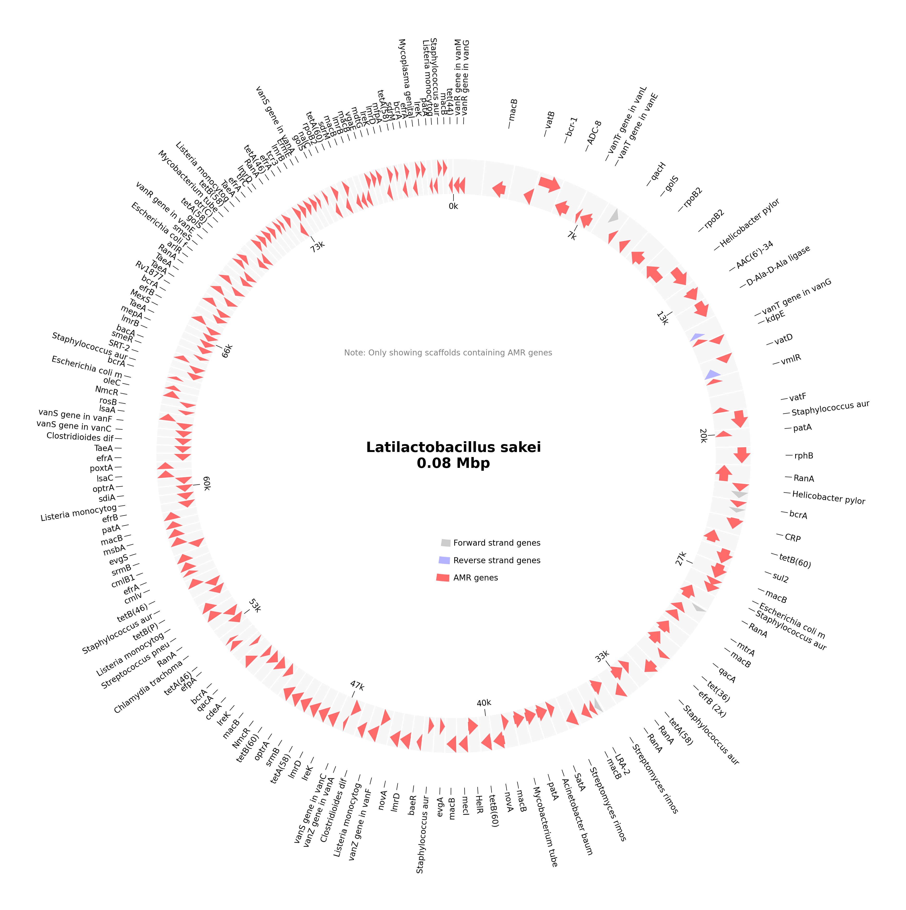

### AAC(6')-34
- **Mechanism**: antibiotic inactivation
- **Drug Classes**: aminoglycoside antibiotic
- **AMR Family**: AAC(6')
- **Locations**:
  - gnl|SPADES|PBDHLPBC_5674_2 : position 278-838

### ADC-8
- **Mechanism**: antibiotic inactivation
- **Drug Classes**: cephalosporin
- **AMR Family**: ADC beta-lactamase without carbapenemase activity
- **Locations**:
  - gnl|SPADES|PBDHLPBC_4655_1 : position 1-714

### Acinetobacter baumannii AmvA
- **Mechanism**: antibiotic efflux
- **Drug Classes**: macrolide antibiotic; disinfecting agents and antiseptics
- **AMR Family**: major facilitator superfamily (MFS) antibiotic efflux pump
- **Locations**:
  - gnl|SPADES|PBDHLPBC_10038_1 : position 3-569

### CRP
- **Mechanism**: antibiotic efflux
- **Drug Classes**: macrolide antibiotic; fluoroquinolone antibiotic; penam
- **AMR Family**: resistance-nodulation-cell division (RND) antibiotic efflux pump
- **Locations**:
  - gnl|SPADES|PBDHLPBC_7274_1 : position 3-545

### Chlamydia trachomatis intrinsic murA conferring resistance to fosfomycin
- **Mechanism**: antibiotic target alteration
- **Drug Classes**: phosphonic acid antibiotic
- **AMR Family**: antibiotic-resistant murA transferase
- **Locations**:
  - gnl|SPADES|PBDHLPBC_14641_1 : position 1-411

### Clostridioides difficile gyrA conferring resistance to fluoroquinolones
- **Mechanism**: antibiotic target alteration
- **Drug Classes**: fluoroquinolone antibiotic
- **AMR Family**: fluoroquinolone resistant gyrA
- **Locations**:
  - gnl|SPADES|PBDHLPBC_12234_1 : position 105-479

### Clostridioides difficile gyrB conferring resistance to fluoroquinolones
- **Mechanism**: antibiotic target alteration
- **Drug Classes**: fluoroquinolone antibiotic
- **AMR Family**: fluoroquinolone resistant gyrB
- **Locations**:
  - gnl|SPADES|PBDHLPBC_18141_1 : position 3-344

### D-Ala-D-Ala ligase
- **Mechanism**: antibiotic target alteration
- **Drug Classes**: glycopeptide antibiotic
- **AMR Family**: Van ligase
- **Locations**:
  - gnl|SPADES|PBDHLPBC_5890_1 : position 1-795

### ErmE
- **Mechanism**: antibiotic target alteration
- **Drug Classes**: macrolide antibiotic; lincosamide antibiotic; streptogramin antibiotic; streptogramin A antibiotic; streptogramin B antibiotic
- **AMR Family**: Erm 23S ribosomal RNA methyltransferase
- **Locations**:
  - gnl|SPADES|PBDHLPBC_28971_1 : position 2-247

### Escherichia coli fabI mutations conferring resistance to isoniazid and triclosan
- **Mechanism**: antibiotic target alteration
- **Drug Classes**: disinfecting agents and antiseptics; isoniazid-like antibiotic
- **AMR Family**: antibiotic resistant fabI
- **Locations**:
  - gnl|SPADES|PBDHLPBC_23414_1 : position 1-276

### Escherichia coli murA with mutation conferring resistance to fosfomycin (found in 2 locations)
- **Mechanism**: antibiotic target alteration
- **Drug Classes**: phosphonic acid antibiotic
- **AMR Family**: antibiotic-resistant murA transferase
- **Locations**:
  - gnl|SPADES|PBDHLPBC_20133_1 : position 3-224
  - gnl|SPADES|PBDHLPBC_7668_1 : position 2-334

### HelR
- **Mechanism**: antibiotic target protection
- **Drug Classes**: rifamycin antibiotic
- **AMR Family**: helicase-like RNA polymerase protection protein
- **Locations**:
  - gnl|SPADES|PBDHLPBC_10965_1 : position 3-527

### Helicobacter pylori pbp1 mutants conferring resistance to amoxicillin (found in 2 locations)
- **Mechanism**: antibiotic target alteration
- **Drug Classes**: cephalosporin; cephamycin; penam
- **AMR Family**: Penicillin-binding protein mutations conferring resistance to beta-lactam antibiotics
- **Locations**:
  - gnl|SPADES|PBDHLPBC_5583_1 : position 3-956
  - gnl|SPADES|PBDHLPBC_6753_1 : position 3-395

### IreK (found in 4 locations)
- **Mechanism**: reduced permeability to antibiotic
- **Drug Classes**: cephalosporin
- **AMR Family**: Serine/threonine kinases
- **Locations**:
  - gnl|SPADES|PBDHLPBC_12809_1 : position 1-462
  - gnl|SPADES|PBDHLPBC_13809_1 : position 2-433
  - gnl|SPADES|PBDHLPBC_33181_1 : position 2-226
  - gnl|SPADES|PBDHLPBC_34768_1 : position 1-216

### LRA-2
- **Mechanism**: antibiotic inactivation
- **Drug Classes**: cephalosporin; penam
- **AMR Family**: subclass B3 LRA beta-lactamase
- **Locations**:
  - gnl|SPADES|PBDHLPBC_9625_2 : position 339-590

### Listeria monocytogenes mprF (found in 5 locations)
- **Mechanism**: antibiotic target alteration
- **Drug Classes**: peptide antibiotic
- **AMR Family**: defensin resistant mprF
- **Locations**:
  - gnl|SPADES|PBDHLPBC_12059_1 : position 2-484
  - gnl|SPADES|PBDHLPBC_15210_1 : position 1-399
  - gnl|SPADES|PBDHLPBC_17020_1 : position 3-362
  - gnl|SPADES|PBDHLPBC_25769_1 : position 1-264
  - gnl|SPADES|PBDHLPBC_35683_1 : position 1-213

### MexS
- **Mechanism**: antibiotic efflux
- **Drug Classes**: fluoroquinolone antibiotic; diaminopyrimidine antibiotic; phenicol antibiotic
- **AMR Family**: resistance-nodulation-cell division (RND) antibiotic efflux pump
- **Locations**:
  - gnl|SPADES|PBDHLPBC_21159_1 : position 2-301

### Mycobacterium tuberculosis intrinsic murA conferring resistance to fosfomycin
- **Mechanism**: antibiotic target alteration
- **Drug Classes**: phosphonic acid antibiotic
- **AMR Family**: antibiotic-resistant murA transferase
- **Locations**:
  - gnl|SPADES|PBDHLPBC_10228_1 : position 3-560

### Mycobacterium tuberculosis rpoB mutations conferring resistance to rifampicin
- **Mechanism**: antibiotic target alteration; antibiotic target replacement
- **Drug Classes**: rifamycin antibiotic
- **AMR Family**: rifamycin-resistant beta-subunit of RNA polymerase (rpoB)
- **Locations**:
  - gnl|SPADES|PBDHLPBC_25162_1 : position 1-267

### Mycoplasma genitalium parC mutations confers resistance to Moxifloxacin
- **Mechanism**: antibiotic target alteration
- **Drug Classes**: fluoroquinolone antibiotic
- **AMR Family**: fluoroquinolone resistant parC
- **Locations**:
  - gnl|SPADES|PBDHLPBC_34761_1 : position 2-217

### NmcR (found in 2 locations)
- **Mechanism**: antibiotic inactivation
- **Drug Classes**: carbapenem; cephalosporin; cephamycin; penam
- **AMR Family**: NmcA beta-lactamase
- **Locations**:
  - gnl|SPADES|PBDHLPBC_13307_1 : position 3-350
  - gnl|SPADES|PBDHLPBC_19680_1 : position 1-243

### RanA (found in 7 locations)
- **Mechanism**: antibiotic efflux
- **Drug Classes**: aminoglycoside antibiotic
- **AMR Family**: ATP-binding cassette (ABC) antibiotic efflux pump
- **Locations**:
  - gnl|SPADES|PBDHLPBC_14719_1 : position 1-408
  - gnl|SPADES|PBDHLPBC_22154_1 : position 3-290
  - gnl|SPADES|PBDHLPBC_27449_1 : position 2-256
  - gnl|SPADES|PBDHLPBC_6520_1 : position 2-832
  - gnl|SPADES|PBDHLPBC_7919_1 : position 3-698
  - gnl|SPADES|PBDHLPBC_9316_1 : position 2-610
  - gnl|SPADES|PBDHLPBC_9400_1 : position 2-421

### Rv1877
- **Mechanism**: antibiotic efflux
- **Drug Classes**: fluoroquinolone antibiotic
- **AMR Family**: major facilitator superfamily (MFS) antibiotic efflux pump
- **Locations**:
  - gnl|SPADES|PBDHLPBC_21743_1 : position 2-295

### SRT-2
- **Mechanism**: antibiotic inactivation
- **Drug Classes**: cephalosporin
- **AMR Family**: SRT beta-lactamase
- **Locations**:
  - gnl|SPADES|PBDHLPBC_20576_1 : position 1-309

### SatA
- **Mechanism**: antibiotic inactivation
- **Drug Classes**: nucleoside antibiotic
- **AMR Family**: streptothricin acetyltransferase (SAT)
- **Locations**:
  - gnl|SPADES|PBDHLPBC_9912_1 : position 222-575

### Staphylococcus aureus LmrS
- **Mechanism**: antibiotic efflux
- **Drug Classes**: macrolide antibiotic; aminoglycoside antibiotic; oxazolidinone antibiotic; diaminopyrimidine antibiotic; phenicol antibiotic
- **AMR Family**: major facilitator superfamily (MFS) antibiotic efflux pump
- **Locations**:
  - gnl|SPADES|PBDHLPBC_15404_1 : position 1-393

### Staphylococcus aureus mupA conferring resistance to mupirocin (found in 2 locations)
- **Mechanism**: antibiotic target alteration
- **Drug Classes**: mupirocin-like antibiotic
- **AMR Family**: antibiotic-resistant isoleucyl-tRNA synthetase (ileS)
- **Locations**:
  - gnl|SPADES|PBDHLPBC_20547_1 : position 1-309
  - gnl|SPADES|PBDHLPBC_6394_1 : position 2-847

### Staphylococcus aureus mupB conferring resistance to mupirocin (found in 2 locations)
- **Mechanism**: antibiotic target alteration
- **Drug Classes**: mupirocin-like antibiotic
- **AMR Family**: antibiotic-resistant isoleucyl-tRNA synthetase (ileS)
- **Locations**:
  - gnl|SPADES|PBDHLPBC_11443_1 : position 1-285
  - gnl|SPADES|PBDHLPBC_36396_1 : position 1-210

### Staphylococcus aureus murA with mutation conferring resistance to fosfomycin
- **Mechanism**: antibiotic target alteration
- **Drug Classes**: phosphonic acid antibiotic
- **AMR Family**: antibiotic-resistant murA transferase
- **Locations**:
  - gnl|SPADES|PBDHLPBC_7668_2 : position 300-719

### Staphylococcus aureus rpoB mutants conferring resistance to rifampicin
- **Mechanism**: antibiotic target alteration; antibiotic target replacement
- **Drug Classes**: rifamycin antibiotic
- **AMR Family**: rifamycin-resistant beta-subunit of RNA polymerase (rpoB)
- **Locations**:
  - gnl|SPADES|PBDHLPBC_9013_1 : position 3-626

### Streptococcus pneumoniae PBP2x conferring resistance to amoxicillin
- **Mechanism**: antibiotic target alteration
- **Drug Classes**: cephalosporin; cephamycin; penam
- **AMR Family**: Penicillin-binding protein mutations conferring resistance to beta-lactam antibiotics
- **Locations**:
  - gnl|SPADES|PBDHLPBC_14934_1 : position 1-405

### Streptomyces rimosus otr(A) (found in 2 locations)
- **Mechanism**: antibiotic target protection
- **Drug Classes**: tetracycline antibiotic
- **AMR Family**: tetracycline-resistant ribosomal protection protein
- **Locations**:
  - gnl|SPADES|PBDHLPBC_9464_1 : position 2-544
  - gnl|SPADES|PBDHLPBC_9855_1 : position 78-578

### TaeA (found in 5 locations)
- **Mechanism**: antibiotic efflux
- **Drug Classes**: pleuromutilin antibiotic
- **AMR Family**: ATP-binding cassette (ABC) antibiotic efflux pump
- **Locations**:
  - gnl|SPADES|PBDHLPBC_17789_1 : position 3-350
  - gnl|SPADES|PBDHLPBC_21025_1 : position 3-302
  - gnl|SPADES|PBDHLPBC_21788_1 : position 2-292
  - gnl|SPADES|PBDHLPBC_21874_1 : position 2-292
  - gnl|SPADES|PBDHLPBC_26671_1 : position 2-259

### arlR
- **Mechanism**: antibiotic efflux
- **Drug Classes**: fluoroquinolone antibiotic; disinfecting agents and antiseptics
- **AMR Family**: major facilitator superfamily (MFS) antibiotic efflux pump
- **Locations**:
  - gnl|SPADES|PBDHLPBC_23536_1 : position 3-272

### bacA
- **Mechanism**: antibiotic target alteration
- **Drug Classes**: peptide antibiotic
- **AMR Family**: undecaprenyl pyrophosphate related proteins
- **Locations**:
  - gnl|SPADES|PBDHLPBC_20694_1 : position 1-183

### baeR
- **Mechanism**: antibiotic efflux
- **Drug Classes**: aminoglycoside antibiotic; aminocoumarin antibiotic
- **AMR Family**: resistance-nodulation-cell division (RND) antibiotic efflux pump
- **Locations**:
  - gnl|SPADES|PBDHLPBC_11510_1 : position 2-250

### bcr-1
- **Mechanism**: antibiotic efflux
- **Drug Classes**: bicyclomycin-like antibiotic
- **AMR Family**: major facilitator superfamily (MFS) antibiotic efflux pump
- **Locations**:
  - gnl|SPADES|PBDHLPBC_4539_1 : position 85-1167

### bcrA (found in 5 locations)
- **Mechanism**: antibiotic efflux
- **Drug Classes**: peptide antibiotic
- **AMR Family**: ATP-binding cassette (ABC) antibiotic efflux pump
- **Locations**:
  - gnl|SPADES|PBDHLPBC_14042_1 : position 2-196
  - gnl|SPADES|PBDHLPBC_20382_1 : position 153-311
  - gnl|SPADES|PBDHLPBC_21519_1 : position 3-296
  - gnl|SPADES|PBDHLPBC_34233_1 : position 16-219
  - gnl|SPADES|PBDHLPBC_6818_1 : position 3-317

### cdeA
- **Mechanism**: antibiotic efflux
- **Drug Classes**: fluoroquinolone antibiotic; disinfecting agents and antiseptics
- **AMR Family**: multidrug and toxic compound extrusion (MATE) transporter
- **Locations**:
  - gnl|SPADES|PBDHLPBC_13808_1 : position 81-371

### cmlB1
- **Mechanism**: antibiotic efflux
- **Drug Classes**: phenicol antibiotic
- **AMR Family**: major facilitator superfamily (MFS) antibiotic efflux pump
- **Locations**:
  - gnl|SPADES|PBDHLPBC_15937_1 : position 3-383

### cmlv
- **Mechanism**: antibiotic inactivation
- **Drug Classes**: phenicol antibiotic
- **AMR Family**: chloramphenicol phosphotransferase
- **Locations**:
  - gnl|SPADES|PBDHLPBC_15623_1 : position 187-390

### efpA
- **Mechanism**: antibiotic efflux
- **Drug Classes**: rifamycin antibiotic; isoniazid-like antibiotic
- **AMR Family**: major facilitator superfamily (MFS) antibiotic efflux pump
- **Locations**:
  - gnl|SPADES|PBDHLPBC_14373_1 : position 114-419

### efrA (found in 5 locations)
- **Mechanism**: antibiotic efflux
- **Drug Classes**: macrolide antibiotic; fluoroquinolone antibiotic; rifamycin antibiotic
- **AMR Family**: ATP-binding cassette (ABC) antibiotic efflux pump
- **Locations**:
  - gnl|SPADES|PBDHLPBC_15948_1 : position 2-382
  - gnl|SPADES|PBDHLPBC_17791_1 : position 2-352
  - gnl|SPADES|PBDHLPBC_26623_1 : position 3-248
  - gnl|SPADES|PBDHLPBC_27840_1 : position 1-252
  - gnl|SPADES|PBDHLPBC_34190_1 : position 1-219

### efrB (found in 4 locations)
- **Mechanism**: antibiotic efflux
- **Drug Classes**: macrolide antibiotic; fluoroquinolone antibiotic; rifamycin antibiotic
- **AMR Family**: ATP-binding cassette (ABC) antibiotic efflux pump
- **Locations**:
  - gnl|SPADES|PBDHLPBC_16945_1 : position 3-365
  - gnl|SPADES|PBDHLPBC_21512_1 : position 1-297
  - gnl|SPADES|PBDHLPBC_8775_1 : position 3-281
  - gnl|SPADES|PBDHLPBC_8775_2 : position 253-642

### evgA
- **Mechanism**: antibiotic efflux
- **Drug Classes**: macrolide antibiotic; fluoroquinolone antibiotic; penam; tetracycline antibiotic
- **AMR Family**: major facilitator superfamily (MFS) antibiotic efflux pump; resistance-nodulation-cell division (RND) antibiotic efflux pump
- **Locations**:
  - gnl|SPADES|PBDHLPBC_11406_1 : position 2-256

### evgS
- **Mechanism**: antibiotic efflux
- **Drug Classes**: macrolide antibiotic; fluoroquinolone antibiotic; penam; tetracycline antibiotic
- **AMR Family**: major facilitator superfamily (MFS) antibiotic efflux pump; resistance-nodulation-cell division (RND) antibiotic efflux pump
- **Locations**:
  - gnl|SPADES|PBDHLPBC_16209_1 : position 3-377

### golS (found in 3 locations)
- **Mechanism**: antibiotic efflux
- **Drug Classes**: monobactam; carbapenem; cephalosporin; cephamycin; penam; phenicol antibiotic; penem
- **AMR Family**: resistance-nodulation-cell division (RND) antibiotic efflux pump
- **Locations**:
  - gnl|SPADES|PBDHLPBC_24695_1 : position 36-269
  - gnl|SPADES|PBDHLPBC_29385_1 : position 108-245
  - gnl|SPADES|PBDHLPBC_4857_2 : position 326-727

### kdpE
- **Mechanism**: antibiotic efflux
- **Drug Classes**: aminoglycoside antibiotic
- **AMR Family**: kdpDE
- **Locations**:
  - gnl|SPADES|PBDHLPBC_6011_1 : position 2-364

### lmrB (found in 3 locations)
- **Mechanism**: antibiotic efflux
- **Drug Classes**: lincosamide antibiotic; nucleoside antibiotic
- **AMR Family**: ATP-binding cassette (ABC) antibiotic efflux pump
- **Locations**:
  - gnl|SPADES|PBDHLPBC_20740_1 : position 1-306
  - gnl|SPADES|PBDHLPBC_28076_1 : position 3-251
  - gnl|SPADES|PBDHLPBC_31554_1 : position 1-234

### lmrD (found in 4 locations)
- **Mechanism**: antibiotic efflux
- **Drug Classes**: lincosamide antibiotic
- **AMR Family**: ATP-binding cassette (ABC) antibiotic efflux pump
- **Locations**:
  - gnl|SPADES|PBDHLPBC_11596_1 : position 2-502
  - gnl|SPADES|PBDHLPBC_12943_1 : position 1-456
  - gnl|SPADES|PBDHLPBC_27448_1 : position 2-139
  - gnl|SPADES|PBDHLPBC_33428_1 : position 1-225

### lsaA
- **Mechanism**: antibiotic target protection
- **Drug Classes**: lincosamide antibiotic; streptogramin antibiotic; streptogramin A antibiotic; streptogramin B antibiotic; pleuromutilin antibiotic
- **AMR Family**: lsa-type ABC-F protein
- **Locations**:
  - gnl|SPADES|PBDHLPBC_18872_1 : position 3-335

### lsaC
- **Mechanism**: antibiotic target protection
- **Drug Classes**: lincosamide antibiotic; streptogramin antibiotic; pleuromutilin antibiotic
- **AMR Family**: lsa-type ABC-F protein
- **Locations**:
  - gnl|SPADES|PBDHLPBC_17743_1 : position 2-352

### macB (found in 11 locations)
- **Mechanism**: antibiotic efflux
- **Drug Classes**: macrolide antibiotic
- **AMR Family**: ATP-binding cassette (ABC) antibiotic efflux pump
- **Locations**:
  - gnl|SPADES|PBDHLPBC_10229_2 : position 230-559
  - gnl|SPADES|PBDHLPBC_11111_1 : position 2-472
  - gnl|SPADES|PBDHLPBC_13341_1 : position 2-445
  - gnl|SPADES|PBDHLPBC_16430_1 : position 3-332
  - gnl|SPADES|PBDHLPBC_31559_1 : position 2-232
  - gnl|SPADES|PBDHLPBC_32342_1 : position 2-229
  - gnl|SPADES|PBDHLPBC_36685_1 : position 3-209
  - gnl|SPADES|PBDHLPBC_3866_2 : position 475-1161
  - gnl|SPADES|PBDHLPBC_7671_1 : position 2-718
  - gnl|SPADES|PBDHLPBC_8195_1 : position 3-443
  - gnl|SPADES|PBDHLPBC_9853_1 : position 2-394

### mdtG
- **Mechanism**: antibiotic efflux
- **Drug Classes**: phosphonic acid antibiotic
- **AMR Family**: major facilitator superfamily (MFS) antibiotic efflux pump
- **Locations**:
  - gnl|SPADES|PBDHLPBC_33008_1 : position 1-225

### mecI
- **Mechanism**: antibiotic target replacement
- **Drug Classes**: penam
- **AMR Family**: methicillin resistant PBP2
- **Locations**:
  - gnl|SPADES|PBDHLPBC_11072_1 : position 19-459

### mepA
- **Mechanism**: antibiotic efflux
- **Drug Classes**: glycylcycline; tetracycline antibiotic
- **AMR Family**: multidrug and toxic compound extrusion (MATE) transporter
- **Locations**:
  - gnl|SPADES|PBDHLPBC_20950_1 : position 2-304

### mfpA
- **Mechanism**: antibiotic target protection
- **Drug Classes**: fluoroquinolone antibiotic
- **AMR Family**: quinolone resistance protein (qnr)
- **Locations**:
  - gnl|SPADES|PBDHLPBC_33609_1 : position 1-222

### msbA
- **Mechanism**: antibiotic efflux
- **Drug Classes**: nitroimidazole antibiotic
- **AMR Family**: ATP-binding cassette (ABC) antibiotic efflux pump
- **Locations**:
  - gnl|SPADES|PBDHLPBC_16294_1 : position 3-374

### mtrA
- **Mechanism**: antibiotic efflux
- **Drug Classes**: macrolide antibiotic; penam
- **AMR Family**: resistance-nodulation-cell division (RND) antibiotic efflux pump
- **Locations**:
  - gnl|SPADES|PBDHLPBC_8126_2 : position 301-684

### nalC
- **Mechanism**: antibiotic efflux
- **Drug Classes**: macrolide antibiotic; fluoroquinolone antibiotic; monobactam; carbapenem; cephalosporin; cephamycin; penam; tetracycline antibiotic; peptide antibiotic; aminocoumarin antibiotic; diaminopyrimidine antibiotic; sulfonamide antibiotic; phenicol antibiotic; penem
- **AMR Family**: resistance-nodulation-cell division (RND) antibiotic efflux pump
- **Locations**:
  - gnl|SPADES|PBDHLPBC_29601_1 : position 3-221

### novA (found in 2 locations)
- **Mechanism**: antibiotic efflux
- **Drug Classes**: aminocoumarin antibiotic
- **AMR Family**: ATP-binding cassette (ABC) antibiotic efflux pump
- **Locations**:
  - gnl|SPADES|PBDHLPBC_10246_1 : position 3-557
  - gnl|SPADES|PBDHLPBC_11644_1 : position 1-459

### oleC
- **Mechanism**: antibiotic efflux
- **Drug Classes**: macrolide antibiotic
- **AMR Family**: ATP-binding cassette (ABC) antibiotic efflux pump
- **Locations**:
  - gnl|SPADES|PBDHLPBC_19728_1 : position 3-323

### optrA (found in 2 locations)
- **Mechanism**: antibiotic target protection
- **Drug Classes**: oxazolidinone antibiotic; phenicol antibiotic
- **AMR Family**: Miscellaneous ABC-F subfamily ATP-binding cassette ribosomal protection proteins
- **Locations**:
  - gnl|SPADES|PBDHLPBC_13111_1 : position 3-452
  - gnl|SPADES|PBDHLPBC_17581_1 : position 3-353

### otr(C)
- **Mechanism**: antibiotic efflux
- **Drug Classes**: tetracycline antibiotic
- **AMR Family**: ATP-binding cassette (ABC) antibiotic efflux pump
- **Locations**:
  - gnl|SPADES|PBDHLPBC_24980_1 : position 2-268

### patA (found in 4 locations)
- **Mechanism**: antibiotic efflux
- **Drug Classes**: fluoroquinolone antibiotic
- **AMR Family**: ATP-binding cassette (ABC) antibiotic efflux pump
- **Locations**:
  - gnl|SPADES|PBDHLPBC_10108_1 : position 1-564
  - gnl|SPADES|PBDHLPBC_16663_1 : position 2-367
  - gnl|SPADES|PBDHLPBC_34849_1 : position 61-216
  - gnl|SPADES|PBDHLPBC_6444_1 : position 2-310

### poxtA
- **Mechanism**: antibiotic target protection
- **Drug Classes**: tetracycline antibiotic; oxazolidinone antibiotic; phenicol antibiotic
- **AMR Family**: Miscellaneous ABC-F subfamily ATP-binding cassette ribosomal protection proteins
- **Locations**:
  - gnl|SPADES|PBDHLPBC_17696_1 : position 22-351

### qacA (found in 2 locations)
- **Mechanism**: antibiotic efflux
- **Drug Classes**: fluoroquinolone antibiotic
- **AMR Family**: major facilitator superfamily (MFS) antibiotic efflux pump
- **Locations**:
  - gnl|SPADES|PBDHLPBC_13928_1 : position 3-431
  - gnl|SPADES|PBDHLPBC_8568_1 : position 1-609

### qacH
- **Mechanism**: antibiotic efflux
- **Drug Classes**: disinfecting agents and antiseptics
- **AMR Family**: small multidrug resistance (SMR) antibiotic efflux pump
- **Locations**:
  - gnl|SPADES|PBDHLPBC_4754_3 : position 817-1113

### rosB
- **Mechanism**: antibiotic efflux
- **Drug Classes**: peptide antibiotic
- **AMR Family**: major facilitator superfamily (MFS) antibiotic efflux pump
- **Locations**:
  - gnl|SPADES|PBDHLPBC_19128_1 : position 1-210

### rphB
- **Mechanism**: antibiotic inactivation
- **Drug Classes**: rifamycin antibiotic
- **AMR Family**: rifampin phosphotransferase
- **Locations**:
  - gnl|SPADES|PBDHLPBC_6513_1 : position 1-780

### rpoB2 (found in 3 locations)
- **Mechanism**: antibiotic target alteration; antibiotic target replacement
- **Drug Classes**: rifamycin antibiotic
- **AMR Family**: rifamycin-resistant beta-subunit of RNA polymerase (rpoB)
- **Locations**:
  - gnl|SPADES|PBDHLPBC_29750_1 : position 1-243
  - gnl|SPADES|PBDHLPBC_5167_1 : position 2-742
  - gnl|SPADES|PBDHLPBC_5335_1 : position 3-995

### sdiA
- **Mechanism**: antibiotic efflux
- **Drug Classes**: fluoroquinolone antibiotic; cephalosporin; glycylcycline; penam; tetracycline antibiotic; rifamycin antibiotic; phenicol antibiotic; disinfecting agents and antiseptics
- **AMR Family**: resistance-nodulation-cell division (RND) antibiotic efflux pump
- **Locations**:
  - gnl|SPADES|PBDHLPBC_17505_1 : position 1-354

### sdrM (found in 2 locations)
- **Mechanism**: antibiotic efflux
- **Drug Classes**: fluoroquinolone antibiotic; disinfecting agents and antiseptics
- **AMR Family**: major facilitator superfamily (MFS) antibiotic efflux pump
- **Locations**:
  - gnl|SPADES|PBDHLPBC_31106_1 : position 3-236
  - gnl|SPADES|PBDHLPBC_34014_1 : position 3-221

### smeR
- **Mechanism**: antibiotic efflux
- **Drug Classes**: aminoglycoside antibiotic; cephalosporin; cephamycin; penam
- **AMR Family**: resistance-nodulation-cell division (RND) antibiotic efflux pump
- **Locations**:
  - gnl|SPADES|PBDHLPBC_20687_2 : position 72-308

### smeS
- **Mechanism**: antibiotic efflux
- **Drug Classes**: aminoglycoside antibiotic; cephalosporin; cephamycin; penam
- **AMR Family**: resistance-nodulation-cell division (RND) antibiotic efflux pump
- **Locations**:
  - gnl|SPADES|PBDHLPBC_23645_1 : position 1-276

### srmB (found in 2 locations)
- **Mechanism**: antibiotic target protection
- **Drug Classes**: macrolide antibiotic
- **AMR Family**: Miscellaneous ABC-F subfamily ATP-binding cassette ribosomal protection proteins
- **Locations**:
  - gnl|SPADES|PBDHLPBC_13001_1 : position 3-455
  - gnl|SPADES|PBDHLPBC_16092_1 : position 2-379

### sul2
- **Mechanism**: antibiotic target replacement
- **Drug Classes**: sulfonamide antibiotic
- **AMR Family**: sulfonamide resistant sul
- **Locations**:
  - gnl|SPADES|PBDHLPBC_7640_1 : position 2-721

### tcr3
- **Mechanism**: antibiotic efflux
- **Drug Classes**: tetracycline antibiotic
- **AMR Family**: major facilitator superfamily (MFS) antibiotic efflux pump
- **Locations**:
  - gnl|SPADES|PBDHLPBC_28133_1 : position 2-250

### tet(36)
- **Mechanism**: antibiotic target protection
- **Drug Classes**: tetracycline antibiotic
- **AMR Family**: tetracycline-resistant ribosomal protection protein
- **Locations**:
  - gnl|SPADES|PBDHLPBC_8639_1 : position 3-650

### tet(44)
- **Mechanism**: antibiotic target protection
- **Drug Classes**: tetracycline antibiotic
- **AMR Family**: tetracycline-resistant ribosomal protection protein
- **Locations**:
  - gnl|SPADES|PBDHLPBC_36851_1 : position 2-208

### tetA(46) (found in 2 locations)
- **Mechanism**: antibiotic efflux
- **Drug Classes**: tetracycline antibiotic
- **AMR Family**: ATP-binding cassette (ABC) antibiotic efflux pump
- **Locations**:
  - gnl|SPADES|PBDHLPBC_14446_1 : position 3-155
  - gnl|SPADES|PBDHLPBC_27637_1 : position 1-255

### tetA(58) (found in 4 locations)
- **Mechanism**: antibiotic efflux
- **Drug Classes**: tetracycline antibiotic
- **AMR Family**: major facilitator superfamily (MFS) antibiotic efflux pump
- **Locations**:
  - gnl|SPADES|PBDHLPBC_12969_1 : position 3-437
  - gnl|SPADES|PBDHLPBC_24983_1 : position 1-267
  - gnl|SPADES|PBDHLPBC_33724_1 : position 82-222
  - gnl|SPADES|PBDHLPBC_9301_2 : position 231-611

### tetA(60)
- **Mechanism**: antibiotic efflux
- **Drug Classes**: tetracycline antibiotic
- **AMR Family**: ATP-binding cassette (ABC) antibiotic efflux pump
- **Locations**:
  - gnl|SPADES|PBDHLPBC_30723_1 : position 3-236

### tetB(46)
- **Mechanism**: antibiotic efflux
- **Drug Classes**: tetracycline antibiotic
- **AMR Family**: ATP-binding cassette (ABC) antibiotic efflux pump
- **Locations**:
  - gnl|SPADES|PBDHLPBC_15410_1 : position 21-392

### tetB(58)
- **Mechanism**: antibiotic efflux
- **Drug Classes**: tetracycline antibiotic
- **AMR Family**: major facilitator superfamily (MFS) antibiotic efflux pump
- **Locations**:
  - gnl|SPADES|PBDHLPBC_25117_1 : position 2-268

### tetB(60) (found in 3 locations)
- **Mechanism**: antibiotic efflux
- **Drug Classes**: tetracycline antibiotic
- **AMR Family**: ATP-binding cassette (ABC) antibiotic efflux pump
- **Locations**:
  - gnl|SPADES|PBDHLPBC_10340_1 : position 53-553
  - gnl|SPADES|PBDHLPBC_13267_1 : position 3-449
  - gnl|SPADES|PBDHLPBC_7572_1 : position 2-628

### tetB(P)
- **Mechanism**: antibiotic target protection
- **Drug Classes**: tetracycline antibiotic
- **AMR Family**: tetracycline-resistant ribosomal protection protein
- **Locations**:
  - gnl|SPADES|PBDHLPBC_15344_1 : position 2-394

### tlrC
- **Mechanism**: antibiotic target protection
- **Drug Classes**: macrolide antibiotic; lincosamide antibiotic
- **AMR Family**: Miscellaneous ABC-F subfamily ATP-binding cassette ribosomal protection proteins
- **Locations**:
  - gnl|SPADES|PBDHLPBC_26945_1 : position 72-257

### vanR gene in vanE cluster
- **Mechanism**: antibiotic target alteration
- **Drug Classes**: glycopeptide antibiotic
- **AMR Family**: glycopeptide resistance gene cluster; vanR
- **Locations**:
  - gnl|SPADES|PBDHLPBC_24410_1 : position 1-270

### vanR gene in vanG cluster
- **Mechanism**: antibiotic target alteration
- **Drug Classes**: glycopeptide antibiotic
- **AMR Family**: glycopeptide resistance gene cluster; vanR
- **Locations**:
  - gnl|SPADES|PBDHLPBC_3623_2 : position 253-585

### vanR gene in vanM cluster
- **Mechanism**: antibiotic target alteration
- **Drug Classes**: glycopeptide antibiotic
- **AMR Family**: glycopeptide resistance gene cluster; vanR
- **Locations**:
  - gnl|SPADES|PBDHLPBC_3623_1 : position 3-293

### vanS gene in vanA cluster
- **Mechanism**: antibiotic target alteration
- **Drug Classes**: glycopeptide antibiotic
- **AMR Family**: vanS; glycopeptide resistance gene cluster
- **Locations**:
  - gnl|SPADES|PBDHLPBC_29257_1 : position 1-150

### vanS gene in vanC cluster (found in 2 locations)
- **Mechanism**: antibiotic target alteration
- **Drug Classes**: glycopeptide antibiotic
- **AMR Family**: vanS; glycopeptide resistance gene cluster
- **Locations**:
  - gnl|SPADES|PBDHLPBC_12608_1 : position 2-160
  - gnl|SPADES|PBDHLPBC_18451_1 : position 3-341

### vanS gene in vanF cluster
- **Mechanism**: antibiotic target alteration
- **Drug Classes**: glycopeptide antibiotic
- **AMR Family**: vanS; glycopeptide resistance gene cluster
- **Locations**:
  - gnl|SPADES|PBDHLPBC_18666_1 : position 2-337

### vanT gene in vanE cluster
- **Mechanism**: antibiotic target alteration
- **Drug Classes**: glycopeptide antibiotic
- **AMR Family**: glycopeptide resistance gene cluster; vanT
- **Locations**:
  - gnl|SPADES|PBDHLPBC_4706_2 : position 247-870

### vanT gene in vanG cluster
- **Mechanism**: antibiotic target alteration
- **Drug Classes**: glycopeptide antibiotic
- **AMR Family**: glycopeptide resistance gene cluster; vanT
- **Locations**:
  - gnl|SPADES|PBDHLPBC_5968_3 : position 651-902

### vanTr gene in vanL cluster
- **Mechanism**: antibiotic target alteration
- **Drug Classes**: glycopeptide antibiotic
- **AMR Family**: glycopeptide resistance gene cluster; vanT
- **Locations**:
  - gnl|SPADES|PBDHLPBC_4706_1 : position 3-197

### vanZ gene in vanA cluster
- **Mechanism**: antibiotic target alteration
- **Drug Classes**: glycopeptide antibiotic
- **AMR Family**: vanZ; glycopeptide resistance gene cluster
- **Locations**:
  - gnl|SPADES|PBDHLPBC_12274_1 : position 57-476

### vanZ gene in vanF cluster
- **Mechanism**: antibiotic target alteration
- **Drug Classes**: glycopeptide antibiotic
- **AMR Family**: vanZ; glycopeptide resistance gene cluster
- **Locations**:
  - gnl|SPADES|PBDHLPBC_11937_1 : position 72-488

### vatB
- **Mechanism**: antibiotic inactivation
- **Drug Classes**: streptogramin antibiotic; streptogramin A antibiotic
- **AMR Family**: streptogramin vat acetyltransferase
- **Locations**:
  - gnl|SPADES|PBDHLPBC_4540_2 : position 717-1169

### vatD
- **Mechanism**: antibiotic inactivation
- **Drug Classes**: streptogramin antibiotic; streptogramin A antibiotic
- **AMR Family**: streptogramin vat acetyltransferase
- **Locations**:
  - gnl|SPADES|PBDHLPBC_6022_1 : position 3-401

### vatF
- **Mechanism**: antibiotic inactivation
- **Drug Classes**: streptogramin antibiotic; streptogramin A antibiotic
- **AMR Family**: streptogramin vat acetyltransferase
- **Locations**:
  - gnl|SPADES|PBDHLPBC_6294_2 : position 598-861

### vgaE
- **Mechanism**: antibiotic target protection
- **Drug Classes**: lincosamide antibiotic; streptogramin antibiotic; streptogramin A antibiotic; pleuromutilin antibiotic
- **AMR Family**: vga-type ABC-F protein
- **Locations**:
  - gnl|SPADES|PBDHLPBC_32882_1 : position 1-228

### vmlR
- **Mechanism**: antibiotic target protection
- **Drug Classes**: lincosamide antibiotic; streptogramin antibiotic; streptogramin A antibiotic; streptogramin B antibiotic; nucleoside antibiotic; pleuromutilin antibiotic
- **AMR Family**: Miscellaneous ABC-F subfamily ATP-binding cassette ribosomal protection proteins
- **Locations**:
  - gnl|SPADES|PBDHLPBC_6222_1 : position 1-234

## Latilactobacillus sakei subsp. sakei
**Strain Statistics:**
- Total genome length: 0.3 kbp
- Total scaffolds: 20
- Scaffolds with AMR genes: 1
- Total genes annotated: 2
- Total AMR genes: 1
- Unique AMR genes: 1
- Distinct AMR mechanisms: 1
- Distinct AMR families: 1
- Distinct drug classes: 1

**Circos Plot:**

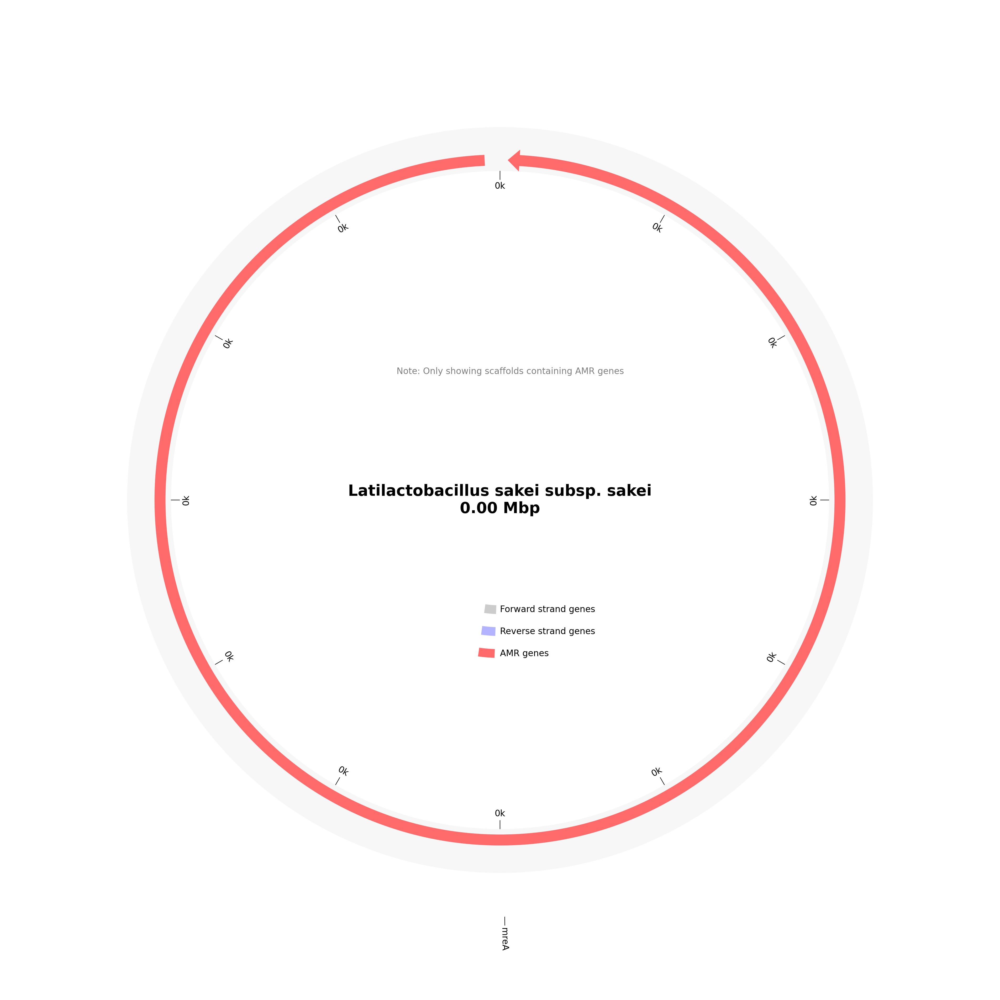

### mreA
- **Mechanism**: antibiotic efflux
- **Drug Classes**: macrolide antibiotic
- **AMR Family**: major facilitator superfamily (MFS) antibiotic efflux pump
- **Locations**:
  - gnl|SPADES|PBDHLPBC_23445_1 : position 1-276

## Latilactobacillus sakei subsp. sakei 23K
**Strain Statistics:**
- Total genome length: 0.6 kbp
- Total scaffolds: 13
- Scaffolds with AMR genes: 2
- Total genes annotated: 0
- Total AMR genes: 2
- Unique AMR genes: 2
- Distinct AMR mechanisms: 2
- Distinct AMR families: 2
- Distinct drug classes: 4

**Circos Plot:**

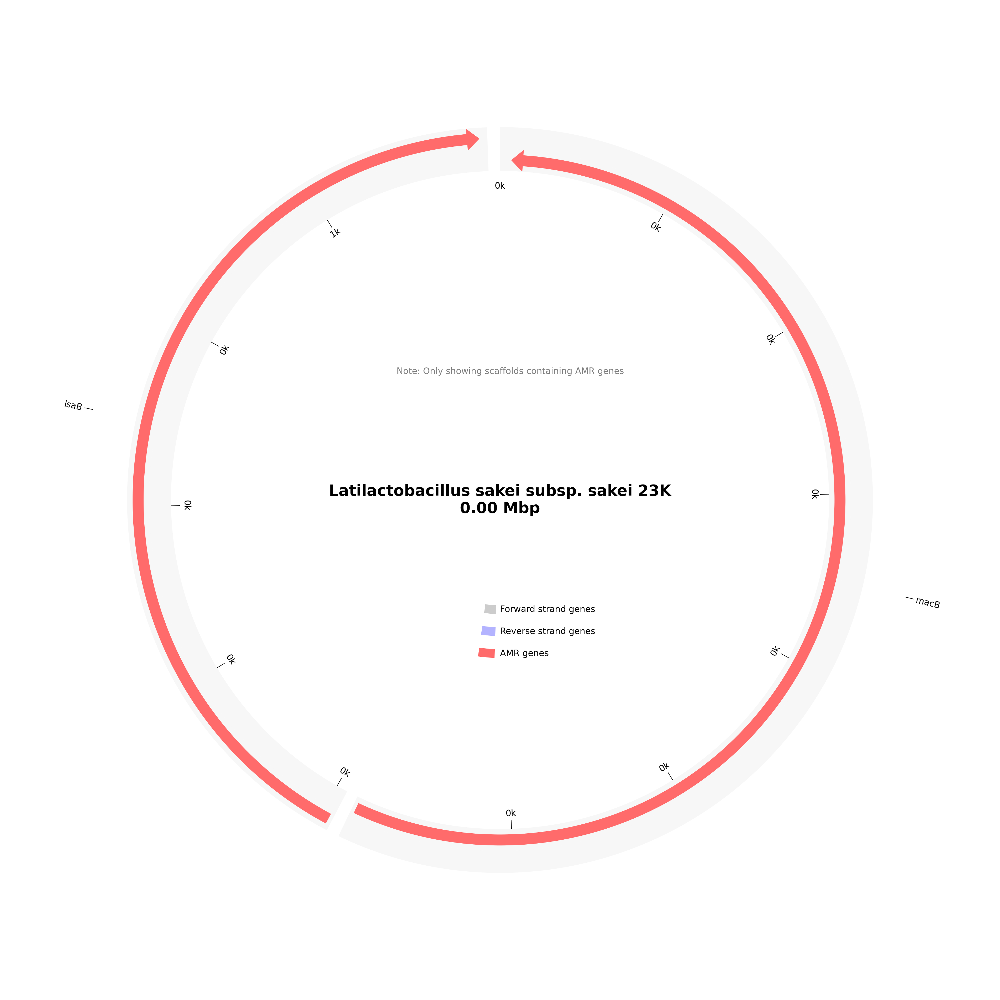

### lsaB
- **Mechanism**: antibiotic target protection
- **Drug Classes**: lincosamide antibiotic; streptogramin antibiotic; pleuromutilin antibiotic
- **AMR Family**: lsa-type ABC-F protein
- **Locations**:
  - gnl|SPADES|PBDHLPBC_30635_1 : position 1-237

### macB
- **Mechanism**: antibiotic efflux
- **Drug Classes**: macrolide antibiotic
- **AMR Family**: ATP-binding cassette (ABC) antibiotic efflux pump
- **Locations**:
  - gnl|SPADES|PBDHLPBC_19445_1 : position 3-326

## Lelliottia amnigena
**Strain Statistics:**
- Total genome length: 22.7 kbp
- Total scaffolds: 33
- Scaffolds with AMR genes: 5
- Total genes annotated: 40
- Total AMR genes: 5
- Unique AMR genes: 4
- Distinct AMR mechanisms: 2
- Distinct AMR families: 3
- Distinct drug classes: 9

**Circos Plot:**

### MCR-8.3
- **Mechanism**: antibiotic target alteration
- **Drug Classes**: peptide antibiotic
- **AMR Family**: MCR phosphoethanolamine transferase
- **Locations**:
  - gnl|SPADES|PBDHLPBC_510_11 : position 6497-8080

### MexS (found in 2 locations)
- **Mechanism**: antibiotic efflux
- **Drug Classes**: fluoroquinolone antibiotic; diaminopyrimidine antibiotic; phenicol antibiotic
- **AMR Family**: resistance-nodulation-cell division (RND) antibiotic efflux pump
- **Locations**:
  - gnl|SPADES|PBDHLPBC_11165_1 : position 1-231
  - gnl|SPADES|PBDHLPBC_5338_2 : position 563-994

### acrD
- **Mechanism**: antibiotic efflux
- **Drug Classes**: aminoglycoside antibiotic
- **AMR Family**: resistance-nodulation-cell division (RND) antibiotic efflux pump
- **Locations**:
  - gnl|SPADES|PBDHLPBC_8700_1 : position 2-646

### mgrA
- **Mechanism**: antibiotic efflux
- **Drug Classes**: fluoroquinolone antibiotic; cephalosporin; penam; tetracycline antibiotic; peptide antibiotic; disinfecting agents and antiseptics
- **AMR Family**: ATP-binding cassette (ABC) antibiotic efflux pump; major facilitator superfamily (MFS) antibiotic efflux pump
- **Locations**:
  - gnl|SPADES|PBDHLPBC_19698_1 : position 2-322

## Lelliottia sp. WB101
**Strain Statistics:**
- Total genome length: 0.6 kbp
- Total scaffolds: 1
- Scaffolds with AMR genes: 1
- Total genes annotated: 2
- Total AMR genes: 1
- Unique AMR genes: 1
- Distinct AMR mechanisms: 1
- Distinct AMR families: 1
- Distinct drug classes: 4

**Circos Plot:**

### evgS
- **Mechanism**: antibiotic efflux
- **Drug Classes**: macrolide antibiotic; fluoroquinolone antibiotic; penam; tetracycline antibiotic
- **AMR Family**: major facilitator superfamily (MFS) antibiotic efflux pump; resistance-nodulation-cell division (RND) antibiotic efflux pump
- **Locations**:
  - gnl|SPADES|PBDHLPBC_10258_1 : position 1-558

## Raoultella planticola
**Strain Statistics:**
- Total genome length: 0.3 kbp
- Total scaffolds: 5
- Scaffolds with AMR genes: 1
- Total genes annotated: 0
- Total AMR genes: 1
- Unique AMR genes: 1
- Distinct AMR mechanisms: 1
- Distinct AMR families: 1
- Distinct drug classes: 2

**Circos Plot:**

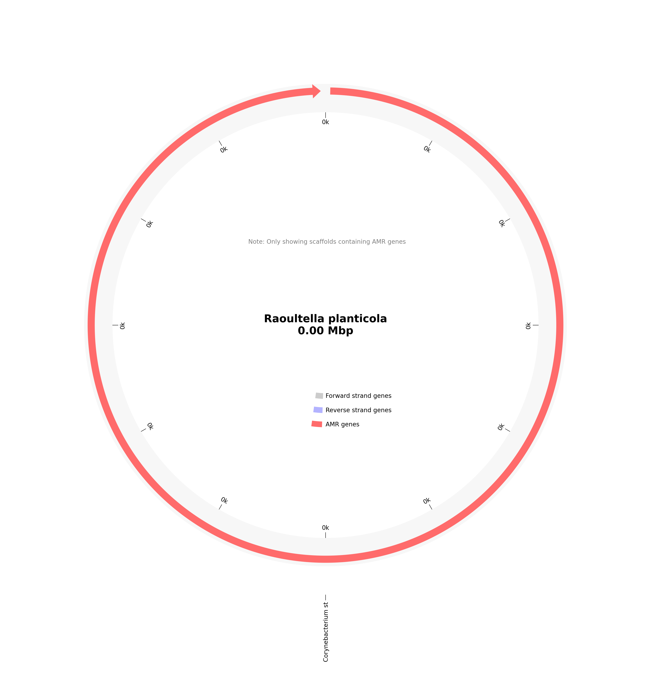

### Corynebacterium striatum tetA
- **Mechanism**: antibiotic efflux
- **Drug Classes**: penam; tetracycline antibiotic
- **AMR Family**: major facilitator superfamily (MFS) antibiotic efflux pump
- **Locations**:
  - gnl|SPADES|PBDHLPBC_20544_1 : position 1-309

## Serratia fonticola
**Strain Statistics:**
- Total genome length: 4525.0 kbp
- Total scaffolds: 375
- Scaffolds with AMR genes: 184
- Total genes annotated: 8377
- Total AMR genes: 558
- Unique AMR genes: 228
- Distinct AMR mechanisms: 11
- Distinct AMR families: 78
- Distinct drug classes: 37

**Circos Plot:**

### AAC(3)-Ic
- **Mechanism**: antibiotic inactivation
- **Drug Classes**: aminoglycoside antibiotic
- **AMR Family**: AAC(3)
- **Locations**:
  - gnl|SPADES|PBDHLPBC_116_46 : position 50147-50572

### AAC(6')-34
- **Mechanism**: antibiotic inactivation
- **Drug Classes**: aminoglycoside antibiotic
- **AMR Family**: AAC(6')
- **Locations**:
  - gnl|SPADES|PBDHLPBC_108_60 : position 70384-70881

### AAC(6')-Ia
- **Mechanism**: antibiotic inactivation
- **Drug Classes**: aminoglycoside antibiotic
- **AMR Family**: AAC(6')
- **Locations**:
  - gnl|SPADES|PBDHLPBC_290_14 : position 14598-15116

### AIM-1
- **Mechanism**: antibiotic inactivation
- **Drug Classes**: cephalosporin; cephamycin; penam
- **AMR Family**: AIM beta-lactamase
- **Locations**:
  - gnl|SPADES|PBDHLPBC_554_12 : position 13660-14652

### APH(6)-Ic
- **Mechanism**: antibiotic inactivation
- **Drug Classes**: aminoglycoside antibiotic
- **AMR Family**: APH(6)
- **Locations**:
  - gnl|SPADES|PBDHLPBC_146_42 : position 46465-47322

### Acinetobacter baumannii AbaF (found in 9 locations)
- **Mechanism**: antibiotic efflux
- **Drug Classes**: phosphonic acid antibiotic
- **AMR Family**: major facilitator superfamily (MFS) antibiotic efflux pump
- **Locations**:
  - gnl|SPADES|PBDHLPBC_108_7 : position 6025-7347
  - gnl|SPADES|PBDHLPBC_109_10 : position 9573-10856
  - gnl|SPADES|PBDHLPBC_1640_3 : position 2157-3389
  - gnl|SPADES|PBDHLPBC_1948_2 : position 412-1704
  - gnl|SPADES|PBDHLPBC_287_29 : position 29773-31098
  - gnl|SPADES|PBDHLPBC_403_15 : position 12448-13950
  - gnl|SPADES|PBDHLPBC_519_7 : position 5040-6323
  - gnl|SPADES|PBDHLPBC_667_5 : position 5405-6802
  - gnl|SPADES|PBDHLPBC_745_2 : position 426-1772

### Acinetobacter baumannii AbaQ (found in 12 locations)
- **Mechanism**: antibiotic efflux
- **Drug Classes**: fluoroquinolone antibiotic
- **AMR Family**: major facilitator superfamily (MFS) antibiotic efflux pump
- **Locations**:
  - gnl|SPADES|PBDHLPBC_133_18 : position 22066-23421
  - gnl|SPADES|PBDHLPBC_140_5 : position 3527-4819
  - gnl|SPADES|PBDHLPBC_170_34 : position 39833-41179
  - gnl|SPADES|PBDHLPBC_170_38 : position 44794-46089
  - gnl|SPADES|PBDHLPBC_252_8 : position 10736-12094
  - gnl|SPADES|PBDHLPBC_291_16 : position 18831-20099
  - gnl|SPADES|PBDHLPBC_387_10 : position 10518-11795
  - gnl|SPADES|PBDHLPBC_387_12 : position 13047-14393
  - gnl|SPADES|PBDHLPBC_387_3 : position 1648-2874
  - gnl|SPADES|PBDHLPBC_576_1 : position 229-1560
  - gnl|SPADES|PBDHLPBC_585_6 : position 5337-6635
  - gnl|SPADES|PBDHLPBC_95_5 : position 3997-5367

### Acinetobacter baumannii AmvA
- **Mechanism**: antibiotic efflux
- **Drug Classes**: macrolide antibiotic; disinfecting agents and antiseptics
- **AMR Family**: major facilitator superfamily (MFS) antibiotic efflux pump
- **Locations**:
  - gnl|SPADES|PBDHLPBC_432_12 : position 13651-15147

### Agrobacterium fabrum chloramphenicol acetyltransferase
- **Mechanism**: antibiotic inactivation
- **Drug Classes**: phenicol antibiotic
- **AMR Family**: chloramphenicol acetyltransferase (CAT)
- **Locations**:
  - gnl|SPADES|PBDHLPBC_256_20 : position 25084-25713

### ArnT
- **Mechanism**: antibiotic target alteration
- **Drug Classes**: peptide antibiotic
- **AMR Family**: pmr phosphoethanolamine transferase
- **Locations**:
  - gnl|SPADES|PBDHLPBC_1064_3: position 1797-3461

### BahA
- **Mechanism**: antibiotic inactivation
- **Drug Classes**: peptide antibiotic
- **AMR Family**: Bah amidohydrolase
- **Locations**:
  - gnl|SPADES|PBDHLPBC_146_12 : position 11036-12049

### Bifidobacterium adolescentis rpoB mutants conferring resistance to rifampicin (found in 2 locations)
- **Mechanism**: antibiotic target alteration; antibiotic target replacement
- **Drug Classes**: rifamycin antibiotic
- **AMR Family**: rifamycin-resistant beta-subunit of RNA polymerase (rpoB)
- **Locations**:
  - gnl|SPADES|PBDHLPBC_15915_1 : position 2-382
  - gnl|SPADES|PBDHLPBC_4962_1 : position 2-727

### Bifidobacterium bifidum ileS conferring resistance to mupirocin
- **Mechanism**: antibiotic target alteration
- **Drug Classes**: mupirocin-like antibiotic
- **AMR Family**: antibiotic-resistant isoleucyl-tRNA synthetase (ileS)
- **Locations**:
  - gnl|SPADES|PBDHLPBC_1209_4 : position 2935-5517

### CAR-1
- **Mechanism**: antibiotic inactivation
- **Drug Classes**: carbapenem
- **AMR Family**: CAR beta-lactamase
- **Locations**:
  - gnl|SPADES|PBDHLPBC_255_34 : position 32527-33333

### CMY-95
- **Mechanism**: antibiotic inactivation
- **Drug Classes**: cephamycin
- **AMR Family**: CMY beta-lactamase
- **Locations**:
  - gnl|SPADES|PBDHLPBC_95_3 : position 1864-3006

### CRP (found in 3 locations)
- **Mechanism**: antibiotic efflux
- **Drug Classes**: macrolide antibiotic; fluoroquinolone antibiotic; penam
- **AMR Family**: resistance-nodulation-cell division (RND) antibiotic efflux pump
- **Locations**:
  - gnl|SPADES|PBDHLPBC_374_25 : position 26469-27065
  - gnl|SPADES|PBDHLPBC_60_5 : position 4093-4794
  - gnl|SPADES|PBDHLPBC_752_2 : position 1159-1923

### Clostridioides difficile gyrA conferring resistance to fluoroquinolones
- **Mechanism**: antibiotic target alteration
- **Drug Classes**: fluoroquinolone antibiotic
- **AMR Family**: fluoroquinolone resistant gyrA
- **Locations**:
  - gnl|SPADES|PBDHLPBC_967_4 : position 3857-6508

### Clostridium sporogenes cplR
- **Mechanism**: antibiotic target protection
- **Drug Classes**: lincosamide antibiotic; pleuromutilin antibiotic
- **AMR Family**: Miscellaneous ABC-F subfamily ATP-binding cassette ribosomal protection proteins
- **Locations**:
  - gnl|SPADES|PBDHLPBC_560_5 : position 4250-5293

### Enterobacter cloacae acrA
- **Mechanism**: antibiotic efflux
- **Drug Classes**: fluoroquinolone antibiotic; cephalosporin; glycylcycline; penam; tetracycline antibiotic; rifamycin antibiotic; phenicol antibiotic; disinfecting agents and antiseptics
- **AMR Family**: resistance-nodulation-cell division (RND) antibiotic efflux pump
- **Locations**:
  - gnl|SPADES|PBDHLPBC_14_6 : position 5554-6672

### Enterococcus faecalis cls with mutation conferring resistance to daptomycin
- **Mechanism**: antibiotic target alteration
- **Drug Classes**: peptide antibiotic
- **AMR Family**: daptomycin resistant cls
- **Locations**:
  - gnl|SPADES|PBDHLPBC_432_10 : position 10997-12457

### Erm(37)
- **Mechanism**: antibiotic target alteration
- **Drug Classes**: macrolide antibiotic; lincosamide antibiotic; streptogramin antibiotic; streptogramin A antibiotic; streptogramin B antibiotic
- **AMR Family**: Erm 23S ribosomal RNA methyltransferase
- **Locations**:
  - gnl|SPADES|PBDHLPBC_688_9 : position 9058-9840

### ErmC
- **Mechanism**: antibiotic target alteration
- **Drug Classes**: macrolide antibiotic; lincosamide antibiotic; streptogramin antibiotic; streptogramin A antibiotic; streptogramin B antibiotic
- **AMR Family**: Erm 23S ribosomal RNA methyltransferase
- **Locations**:
  - gnl|SPADES|PBDHLPBC_180_12 : position 8876-9694

### Escherichia coli AcrAB-TolC with AcrR mutation conferring resistance to ciprofloxacin, tetracycline, and ceftazidime (found in 2 locations)
- **Mechanism**: antibiotic target alteration; antibiotic efflux
- **Drug Classes**: fluoroquinolone antibiotic; cephalosporin; glycylcycline; penam; tetracycline antibiotic; rifamycin antibiotic; phenicol antibiotic; disinfecting agents and antiseptics
- **AMR Family**: resistance-nodulation-cell division (RND) antibiotic efflux pump
- **Locations**:
  - gnl|SPADES|PBDHLPBC_176_27 : position 30228-30875
  - gnl|SPADES|PBDHLPBC_288_7 : position 8450-9067

### Escherichia coli AcrAB-TolC with MarR mutations conferring resistance to ciprofloxacin and tetracycline
- **Mechanism**: antibiotic target alteration; antibiotic efflux
- **Drug Classes**: fluoroquinolone antibiotic; cephalosporin; glycylcycline; penam; tetracycline antibiotic; rifamycin antibiotic; phenicol antibiotic; disinfecting agents and antiseptics
- **AMR Family**: resistance-nodulation-cell division (RND) antibiotic efflux pump
- **Locations**:
  - gnl|SPADES|PBDHLPBC_146_56 : position 56762-57196

### Escherichia coli EF-Tu mutants conferring resistance to Pulvomycin
- **Mechanism**: antibiotic target alteration
- **Drug Classes**: elfamycin antibiotic
- **AMR Family**: elfamycin resistant EF-Tu
- **Locations**:
  - gnl|SPADES|PBDHLPBC_314_4 : position 3278-5119

### Escherichia coli GlpT with mutation conferring resistance to fosfomycin
- **Mechanism**: antibiotic target alteration
- **Drug Classes**: phosphonic acid antibiotic
- **AMR Family**: antibiotic-resistant GlpT
- **Locations**:
  - gnl|SPADES|PBDHLPBC_249_21 : position 19842-20348

### Escherichia coli acrA
- **Mechanism**: antibiotic efflux
- **Drug Classes**: fluoroquinolone antibiotic; cephalosporin; glycylcycline; penam; tetracycline antibiotic; rifamycin antibiotic; phenicol antibiotic; disinfecting agents and antiseptics
- **AMR Family**: resistance-nodulation-cell division (RND) antibiotic efflux pump
- **Locations**:
  - gnl|SPADES|PBDHLPBC_176_28 : position 31018-32199

### Escherichia coli fabI mutations conferring resistance to isoniazid and triclosan (found in 2 locations)
- **Mechanism**: antibiotic target alteration
- **Drug Classes**: disinfecting agents and antiseptics; isoniazid-like antibiotic
- **AMR Family**: antibiotic resistant fabI
- **Locations**:
  - gnl|SPADES|PBDHLPBC_104_57 : position 60894-61649
  - gnl|SPADES|PBDHLPBC_95_16 : position 13682-14464

### Escherichia coli mdfA
- **Mechanism**: antibiotic efflux
- **Drug Classes**: tetracycline antibiotic; phenicol antibiotic; disinfecting agents and antiseptics
- **AMR Family**: major facilitator superfamily (MFS) antibiotic efflux pump
- **Locations**:
  - gnl|SPADES|PBDHLPBC_314_6 : position 7038-8297

### Escherichia coli soxS with mutation conferring antibiotic resistance (found in 10 locations)
- **Mechanism**: antibiotic target alteration; antibiotic efflux; reduced permeability to antibiotic
- **Drug Classes**: fluoroquinolone antibiotic; monobactam; carbapenem; cephalosporin; glycylcycline; cephamycin; penam; tetracycline antibiotic; rifamycin antibiotic; phenicol antibiotic; penem; disinfecting agents and antiseptics
- **AMR Family**: ATP-binding cassette (ABC) antibiotic efflux pump; major facilitator superfamily (MFS) antibiotic efflux pump; resistance-nodulation-cell division (RND) antibiotic efflux pump; General Bacterial Porin with reduced permeability to beta-lactams
- **Locations**:
  - gnl|SPADES|PBDHLPBC_140_25 : position 26303-27190
  - gnl|SPADES|PBDHLPBC_146_23 : position 23927-24844
  - gnl|SPADES|PBDHLPBC_14_162 : position 173950-174393
  - gnl|SPADES|PBDHLPBC_218_12 : position 12338-13222
  - gnl|SPADES|PBDHLPBC_314_15 : position 18012-19190
  - gnl|SPADES|PBDHLPBC_322_6 : position 6559-7533
  - gnl|SPADES|PBDHLPBC_375_10 : position 9492-10319
  - gnl|SPADES|PBDHLPBC_435_21 : position 20970-21770
  - gnl|SPADES|PBDHLPBC_672_9 : position 11017-11907
  - gnl|SPADES|PBDHLPBC_772_9 : position 10082-10942

### EstT
- **Mechanism**: antibiotic inactivation
- **Drug Classes**: macrolide antibiotic
- **AMR Family**: macrolide esterase
- **Locations**:
  - gnl|SPADES|PBDHLPBC_60_25 : position 21072-21941

### FONA-6
- **Mechanism**: antibiotic inactivation
- **Drug Classes**: penam
- **AMR Family**: FONA beta-lactamase
- **Locations**:
  - gnl|SPADES|PBDHLPBC_322_11: position 13554-14441

### FosA8
- **Mechanism**: antibiotic inactivation
- **Drug Classes**: phosphonic acid antibiotic
- **AMR Family**: fosfomycin thiol transferase
- **Locations**:
  - gnl|SPADES|PBDHLPBC_255_6: position 4582-4989

### FosB3
- **Mechanism**: antibiotic inactivation
- **Drug Classes**: phosphonic acid antibiotic
- **AMR Family**: fosfomycin thiol transferase
- **Locations**:
  - gnl|SPADES|PBDHLPBC_146_3 : position 1439-1810

### FosM2
- **Mechanism**: antibiotic inactivation
- **Drug Classes**: phosphonic acid antibiotic
- **AMR Family**: fosfomycin thiol transferase
- **Locations**:
  - gnl|SPADES|PBDHLPBC_1000_2 : position 143-550

### GMB-1
- **Mechanism**: antibiotic inactivation
- **Drug Classes**: carbapenem
- **AMR Family**: GMB beta-lactamase
- **Locations**:
  - gnl|SPADES|PBDHLPBC_271_12 : position 13137-14021

### GOB-5
- **Mechanism**: antibiotic inactivation
- **Drug Classes**: carbapenem; cephalosporin; penam
- **AMR Family**: GOB beta-lactamase
- **Locations**:
  - gnl|SPADES|PBDHLPBC_711_6 : position 9315-9962

### H-NS
- **Mechanism**: antibiotic efflux
- **Drug Classes**: macrolide antibiotic; fluoroquinolone antibiotic; cephalosporin; cephamycin; penam; tetracycline antibiotic
- **AMR Family**: major facilitator superfamily (MFS) antibiotic efflux pump; resistance-nodulation-cell division (RND) antibiotic efflux pump
- **Locations**:
  - gnl|SPADES|PBDHLPBC_841_4 : position 2715-3122

### Haemophilus influenzae PBP3 conferring resistance to beta-lactam antibiotics (found in 2 locations)
- **Mechanism**: antibiotic target alteration
- **Drug Classes**: cephalosporin; cephamycin; penam
- **AMR Family**: Penicillin-binding protein mutations conferring resistance to beta-lactam antibiotics
- **Locations**:
  - gnl|SPADES|PBDHLPBC_166_33 : position 32600-34318
  - gnl|SPADES|PBDHLPBC_180_44 : position 49883-51031

### Helicobacter pylori frxA mutation conferring resistance to metronidazole
- **Mechanism**: antibiotic target alteration
- **Drug Classes**: nitroimidazole antibiotic
- **AMR Family**: Antibiotic resistant Helicobacter pylori nitroreductase
- **Locations**:
  - gnl|SPADES|PBDHLPBC_322_21 : position 27247-27852

### Helicobacter pylori pbp1 mutants conferring resistance to amoxicillin (found in 2 locations)
- **Mechanism**: antibiotic target alteration
- **Drug Classes**: cephalosporin; cephamycin; penam
- **AMR Family**: Penicillin-binding protein mutations conferring resistance to beta-lactam antibiotics
- **Locations**:
  - gnl|SPADES|PBDHLPBC_104_37 : position 36259-38760
  - gnl|SPADES|PBDHLPBC_590_10 : position 14111-16474

### Helicobacter pylori pbp2 mutants conferring resistance to amoxicillin
- **Mechanism**: antibiotic target alteration
- **Drug Classes**: cephalosporin; cephamycin; penam
- **AMR Family**: Penicillin-binding protein mutations conferring resistance to beta-lactam antibiotics
- **Locations**:
  - gnl|SPADES|PBDHLPBC_721_5 : position 2685-4580

### Helicobacter pylori rpoB mutation conferring resistance to rifampicin
- **Mechanism**: antibiotic target alteration; antibiotic target replacement
- **Drug Classes**: fluoroquinolone antibiotic; rifamycin antibiotic
- **AMR Family**: rifamycin-resistant beta-subunit of RNA polymerase (rpoB)
- **Locations**:
  - gnl|SPADES|PBDHLPBC_8815_1 : position 1-639

### Klebsiella aerogenes Omp36
- **Mechanism**: reduced permeability to antibiotic
- **Drug Classes**: monobactam; carbapenem; cephalosporin; cephamycin; penam; penem
- **AMR Family**: General Bacterial Porin with reduced permeability to beta-lactams
- **Locations**:
  - gnl|SPADES|PBDHLPBC_150_41 : position 46006-47133

### Klebsiella pneumoniae KpnE
- **Mechanism**: antibiotic efflux
- **Drug Classes**: macrolide antibiotic; aminoglycoside antibiotic; cephalosporin; tetracycline antibiotic; peptide antibiotic; rifamycin antibiotic; disinfecting agents and antiseptics
- **AMR Family**: small multidrug resistance (SMR) antibiotic efflux pump
- **Locations**:
  - gnl|SPADES|PBDHLPBC_270_10 : position 8679-9047

### Klebsiella pneumoniae KpnF
- **Mechanism**: antibiotic efflux
- **Drug Classes**: macrolide antibiotic; aminoglycoside antibiotic; cephalosporin; tetracycline antibiotic; peptide antibiotic; rifamycin antibiotic; disinfecting agents and antiseptics
- **AMR Family**: small multidrug resistance (SMR) antibiotic efflux pump
- **Locations**:
  - gnl|SPADES|PBDHLPBC_270_9: position 8363-8692

### Klebsiella pneumoniae KpnH (found in 2 locations)
- **Mechanism**: antibiotic efflux
- **Drug Classes**: macrolide antibiotic; fluoroquinolone antibiotic; aminoglycoside antibiotic; carbapenem; cephalosporin; penam; peptide antibiotic; penem
- **AMR Family**: major facilitator superfamily (MFS) antibiotic efflux pump
- **Locations**:
  - gnl|SPADES|PBDHLPBC_425_9 : position 9970-11496
  - gnl|SPADES|PBDHLPBC_79_9: position 8270-9805

### Klebsiella pneumoniae OmpK37 (found in 6 locations)
- **Mechanism**: reduced permeability to antibiotic
- **Drug Classes**: monobactam; carbapenem; cephalosporin; cephamycin; penam; penem
- **AMR Family**: General Bacterial Porin with reduced permeability to beta-lactams
- **Locations**:
  - gnl|SPADES|PBDHLPBC_109_49 : position 51135-52226
  - gnl|SPADES|PBDHLPBC_14_95 : position 95459-96553
  - gnl|SPADES|PBDHLPBC_255_18 : position 13683-14765
  - gnl|SPADES|PBDHLPBC_532_3 : position 4517-5632
  - gnl|SPADES|PBDHLPBC_60_9 : position 7053-8099
  - gnl|SPADES|PBDHLPBC_711_8 : position 11461-12375

### LlmA 23S ribosomal RNA methyltransferase
- **Mechanism**: antibiotic target alteration
- **Drug Classes**: lincosamide antibiotic
- **AMR Family**: Llm 23S ribosomal RNA methyltransferase
- **Locations**:
  - gnl|SPADES|PBDHLPBC_246_11 : position 9941-11131

### LptD (found in 2 locations)
- **Mechanism**: antibiotic efflux
- **Drug Classes**: carbapenem; peptide antibiotic; aminocoumarin antibiotic; rifamycin antibiotic
- **AMR Family**: ATP-binding cassette (ABC) antibiotic efflux pump
- **Locations**:
  - gnl|SPADES|PBDHLPBC_180_15 : position 12035-14446
  - gnl|SPADES|PBDHLPBC_24261_1 : position 2-271

### MOX-3
- **Mechanism**: antibiotic inactivation
- **Drug Classes**: cephalosporin; cephamycin; penam
- **AMR Family**: MOX beta-lactamase
- **Locations**:
  - gnl|SPADES|PBDHLPBC_146_10 : position 8790-9929

### MSI-1
- **Mechanism**: antibiotic inactivation
- **Drug Classes**: carbapenem
- **AMR Family**: MSI beta-lactamase
- **Locations**:
  - gnl|SPADES|PBDHLPBC_1706_4 : position 2253-3008

### MdtK
- **Mechanism**: antibiotic efflux
- **Drug Classes**: fluoroquinolone antibiotic
- **AMR Family**: multidrug and toxic compound extrusion (MATE) transporter
- **Locations**:
  - gnl|SPADES|PBDHLPBC_310_12 : position 11082-12539

### MexF
- **Mechanism**: antibiotic efflux
- **Drug Classes**: fluoroquinolone antibiotic; diaminopyrimidine antibiotic; phenicol antibiotic
- **AMR Family**: resistance-nodulation-cell division (RND) antibiotic efflux pump
- **Locations**:
  - gnl|SPADES|PBDHLPBC_14_8 : position 8232-9785

### MexJ
- **Mechanism**: antibiotic efflux
- **Drug Classes**: macrolide antibiotic; tetracycline antibiotic; disinfecting agents and antiseptics
- **AMR Family**: resistance-nodulation-cell division (RND) antibiotic efflux pump
- **Locations**:
  - gnl|SPADES|PBDHLPBC_739_9 : position 8194-9279

### MexK
- **Mechanism**: antibiotic efflux
- **Drug Classes**: macrolide antibiotic; tetracycline antibiotic; disinfecting agents and antiseptics
- **AMR Family**: resistance-nodulation-cell division (RND) antibiotic efflux pump
- **Locations**:
  - gnl|SPADES|PBDHLPBC_739_8 : position 5114-8194

### MexL
- **Mechanism**: antibiotic efflux
- **Drug Classes**: macrolide antibiotic; tetracycline antibiotic; disinfecting agents and antiseptics
- **AMR Family**: resistance-nodulation-cell division (RND) antibiotic efflux pump
- **Locations**:
  - gnl|SPADES|PBDHLPBC_150_32 : position 37157-37753

### MexS (found in 8 locations)
- **Mechanism**: antibiotic efflux
- **Drug Classes**: fluoroquinolone antibiotic; diaminopyrimidine antibiotic; phenicol antibiotic
- **AMR Family**: resistance-nodulation-cell division (RND) antibiotic efflux pump
- **Locations**:
  - gnl|SPADES|PBDHLPBC_108_28 : position 32363-33412
  - gnl|SPADES|PBDHLPBC_14_63 : position 64017-65042
  - gnl|SPADES|PBDHLPBC_178_34 : position 39269-40336
  - gnl|SPADES|PBDHLPBC_350_30 : position 26222-27229
  - gnl|SPADES|PBDHLPBC_375_14 : position 12906-13937
  - gnl|SPADES|PBDHLPBC_562_16 : position 15443-16432
  - gnl|SPADES|PBDHLPBC_667_4 : position 4287-5300
  - gnl|SPADES|PBDHLPBC_949_6 : position 5804-6928

### MexT
- **Mechanism**: antibiotic efflux
- **Drug Classes**: fluoroquinolone antibiotic; diaminopyrimidine antibiotic; phenicol antibiotic
- **AMR Family**: resistance-nodulation-cell division (RND) antibiotic efflux pump
- **Locations**:
  - gnl|SPADES|PBDHLPBC_348_3 : position 1450-2343

### MexV
- **Mechanism**: antibiotic efflux
- **Drug Classes**: macrolide antibiotic; fluoroquinolone antibiotic; tetracycline antibiotic; phenicol antibiotic; disinfecting agents and antiseptics
- **AMR Family**: resistance-nodulation-cell division (RND) antibiotic efflux pump
- **Locations**:
  - gnl|SPADES|PBDHLPBC_256_7 : position 7881-9323

### MexW
- **Mechanism**: antibiotic efflux
- **Drug Classes**: macrolide antibiotic; fluoroquinolone antibiotic; tetracycline antibiotic; phenicol antibiotic; disinfecting agents and antiseptics
- **AMR Family**: resistance-nodulation-cell division (RND) antibiotic efflux pump
- **Locations**:
  - gnl|SPADES|PBDHLPBC_256_8 : position 9320-12463

### Mycobacterium tuberculosis inhA mutations conferring resistance to isoniazid (found in 2 locations)
- **Mechanism**: antibiotic target alteration
- **Drug Classes**: isoniazid-like antibiotic
- **AMR Family**: isoniazid resistant inhA
- **Locations**:
  - gnl|SPADES|PBDHLPBC_322_14 : position 17114-17860
  - gnl|SPADES|PBDHLPBC_359_23 : position 26644-27402

### Mycobacterium tuberculosis kasA mutant conferring resistance to isoniazid (found in 4 locations)
- **Mechanism**: antibiotic target alteration
- **Drug Classes**: isoniazid-like antibiotic
- **AMR Family**: antibiotic resistant kasA
- **Locations**:
  - gnl|SPADES|PBDHLPBC_109_25 : position 22789-23958
  - gnl|SPADES|PBDHLPBC_1156_1 : position 2-1168
  - gnl|SPADES|PBDHLPBC_166_40 : position 39706-42264
  - gnl|SPADES|PBDHLPBC_505_4 : position 2995-4269

### Mycobacterium tuberculosis ndh with mutation conferring resistance to isoniazid
- **Mechanism**: antibiotic target alteration
- **Drug Classes**: isoniazid-like antibiotic
- **AMR Family**: antibiotic resistant ndh
- **Locations**:
  - gnl|SPADES|PBDHLPBC_651_4 : position 5570-6898

### Mycobacterium tuberculosis pncA mutations conferring resistance to pyrazinamide
- **Mechanism**: antibiotic target alteration
- **Drug Classes**: pyrazine antibiotic
- **AMR Family**: Pyrazinamide resistant pncA
- **Locations**:
  - gnl|SPADES|PBDHLPBC_655_11 : position 10819-11451

### Mycobacterium tuberculosis thyA with mutation conferring resistance to para-aminosalicylic acid
- **Mechanism**: antibiotic target alteration
- **Drug Classes**: salicylic acid antibiotic
- **AMR Family**: aminosalicylate resistant thymidylate synthase
- **Locations**:
  - gnl|SPADES|PBDHLPBC_552_1 : position 1-771

### Mycolicibacterium smegmatis ndh with mutation conferring resistance to isoniazid
- **Mechanism**: antibiotic target alteration
- **Drug Classes**: isoniazid-like antibiotic
- **AMR Family**: antibiotic resistant ndh
- **Locations**:
  - gnl|SPADES|PBDHLPBC_760_5 : position 3417-4616

### Neisseria gonorrhoeae PBP2 conferring resistance to beta-lactam antibiotics
- **Mechanism**: antibiotic target alteration
- **Drug Classes**: cephalosporin; cephamycin; penam
- **AMR Family**: Penicillin-binding protein mutations conferring resistance to beta-lactam antibiotics
- **Locations**:
  - gnl|SPADES|PBDHLPBC_1389_3 : position 3907-4431

### Neisseria gonorrhoeae pilQ gene conferring resistance to beta-lactam
- **Mechanism**: antibiotic target alteration
- **Drug Classes**: cephalosporin; cephamycin; penam
- **AMR Family**: Penicillin-binding protein mutations conferring resistance to beta-lactam antibiotics
- **Locations**:
  - gnl|SPADES|PBDHLPBC_148_54 : position 59592-60839

### NmcR (found in 12 locations)
- **Mechanism**: antibiotic inactivation
- **Drug Classes**: carbapenem; cephalosporin; cephamycin; penam
- **AMR Family**: NmcA beta-lactamase
- **Locations**:
  - gnl|SPADES|PBDHLPBC_1178_1 : position 77-904
  - gnl|SPADES|PBDHLPBC_1182_1 : position 1-849
  - gnl|SPADES|PBDHLPBC_1286_1 : position 218-1099
  - gnl|SPADES|PBDHLPBC_14_170 : position 180465-181352
  - gnl|SPADES|PBDHLPBC_14_38 : position 38840-39766
  - gnl|SPADES|PBDHLPBC_288_17 : position 19095-20021
  - gnl|SPADES|PBDHLPBC_375_6 : position 4209-5078
  - gnl|SPADES|PBDHLPBC_497_2 : position 2899-3873
  - gnl|SPADES|PBDHLPBC_60_32 : position 27433-28314
  - gnl|SPADES|PBDHLPBC_741_7 : position 7206-8144
  - gnl|SPADES|PBDHLPBC_760_9 : position 7014-7907
  - gnl|SPADES|PBDHLPBC_949_5 : position 4862-5764

### OmpA (found in 4 locations)
- **Mechanism**: reduced permeability to antibiotic
- **Drug Classes**: peptide antibiotic
- **AMR Family**: General Bacterial Porin with reduced permeability to peptide antibiotics
- **Locations**:
  - gnl|SPADES|PBDHLPBC_166_34 : position 34325-35443
  - gnl|SPADES|PBDHLPBC_246_1 : position 24-980
  - gnl|SPADES|PBDHLPBC_291_9 : position 9960-10619
  - gnl|SPADES|PBDHLPBC_772_1 : position 196-693

### OpmB
- **Mechanism**: antibiotic efflux
- **Drug Classes**: macrolide antibiotic; monobactam; tetracycline antibiotic; aminocoumarin antibiotic
- **AMR Family**: resistance-nodulation-cell division (RND) antibiotic efflux pump
- **Locations**:
  - gnl|SPADES|PBDHLPBC_426_9 : position 8603-10009

### OprJ
- **Mechanism**: antibiotic efflux
- **Drug Classes**: macrolide antibiotic; fluoroquinolone antibiotic; aminoglycoside antibiotic; cephalosporin; penam; tetracycline antibiotic; aminocoumarin antibiotic; diaminopyrimidine antibiotic; phenicol antibiotic
- **AMR Family**: resistance-nodulation-cell division (RND) antibiotic efflux pump
- **Locations**:
  - gnl|SPADES|PBDHLPBC_142_5 : position 4904-6385

### ParR (found in 3 locations)
- **Mechanism**: antibiotic efflux; reduced permeability to antibiotic
- **Drug Classes**: macrolide antibiotic; fluoroquinolone antibiotic; monobactam; aminoglycoside antibiotic; carbapenem; cephalosporin; cephamycin; penam; tetracycline antibiotic; phenicol antibiotic; penem; disinfecting agents and antiseptics
- **AMR Family**: resistance-nodulation-cell division (RND) antibiotic efflux pump; Outer Membrane Porin (Opr)
- **Locations**:
  - gnl|SPADES|PBDHLPBC_148_41 : position 45277-45996
  - gnl|SPADES|PBDHLPBC_273_29 : position 31848-32576
  - gnl|SPADES|PBDHLPBC_296_14 : position 13734-14441

### ParS (found in 2 locations)
- **Mechanism**: antibiotic efflux; reduced permeability to antibiotic
- **Drug Classes**: macrolide antibiotic; fluoroquinolone antibiotic; monobactam; aminoglycoside antibiotic; carbapenem; cephalosporin; cephamycin; penam; tetracycline antibiotic; phenicol antibiotic; penem; disinfecting agents and antiseptics
- **AMR Family**: resistance-nodulation-cell division (RND) antibiotic efflux pump; Outer Membrane Porin (Opr)
- **Locations**:
  - gnl|SPADES|PBDHLPBC_273_28 : position 30547-31851
  - gnl|SPADES|PBDHLPBC_79_28 : position 31966-33558

### PmrF (found in 3 locations)
- **Mechanism**: antibiotic target alteration
- **Drug Classes**: peptide antibiotic
- **AMR Family**: pmr phosphoethanolamine transferase
- **Locations**:
  - gnl|SPADES|PBDHLPBC_1124_7 : position 4460-5440
  - gnl|SPADES|PBDHLPBC_839_7 : position 4401-5312
  - gnl|SPADES|PBDHLPBC_87_79 : position 68542-69531

### Pseudomonas aeruginosa CpxR (found in 5 locations)
- **Mechanism**: antibiotic efflux
- **Drug Classes**: macrolide antibiotic; fluoroquinolone antibiotic; monobactam; aminoglycoside antibiotic; carbapenem; cephalosporin; cephamycin; penam; tetracycline antibiotic; peptide antibiotic; aminocoumarin antibiotic; diaminopyrimidine antibiotic; sulfonamide antibiotic; phenicol antibiotic; penem
- **AMR Family**: resistance-nodulation-cell division (RND) antibiotic efflux pump
- **Locations**:
  - gnl|SPADES|PBDHLPBC_116_56 : position 58649-59329
  - gnl|SPADES|PBDHLPBC_170_7 : position 10958-11587
  - gnl|SPADES|PBDHLPBC_256_24 : position 28875-29549
  - gnl|SPADES|PBDHLPBC_79_27 : position 31262-31948
  - gnl|SPADES|PBDHLPBC_87_15 : position 13512-14210

### Pseudomonas aeruginosa ampR with mutation conferring resistance to aztreonam (found in 3 locations)
- **Mechanism**: antibiotic target alteration; antibiotic inactivation
- **Drug Classes**: monobactam; carbapenem; cephalosporin
- **AMR Family**: PDC beta-lactamase; ampR transcriptional regulator with mutation conferring resistance to monobactam antibiotics
- **Locations**:
  - gnl|SPADES|PBDHLPBC_142_22 : position 24959-25900
  - gnl|SPADES|PBDHLPBC_322_12 : position 14574-15449
  - gnl|SPADES|PBDHLPBC_574_6 : position 6109-6999

### QepA2
- **Mechanism**: antibiotic efflux
- **Drug Classes**: fluoroquinolone antibiotic
- **AMR Family**: major facilitator superfamily (MFS) antibiotic efflux pump
- **Locations**:
  - gnl|SPADES|PBDHLPBC_672_8 : position 9568-10962

### QepA4
- **Mechanism**: antibiotic efflux
- **Drug Classes**: fluoroquinolone antibiotic
- **AMR Family**: major facilitator superfamily (MFS) antibiotic efflux pump
- **Locations**:
  - gnl|SPADES|PBDHLPBC_2494_2 : position 1117-2187

### QnrB26
- **Mechanism**: antibiotic target protection
- **Drug Classes**: fluoroquinolone antibiotic
- **AMR Family**: quinolone resistance protein (qnr)
- **Locations**:
  - gnl|SPADES|PBDHLPBC_310_5 : position 5225-5878

### RanA (found in 20 locations)
- **Mechanism**: antibiotic efflux
- **Drug Classes**: aminoglycoside antibiotic
- **AMR Family**: ATP-binding cassette (ABC) antibiotic efflux pump
- **Locations**:
  - gnl|SPADES|PBDHLPBC_109_50 : position 53001-53786
  - gnl|SPADES|PBDHLPBC_112_6 : position 6444-7505
  - gnl|SPADES|PBDHLPBC_1250_1 : position 1-1278
  - gnl|SPADES|PBDHLPBC_140_18 : position 18511-19584
  - gnl|SPADES|PBDHLPBC_142_25 : position 27456-28253
  - gnl|SPADES|PBDHLPBC_166_4 : position 3519-4655
  - gnl|SPADES|PBDHLPBC_170_2 : position 3492-4550
  - gnl|SPADES|PBDHLPBC_348_9 : position 8043-8855
  - gnl|SPADES|PBDHLPBC_353_10 : position 9865-10632
  - gnl|SPADES|PBDHLPBC_364_3 : position 1950-2912
  - gnl|SPADES|PBDHLPBC_432_7 : position 8569-9561
  - gnl|SPADES|PBDHLPBC_432_8 : position 9558-10556
  - gnl|SPADES|PBDHLPBC_438_14 : position 14581-15708
  - gnl|SPADES|PBDHLPBC_460_19 : position 17776-18909
  - gnl|SPADES|PBDHLPBC_553_14 : position 15233-16828
  - gnl|SPADES|PBDHLPBC_562_2 : position 1090-2205
  - gnl|SPADES|PBDHLPBC_665_11 : position 8667-9482
  - gnl|SPADES|PBDHLPBC_79_16 : position 17461-18660
  - gnl|SPADES|PBDHLPBC_872_2 : position 1770-2876
  - gnl|SPADES|PBDHLPBC_968_3 : position 1828-2898

### RanB (found in 2 locations)
- **Mechanism**: antibiotic efflux
- **Drug Classes**: aminoglycoside antibiotic
- **AMR Family**: ATP-binding cassette (ABC) antibiotic efflux pump
- **Locations**:
  - gnl|SPADES|PBDHLPBC_142_26 : position 28250-29395
  - gnl|SPADES|PBDHLPBC_665_10 : position 7880-8662

### Rhodococcus fascians cmr
- **Mechanism**: antibiotic efflux
- **Drug Classes**: phenicol antibiotic
- **AMR Family**: major facilitator superfamily (MFS) antibiotic efflux pump
- **Locations**:
  - gnl|SPADES|PBDHLPBC_146_18 : position 18618-19802

### RlmA(II)
- **Mechanism**: antibiotic target alteration
- **Drug Classes**: macrolide antibiotic; lincosamide antibiotic
- **AMR Family**: non-erm 23S ribosomal RNA methyltransferase (G748)
- **Locations**:
  - gnl|SPADES|PBDHLPBC_794_2 : position 966-1805

### SAT-3
- **Mechanism**: antibiotic inactivation
- **Drug Classes**: nucleoside antibiotic
- **AMR Family**: streptothricin acetyltransferase (SAT)
- **Locations**:
  - gnl|SPADES|PBDHLPBC_14_25 : position 25296-25838

### SRT-2
- **Mechanism**: antibiotic inactivation
- **Drug Classes**: cephalosporin
- **AMR Family**: SRT beta-lactamase
- **Locations**:
  - gnl|SPADES|PBDHLPBC_360_7 : position 5838-7373

### SatA (found in 2 locations)
- **Mechanism**: antibiotic inactivation
- **Drug Classes**: nucleoside antibiotic
- **AMR Family**: streptothricin acetyltransferase (SAT)
- **Locations**:
  - gnl|SPADES|PBDHLPBC_14_56 : position 56897-57340
  - gnl|SPADES|PBDHLPBC_291_5 : position 5278-5724

### Staphylococcus aureus FosB
- **Mechanism**: antibiotic inactivation
- **Drug Classes**: phosphonic acid antibiotic
- **AMR Family**: fosfomycin thiol transferase
- **Locations**:
  - gnl|SPADES|PBDHLPBC_532_4 : position 5788-6204

### Staphylococcus aureus GlpT with mutation conferring resistance to fosfomycin (found in 2 locations)
- **Mechanism**: antibiotic target alteration
- **Drug Classes**: phosphonic acid antibiotic
- **AMR Family**: antibiotic-resistant GlpT
- **Locations**:
  - gnl|SPADES|PBDHLPBC_116_61 : position 65582-66964
  - gnl|SPADES|PBDHLPBC_249_20 : position 18976-19836

### Staphylococcus aureus UhpT with mutation conferring resistance to fosfomycin
- **Mechanism**: antibiotic target alteration
- **Drug Classes**: phosphonic acid antibiotic
- **AMR Family**: antibiotic-resistant UhpT
- **Locations**:
  - gnl|SPADES|PBDHLPBC_532_8 : position 9016-10323

### Staphylococcus aureus fusA with mutation conferring resistance to fusidic acid (found in 2 locations)
- **Mechanism**: antibiotic target alteration
- **Drug Classes**: fusidane antibiotic
- **AMR Family**: antibiotic resistant fusA
- **Locations**:
  - gnl|SPADES|PBDHLPBC_150_20 : position 23576-25681
  - gnl|SPADES|PBDHLPBC_427_6 : position 4619-6208

### Staphylococcus aureus mupA conferring resistance to mupirocin
- **Mechanism**: antibiotic target alteration
- **Drug Classes**: mupirocin-like antibiotic
- **AMR Family**: antibiotic-resistant isoleucyl-tRNA synthetase (ileS)
- **Locations**:
  - gnl|SPADES|PBDHLPBC_979_5 : position 3605-6421

### Staphylococcus aureus mupB conferring resistance to mupirocin (found in 3 locations)
- **Mechanism**: antibiotic target alteration
- **Drug Classes**: mupirocin-like antibiotic
- **AMR Family**: antibiotic-resistant isoleucyl-tRNA synthetase (ileS)
- **Locations**:
  - gnl|SPADES|PBDHLPBC_7414_1 : position 2-739
  - gnl|SPADES|PBDHLPBC_7564_1 : position 2-727
  - gnl|SPADES|PBDHLPBC_8642_1 : position 2-499

### Staphylococcus aureus murA with mutation conferring resistance to fosfomycin
- **Mechanism**: antibiotic target alteration
- **Drug Classes**: phosphonic acid antibiotic
- **AMR Family**: antibiotic-resistant murA transferase
- **Locations**:
  - gnl|SPADES|PBDHLPBC_665_5 : position 4658-5917

### Staphylococcus aureus pgsA mutations conferring resistance to daptomycin
- **Mechanism**: antibiotic target alteration
- **Drug Classes**: peptide antibiotic
- **AMR Family**: daptomycin resistant pgsA
- **Locations**:
  - gnl|SPADES|PBDHLPBC_1779_1 : position 185-733

### Streptococcus pneumoniae PBP2x conferring resistance to amoxicillin
- **Mechanism**: antibiotic target alteration
- **Drug Classes**: cephalosporin; cephamycin; penam
- **AMR Family**: Penicillin-binding protein mutations conferring resistance to beta-lactam antibiotics
- **Locations**:
  - gnl|SPADES|PBDHLPBC_148_49 : position 54682-57240

### Streptomyces venezuelae rox (found in 4 locations)
- **Mechanism**: antibiotic inactivation
- **Drug Classes**: rifamycin antibiotic
- **AMR Family**: rifampin monooxygenase
- **Locations**:
  - gnl|SPADES|PBDHLPBC_109_54 : position 57406-59139
  - gnl|SPADES|PBDHLPBC_1271_1 : position 137-1318
  - gnl|SPADES|PBDHLPBC_1342_3 : position 1995-3173
  - gnl|SPADES|PBDHLPBC_1342_4 : position 3403-4605

### TaeA (found in 3 locations)
- **Mechanism**: antibiotic efflux
- **Drug Classes**: pleuromutilin antibiotic
- **AMR Family**: ATP-binding cassette (ABC) antibiotic efflux pump
- **Locations**:
  - gnl|SPADES|PBDHLPBC_427_22 : position 23225-24157
  - gnl|SPADES|PBDHLPBC_505_8 : position 8357-10261
  - gnl|SPADES|PBDHLPBC_79_71 : position 73534-74295

### TolC (found in 2 locations)
- **Mechanism**: antibiotic efflux
- **Drug Classes**: macrolide antibiotic; fluoroquinolone antibiotic; aminoglycoside antibiotic; carbapenem; cephalosporin; glycylcycline; cephamycin; penam; tetracycline antibiotic; peptide antibiotic; aminocoumarin antibiotic; rifamycin antibiotic; phenicol antibiotic; penem; disinfecting agents and antiseptics
- **AMR Family**: ATP-binding cassette (ABC) antibiotic efflux pump; major facilitator superfamily (MFS) antibiotic efflux pump; resistance-nodulation-cell division (RND) antibiotic efflux pump
- **Locations**:
  - gnl|SPADES|PBDHLPBC_692_5 : position 2761-4182
  - gnl|SPADES|PBDHLPBC_91_63 : position 64678-66075

### TriA
- **Mechanism**: antibiotic efflux
- **Drug Classes**: disinfecting agents and antiseptics
- **AMR Family**: resistance-nodulation-cell division (RND) antibiotic efflux pump
- **Locations**:
  - gnl|SPADES|PBDHLPBC_327_22 : position 26460-27431

### TxR (found in 10 locations)
- **Mechanism**: antibiotic efflux
- **Drug Classes**: tetracycline antibiotic
- **AMR Family**: ATP-binding cassette (ABC) antibiotic efflux pump
- **Locations**:
  - gnl|SPADES|PBDHLPBC_116_58 : position 60651-61895
  - gnl|SPADES|PBDHLPBC_270_17 : position 14153-16963
  - gnl|SPADES|PBDHLPBC_348_2 : position 446-1453
  - gnl|SPADES|PBDHLPBC_519_9 : position 7168-8739
  - gnl|SPADES|PBDHLPBC_692_6 : position 4344-6293
  - gnl|SPADES|PBDHLPBC_73_3 : position 1088-3154
  - gnl|SPADES|PBDHLPBC_73_37 : position 45032-46885
  - gnl|SPADES|PBDHLPBC_91_55 : position 52839-54182
  - gnl|SPADES|PBDHLPBC_948_3 : position 2503-3915
  - gnl|SPADES|PBDHLPBC_95_36 : position 37596-39173

### YajC
- **Mechanism**: antibiotic efflux
- **Drug Classes**: fluoroquinolone antibiotic; cephalosporin; glycylcycline; penam; tetracycline antibiotic; oxazolidinone antibiotic; glycopeptide antibiotic; rifamycin antibiotic; phenicol antibiotic; disinfecting agents and antiseptics
- **AMR Family**: resistance-nodulation-cell division (RND) antibiotic efflux pump
- **Locations**:
  - gnl|SPADES|PBDHLPBC_1700_1 : position 1-144

### YojI
- **Mechanism**: antibiotic efflux
- **Drug Classes**: peptide antibiotic
- **AMR Family**: ATP-binding cassette (ABC) antibiotic efflux pump
- **Locations**:
  - gnl|SPADES|PBDHLPBC_271_25 : position 23649-25301

### Yrc-1
- **Mechanism**: antibiotic inactivation
- **Drug Classes**: cephalosporin; cephamycin; penam
- **AMR Family**: YRC Beta-lactamase
- **Locations**:
  - gnl|SPADES|PBDHLPBC_229_24 : position 25377-26525

### adeF (found in 2 locations)
- **Mechanism**: antibiotic efflux
- **Drug Classes**: fluoroquinolone antibiotic; tetracycline antibiotic
- **AMR Family**: resistance-nodulation-cell division (RND) antibiotic efflux pump
- **Locations**:
  - gnl|SPADES|PBDHLPBC_116_15: position 12952-16077
  - gnl|SPADES|PBDHLPBC_176_29: position 32217-35363

### adeL (found in 35 locations)
- **Mechanism**: antibiotic efflux
- **Drug Classes**: fluoroquinolone antibiotic; tetracycline antibiotic
- **AMR Family**: resistance-nodulation-cell division (RND) antibiotic efflux pump
- **Locations**:
  - gnl|SPADES|PBDHLPBC_1000_7 : position 5418-6347
  - gnl|SPADES|PBDHLPBC_1030_6 : position 5870-6814
  - gnl|SPADES|PBDHLPBC_104_45 : position 46452-47372
  - gnl|SPADES|PBDHLPBC_109_53 : position 56370-57278
  - gnl|SPADES|PBDHLPBC_133_34 : position 37643-38554
  - gnl|SPADES|PBDHLPBC_142_12 : position 14729-15667
  - gnl|SPADES|PBDHLPBC_142_43 : position 47791-48678
  - gnl|SPADES|PBDHLPBC_146_11 : position 10030-10947
  - gnl|SPADES|PBDHLPBC_146_17 : position 17791-18603
  - gnl|SPADES|PBDHLPBC_146_5 : position 2583-3470
  - gnl|SPADES|PBDHLPBC_14_133 : position 142129-143004
  - gnl|SPADES|PBDHLPBC_150_24 : position 28100-28984
  - gnl|SPADES|PBDHLPBC_150_26 : position 30234-31244
  - gnl|SPADES|PBDHLPBC_170_31 : position 37062-38018
  - gnl|SPADES|PBDHLPBC_176_37 : position 40090-41016
  - gnl|SPADES|PBDHLPBC_182_12 : position 17601-18488
  - gnl|SPADES|PBDHLPBC_182_4 : position 3450-4379
  - gnl|SPADES|PBDHLPBC_218_3 : position 2342-3235
  - gnl|SPADES|PBDHLPBC_229_28 : position 29982-30890
  - gnl|SPADES|PBDHLPBC_2494_1 : position 100-1002
  - gnl|SPADES|PBDHLPBC_249_23 : position 21656-22663
  - gnl|SPADES|PBDHLPBC_271_11 : position 12119-13027
  - gnl|SPADES|PBDHLPBC_290_26 : position 24528-25436
  - gnl|SPADES|PBDHLPBC_350_5 : position 3276-4181
  - gnl|SPADES|PBDHLPBC_353_28 : position 26910-27818
  - gnl|SPADES|PBDHLPBC_363_18 : position 15186-16073
  - gnl|SPADES|PBDHLPBC_371_15 : position 19293-20210
  - gnl|SPADES|PBDHLPBC_387_21 : position 24311-25234
  - gnl|SPADES|PBDHLPBC_427_1 : position 155-1057
  - gnl|SPADES|PBDHLPBC_427_21 : position 22266-23174
  - gnl|SPADES|PBDHLPBC_438_1 : position 2-574
  - gnl|SPADES|PBDHLPBC_60_45 : position 40354-41283
  - gnl|SPADES|PBDHLPBC_666_11 : position 11781-12704
  - gnl|SPADES|PBDHLPBC_785_8 : position 6500-7390
  - gnl|SPADES|PBDHLPBC_79_42 : position 45641-46459

### almE (found in 5 locations)
- **Mechanism**: antibiotic target alteration
- **Drug Classes**: peptide antibiotic
- **AMR Family**: polymyxin resistance operon; alm glycyltransferase
- **Locations**:
  - gnl|SPADES|PBDHLPBC_133_19 : position 23560-25101
  - gnl|SPADES|PBDHLPBC_186_7 : position 8765-13120
  - gnl|SPADES|PBDHLPBC_270_4 : position 2529-4250
  - gnl|SPADES|PBDHLPBC_359_12 : position 11233-15222
  - gnl|SPADES|PBDHLPBC_359_21 : position 24158-25786

### apmA
- **Mechanism**: antibiotic inactivation
- **Drug Classes**: aminoglycoside antibiotic
- **AMR Family**: AAC(2')
- **Locations**:
  - gnl|SPADES|PBDHLPBC_87_64 : position 53529-54350

### arnA (found in 5 locations)
- **Mechanism**: antibiotic target alteration
- **Drug Classes**: peptide antibiotic
- **AMR Family**: pmr phosphoethanolamine transferase
- **Locations**:
  - gnl|SPADES|PBDHLPBC_1053_3 : position 1620-2564
  - gnl|SPADES|PBDHLPBC_1064_1 : position 2-892
  - gnl|SPADES|PBDHLPBC_1124_8 : position 5437-6261
  - gnl|SPADES|PBDHLPBC_287_9 : position 11176-11814
  - gnl|SPADES|PBDHLPBC_841_5 : position 3282-4292

### bacA
- **Mechanism**: antibiotic target alteration
- **Drug Classes**: peptide antibiotic
- **AMR Family**: undecaprenyl pyrophosphate related proteins
- **Locations**:
  - gnl|SPADES|PBDHLPBC_378_1 : position 144-971

### baeR (found in 2 locations)
- **Mechanism**: antibiotic efflux
- **Drug Classes**: aminoglycoside antibiotic; aminocoumarin antibiotic
- **AMR Family**: resistance-nodulation-cell division (RND) antibiotic efflux pump
- **Locations**:
  - gnl|SPADES|PBDHLPBC_898_5 : position 6440-7156
  - gnl|SPADES|PBDHLPBC_95_69 : position 74397-75191

### baeS (found in 4 locations)
- **Mechanism**: antibiotic efflux
- **Drug Classes**: aminoglycoside antibiotic; aminocoumarin antibiotic
- **AMR Family**: resistance-nodulation-cell division (RND) antibiotic efflux pump
- **Locations**:
  - gnl|SPADES|PBDHLPBC_1158_1 : position 1-1167
  - gnl|SPADES|PBDHLPBC_116_59 : position 61889-63892
  - gnl|SPADES|PBDHLPBC_570_8 : position 7261-8679
  - gnl|SPADES|PBDHLPBC_898_4 : position 5057-6427

### basS (found in 3 locations)
- **Mechanism**: antibiotic target alteration; antibiotic efflux
- **Drug Classes**: peptide antibiotic
- **AMR Family**: pmr phosphoethanolamine transferase
- **Locations**:
  - gnl|SPADES|PBDHLPBC_104_29 : position 27270-28655
  - gnl|SPADES|PBDHLPBC_256_25 : position 29536-30948
  - gnl|SPADES|PBDHLPBC_970_6 : position 4357-5421

### bcr-1 (found in 9 locations)
- **Mechanism**: antibiotic efflux
- **Drug Classes**: bicyclomycin-like antibiotic
- **AMR Family**: major facilitator superfamily (MFS) antibiotic efflux pump
- **Locations**:
  - gnl|SPADES|PBDHLPBC_1030_5 : position 4539-5744
  - gnl|SPADES|PBDHLPBC_1436_1 : position 77-1273
  - gnl|SPADES|PBDHLPBC_218_17 : position 17990-19225
  - gnl|SPADES|PBDHLPBC_273_13 : position 14926-16062
  - gnl|SPADES|PBDHLPBC_576_18 : position 16620-17255
  - gnl|SPADES|PBDHLPBC_590_6 : position 5620-6810
  - gnl|SPADES|PBDHLPBC_614_3 : position 2980-4317
  - gnl|SPADES|PBDHLPBC_791_10 : position 10128-10670
  - gnl|SPADES|PBDHLPBC_87_5 : position 4172-5356

### bcrA (found in 8 locations)
- **Mechanism**: antibiotic efflux
- **Drug Classes**: peptide antibiotic
- **AMR Family**: ATP-binding cassette (ABC) antibiotic efflux pump
- **Locations**:
  - gnl|SPADES|PBDHLPBC_270_31 : position 31451-32209
  - gnl|SPADES|PBDHLPBC_363_13 : position 11424-12056
  - gnl|SPADES|PBDHLPBC_497_12 : position 13841-15340
  - gnl|SPADES|PBDHLPBC_523_1 : position 321-1424
  - gnl|SPADES|PBDHLPBC_595_14 : position 13999-15507
  - gnl|SPADES|PBDHLPBC_660_10 : position 8544-10037
  - gnl|SPADES|PBDHLPBC_73_6 : position 5653-7158
  - gnl|SPADES|PBDHLPBC_790_6 : position 4634-6202

### blt
- **Mechanism**: antibiotic efflux
- **Drug Classes**: fluoroquinolone antibiotic; disinfecting agents and antiseptics
- **AMR Family**: major facilitator superfamily (MFS) antibiotic efflux pump
- **Locations**:
  - gnl|SPADES|PBDHLPBC_595_7 : position 6425-7648

### clbB
- **Mechanism**: antibiotic target alteration
- **Drug Classes**: lincosamide antibiotic; streptogramin antibiotic; streptogramin A antibiotic; oxazolidinone antibiotic; phenicol antibiotic; pleuromutilin antibiotic
- **AMR Family**: Cfr 23S ribosomal RNA methyltransferase
- **Locations**:
  - gnl|SPADES|PBDHLPBC_297_5 : position 4410-5597

### cmeC (found in 2 locations)
- **Mechanism**: antibiotic efflux
- **Drug Classes**: macrolide antibiotic; fluoroquinolone antibiotic; cephalosporin; fusidane antibiotic
- **AMR Family**: resistance-nodulation-cell division (RND) antibiotic efflux pump
- **Locations**:
  - gnl|SPADES|PBDHLPBC_707_10 : position 8865-10259
  - gnl|SPADES|PBDHLPBC_858_5 : position 5951-7342

### cmlA9
- **Mechanism**: antibiotic efflux
- **Drug Classes**: phenicol antibiotic
- **AMR Family**: major facilitator superfamily (MFS) antibiotic efflux pump
- **Locations**:
  - gnl|SPADES|PBDHLPBC_536_6 : position 4526-5719

### cmlv (found in 3 locations)
- **Mechanism**: antibiotic inactivation
- **Drug Classes**: phenicol antibiotic
- **AMR Family**: chloramphenicol phosphotransferase
- **Locations**:
  - gnl|SPADES|PBDHLPBC_229_29 : position 31010-32203
  - gnl|SPADES|PBDHLPBC_785_9 : position 7496-8671
  - gnl|SPADES|PBDHLPBC_791_7 : position 6677-7864

### cmx (found in 3 locations)
- **Mechanism**: antibiotic efflux
- **Drug Classes**: phenicol antibiotic
- **AMR Family**: major facilitator superfamily (MFS) antibiotic efflux pump
- **Locations**:
  - gnl|SPADES|PBDHLPBC_108_52 : position 58232-59668
  - gnl|SPADES|PBDHLPBC_438_2 : position 678-1886
  - gnl|SPADES|PBDHLPBC_79_13 : position 13405-14604

### cprR (found in 2 locations)
- **Mechanism**: antibiotic target alteration; antibiotic efflux
- **Drug Classes**: peptide antibiotic
- **AMR Family**: pmr phosphoethanolamine transferase
- **Locations**:
  - gnl|SPADES|PBDHLPBC_104_28 : position 26611-27273
  - gnl|SPADES|PBDHLPBC_970_5 : position 3698-4360

### cpxA (found in 8 locations)
- **Mechanism**: antibiotic efflux
- **Drug Classes**: aminoglycoside antibiotic; aminocoumarin antibiotic
- **AMR Family**: resistance-nodulation-cell division (RND) antibiotic efflux pump
- **Locations**:
  - gnl|SPADES|PBDHLPBC_116_57 : position 59335-60654
  - gnl|SPADES|PBDHLPBC_148_42 : position 45993-47363
  - gnl|SPADES|PBDHLPBC_14_14 : position 14829-16148
  - gnl|SPADES|PBDHLPBC_296_15 : position 14527-15900
  - gnl|SPADES|PBDHLPBC_34_55 : position 40508-41965
  - gnl|SPADES|PBDHLPBC_808_7 : position 7572-9329
  - gnl|SPADES|PBDHLPBC_87_16 : position 14207-15577
  - gnl|SPADES|PBDHLPBC_948_2 : position 1445-2494

### dfrA3
- **Mechanism**: antibiotic target replacement
- **Drug Classes**: diaminopyrimidine antibiotic
- **AMR Family**: trimethoprim resistant dihydrofolate reductase dfr
- **Locations**:
  - gnl|SPADES|PBDHLPBC_180_9 : position 7103-7585

### emeA
- **Mechanism**: antibiotic efflux
- **Drug Classes**: disinfecting agents and antiseptics
- **AMR Family**: multidrug and toxic compound extrusion (MATE) transporter
- **Locations**:
  - gnl|SPADES|PBDHLPBC_14_61 : position 61393-62751

### emrA (found in 2 locations)
- **Mechanism**: antibiotic efflux
- **Drug Classes**: fluoroquinolone antibiotic
- **AMR Family**: major facilitator superfamily (MFS) antibiotic efflux pump
- **Locations**:
  - gnl|SPADES|PBDHLPBC_425_8 : position 8807-9973
  - gnl|SPADES|PBDHLPBC_79_10 : position 9823-10995

### emrB
- **Mechanism**: antibiotic efflux
- **Drug Classes**: fluoroquinolone antibiotic
- **AMR Family**: major facilitator superfamily (MFS) antibiotic efflux pump
- **Locations**:
  - gnl|SPADES|PBDHLPBC_104_61 : position 64794-66056

### emrK (found in 2 locations)
- **Mechanism**: antibiotic efflux
- **Drug Classes**: tetracycline antibiotic
- **AMR Family**: major facilitator superfamily (MFS) antibiotic efflux pump
- **Locations**:
  - gnl|SPADES|PBDHLPBC_133_36 : position 39092-40027
  - gnl|SPADES|PBDHLPBC_218_24 : position 25615-26784

### emrR
- **Mechanism**: antibiotic efflux
- **Drug Classes**: fluoroquinolone antibiotic
- **AMR Family**: major facilitator superfamily (MFS) antibiotic efflux pump
- **Locations**:
  - gnl|SPADES|PBDHLPBC_79_12 : position 12491-13012

### emrY (found in 3 locations)
- **Mechanism**: antibiotic efflux
- **Drug Classes**: tetracycline antibiotic
- **AMR Family**: major facilitator superfamily (MFS) antibiotic efflux pump
- **Locations**:
  - gnl|SPADES|PBDHLPBC_218_23 : position 24079-25611
  - gnl|SPADES|PBDHLPBC_559_16 : position 15485-16903
  - gnl|SPADES|PBDHLPBC_898_3 : position 3615-5060

### eptA
- **Mechanism**: antibiotic target alteration
- **Drug Classes**: peptide antibiotic
- **AMR Family**: pmr phosphoethanolamine transferase
- **Locations**:
  - gnl|SPADES|PBDHLPBC_1000_5 : position 2892-4526

### eptB
- **Mechanism**: antibiotic target alteration
- **Drug Classes**: peptide antibiotic
- **AMR Family**: pmr phosphoethanolamine transferase
- **Locations**:
  - gnl|SPADES|PBDHLPBC_1731_1 : position 155-1849

### evgA (found in 10 locations)
- **Mechanism**: antibiotic efflux
- **Drug Classes**: macrolide antibiotic; fluoroquinolone antibiotic; penam; tetracycline antibiotic
- **AMR Family**: major facilitator superfamily (MFS) antibiotic efflux pump; resistance-nodulation-cell division (RND) antibiotic efflux pump
- **Locations**:
  - gnl|SPADES|PBDHLPBC_116_17 : position 16669-17295
  - gnl|SPADES|PBDHLPBC_14_15 : position 16148-16771
  - gnl|SPADES|PBDHLPBC_1779_3 : position 2556-3188
  - gnl|SPADES|PBDHLPBC_218_25 : position 27276-27908
  - gnl|SPADES|PBDHLPBC_327_13 : position 16857-17510
  - gnl|SPADES|PBDHLPBC_327_6 : position 8379-9008
  - gnl|SPADES|PBDHLPBC_374_18 : position 18897-19622
  - gnl|SPADES|PBDHLPBC_450_15 : position 11117-11749
  - gnl|SPADES|PBDHLPBC_532_16 : position 18034-18678
  - gnl|SPADES|PBDHLPBC_808_8 : position 9304-9924

### evgS (found in 10 locations)
- **Mechanism**: antibiotic efflux
- **Drug Classes**: macrolide antibiotic; fluoroquinolone antibiotic; penam; tetracycline antibiotic
- **AMR Family**: major facilitator superfamily (MFS) antibiotic efflux pump; resistance-nodulation-cell division (RND) antibiotic efflux pump
- **Locations**:
  - gnl|SPADES|PBDHLPBC_108_16 : position 18075-19862
  - gnl|SPADES|PBDHLPBC_1189_3 : position 1517-3856
  - gnl|SPADES|PBDHLPBC_206_31 : position 33297-35639
  - gnl|SPADES|PBDHLPBC_218_26 : position 27913-31509
  - gnl|SPADES|PBDHLPBC_252_4 : position 4852-7584
  - gnl|SPADES|PBDHLPBC_327_14 : position 17542-20568
  - gnl|SPADES|PBDHLPBC_450_16 : position 11739-15260
  - gnl|SPADES|PBDHLPBC_532_1 : position 2-2506
  - gnl|SPADES|PBDHLPBC_91_54 : position 51080-52852
  - gnl|SPADES|PBDHLPBC_967_3 : position 816-3620

### facT (found in 2 locations)
- **Mechanism**: antibiotic efflux
- **Drug Classes**: elfamycin antibiotic
- **AMR Family**: major facilitator superfamily (MFS) antibiotic efflux pump
- **Locations**:
  - gnl|SPADES|PBDHLPBC_14_102 : position 105168-106586
  - gnl|SPADES|PBDHLPBC_322_3 : position 912-2333

### farA
- **Mechanism**: antibiotic efflux
- **Drug Classes**: antibacterial free fatty acids
- **AMR Family**: major facilitator superfamily (MFS) antibiotic efflux pump
- **Locations**:
  - gnl|SPADES|PBDHLPBC_146_58 : position 57616-58479

### fexA
- **Mechanism**: antibiotic efflux
- **Drug Classes**: phenicol antibiotic
- **AMR Family**: major facilitator superfamily (MFS) antibiotic efflux pump
- **Locations**:
  - gnl|SPADES|PBDHLPBC_288_19 : position 21363-22607

### gadX
- **Mechanism**: antibiotic efflux
- **Drug Classes**: macrolide antibiotic; fluoroquinolone antibiotic; penam
- **AMR Family**: resistance-nodulation-cell division (RND) antibiotic efflux pump
- **Locations**:
  - gnl|SPADES|PBDHLPBC_290_12 : position 13126-13845

### golS (found in 4 locations)
- **Mechanism**: antibiotic efflux
- **Drug Classes**: monobactam; carbapenem; cephalosporin; cephamycin; penam; phenicol antibiotic; penem
- **AMR Family**: resistance-nodulation-cell division (RND) antibiotic efflux pump
- **Locations**:
  - gnl|SPADES|PBDHLPBC_1053_8 : position 6267-6701
  - gnl|SPADES|PBDHLPBC_14_22 : position 22295-23320
  - gnl|SPADES|PBDHLPBC_176_4 : position 1794-2195
  - gnl|SPADES|PBDHLPBC_37054_1 : position 89-205

### hmrM
- **Mechanism**: antibiotic efflux
- **Drug Classes**: fluoroquinolone antibiotic; disinfecting agents and antiseptics
- **AMR Family**: multidrug and toxic compound extrusion (MATE) transporter
- **Locations**:
  - gnl|SPADES|PBDHLPBC_1030_1 : position 372-1748

### hp1181
- **Mechanism**: antibiotic efflux
- **Drug Classes**: fluoroquinolone antibiotic; tetracycline antibiotic; nitroimidazole antibiotic
- **AMR Family**: major facilitator superfamily (MFS) antibiotic efflux pump
- **Locations**:
  - gnl|SPADES|PBDHLPBC_1037_2 : position 707-2071

### kdpD
- **Mechanism**: antibiotic efflux
- **Drug Classes**: aminoglycoside antibiotic
- **AMR Family**: kdpDE
- **Locations**:
  - gnl|SPADES|PBDHLPBC_440_7 : position 5430-8123

### kdpE (found in 3 locations)
- **Mechanism**: antibiotic efflux
- **Drug Classes**: aminoglycoside antibiotic
- **AMR Family**: kdpDE
- **Locations**:
  - gnl|SPADES|PBDHLPBC_170_12 : position 16641-17327
  - gnl|SPADES|PBDHLPBC_34_56 : position 41971-42642
  - gnl|SPADES|PBDHLPBC_440_6 : position 4722-5411

### leuO (found in 6 locations)
- **Mechanism**: antibiotic efflux
- **Drug Classes**: nucleoside antibiotic; disinfecting agents and antiseptics
- **AMR Family**: major facilitator superfamily (MFS) antibiotic efflux pump
- **Locations**:
  - gnl|SPADES|PBDHLPBC_104_10 : position 9815-10735
  - gnl|SPADES|PBDHLPBC_180_35 : position 39512-40459
  - gnl|SPADES|PBDHLPBC_271_10 : position 11199-12122
  - gnl|SPADES|PBDHLPBC_315_22 : position 22858-23766
  - gnl|SPADES|PBDHLPBC_348_26 : position 27372-28301
  - gnl|SPADES|PBDHLPBC_409_3 : position 5349-6272

### lfrA
- **Mechanism**: antibiotic efflux
- **Drug Classes**: fluoroquinolone antibiotic
- **AMR Family**: major facilitator superfamily (MFS) antibiotic efflux pump
- **Locations**:
  - gnl|SPADES|PBDHLPBC_315_26 : position 26743-28134

### lmrB
- **Mechanism**: antibiotic efflux
- **Drug Classes**: lincosamide antibiotic; nucleoside antibiotic
- **AMR Family**: ATP-binding cassette (ABC) antibiotic efflux pump
- **Locations**:
  - gnl|SPADES|PBDHLPBC_79_41 : position 44131-45510

### lmrC (found in 2 locations)
- **Mechanism**: antibiotic target protection
- **Drug Classes**: lincosamide antibiotic
- **AMR Family**: Miscellaneous ABC-F subfamily ATP-binding cassette ribosomal protection proteins
- **Locations**:
  - gnl|SPADES|PBDHLPBC_14_43 : position 45779-46558
  - gnl|SPADES|PBDHLPBC_943_3 : position 2547-4166

### lmrD
- **Mechanism**: antibiotic efflux
- **Drug Classes**: lincosamide antibiotic
- **AMR Family**: ATP-binding cassette (ABC) antibiotic efflux pump
- **Locations**:
  - gnl|SPADES|PBDHLPBC_194_12 : position 7224-7901

### macA (found in 4 locations)
- **Mechanism**: antibiotic efflux
- **Drug Classes**: macrolide antibiotic
- **AMR Family**: ATP-binding cassette (ABC) antibiotic efflux pump
- **Locations**:
  - gnl|SPADES|PBDHLPBC_426_11 : position 11954-13117
  - gnl|SPADES|PBDHLPBC_554_4 : position 2721-3836
  - gnl|SPADES|PBDHLPBC_707_8 : position 5760-6920
  - gnl|SPADES|PBDHLPBC_858_3 : position 2831-4006

### macB (found in 33 locations)
- **Mechanism**: antibiotic efflux
- **Drug Classes**: macrolide antibiotic
- **AMR Family**: ATP-binding cassette (ABC) antibiotic efflux pump
- **Locations**:
  - gnl|SPADES|PBDHLPBC_1001_1 : position 2-1762
  - gnl|SPADES|PBDHLPBC_109_48 : position 50309-51100
  - gnl|SPADES|PBDHLPBC_116_54 : position 56402-57490
  - gnl|SPADES|PBDHLPBC_1209_1 : position 2-724
  - gnl|SPADES|PBDHLPBC_1277_2 : position 964-1995
  - gnl|SPADES|PBDHLPBC_142_39 : position 41180-42820
  - gnl|SPADES|PBDHLPBC_14_117 : position 126057-126779
  - gnl|SPADES|PBDHLPBC_14_65 : position 66717-67550
  - gnl|SPADES|PBDHLPBC_14_83 : position 84068-85003
  - gnl|SPADES|PBDHLPBC_166_43 : position 44559-45272
  - gnl|SPADES|PBDHLPBC_170_42 : position 49732-51375
  - gnl|SPADES|PBDHLPBC_176_33 : position 37803-38660
  - gnl|SPADES|PBDHLPBC_180_24 : position 25605-26309
  - gnl|SPADES|PBDHLPBC_182_24 : position 28448-29152
  - gnl|SPADES|PBDHLPBC_206_5 : position 3162-4646
  - gnl|SPADES|PBDHLPBC_246_20 : position 19282-20076
  - gnl|SPADES|PBDHLPBC_249_3 : position 1421-2092
  - gnl|SPADES|PBDHLPBC_314_13 : position 15257-16798
  - gnl|SPADES|PBDHLPBC_348_8 : position 7049-8041
  - gnl|SPADES|PBDHLPBC_364_2 : position 973-1953
  - gnl|SPADES|PBDHLPBC_409_12 : position 16589-17368
  - gnl|SPADES|PBDHLPBC_426_10 : position 10006-11961
  - gnl|SPADES|PBDHLPBC_460_10 : position 10397-11146
  - gnl|SPADES|PBDHLPBC_505_17 : position 19206-19979
  - gnl|SPADES|PBDHLPBC_554_3 : position 775-2721
  - gnl|SPADES|PBDHLPBC_557_15 : position 13002-13724
  - gnl|SPADES|PBDHLPBC_559_11 : position 10102-11607
  - gnl|SPADES|PBDHLPBC_608_1 : position 2-673
  - gnl|SPADES|PBDHLPBC_707_9 : position 6913-8868
  - gnl|SPADES|PBDHLPBC_714_2 : position 1309-2025
  - gnl|SPADES|PBDHLPBC_714_3 : position 2012-2848
  - gnl|SPADES|PBDHLPBC_858_4 : position 3999-5954
  - gnl|SPADES|PBDHLPBC_872_9 : position 8916-9245

### marA
- **Mechanism**: antibiotic efflux; reduced permeability to antibiotic
- **Drug Classes**: fluoroquinolone antibiotic; monobactam; carbapenem; cephalosporin; glycylcycline; cephamycin; penam; tetracycline antibiotic; rifamycin antibiotic; phenicol antibiotic; penem; disinfecting agents and antiseptics
- **AMR Family**: resistance-nodulation-cell division (RND) antibiotic efflux pump; General Bacterial Porin with reduced permeability to beta-lactams
- **Locations**:
  - gnl|SPADES|PBDHLPBC_146_34 : position 38132-39025

### mdtA
- **Mechanism**: antibiotic efflux
- **Drug Classes**: aminocoumarin antibiotic
- **AMR Family**: resistance-nodulation-cell division (RND) antibiotic efflux pump
- **Locations**:
  - gnl|SPADES|PBDHLPBC_640_2 : position 441-1511

### mdtB (found in 2 locations)
- **Mechanism**: antibiotic efflux
- **Drug Classes**: aminocoumarin antibiotic
- **AMR Family**: resistance-nodulation-cell division (RND) antibiotic efflux pump
- **Locations**:
  - gnl|SPADES|PBDHLPBC_640_1 : position 1-441
  - gnl|SPADES|PBDHLPBC_898_1 : position 2-508

### mdtC
- **Mechanism**: antibiotic efflux
- **Drug Classes**: aminocoumarin antibiotic
- **AMR Family**: resistance-nodulation-cell division (RND) antibiotic efflux pump
- **Locations**:
  - gnl|SPADES|PBDHLPBC_898_2 : position 505-3585

### mdtG
- **Mechanism**: antibiotic efflux
- **Drug Classes**: phosphonic acid antibiotic
- **AMR Family**: major facilitator superfamily (MFS) antibiotic efflux pump
- **Locations**:
  - gnl|SPADES|PBDHLPBC_435_18 : position 17124-18359

### mdtH (found in 2 locations)
- **Mechanism**: antibiotic efflux
- **Drug Classes**: fluoroquinolone antibiotic
- **AMR Family**: major facilitator superfamily (MFS) antibiotic efflux pump
- **Locations**:
  - gnl|SPADES|PBDHLPBC_723_7 : position 5910-7115
  - gnl|SPADES|PBDHLPBC_79_70 : position 72289-73518

### mdtN (found in 2 locations)
- **Mechanism**: antibiotic efflux
- **Drug Classes**: nucleoside antibiotic; disinfecting agents and antiseptics
- **AMR Family**: major facilitator superfamily (MFS) antibiotic efflux pump
- **Locations**:
  - gnl|SPADES|PBDHLPBC_142_7 : position 8243-9292
  - gnl|SPADES|PBDHLPBC_1536_2 : position 1103-2089

### mdtO
- **Mechanism**: antibiotic efflux
- **Drug Classes**: nucleoside antibiotic; disinfecting agents and antiseptics
- **AMR Family**: major facilitator superfamily (MFS) antibiotic efflux pump
- **Locations**:
  - gnl|SPADES|PBDHLPBC_142_6 : position 6382-8253

### mdtP
- **Mechanism**: antibiotic efflux
- **Drug Classes**: nucleoside antibiotic; disinfecting agents and antiseptics
- **AMR Family**: major facilitator superfamily (MFS) antibiotic efflux pump
- **Locations**:
  - gnl|SPADES|PBDHLPBC_79_11 : position 11017-12468

### mecC
- **Mechanism**: antibiotic target replacement
- **Drug Classes**: penam
- **AMR Family**: methicillin resistant PBP2
- **Locations**:
  - gnl|SPADES|PBDHLPBC_166_26 : position 26537-28462

### mepA
- **Mechanism**: antibiotic efflux
- **Drug Classes**: glycylcycline; tetracycline antibiotic
- **AMR Family**: multidrug and toxic compound extrusion (MATE) transporter
- **Locations**:
  - gnl|SPADES|PBDHLPBC_315_3 : position 2808-4172

### mgrA
- **Mechanism**: antibiotic efflux
- **Drug Classes**: fluoroquinolone antibiotic; cephalosporin; penam; tetracycline antibiotic; peptide antibiotic; disinfecting agents and antiseptics
- **AMR Family**: ATP-binding cassette (ABC) antibiotic efflux pump; major facilitator superfamily (MFS) antibiotic efflux pump
- **Locations**:
  - gnl|SPADES|PBDHLPBC_95_13 : position 11474-11917

### mreA
- **Mechanism**: antibiotic efflux
- **Drug Classes**: macrolide antibiotic
- **AMR Family**: major facilitator superfamily (MFS) antibiotic efflux pump
- **Locations**:
  - gnl|SPADES|PBDHLPBC_979_6 : position 6452-7390

### msbA (found in 9 locations)
- **Mechanism**: antibiotic efflux
- **Drug Classes**: nitroimidazole antibiotic
- **AMR Family**: ATP-binding cassette (ABC) antibiotic efflux pump
- **Locations**:
  - gnl|SPADES|PBDHLPBC_1060_3 : position 2847-4592
  - gnl|SPADES|PBDHLPBC_1201_2 : position 844-2580
  - gnl|SPADES|PBDHLPBC_1201_3 : position 2583-4349
  - gnl|SPADES|PBDHLPBC_14_176 : position 187607-188197
  - gnl|SPADES|PBDHLPBC_170_9 : position 13083-14564
  - gnl|SPADES|PBDHLPBC_287_5 : position 8082-8894
  - gnl|SPADES|PBDHLPBC_359_15 : position 17475-18275
  - gnl|SPADES|PBDHLPBC_707_7 : position 3625-5760
  - gnl|SPADES|PBDHLPBC_858_2 : position 684-2831

### mtrA (found in 5 locations)
- **Mechanism**: antibiotic efflux
- **Drug Classes**: macrolide antibiotic; penam
- **AMR Family**: resistance-nodulation-cell division (RND) antibiotic efflux pump
- **Locations**:
  - gnl|SPADES|PBDHLPBC_14_49 : position 49819-50634
  - gnl|SPADES|PBDHLPBC_14_91 : position 92441-93286
  - gnl|SPADES|PBDHLPBC_150_27 : position 31310-32134
  - gnl|SPADES|PBDHLPBC_166_20 : position 21594-22367
  - gnl|SPADES|PBDHLPBC_166_23 : position 24562-25431

### nalC (found in 2 locations)
- **Mechanism**: antibiotic efflux
- **Drug Classes**: macrolide antibiotic; fluoroquinolone antibiotic; monobactam; carbapenem; cephalosporin; cephamycin; penam; tetracycline antibiotic; peptide antibiotic; aminocoumarin antibiotic; diaminopyrimidine antibiotic; sulfonamide antibiotic; phenicol antibiotic; penem
- **AMR Family**: resistance-nodulation-cell division (RND) antibiotic efflux pump
- **Locations**:
  - gnl|SPADES|PBDHLPBC_14_55 : position 56203-56850
  - gnl|SPADES|PBDHLPBC_60_43 : position 38585-39223

### nalD
- **Mechanism**: antibiotic efflux
- **Drug Classes**: macrolide antibiotic; fluoroquinolone antibiotic; monobactam; carbapenem; cephalosporin; cephamycin; penam; tetracycline antibiotic; peptide antibiotic; aminocoumarin antibiotic; diaminopyrimidine antibiotic; sulfonamide antibiotic; phenicol antibiotic; penem
- **AMR Family**: resistance-nodulation-cell division (RND) antibiotic efflux pump
- **Locations**:
  - gnl|SPADES|PBDHLPBC_432_13 : position 15269-15826

### novA (found in 4 locations)
- **Mechanism**: antibiotic efflux
- **Drug Classes**: aminocoumarin antibiotic
- **AMR Family**: ATP-binding cassette (ABC) antibiotic efflux pump
- **Locations**:
  - gnl|SPADES|PBDHLPBC_104_51 : position 54713-56875
  - gnl|SPADES|PBDHLPBC_270_19 : position 18409-19431
  - gnl|SPADES|PBDHLPBC_318_6 : position 4396-5142
  - gnl|SPADES|PBDHLPBC_91_62 : position 62513-64651

### oleC (found in 3 locations)
- **Mechanism**: antibiotic efflux
- **Drug Classes**: macrolide antibiotic
- **AMR Family**: ATP-binding cassette (ABC) antibiotic efflux pump
- **Locations**:
  - gnl|SPADES|PBDHLPBC_178_4 : position 6584-7912
  - gnl|SPADES|PBDHLPBC_315_13 : position 14431-15321
  - gnl|SPADES|PBDHLPBC_537_10 : position 7660-8370

### optrA (found in 2 locations)
- **Mechanism**: antibiotic target protection
- **Drug Classes**: oxazolidinone antibiotic; phenicol antibiotic
- **AMR Family**: Miscellaneous ABC-F subfamily ATP-binding cassette ribosomal protection proteins
- **Locations**:
  - gnl|SPADES|PBDHLPBC_14_171 : position 181529-183121
  - gnl|SPADES|PBDHLPBC_353_4 : position 2845-4764

### oqxB
- **Mechanism**: antibiotic efflux
- **Drug Classes**: fluoroquinolone antibiotic; glycylcycline; tetracycline antibiotic; diaminopyrimidine antibiotic; nitrofuran antibiotic
- **AMR Family**: resistance-nodulation-cell division (RND) antibiotic efflux pump
- **Locations**:
  - gnl|SPADES|PBDHLPBC_14_7 : position 6683-8191

### otr(B) (found in 2 locations)
- **Mechanism**: antibiotic efflux
- **Drug Classes**: tetracycline antibiotic
- **AMR Family**: major facilitator superfamily (MFS) antibiotic efflux pump
- **Locations**:
  - gnl|SPADES|PBDHLPBC_150_51 : position 53840-55420
  - gnl|SPADES|PBDHLPBC_330_9 : position 8540-9874

### patA (found in 2 locations)
- **Mechanism**: antibiotic efflux
- **Drug Classes**: fluoroquinolone antibiotic
- **AMR Family**: ATP-binding cassette (ABC) antibiotic efflux pump
- **Locations**:
  - gnl|SPADES|PBDHLPBC_108_49 : position 55858-56535
  - gnl|SPADES|PBDHLPBC_194_13 : position 7895-8572

### patB
- **Mechanism**: antibiotic efflux
- **Drug Classes**: fluoroquinolone antibiotic
- **AMR Family**: ATP-binding cassette (ABC) antibiotic efflux pump
- **Locations**:
  - gnl|SPADES|PBDHLPBC_426_12 : position 13114-15252

### pmrA
- **Mechanism**: antibiotic efflux
- **Drug Classes**: fluoroquinolone antibiotic
- **AMR Family**: major facilitator superfamily (MFS) antibiotic efflux pump
- **Locations**:
  - gnl|SPADES|PBDHLPBC_142_52 : position 59571-60782

### qacG
- **Mechanism**: antibiotic efflux
- **Drug Classes**: disinfecting agents and antiseptics
- **AMR Family**: small multidrug resistance (SMR) antibiotic efflux pump
- **Locations**:
  - gnl|SPADES|PBDHLPBC_273_3: position 4247-4579

### qacJ
- **Mechanism**: antibiotic efflux
- **Drug Classes**: disinfecting agents and antiseptics
- **AMR Family**: small multidrug resistance (SMR) antibiotic efflux pump
- **Locations**:
  - gnl|SPADES|PBDHLPBC_507_6: position 6299-6628

### qacL (found in 2 locations)
- **Mechanism**: antibiotic efflux
- **Drug Classes**: disinfecting agents and antiseptics
- **AMR Family**: small multidrug resistance (SMR) antibiotic efflux pump
- **Locations**:
  - gnl|SPADES|PBDHLPBC_425_20 : position 22999-23316
  - gnl|SPADES|PBDHLPBC_507_7 : position 6640-6999

### ramA (found in 6 locations)
- **Mechanism**: antibiotic efflux; reduced permeability to antibiotic
- **Drug Classes**: fluoroquinolone antibiotic; monobactam; carbapenem; cephalosporin; glycylcycline; cephamycin; penam; tetracycline antibiotic; rifamycin antibiotic; phenicol antibiotic; penem; disinfecting agents and antiseptics
- **AMR Family**: resistance-nodulation-cell division (RND) antibiotic efflux pump; General Bacterial Porin with reduced permeability to beta-lactams
- **Locations**:
  - gnl|SPADES|PBDHLPBC_218_33 : position 39573-40487
  - gnl|SPADES|PBDHLPBC_255_14 : position 11070-11387
  - gnl|SPADES|PBDHLPBC_409_10 : position 14567-15547
  - gnl|SPADES|PBDHLPBC_640_6 : position 5126-6604
  - gnl|SPADES|PBDHLPBC_87_20 : position 18797-19636
  - gnl|SPADES|PBDHLPBC_95_28 : position 29914-30792

### rosA
- **Mechanism**: antibiotic efflux
- **Drug Classes**: peptide antibiotic
- **AMR Family**: major facilitator superfamily (MFS) antibiotic efflux pump
- **Locations**:
  - gnl|SPADES|PBDHLPBC_176_9 : position 8556-9830

### rosB (found in 3 locations)
- **Mechanism**: antibiotic efflux
- **Drug Classes**: peptide antibiotic
- **AMR Family**: major facilitator superfamily (MFS) antibiotic efflux pump
- **Locations**:
  - gnl|SPADES|PBDHLPBC_176_10 : position 10056-11747
  - gnl|SPADES|PBDHLPBC_180_5 : position 3072-4925
  - gnl|SPADES|PBDHLPBC_353_2 : position 348-2156

### rphA
- **Mechanism**: antibiotic inactivation
- **Drug Classes**: rifamycin antibiotic
- **AMR Family**: rifampin phosphotransferase
- **Locations**:
  - gnl|SPADES|PBDHLPBC_409_7 : position 10104-12608

### rphB (found in 2 locations)
- **Mechanism**: antibiotic inactivation
- **Drug Classes**: rifamycin antibiotic
- **AMR Family**: rifampin phosphotransferase
- **Locations**:
  - gnl|SPADES|PBDHLPBC_318_17 : position 16711-19089
  - gnl|SPADES|PBDHLPBC_4283_1 : position 1-1233

### rsmA
- **Mechanism**: antibiotic efflux
- **Drug Classes**: fluoroquinolone antibiotic; diaminopyrimidine antibiotic; phenicol antibiotic
- **AMR Family**: resistance-nodulation-cell division (RND) antibiotic efflux pump
- **Locations**:
  - gnl|SPADES|PBDHLPBC_569_8 : position 10629-10754

### sdiA (found in 3 locations)
- **Mechanism**: antibiotic efflux
- **Drug Classes**: fluoroquinolone antibiotic; cephalosporin; glycylcycline; penam; tetracycline antibiotic; rifamycin antibiotic; phenicol antibiotic; disinfecting agents and antiseptics
- **AMR Family**: resistance-nodulation-cell division (RND) antibiotic efflux pump
- **Locations**:
  - gnl|SPADES|PBDHLPBC_291_2 : position 971-1714
  - gnl|SPADES|PBDHLPBC_95_54 : position 59019-59756
  - gnl|SPADES|PBDHLPBC_95_59 : position 64706-65422

### sdrM
- **Mechanism**: antibiotic efflux
- **Drug Classes**: fluoroquinolone antibiotic; disinfecting agents and antiseptics
- **AMR Family**: major facilitator superfamily (MFS) antibiotic efflux pump
- **Locations**:
  - gnl|SPADES|PBDHLPBC_288_14 : position 16198-17565

### smeR (found in 2 locations)
- **Mechanism**: antibiotic efflux
- **Drug Classes**: aminoglycoside antibiotic; cephalosporin; cephamycin; penam
- **AMR Family**: resistance-nodulation-cell division (RND) antibiotic efflux pump
- **Locations**:
  - gnl|SPADES|PBDHLPBC_570_9 : position 8676-9371
  - gnl|SPADES|PBDHLPBC_841_7 : position 6025-7038

### smeS
- **Mechanism**: antibiotic efflux
- **Drug Classes**: aminoglycoside antibiotic; cephalosporin; cephamycin; penam
- **AMR Family**: resistance-nodulation-cell division (RND) antibiotic efflux pump
- **Locations**:
  - gnl|SPADES|PBDHLPBC_695_1 : position 3-1121

### sta (found in 2 locations)
- **Mechanism**: antibiotic inactivation
- **Drug Classes**: nucleoside antibiotic
- **AMR Family**: streptothricin acetyltransferase (SAT)
- **Locations**:
  - gnl|SPADES|PBDHLPBC_714_11 : position 11159-11677
  - gnl|SPADES|PBDHLPBC_79_51 : position 51585-52064

### sul4
- **Mechanism**: antibiotic target replacement
- **Drug Classes**: sulfonamide antibiotic
- **AMR Family**: sulfonamide resistant sul
- **Locations**:
  - gnl|SPADES|PBDHLPBC_1825_2 : position 554-1387

### tcr3
- **Mechanism**: antibiotic efflux
- **Drug Classes**: tetracycline antibiotic
- **AMR Family**: major facilitator superfamily (MFS) antibiotic efflux pump
- **Locations**:
  - gnl|SPADES|PBDHLPBC_14_89 : position 89560-91005

### tet(35) (found in 3 locations)
- **Mechanism**: antibiotic efflux
- **Drug Classes**: tetracycline antibiotic
- **AMR Family**: ATP-binding cassette (ABC) antibiotic efflux pump
- **Locations**:
  - gnl|SPADES|PBDHLPBC_14_29 : position 28388-29836
  - gnl|SPADES|PBDHLPBC_322_7 : position 7645-9162
  - gnl|SPADES|PBDHLPBC_3774_1 : position 1-1323

### tet(43)
- **Mechanism**: antibiotic efflux
- **Drug Classes**: tetracycline antibiotic
- **AMR Family**: major facilitator superfamily (MFS) antibiotic efflux pump
- **Locations**:
  - gnl|SPADES|PBDHLPBC_150_44 : position 48618-50060

### tet(65)
- **Mechanism**: antibiotic efflux
- **Drug Classes**: tetracycline antibiotic
- **AMR Family**: major facilitator superfamily (MFS) antibiotic efflux pump
- **Locations**:
  - gnl|SPADES|PBDHLPBC_166_28 : position 29554-30801

### tet(M)
- **Mechanism**: antibiotic target protection
- **Drug Classes**: tetracycline antibiotic
- **AMR Family**: tetracycline-resistant ribosomal protection protein
- **Locations**:
  - gnl|SPADES|PBDHLPBC_557_19 : position 15549-16979

### tet(O/W)
- **Mechanism**: antibiotic target protection
- **Drug Classes**: tetracycline antibiotic
- **AMR Family**: tetracycline-resistant ribosomal protection protein
- **Locations**:
  - gnl|SPADES|PBDHLPBC_676_2 : position 1347-3146

### tet(V)
- **Mechanism**: antibiotic efflux
- **Drug Classes**: tetracycline antibiotic
- **AMR Family**: major facilitator superfamily (MFS) antibiotic efflux pump
- **Locations**:
  - gnl|SPADES|PBDHLPBC_359_18 : position 20532-21800

### tetA(58) (found in 15 locations)
- **Mechanism**: antibiotic efflux
- **Drug Classes**: tetracycline antibiotic
- **AMR Family**: major facilitator superfamily (MFS) antibiotic efflux pump
- **Locations**:
  - gnl|SPADES|PBDHLPBC_104_22 : position 21033-21956
  - gnl|SPADES|PBDHLPBC_1124_5 : position 2166-2921
  - gnl|SPADES|PBDHLPBC_1178_4 : position 2917-4431
  - gnl|SPADES|PBDHLPBC_140_12 : position 12443-13210
  - gnl|SPADES|PBDHLPBC_140_13 : position 13215-13916
  - gnl|SPADES|PBDHLPBC_146_25 : position 26175-27698
  - gnl|SPADES|PBDHLPBC_1536_3 : position 2099-3835
  - gnl|SPADES|PBDHLPBC_178_36 : position 41583-43073
  - gnl|SPADES|PBDHLPBC_182_23 : position 27646-28434
  - gnl|SPADES|PBDHLPBC_318_29 : position 30385-30909
  - gnl|SPADES|PBDHLPBC_523_6 : position 4239-5708
  - gnl|SPADES|PBDHLPBC_585_13 : position 12571-14112
  - gnl|SPADES|PBDHLPBC_666_8 : position 7573-8601
  - gnl|SPADES|PBDHLPBC_791_5 : position 4915-5790
  - gnl|SPADES|PBDHLPBC_791_6 : position 5787-6503

### tetA(60) (found in 3 locations)
- **Mechanism**: antibiotic efflux
- **Drug Classes**: tetracycline antibiotic
- **AMR Family**: ATP-binding cassette (ABC) antibiotic efflux pump
- **Locations**:
  - gnl|SPADES|PBDHLPBC_104_39 : position 41266-42063
  - gnl|SPADES|PBDHLPBC_176_45 : position 49030-50805
  - gnl|SPADES|PBDHLPBC_271_14 : position 14883-16649

### tetB(60)
- **Mechanism**: antibiotic efflux
- **Drug Classes**: tetracycline antibiotic
- **AMR Family**: ATP-binding cassette (ABC) antibiotic efflux pump
- **Locations**:
  - gnl|SPADES|PBDHLPBC_176_44 : position 47259-49037

### tetR
- **Mechanism**: antibiotic target alteration; antibiotic efflux
- **Drug Classes**: tetracycline antibiotic
- **AMR Family**: major facilitator superfamily (MFS) antibiotic efflux pump
- **Locations**:
  - gnl|SPADES|PBDHLPBC_1536_1 : position 377-1075

### tsnR (found in 3 locations)
- **Mechanism**: antibiotic target alteration
- **Drug Classes**: peptide antibiotic
- **AMR Family**: non-erm 23S ribosomal RNA methyltransferase (A1067)
- **Locations**:
  - gnl|SPADES|PBDHLPBC_194_43 : position 36515-37180
  - gnl|SPADES|PBDHLPBC_732_7 : position 6714-7445
  - gnl|SPADES|PBDHLPBC_79_6 : position 6151-7242

### ugd
- **Mechanism**: antibiotic target alteration
- **Drug Classes**: peptide antibiotic
- **AMR Family**: pmr phosphoethanolamine transferase
- **Locations**:
  - gnl|SPADES|PBDHLPBC_841_6 : position 4302-5645

### vanC
- **Mechanism**: antibiotic target alteration
- **Drug Classes**: glycopeptide antibiotic
- **AMR Family**: glycopeptide resistance gene cluster; Van ligase
- **Locations**:
  - gnl|SPADES|PBDHLPBC_1797_2 : position 1368-2288

### vanE
- **Mechanism**: antibiotic target alteration
- **Drug Classes**: glycopeptide antibiotic
- **AMR Family**: glycopeptide resistance gene cluster; Van ligase
- **Locations**:
  - gnl|SPADES|PBDHLPBC_2899_1 : position 400-1386

### vanG (found in 2 locations)
- **Mechanism**: antibiotic target alteration
- **Drug Classes**: glycopeptide antibiotic
- **AMR Family**: glycopeptide resistance gene cluster; Van ligase
- **Locations**:
  - gnl|SPADES|PBDHLPBC_112_83 : position 65920-67098
  - gnl|SPADES|PBDHLPBC_14_35: position 35571-36677

### vanH gene in vanB cluster
- **Mechanism**: antibiotic target alteration
- **Drug Classes**: glycopeptide antibiotic
- **AMR Family**: vanH; glycopeptide resistance gene cluster
- **Locations**:
  - gnl|SPADES|PBDHLPBC_760_11 : position 9200-10438

### vanH gene in vanD cluster
- **Mechanism**: antibiotic target alteration
- **Drug Classes**: glycopeptide antibiotic
- **AMR Family**: vanH; glycopeptide resistance gene cluster
- **Locations**:
  - gnl|SPADES|PBDHLPBC_273_6 : position 5619-6611

### vanH gene in vanF cluster
- **Mechanism**: antibiotic target alteration
- **Drug Classes**: glycopeptide antibiotic
- **AMR Family**: vanH; glycopeptide resistance gene cluster
- **Locations**:
  - gnl|SPADES|PBDHLPBC_291_17 : position 20181-21155

### vanH gene in vanM cluster
- **Mechanism**: antibiotic target alteration
- **Drug Classes**: glycopeptide antibiotic
- **AMR Family**: vanH; glycopeptide resistance gene cluster
- **Locations**:
  - gnl|SPADES|PBDHLPBC_14_2 : position 978-1937

### vanH gene in vanO cluster
- **Mechanism**: antibiotic target alteration
- **Drug Classes**: glycopeptide antibiotic
- **AMR Family**: vanH; glycopeptide resistance gene cluster
- **Locations**:
  - gnl|SPADES|PBDHLPBC_256_29 : position 33928-35049

### vanH gene in vanP cluster
- **Mechanism**: antibiotic target alteration
- **Drug Classes**: glycopeptide antibiotic
- **AMR Family**: vanH; glycopeptide resistance gene cluster
- **Locations**:
  - gnl|SPADES|PBDHLPBC_723_1 : position 274-1215

### vanR gene in vanA cluster (found in 2 locations)
- **Mechanism**: antibiotic target alteration
- **Drug Classes**: glycopeptide antibiotic
- **AMR Family**: glycopeptide resistance gene cluster; vanR
- **Locations**:
  - gnl|SPADES|PBDHLPBC_287_15 : position 16585-17349
  - gnl|SPADES|PBDHLPBC_328_3 : position 3164-3811

### vanR gene in vanC cluster (found in 2 locations)
- **Mechanism**: antibiotic target alteration
- **Drug Classes**: glycopeptide antibiotic
- **AMR Family**: glycopeptide resistance gene cluster; vanR
- **Locations**:
  - gnl|SPADES|PBDHLPBC_108_15 : position 17234-18085
  - gnl|SPADES|PBDHLPBC_574_13 : position 12890-13624

### vanR gene in vanF cluster (found in 3 locations)
- **Mechanism**: antibiotic target alteration
- **Drug Classes**: glycopeptide antibiotic
- **AMR Family**: glycopeptide resistance gene cluster; vanR
- **Locations**:
  - gnl|SPADES|PBDHLPBC_14_151 : position 163895-164608
  - gnl|SPADES|PBDHLPBC_206_28 : position 31151-32422
  - gnl|SPADES|PBDHLPBC_95_55 : position 60034-60717

### vanR gene in vanL cluster (found in 2 locations)
- **Mechanism**: antibiotic target alteration
- **Drug Classes**: glycopeptide antibiotic
- **AMR Family**: glycopeptide resistance gene cluster; vanR
- **Locations**:
  - gnl|SPADES|PBDHLPBC_563_13 : position 12296-13846
  - gnl|SPADES|PBDHLPBC_91_7 : position 7323-8105

### vanR gene in vanN cluster
- **Mechanism**: antibiotic target alteration
- **Drug Classes**: glycopeptide antibiotic
- **AMR Family**: glycopeptide resistance gene cluster; vanR
- **Locations**:
  - gnl|SPADES|PBDHLPBC_14_141 : position 150400-151230

### vanS gene in vanA cluster
- **Mechanism**: antibiotic target alteration
- **Drug Classes**: glycopeptide antibiotic
- **AMR Family**: vanS; glycopeptide resistance gene cluster
- **Locations**:
  - gnl|SPADES|PBDHLPBC_95_56 : position 60863-62380

### vanS gene in vanM cluster
- **Mechanism**: antibiotic target alteration
- **Drug Classes**: glycopeptide antibiotic
- **AMR Family**: vanS; glycopeptide resistance gene cluster
- **Locations**:
  - gnl|SPADES|PBDHLPBC_14_150 : position 162425-163891

### vanT gene in vanC cluster
- **Mechanism**: antibiotic target alteration
- **Drug Classes**: glycopeptide antibiotic
- **AMR Family**: glycopeptide resistance gene cluster; vanT
- **Locations**:
  - gnl|SPADES|PBDHLPBC_1001_7 : position 6226-7305

### vanT gene in vanG cluster (found in 2 locations)
- **Mechanism**: antibiotic target alteration
- **Drug Classes**: glycopeptide antibiotic
- **AMR Family**: glycopeptide resistance gene cluster; vanT
- **Locations**:
  - gnl|SPADES|PBDHLPBC_218_30 : position 36348-37577
  - gnl|SPADES|PBDHLPBC_536_7 : position 5722-6798

### vanU gene in vanG cluster
- **Mechanism**: antibiotic target alteration
- **Drug Classes**: glycopeptide antibiotic
- **AMR Family**: glycopeptide resistance gene cluster; vanU
- **Locations**:
  - gnl|SPADES|PBDHLPBC_150_16 : position 17613-17843

### vanW gene in vanG cluster
- **Mechanism**: antibiotic target alteration
- **Drug Classes**: glycopeptide antibiotic
- **AMR Family**: vanW; glycopeptide resistance gene cluster
- **Locations**:
  - gnl|SPADES|PBDHLPBC_112_8: position 8381-9196

### vatB (found in 3 locations)
- **Mechanism**: antibiotic inactivation
- **Drug Classes**: streptogramin antibiotic; streptogramin A antibiotic
- **AMR Family**: streptogramin vat acetyltransferase
- **Locations**:
  - gnl|SPADES|PBDHLPBC_178_21 : position 22232-22777
  - gnl|SPADES|PBDHLPBC_34_73 : position 65975-66586
  - gnl|SPADES|PBDHLPBC_562_13 : position 13032-13604

### vatD
- **Mechanism**: antibiotic inactivation
- **Drug Classes**: streptogramin antibiotic; streptogramin A antibiotic
- **AMR Family**: streptogramin vat acetyltransferase
- **Locations**:
  - gnl|SPADES|PBDHLPBC_576_12 : position 11858-12451

### vatE
- **Mechanism**: antibiotic inactivation
- **Drug Classes**: streptogramin antibiotic; streptogramin A antibiotic
- **AMR Family**: streptogramin vat acetyltransferase
- **Locations**:
  - gnl|SPADES|PBDHLPBC_14_26 : position 25839-26306

### vmlR
- **Mechanism**: antibiotic target protection
- **Drug Classes**: lincosamide antibiotic; streptogramin antibiotic; streptogramin A antibiotic; streptogramin B antibiotic; nucleoside antibiotic; pleuromutilin antibiotic
- **AMR Family**: Miscellaneous ABC-F subfamily ATP-binding cassette ribosomal protection proteins
- **Locations**:
  - gnl|SPADES|PBDHLPBC_150_17 : position 18226-19953

## Serratia liquefaciens
**Strain Statistics:**
- Total genome length: 150.7 kbp
- Total scaffolds: 368
- Scaffolds with AMR genes: 33
- Total genes annotated: 281
- Total AMR genes: 45
- Unique AMR genes: 30
- Distinct AMR mechanisms: 6
- Distinct AMR families: 15
- Distinct drug classes: 19

**Circos Plot:**

### Acinetobacter baumannii AbaF (found in 2 locations)
- **Mechanism**: antibiotic efflux
- **Drug Classes**: phosphonic acid antibiotic
- **AMR Family**: major facilitator superfamily (MFS) antibiotic efflux pump
- **Locations**:
  - gnl|SPADES|PBDHLPBC_2802_1 : position 228-1538
  - gnl|SPADES|PBDHLPBC_3664_1 : position 91-1329

### Acinetobacter baumannii AbaQ (found in 2 locations)
- **Mechanism**: antibiotic efflux
- **Drug Classes**: fluoroquinolone antibiotic
- **AMR Family**: major facilitator superfamily (MFS) antibiotic efflux pump
- **Locations**:
  - gnl|SPADES|PBDHLPBC_1083_1 : position 30-1322
  - gnl|SPADES|PBDHLPBC_1083_2 : position 1395-1964

### CAR-1
- **Mechanism**: antibiotic inactivation
- **Drug Classes**: carbapenem
- **AMR Family**: CAR beta-lactamase
- **Locations**:
  - gnl|SPADES|PBDHLPBC_4610_1 : position 220-1020

### CSA-1
- **Mechanism**: antibiotic inactivation
- **Drug Classes**: cephalosporin
- **AMR Family**: CSA beta-lactamase
- **Locations**:
  - gnl|SPADES|PBDHLPBC_29378_1 : position 2-244

### EstT
- **Mechanism**: antibiotic inactivation
- **Drug Classes**: macrolide antibiotic
- **AMR Family**: macrolide esterase
- **Locations**:
  - gnl|SPADES|PBDHLPBC_2183_2 : position 964-1806

### Klebsiella pneumoniae OmpK37
- **Mechanism**: reduced permeability to antibiotic
- **Drug Classes**: monobactam; carbapenem; cephalosporin; cephamycin; penam; penem
- **AMR Family**: General Bacterial Porin with reduced permeability to beta-lactams
- **Locations**:
  - gnl|SPADES|PBDHLPBC_10947_1 : position 2-526

### MexS (found in 3 locations)
- **Mechanism**: antibiotic efflux
- **Drug Classes**: fluoroquinolone antibiotic; diaminopyrimidine antibiotic; phenicol antibiotic
- **AMR Family**: resistance-nodulation-cell division (RND) antibiotic efflux pump
- **Locations**:
  - gnl|SPADES|PBDHLPBC_1176_3 : position 2610-3605
  - gnl|SPADES|PBDHLPBC_1176_4 : position 3595-4614
  - gnl|SPADES|PBDHLPBC_1878_1 : position 158-1093

### Mycobacterium tuberculosis rpoB mutations conferring resistance to rifampicin
- **Mechanism**: antibiotic target alteration; antibiotic target replacement
- **Drug Classes**: rifamycin antibiotic
- **AMR Family**: rifamycin-resistant beta-subunit of RNA polymerase (rpoB)
- **Locations**:
  - gnl|SPADES|PBDHLPBC_1692_2 : position 787-3447

### NmcR (found in 2 locations)
- **Mechanism**: antibiotic inactivation
- **Drug Classes**: carbapenem; cephalosporin; cephamycin; penam
- **AMR Family**: NmcA beta-lactamase
- **Locations**:
  - gnl|SPADES|PBDHLPBC_1216_1 : position 3-821
  - gnl|SPADES|PBDHLPBC_2183_1 : position 1-855

### OmpA
- **Mechanism**: reduced permeability to antibiotic
- **Drug Classes**: peptide antibiotic
- **AMR Family**: General Bacterial Porin with reduced permeability to peptide antibiotics
- **Locations**:
  - gnl|SPADES|PBDHLPBC_686_2 : position 1044-1553

### QepA4
- **Mechanism**: antibiotic efflux
- **Drug Classes**: fluoroquinolone antibiotic
- **AMR Family**: major facilitator superfamily (MFS) antibiotic efflux pump
- **Locations**:
  - gnl|SPADES|PBDHLPBC_1603_4 : position 1777-3309

### Rv1877
- **Mechanism**: antibiotic efflux
- **Drug Classes**: fluoroquinolone antibiotic
- **AMR Family**: major facilitator superfamily (MFS) antibiotic efflux pump
- **Locations**:
  - gnl|SPADES|PBDHLPBC_3346_1 : position 145-942

### Staphylococcus aureus fusA with mutation conferring resistance to fusidic acid
- **Mechanism**: antibiotic target alteration
- **Drug Classes**: fusidane antibiotic
- **AMR Family**: antibiotic resistant fusA
- **Locations**:
  - gnl|SPADES|PBDHLPBC_1040_10 : position 5392-7065

### Staphylococcus aureus murA with mutation conferring resistance to fosfomycin
- **Mechanism**: antibiotic target alteration
- **Drug Classes**: phosphonic acid antibiotic
- **AMR Family**: antibiotic-resistant murA transferase
- **Locations**:
  - gnl|SPADES|PBDHLPBC_1768_5 : position 1853-3112

### Streptomyces rimosus otr(A)
- **Mechanism**: antibiotic target protection
- **Drug Classes**: tetracycline antibiotic
- **AMR Family**: tetracycline-resistant ribosomal protection protein
- **Locations**:
  - gnl|SPADES|PBDHLPBC_485_15 : position 16290-18113

### TxR (found in 2 locations)
- **Mechanism**: antibiotic efflux
- **Drug Classes**: tetracycline antibiotic
- **AMR Family**: ATP-binding cassette (ABC) antibiotic efflux pump
- **Locations**:
  - gnl|SPADES|PBDHLPBC_485_12 : position 11730-13142
  - gnl|SPADES|PBDHLPBC_566_2 : position 284-1621

### adeL (found in 7 locations)
- **Mechanism**: antibiotic efflux
- **Drug Classes**: fluoroquinolone antibiotic; tetracycline antibiotic
- **AMR Family**: resistance-nodulation-cell division (RND) antibiotic efflux pump
- **Locations**:
  - gnl|SPADES|PBDHLPBC_1176_5 : position 4642-5541
  - gnl|SPADES|PBDHLPBC_1224_6 : position 4308-5195
  - gnl|SPADES|PBDHLPBC_13825_1 : position 1-408
  - gnl|SPADES|PBDHLPBC_1388_5 : position 3313-4206
  - gnl|SPADES|PBDHLPBC_1603_5 : position 3483-3686
  - gnl|SPADES|PBDHLPBC_1878_2 : position 1197-2084
  - gnl|SPADES|PBDHLPBC_7345_1 : position 3-680

### almE
- **Mechanism**: antibiotic target alteration
- **Drug Classes**: peptide antibiotic
- **AMR Family**: polymyxin resistance operon; alm glycyltransferase
- **Locations**:
  - gnl|SPADES|PBDHLPBC_2135_1 : position 88-2604

### arnA
- **Mechanism**: antibiotic target alteration
- **Drug Classes**: peptide antibiotic
- **AMR Family**: pmr phosphoethanolamine transferase
- **Locations**:
  - gnl|SPADES|PBDHLPBC_781_8 : position 5026-5970

### baeS
- **Mechanism**: antibiotic efflux
- **Drug Classes**: aminoglycoside antibiotic; aminocoumarin antibiotic
- **AMR Family**: resistance-nodulation-cell division (RND) antibiotic efflux pump
- **Locations**:
  - gnl|SPADES|PBDHLPBC_566_4 : position 2490-3926

### bcrA
- **Mechanism**: antibiotic efflux
- **Drug Classes**: peptide antibiotic
- **AMR Family**: ATP-binding cassette (ABC) antibiotic efflux pump
- **Locations**:
  - gnl|SPADES|PBDHLPBC_907_6 : position 4752-6284

### cpxA
- **Mechanism**: antibiotic efflux
- **Drug Classes**: aminoglycoside antibiotic; aminocoumarin antibiotic
- **AMR Family**: resistance-nodulation-cell division (RND) antibiotic efflux pump
- **Locations**:
  - gnl|SPADES|PBDHLPBC_485_13 : position 13151-14200

### gadX
- **Mechanism**: antibiotic efflux
- **Drug Classes**: macrolide antibiotic; fluoroquinolone antibiotic; penam
- **AMR Family**: resistance-nodulation-cell division (RND) antibiotic efflux pump
- **Locations**:
  - gnl|SPADES|PBDHLPBC_5852_1 : position 2-829

### golS
- **Mechanism**: antibiotic efflux
- **Drug Classes**: monobactam; carbapenem; cephalosporin; cephamycin; penam; phenicol antibiotic; penem
- **AMR Family**: resistance-nodulation-cell division (RND) antibiotic efflux pump
- **Locations**:
  - gnl|SPADES|PBDHLPBC_781_13 : position 9698-10129

### macA
- **Mechanism**: antibiotic efflux
- **Drug Classes**: macrolide antibiotic
- **AMR Family**: ATP-binding cassette (ABC) antibiotic efflux pump
- **Locations**:
  - gnl|SPADES|PBDHLPBC_19491_1 : position 1-324

### macB (found in 2 locations)
- **Mechanism**: antibiotic efflux
- **Drug Classes**: macrolide antibiotic
- **AMR Family**: ATP-binding cassette (ABC) antibiotic efflux pump
- **Locations**:
  - gnl|SPADES|PBDHLPBC_1268_3 : position 1456-2997
  - gnl|SPADES|PBDHLPBC_4679_2 : position 601-1131

### mtrA
- **Mechanism**: antibiotic efflux
- **Drug Classes**: macrolide antibiotic; penam
- **AMR Family**: resistance-nodulation-cell division (RND) antibiotic efflux pump
- **Locations**:
  - gnl|SPADES|PBDHLPBC_1437_4 : position 2914-4092

### sdiA (found in 2 locations)
- **Mechanism**: antibiotic efflux
- **Drug Classes**: fluoroquinolone antibiotic; cephalosporin; glycylcycline; penam; tetracycline antibiotic; rifamycin antibiotic; phenicol antibiotic; disinfecting agents and antiseptics
- **AMR Family**: resistance-nodulation-cell division (RND) antibiotic efflux pump
- **Locations**:
  - gnl|SPADES|PBDHLPBC_2911_1 : position 2-796
  - gnl|SPADES|PBDHLPBC_5837_1 : position 135-872

### tet(35) (found in 2 locations)
- **Mechanism**: antibiotic efflux
- **Drug Classes**: tetracycline antibiotic
- **AMR Family**: ATP-binding cassette (ABC) antibiotic efflux pump
- **Locations**:
  - gnl|SPADES|PBDHLPBC_1437_2 : position 73-1524
  - gnl|SPADES|PBDHLPBC_1576_3 : position 1512-2978

### tet(J)
- **Mechanism**: antibiotic efflux
- **Drug Classes**: tetracycline antibiotic
- **AMR Family**: major facilitator superfamily (MFS) antibiotic efflux pump
- **Locations**:
  - gnl|SPADES|PBDHLPBC_1603_2 : position 336-1553

## Serratia liquefaciens ATCC 27592
**Strain Statistics:**
- Total genome length: 4811.8 kbp
- Total scaffolds: 169
- Scaffolds with AMR genes: 92
- Total genes annotated: 8897
- Total AMR genes: 607
- Unique AMR genes: 242
- Distinct AMR mechanisms: 10
- Distinct AMR families: 86
- Distinct drug classes: 38

**Circos Plot:**

### AAC(3)-Ia
- **Mechanism**: antibiotic inactivation
- **Drug Classes**: aminoglycoside antibiotic
- **AMR Family**: AAC(3)
- **Locations**:
  - gnl|SPADES|PBDHLPBC_280_1 : position 19-567

### AAC(3)-Ib/AAC(6')-Ib3 bifunctional protein
- **Mechanism**: antibiotic inactivation
- **Drug Classes**: aminoglycoside antibiotic
- **AMR Family**: aminoglycoside bifunctional resistance protein
- **Locations**:
  - gnl|SPADES|PBDHLPBC_177_40 : position 44694-45146

### AAC(6')-Iai
- **Mechanism**: antibiotic inactivation
- **Drug Classes**: aminoglycoside antibiotic
- **AMR Family**: AAC(6')
- **Locations**:
  - gnl|SPADES|PBDHLPBC_106_28 : position 28627-29079

### AAC(6')-Iak
- **Mechanism**: antibiotic inactivation
- **Drug Classes**: aminoglycoside antibiotic
- **AMR Family**: AAC(6')
- **Locations**:
  - gnl|SPADES|PBDHLPBC_524_20 : position 17667-18113

### AAC(6')-Isa
- **Mechanism**: antibiotic inactivation
- **Drug Classes**: aminoglycoside antibiotic
- **AMR Family**: AAC(6')
- **Locations**:
  - gnl|SPADES|PBDHLPBC_37_46 : position 36596-37180

### ACT-22
- **Mechanism**: antibiotic inactivation
- **Drug Classes**: carbapenem; cephalosporin; cephamycin; penam
- **AMR Family**: ACT beta-lactamase
- **Locations**:
  - gnl|SPADES|PBDHLPBC_244_13 : position 12613-14148

### AIM-1
- **Mechanism**: antibiotic inactivation
- **Drug Classes**: cephalosporin; cephamycin; penam
- **AMR Family**: AIM beta-lactamase
- **Locations**:
  - gnl|SPADES|PBDHLPBC_106_54 : position 48198-49142

### APH(6)-Ic
- **Mechanism**: antibiotic inactivation
- **Drug Classes**: aminoglycoside antibiotic
- **AMR Family**: APH(6)
- **Locations**:
  - gnl|SPADES|PBDHLPBC_80_45 : position 45221-46075

### AQU-2
- **Mechanism**: antibiotic inactivation
- **Drug Classes**: cephalosporin
- **AMR Family**: AQU beta-lactamase
- **Locations**:
  - gnl|SPADES|PBDHLPBC_80_1 : position 1-1110

### Acinetobacter baumannii AbaF (found in 8 locations)
- **Mechanism**: antibiotic efflux
- **Drug Classes**: phosphonic acid antibiotic
- **AMR Family**: major facilitator superfamily (MFS) antibiotic efflux pump
- **Locations**:
  - gnl|SPADES|PBDHLPBC_127_36 : position 49978-51360
  - gnl|SPADES|PBDHLPBC_174_25 : position 24263-25588
  - gnl|SPADES|PBDHLPBC_190_3 : position 1611-2918
  - gnl|SPADES|PBDHLPBC_244_4 : position 1965-3275
  - gnl|SPADES|PBDHLPBC_44_80 : position 101357-102679
  - gnl|SPADES|PBDHLPBC_626_11 : position 8568-10070
  - gnl|SPADES|PBDHLPBC_831_2 : position 1820-3160
  - gnl|SPADES|PBDHLPBC_861_1 : position 211-1443

### Acinetobacter baumannii AbaQ (found in 10 locations)
- **Mechanism**: antibiotic efflux
- **Drug Classes**: fluoroquinolone antibiotic
- **AMR Family**: major facilitator superfamily (MFS) antibiotic efflux pump
- **Locations**:
  - gnl|SPADES|PBDHLPBC_144_28 : position 25674-26987
  - gnl|SPADES|PBDHLPBC_153_31 : position 36528-37835
  - gnl|SPADES|PBDHLPBC_162_41 : position 45579-46847
  - gnl|SPADES|PBDHLPBC_225_15 : position 13956-15326
  - gnl|SPADES|PBDHLPBC_29_34 : position 37741-39048
  - gnl|SPADES|PBDHLPBC_417_14 : position 14233-15528
  - gnl|SPADES|PBDHLPBC_516_13 : position 11524-12786
  - gnl|SPADES|PBDHLPBC_77_70 : position 83032-84369
  - gnl|SPADES|PBDHLPBC_77_9 : position 7505-8818
  - gnl|SPADES|PBDHLPBC_83_17 : position 18934-20334

### Acinetobacter baumannii AmvA
- **Mechanism**: antibiotic efflux
- **Drug Classes**: macrolide antibiotic; disinfecting agents and antiseptics
- **AMR Family**: major facilitator superfamily (MFS) antibiotic efflux pump
- **Locations**:
  - gnl|SPADES|PBDHLPBC_54_68 : position 72348-73820

### ArnT
- **Mechanism**: antibiotic target alteration
- **Drug Classes**: peptide antibiotic
- **AMR Family**: pmr phosphoethanolamine transferase
- **Locations**:
  - gnl|SPADES|PBDHLPBC_45_32: position 33503-35167

### Bifidobacterium bifidum ileS conferring resistance to mupirocin
- **Mechanism**: antibiotic target alteration
- **Drug Classes**: mupirocin-like antibiotic
- **AMR Family**: antibiotic-resistant isoleucyl-tRNA synthetase (ileS)
- **Locations**:
  - gnl|SPADES|PBDHLPBC_48_58 : position 66899-69481

### CAR-1
- **Mechanism**: antibiotic inactivation
- **Drug Classes**: carbapenem
- **AMR Family**: CAR beta-lactamase
- **Locations**:
  - gnl|SPADES|PBDHLPBC_53_62 : position 71485-72291

### CAU-1
- **Mechanism**: antibiotic inactivation
- **Drug Classes**: carbapenem; penam
- **AMR Family**: CAU beta-lactamase
- **Locations**:
  - gnl|SPADES|PBDHLPBC_281_9 : position 10312-12435

### CRP (found in 2 locations)
- **Mechanism**: antibiotic efflux
- **Drug Classes**: macrolide antibiotic; fluoroquinolone antibiotic; penam
- **AMR Family**: resistance-nodulation-cell division (RND) antibiotic efflux pump
- **Locations**:
  - gnl|SPADES|PBDHLPBC_159_49 : position 56207-56971
  - gnl|SPADES|PBDHLPBC_231_25: position 27464-28096

### Clostridioides difficile gyrA conferring resistance to fluoroquinolones
- **Mechanism**: antibiotic target alteration
- **Drug Classes**: fluoroquinolone antibiotic
- **AMR Family**: fluoroquinolone resistant gyrA
- **Locations**:
  - gnl|SPADES|PBDHLPBC_111_17 : position 18615-21266

### Clostridioides difficile gyrB conferring resistance to fluoroquinolones (found in 2 locations)
- **Mechanism**: antibiotic target alteration
- **Drug Classes**: fluoroquinolone antibiotic
- **AMR Family**: fluoroquinolone resistant gyrB
- **Locations**:
  - gnl|SPADES|PBDHLPBC_1215_4 : position 2953-5367
  - gnl|SPADES|PBDHLPBC_131_12 : position 13747-15642

### CrcB
- **Mechanism**: antibiotic efflux
- **Drug Classes**: aminoglycoside antibiotic
- **AMR Family**: multidrug and toxic compound extrusion (MATE) transporter
- **Locations**:
  - gnl|SPADES|PBDHLPBC_48_73 : position 82334-82717

### DHA-6
- **Mechanism**: antibiotic inactivation
- **Drug Classes**: cephalosporin; cephamycin
- **AMR Family**: DHA beta-lactamase
- **Locations**:
  - gnl|SPADES|PBDHLPBC_225_11 : position 9267-10409

### EdeQ
- **Mechanism**: antibiotic inactivation
- **Drug Classes**: peptide antibiotic; polyamine antibiotic
- **AMR Family**: Edeine acetyltransferase
- **Locations**:
  - gnl|SPADES|PBDHLPBC_1478_3 : position 1265-1699

### Enterobacter cloacae acrA (found in 2 locations)
- **Mechanism**: antibiotic efflux
- **Drug Classes**: fluoroquinolone antibiotic; cephalosporin; glycylcycline; penam; tetracycline antibiotic; rifamycin antibiotic; phenicol antibiotic; disinfecting agents and antiseptics
- **AMR Family**: resistance-nodulation-cell division (RND) antibiotic efflux pump
- **Locations**:
  - gnl|SPADES|PBDHLPBC_349_4 : position 3790-4992
  - gnl|SPADES|PBDHLPBC_36_46 : position 49157-50344

### Enterococcus faecalis cls with mutation conferring resistance to daptomycin
- **Mechanism**: antibiotic target alteration
- **Drug Classes**: peptide antibiotic
- **AMR Family**: daptomycin resistant cls
- **Locations**:
  - gnl|SPADES|PBDHLPBC_54_70 : position 74987-76447

### Enterococcus faecium liaS mutant conferring daptomycin resistance
- **Mechanism**: antibiotic target alteration; antibiotic efflux
- **Drug Classes**: peptide antibiotic
- **AMR Family**: daptomycin resistant liaS
- **Locations**:
  - gnl|SPADES|PBDHLPBC_437_20 : position 20360-21895

### Erm(34)
- **Mechanism**: antibiotic target alteration
- **Drug Classes**: macrolide antibiotic; lincosamide antibiotic; streptogramin antibiotic; streptogramin A antibiotic; streptogramin B antibiotic
- **AMR Family**: Erm 23S ribosomal RNA methyltransferase
- **Locations**:
  - gnl|SPADES|PBDHLPBC_376_22 : position 21303-21929

### Erm(37)
- **Mechanism**: antibiotic target alteration
- **Drug Classes**: macrolide antibiotic; lincosamide antibiotic; streptogramin antibiotic; streptogramin A antibiotic; streptogramin B antibiotic
- **AMR Family**: Erm 23S ribosomal RNA methyltransferase
- **Locations**:
  - gnl|SPADES|PBDHLPBC_162_22 : position 23838-24617

### Escherichia coli AcrAB-TolC with AcrR mutation conferring resistance to ciprofloxacin, tetracycline, and ceftazidime (found in 5 locations)
- **Mechanism**: antibiotic target alteration; antibiotic efflux
- **Drug Classes**: fluoroquinolone antibiotic; cephalosporin; glycylcycline; penam; tetracycline antibiotic; rifamycin antibiotic; phenicol antibiotic; disinfecting agents and antiseptics
- **AMR Family**: resistance-nodulation-cell division (RND) antibiotic efflux pump
- **Locations**:
  - gnl|SPADES|PBDHLPBC_10_122 : position 121317-121898
  - gnl|SPADES|PBDHLPBC_136_31 : position 36900-37487
  - gnl|SPADES|PBDHLPBC_153_18 : position 20798-21502
  - gnl|SPADES|PBDHLPBC_36_45 : position 48325-49014
  - gnl|SPADES|PBDHLPBC_80_3 : position 2305-2907

### Escherichia coli AcrAB-TolC with MarR mutations conferring resistance to ciprofloxacin and tetracycline (found in 2 locations)
- **Mechanism**: antibiotic target alteration; antibiotic efflux
- **Drug Classes**: fluoroquinolone antibiotic; cephalosporin; glycylcycline; penam; tetracycline antibiotic; rifamycin antibiotic; phenicol antibiotic; disinfecting agents and antiseptics
- **AMR Family**: resistance-nodulation-cell division (RND) antibiotic efflux pump
- **Locations**:
  - gnl|SPADES|PBDHLPBC_29_40 : position 43983-44456
  - gnl|SPADES|PBDHLPBC_80_59 : position 56095-56529

### Escherichia coli EF-Tu mutants conferring resistance to Enacyloxin IIa
- **Mechanism**: antibiotic target alteration
- **Drug Classes**: elfamycin antibiotic
- **AMR Family**: elfamycin resistant EF-Tu
- **Locations**:
  - gnl|SPADES|PBDHLPBC_41_71 : position 77674-80361

### Escherichia coli EF-Tu mutants conferring resistance to Pulvomycin
- **Mechanism**: antibiotic target alteration
- **Drug Classes**: elfamycin antibiotic
- **AMR Family**: elfamycin resistant EF-Tu
- **Locations**:
  - gnl|SPADES|PBDHLPBC_162_9 : position 8853-10700

### Escherichia coli fabI mutations conferring resistance to isoniazid and triclosan (found in 2 locations)
- **Mechanism**: antibiotic target alteration
- **Drug Classes**: disinfecting agents and antiseptics; isoniazid-like antibiotic
- **AMR Family**: antibiotic resistant fabI
- **Locations**:
  - gnl|SPADES|PBDHLPBC_114_58 : position 55435-56181
  - gnl|SPADES|PBDHLPBC_516_9 : position 7605-8360

### Escherichia coli mdfA
- **Mechanism**: antibiotic efflux
- **Drug Classes**: tetracycline antibiotic; phenicol antibiotic; disinfecting agents and antiseptics
- **AMR Family**: major facilitator superfamily (MFS) antibiotic efflux pump
- **Locations**:
  - gnl|SPADES|PBDHLPBC_162_7 : position 7129-8376

### Escherichia coli soxS with mutation conferring antibiotic resistance (found in 9 locations)
- **Mechanism**: antibiotic target alteration; antibiotic efflux; reduced permeability to antibiotic
- **Drug Classes**: fluoroquinolone antibiotic; monobactam; carbapenem; cephalosporin; glycylcycline; cephamycin; penam; tetracycline antibiotic; rifamycin antibiotic; phenicol antibiotic; penem; disinfecting agents and antiseptics
- **AMR Family**: ATP-binding cassette (ABC) antibiotic efflux pump; major facilitator superfamily (MFS) antibiotic efflux pump; resistance-nodulation-cell division (RND) antibiotic efflux pump; General Bacterial Porin with reduced permeability to beta-lactams
- **Locations**:
  - gnl|SPADES|PBDHLPBC_1043_2 : position 1311-1733
  - gnl|SPADES|PBDHLPBC_10_133 : position 134106-134564
  - gnl|SPADES|PBDHLPBC_110_41 : position 49650-50516
  - gnl|SPADES|PBDHLPBC_114_13 : position 13312-14085
  - gnl|SPADES|PBDHLPBC_144_15 : position 10998-11843
  - gnl|SPADES|PBDHLPBC_190_14 : position 15432-16301
  - gnl|SPADES|PBDHLPBC_23_76 : position 70089-71036
  - gnl|SPADES|PBDHLPBC_80_23 : position 21195-22112
  - gnl|SPADES|PBDHLPBC_80_35 : position 33954-34847

### EstT (found in 2 locations)
- **Mechanism**: antibiotic inactivation
- **Drug Classes**: macrolide antibiotic
- **AMR Family**: macrolide esterase
- **Locations**:
  - gnl|SPADES|PBDHLPBC_105_58 : position 63804-64634
  - gnl|SPADES|PBDHLPBC_144_38 : position 34617-35420

### FosA8
- **Mechanism**: antibiotic inactivation
- **Drug Classes**: phosphonic acid antibiotic
- **AMR Family**: fosfomycin thiol transferase
- **Locations**:
  - gnl|SPADES|PBDHLPBC_37_14: position 6273-6680

### FosC2
- **Mechanism**: antibiotic inactivation
- **Drug Classes**: phosphonic acid antibiotic
- **AMR Family**: fosC phosphotransferase family
- **Locations**:
  - gnl|SPADES|PBDHLPBC_80_72 : position 70142-70549

### FosM1
- **Mechanism**: antibiotic inactivation
- **Drug Classes**: phosphonic acid antibiotic
- **AMR Family**: fosfomycin thiol transferase
- **Locations**:
  - gnl|SPADES|PBDHLPBC_48_84 : position 91411-91920

### FosM2
- **Mechanism**: antibiotic inactivation
- **Drug Classes**: phosphonic acid antibiotic
- **AMR Family**: fosfomycin thiol transferase
- **Locations**:
  - gnl|SPADES|PBDHLPBC_44_48 : position 58968-59378

### GOB-12
- **Mechanism**: antibiotic inactivation
- **Drug Classes**: carbapenem; cephalosporin; penam
- **AMR Family**: GOB beta-lactamase
- **Locations**:
  - gnl|SPADES|PBDHLPBC_281_26 : position 32443-33090

### H-NS
- **Mechanism**: antibiotic efflux
- **Drug Classes**: macrolide antibiotic; fluoroquinolone antibiotic; cephalosporin; cephamycin; penam; tetracycline antibiotic
- **AMR Family**: major facilitator superfamily (MFS) antibiotic efflux pump; resistance-nodulation-cell division (RND) antibiotic efflux pump
- **Locations**:
  - gnl|SPADES|PBDHLPBC_54_87 : position 97394-97801

### Haemophilus influenzae PBP3 conferring resistance to beta-lactam antibiotics (found in 2 locations)
- **Mechanism**: antibiotic target alteration
- **Drug Classes**: cephalosporin; cephamycin; penam
- **AMR Family**: Penicillin-binding protein mutations conferring resistance to beta-lactam antibiotics
- **Locations**:
  - gnl|SPADES|PBDHLPBC_29_84 : position 95396-97114
  - gnl|SPADES|PBDHLPBC_83_64 : position 78286-80049

### Helicobacter pylori pbp1 mutants conferring resistance to amoxicillin (found in 2 locations)
- **Mechanism**: antibiotic target alteration
- **Drug Classes**: cephalosporin; cephamycin; penam
- **AMR Family**: Penicillin-binding protein mutations conferring resistance to beta-lactam antibiotics
- **Locations**:
  - gnl|SPADES|PBDHLPBC_110_5 : position 6275-8776
  - gnl|SPADES|PBDHLPBC_120_14 : position 16614-18962

### Helicobacter pylori pbp2 mutants conferring resistance to amoxicillin
- **Mechanism**: antibiotic target alteration
- **Drug Classes**: cephalosporin; cephamycin; penam
- **AMR Family**: Penicillin-binding protein mutations conferring resistance to beta-lactam antibiotics
- **Locations**:
  - gnl|SPADES|PBDHLPBC_48_64 : position 72759-74654

### Klebsiella aerogenes Omp36
- **Mechanism**: reduced permeability to antibiotic
- **Drug Classes**: monobactam; carbapenem; cephalosporin; cephamycin; penam; penem
- **AMR Family**: General Bacterial Porin with reduced permeability to beta-lactams
- **Locations**:
  - gnl|SPADES|PBDHLPBC_111_11 : position 8968-10098

### Klebsiella pneumoniae KpnE
- **Mechanism**: antibiotic efflux
- **Drug Classes**: macrolide antibiotic; aminoglycoside antibiotic; cephalosporin; tetracycline antibiotic; peptide antibiotic; rifamycin antibiotic; disinfecting agents and antiseptics
- **AMR Family**: small multidrug resistance (SMR) antibiotic efflux pump
- **Locations**:
  - gnl|SPADES|PBDHLPBC_37_76 : position 68584-68952

### Klebsiella pneumoniae KpnF
- **Mechanism**: antibiotic efflux
- **Drug Classes**: macrolide antibiotic; aminoglycoside antibiotic; cephalosporin; tetracycline antibiotic; peptide antibiotic; rifamycin antibiotic; disinfecting agents and antiseptics
- **AMR Family**: small multidrug resistance (SMR) antibiotic efflux pump
- **Locations**:
  - gnl|SPADES|PBDHLPBC_37_77: position 68939-69268

### Klebsiella pneumoniae KpnH
- **Mechanism**: antibiotic efflux
- **Drug Classes**: macrolide antibiotic; fluoroquinolone antibiotic; aminoglycoside antibiotic; carbapenem; cephalosporin; penam; peptide antibiotic; penem
- **AMR Family**: major facilitator superfamily (MFS) antibiotic efflux pump
- **Locations**:
  - gnl|SPADES|PBDHLPBC_106_69: position 64882-66417

### Klebsiella pneumoniae OmpK37 (found in 4 locations)
- **Mechanism**: reduced permeability to antibiotic
- **Drug Classes**: monobactam; carbapenem; cephalosporin; cephamycin; penam; penem
- **AMR Family**: General Bacterial Porin with reduced permeability to beta-lactams
- **Locations**:
  - gnl|SPADES|PBDHLPBC_10_55 : position 54680-55777
  - gnl|SPADES|PBDHLPBC_268_31 : position 35125-36141
  - gnl|SPADES|PBDHLPBC_281_28 : position 34597-34758
  - gnl|SPADES|PBDHLPBC_53_92 : position 104630-105712

### LRA-8
- **Mechanism**: antibiotic inactivation
- **Drug Classes**: cephalosporin; penam
- **AMR Family**: subclass B3 LRA beta-lactamase
- **Locations**:
  - gnl|SPADES|PBDHLPBC_86_61 : position 59166-59921

### LlmA 23S ribosomal RNA methyltransferase
- **Mechanism**: antibiotic target alteration
- **Drug Classes**: lincosamide antibiotic
- **AMR Family**: Llm 23S ribosomal RNA methyltransferase
- **Locations**:
  - gnl|SPADES|PBDHLPBC_144_58 : position 53642-54832

### LpsB (found in 2 locations)
- **Mechanism**: reduced permeability to antibiotic
- **Drug Classes**: peptide antibiotic
- **AMR Family**: Intrinsic peptide antibiotic resistant Lps
- **Locations**:
  - gnl|SPADES|PBDHLPBC_555_1 : position 435-1643
  - gnl|SPADES|PBDHLPBC_98_69 : position 72875-73972

### LptD
- **Mechanism**: antibiotic efflux
- **Drug Classes**: carbapenem; peptide antibiotic; aminocoumarin antibiotic; rifamycin antibiotic
- **AMR Family**: ATP-binding cassette (ABC) antibiotic efflux pump
- **Locations**:
  - gnl|SPADES|PBDHLPBC_83_36 : position 40717-43080

### MdtK
- **Mechanism**: antibiotic efflux
- **Drug Classes**: fluoroquinolone antibiotic
- **AMR Family**: multidrug and toxic compound extrusion (MATE) transporter
- **Locations**:
  - gnl|SPADES|PBDHLPBC_28_103 : position 101175-102638

### MexA
- **Mechanism**: antibiotic efflux
- **Drug Classes**: macrolide antibiotic; fluoroquinolone antibiotic; monobactam; carbapenem; cephalosporin; cephamycin; penam; tetracycline antibiotic; peptide antibiotic; aminocoumarin antibiotic; diaminopyrimidine antibiotic; sulfonamide antibiotic; phenicol antibiotic; penem
- **AMR Family**: resistance-nodulation-cell division (RND) antibiotic efflux pump
- **Locations**:
  - gnl|SPADES|PBDHLPBC_153_16 : position 17946-19088

### MexE
- **Mechanism**: antibiotic efflux
- **Drug Classes**: fluoroquinolone antibiotic; diaminopyrimidine antibiotic; phenicol antibiotic
- **AMR Family**: resistance-nodulation-cell division (RND) antibiotic efflux pump
- **Locations**:
  - gnl|SPADES|PBDHLPBC_80_60 : position 56950-57807

### MexG
- **Mechanism**: antibiotic efflux
- **Drug Classes**: fluoroquinolone antibiotic; tetracycline antibiotic; disinfecting agents and antiseptics
- **AMR Family**: resistance-nodulation-cell division (RND) antibiotic efflux pump
- **Locations**:
  - gnl|SPADES|PBDHLPBC_106_32 : position 31195-31608

### MexH
- **Mechanism**: antibiotic efflux
- **Drug Classes**: fluoroquinolone antibiotic; tetracycline antibiotic; disinfecting agents and antiseptics
- **AMR Family**: resistance-nodulation-cell division (RND) antibiotic efflux pump
- **Locations**:
  - gnl|SPADES|PBDHLPBC_42_58 : position 61001-62452

### MexL (found in 3 locations)
- **Mechanism**: antibiotic efflux
- **Drug Classes**: macrolide antibiotic; tetracycline antibiotic; disinfecting agents and antiseptics
- **AMR Family**: resistance-nodulation-cell division (RND) antibiotic efflux pump
- **Locations**:
  - gnl|SPADES|PBDHLPBC_144_34 : position 31386-32024
  - gnl|SPADES|PBDHLPBC_151_37 : position 36821-37405
  - gnl|SPADES|PBDHLPBC_244_1 : position 3-611

### MexS (found in 10 locations)
- **Mechanism**: antibiotic efflux
- **Drug Classes**: fluoroquinolone antibiotic; diaminopyrimidine antibiotic; phenicol antibiotic
- **AMR Family**: resistance-nodulation-cell division (RND) antibiotic efflux pump
- **Locations**:
  - gnl|SPADES|PBDHLPBC_105_11 : position 13748-14734
  - gnl|SPADES|PBDHLPBC_10_158 : position 158785-159912
  - gnl|SPADES|PBDHLPBC_127_51 : position 63977-64966
  - gnl|SPADES|PBDHLPBC_23_16 : position 16994-17974
  - gnl|SPADES|PBDHLPBC_23_6 : position 6571-7596
  - gnl|SPADES|PBDHLPBC_28_18 : position 18500-19534
  - gnl|SPADES|PBDHLPBC_28_55 : position 55160-56167
  - gnl|SPADES|PBDHLPBC_369_22 : position 22507-23535
  - gnl|SPADES|PBDHLPBC_48_103 : position 109832-110767
  - gnl|SPADES|PBDHLPBC_48_104 : position 110860-111849

### MexT (found in 3 locations)
- **Mechanism**: antibiotic efflux
- **Drug Classes**: fluoroquinolone antibiotic; diaminopyrimidine antibiotic; phenicol antibiotic
- **AMR Family**: resistance-nodulation-cell division (RND) antibiotic efflux pump
- **Locations**:
  - gnl|SPADES|PBDHLPBC_153_4 : position 3035-3931
  - gnl|SPADES|PBDHLPBC_28_20 : position 20325-21254
  - gnl|SPADES|PBDHLPBC_44_66 : position 81048-81998

### MexZ
- **Mechanism**: antibiotic efflux
- **Drug Classes**: macrolide antibiotic; fluoroquinolone antibiotic; aminoglycoside antibiotic; carbapenem; cephalosporin; cephamycin; penam; tetracycline antibiotic; phenicol antibiotic; disinfecting agents and antiseptics
- **AMR Family**: resistance-nodulation-cell division (RND) antibiotic efflux pump
- **Locations**:
  - gnl|SPADES|PBDHLPBC_10_80 : position 80562-81191

### Mycobacterium tuberculosis gidB mutation conferring resistance to streptomycin
- **Mechanism**: antibiotic target alteration
- **Drug Classes**: aminoglycoside antibiotic
- **AMR Family**: antibiotic resistant gidB
- **Locations**:
  - gnl|SPADES|PBDHLPBC_331_16 : position 18097-18717

### Mycobacterium tuberculosis inhA mutations conferring resistance to isoniazid
- **Mechanism**: antibiotic target alteration
- **Drug Classes**: isoniazid-like antibiotic
- **AMR Family**: isoniazid resistant inhA
- **Locations**:
  - gnl|SPADES|PBDHLPBC_107_62 : position 71648-72406

### Mycobacterium tuberculosis kasA mutant conferring resistance to isoniazid (found in 4 locations)
- **Mechanism**: antibiotic target alteration
- **Drug Classes**: isoniazid-like antibiotic
- **AMR Family**: antibiotic resistant kasA
- **Locations**:
  - gnl|SPADES|PBDHLPBC_114_46 : position 42793-44034
  - gnl|SPADES|PBDHLPBC_268_12 : position 10030-11304
  - gnl|SPADES|PBDHLPBC_86_67 : position 65640-66869
  - gnl|SPADES|PBDHLPBC_86_70 : position 68064-69233

### Mycobacterium tuberculosis katG mutations conferring resistance to isoniazid
- **Mechanism**: antibiotic target alteration
- **Drug Classes**: isoniazid-like antibiotic
- **AMR Family**: isoniazid resistant katG
- **Locations**:
  - gnl|SPADES|PBDHLPBC_469_3 : position 6461-8659

### Mycobacterium tuberculosis ndh with mutation conferring resistance to isoniazid
- **Mechanism**: antibiotic target alteration
- **Drug Classes**: isoniazid-like antibiotic
- **AMR Family**: antibiotic resistant ndh
- **Locations**:
  - gnl|SPADES|PBDHLPBC_114_67 : position 62139-63443

### Mycobacterium tuberculosis pncA mutations conferring resistance to pyrazinamide (found in 3 locations)
- **Mechanism**: antibiotic target alteration
- **Drug Classes**: pyrazine antibiotic
- **AMR Family**: Pyrazinamide resistant pncA
- **Locations**:
  - gnl|SPADES|PBDHLPBC_162_4 : position 4445-4996
  - gnl|SPADES|PBDHLPBC_28_123 : position 123411-124097
  - gnl|SPADES|PBDHLPBC_37_120 : position 113743-114375

### Mycobacterium tuberculosis rpsA mutations conferring resistance to pyrazinamide
- **Mechanism**: antibiotic target alteration
- **Drug Classes**: pyrazine antibiotic
- **AMR Family**: pyrazinamide resistant rpsA
- **Locations**:
  - gnl|SPADES|PBDHLPBC_281_7 : position 7863-9536

### Mycobacterium tuberculosis thyA with mutation conferring resistance to para-aminosalicylic acid
- **Mechanism**: antibiotic target alteration
- **Drug Classes**: salicylic acid antibiotic
- **AMR Family**: aminosalicylate resistant thymidylate synthase
- **Locations**:
  - gnl|SPADES|PBDHLPBC_77_59 : position 64874-65668

### Mycolicibacterium smegmatis ndh with mutation conferring resistance to isoniazid
- **Mechanism**: antibiotic target alteration
- **Drug Classes**: isoniazid-like antibiotic
- **AMR Family**: antibiotic resistant ndh
- **Locations**:
  - gnl|SPADES|PBDHLPBC_618_13 : position 11335-12543

### Neisseria gonorrhoeae pilQ gene conferring resistance to beta-lactam
- **Mechanism**: antibiotic target alteration
- **Drug Classes**: cephalosporin; cephamycin; penam
- **AMR Family**: Penicillin-binding protein mutations conferring resistance to beta-lactam antibiotics
- **Locations**:
  - gnl|SPADES|PBDHLPBC_280_29 : position 33155-34396

### NmcR (found in 26 locations)
- **Mechanism**: antibiotic inactivation
- **Drug Classes**: carbapenem; cephalosporin; cephamycin; penam
- **AMR Family**: NmcA beta-lactamase
- **Locations**:
  - gnl|SPADES|PBDHLPBC_106_62 : position 58116-58994
  - gnl|SPADES|PBDHLPBC_107_41 : position 44165-45085
  - gnl|SPADES|PBDHLPBC_10_144 : position 144241-145143
  - gnl|SPADES|PBDHLPBC_10_159 : position 159941-160858
  - gnl|SPADES|PBDHLPBC_10_95 : position 93322-94209
  - gnl|SPADES|PBDHLPBC_120_6 : position 3375-4292
  - gnl|SPADES|PBDHLPBC_131_5 : position 5612-6445
  - gnl|SPADES|PBDHLPBC_144_44 : position 39504-40427
  - gnl|SPADES|PBDHLPBC_151_34 : position 33542-34450
  - gnl|SPADES|PBDHLPBC_153_21 : position 24028-24894
  - gnl|SPADES|PBDHLPBC_174_49 : position 51854-52747
  - gnl|SPADES|PBDHLPBC_225_38 : position 35441-36370
  - gnl|SPADES|PBDHLPBC_23_47 : position 44085-45014
  - gnl|SPADES|PBDHLPBC_23_84 : position 77546-78448
  - gnl|SPADES|PBDHLPBC_23_90 : position 82954-83892
  - gnl|SPADES|PBDHLPBC_28_47 : position 48155-49027
  - gnl|SPADES|PBDHLPBC_29_9 : position 8029-8919
  - gnl|SPADES|PBDHLPBC_42_7 : position 6394-7335
  - gnl|SPADES|PBDHLPBC_44_87 : position 109934-110833
  - gnl|SPADES|PBDHLPBC_48_93 : position 101425-102414
  - gnl|SPADES|PBDHLPBC_53_29 : position 28605-29558
  - gnl|SPADES|PBDHLPBC_54_15 : position 16833-17687
  - gnl|SPADES|PBDHLPBC_54_35 : position 38761-39735
  - gnl|SPADES|PBDHLPBC_556_4 : position 4439-5335
  - gnl|SPADES|PBDHLPBC_689_2 : position 999-1880
  - gnl|SPADES|PBDHLPBC_861_4 : position 3794-4621

### OmpA (found in 3 locations)
- **Mechanism**: reduced permeability to antibiotic
- **Drug Classes**: peptide antibiotic
- **AMR Family**: General Bacterial Porin with reduced permeability to peptide antibiotics
- **Locations**:
  - gnl|SPADES|PBDHLPBC_162_37 : position 41741-42400
  - gnl|SPADES|PBDHLPBC_190_21 : position 22655-23152
  - gnl|SPADES|PBDHLPBC_268_7 : position 5190-6266

### OpmH
- **Mechanism**: antibiotic efflux
- **Drug Classes**: disinfecting agents and antiseptics
- **AMR Family**: resistance-nodulation-cell division (RND) antibiotic efflux pump
- **Locations**:
  - gnl|SPADES|PBDHLPBC_1094_4 : position 5164-6525

### OprM
- **Mechanism**: antibiotic efflux
- **Drug Classes**: macrolide antibiotic; fluoroquinolone antibiotic; monobactam; aminoglycoside antibiotic; carbapenem; cephalosporin; cephamycin; penam; tetracycline antibiotic; peptide antibiotic; aminocoumarin antibiotic; diaminopyrimidine antibiotic; sulfonamide antibiotic; phenicol antibiotic; penem; disinfecting agents and antiseptics
- **AMR Family**: resistance-nodulation-cell division (RND) antibiotic efflux pump
- **Locations**:
  - gnl|SPADES|PBDHLPBC_153_14 : position 13335-14789

### ParR (found in 2 locations)
- **Mechanism**: antibiotic efflux; reduced permeability to antibiotic
- **Drug Classes**: macrolide antibiotic; fluoroquinolone antibiotic; monobactam; aminoglycoside antibiotic; carbapenem; cephalosporin; cephamycin; penam; tetracycline antibiotic; phenicol antibiotic; penem; disinfecting agents and antiseptics
- **AMR Family**: resistance-nodulation-cell division (RND) antibiotic efflux pump; Outer Membrane Porin (Opr)
- **Locations**:
  - gnl|SPADES|PBDHLPBC_159_41 : position 46909-47670
  - gnl|SPADES|PBDHLPBC_280_14 : position 18141-18860

### ParS (found in 3 locations)
- **Mechanism**: antibiotic efflux; reduced permeability to antibiotic
- **Drug Classes**: macrolide antibiotic; fluoroquinolone antibiotic; monobactam; aminoglycoside antibiotic; carbapenem; cephalosporin; cephamycin; penam; tetracycline antibiotic; phenicol antibiotic; penem; disinfecting agents and antiseptics
- **AMR Family**: resistance-nodulation-cell division (RND) antibiotic efflux pump; Outer Membrane Porin (Opr)
- **Locations**:
  - gnl|SPADES|PBDHLPBC_106_56 : position 50959-52557
  - gnl|SPADES|PBDHLPBC_159_40 : position 45608-46912
  - gnl|SPADES|PBDHLPBC_92_60 : position 70241-72022

### PmrF (found in 2 locations)
- **Mechanism**: antibiotic target alteration
- **Drug Classes**: peptide antibiotic
- **AMR Family**: pmr phosphoethanolamine transferase
- **Locations**:
  - gnl|SPADES|PBDHLPBC_45_35 : position 38048-39028
  - gnl|SPADES|PBDHLPBC_98_64 : position 67414-68397

### Pseudomonas aeruginosa CpxR (found in 5 locations)
- **Mechanism**: antibiotic efflux
- **Drug Classes**: macrolide antibiotic; fluoroquinolone antibiotic; monobactam; aminoglycoside antibiotic; carbapenem; cephalosporin; cephamycin; penam; tetracycline antibiotic; peptide antibiotic; aminocoumarin antibiotic; diaminopyrimidine antibiotic; sulfonamide antibiotic; phenicol antibiotic; penem
- **AMR Family**: resistance-nodulation-cell division (RND) antibiotic efflux pump
- **Locations**:
  - gnl|SPADES|PBDHLPBC_106_57 : position 52566-53255
  - gnl|SPADES|PBDHLPBC_107_30 : position 32339-33019
  - gnl|SPADES|PBDHLPBC_136_14 : position 19223-19963
  - gnl|SPADES|PBDHLPBC_42_38 : position 38121-38795
  - gnl|SPADES|PBDHLPBC_98_44 : position 47889-48587

### Pseudomonas aeruginosa ampR with mutation conferring resistance to aztreonam (found in 3 locations)
- **Mechanism**: antibiotic target alteration; antibiotic inactivation
- **Drug Classes**: monobactam; carbapenem; cephalosporin
- **AMR Family**: PDC beta-lactamase; ampR transcriptional regulator with mutation conferring resistance to monobactam antibiotics
- **Locations**:
  - gnl|SPADES|PBDHLPBC_105_65 : position 70597-71538
  - gnl|SPADES|PBDHLPBC_42_90 : position 91101-92030
  - gnl|SPADES|PBDHLPBC_80_6 : position 5525-6400

### QepA2
- **Mechanism**: antibiotic efflux
- **Drug Classes**: fluoroquinolone antibiotic
- **AMR Family**: major facilitator superfamily (MFS) antibiotic efflux pump
- **Locations**:
  - gnl|SPADES|PBDHLPBC_36_12 : position 8866-10272

### QepA4
- **Mechanism**: antibiotic efflux
- **Drug Classes**: fluoroquinolone antibiotic
- **AMR Family**: major facilitator superfamily (MFS) antibiotic efflux pump
- **Locations**:
  - gnl|SPADES|PBDHLPBC_29_8 : position 6634-7929

### RanA (found in 25 locations)
- **Mechanism**: antibiotic efflux
- **Drug Classes**: aminoglycoside antibiotic
- **AMR Family**: ATP-binding cassette (ABC) antibiotic efflux pump
- **Locations**:
  - gnl|SPADES|PBDHLPBC_106_58 : position 53662-54864
  - gnl|SPADES|PBDHLPBC_10_151 : position 151505-153382
  - gnl|SPADES|PBDHLPBC_10_42 : position 44169-45104
  - gnl|SPADES|PBDHLPBC_118_10 : position 10768-12360
  - gnl|SPADES|PBDHLPBC_127_17 : position 20821-21813
  - gnl|SPADES|PBDHLPBC_151_30 : position 29824-30537
  - gnl|SPADES|PBDHLPBC_151_45 : position 46435-47472
  - gnl|SPADES|PBDHLPBC_151_8 : position 6839-7951
  - gnl|SPADES|PBDHLPBC_21_106 : position 122075-123151
  - gnl|SPADES|PBDHLPBC_21_8 : position 8120-9109
  - gnl|SPADES|PBDHLPBC_29_23 : position 22633-23712
  - gnl|SPADES|PBDHLPBC_29_87 : position 98461-99222
  - gnl|SPADES|PBDHLPBC_349_19 : position 23176-24237
  - gnl|SPADES|PBDHLPBC_393_6 : position 5680-7356
  - gnl|SPADES|PBDHLPBC_42_21 : position 21262-22035
  - gnl|SPADES|PBDHLPBC_53_34 : position 33728-34564
  - gnl|SPADES|PBDHLPBC_53_78 : position 87016-87984
  - gnl|SPADES|PBDHLPBC_54_78 : position 84059-85060
  - gnl|SPADES|PBDHLPBC_54_79 : position 85057-86073
  - gnl|SPADES|PBDHLPBC_654_11 : position 9781-10557
  - gnl|SPADES|PBDHLPBC_818_12 : position 8464-9279
  - gnl|SPADES|PBDHLPBC_849_5 : position 5363-6433
  - gnl|SPADES|PBDHLPBC_84_28 : position 28544-29677
  - gnl|SPADES|PBDHLPBC_86_36 : position 34129-34872
  - gnl|SPADES|PBDHLPBC_874_2 : position 1518-2633

### RanB
- **Mechanism**: antibiotic efflux
- **Drug Classes**: aminoglycoside antibiotic
- **AMR Family**: ATP-binding cassette (ABC) antibiotic efflux pump
- **Locations**:
  - gnl|SPADES|PBDHLPBC_818_13 : position 9284-10066

### Rhodococcus fascians cmr (found in 2 locations)
- **Mechanism**: antibiotic efflux
- **Drug Classes**: phenicol antibiotic
- **AMR Family**: major facilitator superfamily (MFS) antibiotic efflux pump
- **Locations**:
  - gnl|SPADES|PBDHLPBC_29_94 : position 106144-107322
  - gnl|SPADES|PBDHLPBC_44_26 : position 34188-35615

### RlmA(II)
- **Mechanism**: antibiotic target alteration
- **Drug Classes**: macrolide antibiotic; lincosamide antibiotic
- **AMR Family**: non-erm 23S ribosomal RNA methyltransferase (G748)
- **Locations**:
  - gnl|SPADES|PBDHLPBC_37_22 : position 12720-13541

### Rv1877
- **Mechanism**: antibiotic efflux
- **Drug Classes**: fluoroquinolone antibiotic
- **AMR Family**: major facilitator superfamily (MFS) antibiotic efflux pump
- **Locations**:
  - gnl|SPADES|PBDHLPBC_153_17 : position 19240-20754

### SAT-2
- **Mechanism**: antibiotic inactivation
- **Drug Classes**: nucleoside antibiotic
- **AMR Family**: streptothricin acetyltransferase (SAT)
- **Locations**:
  - gnl|SPADES|PBDHLPBC_10_81 : position 81207-81836

### SAT-3
- **Mechanism**: antibiotic inactivation
- **Drug Classes**: nucleoside antibiotic
- **AMR Family**: streptothricin acetyltransferase (SAT)
- **Locations**:
  - gnl|SPADES|PBDHLPBC_23_60 : position 56087-56629

### SPR-1
- **Mechanism**: antibiotic inactivation
- **Drug Classes**: carbapenem
- **AMR Family**: SPR beta-lactamase
- **Locations**:
  - gnl|SPADES|PBDHLPBC_111_6 : position 5360-6256

### SRT-2
- **Mechanism**: antibiotic inactivation
- **Drug Classes**: cephalosporin
- **AMR Family**: SRT beta-lactamase
- **Locations**:
  - gnl|SPADES|PBDHLPBC_29_93 : position 104975-106144

### SRT-3
- **Mechanism**: antibiotic inactivation
- **Drug Classes**: cephalosporin
- **AMR Family**: SRT beta-lactamase
- **Locations**:
  - gnl|SPADES|PBDHLPBC_80_5 : position 4184-5320

### Salmonella serovars soxS with mutation conferring antibiotic resistance
- **Mechanism**: antibiotic target alteration; antibiotic efflux; reduced permeability to antibiotic
- **Drug Classes**: fluoroquinolone antibiotic; monobactam; carbapenem; cephalosporin; glycylcycline; cephamycin; penam; tetracycline antibiotic; rifamycin antibiotic; phenicol antibiotic; penem; disinfecting agents and antiseptics
- **AMR Family**: ATP-binding cassette (ABC) antibiotic efflux pump; major facilitator superfamily (MFS) antibiotic efflux pump; resistance-nodulation-cell division (RND) antibiotic efflux pump; General Bacterial Porin with reduced permeability to beta-lactams
- **Locations**:
  - gnl|SPADES|PBDHLPBC_37_8 : position 3757-4143

### SatA
- **Mechanism**: antibiotic inactivation
- **Drug Classes**: nucleoside antibiotic
- **AMR Family**: streptothricin acetyltransferase (SAT)
- **Locations**:
  - gnl|SPADES|PBDHLPBC_162_36 : position 41078-41473

### Staphylococcus aureus FosB
- **Mechanism**: antibiotic inactivation
- **Drug Classes**: phosphonic acid antibiotic
- **AMR Family**: fosfomycin thiol transferase
- **Locations**:
  - gnl|SPADES|PBDHLPBC_111_10 : position 8397-8813

### Staphylococcus aureus GlpT with mutation conferring resistance to fosfomycin
- **Mechanism**: antibiotic target alteration
- **Drug Classes**: phosphonic acid antibiotic
- **AMR Family**: antibiotic-resistant GlpT
- **Locations**:
  - gnl|SPADES|PBDHLPBC_21_64 : position 78729-80084

### Staphylococcus aureus fusA with mutation conferring resistance to fusidic acid (found in 2 locations)
- **Mechanism**: antibiotic target alteration
- **Drug Classes**: fusidane antibiotic
- **AMR Family**: antibiotic resistant fusA
- **Locations**:
  - gnl|SPADES|PBDHLPBC_151_44 : position 44056-46161
  - gnl|SPADES|PBDHLPBC_190_40 : position 41787-43376

### Staphylococcus aureus mupA conferring resistance to mupirocin
- **Mechanism**: antibiotic target alteration
- **Drug Classes**: mupirocin-like antibiotic
- **AMR Family**: antibiotic-resistant isoleucyl-tRNA synthetase (ileS)
- **Locations**:
  - gnl|SPADES|PBDHLPBC_83_7 : position 6883-9699

### Staphylococcus aureus mupB conferring resistance to mupirocin
- **Mechanism**: antibiotic target alteration
- **Drug Classes**: mupirocin-like antibiotic
- **AMR Family**: antibiotic-resistant isoleucyl-tRNA synthetase (ileS)
- **Locations**:
  - gnl|SPADES|PBDHLPBC_41_2 : position 151-3027

### Staphylococcus aureus norA (found in 2 locations)
- **Mechanism**: antibiotic efflux
- **Drug Classes**: fluoroquinolone antibiotic
- **AMR Family**: major facilitator superfamily (MFS) antibiotic efflux pump
- **Locations**:
  - gnl|SPADES|PBDHLPBC_437_21 : position 21996-23327
  - gnl|SPADES|PBDHLPBC_92_65 : position 75690-77036

### Staphylococcus aureus pgsA mutations conferring resistance to daptomycin
- **Mechanism**: antibiotic target alteration
- **Drug Classes**: peptide antibiotic
- **AMR Family**: daptomycin resistant pgsA
- **Locations**:
  - gnl|SPADES|PBDHLPBC_144_2 : position 411-959

### Streptococcus pneumoniae PBP2x conferring resistance to amoxicillin
- **Mechanism**: antibiotic target alteration
- **Drug Classes**: cephalosporin; cephamycin; penam
- **AMR Family**: Penicillin-binding protein mutations conferring resistance to beta-lactam antibiotics
- **Locations**:
  - gnl|SPADES|PBDHLPBC_280_24 : position 28235-30793

### Streptomyces rimosus otr(A)
- **Mechanism**: antibiotic target protection
- **Drug Classes**: tetracycline antibiotic
- **AMR Family**: tetracycline-resistant ribosomal protection protein
- **Locations**:
  - gnl|SPADES|PBDHLPBC_332_9 : position 6878-8677

### Streptomyces venezuelae rox (found in 3 locations)
- **Mechanism**: antibiotic inactivation
- **Drug Classes**: rifamycin antibiotic
- **AMR Family**: rifampin monooxygenase
- **Locations**:
  - gnl|SPADES|PBDHLPBC_105_22 : position 26617-28329
  - gnl|SPADES|PBDHLPBC_174_41 : position 43448-44650
  - gnl|SPADES|PBDHLPBC_48_44 : position 52831-53964

### TaeA (found in 2 locations)
- **Mechanism**: antibiotic efflux
- **Drug Classes**: pleuromutilin antibiotic
- **AMR Family**: ATP-binding cassette (ABC) antibiotic efflux pump
- **Locations**:
  - gnl|SPADES|PBDHLPBC_190_22 : position 23293-24960
  - gnl|SPADES|PBDHLPBC_268_17 : position 15386-17290

### TolC
- **Mechanism**: antibiotic efflux
- **Drug Classes**: macrolide antibiotic; fluoroquinolone antibiotic; aminoglycoside antibiotic; carbapenem; cephalosporin; glycylcycline; cephamycin; penam; tetracycline antibiotic; peptide antibiotic; aminocoumarin antibiotic; rifamycin antibiotic; phenicol antibiotic; penem; disinfecting agents and antiseptics
- **AMR Family**: ATP-binding cassette (ABC) antibiotic efflux pump; major facilitator superfamily (MFS) antibiotic efflux pump; resistance-nodulation-cell division (RND) antibiotic efflux pump
- **Locations**:
  - gnl|SPADES|PBDHLPBC_131_17 : position 18473-19975

### TriA
- **Mechanism**: antibiotic efflux
- **Drug Classes**: disinfecting agents and antiseptics
- **AMR Family**: resistance-nodulation-cell division (RND) antibiotic efflux pump
- **Locations**:
  - gnl|SPADES|PBDHLPBC_41_61 : position 66428-67399

### TxR (found in 7 locations)
- **Mechanism**: antibiotic efflux
- **Drug Classes**: tetracycline antibiotic
- **AMR Family**: ATP-binding cassette (ABC) antibiotic efflux pump
- **Locations**:
  - gnl|SPADES|PBDHLPBC_105_49 : position 55493-57559
  - gnl|SPADES|PBDHLPBC_105_5 : position 3680-5470
  - gnl|SPADES|PBDHLPBC_10_6 : position 6759-8645
  - gnl|SPADES|PBDHLPBC_131_20 : position 21420-23366
  - gnl|SPADES|PBDHLPBC_159_6 : position 3799-5370
  - gnl|SPADES|PBDHLPBC_29_109 : position 121934-123892
  - gnl|SPADES|PBDHLPBC_54_2 : position 926-1933

### VIM-61
- **Mechanism**: antibiotic inactivation
- **Drug Classes**: carbapenem; cephalosporin; cephamycin; penam; penem
- **AMR Family**: VIM beta-lactamase
- **Locations**:
  - gnl|SPADES|PBDHLPBC_77_39 : position 41494-42378

### YajC
- **Mechanism**: antibiotic efflux
- **Drug Classes**: fluoroquinolone antibiotic; cephalosporin; glycylcycline; penam; tetracycline antibiotic; oxazolidinone antibiotic; glycopeptide antibiotic; rifamycin antibiotic; phenicol antibiotic; disinfecting agents and antiseptics
- **AMR Family**: resistance-nodulation-cell division (RND) antibiotic efflux pump
- **Locations**:
  - gnl|SPADES|PBDHLPBC_36_113 : position 122151-122483

### YojI
- **Mechanism**: antibiotic efflux
- **Drug Classes**: peptide antibiotic
- **AMR Family**: ATP-binding cassette (ABC) antibiotic efflux pump
- **Locations**:
  - gnl|SPADES|PBDHLPBC_77_27 : position 29513-31165

### aac(6')-Ib-cr11
- **Mechanism**: antibiotic inactivation
- **Drug Classes**: fluoroquinolone antibiotic; aminoglycoside antibiotic
- **AMR Family**: AAC(6'); AAC(6')-Ib-cr
- **Locations**:
  - gnl|SPADES|PBDHLPBC_44_16 : position 20845-21363

### aadT
- **Mechanism**: antibiotic efflux
- **Drug Classes**: macrolide antibiotic; tetracycline antibiotic; disinfecting agents and antiseptics
- **AMR Family**: major facilitator superfamily (MFS) antibiotic efflux pump
- **Locations**:
  - gnl|SPADES|PBDHLPBC_244_38 : position 36114-37325

### abeM
- **Mechanism**: antibiotic efflux
- **Drug Classes**: fluoroquinolone antibiotic; disinfecting agents and antiseptics
- **AMR Family**: multidrug and toxic compound extrusion (MATE) transporter
- **Locations**:
  - gnl|SPADES|PBDHLPBC_127_42 : position 57041-58405

### acrB
- **Mechanism**: antibiotic efflux
- **Drug Classes**: fluoroquinolone antibiotic; cephalosporin; glycylcycline; penam; tetracycline antibiotic; rifamycin antibiotic; phenicol antibiotic; disinfecting agents and antiseptics
- **AMR Family**: resistance-nodulation-cell division (RND) antibiotic efflux pump
- **Locations**:
  - gnl|SPADES|PBDHLPBC_153_15 : position 14791-17943

### adeF (found in 5 locations)
- **Mechanism**: antibiotic efflux
- **Drug Classes**: fluoroquinolone antibiotic; tetracycline antibiotic
- **AMR Family**: resistance-nodulation-cell division (RND) antibiotic efflux pump
- **Locations**:
  - gnl|SPADES|PBDHLPBC_114_70: position 65346-68489
  - gnl|SPADES|PBDHLPBC_159_23: position 20613-23798
  - gnl|SPADES|PBDHLPBC_349_5: position 4985-8158
  - gnl|SPADES|PBDHLPBC_36_47: position 50362-53508
  - gnl|SPADES|PBDHLPBC_472_4: position 3340-6453

### adeH
- **Mechanism**: antibiotic efflux
- **Drug Classes**: fluoroquinolone antibiotic; tetracycline antibiotic
- **AMR Family**: resistance-nodulation-cell division (RND) antibiotic efflux pump
- **Locations**:
  - gnl|SPADES|PBDHLPBC_626_12 : position 10478-11842

### adeL (found in 49 locations)
- **Mechanism**: antibiotic efflux
- **Drug Classes**: fluoroquinolone antibiotic; tetracycline antibiotic
- **AMR Family**: resistance-nodulation-cell division (RND) antibiotic efflux pump
- **Locations**:
  - gnl|SPADES|PBDHLPBC_105_10 : position 12728-13615
  - gnl|SPADES|PBDHLPBC_105_14 : position 17081-17968
  - gnl|SPADES|PBDHLPBC_105_20 : position 25495-26421
  - gnl|SPADES|PBDHLPBC_106_25 : position 25753-26688
  - gnl|SPADES|PBDHLPBC_106_39 : position 36032-36928
  - gnl|SPADES|PBDHLPBC_106_53 : position 47299-48192
  - gnl|SPADES|PBDHLPBC_107_46 : position 48536-49570
  - gnl|SPADES|PBDHLPBC_10_62 : position 62038-62952
  - gnl|SPADES|PBDHLPBC_114_56 : position 53793-54704
  - gnl|SPADES|PBDHLPBC_118_33 : position 39318-40190
  - gnl|SPADES|PBDHLPBC_131_11 : position 12770-13666
  - gnl|SPADES|PBDHLPBC_136_53 : position 55537-56445
  - gnl|SPADES|PBDHLPBC_157_13 : position 11891-12808
  - gnl|SPADES|PBDHLPBC_157_19 : position 18043-18945
  - gnl|SPADES|PBDHLPBC_190_23 : position 24991-25902
  - gnl|SPADES|PBDHLPBC_190_45 : position 46884-47828
  - gnl|SPADES|PBDHLPBC_201_41 : position 43546-44469
  - gnl|SPADES|PBDHLPBC_23_10 : position 11429-12364
  - gnl|SPADES|PBDHLPBC_23_17 : position 18095-18985
  - gnl|SPADES|PBDHLPBC_23_37 : position 34908-35801
  - gnl|SPADES|PBDHLPBC_28_127 : position 127675-128592
  - gnl|SPADES|PBDHLPBC_28_132 : position 133346-134230
  - gnl|SPADES|PBDHLPBC_28_38 : position 36936-37853
  - gnl|SPADES|PBDHLPBC_28_58 : position 58560-59492
  - gnl|SPADES|PBDHLPBC_28_63 : position 60747-61649
  - gnl|SPADES|PBDHLPBC_28_90 : position 87630-88529
  - gnl|SPADES|PBDHLPBC_29_114 : position 128411-129310
  - gnl|SPADES|PBDHLPBC_29_55 : position 65860-66780
  - gnl|SPADES|PBDHLPBC_29_92 : position 103964-104851
  - gnl|SPADES|PBDHLPBC_369_23 : position 23644-24564
  - gnl|SPADES|PBDHLPBC_36_56 : position 58341-59273
  - gnl|SPADES|PBDHLPBC_393_12 : position 11960-12910
  - gnl|SPADES|PBDHLPBC_417_2 : position 1471-2442
  - gnl|SPADES|PBDHLPBC_41_32 : position 39618-40526
  - gnl|SPADES|PBDHLPBC_437_10 : position 8923-9786
  - gnl|SPADES|PBDHLPBC_477_22 : position 18798-19709
  - gnl|SPADES|PBDHLPBC_48_102 : position 108848-109747
  - gnl|SPADES|PBDHLPBC_48_89 : position 95786-96679
  - gnl|SPADES|PBDHLPBC_689_10 : position 8150-9082
  - gnl|SPADES|PBDHLPBC_77_19 : position 19942-20838
  - gnl|SPADES|PBDHLPBC_77_23 : position 24362-25306
  - gnl|SPADES|PBDHLPBC_77_26 : position 28439-29359
  - gnl|SPADES|PBDHLPBC_77_40 : position 42487-43395
  - gnl|SPADES|PBDHLPBC_80_2 : position 1212-2141
  - gnl|SPADES|PBDHLPBC_80_66 : position 63785-64714
  - gnl|SPADES|PBDHLPBC_80_79 : position 75262-76170
  - gnl|SPADES|PBDHLPBC_83_11 : position 11921-12844
  - gnl|SPADES|PBDHLPBC_86_65 : position 63761-64648
  - gnl|SPADES|PBDHLPBC_98_7 : position 7077-7994

### adeN
- **Mechanism**: antibiotic efflux
- **Drug Classes**: macrolide antibiotic; fluoroquinolone antibiotic; lincosamide antibiotic; carbapenem; cephalosporin; tetracycline antibiotic; rifamycin antibiotic; diaminopyrimidine antibiotic; phenicol antibiotic; penem
- **AMR Family**: resistance-nodulation-cell division (RND) antibiotic efflux pump
- **Locations**:
  - gnl|SPADES|PBDHLPBC_111_9 : position 7825-8403

### adeR
- **Mechanism**: antibiotic efflux
- **Drug Classes**: glycylcycline; tetracycline antibiotic
- **AMR Family**: resistance-nodulation-cell division (RND) antibiotic efflux pump
- **Locations**:
  - gnl|SPADES|PBDHLPBC_54_91 : position 101531-102544

### almE (found in 6 locations)
- **Mechanism**: antibiotic target alteration
- **Drug Classes**: peptide antibiotic
- **AMR Family**: polymyxin resistance operon; alm glycyltransferase
- **Locations**:
  - gnl|SPADES|PBDHLPBC_107_53 : position 58480-62424
  - gnl|SPADES|PBDHLPBC_107_60 : position 69162-70790
  - gnl|SPADES|PBDHLPBC_37_82 : position 73384-75072
  - gnl|SPADES|PBDHLPBC_41_20 : position 20919-23900
  - gnl|SPADES|PBDHLPBC_442_11 : position 15525-18620
  - gnl|SPADES|PBDHLPBC_83_56 : position 69720-71411

### arlR (found in 2 locations)
- **Mechanism**: antibiotic efflux
- **Drug Classes**: fluoroquinolone antibiotic; disinfecting agents and antiseptics
- **AMR Family**: major facilitator superfamily (MFS) antibiotic efflux pump
- **Locations**:
  - gnl|SPADES|PBDHLPBC_10_106 : position 103126-103797
  - gnl|SPADES|PBDHLPBC_349_3 : position 2794-3501

### arnA (found in 2 locations)
- **Mechanism**: antibiotic target alteration
- **Drug Classes**: peptide antibiotic
- **AMR Family**: pmr phosphoethanolamine transferase
- **Locations**:
  - gnl|SPADES|PBDHLPBC_45_34 : position 36066-38051
  - gnl|SPADES|PBDHLPBC_92_4 : position 3450-4088

### bacA
- **Mechanism**: antibiotic target alteration
- **Drug Classes**: peptide antibiotic
- **AMR Family**: undecaprenyl pyrophosphate related proteins
- **Locations**:
  - gnl|SPADES|PBDHLPBC_131_45 : position 49633-50457

### baeR (found in 2 locations)
- **Mechanism**: antibiotic efflux
- **Drug Classes**: aminoglycoside antibiotic; aminocoumarin antibiotic
- **AMR Family**: resistance-nodulation-cell division (RND) antibiotic efflux pump
- **Locations**:
  - gnl|SPADES|PBDHLPBC_136_9 : position 11347-12036
  - gnl|SPADES|PBDHLPBC_92_25 : position 37074-37790

### baeS (found in 3 locations)
- **Mechanism**: antibiotic efflux
- **Drug Classes**: aminoglycoside antibiotic; aminocoumarin antibiotic
- **AMR Family**: resistance-nodulation-cell division (RND) antibiotic efflux pump
- **Locations**:
  - gnl|SPADES|PBDHLPBC_136_8 : position 10006-11322
  - gnl|SPADES|PBDHLPBC_349_2 : position 1349-2794
  - gnl|SPADES|PBDHLPBC_92_24 : position 35692-37074

### basS (found in 5 locations)
- **Mechanism**: antibiotic target alteration; antibiotic efflux
- **Drug Classes**: peptide antibiotic
- **AMR Family**: pmr phosphoethanolamine transferase
- **Locations**:
  - gnl|SPADES|PBDHLPBC_110_13 : position 16592-17950
  - gnl|SPADES|PBDHLPBC_174_17 : position 17949-19367
  - gnl|SPADES|PBDHLPBC_174_34 : position 31830-33236
  - gnl|SPADES|PBDHLPBC_41_83 : position 91749-92813
  - gnl|SPADES|PBDHLPBC_42_37 : position 36716-38134

### bcr-1 (found in 10 locations)
- **Mechanism**: antibiotic efflux
- **Drug Classes**: bicyclomycin-like antibiotic
- **AMR Family**: major facilitator superfamily (MFS) antibiotic efflux pump
- **Locations**:
  - gnl|SPADES|PBDHLPBC_118_8 : position 8602-9810
  - gnl|SPADES|PBDHLPBC_159_35 : position 40059-41207
  - gnl|SPADES|PBDHLPBC_162_33 : position 36931-38271
  - gnl|SPADES|PBDHLPBC_21_132 : position 149482-150678
  - gnl|SPADES|PBDHLPBC_369_5 : position 5423-6844
  - gnl|SPADES|PBDHLPBC_376_2 : position 1297-2643
  - gnl|SPADES|PBDHLPBC_48_76 : position 83618-84808
  - gnl|SPADES|PBDHLPBC_48_91 : position 98365-99729
  - gnl|SPADES|PBDHLPBC_80_80 : position 76294-77505
  - gnl|SPADES|PBDHLPBC_98_34 : position 38633-39817

### bcrA (found in 10 locations)
- **Mechanism**: antibiotic efflux
- **Drug Classes**: peptide antibiotic
- **AMR Family**: ATP-binding cassette (ABC) antibiotic efflux pump
- **Locations**:
  - gnl|SPADES|PBDHLPBC_10_15 : position 20240-20938
  - gnl|SPADES|PBDHLPBC_10_165 : position 166868-168376
  - gnl|SPADES|PBDHLPBC_23_125 : position 116917-117984
  - gnl|SPADES|PBDHLPBC_240_15 : position 13555-15039
  - gnl|SPADES|PBDHLPBC_29_80 : position 90730-91677
  - gnl|SPADES|PBDHLPBC_349_13 : position 17377-18132
  - gnl|SPADES|PBDHLPBC_369_7 : position 8138-9676
  - gnl|SPADES|PBDHLPBC_37_67 : position 57502-58260
  - gnl|SPADES|PBDHLPBC_42_87 : position 88095-88727
  - gnl|SPADES|PBDHLPBC_44_56 : position 68100-69599

### blt
- **Mechanism**: antibiotic efflux
- **Drug Classes**: fluoroquinolone antibiotic; disinfecting agents and antiseptics
- **AMR Family**: major facilitator superfamily (MFS) antibiotic efflux pump
- **Locations**:
  - gnl|SPADES|PBDHLPBC_10_172 : position 174546-175769

### catB10 (found in 2 locations)
- **Mechanism**: antibiotic inactivation
- **Drug Classes**: phenicol antibiotic
- **AMR Family**: chloramphenicol acetyltransferase (CAT)
- **Locations**:
  - gnl|SPADES|PBDHLPBC_41_47 : position 52495-53097
  - gnl|SPADES|PBDHLPBC_42_43 : position 42633-43262

### clbB
- **Mechanism**: antibiotic target alteration
- **Drug Classes**: lincosamide antibiotic; streptogramin antibiotic; streptogramin A antibiotic; oxazolidinone antibiotic; phenicol antibiotic; pleuromutilin antibiotic
- **AMR Family**: Cfr 23S ribosomal RNA methyltransferase
- **Locations**:
  - gnl|SPADES|PBDHLPBC_201_10 : position 9356-10552

### cmlv (found in 7 locations)
- **Mechanism**: antibiotic inactivation
- **Drug Classes**: phenicol antibiotic
- **AMR Family**: chloramphenicol phosphotransferase
- **Locations**:
  - gnl|SPADES|PBDHLPBC_144_25 : position 22979-24151
  - gnl|SPADES|PBDHLPBC_23_36 : position 33663-34847
  - gnl|SPADES|PBDHLPBC_28_130 : position 130698-131891
  - gnl|SPADES|PBDHLPBC_469_5 : position 10402-11592
  - gnl|SPADES|PBDHLPBC_77_41 : position 43712-44866
  - gnl|SPADES|PBDHLPBC_80_4 : position 2984-4138
  - gnl|SPADES|PBDHLPBC_86_64 : position 62479-63654

### cmrA
- **Mechanism**: antibiotic efflux
- **Drug Classes**: phenicol antibiotic
- **AMR Family**: major facilitator superfamily (MFS) antibiotic efflux pump
- **Locations**:
  - gnl|SPADES|PBDHLPBC_516_5 : position 4273-5520

### cmx (found in 2 locations)
- **Mechanism**: antibiotic efflux
- **Drug Classes**: phenicol antibiotic
- **AMR Family**: major facilitator superfamily (MFS) antibiotic efflux pump
- **Locations**:
  - gnl|SPADES|PBDHLPBC_106_63 : position 59096-60295
  - gnl|SPADES|PBDHLPBC_28_128 : position 128696-129892

### cprR (found in 3 locations)
- **Mechanism**: antibiotic target alteration; antibiotic efflux
- **Drug Classes**: peptide antibiotic
- **AMR Family**: pmr phosphoethanolamine transferase
- **Locations**:
  - gnl|SPADES|PBDHLPBC_110_14 : position 17947-18609
  - gnl|SPADES|PBDHLPBC_174_33 : position 31165-31833
  - gnl|SPADES|PBDHLPBC_41_82 : position 91090-91752

### cpxA (found in 7 locations)
- **Mechanism**: antibiotic efflux
- **Drug Classes**: aminoglycoside antibiotic; aminocoumarin antibiotic
- **AMR Family**: resistance-nodulation-cell division (RND) antibiotic efflux pump
- **Locations**:
  - gnl|SPADES|PBDHLPBC_107_31 : position 33019-34341
  - gnl|SPADES|PBDHLPBC_136_21 : position 26344-28956
  - gnl|SPADES|PBDHLPBC_177_34 : position 36462-37928
  - gnl|SPADES|PBDHLPBC_23_71 : position 65483-66808
  - gnl|SPADES|PBDHLPBC_280_15 : position 18857-20227
  - gnl|SPADES|PBDHLPBC_36_109 : position 116897-118651
  - gnl|SPADES|PBDHLPBC_98_45 : position 48584-49957

### dfrA3
- **Mechanism**: antibiotic target replacement
- **Drug Classes**: diaminopyrimidine antibiotic
- **AMR Family**: trimethoprim resistant dihydrofolate reductase dfr
- **Locations**:
  - gnl|SPADES|PBDHLPBC_83_29 : position 33713-34195

### efrB
- **Mechanism**: antibiotic efflux
- **Drug Classes**: macrolide antibiotic; fluoroquinolone antibiotic; rifamycin antibiotic
- **AMR Family**: ATP-binding cassette (ABC) antibiotic efflux pump
- **Locations**:
  - gnl|SPADES|PBDHLPBC_1094_2 : position 2009-3775

### emeA
- **Mechanism**: antibiotic efflux
- **Drug Classes**: disinfecting agents and antiseptics
- **AMR Family**: multidrug and toxic compound extrusion (MATE) transporter
- **Locations**:
  - gnl|SPADES|PBDHLPBC_23_8 : position 8862-10220

### emrA (found in 2 locations)
- **Mechanism**: antibiotic efflux
- **Drug Classes**: fluoroquinolone antibiotic
- **AMR Family**: major facilitator superfamily (MFS) antibiotic efflux pump
- **Locations**:
  - gnl|SPADES|PBDHLPBC_106_68 : position 63692-64864
  - gnl|SPADES|PBDHLPBC_23_98 : position 90557-91585

### emrR (found in 2 locations)
- **Mechanism**: antibiotic efflux
- **Drug Classes**: fluoroquinolone antibiotic
- **AMR Family**: major facilitator superfamily (MFS) antibiotic efflux pump
- **Locations**:
  - gnl|SPADES|PBDHLPBC_106_66 : position 61669-62190
  - gnl|SPADES|PBDHLPBC_120_39 : position 47758-48306

### emrY (found in 3 locations)
- **Mechanism**: antibiotic efflux
- **Drug Classes**: tetracycline antibiotic
- **AMR Family**: major facilitator superfamily (MFS) antibiotic efflux pump
- **Locations**:
  - gnl|SPADES|PBDHLPBC_23_97 : position 88950-90554
  - gnl|SPADES|PBDHLPBC_331_2 : position 887-2302
  - gnl|SPADES|PBDHLPBC_92_23 : position 34262-35692

### eptA (found in 2 locations)
- **Mechanism**: antibiotic target alteration
- **Drug Classes**: peptide antibiotic
- **AMR Family**: pmr phosphoethanolamine transferase
- **Locations**:
  - gnl|SPADES|PBDHLPBC_332_1 : position 183-1721
  - gnl|SPADES|PBDHLPBC_80_68 : position 65649-67286

### eptB (found in 2 locations)
- **Mechanism**: antibiotic target alteration
- **Drug Classes**: peptide antibiotic
- **AMR Family**: pmr phosphoethanolamine transferase
- **Locations**:
  - gnl|SPADES|PBDHLPBC_437_18 : position 17709-19403
  - gnl|SPADES|PBDHLPBC_626_9 : position 6453-8105

### erm(45)
- **Mechanism**: antibiotic target alteration
- **Drug Classes**: macrolide antibiotic; lincosamide antibiotic; streptogramin antibiotic; streptogramin B antibiotic
- **AMR Family**: Erm 23S ribosomal RNA methyltransferase
- **Locations**:
  - gnl|SPADES|PBDHLPBC_83_33 : position 37563-38381

### evgA (found in 10 locations)
- **Mechanism**: antibiotic efflux
- **Drug Classes**: macrolide antibiotic; fluoroquinolone antibiotic; penam; tetracycline antibiotic
- **AMR Family**: major facilitator superfamily (MFS) antibiotic efflux pump; resistance-nodulation-cell division (RND) antibiotic efflux pump
- **Locations**:
  - gnl|SPADES|PBDHLPBC_144_4 : position 2843-3499
  - gnl|SPADES|PBDHLPBC_231_19 : position 20118-20843
  - gnl|SPADES|PBDHLPBC_23_146 : position 137837-138442
  - gnl|SPADES|PBDHLPBC_23_70 : position 64863-65483
  - gnl|SPADES|PBDHLPBC_36_110 : position 118629-119228
  - gnl|SPADES|PBDHLPBC_437_19 : position 19770-20360
  - gnl|SPADES|PBDHLPBC_472_2 : position 2122-2754
  - gnl|SPADES|PBDHLPBC_53_39 : position 40427-41020
  - gnl|SPADES|PBDHLPBC_77_12 : position 15116-15742
  - gnl|SPADES|PBDHLPBC_92_59 : position 69612-70244

### evgS (found in 10 locations)
- **Mechanism**: antibiotic efflux
- **Drug Classes**: macrolide antibiotic; fluoroquinolone antibiotic; penam; tetracycline antibiotic
- **AMR Family**: major facilitator superfamily (MFS) antibiotic efflux pump; resistance-nodulation-cell division (RND) antibiotic efflux pump
- **Locations**:
  - gnl|SPADES|PBDHLPBC_111_14 : position 12184-14886
  - gnl|SPADES|PBDHLPBC_111_16 : position 15580-18381
  - gnl|SPADES|PBDHLPBC_215_34 : position 32118-34457
  - gnl|SPADES|PBDHLPBC_23_147 : position 138439-141654
  - gnl|SPADES|PBDHLPBC_284_26 : position 24866-27598
  - gnl|SPADES|PBDHLPBC_28_5 : position 4599-4988
  - gnl|SPADES|PBDHLPBC_44_71 : position 85508-87292
  - gnl|SPADES|PBDHLPBC_474_1 : position 9-2750
  - gnl|SPADES|PBDHLPBC_524_18 : position 15912-17201
  - gnl|SPADES|PBDHLPBC_77_11 : position 10047-14426

### facT (found in 4 locations)
- **Mechanism**: antibiotic efflux
- **Drug Classes**: elfamycin antibiotic
- **AMR Family**: major facilitator superfamily (MFS) antibiotic efflux pump
- **Locations**:
  - gnl|SPADES|PBDHLPBC_10_61 : position 60572-61924
  - gnl|SPADES|PBDHLPBC_10_65 : position 64595-66019
  - gnl|SPADES|PBDHLPBC_215_13 : position 14478-15776
  - gnl|SPADES|PBDHLPBC_29_96 : position 108366-109802

### farA
- **Mechanism**: antibiotic efflux
- **Drug Classes**: antibacterial free fatty acids
- **AMR Family**: major facilitator superfamily (MFS) antibiotic efflux pump
- **Locations**:
  - gnl|SPADES|PBDHLPBC_477_20 : position 17211-18146

### farB
- **Mechanism**: antibiotic efflux
- **Drug Classes**: antibacterial free fatty acids
- **AMR Family**: major facilitator superfamily (MFS) antibiotic efflux pump
- **Locations**:
  - gnl|SPADES|PBDHLPBC_29_19 : position 17009-18451

### floR
- **Mechanism**: antibiotic efflux
- **Drug Classes**: phenicol antibiotic
- **AMR Family**: major facilitator superfamily (MFS) antibiotic efflux pump
- **Locations**:
  - gnl|SPADES|PBDHLPBC_37_98 : position 90061-91254

### gadW
- **Mechanism**: antibiotic efflux
- **Drug Classes**: macrolide antibiotic; fluoroquinolone antibiotic; penam
- **AMR Family**: resistance-nodulation-cell division (RND) antibiotic efflux pump
- **Locations**:
  - gnl|SPADES|PBDHLPBC_335_33 : position 27090-27956

### golS (found in 5 locations)
- **Mechanism**: antibiotic efflux
- **Drug Classes**: monobactam; carbapenem; cephalosporin; cephamycin; penam; phenicol antibiotic; penem
- **AMR Family**: resistance-nodulation-cell division (RND) antibiotic efflux pump
- **Locations**:
  - gnl|SPADES|PBDHLPBC_105_57 : position 63223-63627
  - gnl|SPADES|PBDHLPBC_105_62 : position 67196-67594
  - gnl|SPADES|PBDHLPBC_159_19 : position 15641-16141
  - gnl|SPADES|PBDHLPBC_23_65 : position 61047-62072
  - gnl|SPADES|PBDHLPBC_36_21 : position 19170-19571

### hmrM
- **Mechanism**: antibiotic efflux
- **Drug Classes**: fluoroquinolone antibiotic; disinfecting agents and antiseptics
- **AMR Family**: multidrug and toxic compound extrusion (MATE) transporter
- **Locations**:
  - gnl|SPADES|PBDHLPBC_80_83 : position 80521-81897

### hp1181
- **Mechanism**: antibiotic efflux
- **Drug Classes**: fluoroquinolone antibiotic; tetracycline antibiotic; nitroimidazole antibiotic
- **AMR Family**: major facilitator superfamily (MFS) antibiotic efflux pump
- **Locations**:
  - gnl|SPADES|PBDHLPBC_36_90 : position 97338-98702

### iri
- **Mechanism**: antibiotic inactivation
- **Drug Classes**: rifamycin antibiotic
- **AMR Family**: rifampin monooxygenase
- **Locations**:
  - gnl|SPADES|PBDHLPBC_10_22 : position 25179-26393

### kdpD
- **Mechanism**: antibiotic efflux
- **Drug Classes**: aminoglycoside antibiotic
- **AMR Family**: kdpDE
- **Locations**:
  - gnl|SPADES|PBDHLPBC_48_23 : position 24459-27152

### kdpE (found in 3 locations)
- **Mechanism**: antibiotic efflux
- **Drug Classes**: aminoglycoside antibiotic
- **AMR Family**: kdpDE
- **Locations**:
  - gnl|SPADES|PBDHLPBC_177_35 : position 37925-38596
  - gnl|SPADES|PBDHLPBC_393_24 : position 23870-24556
  - gnl|SPADES|PBDHLPBC_48_24 : position 27171-27860

### leuO (found in 5 locations)
- **Mechanism**: antibiotic efflux
- **Drug Classes**: nucleoside antibiotic; disinfecting agents and antiseptics
- **AMR Family**: major facilitator superfamily (MFS) antibiotic efflux pump
- **Locations**:
  - gnl|SPADES|PBDHLPBC_105_13 : position 15835-16755
  - gnl|SPADES|PBDHLPBC_111_7 : position 6336-7238
  - gnl|SPADES|PBDHLPBC_77_42 : position 44856-45779
  - gnl|SPADES|PBDHLPBC_831_5 : position 6105-7001
  - gnl|SPADES|PBDHLPBC_83_55 : position 68200-69147

### lfrA
- **Mechanism**: antibiotic efflux
- **Drug Classes**: fluoroquinolone antibiotic
- **AMR Family**: major facilitator superfamily (MFS) antibiotic efflux pump
- **Locations**:
  - gnl|SPADES|PBDHLPBC_45_87 : position 89386-90846

### lmrB
- **Mechanism**: antibiotic efflux
- **Drug Classes**: lincosamide antibiotic; nucleoside antibiotic
- **AMR Family**: ATP-binding cassette (ABC) antibiotic efflux pump
- **Locations**:
  - gnl|SPADES|PBDHLPBC_106_40 : position 37035-38417

### lmrC (found in 3 locations)
- **Mechanism**: antibiotic target protection
- **Drug Classes**: lincosamide antibiotic
- **AMR Family**: Miscellaneous ABC-F subfamily ATP-binding cassette ribosomal protection proteins
- **Locations**:
  - gnl|SPADES|PBDHLPBC_215_1 : position 3-1562
  - gnl|SPADES|PBDHLPBC_23_43 : position 38677-39456
  - gnl|SPADES|PBDHLPBC_41_14 : position 15456-16244

### macA (found in 3 locations)
- **Mechanism**: antibiotic efflux
- **Drug Classes**: macrolide antibiotic
- **AMR Family**: ATP-binding cassette (ABC) antibiotic efflux pump
- **Locations**:
  - gnl|SPADES|PBDHLPBC_107_29 : position 30971-32164
  - gnl|SPADES|PBDHLPBC_626_14 : position 13783-14967
  - gnl|SPADES|PBDHLPBC_84_4 : position 2752-3831

### macB (found in 31 locations)
- **Mechanism**: antibiotic efflux
- **Drug Classes**: macrolide antibiotic
- **AMR Family**: ATP-binding cassette (ABC) antibiotic efflux pump
- **Locations**:
  - gnl|SPADES|PBDHLPBC_107_26 : position 26958-28046
  - gnl|SPADES|PBDHLPBC_107_28 : position 29016-30971
  - gnl|SPADES|PBDHLPBC_10_84 : position 85221-85943
  - gnl|SPADES|PBDHLPBC_118_37 : position 44454-45242
  - gnl|SPADES|PBDHLPBC_120_58 : position 65200-66231
  - gnl|SPADES|PBDHLPBC_127_31 : position 44460-45569
  - gnl|SPADES|PBDHLPBC_136_20 : position 24682-26202
  - gnl|SPADES|PBDHLPBC_157_10 : position 7306-10137
  - gnl|SPADES|PBDHLPBC_177_24 : position 24861-25565
  - gnl|SPADES|PBDHLPBC_21_7 : position 7143-8123
  - gnl|SPADES|PBDHLPBC_21_91 : position 105238-105909
  - gnl|SPADES|PBDHLPBC_231_33 : position 33898-34665
  - gnl|SPADES|PBDHLPBC_23_115 : position 108015-108725
  - gnl|SPADES|PBDHLPBC_23_19 : position 19711-20736
  - gnl|SPADES|PBDHLPBC_23_5 : position 5617-6450
  - gnl|SPADES|PBDHLPBC_268_26 : position 26162-26938
  - gnl|SPADES|PBDHLPBC_331_7 : position 6178-7683
  - gnl|SPADES|PBDHLPBC_36_14 : position 13108-13794
  - gnl|SPADES|PBDHLPBC_36_52 : position 55955-56677
  - gnl|SPADES|PBDHLPBC_376_14 : position 15055-15777
  - gnl|SPADES|PBDHLPBC_37_103 : position 96028-96837
  - gnl|SPADES|PBDHLPBC_48_54 : position 63282-64007
  - gnl|SPADES|PBDHLPBC_48_83 : position 90553-91380
  - gnl|SPADES|PBDHLPBC_53_35 : position 34561-35232
  - gnl|SPADES|PBDHLPBC_53_7 : position 4410-5162
  - gnl|SPADES|PBDHLPBC_53_77 : position 86040-87026
  - gnl|SPADES|PBDHLPBC_53_82 : position 91299-92435
  - gnl|SPADES|PBDHLPBC_54_9 : position 8503-9495
  - gnl|SPADES|PBDHLPBC_626_13 : position 11846-13786
  - gnl|SPADES|PBDHLPBC_84_19 : position 20765-21493
  - gnl|SPADES|PBDHLPBC_84_3 : position 806-2752

### marA (found in 4 locations)
- **Mechanism**: antibiotic efflux; reduced permeability to antibiotic
- **Drug Classes**: fluoroquinolone antibiotic; monobactam; carbapenem; cephalosporin; glycylcycline; cephamycin; penam; tetracycline antibiotic; rifamycin antibiotic; phenicol antibiotic; penem; disinfecting agents and antiseptics
- **AMR Family**: resistance-nodulation-cell division (RND) antibiotic efflux pump; General Bacterial Porin with reduced permeability to beta-lactams
- **Locations**:
  - gnl|SPADES|PBDHLPBC_106_37 : position 33889-34896
  - gnl|SPADES|PBDHLPBC_114_72 : position 69996-70352
  - gnl|SPADES|PBDHLPBC_28_124 : position 124260-125222
  - gnl|SPADES|PBDHLPBC_349_16 : position 20226-21200

### mdsC
- **Mechanism**: antibiotic efflux
- **Drug Classes**: monobactam; carbapenem; cephalosporin; cephamycin; penam; phenicol antibiotic; penem
- **AMR Family**: resistance-nodulation-cell division (RND) antibiotic efflux pump
- **Locations**:
  - gnl|SPADES|PBDHLPBC_349_6 : position 8155-9558

### mdtA
- **Mechanism**: antibiotic efflux
- **Drug Classes**: aminocoumarin antibiotic
- **AMR Family**: resistance-nodulation-cell division (RND) antibiotic efflux pump
- **Locations**:
  - gnl|SPADES|PBDHLPBC_92_20 : position 26808-28055

### mdtB
- **Mechanism**: antibiotic efflux
- **Drug Classes**: aminocoumarin antibiotic
- **AMR Family**: resistance-nodulation-cell division (RND) antibiotic efflux pump
- **Locations**:
  - gnl|SPADES|PBDHLPBC_92_21 : position 28055-31174

### mdtC (found in 2 locations)
- **Mechanism**: antibiotic efflux
- **Drug Classes**: aminocoumarin antibiotic
- **AMR Family**: resistance-nodulation-cell division (RND) antibiotic efflux pump
- **Locations**:
  - gnl|SPADES|PBDHLPBC_42_57 : position 57885-61004
  - gnl|SPADES|PBDHLPBC_92_22 : position 31171-34251

### mdtG (found in 2 locations)
- **Mechanism**: antibiotic efflux
- **Drug Classes**: phosphonic acid antibiotic
- **AMR Family**: major facilitator superfamily (MFS) antibiotic efflux pump
- **Locations**:
  - gnl|SPADES|PBDHLPBC_114_19 : position 17853-19091
  - gnl|SPADES|PBDHLPBC_29_72 : position 82183-83379

### mdtH
- **Mechanism**: antibiotic efflux
- **Drug Classes**: fluoroquinolone antibiotic
- **AMR Family**: major facilitator superfamily (MFS) antibiotic efflux pump
- **Locations**:
  - gnl|SPADES|PBDHLPBC_37_45 : position 35045-36250

### mdtN (found in 2 locations)
- **Mechanism**: antibiotic efflux
- **Drug Classes**: nucleoside antibiotic; disinfecting agents and antiseptics
- **AMR Family**: major facilitator superfamily (MFS) antibiotic efflux pump
- **Locations**:
  - gnl|SPADES|PBDHLPBC_106_22 : position 23429-24565
  - gnl|SPADES|PBDHLPBC_23_101 : position 94205-95191

### mdtP
- **Mechanism**: antibiotic efflux
- **Drug Classes**: nucleoside antibiotic; disinfecting agents and antiseptics
- **AMR Family**: major facilitator superfamily (MFS) antibiotic efflux pump
- **Locations**:
  - gnl|SPADES|PBDHLPBC_106_67 : position 62215-63666

### mecC
- **Mechanism**: antibiotic target replacement
- **Drug Classes**: penam
- **AMR Family**: methicillin resistant PBP2
- **Locations**:
  - gnl|SPADES|PBDHLPBC_29_83 : position 93368-95293

### mexP
- **Mechanism**: antibiotic efflux
- **Drug Classes**: macrolide antibiotic; carbapenem; tetracycline antibiotic; diaminopyrimidine antibiotic; phenicol antibiotic; disinfecting agents and antiseptics
- **AMR Family**: resistance-nodulation-cell division (RND) antibiotic efflux pump
- **Locations**:
  - gnl|SPADES|PBDHLPBC_159_24 : position 23798-24952

### mgrA (found in 2 locations)
- **Mechanism**: antibiotic efflux
- **Drug Classes**: fluoroquinolone antibiotic; cephalosporin; penam; tetracycline antibiotic; peptide antibiotic; disinfecting agents and antiseptics
- **AMR Family**: ATP-binding cassette (ABC) antibiotic efflux pump; major facilitator superfamily (MFS) antibiotic efflux pump
- **Locations**:
  - gnl|SPADES|PBDHLPBC_225_23 : position 21838-22290
  - gnl|SPADES|PBDHLPBC_437_16 : position 16441-16905

### mphH
- **Mechanism**: antibiotic inactivation
- **Drug Classes**: macrolide antibiotic
- **AMR Family**: macrolide phosphotransferase (MPH)
- **Locations**:
  - gnl|SPADES|PBDHLPBC_240_28 : position 24239-25150

### mreA
- **Mechanism**: antibiotic efflux
- **Drug Classes**: macrolide antibiotic
- **AMR Family**: major facilitator superfamily (MFS) antibiotic efflux pump
- **Locations**:
  - gnl|SPADES|PBDHLPBC_83_6 : position 5788-6726

### msbA (found in 6 locations)
- **Mechanism**: antibiotic efflux
- **Drug Classes**: nitroimidazole antibiotic
- **AMR Family**: ATP-binding cassette (ABC) antibiotic efflux pump
- **Locations**:
  - gnl|SPADES|PBDHLPBC_267_23 : position 30698-32434
  - gnl|SPADES|PBDHLPBC_281_10 : position 12471-14219
  - gnl|SPADES|PBDHLPBC_37_102 : position 95232-96023
  - gnl|SPADES|PBDHLPBC_45_37 : position 40570-41325
  - gnl|SPADES|PBDHLPBC_77_21 : position 22015-23781
  - gnl|SPADES|PBDHLPBC_83_44 : position 53857-54618

### mtrA (found in 5 locations)
- **Mechanism**: antibiotic efflux
- **Drug Classes**: macrolide antibiotic; penam
- **AMR Family**: resistance-nodulation-cell division (RND) antibiotic efflux pump
- **Locations**:
  - gnl|SPADES|PBDHLPBC_151_42 : position 42126-42953
  - gnl|SPADES|PBDHLPBC_23_32 : position 29894-30706
  - gnl|SPADES|PBDHLPBC_28_102 : position 100314-101171
  - gnl|SPADES|PBDHLPBC_29_68 : position 79559-80428
  - gnl|SPADES|PBDHLPBC_442_5 : position 4785-5699

### nalC
- **Mechanism**: antibiotic efflux
- **Drug Classes**: macrolide antibiotic; fluoroquinolone antibiotic; monobactam; carbapenem; cephalosporin; cephamycin; penam; tetracycline antibiotic; peptide antibiotic; aminocoumarin antibiotic; diaminopyrimidine antibiotic; sulfonamide antibiotic; phenicol antibiotic; penem
- **AMR Family**: resistance-nodulation-cell division (RND) antibiotic efflux pump
- **Locations**:
  - gnl|SPADES|PBDHLPBC_23_22 : position 22288-22932

### nalD
- **Mechanism**: antibiotic efflux
- **Drug Classes**: macrolide antibiotic; fluoroquinolone antibiotic; monobactam; carbapenem; cephalosporin; cephamycin; penam; tetracycline antibiotic; peptide antibiotic; aminocoumarin antibiotic; diaminopyrimidine antibiotic; sulfonamide antibiotic; phenicol antibiotic; penem
- **AMR Family**: resistance-nodulation-cell division (RND) antibiotic efflux pump
- **Locations**:
  - gnl|SPADES|PBDHLPBC_153_46 : position 55598-56239

### novA (found in 6 locations)
- **Mechanism**: antibiotic efflux
- **Drug Classes**: aminocoumarin antibiotic
- **AMR Family**: ATP-binding cassette (ABC) antibiotic efflux pump
- **Locations**:
  - gnl|SPADES|PBDHLPBC_131_49 : position 54283-56079
  - gnl|SPADES|PBDHLPBC_131_50 : position 56073-57815
  - gnl|SPADES|PBDHLPBC_29_46 : position 52265-54400
  - gnl|SPADES|PBDHLPBC_45_8 : position 7284-8030
  - gnl|SPADES|PBDHLPBC_77_36 : position 38204-39940
  - gnl|SPADES|PBDHLPBC_92_6 : position 4855-5667

### oleC (found in 3 locations)
- **Mechanism**: antibiotic efflux
- **Drug Classes**: macrolide antibiotic
- **AMR Family**: ATP-binding cassette (ABC) antibiotic efflux pump
- **Locations**:
  - gnl|SPADES|PBDHLPBC_10_14 : position 19424-20230
  - gnl|SPADES|PBDHLPBC_45_73 : position 75847-76737
  - gnl|SPADES|PBDHLPBC_84_71 : position 74051-75367

### oleD
- **Mechanism**: antibiotic inactivation
- **Drug Classes**: macrolide antibiotic
- **AMR Family**: ole glycosyltransferase
- **Locations**:
  - gnl|SPADES|PBDHLPBC_83_14 : position 14962-16236

### opmE
- **Mechanism**: antibiotic efflux
- **Drug Classes**: macrolide antibiotic; carbapenem; tetracycline antibiotic; diaminopyrimidine antibiotic; phenicol antibiotic; disinfecting agents and antiseptics
- **AMR Family**: resistance-nodulation-cell division (RND) antibiotic efflux pump
- **Locations**:
  - gnl|SPADES|PBDHLPBC_159_22 : position 19120-20616

### optrA (found in 2 locations)
- **Mechanism**: antibiotic target protection
- **Drug Classes**: oxazolidinone antibiotic; phenicol antibiotic
- **AMR Family**: Miscellaneous ABC-F subfamily ATP-binding cassette ribosomal protection proteins
- **Locations**:
  - gnl|SPADES|PBDHLPBC_10_146 : position 145802-147394
  - gnl|SPADES|PBDHLPBC_231_36 : position 36375-38288

### oqxA
- **Mechanism**: antibiotic efflux
- **Drug Classes**: fluoroquinolone antibiotic; glycylcycline; tetracycline antibiotic; diaminopyrimidine antibiotic; nitrofuran antibiotic
- **AMR Family**: resistance-nodulation-cell division (RND) antibiotic efflux pump
- **Locations**:
  - gnl|SPADES|PBDHLPBC_114_71 : position 68512-69699

### otr(B)
- **Mechanism**: antibiotic efflux
- **Drug Classes**: tetracycline antibiotic
- **AMR Family**: major facilitator superfamily (MFS) antibiotic efflux pump
- **Locations**:
  - gnl|SPADES|PBDHLPBC_29_13 : position 12672-14159

### patA
- **Mechanism**: antibiotic efflux
- **Drug Classes**: fluoroquinolone antibiotic
- **AMR Family**: ATP-binding cassette (ABC) antibiotic efflux pump
- **Locations**:
  - gnl|SPADES|PBDHLPBC_44_29 : position 37327-38004

### pmrA
- **Mechanism**: antibiotic efflux
- **Drug Classes**: fluoroquinolone antibiotic
- **AMR Family**: major facilitator superfamily (MFS) antibiotic efflux pump
- **Locations**:
  - gnl|SPADES|PBDHLPBC_92_33 : position 44872-46161

### putative nickel/cobalt transporter
- **Mechanism**: antibiotic efflux
- **Drug Classes**: fluoroquinolone antibiotic; aminoglycoside antibiotic; isoniazid-like antibiotic
- **AMR Family**: metal transporters with antibiotic efflux
- **Locations**:
  - gnl|SPADES|PBDHLPBC_105_31 : position 37228-38259

### qacG
- **Mechanism**: antibiotic efflux
- **Drug Classes**: disinfecting agents and antiseptics
- **AMR Family**: small multidrug resistance (SMR) antibiotic efflux pump
- **Locations**:
  - gnl|SPADES|PBDHLPBC_159_26: position 28964-29284

### qacL
- **Mechanism**: antibiotic efflux
- **Drug Classes**: disinfecting agents and antiseptics
- **AMR Family**: small multidrug resistance (SMR) antibiotic efflux pump
- **Locations**:
  - gnl|SPADES|PBDHLPBC_421_13 : position 12594-12911

### qnrE1
- **Mechanism**: antibiotic target protection
- **Drug Classes**: fluoroquinolone antibiotic
- **AMR Family**: quinolone resistance protein (qnr)
- **Locations**:
  - gnl|SPADES|PBDHLPBC_244_30 : position 29538-30182

### ramA (found in 2 locations)
- **Mechanism**: antibiotic efflux; reduced permeability to antibiotic
- **Drug Classes**: fluoroquinolone antibiotic; monobactam; carbapenem; cephalosporin; glycylcycline; cephamycin; penam; tetracycline antibiotic; rifamycin antibiotic; phenicol antibiotic; penem; disinfecting agents and antiseptics
- **AMR Family**: resistance-nodulation-cell division (RND) antibiotic efflux pump; General Bacterial Porin with reduced permeability to beta-lactams
- **Locations**:
  - gnl|SPADES|PBDHLPBC_486_7 : position 7068-7946
  - gnl|SPADES|PBDHLPBC_92_16 : position 21950-23446

### rosA
- **Mechanism**: antibiotic efflux
- **Drug Classes**: peptide antibiotic
- **AMR Family**: major facilitator superfamily (MFS) antibiotic efflux pump
- **Locations**:
  - gnl|SPADES|PBDHLPBC_36_27 : position 26837-28132

### rosB (found in 3 locations)
- **Mechanism**: antibiotic efflux
- **Drug Classes**: peptide antibiotic
- **AMR Family**: major facilitator superfamily (MFS) antibiotic efflux pump
- **Locations**:
  - gnl|SPADES|PBDHLPBC_231_38 : position 38976-40784
  - gnl|SPADES|PBDHLPBC_36_28 : position 28380-30071
  - gnl|SPADES|PBDHLPBC_83_25 : position 29667-31520

### rphB (found in 2 locations)
- **Mechanism**: antibiotic inactivation
- **Drug Classes**: rifamycin antibiotic
- **AMR Family**: rifampin phosphotransferase
- **Locations**:
  - gnl|SPADES|PBDHLPBC_107_33 : position 35165-36892
  - gnl|SPADES|PBDHLPBC_45_15 : position 16267-18645

### rsmA
- **Mechanism**: antibiotic efflux
- **Drug Classes**: fluoroquinolone antibiotic; diaminopyrimidine antibiotic; phenicol antibiotic
- **AMR Family**: resistance-nodulation-cell division (RND) antibiotic efflux pump
- **Locations**:
  - gnl|SPADES|PBDHLPBC_698_11: position 12075-12260

### sdiA
- **Mechanism**: antibiotic efflux
- **Drug Classes**: fluoroquinolone antibiotic; cephalosporin; glycylcycline; penam; tetracycline antibiotic; rifamycin antibiotic; phenicol antibiotic; disinfecting agents and antiseptics
- **AMR Family**: resistance-nodulation-cell division (RND) antibiotic efflux pump
- **Locations**:
  - gnl|SPADES|PBDHLPBC_144_21 : position 17943-18659

### sdrM
- **Mechanism**: antibiotic efflux
- **Drug Classes**: fluoroquinolone antibiotic; disinfecting agents and antiseptics
- **AMR Family**: major facilitator superfamily (MFS) antibiotic efflux pump
- **Locations**:
  - gnl|SPADES|PBDHLPBC_10_50 : position 49955-51451

### smeR (found in 2 locations)
- **Mechanism**: antibiotic efflux
- **Drug Classes**: aminoglycoside antibiotic; cephalosporin; cephamycin; penam
- **AMR Family**: resistance-nodulation-cell division (RND) antibiotic efflux pump
- **Locations**:
  - gnl|SPADES|PBDHLPBC_174_18 : position 19364-20059
  - gnl|SPADES|PBDHLPBC_240_19 : position 19171-19884

### sul4
- **Mechanism**: antibiotic target replacement
- **Drug Classes**: sulfonamide antibiotic
- **AMR Family**: sulfonamide resistant sul
- **Locations**:
  - gnl|SPADES|PBDHLPBC_41_76 : position 84819-85652

### tcr3
- **Mechanism**: antibiotic efflux
- **Drug Classes**: tetracycline antibiotic
- **AMR Family**: major facilitator superfamily (MFS) antibiotic efflux pump
- **Locations**:
  - gnl|SPADES|PBDHLPBC_417_8 : position 8105-9454

### tet(31)
- **Mechanism**: antibiotic efflux
- **Drug Classes**: tetracycline antibiotic
- **AMR Family**: major facilitator superfamily (MFS) antibiotic efflux pump
- **Locations**:
  - gnl|SPADES|PBDHLPBC_28_100 : position 97468-98724

### tet(35)
- **Mechanism**: antibiotic efflux
- **Drug Classes**: tetracycline antibiotic
- **AMR Family**: ATP-binding cassette (ABC) antibiotic efflux pump
- **Locations**:
  - gnl|SPADES|PBDHLPBC_201_13 : position 12744-14183

### tet(50)
- **Mechanism**: antibiotic inactivation
- **Drug Classes**: tetracycline antibiotic
- **AMR Family**: tetracycline inactivation enzyme
- **Locations**:
  - gnl|SPADES|PBDHLPBC_92_64 : position 74513-75649

### tet(52) (found in 2 locations)
- **Mechanism**: antibiotic inactivation
- **Drug Classes**: tetracycline antibiotic
- **AMR Family**: tetracycline inactivation enzyme
- **Locations**:
  - gnl|SPADES|PBDHLPBC_29_38 : position 41377-42528
  - gnl|SPADES|PBDHLPBC_29_47 : position 54433-55590

### tet(54)
- **Mechanism**: antibiotic inactivation
- **Drug Classes**: tetracycline antibiotic
- **AMR Family**: tetracycline inactivation enzyme
- **Locations**:
  - gnl|SPADES|PBDHLPBC_174_42 : position 44737-45915

### tet(L)
- **Mechanism**: antibiotic efflux
- **Drug Classes**: tetracycline antibiotic
- **AMR Family**: major facilitator superfamily (MFS) antibiotic efflux pump
- **Locations**:
  - gnl|SPADES|PBDHLPBC_377_4 : position 2900-4207

### tet(S)
- **Mechanism**: antibiotic target protection
- **Drug Classes**: tetracycline antibiotic
- **AMR Family**: tetracycline-resistant ribosomal protection protein
- **Locations**:
  - gnl|SPADES|PBDHLPBC_376_11 : position 12541-13968

### tet(V)
- **Mechanism**: antibiotic efflux
- **Drug Classes**: tetracycline antibiotic
- **AMR Family**: major facilitator superfamily (MFS) antibiotic efflux pump
- **Locations**:
  - gnl|SPADES|PBDHLPBC_107_57 : position 65532-66800

### tetA(58) (found in 19 locations)
- **Mechanism**: antibiotic efflux
- **Drug Classes**: tetracycline antibiotic
- **AMR Family**: major facilitator superfamily (MFS) antibiotic efflux pump
- **Locations**:
  - gnl|SPADES|PBDHLPBC_107_54 : position 62502-63302
  - gnl|SPADES|PBDHLPBC_110_20 : position 23426-24349
  - gnl|SPADES|PBDHLPBC_151_31 : position 30530-31300
  - gnl|SPADES|PBDHLPBC_201_38 : position 39480-40508
  - gnl|SPADES|PBDHLPBC_21_100 : position 115768-116535
  - gnl|SPADES|PBDHLPBC_21_101 : position 116539-117240
  - gnl|SPADES|PBDHLPBC_23_102 : position 95202-96932
  - gnl|SPADES|PBDHLPBC_23_129 : position 120082-120867
  - gnl|SPADES|PBDHLPBC_23_135 : position 126903-128375
  - gnl|SPADES|PBDHLPBC_29_79 : position 89736-90740
  - gnl|SPADES|PBDHLPBC_417_20 : position 20451-22004
  - gnl|SPADES|PBDHLPBC_41_43 : position 49284-50072
  - gnl|SPADES|PBDHLPBC_41_44 : position 50089-50793
  - gnl|SPADES|PBDHLPBC_45_24 : position 27240-28025
  - gnl|SPADES|PBDHLPBC_469_11 : position 16686-17561
  - gnl|SPADES|PBDHLPBC_80_25 : position 23218-24753
  - gnl|SPADES|PBDHLPBC_818_6 : position 3670-4395
  - gnl|SPADES|PBDHLPBC_861_7 : position 6634-8148
  - gnl|SPADES|PBDHLPBC_940_7 : position 4144-5637

### tetA(60) (found in 4 locations)
- **Mechanism**: antibiotic efflux
- **Drug Classes**: tetracycline antibiotic
- **AMR Family**: ATP-binding cassette (ABC) antibiotic efflux pump
- **Locations**:
  - gnl|SPADES|PBDHLPBC_110_3 : position 2978-3775
  - gnl|SPADES|PBDHLPBC_1821_1 : position 3-1712
  - gnl|SPADES|PBDHLPBC_36_68 : position 71346-73121
  - gnl|SPADES|PBDHLPBC_469_10 : position 15973-16689

### tetB(60) (found in 4 locations)
- **Mechanism**: antibiotic efflux
- **Drug Classes**: tetracycline antibiotic
- **AMR Family**: ATP-binding cassette (ABC) antibiotic efflux pump
- **Locations**:
  - gnl|SPADES|PBDHLPBC_118_41 : position 49532-51043
  - gnl|SPADES|PBDHLPBC_267_22 : position 28827-30695
  - gnl|SPADES|PBDHLPBC_36_67 : position 69575-71353
  - gnl|SPADES|PBDHLPBC_54_10 : position 9497-10309

### tetR (found in 2 locations)
- **Mechanism**: antibiotic target alteration; antibiotic efflux
- **Drug Classes**: tetracycline antibiotic
- **AMR Family**: major facilitator superfamily (MFS) antibiotic efflux pump
- **Locations**:
  - gnl|SPADES|PBDHLPBC_177_1 : position 3-548
  - gnl|SPADES|PBDHLPBC_23_100 : position 93497-94186

### tsnR (found in 3 locations)
- **Mechanism**: antibiotic target alteration
- **Drug Classes**: peptide antibiotic
- **AMR Family**: non-erm 23S ribosomal RNA methyltransferase (A1067)
- **Locations**:
  - gnl|SPADES|PBDHLPBC_106_70 : position 66490-67590
  - gnl|SPADES|PBDHLPBC_416_5 : position 6746-7408
  - gnl|SPADES|PBDHLPBC_454_7 : position 4632-5363

### ugd
- **Mechanism**: antibiotic target alteration
- **Drug Classes**: peptide antibiotic
- **AMR Family**: pmr phosphoethanolamine transferase
- **Locations**:
  - gnl|SPADES|PBDHLPBC_54_89 : position 99028-100371

### vanE
- **Mechanism**: antibiotic target alteration
- **Drug Classes**: glycopeptide antibiotic
- **AMR Family**: glycopeptide resistance gene cluster; Van ligase
- **Locations**:
  - gnl|SPADES|PBDHLPBC_157_31 : position 28462-29811

### vanG (found in 2 locations)
- **Mechanism**: antibiotic target alteration
- **Drug Classes**: glycopeptide antibiotic
- **AMR Family**: glycopeptide resistance gene cluster; Van ligase
- **Locations**:
  - gnl|SPADES|PBDHLPBC_23_50: position 47293-48396
  - gnl|SPADES|PBDHLPBC_828_8 : position 8142-9062

### vanH gene in vanA cluster
- **Mechanism**: antibiotic target alteration
- **Drug Classes**: glycopeptide antibiotic
- **AMR Family**: vanH; glycopeptide resistance gene cluster
- **Locations**:
  - gnl|SPADES|PBDHLPBC_153_30 : position 35486-36436

### vanH gene in vanB cluster
- **Mechanism**: antibiotic target alteration
- **Drug Classes**: glycopeptide antibiotic
- **AMR Family**: vanH; glycopeptide resistance gene cluster
- **Locations**:
  - gnl|SPADES|PBDHLPBC_174_47 : position 49432-50670

### vanH gene in vanD cluster (found in 2 locations)
- **Mechanism**: antibiotic target alteration
- **Drug Classes**: glycopeptide antibiotic
- **AMR Family**: vanH; glycopeptide resistance gene cluster
- **Locations**:
  - gnl|SPADES|PBDHLPBC_159_29 : position 30508-31500
  - gnl|SPADES|PBDHLPBC_23_94 : position 86563-87522

### vanH gene in vanF cluster
- **Mechanism**: antibiotic target alteration
- **Drug Classes**: glycopeptide antibiotic
- **AMR Family**: vanH; glycopeptide resistance gene cluster
- **Locations**:
  - gnl|SPADES|PBDHLPBC_162_42 : position 47014-47991

### vanH gene in vanM cluster
- **Mechanism**: antibiotic target alteration
- **Drug Classes**: glycopeptide antibiotic
- **AMR Family**: vanH; glycopeptide resistance gene cluster
- **Locations**:
  - gnl|SPADES|PBDHLPBC_77_8 : position 6557-7495

### vanH gene in vanO cluster
- **Mechanism**: antibiotic target alteration
- **Drug Classes**: glycopeptide antibiotic
- **AMR Family**: vanH; glycopeptide resistance gene cluster
- **Locations**:
  - gnl|SPADES|PBDHLPBC_42_34 : position 33627-34748

### vanH gene in vanP cluster (found in 2 locations)
- **Mechanism**: antibiotic target alteration
- **Drug Classes**: glycopeptide antibiotic
- **AMR Family**: vanH; glycopeptide resistance gene cluster
- **Locations**:
  - gnl|SPADES|PBDHLPBC_153_36 : position 43631-44611
  - gnl|SPADES|PBDHLPBC_240_44 : position 37122-38063

### vanR gene in vanE cluster
- **Mechanism**: antibiotic target alteration
- **Drug Classes**: glycopeptide antibiotic
- **AMR Family**: glycopeptide resistance gene cluster; vanR
- **Locations**:
  - gnl|SPADES|PBDHLPBC_190_12 : position 13849-14565

### vanR gene in vanF cluster (found in 2 locations)
- **Mechanism**: antibiotic target alteration
- **Drug Classes**: glycopeptide antibiotic
- **AMR Family**: glycopeptide resistance gene cluster; vanR
- **Locations**:
  - gnl|SPADES|PBDHLPBC_10_116 : position 115607-116320
  - gnl|SPADES|PBDHLPBC_28_6 : position 5274-6323

### vanR gene in vanG cluster (found in 2 locations)
- **Mechanism**: antibiotic target alteration
- **Drug Classes**: glycopeptide antibiotic
- **AMR Family**: glycopeptide resistance gene cluster; vanR
- **Locations**:
  - gnl|SPADES|PBDHLPBC_120_42 : position 49289-50845
  - gnl|SPADES|PBDHLPBC_42_104 : position 104078-104812

### vanR gene in vanP cluster
- **Mechanism**: antibiotic target alteration
- **Drug Classes**: glycopeptide antibiotic
- **AMR Family**: glycopeptide resistance gene cluster; vanR
- **Locations**:
  - gnl|SPADES|PBDHLPBC_474_3 : position 3861-4556

### vanS gene in vanF cluster
- **Mechanism**: antibiotic target alteration
- **Drug Classes**: glycopeptide antibiotic
- **AMR Family**: vanS; glycopeptide resistance gene cluster
- **Locations**:
  - gnl|SPADES|PBDHLPBC_10_115 : position 114137-115603

### vanS gene in vanG cluster
- **Mechanism**: antibiotic target alteration
- **Drug Classes**: glycopeptide antibiotic
- **AMR Family**: vanS; glycopeptide resistance gene cluster
- **Locations**:
  - gnl|SPADES|PBDHLPBC_10_107 : position 103794-105218

### vanT gene in vanC cluster (found in 2 locations)
- **Mechanism**: antibiotic target alteration
- **Drug Classes**: glycopeptide antibiotic
- **AMR Family**: glycopeptide resistance gene cluster; vanT
- **Locations**:
  - gnl|SPADES|PBDHLPBC_157_2 : position 521-1600
  - gnl|SPADES|PBDHLPBC_162_6 : position 5917-6861

### vanT gene in vanG cluster
- **Mechanism**: antibiotic target alteration
- **Drug Classes**: glycopeptide antibiotic
- **AMR Family**: glycopeptide resistance gene cluster; vanT
- **Locations**:
  - gnl|SPADES|PBDHLPBC_37_97 : position 88984-90057

### vanX gene in vanM cluster
- **Mechanism**: antibiotic target alteration
- **Drug Classes**: glycopeptide antibiotic
- **AMR Family**: vanX; glycopeptide resistance gene cluster
- **Locations**:
  - gnl|SPADES|PBDHLPBC_29_75 : position 85629-86192

### vatC
- **Mechanism**: antibiotic inactivation
- **Drug Classes**: streptogramin antibiotic; streptogramin A antibiotic
- **AMR Family**: streptogramin vat acetyltransferase
- **Locations**:
  - gnl|SPADES|PBDHLPBC_23_59 : position 55620-56090

### vatH
- **Mechanism**: antibiotic inactivation
- **Drug Classes**: streptogramin antibiotic; streptogramin A antibiotic
- **AMR Family**: streptogramin vat acetyltransferase
- **Locations**:
  - gnl|SPADES|PBDHLPBC_157_8 : position 5437-5994

### vmlR
- **Mechanism**: antibiotic target protection
- **Drug Classes**: lincosamide antibiotic; streptogramin antibiotic; streptogramin A antibiotic; streptogramin B antibiotic; nucleoside antibiotic; pleuromutilin antibiotic
- **AMR Family**: Miscellaneous ABC-F subfamily ATP-binding cassette ribosomal protection proteins
- **Locations**:
  - gnl|SPADES|PBDHLPBC_151_54 : position 56145-57668

## Yersinia alsatica
**Strain Statistics:**
- Total genome length: 24.8 kbp
- Total scaffolds: 1298
- Scaffolds with AMR genes: 79
- Total genes annotated: 16
- Total AMR genes: 80
- Unique AMR genes: 58
- Distinct AMR mechanisms: 5
- Distinct AMR families: 20
- Distinct drug classes: 27

**Circos Plot:**

### ACT-53
- **Mechanism**: antibiotic inactivation
- **Drug Classes**: carbapenem; cephalosporin; cephamycin; penam
- **AMR Family**: ACT beta-lactamase
- **Locations**:
  - gnl|SPADES|PBDHLPBC_18042_1 : position 3-347

### Acinetobacter baumannii AbaF (found in 2 locations)
- **Mechanism**: antibiotic efflux
- **Drug Classes**: phosphonic acid antibiotic
- **AMR Family**: major facilitator superfamily (MFS) antibiotic efflux pump
- **Locations**:
  - gnl|SPADES|PBDHLPBC_31099_1 : position 3-236
  - gnl|SPADES|PBDHLPBC_8868_1 : position 1-570

### Acinetobacter baumannii AmvA
- **Mechanism**: antibiotic efflux
- **Drug Classes**: macrolide antibiotic; disinfecting agents and antiseptics
- **AMR Family**: major facilitator superfamily (MFS) antibiotic efflux pump
- **Locations**:
  - gnl|SPADES|PBDHLPBC_29129_1 : position 1-246

### ArnT (found in 2 locations)
- **Mechanism**: antibiotic target alteration
- **Drug Classes**: peptide antibiotic
- **AMR Family**: pmr phosphoethanolamine transferase
- **Locations**:
  - gnl|SPADES|PBDHLPBC_21072_1 : position 3-302
  - gnl|SPADES|PBDHLPBC_33017_1 : position 1-225

### Bifidobacterium bifidum ileS conferring resistance to mupirocin
- **Mechanism**: antibiotic target alteration
- **Drug Classes**: mupirocin-like antibiotic
- **AMR Family**: antibiotic-resistant isoleucyl-tRNA synthetase (ileS)
- **Locations**:
  - gnl|SPADES|PBDHLPBC_30362_1 : position 1-240

### Corynebacterium striatum tetA
- **Mechanism**: antibiotic efflux
- **Drug Classes**: penam; tetracycline antibiotic
- **AMR Family**: major facilitator superfamily (MFS) antibiotic efflux pump
- **Locations**:
  - gnl|SPADES|PBDHLPBC_15423_1 : position 3-353

### Klebsiella pneumoniae KpnE
- **Mechanism**: antibiotic efflux
- **Drug Classes**: macrolide antibiotic; aminoglycoside antibiotic; cephalosporin; tetracycline antibiotic; peptide antibiotic; rifamycin antibiotic; disinfecting agents and antiseptics
- **AMR Family**: small multidrug resistance (SMR) antibiotic efflux pump
- **Locations**:
  - gnl|SPADES|PBDHLPBC_20444_2 : position 96-311

### Klebsiella pneumoniae KpnF
- **Mechanism**: antibiotic efflux
- **Drug Classes**: macrolide antibiotic; aminoglycoside antibiotic; cephalosporin; tetracycline antibiotic; peptide antibiotic; rifamycin antibiotic; disinfecting agents and antiseptics
- **AMR Family**: small multidrug resistance (SMR) antibiotic efflux pump
- **Locations**:
  - gnl|SPADES|PBDHLPBC_20444_1 : position 2-109

### Klebsiella pneumoniae KpnH (found in 2 locations)
- **Mechanism**: antibiotic efflux
- **Drug Classes**: macrolide antibiotic; fluoroquinolone antibiotic; aminoglycoside antibiotic; carbapenem; cephalosporin; penam; peptide antibiotic; penem
- **AMR Family**: major facilitator superfamily (MFS) antibiotic efflux pump
- **Locations**:
  - gnl|SPADES|PBDHLPBC_22259_1 : position 3-287
  - gnl|SPADES|PBDHLPBC_33468_1 : position 2-223

### LptD
- **Mechanism**: antibiotic efflux
- **Drug Classes**: carbapenem; peptide antibiotic; aminocoumarin antibiotic; rifamycin antibiotic
- **AMR Family**: ATP-binding cassette (ABC) antibiotic efflux pump
- **Locations**:
  - gnl|SPADES|PBDHLPBC_28287_1 : position 3-251

### MdtK
- **Mechanism**: antibiotic efflux
- **Drug Classes**: fluoroquinolone antibiotic
- **AMR Family**: multidrug and toxic compound extrusion (MATE) transporter
- **Locations**:
  - gnl|SPADES|PBDHLPBC_19197_1 : position 1-330

### MexF
- **Mechanism**: antibiotic efflux
- **Drug Classes**: fluoroquinolone antibiotic; diaminopyrimidine antibiotic; phenicol antibiotic
- **AMR Family**: resistance-nodulation-cell division (RND) antibiotic efflux pump
- **Locations**:
  - gnl|SPADES|PBDHLPBC_36811_1 : position 1-207

### MexK (found in 2 locations)
- **Mechanism**: antibiotic efflux
- **Drug Classes**: macrolide antibiotic; tetracycline antibiotic; disinfecting agents and antiseptics
- **AMR Family**: resistance-nodulation-cell division (RND) antibiotic efflux pump
- **Locations**:
  - gnl|SPADES|PBDHLPBC_21438_1 : position 2-298
  - gnl|SPADES|PBDHLPBC_28874_1 : position 1-246

### MexS (found in 2 locations)
- **Mechanism**: antibiotic efflux
- **Drug Classes**: fluoroquinolone antibiotic; diaminopyrimidine antibiotic; phenicol antibiotic
- **AMR Family**: resistance-nodulation-cell division (RND) antibiotic efflux pump
- **Locations**:
  - gnl|SPADES|PBDHLPBC_15610_1 : position 3-389
  - gnl|SPADES|PBDHLPBC_34386_1 : position 2-220

### Mycobacterium tuberculosis pncA mutations conferring resistance to pyrazinamide
- **Mechanism**: antibiotic target alteration
- **Drug Classes**: pyrazine antibiotic
- **AMR Family**: Pyrazinamide resistant pncA
- **Locations**:
  - gnl|SPADES|PBDHLPBC_22404_1 : position 1-288

### NmcR (found in 2 locations)
- **Mechanism**: antibiotic inactivation
- **Drug Classes**: carbapenem; cephalosporin; cephamycin; penam
- **AMR Family**: NmcA beta-lactamase
- **Locations**:
  - gnl|SPADES|PBDHLPBC_23116_1 : position 3-278
  - gnl|SPADES|PBDHLPBC_24356_1 : position 24-272

### PmpM
- **Mechanism**: antibiotic efflux
- **Drug Classes**: fluoroquinolone antibiotic; aminoglycoside antibiotic; disinfecting agents and antiseptics
- **AMR Family**: multidrug and toxic compound extrusion (MATE) transporter
- **Locations**:
  - gnl|SPADES|PBDHLPBC_37111_1 : position 2-205

### RanA (found in 2 locations)
- **Mechanism**: antibiotic efflux
- **Drug Classes**: aminoglycoside antibiotic
- **AMR Family**: ATP-binding cassette (ABC) antibiotic efflux pump
- **Locations**:
  - gnl|SPADES|PBDHLPBC_11114_2 : position 188-520
  - gnl|SPADES|PBDHLPBC_22631_1 : position 3-284

### SMB-1
- **Mechanism**: antibiotic inactivation
- **Drug Classes**: carbapenem; cephalosporin; penam
- **AMR Family**: SMB beta-lactamase
- **Locations**:
  - gnl|SPADES|PBDHLPBC_28612_1 : position 3-248

### Staphylococcus aureus mupB conferring resistance to mupirocin
- **Mechanism**: antibiotic target alteration
- **Drug Classes**: mupirocin-like antibiotic
- **AMR Family**: antibiotic-resistant isoleucyl-tRNA synthetase (ileS)
- **Locations**:
  - gnl|SPADES|PBDHLPBC_13533_1 : position 1-441

### TriC
- **Mechanism**: antibiotic efflux
- **Drug Classes**: disinfecting agents and antiseptics
- **AMR Family**: resistance-nodulation-cell division (RND) antibiotic efflux pump
- **Locations**:
  - gnl|SPADES|PBDHLPBC_21266_1 : position 3-299

### YojI
- **Mechanism**: antibiotic efflux
- **Drug Classes**: peptide antibiotic
- **AMR Family**: ATP-binding cassette (ABC) antibiotic efflux pump
- **Locations**:
  - gnl|SPADES|PBDHLPBC_27317_1 : position 1-255

### acrB
- **Mechanism**: antibiotic efflux
- **Drug Classes**: fluoroquinolone antibiotic; cephalosporin; glycylcycline; penam; tetracycline antibiotic; rifamycin antibiotic; phenicol antibiotic; disinfecting agents and antiseptics
- **AMR Family**: resistance-nodulation-cell division (RND) antibiotic efflux pump
- **Locations**:
  - gnl|SPADES|PBDHLPBC_27595_1 : position 3-254

### acrD
- **Mechanism**: antibiotic efflux
- **Drug Classes**: aminoglycoside antibiotic
- **AMR Family**: resistance-nodulation-cell division (RND) antibiotic efflux pump
- **Locations**:
  - gnl|SPADES|PBDHLPBC_14567_1 : position 3-413

### adeL (found in 3 locations)
- **Mechanism**: antibiotic efflux
- **Drug Classes**: fluoroquinolone antibiotic; tetracycline antibiotic
- **AMR Family**: resistance-nodulation-cell division (RND) antibiotic efflux pump
- **Locations**:
  - gnl|SPADES|PBDHLPBC_13376_1 : position 1-444
  - gnl|SPADES|PBDHLPBC_17365_1 : position 2-358
  - gnl|SPADES|PBDHLPBC_24640_1 : position 1-270

### adeS
- **Mechanism**: antibiotic efflux
- **Drug Classes**: glycylcycline; tetracycline antibiotic
- **AMR Family**: resistance-nodulation-cell division (RND) antibiotic efflux pump
- **Locations**:
  - gnl|SPADES|PBDHLPBC_35555_1 : position 3-212

### almE
- **Mechanism**: antibiotic target alteration
- **Drug Classes**: peptide antibiotic
- **AMR Family**: polymyxin resistance operon; alm glycyltransferase
- **Locations**:
  - gnl|SPADES|PBDHLPBC_25572_1 : position 3-266

### arnA
- **Mechanism**: antibiotic target alteration
- **Drug Classes**: peptide antibiotic
- **AMR Family**: pmr phosphoethanolamine transferase
- **Locations**:
  - gnl|SPADES|PBDHLPBC_12321_1 : position 2-241

### basS (found in 2 locations)
- **Mechanism**: antibiotic target alteration; antibiotic efflux
- **Drug Classes**: peptide antibiotic
- **AMR Family**: pmr phosphoethanolamine transferase
- **Locations**:
  - gnl|SPADES|PBDHLPBC_23595_1 : position 2-277
  - gnl|SPADES|PBDHLPBC_24821_1 : position 1-270

### bcr-1
- **Mechanism**: antibiotic efflux
- **Drug Classes**: bicyclomycin-like antibiotic
- **AMR Family**: major facilitator superfamily (MFS) antibiotic efflux pump
- **Locations**:
  - gnl|SPADES|PBDHLPBC_30993_1 : position 3-236

### bcrA (found in 2 locations)
- **Mechanism**: antibiotic efflux
- **Drug Classes**: peptide antibiotic
- **AMR Family**: ATP-binding cassette (ABC) antibiotic efflux pump
- **Locations**:
  - gnl|SPADES|PBDHLPBC_30243_1 : position 3-239
  - gnl|SPADES|PBDHLPBC_35472_1 : position 2-214

### cmlA5
- **Mechanism**: antibiotic efflux
- **Drug Classes**: phenicol antibiotic
- **AMR Family**: major facilitator superfamily (MFS) antibiotic efflux pump
- **Locations**:
  - gnl|SPADES|PBDHLPBC_22555_1 : position 2-286

### cmlv (found in 2 locations)
- **Mechanism**: antibiotic inactivation
- **Drug Classes**: phenicol antibiotic
- **AMR Family**: chloramphenicol phosphotransferase
- **Locations**:
  - gnl|SPADES|PBDHLPBC_16369_1 : position 151-375
  - gnl|SPADES|PBDHLPBC_21559_1 : position 1-297

### cpxA (found in 2 locations)
- **Mechanism**: antibiotic efflux
- **Drug Classes**: aminoglycoside antibiotic; aminocoumarin antibiotic
- **AMR Family**: resistance-nodulation-cell division (RND) antibiotic efflux pump
- **Locations**:
  - gnl|SPADES|PBDHLPBC_23459_1 : position 1-276
  - gnl|SPADES|PBDHLPBC_23521_1 : position 3-278

### efrB
- **Mechanism**: antibiotic efflux
- **Drug Classes**: macrolide antibiotic; fluoroquinolone antibiotic; rifamycin antibiotic
- **AMR Family**: ATP-binding cassette (ABC) antibiotic efflux pump
- **Locations**:
  - gnl|SPADES|PBDHLPBC_9431_1 : position 3-602

### emrA
- **Mechanism**: antibiotic efflux
- **Drug Classes**: fluoroquinolone antibiotic
- **AMR Family**: major facilitator superfamily (MFS) antibiotic efflux pump
- **Locations**:
  - gnl|SPADES|PBDHLPBC_29593_1 : position 1-243

### evgS
- **Mechanism**: antibiotic efflux
- **Drug Classes**: macrolide antibiotic; fluoroquinolone antibiotic; penam; tetracycline antibiotic
- **AMR Family**: major facilitator superfamily (MFS) antibiotic efflux pump; resistance-nodulation-cell division (RND) antibiotic efflux pump
- **Locations**:
  - gnl|SPADES|PBDHLPBC_28713_1 : position 1-249

### fexA
- **Mechanism**: antibiotic efflux
- **Drug Classes**: phenicol antibiotic
- **AMR Family**: major facilitator superfamily (MFS) antibiotic efflux pump
- **Locations**:
  - gnl|SPADES|PBDHLPBC_22584_1 : position 1-285

### kdpD
- **Mechanism**: antibiotic efflux
- **Drug Classes**: aminoglycoside antibiotic
- **AMR Family**: kdpDE
- **Locations**:
  - gnl|SPADES|PBDHLPBC_20384_1 : position 3-311

### leuO
- **Mechanism**: antibiotic efflux
- **Drug Classes**: nucleoside antibiotic; disinfecting agents and antiseptics
- **AMR Family**: major facilitator superfamily (MFS) antibiotic efflux pump
- **Locations**:
  - gnl|SPADES|PBDHLPBC_34584_1 : position 3-218

### lmrC
- **Mechanism**: antibiotic target protection
- **Drug Classes**: lincosamide antibiotic
- **AMR Family**: Miscellaneous ABC-F subfamily ATP-binding cassette ribosomal protection proteins
- **Locations**:
  - gnl|SPADES|PBDHLPBC_23092_1 : position 1-279

### macA (found in 3 locations)
- **Mechanism**: antibiotic efflux
- **Drug Classes**: macrolide antibiotic
- **AMR Family**: ATP-binding cassette (ABC) antibiotic efflux pump
- **Locations**:
  - gnl|SPADES|PBDHLPBC_13443_1 : position 2-442
  - gnl|SPADES|PBDHLPBC_16625_1 : position 2-370
  - gnl|SPADES|PBDHLPBC_21629_1 : position 3-296

### macB (found in 5 locations)
- **Mechanism**: antibiotic efflux
- **Drug Classes**: macrolide antibiotic
- **AMR Family**: ATP-binding cassette (ABC) antibiotic efflux pump
- **Locations**:
  - gnl|SPADES|PBDHLPBC_10348_1 : position 2-325
  - gnl|SPADES|PBDHLPBC_16938_1 : position 2-364
  - gnl|SPADES|PBDHLPBC_26757_1 : position 3-257
  - gnl|SPADES|PBDHLPBC_27323_1 : position 1-255
  - gnl|SPADES|PBDHLPBC_34962_1 : position 3-215

### mdeA
- **Mechanism**: antibiotic efflux
- **Drug Classes**: fluoroquinolone antibiotic; aminoglycoside antibiotic; penam; tetracycline antibiotic; disinfecting agents and antiseptics
- **AMR Family**: major facilitator superfamily (MFS) antibiotic efflux pump
- **Locations**:
  - gnl|SPADES|PBDHLPBC_31145_1 : position 2-235

### mdtC
- **Mechanism**: antibiotic efflux
- **Drug Classes**: aminocoumarin antibiotic
- **AMR Family**: resistance-nodulation-cell division (RND) antibiotic efflux pump
- **Locations**:
  - gnl|SPADES|PBDHLPBC_30472_1 : position 2-238

### mdtH
- **Mechanism**: antibiotic efflux
- **Drug Classes**: fluoroquinolone antibiotic
- **AMR Family**: major facilitator superfamily (MFS) antibiotic efflux pump
- **Locations**:
  - gnl|SPADES|PBDHLPBC_11983_1 : position 2-487

### oleC (found in 2 locations)
- **Mechanism**: antibiotic efflux
- **Drug Classes**: macrolide antibiotic
- **AMR Family**: ATP-binding cassette (ABC) antibiotic efflux pump
- **Locations**:
  - gnl|SPADES|PBDHLPBC_18170_1 : position 2-346
  - gnl|SPADES|PBDHLPBC_28328_1 : position 2-250

### otr(C)
- **Mechanism**: antibiotic efflux
- **Drug Classes**: tetracycline antibiotic
- **AMR Family**: ATP-binding cassette (ABC) antibiotic efflux pump
- **Locations**:
  - gnl|SPADES|PBDHLPBC_21744_1 : position 1-231

### rosA
- **Mechanism**: antibiotic efflux
- **Drug Classes**: peptide antibiotic
- **AMR Family**: major facilitator superfamily (MFS) antibiotic efflux pump
- **Locations**:
  - gnl|SPADES|PBDHLPBC_13492_1 : position 1-441

### rosB
- **Mechanism**: antibiotic efflux
- **Drug Classes**: peptide antibiotic
- **AMR Family**: major facilitator superfamily (MFS) antibiotic efflux pump
- **Locations**:
  - gnl|SPADES|PBDHLPBC_32449_1 : position 2-229

### smeR
- **Mechanism**: antibiotic efflux
- **Drug Classes**: aminoglycoside antibiotic; cephalosporin; cephamycin; penam
- **AMR Family**: resistance-nodulation-cell division (RND) antibiotic efflux pump
- **Locations**:
  - gnl|SPADES|PBDHLPBC_17992_1 : position 1-270

### tet(35) (found in 2 locations)
- **Mechanism**: antibiotic efflux
- **Drug Classes**: tetracycline antibiotic
- **AMR Family**: ATP-binding cassette (ABC) antibiotic efflux pump
- **Locations**:
  - gnl|SPADES|PBDHLPBC_26330_1 : position 2-262
  - gnl|SPADES|PBDHLPBC_9077_1 : position 78-623

### tetA(60)
- **Mechanism**: antibiotic efflux
- **Drug Classes**: tetracycline antibiotic
- **AMR Family**: ATP-binding cassette (ABC) antibiotic efflux pump
- **Locations**:
  - gnl|SPADES|PBDHLPBC_21422_1 : position 1-297

### vanL (found in 2 locations)
- **Mechanism**: antibiotic target alteration
- **Drug Classes**: glycopeptide antibiotic
- **AMR Family**: glycopeptide resistance gene cluster; Van ligase
- **Locations**:
  - gnl|SPADES|PBDHLPBC_15704_1 : position 1-387
  - gnl|SPADES|PBDHLPBC_33759_1 : position 3-221

### vanR gene in vanC cluster
- **Mechanism**: antibiotic target alteration
- **Drug Classes**: glycopeptide antibiotic
- **AMR Family**: glycopeptide resistance gene cluster; vanR
- **Locations**:
  - gnl|SPADES|PBDHLPBC_29597_1 : position 2-196

### vanT gene in vanC cluster
- **Mechanism**: antibiotic target alteration
- **Drug Classes**: glycopeptide antibiotic
- **AMR Family**: glycopeptide resistance gene cluster; vanT
- **Locations**:
  - gnl|SPADES|PBDHLPBC_27956_1 : position 1-252

### vmlR
- **Mechanism**: antibiotic target protection
- **Drug Classes**: lincosamide antibiotic; streptogramin antibiotic; streptogramin A antibiotic; streptogramin B antibiotic; nucleoside antibiotic; pleuromutilin antibiotic
- **AMR Family**: Miscellaneous ABC-F subfamily ATP-binding cassette ribosomal protection proteins
- **Locations**:
  - gnl|SPADES|PBDHLPBC_20556_1 : position 3-269

### y56 beta-lactamase
- **Mechanism**: antibiotic inactivation
- **Drug Classes**: cephalosporin; penam; penem
- **AMR Family**: BlaA beta-lactamase
- **Locations**:
  - gnl|SPADES|PBDHLPBC_16098_1 : position 2-379

## Yersinia enterocolitica
**Strain Statistics:**
- Total genome length: 3470.7 kbp
- Total scaffolds: 646
- Scaffolds with AMR genes: 112
- Total genes annotated: 6099
- Total AMR genes: 370
- Unique AMR genes: 179
- Distinct AMR mechanisms: 11
- Distinct AMR families: 66
- Distinct drug classes: 35

**Circos Plot:**

### Acinetobacter baumannii AbaF (found in 3 locations)
- **Mechanism**: antibiotic efflux
- **Drug Classes**: phosphonic acid antibiotic
- **AMR Family**: major facilitator superfamily (MFS) antibiotic efflux pump
- **Locations**:
  - gnl|SPADES|PBDHLPBC_128_47 : position 44142-45668
  - gnl|SPADES|PBDHLPBC_35_7 : position 6820-8322
  - gnl|SPADES|PBDHLPBC_58_55 : position 73810-75177

### Acinetobacter baumannii AbaQ (found in 4 locations)
- **Mechanism**: antibiotic efflux
- **Drug Classes**: fluoroquinolone antibiotic
- **AMR Family**: major facilitator superfamily (MFS) antibiotic efflux pump
- **Locations**:
  - gnl|SPADES|PBDHLPBC_1063_2 : position 1522-2838
  - gnl|SPADES|PBDHLPBC_346_12 : position 11517-12833
  - gnl|SPADES|PBDHLPBC_35_71 : position 72146-73456
  - gnl|SPADES|PBDHLPBC_62_23 : position 19259-20617

### Acinetobacter baumannii AmvA
- **Mechanism**: antibiotic efflux
- **Drug Classes**: macrolide antibiotic; disinfecting agents and antiseptics
- **AMR Family**: major facilitator superfamily (MFS) antibiotic efflux pump
- **Locations**:
  - gnl|SPADES|PBDHLPBC_181_29 : position 33663-35156

### ArnT
- **Mechanism**: antibiotic target alteration
- **Drug Classes**: peptide antibiotic
- **AMR Family**: pmr phosphoethanolamine transferase
- **Locations**:
  - gnl|SPADES|PBDHLPBC_232_13: position 10135-11799

### Bifidobacterium bifidum ileS conferring resistance to mupirocin
- **Mechanism**: antibiotic target alteration
- **Drug Classes**: mupirocin-like antibiotic
- **AMR Family**: antibiotic-resistant isoleucyl-tRNA synthetase (ileS)
- **Locations**:
  - gnl|SPADES|PBDHLPBC_154_43 : position 42154-44736

### CMY-70
- **Mechanism**: antibiotic inactivation
- **Drug Classes**: cephamycin
- **AMR Family**: CMY beta-lactamase
- **Locations**:
  - gnl|SPADES|PBDHLPBC_645_1 : position 3-1169

### CRP
- **Mechanism**: antibiotic efflux
- **Drug Classes**: macrolide antibiotic; fluoroquinolone antibiotic; penam
- **AMR Family**: resistance-nodulation-cell division (RND) antibiotic efflux pump
- **Locations**:
  - gnl|SPADES|PBDHLPBC_214_25: position 19771-20403

### Clostridioides difficile gyrA conferring resistance to fluoroquinolones
- **Mechanism**: antibiotic target alteration
- **Drug Classes**: fluoroquinolone antibiotic
- **AMR Family**: fluoroquinolone resistant gyrA
- **Locations**:
  - gnl|SPADES|PBDHLPBC_223_8 : position 12331-14985

### Clostridioides difficile gyrB conferring resistance to fluoroquinolones (found in 2 locations)
- **Mechanism**: antibiotic target alteration
- **Drug Classes**: fluoroquinolone antibiotic
- **AMR Family**: fluoroquinolone resistant gyrB
- **Locations**:
  - gnl|SPADES|PBDHLPBC_306_4 : position 3575-5989
  - gnl|SPADES|PBDHLPBC_35_112 : position 118898-120793

### CrcB (found in 2 locations)
- **Mechanism**: antibiotic efflux
- **Drug Classes**: aminoglycoside antibiotic
- **AMR Family**: multidrug and toxic compound extrusion (MATE) transporter
- **Locations**:
  - gnl|SPADES|PBDHLPBC_115_68 : position 62046-62348
  - gnl|SPADES|PBDHLPBC_154_28 : position 28692-29075

### D-Ala-D-Ala ligase
- **Mechanism**: antibiotic target alteration
- **Drug Classes**: glycopeptide antibiotic
- **AMR Family**: Van ligase
- **Locations**:
  - gnl|SPADES|PBDHLPBC_401_2 : position 1418-2338

### DHA-6
- **Mechanism**: antibiotic inactivation
- **Drug Classes**: cephalosporin; cephamycin
- **AMR Family**: DHA beta-lactamase
- **Locations**:
  - gnl|SPADES|PBDHLPBC_850_2 : position 651-1793

### Enterobacter cloacae acrA
- **Mechanism**: antibiotic efflux
- **Drug Classes**: fluoroquinolone antibiotic; cephalosporin; glycylcycline; penam; tetracycline antibiotic; rifamycin antibiotic; phenicol antibiotic; disinfecting agents and antiseptics
- **AMR Family**: resistance-nodulation-cell division (RND) antibiotic efflux pump
- **Locations**:
  - gnl|SPADES|PBDHLPBC_123_54 : position 61225-62385

### Enterococcus faecalis cls with mutation conferring resistance to daptomycin
- **Mechanism**: antibiotic target alteration
- **Drug Classes**: peptide antibiotic
- **AMR Family**: daptomycin resistant cls
- **Locations**:
  - gnl|SPADES|PBDHLPBC_340_33 : position 27440-28900

### Erm(34)
- **Mechanism**: antibiotic target alteration
- **Drug Classes**: macrolide antibiotic; lincosamide antibiotic; streptogramin antibiotic; streptogramin A antibiotic; streptogramin B antibiotic
- **AMR Family**: Erm 23S ribosomal RNA methyltransferase
- **Locations**:
  - gnl|SPADES|PBDHLPBC_339_1 : position 209-835

### Escherichia coli AcrAB-TolC with AcrR mutation conferring resistance to ciprofloxacin, tetracycline, and ceftazidime
- **Mechanism**: antibiotic target alteration; antibiotic efflux
- **Drug Classes**: fluoroquinolone antibiotic; cephalosporin; glycylcycline; penam; tetracycline antibiotic; rifamycin antibiotic; phenicol antibiotic; disinfecting agents and antiseptics
- **AMR Family**: resistance-nodulation-cell division (RND) antibiotic efflux pump
- **Locations**:
  - gnl|SPADES|PBDHLPBC_572_5 : position 3719-4303

### Escherichia coli EF-Tu mutants conferring resistance to Pulvomycin (found in 2 locations)
- **Mechanism**: antibiotic target alteration
- **Drug Classes**: elfamycin antibiotic
- **AMR Family**: elfamycin resistant EF-Tu
- **Locations**:
  - gnl|SPADES|PBDHLPBC_1031_7 : position 4192-5376
  - gnl|SPADES|PBDHLPBC_2354_4 : position 1210-2325

### Escherichia coli acrA
- **Mechanism**: antibiotic efflux
- **Drug Classes**: fluoroquinolone antibiotic; cephalosporin; glycylcycline; penam; tetracycline antibiotic; rifamycin antibiotic; phenicol antibiotic; disinfecting agents and antiseptics
- **AMR Family**: resistance-nodulation-cell division (RND) antibiotic efflux pump
- **Locations**:
  - gnl|SPADES|PBDHLPBC_35_11 : position 13705-14907

### Escherichia coli mdfA
- **Mechanism**: antibiotic efflux
- **Drug Classes**: tetracycline antibiotic; phenicol antibiotic; disinfecting agents and antiseptics
- **AMR Family**: major facilitator superfamily (MFS) antibiotic efflux pump
- **Locations**:
  - gnl|SPADES|PBDHLPBC_429_12 : position 14482-15711

### Escherichia coli soxS with mutation conferring antibiotic resistance (found in 4 locations)
- **Mechanism**: antibiotic target alteration; antibiotic efflux; reduced permeability to antibiotic
- **Drug Classes**: fluoroquinolone antibiotic; monobactam; carbapenem; cephalosporin; glycylcycline; cephamycin; penam; tetracycline antibiotic; rifamycin antibiotic; phenicol antibiotic; penem; disinfecting agents and antiseptics
- **AMR Family**: ATP-binding cassette (ABC) antibiotic efflux pump; major facilitator superfamily (MFS) antibiotic efflux pump; resistance-nodulation-cell division (RND) antibiotic efflux pump; General Bacterial Porin with reduced permeability to beta-lactams
- **Locations**:
  - gnl|SPADES|PBDHLPBC_115_41 : position 37861-38868
  - gnl|SPADES|PBDHLPBC_185_14 : position 18270-19202
  - gnl|SPADES|PBDHLPBC_58_64 : position 85819-86685
  - gnl|SPADES|PBDHLPBC_93_20 : position 20551-21258

### Escherichia coli uhpA with mutation conferring resistance to fosfomycin
- **Mechanism**: antibiotic target alteration
- **Drug Classes**: phosphonic acid antibiotic
- **AMR Family**: antibiotic-resistant UhpT
- **Locations**:
  - gnl|SPADES|PBDHLPBC_373_5 : position 5464-6048

### EstT
- **Mechanism**: antibiotic inactivation
- **Drug Classes**: macrolide antibiotic
- **AMR Family**: macrolide esterase
- **Locations**:
  - gnl|SPADES|PBDHLPBC_158_29 : position 36676-37470

### H-NS
- **Mechanism**: antibiotic efflux
- **Drug Classes**: macrolide antibiotic; fluoroquinolone antibiotic; cephalosporin; cephamycin; penam; tetracycline antibiotic
- **AMR Family**: major facilitator superfamily (MFS) antibiotic efflux pump; resistance-nodulation-cell division (RND) antibiotic efflux pump
- **Locations**:
  - gnl|SPADES|PBDHLPBC_796_3 : position 2938-3348

### Haemophilus influenzae PBP3 conferring resistance to beta-lactam antibiotics
- **Mechanism**: antibiotic target alteration
- **Drug Classes**: cephalosporin; cephamycin; penam
- **AMR Family**: Penicillin-binding protein mutations conferring resistance to beta-lactam antibiotics
- **Locations**:
  - gnl|SPADES|PBDHLPBC_774_8 : position 7713-9476

### Helicobacter pylori pbp1 mutants conferring resistance to amoxicillin
- **Mechanism**: antibiotic target alteration
- **Drug Classes**: cephalosporin; cephamycin; penam
- **AMR Family**: Penicillin-binding protein mutations conferring resistance to beta-lactam antibiotics
- **Locations**:
  - gnl|SPADES|PBDHLPBC_292_21 : position 25849-28185

### Helicobacter pylori pbp2 mutants conferring resistance to amoxicillin
- **Mechanism**: antibiotic target alteration
- **Drug Classes**: cephalosporin; cephamycin; penam
- **AMR Family**: Penicillin-binding protein mutations conferring resistance to beta-lactam antibiotics
- **Locations**:
  - gnl|SPADES|PBDHLPBC_154_37 : position 36855-38750

### Helicobacter pylori pbp3 conferring resistance to amoxicillin
- **Mechanism**: antibiotic target alteration
- **Drug Classes**: cephalosporin; cephamycin; penam
- **AMR Family**: Penicillin-binding protein mutations conferring resistance to beta-lactam antibiotics
- **Locations**:
  - gnl|SPADES|PBDHLPBC_471_3 : position 1226-2935

### Helicobacter pylori rpoB mutation conferring resistance to rifampicin
- **Mechanism**: antibiotic target alteration; antibiotic target replacement
- **Drug Classes**: fluoroquinolone antibiotic; rifamycin antibiotic
- **AMR Family**: rifamycin-resistant beta-subunit of RNA polymerase (rpoB)
- **Locations**:
  - gnl|SPADES|PBDHLPBC_4266_1 : position 2-1237

### Klebsiella pneumoniae KpnE
- **Mechanism**: antibiotic efflux
- **Drug Classes**: macrolide antibiotic; aminoglycoside antibiotic; cephalosporin; tetracycline antibiotic; peptide antibiotic; rifamycin antibiotic; disinfecting agents and antiseptics
- **AMR Family**: small multidrug resistance (SMR) antibiotic efflux pump
- **Locations**:
  - gnl|SPADES|PBDHLPBC_396_18 : position 14555-14932

### Klebsiella pneumoniae KpnF
- **Mechanism**: antibiotic efflux
- **Drug Classes**: macrolide antibiotic; aminoglycoside antibiotic; cephalosporin; tetracycline antibiotic; peptide antibiotic; rifamycin antibiotic; disinfecting agents and antiseptics
- **AMR Family**: small multidrug resistance (SMR) antibiotic efflux pump
- **Locations**:
  - gnl|SPADES|PBDHLPBC_396_17: position 14239-14568

### Klebsiella pneumoniae KpnH
- **Mechanism**: antibiotic efflux
- **Drug Classes**: macrolide antibiotic; fluoroquinolone antibiotic; aminoglycoside antibiotic; carbapenem; cephalosporin; penam; peptide antibiotic; penem
- **AMR Family**: major facilitator superfamily (MFS) antibiotic efflux pump
- **Locations**:
  - gnl|SPADES|PBDHLPBC_617_7: position 6194-7729

### Klebsiella pneumoniae OmpK37 (found in 2 locations)
- **Mechanism**: reduced permeability to antibiotic
- **Drug Classes**: monobactam; carbapenem; cephalosporin; cephamycin; penam; penem
- **AMR Family**: General Bacterial Porin with reduced permeability to beta-lactams
- **Locations**:
  - gnl|SPADES|PBDHLPBC_223_18 : position 41846-42865
  - gnl|SPADES|PBDHLPBC_850_1 : position 2-136

### LpsB (found in 2 locations)
- **Mechanism**: reduced permeability to antibiotic
- **Drug Classes**: peptide antibiotic
- **AMR Family**: Intrinsic peptide antibiotic resistant Lps
- **Locations**:
  - gnl|SPADES|PBDHLPBC_324_3 : position 1537-2613
  - gnl|SPADES|PBDHLPBC_764_5 : position 4704-5807

### LptD
- **Mechanism**: antibiotic efflux
- **Drug Classes**: carbapenem; peptide antibiotic; aminocoumarin antibiotic; rifamycin antibiotic
- **AMR Family**: ATP-binding cassette (ABC) antibiotic efflux pump
- **Locations**:
  - gnl|SPADES|PBDHLPBC_58_30 : position 42133-44529

### MSI-1
- **Mechanism**: antibiotic inactivation
- **Drug Classes**: carbapenem
- **AMR Family**: MSI beta-lactamase
- **Locations**:
  - gnl|SPADES|PBDHLPBC_115_24 : position 21927-22682

### MdtK
- **Mechanism**: antibiotic efflux
- **Drug Classes**: fluoroquinolone antibiotic
- **AMR Family**: multidrug and toxic compound extrusion (MATE) transporter
- **Locations**:
  - gnl|SPADES|PBDHLPBC_572_12 : position 11504-12901

### MexE
- **Mechanism**: antibiotic efflux
- **Drug Classes**: fluoroquinolone antibiotic; diaminopyrimidine antibiotic; phenicol antibiotic
- **AMR Family**: resistance-nodulation-cell division (RND) antibiotic efflux pump
- **Locations**:
  - gnl|SPADES|PBDHLPBC_205_30 : position 37873-39165

### MexF
- **Mechanism**: antibiotic efflux
- **Drug Classes**: fluoroquinolone antibiotic; diaminopyrimidine antibiotic; phenicol antibiotic
- **AMR Family**: resistance-nodulation-cell division (RND) antibiotic efflux pump
- **Locations**:
  - gnl|SPADES|PBDHLPBC_35_10 : position 10567-13692

### MexH
- **Mechanism**: antibiotic efflux
- **Drug Classes**: fluoroquinolone antibiotic; tetracycline antibiotic; disinfecting agents and antiseptics
- **AMR Family**: resistance-nodulation-cell division (RND) antibiotic efflux pump
- **Locations**:
  - gnl|SPADES|PBDHLPBC_35_81 : position 84585-86114

### MexJ
- **Mechanism**: antibiotic efflux
- **Drug Classes**: macrolide antibiotic; tetracycline antibiotic; disinfecting agents and antiseptics
- **AMR Family**: resistance-nodulation-cell division (RND) antibiotic efflux pump
- **Locations**:
  - gnl|SPADES|PBDHLPBC_149_23 : position 32480-33562

### MexS (found in 4 locations)
- **Mechanism**: antibiotic efflux
- **Drug Classes**: fluoroquinolone antibiotic; diaminopyrimidine antibiotic; phenicol antibiotic
- **AMR Family**: resistance-nodulation-cell division (RND) antibiotic efflux pump
- **Locations**:
  - gnl|SPADES|PBDHLPBC_202_4 : position 4124-5200
  - gnl|SPADES|PBDHLPBC_572_2 : position 518-1528
  - gnl|SPADES|PBDHLPBC_65_55 : position 56197-57231
  - gnl|SPADES|PBDHLPBC_65_65 : position 71093-72103

### MexT
- **Mechanism**: antibiotic efflux
- **Drug Classes**: fluoroquinolone antibiotic; diaminopyrimidine antibiotic; phenicol antibiotic
- **AMR Family**: resistance-nodulation-cell division (RND) antibiotic efflux pump
- **Locations**:
  - gnl|SPADES|PBDHLPBC_899_5 : position 5450-6370

### MuxB
- **Mechanism**: antibiotic efflux
- **Drug Classes**: macrolide antibiotic; monobactam; tetracycline antibiotic; aminocoumarin antibiotic
- **AMR Family**: resistance-nodulation-cell division (RND) antibiotic efflux pump
- **Locations**:
  - gnl|SPADES|PBDHLPBC_35_82 : position 86111-89242

### Mycobacterium tuberculosis gidB mutation conferring resistance to streptomycin (found in 2 locations)
- **Mechanism**: antibiotic target alteration
- **Drug Classes**: aminoglycoside antibiotic
- **AMR Family**: antibiotic resistant gidB
- **Locations**:
  - gnl|SPADES|PBDHLPBC_1294_2 : position 1596-2216
  - gnl|SPADES|PBDHLPBC_457_17 : position 19182-19802

### Mycobacterium tuberculosis kasA mutant conferring resistance to isoniazid
- **Mechanism**: antibiotic target alteration
- **Drug Classes**: isoniazid-like antibiotic
- **AMR Family**: antibiotic resistant kasA
- **Locations**:
  - gnl|SPADES|PBDHLPBC_115_15 : position 12508-13683

### Mycobacterium tuberculosis ndh with mutation conferring resistance to isoniazid
- **Mechanism**: antibiotic target alteration
- **Drug Classes**: isoniazid-like antibiotic
- **AMR Family**: antibiotic resistant ndh
- **Locations**:
  - gnl|SPADES|PBDHLPBC_62_74 : position 74829-76133

### Mycobacterium tuberculosis pncA mutations conferring resistance to pyrazinamide
- **Mechanism**: antibiotic target alteration
- **Drug Classes**: pyrazine antibiotic
- **AMR Family**: Pyrazinamide resistant pncA
- **Locations**:
  - gnl|SPADES|PBDHLPBC_742_1 : position 93-746

### Mycobacterium tuberculosis rpoB mutations conferring resistance to rifampicin
- **Mechanism**: antibiotic target alteration; antibiotic target replacement
- **Drug Classes**: rifamycin antibiotic
- **AMR Family**: rifamycin-resistant beta-subunit of RNA polymerase (rpoB)
- **Locations**:
  - gnl|SPADES|PBDHLPBC_1384_2 : position 425-4444

### Mycobacterium tuberculosis thyA with mutation conferring resistance to para-aminosalicylic acid
- **Mechanism**: antibiotic target alteration
- **Drug Classes**: salicylic acid antibiotic
- **AMR Family**: aminosalicylate resistant thymidylate synthase
- **Locations**:
  - gnl|SPADES|PBDHLPBC_82_59 : position 62873-63667

### Neisseria gonorrhoeae pilQ gene conferring resistance to beta-lactam
- **Mechanism**: antibiotic target alteration
- **Drug Classes**: cephalosporin; cephamycin; penam
- **AMR Family**: Penicillin-binding protein mutations conferring resistance to beta-lactam antibiotics
- **Locations**:
  - gnl|SPADES|PBDHLPBC_82_29 : position 28465-30411

### NmcR (found in 12 locations)
- **Mechanism**: antibiotic inactivation
- **Drug Classes**: carbapenem; cephalosporin; cephamycin; penam
- **AMR Family**: NmcA beta-lactamase
- **Locations**:
  - gnl|SPADES|PBDHLPBC_173_6 : position 4933-5850
  - gnl|SPADES|PBDHLPBC_181_6 : position 6363-7250
  - gnl|SPADES|PBDHLPBC_185_31 : position 38322-39233
  - gnl|SPADES|PBDHLPBC_198_25 : position 29142-30023
  - gnl|SPADES|PBDHLPBC_198_34 : position 40577-41458
  - gnl|SPADES|PBDHLPBC_383_16 : position 15775-16707
  - gnl|SPADES|PBDHLPBC_451_3 : position 1802-2695
  - gnl|SPADES|PBDHLPBC_526_1 : position 1-762
  - gnl|SPADES|PBDHLPBC_581_8 : position 15745-16611
  - gnl|SPADES|PBDHLPBC_641_12 : position 10740-11714
  - gnl|SPADES|PBDHLPBC_645_2 : position 1304-2188
  - gnl|SPADES|PBDHLPBC_88_26 : position 35448-36341

### OXA-152
- **Mechanism**: antibiotic inactivation
- **Drug Classes**: carbapenem; penam
- **AMR Family**: OXA beta-lactamase; OXA-62-like beta-lactamase
- **Locations**:
  - gnl|SPADES|PBDHLPBC_138_52 : position 61123-61827

### OmpA (found in 5 locations)
- **Mechanism**: reduced permeability to antibiotic
- **Drug Classes**: peptide antibiotic
- **AMR Family**: General Bacterial Porin with reduced permeability to peptide antibiotics
- **Locations**:
  - gnl|SPADES|PBDHLPBC_306_19 : position 22299-22958
  - gnl|SPADES|PBDHLPBC_587_2 : position 1054-1560
  - gnl|SPADES|PBDHLPBC_58_72 : position 95978-96487
  - gnl|SPADES|PBDHLPBC_88_20 : position 28270-29940
  - gnl|SPADES|PBDHLPBC_88_3 : position 6273-7649

### OprM
- **Mechanism**: antibiotic efflux
- **Drug Classes**: macrolide antibiotic; fluoroquinolone antibiotic; monobactam; aminoglycoside antibiotic; carbapenem; cephalosporin; cephamycin; penam; tetracycline antibiotic; peptide antibiotic; aminocoumarin antibiotic; diaminopyrimidine antibiotic; sulfonamide antibiotic; phenicol antibiotic; penem; disinfecting agents and antiseptics
- **AMR Family**: resistance-nodulation-cell division (RND) antibiotic efflux pump
- **Locations**:
  - gnl|SPADES|PBDHLPBC_123_52 : position 56688-58094

### ParR
- **Mechanism**: antibiotic efflux; reduced permeability to antibiotic
- **Drug Classes**: macrolide antibiotic; fluoroquinolone antibiotic; monobactam; aminoglycoside antibiotic; carbapenem; cephalosporin; cephamycin; penam; tetracycline antibiotic; phenicol antibiotic; penem; disinfecting agents and antiseptics
- **AMR Family**: resistance-nodulation-cell division (RND) antibiotic efflux pump; Outer Membrane Porin (Opr)
- **Locations**:
  - gnl|SPADES|PBDHLPBC_277_14 : position 15645-16364

### Planobispora rosea EF-Tu mutants conferring resistance to inhibitor GE2270A (found in 2 locations)
- **Mechanism**: antibiotic target alteration
- **Drug Classes**: elfamycin antibiotic
- **AMR Family**: elfamycin resistant EF-Tu
- **Locations**:
  - gnl|SPADES|PBDHLPBC_339_12 : position 8146-9645
  - gnl|SPADES|PBDHLPBC_429_13 : position 15777-17669

### PmrF (found in 4 locations)
- **Mechanism**: antibiotic target alteration
- **Drug Classes**: peptide antibiotic
- **AMR Family**: pmr phosphoethanolamine transferase
- **Locations**:
  - gnl|SPADES|PBDHLPBC_214_13 : position 9417-10406
  - gnl|SPADES|PBDHLPBC_232_10 : position 6238-7221
  - gnl|SPADES|PBDHLPBC_324_17 : position 19382-20341
  - gnl|SPADES|PBDHLPBC_631_6 : position 4741-5730

### Pseudomonas aeruginosa CpxR (found in 2 locations)
- **Mechanism**: antibiotic efflux
- **Drug Classes**: macrolide antibiotic; fluoroquinolone antibiotic; monobactam; aminoglycoside antibiotic; carbapenem; cephalosporin; cephamycin; penam; tetracycline antibiotic; peptide antibiotic; aminocoumarin antibiotic; diaminopyrimidine antibiotic; sulfonamide antibiotic; phenicol antibiotic; penem
- **AMR Family**: resistance-nodulation-cell division (RND) antibiotic efflux pump
- **Locations**:
  - gnl|SPADES|PBDHLPBC_128_55 : position 54265-54948
  - gnl|SPADES|PBDHLPBC_354_21 : position 20481-21179

### Pseudomonas aeruginosa ampR with mutation conferring resistance to aztreonam
- **Mechanism**: antibiotic target alteration; antibiotic inactivation
- **Drug Classes**: monobactam; carbapenem; cephalosporin
- **AMR Family**: PDC beta-lactamase; ampR transcriptional regulator with mutation conferring resistance to monobactam antibiotics
- **Locations**:
  - gnl|SPADES|PBDHLPBC_50_65 : position 72172-73113

### QepA4 (found in 2 locations)
- **Mechanism**: antibiotic efflux
- **Drug Classes**: fluoroquinolone antibiotic
- **AMR Family**: major facilitator superfamily (MFS) antibiotic efflux pump
- **Locations**:
  - gnl|SPADES|PBDHLPBC_185_30 : position 36853-38145
  - gnl|SPADES|PBDHLPBC_899_6 : position 6499-7923

### RanA (found in 20 locations)
- **Mechanism**: antibiotic efflux
- **Drug Classes**: aminoglycoside antibiotic
- **AMR Family**: ATP-binding cassette (ABC) antibiotic efflux pump
- **Locations**:
  - gnl|SPADES|PBDHLPBC_113_40 : position 46405-47427
  - gnl|SPADES|PBDHLPBC_115_31 : position 27557-28756
  - gnl|SPADES|PBDHLPBC_123_13 : position 14905-15783
  - gnl|SPADES|PBDHLPBC_123_37 : position 37058-38173
  - gnl|SPADES|PBDHLPBC_181_22 : position 24279-25328
  - gnl|SPADES|PBDHLPBC_181_31 : position 36504-37310
  - gnl|SPADES|PBDHLPBC_202_17 : position 16949-18064
  - gnl|SPADES|PBDHLPBC_205_8 : position 11979-13070
  - gnl|SPADES|PBDHLPBC_302_11 : position 12545-13321
  - gnl|SPADES|PBDHLPBC_325_5 : position 5041-6168
  - gnl|SPADES|PBDHLPBC_420_9 : position 9248-10840
  - gnl|SPADES|PBDHLPBC_509_12 : position 9051-9854
  - gnl|SPADES|PBDHLPBC_50_32 : position 35676-37190
  - gnl|SPADES|PBDHLPBC_50_59 : position 66010-66825
  - gnl|SPADES|PBDHLPBC_647_10 : position 8962-9780
  - gnl|SPADES|PBDHLPBC_756_8 : position 9172-10173
  - gnl|SPADES|PBDHLPBC_756_9 : position 10170-11171
  - gnl|SPADES|PBDHLPBC_78_61 : position 81350-82084
  - gnl|SPADES|PBDHLPBC_89_44 : position 48477-49610
  - gnl|SPADES|PBDHLPBC_99_29 : position 31892-32995

### RanB (found in 2 locations)
- **Mechanism**: antibiotic efflux
- **Drug Classes**: aminoglycoside antibiotic
- **AMR Family**: ATP-binding cassette (ABC) antibiotic efflux pump
- **Locations**:
  - gnl|SPADES|PBDHLPBC_181_30 : position 35365-36510
  - gnl|SPADES|PBDHLPBC_509_13 : position 9865-10647

### Rhodobacter sphaeroides ampC beta-lactamase
- **Mechanism**: antibiotic inactivation
- **Drug Classes**: cephalosporin; penam
- **AMR Family**: ampC-type beta-lactamase
- **Locations**:
  - gnl|SPADES|PBDHLPBC_572_7 : position 5536-6708

### Rv1877 (found in 2 locations)
- **Mechanism**: antibiotic efflux
- **Drug Classes**: fluoroquinolone antibiotic
- **AMR Family**: major facilitator superfamily (MFS) antibiotic efflux pump
- **Locations**:
  - gnl|SPADES|PBDHLPBC_205_28 : position 35892-37280
  - gnl|SPADES|PBDHLPBC_306_17 : position 19949-21397

### Salmonella serovars soxS with mutation conferring antibiotic resistance
- **Mechanism**: antibiotic target alteration; antibiotic efflux; reduced permeability to antibiotic
- **Drug Classes**: fluoroquinolone antibiotic; monobactam; carbapenem; cephalosporin; glycylcycline; cephamycin; penam; tetracycline antibiotic; rifamycin antibiotic; phenicol antibiotic; penem; disinfecting agents and antiseptics
- **AMR Family**: ATP-binding cassette (ABC) antibiotic efflux pump; major facilitator superfamily (MFS) antibiotic efflux pump; resistance-nodulation-cell division (RND) antibiotic efflux pump; General Bacterial Porin with reduced permeability to beta-lactams
- **Locations**:
  - gnl|SPADES|PBDHLPBC_62_9 : position 6351-6737

### SatA
- **Mechanism**: antibiotic inactivation
- **Drug Classes**: nucleoside antibiotic
- **AMR Family**: streptothricin acetyltransferase (SAT)
- **Locations**:
  - gnl|SPADES|PBDHLPBC_2816_3 : position 1261-1719

### Staphylococcus aureus GlpT with mutation conferring resistance to fosfomycin (found in 2 locations)
- **Mechanism**: antibiotic target alteration
- **Drug Classes**: phosphonic acid antibiotic
- **AMR Family**: antibiotic-resistant GlpT
- **Locations**:
  - gnl|SPADES|PBDHLPBC_113_31 : position 34841-36205
  - gnl|SPADES|PBDHLPBC_99_61 : position 65130-66494

### Staphylococcus aureus fusA with mutation conferring resistance to fusidic acid (found in 2 locations)
- **Mechanism**: antibiotic target alteration
- **Drug Classes**: fusidane antibiotic
- **AMR Family**: antibiotic resistant fusA
- **Locations**:
  - gnl|SPADES|PBDHLPBC_50_54 : position 59736-61844
  - gnl|SPADES|PBDHLPBC_530_6 : position 4496-6085

### Staphylococcus aureus mupA conferring resistance to mupirocin
- **Mechanism**: antibiotic target alteration
- **Drug Classes**: mupirocin-like antibiotic
- **AMR Family**: antibiotic-resistant isoleucyl-tRNA synthetase (ileS)
- **Locations**:
  - gnl|SPADES|PBDHLPBC_58_46 : position 59886-62702

### Staphylococcus aureus mupB conferring resistance to mupirocin
- **Mechanism**: antibiotic target alteration
- **Drug Classes**: mupirocin-like antibiotic
- **AMR Family**: antibiotic-resistant isoleucyl-tRNA synthetase (ileS)
- **Locations**:
  - gnl|SPADES|PBDHLPBC_123_5 : position 4792-7689

### Staphylococcus aureus murA with mutation conferring resistance to fosfomycin
- **Mechanism**: antibiotic target alteration
- **Drug Classes**: phosphonic acid antibiotic
- **AMR Family**: antibiotic-resistant murA transferase
- **Locations**:
  - gnl|SPADES|PBDHLPBC_509_18 : position 12740-14008

### Staphylococcus aureus pgsA mutations conferring resistance to daptomycin
- **Mechanism**: antibiotic target alteration
- **Drug Classes**: peptide antibiotic
- **AMR Family**: daptomycin resistant pgsA
- **Locations**:
  - gnl|SPADES|PBDHLPBC_1747_1 : position 196-744

### Streptococcus pneumoniae PBP2x conferring resistance to amoxicillin
- **Mechanism**: antibiotic target alteration
- **Drug Classes**: cephalosporin; cephamycin; penam
- **AMR Family**: Penicillin-binding protein mutations conferring resistance to beta-lactam antibiotics
- **Locations**:
  - gnl|SPADES|PBDHLPBC_277_6 : position 4220-6775

### Streptomyces rimosus otr(A) (found in 2 locations)
- **Mechanism**: antibiotic target protection
- **Drug Classes**: tetracycline antibiotic
- **AMR Family**: tetracycline-resistant ribosomal protection protein
- **Locations**:
  - gnl|SPADES|PBDHLPBC_483_7 : position 4026-5723
  - gnl|SPADES|PBDHLPBC_893_6 : position 4733-7426

### Streptomyces venezuelae rox (found in 2 locations)
- **Mechanism**: antibiotic inactivation
- **Drug Classes**: rifamycin antibiotic
- **AMR Family**: rifampin monooxygenase
- **Locations**:
  - gnl|SPADES|PBDHLPBC_154_56 : position 58048-59229
  - gnl|SPADES|PBDHLPBC_451_10 : position 8860-10029

### TaeA (found in 2 locations)
- **Mechanism**: antibiotic efflux
- **Drug Classes**: pleuromutilin antibiotic
- **AMR Family**: ATP-binding cassette (ABC) antibiotic efflux pump
- **Locations**:
  - gnl|SPADES|PBDHLPBC_115_56 : position 49852-50517
  - gnl|SPADES|PBDHLPBC_58_73 : position 96777-98444

### TolC (found in 2 locations)
- **Mechanism**: antibiotic efflux
- **Drug Classes**: macrolide antibiotic; fluoroquinolone antibiotic; aminoglycoside antibiotic; carbapenem; cephalosporin; glycylcycline; cephamycin; penam; tetracycline antibiotic; peptide antibiotic; aminocoumarin antibiotic; rifamycin antibiotic; phenicol antibiotic; penem; disinfecting agents and antiseptics
- **AMR Family**: ATP-binding cassette (ABC) antibiotic efflux pump; major facilitator superfamily (MFS) antibiotic efflux pump; resistance-nodulation-cell division (RND) antibiotic efflux pump
- **Locations**:
  - gnl|SPADES|PBDHLPBC_223_15 : position 36301-37686
  - gnl|SPADES|PBDHLPBC_35_116 : position 124077-125558

### TriC
- **Mechanism**: antibiotic efflux
- **Drug Classes**: disinfecting agents and antiseptics
- **AMR Family**: resistance-nodulation-cell division (RND) antibiotic efflux pump
- **Locations**:
  - gnl|SPADES|PBDHLPBC_149_22 : position 29394-32480

### TxR (found in 5 locations)
- **Mechanism**: antibiotic efflux
- **Drug Classes**: tetracycline antibiotic
- **AMR Family**: ATP-binding cassette (ABC) antibiotic efflux pump
- **Locations**:
  - gnl|SPADES|PBDHLPBC_149_10 : position 12971-14890
  - gnl|SPADES|PBDHLPBC_184_29 : position 29008-30345
  - gnl|SPADES|PBDHLPBC_35_60 : position 59887-60999
  - gnl|SPADES|PBDHLPBC_483_10 : position 8965-10377
  - gnl|SPADES|PBDHLPBC_526_12 : position 9654-11195

### YajC
- **Mechanism**: antibiotic efflux
- **Drug Classes**: fluoroquinolone antibiotic; cephalosporin; glycylcycline; penam; tetracycline antibiotic; oxazolidinone antibiotic; glycopeptide antibiotic; rifamycin antibiotic; phenicol antibiotic; disinfecting agents and antiseptics
- **AMR Family**: resistance-nodulation-cell division (RND) antibiotic efflux pump
- **Locations**:
  - gnl|SPADES|PBDHLPBC_671_3 : position 2856-3188

### acrB
- **Mechanism**: antibiotic efflux
- **Drug Classes**: fluoroquinolone antibiotic; cephalosporin; glycylcycline; penam; tetracycline antibiotic; rifamycin antibiotic; phenicol antibiotic; disinfecting agents and antiseptics
- **AMR Family**: resistance-nodulation-cell division (RND) antibiotic efflux pump
- **Locations**:
  - gnl|SPADES|PBDHLPBC_123_53 : position 58096-61221

### adeF
- **Mechanism**: antibiotic efflux
- **Drug Classes**: fluoroquinolone antibiotic; tetracycline antibiotic
- **AMR Family**: resistance-nodulation-cell division (RND) antibiotic efflux pump
- **Locations**:
  - gnl|SPADES|PBDHLPBC_128_5: position 2992-6123

### adeK
- **Mechanism**: antibiotic efflux
- **Drug Classes**: macrolide antibiotic; fluoroquinolone antibiotic; lincosamide antibiotic; carbapenem; cephalosporin; tetracycline antibiotic; rifamycin antibiotic; diaminopyrimidine antibiotic; phenicol antibiotic; penem
- **AMR Family**: resistance-nodulation-cell division (RND) antibiotic efflux pump
- **Locations**:
  - gnl|SPADES|PBDHLPBC_50_72 : position 79336-80730

### adeL (found in 15 locations)
- **Mechanism**: antibiotic efflux
- **Drug Classes**: fluoroquinolone antibiotic; tetracycline antibiotic
- **AMR Family**: resistance-nodulation-cell division (RND) antibiotic efflux pump
- **Locations**:
  - gnl|SPADES|PBDHLPBC_1002_1 : position 2-910
  - gnl|SPADES|PBDHLPBC_115_20 : position 17185-18087
  - gnl|SPADES|PBDHLPBC_123_18 : position 17888-18796
  - gnl|SPADES|PBDHLPBC_154_5 : position 6179-7090
  - gnl|SPADES|PBDHLPBC_192_1 : position 14-907
  - gnl|SPADES|PBDHLPBC_216_5 : position 2976-3908
  - gnl|SPADES|PBDHLPBC_35_111 : position 117971-118894
  - gnl|SPADES|PBDHLPBC_439_13 : position 15447-16352
  - gnl|SPADES|PBDHLPBC_494_10 : position 10844-11761
  - gnl|SPADES|PBDHLPBC_530_1 : position 186-1136
  - gnl|SPADES|PBDHLPBC_572_3 : position 1704-2600
  - gnl|SPADES|PBDHLPBC_580_9 : position 13363-14259
  - gnl|SPADES|PBDHLPBC_58_74 : position 98675-99586
  - gnl|SPADES|PBDHLPBC_82_45 : position 43320-44216
  - gnl|SPADES|PBDHLPBC_89_16 : position 17487-18359

### almE (found in 2 locations)
- **Mechanism**: antibiotic target alteration
- **Drug Classes**: peptide antibiotic
- **AMR Family**: polymyxin resistance operon; alm glycyltransferase
- **Locations**:
  - gnl|SPADES|PBDHLPBC_396_12 : position 8209-9903
  - gnl|SPADES|PBDHLPBC_82_51 : position 52095-54251

### arlR (found in 2 locations)
- **Mechanism**: antibiotic efflux
- **Drug Classes**: fluoroquinolone antibiotic; disinfecting agents and antiseptics
- **AMR Family**: major facilitator superfamily (MFS) antibiotic efflux pump
- **Locations**:
  - gnl|SPADES|PBDHLPBC_154_12 : position 12734-13423
  - gnl|SPADES|PBDHLPBC_669_9 : position 9573-10289

### arlS
- **Mechanism**: antibiotic efflux
- **Drug Classes**: fluoroquinolone antibiotic; disinfecting agents and antiseptics
- **AMR Family**: major facilitator superfamily (MFS) antibiotic efflux pump
- **Locations**:
  - gnl|SPADES|PBDHLPBC_205_15 : position 20976-22553

### arnA (found in 2 locations)
- **Mechanism**: antibiotic target alteration
- **Drug Classes**: peptide antibiotic
- **AMR Family**: pmr phosphoethanolamine transferase
- **Locations**:
  - gnl|SPADES|PBDHLPBC_232_11 : position 7218-9236
  - gnl|SPADES|PBDHLPBC_996_8 : position 4853-5800

### bacA
- **Mechanism**: antibiotic target alteration
- **Drug Classes**: peptide antibiotic
- **AMR Family**: undecaprenyl pyrophosphate related proteins
- **Locations**:
  - gnl|SPADES|PBDHLPBC_601_6 : position 5168-5986

### baeR (found in 3 locations)
- **Mechanism**: antibiotic efflux
- **Drug Classes**: aminoglycoside antibiotic; aminocoumarin antibiotic
- **AMR Family**: resistance-nodulation-cell division (RND) antibiotic efflux pump
- **Locations**:
  - gnl|SPADES|PBDHLPBC_138_16 : position 12681-13403
  - gnl|SPADES|PBDHLPBC_181_10 : position 10525-11265
  - gnl|SPADES|PBDHLPBC_78_5 : position 5523-6212

### baeS (found in 3 locations)
- **Mechanism**: antibiotic efflux
- **Drug Classes**: aminoglycoside antibiotic; aminocoumarin antibiotic
- **AMR Family**: resistance-nodulation-cell division (RND) antibiotic efflux pump
- **Locations**:
  - gnl|SPADES|PBDHLPBC_138_17 : position 13409-14785
  - gnl|SPADES|PBDHLPBC_184_30 : position 31564-33000
  - gnl|SPADES|PBDHLPBC_82_1 : position 3-866

### basS (found in 3 locations)
- **Mechanism**: antibiotic target alteration; antibiotic efflux
- **Drug Classes**: peptide antibiotic
- **AMR Family**: pmr phosphoethanolamine transferase
- **Locations**:
  - gnl|SPADES|PBDHLPBC_242_10 : position 9244-10308
  - gnl|SPADES|PBDHLPBC_302_20 : position 21178-22527
  - gnl|SPADES|PBDHLPBC_4043_2 : position 438-1301

### bcr-1 (found in 2 locations)
- **Mechanism**: antibiotic efflux
- **Drug Classes**: bicyclomycin-like antibiotic
- **AMR Family**: major facilitator superfamily (MFS) antibiotic efflux pump
- **Locations**:
  - gnl|SPADES|PBDHLPBC_22895_1 : position 1-282
  - gnl|SPADES|PBDHLPBC_420_7 : position 6889-8112

### bcrA (found in 4 locations)
- **Mechanism**: antibiotic efflux
- **Drug Classes**: peptide antibiotic
- **AMR Family**: ATP-binding cassette (ABC) antibiotic efflux pump
- **Locations**:
  - gnl|SPADES|PBDHLPBC_149_30 : position 43799-45364
  - gnl|SPADES|PBDHLPBC_396_26 : position 24128-24886
  - gnl|SPADES|PBDHLPBC_493_21 : position 18701-19327
  - gnl|SPADES|PBDHLPBC_88_32 : position 41084-41899

### catB11
- **Mechanism**: antibiotic inactivation
- **Drug Classes**: phenicol antibiotic
- **AMR Family**: chloramphenicol acetyltransferase (CAT)
- **Locations**:
  - gnl|SPADES|PBDHLPBC_645_11 : position 6916-7560

### chrB
- **Mechanism**: antibiotic target alteration
- **Drug Classes**: macrolide antibiotic; lincosamide antibiotic
- **AMR Family**: non-erm 23S ribosomal RNA methyltransferase (G748)
- **Locations**:
  - gnl|SPADES|PBDHLPBC_471_4 : position 3053-3913

### clbB
- **Mechanism**: antibiotic target alteration
- **Drug Classes**: lincosamide antibiotic; streptogramin antibiotic; streptogramin A antibiotic; oxazolidinone antibiotic; phenicol antibiotic; pleuromutilin antibiotic
- **AMR Family**: Cfr 23S ribosomal RNA methyltransferase
- **Locations**:
  - gnl|SPADES|PBDHLPBC_292_18 : position 20999-22195

### cmeC
- **Mechanism**: antibiotic efflux
- **Drug Classes**: macrolide antibiotic; fluoroquinolone antibiotic; cephalosporin; fusidane antibiotic
- **AMR Family**: resistance-nodulation-cell division (RND) antibiotic efflux pump
- **Locations**:
  - gnl|SPADES|PBDHLPBC_205_33 : position 40864-42351

### cmlA9
- **Mechanism**: antibiotic efflux
- **Drug Classes**: phenicol antibiotic
- **AMR Family**: major facilitator superfamily (MFS) antibiotic efflux pump
- **Locations**:
  - gnl|SPADES|PBDHLPBC_439_10 : position 10105-11295

### cmlB
- **Mechanism**: antibiotic efflux
- **Drug Classes**: phenicol antibiotic
- **AMR Family**: major facilitator superfamily (MFS) antibiotic efflux pump
- **Locations**:
  - gnl|SPADES|PBDHLPBC_205_11 : position 16438-17769

### cmlB1
- **Mechanism**: antibiotic efflux
- **Drug Classes**: phenicol antibiotic
- **AMR Family**: major facilitator superfamily (MFS) antibiotic efflux pump
- **Locations**:
  - gnl|SPADES|PBDHLPBC_2206_1 : position 112-1296

### cmlv (found in 2 locations)
- **Mechanism**: antibiotic inactivation
- **Drug Classes**: phenicol antibiotic
- **AMR Family**: chloramphenicol phosphotransferase
- **Locations**:
  - gnl|SPADES|PBDHLPBC_115_21 : position 18206-19387
  - gnl|SPADES|PBDHLPBC_82_46 : position 44568-45728

### cmrA
- **Mechanism**: antibiotic efflux
- **Drug Classes**: phenicol antibiotic
- **AMR Family**: major facilitator superfamily (MFS) antibiotic efflux pump
- **Locations**:
  - gnl|SPADES|PBDHLPBC_5678_1 : position 1-942

### cmx
- **Mechanism**: antibiotic efflux
- **Drug Classes**: phenicol antibiotic
- **AMR Family**: major facilitator superfamily (MFS) antibiotic efflux pump
- **Locations**:
  - gnl|SPADES|PBDHLPBC_617_1 : position 254-1456

### cprR
- **Mechanism**: antibiotic target alteration; antibiotic efflux
- **Drug Classes**: peptide antibiotic
- **AMR Family**: pmr phosphoethanolamine transferase
- **Locations**:
  - gnl|SPADES|PBDHLPBC_242_9 : position 8588-9247

### cpxA (found in 5 locations)
- **Mechanism**: antibiotic efflux
- **Drug Classes**: aminoglycoside antibiotic; aminocoumarin antibiotic
- **AMR Family**: resistance-nodulation-cell division (RND) antibiotic efflux pump
- **Locations**:
  - gnl|SPADES|PBDHLPBC_128_56 : position 54974-56341
  - gnl|SPADES|PBDHLPBC_277_13 : position 14296-15648
  - gnl|SPADES|PBDHLPBC_354_20 : position 19108-20484
  - gnl|SPADES|PBDHLPBC_483_9 : position 7908-8957
  - gnl|SPADES|PBDHLPBC_62_64 : position 60381-61787

### dfrA3
- **Mechanism**: antibiotic target replacement
- **Drug Classes**: diaminopyrimidine antibiotic
- **AMR Family**: trimethoprim resistant dihydrofolate reductase dfr
- **Locations**:
  - gnl|SPADES|PBDHLPBC_58_36 : position 49055-49537

### emrA
- **Mechanism**: antibiotic efflux
- **Drug Classes**: fluoroquinolone antibiotic
- **AMR Family**: major facilitator superfamily (MFS) antibiotic efflux pump
- **Locations**:
  - gnl|SPADES|PBDHLPBC_617_6 : position 4982-6154

### emrB
- **Mechanism**: antibiotic efflux
- **Drug Classes**: fluoroquinolone antibiotic
- **AMR Family**: major facilitator superfamily (MFS) antibiotic efflux pump
- **Locations**:
  - gnl|SPADES|PBDHLPBC_457_2 : position 940-2364

### emrR
- **Mechanism**: antibiotic efflux
- **Drug Classes**: fluoroquinolone antibiotic
- **AMR Family**: major facilitator superfamily (MFS) antibiotic efflux pump
- **Locations**:
  - gnl|SPADES|PBDHLPBC_617_4 : position 2941-3453

### emrY (found in 2 locations)
- **Mechanism**: antibiotic efflux
- **Drug Classes**: tetracycline antibiotic
- **AMR Family**: major facilitator superfamily (MFS) antibiotic efflux pump
- **Locations**:
  - gnl|SPADES|PBDHLPBC_138_18 : position 14802-16211
  - gnl|SPADES|PBDHLPBC_185_41 : position 47228-48658

### eptB
- **Mechanism**: antibiotic target alteration
- **Drug Classes**: peptide antibiotic
- **AMR Family**: pmr phosphoethanolamine transferase
- **Locations**:
  - gnl|SPADES|PBDHLPBC_113_28 : position 30858-32549

### erm(45)
- **Mechanism**: antibiotic target alteration
- **Drug Classes**: macrolide antibiotic; lincosamide antibiotic; streptogramin antibiotic; streptogramin B antibiotic
- **AMR Family**: Erm 23S ribosomal RNA methyltransferase
- **Locations**:
  - gnl|SPADES|PBDHLPBC_58_33 : position 46873-47691

### evgA (found in 10 locations)
- **Mechanism**: antibiotic efflux
- **Drug Classes**: macrolide antibiotic; fluoroquinolone antibiotic; penam; tetracycline antibiotic
- **AMR Family**: major facilitator superfamily (MFS) antibiotic efflux pump; resistance-nodulation-cell division (RND) antibiotic efflux pump
- **Locations**:
  - gnl|SPADES|PBDHLPBC_113_29 : position 32661-33251
  - gnl|SPADES|PBDHLPBC_128_17 : position 16823-17467
  - gnl|SPADES|PBDHLPBC_128_7 : position 6710-7339
  - gnl|SPADES|PBDHLPBC_1295_2 : position 1229-1933
  - gnl|SPADES|PBDHLPBC_1747_3 : position 2628-3269
  - gnl|SPADES|PBDHLPBC_185_26 : position 33299-34018
  - gnl|SPADES|PBDHLPBC_205_13 : position 19437-20066
  - gnl|SPADES|PBDHLPBC_205_7 : position 10489-11121
  - gnl|SPADES|PBDHLPBC_302_19 : position 20595-21203
  - gnl|SPADES|PBDHLPBC_93_6 : position 8074-8706

### evgS (found in 8 locations)
- **Mechanism**: antibiotic efflux
- **Drug Classes**: macrolide antibiotic; fluoroquinolone antibiotic; penam; tetracycline antibiotic
- **AMR Family**: major facilitator superfamily (MFS) antibiotic efflux pump; resistance-nodulation-cell division (RND) antibiotic efflux pump
- **Locations**:
  - gnl|SPADES|PBDHLPBC_205_6 : position 6690-10514
  - gnl|SPADES|PBDHLPBC_223_11 : position 19010-21703
  - gnl|SPADES|PBDHLPBC_223_9 : position 15056-17977
  - gnl|SPADES|PBDHLPBC_373_6 : position 6026-7786
  - gnl|SPADES|PBDHLPBC_414_7 : position 9580-11916
  - gnl|SPADES|PBDHLPBC_625_3 : position 3671-6520
  - gnl|SPADES|PBDHLPBC_65_42 : position 42460-42849
  - gnl|SPADES|PBDHLPBC_93_7 : position 8731-11544

### facT
- **Mechanism**: antibiotic efflux
- **Drug Classes**: elfamycin antibiotic
- **AMR Family**: major facilitator superfamily (MFS) antibiotic efflux pump
- **Locations**:
  - gnl|SPADES|PBDHLPBC_192_16 : position 11703-13007

### fexA
- **Mechanism**: antibiotic efflux
- **Drug Classes**: phenicol antibiotic
- **AMR Family**: major facilitator superfamily (MFS) antibiotic efflux pump
- **Locations**:
  - gnl|SPADES|PBDHLPBC_115_42 : position 38956-40191

### gadW (found in 3 locations)
- **Mechanism**: antibiotic efflux
- **Drug Classes**: macrolide antibiotic; fluoroquinolone antibiotic; penam
- **AMR Family**: resistance-nodulation-cell division (RND) antibiotic efflux pump
- **Locations**:
  - gnl|SPADES|PBDHLPBC_115_47 : position 42236-43219
  - gnl|SPADES|PBDHLPBC_65_5 : position 3616-4485
  - gnl|SPADES|PBDHLPBC_88_48 : position 54807-55709

### golS
- **Mechanism**: antibiotic efflux
- **Drug Classes**: monobactam; carbapenem; cephalosporin; cephamycin; penam; phenicol antibiotic; penem
- **AMR Family**: resistance-nodulation-cell division (RND) antibiotic efflux pump
- **Locations**:
  - gnl|SPADES|PBDHLPBC_996_3 : position 720-1145

### hp1181
- **Mechanism**: antibiotic efflux
- **Drug Classes**: fluoroquinolone antibiotic; tetracycline antibiotic; nitroimidazole antibiotic
- **AMR Family**: major facilitator superfamily (MFS) antibiotic efflux pump
- **Locations**:
  - gnl|SPADES|PBDHLPBC_591_5 : position 3209-4573

### kdpD
- **Mechanism**: antibiotic efflux
- **Drug Classes**: aminoglycoside antibiotic
- **AMR Family**: kdpDE
- **Locations**:
  - gnl|SPADES|PBDHLPBC_158_23 : position 28543-31242

### kdpE (found in 3 locations)
- **Mechanism**: antibiotic efflux
- **Drug Classes**: aminoglycoside antibiotic
- **AMR Family**: kdpDE
- **Locations**:
  - gnl|SPADES|PBDHLPBC_158_24 : position 31239-31928
  - gnl|SPADES|PBDHLPBC_205_14 : position 20268-20954
  - gnl|SPADES|PBDHLPBC_62_63 : position 59656-60327

### leuO (found in 4 locations)
- **Mechanism**: antibiotic efflux
- **Drug Classes**: nucleoside antibiotic; disinfecting agents and antiseptics
- **AMR Family**: major facilitator superfamily (MFS) antibiotic efflux pump
- **Locations**:
  - gnl|SPADES|PBDHLPBC_128_18 : position 17474-18376
  - gnl|SPADES|PBDHLPBC_1295_1 : position 54-1001
  - gnl|SPADES|PBDHLPBC_58_7 : position 7823-8779
  - gnl|SPADES|PBDHLPBC_82_47 : position 45725-46678

### lfrA
- **Mechanism**: antibiotic efflux
- **Drug Classes**: fluoroquinolone antibiotic
- **AMR Family**: major facilitator superfamily (MFS) antibiotic efflux pump
- **Locations**:
  - gnl|SPADES|PBDHLPBC_1207_2 : position 449-1816

### macA (found in 3 locations)
- **Mechanism**: antibiotic efflux
- **Drug Classes**: macrolide antibiotic
- **AMR Family**: ATP-binding cassette (ABC) antibiotic efflux pump
- **Locations**:
  - gnl|SPADES|PBDHLPBC_128_54 : position 52868-54076
  - gnl|SPADES|PBDHLPBC_50_74 : position 82705-83880
  - gnl|SPADES|PBDHLPBC_89_65 : position 72474-73502

### macB (found in 27 locations)
- **Mechanism**: antibiotic efflux
- **Drug Classes**: macrolide antibiotic
- **AMR Family**: ATP-binding cassette (ABC) antibiotic efflux pump
- **Locations**:
  - gnl|SPADES|PBDHLPBC_113_39 : position 45428-46408
  - gnl|SPADES|PBDHLPBC_115_55 : position 49164-49859
  - gnl|SPADES|PBDHLPBC_123_29 : position 29343-30077
  - gnl|SPADES|PBDHLPBC_128_51 : position 48669-49760
  - gnl|SPADES|PBDHLPBC_128_53 : position 50882-52864
  - gnl|SPADES|PBDHLPBC_154_46 : position 47455-48180
  - gnl|SPADES|PBDHLPBC_173_51 : position 51131-52162
  - gnl|SPADES|PBDHLPBC_205_34 : position 42344-43558
  - gnl|SPADES|PBDHLPBC_205_35 : position 43551-44252
  - gnl|SPADES|PBDHLPBC_214_17 : position 13236-14003
  - gnl|SPADES|PBDHLPBC_247_30 : position 30252-31007
  - gnl|SPADES|PBDHLPBC_302_24 : position 26188-27204
  - gnl|SPADES|PBDHLPBC_339_9 : position 6273-7007
  - gnl|SPADES|PBDHLPBC_429_4 : position 3965-5497
  - gnl|SPADES|PBDHLPBC_457_7 : position 6279-7811
  - gnl|SPADES|PBDHLPBC_494_15 : position 17191-20022
  - gnl|SPADES|PBDHLPBC_494_7 : position 8776-9537
  - gnl|SPADES|PBDHLPBC_50_73 : position 80739-82715
  - gnl|SPADES|PBDHLPBC_58_23 : position 28845-29549
  - gnl|SPADES|PBDHLPBC_62_29 : position 27751-28533
  - gnl|SPADES|PBDHLPBC_62_70 : position 67919-68623
  - gnl|SPADES|PBDHLPBC_631_2 : position 1144-1911
  - gnl|SPADES|PBDHLPBC_675_6 : position 8983-9711
  - gnl|SPADES|PBDHLPBC_89_26 : position 28336-29322
  - gnl|SPADES|PBDHLPBC_89_53 : position 57116-57895
  - gnl|SPADES|PBDHLPBC_89_66 : position 73502-75451
  - gnl|SPADES|PBDHLPBC_99_47 : position 50867-51535

### marA (found in 2 locations)
- **Mechanism**: antibiotic efflux; reduced permeability to antibiotic
- **Drug Classes**: fluoroquinolone antibiotic; monobactam; carbapenem; cephalosporin; glycylcycline; cephamycin; penam; tetracycline antibiotic; rifamycin antibiotic; phenicol antibiotic; penem; disinfecting agents and antiseptics
- **AMR Family**: resistance-nodulation-cell division (RND) antibiotic efflux pump; General Bacterial Porin with reduced permeability to beta-lactams
- **Locations**:
  - gnl|SPADES|PBDHLPBC_548_16 : position 17067-17954
  - gnl|SPADES|PBDHLPBC_62_21 : position 17206-18081

### mdtA
- **Mechanism**: antibiotic efflux
- **Drug Classes**: aminocoumarin antibiotic
- **AMR Family**: resistance-nodulation-cell division (RND) antibiotic efflux pump
- **Locations**:
  - gnl|SPADES|PBDHLPBC_138_22 : position 22762-24096

### mdtB (found in 2 locations)
- **Mechanism**: antibiotic efflux
- **Drug Classes**: aminocoumarin antibiotic
- **AMR Family**: resistance-nodulation-cell division (RND) antibiotic efflux pump
- **Locations**:
  - gnl|SPADES|PBDHLPBC_138_21 : position 19619-22762
  - gnl|SPADES|PBDHLPBC_20348_1 : position 45-311

### mdtC
- **Mechanism**: antibiotic efflux
- **Drug Classes**: aminocoumarin antibiotic
- **AMR Family**: resistance-nodulation-cell division (RND) antibiotic efflux pump
- **Locations**:
  - gnl|SPADES|PBDHLPBC_138_20 : position 16393-19467

### mdtG
- **Mechanism**: antibiotic efflux
- **Drug Classes**: phosphonic acid antibiotic
- **AMR Family**: major facilitator superfamily (MFS) antibiotic efflux pump
- **Locations**:
  - gnl|SPADES|PBDHLPBC_373_2 : position 2142-3386

### mdtH (found in 2 locations)
- **Mechanism**: antibiotic efflux
- **Drug Classes**: fluoroquinolone antibiotic
- **AMR Family**: major facilitator superfamily (MFS) antibiotic efflux pump
- **Locations**:
  - gnl|SPADES|PBDHLPBC_368_1 : position 249-1730
  - gnl|SPADES|PBDHLPBC_368_23 : position 22546-23751

### mdtN (found in 2 locations)
- **Mechanism**: antibiotic efflux
- **Drug Classes**: nucleoside antibiotic; disinfecting agents and antiseptics
- **AMR Family**: major facilitator superfamily (MFS) antibiotic efflux pump
- **Locations**:
  - gnl|SPADES|PBDHLPBC_1002_3 : position 1434-2369
  - gnl|SPADES|PBDHLPBC_223_17 : position 40010-41179

### mdtP
- **Mechanism**: antibiotic efflux
- **Drug Classes**: nucleoside antibiotic; disinfecting agents and antiseptics
- **AMR Family**: major facilitator superfamily (MFS) antibiotic efflux pump
- **Locations**:
  - gnl|SPADES|PBDHLPBC_617_5 : position 3501-4967

### mreA
- **Mechanism**: antibiotic efflux
- **Drug Classes**: macrolide antibiotic
- **AMR Family**: major facilitator superfamily (MFS) antibiotic efflux pump
- **Locations**:
  - gnl|SPADES|PBDHLPBC_58_47 : position 62734-63672

### msbA (found in 5 locations)
- **Mechanism**: antibiotic efflux
- **Drug Classes**: nitroimidazole antibiotic
- **AMR Family**: ATP-binding cassette (ABC) antibiotic efflux pump
- **Locations**:
  - gnl|SPADES|PBDHLPBC_138_30 : position 39800-40612
  - gnl|SPADES|PBDHLPBC_154_20 : position 21670-23442
  - gnl|SPADES|PBDHLPBC_185_6 : position 4826-6952
  - gnl|SPADES|PBDHLPBC_577_3 : position 1303-3027
  - gnl|SPADES|PBDHLPBC_577_4 : position 3030-4796

### msr(I)
- **Mechanism**: antibiotic target protection
- **Drug Classes**: macrolide antibiotic; streptogramin antibiotic; phosphonic acid antibiotic
- **AMR Family**: msr-type ABC-F protein
- **Locations**:
  - gnl|SPADES|PBDHLPBC_93_43 : position 41096-42841

### mtrA (found in 2 locations)
- **Mechanism**: antibiotic efflux
- **Drug Classes**: macrolide antibiotic; penam
- **AMR Family**: resistance-nodulation-cell division (RND) antibiotic efflux pump
- **Locations**:
  - gnl|SPADES|PBDHLPBC_429_2 : position 1517-2710
  - gnl|SPADES|PBDHLPBC_6305_2 : position 181-858

### novA (found in 4 locations)
- **Mechanism**: antibiotic efflux
- **Drug Classes**: aminocoumarin antibiotic
- **AMR Family**: ATP-binding cassette (ABC) antibiotic efflux pump
- **Locations**:
  - gnl|SPADES|PBDHLPBC_185_8 : position 8346-10478
  - gnl|SPADES|PBDHLPBC_223_16 : position 37862-39997
  - gnl|SPADES|PBDHLPBC_232_29 : position 33113-33859
  - gnl|SPADES|PBDHLPBC_62_13 : position 9785-11503

### oleC (found in 5 locations)
- **Mechanism**: antibiotic efflux
- **Drug Classes**: macrolide antibiotic
- **AMR Family**: ATP-binding cassette (ABC) antibiotic efflux pump
- **Locations**:
  - gnl|SPADES|PBDHLPBC_324_14 : position 13219-14529
  - gnl|SPADES|PBDHLPBC_325_22 : position 23689-24579
  - gnl|SPADES|PBDHLPBC_50_41 : position 47406-48140
  - gnl|SPADES|PBDHLPBC_50_42 : position 48137-48856
  - gnl|SPADES|PBDHLPBC_632_7 : position 7396-8145

### optrA (found in 2 locations)
- **Mechanism**: antibiotic target protection
- **Drug Classes**: oxazolidinone antibiotic; phenicol antibiotic
- **AMR Family**: Miscellaneous ABC-F subfamily ATP-binding cassette ribosomal protection proteins
- **Locations**:
  - gnl|SPADES|PBDHLPBC_214_12 : position 7459-9375
  - gnl|SPADES|PBDHLPBC_631_7 : position 5772-7688

### putative nickel/cobalt transporter
- **Mechanism**: antibiotic efflux
- **Drug Classes**: fluoroquinolone antibiotic; aminoglycoside antibiotic; isoniazid-like antibiotic
- **AMR Family**: metal transporters with antibiotic efflux
- **Locations**:
  - gnl|SPADES|PBDHLPBC_115_65 : position 58890-59948

### qacL
- **Mechanism**: antibiotic efflux
- **Drug Classes**: disinfecting agents and antiseptics
- **AMR Family**: small multidrug resistance (SMR) antibiotic efflux pump
- **Locations**:
  - gnl|SPADES|PBDHLPBC_605_7 : position 3927-4241

### rosB (found in 2 locations)
- **Mechanism**: antibiotic efflux
- **Drug Classes**: peptide antibiotic
- **AMR Family**: major facilitator superfamily (MFS) antibiotic efflux pump
- **Locations**:
  - gnl|SPADES|PBDHLPBC_214_10 : position 4807-6615
  - gnl|SPADES|PBDHLPBC_631_9 : position 8532-10340

### rphA
- **Mechanism**: antibiotic inactivation
- **Drug Classes**: rifamycin antibiotic
- **AMR Family**: rifampin phosphotransferase
- **Locations**:
  - gnl|SPADES|PBDHLPBC_232_24 : position 22812-25193

### rphB
- **Mechanism**: antibiotic inactivation
- **Drug Classes**: rifamycin antibiotic
- **AMR Family**: rifampin phosphotransferase
- **Locations**:
  - gnl|SPADES|PBDHLPBC_128_58 : position 56951-58678

### rsmA
- **Mechanism**: antibiotic efflux
- **Drug Classes**: fluoroquinolone antibiotic; diaminopyrimidine antibiotic; phenicol antibiotic
- **AMR Family**: resistance-nodulation-cell division (RND) antibiotic efflux pump
- **Locations**:
  - gnl|SPADES|PBDHLPBC_50_1: position 395-580

### sdiA (found in 2 locations)
- **Mechanism**: antibiotic efflux
- **Drug Classes**: fluoroquinolone antibiotic; cephalosporin; glycylcycline; penam; tetracycline antibiotic; rifamycin antibiotic; phenicol antibiotic; disinfecting agents and antiseptics
- **AMR Family**: resistance-nodulation-cell division (RND) antibiotic efflux pump
- **Locations**:
  - gnl|SPADES|PBDHLPBC_88_22 : position 30565-31167
  - gnl|SPADES|PBDHLPBC_88_73 : position 76760-77488

### smeR
- **Mechanism**: antibiotic efflux
- **Drug Classes**: aminoglycoside antibiotic; cephalosporin; cephamycin; penam
- **AMR Family**: resistance-nodulation-cell division (RND) antibiotic efflux pump
- **Locations**:
  - gnl|SPADES|PBDHLPBC_451_22 : position 21663-22361

### smeS
- **Mechanism**: antibiotic efflux
- **Drug Classes**: aminoglycoside antibiotic; cephalosporin; cephamycin; penam
- **AMR Family**: resistance-nodulation-cell division (RND) antibiotic efflux pump
- **Locations**:
  - gnl|SPADES|PBDHLPBC_78_4 : position 4182-5498

### sta
- **Mechanism**: antibiotic inactivation
- **Drug Classes**: nucleoside antibiotic
- **AMR Family**: streptothricin acetyltransferase (SAT)
- **Locations**:
  - gnl|SPADES|PBDHLPBC_123_6 : position 7824-8327

### sul4
- **Mechanism**: antibiotic target replacement
- **Drug Classes**: sulfonamide antibiotic
- **AMR Family**: sulfonamide resistant sul
- **Locations**:
  - gnl|SPADES|PBDHLPBC_242_3 : position 2061-2894

### tet(39)
- **Mechanism**: antibiotic efflux
- **Drug Classes**: tetracycline antibiotic
- **AMR Family**: major facilitator superfamily (MFS) antibiotic efflux pump
- **Locations**:
  - gnl|SPADES|PBDHLPBC_181_9 : position 9057-10301

### tet(T)
- **Mechanism**: antibiotic target protection
- **Drug Classes**: tetracycline antibiotic
- **AMR Family**: tetracycline-resistant ribosomal protection protein
- **Locations**:
  - gnl|SPADES|PBDHLPBC_1031_8 : position 5448-7145

### tet(V)
- **Mechanism**: antibiotic efflux
- **Drug Classes**: tetracycline antibiotic
- **AMR Family**: major facilitator superfamily (MFS) antibiotic efflux pump
- **Locations**:
  - gnl|SPADES|PBDHLPBC_526_19 : position 18451-19665

### tet(W)
- **Mechanism**: antibiotic target protection
- **Drug Classes**: tetracycline antibiotic
- **AMR Family**: tetracycline-resistant ribosomal protection protein
- **Locations**:
  - gnl|SPADES|PBDHLPBC_386_4 : position 2454-4253

### tet(X1)
- **Mechanism**: antibiotic inactivation
- **Drug Classes**: tetracycline antibiotic
- **AMR Family**: tetracycline inactivation enzyme
- **Locations**:
  - gnl|SPADES|PBDHLPBC_451_11 : position 10117-11331

### tetA(46) (found in 2 locations)
- **Mechanism**: antibiotic efflux
- **Drug Classes**: tetracycline antibiotic
- **AMR Family**: ATP-binding cassette (ABC) antibiotic efflux pump
- **Locations**:
  - gnl|SPADES|PBDHLPBC_50_13 : position 15045-16568
  - gnl|SPADES|PBDHLPBC_50_75 : position 83880-86030

### tetA(58) (found in 12 locations)
- **Mechanism**: antibiotic efflux
- **Drug Classes**: tetracycline antibiotic
- **AMR Family**: major facilitator superfamily (MFS) antibiotic efflux pump
- **Locations**:
  - gnl|SPADES|PBDHLPBC_123_14 : position 15770-16486
  - gnl|SPADES|PBDHLPBC_123_28 : position 28523-29329
  - gnl|SPADES|PBDHLPBC_185_12 : position 15501-17072
  - gnl|SPADES|PBDHLPBC_198_37 : position 43468-44958
  - gnl|SPADES|PBDHLPBC_232_8 : position 3996-4754
  - gnl|SPADES|PBDHLPBC_3734_2 : position 385-1422
  - gnl|SPADES|PBDHLPBC_509_6 : position 4348-5073
  - gnl|SPADES|PBDHLPBC_65_83 : position 89893-91428
  - gnl|SPADES|PBDHLPBC_89_19 : position 21483-22271
  - gnl|SPADES|PBDHLPBC_93_49 : position 52492-53277
  - gnl|SPADES|PBDHLPBC_99_39 : position 42896-43597
  - gnl|SPADES|PBDHLPBC_99_40 : position 43642-44409

### tetA(60)
- **Mechanism**: antibiotic efflux
- **Drug Classes**: tetracycline antibiotic
- **AMR Family**: ATP-binding cassette (ABC) antibiotic efflux pump
- **Locations**:
  - gnl|SPADES|PBDHLPBC_216_10 : position 8815-10620

### tlrC
- **Mechanism**: antibiotic target protection
- **Drug Classes**: macrolide antibiotic; lincosamide antibiotic
- **AMR Family**: Miscellaneous ABC-F subfamily ATP-binding cassette ribosomal protection proteins
- **Locations**:
  - gnl|SPADES|PBDHLPBC_35_75 : position 77437-78255

### tsnR (found in 2 locations)
- **Mechanism**: antibiotic target alteration
- **Drug Classes**: peptide antibiotic
- **AMR Family**: non-erm 23S ribosomal RNA methyltransferase (A1067)
- **Locations**:
  - gnl|SPADES|PBDHLPBC_617_8 : position 7937-9028
  - gnl|SPADES|PBDHLPBC_855_5 : position 4161-4901

### ugd
- **Mechanism**: antibiotic target alteration
- **Drug Classes**: peptide antibiotic
- **AMR Family**: pmr phosphoethanolamine transferase
- **Locations**:
  - gnl|SPADES|PBDHLPBC_796_4 : position 3732-5081

### vanE
- **Mechanism**: antibiotic target alteration
- **Drug Classes**: glycopeptide antibiotic
- **AMR Family**: glycopeptide resistance gene cluster; Van ligase
- **Locations**:
  - gnl|SPADES|PBDHLPBC_623_7 : position 6559-7908

### vanG (found in 2 locations)
- **Mechanism**: antibiotic target alteration
- **Drug Classes**: glycopeptide antibiotic
- **AMR Family**: glycopeptide resistance gene cluster; Van ligase
- **Locations**:
  - gnl|SPADES|PBDHLPBC_193_1 : position 149-1330
  - gnl|SPADES|PBDHLPBC_78_35 : position 45938-47038

### vanH gene in vanB cluster (found in 3 locations)
- **Mechanism**: antibiotic target alteration
- **Drug Classes**: glycopeptide antibiotic
- **AMR Family**: vanH; glycopeptide resistance gene cluster
- **Locations**:
  - gnl|SPADES|PBDHLPBC_1063_1 : position 562-1512
  - gnl|SPADES|PBDHLPBC_316_23 : position 26899-28032
  - gnl|SPADES|PBDHLPBC_451_5 : position 3891-5132

### vanH gene in vanF cluster
- **Mechanism**: antibiotic target alteration
- **Drug Classes**: glycopeptide antibiotic
- **AMR Family**: vanH; glycopeptide resistance gene cluster
- **Locations**:
  - gnl|SPADES|PBDHLPBC_306_16 : position 18813-19793

### vanH gene in vanP cluster (found in 3 locations)
- **Mechanism**: antibiotic target alteration
- **Drug Classes**: glycopeptide antibiotic
- **AMR Family**: vanH; glycopeptide resistance gene cluster
- **Locations**:
  - gnl|SPADES|PBDHLPBC_346_11 : position 10383-11348
  - gnl|SPADES|PBDHLPBC_368_27 : position 26063-27004
  - gnl|SPADES|PBDHLPBC_65_79 : position 85875-86891

### vanR gene in vanC cluster
- **Mechanism**: antibiotic target alteration
- **Drug Classes**: glycopeptide antibiotic
- **AMR Family**: glycopeptide resistance gene cluster; vanR
- **Locations**:
  - gnl|SPADES|PBDHLPBC_35_37 : position 41102-42136

### vanR gene in vanE cluster
- **Mechanism**: antibiotic target alteration
- **Drug Classes**: glycopeptide antibiotic
- **AMR Family**: glycopeptide resistance gene cluster; vanR
- **Locations**:
  - gnl|SPADES|PBDHLPBC_58_62 : position 84219-84935

### vanR gene in vanF cluster (found in 2 locations)
- **Mechanism**: antibiotic target alteration
- **Drug Classes**: glycopeptide antibiotic
- **AMR Family**: glycopeptide resistance gene cluster; vanR
- **Locations**:
  - gnl|SPADES|PBDHLPBC_572_6 : position 4383-5462
  - gnl|SPADES|PBDHLPBC_65_43 : position 42924-43973

### vanR gene in vanM cluster
- **Mechanism**: antibiotic target alteration
- **Drug Classes**: glycopeptide antibiotic
- **AMR Family**: glycopeptide resistance gene cluster; vanR
- **Locations**:
  - gnl|SPADES|PBDHLPBC_82_40 : position 38707-39405

### vanR gene in vanO cluster
- **Mechanism**: antibiotic target alteration
- **Drug Classes**: glycopeptide antibiotic
- **AMR Family**: glycopeptide resistance gene cluster; vanR
- **Locations**:
  - gnl|SPADES|PBDHLPBC_796_5 : position 5403-6419

### vanS gene in vanG cluster
- **Mechanism**: antibiotic target alteration
- **Drug Classes**: glycopeptide antibiotic
- **AMR Family**: vanS; glycopeptide resistance gene cluster
- **Locations**:
  - gnl|SPADES|PBDHLPBC_154_11 : position 11225-12718

### vanT gene in vanC cluster
- **Mechanism**: antibiotic target alteration
- **Drug Classes**: glycopeptide antibiotic
- **AMR Family**: glycopeptide resistance gene cluster; vanT
- **Locations**:
  - gnl|SPADES|PBDHLPBC_202_2 : position 1517-2596

### vanT gene in vanG cluster
- **Mechanism**: antibiotic target alteration
- **Drug Classes**: glycopeptide antibiotic
- **AMR Family**: glycopeptide resistance gene cluster; vanT
- **Locations**:
  - gnl|SPADES|PBDHLPBC_439_9 : position 9021-10097

### vatF
- **Mechanism**: antibiotic inactivation
- **Drug Classes**: streptogramin antibiotic; streptogramin A antibiotic
- **AMR Family**: streptogramin vat acetyltransferase
- **Locations**:
  - gnl|SPADES|PBDHLPBC_185_22: position 27641-28306

### vmlR
- **Mechanism**: antibiotic target protection
- **Drug Classes**: lincosamide antibiotic; streptogramin antibiotic; streptogramin A antibiotic; streptogramin B antibiotic; nucleoside antibiotic; pleuromutilin antibiotic
- **AMR Family**: Miscellaneous ABC-F subfamily ATP-binding cassette ribosomal protection proteins
- **Locations**:
  - gnl|SPADES|PBDHLPBC_645_13 : position 8867-10630

### y56 beta-lactamase
- **Mechanism**: antibiotic inactivation
- **Drug Classes**: cephalosporin; penam; penem
- **AMR Family**: BlaA beta-lactamase
- **Locations**:
  - gnl|SPADES|PBDHLPBC_185_28: position 35195-36079

## Yersinia enterocolitica (type O:5) str. YE53/03
**Strain Statistics:**
- Total genome length: 458.8 kbp
- Total scaffolds: 43
- Scaffolds with AMR genes: 10
- Total genes annotated: 773
- Total AMR genes: 48
- Unique AMR genes: 36
- Distinct AMR mechanisms: 7
- Distinct AMR families: 11
- Distinct drug classes: 23

**Circos Plot:**

_str._YE53_03.png)

### Acinetobacter baumannii AbaF
- **Mechanism**: antibiotic efflux
- **Drug Classes**: phosphonic acid antibiotic
- **AMR Family**: major facilitator superfamily (MFS) antibiotic efflux pump
- **Locations**:
  - gnl|SPADES|PBDHLPBC_313_1 : position 59-1462

### CRP
- **Mechanism**: antibiotic efflux
- **Drug Classes**: macrolide antibiotic; fluoroquinolone antibiotic; penam
- **AMR Family**: resistance-nodulation-cell division (RND) antibiotic efflux pump
- **Locations**:
  - gnl|SPADES|PBDHLPBC_66_23 : position 29224-29979

### Escherichia coli AcrAB-TolC with AcrR mutation conferring resistance to ciprofloxacin, tetracycline, and ceftazidime
- **Mechanism**: antibiotic target alteration; antibiotic efflux
- **Drug Classes**: fluoroquinolone antibiotic; cephalosporin; glycylcycline; penam; tetracycline antibiotic; rifamycin antibiotic; phenicol antibiotic; disinfecting agents and antiseptics
- **AMR Family**: resistance-nodulation-cell division (RND) antibiotic efflux pump
- **Locations**:
  - gnl|SPADES|PBDHLPBC_189_33 : position 34890-35546

### Escherichia coli acrA
- **Mechanism**: antibiotic efflux
- **Drug Classes**: fluoroquinolone antibiotic; cephalosporin; glycylcycline; penam; tetracycline antibiotic; rifamycin antibiotic; phenicol antibiotic; disinfecting agents and antiseptics
- **AMR Family**: resistance-nodulation-cell division (RND) antibiotic efflux pump
- **Locations**:
  - gnl|SPADES|PBDHLPBC_189_32 : position 33558-34745

### Helicobacter pylori pbp1 mutants conferring resistance to amoxicillin
- **Mechanism**: antibiotic target alteration
- **Drug Classes**: cephalosporin; cephamycin; penam
- **AMR Family**: Penicillin-binding protein mutations conferring resistance to beta-lactam antibiotics
- **Locations**:
  - gnl|SPADES|PBDHLPBC_740_5 : position 4074-6560

### Klebsiella pneumoniae OmpK37
- **Mechanism**: reduced permeability to antibiotic
- **Drug Classes**: monobactam; carbapenem; cephalosporin; cephamycin; penam; penem
- **AMR Family**: General Bacterial Porin with reduced permeability to beta-lactams
- **Locations**:
  - gnl|SPADES|PBDHLPBC_398_5 : position 4184-5299

### MexS
- **Mechanism**: antibiotic efflux
- **Drug Classes**: fluoroquinolone antibiotic; diaminopyrimidine antibiotic; phenicol antibiotic
- **AMR Family**: resistance-nodulation-cell division (RND) antibiotic efflux pump
- **Locations**:
  - gnl|SPADES|PBDHLPBC_47_68 : position 78321-79475

### NmcR
- **Mechanism**: antibiotic inactivation
- **Drug Classes**: carbapenem; cephalosporin; cephamycin; penam
- **AMR Family**: NmcA beta-lactamase
- **Locations**:
  - gnl|SPADES|PBDHLPBC_135_22 : position 25887-26807

### OprJ
- **Mechanism**: antibiotic efflux
- **Drug Classes**: macrolide antibiotic; fluoroquinolone antibiotic; aminoglycoside antibiotic; cephalosporin; penam; tetracycline antibiotic; aminocoumarin antibiotic; diaminopyrimidine antibiotic; phenicol antibiotic
- **AMR Family**: resistance-nodulation-cell division (RND) antibiotic efflux pump
- **Locations**:
  - gnl|SPADES|PBDHLPBC_313_17 : position 18325-19845

### ParR (found in 2 locations)
- **Mechanism**: antibiotic efflux; reduced permeability to antibiotic
- **Drug Classes**: macrolide antibiotic; fluoroquinolone antibiotic; monobactam; aminoglycoside antibiotic; carbapenem; cephalosporin; cephamycin; penam; tetracycline antibiotic; phenicol antibiotic; penem; disinfecting agents and antiseptics
- **AMR Family**: resistance-nodulation-cell division (RND) antibiotic efflux pump; Outer Membrane Porin (Opr)
- **Locations**:
  - gnl|SPADES|PBDHLPBC_313_25 : position 30307-31035
  - gnl|SPADES|PBDHLPBC_66_30 : position 38497-39225

### ParS (found in 2 locations)
- **Mechanism**: antibiotic efflux; reduced permeability to antibiotic
- **Drug Classes**: macrolide antibiotic; fluoroquinolone antibiotic; monobactam; aminoglycoside antibiotic; carbapenem; cephalosporin; cephamycin; penam; tetracycline antibiotic; phenicol antibiotic; penem; disinfecting agents and antiseptics
- **AMR Family**: resistance-nodulation-cell division (RND) antibiotic efflux pump; Outer Membrane Porin (Opr)
- **Locations**:
  - gnl|SPADES|PBDHLPBC_313_24 : position 28936-30291
  - gnl|SPADES|PBDHLPBC_66_31 : position 39222-40535

### RanA
- **Mechanism**: antibiotic efflux
- **Drug Classes**: aminoglycoside antibiotic
- **AMR Family**: ATP-binding cassette (ABC) antibiotic efflux pump
- **Locations**:
  - gnl|SPADES|PBDHLPBC_66_77 : position 92828-93643

### Streptomyces lividans cmlR
- **Mechanism**: antibiotic efflux
- **Drug Classes**: phenicol antibiotic
- **AMR Family**: major facilitator superfamily (MFS) antibiotic efflux pump
- **Locations**:
  - gnl|SPADES|PBDHLPBC_135_16 : position 18725-19939

### TxR (found in 3 locations)
- **Mechanism**: antibiotic efflux
- **Drug Classes**: tetracycline antibiotic
- **AMR Family**: ATP-binding cassette (ABC) antibiotic efflux pump
- **Locations**:
  - gnl|SPADES|PBDHLPBC_47_58 : position 65061-67220
  - gnl|SPADES|PBDHLPBC_66_61 : position 78199-79782
  - gnl|SPADES|PBDHLPBC_66_70 : position 85505-86515

### adeF
- **Mechanism**: antibiotic efflux
- **Drug Classes**: fluoroquinolone antibiotic; tetracycline antibiotic
- **AMR Family**: resistance-nodulation-cell division (RND) antibiotic efflux pump
- **Locations**:
  - gnl|SPADES|PBDHLPBC_189_31: position 30389-33541

### adeL (found in 2 locations)
- **Mechanism**: antibiotic efflux
- **Drug Classes**: fluoroquinolone antibiotic; tetracycline antibiotic
- **AMR Family**: resistance-nodulation-cell division (RND) antibiotic efflux pump
- **Locations**:
  - gnl|SPADES|PBDHLPBC_135_17 : position 20035-20994
  - gnl|SPADES|PBDHLPBC_66_18 : position 25325-26287

### bcrA (found in 2 locations)
- **Mechanism**: antibiotic efflux
- **Drug Classes**: peptide antibiotic
- **AMR Family**: ATP-binding cassette (ABC) antibiotic efflux pump
- **Locations**:
  - gnl|SPADES|PBDHLPBC_47_2 : position 1178-2659
  - gnl|SPADES|PBDHLPBC_47_61 : position 69661-71181

### blt
- **Mechanism**: antibiotic efflux
- **Drug Classes**: fluoroquinolone antibiotic; disinfecting agents and antiseptics
- **AMR Family**: major facilitator superfamily (MFS) antibiotic efflux pump
- **Locations**:
  - gnl|SPADES|PBDHLPBC_47_36 : position 42104-43324

### cmeA
- **Mechanism**: antibiotic efflux
- **Drug Classes**: macrolide antibiotic; fluoroquinolone antibiotic; cephalosporin; fusidane antibiotic
- **AMR Family**: resistance-nodulation-cell division (RND) antibiotic efflux pump
- **Locations**:
  - gnl|SPADES|PBDHLPBC_398_4 : position 2955-3938

### gadW
- **Mechanism**: antibiotic efflux
- **Drug Classes**: macrolide antibiotic; fluoroquinolone antibiotic; penam
- **AMR Family**: resistance-nodulation-cell division (RND) antibiotic efflux pump
- **Locations**:
  - gnl|SPADES|PBDHLPBC_17292_1 : position 1-357

### golS
- **Mechanism**: antibiotic efflux
- **Drug Classes**: monobactam; carbapenem; cephalosporin; cephamycin; penam; phenicol antibiotic; penem
- **AMR Family**: resistance-nodulation-cell division (RND) antibiotic efflux pump
- **Locations**:
  - gnl|SPADES|PBDHLPBC_243_9 : position 11697-12116

### macB (found in 5 locations)
- **Mechanism**: antibiotic efflux
- **Drug Classes**: macrolide antibiotic
- **AMR Family**: ATP-binding cassette (ABC) antibiotic efflux pump
- **Locations**:
  - gnl|SPADES|PBDHLPBC_189_21 : position 22270-22998
  - gnl|SPADES|PBDHLPBC_243_15 : position 16217-16903
  - gnl|SPADES|PBDHLPBC_47_73 : position 84590-85249
  - gnl|SPADES|PBDHLPBC_47_93 : position 103535-104257
  - gnl|SPADES|PBDHLPBC_66_76 : position 91836-92828

### marA
- **Mechanism**: antibiotic efflux; reduced permeability to antibiotic
- **Drug Classes**: fluoroquinolone antibiotic; monobactam; carbapenem; cephalosporin; glycylcycline; cephamycin; penam; tetracycline antibiotic; rifamycin antibiotic; phenicol antibiotic; penem; disinfecting agents and antiseptics
- **AMR Family**: resistance-nodulation-cell division (RND) antibiotic efflux pump; General Bacterial Porin with reduced permeability to beta-lactams
- **Locations**:
  - gnl|SPADES|PBDHLPBC_398_7 : position 6121-7101

### mdtA
- **Mechanism**: antibiotic efflux
- **Drug Classes**: aminocoumarin antibiotic
- **AMR Family**: resistance-nodulation-cell division (RND) antibiotic efflux pump
- **Locations**:
  - gnl|SPADES|PBDHLPBC_47_72 : position 83326-84588

### mdtN
- **Mechanism**: antibiotic efflux
- **Drug Classes**: nucleoside antibiotic; disinfecting agents and antiseptics
- **AMR Family**: major facilitator superfamily (MFS) antibiotic efflux pump
- **Locations**:
  - gnl|SPADES|PBDHLPBC_313_15 : position 15380-16435

### mdtO
- **Mechanism**: antibiotic efflux
- **Drug Classes**: nucleoside antibiotic; disinfecting agents and antiseptics
- **AMR Family**: major facilitator superfamily (MFS) antibiotic efflux pump
- **Locations**:
  - gnl|SPADES|PBDHLPBC_313_16 : position 16419-18323

### msbA
- **Mechanism**: antibiotic efflux
- **Drug Classes**: nitroimidazole antibiotic
- **AMR Family**: ATP-binding cassette (ABC) antibiotic efflux pump
- **Locations**:
  - gnl|SPADES|PBDHLPBC_313_10 : position 11194-11952

### mtrA
- **Mechanism**: antibiotic efflux
- **Drug Classes**: macrolide antibiotic; penam
- **AMR Family**: resistance-nodulation-cell division (RND) antibiotic efflux pump
- **Locations**:
  - gnl|SPADES|PBDHLPBC_351_3 : position 3054-4061

### optrA
- **Mechanism**: antibiotic target protection
- **Drug Classes**: oxazolidinone antibiotic; phenicol antibiotic
- **AMR Family**: Miscellaneous ABC-F subfamily ATP-binding cassette ribosomal protection proteins
- **Locations**:
  - gnl|SPADES|PBDHLPBC_47_78 : position 89518-91224

### qacJ
- **Mechanism**: antibiotic efflux
- **Drug Classes**: disinfecting agents and antiseptics
- **AMR Family**: small multidrug resistance (SMR) antibiotic efflux pump
- **Locations**:
  - gnl|SPADES|PBDHLPBC_66_49: position 61772-62104

### rosA
- **Mechanism**: antibiotic efflux
- **Drug Classes**: peptide antibiotic
- **AMR Family**: major facilitator superfamily (MFS) antibiotic efflux pump
- **Locations**:
  - gnl|SPADES|PBDHLPBC_243_3 : position 3394-4626

### rosB
- **Mechanism**: antibiotic efflux
- **Drug Classes**: peptide antibiotic
- **AMR Family**: major facilitator superfamily (MFS) antibiotic efflux pump
- **Locations**:
  - gnl|SPADES|PBDHLPBC_243_2 : position 1466-3157

### tetA(58)
- **Mechanism**: antibiotic efflux
- **Drug Classes**: tetracycline antibiotic
- **AMR Family**: major facilitator superfamily (MFS) antibiotic efflux pump
- **Locations**:
  - gnl|SPADES|PBDHLPBC_351_19 : position 25209-26135

### tetA(60) (found in 3 locations)
- **Mechanism**: antibiotic efflux
- **Drug Classes**: tetracycline antibiotic
- **AMR Family**: ATP-binding cassette (ABC) antibiotic efflux pump
- **Locations**:
  - gnl|SPADES|PBDHLPBC_189_11 : position 11657-13423
  - gnl|SPADES|PBDHLPBC_47_12 : position 12574-14151
  - gnl|SPADES|PBDHLPBC_740_6 : position 7046-7678

### tetB(60)
- **Mechanism**: antibiotic efflux
- **Drug Classes**: tetracycline antibiotic
- **AMR Family**: ATP-binding cassette (ABC) antibiotic efflux pump
- **Locations**:
  - gnl|SPADES|PBDHLPBC_189_12 : position 13389-15194

### vanH gene in vanD cluster
- **Mechanism**: antibiotic target alteration
- **Drug Classes**: glycopeptide antibiotic
- **AMR Family**: vanH; glycopeptide resistance gene cluster
- **Locations**:
  - gnl|SPADES|PBDHLPBC_66_46 : position 59152-60147

## Yersinia enterocolitica subsp. enterocolitica
**Strain Statistics:**
- Total genome length: 96.7 kbp
- Total scaffolds: 1
- Scaffolds with AMR genes: 1
- Total genes annotated: 178
- Total AMR genes: 9
- Unique AMR genes: 8
- Distinct AMR mechanisms: 5
- Distinct AMR families: 6
- Distinct drug classes: 12

**Circos Plot:**

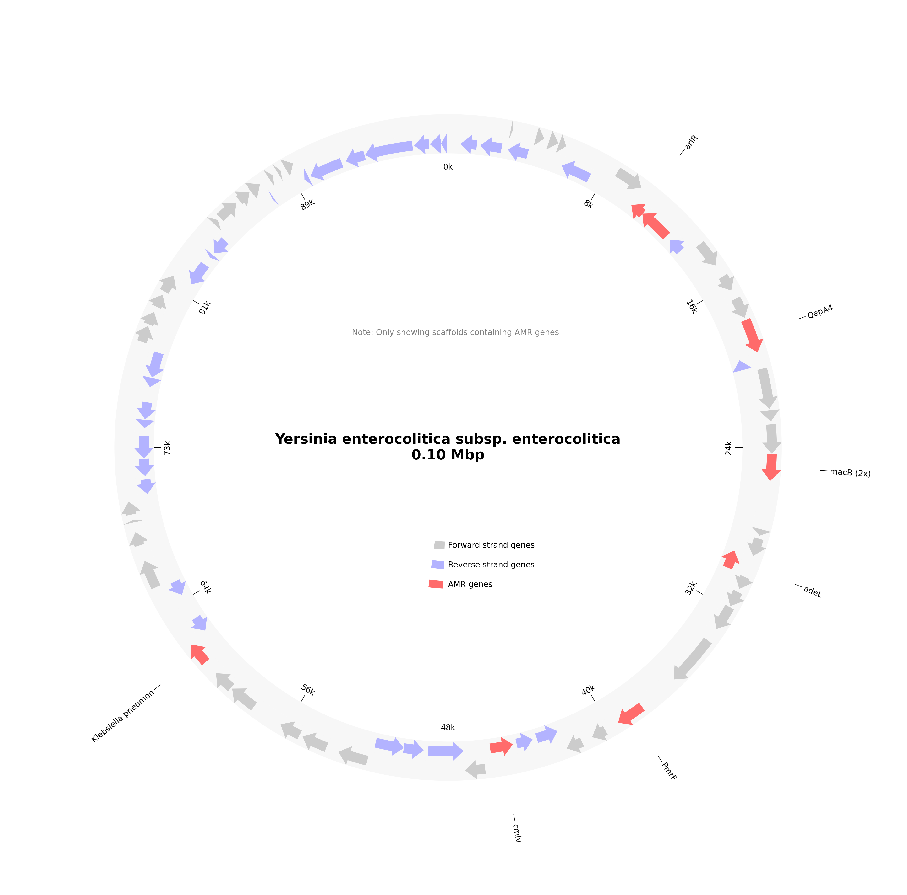

### Klebsiella pneumoniae OmpK37
- **Mechanism**: reduced permeability to antibiotic
- **Drug Classes**: monobactam; carbapenem; cephalosporin; cephamycin; penam; penem
- **AMR Family**: General Bacterial Porin with reduced permeability to beta-lactams
- **Locations**:
  - gnl|SPADES|PBDHLPBC_61_50 : position 61342-62424

### PmrF
- **Mechanism**: antibiotic target alteration
- **Drug Classes**: peptide antibiotic
- **AMR Family**: pmr phosphoethanolamine transferase
- **Locations**:
  - gnl|SPADES|PBDHLPBC_61_33 : position 38460-39833

### QepA4
- **Mechanism**: antibiotic efflux
- **Drug Classes**: fluoroquinolone antibiotic
- **AMR Family**: major facilitator superfamily (MFS) antibiotic efflux pump
- **Locations**:
  - gnl|SPADES|PBDHLPBC_61_16 : position 17936-19576

### adeL
- **Mechanism**: antibiotic efflux
- **Drug Classes**: fluoroquinolone antibiotic; tetracycline antibiotic
- **AMR Family**: resistance-nodulation-cell division (RND) antibiotic efflux pump
- **Locations**:
  - gnl|SPADES|PBDHLPBC_61_27 : position 29484-30416

### arlR
- **Mechanism**: antibiotic efflux
- **Drug Classes**: fluoroquinolone antibiotic; disinfecting agents and antiseptics
- **AMR Family**: major facilitator superfamily (MFS) antibiotic efflux pump
- **Locations**:
  - gnl|SPADES|PBDHLPBC_61_9 : position 9948-10667

### basS
- **Mechanism**: antibiotic target alteration; antibiotic efflux
- **Drug Classes**: peptide antibiotic
- **AMR Family**: pmr phosphoethanolamine transferase
- **Locations**:
  - gnl|SPADES|PBDHLPBC_61_10 : position 10660-12336

### cmlv
- **Mechanism**: antibiotic inactivation
- **Drug Classes**: phenicol antibiotic
- **AMR Family**: chloramphenicol phosphotransferase
- **Locations**:
  - gnl|SPADES|PBDHLPBC_61_39 : position 45030-46196

### macB (found in 2 locations)
- **Mechanism**: antibiotic efflux
- **Drug Classes**: macrolide antibiotic
- **AMR Family**: ATP-binding cassette (ABC) antibiotic efflux pump
- **Locations**:
  - gnl|SPADES|PBDHLPBC_61_21 : position 24471-25763
  - gnl|SPADES|PBDHLPBC_61_23 : position 26914-27627

## Yersinia enterocolitica subsp. palearctica
**Strain Statistics:**
- Total genome length: 29.3 kbp
- Total scaffolds: 1
- Scaffolds with AMR genes: 1
- Total genes annotated: 62
- Total AMR genes: 7
- Unique AMR genes: 7
- Distinct AMR mechanisms: 4
- Distinct AMR families: 5
- Distinct drug classes: 12

**Circos Plot:**

### Escherichia coli AcrAB-TolC with MarR mutations conferring resistance to ciprofloxacin and tetracycline
- **Mechanism**: antibiotic target alteration; antibiotic efflux
- **Drug Classes**: fluoroquinolone antibiotic; cephalosporin; glycylcycline; penam; tetracycline antibiotic; rifamycin antibiotic; phenicol antibiotic; disinfecting agents and antiseptics
- **AMR Family**: resistance-nodulation-cell division (RND) antibiotic efflux pump
- **Locations**:
  - gnl|SPADES|PBDHLPBC_343_12 : position 8420-8851

### FosM2
- **Mechanism**: antibiotic inactivation
- **Drug Classes**: phosphonic acid antibiotic
- **AMR Family**: fosfomycin thiol transferase
- **Locations**:
  - gnl|SPADES|PBDHLPBC_343_21 : position 17456-17863

### adeL
- **Mechanism**: antibiotic efflux
- **Drug Classes**: fluoroquinolone antibiotic; tetracycline antibiotic
- **AMR Family**: resistance-nodulation-cell division (RND) antibiotic efflux pump
- **Locations**:
  - gnl|SPADES|PBDHLPBC_343_29 : position 22830-23768

### bcr-1
- **Mechanism**: antibiotic efflux
- **Drug Classes**: bicyclomycin-like antibiotic
- **AMR Family**: major facilitator superfamily (MFS) antibiotic efflux pump
- **Locations**:
  - gnl|SPADES|PBDHLPBC_343_30 : position 23932-25149

### eptA
- **Mechanism**: antibiotic target alteration
- **Drug Classes**: peptide antibiotic
- **AMR Family**: pmr phosphoethanolamine transferase
- **Locations**:
  - gnl|SPADES|PBDHLPBC_343_18 : position 13738-15378

### hmrM
- **Mechanism**: antibiotic efflux
- **Drug Classes**: fluoroquinolone antibiotic; disinfecting agents and antiseptics
- **AMR Family**: multidrug and toxic compound extrusion (MATE) transporter
- **Locations**:
  - gnl|SPADES|PBDHLPBC_343_33 : position 27584-28996

### mdtN
- **Mechanism**: antibiotic efflux
- **Drug Classes**: nucleoside antibiotic; disinfecting agents and antiseptics
- **AMR Family**: major facilitator superfamily (MFS) antibiotic efflux pump
- **Locations**:
  - gnl|SPADES|PBDHLPBC_343_14 : position 9362-10132

## Yersinia enterocolitica subsp. palearctica 105.5R(r)
**Strain Statistics:**
- Total genome length: 56.9 kbp
- Total scaffolds: 1
- Scaffolds with AMR genes: 1
- Total genes annotated: 103
- Total AMR genes: 6
- Unique AMR genes: 6
- Distinct AMR mechanisms: 3
- Distinct AMR families: 6
- Distinct drug classes: 13

**Circos Plot:**

.png)

### LlmA 23S ribosomal RNA methyltransferase
- **Mechanism**: antibiotic target alteration
- **Drug Classes**: lincosamide antibiotic
- **AMR Family**: Llm 23S ribosomal RNA methyltransferase
- **Locations**:
  - gnl|SPADES|PBDHLPBC_160_25 : position 24505-25695

### Mycobacterium tuberculosis kasA mutant conferring resistance to isoniazid
- **Mechanism**: antibiotic target alteration
- **Drug Classes**: isoniazid-like antibiotic
- **AMR Family**: antibiotic resistant kasA
- **Locations**:
  - gnl|SPADES|PBDHLPBC_160_40 : position 39858-41132

### OmpA
- **Mechanism**: reduced permeability to antibiotic
- **Drug Classes**: peptide antibiotic
- **AMR Family**: General Bacterial Porin with reduced permeability to peptide antibiotics
- **Locations**:
  - gnl|SPADES|PBDHLPBC_160_35 : position 34926-35999

### TaeA
- **Mechanism**: antibiotic efflux
- **Drug Classes**: pleuromutilin antibiotic
- **AMR Family**: ATP-binding cassette (ABC) antibiotic efflux pump
- **Locations**:
  - gnl|SPADES|PBDHLPBC_160_45 : position 45040-46953

### mdtO
- **Mechanism**: antibiotic efflux
- **Drug Classes**: nucleoside antibiotic; disinfecting agents and antiseptics
- **AMR Family**: major facilitator superfamily (MFS) antibiotic efflux pump
- **Locations**:
  - gnl|SPADES|PBDHLPBC_160_32 : position 31025-33160

### sdiA
- **Mechanism**: antibiotic efflux
- **Drug Classes**: fluoroquinolone antibiotic; cephalosporin; glycylcycline; penam; tetracycline antibiotic; rifamycin antibiotic; phenicol antibiotic; disinfecting agents and antiseptics
- **AMR Family**: resistance-nodulation-cell division (RND) antibiotic efflux pump
- **Locations**:
  - gnl|SPADES|PBDHLPBC_160_10 : position 11111-11845

## Yersinia enterocolitica subsp. palearctica Y11
**Strain Statistics:**
- Total genome length: 115.3 kbp
- Total scaffolds: 2
- Scaffolds with AMR genes: 2
- Total genes annotated: 212
- Total AMR genes: 17
- Unique AMR genes: 12
- Distinct AMR mechanisms: 5
- Distinct AMR families: 8
- Distinct drug classes: 22

**Circos Plot:**

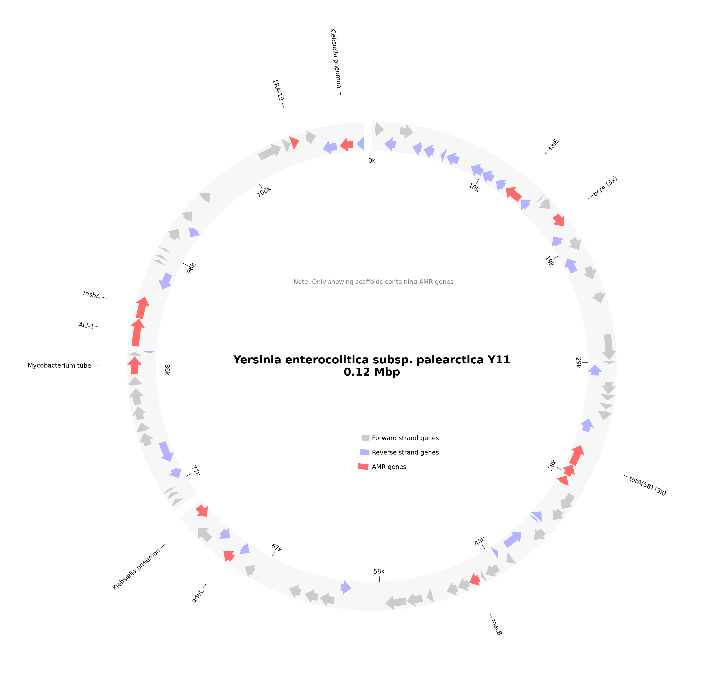

### ALI-1
- **Mechanism**: antibiotic inactivation
- **Drug Classes**: carbapenem
- **AMR Family**: ALI beta-lactamase
- **Locations**:
  - gnl|SPADES|PBDHLPBC_239_11 : position 13304-15484

### Klebsiella pneumoniae OmpK37 (found in 2 locations)
- **Mechanism**: reduced permeability to antibiotic
- **Drug Classes**: monobactam; carbapenem; cephalosporin; cephamycin; penam; penem
- **AMR Family**: General Bacterial Porin with reduced permeability to beta-lactams
- **Locations**:
  - gnl|SPADES|PBDHLPBC_102_73 : position 73709-74824
  - gnl|SPADES|PBDHLPBC_239_30 : position 38193-39308

### LRA-19
- **Mechanism**: antibiotic inactivation
- **Drug Classes**: cephalosporin; penam
- **AMR Family**: subclass B3 LRA beta-lactamase
- **Locations**:
  - gnl|SPADES|PBDHLPBC_239_27 : position 34472-35119

### Mycobacterium tuberculosis rpsA mutations conferring resistance to pyrazinamide
- **Mechanism**: antibiotic target alteration
- **Drug Classes**: pyrazine antibiotic
- **AMR Family**: pyrazinamide resistant rpsA
- **Locations**:
  - gnl|SPADES|PBDHLPBC_239_9 : position 11107-12513

### adeL
- **Mechanism**: antibiotic efflux
- **Drug Classes**: fluoroquinolone antibiotic; tetracycline antibiotic
- **AMR Family**: resistance-nodulation-cell division (RND) antibiotic efflux pump
- **Locations**:
  - gnl|SPADES|PBDHLPBC_102_69 : position 69933-70847

### bcrA (found in 3 locations)
- **Mechanism**: antibiotic efflux
- **Drug Classes**: peptide antibiotic
- **AMR Family**: ATP-binding cassette (ABC) antibiotic efflux pump
- **Locations**:
  - gnl|SPADES|PBDHLPBC_102_18 : position 16381-17445
  - gnl|SPADES|PBDHLPBC_102_26 : position 24959-25666
  - gnl|SPADES|PBDHLPBC_102_59 : position 59324-60022

### macB
- **Mechanism**: antibiotic efflux
- **Drug Classes**: macrolide antibiotic
- **AMR Family**: ATP-binding cassette (ABC) antibiotic efflux pump
- **Locations**:
  - gnl|SPADES|PBDHLPBC_102_50 : position 49637-50473

### mdtN
- **Mechanism**: antibiotic efflux
- **Drug Classes**: nucleoside antibiotic; disinfecting agents and antiseptics
- **AMR Family**: major facilitator superfamily (MFS) antibiotic efflux pump
- **Locations**:
  - gnl|SPADES|PBDHLPBC_102_38 : position 37624-38610

### msbA
- **Mechanism**: antibiotic efflux
- **Drug Classes**: nitroimidazole antibiotic
- **AMR Family**: ATP-binding cassette (ABC) antibiotic efflux pump
- **Locations**:
  - gnl|SPADES|PBDHLPBC_239_12 : position 15520-17268

### nalC
- **Mechanism**: antibiotic efflux
- **Drug Classes**: macrolide antibiotic; fluoroquinolone antibiotic; monobactam; carbapenem; cephalosporin; cephamycin; penam; tetracycline antibiotic; peptide antibiotic; aminocoumarin antibiotic; diaminopyrimidine antibiotic; sulfonamide antibiotic; phenicol antibiotic; penem
- **AMR Family**: resistance-nodulation-cell division (RND) antibiotic efflux pump
- **Locations**:
  - gnl|SPADES|PBDHLPBC_102_39 : position 38659-39369

### salE
- **Mechanism**: antibiotic target protection
- **Drug Classes**: lincosamide antibiotic; streptogramin antibiotic; streptogramin A antibiotic; pleuromutilin antibiotic
- **AMR Family**: sal-type ABC-F protein
- **Locations**:
  - gnl|SPADES|PBDHLPBC_102_13 : position 11930-13423

### tetA(58) (found in 3 locations)
- **Mechanism**: antibiotic efflux
- **Drug Classes**: tetracycline antibiotic
- **AMR Family**: major facilitator superfamily (MFS) antibiotic efflux pump
- **Locations**:
  - gnl|SPADES|PBDHLPBC_102_37 : position 35859-37610
  - gnl|SPADES|PBDHLPBC_102_58 : position 58360-59196
  - gnl|SPADES|PBDHLPBC_102_65 : position 66188-67132

