# AMR Analysis Report for LB02_MacConkey_QG_A2_S20

# Organism Classifications:

## Aeromonas salmonicida
**Strain Statistics:**
- Total genome length: 73.2 kbp
- Total scaffolds: 2387
- Scaffolds with AMR genes: 160
- Total genes annotated: 114
- Total AMR genes: 167
- Unique AMR genes: 97
- Distinct AMR mechanisms: 7
- Distinct AMR families: 34
- Distinct drug classes: 31

**Circos Plot:**

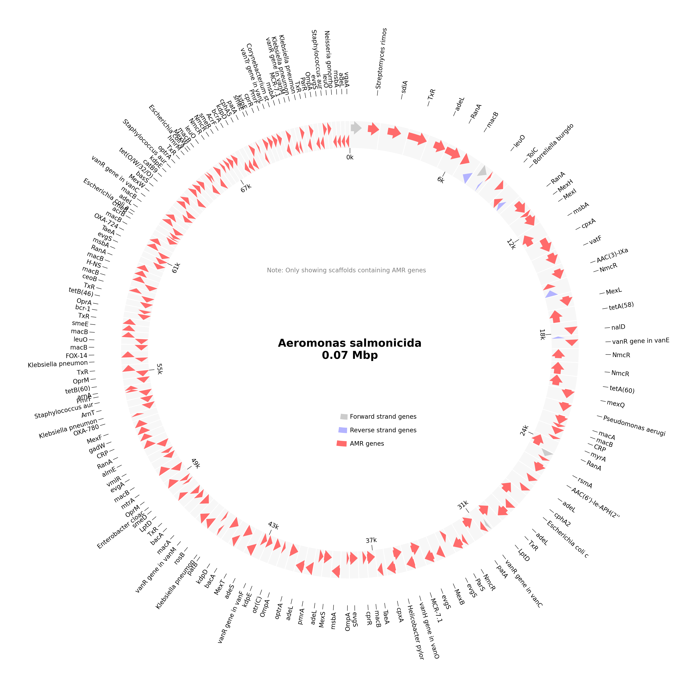

### AAC(3)-IXa
- **Mechanism**: antibiotic inactivation
- **Drug Classes**: aminoglycoside antibiotic
- **AMR Family**: AAC(3)
- **Locations**:
  - gnl|SPADES|FKHIBMDG_6756_2 : position 221-796

### AAC(6')-Ie-APH(2'')-Ia bifunctional protein
- **Mechanism**: antibiotic inactivation
- **Drug Classes**: aminoglycoside antibiotic
- **AMR Family**: aminoglycoside bifunctional resistance protein
- **Locations**:
  - gnl|SPADES|FKHIBMDG_8343_1 : position 120-653

### AcrF
- **Mechanism**: antibiotic efflux
- **Drug Classes**: fluoroquinolone antibiotic; cephalosporin; cephamycin; penam
- **AMR Family**: resistance-nodulation-cell division (RND) antibiotic efflux pump
- **Locations**:
  - gnl|SPADES|FKHIBMDG_29243_1 : position 1-243

### ArnT
- **Mechanism**: antibiotic target alteration
- **Drug Classes**: peptide antibiotic
- **AMR Family**: pmr phosphoethanolamine transferase
- **Locations**:
  - gnl|SPADES|FKHIBMDG_16662_1 : position 2-361

### Borreliella burgdorferi murA with mutation conferring resistance to fosfomycin
- **Mechanism**: antibiotic target alteration
- **Drug Classes**: phosphonic acid antibiotic
- **AMR Family**: antibiotic-resistant murA transferase
- **Locations**:
  - gnl|SPADES|FKHIBMDG_6025_1 : position 1-357

### CRP (found in 2 locations)
- **Mechanism**: antibiotic efflux
- **Drug Classes**: macrolide antibiotic; fluoroquinolone antibiotic; penam
- **AMR Family**: resistance-nodulation-cell division (RND) antibiotic efflux pump
- **Locations**:
  - gnl|SPADES|FKHIBMDG_15800_1 : position 46-375
  - gnl|SPADES|FKHIBMDG_7787_1 : position 1-393

### Corynebacterium striatum tetA
- **Mechanism**: antibiotic efflux
- **Drug Classes**: penam; tetracycline antibiotic
- **AMR Family**: major facilitator superfamily (MFS) antibiotic efflux pump
- **Locations**:
  - gnl|SPADES|FKHIBMDG_31195_1 : position 2-232

### Enterobacter cloacae acrA
- **Mechanism**: antibiotic efflux
- **Drug Classes**: fluoroquinolone antibiotic; cephalosporin; glycylcycline; penam; tetracycline antibiotic; rifamycin antibiotic; phenicol antibiotic; disinfecting agents and antiseptics
- **AMR Family**: resistance-nodulation-cell division (RND) antibiotic efflux pump
- **Locations**:
  - gnl|SPADES|FKHIBMDG_14752_2 : position 181-399

### Escherichia coli acrA (found in 2 locations)
- **Mechanism**: antibiotic efflux
- **Drug Classes**: fluoroquinolone antibiotic; cephalosporin; glycylcycline; penam; tetracycline antibiotic; rifamycin antibiotic; phenicol antibiotic; disinfecting agents and antiseptics
- **AMR Family**: resistance-nodulation-cell division (RND) antibiotic efflux pump
- **Locations**:
  - gnl|SPADES|FKHIBMDG_21440_2 : position 90-290
  - gnl|SPADES|FKHIBMDG_25912_1 : position 1-144

### Escherichia coli cyaA with mutation conferring resistance to fosfomycin
- **Mechanism**: antibiotic target alteration
- **Drug Classes**: phosphonic acid antibiotic
- **AMR Family**: antibiotic-resistant cya adenylate cyclase
- **Locations**:
  - gnl|SPADES|FKHIBMDG_8705_1 : position 2-628

### FOX-14
- **Mechanism**: antibiotic inactivation
- **Drug Classes**: cephalosporin; cephamycin
- **AMR Family**: FOX beta-lactamase
- **Locations**:
  - gnl|SPADES|FKHIBMDG_17280_1 : position 2-349

### H-NS
- **Mechanism**: antibiotic efflux
- **Drug Classes**: macrolide antibiotic; fluoroquinolone antibiotic; cephalosporin; cephamycin; penam; tetracycline antibiotic
- **AMR Family**: major facilitator superfamily (MFS) antibiotic efflux pump; resistance-nodulation-cell division (RND) antibiotic efflux pump
- **Locations**:
  - gnl|SPADES|FKHIBMDG_19902_1 : position 3-311

### Helicobacter pylori pbp1 mutants conferring resistance to amoxicillin
- **Mechanism**: antibiotic target alteration
- **Drug Classes**: cephalosporin; cephamycin; penam
- **AMR Family**: Penicillin-binding protein mutations conferring resistance to beta-lactam antibiotics
- **Locations**:
  - gnl|SPADES|FKHIBMDG_10749_1 : position 2-520

### Klebsiella pneumoniae OmpK37 (found in 4 locations)
- **Mechanism**: reduced permeability to antibiotic
- **Drug Classes**: monobactam; carbapenem; cephalosporin; cephamycin; penam; penem
- **AMR Family**: General Bacterial Porin with reduced permeability to beta-lactams
- **Locations**:
  - gnl|SPADES|FKHIBMDG_13995_1 : position 3-131
  - gnl|SPADES|FKHIBMDG_17101_1 : position 99-353
  - gnl|SPADES|FKHIBMDG_33543_1 : position 2-139
  - gnl|SPADES|FKHIBMDG_33655_1 : position 1-219

### Klebsiella pneumoniae acrR with mutation conferring multidrug antibiotic resistance
- **Mechanism**: antibiotic target alteration; antibiotic efflux
- **Drug Classes**: fluoroquinolone antibiotic; cephalosporin; glycylcycline; penam; tetracycline antibiotic; rifamycin antibiotic; phenicol antibiotic; disinfecting agents and antiseptics
- **AMR Family**: resistance-nodulation-cell division (RND) antibiotic efflux pump
- **Locations**:
  - gnl|SPADES|FKHIBMDG_16406_1 : position 3-365

### LptD (found in 2 locations)
- **Mechanism**: antibiotic efflux
- **Drug Classes**: carbapenem; peptide antibiotic; aminocoumarin antibiotic; rifamycin antibiotic
- **AMR Family**: ATP-binding cassette (ABC) antibiotic efflux pump
- **Locations**:
  - gnl|SPADES|FKHIBMDG_14589_1 : position 3-293
  - gnl|SPADES|FKHIBMDG_9204_1 : position 3-599

### MCR-7.1 (found in 2 locations)
- **Mechanism**: antibiotic target alteration
- **Drug Classes**: peptide antibiotic
- **AMR Family**: MCR phosphoethanolamine transferase
- **Locations**:
  - gnl|SPADES|FKHIBMDG_10453_1 : position 1-534
  - gnl|SPADES|FKHIBMDG_32985_1 : position 2-223

### MexB
- **Mechanism**: antibiotic efflux
- **Drug Classes**: macrolide antibiotic; fluoroquinolone antibiotic; monobactam; carbapenem; cephalosporin; cephamycin; penam; tetracycline antibiotic; peptide antibiotic; aminocoumarin antibiotic; diaminopyrimidine antibiotic; sulfonamide antibiotic; phenicol antibiotic; penem
- **AMR Family**: resistance-nodulation-cell division (RND) antibiotic efflux pump
- **Locations**:
  - gnl|SPADES|FKHIBMDG_10333_1 : position 1-399

### MexF
- **Mechanism**: antibiotic efflux
- **Drug Classes**: fluoroquinolone antibiotic; diaminopyrimidine antibiotic; phenicol antibiotic
- **AMR Family**: resistance-nodulation-cell division (RND) antibiotic efflux pump
- **Locations**:
  - gnl|SPADES|FKHIBMDG_16134_1 : position 1-369

### MexH
- **Mechanism**: antibiotic efflux
- **Drug Classes**: fluoroquinolone antibiotic; tetracycline antibiotic; disinfecting agents and antiseptics
- **AMR Family**: resistance-nodulation-cell division (RND) antibiotic efflux pump
- **Locations**:
  - gnl|SPADES|FKHIBMDG_6133_1 : position 2-217

### MexI
- **Mechanism**: antibiotic efflux
- **Drug Classes**: fluoroquinolone antibiotic; tetracycline antibiotic; disinfecting agents and antiseptics
- **AMR Family**: resistance-nodulation-cell division (RND) antibiotic efflux pump
- **Locations**:
  - gnl|SPADES|FKHIBMDG_6133_2 : position 233-871

### MexL
- **Mechanism**: antibiotic efflux
- **Drug Classes**: macrolide antibiotic; tetracycline antibiotic; disinfecting agents and antiseptics
- **AMR Family**: resistance-nodulation-cell division (RND) antibiotic efflux pump
- **Locations**:
  - gnl|SPADES|FKHIBMDG_6830_2 : position 178-732

### MexS
- **Mechanism**: antibiotic efflux
- **Drug Classes**: fluoroquinolone antibiotic; diaminopyrimidine antibiotic; phenicol antibiotic
- **AMR Family**: resistance-nodulation-cell division (RND) antibiotic efflux pump
- **Locations**:
  - gnl|SPADES|FKHIBMDG_11839_1 : position 2-478

### MexT
- **Mechanism**: antibiotic efflux
- **Drug Classes**: fluoroquinolone antibiotic; diaminopyrimidine antibiotic; phenicol antibiotic
- **AMR Family**: resistance-nodulation-cell division (RND) antibiotic efflux pump
- **Locations**:
  - gnl|SPADES|FKHIBMDG_12696_1 : position 1-450

### MexW (found in 2 locations)
- **Mechanism**: antibiotic efflux
- **Drug Classes**: macrolide antibiotic; fluoroquinolone antibiotic; tetracycline antibiotic; phenicol antibiotic; disinfecting agents and antiseptics
- **AMR Family**: resistance-nodulation-cell division (RND) antibiotic efflux pump
- **Locations**:
  - gnl|SPADES|FKHIBMDG_22784_1 : position 3-278
  - gnl|SPADES|FKHIBMDG_25912_2 : position 144-260

### Neisseria gonorrhoeae pilQ gene conferring resistance to beta-lactam
- **Mechanism**: antibiotic target alteration
- **Drug Classes**: cephalosporin; cephamycin; penam
- **AMR Family**: Penicillin-binding protein mutations conferring resistance to beta-lactam antibiotics
- **Locations**:
  - gnl|SPADES|FKHIBMDG_35130_1 : position 3-212

### NmcR (found in 6 locations)
- **Mechanism**: antibiotic inactivation
- **Drug Classes**: carbapenem; cephalosporin; cephamycin; penam
- **AMR Family**: NmcA beta-lactamase
- **Locations**:
  - gnl|SPADES|FKHIBMDG_26969_1 : position 107-253
  - gnl|SPADES|FKHIBMDG_28150_1 : position 69-248
  - gnl|SPADES|FKHIBMDG_6810_1 : position 3-287
  - gnl|SPADES|FKHIBMDG_7315_1 : position 1-552
  - gnl|SPADES|FKHIBMDG_7342_1 : position 2-733
  - gnl|SPADES|FKHIBMDG_9582_2 : position 375-575

### OXA-724
- **Mechanism**: antibiotic inactivation
- **Drug Classes**: penam
- **AMR Family**: OXA beta-lactamase; OXA-12-like beta-lactamase
- **Locations**:
  - gnl|SPADES|FKHIBMDG_21239_1 : position 1-291

### OXA-780
- **Mechanism**: antibiotic inactivation
- **Drug Classes**: penam
- **AMR Family**: OXA beta-lactamase
- **Locations**:
  - gnl|SPADES|FKHIBMDG_16427_2 : position 231-365

### OmpA (found in 3 locations)
- **Mechanism**: reduced permeability to antibiotic
- **Drug Classes**: peptide antibiotic
- **AMR Family**: General Bacterial Porin with reduced permeability to peptide antibiotics
- **Locations**:
  - gnl|SPADES|FKHIBMDG_11810_1 : position 2-145
  - gnl|SPADES|FKHIBMDG_12301_2 : position 298-462
  - gnl|SPADES|FKHIBMDG_34156_1 : position 2-217

### OprA
- **Mechanism**: antibiotic efflux
- **Drug Classes**: macrolide antibiotic; fluoroquinolone antibiotic; aminoglycoside antibiotic; carbapenem; tetracycline antibiotic
- **AMR Family**: resistance-nodulation-cell division (RND) antibiotic efflux pump
- **Locations**:
  - gnl|SPADES|FKHIBMDG_19513_1 : position 2-208

### OprM (found in 2 locations)
- **Mechanism**: antibiotic efflux
- **Drug Classes**: macrolide antibiotic; fluoroquinolone antibiotic; monobactam; aminoglycoside antibiotic; carbapenem; cephalosporin; cephamycin; penam; tetracycline antibiotic; peptide antibiotic; aminocoumarin antibiotic; diaminopyrimidine antibiotic; sulfonamide antibiotic; phenicol antibiotic; penem; disinfecting agents and antiseptics
- **AMR Family**: resistance-nodulation-cell division (RND) antibiotic efflux pump
- **Locations**:
  - gnl|SPADES|FKHIBMDG_14967_1 : position 1-393
  - gnl|SPADES|FKHIBMDG_16936_1 : position 2-355

### ParR
- **Mechanism**: antibiotic efflux; reduced permeability to antibiotic
- **Drug Classes**: macrolide antibiotic; fluoroquinolone antibiotic; monobactam; aminoglycoside antibiotic; carbapenem; cephalosporin; cephamycin; penam; tetracycline antibiotic; phenicol antibiotic; penem; disinfecting agents and antiseptics
- **AMR Family**: resistance-nodulation-cell division (RND) antibiotic efflux pump; Outer Membrane Porin (Opr)
- **Locations**:
  - gnl|SPADES|FKHIBMDG_34157_1 : position 1-216

### ParS
- **Mechanism**: antibiotic efflux; reduced permeability to antibiotic
- **Drug Classes**: macrolide antibiotic; fluoroquinolone antibiotic; monobactam; aminoglycoside antibiotic; carbapenem; cephalosporin; cephamycin; penam; tetracycline antibiotic; phenicol antibiotic; penem; disinfecting agents and antiseptics
- **AMR Family**: resistance-nodulation-cell division (RND) antibiotic efflux pump; Outer Membrane Porin (Opr)
- **Locations**:
  - gnl|SPADES|FKHIBMDG_9708_1 : position 2-571

### PmrF (found in 2 locations)
- **Mechanism**: antibiotic target alteration
- **Drug Classes**: peptide antibiotic
- **AMR Family**: pmr phosphoethanolamine transferase
- **Locations**:
  - gnl|SPADES|FKHIBMDG_16841_1 : position 2-133
  - gnl|SPADES|FKHIBMDG_30820_1 : position 1-234

### Pseudomonas aeruginosa CpxR
- **Mechanism**: antibiotic efflux
- **Drug Classes**: macrolide antibiotic; fluoroquinolone antibiotic; monobactam; aminoglycoside antibiotic; carbapenem; cephalosporin; cephamycin; penam; tetracycline antibiotic; peptide antibiotic; aminocoumarin antibiotic; diaminopyrimidine antibiotic; sulfonamide antibiotic; phenicol antibiotic; penem
- **AMR Family**: resistance-nodulation-cell division (RND) antibiotic efflux pump
- **Locations**:
  - gnl|SPADES|FKHIBMDG_7451_1 : position 1-516

### RanA (found in 5 locations)
- **Mechanism**: antibiotic efflux
- **Drug Classes**: aminoglycoside antibiotic
- **AMR Family**: ATP-binding cassette (ABC) antibiotic efflux pump
- **Locations**:
  - gnl|SPADES|FKHIBMDG_15642_1 : position 1-378
  - gnl|SPADES|FKHIBMDG_20022_1 : position 1-309
  - gnl|SPADES|FKHIBMDG_4966_1 : position 2-934
  - gnl|SPADES|FKHIBMDG_6098_2 : position 158-877
  - gnl|SPADES|FKHIBMDG_8160_1 : position 1-666

### Staphylococcus aureus mupA conferring resistance to mupirocin (found in 3 locations)
- **Mechanism**: antibiotic target alteration
- **Drug Classes**: mupirocin-like antibiotic
- **AMR Family**: antibiotic-resistant isoleucyl-tRNA synthetase (ileS)
- **Locations**:
  - gnl|SPADES|FKHIBMDG_16820_1 : position 2-358
  - gnl|SPADES|FKHIBMDG_25093_1 : position 1-264
  - gnl|SPADES|FKHIBMDG_35019_1 : position 2-214

### Streptomyces rimosus otr(A)
- **Mechanism**: antibiotic target protection
- **Drug Classes**: tetracycline antibiotic
- **AMR Family**: tetracycline-resistant ribosomal protection protein
- **Locations**:
  - gnl|SPADES|FKHIBMDG_3188_2 : position 1043-1699

### TaeA (found in 2 locations)
- **Mechanism**: antibiotic efflux
- **Drug Classes**: pleuromutilin antibiotic
- **AMR Family**: ATP-binding cassette (ABC) antibiotic efflux pump
- **Locations**:
  - gnl|SPADES|FKHIBMDG_11278_2 : position 203-499
  - gnl|SPADES|FKHIBMDG_21171_1 : position 2-292

### TolC
- **Mechanism**: antibiotic efflux
- **Drug Classes**: macrolide antibiotic; fluoroquinolone antibiotic; aminoglycoside antibiotic; carbapenem; cephalosporin; glycylcycline; cephamycin; penam; tetracycline antibiotic; peptide antibiotic; aminocoumarin antibiotic; rifamycin antibiotic; phenicol antibiotic; penem; disinfecting agents and antiseptics
- **AMR Family**: ATP-binding cassette (ABC) antibiotic efflux pump; major facilitator superfamily (MFS) antibiotic efflux pump; resistance-nodulation-cell division (RND) antibiotic efflux pump
- **Locations**:
  - gnl|SPADES|FKHIBMDG_5733_2 : position 589-930

### TxR (found in 8 locations)
- **Mechanism**: antibiotic efflux
- **Drug Classes**: tetracycline antibiotic
- **AMR Family**: ATP-binding cassette (ABC) antibiotic efflux pump
- **Locations**:
  - gnl|SPADES|FKHIBMDG_14488_1 : position 2-316
  - gnl|SPADES|FKHIBMDG_16977_1 : position 1-354
  - gnl|SPADES|FKHIBMDG_19147_1 : position 2-322
  - gnl|SPADES|FKHIBMDG_19652_1 : position 2-313
  - gnl|SPADES|FKHIBMDG_25372_1 : position 3-263
  - gnl|SPADES|FKHIBMDG_34163_1 : position 2-217
  - gnl|SPADES|FKHIBMDG_4681_1 : position 1-1134
  - gnl|SPADES|FKHIBMDG_9085_1 : position 1-606

### acrB
- **Mechanism**: antibiotic efflux
- **Drug Classes**: fluoroquinolone antibiotic; cephalosporin; glycylcycline; penam; tetracycline antibiotic; rifamycin antibiotic; phenicol antibiotic; disinfecting agents and antiseptics
- **AMR Family**: resistance-nodulation-cell division (RND) antibiotic efflux pump
- **Locations**:
  - gnl|SPADES|FKHIBMDG_21485_1 : position 2-289

### adeL (found in 7 locations)
- **Mechanism**: antibiotic efflux
- **Drug Classes**: fluoroquinolone antibiotic; tetracycline antibiotic
- **AMR Family**: resistance-nodulation-cell division (RND) antibiotic efflux pump
- **Locations**:
  - gnl|SPADES|FKHIBMDG_11828_1 : position 3-479
  - gnl|SPADES|FKHIBMDG_11833_1 : position 1-255
  - gnl|SPADES|FKHIBMDG_22050_1 : position 1-285
  - gnl|SPADES|FKHIBMDG_35665_1 : position 1-210
  - gnl|SPADES|FKHIBMDG_4792_2 : position 419-1108
  - gnl|SPADES|FKHIBMDG_8401_2 : position 317-649
  - gnl|SPADES|FKHIBMDG_8917_2 : position 253-615

### adeS
- **Mechanism**: antibiotic efflux
- **Drug Classes**: glycylcycline; tetracycline antibiotic
- **AMR Family**: resistance-nodulation-cell division (RND) antibiotic efflux pump
- **Locations**:
  - gnl|SPADES|FKHIBMDG_12653_1 : position 3-452

### almE
- **Mechanism**: antibiotic target alteration
- **Drug Classes**: peptide antibiotic
- **AMR Family**: polymyxin resistance operon; alm glycyltransferase
- **Locations**:
  - gnl|SPADES|FKHIBMDG_15536_1 : position 2-382

### arnA
- **Mechanism**: antibiotic target alteration
- **Drug Classes**: peptide antibiotic
- **AMR Family**: pmr phosphoethanolamine transferase
- **Locations**:
  - gnl|SPADES|FKHIBMDG_16841_2 : position 133-357

### bacA (found in 2 locations)
- **Mechanism**: antibiotic target alteration
- **Drug Classes**: peptide antibiotic
- **AMR Family**: undecaprenyl pyrophosphate related proteins
- **Locations**:
  - gnl|SPADES|FKHIBMDG_12886_1 : position 117-443
  - gnl|SPADES|FKHIBMDG_14437_1 : position 114-404

### basS
- **Mechanism**: antibiotic target alteration; antibiotic efflux
- **Drug Classes**: peptide antibiotic
- **AMR Family**: pmr phosphoethanolamine transferase
- **Locations**:
  - gnl|SPADES|FKHIBMDG_23123_1 : position 1-276

### bcr-1
- **Mechanism**: antibiotic efflux
- **Drug Classes**: bicyclomycin-like antibiotic
- **AMR Family**: major facilitator superfamily (MFS) antibiotic efflux pump
- **Locations**:
  - gnl|SPADES|FKHIBMDG_19457_1 : position 2-316

### bcrA
- **Mechanism**: antibiotic efflux
- **Drug Classes**: peptide antibiotic
- **AMR Family**: ATP-binding cassette (ABC) antibiotic efflux pump
- **Locations**:
  - gnl|SPADES|FKHIBMDG_29755_1 : position 2-241

### catB9
- **Mechanism**: antibiotic inactivation
- **Drug Classes**: phenicol antibiotic
- **AMR Family**: chloramphenicol acetyltransferase (CAT)
- **Locations**:
  - gnl|SPADES|FKHIBMDG_23084_1 : position 2-277

### ceoB
- **Mechanism**: antibiotic efflux
- **Drug Classes**: fluoroquinolone antibiotic; aminoglycoside antibiotic
- **AMR Family**: resistance-nodulation-cell division (RND) antibiotic efflux pump
- **Locations**:
  - gnl|SPADES|FKHIBMDG_19715_1 : position 73-312

### cmeB
- **Mechanism**: antibiotic efflux
- **Drug Classes**: macrolide antibiotic; fluoroquinolone antibiotic; cephalosporin; fusidane antibiotic
- **AMR Family**: resistance-nodulation-cell division (RND) antibiotic efflux pump
- **Locations**:
  - gnl|SPADES|FKHIBMDG_21440_1 : position 3-80

### cphA2
- **Mechanism**: antibiotic inactivation
- **Drug Classes**: carbapenem
- **AMR Family**: CphA beta-lactamase
- **Locations**:
  - gnl|SPADES|FKHIBMDG_8677_2 : position 319-630

### cphA5
- **Mechanism**: antibiotic inactivation
- **Drug Classes**: carbapenem
- **AMR Family**: CphA beta-lactamase
- **Locations**:
  - gnl|SPADES|FKHIBMDG_29876_1 : position 2-238

### cprR (found in 2 locations)
- **Mechanism**: antibiotic target alteration; antibiotic efflux
- **Drug Classes**: peptide antibiotic
- **AMR Family**: pmr phosphoethanolamine transferase
- **Locations**:
  - gnl|SPADES|FKHIBMDG_11626_1 : position 2-226
  - gnl|SPADES|FKHIBMDG_30457_1 : position 2-235

### cpxA (found in 2 locations)
- **Mechanism**: antibiotic efflux
- **Drug Classes**: aminoglycoside antibiotic; aminocoumarin antibiotic
- **AMR Family**: resistance-nodulation-cell division (RND) antibiotic efflux pump
- **Locations**:
  - gnl|SPADES|FKHIBMDG_11228_1 : position 2-502
  - gnl|SPADES|FKHIBMDG_6525_1 : position 2-820

### evgA
- **Mechanism**: antibiotic efflux
- **Drug Classes**: macrolide antibiotic; fluoroquinolone antibiotic; penam; tetracycline antibiotic
- **AMR Family**: major facilitator superfamily (MFS) antibiotic efflux pump; resistance-nodulation-cell division (RND) antibiotic efflux pump
- **Locations**:
  - gnl|SPADES|FKHIBMDG_15106_2 : position 73-390

### evgS (found in 5 locations)
- **Mechanism**: antibiotic efflux
- **Drug Classes**: macrolide antibiotic; fluoroquinolone antibiotic; penam; tetracycline antibiotic
- **AMR Family**: major facilitator superfamily (MFS) antibiotic efflux pump; resistance-nodulation-cell division (RND) antibiotic efflux pump
- **Locations**:
  - gnl|SPADES|FKHIBMDG_10361_1 : position 3-536
  - gnl|SPADES|FKHIBMDG_11690_1 : position 1-483
  - gnl|SPADES|FKHIBMDG_21067_1 : position 1-294
  - gnl|SPADES|FKHIBMDG_34411_1 : position 2-217
  - gnl|SPADES|FKHIBMDG_9800_1 : position 3-254

### gadW
- **Mechanism**: antibiotic efflux
- **Drug Classes**: macrolide antibiotic; fluoroquinolone antibiotic; penam
- **AMR Family**: resistance-nodulation-cell division (RND) antibiotic efflux pump
- **Locations**:
  - gnl|SPADES|FKHIBMDG_15945_1 : position 3-374

### hmrM
- **Mechanism**: antibiotic efflux
- **Drug Classes**: fluoroquinolone antibiotic; disinfecting agents and antiseptics
- **AMR Family**: multidrug and toxic compound extrusion (MATE) transporter
- **Locations**:
  - gnl|SPADES|FKHIBMDG_25330_1 : position 3-263

### kdpD (found in 2 locations)
- **Mechanism**: antibiotic efflux
- **Drug Classes**: aminoglycoside antibiotic
- **AMR Family**: kdpDE
- **Locations**:
  - gnl|SPADES|FKHIBMDG_13851_1 : position 2-418
  - gnl|SPADES|FKHIBMDG_29812_1 : position 3-239

### kdpE (found in 3 locations)
- **Mechanism**: antibiotic efflux
- **Drug Classes**: aminoglycoside antibiotic
- **AMR Family**: kdpDE
- **Locations**:
  - gnl|SPADES|FKHIBMDG_12630_1 : position 138-452
  - gnl|SPADES|FKHIBMDG_23826_1 : position 1-273
  - gnl|SPADES|FKHIBMDG_30502_1 : position 2-142

### leuO (found in 4 locations)
- **Mechanism**: antibiotic efflux
- **Drug Classes**: nucleoside antibiotic; disinfecting agents and antiseptics
- **AMR Family**: major facilitator superfamily (MFS) antibiotic efflux pump
- **Locations**:
  - gnl|SPADES|FKHIBMDG_18403_1 : position 2-316
  - gnl|SPADES|FKHIBMDG_26907_1 : position 3-254
  - gnl|SPADES|FKHIBMDG_35169_1 : position 2-211
  - gnl|SPADES|FKHIBMDG_5687_2 : position 817-936

### macA (found in 2 locations)
- **Mechanism**: antibiotic efflux
- **Drug Classes**: macrolide antibiotic
- **AMR Family**: ATP-binding cassette (ABC) antibiotic efflux pump
- **Locations**:
  - gnl|SPADES|FKHIBMDG_14377_1 : position 1-405
  - gnl|SPADES|FKHIBMDG_7635_1 : position 2-526

### macB (found in 11 locations)
- **Mechanism**: antibiotic efflux
- **Drug Classes**: macrolide antibiotic
- **AMR Family**: ATP-binding cassette (ABC) antibiotic efflux pump
- **Locations**:
  - gnl|SPADES|FKHIBMDG_11592_1 : position 3-488
  - gnl|SPADES|FKHIBMDG_15088_1 : position 2-391
  - gnl|SPADES|FKHIBMDG_18184_1 : position 2-337
  - gnl|SPADES|FKHIBMDG_18594_1 : position 1-306
  - gnl|SPADES|FKHIBMDG_19863_1 : position 2-310
  - gnl|SPADES|FKHIBMDG_19981_1 : position 3-308
  - gnl|SPADES|FKHIBMDG_21357_1 : position 2-292
  - gnl|SPADES|FKHIBMDG_22147_1 : position 3-284
  - gnl|SPADES|FKHIBMDG_26815_1 : position 1-255
  - gnl|SPADES|FKHIBMDG_5653_1 : position 3-446
  - gnl|SPADES|FKHIBMDG_7635_2 : position 523-708

### mexQ
- **Mechanism**: antibiotic efflux
- **Drug Classes**: macrolide antibiotic; carbapenem; tetracycline antibiotic; diaminopyrimidine antibiotic; phenicol antibiotic; disinfecting agents and antiseptics
- **AMR Family**: resistance-nodulation-cell division (RND) antibiotic efflux pump
- **Locations**:
  - gnl|SPADES|FKHIBMDG_7361_1 : position 2-514

### msbA (found in 5 locations)
- **Mechanism**: antibiotic efflux
- **Drug Classes**: nitroimidazole antibiotic
- **AMR Family**: ATP-binding cassette (ABC) antibiotic efflux pump
- **Locations**:
  - gnl|SPADES|FKHIBMDG_11812_1 : position 1-480
  - gnl|SPADES|FKHIBMDG_20307_1 : position 3-305
  - gnl|SPADES|FKHIBMDG_32568_1 : position 3-227
  - gnl|SPADES|FKHIBMDG_35381_1 : position 1-210
  - gnl|SPADES|FKHIBMDG_6432_2 : position 126-833

### mtrA
- **Mechanism**: antibiotic efflux
- **Drug Classes**: macrolide antibiotic; penam
- **AMR Family**: resistance-nodulation-cell division (RND) antibiotic efflux pump
- **Locations**:
  - gnl|SPADES|FKHIBMDG_15056_1 : position 1-390

### myrA
- **Mechanism**: antibiotic target alteration
- **Drug Classes**: macrolide antibiotic; lincosamide antibiotic
- **AMR Family**: non-erm 23S ribosomal RNA methyltransferase (G748)
- **Locations**:
  - gnl|SPADES|FKHIBMDG_7787_2 : position 516-692

### nalD
- **Mechanism**: antibiotic efflux
- **Drug Classes**: macrolide antibiotic; fluoroquinolone antibiotic; monobactam; carbapenem; cephalosporin; cephamycin; penam; tetracycline antibiotic; peptide antibiotic; aminocoumarin antibiotic; diaminopyrimidine antibiotic; sulfonamide antibiotic; phenicol antibiotic; penem
- **AMR Family**: resistance-nodulation-cell division (RND) antibiotic efflux pump
- **Locations**:
  - gnl|SPADES|FKHIBMDG_7142_2 : position 319-753

### optrA (found in 2 locations)
- **Mechanism**: antibiotic target protection
- **Drug Classes**: oxazolidinone antibiotic; phenicol antibiotic
- **AMR Family**: Miscellaneous ABC-F subfamily ATP-binding cassette ribosomal protection proteins
- **Locations**:
  - gnl|SPADES|FKHIBMDG_12184_1 : position 3-467
  - gnl|SPADES|FKHIBMDG_25171_1 : position 1-264

### otr(C)
- **Mechanism**: antibiotic efflux
- **Drug Classes**: tetracycline antibiotic
- **AMR Family**: ATP-binding cassette (ABC) antibiotic efflux pump
- **Locations**:
  - gnl|SPADES|FKHIBMDG_12346_2 : position 103-459

### patA (found in 2 locations)
- **Mechanism**: antibiotic efflux
- **Drug Classes**: fluoroquinolone antibiotic
- **AMR Family**: ATP-binding cassette (ABC) antibiotic efflux pump
- **Locations**:
  - gnl|SPADES|FKHIBMDG_30374_1 : position 1-237
  - gnl|SPADES|FKHIBMDG_9350_1 : position 2-589

### patB
- **Mechanism**: antibiotic efflux
- **Drug Classes**: fluoroquinolone antibiotic
- **AMR Family**: ATP-binding cassette (ABC) antibiotic efflux pump
- **Locations**:
  - gnl|SPADES|FKHIBMDG_13895_2 : position 284-418

### pmrA
- **Mechanism**: antibiotic efflux
- **Drug Classes**: fluoroquinolone antibiotic
- **AMR Family**: major facilitator superfamily (MFS) antibiotic efflux pump
- **Locations**:
  - gnl|SPADES|FKHIBMDG_11831_1 : position 1-417

### rosB
- **Mechanism**: antibiotic efflux
- **Drug Classes**: peptide antibiotic
- **AMR Family**: major facilitator superfamily (MFS) antibiotic efflux pump
- **Locations**:
  - gnl|SPADES|FKHIBMDG_14106_1 : position 1-411

### rsmA
- **Mechanism**: antibiotic efflux
- **Drug Classes**: fluoroquinolone antibiotic; diaminopyrimidine antibiotic; phenicol antibiotic
- **AMR Family**: resistance-nodulation-cell division (RND) antibiotic efflux pump
- **Locations**:
  - gnl|SPADES|FKHIBMDG_8173_2 : position 432-620

### sdiA
- **Mechanism**: antibiotic efflux
- **Drug Classes**: fluoroquinolone antibiotic; cephalosporin; glycylcycline; penam; tetracycline antibiotic; rifamycin antibiotic; phenicol antibiotic; disinfecting agents and antiseptics
- **AMR Family**: resistance-nodulation-cell division (RND) antibiotic efflux pump
- **Locations**:
  - gnl|SPADES|FKHIBMDG_3348_2 : position 453-1235

### smeD
- **Mechanism**: antibiotic efflux
- **Drug Classes**: macrolide antibiotic; fluoroquinolone antibiotic; tetracycline antibiotic; phenicol antibiotic
- **AMR Family**: resistance-nodulation-cell division (RND) antibiotic efflux pump
- **Locations**:
  - gnl|SPADES|FKHIBMDG_14752_1 : position 1-126

### smeE (found in 2 locations)
- **Mechanism**: antibiotic efflux
- **Drug Classes**: macrolide antibiotic; fluoroquinolone antibiotic; tetracycline antibiotic; phenicol antibiotic
- **AMR Family**: resistance-nodulation-cell division (RND) antibiotic efflux pump
- **Locations**:
  - gnl|SPADES|FKHIBMDG_18713_1 : position 2-328
  - gnl|SPADES|FKHIBMDG_30621_2 : position 147-236

### smeR
- **Mechanism**: antibiotic efflux
- **Drug Classes**: aminoglycoside antibiotic; cephalosporin; cephamycin; penam
- **AMR Family**: resistance-nodulation-cell division (RND) antibiotic efflux pump
- **Locations**:
  - gnl|SPADES|FKHIBMDG_28186_1 : position 1-249

### tet(O/W/32/O)
- **Mechanism**: antibiotic target protection
- **Drug Classes**: tetracycline antibiotic
- **AMR Family**: tetracycline-resistant ribosomal protection protein
- **Locations**:
  - gnl|SPADES|FKHIBMDG_23032_1 : position 1-276

### tetA(58)
- **Mechanism**: antibiotic efflux
- **Drug Classes**: tetracycline antibiotic
- **AMR Family**: major facilitator superfamily (MFS) antibiotic efflux pump
- **Locations**:
  - gnl|SPADES|FKHIBMDG_7011_1 : position 1-765

### tetA(60)
- **Mechanism**: antibiotic efflux
- **Drug Classes**: tetracycline antibiotic
- **AMR Family**: ATP-binding cassette (ABC) antibiotic efflux pump
- **Locations**:
  - gnl|SPADES|FKHIBMDG_7351_1 : position 2-649

### tetB(46)
- **Mechanism**: antibiotic efflux
- **Drug Classes**: tetracycline antibiotic
- **AMR Family**: ATP-binding cassette (ABC) antibiotic efflux pump
- **Locations**:
  - gnl|SPADES|FKHIBMDG_19481_1 : position 1-315

### tetB(60)
- **Mechanism**: antibiotic efflux
- **Drug Classes**: tetracycline antibiotic
- **AMR Family**: ATP-binding cassette (ABC) antibiotic efflux pump
- **Locations**:
  - gnl|SPADES|FKHIBMDG_16900_1 : position 3-356

### vanH gene in vanO cluster
- **Mechanism**: antibiotic target alteration
- **Drug Classes**: glycopeptide antibiotic
- **AMR Family**: vanH; glycopeptide resistance gene cluster
- **Locations**:
  - gnl|SPADES|FKHIBMDG_10709_1 : position 3-476

### vanR gene in vanC cluster (found in 2 locations)
- **Mechanism**: antibiotic target alteration
- **Drug Classes**: glycopeptide antibiotic
- **AMR Family**: glycopeptide resistance gene cluster; vanR
- **Locations**:
  - gnl|SPADES|FKHIBMDG_22299_1 : position 2-283
  - gnl|SPADES|FKHIBMDG_9329_2 : position 312-590

### vanR gene in vanE cluster
- **Mechanism**: antibiotic target alteration
- **Drug Classes**: glycopeptide antibiotic
- **AMR Family**: glycopeptide resistance gene cluster; vanR
- **Locations**:
  - gnl|SPADES|FKHIBMDG_7246_2 : position 248-616

### vanR gene in vanF cluster
- **Mechanism**: antibiotic target alteration
- **Drug Classes**: glycopeptide antibiotic
- **AMR Family**: glycopeptide resistance gene cluster; vanR
- **Locations**:
  - gnl|SPADES|FKHIBMDG_12633_1 : position 1-288

### vanR gene in vanM cluster (found in 2 locations)
- **Mechanism**: antibiotic target alteration
- **Drug Classes**: glycopeptide antibiotic
- **AMR Family**: glycopeptide resistance gene cluster; vanR
- **Locations**:
  - gnl|SPADES|FKHIBMDG_14221_1 : position 3-410
  - gnl|SPADES|FKHIBMDG_33470_1 : position 2-220

### vanTr gene in vanL cluster
- **Mechanism**: antibiotic target alteration
- **Drug Classes**: glycopeptide antibiotic
- **AMR Family**: glycopeptide resistance gene cluster; vanT
- **Locations**:
  - gnl|SPADES|FKHIBMDG_31219_1 : position 1-234

### vatF
- **Mechanism**: antibiotic inactivation
- **Drug Classes**: streptogramin antibiotic; streptogramin A antibiotic
- **AMR Family**: streptogramin vat acetyltransferase
- **Locations**:
  - gnl|SPADES|FKHIBMDG_6644_1 : position 94-729

### vgaA
- **Mechanism**: antibiotic target protection
- **Drug Classes**: lincosamide antibiotic; streptogramin antibiotic; streptogramin A antibiotic; pleuromutilin antibiotic
- **AMR Family**: vga-type ABC-F protein
- **Locations**:
  - gnl|SPADES|FKHIBMDG_35889_1 : position 1-207

### vmlR
- **Mechanism**: antibiotic target protection
- **Drug Classes**: lincosamide antibiotic; streptogramin antibiotic; streptogramin A antibiotic; streptogramin B antibiotic; nucleoside antibiotic; pleuromutilin antibiotic
- **AMR Family**: Miscellaneous ABC-F subfamily ATP-binding cassette ribosomal protection proteins
- **Locations**:
  - gnl|SPADES|FKHIBMDG_15393_1 : position 3-224

## Aeromonas salmonicida subsp. masoucida
**Strain Statistics:**
- Total genome length: 1.2 kbp
- Total scaffolds: 52
- Scaffolds with AMR genes: 3
- Total genes annotated: 0
- Total AMR genes: 3
- Unique AMR genes: 3
- Distinct AMR mechanisms: 2
- Distinct AMR families: 3
- Distinct drug classes: 5

**Circos Plot:**

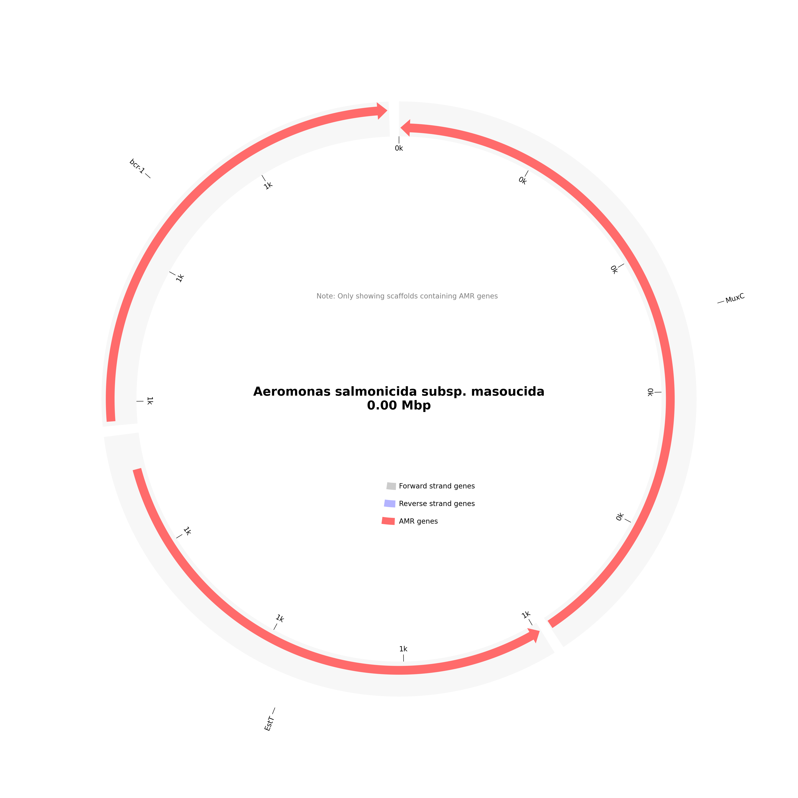

### EstT
- **Mechanism**: antibiotic inactivation
- **Drug Classes**: macrolide antibiotic
- **AMR Family**: macrolide esterase
- **Locations**:
  - gnl|SPADES|FKHIBMDG_15206_1 : position 1-363

### MuxC
- **Mechanism**: antibiotic efflux
- **Drug Classes**: macrolide antibiotic; monobactam; tetracycline antibiotic; aminocoumarin antibiotic
- **AMR Family**: resistance-nodulation-cell division (RND) antibiotic efflux pump
- **Locations**:
  - gnl|SPADES|FKHIBMDG_11311_1 : position 1-498

### bcr-1
- **Mechanism**: antibiotic efflux
- **Drug Classes**: bicyclomycin-like antibiotic
- **AMR Family**: major facilitator superfamily (MFS) antibiotic efflux pump
- **Locations**:
  - gnl|SPADES|FKHIBMDG_19472_1 : position 3-317

## Aeromonas salmonicida subsp. pectinolytica 34mel
**Strain Statistics:**
- Total genome length: 4.6 kbp
- Total scaffolds: 112
- Scaffolds with AMR genes: 9
- Total genes annotated: 6
- Total AMR genes: 9
- Unique AMR genes: 9
- Distinct AMR mechanisms: 3
- Distinct AMR families: 7
- Distinct drug classes: 8

**Circos Plot:**

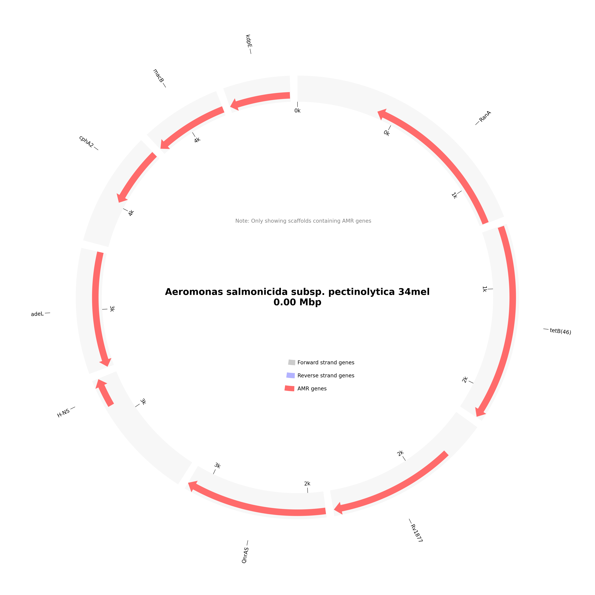

### H-NS
- **Mechanism**: antibiotic efflux
- **Drug Classes**: macrolide antibiotic; fluoroquinolone antibiotic; cephalosporin; cephamycin; penam; tetracycline antibiotic
- **AMR Family**: major facilitator superfamily (MFS) antibiotic efflux pump; resistance-nodulation-cell division (RND) antibiotic efflux pump
- **Locations**:
  - gnl|SPADES|FKHIBMDG_11992_1 : position 368-472

### QnrAS
- **Mechanism**: antibiotic target protection
- **Drug Classes**: fluoroquinolone antibiotic
- **AMR Family**: quinolone resistance protein (qnr)
- **Locations**:
  - gnl|SPADES|FKHIBMDG_10935_1 : position 1-513

### RanA
- **Mechanism**: antibiotic efflux
- **Drug Classes**: aminoglycoside antibiotic
- **AMR Family**: ATP-binding cassette (ABC) antibiotic efflux pump
- **Locations**:
  - gnl|SPADES|FKHIBMDG_5776_2 : position 313-921

### Rv1877
- **Mechanism**: antibiotic efflux
- **Drug Classes**: fluoroquinolone antibiotic
- **AMR Family**: major facilitator superfamily (MFS) antibiotic efflux pump
- **Locations**:
  - gnl|SPADES|FKHIBMDG_9176_1 : position 140-598

### adeL
- **Mechanism**: antibiotic efflux
- **Drug Classes**: fluoroquinolone antibiotic; tetracycline antibiotic
- **AMR Family**: resistance-nodulation-cell division (RND) antibiotic efflux pump
- **Locations**:
  - gnl|SPADES|FKHIBMDG_12878_1 : position 2-445

### cphA2
- **Mechanism**: antibiotic inactivation
- **Drug Classes**: carbapenem
- **AMR Family**: CphA beta-lactamase
- **Locations**:
  - gnl|SPADES|FKHIBMDG_14376_1 : position 175-405

### kdpE
- **Mechanism**: antibiotic efflux
- **Drug Classes**: aminoglycoside antibiotic
- **AMR Family**: kdpDE
- **Locations**:
  - gnl|SPADES|FKHIBMDG_30725_1 : position 1-234

### macB
- **Mechanism**: antibiotic efflux
- **Drug Classes**: macrolide antibiotic
- **AMR Family**: ATP-binding cassette (ABC) antibiotic efflux pump
- **Locations**:
  - gnl|SPADES|FKHIBMDG_21968_1 : position 2-286

### tetB(46)
- **Mechanism**: antibiotic efflux
- **Drug Classes**: tetracycline antibiotic
- **AMR Family**: ATP-binding cassette (ABC) antibiotic efflux pump
- **Locations**:
  - gnl|SPADES|FKHIBMDG_7567_1 : position 3-713

## Buttiauxella agrestis
**Strain Statistics:**
- Total genome length: 665.1 kbp
- Total scaffolds: 2181
- Scaffolds with AMR genes: 321
- Total genes annotated: 1222
- Total AMR genes: 363
- Unique AMR genes: 169
- Distinct AMR mechanisms: 11
- Distinct AMR families: 63
- Distinct drug classes: 36

**Circos Plot:**

### APH(6)-Ic (found in 2 locations)
- **Mechanism**: antibiotic inactivation
- **Drug Classes**: aminoglycoside antibiotic
- **AMR Family**: APH(6)
- **Locations**:
  - gnl|SPADES|FKHIBMDG_2356_5 : position 2040-2351
  - gnl|SPADES|FKHIBMDG_2623_2 : position 146-991

### Acinetobacter baumannii AbaF (found in 6 locations)
- **Mechanism**: antibiotic efflux
- **Drug Classes**: phosphonic acid antibiotic
- **AMR Family**: major facilitator superfamily (MFS) antibiotic efflux pump
- **Locations**:
  - gnl|SPADES|FKHIBMDG_1891_3 : position 1382-2707
  - gnl|SPADES|FKHIBMDG_2258_1 : position 3-1451
  - gnl|SPADES|FKHIBMDG_3241_1 : position 205-1509
  - gnl|SPADES|FKHIBMDG_3617_1 : position 3-1331
  - gnl|SPADES|FKHIBMDG_6637_1 : position 3-806
  - gnl|SPADES|FKHIBMDG_8017_1 : position 3-677

### Acinetobacter baumannii AbaQ (found in 5 locations)
- **Mechanism**: antibiotic efflux
- **Drug Classes**: fluoroquinolone antibiotic
- **AMR Family**: major facilitator superfamily (MFS) antibiotic efflux pump
- **Locations**:
  - gnl|SPADES|FKHIBMDG_1427_3 : position 1229-2635
  - gnl|SPADES|FKHIBMDG_2285_2 : position 426-1724
  - gnl|SPADES|FKHIBMDG_2390_3 : position 1217-2317
  - gnl|SPADES|FKHIBMDG_2671_2 : position 1247-1999
  - gnl|SPADES|FKHIBMDG_2915_2 : position 592-1857

### AcrE
- **Mechanism**: antibiotic efflux
- **Drug Classes**: fluoroquinolone antibiotic; cephalosporin; cephamycin; penam
- **AMR Family**: resistance-nodulation-cell division (RND) antibiotic efflux pump
- **Locations**:
  - gnl|SPADES|FKHIBMDG_2560_3 : position 2003-2143

### AcrF (found in 2 locations)
- **Mechanism**: antibiotic efflux
- **Drug Classes**: fluoroquinolone antibiotic; cephalosporin; cephamycin; penam
- **AMR Family**: resistance-nodulation-cell division (RND) antibiotic efflux pump
- **Locations**:
  - gnl|SPADES|FKHIBMDG_17444_1 : position 50-346
  - gnl|SPADES|FKHIBMDG_3644_2 : position 772-1461

### AcrS (found in 2 locations)
- **Mechanism**: antibiotic efflux
- **Drug Classes**: fluoroquinolone antibiotic; cephalosporin; glycylcycline; cephamycin; penam; tetracycline antibiotic; rifamycin antibiotic; phenicol antibiotic; disinfecting agents and antiseptics
- **AMR Family**: resistance-nodulation-cell division (RND) antibiotic efflux pump
- **Locations**:
  - gnl|SPADES|FKHIBMDG_15577_1 : position 171-380
  - gnl|SPADES|FKHIBMDG_3644_1 : position 47-664

### BIL-1
- **Mechanism**: antibiotic inactivation
- **Drug Classes**: cephalosporin
- **AMR Family**: BIL Beta-lactamase
- **Locations**:
  - gnl|SPADES|FKHIBMDG_11205_1 : position 1-252

### Bifidobacterium adolescentis rpoB mutants conferring resistance to rifampicin
- **Mechanism**: antibiotic target alteration; antibiotic target replacement
- **Drug Classes**: rifamycin antibiotic
- **AMR Family**: rifamycin-resistant beta-subunit of RNA polymerase (rpoB)
- **Locations**:
  - gnl|SPADES|FKHIBMDG_2664_1 : position 1-1203

### CRP (found in 2 locations)
- **Mechanism**: antibiotic efflux
- **Drug Classes**: macrolide antibiotic; fluoroquinolone antibiotic; penam
- **AMR Family**: resistance-nodulation-cell division (RND) antibiotic efflux pump
- **Locations**:
  - gnl|SPADES|FKHIBMDG_3643_1: position 333-965
  - gnl|SPADES|FKHIBMDG_5247_2 : position 446-1012

### Clostridioides difficile gyrA conferring resistance to fluoroquinolones
- **Mechanism**: antibiotic target alteration
- **Drug Classes**: fluoroquinolone antibiotic
- **AMR Family**: fluoroquinolone resistant gyrA
- **Locations**:
  - gnl|SPADES|FKHIBMDG_2986_1 : position 3-842

### Clostridioides difficile gyrB conferring resistance to fluoroquinolones
- **Mechanism**: antibiotic target alteration
- **Drug Classes**: fluoroquinolone antibiotic
- **AMR Family**: fluoroquinolone resistant gyrB
- **Locations**:
  - gnl|SPADES|FKHIBMDG_4072_1 : position 1-1311

### Corynebacterium striatum tetA
- **Mechanism**: antibiotic efflux
- **Drug Classes**: penam; tetracycline antibiotic
- **AMR Family**: major facilitator superfamily (MFS) antibiotic efflux pump
- **Locations**:
  - gnl|SPADES|FKHIBMDG_7016_2 : position 417-764

### CrcB
- **Mechanism**: antibiotic efflux
- **Drug Classes**: aminoglycoside antibiotic
- **AMR Family**: multidrug and toxic compound extrusion (MATE) transporter
- **Locations**:
  - gnl|SPADES|FKHIBMDG_4928_2 : position 553-936

### ErmB
- **Mechanism**: antibiotic target alteration
- **Drug Classes**: macrolide antibiotic; lincosamide antibiotic; streptogramin antibiotic; streptogramin A antibiotic; streptogramin B antibiotic
- **AMR Family**: Erm 23S ribosomal RNA methyltransferase
- **Locations**:
  - gnl|SPADES|FKHIBMDG_2189_2 : position 873-1697

### Escherichia coli AcrAB-TolC with MarR mutations conferring resistance to ciprofloxacin and tetracycline
- **Mechanism**: antibiotic target alteration; antibiotic efflux
- **Drug Classes**: fluoroquinolone antibiotic; cephalosporin; glycylcycline; penam; tetracycline antibiotic; rifamycin antibiotic; phenicol antibiotic; disinfecting agents and antiseptics
- **AMR Family**: resistance-nodulation-cell division (RND) antibiotic efflux pump
- **Locations**:
  - gnl|SPADES|FKHIBMDG_18091_1 : position 3-242

### Escherichia coli EF-Tu mutants conferring resistance to Pulvomycin
- **Mechanism**: antibiotic target alteration
- **Drug Classes**: elfamycin antibiotic
- **AMR Family**: elfamycin resistant EF-Tu
- **Locations**:
  - gnl|SPADES|FKHIBMDG_2476_1 : position 3-1583

### Escherichia coli EF-Tu mutants conferring resistance to kirromycin
- **Mechanism**: antibiotic target alteration
- **Drug Classes**: elfamycin antibiotic
- **AMR Family**: elfamycin resistant EF-Tu
- **Locations**:
  - gnl|SPADES|FKHIBMDG_2114_3 : position 1086-2663

### Escherichia coli fabI mutations conferring resistance to isoniazid and triclosan
- **Mechanism**: antibiotic target alteration
- **Drug Classes**: disinfecting agents and antiseptics; isoniazid-like antibiotic
- **AMR Family**: antibiotic resistant fabI
- **Locations**:
  - gnl|SPADES|FKHIBMDG_1444_3 : position 1958-2731

### Escherichia coli mdfA (found in 2 locations)
- **Mechanism**: antibiotic efflux
- **Drug Classes**: tetracycline antibiotic; phenicol antibiotic; disinfecting agents and antiseptics
- **AMR Family**: major facilitator superfamily (MFS) antibiotic efflux pump
- **Locations**:
  - gnl|SPADES|FKHIBMDG_2175_3 : position 1787-2575
  - gnl|SPADES|FKHIBMDG_7383_1 : position 1-636

### Escherichia coli soxR with mutation conferring antibiotic resistance
- **Mechanism**: antibiotic target alteration; antibiotic efflux
- **Drug Classes**: fluoroquinolone antibiotic; cephalosporin; glycylcycline; penam; tetracycline antibiotic; rifamycin antibiotic; phenicol antibiotic; disinfecting agents and antiseptics
- **AMR Family**: ATP-binding cassette (ABC) antibiotic efflux pump; major facilitator superfamily (MFS) antibiotic efflux pump; resistance-nodulation-cell division (RND) antibiotic efflux pump
- **Locations**:
  - gnl|SPADES|FKHIBMDG_11797_1 : position 3-410

### Escherichia coli soxS with mutation conferring antibiotic resistance (found in 3 locations)
- **Mechanism**: antibiotic target alteration; antibiotic efflux; reduced permeability to antibiotic
- **Drug Classes**: fluoroquinolone antibiotic; monobactam; carbapenem; cephalosporin; glycylcycline; cephamycin; penam; tetracycline antibiotic; rifamycin antibiotic; phenicol antibiotic; penem; disinfecting agents and antiseptics
- **AMR Family**: ATP-binding cassette (ABC) antibiotic efflux pump; major facilitator superfamily (MFS) antibiotic efflux pump; resistance-nodulation-cell division (RND) antibiotic efflux pump; General Bacterial Porin with reduced permeability to beta-lactams
- **Locations**:
  - gnl|SPADES|FKHIBMDG_1636_3 : position 1296-2141
  - gnl|SPADES|FKHIBMDG_17804_1 : position 2-202
  - gnl|SPADES|FKHIBMDG_5260_1 : position 171-1010

### FosG
- **Mechanism**: antibiotic inactivation
- **Drug Classes**: phosphonic acid antibiotic
- **AMR Family**: fosfomycin thiol transferase
- **Locations**:
  - gnl|SPADES|FKHIBMDG_2120_3 : position 1086-1493

### GMB-1
- **Mechanism**: antibiotic inactivation
- **Drug Classes**: carbapenem
- **AMR Family**: GMB beta-lactamase
- **Locations**:
  - gnl|SPADES|FKHIBMDG_1052_7 : position 5846-6712

### H-NS
- **Mechanism**: antibiotic efflux
- **Drug Classes**: macrolide antibiotic; fluoroquinolone antibiotic; cephalosporin; cephamycin; penam; tetracycline antibiotic
- **AMR Family**: major facilitator superfamily (MFS) antibiotic efflux pump; resistance-nodulation-cell division (RND) antibiotic efflux pump
- **Locations**:
  - gnl|SPADES|FKHIBMDG_2273_2 : position 1214-1624

### Helicobacter pylori pbp1 mutants conferring resistance to amoxicillin (found in 3 locations)
- **Mechanism**: antibiotic target alteration
- **Drug Classes**: cephalosporin; cephamycin; penam
- **AMR Family**: Penicillin-binding protein mutations conferring resistance to beta-lactam antibiotics
- **Locations**:
  - gnl|SPADES|FKHIBMDG_1875_1 : position 3-1676
  - gnl|SPADES|FKHIBMDG_5847_1 : position 197-913
  - gnl|SPADES|FKHIBMDG_9849_1 : position 2-562

### Helicobacter pylori pbp2 mutants conferring resistance to amoxicillin
- **Mechanism**: antibiotic target alteration
- **Drug Classes**: cephalosporin; cephamycin; penam
- **AMR Family**: Penicillin-binding protein mutations conferring resistance to beta-lactam antibiotics
- **Locations**:
  - gnl|SPADES|FKHIBMDG_1051_1 : position 3-695

### Helicobacter pylori rdxA mutation conferring resistance to metronidazole (found in 2 locations)
- **Mechanism**: antibiotic target alteration
- **Drug Classes**: nitroimidazole antibiotic
- **AMR Family**: Antibiotic resistant Helicobacter pylori nitroreductase
- **Locations**:
  - gnl|SPADES|FKHIBMDG_2834_2 : position 992-1645
  - gnl|SPADES|FKHIBMDG_3805_1 : position 3-647

### Helicobacter pylori rpoB mutation conferring resistance to rifampicin
- **Mechanism**: antibiotic target alteration; antibiotic target replacement
- **Drug Classes**: fluoroquinolone antibiotic; rifamycin antibiotic
- **AMR Family**: rifamycin-resistant beta-subunit of RNA polymerase (rpoB)
- **Locations**:
  - gnl|SPADES|FKHIBMDG_2954_1 : position 2-1834

### Klebsiella pneumoniae KpnE
- **Mechanism**: antibiotic efflux
- **Drug Classes**: macrolide antibiotic; aminoglycoside antibiotic; cephalosporin; tetracycline antibiotic; peptide antibiotic; rifamycin antibiotic; disinfecting agents and antiseptics
- **AMR Family**: small multidrug resistance (SMR) antibiotic efflux pump
- **Locations**:
  - gnl|SPADES|FKHIBMDG_2023_2: position 798-1172

### Klebsiella pneumoniae KpnF
- **Mechanism**: antibiotic efflux
- **Drug Classes**: macrolide antibiotic; aminoglycoside antibiotic; cephalosporin; tetracycline antibiotic; peptide antibiotic; rifamycin antibiotic; disinfecting agents and antiseptics
- **AMR Family**: small multidrug resistance (SMR) antibiotic efflux pump
- **Locations**:
  - gnl|SPADES|FKHIBMDG_2023_3: position 1159-1488

### Klebsiella pneumoniae KpnG
- **Mechanism**: antibiotic efflux
- **Drug Classes**: macrolide antibiotic; fluoroquinolone antibiotic; aminoglycoside antibiotic; carbapenem; cephalosporin; penam; peptide antibiotic; penem
- **AMR Family**: major facilitator superfamily (MFS) antibiotic efflux pump
- **Locations**:
  - gnl|SPADES|FKHIBMDG_1305_4 : position 3080-4252

### Klebsiella pneumoniae KpnH (found in 2 locations)
- **Mechanism**: antibiotic efflux
- **Drug Classes**: macrolide antibiotic; fluoroquinolone antibiotic; aminoglycoside antibiotic; carbapenem; cephalosporin; penam; peptide antibiotic; penem
- **AMR Family**: major facilitator superfamily (MFS) antibiotic efflux pump
- **Locations**:
  - gnl|SPADES|FKHIBMDG_1305_3: position 1526-3064
  - gnl|SPADES|FKHIBMDG_19014_1 : position 3-323

### Klebsiella pneumoniae OmpK37
- **Mechanism**: reduced permeability to antibiotic
- **Drug Classes**: monobactam; carbapenem; cephalosporin; cephamycin; penam; penem
- **AMR Family**: General Bacterial Porin with reduced permeability to beta-lactams
- **Locations**:
  - gnl|SPADES|FKHIBMDG_3901_2 : position 930-1367

### Klebsiella pneumoniae acrR with mutation conferring multidrug antibiotic resistance
- **Mechanism**: antibiotic target alteration; antibiotic efflux
- **Drug Classes**: fluoroquinolone antibiotic; cephalosporin; glycylcycline; penam; tetracycline antibiotic; rifamycin antibiotic; phenicol antibiotic; disinfecting agents and antiseptics
- **AMR Family**: resistance-nodulation-cell division (RND) antibiotic efflux pump
- **Locations**:
  - gnl|SPADES|FKHIBMDG_1614_2 : position 912-1553

### LlmA 23S ribosomal RNA methyltransferase
- **Mechanism**: antibiotic target alteration
- **Drug Classes**: lincosamide antibiotic
- **AMR Family**: Llm 23S ribosomal RNA methyltransferase
- **Locations**:
  - gnl|SPADES|FKHIBMDG_1794_6 : position 2544-3278

### LptD (found in 2 locations)
- **Mechanism**: antibiotic efflux
- **Drug Classes**: carbapenem; peptide antibiotic; aminocoumarin antibiotic; rifamycin antibiotic
- **AMR Family**: ATP-binding cassette (ABC) antibiotic efflux pump
- **Locations**:
  - gnl|SPADES|FKHIBMDG_2532_1 : position 3-1202
  - gnl|SPADES|FKHIBMDG_6029_2 : position 350-886

### MdtK
- **Mechanism**: antibiotic efflux
- **Drug Classes**: fluoroquinolone antibiotic
- **AMR Family**: multidrug and toxic compound extrusion (MATE) transporter
- **Locations**:
  - gnl|SPADES|FKHIBMDG_1630_2 : position 707-2149

### MdtQ (found in 2 locations)
- **Mechanism**: reduced permeability to antibiotic
- **Drug Classes**: monobactam; carbapenem; cephalosporin; cephamycin; penam; penem
- **AMR Family**: Outer Membrane Porin (Opr)
- **Locations**:
  - gnl|SPADES|FKHIBMDG_1106_7 : position 5402-6571
  - gnl|SPADES|FKHIBMDG_7051_1 : position 1-462

### MexH
- **Mechanism**: antibiotic efflux
- **Drug Classes**: fluoroquinolone antibiotic; tetracycline antibiotic; disinfecting agents and antiseptics
- **AMR Family**: resistance-nodulation-cell division (RND) antibiotic efflux pump
- **Locations**:
  - gnl|SPADES|FKHIBMDG_2132_1 : position 2-1294

### MexS (found in 5 locations)
- **Mechanism**: antibiotic efflux
- **Drug Classes**: fluoroquinolone antibiotic; diaminopyrimidine antibiotic; phenicol antibiotic
- **AMR Family**: resistance-nodulation-cell division (RND) antibiotic efflux pump
- **Locations**:
  - gnl|SPADES|FKHIBMDG_1647_3 : position 2706-3614
  - gnl|SPADES|FKHIBMDG_2167_1 : position 93-1124
  - gnl|SPADES|FKHIBMDG_2433_1 : position 3-953
  - gnl|SPADES|FKHIBMDG_3861_1 : position 2-784
  - gnl|SPADES|FKHIBMDG_4340_1 : position 1-510

### MexT
- **Mechanism**: antibiotic efflux
- **Drug Classes**: fluoroquinolone antibiotic; diaminopyrimidine antibiotic; phenicol antibiotic
- **AMR Family**: resistance-nodulation-cell division (RND) antibiotic efflux pump
- **Locations**:
  - gnl|SPADES|FKHIBMDG_3386_1 : position 2-541

### Morganella morganii gyrB conferring resistance to fluoroquinolones
- **Mechanism**: antibiotic target alteration
- **Drug Classes**: fluoroquinolone antibiotic
- **AMR Family**: fluoroquinolone resistant gyrB
- **Locations**:
  - gnl|SPADES|FKHIBMDG_2229_1 : position 7-2250

### Mycobacterium tuberculosis folC with mutation conferring resistance to para-aminosalicylic acid
- **Mechanism**: antibiotic target alteration
- **Drug Classes**: salicylic acid antibiotic
- **AMR Family**: aminosalicylate resistant dihydrofolate synthase
- **Locations**:
  - gnl|SPADES|FKHIBMDG_5758_2 : position 291-923

### Mycobacterium tuberculosis gidB mutation conferring resistance to streptomycin
- **Mechanism**: antibiotic target alteration
- **Drug Classes**: aminoglycoside antibiotic
- **AMR Family**: antibiotic resistant gidB
- **Locations**:
  - gnl|SPADES|FKHIBMDG_1870_2 : position 572-1195

### Mycobacterium tuberculosis inhA mutations conferring resistance to isoniazid
- **Mechanism**: antibiotic target alteration
- **Drug Classes**: isoniazid-like antibiotic
- **AMR Family**: isoniazid resistant inhA
- **Locations**:
  - gnl|SPADES|FKHIBMDG_1713_4 : position 2288-3031

### Mycobacterium tuberculosis katG mutations conferring resistance to isoniazid
- **Mechanism**: antibiotic target alteration
- **Drug Classes**: isoniazid-like antibiotic
- **AMR Family**: isoniazid resistant katG
- **Locations**:
  - gnl|SPADES|FKHIBMDG_1425_2 : position 358-2538

### Mycobacterium tuberculosis ndh with mutation conferring resistance to isoniazid
- **Mechanism**: antibiotic target alteration
- **Drug Classes**: isoniazid-like antibiotic
- **AMR Family**: antibiotic resistant ndh
- **Locations**:
  - gnl|SPADES|FKHIBMDG_2035_1 : position 175-1479

### Neisseria gonorrhoeae PBP2 conferring resistance to beta-lactam antibiotics
- **Mechanism**: antibiotic target alteration
- **Drug Classes**: cephalosporin; cephamycin; penam
- **AMR Family**: Penicillin-binding protein mutations conferring resistance to beta-lactam antibiotics
- **Locations**:
  - gnl|SPADES|FKHIBMDG_5201_1 : position 3-551

### NmcR (found in 9 locations)
- **Mechanism**: antibiotic inactivation
- **Drug Classes**: carbapenem; cephalosporin; cephamycin; penam
- **AMR Family**: NmcA beta-lactamase
- **Locations**:
  - gnl|SPADES|FKHIBMDG_1200_1 : position 2-763
  - gnl|SPADES|FKHIBMDG_1364_2 : position 820-1728
  - gnl|SPADES|FKHIBMDG_1444_4 : position 2919-3827
  - gnl|SPADES|FKHIBMDG_2456_3 : position 2047-2247
  - gnl|SPADES|FKHIBMDG_2531_2 : position 190-1107
  - gnl|SPADES|FKHIBMDG_2823_1 : position 128-952
  - gnl|SPADES|FKHIBMDG_3256_4 : position 1312-1650
  - gnl|SPADES|FKHIBMDG_3937_1 : position 3-686
  - gnl|SPADES|FKHIBMDG_4441_1 : position 302-1201

### OmpA (found in 4 locations)
- **Mechanism**: reduced permeability to antibiotic
- **Drug Classes**: peptide antibiotic
- **AMR Family**: General Bacterial Porin with reduced permeability to peptide antibiotics
- **Locations**:
  - gnl|SPADES|FKHIBMDG_1057_2 : position 1027-1548
  - gnl|SPADES|FKHIBMDG_2212_4 : position 2264-2524
  - gnl|SPADES|FKHIBMDG_2451_3 : position 1254-1916
  - gnl|SPADES|FKHIBMDG_9438_1 : position 48-584

### OprZ
- **Mechanism**: antibiotic efflux
- **Drug Classes**: macrolide antibiotic; fluoroquinolone antibiotic; aminoglycoside antibiotic; cephalosporin
- **AMR Family**: resistance-nodulation-cell division (RND) antibiotic efflux pump
- **Locations**:
  - gnl|SPADES|FKHIBMDG_1757_1 : position 49-1494

### PEDO-1
- **Mechanism**: antibiotic inactivation
- **Drug Classes**: carbapenem
- **AMR Family**: subclass B3 PEDO beta-lactamase
- **Locations**:
  - gnl|SPADES|FKHIBMDG_2052_3 : position 1924-2571

### ParR
- **Mechanism**: antibiotic efflux; reduced permeability to antibiotic
- **Drug Classes**: macrolide antibiotic; fluoroquinolone antibiotic; monobactam; aminoglycoside antibiotic; carbapenem; cephalosporin; cephamycin; penam; tetracycline antibiotic; phenicol antibiotic; penem; disinfecting agents and antiseptics
- **AMR Family**: resistance-nodulation-cell division (RND) antibiotic efflux pump; Outer Membrane Porin (Opr)
- **Locations**:
  - gnl|SPADES|FKHIBMDG_2472_2 : position 1062-1781

### ParS
- **Mechanism**: antibiotic efflux; reduced permeability to antibiotic
- **Drug Classes**: macrolide antibiotic; fluoroquinolone antibiotic; monobactam; aminoglycoside antibiotic; carbapenem; cephalosporin; cephamycin; penam; tetracycline antibiotic; phenicol antibiotic; penem; disinfecting agents and antiseptics
- **AMR Family**: resistance-nodulation-cell division (RND) antibiotic efflux pump; Outer Membrane Porin (Opr)
- **Locations**:
  - gnl|SPADES|FKHIBMDG_2472_1 : position 1-1065

### Plasmid-encoded cat (pp-cat)
- **Mechanism**: antibiotic inactivation
- **Drug Classes**: phenicol antibiotic
- **AMR Family**: chloramphenicol acetyltransferase (CAT)
- **Locations**:
  - gnl|SPADES|FKHIBMDG_17502_1 : position 2-172

### PmrF
- **Mechanism**: antibiotic target alteration
- **Drug Classes**: peptide antibiotic
- **AMR Family**: pmr phosphoethanolamine transferase
- **Locations**:
  - gnl|SPADES|FKHIBMDG_21010_1 : position 1-294

### Pseudomonas aeruginosa CpxR (found in 2 locations)
- **Mechanism**: antibiotic efflux
- **Drug Classes**: macrolide antibiotic; fluoroquinolone antibiotic; monobactam; aminoglycoside antibiotic; carbapenem; cephalosporin; cephamycin; penam; tetracycline antibiotic; peptide antibiotic; aminocoumarin antibiotic; diaminopyrimidine antibiotic; sulfonamide antibiotic; phenicol antibiotic; penem
- **AMR Family**: resistance-nodulation-cell division (RND) antibiotic efflux pump
- **Locations**:
  - gnl|SPADES|FKHIBMDG_1724_2 : position 833-1567
  - gnl|SPADES|FKHIBMDG_2649_2 : position 407-1105

### Pseudomonas aeruginosa ampR with mutation conferring resistance to aztreonam (found in 2 locations)
- **Mechanism**: antibiotic target alteration; antibiotic inactivation
- **Drug Classes**: monobactam; carbapenem; cephalosporin
- **AMR Family**: PDC beta-lactamase; ampR transcriptional regulator with mutation conferring resistance to monobactam antibiotics
- **Locations**:
  - gnl|SPADES|FKHIBMDG_1404_4 : position 3589-4449
  - gnl|SPADES|FKHIBMDG_4624_1 : position 471-1154

### QepA4
- **Mechanism**: antibiotic efflux
- **Drug Classes**: fluoroquinolone antibiotic
- **AMR Family**: major facilitator superfamily (MFS) antibiotic efflux pump
- **Locations**:
  - gnl|SPADES|FKHIBMDG_1364_1 : position 1-717

### RanA (found in 20 locations)
- **Mechanism**: antibiotic efflux
- **Drug Classes**: aminoglycoside antibiotic
- **AMR Family**: ATP-binding cassette (ABC) antibiotic efflux pump
- **Locations**:
  - gnl|SPADES|FKHIBMDG_1136_6 : position 4816-6015
  - gnl|SPADES|FKHIBMDG_16199_1 : position 3-368
  - gnl|SPADES|FKHIBMDG_1652_2 : position 327-1028
  - gnl|SPADES|FKHIBMDG_1805_2 : position 724-1959
  - gnl|SPADES|FKHIBMDG_1869_4 : position 2399-3097
  - gnl|SPADES|FKHIBMDG_20112_1 : position 2-307
  - gnl|SPADES|FKHIBMDG_2287_3 : position 1106-1879
  - gnl|SPADES|FKHIBMDG_2320_2 : position 748-1563
  - gnl|SPADES|FKHIBMDG_2553_2 : position 1128-2147
  - gnl|SPADES|FKHIBMDG_2895_1 : position 1-627
  - gnl|SPADES|FKHIBMDG_3354_1 : position 1-714
  - gnl|SPADES|FKHIBMDG_3354_2 : position 711-1595
  - gnl|SPADES|FKHIBMDG_3430_1 : position 101-1195
  - gnl|SPADES|FKHIBMDG_3464_1 : position 3-617
  - gnl|SPADES|FKHIBMDG_4082_2 : position 628-1305
  - gnl|SPADES|FKHIBMDG_4276_1 : position 2-967
  - gnl|SPADES|FKHIBMDG_5350_1 : position 3-233
  - gnl|SPADES|FKHIBMDG_6244_1 : position 1-855
  - gnl|SPADES|FKHIBMDG_6399_1 : position 3-836
  - gnl|SPADES|FKHIBMDG_7450_1 : position 1-723

### RanB
- **Mechanism**: antibiotic efflux
- **Drug Classes**: aminoglycoside antibiotic
- **AMR Family**: ATP-binding cassette (ABC) antibiotic efflux pump
- **Locations**:
  - gnl|SPADES|FKHIBMDG_2320_3 : position 1571-2353

### Rv1877
- **Mechanism**: antibiotic efflux
- **Drug Classes**: fluoroquinolone antibiotic
- **AMR Family**: major facilitator superfamily (MFS) antibiotic efflux pump
- **Locations**:
  - gnl|SPADES|FKHIBMDG_3335_1 : position 3-977

### Shigella flexneri acrA
- **Mechanism**: antibiotic efflux
- **Drug Classes**: fluoroquinolone antibiotic; cephalosporin; glycylcycline; penam; tetracycline antibiotic; rifamycin antibiotic; phenicol antibiotic; disinfecting agents and antiseptics
- **AMR Family**: resistance-nodulation-cell division (RND) antibiotic efflux pump
- **Locations**:
  - gnl|SPADES|FKHIBMDG_1614_3: position 1695-2894

### Staphylococcus aureus GlpT with mutation conferring resistance to fosfomycin
- **Mechanism**: antibiotic target alteration
- **Drug Classes**: phosphonic acid antibiotic
- **AMR Family**: antibiotic-resistant GlpT
- **Locations**:
  - gnl|SPADES|FKHIBMDG_2981_2 : position 326-1696

### Staphylococcus aureus LmrS
- **Mechanism**: antibiotic efflux
- **Drug Classes**: macrolide antibiotic; aminoglycoside antibiotic; oxazolidinone antibiotic; diaminopyrimidine antibiotic; phenicol antibiotic
- **AMR Family**: major facilitator superfamily (MFS) antibiotic efflux pump
- **Locations**:
  - gnl|SPADES|FKHIBMDG_1652_4 : position 1406-2788

### Staphylococcus aureus fusA with mutation conferring resistance to fusidic acid
- **Mechanism**: antibiotic target alteration
- **Drug Classes**: fusidane antibiotic
- **AMR Family**: antibiotic resistant fusA
- **Locations**:
  - gnl|SPADES|FKHIBMDG_3023_1 : position 2-1372

### Staphylococcus aureus mupA conferring resistance to mupirocin (found in 2 locations)
- **Mechanism**: antibiotic target alteration
- **Drug Classes**: mupirocin-like antibiotic
- **AMR Family**: antibiotic-resistant isoleucyl-tRNA synthetase (ileS)
- **Locations**:
  - gnl|SPADES|FKHIBMDG_2253_1 : position 2-1660
  - gnl|SPADES|FKHIBMDG_2773_1 : position 1-435

### Staphylococcus aureus mupB conferring resistance to mupirocin
- **Mechanism**: antibiotic target alteration
- **Drug Classes**: mupirocin-like antibiotic
- **AMR Family**: antibiotic-resistant isoleucyl-tRNA synthetase (ileS)
- **Locations**:
  - gnl|SPADES|FKHIBMDG_2135_1 : position 2-1156

### Staphylococcus aureus murA with mutation conferring resistance to fosfomycin
- **Mechanism**: antibiotic target alteration
- **Drug Classes**: phosphonic acid antibiotic
- **AMR Family**: antibiotic-resistant murA transferase
- **Locations**:
  - gnl|SPADES|FKHIBMDG_1428_4 : position 1311-2579

### Staphylococcus aureus pgsA mutations conferring resistance to daptomycin
- **Mechanism**: antibiotic target alteration
- **Drug Classes**: peptide antibiotic
- **AMR Family**: daptomycin resistant pgsA
- **Locations**:
  - gnl|SPADES|FKHIBMDG_2243_3 : position 2017-2487

### Streptococcus pneumoniae PBP2x conferring resistance to amoxicillin
- **Mechanism**: antibiotic target alteration
- **Drug Classes**: cephalosporin; cephamycin; penam
- **AMR Family**: Penicillin-binding protein mutations conferring resistance to beta-lactam antibiotics
- **Locations**:
  - gnl|SPADES|FKHIBMDG_2209_1 : position 2-1711

### Streptomyces rimosus otr(A)
- **Mechanism**: antibiotic target protection
- **Drug Classes**: tetracycline antibiotic
- **AMR Family**: tetracycline-resistant ribosomal protection protein
- **Locations**:
  - gnl|SPADES|FKHIBMDG_1688_2 : position 658-2484

### TaeA (found in 3 locations)
- **Mechanism**: antibiotic efflux
- **Drug Classes**: pleuromutilin antibiotic
- **AMR Family**: ATP-binding cassette (ABC) antibiotic efflux pump
- **Locations**:
  - gnl|SPADES|FKHIBMDG_1130_3 : position 2394-4301
  - gnl|SPADES|FKHIBMDG_11323_1 : position 2-496
  - gnl|SPADES|FKHIBMDG_13761_1 : position 1-420

### TolC (found in 2 locations)
- **Mechanism**: antibiotic efflux
- **Drug Classes**: macrolide antibiotic; fluoroquinolone antibiotic; aminoglycoside antibiotic; carbapenem; cephalosporin; glycylcycline; cephamycin; penam; tetracycline antibiotic; peptide antibiotic; aminocoumarin antibiotic; rifamycin antibiotic; phenicol antibiotic; penem; disinfecting agents and antiseptics
- **AMR Family**: ATP-binding cassette (ABC) antibiotic efflux pump; major facilitator superfamily (MFS) antibiotic efflux pump; resistance-nodulation-cell division (RND) antibiotic efflux pump
- **Locations**:
  - gnl|SPADES|FKHIBMDG_1348_1 : position 61-1548
  - gnl|SPADES|FKHIBMDG_4821_1 : position 3-1085

### TriA
- **Mechanism**: antibiotic efflux
- **Drug Classes**: disinfecting agents and antiseptics
- **AMR Family**: resistance-nodulation-cell division (RND) antibiotic efflux pump
- **Locations**:
  - gnl|SPADES|FKHIBMDG_9382_1 : position 3-404

### TxR (found in 5 locations)
- **Mechanism**: antibiotic efflux
- **Drug Classes**: tetracycline antibiotic
- **AMR Family**: ATP-binding cassette (ABC) antibiotic efflux pump
- **Locations**:
  - gnl|SPADES|FKHIBMDG_1887_6 : position 2125-3048
  - gnl|SPADES|FKHIBMDG_2142_4 : position 2017-2625
  - gnl|SPADES|FKHIBMDG_2445_1 : position 3-1007
  - gnl|SPADES|FKHIBMDG_7029_2 : position 188-763
  - gnl|SPADES|FKHIBMDG_7973_2 : position 103-678

### YajC
- **Mechanism**: antibiotic efflux
- **Drug Classes**: fluoroquinolone antibiotic; cephalosporin; glycylcycline; penam; tetracycline antibiotic; oxazolidinone antibiotic; glycopeptide antibiotic; rifamycin antibiotic; phenicol antibiotic; disinfecting agents and antiseptics
- **AMR Family**: resistance-nodulation-cell division (RND) antibiotic efflux pump
- **Locations**:
  - gnl|SPADES|FKHIBMDG_1666_3 : position 2858-3190

### YojI (found in 3 locations)
- **Mechanism**: antibiotic efflux
- **Drug Classes**: peptide antibiotic
- **AMR Family**: ATP-binding cassette (ABC) antibiotic efflux pump
- **Locations**:
  - gnl|SPADES|FKHIBMDG_1882_1 : position 200-1831
  - gnl|SPADES|FKHIBMDG_4692_1 : position 1-1131
  - gnl|SPADES|FKHIBMDG_7736_2 : position 495-698

### acrB (found in 4 locations)
- **Mechanism**: antibiotic efflux
- **Drug Classes**: fluoroquinolone antibiotic; cephalosporin; glycylcycline; penam; tetracycline antibiotic; rifamycin antibiotic; phenicol antibiotic; disinfecting agents and antiseptics
- **AMR Family**: resistance-nodulation-cell division (RND) antibiotic efflux pump
- **Locations**:
  - gnl|SPADES|FKHIBMDG_1614_4 : position 2917-3723
  - gnl|SPADES|FKHIBMDG_21041_1 : position 2-295
  - gnl|SPADES|FKHIBMDG_2560_1 : position 3-1535
  - gnl|SPADES|FKHIBMDG_2560_2 : position 1510-1881

### adeL (found in 19 locations)
- **Mechanism**: antibiotic efflux
- **Drug Classes**: fluoroquinolone antibiotic; tetracycline antibiotic
- **AMR Family**: resistance-nodulation-cell division (RND) antibiotic efflux pump
- **Locations**:
  - gnl|SPADES|FKHIBMDG_1023_5 : position 4406-5272
  - gnl|SPADES|FKHIBMDG_1052_5 : position 4254-5183
  - gnl|SPADES|FKHIBMDG_1052_8 : position 6818-7096
  - gnl|SPADES|FKHIBMDG_13767_1 : position 3-419
  - gnl|SPADES|FKHIBMDG_1652_5 : position 2896-3603
  - gnl|SPADES|FKHIBMDG_1722_3 : position 2554-3444
  - gnl|SPADES|FKHIBMDG_18446_1 : position 3-332
  - gnl|SPADES|FKHIBMDG_2076_3 : position 2212-2715
  - gnl|SPADES|FKHIBMDG_2433_2 : position 1066-1968
  - gnl|SPADES|FKHIBMDG_2671_1 : position 296-1210
  - gnl|SPADES|FKHIBMDG_2866_2 : position 1623-1895
  - gnl|SPADES|FKHIBMDG_3300_3 : position 1419-1622
  - gnl|SPADES|FKHIBMDG_3478_2 : position 395-1312
  - gnl|SPADES|FKHIBMDG_3575_1 : position 2-601
  - gnl|SPADES|FKHIBMDG_4346_2 : position 480-1226
  - gnl|SPADES|FKHIBMDG_5270_2 : position 70-1008
  - gnl|SPADES|FKHIBMDG_5866_1 : position 3-698
  - gnl|SPADES|FKHIBMDG_7803_2 : position 172-690
  - gnl|SPADES|FKHIBMDG_7916_1 : position 3-272

### almE (found in 3 locations)
- **Mechanism**: antibiotic target alteration
- **Drug Classes**: peptide antibiotic
- **AMR Family**: polymyxin resistance operon; alm glycyltransferase
- **Locations**:
  - gnl|SPADES|FKHIBMDG_1646_2 : position 263-2014
  - gnl|SPADES|FKHIBMDG_1971_1 : position 2-1171
  - gnl|SPADES|FKHIBMDG_2619_1 : position 2-838

### baeR
- **Mechanism**: antibiotic efflux
- **Drug Classes**: aminoglycoside antibiotic; aminocoumarin antibiotic
- **AMR Family**: resistance-nodulation-cell division (RND) antibiotic efflux pump
- **Locations**:
  - gnl|SPADES|FKHIBMDG_11240_1 : position 3-431

### baeS (found in 3 locations)
- **Mechanism**: antibiotic efflux
- **Drug Classes**: aminoglycoside antibiotic; aminocoumarin antibiotic
- **AMR Family**: resistance-nodulation-cell division (RND) antibiotic efflux pump
- **Locations**:
  - gnl|SPADES|FKHIBMDG_22217_1 : position 3-281
  - gnl|SPADES|FKHIBMDG_4210_2 : position 499-1266
  - gnl|SPADES|FKHIBMDG_4533_1 : position 2-415

### basR
- **Mechanism**: antibiotic target alteration; antibiotic efflux
- **Drug Classes**: peptide antibiotic
- **AMR Family**: pmr phosphoethanolamine transferase
- **Locations**:
  - gnl|SPADES|FKHIBMDG_3526_2 : position 903-1508

### basS (found in 2 locations)
- **Mechanism**: antibiotic target alteration; antibiotic efflux
- **Drug Classes**: peptide antibiotic
- **AMR Family**: pmr phosphoethanolamine transferase
- **Locations**:
  - gnl|SPADES|FKHIBMDG_1253_4 : position 3737-5164
  - gnl|SPADES|FKHIBMDG_5150_1 : position 2-880

### bcr-1 (found in 4 locations)
- **Mechanism**: antibiotic efflux
- **Drug Classes**: bicyclomycin-like antibiotic
- **AMR Family**: major facilitator superfamily (MFS) antibiotic efflux pump
- **Locations**:
  - gnl|SPADES|FKHIBMDG_21386_1 : position 3-290
  - gnl|SPADES|FKHIBMDG_2623_5 : position 1771-2082
  - gnl|SPADES|FKHIBMDG_2895_3 : position 1338-1874
  - gnl|SPADES|FKHIBMDG_5580_2 : position 232-951

### bcrA (found in 5 locations)
- **Mechanism**: antibiotic efflux
- **Drug Classes**: peptide antibiotic
- **AMR Family**: ATP-binding cassette (ABC) antibiotic efflux pump
- **Locations**:
  - gnl|SPADES|FKHIBMDG_1032_5 : position 4862-6382
  - gnl|SPADES|FKHIBMDG_10582_1 : position 3-527
  - gnl|SPADES|FKHIBMDG_4975_2 : position 786-1064
  - gnl|SPADES|FKHIBMDG_5468_1 : position 2-919
  - gnl|SPADES|FKHIBMDG_6282_1 : position 1-717

### bmr
- **Mechanism**: antibiotic efflux
- **Drug Classes**: fluoroquinolone antibiotic; nucleoside antibiotic; phenicol antibiotic; disinfecting agents and antiseptics
- **AMR Family**: major facilitator superfamily (MFS) antibiotic efflux pump
- **Locations**:
  - gnl|SPADES|FKHIBMDG_2543_2 : position 1623-2153

### carA
- **Mechanism**: antibiotic target protection
- **Drug Classes**: macrolide antibiotic
- **AMR Family**: Miscellaneous ABC-F subfamily ATP-binding cassette ribosomal protection proteins
- **Locations**:
  - gnl|SPADES|FKHIBMDG_9589_2 : position 323-574

### chrB
- **Mechanism**: antibiotic target alteration
- **Drug Classes**: macrolide antibiotic; lincosamide antibiotic
- **AMR Family**: non-erm 23S ribosomal RNA methyltransferase (G748)
- **Locations**:
  - gnl|SPADES|FKHIBMDG_3068_2 : position 803-1615

### cmlv (found in 3 locations)
- **Mechanism**: antibiotic inactivation
- **Drug Classes**: phenicol antibiotic
- **AMR Family**: chloramphenicol phosphotransferase
- **Locations**:
  - gnl|SPADES|FKHIBMDG_14028_1 : position 2-412
  - gnl|SPADES|FKHIBMDG_16046_1 : position 113-370
  - gnl|SPADES|FKHIBMDG_6965_1 : position 64-771

### cmrA
- **Mechanism**: antibiotic efflux
- **Drug Classes**: phenicol antibiotic
- **AMR Family**: major facilitator superfamily (MFS) antibiotic efflux pump
- **Locations**:
  - gnl|SPADES|FKHIBMDG_3969_2 : position 587-1342

### cmx
- **Mechanism**: antibiotic efflux
- **Drug Classes**: phenicol antibiotic
- **AMR Family**: major facilitator superfamily (MFS) antibiotic efflux pump
- **Locations**:
  - gnl|SPADES|FKHIBMDG_1136_3 : position 1348-2523

### cpxA (found in 4 locations)
- **Mechanism**: antibiotic efflux
- **Drug Classes**: aminoglycoside antibiotic; aminocoumarin antibiotic
- **AMR Family**: resistance-nodulation-cell division (RND) antibiotic efflux pump
- **Locations**:
  - gnl|SPADES|FKHIBMDG_2649_1 : position 3-410
  - gnl|SPADES|FKHIBMDG_4374_1 : position 3-908
  - gnl|SPADES|FKHIBMDG_5989_1 : position 3-407
  - gnl|SPADES|FKHIBMDG_5989_2 : position 411-890

### dfrA3
- **Mechanism**: antibiotic target replacement
- **Drug Classes**: diaminopyrimidine antibiotic
- **AMR Family**: trimethoprim resistant dihydrofolate reductase dfr
- **Locations**:
  - gnl|SPADES|FKHIBMDG_4971_2 : position 600-1064

### efrA
- **Mechanism**: antibiotic efflux
- **Drug Classes**: macrolide antibiotic; fluoroquinolone antibiotic; rifamycin antibiotic
- **AMR Family**: ATP-binding cassette (ABC) antibiotic efflux pump
- **Locations**:
  - gnl|SPADES|FKHIBMDG_2741_1 : position 3-1475

### efrB
- **Mechanism**: antibiotic efflux
- **Drug Classes**: macrolide antibiotic; fluoroquinolone antibiotic; rifamycin antibiotic
- **AMR Family**: ATP-binding cassette (ABC) antibiotic efflux pump
- **Locations**:
  - gnl|SPADES|FKHIBMDG_12259_1 : position 2-463

### emrA
- **Mechanism**: antibiotic efflux
- **Drug Classes**: fluoroquinolone antibiotic
- **AMR Family**: major facilitator superfamily (MFS) antibiotic efflux pump
- **Locations**:
  - gnl|SPADES|FKHIBMDG_1771_1 : position 1-1017

### emrB (found in 2 locations)
- **Mechanism**: antibiotic efflux
- **Drug Classes**: fluoroquinolone antibiotic
- **AMR Family**: major facilitator superfamily (MFS) antibiotic efflux pump
- **Locations**:
  - gnl|SPADES|FKHIBMDG_13502_1 : position 1-426
  - gnl|SPADES|FKHIBMDG_17832_1 : position 2-340

### emrR (found in 2 locations)
- **Mechanism**: antibiotic efflux
- **Drug Classes**: fluoroquinolone antibiotic
- **AMR Family**: major facilitator superfamily (MFS) antibiotic efflux pump
- **Locations**:
  - gnl|SPADES|FKHIBMDG_1305_5: position 4387-4911
  - gnl|SPADES|FKHIBMDG_2172_3 : position 1739-2173

### emrY
- **Mechanism**: antibiotic efflux
- **Drug Classes**: tetracycline antibiotic
- **AMR Family**: major facilitator superfamily (MFS) antibiotic efflux pump
- **Locations**:
  - gnl|SPADES|FKHIBMDG_4533_2 : position 412-1179

### eptA
- **Mechanism**: antibiotic target alteration
- **Drug Classes**: peptide antibiotic
- **AMR Family**: pmr phosphoethanolamine transferase
- **Locations**:
  - gnl|SPADES|FKHIBMDG_1812_3 : position 947-2575

### eptB
- **Mechanism**: antibiotic target alteration
- **Drug Classes**: peptide antibiotic
- **AMR Family**: pmr phosphoethanolamine transferase
- **Locations**:
  - gnl|SPADES|FKHIBMDG_1816_1 : position 184-1869

### evgA (found in 8 locations)
- **Mechanism**: antibiotic efflux
- **Drug Classes**: macrolide antibiotic; fluoroquinolone antibiotic; penam; tetracycline antibiotic
- **AMR Family**: major facilitator superfamily (MFS) antibiotic efflux pump; resistance-nodulation-cell division (RND) antibiotic efflux pump
- **Locations**:
  - gnl|SPADES|FKHIBMDG_1080_7 : position 3020-3685
  - gnl|SPADES|FKHIBMDG_1377_2 : position 1867-2517
  - gnl|SPADES|FKHIBMDG_1394_3 : position 1937-2527
  - gnl|SPADES|FKHIBMDG_1444_2 : position 1000-1614
  - gnl|SPADES|FKHIBMDG_2128_4 : position 2063-2641
  - gnl|SPADES|FKHIBMDG_2131_1 : position 519-1151
  - gnl|SPADES|FKHIBMDG_2759_2 : position 1252-1881
  - gnl|SPADES|FKHIBMDG_2853_2 : position 1578-1907

### evgS (found in 10 locations)
- **Mechanism**: antibiotic efflux
- **Drug Classes**: macrolide antibiotic; fluoroquinolone antibiotic; penam; tetracycline antibiotic
- **AMR Family**: major facilitator superfamily (MFS) antibiotic efflux pump; resistance-nodulation-cell division (RND) antibiotic efflux pump
- **Locations**:
  - gnl|SPADES|FKHIBMDG_10067_1 : position 3-551
  - gnl|SPADES|FKHIBMDG_1444_1 : position 3-995
  - gnl|SPADES|FKHIBMDG_1587_1 : position 2-1117
  - gnl|SPADES|FKHIBMDG_1664_1 : position 2-1219
  - gnl|SPADES|FKHIBMDG_1664_3 : position 1973-3574
  - gnl|SPADES|FKHIBMDG_2105_2 : position 107-496
  - gnl|SPADES|FKHIBMDG_2853_1 : position 2-1573
  - gnl|SPADES|FKHIBMDG_3024_1 : position 2-1789
  - gnl|SPADES|FKHIBMDG_3791_2 : position 881-1408
  - gnl|SPADES|FKHIBMDG_5802_2 : position 390-917

### facT
- **Mechanism**: antibiotic efflux
- **Drug Classes**: elfamycin antibiotic
- **AMR Family**: major facilitator superfamily (MFS) antibiotic efflux pump
- **Locations**:
  - gnl|SPADES|FKHIBMDG_1686_3 : position 2312-3520

### farB (found in 4 locations)
- **Mechanism**: antibiotic efflux
- **Drug Classes**: antibacterial free fatty acids
- **AMR Family**: major facilitator superfamily (MFS) antibiotic efflux pump
- **Locations**:
  - gnl|SPADES|FKHIBMDG_1456_1 : position 2-586
  - gnl|SPADES|FKHIBMDG_18653_1 : position 1-330
  - gnl|SPADES|FKHIBMDG_2290_2 : position 1625-2431
  - gnl|SPADES|FKHIBMDG_3251_1 : position 3-1154

### hmrM
- **Mechanism**: antibiotic efflux
- **Drug Classes**: fluoroquinolone antibiotic; disinfecting agents and antiseptics
- **AMR Family**: multidrug and toxic compound extrusion (MATE) transporter
- **Locations**:
  - gnl|SPADES|FKHIBMDG_13365_1 : position 1-279

### hp1181 (found in 2 locations)
- **Mechanism**: antibiotic efflux
- **Drug Classes**: fluoroquinolone antibiotic; tetracycline antibiotic; nitroimidazole antibiotic
- **AMR Family**: major facilitator superfamily (MFS) antibiotic efflux pump
- **Locations**:
  - gnl|SPADES|FKHIBMDG_2310_2 : position 274-1638
  - gnl|SPADES|FKHIBMDG_3207_2 : position 190-1440

### iri (found in 2 locations)
- **Mechanism**: antibiotic inactivation
- **Drug Classes**: rifamycin antibiotic
- **AMR Family**: rifampin monooxygenase
- **Locations**:
  - gnl|SPADES|FKHIBMDG_2218_4 : position 1795-2514
  - gnl|SPADES|FKHIBMDG_3483_1 : position 248-1423

### kdpD (found in 2 locations)
- **Mechanism**: antibiotic efflux
- **Drug Classes**: aminoglycoside antibiotic
- **AMR Family**: kdpDE
- **Locations**:
  - gnl|SPADES|FKHIBMDG_12965_1 : position 1-441
  - gnl|SPADES|FKHIBMDG_1501_4 : position 3496-4098

### kdpE (found in 2 locations)
- **Mechanism**: antibiotic efflux
- **Drug Classes**: aminoglycoside antibiotic
- **AMR Family**: kdpDE
- **Locations**:
  - gnl|SPADES|FKHIBMDG_13446_1 : position 3-428
  - gnl|SPADES|FKHIBMDG_4793_2 : position 906-1106

### leuO
- **Mechanism**: antibiotic efflux
- **Drug Classes**: nucleoside antibiotic; disinfecting agents and antiseptics
- **AMR Family**: major facilitator superfamily (MFS) antibiotic efflux pump
- **Locations**:
  - gnl|SPADES|FKHIBMDG_6702_1 : position 2-799

### lfrA
- **Mechanism**: antibiotic efflux
- **Drug Classes**: fluoroquinolone antibiotic
- **AMR Family**: major facilitator superfamily (MFS) antibiotic efflux pump
- **Locations**:
  - gnl|SPADES|FKHIBMDG_1114_4 : position 4577-5971

### lmrC
- **Mechanism**: antibiotic target protection
- **Drug Classes**: lincosamide antibiotic
- **AMR Family**: Miscellaneous ABC-F subfamily ATP-binding cassette ribosomal protection proteins
- **Locations**:
  - gnl|SPADES|FKHIBMDG_9235_2 : position 187-594

### lmrD (found in 3 locations)
- **Mechanism**: antibiotic efflux
- **Drug Classes**: lincosamide antibiotic
- **AMR Family**: ATP-binding cassette (ABC) antibiotic efflux pump
- **Locations**:
  - gnl|SPADES|FKHIBMDG_24387_1 : position 3-269
  - gnl|SPADES|FKHIBMDG_2876_1 : position 3-269
  - gnl|SPADES|FKHIBMDG_9770_1 : position 72-566

### lmrP
- **Mechanism**: antibiotic efflux
- **Drug Classes**: macrolide antibiotic; lincosamide antibiotic; streptogramin antibiotic; streptogramin A antibiotic; tetracycline antibiotic
- **AMR Family**: major facilitator superfamily (MFS) antibiotic efflux pump
- **Locations**:
  - gnl|SPADES|FKHIBMDG_1686_1 : position 2-1111

### lsaC
- **Mechanism**: antibiotic target protection
- **Drug Classes**: lincosamide antibiotic; streptogramin antibiotic; pleuromutilin antibiotic
- **AMR Family**: lsa-type ABC-F protein
- **Locations**:
  - gnl|SPADES|FKHIBMDG_2217_2 : position 540-1295

### macA
- **Mechanism**: antibiotic efflux
- **Drug Classes**: macrolide antibiotic
- **AMR Family**: ATP-binding cassette (ABC) antibiotic efflux pump
- **Locations**:
  - gnl|SPADES|FKHIBMDG_1560_1 : position 2-526

### macB (found in 24 locations)
- **Mechanism**: antibiotic efflux
- **Drug Classes**: macrolide antibiotic
- **AMR Family**: ATP-binding cassette (ABC) antibiotic efflux pump
- **Locations**:
  - gnl|SPADES|FKHIBMDG_11431_1 : position 1-495
  - gnl|SPADES|FKHIBMDG_1177_7 : position 5238-5852
  - gnl|SPADES|FKHIBMDG_1369_4 : position 2975-3709
  - gnl|SPADES|FKHIBMDG_1453_5 : position 3101-3823
  - gnl|SPADES|FKHIBMDG_1499_2 : position 537-1319
  - gnl|SPADES|FKHIBMDG_1660_2 : position 456-1142
  - gnl|SPADES|FKHIBMDG_18166_1 : position 3-335
  - gnl|SPADES|FKHIBMDG_1909_1 : position 1-1182
  - gnl|SPADES|FKHIBMDG_1922_2 : position 1384-2052
  - gnl|SPADES|FKHIBMDG_2113_3 : position 1973-2668
  - gnl|SPADES|FKHIBMDG_2128_1 : position 3-413
  - gnl|SPADES|FKHIBMDG_2701_2 : position 675-1313
  - gnl|SPADES|FKHIBMDG_2911_2 : position 158-1258
  - gnl|SPADES|FKHIBMDG_3236_2 : position 921-1646
  - gnl|SPADES|FKHIBMDG_3360_1 : position 1-474
  - gnl|SPADES|FKHIBMDG_36120_1 : position 2-208
  - gnl|SPADES|FKHIBMDG_3733_1 : position 3-1430
  - gnl|SPADES|FKHIBMDG_4155_1 : position 12-1043
  - gnl|SPADES|FKHIBMDG_4924_1 : position 3-431
  - gnl|SPADES|FKHIBMDG_6148_1 : position 3-725
  - gnl|SPADES|FKHIBMDG_8127_1 : position 3-668
  - gnl|SPADES|FKHIBMDG_871_1 : position 2-1369
  - gnl|SPADES|FKHIBMDG_9054_1 : position 2-607
  - gnl|SPADES|FKHIBMDG_9384_1 : position 1-150

### mdtC (found in 2 locations)
- **Mechanism**: antibiotic efflux
- **Drug Classes**: aminocoumarin antibiotic
- **AMR Family**: resistance-nodulation-cell division (RND) antibiotic efflux pump
- **Locations**:
  - gnl|SPADES|FKHIBMDG_35192_1 : position 1-213
  - gnl|SPADES|FKHIBMDG_9566_1 : position 2-577

### mdtG (found in 2 locations)
- **Mechanism**: antibiotic efflux
- **Drug Classes**: phosphonic acid antibiotic
- **AMR Family**: major facilitator superfamily (MFS) antibiotic efflux pump
- **Locations**:
  - gnl|SPADES|FKHIBMDG_2727_2 : position 582-1802
  - gnl|SPADES|FKHIBMDG_5340_1 : position 3-341

### mdtH (found in 4 locations)
- **Mechanism**: antibiotic efflux
- **Drug Classes**: fluoroquinolone antibiotic
- **AMR Family**: major facilitator superfamily (MFS) antibiotic efflux pump
- **Locations**:
  - gnl|SPADES|FKHIBMDG_22540_1 : position 2-211
  - gnl|SPADES|FKHIBMDG_2384_1 : position 3-119
  - gnl|SPADES|FKHIBMDG_4389_1 : position 35-1216
  - gnl|SPADES|FKHIBMDG_5860_1 : position 1-843

### mecD (found in 2 locations)
- **Mechanism**: antibiotic target replacement
- **Drug Classes**: penam
- **AMR Family**: methicillin resistant PBP2
- **Locations**:
  - gnl|SPADES|FKHIBMDG_1346_6 : position 3442-4701
  - gnl|SPADES|FKHIBMDG_4795_3 : position 558-1106

### mexN
- **Mechanism**: antibiotic efflux
- **Drug Classes**: phenicol antibiotic
- **AMR Family**: resistance-nodulation-cell division (RND) antibiotic efflux pump
- **Locations**:
  - gnl|SPADES|FKHIBMDG_3318_1 : position 2-727

### mreA
- **Mechanism**: antibiotic efflux
- **Drug Classes**: macrolide antibiotic
- **AMR Family**: major facilitator superfamily (MFS) antibiotic efflux pump
- **Locations**:
  - gnl|SPADES|FKHIBMDG_2773_2 : position 464-1396

### msbA (found in 3 locations)
- **Mechanism**: antibiotic efflux
- **Drug Classes**: nitroimidazole antibiotic
- **AMR Family**: ATP-binding cassette (ABC) antibiotic efflux pump
- **Locations**:
  - gnl|SPADES|FKHIBMDG_1220_4 : position 3153-4202
  - gnl|SPADES|FKHIBMDG_1220_5 : position 4202-5479
  - gnl|SPADES|FKHIBMDG_1636_1 : position 1-438

### mtrA (found in 2 locations)
- **Mechanism**: antibiotic efflux
- **Drug Classes**: macrolide antibiotic; penam
- **AMR Family**: resistance-nodulation-cell division (RND) antibiotic efflux pump
- **Locations**:
  - gnl|SPADES|FKHIBMDG_1541_3 : position 2567-3541
  - gnl|SPADES|FKHIBMDG_3960_2 : position 982-1347

### nalC
- **Mechanism**: antibiotic efflux
- **Drug Classes**: macrolide antibiotic; fluoroquinolone antibiotic; monobactam; carbapenem; cephalosporin; cephamycin; penam; tetracycline antibiotic; peptide antibiotic; aminocoumarin antibiotic; diaminopyrimidine antibiotic; sulfonamide antibiotic; phenicol antibiotic; penem
- **AMR Family**: resistance-nodulation-cell division (RND) antibiotic efflux pump
- **Locations**:
  - gnl|SPADES|FKHIBMDG_5119_1 : position 268-900

### novA (found in 2 locations)
- **Mechanism**: antibiotic efflux
- **Drug Classes**: aminocoumarin antibiotic
- **AMR Family**: ATP-binding cassette (ABC) antibiotic efflux pump
- **Locations**:
  - gnl|SPADES|FKHIBMDG_1356_3 : position 2415-4607
  - gnl|SPADES|FKHIBMDG_1622_4 : position 3477-3698

### oleC (found in 2 locations)
- **Mechanism**: antibiotic efflux
- **Drug Classes**: macrolide antibiotic
- **AMR Family**: ATP-binding cassette (ABC) antibiotic efflux pump
- **Locations**:
  - gnl|SPADES|FKHIBMDG_10694_1 : position 2-520
  - gnl|SPADES|FKHIBMDG_2611_4 : position 1257-1970

### optrA (found in 2 locations)
- **Mechanism**: antibiotic target protection
- **Drug Classes**: oxazolidinone antibiotic; phenicol antibiotic
- **AMR Family**: Miscellaneous ABC-F subfamily ATP-binding cassette ribosomal protection proteins
- **Locations**:
  - gnl|SPADES|FKHIBMDG_1548_2 : position 280-1875
  - gnl|SPADES|FKHIBMDG_2185_1 : position 3-1838

### oqxA
- **Mechanism**: antibiotic efflux
- **Drug Classes**: fluoroquinolone antibiotic; glycylcycline; tetracycline antibiotic; diaminopyrimidine antibiotic; nitrofuran antibiotic
- **AMR Family**: resistance-nodulation-cell division (RND) antibiotic efflux pump
- **Locations**:
  - gnl|SPADES|FKHIBMDG_2803_2 : position 587-1519

### poxtA
- **Mechanism**: antibiotic target protection
- **Drug Classes**: tetracycline antibiotic; oxazolidinone antibiotic; phenicol antibiotic
- **AMR Family**: Miscellaneous ABC-F subfamily ATP-binding cassette ribosomal protection proteins
- **Locations**:
  - gnl|SPADES|FKHIBMDG_34972_1 : position 1-213

### putative nickel/cobalt transporter
- **Mechanism**: antibiotic efflux
- **Drug Classes**: fluoroquinolone antibiotic; aminoglycoside antibiotic; isoniazid-like antibiotic
- **AMR Family**: metal transporters with antibiotic efflux
- **Locations**:
  - gnl|SPADES|FKHIBMDG_3856_1 : position 3-998

### qacJ
- **Mechanism**: antibiotic efflux
- **Drug Classes**: disinfecting agents and antiseptics
- **AMR Family**: small multidrug resistance (SMR) antibiotic efflux pump
- **Locations**:
  - gnl|SPADES|FKHIBMDG_3671_3 : position 657-974

### qnrE1
- **Mechanism**: antibiotic target protection
- **Drug Classes**: fluoroquinolone antibiotic
- **AMR Family**: quinolone resistance protein (qnr)
- **Locations**:
  - gnl|SPADES|FKHIBMDG_3117_1 : position 3-629

### ramA (found in 2 locations)
- **Mechanism**: antibiotic efflux; reduced permeability to antibiotic
- **Drug Classes**: fluoroquinolone antibiotic; monobactam; carbapenem; cephalosporin; glycylcycline; cephamycin; penam; tetracycline antibiotic; rifamycin antibiotic; phenicol antibiotic; penem; disinfecting agents and antiseptics
- **AMR Family**: resistance-nodulation-cell division (RND) antibiotic efflux pump; General Bacterial Porin with reduced permeability to beta-lactams
- **Locations**:
  - gnl|SPADES|FKHIBMDG_2315_2 : position 285-1160
  - gnl|SPADES|FKHIBMDG_7473_1 : position 2-301

### rosA (found in 2 locations)
- **Mechanism**: antibiotic efflux
- **Drug Classes**: peptide antibiotic
- **AMR Family**: major facilitator superfamily (MFS) antibiotic efflux pump
- **Locations**:
  - gnl|SPADES|FKHIBMDG_4995_1 : position 1-366
  - gnl|SPADES|FKHIBMDG_5892_1 : position 1-906

### rosB
- **Mechanism**: antibiotic efflux
- **Drug Classes**: peptide antibiotic
- **AMR Family**: major facilitator superfamily (MFS) antibiotic efflux pump
- **Locations**:
  - gnl|SPADES|FKHIBMDG_4995_2 : position 582-1058

### rphA
- **Mechanism**: antibiotic inactivation
- **Drug Classes**: rifamycin antibiotic
- **AMR Family**: rifampin phosphotransferase
- **Locations**:
  - gnl|SPADES|FKHIBMDG_13677_1 : position 1-423

### rsmA
- **Mechanism**: antibiotic efflux
- **Drug Classes**: fluoroquinolone antibiotic; diaminopyrimidine antibiotic; phenicol antibiotic
- **AMR Family**: resistance-nodulation-cell division (RND) antibiotic efflux pump
- **Locations**:
  - gnl|SPADES|FKHIBMDG_1721_1: position 370-555

### sdiA
- **Mechanism**: antibiotic efflux
- **Drug Classes**: fluoroquinolone antibiotic; cephalosporin; glycylcycline; penam; tetracycline antibiotic; rifamycin antibiotic; phenicol antibiotic; disinfecting agents and antiseptics
- **AMR Family**: resistance-nodulation-cell division (RND) antibiotic efflux pump
- **Locations**:
  - gnl|SPADES|FKHIBMDG_2128_2 : position 621-1343

### sdrM
- **Mechanism**: antibiotic efflux
- **Drug Classes**: fluoroquinolone antibiotic; disinfecting agents and antiseptics
- **AMR Family**: major facilitator superfamily (MFS) antibiotic efflux pump
- **Locations**:
  - gnl|SPADES|FKHIBMDG_17731_1 : position 1-342

### smeS
- **Mechanism**: antibiotic efflux
- **Drug Classes**: aminoglycoside antibiotic; cephalosporin; cephamycin; penam
- **AMR Family**: resistance-nodulation-cell division (RND) antibiotic efflux pump
- **Locations**:
  - gnl|SPADES|FKHIBMDG_4033_1 : position 1-354

### sta
- **Mechanism**: antibiotic inactivation
- **Drug Classes**: nucleoside antibiotic
- **AMR Family**: streptothricin acetyltransferase (SAT)
- **Locations**:
  - gnl|SPADES|FKHIBMDG_1883_3 : position 1490-2308

### sul4 (found in 2 locations)
- **Mechanism**: antibiotic target replacement
- **Drug Classes**: sulfonamide antibiotic
- **AMR Family**: sulfonamide resistant sul
- **Locations**:
  - gnl|SPADES|FKHIBMDG_2525_2 : position 1700-2173
  - gnl|SPADES|FKHIBMDG_4474_2 : position 763-1191

### tcr3
- **Mechanism**: antibiotic efflux
- **Drug Classes**: tetracycline antibiotic
- **AMR Family**: major facilitator superfamily (MFS) antibiotic efflux pump
- **Locations**:
  - gnl|SPADES|FKHIBMDG_1699_5 : position 2790-3494

### tet(47)
- **Mechanism**: antibiotic inactivation
- **Drug Classes**: tetracycline antibiotic
- **AMR Family**: tetracycline inactivation enzyme
- **Locations**:
  - gnl|SPADES|FKHIBMDG_1571_3 : position 1075-2232

### tet(M)
- **Mechanism**: antibiotic target protection
- **Drug Classes**: tetracycline antibiotic
- **AMR Family**: tetracycline-resistant ribosomal protection protein
- **Locations**:
  - gnl|SPADES|FKHIBMDG_3859_2 : position 1068-1385

### tetA(58) (found in 13 locations)
- **Mechanism**: antibiotic efflux
- **Drug Classes**: tetracycline antibiotic
- **AMR Family**: major facilitator superfamily (MFS) antibiotic efflux pump
- **Locations**:
  - gnl|SPADES|FKHIBMDG_12995_1 : position 140-439
  - gnl|SPADES|FKHIBMDG_1630_1 : position 3-524
  - gnl|SPADES|FKHIBMDG_2754_1 : position 21-737
  - gnl|SPADES|FKHIBMDG_2754_2 : position 734-1609
  - gnl|SPADES|FKHIBMDG_2879_1 : position 3-584
  - gnl|SPADES|FKHIBMDG_3096_3 : position 1581-1751
  - gnl|SPADES|FKHIBMDG_3275_2 : position 432-1358
  - gnl|SPADES|FKHIBMDG_4408_1 : position 2-904
  - gnl|SPADES|FKHIBMDG_4422_1 : position 2-454
  - gnl|SPADES|FKHIBMDG_4559_2 : position 348-1106
  - gnl|SPADES|FKHIBMDG_5357_1 : position 1-996
  - gnl|SPADES|FKHIBMDG_5453_1 : position 2-709
  - gnl|SPADES|FKHIBMDG_8775_1 : position 174-623

### tetA(60) (found in 6 locations)
- **Mechanism**: antibiotic efflux
- **Drug Classes**: tetracycline antibiotic
- **AMR Family**: ATP-binding cassette (ABC) antibiotic efflux pump
- **Locations**:
  - gnl|SPADES|FKHIBMDG_11444_1 : position 1-492
  - gnl|SPADES|FKHIBMDG_2011_3 : position 1845-2828
  - gnl|SPADES|FKHIBMDG_2275_2 : position 1011-1808
  - gnl|SPADES|FKHIBMDG_2864_1 : position 1-456
  - gnl|SPADES|FKHIBMDG_6587_1 : position 1-213
  - gnl|SPADES|FKHIBMDG_7061_1 : position 1-759

### tetB(46)
- **Mechanism**: antibiotic efflux
- **Drug Classes**: tetracycline antibiotic
- **AMR Family**: ATP-binding cassette (ABC) antibiotic efflux pump
- **Locations**:
  - gnl|SPADES|FKHIBMDG_4559_1 : position 3-338

### tetB(60) (found in 2 locations)
- **Mechanism**: antibiotic efflux
- **Drug Classes**: tetracycline antibiotic
- **AMR Family**: ATP-binding cassette (ABC) antibiotic efflux pump
- **Locations**:
  - gnl|SPADES|FKHIBMDG_10724_2 : position 145-519
  - gnl|SPADES|FKHIBMDG_6587_2 : position 206-814

### tetB(P) (found in 3 locations)
- **Mechanism**: antibiotic target protection
- **Drug Classes**: tetracycline antibiotic
- **AMR Family**: tetracycline-resistant ribosomal protection protein
- **Locations**:
  - gnl|SPADES|FKHIBMDG_1277_1 : position 153-1952
  - gnl|SPADES|FKHIBMDG_6581_1 : position 3-815
  - gnl|SPADES|FKHIBMDG_8395_2 : position 267-647

### tlrC
- **Mechanism**: antibiotic target protection
- **Drug Classes**: macrolide antibiotic; lincosamide antibiotic
- **AMR Family**: Miscellaneous ABC-F subfamily ATP-binding cassette ribosomal protection proteins
- **Locations**:
  - gnl|SPADES|FKHIBMDG_3647_2 : position 1137-1463

### tsnR (found in 2 locations)
- **Mechanism**: antibiotic target alteration
- **Drug Classes**: peptide antibiotic
- **AMR Family**: non-erm 23S ribosomal RNA methyltransferase (A1067)
- **Locations**:
  - gnl|SPADES|FKHIBMDG_1029_2 : position 1535-2260
  - gnl|SPADES|FKHIBMDG_10944_1 : position 1-510

### vanE
- **Mechanism**: antibiotic target alteration
- **Drug Classes**: glycopeptide antibiotic
- **AMR Family**: glycopeptide resistance gene cluster; Van ligase
- **Locations**:
  - gnl|SPADES|FKHIBMDG_1417_1 : position 39-1385

### vanG (found in 2 locations)
- **Mechanism**: antibiotic target alteration
- **Drug Classes**: glycopeptide antibiotic
- **AMR Family**: glycopeptide resistance gene cluster; Van ligase
- **Locations**:
  - gnl|SPADES|FKHIBMDG_4027_2 : position 374-1294
  - gnl|SPADES|FKHIBMDG_4470_3 : position 632-1192

### vanH gene in vanB cluster
- **Mechanism**: antibiotic target alteration
- **Drug Classes**: glycopeptide antibiotic
- **AMR Family**: vanH; glycopeptide resistance gene cluster
- **Locations**:
  - gnl|SPADES|FKHIBMDG_2456_1 : position 3-938

### vanH gene in vanO cluster (found in 2 locations)
- **Mechanism**: antibiotic target alteration
- **Drug Classes**: glycopeptide antibiotic
- **AMR Family**: vanH; glycopeptide resistance gene cluster
- **Locations**:
  - gnl|SPADES|FKHIBMDG_2436_2 : position 612-1799
  - gnl|SPADES|FKHIBMDG_3787_3 : position 1096-1410

### vanR gene in vanB cluster
- **Mechanism**: antibiotic target alteration
- **Drug Classes**: glycopeptide antibiotic
- **AMR Family**: glycopeptide resistance gene cluster; vanR
- **Locations**:
  - gnl|SPADES|FKHIBMDG_22018_1 : position 2-181

### vanR gene in vanE cluster
- **Mechanism**: antibiotic target alteration
- **Drug Classes**: glycopeptide antibiotic
- **AMR Family**: glycopeptide resistance gene cluster; vanR
- **Locations**:
  - gnl|SPADES|FKHIBMDG_1253_2 : position 1503-2219

### vanR gene in vanF cluster
- **Mechanism**: antibiotic target alteration
- **Drug Classes**: glycopeptide antibiotic
- **AMR Family**: glycopeptide resistance gene cluster; vanR
- **Locations**:
  - gnl|SPADES|FKHIBMDG_2030_3 : position 1782-2795

### vanR gene in vanM cluster
- **Mechanism**: antibiotic target alteration
- **Drug Classes**: glycopeptide antibiotic
- **AMR Family**: glycopeptide resistance gene cluster; vanR
- **Locations**:
  - gnl|SPADES|FKHIBMDG_4509_2 : position 618-1181

### vanT gene in vanC cluster
- **Mechanism**: antibiotic target alteration
- **Drug Classes**: glycopeptide antibiotic
- **AMR Family**: glycopeptide resistance gene cluster; vanT
- **Locations**:
  - gnl|SPADES|FKHIBMDG_21422_1 : position 2-289

### vanT gene in vanG cluster
- **Mechanism**: antibiotic target alteration
- **Drug Classes**: glycopeptide antibiotic
- **AMR Family**: glycopeptide resistance gene cluster; vanT
- **Locations**:
  - gnl|SPADES|FKHIBMDG_7538_1 : position 3-716

### vatF
- **Mechanism**: antibiotic inactivation
- **Drug Classes**: streptogramin antibiotic; streptogramin A antibiotic
- **AMR Family**: streptogramin vat acetyltransferase
- **Locations**:
  - gnl|SPADES|FKHIBMDG_1089_4 : position 4576-5157

### vmlR
- **Mechanism**: antibiotic target protection
- **Drug Classes**: lincosamide antibiotic; streptogramin antibiotic; streptogramin A antibiotic; streptogramin B antibiotic; nucleoside antibiotic; pleuromutilin antibiotic
- **AMR Family**: Miscellaneous ABC-F subfamily ATP-binding cassette ribosomal protection proteins
- **Locations**:
  - gnl|SPADES|FKHIBMDG_7826_1 : position 2-160

## Carnobacterium divergens
**Strain Statistics:**
- Total genome length: 20.9 kbp
- Total scaffolds: 1036
- Scaffolds with AMR genes: 64
- Total genes annotated: 12
- Total AMR genes: 65
- Unique AMR genes: 51
- Distinct AMR mechanisms: 6
- Distinct AMR families: 31
- Distinct drug classes: 25

**Circos Plot:**

### CGA-1
- **Mechanism**: antibiotic inactivation
- **Drug Classes**: penam
- **AMR Family**: CGA beta-lactamase
- **Locations**:
  - gnl|SPADES|FKHIBMDG_12588_1 : position 2-454

### Clostridioides difficile gyrB conferring resistance to fluoroquinolones (found in 2 locations)
- **Mechanism**: antibiotic target alteration
- **Drug Classes**: fluoroquinolone antibiotic
- **AMR Family**: fluoroquinolone resistant gyrB
- **Locations**:
  - gnl|SPADES|FKHIBMDG_13891_1 : position 1-417
  - gnl|SPADES|FKHIBMDG_29232_1 : position 3-242

### Clostridium sporogenes cplR
- **Mechanism**: antibiotic target protection
- **Drug Classes**: lincosamide antibiotic; pleuromutilin antibiotic
- **AMR Family**: Miscellaneous ABC-F subfamily ATP-binding cassette ribosomal protection proteins
- **Locations**:
  - gnl|SPADES|FKHIBMDG_19845_1 : position 114-311

### Escherichia coli EF-Tu mutants conferring resistance to Pulvomycin
- **Mechanism**: antibiotic target alteration
- **Drug Classes**: elfamycin antibiotic
- **AMR Family**: elfamycin resistant EF-Tu
- **Locations**:
  - gnl|SPADES|FKHIBMDG_13902_1 : position 3-416

### Escherichia coli fabI mutations conferring resistance to isoniazid and triclosan
- **Mechanism**: antibiotic target alteration
- **Drug Classes**: disinfecting agents and antiseptics; isoniazid-like antibiotic
- **AMR Family**: antibiotic resistant fabI
- **Locations**:
  - gnl|SPADES|FKHIBMDG_14903_1 : position 1-393

### Listeria monocytogenes mprF
- **Mechanism**: antibiotic target alteration
- **Drug Classes**: peptide antibiotic
- **AMR Family**: defensin resistant mprF
- **Locations**:
  - gnl|SPADES|FKHIBMDG_14116_1 : position 3-410

### MexS
- **Mechanism**: antibiotic efflux
- **Drug Classes**: fluoroquinolone antibiotic; diaminopyrimidine antibiotic; phenicol antibiotic
- **AMR Family**: resistance-nodulation-cell division (RND) antibiotic efflux pump
- **Locations**:
  - gnl|SPADES|FKHIBMDG_13896_1 : position 2-418

### Mycolicibacterium smegmatis ndh with mutation conferring resistance to isoniazid
- **Mechanism**: antibiotic target alteration
- **Drug Classes**: isoniazid-like antibiotic
- **AMR Family**: antibiotic resistant ndh
- **Locations**:
  - gnl|SPADES|FKHIBMDG_17760_1 : position 2-343

### Mycoplasma genitalium parC mutations confers resistance to Moxifloxacin
- **Mechanism**: antibiotic target alteration
- **Drug Classes**: fluoroquinolone antibiotic
- **AMR Family**: fluoroquinolone resistant parC
- **Locations**:
  - gnl|SPADES|FKHIBMDG_20402_1 : position 1-303

### PmrF
- **Mechanism**: antibiotic target alteration
- **Drug Classes**: peptide antibiotic
- **AMR Family**: pmr phosphoethanolamine transferase
- **Locations**:
  - gnl|SPADES|FKHIBMDG_21994_1 : position 1-285

### RanA
- **Mechanism**: antibiotic efflux
- **Drug Classes**: aminoglycoside antibiotic
- **AMR Family**: ATP-binding cassette (ABC) antibiotic efflux pump
- **Locations**:
  - gnl|SPADES|FKHIBMDG_35003_1 : position 1-213

### Staphylococcus aureus fusA with mutation conferring resistance to fusidic acid
- **Mechanism**: antibiotic target alteration
- **Drug Classes**: fusidane antibiotic
- **AMR Family**: antibiotic resistant fusA
- **Locations**:
  - gnl|SPADES|FKHIBMDG_14556_1 : position 3-335

### Staphylococcus aureus mupA conferring resistance to mupirocin
- **Mechanism**: antibiotic target alteration
- **Drug Classes**: mupirocin-like antibiotic
- **AMR Family**: antibiotic-resistant isoleucyl-tRNA synthetase (ileS)
- **Locations**:
  - gnl|SPADES|FKHIBMDG_10025_1 : position 3-554

### Staphylococcus aureus mupB conferring resistance to mupirocin
- **Mechanism**: antibiotic target alteration
- **Drug Classes**: mupirocin-like antibiotic
- **AMR Family**: antibiotic-resistant isoleucyl-tRNA synthetase (ileS)
- **Locations**:
  - gnl|SPADES|FKHIBMDG_23944_1 : position 1-270

### VatI
- **Mechanism**: antibiotic inactivation
- **Drug Classes**: streptogramin antibiotic; streptogramin A antibiotic
- **AMR Family**: streptogramin vat acetyltransferase
- **Locations**:
  - gnl|SPADES|FKHIBMDG_35617_1 : position 1-210

### YajC
- **Mechanism**: antibiotic efflux
- **Drug Classes**: fluoroquinolone antibiotic; cephalosporin; glycylcycline; penam; tetracycline antibiotic; oxazolidinone antibiotic; glycopeptide antibiotic; rifamycin antibiotic; phenicol antibiotic; disinfecting agents and antiseptics
- **AMR Family**: resistance-nodulation-cell division (RND) antibiotic efflux pump
- **Locations**:
  - gnl|SPADES|FKHIBMDG_33760_1 : position 3-221

### aac(6')-Ib-cr11
- **Mechanism**: antibiotic inactivation
- **Drug Classes**: fluoroquinolone antibiotic; aminoglycoside antibiotic
- **AMR Family**: AAC(6'); AAC(6')-Ib-cr
- **Locations**:
  - gnl|SPADES|FKHIBMDG_23087_1 : position 2-277

### arlR
- **Mechanism**: antibiotic efflux
- **Drug Classes**: fluoroquinolone antibiotic; disinfecting agents and antiseptics
- **AMR Family**: major facilitator superfamily (MFS) antibiotic efflux pump
- **Locations**:
  - gnl|SPADES|FKHIBMDG_26597_1 : position 3-257

### arlS
- **Mechanism**: antibiotic efflux
- **Drug Classes**: fluoroquinolone antibiotic; disinfecting agents and antiseptics
- **AMR Family**: major facilitator superfamily (MFS) antibiotic efflux pump
- **Locations**:
  - gnl|SPADES|FKHIBMDG_18589_1 : position 3-329

### bcrA
- **Mechanism**: antibiotic efflux
- **Drug Classes**: peptide antibiotic
- **AMR Family**: ATP-binding cassette (ABC) antibiotic efflux pump
- **Locations**:
  - gnl|SPADES|FKHIBMDG_23404_1 : position 3-275

### cprR
- **Mechanism**: antibiotic target alteration; antibiotic efflux
- **Drug Classes**: peptide antibiotic
- **AMR Family**: pmr phosphoethanolamine transferase
- **Locations**:
  - gnl|SPADES|FKHIBMDG_35799_1 : position 3-209

### efrA
- **Mechanism**: antibiotic efflux
- **Drug Classes**: macrolide antibiotic; fluoroquinolone antibiotic; rifamycin antibiotic
- **AMR Family**: ATP-binding cassette (ABC) antibiotic efflux pump
- **Locations**:
  - gnl|SPADES|FKHIBMDG_28592_1 : position 1-246

### efrB (found in 2 locations)
- **Mechanism**: antibiotic efflux
- **Drug Classes**: macrolide antibiotic; fluoroquinolone antibiotic; rifamycin antibiotic
- **AMR Family**: ATP-binding cassette (ABC) antibiotic efflux pump
- **Locations**:
  - gnl|SPADES|FKHIBMDG_17455_1 : position 1-243
  - gnl|SPADES|FKHIBMDG_30409_1 : position 3-236

### kdpD (found in 2 locations)
- **Mechanism**: antibiotic efflux
- **Drug Classes**: aminoglycoside antibiotic
- **AMR Family**: kdpDE
- **Locations**:
  - gnl|SPADES|FKHIBMDG_28530_1 : position 3-245
  - gnl|SPADES|FKHIBMDG_32282_1 : position 1-228

### lmrC
- **Mechanism**: antibiotic target protection
- **Drug Classes**: lincosamide antibiotic
- **AMR Family**: Miscellaneous ABC-F subfamily ATP-binding cassette ribosomal protection proteins
- **Locations**:
  - gnl|SPADES|FKHIBMDG_29771_1 : position 2-241

### lmrD
- **Mechanism**: antibiotic efflux
- **Drug Classes**: lincosamide antibiotic
- **AMR Family**: ATP-binding cassette (ABC) antibiotic efflux pump
- **Locations**:
  - gnl|SPADES|FKHIBMDG_27210_1 : position 2-253

### lsaC
- **Mechanism**: antibiotic target protection
- **Drug Classes**: lincosamide antibiotic; streptogramin antibiotic; pleuromutilin antibiotic
- **AMR Family**: lsa-type ABC-F protein
- **Locations**:
  - gnl|SPADES|FKHIBMDG_16759_2 : position 191-358

### macB (found in 7 locations)
- **Mechanism**: antibiotic efflux
- **Drug Classes**: macrolide antibiotic
- **AMR Family**: ATP-binding cassette (ABC) antibiotic efflux pump
- **Locations**:
  - gnl|SPADES|FKHIBMDG_11793_1 : position 3-482
  - gnl|SPADES|FKHIBMDG_23804_1 : position 3-125
  - gnl|SPADES|FKHIBMDG_26486_1 : position 1-258
  - gnl|SPADES|FKHIBMDG_26741_1 : position 1-255
  - gnl|SPADES|FKHIBMDG_29731_1 : position 3-239
  - gnl|SPADES|FKHIBMDG_34698_1 : position 1-189
  - gnl|SPADES|FKHIBMDG_8694_1 : position 1-516

### mdtG
- **Mechanism**: antibiotic efflux
- **Drug Classes**: phosphonic acid antibiotic
- **AMR Family**: major facilitator superfamily (MFS) antibiotic efflux pump
- **Locations**:
  - gnl|SPADES|FKHIBMDG_15318_1 : position 2-208

### msrH
- **Mechanism**: antibiotic target protection
- **Drug Classes**: macrolide antibiotic; streptogramin antibiotic
- **AMR Family**: msr-type ABC-F protein
- **Locations**:
  - gnl|SPADES|FKHIBMDG_12433_1 : position 3-458

### norB
- **Mechanism**: antibiotic efflux
- **Drug Classes**: fluoroquinolone antibiotic
- **AMR Family**: major facilitator superfamily (MFS) antibiotic efflux pump
- **Locations**:
  - gnl|SPADES|FKHIBMDG_9269_1 : position 2-595

### oleC (found in 2 locations)
- **Mechanism**: antibiotic efflux
- **Drug Classes**: macrolide antibiotic
- **AMR Family**: ATP-binding cassette (ABC) antibiotic efflux pump
- **Locations**:
  - gnl|SPADES|FKHIBMDG_24070_1 : position 1-234
  - gnl|SPADES|FKHIBMDG_27405_1 : position 2-253

### optrA
- **Mechanism**: antibiotic target protection
- **Drug Classes**: oxazolidinone antibiotic; phenicol antibiotic
- **AMR Family**: Miscellaneous ABC-F subfamily ATP-binding cassette ribosomal protection proteins
- **Locations**:
  - gnl|SPADES|FKHIBMDG_20525_1 : position 3-302

### patB
- **Mechanism**: antibiotic efflux
- **Drug Classes**: fluoroquinolone antibiotic
- **AMR Family**: ATP-binding cassette (ABC) antibiotic efflux pump
- **Locations**:
  - gnl|SPADES|FKHIBMDG_14890_1 : position 3-350

### pp-flo
- **Mechanism**: antibiotic efflux
- **Drug Classes**: phenicol antibiotic
- **AMR Family**: major facilitator superfamily (MFS) antibiotic efflux pump
- **Locations**:
  - gnl|SPADES|FKHIBMDG_28842_1 : position 2-244

### rpoB2 (found in 2 locations)
- **Mechanism**: antibiotic target alteration; antibiotic target replacement
- **Drug Classes**: rifamycin antibiotic
- **AMR Family**: rifamycin-resistant beta-subunit of RNA polymerase (rpoB)
- **Locations**:
  - gnl|SPADES|FKHIBMDG_14682_1 : position 1-183
  - gnl|SPADES|FKHIBMDG_32710_1 : position 1-225

### salC
- **Mechanism**: antibiotic target protection
- **Drug Classes**: lincosamide antibiotic; streptogramin antibiotic; streptogramin A antibiotic; pleuromutilin antibiotic
- **AMR Family**: sal-type ABC-F protein
- **Locations**:
  - gnl|SPADES|FKHIBMDG_22791_1 : position 2-277

### smeS
- **Mechanism**: antibiotic efflux
- **Drug Classes**: aminoglycoside antibiotic; cephalosporin; cephamycin; penam
- **AMR Family**: resistance-nodulation-cell division (RND) antibiotic efflux pump
- **Locations**:
  - gnl|SPADES|FKHIBMDG_21626_1 : position 3-287

### sta
- **Mechanism**: antibiotic inactivation
- **Drug Classes**: nucleoside antibiotic
- **AMR Family**: streptothricin acetyltransferase (SAT)
- **Locations**:
  - gnl|SPADES|FKHIBMDG_24670_1 : position 30-266

### tet(T)
- **Mechanism**: antibiotic target protection
- **Drug Classes**: tetracycline antibiotic
- **AMR Family**: tetracycline-resistant ribosomal protection protein
- **Locations**:
  - gnl|SPADES|FKHIBMDG_13667_1 : position 1-423

### vanC
- **Mechanism**: antibiotic target alteration
- **Drug Classes**: glycopeptide antibiotic
- **AMR Family**: glycopeptide resistance gene cluster; Van ligase
- **Locations**:
  - gnl|SPADES|FKHIBMDG_31150_1 : position 2-232

### vanH gene in vanB cluster
- **Mechanism**: antibiotic target alteration
- **Drug Classes**: glycopeptide antibiotic
- **AMR Family**: vanH; glycopeptide resistance gene cluster
- **Locations**:
  - gnl|SPADES|FKHIBMDG_15093_1 : position 2-391

### vanH gene in vanP cluster
- **Mechanism**: antibiotic target alteration
- **Drug Classes**: glycopeptide antibiotic
- **AMR Family**: vanH; glycopeptide resistance gene cluster
- **Locations**:
  - gnl|SPADES|FKHIBMDG_20476_1 : position 1-303

### vanR gene in vanG cluster
- **Mechanism**: antibiotic target alteration
- **Drug Classes**: glycopeptide antibiotic
- **AMR Family**: glycopeptide resistance gene cluster; vanR
- **Locations**:
  - gnl|SPADES|FKHIBMDG_17307_1 : position 250-348

### vanR gene in vanI cluster
- **Mechanism**: antibiotic target alteration
- **Drug Classes**: glycopeptide antibiotic
- **AMR Family**: glycopeptide resistance gene cluster; vanR
- **Locations**:
  - gnl|SPADES|FKHIBMDG_9148_1 : position 2-403

### vanR gene in vanL cluster
- **Mechanism**: antibiotic target alteration
- **Drug Classes**: glycopeptide antibiotic
- **AMR Family**: glycopeptide resistance gene cluster; vanR
- **Locations**:
  - gnl|SPADES|FKHIBMDG_16774_1 : position 1-321

### vanS gene in vanN cluster (found in 3 locations)
- **Mechanism**: antibiotic target alteration
- **Drug Classes**: glycopeptide antibiotic
- **AMR Family**: vanS; glycopeptide resistance gene cluster
- **Locations**:
  - gnl|SPADES|FKHIBMDG_19362_1 : position 3-215
  - gnl|SPADES|FKHIBMDG_20675_1 : position 1-300
  - gnl|SPADES|FKHIBMDG_27089_1 : position 2-253

### vanT gene in vanG cluster
- **Mechanism**: antibiotic target alteration
- **Drug Classes**: glycopeptide antibiotic
- **AMR Family**: glycopeptide resistance gene cluster; vanT
- **Locations**:
  - gnl|SPADES|FKHIBMDG_26362_1 : position 1-258

### vanY gene in vanG cluster
- **Mechanism**: antibiotic target alteration
- **Drug Classes**: glycopeptide antibiotic
- **AMR Family**: vanY; glycopeptide resistance gene cluster
- **Locations**:
  - gnl|SPADES|FKHIBMDG_22818_1 : position 1-279

### vgaE
- **Mechanism**: antibiotic target protection
- **Drug Classes**: lincosamide antibiotic; streptogramin antibiotic; streptogramin A antibiotic; pleuromutilin antibiotic
- **AMR Family**: vga-type ABC-F protein
- **Locations**:
  - gnl|SPADES|FKHIBMDG_27032_1 : position 1-255

### ykkC (found in 2 locations)
- **Mechanism**: antibiotic efflux
- **Drug Classes**: aminoglycoside antibiotic; tetracycline antibiotic; phenicol antibiotic
- **AMR Family**: small multidrug resistance (SMR) antibiotic efflux pump
- **Locations**:
  - gnl|SPADES|FKHIBMDG_11562_1 : position 1-165
  - gnl|SPADES|FKHIBMDG_11562_2 : position 162-479

## Carnobacterium maltaromaticum
**Strain Statistics:**
- Total genome length: 81.6 kbp
- Total scaffolds: 2993
- Scaffolds with AMR genes: 207
- Total genes annotated: 68
- Total AMR genes: 209
- Unique AMR genes: 106
- Distinct AMR mechanisms: 7
- Distinct AMR families: 42
- Distinct drug classes: 29

**Circos Plot:**

### AAC(3)-IXa
- **Mechanism**: antibiotic inactivation
- **Drug Classes**: aminoglycoside antibiotic
- **AMR Family**: AAC(3)
- **Locations**:
  - gnl|SPADES|FKHIBMDG_7701_1 : position 1-267

### AAC(3)-VIIa
- **Mechanism**: antibiotic inactivation
- **Drug Classes**: aminoglycoside antibiotic
- **AMR Family**: AAC(3)
- **Locations**:
  - gnl|SPADES|FKHIBMDG_17949_1 : position 89-340

### AAC(6')-Ir
- **Mechanism**: antibiotic inactivation
- **Drug Classes**: aminoglycoside antibiotic
- **AMR Family**: AAC(6')
- **Locations**:
  - gnl|SPADES|FKHIBMDG_16310_1 : position 2-367

### Agrobacterium fabrum chloramphenicol acetyltransferase
- **Mechanism**: antibiotic inactivation
- **Drug Classes**: phenicol antibiotic
- **AMR Family**: chloramphenicol acetyltransferase (CAT)
- **Locations**:
  - gnl|SPADES|FKHIBMDG_9311_1 : position 3-494

### BcI
- **Mechanism**: antibiotic inactivation
- **Drug Classes**: cephalosporin; penem
- **AMR Family**: class A Bacillus cereus Bc beta-lactamase
- **Locations**:
  - gnl|SPADES|FKHIBMDG_15967_1 : position 1-372

### Bifidobacterium adolescentis rpoB mutants conferring resistance to rifampicin (found in 3 locations)
- **Mechanism**: antibiotic target alteration; antibiotic target replacement
- **Drug Classes**: rifamycin antibiotic
- **AMR Family**: rifamycin-resistant beta-subunit of RNA polymerase (rpoB)
- **Locations**:
  - gnl|SPADES|FKHIBMDG_13082_1 : position 2-439
  - gnl|SPADES|FKHIBMDG_14347_1 : position 2-406
  - gnl|SPADES|FKHIBMDG_26044_1 : position 2-259

### Bifidobacterium bifidum ileS conferring resistance to mupirocin
- **Mechanism**: antibiotic target alteration
- **Drug Classes**: mupirocin-like antibiotic
- **AMR Family**: antibiotic-resistant isoleucyl-tRNA synthetase (ileS)
- **Locations**:
  - gnl|SPADES|FKHIBMDG_5220_1 : position 3-1019

### Bla1
- **Mechanism**: antibiotic inactivation
- **Drug Classes**: penam
- **AMR Family**: class A Bacillus anthracis Bla beta-lactamase
- **Locations**:
  - gnl|SPADES|FKHIBMDG_15627_1 : position 3-380

### Chlamydia trachomatis intrinsic murA conferring resistance to fosfomycin (found in 2 locations)
- **Mechanism**: antibiotic target alteration
- **Drug Classes**: phosphonic acid antibiotic
- **AMR Family**: antibiotic-resistant murA transferase
- **Locations**:
  - gnl|SPADES|FKHIBMDG_30627_1 : position 2-235
  - gnl|SPADES|FKHIBMDG_32449_1 : position 3-227

### Clostridioides difficile gyrA conferring resistance to fluoroquinolones
- **Mechanism**: antibiotic target alteration
- **Drug Classes**: fluoroquinolone antibiotic
- **AMR Family**: fluoroquinolone resistant gyrA
- **Locations**:
  - gnl|SPADES|FKHIBMDG_8184_1 : position 1-663

### Clostridioides difficile gyrB conferring resistance to fluoroquinolones
- **Mechanism**: antibiotic target alteration
- **Drug Classes**: fluoroquinolone antibiotic
- **AMR Family**: fluoroquinolone resistant gyrB
- **Locations**:
  - gnl|SPADES|FKHIBMDG_11558_1 : position 2-490

### Corynebacterium striatum tetA (found in 3 locations)
- **Mechanism**: antibiotic efflux
- **Drug Classes**: penam; tetracycline antibiotic
- **AMR Family**: major facilitator superfamily (MFS) antibiotic efflux pump
- **Locations**:
  - gnl|SPADES|FKHIBMDG_18526_1 : position 1-330
  - gnl|SPADES|FKHIBMDG_29645_1 : position 2-241
  - gnl|SPADES|FKHIBMDG_30726_1 : position 3-236

### Erm(48)
- **Mechanism**: antibiotic target alteration
- **Drug Classes**: macrolide antibiotic; lincosamide antibiotic; streptogramin antibiotic; streptogramin B antibiotic
- **AMR Family**: Erm 23S ribosomal RNA methyltransferase
- **Locations**:
  - gnl|SPADES|FKHIBMDG_29288_1 : position 3-242

### ErmD
- **Mechanism**: antibiotic target alteration
- **Drug Classes**: macrolide antibiotic; lincosamide antibiotic; streptogramin antibiotic; streptogramin A antibiotic; streptogramin B antibiotic
- **AMR Family**: Erm 23S ribosomal RNA methyltransferase
- **Locations**:
  - gnl|SPADES|FKHIBMDG_32771_1 : position 3-224

### Escherichia coli EF-Tu mutants conferring resistance to kirromycin
- **Mechanism**: antibiotic target alteration
- **Drug Classes**: elfamycin antibiotic
- **AMR Family**: elfamycin resistant EF-Tu
- **Locations**:
  - gnl|SPADES|FKHIBMDG_20912_1 : position 2-295

### Helicobacter pylori pbp1 mutants conferring resistance to amoxicillin
- **Mechanism**: antibiotic target alteration
- **Drug Classes**: cephalosporin; cephamycin; penam
- **AMR Family**: Penicillin-binding protein mutations conferring resistance to beta-lactam antibiotics
- **Locations**:
  - gnl|SPADES|FKHIBMDG_10712_1 : position 2-520

### IreK
- **Mechanism**: reduced permeability to antibiotic
- **Drug Classes**: cephalosporin
- **AMR Family**: Serine/threonine kinases
- **Locations**:
  - gnl|SPADES|FKHIBMDG_27432_1 : position 1-129

### Listeria monocytogenes mprF (found in 4 locations)
- **Mechanism**: antibiotic target alteration
- **Drug Classes**: peptide antibiotic
- **AMR Family**: defensin resistant mprF
- **Locations**:
  - gnl|SPADES|FKHIBMDG_20631_1 : position 1-300
  - gnl|SPADES|FKHIBMDG_25535_1 : position 3-143
  - gnl|SPADES|FKHIBMDG_32668_1 : position 3-224
  - gnl|SPADES|FKHIBMDG_34736_1 : position 1-213

### LpeA
- **Mechanism**: antibiotic efflux
- **Drug Classes**: macrolide antibiotic
- **AMR Family**: resistance-nodulation-cell division (RND) antibiotic efflux pump
- **Locations**:
  - gnl|SPADES|FKHIBMDG_32878_1 : position 1-225

### MexS
- **Mechanism**: antibiotic efflux
- **Drug Classes**: fluoroquinolone antibiotic; diaminopyrimidine antibiotic; phenicol antibiotic
- **AMR Family**: resistance-nodulation-cell division (RND) antibiotic efflux pump
- **Locations**:
  - gnl|SPADES|FKHIBMDG_11549_1 : position 3-488

### Mycobacterium tuberculosis intrinsic murA conferring resistance to fosfomycin
- **Mechanism**: antibiotic target alteration
- **Drug Classes**: phosphonic acid antibiotic
- **AMR Family**: antibiotic-resistant murA transferase
- **Locations**:
  - gnl|SPADES|FKHIBMDG_11166_1 : position 2-475

### NmcR
- **Mechanism**: antibiotic inactivation
- **Drug Classes**: carbapenem; cephalosporin; cephamycin; penam
- **AMR Family**: NmcA beta-lactamase
- **Locations**:
  - gnl|SPADES|FKHIBMDG_23300_1 : position 1-276

### PmrF
- **Mechanism**: antibiotic target alteration
- **Drug Classes**: peptide antibiotic
- **AMR Family**: pmr phosphoethanolamine transferase
- **Locations**:
  - gnl|SPADES|FKHIBMDG_9425_1 : position 3-584

### QnrS7
- **Mechanism**: antibiotic target protection
- **Drug Classes**: fluoroquinolone antibiotic
- **AMR Family**: quinolone resistance protein (qnr)
- **Locations**:
  - gnl|SPADES|FKHIBMDG_15786_1 : position 2-376

### RanA (found in 4 locations)
- **Mechanism**: antibiotic efflux
- **Drug Classes**: aminoglycoside antibiotic
- **AMR Family**: ATP-binding cassette (ABC) antibiotic efflux pump
- **Locations**:
  - gnl|SPADES|FKHIBMDG_15325_1 : position 3-386
  - gnl|SPADES|FKHIBMDG_22927_1 : position 2-277
  - gnl|SPADES|FKHIBMDG_30226_1 : position 3-236
  - gnl|SPADES|FKHIBMDG_8544_1 : position 1-639

### RlmA(II)
- **Mechanism**: antibiotic target alteration
- **Drug Classes**: macrolide antibiotic; lincosamide antibiotic
- **AMR Family**: non-erm 23S ribosomal RNA methyltransferase (G748)
- **Locations**:
  - gnl|SPADES|FKHIBMDG_18474_1 : position 1-333

### Rv1877
- **Mechanism**: antibiotic efflux
- **Drug Classes**: fluoroquinolone antibiotic
- **AMR Family**: major facilitator superfamily (MFS) antibiotic efflux pump
- **Locations**:
  - gnl|SPADES|FKHIBMDG_31830_1 : position 17-229

### Staphylococcus aureus LmrS
- **Mechanism**: antibiotic efflux
- **Drug Classes**: macrolide antibiotic; aminoglycoside antibiotic; oxazolidinone antibiotic; diaminopyrimidine antibiotic; phenicol antibiotic
- **AMR Family**: major facilitator superfamily (MFS) antibiotic efflux pump
- **Locations**:
  - gnl|SPADES|FKHIBMDG_28515_1 : position 2-133

### Staphylococcus aureus mupA conferring resistance to mupirocin (found in 2 locations)
- **Mechanism**: antibiotic target alteration
- **Drug Classes**: mupirocin-like antibiotic
- **AMR Family**: antibiotic-resistant isoleucyl-tRNA synthetase (ileS)
- **Locations**:
  - gnl|SPADES|FKHIBMDG_11231_1 : position 1-501
  - gnl|SPADES|FKHIBMDG_30907_1 : position 1-234

### Staphylococcus aureus mupB conferring resistance to mupirocin (found in 3 locations)
- **Mechanism**: antibiotic target alteration
- **Drug Classes**: mupirocin-like antibiotic
- **AMR Family**: antibiotic-resistant isoleucyl-tRNA synthetase (ileS)
- **Locations**:
  - gnl|SPADES|FKHIBMDG_26494_1 : position 2-256
  - gnl|SPADES|FKHIBMDG_26777_1 : position 3-254
  - gnl|SPADES|FKHIBMDG_4612_2 : position 570-1157

### Staphylococcus aureus murA with mutation conferring resistance to fosfomycin
- **Mechanism**: antibiotic target alteration
- **Drug Classes**: phosphonic acid antibiotic
- **AMR Family**: antibiotic-resistant murA transferase
- **Locations**:
  - gnl|SPADES|FKHIBMDG_14988_1 : position 3-392

### Streptomyces rimosus otr(A)
- **Mechanism**: antibiotic target protection
- **Drug Classes**: tetracycline antibiotic
- **AMR Family**: tetracycline-resistant ribosomal protection protein
- **Locations**:
  - gnl|SPADES|FKHIBMDG_32731_1 : position 3-224

### TaeA (found in 6 locations)
- **Mechanism**: antibiotic efflux
- **Drug Classes**: pleuromutilin antibiotic
- **AMR Family**: ATP-binding cassette (ABC) antibiotic efflux pump
- **Locations**:
  - gnl|SPADES|FKHIBMDG_11858_1 : position 2-478
  - gnl|SPADES|FKHIBMDG_13455_1 : position 2-256
  - gnl|SPADES|FKHIBMDG_29976_1 : position 3-239
  - gnl|SPADES|FKHIBMDG_32333_1 : position 2-226
  - gnl|SPADES|FKHIBMDG_33164_1 : position 1-222
  - gnl|SPADES|FKHIBMDG_8022_1 : position 1-300

### TxR (found in 2 locations)
- **Mechanism**: antibiotic efflux
- **Drug Classes**: tetracycline antibiotic
- **AMR Family**: ATP-binding cassette (ABC) antibiotic efflux pump
- **Locations**:
  - gnl|SPADES|FKHIBMDG_19982_1 : position 1-309
  - gnl|SPADES|FKHIBMDG_7035_1 : position 1-765

### YajC
- **Mechanism**: antibiotic efflux
- **Drug Classes**: fluoroquinolone antibiotic; cephalosporin; glycylcycline; penam; tetracycline antibiotic; oxazolidinone antibiotic; glycopeptide antibiotic; rifamycin antibiotic; phenicol antibiotic; disinfecting agents and antiseptics
- **AMR Family**: resistance-nodulation-cell division (RND) antibiotic efflux pump
- **Locations**:
  - gnl|SPADES|FKHIBMDG_22209_1 : position 1-282

### YojI
- **Mechanism**: antibiotic efflux
- **Drug Classes**: peptide antibiotic
- **AMR Family**: ATP-binding cassette (ABC) antibiotic efflux pump
- **Locations**:
  - gnl|SPADES|FKHIBMDG_8012_2 : position 341-676

### adeR
- **Mechanism**: antibiotic efflux
- **Drug Classes**: glycylcycline; tetracycline antibiotic
- **AMR Family**: resistance-nodulation-cell division (RND) antibiotic efflux pump
- **Locations**:
  - gnl|SPADES|FKHIBMDG_3990_2 : position 387-1115

### arlR (found in 5 locations)
- **Mechanism**: antibiotic efflux
- **Drug Classes**: fluoroquinolone antibiotic; disinfecting agents and antiseptics
- **AMR Family**: major facilitator superfamily (MFS) antibiotic efflux pump
- **Locations**:
  - gnl|SPADES|FKHIBMDG_16735_1 : position 3-359
  - gnl|SPADES|FKHIBMDG_21547_1 : position 1-288
  - gnl|SPADES|FKHIBMDG_21813_1 : position 2-118
  - gnl|SPADES|FKHIBMDG_32042_1 : position 1-228
  - gnl|SPADES|FKHIBMDG_8723_2 : position 280-627

### arlS (found in 7 locations)
- **Mechanism**: antibiotic efflux
- **Drug Classes**: fluoroquinolone antibiotic; disinfecting agents and antiseptics
- **AMR Family**: major facilitator superfamily (MFS) antibiotic efflux pump
- **Locations**:
  - gnl|SPADES|FKHIBMDG_11559_1 : position 3-371
  - gnl|SPADES|FKHIBMDG_14425_1 : position 1-405
  - gnl|SPADES|FKHIBMDG_18623_1 : position 1-213
  - gnl|SPADES|FKHIBMDG_22504_1 : position 3-257
  - gnl|SPADES|FKHIBMDG_27366_1 : position 3-251
  - gnl|SPADES|FKHIBMDG_7839_2 : position 397-690
  - gnl|SPADES|FKHIBMDG_8012_1 : position 2-226

### arnA
- **Mechanism**: antibiotic target alteration
- **Drug Classes**: peptide antibiotic
- **AMR Family**: pmr phosphoethanolamine transferase
- **Locations**:
  - gnl|SPADES|FKHIBMDG_30703_1 : position 2-235

### baeR (found in 2 locations)
- **Mechanism**: antibiotic efflux
- **Drug Classes**: aminoglycoside antibiotic; aminocoumarin antibiotic
- **AMR Family**: resistance-nodulation-cell division (RND) antibiotic efflux pump
- **Locations**:
  - gnl|SPADES|FKHIBMDG_10742_1 : position 2-520
  - gnl|SPADES|FKHIBMDG_25719_1 : position 3-260

### baeS
- **Mechanism**: antibiotic efflux
- **Drug Classes**: aminoglycoside antibiotic; aminocoumarin antibiotic
- **AMR Family**: resistance-nodulation-cell division (RND) antibiotic efflux pump
- **Locations**:
  - gnl|SPADES|FKHIBMDG_15645_1 : position 3-380

### bcrA (found in 4 locations)
- **Mechanism**: antibiotic efflux
- **Drug Classes**: peptide antibiotic
- **AMR Family**: ATP-binding cassette (ABC) antibiotic efflux pump
- **Locations**:
  - gnl|SPADES|FKHIBMDG_12867_1 : position 225-446
  - gnl|SPADES|FKHIBMDG_20791_1 : position 129-299
  - gnl|SPADES|FKHIBMDG_25423_1 : position 3-263
  - gnl|SPADES|FKHIBMDG_6251_1 : position 3-776

### cfrE
- **Mechanism**: antibiotic target alteration
- **Drug Classes**: lincosamide antibiotic; streptogramin antibiotic; oxazolidinone antibiotic; phenicol antibiotic; pleuromutilin antibiotic
- **AMR Family**: Cfr 23S ribosomal RNA methyltransferase
- **Locations**:
  - gnl|SPADES|FKHIBMDG_18719_1 : position 1-327

### cipA
- **Mechanism**: antibiotic target alteration
- **Drug Classes**: lincosamide antibiotic; streptogramin antibiotic; streptogramin A antibiotic; oxazolidinone antibiotic; phenicol antibiotic; pleuromutilin antibiotic
- **AMR Family**: Cfr 23S ribosomal RNA methyltransferase
- **Locations**:
  - gnl|SPADES|FKHIBMDG_11097_1 : position 2-391

### cmlA9
- **Mechanism**: antibiotic efflux
- **Drug Classes**: phenicol antibiotic
- **AMR Family**: major facilitator superfamily (MFS) antibiotic efflux pump
- **Locations**:
  - gnl|SPADES|FKHIBMDG_36276_1 : position 1-207

### dfrE (found in 3 locations)
- **Mechanism**: antibiotic target replacement
- **Drug Classes**: diaminopyrimidine antibiotic
- **AMR Family**: trimethoprim resistant dihydrofolate reductase dfr
- **Locations**:
  - gnl|SPADES|FKHIBMDG_14432_2 : position 256-405
  - gnl|SPADES|FKHIBMDG_26040_1 : position 3-260
  - gnl|SPADES|FKHIBMDG_33591_1 : position 3-68

### efmA
- **Mechanism**: antibiotic efflux
- **Drug Classes**: macrolide antibiotic; fluoroquinolone antibiotic
- **AMR Family**: major facilitator superfamily (MFS) antibiotic efflux pump
- **Locations**:
  - gnl|SPADES|FKHIBMDG_28122_1 : position 1-249

### efrA (found in 8 locations)
- **Mechanism**: antibiotic efflux
- **Drug Classes**: macrolide antibiotic; fluoroquinolone antibiotic; rifamycin antibiotic
- **AMR Family**: ATP-binding cassette (ABC) antibiotic efflux pump
- **Locations**:
  - gnl|SPADES|FKHIBMDG_10346_1 : position 3-539
  - gnl|SPADES|FKHIBMDG_10911_1 : position 1-513
  - gnl|SPADES|FKHIBMDG_11379_1 : position 2-223
  - gnl|SPADES|FKHIBMDG_17326_1 : position 3-350
  - gnl|SPADES|FKHIBMDG_17569_1 : position 1-345
  - gnl|SPADES|FKHIBMDG_21130_1 : position 2-292
  - gnl|SPADES|FKHIBMDG_33392_1 : position 3-221
  - gnl|SPADES|FKHIBMDG_6472_1 : position 1-690

### efrB (found in 7 locations)
- **Mechanism**: antibiotic efflux
- **Drug Classes**: macrolide antibiotic; fluoroquinolone antibiotic; rifamycin antibiotic
- **AMR Family**: ATP-binding cassette (ABC) antibiotic efflux pump
- **Locations**:
  - gnl|SPADES|FKHIBMDG_11229_1 : position 2-502
  - gnl|SPADES|FKHIBMDG_12597_1 : position 3-452
  - gnl|SPADES|FKHIBMDG_13702_1 : position 3-248
  - gnl|SPADES|FKHIBMDG_22762_1 : position 1-279
  - gnl|SPADES|FKHIBMDG_23979_1 : position 1-270
  - gnl|SPADES|FKHIBMDG_29307_1 : position 2-241
  - gnl|SPADES|FKHIBMDG_35227_1 : position 1-213

### emrB
- **Mechanism**: antibiotic efflux
- **Drug Classes**: fluoroquinolone antibiotic
- **AMR Family**: major facilitator superfamily (MFS) antibiotic efflux pump
- **Locations**:
  - gnl|SPADES|FKHIBMDG_23919_1 : position 12-272

### evgA
- **Mechanism**: antibiotic efflux
- **Drug Classes**: macrolide antibiotic; fluoroquinolone antibiotic; penam; tetracycline antibiotic
- **AMR Family**: major facilitator superfamily (MFS) antibiotic efflux pump; resistance-nodulation-cell division (RND) antibiotic efflux pump
- **Locations**:
  - gnl|SPADES|FKHIBMDG_29154_1 : position 1-243

### evgS
- **Mechanism**: antibiotic efflux
- **Drug Classes**: macrolide antibiotic; fluoroquinolone antibiotic; penam; tetracycline antibiotic
- **AMR Family**: major facilitator superfamily (MFS) antibiotic efflux pump; resistance-nodulation-cell division (RND) antibiotic efflux pump
- **Locations**:
  - gnl|SPADES|FKHIBMDG_13530_1 : position 147-428

### fusC
- **Mechanism**: antibiotic target protection
- **Drug Classes**: fusidane antibiotic
- **AMR Family**: Target protecting FusB-type protein conferring resistance to Fusidic acid
- **Locations**:
  - gnl|SPADES|FKHIBMDG_18606_1 : position 3-206

### kdpD (found in 2 locations)
- **Mechanism**: antibiotic efflux
- **Drug Classes**: aminoglycoside antibiotic
- **AMR Family**: kdpDE
- **Locations**:
  - gnl|SPADES|FKHIBMDG_18935_1 : position 3-326
  - gnl|SPADES|FKHIBMDG_3990_1 : position 1-390

### kdpE (found in 2 locations)
- **Mechanism**: antibiotic efflux
- **Drug Classes**: aminoglycoside antibiotic
- **AMR Family**: kdpDE
- **Locations**:
  - gnl|SPADES|FKHIBMDG_23106_1 : position 135-275
  - gnl|SPADES|FKHIBMDG_36285_1 : position 3-206

### lmrB (found in 3 locations)
- **Mechanism**: antibiotic efflux
- **Drug Classes**: lincosamide antibiotic; nucleoside antibiotic
- **AMR Family**: ATP-binding cassette (ABC) antibiotic efflux pump
- **Locations**:
  - gnl|SPADES|FKHIBMDG_10404_1 : position 39-536
  - gnl|SPADES|FKHIBMDG_19609_1 : position 1-285
  - gnl|SPADES|FKHIBMDG_25322_1 : position 3-263

### lmrC
- **Mechanism**: antibiotic target protection
- **Drug Classes**: lincosamide antibiotic
- **AMR Family**: Miscellaneous ABC-F subfamily ATP-binding cassette ribosomal protection proteins
- **Locations**:
  - gnl|SPADES|FKHIBMDG_35420_1 : position 1-210

### lmrD (found in 3 locations)
- **Mechanism**: antibiotic efflux
- **Drug Classes**: lincosamide antibiotic
- **AMR Family**: ATP-binding cassette (ABC) antibiotic efflux pump
- **Locations**:
  - gnl|SPADES|FKHIBMDG_17153_1 : position 2-352
  - gnl|SPADES|FKHIBMDG_6035_2 : position 307-597
  - gnl|SPADES|FKHIBMDG_9445_1 : position 288-584

### lsaD
- **Mechanism**: antibiotic target protection
- **Drug Classes**: lincosamide antibiotic; streptogramin antibiotic; streptogramin A antibiotic; pleuromutilin antibiotic
- **AMR Family**: lsa-type ABC-F protein
- **Locations**:
  - gnl|SPADES|FKHIBMDG_12127_1 : position 2-340

### macB (found in 25 locations)
- **Mechanism**: antibiotic efflux
- **Drug Classes**: macrolide antibiotic
- **AMR Family**: ATP-binding cassette (ABC) antibiotic efflux pump
- **Locations**:
  - gnl|SPADES|FKHIBMDG_10113_1 : position 3-176
  - gnl|SPADES|FKHIBMDG_10196_1 : position 3-149
  - gnl|SPADES|FKHIBMDG_11380_1 : position 3-443
  - gnl|SPADES|FKHIBMDG_13348_1 : position 1-159
  - gnl|SPADES|FKHIBMDG_13567_1 : position 2-427
  - gnl|SPADES|FKHIBMDG_13933_1 : position 56-415
  - gnl|SPADES|FKHIBMDG_16940_1 : position 1-354
  - gnl|SPADES|FKHIBMDG_17452_1 : position 2-346
  - gnl|SPADES|FKHIBMDG_17595_1 : position 2-346
  - gnl|SPADES|FKHIBMDG_18524_1 : position 3-212
  - gnl|SPADES|FKHIBMDG_18700_1 : position 1-327
  - gnl|SPADES|FKHIBMDG_19097_1 : position 3-188
  - gnl|SPADES|FKHIBMDG_19780_1 : position 1-312
  - gnl|SPADES|FKHIBMDG_21548_1 : position 1-288
  - gnl|SPADES|FKHIBMDG_23169_1 : position 1-207
  - gnl|SPADES|FKHIBMDG_27582_1 : position 3-251
  - gnl|SPADES|FKHIBMDG_30314_1 : position 2-238
  - gnl|SPADES|FKHIBMDG_31082_1 : position 47-232
  - gnl|SPADES|FKHIBMDG_32324_1 : position 3-173
  - gnl|SPADES|FKHIBMDG_5269_1 : position 3-1010
  - gnl|SPADES|FKHIBMDG_8270_1 : position 182-658
  - gnl|SPADES|FKHIBMDG_8302_1 : position 2-655
  - gnl|SPADES|FKHIBMDG_9845_1 : position 62-565
  - gnl|SPADES|FKHIBMDG_9878_1 : position 3-563
  - gnl|SPADES|FKHIBMDG_9961_1 : position 55-558

### mecD (found in 2 locations)
- **Mechanism**: antibiotic target replacement
- **Drug Classes**: penam
- **AMR Family**: methicillin resistant PBP2
- **Locations**:
  - gnl|SPADES|FKHIBMDG_30377_1 : position 2-238
  - gnl|SPADES|FKHIBMDG_31842_1 : position 1-231

### mecI
- **Mechanism**: antibiotic target replacement
- **Drug Classes**: penam
- **AMR Family**: methicillin resistant PBP2
- **Locations**:
  - gnl|SPADES|FKHIBMDG_16384_1 : position 1-276

### mepR
- **Mechanism**: antibiotic efflux
- **Drug Classes**: glycylcycline; tetracycline antibiotic
- **AMR Family**: multidrug and toxic compound extrusion (MATE) transporter
- **Locations**:
  - gnl|SPADES|FKHIBMDG_28531_1 : position 2-247

### mreA
- **Mechanism**: antibiotic efflux
- **Drug Classes**: macrolide antibiotic
- **AMR Family**: major facilitator superfamily (MFS) antibiotic efflux pump
- **Locations**:
  - gnl|SPADES|FKHIBMDG_23715_1 : position 1-273

### msbA (found in 3 locations)
- **Mechanism**: antibiotic efflux
- **Drug Classes**: nitroimidazole antibiotic
- **AMR Family**: ATP-binding cassette (ABC) antibiotic efflux pump
- **Locations**:
  - gnl|SPADES|FKHIBMDG_13027_1 : position 1-408
  - gnl|SPADES|FKHIBMDG_25587_1 : position 2-262
  - gnl|SPADES|FKHIBMDG_35536_1 : position 3-209

### msr(I)
- **Mechanism**: antibiotic target protection
- **Drug Classes**: macrolide antibiotic; streptogramin antibiotic; phosphonic acid antibiotic
- **AMR Family**: msr-type ABC-F protein
- **Locations**:
  - gnl|SPADES|FKHIBMDG_29234_1 : position 2-241

### novA (found in 4 locations)
- **Mechanism**: antibiotic efflux
- **Drug Classes**: aminocoumarin antibiotic
- **AMR Family**: ATP-binding cassette (ABC) antibiotic efflux pump
- **Locations**:
  - gnl|SPADES|FKHIBMDG_10280_1 : position 2-541
  - gnl|SPADES|FKHIBMDG_17682_1 : position 3-344
  - gnl|SPADES|FKHIBMDG_23150_1 : position 1-276
  - gnl|SPADES|FKHIBMDG_29180_1 : position 2-244

### oleB
- **Mechanism**: antibiotic target protection
- **Drug Classes**: macrolide antibiotic
- **AMR Family**: Miscellaneous ABC-F subfamily ATP-binding cassette ribosomal protection proteins
- **Locations**:
  - gnl|SPADES|FKHIBMDG_9144_1 : position 1-375

### optrA (found in 3 locations)
- **Mechanism**: antibiotic target protection
- **Drug Classes**: oxazolidinone antibiotic; phenicol antibiotic
- **AMR Family**: Miscellaneous ABC-F subfamily ATP-binding cassette ribosomal protection proteins
- **Locations**:
  - gnl|SPADES|FKHIBMDG_10162_1 : position 1-549
  - gnl|SPADES|FKHIBMDG_13527_1 : position 2-427
  - gnl|SPADES|FKHIBMDG_19510_1 : position 2-316

### otr(B)
- **Mechanism**: antibiotic efflux
- **Drug Classes**: tetracycline antibiotic
- **AMR Family**: major facilitator superfamily (MFS) antibiotic efflux pump
- **Locations**:
  - gnl|SPADES|FKHIBMDG_6695_1 : position 3-479

### otr(C)
- **Mechanism**: antibiotic efflux
- **Drug Classes**: tetracycline antibiotic
- **AMR Family**: ATP-binding cassette (ABC) antibiotic efflux pump
- **Locations**:
  - gnl|SPADES|FKHIBMDG_17293_1 : position 3-317

### patA (found in 2 locations)
- **Mechanism**: antibiotic efflux
- **Drug Classes**: fluoroquinolone antibiotic
- **AMR Family**: ATP-binding cassette (ABC) antibiotic efflux pump
- **Locations**:
  - gnl|SPADES|FKHIBMDG_12321_1 : position 2-460
  - gnl|SPADES|FKHIBMDG_14012_1 : position 1-414

### patB (found in 3 locations)
- **Mechanism**: antibiotic efflux
- **Drug Classes**: fluoroquinolone antibiotic
- **AMR Family**: ATP-binding cassette (ABC) antibiotic efflux pump
- **Locations**:
  - gnl|SPADES|FKHIBMDG_11795_1 : position 2-481
  - gnl|SPADES|FKHIBMDG_22716_1 : position 3-278
  - gnl|SPADES|FKHIBMDG_9100_1 : position 3-605

### poxtA
- **Mechanism**: antibiotic target protection
- **Drug Classes**: tetracycline antibiotic; oxazolidinone antibiotic; phenicol antibiotic
- **AMR Family**: Miscellaneous ABC-F subfamily ATP-binding cassette ribosomal protection proteins
- **Locations**:
  - gnl|SPADES|FKHIBMDG_30092_1 : position 3-239

### rosB
- **Mechanism**: antibiotic efflux
- **Drug Classes**: peptide antibiotic
- **AMR Family**: major facilitator superfamily (MFS) antibiotic efflux pump
- **Locations**:
  - gnl|SPADES|FKHIBMDG_8485_1 : position 3-644

### rphB
- **Mechanism**: antibiotic inactivation
- **Drug Classes**: rifamycin antibiotic
- **AMR Family**: rifampin phosphotransferase
- **Locations**:
  - gnl|SPADES|FKHIBMDG_27463_1 : position 2-253

### rpoB2 (found in 4 locations)
- **Mechanism**: antibiotic target alteration; antibiotic target replacement
- **Drug Classes**: rifamycin antibiotic
- **AMR Family**: rifamycin-resistant beta-subunit of RNA polymerase (rpoB)
- **Locations**:
  - gnl|SPADES|FKHIBMDG_19237_1 : position 1-321
  - gnl|SPADES|FKHIBMDG_19782_1 : position 1-312
  - gnl|SPADES|FKHIBMDG_33107_1 : position 1-222
  - gnl|SPADES|FKHIBMDG_9289_2 : position 274-594

### salC
- **Mechanism**: antibiotic target protection
- **Drug Classes**: lincosamide antibiotic; streptogramin antibiotic; streptogramin A antibiotic; pleuromutilin antibiotic
- **AMR Family**: sal-type ABC-F protein
- **Locations**:
  - gnl|SPADES|FKHIBMDG_28450_1 : position 1-201

### salD
- **Mechanism**: antibiotic target protection
- **Drug Classes**: lincosamide antibiotic; streptogramin antibiotic; streptogramin A antibiotic; pleuromutilin antibiotic
- **AMR Family**: sal-type ABC-F protein
- **Locations**:
  - gnl|SPADES|FKHIBMDG_33309_1 : position 2-223

### tet(T)
- **Mechanism**: antibiotic target protection
- **Drug Classes**: tetracycline antibiotic
- **AMR Family**: tetracycline-resistant ribosomal protection protein
- **Locations**:
  - gnl|SPADES|FKHIBMDG_13610_1 : position 2-265

### tet(W/32/O)
- **Mechanism**: antibiotic target protection
- **Drug Classes**: tetracycline antibiotic
- **AMR Family**: tetracycline-resistant ribosomal protection protein
- **Locations**:
  - gnl|SPADES|FKHIBMDG_18438_1 : position 3-332

### tet(Y)
- **Mechanism**: antibiotic efflux
- **Drug Classes**: tetracycline antibiotic
- **AMR Family**: major facilitator superfamily (MFS) antibiotic efflux pump
- **Locations**:
  - gnl|SPADES|FKHIBMDG_13467_1 : position 1-429

### tetA(46) (found in 2 locations)
- **Mechanism**: antibiotic efflux
- **Drug Classes**: tetracycline antibiotic
- **AMR Family**: ATP-binding cassette (ABC) antibiotic efflux pump
- **Locations**:
  - gnl|SPADES|FKHIBMDG_21976_1 : position 1-264
  - gnl|SPADES|FKHIBMDG_34183_1 : position 3-218

### tetA(58) (found in 4 locations)
- **Mechanism**: antibiotic efflux
- **Drug Classes**: tetracycline antibiotic
- **AMR Family**: major facilitator superfamily (MFS) antibiotic efflux pump
- **Locations**:
  - gnl|SPADES|FKHIBMDG_13781_1 : position 2-358
  - gnl|SPADES|FKHIBMDG_14680_1 : position 2-400
  - gnl|SPADES|FKHIBMDG_32880_1 : position 2-223
  - gnl|SPADES|FKHIBMDG_5861_1 : position 3-470

### tetA(60) (found in 2 locations)
- **Mechanism**: antibiotic efflux
- **Drug Classes**: tetracycline antibiotic
- **AMR Family**: ATP-binding cassette (ABC) antibiotic efflux pump
- **Locations**:
  - gnl|SPADES|FKHIBMDG_11752_1 : position 146-481
  - gnl|SPADES|FKHIBMDG_23548_1 : position 3-272

### tetB(60)
- **Mechanism**: antibiotic efflux
- **Drug Classes**: tetracycline antibiotic
- **AMR Family**: ATP-binding cassette (ABC) antibiotic efflux pump
- **Locations**:
  - gnl|SPADES|FKHIBMDG_33652_1 : position 3-98

### tetB(P) (found in 3 locations)
- **Mechanism**: antibiotic target protection
- **Drug Classes**: tetracycline antibiotic
- **AMR Family**: tetracycline-resistant ribosomal protection protein
- **Locations**:
  - gnl|SPADES|FKHIBMDG_10116_1 : position 2-550
  - gnl|SPADES|FKHIBMDG_10878_1 : position 3-278
  - gnl|SPADES|FKHIBMDG_13842_1 : position 3-419

### vanC
- **Mechanism**: antibiotic target alteration
- **Drug Classes**: glycopeptide antibiotic
- **AMR Family**: glycopeptide resistance gene cluster; Van ligase
- **Locations**:
  - gnl|SPADES|FKHIBMDG_33805_1 : position 3-218

### vanH gene in vanD cluster
- **Mechanism**: antibiotic target alteration
- **Drug Classes**: glycopeptide antibiotic
- **AMR Family**: vanH; glycopeptide resistance gene cluster
- **Locations**:
  - gnl|SPADES|FKHIBMDG_4553_1 : position 3-458

### vanH gene in vanF cluster
- **Mechanism**: antibiotic target alteration
- **Drug Classes**: glycopeptide antibiotic
- **AMR Family**: vanH; glycopeptide resistance gene cluster
- **Locations**:
  - gnl|SPADES|FKHIBMDG_32505_1 : position 3-227

### vanR gene in vanB cluster
- **Mechanism**: antibiotic target alteration
- **Drug Classes**: glycopeptide antibiotic
- **AMR Family**: glycopeptide resistance gene cluster; vanR
- **Locations**:
  - gnl|SPADES|FKHIBMDG_10334_1 : position 3-119

### vanR gene in vanC cluster
- **Mechanism**: antibiotic target alteration
- **Drug Classes**: glycopeptide antibiotic
- **AMR Family**: glycopeptide resistance gene cluster; vanR
- **Locations**:
  - gnl|SPADES|FKHIBMDG_17279_1 : position 3-209

### vanR gene in vanE cluster (found in 2 locations)
- **Mechanism**: antibiotic target alteration
- **Drug Classes**: glycopeptide antibiotic
- **AMR Family**: glycopeptide resistance gene cluster; vanR
- **Locations**:
  - gnl|SPADES|FKHIBMDG_24806_1 : position 3-134
  - gnl|SPADES|FKHIBMDG_27176_1 : position 71-253

### vanR gene in vanF cluster
- **Mechanism**: antibiotic target alteration
- **Drug Classes**: glycopeptide antibiotic
- **AMR Family**: glycopeptide resistance gene cluster; vanR
- **Locations**:
  - gnl|SPADES|FKHIBMDG_21193_1 : position 2-292

### vanR gene in vanI cluster
- **Mechanism**: antibiotic target alteration
- **Drug Classes**: glycopeptide antibiotic
- **AMR Family**: glycopeptide resistance gene cluster; vanR
- **Locations**:
  - gnl|SPADES|FKHIBMDG_16421_1 : position 2-319

### vanR gene in vanM cluster
- **Mechanism**: antibiotic target alteration
- **Drug Classes**: glycopeptide antibiotic
- **AMR Family**: glycopeptide resistance gene cluster; vanR
- **Locations**:
  - gnl|SPADES|FKHIBMDG_12665_1 : position 75-452

### vanS gene in vanB cluster
- **Mechanism**: antibiotic target alteration
- **Drug Classes**: glycopeptide antibiotic
- **AMR Family**: vanS; glycopeptide resistance gene cluster
- **Locations**:
  - gnl|SPADES|FKHIBMDG_16811_1 : position 2-358

### vanS gene in vanG cluster
- **Mechanism**: antibiotic target alteration
- **Drug Classes**: glycopeptide antibiotic
- **AMR Family**: vanS; glycopeptide resistance gene cluster
- **Locations**:
  - gnl|SPADES|FKHIBMDG_17457_1 : position 3-347

### vanS gene in vanM cluster (found in 2 locations)
- **Mechanism**: antibiotic target alteration
- **Drug Classes**: glycopeptide antibiotic
- **AMR Family**: vanS; glycopeptide resistance gene cluster
- **Locations**:
  - gnl|SPADES|FKHIBMDG_27382_1 : position 3-251
  - gnl|SPADES|FKHIBMDG_33046_1 : position 3-224

### vanS gene in vanN cluster
- **Mechanism**: antibiotic target alteration
- **Drug Classes**: glycopeptide antibiotic
- **AMR Family**: vanS; glycopeptide resistance gene cluster
- **Locations**:
  - gnl|SPADES|FKHIBMDG_11887_1 : position 75-476

### vanT gene in vanC cluster
- **Mechanism**: antibiotic target alteration
- **Drug Classes**: glycopeptide antibiotic
- **AMR Family**: glycopeptide resistance gene cluster; vanT
- **Locations**:
  - gnl|SPADES|FKHIBMDG_22158_1 : position 2-283

### vanT gene in vanG cluster (found in 2 locations)
- **Mechanism**: antibiotic target alteration
- **Drug Classes**: glycopeptide antibiotic
- **AMR Family**: glycopeptide resistance gene cluster; vanT
- **Locations**:
  - gnl|SPADES|FKHIBMDG_10228_1 : position 3-545
  - gnl|SPADES|FKHIBMDG_20427_1 : position 2-283

### vanY gene in vanM cluster
- **Mechanism**: antibiotic target alteration
- **Drug Classes**: glycopeptide antibiotic
- **AMR Family**: vanY; glycopeptide resistance gene cluster
- **Locations**:
  - gnl|SPADES|FKHIBMDG_29779_1: position 3-239

### vgaB
- **Mechanism**: antibiotic target protection
- **Drug Classes**: streptogramin antibiotic; streptogramin A antibiotic; pleuromutilin antibiotic
- **AMR Family**: vga-type ABC-F protein
- **Locations**:
  - gnl|SPADES|FKHIBMDG_16380_1 : position 3-221

### vmlR
- **Mechanism**: antibiotic target protection
- **Drug Classes**: lincosamide antibiotic; streptogramin antibiotic; streptogramin A antibiotic; streptogramin B antibiotic; nucleoside antibiotic; pleuromutilin antibiotic
- **AMR Family**: Miscellaneous ABC-F subfamily ATP-binding cassette ribosomal protection proteins
- **Locations**:
  - gnl|SPADES|FKHIBMDG_35930_1 : position 1-192

## Carnobacterium maltaromaticum LMA28
**Strain Statistics:**
- Total genome length: 5.7 kbp
- Total scaffolds: 187
- Scaffolds with AMR genes: 11
- Total genes annotated: 10
- Total AMR genes: 11
- Unique AMR genes: 11
- Distinct AMR mechanisms: 5
- Distinct AMR families: 8
- Distinct drug classes: 19

**Circos Plot:**

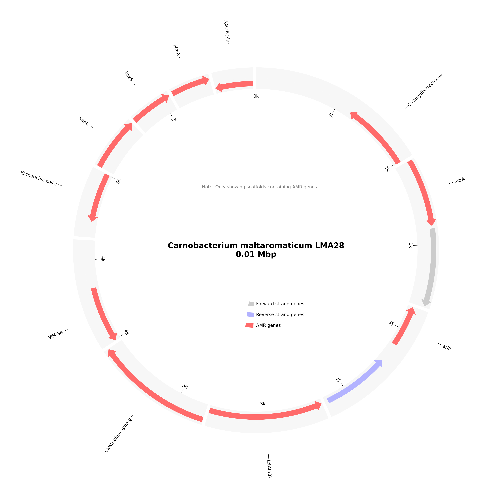

### AAC(6')-Ip
- **Mechanism**: antibiotic inactivation
- **Drug Classes**: aminoglycoside antibiotic
- **AMR Family**: AAC(6')
- **Locations**:
  - gnl|SPADES|FKHIBMDG_35120_1 : position 1-213

### Chlamydia trachomatis intrinsic murA conferring resistance to fosfomycin
- **Mechanism**: antibiotic target alteration
- **Drug Classes**: phosphonic acid antibiotic
- **AMR Family**: antibiotic-resistant murA transferase
- **Locations**:
  - gnl|SPADES|FKHIBMDG_5619_2 : position 556-948

### Clostridium sporogenes cplR
- **Mechanism**: antibiotic target protection
- **Drug Classes**: lincosamide antibiotic; pleuromutilin antibiotic
- **AMR Family**: Miscellaneous ABC-F subfamily ATP-binding cassette ribosomal protection proteins
- **Locations**:
  - gnl|SPADES|FKHIBMDG_8697_1 : position 2-628

### Escherichia coli soxS with mutation conferring antibiotic resistance
- **Mechanism**: antibiotic target alteration; antibiotic efflux; reduced permeability to antibiotic
- **Drug Classes**: fluoroquinolone antibiotic; monobactam; carbapenem; cephalosporin; glycylcycline; cephamycin; penam; tetracycline antibiotic; rifamycin antibiotic; phenicol antibiotic; penem; disinfecting agents and antiseptics
- **AMR Family**: ATP-binding cassette (ABC) antibiotic efflux pump; major facilitator superfamily (MFS) antibiotic efflux pump; resistance-nodulation-cell division (RND) antibiotic efflux pump; General Bacterial Porin with reduced permeability to beta-lactams
- **Locations**:
  - gnl|SPADES|FKHIBMDG_16308_1 : position 87-365

### VIM-34
- **Mechanism**: antibiotic inactivation
- **Drug Classes**: carbapenem; cephalosporin; cephamycin; penam; penem
- **AMR Family**: VIM beta-lactamase
- **Locations**:
  - gnl|SPADES|FKHIBMDG_9433_1 : position 2-319

### arlR
- **Mechanism**: antibiotic efflux
- **Drug Classes**: fluoroquinolone antibiotic; disinfecting agents and antiseptics
- **AMR Family**: major facilitator superfamily (MFS) antibiotic efflux pump
- **Locations**:
  - gnl|SPADES|FKHIBMDG_7253_1 : position 3-233

### baeS
- **Mechanism**: antibiotic efflux
- **Drug Classes**: aminoglycoside antibiotic; aminocoumarin antibiotic
- **AMR Family**: resistance-nodulation-cell division (RND) antibiotic efflux pump
- **Locations**:
  - gnl|SPADES|FKHIBMDG_32744_1 : position 2-226

### efmA
- **Mechanism**: antibiotic efflux
- **Drug Classes**: macrolide antibiotic; fluoroquinolone antibiotic
- **AMR Family**: major facilitator superfamily (MFS) antibiotic efflux pump
- **Locations**:
  - gnl|SPADES|FKHIBMDG_35174_1 : position 3-212

### mtrA
- **Mechanism**: antibiotic efflux
- **Drug Classes**: macrolide antibiotic; penam
- **AMR Family**: resistance-nodulation-cell division (RND) antibiotic efflux pump
- **Locations**:
  - gnl|SPADES|FKHIBMDG_6743_1 : position 3-365

### tetA(58)
- **Mechanism**: antibiotic efflux
- **Drug Classes**: tetracycline antibiotic
- **AMR Family**: major facilitator superfamily (MFS) antibiotic efflux pump
- **Locations**:
  - gnl|SPADES|FKHIBMDG_8497_1 : position 3-641

### vanL
- **Mechanism**: antibiotic target alteration
- **Drug Classes**: glycopeptide antibiotic
- **AMR Family**: glycopeptide resistance gene cluster; Van ligase
- **Locations**:
  - gnl|SPADES|FKHIBMDG_21954_1 : position 1-285

## Citrobacter
**Strain Statistics:**
- Total genome length: 9.3 kbp
- Total scaffolds: 85
- Scaffolds with AMR genes: 13
- Total genes annotated: 14
- Total AMR genes: 13
- Unique AMR genes: 10
- Distinct AMR mechanisms: 2
- Distinct AMR families: 5
- Distinct drug classes: 12

**Circos Plot:**

### AcrF
- **Mechanism**: antibiotic efflux
- **Drug Classes**: fluoroquinolone antibiotic; cephalosporin; cephamycin; penam
- **AMR Family**: resistance-nodulation-cell division (RND) antibiotic efflux pump
- **Locations**:
  - gnl|SPADES|FKHIBMDG_28828_1 : position 2-244

### Klebsiella pneumoniae OmpK37 (found in 2 locations)
- **Mechanism**: reduced permeability to antibiotic
- **Drug Classes**: monobactam; carbapenem; cephalosporin; cephamycin; penam; penem
- **AMR Family**: General Bacterial Porin with reduced permeability to beta-lactams
- **Locations**:
  - gnl|SPADES|FKHIBMDG_11688_1 : position 2-484
  - gnl|SPADES|FKHIBMDG_24956_1 : position 2-265

### OmpA
- **Mechanism**: reduced permeability to antibiotic
- **Drug Classes**: peptide antibiotic
- **AMR Family**: General Bacterial Porin with reduced permeability to peptide antibiotics
- **Locations**:
  - gnl|SPADES|FKHIBMDG_2388_3 : position 936-1796

### TxR (found in 3 locations)
- **Mechanism**: antibiotic efflux
- **Drug Classes**: tetracycline antibiotic
- **AMR Family**: ATP-binding cassette (ABC) antibiotic efflux pump
- **Locations**:
  - gnl|SPADES|FKHIBMDG_15727_1 : position 3-377
  - gnl|SPADES|FKHIBMDG_17551_1 : position 2-346
  - gnl|SPADES|FKHIBMDG_8443_1 : position 3-644

### adeL
- **Mechanism**: antibiotic efflux
- **Drug Classes**: fluoroquinolone antibiotic; tetracycline antibiotic
- **AMR Family**: resistance-nodulation-cell division (RND) antibiotic efflux pump
- **Locations**:
  - gnl|SPADES|FKHIBMDG_3747_1 : position 1-696

### baeR
- **Mechanism**: antibiotic efflux
- **Drug Classes**: aminoglycoside antibiotic; aminocoumarin antibiotic
- **AMR Family**: resistance-nodulation-cell division (RND) antibiotic efflux pump
- **Locations**:
  - gnl|SPADES|FKHIBMDG_13696_1 : position 3-347

### macB
- **Mechanism**: antibiotic efflux
- **Drug Classes**: macrolide antibiotic
- **AMR Family**: ATP-binding cassette (ABC) antibiotic efflux pump
- **Locations**:
  - gnl|SPADES|FKHIBMDG_3632_2 : position 680-1432

### mdtC
- **Mechanism**: antibiotic efflux
- **Drug Classes**: aminocoumarin antibiotic
- **AMR Family**: resistance-nodulation-cell division (RND) antibiotic efflux pump
- **Locations**:
  - gnl|SPADES|FKHIBMDG_8715_1 : position 2-628

### rosA
- **Mechanism**: antibiotic efflux
- **Drug Classes**: peptide antibiotic
- **AMR Family**: major facilitator superfamily (MFS) antibiotic efflux pump
- **Locations**:
  - gnl|SPADES|FKHIBMDG_12905_1 : position 2-442

### smeR
- **Mechanism**: antibiotic efflux
- **Drug Classes**: aminoglycoside antibiotic; cephalosporin; cephamycin; penam
- **AMR Family**: resistance-nodulation-cell division (RND) antibiotic efflux pump
- **Locations**:
  - gnl|SPADES|FKHIBMDG_27936_1 : position 2-250

## Citrobacter braakii
**Strain Statistics:**
- Total genome length: 22.1 kbp
- Total scaffolds: 12
- Scaffolds with AMR genes: 2
- Total genes annotated: 50
- Total AMR genes: 3
- Unique AMR genes: 2
- Distinct AMR mechanisms: 1
- Distinct AMR families: 2
- Distinct drug classes: 6

**Circos Plot:**

### H-NS (found in 2 locations)
- **Mechanism**: antibiotic efflux
- **Drug Classes**: macrolide antibiotic; fluoroquinolone antibiotic; cephalosporin; cephamycin; penam; tetracycline antibiotic
- **AMR Family**: major facilitator superfamily (MFS) antibiotic efflux pump; resistance-nodulation-cell division (RND) antibiotic efflux pump
- **Locations**:
  - gnl|SPADES|FKHIBMDG_459_5 : position 2418-2660
  - gnl|SPADES|FKHIBMDG_459_9 : position 4123-4527

### emrB
- **Mechanism**: antibiotic efflux
- **Drug Classes**: fluoroquinolone antibiotic
- **AMR Family**: major facilitator superfamily (MFS) antibiotic efflux pump
- **Locations**:
  - gnl|SPADES|FKHIBMDG_19800_1 : position 3-311

## Citrobacter enshiensis
**Strain Statistics:**
- Total genome length: 6.2 kbp
- Total scaffolds: 6
- Scaffolds with AMR genes: 3
- Total genes annotated: 6
- Total AMR genes: 3
- Unique AMR genes: 3
- Distinct AMR mechanisms: 3
- Distinct AMR families: 3
- Distinct drug classes: 7

**Circos Plot:**

### HMB-1
- **Mechanism**: antibiotic inactivation
- **Drug Classes**: carbapenem
- **AMR Family**: HMB beta-lactamase
- **Locations**:
  - gnl|SPADES|FKHIBMDG_2528_1 : position 2-757

### Helicobacter pylori pbp1 mutants conferring resistance to amoxicillin
- **Mechanism**: antibiotic target alteration
- **Drug Classes**: cephalosporin; cephamycin; penam
- **AMR Family**: Penicillin-binding protein mutations conferring resistance to beta-lactam antibiotics
- **Locations**:
  - gnl|SPADES|FKHIBMDG_1830_2 : position 2008-3183

### evgS
- **Mechanism**: antibiotic efflux
- **Drug Classes**: macrolide antibiotic; fluoroquinolone antibiotic; penam; tetracycline antibiotic
- **AMR Family**: major facilitator superfamily (MFS) antibiotic efflux pump; resistance-nodulation-cell division (RND) antibiotic efflux pump
- **Locations**:
  - gnl|SPADES|FKHIBMDG_6304_2 : position 219-848

## Citrobacter farmeri
**Strain Statistics:**
- Total genome length: 0.5 kbp
- Total scaffolds: 6
- Scaffolds with AMR genes: 1
- Total genes annotated: 0
- Total AMR genes: 1
- Unique AMR genes: 1
- Distinct AMR mechanisms: 1
- Distinct AMR families: 1
- Distinct drug classes: 1

**Circos Plot:**

### rphB
- **Mechanism**: antibiotic inactivation
- **Drug Classes**: rifamycin antibiotic
- **AMR Family**: rifampin phosphotransferase
- **Locations**:
  - gnl|SPADES|FKHIBMDG_10815_1 : position 2-517

## Citrobacter freundii
**Strain Statistics:**
- Total genome length: 7.5 kbp
- Total scaffolds: 64
- Scaffolds with AMR genes: 2
- Total genes annotated: 12
- Total AMR genes: 2
- Unique AMR genes: 2
- Distinct AMR mechanisms: 2
- Distinct AMR families: 2
- Distinct drug classes: 2

**Circos Plot:**

### AAC(6')-Ib8
- **Mechanism**: antibiotic inactivation
- **Drug Classes**: aminoglycoside antibiotic
- **AMR Family**: AAC(6')
- **Locations**:
  - gnl|SPADES|FKHIBMDG_1064_2 : position 2663-2764

### baeR
- **Mechanism**: antibiotic efflux
- **Drug Classes**: aminoglycoside antibiotic; aminocoumarin antibiotic
- **AMR Family**: resistance-nodulation-cell division (RND) antibiotic efflux pump
- **Locations**:
  - gnl|SPADES|FKHIBMDG_12612_1 : position 2-427

## Citrobacter freundii complex
**Strain Statistics:**
- Total genome length: 3.7 kbp
- Total scaffolds: 8
- Scaffolds with AMR genes: 2
- Total genes annotated: 6
- Total AMR genes: 2
- Unique AMR genes: 2
- Distinct AMR mechanisms: 1
- Distinct AMR families: 2
- Distinct drug classes: 3

**Circos Plot:**

### adeL
- **Mechanism**: antibiotic efflux
- **Drug Classes**: fluoroquinolone antibiotic; tetracycline antibiotic
- **AMR Family**: resistance-nodulation-cell division (RND) antibiotic efflux pump
- **Locations**:
  - gnl|SPADES|FKHIBMDG_4638_2 : position 915-1148

### bcrA
- **Mechanism**: antibiotic efflux
- **Drug Classes**: peptide antibiotic
- **AMR Family**: ATP-binding cassette (ABC) antibiotic efflux pump
- **Locations**:
  - gnl|SPADES|FKHIBMDG_2184_3 : position 1937-2566

## Citrobacter freundii complex sp. CFNIH9
**Strain Statistics:**
- Total genome length: 34.7 kbp
- Total scaffolds: 1
- Scaffolds with AMR genes: 1
- Total genes annotated: 68
- Total AMR genes: 2
- Unique AMR genes: 1
- Distinct AMR mechanisms: 1
- Distinct AMR families: 1
- Distinct drug classes: 6

**Circos Plot:**

### H-NS (found in 2 locations)
- **Mechanism**: antibiotic efflux
- **Drug Classes**: macrolide antibiotic; fluoroquinolone antibiotic; cephalosporin; cephamycin; penam; tetracycline antibiotic
- **AMR Family**: major facilitator superfamily (MFS) antibiotic efflux pump; resistance-nodulation-cell division (RND) antibiotic efflux pump
- **Locations**:
  - gnl|SPADES|FKHIBMDG_281_25 : position 26182-26586
  - gnl|SPADES|FKHIBMDG_281_27 : position 27265-27507

## Citrobacter portucalensis
**Strain Statistics:**
- Total genome length: 0.7 kbp
- Total scaffolds: 17
- Scaffolds with AMR genes: 1
- Total genes annotated: 0
- Total AMR genes: 1
- Unique AMR genes: 1
- Distinct AMR mechanisms: 1
- Distinct AMR families: 1
- Distinct drug classes: 3

**Circos Plot:**

### putative nickel/cobalt transporter
- **Mechanism**: antibiotic efflux
- **Drug Classes**: fluoroquinolone antibiotic; aminoglycoside antibiotic; isoniazid-like antibiotic
- **AMR Family**: metal transporters with antibiotic efflux
- **Locations**:
  - gnl|SPADES|FKHIBMDG_7584_1 : position 2-712

## Citrobacter rodentium
**Strain Statistics:**
- Total genome length: 0.5 kbp
- Total scaffolds: 9
- Scaffolds with AMR genes: 1
- Total genes annotated: 0
- Total AMR genes: 1
- Unique AMR genes: 1
- Distinct AMR mechanisms: 1
- Distinct AMR families: 1
- Distinct drug classes: 1

**Circos Plot:**

### rosB
- **Mechanism**: antibiotic efflux
- **Drug Classes**: peptide antibiotic
- **AMR Family**: major facilitator superfamily (MFS) antibiotic efflux pump
- **Locations**:
  - gnl|SPADES|FKHIBMDG_11301_1 : position 3-497

## Citrobacter sp. 21OH12SH02A-Citro
**Strain Statistics:**
- Total genome length: 34.6 kbp
- Total scaffolds: 1
- Scaffolds with AMR genes: 1
- Total genes annotated: 74
- Total AMR genes: 3
- Unique AMR genes: 3
- Distinct AMR mechanisms: 1
- Distinct AMR families: 2
- Distinct drug classes: 6

**Circos Plot:**

### H-NS
- **Mechanism**: antibiotic efflux
- **Drug Classes**: macrolide antibiotic; fluoroquinolone antibiotic; cephalosporin; cephamycin; penam; tetracycline antibiotic
- **AMR Family**: major facilitator superfamily (MFS) antibiotic efflux pump; resistance-nodulation-cell division (RND) antibiotic efflux pump
- **Locations**:
  - gnl|SPADES|FKHIBMDG_282_13 : position 11534-11926

### evgS
- **Mechanism**: antibiotic efflux
- **Drug Classes**: macrolide antibiotic; fluoroquinolone antibiotic; penam; tetracycline antibiotic
- **AMR Family**: major facilitator superfamily (MFS) antibiotic efflux pump; resistance-nodulation-cell division (RND) antibiotic efflux pump
- **Locations**:
  - gnl|SPADES|FKHIBMDG_282_35 : position 28591-30309

### tetA(60)
- **Mechanism**: antibiotic efflux
- **Drug Classes**: tetracycline antibiotic
- **AMR Family**: ATP-binding cassette (ABC) antibiotic efflux pump
- **Locations**:
  - gnl|SPADES|FKHIBMDG_282_19 : position 15563-16612

## Escherichia coli
**Strain Statistics:**
- Total genome length: 3084.4 kbp
- Total scaffolds: 1102
- Scaffolds with AMR genes: 202
- Total genes annotated: 5618
- Total AMR genes: 400
- Unique AMR genes: 194
- Distinct AMR mechanisms: 11
- Distinct AMR families: 71
- Distinct drug classes: 37

**Circos Plot:**

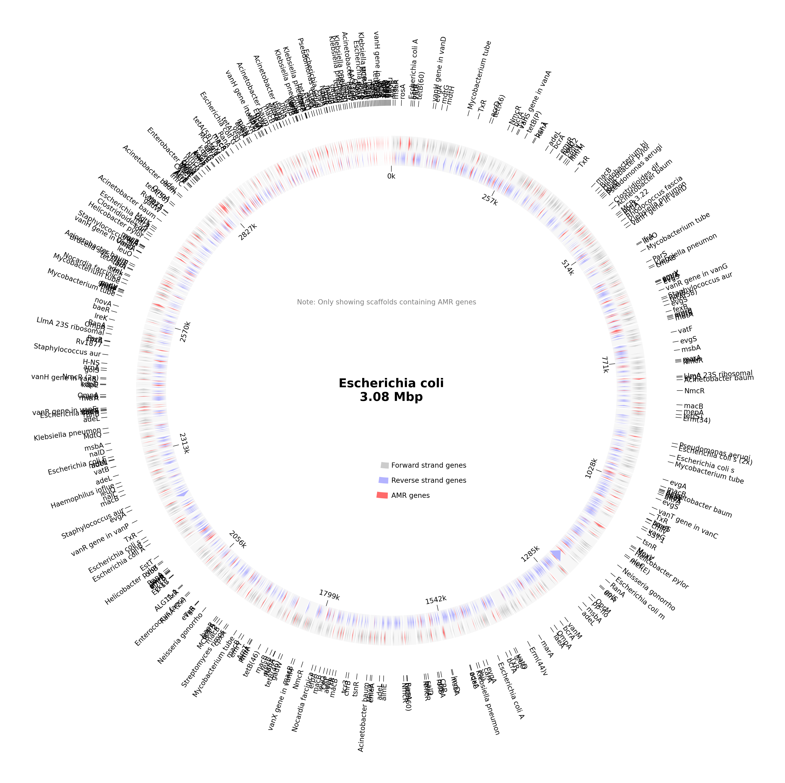

### AAC(3)-Ic
- **Mechanism**: antibiotic inactivation
- **Drug Classes**: aminoglycoside antibiotic
- **AMR Family**: AAC(3)
- **Locations**:
  - gnl|SPADES|FKHIBMDG_3186_1 : position 3-455

### ALG11-1
- **Mechanism**: antibiotic inactivation
- **Drug Classes**: carbapenem
- **AMR Family**: ALG11 beta-lactamase
- **Locations**:
  - gnl|SPADES|FKHIBMDG_551_10 : position 8159-9598

### Acinetobacter baumannii AbaF (found in 5 locations)
- **Mechanism**: antibiotic efflux
- **Drug Classes**: phosphonic acid antibiotic
- **AMR Family**: major facilitator superfamily (MFS) antibiotic efflux pump
- **Locations**:
  - gnl|SPADES|FKHIBMDG_3044_2 : position 1090-1779
  - gnl|SPADES|FKHIBMDG_310_11 : position 9369-10871
  - gnl|SPADES|FKHIBMDG_809_1 : position 45-1343
  - gnl|SPADES|FKHIBMDG_860_5 : position 4642-5979
  - gnl|SPADES|FKHIBMDG_902_8 : position 7596-8879

### Acinetobacter baumannii AbaQ (found in 5 locations)
- **Mechanism**: antibiotic efflux
- **Drug Classes**: fluoroquinolone antibiotic
- **AMR Family**: major facilitator superfamily (MFS) antibiotic efflux pump
- **Locations**:
  - gnl|SPADES|FKHIBMDG_1240_2 : position 2620-3921
  - gnl|SPADES|FKHIBMDG_1293_3 : position 2281-3570
  - gnl|SPADES|FKHIBMDG_218_11 : position 12127-13419
  - gnl|SPADES|FKHIBMDG_273_6 : position 9070-10422
  - gnl|SPADES|FKHIBMDG_416_19 : position 20089-21465

### AcrE
- **Mechanism**: antibiotic efflux
- **Drug Classes**: fluoroquinolone antibiotic; cephalosporin; cephamycin; penam
- **AMR Family**: resistance-nodulation-cell division (RND) antibiotic efflux pump
- **Locations**:
  - gnl|SPADES|FKHIBMDG_942_4: position 4801-5958

### AcrF
- **Mechanism**: antibiotic efflux
- **Drug Classes**: fluoroquinolone antibiotic; cephalosporin; cephamycin; penam
- **AMR Family**: resistance-nodulation-cell division (RND) antibiotic efflux pump
- **Locations**:
  - gnl|SPADES|FKHIBMDG_942_3: position 1685-4789

### AcrS
- **Mechanism**: antibiotic efflux
- **Drug Classes**: fluoroquinolone antibiotic; cephalosporin; glycylcycline; cephamycin; penam; tetracycline antibiotic; rifamycin antibiotic; phenicol antibiotic; disinfecting agents and antiseptics
- **AMR Family**: resistance-nodulation-cell division (RND) antibiotic efflux pump
- **Locations**:
  - gnl|SPADES|FKHIBMDG_942_5: position 6357-7019

### ArnT (found in 2 locations)
- **Mechanism**: antibiotic target alteration
- **Drug Classes**: peptide antibiotic
- **AMR Family**: pmr phosphoethanolamine transferase
- **Locations**:
  - gnl|SPADES|FKHIBMDG_16338_1 : position 2-364
  - gnl|SPADES|FKHIBMDG_493_9 : position 9791-10156

### Bifidobacterium bifidum ileS conferring resistance to mupirocin
- **Mechanism**: antibiotic target alteration
- **Drug Classes**: mupirocin-like antibiotic
- **AMR Family**: antibiotic-resistant isoleucyl-tRNA synthetase (ileS)
- **Locations**:
  - gnl|SPADES|FKHIBMDG_208_13 : position 11594-14176

### Brucella suis mprF
- **Mechanism**: antibiotic target alteration
- **Drug Classes**: peptide antibiotic
- **AMR Family**: defensin resistant mprF
- **Locations**:
  - gnl|SPADES|FKHIBMDG_808_10 : position 9042-9998

### CAR-1
- **Mechanism**: antibiotic inactivation
- **Drug Classes**: carbapenem
- **AMR Family**: CAR beta-lactamase
- **Locations**:
  - gnl|SPADES|FKHIBMDG_945_4 : position 2196-2951

### CRP (found in 2 locations)
- **Mechanism**: antibiotic efflux
- **Drug Classes**: macrolide antibiotic; fluoroquinolone antibiotic; penam
- **AMR Family**: resistance-nodulation-cell division (RND) antibiotic efflux pump
- **Locations**:
  - gnl|SPADES|FKHIBMDG_400_13: position 12941-13573
  - gnl|SPADES|FKHIBMDG_429_17 : position 17116-17868

### Clostridioides difficile gyrB conferring resistance to fluoroquinolones (found in 2 locations)
- **Mechanism**: antibiotic target alteration
- **Drug Classes**: fluoroquinolone antibiotic
- **AMR Family**: fluoroquinolone resistant gyrB
- **Locations**:
  - gnl|SPADES|FKHIBMDG_218_4 : position 3583-5997
  - gnl|SPADES|FKHIBMDG_843_10 : position 7929-9815

### CrcB
- **Mechanism**: antibiotic efflux
- **Drug Classes**: aminoglycoside antibiotic
- **AMR Family**: multidrug and toxic compound extrusion (MATE) transporter
- **Locations**:
  - gnl|SPADES|FKHIBMDG_208_30 : position 28442-28825

### EC-13
- **Mechanism**: antibiotic inactivation
- **Drug Classes**: cephalosporin
- **AMR Family**: EC beta-lactamase
- **Locations**:
  - gnl|SPADES|FKHIBMDG_556_11 : position 14088-14381

### EC-8
- **Mechanism**: antibiotic inactivation
- **Drug Classes**: cephalosporin
- **AMR Family**: EC beta-lactamase
- **Locations**:
  - gnl|SPADES|FKHIBMDG_12994_1 : position 3-440

### Enterobacter cloacae acrA
- **Mechanism**: antibiotic efflux
- **Drug Classes**: fluoroquinolone antibiotic; cephalosporin; glycylcycline; penam; tetracycline antibiotic; rifamycin antibiotic; phenicol antibiotic; disinfecting agents and antiseptics
- **AMR Family**: resistance-nodulation-cell division (RND) antibiotic efflux pump
- **Locations**:
  - gnl|SPADES|FKHIBMDG_951_2 : position 1141-2262

### Enterococcus faecalis cls with mutation conferring resistance to daptomycin
- **Mechanism**: antibiotic target alteration
- **Drug Classes**: peptide antibiotic
- **AMR Family**: daptomycin resistant cls
- **Locations**:
  - gnl|SPADES|FKHIBMDG_545_11 : position 9095-10555

### Erm(34)
- **Mechanism**: antibiotic target alteration
- **Drug Classes**: macrolide antibiotic; lincosamide antibiotic; streptogramin antibiotic; streptogramin A antibiotic; streptogramin B antibiotic
- **AMR Family**: Erm 23S ribosomal RNA methyltransferase
- **Locations**:
  - gnl|SPADES|FKHIBMDG_283_11 : position 7772-8398

### Erm(44)v
- **Mechanism**: antibiotic target alteration
- **Drug Classes**: macrolide antibiotic; lincosamide antibiotic; streptogramin antibiotic
- **AMR Family**: Erm 23S ribosomal RNA methyltransferase
- **Locations**:
  - gnl|SPADES|FKHIBMDG_382_4 : position 2115-2876

### ErmW
- **Mechanism**: antibiotic target alteration
- **Drug Classes**: macrolide antibiotic; lincosamide antibiotic; streptogramin antibiotic
- **AMR Family**: Erm 23S ribosomal RNA methyltransferase
- **Locations**:
  - gnl|SPADES|FKHIBMDG_1174_4 : position 1677-2264

### Escherichia coli AcrAB-TolC with AcrR mutation conferring resistance to ciprofloxacin, tetracycline, and ceftazidime (found in 3 locations)
- **Mechanism**: antibiotic target alteration; antibiotic efflux
- **Drug Classes**: fluoroquinolone antibiotic; cephalosporin; glycylcycline; penam; tetracycline antibiotic; rifamycin antibiotic; phenicol antibiotic; disinfecting agents and antiseptics
- **AMR Family**: resistance-nodulation-cell division (RND) antibiotic efflux pump
- **Locations**:
  - gnl|SPADES|FKHIBMDG_391_9 : position 9515-10171
  - gnl|SPADES|FKHIBMDG_565_12 : position 11709-12287
  - gnl|SPADES|FKHIBMDG_95_34: position 37321-37968

### Escherichia coli AcrAB-TolC with MarR mutations conferring resistance to ciprofloxacin and tetracycline
- **Mechanism**: antibiotic target alteration; antibiotic efflux
- **Drug Classes**: fluoroquinolone antibiotic; cephalosporin; glycylcycline; penam; tetracycline antibiotic; rifamycin antibiotic; phenicol antibiotic; disinfecting agents and antiseptics
- **AMR Family**: resistance-nodulation-cell division (RND) antibiotic efflux pump
- **Locations**:
  - gnl|SPADES|FKHIBMDG_270_12: position 9412-9846

### Escherichia coli EF-Tu mutants conferring resistance to kirromycin
- **Mechanism**: antibiotic target alteration
- **Drug Classes**: elfamycin antibiotic
- **AMR Family**: elfamycin resistant EF-Tu
- **Locations**:
  - gnl|SPADES|FKHIBMDG_612_11 : position 11448-13292

### Escherichia coli GlpT with mutation conferring resistance to fosfomycin
- **Mechanism**: antibiotic target alteration
- **Drug Classes**: phosphonic acid antibiotic
- **AMR Family**: antibiotic-resistant GlpT
- **Locations**:
  - gnl|SPADES|FKHIBMDG_1046_5 : position 5280-6638

### Escherichia coli acrA
- **Mechanism**: antibiotic efflux
- **Drug Classes**: fluoroquinolone antibiotic; cephalosporin; glycylcycline; penam; tetracycline antibiotic; rifamycin antibiotic; phenicol antibiotic; disinfecting agents and antiseptics
- **AMR Family**: resistance-nodulation-cell division (RND) antibiotic efflux pump
- **Locations**:
  - gnl|SPADES|FKHIBMDG_95_35: position 38110-39303

### Escherichia coli emrE (found in 2 locations)
- **Mechanism**: antibiotic efflux
- **Drug Classes**: macrolide antibiotic
- **AMR Family**: small multidrug resistance (SMR) antibiotic efflux pump
- **Locations**:
  - gnl|SPADES|FKHIBMDG_1935_1: position 3-314
  - gnl|SPADES|FKHIBMDG_4607_3: position 846-1157

### Escherichia coli mdfA
- **Mechanism**: antibiotic efflux
- **Drug Classes**: tetracycline antibiotic; phenicol antibiotic; disinfecting agents and antiseptics
- **AMR Family**: major facilitator superfamily (MFS) antibiotic efflux pump
- **Locations**:
  - gnl|SPADES|FKHIBMDG_331_5: position 3126-4358

### Escherichia coli soxS with mutation conferring antibiotic resistance (found in 6 locations)
- **Mechanism**: antibiotic target alteration; antibiotic efflux; reduced permeability to antibiotic
- **Drug Classes**: fluoroquinolone antibiotic; monobactam; carbapenem; cephalosporin; glycylcycline; cephamycin; penam; tetracycline antibiotic; rifamycin antibiotic; phenicol antibiotic; penem; disinfecting agents and antiseptics
- **AMR Family**: ATP-binding cassette (ABC) antibiotic efflux pump; major facilitator superfamily (MFS) antibiotic efflux pump; resistance-nodulation-cell division (RND) antibiotic efflux pump; General Bacterial Porin with reduced permeability to beta-lactams
- **Locations**:
  - gnl|SPADES|FKHIBMDG_286_30 : position 27946-28884
  - gnl|SPADES|FKHIBMDG_286_31 : position 28868-29704
  - gnl|SPADES|FKHIBMDG_306_6 : position 9213-10064
  - gnl|SPADES|FKHIBMDG_569_8 : position 7798-8709
  - gnl|SPADES|FKHIBMDG_652_3 : position 1193-2062
  - gnl|SPADES|FKHIBMDG_850_10 : position 8915-9706

### EstT
- **Mechanism**: antibiotic inactivation
- **Drug Classes**: macrolide antibiotic
- **AMR Family**: macrolide esterase
- **Locations**:
  - gnl|SPADES|FKHIBMDG_560_3 : position 2404-3168

### FosC2
- **Mechanism**: antibiotic inactivation
- **Drug Classes**: phosphonic acid antibiotic
- **AMR Family**: fosC phosphotransferase family
- **Locations**:
  - gnl|SPADES|FKHIBMDG_191_23 : position 18717-19124

### H-NS (found in 2 locations)
- **Mechanism**: antibiotic efflux
- **Drug Classes**: macrolide antibiotic; fluoroquinolone antibiotic; cephalosporin; cephamycin; penam; tetracycline antibiotic
- **AMR Family**: major facilitator superfamily (MFS) antibiotic efflux pump; resistance-nodulation-cell division (RND) antibiotic efflux pump
- **Locations**:
  - gnl|SPADES|FKHIBMDG_1120_6: position 4746-5159
  - gnl|SPADES|FKHIBMDG_711_4 : position 1709-2113

### Haemophilus influenzae PBP3 conferring resistance to beta-lactam antibiotics
- **Mechanism**: antibiotic target alteration
- **Drug Classes**: cephalosporin; cephamycin; penam
- **AMR Family**: Penicillin-binding protein mutations conferring resistance to beta-lactam antibiotics
- **Locations**:
  - gnl|SPADES|FKHIBMDG_599_12 : position 12778-14544

### Helicobacter pylori pbp1 mutants conferring resistance to amoxicillin (found in 2 locations)
- **Mechanism**: antibiotic target alteration
- **Drug Classes**: cephalosporin; cephamycin; penam
- **AMR Family**: Penicillin-binding protein mutations conferring resistance to beta-lactam antibiotics
- **Locations**:
  - gnl|SPADES|FKHIBMDG_558_9 : position 9099-11411
  - gnl|SPADES|FKHIBMDG_842_7 : position 7346-9820

### Helicobacter pylori pbp2 mutants conferring resistance to amoxicillin
- **Mechanism**: antibiotic target alteration
- **Drug Classes**: cephalosporin; cephamycin; penam
- **AMR Family**: Penicillin-binding protein mutations conferring resistance to beta-lactam antibiotics
- **Locations**:
  - gnl|SPADES|FKHIBMDG_208_20 : position 18160-20061

### Helicobacter pylori rdxA mutation conferring resistance to metronidazole
- **Mechanism**: antibiotic target alteration
- **Drug Classes**: nitroimidazole antibiotic
- **AMR Family**: Antibiotic resistant Helicobacter pylori nitroreductase
- **Locations**:
  - gnl|SPADES|FKHIBMDG_322_6 : position 7652-8305

### IreK
- **Mechanism**: reduced permeability to antibiotic
- **Drug Classes**: cephalosporin
- **AMR Family**: Serine/threonine kinases
- **Locations**:
  - gnl|SPADES|FKHIBMDG_751_3 : position 1721-3190

### Klebsiella pneumoniae KpnE
- **Mechanism**: antibiotic efflux
- **Drug Classes**: macrolide antibiotic; aminoglycoside antibiotic; cephalosporin; tetracycline antibiotic; peptide antibiotic; rifamycin antibiotic; disinfecting agents and antiseptics
- **AMR Family**: small multidrug resistance (SMR) antibiotic efflux pump
- **Locations**:
  - gnl|SPADES|FKHIBMDG_245_16: position 17901-18266

### Klebsiella pneumoniae KpnF
- **Mechanism**: antibiotic efflux
- **Drug Classes**: macrolide antibiotic; aminoglycoside antibiotic; cephalosporin; tetracycline antibiotic; peptide antibiotic; rifamycin antibiotic; disinfecting agents and antiseptics
- **AMR Family**: small multidrug resistance (SMR) antibiotic efflux pump
- **Locations**:
  - gnl|SPADES|FKHIBMDG_245_17: position 18253-18582

### Klebsiella pneumoniae KpnH
- **Mechanism**: antibiotic efflux
- **Drug Classes**: macrolide antibiotic; fluoroquinolone antibiotic; aminoglycoside antibiotic; carbapenem; cephalosporin; penam; peptide antibiotic; penem
- **AMR Family**: major facilitator superfamily (MFS) antibiotic efflux pump
- **Locations**:
  - gnl|SPADES|FKHIBMDG_1547_4 : position 3182-3700

### Klebsiella pneumoniae OmpK37 (found in 7 locations)
- **Mechanism**: reduced permeability to antibiotic
- **Drug Classes**: monobactam; carbapenem; cephalosporin; cephamycin; penam; penem
- **AMR Family**: General Bacterial Porin with reduced permeability to beta-lactams
- **Locations**:
  - gnl|SPADES|FKHIBMDG_1447_5 : position 1758-2855
  - gnl|SPADES|FKHIBMDG_2296_3 : position 1708-2148
  - gnl|SPADES|FKHIBMDG_237_8 : position 6723-7856
  - gnl|SPADES|FKHIBMDG_2432_1 : position 3-278
  - gnl|SPADES|FKHIBMDG_392_30 : position 25790-25927
  - gnl|SPADES|FKHIBMDG_5416_1 : position 2-985
  - gnl|SPADES|FKHIBMDG_638_1 : position 3-878

### LlmA 23S ribosomal RNA methyltransferase (found in 2 locations)
- **Mechanism**: antibiotic target alteration
- **Drug Classes**: lincosamide antibiotic
- **AMR Family**: Llm 23S ribosomal RNA methyltransferase
- **Locations**:
  - gnl|SPADES|FKHIBMDG_273_2 : position 2021-3322
  - gnl|SPADES|FKHIBMDG_738_4 : position 1721-2896

### LpsA
- **Mechanism**: reduced permeability to antibiotic
- **Drug Classes**: peptide antibiotic
- **AMR Family**: Intrinsic peptide antibiotic resistant Lps
- **Locations**:
  - gnl|SPADES|FKHIBMDG_2244_3 : position 1530-2303

### MCR-3.22
- **Mechanism**: antibiotic target alteration
- **Drug Classes**: peptide antibiotic
- **AMR Family**: MCR phosphoethanolamine transferase
- **Locations**:
  - gnl|SPADES|FKHIBMDG_218_23 : position 25454-26947

### MCR-3.41
- **Mechanism**: antibiotic target alteration
- **Drug Classes**: peptide antibiotic
- **AMR Family**: MCR phosphoethanolamine transferase
- **Locations**:
  - gnl|SPADES|FKHIBMDG_5279_1 : position 206-1006

### MCR-4.2
- **Mechanism**: antibiotic target alteration
- **Drug Classes**: peptide antibiotic
- **AMR Family**: MCR phosphoethanolamine transferase
- **Locations**:
  - gnl|SPADES|FKHIBMDG_514_14 : position 13121-14704

### MCR-8.4
- **Mechanism**: antibiotic target alteration
- **Drug Classes**: peptide antibiotic
- **AMR Family**: MCR phosphoethanolamine transferase
- **Locations**:
  - gnl|SPADES|FKHIBMDG_1013_2 : position 1753-3378

### MdtK
- **Mechanism**: antibiotic efflux
- **Drug Classes**: fluoroquinolone antibiotic
- **AMR Family**: multidrug and toxic compound extrusion (MATE) transporter
- **Locations**:
  - gnl|SPADES|FKHIBMDG_855_1 : position 3-1643

### MdtQ
- **Mechanism**: reduced permeability to antibiotic
- **Drug Classes**: monobactam; carbapenem; cephalosporin; cephamycin; penam; penem
- **AMR Family**: Outer Membrane Porin (Opr)
- **Locations**:
  - gnl|SPADES|FKHIBMDG_634_7 : position 7651-9087

### MexL
- **Mechanism**: antibiotic efflux
- **Drug Classes**: macrolide antibiotic; tetracycline antibiotic; disinfecting agents and antiseptics
- **AMR Family**: resistance-nodulation-cell division (RND) antibiotic efflux pump
- **Locations**:
  - gnl|SPADES|FKHIBMDG_951_1 : position 426-992

### MexR
- **Mechanism**: antibiotic target alteration; antibiotic efflux
- **Drug Classes**: macrolide antibiotic; fluoroquinolone antibiotic; monobactam; carbapenem; cephalosporin; cephamycin; penam; tetracycline antibiotic; peptide antibiotic; aminocoumarin antibiotic; diaminopyrimidine antibiotic; sulfonamide antibiotic; phenicol antibiotic; penem
- **AMR Family**: resistance-nodulation-cell division (RND) antibiotic efflux pump
- **Locations**:
  - gnl|SPADES|FKHIBMDG_416_13 : position 13585-14031

### MexS (found in 2 locations)
- **Mechanism**: antibiotic efflux
- **Drug Classes**: fluoroquinolone antibiotic; diaminopyrimidine antibiotic; phenicol antibiotic
- **AMR Family**: resistance-nodulation-cell division (RND) antibiotic efflux pump
- **Locations**:
  - gnl|SPADES|FKHIBMDG_1291_3 : position 1940-2977
  - gnl|SPADES|FKHIBMDG_876_3 : position 2926-3969

### MexV
- **Mechanism**: antibiotic efflux
- **Drug Classes**: macrolide antibiotic; fluoroquinolone antibiotic; tetracycline antibiotic; phenicol antibiotic; disinfecting agents and antiseptics
- **AMR Family**: resistance-nodulation-cell division (RND) antibiotic efflux pump
- **Locations**:
  - gnl|SPADES|FKHIBMDG_322_2 : position 373-1596

### MuxC
- **Mechanism**: antibiotic efflux
- **Drug Classes**: macrolide antibiotic; monobactam; tetracycline antibiotic; aminocoumarin antibiotic
- **AMR Family**: resistance-nodulation-cell division (RND) antibiotic efflux pump
- **Locations**:
  - gnl|SPADES|FKHIBMDG_322_3 : position 1608-4751

### Mycobacterium tuberculosis gidB mutation conferring resistance to streptomycin
- **Mechanism**: antibiotic target alteration
- **Drug Classes**: aminoglycoside antibiotic
- **AMR Family**: antibiotic resistant gidB
- **Locations**:
  - gnl|SPADES|FKHIBMDG_495_16 : position 17817-18440

### Mycobacterium tuberculosis inhA mutations conferring resistance to isoniazid
- **Mechanism**: antibiotic target alteration
- **Drug Classes**: isoniazid-like antibiotic
- **AMR Family**: isoniazid resistant inhA
- **Locations**:
  - gnl|SPADES|FKHIBMDG_794_13 : position 9760-10611

### Mycobacterium tuberculosis katG mutations conferring resistance to isoniazid
- **Mechanism**: antibiotic target alteration
- **Drug Classes**: isoniazid-like antibiotic
- **AMR Family**: isoniazid resistant katG
- **Locations**:
  - gnl|SPADES|FKHIBMDG_306_17 : position 21516-23696

### Mycobacterium tuberculosis ndh with mutation conferring resistance to isoniazid
- **Mechanism**: antibiotic target alteration
- **Drug Classes**: isoniazid-like antibiotic
- **AMR Family**: antibiotic resistant ndh
- **Locations**:
  - gnl|SPADES|FKHIBMDG_110_76 : position 70288-71592

### Mycobacterium tuberculosis rpsA mutations conferring resistance to pyrazinamide
- **Mechanism**: antibiotic target alteration
- **Drug Classes**: pyrazine antibiotic
- **AMR Family**: pyrazinamide resistant rpsA
- **Locations**:
  - gnl|SPADES|FKHIBMDG_776_9 : position 10435-11040

### Mycobacterium tuberculosis thyA with mutation conferring resistance to para-aminosalicylic acid
- **Mechanism**: antibiotic target alteration
- **Drug Classes**: salicylic acid antibiotic
- **AMR Family**: aminosalicylate resistant thymidylate synthase
- **Locations**:
  - gnl|SPADES|FKHIBMDG_240_26 : position 25531-26325

### Neisseria gonorrhoeae pilQ gene conferring resistance to beta-lactam (found in 2 locations)
- **Mechanism**: antibiotic target alteration
- **Drug Classes**: cephalosporin; cephamycin; penam
- **AMR Family**: Penicillin-binding protein mutations conferring resistance to beta-lactam antibiotics
- **Locations**:
  - gnl|SPADES|FKHIBMDG_329_16 : position 14595-15803
  - gnl|SPADES|FKHIBMDG_532_9 : position 4886-6838

### NmcR (found in 12 locations)
- **Mechanism**: antibiotic inactivation
- **Drug Classes**: carbapenem; cephalosporin; cephamycin; penam
- **AMR Family**: NmcA beta-lactamase
- **Locations**:
  - gnl|SPADES|FKHIBMDG_1247_4 : position 3188-4078
  - gnl|SPADES|FKHIBMDG_146_15 : position 13576-14466
  - gnl|SPADES|FKHIBMDG_2028_3 : position 1497-2396
  - gnl|SPADES|FKHIBMDG_245_21 : position 21810-22703
  - gnl|SPADES|FKHIBMDG_270_17 : position 13286-14161
  - gnl|SPADES|FKHIBMDG_273_25 : position 30045-30962
  - gnl|SPADES|FKHIBMDG_405_19 : position 17672-18625
  - gnl|SPADES|FKHIBMDG_407_5 : position 3400-4311
  - gnl|SPADES|FKHIBMDG_439_17 : position 15962-16936
  - gnl|SPADES|FKHIBMDG_694_4 : position 2696-3589
  - gnl|SPADES|FKHIBMDG_694_9 : position 9220-10116
  - gnl|SPADES|FKHIBMDG_980_2 : position 1159-2085

### Nocardia farcinica rox (found in 2 locations)
- **Mechanism**: antibiotic inactivation
- **Drug Classes**: rifamycin antibiotic
- **AMR Family**: rifampin monooxygenase
- **Locations**:
  - gnl|SPADES|FKHIBMDG_437_22 : position 20137-21801
  - gnl|SPADES|FKHIBMDG_801_6 : position 4277-5479

### OmpA (found in 5 locations)
- **Mechanism**: reduced permeability to antibiotic
- **Drug Classes**: peptide antibiotic
- **AMR Family**: General Bacterial Porin with reduced permeability to peptide antibiotics
- **Locations**:
  - gnl|SPADES|FKHIBMDG_372_1 : position 1-870
  - gnl|SPADES|FKHIBMDG_681_3 : position 569-1051
  - gnl|SPADES|FKHIBMDG_738_14 : position 11622-11858
  - gnl|SPADES|FKHIBMDG_820_6 : position 3521-4180
  - gnl|SPADES|FKHIBMDG_880_2 : position 1017-1538

### OprM (found in 3 locations)
- **Mechanism**: antibiotic efflux
- **Drug Classes**: macrolide antibiotic; fluoroquinolone antibiotic; monobactam; aminoglycoside antibiotic; carbapenem; cephalosporin; cephamycin; penam; tetracycline antibiotic; peptide antibiotic; aminocoumarin antibiotic; diaminopyrimidine antibiotic; sulfonamide antibiotic; phenicol antibiotic; penem; disinfecting agents and antiseptics
- **AMR Family**: resistance-nodulation-cell division (RND) antibiotic efflux pump
- **Locations**:
  - gnl|SPADES|FKHIBMDG_1420_3 : position 3060-4406
  - gnl|SPADES|FKHIBMDG_343_10 : position 27236-28591
  - gnl|SPADES|FKHIBMDG_951_4 : position 5373-6746

### ParR (found in 2 locations)
- **Mechanism**: antibiotic efflux; reduced permeability to antibiotic
- **Drug Classes**: macrolide antibiotic; fluoroquinolone antibiotic; monobactam; aminoglycoside antibiotic; carbapenem; cephalosporin; cephamycin; penam; tetracycline antibiotic; phenicol antibiotic; penem; disinfecting agents and antiseptics
- **AMR Family**: resistance-nodulation-cell division (RND) antibiotic efflux pump; Outer Membrane Porin (Opr)
- **Locations**:
  - gnl|SPADES|FKHIBMDG_245_7 : position 8369-9088
  - gnl|SPADES|FKHIBMDG_726_4 : position 2045-2764

### ParS (found in 2 locations)
- **Mechanism**: antibiotic efflux; reduced permeability to antibiotic
- **Drug Classes**: macrolide antibiotic; fluoroquinolone antibiotic; monobactam; aminoglycoside antibiotic; carbapenem; cephalosporin; cephamycin; penam; tetracycline antibiotic; phenicol antibiotic; penem; disinfecting agents and antiseptics
- **AMR Family**: resistance-nodulation-cell division (RND) antibiotic efflux pump; Outer Membrane Porin (Opr)
- **Locations**:
  - gnl|SPADES|FKHIBMDG_208_35 : position 32487-34145
  - gnl|SPADES|FKHIBMDG_245_6 : position 7064-8365

### PmrF (found in 3 locations)
- **Mechanism**: antibiotic target alteration
- **Drug Classes**: peptide antibiotic
- **AMR Family**: pmr phosphoethanolamine transferase
- **Locations**:
  - gnl|SPADES|FKHIBMDG_1460_2 : position 373-1296
  - gnl|SPADES|FKHIBMDG_2044_3 : position 1554-2537
  - gnl|SPADES|FKHIBMDG_493_6: position 4694-5662

### Pseudomonas aeruginosa CpxR (found in 2 locations)
- **Mechanism**: antibiotic efflux
- **Drug Classes**: macrolide antibiotic; fluoroquinolone antibiotic; monobactam; aminoglycoside antibiotic; carbapenem; cephalosporin; cephamycin; penam; tetracycline antibiotic; peptide antibiotic; aminocoumarin antibiotic; diaminopyrimidine antibiotic; sulfonamide antibiotic; phenicol antibiotic; penem
- **AMR Family**: resistance-nodulation-cell division (RND) antibiotic efflux pump
- **Locations**:
  - gnl|SPADES|FKHIBMDG_208_34 : position 31838-32518
  - gnl|SPADES|FKHIBMDG_286_24 : position 21770-22468

### Pseudomonas aeruginosa ampR with mutation conferring resistance to aztreonam
- **Mechanism**: antibiotic target alteration; antibiotic inactivation
- **Drug Classes**: monobactam; carbapenem; cephalosporin
- **AMR Family**: PDC beta-lactamase; ampR transcriptional regulator with mutation conferring resistance to monobactam antibiotics
- **Locations**:
  - gnl|SPADES|FKHIBMDG_1933_2 : position 534-1469

### QnrA6
- **Mechanism**: antibiotic target protection
- **Drug Classes**: fluoroquinolone antibiotic
- **AMR Family**: quinolone resistance protein (qnr)
- **Locations**:
  - gnl|SPADES|FKHIBMDG_4282_1 : position 2-1165

### RanA (found in 13 locations)
- **Mechanism**: antibiotic efflux
- **Drug Classes**: aminoglycoside antibiotic
- **AMR Family**: ATP-binding cassette (ABC) antibiotic efflux pump
- **Locations**:
  - gnl|SPADES|FKHIBMDG_1007_1 : position 3-548
  - gnl|SPADES|FKHIBMDG_1025_2 : position 2638-3447
  - gnl|SPADES|FKHIBMDG_189_10 : position 8233-9822
  - gnl|SPADES|FKHIBMDG_255_9 : position 5846-6655
  - gnl|SPADES|FKHIBMDG_331_18 : position 18640-20511
  - gnl|SPADES|FKHIBMDG_406_26 : position 23549-24541
  - gnl|SPADES|FKHIBMDG_4368_2 : position 577-1221
  - gnl|SPADES|FKHIBMDG_471_4 : position 1327-2133
  - gnl|SPADES|FKHIBMDG_545_8 : position 6664-7677
  - gnl|SPADES|FKHIBMDG_545_9 : position 7674-8678
  - gnl|SPADES|FKHIBMDG_557_13 : position 11783-12985
  - gnl|SPADES|FKHIBMDG_741_3 : position 2153-3079
  - gnl|SPADES|FKHIBMDG_9361_1 : position 3-587

### RanB
- **Mechanism**: antibiotic efflux
- **Drug Classes**: aminoglycoside antibiotic
- **AMR Family**: ATP-binding cassette (ABC) antibiotic efflux pump
- **Locations**:
  - gnl|SPADES|FKHIBMDG_255_8 : position 5056-5838

### Rhodococcus fascians cmr
- **Mechanism**: antibiotic efflux
- **Drug Classes**: phenicol antibiotic
- **AMR Family**: major facilitator superfamily (MFS) antibiotic efflux pump
- **Locations**:
  - gnl|SPADES|FKHIBMDG_218_39 : position 42340-43533

### Rv1877 (found in 2 locations)
- **Mechanism**: antibiotic efflux
- **Drug Classes**: fluoroquinolone antibiotic
- **AMR Family**: major facilitator superfamily (MFS) antibiotic efflux pump
- **Locations**:
  - gnl|SPADES|FKHIBMDG_724_7 : position 6500-7894
  - gnl|SPADES|FKHIBMDG_876_2 : position 1530-2909

### SST-1
- **Mechanism**: antibiotic inactivation
- **Drug Classes**: cephalosporin
- **AMR Family**: SST beta-lactamase
- **Locations**:
  - gnl|SPADES|FKHIBMDG_320_26 : position 27854-29011

### Staphylococcus aureus fusA with mutation conferring resistance to fusidic acid
- **Mechanism**: antibiotic target alteration
- **Drug Classes**: fusidane antibiotic
- **AMR Family**: antibiotic resistant fusA
- **Locations**:
  - gnl|SPADES|FKHIBMDG_585_1 : position 1-1539

### Staphylococcus aureus mupB conferring resistance to mupirocin
- **Mechanism**: antibiotic target alteration
- **Drug Classes**: mupirocin-like antibiotic
- **AMR Family**: antibiotic-resistant isoleucyl-tRNA synthetase (ileS)
- **Locations**:
  - gnl|SPADES|FKHIBMDG_721_5 : position 2846-5701

### Staphylococcus aureus murA with mutation conferring resistance to fosfomycin
- **Mechanism**: antibiotic target alteration
- **Drug Classes**: phosphonic acid antibiotic
- **AMR Family**: antibiotic-resistant murA transferase
- **Locations**:
  - gnl|SPADES|FKHIBMDG_255_3 : position 1825-3084

### Staphylococcus aureus pgsA mutations conferring resistance to daptomycin
- **Mechanism**: antibiotic target alteration
- **Drug Classes**: peptide antibiotic
- **AMR Family**: daptomycin resistant pgsA
- **Locations**:
  - gnl|SPADES|FKHIBMDG_839_1 : position 203-751

### Streptomyces rimosus otr(A)
- **Mechanism**: antibiotic target protection
- **Drug Classes**: tetracycline antibiotic
- **AMR Family**: tetracycline-resistant ribosomal protection protein
- **Locations**:
  - gnl|SPADES|FKHIBMDG_505_19 : position 17681-19504

### TaeA (found in 2 locations)
- **Mechanism**: antibiotic efflux
- **Drug Classes**: pleuromutilin antibiotic
- **AMR Family**: ATP-binding cassette (ABC) antibiotic efflux pump
- **Locations**:
  - gnl|SPADES|FKHIBMDG_372_9 : position 8011-9918
  - gnl|SPADES|FKHIBMDG_5526_1 : position 2-961

### TolC
- **Mechanism**: antibiotic efflux
- **Drug Classes**: macrolide antibiotic; fluoroquinolone antibiotic; aminoglycoside antibiotic; carbapenem; cephalosporin; glycylcycline; cephamycin; penam; tetracycline antibiotic; peptide antibiotic; aminocoumarin antibiotic; rifamycin antibiotic; phenicol antibiotic; penem; disinfecting agents and antiseptics
- **AMR Family**: ATP-binding cassette (ABC) antibiotic efflux pump; major facilitator superfamily (MFS) antibiotic efflux pump; resistance-nodulation-cell division (RND) antibiotic efflux pump
- **Locations**:
  - gnl|SPADES|FKHIBMDG_843_5: position 3729-5217

### TxR (found in 11 locations)
- **Mechanism**: antibiotic efflux
- **Drug Classes**: tetracycline antibiotic
- **AMR Family**: ATP-binding cassette (ABC) antibiotic efflux pump
- **Locations**:
  - gnl|SPADES|FKHIBMDG_1008_6 : position 4232-5617
  - gnl|SPADES|FKHIBMDG_1154_6 : position 4262-5248
  - gnl|SPADES|FKHIBMDG_133_17 : position 16928-18940
  - gnl|SPADES|FKHIBMDG_146_32 : position 32068-33402
  - gnl|SPADES|FKHIBMDG_203_5 : position 4810-6588
  - gnl|SPADES|FKHIBMDG_315_30 : position 26954-28873
  - gnl|SPADES|FKHIBMDG_385_13 : position 12788-14374
  - gnl|SPADES|FKHIBMDG_429_6 : position 5522-7063
  - gnl|SPADES|FKHIBMDG_540_3 : position 2867-4192
  - gnl|SPADES|FKHIBMDG_551_9 : position 6458-7972
  - gnl|SPADES|FKHIBMDG_580_5 : position 3115-4713

### YojI
- **Mechanism**: antibiotic efflux
- **Drug Classes**: peptide antibiotic
- **AMR Family**: ATP-binding cassette (ABC) antibiotic efflux pump
- **Locations**:
  - gnl|SPADES|FKHIBMDG_392_26: position 20961-22604

### acrB (found in 2 locations)
- **Mechanism**: antibiotic efflux
- **Drug Classes**: fluoroquinolone antibiotic; cephalosporin; glycylcycline; penam; tetracycline antibiotic; rifamycin antibiotic; phenicol antibiotic; disinfecting agents and antiseptics
- **AMR Family**: resistance-nodulation-cell division (RND) antibiotic efflux pump
- **Locations**:
  - gnl|SPADES|FKHIBMDG_951_3 : position 2262-5369
  - gnl|SPADES|FKHIBMDG_95_36: position 39326-42475

### acrD
- **Mechanism**: antibiotic efflux
- **Drug Classes**: aminoglycoside antibiotic
- **AMR Family**: resistance-nodulation-cell division (RND) antibiotic efflux pump
- **Locations**:
  - gnl|SPADES|FKHIBMDG_133_39: position 39626-42739

### adeL (found in 14 locations)
- **Mechanism**: antibiotic efflux
- **Drug Classes**: fluoroquinolone antibiotic; tetracycline antibiotic
- **AMR Family**: resistance-nodulation-cell division (RND) antibiotic efflux pump
- **Locations**:
  - gnl|SPADES|FKHIBMDG_1696_2 : position 820-1752
  - gnl|SPADES|FKHIBMDG_189_33 : position 35998-36879
  - gnl|SPADES|FKHIBMDG_2566_2 : position 429-1337
  - gnl|SPADES|FKHIBMDG_356_1 : position 2-916
  - gnl|SPADES|FKHIBMDG_394_13 : position 11024-11953
  - gnl|SPADES|FKHIBMDG_415_21 : position 22502-23425
  - gnl|SPADES|FKHIBMDG_429_12 : position 11532-12431
  - gnl|SPADES|FKHIBMDG_603_9 : position 10285-11217
  - gnl|SPADES|FKHIBMDG_612_5 : position 5415-6389
  - gnl|SPADES|FKHIBMDG_645_5 : position 4574-5500
  - gnl|SPADES|FKHIBMDG_7773_1 : position 3-695
  - gnl|SPADES|FKHIBMDG_802_4 : position 2772-3656
  - gnl|SPADES|FKHIBMDG_918_2 : position 487-1386
  - gnl|SPADES|FKHIBMDG_945_8 : position 6318-7232

### adeR
- **Mechanism**: antibiotic efflux
- **Drug Classes**: glycylcycline; tetracycline antibiotic
- **AMR Family**: resistance-nodulation-cell division (RND) antibiotic efflux pump
- **Locations**:
  - gnl|SPADES|FKHIBMDG_1120_4 : position 2479-3492

### almE
- **Mechanism**: antibiotic target alteration
- **Drug Classes**: peptide antibiotic
- **AMR Family**: polymyxin resistance operon; alm glycyltransferase
- **Locations**:
  - gnl|SPADES|FKHIBMDG_415_15 : position 14274-16025

### arlR (found in 2 locations)
- **Mechanism**: antibiotic efflux
- **Drug Classes**: fluoroquinolone antibiotic; disinfecting agents and antiseptics
- **AMR Family**: major facilitator superfamily (MFS) antibiotic efflux pump
- **Locations**:
  - gnl|SPADES|FKHIBMDG_1420_2 : position 2220-2903
  - gnl|SPADES|FKHIBMDG_310_14 : position 12149-12817

### arnA (found in 2 locations)
- **Mechanism**: antibiotic target alteration
- **Drug Classes**: peptide antibiotic
- **AMR Family**: pmr phosphoethanolamine transferase
- **Locations**:
  - gnl|SPADES|FKHIBMDG_493_7 : position 5882-7462
  - gnl|SPADES|FKHIBMDG_710_10 : position 6360-7307

### baeR (found in 3 locations)
- **Mechanism**: antibiotic efflux
- **Drug Classes**: aminoglycoside antibiotic; aminocoumarin antibiotic
- **AMR Family**: resistance-nodulation-cell division (RND) antibiotic efflux pump
- **Locations**:
  - gnl|SPADES|FKHIBMDG_320_5 : position 6657-7346
  - gnl|SPADES|FKHIBMDG_517_1 : position 3-629
  - gnl|SPADES|FKHIBMDG_755_4 : position 4455-5147

### baeS
- **Mechanism**: antibiotic efflux
- **Drug Classes**: aminoglycoside antibiotic; aminocoumarin antibiotic
- **AMR Family**: resistance-nodulation-cell division (RND) antibiotic efflux pump
- **Locations**:
  - gnl|SPADES|FKHIBMDG_17258_1 : position 2-349

### basS (found in 4 locations)
- **Mechanism**: antibiotic target alteration; antibiotic efflux
- **Drug Classes**: peptide antibiotic
- **AMR Family**: pmr phosphoethanolamine transferase
- **Locations**:
  - gnl|SPADES|FKHIBMDG_1007_4 : position 3309-4769
  - gnl|SPADES|FKHIBMDG_1420_1 : position 782-2230
  - gnl|SPADES|FKHIBMDG_310_13 : position 11048-12148
  - gnl|SPADES|FKHIBMDG_652_6 : position 3448-4872

### bcr-1 (found in 5 locations)
- **Mechanism**: antibiotic efflux
- **Drug Classes**: bicyclomycin-like antibiotic
- **AMR Family**: major facilitator superfamily (MFS) antibiotic efflux pump
- **Locations**:
  - gnl|SPADES|FKHIBMDG_15163_1 : position 3-389
  - gnl|SPADES|FKHIBMDG_189_8 : position 6362-7552
  - gnl|SPADES|FKHIBMDG_191_34 : position 30706-31917
  - gnl|SPADES|FKHIBMDG_218_28 : position 28754-29938
  - gnl|SPADES|FKHIBMDG_951_5 : position 6755-7918

### bcrA (found in 7 locations)
- **Mechanism**: antibiotic efflux
- **Drug Classes**: peptide antibiotic
- **AMR Family**: ATP-binding cassette (ABC) antibiotic efflux pump
- **Locations**:
  - gnl|SPADES|FKHIBMDG_1164_3 : position 2174-4909
  - gnl|SPADES|FKHIBMDG_146_25 : position 21583-23094
  - gnl|SPADES|FKHIBMDG_189_41 : position 46326-47846
  - gnl|SPADES|FKHIBMDG_367_18 : position 15588-16343
  - gnl|SPADES|FKHIBMDG_385_21 : position 20505-21989
  - gnl|SPADES|FKHIBMDG_405_16 : position 14604-15662
  - gnl|SPADES|FKHIBMDG_4630_1 : position 3-1121

### bcrC
- **Mechanism**: antibiotic target alteration
- **Drug Classes**: peptide antibiotic
- **AMR Family**: undecaprenyl pyrophosphate related proteins
- **Locations**:
  - gnl|SPADES|FKHIBMDG_1174_5 : position 2358-2924

### bmr
- **Mechanism**: antibiotic efflux
- **Drug Classes**: fluoroquinolone antibiotic; nucleoside antibiotic; phenicol antibiotic; disinfecting agents and antiseptics
- **AMR Family**: major facilitator superfamily (MFS) antibiotic efflux pump
- **Locations**:
  - gnl|SPADES|FKHIBMDG_2028_2 : position 155-1345

### carA (found in 2 locations)
- **Mechanism**: antibiotic target protection
- **Drug Classes**: macrolide antibiotic
- **AMR Family**: Miscellaneous ABC-F subfamily ATP-binding cassette ribosomal protection proteins
- **Locations**:
  - gnl|SPADES|FKHIBMDG_1009_8 : position 6587-7264
  - gnl|SPADES|FKHIBMDG_392_15 : position 11576-12193

### chrB
- **Mechanism**: antibiotic target alteration
- **Drug Classes**: macrolide antibiotic; lincosamide antibiotic
- **AMR Family**: non-erm 23S ribosomal RNA methyltransferase (G748)
- **Locations**:
  - gnl|SPADES|FKHIBMDG_419_4 : position 2030-2839

### clbB
- **Mechanism**: antibiotic target alteration
- **Drug Classes**: lincosamide antibiotic; streptogramin antibiotic; streptogramin A antibiotic; oxazolidinone antibiotic; phenicol antibiotic; pleuromutilin antibiotic
- **AMR Family**: Cfr 23S ribosomal RNA methyltransferase
- **Locations**:
  - gnl|SPADES|FKHIBMDG_558_7 : position 7215-8369

### cmeB
- **Mechanism**: antibiotic efflux
- **Drug Classes**: macrolide antibiotic; fluoroquinolone antibiotic; cephalosporin; fusidane antibiotic
- **AMR Family**: resistance-nodulation-cell division (RND) antibiotic efflux pump
- **Locations**:
  - gnl|SPADES|FKHIBMDG_1748_1 : position 2-2839

### cmlA8
- **Mechanism**: antibiotic efflux
- **Drug Classes**: phenicol antibiotic
- **AMR Family**: major facilitator superfamily (MFS) antibiotic efflux pump
- **Locations**:
  - gnl|SPADES|FKHIBMDG_245_20 : position 20450-21703

### cmlv (found in 3 locations)
- **Mechanism**: antibiotic inactivation
- **Drug Classes**: phenicol antibiotic
- **AMR Family**: chloramphenicol phosphotransferase
- **Locations**:
  - gnl|SPADES|FKHIBMDG_191_30 : position 26916-28085
  - gnl|SPADES|FKHIBMDG_270_14 : position 10748-11938
  - gnl|SPADES|FKHIBMDG_320_8 : position 11920-13188

### cmx
- **Mechanism**: antibiotic efflux
- **Drug Classes**: phenicol antibiotic
- **AMR Family**: major facilitator superfamily (MFS) antibiotic efflux pump
- **Locations**:
  - gnl|SPADES|FKHIBMDG_802_2 : position 180-1307

### cpxA (found in 3 locations)
- **Mechanism**: antibiotic efflux
- **Drug Classes**: aminoglycoside antibiotic; aminocoumarin antibiotic
- **AMR Family**: resistance-nodulation-cell division (RND) antibiotic efflux pump
- **Locations**:
  - gnl|SPADES|FKHIBMDG_286_25: position 22465-23838
  - gnl|SPADES|FKHIBMDG_505_17 : position 14636-15685
  - gnl|SPADES|FKHIBMDG_726_3 : position 696-2048

### efpA
- **Mechanism**: antibiotic efflux
- **Drug Classes**: rifamycin antibiotic; isoniazid-like antibiotic
- **AMR Family**: major facilitator superfamily (MFS) antibiotic efflux pump
- **Locations**:
  - gnl|SPADES|FKHIBMDG_437_16 : position 14273-15337

### efrA (found in 2 locations)
- **Mechanism**: antibiotic efflux
- **Drug Classes**: macrolide antibiotic; fluoroquinolone antibiotic; rifamycin antibiotic
- **AMR Family**: ATP-binding cassette (ABC) antibiotic efflux pump
- **Locations**:
  - gnl|SPADES|FKHIBMDG_1009_7 : position 5916-6593
  - gnl|SPADES|FKHIBMDG_343_8 : position 4313-6475

### emeA
- **Mechanism**: antibiotic efflux
- **Drug Classes**: disinfecting agents and antiseptics
- **AMR Family**: multidrug and toxic compound extrusion (MATE) transporter
- **Locations**:
  - gnl|SPADES|FKHIBMDG_416_11 : position 10392-11753

### emrA
- **Mechanism**: antibiotic efflux
- **Drug Classes**: fluoroquinolone antibiotic
- **AMR Family**: major facilitator superfamily (MFS) antibiotic efflux pump
- **Locations**:
  - gnl|SPADES|FKHIBMDG_557_6: position 5220-6392

### emrB (found in 2 locations)
- **Mechanism**: antibiotic efflux
- **Drug Classes**: fluoroquinolone antibiotic
- **AMR Family**: major facilitator superfamily (MFS) antibiotic efflux pump
- **Locations**:
  - gnl|SPADES|FKHIBMDG_258_1 : position 1-675
  - gnl|SPADES|FKHIBMDG_557_5: position 3665-5203

### emrK (found in 2 locations)
- **Mechanism**: antibiotic efflux
- **Drug Classes**: tetracycline antibiotic
- **AMR Family**: major facilitator superfamily (MFS) antibiotic efflux pump
- **Locations**:
  - gnl|SPADES|FKHIBMDG_17125_1 : position 132-326
  - gnl|SPADES|FKHIBMDG_252_8: position 8823-9986

### emrR (found in 2 locations)
- **Mechanism**: antibiotic efflux
- **Drug Classes**: fluoroquinolone antibiotic
- **AMR Family**: major facilitator superfamily (MFS) antibiotic efflux pump
- **Locations**:
  - gnl|SPADES|FKHIBMDG_191_14 : position 11270-11704
  - gnl|SPADES|FKHIBMDG_557_7: position 6519-7049

### emrY (found in 3 locations)
- **Mechanism**: antibiotic efflux
- **Drug Classes**: tetracycline antibiotic
- **AMR Family**: major facilitator superfamily (MFS) antibiotic efflux pump
- **Locations**:
  - gnl|SPADES|FKHIBMDG_1547_3 : position 2199-3074
  - gnl|SPADES|FKHIBMDG_252_7: position 7285-8823
  - gnl|SPADES|FKHIBMDG_495_2 : position 885-2312

### eptA
- **Mechanism**: antibiotic target alteration
- **Drug Classes**: peptide antibiotic
- **AMR Family**: pmr phosphoethanolamine transferase
- **Locations**:
  - gnl|SPADES|FKHIBMDG_310_15: position 12814-14457

### evgA (found in 9 locations)
- **Mechanism**: antibiotic efflux
- **Drug Classes**: macrolide antibiotic; fluoroquinolone antibiotic; penam; tetracycline antibiotic
- **AMR Family**: major facilitator superfamily (MFS) antibiotic efflux pump; resistance-nodulation-cell division (RND) antibiotic efflux pump
- **Locations**:
  - gnl|SPADES|FKHIBMDG_110_9 : position 6311-6961
  - gnl|SPADES|FKHIBMDG_1295_4 : position 1627-2073
  - gnl|SPADES|FKHIBMDG_2022_4 : position 1630-2076
  - gnl|SPADES|FKHIBMDG_218_33 : position 33272-33862
  - gnl|SPADES|FKHIBMDG_252_9: position 10402-11016
  - gnl|SPADES|FKHIBMDG_309_23 : position 23460-24092
  - gnl|SPADES|FKHIBMDG_392_7 : position 5231-5878
  - gnl|SPADES|FKHIBMDG_583_12 : position 10726-11376
  - gnl|SPADES|FKHIBMDG_839_3 : position 2637-3293

### evgS (found in 8 locations)
- **Mechanism**: antibiotic efflux
- **Drug Classes**: macrolide antibiotic; fluoroquinolone antibiotic; penam; tetracycline antibiotic
- **AMR Family**: major facilitator superfamily (MFS) antibiotic efflux pump; resistance-nodulation-cell division (RND) antibiotic efflux pump
- **Locations**:
  - gnl|SPADES|FKHIBMDG_17609_1 : position 3-344
  - gnl|SPADES|FKHIBMDG_18001_1 : position 2-337
  - gnl|SPADES|FKHIBMDG_252_10 : position 14173-14769
  - gnl|SPADES|FKHIBMDG_255_24 : position 17279-19615
  - gnl|SPADES|FKHIBMDG_268_12 : position 12547-12936
  - gnl|SPADES|FKHIBMDG_273_3 : position 3379-6135
  - gnl|SPADES|FKHIBMDG_310_26 : position 28899-30530
  - gnl|SPADES|FKHIBMDG_540_4 : position 4189-4881

### farA (found in 3 locations)
- **Mechanism**: antibiotic efflux
- **Drug Classes**: antibacterial free fatty acids
- **AMR Family**: major facilitator superfamily (MFS) antibiotic efflux pump
- **Locations**:
  - gnl|SPADES|FKHIBMDG_1164_2 : position 1110-2177
  - gnl|SPADES|FKHIBMDG_1547_2 : position 1171-2199
  - gnl|SPADES|FKHIBMDG_808_3 : position 1571-2566

### fexB (found in 3 locations)
- **Mechanism**: antibiotic efflux
- **Drug Classes**: phenicol antibiotic
- **AMR Family**: major facilitator superfamily (MFS) antibiotic efflux pump
- **Locations**:
  - gnl|SPADES|FKHIBMDG_255_32 : position 30437-31927
  - gnl|SPADES|FKHIBMDG_471_11 : position 8143-9393
  - gnl|SPADES|FKHIBMDG_557_10 : position 8326-9510

### gadW (found in 5 locations)
- **Mechanism**: antibiotic efflux
- **Drug Classes**: macrolide antibiotic; fluoroquinolone antibiotic; penam
- **AMR Family**: resistance-nodulation-cell division (RND) antibiotic efflux pump
- **Locations**:
  - gnl|SPADES|FKHIBMDG_2173_2 : position 1465-2052
  - gnl|SPADES|FKHIBMDG_2637_1 : position 273-1016
  - gnl|SPADES|FKHIBMDG_469_9 : position 9656-10417
  - gnl|SPADES|FKHIBMDG_780_10 : position 8581-9309
  - gnl|SPADES|FKHIBMDG_866_9 : position 7610-8524

### gadX (found in 3 locations)
- **Mechanism**: antibiotic efflux
- **Drug Classes**: macrolide antibiotic; fluoroquinolone antibiotic; penam
- **AMR Family**: resistance-nodulation-cell division (RND) antibiotic efflux pump
- **Locations**:
  - gnl|SPADES|FKHIBMDG_309_24 : position 24457-24858
  - gnl|SPADES|FKHIBMDG_310_17 : position 16035-16796
  - gnl|SPADES|FKHIBMDG_780_11: position 9677-10501

### golS (found in 3 locations)
- **Mechanism**: antibiotic efflux
- **Drug Classes**: monobactam; carbapenem; cephalosporin; cephamycin; penam; phenicol antibiotic; penem
- **AMR Family**: resistance-nodulation-cell division (RND) antibiotic efflux pump
- **Locations**:
  - gnl|SPADES|FKHIBMDG_343_6 : position 2737-3144
  - gnl|SPADES|FKHIBMDG_710_5 : position 2551-2976
  - gnl|SPADES|FKHIBMDG_95_10 : position 8914-9321

### hmrM
- **Mechanism**: antibiotic efflux
- **Drug Classes**: fluoroquinolone antibiotic; disinfecting agents and antiseptics
- **AMR Family**: multidrug and toxic compound extrusion (MATE) transporter
- **Locations**:
  - gnl|SPADES|FKHIBMDG_191_37 : position 34252-35625

### kdpD (found in 2 locations)
- **Mechanism**: antibiotic efflux
- **Drug Classes**: aminoglycoside antibiotic
- **AMR Family**: kdpDE
- **Locations**:
  - gnl|SPADES|FKHIBMDG_1008_7 : position 5614-7440
  - gnl|SPADES|FKHIBMDG_691_5 : position 4982-6967

### kdpE (found in 3 locations)
- **Mechanism**: antibiotic efflux
- **Drug Classes**: aminoglycoside antibiotic
- **AMR Family**: kdpDE
- **Locations**:
  - gnl|SPADES|FKHIBMDG_1007_5 : position 4769-5440
  - gnl|SPADES|FKHIBMDG_5507_1 : position 3-110
  - gnl|SPADES|FKHIBMDG_691_4: position 4308-4985

### leuO (found in 7 locations)
- **Mechanism**: antibiotic efflux
- **Drug Classes**: nucleoside antibiotic; disinfecting agents and antiseptics
- **AMR Family**: major facilitator superfamily (MFS) antibiotic efflux pump
- **Locations**:
  - gnl|SPADES|FKHIBMDG_208_26 : position 25001-25954
  - gnl|SPADES|FKHIBMDG_240_13 : position 10729-11664
  - gnl|SPADES|FKHIBMDG_346_4 : position 4580-5539
  - gnl|SPADES|FKHIBMDG_385_6 : position 3326-4225
  - gnl|SPADES|FKHIBMDG_429_22 : position 23083-23958
  - gnl|SPADES|FKHIBMDG_599_5: position 5733-6677
  - gnl|SPADES|FKHIBMDG_818_4 : position 2946-3848

### lfrA
- **Mechanism**: antibiotic efflux
- **Drug Classes**: fluoroquinolone antibiotic
- **AMR Family**: major facilitator superfamily (MFS) antibiotic efflux pump
- **Locations**:
  - gnl|SPADES|FKHIBMDG_240_11 : position 8503-9921

### lmrC
- **Mechanism**: antibiotic target protection
- **Drug Classes**: lincosamide antibiotic
- **AMR Family**: Miscellaneous ABC-F subfamily ATP-binding cassette ribosomal protection proteins
- **Locations**:
  - gnl|SPADES|FKHIBMDG_931_8 : position 5766-6515

### lmrD
- **Mechanism**: antibiotic efflux
- **Drug Classes**: lincosamide antibiotic
- **AMR Family**: ATP-binding cassette (ABC) antibiotic efflux pump
- **Locations**:
  - gnl|SPADES|FKHIBMDG_395_13 : position 17563-19329

### macA
- **Mechanism**: antibiotic efflux
- **Drug Classes**: macrolide antibiotic
- **AMR Family**: ATP-binding cassette (ABC) antibiotic efflux pump
- **Locations**:
  - gnl|SPADES|FKHIBMDG_1019_3 : position 2472-3587

### macB (found in 17 locations)
- **Mechanism**: antibiotic efflux
- **Drug Classes**: macrolide antibiotic
- **AMR Family**: ATP-binding cassette (ABC) antibiotic efflux pump
- **Locations**:
  - gnl|SPADES|FKHIBMDG_1019_2 : position 529-2475
  - gnl|SPADES|FKHIBMDG_1245_6 : position 4254-4907
  - gnl|SPADES|FKHIBMDG_2050_3 : position 1487-2245
  - gnl|SPADES|FKHIBMDG_208_3 : position 1123-1848
  - gnl|SPADES|FKHIBMDG_279_18 : position 19801-20916
  - gnl|SPADES|FKHIBMDG_310_6 : position 3741-4529
  - gnl|SPADES|FKHIBMDG_429_2 : position 209-1291
  - gnl|SPADES|FKHIBMDG_437_7 : position 5370-6137
  - gnl|SPADES|FKHIBMDG_467_9 : position 11703-12689
  - gnl|SPADES|FKHIBMDG_471_21 : position 17317-17985
  - gnl|SPADES|FKHIBMDG_495_7 : position 6214-7719
  - gnl|SPADES|FKHIBMDG_514_8 : position 7848-8570
  - gnl|SPADES|FKHIBMDG_589_9 : position 6372-7073
  - gnl|SPADES|FKHIBMDG_6217_1 : position 3-659
  - gnl|SPADES|FKHIBMDG_663_10 : position 12683-13381
  - gnl|SPADES|FKHIBMDG_839_6 : position 4995-5747
  - gnl|SPADES|FKHIBMDG_95_2 : position 2895-3581

### marA (found in 2 locations)
- **Mechanism**: antibiotic efflux; reduced permeability to antibiotic
- **Drug Classes**: fluoroquinolone antibiotic; monobactam; carbapenem; cephalosporin; glycylcycline; cephamycin; penam; tetracycline antibiotic; rifamycin antibiotic; phenicol antibiotic; penem; disinfecting agents and antiseptics
- **AMR Family**: resistance-nodulation-cell division (RND) antibiotic efflux pump; General Bacterial Porin with reduced permeability to beta-lactams
- **Locations**:
  - gnl|SPADES|FKHIBMDG_270_11: position 9009-9392
  - gnl|SPADES|FKHIBMDG_373_3 : position 6257-7093

### mdtA
- **Mechanism**: antibiotic efflux
- **Drug Classes**: aminocoumarin antibiotic
- **AMR Family**: resistance-nodulation-cell division (RND) antibiotic efflux pump
- **Locations**:
  - gnl|SPADES|FKHIBMDG_258_4: position 6735-7982

### mdtB (found in 3 locations)
- **Mechanism**: antibiotic efflux
- **Drug Classes**: aminocoumarin antibiotic
- **AMR Family**: resistance-nodulation-cell division (RND) antibiotic efflux pump
- **Locations**:
  - gnl|SPADES|FKHIBMDG_17187_1 : position 2-349
  - gnl|SPADES|FKHIBMDG_258_3 : position 3754-5328
  - gnl|SPADES|FKHIBMDG_4570_1 : position 33-1169

### mdtC
- **Mechanism**: antibiotic efflux
- **Drug Classes**: aminocoumarin antibiotic
- **AMR Family**: resistance-nodulation-cell division (RND) antibiotic efflux pump
- **Locations**:
  - gnl|SPADES|FKHIBMDG_258_2: position 676-3753

### mdtE
- **Mechanism**: antibiotic efflux
- **Drug Classes**: macrolide antibiotic; fluoroquinolone antibiotic; penam
- **AMR Family**: resistance-nodulation-cell division (RND) antibiotic efflux pump
- **Locations**:
  - gnl|SPADES|FKHIBMDG_780_7: position 3923-5080

### mdtF
- **Mechanism**: antibiotic efflux
- **Drug Classes**: macrolide antibiotic; fluoroquinolone antibiotic; penam
- **AMR Family**: resistance-nodulation-cell division (RND) antibiotic efflux pump
- **Locations**:
  - gnl|SPADES|FKHIBMDG_780_8: position 5105-8218

### mdtG
- **Mechanism**: antibiotic efflux
- **Drug Classes**: phosphonic acid antibiotic
- **AMR Family**: major facilitator superfamily (MFS) antibiotic efflux pump
- **Locations**:
  - gnl|SPADES|FKHIBMDG_110_21: position 18183-19409

### mdtH
- **Mechanism**: antibiotic efflux
- **Drug Classes**: fluoroquinolone antibiotic
- **AMR Family**: major facilitator superfamily (MFS) antibiotic efflux pump
- **Locations**:
  - gnl|SPADES|FKHIBMDG_110_33: position 28040-29248

### mdtM
- **Mechanism**: antibiotic efflux
- **Drug Classes**: fluoroquinolone antibiotic; lincosamide antibiotic; nucleoside antibiotic; phenicol antibiotic; disinfecting agents and antiseptics
- **AMR Family**: major facilitator superfamily (MFS) antibiotic efflux pump
- **Locations**:
  - gnl|SPADES|FKHIBMDG_973_4: position 3152-4384

### mdtN (found in 3 locations)
- **Mechanism**: antibiotic efflux
- **Drug Classes**: nucleoside antibiotic; disinfecting agents and antiseptics
- **AMR Family**: major facilitator superfamily (MFS) antibiotic efflux pump
- **Locations**:
  - gnl|SPADES|FKHIBMDG_1144_1 : position 3-1043
  - gnl|SPADES|FKHIBMDG_191_16 : position 12231-13001
  - gnl|SPADES|FKHIBMDG_612_6 : position 6386-7522

### mef(E)
- **Mechanism**: antibiotic efflux
- **Drug Classes**: macrolide antibiotic
- **AMR Family**: major facilitator superfamily (MFS) antibiotic efflux pump
- **Locations**:
  - gnl|SPADES|FKHIBMDG_322_21 : position 24635-25885

### mepA
- **Mechanism**: antibiotic efflux
- **Drug Classes**: glycylcycline; tetracycline antibiotic
- **AMR Family**: multidrug and toxic compound extrusion (MATE) transporter
- **Locations**:
  - gnl|SPADES|FKHIBMDG_279_29 : position 30968-32293

### mgrA
- **Mechanism**: antibiotic efflux
- **Drug Classes**: fluoroquinolone antibiotic; cephalosporin; penam; tetracycline antibiotic; peptide antibiotic; disinfecting agents and antiseptics
- **AMR Family**: ATP-binding cassette (ABC) antibiotic efflux pump; major facilitator superfamily (MFS) antibiotic efflux pump
- **Locations**:
  - gnl|SPADES|FKHIBMDG_11131_1 : position 3-377

### msbA (found in 6 locations)
- **Mechanism**: antibiotic efflux
- **Drug Classes**: nitroimidazole antibiotic
- **AMR Family**: ATP-binding cassette (ABC) antibiotic efflux pump
- **Locations**:
  - gnl|SPADES|FKHIBMDG_268_27 : position 28278-29792
  - gnl|SPADES|FKHIBMDG_346_18 : position 19414-20187
  - gnl|SPADES|FKHIBMDG_395_14 : position 19330-21051
  - gnl|SPADES|FKHIBMDG_471_5 : position 2130-2894
  - gnl|SPADES|FKHIBMDG_632_4: position 3451-5199
  - gnl|SPADES|FKHIBMDG_95_7 : position 6718-7395

### mtrA (found in 3 locations)
- **Mechanism**: antibiotic efflux
- **Drug Classes**: macrolide antibiotic; penam
- **AMR Family**: resistance-nodulation-cell division (RND) antibiotic efflux pump
- **Locations**:
  - gnl|SPADES|FKHIBMDG_310_19 : position 19587-20495
  - gnl|SPADES|FKHIBMDG_663_8 : position 10841-11719
  - gnl|SPADES|FKHIBMDG_850_5 : position 4282-5136

### nalC (found in 2 locations)
- **Mechanism**: antibiotic efflux
- **Drug Classes**: macrolide antibiotic; fluoroquinolone antibiotic; monobactam; carbapenem; cephalosporin; cephamycin; penam; tetracycline antibiotic; peptide antibiotic; aminocoumarin antibiotic; diaminopyrimidine antibiotic; sulfonamide antibiotic; phenicol antibiotic; penem
- **AMR Family**: resistance-nodulation-cell division (RND) antibiotic efflux pump
- **Locations**:
  - gnl|SPADES|FKHIBMDG_1301_2 : position 736-1329
  - gnl|SPADES|FKHIBMDG_589_15 : position 14953-15648

### nalD (found in 2 locations)
- **Mechanism**: antibiotic efflux
- **Drug Classes**: macrolide antibiotic; fluoroquinolone antibiotic; monobactam; carbapenem; cephalosporin; cephamycin; penam; tetracycline antibiotic; peptide antibiotic; aminocoumarin antibiotic; diaminopyrimidine antibiotic; sulfonamide antibiotic; phenicol antibiotic; penem
- **AMR Family**: resistance-nodulation-cell division (RND) antibiotic efflux pump
- **Locations**:
  - gnl|SPADES|FKHIBMDG_191_21 : position 16903-17502
  - gnl|SPADES|FKHIBMDG_629_12 : position 8412-9050

### novA
- **Mechanism**: antibiotic efflux
- **Drug Classes**: aminocoumarin antibiotic
- **AMR Family**: ATP-binding cassette (ABC) antibiotic efflux pump
- **Locations**:
  - gnl|SPADES|FKHIBMDG_766_5 : position 3118-3864

### oleC (found in 2 locations)
- **Mechanism**: antibiotic efflux
- **Drug Classes**: macrolide antibiotic
- **AMR Family**: ATP-binding cassette (ABC) antibiotic efflux pump
- **Locations**:
  - gnl|SPADES|FKHIBMDG_1093_5 : position 3867-4793
  - gnl|SPADES|FKHIBMDG_322_18 : position 21719-22534

### optrA (found in 2 locations)
- **Mechanism**: antibiotic target protection
- **Drug Classes**: oxazolidinone antibiotic; phenicol antibiotic
- **AMR Family**: Miscellaneous ABC-F subfamily ATP-binding cassette ribosomal protection proteins
- **Locations**:
  - gnl|SPADES|FKHIBMDG_400_18 : position 16491-18404
  - gnl|SPADES|FKHIBMDG_514_18 : position 17807-19393

### oqxA
- **Mechanism**: antibiotic efflux
- **Drug Classes**: fluoroquinolone antibiotic; glycylcycline; tetracycline antibiotic; diaminopyrimidine antibiotic; nitrofuran antibiotic
- **AMR Family**: resistance-nodulation-cell division (RND) antibiotic efflux pump
- **Locations**:
  - gnl|SPADES|FKHIBMDG_394_11 : position 9698-10630

### pp-flo
- **Mechanism**: antibiotic efflux
- **Drug Classes**: phenicol antibiotic
- **AMR Family**: major facilitator superfamily (MFS) antibiotic efflux pump
- **Locations**:
  - gnl|SPADES|FKHIBMDG_346_3 : position 3592-4605

### ramA
- **Mechanism**: antibiotic efflux; reduced permeability to antibiotic
- **Drug Classes**: fluoroquinolone antibiotic; monobactam; carbapenem; cephalosporin; glycylcycline; cephamycin; penam; tetracycline antibiotic; rifamycin antibiotic; phenicol antibiotic; penem; disinfecting agents and antiseptics
- **AMR Family**: resistance-nodulation-cell division (RND) antibiotic efflux pump; General Bacterial Porin with reduced permeability to beta-lactams
- **Locations**:
  - gnl|SPADES|FKHIBMDG_252_21 : position 27861-28718

### rosA
- **Mechanism**: antibiotic efflux
- **Drug Classes**: peptide antibiotic
- **AMR Family**: major facilitator superfamily (MFS) antibiotic efflux pump
- **Locations**:
  - gnl|SPADES|FKHIBMDG_95_18 : position 18571-19791

### rosB (found in 3 locations)
- **Mechanism**: antibiotic efflux
- **Drug Classes**: peptide antibiotic
- **AMR Family**: major facilitator superfamily (MFS) antibiotic efflux pump
- **Locations**:
  - gnl|SPADES|FKHIBMDG_400_20 : position 19086-20891
  - gnl|SPADES|FKHIBMDG_6336_1 : position 1-843
  - gnl|SPADES|FKHIBMDG_95_19 : position 20029-21705

### rphB (found in 2 locations)
- **Mechanism**: antibiotic inactivation
- **Drug Classes**: rifamycin antibiotic
- **AMR Family**: rifampin phosphotransferase
- **Locations**:
  - gnl|SPADES|FKHIBMDG_569_1 : position 2-2365
  - gnl|SPADES|FKHIBMDG_645_13 : position 12710-14416

### rpoB2
- **Mechanism**: antibiotic target alteration; antibiotic target replacement
- **Drug Classes**: rifamycin antibiotic
- **AMR Family**: rifamycin-resistant beta-subunit of RNA polymerase (rpoB)
- **Locations**:
  - gnl|SPADES|FKHIBMDG_30390_1 : position 2-235

### rsmA
- **Mechanism**: antibiotic efflux
- **Drug Classes**: fluoroquinolone antibiotic; diaminopyrimidine antibiotic; phenicol antibiotic
- **AMR Family**: resistance-nodulation-cell division (RND) antibiotic efflux pump
- **Locations**:
  - gnl|SPADES|FKHIBMDG_1612_2: position 2880-3065

### salD
- **Mechanism**: antibiotic target protection
- **Drug Classes**: lincosamide antibiotic; streptogramin antibiotic; streptogramin A antibiotic; pleuromutilin antibiotic
- **AMR Family**: sal-type ABC-F protein
- **Locations**:
  - gnl|SPADES|FKHIBMDG_405_11 : position 10366-11838

### sdiA
- **Mechanism**: antibiotic efflux
- **Drug Classes**: fluoroquinolone antibiotic; cephalosporin; glycylcycline; penam; tetracycline antibiotic; rifamycin antibiotic; phenicol antibiotic; disinfecting agents and antiseptics
- **AMR Family**: resistance-nodulation-cell division (RND) antibiotic efflux pump
- **Locations**:
  - gnl|SPADES|FKHIBMDG_839_5 : position 4043-4765

### smeR
- **Mechanism**: antibiotic efflux
- **Drug Classes**: aminoglycoside antibiotic; cephalosporin; cephamycin; penam
- **AMR Family**: resistance-nodulation-cell division (RND) antibiotic efflux pump
- **Locations**:
  - gnl|SPADES|FKHIBMDG_652_5 : position 2759-3448

### smeS
- **Mechanism**: antibiotic efflux
- **Drug Classes**: aminoglycoside antibiotic; cephalosporin; cephamycin; penam
- **AMR Family**: resistance-nodulation-cell division (RND) antibiotic efflux pump
- **Locations**:
  - gnl|SPADES|FKHIBMDG_320_4 : position 5304-6599

### sta
- **Mechanism**: antibiotic inactivation
- **Drug Classes**: nucleoside antibiotic
- **AMR Family**: streptothricin acetyltransferase (SAT)
- **Locations**:
  - gnl|SPADES|FKHIBMDG_1291_4 : position 3158-3676

### sul4
- **Mechanism**: antibiotic target replacement
- **Drug Classes**: sulfonamide antibiotic
- **AMR Family**: sulfonamide resistant sul
- **Locations**:
  - gnl|SPADES|FKHIBMDG_1013_5 : position 5828-6676

### tcr3
- **Mechanism**: antibiotic efflux
- **Drug Classes**: tetracycline antibiotic
- **AMR Family**: major facilitator superfamily (MFS) antibiotic efflux pump
- **Locations**:
  - gnl|SPADES|FKHIBMDG_419_9 : position 6055-7428

### tet(41)
- **Mechanism**: antibiotic efflux
- **Drug Classes**: tetracycline antibiotic
- **AMR Family**: major facilitator superfamily (MFS) antibiotic efflux pump
- **Locations**:
  - gnl|SPADES|FKHIBMDG_1160_3 : position 3195-4373

### tet(S)
- **Mechanism**: antibiotic target protection
- **Drug Classes**: tetracycline antibiotic
- **AMR Family**: tetracycline-resistant ribosomal protection protein
- **Locations**:
  - gnl|SPADES|FKHIBMDG_283_3 : position 1872-3299

### tet(X6) (found in 2 locations)
- **Mechanism**: antibiotic inactivation
- **Drug Classes**: tetracycline antibiotic
- **AMR Family**: tetracycline inactivation enzyme
- **Locations**:
  - gnl|SPADES|FKHIBMDG_133_41 : position 44809-46788
  - gnl|SPADES|FKHIBMDG_2280_1 : position 3-911

### tetA(58) (found in 9 locations)
- **Mechanism**: antibiotic efflux
- **Drug Classes**: tetracycline antibiotic
- **AMR Family**: major facilitator superfamily (MFS) antibiotic efflux pump
- **Locations**:
  - gnl|SPADES|FKHIBMDG_1015_3 : position 1911-2624
  - gnl|SPADES|FKHIBMDG_1015_4 : position 2626-3393
  - gnl|SPADES|FKHIBMDG_1070_4 : position 3708-4466
  - gnl|SPADES|FKHIBMDG_1590_4 : position 2073-2840
  - gnl|SPADES|FKHIBMDG_2329_2 : position 519-1346
  - gnl|SPADES|FKHIBMDG_255_15 : position 10534-11259
  - gnl|SPADES|FKHIBMDG_808_4 : position 2559-4295
  - gnl|SPADES|FKHIBMDG_879_9 : position 8333-9103
  - gnl|SPADES|FKHIBMDG_9719_1 : position 3-524

### tetA(60)
- **Mechanism**: antibiotic efflux
- **Drug Classes**: tetracycline antibiotic
- **AMR Family**: ATP-binding cassette (ABC) antibiotic efflux pump
- **Locations**:
  - gnl|SPADES|FKHIBMDG_95_49 : position 53085-54857

### tetB(46) (found in 2 locations)
- **Mechanism**: antibiotic efflux
- **Drug Classes**: tetracycline antibiotic
- **AMR Family**: ATP-binding cassette (ABC) antibiotic efflux pump
- **Locations**:
  - gnl|SPADES|FKHIBMDG_469_12 : position 14003-15688
  - gnl|SPADES|FKHIBMDG_474_10 : position 8808-10997

### tetB(60) (found in 2 locations)
- **Mechanism**: antibiotic efflux
- **Drug Classes**: tetracycline antibiotic
- **AMR Family**: ATP-binding cassette (ABC) antibiotic efflux pump
- **Locations**:
  - gnl|SPADES|FKHIBMDG_406_27 : position 24543-25247
  - gnl|SPADES|FKHIBMDG_95_48 : position 51311-53092

### tetB(P)
- **Mechanism**: antibiotic target protection
- **Drug Classes**: tetracycline antibiotic
- **AMR Family**: tetracycline-resistant ribosomal protection protein
- **Locations**:
  - gnl|SPADES|FKHIBMDG_146_47 : position 49942-51741

### tsnR (found in 2 locations)
- **Mechanism**: antibiotic target alteration
- **Drug Classes**: peptide antibiotic
- **AMR Family**: non-erm 23S ribosomal RNA methyltransferase (A1067)
- **Locations**:
  - gnl|SPADES|FKHIBMDG_321_19 : position 13798-14160
  - gnl|SPADES|FKHIBMDG_417_14 : position 12746-13402

### ugd
- **Mechanism**: antibiotic target alteration
- **Drug Classes**: peptide antibiotic
- **AMR Family**: pmr phosphoethanolamine transferase
- **Locations**:
  - gnl|SPADES|FKHIBMDG_2074_1 : position 301-1467

### vanG
- **Mechanism**: antibiotic target alteration
- **Drug Classes**: glycopeptide antibiotic
- **AMR Family**: glycopeptide resistance gene cluster; Van ligase
- **Locations**:
  - gnl|SPADES|FKHIBMDG_320_20: position 23218-24312

### vanH gene in vanB cluster (found in 3 locations)
- **Mechanism**: antibiotic target alteration
- **Drug Classes**: glycopeptide antibiotic
- **AMR Family**: vanH; glycopeptide resistance gene cluster
- **Locations**:
  - gnl|SPADES|FKHIBMDG_1160_5 : position 5464-5994
  - gnl|SPADES|FKHIBMDG_12469_1 : position 138-455
  - gnl|SPADES|FKHIBMDG_694_1 : position 166-1398

### vanH gene in vanD cluster (found in 2 locations)
- **Mechanism**: antibiotic target alteration
- **Drug Classes**: glycopeptide antibiotic
- **AMR Family**: vanH; glycopeptide resistance gene cluster
- **Locations**:
  - gnl|SPADES|FKHIBMDG_110_2 : position 1651-2589
  - gnl|SPADES|FKHIBMDG_237_12 : position 12817-13806

### vanH gene in vanO cluster
- **Mechanism**: antibiotic target alteration
- **Drug Classes**: glycopeptide antibiotic
- **AMR Family**: vanH; glycopeptide resistance gene cluster
- **Locations**:
  - gnl|SPADES|FKHIBMDG_820_5 : position 2443-3417

### vanM
- **Mechanism**: antibiotic target alteration
- **Drug Classes**: glycopeptide antibiotic
- **AMR Family**: glycopeptide resistance gene cluster; Van ligase
- **Locations**:
  - gnl|SPADES|FKHIBMDG_367_8 : position 3807-4985

### vanR gene in vanE cluster
- **Mechanism**: antibiotic target alteration
- **Drug Classes**: glycopeptide antibiotic
- **AMR Family**: glycopeptide resistance gene cluster; vanR
- **Locations**:
  - gnl|SPADES|FKHIBMDG_652_8 : position 6342-7058

### vanR gene in vanF cluster
- **Mechanism**: antibiotic target alteration
- **Drug Classes**: glycopeptide antibiotic
- **AMR Family**: glycopeptide resistance gene cluster; vanR
- **Locations**:
  - gnl|SPADES|FKHIBMDG_268_13 : position 12951-14000

### vanR gene in vanG cluster
- **Mechanism**: antibiotic target alteration
- **Drug Classes**: glycopeptide antibiotic
- **AMR Family**: glycopeptide resistance gene cluster; vanR
- **Locations**:
  - gnl|SPADES|FKHIBMDG_252_20 : position 27114-27848

### vanR gene in vanP cluster
- **Mechanism**: antibiotic target alteration
- **Drug Classes**: glycopeptide antibiotic
- **AMR Family**: glycopeptide resistance gene cluster; vanR
- **Locations**:
  - gnl|SPADES|FKHIBMDG_581_7 : position 6146-7852

### vanS gene in vanA cluster
- **Mechanism**: antibiotic target alteration
- **Drug Classes**: glycopeptide antibiotic
- **AMR Family**: vanS; glycopeptide resistance gene cluster
- **Locations**:
  - gnl|SPADES|FKHIBMDG_146_34 : position 34270-35652

### vanT gene in vanC cluster
- **Mechanism**: antibiotic target alteration
- **Drug Classes**: glycopeptide antibiotic
- **AMR Family**: glycopeptide resistance gene cluster; vanT
- **Locations**:
  - gnl|SPADES|FKHIBMDG_315_18 : position 14767-15837

### vanX gene in vanM cluster
- **Mechanism**: antibiotic target alteration
- **Drug Classes**: glycopeptide antibiotic
- **AMR Family**: vanX; glycopeptide resistance gene cluster
- **Locations**:
  - gnl|SPADES|FKHIBMDG_467_5 : position 7644-8225

### vatB (found in 2 locations)
- **Mechanism**: antibiotic inactivation
- **Drug Classes**: streptogramin antibiotic; streptogramin A antibiotic
- **AMR Family**: streptogramin vat acetyltransferase
- **Locations**:
  - gnl|SPADES|FKHIBMDG_608_11 : position 10208-11029
  - gnl|SPADES|FKHIBMDG_95_39 : position 43811-44362

### vatD
- **Mechanism**: antibiotic inactivation
- **Drug Classes**: streptogramin antibiotic; streptogramin A antibiotic
- **AMR Family**: streptogramin vat acetyltransferase
- **Locations**:
  - gnl|SPADES|FKHIBMDG_385_2 : position 146-766

### vatF
- **Mechanism**: antibiotic inactivation
- **Drug Classes**: streptogramin antibiotic; streptogramin A antibiotic
- **AMR Family**: streptogramin vat acetyltransferase
- **Locations**:
  - gnl|SPADES|FKHIBMDG_258_25 : position 32162-32710

### vgaB
- **Mechanism**: antibiotic target protection
- **Drug Classes**: streptogramin antibiotic; streptogramin A antibiotic; pleuromutilin antibiotic
- **AMR Family**: vga-type ABC-F protein
- **Locations**:
  - gnl|SPADES|FKHIBMDG_1347_5 : position 2235-3218

### ykkC
- **Mechanism**: antibiotic efflux
- **Drug Classes**: aminoglycoside antibiotic; tetracycline antibiotic; phenicol antibiotic
- **AMR Family**: small multidrug resistance (SMR) antibiotic efflux pump
- **Locations**:
  - gnl|SPADES|FKHIBMDG_556_13 : position 15000-15317

## Escherichia coli CFT073
**Strain Statistics:**
- Total genome length: 18.5 kbp
- Total scaffolds: 1
- Scaffolds with AMR genes: 1
- Total genes annotated: 28
- Total AMR genes: 1
- Unique AMR genes: 1
- Distinct AMR mechanisms: 1
- Distinct AMR families: 1
- Distinct drug classes: 1

**Circos Plot:**

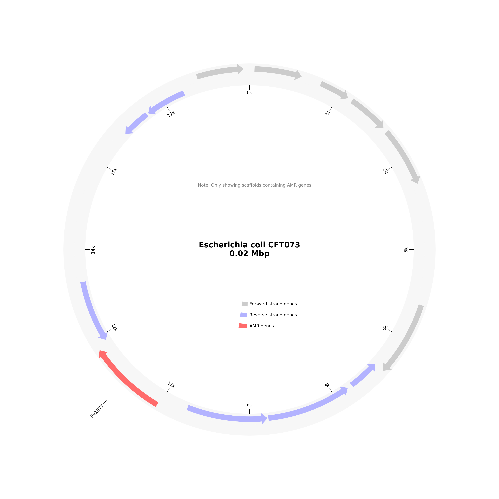

### Rv1877
- **Mechanism**: antibiotic efflux
- **Drug Classes**: fluoroquinolone antibiotic
- **AMR Family**: major facilitator superfamily (MFS) antibiotic efflux pump
- **Locations**:
  - gnl|SPADES|FKHIBMDG_535_9 : position 10822-12120

## Escherichia coli K-12
**Strain Statistics:**
- Total genome length: 37.4 kbp
- Total scaffolds: 2
- Scaffolds with AMR genes: 1
- Total genes annotated: 80
- Total AMR genes: 1
- Unique AMR genes: 1
- Distinct AMR mechanisms: 1
- Distinct AMR families: 1
- Distinct drug classes: 12

**Circos Plot:**

### Escherichia coli soxS with mutation conferring antibiotic resistance
- **Mechanism**: antibiotic target alteration; antibiotic efflux; reduced permeability to antibiotic
- **Drug Classes**: fluoroquinolone antibiotic; monobactam; carbapenem; cephalosporin; glycylcycline; cephamycin; penam; tetracycline antibiotic; rifamycin antibiotic; phenicol antibiotic; penem; disinfecting agents and antiseptics
- **AMR Family**: ATP-binding cassette (ABC) antibiotic efflux pump; major facilitator superfamily (MFS) antibiotic efflux pump; resistance-nodulation-cell division (RND) antibiotic efflux pump; General Bacterial Porin with reduced permeability to beta-lactams
- **Locations**:
  - gnl|SPADES|FKHIBMDG_256_20 : position 17246-18085

## Escherichia coli O157:H7
**Strain Statistics:**
- Total genome length: 130.0 kbp
- Total scaffolds: 10
- Scaffolds with AMR genes: 5
- Total genes annotated: 246
- Total AMR genes: 15
- Unique AMR genes: 15
- Distinct AMR mechanisms: 6
- Distinct AMR families: 9
- Distinct drug classes: 19

**Circos Plot:**

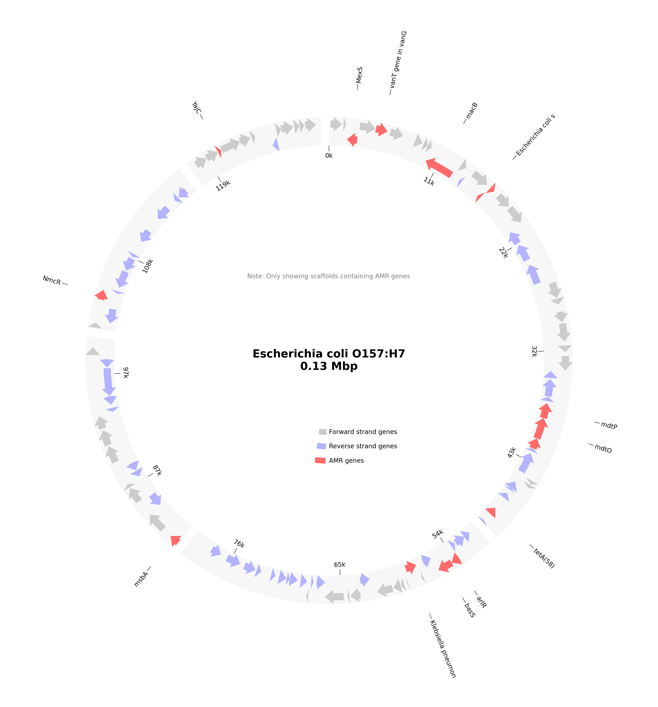

### Escherichia coli soxR with mutation conferring antibiotic resistance
- **Mechanism**: antibiotic target alteration; antibiotic efflux
- **Drug Classes**: fluoroquinolone antibiotic; cephalosporin; glycylcycline; penam; tetracycline antibiotic; rifamycin antibiotic; phenicol antibiotic; disinfecting agents and antiseptics
- **AMR Family**: ATP-binding cassette (ABC) antibiotic efflux pump; major facilitator superfamily (MFS) antibiotic efflux pump; resistance-nodulation-cell division (RND) antibiotic efflux pump
- **Locations**:
  - gnl|SPADES|FKHIBMDG_177_15: position 16004-16468

### Escherichia coli soxS with mutation conferring antibiotic resistance
- **Mechanism**: antibiotic target alteration; antibiotic efflux; reduced permeability to antibiotic
- **Drug Classes**: fluoroquinolone antibiotic; monobactam; carbapenem; cephalosporin; glycylcycline; cephamycin; penam; tetracycline antibiotic; rifamycin antibiotic; phenicol antibiotic; penem; disinfecting agents and antiseptics
- **AMR Family**: ATP-binding cassette (ABC) antibiotic efflux pump; major facilitator superfamily (MFS) antibiotic efflux pump; resistance-nodulation-cell division (RND) antibiotic efflux pump; General Bacterial Porin with reduced permeability to beta-lactams
- **Locations**:
  - gnl|SPADES|FKHIBMDG_177_14: position 15595-15918

### Klebsiella pneumoniae OmpK37
- **Mechanism**: reduced permeability to antibiotic
- **Drug Classes**: monobactam; carbapenem; cephalosporin; cephamycin; penam; penem
- **AMR Family**: General Bacterial Porin with reduced permeability to beta-lactams
- **Locations**:
  - gnl|SPADES|FKHIBMDG_337_8 : position 6850-7908

### MexS
- **Mechanism**: antibiotic efflux
- **Drug Classes**: fluoroquinolone antibiotic; diaminopyrimidine antibiotic; phenicol antibiotic
- **AMR Family**: resistance-nodulation-cell division (RND) antibiotic efflux pump
- **Locations**:
  - gnl|SPADES|FKHIBMDG_177_3 : position 1717-2700

### NmcR
- **Mechanism**: antibiotic inactivation
- **Drug Classes**: carbapenem; cephalosporin; cephamycin; penam
- **AMR Family**: NmcA beta-lactamase
- **Locations**:
  - gnl|SPADES|FKHIBMDG_587_3 : position 2689-3594

### YajC
- **Mechanism**: antibiotic efflux
- **Drug Classes**: fluoroquinolone antibiotic; cephalosporin; glycylcycline; penam; tetracycline antibiotic; oxazolidinone antibiotic; glycopeptide antibiotic; rifamycin antibiotic; phenicol antibiotic; disinfecting agents and antiseptics
- **AMR Family**: resistance-nodulation-cell division (RND) antibiotic efflux pump
- **Locations**:
  - gnl|SPADES|FKHIBMDG_708_4 : position 2937-3269

### arlR
- **Mechanism**: antibiotic efflux
- **Drug Classes**: fluoroquinolone antibiotic; disinfecting agents and antiseptics
- **AMR Family**: major facilitator superfamily (MFS) antibiotic efflux pump
- **Locations**:
  - gnl|SPADES|FKHIBMDG_337_5 : position 3043-3825

### basS
- **Mechanism**: antibiotic target alteration; antibiotic efflux
- **Drug Classes**: peptide antibiotic
- **AMR Family**: pmr phosphoethanolamine transferase
- **Locations**:
  - gnl|SPADES|FKHIBMDG_337_6 : position 3825-5183

### macB
- **Mechanism**: antibiotic efflux
- **Drug Classes**: macrolide antibiotic
- **AMR Family**: ATP-binding cassette (ABC) antibiotic efflux pump
- **Locations**:
  - gnl|SPADES|FKHIBMDG_177_10 : position 9584-12406

### mdtN
- **Mechanism**: antibiotic efflux
- **Drug Classes**: nucleoside antibiotic; disinfecting agents and antiseptics
- **AMR Family**: major facilitator superfamily (MFS) antibiotic efflux pump
- **Locations**:
  - gnl|SPADES|FKHIBMDG_177_35: position 41048-42079

### mdtO
- **Mechanism**: antibiotic efflux
- **Drug Classes**: nucleoside antibiotic; disinfecting agents and antiseptics
- **AMR Family**: major facilitator superfamily (MFS) antibiotic efflux pump
- **Locations**:
  - gnl|SPADES|FKHIBMDG_177_34: position 38997-41048

### mdtP
- **Mechanism**: antibiotic efflux
- **Drug Classes**: nucleoside antibiotic; disinfecting agents and antiseptics
- **AMR Family**: major facilitator superfamily (MFS) antibiotic efflux pump
- **Locations**:
  - gnl|SPADES|FKHIBMDG_177_33: position 37534-39000

### msbA
- **Mechanism**: antibiotic efflux
- **Drug Classes**: nitroimidazole antibiotic
- **AMR Family**: ATP-binding cassette (ABC) antibiotic efflux pump
- **Locations**:
  - gnl|SPADES|FKHIBMDG_481_1 : position 3-908

### tetA(58)
- **Mechanism**: antibiotic efflux
- **Drug Classes**: tetracycline antibiotic
- **AMR Family**: major facilitator superfamily (MFS) antibiotic efflux pump
- **Locations**:
  - gnl|SPADES|FKHIBMDG_177_44 : position 48841-49599

### vanT gene in vanG cluster
- **Mechanism**: antibiotic target alteration
- **Drug Classes**: glycopeptide antibiotic
- **AMR Family**: glycopeptide resistance gene cluster; vanT
- **Locations**:
  - gnl|SPADES|FKHIBMDG_177_5 : position 4251-5330

## Escherichia coli O157:H7 str. EDL933
**Strain Statistics:**
- Total genome length: 38.5 kbp
- Total scaffolds: 3
- Scaffolds with AMR genes: 2
- Total genes annotated: 70
- Total AMR genes: 2
- Unique AMR genes: 2
- Distinct AMR mechanisms: 2
- Distinct AMR families: 2
- Distinct drug classes: 3

**Circos Plot:**

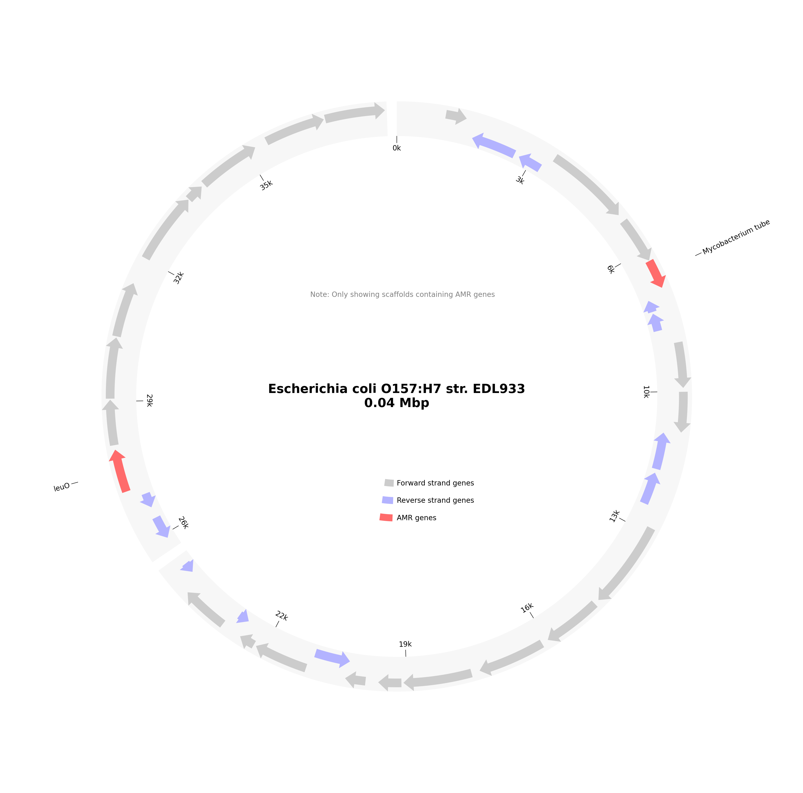

### Mycobacterium tuberculosis pncA mutations conferring resistance to pyrazinamide
- **Mechanism**: antibiotic target alteration
- **Drug Classes**: pyrazine antibiotic
- **AMR Family**: Pyrazinamide resistant pncA
- **Locations**:
  - gnl|SPADES|FKHIBMDG_404_6 : position 6677-7318

### leuO
- **Mechanism**: antibiotic efflux
- **Drug Classes**: nucleoside antibiotic; disinfecting agents and antiseptics
- **AMR Family**: major facilitator superfamily (MFS) antibiotic efflux pump
- **Locations**:
  - gnl|SPADES|FKHIBMDG_684_4 : position 1598-2536

## Escherichia coli O158:H23
**Strain Statistics:**
- Total genome length: 40.3 kbp
- Total scaffolds: 11
- Scaffolds with AMR genes: 5
- Total genes annotated: 92
- Total AMR genes: 5
- Unique AMR genes: 4
- Distinct AMR mechanisms: 4
- Distinct AMR families: 4
- Distinct drug classes: 7

**Circos Plot:**

### NmcR (found in 2 locations)
- **Mechanism**: antibiotic inactivation
- **Drug Classes**: carbapenem; cephalosporin; cephamycin; penam
- **AMR Family**: NmcA beta-lactamase
- **Locations**:
  - gnl|SPADES|FKHIBMDG_1414_6 : position 3349-4236
  - gnl|SPADES|FKHIBMDG_915_1 : position 302-1141

### QnrVC3
- **Mechanism**: antibiotic target protection
- **Drug Classes**: fluoroquinolone antibiotic
- **AMR Family**: quinolone resistance protein (qnr)
- **Locations**:
  - gnl|SPADES|FKHIBMDG_4563_1 : position 2-706

### novA
- **Mechanism**: antibiotic efflux
- **Drug Classes**: aminocoumarin antibiotic
- **AMR Family**: ATP-binding cassette (ABC) antibiotic efflux pump
- **Locations**:
  - gnl|SPADES|FKHIBMDG_5228_1 : position 1-762

### vanR gene in vanM cluster
- **Mechanism**: antibiotic target alteration
- **Drug Classes**: glycopeptide antibiotic
- **AMR Family**: glycopeptide resistance gene cluster; vanR
- **Locations**:
  - gnl|SPADES|FKHIBMDG_414_10 : position 6969-7811

## Escherichia coli O18:H1
**Strain Statistics:**
- Total genome length: 16.5 kbp
- Total scaffolds: 1
- Scaffolds with AMR genes: 1
- Total genes annotated: 24
- Total AMR genes: 2
- Unique AMR genes: 2
- Distinct AMR mechanisms: 2
- Distinct AMR families: 2
- Distinct drug classes: 2

**Circos Plot:**

### bcrA
- **Mechanism**: antibiotic efflux
- **Drug Classes**: peptide antibiotic
- **AMR Family**: ATP-binding cassette (ABC) antibiotic efflux pump
- **Locations**:
  - gnl|SPADES|FKHIBMDG_584_3 : position 2147-2815

### catB2
- **Mechanism**: antibiotic inactivation
- **Drug Classes**: phenicol antibiotic
- **AMR Family**: chloramphenicol acetyltransferase (CAT)
- **Locations**:
  - gnl|SPADES|FKHIBMDG_584_6 : position 6227-6856

## Escherichia coli O39:NM str. F8704-2
**Strain Statistics:**
- Total genome length: 28.0 kbp
- Total scaffolds: 1
- Scaffolds with AMR genes: 1
- Total genes annotated: 58
- Total AMR genes: 2
- Unique AMR genes: 2
- Distinct AMR mechanisms: 2
- Distinct AMR families: 2
- Distinct drug classes: 5

**Circos Plot:**

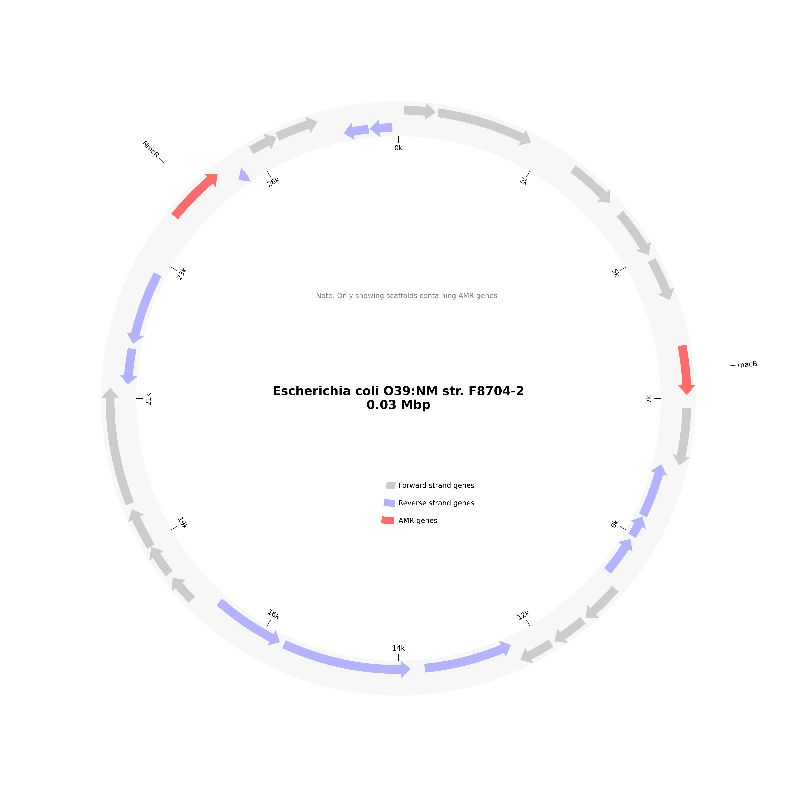

### NmcR
- **Mechanism**: antibiotic inactivation
- **Drug Classes**: carbapenem; cephalosporin; cephamycin; penam
- **AMR Family**: NmcA beta-lactamase
- **Locations**:
  - gnl|SPADES|FKHIBMDG_355_24 : position 24060-24998

### macB
- **Mechanism**: antibiotic efflux
- **Drug Classes**: macrolide antibiotic
- **AMR Family**: ATP-binding cassette (ABC) antibiotic efflux pump
- **Locations**:
  - gnl|SPADES|FKHIBMDG_355_7 : position 6180-6953

## Escherichia coli O7:H4
**Strain Statistics:**
- Total genome length: 26.3 kbp
- Total scaffolds: 1
- Scaffolds with AMR genes: 1
- Total genes annotated: 40
- Total AMR genes: 4
- Unique AMR genes: 4
- Distinct AMR mechanisms: 2
- Distinct AMR families: 3
- Distinct drug classes: 10

**Circos Plot:**

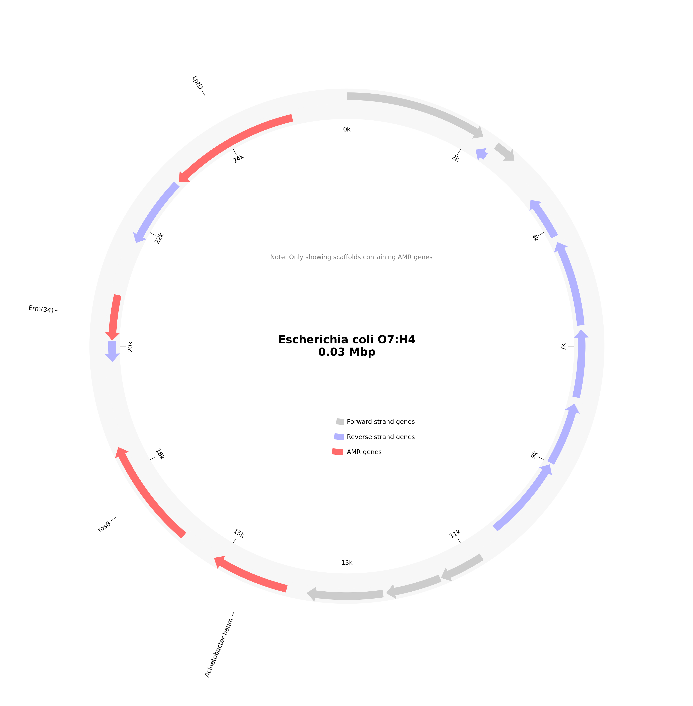

### Acinetobacter baumannii AbaQ
- **Mechanism**: antibiotic efflux
- **Drug Classes**: fluoroquinolone antibiotic
- **AMR Family**: major facilitator superfamily (MFS) antibiotic efflux pump
- **Locations**:
  - gnl|SPADES|FKHIBMDG_387_13 : position 14189-15520

### Erm(34)
- **Mechanism**: antibiotic target alteration
- **Drug Classes**: macrolide antibiotic; lincosamide antibiotic; streptogramin antibiotic; streptogramin A antibiotic; streptogramin B antibiotic
- **AMR Family**: Erm 23S ribosomal RNA methyltransferase
- **Locations**:
  - gnl|SPADES|FKHIBMDG_387_17 : position 19853-20674

### LptD
- **Mechanism**: antibiotic efflux
- **Drug Classes**: carbapenem; peptide antibiotic; aminocoumarin antibiotic; rifamycin antibiotic
- **AMR Family**: ATP-binding cassette (ABC) antibiotic efflux pump
- **Locations**:
  - gnl|SPADES|FKHIBMDG_387_20 : position 22999-25353

### rosB
- **Mechanism**: antibiotic efflux
- **Drug Classes**: peptide antibiotic
- **AMR Family**: major facilitator superfamily (MFS) antibiotic efflux pump
- **Locations**:
  - gnl|SPADES|FKHIBMDG_387_15 : position 16151-18013

## Escherichia coli O83:H1 str. NRG 857C
**Strain Statistics:**
- Total genome length: 21.7 kbp
- Total scaffolds: 1
- Scaffolds with AMR genes: 1
- Total genes annotated: 44
- Total AMR genes: 1
- Unique AMR genes: 1
- Distinct AMR mechanisms: 1
- Distinct AMR families: 1
- Distinct drug classes: 1

**Circos Plot:**

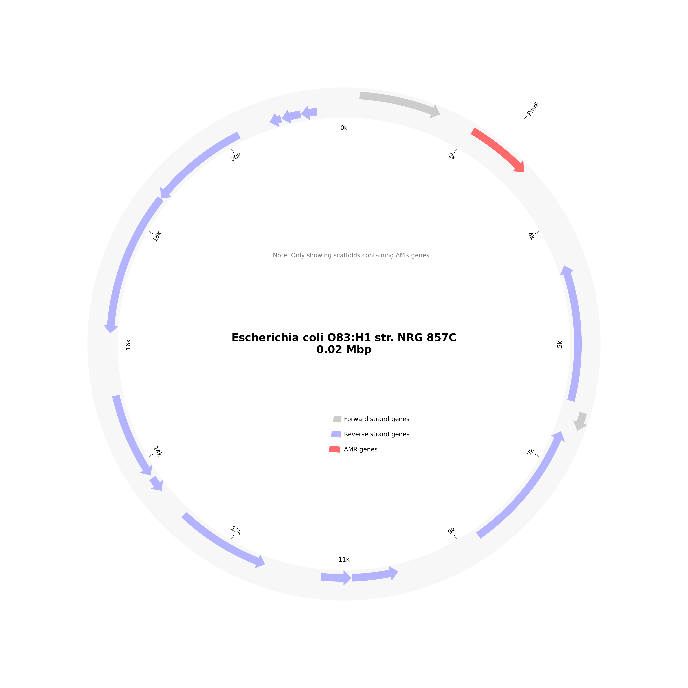

### PmrF
- **Mechanism**: antibiotic target alteration
- **Drug Classes**: peptide antibiotic
- **AMR Family**: pmr phosphoethanolamine transferase
- **Locations**:
  - gnl|SPADES|FKHIBMDG_461_3 : position 1876-2796

## Escherichia coli O84:H7
**Strain Statistics:**
- Total genome length: 3.5 kbp
- Total scaffolds: 1
- Scaffolds with AMR genes: 1
- Total genes annotated: 6
- Total AMR genes: 1
- Unique AMR genes: 1
- Distinct AMR mechanisms: 1
- Distinct AMR families: 1
- Distinct drug classes: 2

**Circos Plot:**

### adeL
- **Mechanism**: antibiotic efflux
- **Drug Classes**: fluoroquinolone antibiotic; tetracycline antibiotic
- **AMR Family**: resistance-nodulation-cell division (RND) antibiotic efflux pump
- **Locations**:
  - gnl|SPADES|FKHIBMDG_1675_1 : position 254-1180

## Escherichia coli O8:H28
**Strain Statistics:**
- Total genome length: 3.0 kbp
- Total scaffolds: 1
- Scaffolds with AMR genes: 1
- Total genes annotated: 8
- Total AMR genes: 2
- Unique AMR genes: 2
- Distinct AMR mechanisms: 1
- Distinct AMR families: 1
- Distinct drug classes: 2

**Circos Plot:**

### RanA
- **Mechanism**: antibiotic efflux
- **Drug Classes**: aminoglycoside antibiotic
- **AMR Family**: ATP-binding cassette (ABC) antibiotic efflux pump
- **Locations**:
  - gnl|SPADES|FKHIBMDG_1898_2 : position 651-1457

### msbA
- **Mechanism**: antibiotic efflux
- **Drug Classes**: nitroimidazole antibiotic
- **AMR Family**: ATP-binding cassette (ABC) antibiotic efflux pump
- **Locations**:
  - gnl|SPADES|FKHIBMDG_1898_3 : position 1454-2218

## Ewingella americana
**Strain Statistics:**
- Total genome length: 4502.3 kbp
- Total scaffolds: 59
- Scaffolds with AMR genes: 43
- Total genes annotated: 8473
- Total AMR genes: 504
- Unique AMR genes: 214
- Distinct AMR mechanisms: 12
- Distinct AMR families: 74
- Distinct drug classes: 37

**Circos Plot:**

### Acinetobacter baumannii AbaF (found in 7 locations)
- **Mechanism**: antibiotic efflux
- **Drug Classes**: phosphonic acid antibiotic
- **AMR Family**: major facilitator superfamily (MFS) antibiotic efflux pump
- **Locations**:
  - gnl|SPADES|FKHIBMDG_14_68 : position 72937-74268
  - gnl|SPADES|FKHIBMDG_1_297 : position 309233-310582
  - gnl|SPADES|FKHIBMDG_277_5 : position 3923-5161
  - gnl|SPADES|FKHIBMDG_2_147 : position 160485-161807
  - gnl|SPADES|FKHIBMDG_4_96 : position 86687-88189
  - gnl|SPADES|FKHIBMDG_6_243 : position 251039-252385
  - gnl|SPADES|FKHIBMDG_9_3 : position 1363-2679

### Acinetobacter baumannii AbaQ (found in 7 locations)
- **Mechanism**: antibiotic efflux
- **Drug Classes**: fluoroquinolone antibiotic
- **AMR Family**: major facilitator superfamily (MFS) antibiotic efflux pump
- **Locations**:
  - gnl|SPADES|FKHIBMDG_19_47 : position 47871-49100
  - gnl|SPADES|FKHIBMDG_19_56 : position 59063-60418
  - gnl|SPADES|FKHIBMDG_267_35 : position 30310-31506
  - gnl|SPADES|FKHIBMDG_26_138 : position 134827-136167
  - gnl|SPADES|FKHIBMDG_2_52 : position 56442-57758
  - gnl|SPADES|FKHIBMDG_2_59 : position 63570-64838
  - gnl|SPADES|FKHIBMDG_38_43 : position 49198-50553

### ArnT
- **Mechanism**: antibiotic target alteration
- **Drug Classes**: peptide antibiotic
- **AMR Family**: pmr phosphoethanolamine transferase
- **Locations**:
  - gnl|SPADES|FKHIBMDG_4_274: position 269058-270728

### CAR-1 (found in 2 locations)
- **Mechanism**: antibiotic inactivation
- **Drug Classes**: carbapenem
- **AMR Family**: CAR beta-lactamase
- **Locations**:
  - gnl|SPADES|FKHIBMDG_26_51 : position 47638-48363
  - gnl|SPADES|FKHIBMDG_296_24 : position 21039-21794

### CRP (found in 2 locations)
- **Mechanism**: antibiotic efflux
- **Drug Classes**: macrolide antibiotic; fluoroquinolone antibiotic; penam
- **AMR Family**: resistance-nodulation-cell division (RND) antibiotic efflux pump
- **Locations**:
  - gnl|SPADES|FKHIBMDG_141_37 : position 38999-39754
  - gnl|SPADES|FKHIBMDG_267_38: position 33380-34012

### CfiA11
- **Mechanism**: antibiotic inactivation
- **Drug Classes**: carbapenem
- **AMR Family**: CfiA beta-lactamase
- **Locations**:
  - gnl|SPADES|FKHIBMDG_26_119 : position 119415-120266

### Clostridioides difficile gyrA conferring resistance to fluoroquinolones
- **Mechanism**: antibiotic target alteration
- **Drug Classes**: fluoroquinolone antibiotic
- **AMR Family**: fluoroquinolone resistant gyrA
- **Locations**:
  - gnl|SPADES|FKHIBMDG_38_70 : position 99563-102232

### Clostridioides difficile gyrB conferring resistance to fluoroquinolones (found in 2 locations)
- **Mechanism**: antibiotic target alteration
- **Drug Classes**: fluoroquinolone antibiotic
- **AMR Family**: fluoroquinolone resistant gyrB
- **Locations**:
  - gnl|SPADES|FKHIBMDG_26_75 : position 73996-75912
  - gnl|SPADES|FKHIBMDG_2_46 : position 49303-51717

### CrcB
- **Mechanism**: antibiotic efflux
- **Drug Classes**: aminoglycoside antibiotic
- **AMR Family**: multidrug and toxic compound extrusion (MATE) transporter
- **Locations**:
  - gnl|SPADES|FKHIBMDG_276_20 : position 18098-18481

### Enterobacter cloacae acrA
- **Mechanism**: antibiotic efflux
- **Drug Classes**: fluoroquinolone antibiotic; cephalosporin; glycylcycline; penam; tetracycline antibiotic; rifamycin antibiotic; phenicol antibiotic; disinfecting agents and antiseptics
- **AMR Family**: resistance-nodulation-cell division (RND) antibiotic efflux pump
- **Locations**:
  - gnl|SPADES|FKHIBMDG_1_189 : position 196442-197632

### Enterococcus faecalis cls with mutation conferring resistance to daptomycin
- **Mechanism**: antibiotic target alteration
- **Drug Classes**: peptide antibiotic
- **AMR Family**: daptomycin resistant cls
- **Locations**:
  - gnl|SPADES|FKHIBMDG_69_65 : position 70504-71964

### ErmC
- **Mechanism**: antibiotic target alteration
- **Drug Classes**: macrolide antibiotic; lincosamide antibiotic; streptogramin antibiotic; streptogramin A antibiotic; streptogramin B antibiotic
- **AMR Family**: Erm 23S ribosomal RNA methyltransferase
- **Locations**:
  - gnl|SPADES|FKHIBMDG_9_26 : position 29831-30664

### Escherichia coli AcrAB-TolC with AcrR mutation conferring resistance to ciprofloxacin, tetracycline, and ceftazidime (found in 2 locations)
- **Mechanism**: antibiotic target alteration; antibiotic efflux
- **Drug Classes**: fluoroquinolone antibiotic; cephalosporin; glycylcycline; penam; tetracycline antibiotic; rifamycin antibiotic; phenicol antibiotic; disinfecting agents and antiseptics
- **AMR Family**: resistance-nodulation-cell division (RND) antibiotic efflux pump
- **Locations**:
  - gnl|SPADES|FKHIBMDG_11_178 : position 180766-181371
  - gnl|SPADES|FKHIBMDG_31_4 : position 4194-4793

### Escherichia coli EF-Tu mutants conferring resistance to Pulvomycin
- **Mechanism**: antibiotic target alteration
- **Drug Classes**: elfamycin antibiotic
- **AMR Family**: elfamycin resistant EF-Tu
- **Locations**:
  - gnl|SPADES|FKHIBMDG_1059_7 : position 3956-5140

### Escherichia coli cyaA with mutation conferring resistance to fosfomycin
- **Mechanism**: antibiotic target alteration
- **Drug Classes**: phosphonic acid antibiotic
- **AMR Family**: antibiotic-resistant cya adenylate cyclase
- **Locations**:
  - gnl|SPADES|FKHIBMDG_139_57 : position 54888-57446

### Escherichia coli fabI mutations conferring resistance to isoniazid and triclosan (found in 2 locations)
- **Mechanism**: antibiotic target alteration
- **Drug Classes**: disinfecting agents and antiseptics; isoniazid-like antibiotic
- **AMR Family**: antibiotic resistant fabI
- **Locations**:
  - gnl|SPADES|FKHIBMDG_1_208 : position 216679-217455
  - gnl|SPADES|FKHIBMDG_1_213 : position 220950-221696

### Escherichia coli mdfA (found in 2 locations)
- **Mechanism**: antibiotic efflux
- **Drug Classes**: tetracycline antibiotic; phenicol antibiotic; disinfecting agents and antiseptics
- **AMR Family**: major facilitator superfamily (MFS) antibiotic efflux pump
- **Locations**:
  - gnl|SPADES|FKHIBMDG_2_93 : position 99482-100720
  - gnl|SPADES|FKHIBMDG_6_78 : position 90019-91242

### Escherichia coli ompF with mutation conferring resistance to beta-lactam antibiotics
- **Mechanism**: reduced permeability to antibiotic
- **Drug Classes**: monobactam; carbapenem; cephalosporin; cephamycin; penam; penem
- **AMR Family**: General Bacterial Porin with reduced permeability to beta-lactams
- **Locations**:
  - gnl|SPADES|FKHIBMDG_19_78 : position 87717-88856

### Escherichia coli soxS with mutation conferring antibiotic resistance (found in 4 locations)
- **Mechanism**: antibiotic target alteration; antibiotic efflux; reduced permeability to antibiotic
- **Drug Classes**: fluoroquinolone antibiotic; monobactam; carbapenem; cephalosporin; glycylcycline; cephamycin; penam; tetracycline antibiotic; rifamycin antibiotic; phenicol antibiotic; penem; disinfecting agents and antiseptics
- **AMR Family**: ATP-binding cassette (ABC) antibiotic efflux pump; major facilitator superfamily (MFS) antibiotic efflux pump; resistance-nodulation-cell division (RND) antibiotic efflux pump; General Bacterial Porin with reduced permeability to beta-lactams
- **Locations**:
  - gnl|SPADES|FKHIBMDG_11_54 : position 52680-53039
  - gnl|SPADES|FKHIBMDG_19_73 : position 83044-83880
  - gnl|SPADES|FKHIBMDG_19_89 : position 102479-103306
  - gnl|SPADES|FKHIBMDG_360_15 : position 15745-16611

### EstT (found in 2 locations)
- **Mechanism**: antibiotic inactivation
- **Drug Classes**: macrolide antibiotic
- **AMR Family**: macrolide esterase
- **Locations**:
  - gnl|SPADES|FKHIBMDG_3_26 : position 25867-26877
  - gnl|SPADES|FKHIBMDG_4_26 : position 28843-29682

### FosA3
- **Mechanism**: antibiotic inactivation
- **Drug Classes**: phosphonic acid antibiotic
- **AMR Family**: fosfomycin thiol transferase
- **Locations**:
  - gnl|SPADES|FKHIBMDG_31_77 : position 77918-78343

### FosA8
- **Mechanism**: antibiotic inactivation
- **Drug Classes**: phosphonic acid antibiotic
- **AMR Family**: fosfomycin thiol transferase
- **Locations**:
  - gnl|SPADES|FKHIBMDG_1_39: position 43942-44352

### FosM2
- **Mechanism**: antibiotic inactivation
- **Drug Classes**: phosphonic acid antibiotic
- **AMR Family**: fosfomycin thiol transferase
- **Locations**:
  - gnl|SPADES|FKHIBMDG_69_10 : position 10858-11265

### H-NS
- **Mechanism**: antibiotic efflux
- **Drug Classes**: macrolide antibiotic; fluoroquinolone antibiotic; cephalosporin; cephamycin; penam; tetracycline antibiotic
- **AMR Family**: major facilitator superfamily (MFS) antibiotic efflux pump; resistance-nodulation-cell division (RND) antibiotic efflux pump
- **Locations**:
  - gnl|SPADES|FKHIBMDG_69_55 : position 57389-57796

### Haemophilus influenzae PBP3 conferring resistance to beta-lactam antibiotics (found in 2 locations)
- **Mechanism**: antibiotic target alteration
- **Drug Classes**: cephalosporin; cephamycin; penam
- **AMR Family**: Penicillin-binding protein mutations conferring resistance to beta-lactam antibiotics
- **Locations**:
  - gnl|SPADES|FKHIBMDG_38_56 : position 63094-64869
  - gnl|SPADES|FKHIBMDG_9_53 : position 65669-67432

### Helicobacter pylori pbp1 mutants conferring resistance to amoxicillin
- **Mechanism**: antibiotic target alteration
- **Drug Classes**: cephalosporin; cephamycin; penam
- **AMR Family**: Penicillin-binding protein mutations conferring resistance to beta-lactam antibiotics
- **Locations**:
  - gnl|SPADES|FKHIBMDG_35_35 : position 40653-43010

### Helicobacter pylori pbp2 mutants conferring resistance to amoxicillin
- **Mechanism**: antibiotic target alteration
- **Drug Classes**: cephalosporin; cephamycin; penam
- **AMR Family**: Penicillin-binding protein mutations conferring resistance to beta-lactam antibiotics
- **Locations**:
  - gnl|SPADES|FKHIBMDG_276_5 : position 2797-4701

### Helicobacter pylori rpoB mutation conferring resistance to rifampicin
- **Mechanism**: antibiotic target alteration; antibiotic target replacement
- **Drug Classes**: fluoroquinolone antibiotic; rifamycin antibiotic
- **AMR Family**: rifamycin-resistant beta-subunit of RNA polymerase (rpoB)
- **Locations**:
  - gnl|SPADES|FKHIBMDG_370_9 : position 8558-12778

### Klebsiella aerogenes Omp36
- **Mechanism**: reduced permeability to antibiotic
- **Drug Classes**: monobactam; carbapenem; cephalosporin; cephamycin; penam; penem
- **AMR Family**: General Bacterial Porin with reduced permeability to beta-lactams
- **Locations**:
  - gnl|SPADES|FKHIBMDG_38_60 : position 67064-68185

### Klebsiella pneumoniae KpnG
- **Mechanism**: antibiotic efflux
- **Drug Classes**: macrolide antibiotic; fluoroquinolone antibiotic; aminoglycoside antibiotic; carbapenem; cephalosporin; penam; peptide antibiotic; penem
- **AMR Family**: major facilitator superfamily (MFS) antibiotic efflux pump
- **Locations**:
  - gnl|SPADES|FKHIBMDG_1_8 : position 9290-10486

### Klebsiella pneumoniae KpnH (found in 2 locations)
- **Mechanism**: antibiotic efflux
- **Drug Classes**: macrolide antibiotic; fluoroquinolone antibiotic; aminoglycoside antibiotic; carbapenem; cephalosporin; penam; peptide antibiotic; penem
- **AMR Family**: major facilitator superfamily (MFS) antibiotic efflux pump
- **Locations**:
  - gnl|SPADES|FKHIBMDG_1_7: position 7728-9272
  - gnl|SPADES|FKHIBMDG_3_53 : position 59730-61298

### Klebsiella pneumoniae OmpK37 (found in 3 locations)
- **Mechanism**: reduced permeability to antibiotic
- **Drug Classes**: monobactam; carbapenem; cephalosporin; cephamycin; penam; penem
- **AMR Family**: General Bacterial Porin with reduced permeability to beta-lactams
- **Locations**:
  - gnl|SPADES|FKHIBMDG_11_142 : position 138067-139227
  - gnl|SPADES|FKHIBMDG_222_33 : position 39482-40585
  - gnl|SPADES|FKHIBMDG_31_36 : position 40420-41520

### Klebsiella pneumoniae acrR with mutation conferring multidrug antibiotic resistance
- **Mechanism**: antibiotic target alteration; antibiotic efflux
- **Drug Classes**: fluoroquinolone antibiotic; cephalosporin; glycylcycline; penam; tetracycline antibiotic; rifamycin antibiotic; phenicol antibiotic; disinfecting agents and antiseptics
- **AMR Family**: resistance-nodulation-cell division (RND) antibiotic efflux pump
- **Locations**:
  - gnl|SPADES|FKHIBMDG_1_190 : position 197738-198421

### Klebsiella pneumoniae ramR mutants
- **Mechanism**: antibiotic target alteration; antibiotic efflux
- **Drug Classes**: fluoroquinolone antibiotic; cephalosporin; glycylcycline; penam; tetracycline antibiotic; rifamycin antibiotic; phenicol antibiotic; disinfecting agents and antiseptics
- **AMR Family**: resistance-nodulation-cell division (RND) antibiotic efflux pump
- **Locations**:
  - gnl|SPADES|FKHIBMDG_2_165 : position 179019-179672

### LpsB
- **Mechanism**: reduced permeability to antibiotic
- **Drug Classes**: peptide antibiotic
- **AMR Family**: Intrinsic peptide antibiotic resistant Lps
- **Locations**:
  - gnl|SPADES|FKHIBMDG_42_46 : position 49651-50751

### LptD
- **Mechanism**: antibiotic efflux
- **Drug Classes**: carbapenem; peptide antibiotic; aminocoumarin antibiotic; rifamycin antibiotic
- **AMR Family**: ATP-binding cassette (ABC) antibiotic efflux pump
- **Locations**:
  - gnl|SPADES|FKHIBMDG_9_29 : position 33044-35419

### MCR-10.4
- **Mechanism**: antibiotic target alteration
- **Drug Classes**: peptide antibiotic
- **AMR Family**: MCR phosphoethanolamine transferase
- **Locations**:
  - gnl|SPADES|FKHIBMDG_3_27 : position 26940-28571

### MdtK
- **Mechanism**: antibiotic efflux
- **Drug Classes**: fluoroquinolone antibiotic
- **AMR Family**: multidrug and toxic compound extrusion (MATE) transporter
- **Locations**:
  - gnl|SPADES|FKHIBMDG_3_15 : position 13654-15045

### MexH
- **Mechanism**: antibiotic efflux
- **Drug Classes**: fluoroquinolone antibiotic; tetracycline antibiotic; disinfecting agents and antiseptics
- **AMR Family**: resistance-nodulation-cell division (RND) antibiotic efflux pump
- **Locations**:
  - gnl|SPADES|FKHIBMDG_408_9 : position 8178-9434

### MexS (found in 3 locations)
- **Mechanism**: antibiotic efflux
- **Drug Classes**: fluoroquinolone antibiotic; diaminopyrimidine antibiotic; phenicol antibiotic
- **AMR Family**: resistance-nodulation-cell division (RND) antibiotic efflux pump
- **Locations**:
  - gnl|SPADES|FKHIBMDG_123_4 : position 3707-4831
  - gnl|SPADES|FKHIBMDG_182_38 : position 47317-48303
  - gnl|SPADES|FKHIBMDG_31_103 : position 103724-104767

### MexT (found in 3 locations)
- **Mechanism**: antibiotic efflux
- **Drug Classes**: fluoroquinolone antibiotic; diaminopyrimidine antibiotic; phenicol antibiotic
- **AMR Family**: resistance-nodulation-cell division (RND) antibiotic efflux pump
- **Locations**:
  - gnl|SPADES|FKHIBMDG_11_188 : position 190747-191664
  - gnl|SPADES|FKHIBMDG_11_83 : position 83729-84658
  - gnl|SPADES|FKHIBMDG_69_29 : position 28410-29357

### MexZ (found in 2 locations)
- **Mechanism**: antibiotic efflux
- **Drug Classes**: macrolide antibiotic; fluoroquinolone antibiotic; aminoglycoside antibiotic; carbapenem; cephalosporin; cephamycin; penam; tetracycline antibiotic; phenicol antibiotic; disinfecting agents and antiseptics
- **AMR Family**: resistance-nodulation-cell division (RND) antibiotic efflux pump
- **Locations**:
  - gnl|SPADES|FKHIBMDG_3_114 : position 122067-122648
  - gnl|SPADES|FKHIBMDG_42_28 : position 33497-34117

### MuxA
- **Mechanism**: antibiotic efflux
- **Drug Classes**: macrolide antibiotic; monobactam; tetracycline antibiotic; aminocoumarin antibiotic
- **AMR Family**: resistance-nodulation-cell division (RND) antibiotic efflux pump
- **Locations**:
  - gnl|SPADES|FKHIBMDG_14_120 : position 128232-129527

### MuxC
- **Mechanism**: antibiotic efflux
- **Drug Classes**: macrolide antibiotic; monobactam; tetracycline antibiotic; aminocoumarin antibiotic
- **AMR Family**: resistance-nodulation-cell division (RND) antibiotic efflux pump
- **Locations**:
  - gnl|SPADES|FKHIBMDG_14_122 : position 132752-135880

### Mycobacterium tuberculosis gidB mutation conferring resistance to streptomycin
- **Mechanism**: antibiotic target alteration
- **Drug Classes**: aminoglycoside antibiotic
- **AMR Family**: antibiotic resistant gidB
- **Locations**:
  - gnl|SPADES|FKHIBMDG_2_15 : position 16577-17197

### Mycobacterium tuberculosis kasA mutant conferring resistance to isoniazid
- **Mechanism**: antibiotic target alteration
- **Drug Classes**: isoniazid-like antibiotic
- **AMR Family**: antibiotic resistant kasA
- **Locations**:
  - gnl|SPADES|FKHIBMDG_42_29 : position 34269-35543

### Mycobacterium tuberculosis katG mutations conferring resistance to isoniazid
- **Mechanism**: antibiotic target alteration
- **Drug Classes**: isoniazid-like antibiotic
- **AMR Family**: isoniazid resistant katG
- **Locations**:
  - gnl|SPADES|FKHIBMDG_3_123 : position 130282-132459

### Mycobacterium tuberculosis ndh with mutation conferring resistance to isoniazid
- **Mechanism**: antibiotic target alteration
- **Drug Classes**: isoniazid-like antibiotic
- **AMR Family**: antibiotic resistant ndh
- **Locations**:
  - gnl|SPADES|FKHIBMDG_4_153 : position 140463-141770

### Mycobacterium tuberculosis pncA mutations conferring resistance to pyrazinamide (found in 2 locations)
- **Mechanism**: antibiotic target alteration
- **Drug Classes**: pyrazine antibiotic
- **AMR Family**: Pyrazinamide resistant pncA
- **Locations**:
  - gnl|SPADES|FKHIBMDG_17_110 : position 123238-123927
  - gnl|SPADES|FKHIBMDG_6_36 : position 43714-44340

### Mycobacterium tuberculosis rpoB mutations conferring resistance to rifampicin
- **Mechanism**: antibiotic target alteration; antibiotic target replacement
- **Drug Classes**: rifamycin antibiotic
- **AMR Family**: rifamycin-resistant beta-subunit of RNA polymerase (rpoB)
- **Locations**:
  - gnl|SPADES|FKHIBMDG_370_8 : position 4438-8466

### Mycobacterium tuberculosis thyA with mutation conferring resistance to para-aminosalicylic acid
- **Mechanism**: antibiotic target alteration
- **Drug Classes**: salicylic acid antibiotic
- **AMR Family**: aminosalicylate resistant thymidylate synthase
- **Locations**:
  - gnl|SPADES|FKHIBMDG_14_150 : position 170453-171247

### Neisseria gonorrhoeae pilQ gene conferring resistance to beta-lactam
- **Mechanism**: antibiotic target alteration
- **Drug Classes**: cephalosporin; cephamycin; penam
- **AMR Family**: Penicillin-binding protein mutations conferring resistance to beta-lactam antibiotics
- **Locations**:
  - gnl|SPADES|FKHIBMDG_2_258 : position 284537-285808

### NmcR (found in 18 locations)
- **Mechanism**: antibiotic inactivation
- **Drug Classes**: carbapenem; cephalosporin; cephamycin; penam
- **AMR Family**: NmcA beta-lactamase
- **Locations**:
  - gnl|SPADES|FKHIBMDG_11_151 : position 147203-148057
  - gnl|SPADES|FKHIBMDG_139_5 : position 4375-5298
  - gnl|SPADES|FKHIBMDG_141_12 : position 16205-17077
  - gnl|SPADES|FKHIBMDG_158_47 : position 47743-48663
  - gnl|SPADES|FKHIBMDG_1_12 : position 14414-15295
  - gnl|SPADES|FKHIBMDG_1_200 : position 209345-210217
  - gnl|SPADES|FKHIBMDG_1_209 : position 217656-218582
  - gnl|SPADES|FKHIBMDG_1_426 : position 442213-443133
  - gnl|SPADES|FKHIBMDG_222_31 : position 37228-38127
  - gnl|SPADES|FKHIBMDG_267_31 : position 26186-27085
  - gnl|SPADES|FKHIBMDG_277_11 : position 11977-12858
  - gnl|SPADES|FKHIBMDG_277_2 : position 710-1537
  - gnl|SPADES|FKHIBMDG_2_170 : position 185420-186337
  - gnl|SPADES|FKHIBMDG_31_99 : position 99585-100547
  - gnl|SPADES|FKHIBMDG_35_111 : position 125752-126696
  - gnl|SPADES|FKHIBMDG_3_140 : position 144525-145406
  - gnl|SPADES|FKHIBMDG_3_3 : position 2054-2965
  - gnl|SPADES|FKHIBMDG_472_2 : position 2966-3940

### OXA-152
- **Mechanism**: antibiotic inactivation
- **Drug Classes**: carbapenem; penam
- **AMR Family**: OXA beta-lactamase; OXA-62-like beta-lactamase
- **Locations**:
  - gnl|SPADES|FKHIBMDG_1_343 : position 368761-369435

### OmpA (found in 2 locations)
- **Mechanism**: reduced permeability to antibiotic
- **Drug Classes**: peptide antibiotic
- **AMR Family**: General Bacterial Porin with reduced permeability to peptide antibiotics
- **Locations**:
  - gnl|SPADES|FKHIBMDG_2_65 : position 68601-69263
  - gnl|SPADES|FKHIBMDG_518_2 : position 1042-1551

### OpmB
- **Mechanism**: antibiotic efflux
- **Drug Classes**: macrolide antibiotic; monobactam; tetracycline antibiotic; aminocoumarin antibiotic
- **AMR Family**: resistance-nodulation-cell division (RND) antibiotic efflux pump
- **Locations**:
  - gnl|SPADES|FKHIBMDG_14_123 : position 135873-137312

### OprM (found in 2 locations)
- **Mechanism**: antibiotic efflux
- **Drug Classes**: macrolide antibiotic; fluoroquinolone antibiotic; monobactam; aminoglycoside antibiotic; carbapenem; cephalosporin; cephamycin; penam; tetracycline antibiotic; peptide antibiotic; aminocoumarin antibiotic; diaminopyrimidine antibiotic; sulfonamide antibiotic; phenicol antibiotic; penem; disinfecting agents and antiseptics
- **AMR Family**: resistance-nodulation-cell division (RND) antibiotic efflux pump
- **Locations**:
  - gnl|SPADES|FKHIBMDG_38_64 : position 74547-75938
  - gnl|SPADES|FKHIBMDG_3_217 : position 231645-233015

### OprN
- **Mechanism**: antibiotic efflux
- **Drug Classes**: fluoroquinolone antibiotic; diaminopyrimidine antibiotic; phenicol antibiotic
- **AMR Family**: resistance-nodulation-cell division (RND) antibiotic efflux pump
- **Locations**:
  - gnl|SPADES|FKHIBMDG_3_52 : position 58153-59724

### PAM-1
- **Mechanism**: antibiotic inactivation
- **Drug Classes**: carbapenem; cephalosporin
- **AMR Family**: PAM beta-lactamase
- **Locations**:
  - gnl|SPADES|FKHIBMDG_69_30 : position 29432-30334

### ParR (found in 2 locations)
- **Mechanism**: antibiotic efflux; reduced permeability to antibiotic
- **Drug Classes**: macrolide antibiotic; fluoroquinolone antibiotic; monobactam; aminoglycoside antibiotic; carbapenem; cephalosporin; cephamycin; penam; tetracycline antibiotic; phenicol antibiotic; penem; disinfecting agents and antiseptics
- **AMR Family**: resistance-nodulation-cell division (RND) antibiotic efflux pump; Outer Membrane Porin (Opr)
- **Locations**:
  - gnl|SPADES|FKHIBMDG_141_43 : position 46252-46986
  - gnl|SPADES|FKHIBMDG_2_246 : position 269423-270142

### ParS (found in 3 locations)
- **Mechanism**: antibiotic efflux; reduced permeability to antibiotic
- **Drug Classes**: macrolide antibiotic; fluoroquinolone antibiotic; monobactam; aminoglycoside antibiotic; carbapenem; cephalosporin; cephamycin; penam; tetracycline antibiotic; phenicol antibiotic; penem; disinfecting agents and antiseptics
- **AMR Family**: resistance-nodulation-cell division (RND) antibiotic efflux pump; Outer Membrane Porin (Opr)
- **Locations**:
  - gnl|SPADES|FKHIBMDG_11_34 : position 29416-30816
  - gnl|SPADES|FKHIBMDG_141_44 : position 46983-48290
  - gnl|SPADES|FKHIBMDG_1_18 : position 21414-23051

### PmrF (found in 3 locations)
- **Mechanism**: antibiotic target alteration
- **Drug Classes**: peptide antibiotic
- **AMR Family**: pmr phosphoethanolamine transferase
- **Locations**:
  - gnl|SPADES|FKHIBMDG_154_48 : position 53091-54023
  - gnl|SPADES|FKHIBMDG_42_51 : position 55242-56231
  - gnl|SPADES|FKHIBMDG_4_271 : position 265184-266164

### Pseudomonas aeruginosa CpxR (found in 3 locations)
- **Mechanism**: antibiotic efflux
- **Drug Classes**: macrolide antibiotic; fluoroquinolone antibiotic; monobactam; aminoglycoside antibiotic; carbapenem; cephalosporin; cephamycin; penam; tetracycline antibiotic; peptide antibiotic; aminocoumarin antibiotic; diaminopyrimidine antibiotic; sulfonamide antibiotic; phenicol antibiotic; penem
- **AMR Family**: resistance-nodulation-cell division (RND) antibiotic efflux pump
- **Locations**:
  - gnl|SPADES|FKHIBMDG_1_415 : position 430385-431068
  - gnl|SPADES|FKHIBMDG_26_40 : position 38368-39126
  - gnl|SPADES|FKHIBMDG_42_69 : position 73616-74317

### Pseudomonas aeruginosa ampR with mutation conferring resistance to aztreonam
- **Mechanism**: antibiotic target alteration; antibiotic inactivation
- **Drug Classes**: monobactam; carbapenem; cephalosporin
- **AMR Family**: PDC beta-lactamase; ampR transcriptional regulator with mutation conferring resistance to monobactam antibiotics
- **Locations**:
  - gnl|SPADES|FKHIBMDG_3_94 : position 102491-103372

### Pseudomonas mutant PhoQ conferring resistance to colistin
- **Mechanism**: antibiotic target alteration; antibiotic efflux; resistance by absence
- **Drug Classes**: macrolide antibiotic; peptide antibiotic
- **AMR Family**: ATP-binding cassette (ABC) antibiotic efflux pump; pmr phosphoethanolamine transferase; transmembrane protein conferring colistin resistance
- **Locations**:
  - gnl|SPADES|FKHIBMDG_4_164 : position 154883-156337

### QepA2 (found in 2 locations)
- **Mechanism**: antibiotic efflux
- **Drug Classes**: fluoroquinolone antibiotic
- **AMR Family**: major facilitator superfamily (MFS) antibiotic efflux pump
- **Locations**:
  - gnl|SPADES|FKHIBMDG_14_26 : position 24387-25781
  - gnl|SPADES|FKHIBMDG_1_11 : position 13085-14329

### QepA4 (found in 2 locations)
- **Mechanism**: antibiotic efflux
- **Drug Classes**: fluoroquinolone antibiotic
- **AMR Family**: major facilitator superfamily (MFS) antibiotic efflux pump
- **Locations**:
  - gnl|SPADES|FKHIBMDG_118_40 : position 43295-44599
  - gnl|SPADES|FKHIBMDG_3_149 : position 154502-156004

### QnrB65
- **Mechanism**: antibiotic target protection
- **Drug Classes**: fluoroquinolone antibiotic
- **AMR Family**: quinolone resistance protein (qnr)
- **Locations**:
  - gnl|SPADES|FKHIBMDG_2_160 : position 172593-173249

### RanA (found in 26 locations)
- **Mechanism**: antibiotic efflux
- **Drug Classes**: aminoglycoside antibiotic
- **AMR Family**: ATP-binding cassette (ABC) antibiotic efflux pump
- **Locations**:
  - gnl|SPADES|FKHIBMDG_118_1 : position 356-1105
  - gnl|SPADES|FKHIBMDG_118_9 : position 9893-10981
  - gnl|SPADES|FKHIBMDG_11_124 : position 121605-123212
  - gnl|SPADES|FKHIBMDG_11_195 : position 197265-198017
  - gnl|SPADES|FKHIBMDG_139_16 : position 13478-14551
  - gnl|SPADES|FKHIBMDG_14_113 : position 123377-124099
  - gnl|SPADES|FKHIBMDG_14_82 : position 86376-87521
  - gnl|SPADES|FKHIBMDG_154_9 : position 10304-11218
  - gnl|SPADES|FKHIBMDG_182_12 : position 15823-16815
  - gnl|SPADES|FKHIBMDG_1_107 : position 107486-108307
  - gnl|SPADES|FKHIBMDG_1_16 : position 18775-19971
  - gnl|SPADES|FKHIBMDG_205_24 : position 29238-30023
  - gnl|SPADES|FKHIBMDG_205_7 : position 7482-9320
  - gnl|SPADES|FKHIBMDG_26_33 : position 31625-32734
  - gnl|SPADES|FKHIBMDG_2_130 : position 135902-136918
  - gnl|SPADES|FKHIBMDG_2_30 : position 31880-32656
  - gnl|SPADES|FKHIBMDG_31_52 : position 53645-54589
  - gnl|SPADES|FKHIBMDG_35_91 : position 102119-102892
  - gnl|SPADES|FKHIBMDG_38_33 : position 39115-40710
  - gnl|SPADES|FKHIBMDG_3_161 : position 168898-170550
  - gnl|SPADES|FKHIBMDG_3_276 : position 292172-293305
  - gnl|SPADES|FKHIBMDG_4_9 : position 10208-11287
  - gnl|SPADES|FKHIBMDG_69_62 : position 67861-68886
  - gnl|SPADES|FKHIBMDG_69_63 : position 68883-69920
  - gnl|SPADES|FKHIBMDG_6_17 : position 23402-24481
  - gnl|SPADES|FKHIBMDG_86_19 : position 17483-18286

### RanB
- **Mechanism**: antibiotic efflux
- **Drug Classes**: aminoglycoside antibiotic
- **AMR Family**: ATP-binding cassette (ABC) antibiotic efflux pump
- **Locations**:
  - gnl|SPADES|FKHIBMDG_86_18 : position 16685-17467

### Rhodococcus fascians cmr
- **Mechanism**: antibiotic efflux
- **Drug Classes**: phenicol antibiotic
- **AMR Family**: major facilitator superfamily (MFS) antibiotic efflux pump
- **Locations**:
  - gnl|SPADES|FKHIBMDG_11_78 : position 79693-80055

### Rv1877 (found in 2 locations)
- **Mechanism**: antibiotic efflux
- **Drug Classes**: fluoroquinolone antibiotic
- **AMR Family**: major facilitator superfamily (MFS) antibiotic efflux pump
- **Locations**:
  - gnl|SPADES|FKHIBMDG_19_54 : position 56836-58119
  - gnl|SPADES|FKHIBMDG_2_166 : position 179821-181359

### SRT-2
- **Mechanism**: antibiotic inactivation
- **Drug Classes**: cephalosporin
- **AMR Family**: SRT beta-lactamase
- **Locations**:
  - gnl|SPADES|FKHIBMDG_19_46 : position 46613-47758

### SST-1
- **Mechanism**: antibiotic inactivation
- **Drug Classes**: cephalosporin
- **AMR Family**: SST beta-lactamase
- **Locations**:
  - gnl|SPADES|FKHIBMDG_3_93 : position 101225-102364

### Salmonella serovars soxS with mutation conferring antibiotic resistance (found in 2 locations)
- **Mechanism**: antibiotic target alteration; antibiotic efflux; reduced permeability to antibiotic
- **Drug Classes**: fluoroquinolone antibiotic; monobactam; carbapenem; cephalosporin; glycylcycline; cephamycin; penam; tetracycline antibiotic; rifamycin antibiotic; phenicol antibiotic; penem; disinfecting agents and antiseptics
- **AMR Family**: ATP-binding cassette (ABC) antibiotic efflux pump; major facilitator superfamily (MFS) antibiotic efflux pump; resistance-nodulation-cell division (RND) antibiotic efflux pump; General Bacterial Porin with reduced permeability to beta-lactams
- **Locations**:
  - gnl|SPADES|FKHIBMDG_11_116 : position 115046-115930
  - gnl|SPADES|FKHIBMDG_38_57 : position 65386-65772

### SatA
- **Mechanism**: antibiotic inactivation
- **Drug Classes**: nucleoside antibiotic
- **AMR Family**: streptothricin acetyltransferase (SAT)
- **Locations**:
  - gnl|SPADES|FKHIBMDG_2_100 : position 106489-106941

### Staphylococcus aureus GlpT with mutation conferring resistance to fosfomycin
- **Mechanism**: antibiotic target alteration
- **Drug Classes**: phosphonic acid antibiotic
- **AMR Family**: antibiotic-resistant GlpT
- **Locations**:
  - gnl|SPADES|FKHIBMDG_139_38 : position 35525-36877

### Staphylococcus aureus fusA with mutation conferring resistance to fusidic acid (found in 4 locations)
- **Mechanism**: antibiotic target alteration
- **Drug Classes**: fusidane antibiotic
- **AMR Family**: antibiotic resistant fusA
- **Locations**:
  - gnl|SPADES|FKHIBMDG_1059_8 : position 5212-7059
  - gnl|SPADES|FKHIBMDG_19_160 : position 153029-154618
  - gnl|SPADES|FKHIBMDG_267_1 : position 3-320
  - gnl|SPADES|FKHIBMDG_3_83 : position 90401-92503

### Staphylococcus aureus mupA conferring resistance to mupirocin (found in 2 locations)
- **Mechanism**: antibiotic target alteration
- **Drug Classes**: mupirocin-like antibiotic
- **AMR Family**: antibiotic-resistant isoleucyl-tRNA synthetase (ileS)
- **Locations**:
  - gnl|SPADES|FKHIBMDG_143_50 : position 56961-59543
  - gnl|SPADES|FKHIBMDG_9_11 : position 11017-13833

### Staphylococcus aureus mupB conferring resistance to mupirocin
- **Mechanism**: antibiotic target alteration
- **Drug Classes**: mupirocin-like antibiotic
- **AMR Family**: antibiotic-resistant isoleucyl-tRNA synthetase (ileS)
- **Locations**:
  - gnl|SPADES|FKHIBMDG_19_9 : position 11111-13966

### Staphylococcus aureus murA with mutation conferring resistance to fosfomycin
- **Mechanism**: antibiotic target alteration
- **Drug Classes**: phosphonic acid antibiotic
- **AMR Family**: antibiotic-resistant murA transferase
- **Locations**:
  - gnl|SPADES|FKHIBMDG_86_13 : position 13396-14655

### Staphylococcus aureus norA
- **Mechanism**: antibiotic efflux
- **Drug Classes**: fluoroquinolone antibiotic
- **AMR Family**: major facilitator superfamily (MFS) antibiotic efflux pump
- **Locations**:
  - gnl|SPADES|FKHIBMDG_4_12 : position 14687-15997

### Staphylococcus aureus pgsA mutations conferring resistance to daptomycin
- **Mechanism**: antibiotic target alteration
- **Drug Classes**: peptide antibiotic
- **AMR Family**: daptomycin resistant pgsA
- **Locations**:
  - gnl|SPADES|FKHIBMDG_4_42 : position 44772-45320

### Streptomyces lividans cmlR
- **Mechanism**: antibiotic efflux
- **Drug Classes**: phenicol antibiotic
- **AMR Family**: major facilitator superfamily (MFS) antibiotic efflux pump
- **Locations**:
  - gnl|SPADES|FKHIBMDG_3_121 : position 128756-129943

### Streptomyces rimosus otr(A) (found in 2 locations)
- **Mechanism**: antibiotic target protection
- **Drug Classes**: tetracycline antibiotic
- **AMR Family**: tetracycline-resistant ribosomal protection protein
- **Locations**:
  - gnl|SPADES|FKHIBMDG_107_60 : position 69517-72210
  - gnl|SPADES|FKHIBMDG_42_13 : position 14934-16757

### Streptomyces venezuelae rox (found in 4 locations)
- **Mechanism**: antibiotic inactivation
- **Drug Classes**: rifamycin antibiotic
- **AMR Family**: rifampin monooxygenase
- **Locations**:
  - gnl|SPADES|FKHIBMDG_143_39 : position 45302-46486
  - gnl|SPADES|FKHIBMDG_14_59 : position 61958-63109
  - gnl|SPADES|FKHIBMDG_14_60 : position 63132-64358
  - gnl|SPADES|FKHIBMDG_222_7 : position 9477-10685

### TaeA (found in 2 locations)
- **Mechanism**: antibiotic efflux
- **Drug Classes**: pleuromutilin antibiotic
- **AMR Family**: ATP-binding cassette (ABC) antibiotic efflux pump
- **Locations**:
  - gnl|SPADES|FKHIBMDG_14_73 : position 77368-78900
  - gnl|SPADES|FKHIBMDG_360_10 : position 10065-11732

### TolC
- **Mechanism**: antibiotic efflux
- **Drug Classes**: macrolide antibiotic; fluoroquinolone antibiotic; aminoglycoside antibiotic; carbapenem; cephalosporin; glycylcycline; cephamycin; penam; tetracycline antibiotic; peptide antibiotic; aminocoumarin antibiotic; rifamycin antibiotic; phenicol antibiotic; penem; disinfecting agents and antiseptics
- **AMR Family**: ATP-binding cassette (ABC) antibiotic efflux pump; major facilitator superfamily (MFS) antibiotic efflux pump; resistance-nodulation-cell division (RND) antibiotic efflux pump
- **Locations**:
  - gnl|SPADES|FKHIBMDG_26_70 : position 69623-71158

### TxR (found in 6 locations)
- **Mechanism**: antibiotic efflux
- **Drug Classes**: tetracycline antibiotic
- **AMR Family**: ATP-binding cassette (ABC) antibiotic efflux pump
- **Locations**:
  - gnl|SPADES|FKHIBMDG_17_52 : position 54987-56324
  - gnl|SPADES|FKHIBMDG_17_99 : position 107690-109594
  - gnl|SPADES|FKHIBMDG_1_271 : position 286080-287063
  - gnl|SPADES|FKHIBMDG_42_10 : position 10326-11738
  - gnl|SPADES|FKHIBMDG_69_40 : position 41926-42936
  - gnl|SPADES|FKHIBMDG_6_28 : position 34280-35848

### YajC
- **Mechanism**: antibiotic efflux
- **Drug Classes**: fluoroquinolone antibiotic; cephalosporin; glycylcycline; penam; tetracycline antibiotic; oxazolidinone antibiotic; glycopeptide antibiotic; rifamycin antibiotic; phenicol antibiotic; disinfecting agents and antiseptics
- **AMR Family**: resistance-nodulation-cell division (RND) antibiotic efflux pump
- **Locations**:
  - gnl|SPADES|FKHIBMDG_1_126 : position 131425-131757

### YojI
- **Mechanism**: antibiotic efflux
- **Drug Classes**: peptide antibiotic
- **AMR Family**: ATP-binding cassette (ABC) antibiotic efflux pump
- **Locations**:
  - gnl|SPADES|FKHIBMDG_3_48 : position 51221-52996

### aac(6')-Ib-cr11
- **Mechanism**: antibiotic inactivation
- **Drug Classes**: fluoroquinolone antibiotic; aminoglycoside antibiotic
- **AMR Family**: AAC(6'); AAC(6')-Ib-cr
- **Locations**:
  - gnl|SPADES|FKHIBMDG_2_200 : position 216276-216803

### acrB
- **Mechanism**: antibiotic efflux
- **Drug Classes**: fluoroquinolone antibiotic; cephalosporin; glycylcycline; penam; tetracycline antibiotic; rifamycin antibiotic; phenicol antibiotic; disinfecting agents and antiseptics
- **AMR Family**: resistance-nodulation-cell division (RND) antibiotic efflux pump
- **Locations**:
  - gnl|SPADES|FKHIBMDG_1_188 : position 193270-196425

### adeF (found in 2 locations)
- **Mechanism**: antibiotic efflux
- **Drug Classes**: fluoroquinolone antibiotic; tetracycline antibiotic
- **AMR Family**: resistance-nodulation-cell division (RND) antibiotic efflux pump
- **Locations**:
  - gnl|SPADES|FKHIBMDG_11_56: position 54651-57800
  - gnl|SPADES|FKHIBMDG_1_393: position 405322-408504

### adeG
- **Mechanism**: antibiotic efflux
- **Drug Classes**: fluoroquinolone antibiotic; tetracycline antibiotic
- **AMR Family**: resistance-nodulation-cell division (RND) antibiotic efflux pump
- **Locations**:
  - gnl|SPADES|FKHIBMDG_69_16 : position 16837-17694

### adeL (found in 37 locations)
- **Mechanism**: antibiotic efflux
- **Drug Classes**: fluoroquinolone antibiotic; tetracycline antibiotic
- **AMR Family**: resistance-nodulation-cell division (RND) antibiotic efflux pump
- **Locations**:
  - gnl|SPADES|FKHIBMDG_118_12 : position 12951-13844
  - gnl|SPADES|FKHIBMDG_118_39 : position 42266-43171
  - gnl|SPADES|FKHIBMDG_11_199 : position 200391-201284
  - gnl|SPADES|FKHIBMDG_11_88 : position 87859-88755
  - gnl|SPADES|FKHIBMDG_14_134 : position 149769-150677
  - gnl|SPADES|FKHIBMDG_17_10 : position 9134-10054
  - gnl|SPADES|FKHIBMDG_19_60 : position 64345-65271
  - gnl|SPADES|FKHIBMDG_1_177 : position 187448-188395
  - gnl|SPADES|FKHIBMDG_1_251 : position 257339-258250
  - gnl|SPADES|FKHIBMDG_1_255 : position 259894-260784
  - gnl|SPADES|FKHIBMDG_1_35 : position 39627-40538
  - gnl|SPADES|FKHIBMDG_1_99 : position 98525-99418
  - gnl|SPADES|FKHIBMDG_26_10 : position 7254-8150
  - gnl|SPADES|FKHIBMDG_26_106 : position 108349-109236
  - gnl|SPADES|FKHIBMDG_26_17 : position 15680-16573
  - gnl|SPADES|FKHIBMDG_26_4 : position 2378-3310
  - gnl|SPADES|FKHIBMDG_26_50 : position 46525-47373
  - gnl|SPADES|FKHIBMDG_296_20 : position 16282-17172
  - gnl|SPADES|FKHIBMDG_2_149 : position 163208-164149
  - gnl|SPADES|FKHIBMDG_2_195 : position 210150-211067
  - gnl|SPADES|FKHIBMDG_2_223 : position 245193-246098
  - gnl|SPADES|FKHIBMDG_31_9 : position 10333-11247
  - gnl|SPADES|FKHIBMDG_35_8 : position 9933-10808
  - gnl|SPADES|FKHIBMDG_360_9 : position 9100-10020
  - gnl|SPADES|FKHIBMDG_38_14 : position 17255-18127
  - gnl|SPADES|FKHIBMDG_3_109 : position 117597-118517
  - gnl|SPADES|FKHIBMDG_3_133 : position 140330-141211
  - gnl|SPADES|FKHIBMDG_3_166 : position 174609-175502
  - gnl|SPADES|FKHIBMDG_3_81 : position 88912-89829
  - gnl|SPADES|FKHIBMDG_408_1 : position 376-1332
  - gnl|SPADES|FKHIBMDG_42_101 : position 111058-111978
  - gnl|SPADES|FKHIBMDG_472_3 : position 3999-4919
  - gnl|SPADES|FKHIBMDG_69_5 : position 5644-6549
  - gnl|SPADES|FKHIBMDG_6_15 : position 20940-21881
  - gnl|SPADES|FKHIBMDG_86_51 : position 45269-46201
  - gnl|SPADES|FKHIBMDG_86_81 : position 78874-79776
  - gnl|SPADES|FKHIBMDG_9_241 : position 248428-249330

### adeN
- **Mechanism**: antibiotic efflux
- **Drug Classes**: macrolide antibiotic; fluoroquinolone antibiotic; lincosamide antibiotic; carbapenem; cephalosporin; tetracycline antibiotic; rifamycin antibiotic; diaminopyrimidine antibiotic; phenicol antibiotic; penem
- **AMR Family**: resistance-nodulation-cell division (RND) antibiotic efflux pump
- **Locations**:
  - gnl|SPADES|FKHIBMDG_38_59 : position 66374-66961

### adeR (found in 2 locations)
- **Mechanism**: antibiotic efflux
- **Drug Classes**: glycylcycline; tetracycline antibiotic
- **AMR Family**: resistance-nodulation-cell division (RND) antibiotic efflux pump
- **Locations**:
  - gnl|SPADES|FKHIBMDG_1_239 : position 244942-245721
  - gnl|SPADES|FKHIBMDG_69_52 : position 53576-54589

### almE
- **Mechanism**: antibiotic target alteration
- **Drug Classes**: peptide antibiotic
- **AMR Family**: polymyxin resistance operon; alm glycyltransferase
- **Locations**:
  - gnl|SPADES|FKHIBMDG_6_64 : position 72115-73812

### arlR (found in 3 locations)
- **Mechanism**: antibiotic efflux
- **Drug Classes**: fluoroquinolone antibiotic; disinfecting agents and antiseptics
- **AMR Family**: major facilitator superfamily (MFS) antibiotic efflux pump
- **Locations**:
  - gnl|SPADES|FKHIBMDG_11_155 : position 151492-152163
  - gnl|SPADES|FKHIBMDG_1_112 : position 115047-115736
  - gnl|SPADES|FKHIBMDG_31_13 : position 15731-16402

### arnA (found in 2 locations)
- **Mechanism**: antibiotic target alteration
- **Drug Classes**: peptide antibiotic
- **AMR Family**: pmr phosphoethanolamine transferase
- **Locations**:
  - gnl|SPADES|FKHIBMDG_4_272 : position 266164-268146
  - gnl|SPADES|FKHIBMDG_674_8 : position 5121-6056

### bacA
- **Mechanism**: antibiotic target alteration
- **Drug Classes**: peptide antibiotic
- **AMR Family**: undecaprenyl pyrophosphate related proteins
- **Locations**:
  - gnl|SPADES|FKHIBMDG_26_59 : position 56242-57069

### baeR (found in 2 locations)
- **Mechanism**: antibiotic efflux
- **Drug Classes**: aminoglycoside antibiotic; aminocoumarin antibiotic
- **AMR Family**: resistance-nodulation-cell division (RND) antibiotic efflux pump
- **Locations**:
  - gnl|SPADES|FKHIBMDG_1_310 : position 324135-324854
  - gnl|SPADES|FKHIBMDG_35_13 : position 14839-15576

### baeS
- **Mechanism**: antibiotic efflux
- **Drug Classes**: aminoglycoside antibiotic; aminocoumarin antibiotic
- **AMR Family**: resistance-nodulation-cell division (RND) antibiotic efflux pump
- **Locations**:
  - gnl|SPADES|FKHIBMDG_1_311 : position 324855-326240

### basR
- **Mechanism**: antibiotic target alteration; antibiotic efflux
- **Drug Classes**: peptide antibiotic
- **AMR Family**: pmr phosphoethanolamine transferase
- **Locations**:
  - gnl|SPADES|FKHIBMDG_14_102 : position 110384-111103

### basS (found in 3 locations)
- **Mechanism**: antibiotic target alteration; antibiotic efflux
- **Drug Classes**: peptide antibiotic
- **AMR Family**: pmr phosphoethanolamine transferase
- **Locations**:
  - gnl|SPADES|FKHIBMDG_124_10 : position 9222-10289
  - gnl|SPADES|FKHIBMDG_31_12 : position 14286-15734
  - gnl|SPADES|FKHIBMDG_9_103 : position 121665-123032

### bcr-1 (found in 6 locations)
- **Mechanism**: antibiotic efflux
- **Drug Classes**: bicyclomycin-like antibiotic
- **AMR Family**: major facilitator superfamily (MFS) antibiotic efflux pump
- **Locations**:
  - gnl|SPADES|FKHIBMDG_158_40 : position 40253-41491
  - gnl|SPADES|FKHIBMDG_1_298 : position 310660-311949
  - gnl|SPADES|FKHIBMDG_26_133 : position 129678-130877
  - gnl|SPADES|FKHIBMDG_276_23 : position 19609-20802
  - gnl|SPADES|FKHIBMDG_38_44 : position 50606-51814
  - gnl|SPADES|FKHIBMDG_69_4 : position 4270-5484

### bcrA (found in 8 locations)
- **Mechanism**: antibiotic efflux
- **Drug Classes**: peptide antibiotic
- **AMR Family**: ATP-binding cassette (ABC) antibiotic efflux pump
- **Locations**:
  - gnl|SPADES|FKHIBMDG_11_68 : position 71308-72276
  - gnl|SPADES|FKHIBMDG_123_12 : position 13498-15048
  - gnl|SPADES|FKHIBMDG_17_90 : position 96529-98070
  - gnl|SPADES|FKHIBMDG_2_112 : position 112827-113525
  - gnl|SPADES|FKHIBMDG_2_113 : position 113541-114347
  - gnl|SPADES|FKHIBMDG_31_111 : position 112811-113872
  - gnl|SPADES|FKHIBMDG_3_252 : position 267411-268952
  - gnl|SPADES|FKHIBMDG_6_252 : position 262827-264356

### carA
- **Mechanism**: antibiotic target protection
- **Drug Classes**: macrolide antibiotic
- **AMR Family**: Miscellaneous ABC-F subfamily ATP-binding cassette ribosomal protection proteins
- **Locations**:
  - gnl|SPADES|FKHIBMDG_4_269 : position 262907-263674

### catB3
- **Mechanism**: antibiotic inactivation
- **Drug Classes**: phenicol antibiotic
- **AMR Family**: chloramphenicol acetyltransferase (CAT)
- **Locations**:
  - gnl|SPADES|FKHIBMDG_107_40 : position 50432-51067

### ceoB
- **Mechanism**: antibiotic efflux
- **Drug Classes**: fluoroquinolone antibiotic; aminoglycoside antibiotic
- **AMR Family**: resistance-nodulation-cell division (RND) antibiotic efflux pump
- **Locations**:
  - gnl|SPADES|FKHIBMDG_1_127 : position 131818-133632

### chrB
- **Mechanism**: antibiotic target alteration
- **Drug Classes**: macrolide antibiotic; lincosamide antibiotic
- **AMR Family**: non-erm 23S ribosomal RNA methyltransferase (G748)
- **Locations**:
  - gnl|SPADES|FKHIBMDG_4_193 : position 179740-180555

### clbB
- **Mechanism**: antibiotic target alteration
- **Drug Classes**: lincosamide antibiotic; streptogramin antibiotic; streptogramin A antibiotic; oxazolidinone antibiotic; phenicol antibiotic; pleuromutilin antibiotic
- **AMR Family**: Cfr 23S ribosomal RNA methyltransferase
- **Locations**:
  - gnl|SPADES|FKHIBMDG_17_37 : position 38928-40136

### cmeR
- **Mechanism**: antibiotic efflux
- **Drug Classes**: macrolide antibiotic; fluoroquinolone antibiotic; cephalosporin; fusidane antibiotic
- **AMR Family**: resistance-nodulation-cell division (RND) antibiotic efflux pump
- **Locations**:
  - gnl|SPADES|FKHIBMDG_276_22 : position 18906-19556

### cmlA9
- **Mechanism**: antibiotic efflux
- **Drug Classes**: phenicol antibiotic
- **AMR Family**: major facilitator superfamily (MFS) antibiotic efflux pump
- **Locations**:
  - gnl|SPADES|FKHIBMDG_6_47 : position 55678-56877

### cmlB1
- **Mechanism**: antibiotic efflux
- **Drug Classes**: phenicol antibiotic
- **AMR Family**: major facilitator superfamily (MFS) antibiotic efflux pump
- **Locations**:
  - gnl|SPADES|FKHIBMDG_42_77 : position 80969-82153

### cmlv (found in 5 locations)
- **Mechanism**: antibiotic inactivation
- **Drug Classes**: phenicol antibiotic
- **AMR Family**: chloramphenicol phosphotransferase
- **Locations**:
  - gnl|SPADES|FKHIBMDG_11_146 : position 141097-142278
  - gnl|SPADES|FKHIBMDG_139_11 : position 8712-9926
  - gnl|SPADES|FKHIBMDG_14_135 : position 150999-152162
  - gnl|SPADES|FKHIBMDG_296_21 : position 17279-18454
  - gnl|SPADES|FKHIBMDG_9_242 : position 249432-250655

### cmx
- **Mechanism**: antibiotic efflux
- **Drug Classes**: phenicol antibiotic
- **AMR Family**: major facilitator superfamily (MFS) antibiotic efflux pump
- **Locations**:
  - gnl|SPADES|FKHIBMDG_17_9 : position 7678-8826

### cpxA (found in 5 locations)
- **Mechanism**: antibiotic efflux
- **Drug Classes**: aminoglycoside antibiotic; aminocoumarin antibiotic
- **AMR Family**: resistance-nodulation-cell division (RND) antibiotic efflux pump
- **Locations**:
  - gnl|SPADES|FKHIBMDG_1_416 : position 431148-432398
  - gnl|SPADES|FKHIBMDG_26_41 : position 39123-40430
  - gnl|SPADES|FKHIBMDG_2_247 : position 270139-271500
  - gnl|SPADES|FKHIBMDG_42_11 : position 11746-12795
  - gnl|SPADES|FKHIBMDG_42_68 : position 72249-73619

### dfrA3
- **Mechanism**: antibiotic target replacement
- **Drug Classes**: diaminopyrimidine antibiotic
- **AMR Family**: trimethoprim resistant dihydrofolate reductase dfr
- **Locations**:
  - gnl|SPADES|FKHIBMDG_9_23 : position 27958-28446

### efpA
- **Mechanism**: antibiotic efflux
- **Drug Classes**: rifamycin antibiotic; isoniazid-like antibiotic
- **AMR Family**: major facilitator superfamily (MFS) antibiotic efflux pump
- **Locations**:
  - gnl|SPADES|FKHIBMDG_11_82 : position 82152-83585

### efrA
- **Mechanism**: antibiotic efflux
- **Drug Classes**: macrolide antibiotic; fluoroquinolone antibiotic; rifamycin antibiotic
- **AMR Family**: ATP-binding cassette (ABC) antibiotic efflux pump
- **Locations**:
  - gnl|SPADES|FKHIBMDG_1_262 : position 269930-272095

### emrB (found in 3 locations)
- **Mechanism**: antibiotic efflux
- **Drug Classes**: fluoroquinolone antibiotic
- **AMR Family**: major facilitator superfamily (MFS) antibiotic efflux pump
- **Locations**:
  - gnl|SPADES|FKHIBMDG_14_106 : position 115025-116482
  - gnl|SPADES|FKHIBMDG_1_312 : position 326237-327712
  - gnl|SPADES|FKHIBMDG_4_109 : position 95606-97216

### emrK
- **Mechanism**: antibiotic efflux
- **Drug Classes**: tetracycline antibiotic
- **AMR Family**: major facilitator superfamily (MFS) antibiotic efflux pump
- **Locations**:
  - gnl|SPADES|FKHIBMDG_3_54 : position 61295-62572

### emrR
- **Mechanism**: antibiotic efflux
- **Drug Classes**: fluoroquinolone antibiotic
- **AMR Family**: major facilitator superfamily (MFS) antibiotic efflux pump
- **Locations**:
  - gnl|SPADES|FKHIBMDG_1_10 : position 11993-12514

### eptB (found in 2 locations)
- **Mechanism**: antibiotic target alteration
- **Drug Classes**: peptide antibiotic
- **AMR Family**: pmr phosphoethanolamine transferase
- **Locations**:
  - gnl|SPADES|FKHIBMDG_2_125 : position 128519-130204
  - gnl|SPADES|FKHIBMDG_31_11 : position 12378-14045

### evgA (found in 7 locations)
- **Mechanism**: antibiotic efflux
- **Drug Classes**: macrolide antibiotic; fluoroquinolone antibiotic; penam; tetracycline antibiotic
- **AMR Family**: major facilitator superfamily (MFS) antibiotic efflux pump; resistance-nodulation-cell division (RND) antibiotic efflux pump
- **Locations**:
  - gnl|SPADES|FKHIBMDG_1_294 : position 307122-307739
  - gnl|SPADES|FKHIBMDG_31_125 : position 126085-126693
  - gnl|SPADES|FKHIBMDG_3_89 : position 98853-99476
  - gnl|SPADES|FKHIBMDG_4_124 : position 113241-113891
  - gnl|SPADES|FKHIBMDG_4_14 : position 17617-18240
  - gnl|SPADES|FKHIBMDG_4_40 : position 42231-42887
  - gnl|SPADES|FKHIBMDG_678_7 : position 8555-9205

### evgS (found in 8 locations)
- **Mechanism**: antibiotic efflux
- **Drug Classes**: macrolide antibiotic; fluoroquinolone antibiotic; penam; tetracycline antibiotic
- **AMR Family**: major facilitator superfamily (MFS) antibiotic efflux pump; resistance-nodulation-cell division (RND) antibiotic efflux pump
- **Locations**:
  - gnl|SPADES|FKHIBMDG_14_103 : position 111100-112731
  - gnl|SPADES|FKHIBMDG_19_2 : position 2433-4772
  - gnl|SPADES|FKHIBMDG_31_126 : position 126690-129878
  - gnl|SPADES|FKHIBMDG_38_67 : position 93108-95801
  - gnl|SPADES|FKHIBMDG_38_69 : position 96556-99360
  - gnl|SPADES|FKHIBMDG_3_209 : position 222854-223243
  - gnl|SPADES|FKHIBMDG_3_88 : position 95229-98831
  - gnl|SPADES|FKHIBMDG_9_131 : position 158215-160962

### facT
- **Mechanism**: antibiotic efflux
- **Drug Classes**: elfamycin antibiotic
- **AMR Family**: major facilitator superfamily (MFS) antibiotic efflux pump
- **Locations**:
  - gnl|SPADES|FKHIBMDG_19_32 : position 31809-33101

### farA (found in 4 locations)
- **Mechanism**: antibiotic efflux
- **Drug Classes**: antibacterial free fatty acids
- **AMR Family**: major facilitator superfamily (MFS) antibiotic efflux pump
- **Locations**:
  - gnl|SPADES|FKHIBMDG_118_18 : position 18819-19868
  - gnl|SPADES|FKHIBMDG_14_107 : position 116479-117561
  - gnl|SPADES|FKHIBMDG_3_73 : position 81907-83022
  - gnl|SPADES|FKHIBMDG_4_110 : position 97278-98315

### farB (found in 2 locations)
- **Mechanism**: antibiotic efflux
- **Drug Classes**: antibacterial free fatty acids
- **AMR Family**: major facilitator superfamily (MFS) antibiotic efflux pump
- **Locations**:
  - gnl|SPADES|FKHIBMDG_141_23 : position 24410-25846
  - gnl|SPADES|FKHIBMDG_3_72 : position 80264-81826

### fexA
- **Mechanism**: antibiotic efflux
- **Drug Classes**: phenicol antibiotic
- **AMR Family**: major facilitator superfamily (MFS) antibiotic efflux pump
- **Locations**:
  - gnl|SPADES|FKHIBMDG_1_28 : position 33387-34583

### gadW (found in 3 locations)
- **Mechanism**: antibiotic efflux
- **Drug Classes**: macrolide antibiotic; fluoroquinolone antibiotic; penam
- **AMR Family**: resistance-nodulation-cell division (RND) antibiotic efflux pump
- **Locations**:
  - gnl|SPADES|FKHIBMDG_154_36 : position 45624-46445
  - gnl|SPADES|FKHIBMDG_1_106 : position 106384-107508
  - gnl|SPADES|FKHIBMDG_3_157 : position 164461-165366

### gadX
- **Mechanism**: antibiotic efflux
- **Drug Classes**: macrolide antibiotic; fluoroquinolone antibiotic; penam
- **AMR Family**: resistance-nodulation-cell division (RND) antibiotic efflux pump
- **Locations**:
  - gnl|SPADES|FKHIBMDG_17_83 : position 90032-90886

### golS (found in 2 locations)
- **Mechanism**: antibiotic efflux
- **Drug Classes**: monobactam; carbapenem; cephalosporin; cephamycin; penam; phenicol antibiotic; penem
- **AMR Family**: resistance-nodulation-cell division (RND) antibiotic efflux pump
- **Locations**:
  - gnl|SPADES|FKHIBMDG_1_220 : position 227755-228162
  - gnl|SPADES|FKHIBMDG_674_13 : position 9675-10091

### hmrM
- **Mechanism**: antibiotic efflux
- **Drug Classes**: fluoroquinolone antibiotic; disinfecting agents and antiseptics
- **AMR Family**: multidrug and toxic compound extrusion (MATE) transporter
- **Locations**:
  - gnl|SPADES|FKHIBMDG_69_1 : position 287-1660

### hp1181
- **Mechanism**: antibiotic efflux
- **Drug Classes**: fluoroquinolone antibiotic; tetracycline antibiotic; nitroimidazole antibiotic
- **AMR Family**: major facilitator superfamily (MFS) antibiotic efflux pump
- **Locations**:
  - gnl|SPADES|FKHIBMDG_1_144 : position 148420-149784

### kdpD
- **Mechanism**: antibiotic efflux
- **Drug Classes**: aminoglycoside antibiotic
- **AMR Family**: kdpDE
- **Locations**:
  - gnl|SPADES|FKHIBMDG_143_19 : position 19435-22128

### kdpE (found in 2 locations)
- **Mechanism**: antibiotic efflux
- **Drug Classes**: aminoglycoside antibiotic
- **AMR Family**: kdpDE
- **Locations**:
  - gnl|SPADES|FKHIBMDG_143_20 : position 22125-22814
  - gnl|SPADES|FKHIBMDG_4_165 : position 156357-157031

### leuO (found in 7 locations)
- **Mechanism**: antibiotic efflux
- **Drug Classes**: nucleoside antibiotic; disinfecting agents and antiseptics
- **AMR Family**: major facilitator superfamily (MFS) antibiotic efflux pump
- **Locations**:
  - gnl|SPADES|FKHIBMDG_11_13 : position 10543-11430
  - gnl|SPADES|FKHIBMDG_14_137 : position 153141-154076
  - gnl|SPADES|FKHIBMDG_14_50 : position 54050-54952
  - gnl|SPADES|FKHIBMDG_267_36 : position 31699-32604
  - gnl|SPADES|FKHIBMDG_26_132 : position 128723-129703
  - gnl|SPADES|FKHIBMDG_3_60 : position 67507-68451
  - gnl|SPADES|FKHIBMDG_9_45 : position 56144-57085

### lfrA
- **Mechanism**: antibiotic efflux
- **Drug Classes**: fluoroquinolone antibiotic
- **AMR Family**: major facilitator superfamily (MFS) antibiotic efflux pump
- **Locations**:
  - gnl|SPADES|FKHIBMDG_4_237 : position 232090-233484

### lmrB
- **Mechanism**: antibiotic efflux
- **Drug Classes**: lincosamide antibiotic; nucleoside antibiotic
- **AMR Family**: ATP-binding cassette (ABC) antibiotic efflux pump
- **Locations**:
  - gnl|SPADES|FKHIBMDG_11_89 : position 88881-90263

### lmrC (found in 2 locations)
- **Mechanism**: antibiotic target protection
- **Drug Classes**: lincosamide antibiotic
- **AMR Family**: Miscellaneous ABC-F subfamily ATP-binding cassette ribosomal protection proteins
- **Locations**:
  - gnl|SPADES|FKHIBMDG_11_42 : position 35851-37476
  - gnl|SPADES|FKHIBMDG_31_116 : position 116821-118290

### lmrD
- **Mechanism**: antibiotic efflux
- **Drug Classes**: lincosamide antibiotic
- **AMR Family**: ATP-binding cassette (ABC) antibiotic efflux pump
- **Locations**:
  - gnl|SPADES|FKHIBMDG_14_129 : position 144153-146000

### macA
- **Mechanism**: antibiotic efflux
- **Drug Classes**: macrolide antibiotic
- **AMR Family**: ATP-binding cassette (ABC) antibiotic efflux pump
- **Locations**:
  - gnl|SPADES|FKHIBMDG_3_215 : position 228522-229703

### macB (found in 37 locations)
- **Mechanism**: antibiotic efflux
- **Drug Classes**: macrolide antibiotic
- **AMR Family**: ATP-binding cassette (ABC) antibiotic efflux pump
- **Locations**:
  - gnl|SPADES|FKHIBMDG_107_37 : position 47993-48700
  - gnl|SPADES|FKHIBMDG_118_20 : position 20533-21522
  - gnl|SPADES|FKHIBMDG_11_67 : position 70301-71311
  - gnl|SPADES|FKHIBMDG_123_20 : position 22633-23382
  - gnl|SPADES|FKHIBMDG_139_28 : position 26011-26682
  - gnl|SPADES|FKHIBMDG_143_48 : position 55395-56120
  - gnl|SPADES|FKHIBMDG_154_25 : position 35212-35964
  - gnl|SPADES|FKHIBMDG_158_2 : position 864-1895
  - gnl|SPADES|FKHIBMDG_17_142 : position 159385-160134
  - gnl|SPADES|FKHIBMDG_17_95 : position 102301-103317
  - gnl|SPADES|FKHIBMDG_1_183 : position 190113-190850
  - gnl|SPADES|FKHIBMDG_1_226 : position 232342-233028
  - gnl|SPADES|FKHIBMDG_1_413 : position 428177-429271
  - gnl|SPADES|FKHIBMDG_205_25 : position 30020-31816
  - gnl|SPADES|FKHIBMDG_205_32 : position 38945-40495
  - gnl|SPADES|FKHIBMDG_222_8 : position 10805-11476
  - gnl|SPADES|FKHIBMDG_267_17 : position 12283-13050
  - gnl|SPADES|FKHIBMDG_26_11 : position 8206-11061
  - gnl|SPADES|FKHIBMDG_276_13 : position 11255-12040
  - gnl|SPADES|FKHIBMDG_2_129 : position 134887-135912
  - gnl|SPADES|FKHIBMDG_2_6 : position 4735-6240
  - gnl|SPADES|FKHIBMDG_31_27 : position 27134-27856
  - gnl|SPADES|FKHIBMDG_31_71 : position 71010-71843
  - gnl|SPADES|FKHIBMDG_31_93 : position 93661-94371
  - gnl|SPADES|FKHIBMDG_35_45 : position 56430-57056
  - gnl|SPADES|FKHIBMDG_38_10 : position 12233-13072
  - gnl|SPADES|FKHIBMDG_3_12 : position 11130-11993
  - gnl|SPADES|FKHIBMDG_3_216 : position 229696-231648
  - gnl|SPADES|FKHIBMDG_3_5 : position 3897-4742
  - gnl|SPADES|FKHIBMDG_408_19 : position 19632-21512
  - gnl|SPADES|FKHIBMDG_4_159 : position 149294-150016
  - gnl|SPADES|FKHIBMDG_4_244 : position 238527-239264
  - gnl|SPADES|FKHIBMDG_4_281 : position 276258-277046
  - gnl|SPADES|FKHIBMDG_69_35 : position 35777-36769
  - gnl|SPADES|FKHIBMDG_813_5 : position 4518-5291
  - gnl|SPADES|FKHIBMDG_86_78 : position 76787-77548
  - gnl|SPADES|FKHIBMDG_9_35 : position 43834-44535

### marA (found in 2 locations)
- **Mechanism**: antibiotic efflux; reduced permeability to antibiotic
- **Drug Classes**: fluoroquinolone antibiotic; monobactam; carbapenem; cephalosporin; glycylcycline; cephamycin; penam; tetracycline antibiotic; rifamycin antibiotic; phenicol antibiotic; penem; disinfecting agents and antiseptics
- **AMR Family**: resistance-nodulation-cell division (RND) antibiotic efflux pump; General Bacterial Porin with reduced permeability to beta-lactams
- **Locations**:
  - gnl|SPADES|FKHIBMDG_11_204 : position 204388-205368
  - gnl|SPADES|FKHIBMDG_3_148 : position 153381-154376

### mdtA
- **Mechanism**: antibiotic efflux
- **Drug Classes**: aminocoumarin antibiotic
- **AMR Family**: resistance-nodulation-cell division (RND) antibiotic efflux pump
- **Locations**:
  - gnl|SPADES|FKHIBMDG_1_315 : position 333944-335203

### mdtB (found in 2 locations)
- **Mechanism**: antibiotic efflux
- **Drug Classes**: aminocoumarin antibiotic
- **AMR Family**: resistance-nodulation-cell division (RND) antibiotic efflux pump
- **Locations**:
  - gnl|SPADES|FKHIBMDG_14_121 : position 129524-132751
  - gnl|SPADES|FKHIBMDG_1_314 : position 330822-333944

### mdtC (found in 2 locations)
- **Mechanism**: antibiotic efflux
- **Drug Classes**: aminocoumarin antibiotic
- **AMR Family**: resistance-nodulation-cell division (RND) antibiotic efflux pump
- **Locations**:
  - gnl|SPADES|FKHIBMDG_1_313 : position 327709-330825
  - gnl|SPADES|FKHIBMDG_408_8 : position 5002-8181

### mdtG (found in 3 locations)
- **Mechanism**: antibiotic efflux
- **Drug Classes**: phosphonic acid antibiotic
- **AMR Family**: major facilitator superfamily (MFS) antibiotic efflux pump
- **Locations**:
  - gnl|SPADES|FKHIBMDG_31_82 : position 83544-84683
  - gnl|SPADES|FKHIBMDG_4_117 : position 105231-106358
  - gnl|SPADES|FKHIBMDG_6_16 : position 21977-23194

### mdtH
- **Mechanism**: antibiotic efflux
- **Drug Classes**: fluoroquinolone antibiotic
- **AMR Family**: major facilitator superfamily (MFS) antibiotic efflux pump
- **Locations**:
  - gnl|SPADES|FKHIBMDG_6_163 : position 154726-155931

### mdtN
- **Mechanism**: antibiotic efflux
- **Drug Classes**: nucleoside antibiotic; disinfecting agents and antiseptics
- **AMR Family**: major facilitator superfamily (MFS) antibiotic efflux pump
- **Locations**:
  - gnl|SPADES|FKHIBMDG_107_52 : position 59764-60735

### mdtP
- **Mechanism**: antibiotic efflux
- **Drug Classes**: nucleoside antibiotic; disinfecting agents and antiseptics
- **AMR Family**: major facilitator superfamily (MFS) antibiotic efflux pump
- **Locations**:
  - gnl|SPADES|FKHIBMDG_1_9 : position 10516-11970

### mecC
- **Mechanism**: antibiotic target replacement
- **Drug Classes**: penam
- **AMR Family**: methicillin resistant PBP2
- **Locations**:
  - gnl|SPADES|FKHIBMDG_17_55 : position 59107-61056

### mepA
- **Mechanism**: antibiotic efflux
- **Drug Classes**: glycylcycline; tetracycline antibiotic
- **AMR Family**: multidrug and toxic compound extrusion (MATE) transporter
- **Locations**:
  - gnl|SPADES|FKHIBMDG_182_25 : position 30760-32121

### mepR
- **Mechanism**: antibiotic efflux
- **Drug Classes**: glycylcycline; tetracycline antibiotic
- **AMR Family**: multidrug and toxic compound extrusion (MATE) transporter
- **Locations**:
  - gnl|SPADES|FKHIBMDG_69_18 : position 18118-18555

### mgrA (found in 2 locations)
- **Mechanism**: antibiotic efflux
- **Drug Classes**: fluoroquinolone antibiotic; cephalosporin; penam; tetracycline antibiotic; peptide antibiotic; disinfecting agents and antiseptics
- **AMR Family**: ATP-binding cassette (ABC) antibiotic efflux pump; major facilitator superfamily (MFS) antibiotic efflux pump
- **Locations**:
  - gnl|SPADES|FKHIBMDG_26_126 : position 125015-125485
  - gnl|SPADES|FKHIBMDG_2_123 : position 127312-127716

### mreA
- **Mechanism**: antibiotic efflux
- **Drug Classes**: macrolide antibiotic
- **AMR Family**: major facilitator superfamily (MFS) antibiotic efflux pump
- **Locations**:
  - gnl|SPADES|FKHIBMDG_9_10 : position 10007-10945

### msbA (found in 4 locations)
- **Mechanism**: antibiotic efflux
- **Drug Classes**: nitroimidazole antibiotic
- **AMR Family**: ATP-binding cassette (ABC) antibiotic efflux pump
- **Locations**:
  - gnl|SPADES|FKHIBMDG_123_37 : position 42605-44326
  - gnl|SPADES|FKHIBMDG_123_38 : position 44329-46020
  - gnl|SPADES|FKHIBMDG_17_105 : position 116751-118406
  - gnl|SPADES|FKHIBMDG_38_4 : position 3982-5634

### mtrA (found in 7 locations)
- **Mechanism**: antibiotic efflux
- **Drug Classes**: macrolide antibiotic; penam
- **AMR Family**: resistance-nodulation-cell division (RND) antibiotic efflux pump
- **Locations**:
  - gnl|SPADES|FKHIBMDG_11_109 : position 108928-109824
  - gnl|SPADES|FKHIBMDG_11_117 : position 115964-116875
  - gnl|SPADES|FKHIBMDG_11_85 : position 85750-86577
  - gnl|SPADES|FKHIBMDG_17_71 : position 73546-74376
  - gnl|SPADES|FKHIBMDG_19_90 : position 103395-104264
  - gnl|SPADES|FKHIBMDG_26_36 : position 35308-36144
  - gnl|SPADES|FKHIBMDG_3_254 : position 270322-271500

### nalC (found in 2 locations)
- **Mechanism**: antibiotic efflux
- **Drug Classes**: macrolide antibiotic; fluoroquinolone antibiotic; monobactam; carbapenem; cephalosporin; cephamycin; penam; tetracycline antibiotic; peptide antibiotic; aminocoumarin antibiotic; diaminopyrimidine antibiotic; sulfonamide antibiotic; phenicol antibiotic; penem
- **AMR Family**: resistance-nodulation-cell division (RND) antibiotic efflux pump
- **Locations**:
  - gnl|SPADES|FKHIBMDG_26_118 : position 118678-119304
  - gnl|SPADES|FKHIBMDG_31_58 : position 61296-61955

### nalD
- **Mechanism**: antibiotic efflux
- **Drug Classes**: macrolide antibiotic; fluoroquinolone antibiotic; monobactam; carbapenem; cephalosporin; cephamycin; penam; tetracycline antibiotic; peptide antibiotic; aminocoumarin antibiotic; diaminopyrimidine antibiotic; sulfonamide antibiotic; phenicol antibiotic; penem
- **AMR Family**: resistance-nodulation-cell division (RND) antibiotic efflux pump
- **Locations**:
  - gnl|SPADES|FKHIBMDG_4_30 : position 32357-33001

### norA
- **Mechanism**: antibiotic efflux
- **Drug Classes**: fluoroquinolone antibiotic; disinfecting agents and antiseptics
- **AMR Family**: major facilitator superfamily (MFS) antibiotic efflux pump
- **Locations**:
  - gnl|SPADES|FKHIBMDG_31_55 : position 57126-58604

### norC
- **Mechanism**: antibiotic efflux
- **Drug Classes**: fluoroquinolone antibiotic; disinfecting agents and antiseptics
- **AMR Family**: major facilitator superfamily (MFS) antibiotic efflux pump
- **Locations**:
  - gnl|SPADES|FKHIBMDG_1_246 : position 250885-252048

### novA (found in 7 locations)
- **Mechanism**: antibiotic efflux
- **Drug Classes**: aminocoumarin antibiotic
- **AMR Family**: ATP-binding cassette (ABC) antibiotic efflux pump
- **Locations**:
  - gnl|SPADES|FKHIBMDG_17_104 : position 115039-116754
  - gnl|SPADES|FKHIBMDG_222_34 : position 41308-43020
  - gnl|SPADES|FKHIBMDG_2_168 : position 182416-184248
  - gnl|SPADES|FKHIBMDG_2_282 : position 307715-309832
  - gnl|SPADES|FKHIBMDG_38_63 : position 72282-74498
  - gnl|SPADES|FKHIBMDG_4_296 : position 295945-296691
  - gnl|SPADES|FKHIBMDG_69_49 : position 49472-51571

### oleC (found in 3 locations)
- **Mechanism**: antibiotic efflux
- **Drug Classes**: macrolide antibiotic
- **AMR Family**: ATP-binding cassette (ABC) antibiotic efflux pump
- **Locations**:
  - gnl|SPADES|FKHIBMDG_11_137 : position 134106-134903
  - gnl|SPADES|FKHIBMDG_139_20 : position 17981-18682
  - gnl|SPADES|FKHIBMDG_182_31 : position 39069-40610

### optrA (found in 3 locations)
- **Mechanism**: antibiotic target protection
- **Drug Classes**: oxazolidinone antibiotic; phenicol antibiotic
- **AMR Family**: Miscellaneous ABC-F subfamily ATP-binding cassette ribosomal protection proteins
- **Locations**:
  - gnl|SPADES|FKHIBMDG_11_45 : position 40208-41944
  - gnl|SPADES|FKHIBMDG_267_14 : position 8472-10391
  - gnl|SPADES|FKHIBMDG_408_13 : position 12618-14213

### oqxA (found in 2 locations)
- **Mechanism**: antibiotic efflux
- **Drug Classes**: fluoroquinolone antibiotic; glycylcycline; tetracycline antibiotic; diaminopyrimidine antibiotic; nitrofuran antibiotic
- **AMR Family**: resistance-nodulation-cell division (RND) antibiotic efflux pump
- **Locations**:
  - gnl|SPADES|FKHIBMDG_11_55 : position 53422-54627
  - gnl|SPADES|FKHIBMDG_86_49 : position 43827-44762

### otr(B) (found in 3 locations)
- **Mechanism**: antibiotic efflux
- **Drug Classes**: tetracycline antibiotic
- **AMR Family**: major facilitator superfamily (MFS) antibiotic efflux pump
- **Locations**:
  - gnl|SPADES|FKHIBMDG_118_36 : position 38346-39836
  - gnl|SPADES|FKHIBMDG_182_35 : position 43866-45296
  - gnl|SPADES|FKHIBMDG_31_79 : position 79398-80828

### patB
- **Mechanism**: antibiotic efflux
- **Drug Classes**: fluoroquinolone antibiotic
- **AMR Family**: ATP-binding cassette (ABC) antibiotic efflux pump
- **Locations**:
  - gnl|SPADES|FKHIBMDG_3_214 : position 226402-228525

### poxtA
- **Mechanism**: antibiotic target protection
- **Drug Classes**: tetracycline antibiotic; oxazolidinone antibiotic; phenicol antibiotic
- **AMR Family**: Miscellaneous ABC-F subfamily ATP-binding cassette ribosomal protection proteins
- **Locations**:
  - gnl|SPADES|FKHIBMDG_154_8 : position 9630-10307

### qacH
- **Mechanism**: antibiotic efflux
- **Drug Classes**: disinfecting agents and antiseptics
- **AMR Family**: small multidrug resistance (SMR) antibiotic efflux pump
- **Locations**:
  - gnl|SPADES|FKHIBMDG_11_153 : position 149716-150033

### ramA (found in 7 locations)
- **Mechanism**: antibiotic efflux; reduced permeability to antibiotic
- **Drug Classes**: fluoroquinolone antibiotic; monobactam; carbapenem; cephalosporin; glycylcycline; cephamycin; penam; tetracycline antibiotic; rifamycin antibiotic; phenicol antibiotic; penem; disinfecting agents and antiseptics
- **AMR Family**: resistance-nodulation-cell division (RND) antibiotic efflux pump; General Bacterial Porin with reduced permeability to beta-lactams
- **Locations**:
  - gnl|SPADES|FKHIBMDG_141_20 : position 22116-23102
  - gnl|SPADES|FKHIBMDG_141_9 : position 13285-14343
  - gnl|SPADES|FKHIBMDG_1_237 : position 243552-243995
  - gnl|SPADES|FKHIBMDG_1_30 : position 35134-36021
  - gnl|SPADES|FKHIBMDG_26_16 : position 14720-15676
  - gnl|SPADES|FKHIBMDG_26_20 : position 18721-19599
  - gnl|SPADES|FKHIBMDG_3_43 : position 45152-46003

### rosA
- **Mechanism**: antibiotic efflux
- **Drug Classes**: peptide antibiotic
- **AMR Family**: major facilitator superfamily (MFS) antibiotic efflux pump
- **Locations**:
  - gnl|SPADES|FKHIBMDG_1_216 : position 224283-225500

### rosB (found in 3 locations)
- **Mechanism**: antibiotic efflux
- **Drug Classes**: peptide antibiotic
- **AMR Family**: major facilitator superfamily (MFS) antibiotic efflux pump
- **Locations**:
  - gnl|SPADES|FKHIBMDG_1_215 : position 222361-224052
  - gnl|SPADES|FKHIBMDG_267_12 : position 5978-7786
  - gnl|SPADES|FKHIBMDG_9_21 : position 24986-26839

### rphB (found in 2 locations)
- **Mechanism**: antibiotic inactivation
- **Drug Classes**: rifamycin antibiotic
- **AMR Family**: rifampin phosphotransferase
- **Locations**:
  - gnl|SPADES|FKHIBMDG_1_418 : position 433052-434779
  - gnl|SPADES|FKHIBMDG_4_289 : position 285157-287535

### rsmA
- **Mechanism**: antibiotic efflux
- **Drug Classes**: fluoroquinolone antibiotic; diaminopyrimidine antibiotic; phenicol antibiotic
- **AMR Family**: resistance-nodulation-cell division (RND) antibiotic efflux pump
- **Locations**:
  - gnl|SPADES|FKHIBMDG_9_249: position 258100-258285

### salA
- **Mechanism**: antibiotic target protection
- **Drug Classes**: lincosamide antibiotic; streptogramin antibiotic; streptogramin A antibiotic; pleuromutilin antibiotic
- **AMR Family**: sal-type ABC-F protein
- **Locations**:
  - gnl|SPADES|FKHIBMDG_6_82 : position 94789-95592

### sdiA (found in 2 locations)
- **Mechanism**: antibiotic efflux
- **Drug Classes**: fluoroquinolone antibiotic; cephalosporin; glycylcycline; penam; tetracycline antibiotic; rifamycin antibiotic; phenicol antibiotic; disinfecting agents and antiseptics
- **AMR Family**: resistance-nodulation-cell division (RND) antibiotic efflux pump
- **Locations**:
  - gnl|SPADES|FKHIBMDG_205_12 : position 15037-15753
  - gnl|SPADES|FKHIBMDG_35_24 : position 22932-23507

### smeR (found in 2 locations)
- **Mechanism**: antibiotic efflux
- **Drug Classes**: aminoglycoside antibiotic; cephalosporin; cephamycin; penam
- **AMR Family**: resistance-nodulation-cell division (RND) antibiotic efflux pump
- **Locations**:
  - gnl|SPADES|FKHIBMDG_11_33 : position 28764-29426
  - gnl|SPADES|FKHIBMDG_1_17 : position 20573-21325

### smeS (found in 2 locations)
- **Mechanism**: antibiotic efflux
- **Drug Classes**: aminoglycoside antibiotic; cephalosporin; cephamycin; penam
- **AMR Family**: resistance-nodulation-cell division (RND) antibiotic efflux pump
- **Locations**:
  - gnl|SPADES|FKHIBMDG_1_113 : position 115851-117176
  - gnl|SPADES|FKHIBMDG_1_240 : position 245718-246902

### sul4
- **Mechanism**: antibiotic target replacement
- **Drug Classes**: sulfonamide antibiotic
- **AMR Family**: sulfonamide resistant sul
- **Locations**:
  - gnl|SPADES|FKHIBMDG_124_3 : position 2100-2936

### tet(30)
- **Mechanism**: antibiotic efflux
- **Drug Classes**: tetracycline antibiotic
- **AMR Family**: major facilitator superfamily (MFS) antibiotic efflux pump
- **Locations**:
  - gnl|SPADES|FKHIBMDG_11_111 : position 110874-112040

### tet(43)
- **Mechanism**: antibiotic efflux
- **Drug Classes**: tetracycline antibiotic
- **AMR Family**: major facilitator superfamily (MFS) antibiotic efflux pump
- **Locations**:
  - gnl|SPADES|FKHIBMDG_26_105 : position 106721-108232

### tet(M)
- **Mechanism**: antibiotic target protection
- **Drug Classes**: tetracycline antibiotic
- **AMR Family**: tetracycline-resistant ribosomal protection protein
- **Locations**:
  - gnl|SPADES|FKHIBMDG_9_149 : position 183086-184513

### tet(V)
- **Mechanism**: antibiotic efflux
- **Drug Classes**: tetracycline antibiotic
- **AMR Family**: major facilitator superfamily (MFS) antibiotic efflux pump
- **Locations**:
  - gnl|SPADES|FKHIBMDG_4_8 : position 8677-9942

### tet(X)
- **Mechanism**: antibiotic inactivation
- **Drug Classes**: glycylcycline; tetracycline antibiotic
- **AMR Family**: tetracycline inactivation enzyme
- **Locations**:
  - gnl|SPADES|FKHIBMDG_11_76 : position 77930-79066

### tet(Z)
- **Mechanism**: antibiotic efflux
- **Drug Classes**: tetracycline antibiotic
- **AMR Family**: major facilitator superfamily (MFS) antibiotic efflux pump
- **Locations**:
  - gnl|SPADES|FKHIBMDG_2_164 : position 177697-178896

### tetA(58) (found in 7 locations)
- **Mechanism**: antibiotic efflux
- **Drug Classes**: tetracycline antibiotic
- **AMR Family**: major facilitator superfamily (MFS) antibiotic efflux pump
- **Locations**:
  - gnl|SPADES|FKHIBMDG_107_36 : position 47188-47979
  - gnl|SPADES|FKHIBMDG_11_106 : position 107039-107773
  - gnl|SPADES|FKHIBMDG_139_21 : position 18696-19466
  - gnl|SPADES|FKHIBMDG_222_27 : position 33087-33890
  - gnl|SPADES|FKHIBMDG_267_29 : position 23455-25023
  - gnl|SPADES|FKHIBMDG_86_25 : position 22273-22998
  - gnl|SPADES|FKHIBMDG_9_97 : position 116592-117515

### tetA(60) (found in 2 locations)
- **Mechanism**: antibiotic efflux
- **Drug Classes**: tetracycline antibiotic
- **AMR Family**: ATP-binding cassette (ABC) antibiotic efflux pump
- **Locations**:
  - gnl|SPADES|FKHIBMDG_1_167 : position 175318-177135
  - gnl|SPADES|FKHIBMDG_9_114 : position 138032-138874

### tetB(46)
- **Mechanism**: antibiotic efflux
- **Drug Classes**: tetracycline antibiotic
- **AMR Family**: ATP-binding cassette (ABC) antibiotic efflux pump
- **Locations**:
  - gnl|SPADES|FKHIBMDG_11_95 : position 94154-94936

### tetB(60) (found in 2 locations)
- **Mechanism**: antibiotic efflux
- **Drug Classes**: tetracycline antibiotic
- **AMR Family**: ATP-binding cassette (ABC) antibiotic efflux pump
- **Locations**:
  - gnl|SPADES|FKHIBMDG_1_168 : position 177128-178912
  - gnl|SPADES|FKHIBMDG_69_34 : position 34962-35780

### tetB(P)
- **Mechanism**: antibiotic target protection
- **Drug Classes**: tetracycline antibiotic
- **AMR Family**: tetracycline-resistant ribosomal protection protein
- **Locations**:
  - gnl|SPADES|FKHIBMDG_1_62 : position 63790-65589

### tsnR (found in 2 locations)
- **Mechanism**: antibiotic target alteration
- **Drug Classes**: peptide antibiotic
- **AMR Family**: non-erm 23S ribosomal RNA methyltransferase (A1067)
- **Locations**:
  - gnl|SPADES|FKHIBMDG_124_47 : position 47689-48429
  - gnl|SPADES|FKHIBMDG_1_6 : position 6505-7638

### ugd
- **Mechanism**: antibiotic target alteration
- **Drug Classes**: peptide antibiotic
- **AMR Family**: pmr phosphoethanolamine transferase
- **Locations**:
  - gnl|SPADES|FKHIBMDG_69_53 : position 54810-56153

### vanE
- **Mechanism**: antibiotic target alteration
- **Drug Classes**: glycopeptide antibiotic
- **AMR Family**: glycopeptide resistance gene cluster; Van ligase
- **Locations**:
  - gnl|SPADES|FKHIBMDG_86_65 : position 63192-64541

### vanF
- **Mechanism**: antibiotic target alteration
- **Drug Classes**: glycopeptide antibiotic
- **AMR Family**: glycopeptide resistance gene cluster; Van ligase
- **Locations**:
  - gnl|SPADES|FKHIBMDG_1_304 : position 318745-319911

### vanG
- **Mechanism**: antibiotic target alteration
- **Drug Classes**: glycopeptide antibiotic
- **AMR Family**: glycopeptide resistance gene cluster; Van ligase
- **Locations**:
  - gnl|SPADES|FKHIBMDG_9_61 : position 76472-77392

### vanH gene in vanB cluster (found in 5 locations)
- **Mechanism**: antibiotic target alteration
- **Drug Classes**: glycopeptide antibiotic
- **AMR Family**: vanH; glycopeptide resistance gene cluster
- **Locations**:
  - gnl|SPADES|FKHIBMDG_14_52 : position 56246-57484
  - gnl|SPADES|FKHIBMDG_35_77 : position 89205-90332
  - gnl|SPADES|FKHIBMDG_38_42 : position 48145-49068
  - gnl|SPADES|FKHIBMDG_4_16 : position 19554-20522
  - gnl|SPADES|FKHIBMDG_6_168 : position 159038-159982

### vanH gene in vanM cluster
- **Mechanism**: antibiotic target alteration
- **Drug Classes**: glycopeptide antibiotic
- **AMR Family**: vanH; glycopeptide resistance gene cluster
- **Locations**:
  - gnl|SPADES|FKHIBMDG_141_29 : position 29236-30180

### vanH gene in vanO cluster (found in 2 locations)
- **Mechanism**: antibiotic target alteration
- **Drug Classes**: glycopeptide antibiotic
- **AMR Family**: vanH; glycopeptide resistance gene cluster
- **Locations**:
  - gnl|SPADES|FKHIBMDG_141_54 : position 60587-61573
  - gnl|SPADES|FKHIBMDG_2_58 : position 62504-63481

### vanL
- **Mechanism**: antibiotic target alteration
- **Drug Classes**: glycopeptide antibiotic
- **AMR Family**: glycopeptide resistance gene cluster; Van ligase
- **Locations**:
  - gnl|SPADES|FKHIBMDG_31_65 : position 64783-65880

### vanR gene in vanA cluster
- **Mechanism**: antibiotic target alteration
- **Drug Classes**: glycopeptide antibiotic
- **AMR Family**: glycopeptide resistance gene cluster; vanR
- **Locations**:
  - gnl|SPADES|FKHIBMDG_260_10 : position 10648-11568

### vanR gene in vanB cluster (found in 2 locations)
- **Mechanism**: antibiotic target alteration
- **Drug Classes**: glycopeptide antibiotic
- **AMR Family**: glycopeptide resistance gene cluster; vanR
- **Locations**:
  - gnl|SPADES|FKHIBMDG_124_9 : position 8563-9225
  - gnl|SPADES|FKHIBMDG_9_102 : position 120994-121668

### vanR gene in vanE cluster
- **Mechanism**: antibiotic target alteration
- **Drug Classes**: glycopeptide antibiotic
- **AMR Family**: glycopeptide resistance gene cluster; vanR
- **Locations**:
  - gnl|SPADES|FKHIBMDG_360_17 : position 17389-18105

### vanR gene in vanF cluster (found in 2 locations)
- **Mechanism**: antibiotic target alteration
- **Drug Classes**: glycopeptide antibiotic
- **AMR Family**: glycopeptide resistance gene cluster; vanR
- **Locations**:
  - gnl|SPADES|FKHIBMDG_26_108 : position 110703-111425
  - gnl|SPADES|FKHIBMDG_3_208 : position 221753-222802

### vanS gene in vanF cluster
- **Mechanism**: antibiotic target alteration
- **Drug Classes**: glycopeptide antibiotic
- **AMR Family**: vanS; glycopeptide resistance gene cluster
- **Locations**:
  - gnl|SPADES|FKHIBMDG_11_154 : position 150101-151495

### vanS gene in vanL cluster
- **Mechanism**: antibiotic target alteration
- **Drug Classes**: glycopeptide antibiotic
- **AMR Family**: vanS; glycopeptide resistance gene cluster
- **Locations**:
  - gnl|SPADES|FKHIBMDG_17_54 : position 57105-58487

### vanS gene in vanM cluster
- **Mechanism**: antibiotic target alteration
- **Drug Classes**: glycopeptide antibiotic
- **AMR Family**: vanS; glycopeptide resistance gene cluster
- **Locations**:
  - gnl|SPADES|FKHIBMDG_26_107 : position 109233-110699

### vanT gene in vanC cluster (found in 2 locations)
- **Mechanism**: antibiotic target alteration
- **Drug Classes**: glycopeptide antibiotic
- **AMR Family**: glycopeptide resistance gene cluster; vanT
- **Locations**:
  - gnl|SPADES|FKHIBMDG_26_2 : position 402-1487
  - gnl|SPADES|FKHIBMDG_6_48 : position 56900-57973

### vanY gene in vanB cluster
- **Mechanism**: antibiotic target alteration
- **Drug Classes**: glycopeptide antibiotic
- **AMR Family**: vanY; glycopeptide resistance gene cluster
- **Locations**:
  - gnl|SPADES|FKHIBMDG_14_116: position 125788-126321

### vatB
- **Mechanism**: antibiotic inactivation
- **Drug Classes**: streptogramin antibiotic; streptogramin A antibiotic
- **AMR Family**: streptogramin vat acetyltransferase
- **Locations**:
  - gnl|SPADES|FKHIBMDG_3_186 : position 198256-198789

### vatF
- **Mechanism**: antibiotic inactivation
- **Drug Classes**: streptogramin antibiotic; streptogramin A antibiotic
- **AMR Family**: streptogramin vat acetyltransferase
- **Locations**:
  - gnl|SPADES|FKHIBMDG_2_25 : position 25066-26436

## Hafnia alvei
**Strain Statistics:**
- Total genome length: 2582.5 kbp
- Total scaffolds: 293
- Scaffolds with AMR genes: 111
- Total genes annotated: 4579
- Total AMR genes: 306
- Unique AMR genes: 159
- Distinct AMR mechanisms: 10
- Distinct AMR families: 61
- Distinct drug classes: 35

**Circos Plot:**

### AAC(6')-Ib-SK
- **Mechanism**: antibiotic inactivation
- **Drug Classes**: aminoglycoside antibiotic
- **AMR Family**: AAC(6')
- **Locations**:
  - gnl|SPADES|FKHIBMDG_201_15 : position 15141-15641

### AAC(6')-Ib8
- **Mechanism**: antibiotic inactivation
- **Drug Classes**: aminoglycoside antibiotic
- **AMR Family**: AAC(6')
- **Locations**:
  - gnl|SPADES|FKHIBMDG_1804_3 : position 1619-1747

### AAC(6')-Iw
- **Mechanism**: antibiotic inactivation
- **Drug Classes**: aminoglycoside antibiotic
- **AMR Family**: AAC(6')
- **Locations**:
  - gnl|SPADES|FKHIBMDG_115_60 : position 61671-62111

### ACC-3
- **Mechanism**: antibiotic inactivation
- **Drug Classes**: monobactam; cephalosporin; penam
- **AMR Family**: ACC beta-lactamase
- **Locations**:
  - gnl|SPADES|FKHIBMDG_147_33: position 41060-42229

### APH(6)-Ic
- **Mechanism**: antibiotic inactivation
- **Drug Classes**: aminoglycoside antibiotic
- **AMR Family**: APH(6)
- **Locations**:
  - gnl|SPADES|FKHIBMDG_1150_6 : position 2875-3678

### Acinetobacter baumannii AbaF (found in 3 locations)
- **Mechanism**: antibiotic efflux
- **Drug Classes**: phosphonic acid antibiotic
- **AMR Family**: major facilitator superfamily (MFS) antibiotic efflux pump
- **Locations**:
  - gnl|SPADES|FKHIBMDG_456_1 : position 252-1553
  - gnl|SPADES|FKHIBMDG_709_5 : position 3410-4639
  - gnl|SPADES|FKHIBMDG_964_3 : position 1753-3087

### Acinetobacter baumannii AbaQ (found in 6 locations)
- **Mechanism**: antibiotic efflux
- **Drug Classes**: fluoroquinolone antibiotic
- **AMR Family**: major facilitator superfamily (MFS) antibiotic efflux pump
- **Locations**:
  - gnl|SPADES|FKHIBMDG_187_32 : position 40295-41641
  - gnl|SPADES|FKHIBMDG_233_13 : position 12021-13226
  - gnl|SPADES|FKHIBMDG_24_41 : position 50941-52278
  - gnl|SPADES|FKHIBMDG_366_19 : position 23176-26073
  - gnl|SPADES|FKHIBMDG_561_7 : position 5953-7245
  - gnl|SPADES|FKHIBMDG_606_3 : position 2163-3458

### AcrE
- **Mechanism**: antibiotic efflux
- **Drug Classes**: fluoroquinolone antibiotic; cephalosporin; cephamycin; penam
- **AMR Family**: resistance-nodulation-cell division (RND) antibiotic efflux pump
- **Locations**:
  - gnl|SPADES|FKHIBMDG_115_46 : position 46714-47877

### AcrF
- **Mechanism**: antibiotic efflux
- **Drug Classes**: fluoroquinolone antibiotic; cephalosporin; cephamycin; penam
- **AMR Family**: resistance-nodulation-cell division (RND) antibiotic efflux pump
- **Locations**:
  - gnl|SPADES|FKHIBMDG_115_45 : position 43562-46675

### CRP
- **Mechanism**: antibiotic efflux
- **Drug Classes**: macrolide antibiotic; fluoroquinolone antibiotic; penam
- **AMR Family**: resistance-nodulation-cell division (RND) antibiotic efflux pump
- **Locations**:
  - gnl|SPADES|FKHIBMDG_233_16 : position 15036-15491

### Clostridioides difficile gyrB conferring resistance to fluoroquinolones (found in 2 locations)
- **Mechanism**: antibiotic target alteration
- **Drug Classes**: fluoroquinolone antibiotic
- **AMR Family**: fluoroquinolone resistant gyrB
- **Locations**:
  - gnl|SPADES|FKHIBMDG_249_19 : position 23738-25411
  - gnl|SPADES|FKHIBMDG_5168_1 : position 2-613

### D-Ala-D-Ala ligase
- **Mechanism**: antibiotic target alteration
- **Drug Classes**: glycopeptide antibiotic
- **AMR Family**: Van ligase
- **Locations**:
  - gnl|SPADES|FKHIBMDG_651_2 : position 1484-2404

### EVM-1
- **Mechanism**: antibiotic inactivation
- **Drug Classes**: carbapenem
- **AMR Family**: EVM beta-lactamase
- **Locations**:
  - gnl|SPADES|FKHIBMDG_21_60 : position 67622-68335

### Enterobacter cloacae acrA
- **Mechanism**: antibiotic efflux
- **Drug Classes**: fluoroquinolone antibiotic; cephalosporin; glycylcycline; penam; tetracycline antibiotic; rifamycin antibiotic; phenicol antibiotic; disinfecting agents and antiseptics
- **AMR Family**: resistance-nodulation-cell division (RND) antibiotic efflux pump
- **Locations**:
  - gnl|SPADES|FKHIBMDG_6696_1 : position 1-801

### Erm(34)
- **Mechanism**: antibiotic target alteration
- **Drug Classes**: macrolide antibiotic; lincosamide antibiotic; streptogramin antibiotic; streptogramin A antibiotic; streptogramin B antibiotic
- **AMR Family**: Erm 23S ribosomal RNA methyltransferase
- **Locations**:
  - gnl|SPADES|FKHIBMDG_347_2 : position 888-1481

### ErmX
- **Mechanism**: antibiotic target alteration
- **Drug Classes**: macrolide antibiotic; lincosamide antibiotic; streptogramin antibiotic; streptogramin A antibiotic; streptogramin B antibiotic
- **AMR Family**: Erm 23S ribosomal RNA methyltransferase
- **Locations**:
  - gnl|SPADES|FKHIBMDG_422_11 : position 14621-15433

### Escherichia coli AcrAB-TolC with AcrR mutation conferring resistance to ciprofloxacin, tetracycline, and ceftazidime
- **Mechanism**: antibiotic target alteration; antibiotic efflux
- **Drug Classes**: fluoroquinolone antibiotic; cephalosporin; glycylcycline; penam; tetracycline antibiotic; rifamycin antibiotic; phenicol antibiotic; disinfecting agents and antiseptics
- **AMR Family**: resistance-nodulation-cell division (RND) antibiotic efflux pump
- **Locations**:
  - gnl|SPADES|FKHIBMDG_115_47 : position 48390-49070

### Escherichia coli soxS with mutation conferring antibiotic resistance (found in 4 locations)
- **Mechanism**: antibiotic target alteration; antibiotic efflux; reduced permeability to antibiotic
- **Drug Classes**: fluoroquinolone antibiotic; monobactam; carbapenem; cephalosporin; glycylcycline; cephamycin; penam; tetracycline antibiotic; rifamycin antibiotic; phenicol antibiotic; penem; disinfecting agents and antiseptics
- **AMR Family**: ATP-binding cassette (ABC) antibiotic efflux pump; major facilitator superfamily (MFS) antibiotic efflux pump; resistance-nodulation-cell division (RND) antibiotic efflux pump; General Bacterial Porin with reduced permeability to beta-lactams
- **Locations**:
  - gnl|SPADES|FKHIBMDG_115_34 : position 31335-32156
  - gnl|SPADES|FKHIBMDG_21_107 : position 114356-114724
  - gnl|SPADES|FKHIBMDG_264_29 : position 31745-32581
  - gnl|SPADES|FKHIBMDG_733_9 : position 7068-7946

### Escherichia coli uhpA with mutation conferring resistance to fosfomycin
- **Mechanism**: antibiotic target alteration
- **Drug Classes**: phosphonic acid antibiotic
- **AMR Family**: antibiotic-resistant UhpT
- **Locations**:
  - gnl|SPADES|FKHIBMDG_921_6 : position 4894-5610

### FosA2
- **Mechanism**: antibiotic inactivation
- **Drug Classes**: phosphonic acid antibiotic
- **AMR Family**: fosfomycin thiol transferase
- **Locations**:
  - gnl|SPADES|FKHIBMDG_1474_3 : position 2821-3237

### FosB4
- **Mechanism**: antibiotic inactivation
- **Drug Classes**: phosphonic acid antibiotic
- **AMR Family**: fosfomycin thiol transferase
- **Locations**:
  - gnl|SPADES|FKHIBMDG_200_25 : position 27421-27807

### H-NS
- **Mechanism**: antibiotic efflux
- **Drug Classes**: macrolide antibiotic; fluoroquinolone antibiotic; cephalosporin; cephamycin; penam; tetracycline antibiotic
- **AMR Family**: major facilitator superfamily (MFS) antibiotic efflux pump; resistance-nodulation-cell division (RND) antibiotic efflux pump
- **Locations**:
  - gnl|SPADES|FKHIBMDG_923_5 : position 4695-5150

### Haemophilus influenzae PBP3 conferring resistance to beta-lactam antibiotics
- **Mechanism**: antibiotic target alteration
- **Drug Classes**: cephalosporin; cephamycin; penam
- **AMR Family**: Penicillin-binding protein mutations conferring resistance to beta-lactam antibiotics
- **Locations**:
  - gnl|SPADES|FKHIBMDG_651_11 : position 11838-13013

### Helicobacter pylori frxA mutation conferring resistance to metronidazole
- **Mechanism**: antibiotic target alteration
- **Drug Classes**: nitroimidazole antibiotic
- **AMR Family**: Antibiotic resistant Helicobacter pylori nitroreductase
- **Locations**:
  - gnl|SPADES|FKHIBMDG_335_24 : position 20263-20868

### Helicobacter pylori pbp1 mutants conferring resistance to amoxicillin
- **Mechanism**: antibiotic target alteration
- **Drug Classes**: cephalosporin; cephamycin; penam
- **AMR Family**: Penicillin-binding protein mutations conferring resistance to beta-lactam antibiotics
- **Locations**:
  - gnl|SPADES|FKHIBMDG_211_4 : position 4064-6628

### Helicobacter pylori pbp2 mutants conferring resistance to amoxicillin
- **Mechanism**: antibiotic target alteration
- **Drug Classes**: cephalosporin; cephamycin; penam
- **AMR Family**: Penicillin-binding protein mutations conferring resistance to beta-lactam antibiotics
- **Locations**:
  - gnl|SPADES|FKHIBMDG_478_18 : position 15471-17366

### Klebsiella pneumoniae KpnE
- **Mechanism**: antibiotic efflux
- **Drug Classes**: macrolide antibiotic; aminoglycoside antibiotic; cephalosporin; tetracycline antibiotic; peptide antibiotic; rifamycin antibiotic; disinfecting agents and antiseptics
- **AMR Family**: small multidrug resistance (SMR) antibiotic efflux pump
- **Locations**:
  - gnl|SPADES|FKHIBMDG_758_13 : position 10974-11402

### Klebsiella pneumoniae KpnF
- **Mechanism**: antibiotic efflux
- **Drug Classes**: macrolide antibiotic; aminoglycoside antibiotic; cephalosporin; tetracycline antibiotic; peptide antibiotic; rifamycin antibiotic; disinfecting agents and antiseptics
- **AMR Family**: small multidrug resistance (SMR) antibiotic efflux pump
- **Locations**:
  - gnl|SPADES|FKHIBMDG_758_12: position 10658-10987

### Klebsiella pneumoniae KpnH
- **Mechanism**: antibiotic efflux
- **Drug Classes**: macrolide antibiotic; fluoroquinolone antibiotic; aminoglycoside antibiotic; carbapenem; cephalosporin; penam; peptide antibiotic; penem
- **AMR Family**: major facilitator superfamily (MFS) antibiotic efflux pump
- **Locations**:
  - gnl|SPADES|FKHIBMDG_515_15 : position 16809-18248

### Klebsiella pneumoniae OmpK37 (found in 3 locations)
- **Mechanism**: reduced permeability to antibiotic
- **Drug Classes**: monobactam; carbapenem; cephalosporin; cephamycin; penam; penem
- **AMR Family**: General Bacterial Porin with reduced permeability to beta-lactams
- **Locations**:
  - gnl|SPADES|FKHIBMDG_211_5 : position 6810-7946
  - gnl|SPADES|FKHIBMDG_294_8 : position 10109-11116
  - gnl|SPADES|FKHIBMDG_626_4 : position 5160-6263

### LRA-19
- **Mechanism**: antibiotic inactivation
- **Drug Classes**: cephalosporin; penam
- **AMR Family**: subclass B3 LRA beta-lactamase
- **Locations**:
  - gnl|SPADES|FKHIBMDG_294_5 : position 8043-8690

### LlmA 23S ribosomal RNA methyltransferase
- **Mechanism**: antibiotic target alteration
- **Drug Classes**: lincosamide antibiotic
- **AMR Family**: Llm 23S ribosomal RNA methyltransferase
- **Locations**:
  - gnl|SPADES|FKHIBMDG_427_10 : position 8782-9981

### LptD
- **Mechanism**: antibiotic efflux
- **Drug Classes**: carbapenem; peptide antibiotic; aminocoumarin antibiotic; rifamycin antibiotic
- **AMR Family**: ATP-binding cassette (ABC) antibiotic efflux pump
- **Locations**:
  - gnl|SPADES|FKHIBMDG_422_8 : position 10137-12398

### MCR-10.4
- **Mechanism**: antibiotic target alteration
- **Drug Classes**: peptide antibiotic
- **AMR Family**: MCR phosphoethanolamine transferase
- **Locations**:
  - gnl|SPADES|FKHIBMDG_265_9 : position 6961-8595

### MCR-8.2
- **Mechanism**: antibiotic target alteration
- **Drug Classes**: peptide antibiotic
- **AMR Family**: MCR phosphoethanolamine transferase
- **Locations**:
  - gnl|SPADES|FKHIBMDG_450_4 : position 4002-5615

### MdtK
- **Mechanism**: antibiotic efflux
- **Drug Classes**: fluoroquinolone antibiotic
- **AMR Family**: multidrug and toxic compound extrusion (MATE) transporter
- **Locations**:
  - gnl|SPADES|FKHIBMDG_115_54 : position 55035-56489

### MdtQ
- **Mechanism**: reduced permeability to antibiotic
- **Drug Classes**: monobactam; carbapenem; cephalosporin; cephamycin; penam; penem
- **AMR Family**: Outer Membrane Porin (Opr)
- **Locations**:
  - gnl|SPADES|FKHIBMDG_261_18 : position 20461-21951

### MexS (found in 3 locations)
- **Mechanism**: antibiotic efflux
- **Drug Classes**: fluoroquinolone antibiotic; diaminopyrimidine antibiotic; phenicol antibiotic
- **AMR Family**: resistance-nodulation-cell division (RND) antibiotic efflux pump
- **Locations**:
  - gnl|SPADES|FKHIBMDG_200_21 : position 23011-24135
  - gnl|SPADES|FKHIBMDG_303_6 : position 6585-7571
  - gnl|SPADES|FKHIBMDG_884_6 : position 7055-8056

### MexT
- **Mechanism**: antibiotic efflux
- **Drug Classes**: fluoroquinolone antibiotic; diaminopyrimidine antibiotic; phenicol antibiotic
- **AMR Family**: resistance-nodulation-cell division (RND) antibiotic efflux pump
- **Locations**:
  - gnl|SPADES|FKHIBMDG_24_88 : position 104246-105172

### MexV
- **Mechanism**: antibiotic efflux
- **Drug Classes**: macrolide antibiotic; fluoroquinolone antibiotic; tetracycline antibiotic; phenicol antibiotic; disinfecting agents and antiseptics
- **AMR Family**: resistance-nodulation-cell division (RND) antibiotic efflux pump
- **Locations**:
  - gnl|SPADES|FKHIBMDG_192_39 : position 34955-36472

### MexZ
- **Mechanism**: antibiotic efflux
- **Drug Classes**: macrolide antibiotic; fluoroquinolone antibiotic; aminoglycoside antibiotic; carbapenem; cephalosporin; cephamycin; penam; tetracycline antibiotic; phenicol antibiotic; disinfecting agents and antiseptics
- **AMR Family**: resistance-nodulation-cell division (RND) antibiotic efflux pump
- **Locations**:
  - gnl|SPADES|FKHIBMDG_303_9 : position 9370-9975

### Mycobacterium tuberculosis gidB mutation conferring resistance to streptomycin
- **Mechanism**: antibiotic target alteration
- **Drug Classes**: aminoglycoside antibiotic
- **AMR Family**: antibiotic resistant gidB
- **Locations**:
  - gnl|SPADES|FKHIBMDG_515_1 : position 603-1223

### Mycobacterium tuberculosis thyA with mutation conferring resistance to para-aminosalicylic acid
- **Mechanism**: antibiotic target alteration
- **Drug Classes**: salicylic acid antibiotic
- **AMR Family**: aminosalicylate resistant thymidylate synthase
- **Locations**:
  - gnl|SPADES|FKHIBMDG_211_18 : position 22121-22876

### Mycolicibacterium smegmatis ndh with mutation conferring resistance to isoniazid
- **Mechanism**: antibiotic target alteration
- **Drug Classes**: isoniazid-like antibiotic
- **AMR Family**: antibiotic resistant ndh
- **Locations**:
  - gnl|SPADES|FKHIBMDG_115_55 : position 56854-58056

### Neisseria gonorrhoeae PBP2 conferring resistance to beta-lactam antibiotics
- **Mechanism**: antibiotic target alteration
- **Drug Classes**: cephalosporin; cephamycin; penam
- **AMR Family**: Penicillin-binding protein mutations conferring resistance to beta-lactam antibiotics
- **Locations**:
  - gnl|SPADES|FKHIBMDG_651_10 : position 11383-11805

### NmcR (found in 10 locations)
- **Mechanism**: antibiotic inactivation
- **Drug Classes**: carbapenem; cephalosporin; cephamycin; penam
- **AMR Family**: NmcA beta-lactamase
- **Locations**:
  - gnl|SPADES|FKHIBMDG_1157_2 : position 950-1879
  - gnl|SPADES|FKHIBMDG_200_37 : position 40194-41063
  - gnl|SPADES|FKHIBMDG_263_24 : position 22986-23882
  - gnl|SPADES|FKHIBMDG_359_9 : position 10405-11328
  - gnl|SPADES|FKHIBMDG_547_18 : position 15728-16702
  - gnl|SPADES|FKHIBMDG_622_8 : position 9764-10636
  - gnl|SPADES|FKHIBMDG_67_28 : position 32562-33467
  - gnl|SPADES|FKHIBMDG_709_1 : position 208-1056
  - gnl|SPADES|FKHIBMDG_709_11 : position 11433-12314
  - gnl|SPADES|FKHIBMDG_997_1 : position 552-1502

### OmpA
- **Mechanism**: reduced permeability to antibiotic
- **Drug Classes**: peptide antibiotic
- **AMR Family**: General Bacterial Porin with reduced permeability to peptide antibiotics
- **Locations**:
  - gnl|SPADES|FKHIBMDG_524_17 : position 18677-18859

### OpmB
- **Mechanism**: antibiotic efflux
- **Drug Classes**: macrolide antibiotic; monobactam; tetracycline antibiotic; aminocoumarin antibiotic
- **AMR Family**: resistance-nodulation-cell division (RND) antibiotic efflux pump
- **Locations**:
  - gnl|SPADES|FKHIBMDG_115_17 : position 12603-14000

### OprN
- **Mechanism**: antibiotic efflux
- **Drug Classes**: fluoroquinolone antibiotic; diaminopyrimidine antibiotic; phenicol antibiotic
- **AMR Family**: resistance-nodulation-cell division (RND) antibiotic efflux pump
- **Locations**:
  - gnl|SPADES|FKHIBMDG_246_7 : position 9145-10509

### ParR
- **Mechanism**: antibiotic efflux; reduced permeability to antibiotic
- **Drug Classes**: macrolide antibiotic; fluoroquinolone antibiotic; monobactam; aminoglycoside antibiotic; carbapenem; cephalosporin; cephamycin; penam; tetracycline antibiotic; phenicol antibiotic; penem; disinfecting agents and antiseptics
- **AMR Family**: resistance-nodulation-cell division (RND) antibiotic efflux pump; Outer Membrane Porin (Opr)
- **Locations**:
  - gnl|SPADES|FKHIBMDG_623_14 : position 14713-15312

### Planobispora rosea EF-Tu mutants conferring resistance to inhibitor GE2270A
- **Mechanism**: antibiotic target alteration
- **Drug Classes**: elfamycin antibiotic
- **AMR Family**: elfamycin resistant EF-Tu
- **Locations**:
  - gnl|SPADES|FKHIBMDG_295_19 : position 20876-22744

### PmrF
- **Mechanism**: antibiotic target alteration
- **Drug Classes**: peptide antibiotic
- **AMR Family**: pmr phosphoethanolamine transferase
- **Locations**:
  - gnl|SPADES|FKHIBMDG_659_7 : position 6285-7586

### Pseudomonas aeruginosa CpxR
- **Mechanism**: antibiotic efflux
- **Drug Classes**: macrolide antibiotic; fluoroquinolone antibiotic; monobactam; aminoglycoside antibiotic; carbapenem; cephalosporin; cephamycin; penam; tetracycline antibiotic; peptide antibiotic; aminocoumarin antibiotic; diaminopyrimidine antibiotic; sulfonamide antibiotic; phenicol antibiotic; penem
- **AMR Family**: resistance-nodulation-cell division (RND) antibiotic efflux pump
- **Locations**:
  - gnl|SPADES|FKHIBMDG_552_13 : position 12392-13090

### Pseudomonas aeruginosa ampR with mutation conferring resistance to aztreonam (found in 3 locations)
- **Mechanism**: antibiotic target alteration; antibiotic inactivation
- **Drug Classes**: monobactam; carbapenem; cephalosporin
- **AMR Family**: PDC beta-lactamase; ampR transcriptional regulator with mutation conferring resistance to monobactam antibiotics
- **Locations**:
  - gnl|SPADES|FKHIBMDG_147_32 : position 39967-40833
  - gnl|SPADES|FKHIBMDG_201_33 : position 36274-37221
  - gnl|SPADES|FKHIBMDG_912_1 : position 2-868

### QepA2 (found in 2 locations)
- **Mechanism**: antibiotic efflux
- **Drug Classes**: fluoroquinolone antibiotic
- **AMR Family**: major facilitator superfamily (MFS) antibiotic efflux pump
- **Locations**:
  - gnl|SPADES|FKHIBMDG_1521_3 : position 2454-3860
  - gnl|SPADES|FKHIBMDG_242_28 : position 32414-34012

### RanA (found in 14 locations)
- **Mechanism**: antibiotic efflux
- **Drug Classes**: aminoglycoside antibiotic
- **AMR Family**: ATP-binding cassette (ABC) antibiotic efflux pump
- **Locations**:
  - gnl|SPADES|FKHIBMDG_147_5 : position 3496-4503
  - gnl|SPADES|FKHIBMDG_171_34 : position 41005-42081
  - gnl|SPADES|FKHIBMDG_192_17 : position 15521-16456
  - gnl|SPADES|FKHIBMDG_21_11 : position 11769-12713
  - gnl|SPADES|FKHIBMDG_21_94 : position 102856-103989
  - gnl|SPADES|FKHIBMDG_265_4 : position 1930-2742
  - gnl|SPADES|FKHIBMDG_272_21 : position 20999-22138
  - gnl|SPADES|FKHIBMDG_272_6 : position 6096-7082
  - gnl|SPADES|FKHIBMDG_272_7 : position 7079-8077
  - gnl|SPADES|FKHIBMDG_290_20 : position 24322-25941
  - gnl|SPADES|FKHIBMDG_509_6 : position 6704-7480
  - gnl|SPADES|FKHIBMDG_510_5 : position 4755-5780
  - gnl|SPADES|FKHIBMDG_707_4 : position 2836-3666
  - gnl|SPADES|FKHIBMDG_783_2 : position 511-1284

### RanB
- **Mechanism**: antibiotic efflux
- **Drug Classes**: aminoglycoside antibiotic
- **AMR Family**: ATP-binding cassette (ABC) antibiotic efflux pump
- **Locations**:
  - gnl|SPADES|FKHIBMDG_707_5 : position 3671-4453

### RlmA(II)
- **Mechanism**: antibiotic target alteration
- **Drug Classes**: macrolide antibiotic; lincosamide antibiotic
- **AMR Family**: non-erm 23S ribosomal RNA methyltransferase (G748)
- **Locations**:
  - gnl|SPADES|FKHIBMDG_1484_4 : position 2371-3183

### Rv1877
- **Mechanism**: antibiotic efflux
- **Drug Classes**: fluoroquinolone antibiotic
- **AMR Family**: major facilitator superfamily (MFS) antibiotic efflux pump
- **Locations**:
  - gnl|SPADES|FKHIBMDG_187_33 : position 41775-43094

### SAT-2
- **Mechanism**: antibiotic inactivation
- **Drug Classes**: nucleoside antibiotic
- **AMR Family**: streptothricin acetyltransferase (SAT)
- **Locations**:
  - gnl|SPADES|FKHIBMDG_637_6 : position 5792-6517

### SRT-2
- **Mechanism**: antibiotic inactivation
- **Drug Classes**: cephalosporin
- **AMR Family**: SRT beta-lactamase
- **Locations**:
  - gnl|SPADES|FKHIBMDG_24_113 : position 136988-138127

### SatA
- **Mechanism**: antibiotic inactivation
- **Drug Classes**: nucleoside antibiotic
- **AMR Family**: streptothricin acetyltransferase (SAT)
- **Locations**:
  - gnl|SPADES|FKHIBMDG_223_37 : position 36261-36719

### Staphylococcus aureus GlpT with mutation conferring resistance to fosfomycin
- **Mechanism**: antibiotic target alteration
- **Drug Classes**: phosphonic acid antibiotic
- **AMR Family**: antibiotic-resistant GlpT
- **Locations**:
  - gnl|SPADES|FKHIBMDG_295_24 : position 26823-28178

### Staphylococcus aureus fusA with mutation conferring resistance to fusidic acid
- **Mechanism**: antibiotic target alteration
- **Drug Classes**: fusidane antibiotic
- **AMR Family**: antibiotic resistant fusA
- **Locations**:
  - gnl|SPADES|FKHIBMDG_75_8 : position 4504-6606

### Staphylococcus aureus mupA conferring resistance to mupirocin
- **Mechanism**: antibiotic target alteration
- **Drug Classes**: mupirocin-like antibiotic
- **AMR Family**: antibiotic-resistant isoleucyl-tRNA synthetase (ileS)
- **Locations**:
  - gnl|SPADES|FKHIBMDG_728_10 : position 9410-12064

### Staphylococcus aureus mupB conferring resistance to mupirocin (found in 2 locations)
- **Mechanism**: antibiotic target alteration
- **Drug Classes**: mupirocin-like antibiotic
- **AMR Family**: antibiotic-resistant isoleucyl-tRNA synthetase (ileS)
- **Locations**:
  - gnl|SPADES|FKHIBMDG_366_3 : position 1931-4780
  - gnl|SPADES|FKHIBMDG_478_12 : position 9915-12176

### Staphylococcus aureus murA with mutation conferring resistance to fosfomycin
- **Mechanism**: antibiotic target alteration
- **Drug Classes**: phosphonic acid antibiotic
- **AMR Family**: antibiotic-resistant murA transferase
- **Locations**:
  - gnl|SPADES|FKHIBMDG_707_10 : position 6480-7739

### Staphylococcus aureus pgsA mutations conferring resistance to daptomycin
- **Mechanism**: antibiotic target alteration
- **Drug Classes**: peptide antibiotic
- **AMR Family**: daptomycin resistant pgsA
- **Locations**:
  - gnl|SPADES|FKHIBMDG_261_34 : position 36476-37024

### Staphylococcus aureus walK with mutation conferring resistance to daptomycin
- **Mechanism**: antibiotic target alteration
- **Drug Classes**: peptide antibiotic
- **AMR Family**: daptomycin resistant walK
- **Locations**:
  - gnl|SPADES|FKHIBMDG_366_9 : position 10325-12175

### Streptococcus pneumoniae PBP2x conferring resistance to amoxicillin
- **Mechanism**: antibiotic target alteration
- **Drug Classes**: cephalosporin; cephamycin; penam
- **AMR Family**: Penicillin-binding protein mutations conferring resistance to beta-lactam antibiotics
- **Locations**:
  - gnl|SPADES|FKHIBMDG_623_6 : position 3712-5991

### Streptomyces venezuelae rox (found in 2 locations)
- **Mechanism**: antibiotic inactivation
- **Drug Classes**: rifamycin antibiotic
- **AMR Family**: rifampin monooxygenase
- **Locations**:
  - gnl|SPADES|FKHIBMDG_1350_1 : position 109-1284
  - gnl|SPADES|FKHIBMDG_622_3 : position 2107-3285

### TaeA (found in 2 locations)
- **Mechanism**: antibiotic efflux
- **Drug Classes**: pleuromutilin antibiotic
- **AMR Family**: ATP-binding cassette (ABC) antibiotic efflux pump
- **Locations**:
  - gnl|SPADES|FKHIBMDG_3050_1 : position 2-1681
  - gnl|SPADES|FKHIBMDG_524_8 : position 8505-10409

### TolC
- **Mechanism**: antibiotic efflux
- **Drug Classes**: macrolide antibiotic; fluoroquinolone antibiotic; aminoglycoside antibiotic; carbapenem; cephalosporin; glycylcycline; cephamycin; penam; tetracycline antibiotic; peptide antibiotic; aminocoumarin antibiotic; rifamycin antibiotic; phenicol antibiotic; penem; disinfecting agents and antiseptics
- **AMR Family**: ATP-binding cassette (ABC) antibiotic efflux pump; major facilitator superfamily (MFS) antibiotic efflux pump; resistance-nodulation-cell division (RND) antibiotic efflux pump
- **Locations**:
  - gnl|SPADES|FKHIBMDG_249_24 : position 28052-29587

### TxR (found in 10 locations)
- **Mechanism**: antibiotic efflux
- **Drug Classes**: tetracycline antibiotic
- **AMR Family**: ATP-binding cassette (ABC) antibiotic efflux pump
- **Locations**:
  - gnl|SPADES|FKHIBMDG_115_63 : position 65206-66723
  - gnl|SPADES|FKHIBMDG_132_11 : position 12691-14805
  - gnl|SPADES|FKHIBMDG_187_3 : position 951-2729
  - gnl|SPADES|FKHIBMDG_21_28 : position 31667-34501
  - gnl|SPADES|FKHIBMDG_249_25 : position 29737-31692
  - gnl|SPADES|FKHIBMDG_366_15 : position 18630-20069
  - gnl|SPADES|FKHIBMDG_366_8 : position 8947-10338
  - gnl|SPADES|FKHIBMDG_588_18 : position 15296-16303
  - gnl|SPADES|FKHIBMDG_588_9 : position 7579-9003
  - gnl|SPADES|FKHIBMDG_962_3 : position 2041-3462

### YojI
- **Mechanism**: antibiotic efflux
- **Drug Classes**: peptide antibiotic
- **AMR Family**: ATP-binding cassette (ABC) antibiotic efflux pump
- **Locations**:
  - gnl|SPADES|FKHIBMDG_265_5 : position 2736-3389

### acrB
- **Mechanism**: antibiotic efflux
- **Drug Classes**: fluoroquinolone antibiotic; cephalosporin; glycylcycline; penam; tetracycline antibiotic; rifamycin antibiotic; phenicol antibiotic; disinfecting agents and antiseptics
- **AMR Family**: resistance-nodulation-cell division (RND) antibiotic efflux pump
- **Locations**:
  - gnl|SPADES|FKHIBMDG_502_1 : position 2-2848

### adeL (found in 15 locations)
- **Mechanism**: antibiotic efflux
- **Drug Classes**: fluoroquinolone antibiotic; tetracycline antibiotic
- **AMR Family**: resistance-nodulation-cell division (RND) antibiotic efflux pump
- **Locations**:
  - gnl|SPADES|FKHIBMDG_115_50 : position 50254-51147
  - gnl|SPADES|FKHIBMDG_122_23 : position 25331-26215
  - gnl|SPADES|FKHIBMDG_147_27 : position 33545-34438
  - gnl|SPADES|FKHIBMDG_187_20 : position 27754-28668
  - gnl|SPADES|FKHIBMDG_21_105 : position 112662-113579
  - gnl|SPADES|FKHIBMDG_295_9 : position 10992-11912
  - gnl|SPADES|FKHIBMDG_369_19 : position 18263-19198
  - gnl|SPADES|FKHIBMDG_4674_1 : position 2-541
  - gnl|SPADES|FKHIBMDG_510_2 : position 830-1735
  - gnl|SPADES|FKHIBMDG_700_7 : position 9077-9940
  - gnl|SPADES|FKHIBMDG_743_11 : position 7580-8512
  - gnl|SPADES|FKHIBMDG_75_30 : position 45647-46552
  - gnl|SPADES|FKHIBMDG_75_39 : position 56544-57437
  - gnl|SPADES|FKHIBMDG_884_7 : position 8174-9079
  - gnl|SPADES|FKHIBMDG_934_2 : position 975-1868

### adeN
- **Mechanism**: antibiotic efflux
- **Drug Classes**: macrolide antibiotic; fluoroquinolone antibiotic; lincosamide antibiotic; carbapenem; cephalosporin; tetracycline antibiotic; rifamycin antibiotic; diaminopyrimidine antibiotic; phenicol antibiotic; penem
- **AMR Family**: resistance-nodulation-cell division (RND) antibiotic efflux pump
- **Locations**:
  - gnl|SPADES|FKHIBMDG_246_9 : position 24254-24985

### adeR
- **Mechanism**: antibiotic efflux
- **Drug Classes**: glycylcycline; tetracycline antibiotic
- **AMR Family**: resistance-nodulation-cell division (RND) antibiotic efflux pump
- **Locations**:
  - gnl|SPADES|FKHIBMDG_923_3 : position 1750-2769

### almE
- **Mechanism**: antibiotic target alteration
- **Drug Classes**: peptide antibiotic
- **AMR Family**: polymyxin resistance operon; alm glycyltransferase
- **Locations**:
  - gnl|SPADES|FKHIBMDG_758_5 : position 3085-4770

### arlR (found in 3 locations)
- **Mechanism**: antibiotic efflux
- **Drug Classes**: fluoroquinolone antibiotic; disinfecting agents and antiseptics
- **AMR Family**: major facilitator superfamily (MFS) antibiotic efflux pump
- **Locations**:
  - gnl|SPADES|FKHIBMDG_3210_3 : position 1511-1681
  - gnl|SPADES|FKHIBMDG_659_11 : position 12082-12798
  - gnl|SPADES|FKHIBMDG_968_8 : position 6149-6829

### arlS (found in 2 locations)
- **Mechanism**: antibiotic efflux
- **Drug Classes**: fluoroquinolone antibiotic; disinfecting agents and antiseptics
- **AMR Family**: major facilitator superfamily (MFS) antibiotic efflux pump
- **Locations**:
  - gnl|SPADES|FKHIBMDG_1365_3 : position 563-2020
  - gnl|SPADES|FKHIBMDG_303_17 : position 14998-16659

### arnA
- **Mechanism**: antibiotic target alteration
- **Drug Classes**: peptide antibiotic
- **AMR Family**: pmr phosphoethanolamine transferase
- **Locations**:
  - gnl|SPADES|FKHIBMDG_791_9 : position 5093-6040

### basS (found in 3 locations)
- **Mechanism**: antibiotic target alteration; antibiotic efflux
- **Drug Classes**: peptide antibiotic
- **AMR Family**: pmr phosphoethanolamine transferase
- **Locations**:
  - gnl|SPADES|FKHIBMDG_1248_4 : position 3042-4106
  - gnl|SPADES|FKHIBMDG_223_9 : position 9220-10575
  - gnl|SPADES|FKHIBMDG_968_9 : position 6826-7920

### bcr-1 (found in 2 locations)
- **Mechanism**: antibiotic efflux
- **Drug Classes**: bicyclomycin-like antibiotic
- **AMR Family**: major facilitator superfamily (MFS) antibiotic efflux pump
- **Locations**:
  - gnl|SPADES|FKHIBMDG_290_22 : position 28110-29321
  - gnl|SPADES|FKHIBMDG_626_9 : position 8375-9574

### bcrA (found in 7 locations)
- **Mechanism**: antibiotic efflux
- **Drug Classes**: peptide antibiotic
- **AMR Family**: ATP-binding cassette (ABC) antibiotic efflux pump
- **Locations**:
  - gnl|SPADES|FKHIBMDG_1246_6 : position 3832-4617
  - gnl|SPADES|FKHIBMDG_200_14 : position 14233-15825
  - gnl|SPADES|FKHIBMDG_24_57 : position 67414-70173
  - gnl|SPADES|FKHIBMDG_263_2 : position 1825-2445
  - gnl|SPADES|FKHIBMDG_67_74 : position 83290-84006
  - gnl|SPADES|FKHIBMDG_75_53 : position 74506-75609
  - gnl|SPADES|FKHIBMDG_75_58 : position 78528-79994

### cdeA
- **Mechanism**: antibiotic efflux
- **Drug Classes**: fluoroquinolone antibiotic; disinfecting agents and antiseptics
- **AMR Family**: multidrug and toxic compound extrusion (MATE) transporter
- **Locations**:
  - gnl|SPADES|FKHIBMDG_67_13 : position 13792-15141

### cmlB
- **Mechanism**: antibiotic efflux
- **Drug Classes**: phenicol antibiotic
- **AMR Family**: major facilitator superfamily (MFS) antibiotic efflux pump
- **Locations**:
  - gnl|SPADES|FKHIBMDG_552_2 : position 1525-2709

### cmlv
- **Mechanism**: antibiotic inactivation
- **Drug Classes**: phenicol antibiotic
- **AMR Family**: chloramphenicol phosphotransferase
- **Locations**:
  - gnl|SPADES|FKHIBMDG_147_26 : position 32222-33391

### cprR
- **Mechanism**: antibiotic target alteration; antibiotic efflux
- **Drug Classes**: peptide antibiotic
- **AMR Family**: pmr phosphoethanolamine transferase
- **Locations**:
  - gnl|SPADES|FKHIBMDG_1248_3 : position 2383-3045

### cpxA (found in 4 locations)
- **Mechanism**: antibiotic efflux
- **Drug Classes**: aminoglycoside antibiotic; aminocoumarin antibiotic
- **AMR Family**: resistance-nodulation-cell division (RND) antibiotic efflux pump
- **Locations**:
  - gnl|SPADES|FKHIBMDG_249_17 : position 21410-22798
  - gnl|SPADES|FKHIBMDG_552_14 : position 13087-14457
  - gnl|SPADES|FKHIBMDG_623_13 : position 13328-14716
  - gnl|SPADES|FKHIBMDG_962_2 : position 921-1997

### dfrA3
- **Mechanism**: antibiotic target replacement
- **Drug Classes**: diaminopyrimidine antibiotic
- **AMR Family**: trimethoprim resistant dihydrofolate reductase dfr
- **Locations**:
  - gnl|SPADES|FKHIBMDG_422_14 : position 16815-17297

### efpA
- **Mechanism**: antibiotic efflux
- **Drug Classes**: rifamycin antibiotic; isoniazid-like antibiotic
- **AMR Family**: major facilitator superfamily (MFS) antibiotic efflux pump
- **Locations**:
  - gnl|SPADES|FKHIBMDG_964_6 : position 5319-6812

### emrB
- **Mechanism**: antibiotic efflux
- **Drug Classes**: fluoroquinolone antibiotic
- **AMR Family**: major facilitator superfamily (MFS) antibiotic efflux pump
- **Locations**:
  - gnl|SPADES|FKHIBMDG_21_47 : position 53666-54937

### emrK
- **Mechanism**: antibiotic efflux
- **Drug Classes**: tetracycline antibiotic
- **AMR Family**: major facilitator superfamily (MFS) antibiotic efflux pump
- **Locations**:
  - gnl|SPADES|FKHIBMDG_295_11 : position 12539-13474

### eptB
- **Mechanism**: antibiotic target alteration
- **Drug Classes**: peptide antibiotic
- **AMR Family**: pmr phosphoethanolamine transferase
- **Locations**:
  - gnl|SPADES|FKHIBMDG_264_4 : position 4131-5798

### evgA (found in 3 locations)
- **Mechanism**: antibiotic efflux
- **Drug Classes**: macrolide antibiotic; fluoroquinolone antibiotic; penam; tetracycline antibiotic
- **AMR Family**: major facilitator superfamily (MFS) antibiotic efflux pump; resistance-nodulation-cell division (RND) antibiotic efflux pump
- **Locations**:
  - gnl|SPADES|FKHIBMDG_24_26 : position 26659-27294
  - gnl|SPADES|FKHIBMDG_259_7 : position 9982-10617
  - gnl|SPADES|FKHIBMDG_261_32 : position 33961-34593

### evgS (found in 6 locations)
- **Mechanism**: antibiotic efflux
- **Drug Classes**: macrolide antibiotic; fluoroquinolone antibiotic; penam; tetracycline antibiotic
- **AMR Family**: major facilitator superfamily (MFS) antibiotic efflux pump; resistance-nodulation-cell division (RND) antibiotic efflux pump
- **Locations**:
  - gnl|SPADES|FKHIBMDG_242_8 : position 6522-9263
  - gnl|SPADES|FKHIBMDG_246_14 : position 30386-33103
  - gnl|SPADES|FKHIBMDG_246_16 : position 33719-36514
  - gnl|SPADES|FKHIBMDG_24_25 : position 23061-26438
  - gnl|SPADES|FKHIBMDG_259_8 : position 10838-14215
  - gnl|SPADES|FKHIBMDG_660_1 : position 1-2031

### facT (found in 2 locations)
- **Mechanism**: antibiotic efflux
- **Drug Classes**: elfamycin antibiotic
- **AMR Family**: major facilitator superfamily (MFS) antibiotic efflux pump
- **Locations**:
  - gnl|SPADES|FKHIBMDG_242_29 : position 34098-35768
  - gnl|SPADES|FKHIBMDG_596_18 : position 14785-16080

### farA
- **Mechanism**: antibiotic efflux
- **Drug Classes**: antibacterial free fatty acids
- **AMR Family**: major facilitator superfamily (MFS) antibiotic efflux pump
- **Locations**:
  - gnl|SPADES|FKHIBMDG_24_58 : position 70170-71243

### gadW (found in 2 locations)
- **Mechanism**: antibiotic efflux
- **Drug Classes**: macrolide antibiotic; fluoroquinolone antibiotic; penam
- **AMR Family**: resistance-nodulation-cell division (RND) antibiotic efflux pump
- **Locations**:
  - gnl|SPADES|FKHIBMDG_1107_5 : position 4256-5032
  - gnl|SPADES|FKHIBMDG_115_4 : position 2076-3053

### gadX
- **Mechanism**: antibiotic efflux
- **Drug Classes**: macrolide antibiotic; fluoroquinolone antibiotic; penam
- **AMR Family**: resistance-nodulation-cell division (RND) antibiotic efflux pump
- **Locations**:
  - gnl|SPADES|FKHIBMDG_264_10 : position 10491-11252

### golS
- **Mechanism**: antibiotic efflux
- **Drug Classes**: monobactam; carbapenem; cephalosporin; cephamycin; penam; phenicol antibiotic; penem
- **AMR Family**: resistance-nodulation-cell division (RND) antibiotic efflux pump
- **Locations**:
  - gnl|SPADES|FKHIBMDG_791_14 : position 9736-10197

### hp1181
- **Mechanism**: antibiotic efflux
- **Drug Classes**: fluoroquinolone antibiotic; tetracycline antibiotic; nitroimidazole antibiotic
- **AMR Family**: major facilitator superfamily (MFS) antibiotic efflux pump
- **Locations**:
  - gnl|SPADES|FKHIBMDG_498_16 : position 17618-18988

### kdpD
- **Mechanism**: antibiotic efflux
- **Drug Classes**: aminoglycoside antibiotic
- **AMR Family**: kdpDE
- **Locations**:
  - gnl|SPADES|FKHIBMDG_369_7 : position 4622-7327

### kdpE (found in 2 locations)
- **Mechanism**: antibiotic efflux
- **Drug Classes**: aminoglycoside antibiotic
- **AMR Family**: kdpDE
- **Locations**:
  - gnl|SPADES|FKHIBMDG_303_16 : position 14331-15029
  - gnl|SPADES|FKHIBMDG_369_6 : position 3901-4647

### leuO (found in 7 locations)
- **Mechanism**: antibiotic efflux
- **Drug Classes**: nucleoside antibiotic; disinfecting agents and antiseptics
- **AMR Family**: major facilitator superfamily (MFS) antibiotic efflux pump
- **Locations**:
  - gnl|SPADES|FKHIBMDG_132_13 : position 16478-17422
  - gnl|SPADES|FKHIBMDG_147_29 : position 36001-36939
  - gnl|SPADES|FKHIBMDG_192_24 : position 21195-22118
  - gnl|SPADES|FKHIBMDG_233_14 : position 13418-14329
  - gnl|SPADES|FKHIBMDG_435_12 : position 15207-16160
  - gnl|SPADES|FKHIBMDG_524_13 : position 14726-15670
  - gnl|SPADES|FKHIBMDG_67_40 : position 42968-43858

### macA (found in 2 locations)
- **Mechanism**: antibiotic efflux
- **Drug Classes**: macrolide antibiotic
- **AMR Family**: ATP-binding cassette (ABC) antibiotic efflux pump
- **Locations**:
  - gnl|SPADES|FKHIBMDG_115_19 : position 15955-17115
  - gnl|SPADES|FKHIBMDG_246_10 : position 24978-25976

### macB (found in 18 locations)
- **Mechanism**: antibiotic efflux
- **Drug Classes**: macrolide antibiotic
- **AMR Family**: ATP-binding cassette (ABC) antibiotic efflux pump
- **Locations**:
  - gnl|SPADES|FKHIBMDG_115_18 : position 13997-15958
  - gnl|SPADES|FKHIBMDG_147_4 : position 2519-3499
  - gnl|SPADES|FKHIBMDG_192_3 : position 1197-2291
  - gnl|SPADES|FKHIBMDG_201_42 : position 44537-45205
  - gnl|SPADES|FKHIBMDG_2049_1 : position 182-964
  - gnl|SPADES|FKHIBMDG_21_104 : position 111723-112451
  - gnl|SPADES|FKHIBMDG_223_25 : position 26554-27354
  - gnl|SPADES|FKHIBMDG_223_33 : position 33017-33823
  - gnl|SPADES|FKHIBMDG_223_34 : position 33833-34522
  - gnl|SPADES|FKHIBMDG_233_5 : position 4253-4804
  - gnl|SPADES|FKHIBMDG_272_30 : position 31255-32250
  - gnl|SPADES|FKHIBMDG_290_8 : position 7935-8573
  - gnl|SPADES|FKHIBMDG_303_31 : position 30977-32086
  - gnl|SPADES|FKHIBMDG_456_16 : position 19156-21981
  - gnl|SPADES|FKHIBMDG_478_8 : position 6039-6740
  - gnl|SPADES|FKHIBMDG_669_3 : position 2245-3321
  - gnl|SPADES|FKHIBMDG_67_75 : position 83993-84844
  - gnl|SPADES|FKHIBMDG_733_2 : position 855-1886

### marA (found in 3 locations)
- **Mechanism**: antibiotic efflux; reduced permeability to antibiotic
- **Drug Classes**: fluoroquinolone antibiotic; monobactam; carbapenem; cephalosporin; glycylcycline; cephamycin; penam; tetracycline antibiotic; rifamycin antibiotic; phenicol antibiotic; penem; disinfecting agents and antiseptics
- **AMR Family**: resistance-nodulation-cell division (RND) antibiotic efflux pump; General Bacterial Porin with reduced permeability to beta-lactams
- **Locations**:
  - gnl|SPADES|FKHIBMDG_264_21 : position 24562-25500
  - gnl|SPADES|FKHIBMDG_290_11 : position 11546-13927
  - gnl|SPADES|FKHIBMDG_4212_1 : position 209-1093

### mdtC
- **Mechanism**: antibiotic efflux
- **Drug Classes**: aminocoumarin antibiotic
- **AMR Family**: resistance-nodulation-cell division (RND) antibiotic efflux pump
- **Locations**:
  - gnl|SPADES|FKHIBMDG_192_40 : position 36469-39609

### mdtH (found in 2 locations)
- **Mechanism**: antibiotic efflux
- **Drug Classes**: fluoroquinolone antibiotic
- **AMR Family**: major facilitator superfamily (MFS) antibiotic efflux pump
- **Locations**:
  - gnl|SPADES|FKHIBMDG_21_84 : position 94031-95314
  - gnl|SPADES|FKHIBMDG_375_16 : position 18614-19819

### mdtN (found in 2 locations)
- **Mechanism**: antibiotic efflux
- **Drug Classes**: nucleoside antibiotic; disinfecting agents and antiseptics
- **AMR Family**: major facilitator superfamily (MFS) antibiotic efflux pump
- **Locations**:
  - gnl|SPADES|FKHIBMDG_24_29 : position 32077-33096
  - gnl|SPADES|FKHIBMDG_259_3 : position 4180-5199

### mdtO (found in 2 locations)
- **Mechanism**: antibiotic efflux
- **Drug Classes**: nucleoside antibiotic; disinfecting agents and antiseptics
- **AMR Family**: major facilitator superfamily (MFS) antibiotic efflux pump
- **Locations**:
  - gnl|SPADES|FKHIBMDG_24_30 : position 33108-35075
  - gnl|SPADES|FKHIBMDG_259_2 : position 2201-4168

### mef(B)
- **Mechanism**: antibiotic efflux
- **Drug Classes**: macrolide antibiotic
- **AMR Family**: major facilitator superfamily (MFS) antibiotic efflux pump
- **Locations**:
  - gnl|SPADES|FKHIBMDG_21_59 : position 65914-67110

### mfpA
- **Mechanism**: antibiotic target protection
- **Drug Classes**: fluoroquinolone antibiotic
- **AMR Family**: quinolone resistance protein (qnr)
- **Locations**:
  - gnl|SPADES|FKHIBMDG_9748_1 : position 1-501

### mphJ
- **Mechanism**: antibiotic inactivation
- **Drug Classes**: macrolide antibiotic
- **AMR Family**: macrolide phosphotransferase (MPH)
- **Locations**:
  - gnl|SPADES|FKHIBMDG_272_11 : position 9723-10562

### msbA (found in 4 locations)
- **Mechanism**: antibiotic efflux
- **Drug Classes**: nitroimidazole antibiotic
- **AMR Family**: ATP-binding cassette (ABC) antibiotic efflux pump
- **Locations**:
  - gnl|SPADES|FKHIBMDG_1208_3 : position 2773-4392
  - gnl|SPADES|FKHIBMDG_21_123 : position 134944-136665
  - gnl|SPADES|FKHIBMDG_21_124 : position 136668-138440
  - gnl|SPADES|FKHIBMDG_435_2 : position 1157-1852

### mtrA (found in 2 locations)
- **Mechanism**: antibiotic efflux
- **Drug Classes**: macrolide antibiotic; penam
- **AMR Family**: resistance-nodulation-cell division (RND) antibiotic efflux pump
- **Locations**:
  - gnl|SPADES|FKHIBMDG_24_62 : position 76052-76963
  - gnl|SPADES|FKHIBMDG_427_19 : position 17448-18311

### norB
- **Mechanism**: antibiotic efflux
- **Drug Classes**: fluoroquinolone antibiotic
- **AMR Family**: major facilitator superfamily (MFS) antibiotic efflux pump
- **Locations**:
  - gnl|SPADES|FKHIBMDG_290_9 : position 8674-10080

### novA (found in 2 locations)
- **Mechanism**: antibiotic efflux
- **Drug Classes**: aminocoumarin antibiotic
- **AMR Family**: ATP-binding cassette (ABC) antibiotic efflux pump
- **Locations**:
  - gnl|SPADES|FKHIBMDG_246_6 : position 6970-9114
  - gnl|SPADES|FKHIBMDG_626_3 : position 3305-5080

### oleC (found in 3 locations)
- **Mechanism**: antibiotic efflux
- **Drug Classes**: macrolide antibiotic
- **AMR Family**: ATP-binding cassette (ABC) antibiotic efflux pump
- **Locations**:
  - gnl|SPADES|FKHIBMDG_171_38 : position 45409-46110
  - gnl|SPADES|FKHIBMDG_335_19 : position 16311-17258
  - gnl|SPADES|FKHIBMDG_515_10 : position 11484-12989

### optrA (found in 2 locations)
- **Mechanism**: antibiotic target protection
- **Drug Classes**: oxazolidinone antibiotic; phenicol antibiotic
- **AMR Family**: Miscellaneous ABC-F subfamily ATP-binding cassette ribosomal protection proteins
- **Locations**:
  - gnl|SPADES|FKHIBMDG_233_1 : position 3-1829
  - gnl|SPADES|FKHIBMDG_75_25 : position 39390-40982

### otr(B) (found in 2 locations)
- **Mechanism**: antibiotic efflux
- **Drug Classes**: tetracycline antibiotic
- **AMR Family**: major facilitator superfamily (MFS) antibiotic efflux pump
- **Locations**:
  - gnl|SPADES|FKHIBMDG_21_72 : position 80960-82324
  - gnl|SPADES|FKHIBMDG_510_13 : position 17217-18647

### patA
- **Mechanism**: antibiotic efflux
- **Drug Classes**: fluoroquinolone antibiotic
- **AMR Family**: ATP-binding cassette (ABC) antibiotic efflux pump
- **Locations**:
  - gnl|SPADES|FKHIBMDG_432_15 : position 17479-18141

### patB
- **Mechanism**: antibiotic efflux
- **Drug Classes**: fluoroquinolone antibiotic
- **AMR Family**: ATP-binding cassette (ABC) antibiotic efflux pump
- **Locations**:
  - gnl|SPADES|FKHIBMDG_115_20 : position 17112-19256

### ramA (found in 4 locations)
- **Mechanism**: antibiotic efflux; reduced permeability to antibiotic
- **Drug Classes**: fluoroquinolone antibiotic; monobactam; carbapenem; cephalosporin; glycylcycline; cephamycin; penam; tetracycline antibiotic; rifamycin antibiotic; phenicol antibiotic; penem; disinfecting agents and antiseptics
- **AMR Family**: resistance-nodulation-cell division (RND) antibiotic efflux pump; General Bacterial Porin with reduced permeability to beta-lactams
- **Locations**:
  - gnl|SPADES|FKHIBMDG_115_33 : position 30337-31197
  - gnl|SPADES|FKHIBMDG_122_28 : position 31661-32518
  - gnl|SPADES|FKHIBMDG_547_5 : position 3307-3696
  - gnl|SPADES|FKHIBMDG_75_23 : position 38067-38516

### rosB (found in 2 locations)
- **Mechanism**: antibiotic efflux
- **Drug Classes**: peptide antibiotic
- **AMR Family**: major facilitator superfamily (MFS) antibiotic efflux pump
- **Locations**:
  - gnl|SPADES|FKHIBMDG_2193_2 : position 439-2253
  - gnl|SPADES|FKHIBMDG_422_18 : position 19514-21400

### rphB (found in 2 locations)
- **Mechanism**: antibiotic inactivation
- **Drug Classes**: rifamycin antibiotic
- **AMR Family**: rifampin phosphotransferase
- **Locations**:
  - gnl|SPADES|FKHIBMDG_464_2 : position 428-1888
  - gnl|SPADES|FKHIBMDG_4707_1 : position 2-1129

### sdiA
- **Mechanism**: antibiotic efflux
- **Drug Classes**: fluoroquinolone antibiotic; cephalosporin; glycylcycline; penam; tetracycline antibiotic; rifamycin antibiotic; phenicol antibiotic; disinfecting agents and antiseptics
- **AMR Family**: resistance-nodulation-cell division (RND) antibiotic efflux pump
- **Locations**:
  - gnl|SPADES|FKHIBMDG_432_6 : position 8901-9548

### smeR
- **Mechanism**: antibiotic efflux
- **Drug Classes**: aminoglycoside antibiotic; cephalosporin; cephamycin; penam
- **AMR Family**: resistance-nodulation-cell division (RND) antibiotic efflux pump
- **Locations**:
  - gnl|SPADES|FKHIBMDG_115_58 : position 60018-60836

### sul4
- **Mechanism**: antibiotic target replacement
- **Drug Classes**: sulfonamide antibiotic
- **AMR Family**: sulfonamide resistant sul
- **Locations**:
  - gnl|SPADES|FKHIBMDG_1490_3 : position 1871-2734

### tet(42)
- **Mechanism**: antibiotic efflux
- **Drug Classes**: tetracycline antibiotic
- **AMR Family**: major facilitator superfamily (MFS) antibiotic efflux pump
- **Locations**:
  - gnl|SPADES|FKHIBMDG_435_6 : position 6668-7846

### tet(47)
- **Mechanism**: antibiotic inactivation
- **Drug Classes**: tetracycline antibiotic
- **AMR Family**: tetracycline inactivation enzyme
- **Locations**:
  - gnl|SPADES|FKHIBMDG_223_5 : position 3548-5545

### tet(50)
- **Mechanism**: antibiotic inactivation
- **Drug Classes**: tetracycline antibiotic
- **AMR Family**: tetracycline inactivation enzyme
- **Locations**:
  - gnl|SPADES|FKHIBMDG_622_4 : position 3370-4575

### tet(57)
- **Mechanism**: antibiotic efflux
- **Drug Classes**: tetracycline antibiotic
- **AMR Family**: major facilitator superfamily (MFS) antibiotic efflux pump
- **Locations**:
  - gnl|SPADES|FKHIBMDG_200_5 : position 4045-5268

### tet(O/W/32/O)
- **Mechanism**: antibiotic target protection
- **Drug Classes**: tetracycline antibiotic
- **AMR Family**: tetracycline-resistant ribosomal protection protein
- **Locations**:
  - gnl|SPADES|FKHIBMDG_242_1 : position 2-1576

### tet(S)
- **Mechanism**: antibiotic target protection
- **Drug Classes**: tetracycline antibiotic
- **AMR Family**: tetracycline-resistant ribosomal protection protein
- **Locations**:
  - gnl|SPADES|FKHIBMDG_211_13 : position 17994-19439

### tet(Y)
- **Mechanism**: antibiotic efflux
- **Drug Classes**: tetracycline antibiotic
- **AMR Family**: major facilitator superfamily (MFS) antibiotic efflux pump
- **Locations**:
  - gnl|SPADES|FKHIBMDG_24_77 : position 92595-93911

### tetA(58) (found in 5 locations)
- **Mechanism**: antibiotic efflux
- **Drug Classes**: tetracycline antibiotic
- **AMR Family**: major facilitator superfamily (MFS) antibiotic efflux pump
- **Locations**:
  - gnl|SPADES|FKHIBMDG_115_43 : position 40570-42075
  - gnl|SPADES|FKHIBMDG_171_39 : position 46113-46883
  - gnl|SPADES|FKHIBMDG_246_11 : position 25985-27724
  - gnl|SPADES|FKHIBMDG_700_3 : position 4199-4987
  - gnl|SPADES|FKHIBMDG_922_3 : position 1200-1925

### tetA(60) (found in 3 locations)
- **Mechanism**: antibiotic efflux
- **Drug Classes**: tetracycline antibiotic
- **AMR Family**: ATP-binding cassette (ABC) antibiotic efflux pump
- **Locations**:
  - gnl|SPADES|FKHIBMDG_211_7 : position 10955-11752
  - gnl|SPADES|FKHIBMDG_24_82 : position 98032-98781
  - gnl|SPADES|FKHIBMDG_502_13 : position 11537-13309

### tetB(60) (found in 2 locations)
- **Mechanism**: antibiotic efflux
- **Drug Classes**: tetracycline antibiotic
- **AMR Family**: ATP-binding cassette (ABC) antibiotic efflux pump
- **Locations**:
  - gnl|SPADES|FKHIBMDG_272_29 : position 30446-31258
  - gnl|SPADES|FKHIBMDG_502_12 : position 9766-11544

### tsnR (found in 2 locations)
- **Mechanism**: antibiotic target alteration
- **Drug Classes**: peptide antibiotic
- **AMR Family**: non-erm 23S ribosomal RNA methyltransferase (A1067)
- **Locations**:
  - gnl|SPADES|FKHIBMDG_1041_2 : position 2603-3328
  - gnl|SPADES|FKHIBMDG_984_2 : position 688-1761

### ugd
- **Mechanism**: antibiotic target alteration
- **Drug Classes**: peptide antibiotic
- **AMR Family**: pmr phosphoethanolamine transferase
- **Locations**:
  - gnl|SPADES|FKHIBMDG_487_1 : position 87-1253

### vanH gene in vanB cluster (found in 2 locations)
- **Mechanism**: antibiotic target alteration
- **Drug Classes**: glycopeptide antibiotic
- **AMR Family**: vanH; glycopeptide resistance gene cluster
- **Locations**:
  - gnl|SPADES|FKHIBMDG_375_20 : position 22223-23164
  - gnl|SPADES|FKHIBMDG_903_8 : position 6813-8051

### vanH gene in vanM cluster
- **Mechanism**: antibiotic target alteration
- **Drug Classes**: glycopeptide antibiotic
- **AMR Family**: vanH; glycopeptide resistance gene cluster
- **Locations**:
  - gnl|SPADES|FKHIBMDG_606_4 : position 3463-4437

### vanH gene in vanO cluster (found in 2 locations)
- **Mechanism**: antibiotic target alteration
- **Drug Classes**: glycopeptide antibiotic
- **AMR Family**: vanH; glycopeptide resistance gene cluster
- **Locations**:
  - gnl|SPADES|FKHIBMDG_1107_4 : position 3010-4137
  - gnl|SPADES|FKHIBMDG_962_5 : position 3919-4899

### vanR gene in vanA cluster (found in 2 locations)
- **Mechanism**: antibiotic target alteration
- **Drug Classes**: glycopeptide antibiotic
- **AMR Family**: glycopeptide resistance gene cluster; vanR
- **Locations**:
  - gnl|SPADES|FKHIBMDG_75_15 : position 19192-19935
  - gnl|SPADES|FKHIBMDG_984_1 : position 2-529

### vanR gene in vanB cluster
- **Mechanism**: antibiotic target alteration
- **Drug Classes**: glycopeptide antibiotic
- **AMR Family**: glycopeptide resistance gene cluster; vanR
- **Locations**:
  - gnl|SPADES|FKHIBMDG_223_8 : position 8561-9223

### vanR gene in vanC cluster (found in 2 locations)
- **Mechanism**: antibiotic target alteration
- **Drug Classes**: glycopeptide antibiotic
- **AMR Family**: glycopeptide resistance gene cluster; vanR
- **Locations**:
  - gnl|SPADES|FKHIBMDG_200_32 : position 36193-36927
  - gnl|SPADES|FKHIBMDG_249_18 : position 22866-23576

### vanR gene in vanF cluster
- **Mechanism**: antibiotic target alteration
- **Drug Classes**: glycopeptide antibiotic
- **AMR Family**: glycopeptide resistance gene cluster; vanR
- **Locations**:
  - gnl|SPADES|FKHIBMDG_122_10 : position 9880-10596

### vanR gene in vanM cluster (found in 2 locations)
- **Mechanism**: antibiotic target alteration
- **Drug Classes**: glycopeptide antibiotic
- **AMR Family**: glycopeptide resistance gene cluster; vanR
- **Locations**:
  - gnl|SPADES|FKHIBMDG_1365_1 : position 3-413
  - gnl|SPADES|FKHIBMDG_264_23 : position 26563-27531

### vanS gene in vanG cluster
- **Mechanism**: antibiotic target alteration
- **Drug Classes**: glycopeptide antibiotic
- **AMR Family**: vanS; glycopeptide resistance gene cluster
- **Locations**:
  - gnl|SPADES|FKHIBMDG_13207_1 : position 3-359

### vanS gene in vanP cluster
- **Mechanism**: antibiotic target alteration
- **Drug Classes**: glycopeptide antibiotic
- **AMR Family**: vanS; glycopeptide resistance gene cluster
- **Locations**:
  - gnl|SPADES|FKHIBMDG_122_11 : position 10597-12066

### vanT gene in vanC cluster
- **Mechanism**: antibiotic target alteration
- **Drug Classes**: glycopeptide antibiotic
- **AMR Family**: glycopeptide resistance gene cluster; vanT
- **Locations**:
  - gnl|SPADES|FKHIBMDG_303_4 : position 3957-5036

### vanT gene in vanG cluster
- **Mechanism**: antibiotic target alteration
- **Drug Classes**: glycopeptide antibiotic
- **AMR Family**: glycopeptide resistance gene cluster; vanT
- **Locations**:
  - gnl|SPADES|FKHIBMDG_626_10 : position 9597-10667

### vatB
- **Mechanism**: antibiotic inactivation
- **Drug Classes**: streptogramin antibiotic; streptogramin A antibiotic
- **AMR Family**: streptogramin vat acetyltransferase
- **Locations**:
  - gnl|SPADES|FKHIBMDG_200_40 : position 43961-44527

### vatC
- **Mechanism**: antibiotic inactivation
- **Drug Classes**: streptogramin antibiotic; streptogramin A antibiotic
- **AMR Family**: streptogramin vat acetyltransferase
- **Locations**:
  - gnl|SPADES|FKHIBMDG_509_1 : position 32-1399

### ykkC
- **Mechanism**: antibiotic efflux
- **Drug Classes**: aminoglycoside antibiotic; tetracycline antibiotic; phenicol antibiotic
- **AMR Family**: small multidrug resistance (SMR) antibiotic efflux pump
- **Locations**:
  - gnl|SPADES|FKHIBMDG_1121_8 : position 5437-5736

## Hafnia alvei FB1
**Strain Statistics:**
- Total genome length: 1099.8 kbp
- Total scaffolds: 33
- Scaffolds with AMR genes: 17
- Total genes annotated: 2089
- Total AMR genes: 122
- Unique AMR genes: 87
- Distinct AMR mechanisms: 9
- Distinct AMR families: 37
- Distinct drug classes: 29

**Circos Plot:**

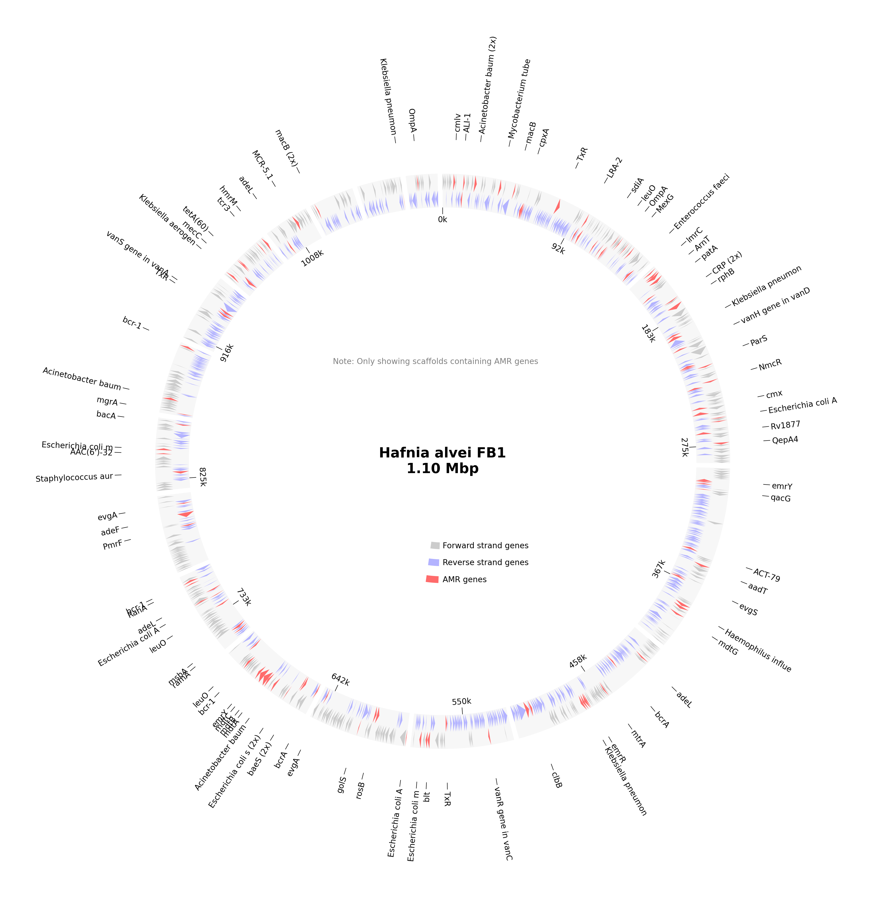

### AAC(6')-32
- **Mechanism**: antibiotic inactivation
- **Drug Classes**: aminoglycoside antibiotic
- **AMR Family**: AAC(6')
- **Locations**:
  - gnl|SPADES|FKHIBMDG_197_23 : position 23845-24447

### ACT-79
- **Mechanism**: antibiotic inactivation
- **Drug Classes**: carbapenem; cephalosporin; cephamycin; penam
- **AMR Family**: ACT beta-lactamase
- **Locations**:
  - gnl|SPADES|FKHIBMDG_41_59 : position 56849-58162

### ALI-1
- **Mechanism**: antibiotic inactivation
- **Drug Classes**: carbapenem
- **AMR Family**: ALI beta-lactamase
- **Locations**:
  - gnl|SPADES|FKHIBMDG_23_14 : position 12655-13533

### Acinetobacter baumannii AbaF (found in 3 locations)
- **Mechanism**: antibiotic efflux
- **Drug Classes**: phosphonic acid antibiotic
- **AMR Family**: major facilitator superfamily (MFS) antibiotic efflux pump
- **Locations**:
  - gnl|SPADES|FKHIBMDG_134_21 : position 26704-28029
  - gnl|SPADES|FKHIBMDG_23_129 : position 125798-127300
  - gnl|SPADES|FKHIBMDG_23_21 : position 20991-22532

### Acinetobacter baumannii AbaQ
- **Mechanism**: antibiotic efflux
- **Drug Classes**: fluoroquinolone antibiotic
- **AMR Family**: major facilitator superfamily (MFS) antibiotic efflux pump
- **Locations**:
  - gnl|SPADES|FKHIBMDG_198_11 : position 9478-10854

### ArnT
- **Mechanism**: antibiotic target alteration
- **Drug Classes**: peptide antibiotic
- **AMR Family**: pmr phosphoethanolamine transferase
- **Locations**:
  - gnl|SPADES|FKHIBMDG_27_8: position 7537-9192

### CRP (found in 2 locations)
- **Mechanism**: antibiotic efflux
- **Drug Classes**: macrolide antibiotic; fluoroquinolone antibiotic; penam
- **AMR Family**: resistance-nodulation-cell division (RND) antibiotic efflux pump
- **Locations**:
  - gnl|SPADES|FKHIBMDG_27_25 : position 24250-24951
  - gnl|SPADES|FKHIBMDG_27_73 : position 81946-82734

### Enterococcus faecium cls conferring resistance to daptomycin
- **Mechanism**: antibiotic target alteration
- **Drug Classes**: peptide antibiotic
- **AMR Family**: daptomycin resistant cls
- **Locations**:
  - gnl|SPADES|FKHIBMDG_23_149 : position 143103-144563

### Escherichia coli AcrAB-TolC with AcrR mutation conferring resistance to ciprofloxacin, tetracycline, and ceftazidime
- **Mechanism**: antibiotic target alteration; antibiotic efflux
- **Drug Classes**: fluoroquinolone antibiotic; cephalosporin; glycylcycline; penam; tetracycline antibiotic; rifamycin antibiotic; phenicol antibiotic; disinfecting agents and antiseptics
- **AMR Family**: resistance-nodulation-cell division (RND) antibiotic efflux pump
- **Locations**:
  - gnl|SPADES|FKHIBMDG_131_1 : position 1-381

### Escherichia coli AcrAB-TolC with MarR mutations conferring resistance to ciprofloxacin and tetracycline (found in 2 locations)
- **Mechanism**: antibiotic target alteration; antibiotic efflux
- **Drug Classes**: fluoroquinolone antibiotic; cephalosporin; glycylcycline; penam; tetracycline antibiotic; rifamycin antibiotic; phenicol antibiotic; disinfecting agents and antiseptics
- **AMR Family**: resistance-nodulation-cell division (RND) antibiotic efflux pump
- **Locations**:
  - gnl|SPADES|FKHIBMDG_156_32 : position 32977-33408
  - gnl|SPADES|FKHIBMDG_27_97 : position 107900-108391

### Escherichia coli mdfA (found in 2 locations)
- **Mechanism**: antibiotic efflux
- **Drug Classes**: tetracycline antibiotic; phenicol antibiotic; disinfecting agents and antiseptics
- **AMR Family**: major facilitator superfamily (MFS) antibiotic efflux pump
- **Locations**:
  - gnl|SPADES|FKHIBMDG_121_61 : position 60360-61592
  - gnl|SPADES|FKHIBMDG_197_25 : position 26457-27671

### Escherichia coli soxS with mutation conferring antibiotic resistance (found in 3 locations)
- **Mechanism**: antibiotic target alteration; antibiotic efflux; reduced permeability to antibiotic
- **Drug Classes**: fluoroquinolone antibiotic; monobactam; carbapenem; cephalosporin; glycylcycline; cephamycin; penam; tetracycline antibiotic; rifamycin antibiotic; phenicol antibiotic; penem; disinfecting agents and antiseptics
- **AMR Family**: ATP-binding cassette (ABC) antibiotic efflux pump; major facilitator superfamily (MFS) antibiotic efflux pump; resistance-nodulation-cell division (RND) antibiotic efflux pump; General Bacterial Porin with reduced permeability to beta-lactams
- **Locations**:
  - gnl|SPADES|FKHIBMDG_134_12 : position 17451-17804
  - gnl|SPADES|FKHIBMDG_134_19 : position 25026-25892
  - gnl|SPADES|FKHIBMDG_23_125 : position 122181-122552

### Haemophilus influenzae PBP3 conferring resistance to beta-lactam antibiotics
- **Mechanism**: antibiotic target alteration
- **Drug Classes**: cephalosporin; cephamycin; penam
- **AMR Family**: Penicillin-binding protein mutations conferring resistance to beta-lactam antibiotics
- **Locations**:
  - gnl|SPADES|FKHIBMDG_41_97 : position 93757-95529

### Helicobacter pylori pbp1 mutants conferring resistance to amoxicillin
- **Mechanism**: antibiotic target alteration
- **Drug Classes**: cephalosporin; cephamycin; penam
- **AMR Family**: Penicillin-binding protein mutations conferring resistance to beta-lactam antibiotics
- **Locations**:
  - gnl|SPADES|FKHIBMDG_49_100 : position 96171-98492

### Klebsiella aerogenes Omp36
- **Mechanism**: reduced permeability to antibiotic
- **Drug Classes**: monobactam; carbapenem; cephalosporin; cephamycin; penam; penem
- **AMR Family**: General Bacterial Porin with reduced permeability to beta-lactams
- **Locations**:
  - gnl|SPADES|FKHIBMDG_280_2 : position 2147-3295

### Klebsiella pneumoniae KpnG
- **Mechanism**: antibiotic efflux
- **Drug Classes**: macrolide antibiotic; fluoroquinolone antibiotic; aminoglycoside antibiotic; carbapenem; cephalosporin; penam; peptide antibiotic; penem
- **AMR Family**: major facilitator superfamily (MFS) antibiotic efflux pump
- **Locations**:
  - gnl|SPADES|FKHIBMDG_49_69 : position 59931-61106

### Klebsiella pneumoniae KpnH
- **Mechanism**: antibiotic efflux
- **Drug Classes**: macrolide antibiotic; fluoroquinolone antibiotic; aminoglycoside antibiotic; carbapenem; cephalosporin; penam; peptide antibiotic; penem
- **AMR Family**: major facilitator superfamily (MFS) antibiotic efflux pump
- **Locations**:
  - gnl|SPADES|FKHIBMDG_49_70: position 61193-62572

### Klebsiella pneumoniae OmpK37 (found in 2 locations)
- **Mechanism**: reduced permeability to antibiotic
- **Drug Classes**: monobactam; carbapenem; cephalosporin; cephamycin; penam; penem
- **AMR Family**: General Bacterial Porin with reduced permeability to beta-lactams
- **Locations**:
  - gnl|SPADES|FKHIBMDG_27_45 : position 44756-45892
  - gnl|SPADES|FKHIBMDG_350_29 : position 28470-28583

### LRA-2
- **Mechanism**: antibiotic inactivation
- **Drug Classes**: cephalosporin; penam
- **AMR Family**: subclass B3 LRA beta-lactamase
- **Locations**:
  - gnl|SPADES|FKHIBMDG_23_93 : position 96381-97223

### MCR-3.4
- **Mechanism**: antibiotic target alteration
- **Drug Classes**: peptide antibiotic
- **AMR Family**: MCR phosphoethanolamine transferase
- **Locations**:
  - gnl|SPADES|FKHIBMDG_41_98 : position 95893-97500

### MCR-5.1
- **Mechanism**: antibiotic target alteration
- **Drug Classes**: peptide antibiotic
- **AMR Family**: MCR phosphoethanolamine transferase
- **Locations**:
  - gnl|SPADES|FKHIBMDG_332_16 : position 19458-21185

### MexG
- **Mechanism**: antibiotic efflux
- **Drug Classes**: fluoroquinolone antibiotic; tetracycline antibiotic; disinfecting agents and antiseptics
- **AMR Family**: resistance-nodulation-cell division (RND) antibiotic efflux pump
- **Locations**:
  - gnl|SPADES|FKHIBMDG_23_134 : position 129970-130386

### Mycobacterium tuberculosis ndh with mutation conferring resistance to isoniazid
- **Mechanism**: antibiotic target alteration
- **Drug Classes**: isoniazid-like antibiotic
- **AMR Family**: antibiotic resistant ndh
- **Locations**:
  - gnl|SPADES|FKHIBMDG_23_37 : position 37512-38843

### NmcR (found in 2 locations)
- **Mechanism**: antibiotic inactivation
- **Drug Classes**: carbapenem; cephalosporin; cephamycin; penam
- **AMR Family**: NmcA beta-lactamase
- **Locations**:
  - gnl|SPADES|FKHIBMDG_23_96 : position 98281-99183
  - gnl|SPADES|FKHIBMDG_27_74 : position 83218-84168

### OmpA (found in 2 locations)
- **Mechanism**: reduced permeability to antibiotic
- **Drug Classes**: peptide antibiotic
- **AMR Family**: General Bacterial Porin with reduced permeability to peptide antibiotics
- **Locations**:
  - gnl|SPADES|FKHIBMDG_23_128 : position 124896-125381
  - gnl|SPADES|FKHIBMDG_490_8 : position 7069-7728

### ParR
- **Mechanism**: antibiotic efflux; reduced permeability to antibiotic
- **Drug Classes**: macrolide antibiotic; fluoroquinolone antibiotic; monobactam; aminoglycoside antibiotic; carbapenem; cephalosporin; cephamycin; penam; tetracycline antibiotic; phenicol antibiotic; penem; disinfecting agents and antiseptics
- **AMR Family**: resistance-nodulation-cell division (RND) antibiotic efflux pump; Outer Membrane Porin (Opr)
- **Locations**:
  - gnl|SPADES|FKHIBMDG_27_63 : position 70029-70742

### ParS
- **Mechanism**: antibiotic efflux; reduced permeability to antibiotic
- **Drug Classes**: macrolide antibiotic; fluoroquinolone antibiotic; monobactam; aminoglycoside antibiotic; carbapenem; cephalosporin; cephamycin; penam; tetracycline antibiotic; phenicol antibiotic; penem; disinfecting agents and antiseptics
- **AMR Family**: resistance-nodulation-cell division (RND) antibiotic efflux pump; Outer Membrane Porin (Opr)
- **Locations**:
  - gnl|SPADES|FKHIBMDG_27_62 : position 68703-70022

### PmrF (found in 2 locations)
- **Mechanism**: antibiotic target alteration
- **Drug Classes**: peptide antibiotic
- **AMR Family**: pmr phosphoethanolamine transferase
- **Locations**:
  - gnl|SPADES|FKHIBMDG_176_35 : position 27496-28407
  - gnl|SPADES|FKHIBMDG_27_5 : position 3625-4641

### QepA4
- **Mechanism**: antibiotic efflux
- **Drug Classes**: fluoroquinolone antibiotic
- **AMR Family**: major facilitator superfamily (MFS) antibiotic efflux pump
- **Locations**:
  - gnl|SPADES|FKHIBMDG_27_113 : position 124449-125744

### RanA
- **Mechanism**: antibiotic efflux
- **Drug Classes**: aminoglycoside antibiotic
- **AMR Family**: ATP-binding cassette (ABC) antibiotic efflux pump
- **Locations**:
  - gnl|SPADES|FKHIBMDG_156_48 : position 47194-47820

### Rv1877
- **Mechanism**: antibiotic efflux
- **Drug Classes**: fluoroquinolone antibiotic
- **AMR Family**: major facilitator superfamily (MFS) antibiotic efflux pump
- **Locations**:
  - gnl|SPADES|FKHIBMDG_27_107 : position 116496-117986

### SatA
- **Mechanism**: antibiotic inactivation
- **Drug Classes**: nucleoside antibiotic
- **AMR Family**: streptothricin acetyltransferase (SAT)
- **Locations**:
  - gnl|SPADES|FKHIBMDG_23_120 : position 117087-117530

### Staphylococcus aureus fusA with mutation conferring resistance to fusidic acid
- **Mechanism**: antibiotic target alteration
- **Drug Classes**: fusidane antibiotic
- **AMR Family**: antibiotic resistant fusA
- **Locations**:
  - gnl|SPADES|FKHIBMDG_197_11 : position 10579-12168

### TxR (found in 4 locations)
- **Mechanism**: antibiotic efflux
- **Drug Classes**: tetracycline antibiotic
- **AMR Family**: ATP-binding cassette (ABC) antibiotic efflux pump
- **Locations**:
  - gnl|SPADES|FKHIBMDG_121_46 : position 43045-44088
  - gnl|SPADES|FKHIBMDG_206_26 : position 25521-26861
  - gnl|SPADES|FKHIBMDG_23_75 : position 77316-79328
  - gnl|SPADES|FKHIBMDG_27_92 : position 102411-104327

### aadT
- **Mechanism**: antibiotic efflux
- **Drug Classes**: macrolide antibiotic; tetracycline antibiotic; disinfecting agents and antiseptics
- **AMR Family**: major facilitator superfamily (MFS) antibiotic efflux pump
- **Locations**:
  - gnl|SPADES|FKHIBMDG_41_66 : position 65216-66682

### abeS
- **Mechanism**: antibiotic efflux
- **Drug Classes**: macrolide antibiotic; aminocoumarin antibiotic
- **AMR Family**: small multidrug resistance (SMR) antibiotic efflux pump
- **Locations**:
  - gnl|SPADES|FKHIBMDG_23_123 : position 120555-120899

### adeF
- **Mechanism**: antibiotic efflux
- **Drug Classes**: fluoroquinolone antibiotic; tetracycline antibiotic
- **AMR Family**: resistance-nodulation-cell division (RND) antibiotic efflux pump
- **Locations**:
  - gnl|SPADES|FKHIBMDG_176_43: position 33713-36859

### adeG
- **Mechanism**: antibiotic efflux
- **Drug Classes**: fluoroquinolone antibiotic; tetracycline antibiotic
- **AMR Family**: resistance-nodulation-cell division (RND) antibiotic efflux pump
- **Locations**:
  - gnl|SPADES|FKHIBMDG_156_34 : position 33914-34687

### adeL (found in 7 locations)
- **Mechanism**: antibiotic efflux
- **Drug Classes**: fluoroquinolone antibiotic; tetracycline antibiotic
- **AMR Family**: resistance-nodulation-cell division (RND) antibiotic efflux pump
- **Locations**:
  - gnl|SPADES|FKHIBMDG_156_37 : position 37029-37937
  - gnl|SPADES|FKHIBMDG_23_15 : position 13661-14557
  - gnl|SPADES|FKHIBMDG_23_98 : position 100596-101537
  - gnl|SPADES|FKHIBMDG_27_112 : position 123384-124280
  - gnl|SPADES|FKHIBMDG_27_66 : position 72849-73742
  - gnl|SPADES|FKHIBMDG_332_7 : position 7043-7969
  - gnl|SPADES|FKHIBMDG_49_15 : position 11555-12436

### arnA
- **Mechanism**: antibiotic target alteration
- **Drug Classes**: peptide antibiotic
- **AMR Family**: pmr phosphoethanolamine transferase
- **Locations**:
  - gnl|SPADES|FKHIBMDG_27_6 : position 4641-6623

### bacA
- **Mechanism**: antibiotic target alteration
- **Drug Classes**: peptide antibiotic
- **AMR Family**: undecaprenyl pyrophosphate related proteins
- **Locations**:
  - gnl|SPADES|FKHIBMDG_197_41 : position 44120-44938

### baeR (found in 2 locations)
- **Mechanism**: antibiotic efflux
- **Drug Classes**: aminoglycoside antibiotic; aminocoumarin antibiotic
- **AMR Family**: resistance-nodulation-cell division (RND) antibiotic efflux pump
- **Locations**:
  - gnl|SPADES|FKHIBMDG_134_31 : position 42372-43103
  - gnl|SPADES|FKHIBMDG_134_8 : position 11350-11991

### baeS (found in 2 locations)
- **Mechanism**: antibiotic efflux
- **Drug Classes**: aminoglycoside antibiotic; aminocoumarin antibiotic
- **AMR Family**: resistance-nodulation-cell division (RND) antibiotic efflux pump
- **Locations**:
  - gnl|SPADES|FKHIBMDG_134_30 : position 40988-42361
  - gnl|SPADES|FKHIBMDG_134_7 : position 9750-11099

### bcr-1 (found in 3 locations)
- **Mechanism**: antibiotic efflux
- **Drug Classes**: bicyclomycin-like antibiotic
- **AMR Family**: major facilitator superfamily (MFS) antibiotic efflux pump
- **Locations**:
  - gnl|SPADES|FKHIBMDG_134_37 : position 49340-50623
  - gnl|SPADES|FKHIBMDG_156_50 : position 48874-50100
  - gnl|SPADES|FKHIBMDG_198_49 : position 45195-46397

### bcrA (found in 3 locations)
- **Mechanism**: antibiotic efflux
- **Drug Classes**: peptide antibiotic
- **AMR Family**: ATP-binding cassette (ABC) antibiotic efflux pump
- **Locations**:
  - gnl|SPADES|FKHIBMDG_134_1 : position 218-1030
  - gnl|SPADES|FKHIBMDG_23_141 : position 134292-135053
  - gnl|SPADES|FKHIBMDG_49_32 : position 28042-28872

### blt
- **Mechanism**: antibiotic efflux
- **Drug Classes**: fluoroquinolone antibiotic; disinfecting agents and antiseptics
- **AMR Family**: major facilitator superfamily (MFS) antibiotic efflux pump
- **Locations**:
  - gnl|SPADES|FKHIBMDG_121_56 : position 54717-56192

### catB9
- **Mechanism**: antibiotic inactivation
- **Drug Classes**: phenicol antibiotic
- **AMR Family**: chloramphenicol acetyltransferase (CAT)
- **Locations**:
  - gnl|SPADES|FKHIBMDG_27_100 : position 110218-110835

### clbB
- **Mechanism**: antibiotic target alteration
- **Drug Classes**: lincosamide antibiotic; streptogramin antibiotic; streptogramin A antibiotic; oxazolidinone antibiotic; phenicol antibiotic; pleuromutilin antibiotic
- **AMR Family**: Cfr 23S ribosomal RNA methyltransferase
- **Locations**:
  - gnl|SPADES|FKHIBMDG_49_98 : position 93889-95160

### cmlv
- **Mechanism**: antibiotic inactivation
- **Drug Classes**: phenicol antibiotic
- **AMR Family**: chloramphenicol phosphotransferase
- **Locations**:
  - gnl|SPADES|FKHIBMDG_23_9 : position 7093-8328

### cmx (found in 2 locations)
- **Mechanism**: antibiotic efflux
- **Drug Classes**: phenicol antibiotic
- **AMR Family**: major facilitator superfamily (MFS) antibiotic efflux pump
- **Locations**:
  - gnl|SPADES|FKHIBMDG_23_97 : position 99284-100492
  - gnl|SPADES|FKHIBMDG_27_90 : position 99115-100353

### cpxA
- **Mechanism**: antibiotic efflux
- **Drug Classes**: aminoglycoside antibiotic; aminocoumarin antibiotic
- **AMR Family**: resistance-nodulation-cell division (RND) antibiotic efflux pump
- **Locations**:
  - gnl|SPADES|FKHIBMDG_23_50 : position 54511-55983

### emrK
- **Mechanism**: antibiotic efflux
- **Drug Classes**: tetracycline antibiotic
- **AMR Family**: major facilitator superfamily (MFS) antibiotic efflux pump
- **Locations**:
  - gnl|SPADES|FKHIBMDG_41_8 : position 9569-10273

### emrR
- **Mechanism**: antibiotic efflux
- **Drug Classes**: fluoroquinolone antibiotic
- **AMR Family**: major facilitator superfamily (MFS) antibiotic efflux pump
- **Locations**:
  - gnl|SPADES|FKHIBMDG_49_67 : position 57896-58414

### emrY (found in 2 locations)
- **Mechanism**: antibiotic efflux
- **Drug Classes**: tetracycline antibiotic
- **AMR Family**: major facilitator superfamily (MFS) antibiotic efflux pump
- **Locations**:
  - gnl|SPADES|FKHIBMDG_134_29 : position 39567-40991
  - gnl|SPADES|FKHIBMDG_41_7 : position 8022-9560

### evgA (found in 2 locations)
- **Mechanism**: antibiotic efflux
- **Drug Classes**: macrolide antibiotic; fluoroquinolone antibiotic; penam; tetracycline antibiotic
- **AMR Family**: major facilitator superfamily (MFS) antibiotic efflux pump; resistance-nodulation-cell division (RND) antibiotic efflux pump
- **Locations**:
  - gnl|SPADES|FKHIBMDG_131_52 : position 59759-60421
  - gnl|SPADES|FKHIBMDG_176_49 : position 43178-43810

### evgS
- **Mechanism**: antibiotic efflux
- **Drug Classes**: macrolide antibiotic; fluoroquinolone antibiotic; penam; tetracycline antibiotic
- **AMR Family**: major facilitator superfamily (MFS) antibiotic efflux pump; resistance-nodulation-cell division (RND) antibiotic efflux pump
- **Locations**:
  - gnl|SPADES|FKHIBMDG_41_80 : position 77979-78368

### gadW
- **Mechanism**: antibiotic efflux
- **Drug Classes**: macrolide antibiotic; fluoroquinolone antibiotic; penam
- **AMR Family**: resistance-nodulation-cell division (RND) antibiotic efflux pump
- **Locations**:
  - gnl|SPADES|FKHIBMDG_41_10 : position 10957-11712

### golS
- **Mechanism**: antibiotic efflux
- **Drug Classes**: monobactam; carbapenem; cephalosporin; cephamycin; penam; phenicol antibiotic; penem
- **AMR Family**: resistance-nodulation-cell division (RND) antibiotic efflux pump
- **Locations**:
  - gnl|SPADES|FKHIBMDG_131_25 : position 31956-32363

### hmrM
- **Mechanism**: antibiotic efflux
- **Drug Classes**: fluoroquinolone antibiotic; disinfecting agents and antiseptics
- **AMR Family**: multidrug and toxic compound extrusion (MATE) transporter
- **Locations**:
  - gnl|SPADES|FKHIBMDG_280_36 : position 33246-34616

### kdpE
- **Mechanism**: antibiotic efflux
- **Drug Classes**: aminoglycoside antibiotic
- **AMR Family**: kdpDE
- **Locations**:
  - gnl|SPADES|FKHIBMDG_23_51 : position 55980-56654

### leuO (found in 3 locations)
- **Mechanism**: antibiotic efflux
- **Drug Classes**: nucleoside antibiotic; disinfecting agents and antiseptics
- **AMR Family**: major facilitator superfamily (MFS) antibiotic efflux pump
- **Locations**:
  - gnl|SPADES|FKHIBMDG_134_41 : position 54271-55230
  - gnl|SPADES|FKHIBMDG_156_23 : position 25105-26001
  - gnl|SPADES|FKHIBMDG_23_122 : position 119320-120267

### lmrC
- **Mechanism**: antibiotic target protection
- **Drug Classes**: lincosamide antibiotic
- **AMR Family**: Miscellaneous ABC-F subfamily ATP-binding cassette ribosomal protection proteins
- **Locations**:
  - gnl|SPADES|FKHIBMDG_27_3 : position 1412-2200

### macB (found in 4 locations)
- **Mechanism**: antibiotic efflux
- **Drug Classes**: macrolide antibiotic
- **AMR Family**: ATP-binding cassette (ABC) antibiotic efflux pump
- **Locations**:
  - gnl|SPADES|FKHIBMDG_23_43 : position 47271-47990
  - gnl|SPADES|FKHIBMDG_27_76 : position 84883-86058
  - gnl|SPADES|FKHIBMDG_341_15 : position 13286-13972
  - gnl|SPADES|FKHIBMDG_341_5 : position 2851-3573

### mdtA
- **Mechanism**: antibiotic efflux
- **Drug Classes**: aminocoumarin antibiotic
- **AMR Family**: resistance-nodulation-cell division (RND) antibiotic efflux pump
- **Locations**:
  - gnl|SPADES|FKHIBMDG_134_26 : position 31873-33168

### mdtB
- **Mechanism**: antibiotic efflux
- **Drug Classes**: aminocoumarin antibiotic
- **AMR Family**: resistance-nodulation-cell division (RND) antibiotic efflux pump
- **Locations**:
  - gnl|SPADES|FKHIBMDG_134_27 : position 33168-36317

### mdtC
- **Mechanism**: antibiotic efflux
- **Drug Classes**: aminocoumarin antibiotic
- **AMR Family**: resistance-nodulation-cell division (RND) antibiotic efflux pump
- **Locations**:
  - gnl|SPADES|FKHIBMDG_134_28 : position 36314-39412

### mdtG
- **Mechanism**: antibiotic efflux
- **Drug Classes**: phosphonic acid antibiotic
- **AMR Family**: major facilitator superfamily (MFS) antibiotic efflux pump
- **Locations**:
  - gnl|SPADES|FKHIBMDG_41_102 : position 101012-102196

### mdtP
- **Mechanism**: antibiotic efflux
- **Drug Classes**: nucleoside antibiotic; disinfecting agents and antiseptics
- **AMR Family**: major facilitator superfamily (MFS) antibiotic efflux pump
- **Locations**:
  - gnl|SPADES|FKHIBMDG_49_68 : position 58449-59906

### mecC
- **Mechanism**: antibiotic target replacement
- **Drug Classes**: penam
- **AMR Family**: methicillin resistant PBP2
- **Locations**:
  - gnl|SPADES|FKHIBMDG_280_7 : position 6119-8032

### mgrA
- **Mechanism**: antibiotic efflux
- **Drug Classes**: fluoroquinolone antibiotic; cephalosporin; penam; tetracycline antibiotic; peptide antibiotic; disinfecting agents and antiseptics
- **AMR Family**: ATP-binding cassette (ABC) antibiotic efflux pump; major facilitator superfamily (MFS) antibiotic efflux pump
- **Locations**:
  - gnl|SPADES|FKHIBMDG_198_2 : position 1276-1719

### msbA
- **Mechanism**: antibiotic efflux
- **Drug Classes**: nitroimidazole antibiotic
- **AMR Family**: ATP-binding cassette (ABC) antibiotic efflux pump
- **Locations**:
  - gnl|SPADES|FKHIBMDG_156_6 : position 5269-6789

### msrC
- **Mechanism**: antibiotic target protection
- **Drug Classes**: macrolide antibiotic; streptogramin antibiotic; streptogramin B antibiotic
- **AMR Family**: msr-type ABC-F protein
- **Locations**:
  - gnl|SPADES|FKHIBMDG_280_13 : position 13165-13755

### mtrA (found in 2 locations)
- **Mechanism**: antibiotic efflux
- **Drug Classes**: macrolide antibiotic; penam
- **AMR Family**: resistance-nodulation-cell division (RND) antibiotic efflux pump
- **Locations**:
  - gnl|SPADES|FKHIBMDG_121_57 : position 56314-57495
  - gnl|SPADES|FKHIBMDG_49_52 : position 44370-45191

### patA
- **Mechanism**: antibiotic efflux
- **Drug Classes**: fluoroquinolone antibiotic
- **AMR Family**: ATP-binding cassette (ABC) antibiotic efflux pump
- **Locations**:
  - gnl|SPADES|FKHIBMDG_27_15 : position 13792-14613

### qacG
- **Mechanism**: antibiotic efflux
- **Drug Classes**: disinfecting agents and antiseptics
- **AMR Family**: small multidrug resistance (SMR) antibiotic efflux pump
- **Locations**:
  - gnl|SPADES|FKHIBMDG_41_14: position 15063-15431

### ramA
- **Mechanism**: antibiotic efflux; reduced permeability to antibiotic
- **Drug Classes**: fluoroquinolone antibiotic; monobactam; carbapenem; cephalosporin; glycylcycline; cephamycin; penam; tetracycline antibiotic; rifamycin antibiotic; phenicol antibiotic; penem; disinfecting agents and antiseptics
- **AMR Family**: resistance-nodulation-cell division (RND) antibiotic efflux pump; General Bacterial Porin with reduced permeability to beta-lactams
- **Locations**:
  - gnl|SPADES|FKHIBMDG_156_4 : position 3135-4076

### rosA
- **Mechanism**: antibiotic efflux
- **Drug Classes**: peptide antibiotic
- **AMR Family**: major facilitator superfamily (MFS) antibiotic efflux pump
- **Locations**:
  - gnl|SPADES|FKHIBMDG_131_19 : position 22983-24206

### rosB
- **Mechanism**: antibiotic efflux
- **Drug Classes**: peptide antibiotic
- **AMR Family**: major facilitator superfamily (MFS) antibiotic efflux pump
- **Locations**:
  - gnl|SPADES|FKHIBMDG_131_18 : position 20945-22630

### rphB
- **Mechanism**: antibiotic inactivation
- **Drug Classes**: rifamycin antibiotic
- **AMR Family**: rifampin phosphotransferase
- **Locations**:
  - gnl|SPADES|FKHIBMDG_27_30 : position 28423-30798

### sdiA
- **Mechanism**: antibiotic efflux
- **Drug Classes**: fluoroquinolone antibiotic; cephalosporin; glycylcycline; penam; tetracycline antibiotic; rifamycin antibiotic; phenicol antibiotic; disinfecting agents and antiseptics
- **AMR Family**: resistance-nodulation-cell division (RND) antibiotic efflux pump
- **Locations**:
  - gnl|SPADES|FKHIBMDG_23_113 : position 111999-112739

### tcr3
- **Mechanism**: antibiotic efflux
- **Drug Classes**: tetracycline antibiotic
- **AMR Family**: major facilitator superfamily (MFS) antibiotic efflux pump
- **Locations**:
  - gnl|SPADES|FKHIBMDG_280_30 : position 28949-29473

### tet(X)
- **Mechanism**: antibiotic inactivation
- **Drug Classes**: glycylcycline; tetracycline antibiotic
- **AMR Family**: tetracycline inactivation enzyme
- **Locations**:
  - gnl|SPADES|FKHIBMDG_27_46 : position 46242-48293

### tetA(60)
- **Mechanism**: antibiotic efflux
- **Drug Classes**: tetracycline antibiotic
- **AMR Family**: ATP-binding cassette (ABC) antibiotic efflux pump
- **Locations**:
  - gnl|SPADES|FKHIBMDG_280_12 : position 12347-13165

### vanH gene in vanD cluster
- **Mechanism**: antibiotic target alteration
- **Drug Classes**: glycopeptide antibiotic
- **AMR Family**: vanH; glycopeptide resistance gene cluster
- **Locations**:
  - gnl|SPADES|FKHIBMDG_27_53 : position 55552-56544

### vanR gene in vanC cluster
- **Mechanism**: antibiotic target alteration
- **Drug Classes**: glycopeptide antibiotic
- **AMR Family**: glycopeptide resistance gene cluster; vanR
- **Locations**:
  - gnl|SPADES|FKHIBMDG_121_15 : position 15060-16025

### vanR gene in vanF cluster
- **Mechanism**: antibiotic target alteration
- **Drug Classes**: glycopeptide antibiotic
- **AMR Family**: glycopeptide resistance gene cluster; vanR
- **Locations**:
  - gnl|SPADES|FKHIBMDG_41_81 : position 78404-79456

### vanS gene in vanA cluster
- **Mechanism**: antibiotic target alteration
- **Drug Classes**: glycopeptide antibiotic
- **AMR Family**: vanS; glycopeptide resistance gene cluster
- **Locations**:
  - gnl|SPADES|FKHIBMDG_206_28 : position 27696-29132

## Hafnia paralvei
**Strain Statistics:**
- Total genome length: 4696.5 kbp
- Total scaffolds: 148
- Scaffolds with AMR genes: 63
- Total genes annotated: 8573
- Total AMR genes: 453
- Unique AMR genes: 211
- Distinct AMR mechanisms: 11
- Distinct AMR families: 73
- Distinct drug classes: 37

**Circos Plot:**

### AAC(6')-32
- **Mechanism**: antibiotic inactivation
- **Drug Classes**: aminoglycoside antibiotic
- **AMR Family**: AAC(6')
- **Locations**:
  - gnl|SPADES|FKHIBMDG_16_150 : position 160970-161572

### AAC(6')-Iu
- **Mechanism**: antibiotic inactivation
- **Drug Classes**: aminoglycoside antibiotic
- **AMR Family**: AAC(6')
- **Locations**:
  - gnl|SPADES|FKHIBMDG_44_77 : position 80680-81138

### ACC-1a
- **Mechanism**: antibiotic inactivation
- **Drug Classes**: monobactam; cephalosporin; cephamycin; penam; oxacephem
- **AMR Family**: ACC beta-lactamase
- **Locations**:
  - gnl|SPADES|FKHIBMDG_59_3: position 3734-4906

### ALI-2
- **Mechanism**: antibiotic inactivation
- **Drug Classes**: carbapenem
- **AMR Family**: ALI beta-lactamase
- **Locations**:
  - gnl|SPADES|FKHIBMDG_47_53 : position 53633-54511

### APH(6)-Ic
- **Mechanism**: antibiotic inactivation
- **Drug Classes**: aminoglycoside antibiotic
- **AMR Family**: APH(6)
- **Locations**:
  - gnl|SPADES|FKHIBMDG_16_29 : position 27415-28218

### Acinetobacter baumannii AbaF (found in 7 locations)
- **Mechanism**: antibiotic efflux
- **Drug Classes**: phosphonic acid antibiotic
- **AMR Family**: major facilitator superfamily (MFS) antibiotic efflux pump
- **Locations**:
  - gnl|SPADES|FKHIBMDG_12_136 : position 139485-140987
  - gnl|SPADES|FKHIBMDG_13_55 : position 53411-54913
  - gnl|SPADES|FKHIBMDG_262_28 : position 32050-33279
  - gnl|SPADES|FKHIBMDG_28_50 : position 61891-63216
  - gnl|SPADES|FKHIBMDG_47_61 : position 61986-63527
  - gnl|SPADES|FKHIBMDG_68_55 : position 62714-64048
  - gnl|SPADES|FKHIBMDG_8_224 : position 257313-258614

### Acinetobacter baumannii AbaQ (found in 7 locations)
- **Mechanism**: antibiotic efflux
- **Drug Classes**: fluoroquinolone antibiotic
- **AMR Family**: major facilitator superfamily (MFS) antibiotic efflux pump
- **Locations**:
  - gnl|SPADES|FKHIBMDG_163_39 : position 38789-40084
  - gnl|SPADES|FKHIBMDG_32_47 : position 44459-45835
  - gnl|SPADES|FKHIBMDG_44_57 : position 60645-61937
  - gnl|SPADES|FKHIBMDG_65_7 : position 8628-9956
  - gnl|SPADES|FKHIBMDG_8_16 : position 15908-17245
  - gnl|SPADES|FKHIBMDG_8_177 : position 194246-195592
  - gnl|SPADES|FKHIBMDG_8_98 : position 110512-111735

### AcrE
- **Mechanism**: antibiotic efflux
- **Drug Classes**: fluoroquinolone antibiotic; cephalosporin; cephamycin; penam
- **AMR Family**: resistance-nodulation-cell division (RND) antibiotic efflux pump
- **Locations**:
  - gnl|SPADES|FKHIBMDG_20_102 : position 109065-110228

### AcrF
- **Mechanism**: antibiotic efflux
- **Drug Classes**: fluoroquinolone antibiotic; cephalosporin; cephamycin; penam
- **AMR Family**: resistance-nodulation-cell division (RND) antibiotic efflux pump
- **Locations**:
  - gnl|SPADES|FKHIBMDG_20_103 : position 110267-113389

### Agrobacterium fabrum chloramphenicol acetyltransferase
- **Mechanism**: antibiotic inactivation
- **Drug Classes**: phenicol antibiotic
- **AMR Family**: chloramphenicol acetyltransferase (CAT)
- **Locations**:
  - gnl|SPADES|FKHIBMDG_152_13 : position 14709-15263

### ArnT
- **Mechanism**: antibiotic target alteration
- **Drug Classes**: peptide antibiotic
- **AMR Family**: pmr phosphoethanolamine transferase
- **Locations**:
  - gnl|SPADES|FKHIBMDG_654_9: position 7783-9432

### Bifidobacterium bifidum ileS conferring resistance to mupirocin
- **Mechanism**: antibiotic target alteration
- **Drug Classes**: mupirocin-like antibiotic
- **AMR Family**: antibiotic-resistant isoleucyl-tRNA synthetase (ileS)
- **Locations**:
  - gnl|SPADES|FKHIBMDG_20_132 : position 139683-142265

### CRP (found in 2 locations)
- **Mechanism**: antibiotic efflux
- **Drug Classes**: macrolide antibiotic; fluoroquinolone antibiotic; penam
- **AMR Family**: resistance-nodulation-cell division (RND) antibiotic efflux pump
- **Locations**:
  - gnl|SPADES|FKHIBMDG_345_13 : position 13472-14269
  - gnl|SPADES|FKHIBMDG_50_75: position 87389-88021

### Clostridioides difficile gyrA conferring resistance to fluoroquinolones
- **Mechanism**: antibiotic target alteration
- **Drug Classes**: fluoroquinolone antibiotic
- **AMR Family**: fluoroquinolone resistant gyrA
- **Locations**:
  - gnl|SPADES|FKHIBMDG_1034_2 : position 1368-4016

### Clostridioides difficile gyrB conferring resistance to fluoroquinolones (found in 2 locations)
- **Mechanism**: antibiotic target alteration
- **Drug Classes**: fluoroquinolone antibiotic
- **AMR Family**: fluoroquinolone resistant gyrB
- **Locations**:
  - gnl|SPADES|FKHIBMDG_106_52 : position 59994-61889
  - gnl|SPADES|FKHIBMDG_44_49 : position 52632-55046

### D-Ala-D-Ala ligase
- **Mechanism**: antibiotic target alteration
- **Drug Classes**: glycopeptide antibiotic
- **AMR Family**: Van ligase
- **Locations**:
  - gnl|SPADES|FKHIBMDG_46_69 : position 87453-88373

### EVM-1
- **Mechanism**: antibiotic inactivation
- **Drug Classes**: carbapenem
- **AMR Family**: EVM beta-lactamase
- **Locations**:
  - gnl|SPADES|FKHIBMDG_5_174 : position 211667-212488

### Enterobacter cloacae acrA
- **Mechanism**: antibiotic efflux
- **Drug Classes**: fluoroquinolone antibiotic; cephalosporin; glycylcycline; penam; tetracycline antibiotic; rifamycin antibiotic; phenicol antibiotic; disinfecting agents and antiseptics
- **AMR Family**: resistance-nodulation-cell division (RND) antibiotic efflux pump
- **Locations**:
  - gnl|SPADES|FKHIBMDG_220_20 : position 20102-21292

### Enterococcus faecium cls conferring resistance to daptomycin (found in 2 locations)
- **Mechanism**: antibiotic target alteration
- **Drug Classes**: peptide antibiotic
- **AMR Family**: daptomycin resistant cls
- **Locations**:
  - gnl|SPADES|FKHIBMDG_12_156 : position 157064-158524
  - gnl|SPADES|FKHIBMDG_13_35 : position 35874-37334

### ErmX
- **Mechanism**: antibiotic target alteration
- **Drug Classes**: macrolide antibiotic; lincosamide antibiotic; streptogramin antibiotic; streptogramin A antibiotic; streptogramin B antibiotic
- **AMR Family**: Erm 23S ribosomal RNA methyltransferase
- **Locations**:
  - gnl|SPADES|FKHIBMDG_68_13 : position 14956-15768

### Escherichia coli AcrAB-TolC with AcrR mutation conferring resistance to ciprofloxacin, tetracycline, and ceftazidime
- **Mechanism**: antibiotic target alteration; antibiotic efflux
- **Drug Classes**: fluoroquinolone antibiotic; cephalosporin; glycylcycline; penam; tetracycline antibiotic; rifamycin antibiotic; phenicol antibiotic; disinfecting agents and antiseptics
- **AMR Family**: resistance-nodulation-cell division (RND) antibiotic efflux pump
- **Locations**:
  - gnl|SPADES|FKHIBMDG_220_21 : position 21432-22136

### Escherichia coli AcrAB-TolC with MarR mutations conferring resistance to ciprofloxacin and tetracycline (found in 2 locations)
- **Mechanism**: antibiotic target alteration; antibiotic efflux
- **Drug Classes**: fluoroquinolone antibiotic; cephalosporin; glycylcycline; penam; tetracycline antibiotic; rifamycin antibiotic; phenicol antibiotic; disinfecting agents and antiseptics
- **AMR Family**: resistance-nodulation-cell division (RND) antibiotic efflux pump
- **Locations**:
  - gnl|SPADES|FKHIBMDG_22_109 : position 116944-117375
  - gnl|SPADES|FKHIBMDG_345_22 : position 23413-23904

### Escherichia coli EF-Tu mutants conferring resistance to Enacyloxin IIa
- **Mechanism**: antibiotic target alteration
- **Drug Classes**: elfamycin antibiotic
- **AMR Family**: elfamycin resistant EF-Tu
- **Locations**:
  - gnl|SPADES|FKHIBMDG_16_64 : position 64724-67426

### Escherichia coli EF-Tu mutants conferring resistance to Pulvomycin (found in 2 locations)
- **Mechanism**: antibiotic target alteration
- **Drug Classes**: elfamycin antibiotic
- **AMR Family**: elfamycin resistant EF-Tu
- **Locations**:
  - gnl|SPADES|FKHIBMDG_327_48 : position 27828-29012
  - gnl|SPADES|FKHIBMDG_539_7 : position 6063-7247

### Escherichia coli PtsI with mutation conferring resistance to fosfomycin
- **Mechanism**: antibiotic target alteration
- **Drug Classes**: phosphonic acid antibiotic
- **AMR Family**: antibiotic-resistant ptsI phosphotransferase
- **Locations**:
  - gnl|SPADES|FKHIBMDG_91_58 : position 61075-62802

### Escherichia coli acrA
- **Mechanism**: antibiotic efflux
- **Drug Classes**: fluoroquinolone antibiotic; cephalosporin; glycylcycline; penam; tetracycline antibiotic; rifamycin antibiotic; phenicol antibiotic; disinfecting agents and antiseptics
- **AMR Family**: resistance-nodulation-cell division (RND) antibiotic efflux pump
- **Locations**:
  - gnl|SPADES|FKHIBMDG_199_32 : position 36511-37698

### Escherichia coli mdfA (found in 2 locations)
- **Mechanism**: antibiotic efflux
- **Drug Classes**: tetracycline antibiotic; phenicol antibiotic; disinfecting agents and antiseptics
- **AMR Family**: major facilitator superfamily (MFS) antibiotic efflux pump
- **Locations**:
  - gnl|SPADES|FKHIBMDG_16_148 : position 157686-158906
  - gnl|SPADES|FKHIBMDG_326_13 : position 16114-17346

### Escherichia coli soxS with mutation conferring antibiotic resistance (found in 5 locations)
- **Mechanism**: antibiotic target alteration; antibiotic efflux; reduced permeability to antibiotic
- **Drug Classes**: fluoroquinolone antibiotic; monobactam; carbapenem; cephalosporin; glycylcycline; cephamycin; penam; tetracycline antibiotic; rifamycin antibiotic; phenicol antibiotic; penem; disinfecting agents and antiseptics
- **AMR Family**: ATP-binding cassette (ABC) antibiotic efflux pump; major facilitator superfamily (MFS) antibiotic efflux pump; resistance-nodulation-cell division (RND) antibiotic efflux pump; General Bacterial Porin with reduced permeability to beta-lactams
- **Locations**:
  - gnl|SPADES|FKHIBMDG_12_131 : position 135731-136102
  - gnl|SPADES|FKHIBMDG_13_60 : position 58296-58667
  - gnl|SPADES|FKHIBMDG_20_110 : position 119876-120697
  - gnl|SPADES|FKHIBMDG_59_69 : position 84465-85328
  - gnl|SPADES|FKHIBMDG_87_9 : position 7333-8211

### Escherichia coli uhpA with mutation conferring resistance to fosfomycin
- **Mechanism**: antibiotic target alteration
- **Drug Classes**: phosphonic acid antibiotic
- **AMR Family**: antibiotic-resistant UhpT
- **Locations**:
  - gnl|SPADES|FKHIBMDG_656_9 : position 10199-10915

### FosC2
- **Mechanism**: antibiotic inactivation
- **Drug Classes**: phosphonic acid antibiotic
- **AMR Family**: fosC phosphotransferase family
- **Locations**:
  - gnl|SPADES|FKHIBMDG_78_21 : position 20539-21003

### H-NS
- **Mechanism**: antibiotic efflux
- **Drug Classes**: macrolide antibiotic; fluoroquinolone antibiotic; cephalosporin; cephamycin; penam; tetracycline antibiotic
- **AMR Family**: major facilitator superfamily (MFS) antibiotic efflux pump; resistance-nodulation-cell division (RND) antibiotic efflux pump
- **Locations**:
  - gnl|SPADES|FKHIBMDG_82_1 : position 295-702

### Haemophilus influenzae PBP3 conferring resistance to beta-lactam antibiotics (found in 2 locations)
- **Mechanism**: antibiotic target alteration
- **Drug Classes**: cephalosporin; cephamycin; penam
- **AMR Family**: Penicillin-binding protein mutations conferring resistance to beta-lactam antibiotics
- **Locations**:
  - gnl|SPADES|FKHIBMDG_135_59 : position 51663-53435
  - gnl|SPADES|FKHIBMDG_46_77 : position 97514-99277

### Helicobacter pylori pbp1 mutants conferring resistance to amoxicillin (found in 2 locations)
- **Mechanism**: antibiotic target alteration
- **Drug Classes**: cephalosporin; cephamycin; penam
- **AMR Family**: Penicillin-binding protein mutations conferring resistance to beta-lactam antibiotics
- **Locations**:
  - gnl|SPADES|FKHIBMDG_15_128 : position 134567-136840
  - gnl|SPADES|FKHIBMDG_46_25 : position 33907-36486

### Helicobacter pylori pbp2 mutants conferring resistance to amoxicillin
- **Mechanism**: antibiotic target alteration
- **Drug Classes**: cephalosporin; cephamycin; penam
- **AMR Family**: Penicillin-binding protein mutations conferring resistance to beta-lactam antibiotics
- **Locations**:
  - gnl|SPADES|FKHIBMDG_20_126 : position 134299-136194

### Helicobacter pylori rpoB mutation conferring resistance to rifampicin
- **Mechanism**: antibiotic target alteration; antibiotic target replacement
- **Drug Classes**: fluoroquinolone antibiotic; rifamycin antibiotic
- **AMR Family**: rifamycin-resistant beta-subunit of RNA polymerase (rpoB)
- **Locations**:
  - gnl|SPADES|FKHIBMDG_539_15 : position 15537-18368

### Klebsiella aerogenes Omp36 (found in 2 locations)
- **Mechanism**: reduced permeability to antibiotic
- **Drug Classes**: monobactam; carbapenem; cephalosporin; cephamycin; penam; penem
- **AMR Family**: General Bacterial Porin with reduced permeability to beta-lactams
- **Locations**:
  - gnl|SPADES|FKHIBMDG_12_184 : position 185132-186280
  - gnl|SPADES|FKHIBMDG_13_7 : position 8118-9266

### Klebsiella pneumoniae KpnE (found in 2 locations)
- **Mechanism**: antibiotic efflux
- **Drug Classes**: macrolide antibiotic; aminoglycoside antibiotic; cephalosporin; tetracycline antibiotic; peptide antibiotic; rifamycin antibiotic; disinfecting agents and antiseptics
- **AMR Family**: small multidrug resistance (SMR) antibiotic efflux pump
- **Locations**:
  - gnl|SPADES|FKHIBMDG_12_40 : position 44166-44597
  - gnl|SPADES|FKHIBMDG_13_151 : position 149801-150232

### Klebsiella pneumoniae KpnF (found in 2 locations)
- **Mechanism**: antibiotic efflux
- **Drug Classes**: macrolide antibiotic; aminoglycoside antibiotic; cephalosporin; tetracycline antibiotic; peptide antibiotic; rifamycin antibiotic; disinfecting agents and antiseptics
- **AMR Family**: small multidrug resistance (SMR) antibiotic efflux pump
- **Locations**:
  - gnl|SPADES|FKHIBMDG_12_41: position 44584-44913
  - gnl|SPADES|FKHIBMDG_13_150: position 149485-149814

### Klebsiella pneumoniae KpnG
- **Mechanism**: antibiotic efflux
- **Drug Classes**: macrolide antibiotic; fluoroquinolone antibiotic; aminoglycoside antibiotic; carbapenem; cephalosporin; penam; peptide antibiotic; penem
- **AMR Family**: major facilitator superfamily (MFS) antibiotic efflux pump
- **Locations**:
  - gnl|SPADES|FKHIBMDG_15_92 : position 89404-90579

### Klebsiella pneumoniae KpnH (found in 2 locations)
- **Mechanism**: antibiotic efflux
- **Drug Classes**: macrolide antibiotic; fluoroquinolone antibiotic; aminoglycoside antibiotic; carbapenem; cephalosporin; penam; peptide antibiotic; penem
- **AMR Family**: major facilitator superfamily (MFS) antibiotic efflux pump
- **Locations**:
  - gnl|SPADES|FKHIBMDG_15_93: position 90597-92132
  - gnl|SPADES|FKHIBMDG_44_2 : position 1107-2546

### Klebsiella pneumoniae OmpK37 (found in 6 locations)
- **Mechanism**: reduced permeability to antibiotic
- **Drug Classes**: monobactam; carbapenem; cephalosporin; cephamycin; penam; penem
- **AMR Family**: General Bacterial Porin with reduced permeability to beta-lactams
- **Locations**:
  - gnl|SPADES|FKHIBMDG_22_60 : position 67816-68928
  - gnl|SPADES|FKHIBMDG_46_24 : position 32586-33725
  - gnl|SPADES|FKHIBMDG_47_84 : position 84409-85512
  - gnl|SPADES|FKHIBMDG_5_70 : position 86373-87488
  - gnl|SPADES|FKHIBMDG_65_50 : position 59686-60828
  - gnl|SPADES|FKHIBMDG_87_66 : position 68572-69672

### Klebsiella pneumoniae acrR with mutation conferring multidrug antibiotic resistance
- **Mechanism**: antibiotic target alteration; antibiotic efflux
- **Drug Classes**: fluoroquinolone antibiotic; cephalosporin; glycylcycline; penam; tetracycline antibiotic; rifamycin antibiotic; phenicol antibiotic; disinfecting agents and antiseptics
- **AMR Family**: resistance-nodulation-cell division (RND) antibiotic efflux pump
- **Locations**:
  - gnl|SPADES|FKHIBMDG_20_101 : position 107858-108472

### LRA-19
- **Mechanism**: antibiotic inactivation
- **Drug Classes**: cephalosporin; penam
- **AMR Family**: subclass B3 LRA beta-lactamase
- **Locations**:
  - gnl|SPADES|FKHIBMDG_5_72 : position 89049-89696

### LlmA 23S ribosomal RNA methyltransferase
- **Mechanism**: antibiotic target alteration
- **Drug Classes**: lincosamide antibiotic
- **AMR Family**: Llm 23S ribosomal RNA methyltransferase
- **Locations**:
  - gnl|SPADES|FKHIBMDG_5_41 : position 50259-51452

### LptD
- **Mechanism**: antibiotic efflux
- **Drug Classes**: carbapenem; peptide antibiotic; aminocoumarin antibiotic; rifamycin antibiotic
- **AMR Family**: ATP-binding cassette (ABC) antibiotic efflux pump
- **Locations**:
  - gnl|SPADES|FKHIBMDG_68_10 : position 10157-12559

### MCR-10.4
- **Mechanism**: antibiotic target alteration
- **Drug Classes**: peptide antibiotic
- **AMR Family**: MCR phosphoethanolamine transferase
- **Locations**:
  - gnl|SPADES|FKHIBMDG_93_45 : position 46478-48112

### MCR-3.4
- **Mechanism**: antibiotic target alteration
- **Drug Classes**: peptide antibiotic
- **AMR Family**: MCR phosphoethanolamine transferase
- **Locations**:
  - gnl|SPADES|FKHIBMDG_135_58 : position 49691-51298

### MCR-3.41
- **Mechanism**: antibiotic target alteration
- **Drug Classes**: peptide antibiotic
- **AMR Family**: MCR phosphoethanolamine transferase
- **Locations**:
  - gnl|SPADES|FKHIBMDG_228_19 : position 17159-18781

### MCR-5.1
- **Mechanism**: antibiotic target alteration
- **Drug Classes**: peptide antibiotic
- **AMR Family**: MCR phosphoethanolamine transferase
- **Locations**:
  - gnl|SPADES|FKHIBMDG_289_12 : position 12435-14162

### MdtK
- **Mechanism**: antibiotic efflux
- **Drug Classes**: fluoroquinolone antibiotic
- **AMR Family**: multidrug and toxic compound extrusion (MATE) transporter
- **Locations**:
  - gnl|SPADES|FKHIBMDG_20_94 : position 100230-101687

### MdtQ
- **Mechanism**: reduced permeability to antibiotic
- **Drug Classes**: monobactam; carbapenem; cephalosporin; cephamycin; penam; penem
- **AMR Family**: Outer Membrane Porin (Opr)
- **Locations**:
  - gnl|SPADES|FKHIBMDG_5_14 : position 12521-14026

### MexG (found in 2 locations)
- **Mechanism**: antibiotic efflux
- **Drug Classes**: fluoroquinolone antibiotic; tetracycline antibiotic; disinfecting agents and antiseptics
- **AMR Family**: resistance-nodulation-cell division (RND) antibiotic efflux pump
- **Locations**:
  - gnl|SPADES|FKHIBMDG_12_141 : position 143657-144073
  - gnl|SPADES|FKHIBMDG_13_50 : position 50325-50741

### MexS (found in 6 locations)
- **Mechanism**: antibiotic efflux
- **Drug Classes**: fluoroquinolone antibiotic; diaminopyrimidine antibiotic; phenicol antibiotic
- **AMR Family**: resistance-nodulation-cell division (RND) antibiotic efflux pump
- **Locations**:
  - gnl|SPADES|FKHIBMDG_28_35 : position 40431-41450
  - gnl|SPADES|FKHIBMDG_32_124 : position 123358-124389
  - gnl|SPADES|FKHIBMDG_33_116 : position 129307-130293
  - gnl|SPADES|FKHIBMDG_78_25 : position 24431-25555
  - gnl|SPADES|FKHIBMDG_87_17 : position 15657-16658
  - gnl|SPADES|FKHIBMDG_8_138 : position 162544-163521

### MexT
- **Mechanism**: antibiotic efflux
- **Drug Classes**: fluoroquinolone antibiotic; diaminopyrimidine antibiotic; phenicol antibiotic
- **AMR Family**: resistance-nodulation-cell division (RND) antibiotic efflux pump
- **Locations**:
  - gnl|SPADES|FKHIBMDG_8_58 : position 61995-62888

### MexV
- **Mechanism**: antibiotic efflux
- **Drug Classes**: macrolide antibiotic; fluoroquinolone antibiotic; tetracycline antibiotic; phenicol antibiotic; disinfecting agents and antiseptics
- **AMR Family**: resistance-nodulation-cell division (RND) antibiotic efflux pump
- **Locations**:
  - gnl|SPADES|FKHIBMDG_578_4 : position 2566-4083

### MexZ
- **Mechanism**: antibiotic efflux
- **Drug Classes**: macrolide antibiotic; fluoroquinolone antibiotic; aminoglycoside antibiotic; carbapenem; cephalosporin; cephamycin; penam; tetracycline antibiotic; phenicol antibiotic; disinfecting agents and antiseptics
- **AMR Family**: resistance-nodulation-cell division (RND) antibiotic efflux pump
- **Locations**:
  - gnl|SPADES|FKHIBMDG_106_4 : position 1943-2548

### Mycobacterium tuberculosis gidB mutation conferring resistance to streptomycin
- **Mechanism**: antibiotic target alteration
- **Drug Classes**: aminoglycoside antibiotic
- **AMR Family**: antibiotic resistant gidB
- **Locations**:
  - gnl|SPADES|FKHIBMDG_44_16 : position 18287-18907

### Mycobacterium tuberculosis ndh with mutation conferring resistance to isoniazid (found in 2 locations)
- **Mechanism**: antibiotic target alteration
- **Drug Classes**: isoniazid-like antibiotic
- **AMR Family**: antibiotic resistant ndh
- **Locations**:
  - gnl|SPADES|FKHIBMDG_12_66 : position 68994-70298
  - gnl|SPADES|FKHIBMDG_13_125 : position 124100-125404

### Mycobacterium tuberculosis pncA mutations conferring resistance to pyrazinamide
- **Mechanism**: antibiotic target alteration
- **Drug Classes**: pyrazine antibiotic
- **AMR Family**: Pyrazinamide resistant pncA
- **Locations**:
  - gnl|SPADES|FKHIBMDG_47_93 : position 95404-96039

### Mycobacterium tuberculosis rpoB mutations conferring resistance to rifampicin
- **Mechanism**: antibiotic target alteration; antibiotic target replacement
- **Drug Classes**: rifamycin antibiotic
- **AMR Family**: rifamycin-resistant beta-subunit of RNA polymerase (rpoB)
- **Locations**:
  - gnl|SPADES|FKHIBMDG_539_14 : position 11366-15394

### Mycobacterium tuberculosis rpsA mutations conferring resistance to pyrazinamide
- **Mechanism**: antibiotic target alteration
- **Drug Classes**: pyrazine antibiotic
- **AMR Family**: pyrazinamide resistant rpsA
- **Locations**:
  - gnl|SPADES|FKHIBMDG_5_97 : position 120271-121950

### Mycobacterium tuberculosis thyA with mutation conferring resistance to para-aminosalicylic acid
- **Mechanism**: antibiotic target alteration
- **Drug Classes**: salicylic acid antibiotic
- **AMR Family**: aminosalicylate resistant thymidylate synthase
- **Locations**:
  - gnl|SPADES|FKHIBMDG_46_11 : position 17207-18001

### NmcR (found in 9 locations)
- **Mechanism**: antibiotic inactivation
- **Drug Classes**: carbapenem; cephalosporin; cephamycin; penam
- **AMR Family**: NmcA beta-lactamase
- **Locations**:
  - gnl|SPADES|FKHIBMDG_152_27 : position 31234-32193
  - gnl|SPADES|FKHIBMDG_22_26 : position 34706-35680
  - gnl|SPADES|FKHIBMDG_262_31 : position 35652-36479
  - gnl|SPADES|FKHIBMDG_55_65 : position 71281-72174
  - gnl|SPADES|FKHIBMDG_55_77 : position 86308-87180
  - gnl|SPADES|FKHIBMDG_56_57 : position 73847-74743
  - gnl|SPADES|FKHIBMDG_65_22 : position 21987-22892
  - gnl|SPADES|FKHIBMDG_8_102 : position 115602-116531
  - gnl|SPADES|FKHIBMDG_911_9 : position 7817-8728

### OmpA (found in 5 locations)
- **Mechanism**: reduced permeability to antibiotic
- **Drug Classes**: peptide antibiotic
- **AMR Family**: General Bacterial Porin with reduced permeability to peptide antibiotics
- **Locations**:
  - gnl|SPADES|FKHIBMDG_126_56 : position 63989-64504
  - gnl|SPADES|FKHIBMDG_12_135 : position 138421-138912
  - gnl|SPADES|FKHIBMDG_13_56 : position 55486-55977
  - gnl|SPADES|FKHIBMDG_44_73 : position 77630-78289
  - gnl|SPADES|FKHIBMDG_5_51 : position 60511-61569

### OprM
- **Mechanism**: antibiotic efflux
- **Drug Classes**: macrolide antibiotic; fluoroquinolone antibiotic; monobactam; aminoglycoside antibiotic; carbapenem; cephalosporin; cephamycin; penam; tetracycline antibiotic; peptide antibiotic; aminocoumarin antibiotic; diaminopyrimidine antibiotic; sulfonamide antibiotic; phenicol antibiotic; penem; disinfecting agents and antiseptics
- **AMR Family**: resistance-nodulation-cell division (RND) antibiotic efflux pump
- **Locations**:
  - gnl|SPADES|FKHIBMDG_128_35 : position 39905-41266

### ParR (found in 2 locations)
- **Mechanism**: antibiotic efflux; reduced permeability to antibiotic
- **Drug Classes**: macrolide antibiotic; fluoroquinolone antibiotic; monobactam; aminoglycoside antibiotic; carbapenem; cephalosporin; cephamycin; penam; tetracycline antibiotic; phenicol antibiotic; penem; disinfecting agents and antiseptics
- **AMR Family**: resistance-nodulation-cell division (RND) antibiotic efflux pump; Outer Membrane Porin (Opr)
- **Locations**:
  - gnl|SPADES|FKHIBMDG_50_36 : position 42383-43102
  - gnl|SPADES|FKHIBMDG_65_30 : position 32574-33287

### ParS (found in 2 locations)
- **Mechanism**: antibiotic efflux; reduced permeability to antibiotic
- **Drug Classes**: macrolide antibiotic; fluoroquinolone antibiotic; monobactam; aminoglycoside antibiotic; carbapenem; cephalosporin; cephamycin; penam; tetracycline antibiotic; phenicol antibiotic; penem; disinfecting agents and antiseptics
- **AMR Family**: resistance-nodulation-cell division (RND) antibiotic efflux pump; Outer Membrane Porin (Opr)
- **Locations**:
  - gnl|SPADES|FKHIBMDG_106_12 : position 7570-9231
  - gnl|SPADES|FKHIBMDG_65_31 : position 33294-34622

### Planobispora rosea EF-Tu mutants conferring resistance to inhibitor GE2270A
- **Mechanism**: antibiotic target alteration
- **Drug Classes**: elfamycin antibiotic
- **AMR Family**: elfamycin resistant EF-Tu
- **Locations**:
  - gnl|SPADES|FKHIBMDG_8_118 : position 136326-138194

### PmrF
- **Mechanism**: antibiotic target alteration
- **Drug Classes**: peptide antibiotic
- **AMR Family**: pmr phosphoethanolamine transferase
- **Locations**:
  - gnl|SPADES|FKHIBMDG_654_6 : position 3871-4887

### Pseudomonas aeruginosa CpxR
- **Mechanism**: antibiotic efflux
- **Drug Classes**: macrolide antibiotic; fluoroquinolone antibiotic; monobactam; aminoglycoside antibiotic; carbapenem; cephalosporin; cephamycin; penam; tetracycline antibiotic; peptide antibiotic; aminocoumarin antibiotic; diaminopyrimidine antibiotic; sulfonamide antibiotic; phenicol antibiotic; penem
- **AMR Family**: resistance-nodulation-cell division (RND) antibiotic efflux pump
- **Locations**:
  - gnl|SPADES|FKHIBMDG_228_30 : position 28370-29068

### Pseudomonas aeruginosa ampR with mutation conferring resistance to aztreonam (found in 3 locations)
- **Mechanism**: antibiotic target alteration; antibiotic inactivation
- **Drug Classes**: monobactam; carbapenem; cephalosporin
- **AMR Family**: PDC beta-lactamase; ampR transcriptional regulator with mutation conferring resistance to monobactam antibiotics
- **Locations**:
  - gnl|SPADES|FKHIBMDG_163_27 : position 25832-26779
  - gnl|SPADES|FKHIBMDG_340_24 : position 23453-24370
  - gnl|SPADES|FKHIBMDG_59_4 : position 5121-5987

### QepA2
- **Mechanism**: antibiotic efflux
- **Drug Classes**: fluoroquinolone antibiotic
- **AMR Family**: major facilitator superfamily (MFS) antibiotic efflux pump
- **Locations**:
  - gnl|SPADES|FKHIBMDG_55_35 : position 34177-35583

### QepA4
- **Mechanism**: antibiotic efflux
- **Drug Classes**: fluoroquinolone antibiotic
- **AMR Family**: major facilitator superfamily (MFS) antibiotic efflux pump
- **Locations**:
  - gnl|SPADES|FKHIBMDG_65_23 : position 23062-24345

### RanA (found in 13 locations)
- **Mechanism**: antibiotic efflux
- **Drug Classes**: aminoglycoside antibiotic
- **AMR Family**: ATP-binding cassette (ABC) antibiotic efflux pump
- **Locations**:
  - gnl|SPADES|FKHIBMDG_128_16 : position 18958-20571
  - gnl|SPADES|FKHIBMDG_163_2 : position 1162-2238
  - gnl|SPADES|FKHIBMDG_22_92 : position 100895-101521
  - gnl|SPADES|FKHIBMDG_424_10 : position 9882-10907
  - gnl|SPADES|FKHIBMDG_44_31 : position 33457-34233
  - gnl|SPADES|FKHIBMDG_56_93 : position 103910-104719
  - gnl|SPADES|FKHIBMDG_59_39 : position 50334-51341
  - gnl|SPADES|FKHIBMDG_5_153 : position 187546-188679
  - gnl|SPADES|FKHIBMDG_82_21 : position 23015-24154
  - gnl|SPADES|FKHIBMDG_82_8 : position 10742-11728
  - gnl|SPADES|FKHIBMDG_82_9 : position 11725-12729
  - gnl|SPADES|FKHIBMDG_87_54 : position 58812-59642
  - gnl|SPADES|FKHIBMDG_91_40 : position 43028-43963

### RanB
- **Mechanism**: antibiotic efflux
- **Drug Classes**: aminoglycoside antibiotic
- **AMR Family**: ATP-binding cassette (ABC) antibiotic efflux pump
- **Locations**:
  - gnl|SPADES|FKHIBMDG_87_53 : position 58025-58807

### RlmA(II)
- **Mechanism**: antibiotic target alteration
- **Drug Classes**: macrolide antibiotic; lincosamide antibiotic
- **AMR Family**: non-erm 23S ribosomal RNA methyltransferase (G748)
- **Locations**:
  - gnl|SPADES|FKHIBMDG_22_30 : position 38423-39235

### SAT-2
- **Mechanism**: antibiotic inactivation
- **Drug Classes**: nucleoside antibiotic
- **AMR Family**: streptothricin acetyltransferase (SAT)
- **Locations**:
  - gnl|SPADES|FKHIBMDG_262_6 : position 6153-6881

### SRT-2
- **Mechanism**: antibiotic inactivation
- **Drug Classes**: cephalosporin
- **AMR Family**: SRT beta-lactamase
- **Locations**:
  - gnl|SPADES|FKHIBMDG_8_76 : position 80931-82070

### SatA (found in 2 locations)
- **Mechanism**: antibiotic inactivation
- **Drug Classes**: nucleoside antibiotic
- **AMR Family**: streptothricin acetyltransferase (SAT)
- **Locations**:
  - gnl|SPADES|FKHIBMDG_12_125 : position 130591-131034
  - gnl|SPADES|FKHIBMDG_13_66 : position 63364-63807

### Staphylococcus aureus GlpT with mutation conferring resistance to fosfomycin
- **Mechanism**: antibiotic target alteration
- **Drug Classes**: phosphonic acid antibiotic
- **AMR Family**: antibiotic-resistant GlpT
- **Locations**:
  - gnl|SPADES|FKHIBMDG_8_113 : position 130754-132109

### Staphylococcus aureus fusA with mutation conferring resistance to fusidic acid
- **Mechanism**: antibiotic target alteration
- **Drug Classes**: fusidane antibiotic
- **AMR Family**: antibiotic resistant fusA
- **Locations**:
  - gnl|SPADES|FKHIBMDG_55_4 : position 2548-4137

### Staphylococcus aureus fusE with mutation conferring resistance to fusidic acid
- **Mechanism**: antibiotic target alteration
- **Drug Classes**: fusidane antibiotic
- **AMR Family**: antibiotic resistant fusE
- **Locations**:
  - gnl|SPADES|FKHIBMDG_327_28 : position 18125-18658

### Staphylococcus aureus mupA conferring resistance to mupirocin
- **Mechanism**: antibiotic target alteration
- **Drug Classes**: mupirocin-like antibiotic
- **AMR Family**: antibiotic-resistant isoleucyl-tRNA synthetase (ileS)
- **Locations**:
  - gnl|SPADES|FKHIBMDG_68_44 : position 47395-50244

### Staphylococcus aureus mupB conferring resistance to mupirocin
- **Mechanism**: antibiotic target alteration
- **Drug Classes**: mupirocin-like antibiotic
- **AMR Family**: antibiotic-resistant isoleucyl-tRNA synthetase (ileS)
- **Locations**:
  - gnl|SPADES|FKHIBMDG_8_81 : position 87109-89964

### Staphylococcus aureus murA with mutation conferring resistance to fosfomycin
- **Mechanism**: antibiotic target alteration
- **Drug Classes**: phosphonic acid antibiotic
- **AMR Family**: antibiotic-resistant murA transferase
- **Locations**:
  - gnl|SPADES|FKHIBMDG_87_48 : position 54629-55888

### Staphylococcus aureus pgsA mutations conferring resistance to daptomycin
- **Mechanism**: antibiotic target alteration
- **Drug Classes**: peptide antibiotic
- **AMR Family**: daptomycin resistant pgsA
- **Locations**:
  - gnl|SPADES|FKHIBMDG_135_45 : position 36187-36735

### Staphylococcus aureus walK with mutation conferring resistance to daptomycin
- **Mechanism**: antibiotic target alteration
- **Drug Classes**: peptide antibiotic
- **AMR Family**: daptomycin resistant walK
- **Locations**:
  - gnl|SPADES|FKHIBMDG_8_87 : position 95549-97423

### Streptococcus pneumoniae PBP2x conferring resistance to amoxicillin
- **Mechanism**: antibiotic target alteration
- **Drug Classes**: cephalosporin; cephamycin; penam
- **AMR Family**: Penicillin-binding protein mutations conferring resistance to beta-lactam antibiotics
- **Locations**:
  - gnl|SPADES|FKHIBMDG_50_44 : position 51884-54454

### Streptomyces rimosus otr(A)
- **Mechanism**: antibiotic target protection
- **Drug Classes**: tetracycline antibiotic
- **AMR Family**: tetracycline-resistant ribosomal protection protein
- **Locations**:
  - gnl|SPADES|FKHIBMDG_326_7 : position 9135-10958

### Streptomyces venezuelae rox (found in 3 locations)
- **Mechanism**: antibiotic inactivation
- **Drug Classes**: rifamycin antibiotic
- **AMR Family**: rifampin monooxygenase
- **Locations**:
  - gnl|SPADES|FKHIBMDG_20_146 : position 156111-157286
  - gnl|SPADES|FKHIBMDG_55_72 : position 78587-79765
  - gnl|SPADES|FKHIBMDG_55_73 : position 79852-81057

### TaeA (found in 2 locations)
- **Mechanism**: antibiotic efflux
- **Drug Classes**: pleuromutilin antibiotic
- **AMR Family**: ATP-binding cassette (ABC) antibiotic efflux pump
- **Locations**:
  - gnl|SPADES|FKHIBMDG_5_60 : position 70011-71918
  - gnl|SPADES|FKHIBMDG_87_15 : position 12897-14564

### TolC
- **Mechanism**: antibiotic efflux
- **Drug Classes**: macrolide antibiotic; fluoroquinolone antibiotic; aminoglycoside antibiotic; carbapenem; cephalosporin; glycylcycline; cephamycin; penam; tetracycline antibiotic; peptide antibiotic; aminocoumarin antibiotic; rifamycin antibiotic; phenicol antibiotic; penem; disinfecting agents and antiseptics
- **AMR Family**: ATP-binding cassette (ABC) antibiotic efflux pump; major facilitator superfamily (MFS) antibiotic efflux pump; resistance-nodulation-cell division (RND) antibiotic efflux pump
- **Locations**:
  - gnl|SPADES|FKHIBMDG_106_57 : position 64822-66303

### TxR (found in 14 locations)
- **Mechanism**: antibiotic efflux
- **Drug Classes**: tetracycline antibiotic
- **AMR Family**: ATP-binding cassette (ABC) antibiotic efflux pump
- **Locations**:
  - gnl|SPADES|FKHIBMDG_106_58 : position 66464-68419
  - gnl|SPADES|FKHIBMDG_1386_3 : position 1806-4043
  - gnl|SPADES|FKHIBMDG_209_12 : position 13430-15691
  - gnl|SPADES|FKHIBMDG_20_84 : position 88548-90080
  - gnl|SPADES|FKHIBMDG_326_4 : position 4555-5976
  - gnl|SPADES|FKHIBMDG_489_16 : position 15728-17068
  - gnl|SPADES|FKHIBMDG_56_29 : position 44835-46286
  - gnl|SPADES|FKHIBMDG_5_204 : position 242076-244910
  - gnl|SPADES|FKHIBMDG_630_4 : position 4342-5919
  - gnl|SPADES|FKHIBMDG_82_33 : position 37793-38794
  - gnl|SPADES|FKHIBMDG_82_44 : position 48194-49780
  - gnl|SPADES|FKHIBMDG_8_206 : position 233434-235212
  - gnl|SPADES|FKHIBMDG_8_86 : position 94158-95552
  - gnl|SPADES|FKHIBMDG_8_93 : position 104066-105511

### YajC
- **Mechanism**: antibiotic efflux
- **Drug Classes**: fluoroquinolone antibiotic; cephalosporin; glycylcycline; penam; tetracycline antibiotic; oxazolidinone antibiotic; glycopeptide antibiotic; rifamycin antibiotic; phenicol antibiotic; disinfecting agents and antiseptics
- **AMR Family**: resistance-nodulation-cell division (RND) antibiotic efflux pump
- **Locations**:
  - gnl|SPADES|FKHIBMDG_100_46 : position 33284-33616

### YojI (found in 2 locations)
- **Mechanism**: antibiotic efflux
- **Drug Classes**: peptide antibiotic
- **AMR Family**: ATP-binding cassette (ABC) antibiotic efflux pump
- **Locations**:
  - gnl|SPADES|FKHIBMDG_12_173 : position 174720-175313
  - gnl|SPADES|FKHIBMDG_13_18 : position 19085-19678

### aadT
- **Mechanism**: antibiotic efflux
- **Drug Classes**: macrolide antibiotic; tetracycline antibiotic; disinfecting agents and antiseptics
- **AMR Family**: major facilitator superfamily (MFS) antibiotic efflux pump
- **Locations**:
  - gnl|SPADES|FKHIBMDG_39_115 : position 112043-113512

### abeS (found in 2 locations)
- **Mechanism**: antibiotic efflux
- **Drug Classes**: macrolide antibiotic; aminocoumarin antibiotic
- **AMR Family**: small multidrug resistance (SMR) antibiotic efflux pump
- **Locations**:
  - gnl|SPADES|FKHIBMDG_12_128 : position 134081-134425
  - gnl|SPADES|FKHIBMDG_13_63 : position 59973-60317

### acrB
- **Mechanism**: antibiotic efflux
- **Drug Classes**: fluoroquinolone antibiotic; cephalosporin; glycylcycline; penam; tetracycline antibiotic; rifamycin antibiotic; phenicol antibiotic; disinfecting agents and antiseptics
- **AMR Family**: resistance-nodulation-cell division (RND) antibiotic efflux pump
- **Locations**:
  - gnl|SPADES|FKHIBMDG_220_19 : position 16904-20056

### acrD
- **Mechanism**: antibiotic efflux
- **Drug Classes**: aminoglycoside antibiotic
- **AMR Family**: resistance-nodulation-cell division (RND) antibiotic efflux pump
- **Locations**:
  - gnl|SPADES|FKHIBMDG_28_95 : position 118299-121445

### adeF
- **Mechanism**: antibiotic efflux
- **Drug Classes**: fluoroquinolone antibiotic; tetracycline antibiotic
- **AMR Family**: resistance-nodulation-cell division (RND) antibiotic efflux pump
- **Locations**:
  - gnl|SPADES|FKHIBMDG_199_33: position 37765-40875

### adeG
- **Mechanism**: antibiotic efflux
- **Drug Classes**: fluoroquinolone antibiotic; tetracycline antibiotic
- **AMR Family**: resistance-nodulation-cell division (RND) antibiotic efflux pump
- **Locations**:
  - gnl|SPADES|FKHIBMDG_22_107 : position 115665-116525

### adeL (found in 23 locations)
- **Mechanism**: antibiotic efflux
- **Drug Classes**: fluoroquinolone antibiotic; tetracycline antibiotic
- **AMR Family**: resistance-nodulation-cell division (RND) antibiotic efflux pump
- **Locations**:
  - gnl|SPADES|FKHIBMDG_126_31 : position 36563-37498
  - gnl|SPADES|FKHIBMDG_12_123 : position 129331-130236
  - gnl|SPADES|FKHIBMDG_13_68 : position 64162-65067
  - gnl|SPADES|FKHIBMDG_15_51 : position 51335-52216
  - gnl|SPADES|FKHIBMDG_20_98 : position 105695-106588
  - gnl|SPADES|FKHIBMDG_214_6 : position 8779-9678
  - gnl|SPADES|FKHIBMDG_22_104 : position 112413-113315
  - gnl|SPADES|FKHIBMDG_248_3 : position 2729-3592
  - gnl|SPADES|FKHIBMDG_289_21 : position 25874-26800
  - gnl|SPADES|FKHIBMDG_32_117 : position 117890-118783
  - gnl|SPADES|FKHIBMDG_32_76 : position 77527-78423
  - gnl|SPADES|FKHIBMDG_424_7 : position 5918-6832
  - gnl|SPADES|FKHIBMDG_44_89 : position 95181-96113
  - gnl|SPADES|FKHIBMDG_47_54 : position 54640-55536
  - gnl|SPADES|FKHIBMDG_56_7 : position 8174-9079
  - gnl|SPADES|FKHIBMDG_59_17 : position 20334-21227
  - gnl|SPADES|FKHIBMDG_5_122 : position 154202-155101
  - gnl|SPADES|FKHIBMDG_65_56 : position 65221-66129
  - gnl|SPADES|FKHIBMDG_87_16 : position 14632-15534
  - gnl|SPADES|FKHIBMDG_8_127 : position 147284-148204
  - gnl|SPADES|FKHIBMDG_8_189 : position 207423-208337
  - gnl|SPADES|FKHIBMDG_8_60 : position 63863-64789
  - gnl|SPADES|FKHIBMDG_91_25 : position 28101-28994

### adeN
- **Mechanism**: antibiotic efflux
- **Drug Classes**: macrolide antibiotic; fluoroquinolone antibiotic; lincosamide antibiotic; carbapenem; cephalosporin; tetracycline antibiotic; rifamycin antibiotic; diaminopyrimidine antibiotic; phenicol antibiotic; penem
- **AMR Family**: resistance-nodulation-cell division (RND) antibiotic efflux pump
- **Locations**:
  - gnl|SPADES|FKHIBMDG_128_37 : position 55465-56202

### adeR
- **Mechanism**: antibiotic efflux
- **Drug Classes**: glycylcycline; tetracycline antibiotic
- **AMR Family**: resistance-nodulation-cell division (RND) antibiotic efflux pump
- **Locations**:
  - gnl|SPADES|FKHIBMDG_47_107 : position 109111-110127

### almE (found in 3 locations)
- **Mechanism**: antibiotic target alteration
- **Drug Classes**: peptide antibiotic
- **AMR Family**: polymyxin resistance operon; alm glycyltransferase
- **Locations**:
  - gnl|SPADES|FKHIBMDG_12_51 : position 54685-56367
  - gnl|SPADES|FKHIBMDG_13_140 : position 138031-139713
  - gnl|SPADES|FKHIBMDG_46_85 : position 106326-108128

### arlR (found in 3 locations)
- **Mechanism**: antibiotic efflux
- **Drug Classes**: fluoroquinolone antibiotic; disinfecting agents and antiseptics
- **AMR Family**: major facilitator superfamily (MFS) antibiotic efflux pump
- **Locations**:
  - gnl|SPADES|FKHIBMDG_32_107 : position 109876-110556
  - gnl|SPADES|FKHIBMDG_5910_2 : position 342-902
  - gnl|SPADES|FKHIBMDG_91_69 : position 75340-76056

### arnA (found in 2 locations)
- **Mechanism**: antibiotic target alteration
- **Drug Classes**: peptide antibiotic
- **AMR Family**: pmr phosphoethanolamine transferase
- **Locations**:
  - gnl|SPADES|FKHIBMDG_327_9 : position 5111-6058
  - gnl|SPADES|FKHIBMDG_654_7 : position 4887-6869

### bacA
- **Mechanism**: antibiotic target alteration
- **Drug Classes**: peptide antibiotic
- **AMR Family**: undecaprenyl pyrophosphate related proteins
- **Locations**:
  - gnl|SPADES|FKHIBMDG_16_132 : position 140151-140969

### baeR (found in 4 locations)
- **Mechanism**: antibiotic efflux
- **Drug Classes**: aminoglycoside antibiotic; aminocoumarin antibiotic
- **AMR Family**: resistance-nodulation-cell division (RND) antibiotic efflux pump
- **Locations**:
  - gnl|SPADES|FKHIBMDG_106_51 : position 59118-59828
  - gnl|SPADES|FKHIBMDG_28_40 : position 46669-47394
  - gnl|SPADES|FKHIBMDG_28_62 : position 78012-78701
  - gnl|SPADES|FKHIBMDG_424_21 : position 20806-21507

### baeS
- **Mechanism**: antibiotic efflux
- **Drug Classes**: aminoglycoside antibiotic; aminocoumarin antibiotic
- **AMR Family**: resistance-nodulation-cell division (RND) antibiotic efflux pump
- **Locations**:
  - gnl|SPADES|FKHIBMDG_28_41 : position 47400-48782

### basS (found in 3 locations)
- **Mechanism**: antibiotic target alteration; antibiotic efflux
- **Drug Classes**: peptide antibiotic
- **AMR Family**: pmr phosphoethanolamine transferase
- **Locations**:
  - gnl|SPADES|FKHIBMDG_16_113 : position 114244-115602
  - gnl|SPADES|FKHIBMDG_16_52 : position 52160-53233
  - gnl|SPADES|FKHIBMDG_424_20 : position 19373-20809

### bcr-1 (found in 7 locations)
- **Mechanism**: antibiotic efflux
- **Drug Classes**: bicyclomycin-like antibiotic
- **AMR Family**: major facilitator superfamily (MFS) antibiotic efflux pump
- **Locations**:
  - gnl|SPADES|FKHIBMDG_12445_1 : position 3-458
  - gnl|SPADES|FKHIBMDG_128_18 : position 21963-23171
  - gnl|SPADES|FKHIBMDG_209_26 : position 28909-30090
  - gnl|SPADES|FKHIBMDG_22_90 : position 98618-99844
  - gnl|SPADES|FKHIBMDG_28_34 : position 39051-40334
  - gnl|SPADES|FKHIBMDG_32_105 : position 107206-108408
  - gnl|SPADES|FKHIBMDG_47_79 : position 80968-82167

### bcrA (found in 9 locations)
- **Mechanism**: antibiotic efflux
- **Drug Classes**: peptide antibiotic
- **AMR Family**: ATP-binding cassette (ABC) antibiotic efflux pump
- **Locations**:
  - gnl|SPADES|FKHIBMDG_12_30 : position 31094-31885
  - gnl|SPADES|FKHIBMDG_13_161 : position 162513-163304
  - gnl|SPADES|FKHIBMDG_15_32 : position 26392-27909
  - gnl|SPADES|FKHIBMDG_15_67 : position 67868-68686
  - gnl|SPADES|FKHIBMDG_28_71 : position 90202-91014
  - gnl|SPADES|FKHIBMDG_56_34 : position 52111-52731
  - gnl|SPADES|FKHIBMDG_78_32 : position 32636-34213
  - gnl|SPADES|FKHIBMDG_91_11 : position 10034-11092
  - gnl|SPADES|FKHIBMDG_91_6 : position 5599-7065

### catB9
- **Mechanism**: antibiotic inactivation
- **Drug Classes**: phenicol antibiotic
- **AMR Family**: chloramphenicol acetyltransferase (CAT)
- **Locations**:
  - gnl|SPADES|FKHIBMDG_345_24 : position 25746-26378

### cdeA
- **Mechanism**: antibiotic efflux
- **Drug Classes**: fluoroquinolone antibiotic; disinfecting agents and antiseptics
- **AMR Family**: multidrug and toxic compound extrusion (MATE) transporter
- **Locations**:
  - gnl|SPADES|FKHIBMDG_152_8 : position 10712-12061

### clbB
- **Mechanism**: antibiotic target alteration
- **Drug Classes**: lincosamide antibiotic; streptogramin antibiotic; streptogramin A antibiotic; oxazolidinone antibiotic; phenicol antibiotic; pleuromutilin antibiotic
- **AMR Family**: Cfr 23S ribosomal RNA methyltransferase
- **Locations**:
  - gnl|SPADES|FKHIBMDG_15_126 : position 132290-133549

### cmlB
- **Mechanism**: antibiotic efflux
- **Drug Classes**: phenicol antibiotic
- **AMR Family**: major facilitator superfamily (MFS) antibiotic efflux pump
- **Locations**:
  - gnl|SPADES|FKHIBMDG_228_42 : position 39446-40630

### cmlv (found in 3 locations)
- **Mechanism**: antibiotic inactivation
- **Drug Classes**: phenicol antibiotic
- **AMR Family**: chloramphenicol phosphotransferase
- **Locations**:
  - gnl|SPADES|FKHIBMDG_345_17 : position 17968-19155
  - gnl|SPADES|FKHIBMDG_47_47 : position 47698-48933
  - gnl|SPADES|FKHIBMDG_59_18 : position 21382-22551

### cmx (found in 2 locations)
- **Mechanism**: antibiotic efflux
- **Drug Classes**: phenicol antibiotic
- **AMR Family**: major facilitator superfamily (MFS) antibiotic efflux pump
- **Locations**:
  - gnl|SPADES|FKHIBMDG_22_71 : position 76942-78138
  - gnl|SPADES|FKHIBMDG_32_74 : position 74811-75995

### cprR
- **Mechanism**: antibiotic target alteration; antibiotic efflux
- **Drug Classes**: peptide antibiotic
- **AMR Family**: pmr phosphoethanolamine transferase
- **Locations**:
  - gnl|SPADES|FKHIBMDG_16_53 : position 53230-53892

### cpxA (found in 5 locations)
- **Mechanism**: antibiotic efflux
- **Drug Classes**: aminoglycoside antibiotic; aminocoumarin antibiotic
- **AMR Family**: resistance-nodulation-cell division (RND) antibiotic efflux pump
- **Locations**:
  - gnl|SPADES|FKHIBMDG_12_79 : position 87600-89072
  - gnl|SPADES|FKHIBMDG_13_112 : position 105326-106798
  - gnl|SPADES|FKHIBMDG_228_29 : position 27003-28373
  - gnl|SPADES|FKHIBMDG_326_5 : position 6023-7099
  - gnl|SPADES|FKHIBMDG_50_37 : position 43099-44487

### dfrA3
- **Mechanism**: antibiotic target replacement
- **Drug Classes**: diaminopyrimidine antibiotic
- **AMR Family**: trimethoprim resistant dihydrofolate reductase dfr
- **Locations**:
  - gnl|SPADES|FKHIBMDG_68_28 : position 28962-29444

### efpA (found in 2 locations)
- **Mechanism**: antibiotic efflux
- **Drug Classes**: rifamycin antibiotic; isoniazid-like antibiotic
- **AMR Family**: major facilitator superfamily (MFS) antibiotic efflux pump
- **Locations**:
  - gnl|SPADES|FKHIBMDG_68_52 : position 59054-60547
  - gnl|SPADES|FKHIBMDG_8_176 : position 192812-194212

### efrA
- **Mechanism**: antibiotic efflux
- **Drug Classes**: macrolide antibiotic; fluoroquinolone antibiotic; rifamycin antibiotic
- **AMR Family**: ATP-binding cassette (ABC) antibiotic efflux pump
- **Locations**:
  - gnl|SPADES|FKHIBMDG_8_53 : position 56616-57365

### emrK
- **Mechanism**: antibiotic efflux
- **Drug Classes**: tetracycline antibiotic
- **AMR Family**: major facilitator superfamily (MFS) antibiotic efflux pump
- **Locations**:
  - gnl|SPADES|FKHIBMDG_39_27 : position 31836-32987

### emrR
- **Mechanism**: antibiotic efflux
- **Drug Classes**: fluoroquinolone antibiotic
- **AMR Family**: major facilitator superfamily (MFS) antibiotic efflux pump
- **Locations**:
  - gnl|SPADES|FKHIBMDG_15_90 : position 87369-87887

### emrY (found in 2 locations)
- **Mechanism**: antibiotic efflux
- **Drug Classes**: tetracycline antibiotic
- **AMR Family**: major facilitator superfamily (MFS) antibiotic efflux pump
- **Locations**:
  - gnl|SPADES|FKHIBMDG_28_42 : position 48779-50203
  - gnl|SPADES|FKHIBMDG_39_26 : position 30289-31827

### eptB
- **Mechanism**: antibiotic target alteration
- **Drug Classes**: peptide antibiotic
- **AMR Family**: pmr phosphoethanolamine transferase
- **Locations**:
  - gnl|SPADES|FKHIBMDG_59_47 : position 59047-60714

### evgA (found in 3 locations)
- **Mechanism**: antibiotic efflux
- **Drug Classes**: macrolide antibiotic; fluoroquinolone antibiotic; penam; tetracycline antibiotic
- **AMR Family**: major facilitator superfamily (MFS) antibiotic efflux pump; resistance-nodulation-cell division (RND) antibiotic efflux pump
- **Locations**:
  - gnl|SPADES|FKHIBMDG_135_43 : position 33648-34304
  - gnl|SPADES|FKHIBMDG_28_101 : position 127699-128331
  - gnl|SPADES|FKHIBMDG_28_20 : position 20491-21153

### evgS (found in 5 locations)
- **Mechanism**: antibiotic efflux
- **Drug Classes**: macrolide antibiotic; fluoroquinolone antibiotic; penam; tetracycline antibiotic
- **AMR Family**: major facilitator superfamily (MFS) antibiotic efflux pump; resistance-nodulation-cell division (RND) antibiotic efflux pump
- **Locations**:
  - gnl|SPADES|FKHIBMDG_1034_3 : position 4221-7010
  - gnl|SPADES|FKHIBMDG_128_42 : position 61319-64024
  - gnl|SPADES|FKHIBMDG_20_25 : position 22524-25265
  - gnl|SPADES|FKHIBMDG_39_124 : position 120303-120692
  - gnl|SPADES|FKHIBMDG_87_31 : position 31537-33879

### facT
- **Mechanism**: antibiotic efflux
- **Drug Classes**: elfamycin antibiotic
- **AMR Family**: major facilitator superfamily (MFS) antibiotic efflux pump
- **Locations**:
  - gnl|SPADES|FKHIBMDG_55_15 : position 15234-16529

### farA
- **Mechanism**: antibiotic efflux
- **Drug Classes**: antibacterial free fatty acids
- **AMR Family**: major facilitator superfamily (MFS) antibiotic efflux pump
- **Locations**:
  - gnl|SPADES|FKHIBMDG_128_38 : position 56195-57193

### gadW (found in 3 locations)
- **Mechanism**: antibiotic efflux
- **Drug Classes**: macrolide antibiotic; fluoroquinolone antibiotic; penam
- **AMR Family**: resistance-nodulation-cell division (RND) antibiotic efflux pump
- **Locations**:
  - gnl|SPADES|FKHIBMDG_20_118 : position 127054-128031
  - gnl|SPADES|FKHIBMDG_39_29 : position 33209-33958
  - gnl|SPADES|FKHIBMDG_39_38 : position 42104-43006

### gadX (found in 8 locations)
- **Mechanism**: antibiotic efflux
- **Drug Classes**: macrolide antibiotic; fluoroquinolone antibiotic; penam
- **AMR Family**: resistance-nodulation-cell division (RND) antibiotic efflux pump
- **Locations**:
  - gnl|SPADES|FKHIBMDG_128_29 : position 32572-33327
  - gnl|SPADES|FKHIBMDG_135_52 : position 42345-43091
  - gnl|SPADES|FKHIBMDG_199_31 : position 35459-36220
  - gnl|SPADES|FKHIBMDG_28_53 : position 64755-65636
  - gnl|SPADES|FKHIBMDG_28_72 : position 91119-91916
  - gnl|SPADES|FKHIBMDG_28_73 : position 92431-93267
  - gnl|SPADES|FKHIBMDG_59_53 : position 65528-66076
  - gnl|SPADES|FKHIBMDG_5_181 : position 218750-219631

### golS (found in 2 locations)
- **Mechanism**: antibiotic efflux
- **Drug Classes**: monobactam; carbapenem; cephalosporin; cephamycin; penam; phenicol antibiotic; penem
- **AMR Family**: resistance-nodulation-cell division (RND) antibiotic efflux pump
- **Locations**:
  - gnl|SPADES|FKHIBMDG_327_15 : position 11147-11608
  - gnl|SPADES|FKHIBMDG_611_14 : position 9423-9827

### hmrM
- **Mechanism**: antibiotic efflux
- **Drug Classes**: fluoroquinolone antibiotic; disinfecting agents and antiseptics
- **AMR Family**: multidrug and toxic compound extrusion (MATE) transporter
- **Locations**:
  - gnl|SPADES|FKHIBMDG_82_55 : position 62509-63879

### hp1181
- **Mechanism**: antibiotic efflux
- **Drug Classes**: fluoroquinolone antibiotic; tetracycline antibiotic; nitroimidazole antibiotic
- **AMR Family**: major facilitator superfamily (MFS) antibiotic efflux pump
- **Locations**:
  - gnl|SPADES|FKHIBMDG_100_66 : position 53437-54804

### kdpD
- **Mechanism**: antibiotic efflux
- **Drug Classes**: aminoglycoside antibiotic
- **AMR Family**: kdpDE
- **Locations**:
  - gnl|SPADES|FKHIBMDG_126_20 : position 22946-25636

### kdpE (found in 4 locations)
- **Mechanism**: antibiotic efflux
- **Drug Classes**: aminoglycoside antibiotic
- **AMR Family**: kdpDE
- **Locations**:
  - gnl|SPADES|FKHIBMDG_106_11 : position 6903-7601
  - gnl|SPADES|FKHIBMDG_126_19 : position 22246-22935
  - gnl|SPADES|FKHIBMDG_12_80 : position 89072-89743
  - gnl|SPADES|FKHIBMDG_13_111 : position 104655-105326

### leuO (found in 12 locations)
- **Mechanism**: antibiotic efflux
- **Drug Classes**: nucleoside antibiotic; disinfecting agents and antiseptics
- **AMR Family**: major facilitator superfamily (MFS) antibiotic efflux pump
- **Locations**:
  - gnl|SPADES|FKHIBMDG_12_127 : position 132838-133770
  - gnl|SPADES|FKHIBMDG_13_64 : position 60628-61560
  - gnl|SPADES|FKHIBMDG_209_14 : position 17214-18134
  - gnl|SPADES|FKHIBMDG_209_27 : position 30059-31018
  - gnl|SPADES|FKHIBMDG_215_10 : position 9950-10855
  - gnl|SPADES|FKHIBMDG_22_118 : position 124518-125408
  - gnl|SPADES|FKHIBMDG_28_29 : position 32896-33852
  - gnl|SPADES|FKHIBMDG_46_86 : position 108491-109444
  - gnl|SPADES|FKHIBMDG_59_15 : position 17923-18834
  - gnl|SPADES|FKHIBMDG_5_55 : position 64761-65702
  - gnl|SPADES|FKHIBMDG_68_19 : position 19532-20437
  - gnl|SPADES|FKHIBMDG_68_27 : position 27967-28890

### lfrA
- **Mechanism**: antibiotic efflux
- **Drug Classes**: fluoroquinolone antibiotic
- **AMR Family**: major facilitator superfamily (MFS) antibiotic efflux pump
- **Locations**:
  - gnl|SPADES|FKHIBMDG_82_60 : position 67628-69004

### lmrC
- **Mechanism**: antibiotic target protection
- **Drug Classes**: lincosamide antibiotic
- **AMR Family**: Miscellaneous ABC-F subfamily ATP-binding cassette ribosomal protection proteins
- **Locations**:
  - gnl|SPADES|FKHIBMDG_93_43 : position 44762-45415

### lmrD
- **Mechanism**: antibiotic efflux
- **Drug Classes**: lincosamide antibiotic
- **AMR Family**: ATP-binding cassette (ABC) antibiotic efflux pump
- **Locations**:
  - gnl|SPADES|FKHIBMDG_47_85 : position 85572-87347

### lsaD (found in 2 locations)
- **Mechanism**: antibiotic target protection
- **Drug Classes**: lincosamide antibiotic; streptogramin antibiotic; streptogramin A antibiotic; pleuromutilin antibiotic
- **AMR Family**: lsa-type ABC-F protein
- **Locations**:
  - gnl|SPADES|FKHIBMDG_12_148 : position 148050-148814
  - gnl|SPADES|FKHIBMDG_13_43 : position 45584-46348

### macB (found in 21 locations)
- **Mechanism**: antibiotic efflux
- **Drug Classes**: macrolide antibiotic
- **AMR Family**: ATP-binding cassette (ABC) antibiotic efflux pump
- **Locations**:
  - gnl|SPADES|FKHIBMDG_106_26 : position 23640-24749
  - gnl|SPADES|FKHIBMDG_128_8 : position 7839-8561
  - gnl|SPADES|FKHIBMDG_12_174 : position 175313-176119
  - gnl|SPADES|FKHIBMDG_12_72 : position 80347-81066
  - gnl|SPADES|FKHIBMDG_13_119 : position 113332-114051
  - gnl|SPADES|FKHIBMDG_13_17 : position 18279-19085
  - gnl|SPADES|FKHIBMDG_163_17 : position 17541-18209
  - gnl|SPADES|FKHIBMDG_16_89 : position 90502-91191
  - gnl|SPADES|FKHIBMDG_16_98 : position 97661-98464
  - gnl|SPADES|FKHIBMDG_20_136 : position 145314-146039
  - gnl|SPADES|FKHIBMDG_20_51 : position 53517-54239
  - gnl|SPADES|FKHIBMDG_20_58 : position 61973-62659
  - gnl|SPADES|FKHIBMDG_538_20 : position 17207-17989
  - gnl|SPADES|FKHIBMDG_59_40 : position 51338-52318
  - gnl|SPADES|FKHIBMDG_5_142 : position 179067-179795
  - gnl|SPADES|FKHIBMDG_5_222 : position 264437-265636
  - gnl|SPADES|FKHIBMDG_654_4 : position 1677-2447
  - gnl|SPADES|FKHIBMDG_82_29 : position 32796-33791
  - gnl|SPADES|FKHIBMDG_87_2 : position 853-1884
  - gnl|SPADES|FKHIBMDG_8_209 : position 236838-239774
  - gnl|SPADES|FKHIBMDG_91_54 : position 57528-58622

### marA (found in 2 locations)
- **Mechanism**: antibiotic efflux; reduced permeability to antibiotic
- **Drug Classes**: fluoroquinolone antibiotic; monobactam; carbapenem; cephalosporin; glycylcycline; cephamycin; penam; tetracycline antibiotic; rifamycin antibiotic; phenicol antibiotic; penem; disinfecting agents and antiseptics
- **AMR Family**: resistance-nodulation-cell division (RND) antibiotic efflux pump; General Bacterial Porin with reduced permeability to beta-lactams
- **Locations**:
  - gnl|SPADES|FKHIBMDG_33_41 : position 41065-41925
  - gnl|SPADES|FKHIBMDG_399_9 : position 18351-19193

### mdtA
- **Mechanism**: antibiotic efflux
- **Drug Classes**: aminocoumarin antibiotic
- **AMR Family**: resistance-nodulation-cell division (RND) antibiotic efflux pump
- **Locations**:
  - gnl|SPADES|FKHIBMDG_28_45 : position 56545-57834

### mdtB
- **Mechanism**: antibiotic efflux
- **Drug Classes**: aminocoumarin antibiotic
- **AMR Family**: resistance-nodulation-cell division (RND) antibiotic efflux pump
- **Locations**:
  - gnl|SPADES|FKHIBMDG_28_44 : position 53396-56545

### mdtC (found in 2 locations)
- **Mechanism**: antibiotic efflux
- **Drug Classes**: aminocoumarin antibiotic
- **AMR Family**: resistance-nodulation-cell division (RND) antibiotic efflux pump
- **Locations**:
  - gnl|SPADES|FKHIBMDG_28_43 : position 50301-53399
  - gnl|SPADES|FKHIBMDG_578_5 : position 4080-7220

### mdtG
- **Mechanism**: antibiotic efflux
- **Drug Classes**: phosphonic acid antibiotic
- **AMR Family**: major facilitator superfamily (MFS) antibiotic efflux pump
- **Locations**:
  - gnl|SPADES|FKHIBMDG_135_55 : position 46742-47926

### mdtH (found in 3 locations)
- **Mechanism**: antibiotic efflux
- **Drug Classes**: fluoroquinolone antibiotic
- **AMR Family**: major facilitator superfamily (MFS) antibiotic efflux pump
- **Locations**:
  - gnl|SPADES|FKHIBMDG_12_8 : position 7602-8807
  - gnl|SPADES|FKHIBMDG_13_183 : position 185591-186796
  - gnl|SPADES|FKHIBMDG_5_163 : position 196765-198009

### mdtN (found in 2 locations)
- **Mechanism**: antibiotic efflux
- **Drug Classes**: nucleoside antibiotic; disinfecting agents and antiseptics
- **AMR Family**: major facilitator superfamily (MFS) antibiotic efflux pump
- **Locations**:
  - gnl|SPADES|FKHIBMDG_32_61 : position 61866-62852
  - gnl|SPADES|FKHIBMDG_8_125 : position 145724-146659

### mdtO
- **Mechanism**: antibiotic efflux
- **Drug Classes**: nucleoside antibiotic; disinfecting agents and antiseptics
- **AMR Family**: major facilitator superfamily (MFS) antibiotic efflux pump
- **Locations**:
  - gnl|SPADES|FKHIBMDG_32_60 : position 59904-61856

### mdtP (found in 2 locations)
- **Mechanism**: antibiotic efflux
- **Drug Classes**: nucleoside antibiotic; disinfecting agents and antiseptics
- **AMR Family**: major facilitator superfamily (MFS) antibiotic efflux pump
- **Locations**:
  - gnl|SPADES|FKHIBMDG_15_91 : position 87922-89379
  - gnl|SPADES|FKHIBMDG_32_59 : position 58462-59907

### mecC (found in 2 locations)
- **Mechanism**: antibiotic target replacement
- **Drug Classes**: penam
- **AMR Family**: methicillin resistant PBP2
- **Locations**:
  - gnl|SPADES|FKHIBMDG_12_179 : position 180443-182356
  - gnl|SPADES|FKHIBMDG_13_12 : position 12042-13955

### mef(B)
- **Mechanism**: antibiotic efflux
- **Drug Classes**: macrolide antibiotic
- **AMR Family**: major facilitator superfamily (MFS) antibiotic efflux pump
- **Locations**:
  - gnl|SPADES|FKHIBMDG_5_175 : position 212894-214090

### mgrA
- **Mechanism**: antibiotic efflux
- **Drug Classes**: fluoroquinolone antibiotic; cephalosporin; penam; tetracycline antibiotic; peptide antibiotic; disinfecting agents and antiseptics
- **AMR Family**: ATP-binding cassette (ABC) antibiotic efflux pump; major facilitator superfamily (MFS) antibiotic efflux pump
- **Locations**:
  - gnl|SPADES|FKHIBMDG_32_38 : position 36218-36658

### mphJ
- **Mechanism**: antibiotic inactivation
- **Drug Classes**: macrolide antibiotic
- **AMR Family**: macrolide phosphotransferase (MPH)
- **Locations**:
  - gnl|SPADES|FKHIBMDG_82_13 : position 14367-15245

### mreA
- **Mechanism**: antibiotic efflux
- **Drug Classes**: macrolide antibiotic
- **AMR Family**: major facilitator superfamily (MFS) antibiotic efflux pump
- **Locations**:
  - gnl|SPADES|FKHIBMDG_68_45 : position 50337-51275

### msbA (found in 4 locations)
- **Mechanism**: antibiotic efflux
- **Drug Classes**: nitroimidazole antibiotic
- **AMR Family**: ATP-binding cassette (ABC) antibiotic efflux pump
- **Locations**:
  - gnl|SPADES|FKHIBMDG_5_123 : position 155412-157103
  - gnl|SPADES|FKHIBMDG_5_124 : position 157106-158827
  - gnl|SPADES|FKHIBMDG_5_94 : position 115594-117342
  - gnl|SPADES|FKHIBMDG_630_9 : position 11954-12649

### mtrA (found in 3 locations)
- **Mechanism**: antibiotic efflux
- **Drug Classes**: macrolide antibiotic; penam
- **AMR Family**: resistance-nodulation-cell division (RND) antibiotic efflux pump
- **Locations**:
  - gnl|SPADES|FKHIBMDG_15_85 : position 83377-84198
  - gnl|SPADES|FKHIBMDG_326_15 : position 18727-19908
  - gnl|SPADES|FKHIBMDG_8_35 : position 37852-38763

### nalD (found in 2 locations)
- **Mechanism**: antibiotic efflux
- **Drug Classes**: macrolide antibiotic; fluoroquinolone antibiotic; monobactam; carbapenem; cephalosporin; cephamycin; penam; tetracycline antibiotic; peptide antibiotic; aminocoumarin antibiotic; diaminopyrimidine antibiotic; sulfonamide antibiotic; phenicol antibiotic; penem
- **AMR Family**: resistance-nodulation-cell division (RND) antibiotic efflux pump
- **Locations**:
  - gnl|SPADES|FKHIBMDG_39_112 : position 109025-109660
  - gnl|SPADES|FKHIBMDG_39_114 : position 111365-111922

### novA
- **Mechanism**: antibiotic efflux
- **Drug Classes**: aminocoumarin antibiotic
- **AMR Family**: ATP-binding cassette (ABC) antibiotic efflux pump
- **Locations**:
  - gnl|SPADES|FKHIBMDG_128_34 : position 37730-39874

### oleC (found in 4 locations)
- **Mechanism**: antibiotic efflux
- **Drug Classes**: macrolide antibiotic
- **AMR Family**: ATP-binding cassette (ABC) antibiotic efflux pump
- **Locations**:
  - gnl|SPADES|FKHIBMDG_163_6 : position 5651-6352
  - gnl|SPADES|FKHIBMDG_39_97 : position 93034-93771
  - gnl|SPADES|FKHIBMDG_424_22 : position 21753-22700
  - gnl|SPADES|FKHIBMDG_44_7 : position 6429-7934

### optrA (found in 2 locations)
- **Mechanism**: antibiotic target protection
- **Drug Classes**: oxazolidinone antibiotic; phenicol antibiotic
- **AMR Family**: Miscellaneous ABC-F subfamily ATP-binding cassette ribosomal protection proteins
- **Locations**:
  - gnl|SPADES|FKHIBMDG_50_86 : position 97380-99308
  - gnl|SPADES|FKHIBMDG_56_12 : position 13748-15316

### otr(B) (found in 2 locations)
- **Mechanism**: antibiotic efflux
- **Drug Classes**: tetracycline antibiotic
- **AMR Family**: major facilitator superfamily (MFS) antibiotic efflux pump
- **Locations**:
  - gnl|SPADES|FKHIBMDG_15_148 : position 159818-161248
  - gnl|SPADES|FKHIBMDG_65_17 : position 15076-16566

### patA (found in 2 locations)
- **Mechanism**: antibiotic efflux
- **Drug Classes**: fluoroquinolone antibiotic
- **AMR Family**: ATP-binding cassette (ABC) antibiotic efflux pump
- **Locations**:
  - gnl|SPADES|FKHIBMDG_47_15 : position 17396-18058
  - gnl|SPADES|FKHIBMDG_65_81 : position 93054-93875

### pp-flo
- **Mechanism**: antibiotic efflux
- **Drug Classes**: phenicol antibiotic
- **AMR Family**: major facilitator superfamily (MFS) antibiotic efflux pump
- **Locations**:
  - gnl|SPADES|FKHIBMDG_326_16 : position 20022-21497

### qacG
- **Mechanism**: antibiotic efflux
- **Drug Classes**: disinfecting agents and antiseptics
- **AMR Family**: small multidrug resistance (SMR) antibiotic efflux pump
- **Locations**:
  - gnl|SPADES|FKHIBMDG_39_33: position 36386-36754

### ramA (found in 10 locations)
- **Mechanism**: antibiotic efflux; reduced permeability to antibiotic
- **Drug Classes**: fluoroquinolone antibiotic; monobactam; carbapenem; cephalosporin; glycylcycline; cephamycin; penam; tetracycline antibiotic; rifamycin antibiotic; phenicol antibiotic; penem; disinfecting agents and antiseptics
- **AMR Family**: resistance-nodulation-cell division (RND) antibiotic efflux pump; General Bacterial Porin with reduced permeability to beta-lactams
- **Locations**:
  - gnl|SPADES|FKHIBMDG_20_111 : position 120832-121692
  - gnl|SPADES|FKHIBMDG_20_93 : position 99518-99871
  - gnl|SPADES|FKHIBMDG_22_10 : position 12096-12485
  - gnl|SPADES|FKHIBMDG_22_137 : position 146619-147560
  - gnl|SPADES|FKHIBMDG_28_74 : position 93366-94181
  - gnl|SPADES|FKHIBMDG_32_120 : position 120154-120501
  - gnl|SPADES|FKHIBMDG_32_23 : position 23919-25352
  - gnl|SPADES|FKHIBMDG_39_63 : position 63005-63418
  - gnl|SPADES|FKHIBMDG_56_14 : position 16117-16470
  - gnl|SPADES|FKHIBMDG_72_32 : position 34326-35180

### rosA
- **Mechanism**: antibiotic efflux
- **Drug Classes**: peptide antibiotic
- **AMR Family**: major facilitator superfamily (MFS) antibiotic efflux pump
- **Locations**:
  - gnl|SPADES|FKHIBMDG_1162_2 : position 2391-3614

### rosB (found in 3 locations)
- **Mechanism**: antibiotic efflux
- **Drug Classes**: peptide antibiotic
- **AMR Family**: major facilitator superfamily (MFS) antibiotic efflux pump
- **Locations**:
  - gnl|SPADES|FKHIBMDG_1162_3 : position 4116-5813
  - gnl|SPADES|FKHIBMDG_50_88 : position 100011-101825
  - gnl|SPADES|FKHIBMDG_68_32 : position 31631-33517

### rphA
- **Mechanism**: antibiotic inactivation
- **Drug Classes**: rifamycin antibiotic
- **AMR Family**: rifampin phosphotransferase
- **Locations**:
  - gnl|SPADES|FKHIBMDG_65_68 : position 78049-80424

### rphB
- **Mechanism**: antibiotic inactivation
- **Drug Classes**: rifamycin antibiotic
- **AMR Family**: rifampin phosphotransferase
- **Locations**:
  - gnl|SPADES|FKHIBMDG_33_37 : position 34903-36378

### rsmA
- **Mechanism**: antibiotic efflux
- **Drug Classes**: fluoroquinolone antibiotic; diaminopyrimidine antibiotic; phenicol antibiotic
- **AMR Family**: resistance-nodulation-cell division (RND) antibiotic efflux pump
- **Locations**:
  - gnl|SPADES|FKHIBMDG_199_38: position 46201-46386

### sdiA (found in 2 locations)
- **Mechanism**: antibiotic efflux
- **Drug Classes**: fluoroquinolone antibiotic; cephalosporin; glycylcycline; penam; tetracycline antibiotic; rifamycin antibiotic; phenicol antibiotic; disinfecting agents and antiseptics
- **AMR Family**: resistance-nodulation-cell division (RND) antibiotic efflux pump
- **Locations**:
  - gnl|SPADES|FKHIBMDG_47_6 : position 8771-9418
  - gnl|SPADES|FKHIBMDG_5_36 : position 46511-47251

### smeS (found in 2 locations)
- **Mechanism**: antibiotic efflux
- **Drug Classes**: aminoglycoside antibiotic; cephalosporin; cephamycin; penam
- **AMR Family**: resistance-nodulation-cell division (RND) antibiotic efflux pump
- **Locations**:
  - gnl|SPADES|FKHIBMDG_106_50 : position 57659-59137
  - gnl|SPADES|FKHIBMDG_28_63 : position 78811-80160

### sta
- **Mechanism**: antibiotic inactivation
- **Drug Classes**: nucleoside antibiotic
- **AMR Family**: streptothricin acetyltransferase (SAT)
- **Locations**:
  - gnl|SPADES|FKHIBMDG_8_88 : position 97585-98409

### sul4
- **Mechanism**: antibiotic target replacement
- **Drug Classes**: sulfonamide antibiotic
- **AMR Family**: sulfonamide resistant sul
- **Locations**:
  - gnl|SPADES|FKHIBMDG_16_59 : position 59440-60273

### tet(35) (found in 2 locations)
- **Mechanism**: antibiotic efflux
- **Drug Classes**: tetracycline antibiotic
- **AMR Family**: ATP-binding cassette (ABC) antibiotic efflux pump
- **Locations**:
  - gnl|SPADES|FKHIBMDG_12_43 : position 46148-47602
  - gnl|SPADES|FKHIBMDG_13_148 : position 146796-148250

### tet(42) (found in 2 locations)
- **Mechanism**: antibiotic efflux
- **Drug Classes**: tetracycline antibiotic
- **AMR Family**: major facilitator superfamily (MFS) antibiotic efflux pump
- **Locations**:
  - gnl|SPADES|FKHIBMDG_630_5 : position 5925-7106
  - gnl|SPADES|FKHIBMDG_78_39 : position 40704-41921

### tet(43)
- **Mechanism**: antibiotic efflux
- **Drug Classes**: tetracycline antibiotic
- **AMR Family**: major facilitator superfamily (MFS) antibiotic efflux pump
- **Locations**:
  - gnl|SPADES|FKHIBMDG_8_47 : position 51107-52423

### tet(S)
- **Mechanism**: antibiotic target protection
- **Drug Classes**: tetracycline antibiotic
- **AMR Family**: tetracycline-resistant ribosomal protection protein
- **Locations**:
  - gnl|SPADES|FKHIBMDG_46_16 : position 20931-22370

### tetA(58) (found in 6 locations)
- **Mechanism**: antibiotic efflux
- **Drug Classes**: tetracycline antibiotic
- **AMR Family**: major facilitator superfamily (MFS) antibiotic efflux pump
- **Locations**:
  - gnl|SPADES|FKHIBMDG_128_39 : position 57205-58941
  - gnl|SPADES|FKHIBMDG_163_7 : position 6404-7174
  - gnl|SPADES|FKHIBMDG_16_90 : position 91201-92007
  - gnl|SPADES|FKHIBMDG_248_7 : position 7819-8607
  - gnl|SPADES|FKHIBMDG_50_83 : position 94828-95610
  - gnl|SPADES|FKHIBMDG_87_60 : position 63912-64637

### tetA(60) (found in 2 locations)
- **Mechanism**: antibiotic efflux
- **Drug Classes**: tetracycline antibiotic
- **AMR Family**: ATP-binding cassette (ABC) antibiotic efflux pump
- **Locations**:
  - gnl|SPADES|FKHIBMDG_220_8 : position 6571-8343
  - gnl|SPADES|FKHIBMDG_46_22 : position 28833-29630

### tetB(46) (found in 2 locations)
- **Mechanism**: antibiotic efflux
- **Drug Classes**: tetracycline antibiotic
- **AMR Family**: ATP-binding cassette (ABC) antibiotic efflux pump
- **Locations**:
  - gnl|SPADES|FKHIBMDG_22_135 : position 143904-145424
  - gnl|SPADES|FKHIBMDG_93_42 : position 43956-44768

### tetB(60) (found in 2 locations)
- **Mechanism**: antibiotic efflux
- **Drug Classes**: tetracycline antibiotic
- **AMR Family**: ATP-binding cassette (ABC) antibiotic efflux pump
- **Locations**:
  - gnl|SPADES|FKHIBMDG_220_9 : position 8336-10114
  - gnl|SPADES|FKHIBMDG_82_28 : position 31987-32799

### tetB(P) (found in 2 locations)
- **Mechanism**: antibiotic target protection
- **Drug Classes**: tetracycline antibiotic
- **AMR Family**: tetracycline-resistant ribosomal protection protein
- **Locations**:
  - gnl|SPADES|FKHIBMDG_20_18 : position 15722-17515
  - gnl|SPADES|FKHIBMDG_327_49 : position 29083-30384

### tsnR (found in 2 locations)
- **Mechanism**: antibiotic target alteration
- **Drug Classes**: peptide antibiotic
- **AMR Family**: non-erm 23S ribosomal RNA methyltransferase (A1067)
- **Locations**:
  - gnl|SPADES|FKHIBMDG_16_15 : position 17810-18535
  - gnl|SPADES|FKHIBMDG_68_72 : position 85408-86523

### ugd
- **Mechanism**: antibiotic target alteration
- **Drug Classes**: peptide antibiotic
- **AMR Family**: pmr phosphoethanolamine transferase
- **Locations**:
  - gnl|SPADES|FKHIBMDG_248_29 : position 33682-34848

### vanE
- **Mechanism**: antibiotic target alteration
- **Drug Classes**: glycopeptide antibiotic
- **AMR Family**: glycopeptide resistance gene cluster; Van ligase
- **Locations**:
  - gnl|SPADES|FKHIBMDG_8_143 : position 166583-167932

### vanH gene in vanB cluster
- **Mechanism**: antibiotic target alteration
- **Drug Classes**: glycopeptide antibiotic
- **AMR Family**: vanH; glycopeptide resistance gene cluster
- **Locations**:
  - gnl|SPADES|FKHIBMDG_55_67 : position 73474-74712

### vanH gene in vanD cluster
- **Mechanism**: antibiotic target alteration
- **Drug Classes**: glycopeptide antibiotic
- **AMR Family**: vanH; glycopeptide resistance gene cluster
- **Locations**:
  - gnl|SPADES|FKHIBMDG_65_42 : position 49096-50088

### vanH gene in vanF cluster
- **Mechanism**: antibiotic target alteration
- **Drug Classes**: glycopeptide antibiotic
- **AMR Family**: vanH; glycopeptide resistance gene cluster
- **Locations**:
  - gnl|SPADES|FKHIBMDG_163_40 : position 40085-41062

### vanH gene in vanO cluster (found in 2 locations)
- **Mechanism**: antibiotic target alteration
- **Drug Classes**: glycopeptide antibiotic
- **AMR Family**: vanH; glycopeptide resistance gene cluster
- **Locations**:
  - gnl|SPADES|FKHIBMDG_326_3 : position 3096-4076
  - gnl|SPADES|FKHIBMDG_56_78 : position 90419-91546

### vanH gene in vanP cluster (found in 2 locations)
- **Mechanism**: antibiotic target alteration
- **Drug Classes**: glycopeptide antibiotic
- **AMR Family**: vanH; glycopeptide resistance gene cluster
- **Locations**:
  - gnl|SPADES|FKHIBMDG_12_4 : position 4080-5021
  - gnl|SPADES|FKHIBMDG_13_187 : position 189377-190318

### vanR gene in vanA cluster (found in 2 locations)
- **Mechanism**: antibiotic target alteration
- **Drug Classes**: glycopeptide antibiotic
- **AMR Family**: glycopeptide resistance gene cluster; vanR
- **Locations**:
  - gnl|SPADES|FKHIBMDG_15_44 : position 45692-46564
  - gnl|SPADES|FKHIBMDG_68_71 : position 84551-85267

### vanR gene in vanB cluster
- **Mechanism**: antibiotic target alteration
- **Drug Classes**: glycopeptide antibiotic
- **AMR Family**: glycopeptide resistance gene cluster; vanR
- **Locations**:
  - gnl|SPADES|FKHIBMDG_16_114 : position 115599-116261

### vanR gene in vanC cluster
- **Mechanism**: antibiotic target alteration
- **Drug Classes**: glycopeptide antibiotic
- **AMR Family**: glycopeptide resistance gene cluster; vanR
- **Locations**:
  - gnl|SPADES|FKHIBMDG_78_13 : position 11432-12166

### vanR gene in vanD cluster
- **Mechanism**: antibiotic target alteration
- **Drug Classes**: glycopeptide antibiotic
- **AMR Family**: glycopeptide resistance gene cluster; vanR
- **Locations**:
  - gnl|SPADES|FKHIBMDG_32_94 : position 99882-100778

### vanR gene in vanF cluster (found in 2 locations)
- **Mechanism**: antibiotic target alteration
- **Drug Classes**: glycopeptide antibiotic
- **AMR Family**: glycopeptide resistance gene cluster; vanR
- **Locations**:
  - gnl|SPADES|FKHIBMDG_39_125 : position 120727-121779
  - gnl|SPADES|FKHIBMDG_72_52 : position 60147-60863

### vanR gene in vanG cluster (found in 2 locations)
- **Mechanism**: antibiotic target alteration
- **Drug Classes**: glycopeptide antibiotic
- **AMR Family**: glycopeptide resistance gene cluster; vanR
- **Locations**:
  - gnl|SPADES|FKHIBMDG_214_21 : position 22813-24423
  - gnl|SPADES|FKHIBMDG_56_19 : position 22927-23670

### vanR gene in vanM cluster
- **Mechanism**: antibiotic target alteration
- **Drug Classes**: glycopeptide antibiotic
- **AMR Family**: glycopeptide resistance gene cluster; vanR
- **Locations**:
  - gnl|SPADES|FKHIBMDG_59_66 : position 81342-82310

### vanS gene in vanA cluster
- **Mechanism**: antibiotic target alteration
- **Drug Classes**: glycopeptide antibiotic
- **AMR Family**: vanS; glycopeptide resistance gene cluster
- **Locations**:
  - gnl|SPADES|FKHIBMDG_489_18 : position 17907-19343

### vanS gene in vanG cluster
- **Mechanism**: antibiotic target alteration
- **Drug Classes**: glycopeptide antibiotic
- **AMR Family**: vanS; glycopeptide resistance gene cluster
- **Locations**:
  - gnl|SPADES|FKHIBMDG_32_108 : position 110572-112029

### vanS gene in vanP cluster
- **Mechanism**: antibiotic target alteration
- **Drug Classes**: glycopeptide antibiotic
- **AMR Family**: vanS; glycopeptide resistance gene cluster
- **Locations**:
  - gnl|SPADES|FKHIBMDG_72_51 : position 58677-60146

### vanT gene in vanC cluster
- **Mechanism**: antibiotic target alteration
- **Drug Classes**: glycopeptide antibiotic
- **AMR Family**: glycopeptide resistance gene cluster; vanT
- **Locations**:
  - gnl|SPADES|FKHIBMDG_33_114 : position 126638-127717

### vanT gene in vanG cluster
- **Mechanism**: antibiotic target alteration
- **Drug Classes**: glycopeptide antibiotic
- **AMR Family**: glycopeptide resistance gene cluster; vanT
- **Locations**:
  - gnl|SPADES|FKHIBMDG_47_78 : position 79823-80893

### vatB
- **Mechanism**: antibiotic inactivation
- **Drug Classes**: streptogramin antibiotic; streptogramin A antibiotic
- **AMR Family**: streptogramin vat acetyltransferase
- **Locations**:
  - gnl|SPADES|FKHIBMDG_78_5 : position 3848-4414

### vatF
- **Mechanism**: antibiotic inactivation
- **Drug Classes**: streptogramin antibiotic; streptogramin A antibiotic
- **AMR Family**: streptogramin vat acetyltransferase
- **Locations**:
  - gnl|SPADES|FKHIBMDG_22_80 : position 85734-86015

### ykkC
- **Mechanism**: antibiotic efflux
- **Drug Classes**: aminoglycoside antibiotic; tetracycline antibiotic; phenicol antibiotic
- **AMR Family**: small multidrug resistance (SMR) antibiotic efflux pump
- **Locations**:
  - gnl|SPADES|FKHIBMDG_33_11 : position 12509-12826

## Latilactobacillus sakei
**Strain Statistics:**
- Total genome length: 62.4 kbp
- Total scaffolds: 2149
- Scaffolds with AMR genes: 142
- Total genes annotated: 44
- Total AMR genes: 145
- Unique AMR genes: 92
- Distinct AMR mechanisms: 9
- Distinct AMR families: 40
- Distinct drug classes: 33

**Circos Plot:**

### ACT-1
- **Mechanism**: antibiotic inactivation
- **Drug Classes**: carbapenem; cephalosporin; cephamycin; penam
- **AMR Family**: ACT beta-lactamase
- **Locations**:
  - gnl|SPADES|FKHIBMDG_12324_1 : position 1-462

### Acinetobacter baumannii AbaF
- **Mechanism**: antibiotic efflux
- **Drug Classes**: phosphonic acid antibiotic
- **AMR Family**: major facilitator superfamily (MFS) antibiotic efflux pump
- **Locations**:
  - gnl|SPADES|FKHIBMDG_9025_1 : position 3-608

### Chlamydia trachomatis intrinsic murA conferring resistance to fosfomycin
- **Mechanism**: antibiotic target alteration
- **Drug Classes**: phosphonic acid antibiotic
- **AMR Family**: antibiotic-resistant murA transferase
- **Locations**:
  - gnl|SPADES|FKHIBMDG_24958_1 : position 3-146

### Clostridioides difficile gyrA conferring resistance to fluoroquinolones (found in 2 locations)
- **Mechanism**: antibiotic target alteration
- **Drug Classes**: fluoroquinolone antibiotic
- **AMR Family**: fluoroquinolone resistant gyrA
- **Locations**:
  - gnl|SPADES|FKHIBMDG_17701_1 : position 3-341
  - gnl|SPADES|FKHIBMDG_19841_1 : position 2-310

### Clostridioides difficile gyrB conferring resistance to fluoroquinolones
- **Mechanism**: antibiotic target alteration
- **Drug Classes**: fluoroquinolone antibiotic
- **AMR Family**: fluoroquinolone resistant gyrB
- **Locations**:
  - gnl|SPADES|FKHIBMDG_34170_1 : position 2-217

### Erm(K)
- **Mechanism**: antibiotic target alteration
- **Drug Classes**: macrolide antibiotic; lincosamide antibiotic; streptogramin antibiotic
- **AMR Family**: Erm 23S ribosomal RNA methyltransferase
- **Locations**:
  - gnl|SPADES|FKHIBMDG_27199_2 : position 68-253

### Escherichia coli AcrAB-TolC with AcrR mutation conferring resistance to ciprofloxacin, tetracycline, and ceftazidime
- **Mechanism**: antibiotic target alteration; antibiotic efflux
- **Drug Classes**: fluoroquinolone antibiotic; cephalosporin; glycylcycline; penam; tetracycline antibiotic; rifamycin antibiotic; phenicol antibiotic; disinfecting agents and antiseptics
- **AMR Family**: resistance-nodulation-cell division (RND) antibiotic efflux pump
- **Locations**:
  - gnl|SPADES|FKHIBMDG_6042_2 : position 349-885

### Escherichia coli fabI mutations conferring resistance to isoniazid and triclosan
- **Mechanism**: antibiotic target alteration
- **Drug Classes**: disinfecting agents and antiseptics; isoniazid-like antibiotic
- **AMR Family**: antibiotic resistant fabI
- **Locations**:
  - gnl|SPADES|FKHIBMDG_21447_1 : position 3-290

### Escherichia coli murA with mutation conferring resistance to fosfomycin
- **Mechanism**: antibiotic target alteration
- **Drug Classes**: phosphonic acid antibiotic
- **AMR Family**: antibiotic-resistant murA transferase
- **Locations**:
  - gnl|SPADES|FKHIBMDG_25560_1 : position 2-208

### HelR
- **Mechanism**: antibiotic target protection
- **Drug Classes**: rifamycin antibiotic
- **AMR Family**: helicase-like RNA polymerase protection protein
- **Locations**:
  - gnl|SPADES|FKHIBMDG_6017_1 : position 2-886

### IreK (found in 2 locations)
- **Mechanism**: reduced permeability to antibiotic
- **Drug Classes**: cephalosporin
- **AMR Family**: Serine/threonine kinases
- **Locations**:
  - gnl|SPADES|FKHIBMDG_14263_1 : position 3-407
  - gnl|SPADES|FKHIBMDG_32420_1 : position 1-225

### LRA-2
- **Mechanism**: antibiotic inactivation
- **Drug Classes**: cephalosporin; penam
- **AMR Family**: subclass B3 LRA beta-lactamase
- **Locations**:
  - gnl|SPADES|FKHIBMDG_6357_2 : position 153-842

### Listeria monocytogenes mprF (found in 6 locations)
- **Mechanism**: antibiotic target alteration
- **Drug Classes**: peptide antibiotic
- **AMR Family**: defensin resistant mprF
- **Locations**:
  - gnl|SPADES|FKHIBMDG_29018_1 : position 2-244
  - gnl|SPADES|FKHIBMDG_30513_1 : position 2-235
  - gnl|SPADES|FKHIBMDG_31793_1 : position 2-229
  - gnl|SPADES|FKHIBMDG_32699_1 : position 3-224
  - gnl|SPADES|FKHIBMDG_6406_1 : position 3-386
  - gnl|SPADES|FKHIBMDG_6406_2 : position 361-579

### Morganella morganii gyrB conferring resistance to fluoroquinolones
- **Mechanism**: antibiotic target alteration
- **Drug Classes**: fluoroquinolone antibiotic
- **AMR Family**: fluoroquinolone resistant gyrB
- **Locations**:
  - gnl|SPADES|FKHIBMDG_7290_1 : position 2-604

### Mycobacterium tuberculosis intrinsic murA conferring resistance to fosfomycin
- **Mechanism**: antibiotic target alteration
- **Drug Classes**: phosphonic acid antibiotic
- **AMR Family**: antibiotic-resistant murA transferase
- **Locations**:
  - gnl|SPADES|FKHIBMDG_6551_1 : position 2-820

### QepA2
- **Mechanism**: antibiotic efflux
- **Drug Classes**: fluoroquinolone antibiotic
- **AMR Family**: major facilitator superfamily (MFS) antibiotic efflux pump
- **Locations**:
  - gnl|SPADES|FKHIBMDG_16117_1 : position 2-370

### QnrS4
- **Mechanism**: antibiotic target protection
- **Drug Classes**: fluoroquinolone antibiotic
- **AMR Family**: quinolone resistance protein (qnr)
- **Locations**:
  - gnl|SPADES|FKHIBMDG_9483_2 : position 142-582

### RanA (found in 3 locations)
- **Mechanism**: antibiotic efflux
- **Drug Classes**: aminoglycoside antibiotic
- **AMR Family**: ATP-binding cassette (ABC) antibiotic efflux pump
- **Locations**:
  - gnl|SPADES|FKHIBMDG_10379_2 : position 296-535
  - gnl|SPADES|FKHIBMDG_16918_1 : position 1-255
  - gnl|SPADES|FKHIBMDG_35668_1 : position 3-209

### RlmA(II)
- **Mechanism**: antibiotic target alteration
- **Drug Classes**: macrolide antibiotic; lincosamide antibiotic
- **AMR Family**: non-erm 23S ribosomal RNA methyltransferase (G748)
- **Locations**:
  - gnl|SPADES|FKHIBMDG_30815_1 : position 1-234

### Staphylococcus aureus fusA with mutation conferring resistance to fusidic acid
- **Mechanism**: antibiotic target alteration
- **Drug Classes**: fusidane antibiotic
- **AMR Family**: antibiotic resistant fusA
- **Locations**:
  - gnl|SPADES|FKHIBMDG_6248_2 : position 253-855

### Staphylococcus aureus mupA conferring resistance to mupirocin (found in 3 locations)
- **Mechanism**: antibiotic target alteration
- **Drug Classes**: mupirocin-like antibiotic
- **AMR Family**: antibiotic-resistant isoleucyl-tRNA synthetase (ileS)
- **Locations**:
  - gnl|SPADES|FKHIBMDG_10707_1 : position 3-521
  - gnl|SPADES|FKHIBMDG_15074_1 : position 3-389
  - gnl|SPADES|FKHIBMDG_19384_1 : position 1-318

### Staphylococcus aureus norA
- **Mechanism**: antibiotic efflux
- **Drug Classes**: fluoroquinolone antibiotic
- **AMR Family**: major facilitator superfamily (MFS) antibiotic efflux pump
- **Locations**:
  - gnl|SPADES|FKHIBMDG_32209_1 : position 1-228

### Staphylococcus aureus rpoB mutants conferring resistance to rifampicin
- **Mechanism**: antibiotic target alteration; antibiotic target replacement
- **Drug Classes**: rifamycin antibiotic
- **AMR Family**: rifamycin-resistant beta-subunit of RNA polymerase (rpoB)
- **Locations**:
  - gnl|SPADES|FKHIBMDG_4145_2 : position 297-1289

### Streptococcus pneumoniae PBP2x conferring resistance to amoxicillin
- **Mechanism**: antibiotic target alteration
- **Drug Classes**: cephalosporin; cephamycin; penam
- **AMR Family**: Penicillin-binding protein mutations conferring resistance to beta-lactam antibiotics
- **Locations**:
  - gnl|SPADES|FKHIBMDG_32928_1 : position 2-223

### Streptomyces rimosus otr(A)
- **Mechanism**: antibiotic target protection
- **Drug Classes**: tetracycline antibiotic
- **AMR Family**: tetracycline-resistant ribosomal protection protein
- **Locations**:
  - gnl|SPADES|FKHIBMDG_33230_1 : position 1-222

### TaeA (found in 3 locations)
- **Mechanism**: antibiotic efflux
- **Drug Classes**: pleuromutilin antibiotic
- **AMR Family**: ATP-binding cassette (ABC) antibiotic efflux pump
- **Locations**:
  - gnl|SPADES|FKHIBMDG_11316_2 : position 302-499
  - gnl|SPADES|FKHIBMDG_21008_1 : position 2-295
  - gnl|SPADES|FKHIBMDG_8904_1 : position 2-616

### ThfT
- **Mechanism**: resistance by host-dependent nutrient acquisition
- **Drug Classes**: sulfonamide antibiotic
- **AMR Family**: ECF transporter S component
- **Locations**:
  - gnl|SPADES|FKHIBMDG_9546_1 : position 2-235

### aadT
- **Mechanism**: antibiotic efflux
- **Drug Classes**: macrolide antibiotic; tetracycline antibiotic; disinfecting agents and antiseptics
- **AMR Family**: major facilitator superfamily (MFS) antibiotic efflux pump
- **Locations**:
  - gnl|SPADES|FKHIBMDG_10185_1 : position 1-420

### almE
- **Mechanism**: antibiotic target alteration
- **Drug Classes**: peptide antibiotic
- **AMR Family**: polymyxin resistance operon; alm glycyltransferase
- **Locations**:
  - gnl|SPADES|FKHIBMDG_15248_1 : position 1-387

### arlR
- **Mechanism**: antibiotic efflux
- **Drug Classes**: fluoroquinolone antibiotic; disinfecting agents and antiseptics
- **AMR Family**: major facilitator superfamily (MFS) antibiotic efflux pump
- **Locations**:
  - gnl|SPADES|FKHIBMDG_9189_2 : position 442-600

### arlS (found in 2 locations)
- **Mechanism**: antibiotic efflux
- **Drug Classes**: fluoroquinolone antibiotic; disinfecting agents and antiseptics
- **AMR Family**: major facilitator superfamily (MFS) antibiotic efflux pump
- **Locations**:
  - gnl|SPADES|FKHIBMDG_10685_1 : position 1-522
  - gnl|SPADES|FKHIBMDG_9781_1 : position 1-567

### bacA
- **Mechanism**: antibiotic target alteration
- **Drug Classes**: peptide antibiotic
- **AMR Family**: undecaprenyl pyrophosphate related proteins
- **Locations**:
  - gnl|SPADES|FKHIBMDG_21882_1 : position 2-286

### baeR
- **Mechanism**: antibiotic efflux
- **Drug Classes**: aminoglycoside antibiotic; aminocoumarin antibiotic
- **AMR Family**: resistance-nodulation-cell division (RND) antibiotic efflux pump
- **Locations**:
  - gnl|SPADES|FKHIBMDG_11583_1 : position 1-489

### baeS
- **Mechanism**: antibiotic efflux
- **Drug Classes**: aminoglycoside antibiotic; aminocoumarin antibiotic
- **AMR Family**: resistance-nodulation-cell division (RND) antibiotic efflux pump
- **Locations**:
  - gnl|SPADES|FKHIBMDG_15379_1 : position 1-384

### bcr-1
- **Mechanism**: antibiotic efflux
- **Drug Classes**: bicyclomycin-like antibiotic
- **AMR Family**: major facilitator superfamily (MFS) antibiotic efflux pump
- **Locations**:
  - gnl|SPADES|FKHIBMDG_3839_1 : position 2-715

### bcrA (found in 6 locations)
- **Mechanism**: antibiotic efflux
- **Drug Classes**: peptide antibiotic
- **AMR Family**: ATP-binding cassette (ABC) antibiotic efflux pump
- **Locations**:
  - gnl|SPADES|FKHIBMDG_13563_1 : position 3-425
  - gnl|SPADES|FKHIBMDG_14238_1 : position 3-410
  - gnl|SPADES|FKHIBMDG_17837_1 : position 3-341
  - gnl|SPADES|FKHIBMDG_23582_1 : position 96-272
  - gnl|SPADES|FKHIBMDG_26181_1 : position 2-259
  - gnl|SPADES|FKHIBMDG_30117_1 : position 3-239

### carA
- **Mechanism**: antibiotic target protection
- **Drug Classes**: macrolide antibiotic
- **AMR Family**: Miscellaneous ABC-F subfamily ATP-binding cassette ribosomal protection proteins
- **Locations**:
  - gnl|SPADES|FKHIBMDG_9188_1 : position 3-551

### cdeA (found in 2 locations)
- **Mechanism**: antibiotic efflux
- **Drug Classes**: fluoroquinolone antibiotic; disinfecting agents and antiseptics
- **AMR Family**: multidrug and toxic compound extrusion (MATE) transporter
- **Locations**:
  - gnl|SPADES|FKHIBMDG_13647_1 : position 175-423
  - gnl|SPADES|FKHIBMDG_7576_2 : position 238-714

### cmlv
- **Mechanism**: antibiotic inactivation
- **Drug Classes**: phenicol antibiotic
- **AMR Family**: chloramphenicol phosphotransferase
- **Locations**:
  - gnl|SPADES|FKHIBMDG_21530_1 : position 77-289

### cmrA
- **Mechanism**: antibiotic efflux
- **Drug Classes**: phenicol antibiotic
- **AMR Family**: major facilitator superfamily (MFS) antibiotic efflux pump
- **Locations**:
  - gnl|SPADES|FKHIBMDG_30285_1 : position 1-237

### dfrL
- **Mechanism**: antibiotic target replacement
- **Drug Classes**: aminoglycoside antibiotic; tetracycline antibiotic; diaminopyrimidine antibiotic
- **AMR Family**: trimethoprim resistant dihydrofolate reductase dfr
- **Locations**:
  - gnl|SPADES|FKHIBMDG_27844_1 : position 2-133

### efrA (found in 6 locations)
- **Mechanism**: antibiotic efflux
- **Drug Classes**: macrolide antibiotic; fluoroquinolone antibiotic; rifamycin antibiotic
- **AMR Family**: ATP-binding cassette (ABC) antibiotic efflux pump
- **Locations**:
  - gnl|SPADES|FKHIBMDG_13201_1 : position 1-435
  - gnl|SPADES|FKHIBMDG_13662_1 : position 1-423
  - gnl|SPADES|FKHIBMDG_16655_2 : position 123-359
  - gnl|SPADES|FKHIBMDG_16703_1 : position 2-358
  - gnl|SPADES|FKHIBMDG_28361_1 : position 1-246
  - gnl|SPADES|FKHIBMDG_32607_1 : position 3-227

### efrB (found in 4 locations)
- **Mechanism**: antibiotic efflux
- **Drug Classes**: macrolide antibiotic; fluoroquinolone antibiotic; rifamycin antibiotic
- **AMR Family**: ATP-binding cassette (ABC) antibiotic efflux pump
- **Locations**:
  - gnl|SPADES|FKHIBMDG_20513_1 : position 2-142
  - gnl|SPADES|FKHIBMDG_32388_1 : position 2-226
  - gnl|SPADES|FKHIBMDG_7053_1 : position 1-558
  - gnl|SPADES|FKHIBMDG_7053_2 : position 579-761

### evgA (found in 3 locations)
- **Mechanism**: antibiotic efflux
- **Drug Classes**: macrolide antibiotic; fluoroquinolone antibiotic; penam; tetracycline antibiotic
- **AMR Family**: major facilitator superfamily (MFS) antibiotic efflux pump; resistance-nodulation-cell division (RND) antibiotic efflux pump
- **Locations**:
  - gnl|SPADES|FKHIBMDG_11940_1 : position 2-226
  - gnl|SPADES|FKHIBMDG_14060_1 : position 1-354
  - gnl|SPADES|FKHIBMDG_33762_1 : position 3-221

### evgS
- **Mechanism**: antibiotic efflux
- **Drug Classes**: macrolide antibiotic; fluoroquinolone antibiotic; penam; tetracycline antibiotic
- **AMR Family**: major facilitator superfamily (MFS) antibiotic efflux pump; resistance-nodulation-cell division (RND) antibiotic efflux pump
- **Locations**:
  - gnl|SPADES|FKHIBMDG_17217_1 : position 3-350

### facT
- **Mechanism**: antibiotic efflux
- **Drug Classes**: elfamycin antibiotic
- **AMR Family**: major facilitator superfamily (MFS) antibiotic efflux pump
- **Locations**:
  - gnl|SPADES|FKHIBMDG_12306_1 : position 1-462

### fexA
- **Mechanism**: antibiotic efflux
- **Drug Classes**: phenicol antibiotic
- **AMR Family**: major facilitator superfamily (MFS) antibiotic efflux pump
- **Locations**:
  - gnl|SPADES|FKHIBMDG_36212_1 : position 2-208

### golS (found in 2 locations)
- **Mechanism**: antibiotic efflux
- **Drug Classes**: monobactam; carbapenem; cephalosporin; cephamycin; penam; phenicol antibiotic; penem
- **AMR Family**: resistance-nodulation-cell division (RND) antibiotic efflux pump
- **Locations**:
  - gnl|SPADES|FKHIBMDG_10965_1 : position 3-512
  - gnl|SPADES|FKHIBMDG_18117_1 : position 2-229

### lmrB
- **Mechanism**: antibiotic efflux
- **Drug Classes**: lincosamide antibiotic; nucleoside antibiotic
- **AMR Family**: ATP-binding cassette (ABC) antibiotic efflux pump
- **Locations**:
  - gnl|SPADES|FKHIBMDG_10622_1 : position 3-524

### lmrD (found in 3 locations)
- **Mechanism**: antibiotic efflux
- **Drug Classes**: lincosamide antibiotic
- **AMR Family**: ATP-binding cassette (ABC) antibiotic efflux pump
- **Locations**:
  - gnl|SPADES|FKHIBMDG_17224_1 : position 2-349
  - gnl|SPADES|FKHIBMDG_23908_1 : position 2-271
  - gnl|SPADES|FKHIBMDG_5381_1 : position 1-141

### macB (found in 9 locations)
- **Mechanism**: antibiotic efflux
- **Drug Classes**: macrolide antibiotic
- **AMR Family**: ATP-binding cassette (ABC) antibiotic efflux pump
- **Locations**:
  - gnl|SPADES|FKHIBMDG_10792_1 : position 3-380
  - gnl|SPADES|FKHIBMDG_18045_1 : position 2-304
  - gnl|SPADES|FKHIBMDG_18605_1 : position 2-331
  - gnl|SPADES|FKHIBMDG_19864_1 : position 1-312
  - gnl|SPADES|FKHIBMDG_20381_1 : position 1-303
  - gnl|SPADES|FKHIBMDG_21525_1 : position 3-290
  - gnl|SPADES|FKHIBMDG_22748_1 : position 2-277
  - gnl|SPADES|FKHIBMDG_31519_1 : position 3-230
  - gnl|SPADES|FKHIBMDG_34134_1 : position 3-218

### mdeA
- **Mechanism**: antibiotic efflux
- **Drug Classes**: fluoroquinolone antibiotic; aminoglycoside antibiotic; penam; tetracycline antibiotic; disinfecting agents and antiseptics
- **AMR Family**: major facilitator superfamily (MFS) antibiotic efflux pump
- **Locations**:
  - gnl|SPADES|FKHIBMDG_22382_1 : position 1-282

### mdtG (found in 2 locations)
- **Mechanism**: antibiotic efflux
- **Drug Classes**: phosphonic acid antibiotic
- **AMR Family**: major facilitator superfamily (MFS) antibiotic efflux pump
- **Locations**:
  - gnl|SPADES|FKHIBMDG_18861_2 : position 151-327
  - gnl|SPADES|FKHIBMDG_31721_1 : position 3-230

### mepA
- **Mechanism**: antibiotic efflux
- **Drug Classes**: glycylcycline; tetracycline antibiotic
- **AMR Family**: multidrug and toxic compound extrusion (MATE) transporter
- **Locations**:
  - gnl|SPADES|FKHIBMDG_15691_1 : position 3-377

### mgrA
- **Mechanism**: antibiotic efflux
- **Drug Classes**: fluoroquinolone antibiotic; cephalosporin; penam; tetracycline antibiotic; peptide antibiotic; disinfecting agents and antiseptics
- **AMR Family**: ATP-binding cassette (ABC) antibiotic efflux pump; major facilitator superfamily (MFS) antibiotic efflux pump
- **Locations**:
  - gnl|SPADES|FKHIBMDG_19185_1 : position 81-320

### msbA
- **Mechanism**: antibiotic efflux
- **Drug Classes**: nitroimidazole antibiotic
- **AMR Family**: ATP-binding cassette (ABC) antibiotic efflux pump
- **Locations**:
  - gnl|SPADES|FKHIBMDG_31520_1 : position 1-231

### nalC
- **Mechanism**: antibiotic efflux
- **Drug Classes**: macrolide antibiotic; fluoroquinolone antibiotic; monobactam; carbapenem; cephalosporin; cephamycin; penam; tetracycline antibiotic; peptide antibiotic; aminocoumarin antibiotic; diaminopyrimidine antibiotic; sulfonamide antibiotic; phenicol antibiotic; penem
- **AMR Family**: resistance-nodulation-cell division (RND) antibiotic efflux pump
- **Locations**:
  - gnl|SPADES|FKHIBMDG_11716_1 : position 2-442

### novA
- **Mechanism**: antibiotic efflux
- **Drug Classes**: aminocoumarin antibiotic
- **AMR Family**: ATP-binding cassette (ABC) antibiotic efflux pump
- **Locations**:
  - gnl|SPADES|FKHIBMDG_19453_1 : position 2-316

### oleC
- **Mechanism**: antibiotic efflux
- **Drug Classes**: macrolide antibiotic
- **AMR Family**: ATP-binding cassette (ABC) antibiotic efflux pump
- **Locations**:
  - gnl|SPADES|FKHIBMDG_27304_1 : position 3-251

### optrA (found in 3 locations)
- **Mechanism**: antibiotic target protection
- **Drug Classes**: oxazolidinone antibiotic; phenicol antibiotic
- **AMR Family**: Miscellaneous ABC-F subfamily ATP-binding cassette ribosomal protection proteins
- **Locations**:
  - gnl|SPADES|FKHIBMDG_20233_1 : position 1-306
  - gnl|SPADES|FKHIBMDG_23555_1 : position 2-274
  - gnl|SPADES|FKHIBMDG_7876_1 : position 1-687

### otr(C)
- **Mechanism**: antibiotic efflux
- **Drug Classes**: tetracycline antibiotic
- **AMR Family**: ATP-binding cassette (ABC) antibiotic efflux pump
- **Locations**:
  - gnl|SPADES|FKHIBMDG_26692_1 : position 2-256

### patA (found in 2 locations)
- **Mechanism**: antibiotic efflux
- **Drug Classes**: fluoroquinolone antibiotic
- **AMR Family**: ATP-binding cassette (ABC) antibiotic efflux pump
- **Locations**:
  - gnl|SPADES|FKHIBMDG_5381_2 : position 145-990
  - gnl|SPADES|FKHIBMDG_9114_1 : position 3-602

### patB (found in 4 locations)
- **Mechanism**: antibiotic efflux
- **Drug Classes**: fluoroquinolone antibiotic
- **AMR Family**: ATP-binding cassette (ABC) antibiotic efflux pump
- **Locations**:
  - gnl|SPADES|FKHIBMDG_11098_1 : position 1-507
  - gnl|SPADES|FKHIBMDG_12981_1 : position 3-416
  - gnl|SPADES|FKHIBMDG_21196_1 : position 1-294
  - gnl|SPADES|FKHIBMDG_22723_1 : position 2-193

### pmrA
- **Mechanism**: antibiotic efflux
- **Drug Classes**: fluoroquinolone antibiotic
- **AMR Family**: major facilitator superfamily (MFS) antibiotic efflux pump
- **Locations**:
  - gnl|SPADES|FKHIBMDG_19521_1 : position 2-316

### qacA
- **Mechanism**: antibiotic efflux
- **Drug Classes**: fluoroquinolone antibiotic
- **AMR Family**: major facilitator superfamily (MFS) antibiotic efflux pump
- **Locations**:
  - gnl|SPADES|FKHIBMDG_35483_1 : position 2-211

### qacJ
- **Mechanism**: antibiotic efflux
- **Drug Classes**: disinfecting agents and antiseptics
- **AMR Family**: small multidrug resistance (SMR) antibiotic efflux pump
- **Locations**:
  - gnl|SPADES|FKHIBMDG_7822_1 : position 3-167

### rosB
- **Mechanism**: antibiotic efflux
- **Drug Classes**: peptide antibiotic
- **AMR Family**: major facilitator superfamily (MFS) antibiotic efflux pump
- **Locations**:
  - gnl|SPADES|FKHIBMDG_13611_1 : position 3-425

### rphB
- **Mechanism**: antibiotic inactivation
- **Drug Classes**: rifamycin antibiotic
- **AMR Family**: rifampin phosphotransferase
- **Locations**:
  - gnl|SPADES|FKHIBMDG_3266_1 : position 2-1261

### rpoB2
- **Mechanism**: antibiotic target alteration; antibiotic target replacement
- **Drug Classes**: rifamycin antibiotic
- **AMR Family**: rifamycin-resistant beta-subunit of RNA polymerase (rpoB)
- **Locations**:
  - gnl|SPADES|FKHIBMDG_6085_1 : position 3-839

### salA
- **Mechanism**: antibiotic target protection
- **Drug Classes**: lincosamide antibiotic; streptogramin antibiotic; streptogramin A antibiotic; pleuromutilin antibiotic
- **AMR Family**: sal-type ABC-F protein
- **Locations**:
  - gnl|SPADES|FKHIBMDG_27484_1 : position 2-253

### tcr3
- **Mechanism**: antibiotic efflux
- **Drug Classes**: tetracycline antibiotic
- **AMR Family**: major facilitator superfamily (MFS) antibiotic efflux pump
- **Locations**:
  - gnl|SPADES|FKHIBMDG_13388_1 : position 1-429

### tet(43)
- **Mechanism**: antibiotic efflux
- **Drug Classes**: tetracycline antibiotic
- **AMR Family**: major facilitator superfamily (MFS) antibiotic efflux pump
- **Locations**:
  - gnl|SPADES|FKHIBMDG_6922_2 : position 578-778

### tet(S)
- **Mechanism**: antibiotic target protection
- **Drug Classes**: tetracycline antibiotic
- **AMR Family**: tetracycline-resistant ribosomal protection protein
- **Locations**:
  - gnl|SPADES|FKHIBMDG_13577_1 : position 1-336

### tetA(46)
- **Mechanism**: antibiotic efflux
- **Drug Classes**: tetracycline antibiotic
- **AMR Family**: ATP-binding cassette (ABC) antibiotic efflux pump
- **Locations**:
  - gnl|SPADES|FKHIBMDG_30997_1 : position 2-235

### tetA(58) (found in 4 locations)
- **Mechanism**: antibiotic efflux
- **Drug Classes**: tetracycline antibiotic
- **AMR Family**: major facilitator superfamily (MFS) antibiotic efflux pump
- **Locations**:
  - gnl|SPADES|FKHIBMDG_10556_1 : position 1-528
  - gnl|SPADES|FKHIBMDG_11197_1 : position 2-298
  - gnl|SPADES|FKHIBMDG_12297_1 : position 2-463
  - gnl|SPADES|FKHIBMDG_16387_1 : position 52-366

### tetA(60) (found in 2 locations)
- **Mechanism**: antibiotic efflux
- **Drug Classes**: tetracycline antibiotic
- **AMR Family**: ATP-binding cassette (ABC) antibiotic efflux pump
- **Locations**:
  - gnl|SPADES|FKHIBMDG_14559_2 : position 250-402
  - gnl|SPADES|FKHIBMDG_23506_1 : position 3-272

### tetB(46) (found in 2 locations)
- **Mechanism**: antibiotic efflux
- **Drug Classes**: tetracycline antibiotic
- **AMR Family**: ATP-binding cassette (ABC) antibiotic efflux pump
- **Locations**:
  - gnl|SPADES|FKHIBMDG_17922_1 : position 3-326
  - gnl|SPADES|FKHIBMDG_8829_2 : position 405-620

### tetB(58)
- **Mechanism**: antibiotic efflux
- **Drug Classes**: tetracycline antibiotic
- **AMR Family**: major facilitator superfamily (MFS) antibiotic efflux pump
- **Locations**:
  - gnl|SPADES|FKHIBMDG_23753_2 : position 96-272

### tetB(60)
- **Mechanism**: antibiotic efflux
- **Drug Classes**: tetracycline antibiotic
- **AMR Family**: ATP-binding cassette (ABC) antibiotic efflux pump
- **Locations**:
  - gnl|SPADES|FKHIBMDG_36044_1 : position 2-175

### tetB(P)
- **Mechanism**: antibiotic target protection
- **Drug Classes**: tetracycline antibiotic
- **AMR Family**: tetracycline-resistant ribosomal protection protein
- **Locations**:
  - gnl|SPADES|FKHIBMDG_16474_1 : position 30-362

### tlrC
- **Mechanism**: antibiotic target protection
- **Drug Classes**: macrolide antibiotic; lincosamide antibiotic
- **AMR Family**: Miscellaneous ABC-F subfamily ATP-binding cassette ribosomal protection proteins
- **Locations**:
  - gnl|SPADES|FKHIBMDG_20570_1 : position 3-299

### tsnR
- **Mechanism**: antibiotic target alteration
- **Drug Classes**: peptide antibiotic
- **AMR Family**: non-erm 23S ribosomal RNA methyltransferase (A1067)
- **Locations**:
  - gnl|SPADES|FKHIBMDG_4026_1 : position 2-730

### vanH gene in vanP cluster
- **Mechanism**: antibiotic target alteration
- **Drug Classes**: glycopeptide antibiotic
- **AMR Family**: vanH; glycopeptide resistance gene cluster
- **Locations**:
  - gnl|SPADES|FKHIBMDG_17541_1 : position 2-313

### vanL
- **Mechanism**: antibiotic target alteration
- **Drug Classes**: glycopeptide antibiotic
- **AMR Family**: glycopeptide resistance gene cluster; Van ligase
- **Locations**:
  - gnl|SPADES|FKHIBMDG_11641_1 : position 3-401

### vanR gene in vanA cluster
- **Mechanism**: antibiotic target alteration
- **Drug Classes**: glycopeptide antibiotic
- **AMR Family**: glycopeptide resistance gene cluster; vanR
- **Locations**:
  - gnl|SPADES|FKHIBMDG_34589_1 : position 1-216

### vanR gene in vanI cluster
- **Mechanism**: antibiotic target alteration
- **Drug Classes**: glycopeptide antibiotic
- **AMR Family**: glycopeptide resistance gene cluster; vanR
- **Locations**:
  - gnl|SPADES|FKHIBMDG_22767_1 : position 2-277

### vanR gene in vanP cluster
- **Mechanism**: antibiotic target alteration
- **Drug Classes**: glycopeptide antibiotic
- **AMR Family**: glycopeptide resistance gene cluster; vanR
- **Locations**:
  - gnl|SPADES|FKHIBMDG_12204_2 : position 193-465

### vanS gene in vanC cluster
- **Mechanism**: antibiotic target alteration
- **Drug Classes**: glycopeptide antibiotic
- **AMR Family**: vanS; glycopeptide resistance gene cluster
- **Locations**:
  - gnl|SPADES|FKHIBMDG_27464_1 : position 94-252

### vanT gene in vanE cluster
- **Mechanism**: antibiotic target alteration
- **Drug Classes**: glycopeptide antibiotic
- **AMR Family**: glycopeptide resistance gene cluster; vanT
- **Locations**:
  - gnl|SPADES|FKHIBMDG_10141_2 : position 135-548

### vanZ gene in vanA cluster
- **Mechanism**: antibiotic target alteration
- **Drug Classes**: glycopeptide antibiotic
- **AMR Family**: vanZ; glycopeptide resistance gene cluster
- **Locations**:
  - gnl|SPADES|FKHIBMDG_8278_1 : position 2-529

### vatB
- **Mechanism**: antibiotic inactivation
- **Drug Classes**: streptogramin antibiotic; streptogramin A antibiotic
- **AMR Family**: streptogramin vat acetyltransferase
- **Locations**:
  - gnl|SPADES|FKHIBMDG_5583_2 : position 403-621

### vmlR
- **Mechanism**: antibiotic target protection
- **Drug Classes**: lincosamide antibiotic; streptogramin antibiotic; streptogramin A antibiotic; streptogramin B antibiotic; nucleoside antibiotic; pleuromutilin antibiotic
- **AMR Family**: Miscellaneous ABC-F subfamily ATP-binding cassette ribosomal protection proteins
- **Locations**:
  - gnl|SPADES|FKHIBMDG_9981_1 : position 3-245

## Latilactobacillus sakei subsp. sakei
**Strain Statistics:**
- Total genome length: 1.1 kbp
- Total scaffolds: 17
- Scaffolds with AMR genes: 1
- Total genes annotated: 2
- Total AMR genes: 1
- Unique AMR genes: 1
- Distinct AMR mechanisms: 1
- Distinct AMR families: 1
- Distinct drug classes: 1

**Circos Plot:**

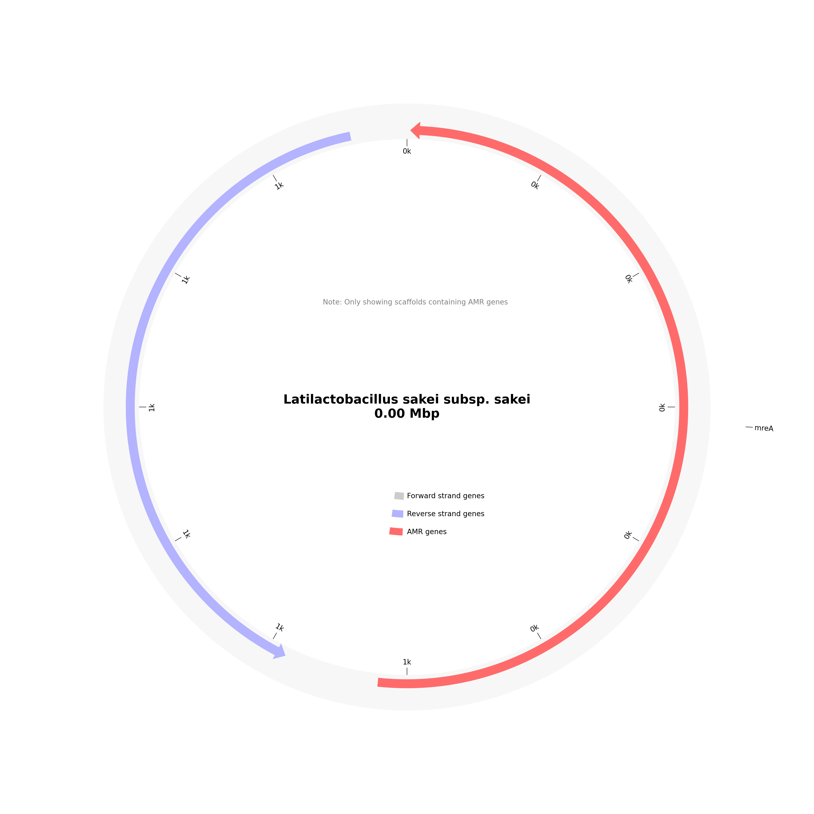

### mreA
- **Mechanism**: antibiotic efflux
- **Drug Classes**: macrolide antibiotic
- **AMR Family**: major facilitator superfamily (MFS) antibiotic efflux pump
- **Locations**:
  - gnl|SPADES|FKHIBMDG_4828_1 : position 2-568

## Latilactobacillus sakei subsp. sakei 23K
**Strain Statistics:**
- Total genome length: 3.8 kbp
- Total scaffolds: 27
- Scaffolds with AMR genes: 6
- Total genes annotated: 6
- Total AMR genes: 7
- Unique AMR genes: 7
- Distinct AMR mechanisms: 4
- Distinct AMR families: 6
- Distinct drug classes: 13

**Circos Plot:**

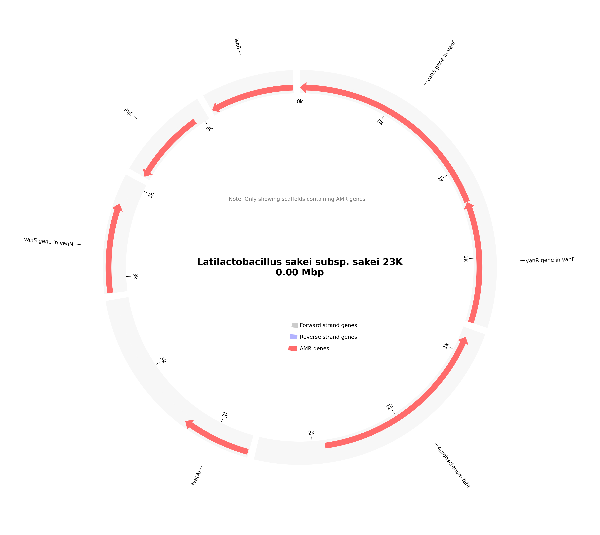

### Agrobacterium fabrum chloramphenicol acetyltransferase
- **Mechanism**: antibiotic inactivation
- **Drug Classes**: phenicol antibiotic
- **AMR Family**: chloramphenicol acetyltransferase (CAT)
- **Locations**:
  - gnl|SPADES|FKHIBMDG_5844_1 : position 31-678

### YajC
- **Mechanism**: antibiotic efflux
- **Drug Classes**: fluoroquinolone antibiotic; cephalosporin; glycylcycline; penam; tetracycline antibiotic; oxazolidinone antibiotic; glycopeptide antibiotic; rifamycin antibiotic; phenicol antibiotic; disinfecting agents and antiseptics
- **AMR Family**: resistance-nodulation-cell division (RND) antibiotic efflux pump
- **Locations**:
  - gnl|SPADES|FKHIBMDG_19856_1 : position 2-265

### lsaB
- **Mechanism**: antibiotic target protection
- **Drug Classes**: lincosamide antibiotic; streptogramin antibiotic; pleuromutilin antibiotic
- **AMR Family**: lsa-type ABC-F protein
- **Locations**:
  - gnl|SPADES|FKHIBMDG_20743_1 : position 2-298

### tva(A)
- **Mechanism**: antibiotic target protection
- **Drug Classes**: pleuromutilin antibiotic
- **AMR Family**: Miscellaneous ABC-F subfamily ATP-binding cassette ribosomal protection proteins
- **Locations**:
  - gnl|SPADES|FKHIBMDG_7655_1 : position 3-233

### vanR gene in vanF cluster
- **Mechanism**: antibiotic target alteration
- **Drug Classes**: glycopeptide antibiotic
- **AMR Family**: glycopeptide resistance gene cluster; vanR
- **Locations**:
  - gnl|SPADES|FKHIBMDG_4542_2 : position 750-1178

### vanS gene in vanF cluster
- **Mechanism**: antibiotic target alteration
- **Drug Classes**: glycopeptide antibiotic
- **AMR Family**: vanS; glycopeptide resistance gene cluster
- **Locations**:
  - gnl|SPADES|FKHIBMDG_4542_1 : position 1-750

### vanS gene in vanN cluster
- **Mechanism**: antibiotic target alteration
- **Drug Classes**: glycopeptide antibiotic
- **AMR Family**: vanS; glycopeptide resistance gene cluster
- **Locations**:
  - gnl|SPADES|FKHIBMDG_15062_1 : position 2-298

## Lelliottia amnigena
**Strain Statistics:**
- Total genome length: 17.1 kbp
- Total scaffolds: 39
- Scaffolds with AMR genes: 4
- Total genes annotated: 24
- Total AMR genes: 4
- Unique AMR genes: 4
- Distinct AMR mechanisms: 2
- Distinct AMR families: 4
- Distinct drug classes: 6

**Circos Plot:**

### MCR-3.11
- **Mechanism**: antibiotic target alteration
- **Drug Classes**: peptide antibiotic
- **AMR Family**: MCR phosphoethanolamine transferase
- **Locations**:
  - gnl|SPADES|FKHIBMDG_754_7 : position 10673-11557

### MexS
- **Mechanism**: antibiotic efflux
- **Drug Classes**: fluoroquinolone antibiotic; diaminopyrimidine antibiotic; phenicol antibiotic
- **AMR Family**: resistance-nodulation-cell division (RND) antibiotic efflux pump
- **Locations**:
  - gnl|SPADES|FKHIBMDG_1729_2 : position 186-875

### kdpD
- **Mechanism**: antibiotic efflux
- **Drug Classes**: aminoglycoside antibiotic
- **AMR Family**: kdpDE
- **Locations**:
  - gnl|SPADES|FKHIBMDG_3357_1 : position 3-1595

### macB
- **Mechanism**: antibiotic efflux
- **Drug Classes**: macrolide antibiotic
- **AMR Family**: ATP-binding cassette (ABC) antibiotic efflux pump
- **Locations**:
  - gnl|SPADES|FKHIBMDG_11001_1 : position 2-454

## Lelliottia sp. WB101
**Strain Statistics:**
- Total genome length: 0.5 kbp
- Total scaffolds: 2
- Scaffolds with AMR genes: 1
- Total genes annotated: 2
- Total AMR genes: 1
- Unique AMR genes: 1
- Distinct AMR mechanisms: 1
- Distinct AMR families: 1
- Distinct drug classes: 4

**Circos Plot:**

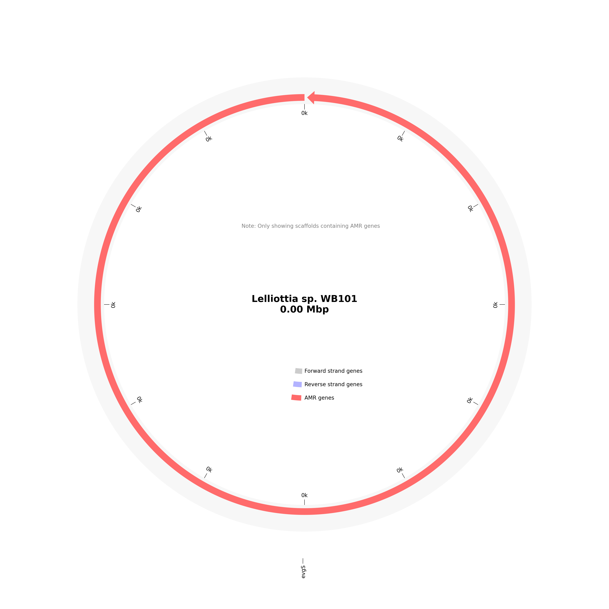

### evgS
- **Mechanism**: antibiotic efflux
- **Drug Classes**: macrolide antibiotic; fluoroquinolone antibiotic; penam; tetracycline antibiotic
- **AMR Family**: major facilitator superfamily (MFS) antibiotic efflux pump; resistance-nodulation-cell division (RND) antibiotic efflux pump
- **Locations**:
  - gnl|SPADES|FKHIBMDG_11081_1 : position 1-507

## Raoultella planticola
**Strain Statistics:**
- Total genome length: 1.3 kbp
- Total scaffolds: 8
- Scaffolds with AMR genes: 2
- Total genes annotated: 0
- Total AMR genes: 2
- Unique AMR genes: 2
- Distinct AMR mechanisms: 2
- Distinct AMR families: 2
- Distinct drug classes: 7

**Circos Plot:**

### Klebsiella pneumoniae OmpK37
- **Mechanism**: reduced permeability to antibiotic
- **Drug Classes**: monobactam; carbapenem; cephalosporin; cephamycin; penam; penem
- **AMR Family**: General Bacterial Porin with reduced permeability to beta-lactams
- **Locations**:
  - gnl|SPADES|FKHIBMDG_16086_1 : position 1-369

### cmlv
- **Mechanism**: antibiotic inactivation
- **Drug Classes**: phenicol antibiotic
- **AMR Family**: chloramphenicol phosphotransferase
- **Locations**:
  - gnl|SPADES|FKHIBMDG_5535_1 : position 2-895

## Serratia fonticola
**Strain Statistics:**
- Total genome length: 4330.2 kbp
- Total scaffolds: 395
- Scaffolds with AMR genes: 193
- Total genes annotated: 7966
- Total AMR genes: 563
- Unique AMR genes: 232
- Distinct AMR mechanisms: 11
- Distinct AMR families: 80
- Distinct drug classes: 37

**Circos Plot:**

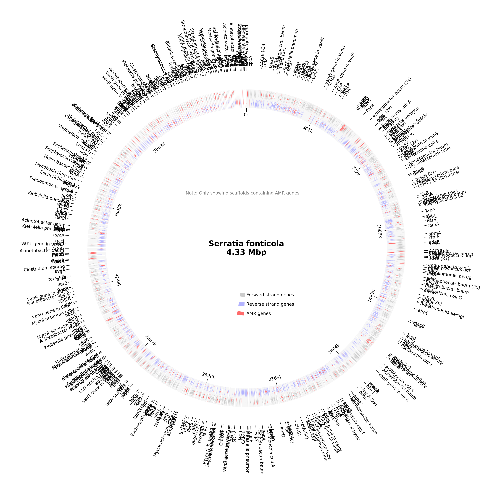

### AAC(3)-Ic
- **Mechanism**: antibiotic inactivation
- **Drug Classes**: aminoglycoside antibiotic
- **AMR Family**: AAC(3)
- **Locations**:
  - gnl|SPADES|FKHIBMDG_142_39 : position 43404-43829

### AAC(6')-34
- **Mechanism**: antibiotic inactivation
- **Drug Classes**: aminoglycoside antibiotic
- **AMR Family**: AAC(6')
- **Locations**:
  - gnl|SPADES|FKHIBMDG_25_56 : position 63502-63999

### AAC(6')-Ia
- **Mechanism**: antibiotic inactivation
- **Drug Classes**: aminoglycoside antibiotic
- **AMR Family**: AAC(6')
- **Locations**:
  - gnl|SPADES|FKHIBMDG_104_13 : position 12756-13274

### AIM-1
- **Mechanism**: antibiotic inactivation
- **Drug Classes**: cephalosporin; cephamycin; penam
- **AMR Family**: AIM beta-lactamase
- **Locations**:
  - gnl|SPADES|FKHIBMDG_549_4 : position 3269-4261

### APH(6)-Ic
- **Mechanism**: antibiotic inactivation
- **Drug Classes**: aminoglycoside antibiotic
- **AMR Family**: APH(6)
- **Locations**:
  - gnl|SPADES|FKHIBMDG_96_64 : position 69940-70797

### Acinetobacter baumannii AbaF (found in 9 locations)
- **Mechanism**: antibiotic efflux
- **Drug Classes**: phosphonic acid antibiotic
- **AMR Family**: major facilitator superfamily (MFS) antibiotic efflux pump
- **Locations**:
  - gnl|SPADES|FKHIBMDG_114_10 : position 9573-10856
  - gnl|SPADES|FKHIBMDG_1790_3 : position 932-2224
  - gnl|SPADES|FKHIBMDG_184_36 : position 35370-36872
  - gnl|SPADES|FKHIBMDG_25_110 : position 127118-128440
  - gnl|SPADES|FKHIBMDG_292_26 : position 27245-28528
  - gnl|SPADES|FKHIBMDG_492_4 : position 2859-4184
  - gnl|SPADES|FKHIBMDG_750_13 : position 9913-11259
  - gnl|SPADES|FKHIBMDG_76_22 : position 31103-32500
  - gnl|SPADES|FKHIBMDG_872_8 : position 7890-9122

### Acinetobacter baumannii AbaQ (found in 12 locations)
- **Mechanism**: antibiotic efflux
- **Drug Classes**: fluoroquinolone antibiotic
- **AMR Family**: major facilitator superfamily (MFS) antibiotic efflux pump
- **Locations**:
  - gnl|SPADES|FKHIBMDG_125_37 : position 39551-40921
  - gnl|SPADES|FKHIBMDG_159_34 : position 39795-41141
  - gnl|SPADES|FKHIBMDG_159_38 : position 44756-46051
  - gnl|SPADES|FKHIBMDG_162_6 : position 5546-6838
  - gnl|SPADES|FKHIBMDG_2134_1 : position 232-1563
  - gnl|SPADES|FKHIBMDG_221_23 : position 19816-21171
  - gnl|SPADES|FKHIBMDG_418_16 : position 19035-20303
  - gnl|SPADES|FKHIBMDG_460_10 : position 9643-11001
  - gnl|SPADES|FKHIBMDG_530_9 : position 7310-8608
  - gnl|SPADES|FKHIBMDG_81_10 : position 10518-11795
  - gnl|SPADES|FKHIBMDG_81_12 : position 13047-14393
  - gnl|SPADES|FKHIBMDG_81_3 : position 1648-2874

### Acinetobacter baumannii AmvA (found in 2 locations)
- **Mechanism**: antibiotic efflux
- **Drug Classes**: macrolide antibiotic; disinfecting agents and antiseptics
- **AMR Family**: major facilitator superfamily (MFS) antibiotic efflux pump
- **Locations**:
  - gnl|SPADES|FKHIBMDG_430_13 : position 8816-10312
  - gnl|SPADES|FKHIBMDG_546_9 : position 8336-9088

### Agrobacterium fabrum chloramphenicol acetyltransferase
- **Mechanism**: antibiotic inactivation
- **Drug Classes**: phenicol antibiotic
- **AMR Family**: chloramphenicol acetyltransferase (CAT)
- **Locations**:
  - gnl|SPADES|FKHIBMDG_421_16 : position 15385-16014

### ArnT
- **Mechanism**: antibiotic target alteration
- **Drug Classes**: peptide antibiotic
- **AMR Family**: pmr phosphoethanolamine transferase
- **Locations**:
  - gnl|SPADES|FKHIBMDG_232_35: position 37520-39184

### BahA
- **Mechanism**: antibiotic inactivation
- **Drug Classes**: peptide antibiotic
- **AMR Family**: Bah amidohydrolase
- **Locations**:
  - gnl|SPADES|FKHIBMDG_96_34 : position 34593-35606

### Bifidobacterium adolescentis rpoB mutants conferring resistance to rifampicin
- **Mechanism**: antibiotic target alteration; antibiotic target replacement
- **Drug Classes**: rifamycin antibiotic
- **AMR Family**: rifamycin-resistant beta-subunit of RNA polymerase (rpoB)
- **Locations**:
  - gnl|SPADES|FKHIBMDG_15466_1 : position 2-382

### Bifidobacterium bifidum ileS conferring resistance to mupirocin
- **Mechanism**: antibiotic target alteration
- **Drug Classes**: mupirocin-like antibiotic
- **AMR Family**: antibiotic-resistant isoleucyl-tRNA synthetase (ileS)
- **Locations**:
  - gnl|SPADES|FKHIBMDG_1135_4 : position 2935-5517

### CAR-1
- **Mechanism**: antibiotic inactivation
- **Drug Classes**: carbapenem
- **AMR Family**: CAR beta-lactamase
- **Locations**:
  - gnl|SPADES|FKHIBMDG_300_23 : position 23341-24147

### CMY-95
- **Mechanism**: antibiotic inactivation
- **Drug Classes**: cephamycin
- **AMR Family**: CMY beta-lactamase
- **Locations**:
  - gnl|SPADES|FKHIBMDG_125_39 : position 41912-43054

### CRP (found in 2 locations)
- **Mechanism**: antibiotic efflux
- **Drug Classes**: macrolide antibiotic; fluoroquinolone antibiotic; penam
- **AMR Family**: resistance-nodulation-cell division (RND) antibiotic efflux pump
- **Locations**:
  - gnl|SPADES|FKHIBMDG_60_7 : position 5563-6264
  - gnl|SPADES|FKHIBMDG_946_8 : position 7644-8240

### Clostridioides difficile gyrA conferring resistance to fluoroquinolones
- **Mechanism**: antibiotic target alteration
- **Drug Classes**: fluoroquinolone antibiotic
- **AMR Family**: fluoroquinolone resistant gyrA
- **Locations**:
  - gnl|SPADES|FKHIBMDG_3008_2 : position 1329-1796

### Clostridioides difficile gyrB conferring resistance to fluoroquinolones (found in 2 locations)
- **Mechanism**: antibiotic target alteration
- **Drug Classes**: fluoroquinolone antibiotic
- **AMR Family**: fluoroquinolone resistant gyrB
- **Locations**:
  - gnl|SPADES|FKHIBMDG_1558_1 : position 2-1618
  - gnl|SPADES|FKHIBMDG_956_8 : position 5774-8071

### Clostridium sporogenes cplR
- **Mechanism**: antibiotic target protection
- **Drug Classes**: lincosamide antibiotic; pleuromutilin antibiotic
- **AMR Family**: Miscellaneous ABC-F subfamily ATP-binding cassette ribosomal protection proteins
- **Locations**:
  - gnl|SPADES|FKHIBMDG_526_5 : position 5301-6344

### Enterobacter cloacae acrA
- **Mechanism**: antibiotic efflux
- **Drug Classes**: fluoroquinolone antibiotic; cephalosporin; glycylcycline; penam; tetracycline antibiotic; rifamycin antibiotic; phenicol antibiotic; disinfecting agents and antiseptics
- **AMR Family**: resistance-nodulation-cell division (RND) antibiotic efflux pump
- **Locations**:
  - gnl|SPADES|FKHIBMDG_37_111 : position 120241-121359

### Enterococcus faecalis cls with mutation conferring resistance to daptomycin
- **Mechanism**: antibiotic target alteration
- **Drug Classes**: peptide antibiotic
- **AMR Family**: daptomycin resistant cls
- **Locations**:
  - gnl|SPADES|FKHIBMDG_430_15 : position 11506-12966

### Erm(37)
- **Mechanism**: antibiotic target alteration
- **Drug Classes**: macrolide antibiotic; lincosamide antibiotic; streptogramin antibiotic; streptogramin A antibiotic; streptogramin B antibiotic
- **AMR Family**: Erm 23S ribosomal RNA methyltransferase
- **Locations**:
  - gnl|SPADES|FKHIBMDG_689_9 : position 9058-9840

### ErmC
- **Mechanism**: antibiotic target alteration
- **Drug Classes**: macrolide antibiotic; lincosamide antibiotic; streptogramin antibiotic; streptogramin A antibiotic; streptogramin B antibiotic
- **AMR Family**: Erm 23S ribosomal RNA methyltransferase
- **Locations**:
  - gnl|SPADES|FKHIBMDG_409_12 : position 14312-15130

### Escherichia coli AcrAB-TolC with AcrR mutation conferring resistance to ciprofloxacin, tetracycline, and ceftazidime (found in 2 locations)
- **Mechanism**: antibiotic target alteration; antibiotic efflux
- **Drug Classes**: fluoroquinolone antibiotic; cephalosporin; glycylcycline; penam; tetracycline antibiotic; rifamycin antibiotic; phenicol antibiotic; disinfecting agents and antiseptics
- **AMR Family**: resistance-nodulation-cell division (RND) antibiotic efflux pump
- **Locations**:
  - gnl|SPADES|FKHIBMDG_291_23 : position 24727-25344
  - gnl|SPADES|FKHIBMDG_81_50 : position 56506-57153

### Escherichia coli AcrAB-TolC with MarR mutations conferring resistance to ciprofloxacin and tetracycline
- **Mechanism**: antibiotic target alteration; antibiotic efflux
- **Drug Classes**: fluoroquinolone antibiotic; cephalosporin; glycylcycline; penam; tetracycline antibiotic; rifamycin antibiotic; phenicol antibiotic; disinfecting agents and antiseptics
- **AMR Family**: resistance-nodulation-cell division (RND) antibiotic efflux pump
- **Locations**:
  - gnl|SPADES|FKHIBMDG_411_25 : position 23256-23690

### Escherichia coli EF-Tu mutants conferring resistance to Pulvomycin
- **Mechanism**: antibiotic target alteration
- **Drug Classes**: elfamycin antibiotic
- **AMR Family**: elfamycin resistant EF-Tu
- **Locations**:
  - gnl|SPADES|FKHIBMDG_311_5 : position 3361-5202

### Escherichia coli GlpT with mutation conferring resistance to fosfomycin
- **Mechanism**: antibiotic target alteration
- **Drug Classes**: phosphonic acid antibiotic
- **AMR Family**: antibiotic-resistant GlpT
- **Locations**:
  - gnl|SPADES|FKHIBMDG_162_29 : position 29874-31226

### Escherichia coli acrA
- **Mechanism**: antibiotic efflux
- **Drug Classes**: fluoroquinolone antibiotic; cephalosporin; glycylcycline; penam; tetracycline antibiotic; rifamycin antibiotic; phenicol antibiotic; disinfecting agents and antiseptics
- **AMR Family**: resistance-nodulation-cell division (RND) antibiotic efflux pump
- **Locations**:
  - gnl|SPADES|FKHIBMDG_81_51 : position 57336-58457

### Escherichia coli fabI mutations conferring resistance to isoniazid and triclosan (found in 2 locations)
- **Mechanism**: antibiotic target alteration
- **Drug Classes**: disinfecting agents and antiseptics; isoniazid-like antibiotic
- **AMR Family**: antibiotic resistant fabI
- **Locations**:
  - gnl|SPADES|FKHIBMDG_125_26 : position 30450-31232
  - gnl|SPADES|FKHIBMDG_229_12 : position 11601-12356

### Escherichia coli mdfA
- **Mechanism**: antibiotic efflux
- **Drug Classes**: tetracycline antibiotic; phenicol antibiotic; disinfecting agents and antiseptics
- **AMR Family**: major facilitator superfamily (MFS) antibiotic efflux pump
- **Locations**:
  - gnl|SPADES|FKHIBMDG_311_7 : position 7006-8361

### Escherichia coli soxS with mutation conferring antibiotic resistance (found in 10 locations)
- **Mechanism**: antibiotic target alteration; antibiotic efflux; reduced permeability to antibiotic
- **Drug Classes**: fluoroquinolone antibiotic; monobactam; carbapenem; cephalosporin; glycylcycline; cephamycin; penam; tetracycline antibiotic; rifamycin antibiotic; phenicol antibiotic; penem; disinfecting agents and antiseptics
- **AMR Family**: ATP-binding cassette (ABC) antibiotic efflux pump; major facilitator superfamily (MFS) antibiotic efflux pump; resistance-nodulation-cell division (RND) antibiotic efflux pump; General Bacterial Porin with reduced permeability to beta-lactams
- **Locations**:
  - gnl|SPADES|FKHIBMDG_104_59 : position 62188-63072
  - gnl|SPADES|FKHIBMDG_179_14 : position 13617-14504
  - gnl|SPADES|FKHIBMDG_184_21 : position 20818-21618
  - gnl|SPADES|FKHIBMDG_311_16 : position 18076-19254
  - gnl|SPADES|FKHIBMDG_352_2 : position 795-1769
  - gnl|SPADES|FKHIBMDG_378_10 : position 9492-10319
  - gnl|SPADES|FKHIBMDG_615_10 : position 8800-9243
  - gnl|SPADES|FKHIBMDG_676_2 : position 1398-2288
  - gnl|SPADES|FKHIBMDG_716_9 : position 10082-10951
  - gnl|SPADES|FKHIBMDG_96_45 : position 47484-48401

### EstT
- **Mechanism**: antibiotic inactivation
- **Drug Classes**: macrolide antibiotic
- **AMR Family**: macrolide esterase
- **Locations**:
  - gnl|SPADES|FKHIBMDG_60_27 : position 22542-23411

### FONA-6
- **Mechanism**: antibiotic inactivation
- **Drug Classes**: penam
- **AMR Family**: FONA beta-lactamase
- **Locations**:
  - gnl|SPADES|FKHIBMDG_445_5: position 5246-6133

### FosA8
- **Mechanism**: antibiotic inactivation
- **Drug Classes**: phosphonic acid antibiotic
- **AMR Family**: fosfomycin thiol transferase
- **Locations**:
  - gnl|SPADES|FKHIBMDG_1145_3: position 1112-1519

### FosB3
- **Mechanism**: antibiotic inactivation
- **Drug Classes**: phosphonic acid antibiotic
- **AMR Family**: fosfomycin thiol transferase
- **Locations**:
  - gnl|SPADES|FKHIBMDG_96_25 : position 24996-25367

### FosM2
- **Mechanism**: antibiotic inactivation
- **Drug Classes**: phosphonic acid antibiotic
- **AMR Family**: fosfomycin thiol transferase
- **Locations**:
  - gnl|SPADES|FKHIBMDG_411_13 : position 11418-11825

### GMB-1
- **Mechanism**: antibiotic inactivation
- **Drug Classes**: carbapenem
- **AMR Family**: GMB beta-lactamase
- **Locations**:
  - gnl|SPADES|FKHIBMDG_274_12 : position 12924-13808

### GOB-5
- **Mechanism**: antibiotic inactivation
- **Drug Classes**: carbapenem; cephalosporin; penam
- **AMR Family**: GOB beta-lactamase
- **Locations**:
  - gnl|SPADES|FKHIBMDG_948_3 : position 2415-3062

### H-NS
- **Mechanism**: antibiotic efflux
- **Drug Classes**: macrolide antibiotic; fluoroquinolone antibiotic; cephalosporin; cephamycin; penam; tetracycline antibiotic
- **AMR Family**: major facilitator superfamily (MFS) antibiotic efflux pump; resistance-nodulation-cell division (RND) antibiotic efflux pump
- **Locations**:
  - gnl|SPADES|FKHIBMDG_847_4 : position 2715-3059

### Haemophilus influenzae PBP3 conferring resistance to beta-lactam antibiotics (found in 2 locations)
- **Mechanism**: antibiotic target alteration
- **Drug Classes**: cephalosporin; cephamycin; penam
- **AMR Family**: Penicillin-binding protein mutations conferring resistance to beta-lactam antibiotics
- **Locations**:
  - gnl|SPADES|FKHIBMDG_1229_1 : position 2-1150
  - gnl|SPADES|FKHIBMDG_181_29 : position 27727-29445

### Helicobacter pylori frxA mutation conferring resistance to metronidazole
- **Mechanism**: antibiotic target alteration
- **Drug Classes**: nitroimidazole antibiotic
- **AMR Family**: Antibiotic resistant Helicobacter pylori nitroreductase
- **Locations**:
  - gnl|SPADES|FKHIBMDG_445_15 : position 18939-19544

### Helicobacter pylori pbp1 mutants conferring resistance to amoxicillin (found in 2 locations)
- **Mechanism**: antibiotic target alteration
- **Drug Classes**: cephalosporin; cephamycin; penam
- **AMR Family**: Penicillin-binding protein mutations conferring resistance to beta-lactam antibiotics
- **Locations**:
  - gnl|SPADES|FKHIBMDG_229_33 : position 34491-36992
  - gnl|SPADES|FKHIBMDG_655_8 : position 11616-13979

### Helicobacter pylori pbp2 mutants conferring resistance to amoxicillin
- **Mechanism**: antibiotic target alteration
- **Drug Classes**: cephalosporin; cephamycin; penam
- **AMR Family**: Penicillin-binding protein mutations conferring resistance to beta-lactam antibiotics
- **Locations**:
  - gnl|SPADES|FKHIBMDG_730_5 : position 2685-4580

### Helicobacter pylori rpoB mutation conferring resistance to rifampicin
- **Mechanism**: antibiotic target alteration; antibiotic target replacement
- **Drug Classes**: fluoroquinolone antibiotic; rifamycin antibiotic
- **AMR Family**: rifamycin-resistant beta-subunit of RNA polymerase (rpoB)
- **Locations**:
  - gnl|SPADES|FKHIBMDG_8526_1 : position 1-639

### Klebsiella aerogenes Omp36
- **Mechanism**: reduced permeability to antibiotic
- **Drug Classes**: monobactam; carbapenem; cephalosporin; cephamycin; penam; penem
- **AMR Family**: General Bacterial Porin with reduced permeability to beta-lactams
- **Locations**:
  - gnl|SPADES|FKHIBMDG_96_6 : position 6403-7530

### Klebsiella pneumoniae KpnE
- **Mechanism**: antibiotic efflux
- **Drug Classes**: macrolide antibiotic; aminoglycoside antibiotic; cephalosporin; tetracycline antibiotic; peptide antibiotic; rifamycin antibiotic; disinfecting agents and antiseptics
- **AMR Family**: small multidrug resistance (SMR) antibiotic efflux pump
- **Locations**:
  - gnl|SPADES|FKHIBMDG_457_10 : position 8679-9047

### Klebsiella pneumoniae KpnF
- **Mechanism**: antibiotic efflux
- **Drug Classes**: macrolide antibiotic; aminoglycoside antibiotic; cephalosporin; tetracycline antibiotic; peptide antibiotic; rifamycin antibiotic; disinfecting agents and antiseptics
- **AMR Family**: small multidrug resistance (SMR) antibiotic efflux pump
- **Locations**:
  - gnl|SPADES|FKHIBMDG_457_9: position 8363-8692

### Klebsiella pneumoniae KpnH (found in 2 locations)
- **Mechanism**: antibiotic efflux
- **Drug Classes**: macrolide antibiotic; fluoroquinolone antibiotic; aminoglycoside antibiotic; carbapenem; cephalosporin; penam; peptide antibiotic; penem
- **AMR Family**: major facilitator superfamily (MFS) antibiotic efflux pump
- **Locations**:
  - gnl|SPADES|FKHIBMDG_542_9: position 8270-9649
  - gnl|SPADES|FKHIBMDG_582_3 : position 2269-3795

### Klebsiella pneumoniae OmpK37 (found in 7 locations)
- **Mechanism**: reduced permeability to antibiotic
- **Drug Classes**: monobactam; carbapenem; cephalosporin; cephamycin; penam; penem
- **AMR Family**: General Bacterial Porin with reduced permeability to beta-lactams
- **Locations**:
  - gnl|SPADES|FKHIBMDG_114_49 : position 51135-52226
  - gnl|SPADES|FKHIBMDG_300_7 : position 4497-5579
  - gnl|SPADES|FKHIBMDG_37_22 : position 30241-31335
  - gnl|SPADES|FKHIBMDG_4071_3 : position 1175-1312
  - gnl|SPADES|FKHIBMDG_60_11 : position 8523-9569
  - gnl|SPADES|FKHIBMDG_752_1 : position 1-1032
  - gnl|SPADES|FKHIBMDG_948_1 : position 2-916

### LlmA 23S ribosomal RNA methyltransferase
- **Mechanism**: antibiotic target alteration
- **Drug Classes**: lincosamide antibiotic
- **AMR Family**: Llm 23S ribosomal RNA methyltransferase
- **Locations**:
  - gnl|SPADES|FKHIBMDG_117_33 : position 38642-39832

### LptD
- **Mechanism**: antibiotic efflux
- **Drug Classes**: carbapenem; peptide antibiotic; aminocoumarin antibiotic; rifamycin antibiotic
- **AMR Family**: ATP-binding cassette (ABC) antibiotic efflux pump
- **Locations**:
  - gnl|SPADES|FKHIBMDG_409_9 : position 9605-11971

### MOX-3
- **Mechanism**: antibiotic inactivation
- **Drug Classes**: cephalosporin; cephamycin; penam
- **AMR Family**: MOX beta-lactamase
- **Locations**:
  - gnl|SPADES|FKHIBMDG_96_32 : position 32347-33486

### MSI-1
- **Mechanism**: antibiotic inactivation
- **Drug Classes**: carbapenem
- **AMR Family**: MSI beta-lactamase
- **Locations**:
  - gnl|SPADES|FKHIBMDG_1742_4 : position 2253-3008

### MdtK
- **Mechanism**: antibiotic efflux
- **Drug Classes**: fluoroquinolone antibiotic
- **AMR Family**: multidrug and toxic compound extrusion (MATE) transporter
- **Locations**:
  - gnl|SPADES|FKHIBMDG_308_12 : position 11224-12681

### MexF
- **Mechanism**: antibiotic efflux
- **Drug Classes**: fluoroquinolone antibiotic; diaminopyrimidine antibiotic; phenicol antibiotic
- **AMR Family**: resistance-nodulation-cell division (RND) antibiotic efflux pump
- **Locations**:
  - gnl|SPADES|FKHIBMDG_37_109 : position 117128-118681

### MexJ
- **Mechanism**: antibiotic efflux
- **Drug Classes**: macrolide antibiotic; tetracycline antibiotic; disinfecting agents and antiseptics
- **AMR Family**: resistance-nodulation-cell division (RND) antibiotic efflux pump
- **Locations**:
  - gnl|SPADES|FKHIBMDG_454_10 : position 9072-10157

### MexK
- **Mechanism**: antibiotic efflux
- **Drug Classes**: macrolide antibiotic; tetracycline antibiotic; disinfecting agents and antiseptics
- **AMR Family**: resistance-nodulation-cell division (RND) antibiotic efflux pump
- **Locations**:
  - gnl|SPADES|FKHIBMDG_454_9 : position 5992-9072

### MexL
- **Mechanism**: antibiotic efflux
- **Drug Classes**: macrolide antibiotic; tetracycline antibiotic; disinfecting agents and antiseptics
- **AMR Family**: resistance-nodulation-cell division (RND) antibiotic efflux pump
- **Locations**:
  - gnl|SPADES|FKHIBMDG_1288_4 : position 1748-2344

### MexS (found in 8 locations)
- **Mechanism**: antibiotic efflux
- **Drug Classes**: fluoroquinolone antibiotic; diaminopyrimidine antibiotic; phenicol antibiotic
- **AMR Family**: resistance-nodulation-cell division (RND) antibiotic efflux pump
- **Locations**:
  - gnl|SPADES|FKHIBMDG_1186_2 : position 1067-2182
  - gnl|SPADES|FKHIBMDG_1793_3 : position 1576-2583
  - gnl|SPADES|FKHIBMDG_25_89 : position 100971-102020
  - gnl|SPADES|FKHIBMDG_374_15 : position 14350-15417
  - gnl|SPADES|FKHIBMDG_378_14 : position 12897-13928
  - gnl|SPADES|FKHIBMDG_37_54 : position 61752-62777
  - gnl|SPADES|FKHIBMDG_410_16 : position 15429-16418
  - gnl|SPADES|FKHIBMDG_76_21 : position 29985-30998

### MexT
- **Mechanism**: antibiotic efflux
- **Drug Classes**: fluoroquinolone antibiotic; diaminopyrimidine antibiotic; phenicol antibiotic
- **AMR Family**: resistance-nodulation-cell division (RND) antibiotic efflux pump
- **Locations**:
  - gnl|SPADES|FKHIBMDG_292_17 : position 19611-20504

### MexV
- **Mechanism**: antibiotic efflux
- **Drug Classes**: macrolide antibiotic; fluoroquinolone antibiotic; tetracycline antibiotic; phenicol antibiotic; disinfecting agents and antiseptics
- **AMR Family**: resistance-nodulation-cell division (RND) antibiotic efflux pump
- **Locations**:
  - gnl|SPADES|FKHIBMDG_696_7 : position 7776-9218

### MexW
- **Mechanism**: antibiotic efflux
- **Drug Classes**: macrolide antibiotic; fluoroquinolone antibiotic; tetracycline antibiotic; phenicol antibiotic; disinfecting agents and antiseptics
- **AMR Family**: resistance-nodulation-cell division (RND) antibiotic efflux pump
- **Locations**:
  - gnl|SPADES|FKHIBMDG_696_8 : position 9215-12358

### Mycobacterium tuberculosis gidB mutation conferring resistance to streptomycin
- **Mechanism**: antibiotic target alteration
- **Drug Classes**: aminoglycoside antibiotic
- **AMR Family**: antibiotic resistant gidB
- **Locations**:
  - gnl|SPADES|FKHIBMDG_463_3 : position 1683-2303

### Mycobacterium tuberculosis inhA mutations conferring resistance to isoniazid (found in 2 locations)
- **Mechanism**: antibiotic target alteration
- **Drug Classes**: isoniazid-like antibiotic
- **AMR Family**: isoniazid resistant inhA
- **Locations**:
  - gnl|SPADES|FKHIBMDG_353_23 : position 26791-27549
  - gnl|SPADES|FKHIBMDG_445_8 : position 8806-9552

### Mycobacterium tuberculosis kasA mutant conferring resistance to isoniazid (found in 4 locations)
- **Mechanism**: antibiotic target alteration
- **Drug Classes**: isoniazid-like antibiotic
- **AMR Family**: antibiotic resistant kasA
- **Locations**:
  - gnl|SPADES|FKHIBMDG_114_25 : position 22789-23958
  - gnl|SPADES|FKHIBMDG_117_18 : position 23752-25026
  - gnl|SPADES|FKHIBMDG_181_36 : position 34833-37391
  - gnl|SPADES|FKHIBMDG_244_38 : position 37503-38669

### Mycobacterium tuberculosis ndh with mutation conferring resistance to isoniazid
- **Mechanism**: antibiotic target alteration
- **Drug Classes**: isoniazid-like antibiotic
- **AMR Family**: antibiotic resistant ndh
- **Locations**:
  - gnl|SPADES|FKHIBMDG_244_22 : position 23250-24578

### Mycobacterium tuberculosis pncA mutations conferring resistance to pyrazinamide
- **Mechanism**: antibiotic target alteration
- **Drug Classes**: pyrazine antibiotic
- **AMR Family**: Pyrazinamide resistant pncA
- **Locations**:
  - gnl|SPADES|FKHIBMDG_647_11 : position 11101-11733

### Mycobacterium tuberculosis thyA with mutation conferring resistance to para-aminosalicylic acid
- **Mechanism**: antibiotic target alteration
- **Drug Classes**: salicylic acid antibiotic
- **AMR Family**: aminosalicylate resistant thymidylate synthase
- **Locations**:
  - gnl|SPADES|FKHIBMDG_476_3 : position 3284-4078

### Mycolicibacterium smegmatis ndh with mutation conferring resistance to isoniazid
- **Mechanism**: antibiotic target alteration
- **Drug Classes**: isoniazid-like antibiotic
- **AMR Family**: antibiotic resistant ndh
- **Locations**:
  - gnl|SPADES|FKHIBMDG_1323_4 : position 2387-3586

### Neisseria gonorrhoeae PBP2 conferring resistance to beta-lactam antibiotics
- **Mechanism**: antibiotic target alteration
- **Drug Classes**: cephalosporin; cephamycin; penam
- **AMR Family**: Penicillin-binding protein mutations conferring resistance to beta-lactam antibiotics
- **Locations**:
  - gnl|SPADES|FKHIBMDG_1434_1 : position 2-526

### Neisseria gonorrhoeae pilQ gene conferring resistance to beta-lactam
- **Mechanism**: antibiotic target alteration
- **Drug Classes**: cephalosporin; cephamycin; penam
- **AMR Family**: Penicillin-binding protein mutations conferring resistance to beta-lactam antibiotics
- **Locations**:
  - gnl|SPADES|FKHIBMDG_25_1 : position 501-1748

### NmcR (found in 12 locations)
- **Mechanism**: antibiotic inactivation
- **Drug Classes**: carbapenem; cephalosporin; cephamycin; penam
- **AMR Family**: NmcA beta-lactamase
- **Locations**:
  - gnl|SPADES|FKHIBMDG_1186_3 : position 2222-3124
  - gnl|SPADES|FKHIBMDG_1190_1 : position 1-849
  - gnl|SPADES|FKHIBMDG_1239_4 : position 3295-4188
  - gnl|SPADES|FKHIBMDG_25_118 : position 135368-136249
  - gnl|SPADES|FKHIBMDG_291_13 : position 13773-14699
  - gnl|SPADES|FKHIBMDG_378_6 : position 4209-5078
  - gnl|SPADES|FKHIBMDG_37_79 : position 87147-88073
  - gnl|SPADES|FKHIBMDG_485_2 : position 2899-3873
  - gnl|SPADES|FKHIBMDG_60_34 : position 28903-29784
  - gnl|SPADES|FKHIBMDG_615_2 : position 1841-2728
  - gnl|SPADES|FKHIBMDG_872_5 : position 4821-5648
  - gnl|SPADES|FKHIBMDG_877_7 : position 7206-8144

### OmpA (found in 5 locations)
- **Mechanism**: reduced permeability to antibiotic
- **Drug Classes**: peptide antibiotic
- **AMR Family**: General Bacterial Porin with reduced permeability to peptide antibiotics
- **Locations**:
  - gnl|SPADES|FKHIBMDG_117_23 : position 28641-29699
  - gnl|SPADES|FKHIBMDG_1257_1 : position 2-439
  - gnl|SPADES|FKHIBMDG_181_30 : position 29452-30570
  - gnl|SPADES|FKHIBMDG_418_9 : position 10164-10823
  - gnl|SPADES|FKHIBMDG_716_1 : position 196-693

### OpmB
- **Mechanism**: antibiotic efflux
- **Drug Classes**: macrolide antibiotic; monobactam; tetracycline antibiotic; aminocoumarin antibiotic
- **AMR Family**: resistance-nodulation-cell division (RND) antibiotic efflux pump
- **Locations**:
  - gnl|SPADES|FKHIBMDG_528_7 : position 8744-10150

### OprJ
- **Mechanism**: antibiotic efflux
- **Drug Classes**: macrolide antibiotic; fluoroquinolone antibiotic; aminoglycoside antibiotic; cephalosporin; penam; tetracycline antibiotic; aminocoumarin antibiotic; diaminopyrimidine antibiotic; phenicol antibiotic
- **AMR Family**: resistance-nodulation-cell division (RND) antibiotic efflux pump
- **Locations**:
  - gnl|SPADES|FKHIBMDG_856_5 : position 4904-6385

### ParR (found in 3 locations)
- **Mechanism**: antibiotic efflux; reduced permeability to antibiotic
- **Drug Classes**: macrolide antibiotic; fluoroquinolone antibiotic; monobactam; aminoglycoside antibiotic; carbapenem; cephalosporin; cephamycin; penam; tetracycline antibiotic; phenicol antibiotic; penem; disinfecting agents and antiseptics
- **AMR Family**: resistance-nodulation-cell division (RND) antibiotic efflux pump; Outer Membrane Porin (Opr)
- **Locations**:
  - gnl|SPADES|FKHIBMDG_25_14 : position 15344-16063
  - gnl|SPADES|FKHIBMDG_351_6 : position 5780-6508
  - gnl|SPADES|FKHIBMDG_76_43 : position 52968-53675

### ParS (found in 2 locations)
- **Mechanism**: antibiotic efflux; reduced permeability to antibiotic
- **Drug Classes**: macrolide antibiotic; fluoroquinolone antibiotic; monobactam; aminoglycoside antibiotic; carbapenem; cephalosporin; cephamycin; penam; tetracycline antibiotic; phenicol antibiotic; penem; disinfecting agents and antiseptics
- **AMR Family**: resistance-nodulation-cell division (RND) antibiotic efflux pump; Outer Membrane Porin (Opr)
- **Locations**:
  - gnl|SPADES|FKHIBMDG_127_48 : position 49770-51362
  - gnl|SPADES|FKHIBMDG_351_7 : position 6505-7809

### PmrF (found in 3 locations)
- **Mechanism**: antibiotic target alteration
- **Drug Classes**: peptide antibiotic
- **AMR Family**: pmr phosphoethanolamine transferase
- **Locations**:
  - gnl|SPADES|FKHIBMDG_1002_3 : position 2160-3140
  - gnl|SPADES|FKHIBMDG_129_63 : position 53186-54175
  - gnl|SPADES|FKHIBMDG_554_9 : position 11967-12878

### Pseudomonas aeruginosa CpxR (found in 5 locations)
- **Mechanism**: antibiotic efflux
- **Drug Classes**: macrolide antibiotic; fluoroquinolone antibiotic; monobactam; aminoglycoside antibiotic; carbapenem; cephalosporin; cephamycin; penam; tetracycline antibiotic; peptide antibiotic; aminocoumarin antibiotic; diaminopyrimidine antibiotic; sulfonamide antibiotic; phenicol antibiotic; penem
- **AMR Family**: resistance-nodulation-cell division (RND) antibiotic efflux pump
- **Locations**:
  - gnl|SPADES|FKHIBMDG_127_49 : position 51380-52066
  - gnl|SPADES|FKHIBMDG_142_49 : position 51906-52586
  - gnl|SPADES|FKHIBMDG_159_7 : position 10920-11549
  - gnl|SPADES|FKHIBMDG_421_12 : position 11549-12223
  - gnl|SPADES|FKHIBMDG_605_15 : position 13520-14218

### Pseudomonas aeruginosa ampR with mutation conferring resistance to aztreonam (found in 3 locations)
- **Mechanism**: antibiotic target alteration; antibiotic inactivation
- **Drug Classes**: monobactam; carbapenem; cephalosporin
- **AMR Family**: PDC beta-lactamase; ampR transcriptional regulator with mutation conferring resistance to monobactam antibiotics
- **Locations**:
  - gnl|SPADES|FKHIBMDG_164_33 : position 36357-37298
  - gnl|SPADES|FKHIBMDG_178_46 : position 43593-44483
  - gnl|SPADES|FKHIBMDG_445_6 : position 6266-7141

### QepA2
- **Mechanism**: antibiotic efflux
- **Drug Classes**: fluoroquinolone antibiotic
- **AMR Family**: major facilitator superfamily (MFS) antibiotic efflux pump
- **Locations**:
  - gnl|SPADES|FKHIBMDG_676_3 : position 2343-3737

### QepA4
- **Mechanism**: antibiotic efflux
- **Drug Classes**: fluoroquinolone antibiotic
- **AMR Family**: major facilitator superfamily (MFS) antibiotic efflux pump
- **Locations**:
  - gnl|SPADES|FKHIBMDG_96_23 : position 22536-23822

### QnrB26
- **Mechanism**: antibiotic target protection
- **Drug Classes**: fluoroquinolone antibiotic
- **AMR Family**: quinolone resistance protein (qnr)
- **Locations**:
  - gnl|SPADES|FKHIBMDG_308_5 : position 5367-6020

### RanA (found in 22 locations)
- **Mechanism**: antibiotic efflux
- **Drug Classes**: aminoglycoside antibiotic
- **AMR Family**: ATP-binding cassette (ABC) antibiotic efflux pump
- **Locations**:
  - gnl|SPADES|FKHIBMDG_1010_3 : position 1828-2898
  - gnl|SPADES|FKHIBMDG_114_50 : position 53001-53786
  - gnl|SPADES|FKHIBMDG_1280_4 : position 3747-5024
  - gnl|SPADES|FKHIBMDG_159_2 : position 3454-4512
  - gnl|SPADES|FKHIBMDG_164_30 : position 34004-34801
  - gnl|SPADES|FKHIBMDG_169_20 : position 17675-18808
  - gnl|SPADES|FKHIBMDG_179_7 : position 5810-6883
  - gnl|SPADES|FKHIBMDG_217_32 : position 34377-35504
  - gnl|SPADES|FKHIBMDG_217_6 : position 4818-5591
  - gnl|SPADES|FKHIBMDG_244_9 : position 7201-8307
  - gnl|SPADES|FKHIBMDG_28959_1 : position 2-244
  - gnl|SPADES|FKHIBMDG_292_11 : position 13099-13911
  - gnl|SPADES|FKHIBMDG_377_20 : position 17998-18765
  - gnl|SPADES|FKHIBMDG_40_93 : position 75440-76501
  - gnl|SPADES|FKHIBMDG_410_2 : position 1090-2205
  - gnl|SPADES|FKHIBMDG_430_17 : position 13407-14405
  - gnl|SPADES|FKHIBMDG_430_18 : position 14402-15394
  - gnl|SPADES|FKHIBMDG_497_3 : position 1131-2120
  - gnl|SPADES|FKHIBMDG_542_16 : position 17281-18336
  - gnl|SPADES|FKHIBMDG_548_14 : position 15233-16828
  - gnl|SPADES|FKHIBMDG_648_12 : position 13096-14232
  - gnl|SPADES|FKHIBMDG_670_7 : position 4083-4898

### RanB (found in 2 locations)
- **Mechanism**: antibiotic efflux
- **Drug Classes**: aminoglycoside antibiotic
- **AMR Family**: ATP-binding cassette (ABC) antibiotic efflux pump
- **Locations**:
  - gnl|SPADES|FKHIBMDG_164_29 : position 32862-34007
  - gnl|SPADES|FKHIBMDG_670_8 : position 4903-5685

### Rhodococcus fascians cmr
- **Mechanism**: antibiotic efflux
- **Drug Classes**: phenicol antibiotic
- **AMR Family**: major facilitator superfamily (MFS) antibiotic efflux pump
- **Locations**:
  - gnl|SPADES|FKHIBMDG_96_40 : position 42175-43359

### RlmA(II)
- **Mechanism**: antibiotic target alteration
- **Drug Classes**: macrolide antibiotic; lincosamide antibiotic
- **AMR Family**: non-erm 23S ribosomal RNA methyltransferase (G748)
- **Locations**:
  - gnl|SPADES|FKHIBMDG_40_2 : position 966-1805

### SAT-3
- **Mechanism**: antibiotic inactivation
- **Drug Classes**: nucleoside antibiotic
- **AMR Family**: streptothricin acetyltransferase (SAT)
- **Locations**:
  - gnl|SPADES|FKHIBMDG_37_92 : position 101075-101617

### SRT-2
- **Mechanism**: antibiotic inactivation
- **Drug Classes**: cephalosporin
- **AMR Family**: SRT beta-lactamase
- **Locations**:
  - gnl|SPADES|FKHIBMDG_302_26 : position 25080-26615

### SatA (found in 2 locations)
- **Mechanism**: antibiotic inactivation
- **Drug Classes**: nucleoside antibiotic
- **AMR Family**: streptothricin acetyltransferase (SAT)
- **Locations**:
  - gnl|SPADES|FKHIBMDG_37_61 : position 69454-69897
  - gnl|SPADES|FKHIBMDG_418_5 : position 5482-5928

### Staphylococcus aureus FosB
- **Mechanism**: antibiotic inactivation
- **Drug Classes**: phosphonic acid antibiotic
- **AMR Family**: fosfomycin thiol transferase
- **Locations**:
  - gnl|SPADES|FKHIBMDG_4071_2 : position 603-1019

### Staphylococcus aureus GlpT with mutation conferring resistance to fosfomycin
- **Mechanism**: antibiotic target alteration
- **Drug Classes**: phosphonic acid antibiotic
- **AMR Family**: antibiotic-resistant GlpT
- **Locations**:
  - gnl|SPADES|FKHIBMDG_142_54 : position 58839-60221

### Staphylococcus aureus UhpT with mutation conferring resistance to fosfomycin
- **Mechanism**: antibiotic target alteration
- **Drug Classes**: phosphonic acid antibiotic
- **AMR Family**: antibiotic-resistant UhpT
- **Locations**:
  - gnl|SPADES|FKHIBMDG_702_4 : position 2200-3507

### Staphylococcus aureus fusA with mutation conferring resistance to fusidic acid (found in 2 locations)
- **Mechanism**: antibiotic target alteration
- **Drug Classes**: fusidane antibiotic
- **AMR Family**: antibiotic resistant fusA
- **Locations**:
  - gnl|SPADES|FKHIBMDG_125_47 : position 49516-51105
  - gnl|SPADES|FKHIBMDG_153_44 : position 45015-47120

### Staphylococcus aureus mupA conferring resistance to mupirocin (found in 2 locations)
- **Mechanism**: antibiotic target alteration
- **Drug Classes**: mupirocin-like antibiotic
- **AMR Family**: antibiotic-resistant isoleucyl-tRNA synthetase (ileS)
- **Locations**:
  - gnl|SPADES|FKHIBMDG_1055_2 : position 1658-2554
  - gnl|SPADES|FKHIBMDG_1335_3 : position 1288-4104

### Staphylococcus aureus mupB conferring resistance to mupirocin
- **Mechanism**: antibiotic target alteration
- **Drug Classes**: mupirocin-like antibiotic
- **AMR Family**: antibiotic-resistant isoleucyl-tRNA synthetase (ileS)
- **Locations**:
  - gnl|SPADES|FKHIBMDG_1055_1 : position 3-1658

### Staphylococcus aureus murA with mutation conferring resistance to fosfomycin
- **Mechanism**: antibiotic target alteration
- **Drug Classes**: phosphonic acid antibiotic
- **AMR Family**: antibiotic-resistant murA transferase
- **Locations**:
  - gnl|SPADES|FKHIBMDG_670_13 : position 7648-8907

### Streptococcus pneumoniae PBP2x conferring resistance to amoxicillin
- **Mechanism**: antibiotic target alteration
- **Drug Classes**: cephalosporin; cephamycin; penam
- **AMR Family**: Penicillin-binding protein mutations conferring resistance to beta-lactam antibiotics
- **Locations**:
  - gnl|SPADES|FKHIBMDG_25_6 : position 4100-6658

### Streptomyces venezuelae rox (found in 4 locations)
- **Mechanism**: antibiotic inactivation
- **Drug Classes**: rifamycin antibiotic
- **AMR Family**: rifampin monooxygenase
- **Locations**:
  - gnl|SPADES|FKHIBMDG_114_54 : position 57406-59139
  - gnl|SPADES|FKHIBMDG_1269_2 : position 555-1757
  - gnl|SPADES|FKHIBMDG_1269_3 : position 1987-3165
  - gnl|SPADES|FKHIBMDG_1281_1 : position 137-1318

### TaeA (found in 3 locations)
- **Mechanism**: antibiotic efflux
- **Drug Classes**: pleuromutilin antibiotic
- **AMR Family**: ATP-binding cassette (ABC) antibiotic efflux pump
- **Locations**:
  - gnl|SPADES|FKHIBMDG_117_14 : position 17760-19664
  - gnl|SPADES|FKHIBMDG_127_5 : position 9235-9996
  - gnl|SPADES|FKHIBMDG_6586_1 : position 1-813

### TolC (found in 2 locations)
- **Mechanism**: antibiotic efflux
- **Drug Classes**: macrolide antibiotic; fluoroquinolone antibiotic; aminoglycoside antibiotic; carbapenem; cephalosporin; glycylcycline; cephamycin; penam; tetracycline antibiotic; peptide antibiotic; aminocoumarin antibiotic; rifamycin antibiotic; phenicol antibiotic; penem; disinfecting agents and antiseptics
- **AMR Family**: ATP-binding cassette (ABC) antibiotic efflux pump; major facilitator superfamily (MFS) antibiotic efflux pump; resistance-nodulation-cell division (RND) antibiotic efflux pump
- **Locations**:
  - gnl|SPADES|FKHIBMDG_447_8 : position 8992-10389
  - gnl|SPADES|FKHIBMDG_817_1 : position 29-1450

### TriA
- **Mechanism**: antibiotic efflux
- **Drug Classes**: disinfecting agents and antiseptics
- **AMR Family**: resistance-nodulation-cell division (RND) antibiotic efflux pump
- **Locations**:
  - gnl|SPADES|FKHIBMDG_323_22 : position 26497-27468

### TxR (found in 10 locations)
- **Mechanism**: antibiotic efflux
- **Drug Classes**: tetracycline antibiotic
- **AMR Family**: ATP-binding cassette (ABC) antibiotic efflux pump
- **Locations**:
  - gnl|SPADES|FKHIBMDG_1027_2 : position 1040-2383
  - gnl|SPADES|FKHIBMDG_1050_2 : position 619-2400
  - gnl|SPADES|FKHIBMDG_125_6 : position 5741-7318
  - gnl|SPADES|FKHIBMDG_1391_2 : position 2049-3380
  - gnl|SPADES|FKHIBMDG_142_51 : position 53908-55152
  - gnl|SPADES|FKHIBMDG_1807_3 : position 1088-3154
  - gnl|SPADES|FKHIBMDG_292_18 : position 20501-21508
  - gnl|SPADES|FKHIBMDG_292_28 : position 29373-30944
  - gnl|SPADES|FKHIBMDG_457_17 : position 14153-16963
  - gnl|SPADES|FKHIBMDG_817_2 : position 1612-3561

### YajC
- **Mechanism**: antibiotic efflux
- **Drug Classes**: fluoroquinolone antibiotic; cephalosporin; glycylcycline; penam; tetracycline antibiotic; oxazolidinone antibiotic; glycopeptide antibiotic; rifamycin antibiotic; phenicol antibiotic; disinfecting agents and antiseptics
- **AMR Family**: resistance-nodulation-cell division (RND) antibiotic efflux pump
- **Locations**:
  - gnl|SPADES|FKHIBMDG_1739_1 : position 1-144

### YojI
- **Mechanism**: antibiotic efflux
- **Drug Classes**: peptide antibiotic
- **AMR Family**: ATP-binding cassette (ABC) antibiotic efflux pump
- **Locations**:
  - gnl|SPADES|FKHIBMDG_274_24 : position 23452-25104

### Yrc-1
- **Mechanism**: antibiotic inactivation
- **Drug Classes**: cephalosporin; cephamycin; penam
- **AMR Family**: YRC Beta-lactamase
- **Locations**:
  - gnl|SPADES|FKHIBMDG_153_10 : position 5151-6299

### adeF (found in 2 locations)
- **Mechanism**: antibiotic efflux
- **Drug Classes**: fluoroquinolone antibiotic; tetracycline antibiotic
- **AMR Family**: resistance-nodulation-cell division (RND) antibiotic efflux pump
- **Locations**:
  - gnl|SPADES|FKHIBMDG_142_8: position 6574-9699
  - gnl|SPADES|FKHIBMDG_81_52: position 58475-61621

### adeL (found in 37 locations)
- **Mechanism**: antibiotic efflux
- **Drug Classes**: fluoroquinolone antibiotic; tetracycline antibiotic
- **AMR Family**: resistance-nodulation-cell division (RND) antibiotic efflux pump
- **Locations**:
  - gnl|SPADES|FKHIBMDG_104_25 : position 22686-23594
  - gnl|SPADES|FKHIBMDG_104_68 : position 72175-73068
  - gnl|SPADES|FKHIBMDG_114_53 : position 56370-57278
  - gnl|SPADES|FKHIBMDG_125_42 : position 45052-45954
  - gnl|SPADES|FKHIBMDG_127_34 : position 36869-37687
  - gnl|SPADES|FKHIBMDG_153_14 : position 9756-10664
  - gnl|SPADES|FKHIBMDG_153_48 : position 49539-50423
  - gnl|SPADES|FKHIBMDG_153_50 : position 51673-52683
  - gnl|SPADES|FKHIBMDG_1558_2 : position 1713-2609
  - gnl|SPADES|FKHIBMDG_159_31 : position 37024-37980
  - gnl|SPADES|FKHIBMDG_162_31 : position 32534-33541
  - gnl|SPADES|FKHIBMDG_164_12 : position 13579-14466
  - gnl|SPADES|FKHIBMDG_164_43 : position 46590-47528
  - gnl|SPADES|FKHIBMDG_178_22 : position 19973-20860
  - gnl|SPADES|FKHIBMDG_2166_2 : position 237-1145
  - gnl|SPADES|FKHIBMDG_217_19 : position 19453-20370
  - gnl|SPADES|FKHIBMDG_221_7 : position 4683-5594
  - gnl|SPADES|FKHIBMDG_229_25 : position 25879-26799
  - gnl|SPADES|FKHIBMDG_235_16 : position 14791-15666
  - gnl|SPADES|FKHIBMDG_253_11 : position 11245-12174
  - gnl|SPADES|FKHIBMDG_253_19 : position 25406-26293
  - gnl|SPADES|FKHIBMDG_274_11 : position 11906-12814
  - gnl|SPADES|FKHIBMDG_377_2 : position 812-1720
  - gnl|SPADES|FKHIBMDG_401_5 : position 3302-4207
  - gnl|SPADES|FKHIBMDG_411_18 : position 16693-17622
  - gnl|SPADES|FKHIBMDG_411_6 : position 5758-6702
  - gnl|SPADES|FKHIBMDG_441_11 : position 12092-12976
  - gnl|SPADES|FKHIBMDG_60_47 : position 41981-42910
  - gnl|SPADES|FKHIBMDG_671_9 : position 10571-11494
  - gnl|SPADES|FKHIBMDG_686_7 : position 7025-7942
  - gnl|SPADES|FKHIBMDG_81_21 : position 24311-25234
  - gnl|SPADES|FKHIBMDG_81_61 : position 66337-67263
  - gnl|SPADES|FKHIBMDG_834_8 : position 6500-7390
  - gnl|SPADES|FKHIBMDG_96_22 : position 21519-22421
  - gnl|SPADES|FKHIBMDG_96_27 : position 26140-27027
  - gnl|SPADES|FKHIBMDG_96_33 : position 33587-34504
  - gnl|SPADES|FKHIBMDG_96_39 : position 41348-42160

### almE (found in 5 locations)
- **Mechanism**: antibiotic target alteration
- **Drug Classes**: peptide antibiotic
- **AMR Family**: polymyxin resistance operon; alm glycyltransferase
- **Locations**:
  - gnl|SPADES|FKHIBMDG_165_7 : position 8765-13120
  - gnl|SPADES|FKHIBMDG_221_22 : position 18136-19677
  - gnl|SPADES|FKHIBMDG_353_12 : position 11380-15369
  - gnl|SPADES|FKHIBMDG_353_21 : position 24305-25933
  - gnl|SPADES|FKHIBMDG_457_4 : position 2529-4250

### apmA
- **Mechanism**: antibiotic inactivation
- **Drug Classes**: aminoglycoside antibiotic
- **AMR Family**: AAC(2')
- **Locations**:
  - gnl|SPADES|FKHIBMDG_129_48 : position 37890-38711

### arnA (found in 5 locations)
- **Mechanism**: antibiotic target alteration
- **Drug Classes**: peptide antibiotic
- **AMR Family**: pmr phosphoethanolamine transferase
- **Locations**:
  - gnl|SPADES|FKHIBMDG_1002_2 : position 175-2163
  - gnl|SPADES|FKHIBMDG_1216_2 : position 1033-1671
  - gnl|SPADES|FKHIBMDG_1598_2 : position 427-1371
  - gnl|SPADES|FKHIBMDG_232_37 : position 40089-40793
  - gnl|SPADES|FKHIBMDG_847_5 : position 3219-4229

### bacA
- **Mechanism**: antibiotic target alteration
- **Drug Classes**: peptide antibiotic
- **AMR Family**: undecaprenyl pyrophosphate related proteins
- **Locations**:
  - gnl|SPADES|FKHIBMDG_468_13 : position 14785-15612

### baeR (found in 2 locations)
- **Mechanism**: antibiotic efflux
- **Drug Classes**: aminoglycoside antibiotic; aminocoumarin antibiotic
- **AMR Family**: resistance-nodulation-cell division (RND) antibiotic efflux pump
- **Locations**:
  - gnl|SPADES|FKHIBMDG_307_4 : position 1955-2749
  - gnl|SPADES|FKHIBMDG_76_14 : position 23297-24013

### baeS (found in 4 locations)
- **Mechanism**: antibiotic efflux
- **Drug Classes**: aminoglycoside antibiotic; aminocoumarin antibiotic
- **AMR Family**: resistance-nodulation-cell division (RND) antibiotic efflux pump
- **Locations**:
  - gnl|SPADES|FKHIBMDG_142_52 : position 55146-57149
  - gnl|SPADES|FKHIBMDG_554_1 : position 1-1167
  - gnl|SPADES|FKHIBMDG_574_7 : position 6818-8236
  - gnl|SPADES|FKHIBMDG_76_13 : position 21914-23284

### basS (found in 3 locations)
- **Mechanism**: antibiotic target alteration; antibiotic efflux
- **Drug Classes**: peptide antibiotic
- **AMR Family**: pmr phosphoethanolamine transferase
- **Locations**:
  - gnl|SPADES|FKHIBMDG_1058_4 : position 2433-3497
  - gnl|SPADES|FKHIBMDG_319_29 : position 27336-28721
  - gnl|SPADES|FKHIBMDG_421_11 : position 10150-11562

### bcr-1 (found in 8 locations)
- **Mechanism**: antibiotic efflux
- **Drug Classes**: bicyclomycin-like antibiotic
- **AMR Family**: major facilitator superfamily (MFS) antibiotic efflux pump
- **Locations**:
  - gnl|SPADES|FKHIBMDG_104_54 : position 56185-57420
  - gnl|SPADES|FKHIBMDG_1472_1 : position 77-1273
  - gnl|SPADES|FKHIBMDG_204_30 : position 29197-30534
  - gnl|SPADES|FKHIBMDG_351_22 : position 22294-23430
  - gnl|SPADES|FKHIBMDG_403_10 : position 10044-11348
  - gnl|SPADES|FKHIBMDG_411_5 : position 4427-5632
  - gnl|SPADES|FKHIBMDG_605_5 : position 4180-5364
  - gnl|SPADES|FKHIBMDG_655_4 : position 3125-4315

### bcrA (found in 8 locations)
- **Mechanism**: antibiotic efflux
- **Drug Classes**: peptide antibiotic
- **AMR Family**: ATP-binding cassette (ABC) antibiotic efflux pump
- **Locations**:
  - gnl|SPADES|FKHIBMDG_1043_8 : position 5575-6333
  - gnl|SPADES|FKHIBMDG_1351_2 : position 743-2248
  - gnl|SPADES|FKHIBMDG_178_17 : position 16211-16843
  - gnl|SPADES|FKHIBMDG_485_12 : position 13841-15340
  - gnl|SPADES|FKHIBMDG_506_1 : position 321-1424
  - gnl|SPADES|FKHIBMDG_593_4 : position 3550-5058
  - gnl|SPADES|FKHIBMDG_662_10 : position 8817-10310
  - gnl|SPADES|FKHIBMDG_787_6 : position 4776-6344

### blt
- **Mechanism**: antibiotic efflux
- **Drug Classes**: fluoroquinolone antibiotic; disinfecting agents and antiseptics
- **AMR Family**: major facilitator superfamily (MFS) antibiotic efflux pump
- **Locations**:
  - gnl|SPADES|FKHIBMDG_593_11 : position 11409-12632

### clbB
- **Mechanism**: antibiotic target alteration
- **Drug Classes**: lincosamide antibiotic; streptogramin antibiotic; streptogramin A antibiotic; oxazolidinone antibiotic; phenicol antibiotic; pleuromutilin antibiotic
- **AMR Family**: Cfr 23S ribosomal RNA methyltransferase
- **Locations**:
  - gnl|SPADES|FKHIBMDG_1005_4 : position 3042-4229

### cmeC (found in 2 locations)
- **Mechanism**: antibiotic efflux
- **Drug Classes**: macrolide antibiotic; fluoroquinolone antibiotic; cephalosporin; fusidane antibiotic
- **AMR Family**: resistance-nodulation-cell division (RND) antibiotic efflux pump
- **Locations**:
  - gnl|SPADES|FKHIBMDG_454_17 : position 18410-19801
  - gnl|SPADES|FKHIBMDG_529_17 : position 15108-16502

### cmlA9
- **Mechanism**: antibiotic efflux
- **Drug Classes**: phenicol antibiotic
- **AMR Family**: major facilitator superfamily (MFS) antibiotic efflux pump
- **Locations**:
  - gnl|SPADES|FKHIBMDG_533_14 : position 12959-14152

### cmlv (found in 3 locations)
- **Mechanism**: antibiotic inactivation
- **Drug Classes**: phenicol antibiotic
- **AMR Family**: chloramphenicol phosphotransferase
- **Locations**:
  - gnl|SPADES|FKHIBMDG_153_15 : position 10784-11977
  - gnl|SPADES|FKHIBMDG_403_7 : position 6677-7864
  - gnl|SPADES|FKHIBMDG_834_9 : position 7496-8671

### cmx (found in 3 locations)
- **Mechanism**: antibiotic efflux
- **Drug Classes**: phenicol antibiotic
- **AMR Family**: major facilitator superfamily (MFS) antibiotic efflux pump
- **Locations**:
  - gnl|SPADES|FKHIBMDG_217_20 : position 20474-21682
  - gnl|SPADES|FKHIBMDG_25_64 : position 74715-76151
  - gnl|SPADES|FKHIBMDG_542_13 : position 13323-14522

### cprR (found in 2 locations)
- **Mechanism**: antibiotic target alteration; antibiotic efflux
- **Drug Classes**: peptide antibiotic
- **AMR Family**: pmr phosphoethanolamine transferase
- **Locations**:
  - gnl|SPADES|FKHIBMDG_1058_5 : position 3494-4156
  - gnl|SPADES|FKHIBMDG_319_28 : position 26677-27339

### cpxA (found in 7 locations)
- **Mechanism**: antibiotic efflux
- **Drug Classes**: aminoglycoside antibiotic; aminocoumarin antibiotic
- **AMR Family**: resistance-nodulation-cell division (RND) antibiotic efflux pump
- **Locations**:
  - gnl|SPADES|FKHIBMDG_142_50 : position 52592-53911
  - gnl|SPADES|FKHIBMDG_25_13 : position 13977-15347
  - gnl|SPADES|FKHIBMDG_37_103 : position 110765-112084
  - gnl|SPADES|FKHIBMDG_605_16 : position 14215-15585
  - gnl|SPADES|FKHIBMDG_76_44 : position 53761-55134
  - gnl|SPADES|FKHIBMDG_854_7 : position 7572-9329
  - gnl|SPADES|FKHIBMDG_960_2 : position 1005-2462

### dfrA3
- **Mechanism**: antibiotic target replacement
- **Drug Classes**: diaminopyrimidine antibiotic
- **AMR Family**: trimethoprim resistant dihydrofolate reductase dfr
- **Locations**:
  - gnl|SPADES|FKHIBMDG_409_15 : position 16421-16903

### emeA
- **Mechanism**: antibiotic efflux
- **Drug Classes**: disinfecting agents and antiseptics
- **AMR Family**: multidrug and toxic compound extrusion (MATE) transporter
- **Locations**:
  - gnl|SPADES|FKHIBMDG_37_56 : position 64043-65401

### emrA (found in 2 locations)
- **Mechanism**: antibiotic efflux
- **Drug Classes**: fluoroquinolone antibiotic
- **AMR Family**: major facilitator superfamily (MFS) antibiotic efflux pump
- **Locations**:
  - gnl|SPADES|FKHIBMDG_542_10 : position 9741-10913
  - gnl|SPADES|FKHIBMDG_582_2 : position 1106-2272

### emrB
- **Mechanism**: antibiotic efflux
- **Drug Classes**: fluoroquinolone antibiotic
- **AMR Family**: major facilitator superfamily (MFS) antibiotic efflux pump
- **Locations**:
  - gnl|SPADES|FKHIBMDG_229_8 : position 7194-8456

### emrK (found in 2 locations)
- **Mechanism**: antibiotic efflux
- **Drug Classes**: tetracycline antibiotic
- **AMR Family**: major facilitator superfamily (MFS) antibiotic efflux pump
- **Locations**:
  - gnl|SPADES|FKHIBMDG_104_47 : position 48626-49795
  - gnl|SPADES|FKHIBMDG_221_5 : position 3210-4145

### emrR
- **Mechanism**: antibiotic efflux
- **Drug Classes**: fluoroquinolone antibiotic
- **AMR Family**: major facilitator superfamily (MFS) antibiotic efflux pump
- **Locations**:
  - gnl|SPADES|FKHIBMDG_542_12 : position 12409-12930

### emrY (found in 3 locations)
- **Mechanism**: antibiotic efflux
- **Drug Classes**: tetracycline antibiotic
- **AMR Family**: major facilitator superfamily (MFS) antibiotic efflux pump
- **Locations**:
  - gnl|SPADES|FKHIBMDG_104_48 : position 49799-51331
  - gnl|SPADES|FKHIBMDG_463_19 : position 19328-20746
  - gnl|SPADES|FKHIBMDG_76_12 : position 20472-21917

### eptA
- **Mechanism**: antibiotic target alteration
- **Drug Classes**: peptide antibiotic
- **AMR Family**: pmr phosphoethanolamine transferase
- **Locations**:
  - gnl|SPADES|FKHIBMDG_411_16 : position 14167-15801

### eptB
- **Mechanism**: antibiotic target alteration
- **Drug Classes**: peptide antibiotic
- **AMR Family**: pmr phosphoethanolamine transferase
- **Locations**:
  - gnl|SPADES|FKHIBMDG_1775_1 : position 155-1849

### evgA (found in 10 locations)
- **Mechanism**: antibiotic efflux
- **Drug Classes**: macrolide antibiotic; fluoroquinolone antibiotic; penam; tetracycline antibiotic
- **AMR Family**: major facilitator superfamily (MFS) antibiotic efflux pump; resistance-nodulation-cell division (RND) antibiotic efflux pump
- **Locations**:
  - gnl|SPADES|FKHIBMDG_104_46 : position 47502-48134
  - gnl|SPADES|FKHIBMDG_142_10 : position 10291-10917
  - gnl|SPADES|FKHIBMDG_2358_2 : position 1718-2350
  - gnl|SPADES|FKHIBMDG_293_5 : position 5926-6576
  - gnl|SPADES|FKHIBMDG_323_13 : position 16894-17547
  - gnl|SPADES|FKHIBMDG_323_6 : position 8416-9045
  - gnl|SPADES|FKHIBMDG_37_102 : position 110142-110765
  - gnl|SPADES|FKHIBMDG_508_10 : position 10816-11448
  - gnl|SPADES|FKHIBMDG_702_12 : position 11218-11862
  - gnl|SPADES|FKHIBMDG_946_1 : position 72-797

### evgS (found in 11 locations)
- **Mechanism**: antibiotic efflux
- **Drug Classes**: macrolide antibiotic; fluoroquinolone antibiotic; penam; tetracycline antibiotic
- **AMR Family**: major facilitator superfamily (MFS) antibiotic efflux pump; resistance-nodulation-cell division (RND) antibiotic efflux pump
- **Locations**:
  - gnl|SPADES|FKHIBMDG_1027_3 : position 2370-4142
  - gnl|SPADES|FKHIBMDG_104_45 : position 43901-47497
  - gnl|SPADES|FKHIBMDG_1197_3 : position 1517-3856
  - gnl|SPADES|FKHIBMDG_25_101 : position 114609-116390
  - gnl|SPADES|FKHIBMDG_323_14 : position 17579-20605
  - gnl|SPADES|FKHIBMDG_40_131 : position 116177-118519
  - gnl|SPADES|FKHIBMDG_460_14 : position 14153-16885
  - gnl|SPADES|FKHIBMDG_508_9 : position 7305-10826
  - gnl|SPADES|FKHIBMDG_752_3 : position 3043-5634
  - gnl|SPADES|FKHIBMDG_752_5 : position 6359-9163
  - gnl|SPADES|FKHIBMDG_760_15 : position 10209-10598

### facT (found in 2 locations)
- **Mechanism**: antibiotic efflux
- **Drug Classes**: elfamycin antibiotic
- **AMR Family**: major facilitator superfamily (MFS) antibiotic efflux pump
- **Locations**:
  - gnl|SPADES|FKHIBMDG_352_5 : position 5995-7416
  - gnl|SPADES|FKHIBMDG_37_15 : position 20208-21626

### farA
- **Mechanism**: antibiotic efflux
- **Drug Classes**: antibacterial free fatty acids
- **AMR Family**: major facilitator superfamily (MFS) antibiotic efflux pump
- **Locations**:
  - gnl|SPADES|FKHIBMDG_411_23 : position 21973-22836

### fexA
- **Mechanism**: antibiotic efflux
- **Drug Classes**: phenicol antibiotic
- **AMR Family**: major facilitator superfamily (MFS) antibiotic efflux pump
- **Locations**:
  - gnl|SPADES|FKHIBMDG_291_11 : position 11187-12431

### fexB
- **Mechanism**: antibiotic efflux
- **Drug Classes**: phenicol antibiotic
- **AMR Family**: major facilitator superfamily (MFS) antibiotic efflux pump
- **Locations**:
  - gnl|SPADES|FKHIBMDG_302_1 : position 2-574

### gadW
- **Mechanism**: antibiotic efflux
- **Drug Classes**: macrolide antibiotic; fluoroquinolone antibiotic; penam
- **AMR Family**: resistance-nodulation-cell division (RND) antibiotic efflux pump
- **Locations**:
  - gnl|SPADES|FKHIBMDG_807_10 : position 6477-7346

### gadX
- **Mechanism**: antibiotic efflux
- **Drug Classes**: macrolide antibiotic; fluoroquinolone antibiotic; penam
- **AMR Family**: resistance-nodulation-cell division (RND) antibiotic efflux pump
- **Locations**:
  - gnl|SPADES|FKHIBMDG_104_11 : position 11284-12003

### golS (found in 3 locations)
- **Mechanism**: antibiotic efflux
- **Drug Classes**: monobactam; carbapenem; cephalosporin; cephamycin; penam; phenicol antibiotic; penem
- **AMR Family**: resistance-nodulation-cell division (RND) antibiotic efflux pump
- **Locations**:
  - gnl|SPADES|FKHIBMDG_2708_1 : position 198-632
  - gnl|SPADES|FKHIBMDG_37_95 : position 103593-104618
  - gnl|SPADES|FKHIBMDG_81_27 : position 28076-28477

### hmrM
- **Mechanism**: antibiotic efflux
- **Drug Classes**: fluoroquinolone antibiotic; disinfecting agents and antiseptics
- **AMR Family**: multidrug and toxic compound extrusion (MATE) transporter
- **Locations**:
  - gnl|SPADES|FKHIBMDG_411_1 : position 259-1635

### hp1181
- **Mechanism**: antibiotic efflux
- **Drug Classes**: fluoroquinolone antibiotic; tetracycline antibiotic; nitroimidazole antibiotic
- **AMR Family**: major facilitator superfamily (MFS) antibiotic efflux pump
- **Locations**:
  - gnl|SPADES|FKHIBMDG_2510_1 : position 116-1480

### kdpD (found in 2 locations)
- **Mechanism**: antibiotic efflux
- **Drug Classes**: aminoglycoside antibiotic
- **AMR Family**: kdpDE
- **Locations**:
  - gnl|SPADES|FKHIBMDG_396_10 : position 7040-8611
  - gnl|SPADES|FKHIBMDG_396_9 : position 5928-7067

### kdpE (found in 3 locations)
- **Mechanism**: antibiotic efflux
- **Drug Classes**: aminoglycoside antibiotic
- **AMR Family**: kdpDE
- **Locations**:
  - gnl|SPADES|FKHIBMDG_159_12 : position 16603-17289
  - gnl|SPADES|FKHIBMDG_396_8 : position 5220-5909
  - gnl|SPADES|FKHIBMDG_960_3 : position 2468-3139

### leuO (found in 6 locations)
- **Mechanism**: antibiotic efflux
- **Drug Classes**: nucleoside antibiotic; disinfecting agents and antiseptics
- **AMR Family**: major facilitator superfamily (MFS) antibiotic efflux pump
- **Locations**:
  - gnl|SPADES|FKHIBMDG_1077_8 : position 5403-6332
  - gnl|SPADES|FKHIBMDG_274_10 : position 10986-11909
  - gnl|SPADES|FKHIBMDG_319_10 : position 9871-10791
  - gnl|SPADES|FKHIBMDG_397_5 : position 3804-4712
  - gnl|SPADES|FKHIBMDG_402_19 : position 19159-20082
  - gnl|SPADES|FKHIBMDG_796_5 : position 5378-6325

### lmrB
- **Mechanism**: antibiotic efflux
- **Drug Classes**: lincosamide antibiotic; nucleoside antibiotic
- **AMR Family**: ATP-binding cassette (ABC) antibiotic efflux pump
- **Locations**:
  - gnl|SPADES|FKHIBMDG_127_35 : position 37818-39197

### lmrC (found in 2 locations)
- **Mechanism**: antibiotic target protection
- **Drug Classes**: lincosamide antibiotic
- **AMR Family**: Miscellaneous ABC-F subfamily ATP-binding cassette ribosomal protection proteins
- **Locations**:
  - gnl|SPADES|FKHIBMDG_37_74 : position 80235-81014
  - gnl|SPADES|FKHIBMDG_977_3 : position 2547-4166

### lmrD
- **Mechanism**: antibiotic efflux
- **Drug Classes**: lincosamide antibiotic
- **AMR Family**: ATP-binding cassette (ABC) antibiotic efflux pump
- **Locations**:
  - gnl|SPADES|FKHIBMDG_287_12 : position 7224-7901

### macA (found in 4 locations)
- **Mechanism**: antibiotic efflux
- **Drug Classes**: macrolide antibiotic
- **AMR Family**: ATP-binding cassette (ABC) antibiotic efflux pump
- **Locations**:
  - gnl|SPADES|FKHIBMDG_454_15 : position 15290-16465
  - gnl|SPADES|FKHIBMDG_528_5 : position 5636-6799
  - gnl|SPADES|FKHIBMDG_529_15 : position 12003-13163
  - gnl|SPADES|FKHIBMDG_549_12 : position 14085-15200

### macB (found in 34 locations)
- **Mechanism**: antibiotic efflux
- **Drug Classes**: macrolide antibiotic
- **AMR Family**: ATP-binding cassette (ABC) antibiotic efflux pump
- **Locations**:
  - gnl|SPADES|FKHIBMDG_1135_1 : position 2-724
  - gnl|SPADES|FKHIBMDG_114_48 : position 50309-51100
  - gnl|SPADES|FKHIBMDG_117_42 : position 47983-48777
  - gnl|SPADES|FKHIBMDG_117_5 : position 8068-8841
  - gnl|SPADES|FKHIBMDG_142_47 : position 49659-50747
  - gnl|SPADES|FKHIBMDG_159_42 : position 49694-51337
  - gnl|SPADES|FKHIBMDG_162_12 : position 12300-12971
  - gnl|SPADES|FKHIBMDG_164_16 : position 19437-21077
  - gnl|SPADES|FKHIBMDG_169_10 : position 10397-11146
  - gnl|SPADES|FKHIBMDG_181_39 : position 39686-40399
  - gnl|SPADES|FKHIBMDG_204_14 : position 13190-13912
  - gnl|SPADES|FKHIBMDG_244_16 : position 14347-15051
  - gnl|SPADES|FKHIBMDG_253_31 : position 36253-36957
  - gnl|SPADES|FKHIBMDG_253_5 : position 4533-5369
  - gnl|SPADES|FKHIBMDG_253_6 : position 5356-6072
  - gnl|SPADES|FKHIBMDG_292_12 : position 13913-14905
  - gnl|SPADES|FKHIBMDG_293_22 : position 27654-28406
  - gnl|SPADES|FKHIBMDG_311_14 : position 15321-16862
  - gnl|SPADES|FKHIBMDG_37_1 : position 2-745
  - gnl|SPADES|FKHIBMDG_37_34 : position 41791-42726
  - gnl|SPADES|FKHIBMDG_37_52 : position 59244-60077
  - gnl|SPADES|FKHIBMDG_402_10 : position 8023-8802
  - gnl|SPADES|FKHIBMDG_40_103 : position 86063-87547
  - gnl|SPADES|FKHIBMDG_410_24 : position 23351-25111
  - gnl|SPADES|FKHIBMDG_454_16 : position 16458-18413
  - gnl|SPADES|FKHIBMDG_463_14 : position 13945-15450
  - gnl|SPADES|FKHIBMDG_497_2 : position 154-1134
  - gnl|SPADES|FKHIBMDG_528_6 : position 6792-8747
  - gnl|SPADES|FKHIBMDG_529_16 : position 13156-15111
  - gnl|SPADES|FKHIBMDG_549_13 : position 15200-17146
  - gnl|SPADES|FKHIBMDG_609_15 : position 14982-15653
  - gnl|SPADES|FKHIBMDG_81_57 : position 64050-64907
  - gnl|SPADES|FKHIBMDG_838_11 : position 7957-8988
  - gnl|SPADES|FKHIBMDG_899_1 : position 248-952

### marA
- **Mechanism**: antibiotic efflux; reduced permeability to antibiotic
- **Drug Classes**: fluoroquinolone antibiotic; monobactam; carbapenem; cephalosporin; glycylcycline; cephamycin; penam; tetracycline antibiotic; rifamycin antibiotic; phenicol antibiotic; penem; disinfecting agents and antiseptics
- **AMR Family**: resistance-nodulation-cell division (RND) antibiotic efflux pump; General Bacterial Porin with reduced permeability to beta-lactams
- **Locations**:
  - gnl|SPADES|FKHIBMDG_96_56 : position 61589-62482

### mdtA
- **Mechanism**: antibiotic efflux
- **Drug Classes**: aminocoumarin antibiotic
- **AMR Family**: resistance-nodulation-cell division (RND) antibiotic efflux pump
- **Locations**:
  - gnl|SPADES|FKHIBMDG_76_9 : position 13176-14246

### mdtB
- **Mechanism**: antibiotic efflux
- **Drug Classes**: aminocoumarin antibiotic
- **AMR Family**: resistance-nodulation-cell division (RND) antibiotic efflux pump
- **Locations**:
  - gnl|SPADES|FKHIBMDG_76_10 : position 14246-17365

### mdtC
- **Mechanism**: antibiotic efflux
- **Drug Classes**: aminocoumarin antibiotic
- **AMR Family**: resistance-nodulation-cell division (RND) antibiotic efflux pump
- **Locations**:
  - gnl|SPADES|FKHIBMDG_76_11 : position 17362-20442

### mdtG
- **Mechanism**: antibiotic efflux
- **Drug Classes**: phosphonic acid antibiotic
- **AMR Family**: major facilitator superfamily (MFS) antibiotic efflux pump
- **Locations**:
  - gnl|SPADES|FKHIBMDG_184_18 : position 16972-18207

### mdtH (found in 2 locations)
- **Mechanism**: antibiotic efflux
- **Drug Classes**: fluoroquinolone antibiotic
- **AMR Family**: major facilitator superfamily (MFS) antibiotic efflux pump
- **Locations**:
  - gnl|SPADES|FKHIBMDG_127_6 : position 10012-11241
  - gnl|SPADES|FKHIBMDG_477_7 : position 5910-7115

### mdtN (found in 2 locations)
- **Mechanism**: antibiotic efflux
- **Drug Classes**: nucleoside antibiotic; disinfecting agents and antiseptics
- **AMR Family**: major facilitator superfamily (MFS) antibiotic efflux pump
- **Locations**:
  - gnl|SPADES|FKHIBMDG_856_7 : position 8243-9292
  - gnl|SPADES|FKHIBMDG_916_2 : position 1103-2089

### mdtO
- **Mechanism**: antibiotic efflux
- **Drug Classes**: nucleoside antibiotic; disinfecting agents and antiseptics
- **AMR Family**: major facilitator superfamily (MFS) antibiotic efflux pump
- **Locations**:
  - gnl|SPADES|FKHIBMDG_856_6 : position 6382-8253

### mdtP
- **Mechanism**: antibiotic efflux
- **Drug Classes**: nucleoside antibiotic; disinfecting agents and antiseptics
- **AMR Family**: major facilitator superfamily (MFS) antibiotic efflux pump
- **Locations**:
  - gnl|SPADES|FKHIBMDG_542_11 : position 10935-12386

### mecC
- **Mechanism**: antibiotic target replacement
- **Drug Classes**: penam
- **AMR Family**: methicillin resistant PBP2
- **Locations**:
  - gnl|SPADES|FKHIBMDG_181_22 : position 21664-23589

### mepA
- **Mechanism**: antibiotic efflux
- **Drug Classes**: glycylcycline; tetracycline antibiotic
- **AMR Family**: multidrug and toxic compound extrusion (MATE) transporter
- **Locations**:
  - gnl|SPADES|FKHIBMDG_397_24 : position 23397-24761

### mexQ
- **Mechanism**: antibiotic efflux
- **Drug Classes**: macrolide antibiotic; carbapenem; tetracycline antibiotic; diaminopyrimidine antibiotic; phenicol antibiotic; disinfecting agents and antiseptics
- **AMR Family**: resistance-nodulation-cell division (RND) antibiotic efflux pump
- **Locations**:
  - gnl|SPADES|FKHIBMDG_30181_1 : position 3-239

### mgrA
- **Mechanism**: antibiotic efflux
- **Drug Classes**: fluoroquinolone antibiotic; cephalosporin; penam; tetracycline antibiotic; peptide antibiotic; disinfecting agents and antiseptics
- **AMR Family**: ATP-binding cassette (ABC) antibiotic efflux pump; major facilitator superfamily (MFS) antibiotic efflux pump
- **Locations**:
  - gnl|SPADES|FKHIBMDG_125_29 : position 32997-33440

### mreA
- **Mechanism**: antibiotic efflux
- **Drug Classes**: macrolide antibiotic
- **AMR Family**: major facilitator superfamily (MFS) antibiotic efflux pump
- **Locations**:
  - gnl|SPADES|FKHIBMDG_1335_2 : position 319-1257

### msbA (found in 9 locations)
- **Mechanism**: antibiotic efflux
- **Drug Classes**: nitroimidazole antibiotic
- **AMR Family**: ATP-binding cassette (ABC) antibiotic efflux pump
- **Locations**:
  - gnl|SPADES|FKHIBMDG_1024_3 : position 2835-4592
  - gnl|SPADES|FKHIBMDG_1216_6 : position 3953-4765
  - gnl|SPADES|FKHIBMDG_1338_1 : position 2-592
  - gnl|SPADES|FKHIBMDG_159_9 : position 13045-14526
  - gnl|SPADES|FKHIBMDG_353_15 : position 17622-18422
  - gnl|SPADES|FKHIBMDG_454_14 : position 13143-15290
  - gnl|SPADES|FKHIBMDG_529_14 : position 9868-12003
  - gnl|SPADES|FKHIBMDG_712_6 : position 8170-9936
  - gnl|SPADES|FKHIBMDG_712_7 : position 9939-11675

### msrA
- **Mechanism**: antibiotic target protection
- **Drug Classes**: macrolide antibiotic; streptogramin antibiotic; streptogramin B antibiotic
- **AMR Family**: msr-type ABC-F protein
- **Locations**:
  - gnl|SPADES|FKHIBMDG_2166_1 : position 1-186

### mtrA (found in 5 locations)
- **Mechanism**: antibiotic efflux
- **Drug Classes**: macrolide antibiotic; penam
- **AMR Family**: resistance-nodulation-cell division (RND) antibiotic efflux pump
- **Locations**:
  - gnl|SPADES|FKHIBMDG_153_51 : position 52749-53573
  - gnl|SPADES|FKHIBMDG_181_16 : position 16721-17494
  - gnl|SPADES|FKHIBMDG_181_19 : position 19689-20558
  - gnl|SPADES|FKHIBMDG_37_26 : position 33508-34353
  - gnl|SPADES|FKHIBMDG_37_68 : position 76159-76974

### nalC (found in 2 locations)
- **Mechanism**: antibiotic efflux
- **Drug Classes**: macrolide antibiotic; fluoroquinolone antibiotic; monobactam; carbapenem; cephalosporin; cephamycin; penam; tetracycline antibiotic; peptide antibiotic; aminocoumarin antibiotic; diaminopyrimidine antibiotic; sulfonamide antibiotic; phenicol antibiotic; penem
- **AMR Family**: resistance-nodulation-cell division (RND) antibiotic efflux pump
- **Locations**:
  - gnl|SPADES|FKHIBMDG_37_62 : position 69944-70591
  - gnl|SPADES|FKHIBMDG_60_45 : position 40212-40850

### nalD
- **Mechanism**: antibiotic efflux
- **Drug Classes**: macrolide antibiotic; fluoroquinolone antibiotic; monobactam; carbapenem; cephalosporin; cephamycin; penam; tetracycline antibiotic; peptide antibiotic; aminocoumarin antibiotic; diaminopyrimidine antibiotic; sulfonamide antibiotic; phenicol antibiotic; penem
- **AMR Family**: resistance-nodulation-cell division (RND) antibiotic efflux pump
- **Locations**:
  - gnl|SPADES|FKHIBMDG_430_12 : position 8137-8694

### novA (found in 4 locations)
- **Mechanism**: antibiotic efflux
- **Drug Classes**: aminocoumarin antibiotic
- **AMR Family**: ATP-binding cassette (ABC) antibiotic efflux pump
- **Locations**:
  - gnl|SPADES|FKHIBMDG_229_18 : position 16375-18537
  - gnl|SPADES|FKHIBMDG_232_6 : position 5516-6262
  - gnl|SPADES|FKHIBMDG_447_7 : position 6827-8965
  - gnl|SPADES|FKHIBMDG_457_19 : position 18409-19431

### oleC (found in 4 locations)
- **Mechanism**: antibiotic efflux
- **Drug Classes**: macrolide antibiotic
- **AMR Family**: ATP-binding cassette (ABC) antibiotic efflux pump
- **Locations**:
  - gnl|SPADES|FKHIBMDG_179_1 : position 3-509
  - gnl|SPADES|FKHIBMDG_365_5 : position 6828-7988
  - gnl|SPADES|FKHIBMDG_397_14 : position 12248-13138
  - gnl|SPADES|FKHIBMDG_829_9 : position 7660-8370

### optrA (found in 2 locations)
- **Mechanism**: antibiotic target protection
- **Drug Classes**: oxazolidinone antibiotic; phenicol antibiotic
- **AMR Family**: Miscellaneous ABC-F subfamily ATP-binding cassette ribosomal protection proteins
- **Locations**:
  - gnl|SPADES|FKHIBMDG_377_26 : position 23866-25785
  - gnl|SPADES|FKHIBMDG_615_1 : position 72-1664

### oqxB
- **Mechanism**: antibiotic efflux
- **Drug Classes**: fluoroquinolone antibiotic; glycylcycline; tetracycline antibiotic; diaminopyrimidine antibiotic; nitrofuran antibiotic
- **AMR Family**: resistance-nodulation-cell division (RND) antibiotic efflux pump
- **Locations**:
  - gnl|SPADES|FKHIBMDG_37_110 : position 118722-120230

### otr(B) (found in 2 locations)
- **Mechanism**: antibiotic efflux
- **Drug Classes**: tetracycline antibiotic
- **AMR Family**: major facilitator superfamily (MFS) antibiotic efflux pump
- **Locations**:
  - gnl|SPADES|FKHIBMDG_257_14 : position 20253-21587
  - gnl|SPADES|FKHIBMDG_96_16 : position 14237-15817

### patA (found in 2 locations)
- **Mechanism**: antibiotic efflux
- **Drug Classes**: fluoroquinolone antibiotic
- **AMR Family**: ATP-binding cassette (ABC) antibiotic efflux pump
- **Locations**:
  - gnl|SPADES|FKHIBMDG_25_67 : position 77848-78525
  - gnl|SPADES|FKHIBMDG_287_13 : position 7895-8572

### patB
- **Mechanism**: antibiotic efflux
- **Drug Classes**: fluoroquinolone antibiotic
- **AMR Family**: ATP-binding cassette (ABC) antibiotic efflux pump
- **Locations**:
  - gnl|SPADES|FKHIBMDG_528_4 : position 3501-5639

### pmrA
- **Mechanism**: antibiotic efflux
- **Drug Classes**: fluoroquinolone antibiotic
- **AMR Family**: major facilitator superfamily (MFS) antibiotic efflux pump
- **Locations**:
  - gnl|SPADES|FKHIBMDG_164_3 : position 1512-2723

### qacG
- **Mechanism**: antibiotic efflux
- **Drug Classes**: disinfecting agents and antiseptics
- **AMR Family**: small multidrug resistance (SMR) antibiotic efflux pump
- **Locations**:
  - gnl|SPADES|FKHIBMDG_858_6: position 5013-5345

### qacJ
- **Mechanism**: antibiotic efflux
- **Drug Classes**: disinfecting agents and antiseptics
- **AMR Family**: small multidrug resistance (SMR) antibiotic efflux pump
- **Locations**:
  - gnl|SPADES|FKHIBMDG_537_4: position 4267-4596

### qacL (found in 2 locations)
- **Mechanism**: antibiotic efflux
- **Drug Classes**: disinfecting agents and antiseptics
- **AMR Family**: small multidrug resistance (SMR) antibiotic efflux pump
- **Locations**:
  - gnl|SPADES|FKHIBMDG_537_5 : position 4608-4967
  - gnl|SPADES|FKHIBMDG_582_14 : position 15298-15615

### ramA (found in 6 locations)
- **Mechanism**: antibiotic efflux; reduced permeability to antibiotic
- **Drug Classes**: fluoroquinolone antibiotic; monobactam; carbapenem; cephalosporin; glycylcycline; cephamycin; penam; tetracycline antibiotic; rifamycin antibiotic; phenicol antibiotic; penem; disinfecting agents and antiseptics
- **AMR Family**: resistance-nodulation-cell division (RND) antibiotic efflux pump; General Bacterial Porin with reduced permeability to beta-lactams
- **Locations**:
  - gnl|SPADES|FKHIBMDG_104_38 : position 35023-35937
  - gnl|SPADES|FKHIBMDG_125_14 : position 14122-15000
  - gnl|SPADES|FKHIBMDG_129_4 : position 3158-3997
  - gnl|SPADES|FKHIBMDG_300_3 : position 1884-2201
  - gnl|SPADES|FKHIBMDG_402_12 : position 9844-10824
  - gnl|SPADES|FKHIBMDG_76_5 : position 8083-9561

### rosA
- **Mechanism**: antibiotic efflux
- **Drug Classes**: peptide antibiotic
- **AMR Family**: major facilitator superfamily (MFS) antibiotic efflux pump
- **Locations**:
  - gnl|SPADES|FKHIBMDG_81_32 : position 34838-36112

### rosB (found in 2 locations)
- **Mechanism**: antibiotic efflux
- **Drug Classes**: peptide antibiotic
- **AMR Family**: major facilitator superfamily (MFS) antibiotic efflux pump
- **Locations**:
  - gnl|SPADES|FKHIBMDG_409_19 : position 19081-20934
  - gnl|SPADES|FKHIBMDG_81_33 : position 36338-38029

### rphA
- **Mechanism**: antibiotic inactivation
- **Drug Classes**: rifamycin antibiotic
- **AMR Family**: rifampin phosphotransferase
- **Locations**:
  - gnl|SPADES|FKHIBMDG_402_15 : position 12783-15287

### rphB (found in 2 locations)
- **Mechanism**: antibiotic inactivation
- **Drug Classes**: rifamycin antibiotic
- **AMR Family**: rifampin phosphotransferase
- **Locations**:
  - gnl|SPADES|FKHIBMDG_232_16 : position 17857-20235
  - gnl|SPADES|FKHIBMDG_4890_1 : position 2-937

### rsmA
- **Mechanism**: antibiotic efflux
- **Drug Classes**: fluoroquinolone antibiotic; diaminopyrimidine antibiotic; phenicol antibiotic
- **AMR Family**: resistance-nodulation-cell division (RND) antibiotic efflux pump
- **Locations**:
  - gnl|SPADES|FKHIBMDG_541_8: position 6864-7049

### sdiA (found in 3 locations)
- **Mechanism**: antibiotic efflux
- **Drug Classes**: fluoroquinolone antibiotic; cephalosporin; glycylcycline; penam; tetracycline antibiotic; rifamycin antibiotic; phenicol antibiotic; disinfecting agents and antiseptics
- **AMR Family**: resistance-nodulation-cell division (RND) antibiotic efflux pump
- **Locations**:
  - gnl|SPADES|FKHIBMDG_307_14 : position 11724-12440
  - gnl|SPADES|FKHIBMDG_307_20 : position 17403-18140
  - gnl|SPADES|FKHIBMDG_418_2 : position 1175-1918

### sdrM
- **Mechanism**: antibiotic efflux
- **Drug Classes**: fluoroquinolone antibiotic; disinfecting agents and antiseptics
- **AMR Family**: major facilitator superfamily (MFS) antibiotic efflux pump
- **Locations**:
  - gnl|SPADES|FKHIBMDG_291_16 : position 16229-17596

### smeR (found in 2 locations)
- **Mechanism**: antibiotic efflux
- **Drug Classes**: aminoglycoside antibiotic; cephalosporin; cephamycin; penam
- **AMR Family**: resistance-nodulation-cell division (RND) antibiotic efflux pump
- **Locations**:
  - gnl|SPADES|FKHIBMDG_574_8 : position 8233-8928
  - gnl|SPADES|FKHIBMDG_847_7 : position 5962-6975

### smeS
- **Mechanism**: antibiotic efflux
- **Drug Classes**: aminoglycoside antibiotic; cephalosporin; cephamycin; penam
- **AMR Family**: resistance-nodulation-cell division (RND) antibiotic efflux pump
- **Locations**:
  - gnl|SPADES|FKHIBMDG_1119_1 : position 2-1144

### sta (found in 2 locations)
- **Mechanism**: antibiotic inactivation
- **Drug Classes**: nucleoside antibiotic
- **AMR Family**: streptothricin acetyltransferase (SAT)
- **Locations**:
  - gnl|SPADES|FKHIBMDG_1055_3 : position 2712-3230
  - gnl|SPADES|FKHIBMDG_127_25 : position 31264-31743

### sul4
- **Mechanism**: antibiotic target replacement
- **Drug Classes**: sulfonamide antibiotic
- **AMR Family**: sulfonamide resistant sul
- **Locations**:
  - gnl|SPADES|FKHIBMDG_1889_3 : position 1715-2548

### tcr3 (found in 2 locations)
- **Mechanism**: antibiotic efflux
- **Drug Classes**: tetracycline antibiotic
- **AMR Family**: major facilitator superfamily (MFS) antibiotic efflux pump
- **Locations**:
  - gnl|SPADES|FKHIBMDG_37_28 : position 35789-37234
  - gnl|SPADES|FKHIBMDG_397_1 : position 3-827

### tet(35) (found in 2 locations)
- **Mechanism**: antibiotic efflux
- **Drug Classes**: tetracycline antibiotic
- **AMR Family**: ATP-binding cassette (ABC) antibiotic efflux pump
- **Locations**:
  - gnl|SPADES|FKHIBMDG_352_1 : position 3-683
  - gnl|SPADES|FKHIBMDG_37_88 : position 97077-98525

### tet(43)
- **Mechanism**: antibiotic efflux
- **Drug Classes**: tetracycline antibiotic
- **AMR Family**: major facilitator superfamily (MFS) antibiotic efflux pump
- **Locations**:
  - gnl|SPADES|FKHIBMDG_96_9 : position 9015-10457

### tet(65)
- **Mechanism**: antibiotic efflux
- **Drug Classes**: tetracycline antibiotic
- **AMR Family**: major facilitator superfamily (MFS) antibiotic efflux pump
- **Locations**:
  - gnl|SPADES|FKHIBMDG_181_24 : position 24681-25928

### tet(M)
- **Mechanism**: antibiotic target protection
- **Drug Classes**: tetracycline antibiotic
- **AMR Family**: tetracycline-resistant ribosomal protection protein
- **Locations**:
  - gnl|SPADES|FKHIBMDG_204_17 : position 15737-17167

### tet(O/W)
- **Mechanism**: antibiotic target protection
- **Drug Classes**: tetracycline antibiotic
- **AMR Family**: tetracycline-resistant ribosomal protection protein
- **Locations**:
  - gnl|SPADES|FKHIBMDG_1087_6 : position 3622-5421

### tet(V)
- **Mechanism**: antibiotic efflux
- **Drug Classes**: tetracycline antibiotic
- **AMR Family**: major facilitator superfamily (MFS) antibiotic efflux pump
- **Locations**:
  - gnl|SPADES|FKHIBMDG_353_18 : position 20679-21947

### tetA(58) (found in 14 locations)
- **Mechanism**: antibiotic efflux
- **Drug Classes**: tetracycline antibiotic
- **AMR Family**: major facilitator superfamily (MFS) antibiotic efflux pump
- **Locations**:
  - gnl|SPADES|FKHIBMDG_1002_5 : position 4679-5434
  - gnl|SPADES|FKHIBMDG_179_2 : position 514-1215
  - gnl|SPADES|FKHIBMDG_232_28 : position 31531-32316
  - gnl|SPADES|FKHIBMDG_253_30 : position 35451-36239
  - gnl|SPADES|FKHIBMDG_319_22 : position 21099-22022
  - gnl|SPADES|FKHIBMDG_374_13 : position 11613-13103
  - gnl|SPADES|FKHIBMDG_403_5 : position 4915-5790
  - gnl|SPADES|FKHIBMDG_403_6 : position 5787-6503
  - gnl|SPADES|FKHIBMDG_506_6 : position 4239-5708
  - gnl|SPADES|FKHIBMDG_530_16 : position 14544-16085
  - gnl|SPADES|FKHIBMDG_671_6 : position 6398-7426
  - gnl|SPADES|FKHIBMDG_872_2 : position 1294-2808
  - gnl|SPADES|FKHIBMDG_916_3 : position 2099-3835
  - gnl|SPADES|FKHIBMDG_96_47 : position 49732-51255

### tetA(60) (found in 3 locations)
- **Mechanism**: antibiotic efflux
- **Drug Classes**: tetracycline antibiotic
- **AMR Family**: ATP-binding cassette (ABC) antibiotic efflux pump
- **Locations**:
  - gnl|SPADES|FKHIBMDG_229_31 : position 31188-31985
  - gnl|SPADES|FKHIBMDG_274_14 : position 14670-16436
  - gnl|SPADES|FKHIBMDG_81_69 : position 75277-77052

### tetB(60)
- **Mechanism**: antibiotic efflux
- **Drug Classes**: tetracycline antibiotic
- **AMR Family**: ATP-binding cassette (ABC) antibiotic efflux pump
- **Locations**:
  - gnl|SPADES|FKHIBMDG_81_68 : position 73506-75284

### tetR
- **Mechanism**: antibiotic target alteration; antibiotic efflux
- **Drug Classes**: tetracycline antibiotic
- **AMR Family**: major facilitator superfamily (MFS) antibiotic efflux pump
- **Locations**:
  - gnl|SPADES|FKHIBMDG_916_1 : position 377-1075

### tsnR (found in 2 locations)
- **Mechanism**: antibiotic target alteration
- **Drug Classes**: peptide antibiotic
- **AMR Family**: non-erm 23S ribosomal RNA methyltransferase (A1067)
- **Locations**:
  - gnl|SPADES|FKHIBMDG_542_6 : position 6151-7242
  - gnl|SPADES|FKHIBMDG_745_4 : position 4327-5058

### ugd
- **Mechanism**: antibiotic target alteration
- **Drug Classes**: peptide antibiotic
- **AMR Family**: pmr phosphoethanolamine transferase
- **Locations**:
  - gnl|SPADES|FKHIBMDG_847_6 : position 4239-5582

### vanC
- **Mechanism**: antibiotic target alteration
- **Drug Classes**: glycopeptide antibiotic
- **AMR Family**: glycopeptide resistance gene cluster; Van ligase
- **Locations**:
  - gnl|SPADES|FKHIBMDG_1304_2 : position 866-1786

### vanG (found in 2 locations)
- **Mechanism**: antibiotic target alteration
- **Drug Classes**: glycopeptide antibiotic
- **AMR Family**: glycopeptide resistance gene cluster; Van ligase
- **Locations**:
  - gnl|SPADES|FKHIBMDG_37_82: position 90236-91342
  - gnl|SPADES|FKHIBMDG_40_17 : position 15824-17002

### vanH gene in vanB cluster
- **Mechanism**: antibiotic target alteration
- **Drug Classes**: glycopeptide antibiotic
- **AMR Family**: vanH; glycopeptide resistance gene cluster
- **Locations**:
  - gnl|SPADES|FKHIBMDG_1239_2 : position 764-2002

### vanH gene in vanD cluster
- **Mechanism**: antibiotic target alteration
- **Drug Classes**: glycopeptide antibiotic
- **AMR Family**: vanH; glycopeptide resistance gene cluster
- **Locations**:
  - gnl|SPADES|FKHIBMDG_858_3 : position 2981-3973

### vanH gene in vanF cluster
- **Mechanism**: antibiotic target alteration
- **Drug Classes**: glycopeptide antibiotic
- **AMR Family**: vanH; glycopeptide resistance gene cluster
- **Locations**:
  - gnl|SPADES|FKHIBMDG_418_17 : position 20385-21359

### vanH gene in vanM cluster
- **Mechanism**: antibiotic target alteration
- **Drug Classes**: glycopeptide antibiotic
- **AMR Family**: vanH; glycopeptide resistance gene cluster
- **Locations**:
  - gnl|SPADES|FKHIBMDG_37_115 : position 124976-125935

### vanH gene in vanO cluster
- **Mechanism**: antibiotic target alteration
- **Drug Classes**: glycopeptide antibiotic
- **AMR Family**: vanH; glycopeptide resistance gene cluster
- **Locations**:
  - gnl|SPADES|FKHIBMDG_421_7 : position 6049-7170

### vanH gene in vanP cluster
- **Mechanism**: antibiotic target alteration
- **Drug Classes**: glycopeptide antibiotic
- **AMR Family**: vanH; glycopeptide resistance gene cluster
- **Locations**:
  - gnl|SPADES|FKHIBMDG_477_1 : position 274-1215

### vanR gene in vanA cluster (found in 2 locations)
- **Mechanism**: antibiotic target alteration
- **Drug Classes**: glycopeptide antibiotic
- **AMR Family**: glycopeptide resistance gene cluster; vanR
- **Locations**:
  - gnl|SPADES|FKHIBMDG_1279_5 : position 4640-5041
  - gnl|SPADES|FKHIBMDG_492_18 : position 16620-17384

### vanR gene in vanC cluster (found in 2 locations)
- **Mechanism**: antibiotic target alteration
- **Drug Classes**: glycopeptide antibiotic
- **AMR Family**: glycopeptide resistance gene cluster; vanR
- **Locations**:
  - gnl|SPADES|FKHIBMDG_178_39 : position 36959-37693
  - gnl|SPADES|FKHIBMDG_25_102 : position 116380-117231

### vanR gene in vanF cluster (found in 4 locations)
- **Mechanism**: antibiotic target alteration
- **Drug Classes**: glycopeptide antibiotic
- **AMR Family**: glycopeptide resistance gene cluster; vanR
- **Locations**:
  - gnl|SPADES|FKHIBMDG_235_34 : position 36571-37284
  - gnl|SPADES|FKHIBMDG_307_19 : position 16442-17125
  - gnl|SPADES|FKHIBMDG_40_128 : position 114031-115302
  - gnl|SPADES|FKHIBMDG_854_8 : position 9304-9648

### vanR gene in vanG cluster
- **Mechanism**: antibiotic target alteration
- **Drug Classes**: glycopeptide antibiotic
- **AMR Family**: glycopeptide resistance gene cluster; vanR
- **Locations**:
  - gnl|SPADES|FKHIBMDG_716_11 : position 11898-12422

### vanR gene in vanL cluster (found in 2 locations)
- **Mechanism**: antibiotic target alteration
- **Drug Classes**: glycopeptide antibiotic
- **AMR Family**: glycopeptide resistance gene cluster; vanR
- **Locations**:
  - gnl|SPADES|FKHIBMDG_1488_4 : position 3694-4149
  - gnl|SPADES|FKHIBMDG_195_6 : position 7010-7792

### vanR gene in vanN cluster
- **Mechanism**: antibiotic target alteration
- **Drug Classes**: glycopeptide antibiotic
- **AMR Family**: glycopeptide resistance gene cluster; vanR
- **Locations**:
  - gnl|SPADES|FKHIBMDG_235_24 : position 23062-23892

### vanS gene in vanA cluster
- **Mechanism**: antibiotic target alteration
- **Drug Classes**: glycopeptide antibiotic
- **AMR Family**: vanS; glycopeptide resistance gene cluster
- **Locations**:
  - gnl|SPADES|FKHIBMDG_307_18 : position 14779-16296

### vanS gene in vanM cluster
- **Mechanism**: antibiotic target alteration
- **Drug Classes**: glycopeptide antibiotic
- **AMR Family**: vanS; glycopeptide resistance gene cluster
- **Locations**:
  - gnl|SPADES|FKHIBMDG_235_33 : position 35101-36567

### vanT gene in vanC cluster
- **Mechanism**: antibiotic target alteration
- **Drug Classes**: glycopeptide antibiotic
- **AMR Family**: glycopeptide resistance gene cluster; vanT
- **Locations**:
  - gnl|SPADES|FKHIBMDG_410_18 : position 17808-18887

### vanT gene in vanG cluster (found in 2 locations)
- **Mechanism**: antibiotic target alteration
- **Drug Classes**: glycopeptide antibiotic
- **AMR Family**: glycopeptide resistance gene cluster; vanT
- **Locations**:
  - gnl|SPADES|FKHIBMDG_104_41 : position 37833-39062
  - gnl|SPADES|FKHIBMDG_533_13 : position 11880-12956

### vanU gene in vanG cluster
- **Mechanism**: antibiotic target alteration
- **Drug Classes**: glycopeptide antibiotic
- **AMR Family**: glycopeptide resistance gene cluster; vanU
- **Locations**:
  - gnl|SPADES|FKHIBMDG_153_40 : position 39052-39282

### vanW gene in vanG cluster
- **Mechanism**: antibiotic target alteration
- **Drug Classes**: glycopeptide antibiotic
- **AMR Family**: vanW; glycopeptide resistance gene cluster
- **Locations**:
  - gnl|SPADES|FKHIBMDG_40_91: position 73749-74564

### vatB (found in 3 locations)
- **Mechanism**: antibiotic inactivation
- **Drug Classes**: streptogramin antibiotic; streptogramin A antibiotic
- **AMR Family**: streptogramin vat acetyltransferase
- **Locations**:
  - gnl|SPADES|FKHIBMDG_365_22 : position 22308-22853
  - gnl|SPADES|FKHIBMDG_410_13 : position 13084-13590
  - gnl|SPADES|FKHIBMDG_504_2 : position 637-1248

### vatD
- **Mechanism**: antibiotic inactivation
- **Drug Classes**: streptogramin antibiotic; streptogramin A antibiotic
- **AMR Family**: streptogramin vat acetyltransferase
- **Locations**:
  - gnl|SPADES|FKHIBMDG_403_16 : position 15517-16110

### vatE
- **Mechanism**: antibiotic inactivation
- **Drug Classes**: streptogramin antibiotic; streptogramin A antibiotic
- **AMR Family**: streptogramin vat acetyltransferase
- **Locations**:
  - gnl|SPADES|FKHIBMDG_37_91 : position 100607-101074

### vmlR
- **Mechanism**: antibiotic target protection
- **Drug Classes**: lincosamide antibiotic; streptogramin antibiotic; streptogramin A antibiotic; streptogramin B antibiotic; nucleoside antibiotic; pleuromutilin antibiotic
- **AMR Family**: Miscellaneous ABC-F subfamily ATP-binding cassette ribosomal protection proteins
- **Locations**:
  - gnl|SPADES|FKHIBMDG_153_41 : position 39665-41392

## Serratia liquefaciens
**Strain Statistics:**
- Total genome length: 146.0 kbp
- Total scaffolds: 343
- Scaffolds with AMR genes: 30
- Total genes annotated: 268
- Total AMR genes: 42
- Unique AMR genes: 31
- Distinct AMR mechanisms: 6
- Distinct AMR families: 14
- Distinct drug classes: 22

**Circos Plot:**

### Acinetobacter baumannii AbaF (found in 2 locations)
- **Mechanism**: antibiotic efflux
- **Drug Classes**: phosphonic acid antibiotic
- **AMR Family**: major facilitator superfamily (MFS) antibiotic efflux pump
- **Locations**:
  - gnl|SPADES|FKHIBMDG_1451_3 : position 1375-2682
  - gnl|SPADES|FKHIBMDG_3690_1 : position 90-1328

### Acinetobacter baumannii AbaQ (found in 2 locations)
- **Mechanism**: antibiotic efflux
- **Drug Classes**: fluoroquinolone antibiotic
- **AMR Family**: major facilitator superfamily (MFS) antibiotic efflux pump
- **Locations**:
  - gnl|SPADES|FKHIBMDG_1101_1 : position 30-1322
  - gnl|SPADES|FKHIBMDG_1101_2 : position 1395-1964

### CAR-1
- **Mechanism**: antibiotic inactivation
- **Drug Classes**: carbapenem
- **AMR Family**: CAR beta-lactamase
- **Locations**:
  - gnl|SPADES|FKHIBMDG_4646_1 : position 220-1020

### CSA-2
- **Mechanism**: antibiotic inactivation
- **Drug Classes**: cephalosporin
- **AMR Family**: CSA beta-lactamase
- **Locations**:
  - gnl|SPADES|FKHIBMDG_6561_1 : position 82-816

### Helicobacter pylori rpoB mutation conferring resistance to rifampicin
- **Mechanism**: antibiotic target alteration; antibiotic target replacement
- **Drug Classes**: fluoroquinolone antibiotic; rifamycin antibiotic
- **AMR Family**: rifamycin-resistant beta-subunit of RNA polymerase (rpoB)
- **Locations**:
  - gnl|SPADES|FKHIBMDG_786_9 : position 8567-10885

### Klebsiella aerogenes Omp36
- **Mechanism**: reduced permeability to antibiotic
- **Drug Classes**: monobactam; carbapenem; cephalosporin; cephamycin; penam; penem
- **AMR Family**: General Bacterial Porin with reduced permeability to beta-lactams
- **Locations**:
  - gnl|SPADES|FKHIBMDG_14987_1 : position 2-391

### Klebsiella pneumoniae OmpK37 (found in 2 locations)
- **Mechanism**: reduced permeability to antibiotic
- **Drug Classes**: monobactam; carbapenem; cephalosporin; cephamycin; penam; penem
- **AMR Family**: General Bacterial Porin with reduced permeability to beta-lactams
- **Locations**:
  - gnl|SPADES|FKHIBMDG_10271_1 : position 2-541
  - gnl|SPADES|FKHIBMDG_10571_1 : position 3-527

### MexS (found in 3 locations)
- **Mechanism**: antibiotic efflux
- **Drug Classes**: fluoroquinolone antibiotic; diaminopyrimidine antibiotic; phenicol antibiotic
- **AMR Family**: resistance-nodulation-cell division (RND) antibiotic efflux pump
- **Locations**:
  - gnl|SPADES|FKHIBMDG_1353_3 : position 2569-3564
  - gnl|SPADES|FKHIBMDG_1353_4 : position 3554-4573
  - gnl|SPADES|FKHIBMDG_1914_1 : position 158-1093

### Mycobacterium tuberculosis rpoB mutations conferring resistance to rifampicin
- **Mechanism**: antibiotic target alteration; antibiotic target replacement
- **Drug Classes**: rifamycin antibiotic
- **AMR Family**: rifamycin-resistant beta-subunit of RNA polymerase (rpoB)
- **Locations**:
  - gnl|SPADES|FKHIBMDG_786_8 : position 4420-8448

### NmcR
- **Mechanism**: antibiotic inactivation
- **Drug Classes**: carbapenem; cephalosporin; cephamycin; penam
- **AMR Family**: NmcA beta-lactamase
- **Locations**:
  - gnl|SPADES|FKHIBMDG_720_4 : position 5151-6005

### QepA4
- **Mechanism**: antibiotic efflux
- **Drug Classes**: fluoroquinolone antibiotic
- **AMR Family**: major facilitator superfamily (MFS) antibiotic efflux pump
- **Locations**:
  - gnl|SPADES|FKHIBMDG_1379_2 : position 1242-2774

### Rv1877
- **Mechanism**: antibiotic efflux
- **Drug Classes**: fluoroquinolone antibiotic
- **AMR Family**: major facilitator superfamily (MFS) antibiotic efflux pump
- **Locations**:
  - gnl|SPADES|FKHIBMDG_3325_1 : position 145-942

### Staphylococcus aureus fusA with mutation conferring resistance to fusidic acid
- **Mechanism**: antibiotic target alteration
- **Drug Classes**: fusidane antibiotic
- **AMR Family**: antibiotic resistant fusA
- **Locations**:
  - gnl|SPADES|FKHIBMDG_1972_2 : position 607-2721

### Streptomyces rimosus otr(A)
- **Mechanism**: antibiotic target protection
- **Drug Classes**: tetracycline antibiotic
- **AMR Family**: tetracycline-resistant ribosomal protection protein
- **Locations**:
  - gnl|SPADES|FKHIBMDG_442_15 : position 16281-18104

### TxR (found in 2 locations)
- **Mechanism**: antibiotic efflux
- **Drug Classes**: tetracycline antibiotic
- **AMR Family**: ATP-binding cassette (ABC) antibiotic efflux pump
- **Locations**:
  - gnl|SPADES|FKHIBMDG_442_12 : position 11721-13133
  - gnl|SPADES|FKHIBMDG_804_9 : position 8450-9457

### adeL (found in 5 locations)
- **Mechanism**: antibiotic efflux
- **Drug Classes**: fluoroquinolone antibiotic; tetracycline antibiotic
- **AMR Family**: resistance-nodulation-cell division (RND) antibiotic efflux pump
- **Locations**:
  - gnl|SPADES|FKHIBMDG_1232_6 : position 4308-5195
  - gnl|SPADES|FKHIBMDG_1379_1 : position 179-1066
  - gnl|SPADES|FKHIBMDG_1409_1 : position 229-1122
  - gnl|SPADES|FKHIBMDG_1914_2 : position 1197-2084
  - gnl|SPADES|FKHIBMDG_5057_1 : position 1-843

### almE
- **Mechanism**: antibiotic target alteration
- **Drug Classes**: peptide antibiotic
- **AMR Family**: polymyxin resistance operon; alm glycyltransferase
- **Locations**:
  - gnl|SPADES|FKHIBMDG_3675_1 : position 2-1450

### arnA
- **Mechanism**: antibiotic target alteration
- **Drug Classes**: peptide antibiotic
- **AMR Family**: pmr phosphoethanolamine transferase
- **Locations**:
  - gnl|SPADES|FKHIBMDG_567_8 : position 5026-5970

### bcrA
- **Mechanism**: antibiotic efflux
- **Drug Classes**: peptide antibiotic
- **AMR Family**: ATP-binding cassette (ABC) antibiotic efflux pump
- **Locations**:
  - gnl|SPADES|FKHIBMDG_920_4 : position 2465-3997

### cpxA
- **Mechanism**: antibiotic efflux
- **Drug Classes**: aminoglycoside antibiotic; aminocoumarin antibiotic
- **AMR Family**: resistance-nodulation-cell division (RND) antibiotic efflux pump
- **Locations**:
  - gnl|SPADES|FKHIBMDG_442_13 : position 13142-14191

### golS
- **Mechanism**: antibiotic efflux
- **Drug Classes**: monobactam; carbapenem; cephalosporin; cephamycin; penam; phenicol antibiotic; penem
- **AMR Family**: resistance-nodulation-cell division (RND) antibiotic efflux pump
- **Locations**:
  - gnl|SPADES|FKHIBMDG_567_13 : position 9698-10129

### macB
- **Mechanism**: antibiotic efflux
- **Drug Classes**: macrolide antibiotic
- **AMR Family**: ATP-binding cassette (ABC) antibiotic efflux pump
- **Locations**:
  - gnl|SPADES|FKHIBMDG_804_2 : position 888-1880

### msbA
- **Mechanism**: antibiotic efflux
- **Drug Classes**: nitroimidazole antibiotic
- **AMR Family**: ATP-binding cassette (ABC) antibiotic efflux pump
- **Locations**:
  - gnl|SPADES|FKHIBMDG_4956_1 : position 1-342

### mtrA
- **Mechanism**: antibiotic efflux
- **Drug Classes**: macrolide antibiotic; penam
- **AMR Family**: resistance-nodulation-cell division (RND) antibiotic efflux pump
- **Locations**:
  - gnl|SPADES|FKHIBMDG_1473_4 : position 2914-4092

### oleC
- **Mechanism**: antibiotic efflux
- **Drug Classes**: macrolide antibiotic
- **AMR Family**: ATP-binding cassette (ABC) antibiotic efflux pump
- **Locations**:
  - gnl|SPADES|FKHIBMDG_771_3 : position 4858-6174

### optrA
- **Mechanism**: antibiotic target protection
- **Drug Classes**: oxazolidinone antibiotic; phenicol antibiotic
- **AMR Family**: Miscellaneous ABC-F subfamily ATP-binding cassette ribosomal protection proteins
- **Locations**:
  - gnl|SPADES|FKHIBMDG_5429_1 : position 18-980

### sdiA
- **Mechanism**: antibiotic efflux
- **Drug Classes**: fluoroquinolone antibiotic; cephalosporin; glycylcycline; penam; tetracycline antibiotic; rifamycin antibiotic; phenicol antibiotic; disinfecting agents and antiseptics
- **AMR Family**: resistance-nodulation-cell division (RND) antibiotic efflux pump
- **Locations**:
  - gnl|SPADES|FKHIBMDG_5871_1 : position 127-864

### tet(35)
- **Mechanism**: antibiotic efflux
- **Drug Classes**: tetracycline antibiotic
- **AMR Family**: ATP-binding cassette (ABC) antibiotic efflux pump
- **Locations**:
  - gnl|SPADES|FKHIBMDG_1473_2 : position 73-1524

### tet(J)
- **Mechanism**: antibiotic efflux
- **Drug Classes**: tetracycline antibiotic
- **AMR Family**: major facilitator superfamily (MFS) antibiotic efflux pump
- **Locations**:
  - gnl|SPADES|FKHIBMDG_1379_4 : position 2998-4215

### tetB(60)
- **Mechanism**: antibiotic efflux
- **Drug Classes**: tetracycline antibiotic
- **AMR Family**: ATP-binding cassette (ABC) antibiotic efflux pump
- **Locations**:
  - gnl|SPADES|FKHIBMDG_804_1 : position 74-886

### vanH gene in vanB cluster (found in 2 locations)
- **Mechanism**: antibiotic target alteration
- **Drug Classes**: glycopeptide antibiotic
- **AMR Family**: vanH; glycopeptide resistance gene cluster
- **Locations**:
  - gnl|SPADES|FKHIBMDG_32808_1 : position 2-223
  - gnl|SPADES|FKHIBMDG_32809_1 : position 2-223

## Serratia liquefaciens ATCC 27592
**Strain Statistics:**
- Total genome length: 4781.0 kbp
- Total scaffolds: 169
- Scaffolds with AMR genes: 99
- Total genes annotated: 8877
- Total AMR genes: 612
- Unique AMR genes: 243
- Distinct AMR mechanisms: 10
- Distinct AMR families: 86
- Distinct drug classes: 37

**Circos Plot:**

### AAC(3)-Ia
- **Mechanism**: antibiotic inactivation
- **Drug Classes**: aminoglycoside antibiotic
- **AMR Family**: AAC(3)
- **Locations**:
  - gnl|SPADES|FKHIBMDG_101_1 : position 31-579

### AAC(3)-Ib/AAC(6')-Ib3 bifunctional protein
- **Mechanism**: antibiotic inactivation
- **Drug Classes**: aminoglycoside antibiotic
- **AMR Family**: aminoglycoside bifunctional resistance protein
- **Locations**:
  - gnl|SPADES|FKHIBMDG_170_40 : position 44687-45139

### AAC(6')-Iai
- **Mechanism**: antibiotic inactivation
- **Drug Classes**: aminoglycoside antibiotic
- **AMR Family**: AAC(6')
- **Locations**:
  - gnl|SPADES|FKHIBMDG_167_7 : position 5280-5732

### AAC(6')-Iak
- **Mechanism**: antibiotic inactivation
- **Drug Classes**: aminoglycoside antibiotic
- **AMR Family**: AAC(6')
- **Locations**:
  - gnl|SPADES|FKHIBMDG_527_20 : position 17666-18112

### AAC(6')-Isa
- **Mechanism**: antibiotic inactivation
- **Drug Classes**: aminoglycoside antibiotic
- **AMR Family**: AAC(6')
- **Locations**:
  - gnl|SPADES|FKHIBMDG_185_46 : position 36596-37180

### ACT-22
- **Mechanism**: antibiotic inactivation
- **Drug Classes**: carbapenem; cephalosporin; cephamycin; penam
- **AMR Family**: ACT beta-lactamase
- **Locations**:
  - gnl|SPADES|FKHIBMDG_238_13 : position 12615-14150

### AIM-1
- **Mechanism**: antibiotic inactivation
- **Drug Classes**: cephalosporin; cephamycin; penam
- **AMR Family**: AIM beta-lactamase
- **Locations**:
  - gnl|SPADES|FKHIBMDG_167_33 : position 24851-25795

### APH(6)-Ic
- **Mechanism**: antibiotic inactivation
- **Drug Classes**: aminoglycoside antibiotic
- **AMR Family**: APH(6)
- **Locations**:
  - gnl|SPADES|FKHIBMDG_85_44 : position 45080-45934

### AQU-2
- **Mechanism**: antibiotic inactivation
- **Drug Classes**: cephalosporin
- **AMR Family**: AQU beta-lactamase
- **Locations**:
  - gnl|SPADES|FKHIBMDG_85_1 : position 1-1110

### Acinetobacter baumannii AbaF (found in 8 locations)
- **Mechanism**: antibiotic efflux
- **Drug Classes**: phosphonic acid antibiotic
- **AMR Family**: major facilitator superfamily (MFS) antibiotic efflux pump
- **Locations**:
  - gnl|SPADES|FKHIBMDG_167_55 : position 50546-51856
  - gnl|SPADES|FKHIBMDG_172_32 : position 35357-36682
  - gnl|SPADES|FKHIBMDG_238_4 : position 1967-3277
  - gnl|SPADES|FKHIBMDG_43_80 : position 101357-102679
  - gnl|SPADES|FKHIBMDG_613_4 : position 5289-6791
  - gnl|SPADES|FKHIBMDG_74_13 : position 13219-14601
  - gnl|SPADES|FKHIBMDG_830_2 : position 1820-3160
  - gnl|SPADES|FKHIBMDG_865_1 : position 211-1443

### Acinetobacter baumannii AbaQ (found in 10 locations)
- **Mechanism**: antibiotic efflux
- **Drug Classes**: fluoroquinolone antibiotic
- **AMR Family**: major facilitator superfamily (MFS) antibiotic efflux pump
- **Locations**:
  - gnl|SPADES|FKHIBMDG_136_20 : position 22803-24110
  - gnl|SPADES|FKHIBMDG_137_17 : position 18934-20334
  - gnl|SPADES|FKHIBMDG_140_38 : position 35066-36379
  - gnl|SPADES|FKHIBMDG_225_15 : position 14218-15588
  - gnl|SPADES|FKHIBMDG_30_34 : position 37460-38767
  - gnl|SPADES|FKHIBMDG_379_3 : position 1637-2932
  - gnl|SPADES|FKHIBMDG_499_8 : position 7232-8494
  - gnl|SPADES|FKHIBMDG_66_74 : position 83231-84499
  - gnl|SPADES|FKHIBMDG_77_1 : position 181-1518
  - gnl|SPADES|FKHIBMDG_77_62 : position 75802-77115

### ArnT
- **Mechanism**: antibiotic target alteration
- **Drug Classes**: peptide antibiotic
- **AMR Family**: pmr phosphoethanolamine transferase
- **Locations**:
  - gnl|SPADES|FKHIBMDG_45_32: position 33503-35167

### Bifidobacterium bifidum ileS conferring resistance to mupirocin
- **Mechanism**: antibiotic target alteration
- **Drug Classes**: mupirocin-like antibiotic
- **AMR Family**: antibiotic-resistant isoleucyl-tRNA synthetase (ileS)
- **Locations**:
  - gnl|SPADES|FKHIBMDG_193_49 : position 45019-47601

### CAR-1
- **Mechanism**: antibiotic inactivation
- **Drug Classes**: carbapenem
- **AMR Family**: CAR beta-lactamase
- **Locations**:
  - gnl|SPADES|FKHIBMDG_52_59 : position 71370-72176

### CAU-1
- **Mechanism**: antibiotic inactivation
- **Drug Classes**: carbapenem; penam
- **AMR Family**: CAU beta-lactamase
- **Locations**:
  - gnl|SPADES|FKHIBMDG_278_10 : position 10312-12435

### CRP (found in 2 locations)
- **Mechanism**: antibiotic efflux
- **Drug Classes**: macrolide antibiotic; fluoroquinolone antibiotic; penam
- **AMR Family**: resistance-nodulation-cell division (RND) antibiotic efflux pump
- **Locations**:
  - gnl|SPADES|FKHIBMDG_101_55: position 62229-62861
  - gnl|SPADES|FKHIBMDG_63_65 : position 70617-71381

### Clostridioides difficile gyrA conferring resistance to fluoroquinolones
- **Mechanism**: antibiotic target alteration
- **Drug Classes**: fluoroquinolone antibiotic
- **AMR Family**: fluoroquinolone resistant gyrA
- **Locations**:
  - gnl|SPADES|FKHIBMDG_103_44 : position 54038-56689

### Clostridioides difficile gyrB conferring resistance to fluoroquinolones (found in 2 locations)
- **Mechanism**: antibiotic target alteration
- **Drug Classes**: fluoroquinolone antibiotic
- **AMR Family**: fluoroquinolone resistant gyrB
- **Locations**:
  - gnl|SPADES|FKHIBMDG_1225_4 : position 2953-5367
  - gnl|SPADES|FKHIBMDG_130_45 : position 48906-50801

### CrcB
- **Mechanism**: antibiotic efflux
- **Drug Classes**: aminoglycoside antibiotic
- **AMR Family**: multidrug and toxic compound extrusion (MATE) transporter
- **Locations**:
  - gnl|SPADES|FKHIBMDG_193_34 : position 31783-32166

### DHA-6
- **Mechanism**: antibiotic inactivation
- **Drug Classes**: cephalosporin; cephamycin
- **AMR Family**: DHA beta-lactamase
- **Locations**:
  - gnl|SPADES|FKHIBMDG_225_11 : position 9529-10671

### Enterobacter cloacae acrA (found in 2 locations)
- **Mechanism**: antibiotic efflux
- **Drug Classes**: fluoroquinolone antibiotic; cephalosporin; glycylcycline; penam; tetracycline antibiotic; rifamycin antibiotic; phenicol antibiotic; disinfecting agents and antiseptics
- **AMR Family**: resistance-nodulation-cell division (RND) antibiotic efflux pump
- **Locations**:
  - gnl|SPADES|FKHIBMDG_344_4 : position 3737-4939
  - gnl|SPADES|FKHIBMDG_84_46 : position 49157-50344

### Enterococcus faecalis cls with mutation conferring resistance to daptomycin
- **Mechanism**: antibiotic target alteration
- **Drug Classes**: peptide antibiotic
- **AMR Family**: daptomycin resistant cls
- **Locations**:
  - gnl|SPADES|FKHIBMDG_80_25 : position 29051-30511

### Enterococcus faecium liaS mutant conferring daptomycin resistance
- **Mechanism**: antibiotic target alteration; antibiotic efflux
- **Drug Classes**: peptide antibiotic
- **AMR Family**: daptomycin resistant liaS
- **Locations**:
  - gnl|SPADES|FKHIBMDG_66_2 : position 1852-3387

### Erm(34)
- **Mechanism**: antibiotic target alteration
- **Drug Classes**: macrolide antibiotic; lincosamide antibiotic; streptogramin antibiotic; streptogramin A antibiotic; streptogramin B antibiotic
- **AMR Family**: Erm 23S ribosomal RNA methyltransferase
- **Locations**:
  - gnl|SPADES|FKHIBMDG_62_60 : position 65700-66326

### Erm(37)
- **Mechanism**: antibiotic target alteration
- **Drug Classes**: macrolide antibiotic; lincosamide antibiotic; streptogramin antibiotic; streptogramin A antibiotic; streptogramin B antibiotic
- **AMR Family**: Erm 23S ribosomal RNA methyltransferase
- **Locations**:
  - gnl|SPADES|FKHIBMDG_66_55 : position 61490-62269

### Escherichia coli AcrAB-TolC with AcrR mutation conferring resistance to ciprofloxacin, tetracycline, and ceftazidime (found in 5 locations)
- **Mechanism**: antibiotic target alteration; antibiotic efflux
- **Drug Classes**: fluoroquinolone antibiotic; cephalosporin; glycylcycline; penam; tetracycline antibiotic; rifamycin antibiotic; phenicol antibiotic; disinfecting agents and antiseptics
- **AMR Family**: resistance-nodulation-cell division (RND) antibiotic efflux pump
- **Locations**:
  - gnl|SPADES|FKHIBMDG_136_33 : position 39136-39840
  - gnl|SPADES|FKHIBMDG_149_24 : position 24586-25167
  - gnl|SPADES|FKHIBMDG_70_51 : position 52289-52876
  - gnl|SPADES|FKHIBMDG_84_45 : position 48325-49014
  - gnl|SPADES|FKHIBMDG_85_3 : position 2305-2907

### Escherichia coli AcrAB-TolC with MarR mutations conferring resistance to ciprofloxacin and tetracycline (found in 2 locations)
- **Mechanism**: antibiotic target alteration; antibiotic efflux
- **Drug Classes**: fluoroquinolone antibiotic; cephalosporin; glycylcycline; penam; tetracycline antibiotic; rifamycin antibiotic; phenicol antibiotic; disinfecting agents and antiseptics
- **AMR Family**: resistance-nodulation-cell division (RND) antibiotic efflux pump
- **Locations**:
  - gnl|SPADES|FKHIBMDG_30_40 : position 43702-44175
  - gnl|SPADES|FKHIBMDG_85_58 : position 55954-56388

### Escherichia coli EF-Tu mutants conferring resistance to Enacyloxin IIa
- **Mechanism**: antibiotic target alteration
- **Drug Classes**: elfamycin antibiotic
- **AMR Family**: elfamycin resistant EF-Tu
- **Locations**:
  - gnl|SPADES|FKHIBMDG_73_3 : position 2048-4735

### Escherichia coli EF-Tu mutants conferring resistance to Pulvomycin
- **Mechanism**: antibiotic target alteration
- **Drug Classes**: elfamycin antibiotic
- **AMR Family**: elfamycin resistant EF-Tu
- **Locations**:
  - gnl|SPADES|FKHIBMDG_66_42 : position 46505-48352

### Escherichia coli fabI mutations conferring resistance to isoniazid and triclosan (found in 2 locations)
- **Mechanism**: antibiotic target alteration
- **Drug Classes**: disinfecting agents and antiseptics; isoniazid-like antibiotic
- **AMR Family**: antibiotic resistant fabI
- **Locations**:
  - gnl|SPADES|FKHIBMDG_112_58 : position 55480-56226
  - gnl|SPADES|FKHIBMDG_499_12 : position 11658-12413

### Escherichia coli mdfA
- **Mechanism**: antibiotic efflux
- **Drug Classes**: tetracycline antibiotic; phenicol antibiotic; disinfecting agents and antiseptics
- **AMR Family**: major facilitator superfamily (MFS) antibiotic efflux pump
- **Locations**:
  - gnl|SPADES|FKHIBMDG_66_40 : position 44781-46028

### Escherichia coli soxS with mutation conferring antibiotic resistance (found in 9 locations)
- **Mechanism**: antibiotic target alteration; antibiotic efflux; reduced permeability to antibiotic
- **Drug Classes**: fluoroquinolone antibiotic; monobactam; carbapenem; cephalosporin; glycylcycline; cephamycin; penam; tetracycline antibiotic; rifamycin antibiotic; phenicol antibiotic; penem; disinfecting agents and antiseptics
- **AMR Family**: ATP-binding cassette (ABC) antibiotic efflux pump; major facilitator superfamily (MFS) antibiotic efflux pump; resistance-nodulation-cell division (RND) antibiotic efflux pump; General Bacterial Porin with reduced permeability to beta-lactams
- **Locations**:
  - gnl|SPADES|FKHIBMDG_1063_2 : position 1311-1733
  - gnl|SPADES|FKHIBMDG_112_13 : position 13312-14085
  - gnl|SPADES|FKHIBMDG_140_51 : position 50210-51055
  - gnl|SPADES|FKHIBMDG_149_14 : position 11920-12378
  - gnl|SPADES|FKHIBMDG_216_10 : position 11195-12064
  - gnl|SPADES|FKHIBMDG_299_9 : position 10803-11669
  - gnl|SPADES|FKHIBMDG_51_37 : position 35305-36252
  - gnl|SPADES|FKHIBMDG_85_23 : position 21196-22113
  - gnl|SPADES|FKHIBMDG_85_34 : position 33813-34706

### EstT (found in 3 locations)
- **Mechanism**: antibiotic inactivation
- **Drug Classes**: macrolide antibiotic
- **AMR Family**: macrolide esterase
- **Locations**:
  - gnl|SPADES|FKHIBMDG_120_58 : position 63811-64641
  - gnl|SPADES|FKHIBMDG_140_28 : position 26633-27436
  - gnl|SPADES|FKHIBMDG_70_18 : position 24566-25408

### FosA8
- **Mechanism**: antibiotic inactivation
- **Drug Classes**: phosphonic acid antibiotic
- **AMR Family**: fosfomycin thiol transferase
- **Locations**:
  - gnl|SPADES|FKHIBMDG_185_14: position 6273-6680

### FosC2
- **Mechanism**: antibiotic inactivation
- **Drug Classes**: phosphonic acid antibiotic
- **AMR Family**: fosC phosphotransferase family
- **Locations**:
  - gnl|SPADES|FKHIBMDG_85_71 : position 70001-70408

### FosM1
- **Mechanism**: antibiotic inactivation
- **Drug Classes**: phosphonic acid antibiotic
- **AMR Family**: fosfomycin thiol transferase
- **Locations**:
  - gnl|SPADES|FKHIBMDG_193_23 : position 22580-23089

### FosM2
- **Mechanism**: antibiotic inactivation
- **Drug Classes**: phosphonic acid antibiotic
- **AMR Family**: fosfomycin thiol transferase
- **Locations**:
  - gnl|SPADES|FKHIBMDG_43_48 : position 58968-59378

### GOB-12
- **Mechanism**: antibiotic inactivation
- **Drug Classes**: carbapenem; cephalosporin; penam
- **AMR Family**: GOB beta-lactamase
- **Locations**:
  - gnl|SPADES|FKHIBMDG_278_27 : position 32443-33090

### H-NS
- **Mechanism**: antibiotic efflux
- **Drug Classes**: macrolide antibiotic; fluoroquinolone antibiotic; cephalosporin; cephamycin; penam; tetracycline antibiotic
- **AMR Family**: major facilitator superfamily (MFS) antibiotic efflux pump; resistance-nodulation-cell division (RND) antibiotic efflux pump
- **Locations**:
  - gnl|SPADES|FKHIBMDG_80_8 : position 7697-8104

### Haemophilus influenzae PBP3 conferring resistance to beta-lactam antibiotics (found in 2 locations)
- **Mechanism**: antibiotic target alteration
- **Drug Classes**: cephalosporin; cephamycin; penam
- **AMR Family**: Penicillin-binding protein mutations conferring resistance to beta-lactam antibiotics
- **Locations**:
  - gnl|SPADES|FKHIBMDG_30_84 : position 95114-96832
  - gnl|SPADES|FKHIBMDG_358_14 : position 15382-17145

### Helicobacter pylori pbp1 mutants conferring resistance to amoxicillin (found in 2 locations)
- **Mechanism**: antibiotic target alteration
- **Drug Classes**: cephalosporin; cephamycin; penam
- **AMR Family**: Penicillin-binding protein mutations conferring resistance to beta-lactam antibiotics
- **Locations**:
  - gnl|SPADES|FKHIBMDG_150_3 : position 6937-9285
  - gnl|SPADES|FKHIBMDG_386_5 : position 6275-8779

### Helicobacter pylori pbp2 mutants conferring resistance to amoxicillin
- **Mechanism**: antibiotic target alteration
- **Drug Classes**: cephalosporin; cephamycin; penam
- **AMR Family**: Penicillin-binding protein mutations conferring resistance to beta-lactam antibiotics
- **Locations**:
  - gnl|SPADES|FKHIBMDG_193_43 : position 39846-41741

### Klebsiella aerogenes Omp36
- **Mechanism**: reduced permeability to antibiotic
- **Drug Classes**: monobactam; carbapenem; cephalosporin; cephamycin; penam; penem
- **AMR Family**: General Bacterial Porin with reduced permeability to beta-lactams
- **Locations**:
  - gnl|SPADES|FKHIBMDG_103_50 : position 65479-66609

### Klebsiella pneumoniae KpnE
- **Mechanism**: antibiotic efflux
- **Drug Classes**: macrolide antibiotic; aminoglycoside antibiotic; cephalosporin; tetracycline antibiotic; peptide antibiotic; rifamycin antibiotic; disinfecting agents and antiseptics
- **AMR Family**: small multidrug resistance (SMR) antibiotic efflux pump
- **Locations**:
  - gnl|SPADES|FKHIBMDG_105_55 : position 55789-56157

### Klebsiella pneumoniae KpnF
- **Mechanism**: antibiotic efflux
- **Drug Classes**: macrolide antibiotic; aminoglycoside antibiotic; cephalosporin; tetracycline antibiotic; peptide antibiotic; rifamycin antibiotic; disinfecting agents and antiseptics
- **AMR Family**: small multidrug resistance (SMR) antibiotic efflux pump
- **Locations**:
  - gnl|SPADES|FKHIBMDG_105_54: position 55473-55802

### Klebsiella pneumoniae KpnH
- **Mechanism**: antibiotic efflux
- **Drug Classes**: macrolide antibiotic; fluoroquinolone antibiotic; aminoglycoside antibiotic; carbapenem; cephalosporin; penam; peptide antibiotic; penem
- **AMR Family**: major facilitator superfamily (MFS) antibiotic efflux pump
- **Locations**:
  - gnl|SPADES|FKHIBMDG_167_48: position 41535-43070

### Klebsiella pneumoniae OmpK37 (found in 4 locations)
- **Mechanism**: reduced permeability to antibiotic
- **Drug Classes**: monobactam; carbapenem; cephalosporin; cephamycin; penam; penem
- **AMR Family**: General Bacterial Porin with reduced permeability to beta-lactams
- **Locations**:
  - gnl|SPADES|FKHIBMDG_278_29 : position 34597-34758
  - gnl|SPADES|FKHIBMDG_304_1 : position 3-530
  - gnl|SPADES|FKHIBMDG_52_89 : position 104514-105596
  - gnl|SPADES|FKHIBMDG_71_54 : position 54603-55700

### LRA-8
- **Mechanism**: antibiotic inactivation
- **Drug Classes**: cephalosporin; penam
- **AMR Family**: subclass B3 LRA beta-lactamase
- **Locations**:
  - gnl|SPADES|FKHIBMDG_89_23 : position 20334-21089

### LlmA 23S ribosomal RNA methyltransferase
- **Mechanism**: antibiotic target alteration
- **Drug Classes**: lincosamide antibiotic
- **AMR Family**: Llm 23S ribosomal RNA methyltransferase
- **Locations**:
  - gnl|SPADES|FKHIBMDG_140_8 : position 7221-8411

### LpsB
- **Mechanism**: reduced permeability to antibiotic
- **Drug Classes**: peptide antibiotic
- **AMR Family**: Intrinsic peptide antibiotic resistant Lps
- **Locations**:
  - gnl|SPADES|FKHIBMDG_97_3 : position 2164-3261

### LptD
- **Mechanism**: antibiotic efflux
- **Drug Classes**: carbapenem; peptide antibiotic; aminocoumarin antibiotic; rifamycin antibiotic
- **AMR Family**: ATP-binding cassette (ABC) antibiotic efflux pump
- **Locations**:
  - gnl|SPADES|FKHIBMDG_137_36 : position 40872-43235

### MdtK
- **Mechanism**: antibiotic efflux
- **Drug Classes**: fluoroquinolone antibiotic
- **AMR Family**: multidrug and toxic compound extrusion (MATE) transporter
- **Locations**:
  - gnl|SPADES|FKHIBMDG_29_30 : position 31580-33043

### MexA
- **Mechanism**: antibiotic efflux
- **Drug Classes**: macrolide antibiotic; fluoroquinolone antibiotic; monobactam; carbapenem; cephalosporin; cephamycin; penam; tetracycline antibiotic; peptide antibiotic; aminocoumarin antibiotic; diaminopyrimidine antibiotic; sulfonamide antibiotic; phenicol antibiotic; penem
- **AMR Family**: resistance-nodulation-cell division (RND) antibiotic efflux pump
- **Locations**:
  - gnl|SPADES|FKHIBMDG_136_35 : position 41550-42692

### MexE
- **Mechanism**: antibiotic efflux
- **Drug Classes**: fluoroquinolone antibiotic; diaminopyrimidine antibiotic; phenicol antibiotic
- **AMR Family**: resistance-nodulation-cell division (RND) antibiotic efflux pump
- **Locations**:
  - gnl|SPADES|FKHIBMDG_85_59 : position 56809-57666

### MexG
- **Mechanism**: antibiotic efflux
- **Drug Classes**: fluoroquinolone antibiotic; tetracycline antibiotic; disinfecting agents and antiseptics
- **AMR Family**: resistance-nodulation-cell division (RND) antibiotic efflux pump
- **Locations**:
  - gnl|SPADES|FKHIBMDG_167_11 : position 7848-8261

### MexH
- **Mechanism**: antibiotic efflux
- **Drug Classes**: fluoroquinolone antibiotic; tetracycline antibiotic; disinfecting agents and antiseptics
- **AMR Family**: resistance-nodulation-cell division (RND) antibiotic efflux pump
- **Locations**:
  - gnl|SPADES|FKHIBMDG_111_8 : position 6665-8116

### MexL (found in 3 locations)
- **Mechanism**: antibiotic efflux
- **Drug Classes**: macrolide antibiotic; tetracycline antibiotic; disinfecting agents and antiseptics
- **AMR Family**: resistance-nodulation-cell division (RND) antibiotic efflux pump
- **Locations**:
  - gnl|SPADES|FKHIBMDG_140_32 : position 30029-30667
  - gnl|SPADES|FKHIBMDG_238_1 : position 3-611
  - gnl|SPADES|FKHIBMDG_63_28 : position 32864-33448

### MexS (found in 10 locations)
- **Mechanism**: antibiotic efflux
- **Drug Classes**: fluoroquinolone antibiotic; diaminopyrimidine antibiotic; phenicol antibiotic
- **AMR Family**: resistance-nodulation-cell division (RND) antibiotic efflux pump
- **Locations**:
  - gnl|SPADES|FKHIBMDG_120_11 : position 13636-14622
  - gnl|SPADES|FKHIBMDG_188_22 : position 22855-23883
  - gnl|SPADES|FKHIBMDG_193_3 : position 3037-4026
  - gnl|SPADES|FKHIBMDG_193_4 : position 4119-5054
  - gnl|SPADES|FKHIBMDG_29_115 : position 114684-115718
  - gnl|SPADES|FKHIBMDG_29_78 : position 78051-79058
  - gnl|SPADES|FKHIBMDG_313_25 : position 28939-30066
  - gnl|SPADES|FKHIBMDG_51_107 : position 98899-99924
  - gnl|SPADES|FKHIBMDG_51_97 : position 88521-89501
  - gnl|SPADES|FKHIBMDG_74_28 : position 27218-28207

### MexT (found in 4 locations)
- **Mechanism**: antibiotic efflux
- **Drug Classes**: fluoroquinolone antibiotic; diaminopyrimidine antibiotic; phenicol antibiotic
- **AMR Family**: resistance-nodulation-cell division (RND) antibiotic efflux pump
- **Locations**:
  - gnl|SPADES|FKHIBMDG_103_54 : position 68339-69241
  - gnl|SPADES|FKHIBMDG_136_47 : position 56707-57603
  - gnl|SPADES|FKHIBMDG_29_113 : position 112964-113893
  - gnl|SPADES|FKHIBMDG_43_66 : position 81048-81998

### MexZ
- **Mechanism**: antibiotic efflux
- **Drug Classes**: macrolide antibiotic; fluoroquinolone antibiotic; aminoglycoside antibiotic; carbapenem; cephalosporin; cephamycin; penam; tetracycline antibiotic; phenicol antibiotic; disinfecting agents and antiseptics
- **AMR Family**: resistance-nodulation-cell division (RND) antibiotic efflux pump
- **Locations**:
  - gnl|SPADES|FKHIBMDG_71_79 : position 80486-81115

### Mycobacterium tuberculosis gidB mutation conferring resistance to streptomycin
- **Mechanism**: antibiotic target alteration
- **Drug Classes**: aminoglycoside antibiotic
- **AMR Family**: antibiotic resistant gidB
- **Locations**:
  - gnl|SPADES|FKHIBMDG_425_16 : position 18097-18717

### Mycobacterium tuberculosis inhA mutations conferring resistance to isoniazid
- **Mechanism**: antibiotic target alteration
- **Drug Classes**: isoniazid-like antibiotic
- **AMR Family**: isoniazid resistant inhA
- **Locations**:
  - gnl|SPADES|FKHIBMDG_108_1 : position 386-1144

### Mycobacterium tuberculosis kasA mutant conferring resistance to isoniazid (found in 4 locations)
- **Mechanism**: antibiotic target alteration
- **Drug Classes**: isoniazid-like antibiotic
- **AMR Family**: antibiotic resistant kasA
- **Locations**:
  - gnl|SPADES|FKHIBMDG_112_46 : position 42793-44034
  - gnl|SPADES|FKHIBMDG_304_20 : position 24351-25625
  - gnl|SPADES|FKHIBMDG_89_14 : position 11022-12191
  - gnl|SPADES|FKHIBMDG_89_17 : position 13386-14615

### Mycobacterium tuberculosis katG mutations conferring resistance to isoniazid
- **Mechanism**: antibiotic target alteration
- **Drug Classes**: isoniazid-like antibiotic
- **AMR Family**: isoniazid resistant katG
- **Locations**:
  - gnl|SPADES|FKHIBMDG_616_13 : position 12973-15171

### Mycobacterium tuberculosis ndh with mutation conferring resistance to isoniazid
- **Mechanism**: antibiotic target alteration
- **Drug Classes**: isoniazid-like antibiotic
- **AMR Family**: antibiotic resistant ndh
- **Locations**:
  - gnl|SPADES|FKHIBMDG_112_67 : position 62184-63488

### Mycobacterium tuberculosis pncA mutations conferring resistance to pyrazinamide (found in 3 locations)
- **Mechanism**: antibiotic target alteration
- **Drug Classes**: pyrazine antibiotic
- **AMR Family**: Pyrazinamide resistant pncA
- **Locations**:
  - gnl|SPADES|FKHIBMDG_105_11 : position 10365-10997
  - gnl|SPADES|FKHIBMDG_29_10 : position 10121-10807
  - gnl|SPADES|FKHIBMDG_66_37 : position 42097-42648

### Mycobacterium tuberculosis rpsA mutations conferring resistance to pyrazinamide
- **Mechanism**: antibiotic target alteration
- **Drug Classes**: pyrazine antibiotic
- **AMR Family**: pyrazinamide resistant rpsA
- **Locations**:
  - gnl|SPADES|FKHIBMDG_278_8 : position 7863-9536

### Mycobacterium tuberculosis thyA with mutation conferring resistance to para-aminosalicylic acid
- **Mechanism**: antibiotic target alteration
- **Drug Classes**: salicylic acid antibiotic
- **AMR Family**: aminosalicylate resistant thymidylate synthase
- **Locations**:
  - gnl|SPADES|FKHIBMDG_77_12 : position 18827-19621

### Mycolicibacterium smegmatis ndh with mutation conferring resistance to isoniazid
- **Mechanism**: antibiotic target alteration
- **Drug Classes**: isoniazid-like antibiotic
- **AMR Family**: antibiotic resistant ndh
- **Locations**:
  - gnl|SPADES|FKHIBMDG_250_31 : position 32892-34100

### Neisseria gonorrhoeae pilQ gene conferring resistance to beta-lactam
- **Mechanism**: antibiotic target alteration
- **Drug Classes**: cephalosporin; cephamycin; penam
- **AMR Family**: Penicillin-binding protein mutations conferring resistance to beta-lactam antibiotics
- **Locations**:
  - gnl|SPADES|FKHIBMDG_101_29 : position 33167-34408

### NmcR (found in 27 locations)
- **Mechanism**: antibiotic inactivation
- **Drug Classes**: carbapenem; cephalosporin; cephamycin; penam
- **AMR Family**: NmcA beta-lactamase
- **Locations**:
  - gnl|SPADES|FKHIBMDG_108_22 : position 27707-28627
  - gnl|SPADES|FKHIBMDG_111_59 : position 61782-62723
  - gnl|SPADES|FKHIBMDG_130_52 : position 58103-58936
  - gnl|SPADES|FKHIBMDG_136_30 : position 35744-36610
  - gnl|SPADES|FKHIBMDG_140_22 : position 21626-22549
  - gnl|SPADES|FKHIBMDG_149_3 : position 1342-2244
  - gnl|SPADES|FKHIBMDG_149_51 : position 52275-53162
  - gnl|SPADES|FKHIBMDG_167_41 : position 34769-35647
  - gnl|SPADES|FKHIBMDG_172_8 : position 8198-9091
  - gnl|SPADES|FKHIBMDG_193_14 : position 12472-13461
  - gnl|SPADES|FKHIBMDG_225_38 : position 35858-36787
  - gnl|SPADES|FKHIBMDG_29_86 : position 85191-86063
  - gnl|SPADES|FKHIBMDG_30_9 : position 7751-8641
  - gnl|SPADES|FKHIBMDG_313_24 : position 27993-28910
  - gnl|SPADES|FKHIBMDG_43_87 : position 109934-110833
  - gnl|SPADES|FKHIBMDG_507_12 : position 12765-13661
  - gnl|SPADES|FKHIBMDG_51_24 : position 22449-23387
  - gnl|SPADES|FKHIBMDG_51_29 : position 27893-28795
  - gnl|SPADES|FKHIBMDG_51_66 : position 61327-62256
  - gnl|SPADES|FKHIBMDG_52_26 : position 28450-29403
  - gnl|SPADES|FKHIBMDG_63_31 : position 35819-36727
  - gnl|SPADES|FKHIBMDG_66_27 : position 30113-30967
  - gnl|SPADES|FKHIBMDG_693_14 : position 11101-11982
  - gnl|SPADES|FKHIBMDG_70_19 : position 25517-26389
  - gnl|SPADES|FKHIBMDG_80_60 : position 65764-66738
  - gnl|SPADES|FKHIBMDG_849_6 : position 5434-6351
  - gnl|SPADES|FKHIBMDG_865_4 : position 3794-4621

### OmpA (found in 4 locations)
- **Mechanism**: reduced permeability to antibiotic
- **Drug Classes**: peptide antibiotic
- **AMR Family**: General Bacterial Porin with reduced permeability to peptide antibiotics
- **Locations**:
  - gnl|SPADES|FKHIBMDG_157_48 : position 52479-52988
  - gnl|SPADES|FKHIBMDG_216_17 : position 18326-18823
  - gnl|SPADES|FKHIBMDG_304_25 : position 29390-30466
  - gnl|SPADES|FKHIBMDG_66_70 : position 79393-80052

### OpmH
- **Mechanism**: antibiotic efflux
- **Drug Classes**: disinfecting agents and antiseptics
- **AMR Family**: resistance-nodulation-cell division (RND) antibiotic efflux pump
- **Locations**:
  - gnl|SPADES|FKHIBMDG_1109_1 : position 3-1364

### OprM
- **Mechanism**: antibiotic efflux
- **Drug Classes**: macrolide antibiotic; fluoroquinolone antibiotic; monobactam; aminoglycoside antibiotic; carbapenem; cephalosporin; cephamycin; penam; tetracycline antibiotic; peptide antibiotic; aminocoumarin antibiotic; diaminopyrimidine antibiotic; sulfonamide antibiotic; phenicol antibiotic; penem; disinfecting agents and antiseptics
- **AMR Family**: resistance-nodulation-cell division (RND) antibiotic efflux pump
- **Locations**:
  - gnl|SPADES|FKHIBMDG_136_37 : position 45849-47303

### ParR (found in 2 locations)
- **Mechanism**: antibiotic efflux; reduced permeability to antibiotic
- **Drug Classes**: macrolide antibiotic; fluoroquinolone antibiotic; monobactam; aminoglycoside antibiotic; carbapenem; cephalosporin; cephamycin; penam; tetracycline antibiotic; phenicol antibiotic; penem; disinfecting agents and antiseptics
- **AMR Family**: resistance-nodulation-cell division (RND) antibiotic efflux pump; Outer Membrane Porin (Opr)
- **Locations**:
  - gnl|SPADES|FKHIBMDG_101_14 : position 18153-18872
  - gnl|SPADES|FKHIBMDG_63_73 : position 79918-80679

### ParS (found in 3 locations)
- **Mechanism**: antibiotic efflux; reduced permeability to antibiotic
- **Drug Classes**: macrolide antibiotic; fluoroquinolone antibiotic; monobactam; aminoglycoside antibiotic; carbapenem; cephalosporin; cephamycin; penam; tetracycline antibiotic; phenicol antibiotic; penem; disinfecting agents and antiseptics
- **AMR Family**: resistance-nodulation-cell division (RND) antibiotic efflux pump; Outer Membrane Porin (Opr)
- **Locations**:
  - gnl|SPADES|FKHIBMDG_167_35 : position 27612-29210
  - gnl|SPADES|FKHIBMDG_63_74 : position 80676-81980
  - gnl|SPADES|FKHIBMDG_88_63 : position 72335-74116

### PmrF (found in 2 locations)
- **Mechanism**: antibiotic target alteration
- **Drug Classes**: peptide antibiotic
- **AMR Family**: pmr phosphoethanolamine transferase
- **Locations**:
  - gnl|SPADES|FKHIBMDG_45_35 : position 38048-39028
  - gnl|SPADES|FKHIBMDG_97_8 : position 7739-8722

### Pseudomonas aeruginosa CpxR (found in 5 locations)
- **Mechanism**: antibiotic efflux
- **Drug Classes**: macrolide antibiotic; fluoroquinolone antibiotic; monobactam; aminoglycoside antibiotic; carbapenem; cephalosporin; cephamycin; penam; tetracycline antibiotic; peptide antibiotic; aminocoumarin antibiotic; diaminopyrimidine antibiotic; sulfonamide antibiotic; phenicol antibiotic; penem
- **AMR Family**: resistance-nodulation-cell division (RND) antibiotic efflux pump
- **Locations**:
  - gnl|SPADES|FKHIBMDG_108_33 : position 39769-40449
  - gnl|SPADES|FKHIBMDG_111_28 : position 30322-30996
  - gnl|SPADES|FKHIBMDG_167_36 : position 29219-29908
  - gnl|SPADES|FKHIBMDG_70_68 : position 69814-70554
  - gnl|SPADES|FKHIBMDG_97_28 : position 27549-28247

### Pseudomonas aeruginosa ampR with mutation conferring resistance to aztreonam (found in 3 locations)
- **Mechanism**: antibiotic target alteration; antibiotic inactivation
- **Drug Classes**: monobactam; carbapenem; cephalosporin
- **AMR Family**: PDC beta-lactamase; ampR transcriptional regulator with mutation conferring resistance to monobactam antibiotics
- **Locations**:
  - gnl|SPADES|FKHIBMDG_1367_1 : position 1-918
  - gnl|SPADES|FKHIBMDG_161_31 : position 29491-30420
  - gnl|SPADES|FKHIBMDG_85_6 : position 5525-6400

### QepA2
- **Mechanism**: antibiotic efflux
- **Drug Classes**: fluoroquinolone antibiotic
- **AMR Family**: major facilitator superfamily (MFS) antibiotic efflux pump
- **Locations**:
  - gnl|SPADES|FKHIBMDG_84_12 : position 8866-10272

### QepA4
- **Mechanism**: antibiotic efflux
- **Drug Classes**: fluoroquinolone antibiotic
- **AMR Family**: major facilitator superfamily (MFS) antibiotic efflux pump
- **Locations**:
  - gnl|SPADES|FKHIBMDG_30_8 : position 6356-7651

### RanA (found in 25 locations)
- **Mechanism**: antibiotic efflux
- **Drug Classes**: aminoglycoside antibiotic
- **AMR Family**: ATP-binding cassette (ABC) antibiotic efflux pump
- **Locations**:
  - gnl|SPADES|FKHIBMDG_111_45 : position 47082-47855
  - gnl|SPADES|FKHIBMDG_119_10 : position 10589-12181
  - gnl|SPADES|FKHIBMDG_166_8 : position 8155-9144
  - gnl|SPADES|FKHIBMDG_167_37 : position 30315-31517
  - gnl|SPADES|FKHIBMDG_183_16 : position 16849-17925
  - gnl|SPADES|FKHIBMDG_269_16 : position 20385-21377
  - gnl|SPADES|FKHIBMDG_30_23 : position 22352-23431
  - gnl|SPADES|FKHIBMDG_30_87 : position 98124-98885
  - gnl|SPADES|FKHIBMDG_344_19 : position 23123-24184
  - gnl|SPADES|FKHIBMDG_357_6 : position 5751-7427
  - gnl|SPADES|FKHIBMDG_379_21 : position 22627-23697
  - gnl|SPADES|FKHIBMDG_513_8 : position 8911-9687
  - gnl|SPADES|FKHIBMDG_52_31 : position 33573-34409
  - gnl|SPADES|FKHIBMDG_52_75 : position 86901-87869
  - gnl|SPADES|FKHIBMDG_61_49 : position 57217-58350
  - gnl|SPADES|FKHIBMDG_63_2 : position 1518-2633
  - gnl|SPADES|FKHIBMDG_63_20 : position 22797-23834
  - gnl|SPADES|FKHIBMDG_63_35 : position 39732-40445
  - gnl|SPADES|FKHIBMDG_63_57 : position 62318-63430
  - gnl|SPADES|FKHIBMDG_657_12 : position 8464-9279
  - gnl|SPADES|FKHIBMDG_71_41 : position 44087-45022
  - gnl|SPADES|FKHIBMDG_80_16 : position 19425-20441
  - gnl|SPADES|FKHIBMDG_80_17 : position 20438-21439
  - gnl|SPADES|FKHIBMDG_853_5 : position 3748-5625
  - gnl|SPADES|FKHIBMDG_89_48 : position 45383-46126

### RanB
- **Mechanism**: antibiotic efflux
- **Drug Classes**: aminoglycoside antibiotic
- **AMR Family**: ATP-binding cassette (ABC) antibiotic efflux pump
- **Locations**:
  - gnl|SPADES|FKHIBMDG_657_13 : position 9284-10066

### Rhodococcus fascians cmr (found in 2 locations)
- **Mechanism**: antibiotic efflux
- **Drug Classes**: phenicol antibiotic
- **AMR Family**: major facilitator superfamily (MFS) antibiotic efflux pump
- **Locations**:
  - gnl|SPADES|FKHIBMDG_30_94 : position 105807-106985
  - gnl|SPADES|FKHIBMDG_43_26 : position 34188-35615

### RlmA(II)
- **Mechanism**: antibiotic target alteration
- **Drug Classes**: macrolide antibiotic; lincosamide antibiotic
- **AMR Family**: non-erm 23S ribosomal RNA methyltransferase (G748)
- **Locations**:
  - gnl|SPADES|FKHIBMDG_185_22 : position 12720-13541

### Rv1877
- **Mechanism**: antibiotic efflux
- **Drug Classes**: fluoroquinolone antibiotic
- **AMR Family**: major facilitator superfamily (MFS) antibiotic efflux pump
- **Locations**:
  - gnl|SPADES|FKHIBMDG_136_34 : position 39884-41398

### SAT-2
- **Mechanism**: antibiotic inactivation
- **Drug Classes**: nucleoside antibiotic
- **AMR Family**: streptothricin acetyltransferase (SAT)
- **Locations**:
  - gnl|SPADES|FKHIBMDG_71_80 : position 81131-81760

### SAT-3
- **Mechanism**: antibiotic inactivation
- **Drug Classes**: nucleoside antibiotic
- **AMR Family**: streptothricin acetyltransferase (SAT)
- **Locations**:
  - gnl|SPADES|FKHIBMDG_51_53 : position 49712-50254

### SPR-1
- **Mechanism**: antibiotic inactivation
- **Drug Classes**: carbapenem
- **AMR Family**: SPR beta-lactamase
- **Locations**:
  - gnl|SPADES|FKHIBMDG_103_55 : position 69321-70217

### SRT-2
- **Mechanism**: antibiotic inactivation
- **Drug Classes**: cephalosporin
- **AMR Family**: SRT beta-lactamase
- **Locations**:
  - gnl|SPADES|FKHIBMDG_30_93 : position 104638-105807

### SRT-3
- **Mechanism**: antibiotic inactivation
- **Drug Classes**: cephalosporin
- **AMR Family**: SRT beta-lactamase
- **Locations**:
  - gnl|SPADES|FKHIBMDG_85_5 : position 4184-5320

### Salmonella serovars soxS with mutation conferring antibiotic resistance
- **Mechanism**: antibiotic target alteration; antibiotic efflux; reduced permeability to antibiotic
- **Drug Classes**: fluoroquinolone antibiotic; monobactam; carbapenem; cephalosporin; glycylcycline; cephamycin; penam; tetracycline antibiotic; rifamycin antibiotic; phenicol antibiotic; penem; disinfecting agents and antiseptics
- **AMR Family**: ATP-binding cassette (ABC) antibiotic efflux pump; major facilitator superfamily (MFS) antibiotic efflux pump; resistance-nodulation-cell division (RND) antibiotic efflux pump; General Bacterial Porin with reduced permeability to beta-lactams
- **Locations**:
  - gnl|SPADES|FKHIBMDG_185_8 : position 3757-4143

### SatA
- **Mechanism**: antibiotic inactivation
- **Drug Classes**: nucleoside antibiotic
- **AMR Family**: streptothricin acetyltransferase (SAT)
- **Locations**:
  - gnl|SPADES|FKHIBMDG_66_69 : position 78730-79125

### Staphylococcus aureus FosB
- **Mechanism**: antibiotic inactivation
- **Drug Classes**: phosphonic acid antibiotic
- **AMR Family**: fosfomycin thiol transferase
- **Locations**:
  - gnl|SPADES|FKHIBMDG_103_51 : position 66764-67180

### Staphylococcus aureus GlpT with mutation conferring resistance to fosfomycin
- **Mechanism**: antibiotic target alteration
- **Drug Classes**: phosphonic acid antibiotic
- **AMR Family**: antibiotic-resistant GlpT
- **Locations**:
  - gnl|SPADES|FKHIBMDG_173_25 : position 26009-27364

### Staphylococcus aureus fusA with mutation conferring resistance to fusidic acid (found in 2 locations)
- **Mechanism**: antibiotic target alteration
- **Drug Classes**: fusidane antibiotic
- **AMR Family**: antibiotic resistant fusA
- **Locations**:
  - gnl|SPADES|FKHIBMDG_216_36 : position 37458-39047
  - gnl|SPADES|FKHIBMDG_63_21 : position 24108-26213

### Staphylococcus aureus mupA conferring resistance to mupirocin
- **Mechanism**: antibiotic target alteration
- **Drug Classes**: mupirocin-like antibiotic
- **AMR Family**: antibiotic-resistant isoleucyl-tRNA synthetase (ileS)
- **Locations**:
  - gnl|SPADES|FKHIBMDG_137_7 : position 6883-9699

### Staphylococcus aureus mupB conferring resistance to mupirocin
- **Mechanism**: antibiotic target alteration
- **Drug Classes**: mupirocin-like antibiotic
- **AMR Family**: antibiotic-resistant isoleucyl-tRNA synthetase (ileS)
- **Locations**:
  - gnl|SPADES|FKHIBMDG_73_72 : position 79321-82197

### Staphylococcus aureus murA with mutation conferring resistance to fosfomycin
- **Mechanism**: antibiotic target alteration
- **Drug Classes**: phosphonic acid antibiotic
- **AMR Family**: antibiotic-resistant murA transferase
- **Locations**:
  - gnl|SPADES|FKHIBMDG_657_18 : position 12019-13278

### Staphylococcus aureus norA (found in 2 locations)
- **Mechanism**: antibiotic efflux
- **Drug Classes**: fluoroquinolone antibiotic
- **AMR Family**: major facilitator superfamily (MFS) antibiotic efflux pump
- **Locations**:
  - gnl|SPADES|FKHIBMDG_66_1 : position 420-1751
  - gnl|SPADES|FKHIBMDG_88_68 : position 77784-79130

### Staphylococcus aureus pgsA mutations conferring resistance to daptomycin
- **Mechanism**: antibiotic target alteration
- **Drug Classes**: peptide antibiotic
- **AMR Family**: daptomycin resistant pgsA
- **Locations**:
  - gnl|SPADES|FKHIBMDG_140_64 : position 61094-61642

### Streptococcus pneumoniae PBP2x conferring resistance to amoxicillin
- **Mechanism**: antibiotic target alteration
- **Drug Classes**: cephalosporin; cephamycin; penam
- **AMR Family**: Penicillin-binding protein mutations conferring resistance to beta-lactam antibiotics
- **Locations**:
  - gnl|SPADES|FKHIBMDG_101_24 : position 28247-30805

### Streptomyces rimosus otr(A)
- **Mechanism**: antibiotic target protection
- **Drug Classes**: tetracycline antibiotic
- **AMR Family**: tetracycline-resistant ribosomal protection protein
- **Locations**:
  - gnl|SPADES|FKHIBMDG_190_25 : position 22425-24224

### Streptomyces venezuelae rox (found in 4 locations)
- **Mechanism**: antibiotic inactivation
- **Drug Classes**: rifamycin antibiotic
- **AMR Family**: rifampin monooxygenase
- **Locations**:
  - gnl|SPADES|FKHIBMDG_120_22 : position 26495-28207
  - gnl|SPADES|FKHIBMDG_172_15 : position 15030-16208
  - gnl|SPADES|FKHIBMDG_172_16 : position 16295-17497
  - gnl|SPADES|FKHIBMDG_393_14 : position 12896-14029

### TaeA (found in 2 locations)
- **Mechanism**: antibiotic efflux
- **Drug Classes**: pleuromutilin antibiotic
- **AMR Family**: ATP-binding cassette (ABC) antibiotic efflux pump
- **Locations**:
  - gnl|SPADES|FKHIBMDG_216_18 : position 18964-20631
  - gnl|SPADES|FKHIBMDG_304_15 : position 18365-20269

### TolC
- **Mechanism**: antibiotic efflux
- **Drug Classes**: macrolide antibiotic; fluoroquinolone antibiotic; aminoglycoside antibiotic; carbapenem; cephalosporin; glycylcycline; cephamycin; penam; tetracycline antibiotic; peptide antibiotic; aminocoumarin antibiotic; rifamycin antibiotic; phenicol antibiotic; penem; disinfecting agents and antiseptics
- **AMR Family**: ATP-binding cassette (ABC) antibiotic efflux pump; major facilitator superfamily (MFS) antibiotic efflux pump; resistance-nodulation-cell division (RND) antibiotic efflux pump
- **Locations**:
  - gnl|SPADES|FKHIBMDG_130_40 : position 44573-46075

### TriA
- **Mechanism**: antibiotic efflux
- **Drug Classes**: disinfecting agents and antiseptics
- **AMR Family**: resistance-nodulation-cell division (RND) antibiotic efflux pump
- **Locations**:
  - gnl|SPADES|FKHIBMDG_73_13 : position 15010-15981

### TxR (found in 7 locations)
- **Mechanism**: antibiotic efflux
- **Drug Classes**: tetracycline antibiotic
- **AMR Family**: ATP-binding cassette (ABC) antibiotic efflux pump
- **Locations**:
  - gnl|SPADES|FKHIBMDG_120_49 : position 55371-57437
  - gnl|SPADES|FKHIBMDG_120_5 : position 3568-5358
  - gnl|SPADES|FKHIBMDG_130_37 : position 41182-43128
  - gnl|SPADES|FKHIBMDG_190_45 : position 46890-48227
  - gnl|SPADES|FKHIBMDG_30_109 : position 121597-123555
  - gnl|SPADES|FKHIBMDG_317_6 : position 3799-5370
  - gnl|SPADES|FKHIBMDG_71_6 : position 6759-8645

### VIM-69
- **Mechanism**: antibiotic inactivation
- **Drug Classes**: carbapenem; cephalosporin; cephamycin; penam; penem
- **AMR Family**: VIM beta-lactamase
- **Locations**:
  - gnl|SPADES|FKHIBMDG_77_32 : position 42118-43002

### YajC
- **Mechanism**: antibiotic efflux
- **Drug Classes**: fluoroquinolone antibiotic; cephalosporin; glycylcycline; penam; tetracycline antibiotic; oxazolidinone antibiotic; glycopeptide antibiotic; rifamycin antibiotic; phenicol antibiotic; disinfecting agents and antiseptics
- **AMR Family**: resistance-nodulation-cell division (RND) antibiotic efflux pump
- **Locations**:
  - gnl|SPADES|FKHIBMDG_364_20 : position 21090-21422

### YojI
- **Mechanism**: antibiotic efflux
- **Drug Classes**: peptide antibiotic
- **AMR Family**: ATP-binding cassette (ABC) antibiotic efflux pump
- **Locations**:
  - gnl|SPADES|FKHIBMDG_77_44 : position 53454-55106

### aac(6')-Ib-cr11
- **Mechanism**: antibiotic inactivation
- **Drug Classes**: fluoroquinolone antibiotic; aminoglycoside antibiotic
- **AMR Family**: AAC(6'); AAC(6')-Ib-cr
- **Locations**:
  - gnl|SPADES|FKHIBMDG_43_16 : position 20845-21363

### aadT (found in 2 locations)
- **Mechanism**: antibiotic efflux
- **Drug Classes**: macrolide antibiotic; tetracycline antibiotic; disinfecting agents and antiseptics
- **AMR Family**: major facilitator superfamily (MFS) antibiotic efflux pump
- **Locations**:
  - gnl|SPADES|FKHIBMDG_238_38 : position 36116-37327
  - gnl|SPADES|FKHIBMDG_80_27 : position 31678-33150

### abeM
- **Mechanism**: antibiotic efflux
- **Drug Classes**: fluoroquinolone antibiotic; disinfecting agents and antiseptics
- **AMR Family**: multidrug and toxic compound extrusion (MATE) transporter
- **Locations**:
  - gnl|SPADES|FKHIBMDG_74_19 : position 20282-21646

### acrB
- **Mechanism**: antibiotic efflux
- **Drug Classes**: fluoroquinolone antibiotic; cephalosporin; glycylcycline; penam; tetracycline antibiotic; rifamycin antibiotic; phenicol antibiotic; disinfecting agents and antiseptics
- **AMR Family**: resistance-nodulation-cell division (RND) antibiotic efflux pump
- **Locations**:
  - gnl|SPADES|FKHIBMDG_136_36 : position 42695-45847

### adeF (found in 5 locations)
- **Mechanism**: antibiotic efflux
- **Drug Classes**: fluoroquinolone antibiotic; tetracycline antibiotic
- **AMR Family**: resistance-nodulation-cell division (RND) antibiotic efflux pump
- **Locations**:
  - gnl|SPADES|FKHIBMDG_112_70: position 65391-68534
  - gnl|SPADES|FKHIBMDG_250_4: position 3340-6453
  - gnl|SPADES|FKHIBMDG_317_23: position 20614-23799
  - gnl|SPADES|FKHIBMDG_344_5: position 4932-8105
  - gnl|SPADES|FKHIBMDG_84_47: position 50362-53508

### adeH
- **Mechanism**: antibiotic efflux
- **Drug Classes**: fluoroquinolone antibiotic; tetracycline antibiotic
- **AMR Family**: resistance-nodulation-cell division (RND) antibiotic efflux pump
- **Locations**:
  - gnl|SPADES|FKHIBMDG_613_3 : position 3517-4881

### adeL (found in 49 locations)
- **Mechanism**: antibiotic efflux
- **Drug Classes**: fluoroquinolone antibiotic; tetracycline antibiotic
- **AMR Family**: resistance-nodulation-cell division (RND) antibiotic efflux pump
- **Locations**:
  - gnl|SPADES|FKHIBMDG_108_17 : position 23222-24256
  - gnl|SPADES|FKHIBMDG_112_56 : position 53838-54749
  - gnl|SPADES|FKHIBMDG_119_33 : position 39286-40158
  - gnl|SPADES|FKHIBMDG_120_10 : position 12616-13503
  - gnl|SPADES|FKHIBMDG_120_14 : position 16969-17856
  - gnl|SPADES|FKHIBMDG_120_20 : position 25373-26299
  - gnl|SPADES|FKHIBMDG_130_46 : position 50882-51778
  - gnl|SPADES|FKHIBMDG_137_11 : position 11921-12844
  - gnl|SPADES|FKHIBMDG_167_18 : position 12685-13581
  - gnl|SPADES|FKHIBMDG_167_32 : position 23952-24845
  - gnl|SPADES|FKHIBMDG_167_4 : position 2406-3341
  - gnl|SPADES|FKHIBMDG_188_23 : position 23992-24912
  - gnl|SPADES|FKHIBMDG_193_18 : position 18207-19100
  - gnl|SPADES|FKHIBMDG_193_5 : position 5139-6038
  - gnl|SPADES|FKHIBMDG_207_41 : position 43541-44464
  - gnl|SPADES|FKHIBMDG_216_19 : position 20662-21573
  - gnl|SPADES|FKHIBMDG_216_41 : position 42555-43499
  - gnl|SPADES|FKHIBMDG_29_1 : position 3-872
  - gnl|SPADES|FKHIBMDG_29_43 : position 45689-46588
  - gnl|SPADES|FKHIBMDG_29_6 : position 5626-6543
  - gnl|SPADES|FKHIBMDG_29_70 : position 72569-73471
  - gnl|SPADES|FKHIBMDG_29_75 : position 74726-75658
  - gnl|SPADES|FKHIBMDG_29_95 : position 96365-97282
  - gnl|SPADES|FKHIBMDG_30_114 : position 128074-128973
  - gnl|SPADES|FKHIBMDG_30_55 : position 65578-66498
  - gnl|SPADES|FKHIBMDG_30_92 : position 103627-104514
  - gnl|SPADES|FKHIBMDG_357_12 : position 12031-12981
  - gnl|SPADES|FKHIBMDG_379_15 : position 14723-15694
  - gnl|SPADES|FKHIBMDG_436_6 : position 3202-4113
  - gnl|SPADES|FKHIBMDG_51_103 : position 94131-95066
  - gnl|SPADES|FKHIBMDG_51_76 : position 70539-71432
  - gnl|SPADES|FKHIBMDG_51_96 : position 87510-88400
  - gnl|SPADES|FKHIBMDG_66_12 : position 13961-14824
  - gnl|SPADES|FKHIBMDG_693_6 : position 3899-4831
  - gnl|SPADES|FKHIBMDG_70_29 : position 33331-34239
  - gnl|SPADES|FKHIBMDG_71_61 : position 61961-62875
  - gnl|SPADES|FKHIBMDG_73_42 : position 41883-42791
  - gnl|SPADES|FKHIBMDG_74_41 : position 41200-42117
  - gnl|SPADES|FKHIBMDG_74_47 : position 47352-48254
  - gnl|SPADES|FKHIBMDG_77_31 : position 41101-42009
  - gnl|SPADES|FKHIBMDG_77_45 : position 55260-56180
  - gnl|SPADES|FKHIBMDG_77_48 : position 59313-60257
  - gnl|SPADES|FKHIBMDG_77_52 : position 63781-64677
  - gnl|SPADES|FKHIBMDG_84_56 : position 58341-59273
  - gnl|SPADES|FKHIBMDG_85_2 : position 1212-2141
  - gnl|SPADES|FKHIBMDG_85_65 : position 63644-64573
  - gnl|SPADES|FKHIBMDG_85_78 : position 75121-76029
  - gnl|SPADES|FKHIBMDG_89_19 : position 15607-16494
  - gnl|SPADES|FKHIBMDG_97_64 : position 68279-69196

### adeN
- **Mechanism**: antibiotic efflux
- **Drug Classes**: macrolide antibiotic; fluoroquinolone antibiotic; lincosamide antibiotic; carbapenem; cephalosporin; tetracycline antibiotic; rifamycin antibiotic; diaminopyrimidine antibiotic; phenicol antibiotic; penem
- **AMR Family**: resistance-nodulation-cell division (RND) antibiotic efflux pump
- **Locations**:
  - gnl|SPADES|FKHIBMDG_103_52 : position 67174-67752

### adeR
- **Mechanism**: antibiotic efflux
- **Drug Classes**: glycylcycline; tetracycline antibiotic
- **AMR Family**: resistance-nodulation-cell division (RND) antibiotic efflux pump
- **Locations**:
  - gnl|SPADES|FKHIBMDG_80_4 : position 2954-3967

### almE (found in 6 locations)
- **Mechanism**: antibiotic target alteration
- **Drug Classes**: peptide antibiotic
- **AMR Family**: polymyxin resistance operon; alm glycyltransferase
- **Locations**:
  - gnl|SPADES|FKHIBMDG_105_49 : position 49669-51357
  - gnl|SPADES|FKHIBMDG_108_10 : position 10368-14312
  - gnl|SPADES|FKHIBMDG_108_3 : position 2002-3630
  - gnl|SPADES|FKHIBMDG_358_6 : position 6816-8507
  - gnl|SPADES|FKHIBMDG_70_5 : position 4737-7832
  - gnl|SPADES|FKHIBMDG_73_54 : position 58450-61431

### arlR (found in 2 locations)
- **Mechanism**: antibiotic efflux
- **Drug Classes**: fluoroquinolone antibiotic; disinfecting agents and antiseptics
- **AMR Family**: major facilitator superfamily (MFS) antibiotic efflux pump
- **Locations**:
  - gnl|SPADES|FKHIBMDG_149_40 : position 42687-43358
  - gnl|SPADES|FKHIBMDG_344_3 : position 2741-3448

### arnA (found in 2 locations)
- **Mechanism**: antibiotic target alteration
- **Drug Classes**: peptide antibiotic
- **AMR Family**: pmr phosphoethanolamine transferase
- **Locations**:
  - gnl|SPADES|FKHIBMDG_45_34 : position 36066-38051
  - gnl|SPADES|FKHIBMDG_88_7 : position 5351-5989

### bacA
- **Mechanism**: antibiotic target alteration
- **Drug Classes**: peptide antibiotic
- **AMR Family**: undecaprenyl pyrophosphate related proteins
- **Locations**:
  - gnl|SPADES|FKHIBMDG_130_12 : position 14090-14914

### baeR (found in 2 locations)
- **Mechanism**: antibiotic efflux
- **Drug Classes**: aminoglycoside antibiotic; aminocoumarin antibiotic
- **AMR Family**: resistance-nodulation-cell division (RND) antibiotic efflux pump
- **Locations**:
  - gnl|SPADES|FKHIBMDG_70_73 : position 77741-78430
  - gnl|SPADES|FKHIBMDG_88_28 : position 38975-39691

### baeS (found in 4 locations)
- **Mechanism**: antibiotic efflux
- **Drug Classes**: aminoglycoside antibiotic; aminocoumarin antibiotic
- **AMR Family**: resistance-nodulation-cell division (RND) antibiotic efflux pump
- **Locations**:
  - gnl|SPADES|FKHIBMDG_190_43 : position 44585-46021
  - gnl|SPADES|FKHIBMDG_344_2 : position 1296-2741
  - gnl|SPADES|FKHIBMDG_70_74 : position 78455-79771
  - gnl|SPADES|FKHIBMDG_88_27 : position 37593-38975

### basS (found in 5 locations)
- **Mechanism**: antibiotic target alteration; antibiotic efflux
- **Drug Classes**: peptide antibiotic
- **AMR Family**: pmr phosphoethanolamine transferase
- **Locations**:
  - gnl|SPADES|FKHIBMDG_111_29 : position 30983-32401
  - gnl|SPADES|FKHIBMDG_172_23 : position 27709-29115
  - gnl|SPADES|FKHIBMDG_172_40 : position 41579-42997
  - gnl|SPADES|FKHIBMDG_241_10 : position 9171-10235
  - gnl|SPADES|FKHIBMDG_386_13 : position 16595-17953

### bcr-1 (found in 10 locations)
- **Mechanism**: antibiotic efflux
- **Drug Classes**: bicyclomycin-like antibiotic
- **AMR Family**: major facilitator superfamily (MFS) antibiotic efflux pump
- **Locations**:
  - gnl|SPADES|FKHIBMDG_119_8 : position 8423-9631
  - gnl|SPADES|FKHIBMDG_183_42 : position 44256-45452
  - gnl|SPADES|FKHIBMDG_188_5 : position 5771-7192
  - gnl|SPADES|FKHIBMDG_193_16 : position 15157-16521
  - gnl|SPADES|FKHIBMDG_193_31 : position 29692-30882
  - gnl|SPADES|FKHIBMDG_62_40 : position 45694-47040
  - gnl|SPADES|FKHIBMDG_63_78 : position 86340-87488
  - gnl|SPADES|FKHIBMDG_66_66 : position 74583-75923
  - gnl|SPADES|FKHIBMDG_85_79 : position 76153-77364
  - gnl|SPADES|FKHIBMDG_97_38 : position 36319-37503

### bcrA (found in 10 locations)
- **Mechanism**: antibiotic efflux
- **Drug Classes**: peptide antibiotic
- **AMR Family**: ATP-binding cassette (ABC) antibiotic efflux pump
- **Locations**:
  - gnl|SPADES|FKHIBMDG_105_64 : position 66481-67239
  - gnl|SPADES|FKHIBMDG_161_34 : position 32794-33426
  - gnl|SPADES|FKHIBMDG_188_7 : position 8486-10024
  - gnl|SPADES|FKHIBMDG_236_31 : position 25120-26604
  - gnl|SPADES|FKHIBMDG_271_26 : position 26846-27913
  - gnl|SPADES|FKHIBMDG_30_80 : position 90448-91395
  - gnl|SPADES|FKHIBMDG_313_18 : position 20475-21983
  - gnl|SPADES|FKHIBMDG_344_13 : position 17324-18079
  - gnl|SPADES|FKHIBMDG_43_56 : position 68100-69599
  - gnl|SPADES|FKHIBMDG_71_14 : position 20158-20856

### blt
- **Mechanism**: antibiotic efflux
- **Drug Classes**: fluoroquinolone antibiotic; disinfecting agents and antiseptics
- **AMR Family**: major facilitator superfamily (MFS) antibiotic efflux pump
- **Locations**:
  - gnl|SPADES|FKHIBMDG_313_11 : position 13082-14305

### catB10 (found in 2 locations)
- **Mechanism**: antibiotic inactivation
- **Drug Classes**: phenicol antibiotic
- **AMR Family**: chloramphenicol acetyltransferase (CAT)
- **Locations**:
  - gnl|SPADES|FKHIBMDG_111_23 : position 25855-26484
  - gnl|SPADES|FKHIBMDG_73_27 : position 29312-29914

### clbB
- **Mechanism**: antibiotic target alteration
- **Drug Classes**: lincosamide antibiotic; streptogramin antibiotic; streptogramin A antibiotic; oxazolidinone antibiotic; phenicol antibiotic; pleuromutilin antibiotic
- **AMR Family**: Cfr 23S ribosomal RNA methyltransferase
- **Locations**:
  - gnl|SPADES|FKHIBMDG_207_10 : position 9351-10547

### cmlv (found in 7 locations)
- **Mechanism**: antibiotic inactivation
- **Drug Classes**: phenicol antibiotic
- **AMR Family**: chloramphenicol phosphotransferase
- **Locations**:
  - gnl|SPADES|FKHIBMDG_140_41 : position 37902-39074
  - gnl|SPADES|FKHIBMDG_29_3 : position 2327-3520
  - gnl|SPADES|FKHIBMDG_51_77 : position 71648-72832
  - gnl|SPADES|FKHIBMDG_616_11 : position 10040-11230
  - gnl|SPADES|FKHIBMDG_77_30 : position 39629-40783
  - gnl|SPADES|FKHIBMDG_85_4 : position 2984-4138
  - gnl|SPADES|FKHIBMDG_89_20 : position 16601-17776

### cmrA
- **Mechanism**: antibiotic efflux
- **Drug Classes**: phenicol antibiotic
- **AMR Family**: major facilitator superfamily (MFS) antibiotic efflux pump
- **Locations**:
  - gnl|SPADES|FKHIBMDG_499_16 : position 14498-15745

### cmx (found in 2 locations)
- **Mechanism**: antibiotic efflux
- **Drug Classes**: phenicol antibiotic
- **AMR Family**: major facilitator superfamily (MFS) antibiotic efflux pump
- **Locations**:
  - gnl|SPADES|FKHIBMDG_167_42 : position 35749-36948
  - gnl|SPADES|FKHIBMDG_29_5 : position 4326-5522

### cprR (found in 3 locations)
- **Mechanism**: antibiotic target alteration; antibiotic efflux
- **Drug Classes**: peptide antibiotic
- **AMR Family**: pmr phosphoethanolamine transferase
- **Locations**:
  - gnl|SPADES|FKHIBMDG_172_24 : position 29112-29780
  - gnl|SPADES|FKHIBMDG_241_9 : position 8512-9174
  - gnl|SPADES|FKHIBMDG_386_14 : position 17950-18612

### cpxA (found in 7 locations)
- **Mechanism**: antibiotic efflux
- **Drug Classes**: aminoglycoside antibiotic; aminocoumarin antibiotic
- **AMR Family**: resistance-nodulation-cell division (RND) antibiotic efflux pump
- **Locations**:
  - gnl|SPADES|FKHIBMDG_101_15 : position 18869-20239
  - gnl|SPADES|FKHIBMDG_108_32 : position 38447-39769
  - gnl|SPADES|FKHIBMDG_170_34 : position 36455-37921
  - gnl|SPADES|FKHIBMDG_364_16 : position 15836-17590
  - gnl|SPADES|FKHIBMDG_51_42 : position 39533-40858
  - gnl|SPADES|FKHIBMDG_70_61 : position 60821-63433
  - gnl|SPADES|FKHIBMDG_97_27 : position 26179-27552

### dfrA3
- **Mechanism**: antibiotic target replacement
- **Drug Classes**: diaminopyrimidine antibiotic
- **AMR Family**: trimethoprim resistant dihydrofolate reductase dfr
- **Locations**:
  - gnl|SPADES|FKHIBMDG_137_29 : position 33868-34350

### efrB
- **Mechanism**: antibiotic efflux
- **Drug Classes**: macrolide antibiotic; fluoroquinolone antibiotic; rifamycin antibiotic
- **AMR Family**: ATP-binding cassette (ABC) antibiotic efflux pump
- **Locations**:
  - gnl|SPADES|FKHIBMDG_1109_3 : position 2753-4519

### emeA
- **Mechanism**: antibiotic efflux
- **Drug Classes**: disinfecting agents and antiseptics
- **AMR Family**: multidrug and toxic compound extrusion (MATE) transporter
- **Locations**:
  - gnl|SPADES|FKHIBMDG_51_105 : position 96275-97633

### emrA (found in 2 locations)
- **Mechanism**: antibiotic efflux
- **Drug Classes**: fluoroquinolone antibiotic
- **AMR Family**: major facilitator superfamily (MFS) antibiotic efflux pump
- **Locations**:
  - gnl|SPADES|FKHIBMDG_167_47 : position 40345-41517
  - gnl|SPADES|FKHIBMDG_51_16 : position 14756-15784

### emrB
- **Mechanism**: antibiotic efflux
- **Drug Classes**: fluoroquinolone antibiotic
- **AMR Family**: major facilitator superfamily (MFS) antibiotic efflux pump
- **Locations**:
  - gnl|SPADES|FKHIBMDG_425_2 : position 887-2302

### emrR (found in 2 locations)
- **Mechanism**: antibiotic efflux
- **Drug Classes**: fluoroquinolone antibiotic
- **AMR Family**: major facilitator superfamily (MFS) antibiotic efflux pump
- **Locations**:
  - gnl|SPADES|FKHIBMDG_150_28 : position 38081-38629
  - gnl|SPADES|FKHIBMDG_167_45 : position 38322-38843

### emrY (found in 2 locations)
- **Mechanism**: antibiotic efflux
- **Drug Classes**: tetracycline antibiotic
- **AMR Family**: major facilitator superfamily (MFS) antibiotic efflux pump
- **Locations**:
  - gnl|SPADES|FKHIBMDG_51_17 : position 15787-17391
  - gnl|SPADES|FKHIBMDG_88_26 : position 36163-37593

### eptA (found in 2 locations)
- **Mechanism**: antibiotic target alteration
- **Drug Classes**: peptide antibiotic
- **AMR Family**: pmr phosphoethanolamine transferase
- **Locations**:
  - gnl|SPADES|FKHIBMDG_190_33 : position 29381-30919
  - gnl|SPADES|FKHIBMDG_85_67 : position 65508-67145

### eptB (found in 2 locations)
- **Mechanism**: antibiotic target alteration
- **Drug Classes**: peptide antibiotic
- **AMR Family**: pmr phosphoethanolamine transferase
- **Locations**:
  - gnl|SPADES|FKHIBMDG_613_5 : position 7409-9061
  - gnl|SPADES|FKHIBMDG_66_4 : position 4344-6038

### erm(45)
- **Mechanism**: antibiotic target alteration
- **Drug Classes**: macrolide antibiotic; lincosamide antibiotic; streptogramin antibiotic; streptogramin B antibiotic
- **AMR Family**: Erm 23S ribosomal RNA methyltransferase
- **Locations**:
  - gnl|SPADES|FKHIBMDG_137_33 : position 37718-38536

### evgA (found in 10 locations)
- **Mechanism**: antibiotic efflux
- **Drug Classes**: macrolide antibiotic; fluoroquinolone antibiotic; penam; tetracycline antibiotic
- **AMR Family**: major facilitator superfamily (MFS) antibiotic efflux pump; resistance-nodulation-cell division (RND) antibiotic efflux pump
- **Locations**:
  - gnl|SPADES|FKHIBMDG_101_49 : position 54883-55608
  - gnl|SPADES|FKHIBMDG_140_62 : position 58554-59210
  - gnl|SPADES|FKHIBMDG_250_2 : position 2122-2754
  - gnl|SPADES|FKHIBMDG_271_5 : position 6386-6991
  - gnl|SPADES|FKHIBMDG_364_17 : position 17568-18167
  - gnl|SPADES|FKHIBMDG_51_43 : position 40858-41478
  - gnl|SPADES|FKHIBMDG_52_36 : position 40312-40905
  - gnl|SPADES|FKHIBMDG_66_3 : position 3387-3977
  - gnl|SPADES|FKHIBMDG_77_59 : position 68878-69504
  - gnl|SPADES|FKHIBMDG_88_62 : position 71706-72338

### evgS (found in 10 locations)
- **Mechanism**: antibiotic efflux
- **Drug Classes**: macrolide antibiotic; fluoroquinolone antibiotic; penam; tetracycline antibiotic
- **AMR Family**: major facilitator superfamily (MFS) antibiotic efflux pump; resistance-nodulation-cell division (RND) antibiotic efflux pump
- **Locations**:
  - gnl|SPADES|FKHIBMDG_103_45 : position 56923-59724
  - gnl|SPADES|FKHIBMDG_103_47 : position 60418-63120
  - gnl|SPADES|FKHIBMDG_210_7 : position 9888-12227
  - gnl|SPADES|FKHIBMDG_271_4 : position 3174-6389
  - gnl|SPADES|FKHIBMDG_29_128 : position 129230-129619
  - gnl|SPADES|FKHIBMDG_43_71 : position 85508-87292
  - gnl|SPADES|FKHIBMDG_466_1 : position 9-2750
  - gnl|SPADES|FKHIBMDG_527_18 : position 15911-17200
  - gnl|SPADES|FKHIBMDG_62_26 : position 25034-27766
  - gnl|SPADES|FKHIBMDG_77_60 : position 70194-74573

### facT (found in 4 locations)
- **Mechanism**: antibiotic efflux
- **Drug Classes**: elfamycin antibiotic
- **AMR Family**: major facilitator superfamily (MFS) antibiotic efflux pump
- **Locations**:
  - gnl|SPADES|FKHIBMDG_210_28 : position 28569-29867
  - gnl|SPADES|FKHIBMDG_30_96 : position 108029-109465
  - gnl|SPADES|FKHIBMDG_71_60 : position 60495-61847
  - gnl|SPADES|FKHIBMDG_71_64 : position 64518-65942

### farA
- **Mechanism**: antibiotic efflux
- **Drug Classes**: antibacterial free fatty acids
- **AMR Family**: major facilitator superfamily (MFS) antibiotic efflux pump
- **Locations**:
  - gnl|SPADES|FKHIBMDG_436_8 : position 4765-5700

### farB
- **Mechanism**: antibiotic efflux
- **Drug Classes**: antibacterial free fatty acids
- **AMR Family**: major facilitator superfamily (MFS) antibiotic efflux pump
- **Locations**:
  - gnl|SPADES|FKHIBMDG_30_19 : position 16728-18170

### floR
- **Mechanism**: antibiotic efflux
- **Drug Classes**: phenicol antibiotic
- **AMR Family**: major facilitator superfamily (MFS) antibiotic efflux pump
- **Locations**:
  - gnl|SPADES|FKHIBMDG_105_33 : position 33486-34679

### gadW
- **Mechanism**: antibiotic efflux
- **Drug Classes**: macrolide antibiotic; fluoroquinolone antibiotic; penam
- **AMR Family**: resistance-nodulation-cell division (RND) antibiotic efflux pump
- **Locations**:
  - gnl|SPADES|FKHIBMDG_334_4 : position 1673-2539

### gadX
- **Mechanism**: antibiotic efflux
- **Drug Classes**: macrolide antibiotic; fluoroquinolone antibiotic; penam
- **AMR Family**: resistance-nodulation-cell division (RND) antibiotic efflux pump
- **Locations**:
  - gnl|SPADES|FKHIBMDG_70_52 : position 52833-53591

### gimA
- **Mechanism**: antibiotic inactivation
- **Drug Classes**: macrolide antibiotic
- **AMR Family**: gimA family macrolide glycosyltransferase
- **Locations**:
  - gnl|SPADES|FKHIBMDG_137_14 : position 14962-16236

### golS (found in 5 locations)
- **Mechanism**: antibiotic efflux
- **Drug Classes**: monobactam; carbapenem; cephalosporin; cephamycin; penam; phenicol antibiotic; penem
- **AMR Family**: resistance-nodulation-cell division (RND) antibiotic efflux pump
- **Locations**:
  - gnl|SPADES|FKHIBMDG_120_57 : position 63230-63634
  - gnl|SPADES|FKHIBMDG_1367_4 : position 3921-4319
  - gnl|SPADES|FKHIBMDG_317_19 : position 15642-16142
  - gnl|SPADES|FKHIBMDG_51_48 : position 44269-45294
  - gnl|SPADES|FKHIBMDG_84_21 : position 19170-19571

### hmrM
- **Mechanism**: antibiotic efflux
- **Drug Classes**: fluoroquinolone antibiotic; disinfecting agents and antiseptics
- **AMR Family**: multidrug and toxic compound extrusion (MATE) transporter
- **Locations**:
  - gnl|SPADES|FKHIBMDG_85_83 : position 80380-81756

### hp1181
- **Mechanism**: antibiotic efflux
- **Drug Classes**: fluoroquinolone antibiotic; tetracycline antibiotic; nitroimidazole antibiotic
- **AMR Family**: major facilitator superfamily (MFS) antibiotic efflux pump
- **Locations**:
  - gnl|SPADES|FKHIBMDG_531_13 : position 15041-16405

### iri
- **Mechanism**: antibiotic inactivation
- **Drug Classes**: rifamycin antibiotic
- **AMR Family**: rifampin monooxygenase
- **Locations**:
  - gnl|SPADES|FKHIBMDG_71_21 : position 25097-26311

### kdpD
- **Mechanism**: antibiotic efflux
- **Drug Classes**: aminoglycoside antibiotic
- **AMR Family**: kdpDE
- **Locations**:
  - gnl|SPADES|FKHIBMDG_157_14 : position 13862-16555

### kdpE (found in 3 locations)
- **Mechanism**: antibiotic efflux
- **Drug Classes**: aminoglycoside antibiotic
- **AMR Family**: kdpDE
- **Locations**:
  - gnl|SPADES|FKHIBMDG_157_13 : position 13154-13843
  - gnl|SPADES|FKHIBMDG_170_35 : position 37918-38589
  - gnl|SPADES|FKHIBMDG_357_24 : position 23941-24627

### leuO (found in 4 locations)
- **Mechanism**: antibiotic efflux
- **Drug Classes**: nucleoside antibiotic; disinfecting agents and antiseptics
- **AMR Family**: major facilitator superfamily (MFS) antibiotic efflux pump
- **Locations**:
  - gnl|SPADES|FKHIBMDG_120_13 : position 15723-16643
  - gnl|SPADES|FKHIBMDG_358_5 : position 5296-6243
  - gnl|SPADES|FKHIBMDG_77_29 : position 38716-39639
  - gnl|SPADES|FKHIBMDG_830_5 : position 6105-7001

### lfrA
- **Mechanism**: antibiotic efflux
- **Drug Classes**: fluoroquinolone antibiotic
- **AMR Family**: major facilitator superfamily (MFS) antibiotic efflux pump
- **Locations**:
  - gnl|SPADES|FKHIBMDG_45_87 : position 89543-91003

### lmrB
- **Mechanism**: antibiotic efflux
- **Drug Classes**: lincosamide antibiotic; nucleoside antibiotic
- **AMR Family**: ATP-binding cassette (ABC) antibiotic efflux pump
- **Locations**:
  - gnl|SPADES|FKHIBMDG_167_19 : position 13688-15070

### lmrC (found in 3 locations)
- **Mechanism**: antibiotic target protection
- **Drug Classes**: lincosamide antibiotic
- **AMR Family**: Miscellaneous ABC-F subfamily ATP-binding cassette ribosomal protection proteins
- **Locations**:
  - gnl|SPADES|FKHIBMDG_210_40 : position 42783-44342
  - gnl|SPADES|FKHIBMDG_51_70 : position 66885-67664
  - gnl|SPADES|FKHIBMDG_73_60 : position 66106-66894

### macA (found in 3 locations)
- **Mechanism**: antibiotic efflux
- **Drug Classes**: macrolide antibiotic
- **AMR Family**: ATP-binding cassette (ABC) antibiotic efflux pump
- **Locations**:
  - gnl|SPADES|FKHIBMDG_108_34 : position 40624-41817
  - gnl|SPADES|FKHIBMDG_613_1 : position 392-1576
  - gnl|SPADES|FKHIBMDG_61_25 : position 31403-32482

### macB (found in 31 locations)
- **Mechanism**: antibiotic efflux
- **Drug Classes**: macrolide antibiotic
- **AMR Family**: ATP-binding cassette (ABC) antibiotic efflux pump
- **Locations**:
  - gnl|SPADES|FKHIBMDG_101_63 : position 68663-69430
  - gnl|SPADES|FKHIBMDG_105_28 : position 27903-28712
  - gnl|SPADES|FKHIBMDG_108_35 : position 41817-43772
  - gnl|SPADES|FKHIBMDG_108_37 : position 44742-45830
  - gnl|SPADES|FKHIBMDG_119_37 : position 44422-45210
  - gnl|SPADES|FKHIBMDG_150_47 : position 55520-56551
  - gnl|SPADES|FKHIBMDG_166_7 : position 7178-8158
  - gnl|SPADES|FKHIBMDG_170_24 : position 24853-25557
  - gnl|SPADES|FKHIBMDG_183_1 : position 3-683
  - gnl|SPADES|FKHIBMDG_193_24 : position 23120-23947
  - gnl|SPADES|FKHIBMDG_2281_1 : position 1-711
  - gnl|SPADES|FKHIBMDG_304_6 : position 8717-9493
  - gnl|SPADES|FKHIBMDG_393_4 : position 2853-3578
  - gnl|SPADES|FKHIBMDG_425_7 : position 6178-7683
  - gnl|SPADES|FKHIBMDG_51_108 : position 100045-100878
  - gnl|SPADES|FKHIBMDG_51_94 : position 85759-86784
  - gnl|SPADES|FKHIBMDG_52_32 : position 34406-35077
  - gnl|SPADES|FKHIBMDG_52_7 : position 4410-5162
  - gnl|SPADES|FKHIBMDG_52_74 : position 85925-86911
  - gnl|SPADES|FKHIBMDG_52_79 : position 91184-92320
  - gnl|SPADES|FKHIBMDG_613_2 : position 1573-3513
  - gnl|SPADES|FKHIBMDG_61_24 : position 29457-31403
  - gnl|SPADES|FKHIBMDG_61_40 : position 49571-50299
  - gnl|SPADES|FKHIBMDG_62_52 : position 59452-60174
  - gnl|SPADES|FKHIBMDG_66_32 : position 34711-36252
  - gnl|SPADES|FKHIBMDG_70_62 : position 63575-65095
  - gnl|SPADES|FKHIBMDG_71_83 : position 85145-85867
  - gnl|SPADES|FKHIBMDG_74_38 : position 36615-39446
  - gnl|SPADES|FKHIBMDG_74_8 : position 7701-8810
  - gnl|SPADES|FKHIBMDG_84_14 : position 13108-13794
  - gnl|SPADES|FKHIBMDG_84_52 : position 55955-56677

### marA (found in 4 locations)
- **Mechanism**: antibiotic efflux; reduced permeability to antibiotic
- **Drug Classes**: fluoroquinolone antibiotic; monobactam; carbapenem; cephalosporin; glycylcycline; cephamycin; penam; tetracycline antibiotic; rifamycin antibiotic; phenicol antibiotic; penem; disinfecting agents and antiseptics
- **AMR Family**: resistance-nodulation-cell division (RND) antibiotic efflux pump; General Bacterial Porin with reduced permeability to beta-lactams
- **Locations**:
  - gnl|SPADES|FKHIBMDG_112_72 : position 70041-70397
  - gnl|SPADES|FKHIBMDG_167_16 : position 10542-11549
  - gnl|SPADES|FKHIBMDG_29_9 : position 8996-9958
  - gnl|SPADES|FKHIBMDG_344_16 : position 20173-21147

### mdsC
- **Mechanism**: antibiotic efflux
- **Drug Classes**: monobactam; carbapenem; cephalosporin; cephamycin; penam; phenicol antibiotic; penem
- **AMR Family**: resistance-nodulation-cell division (RND) antibiotic efflux pump
- **Locations**:
  - gnl|SPADES|FKHIBMDG_344_6 : position 8102-9505

### mdtA
- **Mechanism**: antibiotic efflux
- **Drug Classes**: aminocoumarin antibiotic
- **AMR Family**: resistance-nodulation-cell division (RND) antibiotic efflux pump
- **Locations**:
  - gnl|SPADES|FKHIBMDG_88_23 : position 28709-29956

### mdtB
- **Mechanism**: antibiotic efflux
- **Drug Classes**: aminocoumarin antibiotic
- **AMR Family**: resistance-nodulation-cell division (RND) antibiotic efflux pump
- **Locations**:
  - gnl|SPADES|FKHIBMDG_88_24 : position 29956-33075

### mdtC (found in 2 locations)
- **Mechanism**: antibiotic efflux
- **Drug Classes**: aminocoumarin antibiotic
- **AMR Family**: resistance-nodulation-cell division (RND) antibiotic efflux pump
- **Locations**:
  - gnl|SPADES|FKHIBMDG_111_9 : position 8113-11232
  - gnl|SPADES|FKHIBMDG_88_25 : position 33072-36152

### mdtG (found in 2 locations)
- **Mechanism**: antibiotic efflux
- **Drug Classes**: phosphonic acid antibiotic
- **AMR Family**: major facilitator superfamily (MFS) antibiotic efflux pump
- **Locations**:
  - gnl|SPADES|FKHIBMDG_112_19 : position 17853-19091
  - gnl|SPADES|FKHIBMDG_30_72 : position 81901-83097

### mdtH
- **Mechanism**: antibiotic efflux
- **Drug Classes**: fluoroquinolone antibiotic
- **AMR Family**: major facilitator superfamily (MFS) antibiotic efflux pump
- **Locations**:
  - gnl|SPADES|FKHIBMDG_185_45 : position 35045-36250

### mdtN (found in 2 locations)
- **Mechanism**: antibiotic efflux
- **Drug Classes**: nucleoside antibiotic; disinfecting agents and antiseptics
- **AMR Family**: major facilitator superfamily (MFS) antibiotic efflux pump
- **Locations**:
  - gnl|SPADES|FKHIBMDG_167_1 : position 82-1218
  - gnl|SPADES|FKHIBMDG_51_13 : position 11149-12135

### mdtP
- **Mechanism**: antibiotic efflux
- **Drug Classes**: nucleoside antibiotic; disinfecting agents and antiseptics
- **AMR Family**: major facilitator superfamily (MFS) antibiotic efflux pump
- **Locations**:
  - gnl|SPADES|FKHIBMDG_167_46 : position 38868-40319

### mecC
- **Mechanism**: antibiotic target replacement
- **Drug Classes**: penam
- **AMR Family**: methicillin resistant PBP2
- **Locations**:
  - gnl|SPADES|FKHIBMDG_30_83 : position 93086-95011

### mexP
- **Mechanism**: antibiotic efflux
- **Drug Classes**: macrolide antibiotic; carbapenem; tetracycline antibiotic; diaminopyrimidine antibiotic; phenicol antibiotic; disinfecting agents and antiseptics
- **AMR Family**: resistance-nodulation-cell division (RND) antibiotic efflux pump
- **Locations**:
  - gnl|SPADES|FKHIBMDG_317_24 : position 23799-24953

### mgrA (found in 2 locations)
- **Mechanism**: antibiotic efflux
- **Drug Classes**: fluoroquinolone antibiotic; cephalosporin; penam; tetracycline antibiotic; peptide antibiotic; disinfecting agents and antiseptics
- **AMR Family**: ATP-binding cassette (ABC) antibiotic efflux pump; major facilitator superfamily (MFS) antibiotic efflux pump
- **Locations**:
  - gnl|SPADES|FKHIBMDG_225_23 : position 22255-22707
  - gnl|SPADES|FKHIBMDG_66_6 : position 6842-7306

### mphH
- **Mechanism**: antibiotic inactivation
- **Drug Classes**: macrolide antibiotic
- **AMR Family**: macrolide phosphotransferase (MPH)
- **Locations**:
  - gnl|SPADES|FKHIBMDG_236_18 : position 15009-15920

### mreA
- **Mechanism**: antibiotic efflux
- **Drug Classes**: macrolide antibiotic
- **AMR Family**: major facilitator superfamily (MFS) antibiotic efflux pump
- **Locations**:
  - gnl|SPADES|FKHIBMDG_137_6 : position 5788-6726

### msbA (found in 6 locations)
- **Mechanism**: antibiotic efflux
- **Drug Classes**: nitroimidazole antibiotic
- **AMR Family**: ATP-binding cassette (ABC) antibiotic efflux pump
- **Locations**:
  - gnl|SPADES|FKHIBMDG_105_29 : position 28717-29508
  - gnl|SPADES|FKHIBMDG_137_44 : position 54012-54773
  - gnl|SPADES|FKHIBMDG_278_11 : position 12471-14219
  - gnl|SPADES|FKHIBMDG_45_37 : position 40570-41325
  - gnl|SPADES|FKHIBMDG_61_18 : position 23149-24885
  - gnl|SPADES|FKHIBMDG_77_50 : position 60838-62604

### mtrA (found in 6 locations)
- **Mechanism**: antibiotic efflux
- **Drug Classes**: macrolide antibiotic; penam
- **AMR Family**: resistance-nodulation-cell division (RND) antibiotic efflux pump
- **Locations**:
  - gnl|SPADES|FKHIBMDG_29_31 : position 33047-33904
  - gnl|SPADES|FKHIBMDG_30_68 : position 79277-80146
  - gnl|SPADES|FKHIBMDG_51_81 : position 75789-76601
  - gnl|SPADES|FKHIBMDG_63_23 : position 27316-28143
  - gnl|SPADES|FKHIBMDG_66_30 : position 32052-33230
  - gnl|SPADES|FKHIBMDG_70_11 : position 17658-18572

### nalC
- **Mechanism**: antibiotic efflux
- **Drug Classes**: macrolide antibiotic; fluoroquinolone antibiotic; monobactam; carbapenem; cephalosporin; cephamycin; penam; tetracycline antibiotic; peptide antibiotic; aminocoumarin antibiotic; diaminopyrimidine antibiotic; sulfonamide antibiotic; phenicol antibiotic; penem
- **AMR Family**: resistance-nodulation-cell division (RND) antibiotic efflux pump
- **Locations**:
  - gnl|SPADES|FKHIBMDG_51_91 : position 83563-84207

### nalD
- **Mechanism**: antibiotic efflux
- **Drug Classes**: macrolide antibiotic; fluoroquinolone antibiotic; monobactam; carbapenem; cephalosporin; cephamycin; penam; tetracycline antibiotic; peptide antibiotic; aminocoumarin antibiotic; diaminopyrimidine antibiotic; sulfonamide antibiotic; phenicol antibiotic; penem
- **AMR Family**: resistance-nodulation-cell division (RND) antibiotic efflux pump
- **Locations**:
  - gnl|SPADES|FKHIBMDG_136_5 : position 4325-4966

### novA (found in 6 locations)
- **Mechanism**: antibiotic efflux
- **Drug Classes**: aminocoumarin antibiotic
- **AMR Family**: ATP-binding cassette (ABC) antibiotic efflux pump
- **Locations**:
  - gnl|SPADES|FKHIBMDG_130_7 : position 6732-8474
  - gnl|SPADES|FKHIBMDG_130_8 : position 8468-10264
  - gnl|SPADES|FKHIBMDG_30_46 : position 51984-54119
  - gnl|SPADES|FKHIBMDG_45_8 : position 7284-8030
  - gnl|SPADES|FKHIBMDG_77_35 : position 44679-46415
  - gnl|SPADES|FKHIBMDG_88_9 : position 6756-7568

### oleC (found in 2 locations)
- **Mechanism**: antibiotic efflux
- **Drug Classes**: macrolide antibiotic
- **AMR Family**: ATP-binding cassette (ABC) antibiotic efflux pump
- **Locations**:
  - gnl|SPADES|FKHIBMDG_45_73 : position 76004-76894
  - gnl|SPADES|FKHIBMDG_71_13 : position 19342-20148

### opmE
- **Mechanism**: antibiotic efflux
- **Drug Classes**: macrolide antibiotic; carbapenem; tetracycline antibiotic; diaminopyrimidine antibiotic; phenicol antibiotic; disinfecting agents and antiseptics
- **AMR Family**: resistance-nodulation-cell division (RND) antibiotic efflux pump
- **Locations**:
  - gnl|SPADES|FKHIBMDG_317_22 : position 19121-20617

### optrA
- **Mechanism**: antibiotic target protection
- **Drug Classes**: oxazolidinone antibiotic; phenicol antibiotic
- **AMR Family**: Miscellaneous ABC-F subfamily ATP-binding cassette ribosomal protection proteins
- **Locations**:
  - gnl|SPADES|FKHIBMDG_101_66 : position 71140-73053

### oqxA
- **Mechanism**: antibiotic efflux
- **Drug Classes**: fluoroquinolone antibiotic; glycylcycline; tetracycline antibiotic; diaminopyrimidine antibiotic; nitrofuran antibiotic
- **AMR Family**: resistance-nodulation-cell division (RND) antibiotic efflux pump
- **Locations**:
  - gnl|SPADES|FKHIBMDG_112_71 : position 68557-69744

### otr(B)
- **Mechanism**: antibiotic efflux
- **Drug Classes**: tetracycline antibiotic
- **AMR Family**: major facilitator superfamily (MFS) antibiotic efflux pump
- **Locations**:
  - gnl|SPADES|FKHIBMDG_30_13 : position 12394-13881

### patA
- **Mechanism**: antibiotic efflux
- **Drug Classes**: fluoroquinolone antibiotic
- **AMR Family**: ATP-binding cassette (ABC) antibiotic efflux pump
- **Locations**:
  - gnl|SPADES|FKHIBMDG_43_29 : position 37327-38004

### pmrA
- **Mechanism**: antibiotic efflux
- **Drug Classes**: fluoroquinolone antibiotic
- **AMR Family**: major facilitator superfamily (MFS) antibiotic efflux pump
- **Locations**:
  - gnl|SPADES|FKHIBMDG_88_36 : position 46773-48062

### putative nickel/cobalt transporter
- **Mechanism**: antibiotic efflux
- **Drug Classes**: fluoroquinolone antibiotic; aminoglycoside antibiotic; isoniazid-like antibiotic
- **AMR Family**: metal transporters with antibiotic efflux
- **Locations**:
  - gnl|SPADES|FKHIBMDG_120_31 : position 37106-38137

### qacG
- **Mechanism**: antibiotic efflux
- **Drug Classes**: disinfecting agents and antiseptics
- **AMR Family**: small multidrug resistance (SMR) antibiotic efflux pump
- **Locations**:
  - gnl|SPADES|FKHIBMDG_317_26: position 28965-29285

### qacL
- **Mechanism**: antibiotic efflux
- **Drug Classes**: disinfecting agents and antiseptics
- **AMR Family**: small multidrug resistance (SMR) antibiotic efflux pump
- **Locations**:
  - gnl|SPADES|FKHIBMDG_570_11 : position 11984-12301

### qnrE1
- **Mechanism**: antibiotic target protection
- **Drug Classes**: fluoroquinolone antibiotic
- **AMR Family**: quinolone resistance protein (qnr)
- **Locations**:
  - gnl|SPADES|FKHIBMDG_238_30 : position 29540-30184

### ramA (found in 2 locations)
- **Mechanism**: antibiotic efflux; reduced permeability to antibiotic
- **Drug Classes**: fluoroquinolone antibiotic; monobactam; carbapenem; cephalosporin; glycylcycline; cephamycin; penam; tetracycline antibiotic; rifamycin antibiotic; phenicol antibiotic; penem; disinfecting agents and antiseptics
- **AMR Family**: resistance-nodulation-cell division (RND) antibiotic efflux pump; General Bacterial Porin with reduced permeability to beta-lactams
- **Locations**:
  - gnl|SPADES|FKHIBMDG_480_7 : position 7068-7946
  - gnl|SPADES|FKHIBMDG_88_19 : position 23851-25347

### rosA
- **Mechanism**: antibiotic efflux
- **Drug Classes**: peptide antibiotic
- **AMR Family**: major facilitator superfamily (MFS) antibiotic efflux pump
- **Locations**:
  - gnl|SPADES|FKHIBMDG_84_27 : position 26837-28132

### rosB (found in 3 locations)
- **Mechanism**: antibiotic efflux
- **Drug Classes**: peptide antibiotic
- **AMR Family**: major facilitator superfamily (MFS) antibiotic efflux pump
- **Locations**:
  - gnl|SPADES|FKHIBMDG_101_68 : position 73741-75549
  - gnl|SPADES|FKHIBMDG_137_25 : position 29822-31675
  - gnl|SPADES|FKHIBMDG_84_28 : position 28380-30071

### rphB (found in 2 locations)
- **Mechanism**: antibiotic inactivation
- **Drug Classes**: rifamycin antibiotic
- **AMR Family**: rifampin phosphotransferase
- **Locations**:
  - gnl|SPADES|FKHIBMDG_108_30 : position 35900-37627
  - gnl|SPADES|FKHIBMDG_45_15 : position 16267-18645

### rsmA
- **Mechanism**: antibiotic efflux
- **Drug Classes**: fluoroquinolone antibiotic; diaminopyrimidine antibiotic; phenicol antibiotic
- **AMR Family**: resistance-nodulation-cell division (RND) antibiotic efflux pump
- **Locations**:
  - gnl|SPADES|FKHIBMDG_701_11: position 12075-12260

### sdiA (found in 2 locations)
- **Mechanism**: antibiotic efflux
- **Drug Classes**: fluoroquinolone antibiotic; cephalosporin; glycylcycline; penam; tetracycline antibiotic; rifamycin antibiotic; phenicol antibiotic; disinfecting agents and antiseptics
- **AMR Family**: resistance-nodulation-cell division (RND) antibiotic efflux pump
- **Locations**:
  - gnl|SPADES|FKHIBMDG_140_45 : position 43394-44110
  - gnl|SPADES|FKHIBMDG_66_23 : position 24750-25499

### sdrM
- **Mechanism**: antibiotic efflux
- **Drug Classes**: fluoroquinolone antibiotic; disinfecting agents and antiseptics
- **AMR Family**: major facilitator superfamily (MFS) antibiotic efflux pump
- **Locations**:
  - gnl|SPADES|FKHIBMDG_71_49 : position 49878-51374

### smeR (found in 2 locations)
- **Mechanism**: antibiotic efflux
- **Drug Classes**: aminoglycoside antibiotic; cephalosporin; cephamycin; penam
- **AMR Family**: resistance-nodulation-cell division (RND) antibiotic efflux pump
- **Locations**:
  - gnl|SPADES|FKHIBMDG_172_39 : position 40887-41582
  - gnl|SPADES|FKHIBMDG_236_27 : position 20275-20988

### sul4
- **Mechanism**: antibiotic target replacement
- **Drug Classes**: sulfonamide antibiotic
- **AMR Family**: sulfonamide resistant sul
- **Locations**:
  - gnl|SPADES|FKHIBMDG_241_3 : position 2241-3074

### tcr3
- **Mechanism**: antibiotic efflux
- **Drug Classes**: tetracycline antibiotic
- **AMR Family**: major facilitator superfamily (MFS) antibiotic efflux pump
- **Locations**:
  - gnl|SPADES|FKHIBMDG_379_9 : position 7711-9060

### tet(31)
- **Mechanism**: antibiotic efflux
- **Drug Classes**: tetracycline antibiotic
- **AMR Family**: major facilitator superfamily (MFS) antibiotic efflux pump
- **Locations**:
  - gnl|SPADES|FKHIBMDG_29_33 : position 35494-36750

### tet(35)
- **Mechanism**: antibiotic efflux
- **Drug Classes**: tetracycline antibiotic
- **AMR Family**: ATP-binding cassette (ABC) antibiotic efflux pump
- **Locations**:
  - gnl|SPADES|FKHIBMDG_207_13 : position 12739-14178

### tet(50)
- **Mechanism**: antibiotic inactivation
- **Drug Classes**: tetracycline antibiotic
- **AMR Family**: tetracycline inactivation enzyme
- **Locations**:
  - gnl|SPADES|FKHIBMDG_88_67 : position 76607-77743

### tet(52) (found in 2 locations)
- **Mechanism**: antibiotic inactivation
- **Drug Classes**: tetracycline antibiotic
- **AMR Family**: tetracycline inactivation enzyme
- **Locations**:
  - gnl|SPADES|FKHIBMDG_30_38 : position 41096-42247
  - gnl|SPADES|FKHIBMDG_30_47 : position 54152-55309

### tet(L)
- **Mechanism**: antibiotic efflux
- **Drug Classes**: tetracycline antibiotic
- **AMR Family**: major facilitator superfamily (MFS) antibiotic efflux pump
- **Locations**:
  - gnl|SPADES|FKHIBMDG_380_4 : position 2905-4212

### tet(S)
- **Mechanism**: antibiotic target protection
- **Drug Classes**: tetracycline antibiotic
- **AMR Family**: tetracycline-resistant ribosomal protection protein
- **Locations**:
  - gnl|SPADES|FKHIBMDG_62_49 : position 56938-58365

### tet(V)
- **Mechanism**: antibiotic efflux
- **Drug Classes**: tetracycline antibiotic
- **AMR Family**: major facilitator superfamily (MFS) antibiotic efflux pump
- **Locations**:
  - gnl|SPADES|FKHIBMDG_108_6 : position 5992-7260

### tetA(58) (found in 19 locations)
- **Mechanism**: antibiotic efflux
- **Drug Classes**: tetracycline antibiotic
- **AMR Family**: major facilitator superfamily (MFS) antibiotic efflux pump
- **Locations**:
  - gnl|SPADES|FKHIBMDG_108_9 : position 9490-10290
  - gnl|SPADES|FKHIBMDG_172_4 : position 3277-4830
  - gnl|SPADES|FKHIBMDG_183_10 : position 10542-11309
  - gnl|SPADES|FKHIBMDG_183_11 : position 11313-12014
  - gnl|SPADES|FKHIBMDG_207_38 : position 39475-40503
  - gnl|SPADES|FKHIBMDG_271_16 : position 16455-17927
  - gnl|SPADES|FKHIBMDG_271_22 : position 23963-24748
  - gnl|SPADES|FKHIBMDG_30_79 : position 89454-90458
  - gnl|SPADES|FKHIBMDG_386_20 : position 23429-24352
  - gnl|SPADES|FKHIBMDG_45_24 : position 27240-28025
  - gnl|SPADES|FKHIBMDG_51_12 : position 9408-11138
  - gnl|SPADES|FKHIBMDG_616_5 : position 4071-4946
  - gnl|SPADES|FKHIBMDG_63_34 : position 38969-39739
  - gnl|SPADES|FKHIBMDG_657_6 : position 3670-4395
  - gnl|SPADES|FKHIBMDG_73_30 : position 31616-32320
  - gnl|SPADES|FKHIBMDG_73_31 : position 32337-33125
  - gnl|SPADES|FKHIBMDG_85_25 : position 23219-24754
  - gnl|SPADES|FKHIBMDG_865_7 : position 6634-8148
  - gnl|SPADES|FKHIBMDG_950_3 : position 2476-3969

### tetA(60) (found in 4 locations)
- **Mechanism**: antibiotic efflux
- **Drug Classes**: tetracycline antibiotic
- **AMR Family**: ATP-binding cassette (ABC) antibiotic efflux pump
- **Locations**:
  - gnl|SPADES|FKHIBMDG_1880_1 : position 3-1712
  - gnl|SPADES|FKHIBMDG_386_3 : position 2978-3775
  - gnl|SPADES|FKHIBMDG_616_6 : position 4943-5659
  - gnl|SPADES|FKHIBMDG_84_68 : position 71293-73068

### tetB(60) (found in 3 locations)
- **Mechanism**: antibiotic efflux
- **Drug Classes**: tetracycline antibiotic
- **AMR Family**: ATP-binding cassette (ABC) antibiotic efflux pump
- **Locations**:
  - gnl|SPADES|FKHIBMDG_119_41 : position 49499-51010
  - gnl|SPADES|FKHIBMDG_61_17 : position 21278-23146
  - gnl|SPADES|FKHIBMDG_84_67 : position 69522-71300

### tetR (found in 2 locations)
- **Mechanism**: antibiotic target alteration; antibiotic efflux
- **Drug Classes**: tetracycline antibiotic
- **AMR Family**: major facilitator superfamily (MFS) antibiotic efflux pump
- **Locations**:
  - gnl|SPADES|FKHIBMDG_170_1 : position 1-540
  - gnl|SPADES|FKHIBMDG_51_14 : position 12154-12843

### tlrC
- **Mechanism**: antibiotic target protection
- **Drug Classes**: macrolide antibiotic; lincosamide antibiotic
- **AMR Family**: Miscellaneous ABC-F subfamily ATP-binding cassette ribosomal protection proteins
- **Locations**:
  - gnl|SPADES|FKHIBMDG_149_1 : position 3-683

### tsnR (found in 3 locations)
- **Mechanism**: antibiotic target alteration
- **Drug Classes**: peptide antibiotic
- **AMR Family**: non-erm 23S ribosomal RNA methyltransferase (A1067)
- **Locations**:
  - gnl|SPADES|FKHIBMDG_167_49 : position 43143-44243
  - gnl|SPADES|FKHIBMDG_444_7 : position 4632-5363
  - gnl|SPADES|FKHIBMDG_448_5 : position 6746-7408

### ugd
- **Mechanism**: antibiotic target alteration
- **Drug Classes**: peptide antibiotic
- **AMR Family**: pmr phosphoethanolamine transferase
- **Locations**:
  - gnl|SPADES|FKHIBMDG_80_6 : position 5127-6470

### vanE
- **Mechanism**: antibiotic target alteration
- **Drug Classes**: glycopeptide antibiotic
- **AMR Family**: glycopeptide resistance gene cluster; Van ligase
- **Locations**:
  - gnl|SPADES|FKHIBMDG_74_59 : position 57769-59118

### vanG (found in 2 locations)
- **Mechanism**: antibiotic target alteration
- **Drug Classes**: glycopeptide antibiotic
- **AMR Family**: glycopeptide resistance gene cluster; Van ligase
- **Locations**:
  - gnl|SPADES|FKHIBMDG_358_22 : position 26194-27114
  - gnl|SPADES|FKHIBMDG_51_63: position 57945-59048

### vanH gene in vanA cluster
- **Mechanism**: antibiotic target alteration
- **Drug Classes**: glycopeptide antibiotic
- **AMR Family**: vanH; glycopeptide resistance gene cluster
- **Locations**:
  - gnl|SPADES|FKHIBMDG_136_21 : position 24202-25152

### vanH gene in vanB cluster
- **Mechanism**: antibiotic target alteration
- **Drug Classes**: glycopeptide antibiotic
- **AMR Family**: vanH; glycopeptide resistance gene cluster
- **Locations**:
  - gnl|SPADES|FKHIBMDG_172_10 : position 10275-11513

### vanH gene in vanD cluster (found in 2 locations)
- **Mechanism**: antibiotic target alteration
- **Drug Classes**: glycopeptide antibiotic
- **AMR Family**: vanH; glycopeptide resistance gene cluster
- **Locations**:
  - gnl|SPADES|FKHIBMDG_51_20 : position 18819-19778
  - gnl|SPADES|FKHIBMDG_63_84 : position 96047-96445

### vanH gene in vanF cluster
- **Mechanism**: antibiotic target alteration
- **Drug Classes**: glycopeptide antibiotic
- **AMR Family**: vanH; glycopeptide resistance gene cluster
- **Locations**:
  - gnl|SPADES|FKHIBMDG_66_75 : position 84666-85643

### vanH gene in vanM cluster
- **Mechanism**: antibiotic target alteration
- **Drug Classes**: glycopeptide antibiotic
- **AMR Family**: vanH; glycopeptide resistance gene cluster
- **Locations**:
  - gnl|SPADES|FKHIBMDG_77_63 : position 77125-78063

### vanH gene in vanO cluster (found in 2 locations)
- **Mechanism**: antibiotic target alteration
- **Drug Classes**: glycopeptide antibiotic
- **AMR Family**: vanH; glycopeptide resistance gene cluster
- **Locations**:
  - gnl|SPADES|FKHIBMDG_111_32 : position 34369-35490
  - gnl|SPADES|FKHIBMDG_317_29 : position 30506-30982

### vanH gene in vanP cluster (found in 2 locations)
- **Mechanism**: antibiotic target alteration
- **Drug Classes**: glycopeptide antibiotic
- **AMR Family**: vanH; glycopeptide resistance gene cluster
- **Locations**:
  - gnl|SPADES|FKHIBMDG_136_15 : position 15953-16933
  - gnl|SPADES|FKHIBMDG_236_2 : position 2097-3038

### vanR gene in vanE cluster
- **Mechanism**: antibiotic target alteration
- **Drug Classes**: glycopeptide antibiotic
- **AMR Family**: glycopeptide resistance gene cluster; vanR
- **Locations**:
  - gnl|SPADES|FKHIBMDG_216_8 : position 9612-10328

### vanR gene in vanF cluster (found in 2 locations)
- **Mechanism**: antibiotic target alteration
- **Drug Classes**: glycopeptide antibiotic
- **AMR Family**: glycopeptide resistance gene cluster; vanR
- **Locations**:
  - gnl|SPADES|FKHIBMDG_149_30 : position 30164-30877
  - gnl|SPADES|FKHIBMDG_29_127 : position 127895-128944

### vanR gene in vanG cluster (found in 2 locations)
- **Mechanism**: antibiotic target alteration
- **Drug Classes**: glycopeptide antibiotic
- **AMR Family**: glycopeptide resistance gene cluster; vanR
- **Locations**:
  - gnl|SPADES|FKHIBMDG_150_31 : position 39612-41168
  - gnl|SPADES|FKHIBMDG_161_17 : position 16709-17443

### vanR gene in vanP cluster
- **Mechanism**: antibiotic target alteration
- **Drug Classes**: glycopeptide antibiotic
- **AMR Family**: glycopeptide resistance gene cluster; vanR
- **Locations**:
  - gnl|SPADES|FKHIBMDG_466_3 : position 3861-4556

### vanS gene in vanF cluster
- **Mechanism**: antibiotic target alteration
- **Drug Classes**: glycopeptide antibiotic
- **AMR Family**: vanS; glycopeptide resistance gene cluster
- **Locations**:
  - gnl|SPADES|FKHIBMDG_149_31 : position 30881-32347

### vanS gene in vanG cluster
- **Mechanism**: antibiotic target alteration
- **Drug Classes**: glycopeptide antibiotic
- **AMR Family**: vanS; glycopeptide resistance gene cluster
- **Locations**:
  - gnl|SPADES|FKHIBMDG_149_39 : position 41266-42690

### vanT gene in vanC cluster (found in 2 locations)
- **Mechanism**: antibiotic target alteration
- **Drug Classes**: glycopeptide antibiotic
- **AMR Family**: glycopeptide resistance gene cluster; vanT
- **Locations**:
  - gnl|SPADES|FKHIBMDG_66_39 : position 43569-44513
  - gnl|SPADES|FKHIBMDG_74_30 : position 29830-30909

### vanT gene in vanG cluster
- **Mechanism**: antibiotic target alteration
- **Drug Classes**: glycopeptide antibiotic
- **AMR Family**: glycopeptide resistance gene cluster; vanT
- **Locations**:
  - gnl|SPADES|FKHIBMDG_105_34 : position 34683-35756

### vanX gene in vanM cluster
- **Mechanism**: antibiotic target alteration
- **Drug Classes**: glycopeptide antibiotic
- **AMR Family**: vanX; glycopeptide resistance gene cluster
- **Locations**:
  - gnl|SPADES|FKHIBMDG_30_75 : position 85347-85910

### vatC
- **Mechanism**: antibiotic inactivation
- **Drug Classes**: streptogramin antibiotic; streptogramin A antibiotic
- **AMR Family**: streptogramin vat acetyltransferase
- **Locations**:
  - gnl|SPADES|FKHIBMDG_51_54 : position 50251-50721

### vatH
- **Mechanism**: antibiotic inactivation
- **Drug Classes**: streptogramin antibiotic; streptogramin A antibiotic
- **AMR Family**: streptogramin vat acetyltransferase
- **Locations**:
  - gnl|SPADES|FKHIBMDG_74_36 : position 34746-35303

### vmlR
- **Mechanism**: antibiotic target protection
- **Drug Classes**: lincosamide antibiotic; streptogramin antibiotic; streptogramin A antibiotic; streptogramin B antibiotic; nucleoside antibiotic; pleuromutilin antibiotic
- **AMR Family**: Miscellaneous ABC-F subfamily ATP-binding cassette ribosomal protection proteins
- **Locations**:
  - gnl|SPADES|FKHIBMDG_63_11 : position 12601-14124

## Yersinia alsatica
**Strain Statistics:**
- Total genome length: 21.2 kbp
- Total scaffolds: 1196
- Scaffolds with AMR genes: 69
- Total genes annotated: 12
- Total AMR genes: 69
- Unique AMR genes: 48
- Distinct AMR mechanisms: 7
- Distinct AMR families: 20
- Distinct drug classes: 26

**Circos Plot:**

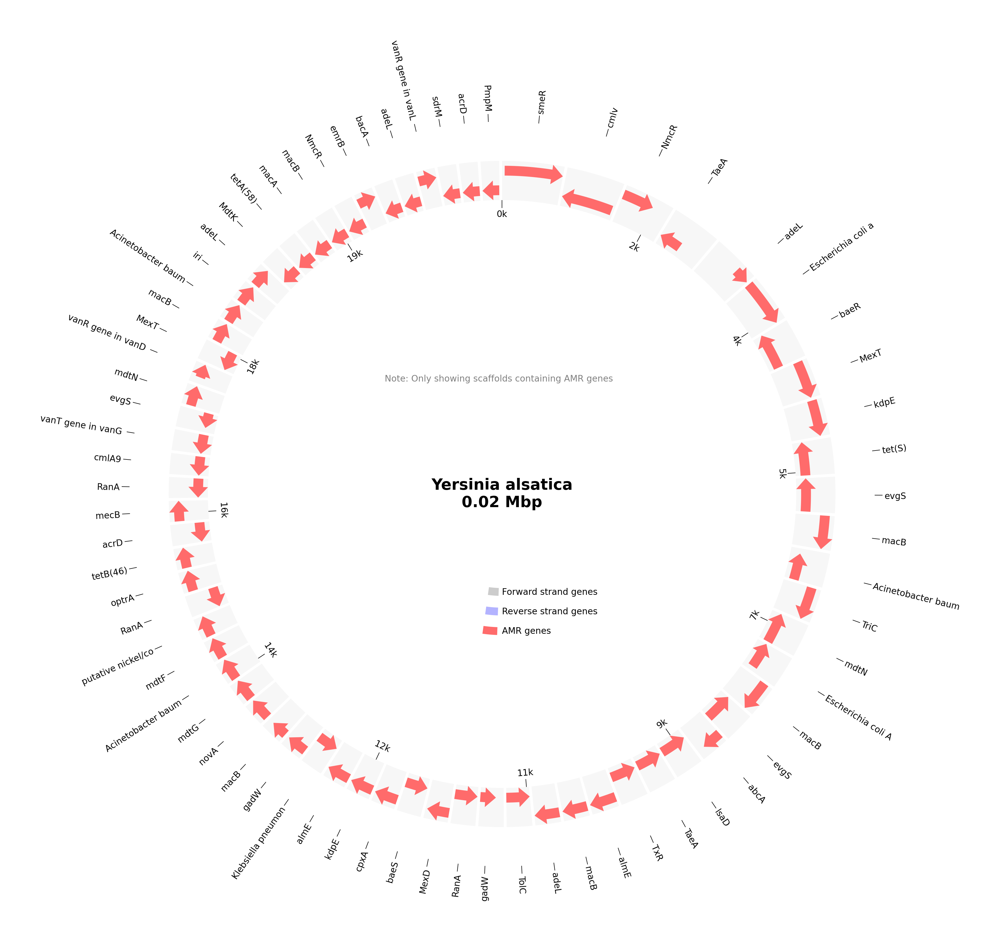

### Acinetobacter baumannii AbaF
- **Mechanism**: antibiotic efflux
- **Drug Classes**: phosphonic acid antibiotic
- **AMR Family**: major facilitator superfamily (MFS) antibiotic efflux pump
- **Locations**:
  - gnl|SPADES|FKHIBMDG_32287_1 : position 1-228

### Acinetobacter baumannii AmvA (found in 2 locations)
- **Mechanism**: antibiotic efflux
- **Drug Classes**: macrolide antibiotic; disinfecting agents and antiseptics
- **AMR Family**: major facilitator superfamily (MFS) antibiotic efflux pump
- **Locations**:
  - gnl|SPADES|FKHIBMDG_15137_1 : position 64-390
  - gnl|SPADES|FKHIBMDG_26973_1 : position 1-255

### Escherichia coli AcrAB-TolC with AcrR mutation conferring resistance to ciprofloxacin, tetracycline, and ceftazidime
- **Mechanism**: antibiotic target alteration; antibiotic efflux
- **Drug Classes**: fluoroquinolone antibiotic; cephalosporin; glycylcycline; penam; tetracycline antibiotic; rifamycin antibiotic; phenicol antibiotic; disinfecting agents and antiseptics
- **AMR Family**: resistance-nodulation-cell division (RND) antibiotic efflux pump
- **Locations**:
  - gnl|SPADES|FKHIBMDG_15924_1 : position 1-321

### Escherichia coli acrA
- **Mechanism**: antibiotic efflux
- **Drug Classes**: fluoroquinolone antibiotic; cephalosporin; glycylcycline; penam; tetracycline antibiotic; rifamycin antibiotic; phenicol antibiotic; disinfecting agents and antiseptics
- **AMR Family**: resistance-nodulation-cell division (RND) antibiotic efflux pump
- **Locations**:
  - gnl|SPADES|FKHIBMDG_10184_1 : position 1-546

### Klebsiella pneumoniae OmpK37
- **Mechanism**: reduced permeability to antibiotic
- **Drug Classes**: monobactam; carbapenem; cephalosporin; cephamycin; penam; penem
- **AMR Family**: General Bacterial Porin with reduced permeability to beta-lactams
- **Locations**:
  - gnl|SPADES|FKHIBMDG_25879_1 : position 2-259

### MdtK
- **Mechanism**: antibiotic efflux
- **Drug Classes**: fluoroquinolone antibiotic
- **AMR Family**: multidrug and toxic compound extrusion (MATE) transporter
- **Locations**:
  - gnl|SPADES|FKHIBMDG_33328_1 : position 1-222

### MexD
- **Mechanism**: antibiotic efflux
- **Drug Classes**: macrolide antibiotic; fluoroquinolone antibiotic; aminoglycoside antibiotic; cephalosporin; penam; tetracycline antibiotic; aminocoumarin antibiotic; diaminopyrimidine antibiotic; phenicol antibiotic
- **AMR Family**: resistance-nodulation-cell division (RND) antibiotic efflux pump
- **Locations**:
  - gnl|SPADES|FKHIBMDG_23054_1 : position 2-259

### MexT (found in 2 locations)
- **Mechanism**: antibiotic efflux
- **Drug Classes**: fluoroquinolone antibiotic; diaminopyrimidine antibiotic; phenicol antibiotic
- **AMR Family**: resistance-nodulation-cell division (RND) antibiotic efflux pump
- **Locations**:
  - gnl|SPADES|FKHIBMDG_13078_1 : position 1-438
  - gnl|SPADES|FKHIBMDG_31372_1 : position 1-231

### NmcR (found in 2 locations)
- **Mechanism**: antibiotic inactivation
- **Drug Classes**: carbapenem; cephalosporin; cephamycin; penam
- **AMR Family**: NmcA beta-lactamase
- **Locations**:
  - gnl|SPADES|FKHIBMDG_34147_1 : position 1-216
  - gnl|SPADES|FKHIBMDG_9537_1 : position 3-374

### PmpM
- **Mechanism**: antibiotic efflux
- **Drug Classes**: fluoroquinolone antibiotic; aminoglycoside antibiotic; disinfecting agents and antiseptics
- **AMR Family**: multidrug and toxic compound extrusion (MATE) transporter
- **Locations**:
  - gnl|SPADES|FKHIBMDG_35922_1 : position 1-207

### RanA (found in 3 locations)
- **Mechanism**: antibiotic efflux
- **Drug Classes**: aminoglycoside antibiotic
- **AMR Family**: ATP-binding cassette (ABC) antibiotic efflux pump
- **Locations**:
  - gnl|SPADES|FKHIBMDG_22593_1 : position 2-280
  - gnl|SPADES|FKHIBMDG_28865_1 : position 2-244
  - gnl|SPADES|FKHIBMDG_30569_1 : position 2-235

### TaeA (found in 2 locations)
- **Mechanism**: antibiotic efflux
- **Drug Classes**: pleuromutilin antibiotic
- **AMR Family**: ATP-binding cassette (ABC) antibiotic efflux pump
- **Locations**:
  - gnl|SPADES|FKHIBMDG_19488_1 : position 1-315
  - gnl|SPADES|FKHIBMDG_9809_1 : position 1-276

### TolC
- **Mechanism**: antibiotic efflux
- **Drug Classes**: macrolide antibiotic; fluoroquinolone antibiotic; aminoglycoside antibiotic; carbapenem; cephalosporin; glycylcycline; cephamycin; penam; tetracycline antibiotic; peptide antibiotic; aminocoumarin antibiotic; rifamycin antibiotic; phenicol antibiotic; penem; disinfecting agents and antiseptics
- **AMR Family**: ATP-binding cassette (ABC) antibiotic efflux pump; major facilitator superfamily (MFS) antibiotic efflux pump; resistance-nodulation-cell division (RND) antibiotic efflux pump
- **Locations**:
  - gnl|SPADES|FKHIBMDG_21667_1 : position 2-289

### TriC
- **Mechanism**: antibiotic efflux
- **Drug Classes**: disinfecting agents and antiseptics
- **AMR Family**: resistance-nodulation-cell division (RND) antibiotic efflux pump
- **Locations**:
  - gnl|SPADES|FKHIBMDG_15488_1 : position 2-382

### TxR
- **Mechanism**: antibiotic efflux
- **Drug Classes**: tetracycline antibiotic
- **AMR Family**: ATP-binding cassette (ABC) antibiotic efflux pump
- **Locations**:
  - gnl|SPADES|FKHIBMDG_19619_1 : position 3-314

### abcA
- **Mechanism**: antibiotic efflux
- **Drug Classes**: cephalosporin; penam; peptide antibiotic
- **AMR Family**: ATP-binding cassette (ABC) antibiotic efflux pump
- **Locations**:
  - gnl|SPADES|FKHIBMDG_18967_1 : position 2-238

### acrD (found in 2 locations)
- **Mechanism**: antibiotic efflux
- **Drug Classes**: aminoglycoside antibiotic
- **AMR Family**: resistance-nodulation-cell division (RND) antibiotic efflux pump
- **Locations**:
  - gnl|SPADES|FKHIBMDG_30080_1 : position 2-238
  - gnl|SPADES|FKHIBMDG_35757_1 : position 1-210

### adeL (found in 4 locations)
- **Mechanism**: antibiotic efflux
- **Drug Classes**: fluoroquinolone antibiotic; tetracycline antibiotic
- **AMR Family**: resistance-nodulation-cell division (RND) antibiotic efflux pump
- **Locations**:
  - gnl|SPADES|FKHIBMDG_10100_2 : position 372-551
  - gnl|SPADES|FKHIBMDG_21368_1 : position 3-290
  - gnl|SPADES|FKHIBMDG_33251_1 : position 3-221
  - gnl|SPADES|FKHIBMDG_35265_1 : position 3-212

### almE (found in 2 locations)
- **Mechanism**: antibiotic target alteration
- **Drug Classes**: peptide antibiotic
- **AMR Family**: polymyxin resistance operon; alm glycyltransferase
- **Locations**:
  - gnl|SPADES|FKHIBMDG_19972_1 : position 2-310
  - gnl|SPADES|FKHIBMDG_24293_1 : position 1-270

### bacA
- **Mechanism**: antibiotic target alteration
- **Drug Classes**: peptide antibiotic
- **AMR Family**: undecaprenyl pyrophosphate related proteins
- **Locations**:
  - gnl|SPADES|FKHIBMDG_34847_1 : position 1-213

### baeR
- **Mechanism**: antibiotic efflux
- **Drug Classes**: aminoglycoside antibiotic; aminocoumarin antibiotic
- **AMR Family**: resistance-nodulation-cell division (RND) antibiotic efflux pump
- **Locations**:
  - gnl|SPADES|FKHIBMDG_12795_1 : position 1-447

### baeS
- **Mechanism**: antibiotic efflux
- **Drug Classes**: aminoglycoside antibiotic; aminocoumarin antibiotic
- **AMR Family**: resistance-nodulation-cell division (RND) antibiotic efflux pump
- **Locations**:
  - gnl|SPADES|FKHIBMDG_23332_1 : position 3-275

### cmlA9
- **Mechanism**: antibiotic efflux
- **Drug Classes**: phenicol antibiotic
- **AMR Family**: major facilitator superfamily (MFS) antibiotic efflux pump
- **Locations**:
  - gnl|SPADES|FKHIBMDG_30615_1 : position 2-235

### cmlv
- **Mechanism**: antibiotic inactivation
- **Drug Classes**: phenicol antibiotic
- **AMR Family**: chloramphenicol phosphotransferase
- **Locations**:
  - gnl|SPADES|FKHIBMDG_8240_1 : position 2-634

### cpxA
- **Mechanism**: antibiotic efflux
- **Drug Classes**: aminoglycoside antibiotic; aminocoumarin antibiotic
- **AMR Family**: resistance-nodulation-cell division (RND) antibiotic efflux pump
- **Locations**:
  - gnl|SPADES|FKHIBMDG_23696_1 : position 1-273

### emrB
- **Mechanism**: antibiotic efflux
- **Drug Classes**: fluoroquinolone antibiotic
- **AMR Family**: major facilitator superfamily (MFS) antibiotic efflux pump
- **Locations**:
  - gnl|SPADES|FKHIBMDG_34868_1 : position 1-213

### evgS (found in 3 locations)
- **Mechanism**: antibiotic efflux
- **Drug Classes**: macrolide antibiotic; fluoroquinolone antibiotic; penam; tetracycline antibiotic
- **AMR Family**: major facilitator superfamily (MFS) antibiotic efflux pump; resistance-nodulation-cell division (RND) antibiotic efflux pump
- **Locations**:
  - gnl|SPADES|FKHIBMDG_14184_1 : position 3-410
  - gnl|SPADES|FKHIBMDG_17473_1 : position 1-348
  - gnl|SPADES|FKHIBMDG_30751_2 : position 54-236

### gadW (found in 2 locations)
- **Mechanism**: antibiotic efflux
- **Drug Classes**: macrolide antibiotic; fluoroquinolone antibiotic; penam
- **AMR Family**: resistance-nodulation-cell division (RND) antibiotic efflux pump
- **Locations**:
  - gnl|SPADES|FKHIBMDG_21929_1 : position 95-286
  - gnl|SPADES|FKHIBMDG_25882_1 : position 2-241

### iri
- **Mechanism**: antibiotic inactivation
- **Drug Classes**: rifamycin antibiotic
- **AMR Family**: rifampin monooxygenase
- **Locations**:
  - gnl|SPADES|FKHIBMDG_32600_1 : position 3-227

### kdpE (found in 2 locations)
- **Mechanism**: antibiotic efflux
- **Drug Classes**: aminoglycoside antibiotic
- **AMR Family**: kdpDE
- **Locations**:
  - gnl|SPADES|FKHIBMDG_13742_1 : position 1-420
  - gnl|SPADES|FKHIBMDG_23945_1 : position 3-272

### lsaD
- **Mechanism**: antibiotic target protection
- **Drug Classes**: lincosamide antibiotic; streptogramin antibiotic; streptogramin A antibiotic; pleuromutilin antibiotic
- **AMR Family**: lsa-type ABC-F protein
- **Locations**:
  - gnl|SPADES|FKHIBMDG_19046_1 : position 1-324

### macA
- **Mechanism**: antibiotic efflux
- **Drug Classes**: macrolide antibiotic
- **AMR Family**: ATP-binding cassette (ABC) antibiotic efflux pump
- **Locations**:
  - gnl|SPADES|FKHIBMDG_33414_1 : position 2-220

### macB (found in 6 locations)
- **Mechanism**: antibiotic efflux
- **Drug Classes**: macrolide antibiotic
- **AMR Family**: ATP-binding cassette (ABC) antibiotic efflux pump
- **Locations**:
  - gnl|SPADES|FKHIBMDG_15097_1 : position 1-390
  - gnl|SPADES|FKHIBMDG_16560_1 : position 1-363
  - gnl|SPADES|FKHIBMDG_21068_1 : position 3-293
  - gnl|SPADES|FKHIBMDG_26882_1 : position 3-194
  - gnl|SPADES|FKHIBMDG_31348_1 : position 1-231
  - gnl|SPADES|FKHIBMDG_33845_1 : position 3-218

### mdtF
- **Mechanism**: antibiotic efflux
- **Drug Classes**: macrolide antibiotic; fluoroquinolone antibiotic; penam
- **AMR Family**: resistance-nodulation-cell division (RND) antibiotic efflux pump
- **Locations**:
  - gnl|SPADES|FKHIBMDG_28095_1 : position 1-249

### mdtG
- **Mechanism**: antibiotic efflux
- **Drug Classes**: phosphonic acid antibiotic
- **AMR Family**: major facilitator superfamily (MFS) antibiotic efflux pump
- **Locations**:
  - gnl|SPADES|FKHIBMDG_27018_1 : position 3-254

### mdtN (found in 2 locations)
- **Mechanism**: antibiotic efflux
- **Drug Classes**: nucleoside antibiotic; disinfecting agents and antiseptics
- **AMR Family**: major facilitator superfamily (MFS) antibiotic efflux pump
- **Locations**:
  - gnl|SPADES|FKHIBMDG_15650_1 : position 3-380
  - gnl|SPADES|FKHIBMDG_30925_1 : position 2-235

### mecB
- **Mechanism**: antibiotic target replacement
- **Drug Classes**: penam
- **AMR Family**: methicillin resistant PBP2
- **Locations**:
  - gnl|SPADES|FKHIBMDG_30270_1 : position 2-238

### novA
- **Mechanism**: antibiotic efflux
- **Drug Classes**: aminocoumarin antibiotic
- **AMR Family**: ATP-binding cassette (ABC) antibiotic efflux pump
- **Locations**:
  - gnl|SPADES|FKHIBMDG_26977_1 : position 2-253

### optrA
- **Mechanism**: antibiotic target protection
- **Drug Classes**: oxazolidinone antibiotic; phenicol antibiotic
- **AMR Family**: Miscellaneous ABC-F subfamily ATP-binding cassette ribosomal protection proteins
- **Locations**:
  - gnl|SPADES|FKHIBMDG_29661_1 : position 2-241

### putative nickel/cobalt transporter
- **Mechanism**: antibiotic efflux
- **Drug Classes**: fluoroquinolone antibiotic; aminoglycoside antibiotic; isoniazid-like antibiotic
- **AMR Family**: metal transporters with antibiotic efflux
- **Locations**:
  - gnl|SPADES|FKHIBMDG_28517_1 : position 3-245

### sdrM
- **Mechanism**: antibiotic efflux
- **Drug Classes**: fluoroquinolone antibiotic; disinfecting agents and antiseptics
- **AMR Family**: major facilitator superfamily (MFS) antibiotic efflux pump
- **Locations**:
  - gnl|SPADES|FKHIBMDG_35562_1 : position 1-210

### smeR
- **Mechanism**: antibiotic efflux
- **Drug Classes**: aminoglycoside antibiotic; cephalosporin; cephamycin; penam
- **AMR Family**: resistance-nodulation-cell division (RND) antibiotic efflux pump
- **Locations**:
  - gnl|SPADES|FKHIBMDG_7671_1 : position 30-704

### tet(S)
- **Mechanism**: antibiotic target protection
- **Drug Classes**: tetracycline antibiotic
- **AMR Family**: tetracycline-resistant ribosomal protection protein
- **Locations**:
  - gnl|SPADES|FKHIBMDG_14185_1 : position 1-411

### tetA(58)
- **Mechanism**: antibiotic efflux
- **Drug Classes**: tetracycline antibiotic
- **AMR Family**: major facilitator superfamily (MFS) antibiotic efflux pump
- **Locations**:
  - gnl|SPADES|FKHIBMDG_33490_1 : position 3-221

### tetB(46)
- **Mechanism**: antibiotic efflux
- **Drug Classes**: tetracycline antibiotic
- **AMR Family**: ATP-binding cassette (ABC) antibiotic efflux pump
- **Locations**:
  - gnl|SPADES|FKHIBMDG_29869_1 : position 3-239

### vanR gene in vanD cluster
- **Mechanism**: antibiotic target alteration
- **Drug Classes**: glycopeptide antibiotic
- **AMR Family**: glycopeptide resistance gene cluster; vanR
- **Locations**:
  - gnl|SPADES|FKHIBMDG_31204_1 : position 75-233

### vanR gene in vanL cluster
- **Mechanism**: antibiotic target alteration
- **Drug Classes**: glycopeptide antibiotic
- **AMR Family**: glycopeptide resistance gene cluster; vanR
- **Locations**:
  - gnl|SPADES|FKHIBMDG_35124_1 : position 2-211

### vanT gene in vanG cluster
- **Mechanism**: antibiotic target alteration
- **Drug Classes**: glycopeptide antibiotic
- **AMR Family**: glycopeptide resistance gene cluster; vanT
- **Locations**:
  - gnl|SPADES|FKHIBMDG_30537_1 : position 1-237

## Yersinia enterocolitica
**Strain Statistics:**
- Total genome length: 3551.7 kbp
- Total scaffolds: 627
- Scaffolds with AMR genes: 109
- Total genes annotated: 6194
- Total AMR genes: 389
- Unique AMR genes: 181
- Distinct AMR mechanisms: 11
- Distinct AMR families: 68
- Distinct drug classes: 35

**Circos Plot:**

### ALI-1
- **Mechanism**: antibiotic inactivation
- **Drug Classes**: carbapenem
- **AMR Family**: ALI beta-lactamase
- **Locations**:
  - gnl|SPADES|FKHIBMDG_627_3 : position 1293-3473

### Acinetobacter baumannii AbaF (found in 5 locations)
- **Mechanism**: antibiotic efflux
- **Drug Classes**: phosphonic acid antibiotic
- **AMR Family**: major facilitator superfamily (MFS) antibiotic efflux pump
- **Locations**:
  - gnl|SPADES|FKHIBMDG_1191_4 : position 4195-5598
  - gnl|SPADES|FKHIBMDG_2183_2 : position 1868-2566
  - gnl|SPADES|FKHIBMDG_288_22 : position 25703-27205
  - gnl|SPADES|FKHIBMDG_325_10 : position 8399-9925
  - gnl|SPADES|FKHIBMDG_348_1 : position 3-1109

### Acinetobacter baumannii AbaQ (found in 4 locations)
- **Mechanism**: antibiotic efflux
- **Drug Classes**: fluoroquinolone antibiotic
- **AMR Family**: major facilitator superfamily (MFS) antibiotic efflux pump
- **Locations**:
  - gnl|SPADES|FKHIBMDG_1083_5 : position 3986-5302
  - gnl|SPADES|FKHIBMDG_58_15 : position 16348-17664
  - gnl|SPADES|FKHIBMDG_64_23 : position 19259-20617
  - gnl|SPADES|FKHIBMDG_92_5 : position 5771-7081

### Acinetobacter baumannii AmvA
- **Mechanism**: antibiotic efflux
- **Drug Classes**: macrolide antibiotic; disinfecting agents and antiseptics
- **AMR Family**: major facilitator superfamily (MFS) antibiotic efflux pump
- **Locations**:
  - gnl|SPADES|FKHIBMDG_180_29 : position 33663-35156

### ArnT
- **Mechanism**: antibiotic target alteration
- **Drug Classes**: peptide antibiotic
- **AMR Family**: pmr phosphoethanolamine transferase
- **Locations**:
  - gnl|SPADES|FKHIBMDG_90_25: position 29500-31164

### Bifidobacterium adolescentis rpoB mutants conferring resistance to rifampicin
- **Mechanism**: antibiotic target alteration; antibiotic target replacement
- **Drug Classes**: rifamycin antibiotic
- **AMR Family**: rifamycin-resistant beta-subunit of RNA polymerase (rpoB)
- **Locations**:
  - gnl|SPADES|FKHIBMDG_4363_1 : position 3-1223

### Bifidobacterium bifidum ileS conferring resistance to mupirocin
- **Mechanism**: antibiotic target alteration
- **Drug Classes**: mupirocin-like antibiotic
- **AMR Family**: antibiotic-resistant isoleucyl-tRNA synthetase (ileS)
- **Locations**:
  - gnl|SPADES|FKHIBMDG_144_43 : position 42154-44736

### CMY-70
- **Mechanism**: antibiotic inactivation
- **Drug Classes**: cephamycin
- **AMR Family**: CMY beta-lactamase
- **Locations**:
  - gnl|SPADES|FKHIBMDG_113_39 : position 36485-37651

### CRP (found in 2 locations)
- **Mechanism**: antibiotic efflux
- **Drug Classes**: macrolide antibiotic; fluoroquinolone antibiotic; penam
- **AMR Family**: resistance-nodulation-cell division (RND) antibiotic efflux pump
- **Locations**:
  - gnl|SPADES|FKHIBMDG_48_44 : position 53794-54549
  - gnl|SPADES|FKHIBMDG_494_1: position 43-675

### Clostridioides difficile gyrA conferring resistance to fluoroquinolones
- **Mechanism**: antibiotic target alteration
- **Drug Classes**: fluoroquinolone antibiotic
- **AMR Family**: fluoroquinolone resistant gyrA
- **Locations**:
  - gnl|SPADES|FKHIBMDG_275_6 : position 5748-8402

### Clostridioides difficile gyrB conferring resistance to fluoroquinolones (found in 2 locations)
- **Mechanism**: antibiotic target alteration
- **Drug Classes**: fluoroquinolone antibiotic
- **AMR Family**: fluoroquinolone resistant gyrB
- **Locations**:
  - gnl|SPADES|FKHIBMDG_212_35 : position 39517-41931
  - gnl|SPADES|FKHIBMDG_92_46 : position 52523-54418

### CrcB (found in 2 locations)
- **Mechanism**: antibiotic efflux
- **Drug Classes**: aminoglycoside antibiotic
- **AMR Family**: multidrug and toxic compound extrusion (MATE) transporter
- **Locations**:
  - gnl|SPADES|FKHIBMDG_144_28 : position 28692-29075
  - gnl|SPADES|FKHIBMDG_99_68 : position 62110-62514

### D-Ala-D-Ala ligase
- **Mechanism**: antibiotic target alteration
- **Drug Classes**: glycopeptide antibiotic
- **AMR Family**: Van ligase
- **Locations**:
  - gnl|SPADES|FKHIBMDG_109_53 : position 70034-70954

### Enterobacter cloacae acrA
- **Mechanism**: antibiotic efflux
- **Drug Classes**: fluoroquinolone antibiotic; cephalosporin; glycylcycline; penam; tetracycline antibiotic; rifamycin antibiotic; phenicol antibiotic; disinfecting agents and antiseptics
- **AMR Family**: resistance-nodulation-cell division (RND) antibiotic efflux pump
- **Locations**:
  - gnl|SPADES|FKHIBMDG_36_96 : position 121980-123140

### Enterococcus faecalis cls with mutation conferring resistance to daptomycin
- **Mechanism**: antibiotic target alteration
- **Drug Classes**: peptide antibiotic
- **AMR Family**: daptomycin resistant cls
- **Locations**:
  - gnl|SPADES|FKHIBMDG_333_33 : position 27593-29053

### Erm(34)
- **Mechanism**: antibiotic target alteration
- **Drug Classes**: macrolide antibiotic; lincosamide antibiotic; streptogramin antibiotic; streptogramin A antibiotic; streptogramin B antibiotic
- **AMR Family**: Erm 23S ribosomal RNA methyltransferase
- **Locations**:
  - gnl|SPADES|FKHIBMDG_336_32 : position 28699-29325

### Escherichia coli AcrAB-TolC with AcrR mutation conferring resistance to ciprofloxacin, tetracycline, and ceftazidime
- **Mechanism**: antibiotic target alteration; antibiotic efflux
- **Drug Classes**: fluoroquinolone antibiotic; cephalosporin; glycylcycline; penam; tetracycline antibiotic; rifamycin antibiotic; phenicol antibiotic; disinfecting agents and antiseptics
- **AMR Family**: resistance-nodulation-cell division (RND) antibiotic efflux pump
- **Locations**:
  - gnl|SPADES|FKHIBMDG_519_7 : position 5580-6164

### Escherichia coli EF-Tu mutants conferring resistance to Pulvomycin (found in 2 locations)
- **Mechanism**: antibiotic target alteration
- **Drug Classes**: elfamycin antibiotic
- **AMR Family**: elfamycin resistant EF-Tu
- **Locations**:
  - gnl|SPADES|FKHIBMDG_10995_1 : position 2-508
  - gnl|SPADES|FKHIBMDG_11264_1 : position 2-499

### Escherichia coli acrA
- **Mechanism**: antibiotic efflux
- **Drug Classes**: fluoroquinolone antibiotic; cephalosporin; glycylcycline; penam; tetracycline antibiotic; rifamycin antibiotic; phenicol antibiotic; disinfecting agents and antiseptics
- **AMR Family**: resistance-nodulation-cell division (RND) antibiotic efflux pump
- **Locations**:
  - gnl|SPADES|FKHIBMDG_288_18 : position 19118-20320

### Escherichia coli mdfA
- **Mechanism**: antibiotic efflux
- **Drug Classes**: tetracycline antibiotic; phenicol antibiotic; disinfecting agents and antiseptics
- **AMR Family**: major facilitator superfamily (MFS) antibiotic efflux pump
- **Locations**:
  - gnl|SPADES|FKHIBMDG_434_7 : position 8381-9610

### Escherichia coli soxS with mutation conferring antibiotic resistance (found in 4 locations)
- **Mechanism**: antibiotic target alteration; antibiotic efflux; reduced permeability to antibiotic
- **Drug Classes**: fluoroquinolone antibiotic; monobactam; carbapenem; cephalosporin; glycylcycline; cephamycin; penam; tetracycline antibiotic; rifamycin antibiotic; phenicol antibiotic; penem; disinfecting agents and antiseptics
- **AMR Family**: ATP-binding cassette (ABC) antibiotic efflux pump; major facilitator superfamily (MFS) antibiotic efflux pump; resistance-nodulation-cell division (RND) antibiotic efflux pump; General Bacterial Porin with reduced permeability to beta-lactams
- **Locations**:
  - gnl|SPADES|FKHIBMDG_239_31 : position 37468-38400
  - gnl|SPADES|FKHIBMDG_348_10 : position 11751-12617
  - gnl|SPADES|FKHIBMDG_94_50 : position 55823-56530
  - gnl|SPADES|FKHIBMDG_99_41 : position 37770-38777

### Escherichia coli uhpA with mutation conferring resistance to fosfomycin
- **Mechanism**: antibiotic target alteration
- **Drug Classes**: phosphonic acid antibiotic
- **AMR Family**: antibiotic-resistant UhpT
- **Locations**:
  - gnl|SPADES|FKHIBMDG_371_5 : position 5377-5961

### H-NS
- **Mechanism**: antibiotic efflux
- **Drug Classes**: macrolide antibiotic; fluoroquinolone antibiotic; cephalosporin; cephamycin; penam; tetracycline antibiotic
- **AMR Family**: major facilitator superfamily (MFS) antibiotic efflux pump; resistance-nodulation-cell division (RND) antibiotic efflux pump
- **Locations**:
  - gnl|SPADES|FKHIBMDG_458_8 : position 7280-7690

### Haemophilus influenzae PBP3 conferring resistance to beta-lactam antibiotics
- **Mechanism**: antibiotic target alteration
- **Drug Classes**: cephalosporin; cephamycin; penam
- **AMR Family**: Penicillin-binding protein mutations conferring resistance to beta-lactam antibiotics
- **Locations**:
  - gnl|SPADES|FKHIBMDG_109_45 : position 59196-60959

### Helicobacter pylori pbp1 mutants conferring resistance to amoxicillin
- **Mechanism**: antibiotic target alteration
- **Drug Classes**: cephalosporin; cephamycin; penam
- **AMR Family**: Penicillin-binding protein mutations conferring resistance to beta-lactam antibiotics
- **Locations**:
  - gnl|SPADES|FKHIBMDG_254_4 : position 9656-11992

### Helicobacter pylori pbp2 mutants conferring resistance to amoxicillin
- **Mechanism**: antibiotic target alteration
- **Drug Classes**: cephalosporin; cephamycin; penam
- **AMR Family**: Penicillin-binding protein mutations conferring resistance to beta-lactam antibiotics
- **Locations**:
  - gnl|SPADES|FKHIBMDG_144_37 : position 36855-38750

### Helicobacter pylori pbp3 conferring resistance to amoxicillin
- **Mechanism**: antibiotic target alteration
- **Drug Classes**: cephalosporin; cephamycin; penam
- **AMR Family**: Penicillin-binding protein mutations conferring resistance to beta-lactam antibiotics
- **Locations**:
  - gnl|SPADES|FKHIBMDG_116_3 : position 1226-2935

### Klebsiella pneumoniae KpnE
- **Mechanism**: antibiotic efflux
- **Drug Classes**: macrolide antibiotic; aminoglycoside antibiotic; cephalosporin; tetracycline antibiotic; peptide antibiotic; rifamycin antibiotic; disinfecting agents and antiseptics
- **AMR Family**: small multidrug resistance (SMR) antibiotic efflux pump
- **Locations**:
  - gnl|SPADES|FKHIBMDG_361_24 : position 16763-17140

### Klebsiella pneumoniae KpnF
- **Mechanism**: antibiotic efflux
- **Drug Classes**: macrolide antibiotic; aminoglycoside antibiotic; cephalosporin; tetracycline antibiotic; peptide antibiotic; rifamycin antibiotic; disinfecting agents and antiseptics
- **AMR Family**: small multidrug resistance (SMR) antibiotic efflux pump
- **Locations**:
  - gnl|SPADES|FKHIBMDG_361_23: position 16447-16776

### Klebsiella pneumoniae KpnH
- **Mechanism**: antibiotic efflux
- **Drug Classes**: macrolide antibiotic; fluoroquinolone antibiotic; aminoglycoside antibiotic; carbapenem; cephalosporin; penam; peptide antibiotic; penem
- **AMR Family**: major facilitator superfamily (MFS) antibiotic efflux pump
- **Locations**:
  - gnl|SPADES|FKHIBMDG_54_7: position 7730-9262

### Klebsiella pneumoniae OmpK37 (found in 4 locations)
- **Mechanism**: reduced permeability to antibiotic
- **Drug Classes**: monobactam; carbapenem; cephalosporin; cephamycin; penam; penem
- **AMR Family**: General Bacterial Porin with reduced permeability to beta-lactams
- **Locations**:
  - gnl|SPADES|FKHIBMDG_10_48 : position 53328-54437
  - gnl|SPADES|FKHIBMDG_16341_1 : position 2-364
  - gnl|SPADES|FKHIBMDG_275_16 : position 35108-35506
  - gnl|SPADES|FKHIBMDG_649_7 : position 11552-12667

### LRA-19 (found in 2 locations)
- **Mechanism**: antibiotic inactivation
- **Drug Classes**: cephalosporin; penam
- **AMR Family**: subclass B3 LRA beta-lactamase
- **Locations**:
  - gnl|SPADES|FKHIBMDG_10_50 : position 55953-56600
  - gnl|SPADES|FKHIBMDG_649_4 : position 7526-8173

### LlmA 23S ribosomal RNA methyltransferase
- **Mechanism**: antibiotic target alteration
- **Drug Classes**: lincosamide antibiotic
- **AMR Family**: Llm 23S ribosomal RNA methyltransferase
- **Locations**:
  - gnl|SPADES|FKHIBMDG_10_16 : position 14892-16085

### LpsB (found in 2 locations)
- **Mechanism**: reduced permeability to antibiotic
- **Drug Classes**: peptide antibiotic
- **AMR Family**: Intrinsic peptide antibiotic resistant Lps
- **Locations**:
  - gnl|SPADES|FKHIBMDG_765_6 : position 5851-6927
  - gnl|SPADES|FKHIBMDG_774_5 : position 4704-5807

### LptD
- **Mechanism**: antibiotic efflux
- **Drug Classes**: carbapenem; peptide antibiotic; aminocoumarin antibiotic; rifamycin antibiotic
- **AMR Family**: ATP-binding cassette (ABC) antibiotic efflux pump
- **Locations**:
  - gnl|SPADES|FKHIBMDG_109_13 : position 13236-15632

### MSI-1
- **Mechanism**: antibiotic inactivation
- **Drug Classes**: carbapenem
- **AMR Family**: MSI beta-lactamase
- **Locations**:
  - gnl|SPADES|FKHIBMDG_99_24 : position 21723-22478

### MdtK
- **Mechanism**: antibiotic efflux
- **Drug Classes**: fluoroquinolone antibiotic
- **AMR Family**: multidrug and toxic compound extrusion (MATE) transporter
- **Locations**:
  - gnl|SPADES|FKHIBMDG_519_15 : position 13364-14761

### MexE
- **Mechanism**: antibiotic efflux
- **Drug Classes**: fluoroquinolone antibiotic; diaminopyrimidine antibiotic; phenicol antibiotic
- **AMR Family**: resistance-nodulation-cell division (RND) antibiotic efflux pump
- **Locations**:
  - gnl|SPADES|FKHIBMDG_202_30 : position 37872-39164

### MexF
- **Mechanism**: antibiotic efflux
- **Drug Classes**: fluoroquinolone antibiotic; diaminopyrimidine antibiotic; phenicol antibiotic
- **AMR Family**: resistance-nodulation-cell division (RND) antibiotic efflux pump
- **Locations**:
  - gnl|SPADES|FKHIBMDG_288_19 : position 20333-23458

### MexH
- **Mechanism**: antibiotic efflux
- **Drug Classes**: fluoroquinolone antibiotic; tetracycline antibiotic; disinfecting agents and antiseptics
- **AMR Family**: resistance-nodulation-cell division (RND) antibiotic efflux pump
- **Locations**:
  - gnl|SPADES|FKHIBMDG_92_15 : position 18210-19739

### MexJ
- **Mechanism**: antibiotic efflux
- **Drug Classes**: macrolide antibiotic; tetracycline antibiotic; disinfecting agents and antiseptics
- **AMR Family**: resistance-nodulation-cell division (RND) antibiotic efflux pump
- **Locations**:
  - gnl|SPADES|FKHIBMDG_36_22 : position 32005-33087

### MexS (found in 5 locations)
- **Mechanism**: antibiotic efflux
- **Drug Classes**: fluoroquinolone antibiotic; diaminopyrimidine antibiotic; phenicol antibiotic
- **AMR Family**: resistance-nodulation-cell division (RND) antibiotic efflux pump
- **Locations**:
  - gnl|SPADES|FKHIBMDG_1012_4 : position 2333-3409
  - gnl|SPADES|FKHIBMDG_11489_1 : position 1-492
  - gnl|SPADES|FKHIBMDG_160_21 : position 21902-22912
  - gnl|SPADES|FKHIBMDG_160_31 : position 36667-37701
  - gnl|SPADES|FKHIBMDG_519_4 : position 2379-3389

### MuxB
- **Mechanism**: antibiotic efflux
- **Drug Classes**: macrolide antibiotic; monobactam; tetracycline antibiotic; aminocoumarin antibiotic
- **AMR Family**: resistance-nodulation-cell division (RND) antibiotic efflux pump
- **Locations**:
  - gnl|SPADES|FKHIBMDG_92_16 : position 19736-22867

### Mycobacterium tuberculosis gidB mutation conferring resistance to streptomycin
- **Mechanism**: antibiotic target alteration
- **Drug Classes**: aminoglycoside antibiotic
- **AMR Family**: antibiotic resistant gidB
- **Locations**:
  - gnl|SPADES|FKHIBMDG_465_17 : position 19182-19802

### Mycobacterium tuberculosis kasA mutant conferring resistance to isoniazid
- **Mechanism**: antibiotic target alteration
- **Drug Classes**: isoniazid-like antibiotic
- **AMR Family**: antibiotic resistant kasA
- **Locations**:
  - gnl|SPADES|FKHIBMDG_99_15 : position 12304-13479

### Mycobacterium tuberculosis ndh with mutation conferring resistance to isoniazid
- **Mechanism**: antibiotic target alteration
- **Drug Classes**: isoniazid-like antibiotic
- **AMR Family**: antibiotic resistant ndh
- **Locations**:
  - gnl|SPADES|FKHIBMDG_64_74 : position 74829-76133

### Mycobacterium tuberculosis pncA mutations conferring resistance to pyrazinamide
- **Mechanism**: antibiotic target alteration
- **Drug Classes**: pyrazine antibiotic
- **AMR Family**: Pyrazinamide resistant pncA
- **Locations**:
  - gnl|SPADES|FKHIBMDG_763_1 : position 93-746

### Mycobacterium tuberculosis rpsA mutations conferring resistance to pyrazinamide
- **Mechanism**: antibiotic target alteration
- **Drug Classes**: pyrazine antibiotic
- **AMR Family**: pyrazinamide resistant rpsA
- **Locations**:
  - gnl|SPADES|FKHIBMDG_10_68 : position 78979-80688

### Mycobacterium tuberculosis thyA with mutation conferring resistance to para-aminosalicylic acid
- **Mechanism**: antibiotic target alteration
- **Drug Classes**: salicylic acid antibiotic
- **AMR Family**: aminosalicylate resistant thymidylate synthase
- **Locations**:
  - gnl|SPADES|FKHIBMDG_57_10 : position 17502-18296

### Neisseria gonorrhoeae pilQ gene conferring resistance to beta-lactam
- **Mechanism**: antibiotic target alteration
- **Drug Classes**: cephalosporin; cephamycin; penam
- **AMR Family**: Penicillin-binding protein mutations conferring resistance to beta-lactam antibiotics
- **Locations**:
  - gnl|SPADES|FKHIBMDG_57_40 : position 50913-52859

### NmcR (found in 13 locations)
- **Mechanism**: antibiotic inactivation
- **Drug Classes**: carbapenem; cephalosporin; cephamycin; penam
- **AMR Family**: NmcA beta-lactamase
- **Locations**:
  - gnl|SPADES|FKHIBMDG_113_38 : position 35466-36350
  - gnl|SPADES|FKHIBMDG_138_22 : position 25886-26806
  - gnl|SPADES|FKHIBMDG_180_6 : position 6363-7250
  - gnl|SPADES|FKHIBMDG_227_3 : position 3117-3998
  - gnl|SPADES|FKHIBMDG_318_16 : position 17921-18832
  - gnl|SPADES|FKHIBMDG_48_19 : position 18906-19772
  - gnl|SPADES|FKHIBMDG_503_6 : position 5236-6153
  - gnl|SPADES|FKHIBMDG_573_1 : position 311-1177
  - gnl|SPADES|FKHIBMDG_57_88 : position 101407-102300
  - gnl|SPADES|FKHIBMDG_58_38 : position 42076-43008
  - gnl|SPADES|FKHIBMDG_639_12 : position 10740-11714
  - gnl|SPADES|FKHIBMDG_673_7 : position 7493-8374
  - gnl|SPADES|FKHIBMDG_98_47 : position 39924-40817

### OXA-152
- **Mechanism**: antibiotic inactivation
- **Drug Classes**: carbapenem; penam
- **AMR Family**: OXA beta-lactamase; OXA-62-like beta-lactamase
- **Locations**:
  - gnl|SPADES|FKHIBMDG_79_53 : position 60803-61507

### OmpA (found in 5 locations)
- **Mechanism**: reduced permeability to antibiotic
- **Drug Classes**: peptide antibiotic
- **AMR Family**: General Bacterial Porin with reduced permeability to peptide antibiotics
- **Locations**:
  - gnl|SPADES|FKHIBMDG_10_26 : position 25232-26311
  - gnl|SPADES|FKHIBMDG_212_20 : position 22549-23208
  - gnl|SPADES|FKHIBMDG_348_18 : position 21910-22419
  - gnl|SPADES|FKHIBMDG_98_53 : position 46325-47995
  - gnl|SPADES|FKHIBMDG_98_70 : position 68616-69992

### OprM
- **Mechanism**: antibiotic efflux
- **Drug Classes**: macrolide antibiotic; fluoroquinolone antibiotic; monobactam; aminoglycoside antibiotic; carbapenem; cephalosporin; cephamycin; penam; tetracycline antibiotic; peptide antibiotic; aminocoumarin antibiotic; diaminopyrimidine antibiotic; sulfonamide antibiotic; phenicol antibiotic; penem; disinfecting agents and antiseptics
- **AMR Family**: resistance-nodulation-cell division (RND) antibiotic efflux pump
- **Locations**:
  - gnl|SPADES|FKHIBMDG_36_94 : position 117443-118849

### PDC-103
- **Mechanism**: antibiotic inactivation
- **Drug Classes**: monobactam; carbapenem; cephalosporin
- **AMR Family**: PDC beta-lactamase
- **Locations**:
  - gnl|SPADES|FKHIBMDG_519_9 : position 7397-7858

### ParR (found in 2 locations)
- **Mechanism**: antibiotic efflux; reduced permeability to antibiotic
- **Drug Classes**: macrolide antibiotic; fluoroquinolone antibiotic; monobactam; aminoglycoside antibiotic; carbapenem; cephalosporin; cephamycin; penam; tetracycline antibiotic; phenicol antibiotic; penem; disinfecting agents and antiseptics
- **AMR Family**: resistance-nodulation-cell division (RND) antibiotic efflux pump; Outer Membrane Porin (Opr)
- **Locations**:
  - gnl|SPADES|FKHIBMDG_251_14 : position 15645-16364
  - gnl|SPADES|FKHIBMDG_48_51 : position 62894-63622

### ParS
- **Mechanism**: antibiotic efflux; reduced permeability to antibiotic
- **Drug Classes**: macrolide antibiotic; fluoroquinolone antibiotic; monobactam; aminoglycoside antibiotic; carbapenem; cephalosporin; cephamycin; penam; tetracycline antibiotic; phenicol antibiotic; penem; disinfecting agents and antiseptics
- **AMR Family**: resistance-nodulation-cell division (RND) antibiotic efflux pump; Outer Membrane Porin (Opr)
- **Locations**:
  - gnl|SPADES|FKHIBMDG_48_52 : position 63619-64932

### Planobispora rosea EF-Tu mutants conferring resistance to inhibitor GE2270A (found in 2 locations)
- **Mechanism**: antibiotic target alteration
- **Drug Classes**: elfamycin antibiotic
- **AMR Family**: elfamycin resistant EF-Tu
- **Locations**:
  - gnl|SPADES|FKHIBMDG_336_21 : position 19889-21388
  - gnl|SPADES|FKHIBMDG_434_6 : position 6423-8315

### PmrF (found in 3 locations)
- **Mechanism**: antibiotic target alteration
- **Drug Classes**: peptide antibiotic
- **AMR Family**: pmr phosphoethanolamine transferase
- **Locations**:
  - gnl|SPADES|FKHIBMDG_494_13 : position 10040-11029
  - gnl|SPADES|FKHIBMDG_717_7 : position 9162-10121
  - gnl|SPADES|FKHIBMDG_90_28 : position 34078-35061

### Pseudomonas aeruginosa CpxR (found in 2 locations)
- **Mechanism**: antibiotic efflux
- **Drug Classes**: macrolide antibiotic; fluoroquinolone antibiotic; monobactam; aminoglycoside antibiotic; carbapenem; cephalosporin; cephamycin; penam; tetracycline antibiotic; peptide antibiotic; aminocoumarin antibiotic; diaminopyrimidine antibiotic; sulfonamide antibiotic; phenicol antibiotic; penem
- **AMR Family**: resistance-nodulation-cell division (RND) antibiotic efflux pump
- **Locations**:
  - gnl|SPADES|FKHIBMDG_325_18 : position 18522-19205
  - gnl|SPADES|FKHIBMDG_330_11 : position 8625-9323

### Pseudomonas aeruginosa ampR with mutation conferring resistance to aztreonam
- **Mechanism**: antibiotic target alteration; antibiotic inactivation
- **Drug Classes**: monobactam; carbapenem; cephalosporin
- **AMR Family**: PDC beta-lactamase; ampR transcriptional regulator with mutation conferring resistance to monobactam antibiotics
- **Locations**:
  - gnl|SPADES|FKHIBMDG_53_65 : position 72191-73132

### QepA4
- **Mechanism**: antibiotic efflux
- **Drug Classes**: fluoroquinolone antibiotic
- **AMR Family**: major facilitator superfamily (MFS) antibiotic efflux pump
- **Locations**:
  - gnl|SPADES|FKHIBMDG_318_15 : position 16452-17744

### RanA (found in 22 locations)
- **Mechanism**: antibiotic efflux
- **Drug Classes**: aminoglycoside antibiotic
- **AMR Family**: ATP-binding cassette (ABC) antibiotic efflux pump
- **Locations**:
  - gnl|SPADES|FKHIBMDG_102_29 : position 31892-32995
  - gnl|SPADES|FKHIBMDG_10_10 : position 8270-9340
  - gnl|SPADES|FKHIBMDG_10_113 : position 136626-137759
  - gnl|SPADES|FKHIBMDG_10_171 : position 202704-204296
  - gnl|SPADES|FKHIBMDG_1140_1 : position 101-916
  - gnl|SPADES|FKHIBMDG_180_22 : position 24279-25328
  - gnl|SPADES|FKHIBMDG_180_31 : position 36504-37310
  - gnl|SPADES|FKHIBMDG_196_13 : position 10428-11231
  - gnl|SPADES|FKHIBMDG_202_8 : position 11979-13070
  - gnl|SPADES|FKHIBMDG_243_16 : position 28542-29657
  - gnl|SPADES|FKHIBMDG_284_16 : position 23331-24353
  - gnl|SPADES|FKHIBMDG_297_10 : position 12024-12800
  - gnl|SPADES|FKHIBMDG_36_57 : position 75593-76471
  - gnl|SPADES|FKHIBMDG_36_79 : position 97817-98932
  - gnl|SPADES|FKHIBMDG_458_17 : position 19744-20745
  - gnl|SPADES|FKHIBMDG_458_18 : position 20742-21743
  - gnl|SPADES|FKHIBMDG_53_32 : position 35695-37209
  - gnl|SPADES|FKHIBMDG_53_59 : position 66029-66844
  - gnl|SPADES|FKHIBMDG_54_22 : position 23112-23846
  - gnl|SPADES|FKHIBMDG_58_58 : position 63344-64162
  - gnl|SPADES|FKHIBMDG_90_69 : position 72879-74006
  - gnl|SPADES|FKHIBMDG_99_31 : position 27353-28552

### RanB (found in 2 locations)
- **Mechanism**: antibiotic efflux
- **Drug Classes**: aminoglycoside antibiotic
- **AMR Family**: ATP-binding cassette (ABC) antibiotic efflux pump
- **Locations**:
  - gnl|SPADES|FKHIBMDG_180_30 : position 35365-36510
  - gnl|SPADES|FKHIBMDG_196_12 : position 9635-10417

### Rv1877 (found in 2 locations)
- **Mechanism**: antibiotic efflux
- **Drug Classes**: fluoroquinolone antibiotic
- **AMR Family**: major facilitator superfamily (MFS) antibiotic efflux pump
- **Locations**:
  - gnl|SPADES|FKHIBMDG_202_28 : position 35891-37279
  - gnl|SPADES|FKHIBMDG_212_22 : position 24110-25558

### Salmonella serovars soxS with mutation conferring antibiotic resistance
- **Mechanism**: antibiotic target alteration; antibiotic efflux; reduced permeability to antibiotic
- **Drug Classes**: fluoroquinolone antibiotic; monobactam; carbapenem; cephalosporin; glycylcycline; cephamycin; penam; tetracycline antibiotic; rifamycin antibiotic; phenicol antibiotic; penem; disinfecting agents and antiseptics
- **AMR Family**: ATP-binding cassette (ABC) antibiotic efflux pump; major facilitator superfamily (MFS) antibiotic efflux pump; resistance-nodulation-cell division (RND) antibiotic efflux pump; General Bacterial Porin with reduced permeability to beta-lactams
- **Locations**:
  - gnl|SPADES|FKHIBMDG_64_9 : position 6351-6737

### SatA
- **Mechanism**: antibiotic inactivation
- **Drug Classes**: nucleoside antibiotic
- **AMR Family**: streptothricin acetyltransferase (SAT)
- **Locations**:
  - gnl|SPADES|FKHIBMDG_519_1 : position 198-656

### Staphylococcus aureus GlpT with mutation conferring resistance to fosfomycin (found in 2 locations)
- **Mechanism**: antibiotic target alteration
- **Drug Classes**: phosphonic acid antibiotic
- **AMR Family**: antibiotic-resistant GlpT
- **Locations**:
  - gnl|SPADES|FKHIBMDG_102_61 : position 64975-66339
  - gnl|SPADES|FKHIBMDG_312_25 : position 29819-31183

### Staphylococcus aureus fusA with mutation conferring resistance to fusidic acid (found in 3 locations)
- **Mechanism**: antibiotic target alteration
- **Drug Classes**: fusidane antibiotic
- **AMR Family**: antibiotic resistant fusA
- **Locations**:
  - gnl|SPADES|FKHIBMDG_2667_2 : position 195-2036
  - gnl|SPADES|FKHIBMDG_525_12 : position 12734-14323
  - gnl|SPADES|FKHIBMDG_53_54 : position 59755-61863

### Staphylococcus aureus mupB conferring resistance to mupirocin
- **Mechanism**: antibiotic target alteration
- **Drug Classes**: mupirocin-like antibiotic
- **AMR Family**: antibiotic-resistant isoleucyl-tRNA synthetase (ileS)
- **Locations**:
  - gnl|SPADES|FKHIBMDG_36_49 : position 65635-68532

### Staphylococcus aureus murA with mutation conferring resistance to fosfomycin
- **Mechanism**: antibiotic target alteration
- **Drug Classes**: phosphonic acid antibiotic
- **AMR Family**: antibiotic-resistant murA transferase
- **Locations**:
  - gnl|SPADES|FKHIBMDG_196_7 : position 6274-7542

### Staphylococcus aureus pgsA mutations conferring resistance to daptomycin
- **Mechanism**: antibiotic target alteration
- **Drug Classes**: peptide antibiotic
- **AMR Family**: daptomycin resistant pgsA
- **Locations**:
  - gnl|SPADES|FKHIBMDG_83_1 : position 196-744

### Streptococcus pneumoniae PBP2x conferring resistance to amoxicillin
- **Mechanism**: antibiotic target alteration
- **Drug Classes**: cephalosporin; cephamycin; penam
- **AMR Family**: Penicillin-binding protein mutations conferring resistance to beta-lactam antibiotics
- **Locations**:
  - gnl|SPADES|FKHIBMDG_251_6 : position 4220-6775

### Streptomyces lividans cmlR
- **Mechanism**: antibiotic efflux
- **Drug Classes**: phenicol antibiotic
- **AMR Family**: major facilitator superfamily (MFS) antibiotic efflux pump
- **Locations**:
  - gnl|SPADES|FKHIBMDG_138_16 : position 18724-19938

### Streptomyces rimosus otr(A) (found in 2 locations)
- **Mechanism**: antibiotic target protection
- **Drug Classes**: tetracycline antibiotic
- **AMR Family**: tetracycline-resistant ribosomal protection protein
- **Locations**:
  - gnl|SPADES|FKHIBMDG_446_13 : position 15426-17249
  - gnl|SPADES|FKHIBMDG_896_6 : position 4733-7426

### Streptomyces venezuelae rox (found in 2 locations)
- **Mechanism**: antibiotic inactivation
- **Drug Classes**: rifamycin antibiotic
- **AMR Family**: rifampin monooxygenase
- **Locations**:
  - gnl|SPADES|FKHIBMDG_144_56 : position 58048-59229
  - gnl|SPADES|FKHIBMDG_57_81 : position 94073-95242

### TaeA (found in 5 locations)
- **Mechanism**: antibiotic efflux
- **Drug Classes**: pleuromutilin antibiotic
- **AMR Family**: ATP-binding cassette (ABC) antibiotic efflux pump
- **Locations**:
  - gnl|SPADES|FKHIBMDG_10_34 : position 33660-35564
  - gnl|SPADES|FKHIBMDG_18071_1 : position 2-337
  - gnl|SPADES|FKHIBMDG_18073_1 : position 2-235
  - gnl|SPADES|FKHIBMDG_348_19 : position 22709-24376
  - gnl|SPADES|FKHIBMDG_99_56 : position 49761-50426

### TolC (found in 2 locations)
- **Mechanism**: antibiotic efflux
- **Drug Classes**: macrolide antibiotic; fluoroquinolone antibiotic; aminoglycoside antibiotic; carbapenem; cephalosporin; glycylcycline; cephamycin; penam; tetracycline antibiotic; peptide antibiotic; aminocoumarin antibiotic; rifamycin antibiotic; phenicol antibiotic; penem; disinfecting agents and antiseptics
- **AMR Family**: ATP-binding cassette (ABC) antibiotic efflux pump; major facilitator superfamily (MFS) antibiotic efflux pump; resistance-nodulation-cell division (RND) antibiotic efflux pump
- **Locations**:
  - gnl|SPADES|FKHIBMDG_275_13 : position 29563-30948
  - gnl|SPADES|FKHIBMDG_92_51 : position 57547-59028

### TriC
- **Mechanism**: antibiotic efflux
- **Drug Classes**: disinfecting agents and antiseptics
- **AMR Family**: resistance-nodulation-cell division (RND) antibiotic efflux pump
- **Locations**:
  - gnl|SPADES|FKHIBMDG_36_21 : position 28919-32005

### TxR (found in 7 locations)
- **Mechanism**: antibiotic efflux
- **Drug Classes**: tetracycline antibiotic
- **AMR Family**: ATP-binding cassette (ABC) antibiotic efflux pump
- **Locations**:
  - gnl|SPADES|FKHIBMDG_298_8 : position 5432-6544
  - gnl|SPADES|FKHIBMDG_36_10 : position 12971-14890
  - gnl|SPADES|FKHIBMDG_446_10 : position 10891-12303
  - gnl|SPADES|FKHIBMDG_48_8 : position 8473-10014
  - gnl|SPADES|FKHIBMDG_48_82 : position 102596-104179
  - gnl|SPADES|FKHIBMDG_48_91 : position 109902-110912
  - gnl|SPADES|FKHIBMDG_833_4 : position 2005-3342

### YajC
- **Mechanism**: antibiotic efflux
- **Drug Classes**: fluoroquinolone antibiotic; cephalosporin; glycylcycline; penam; tetracycline antibiotic; oxazolidinone antibiotic; glycopeptide antibiotic; rifamycin antibiotic; phenicol antibiotic; disinfecting agents and antiseptics
- **AMR Family**: resistance-nodulation-cell division (RND) antibiotic efflux pump
- **Locations**:
  - gnl|SPADES|FKHIBMDG_679_3 : position 2856-3188

### YojI (found in 2 locations)
- **Mechanism**: antibiotic efflux
- **Drug Classes**: peptide antibiotic
- **AMR Family**: ATP-binding cassette (ABC) antibiotic efflux pump
- **Locations**:
  - gnl|SPADES|FKHIBMDG_17796_1 : position 2-340
  - gnl|SPADES|FKHIBMDG_17801_1 : position 2-340

### acrB
- **Mechanism**: antibiotic efflux
- **Drug Classes**: fluoroquinolone antibiotic; cephalosporin; glycylcycline; penam; tetracycline antibiotic; rifamycin antibiotic; phenicol antibiotic; disinfecting agents and antiseptics
- **AMR Family**: resistance-nodulation-cell division (RND) antibiotic efflux pump
- **Locations**:
  - gnl|SPADES|FKHIBMDG_36_95 : position 118851-121976

### adeF
- **Mechanism**: antibiotic efflux
- **Drug Classes**: fluoroquinolone antibiotic; tetracycline antibiotic
- **AMR Family**: resistance-nodulation-cell division (RND) antibiotic efflux pump
- **Locations**:
  - gnl|SPADES|FKHIBMDG_79_59: position 65998-69129

### adeK
- **Mechanism**: antibiotic efflux
- **Drug Classes**: macrolide antibiotic; fluoroquinolone antibiotic; lincosamide antibiotic; carbapenem; cephalosporin; tetracycline antibiotic; rifamycin antibiotic; diaminopyrimidine antibiotic; phenicol antibiotic; penem
- **AMR Family**: resistance-nodulation-cell division (RND) antibiotic efflux pump
- **Locations**:
  - gnl|SPADES|FKHIBMDG_53_72 : position 79355-80761

### adeL (found in 18 locations)
- **Mechanism**: antibiotic efflux
- **Drug Classes**: fluoroquinolone antibiotic; tetracycline antibiotic
- **AMR Family**: resistance-nodulation-cell division (RND) antibiotic efflux pump
- **Locations**:
  - gnl|SPADES|FKHIBMDG_10_141 : position 167877-168749
  - gnl|SPADES|FKHIBMDG_10_2 : position 1186-2067
  - gnl|SPADES|FKHIBMDG_138_17 : position 20034-20993
  - gnl|SPADES|FKHIBMDG_144_5 : position 6179-7090
  - gnl|SPADES|FKHIBMDG_174_43 : position 50117-50977
  - gnl|SPADES|FKHIBMDG_213_32 : position 39920-40852
  - gnl|SPADES|FKHIBMDG_348_20 : position 24452-25363
  - gnl|SPADES|FKHIBMDG_36_62 : position 78576-79484
  - gnl|SPADES|FKHIBMDG_431_13 : position 15447-16352
  - gnl|SPADES|FKHIBMDG_475_7 : position 8967-9884
  - gnl|SPADES|FKHIBMDG_48_39 : position 49895-50857
  - gnl|SPADES|FKHIBMDG_519_5 : position 3565-4461
  - gnl|SPADES|FKHIBMDG_525_17 : position 17683-18633
  - gnl|SPADES|FKHIBMDG_57_24 : position 37108-38004
  - gnl|SPADES|FKHIBMDG_620_8 : position 13418-14314
  - gnl|SPADES|FKHIBMDG_92_45 : position 51596-52519
  - gnl|SPADES|FKHIBMDG_996_8 : position 6746-7654
  - gnl|SPADES|FKHIBMDG_99_20 : position 16981-17883

### almE (found in 2 locations)
- **Mechanism**: antibiotic target alteration
- **Drug Classes**: peptide antibiotic
- **AMR Family**: polymyxin resistance operon; alm glycyltransferase
- **Locations**:
  - gnl|SPADES|FKHIBMDG_361_18 : position 10417-12111
  - gnl|SPADES|FKHIBMDG_57_18 : position 26918-29074

### arlR (found in 2 locations)
- **Mechanism**: antibiotic efflux
- **Drug Classes**: fluoroquinolone antibiotic; disinfecting agents and antiseptics
- **AMR Family**: major facilitator superfamily (MFS) antibiotic efflux pump
- **Locations**:
  - gnl|SPADES|FKHIBMDG_144_12 : position 12734-13423
  - gnl|SPADES|FKHIBMDG_882_6 : position 5479-6195

### arlS
- **Mechanism**: antibiotic efflux
- **Drug Classes**: fluoroquinolone antibiotic; disinfecting agents and antiseptics
- **AMR Family**: major facilitator superfamily (MFS) antibiotic efflux pump
- **Locations**:
  - gnl|SPADES|FKHIBMDG_202_15 : position 20976-22553

### arnA (found in 2 locations)
- **Mechanism**: antibiotic target alteration
- **Drug Classes**: peptide antibiotic
- **AMR Family**: pmr phosphoethanolamine transferase
- **Locations**:
  - gnl|SPADES|FKHIBMDG_1021_8 : position 4853-5800
  - gnl|SPADES|FKHIBMDG_90_27 : position 32063-34081

### bacA
- **Mechanism**: antibiotic target alteration
- **Drug Classes**: peptide antibiotic
- **AMR Family**: undecaprenyl pyrophosphate related proteins
- **Locations**:
  - gnl|SPADES|FKHIBMDG_92_62 : position 73629-74447

### baeR (found in 3 locations)
- **Mechanism**: antibiotic efflux
- **Drug Classes**: aminoglycoside antibiotic; aminocoumarin antibiotic
- **AMR Family**: resistance-nodulation-cell division (RND) antibiotic efflux pump
- **Locations**:
  - gnl|SPADES|FKHIBMDG_180_10 : position 10525-11265
  - gnl|SPADES|FKHIBMDG_54_79 : position 98852-99541
  - gnl|SPADES|FKHIBMDG_79_16 : position 12672-13394

### baeS (found in 3 locations)
- **Mechanism**: antibiotic efflux
- **Drug Classes**: aminoglycoside antibiotic; aminocoumarin antibiotic
- **AMR Family**: resistance-nodulation-cell division (RND) antibiotic efflux pump
- **Locations**:
  - gnl|SPADES|FKHIBMDG_57_68 : position 80458-81885
  - gnl|SPADES|FKHIBMDG_79_17 : position 13400-14776
  - gnl|SPADES|FKHIBMDG_833_6 : position 4406-5842

### basS (found in 3 locations)
- **Mechanism**: antibiotic target alteration; antibiotic efflux
- **Drug Classes**: peptide antibiotic
- **AMR Family**: pmr phosphoethanolamine transferase
- **Locations**:
  - gnl|SPADES|FKHIBMDG_297_19 : position 20946-22295
  - gnl|SPADES|FKHIBMDG_4396_1 : position 3-779
  - gnl|SPADES|FKHIBMDG_811_1 : position 3-932

### bcr-1 (found in 2 locations)
- **Mechanism**: antibiotic efflux
- **Drug Classes**: bicyclomycin-like antibiotic
- **AMR Family**: major facilitator superfamily (MFS) antibiotic efflux pump
- **Locations**:
  - gnl|SPADES|FKHIBMDG_10_173 : position 205432-206655
  - gnl|SPADES|FKHIBMDG_5405_1 : position 3-941

### bcrA (found in 4 locations)
- **Mechanism**: antibiotic efflux
- **Drug Classes**: peptide antibiotic
- **AMR Family**: ATP-binding cassette (ABC) antibiotic efflux pump
- **Locations**:
  - gnl|SPADES|FKHIBMDG_361_32 : position 26168-26926
  - gnl|SPADES|FKHIBMDG_36_29 : position 43479-45044
  - gnl|SPADES|FKHIBMDG_483_21 : position 18701-19327
  - gnl|SPADES|FKHIBMDG_98_41 : position 34366-35181

### catB11
- **Mechanism**: antibiotic inactivation
- **Drug Classes**: phenicol antibiotic
- **AMR Family**: chloramphenicol acetyltransferase (CAT)
- **Locations**:
  - gnl|SPADES|FKHIBMDG_113_29 : position 30094-30738

### chrB
- **Mechanism**: antibiotic target alteration
- **Drug Classes**: macrolide antibiotic; lincosamide antibiotic
- **AMR Family**: non-erm 23S ribosomal RNA methyltransferase (G748)
- **Locations**:
  - gnl|SPADES|FKHIBMDG_116_4 : position 3053-3913

### clbB
- **Mechanism**: antibiotic target alteration
- **Drug Classes**: lincosamide antibiotic; streptogramin antibiotic; streptogramin A antibiotic; oxazolidinone antibiotic; phenicol antibiotic; pleuromutilin antibiotic
- **AMR Family**: Cfr 23S ribosomal RNA methyltransferase
- **Locations**:
  - gnl|SPADES|FKHIBMDG_254_7 : position 15491-16687

### cmeC
- **Mechanism**: antibiotic efflux
- **Drug Classes**: macrolide antibiotic; fluoroquinolone antibiotic; cephalosporin; fusidane antibiotic
- **AMR Family**: resistance-nodulation-cell division (RND) antibiotic efflux pump
- **Locations**:
  - gnl|SPADES|FKHIBMDG_202_33 : position 40863-42350

### cmlA9
- **Mechanism**: antibiotic efflux
- **Drug Classes**: phenicol antibiotic
- **AMR Family**: major facilitator superfamily (MFS) antibiotic efflux pump
- **Locations**:
  - gnl|SPADES|FKHIBMDG_431_10 : position 10105-11295

### cmlB
- **Mechanism**: antibiotic efflux
- **Drug Classes**: phenicol antibiotic
- **AMR Family**: major facilitator superfamily (MFS) antibiotic efflux pump
- **Locations**:
  - gnl|SPADES|FKHIBMDG_202_11 : position 16438-17769

### cmlv (found in 2 locations)
- **Mechanism**: antibiotic inactivation
- **Drug Classes**: phenicol antibiotic
- **AMR Family**: chloramphenicol phosphotransferase
- **Locations**:
  - gnl|SPADES|FKHIBMDG_57_23 : position 35441-36601
  - gnl|SPADES|FKHIBMDG_99_21 : position 18002-19183

### cmx
- **Mechanism**: antibiotic efflux
- **Drug Classes**: phenicol antibiotic
- **AMR Family**: major facilitator superfamily (MFS) antibiotic efflux pump
- **Locations**:
  - gnl|SPADES|FKHIBMDG_54_13 : position 14045-15247

### cprR
- **Mechanism**: antibiotic target alteration; antibiotic efflux
- **Drug Classes**: peptide antibiotic
- **AMR Family**: pmr phosphoethanolamine transferase
- **Locations**:
  - gnl|SPADES|FKHIBMDG_811_2 : position 929-1591

### cpxA (found in 5 locations)
- **Mechanism**: antibiotic efflux
- **Drug Classes**: aminoglycoside antibiotic; aminocoumarin antibiotic
- **AMR Family**: resistance-nodulation-cell division (RND) antibiotic efflux pump
- **Locations**:
  - gnl|SPADES|FKHIBMDG_251_13 : position 14296-15648
  - gnl|SPADES|FKHIBMDG_325_19 : position 19231-20598
  - gnl|SPADES|FKHIBMDG_330_12 : position 9320-10696
  - gnl|SPADES|FKHIBMDG_446_11 : position 12311-13360
  - gnl|SPADES|FKHIBMDG_64_64 : position 60381-61787

### dfrA3
- **Mechanism**: antibiotic target replacement
- **Drug Classes**: diaminopyrimidine antibiotic
- **AMR Family**: trimethoprim resistant dihydrofolate reductase dfr
- **Locations**:
  - gnl|SPADES|FKHIBMDG_109_7 : position 8228-8710

### emrA
- **Mechanism**: antibiotic efflux
- **Drug Classes**: fluoroquinolone antibiotic
- **AMR Family**: major facilitator superfamily (MFS) antibiotic efflux pump
- **Locations**:
  - gnl|SPADES|FKHIBMDG_54_8 : position 9302-10474

### emrB
- **Mechanism**: antibiotic efflux
- **Drug Classes**: fluoroquinolone antibiotic
- **AMR Family**: major facilitator superfamily (MFS) antibiotic efflux pump
- **Locations**:
  - gnl|SPADES|FKHIBMDG_465_2 : position 940-2364

### emrR
- **Mechanism**: antibiotic efflux
- **Drug Classes**: fluoroquinolone antibiotic
- **AMR Family**: major facilitator superfamily (MFS) antibiotic efflux pump
- **Locations**:
  - gnl|SPADES|FKHIBMDG_54_10 : position 12003-12515

### emrY (found in 2 locations)
- **Mechanism**: antibiotic efflux
- **Drug Classes**: tetracycline antibiotic
- **AMR Family**: major facilitator superfamily (MFS) antibiotic efflux pump
- **Locations**:
  - gnl|SPADES|FKHIBMDG_318_26 : position 26827-28257
  - gnl|SPADES|FKHIBMDG_79_18 : position 14793-16202

### eptB
- **Mechanism**: antibiotic target alteration
- **Drug Classes**: peptide antibiotic
- **AMR Family**: pmr phosphoethanolamine transferase
- **Locations**:
  - gnl|SPADES|FKHIBMDG_312_22 : position 25836-27527

### erm(45)
- **Mechanism**: antibiotic target alteration
- **Drug Classes**: macrolide antibiotic; lincosamide antibiotic; streptogramin antibiotic; streptogramin B antibiotic
- **AMR Family**: Erm 23S ribosomal RNA methyltransferase
- **Locations**:
  - gnl|SPADES|FKHIBMDG_109_10 : position 10074-10892

### evgA (found in 10 locations)
- **Mechanism**: antibiotic efflux
- **Drug Classes**: macrolide antibiotic; fluoroquinolone antibiotic; penam; tetracycline antibiotic
- **AMR Family**: major facilitator superfamily (MFS) antibiotic efflux pump; resistance-nodulation-cell division (RND) antibiotic efflux pump
- **Locations**:
  - gnl|SPADES|FKHIBMDG_202_13 : position 19437-20066
  - gnl|SPADES|FKHIBMDG_202_7 : position 10489-11121
  - gnl|SPADES|FKHIBMDG_297_18 : position 20363-20971
  - gnl|SPADES|FKHIBMDG_312_23 : position 27639-28229
  - gnl|SPADES|FKHIBMDG_318_11 : position 12898-13617
  - gnl|SPADES|FKHIBMDG_48_21 : position 22590-23294
  - gnl|SPADES|FKHIBMDG_79_61 : position 69716-70345
  - gnl|SPADES|FKHIBMDG_79_71 : position 79829-80473
  - gnl|SPADES|FKHIBMDG_83_3 : position 2628-3284
  - gnl|SPADES|FKHIBMDG_94_64 : position 68375-69007

### evgS (found in 7 locations)
- **Mechanism**: antibiotic efflux
- **Drug Classes**: macrolide antibiotic; fluoroquinolone antibiotic; penam; tetracycline antibiotic
- **AMR Family**: major facilitator superfamily (MFS) antibiotic efflux pump; resistance-nodulation-cell division (RND) antibiotic efflux pump
- **Locations**:
  - gnl|SPADES|FKHIBMDG_160_44 : position 51049-51438
  - gnl|SPADES|FKHIBMDG_202_6 : position 6690-10514
  - gnl|SPADES|FKHIBMDG_275_7 : position 8473-11394
  - gnl|SPADES|FKHIBMDG_275_9 : position 12272-14965
  - gnl|SPADES|FKHIBMDG_371_6 : position 5939-7699
  - gnl|SPADES|FKHIBMDG_579_4 : position 7676-10012
  - gnl|SPADES|FKHIBMDG_94_63 : position 65537-68350

### facT
- **Mechanism**: antibiotic efflux
- **Drug Classes**: elfamycin antibiotic
- **AMR Family**: major facilitator superfamily (MFS) antibiotic efflux pump
- **Locations**:
  - gnl|SPADES|FKHIBMDG_174_28 : position 37862-39166

### fexA
- **Mechanism**: antibiotic efflux
- **Drug Classes**: phenicol antibiotic
- **AMR Family**: major facilitator superfamily (MFS) antibiotic efflux pump
- **Locations**:
  - gnl|SPADES|FKHIBMDG_99_42 : position 38865-40100

### gadW (found in 5 locations)
- **Mechanism**: antibiotic efflux
- **Drug Classes**: macrolide antibiotic; fluoroquinolone antibiotic; penam
- **AMR Family**: resistance-nodulation-cell division (RND) antibiotic efflux pump
- **Locations**:
  - gnl|SPADES|FKHIBMDG_5395_1 : position 109-918
  - gnl|SPADES|FKHIBMDG_58_72 : position 77347-78135
  - gnl|SPADES|FKHIBMDG_83_45 : position 45814-46683
  - gnl|SPADES|FKHIBMDG_98_25 : position 20711-21613
  - gnl|SPADES|FKHIBMDG_99_47 : position 42145-43128

### golS
- **Mechanism**: antibiotic efflux
- **Drug Classes**: monobactam; carbapenem; cephalosporin; cephamycin; penam; phenicol antibiotic; penem
- **AMR Family**: resistance-nodulation-cell division (RND) antibiotic efflux pump
- **Locations**:
  - gnl|SPADES|FKHIBMDG_1021_3 : position 720-1145

### hp1181
- **Mechanism**: antibiotic efflux
- **Drug Classes**: fluoroquinolone antibiotic; tetracycline antibiotic; nitroimidazole antibiotic
- **AMR Family**: major facilitator superfamily (MFS) antibiotic efflux pump
- **Locations**:
  - gnl|SPADES|FKHIBMDG_553_15 : position 13552-14916

### kdpE (found in 2 locations)
- **Mechanism**: antibiotic efflux
- **Drug Classes**: aminoglycoside antibiotic
- **AMR Family**: kdpDE
- **Locations**:
  - gnl|SPADES|FKHIBMDG_202_14 : position 20268-20954
  - gnl|SPADES|FKHIBMDG_64_63 : position 59656-60327

### leuO (found in 4 locations)
- **Mechanism**: antibiotic efflux
- **Drug Classes**: nucleoside antibiotic; disinfecting agents and antiseptics
- **AMR Family**: major facilitator superfamily (MFS) antibiotic efflux pump
- **Locations**:
  - gnl|SPADES|FKHIBMDG_109_36 : position 48986-49942
  - gnl|SPADES|FKHIBMDG_48_22 : position 23522-24469
  - gnl|SPADES|FKHIBMDG_57_22 : position 34491-35444
  - gnl|SPADES|FKHIBMDG_79_72 : position 80480-81382

### lfrA
- **Mechanism**: antibiotic efflux
- **Drug Classes**: fluoroquinolone antibiotic
- **AMR Family**: major facilitator superfamily (MFS) antibiotic efflux pump
- **Locations**:
  - gnl|SPADES|FKHIBMDG_1213_2 : position 449-1816

### macA (found in 3 locations)
- **Mechanism**: antibiotic efflux
- **Drug Classes**: macrolide antibiotic
- **AMR Family**: ATP-binding cassette (ABC) antibiotic efflux pump
- **Locations**:
  - gnl|SPADES|FKHIBMDG_10_92 : position 112558-113586
  - gnl|SPADES|FKHIBMDG_325_17 : position 17125-18333
  - gnl|SPADES|FKHIBMDG_53_74 : position 82724-83899

### macB (found in 29 locations)
- **Mechanism**: antibiotic efflux
- **Drug Classes**: macrolide antibiotic
- **AMR Family**: ATP-binding cassette (ABC) antibiotic efflux pump
- **Locations**:
  - gnl|SPADES|FKHIBMDG_102_47 : position 50712-51380
  - gnl|SPADES|FKHIBMDG_109_20 : position 28216-28920
  - gnl|SPADES|FKHIBMDG_10_104 : position 128341-129120
  - gnl|SPADES|FKHIBMDG_10_131 : position 156914-157900
  - gnl|SPADES|FKHIBMDG_10_43 : position 44579-45352
  - gnl|SPADES|FKHIBMDG_10_91 : position 110609-112558
  - gnl|SPADES|FKHIBMDG_1140_2 : position 916-1908
  - gnl|SPADES|FKHIBMDG_144_46 : position 47455-48180
  - gnl|SPADES|FKHIBMDG_202_34 : position 42343-43557
  - gnl|SPADES|FKHIBMDG_202_35 : position 43550-44251
  - gnl|SPADES|FKHIBMDG_23631_1 : position 2-274
  - gnl|SPADES|FKHIBMDG_284_17 : position 24350-25330
  - gnl|SPADES|FKHIBMDG_297_23 : position 25956-26972
  - gnl|SPADES|FKHIBMDG_325_14 : position 12926-14017
  - gnl|SPADES|FKHIBMDG_325_16 : position 15139-17121
  - gnl|SPADES|FKHIBMDG_336_24 : position 22527-23261
  - gnl|SPADES|FKHIBMDG_36_71 : position 90102-90836
  - gnl|SPADES|FKHIBMDG_434_15 : position 18440-19972
  - gnl|SPADES|FKHIBMDG_465_7 : position 6279-7811
  - gnl|SPADES|FKHIBMDG_475_10 : position 11191-11952
  - gnl|SPADES|FKHIBMDG_475_2 : position 706-3537
  - gnl|SPADES|FKHIBMDG_494_9 : position 6443-7210
  - gnl|SPADES|FKHIBMDG_53_73 : position 80758-82734
  - gnl|SPADES|FKHIBMDG_562_4 : position 3506-4234
  - gnl|SPADES|FKHIBMDG_64_29 : position 27751-28533
  - gnl|SPADES|FKHIBMDG_64_70 : position 67919-68623
  - gnl|SPADES|FKHIBMDG_83_33 : position 33556-34311
  - gnl|SPADES|FKHIBMDG_906_10 : position 6841-7872
  - gnl|SPADES|FKHIBMDG_99_55 : position 49073-49768

### marA (found in 2 locations)
- **Mechanism**: antibiotic efflux; reduced permeability to antibiotic
- **Drug Classes**: fluoroquinolone antibiotic; monobactam; carbapenem; cephalosporin; glycylcycline; cephamycin; penam; tetracycline antibiotic; rifamycin antibiotic; phenicol antibiotic; penem; disinfecting agents and antiseptics
- **AMR Family**: resistance-nodulation-cell division (RND) antibiotic efflux pump; General Bacterial Porin with reduced permeability to beta-lactams
- **Locations**:
  - gnl|SPADES|FKHIBMDG_239_16 : position 17067-17954
  - gnl|SPADES|FKHIBMDG_64_21 : position 17206-18081

### mdtA
- **Mechanism**: antibiotic efflux
- **Drug Classes**: aminocoumarin antibiotic
- **AMR Family**: resistance-nodulation-cell division (RND) antibiotic efflux pump
- **Locations**:
  - gnl|SPADES|FKHIBMDG_79_22 : position 22598-23932

### mdtB
- **Mechanism**: antibiotic efflux
- **Drug Classes**: aminocoumarin antibiotic
- **AMR Family**: resistance-nodulation-cell division (RND) antibiotic efflux pump
- **Locations**:
  - gnl|SPADES|FKHIBMDG_79_21 : position 19455-22598

### mdtC
- **Mechanism**: antibiotic efflux
- **Drug Classes**: aminocoumarin antibiotic
- **AMR Family**: resistance-nodulation-cell division (RND) antibiotic efflux pump
- **Locations**:
  - gnl|SPADES|FKHIBMDG_79_20 : position 16384-19458

### mdtG
- **Mechanism**: antibiotic efflux
- **Drug Classes**: phosphonic acid antibiotic
- **AMR Family**: major facilitator superfamily (MFS) antibiotic efflux pump
- **Locations**:
  - gnl|SPADES|FKHIBMDG_371_2 : position 2055-3299

### mdtH (found in 2 locations)
- **Mechanism**: antibiotic efflux
- **Drug Classes**: fluoroquinolone antibiotic
- **AMR Family**: major facilitator superfamily (MFS) antibiotic efflux pump
- **Locations**:
  - gnl|SPADES|FKHIBMDG_1113_6 : position 4823-6028
  - gnl|SPADES|FKHIBMDG_470_21 : position 19766-21247

### mdtN (found in 2 locations)
- **Mechanism**: antibiotic efflux
- **Drug Classes**: nucleoside antibiotic; disinfecting agents and antiseptics
- **AMR Family**: major facilitator superfamily (MFS) antibiotic efflux pump
- **Locations**:
  - gnl|SPADES|FKHIBMDG_275_15 : position 33272-34441
  - gnl|SPADES|FKHIBMDG_996_6 : position 5287-6222

### mdtP
- **Mechanism**: antibiotic efflux
- **Drug Classes**: nucleoside antibiotic; disinfecting agents and antiseptics
- **AMR Family**: major facilitator superfamily (MFS) antibiotic efflux pump
- **Locations**:
  - gnl|SPADES|FKHIBMDG_54_9 : position 10489-11955

### msbA (found in 7 locations)
- **Mechanism**: antibiotic efflux
- **Drug Classes**: nitroimidazole antibiotic
- **AMR Family**: ATP-binding cassette (ABC) antibiotic efflux pump
- **Locations**:
  - gnl|SPADES|FKHIBMDG_10_65 : position 74338-76083
  - gnl|SPADES|FKHIBMDG_10_84 : position 101983-103749
  - gnl|SPADES|FKHIBMDG_10_85 : position 103752-105476
  - gnl|SPADES|FKHIBMDG_144_20 : position 21670-23442
  - gnl|SPADES|FKHIBMDG_239_22 : position 24156-26282
  - gnl|SPADES|FKHIBMDG_627_4 : position 3509-5257
  - gnl|SPADES|FKHIBMDG_79_31 : position 39480-40292

### msr(I)
- **Mechanism**: antibiotic target protection
- **Drug Classes**: macrolide antibiotic; streptogramin antibiotic; phosphonic acid antibiotic
- **AMR Family**: msr-type ABC-F protein
- **Locations**:
  - gnl|SPADES|FKHIBMDG_94_27 : position 34240-35985

### mtrA
- **Mechanism**: antibiotic efflux
- **Drug Classes**: macrolide antibiotic; penam
- **AMR Family**: resistance-nodulation-cell division (RND) antibiotic efflux pump
- **Locations**:
  - gnl|SPADES|FKHIBMDG_434_17 : position 21227-22420

### novA (found in 4 locations)
- **Mechanism**: antibiotic efflux
- **Drug Classes**: aminocoumarin antibiotic
- **AMR Family**: ATP-binding cassette (ABC) antibiotic efflux pump
- **Locations**:
  - gnl|SPADES|FKHIBMDG_239_24 : position 27676-29808
  - gnl|SPADES|FKHIBMDG_275_14 : position 31124-33259
  - gnl|SPADES|FKHIBMDG_64_13 : position 9785-11503
  - gnl|SPADES|FKHIBMDG_90_7 : position 7282-8028

### oleC (found in 5 locations)
- **Mechanism**: antibiotic efflux
- **Drug Classes**: macrolide antibiotic
- **AMR Family**: ATP-binding cassette (ABC) antibiotic efflux pump
- **Locations**:
  - gnl|SPADES|FKHIBMDG_53_41 : position 47425-48159
  - gnl|SPADES|FKHIBMDG_53_42 : position 48156-48875
  - gnl|SPADES|FKHIBMDG_600_9 : position 7696-8445
  - gnl|SPADES|FKHIBMDG_717_4 : position 2996-4306
  - gnl|SPADES|FKHIBMDG_90_52 : position 54468-55358

### optrA
- **Mechanism**: antibiotic target protection
- **Drug Classes**: oxazolidinone antibiotic; phenicol antibiotic
- **AMR Family**: Miscellaneous ABC-F subfamily ATP-binding cassette ribosomal protection proteins
- **Locations**:
  - gnl|SPADES|FKHIBMDG_494_14 : position 11071-12987

### pp-flo
- **Mechanism**: antibiotic efflux
- **Drug Classes**: phenicol antibiotic
- **AMR Family**: major facilitator superfamily (MFS) antibiotic efflux pump
- **Locations**:
  - gnl|SPADES|FKHIBMDG_330_1 : position 3-266

### putative nickel/cobalt transporter
- **Mechanism**: antibiotic efflux
- **Drug Classes**: fluoroquinolone antibiotic; aminoglycoside antibiotic; isoniazid-like antibiotic
- **AMR Family**: metal transporters with antibiotic efflux
- **Locations**:
  - gnl|SPADES|FKHIBMDG_99_65 : position 58954-60012

### qacJ
- **Mechanism**: antibiotic efflux
- **Drug Classes**: disinfecting agents and antiseptics
- **AMR Family**: small multidrug resistance (SMR) antibiotic efflux pump
- **Locations**:
  - gnl|SPADES|FKHIBMDG_48_70: position 86169-86501

### qacL
- **Mechanism**: antibiotic efflux
- **Drug Classes**: disinfecting agents and antiseptics
- **AMR Family**: small multidrug resistance (SMR) antibiotic efflux pump
- **Locations**:
  - gnl|SPADES|FKHIBMDG_597_7 : position 3927-4241

### rosB
- **Mechanism**: antibiotic efflux
- **Drug Classes**: peptide antibiotic
- **AMR Family**: major facilitator superfamily (MFS) antibiotic efflux pump
- **Locations**:
  - gnl|SPADES|FKHIBMDG_494_16 : position 13831-15639

### rphA
- **Mechanism**: antibiotic inactivation
- **Drug Classes**: rifamycin antibiotic
- **AMR Family**: rifampin phosphotransferase
- **Locations**:
  - gnl|SPADES|FKHIBMDG_90_13 : position 16106-18487

### rphB
- **Mechanism**: antibiotic inactivation
- **Drug Classes**: rifamycin antibiotic
- **AMR Family**: rifampin phosphotransferase
- **Locations**:
  - gnl|SPADES|FKHIBMDG_325_21 : position 21208-22935

### rpoB2
- **Mechanism**: antibiotic target alteration; antibiotic target replacement
- **Drug Classes**: rifamycin antibiotic
- **AMR Family**: rifamycin-resistant beta-subunit of RNA polymerase (rpoB)
- **Locations**:
  - gnl|SPADES|FKHIBMDG_3259_1 : position 2-1648

### rsmA
- **Mechanism**: antibiotic efflux
- **Drug Classes**: fluoroquinolone antibiotic; diaminopyrimidine antibiotic; phenicol antibiotic
- **AMR Family**: resistance-nodulation-cell division (RND) antibiotic efflux pump
- **Locations**:
  - gnl|SPADES|FKHIBMDG_53_1: position 395-580

### sdiA (found in 2 locations)
- **Mechanism**: antibiotic efflux
- **Drug Classes**: fluoroquinolone antibiotic; cephalosporin; glycylcycline; penam; tetracycline antibiotic; rifamycin antibiotic; phenicol antibiotic; disinfecting agents and antiseptics
- **AMR Family**: resistance-nodulation-cell division (RND) antibiotic efflux pump
- **Locations**:
  - gnl|SPADES|FKHIBMDG_1798_3 : position 2139-2867
  - gnl|SPADES|FKHIBMDG_98_51 : position 45098-45700

### smeR
- **Mechanism**: antibiotic efflux
- **Drug Classes**: aminoglycoside antibiotic; cephalosporin; cephamycin; penam
- **AMR Family**: resistance-nodulation-cell division (RND) antibiotic efflux pump
- **Locations**:
  - gnl|SPADES|FKHIBMDG_57_69 : position 81896-82594

### smeS
- **Mechanism**: antibiotic efflux
- **Drug Classes**: aminoglycoside antibiotic; cephalosporin; cephamycin; penam
- **AMR Family**: resistance-nodulation-cell division (RND) antibiotic efflux pump
- **Locations**:
  - gnl|SPADES|FKHIBMDG_54_80 : position 99566-100882

### srmB
- **Mechanism**: antibiotic target protection
- **Drug Classes**: macrolide antibiotic
- **AMR Family**: Miscellaneous ABC-F subfamily ATP-binding cassette ribosomal protection proteins
- **Locations**:
  - gnl|SPADES|FKHIBMDG_13161_2 : position 91-435

### sta
- **Mechanism**: antibiotic inactivation
- **Drug Classes**: nucleoside antibiotic
- **AMR Family**: streptothricin acetyltransferase (SAT)
- **Locations**:
  - gnl|SPADES|FKHIBMDG_36_50 : position 68667-69170

### sul4
- **Mechanism**: antibiotic target replacement
- **Drug Classes**: sulfonamide antibiotic
- **AMR Family**: sulfonamide resistant sul
- **Locations**:
  - gnl|SPADES|FKHIBMDG_811_8 : position 7220-8053

### tet(39)
- **Mechanism**: antibiotic efflux
- **Drug Classes**: tetracycline antibiotic
- **AMR Family**: major facilitator superfamily (MFS) antibiotic efflux pump
- **Locations**:
  - gnl|SPADES|FKHIBMDG_180_9 : position 9057-10301

### tet(V)
- **Mechanism**: antibiotic efflux
- **Drug Classes**: tetracycline antibiotic
- **AMR Family**: major facilitator superfamily (MFS) antibiotic efflux pump
- **Locations**:
  - gnl|SPADES|FKHIBMDG_48_1 : position 3-1217

### tet(W)
- **Mechanism**: antibiotic target protection
- **Drug Classes**: tetracycline antibiotic
- **AMR Family**: tetracycline-resistant ribosomal protection protein
- **Locations**:
  - gnl|SPADES|FKHIBMDG_449_4 : position 2454-4253

### tet(X1)
- **Mechanism**: antibiotic inactivation
- **Drug Classes**: tetracycline antibiotic
- **AMR Family**: tetracycline inactivation enzyme
- **Locations**:
  - gnl|SPADES|FKHIBMDG_57_80 : position 92771-93985

### tetA(46) (found in 2 locations)
- **Mechanism**: antibiotic efflux
- **Drug Classes**: tetracycline antibiotic
- **AMR Family**: ATP-binding cassette (ABC) antibiotic efflux pump
- **Locations**:
  - gnl|SPADES|FKHIBMDG_53_13 : position 15064-16587
  - gnl|SPADES|FKHIBMDG_53_75 : position 83899-86049

### tetA(58) (found in 11 locations)
- **Mechanism**: antibiotic efflux
- **Drug Classes**: tetracycline antibiotic
- **AMR Family**: major facilitator superfamily (MFS) antibiotic efflux pump
- **Locations**:
  - gnl|SPADES|FKHIBMDG_102_39 : position 42741-43442
  - gnl|SPADES|FKHIBMDG_102_40 : position 43487-44254
  - gnl|SPADES|FKHIBMDG_10_138 : position 163965-164753
  - gnl|SPADES|FKHIBMDG_160_3 : position 2577-4112
  - gnl|SPADES|FKHIBMDG_196_19 : position 15209-15934
  - gnl|SPADES|FKHIBMDG_239_29 : position 35785-36270
  - gnl|SPADES|FKHIBMDG_36_58 : position 76458-77174
  - gnl|SPADES|FKHIBMDG_36_70 : position 89282-90088
  - gnl|SPADES|FKHIBMDG_673_10 : position 10384-11874
  - gnl|SPADES|FKHIBMDG_90_30 : position 36545-37303
  - gnl|SPADES|FKHIBMDG_94_21 : position 23804-24589

### tetA(60)
- **Mechanism**: antibiotic efflux
- **Drug Classes**: tetracycline antibiotic
- **AMR Family**: ATP-binding cassette (ABC) antibiotic efflux pump
- **Locations**:
  - gnl|SPADES|FKHIBMDG_213_27 : position 33363-35168

### tlrC
- **Mechanism**: antibiotic target protection
- **Drug Classes**: macrolide antibiotic; lincosamide antibiotic
- **AMR Family**: Miscellaneous ABC-F subfamily ATP-binding cassette ribosomal protection proteins
- **Locations**:
  - gnl|SPADES|FKHIBMDG_92_9 : position 11062-11880

### tsnR (found in 2 locations)
- **Mechanism**: antibiotic target alteration
- **Drug Classes**: peptide antibiotic
- **AMR Family**: non-erm 23S ribosomal RNA methyltransferase (A1067)
- **Locations**:
  - gnl|SPADES|FKHIBMDG_54_6 : position 6431-7522
  - gnl|SPADES|FKHIBMDG_859_4 : position 4685-5425

### ugd
- **Mechanism**: antibiotic target alteration
- **Drug Classes**: peptide antibiotic
- **AMR Family**: pmr phosphoethanolamine transferase
- **Locations**:
  - gnl|SPADES|FKHIBMDG_458_7 : position 5547-6896

### vanE
- **Mechanism**: antibiotic target alteration
- **Drug Classes**: glycopeptide antibiotic
- **AMR Family**: glycopeptide resistance gene cluster; Van ligase
- **Locations**:
  - gnl|SPADES|FKHIBMDG_621_7 : position 6559-7908

### vanG (found in 2 locations)
- **Mechanism**: antibiotic target alteration
- **Drug Classes**: glycopeptide antibiotic
- **AMR Family**: glycopeptide resistance gene cluster; Van ligase
- **Locations**:
  - gnl|SPADES|FKHIBMDG_116_20 : position 21776-22957
  - gnl|SPADES|FKHIBMDG_54_49 : position 58026-59126

### vanH gene in vanB cluster (found in 3 locations)
- **Mechanism**: antibiotic target alteration
- **Drug Classes**: glycopeptide antibiotic
- **AMR Family**: vanH; glycopeptide resistance gene cluster
- **Locations**:
  - gnl|SPADES|FKHIBMDG_1083_6 : position 5312-6262
  - gnl|SPADES|FKHIBMDG_57_86 : position 98970-100211
  - gnl|SPADES|FKHIBMDG_58_71 : position 76168-77301

### vanH gene in vanD cluster
- **Mechanism**: antibiotic target alteration
- **Drug Classes**: glycopeptide antibiotic
- **AMR Family**: vanH; glycopeptide resistance gene cluster
- **Locations**:
  - gnl|SPADES|FKHIBMDG_48_67 : position 83549-84544

### vanH gene in vanF cluster
- **Mechanism**: antibiotic target alteration
- **Drug Classes**: glycopeptide antibiotic
- **AMR Family**: vanH; glycopeptide resistance gene cluster
- **Locations**:
  - gnl|SPADES|FKHIBMDG_212_23 : position 25713-26693

### vanH gene in vanP cluster (found in 3 locations)
- **Mechanism**: antibiotic target alteration
- **Drug Classes**: glycopeptide antibiotic
- **AMR Family**: vanH; glycopeptide resistance gene cluster
- **Locations**:
  - gnl|SPADES|FKHIBMDG_1113_2 : position 1570-2511
  - gnl|SPADES|FKHIBMDG_160_7 : position 7114-8130
  - gnl|SPADES|FKHIBMDG_58_16 : position 17833-18798

### vanR gene in vanC cluster
- **Mechanism**: antibiotic target alteration
- **Drug Classes**: glycopeptide antibiotic
- **AMR Family**: glycopeptide resistance gene cluster; vanR
- **Locations**:
  - gnl|SPADES|FKHIBMDG_298_31 : position 24295-25329

### vanR gene in vanE cluster
- **Mechanism**: antibiotic target alteration
- **Drug Classes**: glycopeptide antibiotic
- **AMR Family**: glycopeptide resistance gene cluster; vanR
- **Locations**:
  - gnl|SPADES|FKHIBMDG_348_8 : position 10151-10867

### vanR gene in vanF cluster (found in 2 locations)
- **Mechanism**: antibiotic target alteration
- **Drug Classes**: glycopeptide antibiotic
- **AMR Family**: glycopeptide resistance gene cluster; vanR
- **Locations**:
  - gnl|SPADES|FKHIBMDG_160_43 : position 49925-50974
  - gnl|SPADES|FKHIBMDG_519_8 : position 6244-7323

### vanR gene in vanM cluster
- **Mechanism**: antibiotic target alteration
- **Drug Classes**: glycopeptide antibiotic
- **AMR Family**: glycopeptide resistance gene cluster; vanR
- **Locations**:
  - gnl|SPADES|FKHIBMDG_57_29 : position 41919-42617

### vanR gene in vanO cluster
- **Mechanism**: antibiotic target alteration
- **Drug Classes**: glycopeptide antibiotic
- **AMR Family**: glycopeptide resistance gene cluster; vanR
- **Locations**:
  - gnl|SPADES|FKHIBMDG_458_6 : position 4209-5225

### vanS gene in vanG cluster
- **Mechanism**: antibiotic target alteration
- **Drug Classes**: glycopeptide antibiotic
- **AMR Family**: vanS; glycopeptide resistance gene cluster
- **Locations**:
  - gnl|SPADES|FKHIBMDG_144_11 : position 11225-12718

### vanT gene in vanC cluster
- **Mechanism**: antibiotic target alteration
- **Drug Classes**: glycopeptide antibiotic
- **AMR Family**: glycopeptide resistance gene cluster; vanT
- **Locations**:
  - gnl|SPADES|FKHIBMDG_1012_6 : position 4937-6016

### vanT gene in vanG cluster
- **Mechanism**: antibiotic target alteration
- **Drug Classes**: glycopeptide antibiotic
- **AMR Family**: glycopeptide resistance gene cluster; vanT
- **Locations**:
  - gnl|SPADES|FKHIBMDG_431_9 : position 9021-10097

### vatF
- **Mechanism**: antibiotic inactivation
- **Drug Classes**: streptogramin antibiotic; streptogramin A antibiotic
- **AMR Family**: streptogramin vat acetyltransferase
- **Locations**:
  - gnl|SPADES|FKHIBMDG_318_7: position 7240-7905

### vmlR
- **Mechanism**: antibiotic target protection
- **Drug Classes**: lincosamide antibiotic; streptogramin antibiotic; streptogramin A antibiotic; streptogramin B antibiotic; nucleoside antibiotic; pleuromutilin antibiotic
- **AMR Family**: Miscellaneous ABC-F subfamily ATP-binding cassette ribosomal protection proteins
- **Locations**:
  - gnl|SPADES|FKHIBMDG_113_27 : position 27024-28787

### y56 beta-lactamase
- **Mechanism**: antibiotic inactivation
- **Drug Classes**: cephalosporin; penam; penem
- **AMR Family**: BlaA beta-lactamase
- **Locations**:
  - gnl|SPADES|FKHIBMDG_318_13: position 14794-15678

## Yersinia enterocolitica (type O:5) str. YE53/03
**Strain Statistics:**
- Total genome length: 515.3 kbp
- Total scaffolds: 48
- Scaffolds with AMR genes: 10
- Total genes annotated: 901
- Total AMR genes: 56
- Unique AMR genes: 40
- Distinct AMR mechanisms: 7
- Distinct AMR families: 16
- Distinct drug classes: 26

**Circos Plot:**

_str._YE53_03.png)

### DHA-6
- **Mechanism**: antibiotic inactivation
- **Drug Classes**: cephalosporin; cephamycin
- **AMR Family**: DHA beta-lactamase
- **Locations**:
  - gnl|SPADES|FKHIBMDG_555_2 : position 1270-2412

### Enterobacter cloacae acrA
- **Mechanism**: antibiotic efflux
- **Drug Classes**: fluoroquinolone antibiotic; cephalosporin; glycylcycline; penam; tetracycline antibiotic; rifamycin antibiotic; phenicol antibiotic; disinfecting agents and antiseptics
- **AMR Family**: resistance-nodulation-cell division (RND) antibiotic efflux pump
- **Locations**:
  - gnl|SPADES|FKHIBMDG_328_12 : position 7464-8447

### Escherichia coli AcrAB-TolC with AcrR mutation conferring resistance to ciprofloxacin, tetracycline, and ceftazidime
- **Mechanism**: antibiotic target alteration; antibiotic efflux
- **Drug Classes**: fluoroquinolone antibiotic; cephalosporin; glycylcycline; penam; tetracycline antibiotic; rifamycin antibiotic; phenicol antibiotic; disinfecting agents and antiseptics
- **AMR Family**: resistance-nodulation-cell division (RND) antibiotic efflux pump
- **Locations**:
  - gnl|SPADES|FKHIBMDG_186_13 : position 13491-14147

### Escherichia coli acrA
- **Mechanism**: antibiotic efflux
- **Drug Classes**: fluoroquinolone antibiotic; cephalosporin; glycylcycline; penam; tetracycline antibiotic; rifamycin antibiotic; phenicol antibiotic; disinfecting agents and antiseptics
- **AMR Family**: resistance-nodulation-cell division (RND) antibiotic efflux pump
- **Locations**:
  - gnl|SPADES|FKHIBMDG_186_14 : position 14292-15803

### EstT
- **Mechanism**: antibiotic inactivation
- **Drug Classes**: macrolide antibiotic
- **AMR Family**: macrolide esterase
- **Locations**:
  - gnl|SPADES|FKHIBMDG_7_219 : position 248740-249534

### Helicobacter pylori pbp1 mutants conferring resistance to amoxicillin
- **Mechanism**: antibiotic target alteration
- **Drug Classes**: cephalosporin; cephamycin; penam
- **AMR Family**: Penicillin-binding protein mutations conferring resistance to beta-lactam antibiotics
- **Locations**:
  - gnl|SPADES|FKHIBMDG_363_5 : position 4344-6830

### Klebsiella pneumoniae OmpK37 (found in 3 locations)
- **Mechanism**: reduced permeability to antibiotic
- **Drug Classes**: monobactam; carbapenem; cephalosporin; cephamycin; penam; penem
- **AMR Family**: General Bacterial Porin with reduced permeability to beta-lactams
- **Locations**:
  - gnl|SPADES|FKHIBMDG_328_13 : position 8693-9808
  - gnl|SPADES|FKHIBMDG_555_1 : position 3-755
  - gnl|SPADES|FKHIBMDG_7_101 : position 115138-116253

### MexS
- **Mechanism**: antibiotic efflux
- **Drug Classes**: fluoroquinolone antibiotic; diaminopyrimidine antibiotic; phenicol antibiotic
- **AMR Family**: resistance-nodulation-cell division (RND) antibiotic efflux pump
- **Locations**:
  - gnl|SPADES|FKHIBMDG_7_67 : position 78321-79475

### OmpA
- **Mechanism**: reduced permeability to antibiotic
- **Drug Classes**: peptide antibiotic
- **AMR Family**: General Bacterial Porin with reduced permeability to peptide antibiotics
- **Locations**:
  - gnl|SPADES|FKHIBMDG_7_175 : position 192454-192960

### OprJ
- **Mechanism**: antibiotic efflux
- **Drug Classes**: macrolide antibiotic; fluoroquinolone antibiotic; aminoglycoside antibiotic; cephalosporin; penam; tetracycline antibiotic; aminocoumarin antibiotic; diaminopyrimidine antibiotic; phenicol antibiotic
- **AMR Family**: resistance-nodulation-cell division (RND) antibiotic efflux pump
- **Locations**:
  - gnl|SPADES|FKHIBMDG_412_13 : position 11913-13433

### ParR
- **Mechanism**: antibiotic efflux; reduced permeability to antibiotic
- **Drug Classes**: macrolide antibiotic; fluoroquinolone antibiotic; monobactam; aminoglycoside antibiotic; carbapenem; cephalosporin; cephamycin; penam; tetracycline antibiotic; phenicol antibiotic; penem; disinfecting agents and antiseptics
- **AMR Family**: resistance-nodulation-cell division (RND) antibiotic efflux pump; Outer Membrane Porin (Opr)
- **Locations**:
  - gnl|SPADES|FKHIBMDG_412_21 : position 23895-24623

### ParS
- **Mechanism**: antibiotic efflux; reduced permeability to antibiotic
- **Drug Classes**: macrolide antibiotic; fluoroquinolone antibiotic; monobactam; aminoglycoside antibiotic; carbapenem; cephalosporin; cephamycin; penam; tetracycline antibiotic; phenicol antibiotic; penem; disinfecting agents and antiseptics
- **AMR Family**: resistance-nodulation-cell division (RND) antibiotic efflux pump; Outer Membrane Porin (Opr)
- **Locations**:
  - gnl|SPADES|FKHIBMDG_412_20 : position 22524-23879

### Staphylococcus aureus mupA conferring resistance to mupirocin
- **Mechanism**: antibiotic target alteration
- **Drug Classes**: mupirocin-like antibiotic
- **AMR Family**: antibiotic-resistant isoleucyl-tRNA synthetase (ileS)
- **Locations**:
  - gnl|SPADES|FKHIBMDG_595_4 : position 2177-4993

### TxR
- **Mechanism**: antibiotic efflux
- **Drug Classes**: tetracycline antibiotic
- **AMR Family**: ATP-binding cassette (ABC) antibiotic efflux pump
- **Locations**:
  - gnl|SPADES|FKHIBMDG_7_57 : position 65061-67220

### adeF
- **Mechanism**: antibiotic efflux
- **Drug Classes**: fluoroquinolone antibiotic; tetracycline antibiotic
- **AMR Family**: resistance-nodulation-cell division (RND) antibiotic efflux pump
- **Locations**:
  - gnl|SPADES|FKHIBMDG_186_15: position 15820-18972

### adeL
- **Mechanism**: antibiotic efflux
- **Drug Classes**: fluoroquinolone antibiotic; tetracycline antibiotic
- **AMR Family**: resistance-nodulation-cell division (RND) antibiotic efflux pump
- **Locations**:
  - gnl|SPADES|FKHIBMDG_7_105 : position 119115-120029

### basS
- **Mechanism**: antibiotic target alteration; antibiotic efflux
- **Drug Classes**: peptide antibiotic
- **AMR Family**: pmr phosphoethanolamine transferase
- **Locations**:
  - gnl|SPADES|FKHIBMDG_995_5 : position 2909-3973

### bcrA (found in 5 locations)
- **Mechanism**: antibiotic efflux
- **Drug Classes**: peptide antibiotic
- **AMR Family**: ATP-binding cassette (ABC) antibiotic efflux pump
- **Locations**:
  - gnl|SPADES|FKHIBMDG_7_115 : position 129940-130638
  - gnl|SPADES|FKHIBMDG_7_148 : position 164296-165003
  - gnl|SPADES|FKHIBMDG_7_156 : position 172517-173581
  - gnl|SPADES|FKHIBMDG_7_2 : position 1178-2659
  - gnl|SPADES|FKHIBMDG_7_60 : position 69661-71181

### blt
- **Mechanism**: antibiotic efflux
- **Drug Classes**: fluoroquinolone antibiotic; disinfecting agents and antiseptics
- **AMR Family**: major facilitator superfamily (MFS) antibiotic efflux pump
- **Locations**:
  - gnl|SPADES|FKHIBMDG_7_36 : position 42104-43324

### cprR
- **Mechanism**: antibiotic target alteration; antibiotic efflux
- **Drug Classes**: peptide antibiotic
- **AMR Family**: pmr phosphoethanolamine transferase
- **Locations**:
  - gnl|SPADES|FKHIBMDG_995_6 : position 3970-4629

### evgS
- **Mechanism**: antibiotic efflux
- **Drug Classes**: macrolide antibiotic; fluoroquinolone antibiotic; penam; tetracycline antibiotic
- **AMR Family**: major facilitator superfamily (MFS) antibiotic efflux pump; resistance-nodulation-cell division (RND) antibiotic efflux pump
- **Locations**:
  - gnl|SPADES|FKHIBMDG_363_18 : position 20803-23652

### golS
- **Mechanism**: antibiotic efflux
- **Drug Classes**: monobactam; carbapenem; cephalosporin; cephamycin; penam; phenicol antibiotic; penem
- **AMR Family**: resistance-nodulation-cell division (RND) antibiotic efflux pump
- **Locations**:
  - gnl|SPADES|FKHIBMDG_230_38 : position 28752-29171

### kdpD
- **Mechanism**: antibiotic efflux
- **Drug Classes**: aminoglycoside antibiotic
- **AMR Family**: kdpDE
- **Locations**:
  - gnl|SPADES|FKHIBMDG_7_213 : position 240607-243306

### kdpE
- **Mechanism**: antibiotic efflux
- **Drug Classes**: aminoglycoside antibiotic
- **AMR Family**: kdpDE
- **Locations**:
  - gnl|SPADES|FKHIBMDG_7_214 : position 243303-243992

### macB (found in 5 locations)
- **Mechanism**: antibiotic efflux
- **Drug Classes**: macrolide antibiotic
- **AMR Family**: ATP-binding cassette (ABC) antibiotic efflux pump
- **Locations**:
  - gnl|SPADES|FKHIBMDG_186_25 : position 26363-26890
  - gnl|SPADES|FKHIBMDG_230_32 : position 23965-24651
  - gnl|SPADES|FKHIBMDG_7_124 : position 139489-140325
  - gnl|SPADES|FKHIBMDG_7_72 : position 84590-85249
  - gnl|SPADES|FKHIBMDG_7_92 : position 103535-104257

### marA
- **Mechanism**: antibiotic efflux; reduced permeability to antibiotic
- **Drug Classes**: fluoroquinolone antibiotic; monobactam; carbapenem; cephalosporin; glycylcycline; cephamycin; penam; tetracycline antibiotic; rifamycin antibiotic; phenicol antibiotic; penem; disinfecting agents and antiseptics
- **AMR Family**: resistance-nodulation-cell division (RND) antibiotic efflux pump; General Bacterial Porin with reduced permeability to beta-lactams
- **Locations**:
  - gnl|SPADES|FKHIBMDG_328_15 : position 10630-11610

### mdtA
- **Mechanism**: antibiotic efflux
- **Drug Classes**: aminocoumarin antibiotic
- **AMR Family**: resistance-nodulation-cell division (RND) antibiotic efflux pump
- **Locations**:
  - gnl|SPADES|FKHIBMDG_7_71 : position 83326-84588

### mdtN (found in 2 locations)
- **Mechanism**: antibiotic efflux
- **Drug Classes**: nucleoside antibiotic; disinfecting agents and antiseptics
- **AMR Family**: major facilitator superfamily (MFS) antibiotic efflux pump
- **Locations**:
  - gnl|SPADES|FKHIBMDG_412_11 : position 8968-10023
  - gnl|SPADES|FKHIBMDG_7_136 : position 151352-152338

### mdtO
- **Mechanism**: antibiotic efflux
- **Drug Classes**: nucleoside antibiotic; disinfecting agents and antiseptics
- **AMR Family**: major facilitator superfamily (MFS) antibiotic efflux pump
- **Locations**:
  - gnl|SPADES|FKHIBMDG_412_12 : position 10007-11911

### mreA
- **Mechanism**: antibiotic efflux
- **Drug Classes**: macrolide antibiotic
- **AMR Family**: major facilitator superfamily (MFS) antibiotic efflux pump
- **Locations**:
  - gnl|SPADES|FKHIBMDG_595_5 : position 5025-5963

### msbA
- **Mechanism**: antibiotic efflux
- **Drug Classes**: nitroimidazole antibiotic
- **AMR Family**: ATP-binding cassette (ABC) antibiotic efflux pump
- **Locations**:
  - gnl|SPADES|FKHIBMDG_412_6 : position 4782-5540

### mtrA
- **Mechanism**: antibiotic efflux
- **Drug Classes**: macrolide antibiotic; penam
- **AMR Family**: resistance-nodulation-cell division (RND) antibiotic efflux pump
- **Locations**:
  - gnl|SPADES|FKHIBMDG_314_5 : position 5340-6347

### nalC
- **Mechanism**: antibiotic efflux
- **Drug Classes**: macrolide antibiotic; fluoroquinolone antibiotic; monobactam; carbapenem; cephalosporin; cephamycin; penam; tetracycline antibiotic; peptide antibiotic; aminocoumarin antibiotic; diaminopyrimidine antibiotic; sulfonamide antibiotic; phenicol antibiotic; penem
- **AMR Family**: resistance-nodulation-cell division (RND) antibiotic efflux pump
- **Locations**:
  - gnl|SPADES|FKHIBMDG_7_135 : position 150593-151303

### optrA
- **Mechanism**: antibiotic target protection
- **Drug Classes**: oxazolidinone antibiotic; phenicol antibiotic
- **AMR Family**: Miscellaneous ABC-F subfamily ATP-binding cassette ribosomal protection proteins
- **Locations**:
  - gnl|SPADES|FKHIBMDG_7_77 : position 89518-91224

### rosA
- **Mechanism**: antibiotic efflux
- **Drug Classes**: peptide antibiotic
- **AMR Family**: major facilitator superfamily (MFS) antibiotic efflux pump
- **Locations**:
  - gnl|SPADES|FKHIBMDG_230_44 : position 36242-37474

### rosB
- **Mechanism**: antibiotic efflux
- **Drug Classes**: peptide antibiotic
- **AMR Family**: major facilitator superfamily (MFS) antibiotic efflux pump
- **Locations**:
  - gnl|SPADES|FKHIBMDG_230_45 : position 37711-39402

### salE
- **Mechanism**: antibiotic target protection
- **Drug Classes**: lincosamide antibiotic; streptogramin antibiotic; streptogramin A antibiotic; pleuromutilin antibiotic
- **AMR Family**: sal-type ABC-F protein
- **Locations**:
  - gnl|SPADES|FKHIBMDG_7_161 : position 176539-178032

### tetA(58) (found in 4 locations)
- **Mechanism**: antibiotic efflux
- **Drug Classes**: tetracycline antibiotic
- **AMR Family**: major facilitator superfamily (MFS) antibiotic efflux pump
- **Locations**:
  - gnl|SPADES|FKHIBMDG_314_22 : position 27754-28680
  - gnl|SPADES|FKHIBMDG_7_109 : position 122830-123774
  - gnl|SPADES|FKHIBMDG_7_116 : position 130766-131602
  - gnl|SPADES|FKHIBMDG_7_137 : position 152352-154103

### tetA(60) (found in 3 locations)
- **Mechanism**: antibiotic efflux
- **Drug Classes**: tetracycline antibiotic
- **AMR Family**: ATP-binding cassette (ABC) antibiotic efflux pump
- **Locations**:
  - gnl|SPADES|FKHIBMDG_186_35 : position 35810-37576
  - gnl|SPADES|FKHIBMDG_363_6 : position 7212-8006
  - gnl|SPADES|FKHIBMDG_7_12 : position 12574-14151

### tetB(60)
- **Mechanism**: antibiotic efflux
- **Drug Classes**: tetracycline antibiotic
- **AMR Family**: ATP-binding cassette (ABC) antibiotic efflux pump
- **Locations**:
  - gnl|SPADES|FKHIBMDG_186_34 : position 34039-35844

## Yersinia enterocolitica subsp. enterocolitica
**Strain Statistics:**
- Total genome length: 128.1 kbp
- Total scaffolds: 1
- Scaffolds with AMR genes: 1
- Total genes annotated: 234
- Total AMR genes: 11
- Unique AMR genes: 9
- Distinct AMR mechanisms: 5
- Distinct AMR families: 6
- Distinct drug classes: 13

**Circos Plot:**

### Klebsiella pneumoniae OmpK37
- **Mechanism**: reduced permeability to antibiotic
- **Drug Classes**: monobactam; carbapenem; cephalosporin; cephamycin; penam; penem
- **AMR Family**: General Bacterial Porin with reduced permeability to beta-lactams
- **Locations**:
  - gnl|SPADES|FKHIBMDG_34_62 : position 64093-65175

### MexT
- **Mechanism**: antibiotic efflux
- **Drug Classes**: fluoroquinolone antibiotic; diaminopyrimidine antibiotic; phenicol antibiotic
- **AMR Family**: resistance-nodulation-cell division (RND) antibiotic efflux pump
- **Locations**:
  - gnl|SPADES|FKHIBMDG_34_10 : position 10346-11266

### PmrF
- **Mechanism**: antibiotic target alteration
- **Drug Classes**: peptide antibiotic
- **AMR Family**: pmr phosphoethanolamine transferase
- **Locations**:
  - gnl|SPADES|FKHIBMDG_34_79 : position 86585-87958

### QepA4 (found in 2 locations)
- **Mechanism**: antibiotic efflux
- **Drug Classes**: fluoroquinolone antibiotic
- **AMR Family**: major facilitator superfamily (MFS) antibiotic efflux pump
- **Locations**:
  - gnl|SPADES|FKHIBMDG_34_11 : position 11395-12819
  - gnl|SPADES|FKHIBMDG_34_96 : position 106967-108607

### adeL
- **Mechanism**: antibiotic efflux
- **Drug Classes**: fluoroquinolone antibiotic; tetracycline antibiotic
- **AMR Family**: resistance-nodulation-cell division (RND) antibiotic efflux pump
- **Locations**:
  - gnl|SPADES|FKHIBMDG_34_85 : position 96002-96934

### arlR
- **Mechanism**: antibiotic efflux
- **Drug Classes**: fluoroquinolone antibiotic; disinfecting agents and antiseptics
- **AMR Family**: major facilitator superfamily (MFS) antibiotic efflux pump
- **Locations**:
  - gnl|SPADES|FKHIBMDG_34_103 : position 115876-116595

### basS
- **Mechanism**: antibiotic target alteration; antibiotic efflux
- **Drug Classes**: peptide antibiotic
- **AMR Family**: pmr phosphoethanolamine transferase
- **Locations**:
  - gnl|SPADES|FKHIBMDG_34_102 : position 114207-115883

### cmlv
- **Mechanism**: antibiotic inactivation
- **Drug Classes**: phenicol antibiotic
- **AMR Family**: chloramphenicol phosphotransferase
- **Locations**:
  - gnl|SPADES|FKHIBMDG_34_73 : position 80222-81388

### macB (found in 2 locations)
- **Mechanism**: antibiotic efflux
- **Drug Classes**: macrolide antibiotic
- **AMR Family**: ATP-binding cassette (ABC) antibiotic efflux pump
- **Locations**:
  - gnl|SPADES|FKHIBMDG_34_89 : position 98791-99504
  - gnl|SPADES|FKHIBMDG_34_91 : position 100655-101947

## Yersinia enterocolitica subsp. palearctica
**Strain Statistics:**
- Total genome length: 29.3 kbp
- Total scaffolds: 1
- Scaffolds with AMR genes: 1
- Total genes annotated: 62
- Total AMR genes: 7
- Unique AMR genes: 7
- Distinct AMR mechanisms: 4
- Distinct AMR families: 5
- Distinct drug classes: 12

**Circos Plot:**

### Escherichia coli AcrAB-TolC with MarR mutations conferring resistance to ciprofloxacin and tetracycline
- **Mechanism**: antibiotic target alteration; antibiotic efflux
- **Drug Classes**: fluoroquinolone antibiotic; cephalosporin; glycylcycline; penam; tetracycline antibiotic; rifamycin antibiotic; phenicol antibiotic; disinfecting agents and antiseptics
- **AMR Family**: resistance-nodulation-cell division (RND) antibiotic efflux pump
- **Locations**:
  - gnl|SPADES|FKHIBMDG_338_22 : position 20428-20859

### FosM2
- **Mechanism**: antibiotic inactivation
- **Drug Classes**: phosphonic acid antibiotic
- **AMR Family**: fosfomycin thiol transferase
- **Locations**:
  - gnl|SPADES|FKHIBMDG_338_13 : position 11416-11823

### adeL
- **Mechanism**: antibiotic efflux
- **Drug Classes**: fluoroquinolone antibiotic; tetracycline antibiotic
- **AMR Family**: resistance-nodulation-cell division (RND) antibiotic efflux pump
- **Locations**:
  - gnl|SPADES|FKHIBMDG_338_5 : position 5511-6449

### bcr-1
- **Mechanism**: antibiotic efflux
- **Drug Classes**: bicyclomycin-like antibiotic
- **AMR Family**: major facilitator superfamily (MFS) antibiotic efflux pump
- **Locations**:
  - gnl|SPADES|FKHIBMDG_338_4 : position 4130-5347

### eptA
- **Mechanism**: antibiotic target alteration
- **Drug Classes**: peptide antibiotic
- **AMR Family**: pmr phosphoethanolamine transferase
- **Locations**:
  - gnl|SPADES|FKHIBMDG_338_16 : position 13901-15541

### hmrM
- **Mechanism**: antibiotic efflux
- **Drug Classes**: fluoroquinolone antibiotic; disinfecting agents and antiseptics
- **AMR Family**: multidrug and toxic compound extrusion (MATE) transporter
- **Locations**:
  - gnl|SPADES|FKHIBMDG_338_1 : position 283-1695

### mdtN
- **Mechanism**: antibiotic efflux
- **Drug Classes**: nucleoside antibiotic; disinfecting agents and antiseptics
- **AMR Family**: major facilitator superfamily (MFS) antibiotic efflux pump
- **Locations**:
  - gnl|SPADES|FKHIBMDG_338_20 : position 19147-19917

## Yersinia enterocolitica subsp. palearctica 105.5R(r)
**Strain Statistics:**
- Total genome length: 57.2 kbp
- Total scaffolds: 1
- Scaffolds with AMR genes: 1
- Total genes annotated: 103
- Total AMR genes: 6
- Unique AMR genes: 6
- Distinct AMR mechanisms: 3
- Distinct AMR families: 6
- Distinct drug classes: 13

**Circos Plot:**

.png)

### LlmA 23S ribosomal RNA methyltransferase
- **Mechanism**: antibiotic target alteration
- **Drug Classes**: lincosamide antibiotic
- **AMR Family**: Llm 23S ribosomal RNA methyltransferase
- **Locations**:
  - gnl|SPADES|FKHIBMDG_151_25 : position 24592-25782

### Mycobacterium tuberculosis kasA mutant conferring resistance to isoniazid
- **Mechanism**: antibiotic target alteration
- **Drug Classes**: isoniazid-like antibiotic
- **AMR Family**: antibiotic resistant kasA
- **Locations**:
  - gnl|SPADES|FKHIBMDG_151_40 : position 39945-41219

### OmpA
- **Mechanism**: reduced permeability to antibiotic
- **Drug Classes**: peptide antibiotic
- **AMR Family**: General Bacterial Porin with reduced permeability to peptide antibiotics
- **Locations**:
  - gnl|SPADES|FKHIBMDG_151_35 : position 35013-36086

### TaeA
- **Mechanism**: antibiotic efflux
- **Drug Classes**: pleuromutilin antibiotic
- **AMR Family**: ATP-binding cassette (ABC) antibiotic efflux pump
- **Locations**:
  - gnl|SPADES|FKHIBMDG_151_45 : position 45346-47259

### mdtO
- **Mechanism**: antibiotic efflux
- **Drug Classes**: nucleoside antibiotic; disinfecting agents and antiseptics
- **AMR Family**: major facilitator superfamily (MFS) antibiotic efflux pump
- **Locations**:
  - gnl|SPADES|FKHIBMDG_151_32 : position 31112-33247

### sdiA
- **Mechanism**: antibiotic efflux
- **Drug Classes**: fluoroquinolone antibiotic; cephalosporin; glycylcycline; penam; tetracycline antibiotic; rifamycin antibiotic; phenicol antibiotic; disinfecting agents and antiseptics
- **AMR Family**: resistance-nodulation-cell division (RND) antibiotic efflux pump
- **Locations**:
  - gnl|SPADES|FKHIBMDG_151_10 : position 11198-11932

## Yersinia enterocolitica subsp. palearctica Y11
**Strain Statistics:**
- Total genome length: 10.9 kbp
- Total scaffolds: 1
- Scaffolds with AMR genes: 1
- Total genes annotated: 14
- Total AMR genes: 1
- Unique AMR genes: 1
- Distinct AMR mechanisms: 1
- Distinct AMR families: 1
- Distinct drug classes: 1

**Circos Plot:**

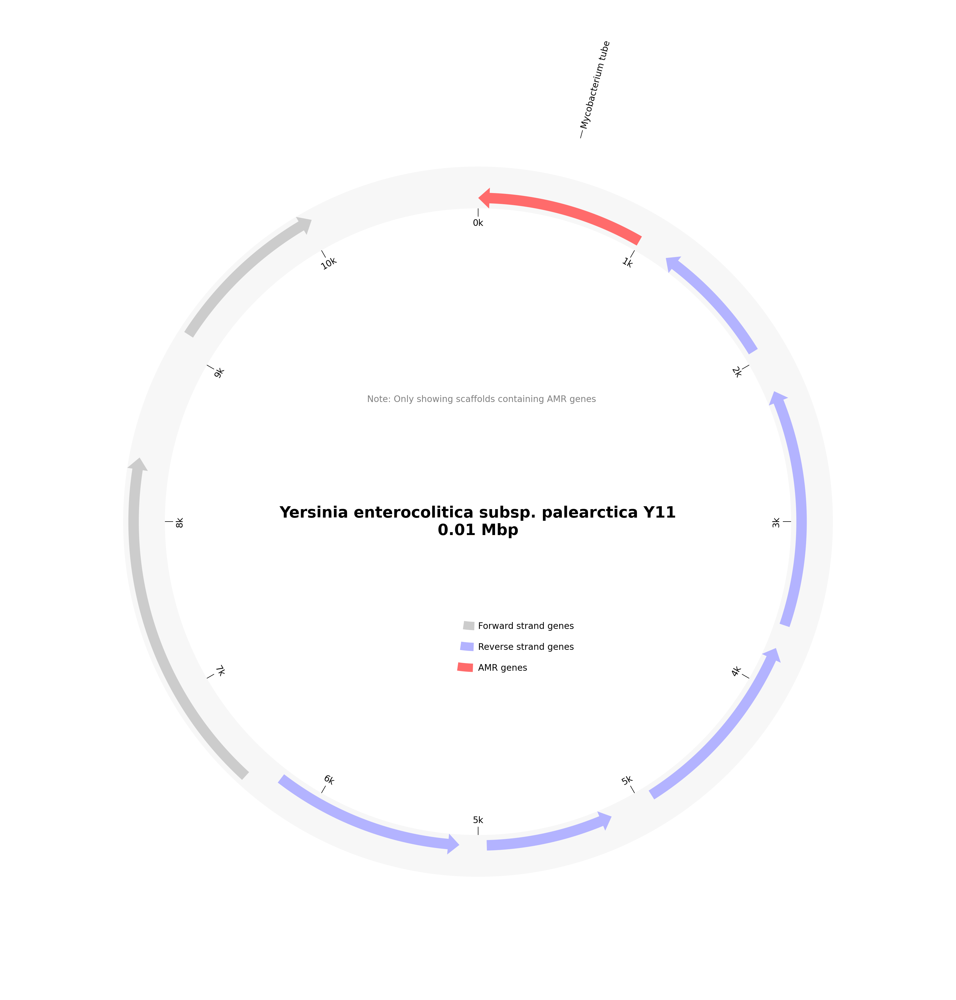

### Mycobacterium tuberculosis rpsA mutations conferring resistance to pyrazinamide
- **Mechanism**: antibiotic target alteration
- **Drug Classes**: pyrazine antibiotic
- **AMR Family**: pyrazinamide resistant rpsA
- **Locations**:
  - gnl|SPADES|FKHIBMDG_785_1 : position 1-906

