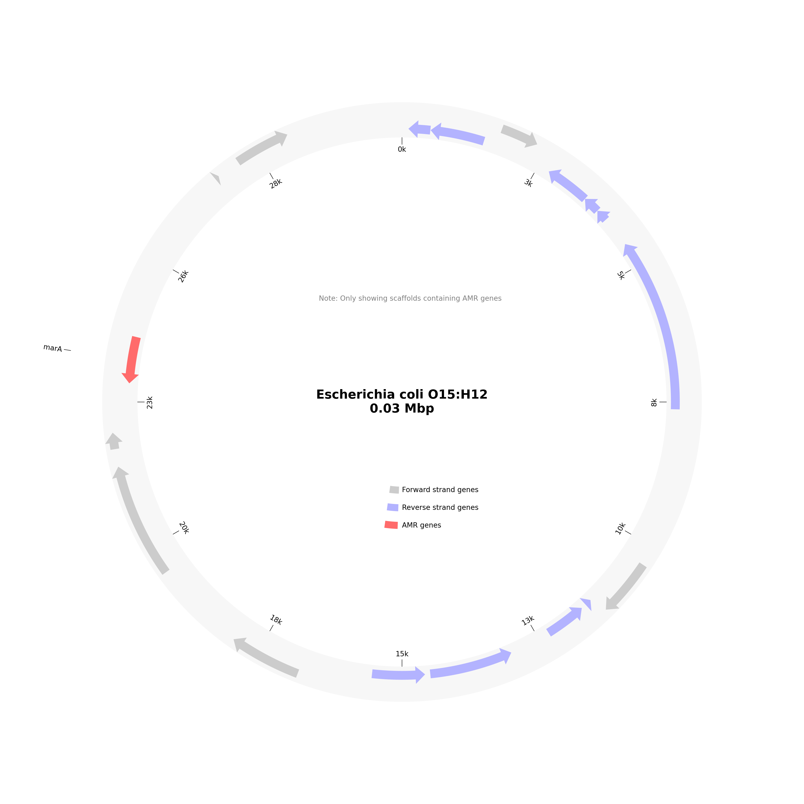
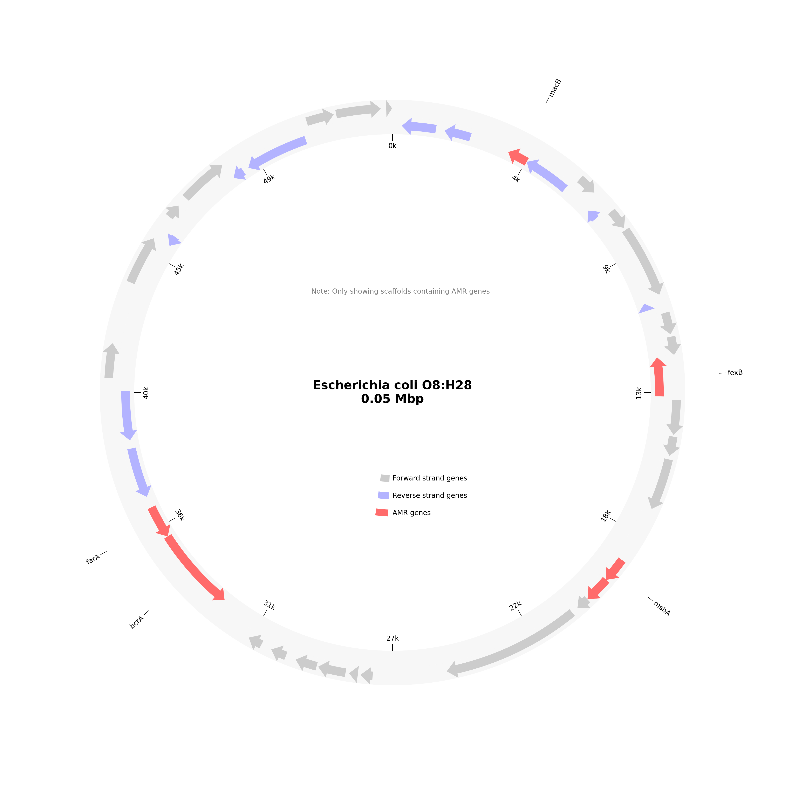
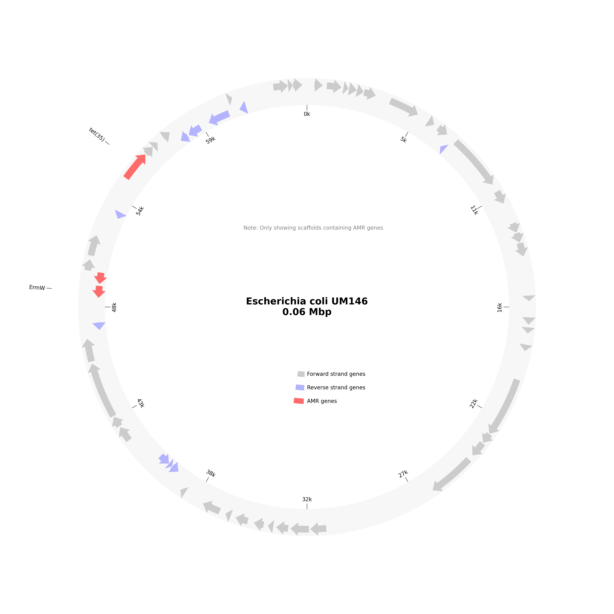

# AMR Analysis Report for LB02_RV_QG_A1_S15

# Organism Classifications:

## Aeromonas salmonicida
**Strain Statistics:**
- Total genome length: 133.2 kbp
- Total scaffolds: 4789
- Scaffolds with AMR genes: 309
- Total genes annotated: 180
- Total AMR genes: 311
- Unique AMR genes: 136
- Distinct AMR mechanisms: 9
- Distinct AMR families: 48
- Distinct drug classes: 31

**Circos Plot:**

### AAC(6')-Iak
- **Mechanism**: antibiotic inactivation
- **Drug Classes**: aminoglycoside antibiotic
- **AMR Family**: AAC(6')
- **Locations**:
  - gnl|SPADES|OLJIFFFB_15809_1 : position 1-231

### Acinetobacter baumannii AbaF (found in 2 locations)
- **Mechanism**: antibiotic efflux
- **Drug Classes**: phosphonic acid antibiotic
- **AMR Family**: major facilitator superfamily (MFS) antibiotic efflux pump
- **Locations**:
  - gnl|SPADES|OLJIFFFB_12286_1 : position 2-427
  - gnl|SPADES|OLJIFFFB_26330_1 : position 1-252

### Agrobacterium fabrum chloramphenicol acetyltransferase
- **Mechanism**: antibiotic inactivation
- **Drug Classes**: phenicol antibiotic
- **AMR Family**: chloramphenicol acetyltransferase (CAT)
- **Locations**:
  - gnl|SPADES|OLJIFFFB_4444_1 : position 1-588

### ArnT
- **Mechanism**: antibiotic target alteration
- **Drug Classes**: peptide antibiotic
- **AMR Family**: pmr phosphoethanolamine transferase
- **Locations**:
  - gnl|SPADES|OLJIFFFB_34573_1 : position 2-208

### CRP
- **Mechanism**: antibiotic efflux
- **Drug Classes**: macrolide antibiotic; fluoroquinolone antibiotic; penam
- **AMR Family**: resistance-nodulation-cell division (RND) antibiotic efflux pump
- **Locations**:
  - gnl|SPADES|OLJIFFFB_19166_1 : position 1-306

### Chlamydia trachomatis intrinsic murA conferring resistance to fosfomycin (found in 2 locations)
- **Mechanism**: antibiotic target alteration
- **Drug Classes**: phosphonic acid antibiotic
- **AMR Family**: antibiotic-resistant murA transferase
- **Locations**:
  - gnl|SPADES|OLJIFFFB_11915_2 : position 328-438
  - gnl|SPADES|OLJIFFFB_14402_1 : position 2-310

### Enterococcus faecalis cls with mutation conferring resistance to daptomycin
- **Mechanism**: antibiotic target alteration
- **Drug Classes**: peptide antibiotic
- **AMR Family**: daptomycin resistant cls
- **Locations**:
  - gnl|SPADES|OLJIFFFB_6253_1 : position 49-753

### Erm(30)
- **Mechanism**: antibiotic target alteration
- **Drug Classes**: macrolide antibiotic; lincosamide antibiotic; streptogramin antibiotic
- **AMR Family**: Erm 23S ribosomal RNA methyltransferase
- **Locations**:
  - gnl|SPADES|OLJIFFFB_19945_1 : position 3-296

### Escherichia coli UhpT with mutation conferring resistance to fosfomycin
- **Mechanism**: antibiotic target alteration
- **Drug Classes**: phosphonic acid antibiotic
- **AMR Family**: antibiotic-resistant UhpT
- **Locations**:
  - gnl|SPADES|OLJIFFFB_4064_1 : position 1-1233

### Escherichia coli cyaA with mutation conferring resistance to fosfomycin
- **Mechanism**: antibiotic target alteration
- **Drug Classes**: phosphonic acid antibiotic
- **AMR Family**: antibiotic-resistant cya adenylate cyclase
- **Locations**:
  - gnl|SPADES|OLJIFFFB_5348_1 : position 3-884

### Escherichia coli soxS with mutation conferring antibiotic resistance
- **Mechanism**: antibiotic target alteration; antibiotic efflux; reduced permeability to antibiotic
- **Drug Classes**: fluoroquinolone antibiotic; monobactam; carbapenem; cephalosporin; glycylcycline; cephamycin; penam; tetracycline antibiotic; rifamycin antibiotic; phenicol antibiotic; penem; disinfecting agents and antiseptics
- **AMR Family**: ATP-binding cassette (ABC) antibiotic efflux pump; major facilitator superfamily (MFS) antibiotic efflux pump; resistance-nodulation-cell division (RND) antibiotic efflux pump; General Bacterial Porin with reduced permeability to beta-lactams
- **Locations**:
  - gnl|SPADES|OLJIFFFB_5108_2 : position 370-924

### FOX-16
- **Mechanism**: antibiotic inactivation
- **Drug Classes**: cephalosporin; cephamycin
- **AMR Family**: FOX beta-lactamase
- **Locations**:
  - gnl|SPADES|OLJIFFFB_18613_1 : position 1-312

### GMB-1
- **Mechanism**: antibiotic inactivation
- **Drug Classes**: carbapenem
- **AMR Family**: GMB beta-lactamase
- **Locations**:
  - gnl|SPADES|OLJIFFFB_6974_1 : position 3-677

### H-NS
- **Mechanism**: antibiotic efflux
- **Drug Classes**: macrolide antibiotic; fluoroquinolone antibiotic; cephalosporin; cephamycin; penam; tetracycline antibiotic
- **AMR Family**: major facilitator superfamily (MFS) antibiotic efflux pump; resistance-nodulation-cell division (RND) antibiotic efflux pump
- **Locations**:
  - gnl|SPADES|OLJIFFFB_16272_1 : position 1-345

### Helicobacter pylori pbp1 mutants conferring resistance to amoxicillin (found in 2 locations)
- **Mechanism**: antibiotic target alteration
- **Drug Classes**: cephalosporin; cephamycin; penam
- **AMR Family**: Penicillin-binding protein mutations conferring resistance to beta-lactam antibiotics
- **Locations**:
  - gnl|SPADES|OLJIFFFB_10995_2 : position 209-469
  - gnl|SPADES|OLJIFFFB_18823_1 : position 3-308

### Helicobacter pylori pbp2 mutants conferring resistance to amoxicillin
- **Mechanism**: antibiotic target alteration
- **Drug Classes**: cephalosporin; cephamycin; penam
- **AMR Family**: Penicillin-binding protein mutations conferring resistance to beta-lactam antibiotics
- **Locations**:
  - gnl|SPADES|OLJIFFFB_4165_2 : position 291-1190

### Klebsiella pneumoniae KpnE
- **Mechanism**: antibiotic efflux
- **Drug Classes**: macrolide antibiotic; aminoglycoside antibiotic; cephalosporin; tetracycline antibiotic; peptide antibiotic; rifamycin antibiotic; disinfecting agents and antiseptics
- **AMR Family**: small multidrug resistance (SMR) antibiotic efflux pump
- **Locations**:
  - gnl|SPADES|OLJIFFFB_15948_1 : position 1-258

### Klebsiella pneumoniae KpnF
- **Mechanism**: antibiotic efflux
- **Drug Classes**: macrolide antibiotic; aminoglycoside antibiotic; cephalosporin; tetracycline antibiotic; peptide antibiotic; rifamycin antibiotic; disinfecting agents and antiseptics
- **AMR Family**: small multidrug resistance (SMR) antibiotic efflux pump
- **Locations**:
  - gnl|SPADES|OLJIFFFB_15717_1 : position 3-212

### Klebsiella pneumoniae OmpK37 (found in 2 locations)
- **Mechanism**: reduced permeability to antibiotic
- **Drug Classes**: monobactam; carbapenem; cephalosporin; cephamycin; penam; penem
- **AMR Family**: General Bacterial Porin with reduced permeability to beta-lactams
- **Locations**:
  - gnl|SPADES|OLJIFFFB_19933_1 : position 1-138
  - gnl|SPADES|OLJIFFFB_6404_1 : position 198-734

### LlmA 23S ribosomal RNA methyltransferase
- **Mechanism**: antibiotic target alteration
- **Drug Classes**: lincosamide antibiotic
- **AMR Family**: Llm 23S ribosomal RNA methyltransferase
- **Locations**:
  - gnl|SPADES|OLJIFFFB_12736_1 : position 2-415

### LpeB
- **Mechanism**: antibiotic efflux
- **Drug Classes**: macrolide antibiotic
- **AMR Family**: resistance-nodulation-cell division (RND) antibiotic efflux pump
- **Locations**:
  - gnl|SPADES|OLJIFFFB_31664_1 : position 2-223

### LptD
- **Mechanism**: antibiotic efflux
- **Drug Classes**: carbapenem; peptide antibiotic; aminocoumarin antibiotic; rifamycin antibiotic
- **AMR Family**: ATP-binding cassette (ABC) antibiotic efflux pump
- **Locations**:
  - gnl|SPADES|OLJIFFFB_5653_1 : position 3-833

### MCR-3.17
- **Mechanism**: antibiotic target alteration
- **Drug Classes**: peptide antibiotic
- **AMR Family**: MCR phosphoethanolamine transferase
- **Locations**:
  - gnl|SPADES|OLJIFFFB_14870_1 : position 1-369

### MCR-7.1 (found in 2 locations)
- **Mechanism**: antibiotic target alteration
- **Drug Classes**: peptide antibiotic
- **AMR Family**: MCR phosphoethanolamine transferase
- **Locations**:
  - gnl|SPADES|OLJIFFFB_16629_1 : position 1-342
  - gnl|SPADES|OLJIFFFB_9648_1 : position 210-518

### MOX-13
- **Mechanism**: antibiotic inactivation
- **Drug Classes**: cephalosporin; cephamycin; penam
- **AMR Family**: MOX beta-lactamase
- **Locations**:
  - gnl|SPADES|OLJIFFFB_28490_1 : position 2-85

### MexH
- **Mechanism**: antibiotic efflux
- **Drug Classes**: fluoroquinolone antibiotic; tetracycline antibiotic; disinfecting agents and antiseptics
- **AMR Family**: resistance-nodulation-cell division (RND) antibiotic efflux pump
- **Locations**:
  - gnl|SPADES|OLJIFFFB_25727_1 : position 3-239

### MexI
- **Mechanism**: antibiotic efflux
- **Drug Classes**: fluoroquinolone antibiotic; tetracycline antibiotic; disinfecting agents and antiseptics
- **AMR Family**: resistance-nodulation-cell division (RND) antibiotic efflux pump
- **Locations**:
  - gnl|SPADES|OLJIFFFB_7310_1 : position 1-234

### MexS
- **Mechanism**: antibiotic efflux
- **Drug Classes**: fluoroquinolone antibiotic; diaminopyrimidine antibiotic; phenicol antibiotic
- **AMR Family**: resistance-nodulation-cell division (RND) antibiotic efflux pump
- **Locations**:
  - gnl|SPADES|OLJIFFFB_29038_1 : position 1-237

### MexT (found in 2 locations)
- **Mechanism**: antibiotic efflux
- **Drug Classes**: fluoroquinolone antibiotic; diaminopyrimidine antibiotic; phenicol antibiotic
- **AMR Family**: resistance-nodulation-cell division (RND) antibiotic efflux pump
- **Locations**:
  - gnl|SPADES|OLJIFFFB_15575_1 : position 3-356
  - gnl|SPADES|OLJIFFFB_4926_1 : position 3-815

### MexV
- **Mechanism**: antibiotic efflux
- **Drug Classes**: macrolide antibiotic; fluoroquinolone antibiotic; tetracycline antibiotic; phenicol antibiotic; disinfecting agents and antiseptics
- **AMR Family**: resistance-nodulation-cell division (RND) antibiotic efflux pump
- **Locations**:
  - gnl|SPADES|OLJIFFFB_21469_1 : position 3-281

### MexW (found in 6 locations)
- **Mechanism**: antibiotic efflux
- **Drug Classes**: macrolide antibiotic; fluoroquinolone antibiotic; tetracycline antibiotic; phenicol antibiotic; disinfecting agents and antiseptics
- **AMR Family**: resistance-nodulation-cell division (RND) antibiotic efflux pump
- **Locations**:
  - gnl|SPADES|OLJIFFFB_10333_1 : position 3-491
  - gnl|SPADES|OLJIFFFB_15277_1 : position 3-362
  - gnl|SPADES|OLJIFFFB_19756_1 : position 3-182
  - gnl|SPADES|OLJIFFFB_22768_1 : position 1-273
  - gnl|SPADES|OLJIFFFB_24715_1 : position 2-259
  - gnl|SPADES|OLJIFFFB_7352_1 : position 1-648

### MexZ
- **Mechanism**: antibiotic efflux
- **Drug Classes**: macrolide antibiotic; fluoroquinolone antibiotic; aminoglycoside antibiotic; carbapenem; cephalosporin; cephamycin; penam; tetracycline antibiotic; phenicol antibiotic; disinfecting agents and antiseptics
- **AMR Family**: resistance-nodulation-cell division (RND) antibiotic efflux pump
- **Locations**:
  - gnl|SPADES|OLJIFFFB_6474_1 : position 364-726

### Morganella morganii gyrB conferring resistance to fluoroquinolones
- **Mechanism**: antibiotic target alteration
- **Drug Classes**: fluoroquinolone antibiotic
- **AMR Family**: fluoroquinolone resistant gyrB
- **Locations**:
  - gnl|SPADES|OLJIFFFB_22982_1 : position 2-271

### MuxA
- **Mechanism**: antibiotic efflux
- **Drug Classes**: macrolide antibiotic; monobactam; tetracycline antibiotic; aminocoumarin antibiotic
- **AMR Family**: resistance-nodulation-cell division (RND) antibiotic efflux pump
- **Locations**:
  - gnl|SPADES|OLJIFFFB_25764_1 : position 3-254

### MuxC
- **Mechanism**: antibiotic efflux
- **Drug Classes**: macrolide antibiotic; monobactam; tetracycline antibiotic; aminocoumarin antibiotic
- **AMR Family**: resistance-nodulation-cell division (RND) antibiotic efflux pump
- **Locations**:
  - gnl|SPADES|OLJIFFFB_29046_1 : position 2-238

### NmcR (found in 7 locations)
- **Mechanism**: antibiotic inactivation
- **Drug Classes**: carbapenem; cephalosporin; cephamycin; penam
- **AMR Family**: NmcA beta-lactamase
- **Locations**:
  - gnl|SPADES|OLJIFFFB_11228_1 : position 1-459
  - gnl|SPADES|OLJIFFFB_12811_1 : position 2-331
  - gnl|SPADES|OLJIFFFB_15930_1 : position 2-175
  - gnl|SPADES|OLJIFFFB_17179_1 : position 123-332
  - gnl|SPADES|OLJIFFFB_19145_2 : position 84-305
  - gnl|SPADES|OLJIFFFB_21277_1 : position 2-280
  - gnl|SPADES|OLJIFFFB_28047_1 : position 1-243

### OmpA (found in 4 locations)
- **Mechanism**: reduced permeability to antibiotic
- **Drug Classes**: peptide antibiotic
- **AMR Family**: General Bacterial Porin with reduced permeability to peptide antibiotics
- **Locations**:
  - gnl|SPADES|OLJIFFFB_18539_1 : position 3-314
  - gnl|SPADES|OLJIFFFB_24242_1 : position 2-121
  - gnl|SPADES|OLJIFFFB_5338_2 : position 232-885
  - gnl|SPADES|OLJIFFFB_5872_1 : position 2-508

### OpmH
- **Mechanism**: antibiotic efflux
- **Drug Classes**: disinfecting agents and antiseptics
- **AMR Family**: resistance-nodulation-cell division (RND) antibiotic efflux pump
- **Locations**:
  - gnl|SPADES|OLJIFFFB_12231_1 : position 173-430

### OprM (found in 2 locations)
- **Mechanism**: antibiotic efflux
- **Drug Classes**: macrolide antibiotic; fluoroquinolone antibiotic; monobactam; aminoglycoside antibiotic; carbapenem; cephalosporin; cephamycin; penam; tetracycline antibiotic; peptide antibiotic; aminocoumarin antibiotic; diaminopyrimidine antibiotic; sulfonamide antibiotic; phenicol antibiotic; penem; disinfecting agents and antiseptics
- **AMR Family**: resistance-nodulation-cell division (RND) antibiotic efflux pump
- **Locations**:
  - gnl|SPADES|OLJIFFFB_7825_1 : position 3-614
  - gnl|SPADES|OLJIFFFB_7870_1 : position 2-121

### ParR (found in 2 locations)
- **Mechanism**: antibiotic efflux; reduced permeability to antibiotic
- **Drug Classes**: macrolide antibiotic; fluoroquinolone antibiotic; monobactam; aminoglycoside antibiotic; carbapenem; cephalosporin; cephamycin; penam; tetracycline antibiotic; phenicol antibiotic; penem; disinfecting agents and antiseptics
- **AMR Family**: resistance-nodulation-cell division (RND) antibiotic efflux pump; Outer Membrane Porin (Opr)
- **Locations**:
  - gnl|SPADES|OLJIFFFB_11562_2 : position 210-449
  - gnl|SPADES|OLJIFFFB_6927_1 : position 3-119

### ParS
- **Mechanism**: antibiotic efflux; reduced permeability to antibiotic
- **Drug Classes**: macrolide antibiotic; fluoroquinolone antibiotic; monobactam; aminoglycoside antibiotic; carbapenem; cephalosporin; cephamycin; penam; tetracycline antibiotic; phenicol antibiotic; penem; disinfecting agents and antiseptics
- **AMR Family**: resistance-nodulation-cell division (RND) antibiotic efflux pump; Outer Membrane Porin (Opr)
- **Locations**:
  - gnl|SPADES|OLJIFFFB_6927_2 : position 158-682

### PmpM
- **Mechanism**: antibiotic efflux
- **Drug Classes**: fluoroquinolone antibiotic; aminoglycoside antibiotic; disinfecting agents and antiseptics
- **AMR Family**: multidrug and toxic compound extrusion (MATE) transporter
- **Locations**:
  - gnl|SPADES|OLJIFFFB_33652_1 : position 3-212

### Pseudomonas aeruginosa CpxR (found in 2 locations)
- **Mechanism**: antibiotic efflux
- **Drug Classes**: macrolide antibiotic; fluoroquinolone antibiotic; monobactam; aminoglycoside antibiotic; carbapenem; cephalosporin; cephamycin; penam; tetracycline antibiotic; peptide antibiotic; aminocoumarin antibiotic; diaminopyrimidine antibiotic; sulfonamide antibiotic; phenicol antibiotic; penem
- **AMR Family**: resistance-nodulation-cell division (RND) antibiotic efflux pump
- **Locations**:
  - gnl|SPADES|OLJIFFFB_21244_1 : position 2-238
  - gnl|SPADES|OLJIFFFB_7568_2 : position 272-631

### QnrAS
- **Mechanism**: antibiotic target protection
- **Drug Classes**: fluoroquinolone antibiotic
- **AMR Family**: quinolone resistance protein (qnr)
- **Locations**:
  - gnl|SPADES|OLJIFFFB_12141_2 : position 281-433

### RanA (found in 9 locations)
- **Mechanism**: antibiotic efflux
- **Drug Classes**: aminoglycoside antibiotic
- **AMR Family**: ATP-binding cassette (ABC) antibiotic efflux pump
- **Locations**:
  - gnl|SPADES|OLJIFFFB_12218_1 : position 2-430
  - gnl|SPADES|OLJIFFFB_12650_1 : position 2-418
  - gnl|SPADES|OLJIFFFB_13982_1 : position 1-387
  - gnl|SPADES|OLJIFFFB_14212_1 : position 2-382
  - gnl|SPADES|OLJIFFFB_18788_1 : position 3-311
  - gnl|SPADES|OLJIFFFB_33407_1 : position 1-213
  - gnl|SPADES|OLJIFFFB_5223_2 : position 243-902
  - gnl|SPADES|OLJIFFFB_5324_1 : position 3-761
  - gnl|SPADES|OLJIFFFB_9223_1 : position 3-539

### Staphylococcus aureus mupB conferring resistance to mupirocin (found in 2 locations)
- **Mechanism**: antibiotic target alteration
- **Drug Classes**: mupirocin-like antibiotic
- **AMR Family**: antibiotic-resistant isoleucyl-tRNA synthetase (ileS)
- **Locations**:
  - gnl|SPADES|OLJIFFFB_14236_1 : position 1-381
  - gnl|SPADES|OLJIFFFB_8383_1 : position 1-582

### Staphylococcus aureus murA with mutation conferring resistance to fosfomycin
- **Mechanism**: antibiotic target alteration
- **Drug Classes**: phosphonic acid antibiotic
- **AMR Family**: antibiotic-resistant murA transferase
- **Locations**:
  - gnl|SPADES|OLJIFFFB_21834_1 : position 3-278

### Streptomyces lividans cmlR
- **Mechanism**: antibiotic efflux
- **Drug Classes**: phenicol antibiotic
- **AMR Family**: major facilitator superfamily (MFS) antibiotic efflux pump
- **Locations**:
  - gnl|SPADES|OLJIFFFB_9897_1 : position 1-507

### Streptomyces rimosus otr(A)
- **Mechanism**: antibiotic target protection
- **Drug Classes**: tetracycline antibiotic
- **AMR Family**: tetracycline-resistant ribosomal protection protein
- **Locations**:
  - gnl|SPADES|OLJIFFFB_10373_1 : position 3-488

### Streptomyces venezuelae rox
- **Mechanism**: antibiotic inactivation
- **Drug Classes**: rifamycin antibiotic
- **AMR Family**: rifampin monooxygenase
- **Locations**:
  - gnl|SPADES|OLJIFFFB_4663_1 : position 2-1024

### TaeA (found in 2 locations)
- **Mechanism**: antibiotic efflux
- **Drug Classes**: pleuromutilin antibiotic
- **AMR Family**: ATP-binding cassette (ABC) antibiotic efflux pump
- **Locations**:
  - gnl|SPADES|OLJIFFFB_19036_1 : position 1-306
  - gnl|SPADES|OLJIFFFB_33420_1 : position 3-212

### TolC (found in 2 locations)
- **Mechanism**: antibiotic efflux
- **Drug Classes**: macrolide antibiotic; fluoroquinolone antibiotic; aminoglycoside antibiotic; carbapenem; cephalosporin; glycylcycline; cephamycin; penam; tetracycline antibiotic; peptide antibiotic; aminocoumarin antibiotic; rifamycin antibiotic; phenicol antibiotic; penem; disinfecting agents and antiseptics
- **AMR Family**: ATP-binding cassette (ABC) antibiotic efflux pump; major facilitator superfamily (MFS) antibiotic efflux pump; resistance-nodulation-cell division (RND) antibiotic efflux pump
- **Locations**:
  - gnl|SPADES|OLJIFFFB_26996_1 : position 2-247
  - gnl|SPADES|OLJIFFFB_31376_1 : position 1-225

### TriB
- **Mechanism**: antibiotic efflux
- **Drug Classes**: disinfecting agents and antiseptics
- **AMR Family**: resistance-nodulation-cell division (RND) antibiotic efflux pump
- **Locations**:
  - gnl|SPADES|OLJIFFFB_4624_2 : position 647-1033

### TxR (found in 12 locations)
- **Mechanism**: antibiotic efflux
- **Drug Classes**: tetracycline antibiotic
- **AMR Family**: ATP-binding cassette (ABC) antibiotic efflux pump
- **Locations**:
  - gnl|SPADES|OLJIFFFB_13027_1 : position 3-410
  - gnl|SPADES|OLJIFFFB_16300_1 : position 1-345
  - gnl|SPADES|OLJIFFFB_24025_1 : position 3-263
  - gnl|SPADES|OLJIFFFB_24577_1 : position 3-260
  - gnl|SPADES|OLJIFFFB_26755_1 : position 1-249
  - gnl|SPADES|OLJIFFFB_29076_1 : position 1-237
  - gnl|SPADES|OLJIFFFB_32344_1 : position 2-220
  - gnl|SPADES|OLJIFFFB_34926_1 : position 2-205
  - gnl|SPADES|OLJIFFFB_5731_2 : position 417-821
  - gnl|SPADES|OLJIFFFB_5921_1 : position 3-794
  - gnl|SPADES|OLJIFFFB_8444_1 : position 1-579
  - gnl|SPADES|OLJIFFFB_9153_1 : position 15-542

### YajC
- **Mechanism**: antibiotic efflux
- **Drug Classes**: fluoroquinolone antibiotic; cephalosporin; glycylcycline; penam; tetracycline antibiotic; oxazolidinone antibiotic; glycopeptide antibiotic; rifamycin antibiotic; phenicol antibiotic; disinfecting agents and antiseptics
- **AMR Family**: resistance-nodulation-cell division (RND) antibiotic efflux pump
- **Locations**:
  - gnl|SPADES|OLJIFFFB_6800_2 : position 315-650

### YojI (found in 2 locations)
- **Mechanism**: antibiotic efflux
- **Drug Classes**: peptide antibiotic
- **AMR Family**: ATP-binding cassette (ABC) antibiotic efflux pump
- **Locations**:
  - gnl|SPADES|OLJIFFFB_13181_1 : position 75-404
  - gnl|SPADES|OLJIFFFB_15502_1 : position 2-358

### acrB (found in 3 locations)
- **Mechanism**: antibiotic efflux
- **Drug Classes**: fluoroquinolone antibiotic; cephalosporin; glycylcycline; penam; tetracycline antibiotic; rifamycin antibiotic; phenicol antibiotic; disinfecting agents and antiseptics
- **AMR Family**: resistance-nodulation-cell division (RND) antibiotic efflux pump
- **Locations**:
  - gnl|SPADES|OLJIFFFB_12049_1 : position 3-434
  - gnl|SPADES|OLJIFFFB_19216_1 : position 3-305
  - gnl|SPADES|OLJIFFFB_33072_2 : position 51-215

### adeB (found in 2 locations)
- **Mechanism**: antibiotic efflux
- **Drug Classes**: glycylcycline; tetracycline antibiotic
- **AMR Family**: resistance-nodulation-cell division (RND) antibiotic efflux pump
- **Locations**:
  - gnl|SPADES|OLJIFFFB_12937_1 : position 307-411
  - gnl|SPADES|OLJIFFFB_33529_1 : position 2-214

### adeL (found in 15 locations)
- **Mechanism**: antibiotic efflux
- **Drug Classes**: fluoroquinolone antibiotic; tetracycline antibiotic
- **AMR Family**: resistance-nodulation-cell division (RND) antibiotic efflux pump
- **Locations**:
  - gnl|SPADES|OLJIFFFB_12996_1 : position 2-409
  - gnl|SPADES|OLJIFFFB_15125_1 : position 1-366
  - gnl|SPADES|OLJIFFFB_16450_1 : position 157-342
  - gnl|SPADES|OLJIFFFB_19572_1 : position 1-300
  - gnl|SPADES|OLJIFFFB_22716_1 : position 3-272
  - gnl|SPADES|OLJIFFFB_25704_1 : position 1-255
  - gnl|SPADES|OLJIFFFB_28053_1 : position 2-241
  - gnl|SPADES|OLJIFFFB_30572_1 : position 1-228
  - gnl|SPADES|OLJIFFFB_5684_1 : position 3-830
  - gnl|SPADES|OLJIFFFB_5874_2 : position 404-802
  - gnl|SPADES|OLJIFFFB_6245_1 : position 133-753
  - gnl|SPADES|OLJIFFFB_6613_2 : position 215-712
  - gnl|SPADES|OLJIFFFB_7092_1 : position 231-671
  - gnl|SPADES|OLJIFFFB_7544_1 : position 1-633
  - gnl|SPADES|OLJIFFFB_9904_2 : position 344-508

### arlS
- **Mechanism**: antibiotic efflux
- **Drug Classes**: fluoroquinolone antibiotic; disinfecting agents and antiseptics
- **AMR Family**: major facilitator superfamily (MFS) antibiotic efflux pump
- **Locations**:
  - gnl|SPADES|OLJIFFFB_7231_1 : position 1-657

### arnA
- **Mechanism**: antibiotic target alteration
- **Drug Classes**: peptide antibiotic
- **AMR Family**: pmr phosphoethanolamine transferase
- **Locations**:
  - gnl|SPADES|OLJIFFFB_32939_1 : position 3-215

### bacA
- **Mechanism**: antibiotic target alteration
- **Drug Classes**: peptide antibiotic
- **AMR Family**: undecaprenyl pyrophosphate related proteins
- **Locations**:
  - gnl|SPADES|OLJIFFFB_6285_1 : position 1-249

### baeR
- **Mechanism**: antibiotic efflux
- **Drug Classes**: aminoglycoside antibiotic; aminocoumarin antibiotic
- **AMR Family**: resistance-nodulation-cell division (RND) antibiotic efflux pump
- **Locations**:
  - gnl|SPADES|OLJIFFFB_9688_2 : position 396-518

### baeS
- **Mechanism**: antibiotic efflux
- **Drug Classes**: aminoglycoside antibiotic; aminocoumarin antibiotic
- **AMR Family**: resistance-nodulation-cell division (RND) antibiotic efflux pump
- **Locations**:
  - gnl|SPADES|OLJIFFFB_12223_1 : position 1-429

### basS (found in 5 locations)
- **Mechanism**: antibiotic target alteration; antibiotic efflux
- **Drug Classes**: peptide antibiotic
- **AMR Family**: pmr phosphoethanolamine transferase
- **Locations**:
  - gnl|SPADES|OLJIFFFB_16111_2 : position 125-349
  - gnl|SPADES|OLJIFFFB_18899_1 : position 1-309
  - gnl|SPADES|OLJIFFFB_19969_1 : position 43-294
  - gnl|SPADES|OLJIFFFB_26200_1 : position 2-253
  - gnl|SPADES|OLJIFFFB_9010_1 : position 1-549

### bcr-1 (found in 5 locations)
- **Mechanism**: antibiotic efflux
- **Drug Classes**: bicyclomycin-like antibiotic
- **AMR Family**: major facilitator superfamily (MFS) antibiotic efflux pump
- **Locations**:
  - gnl|SPADES|OLJIFFFB_10970_1 : position 3-470
  - gnl|SPADES|OLJIFFFB_16760_1 : position 3-338
  - gnl|SPADES|OLJIFFFB_19364_1 : position 2-280
  - gnl|SPADES|OLJIFFFB_5832_1 : position 3-176
  - gnl|SPADES|OLJIFFFB_6871_1 : position 164-688

### bcrA (found in 2 locations)
- **Mechanism**: antibiotic efflux
- **Drug Classes**: peptide antibiotic
- **AMR Family**: ATP-binding cassette (ABC) antibiotic efflux pump
- **Locations**:
  - gnl|SPADES|OLJIFFFB_19531_1 : position 3-299
  - gnl|SPADES|OLJIFFFB_4568_2 : position 110-697

### bcrC
- **Mechanism**: antibiotic target alteration
- **Drug Classes**: peptide antibiotic
- **AMR Family**: undecaprenyl pyrophosphate related proteins
- **Locations**:
  - gnl|SPADES|OLJIFFFB_8369_1 : position 1-408

### carA
- **Mechanism**: antibiotic target protection
- **Drug Classes**: macrolide antibiotic
- **AMR Family**: Miscellaneous ABC-F subfamily ATP-binding cassette ribosomal protection proteins
- **Locations**:
  - gnl|SPADES|OLJIFFFB_25281_1 : position 3-257

### ceoB
- **Mechanism**: antibiotic efflux
- **Drug Classes**: fluoroquinolone antibiotic; aminoglycoside antibiotic
- **AMR Family**: resistance-nodulation-cell division (RND) antibiotic efflux pump
- **Locations**:
  - gnl|SPADES|OLJIFFFB_6120_1 : position 1-621

### cmlv
- **Mechanism**: antibiotic inactivation
- **Drug Classes**: phenicol antibiotic
- **AMR Family**: chloramphenicol phosphotransferase
- **Locations**:
  - gnl|SPADES|OLJIFFFB_9577_1 : position 2-523

### cmrA
- **Mechanism**: antibiotic efflux
- **Drug Classes**: phenicol antibiotic
- **AMR Family**: major facilitator superfamily (MFS) antibiotic efflux pump
- **Locations**:
  - gnl|SPADES|OLJIFFFB_14321_1 : position 2-379

### cprR (found in 2 locations)
- **Mechanism**: antibiotic target alteration; antibiotic efflux
- **Drug Classes**: peptide antibiotic
- **AMR Family**: pmr phosphoethanolamine transferase
- **Locations**:
  - gnl|SPADES|OLJIFFFB_31730_1 : position 1-222
  - gnl|SPADES|OLJIFFFB_4979_3 : position 727-951

### cprS
- **Mechanism**: antibiotic target alteration; antibiotic efflux
- **Drug Classes**: peptide antibiotic
- **AMR Family**: pmr phosphoethanolamine transferase
- **Locations**:
  - gnl|SPADES|OLJIFFFB_32113_1 : position 3-221

### cpxA (found in 3 locations)
- **Mechanism**: antibiotic efflux
- **Drug Classes**: aminoglycoside antibiotic; aminocoumarin antibiotic
- **AMR Family**: resistance-nodulation-cell division (RND) antibiotic efflux pump
- **Locations**:
  - gnl|SPADES|OLJIFFFB_27464_1 : position 1-246
  - gnl|SPADES|OLJIFFFB_6159_1 : position 4-762
  - gnl|SPADES|OLJIFFFB_6621_1 : position 1-165

### dfrA3
- **Mechanism**: antibiotic target replacement
- **Drug Classes**: diaminopyrimidine antibiotic
- **AMR Family**: trimethoprim resistant dihydrofolate reductase dfr
- **Locations**:
  - gnl|SPADES|OLJIFFFB_15151_1 : position 2-226

### efrB (found in 2 locations)
- **Mechanism**: antibiotic efflux
- **Drug Classes**: macrolide antibiotic; fluoroquinolone antibiotic; rifamycin antibiotic
- **AMR Family**: ATP-binding cassette (ABC) antibiotic efflux pump
- **Locations**:
  - gnl|SPADES|OLJIFFFB_10635_1 : position 1-480
  - gnl|SPADES|OLJIFFFB_30384_1 : position 1-231

### emrY
- **Mechanism**: antibiotic efflux
- **Drug Classes**: tetracycline antibiotic
- **AMR Family**: major facilitator superfamily (MFS) antibiotic efflux pump
- **Locations**:
  - gnl|SPADES|OLJIFFFB_17235_1 : position 1-333

### evgA (found in 7 locations)
- **Mechanism**: antibiotic efflux
- **Drug Classes**: macrolide antibiotic; fluoroquinolone antibiotic; penam; tetracycline antibiotic
- **AMR Family**: major facilitator superfamily (MFS) antibiotic efflux pump; resistance-nodulation-cell division (RND) antibiotic efflux pump
- **Locations**:
  - gnl|SPADES|OLJIFFFB_11418_1 : position 102-455
  - gnl|SPADES|OLJIFFFB_11534_1 : position 132-449
  - gnl|SPADES|OLJIFFFB_22439_1 : position 3-257
  - gnl|SPADES|OLJIFFFB_26366_1 : position 2-250
  - gnl|SPADES|OLJIFFFB_28095_1 : position 3-242
  - gnl|SPADES|OLJIFFFB_34008_1 : position 65-211
  - gnl|SPADES|OLJIFFFB_9989_1 : position 72-503

### evgS (found in 21 locations)
- **Mechanism**: antibiotic efflux
- **Drug Classes**: macrolide antibiotic; fluoroquinolone antibiotic; penam; tetracycline antibiotic
- **AMR Family**: major facilitator superfamily (MFS) antibiotic efflux pump; resistance-nodulation-cell division (RND) antibiotic efflux pump
- **Locations**:
  - gnl|SPADES|OLJIFFFB_10922_1 : position 3-395
  - gnl|SPADES|OLJIFFFB_12243_1 : position 2-430
  - gnl|SPADES|OLJIFFFB_13563_1 : position 3-395
  - gnl|SPADES|OLJIFFFB_15738_1 : position 1-354
  - gnl|SPADES|OLJIFFFB_16069_1 : position 1-348
  - gnl|SPADES|OLJIFFFB_16241_1 : position 3-347
  - gnl|SPADES|OLJIFFFB_16698_1 : position 1-339
  - gnl|SPADES|OLJIFFFB_22668_1 : position 2-271
  - gnl|SPADES|OLJIFFFB_26511_1 : position 1-249
  - gnl|SPADES|OLJIFFFB_27316_1 : position 3-245
  - gnl|SPADES|OLJIFFFB_28439_1 : position 1-240
  - gnl|SPADES|OLJIFFFB_31236_1 : position 3-224
  - gnl|SPADES|OLJIFFFB_33605_1 : position 1-213
  - gnl|SPADES|OLJIFFFB_34552_1 : position 1-207
  - gnl|SPADES|OLJIFFFB_34655_1 : position 2-208
  - gnl|SPADES|OLJIFFFB_5363_1 : position 1-171
  - gnl|SPADES|OLJIFFFB_5941_1 : position 2-793
  - gnl|SPADES|OLJIFFFB_6472_1 : position 2-727
  - gnl|SPADES|OLJIFFFB_7593_1 : position 3-629
  - gnl|SPADES|OLJIFFFB_8802_1 : position 1-561
  - gnl|SPADES|OLJIFFFB_9955_1 : position 1-504

### farA
- **Mechanism**: antibiotic efflux
- **Drug Classes**: antibacterial free fatty acids
- **AMR Family**: major facilitator superfamily (MFS) antibiotic efflux pump
- **Locations**:
  - gnl|SPADES|OLJIFFFB_10357_1 : position 2-490

### gadX
- **Mechanism**: antibiotic efflux
- **Drug Classes**: macrolide antibiotic; fluoroquinolone antibiotic; penam
- **AMR Family**: resistance-nodulation-cell division (RND) antibiotic efflux pump
- **Locations**:
  - gnl|SPADES|OLJIFFFB_16714_1 : position 1-339

### golS (found in 3 locations)
- **Mechanism**: antibiotic efflux
- **Drug Classes**: monobactam; carbapenem; cephalosporin; cephamycin; penam; phenicol antibiotic; penem
- **AMR Family**: resistance-nodulation-cell division (RND) antibiotic efflux pump
- **Locations**:
  - gnl|SPADES|OLJIFFFB_12226_1 : position 2-427
  - gnl|SPADES|OLJIFFFB_13556_1 : position 3-293
  - gnl|SPADES|OLJIFFFB_13697_1 : position 15-392

### hmrM
- **Mechanism**: antibiotic efflux
- **Drug Classes**: fluoroquinolone antibiotic; disinfecting agents and antiseptics
- **AMR Family**: multidrug and toxic compound extrusion (MATE) transporter
- **Locations**:
  - gnl|SPADES|OLJIFFFB_28425_1 : position 3-239

### hp1181
- **Mechanism**: antibiotic efflux
- **Drug Classes**: fluoroquinolone antibiotic; tetracycline antibiotic; nitroimidazole antibiotic
- **AMR Family**: major facilitator superfamily (MFS) antibiotic efflux pump
- **Locations**:
  - gnl|SPADES|OLJIFFFB_19610_1 : position 1-300

### kdpD (found in 2 locations)
- **Mechanism**: antibiotic efflux
- **Drug Classes**: aminoglycoside antibiotic
- **AMR Family**: kdpDE
- **Locations**:
  - gnl|SPADES|OLJIFFFB_13205_1 : position 3-404
  - gnl|SPADES|OLJIFFFB_19603_1 : position 2-298

### kdpE (found in 2 locations)
- **Mechanism**: antibiotic efflux
- **Drug Classes**: aminoglycoside antibiotic
- **AMR Family**: kdpDE
- **Locations**:
  - gnl|SPADES|OLJIFFFB_10823_1 : position 2-301
  - gnl|SPADES|OLJIFFFB_13264_1 : position 1-402

### leuO (found in 7 locations)
- **Mechanism**: antibiotic efflux
- **Drug Classes**: nucleoside antibiotic; disinfecting agents and antiseptics
- **AMR Family**: major facilitator superfamily (MFS) antibiotic efflux pump
- **Locations**:
  - gnl|SPADES|OLJIFFFB_11032_2 : position 82-465
  - gnl|SPADES|OLJIFFFB_12085_1 : position 3-158
  - gnl|SPADES|OLJIFFFB_14461_1 : position 3-203
  - gnl|SPADES|OLJIFFFB_16810_1 : position 2-154
  - gnl|SPADES|OLJIFFFB_26295_1 : position 2-253
  - gnl|SPADES|OLJIFFFB_32061_1 : position 3-221
  - gnl|SPADES|OLJIFFFB_9160_1 : position 188-541

### lmrC (found in 3 locations)
- **Mechanism**: antibiotic target protection
- **Drug Classes**: lincosamide antibiotic
- **AMR Family**: Miscellaneous ABC-F subfamily ATP-binding cassette ribosomal protection proteins
- **Locations**:
  - gnl|SPADES|OLJIFFFB_23328_1 : position 1-267
  - gnl|SPADES|OLJIFFFB_32281_1 : position 3-218
  - gnl|SPADES|OLJIFFFB_8306_2 : position 196-588

### lsaC
- **Mechanism**: antibiotic target protection
- **Drug Classes**: lincosamide antibiotic; streptogramin antibiotic; pleuromutilin antibiotic
- **AMR Family**: lsa-type ABC-F protein
- **Locations**:
  - gnl|SPADES|OLJIFFFB_32330_1 : position 3-182

### macA (found in 3 locations)
- **Mechanism**: antibiotic efflux
- **Drug Classes**: macrolide antibiotic
- **AMR Family**: ATP-binding cassette (ABC) antibiotic efflux pump
- **Locations**:
  - gnl|SPADES|OLJIFFFB_16464_2 : position 60-344
  - gnl|SPADES|OLJIFFFB_6105_1 : position 1-654
  - gnl|SPADES|OLJIFFFB_9795_1 : position 2-511

### macB (found in 19 locations)
- **Mechanism**: antibiotic efflux
- **Drug Classes**: macrolide antibiotic
- **AMR Family**: ATP-binding cassette (ABC) antibiotic efflux pump
- **Locations**:
  - gnl|SPADES|OLJIFFFB_11244_1 : position 3-458
  - gnl|SPADES|OLJIFFFB_11398_1 : position 252-455
  - gnl|SPADES|OLJIFFFB_11593_1 : position 1-447
  - gnl|SPADES|OLJIFFFB_12339_1 : position 2-427
  - gnl|SPADES|OLJIFFFB_14788_1 : position 2-370
  - gnl|SPADES|OLJIFFFB_19021_1 : position 2-307
  - gnl|SPADES|OLJIFFFB_20592_1 : position 3-287
  - gnl|SPADES|OLJIFFFB_20911_1 : position 2-286
  - gnl|SPADES|OLJIFFFB_21588_1 : position 2-280
  - gnl|SPADES|OLJIFFFB_26557_1 : position 2-250
  - gnl|SPADES|OLJIFFFB_27969_1 : position 1-243
  - gnl|SPADES|OLJIFFFB_28069_1 : position 1-243
  - gnl|SPADES|OLJIFFFB_29074_1 : position 2-238
  - gnl|SPADES|OLJIFFFB_31362_1 : position 2-223
  - gnl|SPADES|OLJIFFFB_33453_1 : position 1-213
  - gnl|SPADES|OLJIFFFB_33530_1 : position 3-212
  - gnl|SPADES|OLJIFFFB_6105_2 : position 657-770
  - gnl|SPADES|OLJIFFFB_7900_1 : position 1-612
  - gnl|SPADES|OLJIFFFB_8818_1 : position 2-559

### mdtC
- **Mechanism**: antibiotic efflux
- **Drug Classes**: aminocoumarin antibiotic
- **AMR Family**: resistance-nodulation-cell division (RND) antibiotic efflux pump
- **Locations**:
  - gnl|SPADES|OLJIFFFB_4110_1 : position 1-1209

### mdtH (found in 2 locations)
- **Mechanism**: antibiotic efflux
- **Drug Classes**: fluoroquinolone antibiotic
- **AMR Family**: major facilitator superfamily (MFS) antibiotic efflux pump
- **Locations**:
  - gnl|SPADES|OLJIFFFB_11998_1 : position 3-437
  - gnl|SPADES|OLJIFFFB_8923_1 : position 1-456

### mdtN
- **Mechanism**: antibiotic efflux
- **Drug Classes**: nucleoside antibiotic; disinfecting agents and antiseptics
- **AMR Family**: major facilitator superfamily (MFS) antibiotic efflux pump
- **Locations**:
  - gnl|SPADES|OLJIFFFB_31139_1 : position 3-224

### mreA (found in 2 locations)
- **Mechanism**: antibiotic efflux
- **Drug Classes**: macrolide antibiotic
- **AMR Family**: major facilitator superfamily (MFS) antibiotic efflux pump
- **Locations**:
  - gnl|SPADES|OLJIFFFB_14611_1 : position 3-248
  - gnl|SPADES|OLJIFFFB_9452_2 : position 85-528

### msbA (found in 4 locations)
- **Mechanism**: antibiotic efflux
- **Drug Classes**: nitroimidazole antibiotic
- **AMR Family**: ATP-binding cassette (ABC) antibiotic efflux pump
- **Locations**:
  - gnl|SPADES|OLJIFFFB_15255_1 : position 3-362
  - gnl|SPADES|OLJIFFFB_25443_1 : position 1-255
  - gnl|SPADES|OLJIFFFB_8559_1 : position 3-212
  - gnl|SPADES|OLJIFFFB_9248_1 : position 156-536

### mtrA (found in 2 locations)
- **Mechanism**: antibiotic efflux
- **Drug Classes**: macrolide antibiotic; penam
- **AMR Family**: resistance-nodulation-cell division (RND) antibiotic efflux pump
- **Locations**:
  - gnl|SPADES|OLJIFFFB_13918_1 : position 145-387
  - gnl|SPADES|OLJIFFFB_4589_2 : position 232-1044

### novA (found in 5 locations)
- **Mechanism**: antibiotic efflux
- **Drug Classes**: aminocoumarin antibiotic
- **AMR Family**: ATP-binding cassette (ABC) antibiotic efflux pump
- **Locations**:
  - gnl|SPADES|OLJIFFFB_12642_1 : position 3-419
  - gnl|SPADES|OLJIFFFB_18839_1 : position 1-309
  - gnl|SPADES|OLJIFFFB_21049_1 : position 3-284
  - gnl|SPADES|OLJIFFFB_32497_1 : position 3-218
  - gnl|SPADES|OLJIFFFB_9728_1 : position 3-515

### oleB (found in 2 locations)
- **Mechanism**: antibiotic target protection
- **Drug Classes**: macrolide antibiotic
- **AMR Family**: Miscellaneous ABC-F subfamily ATP-binding cassette ribosomal protection proteins
- **Locations**:
  - gnl|SPADES|OLJIFFFB_18964_1 : position 3-308
  - gnl|SPADES|OLJIFFFB_21428_1 : position 1-279

### oleC (found in 5 locations)
- **Mechanism**: antibiotic efflux
- **Drug Classes**: macrolide antibiotic
- **AMR Family**: ATP-binding cassette (ABC) antibiotic efflux pump
- **Locations**:
  - gnl|SPADES|OLJIFFFB_15430_1 : position 3-209
  - gnl|SPADES|OLJIFFFB_15815_1 : position 1-264
  - gnl|SPADES|OLJIFFFB_21811_1 : position 2-277
  - gnl|SPADES|OLJIFFFB_5084_1 : position 3-608
  - gnl|SPADES|OLJIFFFB_7132_1 : position 3-248

### optrA
- **Mechanism**: antibiotic target protection
- **Drug Classes**: oxazolidinone antibiotic; phenicol antibiotic
- **AMR Family**: Miscellaneous ABC-F subfamily ATP-binding cassette ribosomal protection proteins
- **Locations**:
  - gnl|SPADES|OLJIFFFB_9956_1 : position 3-128

### patA (found in 3 locations)
- **Mechanism**: antibiotic efflux
- **Drug Classes**: fluoroquinolone antibiotic
- **AMR Family**: ATP-binding cassette (ABC) antibiotic efflux pump
- **Locations**:
  - gnl|SPADES|OLJIFFFB_15636_1 : position 1-330
  - gnl|SPADES|OLJIFFFB_29738_1 : position 2-232
  - gnl|SPADES|OLJIFFFB_31783_1 : position 1-222

### ramA
- **Mechanism**: antibiotic efflux; reduced permeability to antibiotic
- **Drug Classes**: fluoroquinolone antibiotic; monobactam; carbapenem; cephalosporin; glycylcycline; cephamycin; penam; tetracycline antibiotic; rifamycin antibiotic; phenicol antibiotic; penem; disinfecting agents and antiseptics
- **AMR Family**: resistance-nodulation-cell division (RND) antibiotic efflux pump; General Bacterial Porin with reduced permeability to beta-lactams
- **Locations**:
  - gnl|SPADES|OLJIFFFB_26165_1 : position 1-252

### rosB (found in 6 locations)
- **Mechanism**: antibiotic efflux
- **Drug Classes**: peptide antibiotic
- **AMR Family**: major facilitator superfamily (MFS) antibiotic efflux pump
- **Locations**:
  - gnl|SPADES|OLJIFFFB_10330_1 : position 2-490
  - gnl|SPADES|OLJIFFFB_11715_1 : position 2-445
  - gnl|SPADES|OLJIFFFB_11784_1 : position 104-442
  - gnl|SPADES|OLJIFFFB_21321_1 : position 2-280
  - gnl|SPADES|OLJIFFFB_21709_1 : position 2-277
  - gnl|SPADES|OLJIFFFB_30857_1 : position 2-226

### salC (found in 3 locations)
- **Mechanism**: antibiotic target protection
- **Drug Classes**: lincosamide antibiotic; streptogramin antibiotic; streptogramin A antibiotic; pleuromutilin antibiotic
- **AMR Family**: sal-type ABC-F protein
- **Locations**:
  - gnl|SPADES|OLJIFFFB_19186_1 : position 120-305
  - gnl|SPADES|OLJIFFFB_29169_1 : position 1-237
  - gnl|SPADES|OLJIFFFB_34365_1 : position 32-208

### sdiA (found in 2 locations)
- **Mechanism**: antibiotic efflux
- **Drug Classes**: fluoroquinolone antibiotic; cephalosporin; glycylcycline; penam; tetracycline antibiotic; rifamycin antibiotic; phenicol antibiotic; disinfecting agents and antiseptics
- **AMR Family**: resistance-nodulation-cell division (RND) antibiotic efflux pump
- **Locations**:
  - gnl|SPADES|OLJIFFFB_18405_1 : position 1-315
  - gnl|SPADES|OLJIFFFB_6480_1 : position 3-689

### smeA
- **Mechanism**: antibiotic efflux
- **Drug Classes**: aminoglycoside antibiotic; cephalosporin; cephamycin; penam
- **AMR Family**: resistance-nodulation-cell division (RND) antibiotic efflux pump
- **Locations**:
  - gnl|SPADES|OLJIFFFB_23584_1 : position 2-268

### smeR (found in 2 locations)
- **Mechanism**: antibiotic efflux
- **Drug Classes**: aminoglycoside antibiotic; cephalosporin; cephamycin; penam
- **AMR Family**: resistance-nodulation-cell division (RND) antibiotic efflux pump
- **Locations**:
  - gnl|SPADES|OLJIFFFB_12751_1 : position 3-416
  - gnl|SPADES|OLJIFFFB_31733_1 : position 2-223

### smeS
- **Mechanism**: antibiotic efflux
- **Drug Classes**: aminoglycoside antibiotic; cephalosporin; cephamycin; penam
- **AMR Family**: resistance-nodulation-cell division (RND) antibiotic efflux pump
- **Locations**:
  - gnl|SPADES|OLJIFFFB_17234_1 : position 3-332

### srmB
- **Mechanism**: antibiotic target protection
- **Drug Classes**: macrolide antibiotic
- **AMR Family**: Miscellaneous ABC-F subfamily ATP-binding cassette ribosomal protection proteins
- **Locations**:
  - gnl|SPADES|OLJIFFFB_33986_1 : position 1-210

### sta
- **Mechanism**: antibiotic inactivation
- **Drug Classes**: nucleoside antibiotic
- **AMR Family**: streptothricin acetyltransferase (SAT)
- **Locations**:
  - gnl|SPADES|OLJIFFFB_15638_1 : position 2-241

### sul4
- **Mechanism**: antibiotic target replacement
- **Drug Classes**: sulfonamide antibiotic
- **AMR Family**: sulfonamide resistant sul
- **Locations**:
  - gnl|SPADES|OLJIFFFB_7504_1 : position 1-516

### tet(30)
- **Mechanism**: antibiotic efflux
- **Drug Classes**: tetracycline antibiotic
- **AMR Family**: major facilitator superfamily (MFS) antibiotic efflux pump
- **Locations**:
  - gnl|SPADES|OLJIFFFB_12136_1 : position 3-431

### tet(35) (found in 2 locations)
- **Mechanism**: antibiotic efflux
- **Drug Classes**: tetracycline antibiotic
- **AMR Family**: ATP-binding cassette (ABC) antibiotic efflux pump
- **Locations**:
  - gnl|SPADES|OLJIFFFB_21552_1 : position 1-279
  - gnl|SPADES|OLJIFFFB_25781_1 : position 3-254

### tet(O/W/32/O)
- **Mechanism**: antibiotic target protection
- **Drug Classes**: tetracycline antibiotic
- **AMR Family**: tetracycline-resistant ribosomal protection protein
- **Locations**:
  - gnl|SPADES|OLJIFFFB_15794_1 : position 2-352

### tetA(58) (found in 8 locations)
- **Mechanism**: antibiotic efflux
- **Drug Classes**: tetracycline antibiotic
- **AMR Family**: major facilitator superfamily (MFS) antibiotic efflux pump
- **Locations**:
  - gnl|SPADES|OLJIFFFB_16589_1 : position 2-226
  - gnl|SPADES|OLJIFFFB_26823_1 : position 1-249
  - gnl|SPADES|OLJIFFFB_6197_1 : position 1-147
  - gnl|SPADES|OLJIFFFB_6744_1 : position 2-313
  - gnl|SPADES|OLJIFFFB_8116_2 : position 227-598
  - gnl|SPADES|OLJIFFFB_8239_1 : position 1-591
  - gnl|SPADES|OLJIFFFB_9253_2 : position 116-538
  - gnl|SPADES|OLJIFFFB_9322_1 : position 2-472

### tetA(60)
- **Mechanism**: antibiotic efflux
- **Drug Classes**: tetracycline antibiotic
- **AMR Family**: ATP-binding cassette (ABC) antibiotic efflux pump
- **Locations**:
  - gnl|SPADES|OLJIFFFB_19143_1 : position 1-306

### tetB(46) (found in 2 locations)
- **Mechanism**: antibiotic efflux
- **Drug Classes**: tetracycline antibiotic
- **AMR Family**: ATP-binding cassette (ABC) antibiotic efflux pump
- **Locations**:
  - gnl|SPADES|OLJIFFFB_23131_1 : position 3-269
  - gnl|SPADES|OLJIFFFB_25118_1 : position 3-257

### tetB(P) (found in 2 locations)
- **Mechanism**: antibiotic target protection
- **Drug Classes**: tetracycline antibiotic
- **AMR Family**: tetracycline-resistant ribosomal protection protein
- **Locations**:
  - gnl|SPADES|OLJIFFFB_10687_1 : position 2-478
  - gnl|SPADES|OLJIFFFB_28810_1 : position 3-239

### tlrC (found in 3 locations)
- **Mechanism**: antibiotic target protection
- **Drug Classes**: macrolide antibiotic; lincosamide antibiotic
- **AMR Family**: Miscellaneous ABC-F subfamily ATP-binding cassette ribosomal protection proteins
- **Locations**:
  - gnl|SPADES|OLJIFFFB_14107_1 : position 1-264
  - gnl|SPADES|OLJIFFFB_16390_1 : position 1-345
  - gnl|SPADES|OLJIFFFB_20047_1 : position 120-293

### ugd (found in 2 locations)
- **Mechanism**: antibiotic target alteration
- **Drug Classes**: peptide antibiotic
- **AMR Family**: pmr phosphoethanolamine transferase
- **Locations**:
  - gnl|SPADES|OLJIFFFB_19664_1 : position 3-299
  - gnl|SPADES|OLJIFFFB_34040_1 : position 2-211

### vanH gene in vanD cluster
- **Mechanism**: antibiotic target alteration
- **Drug Classes**: glycopeptide antibiotic
- **AMR Family**: vanH; glycopeptide resistance gene cluster
- **Locations**:
  - gnl|SPADES|OLJIFFFB_19890_1 : position 3-296

### vanH gene in vanP cluster
- **Mechanism**: antibiotic target alteration
- **Drug Classes**: glycopeptide antibiotic
- **AMR Family**: vanH; glycopeptide resistance gene cluster
- **Locations**:
  - gnl|SPADES|OLJIFFFB_20612_1 : position 1-288

### vanP
- **Mechanism**: antibiotic target alteration
- **Drug Classes**: glycopeptide antibiotic
- **AMR Family**: glycopeptide resistance gene cluster; Van ligase
- **Locations**:
  - gnl|SPADES|OLJIFFFB_21721_1 : position 2-277

### vanR gene in vanE cluster (found in 2 locations)
- **Mechanism**: antibiotic target alteration
- **Drug Classes**: glycopeptide antibiotic
- **AMR Family**: glycopeptide resistance gene cluster; vanR
- **Locations**:
  - gnl|SPADES|OLJIFFFB_15884_1 : position 2-352
  - gnl|SPADES|OLJIFFFB_9451_1 : position 3-527

### vanR gene in vanF cluster
- **Mechanism**: antibiotic target alteration
- **Drug Classes**: glycopeptide antibiotic
- **AMR Family**: glycopeptide resistance gene cluster; vanR
- **Locations**:
  - gnl|SPADES|OLJIFFFB_10651_1 : position 2-478

### vanR gene in vanI cluster
- **Mechanism**: antibiotic target alteration
- **Drug Classes**: glycopeptide antibiotic
- **AMR Family**: glycopeptide resistance gene cluster; vanR
- **Locations**:
  - gnl|SPADES|OLJIFFFB_33173_1 : position 3-215

### vanR gene in vanM cluster
- **Mechanism**: antibiotic target alteration
- **Drug Classes**: glycopeptide antibiotic
- **AMR Family**: glycopeptide resistance gene cluster; vanR
- **Locations**:
  - gnl|SPADES|OLJIFFFB_5227_2 : position 547-903

### vanS gene in vanB cluster
- **Mechanism**: antibiotic target alteration
- **Drug Classes**: glycopeptide antibiotic
- **AMR Family**: vanS; glycopeptide resistance gene cluster
- **Locations**:
  - gnl|SPADES|OLJIFFFB_15771_1 : position 2-352

### vanS gene in vanG cluster
- **Mechanism**: antibiotic target alteration
- **Drug Classes**: glycopeptide antibiotic
- **AMR Family**: vanS; glycopeptide resistance gene cluster
- **Locations**:
  - gnl|SPADES|OLJIFFFB_15050_1 : position 1-366

### vanS gene in vanN cluster
- **Mechanism**: antibiotic target alteration
- **Drug Classes**: glycopeptide antibiotic
- **AMR Family**: vanS; glycopeptide resistance gene cluster
- **Locations**:
  - gnl|SPADES|OLJIFFFB_26555_1 : position 3-251

### vanT gene in vanG cluster (found in 2 locations)
- **Mechanism**: antibiotic target alteration
- **Drug Classes**: glycopeptide antibiotic
- **AMR Family**: glycopeptide resistance gene cluster; vanT
- **Locations**:
  - gnl|SPADES|OLJIFFFB_18982_1 : position 1-306
  - gnl|SPADES|OLJIFFFB_5422_1 : position 1-873

### vatF
- **Mechanism**: antibiotic inactivation
- **Drug Classes**: streptogramin antibiotic; streptogramin A antibiotic
- **AMR Family**: streptogramin vat acetyltransferase
- **Locations**:
  - gnl|SPADES|OLJIFFFB_8106_1 : position 262-597

### vgaE
- **Mechanism**: antibiotic target protection
- **Drug Classes**: lincosamide antibiotic; streptogramin antibiotic; streptogramin A antibiotic; pleuromutilin antibiotic
- **AMR Family**: vga-type ABC-F protein
- **Locations**:
  - gnl|SPADES|OLJIFFFB_27845_1 : position 1-243

### vmlR
- **Mechanism**: antibiotic target protection
- **Drug Classes**: lincosamide antibiotic; streptogramin antibiotic; streptogramin A antibiotic; streptogramin B antibiotic; nucleoside antibiotic; pleuromutilin antibiotic
- **AMR Family**: Miscellaneous ABC-F subfamily ATP-binding cassette ribosomal protection proteins
- **Locations**:
  - gnl|SPADES|OLJIFFFB_21474_1 : position 3-167

## Aeromonas salmonicida subsp. masoucida
**Strain Statistics:**
- Total genome length: 2.4 kbp
- Total scaffolds: 99
- Scaffolds with AMR genes: 3
- Total genes annotated: 4
- Total AMR genes: 4
- Unique AMR genes: 4
- Distinct AMR mechanisms: 1
- Distinct AMR families: 3
- Distinct drug classes: 6

**Circos Plot:**

### cdeA
- **Mechanism**: antibiotic efflux
- **Drug Classes**: fluoroquinolone antibiotic; disinfecting agents and antiseptics
- **AMR Family**: multidrug and toxic compound extrusion (MATE) transporter
- **Locations**:
  - gnl|SPADES|OLJIFFFB_8766_1 : position 2-562

### mdtN
- **Mechanism**: antibiotic efflux
- **Drug Classes**: nucleoside antibiotic; disinfecting agents and antiseptics
- **AMR Family**: major facilitator superfamily (MFS) antibiotic efflux pump
- **Locations**:
  - gnl|SPADES|OLJIFFFB_6582_1 : position 1-237

### mepR
- **Mechanism**: antibiotic efflux
- **Drug Classes**: glycylcycline; tetracycline antibiotic
- **AMR Family**: multidrug and toxic compound extrusion (MATE) transporter
- **Locations**:
  - gnl|SPADES|OLJIFFFB_6582_2 : position 239-715

### novA
- **Mechanism**: antibiotic efflux
- **Drug Classes**: aminocoumarin antibiotic
- **AMR Family**: ATP-binding cassette (ABC) antibiotic efflux pump
- **Locations**:
  - gnl|SPADES|OLJIFFFB_4219_1 : position 2-961

## Aeromonas salmonicida subsp. pectinolytica 34mel
**Strain Statistics:**
- Total genome length: 5.7 kbp
- Total scaffolds: 218
- Scaffolds with AMR genes: 12
- Total genes annotated: 12
- Total AMR genes: 13
- Unique AMR genes: 12
- Distinct AMR mechanisms: 6
- Distinct AMR families: 10
- Distinct drug classes: 16

**Circos Plot:**

### OpmD
- **Mechanism**: antibiotic efflux
- **Drug Classes**: fluoroquinolone antibiotic; tetracycline antibiotic; disinfecting agents and antiseptics
- **AMR Family**: resistance-nodulation-cell division (RND) antibiotic efflux pump
- **Locations**:
  - gnl|SPADES|OLJIFFFB_12277_2 : position 174-428

### ParR
- **Mechanism**: antibiotic efflux; reduced permeability to antibiotic
- **Drug Classes**: macrolide antibiotic; fluoroquinolone antibiotic; monobactam; aminoglycoside antibiotic; carbapenem; cephalosporin; cephamycin; penam; tetracycline antibiotic; phenicol antibiotic; penem; disinfecting agents and antiseptics
- **AMR Family**: resistance-nodulation-cell division (RND) antibiotic efflux pump; Outer Membrane Porin (Opr)
- **Locations**:
  - gnl|SPADES|OLJIFFFB_8791_1 : position 2-277

### QnrA4
- **Mechanism**: antibiotic target protection
- **Drug Classes**: fluoroquinolone antibiotic
- **AMR Family**: quinolone resistance protein (qnr)
- **Locations**:
  - gnl|SPADES|OLJIFFFB_9175_1 : position 56-541

### RanA
- **Mechanism**: antibiotic efflux
- **Drug Classes**: aminoglycoside antibiotic
- **AMR Family**: ATP-binding cassette (ABC) antibiotic efflux pump
- **Locations**:
  - gnl|SPADES|OLJIFFFB_13941_1 : position 2-283

### cprR
- **Mechanism**: antibiotic target alteration; antibiotic efflux
- **Drug Classes**: peptide antibiotic
- **AMR Family**: pmr phosphoethanolamine transferase
- **Locations**:
  - gnl|SPADES|OLJIFFFB_12974_1 : position 1-411

### emrY
- **Mechanism**: antibiotic efflux
- **Drug Classes**: tetracycline antibiotic
- **AMR Family**: major facilitator superfamily (MFS) antibiotic efflux pump
- **Locations**:
  - gnl|SPADES|OLJIFFFB_8751_2 : position 179-562

### evgS (found in 2 locations)
- **Mechanism**: antibiotic efflux
- **Drug Classes**: macrolide antibiotic; fluoroquinolone antibiotic; penam; tetracycline antibiotic
- **AMR Family**: major facilitator superfamily (MFS) antibiotic efflux pump; resistance-nodulation-cell division (RND) antibiotic efflux pump
- **Locations**:
  - gnl|SPADES|OLJIFFFB_15871_1 : position 3-353
  - gnl|SPADES|OLJIFFFB_17933_1 : position 2-322

### macB
- **Mechanism**: antibiotic efflux
- **Drug Classes**: macrolide antibiotic
- **AMR Family**: ATP-binding cassette (ABC) antibiotic efflux pump
- **Locations**:
  - gnl|SPADES|OLJIFFFB_12277_1 : position 1-177

### tetA(46)
- **Mechanism**: antibiotic efflux
- **Drug Classes**: tetracycline antibiotic
- **AMR Family**: ATP-binding cassette (ABC) antibiotic efflux pump
- **Locations**:
  - gnl|SPADES|OLJIFFFB_10224_1 : position 3-494

### vanH gene in vanA cluster
- **Mechanism**: antibiotic target alteration
- **Drug Classes**: glycopeptide antibiotic
- **AMR Family**: vanH; glycopeptide resistance gene cluster
- **Locations**:
  - gnl|SPADES|OLJIFFFB_5082_1 : position 3-791

### vanT gene in vanG cluster
- **Mechanism**: antibiotic target alteration
- **Drug Classes**: glycopeptide antibiotic
- **AMR Family**: glycopeptide resistance gene cluster; vanT
- **Locations**:
  - gnl|SPADES|OLJIFFFB_11723_1 : position 1-444

### vatB
- **Mechanism**: antibiotic inactivation
- **Drug Classes**: streptogramin antibiotic; streptogramin A antibiotic
- **AMR Family**: streptogramin vat acetyltransferase
- **Locations**:
  - gnl|SPADES|OLJIFFFB_21986_1 : position 98-277

## Buttiauxella agrestis
**Strain Statistics:**
- Total genome length: 6.4 kbp
- Total scaffolds: 304
- Scaffolds with AMR genes: 19
- Total genes annotated: 4
- Total AMR genes: 19
- Unique AMR genes: 14
- Distinct AMR mechanisms: 3
- Distinct AMR families: 7
- Distinct drug classes: 9

**Circos Plot:**

### Acinetobacter baumannii AbaF
- **Mechanism**: antibiotic efflux
- **Drug Classes**: phosphonic acid antibiotic
- **AMR Family**: major facilitator superfamily (MFS) antibiotic efflux pump
- **Locations**:
  - gnl|SPADES|OLJIFFFB_25369_1 : position 2-256

### Acinetobacter baumannii AbaQ (found in 2 locations)
- **Mechanism**: antibiotic efflux
- **Drug Classes**: fluoroquinolone antibiotic
- **AMR Family**: major facilitator superfamily (MFS) antibiotic efflux pump
- **Locations**:
  - gnl|SPADES|OLJIFFFB_12111_1 : position 2-433
  - gnl|SPADES|OLJIFFFB_13587_1 : position 3-395

### Staphylococcus aureus GlpT with mutation conferring resistance to fosfomycin
- **Mechanism**: antibiotic target alteration
- **Drug Classes**: phosphonic acid antibiotic
- **AMR Family**: antibiotic-resistant GlpT
- **Locations**:
  - gnl|SPADES|OLJIFFFB_15928_1 : position 223-351

### TaeA
- **Mechanism**: antibiotic efflux
- **Drug Classes**: pleuromutilin antibiotic
- **AMR Family**: ATP-binding cassette (ABC) antibiotic efflux pump
- **Locations**:
  - gnl|SPADES|OLJIFFFB_28074_1 : position 3-242

### YojI (found in 3 locations)
- **Mechanism**: antibiotic efflux
- **Drug Classes**: peptide antibiotic
- **AMR Family**: ATP-binding cassette (ABC) antibiotic efflux pump
- **Locations**:
  - gnl|SPADES|OLJIFFFB_11493_1 : position 1-225
  - gnl|SPADES|OLJIFFFB_18445_1 : position 3-314
  - gnl|SPADES|OLJIFFFB_21128_1 : position 1-282

### carA
- **Mechanism**: antibiotic target protection
- **Drug Classes**: macrolide antibiotic
- **AMR Family**: Miscellaneous ABC-F subfamily ATP-binding cassette ribosomal protection proteins
- **Locations**:
  - gnl|SPADES|OLJIFFFB_17023_2 : position 141-335

### efrA
- **Mechanism**: antibiotic efflux
- **Drug Classes**: macrolide antibiotic; fluoroquinolone antibiotic; rifamycin antibiotic
- **AMR Family**: ATP-binding cassette (ABC) antibiotic efflux pump
- **Locations**:
  - gnl|SPADES|OLJIFFFB_33628_1 : position 3-212

### emrA
- **Mechanism**: antibiotic efflux
- **Drug Classes**: fluoroquinolone antibiotic
- **AMR Family**: major facilitator superfamily (MFS) antibiotic efflux pump
- **Locations**:
  - gnl|SPADES|OLJIFFFB_14365_1 : position 3-380

### emrY
- **Mechanism**: antibiotic efflux
- **Drug Classes**: tetracycline antibiotic
- **AMR Family**: major facilitator superfamily (MFS) antibiotic efflux pump
- **Locations**:
  - gnl|SPADES|OLJIFFFB_27677_1 : position 2-244

### evgA
- **Mechanism**: antibiotic efflux
- **Drug Classes**: macrolide antibiotic; fluoroquinolone antibiotic; penam; tetracycline antibiotic
- **AMR Family**: major facilitator superfamily (MFS) antibiotic efflux pump; resistance-nodulation-cell division (RND) antibiotic efflux pump
- **Locations**:
  - gnl|SPADES|OLJIFFFB_13183_1 : position 1-216

### hmrM
- **Mechanism**: antibiotic efflux
- **Drug Classes**: fluoroquinolone antibiotic; disinfecting agents and antiseptics
- **AMR Family**: multidrug and toxic compound extrusion (MATE) transporter
- **Locations**:
  - gnl|SPADES|OLJIFFFB_20274_1 : position 2-292

### macB (found in 2 locations)
- **Mechanism**: antibiotic efflux
- **Drug Classes**: macrolide antibiotic
- **AMR Family**: ATP-binding cassette (ABC) antibiotic efflux pump
- **Locations**:
  - gnl|SPADES|OLJIFFFB_17911_1 : position 3-323
  - gnl|SPADES|OLJIFFFB_21640_1 : position 1-261

### tet(W/32/O)
- **Mechanism**: antibiotic target protection
- **Drug Classes**: tetracycline antibiotic
- **AMR Family**: tetracycline-resistant ribosomal protection protein
- **Locations**:
  - gnl|SPADES|OLJIFFFB_18724_1 : position 3-140

### tetA(58) (found in 2 locations)
- **Mechanism**: antibiotic efflux
- **Drug Classes**: tetracycline antibiotic
- **AMR Family**: major facilitator superfamily (MFS) antibiotic efflux pump
- **Locations**:
  - gnl|SPADES|OLJIFFFB_11012_1 : position 24-467
  - gnl|SPADES|OLJIFFFB_11849_1 : position 1-441

## Carnobacterium divergens
**Strain Statistics:**
- Total genome length: 48.1 kbp
- Total scaffolds: 2036
- Scaffolds with AMR genes: 134
- Total genes annotated: 36
- Total AMR genes: 136
- Unique AMR genes: 80
- Distinct AMR mechanisms: 10
- Distinct AMR families: 34
- Distinct drug classes: 30

**Circos Plot:**

### Agrobacterium fabrum chloramphenicol acetyltransferase
- **Mechanism**: antibiotic inactivation
- **Drug Classes**: phenicol antibiotic
- **AMR Family**: chloramphenicol acetyltransferase (CAT)
- **Locations**:
  - gnl|SPADES|OLJIFFFB_26534_1 : position 1-129

### Chlamydia trachomatis intrinsic murA conferring resistance to fosfomycin
- **Mechanism**: antibiotic target alteration
- **Drug Classes**: phosphonic acid antibiotic
- **AMR Family**: antibiotic-resistant murA transferase
- **Locations**:
  - gnl|SPADES|OLJIFFFB_15065_1 : position 2-172

### Clostridioides difficile gyrB conferring resistance to fluoroquinolones
- **Mechanism**: antibiotic target alteration
- **Drug Classes**: fluoroquinolone antibiotic
- **AMR Family**: fluoroquinolone resistant gyrB
- **Locations**:
  - gnl|SPADES|OLJIFFFB_22837_1 : position 3-272

### Clostridium sporogenes cplR
- **Mechanism**: antibiotic target protection
- **Drug Classes**: lincosamide antibiotic; pleuromutilin antibiotic
- **AMR Family**: Miscellaneous ABC-F subfamily ATP-binding cassette ribosomal protection proteins
- **Locations**:
  - gnl|SPADES|OLJIFFFB_16662_2 : position 186-341

### Corynebacterium striatum tetA (found in 2 locations)
- **Mechanism**: antibiotic efflux
- **Drug Classes**: penam; tetracycline antibiotic
- **AMR Family**: major facilitator superfamily (MFS) antibiotic efflux pump
- **Locations**:
  - gnl|SPADES|OLJIFFFB_14520_1 : position 1-375
  - gnl|SPADES|OLJIFFFB_17956_1 : position 1-321

### Erm(34)
- **Mechanism**: antibiotic target alteration
- **Drug Classes**: macrolide antibiotic; lincosamide antibiotic; streptogramin antibiotic; streptogramin A antibiotic; streptogramin B antibiotic
- **AMR Family**: Erm 23S ribosomal RNA methyltransferase
- **Locations**:
  - gnl|SPADES|OLJIFFFB_28599_1 : position 1-240

### Escherichia coli EF-Tu mutants conferring resistance to Pulvomycin
- **Mechanism**: antibiotic target alteration
- **Drug Classes**: elfamycin antibiotic
- **AMR Family**: elfamycin resistant EF-Tu
- **Locations**:
  - gnl|SPADES|OLJIFFFB_17746_1 : position 2-325

### Escherichia coli EF-Tu mutants conferring resistance to kirromycin
- **Mechanism**: antibiotic target alteration
- **Drug Classes**: elfamycin antibiotic
- **AMR Family**: elfamycin resistant EF-Tu
- **Locations**:
  - gnl|SPADES|OLJIFFFB_22891_1 : position 3-125

### Escherichia coli fabI mutations conferring resistance to isoniazid and triclosan
- **Mechanism**: antibiotic target alteration
- **Drug Classes**: disinfecting agents and antiseptics; isoniazid-like antibiotic
- **AMR Family**: antibiotic resistant fabI
- **Locations**:
  - gnl|SPADES|OLJIFFFB_28651_1 : position 2-238

### Escherichia coli soxS with mutation conferring antibiotic resistance
- **Mechanism**: antibiotic target alteration; antibiotic efflux; reduced permeability to antibiotic
- **Drug Classes**: fluoroquinolone antibiotic; monobactam; carbapenem; cephalosporin; glycylcycline; cephamycin; penam; tetracycline antibiotic; rifamycin antibiotic; phenicol antibiotic; penem; disinfecting agents and antiseptics
- **AMR Family**: ATP-binding cassette (ABC) antibiotic efflux pump; major facilitator superfamily (MFS) antibiotic efflux pump; resistance-nodulation-cell division (RND) antibiotic efflux pump; General Bacterial Porin with reduced permeability to beta-lactams
- **Locations**:
  - gnl|SPADES|OLJIFFFB_24891_1 : position 3-260

### Helicobacter pylori pbp1 mutants conferring resistance to amoxicillin
- **Mechanism**: antibiotic target alteration
- **Drug Classes**: cephalosporin; cephamycin; penam
- **AMR Family**: Penicillin-binding protein mutations conferring resistance to beta-lactam antibiotics
- **Locations**:
  - gnl|SPADES|OLJIFFFB_13643_1 : position 1-393

### IreK (found in 2 locations)
- **Mechanism**: reduced permeability to antibiotic
- **Drug Classes**: cephalosporin
- **AMR Family**: Serine/threonine kinases
- **Locations**:
  - gnl|SPADES|OLJIFFFB_10094_2 : position 157-324
  - gnl|SPADES|OLJIFFFB_10094_3 : position 321-500

### Listeria monocytogenes mprF
- **Mechanism**: antibiotic target alteration
- **Drug Classes**: peptide antibiotic
- **AMR Family**: defensin resistant mprF
- **Locations**:
  - gnl|SPADES|OLJIFFFB_22790_1 : position 1-270

### LlmA 23S ribosomal RNA methyltransferase
- **Mechanism**: antibiotic target alteration
- **Drug Classes**: lincosamide antibiotic
- **AMR Family**: Llm 23S ribosomal RNA methyltransferase
- **Locations**:
  - gnl|SPADES|OLJIFFFB_7499_1 : position 3-638

### Mycobacterium tuberculosis intrinsic murA conferring resistance to fosfomycin
- **Mechanism**: antibiotic target alteration
- **Drug Classes**: phosphonic acid antibiotic
- **AMR Family**: antibiotic-resistant murA transferase
- **Locations**:
  - gnl|SPADES|OLJIFFFB_11710_1 : position 2-445

### Mycolicibacterium smegmatis ndh with mutation conferring resistance to isoniazid
- **Mechanism**: antibiotic target alteration
- **Drug Classes**: isoniazid-like antibiotic
- **AMR Family**: antibiotic resistant ndh
- **Locations**:
  - gnl|SPADES|OLJIFFFB_12873_1 : position 2-412

### Mycoplasma genitalium parC mutations confers resistance to Moxifloxacin
- **Mechanism**: antibiotic target alteration
- **Drug Classes**: fluoroquinolone antibiotic
- **AMR Family**: fluoroquinolone resistant parC
- **Locations**:
  - gnl|SPADES|OLJIFFFB_13579_1 : position 3-350

### PmrF
- **Mechanism**: antibiotic target alteration
- **Drug Classes**: peptide antibiotic
- **AMR Family**: pmr phosphoethanolamine transferase
- **Locations**:
  - gnl|SPADES|OLJIFFFB_22553_1 : position 1-273

### Pseudomonas aeruginosa CpxR
- **Mechanism**: antibiotic efflux
- **Drug Classes**: macrolide antibiotic; fluoroquinolone antibiotic; monobactam; aminoglycoside antibiotic; carbapenem; cephalosporin; cephamycin; penam; tetracycline antibiotic; peptide antibiotic; aminocoumarin antibiotic; diaminopyrimidine antibiotic; sulfonamide antibiotic; phenicol antibiotic; penem
- **AMR Family**: resistance-nodulation-cell division (RND) antibiotic efflux pump
- **Locations**:
  - gnl|SPADES|OLJIFFFB_30502_1 : position 2-229

### RanA (found in 2 locations)
- **Mechanism**: antibiotic efflux
- **Drug Classes**: aminoglycoside antibiotic
- **AMR Family**: ATP-binding cassette (ABC) antibiotic efflux pump
- **Locations**:
  - gnl|SPADES|OLJIFFFB_12896_1 : position 2-412
  - gnl|SPADES|OLJIFFFB_22683_1 : position 3-272

### Rv1877 (found in 2 locations)
- **Mechanism**: antibiotic efflux
- **Drug Classes**: fluoroquinolone antibiotic
- **AMR Family**: major facilitator superfamily (MFS) antibiotic efflux pump
- **Locations**:
  - gnl|SPADES|OLJIFFFB_16729_1 : position 3-338
  - gnl|SPADES|OLJIFFFB_27494_1 : position 3-245

### Staphylococcus aureus LmrS
- **Mechanism**: antibiotic efflux
- **Drug Classes**: macrolide antibiotic; aminoglycoside antibiotic; oxazolidinone antibiotic; diaminopyrimidine antibiotic; phenicol antibiotic
- **AMR Family**: major facilitator superfamily (MFS) antibiotic efflux pump
- **Locations**:
  - gnl|SPADES|OLJIFFFB_20049_1 : position 3-293

### YojI
- **Mechanism**: antibiotic efflux
- **Drug Classes**: peptide antibiotic
- **AMR Family**: ATP-binding cassette (ABC) antibiotic efflux pump
- **Locations**:
  - gnl|SPADES|OLJIFFFB_32432_1 : position 3-218

### adeL
- **Mechanism**: antibiotic efflux
- **Drug Classes**: fluoroquinolone antibiotic; tetracycline antibiotic
- **AMR Family**: resistance-nodulation-cell division (RND) antibiotic efflux pump
- **Locations**:
  - gnl|SPADES|OLJIFFFB_27491_1 : position 34-246

### almE
- **Mechanism**: antibiotic target alteration
- **Drug Classes**: peptide antibiotic
- **AMR Family**: polymyxin resistance operon; alm glycyltransferase
- **Locations**:
  - gnl|SPADES|OLJIFFFB_23352_1 : position 3-269

### arlR (found in 3 locations)
- **Mechanism**: antibiotic efflux
- **Drug Classes**: fluoroquinolone antibiotic; disinfecting agents and antiseptics
- **AMR Family**: major facilitator superfamily (MFS) antibiotic efflux pump
- **Locations**:
  - gnl|SPADES|OLJIFFFB_14930_1 : position 152-367
  - gnl|SPADES|OLJIFFFB_22565_1 : position 84-272
  - gnl|SPADES|OLJIFFFB_7243_1 : position 3-365

### arlS (found in 4 locations)
- **Mechanism**: antibiotic efflux
- **Drug Classes**: fluoroquinolone antibiotic; disinfecting agents and antiseptics
- **AMR Family**: major facilitator superfamily (MFS) antibiotic efflux pump
- **Locations**:
  - gnl|SPADES|OLJIFFFB_12638_1 : position 1-420
  - gnl|SPADES|OLJIFFFB_16083_1 : position 3-347
  - gnl|SPADES|OLJIFFFB_24203_1 : position 1-207
  - gnl|SPADES|OLJIFFFB_28976_1 : position 3-236

### baeS
- **Mechanism**: antibiotic efflux
- **Drug Classes**: aminoglycoside antibiotic; aminocoumarin antibiotic
- **AMR Family**: resistance-nodulation-cell division (RND) antibiotic efflux pump
- **Locations**:
  - gnl|SPADES|OLJIFFFB_12318_1 : position 3-356

### bcrA (found in 4 locations)
- **Mechanism**: antibiotic efflux
- **Drug Classes**: peptide antibiotic
- **AMR Family**: ATP-binding cassette (ABC) antibiotic efflux pump
- **Locations**:
  - gnl|SPADES|OLJIFFFB_11727_1 : position 2-445
  - gnl|SPADES|OLJIFFFB_12424_1 : position 2-424
  - gnl|SPADES|OLJIFFFB_18741_1 : position 1-312
  - gnl|SPADES|OLJIFFFB_6308_1 : position 191-745

### carA
- **Mechanism**: antibiotic target protection
- **Drug Classes**: macrolide antibiotic
- **AMR Family**: Miscellaneous ABC-F subfamily ATP-binding cassette ribosomal protection proteins
- **Locations**:
  - gnl|SPADES|OLJIFFFB_20734_1 : position 3-176

### cfrE
- **Mechanism**: antibiotic target alteration
- **Drug Classes**: lincosamide antibiotic; streptogramin antibiotic; oxazolidinone antibiotic; phenicol antibiotic; pleuromutilin antibiotic
- **AMR Family**: Cfr 23S ribosomal RNA methyltransferase
- **Locations**:
  - gnl|SPADES|OLJIFFFB_19407_1 : position 1-300

### clbA
- **Mechanism**: antibiotic target alteration
- **Drug Classes**: lincosamide antibiotic; streptogramin antibiotic; streptogramin A antibiotic; oxazolidinone antibiotic; phenicol antibiotic; pleuromutilin antibiotic
- **AMR Family**: Cfr 23S ribosomal RNA methyltransferase
- **Locations**:
  - gnl|SPADES|OLJIFFFB_30149_1 : position 1-129

### cprR
- **Mechanism**: antibiotic target alteration; antibiotic efflux
- **Drug Classes**: peptide antibiotic
- **AMR Family**: pmr phosphoethanolamine transferase
- **Locations**:
  - gnl|SPADES|OLJIFFFB_7028_1 : position 2-673

### dfrE
- **Mechanism**: antibiotic target replacement
- **Drug Classes**: diaminopyrimidine antibiotic
- **AMR Family**: trimethoprim resistant dihydrofolate reductase dfr
- **Locations**:
  - gnl|SPADES|OLJIFFFB_21473_1 : position 2-208

### efrA (found in 7 locations)
- **Mechanism**: antibiotic efflux
- **Drug Classes**: macrolide antibiotic; fluoroquinolone antibiotic; rifamycin antibiotic
- **AMR Family**: ATP-binding cassette (ABC) antibiotic efflux pump
- **Locations**:
  - gnl|SPADES|OLJIFFFB_16063_1 : position 2-349
  - gnl|SPADES|OLJIFFFB_17642_1 : position 2-325
  - gnl|SPADES|OLJIFFFB_19161_1 : position 1-306
  - gnl|SPADES|OLJIFFFB_29889_1 : position 2-196
  - gnl|SPADES|OLJIFFFB_7016_2 : position 391-675
  - gnl|SPADES|OLJIFFFB_9432_1 : position 1-177
  - gnl|SPADES|OLJIFFFB_9432_2 : position 284-529

### efrB (found in 3 locations)
- **Mechanism**: antibiotic efflux
- **Drug Classes**: macrolide antibiotic; fluoroquinolone antibiotic; rifamycin antibiotic
- **AMR Family**: ATP-binding cassette (ABC) antibiotic efflux pump
- **Locations**:
  - gnl|SPADES|OLJIFFFB_13988_1 : position 2-385
  - gnl|SPADES|OLJIFFFB_28182_1 : position 1-240
  - gnl|SPADES|OLJIFFFB_7192_1 : position 2-577

### kdpD (found in 2 locations)
- **Mechanism**: antibiotic efflux
- **Drug Classes**: aminoglycoside antibiotic
- **AMR Family**: kdpDE
- **Locations**:
  - gnl|SPADES|OLJIFFFB_13509_1 : position 1-396
  - gnl|SPADES|OLJIFFFB_19201_1 : position 2-304

### kdpE
- **Mechanism**: antibiotic efflux
- **Drug Classes**: aminoglycoside antibiotic
- **AMR Family**: kdpDE
- **Locations**:
  - gnl|SPADES|OLJIFFFB_20790_1 : position 2-286

### lmrB
- **Mechanism**: antibiotic efflux
- **Drug Classes**: lincosamide antibiotic; nucleoside antibiotic
- **AMR Family**: ATP-binding cassette (ABC) antibiotic efflux pump
- **Locations**:
  - gnl|SPADES|OLJIFFFB_29586_1 : position 22-234

### lmrD (found in 2 locations)
- **Mechanism**: antibiotic efflux
- **Drug Classes**: lincosamide antibiotic
- **AMR Family**: ATP-binding cassette (ABC) antibiotic efflux pump
- **Locations**:
  - gnl|SPADES|OLJIFFFB_19612_1 : position 3-299
  - gnl|SPADES|OLJIFFFB_23197_1 : position 1-270

### lsaC
- **Mechanism**: antibiotic target protection
- **Drug Classes**: lincosamide antibiotic; streptogramin antibiotic; pleuromutilin antibiotic
- **AMR Family**: lsa-type ABC-F protein
- **Locations**:
  - gnl|SPADES|OLJIFFFB_14904_2 : position 122-370

### macB (found in 17 locations)
- **Mechanism**: antibiotic efflux
- **Drug Classes**: macrolide antibiotic
- **AMR Family**: ATP-binding cassette (ABC) antibiotic efflux pump
- **Locations**:
  - gnl|SPADES|OLJIFFFB_10806_1 : position 2-475
  - gnl|SPADES|OLJIFFFB_11221_1 : position 2-460
  - gnl|SPADES|OLJIFFFB_12184_1 : position 2-430
  - gnl|SPADES|OLJIFFFB_12572_1 : position 1-420
  - gnl|SPADES|OLJIFFFB_12735_1 : position 6-416
  - gnl|SPADES|OLJIFFFB_13380_1 : position 1-174
  - gnl|SPADES|OLJIFFFB_14401_1 : position 65-379
  - gnl|SPADES|OLJIFFFB_15306_1 : position 1-363
  - gnl|SPADES|OLJIFFFB_16995_1 : position 3-335
  - gnl|SPADES|OLJIFFFB_18481_1 : position 51-314
  - gnl|SPADES|OLJIFFFB_22705_1 : position 2-241
  - gnl|SPADES|OLJIFFFB_25572_1 : position 98-256
  - gnl|SPADES|OLJIFFFB_28396_1 : position 1-240
  - gnl|SPADES|OLJIFFFB_30148_1 : position 3-230
  - gnl|SPADES|OLJIFFFB_32673_1 : position 1-216
  - gnl|SPADES|OLJIFFFB_7852_1 : position 3-614
  - gnl|SPADES|OLJIFFFB_8256_1 : position 3-590

### marA
- **Mechanism**: antibiotic efflux; reduced permeability to antibiotic
- **Drug Classes**: fluoroquinolone antibiotic; monobactam; carbapenem; cephalosporin; glycylcycline; cephamycin; penam; tetracycline antibiotic; rifamycin antibiotic; phenicol antibiotic; penem; disinfecting agents and antiseptics
- **AMR Family**: resistance-nodulation-cell division (RND) antibiotic efflux pump; General Bacterial Porin with reduced permeability to beta-lactams
- **Locations**:
  - gnl|SPADES|OLJIFFFB_25595_1 : position 3-254

### mdtG (found in 2 locations)
- **Mechanism**: antibiotic efflux
- **Drug Classes**: phosphonic acid antibiotic
- **AMR Family**: major facilitator superfamily (MFS) antibiotic efflux pump
- **Locations**:
  - gnl|SPADES|OLJIFFFB_29077_1 : position 1-237
  - gnl|SPADES|OLJIFFFB_30539_1 : position 3-230

### mecA
- **Mechanism**: antibiotic target replacement
- **Drug Classes**: penam
- **AMR Family**: methicillin resistant PBP2
- **Locations**:
  - gnl|SPADES|OLJIFFFB_26914_1 : position 1-249

### mecD
- **Mechanism**: antibiotic target replacement
- **Drug Classes**: penam
- **AMR Family**: methicillin resistant PBP2
- **Locations**:
  - gnl|SPADES|OLJIFFFB_20227_1 : position 3-293

### mecI
- **Mechanism**: antibiotic target replacement
- **Drug Classes**: penam
- **AMR Family**: methicillin resistant PBP2
- **Locations**:
  - gnl|SPADES|OLJIFFFB_12256_1 : position 3-428

### msbA (found in 2 locations)
- **Mechanism**: antibiotic efflux
- **Drug Classes**: nitroimidazole antibiotic
- **AMR Family**: ATP-binding cassette (ABC) antibiotic efflux pump
- **Locations**:
  - gnl|SPADES|OLJIFFFB_11679_1 : position 26-445
  - gnl|SPADES|OLJIFFFB_27119_1 : position 6-248

### norB (found in 3 locations)
- **Mechanism**: antibiotic efflux
- **Drug Classes**: fluoroquinolone antibiotic
- **AMR Family**: major facilitator superfamily (MFS) antibiotic efflux pump
- **Locations**:
  - gnl|SPADES|OLJIFFFB_12698_2 : position 206-418
  - gnl|SPADES|OLJIFFFB_15195_1 : position 35-364
  - gnl|SPADES|OLJIFFFB_7532_1 : position 1-483

### novA (found in 2 locations)
- **Mechanism**: antibiotic efflux
- **Drug Classes**: aminocoumarin antibiotic
- **AMR Family**: ATP-binding cassette (ABC) antibiotic efflux pump
- **Locations**:
  - gnl|SPADES|OLJIFFFB_11959_1 : position 3-437
  - gnl|SPADES|OLJIFFFB_30090_1 : position 2-232

### optrA (found in 5 locations)
- **Mechanism**: antibiotic target protection
- **Drug Classes**: oxazolidinone antibiotic; phenicol antibiotic
- **AMR Family**: Miscellaneous ABC-F subfamily ATP-binding cassette ribosomal protection proteins
- **Locations**:
  - gnl|SPADES|OLJIFFFB_13118_1 : position 1-405
  - gnl|SPADES|OLJIFFFB_14701_1 : position 2-373
  - gnl|SPADES|OLJIFFFB_20887_1 : position 2-286
  - gnl|SPADES|OLJIFFFB_28988_1 : position 1-237
  - gnl|SPADES|OLJIFFFB_34435_1 : position 2-208

### patA
- **Mechanism**: antibiotic efflux
- **Drug Classes**: fluoroquinolone antibiotic
- **AMR Family**: ATP-binding cassette (ABC) antibiotic efflux pump
- **Locations**:
  - gnl|SPADES|OLJIFFFB_23300_1 : position 1-267

### patB
- **Mechanism**: antibiotic efflux
- **Drug Classes**: fluoroquinolone antibiotic
- **AMR Family**: ATP-binding cassette (ABC) antibiotic efflux pump
- **Locations**:
  - gnl|SPADES|OLJIFFFB_10928_2 : position 122-469

### pp-flo
- **Mechanism**: antibiotic efflux
- **Drug Classes**: phenicol antibiotic
- **AMR Family**: major facilitator superfamily (MFS) antibiotic efflux pump
- **Locations**:
  - gnl|SPADES|OLJIFFFB_12137_1 : position 2-433

### qacH
- **Mechanism**: antibiotic efflux
- **Drug Classes**: disinfecting agents and antiseptics
- **AMR Family**: small multidrug resistance (SMR) antibiotic efflux pump
- **Locations**:
  - gnl|SPADES|OLJIFFFB_17480_1 : position 1-174

### rpoB2 (found in 3 locations)
- **Mechanism**: antibiotic target alteration; antibiotic target replacement
- **Drug Classes**: rifamycin antibiotic
- **AMR Family**: rifamycin-resistant beta-subunit of RNA polymerase (rpoB)
- **Locations**:
  - gnl|SPADES|OLJIFFFB_14260_1 : position 1-381
  - gnl|SPADES|OLJIFFFB_16384_1 : position 3-344
  - gnl|SPADES|OLJIFFFB_33330_1 : position 2-214

### sta (found in 2 locations)
- **Mechanism**: antibiotic inactivation
- **Drug Classes**: nucleoside antibiotic
- **AMR Family**: streptothricin acetyltransferase (SAT)
- **Locations**:
  - gnl|SPADES|OLJIFFFB_15758_1 : position 2-355
  - gnl|SPADES|OLJIFFFB_7040_2 : position 264-674

### tetA(46) (found in 3 locations)
- **Mechanism**: antibiotic efflux
- **Drug Classes**: tetracycline antibiotic
- **AMR Family**: ATP-binding cassette (ABC) antibiotic efflux pump
- **Locations**:
  - gnl|SPADES|OLJIFFFB_15095_1 : position 3-341
  - gnl|SPADES|OLJIFFFB_16250_1 : position 3-347
  - gnl|SPADES|OLJIFFFB_31008_1 : position 1-225

### tetA(58) (found in 2 locations)
- **Mechanism**: antibiotic efflux
- **Drug Classes**: tetracycline antibiotic
- **AMR Family**: major facilitator superfamily (MFS) antibiotic efflux pump
- **Locations**:
  - gnl|SPADES|OLJIFFFB_12702_1 : position 3-416
  - gnl|SPADES|OLJIFFFB_18320_1 : position 1-318

### tetA(60)
- **Mechanism**: antibiotic efflux
- **Drug Classes**: tetracycline antibiotic
- **AMR Family**: ATP-binding cassette (ABC) antibiotic efflux pump
- **Locations**:
  - gnl|SPADES|OLJIFFFB_7887_1 : position 2-610

### tetB(46)
- **Mechanism**: antibiotic efflux
- **Drug Classes**: tetracycline antibiotic
- **AMR Family**: ATP-binding cassette (ABC) antibiotic efflux pump
- **Locations**:
  - gnl|SPADES|OLJIFFFB_13411_1 : position 2-400

### tetB(60)
- **Mechanism**: antibiotic efflux
- **Drug Classes**: tetracycline antibiotic
- **AMR Family**: ATP-binding cassette (ABC) antibiotic efflux pump
- **Locations**:
  - gnl|SPADES|OLJIFFFB_32199_1 : position 2-220

### vanG
- **Mechanism**: antibiotic target alteration
- **Drug Classes**: glycopeptide antibiotic
- **AMR Family**: glycopeptide resistance gene cluster; Van ligase
- **Locations**:
  - gnl|SPADES|OLJIFFFB_25753_1 : position 1-255

### vanH gene in vanD cluster
- **Mechanism**: antibiotic target alteration
- **Drug Classes**: glycopeptide antibiotic
- **AMR Family**: vanH; glycopeptide resistance gene cluster
- **Locations**:
  - gnl|SPADES|OLJIFFFB_11254_1 : position 3-458

### vanH gene in vanF cluster
- **Mechanism**: antibiotic target alteration
- **Drug Classes**: glycopeptide antibiotic
- **AMR Family**: vanH; glycopeptide resistance gene cluster
- **Locations**:
  - gnl|SPADES|OLJIFFFB_15248_1 : position 3-362

### vanL
- **Mechanism**: antibiotic target alteration
- **Drug Classes**: glycopeptide antibiotic
- **AMR Family**: glycopeptide resistance gene cluster; Van ligase
- **Locations**:
  - gnl|SPADES|OLJIFFFB_17719_1 : position 1-324

### vanR gene in vanB cluster
- **Mechanism**: antibiotic target alteration
- **Drug Classes**: glycopeptide antibiotic
- **AMR Family**: glycopeptide resistance gene cluster; vanR
- **Locations**:
  - gnl|SPADES|OLJIFFFB_25366_2 : position 139-258

### vanR gene in vanE cluster
- **Mechanism**: antibiotic target alteration
- **Drug Classes**: glycopeptide antibiotic
- **AMR Family**: glycopeptide resistance gene cluster; vanR
- **Locations**:
  - gnl|SPADES|OLJIFFFB_20935_1 : position 1-285

### vanR gene in vanF cluster
- **Mechanism**: antibiotic target alteration
- **Drug Classes**: glycopeptide antibiotic
- **AMR Family**: glycopeptide resistance gene cluster; vanR
- **Locations**:
  - gnl|SPADES|OLJIFFFB_13014_2 : position 180-410

### vanR gene in vanI cluster
- **Mechanism**: antibiotic target alteration
- **Drug Classes**: glycopeptide antibiotic
- **AMR Family**: glycopeptide resistance gene cluster; vanR
- **Locations**:
  - gnl|SPADES|OLJIFFFB_6364_1 : position 37-741

### vanR gene in vanM cluster (found in 2 locations)
- **Mechanism**: antibiotic target alteration
- **Drug Classes**: glycopeptide antibiotic
- **AMR Family**: glycopeptide resistance gene cluster; vanR
- **Locations**:
  - gnl|SPADES|OLJIFFFB_30806_1 : position 1-228
  - gnl|SPADES|OLJIFFFB_6847_1 : position 1-690

### vanS gene in vanF cluster
- **Mechanism**: antibiotic target alteration
- **Drug Classes**: glycopeptide antibiotic
- **AMR Family**: vanS; glycopeptide resistance gene cluster
- **Locations**:
  - gnl|SPADES|OLJIFFFB_27001_1 : position 3-248

### vanS gene in vanG cluster
- **Mechanism**: antibiotic target alteration
- **Drug Classes**: glycopeptide antibiotic
- **AMR Family**: vanS; glycopeptide resistance gene cluster
- **Locations**:
  - gnl|SPADES|OLJIFFFB_12478_1 : position 3-422

### vanS gene in vanN cluster
- **Mechanism**: antibiotic target alteration
- **Drug Classes**: glycopeptide antibiotic
- **AMR Family**: vanS; glycopeptide resistance gene cluster
- **Locations**:
  - gnl|SPADES|OLJIFFFB_33749_1 : position 35-211

### vanT gene in vanG cluster
- **Mechanism**: antibiotic target alteration
- **Drug Classes**: glycopeptide antibiotic
- **AMR Family**: glycopeptide resistance gene cluster; vanT
- **Locations**:
  - gnl|SPADES|OLJIFFFB_11408_2 : position 200-454

### vga(E) Staphylococcus cohnii
- **Mechanism**: antibiotic target protection
- **Drug Classes**: lincosamide antibiotic; streptogramin antibiotic; streptogramin A antibiotic; pleuromutilin antibiotic
- **AMR Family**: vga-type ABC-F protein
- **Locations**:
  - gnl|SPADES|OLJIFFFB_32678_1 : position 3-218

### vgaC
- **Mechanism**: antibiotic target protection
- **Drug Classes**: lincosamide antibiotic; streptogramin antibiotic; streptogramin A antibiotic; pleuromutilin antibiotic
- **AMR Family**: vga-type ABC-F protein
- **Locations**:
  - gnl|SPADES|OLJIFFFB_27749_1 : position 2-244

### vgaE
- **Mechanism**: antibiotic target protection
- **Drug Classes**: lincosamide antibiotic; streptogramin antibiotic; streptogramin A antibiotic; pleuromutilin antibiotic
- **AMR Family**: vga-type ABC-F protein
- **Locations**:
  - gnl|SPADES|OLJIFFFB_19768_1 : position 2-298

### vmlR (found in 3 locations)
- **Mechanism**: antibiotic target protection
- **Drug Classes**: lincosamide antibiotic; streptogramin antibiotic; streptogramin A antibiotic; streptogramin B antibiotic; nucleoside antibiotic; pleuromutilin antibiotic
- **AMR Family**: Miscellaneous ABC-F subfamily ATP-binding cassette ribosomal protection proteins
- **Locations**:
  - gnl|SPADES|OLJIFFFB_14826_1 : position 223-369
  - gnl|SPADES|OLJIFFFB_19704_2 : position 139-297
  - gnl|SPADES|OLJIFFFB_21787_1 : position 3-128

### ykkC
- **Mechanism**: antibiotic efflux
- **Drug Classes**: aminoglycoside antibiotic; tetracycline antibiotic; phenicol antibiotic
- **AMR Family**: small multidrug resistance (SMR) antibiotic efflux pump
- **Locations**:
  - gnl|SPADES|OLJIFFFB_9176_1 : position 108-425

## Carnobacterium maltaromaticum
**Strain Statistics:**
- Total genome length: 220.5 kbp
- Total scaffolds: 4097
- Scaffolds with AMR genes: 302
- Total genes annotated: 280
- Total AMR genes: 311
- Unique AMR genes: 144
- Distinct AMR mechanisms: 10
- Distinct AMR families: 63
- Distinct drug classes: 32

**Circos Plot:**

### AAC(3)-IXa
- **Mechanism**: antibiotic inactivation
- **Drug Classes**: aminoglycoside antibiotic
- **AMR Family**: AAC(3)
- **Locations**:
  - gnl|SPADES|OLJIFFFB_20014_1 : position 1-294

### AAC(3)-VIIIa
- **Mechanism**: antibiotic inactivation
- **Drug Classes**: aminoglycoside antibiotic
- **AMR Family**: AAC(3)
- **Locations**:
  - gnl|SPADES|OLJIFFFB_27241_1 : position 94-246

### AAC(6')-Ir
- **Mechanism**: antibiotic inactivation
- **Drug Classes**: aminoglycoside antibiotic
- **AMR Family**: AAC(6')
- **Locations**:
  - gnl|SPADES|OLJIFFFB_3838_3 : position 602-1207

### ANT(6)-Ib
- **Mechanism**: antibiotic inactivation
- **Drug Classes**: aminoglycoside antibiotic
- **AMR Family**: ANT(6)
- **Locations**:
  - gnl|SPADES|OLJIFFFB_25834_1 : position 3-254

### BCL-1
- **Mechanism**: antibiotic inactivation
- **Drug Classes**: penam
- **AMR Family**: BCL Beta-lactamase
- **Locations**:
  - gnl|SPADES|OLJIFFFB_3285_1 : position 2-292

### BcI
- **Mechanism**: antibiotic inactivation
- **Drug Classes**: cephalosporin; penem
- **AMR Family**: class A Bacillus cereus Bc beta-lactamase
- **Locations**:
  - gnl|SPADES|OLJIFFFB_6867_1 : position 3-689

### CBP-1
- **Mechanism**: antibiotic inactivation
- **Drug Classes**: penam
- **AMR Family**: CBP beta-lactamase
- **Locations**:
  - gnl|SPADES|OLJIFFFB_4923_2 : position 791-964

### Clostridioides difficile cplR
- **Mechanism**: antibiotic target protection
- **Drug Classes**: lincosamide antibiotic; streptogramin antibiotic; streptogramin A antibiotic; nucleoside antibiotic
- **AMR Family**: Miscellaneous ABC-F subfamily ATP-binding cassette ribosomal protection proteins
- **Locations**:
  - gnl|SPADES|OLJIFFFB_6272_2 : position 496-750

### Clostridioides difficile gyrA conferring resistance to fluoroquinolones
- **Mechanism**: antibiotic target alteration
- **Drug Classes**: fluoroquinolone antibiotic
- **AMR Family**: fluoroquinolone resistant gyrA
- **Locations**:
  - gnl|SPADES|OLJIFFFB_7866_1 : position 2-613

### Clostridioides difficile gyrB conferring resistance to fluoroquinolones (found in 2 locations)
- **Mechanism**: antibiotic target alteration
- **Drug Classes**: fluoroquinolone antibiotic
- **AMR Family**: fluoroquinolone resistant gyrB
- **Locations**:
  - gnl|SPADES|OLJIFFFB_16743_1 : position 3-338
  - gnl|SPADES|OLJIFFFB_5069_1 : position 2-868

### Clostridium perfringes cplR
- **Mechanism**: antibiotic target protection
- **Drug Classes**: lincosamide antibiotic; streptogramin antibiotic; streptogramin A antibiotic; pleuromutilin antibiotic
- **AMR Family**: Miscellaneous ABC-F subfamily ATP-binding cassette ribosomal protection proteins
- **Locations**:
  - gnl|SPADES|OLJIFFFB_13915_1 : position 2-388

### Clostridium sporogenes cplR
- **Mechanism**: antibiotic target protection
- **Drug Classes**: lincosamide antibiotic; pleuromutilin antibiotic
- **AMR Family**: Miscellaneous ABC-F subfamily ATP-binding cassette ribosomal protection proteins
- **Locations**:
  - gnl|SPADES|OLJIFFFB_3964_1 : position 3-251

### EdeQ (found in 2 locations)
- **Mechanism**: antibiotic inactivation
- **Drug Classes**: peptide antibiotic; polyamine antibiotic
- **AMR Family**: Edeine acetyltransferase
- **Locations**:
  - gnl|SPADES|OLJIFFFB_3662_2 : position 1096-1431
  - gnl|SPADES|OLJIFFFB_4924_2 : position 582-965

### Enterococcus faecalis cls with mutation conferring resistance to daptomycin
- **Mechanism**: antibiotic target alteration
- **Drug Classes**: peptide antibiotic
- **AMR Family**: daptomycin resistant cls
- **Locations**:
  - gnl|SPADES|OLJIFFFB_17380_1 : position 1-330

### ErmR
- **Mechanism**: antibiotic target alteration
- **Drug Classes**: macrolide antibiotic; lincosamide antibiotic; streptogramin antibiotic; streptogramin A antibiotic; streptogramin B antibiotic
- **AMR Family**: Erm 23S ribosomal RNA methyltransferase
- **Locations**:
  - gnl|SPADES|OLJIFFFB_1378_4 : position 3551-4444

### Escherichia coli AcrAB-TolC with AcrR mutation conferring resistance to ciprofloxacin, tetracycline, and ceftazidime (found in 2 locations)
- **Mechanism**: antibiotic target alteration; antibiotic efflux
- **Drug Classes**: fluoroquinolone antibiotic; cephalosporin; glycylcycline; penam; tetracycline antibiotic; rifamycin antibiotic; phenicol antibiotic; disinfecting agents and antiseptics
- **AMR Family**: resistance-nodulation-cell division (RND) antibiotic efflux pump
- **Locations**:
  - gnl|SPADES|OLJIFFFB_13150_2 : position 222-404
  - gnl|SPADES|OLJIFFFB_3371_2 : position 1446-1607

### Escherichia coli AcrAB-TolC with MarR mutations conferring resistance to ciprofloxacin and tetracycline
- **Mechanism**: antibiotic target alteration; antibiotic efflux
- **Drug Classes**: fluoroquinolone antibiotic; cephalosporin; glycylcycline; penam; tetracycline antibiotic; rifamycin antibiotic; phenicol antibiotic; disinfecting agents and antiseptics
- **AMR Family**: resistance-nodulation-cell division (RND) antibiotic efflux pump
- **Locations**:
  - gnl|SPADES|OLJIFFFB_7107_1 : position 203-667

### Escherichia coli EF-Tu mutants conferring resistance to kirromycin
- **Mechanism**: antibiotic target alteration
- **Drug Classes**: elfamycin antibiotic
- **AMR Family**: elfamycin resistant EF-Tu
- **Locations**:
  - gnl|SPADES|OLJIFFFB_3498_4 : position 862-1518

### Escherichia coli soxS with mutation conferring antibiotic resistance
- **Mechanism**: antibiotic target alteration; antibiotic efflux; reduced permeability to antibiotic
- **Drug Classes**: fluoroquinolone antibiotic; monobactam; carbapenem; cephalosporin; glycylcycline; cephamycin; penam; tetracycline antibiotic; rifamycin antibiotic; phenicol antibiotic; penem; disinfecting agents and antiseptics
- **AMR Family**: ATP-binding cassette (ABC) antibiotic efflux pump; major facilitator superfamily (MFS) antibiotic efflux pump; resistance-nodulation-cell division (RND) antibiotic efflux pump; General Bacterial Porin with reduced permeability to beta-lactams
- **Locations**:
  - gnl|SPADES|OLJIFFFB_24385_1 : position 1-231

### EstT
- **Mechanism**: antibiotic inactivation
- **Drug Classes**: macrolide antibiotic
- **AMR Family**: macrolide esterase
- **Locations**:
  - gnl|SPADES|OLJIFFFB_19931_1 : position 3-296

### GOB-11
- **Mechanism**: antibiotic inactivation
- **Drug Classes**: carbapenem; cephalosporin; penam
- **AMR Family**: GOB beta-lactamase
- **Locations**:
  - gnl|SPADES|OLJIFFFB_22575_1 : position 2-274

### HelR
- **Mechanism**: antibiotic target protection
- **Drug Classes**: rifamycin antibiotic
- **AMR Family**: helicase-like RNA polymerase protection protein
- **Locations**:
  - gnl|SPADES|OLJIFFFB_30428_1 : position 3-230

### Helicobacter pylori frxA mutation conferring resistance to metronidazole
- **Mechanism**: antibiotic target alteration
- **Drug Classes**: nitroimidazole antibiotic
- **AMR Family**: Antibiotic resistant Helicobacter pylori nitroreductase
- **Locations**:
  - gnl|SPADES|OLJIFFFB_4379_2 : position 266-937

### Helicobacter pylori pbp1 mutants conferring resistance to amoxicillin
- **Mechanism**: antibiotic target alteration
- **Drug Classes**: cephalosporin; cephamycin; penam
- **AMR Family**: Penicillin-binding protein mutations conferring resistance to beta-lactam antibiotics
- **Locations**:
  - gnl|SPADES|OLJIFFFB_7324_1 : position 1-651

### Helicobacter pylori rdxA mutation conferring resistance to metronidazole
- **Mechanism**: antibiotic target alteration
- **Drug Classes**: nitroimidazole antibiotic
- **AMR Family**: Antibiotic resistant Helicobacter pylori nitroreductase
- **Locations**:
  - gnl|SPADES|OLJIFFFB_25218_1 : position 3-257

### IreK (found in 3 locations)
- **Mechanism**: reduced permeability to antibiotic
- **Drug Classes**: cephalosporin
- **AMR Family**: Serine/threonine kinases
- **Locations**:
  - gnl|SPADES|OLJIFFFB_3653_2 : position 829-1434
  - gnl|SPADES|OLJIFFFB_3776_1 : position 3-542
  - gnl|SPADES|OLJIFFFB_5210_1 : position 224-904

### Listeria monocytogenes mprF (found in 4 locations)
- **Mechanism**: antibiotic target alteration
- **Drug Classes**: peptide antibiotic
- **AMR Family**: defensin resistant mprF
- **Locations**:
  - gnl|SPADES|OLJIFFFB_31411_1 : position 2-223
  - gnl|SPADES|OLJIFFFB_33777_1 : position 3-164
  - gnl|SPADES|OLJIFFFB_34508_1 : position 17-208
  - gnl|SPADES|OLJIFFFB_7474_1 : position 1-639

### LlmA 23S ribosomal RNA methyltransferase
- **Mechanism**: antibiotic target alteration
- **Drug Classes**: lincosamide antibiotic
- **AMR Family**: Llm 23S ribosomal RNA methyltransferase
- **Locations**:
  - gnl|SPADES|OLJIFFFB_10114_1 : position 2-499

### MOX-9
- **Mechanism**: antibiotic inactivation
- **Drug Classes**: cephalosporin; cephamycin; penam
- **AMR Family**: MOX beta-lactamase
- **Locations**:
  - gnl|SPADES|OLJIFFFB_5777_1 : position 1-816

### MexS (found in 3 locations)
- **Mechanism**: antibiotic efflux
- **Drug Classes**: fluoroquinolone antibiotic; diaminopyrimidine antibiotic; phenicol antibiotic
- **AMR Family**: resistance-nodulation-cell division (RND) antibiotic efflux pump
- **Locations**:
  - gnl|SPADES|OLJIFFFB_4096_2 : position 320-1213
  - gnl|SPADES|OLJIFFFB_4159_2 : position 317-979
  - gnl|SPADES|OLJIFFFB_6131_1 : position 2-655

### Mycobacterium tuberculosis intrinsic murA conferring resistance to fosfomycin
- **Mechanism**: antibiotic target alteration
- **Drug Classes**: phosphonic acid antibiotic
- **AMR Family**: antibiotic-resistant murA transferase
- **Locations**:
  - gnl|SPADES|OLJIFFFB_2882_1 : position 1-465

### Mycolicibacterium smegmatis ndh with mutation conferring resistance to isoniazid (found in 2 locations)
- **Mechanism**: antibiotic target alteration
- **Drug Classes**: isoniazid-like antibiotic
- **AMR Family**: antibiotic resistant ndh
- **Locations**:
  - gnl|SPADES|OLJIFFFB_10109_1 : position 2-499
  - gnl|SPADES|OLJIFFFB_16777_2 : position 70-339

### NmcR (found in 3 locations)
- **Mechanism**: antibiotic inactivation
- **Drug Classes**: carbapenem; cephalosporin; cephamycin; penam
- **AMR Family**: NmcA beta-lactamase
- **Locations**:
  - gnl|SPADES|OLJIFFFB_13023_1 : position 1-408
  - gnl|SPADES|OLJIFFFB_4319_1 : position 11-880
  - gnl|SPADES|OLJIFFFB_8748_1 : position 131-562

### PAM-2
- **Mechanism**: antibiotic inactivation
- **Drug Classes**: carbapenem; cephalosporin
- **AMR Family**: PAM beta-lactamase
- **Locations**:
  - gnl|SPADES|OLJIFFFB_7625_1 : position 81-629

### ParR
- **Mechanism**: antibiotic efflux; reduced permeability to antibiotic
- **Drug Classes**: macrolide antibiotic; fluoroquinolone antibiotic; monobactam; aminoglycoside antibiotic; carbapenem; cephalosporin; cephamycin; penam; tetracycline antibiotic; phenicol antibiotic; penem; disinfecting agents and antiseptics
- **AMR Family**: resistance-nodulation-cell division (RND) antibiotic efflux pump; Outer Membrane Porin (Opr)
- **Locations**:
  - gnl|SPADES|OLJIFFFB_25652_1 : position 2-256

### PmrF (found in 2 locations)
- **Mechanism**: antibiotic target alteration
- **Drug Classes**: peptide antibiotic
- **AMR Family**: pmr phosphoethanolamine transferase
- **Locations**:
  - gnl|SPADES|OLJIFFFB_12346_1 : position 2-259
  - gnl|SPADES|OLJIFFFB_5550_1 : position 3-689

### Pseudomonas aeruginosa soxR
- **Mechanism**: antibiotic target alteration; antibiotic efflux
- **Drug Classes**: fluoroquinolone antibiotic; cephalosporin; glycylcycline; penam; tetracycline antibiotic; rifamycin antibiotic; phenicol antibiotic; disinfecting agents and antiseptics
- **AMR Family**: ATP-binding cassette (ABC) antibiotic efflux pump; major facilitator superfamily (MFS) antibiotic efflux pump; resistance-nodulation-cell division (RND) antibiotic efflux pump
- **Locations**:
  - gnl|SPADES|OLJIFFFB_11081_1 : position 11-448

### QnrS10
- **Mechanism**: antibiotic target protection
- **Drug Classes**: fluoroquinolone antibiotic
- **AMR Family**: quinolone resistance protein (qnr)
- **Locations**:
  - gnl|SPADES|OLJIFFFB_2873_3 : position 1830-2054

### RanA (found in 16 locations)
- **Mechanism**: antibiotic efflux
- **Drug Classes**: aminoglycoside antibiotic
- **AMR Family**: ATP-binding cassette (ABC) antibiotic efflux pump
- **Locations**:
  - gnl|SPADES|OLJIFFFB_11338_1 : position 2-280
  - gnl|SPADES|OLJIFFFB_14522_2 : position 261-377
  - gnl|SPADES|OLJIFFFB_17850_1 : position 71-322
  - gnl|SPADES|OLJIFFFB_21831_1 : position 3-278
  - gnl|SPADES|OLJIFFFB_2734_4 : position 1750-2217
  - gnl|SPADES|OLJIFFFB_34530_1 : position 1-207
  - gnl|SPADES|OLJIFFFB_3578_3 : position 1106-1477
  - gnl|SPADES|OLJIFFFB_3793_2 : position 714-1364
  - gnl|SPADES|OLJIFFFB_3919_2 : position 241-972
  - gnl|SPADES|OLJIFFFB_4222_1 : position 1-639
  - gnl|SPADES|OLJIFFFB_4850_1 : position 1-789
  - gnl|SPADES|OLJIFFFB_5148_1 : position 2-391
  - gnl|SPADES|OLJIFFFB_5486_1 : position 3-860
  - gnl|SPADES|OLJIFFFB_6051_1 : position 3-698
  - gnl|SPADES|OLJIFFFB_8835_2 : position 227-559
  - gnl|SPADES|OLJIFFFB_8860_1 : position 3-557

### RlmA(II)
- **Mechanism**: antibiotic target alteration
- **Drug Classes**: macrolide antibiotic; lincosamide antibiotic
- **AMR Family**: non-erm 23S ribosomal RNA methyltransferase (G748)
- **Locations**:
  - gnl|SPADES|OLJIFFFB_3213_2 : position 642-1499

### Rv1877
- **Mechanism**: antibiotic efflux
- **Drug Classes**: fluoroquinolone antibiotic
- **AMR Family**: major facilitator superfamily (MFS) antibiotic efflux pump
- **Locations**:
  - gnl|SPADES|OLJIFFFB_8722_1 : position 3-563

### SatA
- **Mechanism**: antibiotic inactivation
- **Drug Classes**: nucleoside antibiotic
- **AMR Family**: streptothricin acetyltransferase (SAT)
- **Locations**:
  - gnl|SPADES|OLJIFFFB_5890_1 : position 76-492

### Staphylococcus aureus LmrS
- **Mechanism**: antibiotic efflux
- **Drug Classes**: macrolide antibiotic; aminoglycoside antibiotic; oxazolidinone antibiotic; diaminopyrimidine antibiotic; phenicol antibiotic
- **AMR Family**: major facilitator superfamily (MFS) antibiotic efflux pump
- **Locations**:
  - gnl|SPADES|OLJIFFFB_16555_1 : position 3-341

### Staphylococcus aureus fusA with mutation conferring resistance to fusidic acid (found in 2 locations)
- **Mechanism**: antibiotic target alteration
- **Drug Classes**: fusidane antibiotic
- **AMR Family**: antibiotic resistant fusA
- **Locations**:
  - gnl|SPADES|OLJIFFFB_4931_2 : position 640-963
  - gnl|SPADES|OLJIFFFB_8817_1 : position 1-558

### Staphylococcus aureus mupA conferring resistance to mupirocin
- **Mechanism**: antibiotic target alteration
- **Drug Classes**: mupirocin-like antibiotic
- **AMR Family**: antibiotic-resistant isoleucyl-tRNA synthetase (ileS)
- **Locations**:
  - gnl|SPADES|OLJIFFFB_18241_1 : position 2-319

### Staphylococcus aureus mupB conferring resistance to mupirocin (found in 3 locations)
- **Mechanism**: antibiotic target alteration
- **Drug Classes**: mupirocin-like antibiotic
- **AMR Family**: antibiotic-resistant isoleucyl-tRNA synthetase (ileS)
- **Locations**:
  - gnl|SPADES|OLJIFFFB_28934_1 : position 2-238
  - gnl|SPADES|OLJIFFFB_5309_1 : position 3-890
  - gnl|SPADES|OLJIFFFB_9727_1 : position 1-516

### Staphylococcus aureus murA with mutation conferring resistance to fosfomycin
- **Mechanism**: antibiotic target alteration
- **Drug Classes**: phosphonic acid antibiotic
- **AMR Family**: antibiotic-resistant murA transferase
- **Locations**:
  - gnl|SPADES|OLJIFFFB_8091_1 : position 2-598

### Staphylococcus aureus rpoB mutants conferring resistance to rifampicin
- **Mechanism**: antibiotic target alteration; antibiotic target replacement
- **Drug Classes**: rifamycin antibiotic
- **AMR Family**: rifamycin-resistant beta-subunit of RNA polymerase (rpoB)
- **Locations**:
  - gnl|SPADES|OLJIFFFB_10372_1 : position 3-488

### Streptomyces rimosus otr(A)
- **Mechanism**: antibiotic target protection
- **Drug Classes**: tetracycline antibiotic
- **AMR Family**: tetracycline-resistant ribosomal protection protein
- **Locations**:
  - gnl|SPADES|OLJIFFFB_13301_1 : position 3-401

### TaeA (found in 2 locations)
- **Mechanism**: antibiotic efflux
- **Drug Classes**: pleuromutilin antibiotic
- **AMR Family**: ATP-binding cassette (ABC) antibiotic efflux pump
- **Locations**:
  - gnl|SPADES|OLJIFFFB_7012_1 : position 2-460
  - gnl|SPADES|OLJIFFFB_8473_1 : position 3-578

### TxR (found in 3 locations)
- **Mechanism**: antibiotic efflux
- **Drug Classes**: tetracycline antibiotic
- **AMR Family**: ATP-binding cassette (ABC) antibiotic efflux pump
- **Locations**:
  - gnl|SPADES|OLJIFFFB_10648_1 : position 3-479
  - gnl|SPADES|OLJIFFFB_11716_1 : position 3-446
  - gnl|SPADES|OLJIFFFB_3223_1 : position 2-1264

### VatI
- **Mechanism**: antibiotic inactivation
- **Drug Classes**: streptogramin antibiotic; streptogramin A antibiotic
- **AMR Family**: streptogramin vat acetyltransferase
- **Locations**:
  - gnl|SPADES|OLJIFFFB_12349_1 : position 260-427

### YajC
- **Mechanism**: antibiotic efflux
- **Drug Classes**: fluoroquinolone antibiotic; cephalosporin; glycylcycline; penam; tetracycline antibiotic; oxazolidinone antibiotic; glycopeptide antibiotic; rifamycin antibiotic; phenicol antibiotic; disinfecting agents and antiseptics
- **AMR Family**: resistance-nodulation-cell division (RND) antibiotic efflux pump
- **Locations**:
  - gnl|SPADES|OLJIFFFB_11818_1 : position 41-418

### aac(6')-Ib-cr11
- **Mechanism**: antibiotic inactivation
- **Drug Classes**: fluoroquinolone antibiotic; aminoglycoside antibiotic
- **AMR Family**: AAC(6'); AAC(6')-Ib-cr
- **Locations**:
  - gnl|SPADES|OLJIFFFB_11911_1 : position 114-440

### aadK
- **Mechanism**: antibiotic inactivation
- **Drug Classes**: aminoglycoside antibiotic
- **AMR Family**: ANT(6)
- **Locations**:
  - gnl|SPADES|OLJIFFFB_11197_1 : position 61-462

### aadT
- **Mechanism**: antibiotic efflux
- **Drug Classes**: macrolide antibiotic; tetracycline antibiotic; disinfecting agents and antiseptics
- **AMR Family**: major facilitator superfamily (MFS) antibiotic efflux pump
- **Locations**:
  - gnl|SPADES|OLJIFFFB_3277_1 : position 1-1065

### adeR
- **Mechanism**: antibiotic efflux
- **Drug Classes**: glycylcycline; tetracycline antibiotic
- **AMR Family**: resistance-nodulation-cell division (RND) antibiotic efflux pump
- **Locations**:
  - gnl|SPADES|OLJIFFFB_2874_3 : position 1284-2012

### almE
- **Mechanism**: antibiotic target alteration
- **Drug Classes**: peptide antibiotic
- **AMR Family**: polymyxin resistance operon; alm glycyltransferase
- **Locations**:
  - gnl|SPADES|OLJIFFFB_2118_5 : position 2687-3187

### arlR (found in 12 locations)
- **Mechanism**: antibiotic efflux
- **Drug Classes**: fluoroquinolone antibiotic; disinfecting agents and antiseptics
- **AMR Family**: major facilitator superfamily (MFS) antibiotic efflux pump
- **Locations**:
  - gnl|SPADES|OLJIFFFB_13959_1 : position 1-387
  - gnl|SPADES|OLJIFFFB_19356_1 : position 1-303
  - gnl|SPADES|OLJIFFFB_19743_1 : position 3-296
  - gnl|SPADES|OLJIFFFB_22494_1 : position 3-272
  - gnl|SPADES|OLJIFFFB_25484_1 : position 33-257
  - gnl|SPADES|OLJIFFFB_31760_1 : position 1-222
  - gnl|SPADES|OLJIFFFB_7303_1 : position 2-457
  - gnl|SPADES|OLJIFFFB_7303_2 : position 426-611
  - gnl|SPADES|OLJIFFFB_8285_1 : position 3-587
  - gnl|SPADES|OLJIFFFB_8359_1 : position 3-221
  - gnl|SPADES|OLJIFFFB_9625_1 : position 89-520
  - gnl|SPADES|OLJIFFFB_9725_2 : position 216-515

### arlS (found in 8 locations)
- **Mechanism**: antibiotic efflux
- **Drug Classes**: fluoroquinolone antibiotic; disinfecting agents and antiseptics
- **AMR Family**: major facilitator superfamily (MFS) antibiotic efflux pump
- **Locations**:
  - gnl|SPADES|OLJIFFFB_17949_1 : position 3-323
  - gnl|SPADES|OLJIFFFB_24536_1 : position 3-260
  - gnl|SPADES|OLJIFFFB_3607_1 : position 2-856
  - gnl|SPADES|OLJIFFFB_4632_1 : position 2-1030
  - gnl|SPADES|OLJIFFFB_5417_1 : position 3-413
  - gnl|SPADES|OLJIFFFB_6843_2 : position 448-690
  - gnl|SPADES|OLJIFFFB_7294_1 : position 3-653
  - gnl|SPADES|OLJIFFFB_8213_2 : position 298-591

### arnA
- **Mechanism**: antibiotic target alteration
- **Drug Classes**: peptide antibiotic
- **AMR Family**: pmr phosphoethanolamine transferase
- **Locations**:
  - gnl|SPADES|OLJIFFFB_7308_1 : position 3-653

### bacA
- **Mechanism**: antibiotic target alteration
- **Drug Classes**: peptide antibiotic
- **AMR Family**: undecaprenyl pyrophosphate related proteins
- **Locations**:
  - gnl|SPADES|OLJIFFFB_3699_1 : position 3-800

### baeS (found in 5 locations)
- **Mechanism**: antibiotic efflux
- **Drug Classes**: aminoglycoside antibiotic; aminocoumarin antibiotic
- **AMR Family**: resistance-nodulation-cell division (RND) antibiotic efflux pump
- **Locations**:
  - gnl|SPADES|OLJIFFFB_11966_1 : position 1-414
  - gnl|SPADES|OLJIFFFB_13005_1 : position 1-408
  - gnl|SPADES|OLJIFFFB_30337_1 : position 3-230
  - gnl|SPADES|OLJIFFFB_4322_1 : position 2-1054
  - gnl|SPADES|OLJIFFFB_5744_1 : position 1-819

### bcrA (found in 10 locations)
- **Mechanism**: antibiotic efflux
- **Drug Classes**: peptide antibiotic
- **AMR Family**: ATP-binding cassette (ABC) antibiotic efflux pump
- **Locations**:
  - gnl|SPADES|OLJIFFFB_11189_1 : position 3-461
  - gnl|SPADES|OLJIFFFB_11632_1 : position 43-447
  - gnl|SPADES|OLJIFFFB_13236_1 : position 7-402
  - gnl|SPADES|OLJIFFFB_19320_1 : position 3-302
  - gnl|SPADES|OLJIFFFB_27227_1 : position 2-247
  - gnl|SPADES|OLJIFFFB_33621_1 : position 64-213
  - gnl|SPADES|OLJIFFFB_3792_1 : position 546-1175
  - gnl|SPADES|OLJIFFFB_4182_3 : position 983-1183
  - gnl|SPADES|OLJIFFFB_6257_2 : position 450-752
  - gnl|SPADES|OLJIFFFB_7067_1 : position 2-529

### carA
- **Mechanism**: antibiotic target protection
- **Drug Classes**: macrolide antibiotic
- **AMR Family**: Miscellaneous ABC-F subfamily ATP-binding cassette ribosomal protection proteins
- **Locations**:
  - gnl|SPADES|OLJIFFFB_27899_1 : position 3-242

### catB11
- **Mechanism**: antibiotic inactivation
- **Drug Classes**: phenicol antibiotic
- **AMR Family**: chloramphenicol acetyltransferase (CAT)
- **Locations**:
  - gnl|SPADES|OLJIFFFB_14713_1 : position 2-193

### cfrA
- **Mechanism**: antibiotic target alteration
- **Drug Classes**: lincosamide antibiotic; streptogramin antibiotic; streptogramin A antibiotic; oxazolidinone antibiotic; phenicol antibiotic; pleuromutilin antibiotic
- **AMR Family**: Cfr 23S ribosomal RNA methyltransferase
- **Locations**:
  - gnl|SPADES|OLJIFFFB_13803_1 : position 3-332

### clbB
- **Mechanism**: antibiotic target alteration
- **Drug Classes**: lincosamide antibiotic; streptogramin antibiotic; streptogramin A antibiotic; oxazolidinone antibiotic; phenicol antibiotic; pleuromutilin antibiotic
- **AMR Family**: Cfr 23S ribosomal RNA methyltransferase
- **Locations**:
  - gnl|SPADES|OLJIFFFB_14006_1 : position 2-331

### cmlA9
- **Mechanism**: antibiotic efflux
- **Drug Classes**: phenicol antibiotic
- **AMR Family**: major facilitator superfamily (MFS) antibiotic efflux pump
- **Locations**:
  - gnl|SPADES|OLJIFFFB_3177_2 : position 648-1760

### dfrE
- **Mechanism**: antibiotic target replacement
- **Drug Classes**: diaminopyrimidine antibiotic
- **AMR Family**: trimethoprim resistant dihydrofolate reductase dfr
- **Locations**:
  - gnl|SPADES|OLJIFFFB_10488_1 : position 3-128

### efmA (found in 2 locations)
- **Mechanism**: antibiotic efflux
- **Drug Classes**: macrolide antibiotic; fluoroquinolone antibiotic
- **AMR Family**: major facilitator superfamily (MFS) antibiotic efflux pump
- **Locations**:
  - gnl|SPADES|OLJIFFFB_17808_1 : position 142-324
  - gnl|SPADES|OLJIFFFB_3946_2 : position 361-1284

### efrA (found in 8 locations)
- **Mechanism**: antibiotic efflux
- **Drug Classes**: macrolide antibiotic; fluoroquinolone antibiotic; rifamycin antibiotic
- **AMR Family**: ATP-binding cassette (ABC) antibiotic efflux pump
- **Locations**:
  - gnl|SPADES|OLJIFFFB_11660_2 : position 145-447
  - gnl|SPADES|OLJIFFFB_12508_1 : position 2-421
  - gnl|SPADES|OLJIFFFB_14875_1 : position 2-370
  - gnl|SPADES|OLJIFFFB_18591_1 : position 2-313
  - gnl|SPADES|OLJIFFFB_24264_1 : position 2-262
  - gnl|SPADES|OLJIFFFB_2959_2 : position 1078-1968
  - gnl|SPADES|OLJIFFFB_5129_1 : position 2-877
  - gnl|SPADES|OLJIFFFB_9829_1 : position 64-510

### efrB (found in 5 locations)
- **Mechanism**: antibiotic efflux
- **Drug Classes**: macrolide antibiotic; fluoroquinolone antibiotic; rifamycin antibiotic
- **AMR Family**: ATP-binding cassette (ABC) antibiotic efflux pump
- **Locations**:
  - gnl|SPADES|OLJIFFFB_11845_2 : position 195-440
  - gnl|SPADES|OLJIFFFB_23946_1 : position 1-264
  - gnl|SPADES|OLJIFFFB_3784_1 : position 3-1001
  - gnl|SPADES|OLJIFFFB_5377_1 : position 1-879
  - gnl|SPADES|OLJIFFFB_7323_1 : position 1-312

### emrY
- **Mechanism**: antibiotic efflux
- **Drug Classes**: tetracycline antibiotic
- **AMR Family**: major facilitator superfamily (MFS) antibiotic efflux pump
- **Locations**:
  - gnl|SPADES|OLJIFFFB_6281_2 : position 597-749

### evgS
- **Mechanism**: antibiotic efflux
- **Drug Classes**: macrolide antibiotic; fluoroquinolone antibiotic; penam; tetracycline antibiotic
- **AMR Family**: major facilitator superfamily (MFS) antibiotic efflux pump; resistance-nodulation-cell division (RND) antibiotic efflux pump
- **Locations**:
  - gnl|SPADES|OLJIFFFB_7538_2 : position 197-412

### fexB
- **Mechanism**: antibiotic efflux
- **Drug Classes**: phenicol antibiotic
- **AMR Family**: major facilitator superfamily (MFS) antibiotic efflux pump
- **Locations**:
  - gnl|SPADES|OLJIFFFB_8529_1 : position 69-575

### golS (found in 2 locations)
- **Mechanism**: antibiotic efflux
- **Drug Classes**: monobactam; carbapenem; cephalosporin; cephamycin; penam; phenicol antibiotic; penem
- **AMR Family**: resistance-nodulation-cell division (RND) antibiotic efflux pump
- **Locations**:
  - gnl|SPADES|OLJIFFFB_10693_1 : position 2-229
  - gnl|SPADES|OLJIFFFB_4991_1 : position 1-219

### kdpD (found in 2 locations)
- **Mechanism**: antibiotic efflux
- **Drug Classes**: aminoglycoside antibiotic
- **AMR Family**: kdpDE
- **Locations**:
  - gnl|SPADES|OLJIFFFB_3481_1 : position 1-1530
  - gnl|SPADES|OLJIFFFB_9575_1 : position 103-522

### kdpE
- **Mechanism**: antibiotic efflux
- **Drug Classes**: aminoglycoside antibiotic
- **AMR Family**: kdpDE
- **Locations**:
  - gnl|SPADES|OLJIFFFB_4847_2 : position 262-966

### leuO
- **Mechanism**: antibiotic efflux
- **Drug Classes**: nucleoside antibiotic; disinfecting agents and antiseptics
- **AMR Family**: major facilitator superfamily (MFS) antibiotic efflux pump
- **Locations**:
  - gnl|SPADES|OLJIFFFB_4637_2 : position 630-1028

### lmrB (found in 3 locations)
- **Mechanism**: antibiotic efflux
- **Drug Classes**: lincosamide antibiotic; nucleoside antibiotic
- **AMR Family**: ATP-binding cassette (ABC) antibiotic efflux pump
- **Locations**:
  - gnl|SPADES|OLJIFFFB_15078_1 : position 1-366
  - gnl|SPADES|OLJIFFFB_7960_1 : position 3-608
  - gnl|SPADES|OLJIFFFB_8381_1 : position 3-581

### lmrC
- **Mechanism**: antibiotic target protection
- **Drug Classes**: lincosamide antibiotic
- **AMR Family**: Miscellaneous ABC-F subfamily ATP-binding cassette ribosomal protection proteins
- **Locations**:
  - gnl|SPADES|OLJIFFFB_29767_1 : position 2-232

### lmrD (found in 5 locations)
- **Mechanism**: antibiotic efflux
- **Drug Classes**: lincosamide antibiotic
- **AMR Family**: ATP-binding cassette (ABC) antibiotic efflux pump
- **Locations**:
  - gnl|SPADES|OLJIFFFB_10206_2 : position 309-497
  - gnl|SPADES|OLJIFFFB_12237_1 : position 2-430
  - gnl|SPADES|OLJIFFFB_12738_1 : position 3-182
  - gnl|SPADES|OLJIFFFB_13107_1 : position 118-405
  - gnl|SPADES|OLJIFFFB_7135_1 : position 1-180

### lsaC
- **Mechanism**: antibiotic target protection
- **Drug Classes**: lincosamide antibiotic; streptogramin antibiotic; pleuromutilin antibiotic
- **AMR Family**: lsa-type ABC-F protein
- **Locations**:
  - gnl|SPADES|OLJIFFFB_11338_2 : position 284-457

### macB (found in 26 locations)
- **Mechanism**: antibiotic efflux
- **Drug Classes**: macrolide antibiotic
- **AMR Family**: ATP-binding cassette (ABC) antibiotic efflux pump
- **Locations**:
  - gnl|SPADES|OLJIFFFB_10497_1 : position 3-485
  - gnl|SPADES|OLJIFFFB_11141_1 : position 1-396
  - gnl|SPADES|OLJIFFFB_11564_1 : position 1-450
  - gnl|SPADES|OLJIFFFB_12159_1 : position 1-432
  - gnl|SPADES|OLJIFFFB_12532_1 : position 3-422
  - gnl|SPADES|OLJIFFFB_13149_1 : position 1-363
  - gnl|SPADES|OLJIFFFB_14729_1 : position 4-372
  - gnl|SPADES|OLJIFFFB_15026_1 : position 2-367
  - gnl|SPADES|OLJIFFFB_18490_1 : position 2-313
  - gnl|SPADES|OLJIFFFB_20355_1 : position 2-292
  - gnl|SPADES|OLJIFFFB_2518_4 : position 1571-2539
  - gnl|SPADES|OLJIFFFB_2948_2 : position 1069-1743
  - gnl|SPADES|OLJIFFFB_4378_1 : position 2-625
  - gnl|SPADES|OLJIFFFB_4704_1 : position 3-1013
  - gnl|SPADES|OLJIFFFB_4850_2 : position 801-980
  - gnl|SPADES|OLJIFFFB_5491_1 : position 2-547
  - gnl|SPADES|OLJIFFFB_5491_2 : position 531-857
  - gnl|SPADES|OLJIFFFB_5747_1 : position 1-393
  - gnl|SPADES|OLJIFFFB_5916_1 : position 202-795
  - gnl|SPADES|OLJIFFFB_6605_1 : position 1-513
  - gnl|SPADES|OLJIFFFB_6677_1 : position 1-681
  - gnl|SPADES|OLJIFFFB_7375_1 : position 2-325
  - gnl|SPADES|OLJIFFFB_7834_2 : position 256-615
  - gnl|SPADES|OLJIFFFB_7958_1 : position 1-315
  - gnl|SPADES|OLJIFFFB_8543_1 : position 2-574
  - gnl|SPADES|OLJIFFFB_9439_1 : position 60-530

### marA
- **Mechanism**: antibiotic efflux; reduced permeability to antibiotic
- **Drug Classes**: fluoroquinolone antibiotic; monobactam; carbapenem; cephalosporin; glycylcycline; cephamycin; penam; tetracycline antibiotic; rifamycin antibiotic; phenicol antibiotic; penem; disinfecting agents and antiseptics
- **AMR Family**: resistance-nodulation-cell division (RND) antibiotic efflux pump; General Bacterial Porin with reduced permeability to beta-lactams
- **Locations**:
  - gnl|SPADES|OLJIFFFB_3227_1 : position 3-650

### mdtG
- **Mechanism**: antibiotic efflux
- **Drug Classes**: phosphonic acid antibiotic
- **AMR Family**: major facilitator superfamily (MFS) antibiotic efflux pump
- **Locations**:
  - gnl|SPADES|OLJIFFFB_4310_2 : position 403-1134

### mecA
- **Mechanism**: antibiotic target replacement
- **Drug Classes**: penam
- **AMR Family**: methicillin resistant PBP2
- **Locations**:
  - gnl|SPADES|OLJIFFFB_4049_2 : position 802-1236

### mecD
- **Mechanism**: antibiotic target replacement
- **Drug Classes**: penam
- **AMR Family**: methicillin resistant PBP2
- **Locations**:
  - gnl|SPADES|OLJIFFFB_4539_1 : position 2-1060

### mecI
- **Mechanism**: antibiotic target replacement
- **Drug Classes**: penam
- **AMR Family**: methicillin resistant PBP2
- **Locations**:
  - gnl|SPADES|OLJIFFFB_17777_1 : position 1-234

### mepR
- **Mechanism**: antibiotic efflux
- **Drug Classes**: glycylcycline; tetracycline antibiotic
- **AMR Family**: multidrug and toxic compound extrusion (MATE) transporter
- **Locations**:
  - gnl|SPADES|OLJIFFFB_13625_1 : position 3-395

### mphO
- **Mechanism**: antibiotic inactivation
- **Drug Classes**: macrolide antibiotic
- **AMR Family**: macrolide phosphotransferase (MPH)
- **Locations**:
  - gnl|SPADES|OLJIFFFB_5601_2 : position 130-840

### mreA (found in 2 locations)
- **Mechanism**: antibiotic efflux
- **Drug Classes**: macrolide antibiotic
- **AMR Family**: major facilitator superfamily (MFS) antibiotic efflux pump
- **Locations**:
  - gnl|SPADES|OLJIFFFB_28597_1 : position 3-137
  - gnl|SPADES|OLJIFFFB_9950_1 : position 7-504

### msbA (found in 8 locations)
- **Mechanism**: antibiotic efflux
- **Drug Classes**: nitroimidazole antibiotic
- **AMR Family**: ATP-binding cassette (ABC) antibiotic efflux pump
- **Locations**:
  - gnl|SPADES|OLJIFFFB_10295_1 : position 3-491
  - gnl|SPADES|OLJIFFFB_11421_1 : position 3-455
  - gnl|SPADES|OLJIFFFB_21056_1 : position 129-284
  - gnl|SPADES|OLJIFFFB_21618_1 : position 3-278
  - gnl|SPADES|OLJIFFFB_5935_1 : position 2-583
  - gnl|SPADES|OLJIFFFB_7883_1 : position 2-292
  - gnl|SPADES|OLJIFFFB_8634_2 : position 303-569
  - gnl|SPADES|OLJIFFFB_9205_1 : position 1-540

### novA (found in 5 locations)
- **Mechanism**: antibiotic efflux
- **Drug Classes**: aminocoumarin antibiotic
- **AMR Family**: ATP-binding cassette (ABC) antibiotic efflux pump
- **Locations**:
  - gnl|SPADES|OLJIFFFB_12402_1 : position 2-424
  - gnl|SPADES|OLJIFFFB_25466_1 : position 3-257
  - gnl|SPADES|OLJIFFFB_3992_1 : position 1-1065
  - gnl|SPADES|OLJIFFFB_5214_1 : position 183-572
  - gnl|SPADES|OLJIFFFB_7836_1 : position 1-615

### oleC
- **Mechanism**: antibiotic efflux
- **Drug Classes**: macrolide antibiotic
- **AMR Family**: ATP-binding cassette (ABC) antibiotic efflux pump
- **Locations**:
  - gnl|SPADES|OLJIFFFB_27579_1 : position 2-244

### optrA (found in 5 locations)
- **Mechanism**: antibiotic target protection
- **Drug Classes**: oxazolidinone antibiotic; phenicol antibiotic
- **AMR Family**: Miscellaneous ABC-F subfamily ATP-binding cassette ribosomal protection proteins
- **Locations**:
  - gnl|SPADES|OLJIFFFB_24727_1 : position 1-261
  - gnl|SPADES|OLJIFFFB_3052_1 : position 181-1878
  - gnl|SPADES|OLJIFFFB_4316_1 : position 2-775
  - gnl|SPADES|OLJIFFFB_7838_1 : position 3-614
  - gnl|SPADES|OLJIFFFB_9227_1 : position 3-539

### otr(B)
- **Mechanism**: antibiotic efflux
- **Drug Classes**: tetracycline antibiotic
- **AMR Family**: major facilitator superfamily (MFS) antibiotic efflux pump
- **Locations**:
  - gnl|SPADES|OLJIFFFB_21703_1 : position 2-277

### patA (found in 5 locations)
- **Mechanism**: antibiotic efflux
- **Drug Classes**: fluoroquinolone antibiotic
- **AMR Family**: ATP-binding cassette (ABC) antibiotic efflux pump
- **Locations**:
  - gnl|SPADES|OLJIFFFB_10206_1 : position 1-309
  - gnl|SPADES|OLJIFFFB_11134_1 : position 70-462
  - gnl|SPADES|OLJIFFFB_30228_1 : position 1-231
  - gnl|SPADES|OLJIFFFB_5107_2 : position 344-925
  - gnl|SPADES|OLJIFFFB_9387_1 : position 1-531

### patB (found in 3 locations)
- **Mechanism**: antibiotic efflux
- **Drug Classes**: fluoroquinolone antibiotic
- **AMR Family**: ATP-binding cassette (ABC) antibiotic efflux pump
- **Locations**:
  - gnl|SPADES|OLJIFFFB_14606_1 : position 2-373
  - gnl|SPADES|OLJIFFFB_15759_1 : position 3-353
  - gnl|SPADES|OLJIFFFB_7057_1 : position 2-673

### poxtA (found in 3 locations)
- **Mechanism**: antibiotic target protection
- **Drug Classes**: tetracycline antibiotic; oxazolidinone antibiotic; phenicol antibiotic
- **AMR Family**: Miscellaneous ABC-F subfamily ATP-binding cassette ribosomal protection proteins
- **Locations**:
  - gnl|SPADES|OLJIFFFB_23511_1 : position 3-266
  - gnl|SPADES|OLJIFFFB_4996_1 : position 2-679
  - gnl|SPADES|OLJIFFFB_7565_1 : position 3-293

### rosB (found in 2 locations)
- **Mechanism**: antibiotic efflux
- **Drug Classes**: peptide antibiotic
- **AMR Family**: major facilitator superfamily (MFS) antibiotic efflux pump
- **Locations**:
  - gnl|SPADES|OLJIFFFB_11997_1 : position 2-436
  - gnl|SPADES|OLJIFFFB_6545_1 : position 2-718

### rpoB2 (found in 4 locations)
- **Mechanism**: antibiotic target alteration; antibiotic target replacement
- **Drug Classes**: rifamycin antibiotic
- **AMR Family**: rifamycin-resistant beta-subunit of RNA polymerase (rpoB)
- **Locations**:
  - gnl|SPADES|OLJIFFFB_17817_1 : position 2-325
  - gnl|SPADES|OLJIFFFB_26783_1 : position 2-250
  - gnl|SPADES|OLJIFFFB_2909_1 : position 3-1310
  - gnl|SPADES|OLJIFFFB_5140_1 : position 255-917

### sdiA
- **Mechanism**: antibiotic efflux
- **Drug Classes**: fluoroquinolone antibiotic; cephalosporin; glycylcycline; penam; tetracycline antibiotic; rifamycin antibiotic; phenicol antibiotic; disinfecting agents and antiseptics
- **AMR Family**: resistance-nodulation-cell division (RND) antibiotic efflux pump
- **Locations**:
  - gnl|SPADES|OLJIFFFB_9538_2 : position 269-523

### sta (found in 2 locations)
- **Mechanism**: antibiotic inactivation
- **Drug Classes**: nucleoside antibiotic
- **AMR Family**: streptothricin acetyltransferase (SAT)
- **Locations**:
  - gnl|SPADES|OLJIFFFB_17517_1 : position 19-327
  - gnl|SPADES|OLJIFFFB_30736_1 : position 1-228

### tet(42) (found in 2 locations)
- **Mechanism**: antibiotic efflux
- **Drug Classes**: tetracycline antibiotic
- **AMR Family**: major facilitator superfamily (MFS) antibiotic efflux pump
- **Locations**:
  - gnl|SPADES|OLJIFFFB_11529_1 : position 1-450
  - gnl|SPADES|OLJIFFFB_2979_1 : position 2-322

### tet(O/M/O)
- **Mechanism**: antibiotic target protection
- **Drug Classes**: tetracycline antibiotic
- **AMR Family**: tetracycline-resistant ribosomal protection protein
- **Locations**:
  - gnl|SPADES|OLJIFFFB_5803_2 : position 550-810

### tet(S) (found in 2 locations)
- **Mechanism**: antibiotic target protection
- **Drug Classes**: tetracycline antibiotic
- **AMR Family**: tetracycline-resistant ribosomal protection protein
- **Locations**:
  - gnl|SPADES|OLJIFFFB_3641_1 : position 2-772
  - gnl|SPADES|OLJIFFFB_5315_1 : position 3-890

### tet(T)
- **Mechanism**: antibiotic target protection
- **Drug Classes**: tetracycline antibiotic
- **AMR Family**: tetracycline-resistant ribosomal protection protein
- **Locations**:
  - gnl|SPADES|OLJIFFFB_3059_1 : position 3-1778

### tet(W/32/O)
- **Mechanism**: antibiotic target protection
- **Drug Classes**: tetracycline antibiotic
- **AMR Family**: tetracycline-resistant ribosomal protection protein
- **Locations**:
  - gnl|SPADES|OLJIFFFB_3641_2 : position 834-1442

### tetA(46) (found in 2 locations)
- **Mechanism**: antibiotic efflux
- **Drug Classes**: tetracycline antibiotic
- **AMR Family**: ATP-binding cassette (ABC) antibiotic efflux pump
- **Locations**:
  - gnl|SPADES|OLJIFFFB_11965_1 : position 3-425
  - gnl|SPADES|OLJIFFFB_18971_1 : position 1-306

### tetA(58) (found in 7 locations)
- **Mechanism**: antibiotic efflux
- **Drug Classes**: tetracycline antibiotic
- **AMR Family**: major facilitator superfamily (MFS) antibiotic efflux pump
- **Locations**:
  - gnl|SPADES|OLJIFFFB_11280_1 : position 2-457
  - gnl|SPADES|OLJIFFFB_21519_1 : position 1-279
  - gnl|SPADES|OLJIFFFB_3850_1 : position 1-606
  - gnl|SPADES|OLJIFFFB_4406_2 : position 531-1103
  - gnl|SPADES|OLJIFFFB_5537_1 : position 3-509
  - gnl|SPADES|OLJIFFFB_6517_1 : position 1-723
  - gnl|SPADES|OLJIFFFB_7015_2 : position 139-675

### tetA(60) (found in 2 locations)
- **Mechanism**: antibiotic efflux
- **Drug Classes**: tetracycline antibiotic
- **AMR Family**: ATP-binding cassette (ABC) antibiotic efflux pump
- **Locations**:
  - gnl|SPADES|OLJIFFFB_5038_1 : position 1-939
  - gnl|SPADES|OLJIFFFB_7629_1 : position 1-609

### tetB(58)
- **Mechanism**: antibiotic efflux
- **Drug Classes**: tetracycline antibiotic
- **AMR Family**: major facilitator superfamily (MFS) antibiotic efflux pump
- **Locations**:
  - gnl|SPADES|OLJIFFFB_5607_2 : position 132-839

### tetB(60) (found in 4 locations)
- **Mechanism**: antibiotic efflux
- **Drug Classes**: tetracycline antibiotic
- **AMR Family**: ATP-binding cassette (ABC) antibiotic efflux pump
- **Locations**:
  - gnl|SPADES|OLJIFFFB_2959_1 : position 3-1076
  - gnl|SPADES|OLJIFFFB_5622_2 : position 585-839
  - gnl|SPADES|OLJIFFFB_9004_2 : position 103-549
  - gnl|SPADES|OLJIFFFB_9589_1 : position 1-522

### tetB(P)
- **Mechanism**: antibiotic target protection
- **Drug Classes**: tetracycline antibiotic
- **AMR Family**: tetracycline-resistant ribosomal protection protein
- **Locations**:
  - gnl|SPADES|OLJIFFFB_16002_1 : position 3-350

### tsnR
- **Mechanism**: antibiotic target alteration
- **Drug Classes**: peptide antibiotic
- **AMR Family**: non-erm 23S ribosomal RNA methyltransferase (A1067)
- **Locations**:
  - gnl|SPADES|OLJIFFFB_2512_4 : position 1666-2547

### tva(A)
- **Mechanism**: antibiotic target protection
- **Drug Classes**: pleuromutilin antibiotic
- **AMR Family**: Miscellaneous ABC-F subfamily ATP-binding cassette ribosomal protection proteins
- **Locations**:
  - gnl|SPADES|OLJIFFFB_5453_1 : position 2-574

### vanG
- **Mechanism**: antibiotic target alteration
- **Drug Classes**: glycopeptide antibiotic
- **AMR Family**: glycopeptide resistance gene cluster; Van ligase
- **Locations**:
  - gnl|SPADES|OLJIFFFB_27461_1 : position 1-246

### vanH gene in vanO cluster
- **Mechanism**: antibiotic target alteration
- **Drug Classes**: glycopeptide antibiotic
- **AMR Family**: vanH; glycopeptide resistance gene cluster
- **Locations**:
  - gnl|SPADES|OLJIFFFB_22767_1 : position 3-272

### vanH gene in vanP cluster
- **Mechanism**: antibiotic target alteration
- **Drug Classes**: glycopeptide antibiotic
- **AMR Family**: vanH; glycopeptide resistance gene cluster
- **Locations**:
  - gnl|SPADES|OLJIFFFB_2874_1 : position 1-807

### vanL (found in 2 locations)
- **Mechanism**: antibiotic target alteration
- **Drug Classes**: glycopeptide antibiotic
- **AMR Family**: glycopeptide resistance gene cluster; Van ligase
- **Locations**:
  - gnl|SPADES|OLJIFFFB_6813_1 : position 22-693
  - gnl|SPADES|OLJIFFFB_6902_1 : position 3-683

### vanR gene in vanB cluster (found in 2 locations)
- **Mechanism**: antibiotic target alteration
- **Drug Classes**: glycopeptide antibiotic
- **AMR Family**: glycopeptide resistance gene cluster; vanR
- **Locations**:
  - gnl|SPADES|OLJIFFFB_11406_2 : position 197-454
  - gnl|SPADES|OLJIFFFB_4378_2 : position 704-1114

### vanR gene in vanD cluster
- **Mechanism**: antibiotic target alteration
- **Drug Classes**: glycopeptide antibiotic
- **AMR Family**: glycopeptide resistance gene cluster; vanR
- **Locations**:
  - gnl|SPADES|OLJIFFFB_31137_1 : position 3-224

### vanR gene in vanE cluster
- **Mechanism**: antibiotic target alteration
- **Drug Classes**: glycopeptide antibiotic
- **AMR Family**: glycopeptide resistance gene cluster; vanR
- **Locations**:
  - gnl|SPADES|OLJIFFFB_3725_1 : position 27-1388

### vanR gene in vanF cluster (found in 5 locations)
- **Mechanism**: antibiotic target alteration
- **Drug Classes**: glycopeptide antibiotic
- **AMR Family**: glycopeptide resistance gene cluster; vanR
- **Locations**:
  - gnl|SPADES|OLJIFFFB_22127_1 : position 2-223
  - gnl|SPADES|OLJIFFFB_2804_1 : position 34-615
  - gnl|SPADES|OLJIFFFB_3442_1 : position 2-382
  - gnl|SPADES|OLJIFFFB_5007_1 : position 1-309
  - gnl|SPADES|OLJIFFFB_7141_1 : position 1-126

### vanR gene in vanI cluster (found in 2 locations)
- **Mechanism**: antibiotic target alteration
- **Drug Classes**: glycopeptide antibiotic
- **AMR Family**: glycopeptide resistance gene cluster; vanR
- **Locations**:
  - gnl|SPADES|OLJIFFFB_25360_1 : position 3-176
  - gnl|SPADES|OLJIFFFB_6564_1 : position 3-281

### vanR gene in vanM cluster (found in 3 locations)
- **Mechanism**: antibiotic target alteration
- **Drug Classes**: glycopeptide antibiotic
- **AMR Family**: glycopeptide resistance gene cluster; vanR
- **Locations**:
  - gnl|SPADES|OLJIFFFB_23622_1 : position 1-267
  - gnl|SPADES|OLJIFFFB_3331_2 : position 431-1138
  - gnl|SPADES|OLJIFFFB_8708_1 : position 50-565

### vanR gene in vanN cluster
- **Mechanism**: antibiotic target alteration
- **Drug Classes**: glycopeptide antibiotic
- **AMR Family**: glycopeptide resistance gene cluster; vanR
- **Locations**:
  - gnl|SPADES|OLJIFFFB_10264_2 : position 151-495

### vanS gene in vanB cluster
- **Mechanism**: antibiotic target alteration
- **Drug Classes**: glycopeptide antibiotic
- **AMR Family**: vanS; glycopeptide resistance gene cluster
- **Locations**:
  - gnl|SPADES|OLJIFFFB_6961_1 : position 3-680

### vanS gene in vanF cluster
- **Mechanism**: antibiotic target alteration
- **Drug Classes**: glycopeptide antibiotic
- **AMR Family**: vanS; glycopeptide resistance gene cluster
- **Locations**:
  - gnl|SPADES|OLJIFFFB_3483_2 : position 480-1529

### vanS gene in vanG cluster
- **Mechanism**: antibiotic target alteration
- **Drug Classes**: glycopeptide antibiotic
- **AMR Family**: vanS; glycopeptide resistance gene cluster
- **Locations**:
  - gnl|SPADES|OLJIFFFB_7886_1 : position 1-348

### vanS gene in vanL cluster (found in 2 locations)
- **Mechanism**: antibiotic target alteration
- **Drug Classes**: glycopeptide antibiotic
- **AMR Family**: vanS; glycopeptide resistance gene cluster
- **Locations**:
  - gnl|SPADES|OLJIFFFB_11381_1 : position 2-454
  - gnl|SPADES|OLJIFFFB_7443_1 : position 3-422

### vanS gene in vanM cluster (found in 2 locations)
- **Mechanism**: antibiotic target alteration
- **Drug Classes**: glycopeptide antibiotic
- **AMR Family**: vanS; glycopeptide resistance gene cluster
- **Locations**:
  - gnl|SPADES|OLJIFFFB_28787_1 : position 3-239
  - gnl|SPADES|OLJIFFFB_6430_1 : position 2-733

### vanS gene in vanP cluster
- **Mechanism**: antibiotic target alteration
- **Drug Classes**: glycopeptide antibiotic
- **AMR Family**: vanS; glycopeptide resistance gene cluster
- **Locations**:
  - gnl|SPADES|OLJIFFFB_8907_1 : position 58-555

### vanT gene in vanC cluster
- **Mechanism**: antibiotic target alteration
- **Drug Classes**: glycopeptide antibiotic
- **AMR Family**: glycopeptide resistance gene cluster; vanT
- **Locations**:
  - gnl|SPADES|OLJIFFFB_20221_1 : position 1-291

### vanT gene in vanG cluster
- **Mechanism**: antibiotic target alteration
- **Drug Classes**: glycopeptide antibiotic
- **AMR Family**: glycopeptide resistance gene cluster; vanT
- **Locations**:
  - gnl|SPADES|OLJIFFFB_7402_1 : position 2-361

### vanY gene in vanB cluster
- **Mechanism**: antibiotic target alteration
- **Drug Classes**: glycopeptide antibiotic
- **AMR Family**: vanY; glycopeptide resistance gene cluster
- **Locations**:
  - gnl|SPADES|OLJIFFFB_9434_1: position 68-529

### vatB (found in 3 locations)
- **Mechanism**: antibiotic inactivation
- **Drug Classes**: streptogramin antibiotic; streptogramin A antibiotic
- **AMR Family**: streptogramin vat acetyltransferase
- **Locations**:
  - gnl|SPADES|OLJIFFFB_27255_1 : position 3-245
  - gnl|SPADES|OLJIFFFB_34763_1 : position 2-190
  - gnl|SPADES|OLJIFFFB_5462_2 : position 260-820

### vgaALC
- **Mechanism**: antibiotic target protection
- **Drug Classes**: lincosamide antibiotic; streptogramin antibiotic; streptogramin A antibiotic; pleuromutilin antibiotic
- **AMR Family**: vga-type ABC-F protein
- **Locations**:
  - gnl|SPADES|OLJIFFFB_10421_2 : position 271-486

### vgaB
- **Mechanism**: antibiotic target protection
- **Drug Classes**: streptogramin antibiotic; streptogramin A antibiotic; pleuromutilin antibiotic
- **AMR Family**: vga-type ABC-F protein
- **Locations**:
  - gnl|SPADES|OLJIFFFB_14684_1 : position 3-203

### vgaC
- **Mechanism**: antibiotic target protection
- **Drug Classes**: lincosamide antibiotic; streptogramin antibiotic; streptogramin A antibiotic; pleuromutilin antibiotic
- **AMR Family**: vga-type ABC-F protein
- **Locations**:
  - gnl|SPADES|OLJIFFFB_13963_2 : position 134-388

### vgaD (found in 2 locations)
- **Mechanism**: antibiotic target protection
- **Drug Classes**: streptogramin antibiotic; streptogramin A antibiotic; pleuromutilin antibiotic
- **AMR Family**: vga-type ABC-F protein
- **Locations**:
  - gnl|SPADES|OLJIFFFB_17353_1 : position 3-329
  - gnl|SPADES|OLJIFFFB_25103_1 : position 1-258

### ykkC
- **Mechanism**: antibiotic efflux
- **Drug Classes**: aminoglycoside antibiotic; tetracycline antibiotic; phenicol antibiotic
- **AMR Family**: small multidrug resistance (SMR) antibiotic efflux pump
- **Locations**:
  - gnl|SPADES|OLJIFFFB_22472_1 : position 3-155

## Carnobacterium maltaromaticum LMA28
**Strain Statistics:**
- Total genome length: 17.8 kbp
- Total scaffolds: 327
- Scaffolds with AMR genes: 18
- Total genes annotated: 26
- Total AMR genes: 19
- Unique AMR genes: 16
- Distinct AMR mechanisms: 5
- Distinct AMR families: 10
- Distinct drug classes: 19

**Circos Plot:**

### Corynebacterium striatum tetA
- **Mechanism**: antibiotic efflux
- **Drug Classes**: penam; tetracycline antibiotic
- **AMR Family**: major facilitator superfamily (MFS) antibiotic efflux pump
- **Locations**:
  - gnl|SPADES|OLJIFFFB_23387_1 : position 3-269

### Enterococcus faecalis cls with mutation conferring resistance to daptomycin
- **Mechanism**: antibiotic target alteration
- **Drug Classes**: peptide antibiotic
- **AMR Family**: daptomycin resistant cls
- **Locations**:
  - gnl|SPADES|OLJIFFFB_8889_1 : position 3-557

### Escherichia coli EF-Tu mutants conferring resistance to kirromycin
- **Mechanism**: antibiotic target alteration
- **Drug Classes**: elfamycin antibiotic
- **AMR Family**: elfamycin resistant EF-Tu
- **Locations**:
  - gnl|SPADES|OLJIFFFB_7307_2 : position 556-651

### FosC2
- **Mechanism**: antibiotic inactivation
- **Drug Classes**: phosphonic acid antibiotic
- **AMR Family**: fosC phosphotransferase family
- **Locations**:
  - gnl|SPADES|OLJIFFFB_7307_1 : position 121-501

### MexS (found in 2 locations)
- **Mechanism**: antibiotic efflux
- **Drug Classes**: fluoroquinolone antibiotic; diaminopyrimidine antibiotic; phenicol antibiotic
- **AMR Family**: resistance-nodulation-cell division (RND) antibiotic efflux pump
- **Locations**:
  - gnl|SPADES|OLJIFFFB_2666_3 : position 884-1828
  - gnl|SPADES|OLJIFFFB_4487_1 : position 2-775

### Staphylococcus aureus murA with mutation conferring resistance to fosfomycin
- **Mechanism**: antibiotic target alteration
- **Drug Classes**: phosphonic acid antibiotic
- **AMR Family**: antibiotic-resistant murA transferase
- **Locations**:
  - gnl|SPADES|OLJIFFFB_3558_1 : position 2-1174

### TaeA
- **Mechanism**: antibiotic efflux
- **Drug Classes**: pleuromutilin antibiotic
- **AMR Family**: ATP-binding cassette (ABC) antibiotic efflux pump
- **Locations**:
  - gnl|SPADES|OLJIFFFB_3724_1 : position 1-234

### TxR
- **Mechanism**: antibiotic efflux
- **Drug Classes**: tetracycline antibiotic
- **AMR Family**: ATP-binding cassette (ABC) antibiotic efflux pump
- **Locations**:
  - gnl|SPADES|OLJIFFFB_19642_1 : position 3-299

### almE (found in 2 locations)
- **Mechanism**: antibiotic target alteration
- **Drug Classes**: peptide antibiotic
- **AMR Family**: polymyxin resistance operon; alm glycyltransferase
- **Locations**:
  - gnl|SPADES|OLJIFFFB_2787_1 : position 3-623
  - gnl|SPADES|OLJIFFFB_6442_1 : position 3-623

### baeS (found in 2 locations)
- **Mechanism**: antibiotic efflux
- **Drug Classes**: aminoglycoside antibiotic; aminocoumarin antibiotic
- **AMR Family**: resistance-nodulation-cell division (RND) antibiotic efflux pump
- **Locations**:
  - gnl|SPADES|OLJIFFFB_12685_1 : position 1-417
  - gnl|SPADES|OLJIFFFB_5851_2 : position 426-803

### bcrA
- **Mechanism**: antibiotic efflux
- **Drug Classes**: peptide antibiotic
- **AMR Family**: ATP-binding cassette (ABC) antibiotic efflux pump
- **Locations**:
  - gnl|SPADES|OLJIFFFB_4860_1 : position 2-136

### golS
- **Mechanism**: antibiotic efflux
- **Drug Classes**: monobactam; carbapenem; cephalosporin; cephamycin; penam; phenicol antibiotic; penem
- **AMR Family**: resistance-nodulation-cell division (RND) antibiotic efflux pump
- **Locations**:
  - gnl|SPADES|OLJIFFFB_4445_1 : position 1-783

### lsaC
- **Mechanism**: antibiotic target protection
- **Drug Classes**: lincosamide antibiotic; streptogramin antibiotic; pleuromutilin antibiotic
- **AMR Family**: lsa-type ABC-F protein
- **Locations**:
  - gnl|SPADES|OLJIFFFB_5487_2 : position 222-860

### macB
- **Mechanism**: antibiotic efflux
- **Drug Classes**: macrolide antibiotic
- **AMR Family**: ATP-binding cassette (ABC) antibiotic efflux pump
- **Locations**:
  - gnl|SPADES|OLJIFFFB_2915_1 : position 2-595

### mecI
- **Mechanism**: antibiotic target replacement
- **Drug Classes**: penam
- **AMR Family**: methicillin resistant PBP2
- **Locations**:
  - gnl|SPADES|OLJIFFFB_20678_1 : position 3-287

### mtrA
- **Mechanism**: antibiotic efflux
- **Drug Classes**: macrolide antibiotic; penam
- **AMR Family**: resistance-nodulation-cell division (RND) antibiotic efflux pump
- **Locations**:
  - gnl|SPADES|OLJIFFFB_12298_1 : position 2-427

## Citrobacter
**Strain Statistics:**
- Total genome length: 0.2 kbp
- Total scaffolds: 22
- Scaffolds with AMR genes: 1
- Total genes annotated: 0
- Total AMR genes: 1
- Unique AMR genes: 1
- Distinct AMR mechanisms: 1
- Distinct AMR families: 1
- Distinct drug classes: 6

**Circos Plot:**

### Klebsiella pneumoniae OmpK37
- **Mechanism**: reduced permeability to antibiotic
- **Drug Classes**: monobactam; carbapenem; cephalosporin; cephamycin; penam; penem
- **AMR Family**: General Bacterial Porin with reduced permeability to beta-lactams
- **Locations**:
  - gnl|SPADES|OLJIFFFB_28265_1 : position 3-242

## Citrobacter freundii
**Strain Statistics:**
- Total genome length: 7.0 kbp
- Total scaffolds: 70
- Scaffolds with AMR genes: 1
- Total genes annotated: 12
- Total AMR genes: 1
- Unique AMR genes: 1
- Distinct AMR mechanisms: 1
- Distinct AMR families: 1
- Distinct drug classes: 1

**Circos Plot:**

### AAC(6')-Ib8
- **Mechanism**: antibiotic inactivation
- **Drug Classes**: aminoglycoside antibiotic
- **AMR Family**: AAC(6')
- **Locations**:
  - gnl|SPADES|OLJIFFFB_1053_2 : position 2663-2764

## Citrobacter sedlakii
**Strain Statistics:**
- Total genome length: 0.3 kbp
- Total scaffolds: 1
- Scaffolds with AMR genes: 1
- Total genes annotated: 0
- Total AMR genes: 1
- Unique AMR genes: 1
- Distinct AMR mechanisms: 1
- Distinct AMR families: 1
- Distinct drug classes: 1

**Circos Plot:**

### tetB(46)
- **Mechanism**: antibiotic efflux
- **Drug Classes**: tetracycline antibiotic
- **AMR Family**: ATP-binding cassette (ABC) antibiotic efflux pump
- **Locations**:
  - gnl|SPADES|OLJIFFFB_26033_1 : position 2-253

## Citrobacter sp. 21OH12SH02A-Citro
**Strain Statistics:**
- Total genome length: 31.2 kbp
- Total scaffolds: 1
- Scaffolds with AMR genes: 1
- Total genes annotated: 70
- Total AMR genes: 3
- Unique AMR genes: 3
- Distinct AMR mechanisms: 1
- Distinct AMR families: 2
- Distinct drug classes: 6

**Circos Plot:**

### H-NS
- **Mechanism**: antibiotic efflux
- **Drug Classes**: macrolide antibiotic; fluoroquinolone antibiotic; cephalosporin; cephamycin; penam; tetracycline antibiotic
- **AMR Family**: major facilitator superfamily (MFS) antibiotic efflux pump; resistance-nodulation-cell division (RND) antibiotic efflux pump
- **Locations**:
  - gnl|SPADES|OLJIFFFB_220_24 : position 20232-20624

### evgS
- **Mechanism**: antibiotic efflux
- **Drug Classes**: macrolide antibiotic; fluoroquinolone antibiotic; penam; tetracycline antibiotic
- **AMR Family**: major facilitator superfamily (MFS) antibiotic efflux pump; resistance-nodulation-cell division (RND) antibiotic efflux pump
- **Locations**:
  - gnl|SPADES|OLJIFFFB_220_2 : position 1849-3567

### tetA(60)
- **Mechanism**: antibiotic efflux
- **Drug Classes**: tetracycline antibiotic
- **AMR Family**: ATP-binding cassette (ABC) antibiotic efflux pump
- **Locations**:
  - gnl|SPADES|OLJIFFFB_220_18 : position 15546-16595

## Citrobacter sp. MGH 55
**Strain Statistics:**
- Total genome length: 0.2 kbp
- Total scaffolds: 1
- Scaffolds with AMR genes: 1
- Total genes annotated: 0
- Total AMR genes: 1
- Unique AMR genes: 1
- Distinct AMR mechanisms: 1
- Distinct AMR families: 1
- Distinct drug classes: 2

**Circos Plot:**

### arlR
- **Mechanism**: antibiotic efflux
- **Drug Classes**: fluoroquinolone antibiotic; disinfecting agents and antiseptics
- **AMR Family**: major facilitator superfamily (MFS) antibiotic efflux pump
- **Locations**:
  - gnl|SPADES|OLJIFFFB_31029_1 : position 1-225

## Clostridium novyi NT
**Strain Statistics:**
- Total genome length: 7.3 kbp
- Total scaffolds: 510
- Scaffolds with AMR genes: 24
- Total genes annotated: 0
- Total AMR genes: 24
- Unique AMR genes: 22
- Distinct AMR mechanisms: 5
- Distinct AMR families: 14
- Distinct drug classes: 19

**Circos Plot:**

### Bifidobacterium adolescentis rpoB mutants conferring resistance to rifampicin
- **Mechanism**: antibiotic target alteration; antibiotic target replacement
- **Drug Classes**: rifamycin antibiotic
- **AMR Family**: rifamycin-resistant beta-subunit of RNA polymerase (rpoB)
- **Locations**:
  - gnl|SPADES|OLJIFFFB_25739_1 : position 1-255

### Bifidobacterium bifidum ileS conferring resistance to mupirocin
- **Mechanism**: antibiotic target alteration
- **Drug Classes**: mupirocin-like antibiotic
- **AMR Family**: antibiotic-resistant isoleucyl-tRNA synthetase (ileS)
- **Locations**:
  - gnl|SPADES|OLJIFFFB_22998_1 : position 2-271

### IreK
- **Mechanism**: reduced permeability to antibiotic
- **Drug Classes**: cephalosporin
- **AMR Family**: Serine/threonine kinases
- **Locations**:
  - gnl|SPADES|OLJIFFFB_31446_1 : position 2-223

### Mycobacterium tuberculosis intrinsic murA conferring resistance to fosfomycin
- **Mechanism**: antibiotic target alteration
- **Drug Classes**: phosphonic acid antibiotic
- **AMR Family**: antibiotic-resistant murA transferase
- **Locations**:
  - gnl|SPADES|OLJIFFFB_30344_1 : position 2-229

### RanA
- **Mechanism**: antibiotic efflux
- **Drug Classes**: aminoglycoside antibiotic
- **AMR Family**: ATP-binding cassette (ABC) antibiotic efflux pump
- **Locations**:
  - gnl|SPADES|OLJIFFFB_14551_1 : position 3-374

### TaeA
- **Mechanism**: antibiotic efflux
- **Drug Classes**: pleuromutilin antibiotic
- **AMR Family**: ATP-binding cassette (ABC) antibiotic efflux pump
- **Locations**:
  - gnl|SPADES|OLJIFFFB_19712_1 : position 2-298

### TriB
- **Mechanism**: antibiotic efflux
- **Drug Classes**: disinfecting agents and antiseptics
- **AMR Family**: resistance-nodulation-cell division (RND) antibiotic efflux pump
- **Locations**:
  - gnl|SPADES|OLJIFFFB_16317_1 : position 3-233

### TxR (found in 3 locations)
- **Mechanism**: antibiotic efflux
- **Drug Classes**: tetracycline antibiotic
- **AMR Family**: ATP-binding cassette (ABC) antibiotic efflux pump
- **Locations**:
  - gnl|SPADES|OLJIFFFB_10815_1 : position 3-473
  - gnl|SPADES|OLJIFFFB_15907_1 : position 3-350
  - gnl|SPADES|OLJIFFFB_23552_1 : position 1-267

### adeS
- **Mechanism**: antibiotic efflux
- **Drug Classes**: glycylcycline; tetracycline antibiotic
- **AMR Family**: resistance-nodulation-cell division (RND) antibiotic efflux pump
- **Locations**:
  - gnl|SPADES|OLJIFFFB_20736_1 : position 1-285

### baeR
- **Mechanism**: antibiotic efflux
- **Drug Classes**: aminoglycoside antibiotic; aminocoumarin antibiotic
- **AMR Family**: resistance-nodulation-cell division (RND) antibiotic efflux pump
- **Locations**:
  - gnl|SPADES|OLJIFFFB_28522_1 : position 3-239

### lmrD
- **Mechanism**: antibiotic efflux
- **Drug Classes**: lincosamide antibiotic
- **AMR Family**: ATP-binding cassette (ABC) antibiotic efflux pump
- **Locations**:
  - gnl|SPADES|OLJIFFFB_18295_1 : position 2-223

### mepA
- **Mechanism**: antibiotic efflux
- **Drug Classes**: glycylcycline; tetracycline antibiotic
- **AMR Family**: multidrug and toxic compound extrusion (MATE) transporter
- **Locations**:
  - gnl|SPADES|OLJIFFFB_6316_1 : position 3-746

### mreA
- **Mechanism**: antibiotic efflux
- **Drug Classes**: macrolide antibiotic
- **AMR Family**: major facilitator superfamily (MFS) antibiotic efflux pump
- **Locations**:
  - gnl|SPADES|OLJIFFFB_29996_1 : position 3-233

### optrA
- **Mechanism**: antibiotic target protection
- **Drug Classes**: oxazolidinone antibiotic; phenicol antibiotic
- **AMR Family**: Miscellaneous ABC-F subfamily ATP-binding cassette ribosomal protection proteins
- **Locations**:
  - gnl|SPADES|OLJIFFFB_16785_1 : position 3-338

### rpoB2
- **Mechanism**: antibiotic target alteration; antibiotic target replacement
- **Drug Classes**: rifamycin antibiotic
- **AMR Family**: rifamycin-resistant beta-subunit of RNA polymerase (rpoB)
- **Locations**:
  - gnl|SPADES|OLJIFFFB_26517_1 : position 1-249

### tet(35)
- **Mechanism**: antibiotic efflux
- **Drug Classes**: tetracycline antibiotic
- **AMR Family**: ATP-binding cassette (ABC) antibiotic efflux pump
- **Locations**:
  - gnl|SPADES|OLJIFFFB_21200_1 : position 1-282

### tet(T)
- **Mechanism**: antibiotic target protection
- **Drug Classes**: tetracycline antibiotic
- **AMR Family**: tetracycline-resistant ribosomal protection protein
- **Locations**:
  - gnl|SPADES|OLJIFFFB_26509_1 : position 3-251

### vanH gene in vanD cluster
- **Mechanism**: antibiotic target alteration
- **Drug Classes**: glycopeptide antibiotic
- **AMR Family**: vanH; glycopeptide resistance gene cluster
- **Locations**:
  - gnl|SPADES|OLJIFFFB_24624_1 : position 2-262

### vanR gene in vanB cluster
- **Mechanism**: antibiotic target alteration
- **Drug Classes**: glycopeptide antibiotic
- **AMR Family**: glycopeptide resistance gene cluster; vanR
- **Locations**:
  - gnl|SPADES|OLJIFFFB_32719_1 : position 1-216

### vanS gene in vanE cluster
- **Mechanism**: antibiotic target alteration
- **Drug Classes**: glycopeptide antibiotic
- **AMR Family**: vanS; glycopeptide resistance gene cluster
- **Locations**:
  - gnl|SPADES|OLJIFFFB_22576_1 : position 1-261

### vanT gene in vanG cluster
- **Mechanism**: antibiotic target alteration
- **Drug Classes**: glycopeptide antibiotic
- **AMR Family**: glycopeptide resistance gene cluster; vanT
- **Locations**:
  - gnl|SPADES|OLJIFFFB_29961_1 : position 3-233

### vmlR
- **Mechanism**: antibiotic target protection
- **Drug Classes**: lincosamide antibiotic; streptogramin antibiotic; streptogramin A antibiotic; streptogramin B antibiotic; nucleoside antibiotic; pleuromutilin antibiotic
- **AMR Family**: Miscellaneous ABC-F subfamily ATP-binding cassette ribosomal protection proteins
- **Locations**:
  - gnl|SPADES|OLJIFFFB_23885_2 : position 93-266

## Enterobacter hormaechei
**Strain Statistics:**
- Total genome length: 1499.7 kbp
- Total scaffolds: 63
- Scaffolds with AMR genes: 30
- Total genes annotated: 2800
- Total AMR genes: 147
- Unique AMR genes: 88
- Distinct AMR mechanisms: 9
- Distinct AMR families: 43
- Distinct drug classes: 30

**Circos Plot:**

### AAC(6')-Isa
- **Mechanism**: antibiotic inactivation
- **Drug Classes**: aminoglycoside antibiotic
- **AMR Family**: AAC(6')
- **Locations**:
  - gnl|SPADES|OLJIFFFB_54_24 : position 31589-32122

### ACC-3
- **Mechanism**: antibiotic inactivation
- **Drug Classes**: monobactam; cephalosporin; penam
- **AMR Family**: ACC beta-lactamase
- **Locations**:
  - gnl|SPADES|OLJIFFFB_99_11 : position 13801-15096

### ACT-20
- **Mechanism**: antibiotic inactivation
- **Drug Classes**: carbapenem; cephalosporin; cephamycin; penam
- **AMR Family**: ACT beta-lactamase
- **Locations**:
  - gnl|SPADES|OLJIFFFB_198_24: position 19400-20647

### Acinetobacter baumannii AbaF (found in 3 locations)
- **Mechanism**: antibiotic efflux
- **Drug Classes**: phosphonic acid antibiotic
- **AMR Family**: major facilitator superfamily (MFS) antibiotic efflux pump
- **Locations**:
  - gnl|SPADES|OLJIFFFB_211_16 : position 17436-18710
  - gnl|SPADES|OLJIFFFB_54_18 : position 25981-27303
  - gnl|SPADES|OLJIFFFB_99_10 : position 12239-13540

### Acinetobacter baumannii AbaQ (found in 3 locations)
- **Mechanism**: antibiotic efflux
- **Drug Classes**: fluoroquinolone antibiotic
- **AMR Family**: major facilitator superfamily (MFS) antibiotic efflux pump
- **Locations**:
  - gnl|SPADES|OLJIFFFB_103_36 : position 43553-44872
  - gnl|SPADES|OLJIFFFB_113_11 : position 11429-12709
  - gnl|SPADES|OLJIFFFB_212_19 : position 16943-18298

### Chlamydia trachomatis intrinsic murA conferring resistance to fosfomycin
- **Mechanism**: antibiotic target alteration
- **Drug Classes**: phosphonic acid antibiotic
- **AMR Family**: antibiotic-resistant murA transferase
- **Locations**:
  - gnl|SPADES|OLJIFFFB_65_78 : position 88249-89532

### Clostridioides difficile gyrA conferring resistance to fluoroquinolones
- **Mechanism**: antibiotic target alteration
- **Drug Classes**: fluoroquinolone antibiotic
- **AMR Family**: fluoroquinolone resistant gyrA
- **Locations**:
  - gnl|SPADES|OLJIFFFB_40_42 : position 49901-52537

### Clostridioides difficile gyrB conferring resistance to fluoroquinolones
- **Mechanism**: antibiotic target alteration
- **Drug Classes**: fluoroquinolone antibiotic
- **AMR Family**: fluoroquinolone resistant gyrB
- **Locations**:
  - gnl|SPADES|OLJIFFFB_104_24 : position 26071-27963

### Escherichia coli EF-Tu mutants conferring resistance to Pulvomycin
- **Mechanism**: antibiotic target alteration
- **Drug Classes**: elfamycin antibiotic
- **AMR Family**: elfamycin resistant EF-Tu
- **Locations**:
  - gnl|SPADES|OLJIFFFB_1106_7 : position 3570-4754

### Escherichia coli EF-Tu mutants conferring resistance to kirromycin (found in 2 locations)
- **Mechanism**: antibiotic target alteration
- **Drug Classes**: elfamycin antibiotic
- **AMR Family**: elfamycin resistant EF-Tu
- **Locations**:
  - gnl|SPADES|OLJIFFFB_103_26 : position 30778-32616
  - gnl|SPADES|OLJIFFFB_49_89 : position 92175-94862

### Escherichia coli soxS with mutation conferring antibiotic resistance
- **Mechanism**: antibiotic target alteration; antibiotic efflux; reduced permeability to antibiotic
- **Drug Classes**: fluoroquinolone antibiotic; monobactam; carbapenem; cephalosporin; glycylcycline; cephamycin; penam; tetracycline antibiotic; rifamycin antibiotic; phenicol antibiotic; penem; disinfecting agents and antiseptics
- **AMR Family**: ATP-binding cassette (ABC) antibiotic efflux pump; major facilitator superfamily (MFS) antibiotic efflux pump; resistance-nodulation-cell division (RND) antibiotic efflux pump; General Bacterial Porin with reduced permeability to beta-lactams
- **Locations**:
  - gnl|SPADES|OLJIFFFB_104_23 : position 25133-25969

### FosB6
- **Mechanism**: antibiotic inactivation
- **Drug Classes**: phosphonic acid antibiotic
- **AMR Family**: fosfomycin thiol transferase
- **Locations**:
  - gnl|SPADES|OLJIFFFB_222_18 : position 20265-20654

### Haemophilus influenzae PBP3 conferring resistance to beta-lactam antibiotics
- **Mechanism**: antibiotic target alteration
- **Drug Classes**: cephalosporin; cephamycin; penam
- **AMR Family**: Penicillin-binding protein mutations conferring resistance to beta-lactam antibiotics
- **Locations**:
  - gnl|SPADES|OLJIFFFB_38_87 : position 98080-99846

### Helicobacter pylori pbp1 mutants conferring resistance to amoxicillin
- **Mechanism**: antibiotic target alteration
- **Drug Classes**: cephalosporin; cephamycin; penam
- **AMR Family**: Penicillin-binding protein mutations conferring resistance to beta-lactam antibiotics
- **Locations**:
  - gnl|SPADES|OLJIFFFB_38_21 : position 22996-25521

### Helicobacter pylori rpoB mutation conferring resistance to rifampicin
- **Mechanism**: antibiotic target alteration; antibiotic target replacement
- **Drug Classes**: fluoroquinolone antibiotic; rifamycin antibiotic
- **AMR Family**: rifamycin-resistant beta-subunit of RNA polymerase (rpoB)
- **Locations**:
  - gnl|SPADES|OLJIFFFB_396_19 : position 16704-18095

### Klebsiella pneumoniae OmpK37 (found in 2 locations)
- **Mechanism**: reduced permeability to antibiotic
- **Drug Classes**: monobactam; carbapenem; cephalosporin; cephamycin; penam; penem
- **AMR Family**: General Bacterial Porin with reduced permeability to beta-lactams
- **Locations**:
  - gnl|SPADES|OLJIFFFB_40_38 : position 41630-42724
  - gnl|SPADES|OLJIFFFB_99_20 : position 27091-28257

### MexR
- **Mechanism**: antibiotic target alteration; antibiotic efflux
- **Drug Classes**: macrolide antibiotic; fluoroquinolone antibiotic; monobactam; carbapenem; cephalosporin; cephamycin; penam; tetracycline antibiotic; peptide antibiotic; aminocoumarin antibiotic; diaminopyrimidine antibiotic; sulfonamide antibiotic; phenicol antibiotic; penem
- **AMR Family**: resistance-nodulation-cell division (RND) antibiotic efflux pump
- **Locations**:
  - gnl|SPADES|OLJIFFFB_71_30 : position 30020-30427

### Mycobacterium tuberculosis kasA mutant conferring resistance to isoniazid
- **Mechanism**: antibiotic target alteration
- **Drug Classes**: isoniazid-like antibiotic
- **AMR Family**: antibiotic resistant kasA
- **Locations**:
  - gnl|SPADES|OLJIFFFB_54_45 : position 52994-54160

### Mycobacterium tuberculosis thyA with mutation conferring resistance to para-aminosalicylic acid
- **Mechanism**: antibiotic target alteration
- **Drug Classes**: salicylic acid antibiotic
- **AMR Family**: aminosalicylate resistant thymidylate synthase
- **Locations**:
  - gnl|SPADES|OLJIFFFB_87_11 : position 16657-17451

### NmcR (found in 6 locations)
- **Mechanism**: antibiotic inactivation
- **Drug Classes**: carbapenem; cephalosporin; cephamycin; penam
- **AMR Family**: NmcA beta-lactamase
- **Locations**:
  - gnl|SPADES|OLJIFFFB_103_1 : position 151-972
  - gnl|SPADES|OLJIFFFB_103_9 : position 9868-10758
  - gnl|SPADES|OLJIFFFB_198_25 : position 20678-21553
  - gnl|SPADES|OLJIFFFB_212_6 : position 4893-5810
  - gnl|SPADES|OLJIFFFB_40_82 : position 97128-98042
  - gnl|SPADES|OLJIFFFB_61_2 : position 882-1808

### OmpA (found in 4 locations)
- **Mechanism**: reduced permeability to antibiotic
- **Drug Classes**: peptide antibiotic
- **AMR Family**: General Bacterial Porin with reduced permeability to peptide antibiotics
- **Locations**:
  - gnl|SPADES|OLJIFFFB_113_7 : position 7682-8344
  - gnl|SPADES|OLJIFFFB_187_31 : position 35366-35887
  - gnl|SPADES|OLJIFFFB_1946_3 : position 3060-3476
  - gnl|SPADES|OLJIFFFB_87_61 : position 68345-68956

### PNGM-1
- **Mechanism**: antibiotic inactivation
- **Drug Classes**: carbapenem; cephalosporin; penam
- **AMR Family**: PNGM beta-lactamase
- **Locations**:
  - gnl|SPADES|OLJIFFFB_40_67 : position 79406-80323

### PmrF
- **Mechanism**: antibiotic target alteration
- **Drug Classes**: peptide antibiotic
- **AMR Family**: pmr phosphoethanolamine transferase
- **Locations**:
  - gnl|SPADES|OLJIFFFB_54_50 : position 58055-59746

### RanA (found in 6 locations)
- **Mechanism**: antibiotic efflux
- **Drug Classes**: aminoglycoside antibiotic
- **AMR Family**: ATP-binding cassette (ABC) antibiotic efflux pump
- **Locations**:
  - gnl|SPADES|OLJIFFFB_307_20 : position 16967-17779
  - gnl|SPADES|OLJIFFFB_40_20 : position 21303-22892
  - gnl|SPADES|OLJIFFFB_54_85 : position 90836-91906
  - gnl|SPADES|OLJIFFFB_61_5 : position 3161-4036
  - gnl|SPADES|OLJIFFFB_65_8 : position 6559-7692
  - gnl|SPADES|OLJIFFFB_87_33 : position 41640-42767

### RanB
- **Mechanism**: antibiotic efflux
- **Drug Classes**: aminoglycoside antibiotic
- **AMR Family**: ATP-binding cassette (ABC) antibiotic efflux pump
- **Locations**:
  - gnl|SPADES|OLJIFFFB_307_21 : position 17787-18569

### Staphylococcus aureus GlpT with mutation conferring resistance to fosfomycin
- **Mechanism**: antibiotic target alteration
- **Drug Classes**: phosphonic acid antibiotic
- **AMR Family**: antibiotic-resistant GlpT
- **Locations**:
  - gnl|SPADES|OLJIFFFB_40_48 : position 58627-59979

### Staphylococcus aureus mupB conferring resistance to mupirocin
- **Mechanism**: antibiotic target alteration
- **Drug Classes**: mupirocin-like antibiotic
- **AMR Family**: antibiotic-resistant isoleucyl-tRNA synthetase (ileS)
- **Locations**:
  - gnl|SPADES|OLJIFFFB_313_16 : position 20448-23126

### Staphylococcus aureus murA with mutation conferring resistance to fosfomycin
- **Mechanism**: antibiotic target alteration
- **Drug Classes**: phosphonic acid antibiotic
- **AMR Family**: antibiotic-resistant murA transferase
- **Locations**:
  - gnl|SPADES|OLJIFFFB_307_26 : position 20501-21760

### Staphylococcus aureus pgsA mutations conferring resistance to daptomycin
- **Mechanism**: antibiotic target alteration
- **Drug Classes**: peptide antibiotic
- **AMR Family**: daptomycin resistant pgsA
- **Locations**:
  - gnl|SPADES|OLJIFFFB_99_62 : position 64890-65438

### TolC
- **Mechanism**: antibiotic efflux
- **Drug Classes**: macrolide antibiotic; fluoroquinolone antibiotic; aminoglycoside antibiotic; carbapenem; cephalosporin; glycylcycline; cephamycin; penam; tetracycline antibiotic; peptide antibiotic; aminocoumarin antibiotic; rifamycin antibiotic; phenicol antibiotic; penem; disinfecting agents and antiseptics
- **AMR Family**: ATP-binding cassette (ABC) antibiotic efflux pump; major facilitator superfamily (MFS) antibiotic efflux pump; resistance-nodulation-cell division (RND) antibiotic efflux pump
- **Locations**:
  - gnl|SPADES|OLJIFFFB_104_29 : position 30683-32161

### TxR (found in 2 locations)
- **Mechanism**: antibiotic efflux
- **Drug Classes**: tetracycline antibiotic
- **AMR Family**: ATP-binding cassette (ABC) antibiotic efflux pump
- **Locations**:
  - gnl|SPADES|OLJIFFFB_71_43 : position 42270-44342
  - gnl|SPADES|OLJIFFFB_71_67 : position 67037-68551

### YojI
- **Mechanism**: antibiotic efflux
- **Drug Classes**: peptide antibiotic
- **AMR Family**: ATP-binding cassette (ABC) antibiotic efflux pump
- **Locations**:
  - gnl|SPADES|OLJIFFFB_40_34 : position 36959-38602

### adeL (found in 6 locations)
- **Mechanism**: antibiotic efflux
- **Drug Classes**: fluoroquinolone antibiotic; tetracycline antibiotic
- **AMR Family**: resistance-nodulation-cell division (RND) antibiotic efflux pump
- **Locations**:
  - gnl|SPADES|OLJIFFFB_1181_2 : position 1176-2081
  - gnl|SPADES|OLJIFFFB_181_20 : position 22196-23122
  - gnl|SPADES|OLJIFFFB_40_2 : position 512-1378
  - gnl|SPADES|OLJIFFFB_54_20 : position 28640-29521
  - gnl|SPADES|OLJIFFFB_71_29 : position 29136-30023
  - gnl|SPADES|OLJIFFFB_99_8 : position 10570-11472

### adeR
- **Mechanism**: antibiotic efflux
- **Drug Classes**: glycylcycline; tetracycline antibiotic
- **AMR Family**: resistance-nodulation-cell division (RND) antibiotic efflux pump
- **Locations**:
  - gnl|SPADES|OLJIFFFB_99_17 : position 23687-24406

### almE
- **Mechanism**: antibiotic target alteration
- **Drug Classes**: peptide antibiotic
- **AMR Family**: polymyxin resistance operon; alm glycyltransferase
- **Locations**:
  - gnl|SPADES|OLJIFFFB_87_19 : position 25526-27685

### arlR
- **Mechanism**: antibiotic efflux
- **Drug Classes**: fluoroquinolone antibiotic; disinfecting agents and antiseptics
- **AMR Family**: major facilitator superfamily (MFS) antibiotic efflux pump
- **Locations**:
  - gnl|SPADES|OLJIFFFB_40_55 : position 67646-68320

### arnA
- **Mechanism**: antibiotic target alteration
- **Drug Classes**: peptide antibiotic
- **AMR Family**: pmr phosphoethanolamine transferase
- **Locations**:
  - gnl|SPADES|OLJIFFFB_598_9 : position 5204-6151

### bacA
- **Mechanism**: antibiotic target alteration
- **Drug Classes**: peptide antibiotic
- **AMR Family**: undecaprenyl pyrophosphate related proteins
- **Locations**:
  - gnl|SPADES|OLJIFFFB_104_45 : position 50393-51214

### baeR
- **Mechanism**: antibiotic efflux
- **Drug Classes**: aminoglycoside antibiotic; aminocoumarin antibiotic
- **AMR Family**: resistance-nodulation-cell division (RND) antibiotic efflux pump
- **Locations**:
  - gnl|SPADES|OLJIFFFB_120_38 : position 40049-40780

### basS (found in 3 locations)
- **Mechanism**: antibiotic target alteration; antibiotic efflux
- **Drug Classes**: peptide antibiotic
- **AMR Family**: pmr phosphoethanolamine transferase
- **Locations**:
  - gnl|SPADES|OLJIFFFB_104_15 : position 17087-18436
  - gnl|SPADES|OLJIFFFB_40_54 : position 66250-67659
  - gnl|SPADES|OLJIFFFB_961_6 : position 4117-5160

### bcr-1 (found in 2 locations)
- **Mechanism**: antibiotic efflux
- **Drug Classes**: bicyclomycin-like antibiotic
- **AMR Family**: major facilitator superfamily (MFS) antibiotic efflux pump
- **Locations**:
  - gnl|SPADES|OLJIFFFB_103_12 : position 12944-14284
  - gnl|SPADES|OLJIFFFB_40_22 : position 23517-24716

### bcrA (found in 3 locations)
- **Mechanism**: antibiotic efflux
- **Drug Classes**: peptide antibiotic
- **AMR Family**: ATP-binding cassette (ABC) antibiotic efflux pump
- **Locations**:
  - gnl|SPADES|OLJIFFFB_49_19 : position 17180-18667
  - gnl|SPADES|OLJIFFFB_61_64 : position 64235-64990
  - gnl|SPADES|OLJIFFFB_86_14 : position 10868-11890

### bmr
- **Mechanism**: antibiotic efflux
- **Drug Classes**: fluoroquinolone antibiotic; nucleoside antibiotic; phenicol antibiotic; disinfecting agents and antiseptics
- **AMR Family**: major facilitator superfamily (MFS) antibiotic efflux pump
- **Locations**:
  - gnl|SPADES|OLJIFFFB_49_31 : position 32724-34022

### cmlv
- **Mechanism**: antibiotic inactivation
- **Drug Classes**: phenicol antibiotic
- **AMR Family**: chloramphenicol phosphotransferase
- **Locations**:
  - gnl|SPADES|OLJIFFFB_1181_3 : position 2185-3360

### emrY (found in 2 locations)
- **Mechanism**: antibiotic efflux
- **Drug Classes**: tetracycline antibiotic
- **AMR Family**: major facilitator superfamily (MFS) antibiotic efflux pump
- **Locations**:
  - gnl|SPADES|OLJIFFFB_61_15 : position 12460-13878
  - gnl|SPADES|OLJIFFFB_71_28 : position 27824-29026

### eptB
- **Mechanism**: antibiotic target alteration
- **Drug Classes**: peptide antibiotic
- **AMR Family**: pmr phosphoethanolamine transferase
- **Locations**:
  - gnl|SPADES|OLJIFFFB_113_1 : position 144-1838

### evgA (found in 3 locations)
- **Mechanism**: antibiotic efflux
- **Drug Classes**: macrolide antibiotic; fluoroquinolone antibiotic; penam; tetracycline antibiotic
- **AMR Family**: major facilitator superfamily (MFS) antibiotic efflux pump; resistance-nodulation-cell division (RND) antibiotic efflux pump
- **Locations**:
  - gnl|SPADES|OLJIFFFB_104_58 : position 61979-62659
  - gnl|SPADES|OLJIFFFB_54_22 : position 30592-31194
  - gnl|SPADES|OLJIFFFB_99_60 : position 62348-63004

### evgS (found in 5 locations)
- **Mechanism**: antibiotic efflux
- **Drug Classes**: macrolide antibiotic; fluoroquinolone antibiotic; penam; tetracycline antibiotic
- **AMR Family**: major facilitator superfamily (MFS) antibiotic efflux pump; resistance-nodulation-cell division (RND) antibiotic efflux pump
- **Locations**:
  - gnl|SPADES|OLJIFFFB_212_23 : position 22265-25024
  - gnl|SPADES|OLJIFFFB_307_6 : position 4839-7172
  - gnl|SPADES|OLJIFFFB_40_41 : position 46919-49765
  - gnl|SPADES|OLJIFFFB_61_42 : position 42857-43246
  - gnl|SPADES|OLJIFFFB_99_18 : position 24403-26019

### farB
- **Mechanism**: antibiotic efflux
- **Drug Classes**: antibacterial free fatty acids
- **AMR Family**: major facilitator superfamily (MFS) antibiotic efflux pump
- **Locations**:
  - gnl|SPADES|OLJIFFFB_104_48 : position 52503-53969

### golS
- **Mechanism**: antibiotic efflux
- **Drug Classes**: monobactam; carbapenem; cephalosporin; cephamycin; penam; phenicol antibiotic; penem
- **AMR Family**: resistance-nodulation-cell division (RND) antibiotic efflux pump
- **Locations**:
  - gnl|SPADES|OLJIFFFB_598_14 : position 9722-10147

### kdpD
- **Mechanism**: antibiotic efflux
- **Drug Classes**: aminoglycoside antibiotic
- **AMR Family**: kdpDE
- **Locations**:
  - gnl|SPADES|OLJIFFFB_265_19 : position 22571-25258

### kdpE
- **Mechanism**: antibiotic efflux
- **Drug Classes**: aminoglycoside antibiotic
- **AMR Family**: kdpDE
- **Locations**:
  - gnl|SPADES|OLJIFFFB_265_18 : position 21897-22574

### leuO (found in 3 locations)
- **Mechanism**: antibiotic efflux
- **Drug Classes**: nucleoside antibiotic; disinfecting agents and antiseptics
- **AMR Family**: major facilitator superfamily (MFS) antibiotic efflux pump
- **Locations**:
  - gnl|SPADES|OLJIFFFB_38_94: position 105996-106940
  - gnl|SPADES|OLJIFFFB_49_50 : position 50840-51760
  - gnl|SPADES|OLJIFFFB_87_27 : position 36055-36981

### lfrA
- **Mechanism**: antibiotic efflux
- **Drug Classes**: fluoroquinolone antibiotic
- **AMR Family**: major facilitator superfamily (MFS) antibiotic efflux pump
- **Locations**:
  - gnl|SPADES|OLJIFFFB_87_35 : position 44150-45565

### lmrC
- **Mechanism**: antibiotic target protection
- **Drug Classes**: lincosamide antibiotic
- **AMR Family**: Miscellaneous ABC-F subfamily ATP-binding cassette ribosomal protection proteins
- **Locations**:
  - gnl|SPADES|OLJIFFFB_113_17 : position 15593-17212

### macA
- **Mechanism**: antibiotic efflux
- **Drug Classes**: macrolide antibiotic
- **AMR Family**: ATP-binding cassette (ABC) antibiotic efflux pump
- **Locations**:
  - gnl|SPADES|OLJIFFFB_65_51 : position 52166-53281

### macB (found in 13 locations)
- **Mechanism**: antibiotic efflux
- **Drug Classes**: macrolide antibiotic
- **AMR Family**: ATP-binding cassette (ABC) antibiotic efflux pump
- **Locations**:
  - gnl|SPADES|OLJIFFFB_103_48 : position 55878-57419
  - gnl|SPADES|OLJIFFFB_120_1 : position 2-640
  - gnl|SPADES|OLJIFFFB_222_30 : position 28959-29990
  - gnl|SPADES|OLJIFFFB_38_104 : position 118405-119106
  - gnl|SPADES|OLJIFFFB_54_71 : position 76031-76702
  - gnl|SPADES|OLJIFFFB_61_21 : position 19041-20555
  - gnl|SPADES|OLJIFFFB_65_19 : position 16609-17337
  - gnl|SPADES|OLJIFFFB_65_52 : position 53278-55218
  - gnl|SPADES|OLJIFFFB_86_67 : position 63671-64450
  - gnl|SPADES|OLJIFFFB_86_8 : position 6841-7656
  - gnl|SPADES|OLJIFFFB_944_2 : position 1339-2352
  - gnl|SPADES|OLJIFFFB_944_3 : position 2349-3332
  - gnl|SPADES|OLJIFFFB_99_57 : position 59896-60648

### mdtG
- **Mechanism**: antibiotic efflux
- **Drug Classes**: phosphonic acid antibiotic
- **AMR Family**: major facilitator superfamily (MFS) antibiotic efflux pump
- **Locations**:
  - gnl|SPADES|OLJIFFFB_99_6 : position 8303-9502

### mdtH
- **Mechanism**: antibiotic efflux
- **Drug Classes**: fluoroquinolone antibiotic
- **AMR Family**: major facilitator superfamily (MFS) antibiotic efflux pump
- **Locations**:
  - gnl|SPADES|OLJIFFFB_71_39 : position 38088-39308

### msbA (found in 2 locations)
- **Mechanism**: antibiotic efflux
- **Drug Classes**: nitroimidazole antibiotic
- **AMR Family**: ATP-binding cassette (ABC) antibiotic efflux pump
- **Locations**:
  - gnl|SPADES|OLJIFFFB_38_18 : position 19701-20603
  - gnl|SPADES|OLJIFFFB_65_60 : position 62379-64145

### mtrA (found in 3 locations)
- **Mechanism**: antibiotic efflux
- **Drug Classes**: macrolide antibiotic; penam
- **AMR Family**: resistance-nodulation-cell division (RND) antibiotic efflux pump
- **Locations**:
  - gnl|SPADES|OLJIFFFB_103_46 : position 53507-54685
  - gnl|SPADES|OLJIFFFB_198_2 : position 1120-1965
  - gnl|SPADES|OLJIFFFB_71_8 : position 7290-9644

### norB
- **Mechanism**: antibiotic efflux
- **Drug Classes**: fluoroquinolone antibiotic
- **AMR Family**: major facilitator superfamily (MFS) antibiotic efflux pump
- **Locations**:
  - gnl|SPADES|OLJIFFFB_71_6 : position 4524-5921

### novA
- **Mechanism**: antibiotic efflux
- **Drug Classes**: aminocoumarin antibiotic
- **AMR Family**: ATP-binding cassette (ABC) antibiotic efflux pump
- **Locations**:
  - gnl|SPADES|OLJIFFFB_65_59 : position 60658-62379

### oleC (found in 2 locations)
- **Mechanism**: antibiotic efflux
- **Drug Classes**: macrolide antibiotic
- **AMR Family**: ATP-binding cassette (ABC) antibiotic efflux pump
- **Locations**:
  - gnl|SPADES|OLJIFFFB_38_43 : position 45011-45937
  - gnl|SPADES|OLJIFFFB_54_81 : position 86721-87434

### oqxA
- **Mechanism**: antibiotic efflux
- **Drug Classes**: fluoroquinolone antibiotic; glycylcycline; tetracycline antibiotic; diaminopyrimidine antibiotic; nitrofuran antibiotic
- **AMR Family**: resistance-nodulation-cell division (RND) antibiotic efflux pump
- **Locations**:
  - gnl|SPADES|OLJIFFFB_181_22 : position 23513-24445

### putative nickel/cobalt transporter
- **Mechanism**: antibiotic efflux
- **Drug Classes**: fluoroquinolone antibiotic; aminoglycoside antibiotic; isoniazid-like antibiotic
- **AMR Family**: metal transporters with antibiotic efflux
- **Locations**:
  - gnl|SPADES|OLJIFFFB_71_64 : position 63122-64144

### qacL
- **Mechanism**: antibiotic efflux
- **Drug Classes**: disinfecting agents and antiseptics
- **AMR Family**: small multidrug resistance (SMR) antibiotic efflux pump
- **Locations**:
  - gnl|SPADES|OLJIFFFB_198_22 : position 18397-18714

### rphB
- **Mechanism**: antibiotic inactivation
- **Drug Classes**: rifamycin antibiotic
- **AMR Family**: rifampin phosphotransferase
- **Locations**:
  - gnl|SPADES|OLJIFFFB_86_60 : position 53604-55982

### sdiA
- **Mechanism**: antibiotic efflux
- **Drug Classes**: fluoroquinolone antibiotic; cephalosporin; glycylcycline; penam; tetracycline antibiotic; rifamycin antibiotic; phenicol antibiotic; disinfecting agents and antiseptics
- **AMR Family**: resistance-nodulation-cell division (RND) antibiotic efflux pump
- **Locations**:
  - gnl|SPADES|OLJIFFFB_99_58 : position 60803-61594

### sul4
- **Mechanism**: antibiotic target replacement
- **Drug Classes**: sulfonamide antibiotic
- **AMR Family**: sulfonamide resistant sul
- **Locations**:
  - gnl|SPADES|OLJIFFFB_49_95 : position 100955-101803

### tet(S)
- **Mechanism**: antibiotic target protection
- **Drug Classes**: tetracycline antibiotic
- **AMR Family**: tetracycline-resistant ribosomal protection protein
- **Locations**:
  - gnl|SPADES|OLJIFFFB_71_16 : position 18681-20105

### tet(T)
- **Mechanism**: antibiotic target protection
- **Drug Classes**: tetracycline antibiotic
- **AMR Family**: tetracycline-resistant ribosomal protection protein
- **Locations**:
  - gnl|SPADES|OLJIFFFB_1106_8 : position 4825-6588

### tet(X)
- **Mechanism**: antibiotic inactivation
- **Drug Classes**: glycylcycline; tetracycline antibiotic
- **AMR Family**: tetracycline inactivation enzyme
- **Locations**:
  - gnl|SPADES|OLJIFFFB_313_9 : position 7787-9205

### tetA(46)
- **Mechanism**: antibiotic efflux
- **Drug Classes**: tetracycline antibiotic
- **AMR Family**: ATP-binding cassette (ABC) antibiotic efflux pump
- **Locations**:
  - gnl|SPADES|OLJIFFFB_86_71 : position 67495-68250

### tetA(58) (found in 4 locations)
- **Mechanism**: antibiotic efflux
- **Drug Classes**: tetracycline antibiotic
- **AMR Family**: major facilitator superfamily (MFS) antibiotic efflux pump
- **Locations**:
  - gnl|SPADES|OLJIFFFB_307_14 : position 12354-13079
  - gnl|SPADES|OLJIFFFB_54_80 : position 85955-86719
  - gnl|SPADES|OLJIFFFB_71_40 : position 39324-40085
  - gnl|SPADES|OLJIFFFB_71_77 : position 75077-75730

### tetA(60)
- **Mechanism**: antibiotic efflux
- **Drug Classes**: tetracycline antibiotic
- **AMR Family**: ATP-binding cassette (ABC) antibiotic efflux pump
- **Locations**:
  - gnl|SPADES|OLJIFFFB_61_4 : position 2448-3152

### tetB(60)
- **Mechanism**: antibiotic efflux
- **Drug Classes**: tetracycline antibiotic
- **AMR Family**: ATP-binding cassette (ABC) antibiotic efflux pump
- **Locations**:
  - gnl|SPADES|OLJIFFFB_86_23 : position 21232-21978

### tsnR
- **Mechanism**: antibiotic target alteration
- **Drug Classes**: peptide antibiotic
- **AMR Family**: non-erm 23S ribosomal RNA methyltransferase (A1067)
- **Locations**:
  - gnl|SPADES|OLJIFFFB_211_15 : position 16613-17344

### vanC
- **Mechanism**: antibiotic target alteration
- **Drug Classes**: glycopeptide antibiotic
- **AMR Family**: glycopeptide resistance gene cluster; Van ligase
- **Locations**:
  - gnl|SPADES|OLJIFFFB_61_81 : position 85010-86188

### vanG
- **Mechanism**: antibiotic target alteration
- **Drug Classes**: glycopeptide antibiotic
- **AMR Family**: glycopeptide resistance gene cluster; Van ligase
- **Locations**:
  - gnl|SPADES|OLJIFFFB_38_79 : position 88103-89023

### vanH gene in vanB cluster
- **Mechanism**: antibiotic target alteration
- **Drug Classes**: glycopeptide antibiotic
- **AMR Family**: vanH; glycopeptide resistance gene cluster
- **Locations**:
  - gnl|SPADES|OLJIFFFB_120_15 : position 12821-13957

### vanH gene in vanF cluster
- **Mechanism**: antibiotic target alteration
- **Drug Classes**: glycopeptide antibiotic
- **AMR Family**: vanH; glycopeptide resistance gene cluster
- **Locations**:
  - gnl|SPADES|OLJIFFFB_113_12 : position 12737-13711

### vanR gene in vanA cluster
- **Mechanism**: antibiotic target alteration
- **Drug Classes**: glycopeptide antibiotic
- **AMR Family**: glycopeptide resistance gene cluster; vanR
- **Locations**:
  - gnl|SPADES|OLJIFFFB_961_5 : position 3458-4120

### vanR gene in vanB cluster
- **Mechanism**: antibiotic target alteration
- **Drug Classes**: glycopeptide antibiotic
- **AMR Family**: glycopeptide resistance gene cluster; vanR
- **Locations**:
  - gnl|SPADES|OLJIFFFB_104_14 : position 16431-17090

### vanR gene in vanF cluster (found in 2 locations)
- **Mechanism**: antibiotic target alteration
- **Drug Classes**: glycopeptide antibiotic
- **AMR Family**: glycopeptide resistance gene cluster; vanR
- **Locations**:
  - gnl|SPADES|OLJIFFFB_61_41 : position 41790-42839
  - gnl|SPADES|OLJIFFFB_65_13 : position 11327-12034

### vanR gene in vanM cluster
- **Mechanism**: antibiotic target alteration
- **Drug Classes**: glycopeptide antibiotic
- **AMR Family**: glycopeptide resistance gene cluster; vanR
- **Locations**:
  - gnl|SPADES|OLJIFFFB_40_68 : position 80388-81392

### vanS gene in vanM cluster
- **Mechanism**: antibiotic target alteration
- **Drug Classes**: glycopeptide antibiotic
- **AMR Family**: vanS; glycopeptide resistance gene cluster
- **Locations**:
  - gnl|SPADES|OLJIFFFB_65_14 : position 12018-13487

### vanT gene in vanC cluster
- **Mechanism**: antibiotic target alteration
- **Drug Classes**: glycopeptide antibiotic
- **AMR Family**: glycopeptide resistance gene cluster; vanT
- **Locations**:
  - gnl|SPADES|OLJIFFFB_103_52 : position 61745-62740

## Enterobacter hormaechei subsp. steigerwaltii
**Strain Statistics:**
- Total genome length: 22.3 kbp
- Total scaffolds: 1
- Scaffolds with AMR genes: 1
- Total genes annotated: 44
- Total AMR genes: 1
- Unique AMR genes: 1
- Distinct AMR mechanisms: 1
- Distinct AMR families: 1
- Distinct drug classes: 12

**Circos Plot:**

### Escherichia coli soxS with mutation conferring antibiotic resistance
- **Mechanism**: antibiotic target alteration; antibiotic efflux; reduced permeability to antibiotic
- **Drug Classes**: fluoroquinolone antibiotic; monobactam; carbapenem; cephalosporin; glycylcycline; cephamycin; penam; tetracycline antibiotic; rifamycin antibiotic; phenicol antibiotic; penem; disinfecting agents and antiseptics
- **AMR Family**: ATP-binding cassette (ABC) antibiotic efflux pump; major facilitator superfamily (MFS) antibiotic efflux pump; resistance-nodulation-cell division (RND) antibiotic efflux pump; General Bacterial Porin with reduced permeability to beta-lactams
- **Locations**:
  - gnl|SPADES|OLJIFFFB_323_18 : position 16595-17413

## Enterobacter hormaechei subsp. xiangfangensis
**Strain Statistics:**
- Total genome length: 2956.4 kbp
- Total scaffolds: 23
- Scaffolds with AMR genes: 20
- Total genes annotated: 5683
- Total AMR genes: 325
- Unique AMR genes: 171
- Distinct AMR mechanisms: 10
- Distinct AMR families: 64
- Distinct drug classes: 36

**Circos Plot:**

### AAC(3)-Ic
- **Mechanism**: antibiotic inactivation
- **Drug Classes**: aminoglycoside antibiotic
- **AMR Family**: AAC(3)
- **Locations**:
  - gnl|SPADES|OLJIFFFB_13_195 : position 203943-204368

### AAC(6')-I-43
- **Mechanism**: antibiotic inactivation
- **Drug Classes**: aminoglycoside antibiotic
- **AMR Family**: AAC(6')
- **Locations**:
  - gnl|SPADES|OLJIFFFB_33_76 : position 91738-92223

### AAC(6')-Isa
- **Mechanism**: antibiotic inactivation
- **Drug Classes**: aminoglycoside antibiotic
- **AMR Family**: AAC(6')
- **Locations**:
  - gnl|SPADES|OLJIFFFB_2_230 : position 257344-257883

### Acinetobacter baumannii AbaF (found in 5 locations)
- **Mechanism**: antibiotic efflux
- **Drug Classes**: phosphonic acid antibiotic
- **AMR Family**: major facilitator superfamily (MFS) antibiotic efflux pump
- **Locations**:
  - gnl|SPADES|OLJIFFFB_13_2 : position 776-2083
  - gnl|SPADES|OLJIFFFB_250_11 : position 13166-14482
  - gnl|SPADES|OLJIFFFB_2_133 : position 139335-140714
  - gnl|SPADES|OLJIFFFB_50_2 : position 1220-2722
  - gnl|SPADES|OLJIFFFB_63_46 : position 43873-45198

### Acinetobacter baumannii AbaQ (found in 4 locations)
- **Mechanism**: antibiotic efflux
- **Drug Classes**: fluoroquinolone antibiotic
- **AMR Family**: major facilitator superfamily (MFS) antibiotic efflux pump
- **Locations**:
  - gnl|SPADES|OLJIFFFB_18_169 : position 172952-174244
  - gnl|SPADES|OLJIFFFB_20_123 : position 118596-119897
  - gnl|SPADES|OLJIFFFB_22_25 : position 22053-23396
  - gnl|SPADES|OLJIFFFB_47_89 : position 72340-73671

### AcrE
- **Mechanism**: antibiotic efflux
- **Drug Classes**: fluoroquinolone antibiotic; cephalosporin; cephamycin; penam
- **AMR Family**: resistance-nodulation-cell division (RND) antibiotic efflux pump
- **Locations**:
  - gnl|SPADES|OLJIFFFB_784_5 : position 3821-4960

### AcrS
- **Mechanism**: antibiotic efflux
- **Drug Classes**: fluoroquinolone antibiotic; cephalosporin; glycylcycline; cephamycin; penam; tetracycline antibiotic; rifamycin antibiotic; phenicol antibiotic; disinfecting agents and antiseptics
- **AMR Family**: resistance-nodulation-cell division (RND) antibiotic efflux pump
- **Locations**:
  - gnl|SPADES|OLJIFFFB_784_4 : position 2775-3422

### Agrobacterium fabrum chloramphenicol acetyltransferase (found in 2 locations)
- **Mechanism**: antibiotic inactivation
- **Drug Classes**: phenicol antibiotic
- **AMR Family**: chloramphenicol acetyltransferase (CAT)
- **Locations**:
  - gnl|SPADES|OLJIFFFB_33_35 : position 37530-38078
  - gnl|SPADES|OLJIFFFB_4_197 : position 210970-211521

### Bifidobacterium bifidum ileS conferring resistance to mupirocin
- **Mechanism**: antibiotic target alteration
- **Drug Classes**: mupirocin-like antibiotic
- **AMR Family**: antibiotic-resistant isoleucyl-tRNA synthetase (ileS)
- **Locations**:
  - gnl|SPADES|OLJIFFFB_4_16 : position 14565-17147

### Brucella suis mprF
- **Mechanism**: antibiotic target alteration
- **Drug Classes**: peptide antibiotic
- **AMR Family**: defensin resistant mprF
- **Locations**:
  - gnl|SPADES|OLJIFFFB_20_41 : position 39516-40478

### CRP (found in 2 locations)
- **Mechanism**: antibiotic efflux
- **Drug Classes**: macrolide antibiotic; fluoroquinolone antibiotic; penam
- **AMR Family**: resistance-nodulation-cell division (RND) antibiotic efflux pump
- **Locations**:
  - gnl|SPADES|OLJIFFFB_2_79 : position 85675-86427
  - gnl|SPADES|OLJIFFFB_66_27: position 20583-21215

### Clostridioides difficile gyrB conferring resistance to fluoroquinolones
- **Mechanism**: antibiotic target alteration
- **Drug Classes**: fluoroquinolone antibiotic
- **AMR Family**: fluoroquinolone resistant gyrB
- **Locations**:
  - gnl|SPADES|OLJIFFFB_18_177 : position 181042-183453

### CrcB
- **Mechanism**: antibiotic efflux
- **Drug Classes**: aminoglycoside antibiotic
- **AMR Family**: multidrug and toxic compound extrusion (MATE) transporter
- **Locations**:
  - gnl|SPADES|OLJIFFFB_4_32 : position 30787-31170

### DHA-17
- **Mechanism**: antibiotic inactivation
- **Drug Classes**: cephalosporin; cephamycin
- **AMR Family**: DHA beta-lactamase
- **Locations**:
  - gnl|SPADES|OLJIFFFB_4_292 : position 308968-310128

### Enterobacter cloacae acrA
- **Mechanism**: antibiotic efflux
- **Drug Classes**: fluoroquinolone antibiotic; cephalosporin; glycylcycline; penam; tetracycline antibiotic; rifamycin antibiotic; phenicol antibiotic; disinfecting agents and antiseptics
- **AMR Family**: resistance-nodulation-cell division (RND) antibiotic efflux pump
- **Locations**:
  - gnl|SPADES|OLJIFFFB_18_125 : position 128319-129440

### Enterococcus faecalis cls with mutation conferring resistance to daptomycin
- **Mechanism**: antibiotic target alteration
- **Drug Classes**: peptide antibiotic
- **AMR Family**: daptomycin resistant cls
- **Locations**:
  - gnl|SPADES|OLJIFFFB_6_79 : position 78505-79965

### Enterococcus faecium cls conferring resistance to daptomycin
- **Mechanism**: antibiotic target alteration
- **Drug Classes**: peptide antibiotic
- **AMR Family**: daptomycin resistant cls
- **Locations**:
  - gnl|SPADES|OLJIFFFB_20_42 : position 40478-41716

### Erm(34)
- **Mechanism**: antibiotic target alteration
- **Drug Classes**: macrolide antibiotic; lincosamide antibiotic; streptogramin antibiotic; streptogramin A antibiotic; streptogramin B antibiotic
- **AMR Family**: Erm 23S ribosomal RNA methyltransferase
- **Locations**:
  - gnl|SPADES|OLJIFFFB_63_69 : position 72083-72904

### Escherichia coli AcrAB-TolC with AcrR mutation conferring resistance to ciprofloxacin, tetracycline, and ceftazidime (found in 3 locations)
- **Mechanism**: antibiotic target alteration; antibiotic efflux
- **Drug Classes**: fluoroquinolone antibiotic; cephalosporin; glycylcycline; penam; tetracycline antibiotic; rifamycin antibiotic; phenicol antibiotic; disinfecting agents and antiseptics
- **AMR Family**: resistance-nodulation-cell division (RND) antibiotic efflux pump
- **Locations**:
  - gnl|SPADES|OLJIFFFB_18_122 : position 126353-127000
  - gnl|SPADES|OLJIFFFB_4_192 : position 204473-205126
  - gnl|SPADES|OLJIFFFB_6_30 : position 30981-31571

### Escherichia coli AcrAB-TolC with MarR mutations conferring resistance to ciprofloxacin and tetracycline
- **Mechanism**: antibiotic target alteration; antibiotic efflux
- **Drug Classes**: fluoroquinolone antibiotic; cephalosporin; glycylcycline; penam; tetracycline antibiotic; rifamycin antibiotic; phenicol antibiotic; disinfecting agents and antiseptics
- **AMR Family**: resistance-nodulation-cell division (RND) antibiotic efflux pump
- **Locations**:
  - gnl|SPADES|OLJIFFFB_2_257: position 283207-283641

### Escherichia coli UhpT with mutation conferring resistance to fosfomycin
- **Mechanism**: antibiotic target alteration
- **Drug Classes**: phosphonic acid antibiotic
- **AMR Family**: antibiotic-resistant UhpT
- **Locations**:
  - gnl|SPADES|OLJIFFFB_18_142 : position 147255-148646

### Escherichia coli fabI mutations conferring resistance to isoniazid and triclosan
- **Mechanism**: antibiotic target alteration
- **Drug Classes**: disinfecting agents and antiseptics; isoniazid-like antibiotic
- **AMR Family**: antibiotic resistant fabI
- **Locations**:
  - gnl|SPADES|OLJIFFFB_30_80 : position 80954-81703

### Escherichia coli mdfA
- **Mechanism**: antibiotic efflux
- **Drug Classes**: tetracycline antibiotic; phenicol antibiotic; disinfecting agents and antiseptics
- **AMR Family**: major facilitator superfamily (MFS) antibiotic efflux pump
- **Locations**:
  - gnl|SPADES|OLJIFFFB_20_145 : position 143982-145214

### Escherichia coli soxR with mutation conferring antibiotic resistance
- **Mechanism**: antibiotic target alteration; antibiotic efflux
- **Drug Classes**: fluoroquinolone antibiotic; cephalosporin; glycylcycline; penam; tetracycline antibiotic; rifamycin antibiotic; phenicol antibiotic; disinfecting agents and antiseptics
- **AMR Family**: ATP-binding cassette (ABC) antibiotic efflux pump; major facilitator superfamily (MFS) antibiotic efflux pump; resistance-nodulation-cell division (RND) antibiotic efflux pump
- **Locations**:
  - gnl|SPADES|OLJIFFFB_50_46 : position 45725-46183

### Escherichia coli soxS with mutation conferring antibiotic resistance (found in 12 locations)
- **Mechanism**: antibiotic target alteration; antibiotic efflux; reduced permeability to antibiotic
- **Drug Classes**: fluoroquinolone antibiotic; monobactam; carbapenem; cephalosporin; glycylcycline; cephamycin; penam; tetracycline antibiotic; rifamycin antibiotic; phenicol antibiotic; penem; disinfecting agents and antiseptics
- **AMR Family**: ATP-binding cassette (ABC) antibiotic efflux pump; major facilitator superfamily (MFS) antibiotic efflux pump; resistance-nodulation-cell division (RND) antibiotic efflux pump; General Bacterial Porin with reduced permeability to beta-lactams
- **Locations**:
  - gnl|SPADES|OLJIFFFB_18_98 : position 101593-102579
  - gnl|SPADES|OLJIFFFB_2_141 : position 148135-148938
  - gnl|SPADES|OLJIFFFB_2_238 : position 265415-266287
  - gnl|SPADES|OLJIFFFB_30_16 : position 15778-16677
  - gnl|SPADES|OLJIFFFB_39_53 : position 56837-57685
  - gnl|SPADES|OLJIFFFB_39_95 : position 102580-103428
  - gnl|SPADES|OLJIFFFB_47_117 : position 101505-102308
  - gnl|SPADES|OLJIFFFB_4_47 : position 47897-48751
  - gnl|SPADES|OLJIFFFB_50_47 : position 46282-46608
  - gnl|SPADES|OLJIFFFB_63_33 : position 30317-31186
  - gnl|SPADES|OLJIFFFB_63_80 : position 89226-90071
  - gnl|SPADES|OLJIFFFB_6_32 : position 32153-32974

### EstT (found in 2 locations)
- **Mechanism**: antibiotic inactivation
- **Drug Classes**: macrolide antibiotic
- **AMR Family**: macrolide esterase
- **Locations**:
  - gnl|SPADES|OLJIFFFB_22_67 : position 68045-68866
  - gnl|SPADES|OLJIFFFB_2_151 : position 156868-157704

### FosA2
- **Mechanism**: antibiotic inactivation
- **Drug Classes**: phosphonic acid antibiotic
- **AMR Family**: fosfomycin thiol transferase
- **Locations**:
  - gnl|SPADES|OLJIFFFB_22_73: position 76104-76529

### FosC2
- **Mechanism**: antibiotic inactivation
- **Drug Classes**: phosphonic acid antibiotic
- **AMR Family**: fosC phosphotransferase family
- **Locations**:
  - gnl|SPADES|OLJIFFFB_2_29 : position 32421-32828

### GOB-46
- **Mechanism**: antibiotic inactivation
- **Drug Classes**: carbapenem; cephalosporin; penam
- **AMR Family**: GOB beta-lactamase
- **Locations**:
  - gnl|SPADES|OLJIFFFB_2_294 : position 321881-322858

### H-NS (found in 2 locations)
- **Mechanism**: antibiotic efflux
- **Drug Classes**: macrolide antibiotic; fluoroquinolone antibiotic; cephalosporin; cephamycin; penam; tetracycline antibiotic
- **AMR Family**: major facilitator superfamily (MFS) antibiotic efflux pump; resistance-nodulation-cell division (RND) antibiotic efflux pump
- **Locations**:
  - gnl|SPADES|OLJIFFFB_47_101 : position 84825-85229
  - gnl|SPADES|OLJIFFFB_6_90: position 92637-93050

### Helicobacter pylori pbp1 mutants conferring resistance to amoxicillin
- **Mechanism**: antibiotic target alteration
- **Drug Classes**: cephalosporin; cephamycin; penam
- **AMR Family**: Penicillin-binding protein mutations conferring resistance to beta-lactam antibiotics
- **Locations**:
  - gnl|SPADES|OLJIFFFB_13_127 : position 119489-121816

### Helicobacter pylori pbp2 mutants conferring resistance to amoxicillin
- **Mechanism**: antibiotic target alteration
- **Drug Classes**: cephalosporin; cephamycin; penam
- **AMR Family**: Penicillin-binding protein mutations conferring resistance to beta-lactam antibiotics
- **Locations**:
  - gnl|SPADES|OLJIFFFB_4_22 : position 20506-22407

### Helicobacter pylori rdxA mutation conferring resistance to metronidazole
- **Mechanism**: antibiotic target alteration
- **Drug Classes**: nitroimidazole antibiotic
- **AMR Family**: Antibiotic resistant Helicobacter pylori nitroreductase
- **Locations**:
  - gnl|SPADES|OLJIFFFB_4_129 : position 134317-134970

### IreK
- **Mechanism**: reduced permeability to antibiotic
- **Drug Classes**: cephalosporin
- **AMR Family**: Serine/threonine kinases
- **Locations**:
  - gnl|SPADES|OLJIFFFB_22_59 : position 56674-62259

### Klebsiella pneumoniae KpnE
- **Mechanism**: antibiotic efflux
- **Drug Classes**: macrolide antibiotic; aminoglycoside antibiotic; cephalosporin; tetracycline antibiotic; peptide antibiotic; rifamycin antibiotic; disinfecting agents and antiseptics
- **AMR Family**: small multidrug resistance (SMR) antibiotic efflux pump
- **Locations**:
  - gnl|SPADES|OLJIFFFB_2_103: position 112287-112649

### Klebsiella pneumoniae KpnF
- **Mechanism**: antibiotic efflux
- **Drug Classes**: macrolide antibiotic; aminoglycoside antibiotic; cephalosporin; tetracycline antibiotic; peptide antibiotic; rifamycin antibiotic; disinfecting agents and antiseptics
- **AMR Family**: small multidrug resistance (SMR) antibiotic efflux pump
- **Locations**:
  - gnl|SPADES|OLJIFFFB_2_104: position 112636-112965

### Klebsiella pneumoniae KpnG
- **Mechanism**: antibiotic efflux
- **Drug Classes**: macrolide antibiotic; fluoroquinolone antibiotic; aminoglycoside antibiotic; carbapenem; cephalosporin; penam; peptide antibiotic; penem
- **AMR Family**: major facilitator superfamily (MFS) antibiotic efflux pump
- **Locations**:
  - gnl|SPADES|OLJIFFFB_47_114 : position 96960-98132

### Klebsiella pneumoniae KpnH
- **Mechanism**: antibiotic efflux
- **Drug Classes**: macrolide antibiotic; fluoroquinolone antibiotic; aminoglycoside antibiotic; carbapenem; cephalosporin; penam; peptide antibiotic; penem
- **AMR Family**: major facilitator superfamily (MFS) antibiotic efflux pump
- **Locations**:
  - gnl|SPADES|OLJIFFFB_20_113 : position 105582-107153

### Klebsiella pneumoniae OmpK37 (found in 2 locations)
- **Mechanism**: reduced permeability to antibiotic
- **Drug Classes**: monobactam; carbapenem; cephalosporin; cephamycin; penam; penem
- **AMR Family**: General Bacterial Porin with reduced permeability to beta-lactams
- **Locations**:
  - gnl|SPADES|OLJIFFFB_89_3 : position 2837-3889
  - gnl|SPADES|OLJIFFFB_9_19 : position 22044-23102

### LlmA 23S ribosomal RNA methyltransferase
- **Mechanism**: antibiotic target alteration
- **Drug Classes**: lincosamide antibiotic
- **AMR Family**: Llm 23S ribosomal RNA methyltransferase
- **Locations**:
  - gnl|SPADES|OLJIFFFB_9_50 : position 57687-58862

### LpsB
- **Mechanism**: reduced permeability to antibiotic
- **Drug Classes**: peptide antibiotic
- **AMR Family**: Intrinsic peptide antibiotic resistant Lps
- **Locations**:
  - gnl|SPADES|OLJIFFFB_33_16 : position 15547-16584

### LptD
- **Mechanism**: antibiotic efflux
- **Drug Classes**: carbapenem; peptide antibiotic; aminocoumarin antibiotic; rifamycin antibiotic
- **AMR Family**: ATP-binding cassette (ABC) antibiotic efflux pump
- **Locations**:
  - gnl|SPADES|OLJIFFFB_63_72 : position 75227-77578

### MSI-1
- **Mechanism**: antibiotic inactivation
- **Drug Classes**: carbapenem
- **AMR Family**: MSI beta-lactamase
- **Locations**:
  - gnl|SPADES|OLJIFFFB_89_52 : position 71229-71987

### MdtK
- **Mechanism**: antibiotic efflux
- **Drug Classes**: fluoroquinolone antibiotic
- **AMR Family**: multidrug and toxic compound extrusion (MATE) transporter
- **Locations**:
  - gnl|SPADES|OLJIFFFB_250_13 : position 16328-17746

### MdtQ
- **Mechanism**: reduced permeability to antibiotic
- **Drug Classes**: monobactam; carbapenem; cephalosporin; cephamycin; penam; penem
- **AMR Family**: Outer Membrane Porin (Opr)
- **Locations**:
  - gnl|SPADES|OLJIFFFB_33_95 : position 111900-113318

### MexF
- **Mechanism**: antibiotic efflux
- **Drug Classes**: fluoroquinolone antibiotic; diaminopyrimidine antibiotic; phenicol antibiotic
- **AMR Family**: resistance-nodulation-cell division (RND) antibiotic efflux pump
- **Locations**:
  - gnl|SPADES|OLJIFFFB_4_118 : position 119867-123022

### MexK
- **Mechanism**: antibiotic efflux
- **Drug Classes**: macrolide antibiotic; tetracycline antibiotic; disinfecting agents and antiseptics
- **AMR Family**: resistance-nodulation-cell division (RND) antibiotic efflux pump
- **Locations**:
  - gnl|SPADES|OLJIFFFB_250_8 : position 8319-11375

### MexL
- **Mechanism**: antibiotic efflux
- **Drug Classes**: macrolide antibiotic; tetracycline antibiotic; disinfecting agents and antiseptics
- **AMR Family**: resistance-nodulation-cell division (RND) antibiotic efflux pump
- **Locations**:
  - gnl|SPADES|OLJIFFFB_18_124 : position 127602-128171

### MexR
- **Mechanism**: antibiotic target alteration; antibiotic efflux
- **Drug Classes**: macrolide antibiotic; fluoroquinolone antibiotic; monobactam; carbapenem; cephalosporin; cephamycin; penam; tetracycline antibiotic; peptide antibiotic; aminocoumarin antibiotic; diaminopyrimidine antibiotic; sulfonamide antibiotic; phenicol antibiotic; penem
- **AMR Family**: resistance-nodulation-cell division (RND) antibiotic efflux pump
- **Locations**:
  - gnl|SPADES|OLJIFFFB_22_18 : position 15664-16104

### MexS (found in 3 locations)
- **Mechanism**: antibiotic efflux
- **Drug Classes**: fluoroquinolone antibiotic; diaminopyrimidine antibiotic; phenicol antibiotic
- **AMR Family**: resistance-nodulation-cell division (RND) antibiotic efflux pump
- **Locations**:
  - gnl|SPADES|OLJIFFFB_18_175 : position 178934-179959
  - gnl|SPADES|OLJIFFFB_2_132 : position 138242-139261
  - gnl|SPADES|OLJIFFFB_50_59 : position 59965-60948

### MexT (found in 4 locations)
- **Mechanism**: antibiotic efflux
- **Drug Classes**: fluoroquinolone antibiotic; diaminopyrimidine antibiotic; phenicol antibiotic
- **AMR Family**: resistance-nodulation-cell division (RND) antibiotic efflux pump
- **Locations**:
  - gnl|SPADES|OLJIFFFB_18_140 : position 145199-146101
  - gnl|SPADES|OLJIFFFB_250_2 : position 1197-2114
  - gnl|SPADES|OLJIFFFB_2_283 : position 307826-308755
  - gnl|SPADES|OLJIFFFB_495_11 : position 9645-10616

### MexV
- **Mechanism**: antibiotic efflux
- **Drug Classes**: macrolide antibiotic; fluoroquinolone antibiotic; tetracycline antibiotic; phenicol antibiotic; disinfecting agents and antiseptics
- **AMR Family**: resistance-nodulation-cell division (RND) antibiotic efflux pump
- **Locations**:
  - gnl|SPADES|OLJIFFFB_4_36 : position 35640-36839

### Mycobacterium tuberculosis gidB mutation conferring resistance to streptomycin
- **Mechanism**: antibiotic target alteration
- **Drug Classes**: aminoglycoside antibiotic
- **AMR Family**: antibiotic resistant gidB
- **Locations**:
  - gnl|SPADES|OLJIFFFB_199_15 : position 15579-16202

### Mycobacterium tuberculosis katG mutations conferring resistance to isoniazid
- **Mechanism**: antibiotic target alteration
- **Drug Classes**: isoniazid-like antibiotic
- **AMR Family**: isoniazid resistant katG
- **Locations**:
  - gnl|SPADES|OLJIFFFB_39_86 : position 90757-92937

### Mycobacterium tuberculosis ndh with mutation conferring resistance to isoniazid
- **Mechanism**: antibiotic target alteration
- **Drug Classes**: isoniazid-like antibiotic
- **AMR Family**: antibiotic resistant ndh
- **Locations**:
  - gnl|SPADES|OLJIFFFB_9_163 : position 164177-165481

### Mycobacterium tuberculosis pncA mutations conferring resistance to pyrazinamide
- **Mechanism**: antibiotic target alteration
- **Drug Classes**: pyrazine antibiotic
- **AMR Family**: Pyrazinamide resistant pncA
- **Locations**:
  - gnl|SPADES|OLJIFFFB_9_74 : position 77510-78199

### Mycolicibacterium smegmatis ndh with mutation conferring resistance to isoniazid
- **Mechanism**: antibiotic target alteration
- **Drug Classes**: isoniazid-like antibiotic
- **AMR Family**: antibiotic resistant ndh
- **Locations**:
  - gnl|SPADES|OLJIFFFB_2_330 : position 359245-360447

### Neisseria gonorrhoeae PBP2 conferring resistance to beta-lactam antibiotics
- **Mechanism**: antibiotic target alteration
- **Drug Classes**: cephalosporin; cephamycin; penam
- **AMR Family**: Penicillin-binding protein mutations conferring resistance to beta-lactam antibiotics
- **Locations**:
  - gnl|SPADES|OLJIFFFB_6_227 : position 239220-240965

### Neisseria gonorrhoeae pilQ gene conferring resistance to beta-lactam
- **Mechanism**: antibiotic target alteration
- **Drug Classes**: cephalosporin; cephamycin; penam
- **AMR Family**: Penicillin-binding protein mutations conferring resistance to beta-lactam antibiotics
- **Locations**:
  - gnl|SPADES|OLJIFFFB_66_46 : position 39708-40946

### NmcR (found in 8 locations)
- **Mechanism**: antibiotic inactivation
- **Drug Classes**: carbapenem; cephalosporin; cephamycin; penam
- **AMR Family**: NmcA beta-lactamase
- **Locations**:
  - gnl|SPADES|OLJIFFFB_250_1 : position 150-1100
  - gnl|SPADES|OLJIFFFB_2_109 : position 117459-118364
  - gnl|SPADES|OLJIFFFB_2_262 : position 287600-288478
  - gnl|SPADES|OLJIFFFB_2_296 : position 323760-324644
  - gnl|SPADES|OLJIFFFB_30_99 : position 101501-102394
  - gnl|SPADES|OLJIFFFB_47_90 : position 73887-74807
  - gnl|SPADES|OLJIFFFB_4_109 : position 113136-114017
  - gnl|SPADES|OLJIFFFB_6_50 : position 51678-52652

### OmpA (found in 4 locations)
- **Mechanism**: reduced permeability to antibiotic
- **Drug Classes**: peptide antibiotic
- **AMR Family**: General Bacterial Porin with reduced permeability to peptide antibiotics
- **Locations**:
  - gnl|SPADES|OLJIFFFB_47_54 : position 42848-43333
  - gnl|SPADES|OLJIFFFB_6_185 : position 193727-194965
  - gnl|SPADES|OLJIFFFB_89_47 : position 54455-55396
  - gnl|SPADES|OLJIFFFB_9_40 : position 47913-48965

### OprM
- **Mechanism**: antibiotic efflux
- **Drug Classes**: macrolide antibiotic; fluoroquinolone antibiotic; monobactam; aminoglycoside antibiotic; carbapenem; cephalosporin; cephamycin; penam; tetracycline antibiotic; peptide antibiotic; aminocoumarin antibiotic; diaminopyrimidine antibiotic; sulfonamide antibiotic; phenicol antibiotic; penem; disinfecting agents and antiseptics
- **AMR Family**: resistance-nodulation-cell division (RND) antibiotic efflux pump
- **Locations**:
  - gnl|SPADES|OLJIFFFB_2_199 : position 205747-207126

### OprN (found in 2 locations)
- **Mechanism**: antibiotic efflux
- **Drug Classes**: fluoroquinolone antibiotic; diaminopyrimidine antibiotic; phenicol antibiotic
- **AMR Family**: resistance-nodulation-cell division (RND) antibiotic efflux pump
- **Locations**:
  - gnl|SPADES|OLJIFFFB_20_114 : position 107153-108676
  - gnl|SPADES|OLJIFFFB_89_25 : position 27031-28776

### PEDO-2
- **Mechanism**: antibiotic inactivation
- **Drug Classes**: carbapenem
- **AMR Family**: subclass B3 PEDO beta-lactamase
- **Locations**:
  - gnl|SPADES|OLJIFFFB_9_17 : position 19967-20614

### ParR (found in 4 locations)
- **Mechanism**: antibiotic efflux; reduced permeability to antibiotic
- **Drug Classes**: macrolide antibiotic; fluoroquinolone antibiotic; monobactam; aminoglycoside antibiotic; carbapenem; cephalosporin; cephamycin; penam; tetracycline antibiotic; phenicol antibiotic; penem; disinfecting agents and antiseptics
- **AMR Family**: resistance-nodulation-cell division (RND) antibiotic efflux pump; Outer Membrane Porin (Opr)
- **Locations**:
  - gnl|SPADES|OLJIFFFB_18_111 : position 115018-115830
  - gnl|SPADES|OLJIFFFB_2_70 : position 75411-76166
  - gnl|SPADES|OLJIFFFB_50_30 : position 28897-29628
  - gnl|SPADES|OLJIFFFB_66_59 : position 56132-56851

### ParS (found in 2 locations)
- **Mechanism**: antibiotic efflux; reduced permeability to antibiotic
- **Drug Classes**: macrolide antibiotic; fluoroquinolone antibiotic; monobactam; aminoglycoside antibiotic; carbapenem; cephalosporin; cephamycin; penam; tetracycline antibiotic; phenicol antibiotic; penem; disinfecting agents and antiseptics
- **AMR Family**: resistance-nodulation-cell division (RND) antibiotic efflux pump; Outer Membrane Porin (Opr)
- **Locations**:
  - gnl|SPADES|OLJIFFFB_2_68 : position 72976-74274
  - gnl|SPADES|OLJIFFFB_30_38 : position 40476-42260

### PmrF
- **Mechanism**: antibiotic target alteration
- **Drug Classes**: peptide antibiotic
- **AMR Family**: pmr phosphoethanolamine transferase
- **Locations**:
  - gnl|SPADES|OLJIFFFB_30_31 : position 29197-30528

### Pseudomonas aeruginosa CpxR (found in 2 locations)
- **Mechanism**: antibiotic efflux
- **Drug Classes**: macrolide antibiotic; fluoroquinolone antibiotic; monobactam; aminoglycoside antibiotic; carbapenem; cephalosporin; cephamycin; penam; tetracycline antibiotic; peptide antibiotic; aminocoumarin antibiotic; diaminopyrimidine antibiotic; sulfonamide antibiotic; phenicol antibiotic; penem
- **AMR Family**: resistance-nodulation-cell division (RND) antibiotic efflux pump
- **Locations**:
  - gnl|SPADES|OLJIFFFB_2_274 : position 299811-300551
  - gnl|SPADES|OLJIFFFB_39_58 : position 61793-62491

### Pseudomonas aeruginosa ampR with mutation conferring resistance to aztreonam (found in 2 locations)
- **Mechanism**: antibiotic target alteration; antibiotic inactivation
- **Drug Classes**: monobactam; carbapenem; cephalosporin
- **AMR Family**: PDC beta-lactamase; ampR transcriptional regulator with mutation conferring resistance to monobactam antibiotics
- **Locations**:
  - gnl|SPADES|OLJIFFFB_18_156 : position 159740-160666
  - gnl|SPADES|OLJIFFFB_2_226 : position 252443-253285

### RanA (found in 8 locations)
- **Mechanism**: antibiotic efflux
- **Drug Classes**: aminoglycoside antibiotic
- **AMR Family**: ATP-binding cassette (ABC) antibiotic efflux pump
- **Locations**:
  - gnl|SPADES|OLJIFFFB_20_133 : position 131041-132912
  - gnl|SPADES|OLJIFFFB_47_109 : position 91347-92549
  - gnl|SPADES|OLJIFFFB_4_104 : position 108382-109086
  - gnl|SPADES|OLJIFFFB_50_16 : position 15578-16333
  - gnl|SPADES|OLJIFFFB_6_29 : position 30178-30984
  - gnl|SPADES|OLJIFFFB_6_82 : position 81242-82246
  - gnl|SPADES|OLJIFFFB_6_83 : position 82243-83256
  - gnl|SPADES|OLJIFFFB_9_178 : position 181156-182241

### Rv1877 (found in 2 locations)
- **Mechanism**: antibiotic efflux
- **Drug Classes**: fluoroquinolone antibiotic
- **AMR Family**: major facilitator superfamily (MFS) antibiotic efflux pump
- **Locations**:
  - gnl|SPADES|OLJIFFFB_18_121 : position 124775-126259
  - gnl|SPADES|OLJIFFFB_30_72 : position 70787-72184

### SAT-3
- **Mechanism**: antibiotic inactivation
- **Drug Classes**: nucleoside antibiotic
- **AMR Family**: streptothricin acetyltransferase (SAT)
- **Locations**:
  - gnl|SPADES|OLJIFFFB_2_292 : position 320250-320777

### Shigella flexneri acrA
- **Mechanism**: antibiotic efflux
- **Drug Classes**: fluoroquinolone antibiotic; cephalosporin; glycylcycline; penam; tetracycline antibiotic; rifamycin antibiotic; phenicol antibiotic; disinfecting agents and antiseptics
- **AMR Family**: resistance-nodulation-cell division (RND) antibiotic efflux pump
- **Locations**:
  - gnl|SPADES|OLJIFFFB_4_193: position 205268-206461

### Staphylococcus aureus fusA with mutation conferring resistance to fusidic acid
- **Mechanism**: antibiotic target alteration
- **Drug Classes**: fusidane antibiotic
- **AMR Family**: antibiotic resistant fusA
- **Locations**:
  - gnl|SPADES|OLJIFFFB_63_5 : position 2938-4527

### Staphylococcus aureus mupA conferring resistance to mupirocin
- **Mechanism**: antibiotic target alteration
- **Drug Classes**: mupirocin-like antibiotic
- **AMR Family**: antibiotic-resistant isoleucyl-tRNA synthetase (ileS)
- **Locations**:
  - gnl|SPADES|OLJIFFFB_63_55 : position 53329-56145

### Streptomyces rimosus otr(A)
- **Mechanism**: antibiotic target protection
- **Drug Classes**: tetracycline antibiotic
- **AMR Family**: tetracycline-resistant ribosomal protection protein
- **Locations**:
  - gnl|SPADES|OLJIFFFB_39_15 : position 15694-17517

### Streptomyces venezuelae rox (found in 3 locations)
- **Mechanism**: antibiotic inactivation
- **Drug Classes**: rifamycin antibiotic
- **AMR Family**: rifampin monooxygenase
- **Locations**:
  - gnl|SPADES|OLJIFFFB_30_106 : position 108046-109224
  - gnl|SPADES|OLJIFFFB_30_107 : position 109237-110439
  - gnl|SPADES|OLJIFFFB_4_1 : position 462-1637

### TaeA (found in 2 locations)
- **Mechanism**: antibiotic efflux
- **Drug Classes**: pleuromutilin antibiotic
- **AMR Family**: ATP-binding cassette (ABC) antibiotic efflux pump
- **Locations**:
  - gnl|SPADES|OLJIFFFB_63_28 : position 24899-26566
  - gnl|SPADES|OLJIFFFB_9_32 : position 38985-40892

### TolC
- **Mechanism**: antibiotic efflux
- **Drug Classes**: macrolide antibiotic; fluoroquinolone antibiotic; aminoglycoside antibiotic; carbapenem; cephalosporin; glycylcycline; cephamycin; penam; tetracycline antibiotic; peptide antibiotic; aminocoumarin antibiotic; rifamycin antibiotic; phenicol antibiotic; penem; disinfecting agents and antiseptics
- **AMR Family**: ATP-binding cassette (ABC) antibiotic efflux pump; major facilitator superfamily (MFS) antibiotic efflux pump; resistance-nodulation-cell division (RND) antibiotic efflux pump
- **Locations**:
  - gnl|SPADES|OLJIFFFB_2_207 : position 215745-217082

### TriB
- **Mechanism**: antibiotic efflux
- **Drug Classes**: disinfecting agents and antiseptics
- **AMR Family**: resistance-nodulation-cell division (RND) antibiotic efflux pump
- **Locations**:
  - gnl|SPADES|OLJIFFFB_250_7 : position 7234-8319

### TxR (found in 4 locations)
- **Mechanism**: antibiotic efflux
- **Drug Classes**: tetracycline antibiotic
- **AMR Family**: ATP-binding cassette (ABC) antibiotic efflux pump
- **Locations**:
  - gnl|SPADES|OLJIFFFB_13_100 : position 90510-91847
  - gnl|SPADES|OLJIFFFB_39_12 : position 11267-12679
  - gnl|SPADES|OLJIFFFB_6_24 : position 24639-25616
  - gnl|SPADES|OLJIFFFB_6_5 : position 4745-6286

### Vibrio cholerae varG
- **Mechanism**: antibiotic inactivation
- **Drug Classes**: carbapenem
- **AMR Family**: Subclass B1 Vibrio cholerae varG beta-lactamase
- **Locations**:
  - gnl|SPADES|OLJIFFFB_2_160 : position 166564-168537

### YajC
- **Mechanism**: antibiotic efflux
- **Drug Classes**: fluoroquinolone antibiotic; cephalosporin; glycylcycline; penam; tetracycline antibiotic; oxazolidinone antibiotic; glycopeptide antibiotic; rifamycin antibiotic; phenicol antibiotic; disinfecting agents and antiseptics
- **AMR Family**: resistance-nodulation-cell division (RND) antibiotic efflux pump
- **Locations**:
  - gnl|SPADES|OLJIFFFB_4_260 : position 274475-274807

### YojI
- **Mechanism**: antibiotic efflux
- **Drug Classes**: peptide antibiotic
- **AMR Family**: ATP-binding cassette (ABC) antibiotic efflux pump
- **Locations**:
  - gnl|SPADES|OLJIFFFB_39_47 : position 49326-50828

### acrB (found in 2 locations)
- **Mechanism**: antibiotic efflux
- **Drug Classes**: fluoroquinolone antibiotic; cephalosporin; glycylcycline; penam; tetracycline antibiotic; rifamycin antibiotic; phenicol antibiotic; disinfecting agents and antiseptics
- **AMR Family**: resistance-nodulation-cell division (RND) antibiotic efflux pump
- **Locations**:
  - gnl|SPADES|OLJIFFFB_18_126 : position 129440-132550
  - gnl|SPADES|OLJIFFFB_4_194 : position 206484-209630

### adeF (found in 3 locations)
- **Mechanism**: antibiotic efflux
- **Drug Classes**: fluoroquinolone antibiotic; tetracycline antibiotic
- **AMR Family**: resistance-nodulation-cell division (RND) antibiotic efflux pump
- **Locations**:
  - gnl|SPADES|OLJIFFFB_13_149: position 145820-148972
  - gnl|SPADES|OLJIFFFB_13_185: position 187372-190485
  - gnl|SPADES|OLJIFFFB_784_6: position 4972-8085

### adeL (found in 16 locations)
- **Mechanism**: antibiotic efflux
- **Drug Classes**: fluoroquinolone antibiotic; tetracycline antibiotic
- **AMR Family**: resistance-nodulation-cell division (RND) antibiotic efflux pump
- **Locations**:
  - gnl|SPADES|OLJIFFFB_13_157 : position 155524-156414
  - gnl|SPADES|OLJIFFFB_13_214 : position 221682-222623
  - gnl|SPADES|OLJIFFFB_18_176 : position 180073-181008
  - gnl|SPADES|OLJIFFFB_22_47 : position 45114-46016
  - gnl|SPADES|OLJIFFFB_250_20 : position 24975-25904
  - gnl|SPADES|OLJIFFFB_2_192 : position 196493-197425
  - gnl|SPADES|OLJIFFFB_2_319 : position 348938-349843
  - gnl|SPADES|OLJIFFFB_2_321 : position 350365-351252
  - gnl|SPADES|OLJIFFFB_2_84 : position 91638-92543
  - gnl|SPADES|OLJIFFFB_39_101 : position 111266-112183
  - gnl|SPADES|OLJIFFFB_47_83 : position 67308-68195
  - gnl|SPADES|OLJIFFFB_47_97 : position 82743-83672
  - gnl|SPADES|OLJIFFFB_50_42 : position 40359-41240
  - gnl|SPADES|OLJIFFFB_63_27 : position 23908-24807
  - gnl|SPADES|OLJIFFFB_9_138 : position 138690-139628
  - gnl|SPADES|OLJIFFFB_9_88 : position 95284-96189

### almE (found in 3 locations)
- **Mechanism**: antibiotic target alteration
- **Drug Classes**: peptide antibiotic
- **AMR Family**: polymyxin resistance operon; alm glycyltransferase
- **Locations**:
  - gnl|SPADES|OLJIFFFB_4_78 : position 76453-78063
  - gnl|SPADES|OLJIFFFB_4_85 : position 84678-88535
  - gnl|SPADES|OLJIFFFB_6_210 : position 221089-222807

### apmA
- **Mechanism**: antibiotic inactivation
- **Drug Classes**: aminoglycoside antibiotic
- **AMR Family**: AAC(2')
- **Locations**:
  - gnl|SPADES|OLJIFFFB_33_19 : position 18702-19271

### arlR
- **Mechanism**: antibiotic efflux
- **Drug Classes**: fluoroquinolone antibiotic; disinfecting agents and antiseptics
- **AMR Family**: major facilitator superfamily (MFS) antibiotic efflux pump
- **Locations**:
  - gnl|SPADES|OLJIFFFB_13_152 : position 151074-151751

### arlS
- **Mechanism**: antibiotic efflux
- **Drug Classes**: fluoroquinolone antibiotic; disinfecting agents and antiseptics
- **AMR Family**: major facilitator superfamily (MFS) antibiotic efflux pump
- **Locations**:
  - gnl|SPADES|OLJIFFFB_30_43 : position 46321-47958

### arnA (found in 2 locations)
- **Mechanism**: antibiotic target alteration
- **Drug Classes**: peptide antibiotic
- **AMR Family**: pmr phosphoethanolamine transferase
- **Locations**:
  - gnl|SPADES|OLJIFFFB_13_161 : position 163025-163666
  - gnl|SPADES|OLJIFFFB_33_10 : position 8406-9410

### baeR (found in 2 locations)
- **Mechanism**: antibiotic efflux
- **Drug Classes**: aminoglycoside antibiotic; aminocoumarin antibiotic
- **AMR Family**: resistance-nodulation-cell division (RND) antibiotic efflux pump
- **Locations**:
  - gnl|SPADES|OLJIFFFB_33_56: position 68506-69228
  - gnl|SPADES|OLJIFFFB_4_271 : position 289092-289781

### baeS (found in 2 locations)
- **Mechanism**: antibiotic efflux
- **Drug Classes**: aminoglycoside antibiotic; aminocoumarin antibiotic
- **AMR Family**: resistance-nodulation-cell division (RND) antibiotic efflux pump
- **Locations**:
  - gnl|SPADES|OLJIFFFB_13_98 : position 88328-89764
  - gnl|SPADES|OLJIFFFB_33_55: position 67106-68509

### basS
- **Mechanism**: antibiotic target alteration; antibiotic efflux
- **Drug Classes**: peptide antibiotic
- **AMR Family**: pmr phosphoethanolamine transferase
- **Locations**:
  - gnl|SPADES|OLJIFFFB_13_151 : position 149686-151074

### bcr-1 (found in 4 locations)
- **Mechanism**: antibiotic efflux
- **Drug Classes**: bicyclomycin-like antibiotic
- **AMR Family**: major facilitator superfamily (MFS) antibiotic efflux pump
- **Locations**:
  - gnl|SPADES|OLJIFFFB_18_128 : position 133964-135121
  - gnl|SPADES|OLJIFFFB_18_154 : position 157480-158664
  - gnl|SPADES|OLJIFFFB_2_20 : position 24419-25618
  - gnl|SPADES|OLJIFFFB_495_12 : position 10585-11760

### bcrA (found in 5 locations)
- **Mechanism**: antibiotic efflux
- **Drug Classes**: peptide antibiotic
- **AMR Family**: ATP-binding cassette (ABC) antibiotic efflux pump
- **Locations**:
  - gnl|SPADES|OLJIFFFB_20_16 : position 14722-15780
  - gnl|SPADES|OLJIFFFB_2_113 : position 121882-123030
  - gnl|SPADES|OLJIFFFB_2_250 : position 277966-278763
  - gnl|SPADES|OLJIFFFB_2_251 : position 278773-279471
  - gnl|SPADES|OLJIFFFB_33_104 : position 120676-122196

### catA4
- **Mechanism**: antibiotic inactivation
- **Drug Classes**: phenicol antibiotic
- **AMR Family**: chloramphenicol acetyltransferase (CAT)
- **Locations**:
  - gnl|SPADES|OLJIFFFB_2_119 : position 127358-128035

### chrB
- **Mechanism**: antibiotic target alteration
- **Drug Classes**: macrolide antibiotic; lincosamide antibiotic
- **AMR Family**: non-erm 23S ribosomal RNA methyltransferase (G748)
- **Locations**:
  - gnl|SPADES|OLJIFFFB_6_226 : position 238365-239180

### clbB
- **Mechanism**: antibiotic target alteration
- **Drug Classes**: lincosamide antibiotic; streptogramin antibiotic; streptogramin A antibiotic; oxazolidinone antibiotic; phenicol antibiotic; pleuromutilin antibiotic
- **AMR Family**: Cfr 23S ribosomal RNA methyltransferase
- **Locations**:
  - gnl|SPADES|OLJIFFFB_13_133 : position 127260-128426

### cmlB
- **Mechanism**: antibiotic efflux
- **Drug Classes**: phenicol antibiotic
- **AMR Family**: major facilitator superfamily (MFS) antibiotic efflux pump
- **Locations**:
  - gnl|SPADES|OLJIFFFB_2_108 : position 116084-117337

### cmlv (found in 4 locations)
- **Mechanism**: antibiotic inactivation
- **Drug Classes**: phenicol antibiotic
- **AMR Family**: chloramphenicol phosphotransferase
- **Locations**:
  - gnl|SPADES|OLJIFFFB_18_137 : position 142766-143956
  - gnl|SPADES|OLJIFFFB_2_24 : position 28234-29400
  - gnl|SPADES|OLJIFFFB_2_259 : position 284607-285803
  - gnl|SPADES|OLJIFFFB_2_331 : position 360487-361662

### cmx
- **Mechanism**: antibiotic efflux
- **Drug Classes**: phenicol antibiotic
- **AMR Family**: major facilitator superfamily (MFS) antibiotic efflux pump
- **Locations**:
  - gnl|SPADES|OLJIFFFB_47_112 : position 94800-95984

### cprR
- **Mechanism**: antibiotic target alteration; antibiotic efflux
- **Drug Classes**: peptide antibiotic
- **AMR Family**: pmr phosphoethanolamine transferase
- **Locations**:
  - gnl|SPADES|OLJIFFFB_33_80 : position 96220-96939

### cpxA (found in 4 locations)
- **Mechanism**: antibiotic efflux
- **Drug Classes**: aminoglycoside antibiotic; aminocoumarin antibiotic
- **AMR Family**: resistance-nodulation-cell division (RND) antibiotic efflux pump
- **Locations**:
  - gnl|SPADES|OLJIFFFB_2_275 : position 300548-301843
  - gnl|SPADES|OLJIFFFB_39_13 : position 12691-13740
  - gnl|SPADES|OLJIFFFB_39_57 : position 60423-61796
  - gnl|SPADES|OLJIFFFB_66_58 : position 54789-56135

### dfrA3
- **Mechanism**: antibiotic target replacement
- **Drug Classes**: diaminopyrimidine antibiotic
- **AMR Family**: trimethoprim resistant dihydrofolate reductase dfr
- **Locations**:
  - gnl|SPADES|OLJIFFFB_63_66 : position 70330-70809

### efrA
- **Mechanism**: antibiotic efflux
- **Drug Classes**: macrolide antibiotic; fluoroquinolone antibiotic; rifamycin antibiotic
- **AMR Family**: ATP-binding cassette (ABC) antibiotic efflux pump
- **Locations**:
  - gnl|SPADES|OLJIFFFB_89_23 : position 23431-25680

### emrA
- **Mechanism**: antibiotic efflux
- **Drug Classes**: fluoroquinolone antibiotic
- **AMR Family**: major facilitator superfamily (MFS) antibiotic efflux pump
- **Locations**:
  - gnl|SPADES|OLJIFFFB_20_112 : position 104491-105585

### emrB (found in 2 locations)
- **Mechanism**: antibiotic efflux
- **Drug Classes**: fluoroquinolone antibiotic
- **AMR Family**: major facilitator superfamily (MFS) antibiotic efflux pump
- **Locations**:
  - gnl|SPADES|OLJIFFFB_30_84 : position 84719-85975
  - gnl|SPADES|OLJIFFFB_47_115: position 98149-99696

### emrR (found in 2 locations)
- **Mechanism**: antibiotic efflux
- **Drug Classes**: fluoroquinolone antibiotic
- **AMR Family**: major facilitator superfamily (MFS) antibiotic efflux pump
- **Locations**:
  - gnl|SPADES|OLJIFFFB_2_39 : position 41582-42016
  - gnl|SPADES|OLJIFFFB_47_113: position 96299-96829

### emrY (found in 4 locations)
- **Mechanism**: antibiotic efflux
- **Drug Classes**: tetracycline antibiotic
- **AMR Family**: major facilitator superfamily (MFS) antibiotic efflux pump
- **Locations**:
  - gnl|SPADES|OLJIFFFB_199_30 : position 31795-33228
  - gnl|SPADES|OLJIFFFB_2_201 : position 208228-209880
  - gnl|SPADES|OLJIFFFB_2_284 : position 308885-310273
  - gnl|SPADES|OLJIFFFB_33_54 : position 65694-67109

### eptA
- **Mechanism**: antibiotic target alteration
- **Drug Classes**: peptide antibiotic
- **AMR Family**: pmr phosphoethanolamine transferase
- **Locations**:
  - gnl|SPADES|OLJIFFFB_2_32 : position 34720-36345

### evgA (found in 6 locations)
- **Mechanism**: antibiotic efflux
- **Drug Classes**: macrolide antibiotic; fluoroquinolone antibiotic; penam; tetracycline antibiotic
- **AMR Family**: major facilitator superfamily (MFS) antibiotic efflux pump; resistance-nodulation-cell division (RND) antibiotic efflux pump
- **Locations**:
  - gnl|SPADES|OLJIFFFB_18_145 : position 151584-152177
  - gnl|SPADES|OLJIFFFB_22_58 : position 56053-56670
  - gnl|SPADES|OLJIFFFB_30_37 : position 39847-40479
  - gnl|SPADES|OLJIFFFB_4_144 : position 153075-153707
  - gnl|SPADES|OLJIFFFB_6_102 : position 108992-109642
  - gnl|SPADES|OLJIFFFB_9_96 : position 101292-101942

### evgS (found in 2 locations)
- **Mechanism**: antibiotic efflux
- **Drug Classes**: macrolide antibiotic; fluoroquinolone antibiotic; penam; tetracycline antibiotic
- **AMR Family**: major facilitator superfamily (MFS) antibiotic efflux pump; resistance-nodulation-cell division (RND) antibiotic efflux pump
- **Locations**:
  - gnl|SPADES|OLJIFFFB_22_60 : position 62269-62649
  - gnl|SPADES|OLJIFFFB_50_23 : position 20345-22624

### facT
- **Mechanism**: antibiotic efflux
- **Drug Classes**: elfamycin antibiotic
- **AMR Family**: major facilitator superfamily (MFS) antibiotic efflux pump
- **Locations**:
  - gnl|SPADES|OLJIFFFB_4_132 : position 136545-137981

### farA (found in 2 locations)
- **Mechanism**: antibiotic efflux
- **Drug Classes**: antibacterial free fatty acids
- **AMR Family**: major facilitator superfamily (MFS) antibiotic efflux pump
- **Locations**:
  - gnl|SPADES|OLJIFFFB_20_48 : position 46951-47946
  - gnl|SPADES|OLJIFFFB_2_200 : position 207123-208205

### gadX
- **Mechanism**: antibiotic efflux
- **Drug Classes**: macrolide antibiotic; fluoroquinolone antibiotic; penam
- **AMR Family**: resistance-nodulation-cell division (RND) antibiotic efflux pump
- **Locations**:
  - gnl|SPADES|OLJIFFFB_9_201 : position 201221-202012

### golS (found in 2 locations)
- **Mechanism**: antibiotic efflux
- **Drug Classes**: monobactam; carbapenem; cephalosporin; cephamycin; penam; phenicol antibiotic; penem
- **AMR Family**: resistance-nodulation-cell division (RND) antibiotic efflux pump
- **Locations**:
  - gnl|SPADES|OLJIFFFB_4_173 : position 181175-181585
  - gnl|SPADES|OLJIFFFB_6_126 : position 137242-138300

### hmrM
- **Mechanism**: antibiotic efflux
- **Drug Classes**: fluoroquinolone antibiotic; disinfecting agents and antiseptics
- **AMR Family**: multidrug and toxic compound extrusion (MATE) transporter
- **Locations**:
  - gnl|SPADES|OLJIFFFB_2_17 : position 20700-22073

### hp1181
- **Mechanism**: antibiotic efflux
- **Drug Classes**: fluoroquinolone antibiotic; tetracycline antibiotic; nitroimidazole antibiotic
- **AMR Family**: major facilitator superfamily (MFS) antibiotic efflux pump
- **Locations**:
  - gnl|SPADES|OLJIFFFB_4_240 : position 255490-256851

### kdpE
- **Mechanism**: antibiotic efflux
- **Drug Classes**: aminoglycoside antibiotic
- **AMR Family**: kdpDE
- **Locations**:
  - gnl|SPADES|OLJIFFFB_9_183 : position 186535-187206

### leuO (found in 4 locations)
- **Mechanism**: antibiotic efflux
- **Drug Classes**: nucleoside antibiotic; disinfecting agents and antiseptics
- **AMR Family**: major facilitator superfamily (MFS) antibiotic efflux pump
- **Locations**:
  - gnl|SPADES|OLJIFFFB_2_295 : position 322860-323720
  - gnl|SPADES|OLJIFFFB_4_28 : position 27395-28348
  - gnl|SPADES|OLJIFFFB_4_54 : position 55185-56105
  - gnl|SPADES|OLJIFFFB_66_14 : position 9417-10349

### lmrD
- **Mechanism**: antibiotic efflux
- **Drug Classes**: lincosamide antibiotic
- **AMR Family**: ATP-binding cassette (ABC) antibiotic efflux pump
- **Locations**:
  - gnl|SPADES|OLJIFFFB_18_102 : position 105477-107573

### macB (found in 20 locations)
- **Mechanism**: antibiotic efflux
- **Drug Classes**: macrolide antibiotic
- **AMR Family**: ATP-binding cassette (ABC) antibiotic efflux pump
- **Locations**:
  - gnl|SPADES|OLJIFFFB_13_202 : position 209322-210416
  - gnl|SPADES|OLJIFFFB_199_25 : position 26402-27907
  - gnl|SPADES|OLJIFFFB_20_63 : position 63902-64624
  - gnl|SPADES|OLJIFFFB_4_10 : position 10238-10963
  - gnl|SPADES|OLJIFFFB_4_103 : position 107559-108395
  - gnl|SPADES|OLJIFFFB_4_164 : position 174173-174859
  - gnl|SPADES|OLJIFFFB_4_299 : position 318641-319408
  - gnl|SPADES|OLJIFFFB_4_84 : position 83789-84589
  - gnl|SPADES|OLJIFFFB_4_92 : position 94810-95616
  - gnl|SPADES|OLJIFFFB_50_17 : position 16343-17023
  - gnl|SPADES|OLJIFFFB_50_24 : position 22807-24321
  - gnl|SPADES|OLJIFFFB_50_52 : position 51409-54231
  - gnl|SPADES|OLJIFFFB_50_74 : position 74673-75782
  - gnl|SPADES|OLJIFFFB_50_8 : position 9239-10027
  - gnl|SPADES|OLJIFFFB_6_10 : position 11024-12106
  - gnl|SPADES|OLJIFFFB_6_106 : position 117710-118498
  - gnl|SPADES|OLJIFFFB_6_28 : position 29184-30176
  - gnl|SPADES|OLJIFFFB_89_32 : position 34927-35634
  - gnl|SPADES|OLJIFFFB_9_171 : position 174714-175415
  - gnl|SPADES|OLJIFFFB_9_23 : position 29450-30220

### marA (found in 3 locations)
- **Mechanism**: antibiotic efflux; reduced permeability to antibiotic
- **Drug Classes**: fluoroquinolone antibiotic; monobactam; carbapenem; cephalosporin; glycylcycline; cephamycin; penam; tetracycline antibiotic; rifamycin antibiotic; phenicol antibiotic; penem; disinfecting agents and antiseptics
- **AMR Family**: resistance-nodulation-cell division (RND) antibiotic efflux pump; General Bacterial Porin with reduced permeability to beta-lactams
- **Locations**:
  - gnl|SPADES|OLJIFFFB_13_147 : position 143928-144281
  - gnl|SPADES|OLJIFFFB_2_256: position 282806-283186
  - gnl|SPADES|OLJIFFFB_6_189 : position 198225-199205

### mdtA (found in 2 locations)
- **Mechanism**: antibiotic efflux
- **Drug Classes**: aminocoumarin antibiotic
- **AMR Family**: resistance-nodulation-cell division (RND) antibiotic efflux pump
- **Locations**:
  - gnl|SPADES|OLJIFFFB_33_51 : position 58291-59493
  - gnl|SPADES|OLJIFFFB_4_119 : position 123032-124096

### mdtB
- **Mechanism**: antibiotic efflux
- **Drug Classes**: aminocoumarin antibiotic
- **AMR Family**: resistance-nodulation-cell division (RND) antibiotic efflux pump
- **Locations**:
  - gnl|SPADES|OLJIFFFB_33_52 : position 59493-62615

### mdtC
- **Mechanism**: antibiotic efflux
- **Drug Classes**: aminocoumarin antibiotic
- **AMR Family**: resistance-nodulation-cell division (RND) antibiotic efflux pump
- **Locations**:
  - gnl|SPADES|OLJIFFFB_33_53 : position 62616-65693

### mdtG (found in 2 locations)
- **Mechanism**: antibiotic efflux
- **Drug Classes**: phosphonic acid antibiotic
- **AMR Family**: major facilitator superfamily (MFS) antibiotic efflux pump
- **Locations**:
  - gnl|SPADES|OLJIFFFB_4_285 : position 302240-303598
  - gnl|SPADES|OLJIFFFB_9_107 : position 111401-112636

### mdtH
- **Mechanism**: antibiotic efflux
- **Drug Classes**: fluoroquinolone antibiotic
- **AMR Family**: major facilitator superfamily (MFS) antibiotic efflux pump
- **Locations**:
  - gnl|SPADES|OLJIFFFB_9_118 : position 120462-121670

### mdtN (found in 3 locations)
- **Mechanism**: antibiotic efflux
- **Drug Classes**: nucleoside antibiotic; disinfecting agents and antiseptics
- **AMR Family**: major facilitator superfamily (MFS) antibiotic efflux pump
- **Locations**:
  - gnl|SPADES|OLJIFFFB_18_100 : position 103474-104724
  - gnl|SPADES|OLJIFFFB_22_41 : position 40457-41521
  - gnl|SPADES|OLJIFFFB_2_37 : position 40289-41155

### mepA
- **Mechanism**: antibiotic efflux
- **Drug Classes**: glycylcycline; tetracycline antibiotic
- **AMR Family**: multidrug and toxic compound extrusion (MATE) transporter
- **Locations**:
  - gnl|SPADES|OLJIFFFB_50_66 : position 65564-66901

### mgrA
- **Mechanism**: antibiotic efflux
- **Drug Classes**: fluoroquinolone antibiotic; cephalosporin; penam; tetracycline antibiotic; peptide antibiotic; disinfecting agents and antiseptics
- **AMR Family**: ATP-binding cassette (ABC) antibiotic efflux pump; major facilitator superfamily (MFS) antibiotic efflux pump
- **Locations**:
  - gnl|SPADES|OLJIFFFB_22_10 : position 7827-8267

### mreA
- **Mechanism**: antibiotic efflux
- **Drug Classes**: macrolide antibiotic
- **AMR Family**: major facilitator superfamily (MFS) antibiotic efflux pump
- **Locations**:
  - gnl|SPADES|OLJIFFFB_63_54 : position 52357-53283

### msbA (found in 4 locations)
- **Mechanism**: antibiotic efflux
- **Drug Classes**: nitroimidazole antibiotic
- **AMR Family**: ATP-binding cassette (ABC) antibiotic efflux pump
- **Locations**:
  - gnl|SPADES|OLJIFFFB_33_85 : position 100455-101405
  - gnl|SPADES|OLJIFFFB_495_5 : position 4298-5071
  - gnl|SPADES|OLJIFFFB_4_68 : position 67443-68945
  - gnl|SPADES|OLJIFFFB_9_4: position 3099-4847

### mtrA (found in 5 locations)
- **Mechanism**: antibiotic efflux
- **Drug Classes**: macrolide antibiotic; penam
- **AMR Family**: resistance-nodulation-cell division (RND) antibiotic efflux pump
- **Locations**:
  - gnl|SPADES|OLJIFFFB_18_81 : position 86758-87747
  - gnl|SPADES|OLJIFFFB_22_147 : position 164989-165813
  - gnl|SPADES|OLJIFFFB_22_26 : position 23406-24338
  - gnl|SPADES|OLJIFFFB_2_157 : position 162718-163626
  - gnl|SPADES|OLJIFFFB_39_52 : position 55927-56763

### nalC (found in 2 locations)
- **Mechanism**: antibiotic efflux
- **Drug Classes**: macrolide antibiotic; fluoroquinolone antibiotic; monobactam; carbapenem; cephalosporin; cephamycin; penam; tetracycline antibiotic; peptide antibiotic; aminocoumarin antibiotic; diaminopyrimidine antibiotic; sulfonamide antibiotic; phenicol antibiotic; penem
- **AMR Family**: resistance-nodulation-cell division (RND) antibiotic efflux pump
- **Locations**:
  - gnl|SPADES|OLJIFFFB_9_165 : position 166274-166909
  - gnl|SPADES|OLJIFFFB_9_76 : position 79536-80174

### novA
- **Mechanism**: antibiotic efflux
- **Drug Classes**: aminocoumarin antibiotic
- **AMR Family**: ATP-binding cassette (ABC) antibiotic efflux pump
- **Locations**:
  - gnl|SPADES|OLJIFFFB_2_209 : position 235433-237598

### oleC (found in 2 locations)
- **Mechanism**: antibiotic efflux
- **Drug Classes**: macrolide antibiotic
- **AMR Family**: ATP-binding cassette (ABC) antibiotic efflux pump
- **Locations**:
  - gnl|SPADES|OLJIFFFB_20_31 : position 31126-31848
  - gnl|SPADES|OLJIFFFB_9_55 : position 62518-63279

### optrA (found in 2 locations)
- **Mechanism**: antibiotic target protection
- **Drug Classes**: oxazolidinone antibiotic; phenicol antibiotic
- **AMR Family**: Miscellaneous ABC-F subfamily ATP-binding cassette ribosomal protection proteins
- **Locations**:
  - gnl|SPADES|OLJIFFFB_20_121 : position 114528-116123
  - gnl|SPADES|OLJIFFFB_66_13 : position 7497-9401

### oqxA
- **Mechanism**: antibiotic efflux
- **Drug Classes**: fluoroquinolone antibiotic; glycylcycline; tetracycline antibiotic; diaminopyrimidine antibiotic; nitrofuran antibiotic
- **AMR Family**: resistance-nodulation-cell division (RND) antibiotic efflux pump
- **Locations**:
  - gnl|SPADES|OLJIFFFB_13_148: position 144620-145795

### oqxB
- **Mechanism**: antibiotic efflux
- **Drug Classes**: fluoroquinolone antibiotic; glycylcycline; tetracycline antibiotic; diaminopyrimidine antibiotic; nitrofuran antibiotic
- **AMR Family**: resistance-nodulation-cell division (RND) antibiotic efflux pump
- **Locations**:
  - gnl|SPADES|OLJIFFFB_4_35 : position 32527-35643

### patA
- **Mechanism**: antibiotic efflux
- **Drug Classes**: fluoroquinolone antibiotic
- **AMR Family**: ATP-binding cassette (ABC) antibiotic efflux pump
- **Locations**:
  - gnl|SPADES|OLJIFFFB_4_169 : position 177992-178705

### ramA
- **Mechanism**: antibiotic efflux; reduced permeability to antibiotic
- **Drug Classes**: fluoroquinolone antibiotic; monobactam; carbapenem; cephalosporin; glycylcycline; cephamycin; penam; tetracycline antibiotic; rifamycin antibiotic; phenicol antibiotic; penem; disinfecting agents and antiseptics
- **AMR Family**: resistance-nodulation-cell division (RND) antibiotic efflux pump; General Bacterial Porin with reduced permeability to beta-lactams
- **Locations**:
  - gnl|SPADES|OLJIFFFB_4_125 : position 131531-131920

### rosA
- **Mechanism**: antibiotic efflux
- **Drug Classes**: peptide antibiotic
- **AMR Family**: major facilitator superfamily (MFS) antibiotic efflux pump
- **Locations**:
  - gnl|SPADES|OLJIFFFB_4_178 : position 187653-188873

### rosB (found in 3 locations)
- **Mechanism**: antibiotic efflux
- **Drug Classes**: peptide antibiotic
- **AMR Family**: major facilitator superfamily (MFS) antibiotic efflux pump
- **Locations**:
  - gnl|SPADES|OLJIFFFB_4_179 : position 189106-190782
  - gnl|SPADES|OLJIFFFB_63_65 : position 68350-70215
  - gnl|SPADES|OLJIFFFB_66_11 : position 5008-6813

### salD
- **Mechanism**: antibiotic target protection
- **Drug Classes**: lincosamide antibiotic; streptogramin antibiotic; streptogramin A antibiotic; pleuromutilin antibiotic
- **AMR Family**: sal-type ABC-F protein
- **Locations**:
  - gnl|SPADES|OLJIFFFB_20_11 : position 10470-11942

### smeC
- **Mechanism**: antibiotic efflux
- **Drug Classes**: aminoglycoside antibiotic; cephalosporin; cephamycin; penam
- **AMR Family**: resistance-nodulation-cell division (RND) antibiotic efflux pump
- **Locations**:
  - gnl|SPADES|OLJIFFFB_18_127 : position 132550-133914

### smeR
- **Mechanism**: antibiotic efflux
- **Drug Classes**: aminoglycoside antibiotic; cephalosporin; cephamycin; penam
- **AMR Family**: resistance-nodulation-cell division (RND) antibiotic efflux pump
- **Locations**:
  - gnl|SPADES|OLJIFFFB_6_92 : position 94358-95371

### smeS (found in 2 locations)
- **Mechanism**: antibiotic efflux
- **Drug Classes**: aminoglycoside antibiotic; cephalosporin; cephamycin; penam
- **AMR Family**: resistance-nodulation-cell division (RND) antibiotic efflux pump
- **Locations**:
  - gnl|SPADES|OLJIFFFB_4_270 : position 287775-289070
  - gnl|SPADES|OLJIFFFB_9_182 : position 185071-186534

### sta
- **Mechanism**: antibiotic inactivation
- **Drug Classes**: nucleoside antibiotic
- **AMR Family**: streptothricin acetyltransferase (SAT)
- **Locations**:
  - gnl|SPADES|OLJIFFFB_63_3 : position 1705-2148

### tap
- **Mechanism**: antibiotic efflux
- **Drug Classes**: tetracycline antibiotic
- **AMR Family**: major facilitator superfamily (MFS) antibiotic efflux pump
- **Locations**:
  - gnl|SPADES|OLJIFFFB_22_66 : position 66395-68014

### tcr3
- **Mechanism**: antibiotic efflux
- **Drug Classes**: tetracycline antibiotic
- **AMR Family**: major facilitator superfamily (MFS) antibiotic efflux pump
- **Locations**:
  - gnl|SPADES|OLJIFFFB_6_232 : position 244156-245529

### tet(A)
- **Mechanism**: antibiotic efflux
- **Drug Classes**: tetracycline antibiotic
- **AMR Family**: major facilitator superfamily (MFS) antibiotic efflux pump
- **Locations**:
  - gnl|SPADES|OLJIFFFB_39_42 : position 44498-45775

### tetA(46)
- **Mechanism**: antibiotic efflux
- **Drug Classes**: tetracycline antibiotic
- **AMR Family**: ATP-binding cassette (ABC) antibiotic efflux pump
- **Locations**:
  - gnl|SPADES|OLJIFFFB_2_317 : position 347129-348055

### tetA(58) (found in 3 locations)
- **Mechanism**: antibiotic efflux
- **Drug Classes**: tetracycline antibiotic
- **AMR Family**: major facilitator superfamily (MFS) antibiotic efflux pump
- **Locations**:
  - gnl|SPADES|OLJIFFFB_20_47 : position 45219-46958
  - gnl|SPADES|OLJIFFFB_22_132 : position 146894-148396
  - gnl|SPADES|OLJIFFFB_2_316 : position 346150-347136

### tetA(60)
- **Mechanism**: antibiotic efflux
- **Drug Classes**: tetracycline antibiotic
- **AMR Family**: ATP-binding cassette (ABC) antibiotic efflux pump
- **Locations**:
  - gnl|SPADES|OLJIFFFB_4_216 : position 229763-231517

### tetB(60)
- **Mechanism**: antibiotic efflux
- **Drug Classes**: tetracycline antibiotic
- **AMR Family**: ATP-binding cassette (ABC) antibiotic efflux pump
- **Locations**:
  - gnl|SPADES|OLJIFFFB_4_215 : position 227989-229770

### tetB(P)
- **Mechanism**: antibiotic target protection
- **Drug Classes**: tetracycline antibiotic
- **AMR Family**: tetracycline-resistant ribosomal protection protein
- **Locations**:
  - gnl|SPADES|OLJIFFFB_13_83 : position 70938-72743

### tsnR (found in 2 locations)
- **Mechanism**: antibiotic target alteration
- **Drug Classes**: peptide antibiotic
- **AMR Family**: non-erm 23S ribosomal RNA methyltransferase (A1067)
- **Locations**:
  - gnl|SPADES|OLJIFFFB_13_8 : position 8007-9092
  - gnl|SPADES|OLJIFFFB_18_67 : position 68928-69584

### ugd
- **Mechanism**: antibiotic target alteration
- **Drug Classes**: peptide antibiotic
- **AMR Family**: pmr phosphoethanolamine transferase
- **Locations**:
  - gnl|SPADES|OLJIFFFB_33_11 : position 9459-10625

### vanG
- **Mechanism**: antibiotic target alteration
- **Drug Classes**: glycopeptide antibiotic
- **AMR Family**: glycopeptide resistance gene cluster; Van ligase
- **Locations**:
  - gnl|SPADES|OLJIFFFB_4_287: position 304412-305509

### vanH gene in vanA cluster
- **Mechanism**: antibiotic target alteration
- **Drug Classes**: glycopeptide antibiotic
- **AMR Family**: vanH; glycopeptide resistance gene cluster
- **Locations**:
  - gnl|SPADES|OLJIFFFB_9_89 : position 96638-97576

### vanH gene in vanB cluster
- **Mechanism**: antibiotic target alteration
- **Drug Classes**: glycopeptide antibiotic
- **AMR Family**: vanH; glycopeptide resistance gene cluster
- **Locations**:
  - gnl|SPADES|OLJIFFFB_30_101 : position 103448-104680

### vanH gene in vanD cluster
- **Mechanism**: antibiotic target alteration
- **Drug Classes**: glycopeptide antibiotic
- **AMR Family**: vanH; glycopeptide resistance gene cluster
- **Locations**:
  - gnl|SPADES|OLJIFFFB_2_153 : position 158365-159354

### vanR gene in vanE cluster
- **Mechanism**: antibiotic target alteration
- **Drug Classes**: glycopeptide antibiotic
- **AMR Family**: glycopeptide resistance gene cluster; vanR
- **Locations**:
  - gnl|SPADES|OLJIFFFB_63_35 : position 31921-32637

### vanT gene in vanC cluster
- **Mechanism**: antibiotic target alteration
- **Drug Classes**: glycopeptide antibiotic
- **AMR Family**: glycopeptide resistance gene cluster; vanT
- **Locations**:
  - gnl|SPADES|OLJIFFFB_6_197 : position 208869-209939

### vanT gene in vanE cluster
- **Mechanism**: antibiotic target alteration
- **Drug Classes**: glycopeptide antibiotic
- **AMR Family**: glycopeptide resistance gene cluster; vanT
- **Locations**:
  - gnl|SPADES|OLJIFFFB_50_57 : position 57396-58475

### vanX gene in vanM cluster
- **Mechanism**: antibiotic target alteration
- **Drug Classes**: glycopeptide antibiotic
- **AMR Family**: vanX; glycopeptide resistance gene cluster
- **Locations**:
  - gnl|SPADES|OLJIFFFB_2_312 : position 342094-342666

### vatB
- **Mechanism**: antibiotic inactivation
- **Drug Classes**: streptogramin antibiotic; streptogramin A antibiotic
- **AMR Family**: streptogramin vat acetyltransferase
- **Locations**:
  - gnl|SPADES|OLJIFFFB_18_18 : position 20436-21257

### vmlR
- **Mechanism**: antibiotic target protection
- **Drug Classes**: lincosamide antibiotic; streptogramin antibiotic; streptogramin A antibiotic; streptogramin B antibiotic; nucleoside antibiotic; pleuromutilin antibiotic
- **AMR Family**: Miscellaneous ABC-F subfamily ATP-binding cassette ribosomal protection proteins
- **Locations**:
  - gnl|SPADES|OLJIFFFB_2_327 : position 355640-357349

## Escherichia coli
**Strain Statistics:**
- Total genome length: 2363.7 kbp
- Total scaffolds: 1056
- Scaffolds with AMR genes: 141
- Total genes annotated: 4413
- Total AMR genes: 294
- Unique AMR genes: 160
- Distinct AMR mechanisms: 11
- Distinct AMR families: 68
- Distinct drug classes: 36

**Circos Plot:**

### AAC(6')-If
- **Mechanism**: antibiotic inactivation
- **Drug Classes**: aminoglycoside antibiotic
- **AMR Family**: AAC(6')
- **Locations**:
  - gnl|SPADES|OLJIFFFB_828_4 : position 1980-2405

### ALG11-1
- **Mechanism**: antibiotic inactivation
- **Drug Classes**: carbapenem
- **AMR Family**: ALG11 beta-lactamase
- **Locations**:
  - gnl|SPADES|OLJIFFFB_363_12 : position 9845-11284

### Acinetobacter baumannii AbaF (found in 4 locations)
- **Mechanism**: antibiotic efflux
- **Drug Classes**: phosphonic acid antibiotic
- **AMR Family**: major facilitator superfamily (MFS) antibiotic efflux pump
- **Locations**:
  - gnl|SPADES|OLJIFFFB_12063_1 : position 1-303
  - gnl|SPADES|OLJIFFFB_321_22 : position 21104-22402
  - gnl|SPADES|OLJIFFFB_822_1 : position 3-1286
  - gnl|SPADES|OLJIFFFB_96_5 : position 5274-6590

### Acinetobacter baumannii AbaQ (found in 2 locations)
- **Mechanism**: antibiotic efflux
- **Drug Classes**: fluoroquinolone antibiotic
- **AMR Family**: major facilitator superfamily (MFS) antibiotic efflux pump
- **Locations**:
  - gnl|SPADES|OLJIFFFB_186_25 : position 25321-26673
  - gnl|SPADES|OLJIFFFB_418_15 : position 13739-15028

### AcrE
- **Mechanism**: antibiotic efflux
- **Drug Classes**: fluoroquinolone antibiotic; cephalosporin; cephamycin; penam
- **AMR Family**: resistance-nodulation-cell division (RND) antibiotic efflux pump
- **Locations**:
  - gnl|SPADES|OLJIFFFB_169_26: position 28421-29578

### AcrF
- **Mechanism**: antibiotic efflux
- **Drug Classes**: fluoroquinolone antibiotic; cephalosporin; cephamycin; penam
- **AMR Family**: resistance-nodulation-cell division (RND) antibiotic efflux pump
- **Locations**:
  - gnl|SPADES|OLJIFFFB_169_27: position 29590-32694

### AcrS
- **Mechanism**: antibiotic efflux
- **Drug Classes**: fluoroquinolone antibiotic; cephalosporin; glycylcycline; cephamycin; penam; tetracycline antibiotic; rifamycin antibiotic; phenicol antibiotic; disinfecting agents and antiseptics
- **AMR Family**: resistance-nodulation-cell division (RND) antibiotic efflux pump
- **Locations**:
  - gnl|SPADES|OLJIFFFB_169_25: position 27360-28022

### Agrobacterium fabrum chloramphenicol acetyltransferase
- **Mechanism**: antibiotic inactivation
- **Drug Classes**: phenicol antibiotic
- **AMR Family**: chloramphenicol acetyltransferase (CAT)
- **Locations**:
  - gnl|SPADES|OLJIFFFB_218_24 : position 25422-26042

### Bifidobacterium adolescentis rpoB mutants conferring resistance to rifampicin
- **Mechanism**: antibiotic target alteration; antibiotic target replacement
- **Drug Classes**: rifamycin antibiotic
- **AMR Family**: rifamycin-resistant beta-subunit of RNA polymerase (rpoB)
- **Locations**:
  - gnl|SPADES|OLJIFFFB_3759_1 : position 1-1380

### Bifidobacterium bifidum ileS conferring resistance to mupirocin
- **Mechanism**: antibiotic target alteration
- **Drug Classes**: mupirocin-like antibiotic
- **AMR Family**: antibiotic-resistant isoleucyl-tRNA synthetase (ileS)
- **Locations**:
  - gnl|SPADES|OLJIFFFB_215_32 : position 28712-31294

### Brucella suis mprF
- **Mechanism**: antibiotic target alteration
- **Drug Classes**: peptide antibiotic
- **AMR Family**: defensin resistant mprF
- **Locations**:
  - gnl|SPADES|OLJIFFFB_658_1 : position 317-1273

### CAR-1
- **Mechanism**: antibiotic inactivation
- **Drug Classes**: carbapenem
- **AMR Family**: CAR beta-lactamase
- **Locations**:
  - gnl|SPADES|OLJIFFFB_818_7 : position 5415-6170

### CMY-83
- **Mechanism**: antibiotic inactivation
- **Drug Classes**: cephamycin
- **AMR Family**: CMY beta-lactamase
- **Locations**:
  - gnl|SPADES|OLJIFFFB_380_4 : position 5255-6412

### CRP (found in 2 locations)
- **Mechanism**: antibiotic efflux
- **Drug Classes**: macrolide antibiotic; fluoroquinolone antibiotic; penam
- **AMR Family**: resistance-nodulation-cell division (RND) antibiotic efflux pump
- **Locations**:
  - gnl|SPADES|OLJIFFFB_125_44 : position 46266-47018
  - gnl|SPADES|OLJIFFFB_243_21: position 14980-15612

### Clostridioides difficile gyrA conferring resistance to fluoroquinolones
- **Mechanism**: antibiotic target alteration
- **Drug Classes**: fluoroquinolone antibiotic
- **AMR Family**: fluoroquinolone resistant gyrA
- **Locations**:
  - gnl|SPADES|OLJIFFFB_526_6 : position 9366-11993

### Clostridioides difficile gyrB conferring resistance to fluoroquinolones
- **Mechanism**: antibiotic target alteration
- **Drug Classes**: fluoroquinolone antibiotic
- **AMR Family**: fluoroquinolone resistant gyrB
- **Locations**:
  - gnl|SPADES|OLJIFFFB_200_14 : position 13196-15088

### Corynebacterium striatum tetA
- **Mechanism**: antibiotic efflux
- **Drug Classes**: penam; tetracycline antibiotic
- **AMR Family**: major facilitator superfamily (MFS) antibiotic efflux pump
- **Locations**:
  - gnl|SPADES|OLJIFFFB_15718_1 : position 3-353

### CrcB
- **Mechanism**: antibiotic efflux
- **Drug Classes**: aminoglycoside antibiotic
- **AMR Family**: multidrug and toxic compound extrusion (MATE) transporter
- **Locations**:
  - gnl|SPADES|OLJIFFFB_215_15 : position 14059-14442

### Enterobacter cloacae acrA
- **Mechanism**: antibiotic efflux
- **Drug Classes**: fluoroquinolone antibiotic; cephalosporin; glycylcycline; penam; tetracycline antibiotic; rifamycin antibiotic; phenicol antibiotic; disinfecting agents and antiseptics
- **AMR Family**: resistance-nodulation-cell division (RND) antibiotic efflux pump
- **Locations**:
  - gnl|SPADES|OLJIFFFB_101_57 : position 57417-58538

### Enterococcus faecalis cls with mutation conferring resistance to daptomycin
- **Mechanism**: antibiotic target alteration
- **Drug Classes**: peptide antibiotic
- **AMR Family**: daptomycin resistant cls
- **Locations**:
  - gnl|SPADES|OLJIFFFB_101_11 : position 10865-12325

### Erm(34)
- **Mechanism**: antibiotic target alteration
- **Drug Classes**: macrolide antibiotic; lincosamide antibiotic; streptogramin antibiotic; streptogramin A antibiotic; streptogramin B antibiotic
- **AMR Family**: Erm 23S ribosomal RNA methyltransferase
- **Locations**:
  - gnl|SPADES|OLJIFFFB_308_17 : position 15286-15912

### Escherichia coli AcrAB-TolC with AcrR mutation conferring resistance to ciprofloxacin, tetracycline, and ceftazidime (found in 2 locations)
- **Mechanism**: antibiotic target alteration; antibiotic efflux
- **Drug Classes**: fluoroquinolone antibiotic; cephalosporin; glycylcycline; penam; tetracycline antibiotic; rifamycin antibiotic; phenicol antibiotic; disinfecting agents and antiseptics
- **AMR Family**: resistance-nodulation-cell division (RND) antibiotic efflux pump
- **Locations**:
  - gnl|SPADES|OLJIFFFB_159_26: position 27723-28370
  - gnl|SPADES|OLJIFFFB_182_21 : position 20152-20808

### Escherichia coli EF-Tu mutants conferring resistance to kirromycin (found in 2 locations)
- **Mechanism**: antibiotic target alteration
- **Drug Classes**: elfamycin antibiotic
- **AMR Family**: elfamycin resistant EF-Tu
- **Locations**:
  - gnl|SPADES|OLJIFFFB_453_11 : position 11380-13224
  - gnl|SPADES|OLJIFFFB_528_9 : position 10900-13221

### Escherichia coli GlpT with mutation conferring resistance to fosfomycin
- **Mechanism**: antibiotic target alteration
- **Drug Classes**: phosphonic acid antibiotic
- **AMR Family**: antibiotic-resistant GlpT
- **Locations**:
  - gnl|SPADES|OLJIFFFB_418_8 : position 5761-7119

### Escherichia coli acrA
- **Mechanism**: antibiotic efflux
- **Drug Classes**: fluoroquinolone antibiotic; cephalosporin; glycylcycline; penam; tetracycline antibiotic; rifamycin antibiotic; phenicol antibiotic; disinfecting agents and antiseptics
- **AMR Family**: resistance-nodulation-cell division (RND) antibiotic efflux pump
- **Locations**:
  - gnl|SPADES|OLJIFFFB_159_25: position 26388-27581

### Escherichia coli emrE (found in 2 locations)
- **Mechanism**: antibiotic efflux
- **Drug Classes**: macrolide antibiotic
- **AMR Family**: small multidrug resistance (SMR) antibiotic efflux pump
- **Locations**:
  - gnl|SPADES|OLJIFFFB_1350_8: position 4806-5138
  - gnl|SPADES|OLJIFFFB_2173_2: position 267-599

### Escherichia coli soxS with mutation conferring antibiotic resistance (found in 4 locations)
- **Mechanism**: antibiotic target alteration; antibiotic efflux; reduced permeability to antibiotic
- **Drug Classes**: fluoroquinolone antibiotic; monobactam; carbapenem; cephalosporin; glycylcycline; cephamycin; penam; tetracycline antibiotic; rifamycin antibiotic; phenicol antibiotic; penem; disinfecting agents and antiseptics
- **AMR Family**: ATP-binding cassette (ABC) antibiotic efflux pump; major facilitator superfamily (MFS) antibiotic efflux pump; resistance-nodulation-cell division (RND) antibiotic efflux pump; General Bacterial Porin with reduced permeability to beta-lactams
- **Locations**:
  - gnl|SPADES|OLJIFFFB_147_27 : position 24035-24874
  - gnl|SPADES|OLJIFFFB_188_23 : position 24967-25818
  - gnl|SPADES|OLJIFFFB_209_3 : position 3031-3867
  - gnl|SPADES|OLJIFFFB_209_4 : position 3851-4789

### EstT
- **Mechanism**: antibiotic inactivation
- **Drug Classes**: macrolide antibiotic
- **AMR Family**: macrolide esterase
- **Locations**:
  - gnl|SPADES|OLJIFFFB_397_14 : position 14900-15664

### H-NS (found in 2 locations)
- **Mechanism**: antibiotic efflux
- **Drug Classes**: macrolide antibiotic; fluoroquinolone antibiotic; cephalosporin; cephamycin; penam; tetracycline antibiotic
- **AMR Family**: major facilitator superfamily (MFS) antibiotic efflux pump; resistance-nodulation-cell division (RND) antibiotic efflux pump
- **Locations**:
  - gnl|SPADES|OLJIFFFB_1117_6: position 4926-5339
  - gnl|SPADES|OLJIFFFB_93_55 : position 46442-46846

### Helicobacter pylori pbp1 mutants conferring resistance to amoxicillin
- **Mechanism**: antibiotic target alteration
- **Drug Classes**: cephalosporin; cephamycin; penam
- **AMR Family**: Penicillin-binding protein mutations conferring resistance to beta-lactam antibiotics
- **Locations**:
  - gnl|SPADES|OLJIFFFB_2527_1 : position 1-2472

### Helicobacter pylori pbp2 mutants conferring resistance to amoxicillin
- **Mechanism**: antibiotic target alteration
- **Drug Classes**: cephalosporin; cephamycin; penam
- **AMR Family**: Penicillin-binding protein mutations conferring resistance to beta-lactam antibiotics
- **Locations**:
  - gnl|SPADES|OLJIFFFB_215_25 : position 22827-24728

### Helicobacter pylori rdxA mutation conferring resistance to metronidazole
- **Mechanism**: antibiotic target alteration
- **Drug Classes**: nitroimidazole antibiotic
- **AMR Family**: Antibiotic resistant Helicobacter pylori nitroreductase
- **Locations**:
  - gnl|SPADES|OLJIFFFB_470_5 : position 2297-2950

### Helicobacter pylori rpoB mutation conferring resistance to rifampicin
- **Mechanism**: antibiotic target alteration; antibiotic target replacement
- **Drug Classes**: fluoroquinolone antibiotic; rifamycin antibiotic
- **AMR Family**: rifamycin-resistant beta-subunit of RNA polymerase (rpoB)
- **Locations**:
  - gnl|SPADES|OLJIFFFB_1701_1 : position 53-4099

### IreK
- **Mechanism**: reduced permeability to antibiotic
- **Drug Classes**: cephalosporin
- **AMR Family**: Serine/threonine kinases
- **Locations**:
  - gnl|SPADES|OLJIFFFB_608_3 : position 1721-3190

### Klebsiella pneumoniae KpnH
- **Mechanism**: antibiotic efflux
- **Drug Classes**: macrolide antibiotic; fluoroquinolone antibiotic; aminoglycoside antibiotic; carbapenem; cephalosporin; penam; peptide antibiotic; penem
- **AMR Family**: major facilitator superfamily (MFS) antibiotic efflux pump
- **Locations**:
  - gnl|SPADES|OLJIFFFB_121_46 : position 50874-52385

### Klebsiella pneumoniae OmpK37 (found in 8 locations)
- **Mechanism**: reduced permeability to antibiotic
- **Drug Classes**: monobactam; carbapenem; cephalosporin; cephamycin; penam; penem
- **AMR Family**: General Bacterial Porin with reduced permeability to beta-lactams
- **Locations**:
  - gnl|SPADES|OLJIFFFB_121_38 : position 42826-43959
  - gnl|SPADES|OLJIFFFB_1459_5 : position 2815-3255
  - gnl|SPADES|OLJIFFFB_26173_1 : position 3-251
  - gnl|SPADES|OLJIFFFB_33710_1 : position 3-212
  - gnl|SPADES|OLJIFFFB_478_11 : position 13957-14832
  - gnl|SPADES|OLJIFFFB_7649_1 : position 1-321
  - gnl|SPADES|OLJIFFFB_861_6 : position 4463-5518
  - gnl|SPADES|OLJIFFFB_96_17 : position 24513-25571

### LlmA 23S ribosomal RNA methyltransferase (found in 2 locations)
- **Mechanism**: antibiotic target alteration
- **Drug Classes**: lincosamide antibiotic
- **AMR Family**: Llm 23S ribosomal RNA methyltransferase
- **Locations**:
  - gnl|SPADES|OLJIFFFB_186_29 : position 32429-33730
  - gnl|SPADES|OLJIFFFB_216_11 : position 9231-10406

### LpsA
- **Mechanism**: reduced permeability to antibiotic
- **Drug Classes**: peptide antibiotic
- **AMR Family**: Intrinsic peptide antibiotic resistant Lps
- **Locations**:
  - gnl|SPADES|OLJIFFFB_463_12 : position 10019-10792

### MCR-8.3
- **Mechanism**: antibiotic target alteration
- **Drug Classes**: peptide antibiotic
- **AMR Family**: MCR phosphoethanolamine transferase
- **Locations**:
  - gnl|SPADES|OLJIFFFB_188_24 : position 25967-27700

### MCR-8.4
- **Mechanism**: antibiotic target alteration
- **Drug Classes**: peptide antibiotic
- **AMR Family**: MCR phosphoethanolamine transferase
- **Locations**:
  - gnl|SPADES|OLJIFFFB_528_5 : position 5406-6926

### MCR-9.1
- **Mechanism**: antibiotic target alteration
- **Drug Classes**: peptide antibiotic
- **AMR Family**: MCR phosphoethanolamine transferase
- **Locations**:
  - gnl|SPADES|OLJIFFFB_1172_7 : position 4412-6085

### MdtQ
- **Mechanism**: reduced permeability to antibiotic
- **Drug Classes**: monobactam; carbapenem; cephalosporin; cephamycin; penam; penem
- **AMR Family**: Outer Membrane Porin (Opr)
- **Locations**:
  - gnl|SPADES|OLJIFFFB_279_21 : position 23364-24800

### MexL
- **Mechanism**: antibiotic efflux
- **Drug Classes**: macrolide antibiotic; tetracycline antibiotic; disinfecting agents and antiseptics
- **AMR Family**: resistance-nodulation-cell division (RND) antibiotic efflux pump
- **Locations**:
  - gnl|SPADES|OLJIFFFB_101_56 : position 56702-57268

### MexR
- **Mechanism**: antibiotic target alteration; antibiotic efflux
- **Drug Classes**: macrolide antibiotic; fluoroquinolone antibiotic; monobactam; carbapenem; cephalosporin; cephamycin; penam; tetracycline antibiotic; peptide antibiotic; aminocoumarin antibiotic; diaminopyrimidine antibiotic; sulfonamide antibiotic; phenicol antibiotic; penem
- **AMR Family**: resistance-nodulation-cell division (RND) antibiotic efflux pump
- **Locations**:
  - gnl|SPADES|OLJIFFFB_377_5 : position 4113-4559

### MexS
- **Mechanism**: antibiotic efflux
- **Drug Classes**: fluoroquinolone antibiotic; diaminopyrimidine antibiotic; phenicol antibiotic
- **AMR Family**: resistance-nodulation-cell division (RND) antibiotic efflux pump
- **Locations**:
  - gnl|SPADES|OLJIFFFB_207_6 : position 6822-7859

### MexV
- **Mechanism**: antibiotic efflux
- **Drug Classes**: macrolide antibiotic; fluoroquinolone antibiotic; tetracycline antibiotic; phenicol antibiotic; disinfecting agents and antiseptics
- **AMR Family**: resistance-nodulation-cell division (RND) antibiotic efflux pump
- **Locations**:
  - gnl|SPADES|OLJIFFFB_470_9 : position 9006-10229

### MuxC
- **Mechanism**: antibiotic efflux
- **Drug Classes**: macrolide antibiotic; monobactam; tetracycline antibiotic; aminocoumarin antibiotic
- **AMR Family**: resistance-nodulation-cell division (RND) antibiotic efflux pump
- **Locations**:
  - gnl|SPADES|OLJIFFFB_470_8 : position 5851-8994

### Mycobacterium tuberculosis gidB mutation conferring resistance to streptomycin
- **Mechanism**: antibiotic target alteration
- **Drug Classes**: aminoglycoside antibiotic
- **AMR Family**: antibiotic resistant gidB
- **Locations**:
  - gnl|SPADES|OLJIFFFB_230_16 : position 17817-18440

### Mycobacterium tuberculosis inhA mutations conferring resistance to isoniazid
- **Mechanism**: antibiotic target alteration
- **Drug Classes**: isoniazid-like antibiotic
- **AMR Family**: isoniazid resistant inhA
- **Locations**:
  - gnl|SPADES|OLJIFFFB_639_13 : position 10073-10957

### Mycobacterium tuberculosis katG mutations conferring resistance to isoniazid
- **Mechanism**: antibiotic target alteration
- **Drug Classes**: isoniazid-like antibiotic
- **AMR Family**: isoniazid resistant katG
- **Locations**:
  - gnl|SPADES|OLJIFFFB_188_12 : position 11124-13304

### Mycobacterium tuberculosis rpsA mutations conferring resistance to pyrazinamide
- **Mechanism**: antibiotic target alteration
- **Drug Classes**: pyrazine antibiotic
- **AMR Family**: pyrazinamide resistant rpsA
- **Locations**:
  - gnl|SPADES|OLJIFFFB_548_12 : position 11393-12928

### Neisseria gonorrhoeae pilQ gene conferring resistance to beta-lactam
- **Mechanism**: antibiotic target alteration
- **Drug Classes**: cephalosporin; cephamycin; penam
- **AMR Family**: Penicillin-binding protein mutations conferring resistance to beta-lactam antibiotics
- **Locations**:
  - gnl|SPADES|OLJIFFFB_425_14 : position 11862-13814

### NmcR (found in 10 locations)
- **Mechanism**: antibiotic inactivation
- **Drug Classes**: carbapenem; cephalosporin; cephamycin; penam
- **AMR Family**: NmcA beta-lactamase
- **Locations**:
  - gnl|SPADES|OLJIFFFB_101_38 : position 39044-40018
  - gnl|SPADES|OLJIFFFB_11681_1 : position 19-447
  - gnl|SPADES|OLJIFFFB_1453_2 : position 218-1108
  - gnl|SPADES|OLJIFFFB_186_6 : position 4805-5731
  - gnl|SPADES|OLJIFFFB_213_8 : position 6592-7482
  - gnl|SPADES|OLJIFFFB_218_20 : position 21978-22877
  - gnl|SPADES|OLJIFFFB_277_5 : position 3174-4085
  - gnl|SPADES|OLJIFFFB_283_19 : position 17988-18941
  - gnl|SPADES|OLJIFFFB_316_4 : position 2758-3684
  - gnl|SPADES|OLJIFFFB_418_6 : position 3761-4660

### Nocardia farcinica rox (found in 2 locations)
- **Mechanism**: antibiotic inactivation
- **Drug Classes**: rifamycin antibiotic
- **AMR Family**: rifampin monooxygenase
- **Locations**:
  - gnl|SPADES|OLJIFFFB_395_2 : position 1153-2817
  - gnl|SPADES|OLJIFFFB_662_6 : position 4685-5887

### OmpA (found in 4 locations)
- **Mechanism**: reduced permeability to antibiotic
- **Drug Classes**: peptide antibiotic
- **AMR Family**: General Bacterial Porin with reduced permeability to peptide antibiotics
- **Locations**:
  - gnl|SPADES|OLJIFFFB_190_31 : position 34942-35544
  - gnl|SPADES|OLJIFFFB_216_1 : position 2-505
  - gnl|SPADES|OLJIFFFB_249_20 : position 14287-14769
  - gnl|SPADES|OLJIFFFB_704_6 : position 3527-4186

### OprM (found in 3 locations)
- **Mechanism**: antibiotic efflux
- **Drug Classes**: macrolide antibiotic; fluoroquinolone antibiotic; monobactam; aminoglycoside antibiotic; carbapenem; cephalosporin; cephamycin; penam; tetracycline antibiotic; peptide antibiotic; aminocoumarin antibiotic; diaminopyrimidine antibiotic; sulfonamide antibiotic; phenicol antibiotic; penem; disinfecting agents and antiseptics
- **AMR Family**: resistance-nodulation-cell division (RND) antibiotic efflux pump
- **Locations**:
  - gnl|SPADES|OLJIFFFB_101_59 : position 61649-63022
  - gnl|SPADES|OLJIFFFB_158_20 : position 38285-39640
  - gnl|SPADES|OLJIFFFB_470_11 : position 10601-11983

### PDC-456
- **Mechanism**: antibiotic inactivation
- **Drug Classes**: monobactam; carbapenem; cephalosporin
- **AMR Family**: PDC beta-lactamase
- **Locations**:
  - gnl|SPADES|OLJIFFFB_1645_4 : position 2761-4065

### PEDO-1
- **Mechanism**: antibiotic inactivation
- **Drug Classes**: carbapenem
- **AMR Family**: subclass B3 PEDO beta-lactamase
- **Locations**:
  - gnl|SPADES|OLJIFFFB_789_1 : position 3-602

### ParS
- **Mechanism**: antibiotic efflux; reduced permeability to antibiotic
- **Drug Classes**: macrolide antibiotic; fluoroquinolone antibiotic; monobactam; aminoglycoside antibiotic; carbapenem; cephalosporin; cephamycin; penam; tetracycline antibiotic; phenicol antibiotic; penem; disinfecting agents and antiseptics
- **AMR Family**: resistance-nodulation-cell division (RND) antibiotic efflux pump; Outer Membrane Porin (Opr)
- **Locations**:
  - gnl|SPADES|OLJIFFFB_215_10 : position 8737-10395

### PmrF (found in 2 locations)
- **Mechanism**: antibiotic target alteration
- **Drug Classes**: peptide antibiotic
- **AMR Family**: pmr phosphoethanolamine transferase
- **Locations**:
  - gnl|SPADES|OLJIFFFB_2315_3 : position 1620-2603
  - gnl|SPADES|OLJIFFFB_237_27 : position 25002-25922

### Pseudomonas aeruginosa CpxR (found in 3 locations)
- **Mechanism**: antibiotic efflux
- **Drug Classes**: macrolide antibiotic; fluoroquinolone antibiotic; monobactam; aminoglycoside antibiotic; carbapenem; cephalosporin; cephamycin; penam; tetracycline antibiotic; peptide antibiotic; aminocoumarin antibiotic; diaminopyrimidine antibiotic; sulfonamide antibiotic; phenicol antibiotic; penem
- **AMR Family**: resistance-nodulation-cell division (RND) antibiotic efflux pump
- **Locations**:
  - gnl|SPADES|OLJIFFFB_14993_1 : position 190-366
  - gnl|SPADES|OLJIFFFB_209_10 : position 10267-10965
  - gnl|SPADES|OLJIFFFB_215_11 : position 10364-11044

### Pseudomonas aeruginosa ampR with mutation conferring resistance to aztreonam
- **Mechanism**: antibiotic target alteration; antibiotic inactivation
- **Drug Classes**: monobactam; carbapenem; cephalosporin
- **AMR Family**: PDC beta-lactamase; ampR transcriptional regulator with mutation conferring resistance to monobactam antibiotics
- **Locations**:
  - gnl|SPADES|OLJIFFFB_170_11 : position 3250-4185

### RanA (found in 9 locations)
- **Mechanism**: antibiotic efflux
- **Drug Classes**: aminoglycoside antibiotic
- **AMR Family**: ATP-binding cassette (ABC) antibiotic efflux pump
- **Locations**:
  - gnl|SPADES|OLJIFFFB_101_8 : position 8434-9447
  - gnl|SPADES|OLJIFFFB_101_9 : position 9444-10448
  - gnl|SPADES|OLJIFFFB_125_2 : position 709-1701
  - gnl|SPADES|OLJIFFFB_200_12 : position 9808-10617
  - gnl|SPADES|OLJIFFFB_2243_2 : position 395-1399
  - gnl|SPADES|OLJIFFFB_279_12 : position 12537-13463
  - gnl|SPADES|OLJIFFFB_306_18 : position 17020-17829
  - gnl|SPADES|OLJIFFFB_544_13 : position 11030-12166
  - gnl|SPADES|OLJIFFFB_93_65 : position 55039-56241

### RanB
- **Mechanism**: antibiotic efflux
- **Drug Classes**: aminoglycoside antibiotic
- **AMR Family**: ATP-binding cassette (ABC) antibiotic efflux pump
- **Locations**:
  - gnl|SPADES|OLJIFFFB_306_19 : position 17837-18619

### Rhodococcus fascians cmr
- **Mechanism**: antibiotic efflux
- **Drug Classes**: phenicol antibiotic
- **AMR Family**: major facilitator superfamily (MFS) antibiotic efflux pump
- **Locations**:
  - gnl|SPADES|OLJIFFFB_4041_1 : position 3-1241

### Rv1877
- **Mechanism**: antibiotic efflux
- **Drug Classes**: fluoroquinolone antibiotic
- **AMR Family**: major facilitator superfamily (MFS) antibiotic efflux pump
- **Locations**:
  - gnl|SPADES|OLJIFFFB_580_6 : position 6295-7689

### Staphylococcus aureus fusA with mutation conferring resistance to fusidic acid
- **Mechanism**: antibiotic target alteration
- **Drug Classes**: fusidane antibiotic
- **AMR Family**: antibiotic resistant fusA
- **Locations**:
  - gnl|SPADES|OLJIFFFB_243_2 : position 261-2375

### Staphylococcus aureus murA with mutation conferring resistance to fosfomycin
- **Mechanism**: antibiotic target alteration
- **Drug Classes**: phosphonic acid antibiotic
- **AMR Family**: antibiotic-resistant murA transferase
- **Locations**:
  - gnl|SPADES|OLJIFFFB_306_24 : position 20591-21850

### Staphylococcus aureus pgsA mutations conferring resistance to daptomycin
- **Mechanism**: antibiotic target alteration
- **Drug Classes**: peptide antibiotic
- **AMR Family**: daptomycin resistant pgsA
- **Locations**:
  - gnl|SPADES|OLJIFFFB_96_65 : position 65658-66206

### Streptomyces rimosus otr(A)
- **Mechanism**: antibiotic target protection
- **Drug Classes**: tetracycline antibiotic
- **AMR Family**: tetracycline-resistant ribosomal protection protein
- **Locations**:
  - gnl|SPADES|OLJIFFFB_234_9 : position 10070-11893

### Streptomyces venezuelae rox
- **Mechanism**: antibiotic inactivation
- **Drug Classes**: rifamycin antibiotic
- **AMR Family**: rifampin monooxygenase
- **Locations**:
  - gnl|SPADES|OLJIFFFB_1071_6 : position 5537-6712

### TaeA
- **Mechanism**: antibiotic efflux
- **Drug Classes**: pleuromutilin antibiotic
- **AMR Family**: ATP-binding cassette (ABC) antibiotic efflux pump
- **Locations**:
  - gnl|SPADES|OLJIFFFB_190_23 : position 25893-27800

### TolC
- **Mechanism**: antibiotic efflux
- **Drug Classes**: macrolide antibiotic; fluoroquinolone antibiotic; aminoglycoside antibiotic; carbapenem; cephalosporin; glycylcycline; cephamycin; penam; tetracycline antibiotic; peptide antibiotic; aminocoumarin antibiotic; rifamycin antibiotic; phenicol antibiotic; penem; disinfecting agents and antiseptics
- **AMR Family**: ATP-binding cassette (ABC) antibiotic efflux pump; major facilitator superfamily (MFS) antibiotic efflux pump; resistance-nodulation-cell division (RND) antibiotic efflux pump
- **Locations**:
  - gnl|SPADES|OLJIFFFB_200_19: position 17807-19288

### TxR (found in 9 locations)
- **Mechanism**: antibiotic efflux
- **Drug Classes**: tetracycline antibiotic
- **AMR Family**: ATP-binding cassette (ABC) antibiotic efflux pump
- **Locations**:
  - gnl|SPADES|OLJIFFFB_125_14 : position 15038-16015
  - gnl|SPADES|OLJIFFFB_125_33 : position 34746-36287
  - gnl|SPADES|OLJIFFFB_179_5 : position 5306-7225
  - gnl|SPADES|OLJIFFFB_213_24 : position 25205-26539
  - gnl|SPADES|OLJIFFFB_218_13 : position 11829-13415
  - gnl|SPADES|OLJIFFFB_234_12 : position 14991-16400
  - gnl|SPADES|OLJIFFFB_363_11 : position 8144-9658
  - gnl|SPADES|OLJIFFFB_458_17 : position 12567-14645
  - gnl|SPADES|OLJIFFFB_669_3 : position 4954-6339

### acrB (found in 2 locations)
- **Mechanism**: antibiotic efflux
- **Drug Classes**: fluoroquinolone antibiotic; cephalosporin; glycylcycline; penam; tetracycline antibiotic; rifamycin antibiotic; phenicol antibiotic; disinfecting agents and antiseptics
- **AMR Family**: resistance-nodulation-cell division (RND) antibiotic efflux pump
- **Locations**:
  - gnl|SPADES|OLJIFFFB_101_58 : position 58538-61645
  - gnl|SPADES|OLJIFFFB_159_24: position 23216-26365

### adeL (found in 13 locations)
- **Mechanism**: antibiotic efflux
- **Drug Classes**: fluoroquinolone antibiotic; tetracycline antibiotic
- **AMR Family**: resistance-nodulation-cell division (RND) antibiotic efflux pump
- **Locations**:
  - gnl|SPADES|OLJIFFFB_1163_2 : position 927-1877
  - gnl|SPADES|OLJIFFFB_125_39 : position 40682-41581
  - gnl|SPADES|OLJIFFFB_125_49 : position 52388-53263
  - gnl|SPADES|OLJIFFFB_1336_1 : position 213-1130
  - gnl|SPADES|OLJIFFFB_169_6 : position 4362-5291
  - gnl|SPADES|OLJIFFFB_176_21 : position 27007-27939
  - gnl|SPADES|OLJIFFFB_178_4 : position 1448-2371
  - gnl|SPADES|OLJIFFFB_321_12 : position 11096-11977
  - gnl|SPADES|OLJIFFFB_3279_2 : position 804-1670
  - gnl|SPADES|OLJIFFFB_338_1 : position 3-788
  - gnl|SPADES|OLJIFFFB_453_5 : position 5311-6285
  - gnl|SPADES|OLJIFFFB_818_3 : position 1135-2049
  - gnl|SPADES|OLJIFFFB_856_6 : position 5433-6365

### adeR
- **Mechanism**: antibiotic efflux
- **Drug Classes**: glycylcycline; tetracycline antibiotic
- **AMR Family**: resistance-nodulation-cell division (RND) antibiotic efflux pump
- **Locations**:
  - gnl|SPADES|OLJIFFFB_1117_4 : position 2659-3672

### almE (found in 2 locations)
- **Mechanism**: antibiotic target alteration
- **Drug Classes**: peptide antibiotic
- **AMR Family**: polymyxin resistance operon; alm glycyltransferase
- **Locations**:
  - gnl|SPADES|OLJIFFFB_178_10 : position 8841-10592
  - gnl|SPADES|OLJIFFFB_850_1 : position 1-3666

### apmA
- **Mechanism**: antibiotic inactivation
- **Drug Classes**: aminoglycoside antibiotic
- **AMR Family**: AAC(2')
- **Locations**:
  - gnl|SPADES|OLJIFFFB_4279_2 : position 834-1142

### arlR (found in 2 locations)
- **Mechanism**: antibiotic efflux
- **Drug Classes**: fluoroquinolone antibiotic; disinfecting agents and antiseptics
- **AMR Family**: major facilitator superfamily (MFS) antibiotic efflux pump
- **Locations**:
  - gnl|SPADES|OLJIFFFB_470_12 : position 12140-12823
  - gnl|SPADES|OLJIFFFB_96_13 : position 20823-21605

### arnA
- **Mechanism**: antibiotic target alteration
- **Drug Classes**: peptide antibiotic
- **AMR Family**: pmr phosphoethanolamine transferase
- **Locations**:
  - gnl|SPADES|OLJIFFFB_688_7 : position 4088-5035

### bacA
- **Mechanism**: antibiotic target alteration
- **Drug Classes**: peptide antibiotic
- **AMR Family**: undecaprenyl pyrophosphate related proteins
- **Locations**:
  - gnl|SPADES|OLJIFFFB_176_24: position 29133-29954

### baeR (found in 3 locations)
- **Mechanism**: antibiotic efflux
- **Drug Classes**: aminoglycoside antibiotic; aminocoumarin antibiotic
- **AMR Family**: resistance-nodulation-cell division (RND) antibiotic efflux pump
- **Locations**:
  - gnl|SPADES|OLJIFFFB_457_7 : position 8213-8902
  - gnl|SPADES|OLJIFFFB_606_7 : position 6291-6983
  - gnl|SPADES|OLJIFFFB_667_6 : position 10521-10586

### baeS
- **Mechanism**: antibiotic efflux
- **Drug Classes**: aminoglycoside antibiotic; aminocoumarin antibiotic
- **AMR Family**: resistance-nodulation-cell division (RND) antibiotic efflux pump
- **Locations**:
  - gnl|SPADES|OLJIFFFB_667_5 : position 9121-10524

### basS (found in 4 locations)
- **Mechanism**: antibiotic target alteration; antibiotic efflux
- **Drug Classes**: peptide antibiotic
- **AMR Family**: pmr phosphoethanolamine transferase
- **Locations**:
  - gnl|SPADES|OLJIFFFB_200_5 : position 3510-4859
  - gnl|SPADES|OLJIFFFB_470_13 : position 12813-14261
  - gnl|SPADES|OLJIFFFB_544_10 : position 6848-8308
  - gnl|SPADES|OLJIFFFB_96_14 : position 21605-22963

### bcr-1 (found in 2 locations)
- **Mechanism**: antibiotic efflux
- **Drug Classes**: bicyclomycin-like antibiotic
- **AMR Family**: major facilitator superfamily (MFS) antibiotic efflux pump
- **Locations**:
  - gnl|SPADES|OLJIFFFB_101_60 : position 63031-64194
  - gnl|SPADES|OLJIFFFB_22641_1 : position 3-272

### bcrA (found in 3 locations)
- **Mechanism**: antibiotic efflux
- **Drug Classes**: peptide antibiotic
- **AMR Family**: ATP-binding cassette (ABC) antibiotic efflux pump
- **Locations**:
  - gnl|SPADES|OLJIFFFB_213_17 : position 14720-16231
  - gnl|SPADES|OLJIFFFB_218_5 : position 4365-5849
  - gnl|SPADES|OLJIFFFB_283_16 : position 14920-15978

### bmr
- **Mechanism**: antibiotic efflux
- **Drug Classes**: fluoroquinolone antibiotic; nucleoside antibiotic; phenicol antibiotic; disinfecting agents and antiseptics
- **AMR Family**: major facilitator superfamily (MFS) antibiotic efflux pump
- **Locations**:
  - gnl|SPADES|OLJIFFFB_418_5 : position 2419-3609

### chrB
- **Mechanism**: antibiotic target alteration
- **Drug Classes**: macrolide antibiotic; lincosamide antibiotic
- **AMR Family**: non-erm 23S ribosomal RNA methyltransferase (G748)
- **Locations**:
  - gnl|SPADES|OLJIFFFB_178_28 : position 27028-27837

### cmlv
- **Mechanism**: antibiotic inactivation
- **Drug Classes**: phenicol antibiotic
- **AMR Family**: chloramphenicol phosphotransferase
- **Locations**:
  - gnl|SPADES|OLJIFFFB_457_4 : position 2560-3828

### cprR
- **Mechanism**: antibiotic target alteration; antibiotic efflux
- **Drug Classes**: peptide antibiotic
- **AMR Family**: pmr phosphoethanolamine transferase
- **Locations**:
  - gnl|SPADES|OLJIFFFB_200_4 : position 2854-3513

### cpxA (found in 2 locations)
- **Mechanism**: antibiotic efflux
- **Drug Classes**: aminoglycoside antibiotic; aminocoumarin antibiotic
- **AMR Family**: resistance-nodulation-cell division (RND) antibiotic efflux pump
- **Locations**:
  - gnl|SPADES|OLJIFFFB_209_9: position 8897-10270
  - gnl|SPADES|OLJIFFFB_234_11 : position 13930-14979

### efpA
- **Mechanism**: antibiotic efflux
- **Drug Classes**: rifamycin antibiotic; isoniazid-like antibiotic
- **AMR Family**: major facilitator superfamily (MFS) antibiotic efflux pump
- **Locations**:
  - gnl|SPADES|OLJIFFFB_395_8 : position 7603-8814

### efrA
- **Mechanism**: antibiotic efflux
- **Drug Classes**: macrolide antibiotic; fluoroquinolone antibiotic; rifamycin antibiotic
- **AMR Family**: ATP-binding cassette (ABC) antibiotic efflux pump
- **Locations**:
  - gnl|SPADES|OLJIFFFB_158_18 : position 15362-17524

### emeA
- **Mechanism**: antibiotic efflux
- **Drug Classes**: disinfecting agents and antiseptics
- **AMR Family**: multidrug and toxic compound extrusion (MATE) transporter
- **Locations**:
  - gnl|SPADES|OLJIFFFB_377_7 : position 6391-7752

### emrA
- **Mechanism**: antibiotic efflux
- **Drug Classes**: fluoroquinolone antibiotic
- **AMR Family**: major facilitator superfamily (MFS) antibiotic efflux pump
- **Locations**:
  - gnl|SPADES|OLJIFFFB_93_72: position 62074-63246

### emrB
- **Mechanism**: antibiotic efflux
- **Drug Classes**: fluoroquinolone antibiotic
- **AMR Family**: major facilitator superfamily (MFS) antibiotic efflux pump
- **Locations**:
  - gnl|SPADES|OLJIFFFB_93_73: position 63263-64801

### emrK (found in 2 locations)
- **Mechanism**: antibiotic efflux
- **Drug Classes**: tetracycline antibiotic
- **AMR Family**: major facilitator superfamily (MFS) antibiotic efflux pump
- **Locations**:
  - gnl|SPADES|OLJIFFFB_170_15 : position 8732-8896
  - gnl|SPADES|OLJIFFFB_170_16 : position 8893-9894

### emrR
- **Mechanism**: antibiotic efflux
- **Drug Classes**: fluoroquinolone antibiotic
- **AMR Family**: major facilitator superfamily (MFS) antibiotic efflux pump
- **Locations**:
  - gnl|SPADES|OLJIFFFB_93_71: position 61417-61947

### emrY (found in 3 locations)
- **Mechanism**: antibiotic efflux
- **Drug Classes**: tetracycline antibiotic
- **AMR Family**: major facilitator superfamily (MFS) antibiotic efflux pump
- **Locations**:
  - gnl|SPADES|OLJIFFFB_170_14: position 7194-8732
  - gnl|SPADES|OLJIFFFB_230_2 : position 885-2312
  - gnl|SPADES|OLJIFFFB_667_4 : position 7709-9124

### eptB
- **Mechanism**: antibiotic target alteration
- **Drug Classes**: peptide antibiotic
- **AMR Family**: pmr phosphoethanolamine transferase
- **Locations**:
  - gnl|SPADES|OLJIFFFB_1012_1 : position 240-1931

### evgA (found in 5 locations)
- **Mechanism**: antibiotic efflux
- **Drug Classes**: macrolide antibiotic; fluoroquinolone antibiotic; penam; tetracycline antibiotic
- **AMR Family**: major facilitator superfamily (MFS) antibiotic efflux pump; resistance-nodulation-cell division (RND) antibiotic efflux pump
- **Locations**:
  - gnl|SPADES|OLJIFFFB_170_17: position 10310-10924
  - gnl|SPADES|OLJIFFFB_179_28 : position 28962-29612
  - gnl|SPADES|OLJIFFFB_432_10 : position 8357-8989
  - gnl|SPADES|OLJIFFFB_522_9 : position 9276-9866
  - gnl|SPADES|OLJIFFFB_96_63 : position 63116-63772

### evgS (found in 6 locations)
- **Mechanism**: antibiotic efflux
- **Drug Classes**: macrolide antibiotic; fluoroquinolone antibiotic; penam; tetracycline antibiotic
- **AMR Family**: major facilitator superfamily (MFS) antibiotic efflux pump; resistance-nodulation-cell division (RND) antibiotic efflux pump
- **Locations**:
  - gnl|SPADES|OLJIFFFB_170_18: position 10929-14522
  - gnl|SPADES|OLJIFFFB_186_28 : position 29616-32372
  - gnl|SPADES|OLJIFFFB_248_24 : position 23681-24070
  - gnl|SPADES|OLJIFFFB_306_3 : position 4060-6396
  - gnl|SPADES|OLJIFFFB_606_5 : position 2463-5162
  - gnl|SPADES|OLJIFFFB_669_1 : position 115-2964

### farA (found in 2 locations)
- **Mechanism**: antibiotic efflux
- **Drug Classes**: antibacterial free fatty acids
- **AMR Family**: major facilitator superfamily (MFS) antibiotic efflux pump
- **Locations**:
  - gnl|SPADES|OLJIFFFB_121_47 : position 52385-53413
  - gnl|SPADES|OLJIFFFB_658_8 : position 7749-8744

### fexB (found in 2 locations)
- **Mechanism**: antibiotic efflux
- **Drug Classes**: phenicol antibiotic
- **AMR Family**: major facilitator superfamily (MFS) antibiotic efflux pump
- **Locations**:
  - gnl|SPADES|OLJIFFFB_337_7 : position 7168-8658
  - gnl|SPADES|OLJIFFFB_93_68 : position 58956-60104

### gadW (found in 3 locations)
- **Mechanism**: antibiotic efflux
- **Drug Classes**: macrolide antibiotic; fluoroquinolone antibiotic; penam
- **AMR Family**: resistance-nodulation-cell division (RND) antibiotic efflux pump
- **Locations**:
  - gnl|SPADES|OLJIFFFB_216_42 : position 29850-30437
  - gnl|SPADES|OLJIFFFB_2683_2 : position 1713-2288
  - gnl|SPADES|OLJIFFFB_2859_1 : position 273-1016

### gadX
- **Mechanism**: antibiotic efflux
- **Drug Classes**: macrolide antibiotic; fluoroquinolone antibiotic; penam
- **AMR Family**: resistance-nodulation-cell division (RND) antibiotic efflux pump
- **Locations**:
  - gnl|SPADES|OLJIFFFB_432_11 : position 9354-9755

### golS (found in 2 locations)
- **Mechanism**: antibiotic efflux
- **Drug Classes**: monobactam; carbapenem; cephalosporin; cephamycin; penam; phenicol antibiotic; penem
- **AMR Family**: resistance-nodulation-cell division (RND) antibiotic efflux pump
- **Locations**:
  - gnl|SPADES|OLJIFFFB_158_16 : position 13786-14193
  - gnl|SPADES|OLJIFFFB_688_2 : position 119-544

### hp1181
- **Mechanism**: antibiotic efflux
- **Drug Classes**: fluoroquinolone antibiotic; tetracycline antibiotic; nitroimidazole antibiotic
- **AMR Family**: major facilitator superfamily (MFS) antibiotic efflux pump
- **Locations**:
  - gnl|SPADES|OLJIFFFB_767_9 : position 7896-9266

### kdpD (found in 2 locations)
- **Mechanism**: antibiotic efflux
- **Drug Classes**: aminoglycoside antibiotic
- **AMR Family**: kdpDE
- **Locations**:
  - gnl|SPADES|OLJIFFFB_669_2 : position 3131-4957
  - gnl|SPADES|OLJIFFFB_846_2 : position 620-3304

### kdpE (found in 4 locations)
- **Mechanism**: antibiotic efflux
- **Drug Classes**: aminoglycoside antibiotic
- **AMR Family**: kdpDE
- **Locations**:
  - gnl|SPADES|OLJIFFFB_1599_4 : position 4308-4415
  - gnl|SPADES|OLJIFFFB_4912_2 : position 859-966
  - gnl|SPADES|OLJIFFFB_544_9 : position 6177-6848
  - gnl|SPADES|OLJIFFFB_846_1: position 3-623

### leuO (found in 2 locations)
- **Mechanism**: antibiotic efflux
- **Drug Classes**: nucleoside antibiotic; disinfecting agents and antiseptics
- **AMR Family**: major facilitator superfamily (MFS) antibiotic efflux pump
- **Locations**:
  - gnl|SPADES|OLJIFFFB_215_19 : position 16934-17887
  - gnl|SPADES|OLJIFFFB_408_12 : position 12146-13048

### lmrD
- **Mechanism**: antibiotic efflux
- **Drug Classes**: lincosamide antibiotic
- **AMR Family**: ATP-binding cassette (ABC) antibiotic efflux pump
- **Locations**:
  - gnl|SPADES|OLJIFFFB_141_13 : position 8526-10715

### macA
- **Mechanism**: antibiotic efflux
- **Drug Classes**: macrolide antibiotic
- **AMR Family**: ATP-binding cassette (ABC) antibiotic efflux pump
- **Locations**:
  - gnl|SPADES|OLJIFFFB_993_3 : position 2472-3587

### macB (found in 17 locations)
- **Mechanism**: antibiotic efflux
- **Drug Classes**: macrolide antibiotic
- **AMR Family**: ATP-binding cassette (ABC) antibiotic efflux pump
- **Locations**:
  - gnl|SPADES|OLJIFFFB_1012_5 : position 6724-7233
  - gnl|SPADES|OLJIFFFB_125_28 : position 28752-29834
  - gnl|SPADES|OLJIFFFB_147_6 : position 4254-4907
  - gnl|SPADES|OLJIFFFB_158_4 : position 5158-5844
  - gnl|SPADES|OLJIFFFB_1590_2 : position 1054-1779
  - gnl|SPADES|OLJIFFFB_16574_1 : position 3-341
  - gnl|SPADES|OLJIFFFB_169_33 : position 36993-37751
  - gnl|SPADES|OLJIFFFB_190_7 : position 9205-9972
  - gnl|SPADES|OLJIFFFB_2028_2 : position 458-1186
  - gnl|SPADES|OLJIFFFB_207_14 : position 13056-14069
  - gnl|SPADES|OLJIFFFB_2182_2 : position 464-1231
  - gnl|SPADES|OLJIFFFB_2238_2 : position 875-1906
  - gnl|SPADES|OLJIFFFB_230_7 : position 6214-7719
  - gnl|SPADES|OLJIFFFB_338_14 : position 12702-13799
  - gnl|SPADES|OLJIFFFB_374_10 : position 10583-12124
  - gnl|SPADES|OLJIFFFB_395_18 : position 16905-17672
  - gnl|SPADES|OLJIFFFB_993_2 : position 529-2475

### mdtA
- **Mechanism**: antibiotic efflux
- **Drug Classes**: aminocoumarin antibiotic
- **AMR Family**: resistance-nodulation-cell division (RND) antibiotic efflux pump
- **Locations**:
  - gnl|SPADES|OLJIFFFB_667_1: position 267-1508

### mdtB
- **Mechanism**: antibiotic efflux
- **Drug Classes**: aminocoumarin antibiotic
- **AMR Family**: resistance-nodulation-cell division (RND) antibiotic efflux pump
- **Locations**:
  - gnl|SPADES|OLJIFFFB_667_2: position 1508-4630

### mdtC (found in 2 locations)
- **Mechanism**: antibiotic efflux
- **Drug Classes**: aminocoumarin antibiotic
- **AMR Family**: resistance-nodulation-cell division (RND) antibiotic efflux pump
- **Locations**:
  - gnl|SPADES|OLJIFFFB_33192_1 : position 1-216
  - gnl|SPADES|OLJIFFFB_667_3: position 4631-7708

### mdtN (found in 2 locations)
- **Mechanism**: antibiotic efflux
- **Drug Classes**: nucleoside antibiotic; disinfecting agents and antiseptics
- **AMR Family**: major facilitator superfamily (MFS) antibiotic efflux pump
- **Locations**:
  - gnl|SPADES|OLJIFFFB_1920_1 : position 3-1043
  - gnl|SPADES|OLJIFFFB_453_6 : position 6282-7418

### mef(E)
- **Mechanism**: antibiotic efflux
- **Drug Classes**: macrolide antibiotic
- **AMR Family**: major facilitator superfamily (MFS) antibiotic efflux pump
- **Locations**:
  - gnl|SPADES|OLJIFFFB_1085_2 : position 1004-2254

### mgrA
- **Mechanism**: antibiotic efflux
- **Drug Classes**: fluoroquinolone antibiotic; cephalosporin; penam; tetracycline antibiotic; peptide antibiotic; disinfecting agents and antiseptics
- **AMR Family**: ATP-binding cassette (ABC) antibiotic efflux pump; major facilitator superfamily (MFS) antibiotic efflux pump
- **Locations**:
  - gnl|SPADES|OLJIFFFB_308_14 : position 12424-12831

### msbA (found in 3 locations)
- **Mechanism**: antibiotic efflux
- **Drug Classes**: nitroimidazole antibiotic
- **AMR Family**: ATP-binding cassette (ABC) antibiotic efflux pump
- **Locations**:
  - gnl|SPADES|OLJIFFFB_158_9 : position 8981-9658
  - gnl|SPADES|OLJIFFFB_248_9 : position 6825-8339
  - gnl|SPADES|OLJIFFFB_548_9: position 6693-8441

### mtrA (found in 2 locations)
- **Mechanism**: antibiotic efflux
- **Drug Classes**: macrolide antibiotic; penam
- **AMR Family**: resistance-nodulation-cell division (RND) antibiotic efflux pump
- **Locations**:
  - gnl|SPADES|OLJIFFFB_1339_5 : position 4318-5172
  - gnl|SPADES|OLJIFFFB_374_8 : position 8168-9346

### nalD
- **Mechanism**: antibiotic efflux
- **Drug Classes**: macrolide antibiotic; fluoroquinolone antibiotic; monobactam; carbapenem; cephalosporin; cephamycin; penam; tetracycline antibiotic; peptide antibiotic; aminocoumarin antibiotic; diaminopyrimidine antibiotic; sulfonamide antibiotic; phenicol antibiotic; penem
- **AMR Family**: resistance-nodulation-cell division (RND) antibiotic efflux pump
- **Locations**:
  - gnl|SPADES|OLJIFFFB_403_15 : position 11231-11869

### oleC (found in 3 locations)
- **Mechanism**: antibiotic efflux
- **Drug Classes**: macrolide antibiotic
- **AMR Family**: ATP-binding cassette (ABC) antibiotic efflux pump
- **Locations**:
  - gnl|SPADES|OLJIFFFB_1085_5 : position 4355-5170
  - gnl|SPADES|OLJIFFFB_276_22 : position 20570-21496
  - gnl|SPADES|OLJIFFFB_551_5 : position 3949-5163

### optrA
- **Mechanism**: antibiotic target protection
- **Drug Classes**: oxazolidinone antibiotic; phenicol antibiotic
- **AMR Family**: Miscellaneous ABC-F subfamily ATP-binding cassette ribosomal protection proteins
- **Locations**:
  - gnl|SPADES|OLJIFFFB_243_16 : position 10149-12062

### oqxA
- **Mechanism**: antibiotic efflux
- **Drug Classes**: fluoroquinolone antibiotic; glycylcycline; tetracycline antibiotic; diaminopyrimidine antibiotic; nitrofuran antibiotic
- **AMR Family**: resistance-nodulation-cell division (RND) antibiotic efflux pump
- **Locations**:
  - gnl|SPADES|OLJIFFFB_169_4 : position 3036-3968

### otr(B)
- **Mechanism**: antibiotic efflux
- **Drug Classes**: tetracycline antibiotic
- **AMR Family**: major facilitator superfamily (MFS) antibiotic efflux pump
- **Locations**:
  - gnl|SPADES|OLJIFFFB_280_19 : position 18236-19573

### ramA
- **Mechanism**: antibiotic efflux; reduced permeability to antibiotic
- **Drug Classes**: fluoroquinolone antibiotic; monobactam; carbapenem; cephalosporin; glycylcycline; cephamycin; penam; tetracycline antibiotic; rifamycin antibiotic; phenicol antibiotic; penem; disinfecting agents and antiseptics
- **AMR Family**: resistance-nodulation-cell division (RND) antibiotic efflux pump; General Bacterial Porin with reduced permeability to beta-lactams
- **Locations**:
  - gnl|SPADES|OLJIFFFB_170_30 : position 27682-28539

### rosA
- **Mechanism**: antibiotic efflux
- **Drug Classes**: peptide antibiotic
- **AMR Family**: major facilitator superfamily (MFS) antibiotic efflux pump
- **Locations**:
  - gnl|SPADES|OLJIFFFB_605_5 : position 4665-5885

### rosB (found in 2 locations)
- **Mechanism**: antibiotic efflux
- **Drug Classes**: peptide antibiotic
- **AMR Family**: major facilitator superfamily (MFS) antibiotic efflux pump
- **Locations**:
  - gnl|SPADES|OLJIFFFB_243_13 : position 7663-9468
  - gnl|SPADES|OLJIFFFB_605_6 : position 6123-7799

### rphB
- **Mechanism**: antibiotic inactivation
- **Drug Classes**: rifamycin antibiotic
- **AMR Family**: rifampin phosphotransferase
- **Locations**:
  - gnl|SPADES|OLJIFFFB_338_9 : position 8010-9737

### rsmA
- **Mechanism**: antibiotic efflux
- **Drug Classes**: fluoroquinolone antibiotic; diaminopyrimidine antibiotic; phenicol antibiotic
- **AMR Family**: resistance-nodulation-cell division (RND) antibiotic efflux pump
- **Locations**:
  - gnl|SPADES|OLJIFFFB_6872_1: position 38-223

### salD
- **Mechanism**: antibiotic target protection
- **Drug Classes**: lincosamide antibiotic; streptogramin antibiotic; streptogramin A antibiotic; pleuromutilin antibiotic
- **AMR Family**: sal-type ABC-F protein
- **Locations**:
  - gnl|SPADES|OLJIFFFB_283_11 : position 10683-12155

### sdiA
- **Mechanism**: antibiotic efflux
- **Drug Classes**: fluoroquinolone antibiotic; cephalosporin; glycylcycline; penam; tetracycline antibiotic; rifamycin antibiotic; phenicol antibiotic; disinfecting agents and antiseptics
- **AMR Family**: resistance-nodulation-cell division (RND) antibiotic efflux pump
- **Locations**:
  - gnl|SPADES|OLJIFFFB_96_61 : position 61643-62365

### smeS
- **Mechanism**: antibiotic efflux
- **Drug Classes**: aminoglycoside antibiotic; cephalosporin; cephamycin; penam
- **AMR Family**: resistance-nodulation-cell division (RND) antibiotic efflux pump
- **Locations**:
  - gnl|SPADES|OLJIFFFB_457_8 : position 8960-10255

### sta (found in 2 locations)
- **Mechanism**: antibiotic inactivation
- **Drug Classes**: nucleoside antibiotic
- **AMR Family**: streptothricin acetyltransferase (SAT)
- **Locations**:
  - gnl|SPADES|OLJIFFFB_207_7 : position 8040-8555
  - gnl|SPADES|OLJIFFFB_2386_3 : position 1444-1890

### sul4
- **Mechanism**: antibiotic target replacement
- **Drug Classes**: sulfonamide antibiotic
- **AMR Family**: sulfonamide resistant sul
- **Locations**:
  - gnl|SPADES|OLJIFFFB_528_2 : position 2000-2848

### tcr3
- **Mechanism**: antibiotic efflux
- **Drug Classes**: tetracycline antibiotic
- **AMR Family**: major facilitator superfamily (MFS) antibiotic efflux pump
- **Locations**:
  - gnl|SPADES|OLJIFFFB_178_33 : position 31053-32426

### tet(M)
- **Mechanism**: antibiotic target protection
- **Drug Classes**: tetracycline antibiotic
- **AMR Family**: tetracycline-resistant ribosomal protection protein
- **Locations**:
  - gnl|SPADES|OLJIFFFB_243_1 : position 2-190

### tetA(58) (found in 7 locations)
- **Mechanism**: antibiotic efflux
- **Drug Classes**: tetracycline antibiotic
- **AMR Family**: major facilitator superfamily (MFS) antibiotic efflux pump
- **Locations**:
  - gnl|SPADES|OLJIFFFB_182_9 : position 8149-8916
  - gnl|SPADES|OLJIFFFB_306_12 : position 12416-13141
  - gnl|SPADES|OLJIFFFB_507_11 : position 10473-11231
  - gnl|SPADES|OLJIFFFB_658_7 : position 6020-7756
  - gnl|SPADES|OLJIFFFB_8626_1 : position 47-568
  - gnl|SPADES|OLJIFFFB_923_5 : position 4568-5959
  - gnl|SPADES|OLJIFFFB_999_2 : position 1330-2157

### tetA(60)
- **Mechanism**: antibiotic efflux
- **Drug Classes**: tetracycline antibiotic
- **AMR Family**: ATP-binding cassette (ABC) antibiotic efflux pump
- **Locations**:
  - gnl|SPADES|OLJIFFFB_159_11 : position 10834-12606

### tetB(60) (found in 2 locations)
- **Mechanism**: antibiotic efflux
- **Drug Classes**: tetracycline antibiotic
- **AMR Family**: ATP-binding cassette (ABC) antibiotic efflux pump
- **Locations**:
  - gnl|SPADES|OLJIFFFB_125_1 : position 3-707
  - gnl|SPADES|OLJIFFFB_159_12 : position 12599-14380

### tetB(P)
- **Mechanism**: antibiotic target protection
- **Drug Classes**: tetracycline antibiotic
- **AMR Family**: tetracycline-resistant ribosomal protection protein
- **Locations**:
  - gnl|SPADES|OLJIFFFB_321_4 : position 2158-3957

### tsnR (found in 2 locations)
- **Mechanism**: antibiotic target alteration
- **Drug Classes**: peptide antibiotic
- **AMR Family**: non-erm 23S ribosomal RNA methyltransferase (A1067)
- **Locations**:
  - gnl|SPADES|OLJIFFFB_173_28 : position 19786-20517
  - gnl|SPADES|OLJIFFFB_271_12 : position 12342-13031

### ugd
- **Mechanism**: antibiotic target alteration
- **Drug Classes**: peptide antibiotic
- **AMR Family**: pmr phosphoethanolamine transferase
- **Locations**:
  - gnl|SPADES|OLJIFFFB_407_16 : position 15571-16737

### vanE
- **Mechanism**: antibiotic target alteration
- **Drug Classes**: glycopeptide antibiotic
- **AMR Family**: glycopeptide resistance gene cluster; Van ligase
- **Locations**:
  - gnl|SPADES|OLJIFFFB_169_17 : position 20479-21828

### vanG
- **Mechanism**: antibiotic target alteration
- **Drug Classes**: glycopeptide antibiotic
- **AMR Family**: glycopeptide resistance gene cluster; Van ligase
- **Locations**:
  - gnl|SPADES|OLJIFFFB_380_10: position 9953-11047

### vanH gene in vanD cluster
- **Mechanism**: antibiotic target alteration
- **Drug Classes**: glycopeptide antibiotic
- **AMR Family**: vanH; glycopeptide resistance gene cluster
- **Locations**:
  - gnl|SPADES|OLJIFFFB_121_34 : position 36877-37866

### vanH gene in vanO cluster
- **Mechanism**: antibiotic target alteration
- **Drug Classes**: glycopeptide antibiotic
- **AMR Family**: vanH; glycopeptide resistance gene cluster
- **Locations**:
  - gnl|SPADES|OLJIFFFB_704_5 : position 2449-3423

### vanM
- **Mechanism**: antibiotic target alteration
- **Drug Classes**: glycopeptide antibiotic
- **AMR Family**: glycopeptide resistance gene cluster; Van ligase
- **Locations**:
  - gnl|SPADES|OLJIFFFB_278_5 : position 1957-3135

### vanR gene in vanF cluster
- **Mechanism**: antibiotic target alteration
- **Drug Classes**: glycopeptide antibiotic
- **AMR Family**: glycopeptide resistance gene cluster; vanR
- **Locations**:
  - gnl|SPADES|OLJIFFFB_248_23 : position 22617-23666

### vanR gene in vanG cluster
- **Mechanism**: antibiotic target alteration
- **Drug Classes**: glycopeptide antibiotic
- **AMR Family**: glycopeptide resistance gene cluster; vanR
- **Locations**:
  - gnl|SPADES|OLJIFFFB_170_29 : position 26935-27669

### vanR gene in vanP cluster
- **Mechanism**: antibiotic target alteration
- **Drug Classes**: glycopeptide antibiotic
- **AMR Family**: glycopeptide resistance gene cluster; vanR
- **Locations**:
  - gnl|SPADES|OLJIFFFB_427_7 : position 6146-7852

### vanS gene in vanA cluster
- **Mechanism**: antibiotic target alteration
- **Drug Classes**: glycopeptide antibiotic
- **AMR Family**: vanS; glycopeptide resistance gene cluster
- **Locations**:
  - gnl|SPADES|OLJIFFFB_213_26 : position 27407-28789

### vanT gene in vanC cluster
- **Mechanism**: antibiotic target alteration
- **Drug Classes**: glycopeptide antibiotic
- **AMR Family**: glycopeptide resistance gene cluster; vanT
- **Locations**:
  - gnl|SPADES|OLJIFFFB_443_16 : position 14619-15689

### vanT gene in vanE cluster
- **Mechanism**: antibiotic target alteration
- **Drug Classes**: glycopeptide antibiotic
- **AMR Family**: glycopeptide resistance gene cluster; vanT
- **Locations**:
  - gnl|SPADES|OLJIFFFB_374_16 : position 17442-18437

### vatB (found in 2 locations)
- **Mechanism**: antibiotic inactivation
- **Drug Classes**: streptogramin antibiotic; streptogramin A antibiotic
- **AMR Family**: streptogramin vat acetyltransferase
- **Locations**:
  - gnl|SPADES|OLJIFFFB_159_21 : position 21329-21880
  - gnl|SPADES|OLJIFFFB_594_2 : position 636-1457

### vatF
- **Mechanism**: antibiotic inactivation
- **Drug Classes**: streptogramin antibiotic; streptogramin A antibiotic
- **AMR Family**: streptogramin vat acetyltransferase
- **Locations**:
  - gnl|SPADES|OLJIFFFB_668_6 : position 4690-5238

### vgaB
- **Mechanism**: antibiotic target protection
- **Drug Classes**: streptogramin antibiotic; streptogramin A antibiotic; pleuromutilin antibiotic
- **AMR Family**: vga-type ABC-F protein
- **Locations**:
  - gnl|SPADES|OLJIFFFB_1678_2 : position 938-1921

## Escherichia coli 042
**Strain Statistics:**
- Total genome length: 296.9 kbp
- Total scaffolds: 8
- Scaffolds with AMR genes: 5
- Total genes annotated: 538
- Total AMR genes: 20
- Unique AMR genes: 16
- Distinct AMR mechanisms: 5
- Distinct AMR families: 9
- Distinct drug classes: 17

**Circos Plot:**

### Acinetobacter baumannii AbaQ
- **Mechanism**: antibiotic efflux
- **Drug Classes**: fluoroquinolone antibiotic
- **AMR Family**: major facilitator superfamily (MFS) antibiotic efflux pump
- **Locations**:
  - gnl|SPADES|OLJIFFFB_83_26 : position 29966-31267

### Escherichia coli mdfA
- **Mechanism**: antibiotic efflux
- **Drug Classes**: tetracycline antibiotic; phenicol antibiotic; disinfecting agents and antiseptics
- **AMR Family**: major facilitator superfamily (MFS) antibiotic efflux pump
- **Locations**:
  - gnl|SPADES|OLJIFFFB_83_51: position 59463-60695

### Klebsiella pneumoniae OmpK37
- **Mechanism**: reduced permeability to antibiotic
- **Drug Classes**: monobactam; carbapenem; cephalosporin; cephamycin; penam; penem
- **AMR Family**: General Bacterial Porin with reduced permeability to beta-lactams
- **Locations**:
  - gnl|SPADES|OLJIFFFB_74_3 : position 4105-5211

### MCR-4.2
- **Mechanism**: antibiotic target alteration
- **Drug Classes**: peptide antibiotic
- **AMR Family**: MCR phosphoethanolamine transferase
- **Locations**:
  - gnl|SPADES|OLJIFFFB_83_19 : position 20865-22448

### NmcR
- **Mechanism**: antibiotic inactivation
- **Drug Classes**: carbapenem; cephalosporin; cephamycin; penam
- **AMR Family**: NmcA beta-lactamase
- **Locations**:
  - gnl|SPADES|OLJIFFFB_114_23 : position 22102-23007

### OmpA
- **Mechanism**: reduced permeability to antibiotic
- **Drug Classes**: peptide antibiotic
- **AMR Family**: General Bacterial Porin with reduced permeability to peptide antibiotics
- **Locations**:
  - gnl|SPADES|OLJIFFFB_114_2 : position 1018-1539

### RanA (found in 3 locations)
- **Mechanism**: antibiotic efflux
- **Drug Classes**: aminoglycoside antibiotic
- **AMR Family**: ATP-binding cassette (ABC) antibiotic efflux pump
- **Locations**:
  - gnl|SPADES|OLJIFFFB_74_36 : position 36896-38485
  - gnl|SPADES|OLJIFFFB_83_36 : position 42356-44227
  - gnl|SPADES|OLJIFFFB_83_64 : position 70781-71914

### TxR
- **Mechanism**: antibiotic efflux
- **Drug Classes**: tetracycline antibiotic
- **AMR Family**: ATP-binding cassette (ABC) antibiotic efflux pump
- **Locations**:
  - gnl|SPADES|OLJIFFFB_94_33 : position 29503-31281

### YojI
- **Mechanism**: antibiotic efflux
- **Drug Classes**: peptide antibiotic
- **AMR Family**: ATP-binding cassette (ABC) antibiotic efflux pump
- **Locations**:
  - gnl|SPADES|OLJIFFFB_74_7: position 8242-9885

### adeL
- **Mechanism**: antibiotic efflux
- **Drug Classes**: fluoroquinolone antibiotic; tetracycline antibiotic
- **AMR Family**: resistance-nodulation-cell division (RND) antibiotic efflux pump
- **Locations**:
  - gnl|SPADES|OLJIFFFB_74_60 : position 65114-65995

### bcrA
- **Mechanism**: antibiotic efflux
- **Drug Classes**: peptide antibiotic
- **AMR Family**: ATP-binding cassette (ABC) antibiotic efflux pump
- **Locations**:
  - gnl|SPADES|OLJIFFFB_74_68 : position 75430-76950

### carA
- **Mechanism**: antibiotic target protection
- **Drug Classes**: macrolide antibiotic
- **AMR Family**: Miscellaneous ABC-F subfamily ATP-binding cassette ribosomal protection proteins
- **Locations**:
  - gnl|SPADES|OLJIFFFB_74_18 : position 18650-19267

### evgA (found in 2 locations)
- **Mechanism**: antibiotic efflux
- **Drug Classes**: macrolide antibiotic; fluoroquinolone antibiotic; penam; tetracycline antibiotic
- **AMR Family**: major facilitator superfamily (MFS) antibiotic efflux pump; resistance-nodulation-cell division (RND) antibiotic efflux pump
- **Locations**:
  - gnl|SPADES|OLJIFFFB_74_26 : position 24965-25612
  - gnl|SPADES|OLJIFFFB_94_7 : position 4265-4897

### macB (found in 2 locations)
- **Mechanism**: antibiotic efflux
- **Drug Classes**: macrolide antibiotic
- **AMR Family**: ATP-binding cassette (ABC) antibiotic efflux pump
- **Locations**:
  - gnl|SPADES|OLJIFFFB_434_9 : position 6470-7171
  - gnl|SPADES|OLJIFFFB_83_13 : position 15592-16314

### nalC
- **Mechanism**: antibiotic efflux
- **Drug Classes**: macrolide antibiotic; fluoroquinolone antibiotic; monobactam; carbapenem; cephalosporin; cephamycin; penam; tetracycline antibiotic; peptide antibiotic; aminocoumarin antibiotic; diaminopyrimidine antibiotic; sulfonamide antibiotic; phenicol antibiotic; penem
- **AMR Family**: resistance-nodulation-cell division (RND) antibiotic efflux pump
- **Locations**:
  - gnl|SPADES|OLJIFFFB_434_15 : position 14959-15591

### optrA
- **Mechanism**: antibiotic target protection
- **Drug Classes**: oxazolidinone antibiotic; phenicol antibiotic
- **AMR Family**: Miscellaneous ABC-F subfamily ATP-binding cassette ribosomal protection proteins
- **Locations**:
  - gnl|SPADES|OLJIFFFB_83_24 : position 25813-27408

## Escherichia coli 55989
**Strain Statistics:**
- Total genome length: 5.3 kbp
- Total scaffolds: 1
- Scaffolds with AMR genes: 1
- Total genes annotated: 16
- Total AMR genes: 1
- Unique AMR genes: 1
- Distinct AMR mechanisms: 1
- Distinct AMR families: 1
- Distinct drug classes: 6

**Circos Plot:**

### Klebsiella pneumoniae OmpK37
- **Mechanism**: reduced permeability to antibiotic
- **Drug Classes**: monobactam; carbapenem; cephalosporin; cephamycin; penam; penem
- **AMR Family**: General Bacterial Porin with reduced permeability to beta-lactams
- **Locations**:
  - gnl|SPADES|OLJIFFFB_1365_4 : position 1131-2228

## Escherichia coli M12
**Strain Statistics:**
- Total genome length: 43.1 kbp
- Total scaffolds: 1
- Scaffolds with AMR genes: 1
- Total genes annotated: 69
- Total AMR genes: 3
- Unique AMR genes: 3
- Distinct AMR mechanisms: 2
- Distinct AMR families: 2
- Distinct drug classes: 4

**Circos Plot:**

### Mycobacterium tuberculosis thyA with mutation conferring resistance to para-aminosalicylic acid
- **Mechanism**: antibiotic target alteration
- **Drug Classes**: salicylic acid antibiotic
- **AMR Family**: aminosalicylate resistant thymidylate synthase
- **Locations**:
  - gnl|SPADES|OLJIFFFB_148_25 : position 25494-26288

### leuO
- **Mechanism**: antibiotic efflux
- **Drug Classes**: nucleoside antibiotic; disinfecting agents and antiseptics
- **AMR Family**: major facilitator superfamily (MFS) antibiotic efflux pump
- **Locations**:
  - gnl|SPADES|OLJIFFFB_148_12 : position 10692-11627

### lfrA
- **Mechanism**: antibiotic efflux
- **Drug Classes**: fluoroquinolone antibiotic
- **AMR Family**: major facilitator superfamily (MFS) antibiotic efflux pump
- **Locations**:
  - gnl|SPADES|OLJIFFFB_148_10 : position 8466-9884

## Escherichia coli O10:H32
**Strain Statistics:**
- Total genome length: 59.2 kbp
- Total scaffolds: 1
- Scaffolds with AMR genes: 1
- Total genes annotated: 94
- Total AMR genes: 7
- Unique AMR genes: 7
- Distinct AMR mechanisms: 1
- Distinct AMR families: 2
- Distinct drug classes: 5

**Circos Plot:**

### Acinetobacter baumannii AbaF
- **Mechanism**: antibiotic efflux
- **Drug Classes**: phosphonic acid antibiotic
- **AMR Family**: major facilitator superfamily (MFS) antibiotic efflux pump
- **Locations**:
  - gnl|SPADES|OLJIFFFB_112_31 : position 33222-34544

### adeL
- **Mechanism**: antibiotic efflux
- **Drug Classes**: fluoroquinolone antibiotic; tetracycline antibiotic
- **AMR Family**: resistance-nodulation-cell division (RND) antibiotic efflux pump
- **Locations**:
  - gnl|SPADES|OLJIFFFB_112_29 : position 30869-31768

### gadW
- **Mechanism**: antibiotic efflux
- **Drug Classes**: macrolide antibiotic; fluoroquinolone antibiotic; penam
- **AMR Family**: resistance-nodulation-cell division (RND) antibiotic efflux pump
- **Locations**:
  - gnl|SPADES|OLJIFFFB_112_23 : position 22344-23072

### gadX
- **Mechanism**: antibiotic efflux
- **Drug Classes**: macrolide antibiotic; fluoroquinolone antibiotic; penam
- **AMR Family**: resistance-nodulation-cell division (RND) antibiotic efflux pump
- **Locations**:
  - gnl|SPADES|OLJIFFFB_112_24: position 23441-24265

### mdtE
- **Mechanism**: antibiotic efflux
- **Drug Classes**: macrolide antibiotic; fluoroquinolone antibiotic; penam
- **AMR Family**: resistance-nodulation-cell division (RND) antibiotic efflux pump
- **Locations**:
  - gnl|SPADES|OLJIFFFB_112_20: position 17686-18843

### mdtF
- **Mechanism**: antibiotic efflux
- **Drug Classes**: macrolide antibiotic; fluoroquinolone antibiotic; penam
- **AMR Family**: resistance-nodulation-cell division (RND) antibiotic efflux pump
- **Locations**:
  - gnl|SPADES|OLJIFFFB_112_21: position 18868-21981

### tetA(58)
- **Mechanism**: antibiotic efflux
- **Drug Classes**: tetracycline antibiotic
- **AMR Family**: major facilitator superfamily (MFS) antibiotic efflux pump
- **Locations**:
  - gnl|SPADES|OLJIFFFB_112_13 : position 12887-13657

## Escherichia coli O121
**Strain Statistics:**
- Total genome length: 98.8 kbp
- Total scaffolds: 1
- Scaffolds with AMR genes: 1
- Total genes annotated: 172
- Total AMR genes: 7
- Unique AMR genes: 7
- Distinct AMR mechanisms: 4
- Distinct AMR families: 6
- Distinct drug classes: 13

**Circos Plot:**

### AAC(3)-Ic
- **Mechanism**: antibiotic inactivation
- **Drug Classes**: aminoglycoside antibiotic
- **AMR Family**: AAC(3)
- **Locations**:
  - gnl|SPADES|OLJIFFFB_55_75 : position 85137-85625

### Neisseria gonorrhoeae pilQ gene conferring resistance to beta-lactam
- **Mechanism**: antibiotic target alteration
- **Drug Classes**: cephalosporin; cephamycin; penam
- **AMR Family**: Penicillin-binding protein mutations conferring resistance to beta-lactam antibiotics
- **Locations**:
  - gnl|SPADES|OLJIFFFB_55_17 : position 15005-16213

### ParR
- **Mechanism**: antibiotic efflux; reduced permeability to antibiotic
- **Drug Classes**: macrolide antibiotic; fluoroquinolone antibiotic; monobactam; aminoglycoside antibiotic; carbapenem; cephalosporin; cephamycin; penam; tetracycline antibiotic; phenicol antibiotic; penem; disinfecting agents and antiseptics
- **AMR Family**: resistance-nodulation-cell division (RND) antibiotic efflux pump; Outer Membrane Porin (Opr)
- **Locations**:
  - gnl|SPADES|OLJIFFFB_55_33 : position 32152-32871

### RanA
- **Mechanism**: antibiotic efflux
- **Drug Classes**: aminoglycoside antibiotic
- **AMR Family**: ATP-binding cassette (ABC) antibiotic efflux pump
- **Locations**:
  - gnl|SPADES|OLJIFFFB_55_79 : position 88715-89785

### TxR
- **Mechanism**: antibiotic efflux
- **Drug Classes**: tetracycline antibiotic
- **AMR Family**: ATP-binding cassette (ABC) antibiotic efflux pump
- **Locations**:
  - gnl|SPADES|OLJIFFFB_55_51 : position 54689-56287

### cpxA
- **Mechanism**: antibiotic efflux
- **Drug Classes**: aminoglycoside antibiotic; aminocoumarin antibiotic
- **AMR Family**: resistance-nodulation-cell division (RND) antibiotic efflux pump
- **Locations**:
  - gnl|SPADES|OLJIFFFB_55_32 : position 30803-32155

### tetA(58)
- **Mechanism**: antibiotic efflux
- **Drug Classes**: tetracycline antibiotic
- **AMR Family**: major facilitator superfamily (MFS) antibiotic efflux pump
- **Locations**:
  - gnl|SPADES|OLJIFFFB_55_83 : position 93916-94683

## Escherichia coli O157
**Strain Statistics:**
- Total genome length: 59.4 kbp
- Total scaffolds: 1
- Scaffolds with AMR genes: 1
- Total genes annotated: 102
- Total AMR genes: 7
- Unique AMR genes: 6
- Distinct AMR mechanisms: 2
- Distinct AMR families: 4
- Distinct drug classes: 6

**Circos Plot:**

### Acinetobacter baumannii AbaQ
- **Mechanism**: antibiotic efflux
- **Drug Classes**: fluoroquinolone antibiotic
- **AMR Family**: major facilitator superfamily (MFS) antibiotic efflux pump
- **Locations**:
  - gnl|SPADES|OLJIFFFB_111_18 : position 17509-18801

### Clostridioides difficile gyrB conferring resistance to fluoroquinolones
- **Mechanism**: antibiotic target alteration
- **Drug Classes**: fluoroquinolone antibiotic
- **AMR Family**: fluoroquinolone resistant gyrB
- **Locations**:
  - gnl|SPADES|OLJIFFFB_111_26 : position 24774-27188

### MCR-3.22
- **Mechanism**: antibiotic target alteration
- **Drug Classes**: peptide antibiotic
- **AMR Family**: MCR phosphoethanolamine transferase
- **Locations**:
  - gnl|SPADES|OLJIFFFB_111_6 : position 3164-4657

### bcr-1 (found in 2 locations)
- **Mechanism**: antibiotic efflux
- **Drug Classes**: bicyclomycin-like antibiotic
- **AMR Family**: major facilitator superfamily (MFS) antibiotic efflux pump
- **Locations**:
  - gnl|SPADES|OLJIFFFB_111_1 : position 174-1358
  - gnl|SPADES|OLJIFFFB_111_37 : position 41152-42327

### leuO
- **Mechanism**: antibiotic efflux
- **Drug Classes**: nucleoside antibiotic; disinfecting agents and antiseptics
- **AMR Family**: major facilitator superfamily (MFS) antibiotic efflux pump
- **Locations**:
  - gnl|SPADES|OLJIFFFB_111_38 : position 42302-43261

### msbA
- **Mechanism**: antibiotic efflux
- **Drug Classes**: nitroimidazole antibiotic
- **AMR Family**: ATP-binding cassette (ABC) antibiotic efflux pump
- **Locations**:
  - gnl|SPADES|OLJIFFFB_111_48 : position 55154-55927

## Escherichia coli O157:H7
**Strain Statistics:**
- Total genome length: 260.1 kbp
- Total scaffolds: 6
- Scaffolds with AMR genes: 4
- Total genes annotated: 490
- Total AMR genes: 27
- Unique AMR genes: 25
- Distinct AMR mechanisms: 5
- Distinct AMR families: 13
- Distinct drug classes: 21

**Circos Plot:**

### Acinetobacter baumannii AbaF
- **Mechanism**: antibiotic efflux
- **Drug Classes**: phosphonic acid antibiotic
- **AMR Family**: major facilitator superfamily (MFS) antibiotic efflux pump
- **Locations**:
  - gnl|SPADES|OLJIFFFB_42_51 : position 55617-57119

### EC-8
- **Mechanism**: antibiotic inactivation
- **Drug Classes**: cephalosporin
- **AMR Family**: EC beta-lactamase
- **Locations**:
  - gnl|SPADES|OLJIFFFB_42_93: position 102624-103757

### Escherichia coli soxR with mutation conferring antibiotic resistance
- **Mechanism**: antibiotic target alteration; antibiotic efflux
- **Drug Classes**: fluoroquinolone antibiotic; cephalosporin; glycylcycline; penam; tetracycline antibiotic; rifamycin antibiotic; phenicol antibiotic; disinfecting agents and antiseptics
- **AMR Family**: ATP-binding cassette (ABC) antibiotic efflux pump; major facilitator superfamily (MFS) antibiotic efflux pump; resistance-nodulation-cell division (RND) antibiotic efflux pump
- **Locations**:
  - gnl|SPADES|OLJIFFFB_42_9: position 10228-10692

### Escherichia coli soxS with mutation conferring antibiotic resistance
- **Mechanism**: antibiotic target alteration; antibiotic efflux; reduced permeability to antibiotic
- **Drug Classes**: fluoroquinolone antibiotic; monobactam; carbapenem; cephalosporin; glycylcycline; cephamycin; penam; tetracycline antibiotic; rifamycin antibiotic; phenicol antibiotic; penem; disinfecting agents and antiseptics
- **AMR Family**: ATP-binding cassette (ABC) antibiotic efflux pump; major facilitator superfamily (MFS) antibiotic efflux pump; resistance-nodulation-cell division (RND) antibiotic efflux pump; General Bacterial Porin with reduced permeability to beta-lactams
- **Locations**:
  - gnl|SPADES|OLJIFFFB_42_8: position 9819-10142

### Mycobacterium tuberculosis ndh with mutation conferring resistance to isoniazid
- **Mechanism**: antibiotic target alteration
- **Drug Classes**: isoniazid-like antibiotic
- **AMR Family**: antibiotic resistant ndh
- **Locations**:
  - gnl|SPADES|OLJIFFFB_77_1 : position 86-1390

### SatA
- **Mechanism**: antibiotic inactivation
- **Drug Classes**: nucleoside antibiotic
- **AMR Family**: streptothricin acetyltransferase (SAT)
- **Locations**:
  - gnl|SPADES|OLJIFFFB_42_34 : position 40704-41138

### YajC
- **Mechanism**: antibiotic efflux
- **Drug Classes**: fluoroquinolone antibiotic; cephalosporin; glycylcycline; penam; tetracycline antibiotic; oxazolidinone antibiotic; glycopeptide antibiotic; rifamycin antibiotic; phenicol antibiotic; disinfecting agents and antiseptics
- **AMR Family**: resistance-nodulation-cell division (RND) antibiotic efflux pump
- **Locations**:
  - gnl|SPADES|OLJIFFFB_429_6 : position 4807-5139

### arlR
- **Mechanism**: antibiotic efflux
- **Drug Classes**: fluoroquinolone antibiotic; disinfecting agents and antiseptics
- **AMR Family**: major facilitator superfamily (MFS) antibiotic efflux pump
- **Locations**:
  - gnl|SPADES|OLJIFFFB_42_54 : position 58397-59065

### basS
- **Mechanism**: antibiotic target alteration; antibiotic efflux
- **Drug Classes**: peptide antibiotic
- **AMR Family**: pmr phosphoethanolamine transferase
- **Locations**:
  - gnl|SPADES|OLJIFFFB_42_53 : position 57296-58396

### eptA
- **Mechanism**: antibiotic target alteration
- **Drug Classes**: peptide antibiotic
- **AMR Family**: pmr phosphoethanolamine transferase
- **Locations**:
  - gnl|SPADES|OLJIFFFB_42_55: position 59062-60705

### evgA
- **Mechanism**: antibiotic efflux
- **Drug Classes**: macrolide antibiotic; fluoroquinolone antibiotic; penam; tetracycline antibiotic
- **AMR Family**: major facilitator superfamily (MFS) antibiotic efflux pump; resistance-nodulation-cell division (RND) antibiotic efflux pump
- **Locations**:
  - gnl|SPADES|OLJIFFFB_77_68 : position 64363-65013

### evgS
- **Mechanism**: antibiotic efflux
- **Drug Classes**: macrolide antibiotic; fluoroquinolone antibiotic; penam; tetracycline antibiotic
- **AMR Family**: major facilitator superfamily (MFS) antibiotic efflux pump; resistance-nodulation-cell division (RND) antibiotic efflux pump
- **Locations**:
  - gnl|SPADES|OLJIFFFB_42_66 : position 75158-76789

### gadX
- **Mechanism**: antibiotic efflux
- **Drug Classes**: macrolide antibiotic; fluoroquinolone antibiotic; penam
- **AMR Family**: resistance-nodulation-cell division (RND) antibiotic efflux pump
- **Locations**:
  - gnl|SPADES|OLJIFFFB_42_57 : position 62283-63044

### macB (found in 3 locations)
- **Mechanism**: antibiotic efflux
- **Drug Classes**: macrolide antibiotic
- **AMR Family**: ATP-binding cassette (ABC) antibiotic efflux pump
- **Locations**:
  - gnl|SPADES|OLJIFFFB_42_37 : position 42815-43495
  - gnl|SPADES|OLJIFFFB_42_4 : position 3807-6629
  - gnl|SPADES|OLJIFFFB_42_46 : position 49989-50777

### mdtG
- **Mechanism**: antibiotic efflux
- **Drug Classes**: phosphonic acid antibiotic
- **AMR Family**: major facilitator superfamily (MFS) antibiotic efflux pump
- **Locations**:
  - gnl|SPADES|OLJIFFFB_77_56: position 52069-53295

### mdtH
- **Mechanism**: antibiotic efflux
- **Drug Classes**: fluoroquinolone antibiotic
- **AMR Family**: major facilitator superfamily (MFS) antibiotic efflux pump
- **Locations**:
  - gnl|SPADES|OLJIFFFB_77_44: position 42231-43439

### mdtN
- **Mechanism**: antibiotic efflux
- **Drug Classes**: nucleoside antibiotic; disinfecting agents and antiseptics
- **AMR Family**: major facilitator superfamily (MFS) antibiotic efflux pump
- **Locations**:
  - gnl|SPADES|OLJIFFFB_42_29: position 35274-36305

### mdtO
- **Mechanism**: antibiotic efflux
- **Drug Classes**: nucleoside antibiotic; disinfecting agents and antiseptics
- **AMR Family**: major facilitator superfamily (MFS) antibiotic efflux pump
- **Locations**:
  - gnl|SPADES|OLJIFFFB_42_28: position 33223-35274

### mdtP
- **Mechanism**: antibiotic efflux
- **Drug Classes**: nucleoside antibiotic; disinfecting agents and antiseptics
- **AMR Family**: major facilitator superfamily (MFS) antibiotic efflux pump
- **Locations**:
  - gnl|SPADES|OLJIFFFB_42_27: position 31760-33226

### msbA
- **Mechanism**: antibiotic efflux
- **Drug Classes**: nitroimidazole antibiotic
- **AMR Family**: ATP-binding cassette (ABC) antibiotic efflux pump
- **Locations**:
  - gnl|SPADES|OLJIFFFB_134_42 : position 44662-45459

### mtrA
- **Mechanism**: antibiotic efflux
- **Drug Classes**: macrolide antibiotic; penam
- **AMR Family**: resistance-nodulation-cell division (RND) antibiotic efflux pump
- **Locations**:
  - gnl|SPADES|OLJIFFFB_42_59 : position 65846-66754

### tetA(58)
- **Mechanism**: antibiotic efflux
- **Drug Classes**: tetracycline antibiotic
- **AMR Family**: major facilitator superfamily (MFS) antibiotic efflux pump
- **Locations**:
  - gnl|SPADES|OLJIFFFB_42_38 : position 43606-44364

### vanH gene in vanF cluster
- **Mechanism**: antibiotic target alteration
- **Drug Classes**: glycopeptide antibiotic
- **AMR Family**: vanH; glycopeptide resistance gene cluster
- **Locations**:
  - gnl|SPADES|OLJIFFFB_77_75 : position 68736-69674

### vanR gene in vanG cluster
- **Mechanism**: antibiotic target alteration
- **Drug Classes**: glycopeptide antibiotic
- **AMR Family**: glycopeptide resistance gene cluster; vanR
- **Locations**:
  - gnl|SPADES|OLJIFFFB_42_75 : position 85524-87062

### ykkC
- **Mechanism**: antibiotic efflux
- **Drug Classes**: aminoglycoside antibiotic; tetracycline antibiotic; phenicol antibiotic
- **AMR Family**: small multidrug resistance (SMR) antibiotic efflux pump
- **Locations**:
  - gnl|SPADES|OLJIFFFB_42_91 : position 101688-102005

## Escherichia coli O157:H7 str. EDL933
**Strain Statistics:**
- Total genome length: 127.4 kbp
- Total scaffolds: 5
- Scaffolds with AMR genes: 3
- Total genes annotated: 242
- Total AMR genes: 6
- Unique AMR genes: 6
- Distinct AMR mechanisms: 3
- Distinct AMR families: 5
- Distinct drug classes: 10

**Circos Plot:**

### Mycobacterium tuberculosis pncA mutations conferring resistance to pyrazinamide
- **Mechanism**: antibiotic target alteration
- **Drug Classes**: pyrazine antibiotic
- **AMR Family**: Pyrazinamide resistant pncA
- **Locations**:
  - gnl|SPADES|OLJIFFFB_272_7 : position 7073-7714

### NmcR
- **Mechanism**: antibiotic inactivation
- **Drug Classes**: carbapenem; cephalosporin; cephamycin; penam
- **AMR Family**: NmcA beta-lactamase
- **Locations**:
  - gnl|SPADES|OLJIFFFB_140_9 : position 8900-9838

### leuO
- **Mechanism**: antibiotic efflux
- **Drug Classes**: nucleoside antibiotic; disinfecting agents and antiseptics
- **AMR Family**: major facilitator superfamily (MFS) antibiotic efflux pump
- **Locations**:
  - gnl|SPADES|OLJIFFFB_119_47 : position 43098-44036

### macB
- **Mechanism**: antibiotic efflux
- **Drug Classes**: macrolide antibiotic
- **AMR Family**: ATP-binding cassette (ABC) antibiotic efflux pump
- **Locations**:
  - gnl|SPADES|OLJIFFFB_140_26 : position 26931-27704

### norB
- **Mechanism**: antibiotic efflux
- **Drug Classes**: fluoroquinolone antibiotic
- **AMR Family**: major facilitator superfamily (MFS) antibiotic efflux pump
- **Locations**:
  - gnl|SPADES|OLJIFFFB_140_42 : position 42125-42556

### vanH gene in vanB cluster
- **Mechanism**: antibiotic target alteration
- **Drug Classes**: glycopeptide antibiotic
- **AMR Family**: vanH; glycopeptide resistance gene cluster
- **Locations**:
  - gnl|SPADES|OLJIFFFB_140_40 : position 39898-41034

## Escherichia coli O158:H23
**Strain Statistics:**
- Total genome length: 583.6 kbp
- Total scaffolds: 16
- Scaffolds with AMR genes: 13
- Total genes annotated: 1076
- Total AMR genes: 59
- Unique AMR genes: 51
- Distinct AMR mechanisms: 9
- Distinct AMR families: 25
- Distinct drug classes: 30

**Circos Plot:**

### Acinetobacter baumannii AbaQ (found in 2 locations)
- **Mechanism**: antibiotic efflux
- **Drug Classes**: fluoroquinolone antibiotic
- **AMR Family**: major facilitator superfamily (MFS) antibiotic efflux pump
- **Locations**:
  - gnl|SPADES|OLJIFFFB_164_27 : position 35626-37002
  - gnl|SPADES|OLJIFFFB_45_69 : position 78763-80094

### ArnT
- **Mechanism**: antibiotic target alteration
- **Drug Classes**: peptide antibiotic
- **AMR Family**: pmr phosphoethanolamine transferase
- **Locations**:
  - gnl|SPADES|OLJIFFFB_252_18: position 16643-18295

### D-Ala-D-Ala ligase
- **Mechanism**: antibiotic target alteration
- **Drug Classes**: glycopeptide antibiotic
- **AMR Family**: Van ligase
- **Locations**:
  - gnl|SPADES|OLJIFFFB_45_21 : position 22012-22932

### Erm(34)
- **Mechanism**: antibiotic target alteration
- **Drug Classes**: macrolide antibiotic; lincosamide antibiotic; streptogramin antibiotic; streptogramin A antibiotic; streptogramin B antibiotic
- **AMR Family**: Erm 23S ribosomal RNA methyltransferase
- **Locations**:
  - gnl|SPADES|OLJIFFFB_45_60 : position 72923-73744

### Escherichia coli AcrAB-TolC with AcrR mutation conferring resistance to ciprofloxacin, tetracycline, and ceftazidime
- **Mechanism**: antibiotic target alteration; antibiotic efflux
- **Drug Classes**: fluoroquinolone antibiotic; cephalosporin; glycylcycline; penam; tetracycline antibiotic; rifamycin antibiotic; phenicol antibiotic; disinfecting agents and antiseptics
- **AMR Family**: resistance-nodulation-cell division (RND) antibiotic efflux pump
- **Locations**:
  - gnl|SPADES|OLJIFFFB_26_41 : position 43540-44118

### Escherichia coli soxS with mutation conferring antibiotic resistance (found in 3 locations)
- **Mechanism**: antibiotic target alteration; antibiotic efflux; reduced permeability to antibiotic
- **Drug Classes**: fluoroquinolone antibiotic; monobactam; carbapenem; cephalosporin; glycylcycline; cephamycin; penam; tetracycline antibiotic; rifamycin antibiotic; phenicol antibiotic; penem; disinfecting agents and antiseptics
- **AMR Family**: ATP-binding cassette (ABC) antibiotic efflux pump; major facilitator superfamily (MFS) antibiotic efflux pump; resistance-nodulation-cell division (RND) antibiotic efflux pump; General Bacterial Porin with reduced permeability to beta-lactams
- **Locations**:
  - gnl|SPADES|OLJIFFFB_106_30 : position 33265-34134
  - gnl|SPADES|OLJIFFFB_26_122 : position 125821-126732
  - gnl|SPADES|OLJIFFFB_956_2 : position 4586-5443

### FosC2
- **Mechanism**: antibiotic inactivation
- **Drug Classes**: phosphonic acid antibiotic
- **AMR Family**: fosC phosphotransferase family
- **Locations**:
  - gnl|SPADES|OLJIFFFB_26_76 : position 74953-75360

### Haemophilus influenzae PBP3 conferring resistance to beta-lactam antibiotics
- **Mechanism**: antibiotic target alteration
- **Drug Classes**: cephalosporin; cephamycin; penam
- **AMR Family**: Penicillin-binding protein mutations conferring resistance to beta-lactam antibiotics
- **Locations**:
  - gnl|SPADES|OLJIFFFB_45_29 : position 31986-33752

### Klebsiella pneumoniae KpnE
- **Mechanism**: antibiotic efflux
- **Drug Classes**: macrolide antibiotic; aminoglycoside antibiotic; cephalosporin; tetracycline antibiotic; peptide antibiotic; rifamycin antibiotic; disinfecting agents and antiseptics
- **AMR Family**: small multidrug resistance (SMR) antibiotic efflux pump
- **Locations**:
  - gnl|SPADES|OLJIFFFB_26_23: position 20391-20756

### Klebsiella pneumoniae KpnF
- **Mechanism**: antibiotic efflux
- **Drug Classes**: macrolide antibiotic; aminoglycoside antibiotic; cephalosporin; tetracycline antibiotic; peptide antibiotic; rifamycin antibiotic; disinfecting agents and antiseptics
- **AMR Family**: small multidrug resistance (SMR) antibiotic efflux pump
- **Locations**:
  - gnl|SPADES|OLJIFFFB_26_22: position 20075-20404

### Klebsiella pneumoniae OmpK37
- **Mechanism**: reduced permeability to antibiotic
- **Drug Classes**: monobactam; carbapenem; cephalosporin; cephamycin; penam; penem
- **AMR Family**: General Bacterial Porin with reduced permeability to beta-lactams
- **Locations**:
  - gnl|SPADES|OLJIFFFB_281_24 : position 24965-25240

### LptD
- **Mechanism**: antibiotic efflux
- **Drug Classes**: carbapenem; peptide antibiotic; aminocoumarin antibiotic; rifamycin antibiotic
- **AMR Family**: ATP-binding cassette (ABC) antibiotic efflux pump
- **Locations**:
  - gnl|SPADES|OLJIFFFB_45_57 : position 68244-70598

### MexS
- **Mechanism**: antibiotic efflux
- **Drug Classes**: fluoroquinolone antibiotic; diaminopyrimidine antibiotic; phenicol antibiotic
- **AMR Family**: resistance-nodulation-cell division (RND) antibiotic efflux pump
- **Locations**:
  - gnl|SPADES|OLJIFFFB_149_3 : position 2902-3885

### NmcR (found in 3 locations)
- **Mechanism**: antibiotic inactivation
- **Drug Classes**: carbapenem; cephalosporin; cephamycin; penam
- **AMR Family**: NmcA beta-lactamase
- **Locations**:
  - gnl|SPADES|OLJIFFFB_106_36 : position 39725-40612
  - gnl|SPADES|OLJIFFFB_26_18 : position 15954-16847
  - gnl|SPADES|OLJIFFFB_725_8 : position 8745-9584

### ParR
- **Mechanism**: antibiotic efflux; reduced permeability to antibiotic
- **Drug Classes**: macrolide antibiotic; fluoroquinolone antibiotic; monobactam; aminoglycoside antibiotic; carbapenem; cephalosporin; cephamycin; penam; tetracycline antibiotic; phenicol antibiotic; penem; disinfecting agents and antiseptics
- **AMR Family**: resistance-nodulation-cell division (RND) antibiotic efflux pump; Outer Membrane Porin (Opr)
- **Locations**:
  - gnl|SPADES|OLJIFFFB_26_31 : position 29414-30133

### ParS
- **Mechanism**: antibiotic efflux; reduced permeability to antibiotic
- **Drug Classes**: macrolide antibiotic; fluoroquinolone antibiotic; monobactam; aminoglycoside antibiotic; carbapenem; cephalosporin; cephamycin; penam; tetracycline antibiotic; phenicol antibiotic; penem; disinfecting agents and antiseptics
- **AMR Family**: resistance-nodulation-cell division (RND) antibiotic efflux pump; Outer Membrane Porin (Opr)
- **Locations**:
  - gnl|SPADES|OLJIFFFB_26_32 : position 30137-31438

### PmrF
- **Mechanism**: antibiotic target alteration
- **Drug Classes**: peptide antibiotic
- **AMR Family**: pmr phosphoethanolamine transferase
- **Locations**:
  - gnl|SPADES|OLJIFFFB_252_21: position 21164-22132

### QnrVC3
- **Mechanism**: antibiotic target protection
- **Drug Classes**: fluoroquinolone antibiotic
- **AMR Family**: quinolone resistance protein (qnr)
- **Locations**:
  - gnl|SPADES|OLJIFFFB_164_5 : position 8426-10105

### Staphylococcus aureus fusA with mutation conferring resistance to fusidic acid
- **Mechanism**: antibiotic target alteration
- **Drug Classes**: fusidane antibiotic
- **AMR Family**: antibiotic resistant fusA
- **Locations**:
  - gnl|SPADES|OLJIFFFB_106_56 : position 59979-61517

### Staphylococcus aureus mupA conferring resistance to mupirocin
- **Mechanism**: antibiotic target alteration
- **Drug Classes**: mupirocin-like antibiotic
- **AMR Family**: antibiotic-resistant isoleucyl-tRNA synthetase (ileS)
- **Locations**:
  - gnl|SPADES|OLJIFFFB_45_89 : position 100835-103651

### Staphylococcus aureus mupB conferring resistance to mupirocin
- **Mechanism**: antibiotic target alteration
- **Drug Classes**: mupirocin-like antibiotic
- **AMR Family**: antibiotic-resistant isoleucyl-tRNA synthetase (ileS)
- **Locations**:
  - gnl|SPADES|OLJIFFFB_319_1 : position 3-725

### TaeA
- **Mechanism**: antibiotic efflux
- **Drug Classes**: pleuromutilin antibiotic
- **AMR Family**: ATP-binding cassette (ABC) antibiotic efflux pump
- **Locations**:
  - gnl|SPADES|OLJIFFFB_106_35 : position 37903-39570

### TxR (found in 2 locations)
- **Mechanism**: antibiotic efflux
- **Drug Classes**: tetracycline antibiotic
- **AMR Family**: ATP-binding cassette (ABC) antibiotic efflux pump
- **Locations**:
  - gnl|SPADES|OLJIFFFB_154_37 : position 31665-32651
  - gnl|SPADES|OLJIFFFB_409_3 : position 3253-4578

### arnA
- **Mechanism**: antibiotic target alteration
- **Drug Classes**: peptide antibiotic
- **AMR Family**: pmr phosphoethanolamine transferase
- **Locations**:
  - gnl|SPADES|OLJIFFFB_252_20 : position 19182-21164

### baeR
- **Mechanism**: antibiotic efflux
- **Drug Classes**: aminoglycoside antibiotic; aminocoumarin antibiotic
- **AMR Family**: resistance-nodulation-cell division (RND) antibiotic efflux pump
- **Locations**:
  - gnl|SPADES|OLJIFFFB_197_36: position 33647-34354

### basS
- **Mechanism**: antibiotic target alteration; antibiotic efflux
- **Drug Classes**: peptide antibiotic
- **AMR Family**: pmr phosphoethanolamine transferase
- **Locations**:
  - gnl|SPADES|OLJIFFFB_106_27 : position 30455-31879

### bcr-1
- **Mechanism**: antibiotic efflux
- **Drug Classes**: bicyclomycin-like antibiotic
- **AMR Family**: major facilitator superfamily (MFS) antibiotic efflux pump
- **Locations**:
  - gnl|SPADES|OLJIFFFB_26_86 : position 87024-88235

### cmlA8
- **Mechanism**: antibiotic efflux
- **Drug Classes**: phenicol antibiotic
- **AMR Family**: major facilitator superfamily (MFS) antibiotic efflux pump
- **Locations**:
  - gnl|SPADES|OLJIFFFB_26_19 : position 16954-18207

### cmlv
- **Mechanism**: antibiotic inactivation
- **Drug Classes**: phenicol antibiotic
- **AMR Family**: chloramphenicol phosphotransferase
- **Locations**:
  - gnl|SPADES|OLJIFFFB_26_82 : position 83234-84403

### dfrA3
- **Mechanism**: antibiotic target replacement
- **Drug Classes**: diaminopyrimidine antibiotic
- **AMR Family**: trimethoprim resistant dihydrofolate reductase dfr
- **Locations**:
  - gnl|SPADES|OLJIFFFB_45_66 : position 75599-76189

### emrR
- **Mechanism**: antibiotic efflux
- **Drug Classes**: fluoroquinolone antibiotic
- **AMR Family**: major facilitator superfamily (MFS) antibiotic efflux pump
- **Locations**:
  - gnl|SPADES|OLJIFFFB_26_67 : position 67506-67940

### evgS
- **Mechanism**: antibiotic efflux
- **Drug Classes**: macrolide antibiotic; fluoroquinolone antibiotic; penam; tetracycline antibiotic
- **AMR Family**: major facilitator superfamily (MFS) antibiotic efflux pump; resistance-nodulation-cell division (RND) antibiotic efflux pump
- **Locations**:
  - gnl|SPADES|OLJIFFFB_409_4 : position 4575-5963

### hmrM
- **Mechanism**: antibiotic efflux
- **Drug Classes**: fluoroquinolone antibiotic; disinfecting agents and antiseptics
- **AMR Family**: multidrug and toxic compound extrusion (MATE) transporter
- **Locations**:
  - gnl|SPADES|OLJIFFFB_26_89 : position 90570-91943

### leuO
- **Mechanism**: antibiotic efflux
- **Drug Classes**: nucleoside antibiotic; disinfecting agents and antiseptics
- **AMR Family**: major facilitator superfamily (MFS) antibiotic efflux pump
- **Locations**:
  - gnl|SPADES|OLJIFFFB_45_36: position 39853-40797

### lmrC
- **Mechanism**: antibiotic target protection
- **Drug Classes**: lincosamide antibiotic
- **AMR Family**: Miscellaneous ABC-F subfamily ATP-binding cassette ribosomal protection proteins
- **Locations**:
  - gnl|SPADES|OLJIFFFB_26_135 : position 140240-140989

### macB (found in 3 locations)
- **Mechanism**: antibiotic efflux
- **Drug Classes**: macrolide antibiotic
- **AMR Family**: ATP-binding cassette (ABC) antibiotic efflux pump
- **Locations**:
  - gnl|SPADES|OLJIFFFB_149_18 : position 19202-20317
  - gnl|SPADES|OLJIFFFB_281_9 : position 11859-12845
  - gnl|SPADES|OLJIFFFB_45_46 : position 52560-53258

### mdtM
- **Mechanism**: antibiotic efflux
- **Drug Classes**: fluoroquinolone antibiotic; lincosamide antibiotic; nucleoside antibiotic; phenicol antibiotic; disinfecting agents and antiseptics
- **AMR Family**: major facilitator superfamily (MFS) antibiotic efflux pump
- **Locations**:
  - gnl|SPADES|OLJIFFFB_164_10: position 14045-15277

### mdtN
- **Mechanism**: antibiotic efflux
- **Drug Classes**: nucleoside antibiotic; disinfecting agents and antiseptics
- **AMR Family**: major facilitator superfamily (MFS) antibiotic efflux pump
- **Locations**:
  - gnl|SPADES|OLJIFFFB_26_69 : position 68380-69237

### mepA
- **Mechanism**: antibiotic efflux
- **Drug Classes**: glycylcycline; tetracycline antibiotic
- **AMR Family**: multidrug and toxic compound extrusion (MATE) transporter
- **Locations**:
  - gnl|SPADES|OLJIFFFB_149_9 : position 7982-9307

### mreA
- **Mechanism**: antibiotic efflux
- **Drug Classes**: macrolide antibiotic
- **AMR Family**: major facilitator superfamily (MFS) antibiotic efflux pump
- **Locations**:
  - gnl|SPADES|OLJIFFFB_45_90 : position 103694-104635

### msbA
- **Mechanism**: antibiotic efflux
- **Drug Classes**: nitroimidazole antibiotic
- **AMR Family**: ATP-binding cassette (ABC) antibiotic efflux pump
- **Locations**:
  - gnl|SPADES|OLJIFFFB_281_10 : position 12838-13764

### mtrA
- **Mechanism**: antibiotic efflux
- **Drug Classes**: macrolide antibiotic; penam
- **AMR Family**: resistance-nodulation-cell division (RND) antibiotic efflux pump
- **Locations**:
  - gnl|SPADES|OLJIFFFB_45_48 : position 54222-55100

### nalD
- **Mechanism**: antibiotic efflux
- **Drug Classes**: macrolide antibiotic; fluoroquinolone antibiotic; monobactam; carbapenem; cephalosporin; cephamycin; penam; tetracycline antibiotic; peptide antibiotic; aminocoumarin antibiotic; diaminopyrimidine antibiotic; sulfonamide antibiotic; phenicol antibiotic; penem
- **AMR Family**: resistance-nodulation-cell division (RND) antibiotic efflux pump
- **Locations**:
  - gnl|SPADES|OLJIFFFB_26_74 : position 73139-73738

### novA
- **Mechanism**: antibiotic efflux
- **Drug Classes**: aminocoumarin antibiotic
- **AMR Family**: ATP-binding cassette (ABC) antibiotic efflux pump
- **Locations**:
  - gnl|SPADES|OLJIFFFB_26_106 : position 109039-109785

### rosB
- **Mechanism**: antibiotic efflux
- **Drug Classes**: peptide antibiotic
- **AMR Family**: major facilitator superfamily (MFS) antibiotic efflux pump
- **Locations**:
  - gnl|SPADES|OLJIFFFB_45_67 : position 76270-78132

### rphB
- **Mechanism**: antibiotic inactivation
- **Drug Classes**: rifamycin antibiotic
- **AMR Family**: rifampin phosphotransferase
- **Locations**:
  - gnl|SPADES|OLJIFFFB_26_128 : position 132165-134543

### smeR
- **Mechanism**: antibiotic efflux
- **Drug Classes**: aminoglycoside antibiotic; cephalosporin; cephamycin; penam
- **AMR Family**: resistance-nodulation-cell division (RND) antibiotic efflux pump
- **Locations**:
  - gnl|SPADES|OLJIFFFB_106_28 : position 31879-32568

### vanR gene in vanE cluster
- **Mechanism**: antibiotic target alteration
- **Drug Classes**: glycopeptide antibiotic
- **AMR Family**: glycopeptide resistance gene cluster; vanR
- **Locations**:
  - gnl|SPADES|OLJIFFFB_106_25 : position 28269-28985

### vanR gene in vanM cluster
- **Mechanism**: antibiotic target alteration
- **Drug Classes**: glycopeptide antibiotic
- **AMR Family**: glycopeptide resistance gene cluster; vanR
- **Locations**:
  - gnl|SPADES|OLJIFFFB_154_12 : position 9384-10226

### vanT gene in vanG cluster
- **Mechanism**: antibiotic target alteration
- **Drug Classes**: glycopeptide antibiotic
- **AMR Family**: glycopeptide resistance gene cluster; vanT
- **Locations**:
  - gnl|SPADES|OLJIFFFB_149_1 : position 272-1351

### vanX gene in vanB cluster
- **Mechanism**: antibiotic target alteration
- **Drug Classes**: glycopeptide antibiotic
- **AMR Family**: vanX; glycopeptide resistance gene cluster
- **Locations**:
  - gnl|SPADES|OLJIFFFB_281_5 : position 8151-8381

## Escherichia coli O15:H12
**Strain Statistics:**
- Total genome length: 30.6 kbp
- Total scaffolds: 1
- Scaffolds with AMR genes: 1
- Total genes annotated: 37
- Total AMR genes: 1
- Unique AMR genes: 1
- Distinct AMR mechanisms: 1
- Distinct AMR families: 1
- Distinct drug classes: 12

**Circos Plot:**

### marA
- **Mechanism**: antibiotic efflux; reduced permeability to antibiotic
- **Drug Classes**: fluoroquinolone antibiotic; monobactam; carbapenem; cephalosporin; glycylcycline; cephamycin; penam; tetracycline antibiotic; rifamycin antibiotic; phenicol antibiotic; penem; disinfecting agents and antiseptics
- **AMR Family**: resistance-nodulation-cell division (RND) antibiotic efflux pump; General Bacterial Porin with reduced permeability to beta-lactams
- **Locations**:
  - gnl|SPADES|OLJIFFFB_224_19 : position 23289-24125

## Escherichia coli O78:H4
**Strain Statistics:**
- Total genome length: 122.8 kbp
- Total scaffolds: 1
- Scaffolds with AMR genes: 1
- Total genes annotated: 212
- Total AMR genes: 5
- Unique AMR genes: 5
- Distinct AMR mechanisms: 3
- Distinct AMR families: 5
- Distinct drug classes: 11

**Circos Plot:**

### Helicobacter pylori pbp1 mutants conferring resistance to amoxicillin
- **Mechanism**: antibiotic target alteration
- **Drug Classes**: cephalosporin; cephamycin; penam
- **AMR Family**: Penicillin-binding protein mutations conferring resistance to beta-lactam antibiotics
- **Locations**:
  - gnl|SPADES|OLJIFFFB_35_94 : position 106619-108931

### TxR
- **Mechanism**: antibiotic efflux
- **Drug Classes**: tetracycline antibiotic
- **AMR Family**: ATP-binding cassette (ABC) antibiotic efflux pump
- **Locations**:
  - gnl|SPADES|OLJIFFFB_35_60 : position 58074-60086

### acrD
- **Mechanism**: antibiotic efflux
- **Drug Classes**: aminoglycoside antibiotic
- **AMR Family**: resistance-nodulation-cell division (RND) antibiotic efflux pump
- **Locations**:
  - gnl|SPADES|OLJIFFFB_35_37: position 33398-36511

### clbB
- **Mechanism**: antibiotic target alteration
- **Drug Classes**: lincosamide antibiotic; streptogramin antibiotic; streptogramin A antibiotic; oxazolidinone antibiotic; phenicol antibiotic; pleuromutilin antibiotic
- **AMR Family**: Cfr 23S ribosomal RNA methyltransferase
- **Locations**:
  - gnl|SPADES|OLJIFFFB_35_92 : position 104735-105889

### tet(X6)
- **Mechanism**: antibiotic inactivation
- **Drug Classes**: tetracycline antibiotic
- **AMR Family**: tetracycline inactivation enzyme
- **Locations**:
  - gnl|SPADES|OLJIFFFB_35_35 : position 29349-31328

## Escherichia coli O7:H15
**Strain Statistics:**
- Total genome length: 118.7 kbp
- Total scaffolds: 1
- Scaffolds with AMR genes: 1
- Total genes annotated: 209
- Total AMR genes: 6
- Unique AMR genes: 5
- Distinct AMR mechanisms: 3
- Distinct AMR families: 5
- Distinct drug classes: 8

**Circos Plot:**

### NmcR (found in 2 locations)
- **Mechanism**: antibiotic inactivation
- **Drug Classes**: carbapenem; cephalosporin; cephamycin; penam
- **AMR Family**: NmcA beta-lactamase
- **Locations**:
  - gnl|SPADES|OLJIFFFB_41_102 : position 114997-115890
  - gnl|SPADES|OLJIFFFB_41_97 : position 108470-109366

### Rv1877
- **Mechanism**: antibiotic efflux
- **Drug Classes**: fluoroquinolone antibiotic
- **AMR Family**: major facilitator superfamily (MFS) antibiotic efflux pump
- **Locations**:
  - gnl|SPADES|OLJIFFFB_41_76 : position 84385-85779

### bcrA
- **Mechanism**: antibiotic efflux
- **Drug Classes**: peptide antibiotic
- **AMR Family**: ATP-binding cassette (ABC) antibiotic efflux pump
- **Locations**:
  - gnl|SPADES|OLJIFFFB_41_39 : position 46242-46910

### catB2
- **Mechanism**: antibiotic inactivation
- **Drug Classes**: phenicol antibiotic
- **AMR Family**: chloramphenicol acetyltransferase (CAT)
- **Locations**:
  - gnl|SPADES|OLJIFFFB_41_42 : position 50322-50951

### vanH gene in vanB cluster
- **Mechanism**: antibiotic target alteration
- **Drug Classes**: glycopeptide antibiotic
- **AMR Family**: vanH; glycopeptide resistance gene cluster
- **Locations**:
  - gnl|SPADES|OLJIFFFB_41_104 : position 117188-118420

## Escherichia coli O83:H1 str. NRG 857C
**Strain Statistics:**
- Total genome length: 70.9 kbp
- Total scaffolds: 1
- Scaffolds with AMR genes: 1
- Total genes annotated: 169
- Total AMR genes: 5
- Unique AMR genes: 5
- Distinct AMR mechanisms: 3
- Distinct AMR families: 5
- Distinct drug classes: 9

**Circos Plot:**

### MdtK
- **Mechanism**: antibiotic efflux
- **Drug Classes**: fluoroquinolone antibiotic
- **AMR Family**: multidrug and toxic compound extrusion (MATE) transporter
- **Locations**:
  - gnl|SPADES|OLJIFFFB_91_78 : position 61103-62590

### NmcR
- **Mechanism**: antibiotic inactivation
- **Drug Classes**: carbapenem; cephalosporin; cephamycin; penam
- **AMR Family**: NmcA beta-lactamase
- **Locations**:
  - gnl|SPADES|OLJIFFFB_91_77 : position 59879-60829

### PmrF
- **Mechanism**: antibiotic target alteration
- **Drug Classes**: peptide antibiotic
- **AMR Family**: pmr phosphoethanolamine transferase
- **Locations**:
  - gnl|SPADES|OLJIFFFB_91_44 : position 31319-32239

### gadW
- **Mechanism**: antibiotic efflux
- **Drug Classes**: macrolide antibiotic; fluoroquinolone antibiotic; penam
- **AMR Family**: resistance-nodulation-cell division (RND) antibiotic efflux pump
- **Locations**:
  - gnl|SPADES|OLJIFFFB_91_70 : position 53064-53978

### leuO
- **Mechanism**: antibiotic efflux
- **Drug Classes**: nucleoside antibiotic; disinfecting agents and antiseptics
- **AMR Family**: major facilitator superfamily (MFS) antibiotic efflux pump
- **Locations**:
  - gnl|SPADES|OLJIFFFB_91_76 : position 58860-59777

## Escherichia coli O84:H7
**Strain Statistics:**
- Total genome length: 32.5 kbp
- Total scaffolds: 1
- Scaffolds with AMR genes: 1
- Total genes annotated: 62
- Total AMR genes: 4
- Unique AMR genes: 2
- Distinct AMR mechanisms: 1
- Distinct AMR families: 2
- Distinct drug classes: 3

**Circos Plot:**

### adeL (found in 3 locations)
- **Mechanism**: antibiotic efflux
- **Drug Classes**: fluoroquinolone antibiotic; tetracycline antibiotic
- **AMR Family**: resistance-nodulation-cell division (RND) antibiotic efflux pump
- **Locations**:
  - gnl|SPADES|OLJIFFFB_210_25 : position 24746-25630
  - gnl|SPADES|OLJIFFFB_210_3 : position 1641-2534
  - gnl|SPADES|OLJIFFFB_210_4 : position 2734-3660

### cmx
- **Mechanism**: antibiotic efflux
- **Drug Classes**: phenicol antibiotic
- **AMR Family**: major facilitator superfamily (MFS) antibiotic efflux pump
- **Locations**:
  - gnl|SPADES|OLJIFFFB_210_23 : position 22154-23281

## Escherichia coli O8:H28
**Strain Statistics:**
- Total genome length: 53.5 kbp
- Total scaffolds: 1
- Scaffolds with AMR genes: 1
- Total genes annotated: 90
- Total AMR genes: 6
- Unique AMR genes: 6
- Distinct AMR mechanisms: 1
- Distinct AMR families: 2
- Distinct drug classes: 6

**Circos Plot:**

### RanA
- **Mechanism**: antibiotic efflux
- **Drug Classes**: aminoglycoside antibiotic
- **AMR Family**: ATP-binding cassette (ABC) antibiotic efflux pump
- **Locations**:
  - gnl|SPADES|OLJIFFFB_124_22 : position 19521-20327

### bcrA
- **Mechanism**: antibiotic efflux
- **Drug Classes**: peptide antibiotic
- **AMR Family**: ATP-binding cassette (ABC) antibiotic efflux pump
- **Locations**:
  - gnl|SPADES|OLJIFFFB_124_33 : position 32572-35307

### farA
- **Mechanism**: antibiotic efflux
- **Drug Classes**: antibacterial free fatty acids
- **AMR Family**: major facilitator superfamily (MFS) antibiotic efflux pump
- **Locations**:
  - gnl|SPADES|OLJIFFFB_124_34 : position 35304-36371

### fexB
- **Mechanism**: antibiotic efflux
- **Drug Classes**: phenicol antibiotic
- **AMR Family**: major facilitator superfamily (MFS) antibiotic efflux pump
- **Locations**:
  - gnl|SPADES|OLJIFFFB_124_15 : position 12261-13511

### macB
- **Mechanism**: antibiotic efflux
- **Drug Classes**: macrolide antibiotic
- **AMR Family**: ATP-binding cassette (ABC) antibiotic efflux pump
- **Locations**:
  - gnl|SPADES|OLJIFFFB_124_5 : position 3821-4489

### msbA
- **Mechanism**: antibiotic efflux
- **Drug Classes**: nitroimidazole antibiotic
- **AMR Family**: ATP-binding cassette (ABC) antibiotic efflux pump
- **Locations**:
  - gnl|SPADES|OLJIFFFB_124_21 : position 18760-19524

## Escherichia coli O99:H6
**Strain Statistics:**
- Total genome length: 107.0 kbp
- Total scaffolds: 3
- Scaffolds with AMR genes: 2
- Total genes annotated: 169
- Total AMR genes: 10
- Unique AMR genes: 10
- Distinct AMR mechanisms: 4
- Distinct AMR families: 5
- Distinct drug classes: 16

**Circos Plot:**

### Escherichia coli AcrAB-TolC with MarR mutations conferring resistance to ciprofloxacin and tetracycline
- **Mechanism**: antibiotic target alteration; antibiotic efflux
- **Drug Classes**: fluoroquinolone antibiotic; cephalosporin; glycylcycline; penam; tetracycline antibiotic; rifamycin antibiotic; phenicol antibiotic; disinfecting agents and antiseptics
- **AMR Family**: resistance-nodulation-cell division (RND) antibiotic efflux pump
- **Locations**:
  - gnl|SPADES|OLJIFFFB_92_12: position 9274-9708

### NmcR
- **Mechanism**: antibiotic inactivation
- **Drug Classes**: carbapenem; cephalosporin; cephamycin; penam
- **AMR Family**: NmcA beta-lactamase
- **Locations**:
  - gnl|SPADES|OLJIFFFB_92_16 : position 13149-14024

### adeL
- **Mechanism**: antibiotic efflux
- **Drug Classes**: fluoroquinolone antibiotic; tetracycline antibiotic
- **AMR Family**: resistance-nodulation-cell division (RND) antibiotic efflux pump
- **Locations**:
  - gnl|SPADES|OLJIFFFB_92_36 : position 38839-39738

### bcrA
- **Mechanism**: antibiotic efflux
- **Drug Classes**: peptide antibiotic
- **AMR Family**: ATP-binding cassette (ABC) antibiotic efflux pump
- **Locations**:
  - gnl|SPADES|OLJIFFFB_92_29 : position 26290-27825

### cmlv
- **Mechanism**: antibiotic inactivation
- **Drug Classes**: phenicol antibiotic
- **AMR Family**: chloramphenicol phosphotransferase
- **Locations**:
  - gnl|SPADES|OLJIFFFB_92_14 : position 10610-11800

### gadW
- **Mechanism**: antibiotic efflux
- **Drug Classes**: macrolide antibiotic; fluoroquinolone antibiotic; penam
- **AMR Family**: resistance-nodulation-cell division (RND) antibiotic efflux pump
- **Locations**:
  - gnl|SPADES|OLJIFFFB_92_52 : position 56835-57596

### lmrD
- **Mechanism**: antibiotic efflux
- **Drug Classes**: lincosamide antibiotic
- **AMR Family**: ATP-binding cassette (ABC) antibiotic efflux pump
- **Locations**:
  - gnl|SPADES|OLJIFFFB_168_23 : position 29795-31561

### marA
- **Mechanism**: antibiotic efflux; reduced permeability to antibiotic
- **Drug Classes**: fluoroquinolone antibiotic; monobactam; carbapenem; cephalosporin; glycylcycline; cephamycin; penam; tetracycline antibiotic; rifamycin antibiotic; phenicol antibiotic; penem; disinfecting agents and antiseptics
- **AMR Family**: resistance-nodulation-cell division (RND) antibiotic efflux pump; General Bacterial Porin with reduced permeability to beta-lactams
- **Locations**:
  - gnl|SPADES|OLJIFFFB_92_11: position 8870-9253

### msbA
- **Mechanism**: antibiotic efflux
- **Drug Classes**: nitroimidazole antibiotic
- **AMR Family**: ATP-binding cassette (ABC) antibiotic efflux pump
- **Locations**:
  - gnl|SPADES|OLJIFFFB_168_24 : position 31562-33283

### tetB(46)
- **Mechanism**: antibiotic efflux
- **Drug Classes**: tetracycline antibiotic
- **AMR Family**: ATP-binding cassette (ABC) antibiotic efflux pump
- **Locations**:
  - gnl|SPADES|OLJIFFFB_92_55 : position 61180-62865

## Escherichia coli UM146
**Strain Statistics:**
- Total genome length: 64.7 kbp
- Total scaffolds: 1
- Scaffolds with AMR genes: 1
- Total genes annotated: 144
- Total AMR genes: 3
- Unique AMR genes: 3
- Distinct AMR mechanisms: 2
- Distinct AMR families: 3
- Distinct drug classes: 5

**Circos Plot:**

### ErmW
- **Mechanism**: antibiotic target alteration
- **Drug Classes**: macrolide antibiotic; lincosamide antibiotic; streptogramin antibiotic
- **AMR Family**: Erm 23S ribosomal RNA methyltransferase
- **Locations**:
  - gnl|SPADES|OLJIFFFB_100_51 : position 48944-49531

### bcrC
- **Mechanism**: antibiotic target alteration
- **Drug Classes**: peptide antibiotic
- **AMR Family**: undecaprenyl pyrophosphate related proteins
- **Locations**:
  - gnl|SPADES|OLJIFFFB_100_52 : position 49625-50191

### tet(35)
- **Mechanism**: antibiotic efflux
- **Drug Classes**: tetracycline antibiotic
- **AMR Family**: ATP-binding cassette (ABC) antibiotic efflux pump
- **Locations**:
  - gnl|SPADES|OLJIFFFB_100_57 : position 54859-56277

## Ewingella americana
**Strain Statistics:**
- Total genome length: 1812.4 kbp
- Total scaffolds: 1496
- Scaffolds with AMR genes: 407
- Total genes annotated: 3591
- Total AMR genes: 569
- Unique AMR genes: 228
- Distinct AMR mechanisms: 11
- Distinct AMR families: 76
- Distinct drug classes: 36

**Circos Plot:**

### Acinetobacter baumannii AbaF (found in 9 locations)
- **Mechanism**: antibiotic efflux
- **Drug Classes**: phosphonic acid antibiotic
- **AMR Family**: major facilitator superfamily (MFS) antibiotic efflux pump
- **Locations**:
  - gnl|SPADES|OLJIFFFB_1016_3 : position 2174-3412
  - gnl|SPADES|OLJIFFFB_1319_4 : position 2684-4000
  - gnl|SPADES|OLJIFFFB_1504_3 : position 2095-3426
  - gnl|SPADES|OLJIFFFB_2517_3 : position 1794-2543
  - gnl|SPADES|OLJIFFFB_3450_2 : position 480-1553
  - gnl|SPADES|OLJIFFFB_5835_2 : position 496-804
  - gnl|SPADES|OLJIFFFB_632_7 : position 7654-9000
  - gnl|SPADES|OLJIFFFB_751_9 : position 8441-9493
  - gnl|SPADES|OLJIFFFB_8067_1 : position 2-559

### Acinetobacter baumannii AbaQ (found in 10 locations)
- **Mechanism**: antibiotic efflux
- **Drug Classes**: fluoroquinolone antibiotic
- **AMR Family**: major facilitator superfamily (MFS) antibiotic efflux pump
- **Locations**:
  - gnl|SPADES|OLJIFFFB_1103_3 : position 2088-3389
  - gnl|SPADES|OLJIFFFB_1409_3 : position 1866-3182
  - gnl|SPADES|OLJIFFFB_1415_1 : position 3-896
  - gnl|SPADES|OLJIFFFB_1684_1 : position 2-214
  - gnl|SPADES|OLJIFFFB_2228_1 : position 3-635
  - gnl|SPADES|OLJIFFFB_583_10 : position 7864-9093
  - gnl|SPADES|OLJIFFFB_693_3 : position 1924-3120
  - gnl|SPADES|OLJIFFFB_765_9 : position 8888-9316
  - gnl|SPADES|OLJIFFFB_855_1 : position 3-815
  - gnl|SPADES|OLJIFFFB_948_6 : position 6782-7696

### ArnT (found in 2 locations)
- **Mechanism**: antibiotic target alteration
- **Drug Classes**: peptide antibiotic
- **AMR Family**: pmr phosphoethanolamine transferase
- **Locations**:
  - gnl|SPADES|OLJIFFFB_2862_2 : position 854-1498
  - gnl|SPADES|OLJIFFFB_2862_3 : position 1498-2067

### Bifidobacterium adolescentis rpoB mutants conferring resistance to rifampicin (found in 2 locations)
- **Mechanism**: antibiotic target alteration; antibiotic target replacement
- **Drug Classes**: rifamycin antibiotic
- **AMR Family**: rifamycin-resistant beta-subunit of RNA polymerase (rpoB)
- **Locations**:
  - gnl|SPADES|OLJIFFFB_4281_1 : position 3-1142
  - gnl|SPADES|OLJIFFFB_5327_1 : position 3-887

### CAR-1 (found in 2 locations)
- **Mechanism**: antibiotic inactivation
- **Drug Classes**: carbapenem
- **AMR Family**: CAR beta-lactamase
- **Locations**:
  - gnl|SPADES|OLJIFFFB_1593_5 : position 3445-4170
  - gnl|SPADES|OLJIFFFB_3069_2 : position 642-1397

### CRP
- **Mechanism**: antibiotic efflux
- **Drug Classes**: macrolide antibiotic; fluoroquinolone antibiotic; penam
- **AMR Family**: resistance-nodulation-cell division (RND) antibiotic efflux pump
- **Locations**:
  - gnl|SPADES|OLJIFFFB_2515_1 : position 1-162

### CfiA11
- **Mechanism**: antibiotic inactivation
- **Drug Classes**: carbapenem
- **AMR Family**: CfiA beta-lactamase
- **Locations**:
  - gnl|SPADES|OLJIFFFB_1089_5 : position 2318-3169

### Clostridioides difficile gyrA conferring resistance to fluoroquinolones
- **Mechanism**: antibiotic target alteration
- **Drug Classes**: fluoroquinolone antibiotic
- **AMR Family**: fluoroquinolone resistant gyrA
- **Locations**:
  - gnl|SPADES|OLJIFFFB_2784_3 : position 1573-2148

### Clostridioides difficile gyrB conferring resistance to fluoroquinolones (found in 3 locations)
- **Mechanism**: antibiotic target alteration
- **Drug Classes**: fluoroquinolone antibiotic
- **AMR Family**: fluoroquinolone resistant gyrB
- **Locations**:
  - gnl|SPADES|OLJIFFFB_2425_1 : position 2-1417
  - gnl|SPADES|OLJIFFFB_4085_1 : position 3-1220
  - gnl|SPADES|OLJIFFFB_5433_2 : position 365-868

### CrcB
- **Mechanism**: antibiotic efflux
- **Drug Classes**: aminoglycoside antibiotic
- **AMR Family**: multidrug and toxic compound extrusion (MATE) transporter
- **Locations**:
  - gnl|SPADES|OLJIFFFB_692_7 : position 4111-4494

### Enterobacter cloacae acrA
- **Mechanism**: antibiotic efflux
- **Drug Classes**: fluoroquinolone antibiotic; cephalosporin; glycylcycline; penam; tetracycline antibiotic; rifamycin antibiotic; phenicol antibiotic; disinfecting agents and antiseptics
- **AMR Family**: resistance-nodulation-cell division (RND) antibiotic efflux pump
- **Locations**:
  - gnl|SPADES|OLJIFFFB_1199_4 : position 3932-5122

### Enterococcus faecalis cls with mutation conferring resistance to daptomycin
- **Mechanism**: antibiotic target alteration
- **Drug Classes**: peptide antibiotic
- **AMR Family**: daptomycin resistant cls
- **Locations**:
  - gnl|SPADES|OLJIFFFB_1366_3 : position 1475-2935

### ErmC
- **Mechanism**: antibiotic target alteration
- **Drug Classes**: macrolide antibiotic; lincosamide antibiotic; streptogramin antibiotic; streptogramin A antibiotic; streptogramin B antibiotic
- **AMR Family**: Erm 23S ribosomal RNA methyltransferase
- **Locations**:
  - gnl|SPADES|OLJIFFFB_1761_3 : position 1281-2114

### Escherichia coli AcrAB-TolC with AcrR mutation conferring resistance to ciprofloxacin, tetracycline, and ceftazidime (found in 2 locations)
- **Mechanism**: antibiotic target alteration; antibiotic efflux
- **Drug Classes**: fluoroquinolone antibiotic; cephalosporin; glycylcycline; penam; tetracycline antibiotic; rifamycin antibiotic; phenicol antibiotic; disinfecting agents and antiseptics
- **AMR Family**: resistance-nodulation-cell division (RND) antibiotic efflux pump
- **Locations**:
  - gnl|SPADES|OLJIFFFB_1302_6 : position 4492-5097
  - gnl|SPADES|OLJIFFFB_2195_2 : position 233-832

### Escherichia coli cyaA with mutation conferring resistance to fosfomycin
- **Mechanism**: antibiotic target alteration
- **Drug Classes**: phosphonic acid antibiotic
- **AMR Family**: antibiotic-resistant cya adenylate cyclase
- **Locations**:
  - gnl|SPADES|OLJIFFFB_510_7 : position 5839-8397

### Escherichia coli fabI mutations conferring resistance to isoniazid and triclosan (found in 2 locations)
- **Mechanism**: antibiotic target alteration
- **Drug Classes**: disinfecting agents and antiseptics; isoniazid-like antibiotic
- **AMR Family**: antibiotic resistant fabI
- **Locations**:
  - gnl|SPADES|OLJIFFFB_1959_1 : position 4-780
  - gnl|SPADES|OLJIFFFB_2655_2 : position 842-1588

### Escherichia coli mdfA (found in 2 locations)
- **Mechanism**: antibiotic efflux
- **Drug Classes**: tetracycline antibiotic; phenicol antibiotic; disinfecting agents and antiseptics
- **AMR Family**: major facilitator superfamily (MFS) antibiotic efflux pump
- **Locations**:
  - gnl|SPADES|OLJIFFFB_2421_2 : position 831-2054
  - gnl|SPADES|OLJIFFFB_666_4 : position 2663-3901

### Escherichia coli ompF with mutation conferring resistance to beta-lactam antibiotics
- **Mechanism**: reduced permeability to antibiotic
- **Drug Classes**: monobactam; carbapenem; cephalosporin; cephamycin; penam; penem
- **AMR Family**: General Bacterial Porin with reduced permeability to beta-lactams
- **Locations**:
  - gnl|SPADES|OLJIFFFB_472_6 : position 5735-6874

### Escherichia coli parE conferring resistance to fluoroquinolones
- **Mechanism**: antibiotic target alteration
- **Drug Classes**: fluoroquinolone antibiotic
- **AMR Family**: fluoroquinolone resistant parE
- **Locations**:
  - gnl|SPADES|OLJIFFFB_16637_1 : position 3-341

### Escherichia coli soxS with mutation conferring antibiotic resistance (found in 3 locations)
- **Mechanism**: antibiotic target alteration; antibiotic efflux; reduced permeability to antibiotic
- **Drug Classes**: fluoroquinolone antibiotic; monobactam; carbapenem; cephalosporin; glycylcycline; cephamycin; penam; tetracycline antibiotic; rifamycin antibiotic; phenicol antibiotic; penem; disinfecting agents and antiseptics
- **AMR Family**: ATP-binding cassette (ABC) antibiotic efflux pump; major facilitator superfamily (MFS) antibiotic efflux pump; resistance-nodulation-cell division (RND) antibiotic efflux pump; General Bacterial Porin with reduced permeability to beta-lactams
- **Locations**:
  - gnl|SPADES|OLJIFFFB_1680_4 : position 2187-2546
  - gnl|SPADES|OLJIFFFB_3698_1 : position 1-225
  - gnl|SPADES|OLJIFFFB_472_11 : position 10711-11547

### EstT (found in 2 locations)
- **Mechanism**: antibiotic inactivation
- **Drug Classes**: macrolide antibiotic
- **AMR Family**: macrolide esterase
- **Locations**:
  - gnl|SPADES|OLJIFFFB_1722_4 : position 1617-2456
  - gnl|SPADES|OLJIFFFB_1797_3 : position 2065-3075

### FosA3
- **Mechanism**: antibiotic inactivation
- **Drug Classes**: phosphonic acid antibiotic
- **AMR Family**: fosfomycin thiol transferase
- **Locations**:
  - gnl|SPADES|OLJIFFFB_549_6 : position 6470-6895

### FosA8
- **Mechanism**: antibiotic inactivation
- **Drug Classes**: phosphonic acid antibiotic
- **AMR Family**: fosfomycin thiol transferase
- **Locations**:
  - gnl|SPADES|OLJIFFFB_670_6: position 4139-4549

### FosM2
- **Mechanism**: antibiotic inactivation
- **Drug Classes**: phosphonic acid antibiotic
- **AMR Family**: fosfomycin thiol transferase
- **Locations**:
  - gnl|SPADES|OLJIFFFB_2199_1 : position 1-399

### H-NS
- **Mechanism**: antibiotic efflux
- **Drug Classes**: macrolide antibiotic; fluoroquinolone antibiotic; cephalosporin; cephamycin; penam; tetracycline antibiotic
- **AMR Family**: major facilitator superfamily (MFS) antibiotic efflux pump; resistance-nodulation-cell division (RND) antibiotic efflux pump
- **Locations**:
  - gnl|SPADES|OLJIFFFB_3622_2 : position 794-1201

### Haemophilus influenzae PBP3 conferring resistance to beta-lactam antibiotics (found in 2 locations)
- **Mechanism**: antibiotic target alteration
- **Drug Classes**: cephalosporin; cephamycin; penam
- **AMR Family**: Penicillin-binding protein mutations conferring resistance to beta-lactam antibiotics
- **Locations**:
  - gnl|SPADES|OLJIFFFB_1654_5 : position 2967-4220
  - gnl|SPADES|OLJIFFFB_517_5 : position 3559-5334

### Helicobacter pylori pbp1 mutants conferring resistance to amoxicillin
- **Mechanism**: antibiotic target alteration
- **Drug Classes**: cephalosporin; cephamycin; penam
- **AMR Family**: Penicillin-binding protein mutations conferring resistance to beta-lactam antibiotics
- **Locations**:
  - gnl|SPADES|OLJIFFFB_1880_2 : position 739-3096

### Helicobacter pylori pbp2 mutants conferring resistance to amoxicillin
- **Mechanism**: antibiotic target alteration
- **Drug Classes**: cephalosporin; cephamycin; penam
- **AMR Family**: Penicillin-binding protein mutations conferring resistance to beta-lactam antibiotics
- **Locations**:
  - gnl|SPADES|OLJIFFFB_540_9 : position 7373-9277

### Klebsiella aerogenes Omp36
- **Mechanism**: reduced permeability to antibiotic
- **Drug Classes**: monobactam; carbapenem; cephalosporin; cephamycin; penam; penem
- **AMR Family**: General Bacterial Porin with reduced permeability to beta-lactams
- **Locations**:
  - gnl|SPADES|OLJIFFFB_517_9 : position 7529-8650

### Klebsiella pneumoniae KpnG
- **Mechanism**: antibiotic efflux
- **Drug Classes**: macrolide antibiotic; fluoroquinolone antibiotic; aminoglycoside antibiotic; carbapenem; cephalosporin; penam; peptide antibiotic; penem
- **AMR Family**: major facilitator superfamily (MFS) antibiotic efflux pump
- **Locations**:
  - gnl|SPADES|OLJIFFFB_1331_3 : position 2779-3975

### Klebsiella pneumoniae KpnH (found in 3 locations)
- **Mechanism**: antibiotic efflux
- **Drug Classes**: macrolide antibiotic; fluoroquinolone antibiotic; aminoglycoside antibiotic; carbapenem; cephalosporin; penam; peptide antibiotic; penem
- **AMR Family**: major facilitator superfamily (MFS) antibiotic efflux pump
- **Locations**:
  - gnl|SPADES|OLJIFFFB_1331_2: position 1217-2761
  - gnl|SPADES|OLJIFFFB_1565_6 : position 2753-3778
  - gnl|SPADES|OLJIFFFB_3660_2 : position 987-1430

### Klebsiella pneumoniae OmpK37 (found in 6 locations)
- **Mechanism**: reduced permeability to antibiotic
- **Drug Classes**: monobactam; carbapenem; cephalosporin; cephamycin; penam; penem
- **AMR Family**: General Bacterial Porin with reduced permeability to beta-lactams
- **Locations**:
  - gnl|SPADES|OLJIFFFB_1358_6 : position 4063-5223
  - gnl|SPADES|OLJIFFFB_1803_1 : position 3-884
  - gnl|SPADES|OLJIFFFB_18636_1 : position 88-312
  - gnl|SPADES|OLJIFFFB_2480_3 : position 2359-2601
  - gnl|SPADES|OLJIFFFB_3013_2 : position 1024-1911
  - gnl|SPADES|OLJIFFFB_3739_1 : position 150-1259

### Klebsiella pneumoniae acrR with mutation conferring multidrug antibiotic resistance
- **Mechanism**: antibiotic target alteration; antibiotic efflux
- **Drug Classes**: fluoroquinolone antibiotic; cephalosporin; glycylcycline; penam; tetracycline antibiotic; rifamycin antibiotic; phenicol antibiotic; disinfecting agents and antiseptics
- **AMR Family**: resistance-nodulation-cell division (RND) antibiotic efflux pump
- **Locations**:
  - gnl|SPADES|OLJIFFFB_1199_3 : position 3143-3826

### Klebsiella pneumoniae ramR mutants
- **Mechanism**: antibiotic target alteration; antibiotic efflux
- **Drug Classes**: fluoroquinolone antibiotic; cephalosporin; glycylcycline; penam; tetracycline antibiotic; rifamycin antibiotic; phenicol antibiotic; disinfecting agents and antiseptics
- **AMR Family**: resistance-nodulation-cell division (RND) antibiotic efflux pump
- **Locations**:
  - gnl|SPADES|OLJIFFFB_431_5 : position 4598-5251

### LRA-19
- **Mechanism**: antibiotic inactivation
- **Drug Classes**: cephalosporin; penam
- **AMR Family**: subclass B3 LRA beta-lactamase
- **Locations**:
  - gnl|SPADES|OLJIFFFB_1505_2 : position 1335-1982

### LlmA 23S ribosomal RNA methyltransferase
- **Mechanism**: antibiotic target alteration
- **Drug Classes**: lincosamide antibiotic
- **AMR Family**: Llm 23S ribosomal RNA methyltransferase
- **Locations**:
  - gnl|SPADES|OLJIFFFB_572_4 : position 1130-2323

### LpsB
- **Mechanism**: reduced permeability to antibiotic
- **Drug Classes**: peptide antibiotic
- **AMR Family**: Intrinsic peptide antibiotic resistant Lps
- **Locations**:
  - gnl|SPADES|OLJIFFFB_1206_3 : position 2309-3409

### LptD
- **Mechanism**: antibiotic efflux
- **Drug Classes**: carbapenem; peptide antibiotic; aminocoumarin antibiotic; rifamycin antibiotic
- **AMR Family**: ATP-binding cassette (ABC) antibiotic efflux pump
- **Locations**:
  - gnl|SPADES|OLJIFFFB_1937_2 : position 771-3146

### MCR-10.4
- **Mechanism**: antibiotic target alteration
- **Drug Classes**: peptide antibiotic
- **AMR Family**: MCR phosphoethanolamine transferase
- **Locations**:
  - gnl|SPADES|OLJIFFFB_1797_2 : position 371-2002

### MdtK
- **Mechanism**: antibiotic efflux
- **Drug Classes**: fluoroquinolone antibiotic
- **AMR Family**: multidrug and toxic compound extrusion (MATE) transporter
- **Locations**:
  - gnl|SPADES|OLJIFFFB_2210_2 : position 682-2073

### MexH
- **Mechanism**: antibiotic efflux
- **Drug Classes**: fluoroquinolone antibiotic; tetracycline antibiotic; disinfecting agents and antiseptics
- **AMR Family**: resistance-nodulation-cell division (RND) antibiotic efflux pump
- **Locations**:
  - gnl|SPADES|OLJIFFFB_1410_2 : position 394-1638

### MexS (found in 3 locations)
- **Mechanism**: antibiotic efflux
- **Drug Classes**: fluoroquinolone antibiotic; diaminopyrimidine antibiotic; phenicol antibiotic
- **AMR Family**: resistance-nodulation-cell division (RND) antibiotic efflux pump
- **Locations**:
  - gnl|SPADES|OLJIFFFB_1891_3 : position 2308-3432
  - gnl|SPADES|OLJIFFFB_2606_1 : position 3-977
  - gnl|SPADES|OLJIFFFB_3305_2 : position 404-1447

### MexT (found in 3 locations)
- **Mechanism**: antibiotic efflux
- **Drug Classes**: fluoroquinolone antibiotic; diaminopyrimidine antibiotic; phenicol antibiotic
- **AMR Family**: resistance-nodulation-cell division (RND) antibiotic efflux pump
- **Locations**:
  - gnl|SPADES|OLJIFFFB_1017_5 : position 5045-5992
  - gnl|SPADES|OLJIFFFB_1565_7 : position 3922-4497
  - gnl|SPADES|OLJIFFFB_805_10 : position 7149-8066

### MexW
- **Mechanism**: antibiotic efflux
- **Drug Classes**: macrolide antibiotic; fluoroquinolone antibiotic; tetracycline antibiotic; phenicol antibiotic; disinfecting agents and antiseptics
- **AMR Family**: resistance-nodulation-cell division (RND) antibiotic efflux pump
- **Locations**:
  - gnl|SPADES|OLJIFFFB_2711_2 : position 1400-2245

### MexZ (found in 2 locations)
- **Mechanism**: antibiotic efflux
- **Drug Classes**: macrolide antibiotic; fluoroquinolone antibiotic; aminoglycoside antibiotic; carbapenem; cephalosporin; cephamycin; penam; tetracycline antibiotic; phenicol antibiotic; disinfecting agents and antiseptics
- **AMR Family**: resistance-nodulation-cell division (RND) antibiotic efflux pump
- **Locations**:
  - gnl|SPADES|OLJIFFFB_2733_2 : position 1064-1684
  - gnl|SPADES|OLJIFFFB_677_9 : position 7862-8443

### MuxA
- **Mechanism**: antibiotic efflux
- **Drug Classes**: macrolide antibiotic; monobactam; tetracycline antibiotic; aminocoumarin antibiotic
- **AMR Family**: resistance-nodulation-cell division (RND) antibiotic efflux pump
- **Locations**:
  - gnl|SPADES|OLJIFFFB_542_5 : position 8376-9671

### MuxC
- **Mechanism**: antibiotic efflux
- **Drug Classes**: macrolide antibiotic; monobactam; tetracycline antibiotic; aminocoumarin antibiotic
- **AMR Family**: resistance-nodulation-cell division (RND) antibiotic efflux pump
- **Locations**:
  - gnl|SPADES|OLJIFFFB_542_3 : position 2023-5151

### Mycobacterium tuberculosis gidB mutation conferring resistance to streptomycin
- **Mechanism**: antibiotic target alteration
- **Drug Classes**: aminoglycoside antibiotic
- **AMR Family**: antibiotic resistant gidB
- **Locations**:
  - gnl|SPADES|OLJIFFFB_2853_3 : position 1139-1759

### Mycobacterium tuberculosis kasA mutant conferring resistance to isoniazid
- **Mechanism**: antibiotic target alteration
- **Drug Classes**: isoniazid-like antibiotic
- **AMR Family**: antibiotic resistant kasA
- **Locations**:
  - gnl|SPADES|OLJIFFFB_4888_2 : position 601-972

### Mycobacterium tuberculosis katG mutations conferring resistance to isoniazid (found in 2 locations)
- **Mechanism**: antibiotic target alteration
- **Drug Classes**: isoniazid-like antibiotic
- **AMR Family**: isoniazid resistant katG
- **Locations**:
  - gnl|SPADES|OLJIFFFB_1557_5 : position 3338-4546
  - gnl|SPADES|OLJIFFFB_3868_2 : position 885-1325

### Mycobacterium tuberculosis ndh with mutation conferring resistance to isoniazid
- **Mechanism**: antibiotic target alteration
- **Drug Classes**: isoniazid-like antibiotic
- **AMR Family**: antibiotic resistant ndh
- **Locations**:
  - gnl|SPADES|OLJIFFFB_1030_2 : position 534-1841

### Mycobacterium tuberculosis pncA mutations conferring resistance to pyrazinamide (found in 2 locations)
- **Mechanism**: antibiotic target alteration
- **Drug Classes**: pyrazine antibiotic
- **AMR Family**: Pyrazinamide resistant pncA
- **Locations**:
  - gnl|SPADES|OLJIFFFB_1102_5 : position 3914-4603
  - gnl|SPADES|OLJIFFFB_2227_3 : position 2490-2984

### Mycobacterium tuberculosis thyA with mutation conferring resistance to para-aminosalicylic acid
- **Mechanism**: antibiotic target alteration
- **Drug Classes**: salicylic acid antibiotic
- **AMR Family**: aminosalicylate resistant thymidylate synthase
- **Locations**:
  - gnl|SPADES|OLJIFFFB_1044_7 : position 6127-6921

### Neisseria gonorrhoeae pilQ gene conferring resistance to beta-lactam
- **Mechanism**: antibiotic target alteration
- **Drug Classes**: cephalosporin; cephamycin; penam
- **AMR Family**: Penicillin-binding protein mutations conferring resistance to beta-lactam antibiotics
- **Locations**:
  - gnl|SPADES|OLJIFFFB_5500_1 : position 2-565

### Neisseria meningititis PBP2 conferring resistance to beta-lactam
- **Mechanism**: antibiotic target alteration
- **Drug Classes**: cephalosporin; cephamycin; penam
- **AMR Family**: Penicillin-binding protein mutations conferring resistance to beta-lactam antibiotics
- **Locations**:
  - gnl|SPADES|OLJIFFFB_18574_1 : position 2-313

### NmcR (found in 17 locations)
- **Mechanism**: antibiotic inactivation
- **Drug Classes**: carbapenem; cephalosporin; cephamycin; penam
- **AMR Family**: NmcA beta-lactamase
- **Locations**:
  - gnl|SPADES|OLJIFFFB_1016_6 : position 5810-6637
  - gnl|SPADES|OLJIFFFB_1063_8 : position 6394-6975
  - gnl|SPADES|OLJIFFFB_1104_4 : position 3182-4063
  - gnl|SPADES|OLJIFFFB_1513_3 : position 2457-3338
  - gnl|SPADES|OLJIFFFB_1779_3 : position 696-1016
  - gnl|SPADES|OLJIFFFB_1959_2 : position 993-1919
  - gnl|SPADES|OLJIFFFB_2286_1 : position 1-522
  - gnl|SPADES|OLJIFFFB_2451_1 : position 1-396
  - gnl|SPADES|OLJIFFFB_2656_2 : position 601-1563
  - gnl|SPADES|OLJIFFFB_2966_2 : position 465-1337
  - gnl|SPADES|OLJIFFFB_4228_2 : position 256-1164
  - gnl|SPADES|OLJIFFFB_431_10 : position 10999-11916
  - gnl|SPADES|OLJIFFFB_5621_1 : position 2-838
  - gnl|SPADES|OLJIFFFB_585_7 : position 5089-6009
  - gnl|SPADES|OLJIFFFB_693_7 : position 6345-7244
  - gnl|SPADES|OLJIFFFB_713_7 : position 6351-6950
  - gnl|SPADES|OLJIFFFB_745_5 : position 4344-5267

### OXA-152
- **Mechanism**: antibiotic inactivation
- **Drug Classes**: carbapenem; penam
- **AMR Family**: OXA beta-lactamase; OXA-62-like beta-lactamase
- **Locations**:
  - gnl|SPADES|OLJIFFFB_927_6 : position 3824-4498

### OmpA (found in 3 locations)
- **Mechanism**: reduced permeability to antibiotic
- **Drug Classes**: peptide antibiotic
- **AMR Family**: General Bacterial Porin with reduced permeability to peptide antibiotics
- **Locations**:
  - gnl|SPADES|OLJIFFFB_1415_7 : position 4685-5086
  - gnl|SPADES|OLJIFFFB_1811_1 : position 3-1061
  - gnl|SPADES|OLJIFFFB_572_14 : position 11470-12174

### OpmB
- **Mechanism**: antibiotic efflux
- **Drug Classes**: macrolide antibiotic; monobactam; tetracycline antibiotic; aminocoumarin antibiotic
- **AMR Family**: resistance-nodulation-cell division (RND) antibiotic efflux pump
- **Locations**:
  - gnl|SPADES|OLJIFFFB_542_2 : position 591-2030

### OprM (found in 2 locations)
- **Mechanism**: antibiotic efflux
- **Drug Classes**: macrolide antibiotic; fluoroquinolone antibiotic; monobactam; aminoglycoside antibiotic; carbapenem; cephalosporin; cephamycin; penam; tetracycline antibiotic; peptide antibiotic; aminocoumarin antibiotic; diaminopyrimidine antibiotic; sulfonamide antibiotic; phenicol antibiotic; penem; disinfecting agents and antiseptics
- **AMR Family**: resistance-nodulation-cell division (RND) antibiotic efflux pump
- **Locations**:
  - gnl|SPADES|OLJIFFFB_1090_2 : position 791-2182
  - gnl|SPADES|OLJIFFFB_1743_2 : position 2001-3371

### OprN
- **Mechanism**: antibiotic efflux
- **Drug Classes**: fluoroquinolone antibiotic; diaminopyrimidine antibiotic; phenicol antibiotic
- **AMR Family**: resistance-nodulation-cell division (RND) antibiotic efflux pump
- **Locations**:
  - gnl|SPADES|OLJIFFFB_3660_1 : position 1-981

### PAM-1
- **Mechanism**: antibiotic inactivation
- **Drug Classes**: carbapenem; cephalosporin
- **AMR Family**: PAM beta-lactamase
- **Locations**:
  - gnl|SPADES|OLJIFFFB_1017_4 : position 4068-4970

### ParR (found in 3 locations)
- **Mechanism**: antibiotic efflux; reduced permeability to antibiotic
- **Drug Classes**: macrolide antibiotic; fluoroquinolone antibiotic; monobactam; aminoglycoside antibiotic; carbapenem; cephalosporin; cephamycin; penam; tetracycline antibiotic; phenicol antibiotic; penem; disinfecting agents and antiseptics
- **AMR Family**: resistance-nodulation-cell division (RND) antibiotic efflux pump; Outer Membrane Porin (Opr)
- **Locations**:
  - gnl|SPADES|OLJIFFFB_1272_5 : position 4519-5238
  - gnl|SPADES|OLJIFFFB_1611_1 : position 3-332
  - gnl|SPADES|OLJIFFFB_6877_1 : position 3-389

### ParS (found in 3 locations)
- **Mechanism**: antibiotic efflux; reduced permeability to antibiotic
- **Drug Classes**: macrolide antibiotic; fluoroquinolone antibiotic; monobactam; aminoglycoside antibiotic; carbapenem; cephalosporin; cephamycin; penam; tetracycline antibiotic; phenicol antibiotic; penem; disinfecting agents and antiseptics
- **AMR Family**: resistance-nodulation-cell division (RND) antibiotic efflux pump; Outer Membrane Porin (Opr)
- **Locations**:
  - gnl|SPADES|OLJIFFFB_2471_1 : position 3-980
  - gnl|SPADES|OLJIFFFB_3103_2 : position 1041-1835
  - gnl|SPADES|OLJIFFFB_7210_2 : position 402-659

### PmrF
- **Mechanism**: antibiotic target alteration
- **Drug Classes**: peptide antibiotic
- **AMR Family**: pmr phosphoethanolamine transferase
- **Locations**:
  - gnl|SPADES|OLJIFFFB_3226_2 : position 402-1382

### Pseudomonas aeruginosa CpxR (found in 5 locations)
- **Mechanism**: antibiotic efflux
- **Drug Classes**: macrolide antibiotic; fluoroquinolone antibiotic; monobactam; aminoglycoside antibiotic; carbapenem; cephalosporin; cephamycin; penam; tetracycline antibiotic; peptide antibiotic; aminocoumarin antibiotic; diaminopyrimidine antibiotic; sulfonamide antibiotic; phenicol antibiotic; penem
- **AMR Family**: resistance-nodulation-cell division (RND) antibiotic efflux pump
- **Locations**:
  - gnl|SPADES|OLJIFFFB_1167_4 : position 2935-3636
  - gnl|SPADES|OLJIFFFB_2461_1 : position 2-475
  - gnl|SPADES|OLJIFFFB_3698_3 : position 1003-1407
  - gnl|SPADES|OLJIFFFB_546_1 : position 1-462
  - gnl|SPADES|OLJIFFFB_547_5 : position 3388-4146

### Pseudomonas aeruginosa ampR with mutation conferring resistance to aztreonam
- **Mechanism**: antibiotic target alteration; antibiotic inactivation
- **Drug Classes**: monobactam; carbapenem; cephalosporin
- **AMR Family**: PDC beta-lactamase; ampR transcriptional regulator with mutation conferring resistance to monobactam antibiotics
- **Locations**:
  - gnl|SPADES|OLJIFFFB_1963_5 : position 2453-3334

### QepA2 (found in 2 locations)
- **Mechanism**: antibiotic efflux
- **Drug Classes**: fluoroquinolone antibiotic
- **AMR Family**: major facilitator superfamily (MFS) antibiotic efflux pump
- **Locations**:
  - gnl|SPADES|OLJIFFFB_1513_2 : position 1128-2372
  - gnl|SPADES|OLJIFFFB_3344_2 : position 782-1627

### QepA4 (found in 2 locations)
- **Mechanism**: antibiotic efflux
- **Drug Classes**: fluoroquinolone antibiotic
- **AMR Family**: major facilitator superfamily (MFS) antibiotic efflux pump
- **Locations**:
  - gnl|SPADES|OLJIFFFB_1529_1 : position 3-1169
  - gnl|SPADES|OLJIFFFB_2365_1 : position 3-1511

### QnrB65
- **Mechanism**: antibiotic target protection
- **Drug Classes**: fluoroquinolone antibiotic
- **AMR Family**: quinolone resistance protein (qnr)
- **Locations**:
  - gnl|SPADES|OLJIFFFB_2735_2 : position 389-1045

### RanA (found in 29 locations)
- **Mechanism**: antibiotic efflux
- **Drug Classes**: aminoglycoside antibiotic
- **AMR Family**: ATP-binding cassette (ABC) antibiotic efflux pump
- **Locations**:
  - gnl|SPADES|OLJIFFFB_1009_7 : position 4606-6258
  - gnl|SPADES|OLJIFFFB_1056_5 : position 5042-6121
  - gnl|SPADES|OLJIFFFB_1079_7 : position 5992-6714
  - gnl|SPADES|OLJIFFFB_1233_2 : position 399-1202
  - gnl|SPADES|OLJIFFFB_1313_2 : position 414-1937
  - gnl|SPADES|OLJIFFFB_1351_4 : position 3238-4308
  - gnl|SPADES|OLJIFFFB_1366_1 : position 1-891
  - gnl|SPADES|OLJIFFFB_1376_1 : position 3-353
  - gnl|SPADES|OLJIFFFB_1420_4 : position 2190-3134
  - gnl|SPADES|OLJIFFFB_1536_2 : position 301-1389
  - gnl|SPADES|OLJIFFFB_1640_1 : position 3-947
  - gnl|SPADES|OLJIFFFB_1702_4 : position 3121-4095
  - gnl|SPADES|OLJIFFFB_1735_4 : position 2517-3293
  - gnl|SPADES|OLJIFFFB_1998_2 : position 1383-3221
  - gnl|SPADES|OLJIFFFB_2086_4 : position 2085-3101
  - gnl|SPADES|OLJIFFFB_2266_5 : position 2629-2922
  - gnl|SPADES|OLJIFFFB_2330_1 : position 2-1024
  - gnl|SPADES|OLJIFFFB_2505_5 : position 2160-2549
  - gnl|SPADES|OLJIFFFB_255_18 : position 13912-15519
  - gnl|SPADES|OLJIFFFB_2665_1 : position 21-1046
  - gnl|SPADES|OLJIFFFB_2679_3 : position 950-1735
  - gnl|SPADES|OLJIFFFB_3467_1 : position 162-911
  - gnl|SPADES|OLJIFFFB_4080_1 : position 79-1158
  - gnl|SPADES|OLJIFFFB_4559_2 : position 317-1054
  - gnl|SPADES|OLJIFFFB_547_13 : position 9733-10842
  - gnl|SPADES|OLJIFFFB_5786_1 : position 16-813
  - gnl|SPADES|OLJIFFFB_723_1 : position 3-314
  - gnl|SPADES|OLJIFFFB_766_3 : position 886-1707
  - gnl|SPADES|OLJIFFFB_805_3 : position 796-1548

### RanB (found in 2 locations)
- **Mechanism**: antibiotic efflux
- **Drug Classes**: aminoglycoside antibiotic
- **AMR Family**: ATP-binding cassette (ABC) antibiotic efflux pump
- **Locations**:
  - gnl|SPADES|OLJIFFFB_1233_1 : position 3-383
  - gnl|SPADES|OLJIFFFB_813_1 : position 1-498

### Rhodococcus fascians cmr
- **Mechanism**: antibiotic efflux
- **Drug Classes**: phenicol antibiotic
- **AMR Family**: major facilitator superfamily (MFS) antibiotic efflux pump
- **Locations**:
  - gnl|SPADES|OLJIFFFB_1565_1 : position 1-276

### RlmA(II)
- **Mechanism**: antibiotic target alteration
- **Drug Classes**: macrolide antibiotic; lincosamide antibiotic
- **AMR Family**: non-erm 23S ribosomal RNA methyltransferase (G748)
- **Locations**:
  - gnl|SPADES|OLJIFFFB_4113_2 : position 1078-1206

### Rv1877 (found in 2 locations)
- **Mechanism**: antibiotic efflux
- **Drug Classes**: fluoroquinolone antibiotic
- **AMR Family**: major facilitator superfamily (MFS) antibiotic efflux pump
- **Locations**:
  - gnl|SPADES|OLJIFFFB_431_6 : position 5400-6938
  - gnl|SPADES|OLJIFFFB_948_4 : position 4555-5838

### SRT-2
- **Mechanism**: antibiotic inactivation
- **Drug Classes**: cephalosporin
- **AMR Family**: SRT beta-lactamase
- **Locations**:
  - gnl|SPADES|OLJIFFFB_583_9 : position 6606-7751

### SST-1
- **Mechanism**: antibiotic inactivation
- **Drug Classes**: cephalosporin
- **AMR Family**: SST beta-lactamase
- **Locations**:
  - gnl|SPADES|OLJIFFFB_1963_4 : position 1187-2326

### Salmonella serovars soxS with mutation conferring antibiotic resistance (found in 2 locations)
- **Mechanism**: antibiotic target alteration; antibiotic efflux; reduced permeability to antibiotic
- **Drug Classes**: fluoroquinolone antibiotic; monobactam; carbapenem; cephalosporin; glycylcycline; cephamycin; penam; tetracycline antibiotic; rifamycin antibiotic; phenicol antibiotic; penem; disinfecting agents and antiseptics
- **AMR Family**: ATP-binding cassette (ABC) antibiotic efflux pump; major facilitator superfamily (MFS) antibiotic efflux pump; resistance-nodulation-cell division (RND) antibiotic efflux pump; General Bacterial Porin with reduced permeability to beta-lactams
- **Locations**:
  - gnl|SPADES|OLJIFFFB_255_26 : position 21194-22078
  - gnl|SPADES|OLJIFFFB_517_6 : position 5851-6237

### SatA
- **Mechanism**: antibiotic inactivation
- **Drug Classes**: nucleoside antibiotic
- **AMR Family**: streptothricin acetyltransferase (SAT)
- **Locations**:
  - gnl|SPADES|OLJIFFFB_666_11 : position 9670-10122

### Staphylococcus aureus GlpT with mutation conferring resistance to fosfomycin
- **Mechanism**: antibiotic target alteration
- **Drug Classes**: phosphonic acid antibiotic
- **AMR Family**: antibiotic-resistant GlpT
- **Locations**:
  - gnl|SPADES|OLJIFFFB_2380_3 : position 1746-2744

### Staphylococcus aureus fusA with mutation conferring resistance to fusidic acid (found in 2 locations)
- **Mechanism**: antibiotic target alteration
- **Drug Classes**: fusidane antibiotic
- **AMR Family**: antibiotic resistant fusA
- **Locations**:
  - gnl|SPADES|OLJIFFFB_13591_1 : position 89-394
  - gnl|SPADES|OLJIFFFB_980_5 : position 2710-4890

### Staphylococcus aureus mupA conferring resistance to mupirocin (found in 4 locations)
- **Mechanism**: antibiotic target alteration
- **Drug Classes**: mupirocin-like antibiotic
- **AMR Family**: antibiotic-resistant isoleucyl-tRNA synthetase (ileS)
- **Locations**:
  - gnl|SPADES|OLJIFFFB_15854_1 : position 2-352
  - gnl|SPADES|OLJIFFFB_1695_1 : position 1-1422
  - gnl|SPADES|OLJIFFFB_2593_1 : position 2-883
  - gnl|SPADES|OLJIFFFB_540_3 : position 1324-3906

### Staphylococcus aureus mupB conferring resistance to mupirocin (found in 2 locations)
- **Mechanism**: antibiotic target alteration
- **Drug Classes**: mupirocin-like antibiotic
- **AMR Family**: antibiotic-resistant isoleucyl-tRNA synthetase (ileS)
- **Locations**:
  - gnl|SPADES|OLJIFFFB_2455_1 : position 3-455
  - gnl|SPADES|OLJIFFFB_4171_1 : position 3-1187

### Staphylococcus aureus murA with mutation conferring resistance to fosfomycin
- **Mechanism**: antibiotic target alteration
- **Drug Classes**: phosphonic acid antibiotic
- **AMR Family**: antibiotic-resistant murA transferase
- **Locations**:
  - gnl|SPADES|OLJIFFFB_813_6 : position 2528-3787

### Staphylococcus aureus norA
- **Mechanism**: antibiotic efflux
- **Drug Classes**: fluoroquinolone antibiotic
- **AMR Family**: major facilitator superfamily (MFS) antibiotic efflux pump
- **Locations**:
  - gnl|SPADES|OLJIFFFB_2206_2 : position 471-1781

### Staphylococcus aureus pgsA mutations conferring resistance to daptomycin
- **Mechanism**: antibiotic target alteration
- **Drug Classes**: peptide antibiotic
- **AMR Family**: daptomycin resistant pgsA
- **Locations**:
  - gnl|SPADES|OLJIFFFB_2770_1 : position 3-203

### Streptomyces lividans cmlR
- **Mechanism**: antibiotic efflux
- **Drug Classes**: phenicol antibiotic
- **AMR Family**: major facilitator superfamily (MFS) antibiotic efflux pump
- **Locations**:
  - gnl|SPADES|OLJIFFFB_1557_3 : position 1812-2999

### Streptomyces venezuelae rox (found in 4 locations)
- **Mechanism**: antibiotic inactivation
- **Drug Classes**: rifamycin antibiotic
- **AMR Family**: rifampin monooxygenase
- **Locations**:
  - gnl|SPADES|OLJIFFFB_1884_2 : position 368-1519
  - gnl|SPADES|OLJIFFFB_1884_3 : position 1542-2768
  - gnl|SPADES|OLJIFFFB_3003_1 : position 217-1371
  - gnl|SPADES|OLJIFFFB_3845_1 : position 1-1110

### TaeA (found in 5 locations)
- **Mechanism**: antibiotic efflux
- **Drug Classes**: pleuromutilin antibiotic
- **AMR Family**: ATP-binding cassette (ABC) antibiotic efflux pump
- **Locations**:
  - gnl|SPADES|OLJIFFFB_1043_7 : position 4727-5539
  - gnl|SPADES|OLJIFFFB_1043_8 : position 5545-6642
  - gnl|SPADES|OLJIFFFB_1422_2 : position 650-2317
  - gnl|SPADES|OLJIFFFB_1820_1 : position 1-195
  - gnl|SPADES|OLJIFFFB_2007_2 : position 390-1922

### TolC
- **Mechanism**: antibiotic efflux
- **Drug Classes**: macrolide antibiotic; fluoroquinolone antibiotic; aminoglycoside antibiotic; carbapenem; cephalosporin; glycylcycline; cephamycin; penam; tetracycline antibiotic; peptide antibiotic; aminocoumarin antibiotic; rifamycin antibiotic; phenicol antibiotic; penem; disinfecting agents and antiseptics
- **AMR Family**: ATP-binding cassette (ABC) antibiotic efflux pump; major facilitator superfamily (MFS) antibiotic efflux pump; resistance-nodulation-cell division (RND) antibiotic efflux pump
- **Locations**:
  - gnl|SPADES|OLJIFFFB_1223_6 : position 4558-5985

### TxR (found in 6 locations)
- **Mechanism**: antibiotic efflux
- **Drug Classes**: tetracycline antibiotic
- **AMR Family**: ATP-binding cassette (ABC) antibiotic efflux pump
- **Locations**:
  - gnl|SPADES|OLJIFFFB_1134_5 : position 3594-4577
  - gnl|SPADES|OLJIFFFB_1571_3 : position 1181-2749
  - gnl|SPADES|OLJIFFFB_1905_2 : position 1441-3345
  - gnl|SPADES|OLJIFFFB_2134_2 : position 646-1671
  - gnl|SPADES|OLJIFFFB_4216_1 : position 1-738
  - gnl|SPADES|OLJIFFFB_6890_1 : position 2-685

### YajC
- **Mechanism**: antibiotic efflux
- **Drug Classes**: fluoroquinolone antibiotic; cephalosporin; glycylcycline; penam; tetracycline antibiotic; oxazolidinone antibiotic; glycopeptide antibiotic; rifamycin antibiotic; phenicol antibiotic; disinfecting agents and antiseptics
- **AMR Family**: resistance-nodulation-cell division (RND) antibiotic efflux pump
- **Locations**:
  - gnl|SPADES|OLJIFFFB_3503_1 : position 160-492

### YojI (found in 2 locations)
- **Mechanism**: antibiotic efflux
- **Drug Classes**: peptide antibiotic
- **AMR Family**: ATP-binding cassette (ABC) antibiotic efflux pump
- **Locations**:
  - gnl|SPADES|OLJIFFFB_3211_1 : position 2-262
  - gnl|SPADES|OLJIFFFB_3451_2 : position 417-1553

### aac(6')-Ib-cr11
- **Mechanism**: antibiotic inactivation
- **Drug Classes**: fluoroquinolone antibiotic; aminoglycoside antibiotic
- **AMR Family**: AAC(6'); AAC(6')-Ib-cr
- **Locations**:
  - gnl|SPADES|OLJIFFFB_326_18 : position 17220-17747

### acrB (found in 4 locations)
- **Mechanism**: antibiotic efflux
- **Drug Classes**: fluoroquinolone antibiotic; cephalosporin; glycylcycline; penam; tetracycline antibiotic; rifamycin antibiotic; phenicol antibiotic; disinfecting agents and antiseptics
- **AMR Family**: resistance-nodulation-cell division (RND) antibiotic efflux pump
- **Locations**:
  - gnl|SPADES|OLJIFFFB_1199_5 : position 5139-6122
  - gnl|SPADES|OLJIFFFB_2082_1 : position 1-570
  - gnl|SPADES|OLJIFFFB_2082_2 : position 560-1951
  - gnl|SPADES|OLJIFFFB_30189_1 : position 3-230

### acrD
- **Mechanism**: antibiotic efflux
- **Drug Classes**: aminoglycoside antibiotic
- **AMR Family**: resistance-nodulation-cell division (RND) antibiotic efflux pump
- **Locations**:
  - gnl|SPADES|OLJIFFFB_1657_1 : position 197-3352

### adeB
- **Mechanism**: antibiotic efflux
- **Drug Classes**: glycylcycline; tetracycline antibiotic
- **AMR Family**: resistance-nodulation-cell division (RND) antibiotic efflux pump
- **Locations**:
  - gnl|SPADES|OLJIFFFB_2796_1 : position 1-2136

### adeF
- **Mechanism**: antibiotic efflux
- **Drug Classes**: fluoroquinolone antibiotic; tetracycline antibiotic
- **AMR Family**: resistance-nodulation-cell division (RND) antibiotic efflux pump
- **Locations**:
  - gnl|SPADES|OLJIFFFB_1951_2: position 569-3466

### adeG
- **Mechanism**: antibiotic efflux
- **Drug Classes**: fluoroquinolone antibiotic; tetracycline antibiotic
- **AMR Family**: resistance-nodulation-cell division (RND) antibiotic efflux pump
- **Locations**:
  - gnl|SPADES|OLJIFFFB_3095_2 : position 454-1311

### adeL (found in 37 locations)
- **Mechanism**: antibiotic efflux
- **Drug Classes**: fluoroquinolone antibiotic; tetracycline antibiotic
- **AMR Family**: resistance-nodulation-cell division (RND) antibiotic efflux pump
- **Locations**:
  - gnl|SPADES|OLJIFFFB_1160_4 : position 2821-3735
  - gnl|SPADES|OLJIFFFB_1212_2 : position 2206-3102
  - gnl|SPADES|OLJIFFFB_1287_8 : position 5136-5609
  - gnl|SPADES|OLJIFFFB_1422_3 : position 2362-3282
  - gnl|SPADES|OLJIFFFB_1508_4 : position 2429-3319
  - gnl|SPADES|OLJIFFFB_1593_4 : position 2332-3180
  - gnl|SPADES|OLJIFFFB_1637_2 : position 492-1433
  - gnl|SPADES|OLJIFFFB_1659_3 : position 1696-2589
  - gnl|SPADES|OLJIFFFB_1677_4 : position 2366-3298
  - gnl|SPADES|OLJIFFFB_1698_2 : position 361-1257
  - gnl|SPADES|OLJIFFFB_1801_2 : position 1362-2255
  - gnl|SPADES|OLJIFFFB_1824_1 : position 2-916
  - gnl|SPADES|OLJIFFFB_1907_2 : position 238-1119
  - gnl|SPADES|OLJIFFFB_2275_2 : position 1276-2196
  - gnl|SPADES|OLJIFFFB_2405_2 : position 1292-2239
  - gnl|SPADES|OLJIFFFB_2504_1 : position 3-326
  - gnl|SPADES|OLJIFFFB_2517_1 : position 1-393
  - gnl|SPADES|OLJIFFFB_3019_1 : position 3-488
  - gnl|SPADES|OLJIFFFB_3248_1 : position 2-499
  - gnl|SPADES|OLJIFFFB_326_13 : position 11094-12011
  - gnl|SPADES|OLJIFFFB_346_3 : position 3401-4291
  - gnl|SPADES|OLJIFFFB_346_7 : position 5935-6846
  - gnl|SPADES|OLJIFFFB_4016_2 : position 293-1195
  - gnl|SPADES|OLJIFFFB_4220_2 : position 494-1165
  - gnl|SPADES|OLJIFFFB_4603_1 : position 157-1029
  - gnl|SPADES|OLJIFFFB_4774_1 : position 117-998
  - gnl|SPADES|OLJIFFFB_537_5 : position 3810-4703
  - gnl|SPADES|OLJIFFFB_604_13 : position 10666-11025
  - gnl|SPADES|OLJIFFFB_670_10 : position 7953-8864
  - gnl|SPADES|OLJIFFFB_671_10 : position 8449-9381
  - gnl|SPADES|OLJIFFFB_677_3 : position 3415-3669
  - gnl|SPADES|OLJIFFFB_677_4 : position 3614-4312
  - gnl|SPADES|OLJIFFFB_765_5 : position 4035-4961
  - gnl|SPADES|OLJIFFFB_867_6 : position 4391-5284
  - gnl|SPADES|OLJIFFFB_902_7 : position 5219-6121
  - gnl|SPADES|OLJIFFFB_980_3 : position 1221-2138
  - gnl|SPADES|OLJIFFFB_988_4 : position 2845-3765

### adeN
- **Mechanism**: antibiotic efflux
- **Drug Classes**: macrolide antibiotic; fluoroquinolone antibiotic; lincosamide antibiotic; carbapenem; cephalosporin; tetracycline antibiotic; rifamycin antibiotic; diaminopyrimidine antibiotic; phenicol antibiotic; penem
- **AMR Family**: resistance-nodulation-cell division (RND) antibiotic efflux pump
- **Locations**:
  - gnl|SPADES|OLJIFFFB_517_8 : position 6839-7426

### adeR (found in 3 locations)
- **Mechanism**: antibiotic efflux
- **Drug Classes**: glycylcycline; tetracycline antibiotic
- **AMR Family**: resistance-nodulation-cell division (RND) antibiotic efflux pump
- **Locations**:
  - gnl|SPADES|OLJIFFFB_1489_3 : position 1813-2163
  - gnl|SPADES|OLJIFFFB_346_20 : position 18478-19257
  - gnl|SPADES|OLJIFFFB_3904_1 : position 1-498

### almE
- **Mechanism**: antibiotic target alteration
- **Drug Classes**: peptide antibiotic
- **AMR Family**: polymyxin resistance operon; alm glycyltransferase
- **Locations**:
  - gnl|SPADES|OLJIFFFB_4891_2 : position 269-970

### amrB
- **Mechanism**: antibiotic efflux
- **Drug Classes**: macrolide antibiotic; aminoglycoside antibiotic
- **AMR Family**: resistance-nodulation-cell division (RND) antibiotic efflux pump
- **Locations**:
  - gnl|SPADES|OLJIFFFB_1410_1 : position 3-437

### arlR (found in 3 locations)
- **Mechanism**: antibiotic efflux
- **Drug Classes**: fluoroquinolone antibiotic; disinfecting agents and antiseptics
- **AMR Family**: major facilitator superfamily (MFS) antibiotic efflux pump
- **Locations**:
  - gnl|SPADES|OLJIFFFB_1369_2 : position 1218-1907
  - gnl|SPADES|OLJIFFFB_1500_2 : position 111-782
  - gnl|SPADES|OLJIFFFB_595_9 : position 7230-7901

### arlS (found in 2 locations)
- **Mechanism**: antibiotic efflux
- **Drug Classes**: fluoroquinolone antibiotic; disinfecting agents and antiseptics
- **AMR Family**: major facilitator superfamily (MFS) antibiotic efflux pump
- **Locations**:
  - gnl|SPADES|OLJIFFFB_3809_1 : position 1-1350
  - gnl|SPADES|OLJIFFFB_3979_2 : position 1048-1272

### arnA (found in 4 locations)
- **Mechanism**: antibiotic target alteration
- **Drug Classes**: peptide antibiotic
- **AMR Family**: pmr phosphoethanolamine transferase
- **Locations**:
  - gnl|SPADES|OLJIFFFB_17439_1 : position 3-329
  - gnl|SPADES|OLJIFFFB_3226_1 : position 1-402
  - gnl|SPADES|OLJIFFFB_4246_1 : position 2-1150
  - gnl|SPADES|OLJIFFFB_655_8 : position 4775-5710

### bacA
- **Mechanism**: antibiotic target alteration
- **Drug Classes**: peptide antibiotic
- **AMR Family**: undecaprenyl pyrophosphate related proteins
- **Locations**:
  - gnl|SPADES|OLJIFFFB_1396_3 : position 1542-2369

### baeR (found in 2 locations)
- **Mechanism**: antibiotic efflux
- **Drug Classes**: aminoglycoside antibiotic; aminocoumarin antibiotic
- **AMR Family**: resistance-nodulation-cell division (RND) antibiotic efflux pump
- **Locations**:
  - gnl|SPADES|OLJIFFFB_1449_5 : position 3974-4711
  - gnl|SPADES|OLJIFFFB_1547_6 : position 3553-4272

### baeS (found in 5 locations)
- **Mechanism**: antibiotic efflux
- **Drug Classes**: aminoglycoside antibiotic; aminocoumarin antibiotic
- **AMR Family**: resistance-nodulation-cell division (RND) antibiotic efflux pump
- **Locations**:
  - gnl|SPADES|OLJIFFFB_11303_1 : position 1-156
  - gnl|SPADES|OLJIFFFB_1369_1 : position 3-1103
  - gnl|SPADES|OLJIFFFB_1547_7 : position 4273-4578
  - gnl|SPADES|OLJIFFFB_2363_2 : position 1226-2164
  - gnl|SPADES|OLJIFFFB_4530_1 : position 1-1062

### basR
- **Mechanism**: antibiotic target alteration; antibiotic efflux
- **Drug Classes**: peptide antibiotic
- **AMR Family**: pmr phosphoethanolamine transferase
- **Locations**:
  - gnl|SPADES|OLJIFFFB_1320_2 : position 387-1106

### basS (found in 3 locations)
- **Mechanism**: antibiotic target alteration; antibiotic efflux
- **Drug Classes**: peptide antibiotic
- **AMR Family**: pmr phosphoethanolamine transferase
- **Locations**:
  - gnl|SPADES|OLJIFFFB_1154_5 : position 2924-3991
  - gnl|SPADES|OLJIFFFB_1528_5 : position 3725-4645
  - gnl|SPADES|OLJIFFFB_3214_2 : position 437-1732

### bcr-1 (found in 6 locations)
- **Mechanism**: antibiotic efflux
- **Drug Classes**: bicyclomycin-like antibiotic
- **AMR Family**: major facilitator superfamily (MFS) antibiotic efflux pump
- **Locations**:
  - gnl|SPADES|OLJIFFFB_1188_6 : position 2994-4193
  - gnl|SPADES|OLJIFFFB_1399_7 : position 4158-5132
  - gnl|SPADES|OLJIFFFB_2300_2 : position 146-1435
  - gnl|SPADES|OLJIFFFB_692_4 : position 1790-2983
  - gnl|SPADES|OLJIFFFB_855_2 : position 868-2076
  - gnl|SPADES|OLJIFFFB_932_4 : position 3068-4252

### bcrA (found in 9 locations)
- **Mechanism**: antibiotic efflux
- **Drug Classes**: peptide antibiotic
- **AMR Family**: ATP-binding cassette (ABC) antibiotic efflux pump
- **Locations**:
  - gnl|SPADES|OLJIFFFB_1110_2 : position 484-1452
  - gnl|SPADES|OLJIFFFB_1317_1 : position 3-1211
  - gnl|SPADES|OLJIFFFB_1782_4 : position 3081-3866
  - gnl|SPADES|OLJIFFFB_2002_1 : position 3-533
  - gnl|SPADES|OLJIFFFB_2052_3 : position 1625-2431
  - gnl|SPADES|OLJIFFFB_2052_4 : position 2447-3145
  - gnl|SPADES|OLJIFFFB_2122_4 : position 2566-3195
  - gnl|SPADES|OLJIFFFB_4245_1 : position 2-847
  - gnl|SPADES|OLJIFFFB_530_5 : position 5208-6269

### catB3
- **Mechanism**: antibiotic inactivation
- **Drug Classes**: phenicol antibiotic
- **AMR Family**: chloramphenicol acetyltransferase (CAT)
- **Locations**:
  - gnl|SPADES|OLJIFFFB_705_7 : position 5268-5903

### cfr(D)
- **Mechanism**: antibiotic target alteration
- **Drug Classes**: lincosamide antibiotic; streptogramin antibiotic; oxazolidinone antibiotic; glycopeptide antibiotic; phenicol antibiotic
- **AMR Family**: Cfr 23S ribosomal RNA methyltransferase
- **Locations**:
  - gnl|SPADES|OLJIFFFB_3401_1 : position 3-191

### chrB
- **Mechanism**: antibiotic target alteration
- **Drug Classes**: macrolide antibiotic; lincosamide antibiotic
- **AMR Family**: non-erm 23S ribosomal RNA methyltransferase (G748)
- **Locations**:
  - gnl|SPADES|OLJIFFFB_2234_1 : position 2-694

### clbB
- **Mechanism**: antibiotic target alteration
- **Drug Classes**: lincosamide antibiotic; streptogramin antibiotic; streptogramin A antibiotic; oxazolidinone antibiotic; phenicol antibiotic; pleuromutilin antibiotic
- **AMR Family**: Cfr 23S ribosomal RNA methyltransferase
- **Locations**:
  - gnl|SPADES|OLJIFFFB_1414_1 : position 1-915

### cmeR
- **Mechanism**: antibiotic efflux
- **Drug Classes**: macrolide antibiotic; fluoroquinolone antibiotic; cephalosporin; fusidane antibiotic
- **AMR Family**: resistance-nodulation-cell division (RND) antibiotic efflux pump
- **Locations**:
  - gnl|SPADES|OLJIFFFB_692_5 : position 3036-3686

### cmlA9
- **Mechanism**: antibiotic efflux
- **Drug Classes**: phenicol antibiotic
- **AMR Family**: major facilitator superfamily (MFS) antibiotic efflux pump
- **Locations**:
  - gnl|SPADES|OLJIFFFB_1494_4 : position 3434-4633

### cmlv (found in 6 locations)
- **Mechanism**: antibiotic inactivation
- **Drug Classes**: phenicol antibiotic
- **AMR Family**: chloramphenicol phosphotransferase
- **Locations**:
  - gnl|SPADES|OLJIFFFB_1358_2 : position 1012-2193
  - gnl|SPADES|OLJIFFFB_1508_3 : position 1147-2322
  - gnl|SPADES|OLJIFFFB_2185_4 : position 2421-3059
  - gnl|SPADES|OLJIFFFB_2727_2 : position 325-1269
  - gnl|SPADES|OLJIFFFB_3614_2 : position 974-1456
  - gnl|SPADES|OLJIFFFB_745_11 : position 8681-9562

### cmrA
- **Mechanism**: antibiotic efflux
- **Drug Classes**: phenicol antibiotic
- **AMR Family**: major facilitator superfamily (MFS) antibiotic efflux pump
- **Locations**:
  - gnl|SPADES|OLJIFFFB_2727_1 : position 36-317

### cmx
- **Mechanism**: antibiotic efflux
- **Drug Classes**: phenicol antibiotic
- **AMR Family**: major facilitator superfamily (MFS) antibiotic efflux pump
- **Locations**:
  - gnl|SPADES|OLJIFFFB_1824_2 : position 1224-2372

### cpxA (found in 4 locations)
- **Mechanism**: antibiotic efflux
- **Drug Classes**: aminoglycoside antibiotic; aminocoumarin antibiotic
- **AMR Family**: resistance-nodulation-cell division (RND) antibiotic efflux pump
- **Locations**:
  - gnl|SPADES|OLJIFFFB_1167_5 : position 3633-5003
  - gnl|SPADES|OLJIFFFB_2461_2 : position 555-1805
  - gnl|SPADES|OLJIFFFB_547_4 : position 2084-3391
  - gnl|SPADES|OLJIFFFB_8691_1 : position 1-564

### dfrA3
- **Mechanism**: antibiotic target replacement
- **Drug Classes**: diaminopyrimidine antibiotic
- **AMR Family**: trimethoprim resistant dihydrofolate reductase dfr
- **Locations**:
  - gnl|SPADES|OLJIFFFB_1761_6 : position 3499-3939

### efrA (found in 2 locations)
- **Mechanism**: antibiotic efflux
- **Drug Classes**: macrolide antibiotic; fluoroquinolone antibiotic; rifamycin antibiotic
- **AMR Family**: ATP-binding cassette (ABC) antibiotic efflux pump
- **Locations**:
  - gnl|SPADES|OLJIFFFB_2480_1 : position 1-837
  - gnl|SPADES|OLJIFFFB_517_12 : position 12744-13490

### efrB
- **Mechanism**: antibiotic efflux
- **Drug Classes**: macrolide antibiotic; fluoroquinolone antibiotic; rifamycin antibiotic
- **AMR Family**: ATP-binding cassette (ABC) antibiotic efflux pump
- **Locations**:
  - gnl|SPADES|OLJIFFFB_2922_1 : position 2-1174

### emrA
- **Mechanism**: antibiotic efflux
- **Drug Classes**: fluoroquinolone antibiotic
- **AMR Family**: major facilitator superfamily (MFS) antibiotic efflux pump
- **Locations**:
  - gnl|SPADES|OLJIFFFB_2161_3 : position 2858-3109

### emrB (found in 3 locations)
- **Mechanism**: antibiotic efflux
- **Drug Classes**: fluoroquinolone antibiotic
- **AMR Family**: major facilitator superfamily (MFS) antibiotic efflux pump
- **Locations**:
  - gnl|SPADES|OLJIFFFB_1781_4 : position 2420-3874
  - gnl|SPADES|OLJIFFFB_1784_1 : position 1-1389
  - gnl|SPADES|OLJIFFFB_4023_1 : position 1-255

### emrR
- **Mechanism**: antibiotic efflux
- **Drug Classes**: fluoroquinolone antibiotic
- **AMR Family**: major facilitator superfamily (MFS) antibiotic efflux pump
- **Locations**:
  - gnl|SPADES|OLJIFFFB_1513_1 : position 36-557

### eptB (found in 3 locations)
- **Mechanism**: antibiotic target alteration
- **Drug Classes**: peptide antibiotic
- **AMR Family**: pmr phosphoethanolamine transferase
- **Locations**:
  - gnl|SPADES|OLJIFFFB_1160_6 : position 4957-6342
  - gnl|SPADES|OLJIFFFB_3214_1 : position 2-196
  - gnl|SPADES|OLJIFFFB_699_3 : position 3623-5308

### evgA (found in 7 locations)
- **Mechanism**: antibiotic efflux
- **Drug Classes**: macrolide antibiotic; fluoroquinolone antibiotic; penam; tetracycline antibiotic
- **AMR Family**: major facilitator superfamily (MFS) antibiotic efflux pump; resistance-nodulation-cell division (RND) antibiotic efflux pump
- **Locations**:
  - gnl|SPADES|OLJIFFFB_1241_4 : position 4265-4873
  - gnl|SPADES|OLJIFFFB_1333_1 : position 1-375
  - gnl|SPADES|OLJIFFFB_2292_3 : position 2677-2883
  - gnl|SPADES|OLJIFFFB_2598_1 : position 489-1112
  - gnl|SPADES|OLJIFFFB_6784_2 : position 349-696
  - gnl|SPADES|OLJIFFFB_687_4 : position 2542-3192
  - gnl|SPADES|OLJIFFFB_751_6 : position 6330-6947

### evgS (found in 10 locations)
- **Mechanism**: antibiotic efflux
- **Drug Classes**: macrolide antibiotic; fluoroquinolone antibiotic; penam; tetracycline antibiotic
- **AMR Family**: major facilitator superfamily (MFS) antibiotic efflux pump; resistance-nodulation-cell division (RND) antibiotic efflux pump
- **Locations**:
  - gnl|SPADES|OLJIFFFB_1241_3 : position 1611-4268
  - gnl|SPADES|OLJIFFFB_1320_1 : position 1-390
  - gnl|SPADES|OLJIFFFB_1600_2 : position 592-981
  - gnl|SPADES|OLJIFFFB_2553_1 : position 3-1289
  - gnl|SPADES|OLJIFFFB_2571_1 : position 120-2453
  - gnl|SPADES|OLJIFFFB_2598_2 : position 1134-2411
  - gnl|SPADES|OLJIFFFB_501_1 : position 2-1255
  - gnl|SPADES|OLJIFFFB_501_2 : position 1201-1518
  - gnl|SPADES|OLJIFFFB_501_4 : position 2273-4966
  - gnl|SPADES|OLJIFFFB_975_6 : position 4217-6556

### farA (found in 4 locations)
- **Mechanism**: antibiotic efflux
- **Drug Classes**: antibacterial free fatty acids
- **AMR Family**: major facilitator superfamily (MFS) antibiotic efflux pump
- **Locations**:
  - gnl|SPADES|OLJIFFFB_1055_7 : position 5488-6537
  - gnl|SPADES|OLJIFFFB_4023_3 : position 1106-1249
  - gnl|SPADES|OLJIFFFB_6731_1 : position 1-483
  - gnl|SPADES|OLJIFFFB_673_2 : position 342-1379

### farB (found in 5 locations)
- **Mechanism**: antibiotic efflux
- **Drug Classes**: antibacterial free fatty acids
- **AMR Family**: major facilitator superfamily (MFS) antibiotic efflux pump
- **Locations**:
  - gnl|SPADES|OLJIFFFB_1067_9 : position 5650-6942
  - gnl|SPADES|OLJIFFFB_1520_1 : position 2-1252
  - gnl|SPADES|OLJIFFFB_3534_2 : position 833-1501
  - gnl|SPADES|OLJIFFFB_4023_2 : position 252-1109
  - gnl|SPADES|OLJIFFFB_4029_2 : position 366-1247

### fexA
- **Mechanism**: antibiotic efflux
- **Drug Classes**: phenicol antibiotic
- **AMR Family**: major facilitator superfamily (MFS) antibiotic efflux pump
- **Locations**:
  - gnl|SPADES|OLJIFFFB_2709_3 : position 1062-2249

### floR
- **Mechanism**: antibiotic efflux
- **Drug Classes**: phenicol antibiotic
- **AMR Family**: major facilitator superfamily (MFS) antibiotic efflux pump
- **Locations**:
  - gnl|SPADES|OLJIFFFB_6675_1 : position 3-404

### gadW (found in 3 locations)
- **Mechanism**: antibiotic efflux
- **Drug Classes**: macrolide antibiotic; fluoroquinolone antibiotic; penam
- **AMR Family**: resistance-nodulation-cell division (RND) antibiotic efflux pump
- **Locations**:
  - gnl|SPADES|OLJIFFFB_1009_2 : position 218-1123
  - gnl|SPADES|OLJIFFFB_2903_5 : position 1751-2026
  - gnl|SPADES|OLJIFFFB_766_4 : position 1685-2344

### gadX
- **Mechanism**: antibiotic efflux
- **Drug Classes**: macrolide antibiotic; fluoroquinolone antibiotic; penam
- **AMR Family**: resistance-nodulation-cell division (RND) antibiotic efflux pump
- **Locations**:
  - gnl|SPADES|OLJIFFFB_879_8 : position 5926-6780

### golS (found in 2 locations)
- **Mechanism**: antibiotic efflux
- **Drug Classes**: monobactam; carbapenem; cephalosporin; cephamycin; penam; phenicol antibiotic; penem
- **AMR Family**: resistance-nodulation-cell division (RND) antibiotic efflux pump
- **Locations**:
  - gnl|SPADES|OLJIFFFB_1180_6 : position 4936-5343
  - gnl|SPADES|OLJIFFFB_655_3 : position 722-1138

### hmrM
- **Mechanism**: antibiotic efflux
- **Drug Classes**: fluoroquinolone antibiotic; disinfecting agents and antiseptics
- **AMR Family**: multidrug and toxic compound extrusion (MATE) transporter
- **Locations**:
  - gnl|SPADES|OLJIFFFB_2001_1 : position 3-1019

### hp1181
- **Mechanism**: antibiotic efflux
- **Drug Classes**: fluoroquinolone antibiotic; tetracycline antibiotic; nitroimidazole antibiotic
- **AMR Family**: major facilitator superfamily (MFS) antibiotic efflux pump
- **Locations**:
  - gnl|SPADES|OLJIFFFB_971_5 : position 3243-4607

### kdpD
- **Mechanism**: antibiotic efflux
- **Drug Classes**: aminoglycoside antibiotic
- **AMR Family**: kdpDE
- **Locations**:
  - gnl|SPADES|OLJIFFFB_769_7 : position 5447-8140

### kdpE (found in 2 locations)
- **Mechanism**: antibiotic efflux
- **Drug Classes**: aminoglycoside antibiotic
- **AMR Family**: kdpDE
- **Locations**:
  - gnl|SPADES|OLJIFFFB_769_6 : position 4761-5450
  - gnl|SPADES|OLJIFFFB_7858_1 : position 1-612

### leuO (found in 6 locations)
- **Mechanism**: antibiotic efflux
- **Drug Classes**: nucleoside antibiotic; disinfecting agents and antiseptics
- **AMR Family**: major facilitator superfamily (MFS) antibiotic efflux pump
- **Locations**:
  - gnl|SPADES|OLJIFFFB_1188_5 : position 2039-3019
  - gnl|SPADES|OLJIFFFB_2127_1 : position 84-1025
  - gnl|SPADES|OLJIFFFB_2185_2 : position 507-1442
  - gnl|SPADES|OLJIFFFB_3074_1 : position 264-1352
  - gnl|SPADES|OLJIFFFB_559_10 : position 8810-9697
  - gnl|SPADES|OLJIFFFB_693_2 : position 826-1731

### lfrA
- **Mechanism**: antibiotic efflux
- **Drug Classes**: fluoroquinolone antibiotic
- **AMR Family**: major facilitator superfamily (MFS) antibiotic efflux pump
- **Locations**:
  - gnl|SPADES|OLJIFFFB_1983_3 : position 1761-3155

### lmrB
- **Mechanism**: antibiotic efflux
- **Drug Classes**: lincosamide antibiotic; nucleoside antibiotic
- **AMR Family**: ATP-binding cassette (ABC) antibiotic efflux pump
- **Locations**:
  - gnl|SPADES|OLJIFFFB_1698_3 : position 1383-2765

### lmrC (found in 2 locations)
- **Mechanism**: antibiotic target protection
- **Drug Classes**: lincosamide antibiotic
- **AMR Family**: Miscellaneous ABC-F subfamily ATP-binding cassette ribosomal protection proteins
- **Locations**:
  - gnl|SPADES|OLJIFFFB_2109_2 : position 283-1908
  - gnl|SPADES|OLJIFFFB_530_10 : position 9218-10687

### lmrD
- **Mechanism**: antibiotic efflux
- **Drug Classes**: lincosamide antibiotic
- **AMR Family**: ATP-binding cassette (ABC) antibiotic efflux pump
- **Locations**:
  - gnl|SPADES|OLJIFFFB_981_1 : position 3-1253

### lsaC (found in 2 locations)
- **Mechanism**: antibiotic target protection
- **Drug Classes**: lincosamide antibiotic; streptogramin antibiotic; pleuromutilin antibiotic
- **AMR Family**: lsa-type ABC-F protein
- **Locations**:
  - gnl|SPADES|OLJIFFFB_2360_4 : position 2487-2768
  - gnl|SPADES|OLJIFFFB_2505_4 : position 1996-2163

### macA
- **Mechanism**: antibiotic efflux
- **Drug Classes**: macrolide antibiotic
- **AMR Family**: ATP-binding cassette (ABC) antibiotic efflux pump
- **Locations**:
  - gnl|SPADES|OLJIFFFB_3317_1 : position 2-1135

### macB (found in 41 locations)
- **Mechanism**: antibiotic efflux
- **Drug Classes**: macrolide antibiotic
- **AMR Family**: ATP-binding cassette (ABC) antibiotic efflux pump
- **Locations**:
  - gnl|SPADES|OLJIFFFB_1055_5 : position 3842-4618
  - gnl|SPADES|OLJIFFFB_1110_3 : position 1449-2459
  - gnl|SPADES|OLJIFFFB_1124_6 : position 5345-6133
  - gnl|SPADES|OLJIFFFB_11404_1 : position 1-453
  - gnl|SPADES|OLJIFFFB_1212_1 : position 3-2150
  - gnl|SPADES|OLJIFFFB_1217_5 : position 4715-5290
  - gnl|SPADES|OLJIFFFB_1222_5 : position 4350-5249
  - gnl|SPADES|OLJIFFFB_1433_1 : position 2-733
  - gnl|SPADES|OLJIFFFB_1556_2 : position 685-1530
  - gnl|SPADES|OLJIFFFB_1743_1 : position 52-2004
  - gnl|SPADES|OLJIFFFB_1785_3 : position 2916-3860
  - gnl|SPADES|OLJIFFFB_1791_2 : position 1195-1905
  - gnl|SPADES|OLJIFFFB_1927_5 : position 2842-3525
  - gnl|SPADES|OLJIFFFB_2086_3 : position 1070-2095
  - gnl|SPADES|OLJIFFFB_2191_3 : position 987-1850
  - gnl|SPADES|OLJIFFFB_2257_3 : position 1632-2204
  - gnl|SPADES|OLJIFFFB_2273_5 : position 2717-2911
  - gnl|SPADES|OLJIFFFB_2304_4 : position 2133-2819
  - gnl|SPADES|OLJIFFFB_2408_3 : position 2344-2706
  - gnl|SPADES|OLJIFFFB_2488_3 : position 1637-2581
  - gnl|SPADES|OLJIFFFB_2679_4 : position 1732-2292
  - gnl|SPADES|OLJIFFFB_3082_2 : position 245-982
  - gnl|SPADES|OLJIFFFB_3088_1 : position 1-387
  - gnl|SPADES|OLJIFFFB_3203_1 : position 1-198
  - gnl|SPADES|OLJIFFFB_3293_3 : position 1154-1663
  - gnl|SPADES|OLJIFFFB_359_16 : position 15085-15834
  - gnl|SPADES|OLJIFFFB_3818_2 : position 81-782
  - gnl|SPADES|OLJIFFFB_3822_2 : position 250-1017
  - gnl|SPADES|OLJIFFFB_4147_1 : position 2-346
  - gnl|SPADES|OLJIFFFB_455_5 : position 3855-5360
  - gnl|SPADES|OLJIFFFB_4757_1 : position 3-587
  - gnl|SPADES|OLJIFFFB_5074_1 : position 1-597
  - gnl|SPADES|OLJIFFFB_5136_1 : position 1-918
  - gnl|SPADES|OLJIFFFB_540_1 : position 1-483
  - gnl|SPADES|OLJIFFFB_5434_2 : position 379-870
  - gnl|SPADES|OLJIFFFB_633_6 : position 3208-3834
  - gnl|SPADES|OLJIFFFB_650_1 : position 3-716
  - gnl|SPADES|OLJIFFFB_705_4 : position 2829-3536
  - gnl|SPADES|OLJIFFFB_845_2 : position 704-1798
  - gnl|SPADES|OLJIFFFB_873_8 : position 7443-8276
  - gnl|SPADES|OLJIFFFB_902_4 : position 3132-3893

### marA (found in 2 locations)
- **Mechanism**: antibiotic efflux; reduced permeability to antibiotic
- **Drug Classes**: fluoroquinolone antibiotic; monobactam; carbapenem; cephalosporin; glycylcycline; cephamycin; penam; tetracycline antibiotic; rifamycin antibiotic; phenicol antibiotic; penem; disinfecting agents and antiseptics
- **AMR Family**: resistance-nodulation-cell division (RND) antibiotic efflux pump; General Bacterial Porin with reduced permeability to beta-lactams
- **Locations**:
  - gnl|SPADES|OLJIFFFB_3307_2 : position 563-1558
  - gnl|SPADES|OLJIFFFB_719_9 : position 7480-8460

### mdsC
- **Mechanism**: antibiotic efflux
- **Drug Classes**: monobactam; carbapenem; cephalosporin; cephamycin; penam; phenicol antibiotic; penem
- **AMR Family**: resistance-nodulation-cell division (RND) antibiotic efflux pump
- **Locations**:
  - gnl|SPADES|OLJIFFFB_3884_1 : position 1-615

### mdtA
- **Mechanism**: antibiotic efflux
- **Drug Classes**: aminocoumarin antibiotic
- **AMR Family**: resistance-nodulation-cell division (RND) antibiotic efflux pump
- **Locations**:
  - gnl|SPADES|OLJIFFFB_1575_4 : position 3196-4464

### mdtB (found in 3 locations)
- **Mechanism**: antibiotic efflux
- **Drug Classes**: aminocoumarin antibiotic
- **AMR Family**: resistance-nodulation-cell division (RND) antibiotic efflux pump
- **Locations**:
  - gnl|SPADES|OLJIFFFB_1575_2 : position 63-2579
  - gnl|SPADES|OLJIFFFB_1575_3 : position 2561-3196
  - gnl|SPADES|OLJIFFFB_542_4 : position 5152-8379

### mdtC (found in 2 locations)
- **Mechanism**: antibiotic efflux
- **Drug Classes**: aminocoumarin antibiotic
- **AMR Family**: resistance-nodulation-cell division (RND) antibiotic efflux pump
- **Locations**:
  - gnl|SPADES|OLJIFFFB_10245_1 : position 3-494
  - gnl|SPADES|OLJIFFFB_1784_2 : position 1386-3863

### mdtG (found in 2 locations)
- **Mechanism**: antibiotic efflux
- **Drug Classes**: phosphonic acid antibiotic
- **AMR Family**: major facilitator superfamily (MFS) antibiotic efflux pump
- **Locations**:
  - gnl|SPADES|OLJIFFFB_549_1 : position 130-1269
  - gnl|SPADES|OLJIFFFB_673_9 : position 8295-9422

### mdtH (found in 2 locations)
- **Mechanism**: antibiotic efflux
- **Drug Classes**: fluoroquinolone antibiotic
- **AMR Family**: major facilitator superfamily (MFS) antibiotic efflux pump
- **Locations**:
  - gnl|SPADES|OLJIFFFB_10694_1 : position 1-477
  - gnl|SPADES|OLJIFFFB_2205_1 : position 1-282

### mdtN (found in 3 locations)
- **Mechanism**: antibiotic efflux
- **Drug Classes**: nucleoside antibiotic; disinfecting agents and antiseptics
- **AMR Family**: major facilitator superfamily (MFS) antibiotic efflux pump
- **Locations**:
  - gnl|SPADES|OLJIFFFB_2215_4 : position 1882-3003
  - gnl|SPADES|OLJIFFFB_2272_2 : position 330-1301
  - gnl|SPADES|OLJIFFFB_4029_1 : position 1-285

### mdtP
- **Mechanism**: antibiotic efflux
- **Drug Classes**: nucleoside antibiotic; disinfecting agents and antiseptics
- **AMR Family**: major facilitator superfamily (MFS) antibiotic efflux pump
- **Locations**:
  - gnl|SPADES|OLJIFFFB_1331_4 : position 4005-5429

### mecC
- **Mechanism**: antibiotic target replacement
- **Drug Classes**: penam
- **AMR Family**: methicillin resistant PBP2
- **Locations**:
  - gnl|SPADES|OLJIFFFB_546_4 : position 3245-5194

### mepA
- **Mechanism**: antibiotic efflux
- **Drug Classes**: glycylcycline; tetracycline antibiotic
- **AMR Family**: multidrug and toxic compound extrusion (MATE) transporter
- **Locations**:
  - gnl|SPADES|OLJIFFFB_1194_5 : position 4578-5939

### mepR
- **Mechanism**: antibiotic efflux
- **Drug Classes**: glycylcycline; tetracycline antibiotic
- **AMR Family**: multidrug and toxic compound extrusion (MATE) transporter
- **Locations**:
  - gnl|SPADES|OLJIFFFB_4295_1 : position 3-323

### mgrA (found in 2 locations)
- **Mechanism**: antibiotic efflux
- **Drug Classes**: fluoroquinolone antibiotic; cephalosporin; penam; tetracycline antibiotic; peptide antibiotic; disinfecting agents and antiseptics
- **AMR Family**: ATP-binding cassette (ABC) antibiotic efflux pump; major facilitator superfamily (MFS) antibiotic efflux pump
- **Locations**:
  - gnl|SPADES|OLJIFFFB_2194_3 : position 1383-1853
  - gnl|SPADES|OLJIFFFB_699_5 : position 6111-6515

### mreA (found in 2 locations)
- **Mechanism**: antibiotic efflux
- **Drug Classes**: macrolide antibiotic
- **AMR Family**: major facilitator superfamily (MFS) antibiotic efflux pump
- **Locations**:
  - gnl|SPADES|OLJIFFFB_1695_2 : position 1494-1853
  - gnl|SPADES|OLJIFFFB_1695_3 : position 1979-2383

### msbA (found in 5 locations)
- **Mechanism**: antibiotic efflux
- **Drug Classes**: nitroimidazole antibiotic
- **AMR Family**: ATP-binding cassette (ABC) antibiotic efflux pump
- **Locations**:
  - gnl|SPADES|OLJIFFFB_1961_2 : position 878-2533
  - gnl|SPADES|OLJIFFFB_2372_3 : position 1182-2756
  - gnl|SPADES|OLJIFFFB_2523_2 : position 505-2250
  - gnl|SPADES|OLJIFFFB_3416_1 : position 2-688
  - gnl|SPADES|OLJIFFFB_810_4 : position 6169-7860

### mtrA (found in 6 locations)
- **Mechanism**: antibiotic efflux
- **Drug Classes**: macrolide antibiotic; penam
- **AMR Family**: resistance-nodulation-cell division (RND) antibiotic efflux pump
- **Locations**:
  - gnl|SPADES|OLJIFFFB_2038_2 : position 221-1090
  - gnl|SPADES|OLJIFFFB_2266_2 : position 578-1474
  - gnl|SPADES|OLJIFFFB_2499_3 : position 1306-2136
  - gnl|SPADES|OLJIFFFB_255_25 : position 20249-21160
  - gnl|SPADES|OLJIFFFB_2955_3 : position 870-1697
  - gnl|SPADES|OLJIFFFB_547_9 : position 6370-7206

### nalC (found in 2 locations)
- **Mechanism**: antibiotic efflux
- **Drug Classes**: macrolide antibiotic; fluoroquinolone antibiotic; monobactam; carbapenem; cephalosporin; cephamycin; penam; tetracycline antibiotic; peptide antibiotic; aminocoumarin antibiotic; diaminopyrimidine antibiotic; sulfonamide antibiotic; phenicol antibiotic; penem
- **AMR Family**: resistance-nodulation-cell division (RND) antibiotic efflux pump
- **Locations**:
  - gnl|SPADES|OLJIFFFB_1089_6 : position 3280-3906
  - gnl|SPADES|OLJIFFFB_723_12 : position 8997-9656

### nalD
- **Mechanism**: antibiotic efflux
- **Drug Classes**: macrolide antibiotic; fluoroquinolone antibiotic; monobactam; carbapenem; cephalosporin; cephamycin; penam; tetracycline antibiotic; peptide antibiotic; aminocoumarin antibiotic; diaminopyrimidine antibiotic; sulfonamide antibiotic; phenicol antibiotic; penem
- **AMR Family**: resistance-nodulation-cell division (RND) antibiotic efflux pump
- **Locations**:
  - gnl|SPADES|OLJIFFFB_3689_1 : position 1-432

### norA
- **Mechanism**: antibiotic efflux
- **Drug Classes**: fluoroquinolone antibiotic; disinfecting agents and antiseptics
- **AMR Family**: major facilitator superfamily (MFS) antibiotic efflux pump
- **Locations**:
  - gnl|SPADES|OLJIFFFB_2017_2 : position 620-2098

### norC
- **Mechanism**: antibiotic efflux
- **Drug Classes**: fluoroquinolone antibiotic; disinfecting agents and antiseptics
- **AMR Family**: major facilitator superfamily (MFS) antibiotic efflux pump
- **Locations**:
  - gnl|SPADES|OLJIFFFB_346_12 : position 12137-13300

### novA (found in 7 locations)
- **Mechanism**: antibiotic efflux
- **Drug Classes**: aminocoumarin antibiotic
- **AMR Family**: ATP-binding cassette (ABC) antibiotic efflux pump
- **Locations**:
  - gnl|SPADES|OLJIFFFB_1227_6 : position 4562-5308
  - gnl|SPADES|OLJIFFFB_1881_1 : position 2-955
  - gnl|SPADES|OLJIFFFB_1961_1 : position 3-881
  - gnl|SPADES|OLJIFFFB_2480_2 : position 803-1636
  - gnl|SPADES|OLJIFFFB_3317_2 : position 1132-1644
  - gnl|SPADES|OLJIFFFB_431_8 : position 7995-9827
  - gnl|SPADES|OLJIFFFB_910_1 : position 1-2079

### oleC (found in 2 locations)
- **Mechanism**: antibiotic efflux
- **Drug Classes**: macrolide antibiotic
- **AMR Family**: ATP-binding cassette (ABC) antibiotic efflux pump
- **Locations**:
  - gnl|SPADES|OLJIFFFB_255_4 : position 2241-3038
  - gnl|SPADES|OLJIFFFB_763_6 : position 6736-8277

### optrA (found in 3 locations)
- **Mechanism**: antibiotic target protection
- **Drug Classes**: oxazolidinone antibiotic; phenicol antibiotic
- **AMR Family**: Miscellaneous ABC-F subfamily ATP-binding cassette ribosomal protection proteins
- **Locations**:
  - gnl|SPADES|OLJIFFFB_1501_3 : position 1334-3253
  - gnl|SPADES|OLJIFFFB_2428_1 : position 1-1332
  - gnl|SPADES|OLJIFFFB_3229_1 : position 3-1313

### oqxA (found in 2 locations)
- **Mechanism**: antibiotic efflux
- **Drug Classes**: fluoroquinolone antibiotic; glycylcycline; tetracycline antibiotic; diaminopyrimidine antibiotic; nitrofuran antibiotic
- **AMR Family**: resistance-nodulation-cell division (RND) antibiotic efflux pump
- **Locations**:
  - gnl|SPADES|OLJIFFFB_1680_5 : position 2929-4134
  - gnl|SPADES|OLJIFFFB_671_8 : position 7007-7942

### oqxB
- **Mechanism**: antibiotic efflux
- **Drug Classes**: fluoroquinolone antibiotic; glycylcycline; tetracycline antibiotic; diaminopyrimidine antibiotic; nitrofuran antibiotic
- **AMR Family**: resistance-nodulation-cell division (RND) antibiotic efflux pump
- **Locations**:
  - gnl|SPADES|OLJIFFFB_27542_1 : position 3-245

### otr(B) (found in 3 locations)
- **Mechanism**: antibiotic efflux
- **Drug Classes**: tetracycline antibiotic
- **AMR Family**: major facilitator superfamily (MFS) antibiotic efflux pump
- **Locations**:
  - gnl|SPADES|OLJIFFFB_1616_4 : position 3062-4372
  - gnl|SPADES|OLJIFFFB_1740_2 : position 683-2113
  - gnl|SPADES|OLJIFFFB_549_4 : position 3985-5415

### poxtA
- **Mechanism**: antibiotic target protection
- **Drug Classes**: tetracycline antibiotic; oxazolidinone antibiotic; phenicol antibiotic
- **AMR Family**: Miscellaneous ABC-F subfamily ATP-binding cassette ribosomal protection proteins
- **Locations**:
  - gnl|SPADES|OLJIFFFB_1222_6 : position 5246-5923

### qacH
- **Mechanism**: antibiotic efflux
- **Drug Classes**: disinfecting agents and antiseptics
- **AMR Family**: small multidrug resistance (SMR) antibiotic efflux pump
- **Locations**:
  - gnl|SPADES|OLJIFFFB_595_11 : position 9360-9677

### ramA (found in 8 locations)
- **Mechanism**: antibiotic efflux; reduced permeability to antibiotic
- **Drug Classes**: fluoroquinolone antibiotic; monobactam; carbapenem; cephalosporin; glycylcycline; cephamycin; penam; tetracycline antibiotic; rifamycin antibiotic; phenicol antibiotic; penem; disinfecting agents and antiseptics
- **AMR Family**: resistance-nodulation-cell division (RND) antibiotic efflux pump; General Bacterial Porin with reduced permeability to beta-lactams
- **Locations**:
  - gnl|SPADES|OLJIFFFB_1067_6 : position 3421-4407
  - gnl|SPADES|OLJIFFFB_1492_2 : position 538-1512
  - gnl|SPADES|OLJIFFFB_2044_2 : position 496-1347
  - gnl|SPADES|OLJIFFFB_2728_4 : position 1860-2225
  - gnl|SPADES|OLJIFFFB_346_22 : position 20204-20647
  - gnl|SPADES|OLJIFFFB_4402_2 : position 454-1104
  - gnl|SPADES|OLJIFFFB_537_4 : position 2850-3806
  - gnl|SPADES|OLJIFFFB_537_8 : position 6851-7729

### rosA
- **Mechanism**: antibiotic efflux
- **Drug Classes**: peptide antibiotic
- **AMR Family**: major facilitator superfamily (MFS) antibiotic efflux pump
- **Locations**:
  - gnl|SPADES|OLJIFFFB_1180_2 : position 1464-2681

### rosB (found in 3 locations)
- **Mechanism**: antibiotic efflux
- **Drug Classes**: peptide antibiotic
- **AMR Family**: major facilitator superfamily (MFS) antibiotic efflux pump
- **Locations**:
  - gnl|SPADES|OLJIFFFB_1180_1 : position 1-1233
  - gnl|SPADES|OLJIFFFB_2655_4 : position 2253-2324
  - gnl|SPADES|OLJIFFFB_4236_2 : position 366-1160

### rphB (found in 2 locations)
- **Mechanism**: antibiotic inactivation
- **Drug Classes**: rifamycin antibiotic
- **AMR Family**: rifampin phosphotransferase
- **Locations**:
  - gnl|SPADES|OLJIFFFB_1864_1 : position 1-1341
  - gnl|SPADES|OLJIFFFB_3107_1 : position 2-955

### rpoB2
- **Mechanism**: antibiotic target alteration; antibiotic target replacement
- **Drug Classes**: rifamycin antibiotic
- **AMR Family**: rifamycin-resistant beta-subunit of RNA polymerase (rpoB)
- **Locations**:
  - gnl|SPADES|OLJIFFFB_12057_2 : position 159-434

### rsmA
- **Mechanism**: antibiotic efflux
- **Drug Classes**: fluoroquinolone antibiotic; diaminopyrimidine antibiotic; phenicol antibiotic
- **AMR Family**: resistance-nodulation-cell division (RND) antibiotic efflux pump
- **Locations**:
  - gnl|SPADES|OLJIFFFB_9737_1: position 308-493

### salA
- **Mechanism**: antibiotic target protection
- **Drug Classes**: lincosamide antibiotic; streptogramin antibiotic; streptogramin A antibiotic; pleuromutilin antibiotic
- **AMR Family**: sal-type ABC-F protein
- **Locations**:
  - gnl|SPADES|OLJIFFFB_1190_8 : position 4550-5353

### salC
- **Mechanism**: antibiotic target protection
- **Drug Classes**: lincosamide antibiotic; streptogramin antibiotic; streptogramin A antibiotic; pleuromutilin antibiotic
- **AMR Family**: sal-type ABC-F protein
- **Locations**:
  - gnl|SPADES|OLJIFFFB_1410_6 : position 4822-5100

### sdiA (found in 2 locations)
- **Mechanism**: antibiotic efflux
- **Drug Classes**: fluoroquinolone antibiotic; cephalosporin; glycylcycline; penam; tetracycline antibiotic; rifamycin antibiotic; phenicol antibiotic; disinfecting agents and antiseptics
- **AMR Family**: resistance-nodulation-cell division (RND) antibiotic efflux pump
- **Locations**:
  - gnl|SPADES|OLJIFFFB_4892_1 : position 161-736
  - gnl|SPADES|OLJIFFFB_715_5 : position 5273-5989

### smeR (found in 2 locations)
- **Mechanism**: antibiotic efflux
- **Drug Classes**: aminoglycoside antibiotic; cephalosporin; cephamycin; penam
- **AMR Family**: resistance-nodulation-cell division (RND) antibiotic efflux pump
- **Locations**:
  - gnl|SPADES|OLJIFFFB_1546_5 : position 3573-4235
  - gnl|SPADES|OLJIFFFB_2471_2 : position 1069-1821

### smeS
- **Mechanism**: antibiotic efflux
- **Drug Classes**: aminoglycoside antibiotic; cephalosporin; cephamycin; penam
- **AMR Family**: resistance-nodulation-cell division (RND) antibiotic efflux pump
- **Locations**:
  - gnl|SPADES|OLJIFFFB_346_19 : position 17297-18481

### sul4
- **Mechanism**: antibiotic target replacement
- **Drug Classes**: sulfonamide antibiotic
- **AMR Family**: sulfonamide resistant sul
- **Locations**:
  - gnl|SPADES|OLJIFFFB_3988_2 : position 547-1269

### tet(30)
- **Mechanism**: antibiotic efflux
- **Drug Classes**: tetracycline antibiotic
- **AMR Family**: major facilitator superfamily (MFS) antibiotic efflux pump
- **Locations**:
  - gnl|SPADES|OLJIFFFB_255_30 : position 25011-26177

### tet(43)
- **Mechanism**: antibiotic efflux
- **Drug Classes**: tetracycline antibiotic
- **AMR Family**: major facilitator superfamily (MFS) antibiotic efflux pump
- **Locations**:
  - gnl|SPADES|OLJIFFFB_3019_2 : position 605-1903

### tet(M)
- **Mechanism**: antibiotic target protection
- **Drug Classes**: tetracycline antibiotic
- **AMR Family**: tetracycline-resistant ribosomal protection protein
- **Locations**:
  - gnl|SPADES|OLJIFFFB_1278_7 : position 3139-4566

### tet(S)
- **Mechanism**: antibiotic target protection
- **Drug Classes**: tetracycline antibiotic
- **AMR Family**: tetracycline-resistant ribosomal protection protein
- **Locations**:
  - gnl|SPADES|OLJIFFFB_2745_1 : position 3-1151

### tet(V)
- **Mechanism**: antibiotic efflux
- **Drug Classes**: tetracycline antibiotic
- **AMR Family**: major facilitator superfamily (MFS) antibiotic efflux pump
- **Locations**:
  - gnl|SPADES|OLJIFFFB_1056_4 : position 3511-4776

### tet(X6)
- **Mechanism**: antibiotic inactivation
- **Drug Classes**: tetracycline antibiotic
- **AMR Family**: tetracycline inactivation enzyme
- **Locations**:
  - gnl|SPADES|OLJIFFFB_2016_3 : position 719-1837

### tet(Z)
- **Mechanism**: antibiotic efflux
- **Drug Classes**: tetracycline antibiotic
- **AMR Family**: major facilitator superfamily (MFS) antibiotic efflux pump
- **Locations**:
  - gnl|SPADES|OLJIFFFB_431_4 : position 3276-4475

### tetA(46)
- **Mechanism**: antibiotic efflux
- **Drug Classes**: tetracycline antibiotic
- **AMR Family**: ATP-binding cassette (ABC) antibiotic efflux pump
- **Locations**:
  - gnl|SPADES|OLJIFFFB_3833_1 : position 2-394

### tetA(58) (found in 9 locations)
- **Mechanism**: antibiotic efflux
- **Drug Classes**: tetracycline antibiotic
- **AMR Family**: major facilitator superfamily (MFS) antibiotic efflux pump
- **Locations**:
  - gnl|SPADES|OLJIFFFB_1233_8 : position 5189-5914
  - gnl|SPADES|OLJIFFFB_2713_3 : position 1193-1996
  - gnl|SPADES|OLJIFFFB_3471_1 : position 2-454
  - gnl|SPADES|OLJIFFFB_4767_2 : position 136-906
  - gnl|SPADES|OLJIFFFB_6327_1 : position 178-744
  - gnl|SPADES|OLJIFFFB_693_9 : position 8411-9979
  - gnl|SPADES|OLJIFFFB_705_3 : position 2024-2815
  - gnl|SPADES|OLJIFFFB_872_3 : position 1486-2409
  - gnl|SPADES|OLJIFFFB_879_1 : position 2-283

### tetA(60) (found in 3 locations)
- **Mechanism**: antibiotic efflux
- **Drug Classes**: tetracycline antibiotic
- **AMR Family**: ATP-binding cassette (ABC) antibiotic efflux pump
- **Locations**:
  - gnl|SPADES|OLJIFFFB_682_3 : position 1947-2789
  - gnl|SPADES|OLJIFFFB_7800_1 : position 17-616
  - gnl|SPADES|OLJIFFFB_880_4 : position 3304-5121

### tetB(46)
- **Mechanism**: antibiotic efflux
- **Drug Classes**: tetracycline antibiotic
- **AMR Family**: ATP-binding cassette (ABC) antibiotic efflux pump
- **Locations**:
  - gnl|SPADES|OLJIFFFB_1217_6 : position 5373-6029

### tetB(60)
- **Mechanism**: antibiotic efflux
- **Drug Classes**: tetracycline antibiotic
- **AMR Family**: ATP-binding cassette (ABC) antibiotic efflux pump
- **Locations**:
  - gnl|SPADES|OLJIFFFB_880_3 : position 1527-3311

### tetB(P)
- **Mechanism**: antibiotic target protection
- **Drug Classes**: tetracycline antibiotic
- **AMR Family**: tetracycline-resistant ribosomal protection protein
- **Locations**:
  - gnl|SPADES|OLJIFFFB_3034_3 : position 1275-1895

### tlrC
- **Mechanism**: antibiotic target protection
- **Drug Classes**: macrolide antibiotic; lincosamide antibiotic
- **AMR Family**: Miscellaneous ABC-F subfamily ATP-binding cassette ribosomal protection proteins
- **Locations**:
  - gnl|SPADES|OLJIFFFB_1092_6 : position 5350-5655

### tsnR (found in 2 locations)
- **Mechanism**: antibiotic target alteration
- **Drug Classes**: peptide antibiotic
- **AMR Family**: non-erm 23S ribosomal RNA methyltransferase (A1067)
- **Locations**:
  - gnl|SPADES|OLJIFFFB_1331_1 : position 3-1127
  - gnl|SPADES|OLJIFFFB_5191_1 : position 114-908

### ugd
- **Mechanism**: antibiotic target alteration
- **Drug Classes**: peptide antibiotic
- **AMR Family**: pmr phosphoethanolamine transferase
- **Locations**:
  - gnl|SPADES|OLJIFFFB_1489_5 : position 2995-4338

### vanE
- **Mechanism**: antibiotic target alteration
- **Drug Classes**: glycopeptide antibiotic
- **AMR Family**: glycopeptide resistance gene cluster; Van ligase
- **Locations**:
  - gnl|SPADES|OLJIFFFB_1048_7 : position 5913-7055

### vanF
- **Mechanism**: antibiotic target alteration
- **Drug Classes**: glycopeptide antibiotic
- **AMR Family**: glycopeptide resistance gene cluster; Van ligase
- **Locations**:
  - gnl|SPADES|OLJIFFFB_3085_2 : position 673-1839

### vanG
- **Mechanism**: antibiotic target alteration
- **Drug Classes**: glycopeptide antibiotic
- **AMR Family**: glycopeptide resistance gene cluster; Van ligase
- **Locations**:
  - gnl|SPADES|OLJIFFFB_2133_2 : position 1404-2324

### vanH gene in vanB cluster (found in 5 locations)
- **Mechanism**: antibiotic target alteration
- **Drug Classes**: glycopeptide antibiotic
- **AMR Family**: vanH; glycopeptide resistance gene cluster
- **Locations**:
  - gnl|SPADES|OLJIFFFB_1522_3 : position 1157-2284
  - gnl|SPADES|OLJIFFFB_1987_3 : position 2198-3166
  - gnl|SPADES|OLJIFFFB_2228_2 : position 765-1688
  - gnl|SPADES|OLJIFFFB_4489_1 : position 166-1074
  - gnl|SPADES|OLJIFFFB_713_9 : position 8244-9482

### vanH gene in vanD cluster (found in 2 locations)
- **Mechanism**: antibiotic target alteration
- **Drug Classes**: glycopeptide antibiotic
- **AMR Family**: vanH; glycopeptide resistance gene cluster
- **Locations**:
  - gnl|SPADES|OLJIFFFB_1568_4 : position 3270-3671
  - gnl|SPADES|OLJIFFFB_1684_3 : position 932-1294

### vanH gene in vanM cluster
- **Mechanism**: antibiotic target alteration
- **Drug Classes**: glycopeptide antibiotic
- **AMR Family**: vanH; glycopeptide resistance gene cluster
- **Locations**:
  - gnl|SPADES|OLJIFFFB_1357_5 : position 2473-3417

### vanH gene in vanO cluster (found in 2 locations)
- **Mechanism**: antibiotic target alteration
- **Drug Classes**: glycopeptide antibiotic
- **AMR Family**: vanH; glycopeptide resistance gene cluster
- **Locations**:
  - gnl|SPADES|OLJIFFFB_1568_5 : position 3683-4246
  - gnl|SPADES|OLJIFFFB_1684_2 : position 303-947

### vanL
- **Mechanism**: antibiotic target alteration
- **Drug Classes**: glycopeptide antibiotic
- **AMR Family**: glycopeptide resistance gene cluster; Van ligase
- **Locations**:
  - gnl|SPADES|OLJIFFFB_723_6 : position 5458-6555

### vanR gene in vanA cluster (found in 3 locations)
- **Mechanism**: antibiotic target alteration
- **Drug Classes**: glycopeptide antibiotic
- **AMR Family**: glycopeptide resistance gene cluster; vanR
- **Locations**:
  - gnl|SPADES|OLJIFFFB_18121_1 : position 2-319
  - gnl|SPADES|OLJIFFFB_3249_2 : position 778-1698
  - gnl|SPADES|OLJIFFFB_9826_1 : position 3-512

### vanR gene in vanB cluster (found in 2 locations)
- **Mechanism**: antibiotic target alteration
- **Drug Classes**: glycopeptide antibiotic
- **AMR Family**: glycopeptide resistance gene cluster; vanR
- **Locations**:
  - gnl|SPADES|OLJIFFFB_1154_6 : position 3988-4650
  - gnl|SPADES|OLJIFFFB_2429_3 : position 1655-2329

### vanR gene in vanE cluster
- **Mechanism**: antibiotic target alteration
- **Drug Classes**: glycopeptide antibiotic
- **AMR Family**: glycopeptide resistance gene cluster; vanR
- **Locations**:
  - gnl|SPADES|OLJIFFFB_7667_1 : position 2-229

### vanR gene in vanF cluster (found in 2 locations)
- **Mechanism**: antibiotic target alteration
- **Drug Classes**: glycopeptide antibiotic
- **AMR Family**: glycopeptide resistance gene cluster; vanR
- **Locations**:
  - gnl|SPADES|OLJIFFFB_2485_2 : position 638-1375
  - gnl|SPADES|OLJIFFFB_2703_3 : position 1791-2258

### vanS gene in vanF cluster
- **Mechanism**: antibiotic target alteration
- **Drug Classes**: glycopeptide antibiotic
- **AMR Family**: vanS; glycopeptide resistance gene cluster
- **Locations**:
  - gnl|SPADES|OLJIFFFB_595_10 : position 7898-9292

### vanS gene in vanL cluster
- **Mechanism**: antibiotic target alteration
- **Drug Classes**: glycopeptide antibiotic
- **AMR Family**: vanS; glycopeptide resistance gene cluster
- **Locations**:
  - gnl|SPADES|OLJIFFFB_546_3 : position 1243-2625

### vanS gene in vanM cluster
- **Mechanism**: antibiotic target alteration
- **Drug Classes**: glycopeptide antibiotic
- **AMR Family**: vanS; glycopeptide resistance gene cluster
- **Locations**:
  - gnl|SPADES|OLJIFFFB_2485_3 : position 1372-2592

### vanT gene in vanC cluster (found in 2 locations)
- **Mechanism**: antibiotic target alteration
- **Drug Classes**: glycopeptide antibiotic
- **AMR Family**: glycopeptide resistance gene cluster; vanT
- **Locations**:
  - gnl|SPADES|OLJIFFFB_1494_3 : position 2338-3411
  - gnl|SPADES|OLJIFFFB_1677_2 : position 390-1475

### vanY gene in vanB cluster
- **Mechanism**: antibiotic target alteration
- **Drug Classes**: glycopeptide antibiotic
- **AMR Family**: vanY; glycopeptide resistance gene cluster
- **Locations**:
  - gnl|SPADES|OLJIFFFB_542_9: position 11582-12115

### vatB
- **Mechanism**: antibiotic inactivation
- **Drug Classes**: streptogramin antibiotic; streptogramin A antibiotic
- **AMR Family**: streptogramin vat acetyltransferase
- **Locations**:
  - gnl|SPADES|OLJIFFFB_3171_2 : position 292-825

### vatF
- **Mechanism**: antibiotic inactivation
- **Drug Classes**: streptogramin antibiotic; streptogramin A antibiotic
- **AMR Family**: streptogramin vat acetyltransferase
- **Locations**:
  - gnl|SPADES|OLJIFFFB_1756_2 : position 1785-3155

### vmlR (found in 2 locations)
- **Mechanism**: antibiotic target protection
- **Drug Classes**: lincosamide antibiotic; streptogramin antibiotic; streptogramin A antibiotic; streptogramin B antibiotic; nucleoside antibiotic; pleuromutilin antibiotic
- **AMR Family**: Miscellaneous ABC-F subfamily ATP-binding cassette ribosomal protection proteins
- **Locations**:
  - gnl|SPADES|OLJIFFFB_2879_3 : position 1844-2047
  - gnl|SPADES|OLJIFFFB_798_1 : position 1-411

## Hafnia alvei
**Strain Statistics:**
- Total genome length: 1561.4 kbp
- Total scaffolds: 1290
- Scaffolds with AMR genes: 336
- Total genes annotated: 2879
- Total AMR genes: 423
- Unique AMR genes: 195
- Distinct AMR mechanisms: 10
- Distinct AMR families: 63
- Distinct drug classes: 34

**Circos Plot:**

### AAC(6')-32
- **Mechanism**: antibiotic inactivation
- **Drug Classes**: aminoglycoside antibiotic
- **AMR Family**: AAC(6')
- **Locations**:
  - gnl|SPADES|OLJIFFFB_732_7 : position 7443-8045

### AAC(6')-Ib-SK
- **Mechanism**: antibiotic inactivation
- **Drug Classes**: aminoglycoside antibiotic
- **AMR Family**: AAC(6')
- **Locations**:
  - gnl|SPADES|OLJIFFFB_3457_1 : position 253-753

### AAC(6')-Iw
- **Mechanism**: antibiotic inactivation
- **Drug Classes**: aminoglycoside antibiotic
- **AMR Family**: AAC(6')
- **Locations**:
  - gnl|SPADES|OLJIFFFB_3423_1 : position 67-507

### ACC-3
- **Mechanism**: antibiotic inactivation
- **Drug Classes**: monobactam; cephalosporin; penam
- **AMR Family**: ACC beta-lactamase
- **Locations**:
  - gnl|SPADES|OLJIFFFB_1430_4: position 3380-4549

### ACT-79
- **Mechanism**: antibiotic inactivation
- **Drug Classes**: carbapenem; cephalosporin; cephamycin; penam
- **AMR Family**: ACT beta-lactamase
- **Locations**:
  - gnl|SPADES|OLJIFFFB_1005_6 : position 5282-6595

### ALI-1
- **Mechanism**: antibiotic inactivation
- **Drug Classes**: carbapenem
- **AMR Family**: ALI beta-lactamase
- **Locations**:
  - gnl|SPADES|OLJIFFFB_3787_2 : position 804-1367

### APH(6)-Ic
- **Mechanism**: antibiotic inactivation
- **Drug Classes**: aminoglycoside antibiotic
- **AMR Family**: APH(6)
- **Locations**:
  - gnl|SPADES|OLJIFFFB_1530_3 : position 1427-2230

### Acinetobacter baumannii AbaF (found in 6 locations)
- **Mechanism**: antibiotic efflux
- **Drug Classes**: phosphonic acid antibiotic
- **AMR Family**: major facilitator superfamily (MFS) antibiotic efflux pump
- **Locations**:
  - gnl|SPADES|OLJIFFFB_1618_1 : position 215-835
  - gnl|SPADES|OLJIFFFB_1922_4 : position 2226-3455
  - gnl|SPADES|OLJIFFFB_2466_1 : position 2-1372
  - gnl|SPADES|OLJIFFFB_340_7 : position 7932-9257
  - gnl|SPADES|OLJIFFFB_534_10 : position 6934-8475
  - gnl|SPADES|OLJIFFFB_998_6 : position 4386-5720

### Acinetobacter baumannii AbaQ (found in 6 locations)
- **Mechanism**: antibiotic efflux
- **Drug Classes**: fluoroquinolone antibiotic
- **AMR Family**: major facilitator superfamily (MFS) antibiotic efflux pump
- **Locations**:
  - gnl|SPADES|OLJIFFFB_1244_1 : position 1-975
  - gnl|SPADES|OLJIFFFB_1524_4 : position 2229-3455
  - gnl|SPADES|OLJIFFFB_623_5 : position 4252-5544
  - gnl|SPADES|OLJIFFFB_887_3 : position 1649-2854
  - gnl|SPADES|OLJIFFFB_894_9 : position 6949-8115
  - gnl|SPADES|OLJIFFFB_898_6 : position 5106-6452

### AcrE
- **Mechanism**: antibiotic efflux
- **Drug Classes**: fluoroquinolone antibiotic; cephalosporin; cephamycin; penam
- **AMR Family**: resistance-nodulation-cell division (RND) antibiotic efflux pump
- **Locations**:
  - gnl|SPADES|OLJIFFFB_2785_2 : position 297-1460

### AcrF (found in 2 locations)
- **Mechanism**: antibiotic efflux
- **Drug Classes**: fluoroquinolone antibiotic; cephalosporin; cephamycin; penam
- **AMR Family**: resistance-nodulation-cell division (RND) antibiotic efflux pump
- **Locations**:
  - gnl|SPADES|OLJIFFFB_1662_1 : position 3-2957
  - gnl|SPADES|OLJIFFFB_2785_1 : position 1-258

### ArnT (found in 2 locations)
- **Mechanism**: antibiotic target alteration
- **Drug Classes**: peptide antibiotic
- **AMR Family**: pmr phosphoethanolamine transferase
- **Locations**:
  - gnl|SPADES|OLJIFFFB_2075_1 : position 2-757
  - gnl|SPADES|OLJIFFFB_2265_3 : position 2169-2924

### CRP (found in 3 locations)
- **Mechanism**: antibiotic efflux
- **Drug Classes**: macrolide antibiotic; fluoroquinolone antibiotic; penam
- **AMR Family**: resistance-nodulation-cell division (RND) antibiotic efflux pump
- **Locations**:
  - gnl|SPADES|OLJIFFFB_1587_5 : position 3373-4074
  - gnl|SPADES|OLJIFFFB_5620_1 : position 222-839
  - gnl|SPADES|OLJIFFFB_801_8 : position 8871-8960

### Clostridioides difficile gyrB conferring resistance to fluoroquinolones (found in 2 locations)
- **Mechanism**: antibiotic target alteration
- **Drug Classes**: fluoroquinolone antibiotic
- **AMR Family**: fluoroquinolone resistant gyrB
- **Locations**:
  - gnl|SPADES|OLJIFFFB_5403_1 : position 2-874
  - gnl|SPADES|OLJIFFFB_9053_1 : position 2-547

### D-Ala-D-Ala ligase
- **Mechanism**: antibiotic target alteration
- **Drug Classes**: glycopeptide antibiotic
- **AMR Family**: Van ligase
- **Locations**:
  - gnl|SPADES|OLJIFFFB_1041_6 : position 6180-7100

### EVM-1
- **Mechanism**: antibiotic inactivation
- **Drug Classes**: carbapenem
- **AMR Family**: EVM beta-lactamase
- **Locations**:
  - gnl|SPADES|OLJIFFFB_957_2 : position 279-992

### Enterobacter cloacae acrA
- **Mechanism**: antibiotic efflux
- **Drug Classes**: fluoroquinolone antibiotic; cephalosporin; glycylcycline; penam; tetracycline antibiotic; rifamycin antibiotic; phenicol antibiotic; disinfecting agents and antiseptics
- **AMR Family**: resistance-nodulation-cell division (RND) antibiotic efflux pump
- **Locations**:
  - gnl|SPADES|OLJIFFFB_5881_1 : position 1-801

### Escherichia coli AcrAB-TolC with AcrR mutation conferring resistance to ciprofloxacin, tetracycline, and ceftazidime (found in 2 locations)
- **Mechanism**: antibiotic target alteration; antibiotic efflux
- **Drug Classes**: fluoroquinolone antibiotic; cephalosporin; glycylcycline; penam; tetracycline antibiotic; rifamycin antibiotic; phenicol antibiotic; disinfecting agents and antiseptics
- **AMR Family**: resistance-nodulation-cell division (RND) antibiotic efflux pump
- **Locations**:
  - gnl|SPADES|OLJIFFFB_2422_3 : position 2331-2687
  - gnl|SPADES|OLJIFFFB_2785_3 : position 1973-2149

### Escherichia coli AcrAB-TolC with MarR mutations conferring resistance to ciprofloxacin and tetracycline (found in 2 locations)
- **Mechanism**: antibiotic target alteration; antibiotic efflux
- **Drug Classes**: fluoroquinolone antibiotic; cephalosporin; glycylcycline; penam; tetracycline antibiotic; rifamycin antibiotic; phenicol antibiotic; disinfecting agents and antiseptics
- **AMR Family**: resistance-nodulation-cell division (RND) antibiotic efflux pump
- **Locations**:
  - gnl|SPADES|OLJIFFFB_3168_2 : position 880-1311
  - gnl|SPADES|OLJIFFFB_3907_2 : position 660-1151

### Escherichia coli mdfA (found in 2 locations)
- **Mechanism**: antibiotic efflux
- **Drug Classes**: tetracycline antibiotic; phenicol antibiotic; disinfecting agents and antiseptics
- **AMR Family**: major facilitator superfamily (MFS) antibiotic efflux pump
- **Locations**:
  - gnl|SPADES|OLJIFFFB_1917_4 : position 2332-3534
  - gnl|SPADES|OLJIFFFB_509_7 : position 5313-6545

### Escherichia coli soxS with mutation conferring antibiotic resistance (found in 7 locations)
- **Mechanism**: antibiotic target alteration; antibiotic efflux; reduced permeability to antibiotic
- **Drug Classes**: fluoroquinolone antibiotic; monobactam; carbapenem; cephalosporin; glycylcycline; cephamycin; penam; tetracycline antibiotic; rifamycin antibiotic; phenicol antibiotic; penem; disinfecting agents and antiseptics
- **AMR Family**: ATP-binding cassette (ABC) antibiotic efflux pump; major facilitator superfamily (MFS) antibiotic efflux pump; resistance-nodulation-cell division (RND) antibiotic efflux pump; General Bacterial Porin with reduced permeability to beta-lactams
- **Locations**:
  - gnl|SPADES|OLJIFFFB_1126_6 : position 4386-5222
  - gnl|SPADES|OLJIFFFB_1382_4 : position 3566-4387
  - gnl|SPADES|OLJIFFFB_1792_4 : position 3297-3668
  - gnl|SPADES|OLJIFFFB_1843_4 : position 2248-3075
  - gnl|SPADES|OLJIFFFB_340_17 : position 18149-18502
  - gnl|SPADES|OLJIFFFB_340_9 : position 10069-10935
  - gnl|SPADES|OLJIFFFB_582_11 : position 10359-10727

### FosB4
- **Mechanism**: antibiotic inactivation
- **Drug Classes**: phosphonic acid antibiotic
- **AMR Family**: fosfomycin thiol transferase
- **Locations**:
  - gnl|SPADES|OLJIFFFB_1197_6 : position 5093-5479

### H-NS
- **Mechanism**: antibiotic efflux
- **Drug Classes**: macrolide antibiotic; fluoroquinolone antibiotic; cephalosporin; cephamycin; penam; tetracycline antibiotic
- **AMR Family**: major facilitator superfamily (MFS) antibiotic efflux pump; resistance-nodulation-cell division (RND) antibiotic efflux pump
- **Locations**:
  - gnl|SPADES|OLJIFFFB_1620_2 : position 1136-1567

### Haemophilus influenzae PBP3 conferring resistance to beta-lactam antibiotics (found in 2 locations)
- **Mechanism**: antibiotic target alteration
- **Drug Classes**: cephalosporin; cephamycin; penam
- **AMR Family**: Penicillin-binding protein mutations conferring resistance to beta-lactam antibiotics
- **Locations**:
  - gnl|SPADES|OLJIFFFB_1717_2 : position 600-2372
  - gnl|SPADES|OLJIFFFB_2992_1 : position 1-1008

### Helicobacter pylori frxA mutation conferring resistance to metronidazole
- **Mechanism**: antibiotic target alteration
- **Drug Classes**: nitroimidazole antibiotic
- **AMR Family**: Antibiotic resistant Helicobacter pylori nitroreductase
- **Locations**:
  - gnl|SPADES|OLJIFFFB_646_6 : position 5275-5880

### Helicobacter pylori pbp1 mutants conferring resistance to amoxicillin (found in 3 locations)
- **Mechanism**: antibiotic target alteration
- **Drug Classes**: cephalosporin; cephamycin; penam
- **AMR Family**: Penicillin-binding protein mutations conferring resistance to beta-lactam antibiotics
- **Locations**:
  - gnl|SPADES|OLJIFFFB_1263_1 : position 2-868
  - gnl|SPADES|OLJIFFFB_2208_3 : position 1528-3015
  - gnl|SPADES|OLJIFFFB_2472_2 : position 167-2488

### Helicobacter pylori pbp2 mutants conferring resistance to amoxicillin
- **Mechanism**: antibiotic target alteration
- **Drug Classes**: cephalosporin; cephamycin; penam
- **AMR Family**: Penicillin-binding protein mutations conferring resistance to beta-lactam antibiotics
- **Locations**:
  - gnl|SPADES|OLJIFFFB_2280_2 : position 1008-2903

### Klebsiella pneumoniae KpnE
- **Mechanism**: antibiotic efflux
- **Drug Classes**: macrolide antibiotic; aminoglycoside antibiotic; cephalosporin; tetracycline antibiotic; peptide antibiotic; rifamycin antibiotic; disinfecting agents and antiseptics
- **AMR Family**: small multidrug resistance (SMR) antibiotic efflux pump
- **Locations**:
  - gnl|SPADES|OLJIFFFB_3101_1 : position 26-454

### Klebsiella pneumoniae KpnF
- **Mechanism**: antibiotic efflux
- **Drug Classes**: macrolide antibiotic; aminoglycoside antibiotic; cephalosporin; tetracycline antibiotic; peptide antibiotic; rifamycin antibiotic; disinfecting agents and antiseptics
- **AMR Family**: small multidrug resistance (SMR) antibiotic efflux pump
- **Locations**:
  - gnl|SPADES|OLJIFFFB_3101_2: position 441-770

### Klebsiella pneumoniae KpnG
- **Mechanism**: antibiotic efflux
- **Drug Classes**: macrolide antibiotic; fluoroquinolone antibiotic; aminoglycoside antibiotic; carbapenem; cephalosporin; penam; peptide antibiotic; penem
- **AMR Family**: major facilitator superfamily (MFS) antibiotic efflux pump
- **Locations**:
  - gnl|SPADES|OLJIFFFB_4244_1 : position 2-1141

### Klebsiella pneumoniae KpnH (found in 2 locations)
- **Mechanism**: antibiotic efflux
- **Drug Classes**: macrolide antibiotic; fluoroquinolone antibiotic; aminoglycoside antibiotic; carbapenem; cephalosporin; penam; peptide antibiotic; penem
- **AMR Family**: major facilitator superfamily (MFS) antibiotic efflux pump
- **Locations**:
  - gnl|SPADES|OLJIFFFB_1334_2 : position 1109-2548
  - gnl|SPADES|OLJIFFFB_19492_1 : position 2-301

### Klebsiella pneumoniae OmpK37 (found in 4 locations)
- **Mechanism**: reduced permeability to antibiotic
- **Drug Classes**: monobactam; carbapenem; cephalosporin; cephamycin; penam; penem
- **AMR Family**: General Bacterial Porin with reduced permeability to beta-lactams
- **Locations**:
  - gnl|SPADES|OLJIFFFB_10627_1 : position 358-480
  - gnl|SPADES|OLJIFFFB_1263_2 : position 1050-2186
  - gnl|SPADES|OLJIFFFB_3623_1 : position 2-94
  - gnl|SPADES|OLJIFFFB_6166_1 : position 2-763

### Klebsiella pneumoniae acrR with mutation conferring multidrug antibiotic resistance
- **Mechanism**: antibiotic target alteration; antibiotic efflux
- **Drug Classes**: fluoroquinolone antibiotic; cephalosporin; glycylcycline; penam; tetracycline antibiotic; rifamycin antibiotic; phenicol antibiotic; disinfecting agents and antiseptics
- **AMR Family**: resistance-nodulation-cell division (RND) antibiotic efflux pump
- **Locations**:
  - gnl|SPADES|OLJIFFFB_1023_8 : position 6738-7187

### LRA-19
- **Mechanism**: antibiotic inactivation
- **Drug Classes**: cephalosporin; penam
- **AMR Family**: subclass B3 LRA beta-lactamase
- **Locations**:
  - gnl|SPADES|OLJIFFFB_1696_4 : position 2589-3236

### LRA-2
- **Mechanism**: antibiotic inactivation
- **Drug Classes**: cephalosporin; penam
- **AMR Family**: subclass B3 LRA beta-lactamase
- **Locations**:
  - gnl|SPADES|OLJIFFFB_3489_2 : position 154-996

### LlmA 23S ribosomal RNA methyltransferase
- **Mechanism**: antibiotic target alteration
- **Drug Classes**: lincosamide antibiotic
- **AMR Family**: Llm 23S ribosomal RNA methyltransferase
- **Locations**:
  - gnl|SPADES|OLJIFFFB_1256_4 : position 1613-2728

### LptD (found in 2 locations)
- **Mechanism**: antibiotic efflux
- **Drug Classes**: carbapenem; peptide antibiotic; aminocoumarin antibiotic; rifamycin antibiotic
- **AMR Family**: ATP-binding cassette (ABC) antibiotic efflux pump
- **Locations**:
  - gnl|SPADES|OLJIFFFB_3854_1 : position 1-1062
  - gnl|SPADES|OLJIFFFB_3854_2 : position 1011-1328

### MCR-10.4
- **Mechanism**: antibiotic target alteration
- **Drug Classes**: peptide antibiotic
- **AMR Family**: MCR phosphoethanolamine transferase
- **Locations**:
  - gnl|SPADES|OLJIFFFB_1290_3 : position 2782-4416

### MCR-3.4
- **Mechanism**: antibiotic target alteration
- **Drug Classes**: peptide antibiotic
- **AMR Family**: MCR phosphoethanolamine transferase
- **Locations**:
  - gnl|SPADES|OLJIFFFB_1717_3 : position 2736-4049

### MCR-5.1
- **Mechanism**: antibiotic target alteration
- **Drug Classes**: peptide antibiotic
- **AMR Family**: MCR phosphoethanolamine transferase
- **Locations**:
  - gnl|SPADES|OLJIFFFB_2071_1 : position 136-1863

### MCR-8.2
- **Mechanism**: antibiotic target alteration
- **Drug Classes**: peptide antibiotic
- **AMR Family**: MCR phosphoethanolamine transferase
- **Locations**:
  - gnl|SPADES|OLJIFFFB_1211_3 : position 2113-3726

### MdtK
- **Mechanism**: antibiotic efflux
- **Drug Classes**: fluoroquinolone antibiotic
- **AMR Family**: multidrug and toxic compound extrusion (MATE) transporter
- **Locations**:
  - gnl|SPADES|OLJIFFFB_1023_1 : position 2-808

### MdtQ (found in 2 locations)
- **Mechanism**: reduced permeability to antibiotic
- **Drug Classes**: monobactam; carbapenem; cephalosporin; cephamycin; penam; penem
- **AMR Family**: Outer Membrane Porin (Opr)
- **Locations**:
  - gnl|SPADES|OLJIFFFB_1014_1 : position 2-1129
  - gnl|SPADES|OLJIFFFB_2595_1 : position 3-359

### MexG
- **Mechanism**: antibiotic efflux
- **Drug Classes**: fluoroquinolone antibiotic; tetracycline antibiotic; disinfecting agents and antiseptics
- **AMR Family**: resistance-nodulation-cell division (RND) antibiotic efflux pump
- **Locations**:
  - gnl|SPADES|OLJIFFFB_2478_2 : position 779-1195

### MexS (found in 3 locations)
- **Mechanism**: antibiotic efflux
- **Drug Classes**: fluoroquinolone antibiotic; diaminopyrimidine antibiotic; phenicol antibiotic
- **AMR Family**: resistance-nodulation-cell division (RND) antibiotic efflux pump
- **Locations**:
  - gnl|SPADES|OLJIFFFB_1197_2 : position 675-1799
  - gnl|SPADES|OLJIFFFB_2278_4 : position 1888-2874
  - gnl|SPADES|OLJIFFFB_865_6 : position 7061-8062

### MexT
- **Mechanism**: antibiotic efflux
- **Drug Classes**: fluoroquinolone antibiotic; diaminopyrimidine antibiotic; phenicol antibiotic
- **AMR Family**: resistance-nodulation-cell division (RND) antibiotic efflux pump
- **Locations**:
  - gnl|SPADES|OLJIFFFB_868_3 : position 1271-2197

### MexV
- **Mechanism**: antibiotic efflux
- **Drug Classes**: macrolide antibiotic; fluoroquinolone antibiotic; tetracycline antibiotic; phenicol antibiotic; disinfecting agents and antiseptics
- **AMR Family**: resistance-nodulation-cell division (RND) antibiotic efflux pump
- **Locations**:
  - gnl|SPADES|OLJIFFFB_1456_2 : position 1243-2760

### Mycobacterium tuberculosis gidB mutation conferring resistance to streptomycin
- **Mechanism**: antibiotic target alteration
- **Drug Classes**: aminoglycoside antibiotic
- **AMR Family**: antibiotic resistant gidB
- **Locations**:
  - gnl|SPADES|OLJIFFFB_2050_1 : position 603-1223

### Mycobacterium tuberculosis ndh with mutation conferring resistance to isoniazid
- **Mechanism**: antibiotic target alteration
- **Drug Classes**: isoniazid-like antibiotic
- **AMR Family**: antibiotic resistant ndh
- **Locations**:
  - gnl|SPADES|OLJIFFFB_2049_1 : position 3-989

### Mycolicibacterium smegmatis ndh with mutation conferring resistance to isoniazid
- **Mechanism**: antibiotic target alteration
- **Drug Classes**: isoniazid-like antibiotic
- **AMR Family**: antibiotic resistant ndh
- **Locations**:
  - gnl|SPADES|OLJIFFFB_1707_1 : position 338-1540

### NmcR (found in 13 locations)
- **Mechanism**: antibiotic inactivation
- **Drug Classes**: carbapenem; cephalosporin; cephamycin; penam
- **AMR Family**: NmcA beta-lactamase
- **Locations**:
  - gnl|SPADES|OLJIFFFB_1191_1 : position 1-477
  - gnl|SPADES|OLJIFFFB_1448_1 : position 37-966
  - gnl|SPADES|OLJIFFFB_1573_1 : position 477-1427
  - gnl|SPADES|OLJIFFFB_1709_2 : position 274-1155
  - gnl|SPADES|OLJIFFFB_1996_2 : position 2120-3094
  - gnl|SPADES|OLJIFFFB_2569_2 : position 702-1604
  - gnl|SPADES|OLJIFFFB_3544_1 : position 529-1110
  - gnl|SPADES|OLJIFFFB_4357_1 : position 208-1083
  - gnl|SPADES|OLJIFFFB_800_4 : position 3520-4443
  - gnl|SPADES|OLJIFFFB_832_6 : position 5723-6592
  - gnl|SPADES|OLJIFFFB_847_6 : position 5972-6886
  - gnl|SPADES|OLJIFFFB_851_7 : position 5686-6582
  - gnl|SPADES|OLJIFFFB_862_2 : position 2765-3637

### OmpA (found in 2 locations)
- **Mechanism**: reduced permeability to antibiotic
- **Drug Classes**: peptide antibiotic
- **AMR Family**: General Bacterial Porin with reduced permeability to peptide antibiotics
- **Locations**:
  - gnl|SPADES|OLJIFFFB_1792_1 : position 468-953
  - gnl|SPADES|OLJIFFFB_6639_1 : position 2-130

### OpmB
- **Mechanism**: antibiotic efflux
- **Drug Classes**: macrolide antibiotic; monobactam; tetracycline antibiotic; aminocoumarin antibiotic
- **AMR Family**: resistance-nodulation-cell division (RND) antibiotic efflux pump
- **Locations**:
  - gnl|SPADES|OLJIFFFB_747_2 : position 1870-3267

### OprN
- **Mechanism**: antibiotic efflux
- **Drug Classes**: fluoroquinolone antibiotic; diaminopyrimidine antibiotic; phenicol antibiotic
- **AMR Family**: resistance-nodulation-cell division (RND) antibiotic efflux pump
- **Locations**:
  - gnl|SPADES|OLJIFFFB_626_3 : position 3055-4419

### ParR (found in 3 locations)
- **Mechanism**: antibiotic efflux; reduced permeability to antibiotic
- **Drug Classes**: macrolide antibiotic; fluoroquinolone antibiotic; monobactam; aminoglycoside antibiotic; carbapenem; cephalosporin; cephamycin; penam; tetracycline antibiotic; phenicol antibiotic; penem; disinfecting agents and antiseptics
- **AMR Family**: resistance-nodulation-cell division (RND) antibiotic efflux pump; Outer Membrane Porin (Opr)
- **Locations**:
  - gnl|SPADES|OLJIFFFB_1526_1 : position 3-425
  - gnl|SPADES|OLJIFFFB_2377_1 : position 2-505
  - gnl|SPADES|OLJIFFFB_2610_1 : position 2-193

### ParS (found in 2 locations)
- **Mechanism**: antibiotic efflux; reduced permeability to antibiotic
- **Drug Classes**: macrolide antibiotic; fluoroquinolone antibiotic; monobactam; aminoglycoside antibiotic; carbapenem; cephalosporin; cephamycin; penam; tetracycline antibiotic; phenicol antibiotic; penem; disinfecting agents and antiseptics
- **AMR Family**: resistance-nodulation-cell division (RND) antibiotic efflux pump; Outer Membrane Porin (Opr)
- **Locations**:
  - gnl|SPADES|OLJIFFFB_2610_2 : position 200-1519
  - gnl|SPADES|OLJIFFFB_3556_1 : position 2-1123

### Planobispora rosea EF-Tu mutants conferring resistance to inhibitor GE2270A
- **Mechanism**: antibiotic target alteration
- **Drug Classes**: elfamycin antibiotic
- **AMR Family**: elfamycin resistant EF-Tu
- **Locations**:
  - gnl|SPADES|OLJIFFFB_1155_6 : position 4212-6080

### PmrF (found in 3 locations)
- **Mechanism**: antibiotic target alteration
- **Drug Classes**: peptide antibiotic
- **AMR Family**: pmr phosphoethanolamine transferase
- **Locations**:
  - gnl|SPADES|OLJIFFFB_1165_4 : position 2495-3796
  - gnl|SPADES|OLJIFFFB_2027_1 : position 28-1044
  - gnl|SPADES|OLJIFFFB_622_7 : position 5731-6642

### Pseudomonas aeruginosa CpxR
- **Mechanism**: antibiotic efflux
- **Drug Classes**: macrolide antibiotic; fluoroquinolone antibiotic; monobactam; aminoglycoside antibiotic; carbapenem; cephalosporin; cephamycin; penam; tetracycline antibiotic; peptide antibiotic; aminocoumarin antibiotic; diaminopyrimidine antibiotic; sulfonamide antibiotic; phenicol antibiotic; penem
- **AMR Family**: resistance-nodulation-cell division (RND) antibiotic efflux pump
- **Locations**:
  - gnl|SPADES|OLJIFFFB_1364_1 : position 2-706

### Pseudomonas aeruginosa ampR with mutation conferring resistance to aztreonam (found in 2 locations)
- **Mechanism**: antibiotic target alteration; antibiotic inactivation
- **Drug Classes**: monobactam; carbapenem; cephalosporin
- **AMR Family**: PDC beta-lactamase; ampR transcriptional regulator with mutation conferring resistance to monobactam antibiotics
- **Locations**:
  - gnl|SPADES|OLJIFFFB_1430_3 : position 2287-3153
  - gnl|SPADES|OLJIFFFB_973_8 : position 5602-6549

### QepA2 (found in 2 locations)
- **Mechanism**: antibiotic efflux
- **Drug Classes**: fluoroquinolone antibiotic
- **AMR Family**: major facilitator superfamily (MFS) antibiotic efflux pump
- **Locations**:
  - gnl|SPADES|OLJIFFFB_2884_2 : position 461-1867
  - gnl|SPADES|OLJIFFFB_3135_1 : position 360-1799

### QepA4
- **Mechanism**: antibiotic efflux
- **Drug Classes**: fluoroquinolone antibiotic
- **AMR Family**: major facilitator superfamily (MFS) antibiotic efflux pump
- **Locations**:
  - gnl|SPADES|OLJIFFFB_1231_5 : position 4047-5045

### RanA (found in 14 locations)
- **Mechanism**: antibiotic efflux
- **Drug Classes**: aminoglycoside antibiotic
- **AMR Family**: ATP-binding cassette (ABC) antibiotic efflux pump
- **Locations**:
  - gnl|SPADES|OLJIFFFB_1465_2 : position 184-1644
  - gnl|SPADES|OLJIFFFB_1481_5 : position 3548-4174
  - gnl|SPADES|OLJIFFFB_2021_1 : position 1-999
  - gnl|SPADES|OLJIFFFB_2222_4 : position 1948-2721
  - gnl|SPADES|OLJIFFFB_2291_5 : position 2132-2884
  - gnl|SPADES|OLJIFFFB_2322_3 : position 1651-2586
  - gnl|SPADES|OLJIFFFB_2420_3 : position 1069-1881
  - gnl|SPADES|OLJIFFFB_371_10 : position 8891-9967
  - gnl|SPADES|OLJIFFFB_381_2 : position 1577-2584
  - gnl|SPADES|OLJIFFFB_536_6 : position 4502-5641
  - gnl|SPADES|OLJIFFFB_665_11 : position 8323-9456
  - gnl|SPADES|OLJIFFFB_924_8 : position 4910-5908
  - gnl|SPADES|OLJIFFFB_924_9 : position 5905-6891
  - gnl|SPADES|OLJIFFFB_937_5 : position 4755-5789

### RanB
- **Mechanism**: antibiotic efflux
- **Drug Classes**: aminoglycoside antibiotic
- **AMR Family**: ATP-binding cassette (ABC) antibiotic efflux pump
- **Locations**:
  - gnl|SPADES|OLJIFFFB_2291_4 : position 1345-2127

### RlmA(II)
- **Mechanism**: antibiotic target alteration
- **Drug Classes**: macrolide antibiotic; lincosamide antibiotic
- **AMR Family**: non-erm 23S ribosomal RNA methyltransferase (G748)
- **Locations**:
  - gnl|SPADES|OLJIFFFB_2187_2 : position 954-1766

### Rv1877 (found in 2 locations)
- **Mechanism**: antibiotic efflux
- **Drug Classes**: fluoroquinolone antibiotic
- **AMR Family**: major facilitator superfamily (MFS) antibiotic efflux pump
- **Locations**:
  - gnl|SPADES|OLJIFFFB_1230_3 : position 2724-4214
  - gnl|SPADES|OLJIFFFB_898_5 : position 3653-4972

### SAT-2
- **Mechanism**: antibiotic inactivation
- **Drug Classes**: nucleoside antibiotic
- **AMR Family**: streptothricin acetyltransferase (SAT)
- **Locations**:
  - gnl|SPADES|OLJIFFFB_996_1 : position 1-708

### SRT-2
- **Mechanism**: antibiotic inactivation
- **Drug Classes**: cephalosporin
- **AMR Family**: SRT beta-lactamase
- **Locations**:
  - gnl|SPADES|OLJIFFFB_1027_3 : position 2012-3151

### SatA (found in 2 locations)
- **Mechanism**: antibiotic inactivation
- **Drug Classes**: nucleoside antibiotic
- **AMR Family**: streptothricin acetyltransferase (SAT)
- **Locations**:
  - gnl|SPADES|OLJIFFFB_384_15 : position 12109-12567
  - gnl|SPADES|OLJIFFFB_588_11 : position 7570-8013

### Staphylococcus aureus GlpT with mutation conferring resistance to fosfomycin
- **Mechanism**: antibiotic target alteration
- **Drug Classes**: phosphonic acid antibiotic
- **AMR Family**: antibiotic-resistant GlpT
- **Locations**:
  - gnl|SPADES|OLJIFFFB_4861_1 : position 201-977

### Staphylococcus aureus fusA with mutation conferring resistance to fusidic acid (found in 2 locations)
- **Mechanism**: antibiotic target alteration
- **Drug Classes**: fusidane antibiotic
- **AMR Family**: antibiotic resistant fusA
- **Locations**:
  - gnl|SPADES|OLJIFFFB_1390_2 : position 1089-2693
  - gnl|SPADES|OLJIFFFB_1484_2 : position 699-2801

### Staphylococcus aureus mupA conferring resistance to mupirocin (found in 2 locations)
- **Mechanism**: antibiotic target alteration
- **Drug Classes**: mupirocin-like antibiotic
- **AMR Family**: antibiotic-resistant isoleucyl-tRNA synthetase (ileS)
- **Locations**:
  - gnl|SPADES|OLJIFFFB_1932_1 : position 2-2656
  - gnl|SPADES|OLJIFFFB_5020_1 : position 2-943

### Staphylococcus aureus mupB conferring resistance to mupirocin (found in 2 locations)
- **Mechanism**: antibiotic target alteration
- **Drug Classes**: mupirocin-like antibiotic
- **AMR Family**: antibiotic-resistant isoleucyl-tRNA synthetase (ileS)
- **Locations**:
  - gnl|SPADES|OLJIFFFB_2926_1 : position 1-1998
  - gnl|SPADES|OLJIFFFB_5480_1 : position 2-859

### Staphylococcus aureus murA with mutation conferring resistance to fosfomycin
- **Mechanism**: antibiotic target alteration
- **Drug Classes**: phosphonic acid antibiotic
- **AMR Family**: antibiotic-resistant murA transferase
- **Locations**:
  - gnl|SPADES|OLJIFFFB_4126_1 : position 1-1200

### Streptomyces venezuelae rox
- **Mechanism**: antibiotic inactivation
- **Drug Classes**: rifamycin antibiotic
- **AMR Family**: rifampin monooxygenase
- **Locations**:
  - gnl|SPADES|OLJIFFFB_1525_4 : position 3389-4564

### TaeA (found in 3 locations)
- **Mechanism**: antibiotic efflux
- **Drug Classes**: pleuromutilin antibiotic
- **AMR Family**: ATP-binding cassette (ABC) antibiotic efflux pump
- **Locations**:
  - gnl|SPADES|OLJIFFFB_3070_1 : position 2-694
  - gnl|SPADES|OLJIFFFB_4511_1 : position 2-976
  - gnl|SPADES|OLJIFFFB_6278_1 : position 2-748

### TolC
- **Mechanism**: antibiotic efflux
- **Drug Classes**: macrolide antibiotic; fluoroquinolone antibiotic; aminoglycoside antibiotic; carbapenem; cephalosporin; glycylcycline; cephamycin; penam; tetracycline antibiotic; peptide antibiotic; aminocoumarin antibiotic; rifamycin antibiotic; phenicol antibiotic; penem; disinfecting agents and antiseptics
- **AMR Family**: ATP-binding cassette (ABC) antibiotic efflux pump; major facilitator superfamily (MFS) antibiotic efflux pump; resistance-nodulation-cell division (RND) antibiotic efflux pump
- **Locations**:
  - gnl|SPADES|OLJIFFFB_3179_1 : position 2-1387

### TxR (found in 13 locations)
- **Mechanism**: antibiotic efflux
- **Drug Classes**: tetracycline antibiotic
- **AMR Family**: ATP-binding cassette (ABC) antibiotic efflux pump
- **Locations**:
  - gnl|SPADES|OLJIFFFB_1081_6 : position 4764-6155
  - gnl|SPADES|OLJIFFFB_1084_4 : position 3578-5095
  - gnl|SPADES|OLJIFFFB_1087_3 : position 2036-4870
  - gnl|SPADES|OLJIFFFB_1387_4 : position 2862-4778
  - gnl|SPADES|OLJIFFFB_1675_1 : position 2-1480
  - gnl|SPADES|OLJIFFFB_1789_2 : position 844-2184
  - gnl|SPADES|OLJIFFFB_1910_2 : position 417-1856
  - gnl|SPADES|OLJIFFFB_2035_1 : position 2-1360
  - gnl|SPADES|OLJIFFFB_2040_2 : position 1092-3104
  - gnl|SPADES|OLJIFFFB_2307_3 : position 951-2729
  - gnl|SPADES|OLJIFFFB_2591_2 : position 574-2412
  - gnl|SPADES|OLJIFFFB_3798_2 : position 345-1352
  - gnl|SPADES|OLJIFFFB_560_8 : position 9242-11335

### YojI (found in 2 locations)
- **Mechanism**: antibiotic efflux
- **Drug Classes**: peptide antibiotic
- **AMR Family**: ATP-binding cassette (ABC) antibiotic efflux pump
- **Locations**:
  - gnl|SPADES|OLJIFFFB_2420_4 : position 1875-2528
  - gnl|SPADES|OLJIFFFB_5822_2 : position 431-808

### abeS
- **Mechanism**: antibiotic efflux
- **Drug Classes**: macrolide antibiotic; aminocoumarin antibiotic
- **AMR Family**: small multidrug resistance (SMR) antibiotic efflux pump
- **Locations**:
  - gnl|SPADES|OLJIFFFB_588_14 : position 11038-11382

### acrB (found in 2 locations)
- **Mechanism**: antibiotic efflux
- **Drug Classes**: fluoroquinolone antibiotic; cephalosporin; glycylcycline; penam; tetracycline antibiotic; rifamycin antibiotic; phenicol antibiotic; disinfecting agents and antiseptics
- **AMR Family**: resistance-nodulation-cell division (RND) antibiotic efflux pump
- **Locations**:
  - gnl|SPADES|OLJIFFFB_1597_1 : position 1-1914
  - gnl|SPADES|OLJIFFFB_5394_1 : position 1-876

### acrD (found in 2 locations)
- **Mechanism**: antibiotic efflux
- **Drug Classes**: aminoglycoside antibiotic
- **AMR Family**: resistance-nodulation-cell division (RND) antibiotic efflux pump
- **Locations**:
  - gnl|SPADES|OLJIFFFB_11891_1 : position 61-438
  - gnl|SPADES|OLJIFFFB_1949_2 : position 719-3472

### adeG
- **Mechanism**: antibiotic efflux
- **Drug Classes**: fluoroquinolone antibiotic; tetracycline antibiotic
- **AMR Family**: resistance-nodulation-cell division (RND) antibiotic efflux pump
- **Locations**:
  - gnl|SPADES|OLJIFFFB_3377_1 : position 2-865

### adeJ
- **Mechanism**: antibiotic efflux
- **Drug Classes**: macrolide antibiotic; fluoroquinolone antibiotic; lincosamide antibiotic; carbapenem; cephalosporin; tetracycline antibiotic; rifamycin antibiotic; diaminopyrimidine antibiotic; phenicol antibiotic; penem
- **AMR Family**: resistance-nodulation-cell division (RND) antibiotic efflux pump
- **Locations**:
  - gnl|SPADES|OLJIFFFB_1456_3 : position 2757-3995

### adeL (found in 22 locations)
- **Mechanism**: antibiotic efflux
- **Drug Classes**: fluoroquinolone antibiotic; tetracycline antibiotic
- **AMR Family**: resistance-nodulation-cell division (RND) antibiotic efflux pump
- **Locations**:
  - gnl|SPADES|OLJIFFFB_1023_5 : position 4661-5554
  - gnl|SPADES|OLJIFFFB_1082_5 : position 3179-4111
  - gnl|SPADES|OLJIFFFB_1231_4 : position 2695-3591
  - gnl|SPADES|OLJIFFFB_1341_4 : position 2900-3808
  - gnl|SPADES|OLJIFFFB_1649_3 : position 2232-3125
  - gnl|SPADES|OLJIFFFB_1732_3 : position 2330-3235
  - gnl|SPADES|OLJIFFFB_2140_3 : position 1779-2675
  - gnl|SPADES|OLJIFFFB_2144_3 : position 2623-3144
  - gnl|SPADES|OLJIFFFB_2366_2 : position 983-1924
  - gnl|SPADES|OLJIFFFB_25530_1 : position 2-256
  - gnl|SPADES|OLJIFFFB_2645_2 : position 1304-2239
  - gnl|SPADES|OLJIFFFB_2664_2 : position 1316-2242
  - gnl|SPADES|OLJIFFFB_2899_1 : position 148-1011
  - gnl|SPADES|OLJIFFFB_4615_1 : position 2-751
  - gnl|SPADES|OLJIFFFB_5649_1 : position 110-832
  - gnl|SPADES|OLJIFFFB_582_13 : position 11504-11977
  - gnl|SPADES|OLJIFFFB_615_11 : position 9652-10533
  - gnl|SPADES|OLJIFFFB_651_4 : position 2329-3222
  - gnl|SPADES|OLJIFFFB_738_6 : position 6900-7784
  - gnl|SPADES|OLJIFFFB_865_7 : position 8179-8337
  - gnl|SPADES|OLJIFFFB_937_2 : position 830-1735
  - gnl|SPADES|OLJIFFFB_982_3 : position 3512-4426

### adeN
- **Mechanism**: antibiotic efflux
- **Drug Classes**: macrolide antibiotic; fluoroquinolone antibiotic; lincosamide antibiotic; carbapenem; cephalosporin; tetracycline antibiotic; rifamycin antibiotic; diaminopyrimidine antibiotic; phenicol antibiotic; penem
- **AMR Family**: resistance-nodulation-cell division (RND) antibiotic efflux pump
- **Locations**:
  - gnl|SPADES|OLJIFFFB_799_1 : position 54-785

### adeR
- **Mechanism**: antibiotic efflux
- **Drug Classes**: glycylcycline; tetracycline antibiotic
- **AMR Family**: resistance-nodulation-cell division (RND) antibiotic efflux pump
- **Locations**:
  - gnl|SPADES|OLJIFFFB_2619_1 : position 245-1264

### almE
- **Mechanism**: antibiotic target alteration
- **Drug Classes**: peptide antibiotic
- **AMR Family**: polymyxin resistance operon; alm glycyltransferase
- **Locations**:
  - gnl|SPADES|OLJIFFFB_2391_1 : position 2-1570

### amrB
- **Mechanism**: antibiotic efflux
- **Drug Classes**: macrolide antibiotic; aminoglycoside antibiotic
- **AMR Family**: resistance-nodulation-cell division (RND) antibiotic efflux pump
- **Locations**:
  - gnl|SPADES|OLJIFFFB_1456_4 : position 3938-4906

### arlR (found in 3 locations)
- **Mechanism**: antibiotic efflux
- **Drug Classes**: fluoroquinolone antibiotic; disinfecting agents and antiseptics
- **AMR Family**: major facilitator superfamily (MFS) antibiotic efflux pump
- **Locations**:
  - gnl|SPADES|OLJIFFFB_1833_2 : position 1044-1760
  - gnl|SPADES|OLJIFFFB_2424_3 : position 1599-1763
  - gnl|SPADES|OLJIFFFB_2424_4 : position 1826-2233

### arlS (found in 2 locations)
- **Mechanism**: antibiotic efflux
- **Drug Classes**: fluoroquinolone antibiotic; disinfecting agents and antiseptics
- **AMR Family**: major facilitator superfamily (MFS) antibiotic efflux pump
- **Locations**:
  - gnl|SPADES|OLJIFFFB_2424_2 : position 126-1583
  - gnl|SPADES|OLJIFFFB_3669_2 : position 839-1426

### arnA (found in 3 locations)
- **Mechanism**: antibiotic target alteration
- **Drug Classes**: peptide antibiotic
- **AMR Family**: pmr phosphoethanolamine transferase
- **Locations**:
  - gnl|SPADES|OLJIFFFB_1543_3 : position 1624-2574
  - gnl|SPADES|OLJIFFFB_2265_1 : position 2-1255
  - gnl|SPADES|OLJIFFFB_31331_1 : position 1-225

### bacA
- **Mechanism**: antibiotic target alteration
- **Drug Classes**: peptide antibiotic
- **AMR Family**: undecaprenyl pyrophosphate related proteins
- **Locations**:
  - gnl|SPADES|OLJIFFFB_437_13 : position 13868-14686

### baeR (found in 2 locations)
- **Mechanism**: antibiotic efflux
- **Drug Classes**: aminoglycoside antibiotic; aminocoumarin antibiotic
- **AMR Family**: resistance-nodulation-cell division (RND) antibiotic efflux pump
- **Locations**:
  - gnl|SPADES|OLJIFFFB_1006_4 : position 4038-4679
  - gnl|SPADES|OLJIFFFB_3647_1 : position 56-787

### baeS (found in 4 locations)
- **Mechanism**: antibiotic efflux
- **Drug Classes**: aminoglycoside antibiotic; aminocoumarin antibiotic
- **AMR Family**: resistance-nodulation-cell division (RND) antibiotic efflux pump
- **Locations**:
  - gnl|SPADES|OLJIFFFB_1006_3 : position 2681-3787
  - gnl|SPADES|OLJIFFFB_2898_4 : position 1818-2033
  - gnl|SPADES|OLJIFFFB_4352_2 : position 737-1123
  - gnl|SPADES|OLJIFFFB_5031_1 : position 2-940

### basS (found in 2 locations)
- **Mechanism**: antibiotic target alteration; antibiotic efflux
- **Drug Classes**: peptide antibiotic
- **AMR Family**: pmr phosphoethanolamine transferase
- **Locations**:
  - gnl|SPADES|OLJIFFFB_1183_4 : position 2319-3674
  - gnl|SPADES|OLJIFFFB_1816_2 : position 1149-2213

### bcr-1 (found in 6 locations)
- **Mechanism**: antibiotic efflux
- **Drug Classes**: bicyclomycin-like antibiotic
- **AMR Family**: major facilitator superfamily (MFS) antibiotic efflux pump
- **Locations**:
  - gnl|SPADES|OLJIFFFB_1605_6 : position 4200-4400
  - gnl|SPADES|OLJIFFFB_2407_5 : position 1770-2708
  - gnl|SPADES|OLJIFFFB_2631_1 : position 2-874
  - gnl|SPADES|OLJIFFFB_2635_3 : position 1502-2362
  - gnl|SPADES|OLJIFFFB_3566_1 : position 217-1443
  - gnl|SPADES|OLJIFFFB_3671_1 : position 1-414

### bcrA (found in 10 locations)
- **Mechanism**: antibiotic efflux
- **Drug Classes**: peptide antibiotic
- **AMR Family**: ATP-binding cassette (ABC) antibiotic efflux pump
- **Locations**:
  - gnl|SPADES|OLJIFFFB_1477_2 : position 1098-2690
  - gnl|SPADES|OLJIFFFB_1602_4 : position 3383-4195
  - gnl|SPADES|OLJIFFFB_1634_1 : position 1-2181
  - gnl|SPADES|OLJIFFFB_1767_3 : position 1609-2370
  - gnl|SPADES|OLJIFFFB_1874_2 : position 950-2416
  - gnl|SPADES|OLJIFFFB_2688_2 : position 691-1476
  - gnl|SPADES|OLJIFFFB_2907_1 : position 2-1276
  - gnl|SPADES|OLJIFFFB_3126_4 : position 1145-1807
  - gnl|SPADES|OLJIFFFB_774_4 : position 2002-3105
  - gnl|SPADES|OLJIFFFB_821_8 : position 5221-5937

### blt
- **Mechanism**: antibiotic efflux
- **Drug Classes**: fluoroquinolone antibiotic; disinfecting agents and antiseptics
- **AMR Family**: major facilitator superfamily (MFS) antibiotic efflux pump
- **Locations**:
  - gnl|SPADES|OLJIFFFB_509_12 : position 10713-12188

### catB9
- **Mechanism**: antibiotic inactivation
- **Drug Classes**: phenicol antibiotic
- **AMR Family**: chloramphenicol acetyltransferase (CAT)
- **Locations**:
  - gnl|SPADES|OLJIFFFB_1537_4 : position 3851-4468

### cdeA
- **Mechanism**: antibiotic efflux
- **Drug Classes**: fluoroquinolone antibiotic; disinfecting agents and antiseptics
- **AMR Family**: multidrug and toxic compound extrusion (MATE) transporter
- **Locations**:
  - gnl|SPADES|OLJIFFFB_449_8 : position 8467-9816

### clbB
- **Mechanism**: antibiotic target alteration
- **Drug Classes**: lincosamide antibiotic; streptogramin antibiotic; streptogramin A antibiotic; oxazolidinone antibiotic; phenicol antibiotic; pleuromutilin antibiotic
- **AMR Family**: Cfr 23S ribosomal RNA methyltransferase
- **Locations**:
  - gnl|SPADES|OLJIFFFB_3727_1 : position 2-973

### cmeC
- **Mechanism**: antibiotic efflux
- **Drug Classes**: macrolide antibiotic; fluoroquinolone antibiotic; cephalosporin; fusidane antibiotic
- **AMR Family**: resistance-nodulation-cell division (RND) antibiotic efflux pump
- **Locations**:
  - gnl|SPADES|OLJIFFFB_4051_2 : position 390-1235

### cmlB
- **Mechanism**: antibiotic efflux
- **Drug Classes**: phenicol antibiotic
- **AMR Family**: major facilitator superfamily (MFS) antibiotic efflux pump
- **Locations**:
  - gnl|SPADES|OLJIFFFB_1563_4 : position 1974-3158

### cmlv (found in 3 locations)
- **Mechanism**: antibiotic inactivation
- **Drug Classes**: phenicol antibiotic
- **AMR Family**: chloramphenicol phosphotransferase
- **Locations**:
  - gnl|SPADES|OLJIFFFB_1141_3 : position 2249-3484
  - gnl|SPADES|OLJIFFFB_1649_4 : position 3279-4244
  - gnl|SPADES|OLJIFFFB_815_10 : position 8615-8842

### cmx (found in 2 locations)
- **Mechanism**: antibiotic efflux
- **Drug Classes**: phenicol antibiotic
- **AMR Family**: major facilitator superfamily (MFS) antibiotic efflux pump
- **Locations**:
  - gnl|SPADES|OLJIFFFB_1130_2 : position 1654-2892
  - gnl|SPADES|OLJIFFFB_2366_1 : position 1-879

### cprR
- **Mechanism**: antibiotic target alteration; antibiotic efflux
- **Drug Classes**: peptide antibiotic
- **AMR Family**: pmr phosphoethanolamine transferase
- **Locations**:
  - gnl|SPADES|OLJIFFFB_1816_3 : position 2210-2872

### cpxA (found in 5 locations)
- **Mechanism**: antibiotic efflux
- **Drug Classes**: aminoglycoside antibiotic; aminocoumarin antibiotic
- **AMR Family**: resistance-nodulation-cell division (RND) antibiotic efflux pump
- **Locations**:
  - gnl|SPADES|OLJIFFFB_1364_2 : position 703-2073
  - gnl|SPADES|OLJIFFFB_1421_4 : position 2419-3807
  - gnl|SPADES|OLJIFFFB_1526_2 : position 422-1810
  - gnl|SPADES|OLJIFFFB_3173_1 : position 162-1634
  - gnl|SPADES|OLJIFFFB_4333_1 : position 59-1126

### dfrA3
- **Mechanism**: antibiotic target replacement
- **Drug Classes**: diaminopyrimidine antibiotic
- **AMR Family**: trimethoprim resistant dihydrofolate reductase dfr
- **Locations**:
  - gnl|SPADES|OLJIFFFB_1763_3 : position 1336-1818

### efpA
- **Mechanism**: antibiotic efflux
- **Drug Classes**: rifamycin antibiotic; isoniazid-like antibiotic
- **AMR Family**: major facilitator superfamily (MFS) antibiotic efflux pump
- **Locations**:
  - gnl|SPADES|OLJIFFFB_998_2 : position 665-2158

### emeA
- **Mechanism**: antibiotic efflux
- **Drug Classes**: disinfecting agents and antiseptics
- **AMR Family**: multidrug and toxic compound extrusion (MATE) transporter
- **Locations**:
  - gnl|SPADES|OLJIFFFB_2083_1 : position 3-989

### emrB (found in 2 locations)
- **Mechanism**: antibiotic efflux
- **Drug Classes**: fluoroquinolone antibiotic
- **AMR Family**: major facilitator superfamily (MFS) antibiotic efflux pump
- **Locations**:
  - gnl|SPADES|OLJIFFFB_3608_1 : position 2-1162
  - gnl|SPADES|OLJIFFFB_700_9 : position 7379-8650

### emrK (found in 2 locations)
- **Mechanism**: antibiotic efflux
- **Drug Classes**: tetracycline antibiotic
- **AMR Family**: major facilitator superfamily (MFS) antibiotic efflux pump
- **Locations**:
  - gnl|SPADES|OLJIFFFB_1994_2 : position 177-1112
  - gnl|SPADES|OLJIFFFB_2891_1 : position 3-746

### emrR (found in 2 locations)
- **Mechanism**: antibiotic efflux
- **Drug Classes**: fluoroquinolone antibiotic
- **AMR Family**: major facilitator superfamily (MFS) antibiotic efflux pump
- **Locations**:
  - gnl|SPADES|OLJIFFFB_3024_4 : position 1700-1900
  - gnl|SPADES|OLJIFFFB_4051_1 : position 2-355

### emrY
- **Mechanism**: antibiotic efflux
- **Drug Classes**: tetracycline antibiotic
- **AMR Family**: major facilitator superfamily (MFS) antibiotic efflux pump
- **Locations**:
  - gnl|SPADES|OLJIFFFB_25582_1 : position 1-255

### eptB
- **Mechanism**: antibiotic target alteration
- **Drug Classes**: peptide antibiotic
- **AMR Family**: pmr phosphoethanolamine transferase
- **Locations**:
  - gnl|SPADES|OLJIFFFB_1368_2 : position 953-2620

### evgA (found in 3 locations)
- **Mechanism**: antibiotic efflux
- **Drug Classes**: macrolide antibiotic; fluoroquinolone antibiotic; penam; tetracycline antibiotic
- **AMR Family**: major facilitator superfamily (MFS) antibiotic efflux pump; resistance-nodulation-cell division (RND) antibiotic efflux pump
- **Locations**:
  - gnl|SPADES|OLJIFFFB_1050_2 : position 693-1355
  - gnl|SPADES|OLJIFFFB_2240_2 : position 842-1477
  - gnl|SPADES|OLJIFFFB_804_4 : position 2880-3512

### evgS (found in 6 locations)
- **Mechanism**: antibiotic efflux
- **Drug Classes**: macrolide antibiotic; fluoroquinolone antibiotic; penam; tetracycline antibiotic
- **AMR Family**: major facilitator superfamily (MFS) antibiotic efflux pump; resistance-nodulation-cell division (RND) antibiotic efflux pump
- **Locations**:
  - gnl|SPADES|OLJIFFFB_1024_4 : position 2062-4803
  - gnl|SPADES|OLJIFFFB_2240_1 : position 1-621
  - gnl|SPADES|OLJIFFFB_2791_1 : position 2-2140
  - gnl|SPADES|OLJIFFFB_2927_1 : position 1-1998
  - gnl|SPADES|OLJIFFFB_799_8 : position 7598-8971
  - gnl|SPADES|OLJIFFFB_952_1 : position 3-2765

### facT (found in 2 locations)
- **Mechanism**: antibiotic efflux
- **Drug Classes**: elfamycin antibiotic
- **AMR Family**: major facilitator superfamily (MFS) antibiotic efflux pump
- **Locations**:
  - gnl|SPADES|OLJIFFFB_1327_3 : position 3611-5281
  - gnl|SPADES|OLJIFFFB_3452_1 : position 5-1300

### farA
- **Mechanism**: antibiotic efflux
- **Drug Classes**: antibacterial free fatty acids
- **AMR Family**: major facilitator superfamily (MFS) antibiotic efflux pump
- **Locations**:
  - gnl|SPADES|OLJIFFFB_1634_2 : position 2178-3251

### gadW (found in 3 locations)
- **Mechanism**: antibiotic efflux
- **Drug Classes**: macrolide antibiotic; fluoroquinolone antibiotic; penam
- **AMR Family**: resistance-nodulation-cell division (RND) antibiotic efflux pump
- **Locations**:
  - gnl|SPADES|OLJIFFFB_1485_5 : position 4253-4804
  - gnl|SPADES|OLJIFFFB_1793_4 : position 2024-3010
  - gnl|SPADES|OLJIFFFB_2891_2 : position 980-1735

### gadX
- **Mechanism**: antibiotic efflux
- **Drug Classes**: macrolide antibiotic; fluoroquinolone antibiotic; penam
- **AMR Family**: resistance-nodulation-cell division (RND) antibiotic efflux pump
- **Locations**:
  - gnl|SPADES|OLJIFFFB_1248_4 : position 2804-3565

### golS (found in 2 locations)
- **Mechanism**: antibiotic efflux
- **Drug Classes**: monobactam; carbapenem; cephalosporin; cephamycin; penam; phenicol antibiotic; penem
- **AMR Family**: resistance-nodulation-cell division (RND) antibiotic efflux pump
- **Locations**:
  - gnl|SPADES|OLJIFFFB_1402_3 : position 1280-1687
  - gnl|SPADES|OLJIFFFB_2394_2 : position 566-1027

### hmrM
- **Mechanism**: antibiotic efflux
- **Drug Classes**: fluoroquinolone antibiotic; disinfecting agents and antiseptics
- **AMR Family**: multidrug and toxic compound extrusion (MATE) transporter
- **Locations**:
  - gnl|SPADES|OLJIFFFB_3782_1 : position 77-1369

### hp1181
- **Mechanism**: antibiotic efflux
- **Drug Classes**: fluoroquinolone antibiotic; tetracycline antibiotic; nitroimidazole antibiotic
- **AMR Family**: major facilitator superfamily (MFS) antibiotic efflux pump
- **Locations**:
  - gnl|SPADES|OLJIFFFB_2997_2 : position 559-1926

### kdpD (found in 2 locations)
- **Mechanism**: antibiotic efflux
- **Drug Classes**: aminoglycoside antibiotic
- **AMR Family**: kdpDE
- **Locations**:
  - gnl|SPADES|OLJIFFFB_1081_7 : position 6142-6795
  - gnl|SPADES|OLJIFFFB_1499_3 : position 2862-4745

### kdpE (found in 3 locations)
- **Mechanism**: antibiotic efflux
- **Drug Classes**: aminoglycoside antibiotic
- **AMR Family**: kdpDE
- **Locations**:
  - gnl|SPADES|OLJIFFFB_2533_5 : position 1974-2519
  - gnl|SPADES|OLJIFFFB_2898_3 : position 1097-1843
  - gnl|SPADES|OLJIFFFB_3669_1 : position 172-870

### leuO (found in 10 locations)
- **Mechanism**: antibiotic efflux
- **Drug Classes**: nucleoside antibiotic; disinfecting agents and antiseptics
- **AMR Family**: major facilitator superfamily (MFS) antibiotic efflux pump
- **Locations**:
  - gnl|SPADES|OLJIFFFB_1649_1 : position 1-669
  - gnl|SPADES|OLJIFFFB_1966_1 : position 705-1658
  - gnl|SPADES|OLJIFFFB_2347_2 : position 574-1470
  - gnl|SPADES|OLJIFFFB_2397_2 : position 426-1316
  - gnl|SPADES|OLJIFFFB_2439_1 : position 1-882
  - gnl|SPADES|OLJIFFFB_3164_2 : position 464-1408
  - gnl|SPADES|OLJIFFFB_588_13 : position 9803-10750
  - gnl|SPADES|OLJIFFFB_839_2 : position 543-1487
  - gnl|SPADES|OLJIFFFB_887_2 : position 546-1457
  - gnl|SPADES|OLJIFFFB_919_1 : position 237-1160

### lmrC
- **Mechanism**: antibiotic target protection
- **Drug Classes**: lincosamide antibiotic
- **AMR Family**: Miscellaneous ABC-F subfamily ATP-binding cassette ribosomal protection proteins
- **Locations**:
  - gnl|SPADES|OLJIFFFB_2027_3 : position 2469-3257

### macA (found in 2 locations)
- **Mechanism**: antibiotic efflux
- **Drug Classes**: macrolide antibiotic
- **AMR Family**: ATP-binding cassette (ABC) antibiotic efflux pump
- **Locations**:
  - gnl|SPADES|OLJIFFFB_1182_1 : position 26-1186
  - gnl|SPADES|OLJIFFFB_799_2 : position 778-1776

### macB (found in 20 locations)
- **Mechanism**: antibiotic efflux
- **Drug Classes**: macrolide antibiotic
- **AMR Family**: ATP-binding cassette (ABC) antibiotic efflux pump
- **Locations**:
  - gnl|SPADES|OLJIFFFB_1261_5 : position 4253-4804
  - gnl|SPADES|OLJIFFFB_1856_1 : position 2-673
  - gnl|SPADES|OLJIFFFB_1901_3 : position 1692-2414
  - gnl|SPADES|OLJIFFFB_2034_1 : position 3-2828
  - gnl|SPADES|OLJIFFFB_2535_4 : position 1811-2515
  - gnl|SPADES|OLJIFFFB_2577_2 : position 561-1592
  - gnl|SPADES|OLJIFFFB_2755_1 : position 406-1188
  - gnl|SPADES|OLJIFFFB_381_1 : position 3-1580
  - gnl|SPADES|OLJIFFFB_384_11 : position 8865-9671
  - gnl|SPADES|OLJIFFFB_384_12 : position 9681-10370
  - gnl|SPADES|OLJIFFFB_384_3 : position 2402-3202
  - gnl|SPADES|OLJIFFFB_3920_2 : position 633-1298
  - gnl|SPADES|OLJIFFFB_3967_1 : position 26-1135
  - gnl|SPADES|OLJIFFFB_5036_2 : position 370-939
  - gnl|SPADES|OLJIFFFB_665_1 : position 1-654
  - gnl|SPADES|OLJIFFFB_747_1 : position 2-1873
  - gnl|SPADES|OLJIFFFB_819_7 : position 6724-7410
  - gnl|SPADES|OLJIFFFB_821_9 : position 5924-6775
  - gnl|SPADES|OLJIFFFB_838_7 : position 7464-8567
  - gnl|SPADES|OLJIFFFB_922_7 : position 6041-6649

### marA (found in 2 locations)
- **Mechanism**: antibiotic efflux; reduced permeability to antibiotic
- **Drug Classes**: fluoroquinolone antibiotic; monobactam; carbapenem; cephalosporin; glycylcycline; cephamycin; penam; tetracycline antibiotic; rifamycin antibiotic; phenicol antibiotic; penem; disinfecting agents and antiseptics
- **AMR Family**: resistance-nodulation-cell division (RND) antibiotic efflux pump; General Bacterial Porin with reduced permeability to beta-lactams
- **Locations**:
  - gnl|SPADES|OLJIFFFB_1583_2 : position 102-767
  - gnl|SPADES|OLJIFFFB_2549_2 : position 209-1093

### mdtA
- **Mechanism**: antibiotic efflux
- **Drug Classes**: aminocoumarin antibiotic
- **AMR Family**: resistance-nodulation-cell division (RND) antibiotic efflux pump
- **Locations**:
  - gnl|SPADES|OLJIFFFB_340_2 : position 2832-4127

### mdtB
- **Mechanism**: antibiotic efflux
- **Drug Classes**: aminocoumarin antibiotic
- **AMR Family**: resistance-nodulation-cell division (RND) antibiotic efflux pump
- **Locations**:
  - gnl|SPADES|OLJIFFFB_340_1 : position 1-2832

### mdtG (found in 2 locations)
- **Mechanism**: antibiotic efflux
- **Drug Classes**: phosphonic acid antibiotic
- **AMR Family**: major facilitator superfamily (MFS) antibiotic efflux pump
- **Locations**:
  - gnl|SPADES|OLJIFFFB_2937_1 : position 32-358
  - gnl|SPADES|OLJIFFFB_2937_2 : position 363-1190

### mdtH (found in 2 locations)
- **Mechanism**: antibiotic efflux
- **Drug Classes**: fluoroquinolone antibiotic
- **AMR Family**: major facilitator superfamily (MFS) antibiotic efflux pump
- **Locations**:
  - gnl|SPADES|OLJIFFFB_1588_2 : position 2102-3385
  - gnl|SPADES|OLJIFFFB_511_6 : position 5066-6271

### mdtN
- **Mechanism**: antibiotic efflux
- **Drug Classes**: nucleoside antibiotic; disinfecting agents and antiseptics
- **AMR Family**: major facilitator superfamily (MFS) antibiotic efflux pump
- **Locations**:
  - gnl|SPADES|OLJIFFFB_499_8 : position 11631-12650

### mdtO
- **Mechanism**: antibiotic efflux
- **Drug Classes**: nucleoside antibiotic; disinfecting agents and antiseptics
- **AMR Family**: major facilitator superfamily (MFS) antibiotic efflux pump
- **Locations**:
  - gnl|SPADES|OLJIFFFB_499_7 : position 9652-11619

### mecC
- **Mechanism**: antibiotic target replacement
- **Drug Classes**: penam
- **AMR Family**: methicillin resistant PBP2
- **Locations**:
  - gnl|SPADES|OLJIFFFB_7666_1 : position 2-625

### mel
- **Mechanism**: antibiotic target protection
- **Drug Classes**: macrolide antibiotic; streptogramin antibiotic
- **AMR Family**: msr-type ABC-F protein
- **Locations**:
  - gnl|SPADES|OLJIFFFB_1711_1 : position 3-764

### mexN
- **Mechanism**: antibiotic efflux
- **Drug Classes**: phenicol antibiotic
- **AMR Family**: resistance-nodulation-cell division (RND) antibiotic efflux pump
- **Locations**:
  - gnl|SPADES|OLJIFFFB_1904_5 : position 2573-3568

### mphJ
- **Mechanism**: antibiotic inactivation
- **Drug Classes**: macrolide antibiotic
- **AMR Family**: macrolide phosphotransferase (MPH)
- **Locations**:
  - gnl|SPADES|OLJIFFFB_924_4 : position 2425-3264

### msbA (found in 4 locations)
- **Mechanism**: antibiotic efflux
- **Drug Classes**: nitroimidazole antibiotic
- **AMR Family**: ATP-binding cassette (ABC) antibiotic efflux pump
- **Locations**:
  - gnl|SPADES|OLJIFFFB_1239_2 : position 1734-3506
  - gnl|SPADES|OLJIFFFB_1239_3 : position 3509-5230
  - gnl|SPADES|OLJIFFFB_2368_1 : position 2-1576
  - gnl|SPADES|OLJIFFFB_3100_1 : position 2-691

### msrC
- **Mechanism**: antibiotic target protection
- **Drug Classes**: macrolide antibiotic; streptogramin antibiotic; streptogramin B antibiotic
- **AMR Family**: msr-type ABC-F protein
- **Locations**:
  - gnl|SPADES|OLJIFFFB_1374_3 : position 1925-2515

### mtrA (found in 4 locations)
- **Mechanism**: antibiotic efflux
- **Drug Classes**: macrolide antibiotic; penam
- **AMR Family**: resistance-nodulation-cell division (RND) antibiotic efflux pump
- **Locations**:
  - gnl|SPADES|OLJIFFFB_1804_2 : position 2898-3809
  - gnl|SPADES|OLJIFFFB_4417_3 : position 966-1100
  - gnl|SPADES|OLJIFFFB_509_11 : position 9410-10591
  - gnl|SPADES|OLJIFFFB_543_6 : position 5308-6171

### norA
- **Mechanism**: antibiotic efflux
- **Drug Classes**: fluoroquinolone antibiotic; disinfecting agents and antiseptics
- **AMR Family**: major facilitator superfamily (MFS) antibiotic efflux pump
- **Locations**:
  - gnl|SPADES|OLJIFFFB_1447_7 : position 4173-4943

### norB (found in 2 locations)
- **Mechanism**: antibiotic efflux
- **Drug Classes**: fluoroquinolone antibiotic
- **AMR Family**: major facilitator superfamily (MFS) antibiotic efflux pump
- **Locations**:
  - gnl|SPADES|OLJIFFFB_3287_2 : position 1268-1666
  - gnl|SPADES|OLJIFFFB_3705_1 : position 2-1000

### novA
- **Mechanism**: antibiotic efflux
- **Drug Classes**: aminocoumarin antibiotic
- **AMR Family**: ATP-binding cassette (ABC) antibiotic efflux pump
- **Locations**:
  - gnl|SPADES|OLJIFFFB_626_2 : position 880-3024

### oleB
- **Mechanism**: antibiotic target protection
- **Drug Classes**: macrolide antibiotic
- **AMR Family**: Miscellaneous ABC-F subfamily ATP-binding cassette ribosomal protection proteins
- **Locations**:
  - gnl|SPADES|OLJIFFFB_8466_1 : position 2-577

### oleC (found in 4 locations)
- **Mechanism**: antibiotic efflux
- **Drug Classes**: macrolide antibiotic
- **AMR Family**: ATP-binding cassette (ABC) antibiotic efflux pump
- **Locations**:
  - gnl|SPADES|OLJIFFFB_1488_1 : position 1-2133
  - gnl|SPADES|OLJIFFFB_371_14 : position 13295-13996
  - gnl|SPADES|OLJIFFFB_646_11 : position 8885-9832
  - gnl|SPADES|OLJIFFFB_799_3 : position 1785-2741

### optrA (found in 2 locations)
- **Mechanism**: antibiotic target protection
- **Drug Classes**: oxazolidinone antibiotic; phenicol antibiotic
- **AMR Family**: Miscellaneous ABC-F subfamily ATP-binding cassette ribosomal protection proteins
- **Locations**:
  - gnl|SPADES|OLJIFFFB_1261_1 : position 3-1829
  - gnl|SPADES|OLJIFFFB_1440_1 : position 217-1773

### otr(B) (found in 2 locations)
- **Mechanism**: antibiotic efflux
- **Drug Classes**: tetracycline antibiotic
- **AMR Family**: major facilitator superfamily (MFS) antibiotic efflux pump
- **Locations**:
  - gnl|SPADES|OLJIFFFB_1149_6 : position 3741-5105
  - gnl|SPADES|OLJIFFFB_628_6 : position 9037-10467

### otr(C)
- **Mechanism**: antibiotic efflux
- **Drug Classes**: tetracycline antibiotic
- **AMR Family**: ATP-binding cassette (ABC) antibiotic efflux pump
- **Locations**:
  - gnl|SPADES|OLJIFFFB_3705_2 : position 1101-1355

### patA (found in 2 locations)
- **Mechanism**: antibiotic efflux
- **Drug Classes**: fluoroquinolone antibiotic
- **AMR Family**: ATP-binding cassette (ABC) antibiotic efflux pump
- **Locations**:
  - gnl|SPADES|OLJIFFFB_1059_7 : position 5485-6147
  - gnl|SPADES|OLJIFFFB_2371_3 : position 2083-2757

### patB
- **Mechanism**: antibiotic efflux
- **Drug Classes**: fluoroquinolone antibiotic
- **AMR Family**: ATP-binding cassette (ABC) antibiotic efflux pump
- **Locations**:
  - gnl|SPADES|OLJIFFFB_1182_2 : position 1183-3327

### ramA (found in 5 locations)
- **Mechanism**: antibiotic efflux; reduced permeability to antibiotic
- **Drug Classes**: fluoroquinolone antibiotic; monobactam; carbapenem; cephalosporin; glycylcycline; cephamycin; penam; tetracycline antibiotic; rifamycin antibiotic; phenicol antibiotic; penem; disinfecting agents and antiseptics
- **AMR Family**: resistance-nodulation-cell division (RND) antibiotic efflux pump; General Bacterial Porin with reduced permeability to beta-lactams
- **Locations**:
  - gnl|SPADES|OLJIFFFB_1125_2 : position 666-1115
  - gnl|SPADES|OLJIFFFB_1293_4 : position 1452-2309
  - gnl|SPADES|OLJIFFFB_1745_4 : position 2671-3612
  - gnl|SPADES|OLJIFFFB_2037_5 : position 3005-3310
  - gnl|SPADES|OLJIFFFB_854_1 : position 3-197

### rosA
- **Mechanism**: antibiotic efflux
- **Drug Classes**: peptide antibiotic
- **AMR Family**: major facilitator superfamily (MFS) antibiotic efflux pump
- **Locations**:
  - gnl|SPADES|OLJIFFFB_1826_1 : position 369-1592

### rosB (found in 3 locations)
- **Mechanism**: antibiotic efflux
- **Drug Classes**: peptide antibiotic
- **AMR Family**: major facilitator superfamily (MFS) antibiotic efflux pump
- **Locations**:
  - gnl|SPADES|OLJIFFFB_1338_3 : position 3309-5195
  - gnl|SPADES|OLJIFFFB_1476_1 : position 2-1465
  - gnl|SPADES|OLJIFFFB_2507_1 : position 298-2112

### rphB (found in 3 locations)
- **Mechanism**: antibiotic inactivation
- **Drug Classes**: rifamycin antibiotic
- **AMR Family**: rifampin phosphotransferase
- **Locations**:
  - gnl|SPADES|OLJIFFFB_11731_1 : position 1-444
  - gnl|SPADES|OLJIFFFB_2193_3 : position 1161-2621
  - gnl|SPADES|OLJIFFFB_3584_1 : position 2-1474

### salE
- **Mechanism**: antibiotic target protection
- **Drug Classes**: lincosamide antibiotic; streptogramin antibiotic; streptogramin A antibiotic; pleuromutilin antibiotic
- **AMR Family**: sal-type ABC-F protein
- **Locations**:
  - gnl|SPADES|OLJIFFFB_1204_1 : position 2-442

### sdiA (found in 2 locations)
- **Mechanism**: antibiotic efflux
- **Drug Classes**: fluoroquinolone antibiotic; cephalosporin; glycylcycline; penam; tetracycline antibiotic; rifamycin antibiotic; phenicol antibiotic; disinfecting agents and antiseptics
- **AMR Family**: resistance-nodulation-cell division (RND) antibiotic efflux pump
- **Locations**:
  - gnl|SPADES|OLJIFFFB_4526_1 : position 297-944
  - gnl|SPADES|OLJIFFFB_588_4 : position 2508-3248

### smeR
- **Mechanism**: antibiotic efflux
- **Drug Classes**: aminoglycoside antibiotic; cephalosporin; cephamycin; penam
- **AMR Family**: resistance-nodulation-cell division (RND) antibiotic efflux pump
- **Locations**:
  - gnl|SPADES|OLJIFFFB_1707_4 : position 3510-4076

### sul4
- **Mechanism**: antibiotic target replacement
- **Drug Classes**: sulfonamide antibiotic
- **AMR Family**: sulfonamide resistant sul
- **Locations**:
  - gnl|SPADES|OLJIFFFB_4842_1 : position 2-604

### tcr3
- **Mechanism**: antibiotic efflux
- **Drug Classes**: tetracycline antibiotic
- **AMR Family**: major facilitator superfamily (MFS) antibiotic efflux pump
- **Locations**:
  - gnl|SPADES|OLJIFFFB_740_6 : position 3132-3656

### tet(42)
- **Mechanism**: antibiotic efflux
- **Drug Classes**: tetracycline antibiotic
- **AMR Family**: major facilitator superfamily (MFS) antibiotic efflux pump
- **Locations**:
  - gnl|SPADES|OLJIFFFB_1561_1 : position 2-1132

### tet(43)
- **Mechanism**: antibiotic efflux
- **Drug Classes**: tetracycline antibiotic
- **AMR Family**: major facilitator superfamily (MFS) antibiotic efflux pump
- **Locations**:
  - gnl|SPADES|OLJIFFFB_4352_1 : position 3-740

### tet(47)
- **Mechanism**: antibiotic inactivation
- **Drug Classes**: tetracycline antibiotic
- **AMR Family**: tetracycline inactivation enzyme
- **Locations**:
  - gnl|SPADES|OLJIFFFB_1367_4 : position 1945-3942

### tet(50)
- **Mechanism**: antibiotic inactivation
- **Drug Classes**: tetracycline antibiotic
- **AMR Family**: tetracycline inactivation enzyme
- **Locations**:
  - gnl|SPADES|OLJIFFFB_2270_1 : position 2-1216

### tet(57)
- **Mechanism**: antibiotic efflux
- **Drug Classes**: tetracycline antibiotic
- **AMR Family**: major facilitator superfamily (MFS) antibiotic efflux pump
- **Locations**:
  - gnl|SPADES|OLJIFFFB_1559_7 : position 3964-4539

### tet(S)
- **Mechanism**: antibiotic target protection
- **Drug Classes**: tetracycline antibiotic
- **AMR Family**: tetracycline-resistant ribosomal protection protein
- **Locations**:
  - gnl|SPADES|OLJIFFFB_807_5 : position 2719-4164

### tet(X)
- **Mechanism**: antibiotic inactivation
- **Drug Classes**: glycylcycline; tetracycline antibiotic
- **AMR Family**: tetracycline inactivation enzyme
- **Locations**:
  - gnl|SPADES|OLJIFFFB_2697_1 : position 280-2268

### tet(Y)
- **Mechanism**: antibiotic efflux
- **Drug Classes**: tetracycline antibiotic
- **AMR Family**: major facilitator superfamily (MFS) antibiotic efflux pump
- **Locations**:
  - gnl|SPADES|OLJIFFFB_793_5 : position 3443-4759

### tetA(58) (found in 6 locations)
- **Mechanism**: antibiotic efflux
- **Drug Classes**: tetracycline antibiotic
- **AMR Family**: major facilitator superfamily (MFS) antibiotic efflux pump
- **Locations**:
  - gnl|SPADES|OLJIFFFB_1164_1 : position 1-1464
  - gnl|SPADES|OLJIFFFB_2487_2 : position 433-1221
  - gnl|SPADES|OLJIFFFB_3288_3 : position 1068-1664
  - gnl|SPADES|OLJIFFFB_371_15 : position 13999-14769
  - gnl|SPADES|OLJIFFFB_4141_1 : position 1-546
  - gnl|SPADES|OLJIFFFB_799_4 : position 2741-3523

### tetA(60) (found in 3 locations)
- **Mechanism**: antibiotic efflux
- **Drug Classes**: tetracycline antibiotic
- **AMR Family**: ATP-binding cassette (ABC) antibiotic efflux pump
- **Locations**:
  - gnl|SPADES|OLJIFFFB_1263_4 : position 5195-5773
  - gnl|SPADES|OLJIFFFB_1374_4 : position 2515-3312
  - gnl|SPADES|OLJIFFFB_468_9 : position 8273-10045

### tetB(60)
- **Mechanism**: antibiotic efflux
- **Drug Classes**: tetracycline antibiotic
- **AMR Family**: ATP-binding cassette (ABC) antibiotic efflux pump
- **Locations**:
  - gnl|SPADES|OLJIFFFB_468_10 : position 10038-11816

### tlrC
- **Mechanism**: antibiotic target protection
- **Drug Classes**: macrolide antibiotic; lincosamide antibiotic
- **AMR Family**: Miscellaneous ABC-F subfamily ATP-binding cassette ribosomal protection proteins
- **Locations**:
  - gnl|SPADES|OLJIFFFB_1795_1 : position 1-222

### tsnR (found in 2 locations)
- **Mechanism**: antibiotic target alteration
- **Drug Classes**: peptide antibiotic
- **AMR Family**: non-erm 23S ribosomal RNA methyltransferase (A1067)
- **Locations**:
  - gnl|SPADES|OLJIFFFB_1527_6 : position 3889-4614
  - gnl|SPADES|OLJIFFFB_4143_1 : position 2-871

### ugd (found in 2 locations)
- **Mechanism**: antibiotic target alteration
- **Drug Classes**: peptide antibiotic
- **AMR Family**: pmr phosphoethanolamine transferase
- **Locations**:
  - gnl|SPADES|OLJIFFFB_2093_5 : position 3151-3237
  - gnl|SPADES|OLJIFFFB_4188_1 : position 87-1181

### vanH gene in vanB cluster (found in 2 locations)
- **Mechanism**: antibiotic target alteration
- **Drug Classes**: glycopeptide antibiotic
- **AMR Family**: vanH; glycopeptide resistance gene cluster
- **Locations**:
  - gnl|SPADES|OLJIFFFB_3813_1 : position 2-1162
  - gnl|SPADES|OLJIFFFB_511_10 : position 8675-9616

### vanH gene in vanD cluster
- **Mechanism**: antibiotic target alteration
- **Drug Classes**: glycopeptide antibiotic
- **AMR Family**: vanH; glycopeptide resistance gene cluster
- **Locations**:
  - gnl|SPADES|OLJIFFFB_1018_1 : position 264-1256

### vanH gene in vanM cluster
- **Mechanism**: antibiotic target alteration
- **Drug Classes**: glycopeptide antibiotic
- **AMR Family**: vanH; glycopeptide resistance gene cluster
- **Locations**:
  - gnl|SPADES|OLJIFFFB_1524_5 : position 3460-4434

### vanH gene in vanO cluster (found in 2 locations)
- **Mechanism**: antibiotic target alteration
- **Drug Classes**: glycopeptide antibiotic
- **AMR Family**: vanH; glycopeptide resistance gene cluster
- **Locations**:
  - gnl|SPADES|OLJIFFFB_1485_4 : position 3007-4134
  - gnl|SPADES|OLJIFFFB_2035_2 : position 1817-2797

### vanR gene in vanA cluster
- **Mechanism**: antibiotic target alteration
- **Drug Classes**: glycopeptide antibiotic
- **AMR Family**: glycopeptide resistance gene cluster; vanR
- **Locations**:
  - gnl|SPADES|OLJIFFFB_1186_2 : position 2862-3605

### vanR gene in vanB cluster
- **Mechanism**: antibiotic target alteration
- **Drug Classes**: glycopeptide antibiotic
- **AMR Family**: glycopeptide resistance gene cluster; vanR
- **Locations**:
  - gnl|SPADES|OLJIFFFB_1183_3 : position 1660-2322

### vanR gene in vanC cluster (found in 3 locations)
- **Mechanism**: antibiotic target alteration
- **Drug Classes**: glycopeptide antibiotic
- **AMR Family**: glycopeptide resistance gene cluster; vanR
- **Locations**:
  - gnl|SPADES|OLJIFFFB_1421_5 : position 3875-4585
  - gnl|SPADES|OLJIFFFB_1948_3 : position 1190-1924
  - gnl|SPADES|OLJIFFFB_672_12 : position 8999-9964

### vanR gene in vanF cluster (found in 2 locations)
- **Mechanism**: antibiotic target alteration
- **Drug Classes**: glycopeptide antibiotic
- **AMR Family**: glycopeptide resistance gene cluster; vanR
- **Locations**:
  - gnl|SPADES|OLJIFFFB_1427_4 : position 2359-3075
  - gnl|SPADES|OLJIFFFB_4115_1 : position 32-1084

### vanR gene in vanM cluster
- **Mechanism**: antibiotic target alteration
- **Drug Classes**: glycopeptide antibiotic
- **AMR Family**: glycopeptide resistance gene cluster; vanR
- **Locations**:
  - gnl|SPADES|OLJIFFFB_1283_7 : position 4416-5384

### vanS gene in vanG cluster
- **Mechanism**: antibiotic target alteration
- **Drug Classes**: glycopeptide antibiotic
- **AMR Family**: vanS; glycopeptide resistance gene cluster
- **Locations**:
  - gnl|SPADES|OLJIFFFB_17765_1 : position 3-323

### vanS gene in vanP cluster
- **Mechanism**: antibiotic target alteration
- **Drug Classes**: glycopeptide antibiotic
- **AMR Family**: vanS; glycopeptide resistance gene cluster
- **Locations**:
  - gnl|SPADES|OLJIFFFB_1427_3 : position 889-2358

### vanT gene in vanC cluster
- **Mechanism**: antibiotic target alteration
- **Drug Classes**: glycopeptide antibiotic
- **AMR Family**: glycopeptide resistance gene cluster; vanT
- **Locations**:
  - gnl|SPADES|OLJIFFFB_2494_2 : position 1419-2498

### vanT gene in vanG cluster
- **Mechanism**: antibiotic target alteration
- **Drug Classes**: glycopeptide antibiotic
- **AMR Family**: glycopeptide resistance gene cluster; vanT
- **Locations**:
  - gnl|SPADES|OLJIFFFB_1759_3 : position 2560-3630

### vatB
- **Mechanism**: antibiotic inactivation
- **Drug Classes**: streptogramin antibiotic; streptogramin A antibiotic
- **AMR Family**: streptogramin vat acetyltransferase
- **Locations**:
  - gnl|SPADES|OLJIFFFB_832_3 : position 2259-2825

### vatC
- **Mechanism**: antibiotic inactivation
- **Drug Classes**: streptogramin antibiotic; streptogramin A antibiotic
- **AMR Family**: streptogramin vat acetyltransferase
- **Locations**:
  - gnl|SPADES|OLJIFFFB_3361_1 : position 32-1399

### vmlR (found in 2 locations)
- **Mechanism**: antibiotic target protection
- **Drug Classes**: lincosamide antibiotic; streptogramin antibiotic; streptogramin A antibiotic; streptogramin B antibiotic; nucleoside antibiotic; pleuromutilin antibiotic
- **AMR Family**: Miscellaneous ABC-F subfamily ATP-binding cassette ribosomal protection proteins
- **Locations**:
  - gnl|SPADES|OLJIFFFB_3005_3 : position 1757-1921
  - gnl|SPADES|OLJIFFFB_793_10 : position 8880-9032

### ykkC
- **Mechanism**: antibiotic efflux
- **Drug Classes**: aminoglycoside antibiotic; tetracycline antibiotic; phenicol antibiotic
- **AMR Family**: small multidrug resistance (SMR) antibiotic efflux pump
- **Locations**:
  - gnl|SPADES|OLJIFFFB_3799_3 : position 1016-1357

## Hafnia alvei FB1
**Strain Statistics:**
- Total genome length: 78.3 kbp
- Total scaffolds: 38
- Scaffolds with AMR genes: 10
- Total genes annotated: 162
- Total AMR genes: 13
- Unique AMR genes: 12
- Distinct AMR mechanisms: 4
- Distinct AMR families: 8
- Distinct drug classes: 13

**Circos Plot:**

### Escherichia coli uhpA with mutation conferring resistance to fosfomycin
- **Mechanism**: antibiotic target alteration
- **Drug Classes**: phosphonic acid antibiotic
- **AMR Family**: antibiotic-resistant UhpT
- **Locations**:
  - gnl|SPADES|OLJIFFFB_1052_3 : position 2130-2846

### Klebsiella aerogenes Omp36
- **Mechanism**: reduced permeability to antibiotic
- **Drug Classes**: monobactam; carbapenem; cephalosporin; cephamycin; penam; penem
- **AMR Family**: General Bacterial Porin with reduced permeability to beta-lactams
- **Locations**:
  - gnl|SPADES|OLJIFFFB_1280_1 : position 760-1908

### Klebsiella pneumoniae OmpK37 (found in 2 locations)
- **Mechanism**: reduced permeability to antibiotic
- **Drug Classes**: monobactam; carbapenem; cephalosporin; cephamycin; penam; penem
- **AMR Family**: General Bacterial Porin with reduced permeability to beta-lactams
- **Locations**:
  - gnl|SPADES|OLJIFFFB_2528_1 : position 3-1025
  - gnl|SPADES|OLJIFFFB_911_11 : position 6883-7941

### OmpA
- **Mechanism**: reduced permeability to antibiotic
- **Drug Classes**: peptide antibiotic
- **AMR Family**: General Bacterial Porin with reduced permeability to peptide antibiotics
- **Locations**:
  - gnl|SPADES|OLJIFFFB_1330_5 : position 2661-3320

### TxR
- **Mechanism**: antibiotic efflux
- **Drug Classes**: tetracycline antibiotic
- **AMR Family**: ATP-binding cassette (ABC) antibiotic efflux pump
- **Locations**:
  - gnl|SPADES|OLJIFFFB_388_12 : position 11578-12621

### aadT
- **Mechanism**: antibiotic efflux
- **Drug Classes**: macrolide antibiotic; tetracycline antibiotic; disinfecting agents and antiseptics
- **AMR Family**: major facilitator superfamily (MFS) antibiotic efflux pump
- **Locations**:
  - gnl|SPADES|OLJIFFFB_576_12 : position 9563-11029

### mdtB
- **Mechanism**: antibiotic efflux
- **Drug Classes**: aminocoumarin antibiotic
- **AMR Family**: resistance-nodulation-cell division (RND) antibiotic efflux pump
- **Locations**:
  - gnl|SPADES|OLJIFFFB_1875_3 : position 3328-3660

### mdtC
- **Mechanism**: antibiotic efflux
- **Drug Classes**: aminocoumarin antibiotic
- **AMR Family**: resistance-nodulation-cell division (RND) antibiotic efflux pump
- **Locations**:
  - gnl|SPADES|OLJIFFFB_1875_2 : position 233-3331

### mecD
- **Mechanism**: antibiotic target replacement
- **Drug Classes**: penam
- **AMR Family**: methicillin resistant PBP2
- **Locations**:
  - gnl|SPADES|OLJIFFFB_1280_8 : position 5404-5664

### mgrA
- **Mechanism**: antibiotic efflux
- **Drug Classes**: fluoroquinolone antibiotic; cephalosporin; penam; tetracycline antibiotic; peptide antibiotic; disinfecting agents and antiseptics
- **AMR Family**: ATP-binding cassette (ABC) antibiotic efflux pump; major facilitator superfamily (MFS) antibiotic efflux pump
- **Locations**:
  - gnl|SPADES|OLJIFFFB_2672_2 : position 1107-1550

### mtrA
- **Mechanism**: antibiotic efflux
- **Drug Classes**: macrolide antibiotic; penam
- **AMR Family**: resistance-nodulation-cell division (RND) antibiotic efflux pump
- **Locations**:
  - gnl|SPADES|OLJIFFFB_535_6 : position 4676-5497

### novA
- **Mechanism**: antibiotic efflux
- **Drug Classes**: aminocoumarin antibiotic
- **AMR Family**: ATP-binding cassette (ABC) antibiotic efflux pump
- **Locations**:
  - gnl|SPADES|OLJIFFFB_2528_2 : position 1105-2523

## Hafnia paralvei
**Strain Statistics:**
- Total genome length: 4608.0 kbp
- Total scaffolds: 269
- Scaffolds with AMR genes: 54
- Total genes annotated: 8378
- Total AMR genes: 444
- Unique AMR genes: 212
- Distinct AMR mechanisms: 11
- Distinct AMR families: 73
- Distinct drug classes: 37

**Circos Plot:**

### AAC(6')-32
- **Mechanism**: antibiotic inactivation
- **Drug Classes**: aminoglycoside antibiotic
- **AMR Family**: AAC(6')
- **Locations**:
  - gnl|SPADES|OLJIFFFB_15_52 : position 54294-54896

### AAC(6')-Iu
- **Mechanism**: antibiotic inactivation
- **Drug Classes**: aminoglycoside antibiotic
- **AMR Family**: AAC(6')
- **Locations**:
  - gnl|SPADES|OLJIFFFB_21_106 : position 112080-112538

### ACC-1a
- **Mechanism**: antibiotic inactivation
- **Drug Classes**: monobactam; cephalosporin; cephamycin; penam; oxacephem
- **AMR Family**: ACC beta-lactamase
- **Locations**:
  - gnl|SPADES|OLJIFFFB_52_3: position 3519-4691

### ALI-2
- **Mechanism**: antibiotic inactivation
- **Drug Classes**: carbapenem
- **AMR Family**: ALI beta-lactamase
- **Locations**:
  - gnl|SPADES|OLJIFFFB_36_52 : position 53532-54410

### APH(6)-Ic
- **Mechanism**: antibiotic inactivation
- **Drug Classes**: aminoglycoside antibiotic
- **AMR Family**: APH(6)
- **Locations**:
  - gnl|SPADES|OLJIFFFB_15_173 : position 187648-188451

### Acinetobacter baumannii AbaF (found in 6 locations)
- **Mechanism**: antibiotic efflux
- **Drug Classes**: phosphonic acid antibiotic
- **AMR Family**: major facilitator superfamily (MFS) antibiotic efflux pump
- **Locations**:
  - gnl|SPADES|OLJIFFFB_180_28 : position 32050-33279
  - gnl|SPADES|OLJIFFFB_1_335 : position 329666-331168
  - gnl|SPADES|OLJIFFFB_28_50 : position 61891-63216
  - gnl|SPADES|OLJIFFFB_36_60 : position 61885-63426
  - gnl|SPADES|OLJIFFFB_62_55 : position 62614-63948
  - gnl|SPADES|OLJIFFFB_8_224 : position 257013-258314

### Acinetobacter baumannii AbaQ (found in 7 locations)
- **Mechanism**: antibiotic efflux
- **Drug Classes**: fluoroquinolone antibiotic
- **AMR Family**: major facilitator superfamily (MFS) antibiotic efflux pump
- **Locations**:
  - gnl|SPADES|OLJIFFFB_21_126 : position 131281-132573
  - gnl|SPADES|OLJIFFFB_32_47 : position 44459-45835
  - gnl|SPADES|OLJIFFFB_59_75 : position 84562-85890
  - gnl|SPADES|OLJIFFFB_80_55 : position 64457-65752
  - gnl|SPADES|OLJIFFFB_8_16 : position 15608-16945
  - gnl|SPADES|OLJIFFFB_8_177 : position 193946-195292
  - gnl|SPADES|OLJIFFFB_8_98 : position 110212-111435

### Acinetobacter baumannii AmvA
- **Mechanism**: antibiotic efflux
- **Drug Classes**: macrolide antibiotic; disinfecting agents and antiseptics
- **AMR Family**: major facilitator superfamily (MFS) antibiotic efflux pump
- **Locations**:
  - gnl|SPADES|OLJIFFFB_14_106 : position 108081-109571

### AcrE
- **Mechanism**: antibiotic efflux
- **Drug Classes**: fluoroquinolone antibiotic; cephalosporin; cephamycin; penam
- **AMR Family**: resistance-nodulation-cell division (RND) antibiotic efflux pump
- **Locations**:
  - gnl|SPADES|OLJIFFFB_46_56 : position 58408-59571

### AcrF
- **Mechanism**: antibiotic efflux
- **Drug Classes**: fluoroquinolone antibiotic; cephalosporin; cephamycin; penam
- **AMR Family**: resistance-nodulation-cell division (RND) antibiotic efflux pump
- **Locations**:
  - gnl|SPADES|OLJIFFFB_46_57 : position 59610-62732

### Agrobacterium fabrum chloramphenicol acetyltransferase
- **Mechanism**: antibiotic inactivation
- **Drug Classes**: phenicol antibiotic
- **AMR Family**: chloramphenicol acetyltransferase (CAT)
- **Locations**:
  - gnl|SPADES|OLJIFFFB_23_132 : position 146626-147180

### ArnT
- **Mechanism**: antibiotic target alteration
- **Drug Classes**: peptide antibiotic
- **AMR Family**: pmr phosphoethanolamine transferase
- **Locations**:
  - gnl|SPADES|OLJIFFFB_1_398: position 392457-394106

### Bifidobacterium bifidum ileS conferring resistance to mupirocin
- **Mechanism**: antibiotic target alteration
- **Drug Classes**: mupirocin-like antibiotic
- **AMR Family**: antibiotic-resistant isoleucyl-tRNA synthetase (ileS)
- **Locations**:
  - gnl|SPADES|OLJIFFFB_46_86 : position 89026-91608

### CRP (found in 2 locations)
- **Mechanism**: antibiotic efflux
- **Drug Classes**: macrolide antibiotic; fluoroquinolone antibiotic; penam
- **AMR Family**: resistance-nodulation-cell division (RND) antibiotic efflux pump
- **Locations**:
  - gnl|SPADES|OLJIFFFB_236_14 : position 13537-14334
  - gnl|SPADES|OLJIFFFB_27_75: position 87389-88021

### Clostridioides difficile gyrA conferring resistance to fluoroquinolones
- **Mechanism**: antibiotic target alteration
- **Drug Classes**: fluoroquinolone antibiotic
- **AMR Family**: fluoroquinolone resistant gyrA
- **Locations**:
  - gnl|SPADES|OLJIFFFB_1040_2 : position 3291-5939

### Clostridioides difficile gyrB conferring resistance to fluoroquinolones (found in 2 locations)
- **Mechanism**: antibiotic target alteration
- **Drug Classes**: fluoroquinolone antibiotic
- **AMR Family**: fluoroquinolone resistant gyrB
- **Locations**:
  - gnl|SPADES|OLJIFFFB_17_14 : position 13661-15556
  - gnl|SPADES|OLJIFFFB_21_134 : position 138172-140586

### D-Ala-D-Ala ligase
- **Mechanism**: antibiotic target alteration
- **Drug Classes**: glycopeptide antibiotic
- **AMR Family**: Van ligase
- **Locations**:
  - gnl|SPADES|OLJIFFFB_43_69 : position 87605-88525

### EVM-1
- **Mechanism**: antibiotic inactivation
- **Drug Classes**: carbapenem
- **AMR Family**: EVM beta-lactamase
- **Locations**:
  - gnl|SPADES|OLJIFFFB_12_70 : position 78476-79297

### Enterobacter cloacae acrA
- **Mechanism**: antibiotic efflux
- **Drug Classes**: fluoroquinolone antibiotic; cephalosporin; glycylcycline; penam; tetracycline antibiotic; rifamycin antibiotic; phenicol antibiotic; disinfecting agents and antiseptics
- **AMR Family**: resistance-nodulation-cell division (RND) antibiotic efflux pump
- **Locations**:
  - gnl|SPADES|OLJIFFFB_34_21 : position 22226-23416

### Enterococcus faecium cls conferring resistance to daptomycin
- **Mechanism**: antibiotic target alteration
- **Drug Classes**: peptide antibiotic
- **AMR Family**: daptomycin resistant cls
- **Locations**:
  - gnl|SPADES|OLJIFFFB_1_355 : position 347245-348705

### ErmX
- **Mechanism**: antibiotic target alteration
- **Drug Classes**: macrolide antibiotic; lincosamide antibiotic; streptogramin antibiotic; streptogramin A antibiotic; streptogramin B antibiotic
- **AMR Family**: Erm 23S ribosomal RNA methyltransferase
- **Locations**:
  - gnl|SPADES|OLJIFFFB_62_13 : position 14856-15668

### Escherichia coli AcrAB-TolC with AcrR mutation conferring resistance to ciprofloxacin, tetracycline, and ceftazidime
- **Mechanism**: antibiotic target alteration; antibiotic efflux
- **Drug Classes**: fluoroquinolone antibiotic; cephalosporin; glycylcycline; penam; tetracycline antibiotic; rifamycin antibiotic; phenicol antibiotic; disinfecting agents and antiseptics
- **AMR Family**: resistance-nodulation-cell division (RND) antibiotic efflux pump
- **Locations**:
  - gnl|SPADES|OLJIFFFB_34_20 : position 21382-22086

### Escherichia coli AcrAB-TolC with MarR mutations conferring resistance to ciprofloxacin and tetracycline (found in 2 locations)
- **Mechanism**: antibiotic target alteration; antibiotic efflux
- **Drug Classes**: fluoroquinolone antibiotic; cephalosporin; glycylcycline; penam; tetracycline antibiotic; rifamycin antibiotic; phenicol antibiotic; disinfecting agents and antiseptics
- **AMR Family**: resistance-nodulation-cell division (RND) antibiotic efflux pump
- **Locations**:
  - gnl|SPADES|OLJIFFFB_236_23 : position 23478-23969
  - gnl|SPADES|OLJIFFFB_25_32 : position 33910-34341

### Escherichia coli EF-Tu mutants conferring resistance to Enacyloxin IIa
- **Mechanism**: antibiotic target alteration
- **Drug Classes**: elfamycin antibiotic
- **AMR Family**: elfamycin resistant EF-Tu
- **Locations**:
  - gnl|SPADES|OLJIFFFB_15_138 : position 148440-151142

### Escherichia coli EF-Tu mutants conferring resistance to Pulvomycin (found in 2 locations)
- **Mechanism**: antibiotic target alteration
- **Drug Classes**: elfamycin antibiotic
- **AMR Family**: elfamycin resistant EF-Tu
- **Locations**:
  - gnl|SPADES|OLJIFFFB_27_100 : position 109503-110687
  - gnl|SPADES|OLJIFFFB_391_7 : position 6063-7247

### Escherichia coli PtsI with mutation conferring resistance to fosfomycin
- **Mechanism**: antibiotic target alteration
- **Drug Classes**: phosphonic acid antibiotic
- **AMR Family**: antibiotic-resistant ptsI phosphotransferase
- **Locations**:
  - gnl|SPADES|OLJIFFFB_156_13 : position 14736-16463

### Escherichia coli acrA
- **Mechanism**: antibiotic efflux
- **Drug Classes**: fluoroquinolone antibiotic; cephalosporin; glycylcycline; penam; tetracycline antibiotic; rifamycin antibiotic; phenicol antibiotic; disinfecting agents and antiseptics
- **AMR Family**: resistance-nodulation-cell division (RND) antibiotic efflux pump
- **Locations**:
  - gnl|SPADES|OLJIFFFB_138_7 : position 9439-10626

### Escherichia coli mdfA (found in 2 locations)
- **Mechanism**: antibiotic efflux
- **Drug Classes**: tetracycline antibiotic; phenicol antibiotic; disinfecting agents and antiseptics
- **AMR Family**: major facilitator superfamily (MFS) antibiotic efflux pump
- **Locations**:
  - gnl|SPADES|OLJIFFFB_15_54 : position 56960-58180
  - gnl|SPADES|OLJIFFFB_226_13 : position 16165-17397

### Escherichia coli soxS with mutation conferring antibiotic resistance (found in 4 locations)
- **Mechanism**: antibiotic target alteration; antibiotic efflux; reduced permeability to antibiotic
- **Drug Classes**: fluoroquinolone antibiotic; monobactam; carbapenem; cephalosporin; glycylcycline; cephamycin; penam; tetracycline antibiotic; rifamycin antibiotic; phenicol antibiotic; penem; disinfecting agents and antiseptics
- **AMR Family**: ATP-binding cassette (ABC) antibiotic efflux pump; major facilitator superfamily (MFS) antibiotic efflux pump; resistance-nodulation-cell division (RND) antibiotic efflux pump; General Bacterial Porin with reduced permeability to beta-lactams
- **Locations**:
  - gnl|SPADES|OLJIFFFB_1_330 : position 325912-326283
  - gnl|SPADES|OLJIFFFB_46_64 : position 69219-70040
  - gnl|SPADES|OLJIFFFB_52_69 : position 84250-85113
  - gnl|SPADES|OLJIFFFB_73_72 : position 73201-74079

### Escherichia coli uhpA with mutation conferring resistance to fosfomycin
- **Mechanism**: antibiotic target alteration
- **Drug Classes**: phosphonic acid antibiotic
- **AMR Family**: antibiotic-resistant UhpT
- **Locations**:
  - gnl|SPADES|OLJIFFFB_300_15 : position 13070-13786

### FosC2
- **Mechanism**: antibiotic inactivation
- **Drug Classes**: phosphonic acid antibiotic
- **AMR Family**: fosC phosphotransferase family
- **Locations**:
  - gnl|SPADES|OLJIFFFB_12_210 : position 214426-214890

### H-NS
- **Mechanism**: antibiotic efflux
- **Drug Classes**: macrolide antibiotic; fluoroquinolone antibiotic; cephalosporin; cephamycin; penam; tetracycline antibiotic
- **AMR Family**: major facilitator superfamily (MFS) antibiotic efflux pump; resistance-nodulation-cell division (RND) antibiotic efflux pump
- **Locations**:
  - gnl|SPADES|OLJIFFFB_72_74 : position 81630-82037

### Haemophilus influenzae PBP3 conferring resistance to beta-lactam antibiotics (found in 2 locations)
- **Mechanism**: antibiotic target alteration
- **Drug Classes**: cephalosporin; cephamycin; penam
- **AMR Family**: Penicillin-binding protein mutations conferring resistance to beta-lactam antibiotics
- **Locations**:
  - gnl|SPADES|OLJIFFFB_1_59 : position 51663-53435
  - gnl|SPADES|OLJIFFFB_43_77 : position 97666-99429

### Helicobacter pylori pbp1 mutants conferring resistance to amoxicillin (found in 2 locations)
- **Mechanism**: antibiotic target alteration
- **Drug Classes**: cephalosporin; cephamycin; penam
- **AMR Family**: Penicillin-binding protein mutations conferring resistance to beta-lactam antibiotics
- **Locations**:
  - gnl|SPADES|OLJIFFFB_16_174 : position 184899-187172
  - gnl|SPADES|OLJIFFFB_43_25 : position 34059-36638

### Helicobacter pylori pbp2 mutants conferring resistance to amoxicillin
- **Mechanism**: antibiotic target alteration
- **Drug Classes**: cephalosporin; cephamycin; penam
- **AMR Family**: Penicillin-binding protein mutations conferring resistance to beta-lactam antibiotics
- **Locations**:
  - gnl|SPADES|OLJIFFFB_46_80 : position 83642-85537

### Helicobacter pylori rpoB mutation conferring resistance to rifampicin
- **Mechanism**: antibiotic target alteration; antibiotic target replacement
- **Drug Classes**: fluoroquinolone antibiotic; rifamycin antibiotic
- **AMR Family**: rifamycin-resistant beta-subunit of RNA polymerase (rpoB)
- **Locations**:
  - gnl|SPADES|OLJIFFFB_391_15 : position 15537-18365

### Klebsiella aerogenes Omp36
- **Mechanism**: reduced permeability to antibiotic
- **Drug Classes**: monobactam; carbapenem; cephalosporin; cephamycin; penam; penem
- **AMR Family**: General Bacterial Porin with reduced permeability to beta-lactams
- **Locations**:
  - gnl|SPADES|OLJIFFFB_1_383 : position 375454-376602

### Klebsiella pneumoniae KpnE
- **Mechanism**: antibiotic efflux
- **Drug Classes**: macrolide antibiotic; aminoglycoside antibiotic; cephalosporin; tetracycline antibiotic; peptide antibiotic; rifamycin antibiotic; disinfecting agents and antiseptics
- **AMR Family**: small multidrug resistance (SMR) antibiotic efflux pump
- **Locations**:
  - gnl|SPADES|OLJIFFFB_1_239 : position 234347-234778

### Klebsiella pneumoniae KpnF
- **Mechanism**: antibiotic efflux
- **Drug Classes**: macrolide antibiotic; aminoglycoside antibiotic; cephalosporin; tetracycline antibiotic; peptide antibiotic; rifamycin antibiotic; disinfecting agents and antiseptics
- **AMR Family**: small multidrug resistance (SMR) antibiotic efflux pump
- **Locations**:
  - gnl|SPADES|OLJIFFFB_1_240: position 234765-235094

### Klebsiella pneumoniae KpnG
- **Mechanism**: antibiotic efflux
- **Drug Classes**: macrolide antibiotic; fluoroquinolone antibiotic; aminoglycoside antibiotic; carbapenem; cephalosporin; penam; peptide antibiotic; penem
- **AMR Family**: major facilitator superfamily (MFS) antibiotic efflux pump
- **Locations**:
  - gnl|SPADES|OLJIFFFB_16_138 : position 139736-140911

### Klebsiella pneumoniae KpnH (found in 2 locations)
- **Mechanism**: antibiotic efflux
- **Drug Classes**: macrolide antibiotic; fluoroquinolone antibiotic; aminoglycoside antibiotic; carbapenem; cephalosporin; penam; peptide antibiotic; penem
- **AMR Family**: major facilitator superfamily (MFS) antibiotic efflux pump
- **Locations**:
  - gnl|SPADES|OLJIFFFB_16_139: position 140929-142464
  - gnl|SPADES|OLJIFFFB_339_18 : position 18625-20064

### Klebsiella pneumoniae OmpK37 (found in 8 locations)
- **Mechanism**: reduced permeability to antibiotic
- **Drug Classes**: monobactam; carbapenem; cephalosporin; cephamycin; penam; penem
- **AMR Family**: General Bacterial Porin with reduced permeability to beta-lactams
- **Locations**:
  - gnl|SPADES|OLJIFFFB_14_107 : position 109617-110690
  - gnl|SPADES|OLJIFFFB_14_51 : position 49359-50486
  - gnl|SPADES|OLJIFFFB_25_81 : position 82357-83469
  - gnl|SPADES|OLJIFFFB_31_70 : position 86373-87488
  - gnl|SPADES|OLJIFFFB_36_83 : position 84308-85411
  - gnl|SPADES|OLJIFFFB_43_24 : position 32738-33877
  - gnl|SPADES|OLJIFFFB_59_32 : position 33690-34832
  - gnl|SPADES|OLJIFFFB_73_15 : position 11740-12840

### Klebsiella pneumoniae acrR with mutation conferring multidrug antibiotic resistance
- **Mechanism**: antibiotic target alteration; antibiotic efflux
- **Drug Classes**: fluoroquinolone antibiotic; cephalosporin; glycylcycline; penam; tetracycline antibiotic; rifamycin antibiotic; phenicol antibiotic; disinfecting agents and antiseptics
- **AMR Family**: resistance-nodulation-cell division (RND) antibiotic efflux pump
- **Locations**:
  - gnl|SPADES|OLJIFFFB_46_55 : position 57201-57815

### LRA-19
- **Mechanism**: antibiotic inactivation
- **Drug Classes**: cephalosporin; penam
- **AMR Family**: subclass B3 LRA beta-lactamase
- **Locations**:
  - gnl|SPADES|OLJIFFFB_31_72 : position 89049-89696

### LlmA 23S ribosomal RNA methyltransferase
- **Mechanism**: antibiotic target alteration
- **Drug Classes**: lincosamide antibiotic
- **AMR Family**: Llm 23S ribosomal RNA methyltransferase
- **Locations**:
  - gnl|SPADES|OLJIFFFB_31_41 : position 50259-51452

### LptD
- **Mechanism**: antibiotic efflux
- **Drug Classes**: carbapenem; peptide antibiotic; aminocoumarin antibiotic; rifamycin antibiotic
- **AMR Family**: ATP-binding cassette (ABC) antibiotic efflux pump
- **Locations**:
  - gnl|SPADES|OLJIFFFB_62_10 : position 10057-12459

### MCR-10.4
- **Mechanism**: antibiotic target alteration
- **Drug Classes**: peptide antibiotic
- **AMR Family**: MCR phosphoethanolamine transferase
- **Locations**:
  - gnl|SPADES|OLJIFFFB_244_24 : position 21013-22647

### MCR-3.4
- **Mechanism**: antibiotic target alteration
- **Drug Classes**: peptide antibiotic
- **AMR Family**: MCR phosphoethanolamine transferase
- **Locations**:
  - gnl|SPADES|OLJIFFFB_1_58 : position 49691-51298

### MCR-3.41
- **Mechanism**: antibiotic target alteration
- **Drug Classes**: peptide antibiotic
- **AMR Family**: MCR phosphoethanolamine transferase
- **Locations**:
  - gnl|SPADES|OLJIFFFB_21_52 : position 57364-58986

### MCR-5.1
- **Mechanism**: antibiotic target alteration
- **Drug Classes**: peptide antibiotic
- **AMR Family**: MCR phosphoethanolamine transferase
- **Locations**:
  - gnl|SPADES|OLJIFFFB_21_16 : position 19752-21479

### MdtK
- **Mechanism**: antibiotic efflux
- **Drug Classes**: fluoroquinolone antibiotic
- **AMR Family**: multidrug and toxic compound extrusion (MATE) transporter
- **Locations**:
  - gnl|SPADES|OLJIFFFB_46_48 : position 49573-51030

### MdtQ
- **Mechanism**: reduced permeability to antibiotic
- **Drug Classes**: monobactam; carbapenem; cephalosporin; cephamycin; penam; penem
- **AMR Family**: Outer Membrane Porin (Opr)
- **Locations**:
  - gnl|SPADES|OLJIFFFB_31_14 : position 12521-14026

### MexG
- **Mechanism**: antibiotic efflux
- **Drug Classes**: fluoroquinolone antibiotic; tetracycline antibiotic; disinfecting agents and antiseptics
- **AMR Family**: resistance-nodulation-cell division (RND) antibiotic efflux pump
- **Locations**:
  - gnl|SPADES|OLJIFFFB_1_340 : position 333838-334254

### MexS (found in 7 locations)
- **Mechanism**: antibiotic efflux
- **Drug Classes**: fluoroquinolone antibiotic; diaminopyrimidine antibiotic; phenicol antibiotic
- **AMR Family**: resistance-nodulation-cell division (RND) antibiotic efflux pump
- **Locations**:
  - gnl|SPADES|OLJIFFFB_12_206 : position 209874-210998
  - gnl|SPADES|OLJIFFFB_14_74 : position 74356-75390
  - gnl|SPADES|OLJIFFFB_17_66 : position 75917-76903
  - gnl|SPADES|OLJIFFFB_28_35 : position 40431-41450
  - gnl|SPADES|OLJIFFFB_32_124 : position 123358-124389
  - gnl|SPADES|OLJIFFFB_73_64 : position 64754-65755
  - gnl|SPADES|OLJIFFFB_8_138 : position 162244-163221

### MexT
- **Mechanism**: antibiotic efflux
- **Drug Classes**: fluoroquinolone antibiotic; diaminopyrimidine antibiotic; phenicol antibiotic
- **AMR Family**: resistance-nodulation-cell division (RND) antibiotic efflux pump
- **Locations**:
  - gnl|SPADES|OLJIFFFB_8_58 : position 61695-62588

### MexV
- **Mechanism**: antibiotic efflux
- **Drug Classes**: macrolide antibiotic; fluoroquinolone antibiotic; tetracycline antibiotic; phenicol antibiotic; disinfecting agents and antiseptics
- **AMR Family**: resistance-nodulation-cell division (RND) antibiotic efflux pump
- **Locations**:
  - gnl|SPADES|OLJIFFFB_423_4 : position 2695-4212

### MexZ
- **Mechanism**: antibiotic efflux
- **Drug Classes**: macrolide antibiotic; fluoroquinolone antibiotic; aminoglycoside antibiotic; carbapenem; cephalosporin; cephamycin; penam; tetracycline antibiotic; phenicol antibiotic; disinfecting agents and antiseptics
- **AMR Family**: resistance-nodulation-cell division (RND) antibiotic efflux pump
- **Locations**:
  - gnl|SPADES|OLJIFFFB_17_62 : position 73002-73607

### Mycobacterium tuberculosis gidB mutation conferring resistance to streptomycin
- **Mechanism**: antibiotic target alteration
- **Drug Classes**: aminoglycoside antibiotic
- **AMR Family**: antibiotic resistant gidB
- **Locations**:
  - gnl|SPADES|OLJIFFFB_339_4 : position 2264-2884

### Mycobacterium tuberculosis ndh with mutation conferring resistance to isoniazid
- **Mechanism**: antibiotic target alteration
- **Drug Classes**: isoniazid-like antibiotic
- **AMR Family**: antibiotic resistant ndh
- **Locations**:
  - gnl|SPADES|OLJIFFFB_1_265 : position 259175-260479

### Mycobacterium tuberculosis pncA mutations conferring resistance to pyrazinamide (found in 2 locations)
- **Mechanism**: antibiotic target alteration
- **Drug Classes**: pyrazine antibiotic
- **AMR Family**: Pyrazinamide resistant pncA
- **Locations**:
  - gnl|SPADES|OLJIFFFB_36_93 : position 96597-97238
  - gnl|SPADES|OLJIFFFB_401_3 : position 1356-1991

### Mycobacterium tuberculosis rpoB mutations conferring resistance to rifampicin
- **Mechanism**: antibiotic target alteration; antibiotic target replacement
- **Drug Classes**: rifamycin antibiotic
- **AMR Family**: rifamycin-resistant beta-subunit of RNA polymerase (rpoB)
- **Locations**:
  - gnl|SPADES|OLJIFFFB_391_14 : position 11366-15394

### Mycobacterium tuberculosis rpsA mutations conferring resistance to pyrazinamide
- **Mechanism**: antibiotic target alteration
- **Drug Classes**: pyrazine antibiotic
- **AMR Family**: pyrazinamide resistant rpsA
- **Locations**:
  - gnl|SPADES|OLJIFFFB_31_97 : position 120271-121950

### Mycobacterium tuberculosis thyA with mutation conferring resistance to para-aminosalicylic acid
- **Mechanism**: antibiotic target alteration
- **Drug Classes**: salicylic acid antibiotic
- **AMR Family**: aminosalicylate resistant thymidylate synthase
- **Locations**:
  - gnl|SPADES|OLJIFFFB_43_11 : position 17359-18153

### NmcR (found in 8 locations)
- **Mechanism**: antibiotic inactivation
- **Drug Classes**: carbapenem; cephalosporin; cephamycin; penam
- **AMR Family**: NmcA beta-lactamase
- **Locations**:
  - gnl|SPADES|OLJIFFFB_14_130 : position 138283-139176
  - gnl|SPADES|OLJIFFFB_14_142 : position 153310-154182
  - gnl|SPADES|OLJIFFFB_180_31 : position 35652-36479
  - gnl|SPADES|OLJIFFFB_23_118 : position 129696-130655
  - gnl|SPADES|OLJIFFFB_23_57 : position 73873-74769
  - gnl|SPADES|OLJIFFFB_25_114 : position 115605-116579
  - gnl|SPADES|OLJIFFFB_59_60 : position 71626-72531
  - gnl|SPADES|OLJIFFFB_8_102 : position 115302-116231

### OmpA (found in 4 locations)
- **Mechanism**: reduced permeability to antibiotic
- **Drug Classes**: peptide antibiotic
- **AMR Family**: General Bacterial Porin with reduced permeability to peptide antibiotics
- **Locations**:
  - gnl|SPADES|OLJIFFFB_1_334 : position 328602-329093
  - gnl|SPADES|OLJIFFFB_21_110 : position 114929-115588
  - gnl|SPADES|OLJIFFFB_31_51 : position 60511-61569
  - gnl|SPADES|OLJIFFFB_98_2 : position 1312-1827

### OprM
- **Mechanism**: antibiotic efflux
- **Drug Classes**: macrolide antibiotic; fluoroquinolone antibiotic; monobactam; aminoglycoside antibiotic; carbapenem; cephalosporin; cephamycin; penam; tetracycline antibiotic; peptide antibiotic; aminocoumarin antibiotic; diaminopyrimidine antibiotic; sulfonamide antibiotic; phenicol antibiotic; penem; disinfecting agents and antiseptics
- **AMR Family**: resistance-nodulation-cell division (RND) antibiotic efflux pump
- **Locations**:
  - gnl|SPADES|OLJIFFFB_51_9 : position 23785-25146

### ParR (found in 2 locations)
- **Mechanism**: antibiotic efflux; reduced permeability to antibiotic
- **Drug Classes**: macrolide antibiotic; fluoroquinolone antibiotic; monobactam; aminoglycoside antibiotic; carbapenem; cephalosporin; cephamycin; penam; tetracycline antibiotic; phenicol antibiotic; penem; disinfecting agents and antiseptics
- **AMR Family**: resistance-nodulation-cell division (RND) antibiotic efflux pump; Outer Membrane Porin (Opr)
- **Locations**:
  - gnl|SPADES|OLJIFFFB_27_36 : position 42383-43102
  - gnl|SPADES|OLJIFFFB_59_52 : position 61231-61944

### ParS (found in 2 locations)
- **Mechanism**: antibiotic efflux; reduced permeability to antibiotic
- **Drug Classes**: macrolide antibiotic; fluoroquinolone antibiotic; monobactam; aminoglycoside antibiotic; carbapenem; cephalosporin; cephamycin; penam; tetracycline antibiotic; phenicol antibiotic; penem; disinfecting agents and antiseptics
- **AMR Family**: resistance-nodulation-cell division (RND) antibiotic efflux pump; Outer Membrane Porin (Opr)
- **Locations**:
  - gnl|SPADES|OLJIFFFB_17_54 : position 66319-67980
  - gnl|SPADES|OLJIFFFB_59_51 : position 59896-61224

### Planobispora rosea EF-Tu mutants conferring resistance to inhibitor GE2270A
- **Mechanism**: antibiotic target alteration
- **Drug Classes**: elfamycin antibiotic
- **AMR Family**: elfamycin resistant EF-Tu
- **Locations**:
  - gnl|SPADES|OLJIFFFB_8_118 : position 136026-137894

### PmrF (found in 2 locations)
- **Mechanism**: antibiotic target alteration
- **Drug Classes**: peptide antibiotic
- **AMR Family**: pmr phosphoethanolamine transferase
- **Locations**:
  - gnl|SPADES|OLJIFFFB_1_395 : position 388545-389561
  - gnl|SPADES|OLJIFFFB_3581_2 : position 605-1477

### Pseudomonas aeruginosa CpxR
- **Mechanism**: antibiotic efflux
- **Drug Classes**: macrolide antibiotic; fluoroquinolone antibiotic; monobactam; aminoglycoside antibiotic; carbapenem; cephalosporin; cephamycin; penam; tetracycline antibiotic; peptide antibiotic; aminocoumarin antibiotic; diaminopyrimidine antibiotic; sulfonamide antibiotic; phenicol antibiotic; penem
- **AMR Family**: resistance-nodulation-cell division (RND) antibiotic efflux pump
- **Locations**:
  - gnl|SPADES|OLJIFFFB_21_41 : position 47077-47775

### Pseudomonas aeruginosa ampR with mutation conferring resistance to aztreonam (found in 3 locations)
- **Mechanism**: antibiotic target alteration; antibiotic inactivation
- **Drug Classes**: monobactam; carbapenem; cephalosporin
- **AMR Family**: PDC beta-lactamase; ampR transcriptional regulator with mutation conferring resistance to monobactam antibiotics
- **Locations**:
  - gnl|SPADES|OLJIFFFB_52_4 : position 4906-5772
  - gnl|SPADES|OLJIFFFB_80_43 : position 51500-52447
  - gnl|SPADES|OLJIFFFB_97_6 : position 4734-5651

### QepA2
- **Mechanism**: antibiotic efflux
- **Drug Classes**: fluoroquinolone antibiotic
- **AMR Family**: major facilitator superfamily (MFS) antibiotic efflux pump
- **Locations**:
  - gnl|SPADES|OLJIFFFB_15_10 : position 10454-11860

### QepA4
- **Mechanism**: antibiotic efflux
- **Drug Classes**: fluoroquinolone antibiotic
- **AMR Family**: major facilitator superfamily (MFS) antibiotic efflux pump
- **Locations**:
  - gnl|SPADES|OLJIFFFB_59_59 : position 70173-71456

### RanA (found in 13 locations)
- **Mechanism**: antibiotic efflux
- **Drug Classes**: aminoglycoside antibiotic
- **AMR Family**: ATP-binding cassette (ABC) antibiotic efflux pump
- **Locations**:
  - gnl|SPADES|OLJIFFFB_12_49 : position 54355-55488
  - gnl|SPADES|OLJIFFFB_156_31 : position 33575-34510
  - gnl|SPADES|OLJIFFFB_21_152 : position 158985-159761
  - gnl|SPADES|OLJIFFFB_23_93 : position 103936-104745
  - gnl|SPADES|OLJIFFFB_25_49 : position 49764-50390
  - gnl|SPADES|OLJIFFFB_291_15 : position 13521-14546
  - gnl|SPADES|OLJIFFFB_51_28 : position 44480-46093
  - gnl|SPADES|OLJIFFFB_52_39 : position 50119-51126
  - gnl|SPADES|OLJIFFFB_72_54 : position 58178-59317
  - gnl|SPADES|OLJIFFFB_72_66 : position 69603-70607
  - gnl|SPADES|OLJIFFFB_72_67 : position 70604-71590
  - gnl|SPADES|OLJIFFFB_73_27 : position 21770-22600
  - gnl|SPADES|OLJIFFFB_80_18 : position 26830-27906

### RanB
- **Mechanism**: antibiotic efflux
- **Drug Classes**: aminoglycoside antibiotic
- **AMR Family**: ATP-binding cassette (ABC) antibiotic efflux pump
- **Locations**:
  - gnl|SPADES|OLJIFFFB_73_28 : position 22605-23387

### RlmA(II)
- **Mechanism**: antibiotic target alteration
- **Drug Classes**: macrolide antibiotic; lincosamide antibiotic
- **AMR Family**: non-erm 23S ribosomal RNA methyltransferase (G748)
- **Locations**:
  - gnl|SPADES|OLJIFFFB_25_110 : position 112050-112862

### SAT-2
- **Mechanism**: antibiotic inactivation
- **Drug Classes**: nucleoside antibiotic
- **AMR Family**: streptothricin acetyltransferase (SAT)
- **Locations**:
  - gnl|SPADES|OLJIFFFB_180_6 : position 6153-6881

### SRT-2
- **Mechanism**: antibiotic inactivation
- **Drug Classes**: cephalosporin
- **AMR Family**: SRT beta-lactamase
- **Locations**:
  - gnl|SPADES|OLJIFFFB_8_76 : position 80631-81770

### SatA
- **Mechanism**: antibiotic inactivation
- **Drug Classes**: nucleoside antibiotic
- **AMR Family**: streptothricin acetyltransferase (SAT)
- **Locations**:
  - gnl|SPADES|OLJIFFFB_1_324 : position 320772-321215

### Staphylococcus aureus GlpT with mutation conferring resistance to fosfomycin
- **Mechanism**: antibiotic target alteration
- **Drug Classes**: phosphonic acid antibiotic
- **AMR Family**: antibiotic-resistant GlpT
- **Locations**:
  - gnl|SPADES|OLJIFFFB_8_113 : position 130454-131809

### Staphylococcus aureus fusA with mutation conferring resistance to fusidic acid (found in 3 locations)
- **Mechanism**: antibiotic target alteration
- **Drug Classes**: fusidane antibiotic
- **AMR Family**: antibiotic resistant fusA
- **Locations**:
  - gnl|SPADES|OLJIFFFB_14_95 : position 94385-96487
  - gnl|SPADES|OLJIFFFB_15_41 : position 41900-43489
  - gnl|SPADES|OLJIFFFB_27_99 : position 107318-109432

### Staphylococcus aureus fusE with mutation conferring resistance to fusidic acid
- **Mechanism**: antibiotic target alteration
- **Drug Classes**: fusidane antibiotic
- **AMR Family**: antibiotic resistant fusE
- **Locations**:
  - gnl|SPADES|OLJIFFFB_27_120 : position 119858-120391

### Staphylococcus aureus mupA conferring resistance to mupirocin
- **Mechanism**: antibiotic target alteration
- **Drug Classes**: mupirocin-like antibiotic
- **AMR Family**: antibiotic-resistant isoleucyl-tRNA synthetase (ileS)
- **Locations**:
  - gnl|SPADES|OLJIFFFB_62_44 : position 47295-50144

### Staphylococcus aureus mupB conferring resistance to mupirocin
- **Mechanism**: antibiotic target alteration
- **Drug Classes**: mupirocin-like antibiotic
- **AMR Family**: antibiotic-resistant isoleucyl-tRNA synthetase (ileS)
- **Locations**:
  - gnl|SPADES|OLJIFFFB_8_81 : position 86809-89664

### Staphylococcus aureus murA with mutation conferring resistance to fosfomycin
- **Mechanism**: antibiotic target alteration
- **Drug Classes**: phosphonic acid antibiotic
- **AMR Family**: antibiotic-resistant murA transferase
- **Locations**:
  - gnl|SPADES|OLJIFFFB_73_33 : position 25524-26783

### Staphylococcus aureus pgsA mutations conferring resistance to daptomycin
- **Mechanism**: antibiotic target alteration
- **Drug Classes**: peptide antibiotic
- **AMR Family**: daptomycin resistant pgsA
- **Locations**:
  - gnl|SPADES|OLJIFFFB_1_45 : position 36187-36735

### Staphylococcus aureus walK with mutation conferring resistance to daptomycin
- **Mechanism**: antibiotic target alteration
- **Drug Classes**: peptide antibiotic
- **AMR Family**: daptomycin resistant walK
- **Locations**:
  - gnl|SPADES|OLJIFFFB_8_87 : position 95249-97123

### Streptococcus pneumoniae PBP2x conferring resistance to amoxicillin
- **Mechanism**: antibiotic target alteration
- **Drug Classes**: cephalosporin; cephamycin; penam
- **AMR Family**: Penicillin-binding protein mutations conferring resistance to beta-lactam antibiotics
- **Locations**:
  - gnl|SPADES|OLJIFFFB_27_44 : position 51884-54454

### Streptomyces rimosus otr(A)
- **Mechanism**: antibiotic target protection
- **Drug Classes**: tetracycline antibiotic
- **AMR Family**: tetracycline-resistant ribosomal protection protein
- **Locations**:
  - gnl|SPADES|OLJIFFFB_226_7 : position 9186-11009

### Streptomyces venezuelae rox (found in 3 locations)
- **Mechanism**: antibiotic inactivation
- **Drug Classes**: rifamycin antibiotic
- **AMR Family**: rifampin monooxygenase
- **Locations**:
  - gnl|SPADES|OLJIFFFB_14_137 : position 145589-146767
  - gnl|SPADES|OLJIFFFB_14_138 : position 146854-148059
  - gnl|SPADES|OLJIFFFB_46_100 : position 105454-106629

### TaeA (found in 2 locations)
- **Mechanism**: antibiotic efflux
- **Drug Classes**: pleuromutilin antibiotic
- **AMR Family**: ATP-binding cassette (ABC) antibiotic efflux pump
- **Locations**:
  - gnl|SPADES|OLJIFFFB_31_60 : position 70011-71918
  - gnl|SPADES|OLJIFFFB_73_66 : position 66848-68515

### TolC
- **Mechanism**: antibiotic efflux
- **Drug Classes**: macrolide antibiotic; fluoroquinolone antibiotic; aminoglycoside antibiotic; carbapenem; cephalosporin; glycylcycline; cephamycin; penam; tetracycline antibiotic; peptide antibiotic; aminocoumarin antibiotic; rifamycin antibiotic; phenicol antibiotic; penem; disinfecting agents and antiseptics
- **AMR Family**: ATP-binding cassette (ABC) antibiotic efflux pump; major facilitator superfamily (MFS) antibiotic efflux pump; resistance-nodulation-cell division (RND) antibiotic efflux pump
- **Locations**:
  - gnl|SPADES|OLJIFFFB_17_9 : position 9247-10728

### TxR (found in 14 locations)
- **Mechanism**: antibiotic efflux
- **Drug Classes**: tetracycline antibiotic
- **AMR Family**: ATP-binding cassette (ABC) antibiotic efflux pump
- **Locations**:
  - gnl|SPADES|OLJIFFFB_10225_1 : position 2-496
  - gnl|SPADES|OLJIFFFB_12_100 : position 108885-111719
  - gnl|SPADES|OLJIFFFB_14_183 : position 201151-203277
  - gnl|SPADES|OLJIFFFB_17_8 : position 7131-9086
  - gnl|SPADES|OLJIFFFB_226_4 : position 4606-6027
  - gnl|SPADES|OLJIFFFB_23_29 : position 44861-46312
  - gnl|SPADES|OLJIFFFB_355_3 : position 3429-4769
  - gnl|SPADES|OLJIFFFB_46_38 : position 37891-39423
  - gnl|SPADES|OLJIFFFB_475_4 : position 4342-5919
  - gnl|SPADES|OLJIFFFB_72_31 : position 32552-34138
  - gnl|SPADES|OLJIFFFB_72_42 : position 43538-44539
  - gnl|SPADES|OLJIFFFB_8_206 : position 233134-234912
  - gnl|SPADES|OLJIFFFB_8_86 : position 93858-95252
  - gnl|SPADES|OLJIFFFB_8_93 : position 103766-105211

### YajC
- **Mechanism**: antibiotic efflux
- **Drug Classes**: fluoroquinolone antibiotic; cephalosporin; glycylcycline; penam; tetracycline antibiotic; oxazolidinone antibiotic; glycopeptide antibiotic; rifamycin antibiotic; phenicol antibiotic; disinfecting agents and antiseptics
- **AMR Family**: resistance-nodulation-cell division (RND) antibiotic efflux pump
- **Locations**:
  - gnl|SPADES|OLJIFFFB_34_82 : position 90319-90651

### YojI
- **Mechanism**: antibiotic efflux
- **Drug Classes**: peptide antibiotic
- **AMR Family**: ATP-binding cassette (ABC) antibiotic efflux pump
- **Locations**:
  - gnl|SPADES|OLJIFFFB_1_372 : position 365042-365635

### aadT
- **Mechanism**: antibiotic efflux
- **Drug Classes**: macrolide antibiotic; tetracycline antibiotic; disinfecting agents and antiseptics
- **AMR Family**: major facilitator superfamily (MFS) antibiotic efflux pump
- **Locations**:
  - gnl|SPADES|OLJIFFFB_1_85 : position 76865-78334

### abeS
- **Mechanism**: antibiotic efflux
- **Drug Classes**: macrolide antibiotic; aminocoumarin antibiotic
- **AMR Family**: small multidrug resistance (SMR) antibiotic efflux pump
- **Locations**:
  - gnl|SPADES|OLJIFFFB_1_327 : position 324262-324606

### acrB
- **Mechanism**: antibiotic efflux
- **Drug Classes**: fluoroquinolone antibiotic; cephalosporin; glycylcycline; penam; tetracycline antibiotic; rifamycin antibiotic; phenicol antibiotic; disinfecting agents and antiseptics
- **AMR Family**: resistance-nodulation-cell division (RND) antibiotic efflux pump
- **Locations**:
  - gnl|SPADES|OLJIFFFB_34_22 : position 23462-26614

### acrD
- **Mechanism**: antibiotic efflux
- **Drug Classes**: aminoglycoside antibiotic
- **AMR Family**: resistance-nodulation-cell division (RND) antibiotic efflux pump
- **Locations**:
  - gnl|SPADES|OLJIFFFB_28_95 : position 118299-121445

### adeF
- **Mechanism**: antibiotic efflux
- **Drug Classes**: fluoroquinolone antibiotic; tetracycline antibiotic
- **AMR Family**: resistance-nodulation-cell division (RND) antibiotic efflux pump
- **Locations**:
  - gnl|SPADES|OLJIFFFB_138_6: position 6262-9372

### adeG
- **Mechanism**: antibiotic efflux
- **Drug Classes**: fluoroquinolone antibiotic; tetracycline antibiotic
- **AMR Family**: resistance-nodulation-cell division (RND) antibiotic efflux pump
- **Locations**:
  - gnl|SPADES|OLJIFFFB_25_34 : position 34760-35620

### adeL (found in 24 locations)
- **Mechanism**: antibiotic efflux
- **Drug Classes**: fluoroquinolone antibiotic; tetracycline antibiotic
- **AMR Family**: resistance-nodulation-cell division (RND) antibiotic efflux pump
- **Locations**:
  - gnl|SPADES|OLJIFFFB_12_18 : position 21011-21910
  - gnl|SPADES|OLJIFFFB_14_35 : position 31470-32441
  - gnl|SPADES|OLJIFFFB_14_45 : position 46111-46995
  - gnl|SPADES|OLJIFFFB_16_97 : position 101667-102548
  - gnl|SPADES|OLJIFFFB_183_8 : position 7569-8462
  - gnl|SPADES|OLJIFFFB_1_322 : position 319512-320417
  - gnl|SPADES|OLJIFFFB_21_7 : position 7114-8040
  - gnl|SPADES|OLJIFFFB_21_94 : position 97105-98037
  - gnl|SPADES|OLJIFFFB_23_7 : position 8200-9105
  - gnl|SPADES|OLJIFFFB_25_37 : position 37970-38872
  - gnl|SPADES|OLJIFFFB_291_18 : position 17596-18510
  - gnl|SPADES|OLJIFFFB_32_117 : position 117890-118783
  - gnl|SPADES|OLJIFFFB_32_76 : position 77527-78423
  - gnl|SPADES|OLJIFFFB_36_53 : position 54539-55435
  - gnl|SPADES|OLJIFFFB_46_52 : position 55038-55931
  - gnl|SPADES|OLJIFFFB_51_46 : position 68089-68952
  - gnl|SPADES|OLJIFFFB_52_17 : position 20119-21012
  - gnl|SPADES|OLJIFFFB_59_26 : position 28389-29297
  - gnl|SPADES|OLJIFFFB_73_65 : position 65878-66780
  - gnl|SPADES|OLJIFFFB_8_127 : position 146984-147904
  - gnl|SPADES|OLJIFFFB_8_189 : position 207123-208037
  - gnl|SPADES|OLJIFFFB_8_60 : position 63563-64489
  - gnl|SPADES|OLJIFFFB_97_54 : position 56718-57617
  - gnl|SPADES|OLJIFFFB_98_27 : position 28318-29253

### adeN
- **Mechanism**: antibiotic efflux
- **Drug Classes**: macrolide antibiotic; fluoroquinolone antibiotic; lincosamide antibiotic; carbapenem; cephalosporin; tetracycline antibiotic; rifamycin antibiotic; diaminopyrimidine antibiotic; phenicol antibiotic; penem
- **AMR Family**: resistance-nodulation-cell division (RND) antibiotic efflux pump
- **Locations**:
  - gnl|SPADES|OLJIFFFB_51_7 : position 8849-9586

### adeR
- **Mechanism**: antibiotic efflux
- **Drug Classes**: glycylcycline; tetracycline antibiotic
- **AMR Family**: resistance-nodulation-cell division (RND) antibiotic efflux pump
- **Locations**:
  - gnl|SPADES|OLJIFFFB_401_17 : position 15063-16079

### almE (found in 2 locations)
- **Mechanism**: antibiotic target alteration
- **Drug Classes**: peptide antibiotic
- **AMR Family**: polymyxin resistance operon; alm glycyltransferase
- **Locations**:
  - gnl|SPADES|OLJIFFFB_1_250 : position 244866-246548
  - gnl|SPADES|OLJIFFFB_43_85 : position 106478-108280

### arlR (found in 2 locations)
- **Mechanism**: antibiotic efflux
- **Drug Classes**: fluoroquinolone antibiotic; disinfecting agents and antiseptics
- **AMR Family**: major facilitator superfamily (MFS) antibiotic efflux pump
- **Locations**:
  - gnl|SPADES|OLJIFFFB_156_2 : position 1482-2198
  - gnl|SPADES|OLJIFFFB_32_107 : position 109876-110556

### arnA (found in 2 locations)
- **Mechanism**: antibiotic target alteration
- **Drug Classes**: peptide antibiotic
- **AMR Family**: pmr phosphoethanolamine transferase
- **Locations**:
  - gnl|SPADES|OLJIFFFB_1_396 : position 389561-391543
  - gnl|SPADES|OLJIFFFB_27_139 : position 132460-133407

### bacA
- **Mechanism**: antibiotic target alteration
- **Drug Classes**: peptide antibiotic
- **AMR Family**: undecaprenyl pyrophosphate related proteins
- **Locations**:
  - gnl|SPADES|OLJIFFFB_15_70 : position 74897-75715

### baeR (found in 4 locations)
- **Mechanism**: antibiotic efflux
- **Drug Classes**: aminoglycoside antibiotic; aminocoumarin antibiotic
- **AMR Family**: resistance-nodulation-cell division (RND) antibiotic efflux pump
- **Locations**:
  - gnl|SPADES|OLJIFFFB_17_15 : position 15722-16432
  - gnl|SPADES|OLJIFFFB_28_40 : position 46669-47394
  - gnl|SPADES|OLJIFFFB_28_62 : position 78012-78701
  - gnl|SPADES|OLJIFFFB_291_4 : position 2921-3622

### baeS
- **Mechanism**: antibiotic efflux
- **Drug Classes**: aminoglycoside antibiotic; aminocoumarin antibiotic
- **AMR Family**: resistance-nodulation-cell division (RND) antibiotic efflux pump
- **Locations**:
  - gnl|SPADES|OLJIFFFB_28_41 : position 47400-48782

### basS (found in 3 locations)
- **Mechanism**: antibiotic target alteration; antibiotic efflux
- **Drug Classes**: peptide antibiotic
- **AMR Family**: pmr phosphoethanolamine transferase
- **Locations**:
  - gnl|SPADES|OLJIFFFB_15_150 : position 162633-163706
  - gnl|SPADES|OLJIFFFB_15_89 : position 100264-101622
  - gnl|SPADES|OLJIFFFB_291_5 : position 3619-5055

### bcr-1 (found in 6 locations)
- **Mechanism**: antibiotic efflux
- **Drug Classes**: bicyclomycin-like antibiotic
- **AMR Family**: major facilitator superfamily (MFS) antibiotic efflux pump
- **Locations**:
  - gnl|SPADES|OLJIFFFB_14_169 : position 186617-187798
  - gnl|SPADES|OLJIFFFB_25_51 : position 51441-52667
  - gnl|SPADES|OLJIFFFB_28_34 : position 39051-40334
  - gnl|SPADES|OLJIFFFB_32_105 : position 107206-108408
  - gnl|SPADES|OLJIFFFB_36_78 : position 80867-82066
  - gnl|SPADES|OLJIFFFB_51_26 : position 41880-43088

### bcrA (found in 8 locations)
- **Mechanism**: antibiotic efflux
- **Drug Classes**: peptide antibiotic
- **AMR Family**: ATP-binding cassette (ABC) antibiotic efflux pump
- **Locations**:
  - gnl|SPADES|OLJIFFFB_12_199 : position 201216-202793
  - gnl|SPADES|OLJIFFFB_16_113 : position 118200-119018
  - gnl|SPADES|OLJIFFFB_16_78 : position 76618-78135
  - gnl|SPADES|OLJIFFFB_183_22 : position 25471-26529
  - gnl|SPADES|OLJIFFFB_183_27 : position 29498-30964
  - gnl|SPADES|OLJIFFFB_1_229 : position 221275-222066
  - gnl|SPADES|OLJIFFFB_23_34 : position 52137-52757
  - gnl|SPADES|OLJIFFFB_28_71 : position 90202-91014

### catB9
- **Mechanism**: antibiotic inactivation
- **Drug Classes**: phenicol antibiotic
- **AMR Family**: chloramphenicol acetyltransferase (CAT)
- **Locations**:
  - gnl|SPADES|OLJIFFFB_236_25 : position 25811-26443

### cdeA
- **Mechanism**: antibiotic efflux
- **Drug Classes**: fluoroquinolone antibiotic; disinfecting agents and antiseptics
- **AMR Family**: multidrug and toxic compound extrusion (MATE) transporter
- **Locations**:
  - gnl|SPADES|OLJIFFFB_23_137 : position 149828-151177

### clbB
- **Mechanism**: antibiotic target alteration
- **Drug Classes**: lincosamide antibiotic; streptogramin antibiotic; streptogramin A antibiotic; oxazolidinone antibiotic; phenicol antibiotic; pleuromutilin antibiotic
- **AMR Family**: Cfr 23S ribosomal RNA methyltransferase
- **Locations**:
  - gnl|SPADES|OLJIFFFB_16_172 : position 182622-183881

### cmlB
- **Mechanism**: antibiotic efflux
- **Drug Classes**: phenicol antibiotic
- **AMR Family**: major facilitator superfamily (MFS) antibiotic efflux pump
- **Locations**:
  - gnl|SPADES|OLJIFFFB_21_29 : position 35515-36699

### cmlv (found in 3 locations)
- **Mechanism**: antibiotic inactivation
- **Drug Classes**: phenicol antibiotic
- **AMR Family**: chloramphenicol phosphotransferase
- **Locations**:
  - gnl|SPADES|OLJIFFFB_236_18 : position 18033-19220
  - gnl|SPADES|OLJIFFFB_36_47 : position 47597-48832
  - gnl|SPADES|OLJIFFFB_52_18 : position 21167-22336

### cmx (found in 2 locations)
- **Mechanism**: antibiotic efflux
- **Drug Classes**: phenicol antibiotic
- **AMR Family**: major facilitator superfamily (MFS) antibiotic efflux pump
- **Locations**:
  - gnl|SPADES|OLJIFFFB_25_70 : position 73147-74343
  - gnl|SPADES|OLJIFFFB_32_74 : position 74811-75995

### cprR
- **Mechanism**: antibiotic target alteration; antibiotic efflux
- **Drug Classes**: peptide antibiotic
- **AMR Family**: pmr phosphoethanolamine transferase
- **Locations**:
  - gnl|SPADES|OLJIFFFB_15_149 : position 161974-162636

### cpxA (found in 4 locations)
- **Mechanism**: antibiotic efflux
- **Drug Classes**: aminoglycoside antibiotic; aminocoumarin antibiotic
- **AMR Family**: resistance-nodulation-cell division (RND) antibiotic efflux pump
- **Locations**:
  - gnl|SPADES|OLJIFFFB_1_278 : position 277781-279253
  - gnl|SPADES|OLJIFFFB_21_42 : position 47772-49142
  - gnl|SPADES|OLJIFFFB_226_5 : position 6074-7150
  - gnl|SPADES|OLJIFFFB_27_37 : position 43099-44487

### dfrA3
- **Mechanism**: antibiotic target replacement
- **Drug Classes**: diaminopyrimidine antibiotic
- **AMR Family**: trimethoprim resistant dihydrofolate reductase dfr
- **Locations**:
  - gnl|SPADES|OLJIFFFB_62_28 : position 28862-29344

### efpA (found in 2 locations)
- **Mechanism**: antibiotic efflux
- **Drug Classes**: rifamycin antibiotic; isoniazid-like antibiotic
- **AMR Family**: major facilitator superfamily (MFS) antibiotic efflux pump
- **Locations**:
  - gnl|SPADES|OLJIFFFB_62_52 : position 58954-60447
  - gnl|SPADES|OLJIFFFB_8_176 : position 192512-193912

### efrA
- **Mechanism**: antibiotic efflux
- **Drug Classes**: macrolide antibiotic; fluoroquinolone antibiotic; rifamycin antibiotic
- **AMR Family**: ATP-binding cassette (ABC) antibiotic efflux pump
- **Locations**:
  - gnl|SPADES|OLJIFFFB_8_53 : position 56316-57065

### emrK (found in 2 locations)
- **Mechanism**: antibiotic efflux
- **Drug Classes**: tetracycline antibiotic
- **AMR Family**: major facilitator superfamily (MFS) antibiotic efflux pump
- **Locations**:
  - gnl|SPADES|OLJIFFFB_14_29 : position 24286-25152
  - gnl|SPADES|OLJIFFFB_1_173 : position 157249-158400

### emrR
- **Mechanism**: antibiotic efflux
- **Drug Classes**: fluoroquinolone antibiotic
- **AMR Family**: major facilitator superfamily (MFS) antibiotic efflux pump
- **Locations**:
  - gnl|SPADES|OLJIFFFB_16_136 : position 137701-138219

### emrY (found in 2 locations)
- **Mechanism**: antibiotic efflux
- **Drug Classes**: tetracycline antibiotic
- **AMR Family**: major facilitator superfamily (MFS) antibiotic efflux pump
- **Locations**:
  - gnl|SPADES|OLJIFFFB_1_174 : position 158409-159947
  - gnl|SPADES|OLJIFFFB_28_42 : position 48779-50203

### eptB
- **Mechanism**: antibiotic target alteration
- **Drug Classes**: peptide antibiotic
- **AMR Family**: pmr phosphoethanolamine transferase
- **Locations**:
  - gnl|SPADES|OLJIFFFB_52_47 : position 58832-60499

### evgA (found in 3 locations)
- **Mechanism**: antibiotic efflux
- **Drug Classes**: macrolide antibiotic; fluoroquinolone antibiotic; penam; tetracycline antibiotic
- **AMR Family**: major facilitator superfamily (MFS) antibiotic efflux pump; resistance-nodulation-cell division (RND) antibiotic efflux pump
- **Locations**:
  - gnl|SPADES|OLJIFFFB_1_43 : position 33648-34304
  - gnl|SPADES|OLJIFFFB_28_101 : position 127699-128331
  - gnl|SPADES|OLJIFFFB_28_20 : position 20491-21153

### evgS (found in 5 locations)
- **Mechanism**: antibiotic efflux
- **Drug Classes**: macrolide antibiotic; fluoroquinolone antibiotic; penam; tetracycline antibiotic
- **AMR Family**: major facilitator superfamily (MFS) antibiotic efflux pump; resistance-nodulation-cell division (RND) antibiotic efflux pump
- **Locations**:
  - gnl|SPADES|OLJIFFFB_1040_1 : position 297-3086
  - gnl|SPADES|OLJIFFFB_16_23 : position 25448-28189
  - gnl|SPADES|OLJIFFFB_1_75 : position 69685-70074
  - gnl|SPADES|OLJIFFFB_51_2 : position 1027-3732
  - gnl|SPADES|OLJIFFFB_73_50 : position 47533-49875

### facT
- **Mechanism**: antibiotic efflux
- **Drug Classes**: elfamycin antibiotic
- **AMR Family**: major facilitator superfamily (MFS) antibiotic efflux pump
- **Locations**:
  - gnl|SPADES|OLJIFFFB_15_30 : position 29508-30803

### farA
- **Mechanism**: antibiotic efflux
- **Drug Classes**: antibacterial free fatty acids
- **AMR Family**: major facilitator superfamily (MFS) antibiotic efflux pump
- **Locations**:
  - gnl|SPADES|OLJIFFFB_51_6 : position 7858-8856

### gadW (found in 3 locations)
- **Mechanism**: antibiotic efflux
- **Drug Classes**: macrolide antibiotic; fluoroquinolone antibiotic; penam
- **AMR Family**: resistance-nodulation-cell division (RND) antibiotic efflux pump
- **Locations**:
  - gnl|SPADES|OLJIFFFB_1_162 : position 147230-148132
  - gnl|SPADES|OLJIFFFB_1_171 : position 156278-157027
  - gnl|SPADES|OLJIFFFB_46_72 : position 76397-77374

### gadX (found in 8 locations)
- **Mechanism**: antibiotic efflux
- **Drug Classes**: macrolide antibiotic; fluoroquinolone antibiotic; penam
- **AMR Family**: resistance-nodulation-cell division (RND) antibiotic efflux pump
- **Locations**:
  - gnl|SPADES|OLJIFFFB_12_77 : position 85559-86440
  - gnl|SPADES|OLJIFFFB_138_8 : position 10917-11678
  - gnl|SPADES|OLJIFFFB_1_52 : position 42345-43091
  - gnl|SPADES|OLJIFFFB_28_53 : position 64755-65636
  - gnl|SPADES|OLJIFFFB_28_72 : position 91119-91916
  - gnl|SPADES|OLJIFFFB_28_73 : position 92431-93267
  - gnl|SPADES|OLJIFFFB_51_15 : position 31724-32479
  - gnl|SPADES|OLJIFFFB_52_53 : position 65313-65861

### golS (found in 2 locations)
- **Mechanism**: antibiotic efflux
- **Drug Classes**: monobactam; carbapenem; cephalosporin; cephamycin; penam; phenicol antibiotic; penem
- **AMR Family**: resistance-nodulation-cell division (RND) antibiotic efflux pump
- **Locations**:
  - gnl|SPADES|OLJIFFFB_27_133 : position 126910-127371
  - gnl|SPADES|OLJIFFFB_333_13 : position 9314-9718

### hmrM
- **Mechanism**: antibiotic efflux
- **Drug Classes**: fluoroquinolone antibiotic; disinfecting agents and antiseptics
- **AMR Family**: multidrug and toxic compound extrusion (MATE) transporter
- **Locations**:
  - gnl|SPADES|OLJIFFFB_72_20 : position 18322-19692

### hp1181
- **Mechanism**: antibiotic efflux
- **Drug Classes**: fluoroquinolone antibiotic; tetracycline antibiotic; nitroimidazole antibiotic
- **AMR Family**: major facilitator superfamily (MFS) antibiotic efflux pump
- **Locations**:
  - gnl|SPADES|OLJIFFFB_34_62 : position 69131-70498

### kdpD
- **Mechanism**: antibiotic efflux
- **Drug Classes**: aminoglycoside antibiotic
- **AMR Family**: kdpDE
- **Locations**:
  - gnl|SPADES|OLJIFFFB_98_38 : position 40180-42870

### kdpE (found in 3 locations)
- **Mechanism**: antibiotic efflux
- **Drug Classes**: aminoglycoside antibiotic
- **AMR Family**: kdpDE
- **Locations**:
  - gnl|SPADES|OLJIFFFB_17_55 : position 67949-68647
  - gnl|SPADES|OLJIFFFB_1_279 : position 279253-279924
  - gnl|SPADES|OLJIFFFB_98_39 : position 42881-43570

### leuO (found in 11 locations)
- **Mechanism**: antibiotic efflux
- **Drug Classes**: nucleoside antibiotic; disinfecting agents and antiseptics
- **AMR Family**: major facilitator superfamily (MFS) antibiotic efflux pump
- **Locations**:
  - gnl|SPADES|OLJIFFFB_146_10 : position 9733-10638
  - gnl|SPADES|OLJIFFFB_14_168 : position 185689-186648
  - gnl|SPADES|OLJIFFFB_14_181 : position 198573-199493
  - gnl|SPADES|OLJIFFFB_1_326 : position 323019-323951
  - gnl|SPADES|OLJIFFFB_25_23 : position 25877-26767
  - gnl|SPADES|OLJIFFFB_28_29 : position 32896-33852
  - gnl|SPADES|OLJIFFFB_31_55 : position 64761-65702
  - gnl|SPADES|OLJIFFFB_43_86 : position 108643-109596
  - gnl|SPADES|OLJIFFFB_52_15 : position 17708-18619
  - gnl|SPADES|OLJIFFFB_62_19 : position 19432-20337
  - gnl|SPADES|OLJIFFFB_62_27 : position 27867-28790

### lfrA
- **Mechanism**: antibiotic efflux
- **Drug Classes**: fluoroquinolone antibiotic
- **AMR Family**: major facilitator superfamily (MFS) antibiotic efflux pump
- **Locations**:
  - gnl|SPADES|OLJIFFFB_72_15 : position 13197-14573

### lmrC
- **Mechanism**: antibiotic target protection
- **Drug Classes**: lincosamide antibiotic
- **AMR Family**: Miscellaneous ABC-F subfamily ATP-binding cassette ribosomal protection proteins
- **Locations**:
  - gnl|SPADES|OLJIFFFB_244_26 : position 23710-24363

### lmrD
- **Mechanism**: antibiotic efflux
- **Drug Classes**: lincosamide antibiotic
- **AMR Family**: ATP-binding cassette (ABC) antibiotic efflux pump
- **Locations**:
  - gnl|SPADES|OLJIFFFB_36_84 : position 85471-87246

### lsaD
- **Mechanism**: antibiotic target protection
- **Drug Classes**: lincosamide antibiotic; streptogramin antibiotic; streptogramin A antibiotic; pleuromutilin antibiotic
- **AMR Family**: lsa-type ABC-F protein
- **Locations**:
  - gnl|SPADES|OLJIFFFB_1_347 : position 338231-338995

### macB (found in 21 locations)
- **Mechanism**: antibiotic efflux
- **Drug Classes**: macrolide antibiotic
- **AMR Family**: ATP-binding cassette (ABC) antibiotic efflux pump
- **Locations**:
  - gnl|SPADES|OLJIFFFB_12_118 : position 131246-132445
  - gnl|SPADES|OLJIFFFB_12_38 : position 45876-46604
  - gnl|SPADES|OLJIFFFB_14_88 : position 89288-90061
  - gnl|SPADES|OLJIFFFB_156_17 : position 18916-20010
  - gnl|SPADES|OLJIFFFB_15_104 : position 117402-118205
  - gnl|SPADES|OLJIFFFB_15_113 : position 124675-125364
  - gnl|SPADES|OLJIFFFB_17_40 : position 50801-51910
  - gnl|SPADES|OLJIFFFB_1_271 : position 270528-271247
  - gnl|SPADES|OLJIFFFB_1_373 : position 365635-366441
  - gnl|SPADES|OLJIFFFB_1_393 : position 386351-387121
  - gnl|SPADES|OLJIFFFB_262_31 : position 25401-26183
  - gnl|SPADES|OLJIFFFB_36_105 : position 108884-109504
  - gnl|SPADES|OLJIFFFB_46_12 : position 11316-12002
  - gnl|SPADES|OLJIFFFB_46_5 : position 2860-3582
  - gnl|SPADES|OLJIFFFB_46_90 : position 94657-95382
  - gnl|SPADES|OLJIFFFB_51_36 : position 56490-57212
  - gnl|SPADES|OLJIFFFB_52_40 : position 51123-52103
  - gnl|SPADES|OLJIFFFB_72_46 : position 48541-49536
  - gnl|SPADES|OLJIFFFB_73_79 : position 79528-80559
  - gnl|SPADES|OLJIFFFB_80_33 : position 43209-43877
  - gnl|SPADES|OLJIFFFB_8_209 : position 236538-239474

### marA (found in 2 locations)
- **Mechanism**: antibiotic efflux; reduced permeability to antibiotic
- **Drug Classes**: fluoroquinolone antibiotic; monobactam; carbapenem; cephalosporin; glycylcycline; cephamycin; penam; tetracycline antibiotic; rifamycin antibiotic; phenicol antibiotic; penem; disinfecting agents and antiseptics
- **AMR Family**: resistance-nodulation-cell division (RND) antibiotic efflux pump; General Bacterial Porin with reduced permeability to beta-lactams
- **Locations**:
  - gnl|SPADES|OLJIFFFB_17_141 : position 164285-165145
  - gnl|SPADES|OLJIFFFB_80_9 : position 18199-19041

### mdtA
- **Mechanism**: antibiotic efflux
- **Drug Classes**: aminocoumarin antibiotic
- **AMR Family**: resistance-nodulation-cell division (RND) antibiotic efflux pump
- **Locations**:
  - gnl|SPADES|OLJIFFFB_28_45 : position 56545-57834

### mdtB
- **Mechanism**: antibiotic efflux
- **Drug Classes**: aminocoumarin antibiotic
- **AMR Family**: resistance-nodulation-cell division (RND) antibiotic efflux pump
- **Locations**:
  - gnl|SPADES|OLJIFFFB_28_44 : position 53396-56545

### mdtC (found in 2 locations)
- **Mechanism**: antibiotic efflux
- **Drug Classes**: aminocoumarin antibiotic
- **AMR Family**: resistance-nodulation-cell division (RND) antibiotic efflux pump
- **Locations**:
  - gnl|SPADES|OLJIFFFB_28_43 : position 50301-53399
  - gnl|SPADES|OLJIFFFB_423_5 : position 4209-7349

### mdtG
- **Mechanism**: antibiotic efflux
- **Drug Classes**: phosphonic acid antibiotic
- **AMR Family**: major facilitator superfamily (MFS) antibiotic efflux pump
- **Locations**:
  - gnl|SPADES|OLJIFFFB_1_55 : position 46742-47926

### mdtH (found in 2 locations)
- **Mechanism**: antibiotic efflux
- **Drug Classes**: fluoroquinolone antibiotic
- **AMR Family**: major facilitator superfamily (MFS) antibiotic efflux pump
- **Locations**:
  - gnl|SPADES|OLJIFFFB_12_59 : position 63574-64818
  - gnl|SPADES|OLJIFFFB_1_207 : position 197783-198988

### mdtN (found in 2 locations)
- **Mechanism**: antibiotic efflux
- **Drug Classes**: nucleoside antibiotic; disinfecting agents and antiseptics
- **AMR Family**: major facilitator superfamily (MFS) antibiotic efflux pump
- **Locations**:
  - gnl|SPADES|OLJIFFFB_32_61 : position 61866-62852
  - gnl|SPADES|OLJIFFFB_8_125 : position 145424-146359

### mdtO
- **Mechanism**: antibiotic efflux
- **Drug Classes**: nucleoside antibiotic; disinfecting agents and antiseptics
- **AMR Family**: major facilitator superfamily (MFS) antibiotic efflux pump
- **Locations**:
  - gnl|SPADES|OLJIFFFB_32_60 : position 59904-61856

### mdtP (found in 2 locations)
- **Mechanism**: antibiotic efflux
- **Drug Classes**: nucleoside antibiotic; disinfecting agents and antiseptics
- **AMR Family**: major facilitator superfamily (MFS) antibiotic efflux pump
- **Locations**:
  - gnl|SPADES|OLJIFFFB_16_137 : position 138254-139711
  - gnl|SPADES|OLJIFFFB_32_59 : position 58462-59907

### mecC
- **Mechanism**: antibiotic target replacement
- **Drug Classes**: penam
- **AMR Family**: methicillin resistant PBP2
- **Locations**:
  - gnl|SPADES|OLJIFFFB_1_378 : position 370765-372678

### mef(B)
- **Mechanism**: antibiotic efflux
- **Drug Classes**: macrolide antibiotic
- **AMR Family**: major facilitator superfamily (MFS) antibiotic efflux pump
- **Locations**:
  - gnl|SPADES|OLJIFFFB_12_71 : position 79703-80899

### mgrA
- **Mechanism**: antibiotic efflux
- **Drug Classes**: fluoroquinolone antibiotic; cephalosporin; penam; tetracycline antibiotic; peptide antibiotic; disinfecting agents and antiseptics
- **AMR Family**: ATP-binding cassette (ABC) antibiotic efflux pump; major facilitator superfamily (MFS) antibiotic efflux pump
- **Locations**:
  - gnl|SPADES|OLJIFFFB_32_38 : position 36218-36658

### mphJ
- **Mechanism**: antibiotic inactivation
- **Drug Classes**: macrolide antibiotic
- **AMR Family**: macrolide phosphotransferase (MPH)
- **Locations**:
  - gnl|SPADES|OLJIFFFB_72_62 : position 67087-67965

### mreA
- **Mechanism**: antibiotic efflux
- **Drug Classes**: macrolide antibiotic
- **AMR Family**: major facilitator superfamily (MFS) antibiotic efflux pump
- **Locations**:
  - gnl|SPADES|OLJIFFFB_62_45 : position 50237-51175

### msbA (found in 4 locations)
- **Mechanism**: antibiotic efflux
- **Drug Classes**: nitroimidazole antibiotic
- **AMR Family**: ATP-binding cassette (ABC) antibiotic efflux pump
- **Locations**:
  - gnl|SPADES|OLJIFFFB_12_19 : position 22221-23912
  - gnl|SPADES|OLJIFFFB_12_20 : position 23915-25636
  - gnl|SPADES|OLJIFFFB_31_94 : position 115594-117342
  - gnl|SPADES|OLJIFFFB_475_9 : position 11954-12649

### mtrA (found in 4 locations)
- **Mechanism**: antibiotic efflux
- **Drug Classes**: macrolide antibiotic; penam
- **AMR Family**: resistance-nodulation-cell division (RND) antibiotic efflux pump
- **Locations**:
  - gnl|SPADES|OLJIFFFB_14_26 : position 21983-22945
  - gnl|SPADES|OLJIFFFB_16_131 : position 133709-134530
  - gnl|SPADES|OLJIFFFB_226_15 : position 18778-19959
  - gnl|SPADES|OLJIFFFB_8_35 : position 37552-38463

### nalD (found in 2 locations)
- **Mechanism**: antibiotic efflux
- **Drug Classes**: macrolide antibiotic; fluoroquinolone antibiotic; monobactam; carbapenem; cephalosporin; cephamycin; penam; tetracycline antibiotic; peptide antibiotic; aminocoumarin antibiotic; diaminopyrimidine antibiotic; sulfonamide antibiotic; phenicol antibiotic; penem
- **AMR Family**: resistance-nodulation-cell division (RND) antibiotic efflux pump
- **Locations**:
  - gnl|SPADES|OLJIFFFB_1_86 : position 78455-79012
  - gnl|SPADES|OLJIFFFB_1_88 : position 80717-81352

### novA
- **Mechanism**: antibiotic efflux
- **Drug Classes**: aminocoumarin antibiotic
- **AMR Family**: ATP-binding cassette (ABC) antibiotic efflux pump
- **Locations**:
  - gnl|SPADES|OLJIFFFB_51_10 : position 25177-27321

### oleC (found in 4 locations)
- **Mechanism**: antibiotic efflux
- **Drug Classes**: macrolide antibiotic
- **AMR Family**: ATP-binding cassette (ABC) antibiotic efflux pump
- **Locations**:
  - gnl|SPADES|OLJIFFFB_1_103 : position 96465-97202
  - gnl|SPADES|OLJIFFFB_291_3 : position 1728-2675
  - gnl|SPADES|OLJIFFFB_339_13 : position 13237-14742
  - gnl|SPADES|OLJIFFFB_80_22 : position 31319-32020

### optrA (found in 2 locations)
- **Mechanism**: antibiotic target protection
- **Drug Classes**: oxazolidinone antibiotic; phenicol antibiotic
- **AMR Family**: Miscellaneous ABC-F subfamily ATP-binding cassette ribosomal protection proteins
- **Locations**:
  - gnl|SPADES|OLJIFFFB_23_12 : position 13774-15342
  - gnl|SPADES|OLJIFFFB_27_86 : position 97380-99308

### otr(B) (found in 2 locations)
- **Mechanism**: antibiotic efflux
- **Drug Classes**: tetracycline antibiotic
- **AMR Family**: major facilitator superfamily (MFS) antibiotic efflux pump
- **Locations**:
  - gnl|SPADES|OLJIFFFB_59_65 : position 77952-79442
  - gnl|SPADES|OLJIFFFB_600_5 : position 8832-10262

### patA (found in 2 locations)
- **Mechanism**: antibiotic efflux
- **Drug Classes**: fluoroquinolone antibiotic
- **AMR Family**: ATP-binding cassette (ABC) antibiotic efflux pump
- **Locations**:
  - gnl|SPADES|OLJIFFFB_36_15 : position 17295-17957
  - gnl|SPADES|OLJIFFFB_59_1 : position 643-1464

### pp-flo
- **Mechanism**: antibiotic efflux
- **Drug Classes**: phenicol antibiotic
- **AMR Family**: major facilitator superfamily (MFS) antibiotic efflux pump
- **Locations**:
  - gnl|SPADES|OLJIFFFB_226_16 : position 20073-21548

### qacG
- **Mechanism**: antibiotic efflux
- **Drug Classes**: disinfecting agents and antiseptics
- **AMR Family**: small multidrug resistance (SMR) antibiotic efflux pump
- **Locations**:
  - gnl|SPADES|OLJIFFFB_1_167: position 153482-153850

### ramA (found in 11 locations)
- **Mechanism**: antibiotic efflux; reduced permeability to antibiotic
- **Drug Classes**: fluoroquinolone antibiotic; monobactam; carbapenem; cephalosporin; glycylcycline; cephamycin; penam; tetracycline antibiotic; rifamycin antibiotic; phenicol antibiotic; penem; disinfecting agents and antiseptics
- **AMR Family**: resistance-nodulation-cell division (RND) antibiotic efflux pump; General Bacterial Porin with reduced permeability to beta-lactams
- **Locations**:
  - gnl|SPADES|OLJIFFFB_14_31 : position 27256-27591
  - gnl|SPADES|OLJIFFFB_1_137 : position 126818-127231
  - gnl|SPADES|OLJIFFFB_23_14 : position 16143-16496
  - gnl|SPADES|OLJIFFFB_25_130 : position 138800-139189
  - gnl|SPADES|OLJIFFFB_25_4 : position 3725-4666
  - gnl|SPADES|OLJIFFFB_28_74 : position 93366-94181
  - gnl|SPADES|OLJIFFFB_32_120 : position 120154-120501
  - gnl|SPADES|OLJIFFFB_32_23 : position 23919-25352
  - gnl|SPADES|OLJIFFFB_46_47 : position 48861-49214
  - gnl|SPADES|OLJIFFFB_46_65 : position 70175-71035
  - gnl|SPADES|OLJIFFFB_68_32 : position 34326-35180

### rosA
- **Mechanism**: antibiotic efflux
- **Drug Classes**: peptide antibiotic
- **AMR Family**: major facilitator superfamily (MFS) antibiotic efflux pump
- **Locations**:
  - gnl|SPADES|OLJIFFFB_333_21 : position 17857-19080

### rosB (found in 3 locations)
- **Mechanism**: antibiotic efflux
- **Drug Classes**: peptide antibiotic
- **AMR Family**: major facilitator superfamily (MFS) antibiotic efflux pump
- **Locations**:
  - gnl|SPADES|OLJIFFFB_27_88 : position 100011-101825
  - gnl|SPADES|OLJIFFFB_333_22 : position 19582-21279
  - gnl|SPADES|OLJIFFFB_62_32 : position 31531-33417

### rphA
- **Mechanism**: antibiotic inactivation
- **Drug Classes**: rifamycin antibiotic
- **AMR Family**: rifampin phosphotransferase
- **Locations**:
  - gnl|SPADES|OLJIFFFB_59_14 : position 14094-16469

### rphB
- **Mechanism**: antibiotic inactivation
- **Drug Classes**: rifamycin antibiotic
- **AMR Family**: rifampin phosphotransferase
- **Locations**:
  - gnl|SPADES|OLJIFFFB_17_145 : position 169832-171307

### rsmA
- **Mechanism**: antibiotic efflux
- **Drug Classes**: fluoroquinolone antibiotic; diaminopyrimidine antibiotic; phenicol antibiotic
- **AMR Family**: resistance-nodulation-cell division (RND) antibiotic efflux pump
- **Locations**:
  - gnl|SPADES|OLJIFFFB_138_1: position 751-936

### sdiA (found in 2 locations)
- **Mechanism**: antibiotic efflux
- **Drug Classes**: fluoroquinolone antibiotic; cephalosporin; glycylcycline; penam; tetracycline antibiotic; rifamycin antibiotic; phenicol antibiotic; disinfecting agents and antiseptics
- **AMR Family**: resistance-nodulation-cell division (RND) antibiotic efflux pump
- **Locations**:
  - gnl|SPADES|OLJIFFFB_31_36 : position 46511-47251
  - gnl|SPADES|OLJIFFFB_36_6 : position 8670-9317

### smeS (found in 2 locations)
- **Mechanism**: antibiotic efflux
- **Drug Classes**: aminoglycoside antibiotic; cephalosporin; cephamycin; penam
- **AMR Family**: resistance-nodulation-cell division (RND) antibiotic efflux pump
- **Locations**:
  - gnl|SPADES|OLJIFFFB_17_16 : position 16413-17891
  - gnl|SPADES|OLJIFFFB_28_63 : position 78811-80160

### sta (found in 2 locations)
- **Mechanism**: antibiotic inactivation
- **Drug Classes**: nucleoside antibiotic
- **AMR Family**: streptothricin acetyltransferase (SAT)
- **Locations**:
  - gnl|SPADES|OLJIFFFB_14_72 : position 73047-73565
  - gnl|SPADES|OLJIFFFB_8_88 : position 97285-98109

### sul4
- **Mechanism**: antibiotic target replacement
- **Drug Classes**: sulfonamide antibiotic
- **AMR Family**: sulfonamide resistant sul
- **Locations**:
  - gnl|SPADES|OLJIFFFB_15_143 : position 155593-156426

### tet(35)
- **Mechanism**: antibiotic efflux
- **Drug Classes**: tetracycline antibiotic
- **AMR Family**: ATP-binding cassette (ABC) antibiotic efflux pump
- **Locations**:
  - gnl|SPADES|OLJIFFFB_1_242 : position 236329-237783

### tet(42) (found in 2 locations)
- **Mechanism**: antibiotic efflux
- **Drug Classes**: tetracycline antibiotic
- **AMR Family**: major facilitator superfamily (MFS) antibiotic efflux pump
- **Locations**:
  - gnl|SPADES|OLJIFFFB_12_192 : position 193508-194725
  - gnl|SPADES|OLJIFFFB_475_5 : position 5925-7106

### tet(43)
- **Mechanism**: antibiotic efflux
- **Drug Classes**: tetracycline antibiotic
- **AMR Family**: major facilitator superfamily (MFS) antibiotic efflux pump
- **Locations**:
  - gnl|SPADES|OLJIFFFB_8_47 : position 50807-52123

### tet(S)
- **Mechanism**: antibiotic target protection
- **Drug Classes**: tetracycline antibiotic
- **AMR Family**: tetracycline-resistant ribosomal protection protein
- **Locations**:
  - gnl|SPADES|OLJIFFFB_43_16 : position 21083-22522

### tetA(58) (found in 6 locations)
- **Mechanism**: antibiotic efflux
- **Drug Classes**: tetracycline antibiotic
- **AMR Family**: major facilitator superfamily (MFS) antibiotic efflux pump
- **Locations**:
  - gnl|SPADES|OLJIFFFB_15_112 : position 123859-124665
  - gnl|SPADES|OLJIFFFB_27_83 : position 94828-95610
  - gnl|SPADES|OLJIFFFB_51_5 : position 6110-7846
  - gnl|SPADES|OLJIFFFB_51_50 : position 73179-73967
  - gnl|SPADES|OLJIFFFB_73_21 : position 16775-17500
  - gnl|SPADES|OLJIFFFB_80_23 : position 32072-32842

### tetA(60) (found in 2 locations)
- **Mechanism**: antibiotic efflux
- **Drug Classes**: tetracycline antibiotic
- **AMR Family**: ATP-binding cassette (ABC) antibiotic efflux pump
- **Locations**:
  - gnl|SPADES|OLJIFFFB_34_33 : position 35175-36947
  - gnl|SPADES|OLJIFFFB_43_22 : position 28985-29782

### tetB(46) (found in 2 locations)
- **Mechanism**: antibiotic efflux
- **Drug Classes**: tetracycline antibiotic
- **AMR Family**: ATP-binding cassette (ABC) antibiotic efflux pump
- **Locations**:
  - gnl|SPADES|OLJIFFFB_244_27 : position 24357-25169
  - gnl|SPADES|OLJIFFFB_25_6 : position 5861-7381

### tetB(60) (found in 2 locations)
- **Mechanism**: antibiotic efflux
- **Drug Classes**: tetracycline antibiotic
- **AMR Family**: ATP-binding cassette (ABC) antibiotic efflux pump
- **Locations**:
  - gnl|SPADES|OLJIFFFB_34_32 : position 33404-35182
  - gnl|SPADES|OLJIFFFB_72_47 : position 49533-50345

### tetB(P)
- **Mechanism**: antibiotic target protection
- **Drug Classes**: tetracycline antibiotic
- **AMR Family**: tetracycline-resistant ribosomal protection protein
- **Locations**:
  - gnl|SPADES|OLJIFFFB_16_30 : position 33198-34991

### tsnR (found in 2 locations)
- **Mechanism**: antibiotic target alteration
- **Drug Classes**: peptide antibiotic
- **AMR Family**: non-erm 23S ribosomal RNA methyltransferase (A1067)
- **Locations**:
  - gnl|SPADES|OLJIFFFB_15_187 : position 197331-198056
  - gnl|SPADES|OLJIFFFB_62_72 : position 85308-86423

### ugd (found in 3 locations)
- **Mechanism**: antibiotic target alteration
- **Drug Classes**: peptide antibiotic
- **AMR Family**: pmr phosphoethanolamine transferase
- **Locations**:
  - gnl|SPADES|OLJIFFFB_13284_2 : position 317-403
  - gnl|SPADES|OLJIFFFB_51_72 : position 99042-100208
  - gnl|SPADES|OLJIFFFB_8191_1 : position 2-508

### vanE
- **Mechanism**: antibiotic target alteration
- **Drug Classes**: glycopeptide antibiotic
- **AMR Family**: glycopeptide resistance gene cluster; Van ligase
- **Locations**:
  - gnl|SPADES|OLJIFFFB_8_143 : position 166283-167632

### vanH gene in vanB cluster
- **Mechanism**: antibiotic target alteration
- **Drug Classes**: glycopeptide antibiotic
- **AMR Family**: vanH; glycopeptide resistance gene cluster
- **Locations**:
  - gnl|SPADES|OLJIFFFB_14_132 : position 140476-141714

### vanH gene in vanD cluster
- **Mechanism**: antibiotic target alteration
- **Drug Classes**: glycopeptide antibiotic
- **AMR Family**: vanH; glycopeptide resistance gene cluster
- **Locations**:
  - gnl|SPADES|OLJIFFFB_59_40 : position 44430-45422

### vanH gene in vanF cluster
- **Mechanism**: antibiotic target alteration
- **Drug Classes**: glycopeptide antibiotic
- **AMR Family**: vanH; glycopeptide resistance gene cluster
- **Locations**:
  - gnl|SPADES|OLJIFFFB_80_56 : position 65753-66730

### vanH gene in vanO cluster (found in 2 locations)
- **Mechanism**: antibiotic target alteration
- **Drug Classes**: glycopeptide antibiotic
- **AMR Family**: vanH; glycopeptide resistance gene cluster
- **Locations**:
  - gnl|SPADES|OLJIFFFB_226_3 : position 3147-4127
  - gnl|SPADES|OLJIFFFB_23_78 : position 90445-91572

### vanH gene in vanP cluster
- **Mechanism**: antibiotic target alteration
- **Drug Classes**: glycopeptide antibiotic
- **AMR Family**: vanH; glycopeptide resistance gene cluster
- **Locations**:
  - gnl|SPADES|OLJIFFFB_1_203 : position 194261-195202

### vanR gene in vanA cluster (found in 2 locations)
- **Mechanism**: antibiotic target alteration
- **Drug Classes**: glycopeptide antibiotic
- **AMR Family**: glycopeptide resistance gene cluster; vanR
- **Locations**:
  - gnl|SPADES|OLJIFFFB_16_90 : position 96024-96896
  - gnl|SPADES|OLJIFFFB_62_71 : position 84451-85167

### vanR gene in vanB cluster
- **Mechanism**: antibiotic target alteration
- **Drug Classes**: glycopeptide antibiotic
- **AMR Family**: glycopeptide resistance gene cluster; vanR
- **Locations**:
  - gnl|SPADES|OLJIFFFB_15_88 : position 99605-100267

### vanR gene in vanC cluster
- **Mechanism**: antibiotic target alteration
- **Drug Classes**: glycopeptide antibiotic
- **AMR Family**: glycopeptide resistance gene cluster; vanR
- **Locations**:
  - gnl|SPADES|OLJIFFFB_12_218 : position 223263-223997

### vanR gene in vanD cluster
- **Mechanism**: antibiotic target alteration
- **Drug Classes**: glycopeptide antibiotic
- **AMR Family**: glycopeptide resistance gene cluster; vanR
- **Locations**:
  - gnl|SPADES|OLJIFFFB_32_94 : position 99882-100778

### vanR gene in vanF cluster (found in 2 locations)
- **Mechanism**: antibiotic target alteration
- **Drug Classes**: glycopeptide antibiotic
- **AMR Family**: glycopeptide resistance gene cluster; vanR
- **Locations**:
  - gnl|SPADES|OLJIFFFB_1_74 : position 68598-69650
  - gnl|SPADES|OLJIFFFB_68_52 : position 60147-60863

### vanR gene in vanG cluster (found in 2 locations)
- **Mechanism**: antibiotic target alteration
- **Drug Classes**: glycopeptide antibiotic
- **AMR Family**: glycopeptide resistance gene cluster; vanR
- **Locations**:
  - gnl|SPADES|OLJIFFFB_23_19 : position 22953-23696
  - gnl|SPADES|OLJIFFFB_97_39 : position 41973-43583

### vanR gene in vanM cluster
- **Mechanism**: antibiotic target alteration
- **Drug Classes**: glycopeptide antibiotic
- **AMR Family**: glycopeptide resistance gene cluster; vanR
- **Locations**:
  - gnl|SPADES|OLJIFFFB_52_66 : position 81127-82095

### vanS gene in vanA cluster
- **Mechanism**: antibiotic target alteration
- **Drug Classes**: glycopeptide antibiotic
- **AMR Family**: vanS; glycopeptide resistance gene cluster
- **Locations**:
  - gnl|SPADES|OLJIFFFB_355_1 : position 1154-2590

### vanS gene in vanG cluster (found in 2 locations)
- **Mechanism**: antibiotic target alteration
- **Drug Classes**: glycopeptide antibiotic
- **AMR Family**: vanS; glycopeptide resistance gene cluster
- **Locations**:
  - gnl|SPADES|OLJIFFFB_13346_1 : position 110-400
  - gnl|SPADES|OLJIFFFB_32_108 : position 110572-112029

### vanS gene in vanP cluster
- **Mechanism**: antibiotic target alteration
- **Drug Classes**: glycopeptide antibiotic
- **AMR Family**: vanS; glycopeptide resistance gene cluster
- **Locations**:
  - gnl|SPADES|OLJIFFFB_68_51 : position 58677-60146

### vanT gene in vanC cluster
- **Mechanism**: antibiotic target alteration
- **Drug Classes**: glycopeptide antibiotic
- **AMR Family**: glycopeptide resistance gene cluster; vanT
- **Locations**:
  - gnl|SPADES|OLJIFFFB_17_68 : position 78493-79572

### vanT gene in vanG cluster
- **Mechanism**: antibiotic target alteration
- **Drug Classes**: glycopeptide antibiotic
- **AMR Family**: glycopeptide resistance gene cluster; vanT
- **Locations**:
  - gnl|SPADES|OLJIFFFB_36_77 : position 79722-80792

### vatB
- **Mechanism**: antibiotic inactivation
- **Drug Classes**: streptogramin antibiotic; streptogramin A antibiotic
- **AMR Family**: streptogramin vat acetyltransferase
- **Locations**:
  - gnl|SPADES|OLJIFFFB_12_226 : position 231015-231581

### vatF (found in 2 locations)
- **Mechanism**: antibiotic inactivation
- **Drug Classes**: streptogramin antibiotic; streptogramin A antibiotic
- **AMR Family**: streptogramin vat acetyltransferase
- **Locations**:
  - gnl|SPADES|OLJIFFFB_25_61 : position 65270-65551
  - gnl|SPADES|OLJIFFFB_28167_1 : position 3-242

### ykkC
- **Mechanism**: antibiotic efflux
- **Drug Classes**: aminoglycoside antibiotic; tetracycline antibiotic; phenicol antibiotic
- **AMR Family**: small multidrug resistance (SMR) antibiotic efflux pump
- **Locations**:
  - gnl|SPADES|OLJIFFFB_17_171 : position 193384-193701

## Latilactobacillus sakei
**Strain Statistics:**
- Total genome length: 10.3 kbp
- Total scaffolds: 684
- Scaffolds with AMR genes: 33
- Total genes annotated: 2
- Total AMR genes: 33
- Unique AMR genes: 26
- Distinct AMR mechanisms: 5
- Distinct AMR families: 13
- Distinct drug classes: 14

**Circos Plot:**

### AAC(6')-34
- **Mechanism**: antibiotic inactivation
- **Drug Classes**: aminoglycoside antibiotic
- **AMR Family**: AAC(6')
- **Locations**:
  - gnl|SPADES|OLJIFFFB_11648_1 : position 2-448

### Acinetobacter baumannii AbaF
- **Mechanism**: antibiotic efflux
- **Drug Classes**: phosphonic acid antibiotic
- **AMR Family**: major facilitator superfamily (MFS) antibiotic efflux pump
- **Locations**:
  - gnl|SPADES|OLJIFFFB_20136_1 : position 3-293

### Acinetobacter baumannii AmvA
- **Mechanism**: antibiotic efflux
- **Drug Classes**: macrolide antibiotic; disinfecting agents and antiseptics
- **AMR Family**: major facilitator superfamily (MFS) antibiotic efflux pump
- **Locations**:
  - gnl|SPADES|OLJIFFFB_14739_1 : position 2-373

### Clostridioides difficile gyrA conferring resistance to fluoroquinolones
- **Mechanism**: antibiotic target alteration
- **Drug Classes**: fluoroquinolone antibiotic
- **AMR Family**: fluoroquinolone resistant gyrA
- **Locations**:
  - gnl|SPADES|OLJIFFFB_11684_1 : position 2-367

### Escherichia coli fabI mutations conferring resistance to isoniazid and triclosan
- **Mechanism**: antibiotic target alteration
- **Drug Classes**: disinfecting agents and antiseptics; isoniazid-like antibiotic
- **AMR Family**: antibiotic resistant fabI
- **Locations**:
  - gnl|SPADES|OLJIFFFB_29828_1 : position 3-233

### Listeria monocytogenes mprF
- **Mechanism**: antibiotic target alteration
- **Drug Classes**: peptide antibiotic
- **AMR Family**: defensin resistant mprF
- **Locations**:
  - gnl|SPADES|OLJIFFFB_10533_1 : position 2-472

### RanA
- **Mechanism**: antibiotic efflux
- **Drug Classes**: aminoglycoside antibiotic
- **AMR Family**: ATP-binding cassette (ABC) antibiotic efflux pump
- **Locations**:
  - gnl|SPADES|OLJIFFFB_28676_1 : position 3-191

### TaeA
- **Mechanism**: antibiotic efflux
- **Drug Classes**: pleuromutilin antibiotic
- **AMR Family**: ATP-binding cassette (ABC) antibiotic efflux pump
- **Locations**:
  - gnl|SPADES|OLJIFFFB_32074_1 : position 2-220

### arlS (found in 2 locations)
- **Mechanism**: antibiotic efflux
- **Drug Classes**: fluoroquinolone antibiotic; disinfecting agents and antiseptics
- **AMR Family**: major facilitator superfamily (MFS) antibiotic efflux pump
- **Locations**:
  - gnl|SPADES|OLJIFFFB_21998_1 : position 2-277
  - gnl|SPADES|OLJIFFFB_26792_1 : position 3-248

### bcr-1
- **Mechanism**: antibiotic efflux
- **Drug Classes**: bicyclomycin-like antibiotic
- **AMR Family**: major facilitator superfamily (MFS) antibiotic efflux pump
- **Locations**:
  - gnl|SPADES|OLJIFFFB_29302_1 : position 1-237

### bcrA (found in 3 locations)
- **Mechanism**: antibiotic efflux
- **Drug Classes**: peptide antibiotic
- **AMR Family**: ATP-binding cassette (ABC) antibiotic efflux pump
- **Locations**:
  - gnl|SPADES|OLJIFFFB_17403_1 : position 2-331
  - gnl|SPADES|OLJIFFFB_19514_1 : position 1-300
  - gnl|SPADES|OLJIFFFB_33334_1 : position 3-215

### cdeA
- **Mechanism**: antibiotic efflux
- **Drug Classes**: fluoroquinolone antibiotic; disinfecting agents and antiseptics
- **AMR Family**: multidrug and toxic compound extrusion (MATE) transporter
- **Locations**:
  - gnl|SPADES|OLJIFFFB_18543_1 : position 3-314

### macB (found in 3 locations)
- **Mechanism**: antibiotic efflux
- **Drug Classes**: macrolide antibiotic
- **AMR Family**: ATP-binding cassette (ABC) antibiotic efflux pump
- **Locations**:
  - gnl|SPADES|OLJIFFFB_14246_1 : position 1-381
  - gnl|SPADES|OLJIFFFB_14740_1 : position 2-373
  - gnl|SPADES|OLJIFFFB_23901_1 : position 1-264

### mfpA
- **Mechanism**: antibiotic target protection
- **Drug Classes**: fluoroquinolone antibiotic
- **AMR Family**: quinolone resistance protein (qnr)
- **Locations**:
  - gnl|SPADES|OLJIFFFB_15586_1 : position 2-358

### mreA
- **Mechanism**: antibiotic efflux
- **Drug Classes**: macrolide antibiotic
- **AMR Family**: major facilitator superfamily (MFS) antibiotic efflux pump
- **Locations**:
  - gnl|SPADES|OLJIFFFB_33069_1 : position 1-147

### optrA
- **Mechanism**: antibiotic target protection
- **Drug Classes**: oxazolidinone antibiotic; phenicol antibiotic
- **AMR Family**: Miscellaneous ABC-F subfamily ATP-binding cassette ribosomal protection proteins
- **Locations**:
  - gnl|SPADES|OLJIFFFB_19692_1 : position 1-297

### otr(C)
- **Mechanism**: antibiotic efflux
- **Drug Classes**: tetracycline antibiotic
- **AMR Family**: ATP-binding cassette (ABC) antibiotic efflux pump
- **Locations**:
  - gnl|SPADES|OLJIFFFB_23788_1 : position 3-266

### patA (found in 2 locations)
- **Mechanism**: antibiotic efflux
- **Drug Classes**: fluoroquinolone antibiotic
- **AMR Family**: ATP-binding cassette (ABC) antibiotic efflux pump
- **Locations**:
  - gnl|SPADES|OLJIFFFB_17918_1 : position 2-322
  - gnl|SPADES|OLJIFFFB_23838_1 : position 2-265

### rpoB2 (found in 2 locations)
- **Mechanism**: antibiotic target alteration; antibiotic target replacement
- **Drug Classes**: rifamycin antibiotic
- **AMR Family**: rifamycin-resistant beta-subunit of RNA polymerase (rpoB)
- **Locations**:
  - gnl|SPADES|OLJIFFFB_12686_1 : position 2-418
  - gnl|SPADES|OLJIFFFB_18031_1 : position 2-322

### tetA(58)
- **Mechanism**: antibiotic efflux
- **Drug Classes**: tetracycline antibiotic
- **AMR Family**: major facilitator superfamily (MFS) antibiotic efflux pump
- **Locations**:
  - gnl|SPADES|OLJIFFFB_28796_1 : position 3-239

### tetA(60)
- **Mechanism**: antibiotic efflux
- **Drug Classes**: tetracycline antibiotic
- **AMR Family**: ATP-binding cassette (ABC) antibiotic efflux pump
- **Locations**:
  - gnl|SPADES|OLJIFFFB_15714_2 : position 210-356

### tetB(46)
- **Mechanism**: antibiotic efflux
- **Drug Classes**: tetracycline antibiotic
- **AMR Family**: ATP-binding cassette (ABC) antibiotic efflux pump
- **Locations**:
  - gnl|SPADES|OLJIFFFB_19381_1 : position 1-303

### tetB(60)
- **Mechanism**: antibiotic efflux
- **Drug Classes**: tetracycline antibiotic
- **AMR Family**: ATP-binding cassette (ABC) antibiotic efflux pump
- **Locations**:
  - gnl|SPADES|OLJIFFFB_13018_1 : position 1-315

### tetB(P)
- **Mechanism**: antibiotic target protection
- **Drug Classes**: tetracycline antibiotic
- **AMR Family**: tetracycline-resistant ribosomal protection protein
- **Locations**:
  - gnl|SPADES|OLJIFFFB_17358_1 : position 3-152

### vanH gene in vanD cluster
- **Mechanism**: antibiotic target alteration
- **Drug Classes**: glycopeptide antibiotic
- **AMR Family**: vanH; glycopeptide resistance gene cluster
- **Locations**:
  - gnl|SPADES|OLJIFFFB_27872_1 : position 2-244

### vanR gene in vanD cluster
- **Mechanism**: antibiotic target alteration
- **Drug Classes**: glycopeptide antibiotic
- **AMR Family**: glycopeptide resistance gene cluster; vanR
- **Locations**:
  - gnl|SPADES|OLJIFFFB_29312_1 : position 1-120

## Latilactobacillus sakei subsp. sakei 23K
**Strain Statistics:**
- Total genome length: 0.8 kbp
- Total scaffolds: 6
- Scaffolds with AMR genes: 3
- Total genes annotated: 2
- Total AMR genes: 3
- Unique AMR genes: 3
- Distinct AMR mechanisms: 2
- Distinct AMR families: 2
- Distinct drug classes: 5

**Circos Plot:**

### TaeA
- **Mechanism**: antibiotic efflux
- **Drug Classes**: pleuromutilin antibiotic
- **AMR Family**: ATP-binding cassette (ABC) antibiotic efflux pump
- **Locations**:
  - gnl|SPADES|OLJIFFFB_22314_1 : position 3-275

### lsaA
- **Mechanism**: antibiotic target protection
- **Drug Classes**: lincosamide antibiotic; streptogramin antibiotic; streptogramin A antibiotic; streptogramin B antibiotic; pleuromutilin antibiotic
- **AMR Family**: lsa-type ABC-F protein
- **Locations**:
  - gnl|SPADES|OLJIFFFB_32563_1 : position 2-217

### lsaB
- **Mechanism**: antibiotic target protection
- **Drug Classes**: lincosamide antibiotic; streptogramin antibiotic; pleuromutilin antibiotic
- **AMR Family**: lsa-type ABC-F protein
- **Locations**:
  - gnl|SPADES|OLJIFFFB_22733_1 : position 3-272

## Serratia fonticola
**Strain Statistics:**
- Total genome length: 135.5 kbp
- Total scaffolds: 4243
- Scaffolds with AMR genes: 306
- Total genes annotated: 170
- Total AMR genes: 309
- Unique AMR genes: 149
- Distinct AMR mechanisms: 8
- Distinct AMR families: 47
- Distinct drug classes: 34

**Circos Plot:**

### AAC(6')-34
- **Mechanism**: antibiotic inactivation
- **Drug Classes**: aminoglycoside antibiotic
- **AMR Family**: AAC(6')
- **Locations**:
  - gnl|SPADES|OLJIFFFB_16205_1 : position 2-346

### AIM-1
- **Mechanism**: antibiotic inactivation
- **Drug Classes**: cephalosporin; cephamycin; penam
- **AMR Family**: AIM beta-lactamase
- **Locations**:
  - gnl|SPADES|OLJIFFFB_12436_1 : position 3-425

### APH(6)-Ic
- **Mechanism**: antibiotic inactivation
- **Drug Classes**: aminoglycoside antibiotic
- **AMR Family**: APH(6)
- **Locations**:
  - gnl|SPADES|OLJIFFFB_12428_1 : position 70-423

### Acinetobacter baumannii AbaF (found in 3 locations)
- **Mechanism**: antibiotic efflux
- **Drug Classes**: phosphonic acid antibiotic
- **AMR Family**: major facilitator superfamily (MFS) antibiotic efflux pump
- **Locations**:
  - gnl|SPADES|OLJIFFFB_13661_2 : position 172-393
  - gnl|SPADES|OLJIFFFB_16323_1 : position 1-345
  - gnl|SPADES|OLJIFFFB_8525_1 : position 2-382

### Acinetobacter baumannii AbaQ (found in 5 locations)
- **Mechanism**: antibiotic efflux
- **Drug Classes**: fluoroquinolone antibiotic
- **AMR Family**: major facilitator superfamily (MFS) antibiotic efflux pump
- **Locations**:
  - gnl|SPADES|OLJIFFFB_26088_1 : position 1-252
  - gnl|SPADES|OLJIFFFB_28813_1 : position 2-238
  - gnl|SPADES|OLJIFFFB_7513_1 : position 1-516
  - gnl|SPADES|OLJIFFFB_7777_1 : position 1-618
  - gnl|SPADES|OLJIFFFB_8107_1 : position 1-597

### AcrF
- **Mechanism**: antibiotic efflux
- **Drug Classes**: fluoroquinolone antibiotic; cephalosporin; cephamycin; penam
- **AMR Family**: resistance-nodulation-cell division (RND) antibiotic efflux pump
- **Locations**:
  - gnl|SPADES|OLJIFFFB_24556_1 : position 2-262

### Agrobacterium fabrum chloramphenicol acetyltransferase
- **Mechanism**: antibiotic inactivation
- **Drug Classes**: phenicol antibiotic
- **AMR Family**: chloramphenicol acetyltransferase (CAT)
- **Locations**:
  - gnl|SPADES|OLJIFFFB_6702_2 : position 264-704

### ArnT (found in 2 locations)
- **Mechanism**: antibiotic target alteration
- **Drug Classes**: peptide antibiotic
- **AMR Family**: pmr phosphoethanolamine transferase
- **Locations**:
  - gnl|SPADES|OLJIFFFB_33236_1 : position 1-213
  - gnl|SPADES|OLJIFFFB_9573_1 : position 1-462

### BIL-1
- **Mechanism**: antibiotic inactivation
- **Drug Classes**: cephalosporin
- **AMR Family**: BIL Beta-lactamase
- **Locations**:
  - gnl|SPADES|OLJIFFFB_17954_1 : position 3-206

### CRP (found in 2 locations)
- **Mechanism**: antibiotic efflux
- **Drug Classes**: macrolide antibiotic; fluoroquinolone antibiotic; penam
- **AMR Family**: resistance-nodulation-cell division (RND) antibiotic efflux pump
- **Locations**:
  - gnl|SPADES|OLJIFFFB_10684_1 : position 3-128
  - gnl|SPADES|OLJIFFFB_32463_1 : position 2-217

### Clostridioides difficile cplR
- **Mechanism**: antibiotic target protection
- **Drug Classes**: lincosamide antibiotic; streptogramin antibiotic; streptogramin A antibiotic; nucleoside antibiotic
- **AMR Family**: Miscellaneous ABC-F subfamily ATP-binding cassette ribosomal protection proteins
- **Locations**:
  - gnl|SPADES|OLJIFFFB_19687_1 : position 1-258

### Corynebacterium striatum tetA
- **Mechanism**: antibiotic efflux
- **Drug Classes**: penam; tetracycline antibiotic
- **AMR Family**: major facilitator superfamily (MFS) antibiotic efflux pump
- **Locations**:
  - gnl|SPADES|OLJIFFFB_28163_1 : position 3-242

### Erm(37)
- **Mechanism**: antibiotic target alteration
- **Drug Classes**: macrolide antibiotic; lincosamide antibiotic; streptogramin antibiotic; streptogramin A antibiotic; streptogramin B antibiotic
- **AMR Family**: Erm 23S ribosomal RNA methyltransferase
- **Locations**:
  - gnl|SPADES|OLJIFFFB_6718_1 : position 2-511

### Escherichia coli AcrAB-TolC with AcrR mutation conferring resistance to ciprofloxacin, tetracycline, and ceftazidime
- **Mechanism**: antibiotic target alteration; antibiotic efflux
- **Drug Classes**: fluoroquinolone antibiotic; cephalosporin; glycylcycline; penam; tetracycline antibiotic; rifamycin antibiotic; phenicol antibiotic; disinfecting agents and antiseptics
- **AMR Family**: resistance-nodulation-cell division (RND) antibiotic efflux pump
- **Locations**:
  - gnl|SPADES|OLJIFFFB_26160_1 : position 2-223

### Escherichia coli mdfA (found in 2 locations)
- **Mechanism**: antibiotic efflux
- **Drug Classes**: tetracycline antibiotic; phenicol antibiotic; disinfecting agents and antiseptics
- **AMR Family**: major facilitator superfamily (MFS) antibiotic efflux pump
- **Locations**:
  - gnl|SPADES|OLJIFFFB_16119_1 : position 2-349
  - gnl|SPADES|OLJIFFFB_26223_1 : position 2-253

### Escherichia coli soxS with mutation conferring antibiotic resistance (found in 2 locations)
- **Mechanism**: antibiotic target alteration; antibiotic efflux; reduced permeability to antibiotic
- **Drug Classes**: fluoroquinolone antibiotic; monobactam; carbapenem; cephalosporin; glycylcycline; cephamycin; penam; tetracycline antibiotic; rifamycin antibiotic; phenicol antibiotic; penem; disinfecting agents and antiseptics
- **AMR Family**: ATP-binding cassette (ABC) antibiotic efflux pump; major facilitator superfamily (MFS) antibiotic efflux pump; resistance-nodulation-cell division (RND) antibiotic efflux pump; General Bacterial Porin with reduced permeability to beta-lactams
- **Locations**:
  - gnl|SPADES|OLJIFFFB_28441_1 : position 2-241
  - gnl|SPADES|OLJIFFFB_7661_1 : position 1-417

### FONA-3
- **Mechanism**: antibiotic inactivation
- **Drug Classes**: penam
- **AMR Family**: FONA beta-lactamase
- **Locations**:
  - gnl|SPADES|OLJIFFFB_8972_1 : position 1-552

### FONA-6
- **Mechanism**: antibiotic inactivation
- **Drug Classes**: penam
- **AMR Family**: FONA beta-lactamase
- **Locations**:
  - gnl|SPADES|OLJIFFFB_20085_1 : position 107-292

### FosA8
- **Mechanism**: antibiotic inactivation
- **Drug Classes**: phosphonic acid antibiotic
- **AMR Family**: fosfomycin thiol transferase
- **Locations**:
  - gnl|SPADES|OLJIFFFB_30686_1: position 14-229

### FosB3
- **Mechanism**: antibiotic inactivation
- **Drug Classes**: phosphonic acid antibiotic
- **AMR Family**: fosfomycin thiol transferase
- **Locations**:
  - gnl|SPADES|OLJIFFFB_5396_2 : position 466-837

### Helicobacter pylori pbp1 mutants conferring resistance to amoxicillin
- **Mechanism**: antibiotic target alteration
- **Drug Classes**: cephalosporin; cephamycin; penam
- **AMR Family**: Penicillin-binding protein mutations conferring resistance to beta-lactam antibiotics
- **Locations**:
  - gnl|SPADES|OLJIFFFB_18133_1 : position 1-318

### Klebsiella pneumoniae KpnH
- **Mechanism**: antibiotic efflux
- **Drug Classes**: macrolide antibiotic; fluoroquinolone antibiotic; aminoglycoside antibiotic; carbapenem; cephalosporin; penam; peptide antibiotic; penem
- **AMR Family**: major facilitator superfamily (MFS) antibiotic efflux pump
- **Locations**:
  - gnl|SPADES|OLJIFFFB_16945_1 : position 1-87

### Klebsiella pneumoniae OmpK37 (found in 6 locations)
- **Mechanism**: reduced permeability to antibiotic
- **Drug Classes**: monobactam; carbapenem; cephalosporin; cephamycin; penam; penem
- **AMR Family**: General Bacterial Porin with reduced permeability to beta-lactams
- **Locations**:
  - gnl|SPADES|OLJIFFFB_12331_1 : position 3-407
  - gnl|SPADES|OLJIFFFB_18500_1 : position 2-313
  - gnl|SPADES|OLJIFFFB_22013_1 : position 3-275
  - gnl|SPADES|OLJIFFFB_23689_1 : position 2-265
  - gnl|SPADES|OLJIFFFB_33177_1 : position 3-137
  - gnl|SPADES|OLJIFFFB_9799_1 : position 1-513

### LlmA 23S ribosomal RNA methyltransferase
- **Mechanism**: antibiotic target alteration
- **Drug Classes**: lincosamide antibiotic
- **AMR Family**: Llm 23S ribosomal RNA methyltransferase
- **Locations**:
  - gnl|SPADES|OLJIFFFB_18885_1 : position 3-308

### MCR-8.1
- **Mechanism**: antibiotic target alteration
- **Drug Classes**: peptide antibiotic
- **AMR Family**: MCR phosphoethanolamine transferase
- **Locations**:
  - gnl|SPADES|OLJIFFFB_29681_1 : position 3-233

### MSI-1
- **Mechanism**: antibiotic inactivation
- **Drug Classes**: carbapenem
- **AMR Family**: MSI beta-lactamase
- **Locations**:
  - gnl|SPADES|OLJIFFFB_19839_1 : position 2-295

### MdtK
- **Mechanism**: antibiotic efflux
- **Drug Classes**: fluoroquinolone antibiotic
- **AMR Family**: multidrug and toxic compound extrusion (MATE) transporter
- **Locations**:
  - gnl|SPADES|OLJIFFFB_20422_1 : position 3-290

### MexE
- **Mechanism**: antibiotic efflux
- **Drug Classes**: fluoroquinolone antibiotic; diaminopyrimidine antibiotic; phenicol antibiotic
- **AMR Family**: resistance-nodulation-cell division (RND) antibiotic efflux pump
- **Locations**:
  - gnl|SPADES|OLJIFFFB_8605_2 : position 95-571

### MexF
- **Mechanism**: antibiotic efflux
- **Drug Classes**: fluoroquinolone antibiotic; diaminopyrimidine antibiotic; phenicol antibiotic
- **AMR Family**: resistance-nodulation-cell division (RND) antibiotic efflux pump
- **Locations**:
  - gnl|SPADES|OLJIFFFB_34198_1 : position 1-210

### MexK (found in 2 locations)
- **Mechanism**: antibiotic efflux
- **Drug Classes**: macrolide antibiotic; tetracycline antibiotic; disinfecting agents and antiseptics
- **AMR Family**: resistance-nodulation-cell division (RND) antibiotic efflux pump
- **Locations**:
  - gnl|SPADES|OLJIFFFB_10096_1 : position 2-499
  - gnl|SPADES|OLJIFFFB_12196_1 : position 3-431

### MexS (found in 3 locations)
- **Mechanism**: antibiotic efflux
- **Drug Classes**: fluoroquinolone antibiotic; diaminopyrimidine antibiotic; phenicol antibiotic
- **AMR Family**: resistance-nodulation-cell division (RND) antibiotic efflux pump
- **Locations**:
  - gnl|SPADES|OLJIFFFB_10440_1 : position 1-486
  - gnl|SPADES|OLJIFFFB_11022_1 : position 2-466
  - gnl|SPADES|OLJIFFFB_11935_1 : position 169-438

### MexW
- **Mechanism**: antibiotic efflux
- **Drug Classes**: macrolide antibiotic; fluoroquinolone antibiotic; tetracycline antibiotic; phenicol antibiotic; disinfecting agents and antiseptics
- **AMR Family**: resistance-nodulation-cell division (RND) antibiotic efflux pump
- **Locations**:
  - gnl|SPADES|OLJIFFFB_16226_1 : position 48-347

### Mycobacterium tuberculosis gidB mutation conferring resistance to streptomycin
- **Mechanism**: antibiotic target alteration
- **Drug Classes**: aminoglycoside antibiotic
- **AMR Family**: antibiotic resistant gidB
- **Locations**:
  - gnl|SPADES|OLJIFFFB_10192_1 : position 3-452

### Mycolicibacterium smegmatis ndh with mutation conferring resistance to isoniazid
- **Mechanism**: antibiotic target alteration
- **Drug Classes**: isoniazid-like antibiotic
- **AMR Family**: antibiotic resistant ndh
- **Locations**:
  - gnl|SPADES|OLJIFFFB_4109_1 : position 289-1209

### Neisseria gonorrhoeae pilQ gene conferring resistance to beta-lactam
- **Mechanism**: antibiotic target alteration
- **Drug Classes**: cephalosporin; cephamycin; penam
- **AMR Family**: Penicillin-binding protein mutations conferring resistance to beta-lactam antibiotics
- **Locations**:
  - gnl|SPADES|OLJIFFFB_8449_1 : position 3-416

### NmcR (found in 3 locations)
- **Mechanism**: antibiotic inactivation
- **Drug Classes**: carbapenem; cephalosporin; cephamycin; penam
- **AMR Family**: NmcA beta-lactamase
- **Locations**:
  - gnl|SPADES|OLJIFFFB_13445_1 : position 1-399
  - gnl|SPADES|OLJIFFFB_20118_1 : position 1-264
  - gnl|SPADES|OLJIFFFB_8367_1 : position 1-432

### OmpA
- **Mechanism**: reduced permeability to antibiotic
- **Drug Classes**: peptide antibiotic
- **AMR Family**: General Bacterial Porin with reduced permeability to peptide antibiotics
- **Locations**:
  - gnl|SPADES|OLJIFFFB_26700_1 : position 2-250

### OpmB
- **Mechanism**: antibiotic efflux
- **Drug Classes**: macrolide antibiotic; monobactam; tetracycline antibiotic; aminocoumarin antibiotic
- **AMR Family**: resistance-nodulation-cell division (RND) antibiotic efflux pump
- **Locations**:
  - gnl|SPADES|OLJIFFFB_6027_1 : position 1-783

### OprA
- **Mechanism**: antibiotic efflux
- **Drug Classes**: macrolide antibiotic; fluoroquinolone antibiotic; aminoglycoside antibiotic; carbapenem; tetracycline antibiotic
- **AMR Family**: resistance-nodulation-cell division (RND) antibiotic efflux pump
- **Locations**:
  - gnl|SPADES|OLJIFFFB_28619_1 : position 2-238

### ParR
- **Mechanism**: antibiotic efflux; reduced permeability to antibiotic
- **Drug Classes**: macrolide antibiotic; fluoroquinolone antibiotic; monobactam; aminoglycoside antibiotic; carbapenem; cephalosporin; cephamycin; penam; tetracycline antibiotic; phenicol antibiotic; penem; disinfecting agents and antiseptics
- **AMR Family**: resistance-nodulation-cell division (RND) antibiotic efflux pump; Outer Membrane Porin (Opr)
- **Locations**:
  - gnl|SPADES|OLJIFFFB_19826_1 : position 3-296

### ParS
- **Mechanism**: antibiotic efflux; reduced permeability to antibiotic
- **Drug Classes**: macrolide antibiotic; fluoroquinolone antibiotic; monobactam; aminoglycoside antibiotic; carbapenem; cephalosporin; cephamycin; penam; tetracycline antibiotic; phenicol antibiotic; penem; disinfecting agents and antiseptics
- **AMR Family**: resistance-nodulation-cell division (RND) antibiotic efflux pump; Outer Membrane Porin (Opr)
- **Locations**:
  - gnl|SPADES|OLJIFFFB_24114_1 : position 3-263

### PmrF (found in 2 locations)
- **Mechanism**: antibiotic target alteration
- **Drug Classes**: peptide antibiotic
- **AMR Family**: pmr phosphoethanolamine transferase
- **Locations**:
  - gnl|SPADES|OLJIFFFB_18577_1 : position 3-314
  - gnl|SPADES|OLJIFFFB_8604_1 : position 2-571

### Pseudomonas aeruginosa CpxR (found in 3 locations)
- **Mechanism**: antibiotic efflux
- **Drug Classes**: macrolide antibiotic; fluoroquinolone antibiotic; monobactam; aminoglycoside antibiotic; carbapenem; cephalosporin; cephamycin; penam; tetracycline antibiotic; peptide antibiotic; aminocoumarin antibiotic; diaminopyrimidine antibiotic; sulfonamide antibiotic; phenicol antibiotic; penem
- **AMR Family**: resistance-nodulation-cell division (RND) antibiotic efflux pump
- **Locations**:
  - gnl|SPADES|OLJIFFFB_13040_1 : position 2-409
  - gnl|SPADES|OLJIFFFB_15617_1 : position 16-357
  - gnl|SPADES|OLJIFFFB_7645_1 : position 2-547

### QnrB26
- **Mechanism**: antibiotic target protection
- **Drug Classes**: fluoroquinolone antibiotic
- **AMR Family**: quinolone resistance protein (qnr)
- **Locations**:
  - gnl|SPADES|OLJIFFFB_6206_1 : position 3-614

### RanA (found in 8 locations)
- **Mechanism**: antibiotic efflux
- **Drug Classes**: aminoglycoside antibiotic
- **AMR Family**: ATP-binding cassette (ABC) antibiotic efflux pump
- **Locations**:
  - gnl|SPADES|OLJIFFFB_10499_1 : position 3-485
  - gnl|SPADES|OLJIFFFB_11475_1 : position 2-451
  - gnl|SPADES|OLJIFFFB_18066_1 : position 2-319
  - gnl|SPADES|OLJIFFFB_19713_1 : position 1-297
  - gnl|SPADES|OLJIFFFB_20072_1 : position 2-292
  - gnl|SPADES|OLJIFFFB_30117_1 : position 2-232
  - gnl|SPADES|OLJIFFFB_4504_1 : position 2-862
  - gnl|SPADES|OLJIFFFB_6861_1 : position 2-145

### SatA (found in 2 locations)
- **Mechanism**: antibiotic inactivation
- **Drug Classes**: nucleoside antibiotic
- **AMR Family**: streptothricin acetyltransferase (SAT)
- **Locations**:
  - gnl|SPADES|OLJIFFFB_5430_2 : position 220-387
  - gnl|SPADES|OLJIFFFB_6323_1 : position 3-449

### Staphylococcus aureus GlpT with mutation conferring resistance to fosfomycin
- **Mechanism**: antibiotic target alteration
- **Drug Classes**: phosphonic acid antibiotic
- **AMR Family**: antibiotic-resistant GlpT
- **Locations**:
  - gnl|SPADES|OLJIFFFB_8952_1 : position 1-552

### Staphylococcus aureus LmrS
- **Mechanism**: antibiotic efflux
- **Drug Classes**: macrolide antibiotic; aminoglycoside antibiotic; oxazolidinone antibiotic; diaminopyrimidine antibiotic; phenicol antibiotic
- **AMR Family**: major facilitator superfamily (MFS) antibiotic efflux pump
- **Locations**:
  - gnl|SPADES|OLJIFFFB_16027_1 : position 3-350

### Staphylococcus aureus mupA conferring resistance to mupirocin
- **Mechanism**: antibiotic target alteration
- **Drug Classes**: mupirocin-like antibiotic
- **AMR Family**: antibiotic-resistant isoleucyl-tRNA synthetase (ileS)
- **Locations**:
  - gnl|SPADES|OLJIFFFB_10282_1 : position 2-493

### Staphylococcus aureus norA
- **Mechanism**: antibiotic efflux
- **Drug Classes**: fluoroquinolone antibiotic
- **AMR Family**: major facilitator superfamily (MFS) antibiotic efflux pump
- **Locations**:
  - gnl|SPADES|OLJIFFFB_4749_1 : position 2-1003

### Streptomyces lividans otr(A)
- **Mechanism**: antibiotic target protection
- **Drug Classes**: tetracycline antibiotic
- **AMR Family**: tetracycline-resistant ribosomal protection protein
- **Locations**:
  - gnl|SPADES|OLJIFFFB_20932_1 : position 2-283

### Streptomyces rimosus otr(A)
- **Mechanism**: antibiotic target protection
- **Drug Classes**: tetracycline antibiotic
- **AMR Family**: tetracycline-resistant ribosomal protection protein
- **Locations**:
  - gnl|SPADES|OLJIFFFB_32133_1 : position 2-220

### TaeA (found in 2 locations)
- **Mechanism**: antibiotic efflux
- **Drug Classes**: pleuromutilin antibiotic
- **AMR Family**: ATP-binding cassette (ABC) antibiotic efflux pump
- **Locations**:
  - gnl|SPADES|OLJIFFFB_20198_1 : position 1-291
  - gnl|SPADES|OLJIFFFB_23455_1 : position 3-266

### TriC
- **Mechanism**: antibiotic efflux
- **Drug Classes**: disinfecting agents and antiseptics
- **AMR Family**: resistance-nodulation-cell division (RND) antibiotic efflux pump
- **Locations**:
  - gnl|SPADES|OLJIFFFB_20287_1 : position 2-292

### TxR (found in 5 locations)
- **Mechanism**: antibiotic efflux
- **Drug Classes**: tetracycline antibiotic
- **AMR Family**: ATP-binding cassette (ABC) antibiotic efflux pump
- **Locations**:
  - gnl|SPADES|OLJIFFFB_18441_1 : position 2-316
  - gnl|SPADES|OLJIFFFB_24587_1 : position 2-262
  - gnl|SPADES|OLJIFFFB_26167_1 : position 3-251
  - gnl|SPADES|OLJIFFFB_29529_1 : position 1-234
  - gnl|SPADES|OLJIFFFB_4135_1 : position 3-968

### YojI (found in 3 locations)
- **Mechanism**: antibiotic efflux
- **Drug Classes**: peptide antibiotic
- **AMR Family**: ATP-binding cassette (ABC) antibiotic efflux pump
- **Locations**:
  - gnl|SPADES|OLJIFFFB_21567_1 : position 3-278
  - gnl|SPADES|OLJIFFFB_24943_1 : position 3-260
  - gnl|SPADES|OLJIFFFB_25774_1 : position 2-253

### Yrc-1
- **Mechanism**: antibiotic inactivation
- **Drug Classes**: cephalosporin; cephamycin; penam
- **AMR Family**: YRC Beta-lactamase
- **Locations**:
  - gnl|SPADES|OLJIFFFB_33497_1 : position 2-214

### aadT
- **Mechanism**: antibiotic efflux
- **Drug Classes**: macrolide antibiotic; tetracycline antibiotic; disinfecting agents and antiseptics
- **AMR Family**: major facilitator superfamily (MFS) antibiotic efflux pump
- **Locations**:
  - gnl|SPADES|OLJIFFFB_25658_1 : position 3-254

### acrB (found in 2 locations)
- **Mechanism**: antibiotic efflux
- **Drug Classes**: fluoroquinolone antibiotic; cephalosporin; glycylcycline; penam; tetracycline antibiotic; rifamycin antibiotic; phenicol antibiotic; disinfecting agents and antiseptics
- **AMR Family**: resistance-nodulation-cell division (RND) antibiotic efflux pump
- **Locations**:
  - gnl|SPADES|OLJIFFFB_5930_1 : position 1-594
  - gnl|SPADES|OLJIFFFB_6617_1 : position 3-713

### acrD (found in 3 locations)
- **Mechanism**: antibiotic efflux
- **Drug Classes**: aminoglycoside antibiotic
- **AMR Family**: resistance-nodulation-cell division (RND) antibiotic efflux pump
- **Locations**:
  - gnl|SPADES|OLJIFFFB_18863_1 : position 108-308
  - gnl|SPADES|OLJIFFFB_20670_1 : position 3-287
  - gnl|SPADES|OLJIFFFB_30581_1 : position 1-141

### adeL (found in 23 locations)
- **Mechanism**: antibiotic efflux
- **Drug Classes**: fluoroquinolone antibiotic; tetracycline antibiotic
- **AMR Family**: resistance-nodulation-cell division (RND) antibiotic efflux pump
- **Locations**:
  - gnl|SPADES|OLJIFFFB_10951_1 : position 2-469
  - gnl|SPADES|OLJIFFFB_13198_1 : position 2-403
  - gnl|SPADES|OLJIFFFB_13367_1 : position 20-400
  - gnl|SPADES|OLJIFFFB_13568_1 : position 146-394
  - gnl|SPADES|OLJIFFFB_14397_1 : position 1-378
  - gnl|SPADES|OLJIFFFB_15379_1 : position 2-361
  - gnl|SPADES|OLJIFFFB_15528_1 : position 3-359
  - gnl|SPADES|OLJIFFFB_17963_1 : position 1-321
  - gnl|SPADES|OLJIFFFB_18331_1 : position 2-316
  - gnl|SPADES|OLJIFFFB_21540_1 : position 3-278
  - gnl|SPADES|OLJIFFFB_26769_1 : position 3-248
  - gnl|SPADES|OLJIFFFB_2978_1 : position 1-801
  - gnl|SPADES|OLJIFFFB_34410_1 : position 30-209
  - gnl|SPADES|OLJIFFFB_4235_2 : position 561-1160
  - gnl|SPADES|OLJIFFFB_6203_2 : position 114-758
  - gnl|SPADES|OLJIFFFB_6485_1 : position 72-611
  - gnl|SPADES|OLJIFFFB_7169_1 : position 3-230
  - gnl|SPADES|OLJIFFFB_7206_1 : position 3-659
  - gnl|SPADES|OLJIFFFB_8037_2 : position 223-603
  - gnl|SPADES|OLJIFFFB_8712_1 : position 2-565
  - gnl|SPADES|OLJIFFFB_8864_1 : position 88-558
  - gnl|SPADES|OLJIFFFB_9423_1 : position 1-531
  - gnl|SPADES|OLJIFFFB_9809_1 : position 133-513

### adeS
- **Mechanism**: antibiotic efflux
- **Drug Classes**: glycylcycline; tetracycline antibiotic
- **AMR Family**: resistance-nodulation-cell division (RND) antibiotic efflux pump
- **Locations**:
  - gnl|SPADES|OLJIFFFB_24195_1 : position 3-263

### almE (found in 5 locations)
- **Mechanism**: antibiotic target alteration
- **Drug Classes**: peptide antibiotic
- **AMR Family**: polymyxin resistance operon; alm glycyltransferase
- **Locations**:
  - gnl|SPADES|OLJIFFFB_15465_1 : position 3-359
  - gnl|SPADES|OLJIFFFB_16988_1 : position 1-336
  - gnl|SPADES|OLJIFFFB_5634_2 : position 436-837
  - gnl|SPADES|OLJIFFFB_7944_1 : position 1-609
  - gnl|SPADES|OLJIFFFB_9213_1 : position 2-538

### apmA
- **Mechanism**: antibiotic inactivation
- **Drug Classes**: aminoglycoside antibiotic
- **AMR Family**: AAC(2')
- **Locations**:
  - gnl|SPADES|OLJIFFFB_13208_1 : position 1-267

### arlR
- **Mechanism**: antibiotic efflux
- **Drug Classes**: fluoroquinolone antibiotic; disinfecting agents and antiseptics
- **AMR Family**: major facilitator superfamily (MFS) antibiotic efflux pump
- **Locations**:
  - gnl|SPADES|OLJIFFFB_12430_1 : position 1-423

### arlS
- **Mechanism**: antibiotic efflux
- **Drug Classes**: fluoroquinolone antibiotic; disinfecting agents and antiseptics
- **AMR Family**: major facilitator superfamily (MFS) antibiotic efflux pump
- **Locations**:
  - gnl|SPADES|OLJIFFFB_31453_1 : position 3-224

### arnA (found in 3 locations)
- **Mechanism**: antibiotic target alteration
- **Drug Classes**: peptide antibiotic
- **AMR Family**: pmr phosphoethanolamine transferase
- **Locations**:
  - gnl|SPADES|OLJIFFFB_18082_1 : position 3-320
  - gnl|SPADES|OLJIFFFB_32394_1 : position 2-220
  - gnl|SPADES|OLJIFFFB_7469_1 : position 2-640

### bacA
- **Mechanism**: antibiotic target alteration
- **Drug Classes**: peptide antibiotic
- **AMR Family**: undecaprenyl pyrophosphate related proteins
- **Locations**:
  - gnl|SPADES|OLJIFFFB_15317_1 : position 2-361

### baeR
- **Mechanism**: antibiotic efflux
- **Drug Classes**: aminoglycoside antibiotic; aminocoumarin antibiotic
- **AMR Family**: resistance-nodulation-cell division (RND) antibiotic efflux pump
- **Locations**:
  - gnl|SPADES|OLJIFFFB_33254_1 : position 2-214

### baeS (found in 2 locations)
- **Mechanism**: antibiotic efflux
- **Drug Classes**: aminoglycoside antibiotic; aminocoumarin antibiotic
- **AMR Family**: resistance-nodulation-cell division (RND) antibiotic efflux pump
- **Locations**:
  - gnl|SPADES|OLJIFFFB_19043_1 : position 2-307
  - gnl|SPADES|OLJIFFFB_6470_1 : position 3-728

### basS
- **Mechanism**: antibiotic target alteration; antibiotic efflux
- **Drug Classes**: peptide antibiotic
- **AMR Family**: pmr phosphoethanolamine transferase
- **Locations**:
  - gnl|SPADES|OLJIFFFB_16201_1 : position 3-347

### bcr-1
- **Mechanism**: antibiotic efflux
- **Drug Classes**: bicyclomycin-like antibiotic
- **AMR Family**: major facilitator superfamily (MFS) antibiotic efflux pump
- **Locations**:
  - gnl|SPADES|OLJIFFFB_8265_1 : position 153-590

### bcrA (found in 5 locations)
- **Mechanism**: antibiotic efflux
- **Drug Classes**: peptide antibiotic
- **AMR Family**: ATP-binding cassette (ABC) antibiotic efflux pump
- **Locations**:
  - gnl|SPADES|OLJIFFFB_11863_1 : position 1-441
  - gnl|SPADES|OLJIFFFB_21574_1 : position 127-279
  - gnl|SPADES|OLJIFFFB_22478_1 : position 2-274
  - gnl|SPADES|OLJIFFFB_33883_1 : position 3-212
  - gnl|SPADES|OLJIFFFB_8126_1 : position 19-597

### blt
- **Mechanism**: antibiotic efflux
- **Drug Classes**: fluoroquinolone antibiotic; disinfecting agents and antiseptics
- **AMR Family**: major facilitator superfamily (MFS) antibiotic efflux pump
- **Locations**:
  - gnl|SPADES|OLJIFFFB_9852_1 : position 171-509

### bmr
- **Mechanism**: antibiotic efflux
- **Drug Classes**: fluoroquinolone antibiotic; nucleoside antibiotic; phenicol antibiotic; disinfecting agents and antiseptics
- **AMR Family**: major facilitator superfamily (MFS) antibiotic efflux pump
- **Locations**:
  - gnl|SPADES|OLJIFFFB_7789_1 : position 2-616

### carA
- **Mechanism**: antibiotic target protection
- **Drug Classes**: macrolide antibiotic
- **AMR Family**: Miscellaneous ABC-F subfamily ATP-binding cassette ribosomal protection proteins
- **Locations**:
  - gnl|SPADES|OLJIFFFB_14779_1 : position 3-371

### cmeB
- **Mechanism**: antibiotic efflux
- **Drug Classes**: macrolide antibiotic; fluoroquinolone antibiotic; cephalosporin; fusidane antibiotic
- **AMR Family**: resistance-nodulation-cell division (RND) antibiotic efflux pump
- **Locations**:
  - gnl|SPADES|OLJIFFFB_22868_1 : position 1-237

### cmx
- **Mechanism**: antibiotic efflux
- **Drug Classes**: phenicol antibiotic
- **AMR Family**: major facilitator superfamily (MFS) antibiotic efflux pump
- **Locations**:
  - gnl|SPADES|OLJIFFFB_32952_1 : position 2-217

### cpxA (found in 2 locations)
- **Mechanism**: antibiotic efflux
- **Drug Classes**: aminoglycoside antibiotic; aminocoumarin antibiotic
- **AMR Family**: resistance-nodulation-cell division (RND) antibiotic efflux pump
- **Locations**:
  - gnl|SPADES|OLJIFFFB_15004_1 : position 3-368
  - gnl|SPADES|OLJIFFFB_7696_1 : position 1-471

### efrA (found in 2 locations)
- **Mechanism**: antibiotic efflux
- **Drug Classes**: macrolide antibiotic; fluoroquinolone antibiotic; rifamycin antibiotic
- **AMR Family**: ATP-binding cassette (ABC) antibiotic efflux pump
- **Locations**:
  - gnl|SPADES|OLJIFFFB_10194_1 : position 1-240
  - gnl|SPADES|OLJIFFFB_15280_1 : position 3-362

### emrA
- **Mechanism**: antibiotic efflux
- **Drug Classes**: fluoroquinolone antibiotic
- **AMR Family**: major facilitator superfamily (MFS) antibiotic efflux pump
- **Locations**:
  - gnl|SPADES|OLJIFFFB_6789_1 : position 1-567

### emrB (found in 5 locations)
- **Mechanism**: antibiotic efflux
- **Drug Classes**: fluoroquinolone antibiotic
- **AMR Family**: major facilitator superfamily (MFS) antibiotic efflux pump
- **Locations**:
  - gnl|SPADES|OLJIFFFB_17325_1 : position 3-332
  - gnl|SPADES|OLJIFFFB_28251_1 : position 1-240
  - gnl|SPADES|OLJIFFFB_31396_1 : position 1-225
  - gnl|SPADES|OLJIFFFB_7843_1 : position 2-613
  - gnl|SPADES|OLJIFFFB_9337_1 : position 2-532

### emrK
- **Mechanism**: antibiotic efflux
- **Drug Classes**: tetracycline antibiotic
- **AMR Family**: major facilitator superfamily (MFS) antibiotic efflux pump
- **Locations**:
  - gnl|SPADES|OLJIFFFB_10042_1 : position 3-503

### emrR
- **Mechanism**: antibiotic efflux
- **Drug Classes**: fluoroquinolone antibiotic
- **AMR Family**: major facilitator superfamily (MFS) antibiotic efflux pump
- **Locations**:
  - gnl|SPADES|OLJIFFFB_4404_2 : position 978-1103

### emrY (found in 2 locations)
- **Mechanism**: antibiotic efflux
- **Drug Classes**: tetracycline antibiotic
- **AMR Family**: major facilitator superfamily (MFS) antibiotic efflux pump
- **Locations**:
  - gnl|SPADES|OLJIFFFB_31118_1 : position 2-226
  - gnl|SPADES|OLJIFFFB_5488_1 : position 1-858

### eptB
- **Mechanism**: antibiotic target alteration
- **Drug Classes**: peptide antibiotic
- **AMR Family**: pmr phosphoethanolamine transferase
- **Locations**:
  - gnl|SPADES|OLJIFFFB_14021_1 : position 3-386

### evgA (found in 4 locations)
- **Mechanism**: antibiotic efflux
- **Drug Classes**: macrolide antibiotic; fluoroquinolone antibiotic; penam; tetracycline antibiotic
- **AMR Family**: major facilitator superfamily (MFS) antibiotic efflux pump; resistance-nodulation-cell division (RND) antibiotic efflux pump
- **Locations**:
  - gnl|SPADES|OLJIFFFB_16304_1 : position 2-154
  - gnl|SPADES|OLJIFFFB_23290_1 : position 1-267
  - gnl|SPADES|OLJIFFFB_26890_1 : position 3-248
  - gnl|SPADES|OLJIFFFB_7017_1 : position 71-676

### evgS (found in 13 locations)
- **Mechanism**: antibiotic efflux
- **Drug Classes**: macrolide antibiotic; fluoroquinolone antibiotic; penam; tetracycline antibiotic
- **AMR Family**: major facilitator superfamily (MFS) antibiotic efflux pump; resistance-nodulation-cell division (RND) antibiotic efflux pump
- **Locations**:
  - gnl|SPADES|OLJIFFFB_11386_1 : position 3-359
  - gnl|SPADES|OLJIFFFB_12429_1 : position 3-425
  - gnl|SPADES|OLJIFFFB_14226_1 : position 1-381
  - gnl|SPADES|OLJIFFFB_15690_1 : position 2-355
  - gnl|SPADES|OLJIFFFB_19126_1 : position 3-305
  - gnl|SPADES|OLJIFFFB_22964_1 : position 3-269
  - gnl|SPADES|OLJIFFFB_28865_1 : position 1-237
  - gnl|SPADES|OLJIFFFB_33942_1 : position 3-212
  - gnl|SPADES|OLJIFFFB_34180_1 : position 2-208
  - gnl|SPADES|OLJIFFFB_4560_2 : position 485-1054
  - gnl|SPADES|OLJIFFFB_4575_1 : position 3-1049
  - gnl|SPADES|OLJIFFFB_4643_1 : position 2-673
  - gnl|SPADES|OLJIFFFB_6457_2 : position 140-730

### facT
- **Mechanism**: antibiotic efflux
- **Drug Classes**: elfamycin antibiotic
- **AMR Family**: major facilitator superfamily (MFS) antibiotic efflux pump
- **Locations**:
  - gnl|SPADES|OLJIFFFB_21013_1 : position 3-284

### farA
- **Mechanism**: antibiotic efflux
- **Drug Classes**: antibacterial free fatty acids
- **AMR Family**: major facilitator superfamily (MFS) antibiotic efflux pump
- **Locations**:
  - gnl|SPADES|OLJIFFFB_26857_1 : position 1-249

### farB
- **Mechanism**: antibiotic efflux
- **Drug Classes**: antibacterial free fatty acids
- **AMR Family**: major facilitator superfamily (MFS) antibiotic efflux pump
- **Locations**:
  - gnl|SPADES|OLJIFFFB_11548_1 : position 1-285

### gadX
- **Mechanism**: antibiotic efflux
- **Drug Classes**: macrolide antibiotic; fluoroquinolone antibiotic; penam
- **AMR Family**: resistance-nodulation-cell division (RND) antibiotic efflux pump
- **Locations**:
  - gnl|SPADES|OLJIFFFB_9903_2 : position 221-508

### hmrM (found in 2 locations)
- **Mechanism**: antibiotic efflux
- **Drug Classes**: fluoroquinolone antibiotic; disinfecting agents and antiseptics
- **AMR Family**: multidrug and toxic compound extrusion (MATE) transporter
- **Locations**:
  - gnl|SPADES|OLJIFFFB_28566_1 : position 2-238
  - gnl|SPADES|OLJIFFFB_31751_1 : position 3-221

### kdpD (found in 3 locations)
- **Mechanism**: antibiotic efflux
- **Drug Classes**: aminoglycoside antibiotic
- **AMR Family**: kdpDE
- **Locations**:
  - gnl|SPADES|OLJIFFFB_10011_1 : position 3-503
  - gnl|SPADES|OLJIFFFB_16753_1 : position 1-339
  - gnl|SPADES|OLJIFFFB_5264_1 : position 3-899

### kdpE (found in 2 locations)
- **Mechanism**: antibiotic efflux
- **Drug Classes**: aminoglycoside antibiotic
- **AMR Family**: kdpDE
- **Locations**:
  - gnl|SPADES|OLJIFFFB_16534_1 : position 3-341
  - gnl|SPADES|OLJIFFFB_30758_2 : position 113-229

### leuO (found in 4 locations)
- **Mechanism**: antibiotic efflux
- **Drug Classes**: nucleoside antibiotic; disinfecting agents and antiseptics
- **AMR Family**: major facilitator superfamily (MFS) antibiotic efflux pump
- **Locations**:
  - gnl|SPADES|OLJIFFFB_18702_1 : position 2-310
  - gnl|SPADES|OLJIFFFB_4598_1 : position 3-899
  - gnl|SPADES|OLJIFFFB_6394_1 : position 1-198
  - gnl|SPADES|OLJIFFFB_8577_1 : position 205-573

### lin
- **Mechanism**: antibiotic inactivation
- **Drug Classes**: lincosamide antibiotic
- **AMR Family**: lincosamide nucleotidyltransferase (LNU)
- **Locations**:
  - gnl|SPADES|OLJIFFFB_10099_1 : position 3-500

### lmrC (found in 4 locations)
- **Mechanism**: antibiotic target protection
- **Drug Classes**: lincosamide antibiotic
- **AMR Family**: Miscellaneous ABC-F subfamily ATP-binding cassette ribosomal protection proteins
- **Locations**:
  - gnl|SPADES|OLJIFFFB_13051_1 : position 2-409
  - gnl|SPADES|OLJIFFFB_19293_1 : position 2-304
  - gnl|SPADES|OLJIFFFB_34009_1 : position 3-209
  - gnl|SPADES|OLJIFFFB_5570_1 : position 1-804

### lmrD
- **Mechanism**: antibiotic efflux
- **Drug Classes**: lincosamide antibiotic
- **AMR Family**: ATP-binding cassette (ABC) antibiotic efflux pump
- **Locations**:
  - gnl|SPADES|OLJIFFFB_27193_1 : position 3-248

### lsaC (found in 2 locations)
- **Mechanism**: antibiotic target protection
- **Drug Classes**: lincosamide antibiotic; streptogramin antibiotic; pleuromutilin antibiotic
- **AMR Family**: lsa-type ABC-F protein
- **Locations**:
  - gnl|SPADES|OLJIFFFB_17788_1 : position 48-323
  - gnl|SPADES|OLJIFFFB_8550_1 : position 2-574

### macA (found in 4 locations)
- **Mechanism**: antibiotic efflux
- **Drug Classes**: macrolide antibiotic
- **AMR Family**: ATP-binding cassette (ABC) antibiotic efflux pump
- **Locations**:
  - gnl|SPADES|OLJIFFFB_10240_1 : position 1-291
  - gnl|SPADES|OLJIFFFB_11908_1 : position 2-439
  - gnl|SPADES|OLJIFFFB_4071_1 : position 3-242
  - gnl|SPADES|OLJIFFFB_4416_1 : position 3-995

### macB (found in 19 locations)
- **Mechanism**: antibiotic efflux
- **Drug Classes**: macrolide antibiotic
- **AMR Family**: ATP-binding cassette (ABC) antibiotic efflux pump
- **Locations**:
  - gnl|SPADES|OLJIFFFB_10796_1 : position 2-475
  - gnl|SPADES|OLJIFFFB_11666_1 : position 55-447
  - gnl|SPADES|OLJIFFFB_12309_1 : position 3-428
  - gnl|SPADES|OLJIFFFB_13745_1 : position 1-390
  - gnl|SPADES|OLJIFFFB_14442_1 : position 1-378
  - gnl|SPADES|OLJIFFFB_16905_1 : position 1-336
  - gnl|SPADES|OLJIFFFB_17066_1 : position 3-335
  - gnl|SPADES|OLJIFFFB_18648_1 : position 3-311
  - gnl|SPADES|OLJIFFFB_18685_2 : position 96-311
  - gnl|SPADES|OLJIFFFB_20378_1 : position 2-289
  - gnl|SPADES|OLJIFFFB_20399_1 : position 3-221
  - gnl|SPADES|OLJIFFFB_23004_1 : position 2-271
  - gnl|SPADES|OLJIFFFB_29542_1 : position 2-235
  - gnl|SPADES|OLJIFFFB_31746_1 : position 2-223
  - gnl|SPADES|OLJIFFFB_32306_1 : position 1-219
  - gnl|SPADES|OLJIFFFB_32688_1 : position 3-218
  - gnl|SPADES|OLJIFFFB_32762_1 : position 2-217
  - gnl|SPADES|OLJIFFFB_7095_1 : position 2-670
  - gnl|SPADES|OLJIFFFB_7805_1 : position 3-617

### mdtB (found in 3 locations)
- **Mechanism**: antibiotic efflux
- **Drug Classes**: aminocoumarin antibiotic
- **AMR Family**: resistance-nodulation-cell division (RND) antibiotic efflux pump
- **Locations**:
  - gnl|SPADES|OLJIFFFB_11842_1 : position 3-440
  - gnl|SPADES|OLJIFFFB_12952_1 : position 1-411
  - gnl|SPADES|OLJIFFFB_18422_1 : position 3-266

### mdtC (found in 2 locations)
- **Mechanism**: antibiotic efflux
- **Drug Classes**: aminocoumarin antibiotic
- **AMR Family**: resistance-nodulation-cell division (RND) antibiotic efflux pump
- **Locations**:
  - gnl|SPADES|OLJIFFFB_16262_1 : position 2-346
  - gnl|SPADES|OLJIFFFB_20762_1 : position 1-285

### mdtH
- **Mechanism**: antibiotic efflux
- **Drug Classes**: fluoroquinolone antibiotic
- **AMR Family**: major facilitator superfamily (MFS) antibiotic efflux pump
- **Locations**:
  - gnl|SPADES|OLJIFFFB_14568_1 : position 188-376

### mdtN (found in 4 locations)
- **Mechanism**: antibiotic efflux
- **Drug Classes**: nucleoside antibiotic; disinfecting agents and antiseptics
- **AMR Family**: major facilitator superfamily (MFS) antibiotic efflux pump
- **Locations**:
  - gnl|SPADES|OLJIFFFB_12249_1 : position 1-213
  - gnl|SPADES|OLJIFFFB_16453_1 : position 2-343
  - gnl|SPADES|OLJIFFFB_6287_1 : position 3-665
  - gnl|SPADES|OLJIFFFB_9515_1 : position 1-525

### mdtP
- **Mechanism**: antibiotic efflux
- **Drug Classes**: nucleoside antibiotic; disinfecting agents and antiseptics
- **AMR Family**: major facilitator superfamily (MFS) antibiotic efflux pump
- **Locations**:
  - gnl|SPADES|OLJIFFFB_4404_1 : position 2-955

### msbA (found in 7 locations)
- **Mechanism**: antibiotic efflux
- **Drug Classes**: nitroimidazole antibiotic
- **AMR Family**: ATP-binding cassette (ABC) antibiotic efflux pump
- **Locations**:
  - gnl|SPADES|OLJIFFFB_10790_1 : position 3-473
  - gnl|SPADES|OLJIFFFB_13862_1 : position 1-390
  - gnl|SPADES|OLJIFFFB_19284_1 : position 1-303
  - gnl|SPADES|OLJIFFFB_27091_1 : position 3-248
  - gnl|SPADES|OLJIFFFB_29195_1 : position 3-236
  - gnl|SPADES|OLJIFFFB_30963_1 : position 2-136
  - gnl|SPADES|OLJIFFFB_34378_1 : position 3-209

### mtrA
- **Mechanism**: antibiotic efflux
- **Drug Classes**: macrolide antibiotic; penam
- **AMR Family**: resistance-nodulation-cell division (RND) antibiotic efflux pump
- **Locations**:
  - gnl|SPADES|OLJIFFFB_9190_1 : position 3-539

### novA
- **Mechanism**: antibiotic efflux
- **Drug Classes**: aminocoumarin antibiotic
- **AMR Family**: ATP-binding cassette (ABC) antibiotic efflux pump
- **Locations**:
  - gnl|SPADES|OLJIFFFB_7355_2 : position 216-647

### oleB
- **Mechanism**: antibiotic target protection
- **Drug Classes**: macrolide antibiotic
- **AMR Family**: Miscellaneous ABC-F subfamily ATP-binding cassette ribosomal protection proteins
- **Locations**:
  - gnl|SPADES|OLJIFFFB_16515_2 : position 146-343

### oleC
- **Mechanism**: antibiotic efflux
- **Drug Classes**: macrolide antibiotic
- **AMR Family**: ATP-binding cassette (ABC) antibiotic efflux pump
- **Locations**:
  - gnl|SPADES|OLJIFFFB_18926_1 : position 1-309

### opcM
- **Mechanism**: antibiotic efflux
- **Drug Classes**: fluoroquinolone antibiotic; aminoglycoside antibiotic
- **AMR Family**: resistance-nodulation-cell division (RND) antibiotic efflux pump
- **Locations**:
  - gnl|SPADES|OLJIFFFB_17321_1 : position 2-331

### optrA
- **Mechanism**: antibiotic target protection
- **Drug Classes**: oxazolidinone antibiotic; phenicol antibiotic
- **AMR Family**: Miscellaneous ABC-F subfamily ATP-binding cassette ribosomal protection proteins
- **Locations**:
  - gnl|SPADES|OLJIFFFB_18067_1 : position 3-320

### patA (found in 2 locations)
- **Mechanism**: antibiotic efflux
- **Drug Classes**: fluoroquinolone antibiotic
- **AMR Family**: ATP-binding cassette (ABC) antibiotic efflux pump
- **Locations**:
  - gnl|SPADES|OLJIFFFB_8047_1 : position 3-602
  - gnl|SPADES|OLJIFFFB_9847_1 : position 280-510

### patB (found in 2 locations)
- **Mechanism**: antibiotic efflux
- **Drug Classes**: fluoroquinolone antibiotic
- **AMR Family**: ATP-binding cassette (ABC) antibiotic efflux pump
- **Locations**:
  - gnl|SPADES|OLJIFFFB_13011_1 : position 3-410
  - gnl|SPADES|OLJIFFFB_32168_1 : position 1-219

### qacA
- **Mechanism**: antibiotic efflux
- **Drug Classes**: fluoroquinolone antibiotic
- **AMR Family**: major facilitator superfamily (MFS) antibiotic efflux pump
- **Locations**:
  - gnl|SPADES|OLJIFFFB_23460_1 : position 2-268

### qacE
- **Mechanism**: antibiotic efflux
- **Drug Classes**: disinfecting agents and antiseptics
- **AMR Family**: major facilitator superfamily (MFS) antibiotic efflux pump
- **Locations**:
  - gnl|SPADES|OLJIFFFB_18857_2 : position 89-310

### qacL
- **Mechanism**: antibiotic efflux
- **Drug Classes**: disinfecting agents and antiseptics
- **AMR Family**: small multidrug resistance (SMR) antibiotic efflux pump
- **Locations**:
  - gnl|SPADES|OLJIFFFB_15392_1 : position 1-267

### ramA (found in 4 locations)
- **Mechanism**: antibiotic efflux; reduced permeability to antibiotic
- **Drug Classes**: fluoroquinolone antibiotic; monobactam; carbapenem; cephalosporin; glycylcycline; cephamycin; penam; tetracycline antibiotic; rifamycin antibiotic; phenicol antibiotic; penem; disinfecting agents and antiseptics
- **AMR Family**: resistance-nodulation-cell division (RND) antibiotic efflux pump; General Bacterial Porin with reduced permeability to beta-lactams
- **Locations**:
  - gnl|SPADES|OLJIFFFB_11973_1 : position 13-438
  - gnl|SPADES|OLJIFFFB_5654_1 : position 147-833
  - gnl|SPADES|OLJIFFFB_8145_2 : position 97-330
  - gnl|SPADES|OLJIFFFB_8350_2 : position 289-585

### rosA
- **Mechanism**: antibiotic efflux
- **Drug Classes**: peptide antibiotic
- **AMR Family**: major facilitator superfamily (MFS) antibiotic efflux pump
- **Locations**:
  - gnl|SPADES|OLJIFFFB_9693_1 : position 2-241

### rosB (found in 3 locations)
- **Mechanism**: antibiotic efflux
- **Drug Classes**: peptide antibiotic
- **AMR Family**: major facilitator superfamily (MFS) antibiotic efflux pump
- **Locations**:
  - gnl|SPADES|OLJIFFFB_13667_1 : position 1-393
  - gnl|SPADES|OLJIFFFB_25607_1 : position 117-254
  - gnl|SPADES|OLJIFFFB_34419_1 : position 2-208

### rphB (found in 3 locations)
- **Mechanism**: antibiotic inactivation
- **Drug Classes**: rifamycin antibiotic
- **AMR Family**: rifampin phosphotransferase
- **Locations**:
  - gnl|SPADES|OLJIFFFB_15138_1 : position 1-267
  - gnl|SPADES|OLJIFFFB_29664_1 : position 2-232
  - gnl|SPADES|OLJIFFFB_6920_1 : position 1-684

### smeD
- **Mechanism**: antibiotic efflux
- **Drug Classes**: macrolide antibiotic; fluoroquinolone antibiotic; tetracycline antibiotic; phenicol antibiotic
- **AMR Family**: resistance-nodulation-cell division (RND) antibiotic efflux pump
- **Locations**:
  - gnl|SPADES|OLJIFFFB_24060_1 : position 3-263

### smeS
- **Mechanism**: antibiotic efflux
- **Drug Classes**: aminoglycoside antibiotic; cephalosporin; cephamycin; penam
- **AMR Family**: resistance-nodulation-cell division (RND) antibiotic efflux pump
- **Locations**:
  - gnl|SPADES|OLJIFFFB_17442_1 : position 1-330

### srmB (found in 2 locations)
- **Mechanism**: antibiotic target protection
- **Drug Classes**: macrolide antibiotic
- **AMR Family**: Miscellaneous ABC-F subfamily ATP-binding cassette ribosomal protection proteins
- **Locations**:
  - gnl|SPADES|OLJIFFFB_19998_1 : position 2-295
  - gnl|SPADES|OLJIFFFB_6056_1 : position 2-253

### tcr3
- **Mechanism**: antibiotic efflux
- **Drug Classes**: tetracycline antibiotic
- **AMR Family**: major facilitator superfamily (MFS) antibiotic efflux pump
- **Locations**:
  - gnl|SPADES|OLJIFFFB_6043_1 : position 1-780

### tet(S)
- **Mechanism**: antibiotic target protection
- **Drug Classes**: tetracycline antibiotic
- **AMR Family**: tetracycline-resistant ribosomal protection protein
- **Locations**:
  - gnl|SPADES|OLJIFFFB_12193_1 : position 3-431

### tet(T)
- **Mechanism**: antibiotic target protection
- **Drug Classes**: tetracycline antibiotic
- **AMR Family**: tetracycline-resistant ribosomal protection protein
- **Locations**:
  - gnl|SPADES|OLJIFFFB_14176_1 : position 3-383

### tet(X)
- **Mechanism**: antibiotic inactivation
- **Drug Classes**: glycylcycline; tetracycline antibiotic
- **AMR Family**: tetracycline inactivation enzyme
- **Locations**:
  - gnl|SPADES|OLJIFFFB_11041_1 : position 3-467

### tetA(46)
- **Mechanism**: antibiotic efflux
- **Drug Classes**: tetracycline antibiotic
- **AMR Family**: ATP-binding cassette (ABC) antibiotic efflux pump
- **Locations**:
  - gnl|SPADES|OLJIFFFB_11025_1 : position 2-466

### tetA(58) (found in 5 locations)
- **Mechanism**: antibiotic efflux
- **Drug Classes**: tetracycline antibiotic
- **AMR Family**: major facilitator superfamily (MFS) antibiotic efflux pump
- **Locations**:
  - gnl|SPADES|OLJIFFFB_16848_1 : position 37-339
  - gnl|SPADES|OLJIFFFB_21888_1 : position 1-276
  - gnl|SPADES|OLJIFFFB_26184_1 : position 1-252
  - gnl|SPADES|OLJIFFFB_29896_1 : position 1-231
  - gnl|SPADES|OLJIFFFB_5675_2 : position 522-830

### tetA(60) (found in 2 locations)
- **Mechanism**: antibiotic efflux
- **Drug Classes**: tetracycline antibiotic
- **AMR Family**: ATP-binding cassette (ABC) antibiotic efflux pump
- **Locations**:
  - gnl|SPADES|OLJIFFFB_29237_1 : position 3-221
  - gnl|SPADES|OLJIFFFB_6311_1 : position 3-500

### tetB(46) (found in 3 locations)
- **Mechanism**: antibiotic efflux
- **Drug Classes**: tetracycline antibiotic
- **AMR Family**: ATP-binding cassette (ABC) antibiotic efflux pump
- **Locations**:
  - gnl|SPADES|OLJIFFFB_10896_1 : position 1-471
  - gnl|SPADES|OLJIFFFB_31548_1 : position 2-223
  - gnl|SPADES|OLJIFFFB_4071_2 : position 242-1228

### tetB(60)
- **Mechanism**: antibiotic efflux
- **Drug Classes**: tetracycline antibiotic
- **AMR Family**: ATP-binding cassette (ABC) antibiotic efflux pump
- **Locations**:
  - gnl|SPADES|OLJIFFFB_19152_1 : position 2-304

### tlrC (found in 2 locations)
- **Mechanism**: antibiotic target protection
- **Drug Classes**: macrolide antibiotic; lincosamide antibiotic
- **AMR Family**: Miscellaneous ABC-F subfamily ATP-binding cassette ribosomal protection proteins
- **Locations**:
  - gnl|SPADES|OLJIFFFB_21302_2 : position 71-280
  - gnl|SPADES|OLJIFFFB_32809_1 : position 1-216

### ugd
- **Mechanism**: antibiotic target alteration
- **Drug Classes**: peptide antibiotic
- **AMR Family**: pmr phosphoethanolamine transferase
- **Locations**:
  - gnl|SPADES|OLJIFFFB_13288_1 : position 1-402

### vanL
- **Mechanism**: antibiotic target alteration
- **Drug Classes**: glycopeptide antibiotic
- **AMR Family**: glycopeptide resistance gene cluster; Van ligase
- **Locations**:
  - gnl|SPADES|OLJIFFFB_6628_1 : position 3-224

### vanO (found in 2 locations)
- **Mechanism**: antibiotic target alteration
- **Drug Classes**: glycopeptide antibiotic
- **AMR Family**: glycopeptide resistance gene cluster; Van ligase
- **Locations**:
  - gnl|SPADES|OLJIFFFB_10491_1 : position 1-72
  - gnl|SPADES|OLJIFFFB_22213_1 : position 3-275

### vanR gene in vanB cluster
- **Mechanism**: antibiotic target alteration
- **Drug Classes**: glycopeptide antibiotic
- **AMR Family**: glycopeptide resistance gene cluster; vanR
- **Locations**:
  - gnl|SPADES|OLJIFFFB_29570_1 : position 2-235

### vanR gene in vanC cluster
- **Mechanism**: antibiotic target alteration
- **Drug Classes**: glycopeptide antibiotic
- **AMR Family**: glycopeptide resistance gene cluster; vanR
- **Locations**:
  - gnl|SPADES|OLJIFFFB_4560_1 : position 1-495

### vanR gene in vanE cluster (found in 2 locations)
- **Mechanism**: antibiotic target alteration
- **Drug Classes**: glycopeptide antibiotic
- **AMR Family**: glycopeptide resistance gene cluster; vanR
- **Locations**:
  - gnl|SPADES|OLJIFFFB_23473_1 : position 3-266
  - gnl|SPADES|OLJIFFFB_9952_1 : position 2-505

### vanR gene in vanF cluster
- **Mechanism**: antibiotic target alteration
- **Drug Classes**: glycopeptide antibiotic
- **AMR Family**: glycopeptide resistance gene cluster; vanR
- **Locations**:
  - gnl|SPADES|OLJIFFFB_9318_1 : position 1-534

### vanR gene in vanI cluster
- **Mechanism**: antibiotic target alteration
- **Drug Classes**: glycopeptide antibiotic
- **AMR Family**: glycopeptide resistance gene cluster; vanR
- **Locations**:
  - gnl|SPADES|OLJIFFFB_8496_1 : position 1-468

### vanR gene in vanN cluster
- **Mechanism**: antibiotic target alteration
- **Drug Classes**: glycopeptide antibiotic
- **AMR Family**: glycopeptide resistance gene cluster; vanR
- **Locations**:
  - gnl|SPADES|OLJIFFFB_20482_1 : position 2-289

### vanS gene in vanC cluster
- **Mechanism**: antibiotic target alteration
- **Drug Classes**: glycopeptide antibiotic
- **AMR Family**: vanS; glycopeptide resistance gene cluster
- **Locations**:
  - gnl|SPADES|OLJIFFFB_6870_1 : position 3-689

### vanT gene in vanC cluster
- **Mechanism**: antibiotic target alteration
- **Drug Classes**: glycopeptide antibiotic
- **AMR Family**: glycopeptide resistance gene cluster; vanT
- **Locations**:
  - gnl|SPADES|OLJIFFFB_8217_1 : position 1-591

### vanT gene in vanG cluster
- **Mechanism**: antibiotic target alteration
- **Drug Classes**: glycopeptide antibiotic
- **AMR Family**: glycopeptide resistance gene cluster; vanT
- **Locations**:
  - gnl|SPADES|OLJIFFFB_9702_1 : position 2-517

### vgaB
- **Mechanism**: antibiotic target protection
- **Drug Classes**: streptogramin antibiotic; streptogramin A antibiotic; pleuromutilin antibiotic
- **AMR Family**: vga-type ABC-F protein
- **Locations**:
  - gnl|SPADES|OLJIFFFB_14672_1 : position 2-241

## Serratia liquefaciens
**Strain Statistics:**
- Total genome length: 563.7 kbp
- Total scaffolds: 670
- Scaffolds with AMR genes: 112
- Total genes annotated: 1087
- Total AMR genes: 157
- Unique AMR genes: 91
- Distinct AMR mechanisms: 11
- Distinct AMR families: 41
- Distinct drug classes: 27

**Circos Plot:**

### AAC(3)-Ia
- **Mechanism**: antibiotic inactivation
- **Drug Classes**: aminoglycoside antibiotic
- **AMR Family**: AAC(3)
- **Locations**:
  - gnl|SPADES|OLJIFFFB_256_22 : position 25844-26392

### AAC(6')-Iak
- **Mechanism**: antibiotic inactivation
- **Drug Classes**: aminoglycoside antibiotic
- **AMR Family**: AAC(6')
- **Locations**:
  - gnl|SPADES|OLJIFFFB_695_12 : position 9252-9698

### Acinetobacter baumannii AbaF (found in 3 locations)
- **Mechanism**: antibiotic efflux
- **Drug Classes**: phosphonic acid antibiotic
- **AMR Family**: major facilitator superfamily (MFS) antibiotic efflux pump
- **Locations**:
  - gnl|SPADES|OLJIFFFB_1255_6 : position 5296-5829
  - gnl|SPADES|OLJIFFFB_16570_1 : position 3-299
  - gnl|SPADES|OLJIFFFB_2995_2 : position 378-1688

### Acinetobacter baumannii AbaQ (found in 4 locations)
- **Mechanism**: antibiotic efflux
- **Drug Classes**: fluoroquinolone antibiotic
- **AMR Family**: major facilitator superfamily (MFS) antibiotic efflux pump
- **Locations**:
  - gnl|SPADES|OLJIFFFB_3393_1 : position 64-1401
  - gnl|SPADES|OLJIFFFB_3624_2 : position 319-1452
  - gnl|SPADES|OLJIFFFB_6689_2 : position 297-707
  - gnl|SPADES|OLJIFFFB_933_5 : position 2662-3969

### Bifidobacterium adolescentis rpoB mutants conferring resistance to rifampicin
- **Mechanism**: antibiotic target alteration; antibiotic target replacement
- **Drug Classes**: rifamycin antibiotic
- **AMR Family**: rifamycin-resistant beta-subunit of RNA polymerase (rpoB)
- **Locations**:
  - gnl|SPADES|OLJIFFFB_3836_1 : position 152-1336

### Bifidobacterium bifidum ileS conferring resistance to mupirocin
- **Mechanism**: antibiotic target alteration
- **Drug Classes**: mupirocin-like antibiotic
- **AMR Family**: antibiotic-resistant isoleucyl-tRNA synthetase (ileS)
- **Locations**:
  - gnl|SPADES|OLJIFFFB_485_14 : position 11533-14115

### CRP
- **Mechanism**: antibiotic efflux
- **Drug Classes**: macrolide antibiotic; fluoroquinolone antibiotic; penam
- **AMR Family**: resistance-nodulation-cell division (RND) antibiotic efflux pump
- **Locations**:
  - gnl|SPADES|OLJIFFFB_219_23: position 17825-18457

### Clostridioides difficile gyrB conferring resistance to fluoroquinolones
- **Mechanism**: antibiotic target alteration
- **Drug Classes**: fluoroquinolone antibiotic
- **AMR Family**: fluoroquinolone resistant gyrB
- **Locations**:
  - gnl|SPADES|OLJIFFFB_4038_1 : position 2-1243

### Enterobacter cloacae acrA (found in 2 locations)
- **Mechanism**: antibiotic efflux
- **Drug Classes**: fluoroquinolone antibiotic; cephalosporin; glycylcycline; penam; tetracycline antibiotic; rifamycin antibiotic; phenicol antibiotic; disinfecting agents and antiseptics
- **AMR Family**: resistance-nodulation-cell division (RND) antibiotic efflux pump
- **Locations**:
  - gnl|SPADES|OLJIFFFB_1511_1 : position 3-953
  - gnl|SPADES|OLJIFFFB_33019_1 : position 1-216

### Enterococcus faecium cls conferring resistance to daptomycin
- **Mechanism**: antibiotic target alteration
- **Drug Classes**: peptide antibiotic
- **AMR Family**: daptomycin resistant cls
- **Locations**:
  - gnl|SPADES|OLJIFFFB_4278_1 : position 210-1142

### Escherichia coli AcrAB-TolC with AcrR mutation conferring resistance to ciprofloxacin, tetracycline, and ceftazidime
- **Mechanism**: antibiotic target alteration; antibiotic efflux
- **Drug Classes**: fluoroquinolone antibiotic; cephalosporin; glycylcycline; penam; tetracycline antibiotic; rifamycin antibiotic; phenicol antibiotic; disinfecting agents and antiseptics
- **AMR Family**: resistance-nodulation-cell division (RND) antibiotic efflux pump
- **Locations**:
  - gnl|SPADES|OLJIFFFB_2442_3 : position 1621-2202

### Escherichia coli EF-Tu mutants conferring resistance to Enacyloxin IIa
- **Mechanism**: antibiotic target alteration
- **Drug Classes**: elfamycin antibiotic
- **AMR Family**: elfamycin resistant EF-Tu
- **Locations**:
  - gnl|SPADES|OLJIFFFB_1127_2 : position 1552-4239

### Escherichia coli soxS with mutation conferring antibiotic resistance
- **Mechanism**: antibiotic target alteration; antibiotic efflux; reduced permeability to antibiotic
- **Drug Classes**: fluoroquinolone antibiotic; monobactam; carbapenem; cephalosporin; glycylcycline; cephamycin; penam; tetracycline antibiotic; rifamycin antibiotic; phenicol antibiotic; penem; disinfecting agents and antiseptics
- **AMR Family**: ATP-binding cassette (ABC) antibiotic efflux pump; major facilitator superfamily (MFS) antibiotic efflux pump; resistance-nodulation-cell division (RND) antibiotic efflux pump; General Bacterial Porin with reduced permeability to beta-lactams
- **Locations**:
  - gnl|SPADES|OLJIFFFB_246_19 : position 17575-18033

### EstT
- **Mechanism**: antibiotic inactivation
- **Drug Classes**: macrolide antibiotic
- **AMR Family**: macrolide esterase
- **Locations**:
  - gnl|SPADES|OLJIFFFB_2559_2 : position 960-1802

### GOB-12
- **Mechanism**: antibiotic inactivation
- **Drug Classes**: carbapenem; cephalosporin; penam
- **AMR Family**: GOB beta-lactamase
- **Locations**:
  - gnl|SPADES|OLJIFFFB_1617_3 : position 2593-3240

### Helicobacter pylori pbp2 mutants conferring resistance to amoxicillin
- **Mechanism**: antibiotic target alteration
- **Drug Classes**: cephalosporin; cephamycin; penam
- **AMR Family**: Penicillin-binding protein mutations conferring resistance to beta-lactam antibiotics
- **Locations**:
  - gnl|SPADES|OLJIFFFB_485_8 : position 6360-8255

### Klebsiella pneumoniae KpnF
- **Mechanism**: antibiotic efflux
- **Drug Classes**: macrolide antibiotic; aminoglycoside antibiotic; cephalosporin; tetracycline antibiotic; peptide antibiotic; rifamycin antibiotic; disinfecting agents and antiseptics
- **AMR Family**: small multidrug resistance (SMR) antibiotic efflux pump
- **Locations**:
  - gnl|SPADES|OLJIFFFB_25099_1 : position 1-198

### Klebsiella pneumoniae OmpK37 (found in 2 locations)
- **Mechanism**: reduced permeability to antibiotic
- **Drug Classes**: monobactam; carbapenem; cephalosporin; cephamycin; penam; penem
- **AMR Family**: General Bacterial Porin with reduced permeability to beta-lactams
- **Locations**:
  - gnl|SPADES|OLJIFFFB_3011_1 : position 2-256
  - gnl|SPADES|OLJIFFFB_4196_2 : position 403-1176

### MdtK
- **Mechanism**: antibiotic efflux
- **Drug Classes**: fluoroquinolone antibiotic
- **AMR Family**: multidrug and toxic compound extrusion (MATE) transporter
- **Locations**:
  - gnl|SPADES|OLJIFFFB_844_3 : position 1011-2474

### MexA
- **Mechanism**: antibiotic efflux
- **Drug Classes**: macrolide antibiotic; fluoroquinolone antibiotic; monobactam; carbapenem; cephalosporin; cephamycin; penam; tetracycline antibiotic; peptide antibiotic; aminocoumarin antibiotic; diaminopyrimidine antibiotic; sulfonamide antibiotic; phenicol antibiotic; penem
- **AMR Family**: resistance-nodulation-cell division (RND) antibiotic efflux pump
- **Locations**:
  - gnl|SPADES|OLJIFFFB_1512_3 : position 3663-4694

### MexT
- **Mechanism**: antibiotic efflux
- **Drug Classes**: fluoroquinolone antibiotic; diaminopyrimidine antibiotic; phenicol antibiotic
- **AMR Family**: resistance-nodulation-cell division (RND) antibiotic efflux pump
- **Locations**:
  - gnl|SPADES|OLJIFFFB_2039_4 : position 1887-2789

### Mycobacterium tuberculosis rpoB mutations conferring resistance to rifampicin
- **Mechanism**: antibiotic target alteration; antibiotic target replacement
- **Drug Classes**: rifamycin antibiotic
- **AMR Family**: rifamycin-resistant beta-subunit of RNA polymerase (rpoB)
- **Locations**:
  - gnl|SPADES|OLJIFFFB_15547_1 : position 1-357

### Neisseria gonorrhoeae pilQ gene conferring resistance to beta-lactam
- **Mechanism**: antibiotic target alteration
- **Drug Classes**: cephalosporin; cephamycin; penam
- **AMR Family**: Penicillin-binding protein mutations conferring resistance to beta-lactam antibiotics
- **Locations**:
  - gnl|SPADES|OLJIFFFB_864_2 : position 285-1526

### NmcR (found in 5 locations)
- **Mechanism**: antibiotic inactivation
- **Drug Classes**: carbapenem; cephalosporin; cephamycin; penam
- **AMR Family**: NmcA beta-lactamase
- **Locations**:
  - gnl|SPADES|OLJIFFFB_1074_4 : position 3075-3929
  - gnl|SPADES|OLJIFFFB_1398_4 : position 2905-3846
  - gnl|SPADES|OLJIFFFB_246_8 : position 7021-7902
  - gnl|SPADES|OLJIFFFB_2559_1 : position 3-851
  - gnl|SPADES|OLJIFFFB_3269_2 : position 914-1678

### OmpA (found in 2 locations)
- **Mechanism**: reduced permeability to antibiotic
- **Drug Classes**: peptide antibiotic
- **AMR Family**: General Bacterial Porin with reduced permeability to peptide antibiotics
- **Locations**:
  - gnl|SPADES|OLJIFFFB_1352_4 : position 4119-4616
  - gnl|SPADES|OLJIFFFB_2994_1 : position 2-340

### OprM
- **Mechanism**: antibiotic efflux
- **Drug Classes**: macrolide antibiotic; fluoroquinolone antibiotic; monobactam; aminoglycoside antibiotic; carbapenem; cephalosporin; cephamycin; penam; tetracycline antibiotic; peptide antibiotic; aminocoumarin antibiotic; diaminopyrimidine antibiotic; sulfonamide antibiotic; phenicol antibiotic; penem; disinfecting agents and antiseptics
- **AMR Family**: resistance-nodulation-cell division (RND) antibiotic efflux pump
- **Locations**:
  - gnl|SPADES|OLJIFFFB_1512_1 : position 3-506

### ParR
- **Mechanism**: antibiotic efflux; reduced permeability to antibiotic
- **Drug Classes**: macrolide antibiotic; fluoroquinolone antibiotic; monobactam; aminoglycoside antibiotic; carbapenem; cephalosporin; cephamycin; penam; tetracycline antibiotic; phenicol antibiotic; penem; disinfecting agents and antiseptics
- **AMR Family**: resistance-nodulation-cell division (RND) antibiotic efflux pump; Outer Membrane Porin (Opr)
- **Locations**:
  - gnl|SPADES|OLJIFFFB_256_9 : position 7545-8264

### Pseudomonas aeruginosa CpxR
- **Mechanism**: antibiotic efflux
- **Drug Classes**: macrolide antibiotic; fluoroquinolone antibiotic; monobactam; aminoglycoside antibiotic; carbapenem; cephalosporin; cephamycin; penam; tetracycline antibiotic; peptide antibiotic; aminocoumarin antibiotic; diaminopyrimidine antibiotic; sulfonamide antibiotic; phenicol antibiotic; penem
- **AMR Family**: resistance-nodulation-cell division (RND) antibiotic efflux pump
- **Locations**:
  - gnl|SPADES|OLJIFFFB_1671_2 : position 266-1006

### Pseudomonas aeruginosa ampR with mutation conferring resistance to aztreonam
- **Mechanism**: antibiotic target alteration; antibiotic inactivation
- **Drug Classes**: monobactam; carbapenem; cephalosporin
- **AMR Family**: PDC beta-lactamase; ampR transcriptional regulator with mutation conferring resistance to monobactam antibiotics
- **Locations**:
  - gnl|SPADES|OLJIFFFB_1560_2 : position 688-1629

### QepA2
- **Mechanism**: antibiotic efflux
- **Drug Classes**: fluoroquinolone antibiotic
- **AMR Family**: major facilitator superfamily (MFS) antibiotic efflux pump
- **Locations**:
  - gnl|SPADES|OLJIFFFB_4331_1 : position 1-867

### RanA (found in 5 locations)
- **Mechanism**: antibiotic efflux
- **Drug Classes**: aminoglycoside antibiotic
- **AMR Family**: ATP-binding cassette (ABC) antibiotic efflux pump
- **Locations**:
  - gnl|SPADES|OLJIFFFB_1072_5 : position 3428-4429
  - gnl|SPADES|OLJIFFFB_1072_6 : position 4426-5442
  - gnl|SPADES|OLJIFFFB_246_1 : position 3-638
  - gnl|SPADES|OLJIFFFB_746_2 : position 508-1497
  - gnl|SPADES|OLJIFFFB_942_7 : position 5309-6082

### Rhodococcus fascians cmr
- **Mechanism**: antibiotic efflux
- **Drug Classes**: phenicol antibiotic
- **AMR Family**: major facilitator superfamily (MFS) antibiotic efflux pump
- **Locations**:
  - gnl|SPADES|OLJIFFFB_3900_2 : position 313-1308

### SPR-1
- **Mechanism**: antibiotic inactivation
- **Drug Classes**: carbapenem
- **AMR Family**: SPR beta-lactamase
- **Locations**:
  - gnl|SPADES|OLJIFFFB_2039_3 : position 911-1807

### SRT-2
- **Mechanism**: antibiotic inactivation
- **Drug Classes**: cephalosporin
- **AMR Family**: SRT beta-lactamase
- **Locations**:
  - gnl|SPADES|OLJIFFFB_3786_1 : position 2-1366

### Staphylococcus aureus fusA with mutation conferring resistance to fusidic acid
- **Mechanism**: antibiotic target alteration
- **Drug Classes**: fusidane antibiotic
- **AMR Family**: antibiotic resistant fusA
- **Locations**:
  - gnl|SPADES|OLJIFFFB_1533_1 : position 3-1394

### Staphylococcus aureus mupA conferring resistance to mupirocin
- **Mechanism**: antibiotic target alteration
- **Drug Classes**: mupirocin-like antibiotic
- **AMR Family**: antibiotic-resistant isoleucyl-tRNA synthetase (ileS)
- **Locations**:
  - gnl|SPADES|OLJIFFFB_947_7 : position 5989-7701

### Streptococcus pneumoniae PBP2x conferring resistance to amoxicillin
- **Mechanism**: antibiotic target alteration
- **Drug Classes**: cephalosporin; cephamycin; penam
- **AMR Family**: Penicillin-binding protein mutations conferring resistance to beta-lactam antibiotics
- **Locations**:
  - gnl|SPADES|OLJIFFFB_864_6 : position 3888-6446

### Streptomyces venezuelae rox
- **Mechanism**: antibiotic inactivation
- **Drug Classes**: rifamycin antibiotic
- **AMR Family**: rifampin monooxygenase
- **Locations**:
  - gnl|SPADES|OLJIFFFB_2642_1 : position 1-624

### TxR (found in 2 locations)
- **Mechanism**: antibiotic efflux
- **Drug Classes**: tetracycline antibiotic
- **AMR Family**: ATP-binding cassette (ABC) antibiotic efflux pump
- **Locations**:
  - gnl|SPADES|OLJIFFFB_1403_5 : position 4342-5118
  - gnl|SPADES|OLJIFFFB_863_5 : position 4102-5514

### aadT
- **Mechanism**: antibiotic efflux
- **Drug Classes**: macrolide antibiotic; tetracycline antibiotic; disinfecting agents and antiseptics
- **AMR Family**: major facilitator superfamily (MFS) antibiotic efflux pump
- **Locations**:
  - gnl|SPADES|OLJIFFFB_1282_4 : position 2435-3646

### acrB
- **Mechanism**: antibiotic efflux
- **Drug Classes**: fluoroquinolone antibiotic; cephalosporin; glycylcycline; penam; tetracycline antibiotic; rifamycin antibiotic; phenicol antibiotic; disinfecting agents and antiseptics
- **AMR Family**: resistance-nodulation-cell division (RND) antibiotic efflux pump
- **Locations**:
  - gnl|SPADES|OLJIFFFB_1512_2 : position 508-3660

### acrD
- **Mechanism**: antibiotic efflux
- **Drug Classes**: aminoglycoside antibiotic
- **AMR Family**: resistance-nodulation-cell division (RND) antibiotic efflux pump
- **Locations**:
  - gnl|SPADES|OLJIFFFB_1549_4 : position 3352-4572

### adeL (found in 8 locations)
- **Mechanism**: antibiotic efflux
- **Drug Classes**: fluoroquinolone antibiotic; tetracycline antibiotic
- **AMR Family**: resistance-nodulation-cell division (RND) antibiotic efflux pump
- **Locations**:
  - gnl|SPADES|OLJIFFFB_1349_3 : position 1428-2327
  - gnl|SPADES|OLJIFFFB_1467_6 : position 3790-4734
  - gnl|SPADES|OLJIFFFB_17208_1 : position 1-333
  - gnl|SPADES|OLJIFFFB_1924_2 : position 858-1742
  - gnl|SPADES|OLJIFFFB_2113_3 : position 1650-2567
  - gnl|SPADES|OLJIFFFB_3266_1 : position 1-507
  - gnl|SPADES|OLJIFFFB_737_3 : position 1286-2212
  - gnl|SPADES|OLJIFFFB_9929_1 : position 2-505

### almE (found in 3 locations)
- **Mechanism**: antibiotic target alteration
- **Drug Classes**: peptide antibiotic
- **AMR Family**: polymyxin resistance operon; alm glycyltransferase
- **Locations**:
  - gnl|SPADES|OLJIFFFB_1741_1 : position 361-2052
  - gnl|SPADES|OLJIFFFB_2674_1 : position 267-2297
  - gnl|SPADES|OLJIFFFB_742_8 : position 6922-9636

### arlR
- **Mechanism**: antibiotic efflux
- **Drug Classes**: fluoroquinolone antibiotic; disinfecting agents and antiseptics
- **AMR Family**: major facilitator superfamily (MFS) antibiotic efflux pump
- **Locations**:
  - gnl|SPADES|OLJIFFFB_1511_2 : position 1242-1949

### arnA
- **Mechanism**: antibiotic target alteration
- **Drug Classes**: peptide antibiotic
- **AMR Family**: pmr phosphoethanolamine transferase
- **Locations**:
  - gnl|SPADES|OLJIFFFB_991_8 : position 4816-5760

### bacA
- **Mechanism**: antibiotic target alteration
- **Drug Classes**: peptide antibiotic
- **AMR Family**: undecaprenyl pyrophosphate related proteins
- **Locations**:
  - gnl|SPADES|OLJIFFFB_496_11 : position 12497-13321

### baeR
- **Mechanism**: antibiotic efflux
- **Drug Classes**: aminoglycoside antibiotic; aminocoumarin antibiotic
- **AMR Family**: resistance-nodulation-cell division (RND) antibiotic efflux pump
- **Locations**:
  - gnl|SPADES|OLJIFFFB_989_3 : position 4086-4775

### baeS (found in 2 locations)
- **Mechanism**: antibiotic efflux
- **Drug Classes**: aminoglycoside antibiotic; aminocoumarin antibiotic
- **AMR Family**: resistance-nodulation-cell division (RND) antibiotic efflux pump
- **Locations**:
  - gnl|SPADES|OLJIFFFB_1511_3 : position 1949-3403
  - gnl|SPADES|OLJIFFFB_989_4 : position 4800-6116

### basS (found in 2 locations)
- **Mechanism**: antibiotic target alteration; antibiotic efflux
- **Drug Classes**: peptide antibiotic
- **AMR Family**: pmr phosphoethanolamine transferase
- **Locations**:
  - gnl|SPADES|OLJIFFFB_1001_5 : position 3446-4804
  - gnl|SPADES|OLJIFFFB_1582_5 : position 2903-3967

### bcr-1
- **Mechanism**: antibiotic efflux
- **Drug Classes**: bicyclomycin-like antibiotic
- **AMR Family**: major facilitator superfamily (MFS) antibiotic efflux pump
- **Locations**:
  - gnl|SPADES|OLJIFFFB_1035_5 : position 4154-5350

### bcrA (found in 5 locations)
- **Mechanism**: antibiotic efflux
- **Drug Classes**: peptide antibiotic
- **AMR Family**: ATP-binding cassette (ABC) antibiotic efflux pump
- **Locations**:
  - gnl|SPADES|OLJIFFFB_1074_1 : position 3-380
  - gnl|SPADES|OLJIFFFB_1077_2 : position 1366-1998
  - gnl|SPADES|OLJIFFFB_1221_7 : position 3765-4523
  - gnl|SPADES|OLJIFFFB_497_3 : position 1229-1927
  - gnl|SPADES|OLJIFFFB_6126_1 : position 3-443

### cmlv
- **Mechanism**: antibiotic inactivation
- **Drug Classes**: phenicol antibiotic
- **AMR Family**: chloramphenicol phosphotransferase
- **Locations**:
  - gnl|SPADES|OLJIFFFB_11143_1 : position 2-463

### cprR (found in 3 locations)
- **Mechanism**: antibiotic target alteration; antibiotic efflux
- **Drug Classes**: peptide antibiotic
- **AMR Family**: pmr phosphoethanolamine transferase
- **Locations**:
  - gnl|SPADES|OLJIFFFB_1001_6 : position 4801-5463
  - gnl|SPADES|OLJIFFFB_1582_6 : position 3964-4449
  - gnl|SPADES|OLJIFFFB_2006_4 : position 2613-3275

### cpxA (found in 2 locations)
- **Mechanism**: antibiotic efflux
- **Drug Classes**: aminoglycoside antibiotic; aminocoumarin antibiotic
- **AMR Family**: resistance-nodulation-cell division (RND) antibiotic efflux pump
- **Locations**:
  - gnl|SPADES|OLJIFFFB_256_8 : position 6178-7548
  - gnl|SPADES|OLJIFFFB_863_6 : position 5523-6572

### eptA
- **Mechanism**: antibiotic target alteration
- **Drug Classes**: peptide antibiotic
- **AMR Family**: pmr phosphoethanolamine transferase
- **Locations**:
  - gnl|SPADES|OLJIFFFB_5181_1 : position 77-910

### eptB
- **Mechanism**: antibiotic target alteration
- **Drug Classes**: peptide antibiotic
- **AMR Family**: pmr phosphoethanolamine transferase
- **Locations**:
  - gnl|SPADES|OLJIFFFB_9792_1 : position 279-512

### evgA (found in 3 locations)
- **Mechanism**: antibiotic efflux
- **Drug Classes**: macrolide antibiotic; fluoroquinolone antibiotic; penam; tetracycline antibiotic
- **AMR Family**: major facilitator superfamily (MFS) antibiotic efflux pump; resistance-nodulation-cell division (RND) antibiotic efflux pump
- **Locations**:
  - gnl|SPADES|OLJIFFFB_1549_2 : position 2134-2766
  - gnl|SPADES|OLJIFFFB_2155_2 : position 1051-1650
  - gnl|SPADES|OLJIFFFB_219_30 : position 25079-25804

### evgS (found in 3 locations)
- **Mechanism**: antibiotic efflux
- **Drug Classes**: macrolide antibiotic; fluoroquinolone antibiotic; penam; tetracycline antibiotic
- **AMR Family**: major facilitator superfamily (MFS) antibiotic efflux pump; resistance-nodulation-cell division (RND) antibiotic efflux pump
- **Locations**:
  - gnl|SPADES|OLJIFFFB_2010_1 : position 112-501
  - gnl|SPADES|OLJIFFFB_2155_3 : position 1628-3115
  - gnl|SPADES|OLJIFFFB_695_10 : position 7494-8786

### golS (found in 4 locations)
- **Mechanism**: antibiotic efflux
- **Drug Classes**: monobactam; carbapenem; cephalosporin; cephamycin; penam; phenicol antibiotic; penem
- **AMR Family**: resistance-nodulation-cell division (RND) antibiotic efflux pump
- **Locations**:
  - gnl|SPADES|OLJIFFFB_1435_5 : position 2141-2641
  - gnl|SPADES|OLJIFFFB_18001_1 : position 188-322
  - gnl|SPADES|OLJIFFFB_4625_1 : position 297-695
  - gnl|SPADES|OLJIFFFB_991_3 : position 657-1088

### iri (found in 2 locations)
- **Mechanism**: antibiotic inactivation
- **Drug Classes**: rifamycin antibiotic
- **AMR Family**: rifampin monooxygenase
- **Locations**:
  - gnl|SPADES|OLJIFFFB_497_10 : position 6157-7371
  - gnl|SPADES|OLJIFFFB_737_1 : position 2-1090

### leuO (found in 2 locations)
- **Mechanism**: antibiotic efflux
- **Drug Classes**: nucleoside antibiotic; disinfecting agents and antiseptics
- **AMR Family**: major facilitator superfamily (MFS) antibiotic efflux pump
- **Locations**:
  - gnl|SPADES|OLJIFFFB_1741_2 : position 2625-3572
  - gnl|SPADES|OLJIFFFB_3266_2 : position 833-1681

### macB (found in 10 locations)
- **Mechanism**: antibiotic efflux
- **Drug Classes**: macrolide antibiotic
- **AMR Family**: ATP-binding cassette (ABC) antibiotic efflux pump
- **Locations**:
  - gnl|SPADES|OLJIFFFB_10244_1 : position 3-494
  - gnl|SPADES|OLJIFFFB_10246_1 : position 3-494
  - gnl|SPADES|OLJIFFFB_11754_2 : position 74-445
  - gnl|SPADES|OLJIFFFB_1346_4 : position 2593-3318
  - gnl|SPADES|OLJIFFFB_1642_1 : position 2-739
  - gnl|SPADES|OLJIFFFB_21145_1 : position 3-281
  - gnl|SPADES|OLJIFFFB_219_15 : position 11256-12023
  - gnl|SPADES|OLJIFFFB_2440_2 : position 1084-2625
  - gnl|SPADES|OLJIFFFB_730_13 : position 7906-8937
  - gnl|SPADES|OLJIFFFB_746_3 : position 1494-2474

### mdtG (found in 3 locations)
- **Mechanism**: antibiotic efflux
- **Drug Classes**: phosphonic acid antibiotic
- **AMR Family**: major facilitator superfamily (MFS) antibiotic efflux pump
- **Locations**:
  - gnl|SPADES|OLJIFFFB_16668_1 : position 2-340
  - gnl|SPADES|OLJIFFFB_621_5 : position 2488-3684
  - gnl|SPADES|OLJIFFFB_6864_1 : position 3-689

### mecD
- **Mechanism**: antibiotic target replacement
- **Drug Classes**: penam
- **AMR Family**: methicillin resistant PBP2
- **Locations**:
  - gnl|SPADES|OLJIFFFB_32048_1 : position 3-221

### mphH
- **Mechanism**: antibiotic inactivation
- **Drug Classes**: macrolide antibiotic
- **AMR Family**: macrolide phosphotransferase (MPH)
- **Locations**:
  - gnl|SPADES|OLJIFFFB_859_6 : position 3496-4407

### mreA
- **Mechanism**: antibiotic efflux
- **Drug Classes**: macrolide antibiotic
- **AMR Family**: major facilitator superfamily (MFS) antibiotic efflux pump
- **Locations**:
  - gnl|SPADES|OLJIFFFB_947_6 : position 4894-5832

### msbA
- **Mechanism**: antibiotic efflux
- **Drug Classes**: nitroimidazole antibiotic
- **AMR Family**: ATP-binding cassette (ABC) antibiotic efflux pump
- **Locations**:
  - gnl|SPADES|OLJIFFFB_14291_1 : position 1-381

### mtrA (found in 4 locations)
- **Mechanism**: antibiotic efflux
- **Drug Classes**: macrolide antibiotic; penam
- **AMR Family**: resistance-nodulation-cell division (RND) antibiotic efflux pump
- **Locations**:
  - gnl|SPADES|OLJIFFFB_1074_3 : position 1862-3040
  - gnl|SPADES|OLJIFFFB_1428_4 : position 3922-4836
  - gnl|SPADES|OLJIFFFB_621_1 : position 3-734
  - gnl|SPADES|OLJIFFFB_844_2 : position 150-1007

### novA (found in 3 locations)
- **Mechanism**: antibiotic efflux
- **Drug Classes**: aminocoumarin antibiotic
- **AMR Family**: ATP-binding cassette (ABC) antibiotic efflux pump
- **Locations**:
  - gnl|SPADES|OLJIFFFB_1345_6 : position 4579-5325
  - gnl|SPADES|OLJIFFFB_884_2 : position 1439-3181
  - gnl|SPADES|OLJIFFFB_884_3 : position 3175-4971

### oleB
- **Mechanism**: antibiotic target protection
- **Drug Classes**: macrolide antibiotic
- **AMR Family**: Miscellaneous ABC-F subfamily ATP-binding cassette ribosomal protection proteins
- **Locations**:
  - gnl|SPADES|OLJIFFFB_1352_5 : position 4757-5368

### oleC (found in 2 locations)
- **Mechanism**: antibiotic efflux
- **Drug Classes**: macrolide antibiotic
- **AMR Family**: ATP-binding cassette (ABC) antibiotic efflux pump
- **Locations**:
  - gnl|SPADES|OLJIFFFB_497_2 : position 413-1219
  - gnl|SPADES|OLJIFFFB_960_2 : position 742-2058

### optrA (found in 2 locations)
- **Mechanism**: antibiotic target protection
- **Drug Classes**: oxazolidinone antibiotic; phenicol antibiotic
- **AMR Family**: Miscellaneous ABC-F subfamily ATP-binding cassette ribosomal protection proteins
- **Locations**:
  - gnl|SPADES|OLJIFFFB_219_12 : position 7633-9546
  - gnl|SPADES|OLJIFFFB_246_6 : position 4749-6341

### pmrA
- **Mechanism**: antibiotic efflux
- **Drug Classes**: fluoroquinolone antibiotic
- **AMR Family**: major facilitator superfamily (MFS) antibiotic efflux pump
- **Locations**:
  - gnl|SPADES|OLJIFFFB_1349_4 : position 2463-3689

### qacG
- **Mechanism**: antibiotic efflux
- **Drug Classes**: disinfecting agents and antiseptics
- **AMR Family**: small multidrug resistance (SMR) antibiotic efflux pump
- **Locations**:
  - gnl|SPADES|OLJIFFFB_913_1: position 201-521

### rosB (found in 2 locations)
- **Mechanism**: antibiotic efflux
- **Drug Classes**: peptide antibiotic
- **AMR Family**: major facilitator superfamily (MFS) antibiotic efflux pump
- **Locations**:
  - gnl|SPADES|OLJIFFFB_1552_6 : position 3946-4569
  - gnl|SPADES|OLJIFFFB_219_10 : position 5137-6945

### rphB
- **Mechanism**: antibiotic inactivation
- **Drug Classes**: rifamycin antibiotic
- **AMR Family**: rifampin phosphotransferase
- **Locations**:
  - gnl|SPADES|OLJIFFFB_2837_2 : position 283-2010

### sdiA
- **Mechanism**: antibiotic efflux
- **Drug Classes**: fluoroquinolone antibiotic; cephalosporin; glycylcycline; penam; tetracycline antibiotic; rifamycin antibiotic; phenicol antibiotic; disinfecting agents and antiseptics
- **AMR Family**: resistance-nodulation-cell division (RND) antibiotic efflux pump
- **Locations**:
  - gnl|SPADES|OLJIFFFB_4853_1 : position 47-796

### sul4
- **Mechanism**: antibiotic target replacement
- **Drug Classes**: sulfonamide antibiotic
- **AMR Family**: sulfonamide resistant sul
- **Locations**:
  - gnl|SPADES|OLJIFFFB_1419_3 : position 2183-3016

### tcr3
- **Mechanism**: antibiotic efflux
- **Drug Classes**: tetracycline antibiotic
- **AMR Family**: major facilitator superfamily (MFS) antibiotic efflux pump
- **Locations**:
  - gnl|SPADES|OLJIFFFB_1132_5 : position 4089-5438

### tet(31)
- **Mechanism**: antibiotic efflux
- **Drug Classes**: tetracycline antibiotic
- **AMR Family**: major facilitator superfamily (MFS) antibiotic efflux pump
- **Locations**:
  - gnl|SPADES|OLJIFFFB_749_7 : position 6793-8049

### tet(35)
- **Mechanism**: antibiotic efflux
- **Drug Classes**: tetracycline antibiotic
- **AMR Family**: ATP-binding cassette (ABC) antibiotic efflux pump
- **Locations**:
  - gnl|SPADES|OLJIFFFB_2285_1 : position 1-1173

### tet(39)
- **Mechanism**: antibiotic efflux
- **Drug Classes**: tetracycline antibiotic
- **AMR Family**: major facilitator superfamily (MFS) antibiotic efflux pump
- **Locations**:
  - gnl|SPADES|OLJIFFFB_28946_1 : position 2-238

### tet(49)
- **Mechanism**: antibiotic inactivation
- **Drug Classes**: tetracycline antibiotic
- **AMR Family**: tetracycline inactivation enzyme
- **Locations**:
  - gnl|SPADES|OLJIFFFB_6031_1 : position 1-780

### tet(W/32/O)
- **Mechanism**: antibiotic target protection
- **Drug Classes**: tetracycline antibiotic
- **AMR Family**: tetracycline-resistant ribosomal protection protein
- **Locations**:
  - gnl|SPADES|OLJIFFFB_1467_1 : position 1-282

### tetA(46)
- **Mechanism**: antibiotic efflux
- **Drug Classes**: tetracycline antibiotic
- **AMR Family**: ATP-binding cassette (ABC) antibiotic efflux pump
- **Locations**:
  - gnl|SPADES|OLJIFFFB_621_13 : position 11033-11233

### tetA(58) (found in 4 locations)
- **Mechanism**: antibiotic efflux
- **Drug Classes**: tetracycline antibiotic
- **AMR Family**: major facilitator superfamily (MFS) antibiotic efflux pump
- **Locations**:
  - gnl|SPADES|OLJIFFFB_10577_2 : position 233-481
  - gnl|SPADES|OLJIFFFB_477_11 : position 11011-11934
  - gnl|SPADES|OLJIFFFB_621_12 : position 10039-11043
  - gnl|SPADES|OLJIFFFB_950_4 : position 2710-3495

### vanG
- **Mechanism**: antibiotic target alteration
- **Drug Classes**: glycopeptide antibiotic
- **AMR Family**: glycopeptide resistance gene cluster; Van ligase
- **Locations**:
  - gnl|SPADES|OLJIFFFB_837_2 : position 860-1780

### vanH gene in vanD cluster
- **Mechanism**: antibiotic target alteration
- **Drug Classes**: glycopeptide antibiotic
- **AMR Family**: vanH; glycopeptide resistance gene cluster
- **Locations**:
  - gnl|SPADES|OLJIFFFB_913_4 : position 1745-2737

### vanR gene in vanF cluster
- **Mechanism**: antibiotic target alteration
- **Drug Classes**: glycopeptide antibiotic
- **AMR Family**: glycopeptide resistance gene cluster; vanR
- **Locations**:
  - gnl|SPADES|OLJIFFFB_2321_1 : position 45-1094

### vanX gene in vanM cluster
- **Mechanism**: antibiotic target alteration
- **Drug Classes**: glycopeptide antibiotic
- **AMR Family**: vanX; glycopeptide resistance gene cluster
- **Locations**:
  - gnl|SPADES|OLJIFFFB_621_8 : position 5932-6495

## Serratia liquefaciens ATCC 27592
**Strain Statistics:**
- Total genome length: 3042.1 kbp
- Total scaffolds: 376
- Scaffolds with AMR genes: 198
- Total genes annotated: 5740
- Total AMR genes: 498
- Unique AMR genes: 219
- Distinct AMR mechanisms: 10
- Distinct AMR families: 77
- Distinct drug classes: 37

**Circos Plot:**

### AAC(6')-Iai
- **Mechanism**: antibiotic inactivation
- **Drug Classes**: aminoglycoside antibiotic
- **AMR Family**: AAC(6')
- **Locations**:
  - gnl|SPADES|OLJIFFFB_358_4 : position 2718-3170

### AAC(6')-Isa
- **Mechanism**: antibiotic inactivation
- **Drug Classes**: aminoglycoside antibiotic
- **AMR Family**: AAC(6')
- **Locations**:
  - gnl|SPADES|OLJIFFFB_586_12 : position 8993-9577

### ACT-22
- **Mechanism**: antibiotic inactivation
- **Drug Classes**: carbapenem; cephalosporin; cephamycin; penam
- **AMR Family**: ACT beta-lactamase
- **Locations**:
  - gnl|SPADES|OLJIFFFB_990_5 : position 4812-6347

### AIM-1
- **Mechanism**: antibiotic inactivation
- **Drug Classes**: cephalosporin; cephamycin; penam
- **AMR Family**: AIM beta-lactamase
- **Locations**:
  - gnl|SPADES|OLJIFFFB_253_5 : position 2210-3154

### APH(6)-Ic
- **Mechanism**: antibiotic inactivation
- **Drug Classes**: aminoglycoside antibiotic
- **AMR Family**: APH(6)
- **Locations**:
  - gnl|SPADES|OLJIFFFB_379_10 : position 6643-7497

### AQU-2
- **Mechanism**: antibiotic inactivation
- **Drug Classes**: cephalosporin
- **AMR Family**: AQU beta-lactamase
- **Locations**:
  - gnl|SPADES|OLJIFFFB_779_1 : position 1-1011

### Acinetobacter baumannii AbaF (found in 8 locations)
- **Mechanism**: antibiotic efflux
- **Drug Classes**: phosphonic acid antibiotic
- **AMR Family**: major facilitator superfamily (MFS) antibiotic efflux pump
- **Locations**:
  - gnl|SPADES|OLJIFFFB_1360_3 : position 1925-3427
  - gnl|SPADES|OLJIFFFB_167_13 : position 11181-12563
  - gnl|SPADES|OLJIFFFB_386_3 : position 1637-2944
  - gnl|SPADES|OLJIFFFB_419_3 : position 1915-2754
  - gnl|SPADES|OLJIFFFB_419_4 : position 2769-3248
  - gnl|SPADES|OLJIFFFB_752_1 : position 211-1443
  - gnl|SPADES|OLJIFFFB_808_1 : position 1-834
  - gnl|SPADES|OLJIFFFB_912_4 : position 2100-3410

### Acinetobacter baumannii AbaQ (found in 8 locations)
- **Mechanism**: antibiotic efflux
- **Drug Classes**: fluoroquinolone antibiotic
- **AMR Family**: major facilitator superfamily (MFS) antibiotic efflux pump
- **Locations**:
  - gnl|SPADES|OLJIFFFB_1482_6 : position 3810-4805
  - gnl|SPADES|OLJIFFFB_151_15 : position 13797-15167
  - gnl|SPADES|OLJIFFFB_163_11 : position 10185-11423
  - gnl|SPADES|OLJIFFFB_205_9 : position 9652-10920
  - gnl|SPADES|OLJIFFFB_322_7 : position 6883-8196
  - gnl|SPADES|OLJIFFFB_563_9 : position 7223-8485
  - gnl|SPADES|OLJIFFFB_787_3 : position 2566-3966
  - gnl|SPADES|OLJIFFFB_790_1 : position 1-1173

### Acinetobacter baumannii AmvA
- **Mechanism**: antibiotic efflux
- **Drug Classes**: macrolide antibiotic; disinfecting agents and antiseptics
- **AMR Family**: major facilitator superfamily (MFS) antibiotic efflux pump
- **Locations**:
  - gnl|SPADES|OLJIFFFB_2438_2 : position 892-2364

### ArnT
- **Mechanism**: antibiotic target alteration
- **Drug Classes**: peptide antibiotic
- **AMR Family**: pmr phosphoethanolamine transferase
- **Locations**:
  - gnl|SPADES|OLJIFFFB_568_10: position 8792-10456

### CAR-1 (found in 2 locations)
- **Mechanism**: antibiotic inactivation
- **Drug Classes**: carbapenem
- **AMR Family**: CAR beta-lactamase
- **Locations**:
  - gnl|SPADES|OLJIFFFB_342_3 : position 1909-2709
  - gnl|SPADES|OLJIFFFB_491_6 : position 4667-5473

### CAU-1
- **Mechanism**: antibiotic inactivation
- **Drug Classes**: carbapenem; penam
- **AMR Family**: CAU beta-lactamase
- **Locations**:
  - gnl|SPADES|OLJIFFFB_2204_3 : position 949-3021

### CRP
- **Mechanism**: antibiotic efflux
- **Drug Classes**: macrolide antibiotic; fluoroquinolone antibiotic; penam
- **AMR Family**: resistance-nodulation-cell division (RND) antibiotic efflux pump
- **Locations**:
  - gnl|SPADES|OLJIFFFB_584_11 : position 10811-11575

### Clostridioides difficile gyrA conferring resistance to fluoroquinolones
- **Mechanism**: antibiotic target alteration
- **Drug Classes**: fluoroquinolone antibiotic
- **AMR Family**: fluoroquinolone resistant gyrA
- **Locations**:
  - gnl|SPADES|OLJIFFFB_1890_1 : position 2-1405

### Clostridioides difficile gyrB conferring resistance to fluoroquinolones
- **Mechanism**: antibiotic target alteration
- **Drug Classes**: fluoroquinolone antibiotic
- **AMR Family**: fluoroquinolone resistant gyrB
- **Locations**:
  - gnl|SPADES|OLJIFFFB_175_34 : position 35459-37354

### CrcB
- **Mechanism**: antibiotic efflux
- **Drug Classes**: aminoglycoside antibiotic
- **AMR Family**: multidrug and toxic compound extrusion (MATE) transporter
- **Locations**:
  - gnl|SPADES|OLJIFFFB_196_36 : position 32846-33229

### DHA-6
- **Mechanism**: antibiotic inactivation
- **Drug Classes**: cephalosporin; cephamycin
- **AMR Family**: DHA beta-lactamase
- **Locations**:
  - gnl|SPADES|OLJIFFFB_151_11 : position 9263-10405

### Enterobacter cloacae acrA
- **Mechanism**: antibiotic efflux
- **Drug Classes**: fluoroquinolone antibiotic; cephalosporin; glycylcycline; penam; tetracycline antibiotic; rifamycin antibiotic; phenicol antibiotic; disinfecting agents and antiseptics
- **AMR Family**: resistance-nodulation-cell division (RND) antibiotic efflux pump
- **Locations**:
  - gnl|SPADES|OLJIFFFB_382_13 : position 12534-13721

### Enterococcus faecium liaS mutant conferring daptomycin resistance
- **Mechanism**: antibiotic target alteration; antibiotic efflux
- **Drug Classes**: peptide antibiotic
- **AMR Family**: daptomycin resistant liaS
- **Locations**:
  - gnl|SPADES|OLJIFFFB_296_21 : position 21226-22761

### Erm(34)
- **Mechanism**: antibiotic target alteration
- **Drug Classes**: macrolide antibiotic; lincosamide antibiotic; streptogramin antibiotic; streptogramin A antibiotic; streptogramin B antibiotic
- **AMR Family**: Erm 23S ribosomal RNA methyltransferase
- **Locations**:
  - gnl|SPADES|OLJIFFFB_282_23 : position 22397-23023

### Erm(37)
- **Mechanism**: antibiotic target alteration
- **Drug Classes**: macrolide antibiotic; lincosamide antibiotic; streptogramin antibiotic; streptogramin A antibiotic; streptogramin B antibiotic
- **AMR Family**: Erm 23S ribosomal RNA methyltransferase
- **Locations**:
  - gnl|SPADES|OLJIFFFB_205_28 : position 31881-32660

### Escherichia coli AcrAB-TolC with AcrR mutation conferring resistance to ciprofloxacin, tetracycline, and ceftazidime (found in 4 locations)
- **Mechanism**: antibiotic target alteration; antibiotic efflux
- **Drug Classes**: fluoroquinolone antibiotic; cephalosporin; glycylcycline; penam; tetracycline antibiotic; rifamycin antibiotic; phenicol antibiotic; disinfecting agents and antiseptics
- **AMR Family**: resistance-nodulation-cell division (RND) antibiotic efflux pump
- **Locations**:
  - gnl|SPADES|OLJIFFFB_203_9 : position 6834-7421
  - gnl|SPADES|OLJIFFFB_382_14 : position 13864-14553
  - gnl|SPADES|OLJIFFFB_754_2 : position 1652-2356
  - gnl|SPADES|OLJIFFFB_779_3 : position 2206-2808

### Escherichia coli AcrAB-TolC with MarR mutations conferring resistance to ciprofloxacin and tetracycline (found in 2 locations)
- **Mechanism**: antibiotic target alteration; antibiotic efflux
- **Drug Classes**: fluoroquinolone antibiotic; cephalosporin; glycylcycline; penam; tetracycline antibiotic; rifamycin antibiotic; phenicol antibiotic; disinfecting agents and antiseptics
- **AMR Family**: resistance-nodulation-cell division (RND) antibiotic efflux pump
- **Locations**:
  - gnl|SPADES|OLJIFFFB_1869_3 : position 1403-1837
  - gnl|SPADES|OLJIFFFB_538_8 : position 11097-11570

### Escherichia coli EF-Tu mutants conferring resistance to Pulvomycin
- **Mechanism**: antibiotic target alteration
- **Drug Classes**: elfamycin antibiotic
- **AMR Family**: elfamycin resistant EF-Tu
- **Locations**:
  - gnl|SPADES|OLJIFFFB_452_7 : position 5078-6925

### Escherichia coli fabI mutations conferring resistance to isoniazid and triclosan (found in 3 locations)
- **Mechanism**: antibiotic target alteration
- **Drug Classes**: disinfecting agents and antiseptics; isoniazid-like antibiotic
- **AMR Family**: antibiotic resistant fabI
- **Locations**:
  - gnl|SPADES|OLJIFFFB_1179_8 : position 5886-6239
  - gnl|SPADES|OLJIFFFB_284_17 : position 12493-13221
  - gnl|SPADES|OLJIFFFB_563_13 : position 11648-12403

### Escherichia coli mdfA
- **Mechanism**: antibiotic efflux
- **Drug Classes**: tetracycline antibiotic; phenicol antibiotic; disinfecting agents and antiseptics
- **AMR Family**: major facilitator superfamily (MFS) antibiotic efflux pump
- **Locations**:
  - gnl|SPADES|OLJIFFFB_452_5 : position 3354-4601

### Escherichia coli soxS with mutation conferring antibiotic resistance (found in 8 locations)
- **Mechanism**: antibiotic target alteration; antibiotic efflux; reduced permeability to antibiotic
- **Drug Classes**: fluoroquinolone antibiotic; monobactam; carbapenem; cephalosporin; glycylcycline; cephamycin; penam; tetracycline antibiotic; rifamycin antibiotic; phenicol antibiotic; penem; disinfecting agents and antiseptics
- **AMR Family**: ATP-binding cassette (ABC) antibiotic efflux pump; major facilitator superfamily (MFS) antibiotic efflux pump; resistance-nodulation-cell division (RND) antibiotic efflux pump; General Bacterial Porin with reduced permeability to beta-lactams
- **Locations**:
  - gnl|SPADES|OLJIFFFB_379_22 : position 17881-18774
  - gnl|SPADES|OLJIFFFB_386_14 : position 15458-16327
  - gnl|SPADES|OLJIFFFB_426_7 : position 4346-5119
  - gnl|SPADES|OLJIFFFB_489_15 : position 10756-11601
  - gnl|SPADES|OLJIFFFB_503_15 : position 11907-12824
  - gnl|SPADES|OLJIFFFB_647_9 : position 9800-10666
  - gnl|SPADES|OLJIFFFB_70_35 : position 33030-33977
  - gnl|SPADES|OLJIFFFB_978_8 : position 5707-6129

### EstT (found in 2 locations)
- **Mechanism**: antibiotic inactivation
- **Drug Classes**: macrolide antibiotic
- **AMR Family**: macrolide esterase
- **Locations**:
  - gnl|SPADES|OLJIFFFB_163_21 : position 19046-19849
  - gnl|SPADES|OLJIFFFB_2798_3 : position 1141-1971

### FosA8
- **Mechanism**: antibiotic inactivation
- **Drug Classes**: phosphonic acid antibiotic
- **AMR Family**: fosfomycin thiol transferase
- **Locations**:
  - gnl|SPADES|OLJIFFFB_1450_6: position 3128-3535

### FosC2
- **Mechanism**: antibiotic inactivation
- **Drug Classes**: phosphonic acid antibiotic
- **AMR Family**: fosC phosphotransferase family
- **Locations**:
  - gnl|SPADES|OLJIFFFB_411_7 : position 5730-6137

### FosM1
- **Mechanism**: antibiotic inactivation
- **Drug Classes**: phosphonic acid antibiotic
- **AMR Family**: fosfomycin thiol transferase
- **Locations**:
  - gnl|SPADES|OLJIFFFB_196_25 : position 23644-24153

### FosM2
- **Mechanism**: antibiotic inactivation
- **Drug Classes**: phosphonic acid antibiotic
- **AMR Family**: fosfomycin thiol transferase
- **Locations**:
  - gnl|SPADES|OLJIFFFB_135_26 : position 26839-27249

### H-NS
- **Mechanism**: antibiotic efflux
- **Drug Classes**: macrolide antibiotic; fluoroquinolone antibiotic; cephalosporin; cephamycin; penam; tetracycline antibiotic
- **AMR Family**: major facilitator superfamily (MFS) antibiotic efflux pump; resistance-nodulation-cell division (RND) antibiotic efflux pump
- **Locations**:
  - gnl|SPADES|OLJIFFFB_1051_3 : position 2378-2785

### Haemophilus influenzae PBP3 conferring resistance to beta-lactam antibiotics (found in 2 locations)
- **Mechanism**: antibiotic target alteration
- **Drug Classes**: cephalosporin; cephamycin; penam
- **AMR Family**: Penicillin-binding protein mutations conferring resistance to beta-lactam antibiotics
- **Locations**:
  - gnl|SPADES|OLJIFFFB_664_8 : position 6554-8317
  - gnl|SPADES|OLJIFFFB_757_5 : position 4452-6170

### Helicobacter pylori pbp1 mutants conferring resistance to amoxicillin (found in 2 locations)
- **Mechanism**: antibiotic target alteration
- **Drug Classes**: cephalosporin; cephamycin; penam
- **AMR Family**: Penicillin-binding protein mutations conferring resistance to beta-lactam antibiotics
- **Locations**:
  - gnl|SPADES|OLJIFFFB_375_10 : position 12758-15262
  - gnl|SPADES|OLJIFFFB_564_8 : position 6790-9138

### Klebsiella aerogenes Omp36
- **Mechanism**: reduced permeability to antibiotic
- **Drug Classes**: monobactam; carbapenem; cephalosporin; cephamycin; penam; penem
- **AMR Family**: General Bacterial Porin with reduced permeability to beta-lactams
- **Locations**:
  - gnl|SPADES|OLJIFFFB_565_3 : position 1266-2396

### Klebsiella pneumoniae KpnE
- **Mechanism**: antibiotic efflux
- **Drug Classes**: macrolide antibiotic; aminoglycoside antibiotic; cephalosporin; tetracycline antibiotic; peptide antibiotic; rifamycin antibiotic; disinfecting agents and antiseptics
- **AMR Family**: small multidrug resistance (SMR) antibiotic efflux pump
- **Locations**:
  - gnl|SPADES|OLJIFFFB_964_2 : position 1027-1395

### Klebsiella pneumoniae KpnF
- **Mechanism**: antibiotic efflux
- **Drug Classes**: macrolide antibiotic; aminoglycoside antibiotic; cephalosporin; tetracycline antibiotic; peptide antibiotic; rifamycin antibiotic; disinfecting agents and antiseptics
- **AMR Family**: small multidrug resistance (SMR) antibiotic efflux pump
- **Locations**:
  - gnl|SPADES|OLJIFFFB_964_3: position 1382-1711

### Klebsiella pneumoniae KpnH
- **Mechanism**: antibiotic efflux
- **Drug Classes**: macrolide antibiotic; fluoroquinolone antibiotic; aminoglycoside antibiotic; carbapenem; cephalosporin; penam; peptide antibiotic; penem
- **AMR Family**: major facilitator superfamily (MFS) antibiotic efflux pump
- **Locations**:
  - gnl|SPADES|OLJIFFFB_253_20: position 18894-20429

### Klebsiella pneumoniae OmpK37 (found in 2 locations)
- **Mechanism**: reduced permeability to antibiotic
- **Drug Classes**: monobactam; carbapenem; cephalosporin; cephamycin; penam; penem
- **AMR Family**: General Bacterial Porin with reduced permeability to beta-lactams
- **Locations**:
  - gnl|SPADES|OLJIFFFB_1015_2 : position 1243-2325
  - gnl|SPADES|OLJIFFFB_638_4 : position 2467-3564

### Klebsiella pneumoniae acrA
- **Mechanism**: antibiotic efflux
- **Drug Classes**: fluoroquinolone antibiotic; cephalosporin; glycylcycline; penam; tetracycline antibiotic; rifamycin antibiotic; phenicol antibiotic; disinfecting agents and antiseptics
- **AMR Family**: resistance-nodulation-cell division (RND) antibiotic efflux pump
- **Locations**:
  - gnl|SPADES|OLJIFFFB_320_18 : position 22283-22504

### LRA-8
- **Mechanism**: antibiotic inactivation
- **Drug Classes**: cephalosporin; penam
- **AMR Family**: subclass B3 LRA beta-lactamase
- **Locations**:
  - gnl|SPADES|OLJIFFFB_284_24 : position 20166-20921

### LlmA 23S ribosomal RNA methyltransferase
- **Mechanism**: antibiotic target alteration
- **Drug Classes**: lincosamide antibiotic
- **AMR Family**: Llm 23S ribosomal RNA methyltransferase
- **Locations**:
  - gnl|SPADES|OLJIFFFB_163_42 : position 38084-39196

### LpsB
- **Mechanism**: reduced permeability to antibiotic
- **Drug Classes**: peptide antibiotic
- **AMR Family**: Intrinsic peptide antibiotic resistant Lps
- **Locations**:
  - gnl|SPADES|OLJIFFFB_533_10 : position 9908-11005

### LptD
- **Mechanism**: antibiotic efflux
- **Drug Classes**: carbapenem; peptide antibiotic; aminocoumarin antibiotic; rifamycin antibiotic
- **AMR Family**: ATP-binding cassette (ABC) antibiotic efflux pump
- **Locations**:
  - gnl|SPADES|OLJIFFFB_317_6 : position 8456-10819

### MexE
- **Mechanism**: antibiotic efflux
- **Drug Classes**: fluoroquinolone antibiotic; diaminopyrimidine antibiotic; phenicol antibiotic
- **AMR Family**: resistance-nodulation-cell division (RND) antibiotic efflux pump
- **Locations**:
  - gnl|SPADES|OLJIFFFB_1869_4 : position 2258-3115

### MexG
- **Mechanism**: antibiotic efflux
- **Drug Classes**: fluoroquinolone antibiotic; tetracycline antibiotic; disinfecting agents and antiseptics
- **AMR Family**: resistance-nodulation-cell division (RND) antibiotic efflux pump
- **Locations**:
  - gnl|SPADES|OLJIFFFB_358_8 : position 5285-5698

### MexL (found in 3 locations)
- **Mechanism**: antibiotic efflux
- **Drug Classes**: macrolide antibiotic; tetracycline antibiotic; disinfecting agents and antiseptics
- **AMR Family**: resistance-nodulation-cell division (RND) antibiotic efflux pump
- **Locations**:
  - gnl|SPADES|OLJIFFFB_163_17 : position 15822-16460
  - gnl|SPADES|OLJIFFFB_2213_3 : position 1723-2307
  - gnl|SPADES|OLJIFFFB_912_1 : position 88-744

### MexS (found in 10 locations)
- **Mechanism**: antibiotic efflux
- **Drug Classes**: fluoroquinolone antibiotic; diaminopyrimidine antibiotic; phenicol antibiotic
- **AMR Family**: resistance-nodulation-cell division (RND) antibiotic efflux pump
- **Locations**:
  - gnl|SPADES|OLJIFFFB_161_30 : position 37513-38541
  - gnl|SPADES|OLJIFFFB_196_5 : position 3867-4856
  - gnl|SPADES|OLJIFFFB_196_6 : position 4949-5884
  - gnl|SPADES|OLJIFFFB_206_7 : position 6572-7699
  - gnl|SPADES|OLJIFFFB_242_4 : position 2003-2992
  - gnl|SPADES|OLJIFFFB_303_18 : position 19933-20913
  - gnl|SPADES|OLJIFFFB_303_8 : position 9511-10536
  - gnl|SPADES|OLJIFFFB_378_10 : position 7947-8981
  - gnl|SPADES|OLJIFFFB_519_9 : position 5610-6617
  - gnl|SPADES|OLJIFFFB_718_2 : position 1228-2214

### MexT (found in 3 locations)
- **Mechanism**: antibiotic efflux
- **Drug Classes**: fluoroquinolone antibiotic; diaminopyrimidine antibiotic; phenicol antibiotic
- **AMR Family**: resistance-nodulation-cell division (RND) antibiotic efflux pump
- **Locations**:
  - gnl|SPADES|OLJIFFFB_1655_2 : position 918-1814
  - gnl|SPADES|OLJIFFFB_378_12 : position 9772-10701
  - gnl|SPADES|OLJIFFFB_642_8 : position 6685-7635

### MexV
- **Mechanism**: antibiotic efflux
- **Drug Classes**: macrolide antibiotic; fluoroquinolone antibiotic; tetracycline antibiotic; phenicol antibiotic; disinfecting agents and antiseptics
- **AMR Family**: resistance-nodulation-cell division (RND) antibiotic efflux pump
- **Locations**:
  - gnl|SPADES|OLJIFFFB_221_8 : position 6467-7918

### MexZ
- **Mechanism**: antibiotic efflux
- **Drug Classes**: macrolide antibiotic; fluoroquinolone antibiotic; aminoglycoside antibiotic; carbapenem; cephalosporin; cephamycin; penam; tetracycline antibiotic; phenicol antibiotic; disinfecting agents and antiseptics
- **AMR Family**: resistance-nodulation-cell division (RND) antibiotic efflux pump
- **Locations**:
  - gnl|SPADES|OLJIFFFB_878_5 : position 2912-3478

### Mycobacterium tuberculosis gidB mutation conferring resistance to streptomycin
- **Mechanism**: antibiotic target alteration
- **Drug Classes**: aminoglycoside antibiotic
- **AMR Family**: antibiotic resistant gidB
- **Locations**:
  - gnl|SPADES|OLJIFFFB_352_17 : position 18074-18694

### Mycobacterium tuberculosis inhA mutations conferring resistance to isoniazid
- **Mechanism**: antibiotic target alteration
- **Drug Classes**: isoniazid-like antibiotic
- **AMR Family**: isoniazid resistant inhA
- **Locations**:
  - gnl|SPADES|OLJIFFFB_710_9 : position 8893-9651

### Mycobacterium tuberculosis kasA mutant conferring resistance to isoniazid (found in 3 locations)
- **Mechanism**: antibiotic target alteration
- **Drug Classes**: isoniazid-like antibiotic
- **AMR Family**: antibiotic resistant kasA
- **Locations**:
  - gnl|SPADES|OLJIFFFB_274_4 : position 3094-4368
  - gnl|SPADES|OLJIFFFB_284_15 : position 10854-12023
  - gnl|SPADES|OLJIFFFB_284_18 : position 13218-14447

### Mycobacterium tuberculosis katG mutations conferring resistance to isoniazid
- **Mechanism**: antibiotic target alteration
- **Drug Classes**: isoniazid-like antibiotic
- **AMR Family**: isoniazid resistant katG
- **Locations**:
  - gnl|SPADES|OLJIFFFB_531_11 : position 10793-12991

### Mycobacterium tuberculosis ndh with mutation conferring resistance to isoniazid
- **Mechanism**: antibiotic target alteration
- **Drug Classes**: isoniazid-like antibiotic
- **AMR Family**: antibiotic resistant ndh
- **Locations**:
  - gnl|SPADES|OLJIFFFB_480_10 : position 6342-7646

### Mycobacterium tuberculosis pncA mutations conferring resistance to pyrazinamide (found in 3 locations)
- **Mechanism**: antibiotic target alteration
- **Drug Classes**: pyrazine antibiotic
- **AMR Family**: Pyrazinamide resistant pncA
- **Locations**:
  - gnl|SPADES|OLJIFFFB_452_2 : position 670-1221
  - gnl|SPADES|OLJIFFFB_502_11 : position 10560-11192
  - gnl|SPADES|OLJIFFFB_697_3 : position 2335-3021

### Mycobacterium tuberculosis thyA with mutation conferring resistance to para-aminosalicylic acid
- **Mechanism**: antibiotic target alteration
- **Drug Classes**: salicylic acid antibiotic
- **AMR Family**: aminosalicylate resistant thymidylate synthase
- **Locations**:
  - gnl|SPADES|OLJIFFFB_387_2 : position 656-1450

### Mycolicibacterium smegmatis ndh with mutation conferring resistance to isoniazid
- **Mechanism**: antibiotic target alteration
- **Drug Classes**: isoniazid-like antibiotic
- **AMR Family**: antibiotic resistant ndh
- **Locations**:
  - gnl|SPADES|OLJIFFFB_532_11 : position 8882-10090

### NmcR (found in 23 locations)
- **Mechanism**: antibiotic inactivation
- **Drug Classes**: carbapenem; cephalosporin; cephamycin; penam
- **AMR Family**: NmcA beta-lactamase
- **Locations**:
  - gnl|SPADES|OLJIFFFB_151_39 : position 35204-36133
  - gnl|SPADES|OLJIFFFB_161_2 : position 2347-3243
  - gnl|SPADES|OLJIFFFB_163_27 : position 23933-24856
  - gnl|SPADES|OLJIFFFB_175_27 : position 27324-28157
  - gnl|SPADES|OLJIFFFB_193_11 : position 10024-10917
  - gnl|SPADES|OLJIFFFB_196_16 : position 13308-14297
  - gnl|SPADES|OLJIFFFB_206_8 : position 7728-8645
  - gnl|SPADES|OLJIFFFB_2337_2 : position 446-1336
  - gnl|SPADES|OLJIFFFB_253_13 : position 12128-13006
  - gnl|SPADES|OLJIFFFB_297_11 : position 6961-7848
  - gnl|SPADES|OLJIFFFB_309_16 : position 17655-18575
  - gnl|SPADES|OLJIFFFB_393_7 : position 5869-6822
  - gnl|SPADES|OLJIFFFB_471_8 : position 9140-10057
  - gnl|SPADES|OLJIFFFB_70_22 : position 20174-21112
  - gnl|SPADES|OLJIFFFB_70_27 : position 25618-26520
  - gnl|SPADES|OLJIFFFB_70_64 : position 59052-59981
  - gnl|SPADES|OLJIFFFB_717_5 : position 4930-5784
  - gnl|SPADES|OLJIFFFB_729_7 : position 7128-8027
  - gnl|SPADES|OLJIFFFB_744_1 : position 2-865
  - gnl|SPADES|OLJIFFFB_752_4 : position 3794-4621
  - gnl|SPADES|OLJIFFFB_754_5 : position 4885-5748
  - gnl|SPADES|OLJIFFFB_901_2 : position 1593-2501
  - gnl|SPADES|OLJIFFFB_908_2 : position 731-1603

### OmpA
- **Mechanism**: reduced permeability to antibiotic
- **Drug Classes**: peptide antibiotic
- **AMR Family**: General Bacterial Porin with reduced permeability to peptide antibiotics
- **Locations**:
  - gnl|SPADES|OLJIFFFB_205_13 : position 14096-14758

### OpmH
- **Mechanism**: antibiotic efflux
- **Drug Classes**: disinfecting agents and antiseptics
- **AMR Family**: resistance-nodulation-cell division (RND) antibiotic efflux pump
- **Locations**:
  - gnl|SPADES|OLJIFFFB_1066_1 : position 206-1585

### OprM
- **Mechanism**: antibiotic efflux
- **Drug Classes**: macrolide antibiotic; fluoroquinolone antibiotic; monobactam; aminoglycoside antibiotic; carbapenem; cephalosporin; cephamycin; penam; tetracycline antibiotic; peptide antibiotic; aminocoumarin antibiotic; diaminopyrimidine antibiotic; sulfonamide antibiotic; phenicol antibiotic; penem; disinfecting agents and antiseptics
- **AMR Family**: resistance-nodulation-cell division (RND) antibiotic efflux pump
- **Locations**:
  - gnl|SPADES|OLJIFFFB_797_9 : position 8237-8998

### ParR
- **Mechanism**: antibiotic efflux; reduced permeability to antibiotic
- **Drug Classes**: macrolide antibiotic; fluoroquinolone antibiotic; monobactam; aminoglycoside antibiotic; carbapenem; cephalosporin; cephamycin; penam; tetracycline antibiotic; phenicol antibiotic; penem; disinfecting agents and antiseptics
- **AMR Family**: resistance-nodulation-cell division (RND) antibiotic efflux pump; Outer Membrane Porin (Opr)
- **Locations**:
  - gnl|SPADES|OLJIFFFB_584_3 : position 1513-2274

### ParS (found in 3 locations)
- **Mechanism**: antibiotic efflux; reduced permeability to antibiotic
- **Drug Classes**: macrolide antibiotic; fluoroquinolone antibiotic; monobactam; aminoglycoside antibiotic; carbapenem; cephalosporin; cephamycin; penam; tetracycline antibiotic; phenicol antibiotic; penem; disinfecting agents and antiseptics
- **AMR Family**: resistance-nodulation-cell division (RND) antibiotic efflux pump; Outer Membrane Porin (Opr)
- **Locations**:
  - gnl|SPADES|OLJIFFFB_253_7 : position 4971-6569
  - gnl|SPADES|OLJIFFFB_356_13 : position 12045-13826
  - gnl|SPADES|OLJIFFFB_584_2 : position 212-1516

### PmrF (found in 2 locations)
- **Mechanism**: antibiotic target alteration
- **Drug Classes**: peptide antibiotic
- **AMR Family**: pmr phosphoethanolamine transferase
- **Locations**:
  - gnl|SPADES|OLJIFFFB_533_5 : position 4447-5430
  - gnl|SPADES|OLJIFFFB_568_7 : position 4931-5911

### Pseudomonas aeruginosa CpxR (found in 4 locations)
- **Mechanism**: antibiotic efflux
- **Drug Classes**: macrolide antibiotic; fluoroquinolone antibiotic; monobactam; aminoglycoside antibiotic; carbapenem; cephalosporin; cephamycin; penam; tetracycline antibiotic; peptide antibiotic; aminocoumarin antibiotic; diaminopyrimidine antibiotic; sulfonamide antibiotic; phenicol antibiotic; penem
- **AMR Family**: resistance-nodulation-cell division (RND) antibiotic efflux pump
- **Locations**:
  - gnl|SPADES|OLJIFFFB_221_28 : position 30122-30796
  - gnl|SPADES|OLJIFFFB_253_8 : position 6578-7267
  - gnl|SPADES|OLJIFFFB_298_15 : position 12732-13430
  - gnl|SPADES|OLJIFFFB_589_3 : position 1806-2486

### Pseudomonas aeruginosa ampR with mutation conferring resistance to aztreonam (found in 2 locations)
- **Mechanism**: antibiotic target alteration; antibiotic inactivation
- **Drug Classes**: monobactam; carbapenem; cephalosporin
- **AMR Family**: PDC beta-lactamase; ampR transcriptional regulator with mutation conferring resistance to monobactam antibiotics
- **Locations**:
  - gnl|SPADES|OLJIFFFB_239_2 : position 1019-1948
  - gnl|SPADES|OLJIFFFB_779_6 : position 5426-6301

### QepA2
- **Mechanism**: antibiotic efflux
- **Drug Classes**: fluoroquinolone antibiotic
- **AMR Family**: major facilitator superfamily (MFS) antibiotic efflux pump
- **Locations**:
  - gnl|SPADES|OLJIFFFB_305_11 : position 7895-9301

### QepA4
- **Mechanism**: antibiotic efflux
- **Drug Classes**: fluoroquinolone antibiotic
- **AMR Family**: major facilitator superfamily (MFS) antibiotic efflux pump
- **Locations**:
  - gnl|SPADES|OLJIFFFB_2337_3 : position 1436-2731

### RanA (found in 21 locations)
- **Mechanism**: antibiotic efflux
- **Drug Classes**: aminoglycoside antibiotic
- **AMR Family**: ATP-binding cassette (ABC) antibiotic efflux pump
- **Locations**:
  - gnl|SPADES|OLJIFFFB_1189_7 : position 5437-6204
  - gnl|SPADES|OLJIFFFB_153_26 : position 24590-25666
  - gnl|SPADES|OLJIFFFB_206_1 : position 3-1331
  - gnl|SPADES|OLJIFFFB_253_9 : position 7674-8876
  - gnl|SPADES|OLJIFFFB_257_20 : position 18737-19480
  - gnl|SPADES|OLJIFFFB_292_14 : position 13087-14166
  - gnl|SPADES|OLJIFFFB_304_3 : position 2336-3328
  - gnl|SPADES|OLJIFFFB_310_12 : position 10295-11428
  - gnl|SPADES|OLJIFFFB_320_3 : position 3038-4099
  - gnl|SPADES|OLJIFFFB_342_14 : position 12561-13337
  - gnl|SPADES|OLJIFFFB_393_12 : position 10993-11829
  - gnl|SPADES|OLJIFFFB_420_15 : position 12393-13208
  - gnl|SPADES|OLJIFFFB_428_10 : position 10481-11449
  - gnl|SPADES|OLJIFFFB_504_3 : position 3275-4345
  - gnl|SPADES|OLJIFFFB_567_3 : position 2867-3982
  - gnl|SPADES|OLJIFFFB_614_3 : position 3016-4053
  - gnl|SPADES|OLJIFFFB_689_4 : position 3332-4924
  - gnl|SPADES|OLJIFFFB_744_8 : position 7328-9004
  - gnl|SPADES|OLJIFFFB_755_3 : position 1561-2673
  - gnl|SPADES|OLJIFFFB_757_8 : position 7348-8109
  - gnl|SPADES|OLJIFFFB_901_6 : position 5506-6219

### RanB
- **Mechanism**: antibiotic efflux
- **Drug Classes**: aminoglycoside antibiotic
- **AMR Family**: ATP-binding cassette (ABC) antibiotic efflux pump
- **Locations**:
  - gnl|SPADES|OLJIFFFB_420_16 : position 13213-13995

### Rhodococcus fascians cmr
- **Mechanism**: antibiotic efflux
- **Drug Classes**: phenicol antibiotic
- **AMR Family**: major facilitator superfamily (MFS) antibiotic efflux pump
- **Locations**:
  - gnl|SPADES|OLJIFFFB_135_3 : position 2103-3530

### Rv1877
- **Mechanism**: antibiotic efflux
- **Drug Classes**: fluoroquinolone antibiotic
- **AMR Family**: major facilitator superfamily (MFS) antibiotic efflux pump
- **Locations**:
  - gnl|SPADES|OLJIFFFB_754_1 : position 94-1608

### SAT-2
- **Mechanism**: antibiotic inactivation
- **Drug Classes**: nucleoside antibiotic
- **AMR Family**: streptothricin acetyltransferase (SAT)
- **Locations**:
  - gnl|SPADES|OLJIFFFB_878_6 : position 3494-4123

### SAT-3
- **Mechanism**: antibiotic inactivation
- **Drug Classes**: nucleoside antibiotic
- **AMR Family**: streptothricin acetyltransferase (SAT)
- **Locations**:
  - gnl|SPADES|OLJIFFFB_70_51 : position 47437-47979

### SRT-3
- **Mechanism**: antibiotic inactivation
- **Drug Classes**: cephalosporin
- **AMR Family**: SRT beta-lactamase
- **Locations**:
  - gnl|SPADES|OLJIFFFB_779_5 : position 4085-5221

### Salmonella serovars soxS with mutation conferring antibiotic resistance
- **Mechanism**: antibiotic target alteration; antibiotic efflux; reduced permeability to antibiotic
- **Drug Classes**: fluoroquinolone antibiotic; monobactam; carbapenem; cephalosporin; glycylcycline; cephamycin; penam; tetracycline antibiotic; rifamycin antibiotic; phenicol antibiotic; penem; disinfecting agents and antiseptics
- **AMR Family**: ATP-binding cassette (ABC) antibiotic efflux pump; major facilitator superfamily (MFS) antibiotic efflux pump; resistance-nodulation-cell division (RND) antibiotic efflux pump; General Bacterial Porin with reduced permeability to beta-lactams
- **Locations**:
  - gnl|SPADES|OLJIFFFB_1015_10 : position 6102-6488

### SatA
- **Mechanism**: antibiotic inactivation
- **Drug Classes**: nucleoside antibiotic
- **AMR Family**: streptothricin acetyltransferase (SAT)
- **Locations**:
  - gnl|SPADES|OLJIFFFB_205_14 : position 15026-15421

### Staphylococcus aureus FosB
- **Mechanism**: antibiotic inactivation
- **Drug Classes**: phosphonic acid antibiotic
- **AMR Family**: fosfomycin thiol transferase
- **Locations**:
  - gnl|SPADES|OLJIFFFB_565_2 : position 696-1112

### Staphylococcus aureus GlpT with mutation conferring resistance to fosfomycin
- **Mechanism**: antibiotic target alteration
- **Drug Classes**: phosphonic acid antibiotic
- **AMR Family**: antibiotic-resistant GlpT
- **Locations**:
  - gnl|SPADES|OLJIFFFB_267_1 : position 3-1094

### Staphylococcus aureus fusA with mutation conferring resistance to fusidic acid
- **Mechanism**: antibiotic target alteration
- **Drug Classes**: fusidane antibiotic
- **AMR Family**: antibiotic resistant fusA
- **Locations**:
  - gnl|SPADES|OLJIFFFB_614_4 : position 4326-6431

### Staphylococcus aureus mupB conferring resistance to mupirocin
- **Mechanism**: antibiotic target alteration
- **Drug Classes**: mupirocin-like antibiotic
- **AMR Family**: antibiotic-resistant isoleucyl-tRNA synthetase (ileS)
- **Locations**:
  - gnl|SPADES|OLJIFFFB_394_1 : position 3-2051

### Staphylococcus aureus murA with mutation conferring resistance to fosfomycin
- **Mechanism**: antibiotic target alteration
- **Drug Classes**: phosphonic acid antibiotic
- **AMR Family**: antibiotic-resistant murA transferase
- **Locations**:
  - gnl|SPADES|OLJIFFFB_420_21 : position 15948-17144

### Staphylococcus aureus norA (found in 2 locations)
- **Mechanism**: antibiotic efflux
- **Drug Classes**: fluoroquinolone antibiotic
- **AMR Family**: major facilitator superfamily (MFS) antibiotic efflux pump
- **Locations**:
  - gnl|SPADES|OLJIFFFB_296_22 : position 22862-24058
  - gnl|SPADES|OLJIFFFB_356_18 : position 17495-18841

### Staphylococcus aureus pgsA mutations conferring resistance to daptomycin
- **Mechanism**: antibiotic target alteration
- **Drug Classes**: peptide antibiotic
- **AMR Family**: daptomycin resistant pgsA
- **Locations**:
  - gnl|SPADES|OLJIFFFB_489_2 : position 168-716

### Streptomyces rimosus otr(A)
- **Mechanism**: antibiotic target protection
- **Drug Classes**: tetracycline antibiotic
- **AMR Family**: tetracycline-resistant ribosomal protection protein
- **Locations**:
  - gnl|SPADES|OLJIFFFB_1889_1 : position 56-1855

### Streptomyces venezuelae rox (found in 2 locations)
- **Mechanism**: antibiotic inactivation
- **Drug Classes**: rifamycin antibiotic
- **AMR Family**: rifampin monooxygenase
- **Locations**:
  - gnl|SPADES|OLJIFFFB_193_19 : position 18121-19323
  - gnl|SPADES|OLJIFFFB_829_1 : position 279-1412

### TaeA (found in 2 locations)
- **Mechanism**: antibiotic efflux
- **Drug Classes**: pleuromutilin antibiotic
- **AMR Family**: ATP-binding cassette (ABC) antibiotic efflux pump
- **Locations**:
  - gnl|SPADES|OLJIFFFB_1325_1 : position 3-968
  - gnl|SPADES|OLJIFFFB_274_9 : position 8450-10354

### TolC (found in 2 locations)
- **Mechanism**: antibiotic efflux
- **Drug Classes**: macrolide antibiotic; fluoroquinolone antibiotic; aminoglycoside antibiotic; carbapenem; cephalosporin; glycylcycline; cephamycin; penam; tetracycline antibiotic; peptide antibiotic; aminocoumarin antibiotic; rifamycin antibiotic; phenicol antibiotic; penem; disinfecting agents and antiseptics
- **AMR Family**: ATP-binding cassette (ABC) antibiotic efflux pump; major facilitator superfamily (MFS) antibiotic efflux pump; resistance-nodulation-cell division (RND) antibiotic efflux pump
- **Locations**:
  - gnl|SPADES|OLJIFFFB_28376_1 : position 1-240
  - gnl|SPADES|OLJIFFFB_812_4 : position 4626-6128

### TriA
- **Mechanism**: antibiotic efflux
- **Drug Classes**: disinfecting agents and antiseptics
- **AMR Family**: resistance-nodulation-cell division (RND) antibiotic efflux pump
- **Locations**:
  - gnl|SPADES|OLJIFFFB_131_44 : position 43281-44252

### TxR (found in 8 locations)
- **Mechanism**: antibiotic efflux
- **Drug Classes**: tetracycline antibiotic
- **AMR Family**: ATP-binding cassette (ABC) antibiotic efflux pump
- **Locations**:
  - gnl|SPADES|OLJIFFFB_1097_4 : position 3931-5817
  - gnl|SPADES|OLJIFFFB_1976_4 : position 2297-3427
  - gnl|SPADES|OLJIFFFB_344_4 : position 3669-5006
  - gnl|SPADES|OLJIFFFB_459_12 : position 10177-11973
  - gnl|SPADES|OLJIFFFB_459_13 : position 11924-12244
  - gnl|SPADES|OLJIFFFB_574_13 : position 9883-11673
  - gnl|SPADES|OLJIFFFB_782_8 : position 6602-8173
  - gnl|SPADES|OLJIFFFB_812_2 : position 1236-3182

### VIM-69
- **Mechanism**: antibiotic inactivation
- **Drug Classes**: carbapenem; cephalosporin; cephamycin; penam; penem
- **AMR Family**: VIM beta-lactamase
- **Locations**:
  - gnl|SPADES|OLJIFFFB_285_7 : position 5506-6390

### YajC
- **Mechanism**: antibiotic efflux
- **Drug Classes**: fluoroquinolone antibiotic; cephalosporin; glycylcycline; penam; tetracycline antibiotic; oxazolidinone antibiotic; glycopeptide antibiotic; rifamycin antibiotic; phenicol antibiotic; disinfecting agents and antiseptics
- **AMR Family**: resistance-nodulation-cell division (RND) antibiotic efflux pump
- **Locations**:
  - gnl|SPADES|OLJIFFFB_1042_6 : position 6696-7028

### YojI
- **Mechanism**: antibiotic efflux
- **Drug Classes**: peptide antibiotic
- **AMR Family**: ATP-binding cassette (ABC) antibiotic efflux pump
- **Locations**:
  - gnl|SPADES|OLJIFFFB_285_19 : position 16842-18494

### aac(6')-Ib-cr11
- **Mechanism**: antibiotic inactivation
- **Drug Classes**: fluoroquinolone antibiotic; aminoglycoside antibiotic
- **AMR Family**: AAC(6'); AAC(6')-Ib-cr
- **Locations**:
  - gnl|SPADES|OLJIFFFB_208_9 : position 10831-11349

### abeM
- **Mechanism**: antibiotic efflux
- **Drug Classes**: fluoroquinolone antibiotic; disinfecting agents and antiseptics
- **AMR Family**: multidrug and toxic compound extrusion (MATE) transporter
- **Locations**:
  - gnl|SPADES|OLJIFFFB_167_7 : position 4136-5500

### acrD
- **Mechanism**: antibiotic efflux
- **Drug Classes**: aminoglycoside antibiotic
- **AMR Family**: resistance-nodulation-cell division (RND) antibiotic efflux pump
- **Locations**:
  - gnl|SPADES|OLJIFFFB_373_1 : position 3-1910

### adeF (found in 4 locations)
- **Mechanism**: antibiotic efflux
- **Drug Classes**: fluoroquinolone antibiotic; tetracycline antibiotic
- **AMR Family**: resistance-nodulation-cell division (RND) antibiotic efflux pump
- **Locations**:
  - gnl|SPADES|OLJIFFFB_1392_1: position 2-3112
  - gnl|SPADES|OLJIFFFB_320_17: position 19117-22290
  - gnl|SPADES|OLJIFFFB_382_12: position 9370-12516
  - gnl|SPADES|OLJIFFFB_480_13: position 9549-12692

### adeH
- **Mechanism**: antibiotic efflux
- **Drug Classes**: fluoroquinolone antibiotic; tetracycline antibiotic
- **AMR Family**: resistance-nodulation-cell division (RND) antibiotic efflux pump
- **Locations**:
  - gnl|SPADES|OLJIFFFB_1360_2 : position 153-1517

### adeL (found in 40 locations)
- **Mechanism**: antibiotic efflux
- **Drug Classes**: fluoroquinolone antibiotic; tetracycline antibiotic
- **AMR Family**: resistance-nodulation-cell division (RND) antibiotic efflux pump
- **Locations**:
  - gnl|SPADES|OLJIFFFB_1037_1 : position 2-892
  - gnl|SPADES|OLJIFFFB_1179_6 : position 4250-5161
  - gnl|SPADES|OLJIFFFB_131_14 : position 16559-17467
  - gnl|SPADES|OLJIFFFB_1325_2 : position 999-1910
  - gnl|SPADES|OLJIFFFB_161_29 : position 36484-37404
  - gnl|SPADES|OLJIFFFB_175_33 : position 34482-35378
  - gnl|SPADES|OLJIFFFB_196_20 : position 19036-19929
  - gnl|SPADES|OLJIFFFB_196_7 : position 5969-6868
  - gnl|SPADES|OLJIFFFB_203_30 : position 25468-26376
  - gnl|SPADES|OLJIFFFB_242_17 : position 15985-16902
  - gnl|SPADES|OLJIFFFB_242_23 : position 22295-23197
  - gnl|SPADES|OLJIFFFB_253_4 : position 1311-2204
  - gnl|SPADES|OLJIFFFB_284_20 : position 15439-16326
  - gnl|SPADES|OLJIFFFB_285_20 : position 18648-19568
  - gnl|SPADES|OLJIFFFB_285_23 : position 22701-23645
  - gnl|SPADES|OLJIFFFB_285_6 : position 4489-5397
  - gnl|SPADES|OLJIFFFB_286_14 : position 12985-13905
  - gnl|SPADES|OLJIFFFB_295_22 : position 21142-22041
  - gnl|SPADES|OLJIFFFB_296_11 : position 9786-10649
  - gnl|SPADES|OLJIFFFB_303_12 : position 14369-15304
  - gnl|SPADES|OLJIFFFB_303_19 : position 21034-21924
  - gnl|SPADES|OLJIFFFB_309_11 : position 13119-14204
  - gnl|SPADES|OLJIFFFB_322_17 : position 19324-20220
  - gnl|SPADES|OLJIFFFB_344_7 : position 7498-8421
  - gnl|SPADES|OLJIFFFB_358_15 : position 10121-11017
  - gnl|SPADES|OLJIFFFB_382_3 : position 3603-4535
  - gnl|SPADES|OLJIFFFB_410_5 : position 3724-4638
  - gnl|SPADES|OLJIFFFB_411_1 : position 3-302
  - gnl|SPADES|OLJIFFFB_411_14 : position 10837-11745
  - gnl|SPADES|OLJIFFFB_430_14 : position 15004-15954
  - gnl|SPADES|OLJIFFFB_448_2 : position 534-1406
  - gnl|SPADES|OLJIFFFB_504_9 : position 11180-12151
  - gnl|SPADES|OLJIFFFB_519_12 : position 9011-9943
  - gnl|SPADES|OLJIFFFB_519_17 : position 11198-12100
  - gnl|SPADES|OLJIFFFB_573_6 : position 3955-4872
  - gnl|SPADES|OLJIFFFB_70_74 : position 68265-69158
  - gnl|SPADES|OLJIFFFB_718_3 : position 2347-3234
  - gnl|SPADES|OLJIFFFB_762_8 : position 6608-7519
  - gnl|SPADES|OLJIFFFB_779_2 : position 1113-2042
  - gnl|SPADES|OLJIFFFB_986_5 : position 3145-4068

### adeN
- **Mechanism**: antibiotic efflux
- **Drug Classes**: macrolide antibiotic; fluoroquinolone antibiotic; lincosamide antibiotic; carbapenem; cephalosporin; tetracycline antibiotic; rifamycin antibiotic; diaminopyrimidine antibiotic; phenicol antibiotic; penem
- **AMR Family**: resistance-nodulation-cell division (RND) antibiotic efflux pump
- **Locations**:
  - gnl|SPADES|OLJIFFFB_565_1 : position 124-702

### adeR
- **Mechanism**: antibiotic efflux
- **Drug Classes**: glycylcycline; tetracycline antibiotic
- **AMR Family**: resistance-nodulation-cell division (RND) antibiotic efflux pump
- **Locations**:
  - gnl|SPADES|OLJIFFFB_2009_4 : position 2791-3363

### almE (found in 3 locations)
- **Mechanism**: antibiotic target alteration
- **Drug Classes**: peptide antibiotic
- **AMR Family**: polymyxin resistance operon; alm glycyltransferase
- **Locations**:
  - gnl|SPADES|OLJIFFFB_309_2 : position 348-4292
  - gnl|SPADES|OLJIFFFB_710_7 : position 6407-8035
  - gnl|SPADES|OLJIFFFB_964_8 : position 5827-7515

### arlR
- **Mechanism**: antibiotic efflux
- **Drug Classes**: fluoroquinolone antibiotic; disinfecting agents and antiseptics
- **AMR Family**: major facilitator superfamily (MFS) antibiotic efflux pump
- **Locations**:
  - gnl|SPADES|OLJIFFFB_297_22 : position 16765-17436

### arnA (found in 2 locations)
- **Mechanism**: antibiotic target alteration
- **Drug Classes**: peptide antibiotic
- **AMR Family**: pmr phosphoethanolamine transferase
- **Locations**:
  - gnl|SPADES|OLJIFFFB_568_8 : position 5908-7893
  - gnl|SPADES|OLJIFFFB_972_2 : position 615-1253

### baeR
- **Mechanism**: antibiotic efflux
- **Drug Classes**: aminoglycoside antibiotic; aminocoumarin antibiotic
- **AMR Family**: resistance-nodulation-cell division (RND) antibiotic efflux pump
- **Locations**:
  - gnl|SPADES|OLJIFFFB_123_20 : position 32568-33284

### baeS (found in 2 locations)
- **Mechanism**: antibiotic efflux
- **Drug Classes**: aminoglycoside antibiotic; aminocoumarin antibiotic
- **AMR Family**: resistance-nodulation-cell division (RND) antibiotic efflux pump
- **Locations**:
  - gnl|SPADES|OLJIFFFB_123_19 : position 31186-32568
  - gnl|SPADES|OLJIFFFB_344_2 : position 1361-2797

### basS (found in 3 locations)
- **Mechanism**: antibiotic target alteration; antibiotic efflux
- **Drug Classes**: peptide antibiotic
- **AMR Family**: pmr phosphoethanolamine transferase
- **Locations**:
  - gnl|SPADES|OLJIFFFB_1250_6 : position 4631-5857
  - gnl|SPADES|OLJIFFFB_193_26 : position 29535-30941
  - gnl|SPADES|OLJIFFFB_419_12 : position 8145-9563

### bcr-1 (found in 8 locations)
- **Mechanism**: antibiotic efflux
- **Drug Classes**: bicyclomycin-like antibiotic
- **AMR Family**: major facilitator superfamily (MFS) antibiotic efflux pump
- **Locations**:
  - gnl|SPADES|OLJIFFFB_1332_2 : position 3355-4503
  - gnl|SPADES|OLJIFFFB_175_19 : position 14924-16345
  - gnl|SPADES|OLJIFFFB_196_33 : position 30755-31945
  - gnl|SPADES|OLJIFFFB_205_17 : position 18228-19568
  - gnl|SPADES|OLJIFFFB_282_3 : position 2391-3737
  - gnl|SPADES|OLJIFFFB_298_24 : position 21290-22474
  - gnl|SPADES|OLJIFFFB_411_15 : position 11869-13080
  - gnl|SPADES|OLJIFFFB_689_6 : position 5882-7090

### bcrA (found in 6 locations)
- **Mechanism**: antibiotic efflux
- **Drug Classes**: peptide antibiotic
- **AMR Family**: ATP-binding cassette (ABC) antibiotic efflux pump
- **Locations**:
  - gnl|SPADES|OLJIFFFB_135_34 : position 35971-37470
  - gnl|SPADES|OLJIFFFB_175_17 : position 12092-13630
  - gnl|SPADES|OLJIFFFB_202_21 : position 19798-20865
  - gnl|SPADES|OLJIFFFB_206_14 : position 14655-16163
  - gnl|SPADES|OLJIFFFB_757_1 : position 1-732
  - gnl|SPADES|OLJIFFFB_840_3 : position 1693-3177

### catB10 (found in 2 locations)
- **Mechanism**: antibiotic inactivation
- **Drug Classes**: phenicol antibiotic
- **AMR Family**: chloramphenicol acetyltransferase (CAT)
- **Locations**:
  - gnl|SPADES|OLJIFFFB_131_30 : position 29348-29950
  - gnl|SPADES|OLJIFFFB_221_23 : position 25657-26286

### clbB
- **Mechanism**: antibiotic target alteration
- **Drug Classes**: lincosamide antibiotic; streptogramin antibiotic; streptogramin A antibiotic; oxazolidinone antibiotic; phenicol antibiotic; pleuromutilin antibiotic
- **AMR Family**: Cfr 23S ribosomal RNA methyltransferase
- **Locations**:
  - gnl|SPADES|OLJIFFFB_484_4 : position 2908-4104

### cmlv (found in 6 locations)
- **Mechanism**: antibiotic inactivation
- **Drug Classes**: phenicol antibiotic
- **AMR Family**: chloramphenicol phosphotransferase
- **Locations**:
  - gnl|SPADES|OLJIFFFB_163_8 : position 7415-8587
  - gnl|SPADES|OLJIFFFB_284_21 : position 16433-17608
  - gnl|SPADES|OLJIFFFB_285_5 : position 3017-4171
  - gnl|SPADES|OLJIFFFB_531_9 : position 7860-9050
  - gnl|SPADES|OLJIFFFB_70_75 : position 69369-70553
  - gnl|SPADES|OLJIFFFB_779_4 : position 2885-4039

### cmx
- **Mechanism**: antibiotic efflux
- **Drug Classes**: phenicol antibiotic
- **AMR Family**: major facilitator superfamily (MFS) antibiotic efflux pump
- **Locations**:
  - gnl|SPADES|OLJIFFFB_253_14 : position 13108-14307

### cprR
- **Mechanism**: antibiotic target alteration; antibiotic efflux
- **Drug Classes**: peptide antibiotic
- **AMR Family**: pmr phosphoethanolamine transferase
- **Locations**:
  - gnl|SPADES|OLJIFFFB_193_27 : position 30938-31606

### cpxA (found in 5 locations)
- **Mechanism**: antibiotic efflux
- **Drug Classes**: aminoglycoside antibiotic; aminocoumarin antibiotic
- **AMR Family**: resistance-nodulation-cell division (RND) antibiotic efflux pump
- **Locations**:
  - gnl|SPADES|OLJIFFFB_1542_3 : position 2056-3522
  - gnl|SPADES|OLJIFFFB_298_14 : position 11362-12735
  - gnl|SPADES|OLJIFFFB_589_2 : position 484-1806
  - gnl|SPADES|OLJIFFFB_70_40 : position 37258-38583
  - gnl|SPADES|OLJIFFFB_726_7 : position 6195-8807

### dfrA3
- **Mechanism**: antibiotic target replacement
- **Drug Classes**: diaminopyrimidine antibiotic
- **AMR Family**: trimethoprim resistant dihydrofolate reductase dfr
- **Locations**:
  - gnl|SPADES|OLJIFFFB_317_13 : position 17341-17823

### efrB
- **Mechanism**: antibiotic efflux
- **Drug Classes**: macrolide antibiotic; fluoroquinolone antibiotic; rifamycin antibiotic
- **AMR Family**: ATP-binding cassette (ABC) antibiotic efflux pump
- **Locations**:
  - gnl|SPADES|OLJIFFFB_1066_3 : position 2974-4740

### emeA
- **Mechanism**: antibiotic efflux
- **Drug Classes**: disinfecting agents and antiseptics
- **AMR Family**: multidrug and toxic compound extrusion (MATE) transporter
- **Locations**:
  - gnl|SPADES|OLJIFFFB_303_10 : position 11802-13160

### emrA (found in 2 locations)
- **Mechanism**: antibiotic efflux
- **Drug Classes**: fluoroquinolone antibiotic
- **AMR Family**: major facilitator superfamily (MFS) antibiotic efflux pump
- **Locations**:
  - gnl|SPADES|OLJIFFFB_253_19 : position 17704-18876
  - gnl|SPADES|OLJIFFFB_70_14 : position 12481-13509

### emrB
- **Mechanism**: antibiotic efflux
- **Drug Classes**: fluoroquinolone antibiotic
- **AMR Family**: major facilitator superfamily (MFS) antibiotic efflux pump
- **Locations**:
  - gnl|SPADES|OLJIFFFB_352_2 : position 887-2302

### emrR (found in 2 locations)
- **Mechanism**: antibiotic efflux
- **Drug Classes**: fluoroquinolone antibiotic
- **AMR Family**: major facilitator superfamily (MFS) antibiotic efflux pump
- **Locations**:
  - gnl|SPADES|OLJIFFFB_253_17 : position 15681-16202
  - gnl|SPADES|OLJIFFFB_483_4 : position 5099-5647

### emrY (found in 2 locations)
- **Mechanism**: antibiotic efflux
- **Drug Classes**: tetracycline antibiotic
- **AMR Family**: major facilitator superfamily (MFS) antibiotic efflux pump
- **Locations**:
  - gnl|SPADES|OLJIFFFB_123_18 : position 29756-31186
  - gnl|SPADES|OLJIFFFB_70_15 : position 13512-15116

### eptA
- **Mechanism**: antibiotic target alteration
- **Drug Classes**: peptide antibiotic
- **AMR Family**: pmr phosphoethanolamine transferase
- **Locations**:
  - gnl|SPADES|OLJIFFFB_411_3 : position 1237-2874

### eptB (found in 2 locations)
- **Mechanism**: antibiotic target alteration
- **Drug Classes**: peptide antibiotic
- **AMR Family**: pmr phosphoethanolamine transferase
- **Locations**:
  - gnl|SPADES|OLJIFFFB_1360_5 : position 3889-5316
  - gnl|SPADES|OLJIFFFB_296_19 : position 18575-20269

### erm(45)
- **Mechanism**: antibiotic target alteration
- **Drug Classes**: macrolide antibiotic; lincosamide antibiotic; streptogramin antibiotic; streptogramin B antibiotic
- **AMR Family**: Erm 23S ribosomal RNA methyltransferase
- **Locations**:
  - gnl|SPADES|OLJIFFFB_317_9 : position 13155-13973

### evgA (found in 7 locations)
- **Mechanism**: antibiotic efflux
- **Drug Classes**: macrolide antibiotic; fluoroquinolone antibiotic; penam; tetracycline antibiotic
- **AMR Family**: major facilitator superfamily (MFS) antibiotic efflux pump; resistance-nodulation-cell division (RND) antibiotic efflux pump
- **Locations**:
  - gnl|SPADES|OLJIFFFB_1013_5 : position 6306-6911
  - gnl|SPADES|OLJIFFFB_296_20 : position 20636-21226
  - gnl|SPADES|OLJIFFFB_322_10 : position 14494-15120
  - gnl|SPADES|OLJIFFFB_356_12 : position 11416-12048
  - gnl|SPADES|OLJIFFFB_393_18 : position 17634-18272
  - gnl|SPADES|OLJIFFFB_489_4 : position 2600-3256
  - gnl|SPADES|OLJIFFFB_70_41 : position 38583-39203

### evgS (found in 8 locations)
- **Mechanism**: antibiotic efflux
- **Drug Classes**: macrolide antibiotic; fluoroquinolone antibiotic; penam; tetracycline antibiotic
- **AMR Family**: major facilitator superfamily (MFS) antibiotic efflux pump; resistance-nodulation-cell division (RND) antibiotic efflux pump
- **Locations**:
  - gnl|SPADES|OLJIFFFB_1013_4 : position 3094-6309
  - gnl|SPADES|OLJIFFFB_322_9 : position 9425-13804
  - gnl|SPADES|OLJIFFFB_365_7 : position 9431-11770
  - gnl|SPADES|OLJIFFFB_525_2 : position 3510-6251
  - gnl|SPADES|OLJIFFFB_565_6 : position 4755-7457
  - gnl|SPADES|OLJIFFFB_565_8 : position 8151-10952
  - gnl|SPADES|OLJIFFFB_642_3 : position 1391-3175
  - gnl|SPADES|OLJIFFFB_849_1 : position 113-2845

### facT (found in 4 locations)
- **Mechanism**: antibiotic efflux
- **Drug Classes**: elfamycin antibiotic
- **AMR Family**: major facilitator superfamily (MFS) antibiotic efflux pump
- **Locations**:
  - gnl|SPADES|OLJIFFFB_1461_3 : position 1216-2652
  - gnl|SPADES|OLJIFFFB_410_4 : position 2258-3610
  - gnl|SPADES|OLJIFFFB_410_8 : position 6281-7705
  - gnl|SPADES|OLJIFFFB_516_13 : position 8094-9392

### farA
- **Mechanism**: antibiotic efflux
- **Drug Classes**: antibacterial free fatty acids
- **AMR Family**: major facilitator superfamily (MFS) antibiotic efflux pump
- **Locations**:
  - gnl|SPADES|OLJIFFFB_762_6 : position 5021-5956

### farB
- **Mechanism**: antibiotic efflux
- **Drug Classes**: antibacterial free fatty acids
- **AMR Family**: major facilitator superfamily (MFS) antibiotic efflux pump
- **Locations**:
  - gnl|SPADES|OLJIFFFB_292_10 : position 7463-8905

### floR
- **Mechanism**: antibiotic efflux
- **Drug Classes**: phenicol antibiotic
- **AMR Family**: major facilitator superfamily (MFS) antibiotic efflux pump
- **Locations**:
  - gnl|SPADES|OLJIFFFB_345_3 : position 2643-3836

### gadW
- **Mechanism**: antibiotic efflux
- **Drug Classes**: macrolide antibiotic; fluoroquinolone antibiotic; penam
- **AMR Family**: resistance-nodulation-cell division (RND) antibiotic efflux pump
- **Locations**:
  - gnl|SPADES|OLJIFFFB_566_4 : position 2219-3085

### golS (found in 2 locations)
- **Mechanism**: antibiotic efflux
- **Drug Classes**: monobactam; carbapenem; cephalosporin; cephamycin; penam; phenicol antibiotic; penem
- **AMR Family**: resistance-nodulation-cell division (RND) antibiotic efflux pump
- **Locations**:
  - gnl|SPADES|OLJIFFFB_305_20 : position 18199-18600
  - gnl|SPADES|OLJIFFFB_70_46 : position 41994-43019

### hmrM
- **Mechanism**: antibiotic efflux
- **Drug Classes**: fluoroquinolone antibiotic; disinfecting agents and antiseptics
- **AMR Family**: multidrug and toxic compound extrusion (MATE) transporter
- **Locations**:
  - gnl|SPADES|OLJIFFFB_411_19 : position 15857-17233

### hp1181
- **Mechanism**: antibiotic efflux
- **Drug Classes**: fluoroquinolone antibiotic; tetracycline antibiotic; nitroimidazole antibiotic
- **AMR Family**: major facilitator superfamily (MFS) antibiotic efflux pump
- **Locations**:
  - gnl|SPADES|OLJIFFFB_465_10 : position 9945-11309

### kdpD (found in 2 locations)
- **Mechanism**: antibiotic efflux
- **Drug Classes**: aminoglycoside antibiotic
- **AMR Family**: kdpDE
- **Locations**:
  - gnl|SPADES|OLJIFFFB_1268_1 : position 2-1471
  - gnl|SPADES|OLJIFFFB_2236_3 : position 1671-2969

### kdpE (found in 3 locations)
- **Mechanism**: antibiotic efflux
- **Drug Classes**: aminoglycoside antibiotic
- **AMR Family**: kdpDE
- **Locations**:
  - gnl|SPADES|OLJIFFFB_1268_2 : position 1490-2197
  - gnl|SPADES|OLJIFFFB_1542_2 : position 1388-2059
  - gnl|SPADES|OLJIFFFB_430_2 : position 3358-4044

### leuO
- **Mechanism**: antibiotic efflux
- **Drug Classes**: nucleoside antibiotic; disinfecting agents and antiseptics
- **AMR Family**: major facilitator superfamily (MFS) antibiotic efflux pump
- **Locations**:
  - gnl|SPADES|OLJIFFFB_285_4 : position 2104-3027

### lfrA
- **Mechanism**: antibiotic efflux
- **Drug Classes**: fluoroquinolone antibiotic
- **AMR Family**: major facilitator superfamily (MFS) antibiotic efflux pump
- **Locations**:
  - gnl|SPADES|OLJIFFFB_417_3 : position 1630-3090

### lmrB
- **Mechanism**: antibiotic efflux
- **Drug Classes**: lincosamide antibiotic; nucleoside antibiotic
- **AMR Family**: ATP-binding cassette (ABC) antibiotic efflux pump
- **Locations**:
  - gnl|SPADES|OLJIFFFB_358_16 : position 11124-12506

### lmrC (found in 3 locations)
- **Mechanism**: antibiotic target protection
- **Drug Classes**: lincosamide antibiotic
- **AMR Family**: Miscellaneous ABC-F subfamily ATP-binding cassette ribosomal protection proteins
- **Locations**:
  - gnl|SPADES|OLJIFFFB_394_13 : position 14601-15389
  - gnl|SPADES|OLJIFFFB_415_10 : position 8851-10470
  - gnl|SPADES|OLJIFFFB_70_68 : position 64610-65389

### macA (found in 3 locations)
- **Mechanism**: antibiotic efflux
- **Drug Classes**: macrolide antibiotic
- **AMR Family**: ATP-binding cassette (ABC) antibiotic efflux pump
- **Locations**:
  - gnl|SPADES|OLJIFFFB_1426_4 : position 2287-3471
  - gnl|SPADES|OLJIFFFB_464_2 : position 1233-2348
  - gnl|SPADES|OLJIFFFB_589_4 : position 2661-3854

### macB (found in 28 locations)
- **Mechanism**: antibiotic efflux
- **Drug Classes**: macrolide antibiotic
- **AMR Family**: ATP-binding cassette (ABC) antibiotic efflux pump
- **Locations**:
  - gnl|SPADES|OLJIFFFB_1312_4 : position 2095-3087
  - gnl|SPADES|OLJIFFFB_1360_1 : position 3-149
  - gnl|SPADES|OLJIFFFB_1426_5 : position 3888-5027
  - gnl|SPADES|OLJIFFFB_153_41 : position 41835-42497
  - gnl|SPADES|OLJIFFFB_167_18 : position 16972-18081
  - gnl|SPADES|OLJIFFFB_196_26 : position 24184-25011
  - gnl|SPADES|OLJIFFFB_202_31 : position 29064-29774
  - gnl|SPADES|OLJIFFFB_242_14 : position 11400-14231
  - gnl|SPADES|OLJIFFFB_258_4 : position 3769-4557
  - gnl|SPADES|OLJIFFFB_274_18 : position 19226-20002
  - gnl|SPADES|OLJIFFFB_282_15 : position 16149-16871
  - gnl|SPADES|OLJIFFFB_303_21 : position 22650-23675
  - gnl|SPADES|OLJIFFFB_303_7 : position 8557-9390
  - gnl|SPADES|OLJIFFFB_305_13 : position 12137-12823
  - gnl|SPADES|OLJIFFFB_310_21 : position 18370-19098
  - gnl|SPADES|OLJIFFFB_345_8 : position 8610-9419
  - gnl|SPADES|OLJIFFFB_352_7 : position 6178-7683
  - gnl|SPADES|OLJIFFFB_382_7 : position 6201-6923
  - gnl|SPADES|OLJIFFFB_393_13 : position 11826-12497
  - gnl|SPADES|OLJIFFFB_428_11 : position 11439-12425
  - gnl|SPADES|OLJIFFFB_428_6 : position 6030-7166
  - gnl|SPADES|OLJIFFFB_464_1 : position 1-1233
  - gnl|SPADES|OLJIFFFB_566_14 : position 11329-12081
  - gnl|SPADES|OLJIFFFB_589_5 : position 3854-5809
  - gnl|SPADES|OLJIFFFB_589_7 : position 6779-7867
  - gnl|SPADES|OLJIFFFB_701_7 : position 6454-7158
  - gnl|SPADES|OLJIFFFB_726_6 : position 4533-6053
  - gnl|SPADES|OLJIFFFB_878_10 : position 7508-8221

### marA (found in 4 locations)
- **Mechanism**: antibiotic efflux; reduced permeability to antibiotic
- **Drug Classes**: fluoroquinolone antibiotic; monobactam; carbapenem; cephalosporin; glycylcycline; cephamycin; penam; tetracycline antibiotic; rifamycin antibiotic; phenicol antibiotic; penem; disinfecting agents and antiseptics
- **AMR Family**: resistance-nodulation-cell division (RND) antibiotic efflux pump; General Bacterial Porin with reduced permeability to beta-lactams
- **Locations**:
  - gnl|SPADES|OLJIFFFB_320_6 : position 6075-7049
  - gnl|SPADES|OLJIFFFB_358_13 : position 7978-8985
  - gnl|SPADES|OLJIFFFB_480_15 : position 14199-14555
  - gnl|SPADES|OLJIFFFB_697_2 : position 1210-2172

### mdsC
- **Mechanism**: antibiotic efflux
- **Drug Classes**: monobactam; carbapenem; cephalosporin; cephamycin; penam; phenicol antibiotic; penem
- **AMR Family**: resistance-nodulation-cell division (RND) antibiotic efflux pump
- **Locations**:
  - gnl|SPADES|OLJIFFFB_320_16 : position 17717-19120

### mdtA
- **Mechanism**: antibiotic efflux
- **Drug Classes**: aminocoumarin antibiotic
- **AMR Family**: resistance-nodulation-cell division (RND) antibiotic efflux pump
- **Locations**:
  - gnl|SPADES|OLJIFFFB_123_15 : position 22302-23549

### mdtB
- **Mechanism**: antibiotic efflux
- **Drug Classes**: aminocoumarin antibiotic
- **AMR Family**: resistance-nodulation-cell division (RND) antibiotic efflux pump
- **Locations**:
  - gnl|SPADES|OLJIFFFB_123_16 : position 23549-26668

### mdtC (found in 2 locations)
- **Mechanism**: antibiotic efflux
- **Drug Classes**: aminocoumarin antibiotic
- **AMR Family**: resistance-nodulation-cell division (RND) antibiotic efflux pump
- **Locations**:
  - gnl|SPADES|OLJIFFFB_123_17 : position 26665-29745
  - gnl|SPADES|OLJIFFFB_221_9 : position 7915-11034

### mdtG
- **Mechanism**: antibiotic efflux
- **Drug Classes**: phosphonic acid antibiotic
- **AMR Family**: major facilitator superfamily (MFS) antibiotic efflux pump
- **Locations**:
  - gnl|SPADES|OLJIFFFB_426_1 : position 3-578

### mdtH
- **Mechanism**: antibiotic efflux
- **Drug Classes**: fluoroquinolone antibiotic
- **AMR Family**: major facilitator superfamily (MFS) antibiotic efflux pump
- **Locations**:
  - gnl|SPADES|OLJIFFFB_586_11 : position 7382-8647

### mdtN (found in 2 locations)
- **Mechanism**: antibiotic efflux
- **Drug Classes**: nucleoside antibiotic; disinfecting agents and antiseptics
- **AMR Family**: major facilitator superfamily (MFS) antibiotic efflux pump
- **Locations**:
  - gnl|SPADES|OLJIFFFB_1956_3 : position 1323-2459
  - gnl|SPADES|OLJIFFFB_70_11 : position 9030-10016

### mdtP
- **Mechanism**: antibiotic efflux
- **Drug Classes**: nucleoside antibiotic; disinfecting agents and antiseptics
- **AMR Family**: major facilitator superfamily (MFS) antibiotic efflux pump
- **Locations**:
  - gnl|SPADES|OLJIFFFB_253_18 : position 16227-17678

### mecC
- **Mechanism**: antibiotic target replacement
- **Drug Classes**: penam
- **AMR Family**: methicillin resistant PBP2
- **Locations**:
  - gnl|SPADES|OLJIFFFB_757_4 : position 2424-4349

### mexP
- **Mechanism**: antibiotic efflux
- **Drug Classes**: macrolide antibiotic; carbapenem; tetracycline antibiotic; diaminopyrimidine antibiotic; phenicol antibiotic; disinfecting agents and antiseptics
- **AMR Family**: resistance-nodulation-cell division (RND) antibiotic efflux pump
- **Locations**:
  - gnl|SPADES|OLJIFFFB_1392_2 : position 3112-4266

### mgrA (found in 2 locations)
- **Mechanism**: antibiotic efflux
- **Drug Classes**: fluoroquinolone antibiotic; cephalosporin; penam; tetracycline antibiotic; peptide antibiotic; disinfecting agents and antiseptics
- **AMR Family**: ATP-binding cassette (ABC) antibiotic efflux pump; major facilitator superfamily (MFS) antibiotic efflux pump
- **Locations**:
  - gnl|SPADES|OLJIFFFB_151_24 : position 21601-22053
  - gnl|SPADES|OLJIFFFB_296_17 : position 17304-17768

### msbA (found in 6 locations)
- **Mechanism**: antibiotic efflux
- **Drug Classes**: nitroimidazole antibiotic
- **AMR Family**: ATP-binding cassette (ABC) antibiotic efflux pump
- **Locations**:
  - gnl|SPADES|OLJIFFFB_1062_5 : position 4408-6144
  - gnl|SPADES|OLJIFFFB_345_7 : position 7814-8605
  - gnl|SPADES|OLJIFFFB_414_1 : position 80-1828
  - gnl|SPADES|OLJIFFFB_568_5 : position 2634-3389
  - gnl|SPADES|OLJIFFFB_574_9 : position 5159-6409
  - gnl|SPADES|OLJIFFFB_649_3 : position 2305-3066

### mtrA (found in 2 locations)
- **Mechanism**: antibiotic efflux
- **Drug Classes**: macrolide antibiotic; penam
- **AMR Family**: resistance-nodulation-cell division (RND) antibiotic efflux pump
- **Locations**:
  - gnl|SPADES|OLJIFFFB_614_6 : position 7533-8360
  - gnl|SPADES|OLJIFFFB_70_79 : position 73510-74322

### nalC
- **Mechanism**: antibiotic efflux
- **Drug Classes**: macrolide antibiotic; fluoroquinolone antibiotic; monobactam; carbapenem; cephalosporin; cephamycin; penam; tetracycline antibiotic; peptide antibiotic; aminocoumarin antibiotic; diaminopyrimidine antibiotic; sulfonamide antibiotic; phenicol antibiotic; penem
- **AMR Family**: resistance-nodulation-cell division (RND) antibiotic efflux pump
- **Locations**:
  - gnl|SPADES|OLJIFFFB_70_89 : position 81284-81928

### nalD
- **Mechanism**: antibiotic efflux
- **Drug Classes**: macrolide antibiotic; fluoroquinolone antibiotic; monobactam; carbapenem; cephalosporin; cephamycin; penam; tetracycline antibiotic; peptide antibiotic; aminocoumarin antibiotic; diaminopyrimidine antibiotic; sulfonamide antibiotic; phenicol antibiotic; penem
- **AMR Family**: resistance-nodulation-cell division (RND) antibiotic efflux pump
- **Locations**:
  - gnl|SPADES|OLJIFFFB_1011_6 : position 5503-6144

### norA
- **Mechanism**: antibiotic efflux
- **Drug Classes**: fluoroquinolone antibiotic; disinfecting agents and antiseptics
- **AMR Family**: major facilitator superfamily (MFS) antibiotic efflux pump
- **Locations**:
  - gnl|SPADES|OLJIFFFB_206_21 : position 22334-23557

### novA (found in 4 locations)
- **Mechanism**: antibiotic efflux
- **Drug Classes**: aminocoumarin antibiotic
- **AMR Family**: ATP-binding cassette (ABC) antibiotic efflux pump
- **Locations**:
  - gnl|SPADES|OLJIFFFB_123_2 : position 178-990
  - gnl|SPADES|OLJIFFFB_285_10 : position 8067-9803
  - gnl|SPADES|OLJIFFFB_285_25 : position 24226-24912
  - gnl|SPADES|OLJIFFFB_538_2 : position 1153-3288

### oleC (found in 2 locations)
- **Mechanism**: antibiotic efflux
- **Drug Classes**: macrolide antibiotic
- **AMR Family**: ATP-binding cassette (ABC) antibiotic efflux pump
- **Locations**:
  - gnl|SPADES|OLJIFFFB_320_9 : position 9143-9898
  - gnl|SPADES|OLJIFFFB_417_17 : position 15740-16630

### oleD
- **Mechanism**: antibiotic inactivation
- **Drug Classes**: macrolide antibiotic
- **AMR Family**: ole glycosyltransferase
- **Locations**:
  - gnl|SPADES|OLJIFFFB_986_8 : position 6186-7400

### opmE
- **Mechanism**: antibiotic efflux
- **Drug Classes**: macrolide antibiotic; carbapenem; tetracycline antibiotic; diaminopyrimidine antibiotic; phenicol antibiotic; disinfecting agents and antiseptics
- **AMR Family**: resistance-nodulation-cell division (RND) antibiotic efflux pump
- **Locations**:
  - gnl|SPADES|OLJIFFFB_2890_2 : position 499-1995

### oqxA
- **Mechanism**: antibiotic efflux
- **Drug Classes**: fluoroquinolone antibiotic; glycylcycline; tetracycline antibiotic; diaminopyrimidine antibiotic; nitrofuran antibiotic
- **AMR Family**: resistance-nodulation-cell division (RND) antibiotic efflux pump
- **Locations**:
  - gnl|SPADES|OLJIFFFB_480_14 : position 12715-13902

### otr(B)
- **Mechanism**: antibiotic efflux
- **Drug Classes**: tetracycline antibiotic
- **AMR Family**: major facilitator superfamily (MFS) antibiotic efflux pump
- **Locations**:
  - gnl|SPADES|OLJIFFFB_292_4 : position 3129-4616

### patA
- **Mechanism**: antibiotic efflux
- **Drug Classes**: fluoroquinolone antibiotic
- **AMR Family**: ATP-binding cassette (ABC) antibiotic efflux pump
- **Locations**:
  - gnl|SPADES|OLJIFFFB_135_6 : position 5242-5919

### pmrA
- **Mechanism**: antibiotic efflux
- **Drug Classes**: fluoroquinolone antibiotic
- **AMR Family**: major facilitator superfamily (MFS) antibiotic efflux pump
- **Locations**:
  - gnl|SPADES|OLJIFFFB_123_28 : position 40366-41655

### putative nickel/cobalt transporter
- **Mechanism**: antibiotic efflux
- **Drug Classes**: fluoroquinolone antibiotic; aminoglycoside antibiotic; isoniazid-like antibiotic
- **AMR Family**: metal transporters with antibiotic efflux
- **Locations**:
  - gnl|SPADES|OLJIFFFB_727_8 : position 7149-8180

### qacA
- **Mechanism**: antibiotic efflux
- **Drug Classes**: fluoroquinolone antibiotic
- **AMR Family**: major facilitator superfamily (MFS) antibiotic efflux pump
- **Locations**:
  - gnl|SPADES|OLJIFFFB_196_18 : position 15992-17356

### qacL
- **Mechanism**: antibiotic efflux
- **Drug Classes**: disinfecting agents and antiseptics
- **AMR Family**: small multidrug resistance (SMR) antibiotic efflux pump
- **Locations**:
  - gnl|SPADES|OLJIFFFB_462_6 : position 3118-3435

### qnrE1
- **Mechanism**: antibiotic target protection
- **Drug Classes**: fluoroquinolone antibiotic
- **AMR Family**: quinolone resistance protein (qnr)
- **Locations**:
  - gnl|SPADES|OLJIFFFB_683_7 : position 5711-6355

### ramA (found in 2 locations)
- **Mechanism**: antibiotic efflux; reduced permeability to antibiotic
- **Drug Classes**: fluoroquinolone antibiotic; monobactam; carbapenem; cephalosporin; glycylcycline; cephamycin; penam; tetracycline antibiotic; rifamycin antibiotic; phenicol antibiotic; penem; disinfecting agents and antiseptics
- **AMR Family**: resistance-nodulation-cell division (RND) antibiotic efflux pump; General Bacterial Porin with reduced permeability to beta-lactams
- **Locations**:
  - gnl|SPADES|OLJIFFFB_123_11 : position 17444-18940
  - gnl|SPADES|OLJIFFFB_289_16 : position 15910-16788

### rosA
- **Mechanism**: antibiotic efflux
- **Drug Classes**: peptide antibiotic
- **AMR Family**: major facilitator superfamily (MFS) antibiotic efflux pump
- **Locations**:
  - gnl|SPADES|OLJIFFFB_1455_3 : position 2228-3523

### rosB (found in 2 locations)
- **Mechanism**: antibiotic efflux
- **Drug Classes**: peptide antibiotic
- **AMR Family**: major facilitator superfamily (MFS) antibiotic efflux pump
- **Locations**:
  - gnl|SPADES|OLJIFFFB_1455_4 : position 3771-4907
  - gnl|SPADES|OLJIFFFB_317_17 : position 20015-21868

### rphB
- **Mechanism**: antibiotic inactivation
- **Drug Classes**: rifamycin antibiotic
- **AMR Family**: rifampin phosphotransferase
- **Locations**:
  - gnl|SPADES|OLJIFFFB_611_3 : position 3540-5918

### rsmA
- **Mechanism**: antibiotic efflux
- **Drug Classes**: fluoroquinolone antibiotic; diaminopyrimidine antibiotic; phenicol antibiotic
- **AMR Family**: resistance-nodulation-cell division (RND) antibiotic efflux pump
- **Locations**:
  - gnl|SPADES|OLJIFFFB_498_12: position 13429-13614

### salD
- **Mechanism**: antibiotic target protection
- **Drug Classes**: lincosamide antibiotic; streptogramin antibiotic; streptogramin A antibiotic; pleuromutilin antibiotic
- **AMR Family**: sal-type ABC-F protein
- **Locations**:
  - gnl|SPADES|OLJIFFFB_131_27 : position 26942-27646

### sdiA (found in 2 locations)
- **Mechanism**: antibiotic efflux
- **Drug Classes**: fluoroquinolone antibiotic; cephalosporin; glycylcycline; penam; tetracycline antibiotic; rifamycin antibiotic; phenicol antibiotic; disinfecting agents and antiseptics
- **AMR Family**: resistance-nodulation-cell division (RND) antibiotic efflux pump
- **Locations**:
  - gnl|SPADES|OLJIFFFB_163_4 : position 2394-3095
  - gnl|SPADES|OLJIFFFB_296_1 : position 47-784

### sdrM
- **Mechanism**: antibiotic efflux
- **Drug Classes**: fluoroquinolone antibiotic; disinfecting agents and antiseptics
- **AMR Family**: major facilitator superfamily (MFS) antibiotic efflux pump
- **Locations**:
  - gnl|SPADES|OLJIFFFB_638_9 : position 6793-8289

### smeR (found in 2 locations)
- **Mechanism**: antibiotic efflux
- **Drug Classes**: aminoglycoside antibiotic; cephalosporin; cephamycin; penam
- **AMR Family**: resistance-nodulation-cell division (RND) antibiotic efflux pump
- **Locations**:
  - gnl|SPADES|OLJIFFFB_419_11 : position 7453-8148
  - gnl|SPADES|OLJIFFFB_840_7 : position 7310-8023

### sta
- **Mechanism**: antibiotic inactivation
- **Drug Classes**: nucleoside antibiotic
- **AMR Family**: streptothricin acetyltransferase (SAT)
- **Locations**:
  - gnl|SPADES|OLJIFFFB_968_8 : position 5472-5924

### tet(35)
- **Mechanism**: antibiotic efflux
- **Drug Classes**: tetracycline antibiotic
- **AMR Family**: ATP-binding cassette (ABC) antibiotic efflux pump
- **Locations**:
  - gnl|SPADES|OLJIFFFB_484_1 : position 1-714

### tet(47)
- **Mechanism**: antibiotic inactivation
- **Drug Classes**: tetracycline antibiotic
- **AMR Family**: tetracycline inactivation enzyme
- **Locations**:
  - gnl|SPADES|OLJIFFFB_538_1 : position 2-1120

### tet(50)
- **Mechanism**: antibiotic inactivation
- **Drug Classes**: tetracycline antibiotic
- **AMR Family**: tetracycline inactivation enzyme
- **Locations**:
  - gnl|SPADES|OLJIFFFB_356_17 : position 16318-17454

### tet(54)
- **Mechanism**: antibiotic inactivation
- **Drug Classes**: tetracycline antibiotic
- **AMR Family**: tetracycline inactivation enzyme
- **Locations**:
  - gnl|SPADES|OLJIFFFB_193_18 : position 16856-18034

### tet(L)
- **Mechanism**: antibiotic efflux
- **Drug Classes**: tetracycline antibiotic
- **AMR Family**: major facilitator superfamily (MFS) antibiotic efflux pump
- **Locations**:
  - gnl|SPADES|OLJIFFFB_820_5 : position 6208-7515

### tet(S)
- **Mechanism**: antibiotic target protection
- **Drug Classes**: tetracycline antibiotic
- **AMR Family**: tetracycline-resistant ribosomal protection protein
- **Locations**:
  - gnl|SPADES|OLJIFFFB_282_12 : position 13635-15062

### tet(V)
- **Mechanism**: antibiotic efflux
- **Drug Classes**: tetracycline antibiotic
- **AMR Family**: major facilitator superfamily (MFS) antibiotic efflux pump
- **Locations**:
  - gnl|SPADES|OLJIFFFB_710_4 : position 2777-4045

### tetA(58) (found in 15 locations)
- **Mechanism**: antibiotic efflux
- **Drug Classes**: tetracycline antibiotic
- **AMR Family**: major facilitator superfamily (MFS) antibiotic efflux pump
- **Locations**:
  - gnl|SPADES|OLJIFFFB_1153_4 : position 4774-6309
  - gnl|SPADES|OLJIFFFB_131_26 : position 26137-26925
  - gnl|SPADES|OLJIFFFB_153_31 : position 30501-31202
  - gnl|SPADES|OLJIFFFB_153_32 : position 31206-31973
  - gnl|SPADES|OLJIFFFB_193_7 : position 5256-6809
  - gnl|SPADES|OLJIFFFB_202_11 : position 9562-11034
  - gnl|SPADES|OLJIFFFB_202_17 : position 17070-17855
  - gnl|SPADES|OLJIFFFB_341_19 : position 17406-18899
  - gnl|SPADES|OLJIFFFB_344_10 : position 11459-12487
  - gnl|SPADES|OLJIFFFB_420_9 : position 7599-8324
  - gnl|SPADES|OLJIFFFB_531_3 : position 1890-2765
  - gnl|SPADES|OLJIFFFB_70_10 : position 7358-9019
  - gnl|SPADES|OLJIFFFB_710_1 : position 2-547
  - gnl|SPADES|OLJIFFFB_752_7 : position 6634-8148
  - gnl|SPADES|OLJIFFFB_901_5 : position 4743-5513

### tetA(60) (found in 3 locations)
- **Mechanism**: antibiotic efflux
- **Drug Classes**: tetracycline antibiotic
- **AMR Family**: ATP-binding cassette (ABC) antibiotic efflux pump
- **Locations**:
  - gnl|SPADES|OLJIFFFB_370_11 : position 9429-11204
  - gnl|SPADES|OLJIFFFB_375_8 : position 9467-10264
  - gnl|SPADES|OLJIFFFB_531_4 : position 2762-3478

### tetB(60) (found in 4 locations)
- **Mechanism**: antibiotic efflux
- **Drug Classes**: tetracycline antibiotic
- **AMR Family**: ATP-binding cassette (ABC) antibiotic efflux pump
- **Locations**:
  - gnl|SPADES|OLJIFFFB_1062_4 : position 2537-4405
  - gnl|SPADES|OLJIFFFB_1312_5 : position 3089-3901
  - gnl|SPADES|OLJIFFFB_258_8 : position 8847-10358
  - gnl|SPADES|OLJIFFFB_370_12 : position 11197-12975

### tetR (found in 2 locations)
- **Mechanism**: antibiotic target alteration; antibiotic efflux
- **Drug Classes**: tetracycline antibiotic
- **AMR Family**: major facilitator superfamily (MFS) antibiotic efflux pump
- **Locations**:
  - gnl|SPADES|OLJIFFFB_1185_2 : position 567-1130
  - gnl|SPADES|OLJIFFFB_70_12 : position 10035-10724

### tlrB conferring tylosin resistance
- **Mechanism**: antibiotic target alteration
- **Drug Classes**: macrolide antibiotic; lincosamide antibiotic
- **AMR Family**: non-erm 23S ribosomal RNA methyltransferase (G748)
- **Locations**:
  - gnl|SPADES|OLJIFFFB_442_3 : position 1072-1893

### tsnR (found in 3 locations)
- **Mechanism**: antibiotic target alteration
- **Drug Classes**: peptide antibiotic
- **AMR Family**: non-erm 23S ribosomal RNA methyltransferase (A1067)
- **Locations**:
  - gnl|SPADES|OLJIFFFB_253_21 : position 20502-21602
  - gnl|SPADES|OLJIFFFB_711_7 : position 4667-5398
  - gnl|SPADES|OLJIFFFB_772_2 : position 1807-2469

### ugd
- **Mechanism**: antibiotic target alteration
- **Drug Classes**: peptide antibiotic
- **AMR Family**: pmr phosphoethanolamine transferase
- **Locations**:
  - gnl|SPADES|OLJIFFFB_1051_5 : position 4011-5354

### vanE
- **Mechanism**: antibiotic target alteration
- **Drug Classes**: glycopeptide antibiotic
- **AMR Family**: glycopeptide resistance gene cluster; Van ligase
- **Locations**:
  - gnl|SPADES|OLJIFFFB_571_5 : position 4207-5556

### vanG
- **Mechanism**: antibiotic target alteration
- **Drug Classes**: glycopeptide antibiotic
- **AMR Family**: glycopeptide resistance gene cluster; Van ligase
- **Locations**:
  - gnl|SPADES|OLJIFFFB_70_61: position 55670-56773

### vanH gene in vanA cluster
- **Mechanism**: antibiotic target alteration
- **Drug Classes**: glycopeptide antibiotic
- **AMR Family**: vanH; glycopeptide resistance gene cluster
- **Locations**:
  - gnl|SPADES|OLJIFFFB_790_2 : position 1265-2215

### vanH gene in vanB cluster
- **Mechanism**: antibiotic target alteration
- **Drug Classes**: glycopeptide antibiotic
- **AMR Family**: vanH; glycopeptide resistance gene cluster
- **Locations**:
  - gnl|SPADES|OLJIFFFB_193_13 : position 12101-13339

### vanH gene in vanD cluster
- **Mechanism**: antibiotic target alteration
- **Drug Classes**: glycopeptide antibiotic
- **AMR Family**: vanH; glycopeptide resistance gene cluster
- **Locations**:
  - gnl|SPADES|OLJIFFFB_70_18 : position 16544-17503

### vanH gene in vanF cluster
- **Mechanism**: antibiotic target alteration
- **Drug Classes**: glycopeptide antibiotic
- **AMR Family**: vanH; glycopeptide resistance gene cluster
- **Locations**:
  - gnl|SPADES|OLJIFFFB_205_8 : position 8508-9485

### vanH gene in vanM cluster
- **Mechanism**: antibiotic target alteration
- **Drug Classes**: glycopeptide antibiotic
- **AMR Family**: vanH; glycopeptide resistance gene cluster
- **Locations**:
  - gnl|SPADES|OLJIFFFB_322_6 : position 5935-6873

### vanH gene in vanO cluster
- **Mechanism**: antibiotic target alteration
- **Drug Classes**: glycopeptide antibiotic
- **AMR Family**: vanH; glycopeptide resistance gene cluster
- **Locations**:
  - gnl|SPADES|OLJIFFFB_1250_3 : position 1542-2663

### vanH gene in vanP cluster (found in 2 locations)
- **Mechanism**: antibiotic target alteration
- **Drug Classes**: glycopeptide antibiotic
- **AMR Family**: vanH; glycopeptide resistance gene cluster
- **Locations**:
  - gnl|SPADES|OLJIFFFB_575_3 : position 2605-3546
  - gnl|SPADES|OLJIFFFB_785_4 : position 3258-4238

### vanR gene in vanE cluster
- **Mechanism**: antibiotic target alteration
- **Drug Classes**: glycopeptide antibiotic
- **AMR Family**: glycopeptide resistance gene cluster; vanR
- **Locations**:
  - gnl|SPADES|OLJIFFFB_386_12 : position 13875-14591

### vanR gene in vanF cluster
- **Mechanism**: antibiotic target alteration
- **Drug Classes**: glycopeptide antibiotic
- **AMR Family**: glycopeptide resistance gene cluster; vanR
- **Locations**:
  - gnl|SPADES|OLJIFFFB_946_4 : position 2460-3173

### vanR gene in vanG cluster (found in 2 locations)
- **Mechanism**: antibiotic target alteration
- **Drug Classes**: glycopeptide antibiotic
- **AMR Family**: glycopeptide resistance gene cluster; vanR
- **Locations**:
  - gnl|SPADES|OLJIFFFB_239_16 : position 13996-14730
  - gnl|SPADES|OLJIFFFB_483_7 : position 6630-8186

### vanR gene in vanP cluster
- **Mechanism**: antibiotic target alteration
- **Drug Classes**: glycopeptide antibiotic
- **AMR Family**: glycopeptide resistance gene cluster; vanR
- **Locations**:
  - gnl|SPADES|OLJIFFFB_525_4 : position 7362-8057

### vanS gene in vanF cluster
- **Mechanism**: antibiotic target alteration
- **Drug Classes**: glycopeptide antibiotic
- **AMR Family**: vanS; glycopeptide resistance gene cluster
- **Locations**:
  - gnl|SPADES|OLJIFFFB_946_3 : position 990-2456

### vanS gene in vanG cluster
- **Mechanism**: antibiotic target alteration
- **Drug Classes**: glycopeptide antibiotic
- **AMR Family**: vanS; glycopeptide resistance gene cluster
- **Locations**:
  - gnl|SPADES|OLJIFFFB_297_23 : position 17433-18857

### vanT gene in vanC cluster (found in 2 locations)
- **Mechanism**: antibiotic target alteration
- **Drug Classes**: glycopeptide antibiotic
- **AMR Family**: glycopeptide resistance gene cluster; vanT
- **Locations**:
  - gnl|SPADES|OLJIFFFB_242_6 : position 4615-5694
  - gnl|SPADES|OLJIFFFB_452_4 : position 2142-3086

### vanT gene in vanG cluster
- **Mechanism**: antibiotic target alteration
- **Drug Classes**: glycopeptide antibiotic
- **AMR Family**: glycopeptide resistance gene cluster; vanT
- **Locations**:
  - gnl|SPADES|OLJIFFFB_345_2 : position 1566-2639

### vatC
- **Mechanism**: antibiotic inactivation
- **Drug Classes**: streptogramin antibiotic; streptogramin A antibiotic
- **AMR Family**: streptogramin vat acetyltransferase
- **Locations**:
  - gnl|SPADES|OLJIFFFB_70_52 : position 47976-48446

### vatH
- **Mechanism**: antibiotic inactivation
- **Drug Classes**: streptogramin antibiotic; streptogramin A antibiotic
- **AMR Family**: streptogramin vat acetyltransferase
- **Locations**:
  - gnl|SPADES|OLJIFFFB_242_12 : position 9531-10088

### vmlR
- **Mechanism**: antibiotic target protection
- **Drug Classes**: lincosamide antibiotic; streptogramin antibiotic; streptogramin A antibiotic; streptogramin B antibiotic; nucleoside antibiotic; pleuromutilin antibiotic
- **AMR Family**: Miscellaneous ABC-F subfamily ATP-binding cassette ribosomal protection proteins
- **Locations**:
  - gnl|SPADES|OLJIFFFB_728_7 : position 5818-7545

## Yersinia alsatica
**Strain Statistics:**
- Total genome length: 5.3 kbp
- Total scaffolds: 301
- Scaffolds with AMR genes: 21
- Total genes annotated: 2
- Total AMR genes: 21
- Unique AMR genes: 19
- Distinct AMR mechanisms: 4
- Distinct AMR families: 9
- Distinct drug classes: 20

**Circos Plot:**

### Corynebacterium striatum tetA
- **Mechanism**: antibiotic efflux
- **Drug Classes**: penam; tetracycline antibiotic
- **AMR Family**: major facilitator superfamily (MFS) antibiotic efflux pump
- **Locations**:
  - gnl|SPADES|OLJIFFFB_34812_1 : position 3-206

### Escherichia coli soxS with mutation conferring antibiotic resistance
- **Mechanism**: antibiotic target alteration; antibiotic efflux; reduced permeability to antibiotic
- **Drug Classes**: fluoroquinolone antibiotic; monobactam; carbapenem; cephalosporin; glycylcycline; cephamycin; penam; tetracycline antibiotic; rifamycin antibiotic; phenicol antibiotic; penem; disinfecting agents and antiseptics
- **AMR Family**: ATP-binding cassette (ABC) antibiotic efflux pump; major facilitator superfamily (MFS) antibiotic efflux pump; resistance-nodulation-cell division (RND) antibiotic efflux pump; General Bacterial Porin with reduced permeability to beta-lactams
- **Locations**:
  - gnl|SPADES|OLJIFFFB_17260_1 : position 25-333

### MexS (found in 2 locations)
- **Mechanism**: antibiotic efflux
- **Drug Classes**: fluoroquinolone antibiotic; diaminopyrimidine antibiotic; phenicol antibiotic
- **AMR Family**: resistance-nodulation-cell division (RND) antibiotic efflux pump
- **Locations**:
  - gnl|SPADES|OLJIFFFB_29418_1 : position 2-235
  - gnl|SPADES|OLJIFFFB_33980_1 : position 3-209

### PmpM
- **Mechanism**: antibiotic efflux
- **Drug Classes**: fluoroquinolone antibiotic; aminoglycoside antibiotic; disinfecting agents and antiseptics
- **AMR Family**: multidrug and toxic compound extrusion (MATE) transporter
- **Locations**:
  - gnl|SPADES|OLJIFFFB_22907_1 : position 3-272

### RanA
- **Mechanism**: antibiotic efflux
- **Drug Classes**: aminoglycoside antibiotic
- **AMR Family**: ATP-binding cassette (ABC) antibiotic efflux pump
- **Locations**:
  - gnl|SPADES|OLJIFFFB_28669_1 : position 3-239

### Staphylococcus aureus GlpT with mutation conferring resistance to fosfomycin
- **Mechanism**: antibiotic target alteration
- **Drug Classes**: phosphonic acid antibiotic
- **AMR Family**: antibiotic-resistant GlpT
- **Locations**:
  - gnl|SPADES|OLJIFFFB_29017_1 : position 3-236

### TolC
- **Mechanism**: antibiotic efflux
- **Drug Classes**: macrolide antibiotic; fluoroquinolone antibiotic; aminoglycoside antibiotic; carbapenem; cephalosporin; glycylcycline; cephamycin; penam; tetracycline antibiotic; peptide antibiotic; aminocoumarin antibiotic; rifamycin antibiotic; phenicol antibiotic; penem; disinfecting agents and antiseptics
- **AMR Family**: ATP-binding cassette (ABC) antibiotic efflux pump; major facilitator superfamily (MFS) antibiotic efflux pump; resistance-nodulation-cell division (RND) antibiotic efflux pump
- **Locations**:
  - gnl|SPADES|OLJIFFFB_33945_1 : position 3-212

### TxR
- **Mechanism**: antibiotic efflux
- **Drug Classes**: tetracycline antibiotic
- **AMR Family**: ATP-binding cassette (ABC) antibiotic efflux pump
- **Locations**:
  - gnl|SPADES|OLJIFFFB_33136_1 : position 22-216

### acrD
- **Mechanism**: antibiotic efflux
- **Drug Classes**: aminoglycoside antibiotic
- **AMR Family**: resistance-nodulation-cell division (RND) antibiotic efflux pump
- **Locations**:
  - gnl|SPADES|OLJIFFFB_30898_1 : position 1-228

### adeL
- **Mechanism**: antibiotic efflux
- **Drug Classes**: fluoroquinolone antibiotic; tetracycline antibiotic
- **AMR Family**: resistance-nodulation-cell division (RND) antibiotic efflux pump
- **Locations**:
  - gnl|SPADES|OLJIFFFB_28801_1 : position 3-239

### baeS
- **Mechanism**: antibiotic efflux
- **Drug Classes**: aminoglycoside antibiotic; aminocoumarin antibiotic
- **AMR Family**: resistance-nodulation-cell division (RND) antibiotic efflux pump
- **Locations**:
  - gnl|SPADES|OLJIFFFB_30626_1 : position 3-227

### carA
- **Mechanism**: antibiotic target protection
- **Drug Classes**: macrolide antibiotic
- **AMR Family**: Miscellaneous ABC-F subfamily ATP-binding cassette ribosomal protection proteins
- **Locations**:
  - gnl|SPADES|OLJIFFFB_24222_1 : position 1-264

### efrB
- **Mechanism**: antibiotic efflux
- **Drug Classes**: macrolide antibiotic; fluoroquinolone antibiotic; rifamycin antibiotic
- **AMR Family**: ATP-binding cassette (ABC) antibiotic efflux pump
- **Locations**:
  - gnl|SPADES|OLJIFFFB_29583_1 : position 2-235

### evgA
- **Mechanism**: antibiotic efflux
- **Drug Classes**: macrolide antibiotic; fluoroquinolone antibiotic; penam; tetracycline antibiotic
- **AMR Family**: major facilitator superfamily (MFS) antibiotic efflux pump; resistance-nodulation-cell division (RND) antibiotic efflux pump
- **Locations**:
  - gnl|SPADES|OLJIFFFB_25285_1 : position 1-258

### evgS (found in 2 locations)
- **Mechanism**: antibiotic efflux
- **Drug Classes**: macrolide antibiotic; fluoroquinolone antibiotic; penam; tetracycline antibiotic
- **AMR Family**: major facilitator superfamily (MFS) antibiotic efflux pump; resistance-nodulation-cell division (RND) antibiotic efflux pump
- **Locations**:
  - gnl|SPADES|OLJIFFFB_15461_1 : position 3-359
  - gnl|SPADES|OLJIFFFB_23306_1 : position 2-268

### leuO
- **Mechanism**: antibiotic efflux
- **Drug Classes**: nucleoside antibiotic; disinfecting agents and antiseptics
- **AMR Family**: major facilitator superfamily (MFS) antibiotic efflux pump
- **Locations**:
  - gnl|SPADES|OLJIFFFB_22793_1 : position 3-272

### macB
- **Mechanism**: antibiotic efflux
- **Drug Classes**: macrolide antibiotic
- **AMR Family**: ATP-binding cassette (ABC) antibiotic efflux pump
- **Locations**:
  - gnl|SPADES|OLJIFFFB_32478_1 : position 1-219

### mdtN
- **Mechanism**: antibiotic efflux
- **Drug Classes**: nucleoside antibiotic; disinfecting agents and antiseptics
- **AMR Family**: major facilitator superfamily (MFS) antibiotic efflux pump
- **Locations**:
  - gnl|SPADES|OLJIFFFB_26604_1 : position 3-251

### msbA
- **Mechanism**: antibiotic efflux
- **Drug Classes**: nitroimidazole antibiotic
- **AMR Family**: ATP-binding cassette (ABC) antibiotic efflux pump
- **Locations**:
  - gnl|SPADES|OLJIFFFB_24165_1 : position 3-263

## Yersinia enterocolitica
**Strain Statistics:**
- Total genome length: 3175.5 kbp
- Total scaffolds: 881
- Scaffolds with AMR genes: 141
- Total genes annotated: 5520
- Total AMR genes: 380
- Unique AMR genes: 186
- Distinct AMR mechanisms: 11
- Distinct AMR families: 67
- Distinct drug classes: 34

**Circos Plot:**

### ALI-1
- **Mechanism**: antibiotic inactivation
- **Drug Classes**: carbapenem
- **AMR Family**: ALI beta-lactamase
- **Locations**:
  - gnl|SPADES|OLJIFFFB_275_2 : position 760-2940

### Acinetobacter baumannii AbaF (found in 2 locations)
- **Mechanism**: antibiotic efflux
- **Drug Classes**: phosphonic acid antibiotic
- **AMR Family**: major facilitator superfamily (MFS) antibiotic efflux pump
- **Locations**:
  - gnl|SPADES|OLJIFFFB_241_22 : position 26836-28173
  - gnl|SPADES|OLJIFFFB_264_22 : position 22713-24239

### Acinetobacter baumannii AbaQ (found in 4 locations)
- **Mechanism**: antibiotic efflux
- **Drug Classes**: fluoroquinolone antibiotic
- **AMR Family**: major facilitator superfamily (MFS) antibiotic efflux pump
- **Locations**:
  - gnl|SPADES|OLJIFFFB_1273_5 : position 3017-4333
  - gnl|SPADES|OLJIFFFB_270_10 : position 10551-11867
  - gnl|SPADES|OLJIFFFB_311_3 : position 2562-3920
  - gnl|SPADES|OLJIFFFB_436_7 : position 8672-9982

### Acinetobacter baumannii AmvA
- **Mechanism**: antibiotic efflux
- **Drug Classes**: macrolide antibiotic; disinfecting agents and antiseptics
- **AMR Family**: major facilitator superfamily (MFS) antibiotic efflux pump
- **Locations**:
  - gnl|SPADES|OLJIFFFB_136_29 : position 33820-35313

### ArnT
- **Mechanism**: antibiotic target alteration
- **Drug Classes**: peptide antibiotic
- **AMR Family**: pmr phosphoethanolamine transferase
- **Locations**:
  - gnl|SPADES|OLJIFFFB_155_24: position 29392-31056

### Bifidobacterium adolescentis rpoB mutants conferring resistance to rifampicin (found in 2 locations)
- **Mechanism**: antibiotic target alteration; antibiotic target replacement
- **Drug Classes**: rifamycin antibiotic
- **AMR Family**: rifamycin-resistant beta-subunit of RNA polymerase (rpoB)
- **Locations**:
  - gnl|SPADES|OLJIFFFB_2629_1 : position 1-1155
  - gnl|SPADES|OLJIFFFB_3472_1 : position 304-1536

### Bifidobacterium bifidum ileS conferring resistance to mupirocin
- **Mechanism**: antibiotic target alteration
- **Drug Classes**: mupirocin-like antibiotic
- **AMR Family**: antibiotic-resistant isoleucyl-tRNA synthetase (ileS)
- **Locations**:
  - gnl|SPADES|OLJIFFFB_192_21 : position 17881-20463

### CMY-70
- **Mechanism**: antibiotic inactivation
- **Drug Classes**: cephamycin
- **AMR Family**: CMY beta-lactamase
- **Locations**:
  - gnl|SPADES|OLJIFFFB_630_13 : position 9764-10930

### CRP (found in 2 locations)
- **Mechanism**: antibiotic efflux
- **Drug Classes**: macrolide antibiotic; fluoroquinolone antibiotic; penam
- **AMR Family**: resistance-nodulation-cell division (RND) antibiotic efflux pump
- **Locations**:
  - gnl|SPADES|OLJIFFFB_353_1: position 43-675
  - gnl|SPADES|OLJIFFFB_67_24 : position 30656-31411

### Clostridioides difficile gyrA conferring resistance to fluoroquinolones
- **Mechanism**: antibiotic target alteration
- **Drug Classes**: fluoroquinolone antibiotic
- **AMR Family**: fluoroquinolone resistant gyrA
- **Locations**:
  - gnl|SPADES|OLJIFFFB_641_7 : position 9651-11054

### Clostridioides difficile gyrB conferring resistance to fluoroquinolones (found in 2 locations)
- **Mechanism**: antibiotic target alteration
- **Drug Classes**: fluoroquinolone antibiotic
- **AMR Family**: fluoroquinolone resistant gyrB
- **Locations**:
  - gnl|SPADES|OLJIFFFB_157_35 : position 36773-38668
  - gnl|SPADES|OLJIFFFB_312_16 : position 17140-19554

### CrcB (found in 2 locations)
- **Mechanism**: antibiotic efflux
- **Drug Classes**: aminoglycoside antibiotic
- **AMR Family**: multidrug and toxic compound extrusion (MATE) transporter
- **Locations**:
  - gnl|SPADES|OLJIFFFB_192_6 : position 4419-4802
  - gnl|SPADES|OLJIFFFB_714_3 : position 1951-2355

### D-Ala-D-Ala ligase
- **Mechanism**: antibiotic target alteration
- **Drug Classes**: glycopeptide antibiotic
- **AMR Family**: Van ligase
- **Locations**:
  - gnl|SPADES|OLJIFFFB_85_53 : position 70034-70954

### DHA-6
- **Mechanism**: antibiotic inactivation
- **Drug Classes**: cephalosporin; cephamycin
- **AMR Family**: DHA beta-lactamase
- **Locations**:
  - gnl|SPADES|OLJIFFFB_750_7 : position 8219-9361

### Enterobacter cloacae acrA
- **Mechanism**: antibiotic efflux
- **Drug Classes**: fluoroquinolone antibiotic; cephalosporin; glycylcycline; penam; tetracycline antibiotic; rifamycin antibiotic; phenicol antibiotic; disinfecting agents and antiseptics
- **AMR Family**: resistance-nodulation-cell division (RND) antibiotic efflux pump
- **Locations**:
  - gnl|SPADES|OLJIFFFB_631_4 : position 5516-6676

### Enterococcus faecalis cls with mutation conferring resistance to daptomycin
- **Mechanism**: antibiotic target alteration
- **Drug Classes**: peptide antibiotic
- **AMR Family**: daptomycin resistant cls
- **Locations**:
  - gnl|SPADES|OLJIFFFB_335_11 : position 11025-12485

### Erm(34)
- **Mechanism**: antibiotic target alteration
- **Drug Classes**: macrolide antibiotic; lincosamide antibiotic; streptogramin antibiotic; streptogramin A antibiotic; streptogramin B antibiotic
- **AMR Family**: Erm 23S ribosomal RNA methyltransferase
- **Locations**:
  - gnl|SPADES|OLJIFFFB_261_2 : position 998-1624

### Escherichia coli AcrAB-TolC with AcrR mutation conferring resistance to ciprofloxacin, tetracycline, and ceftazidime (found in 2 locations)
- **Mechanism**: antibiotic target alteration; antibiotic efflux
- **Drug Classes**: fluoroquinolone antibiotic; cephalosporin; glycylcycline; penam; tetracycline antibiotic; rifamycin antibiotic; phenicol antibiotic; disinfecting agents and antiseptics
- **AMR Family**: resistance-nodulation-cell division (RND) antibiotic efflux pump
- **Locations**:
  - gnl|SPADES|OLJIFFFB_133_33 : position 34234-34890
  - gnl|SPADES|OLJIFFFB_357_8 : position 6749-7333

### Escherichia coli EF-Tu mutants conferring resistance to Pulvomycin
- **Mechanism**: antibiotic target alteration
- **Drug Classes**: elfamycin antibiotic
- **AMR Family**: elfamycin resistant EF-Tu
- **Locations**:
  - gnl|SPADES|OLJIFFFB_9530_1 : position 3-524

### Escherichia coli EF-Tu mutants conferring resistance to kirromycin
- **Mechanism**: antibiotic target alteration
- **Drug Classes**: elfamycin antibiotic
- **AMR Family**: elfamycin resistant EF-Tu
- **Locations**:
  - gnl|SPADES|OLJIFFFB_2457_1 : position 25-2631

### Escherichia coli acrA
- **Mechanism**: antibiotic efflux
- **Drug Classes**: fluoroquinolone antibiotic; cephalosporin; glycylcycline; penam; tetracycline antibiotic; rifamycin antibiotic; phenicol antibiotic; disinfecting agents and antiseptics
- **AMR Family**: resistance-nodulation-cell division (RND) antibiotic efflux pump
- **Locations**:
  - gnl|SPADES|OLJIFFFB_133_32 : position 32902-34089

### Escherichia coli mdfA
- **Mechanism**: antibiotic efflux
- **Drug Classes**: tetracycline antibiotic; phenicol antibiotic; disinfecting agents and antiseptics
- **AMR Family**: major facilitator superfamily (MFS) antibiotic efflux pump
- **Locations**:
  - gnl|SPADES|OLJIFFFB_260_4 : position 3232-4461

### Escherichia coli soxS with mutation conferring antibiotic resistance (found in 4 locations)
- **Mechanism**: antibiotic target alteration; antibiotic efflux; reduced permeability to antibiotic
- **Drug Classes**: fluoroquinolone antibiotic; monobactam; carbapenem; cephalosporin; glycylcycline; cephamycin; penam; tetracycline antibiotic; rifamycin antibiotic; phenicol antibiotic; penem; disinfecting agents and antiseptics
- **AMR Family**: ATP-binding cassette (ABC) antibiotic efflux pump; major facilitator superfamily (MFS) antibiotic efflux pump; resistance-nodulation-cell division (RND) antibiotic efflux pump; General Bacterial Porin with reduced permeability to beta-lactams
- **Locations**:
  - gnl|SPADES|OLJIFFFB_110_42 : position 37572-38579
  - gnl|SPADES|OLJIFFFB_241_13 : position 15327-16193
  - gnl|SPADES|OLJIFFFB_385_11 : position 16191-17123
  - gnl|SPADES|OLJIFFFB_95_20 : position 20395-21102

### EstT
- **Mechanism**: antibiotic inactivation
- **Drug Classes**: macrolide antibiotic
- **AMR Family**: macrolide esterase
- **Locations**:
  - gnl|SPADES|OLJIFFFB_441_13 : position 14944-15738

### H-NS
- **Mechanism**: antibiotic efflux
- **Drug Classes**: macrolide antibiotic; fluoroquinolone antibiotic; cephalosporin; cephamycin; penam; tetracycline antibiotic
- **AMR Family**: major facilitator superfamily (MFS) antibiotic efflux pump; resistance-nodulation-cell division (RND) antibiotic efflux pump
- **Locations**:
  - gnl|SPADES|OLJIFFFB_640_3 : position 3578-3988

### Haemophilus influenzae PBP3 conferring resistance to beta-lactam antibiotics
- **Mechanism**: antibiotic target alteration
- **Drug Classes**: cephalosporin; cephamycin; penam
- **AMR Family**: Penicillin-binding protein mutations conferring resistance to beta-lactam antibiotics
- **Locations**:
  - gnl|SPADES|OLJIFFFB_85_45 : position 59196-60959

### Helicobacter pylori pbp1 mutants conferring resistance to amoxicillin
- **Mechanism**: antibiotic target alteration
- **Drug Classes**: cephalosporin; cephamycin; penam
- **AMR Family**: Penicillin-binding protein mutations conferring resistance to beta-lactam antibiotics
- **Locations**:
  - gnl|SPADES|OLJIFFFB_44_69 : position 80743-83091

### Helicobacter pylori pbp2 mutants conferring resistance to amoxicillin
- **Mechanism**: antibiotic target alteration
- **Drug Classes**: cephalosporin; cephamycin; penam
- **AMR Family**: Penicillin-binding protein mutations conferring resistance to beta-lactam antibiotics
- **Locations**:
  - gnl|SPADES|OLJIFFFB_192_15 : position 12582-14477

### Helicobacter pylori pbp3 conferring resistance to amoxicillin
- **Mechanism**: antibiotic target alteration
- **Drug Classes**: cephalosporin; cephamycin; penam
- **AMR Family**: Penicillin-binding protein mutations conferring resistance to beta-lactam antibiotics
- **Locations**:
  - gnl|SPADES|OLJIFFFB_201_4 : position 1383-3092

### Klebsiella pneumoniae KpnE
- **Mechanism**: antibiotic efflux
- **Drug Classes**: macrolide antibiotic; aminoglycoside antibiotic; cephalosporin; tetracycline antibiotic; peptide antibiotic; rifamycin antibiotic; disinfecting agents and antiseptics
- **AMR Family**: small multidrug resistance (SMR) antibiotic efflux pump
- **Locations**:
  - gnl|SPADES|OLJIFFFB_247_10 : position 10773-11150

### Klebsiella pneumoniae KpnF
- **Mechanism**: antibiotic efflux
- **Drug Classes**: macrolide antibiotic; aminoglycoside antibiotic; cephalosporin; tetracycline antibiotic; peptide antibiotic; rifamycin antibiotic; disinfecting agents and antiseptics
- **AMR Family**: small multidrug resistance (SMR) antibiotic efflux pump
- **Locations**:
  - gnl|SPADES|OLJIFFFB_247_11: position 11137-11466

### Klebsiella pneumoniae KpnH
- **Mechanism**: antibiotic efflux
- **Drug Classes**: macrolide antibiotic; fluoroquinolone antibiotic; aminoglycoside antibiotic; carbapenem; cephalosporin; penam; peptide antibiotic; penem
- **AMR Family**: major facilitator superfamily (MFS) antibiotic efflux pump
- **Locations**:
  - gnl|SPADES|OLJIFFFB_118_38: position 45810-47345

### Klebsiella pneumoniae OmpK37 (found in 6 locations)
- **Mechanism**: reduced permeability to antibiotic
- **Drug Classes**: monobactam; carbapenem; cephalosporin; cephamycin; penam; penem
- **AMR Family**: General Bacterial Porin with reduced permeability to beta-lactams
- **Locations**:
  - gnl|SPADES|OLJIFFFB_17200_1 : position 3-158
  - gnl|SPADES|OLJIFFFB_17272_1 : position 175-330
  - gnl|SPADES|OLJIFFFB_228_25 : position 24477-25592
  - gnl|SPADES|OLJIFFFB_366_6 : position 18805-19800
  - gnl|SPADES|OLJIFFFB_3860_2 : position 413-1327
  - gnl|SPADES|OLJIFFFB_4181_1 : position 2-256

### LRA-19
- **Mechanism**: antibiotic inactivation
- **Drug Classes**: cephalosporin; penam
- **AMR Family**: subclass B3 LRA beta-lactamase
- **Locations**:
  - gnl|SPADES|OLJIFFFB_275_18 : position 21928-22575

### LlmA 23S ribosomal RNA methyltransferase
- **Mechanism**: antibiotic target alteration
- **Drug Classes**: lincosamide antibiotic
- **AMR Family**: Llm 23S ribosomal RNA methyltransferase
- **Locations**:
  - gnl|SPADES|OLJIFFFB_318_13 : position 10719-11909

### LpsB
- **Mechanism**: reduced permeability to antibiotic
- **Drug Classes**: peptide antibiotic
- **AMR Family**: Intrinsic peptide antibiotic resistant Lps
- **Locations**:
  - gnl|SPADES|OLJIFFFB_877_3 : position 2429-3532

### LptD
- **Mechanism**: antibiotic efflux
- **Drug Classes**: carbapenem; peptide antibiotic; aminocoumarin antibiotic; rifamycin antibiotic
- **AMR Family**: ATP-binding cassette (ABC) antibiotic efflux pump
- **Locations**:
  - gnl|SPADES|OLJIFFFB_85_13 : position 13236-15632

### MOX-3
- **Mechanism**: antibiotic inactivation
- **Drug Classes**: cephalosporin; cephamycin; penam
- **AMR Family**: MOX beta-lactamase
- **Locations**:
  - gnl|SPADES|OLJIFFFB_357_10 : position 8566-9027

### MSI-1
- **Mechanism**: antibiotic inactivation
- **Drug Classes**: carbapenem
- **AMR Family**: MSI beta-lactamase
- **Locations**:
  - gnl|SPADES|OLJIFFFB_110_24 : position 21725-22480

### MdtK
- **Mechanism**: antibiotic efflux
- **Drug Classes**: fluoroquinolone antibiotic
- **AMR Family**: multidrug and toxic compound extrusion (MATE) transporter
- **Locations**:
  - gnl|SPADES|OLJIFFFB_357_16 : position 14533-15930

### MexE
- **Mechanism**: antibiotic efflux
- **Drug Classes**: fluoroquinolone antibiotic; diaminopyrimidine antibiotic; phenicol antibiotic
- **AMR Family**: resistance-nodulation-cell division (RND) antibiotic efflux pump
- **Locations**:
  - gnl|SPADES|OLJIFFFB_132_20 : position 21028-22320

### MexH
- **Mechanism**: antibiotic efflux
- **Drug Classes**: fluoroquinolone antibiotic; tetracycline antibiotic; disinfecting agents and antiseptics
- **AMR Family**: resistance-nodulation-cell division (RND) antibiotic efflux pump
- **Locations**:
  - gnl|SPADES|OLJIFFFB_157_4 : position 2460-3989

### MexJ
- **Mechanism**: antibiotic efflux
- **Drug Classes**: macrolide antibiotic; tetracycline antibiotic; disinfecting agents and antiseptics
- **AMR Family**: resistance-nodulation-cell division (RND) antibiotic efflux pump
- **Locations**:
  - gnl|SPADES|OLJIFFFB_108_23 : position 27571-28653

### MexS (found in 4 locations)
- **Mechanism**: antibiotic efflux
- **Drug Classes**: fluoroquinolone antibiotic; diaminopyrimidine antibiotic; phenicol antibiotic
- **AMR Family**: resistance-nodulation-cell division (RND) antibiotic efflux pump
- **Locations**:
  - gnl|SPADES|OLJIFFFB_165_16 : position 16454-17488
  - gnl|SPADES|OLJIFFFB_165_26 : position 31350-32360
  - gnl|SPADES|OLJIFFFB_191_20 : position 24796-25872
  - gnl|SPADES|OLJIFFFB_357_5 : position 3548-4558

### MexT
- **Mechanism**: antibiotic efflux
- **Drug Classes**: fluoroquinolone antibiotic; diaminopyrimidine antibiotic; phenicol antibiotic
- **AMR Family**: resistance-nodulation-cell division (RND) antibiotic efflux pump
- **Locations**:
  - gnl|SPADES|OLJIFFFB_500_9 : position 7505-8425

### MuxB
- **Mechanism**: antibiotic efflux
- **Drug Classes**: macrolide antibiotic; monobactam; tetracycline antibiotic; aminocoumarin antibiotic
- **AMR Family**: resistance-nodulation-cell division (RND) antibiotic efflux pump
- **Locations**:
  - gnl|SPADES|OLJIFFFB_157_5 : position 3986-7117

### Mycobacterium tuberculosis gidB mutation conferring resistance to streptomycin
- **Mechanism**: antibiotic target alteration
- **Drug Classes**: aminoglycoside antibiotic
- **AMR Family**: antibiotic resistant gidB
- **Locations**:
  - gnl|SPADES|OLJIFFFB_330_3 : position 2020-2640

### Mycobacterium tuberculosis kasA mutant conferring resistance to isoniazid (found in 2 locations)
- **Mechanism**: antibiotic target alteration
- **Drug Classes**: isoniazid-like antibiotic
- **AMR Family**: antibiotic resistant kasA
- **Locations**:
  - gnl|SPADES|OLJIFFFB_110_15 : position 12306-13481
  - gnl|SPADES|OLJIFFFB_351_5 : position 3301-4575

### Mycobacterium tuberculosis ndh with mutation conferring resistance to isoniazid
- **Mechanism**: antibiotic target alteration
- **Drug Classes**: isoniazid-like antibiotic
- **AMR Family**: antibiotic resistant ndh
- **Locations**:
  - gnl|SPADES|OLJIFFFB_1139_5 : position 3187-4491

### Mycobacterium tuberculosis pncA mutations conferring resistance to pyrazinamide
- **Mechanism**: antibiotic target alteration
- **Drug Classes**: pyrazine antibiotic
- **AMR Family**: Pyrazinamide resistant pncA
- **Locations**:
  - gnl|SPADES|OLJIFFFB_733_10 : position 8967-9620

### Mycobacterium tuberculosis thyA with mutation conferring resistance to para-aminosalicylic acid
- **Mechanism**: antibiotic target alteration
- **Drug Classes**: salicylic acid antibiotic
- **AMR Family**: aminosalicylate resistant thymidylate synthase
- **Locations**:
  - gnl|SPADES|OLJIFFFB_90_11 : position 17199-17993

### Neisseria gonorrhoeae pilQ gene conferring resistance to beta-lactam
- **Mechanism**: antibiotic target alteration
- **Drug Classes**: cephalosporin; cephamycin; penam
- **AMR Family**: Penicillin-binding protein mutations conferring resistance to beta-lactam antibiotics
- **Locations**:
  - gnl|SPADES|OLJIFFFB_90_41 : position 50455-52401

### NmcR (found in 11 locations)
- **Mechanism**: antibiotic inactivation
- **Drug Classes**: carbapenem; cephalosporin; cephamycin; penam
- **AMR Family**: NmcA beta-lactamase
- **Locations**:
  - gnl|SPADES|OLJIFFFB_115_17 : position 17966-18859
  - gnl|SPADES|OLJIFFFB_117_14 : position 17831-18751
  - gnl|SPADES|OLJIFFFB_136_6 : position 6520-7407
  - gnl|SPADES|OLJIFFFB_143_25 : position 29191-30072
  - gnl|SPADES|OLJIFFFB_143_34 : position 40626-41507
  - gnl|SPADES|OLJIFFFB_172_10 : position 10405-11337
  - gnl|SPADES|OLJIFFFB_235_16 : position 17465-18376
  - gnl|SPADES|OLJIFFFB_328_2 : position 2231-3097
  - gnl|SPADES|OLJIFFFB_369_15 : position 13834-14751
  - gnl|SPADES|OLJIFFFB_630_12 : position 8745-9629
  - gnl|SPADES|OLJIFFFB_775_2 : position 2971-3945

### OXA-152
- **Mechanism**: antibiotic inactivation
- **Drug Classes**: carbapenem; penam
- **AMR Family**: OXA beta-lactamase; OXA-62-like beta-lactamase
- **Locations**:
  - gnl|SPADES|OLJIFFFB_336_22 : position 19563-20267

### OmpA (found in 3 locations)
- **Mechanism**: reduced permeability to antibiotic
- **Drug Classes**: peptide antibiotic
- **AMR Family**: General Bacterial Porin with reduced permeability to peptide antibiotics
- **Locations**:
  - gnl|SPADES|OLJIFFFB_241_5 : position 5525-6034
  - gnl|SPADES|OLJIFFFB_312_1 : position 171-830
  - gnl|SPADES|OLJIFFFB_318_23 : position 21140-22213

### OprM
- **Mechanism**: antibiotic efflux
- **Drug Classes**: macrolide antibiotic; fluoroquinolone antibiotic; monobactam; aminoglycoside antibiotic; carbapenem; cephalosporin; cephamycin; penam; tetracycline antibiotic; peptide antibiotic; aminocoumarin antibiotic; diaminopyrimidine antibiotic; sulfonamide antibiotic; phenicol antibiotic; penem; disinfecting agents and antiseptics
- **AMR Family**: resistance-nodulation-cell division (RND) antibiotic efflux pump
- **Locations**:
  - gnl|SPADES|OLJIFFFB_631_2 : position 979-2385

### ParR (found in 2 locations)
- **Mechanism**: antibiotic efflux; reduced permeability to antibiotic
- **Drug Classes**: macrolide antibiotic; fluoroquinolone antibiotic; monobactam; aminoglycoside antibiotic; carbapenem; cephalosporin; cephamycin; penam; tetracycline antibiotic; phenicol antibiotic; penem; disinfecting agents and antiseptics
- **AMR Family**: resistance-nodulation-cell division (RND) antibiotic efflux pump; Outer Membrane Porin (Opr)
- **Locations**:
  - gnl|SPADES|OLJIFFFB_177_14 : position 15659-16378
  - gnl|SPADES|OLJIFFFB_67_31 : position 39774-40502

### ParS
- **Mechanism**: antibiotic efflux; reduced permeability to antibiotic
- **Drug Classes**: macrolide antibiotic; fluoroquinolone antibiotic; monobactam; aminoglycoside antibiotic; carbapenem; cephalosporin; cephamycin; penam; tetracycline antibiotic; phenicol antibiotic; penem; disinfecting agents and antiseptics
- **AMR Family**: resistance-nodulation-cell division (RND) antibiotic efflux pump; Outer Membrane Porin (Opr)
- **Locations**:
  - gnl|SPADES|OLJIFFFB_67_32 : position 40499-41812

### Planobispora rosea EF-Tu mutants conferring resistance to inhibitor GE2270A (found in 2 locations)
- **Mechanism**: antibiotic target alteration
- **Drug Classes**: elfamycin antibiotic
- **AMR Family**: elfamycin resistant EF-Tu
- **Locations**:
  - gnl|SPADES|OLJIFFFB_260_5 : position 4527-6419
  - gnl|SPADES|OLJIFFFB_261_13 : position 8935-10434

### PmrF (found in 4 locations)
- **Mechanism**: antibiotic target alteration
- **Drug Classes**: peptide antibiotic
- **AMR Family**: pmr phosphoethanolamine transferase
- **Locations**:
  - gnl|SPADES|OLJIFFFB_12690_1 : position 2-418
  - gnl|SPADES|OLJIFFFB_155_27 : position 33970-34953
  - gnl|SPADES|OLJIFFFB_353_13 : position 10018-11007
  - gnl|SPADES|OLJIFFFB_5893_1 : position 3-500

### Pseudomonas aeruginosa CpxR (found in 2 locations)
- **Mechanism**: antibiotic efflux
- **Drug Classes**: macrolide antibiotic; fluoroquinolone antibiotic; monobactam; aminoglycoside antibiotic; carbapenem; cephalosporin; cephamycin; penam; tetracycline antibiotic; peptide antibiotic; aminocoumarin antibiotic; diaminopyrimidine antibiotic; sulfonamide antibiotic; phenicol antibiotic; penem
- **AMR Family**: resistance-nodulation-cell division (RND) antibiotic efflux pump
- **Locations**:
  - gnl|SPADES|OLJIFFFB_227_21 : position 20480-21178
  - gnl|SPADES|OLJIFFFB_264_14 : position 13433-14116

### Pseudomonas aeruginosa ampR with mutation conferring resistance to aztreonam
- **Mechanism**: antibiotic target alteration; antibiotic inactivation
- **Drug Classes**: monobactam; carbapenem; cephalosporin
- **AMR Family**: PDC beta-lactamase; ampR transcriptional regulator with mutation conferring resistance to monobactam antibiotics
- **Locations**:
  - gnl|SPADES|OLJIFFFB_56_24 : position 25763-26704

### QepA1
- **Mechanism**: antibiotic efflux
- **Drug Classes**: fluoroquinolone antibiotic
- **AMR Family**: major facilitator superfamily (MFS) antibiotic efflux pump
- **Locations**:
  - gnl|SPADES|OLJIFFFB_500_8 : position 5952-7376

### QepA4
- **Mechanism**: antibiotic efflux
- **Drug Classes**: fluoroquinolone antibiotic
- **AMR Family**: major facilitator superfamily (MFS) antibiotic efflux pump
- **Locations**:
  - gnl|SPADES|OLJIFFFB_235_15 : position 15996-17288

### RanA (found in 21 locations)
- **Mechanism**: antibiotic efflux
- **Drug Classes**: aminoglycoside antibiotic
- **AMR Family**: ATP-binding cassette (ABC) antibiotic efflux pump
- **Locations**:
  - gnl|SPADES|OLJIFFFB_1091_1 : position 267-1082
  - gnl|SPADES|OLJIFFFB_110_31 : position 27355-28554
  - gnl|SPADES|OLJIFFFB_116_13 : position 14750-15628
  - gnl|SPADES|OLJIFFFB_116_37 : position 37273-38388
  - gnl|SPADES|OLJIFFFB_118_23 : position 31268-32002
  - gnl|SPADES|OLJIFFFB_132_42 : position 47123-48214
  - gnl|SPADES|OLJIFFFB_136_22 : position 24436-25485
  - gnl|SPADES|OLJIFFFB_136_31 : position 36661-37467
  - gnl|SPADES|OLJIFFFB_162_6 : position 3992-5125
  - gnl|SPADES|OLJIFFFB_172_30 : position 31673-32491
  - gnl|SPADES|OLJIFFFB_194_9 : position 10060-11082
  - gnl|SPADES|OLJIFFFB_2041_4 : position 2980-3303
  - gnl|SPADES|OLJIFFFB_217_3 : position 2263-3378
  - gnl|SPADES|OLJIFFFB_225_8 : position 9598-10374
  - gnl|SPADES|OLJIFFFB_263_9 : position 9609-10712
  - gnl|SPADES|OLJIFFFB_335_8 : position 8406-9407
  - gnl|SPADES|OLJIFFFB_335_9 : position 9404-10405
  - gnl|SPADES|OLJIFFFB_360_13 : position 10428-11231
  - gnl|SPADES|OLJIFFFB_466_14 : position 12528-13655
  - gnl|SPADES|OLJIFFFB_56_30 : position 32051-32866
  - gnl|SPADES|OLJIFFFB_56_57 : position 61686-63200

### RanB (found in 2 locations)
- **Mechanism**: antibiotic efflux
- **Drug Classes**: aminoglycoside antibiotic
- **AMR Family**: ATP-binding cassette (ABC) antibiotic efflux pump
- **Locations**:
  - gnl|SPADES|OLJIFFFB_136_30 : position 35522-36667
  - gnl|SPADES|OLJIFFFB_360_12 : position 9635-10417

### Rhodococcus fascians cmr
- **Mechanism**: antibiotic efflux
- **Drug Classes**: phenicol antibiotic
- **AMR Family**: major facilitator superfamily (MFS) antibiotic efflux pump
- **Locations**:
  - gnl|SPADES|OLJIFFFB_10588_1 : position 3-482

### Rv1877 (found in 2 locations)
- **Mechanism**: antibiotic efflux
- **Drug Classes**: fluoroquinolone antibiotic
- **AMR Family**: major facilitator superfamily (MFS) antibiotic efflux pump
- **Locations**:
  - gnl|SPADES|OLJIFFFB_132_22 : position 22913-24301
  - gnl|SPADES|OLJIFFFB_312_3 : position 1732-3180

### SAT-3
- **Mechanism**: antibiotic inactivation
- **Drug Classes**: nucleoside antibiotic
- **AMR Family**: streptothricin acetyltransferase (SAT)
- **Locations**:
  - gnl|SPADES|OLJIFFFB_640_7 : position 8371-8799

### Salmonella serovars soxS with mutation conferring antibiotic resistance
- **Mechanism**: antibiotic target alteration; antibiotic efflux; reduced permeability to antibiotic
- **Drug Classes**: fluoroquinolone antibiotic; monobactam; carbapenem; cephalosporin; glycylcycline; cephamycin; penam; tetracycline antibiotic; rifamycin antibiotic; phenicol antibiotic; penem; disinfecting agents and antiseptics
- **AMR Family**: ATP-binding cassette (ABC) antibiotic efflux pump; major facilitator superfamily (MFS) antibiotic efflux pump; resistance-nodulation-cell division (RND) antibiotic efflux pump; General Bacterial Porin with reduced permeability to beta-lactams
- **Locations**:
  - gnl|SPADES|OLJIFFFB_311_17 : position 16442-16828

### SatA
- **Mechanism**: antibiotic inactivation
- **Drug Classes**: nucleoside antibiotic
- **AMR Family**: streptothricin acetyltransferase (SAT)
- **Locations**:
  - gnl|SPADES|OLJIFFFB_357_2 : position 1373-1795

### Staphylococcus aureus GlpT with mutation conferring resistance to fosfomycin (found in 2 locations)
- **Mechanism**: antibiotic target alteration
- **Drug Classes**: phosphonic acid antibiotic
- **AMR Family**: antibiotic-resistant GlpT
- **Locations**:
  - gnl|SPADES|OLJIFFFB_481_1 : position 2-1096
  - gnl|SPADES|OLJIFFFB_518_9 : position 11943-13307

### Staphylococcus aureus fusA with mutation conferring resistance to fusidic acid (found in 3 locations)
- **Mechanism**: antibiotic target alteration
- **Drug Classes**: fusidane antibiotic
- **AMR Family**: antibiotic resistant fusA
- **Locations**:
  - gnl|SPADES|OLJIFFFB_2450_2 : position 269-2377
  - gnl|SPADES|OLJIFFFB_383_13 : position 12687-14276
  - gnl|SPADES|OLJIFFFB_56_35 : position 37032-39140

### Staphylococcus aureus mupA conferring resistance to mupirocin
- **Mechanism**: antibiotic target alteration
- **Drug Classes**: mupirocin-like antibiotic
- **AMR Family**: antibiotic-resistant isoleucyl-tRNA synthetase (ileS)
- **Locations**:
  - gnl|SPADES|OLJIFFFB_593_7 : position 6935-9751

### Staphylococcus aureus mupB conferring resistance to mupirocin
- **Mechanism**: antibiotic target alteration
- **Drug Classes**: mupirocin-like antibiotic
- **AMR Family**: antibiotic-resistant isoleucyl-tRNA synthetase (ileS)
- **Locations**:
  - gnl|SPADES|OLJIFFFB_116_5 : position 4792-7689

### Staphylococcus aureus murA with mutation conferring resistance to fosfomycin
- **Mechanism**: antibiotic target alteration
- **Drug Classes**: phosphonic acid antibiotic
- **AMR Family**: antibiotic-resistant murA transferase
- **Locations**:
  - gnl|SPADES|OLJIFFFB_360_7 : position 6274-7542

### Staphylococcus aureus pgsA mutations conferring resistance to daptomycin
- **Mechanism**: antibiotic target alteration
- **Drug Classes**: peptide antibiotic
- **AMR Family**: daptomycin resistant pgsA
- **Locations**:
  - gnl|SPADES|OLJIFFFB_743_11 : position 8859-9407

### Streptococcus pneumoniae PBP2x conferring resistance to amoxicillin
- **Mechanism**: antibiotic target alteration
- **Drug Classes**: cephalosporin; cephamycin; penam
- **AMR Family**: Penicillin-binding protein mutations conferring resistance to beta-lactam antibiotics
- **Locations**:
  - gnl|SPADES|OLJIFFFB_177_6 : position 4107-6662

### Streptomyces lividans cmlR
- **Mechanism**: antibiotic efflux
- **Drug Classes**: phenicol antibiotic
- **AMR Family**: major facilitator superfamily (MFS) antibiotic efflux pump
- **Locations**:
  - gnl|SPADES|OLJIFFFB_117_8 : position 10657-11871

### Streptomyces rimosus otr(A) (found in 2 locations)
- **Mechanism**: antibiotic target protection
- **Drug Classes**: tetracycline antibiotic
- **AMR Family**: tetracycline-resistant ribosomal protection protein
- **Locations**:
  - gnl|SPADES|OLJIFFFB_1003_1 : position 295-2118
  - gnl|SPADES|OLJIFFFB_1897_2 : position 1557-3596

### Streptomyces venezuelae rox (found in 2 locations)
- **Mechanism**: antibiotic inactivation
- **Drug Classes**: rifamycin antibiotic
- **AMR Family**: rifampin monooxygenase
- **Locations**:
  - gnl|SPADES|OLJIFFFB_115_10 : position 10632-11801
  - gnl|SPADES|OLJIFFFB_192_34 : position 33803-34984

### TaeA (found in 3 locations)
- **Mechanism**: antibiotic efflux
- **Drug Classes**: pleuromutilin antibiotic
- **AMR Family**: ATP-binding cassette (ABC) antibiotic efflux pump
- **Locations**:
  - gnl|SPADES|OLJIFFFB_110_57 : position 49563-50228
  - gnl|SPADES|OLJIFFFB_241_4 : position 3568-5235
  - gnl|SPADES|OLJIFFFB_351_10 : position 8702-10615

### TolC (found in 2 locations)
- **Mechanism**: antibiotic efflux
- **Drug Classes**: macrolide antibiotic; fluoroquinolone antibiotic; aminoglycoside antibiotic; carbapenem; cephalosporin; glycylcycline; cephamycin; penam; tetracycline antibiotic; peptide antibiotic; aminocoumarin antibiotic; rifamycin antibiotic; phenicol antibiotic; penem; disinfecting agents and antiseptics
- **AMR Family**: ATP-binding cassette (ABC) antibiotic efflux pump; major facilitator superfamily (MFS) antibiotic efflux pump; resistance-nodulation-cell division (RND) antibiotic efflux pump
- **Locations**:
  - gnl|SPADES|OLJIFFFB_366_3 : position 13260-14645
  - gnl|SPADES|OLJIFFFB_368_3 : position 1439-2920

### TriC
- **Mechanism**: antibiotic efflux
- **Drug Classes**: disinfecting agents and antiseptics
- **AMR Family**: resistance-nodulation-cell division (RND) antibiotic efflux pump
- **Locations**:
  - gnl|SPADES|OLJIFFFB_108_24 : position 28653-31739

### TxR (found in 7 locations)
- **Mechanism**: antibiotic efflux
- **Drug Classes**: tetracycline antibiotic
- **AMR Family**: ATP-binding cassette (ABC) antibiotic efflux pump
- **Locations**:
  - gnl|SPADES|OLJIFFFB_108_35 : position 45957-47876
  - gnl|SPADES|OLJIFFFB_1842_3 : position 1527-2639
  - gnl|SPADES|OLJIFFFB_328_13 : position 11989-13530
  - gnl|SPADES|OLJIFFFB_44_39 : position 40798-42135
  - gnl|SPADES|OLJIFFFB_473_10 : position 10891-12303
  - gnl|SPADES|OLJIFFFB_67_62 : position 79476-81059
  - gnl|SPADES|OLJIFFFB_67_71 : position 86782-87792

### YajC
- **Mechanism**: antibiotic efflux
- **Drug Classes**: fluoroquinolone antibiotic; cephalosporin; glycylcycline; penam; tetracycline antibiotic; oxazolidinone antibiotic; glycopeptide antibiotic; rifamycin antibiotic; phenicol antibiotic; disinfecting agents and antiseptics
- **AMR Family**: resistance-nodulation-cell division (RND) antibiotic efflux pump
- **Locations**:
  - gnl|SPADES|OLJIFFFB_105_48 : position 60069-60401

### acrB
- **Mechanism**: antibiotic efflux
- **Drug Classes**: fluoroquinolone antibiotic; cephalosporin; glycylcycline; penam; tetracycline antibiotic; rifamycin antibiotic; phenicol antibiotic; disinfecting agents and antiseptics
- **AMR Family**: resistance-nodulation-cell division (RND) antibiotic efflux pump
- **Locations**:
  - gnl|SPADES|OLJIFFFB_631_3 : position 2387-5512

### adeF (found in 2 locations)
- **Mechanism**: antibiotic efflux
- **Drug Classes**: fluoroquinolone antibiotic; tetracycline antibiotic
- **AMR Family**: resistance-nodulation-cell division (RND) antibiotic efflux pump
- **Locations**:
  - gnl|SPADES|OLJIFFFB_133_31: position 29733-32885
  - gnl|SPADES|OLJIFFFB_731_1: position 342-3473

### adeK
- **Mechanism**: antibiotic efflux
- **Drug Classes**: macrolide antibiotic; fluoroquinolone antibiotic; lincosamide antibiotic; carbapenem; cephalosporin; tetracycline antibiotic; rifamycin antibiotic; diaminopyrimidine antibiotic; phenicol antibiotic; penem
- **AMR Family**: resistance-nodulation-cell division (RND) antibiotic efflux pump
- **Locations**:
  - gnl|SPADES|OLJIFFFB_56_17 : position 18146-19540

### adeL (found in 15 locations)
- **Mechanism**: antibiotic efflux
- **Drug Classes**: fluoroquinolone antibiotic; tetracycline antibiotic
- **AMR Family**: resistance-nodulation-cell division (RND) antibiotic efflux pump
- **Locations**:
  - gnl|SPADES|OLJIFFFB_110_20 : position 16983-17885
  - gnl|SPADES|OLJIFFFB_116_18 : position 17733-18641
  - gnl|SPADES|OLJIFFFB_117_9 : position 11967-12926
  - gnl|SPADES|OLJIFFFB_126_1 : position 164-1057
  - gnl|SPADES|OLJIFFFB_145_8 : position 7272-8204
  - gnl|SPADES|OLJIFFFB_157_34 : position 35846-36769
  - gnl|SPADES|OLJIFFFB_162_34 : position 35243-36115
  - gnl|SPADES|OLJIFFFB_191_10 : position 10844-11761
  - gnl|SPADES|OLJIFFFB_228_29 : position 28454-29368
  - gnl|SPADES|OLJIFFFB_241_3 : position 2486-3397
  - gnl|SPADES|OLJIFFFB_357_6 : position 4734-5630
  - gnl|SPADES|OLJIFFFB_383_18 : position 17636-18586
  - gnl|SPADES|OLJIFFFB_447_2 : position 1035-1931
  - gnl|SPADES|OLJIFFFB_67_19 : position 26775-27719
  - gnl|SPADES|OLJIFFFB_90_25 : position 36650-37546

### almE (found in 2 locations)
- **Mechanism**: antibiotic target alteration
- **Drug Classes**: peptide antibiotic
- **AMR Family**: polymyxin resistance operon; alm glycyltransferase
- **Locations**:
  - gnl|SPADES|OLJIFFFB_247_16 : position 15802-17496
  - gnl|SPADES|OLJIFFFB_90_19 : position 26615-28771

### arlR
- **Mechanism**: antibiotic efflux
- **Drug Classes**: fluoroquinolone antibiotic; disinfecting agents and antiseptics
- **AMR Family**: major facilitator superfamily (MFS) antibiotic efflux pump
- **Locations**:
  - gnl|SPADES|OLJIFFFB_610_4 : position 3235-3951

### arlS
- **Mechanism**: antibiotic efflux
- **Drug Classes**: fluoroquinolone antibiotic; disinfecting agents and antiseptics
- **AMR Family**: major facilitator superfamily (MFS) antibiotic efflux pump
- **Locations**:
  - gnl|SPADES|OLJIFFFB_132_35 : position 37640-39217

### arnA (found in 2 locations)
- **Mechanism**: antibiotic target alteration
- **Drug Classes**: peptide antibiotic
- **AMR Family**: pmr phosphoethanolamine transferase
- **Locations**:
  - gnl|SPADES|OLJIFFFB_155_26 : position 31955-33973
  - gnl|SPADES|OLJIFFFB_654_8 : position 5066-6013

### bacA
- **Mechanism**: antibiotic target alteration
- **Drug Classes**: peptide antibiotic
- **AMR Family**: undecaprenyl pyrophosphate related proteins
- **Locations**:
  - gnl|SPADES|OLJIFFFB_368_14 : position 17272-18090

### baeR (found in 3 locations)
- **Mechanism**: antibiotic efflux
- **Drug Classes**: aminoglycoside antibiotic; aminocoumarin antibiotic
- **AMR Family**: resistance-nodulation-cell division (RND) antibiotic efflux pump
- **Locations**:
  - gnl|SPADES|OLJIFFFB_105_35 : position 43571-44260
  - gnl|SPADES|OLJIFFFB_136_10 : position 10682-11422
  - gnl|SPADES|OLJIFFFB_229_5 : position 3745-4467

### baeS (found in 4 locations)
- **Mechanism**: antibiotic efflux
- **Drug Classes**: aminoglycoside antibiotic; aminocoumarin antibiotic
- **AMR Family**: resistance-nodulation-cell division (RND) antibiotic efflux pump
- **Locations**:
  - gnl|SPADES|OLJIFFFB_229_4 : position 2363-3739
  - gnl|SPADES|OLJIFFFB_3909_2 : position 439-1302
  - gnl|SPADES|OLJIFFFB_44_37 : position 38298-39734
  - gnl|SPADES|OLJIFFFB_5125_1 : position 3-866

### basS (found in 2 locations)
- **Mechanism**: antibiotic target alteration; antibiotic efflux
- **Drug Classes**: peptide antibiotic
- **AMR Family**: pmr phosphoethanolamine transferase
- **Locations**:
  - gnl|SPADES|OLJIFFFB_225_18 : position 18365-19714
  - gnl|SPADES|OLJIFFFB_985_6 : position 3948-5012

### bcrA (found in 4 locations)
- **Mechanism**: antibiotic efflux
- **Drug Classes**: peptide antibiotic
- **AMR Family**: ATP-binding cassette (ABC) antibiotic efflux pump
- **Locations**:
  - gnl|SPADES|OLJIFFFB_108_16 : position 15855-17420
  - gnl|SPADES|OLJIFFFB_129_46 : position 48571-49197
  - gnl|SPADES|OLJIFFFB_247_2 : position 819-1577
  - gnl|SPADES|OLJIFFFB_293_15 : position 14577-15275

### catB11
- **Mechanism**: antibiotic inactivation
- **Drug Classes**: phenicol antibiotic
- **AMR Family**: chloramphenicol acetyltransferase (CAT)
- **Locations**:
  - gnl|SPADES|OLJIFFFB_630_4 : position 3641-4285

### chrB
- **Mechanism**: antibiotic target alteration
- **Drug Classes**: macrolide antibiotic; lincosamide antibiotic
- **AMR Family**: non-erm 23S ribosomal RNA methyltransferase (G748)
- **Locations**:
  - gnl|SPADES|OLJIFFFB_201_5 : position 3210-4070

### clbB
- **Mechanism**: antibiotic target alteration
- **Drug Classes**: lincosamide antibiotic; streptogramin antibiotic; streptogramin A antibiotic; oxazolidinone antibiotic; phenicol antibiotic; pleuromutilin antibiotic
- **AMR Family**: Cfr 23S ribosomal RNA methyltransferase
- **Locations**:
  - gnl|SPADES|OLJIFFFB_44_72 : position 86590-87786

### cmeC
- **Mechanism**: antibiotic efflux
- **Drug Classes**: macrolide antibiotic; fluoroquinolone antibiotic; cephalosporin; fusidane antibiotic
- **AMR Family**: resistance-nodulation-cell division (RND) antibiotic efflux pump
- **Locations**:
  - gnl|SPADES|OLJIFFFB_132_17 : position 17842-19329

### cmlB
- **Mechanism**: antibiotic efflux
- **Drug Classes**: phenicol antibiotic
- **AMR Family**: major facilitator superfamily (MFS) antibiotic efflux pump
- **Locations**:
  - gnl|SPADES|OLJIFFFB_132_39 : position 42424-43755

### cmlB1
- **Mechanism**: antibiotic efflux
- **Drug Classes**: phenicol antibiotic
- **AMR Family**: major facilitator superfamily (MFS) antibiotic efflux pump
- **Locations**:
  - gnl|SPADES|OLJIFFFB_227_30 : position 29303-30454

### cmlv (found in 2 locations)
- **Mechanism**: antibiotic inactivation
- **Drug Classes**: phenicol antibiotic
- **AMR Family**: chloramphenicol phosphotransferase
- **Locations**:
  - gnl|SPADES|OLJIFFFB_110_21 : position 18004-19185
  - gnl|SPADES|OLJIFFFB_90_24 : position 35138-36298

### cmx
- **Mechanism**: antibiotic efflux
- **Drug Classes**: phenicol antibiotic
- **AMR Family**: major facilitator superfamily (MFS) antibiotic efflux pump
- **Locations**:
  - gnl|SPADES|OLJIFFFB_118_32 : position 39870-41072

### cprR
- **Mechanism**: antibiotic target alteration; antibiotic efflux
- **Drug Classes**: peptide antibiotic
- **AMR Family**: pmr phosphoethanolamine transferase
- **Locations**:
  - gnl|SPADES|OLJIFFFB_985_5 : position 3292-3951

### cpxA (found in 5 locations)
- **Mechanism**: antibiotic efflux
- **Drug Classes**: aminoglycoside antibiotic; aminocoumarin antibiotic
- **AMR Family**: resistance-nodulation-cell division (RND) antibiotic efflux pump
- **Locations**:
  - gnl|SPADES|OLJIFFFB_139_9 : position 8560-9966
  - gnl|SPADES|OLJIFFFB_177_13 : position 14310-15662
  - gnl|SPADES|OLJIFFFB_227_20 : position 19107-20483
  - gnl|SPADES|OLJIFFFB_264_13 : position 12040-13407
  - gnl|SPADES|OLJIFFFB_473_11 : position 12311-13360

### dfrA3
- **Mechanism**: antibiotic target replacement
- **Drug Classes**: diaminopyrimidine antibiotic
- **AMR Family**: trimethoprim resistant dihydrofolate reductase dfr
- **Locations**:
  - gnl|SPADES|OLJIFFFB_85_7 : position 8228-8710

### emrA
- **Mechanism**: antibiotic efflux
- **Drug Classes**: fluoroquinolone antibiotic
- **AMR Family**: major facilitator superfamily (MFS) antibiotic efflux pump
- **Locations**:
  - gnl|SPADES|OLJIFFFB_118_37 : position 44598-45770

### emrB
- **Mechanism**: antibiotic efflux
- **Drug Classes**: fluoroquinolone antibiotic
- **AMR Family**: major facilitator superfamily (MFS) antibiotic efflux pump
- **Locations**:
  - gnl|SPADES|OLJIFFFB_330_18 : position 19458-20882

### emrR
- **Mechanism**: antibiotic efflux
- **Drug Classes**: fluoroquinolone antibiotic
- **AMR Family**: major facilitator superfamily (MFS) antibiotic efflux pump
- **Locations**:
  - gnl|SPADES|OLJIFFFB_118_35 : position 42557-43069

### emrY (found in 2 locations)
- **Mechanism**: antibiotic efflux
- **Drug Classes**: tetracycline antibiotic
- **AMR Family**: major facilitator superfamily (MFS) antibiotic efflux pump
- **Locations**:
  - gnl|SPADES|OLJIFFFB_229_3 : position 937-2346
  - gnl|SPADES|OLJIFFFB_235_26 : position 26371-27801

### eptB
- **Mechanism**: antibiotic target alteration
- **Drug Classes**: peptide antibiotic
- **AMR Family**: pmr phosphoethanolamine transferase
- **Locations**:
  - gnl|SPADES|OLJIFFFB_518_6 : position 7960-9651

### erm(45)
- **Mechanism**: antibiotic target alteration
- **Drug Classes**: macrolide antibiotic; lincosamide antibiotic; streptogramin antibiotic; streptogramin B antibiotic
- **AMR Family**: Erm 23S ribosomal RNA methyltransferase
- **Locations**:
  - gnl|SPADES|OLJIFFFB_85_10 : position 10074-10892

### evgA (found in 8 locations)
- **Mechanism**: antibiotic efflux
- **Drug Classes**: macrolide antibiotic; fluoroquinolone antibiotic; penam; tetracycline antibiotic
- **AMR Family**: major facilitator superfamily (MFS) antibiotic efflux pump; resistance-nodulation-cell division (RND) antibiotic efflux pump
- **Locations**:
  - gnl|SPADES|OLJIFFFB_132_37 : position 40127-40756
  - gnl|SPADES|OLJIFFFB_225_17 : position 17782-18390
  - gnl|SPADES|OLJIFFFB_5081_1 : position 3-383
  - gnl|SPADES|OLJIFFFB_518_7 : position 9763-10353
  - gnl|SPADES|OLJIFFFB_731_2 : position 4069-4698
  - gnl|SPADES|OLJIFFFB_743_9 : position 6319-6975
  - gnl|SPADES|OLJIFFFB_953_6 : position 4067-4711
  - gnl|SPADES|OLJIFFFB_95_6 : position 7918-8550

### evgS (found in 6 locations)
- **Mechanism**: antibiotic efflux
- **Drug Classes**: macrolide antibiotic; fluoroquinolone antibiotic; penam; tetracycline antibiotic
- **AMR Family**: major facilitator superfamily (MFS) antibiotic efflux pump; resistance-nodulation-cell division (RND) antibiotic efflux pump
- **Locations**:
  - gnl|SPADES|OLJIFFFB_165_3 : position 2717-3106
  - gnl|SPADES|OLJIFFFB_619_2 : position 768-3617
  - gnl|SPADES|OLJIFFFB_652_3 : position 1811-4147
  - gnl|SPADES|OLJIFFFB_764_2 : position 1493-4186
  - gnl|SPADES|OLJIFFFB_764_4 : position 5064-7985
  - gnl|SPADES|OLJIFFFB_95_7 : position 8575-11388

### facT
- **Mechanism**: antibiotic efflux
- **Drug Classes**: elfamycin antibiotic
- **AMR Family**: major facilitator superfamily (MFS) antibiotic efflux pump
- **Locations**:
  - gnl|SPADES|OLJIFFFB_126_16 : position 11784-13088

### fexA
- **Mechanism**: antibiotic efflux
- **Drug Classes**: phenicol antibiotic
- **AMR Family**: major facilitator superfamily (MFS) antibiotic efflux pump
- **Locations**:
  - gnl|SPADES|OLJIFFFB_110_43 : position 38667-39902

### gadW (found in 2 locations)
- **Mechanism**: antibiotic efflux
- **Drug Classes**: macrolide antibiotic; fluoroquinolone antibiotic; penam
- **AMR Family**: resistance-nodulation-cell division (RND) antibiotic efflux pump
- **Locations**:
  - gnl|SPADES|OLJIFFFB_110_48 : position 41947-42930
  - gnl|SPADES|OLJIFFFB_160_35 : position 34989-35858

### golS
- **Mechanism**: antibiotic efflux
- **Drug Classes**: monobactam; carbapenem; cephalosporin; cephamycin; penam; phenicol antibiotic; penem
- **AMR Family**: resistance-nodulation-cell division (RND) antibiotic efflux pump
- **Locations**:
  - gnl|SPADES|OLJIFFFB_654_13 : position 9721-10146

### hmrM
- **Mechanism**: antibiotic efflux
- **Drug Classes**: fluoroquinolone antibiotic; disinfecting agents and antiseptics
- **AMR Family**: multidrug and toxic compound extrusion (MATE) transporter
- **Locations**:
  - gnl|SPADES|OLJIFFFB_2131_1 : position 392-1804

### hp1181
- **Mechanism**: antibiotic efflux
- **Drug Classes**: fluoroquinolone antibiotic; tetracycline antibiotic; nitroimidazole antibiotic
- **AMR Family**: major facilitator superfamily (MFS) antibiotic efflux pump
- **Locations**:
  - gnl|SPADES|OLJIFFFB_174_15 : position 12987-14351

### kdpD
- **Mechanism**: antibiotic efflux
- **Drug Classes**: aminoglycoside antibiotic
- **AMR Family**: kdpDE
- **Locations**:
  - gnl|SPADES|OLJIFFFB_189_20 : position 27685-30384

### kdpE (found in 3 locations)
- **Mechanism**: antibiotic efflux
- **Drug Classes**: aminoglycoside antibiotic
- **AMR Family**: kdpDE
- **Locations**:
  - gnl|SPADES|OLJIFFFB_132_36 : position 39239-39925
  - gnl|SPADES|OLJIFFFB_139_10 : position 10020-10691
  - gnl|SPADES|OLJIFFFB_189_21 : position 30381-31070

### leuO (found in 4 locations)
- **Mechanism**: antibiotic efflux
- **Drug Classes**: nucleoside antibiotic; disinfecting agents and antiseptics
- **AMR Family**: major facilitator superfamily (MFS) antibiotic efflux pump
- **Locations**:
  - gnl|SPADES|OLJIFFFB_67_2 : position 347-1294
  - gnl|SPADES|OLJIFFFB_85_36 : position 48986-49942
  - gnl|SPADES|OLJIFFFB_90_23 : position 34188-35141
  - gnl|SPADES|OLJIFFFB_953_7 : position 4718-5620

### lfrA
- **Mechanism**: antibiotic efflux
- **Drug Classes**: fluoroquinolone antibiotic
- **AMR Family**: major facilitator superfamily (MFS) antibiotic efflux pump
- **Locations**:
  - gnl|SPADES|OLJIFFFB_1306_4 : position 3704-5071

### macA (found in 3 locations)
- **Mechanism**: antibiotic efflux
- **Drug Classes**: macrolide antibiotic
- **AMR Family**: ATP-binding cassette (ABC) antibiotic efflux pump
- **Locations**:
  - gnl|SPADES|OLJIFFFB_264_15 : position 14305-15513
  - gnl|SPADES|OLJIFFFB_398_5 : position 5678-6706
  - gnl|SPADES|OLJIFFFB_56_15 : position 14996-16171

### macB (found in 32 locations)
- **Mechanism**: antibiotic efflux
- **Drug Classes**: macrolide antibiotic
- **AMR Family**: ATP-binding cassette (ABC) antibiotic efflux pump
- **Locations**:
  - gnl|SPADES|OLJIFFFB_1091_2 : position 1082-2074
  - gnl|SPADES|OLJIFFFB_110_56 : position 48875-49570
  - gnl|SPADES|OLJIFFFB_116_29 : position 29558-30292
  - gnl|SPADES|OLJIFFFB_132_15 : position 15941-16642
  - gnl|SPADES|OLJIFFFB_132_16 : position 16635-17849
  - gnl|SPADES|OLJIFFFB_133_21 : position 21614-22342
  - gnl|SPADES|OLJIFFFB_139_3 : position 1724-2428
  - gnl|SPADES|OLJIFFFB_139_44 : position 41815-42597
  - gnl|SPADES|OLJIFFFB_162_24 : position 24280-25266
  - gnl|SPADES|OLJIFFFB_191_15 : position 17191-20022
  - gnl|SPADES|OLJIFFFB_191_7 : position 8776-9537
  - gnl|SPADES|OLJIFFFB_192_24 : position 23182-23907
  - gnl|SPADES|OLJIFFFB_194_8 : position 9083-10063
  - gnl|SPADES|OLJIFFFB_2184_4 : position 2367-3035
  - gnl|SPADES|OLJIFFFB_225_22 : position 23375-24391
  - gnl|SPADES|OLJIFFFB_228_16 : position 12874-13596
  - gnl|SPADES|OLJIFFFB_261_10 : position 7062-7796
  - gnl|SPADES|OLJIFFFB_264_16 : position 15517-17499
  - gnl|SPADES|OLJIFFFB_264_18 : position 18621-19712
  - gnl|SPADES|OLJIFFFB_27398_1 : position 1-246
  - gnl|SPADES|OLJIFFFB_273_2 : position 974-2005
  - gnl|SPADES|OLJIFFFB_2771_1 : position 3-554
  - gnl|SPADES|OLJIFFFB_293_6 : position 4890-5726
  - gnl|SPADES|OLJIFFFB_330_13 : position 14011-15543
  - gnl|SPADES|OLJIFFFB_353_9 : position 6421-7188
  - gnl|SPADES|OLJIFFFB_398_4 : position 3729-5678
  - gnl|SPADES|OLJIFFFB_422_8 : position 9827-10582
  - gnl|SPADES|OLJIFFFB_5678_2 : position 228-830
  - gnl|SPADES|OLJIFFFB_56_16 : position 16161-18137
  - gnl|SPADES|OLJIFFFB_601_5 : position 5531-7063
  - gnl|SPADES|OLJIFFFB_85_20 : position 28216-28920
  - gnl|SPADES|OLJIFFFB_958_4 : position 3338-4117

### marA (found in 2 locations)
- **Mechanism**: antibiotic efflux; reduced permeability to antibiotic
- **Drug Classes**: fluoroquinolone antibiotic; monobactam; carbapenem; cephalosporin; glycylcycline; cephamycin; penam; tetracycline antibiotic; rifamycin antibiotic; phenicol antibiotic; penem; disinfecting agents and antiseptics
- **AMR Family**: resistance-nodulation-cell division (RND) antibiotic efflux pump; General Bacterial Porin with reduced permeability to beta-lactams
- **Locations**:
  - gnl|SPADES|OLJIFFFB_311_5 : position 5098-5973
  - gnl|SPADES|OLJIFFFB_513_9 : position 9170-10057

### mdtA
- **Mechanism**: antibiotic efflux
- **Drug Classes**: aminocoumarin antibiotic
- **AMR Family**: resistance-nodulation-cell division (RND) antibiotic efflux pump
- **Locations**:
  - gnl|SPADES|OLJIFFFB_294_11 : position 17428-18762

### mdtB
- **Mechanism**: antibiotic efflux
- **Drug Classes**: aminocoumarin antibiotic
- **AMR Family**: resistance-nodulation-cell division (RND) antibiotic efflux pump
- **Locations**:
  - gnl|SPADES|OLJIFFFB_294_12 : position 18762-21905

### mdtC (found in 2 locations)
- **Mechanism**: antibiotic efflux
- **Drug Classes**: aminocoumarin antibiotic
- **AMR Family**: resistance-nodulation-cell division (RND) antibiotic efflux pump
- **Locations**:
  - gnl|SPADES|OLJIFFFB_229_1 : position 3-755
  - gnl|SPADES|OLJIFFFB_294_13 : position 21902-24226

### mdtH (found in 2 locations)
- **Mechanism**: antibiotic efflux
- **Drug Classes**: fluoroquinolone antibiotic
- **AMR Family**: major facilitator superfamily (MFS) antibiotic efflux pump
- **Locations**:
  - gnl|SPADES|OLJIFFFB_1108_6 : position 4823-6028
  - gnl|SPADES|OLJIFFFB_327_22 : position 20283-21764

### mdtN
- **Mechanism**: antibiotic efflux
- **Drug Classes**: nucleoside antibiotic; disinfecting agents and antiseptics
- **AMR Family**: major facilitator superfamily (MFS) antibiotic efflux pump
- **Locations**:
  - gnl|SPADES|OLJIFFFB_366_5 : position 16969-18138

### mdtO
- **Mechanism**: antibiotic efflux
- **Drug Classes**: nucleoside antibiotic; disinfecting agents and antiseptics
- **AMR Family**: major facilitator superfamily (MFS) antibiotic efflux pump
- **Locations**:
  - gnl|SPADES|OLJIFFFB_318_20 : position 17239-19374

### mdtP
- **Mechanism**: antibiotic efflux
- **Drug Classes**: nucleoside antibiotic; disinfecting agents and antiseptics
- **AMR Family**: major facilitator superfamily (MFS) antibiotic efflux pump
- **Locations**:
  - gnl|SPADES|OLJIFFFB_118_36 : position 43117-44583

### mreA
- **Mechanism**: antibiotic efflux
- **Drug Classes**: macrolide antibiotic
- **AMR Family**: major facilitator superfamily (MFS) antibiotic efflux pump
- **Locations**:
  - gnl|SPADES|OLJIFFFB_593_6 : position 5965-6903

### msbA (found in 5 locations)
- **Mechanism**: antibiotic efflux
- **Drug Classes**: nitroimidazole antibiotic
- **AMR Family**: ATP-binding cassette (ABC) antibiotic efflux pump
- **Locations**:
  - gnl|SPADES|OLJIFFFB_275_3 : position 2976-4724
  - gnl|SPADES|OLJIFFFB_294_2 : position 1067-1879
  - gnl|SPADES|OLJIFFFB_385_3 : position 2748-4874
  - gnl|SPADES|OLJIFFFB_421_11 : position 12365-14131
  - gnl|SPADES|OLJIFFFB_421_12 : position 14134-15858

### msr(I)
- **Mechanism**: antibiotic target protection
- **Drug Classes**: macrolide antibiotic; streptogramin antibiotic; phosphonic acid antibiotic
- **AMR Family**: msr-type ABC-F protein
- **Locations**:
  - gnl|SPADES|OLJIFFFB_95_43 : position 40940-42685

### mtrA
- **Mechanism**: antibiotic efflux
- **Drug Classes**: macrolide antibiotic; penam
- **AMR Family**: resistance-nodulation-cell division (RND) antibiotic efflux pump
- **Locations**:
  - gnl|SPADES|OLJIFFFB_601_7 : position 8318-9511

### novA (found in 4 locations)
- **Mechanism**: antibiotic efflux
- **Drug Classes**: aminocoumarin antibiotic
- **AMR Family**: ATP-binding cassette (ABC) antibiotic efflux pump
- **Locations**:
  - gnl|SPADES|OLJIFFFB_155_7 : position 7174-7920
  - gnl|SPADES|OLJIFFFB_311_13 : position 11676-13394
  - gnl|SPADES|OLJIFFFB_366_4 : position 14863-16956
  - gnl|SPADES|OLJIFFFB_385_5 : position 6268-8400

### oleB
- **Mechanism**: antibiotic target protection
- **Drug Classes**: macrolide antibiotic
- **AMR Family**: Miscellaneous ABC-F subfamily ATP-binding cassette ribosomal protection proteins
- **Locations**:
  - gnl|SPADES|OLJIFFFB_228_1 : position 3-563

### oleC (found in 4 locations)
- **Mechanism**: antibiotic efflux
- **Drug Classes**: macrolide antibiotic
- **AMR Family**: ATP-binding cassette (ABC) antibiotic efflux pump
- **Locations**:
  - gnl|SPADES|OLJIFFFB_229_30 : position 24568-25341
  - gnl|SPADES|OLJIFFFB_527_5 : position 4854-5744
  - gnl|SPADES|OLJIFFFB_56_47 : position 50020-50739
  - gnl|SPADES|OLJIFFFB_56_48 : position 50736-51470

### optrA
- **Mechanism**: antibiotic target protection
- **Drug Classes**: oxazolidinone antibiotic; phenicol antibiotic
- **AMR Family**: Miscellaneous ABC-F subfamily ATP-binding cassette ribosomal protection proteins
- **Locations**:
  - gnl|SPADES|OLJIFFFB_353_14 : position 11049-12965

### patA
- **Mechanism**: antibiotic efflux
- **Drug Classes**: fluoroquinolone antibiotic
- **AMR Family**: ATP-binding cassette (ABC) antibiotic efflux pump
- **Locations**:
  - gnl|SPADES|OLJIFFFB_15215_1 : position 2-364

### putative nickel/cobalt transporter
- **Mechanism**: antibiotic efflux
- **Drug Classes**: fluoroquinolone antibiotic; aminoglycoside antibiotic; isoniazid-like antibiotic
- **AMR Family**: metal transporters with antibiotic efflux
- **Locations**:
  - gnl|SPADES|OLJIFFFB_110_66 : position 58594-59652

### qacJ
- **Mechanism**: antibiotic efflux
- **Drug Classes**: disinfecting agents and antiseptics
- **AMR Family**: small multidrug resistance (SMR) antibiotic efflux pump
- **Locations**:
  - gnl|SPADES|OLJIFFFB_67_50: position 63049-63381

### qacL
- **Mechanism**: antibiotic efflux
- **Drug Classes**: disinfecting agents and antiseptics
- **AMR Family**: small multidrug resistance (SMR) antibiotic efflux pump
- **Locations**:
  - gnl|SPADES|OLJIFFFB_823_7 : position 4361-4675

### rosA
- **Mechanism**: antibiotic efflux
- **Drug Classes**: peptide antibiotic
- **AMR Family**: major facilitator superfamily (MFS) antibiotic efflux pump
- **Locations**:
  - gnl|SPADES|OLJIFFFB_1135_6 : position 6261-6497

### rosB (found in 2 locations)
- **Mechanism**: antibiotic efflux
- **Drug Classes**: peptide antibiotic
- **AMR Family**: major facilitator superfamily (MFS) antibiotic efflux pump
- **Locations**:
  - gnl|SPADES|OLJIFFFB_1135_5 : position 4333-6024
  - gnl|SPADES|OLJIFFFB_353_16 : position 13809-15617

### rphA
- **Mechanism**: antibiotic inactivation
- **Drug Classes**: rifamycin antibiotic
- **AMR Family**: rifampin phosphotransferase
- **Locations**:
  - gnl|SPADES|OLJIFFFB_155_13 : position 15998-18379

### rphB
- **Mechanism**: antibiotic inactivation
- **Drug Classes**: rifamycin antibiotic
- **AMR Family**: rifampin phosphotransferase
- **Locations**:
  - gnl|SPADES|OLJIFFFB_264_11 : position 9703-11430

### rsmA
- **Mechanism**: antibiotic efflux
- **Drug Classes**: fluoroquinolone antibiotic; diaminopyrimidine antibiotic; phenicol antibiotic
- **AMR Family**: resistance-nodulation-cell division (RND) antibiotic efflux pump
- **Locations**:
  - gnl|SPADES|OLJIFFFB_56_88: position 98141-98326

### smeR
- **Mechanism**: antibiotic efflux
- **Drug Classes**: aminoglycoside antibiotic; cephalosporin; cephamycin; penam
- **AMR Family**: resistance-nodulation-cell division (RND) antibiotic efflux pump
- **Locations**:
  - gnl|SPADES|OLJIFFFB_2726_3 : position 903-1601

### smeS
- **Mechanism**: antibiotic efflux
- **Drug Classes**: aminoglycoside antibiotic; cephalosporin; cephamycin; penam
- **AMR Family**: resistance-nodulation-cell division (RND) antibiotic efflux pump
- **Locations**:
  - gnl|SPADES|OLJIFFFB_105_36 : position 44285-45601

### srmB
- **Mechanism**: antibiotic target protection
- **Drug Classes**: macrolide antibiotic
- **AMR Family**: Miscellaneous ABC-F subfamily ATP-binding cassette ribosomal protection proteins
- **Locations**:
  - gnl|SPADES|OLJIFFFB_9126_2 : position 249-542

### sta
- **Mechanism**: antibiotic inactivation
- **Drug Classes**: nucleoside antibiotic
- **AMR Family**: streptothricin acetyltransferase (SAT)
- **Locations**:
  - gnl|SPADES|OLJIFFFB_116_6 : position 7824-8327

### sul4
- **Mechanism**: antibiotic target replacement
- **Drug Classes**: sulfonamide antibiotic
- **AMR Family**: sulfonamide resistant sul
- **Locations**:
  - gnl|SPADES|OLJIFFFB_1393_3 : position 2061-2894

### tet(39)
- **Mechanism**: antibiotic efflux
- **Drug Classes**: tetracycline antibiotic
- **AMR Family**: major facilitator superfamily (MFS) antibiotic efflux pump
- **Locations**:
  - gnl|SPADES|OLJIFFFB_136_9 : position 9214-10458

### tet(V)
- **Mechanism**: antibiotic efflux
- **Drug Classes**: tetracycline antibiotic
- **AMR Family**: major facilitator superfamily (MFS) antibiotic efflux pump
- **Locations**:
  - gnl|SPADES|OLJIFFFB_328_20 : position 20786-22000

### tet(W)
- **Mechanism**: antibiotic target protection
- **Drug Classes**: tetracycline antibiotic
- **AMR Family**: tetracycline-resistant ribosomal protection protein
- **Locations**:
  - gnl|SPADES|OLJIFFFB_44_20 : position 17326-19125

### tet(X1)
- **Mechanism**: antibiotic inactivation
- **Drug Classes**: tetracycline antibiotic
- **AMR Family**: tetracycline inactivation enzyme
- **Locations**:
  - gnl|SPADES|OLJIFFFB_115_9 : position 9330-10544

### tetA(46) (found in 2 locations)
- **Mechanism**: antibiotic efflux
- **Drug Classes**: tetracycline antibiotic
- **AMR Family**: ATP-binding cassette (ABC) antibiotic efflux pump
- **Locations**:
  - gnl|SPADES|OLJIFFFB_56_14 : position 12846-14996
  - gnl|SPADES|OLJIFFFB_56_76 : position 82308-83831

### tetA(58) (found in 14 locations)
- **Mechanism**: antibiotic efflux
- **Drug Classes**: tetracycline antibiotic
- **AMR Family**: major facilitator superfamily (MFS) antibiotic efflux pump
- **Locations**:
  - gnl|SPADES|OLJIFFFB_116_14 : position 15615-16331
  - gnl|SPADES|OLJIFFFB_116_28 : position 28738-29544
  - gnl|SPADES|OLJIFFFB_132_10 : position 10075-11610
  - gnl|SPADES|OLJIFFFB_143_37 : position 43517-44506
  - gnl|SPADES|OLJIFFFB_155_29 : position 36437-37195
  - gnl|SPADES|OLJIFFFB_162_31 : position 31331-32119
  - gnl|SPADES|OLJIFFFB_25032_1 : position 3-257
  - gnl|SPADES|OLJIFFFB_263_19 : position 20458-21159
  - gnl|SPADES|OLJIFFFB_263_20 : position 21204-21971
  - gnl|SPADES|OLJIFFFB_293_14 : position 13613-14449
  - gnl|SPADES|OLJIFFFB_293_21 : position 21441-22385
  - gnl|SPADES|OLJIFFFB_360_19 : position 15209-15934
  - gnl|SPADES|OLJIFFFB_385_9 : position 13422-14993
  - gnl|SPADES|OLJIFFFB_95_49 : position 52336-53121

### tetA(60) (found in 2 locations)
- **Mechanism**: antibiotic efflux
- **Drug Classes**: tetracycline antibiotic
- **AMR Family**: ATP-binding cassette (ABC) antibiotic efflux pump
- **Locations**:
  - gnl|SPADES|OLJIFFFB_133_11 : position 11001-12767
  - gnl|SPADES|OLJIFFFB_145_13 : position 13204-15009

### tetB(60)
- **Mechanism**: antibiotic efflux
- **Drug Classes**: tetracycline antibiotic
- **AMR Family**: ATP-binding cassette (ABC) antibiotic efflux pump
- **Locations**:
  - gnl|SPADES|OLJIFFFB_133_12 : position 12733-14538

### tlrC
- **Mechanism**: antibiotic target protection
- **Drug Classes**: macrolide antibiotic; lincosamide antibiotic
- **AMR Family**: Miscellaneous ABC-F subfamily ATP-binding cassette ribosomal protection proteins
- **Locations**:
  - gnl|SPADES|OLJIFFFB_436_3 : position 3873-4691

### tsnR (found in 2 locations)
- **Mechanism**: antibiotic target alteration
- **Drug Classes**: peptide antibiotic
- **AMR Family**: non-erm 23S ribosomal RNA methyltransferase (A1067)
- **Locations**:
  - gnl|SPADES|OLJIFFFB_118_39 : position 47553-48644
  - gnl|SPADES|OLJIFFFB_1305_4 : position 4729-5469

### ugd
- **Mechanism**: antibiotic target alteration
- **Drug Classes**: peptide antibiotic
- **AMR Family**: pmr phosphoethanolamine transferase
- **Locations**:
  - gnl|SPADES|OLJIFFFB_640_4 : position 4372-5721

### vanE
- **Mechanism**: antibiotic target alteration
- **Drug Classes**: glycopeptide antibiotic
- **AMR Family**: glycopeptide resistance gene cluster; Van ligase
- **Locations**:
  - gnl|SPADES|OLJIFFFB_314_5 : position 4262-5611

### vanG (found in 2 locations)
- **Mechanism**: antibiotic target alteration
- **Drug Classes**: glycopeptide antibiotic
- **AMR Family**: glycopeptide resistance gene cluster; Van ligase
- **Locations**:
  - gnl|SPADES|OLJIFFFB_105_5 : position 3054-4154
  - gnl|SPADES|OLJIFFFB_201_21 : position 21933-23114

### vanH gene in vanB cluster (found in 4 locations)
- **Mechanism**: antibiotic target alteration
- **Drug Classes**: glycopeptide antibiotic
- **AMR Family**: vanH; glycopeptide resistance gene cluster
- **Locations**:
  - gnl|SPADES|OLJIFFFB_115_15 : position 15529-16770
  - gnl|SPADES|OLJIFFFB_1273_6 : position 4343-5293
  - gnl|SPADES|OLJIFFFB_129_3 : position 2116-3249
  - gnl|SPADES|OLJIFFFB_132_6 : position 6057-7073

### vanH gene in vanD cluster
- **Mechanism**: antibiotic target alteration
- **Drug Classes**: glycopeptide antibiotic
- **AMR Family**: vanH; glycopeptide resistance gene cluster
- **Locations**:
  - gnl|SPADES|OLJIFFFB_67_47 : position 60429-61424

### vanH gene in vanF cluster
- **Mechanism**: antibiotic target alteration
- **Drug Classes**: glycopeptide antibiotic
- **AMR Family**: vanH; glycopeptide resistance gene cluster
- **Locations**:
  - gnl|SPADES|OLJIFFFB_312_4 : position 3336-4316

### vanH gene in vanP cluster (found in 2 locations)
- **Mechanism**: antibiotic target alteration
- **Drug Classes**: glycopeptide antibiotic
- **AMR Family**: vanH; glycopeptide resistance gene cluster
- **Locations**:
  - gnl|SPADES|OLJIFFFB_1108_2 : position 1570-2511
  - gnl|SPADES|OLJIFFFB_270_11 : position 12036-13001

### vanR gene in vanC cluster
- **Mechanism**: antibiotic target alteration
- **Drug Classes**: glycopeptide antibiotic
- **AMR Family**: glycopeptide resistance gene cluster; vanR
- **Locations**:
  - gnl|SPADES|OLJIFFFB_290_10 : position 7288-8322

### vanR gene in vanE cluster
- **Mechanism**: antibiotic target alteration
- **Drug Classes**: glycopeptide antibiotic
- **AMR Family**: glycopeptide resistance gene cluster; vanR
- **Locations**:
  - gnl|SPADES|OLJIFFFB_241_15 : position 17077-17793

### vanR gene in vanF cluster (found in 2 locations)
- **Mechanism**: antibiotic target alteration
- **Drug Classes**: glycopeptide antibiotic
- **AMR Family**: glycopeptide resistance gene cluster; vanR
- **Locations**:
  - gnl|SPADES|OLJIFFFB_165_4 : position 3181-4230
  - gnl|SPADES|OLJIFFFB_357_9 : position 7413-8492

### vanR gene in vanM cluster
- **Mechanism**: antibiotic target alteration
- **Drug Classes**: glycopeptide antibiotic
- **AMR Family**: glycopeptide resistance gene cluster; vanR
- **Locations**:
  - gnl|SPADES|OLJIFFFB_90_30 : position 41461-42159

### vanR gene in vanO cluster
- **Mechanism**: antibiotic target alteration
- **Drug Classes**: glycopeptide antibiotic
- **AMR Family**: glycopeptide resistance gene cluster; vanR
- **Locations**:
  - gnl|SPADES|OLJIFFFB_640_5 : position 6043-7059

### vanT gene in vanC cluster
- **Mechanism**: antibiotic target alteration
- **Drug Classes**: glycopeptide antibiotic
- **AMR Family**: glycopeptide resistance gene cluster; vanT
- **Locations**:
  - gnl|SPADES|OLJIFFFB_191_18 : position 22189-23268

### vatF
- **Mechanism**: antibiotic inactivation
- **Drug Classes**: streptogramin antibiotic; streptogramin A antibiotic
- **AMR Family**: streptogramin vat acetyltransferase
- **Locations**:
  - gnl|SPADES|OLJIFFFB_235_6: position 6785-7450

### vmlR
- **Mechanism**: antibiotic target protection
- **Drug Classes**: lincosamide antibiotic; streptogramin antibiotic; streptogramin A antibiotic; streptogramin B antibiotic; nucleoside antibiotic; pleuromutilin antibiotic
- **AMR Family**: Miscellaneous ABC-F subfamily ATP-binding cassette ribosomal protection proteins
- **Locations**:
  - gnl|SPADES|OLJIFFFB_630_2 : position 571-2334

### y56 beta-lactamase
- **Mechanism**: antibiotic inactivation
- **Drug Classes**: cephalosporin; penam; penem
- **AMR Family**: BlaA beta-lactamase
- **Locations**:
  - gnl|SPADES|OLJIFFFB_235_13: position 14338-15222

## Yersinia enterocolitica (type O:5) str. YE53/03
**Strain Statistics:**
- Total genome length: 449.9 kbp
- Total scaffolds: 25
- Scaffolds with AMR genes: 11
- Total genes annotated: 781
- Total AMR genes: 47
- Unique AMR genes: 36
- Distinct AMR mechanisms: 6
- Distinct AMR families: 12
- Distinct drug classes: 24

**Circos Plot:**

_str._YE53_03.png)

### Acinetobacter baumannii AbaF (found in 2 locations)
- **Mechanism**: antibiotic efflux
- **Drug Classes**: phosphonic acid antibiotic
- **AMR Family**: major facilitator superfamily (MFS) antibiotic efflux pump
- **Locations**:
  - gnl|SPADES|OLJIFFFB_69_43 : position 48895-50298
  - gnl|SPADES|OLJIFFFB_69_50 : position 57121-58623

### Escherichia coli acrA
- **Mechanism**: antibiotic efflux
- **Drug Classes**: fluoroquinolone antibiotic; cephalosporin; glycylcycline; penam; tetracycline antibiotic; rifamycin antibiotic; phenicol antibiotic; disinfecting agents and antiseptics
- **AMR Family**: resistance-nodulation-cell division (RND) antibiotic efflux pump
- **Locations**:
  - gnl|SPADES|OLJIFFFB_69_54 : position 64007-65209

### Helicobacter pylori pbp1 mutants conferring resistance to amoxicillin
- **Mechanism**: antibiotic target alteration
- **Drug Classes**: cephalosporin; cephamycin; penam
- **AMR Family**: Penicillin-binding protein mutations conferring resistance to beta-lactam antibiotics
- **Locations**:
  - gnl|SPADES|OLJIFFFB_268_11 : position 10383-12869

### Klebsiella pneumoniae OmpK37
- **Mechanism**: reduced permeability to antibiotic
- **Drug Classes**: monobactam; carbapenem; cephalosporin; cephamycin; penam; penem
- **AMR Family**: General Bacterial Porin with reduced permeability to beta-lactams
- **Locations**:
  - gnl|SPADES|OLJIFFFB_424_5 : position 4211-5326

### MexF
- **Mechanism**: antibiotic efflux
- **Drug Classes**: fluoroquinolone antibiotic; diaminopyrimidine antibiotic; phenicol antibiotic
- **AMR Family**: resistance-nodulation-cell division (RND) antibiotic efflux pump
- **Locations**:
  - gnl|SPADES|OLJIFFFB_69_53 : position 60869-63994

### MexS
- **Mechanism**: antibiotic efflux
- **Drug Classes**: fluoroquinolone antibiotic; diaminopyrimidine antibiotic; phenicol antibiotic
- **AMR Family**: resistance-nodulation-cell division (RND) antibiotic efflux pump
- **Locations**:
  - gnl|SPADES|OLJIFFFB_64_11 : position 11196-12350

### NmcR
- **Mechanism**: antibiotic inactivation
- **Drug Classes**: carbapenem; cephalosporin; cephamycin; penam
- **AMR Family**: NmcA beta-lactamase
- **Locations**:
  - gnl|SPADES|OLJIFFFB_79_49 : position 43044-43937

### OmpA (found in 2 locations)
- **Mechanism**: reduced permeability to antibiotic
- **Drug Classes**: peptide antibiotic
- **AMR Family**: General Bacterial Porin with reduced permeability to peptide antibiotics
- **Locations**:
  - gnl|SPADES|OLJIFFFB_79_55 : position 49445-51115
  - gnl|SPADES|OLJIFFFB_79_72 : position 71674-73050

### OprJ
- **Mechanism**: antibiotic efflux
- **Drug Classes**: macrolide antibiotic; fluoroquinolone antibiotic; aminoglycoside antibiotic; cephalosporin; penam; tetracycline antibiotic; aminocoumarin antibiotic; diaminopyrimidine antibiotic; phenicol antibiotic
- **AMR Family**: resistance-nodulation-cell division (RND) antibiotic efflux pump
- **Locations**:
  - gnl|SPADES|OLJIFFFB_69_27 : position 30510-32030

### ParR
- **Mechanism**: antibiotic efflux; reduced permeability to antibiotic
- **Drug Classes**: macrolide antibiotic; fluoroquinolone antibiotic; monobactam; aminoglycoside antibiotic; carbapenem; cephalosporin; cephamycin; penam; tetracycline antibiotic; phenicol antibiotic; penem; disinfecting agents and antiseptics
- **AMR Family**: resistance-nodulation-cell division (RND) antibiotic efflux pump; Outer Membrane Porin (Opr)
- **Locations**:
  - gnl|SPADES|OLJIFFFB_69_19 : position 19323-20048

### ParS
- **Mechanism**: antibiotic efflux; reduced permeability to antibiotic
- **Drug Classes**: macrolide antibiotic; fluoroquinolone antibiotic; monobactam; aminoglycoside antibiotic; carbapenem; cephalosporin; cephamycin; penam; tetracycline antibiotic; phenicol antibiotic; penem; disinfecting agents and antiseptics
- **AMR Family**: resistance-nodulation-cell division (RND) antibiotic efflux pump; Outer Membrane Porin (Opr)
- **Locations**:
  - gnl|SPADES|OLJIFFFB_69_20 : position 20064-21419

### RanA
- **Mechanism**: antibiotic efflux
- **Drug Classes**: aminoglycoside antibiotic
- **AMR Family**: ATP-binding cassette (ABC) antibiotic efflux pump
- **Locations**:
  - gnl|SPADES|OLJIFFFB_150_23 : position 25226-26818

### TxR
- **Mechanism**: antibiotic efflux
- **Drug Classes**: tetracycline antibiotic
- **AMR Family**: ATP-binding cassette (ABC) antibiotic efflux pump
- **Locations**:
  - gnl|SPADES|OLJIFFFB_64_21 : position 23451-25610

### adeL (found in 3 locations)
- **Mechanism**: antibiotic efflux
- **Drug Classes**: fluoroquinolone antibiotic; tetracycline antibiotic
- **AMR Family**: resistance-nodulation-cell division (RND) antibiotic efflux pump
- **Locations**:
  - gnl|SPADES|OLJIFFFB_251_18 : position 17288-18199
  - gnl|SPADES|OLJIFFFB_288_7 : position 7581-8486
  - gnl|SPADES|OLJIFFFB_708_14 : position 9126-10034

### arlR
- **Mechanism**: antibiotic efflux
- **Drug Classes**: fluoroquinolone antibiotic; disinfecting agents and antiseptics
- **AMR Family**: major facilitator superfamily (MFS) antibiotic efflux pump
- **Locations**:
  - gnl|SPADES|OLJIFFFB_251_11 : position 10954-11643

### bcr-1
- **Mechanism**: antibiotic efflux
- **Drug Classes**: bicyclomycin-like antibiotic
- **AMR Family**: major facilitator superfamily (MFS) antibiotic efflux pump
- **Locations**:
  - gnl|SPADES|OLJIFFFB_150_25 : position 27954-29177

### bcrA (found in 3 locations)
- **Mechanism**: antibiotic efflux
- **Drug Classes**: peptide antibiotic
- **AMR Family**: ATP-binding cassette (ABC) antibiotic efflux pump
- **Locations**:
  - gnl|SPADES|OLJIFFFB_64_18 : position 19490-21010
  - gnl|SPADES|OLJIFFFB_64_77 : position 87792-89273
  - gnl|SPADES|OLJIFFFB_79_43 : position 37486-38301

### blt
- **Mechanism**: antibiotic efflux
- **Drug Classes**: fluoroquinolone antibiotic; disinfecting agents and antiseptics
- **AMR Family**: major facilitator superfamily (MFS) antibiotic efflux pump
- **Locations**:
  - gnl|SPADES|OLJIFFFB_64_43 : position 47193-48413

### cmeA
- **Mechanism**: antibiotic efflux
- **Drug Classes**: macrolide antibiotic; fluoroquinolone antibiotic; cephalosporin; fusidane antibiotic
- **AMR Family**: resistance-nodulation-cell division (RND) antibiotic efflux pump
- **Locations**:
  - gnl|SPADES|OLJIFFFB_424_4 : position 2982-3965

### cmlA9
- **Mechanism**: antibiotic efflux
- **Drug Classes**: phenicol antibiotic
- **AMR Family**: major facilitator superfamily (MFS) antibiotic efflux pump
- **Locations**:
  - gnl|SPADES|OLJIFFFB_288_10 : position 12638-13828

### gadW
- **Mechanism**: antibiotic efflux
- **Drug Classes**: macrolide antibiotic; fluoroquinolone antibiotic; penam
- **AMR Family**: resistance-nodulation-cell division (RND) antibiotic efflux pump
- **Locations**:
  - gnl|SPADES|OLJIFFFB_79_27 : position 23831-24733

### golS
- **Mechanism**: antibiotic efflux
- **Drug Classes**: monobactam; carbapenem; cephalosporin; cephamycin; penam; phenicol antibiotic; penem
- **AMR Family**: resistance-nodulation-cell division (RND) antibiotic efflux pump
- **Locations**:
  - gnl|SPADES|OLJIFFFB_329_7 : position 8159-8578

### macB (found in 2 locations)
- **Mechanism**: antibiotic efflux
- **Drug Classes**: macrolide antibiotic
- **AMR Family**: ATP-binding cassette (ABC) antibiotic efflux pump
- **Locations**:
  - gnl|SPADES|OLJIFFFB_329_13 : position 12679-13365
  - gnl|SPADES|OLJIFFFB_64_6 : position 5422-6081

### marA
- **Mechanism**: antibiotic efflux; reduced permeability to antibiotic
- **Drug Classes**: fluoroquinolone antibiotic; monobactam; carbapenem; cephalosporin; glycylcycline; cephamycin; penam; tetracycline antibiotic; rifamycin antibiotic; phenicol antibiotic; penem; disinfecting agents and antiseptics
- **AMR Family**: resistance-nodulation-cell division (RND) antibiotic efflux pump; General Bacterial Porin with reduced permeability to beta-lactams
- **Locations**:
  - gnl|SPADES|OLJIFFFB_424_7 : position 6148-7128

### mdtA
- **Mechanism**: antibiotic efflux
- **Drug Classes**: aminocoumarin antibiotic
- **AMR Family**: resistance-nodulation-cell division (RND) antibiotic efflux pump
- **Locations**:
  - gnl|SPADES|OLJIFFFB_64_7 : position 6083-7345

### mdtN (found in 2 locations)
- **Mechanism**: antibiotic efflux
- **Drug Classes**: nucleoside antibiotic; disinfecting agents and antiseptics
- **AMR Family**: major facilitator superfamily (MFS) antibiotic efflux pump
- **Locations**:
  - gnl|SPADES|OLJIFFFB_69_29 : position 33920-34975
  - gnl|SPADES|OLJIFFFB_708_12 : position 7667-8602

### mdtO
- **Mechanism**: antibiotic efflux
- **Drug Classes**: nucleoside antibiotic; disinfecting agents and antiseptics
- **AMR Family**: major facilitator superfamily (MFS) antibiotic efflux pump
- **Locations**:
  - gnl|SPADES|OLJIFFFB_69_28 : position 32032-33936

### msbA (found in 2 locations)
- **Mechanism**: antibiotic efflux
- **Drug Classes**: nitroimidazole antibiotic
- **AMR Family**: ATP-binding cassette (ABC) antibiotic efflux pump
- **Locations**:
  - gnl|SPADES|OLJIFFFB_251_3 : position 935-2707
  - gnl|SPADES|OLJIFFFB_69_34 : position 38403-39161

### mtrA
- **Mechanism**: antibiotic efflux
- **Drug Classes**: macrolide antibiotic; penam
- **AMR Family**: resistance-nodulation-cell division (RND) antibiotic efflux pump
- **Locations**:
  - gnl|SPADES|OLJIFFFB_238_3 : position 3076-4083

### optrA
- **Mechanism**: antibiotic target protection
- **Drug Classes**: oxazolidinone antibiotic; phenicol antibiotic
- **AMR Family**: Miscellaneous ABC-F subfamily ATP-binding cassette ribosomal protection proteins
- **Locations**:
  - gnl|SPADES|OLJIFFFB_64_1 : position 2-1153

### rosA
- **Mechanism**: antibiotic efflux
- **Drug Classes**: peptide antibiotic
- **AMR Family**: major facilitator superfamily (MFS) antibiotic efflux pump
- **Locations**:
  - gnl|SPADES|OLJIFFFB_329_1 : position 3-1088

### sdiA (found in 2 locations)
- **Mechanism**: antibiotic efflux
- **Drug Classes**: fluoroquinolone antibiotic; cephalosporin; glycylcycline; penam; tetracycline antibiotic; rifamycin antibiotic; phenicol antibiotic; disinfecting agents and antiseptics
- **AMR Family**: resistance-nodulation-cell division (RND) antibiotic efflux pump
- **Locations**:
  - gnl|SPADES|OLJIFFFB_79_2 : position 2096-2824
  - gnl|SPADES|OLJIFFFB_79_53 : position 48218-48820

### tetA(58)
- **Mechanism**: antibiotic efflux
- **Drug Classes**: tetracycline antibiotic
- **AMR Family**: major facilitator superfamily (MFS) antibiotic efflux pump
- **Locations**:
  - gnl|SPADES|OLJIFFFB_238_19 : position 25234-26160

### tetA(60) (found in 2 locations)
- **Mechanism**: antibiotic efflux
- **Drug Classes**: tetracycline antibiotic
- **AMR Family**: ATP-binding cassette (ABC) antibiotic efflux pump
- **Locations**:
  - gnl|SPADES|OLJIFFFB_268_12 : position 13251-14045
  - gnl|SPADES|OLJIFFFB_64_67 : position 76306-77883

### vanS gene in vanG cluster
- **Mechanism**: antibiotic target alteration
- **Drug Classes**: glycopeptide antibiotic
- **AMR Family**: vanS; glycopeptide resistance gene cluster
- **Locations**:
  - gnl|SPADES|OLJIFFFB_251_12 : position 11659-13152

### vanT gene in vanG cluster
- **Mechanism**: antibiotic target alteration
- **Drug Classes**: glycopeptide antibiotic
- **AMR Family**: glycopeptide resistance gene cluster; vanT
- **Locations**:
  - gnl|SPADES|OLJIFFFB_288_11 : position 13836-14912

## Yersinia enterocolitica subsp. enterocolitica
**Strain Statistics:**
- Total genome length: 104.5 kbp
- Total scaffolds: 2
- Scaffolds with AMR genes: 1
- Total genes annotated: 188
- Total AMR genes: 9
- Unique AMR genes: 8
- Distinct AMR mechanisms: 5
- Distinct AMR families: 6
- Distinct drug classes: 12

**Circos Plot:**

### Klebsiella pneumoniae OmpK37
- **Mechanism**: reduced permeability to antibiotic
- **Drug Classes**: monobactam; carbapenem; cephalosporin; cephamycin; penam; penem
- **AMR Family**: General Bacterial Porin with reduced permeability to beta-lactams
- **Locations**:
  - gnl|SPADES|OLJIFFFB_48_43 : position 42133-43215

### PmrF
- **Mechanism**: antibiotic target alteration
- **Drug Classes**: peptide antibiotic
- **AMR Family**: pmr phosphoethanolamine transferase
- **Locations**:
  - gnl|SPADES|OLJIFFFB_48_60 : position 64625-65998

### QepA4
- **Mechanism**: antibiotic efflux
- **Drug Classes**: fluoroquinolone antibiotic
- **AMR Family**: major facilitator superfamily (MFS) antibiotic efflux pump
- **Locations**:
  - gnl|SPADES|OLJIFFFB_48_77 : position 84882-86522

### adeL
- **Mechanism**: antibiotic efflux
- **Drug Classes**: fluoroquinolone antibiotic; tetracycline antibiotic
- **AMR Family**: resistance-nodulation-cell division (RND) antibiotic efflux pump
- **Locations**:
  - gnl|SPADES|OLJIFFFB_48_66 : position 74042-74974

### arlR
- **Mechanism**: antibiotic efflux
- **Drug Classes**: fluoroquinolone antibiotic; disinfecting agents and antiseptics
- **AMR Family**: major facilitator superfamily (MFS) antibiotic efflux pump
- **Locations**:
  - gnl|SPADES|OLJIFFFB_48_84 : position 93791-94510

### basS
- **Mechanism**: antibiotic target alteration; antibiotic efflux
- **Drug Classes**: peptide antibiotic
- **AMR Family**: pmr phosphoethanolamine transferase
- **Locations**:
  - gnl|SPADES|OLJIFFFB_48_83 : position 92122-93798

### cmlv
- **Mechanism**: antibiotic inactivation
- **Drug Classes**: phenicol antibiotic
- **AMR Family**: chloramphenicol phosphotransferase
- **Locations**:
  - gnl|SPADES|OLJIFFFB_48_54 : position 58262-59428

### macB (found in 2 locations)
- **Mechanism**: antibiotic efflux
- **Drug Classes**: macrolide antibiotic
- **AMR Family**: ATP-binding cassette (ABC) antibiotic efflux pump
- **Locations**:
  - gnl|SPADES|OLJIFFFB_48_70 : position 76831-77544
  - gnl|SPADES|OLJIFFFB_48_72 : position 78695-79987

## Yersinia enterocolitica subsp. enterocolitica 8081
**Strain Statistics:**
- Total genome length: 11.8 kbp
- Total scaffolds: 1
- Scaffolds with AMR genes: 1
- Total genes annotated: 14
- Total AMR genes: 2
- Unique AMR genes: 2
- Distinct AMR mechanisms: 1
- Distinct AMR families: 1
- Distinct drug classes: 4

**Circos Plot:**

### evgA
- **Mechanism**: antibiotic efflux
- **Drug Classes**: macrolide antibiotic; fluoroquinolone antibiotic; penam; tetracycline antibiotic
- **AMR Family**: major facilitator superfamily (MFS) antibiotic efflux pump; resistance-nodulation-cell division (RND) antibiotic efflux pump
- **Locations**:
  - gnl|SPADES|OLJIFFFB_591_7 : position 10490-11122

### evgS
- **Mechanism**: antibiotic efflux
- **Drug Classes**: macrolide antibiotic; fluoroquinolone antibiotic; penam; tetracycline antibiotic
- **AMR Family**: major facilitator superfamily (MFS) antibiotic efflux pump; resistance-nodulation-cell division (RND) antibiotic efflux pump
- **Locations**:
  - gnl|SPADES|OLJIFFFB_591_6 : position 6691-10515

## Yersinia enterocolitica subsp. palearctica
**Strain Statistics:**
- Total genome length: 25.9 kbp
- Total scaffolds: 1
- Scaffolds with AMR genes: 1
- Total genes annotated: 56
- Total AMR genes: 6
- Unique AMR genes: 6
- Distinct AMR mechanisms: 4
- Distinct AMR families: 4
- Distinct drug classes: 12

**Circos Plot:**

### Escherichia coli AcrAB-TolC with MarR mutations conferring resistance to ciprofloxacin and tetracycline
- **Mechanism**: antibiotic target alteration; antibiotic efflux
- **Drug Classes**: fluoroquinolone antibiotic; cephalosporin; glycylcycline; penam; tetracycline antibiotic; rifamycin antibiotic; phenicol antibiotic; disinfecting agents and antiseptics
- **AMR Family**: resistance-nodulation-cell division (RND) antibiotic efflux pump
- **Locations**:
  - gnl|SPADES|OLJIFFFB_269_20 : position 17365-17796

### FosM2
- **Mechanism**: antibiotic inactivation
- **Drug Classes**: phosphonic acid antibiotic
- **AMR Family**: fosfomycin thiol transferase
- **Locations**:
  - gnl|SPADES|OLJIFFFB_269_11 : position 8353-8760

### adeL
- **Mechanism**: antibiotic efflux
- **Drug Classes**: fluoroquinolone antibiotic; tetracycline antibiotic
- **AMR Family**: resistance-nodulation-cell division (RND) antibiotic efflux pump
- **Locations**:
  - gnl|SPADES|OLJIFFFB_269_3 : position 2438-3376

### bcr-1
- **Mechanism**: antibiotic efflux
- **Drug Classes**: bicyclomycin-like antibiotic
- **AMR Family**: major facilitator superfamily (MFS) antibiotic efflux pump
- **Locations**:
  - gnl|SPADES|OLJIFFFB_269_2 : position 1057-2274

### eptA
- **Mechanism**: antibiotic target alteration
- **Drug Classes**: peptide antibiotic
- **AMR Family**: pmr phosphoethanolamine transferase
- **Locations**:
  - gnl|SPADES|OLJIFFFB_269_14 : position 10838-12478

### mdtN
- **Mechanism**: antibiotic efflux
- **Drug Classes**: nucleoside antibiotic; disinfecting agents and antiseptics
- **AMR Family**: major facilitator superfamily (MFS) antibiotic efflux pump
- **Locations**:
  - gnl|SPADES|OLJIFFFB_269_18 : position 16084-16854

## Yersinia enterocolitica subsp. palearctica 105.5R(r)
**Strain Statistics:**
- Total genome length: 29.4 kbp
- Total scaffolds: 1
- Scaffolds with AMR genes: 1
- Total genes annotated: 48
- Total AMR genes: 4
- Unique AMR genes: 4
- Distinct AMR mechanisms: 2
- Distinct AMR families: 4
- Distinct drug classes: 10

**Circos Plot:**

.png)

### Escherichia coli uhpA with mutation conferring resistance to fosfomycin
- **Mechanism**: antibiotic target alteration
- **Drug Classes**: phosphonic acid antibiotic
- **AMR Family**: antibiotic-resistant UhpT
- **Locations**:
  - gnl|SPADES|OLJIFFFB_232_18 : position 19247-19831

### evgS
- **Mechanism**: antibiotic efflux
- **Drug Classes**: macrolide antibiotic; fluoroquinolone antibiotic; penam; tetracycline antibiotic
- **AMR Family**: major facilitator superfamily (MFS) antibiotic efflux pump; resistance-nodulation-cell division (RND) antibiotic efflux pump
- **Locations**:
  - gnl|SPADES|OLJIFFFB_232_19 : position 19809-21569

### mdtG
- **Mechanism**: antibiotic efflux
- **Drug Classes**: phosphonic acid antibiotic
- **AMR Family**: major facilitator superfamily (MFS) antibiotic efflux pump
- **Locations**:
  - gnl|SPADES|OLJIFFFB_232_15 : position 15925-17169

### sdiA
- **Mechanism**: antibiotic efflux
- **Drug Classes**: fluoroquinolone antibiotic; cephalosporin; glycylcycline; penam; tetracycline antibiotic; rifamycin antibiotic; phenicol antibiotic; disinfecting agents and antiseptics
- **AMR Family**: resistance-nodulation-cell division (RND) antibiotic efflux pump
- **Locations**:
  - gnl|SPADES|OLJIFFFB_232_4 : position 1994-2728

## Yersinia enterocolitica subsp. palearctica Y11
**Strain Statistics:**
- Total genome length: 55.8 kbp
- Total scaffolds: 2
- Scaffolds with AMR genes: 2
- Total genes annotated: 104
- Total AMR genes: 7
- Unique AMR genes: 6
- Distinct AMR mechanisms: 3
- Distinct AMR families: 5
- Distinct drug classes: 21

**Circos Plot:**

### Mycobacterium tuberculosis rpsA mutations conferring resistance to pyrazinamide
- **Mechanism**: antibiotic target alteration
- **Drug Classes**: pyrazine antibiotic
- **AMR Family**: pyrazinamide resistant rpsA
- **Locations**:
  - gnl|SPADES|OLJIFFFB_624_1 : position 2-607

### bcrA (found in 2 locations)
- **Mechanism**: antibiotic efflux
- **Drug Classes**: peptide antibiotic
- **AMR Family**: ATP-binding cassette (ABC) antibiotic efflux pump
- **Locations**:
  - gnl|SPADES|OLJIFFFB_142_17 : position 16181-17245
  - gnl|SPADES|OLJIFFFB_142_25 : position 24759-25466

### mdtN
- **Mechanism**: antibiotic efflux
- **Drug Classes**: nucleoside antibiotic; disinfecting agents and antiseptics
- **AMR Family**: major facilitator superfamily (MFS) antibiotic efflux pump
- **Locations**:
  - gnl|SPADES|OLJIFFFB_142_37 : position 37423-38409

### nalC
- **Mechanism**: antibiotic efflux
- **Drug Classes**: macrolide antibiotic; fluoroquinolone antibiotic; monobactam; carbapenem; cephalosporin; cephamycin; penam; tetracycline antibiotic; peptide antibiotic; aminocoumarin antibiotic; diaminopyrimidine antibiotic; sulfonamide antibiotic; phenicol antibiotic; penem
- **AMR Family**: resistance-nodulation-cell division (RND) antibiotic efflux pump
- **Locations**:
  - gnl|SPADES|OLJIFFFB_142_38 : position 38458-39168

### salE
- **Mechanism**: antibiotic target protection
- **Drug Classes**: lincosamide antibiotic; streptogramin antibiotic; streptogramin A antibiotic; pleuromutilin antibiotic
- **AMR Family**: sal-type ABC-F protein
- **Locations**:
  - gnl|SPADES|OLJIFFFB_142_12 : position 11730-13223

### tetA(58)
- **Mechanism**: antibiotic efflux
- **Drug Classes**: tetracycline antibiotic
- **AMR Family**: major facilitator superfamily (MFS) antibiotic efflux pump
- **Locations**:
  - gnl|SPADES|OLJIFFFB_142_36 : position 35658-37409

